# 网络协议概念入门

## 1. 协议的概念和作用

- 为了让计算机能够通信，计算机需要定义通信规则，这些规则就是协议
- 规则是多种，协议也有多种
- 协议就是数据封装格式+传输

### 1.1 服务+协议实现数据传输

- [摩尔斯电码](https://baike.baidu.com/item/摩尔斯电码/1527853?fr=aladdin)

## 2. OSI 七层模型

OSI 是 Open System Interconnection 的缩写，意为开放式系统互联。国际标准化组织（ISO）制定了 OSI 模型，该模型定义了不同计算机互联的标准，是设计和描述计算机网络通信的基本框架。OSI 模型把网络通信的工作分为 7 层，分别是物理层、数据链路层、网络层、传输层、会话层、表示层和应用层。

- 分工带来效能
  - [松江黄金大劫案](http://www.360doc.com/content/17/0616/08/3404269_663547705.shtml)
- 将复杂的流程分解为几个功能相对单一的子进程
- 整个流程更加清晰，复杂问题简单化
- 更容易发现问题并针对性的解决问题
  - 应用层(Application) 提供网络与用户应用软件之间的接口服务
  - 表示层(Presentation) 提供格式化的表示和转换数据服务，如加密和压缩
  - 会话层(Session) 提供包括访问验证和会话管理在内的建立和维护应用之间通信的机制
  - 传输层(Transimission) 提供建立、维护和取消传输连接功能，负责可靠地传输数据(PC)
  - 网络层(Network) 处理网络间路由，确保数据及时传送(路由器)
  - 数据链路层(DataLink) 负责无错传输数据，确认帧、发错重传等(交换机)
  - 物理层(Physics) 提供机械、电气、功能和过程特性(网卡、网线、双绞线、同轴电缆、中继器)

首先来看看 OSI 的七层模型

2222222

### 封装过程

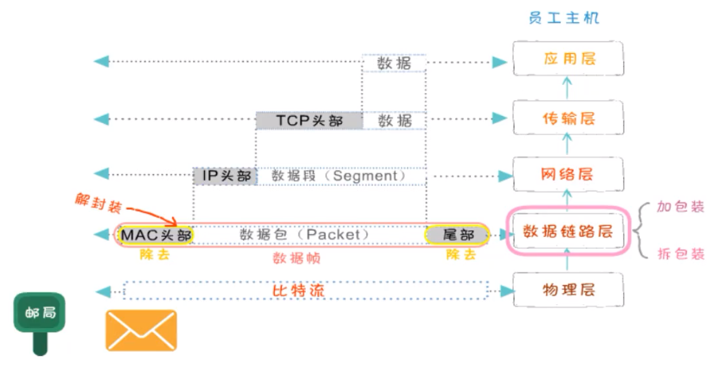

## 3. TCP/IP 参考模型

TCP/IP 是传输控制协议/网络互联协议的简称。早期的 TCP/IP 模型是一个四层结构，从下往上依次是网络接口层、互联网层、传输层和应用层。后来在使用过程中，借鉴 OSI 七层参考模型，将网络接口层划分为了物理层和数据链路层，形成五层结构。

- TCP/IP 是传输控制协议/网络互联协议的简称
- 早期的 TCP/IP 模型是一个四层结构，从下往上依次是网络接口层、互联网层、传输层和应用层
- 后来在使用过程中，借鉴 OSI 七层参考模型，将网络接口层划分为了物理层和数据链路层，形成五层结构

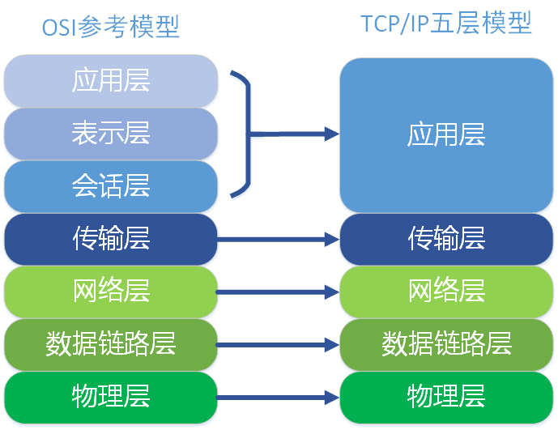

222222

### 常用协议

- TCP/IP 协议被称为传输控制协议/互联网协议，又称网络通讯协议
- 是由网络层的 IP 协议和传输层的 TCP 协议组成，是一个很大的协议集合
- 物理层和数据链路层没有定义任何特定协议，支持所有的标准和专用的协议
- 网络层定义了网络互联也就是 IP 协议
  - 网际协议 IP(Internet Protocal) 负责主机和网络之间寻址和路由数据包
  - 地址解析协议 ARP(Address Resolution Protocol) 获得同一物理网络中的硬件主机 MAC 地址
  - 反向地址转换协议(Reverse Address Resolution Protocol) 允许局域网的物理机器从网关服务器的 ARP 表或者缓存上请求其 IP 地址
  - 网际控制消息协议 ICMP(Internet Control Message Protocol) 发送消息，并报告有关数据包的传送错误
  - 互联组管理协议 IGMP(Internet Group Management Protocol) IP 主机向本地多路广播路由器报告主机组成员
- 传输层定义了 TCP(传输控制协议)和 UDP(用户数据报)协议
- 应用层定义了 HTTP(超文本传输协议)、FTP(文件传输协议)、DNS(域名系统)等协议

### 3.1 网络接口层

网络接口层是 TCP/IP 模型的最底层，负责接收从上一层交来的数据报并将数据报通过底层的物理网络发送出去，比较常见的就是设备的驱动程序，此层没有特定的协议 网络接口层又分为物理层和数据链路层

#### 3.1.1 物理层

计算机在传递数据的时候传递的都是 0 和 1 的数字，而物理层关心的是用什么信号来表示 0 和 1，是否可以双向通信，最初的连接如何建立以及完成连接如何终止,物理层是为数据传输提供可靠的环境。

- 为数据端设备提供传送数据的通路
- 传输数据
  - 激活物理连接，在连接的设备之间连接起来形成通路
  - 传输数据,关心如何打包数据和控制传输速度
  - 关闭物理连接

#### 3.1.2 数据链路层

数据链路层们于物理层和互联网层之间，用来向网络层提供数据，就是把源计算机网络层传过来的信息传递给目标主机。

- 如何将数据组合成数据帧(Frame)，帧是数据链路层的传输单位
- 数据链路的建立、维护和拆除
- 帧包装、帧传输、帧同步
- 帧的差错恢复
- 流量控制

#### 3.1.3 MAC 地址

- 在通信过程中是用内置在网卡内的地址来标识计算机身份的
- 每个网卡都有一个全球唯一的地址来标识自己，不会重复
- MAC 地址 48 位的二进制组成，通常分为 6 段，用 16 进制表示

### 3.2 互联网层(网络层)

- 位于传输层和网络接口层之间,用于把数据从源主机经过若干个中间节点传送到目标主机,并向传输层提供最基础的数据传输服务,它要提供路由和选址的工作

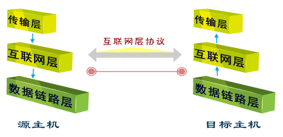

#### 3.2.1 选址

交换机是靠 MAC 来寻址的，而因为 MAC 地址是无层次的,所以要靠 IP 地址来确认计算机的位置,这就是选址

#### 3.2.2 路由

在能够选择的多条道路之间选择一条最短的路径就是路由的工作

#### 3.2.3 IP

在网络中，每台计算机都有一个唯一的地址，方便别人找到它，这个地址称为 IP 地址。

##### 3.2.3.1 IP 头部

- 版本
- 首部长部
- 优先级与服务类型
- 总长度 该字段用以指示整个 IP 数据包的长度，最长为 65535 字节，包括头和数据
- 标识符 唯一标识主机发送的每一份数据报
- 标志 分为 3 个字段，依次为保留位、不分片位和更多片位
  - 保留位：一般被置为 0
  - 不分片位：表示该数据报是否被分片，如果被置为 1，则不能对数据报进行分片，如果要对其进行分片处理，就应将其置为 0
  - 更多片位：除了最后一个分片，其他每个组成数据报的片都要将该位置设置为 1.
- 段偏移量 该分片相对于原始数据报开始处位置的偏移量
- TTL(Time to Live 生存时间) 该字段用于表示 IP 数据包的生命周期，可以防止一个数据包在网络中无限循环地发下去。TTL 的意思是一个数据包在被丢弃之前在网络中的最大周转时间。该数据包经过的每一个路由器都会检查该字段中的值，当 TTL 的值为 0 时此数据包会被丢弃。TTL 对应于一个数据包通过路由器的数目，一个数据包每经过一个路由器，TTL 将减去 1。
- 协议号 用以指示 IP 数据包中封装的是哪个协议
- 首部校验和 检验和是 16 位的错误检测字段。目的主机和网络中的每个网关都要重新计算报头的校验和，一样表示没有改动过.
- 源 IP 地址 该字段用于表示数据包的源地址，指的是发送该数据包的设备的网络地址
- 目标 IP 地址 该字段用于表示数据包的目标的地址，指的是接收节点的网络地址

##### 3.2.3.2 IP 地址格式

- IP 地址是一个网络编码，用来确定网络中的一个节点。
- IP 地址是由 32 位二进制(32bit)组成

##### 3.2.3.3 IP 地址组成

- 网络部分(NETWORK)
- 主机部分(HOST)

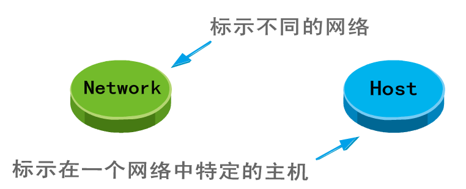

##### 3.2.3.4 IP 地址表示

##### 3.2.3.5 IP 地址的分类

- IP 地址的网络部分是由 Internet 地址分配机构来统一分配的，这样可以保证 IP 的唯一性。
- ip 地址中全为 1 的 ip 即 255.255.255.255，它称为限制广播地址，如果将其作为数据包的目标地址可以理解为发送到所有网络的所有主机
- ip 地址中全为 0 的 ip 即 0.0.0.0，它表示启动时的 ip 地址，其含义就是尚未未分配时的 ip 地址
- 127 是用来进行本机测试的，除了 127.255.255.255 外，其它的 127 开头的地址都代表本机

##### 3.2.3.6 公有地址和私有地址

私有 IP

- A 类私有 IP：10.0.0.0 ~ 10.255.255.255
- B 类私有 IP：172.16.0.0 ~ 172.31.255.255
- C 类私有 IP：192.168.0.0 ~ 192.168.255.255

其他范围的 IP 均为公有 IP 地址

##### 3.2.3.7 子网掩码

子网掩码(subnet mask)又叫子网络遮罩，它是一种用来指明一个 IP 地址的哪些位标识的是主机所在的子网，以及哪些位标识的是主机位的掩码。 子网掩码不能单独存在，它必须结合 IP 地址一起使用。 子网掩码只有一个作用，就是将某个 IP 地址划分成网络地址和主机地址两部分。

- 子网掩码也是 32 个二进制位
- 对应 IP 的网络部分用 1 表示
- 对应 IP 地址的主机部分用 0 表示
- IP 地址和子网掩码做逻辑与运算得到网络地址
  - 0 和任何数相与都是 0
  - 1 和任何数相与都等于任何数本身
- A B C 三类地址都有自己默认的子网掩码
  - A 类 255.0.0.0
  - B 类 255.255.0.0
  - C 类 255.255.255.0

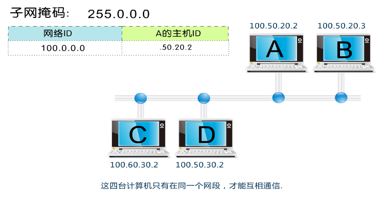

### 3.3 传输层

位于应用层和网络接口层之间

传输层是面向连接的、可靠的的进程到进程通信的协议。TCP 提供全双工服务，即数据可在同一时间双向传播。TCP 将若干个字节构成一个分组，此分组称为报文段(Segment)。提供了一种端到端的连接。 传输层的协议主要是 TCP ，TCP(Transimision Control Protocal)是一种可靠的、面向连接的协议，传输效率低。

- 是面向连接的、可靠的的进程到进程通信的协议
- TCP 提供全双工服务，即数据可在同一时间双向传播
- TCP 将若干个字节构成一个分组，此分组称为报文段(Segment)

#### 3.3.1 传输层的功能

提供了一种端到端的连接

#### 3.3.2 对可靠性要求高的上层协议，实现可靠性的保证

- 如果数据丢失、损坏的情况下如何保证可靠性
- 网络层只管传递数据，成功与否并不关心

#### 3.3.3 协议分类

- TCP(Transimision Control Protocal)
  - 传输控制协议
  - 可靠的、面向连接的协议
  - 传输效率低
- UDP(User Datagram Protocal)
  - 用户数据报协议
  - 不可靠的、无连接的服务
  - 传输效率高

#### 3.3.4 TCP 功能

- 将数据进行分段打包传输
- 对每个数据包编号控制顺序
- 运输中丢失、重发和丢弃处理
- 流量控制避免拥塞

##### 3.3.4.1 TCP 数据包封装

- 源端口号和目标端口号，计算机通过端口号识别访问哪个服务,比如 http 服务或 ftp 服务，发送方端口号是进行随机端口，目标端口号决定了接收方哪个程序来接收 
- 32 位序列号 TCP 用序列号对数据包进行标记，以便在到达目的地后重新重装，假设当前的序列号为 s，发送数据长度为 l，则下次发送数据时的序列号为 s + l。在建立连接时通常由计算机生成一个随机数作为序列号的初始值 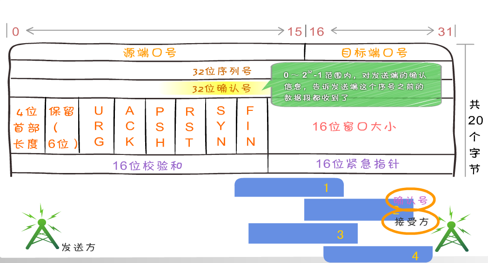
- 确认应答号 它等于下一次应该接收到的数据的序列号。假设发送端的序列号为 s，发送数据的长度为 l，那么接收端返回的确认应答号也是 s + l。发送端接收到这个确认应答后，可以认为这个位置以前所有的数据都已被正常接收。
- 首部长度：TCP 首部的长度，单位为 4 字节。如果没有可选字段，那么这里的值就是 5。表示 TCP 首部的长度为 20 字节。 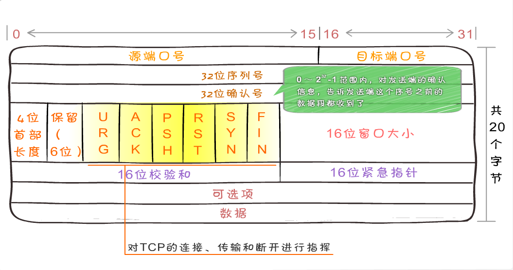
- 控制位 TCP 的连接、传输和断开都受这六个控制位的指挥
  - PSH(push 急迫位) 缓存区将满，立刻传输速度
  - RST(reset 重置位) 连接断了重新连接
  - URG(urgent 紧急位) 紧急信号
- 紧急指针：尽在 URG(urgent 紧急) 控制位为 1 时有效。表示紧急数据的末尾在 TCP 数据部分中的位置。通常在暂时中断通信时使用（比如输入 Ctrl + C）。

- ACK(acknowledgement 确认)为 1 表示确认号 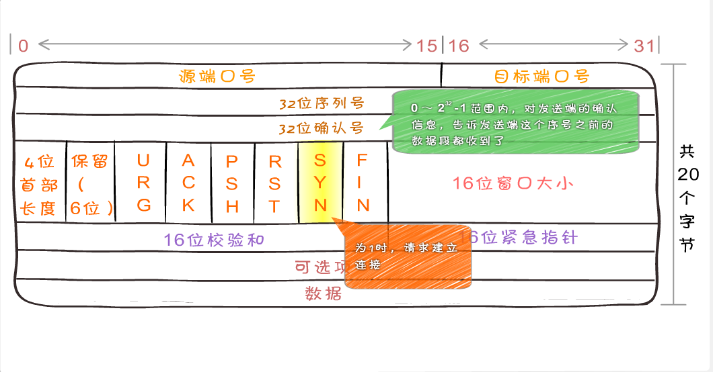
- SYN(synchronous 建立联机) 同步序号位 TCP 建立连接时要将这个值设为 1 
- FIN 发送端完成位，提出断开连接的一方把 FIN 置为 1 表示要断开连接 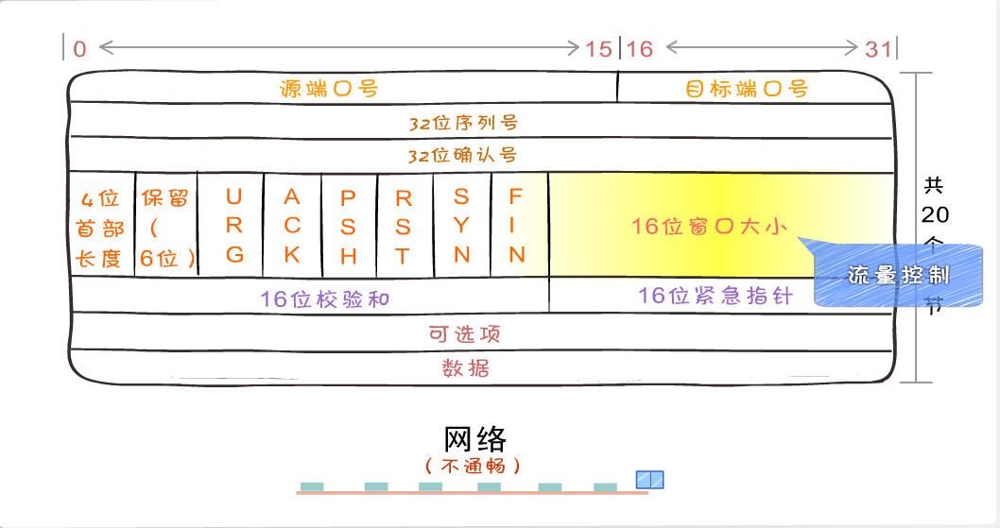
- 窗口值 说明本地可接收数据段的数目，这个值的大小是可变的。当网络通畅时将这个窗口值变大加快传输速度，当网络不稳定时减少这个值可以保证网络数据的可靠传输。它是来在 TCP 传输中进行流量控制的
- 窗口大小：用于表示从应答号开始能够接受多少个 8 位字节。如果窗口大小为 0，可以发送窗口探测。 
- 用来做差错控制，TCP 校验和的计算包括 TCP 首部、数据和其它填充字节。在发送 TCP 数据段时，由发送端计算校验和，当到达目的地时又进行一次检验和计算。如果两次校验 和一致说明数据是正确的，否则 将认为数据被破坏，接收端将丢弃该数据

##### 3.2.4.2 握手和断开

TCP 是面向连接的，无论哪一方向另一方发送数据之前，都必须先在双方之间建立一条连接。在 TCP/IP 协议中，TCP 协议提供可靠的连接服务，连接是通过三次握手进行初始化的。三次握手的目的是同步连接双方的序列号和确认号 并交换 TCP 窗口大小信息。

- TCP 是面向连接的协议，它在源点和终点之间建立虚拟连接，而不是物理连接
- 在数据通信之前，发送端与接收端要先建立连接，等数据发送结束后，双方再断开连接
- TCP 连接的每一方都是由一个 IP 地址和一个端口组成

###### 3.2.4.2.1 三次握手

为了方便描述我们将主动发起请求的 172.16.17.94:8080 主机称为客户端，将返回数据的主机 172.16.17.94:8080 称为服务器，以下也是。.

- 第一次握手: 建立连接。客户端发送连接请求，发送 SYN 报文，将 seq 设置为 0。然后，客户端进入 SYN_SEND 状态，等待服务器的确认。
- 第二次握手: 服务器收到客户端的 SYN 报文段。需要对这个 SYN 报文段进行确认，发送 ACK 报文，将 ack 设置为 1。同时，自己还要发送 SYN 请求信息，将 seq 为 0。服务器端将上述所有信息一并发送给客户端，此时服务器进入 SYN_RECV 状态。
- 第三次握手: 客户端收到服务器的 ACK 和 SYN 报文后，进行确认，然后将 ack 设置为 1，seq 设置为 1，向服务器发送 ACK 报文段，这个报文段发送完毕以后，客户端和服务器端都进入 ESTABLISHED 状态，完成 TCP 三次握手。

第二种说法

- 第一次握手主机 A 通过一个标识为 SYN 标识位的数据段发送给主机 B 请求连接，通过该数据段告诉主机 B 希望建立连接，需要 B 应答，并告诉主机 B 传输的起始序列号
- 第二次握手是主机 B 用一个确认应答 ACK 和同步序列号 SYNC 标志位的数据段来响应主机 A，一是发送 ACK 告诉主机 A 收到了数据段，二是通知主机 A 从哪个序列号做标记。
- 第三次握手是主机 A 确认收到了主机 B 的数据段并可以开始传输实际数据。

###### 数据传输

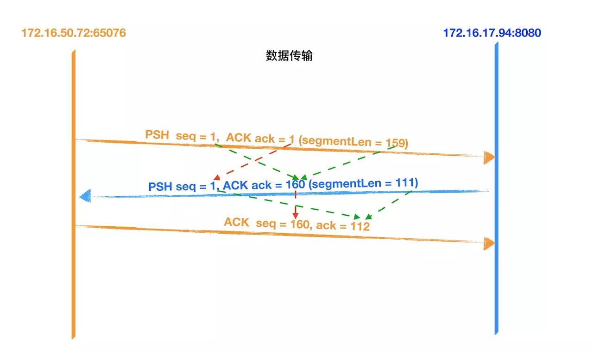

- 客户端先向服务器发送数据，该数据报是长度为 159 的数据。
- 服务器收到报文后, 也向客户端发送了一个数据进行确认（ACK），并且返回客户端要请求的数据，数据的长度为 111，将 seq 设置为 1，ack 设置为 160（1 + 159）。
- 客户端收到服务器返回的数据后进行确认（ACK），将 seq 设置为 160， ack 设置为 112（1 + 111）。

###### 3.2.4.2.2 四次断开

- 第一次挥手：客户端向服务器发送一个 FIN 报文段，将设置 seq 为 160 和 ack 为 112，;此时，客户端进入 FIN_WAIT_1 状态,这表示客户端没有数据要发送服务器了，请求关闭连接;
- 第二次挥手：服务器收到了客户端发送的 FIN 报文段，向客户端回一个 ACK 报文段，ack 设置为 1，seq 设置为 112;服务器进入了 CLOSE_WAIT 状态，客户端收到服务器返回的 ACK 报文后，进入 FIN_WAIT_2 状态;
- 第三次挥手：服务器会观察自己是否还有数据没有发送给客户端，如果有，先把数据发送给客户端，再发送 FIN 报文；如果没有，那么服务器直接发送 FIN 报文给客户端。请求关闭连接，同时服务器进入 LAST_ACK 状态;
- 第四次挥手：客户端收到服务器发送的 FIN 报文段，向服务器发送 ACK 报文段，将 seq 设置为 161，将 ack 设置为 113，然后客户端进入 TIME_WAIT 状态;服务器收到客户端的 ACK 报文段以后，就关闭连接;此时，客户端等待 2MSL 后依然没有收到回复，则证明 Server 端已正常关闭，客户端也可以关闭连接了。

> 注意：在握手和挥手时确认号应该是对方序列号加 1,传输数据时则是对方序列号加上对方携带应用层数据的长度。

- 主机 A 发送 FIN 控制位发出断开连接的请求
- 主机 B 进行响应，确认收到断开连接请求
- 主机 B 提出反方向的关闭要求
- 主机 A 确认收到的主机 B 的关闭连接请求

###### 3.2.4.2.3 抓包

##### 3.3.5 TCP 格式

- 源端口号和目标端口号，计算机通过端口号识别访问哪个服务,比如 http 服务或 ftp 服务，发送方端口号是进行随机端口，目标端口号决定了接收方哪个程序来接收
- 32 位序列号 TCP 用序列号对数据包进行标记，以便在到达目的地后重新重装，假设当前的序列号为 s，发送数据长度为 l，则下次发送数据时的序列号为 s + l。在建立连接时通常由计算机生成一个随机数作为序列号的初始值
- 确认应答号 它等于下一次应该接收到的数据的序列号。假设发送端的序列号为 s，发送数据的长度为 l，那么接收端返回的确认应答号也是 s + l。发送端接收到这个确认应答后，可以认为这个位置以前所有的数据都已被正常接收。
- 首部长度：TCP 首部的长度，单位为 4 字节。如果没有可选字段，那么这里的值就是 5。表示 TCP 首部的长度为 20 字节。
- 控制位 TCP 的连接、传输和断开都受这六个控制位的指挥
  - PSH(push 急迫位) 缓存区将满，立刻传输速度
  - RST(reset 重置位) 连接断了重新连接
  - URG(urgent 紧急位) 紧急信号
  - ACK(acknowledgement 确认)为 1 表示确认号
  - SYN(synchronous 建立联机) 同步序号位 TCP 建立连接时要将这个值设为 1
  - FIN 发送端完成位，提出断开连接的一方把 FIN 置为 1 表示要断开连接
- 窗口值 说明本地可接收数据段的数目，这个值的大小是可变的。当网络通畅时将这个窗口值变大加快传输速度，当网络不稳定时减少这个值可以保证网络数据的可靠传输。它是来在 TCP 传输中进行流量控制的
- 窗口大小：用于表示从应答号开始能够接受多少个 8 位字节。如果窗口大小为 0，可以发送窗口探测。
- 效验和: 用来做差错控制，TCP 校验和的计算包括 TCP 首部、数据和其它填充字节。在发送 TCP 数据段时，由发送端计算校验和，当到达目的地时又进行一次检验和计算。如果两次校验 和一致说明数据是正确的，否则 将认为数据被破坏，接收端将丢弃该数据
- 紧急指针：尽在 URG(urgent 紧急) 控制位为 1 时有效。表示紧急数据的末尾在 TCP 数据部分中的位置。通常在暂时中断通信时使用（比如输入 Ctrl + C）。

### 3.4 UDP

- UDP 是一个无连接、不保证可靠性的传输层协议，也就是说发送端不关心发送的数据是否到达目标主机、数据是否出错等，收到数据的主机也不会告诉 发送方是否收到了数据，它的可靠性由上层协议来保障
- 首部结构简单，在数据传输时能实现最小的开销，如果进程想发送很短的报文而对可靠性要求不高可以使用

#### 3.4.1 UDP 的封装格式

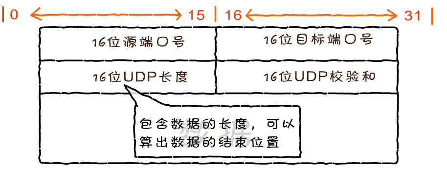

#### 3.4.2 UDP 的应用

- QQ
- 视频软件
- TFTP 简单文件传输协议(短信)

#### 3.4.3 DNS 服务器

##### 3.4.3.1 域名

- 域名空间结构
- 根域
- 顶级域
  - 组织域
  - 国家/地区域名
- 二级域名

##### 3.4.3.2 DNS 服务器

DNS 是 Domain Name Service 的缩写，DNS 服务器进行域名和与之对应的 IP 地址转换的服务器

- IP 地址不易记忆
- 早期使用 Hosts 文件解析域名
  - 主要名称重复
  - 主机维护困难
- DNS(Domain Name System 域名系统)
  - 分布式
  - 层次性

##### 3.4.3.3 查找过程

- 客户端向本地域名服务器发出请求，我要访问[www.163.com，请告诉我它的 IP 地址](http://www.163.xn--com%2Cip-eu6jr5qee876bm8r511dm13cmsa/)
- 本地 DNS 服务器向 DNS 根服务器发出请求，根 DNS 服务器会告诉本地服务器(.com)的服务器地址
- 本地 DNS 服务器会向(.com 域)发请求，会得到(163.com)的服务器地址
- 本地 DNS 服务器会向(163.com)发请求,会得到([www.163.com)的 IP 地址 1.1.1.1](http://www.163.xn--com)ip1-2f5pqft559a.1.1.1/)
- 本地 DNS 服务器向客户端回复域名([www.163.com)对应的 IP 地址是 1.1.1.1](http://www.163.xn--com)ip1-2f5pqf339c0hi6w1az59c.1.1.1/)

### 3.5 应用层

#### 3.5.1 协议

#### 3.5.2 应用层常见协议

- HTTP 超文件传输协议
- FTP 文件传输协议
- SMTP(发送邮件)和 POP3(接收邮件)

### 3.6 案例

数据->传输层(包)->网络层(段 Segment)->数据链路层(帧)

#### 3.6.1 发送方是从高层到低层封装数据

- 在应用层要把各式各样的数据如字母、数字、汉字、图片等转换成二进制
- 在 TCP 传输层中，上层的数据被分割成小的数据段，并为每个分段后的数据封装 TCP 报文头部
- 在 TCP 头部有一个关键的字段信息端口号，它用于标识上层的协议或应用程序，确保上层数据的正常通信
- 计算机可以多进程并发运行，例如在发邮件的同时也可以通过浏览器浏览网页，这两种应用通过端口号进行区分
- 在网络层，上层数据被封装上亲的报文头部(IP 头部)，上层的数据是包括 TCP 头部的。IP 地址包括的最关键字段信息就是 IP 地址，用于标识网络的逻辑地址。
- 数据链路径层，上层数据成一个 MAC 头部，内部有最关键的是 MAC 地址。MAC 地址就是固化在硬件设备内部的全球唯一的物理地址。
- 在物理层，无论在之前哪一层封装的报文头和还是上层数据都是由二进制组成的，物理将这些二进制数字比特流转换成电信号在网络中传输

#### 3.6.2 接收方是从低层到高层解封装

- 数据封装完毕传输到接收方后，将数据要进行解封装
- 在物理层，先把电信号转成二进制数据，并将数据传送至数据链路层
- 在数据链路层，把 MAC 头部拆掉，并将剩余的数据传送至上一层
- 在网络层，数据的 IP 头部被拆掉，并将剩余的数据送至上一层
- 在传输层，把 TCP 头部拆掉，将真实的数据传送至应用层

#### 3.6.3 真实网络环境

- 发送方和接收方中间可能会有多个硬件中转设备
- 中间可能会增加交换机和路由器
- 数据在传输过程中不断地进行封装和解封装的过程，每层设备只能处理哪一层的数据
  - 交换机属于数据链路层
  - 路由器属于网络层

## 4. 附录

### 4.1 不同层中的称谓

- 数据帧（Frame）：是一种信息单位，它的起始点和目的点都是**数据链路层**。
- 数据包（Packet）：也是一种信息单位，它的起始和目的地是**网络层**。
- 段（Segment）：通常是指起始点和目的地都是**传输层**的信息单元。
- 消息（message）：是指起始点和目的地都在网络层以上（经常在**应用层**）的信息单元。

### 4.2 IP 头服务类型

- IP 首部中的服务类型（TOS）
- TOS 包括共 8 位，包括 3 bit 的优先权字段（取值可以从 000-111 所有值），4 bit 的 TOS 子字段和 1 bit 未用位但必须置 0。
- 3bit 的 8 个优先级的定义如下：
  - 111--Network Control(网络控制）一般保留给网络控制数据使用，如路由。
  - 110--Internetwork Control(网间控制)
  - 101--Critic(关键)语音数据使用。
  - 100--Flash Override(疾速)视频会议和视频流使用。
  - 011--Flash(闪速)语音控制数据使用。
  - 010--Immediate(快速)数据业务使用
  - 001--Priority(优先)数据业务使用
  - 000--Routine(普通)默认标记值。
- 4 bit 的 TOS 分别代表：最小时延、最大吞吐量、最高可靠性和最小费用。4 bit 中只能置其中 1 bit。如果所有 4 bit 均为 0，那么就意味着是一般服务。
- Telnet、Rlogin 这两个交互应用要求最小的传输时延，FTP 文件传输要求最大吞吐量，最高可靠性是指网络管理（SNMP）和路由选择协议。用户网络新闻要求最小费用

### 4.3 握手和断开

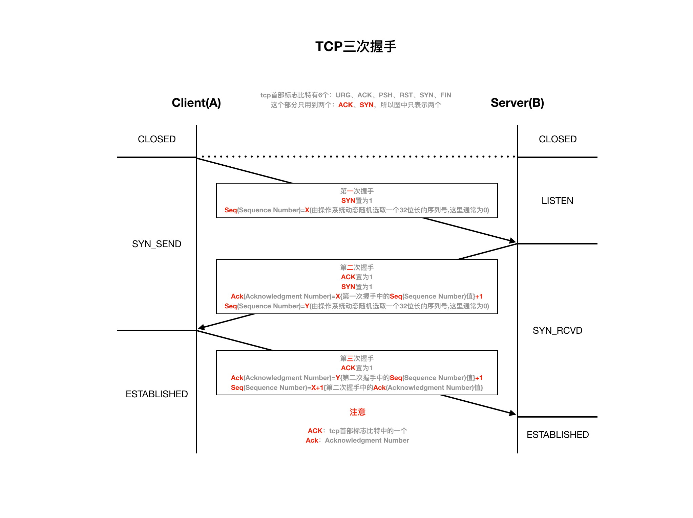

## 5. 参考

- [TCP/IP 之 大明王朝邮差](https://mp.weixin.qq.com/s?__biz=MzAxOTc0NzExNg==&mid=2665513094&idx=1&sn=a2accfc41107ac08d74ec3317995955e#rd)

## 6. 问题

1.为什么需要三次握手? 确保双方收发都是正常的

2.为什么需要四次挥手? 双方数据发送完毕，都认为可以断开

3.为什么需要等待? A 向 B 发的`FIN`可能丢失

4.为什么握手是三次，但挥手却是四次? 当 Server 端收到 FIN 报文时，很可能并不会立即关闭 SOCKET
