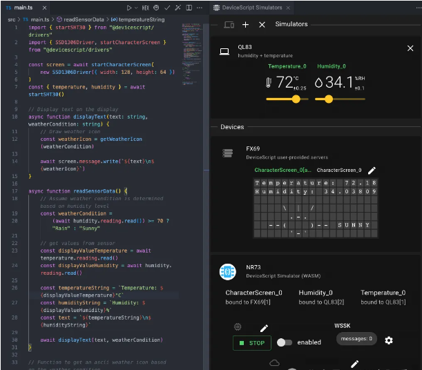
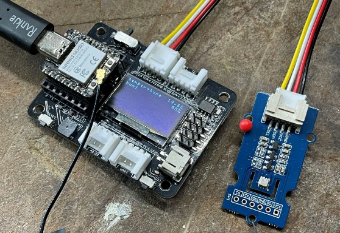

# JavaScript跨硬件和PC

Arduino是一款灵活的、方便上手的开源电子原型平台。

## Node串行端口

## Firmata协议

## Ruff初体验

**Ruff物联网系统官网**：https://ruff.io/zh-cn/

下载：https://ruff.io/zh-cn/docs/download.html

文档：https://ruff.io/zh-cn/docs/

API：https://ruff.io/zh-cn/api/adc.html

软件报和设备查找：[Rap Registry (ruff.io)](https://rap.ruff.io/)

Ruff 是一个支持 JavaScript 开发应用的物联网操作系统，为软件开发者提供开放、高效、敏捷的物联网应用开发平台，让 IoT 应用开发更简单。

整个 Ruff 开发体系包括 Ruff OS、Ruff SDK、Ruff 软件仓库、Ruff Kit 开发套件。 只要您有软件开发经验，就可以用 Ruff 开发硬件应用。

- Ruff OS 运行在硬件板卡上，为 Ruff 应用提供运行环境。
- Ruff SDK 安装在开发机电脑上，包含开发相关的所有工具。
- Ruff 软件仓库是云端的在线软件包管理平台，提供软件包下载和分享服务。
- Ruff Kit 开发套件由 Ruff 开发板 (ruff-mbd-v1) 和多个外设模块组成，帮助快速上手。

### JavaScript开发VR

- 使用 Node.js 来读取 Oculus 上的传感器的数据，将这些数据用 WebSocket 协议来提供一个服务。
- 寻找一个 3D 游戏引擎，如 Three.js 来创建一个 3D 世界。
- 读取传感器的值将其表示在 3D 世界中。

## 开发跨PC瑞的应用程序

# devicescript：用轻量化的TypeScript开发嵌入式系统

项目地址：https://github.com/microsoft/devicescript

文档地址：https://microsoft.github.io/devicescript/intro

TypeScript（JavaScript的超集）在微软主导下深入到嵌入式领域。

在物联网（IoT）领域中，微型设备通常需要使用一种轻量级的编程语言来实现各种功能。Devicescript 是一种专为微型 IoT 设备设计的 TypeScript 变种。它支持 ESP32、RP2040 等一系列微型设备，其中对ESP32-C3/S3提供最佳支持。

## 设备脚本的特点

Devicescript 将 TypeScript 进行了轻量化处理，使其更适用于微型 IoT 设备的开发。它保留了 TypeScript 的强类型特性，同时去除了一些不必要的功能，减小了内存占用和运行时开销。Devicescript 还提供了与硬件交互的 API，简化了开发者的工作。Devicescript为微软开发，可以方便地使用VS Code时行仿真，也可以用Wokwi平台仿真。

**Devicescript的优势**

1. **强类型支持**：Devicescript 在保留 TypeScript 强类型检查的基础上，进一步优化了类型系统，避免了一些不必要的类型转换和运行时错误。
2. **内存优化**：Devicescript 专为微型设备设计，减小了内存占用，提高了程序运行效率，使得在资源有限的设备上也能够顺畅运行。
3. **硬件交互 API**：Devicescript 提供了丰富的硬件交互 API，简化了与传感器、执行器等硬件设备的交互过程，降低了开发门槛。
4. **跨平台支持**：Devicescript 支持多种微型设备，如 ESP32、RP2040 等，使得开发者可以在不同平台上使用相同的语言和工具进行开发。

**设备脚本的适用场景**

1. **物联网设备开发**：Devicescript 可以用于开发各种物联网设备，如智能家居设备、传感器设备等，帮助开发者快速实现功能。
2. **嵌入式系统开发**：Devicescript 适用于嵌入式系统开发，帮助开发者更好地管理内存资源、优化性能，并与底层硬件进行交互。
3. **传感器数据处理**：Devicescript 提供了丰富的硬件交互 API，方便开发者读取和处理传感器数据，实现各种智能功能。
4. **实时控制应用**：Devicescript 支持快速的编译和调试过程，适用于实时控制应用的开发，如机器人控制、无人机控制等。

## 总结

Devicescript 是一种针对微型 IoT 设备设计的轻量级 TypeScript 变种，具有强类型支持、内存优化、硬件交互 API 和跨平台支持等特点，适用于物联网设备开发、嵌入式系统开发、传感器数据处理和实时控制应用等场景。通过使用 Devicescript，开发者可以更加高效地开发和调试程序，实现各种创新的 IoT 应用。

