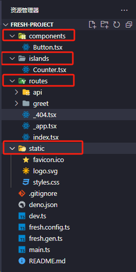
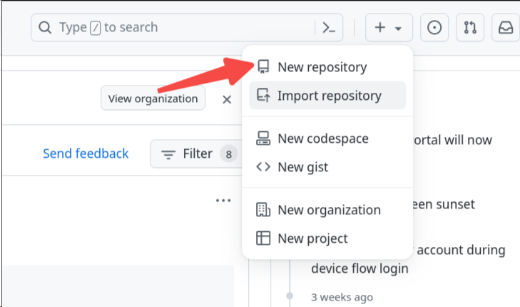
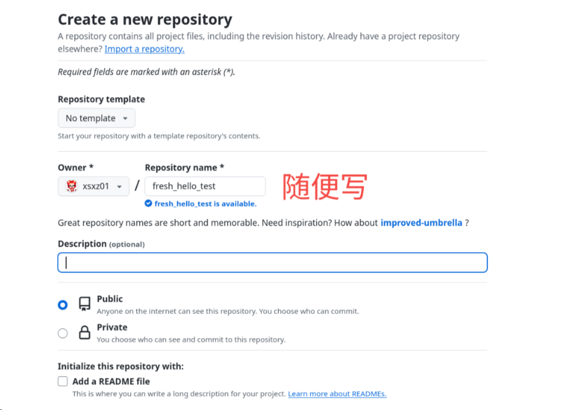
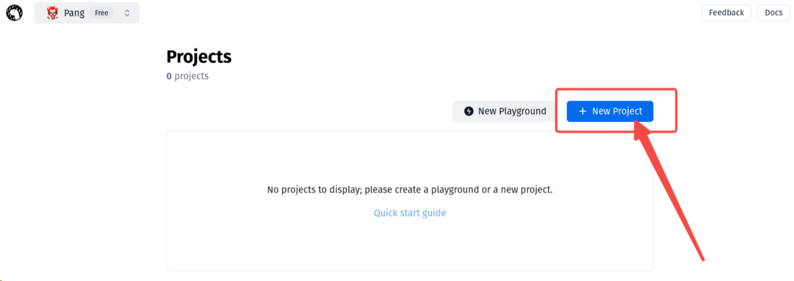
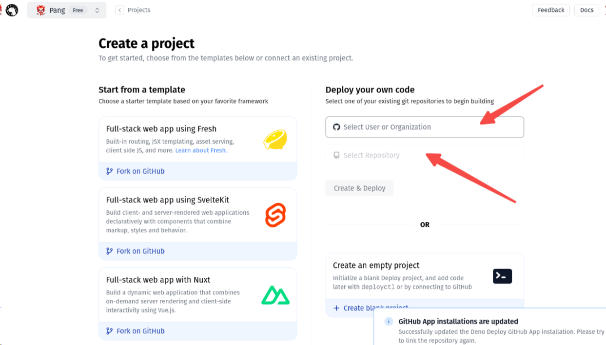
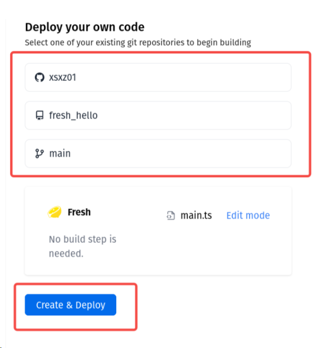
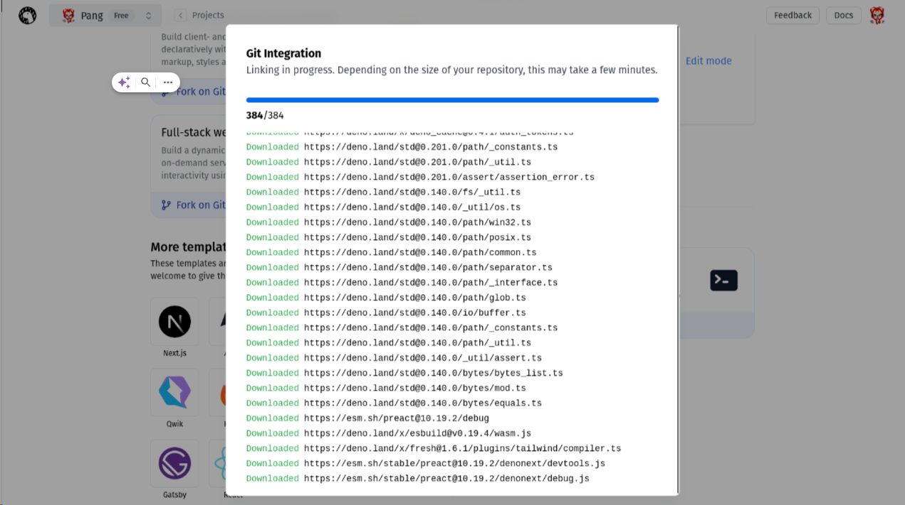
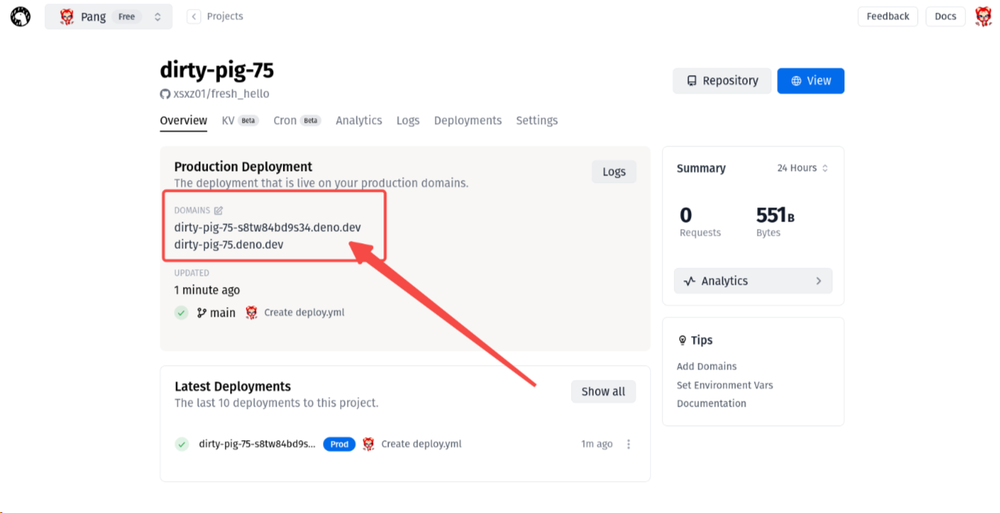

# Deno 开发框架

## Fresh 全栈开发框架

### Fresh 简介

**Fresh 官网**：https://fresh.deno.dev/

下一代 Web 全栈开发框架。

Fresh 是一个面向 JavaScript 和 TypeScript 开发人员的全栈现代 Web 框架，旨在创建高质量、高性能和个性化的 Web 应用程序变得轻而易举。以下是关于 Fresh 的一些特点：

- 基于 Deno 运行时：Fresh 由 Deno 原班人马开发，享有 Deno 一系列工具链和生态的优势，比如内置的测试工具、支持 http、import 等等。
- Islands SSR 架构：Fresh 整体采用 Islands SSR 架构，实现了客户端按需 Hydration，有一定的渲染性能优势。
- Bundle-less 构建：Fresh 的构建层做到了 Bundle-less，即应用代码不需要打包即可直接部署上线。
- 前端渲染层由 Preact 完成：包括 Islands 架构的实现也是基于 Preact，且不支持其它前端框架。

可以说，Fresh 中凝结这 Deno 对 ES 语系开发的理解，是他们技术的结晶。

### 1.创建项目

再终端直接运行

```bash
# 创建项目
deno run -A -r https://fresh.deno.dev
# 进入目录
cd fresh-project
# 运行项目
deno task start
```

### 2.项目结构

在运行项目以后，目录结构如下



根目录文件：

- `dev.ts` 开发环境入口点，启动项目用的，名字可以改变，但是一般都是这个名字。
- `main.ts` 生产环境入口点，启动项目用的，名字可以改变，但是一般都是这个名字。
- `fresh.gen.ts` 清单文件，包括 routes 和 islands，是自动生成的。
- `deno.json` 是 deno 的配置文件，和 package.json 类似，用来管理依赖以及 deno cli 命令的。

根目录文件夹：

- `routes` 存放你项目中的路由。
- `islands` 作用就相当于页面之于组件，但中的来说是组件的封装。
- `components` 存放组件相关代码。
- `static` 存放静态文件，js、css 等文件都放在这里。

> islands 和 components 是不一样的，后者更像是 Web Component，而前者更像我们常规开发中的 Component。

### 3.创建一个路由

Fresh 使用的是文件系统路由，对于经常使用电脑的人来说，这个概念会比较容易理解，如果你使用的是 Linux 的画就会更加容易理解，如果你使用的是 Windows，同样也很容易就能理解。

- 文件系统路由是操作系统中的一个重要概念，它用于管理和组织计算机中的文件和文件夹。文件系统路由可以帮助我们在计算机上查找、访问和操作存储在不同位置的文件。

- 在 Linux 操作系统中，文件系统路由是通过 Linux 文件系统层次结构来实现的。在 Linux 中，根目录以斜杠（/）表示，所有其他文件和文件夹都是在根目录下的子目录。例如，如果我们要访问根目录下的名为“home”的文件夹，就可以使用路径“/home”。同样，如果要访问“home”文件夹下的“user1”的文件夹，可以使用路径“/home/user1”。

- 在 Windows 操作系统中，文件系统路由是通过驱动器和文件路径来实现的。Windows 操作系统使用字母来表示驱动器。例如，C:\是计算机上的一个驱动器，它通常用于存储操作系统和应用程序。在 Windows 中，我们可以使用驱动器和文件夹路径来访问文件。例如，如果要访问 C:\下的“Users”文件夹，可以使用路径“C:\Users”。同样，如果要访问“Users”文件夹下的“user1”的文件夹，可以使用路径“C:\Users\user1”。

- 在这两个操作系统中，文件系统路由允许我们在计算机上轻松浏览和访问文件和文件夹。通过使用正确的路径，我们可以快速找到所需的文件，进行复制、粘贴、移动或删除等操作。

假设我们有一个文件路由系统，用于管理和导航文件夹和文件。该系统可以通过一系列文件夹和子文件夹来组织文件。

例如，我们有一个名为“根文件夹”的文件夹，其中包含以下几个子文件夹：文件夹 A、文件夹 B 和文件夹 C。在文件夹 A 中，我们有一个名为“文件 1”的文件和一个名为“文件 2”的文件。在文件夹 B 中，我们有一个名为“文件 3”的文件。

根文件夹

- 文件夹 A

  - 文件 1
  - 文件 2

- 文件夹 B
  - 文件 3
- 文件夹 C

这是一个简单的示例，展示了文件路由系统中文件夹和文件的层次结构。

而在 Fresh 项目中，你可以将 `routes` 文件夹作为根目录，下面的文件用来路由。此时如果添加一个 `/about` 的页面，只需要创建个 `about.tsx` 文件即可

> Fresh 使用了 jsx，因此只需要返回你的 html 内容就可以了，和 react 是一样的，但是 fresh 没有用 react，而是用的 preact，这两者再用法上几乎没区别。

保存后可以直接在浏览器打开(默认是热更新启动的)：localhost:8000/about

### 4. 创建一个动态路由

动态路由即需要传递参数，根据输入的参数来动态的生成页面的路由。

在 Fresh 中，默认提供了匹配路径参数的动态路由 `greet` 文件夹

其中`name`为需要传递的参数，其文件内容为：

```typescript
import { PageProps } from "$fresh/server.ts";

export default function GreetPage(props: PageProps) {
	const { name } = props.params;
	return (
		<main>
			<p>Greetings to you, {name}!</p>
		</main>
	);
}
```

可以看出路径参数是通过 props 对象的 params 来获取的。

比如要给 name 传 haha，则访问

```bash
http://localhost:8000/greet/haha
```

### 5.自定义 handlers

hanldler 是一个路由的处理程序，可以有一个 hanldler 覆盖所有 HTTP 方法，也可以每个方法有一个 hanldler。hanldler 的作用是 Request => Response

hanldler 必须返回一个 Response 对象。Response 对象可以手动创建（例如 API 路由的 JSON 响应），也可以通过呈现页面组件来创建。默认情况下，所有未定义自定义处理程序的路由都使用仅呈现页面组件的默认处理程序。

创建 handler 只需要定义一个 handler 对象并导出就可以了，handler 可以是纯函数，也可以是纯对象。

以下是官方给出的两个例子

#### 1.自定义响应头

```typescript
import { Handlers } from "$fresh/server.ts";

export const handler: Handlers = {
	async GET(_req, ctx) {
		const resp = await ctx.render();
		resp.headers.set("X-Custom-Header", "Hello");
		return resp;
	},
};

export default function AboutPage() {
	return (
		<main>
			<h1>About</h1>
			<p>This is the about page.</p>
		</main>
	);
}
```

#### 2. 随即生成 uuid

routes/api/random-uuid.ts

```typescript
import { Handlers } from "$fresh/server.ts";

export const handler: Handlers = {
	GET(_req) {
		const uuid = crypto.randomUUID();
		return new Response(JSON.stringify(uuid), {
			headers: { "Content-Type": "application/json" },
		});
	},
};
```

此时访问该页面`http://localhost:8000/api/random-uuid`

### 6. 表单提交

在以上内容理解的基础上，就可以实现表单提交了，官方给出的例子

```typescript
import { Handlers, PageProps } from "$fresh/server.ts";

const NAMES = ["Alice", "Bob", "Charlie", "Dave", "Eve", "Frank"];

interface Data {
	results: string[];
	query: string;
}

export const handler: Handlers<Data> = {
	GET(req, ctx) {
		const url = new URL(req.url);
		const query = url.searchParams.get("q") || "";
		const results = NAMES.filter((name) => name.includes(query));
		return ctx.render({ results, query });
	},
};

export default function Page({ data }: PageProps<Data>) {
	const { results, query } = data;
	return (
		<div>
			<form>
				<input type="text" name="q" value={query} />
				<button type="submit">Search</button>
			</form>
			<ul>
				{results.map((name) => (
					<li key={name}>{name}</li>
				))}
			</ul>
		</div>
	);
}
```

可以看出，其实就是获取请求参数以后，使用 render 来渲染页面。

### 7. 部署到生产环境

部署 fresh 项目要经过两个步骤：

#### 1. 将代码上传到 github

在 github 新建一个项目，然后吧你的代码上传即可。





然后在目录运行

```bash
git init
git add .
git commit -m "first commit"
git branch -M main
git remote add origin 你的仓库地址
git push -u origin main
```

#### 2. 在 Deno 控制面板创建一个项目

首先打开官网你的控制面板`https://dash.deno.com/projects`，用你的 github 登陆即可，然后创建项目



选择你的账户



选择账户需要授权一下，允许即可



目前只需要这样就可以，然后点击部署，等待部署完成



完成后首页会出现你的域名



打开任意一个，比如我的`dirty-pig-75.deno.dev`，打开就会出现部署的结果了

### 总结

现在的 Fresh 开发起来还是比较丝滑的，但是有一些问题也是真的。

- 比如在部署的时候可能会出莫名其妙的错误，导致样式直接没有了；

- 比如 idea 插件检测不到 deno 环境，那就只能换 vscode 了；
- 比如第一次运行项目可能有依赖加载不上。。。

一堆堆都是坑，然后莫名其妙就好了。

除此以外，这东西只能在 Fresh 的面板上部署吗?

在我目前看来，这玩意儿做个个人网站估计差不多了，免费版每个月限制 1,000,000 个请求，100G 流量，而且还只能部署在官方网站，但是专业版一个月 20 刀，友友们自己判断吧。

我认为如果能自己部署的话，还有必要再看看。
