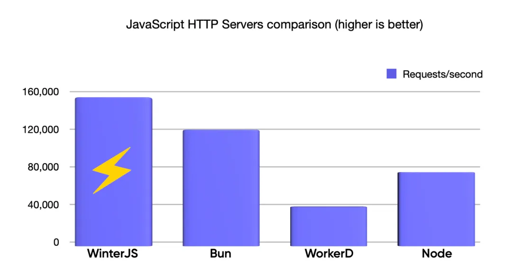

# Wasmer简介和资源

## 简介

WinterJS 是一个非常快速的兼容 WinterCG 的 Javascript 运行时，用 Rust 编写，使用 SpiderMonkey 引擎执行 JavaScript，并使用 Tokio 处理底层 HTTP 请求和 JS 事件循环。WinterJS 运行时也可以编译为 WebAssembly，因此是第一个可以在 Wasmer Edge 中完全运行的生产级运行时。

在 WinterJS 1.0 ：

- 飞快的速度（比 Bun、WorkerD 和 Node 更快！）
- WinterJS 现在完全兼容* WinterCG 规范
- Cloudflare API 兼容性
- Web 框架支持：Next.js（支持 React 服务器组件！）、Hono、Astro、SvelteKit 等

## 特性

### 飞快的速度

WinterJS 1.0 在本地执行时能够处理 150,000 个请求/秒（使用 WASIX 编译为 Wasm 后为 20,000 个请求/秒）。

截至今日，WinterJS 比 Bun（117,000 请求/秒）、WorkerD（40,000 请求/秒）和 Node（75,000 请求/秒）处理更多的请求/秒（请参见基准测试）。



### WinterCG 兼容性

WinterCG 是负责定义一组全局类和函数的机构之一，这些类和函数需要存在才能在一组基础架构上正确运行工作负载。

自我们首次公告以来，我们已经添加了对完整一套 API 的支持，包括：

- Data fetching:`fetch`、`URL`、`Request`、`Response`
- Files:`Blob`、`File`
- Streams:`ReadableStream`、`WritableStream`、`TransformStream*`
- Text Encoders:`TextEncoder`、`TextEncoderStream`、`atob`、`btoa`
- Cryptography:`crypto*`

***注意：变换流中的反压和一些（非常见的）加密算法尚未实现。***

### Cloudflare API 兼容性

我们希望确保大多数前端框架在 WinterJS 中都能无缝运行，无需额外处理。因此，我们有两个选择：

- 为每个前端框架创建全新的集成
- 加入一个现有的提案

经过对 Deno、Cloudflare 和 Fastly 适配器的深入分析，我们意识到最强大的选择是 Cloudflare，因为它已经支持了其他 API 框架的大部分功能，并且可能是最常用的。因此，我们决定采用 Cloudflare API 兼容性。

为了支持 Cloudflare Worker 的工作负载，我们着手解决了四个主要方面的问题：

- 通过 import 语法支持 ES 模块
- 通过 Node.js 兼容性 API 支持
- 通过node:async_hooks 支持 AsyncLocalStorage
- 通过 _routes.json 支持调用路由
- 支持文件系统结构

```
_worker.js
index.html
mystaticimage.jpg
```

- 支持 Cloudflare 的 WinterCG 自定义 fetch API

```
export default {
 async fetch(request, env, ctx) {
  return new Response('Hello World!');
 },
}
```

以及 env.ASSETS API，它允许通过 Rust 的超级优化的静态 Web 服务器直接提供静态资产，因此您可以执行：

```
export default {
  async fetch(request, env) {
    const url = new URL(request.url);
    if (url.pathname.startsWith('/api/')) {
      // TODO: Add your custom /api/* logic here.
      return new Response('Ok');
    }
    // Otherwise, serve the static assets.
    // Without this, the Worker will error and no assets will be served.
    return env.ASSETS.fetch(request);
  },
}
}
```

[请在此处查看完整的自定义 Cloudflare fetch API：](https://developers.cloudflare.com/workers/runtime-apis/handlers/fetch/)

在获得所有这些功能之后，我们几乎可以通过传递 `--mode=cloudflare `来运行任何其他网络框架。

```
winterjs --mode=cloudflare output/static
  # OR (using WASIX)
wasmer run wasmer/winterjs --net --mapdir=output/static:/web -- --mode=cloudflare /web
```

### 现有 Web 框架的兼容性

由于与 Cloudflare Workers API 的新兼容性，我们现在完全支持以下框架，不仅可以提供框架生成的静态网站，还可以让这些框架进行服务器端渲染（SSR）：

- Next.js（应用模板，演示）
- Next.js React 服务器组件（应用模板，演示）- 注意：服务器端获取缓存尚未实现
- Hono（应用模板，演示）
- Astro.build（应用模板，演示）
- Remix.run（应用模板，演示）
- Svelte（应用模板，演示）
- Gatsby（应用模板，演示）
- Nuxt（应用模板，演示）

### 支持 React 服务器组件

我们取得的最具挑战性的成就之一是运行具有服务器组件支持的 Next.js 服务器，因此渲染可以完全在服务器端完成。

努力使 React 服务器组件完全可用有助于我们发现我们的流实现与规范存在一些细微但重要的差异。我们还意识到我们的获取实现有一些怪癖需要修复，但最终，在经过许多汗水和不眠之夜后，我们完全做到了！🎉

[您可以查看使用 React 服务器端组件的 Hacker News 演示：]（https://next-rsc-hn.wasmer.app/）（请注意，在此演示中，我们没有在服务器端缓存获取结果，因此加载时间可能不是最快的）。

我们现在只差一小步就可以将我们的 Next.js 前端从 Vercel 迁移到 Wasmer Edge，成本更低，而且完全可以在本地重现。

即刻体验 Wasmer Edge！选择上述任一应用程序模板，在 Wasmer Edge 上部署您的第一个 WinterJS 应用程序，或按照 JS Worker 快速入门指南操作。

还有一个小细节…我们正在准备在 Wasm 空间中完全运行 JIT 编译的 JS 工作负载……敬请关注更多更新！

接下来是什么？WinterJS 1.0 只是开始。

在 Wasmer，我们正在开发一种新的边缘部署应用程序的方式，通过尝试边缘技术，为您的项目开启令人难以置信的新用例。

## 网站资源

开源地址：https://github.com/wasmerio/wasmer

官网：https://wasmer.io/