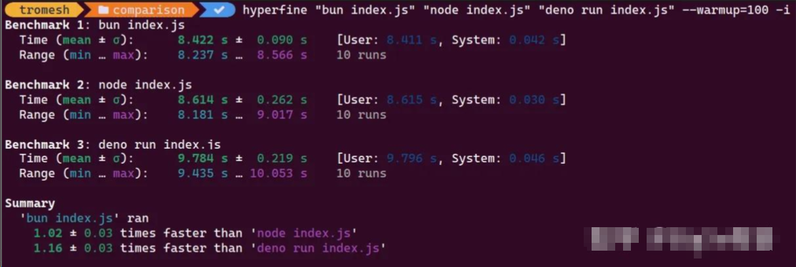

# 比较 Bun、Node.js 和 Deno

## Node.js

Node.js 是目前服务器端开发中最广泛使用的 JavaScript 运行时环境。

它运行在谷歌 Chrome 的 JavaScript V8 引擎之上，保证了闪电般的速度和极高的可靠性。Node.js 最大的优势之一就是其事件循环机制。

事件循环机制使得整个应用程序可以在单线程上运行，而不会产生任何阻塞。它能够巧妙地将异步阻塞操作委托给第三方库 —— [libuv](https://codedamn.com/news/nodejs/libuv-architecture)，这个库负责执行所有异步 I/O 操作，并在调用堆栈空闲时由 Node.js 主线程处理回调。此外，随着 [Worker Threads（工作线程）](https://nodejs.org/api/worker_threads.html)的引入，开发人员现在可以启动独立的 JavaScript 运行时，实现类似多线程和并行处理的功能。

### Node.js 的优点

1. 高可扩展性和卓越性能：Node.js 通过非阻塞 I/O 和可扩展架构提供了卓越的性能，这使得它非常适合实时、数据密集型应用，特别是在用户基数不断增长的情况下。
2. 成熟的生态系统及众多库和框架：Node.js 拥有一个活跃且丰富的生态系统，提供了大量的库和框架，这为开发者在网页开发和实时应用编程方面提供了全面的工具集。
3. 庞大且活跃的社区支持：Node.js 拥有一个动态和活跃的社区，这意味着软件会定期更新和改进，同时社区还发布了大量模块，开发者可以轻松地将这些模块整合到他们的项目中。

### Node.js 的缺点

1. 由单线程性质引起的性能局限：Node.js 是基于单线程设计的，因此它不适合处理重型计算或对 CPU 要求较高的任务。但是，自从引入了工作线程（worker threads）之后，Node.js 在不影响性能的前提下，也能执行 CPU 密集型操作。
2. 异步编程中的“回调地狱”问题：在 Node.js 中，当异步函数高度嵌套时，就会出现所谓的“回调地狱”，代码变得复杂且难以理解，就像试图解开一碗乱麻的意大利面条。幸运的是，通过使用 `Promise` 和 `async/await` 等技术，可以有效避免这一问题，使代码更加清晰和易于阅读。

## Deno

Deno 是一款新兴的 JavaScript 和 TypeScript 运行时，致力于弥补 Node.js 的某些短板。

Deno 默认将安全性放在首位。

这意味着，如果没有适当的权限，你的代码将无法访问文件或网络。Deno 运行在 JavaScript V8 引擎上，并使用 Rust 语言设计，因此它的运行速度极快！

此外，Deno 还遵循了当前的网络标准，比如通过内置的 fetch 工具进行网络操作，与浏览器处理 JavaScript 的方式保持一致，从而为开发者提供了更加协调一致的编码体验。

### Deno 的优点

1. 内建的安全机制：Deno 在一个安全的沙箱环境中操作，它要求显式授权才能访问文件系统、网络和环境变量，从而有效减少了安全漏洞的风险。
2. 提升开发者体验：Deno 通过内置的依赖检查器、代码格式化工具以及原生的 TypeScript 支持等工具，优化了开发者的工作流程，让开发者可以将更多精力放在编码上，而不是配置。
3. 使用 URL 简化模块管理：Deno 利用 URL 直接从网络获取依赖，无需借助包管理器，这样简化了模块管理流程，使得你的代码库中的模块解析更加高效和直接。

### Deno 的缺点

Deno 在 API 开发中的局限性：

1. 生态系统成熟度不如 Node.js：作为 Node.js 的新兴替代者，Deno 正在发展其生态系统，并期待通过社区贡献来实现增长。目前，与 Node.js 稳固成熟的生态系统相比，开发者可能会发现现成解决方案较少。
2. 第三方库的可用性有限：尽管 Deno 正在逐步壮大，但其第三方库的选择还没有达到 Node.js 的丰富程度。开发者可能需要在较为前沿的领域探索，有时甚至需要依靠现有资源创新或自行开发工具。随着 Deno 生态系统的不断发展，可用的库数量将逐渐增加，为开发者提供更广泛的工具选择。

## Bun

Bun 是一款几个月前推出的新兴运行时和工具集，Bun 能够运行、构建、测试和调试从单个文件到全栈应用的 JavaScript 和 TypeScript 项目。

使用 Bun，你可以直接开始使用，无需额外安装工具。例如，你不必再安装像 nodemon、dot-env 这样的工具，因为 Bun 在开发者模式下就能实现热重载，并且默认支持 .env 文件！

此外，它还内置了 websocket 服务器，并使用自己的包管理器 —— bunx，其速度比 NPM 快五倍。但 Bun 的功能不止于此。它不仅是 JavaScript 运行时，还是一个全能工具集。这意味着它提供了以下功能：

- 打包
- 包管理
- 开箱即用！

所以，你无需花时间进行项目配置，或维护复杂的模板项目。相反，你可以直接创建一个 Bun 项目，立即开始工作！

### Bun 的优点

1. 学习曲线平缓：Bun 是一个全功能的工具集！这意味着你无需花费时间去学习如何进行模块打包或配置测试框架，因为它默认已经提供了这些功能。所以，你可以更快地开始你的项目！
2. 性能更高：Bun 使用 JavaScriptCore 引擎，而 Node.js 和 Deno 等运行时使用的是 JavaScript V8 引擎。JavaScriptCore 引擎针对更快的启动时间进行了优化，通常其性能要优于这两种运行时。

### Bun 的缺点

1. 社区支持有限：Bun 是在几个月前推出的新技术。因此，它的社区还不够成熟，很难提供问题解决方案的帮助。因此，如果你在开发中非常依赖社区的支持，可能需要在开始之前先确认是否能获得适当的帮助。

## 哪个更好 —— Node.js, Deno or Bun?

### 对比 1: 性能比较

在选择 Node.js、Deno 还是 Bun 时，一个关键的考量点是性能。我们可以通过测试这三种运行时环境在处理内存密集型的 JavaScript 数学代码方面的表现来进行比较。

我们可以考虑执行复杂的计算和大数据集处理，例如矩阵运算。

矩阵运算就是一个典型的例子。下面是一个矩阵乘法函数的示例，在处理大型矩阵时，它可以灵活运用。

```js
function generateRandomMatrix(rows, cols) {
	const matrix = [];
	for (let i = 0; i < rows; i++) {
		matrix[i] = [];
		for (let j = 0; j < cols; j++) {
			matrix[i][j] = Math.random();
		}
	}
	return matrix;
}

function matrixMultiplication(a, b) {
	const rowsA = a.length;
	const colsA = a[0].length;
	const rowsB = b.length;
	const colsB = b[0].length;
	if (colsA !== rowsB) {
		throw new Error("Incompatible matrices for multiplication");
	}

	const result = new Array(rowsA);
	for (let i = 0; i < rowsA; i++) {
		result[i] = new Array(colsB).fill(0);
	}

	for (let i = 0; i < rowsA; i++) {
		for (let j = 0; j < colsB; j++) {
			for (let k = 0; k < colsA; k++) {
				result[i][j] += a[i][k] * b[k][j];
			}
		}
	}
	return result;
}

const matrixSize = 1000; // 调整矩阵大小，增加内存使用量
const matrixA = generateRandomMatrix(matrixSize, matrixSize);
const matrixB = generateRandomMatrix(matrixSize, matrixSize);

console.time("Matrix Multiplication");
const resultMatrix = matrixMultiplication(matrixA, matrixB);
console.timeEnd("Matrix Multiplication");
```

我们设计了一个 `generateRandomMatrix` 函数，用于生成任意大小的随机矩阵。接着是 `matrixMultiplication` 函数，用来进行矩阵乘法。

有趣的是，你可以通过调整 `matrixSize` 变量来决定这些矩阵的大小。

随着矩阵尺寸的增加，你会发现内存使用也会相应增加。现在，让我们看看 Bun、NodeJs 和 Deno 在运行这段代码时的表现如何。

我们将使用一个名为 [hyperfine](https://link.zhihu.com/?target=https%3A//github.com/sharkdp/hyperfine) 的性能测试工具。准备好开始性能测试了吗？

执行下面的命令，看看会发生什么：

```bash
hyperfine "bun index.js" "node index.js" "deno run index.js" --warmup=100 -i
```

上述 shell 命令会在不同的运行时环境中执行这段代码，并且需要几分钟的时间来提供性能测试结果。



你可以自由使用上面的代码示例，并通过这个[链接](https://link.zhihu.com/?target=https%3A//github.com/TRomesh/matrix-multiplier)尝试进行性能测试。

Bun 在管理内存和 CPU 密集型任务方面的高效并非偶然。它是为了速度和最佳性能而设计的。如果你的项目需要快速和高效，那么选择 Bun 是一个绝佳的选择。

它不仅能与 Node.js 和 Deno 相媲美，而且往往能超越它们。因此，如果你想构建一个既能提供速度和效率，又不牺牲功能性的应用程序，Bun 是一个值得考虑的选择。

### 对比 2：社区支持度比较

另一方面，长时间存在的运行时环境往往拥有更为有利的社区支持。例如：

Node.js：作为一名经验丰富的参与者，Node.js 拥有一个繁忙的社区。这反映了它在 API 开发中长期存在和广泛接受的事实。 Deno：Deno 正迅速开辟自己的市场。它背后有一个充满活力、具有前瞻性思维的社区，渴望突破界限并创新。 Bun：与其他两者相比，Bun 的社区相对较小。主要原因是它比其他两个更为新颖。但是，基于 Bun 的增长方式，可以肯定地说，它很快就会拥有一个庞大的开发者社区！

但是，Node.js 显著地脱颖而出。其在 API 开发中的丰富经验培养了一个活跃且充满活力的社区。这个技术爱好者社区始终准备好提供帮助、交换资源和合作。

虽然 Bun 和 Deno 正在取得进步，但 Node.js 的社区仍然难以超越。

因此，如果您优先考虑强大的支持网络，Node.js 是一个可靠的选择。

比较 02：社区支持对比

另一方面，社区支持则有利于那些已经存在一段时间的运行时。例如：

- Node.js：作为一个资深的参与者，Node.js 拥有一个繁荣的社区。这反映了 Node.js 在应用程序接口开发领域的长期存在和广泛认可。
- Deno：Deno 正在迅速创造自己的市场定位。它得到了一个充满活力、富有前瞻思维的社区的支持，这个社区热衷于推动界限并进行创新。
- Bun：相较于其他两者，Bun 的社区相对较小。这主要是因为它比其他两个更加新颖。但是，根据 Bun 的发展势头，可以预见它不久将拥有一个庞大的开发者社区！

然而，Node.js 在这方面表现突出。它在 API 开发方面的丰富经验孕育了一个充满活力和活跃的社区。这个由技术爱好者组成的社区始终准备好提供帮助、分享资源和协作。

尽管 Bun 和 Deno 正在取得进展，但 Node.js 的社区依然是一个难以超越的对手。

因此，如果您重视强大的社区支持，Node.js 是一个可靠的选择。

### 对比 3：安全性

Node.js、Deno 和 Bun 在安全方面各有其独特的方法。这里直观地看一下它们的区别：

Node.js：默认情况下，它对你的系统是开放的，依赖第三方包可能会引入风险。像 `npm audit` 这样的工具有助于捕捉漏洞。例如：

```text
npm audit
```

另外，使用像 helmet 这样注重安全的中间件可以增强你的 Node.js 应用的防御能力：

```js
const helmet = require("helmet");

const app = require("express")();

app.use(helmet());
```

Deno：它像一个保险箱，除非你明确授权，否则脚本将被严格限制。像这样运行限制访问的 Deno 服务器：

```text
deno run --allow-net=example.com server.ts
```

Bun：作为新来者，Bun 旨在提供速度，并提供内置安全特性。但由于它较新，可能还未像其他运行时那样经历过多种安全测试。

显然，Deno 采取了更加谨慎的权限控制方法。它在构建时将安全作为最高优先级，运行在一个限制文件和网络访问的安全沙箱环境中，除非明确授权。

尽管 Node.js 和 Bun 也采取了自己的安全措施，但 Deno 内置的额外安全层使其成为那些在 API 开发中重视安全的人的首选。

所以，如果安全是你的首要考虑，那么选择 Deno！

## 选择 Node.js、Bun 还是 Deno？

这是一个没有标准答案的问题。这取决于你的优先考虑因素。因此，可以将本文作为一个参考来比较这些 JavaScript 运行时。

- Node.js：如果你更倾向于稳定可靠、经过多年检验的生态系统，Node.js 是不错的选择。
- Deno：如果你重视安全性和最新的编程环境特性，推荐使用 Deno。它还支持开箱即用的 TypeScript。
- Bun：如果你需要高速性能，尤其是在处理 JavaScript 或 TypeScript 时，Bun 是一个合适的选择。

## 总结

选择适合你的 2024 年项目的正确运行时可能看起来有些困难，但了解 Bun、Node.js 和 Deno 可以帮助简化决策过程。

最终，你项目的具体需求、对社区支持的依赖程度以及阅读文档的准备情况可能在确定最合适选择方面起到关键作用。
