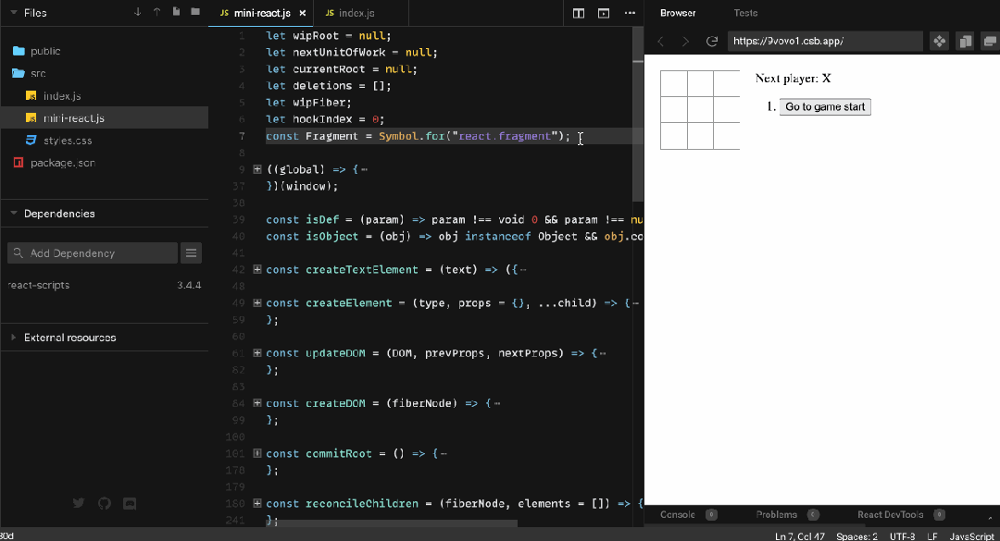
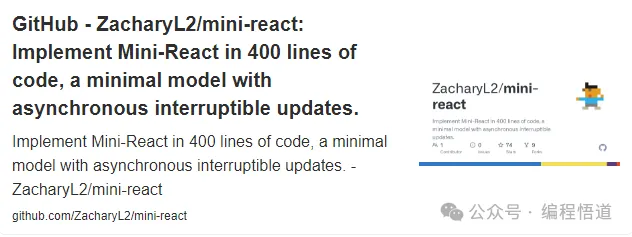
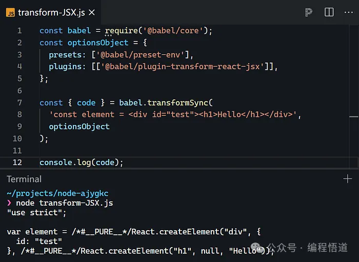
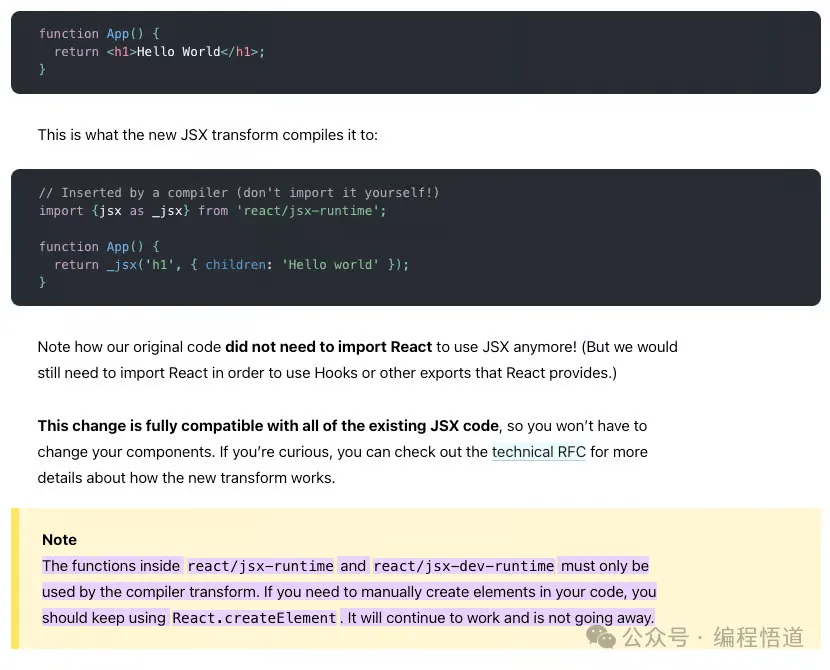
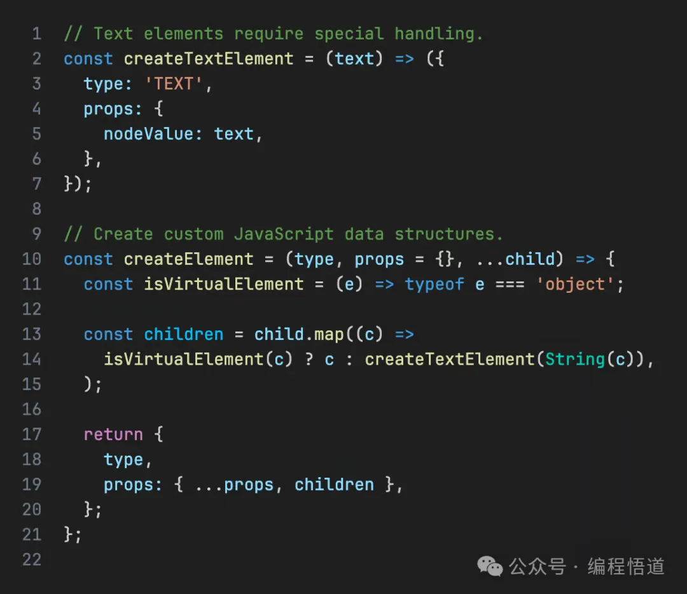
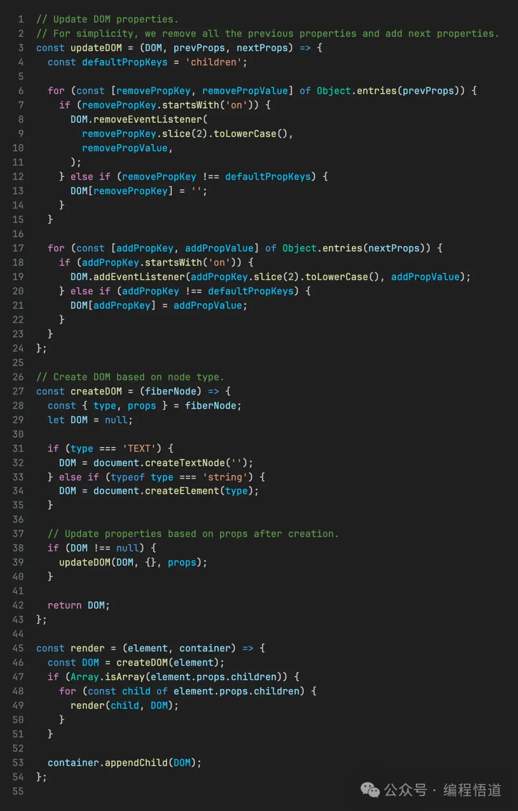
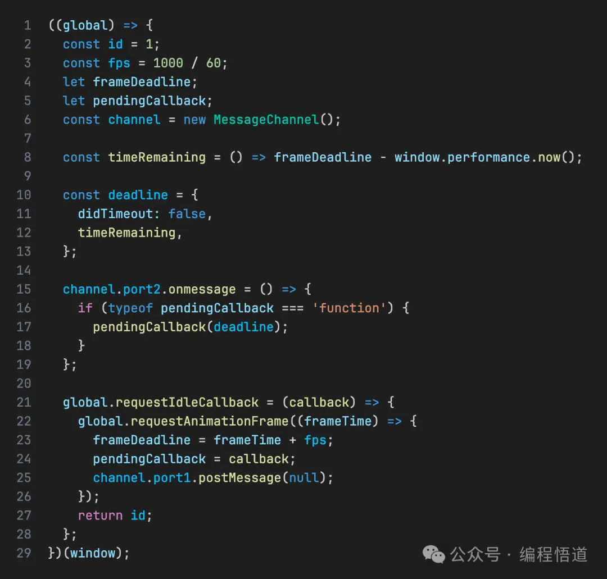
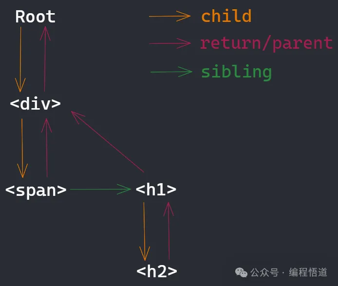
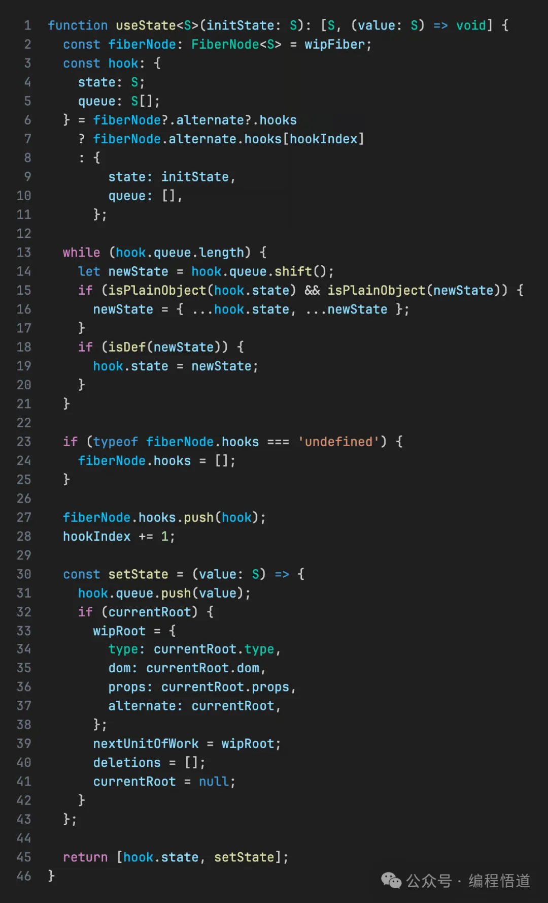
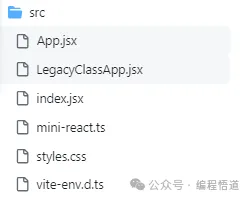

# React原理

# 深入了解 React 原理，如何用 400 行代码 构建你自己的 React.js

React v19 beta 已经发布。与 React 18 相比，它提供了许多用户友好的 API，尽管其核心原理基本保持不变。你可能已经使用 React 一段时间了，但你了解它的内部工作原理吗？

本文将帮助你构建一个大约 400 行代码的 React 版本，它支持异步更新并且可以被中断——这是 React 的一个核心特性，许多更高级的 API 都依赖于它。这是最终效果的 GIF：



我使用了 React 官方网站提供的井字棋教程示例，可以看到它运行得很好。

它目前托管在我的 GitHub 上，你也可以访问在线版本亲自尝试。



GitHub - ZacharyL2/mini-react: 用 400 行代码实现 Mini-React，一个具有异步可中断更新的最小模型。

用 400 行代码实现 Mini-React，一个具有异步可中断更新的最小模型。 - ZacharyL2/mini-react

```
github.com/ZacharyL2/mini-react
```

## **「JSX 和 createElement」**

在深入探讨 mini-react.ts 的原理之前，理解 JSX 代表什么非常重要。我们可以使用 JSX 来描述 DOM，并轻松应用 JavaScript 逻辑。然而，浏览器并不原生理解 JSX，所以我们编写的 JSX 被编译成浏览器能理解的 JavaScript。



你可以看到它调用了 `React.createElement`，它提供了以下选项：

`type`：表示当前节点的类型，如 `div`。

`props`：表示当前元素节点的属性，例如 `{id: "test"}`。

`children`：子元素，可以是多个元素、简单文本或由 `React.createElemen` 创建的更多节点。

如果你是经验丰富的 React 用户，你可能会记得，在 React 18 之前，你需要导入 React 才能正确编写 JSX。自 React 18 以来，这不再必要，这增强了开发者体验，但在底层 `React.createElement` 仍然被调用。




对于我们的简化 React 实现，我们需要在配置 Vite 时设置 react({ jsxRuntime: 'classic' })。

然后我们可以实现我们自己的：



## **「渲染」**

接下来，我们基于之前创建的数据结构实现一个简化版的渲染函数，将 JSX 渲染到真实的 DOM。



这是在线实现链接。它目前只渲染一次 JSX，因此不处理交互。

## **「Fiber 架构和并发模式」**

`Fiber` 架构和并发模式主要是为了解决一旦递归遍历完整个元素树，它就不能被中断，可能会长时间阻塞主线程的问题。高优先级任务，如用户输入或动画，可能无法及时处理。

在 `React` 的源代码中，工作被分解成小单元。每当浏览器空闲时，它处理这些小工作单元，将主线程的控制权交还给浏览器，以便浏览器能够及时响应高优先级任务。一旦一个工作的所有必要小单元都完成，结果就会被映射到真实的 `DOM`。

两个关键点是如何放弃主线程的控制权，以及如何将工作分解成可管理的单元。

## **「requestIdleCallback」**

requestIdleCallback 是一个实验性 API，它在浏览器空闲时执行回调。它尚未被所有浏览器支持。在 React 中，它在调度程序包中使用，该包具有比 requestIdleCallback 更复杂的调度逻辑，包括更新任务优先级。



但我们在这里只考虑异步可中断性，所以这是模仿 React 的基本实现：

## **「以下是一些关键点的简要说明：」**

### 为什么使用 `MessageChannel`？

主要是，它使用宏任务来处理每一轮的单元任务。但为什么是宏任务？

这是因为我们需要使用宏任务来放弃主线程的控制权，允许浏览器在这个空闲期间更新 DOM 或接收事件。由于浏览器将 DOM 更新作为一个单独的任务，此时不执行 `JavaScript`。

主线程一次只能运行一个任务——要么执行 JavaScript，要么处理 DOM 计算、样式计算、输入事件等。然而，微任务并不放弃主线程的控制权。

### 为什么不用 setTimeout？

这是因为现代浏览器认为超过五次的嵌套 `setTimeout` 调用是阻塞的，并将它们的最小延迟设置为 4 毫秒，所以它不够精确。

## **「算法」**

请注意，React 不断发展，我描述的算法可能不是最新的，但它们足以理解其基本原理。

这是显示工作单元之间联系的图表：



在 `React` 中，每个工作单元被称为一个 `Fiber` 节点。它们使用类似链表的结构相互链接：

`child`：从父节点指向第一个子元素的指针。

`return/parent`：所有子元素都有一个指针回到父元素。

`sibling`：从第一个子元素指向下一个兄弟元素。

有了这个数据结构，让我们看看具体的实现。

我们只是扩展了渲染逻辑，重新构建了调用序列，以 `workLoop -> performUnitOfWork -> reconcileChildren -> commitRoot` 的顺序工作。

`workLoop`：通过连续调用 requestIdleCallback 来获取空闲时间。如果当前处于空闲状态并且有单元任务要执行，那么执行每个单元任务。

`performUnitOfWork`：执行的具体单元任务。这是链表思想的体现。具体来说，一次只处理一个 fiber 节点，并返回下一个要处理的节点。

`reconcileChildren`：协调当前 fiber 节点，实际上是虚拟 DOM 的比较，并记录要进行的更改。你可以看到我们直接修改并保存在每个 fiber 节点上，因为现在它只是 JavaScript 对象的修改，并没有触及真实的 DOM。

`commitRoot`：如果当前需要更新（根据 wipRoot）并且没有下一个单元任务要处理（根据 !nextUnitOfWork），这意味着虚拟更改需要映射到真实的 DOM。commitRoot 是根据 fiber 节点的变化修改真实的 DOM。

有了这些，我们才能真正使用 fiber 架构进行可中断的 DOM 更新，但我们仍然缺少一个触发器。

### **「触发更新」**

在 React 中，最常见的触发器是 `useState`，这是最基本的更新机制。让我们实现它来点燃我们的 Fiber 引擎。

这是具体的实现，简化成一个函数：



它巧妙地将钩子的状态保持在 fiber 节点上，并通过队列修改状态。从这里，你还可以看到为什么 React 钩子调用的顺序不能改变。

## 源码部分



- src/App.jsx

```
// Forked from https://reactjs.org/tutorial/tutorial.html#what-are-we-building
import React from './mini-react';

const { useState } = React;

function Square({ value, onSquareClick }) {
  return (
    <button className="square" onClick={onSquareClick}>
      {value}
    </button>
  );
}

function Board({ xIsNext, squares, onPlay }) {
  function handleClick(i) {
    if (calculateWinner(squares) || squares[i]) {
      return;
    }
    const nextSquares = squares.slice();
    if (xIsNext) {
      nextSquares[i] = 'X';
    } else {
      nextSquares[i] = 'O';
    }
    onPlay(nextSquares);
  }

  const winner = calculateWinner(squares);
  let status;
  if (winner) {
    status = 'Winner: ' + winner;
  } else {
    status = 'Next player: ' + (xIsNext ? 'X' : 'O');
  }

  return (
    <>
      <div className="status">{status}</div>
      <div className="board-row">
        <Square value={squares[0]} onSquareClick={() => handleClick(0)} />
        <Square value={squares[1]} onSquareClick={() => handleClick(1)} />
        <Square value={squares[2]} onSquareClick={() => handleClick(2)} />
      </div>
      <div className="board-row">
        <Square value={squares[3]} onSquareClick={() => handleClick(3)} />
        <Square value={squares[4]} onSquareClick={() => handleClick(4)} />
        <Square value={squares[5]} onSquareClick={() => handleClick(5)} />
      </div>
      <div className="board-row">
        <Square value={squares[6]} onSquareClick={() => handleClick(6)} />
        <Square value={squares[7]} onSquareClick={() => handleClick(7)} />
        <Square value={squares[8]} onSquareClick={() => handleClick(8)} />
      </div>
    </>
  );
}

export default function Game() {
  const [history, setHistory] = useState([Array(9).fill(null)]);
  const [currentMove, setCurrentMove] = useState(0);
  const xIsNext = currentMove % 2 === 0;
  const currentSquares = history[currentMove];

  function handlePlay(nextSquares) {
    const nextHistory = [...history.slice(0, currentMove + 1), nextSquares];
    setHistory(nextHistory);
    setCurrentMove(nextHistory.length - 1);
  }

  function jumpTo(nextMove) {
    setCurrentMove(nextMove);
  }

  const moves = history.map((squares, move) => {
    let description;
    if (move > 0) {
      description = 'Go to move #' + move;
    } else {
      description = 'Go to game start';
    }
    return (
      <li key={move}>
        <button onClick={() => jumpTo(move)}>{description}</button>
      </li>
    );
  });

  return (
    <div className="game">
      <div className="game-board">
        <Board xIsNext={xIsNext} squares={currentSquares} onPlay={handlePlay} />
      </div>
      <div className="game-info">
        <ol>{moves}</ol>
      </div>
    </div>
  );
}

function calculateWinner(squares) {
  const lines = [
    [0, 1, 2],
    [3, 4, 5],
    [6, 7, 8],
    [0, 3, 6],
    [1, 4, 7],
    [2, 5, 8],
    [0, 4, 8],
    [2, 4, 6],
  ];
  for (let i = 0; i < lines.length; i++) {
    const [a, b, c] = lines[i];
    if (squares[a] && squares[a] === squares[b] && squares[a] === squares[c]) {
      return squares[a];
    }
  }
  return null;
}
```

- src/LegacyClassApp.jsx

```
import React from './mini-react';

function calculateWinner(squares) {
  const lines = [
    [0, 1, 2],
    [3, 4, 5],
    [6, 7, 8],
    [0, 3, 6],
    [1, 4, 7],
    [2, 5, 8],
    [0, 4, 8],
    [2, 4, 6],
  ];
  for (let i = 0; i < lines.length; i += 1) {
    const [a, b, c] = lines[i];
    if (squares[a] && squares[a] === squares[b] && squares[a] === squares[c]) {
      return squares[a];
    }
  }
  return null;
}

class Square extends React.Component {
  render() {
    return (
      <button onClick={this.props.onClick} className="square">
        {this.props.value}
      </button>
    );
  }
}

class Board extends React.Component {
  renderSquare(i) {
    return (
      <Square
        value={this.props.squares[i]}
        onClick={() => {
          this.props.onClick(i);
        }}
      />
    );
  }

  render() {
    return (
      <div>
        <div className="board-row">
          {this.renderSquare(0)}
          {this.renderSquare(1)}
          {this.renderSquare(2)}
        </div>
        <div className="board-row">
          {this.renderSquare(3)}
          {this.renderSquare(4)}
          {this.renderSquare(5)}
        </div>
        <div className="board-row">
          {this.renderSquare(6)}
          {this.renderSquare(7)}
          {this.renderSquare(8)}
        </div>
      </div>
    );
  }
}

class App extends React.Component {
  constructor(props) {
    super(props);
    this.state = {
      history: [
        {
          squares: Array(9).fill(null),
        },
      ],
      stepNumber: 0,
      xIsNext: true,
    };
  }

  handleClick(i) {
    const history = this.state.history.slice(0, this.state.stepNumber + 1);
    const current = history[history.length - 1];
    const squares = current.squares.slice();
    if (calculateWinner(squares) || squares[i]) {
      return;
    }

    squares[i] = this.state.xIsNext ? 'X' : 'O';
    this.setState({
      history: history.concat([
        {
          squares,
        },
      ]),
      stepNumber: history.length,
      xIsNext: !this.state.xIsNext,
    });
  }

  jumpTo(step) {
    this.setState({
      stepNumber: step,
      xIsNext: step % 2 === 0,
    });
  }

  render() {
    const { history } = this.state;
    const current = history[this.state.stepNumber];
    const winner = calculateWinner(current.squares);

    const moves = history.map((step, move) => {
      const desc = move ? `Go to move #${move}` : 'Go to game start';
      return (
        <li key={move}>
          <button onClick={() => this.jumpTo(move)}>{desc}</button>
        </li>
      );
    });

    let status;
    if (winner) {
      status = `Winner: ${winner}`;
    } else {
      status = `Next player: ${this.state.xIsNext ? 'X' : 'O'}`;
    }

    return (
      <div className="game">
        <div className="game-board">
          <Board
            squares={current.squares}
            onClick={(i) => {
              this.handleClick(i);
            }}
          />
        </div>
        <div className="game-info">
          <div>{status}</div>
          <ol>{moves}</ol>
        </div>
      </div>
    );
  }
}

export default App;
```

- src/index.jsx

```
// Forked from https://reactjs.org/tutorial/tutorial.html#what-are-we-building

import React from './mini-react';
import App from './App'; // OR `LegacyClassApp`
import './styles.css';

React.render(<App />, document.getElementById('root'));
```

- src/mini-react.ts

```
// TODO Optimization Type Description

interface ComponentFunction {
  new (props: Record<string, unknown>): Component;
  (props: Record<string, unknown>): VirtualElement | string;
}
type VirtualElementType = ComponentFunction | string;

interface VirtualElementProps {
  children?: VirtualElement[];
  [propName: string]: unknown;
}
interface VirtualElement {
  type: VirtualElementType;
  props: VirtualElementProps;
}

type FiberNodeDOM = Element | Text | null | undefined;
interface FiberNode<S = any> extends VirtualElement {
  alternate: FiberNode<S> | null;
  dom?: FiberNodeDOM;
  effectTag?: string;
  child?: FiberNode;
  return?: FiberNode;
  sibling?: FiberNode;
  hooks?: {
    state: S;
    queue: S[];
  }[];
}

let wipRoot: FiberNode | null = null;
let nextUnitOfWork: FiberNode | null = null;
let currentRoot: FiberNode | null = null;
let deletions: FiberNode[] = [];
let wipFiber: FiberNode;
let hookIndex = 0;
// Support React.Fragment syntax.
const Fragment = Symbol.for('react.fragment');

// Enhanced requestIdleCallback.
((global: Window) => {
  const id = 1;
  const fps = 1e3 / 60;
  let frameDeadline: number;
  let pendingCallback: IdleRequestCallback;
  const channel = new MessageChannel();
  const timeRemaining = () => frameDeadline - window.performance.now();

  const deadline = {
    didTimeout: false,
    timeRemaining,
  };

  channel.port2.onmessage = () => {
    if (typeof pendingCallback === 'function') {
      pendingCallback(deadline);
    }
  };

  global.requestIdleCallback = (callback: IdleRequestCallback) => {
    global.requestAnimationFrame((frameTime) => {
      frameDeadline = frameTime + fps;
      pendingCallback = callback;
      channel.port1.postMessage(null);
    });
    return id;
  };
})(window);

const isDef = <T>(param: T): param is NonNullable<T> =>
  param !== void 0 && param !== null;

const isPlainObject = (val: unknown): val is Record<string, unknown> =>
  Object.prototype.toString.call(val) === '[object Object]' &&
  [Object.prototype, null].includes(Object.getPrototypeOf(val));

// Simple judgment of virtual elements.
const isVirtualElement = (e: unknown): e is VirtualElement =>
  typeof e === 'object';

// Text elements require special handling.
const createTextElement = (text: string): VirtualElement => ({
  type: 'TEXT',
  props: {
    nodeValue: text,
  },
});

// Create custom JavaScript data structures.
const createElement = (
  type: VirtualElementType,
  props: Record<string, unknown> = {},
  ...child: (unknown | VirtualElement)[]
): VirtualElement => {
  const children = child.map((c) =>
    isVirtualElement(c) ? c : createTextElement(String(c)),
  );

  return {
    type,
    props: {
      ...props,
      children,
    },
  };
};

// Update DOM properties.
// For simplicity, we remove all the previous properties and add next properties.
const updateDOM = (
  DOM: NonNullable<FiberNodeDOM>,
  prevProps: VirtualElementProps,
  nextProps: VirtualElementProps,
) => {
  const defaultPropKeys = 'children';

  for (const [removePropKey, removePropValue] of Object.entries(prevProps)) {
    if (removePropKey.startsWith('on')) {
      DOM.removeEventListener(
        removePropKey.slice(2).toLowerCase(),
        removePropValue as EventListener,
      );
    } else if (removePropKey !== defaultPropKeys) {
      // @ts-expect-error: Unreachable code error
      DOM[removePropKey] = '';
    }
  }

  for (const [addPropKey, addPropValue] of Object.entries(nextProps)) {
    if (addPropKey.startsWith('on')) {
      DOM.addEventListener(
        addPropKey.slice(2).toLowerCase(),
        addPropValue as EventListener,
      );
    } else if (addPropKey !== defaultPropKeys) {
      // @ts-expect-error: Unreachable code error
      DOM[addPropKey] = addPropValue;
    }
  }
};

// Create DOM based on node type.
const createDOM = (fiberNode: FiberNode): FiberNodeDOM => {
  const { type, props } = fiberNode;
  let DOM: FiberNodeDOM = null;

  if (type === 'TEXT') {
    DOM = document.createTextNode('');
  } else if (typeof type === 'string') {
    DOM = document.createElement(type);
  }

  // Update properties based on props after creation.
  if (DOM !== null) {
    updateDOM(DOM, {}, props);
  }

  return DOM;
};

// Change the DOM based on fiber node changes.
// Note that we must complete the comparison of all fiber nodes before commitRoot.
// The comparison of fiber nodes can be interrupted, but the commitRoot cannot be interrupted.
const commitRoot = () => {
  const findParentFiber = (fiberNode?: FiberNode) => {
    if (fiberNode) {
      let parentFiber = fiberNode.return;
      while (parentFiber && !parentFiber.dom) {
        parentFiber = parentFiber.return;
      }
      return parentFiber;
    }

    return null;
  };

  const commitDeletion = (
    parentDOM: FiberNodeDOM,
    DOM: NonNullable<FiberNodeDOM>,
  ) => {
    if (isDef(parentDOM)) {
      parentDOM.removeChild(DOM);
    }
  };

  const commitReplacement = (
    parentDOM: FiberNodeDOM,
    DOM: NonNullable<FiberNodeDOM>,
  ) => {
    if (isDef(parentDOM)) {
      parentDOM.appendChild(DOM);
    }
  };

  const commitWork = (fiberNode?: FiberNode) => {
    if (fiberNode) {
      if (fiberNode.dom) {
        const parentFiber = findParentFiber(fiberNode);
        const parentDOM = parentFiber?.dom;

        switch (fiberNode.effectTag) {
          case 'REPLACEMENT':
            commitReplacement(parentDOM, fiberNode.dom);
            break;
          case 'UPDATE':
            updateDOM(
              fiberNode.dom,
              fiberNode.alternate ? fiberNode.alternate.props : {},
              fiberNode.props,
            );
            break;
          default:
            break;
        }
      }

      commitWork(fiberNode.child);
      commitWork(fiberNode.sibling);
    }
  };

  for (const deletion of deletions) {
    if (deletion.dom) {
      const parentFiber = findParentFiber(deletion);
      commitDeletion(parentFiber?.dom, deletion.dom);
    }
  }

  if (wipRoot !== null) {
    commitWork(wipRoot.child);
    currentRoot = wipRoot;
  }

  wipRoot = null;
};

// Reconcile the fiber nodes before and after, compare and record the differences.
const reconcileChildren = (
  fiberNode: FiberNode,
  elements: VirtualElement[] = [],
) => {
  let index = 0;
  let oldFiberNode: FiberNode | undefined = void 0;
  let prevSibling: FiberNode | undefined = void 0;
  const virtualElements = elements.flat(Infinity);

  if (fiberNode.alternate?.child) {
    oldFiberNode = fiberNode.alternate.child;
  }

  while (
    index < virtualElements.length ||
    typeof oldFiberNode !== 'undefined'
  ) {
    const virtualElement = virtualElements[index];
    let newFiber: FiberNode | undefined = void 0;

    const isSameType = Boolean(
      oldFiberNode &&
        virtualElement &&
        oldFiberNode.type === virtualElement.type,
    );

    if (isSameType && oldFiberNode) {
      newFiber = {
        type: oldFiberNode.type,
        dom: oldFiberNode.dom,
        alternate: oldFiberNode,
        props: virtualElement.props,
        return: fiberNode,
        effectTag: 'UPDATE',
      };
    }
    if (!isSameType && Boolean(virtualElement)) {
      newFiber = {
        type: virtualElement.type,
        dom: null,
        alternate: null,
        props: virtualElement.props,
        return: fiberNode,
        effectTag: 'REPLACEMENT',
      };
    }
    if (!isSameType && oldFiberNode) {
      deletions.push(oldFiberNode);
    }

    if (oldFiberNode) {
      oldFiberNode = oldFiberNode.sibling;
    }

    if (index === 0) {
      fiberNode.child = newFiber;
    } else if (typeof prevSibling !== 'undefined') {
      prevSibling.sibling = newFiber;
    }

    prevSibling = newFiber;
    index += 1;
  }
};

// Execute each unit task and return to the next unit task.
// Different processing according to the type of fiber node.
const performUnitOfWork = (fiberNode: FiberNode): FiberNode | null => {
  const { type } = fiberNode;
  switch (typeof type) {
    case 'function': {
      wipFiber = fiberNode;
      wipFiber.hooks = [];
      hookIndex = 0;
      let children: ReturnType<ComponentFunction>;

      if (Object.getPrototypeOf(type).REACT_COMPONENT) {
        const C = type;
        const component = new C(fiberNode.props);
        const [state, setState] = useState(component.state);
        component.props = fiberNode.props;
        component.state = state;
        component.setState = setState;
        children = component.render.bind(component)();
      } else {
        children = type(fiberNode.props);
      }
      reconcileChildren(fiberNode, [
        isVirtualElement(children)
          ? children
          : createTextElement(String(children)),
      ]);
      break;
    }

    case 'number':
    case 'string':
      if (!fiberNode.dom) {
        fiberNode.dom = createDOM(fiberNode);
      }
      reconcileChildren(fiberNode, fiberNode.props.children);
      break;
    case 'symbol':
      if (type === Fragment) {
        reconcileChildren(fiberNode, fiberNode.props.children);
      }
      break;
    default:
      if (typeof fiberNode.props !== 'undefined') {
        reconcileChildren(fiberNode, fiberNode.props.children);
      }
      break;
  }

  if (fiberNode.child) {
    return fiberNode.child;
  }

  let nextFiberNode: FiberNode | undefined = fiberNode;

  while (typeof nextFiberNode !== 'undefined') {
    if (nextFiberNode.sibling) {
      return nextFiberNode.sibling;
    }

    nextFiberNode = nextFiberNode.return;
  }

  return null;
};

// Use requestIdleCallback to query whether there is currently a unit task
// and determine whether the DOM needs to be updated.
const workLoop: IdleRequestCallback = (deadline) => {
  while (nextUnitOfWork && deadline.timeRemaining() > 1) {
    nextUnitOfWork = performUnitOfWork(nextUnitOfWork);
  }

  if (!nextUnitOfWork && wipRoot) {
    commitRoot();
  }

  window.requestIdleCallback(workLoop);
};

// Initial or reset.
const render = (element: VirtualElement, container: Element) => {
  currentRoot = null;
  wipRoot = {
    type: 'div',
    dom: container,
    props: {
      children: [{ ...element }],
    },
    alternate: currentRoot,
  };
  nextUnitOfWork = wipRoot;
  deletions = [];
};

abstract class Component {
  props: Record<string, unknown>;
  abstract state: unknown;
  abstract setState: (value: unknown) => void;
  abstract render: () => VirtualElement;

  constructor(props: Record<string, unknown>) {
    this.props = props;
  }

  // Identify Component.
  static REACT_COMPONENT = true;
}

// Associate the hook with the fiber node.
function useState<S>(initState: S): [S, (value: S) => void] {
  const fiberNode: FiberNode<S> = wipFiber;
  const hook: {
    state: S;
    queue: S[];
  } = fiberNode?.alternate?.hooks
    ? fiberNode.alternate.hooks[hookIndex]
    : {
        state: initState,
        queue: [],
      };

  while (hook.queue.length) {
    let newState = hook.queue.shift();
    if (isPlainObject(hook.state) && isPlainObject(newState)) {
      newState = { ...hook.state, ...newState };
    }
    if (isDef(newState)) {
      hook.state = newState;
    }
  }

  if (typeof fiberNode.hooks === 'undefined') {
    fiberNode.hooks = [];
  }

  fiberNode.hooks.push(hook);
  hookIndex += 1;

  const setState = (value: S) => {
    hook.queue.push(value);
    if (currentRoot) {
      wipRoot = {
        type: currentRoot.type,
        dom: currentRoot.dom,
        props: currentRoot.props,
        alternate: currentRoot,
      };
      nextUnitOfWork = wipRoot;
      deletions = [];
      currentRoot = null;
    }
  };

  return [hook.state, setState];
}

// Start the engine!
void (function main() {
  window.requestIdleCallback(workLoop);
})();

export default {
  createElement,
  render,
  useState,
  Component,
  Fragment,
};
```

## **「结论」**

我们已经实现了一个支持异步和可中断更新的最小 React 模型，没有依赖项，并且不包括注释和类型，它可能少于 400 行代码。我希望这对你有所帮助。