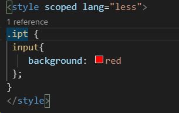
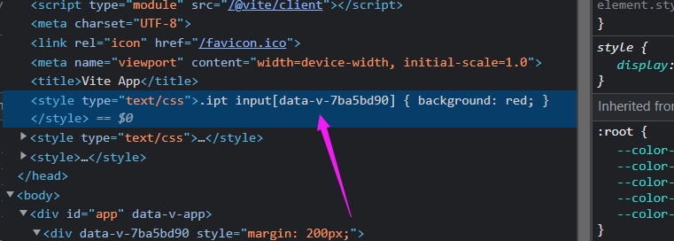
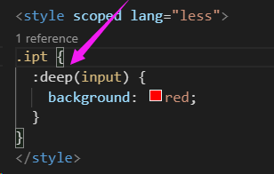
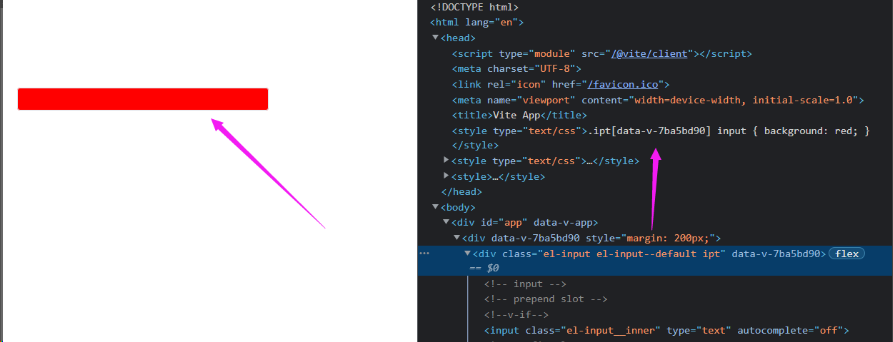
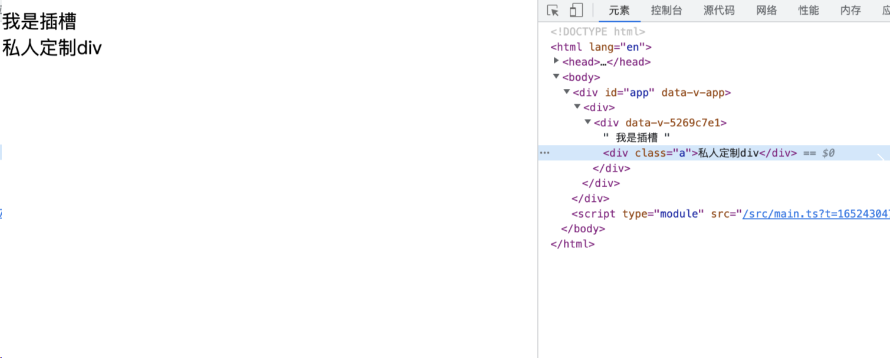
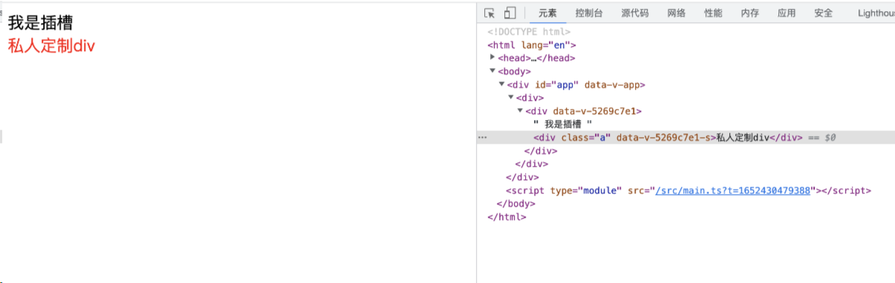

# Vue3的样式相关和CSS新特性应用

待加入文章：[入职之前，狂补技术，4w字的前端技术解决方案送给你（vue3 + vite ） - 掘金 (juejin.cn)](https://juejin.cn/post/7251878440327512124)

## 详解Scoped和样式 穿透

主要是用于修改很多vue常用的组件库（element, vant, AntDesigin），虽然配好了样式但是还是需要更改其他的样式

就需要用到样式穿透

scoped的原理

vue中的scoped 通过在DOM结构以及css样式上加唯一不重复的标记:data-v-hash的方式，以保证唯一（而这个工作是由过PostCSS转译实现的），达到样式私有化模块化的目的。

总结一下scoped三条渲染规则：

- 给HTML的DOM节点加一个不重复data属性(形如：data-v-123)来表示他的唯一性
- 在每句css选择器的末尾（编译后的生成的css语句）加一个当前组件的data属性选择器（如[data-v-123]）来私有化样式
- 如果组件内部包含有其他组件，只会给其他组件的最外层标签加上当前组件的data属性

PostCSS会给一个组件中的所有dom添加了一个独一无二的动态属性data-v-xxxx，然后，给CSS选择器额外添加一个对应的属性选择器来选择该组件中dom，这种做法使得样式只作用于含有该属性的dom——组件内部dom, 从而达到了'样式模块化'的效果



如果不写Scoped 就没问题

原因就是Scoped 搞的鬼 他在进行PostCss转化的时候把元素选择器默认放在了最后。



Vue 提供了样式穿透:deep() 他的作用就是用来改变 属性选择器的位置





## 插槽选择器

A 组件定义一个插槽

```vue
<template>
    <div>
        我是插槽
        <slot></slot>
    </div>
</template>
 
<script>
export default {}
</script>
 
<style scoped>
 
</style>
```

在App.vue 引入

```vue
<template>
    <div>
        <A>
            <div class="a">私人定制div</div>
        </A>
    </div>
</template>
 
<script setup>
import A from "@/components/A.vue"
</script>
 
 
<style lang="less" scoped>
</style>
```

在A组件修改class a 的颜色

```vue
<style scoped>
.a{
    color:red
}
</style>
```

无效果



默认情况下，作用域样式不会影响到 `<slot/>` 渲染出来的内容，因为它们被认为是父组件所持有并传递进来的。

解决方案：slotted

```vue
<style scoped>
 :slotted(.a) {
    color:red
}
</style>
```



## 全局选择器

在之前我们想加入全局 样式 通常都是新建一个style 标签 不加scoped 现在有更优雅的解决方案

```vue
<style>
 div{
     color:red
 }
</style>
 
<style lang="less" scoped>
 
</style>
```


```vue
<style lang="less" scoped>
:global(div){
    color:red
}
</style>
```

效果等同于上面 

## 动态 CSS

单文件组件的 `<style>` 标签可以通过 `v-bind` 这一 CSS 函数将 CSS 的值关联到动态的组件状态上：

```vue
<template>
    <div class="div">
       哈哈哈哈
    </div>
</template>
 
<script lang="ts" setup>
import { ref } from 'vue'
const red = ref<string>('red')
</script>
 
<style lang="less" scoped>
.div{
   color:v-bind(red)
}
 
</style>
```

如果是对象 v-bind) 请加引号

```vue
 <template>
    <div class="div">
        哈哈哈哈
    </div>
</template>
 
<script lang="ts" setup>
import { ref } from "vue"
const red = ref({
    color:'pink'
})
</script>
 
    <style lang="less" scoped>
.div {
    color: v-bind('red.color');
}
</style>
```

## css `module`

`<style module> `标签会被编译为 CSS Modules 并且将生成的 CSS 类作为 $style 对象的键暴露给组件

```vue
<template>
    <div :class="$style.red">
        小满是个弟弟
    </div>
</template>
 
<style module>
.red {
    color: red;
    font-size: 20px;
}
</style>
```

自定义注入名称（多个可以用数组）

你可以通过给 `module` attribute 一个值来自定义注入的类对象的 property 键

```vue
<template>
    <div :class="[zs.red,zs.border]">
        哈哈哈哈哈
    </div>
</template>
 
<style module="zs">
.red {
    color: red;
    font-size: 20px;
}
.border{
    border: 1px solid #ccc;
}
</style>
```

与组合式 API 一同使用

注入的类可以通过 useCssModule API 在 setup() 和 `<script setup>` 中使用。对于使用了自定义注入名称的 `<style module>` 模块，useCssModule 接收一个对应的 module attribute 值作为第一个参数

```vue
<template>
    <div :class="[zs.red,zs.border]">
        哈哈哈
    </div>
</template>
 
 
<script setup lang="ts">
import { useCssModule } from 'vue'
const css = useCssModule('zs')
</script>
 
<style module="zs">
.red {
    color: red;
    font-size: 20px;
}
.border{
    border: 1px solid #ccc;
}
</style>
```

使用场景一般用于TSX和 render 函数 居多