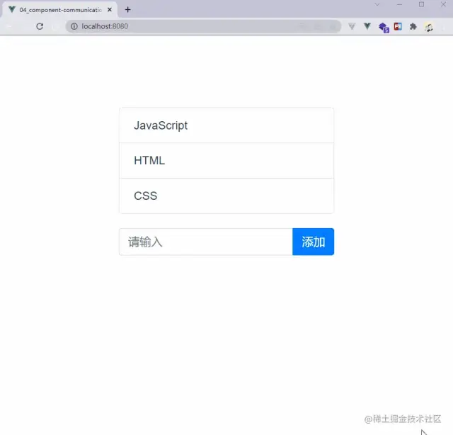

# Vue3的组件通信方式

## 写在前面

本篇文章是全部采用的 `<script setup>` 这种组合式API写法，相对于选项式来说，组合式API这种写法更加自由，具体可以参考**Vue文档**[1]对两种方式的描述。

本篇文章将介绍如下七种组件通信方式：

- props
- emit
- v-model
- refs
- provide/inject
- eventBus
- vuex/pinia(状态管理工具)

开始搞事情~

## 举一个栗子

俗话说的好，学习不写demo，那就是耍流氓~

本篇文章将围绕下面这个demo，如下图所示：



上图中，_列表_和_输入框_分别是父子组件，根据不同传值方式，可能谁是父组件谁是子组件会有所调整。

## Props方式

`Props`方式是Vue中最常见的一种**父传子**的一种方式，使用也比较简单。

根据上面的demo，我们将数据以及对数据的操作定义在父组件，子组件仅做列表的一个渲染；

父组件代码如下：

```vue
<template>
  <!-- 子组件 -->
  <child-components :list="list"></child-components>
  <!-- 父组件 -->
  <div class="child-wrap input-group">
    <input
      v-model="value"
      type="text"
      class="form-control"
      placeholder="请输入"
    />
    <div class="input-group-append">
      <button @click="handleAdd" class="btn btn-primary" type="button">
        添加
      </button>
    </div>
  </div>
</template>
<script setup>
import { ref } from 'vue'
import ChildComponents from './child.vue'
const list = ref(['JavaScript', 'HTML', 'CSS'])
const value = ref('')
// add 触发后的事件处理函数
const handleAdd = () => {
  list.value.push(value.value)
  value.value = ''
}
</script>
```

子组件只需要对父组件传递的值进行渲染即可，代码如下：

```vue
<template>
  <ul class="parent list-group">
    <li class="list-group-item" v-for="i in props.list" :key="i">{{ i }}</li>
  </ul>
</template>
<script setup>
import { defineProps } from 'vue'
const props = defineProps({
  list: {
    type: Array,
    default: () => [],
  },
})
</script>
```

## emit方式

`emit`方式也是Vue中最常见的组件通信方式，该方式用于**子传父**；

根据上面的demo，我们将列表定义在父组件，子组件只需要传递添加的值即可。

子组件代码如下：

```vue
<template>
  <div class="child-wrap input-group">
    <input
      v-model="value"
      type="text"
      class="form-control"
      placeholder="请输入"
    />
    <div class="input-group-append">
      <button @click="handleSubmit" class="btn btn-primary" type="button">
        添加
      </button>
    </div>
  </div>
</template>
<script setup>
import { ref, defineEmits } from 'vue'
const value = ref('')
const emits = defineEmits(['add'])
const handleSubmit = () => {
  emits('add', value.value)
  value.value = ''
}
</script>
```

在子组件中点击【添加】按钮后，`emit`一个自定义事件，并将添加的值作为参数传递。

父组件代码如下：

```vue
<template>
  <!-- 父组件 -->
  <ul class="parent list-group">
    <li class="list-group-item" v-for="i in list" :key="i">{{ i }}</li>
  </ul>
  <!-- 子组件 -->
  <child-components @add="handleAdd"></child-components>
</template>
<script setup>
import { ref } from 'vue'
import ChildComponents from './child.vue'
const list = ref(['JavaScript', 'HTML', 'CSS'])
// add 触发后的事件处理函数
const handleAdd = value => {
  list.value.push(value)
}
</script>
```

在父组件中只需要监听子组件自定义的事件，然后执行对应的添加操作。

## v-model方式

`v-model`是Vue中一个比较出色的语法糖，就比如下面这段代码

```vue
<ChildComponent v-model:title="pageTitle" />
```

就是下面这段代码的简写形势

```vue
<ChildComponent :title="pageTitle" @update:title="pageTitle = $event" />
```

`v-model`确实简便了不少，现在我们就来看一下上面那个demo，如何用v-model实现。

子组件

```vue
<template>
  <div class="child-wrap input-group">
    <input
      v-model="value"
      type="text"
      class="form-control"
      placeholder="请输入"
    />
    <div class="input-group-append">
      <button @click="handleAdd" class="btn btn-primary" type="button">
        添加
      </button>
    </div>
  </div>
</template>
<script setup>
import { ref, defineEmits, defineProps } from 'vue'
const value = ref('')
const props = defineProps({
  list: {
    type: Array,
    default: () => [],
  },
})
const emits = defineEmits(['update:list'])
// 添加操作
const handleAdd = () => {
  const arr = props.list
  arr.push(value.value)
  emits('update:list', arr)
  value.value = ''
}
</script>
```

在子组件中我们首先定义`props`和`emits`，然后添加完成之后`emit`指定事件。

> 注：`update:*`是Vue中的固定写法，`*`表示`props`中的某个属性名。

父组件中使用就比较简单，代码如下：

```vue
<template>
  <!-- 父组件 -->
  <ul class="parent list-group">
    <li class="list-group-item" v-for="i in list" :key="i">{{ i }}</li>
  </ul>
  <!-- 子组件 -->
  <child-components v-model:list="list"></child-components>
</template>
<script setup>
import { ref } from 'vue'
import ChildComponents from './child.vue'
const list = ref(['JavaScript', 'HTML', 'CSS'])
</script>
```

## refs方式

在使用选项式API时，我们可以通过`this.$refs.name`的方式获取指定元素或者组件，但是组合式API中就无法使用哪种方式获取。如果我们想要通过`ref`的方式获取组件或者元素，需要定义一个同名的Ref对象，在组件挂载后就可以访问了。

示例代码如下：

```vue
<template>
  <ul class="parent list-group">
    <li class="list-group-item" v-for="i in childRefs?.list" :key="i">
      {{ i }}
    </li>
  </ul>
  <!-- 子组件 ref的值与<script>中的保持一致 -->
  <child-components ref="childRefs"></child-components>
  <!-- 父组件 -->
</template>
<script setup>
import { ref } from 'vue'
import ChildComponents from './child.vue'
const childRefs = ref(null)
</script>
```

子组件代码如下：

```vue
<template>
  <div class="child-wrap input-group">
    <input
      v-model="value"
      type="text"
      class="form-control"
      placeholder="请输入"
    />
    <div class="input-group-append">
      <button @click="handleAdd" class="btn btn-primary" type="button">
        添加
      </button>
    </div>
  </div>
</template>
<script setup>
import { ref, defineExpose } from 'vue'
const list = ref(['JavaScript', 'HTML', 'CSS'])
const value = ref('')
// add 触发后的事件处理函数
const handleAdd = () => {
  list.value.push(value.value)
  value.value = ''
}
defineExpose({ list })
</script>
```

`setup`组件默认是关闭的，也即通过模板`ref`获取到的组件的公开实例，**不会暴露任何在****`<script setup>`****中声明的绑定**。如果需要**公开需要通过****`defineExpose`**** API暴露**。

## provide/inject方式

`provide`和`inject`是Vue中提供的一对API，该API可以实现父组件向子组件传递数据，无论层级有多深，都可以通过这对API实现。示例代码如下所示：

父组件

```vue
<template>
  <!-- 子组件 -->
  <child-components></child-components>
  <!-- 父组件 -->
  <div class="child-wrap input-group">
    <input
      v-model="value"
      type="text"
      class="form-control"
      placeholder="请输入"
    />
    <div class="input-group-append">
      <button @click="handleAdd" class="btn btn-primary" type="button">
        添加
      </button>
    </div>
  </div>
</template>
<script setup>
import { ref, provide } from 'vue'
import ChildComponents from './child.vue'
const list = ref(['JavaScript', 'HTML', 'CSS'])
const value = ref('')
// 向子组件提供数据
provide('list', list.value)
// add 触发后的事件处理函数
const handleAdd = () => {
  list.value.push(value.value)
  value.value = ''
}
</script>
```

子组件

```vue
<template>
  <ul class="parent list-group">
    <li class="list-group-item" v-for="i in list" :key="i">{{ i }}</li>
  </ul>
</template>
<script setup>
import { inject } from 'vue'
// 接受父组件提供的数据
const list = inject('list')
</script>
```

值得注意的是**使用`provide`进行数据传递时，尽量`readonly`进行数据的包装，避免子组件修改父级传递过去的数据**。

## 事件总线

Vue3中移除了事件总线，但是可以借助于第三方工具来完成，Vue官方推荐**mitt**[2]或**tiny-emitter**[3]；

在大多数情况下不推荐使用全局事件总线的方式来实现组件通信，虽然比较简单粗暴，但是长久来说维护事件总线是一个大难题，所以这里就不展开讲解了，具体可以阅读具体工具的文档

## 状态管理工具

**Vuex**[4]和**Pinia**[5]是Vue3中的状态管理工具，使用这两个工具可以轻松实现组件通信，由于这两个工具功能比较强大，这里就不做展示了，具体可以查阅文档