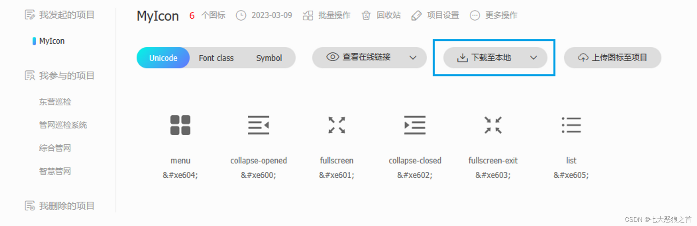

# vue3+vite+ts的icons图标使用方案

## 一、使用 iconify 图标库

[Icon Sets • Iconify](https://icon-sets.iconify.design/)

[Icônes (icones.js.org)](https://icones.js.org/collection/all)

#### 1.下载插件

iconify 组件封装

```bash
pnpm install @iconify/vue -D
```

按需自动导入图标组件

```bash
pnpm install unplugin-icons -D
```

按需自动导入组件(可选)

```bash
pnpm install unplugin-vue-components -D
```

#### 2.配置 vite.config.ts

```typescript
import Vue from '@vitejs/plugin-vue'
import Components from 'unplugin-vue-components/vite'
import Icons from 'unplugin-icons/vite'
import IconsResolver from 'unplugin-icons/resolver'

export default defineConfig {
  plugins: [
	Vue(),
    Components({
      // 自动按需导入组件目录
      dirs: ["src/components"],
      resolvers: [
        // 自动按需加载iconify图标库图标
        IconsResolver()
      ]
    }),
    Icons({
      // 自动安装图标
      autoInstall: true
    })
  ]
}
```

#### 3. 使用

##### 3.1 方式 1

组件内直接使用

```vue
<i-图标集-标图名/>
如Element Plus的图标: <i-ep-user/>
如Ant Design的图标: <i-ant-design-user-outlined/>
```

#### 3.2 方式 2

封装组件 `IconifyIcon`，目录 `src\components\IconifyIcon\index.vue`

```vue
<script setup lang="ts" name="IconifyIcon">
import { Icon } from "@iconify/vue";
import type { CSSProperties } from "vue";

interface IconifyProps {
  name: string; // 图标的名称 ==> 必传
  color?: string; // 图标的颜色 ==> 非必传
  iconStyle?: CSSProperties; // 图标的样式 ==> 非必传
}

const props = withDefaults(defineProps<IconifyProps>(), {
  iconStyle: () => ({ width: "20px", height: "20px" }),
});
</script>

<template>
  <Icon :icon="props.name" :color="props.color" :style="props.iconStyle" />
</template>

<style>
svg {
  display: inline-block;
  width: 1em;
  height: 1em;
  vertical-align: -0.15em;
  fill: currentColor;
  overflow: hidden;
}
</style>

```

组件内使用

```vue
<script setup lang="ts" name="IconifyIcon">
import SvgIcon from "@/components/IconifyIcon/index.vue";

const iconStyle = { width: "100px", height: "100px", color: "#0d9488" };
</script>

<template>
	<IconifyIcon name="ep:menu" color="#0d9488" :icon-style="iconStyle" />
</template>
```

## 二、使用 iconfont 图标库

https://www.iconfont.cn/

### 1. 下载 iconfont.js



### 2.将 iconfont.js 放入项目并全局引入

main.ts引入

```typescript
import "@/assets/icons/iconfont/iconfont.js";
```


### 3.下载并配置自动按需导入插件（可选）

```bash
pnpm install unplugin-vue-components -D
```

使用

```typescript
// vite.config.ts

import Vue from '@vitejs/plugin-vue'
import Components from 'unplugin-vue-components/vite'

export default defineConfig {
  plugins: [
    Vue(),
    Components({
      // 自动按需导入组件目录
      dirs: ["src/components"]
    })
  ]
}
```


### 4.封装公共图标组件

封装组件 SvgIcon，目录 src\components\SvgIcon\index.vue

```vue
<script setup lang="ts" name="SvgIcon">
import { computed, CSSProperties } from "vue";
   interface SvgProps {
	name: string; // 图标的名称 ==> 必传
	prefix?: string; // 图标的前缀 ==> 非必传（默认为"icon"）
	iconStyle?: CSSProperties; // 图标的样式 ==> 非必传
}

// 接收父组件参数并设置默认值
const props = withDefaults(defineProps<SvgProps>(), {
	prefix: "icon",
	iconStyle: () => ({ width: "20px", height: "20px" })
});

const symbolId = computed(() => `#${props.prefix}-${props.name}`);
</script>

<template>
	<svg :style="iconStyle" aria-hidden="true">
		<use :xlink:href="symbolId" />
	</svg>
</template>


<style scoped>
svg {
	width: 1em;
	height: 1em;
	overflow: hidden;
	vertical-align: -0.15em;
	fill: currentColor;
}
</style> 
```

### 5.组件内使用

```vue
<script setup lang="ts" name="svgIcon">
import SvgIcon from "@/components/SvgIcon/index.vue";


const iconStyle = { width: "100px", height: "100px", color: "#0d9488" };
</script>

<template>
	<SvgIcon name="menu" :iconStyle="iconStyle" />
</template>

```

## 三、使用本地 svg 图标

### 1.下载插件

```bash
pnpm install vite-plugin-svg-icons -D
```

自动按需导入(可选)

```bash
pnpm install unplugin-vue-cmponents -D
```

### 2.配置 vite.config.ts

```vue
import Vue from '@vitejs/plugin-vue'
import Components from 'unplugin-vue-components/vite'
import { createSvgIconsPlugin } from 'vite-plugin-svg-icons'

export default defineConfig {
  plugins: [
    Vue(),
    Components({
      // 自动按需导入组件目录
      dirs: ["src/components"]
    }),
    createSvgIconsPlugin({
      // 配置路径, 项目存放svg的目录
      iconDirs: [resolve(process.cwd(), 'src/assets/icons/svg')],
      symbolId: 'icon-[dir]-[name]'
    })
  ]
}
```

### 3.封装使用

与 “二、使用 iconfont 图标库” 共用同一组件。(本质都是SVG图标公共组件)