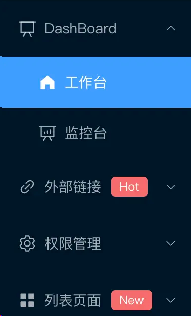
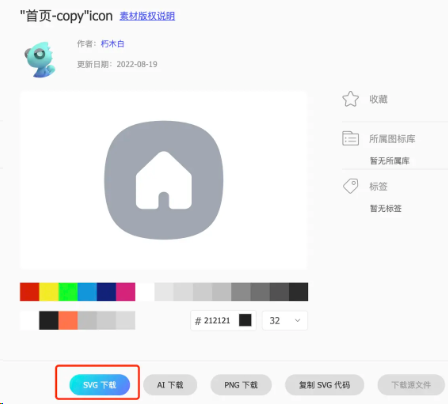
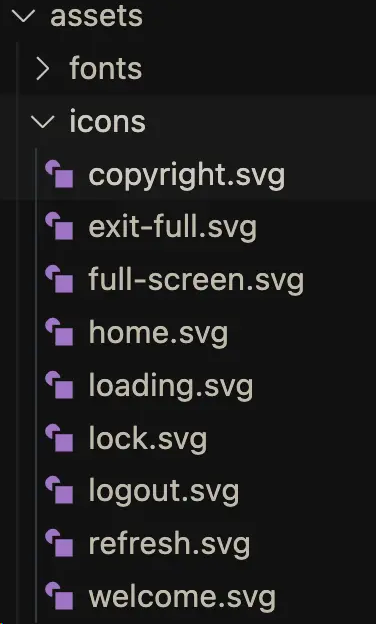
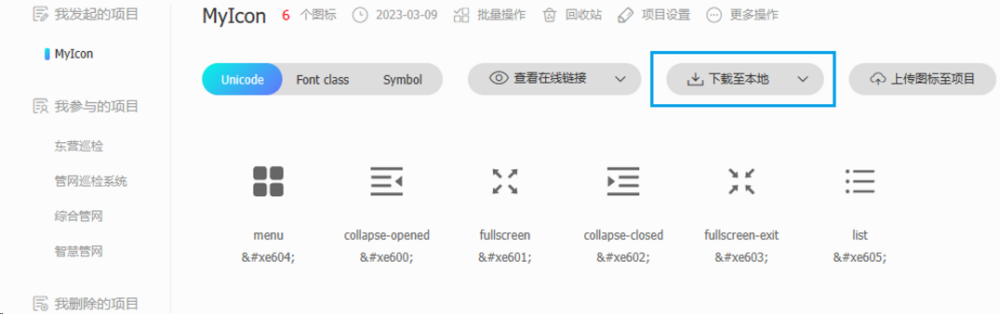
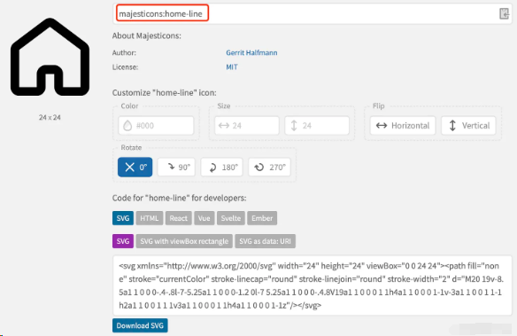
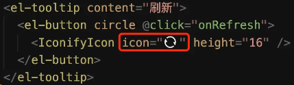
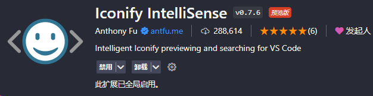
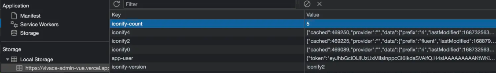

# Vue3 使用 icon 图标的方案

本文介绍三种使用 icon 的方案，分别是`element-icon`、`svg-icon`、`@iconify/vue`。

## 1. element-icon

Element Plus 提供了一套常用的图标集合。

### 1.1. 安装

```ruby
# 选择一个你喜欢的包管理器

# NPM
$ npm install @element-plus/icons-vue
# Yarn
$ yarn add @element-plus/icons-vue
# pnpm
$ pnpm install @element-plus/icons-vue# 选择一个你喜欢的包管理器
```

### 1.2. 注册所有图标

从 @element-plus/icons-vue 中导入所有图标并进行全局注册。

```javascript
// main.ts

// 如果您正在使用CDN引入，请删除下面一行。
import * as ElementPlusIconsVue from "@element-plus/icons-vue";

const app = createApp(App);
for (const [key, component] of Object.entries(ElementPlusIconsVue)) {
	app.component(key, component);
}
```

### 1.3. 基础用法

```html
<!-- 使用 el-icon 为 SVG 图标提供属性 -->
<template>
	<div>
		<el-icon :size="size" :color="color">
			<Edit />
		</el-icon>
		<!-- 或者独立使用它，不从父级获取属性 -->
		<Edit />
	</div>
</template>
```

如果你想用字符串的形式，可以这样搞。

以侧边栏的图标渲染为例子。

我的路由是这样写的：

```css
{
  path: '/index',
  name: 'Index',
  component: () => import('@/views/workbench/home/index.vue'),
  meta: {
  title: '工作台',
  icon: 'HomeFilled',
  affix: true,
}
```

当在组件中渲染的时候可以用`component`组件来渲染：

```ruby
<el-menu-item
  :index="subItem.path"
  @click="handleClickMenu(subItem)"
  >
   <el-icon>
     <component :is="subItem.meta.icon"></component>
  </el-icon>
</el-menu-item>
```

最终效果：



## 2. svg-icon

[vue3 + vite项目使用SVG图标_vue3 获取assets下的svg所有图标-CSDN博客](https://blog.csdn.net/WLPJLP/article/details/133681075)

如果 element 的 icon 不满足我们的需求的话，我们可以从[iconfont-阿里巴巴矢量图标库](https://www.iconfont.cn/)去下载 svg 图标。然后使用。

### 2.1. 下载插件

首先要使用[vbenjs/vite-plugin-svg-icons](https://github.com/vbenjs/vite-plugin-svg-icons/tree/main#readme)插件

```javascript
yarn add vite-plugin-svg-icons -D
# or
npm i vite-plugin-svg-icons -D
# or
pnpm install vite-plugin-svg-icons -D
```

自动按需导入(可选)

```bash
pnpm install unplugin-vue-cmponents -D
```

### 2.2. 配置vite.config.ts

在 vite.config.ts 中配置一下

```ts
import Vue from '@vitejs/plugin-vue'
import Components from 'unplugin-vue-components/vite'
import { createSvgIconsPlugin } from "vite-plugin-svg-icons";
import path from "path";

export default defineConfig {
  plugins: [
    Vue(),
    Components({
      // 自动按需导入组件目录
      dirs: ["src/components"]
    }),
    createSvgIconsPlugin({
      // 配置路径, 项目存放svg的目录
      iconDirs: [resolve(process.cwd(), 'src/assets/icons/svg')],
      symbolId: 'icon-[dir]-[name]'
    })
  ]
}
```

这里注意 iconDirs 的路径，是读取的 svg icon 存放的目录。

### 2.3. 封装使用svg图标组件

我们把 Svg 封装成一个组件：

```vue
<template>
	<i :class="['el-icon', spin && 'svg-icon-spin']" :style="getStyle">
		<svg aria-hidden="true">
			<use :xlink:href="symbolId" :fill="color" />
		</svg>
	</i>
</template>

<script setup lang="ts" name="SvgIcon">
import { computed } from "vue";
import type { CSSProperties } from "vue";
const props = defineProps({
	prefix: {
		type: String,
		default: "icon",
	},
	name: {
		type: String,
		required: true,
	},
	color: {
		type: String,
		default: "#ffffff",
	},
	size: {
		type: [Number, String],
		default: 20,
	},
	spin: {
		type: Boolean,
		default: false,
	},
});

const symbolId = computed(() => `#${props.prefix}-${props.name}`);
const getStyle = computed((): CSSProperties => {
	const { size } = props;
	let s = `${size}`;
	s = `${s.replace("px", "")}px`;
	return {
		fontSize: s,
	};
});
</script>

<style scoped lang="scss">
.el-icon {
	--color: inherit;

	position: relative;
	display: inline-flex;
	align-items: center;
	justify-content: center;
	width: 1em;
	height: 1em;
	font-size: inherit;
	line-height: 1em;
	color: var(--color);
	fill: currentColor;

	svg {
		width: 1em;
		height: 1em;
	}
}

.svg-icon-spin {
	animation: circle 1.5s infinite linear;
}

/* 旋转动画 */
@keyframes circle {
	0% {
		transform: rotate(0);
	}

	100% {
		transform: rotate(360deg);
	}
}
</style>
```

这里我封装的支持 prefix、name、size、color、spin（是否旋转）等属性。

### 2.4. 使用 iconfont 图标库

官网：https://www.iconfont.cn/

我们先去[iconfont-阿里巴巴矢量图标库](https://www.iconfont.cn/)下载一个 svg 格式的图标。



下载完成后，把这个 svg 放入 iconDirs 声明的路径下面即可：



在项目中使用。引入这个组件然后使用即可。注意 name 跟你的 svg name 保持一致。

```vue
<SvgIcon name="welcome" size="400px" />
<SvgIcon name="welcome" size="400px" />
```

我这里的图标效果是这样的：


### 或者下载到本地的是iconfont.js

#### 下载 iconfont.js



#### 2.将 iconfont.js 放入项目并全局引入

main.ts引入

```typescript
import "@/assets/icons/iconfont/iconfont.js";
```

#### 3.下载并配置自动按需导入插件（可选）

```bash
pnpm install unplugin-vue-components -D
```

使用

```typescript
// vite.config.ts

import Vue from '@vitejs/plugin-vue'
import Components from 'unplugin-vue-components/vite'

export default defineConfig {
  plugins: [
    Vue(),
    Components({
      // 自动按需导入组件目录
      dirs: ["src/components"]
    })
  ]
}
```

#### 4.封装公共图标组件

封装组件 SvgIcon，目录 src\components\SvgIcon\index.vue

```vue
<script setup lang="ts" name="SvgIcon">
import { computed, CSSProperties } from "vue";
   interface SvgProps {
	name: string; // 图标的名称 ==> 必传
	prefix?: string; // 图标的前缀 ==> 非必传（默认为"icon"）
	iconStyle?: CSSProperties; // 图标的样式 ==> 非必传
}

// 接收父组件参数并设置默认值
const props = withDefaults(defineProps<SvgProps>(), {
	prefix: "icon",
	iconStyle: () => ({ width: "20px", height: "20px" })
});

const symbolId = computed(() => `#${props.prefix}-${props.name}`);
</script>

<template>
	<svg :style="iconStyle" aria-hidden="true">
		<use :xlink:href="symbolId" />
	</svg>
</template>


<style scoped>
svg {
	width: 1em;
	height: 1em;
	overflow: hidden;
	vertical-align: -0.15em;
	fill: currentColor;
}
</style> 
```

#### 5.组件内使用

```vue
<script setup lang="ts" name="svgIcon">
import SvgIcon from "@/components/SvgIcon/index.vue";


const iconStyle = { width: "100px", height: "100px", color: "#0d9488" };
</script>

<template>
	<SvgIcon name="menu" :iconStyle="iconStyle" />
</template>
```


## 3. iconify

iconify 是一种非常广泛的图标解决方案，它收集了全网所有的图标。

网站：

- [Icon Sets • Iconify](https://icon-sets.iconify.design/)
- [Icônes (icones.js.org)](https://icones.js.org/collection/all)

官网教程：[Iconify for Vue](https://iconify.design/docs/icon-components/vue/)


#### 待定整合的教程

[vue3+vite使用iconify图标 - 知乎 (zhihu.com)](https://zhuanlan.zhihu.com/p/688842750)

### 1. 安装相关插件

#### @iconify/vue

```bash
npm install --save-dev @iconify/vue
# or
yarn add --dev @iconify/vue
# or
pnpm install @iconify/vue -D
```

#### 安装自动导入插件：unplugin-auto-import unplugin-vue-components

> 安装两个按需导入的插件，避免在多个页面重复引入 API 或 组件
>  `unplugin-auto-import` 按需自动导入API，如：ref，reactive,watch,computed 等API
>  `unplugin-vue-components` 按需自动导入组件，如：Element Plus 等三方库和指定目录下的自定义组件

```c
pnpm install -D unplugin-auto-import unplugin-vue-components
```

#### 按需自动导入图标库：[unplugin-icons - npm (npmjs.com)](https://www.npmjs.com/package/unplugin-icons)

使用 `unplugin-icons` 和 `unplugin-auto-import`可以从 `iconify` 中自动导入图标

```bash
pnpm install unplugin-icons -D
```

> 在`vite.config.ts` 配置自动导入，新建 `/src/types`目录用于存放自动导入函数`auto-imports.d.ts`和组件的TS类型声明文件`components.d.ts`

#### 离线加载图标数据源

我们使用 [Iconify](https://iconify.design/) 作为图标数据源（支持 100+ 图标集）。

您可以通过两种方式安装它们：

##### 1.安装完整集合

```bash
pnpm i -D @iconify/json
```

`@iconify/json`（~120MB） 包括 Iconify 中的所有图标集，因此您可以安装一次并根据需要使用其中任何一个（只有您实际使用的图标才会捆绑到生产版本中）。

##### 2.通过图标集安装

如果您只想使用几个图标集，而不想下载整个集合，也可以使用 单独安装它们。 例如，要安装 [Material Design 图标](https://icon-sets.iconify.design/mdi/)，您可以执行以下操作：`@iconify-json/[collection-id]`

```bash
npm i -D @iconify-json/mdi
```

### 2.配置 vite.config.ts

```typescript
import { defineConfig } from 'vite';
import vue from '@vitejs/plugin-vue';
import AutoImport from 'unplugin-auto-import/vite';
import Components from 'unplugin-vue-components/vite';
import { ElementPlusResolver } from 'unplugin-vue-components/resolvers';
import tailwindcss from 'tailwindcss';
import Icons from 'unplugin-icons/vite';
import IconsResolver from 'unplugin-icons/resolver';

import { resolve } from 'path';

// https://vitejs.dev/config/
export default defineConfig({
  plugins: [
    vue(),
    AutoImport({
      // dts: false, // 是否自动生成 d.ts 文件，建议生成之后设置 false，手动维护
      dts: 'src/autoimport/auto-imports.d.ts', // 配置文件生成位置(false:关闭自动生成)
      // 自动导入 Vue 相关函数，如：ref, reactive, toRef 等
      imports: ['vue', '@vueuse/core'],
      // imports: ['vue', 'vue-router', 'pinia', '@vueuse/core'],

      // eslintrc: {
      //   enabled: false, // 是否自动生成 eslint 规则，建议生成之后设置 false，手动维护
      //   filepath: './.eslintrc-auto-import.json', // 指定自动导入函数 eslint 规则的文件路径
      //   globalsPropValue: true
      // },
      resolvers: [
        // 自动导入 Element Plus 相关函数，如：ElMessage, ElMessageBox... (带样式)
        ElementPlusResolver({
          // 自动引入修改主题色添加这一行，使用预处理样式，不添加将会导致使用ElMessage，ElNotification等组件时默认的主题色会覆盖自定义的主题色
          importStyle: 'sass'
        })
      ],
      // vueTemplate: true,
    }),
    Components({
      // 指定自定义组件位置(默认:src/components)
      // dirs: ['src/**/components'],

      // 配置文件位置(false:关闭自动生成)
      // dts: false
      dts: 'src/autoimport/components.d.ts', // 配置文件生成位置(false:关闭自动生成)

      resolvers: [
        // 自动注册导入element-plus组件
        ElementPlusResolver({
          // 自动引入修改主题色添加这一行，使用预处理样式
          importStyle: 'sass'
        }),
        // 自动导入iconify图标库组件
        IconsResolver({})
        // IconsResolver({
        //   // @iconify-json/ep 是 Element Plus 的图标库
        //   enabledCollections: ['ep']
        // })
      ]
    }),
    Icons({
      // 自动安装图标库
      autoInstall: true
    })
  ],
```

#### 其他配置

在 `.eslintrc.cjs` 添加自动导入函数 eslint 规则

```json
"extends": [
    "./.eslintrc-auto-import.json"
]
```

在`tsconfig.json`  添加自动导入TS类型声明文件

```json
{
  "include": ["src/**/*.d.ts"]
}
```

> 运行项目 npm run dev 查看效果

### 3. 使用

#### 3.1 组件内直接使用

##### 组件内直接使用

```vue
<i-图标集-标图名/>
如Element Plus的图标: <i-ep-user/>
如Ant Design的图标: <i-ant-design-user-outlined/>
```

#### 3.2 全局导入图标并使用：在main.ts种全局导入组件

```js
import { Icon } from '@iconify/vue';
// 全局注册IconifyIcon图标组件
app.component('IconifyIcon', Icon);

// 页面中使用图标
<IconifyIcon icon="icon-park-solid:folder-conversion" />
```

#### 3.3 封装组件 `IconifyIcon`

封装组件 `IconifyIcon`，目录 `src\components\IconifyIcon\index.vue`

```vue
<script setup lang="ts" name="IconifyIcon">
import { Icon } from "@iconify/vue";
import type { CSSProperties } from "vue";

interface IconifyProps {
  name: string; // 图标的名称 ==> 必传
  color?: string; // 图标的颜色 ==> 非必传
  iconStyle?: CSSProperties; // 图标的样式 ==> 非必传
}

const props = withDefaults(defineProps<IconifyProps>(), {
  iconStyle: () => ({ width: "20px", height: "20px" }),
});
</script>

<template>
  <Icon :icon="props.name" :color="props.color" :style="props.iconStyle" />
</template>

<style>
svg {
  display: inline-block;
  width: 1em;
  height: 1em;
  vertical-align: -0.15em;
  fill: currentColor;
  overflow: hidden;
}
</style>

```

组件内使用

```vue
<script setup lang="ts" name="IconifyIcon">
import SvgIcon from "@/components/IconifyIcon/index.vue";

const iconStyle = { width: "100px", height: "100px", color: "#0d9488" };
</script>

<template>
	<IconifyIcon name="ep:menu" color="#0d9488" :icon-style="iconStyle" />
</template>
```

#### 3.4 使用defineComponent封装组件

```js
import { h, defineComponent } from 'vue'
import { Icon as IconifyIcon } from '@iconify/vue' 

export default defineComponent({
  name: 'IconifyIconOnline',
  components: { IconifyIcon },
  props: {
    icon: {
      type: String,
      default: '',
    },
  },
  render() {
    const attrs = this.$attrs
    return h(
      IconifyIcon,
      {
        icon: `${this.icon}`,
        style: attrs?.style
          ? Object.assign(attrs.style, { outline: 'none' })
          : { outline: 'none' },
        ...attrs,
      },
      {
        default: () => [],
      },
    )
  },
})
```

当然你不封装也可以。

##### 使用

首先我们要找一个图标，可以去[icon-sets.iconify.design/](https://Ficon-sets.iconify.design)。搜索你想要的图标。



复制图标的名字。

在项目中直接使用

```vue
<template>
  <div class="btn">
    <el-tooltip content="刷新">
      <el-button circle>
        <IconifyIcon icon="ri:refresh-line" height="16" />
      </el-button>
    </el-tooltip>
  </div>
</template>

<script lang="ts">
import { defineComponent } from 'vue'
import { IconifyIcon } from '@/components/IconifyIcon'

export default defineComponent({
  components: {
    IconifyIcon,
  },
})
</script>

<style scoped lang="scss">
.btn {
  margin-right: 20px;
  cursor: pointer;
  transition: all 0.3s;
}
```

#### 通过iconify使用Element Plus图标

```vue
<template>
    <h1>iconify 图标:</h1>
    <div>
      <icon1 />
      <!-- <icon2 /> -->
      <icon3 />
    </div>
    
    <div>
      <i-ep-edit />
      <el-icon :size="19.2" color="#409eff">
        <i-ep-edit />
      </el-icon>
    </div>
</template>

<script setup lang="ts">
// element-plus图标
// https://icon-sets.iconify.design/ep/
import icon1 from '~icons/ep/help-filled'
// import { HelpFilled } from '@element-plus/icons-vue'

// 其他的
// https://icon-sets.iconify.design/
// import icon2 from '~icons/mdi/home-clock'
// 动态图标
// https://icon-sets.iconify.design/line-md/
// https://icon-sets.iconify.design/svg-spinners/
import icon3 from '~icons/line-md/home'
</script>
```

#### 通过 UnoCSS，Element Plus 像 Element UI 一样使用 Icon

[Vue3！Element Plus 如何像 Element UI 一样使用 Icon? - 知乎 (zhihu.com)](https://zhuanlan.zhihu.com/p/507462743?utm_id=0)

[UnoCSS官网](https://unocss.dev/)

> UnoCSS 是一个具有高性能且极具灵活性的即时原子化 CSS 引擎 ，用于构建响应式网页和应用程序界面。它提供了一套简洁、易于使用的样式类，帮助开发者快速搭建漂亮且功能强大的界面。

```c
npm add -D unocss
```

`vite.config.ts` 配置

```ts
import UnoCSS from 'unocss/vite'
import { presetIcons } from 'unocss'

export default {
  plugins: [
  
    // 配置UnoCSS，使其可以直接使用标签 <i-ep-edit /> | <el-button icon="i-ep-edit" > edit </el-button>
    // UnoCSS({})
    UnoCSS({
      presets: [
        presetIcons({
          scale: 1.2,
          warn: true
        })
      ],
      // 以下配置是为了可以直接使用标签 <i-ep-edit /> | <el-button icon="i-ep-edit" > edit </el-button>
      variants: [
        {
          match: (s) => {
            if (s.startsWith('i-')) {
              return {
                matcher: s,
                selector: (s) => {
                  return s.startsWith('.') ? `${s.slice(1)},${s}` : s
                }
              }
            }
          }
        }
      ]
    })


  ],
}
```

`main.ts` 引入 uno.css


```ts
import 'uno.css'
```

示例


```vue
    <h2>el-button+图标:</h2>
    <el-button type="primary">
      <el-icon> <i-ep-edit /> </el-icon> 新增
    </el-button>
    <el-button type="primary" icon="i-ep-edit"> 新增 </el-button>
```


### Visual Studio Code的iconify插件

如果你想直接在 vscode 中预览这个图标长啥样，就像下面这样：



可以安装一个插件：**Iconify IntelliSense**



我们在浏览器中打开调试工具，看看 application，发现这里缓存的一些图标



当第一次请求后，浏览器会把这个图标缓存。下次请求的时候直接从缓存中读取的。

## 本地PNG图标

> vue3中使用本地图标和vue2还是有点区别

> vue2使用的`require`，如：``

> vue3和vite中使用`require`会报错（`require is not definedrequire is not defined`），因为`require`是`webpack`提供的方法，在`vite`中不适用。在vite中，由于使用了 `ES modules` 的方式来加载模块，因此不能使用 `require`，而是使用`import`

以下是vue3中使用本地PNG图标的方式（调试和线上图标都显示）

```vue
<template>
    <h1>img 本地PNG图片:</h1>
    
    
    
    
    

    <h2>img 本地图片动态导入:</h2>
    
    
</template>

<script setup lang="ts">
import imgPath2 from '@/assets/images/static/icon2.png'
const imgPath3 = getImgPath('icon3.png')
const imgPath4 = new URL(`../../../assets/images/static/icon4.png`, import.meta.url).href
const imgPath5 = new URL(`@/assets/images/static/icon5.png`, import.meta.url).href

const getImgPath2 = (name: string): any => {
  return new URL(`/src/assets/images/static/${name}`, import.meta.url).href
}

const getImgPath3 = (name: string): any => {
  return new URL(`../../../assets/images/static/${name}`, import.meta.url).href
}

</script>
```

!!!!注意：

```ts
  TODO: 下面这样写加载失败，也不可以用@/assets/xxx
  return new URL('/src/assets/images/static/' + name, import.meta.url).href
```

