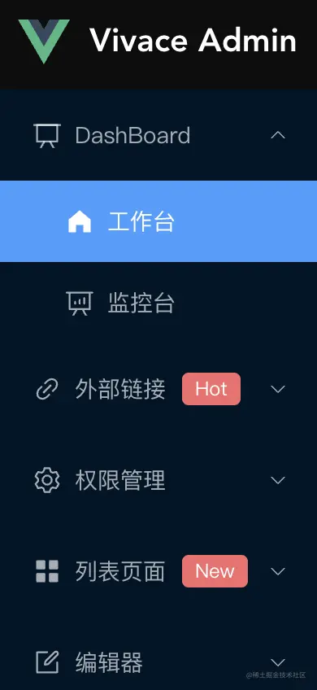
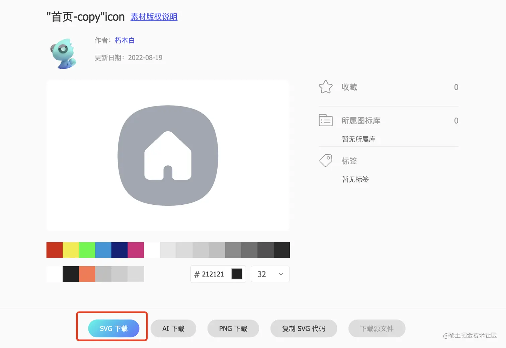
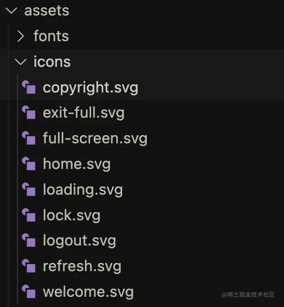
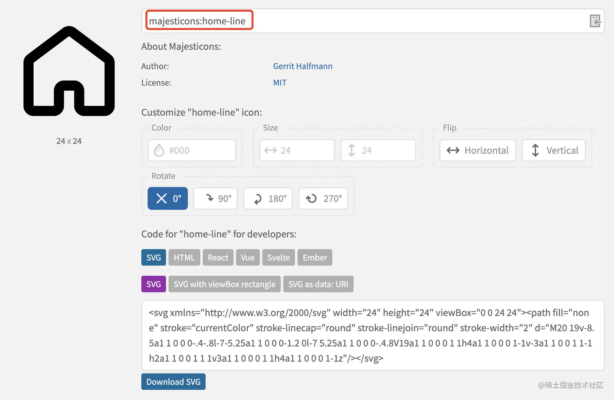
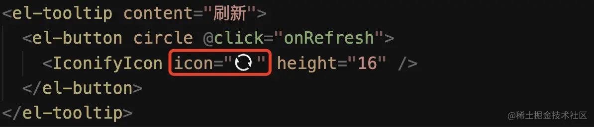
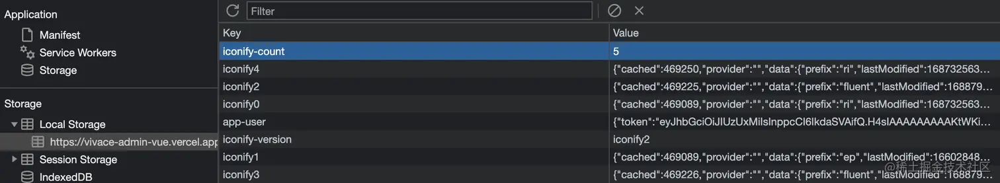

# vue3使用icon图标的方案

本文介绍三种使用icon的方案，分别是`element-icon`、`svg-icon`、`@iconify/vue`。

## 1. element-icon

Element Plus 提供了一套常用的图标集合。

### 1.1. 安装

```ruby
# 选择一个你喜欢的包管理器

# NPM
$ npm install @element-plus/icons-vue
# Yarn
$ yarn add @element-plus/icons-vue
# pnpm
$ pnpm install @element-plus/icons-vue# 选择一个你喜欢的包管理器
```

### 1.2. 注册所有图标

从 @element-plus/icons-vue 中导入所有图标并进行全局注册。

```javascript
// main.ts

// 如果您正在使用CDN引入，请删除下面一行。
import * as ElementPlusIconsVue from '@element-plus/icons-vue'

const app = createApp(App)
for (const [key, component] of Object.entries(ElementPlusIconsVue)) {
  app.component(key, component)
}
```

### 1.3. 基础用法

```xml
<!-- 使用 el-icon 为 SVG 图标提供属性 -->
<template>
  <div>
    <el-icon :size="size" :color="color">
      <Edit />
    </el-icon>
    <!-- 或者独立使用它，不从父级获取属性 -->
    <Edit />
  </div>
</template>
```

如果你想用字符串的形式，可以这样搞。

以侧边栏的图标渲染为例子。

我的路由是这样写的：

```css
{
  path: '/index',
  name: 'Index',
  component: () => import('@/views/workbench/home/index.vue'),
  meta: {
  title: '工作台',
  icon: 'HomeFilled',
  affix: true,
}
```

当在组件中渲染的时候可以用`component`组件来渲染：

```ruby
<el-menu-item
  :index="subItem.path"
  @click="handleClickMenu(subItem)"
  >
   <el-icon>
     <component :is="subItem.meta.icon"></component>
  </el-icon>
</el-menu-item>
```

最终效果：



## 2. svg-icon

如果element的icon不满足我们的需求的话，我们可以从[iconfont-阿里巴巴矢量图标库](https://www.iconfont.cn/)去下载svg图标。然后使用。

### 2.1. 安装

首先要使用[vbenjs/vite-plugin-svg-icons](https://github.com/vbenjs/vite-plugin-svg-icons/tree/main#readme)插件

```csharp
yarn add vite-plugin-svg-icons -D
# or
npm i vite-plugin-svg-icons -D
# or
pnpm install vite-plugin-svg-icons -D
```

### 2.2. 配置

在vite.config.ts中配置一下

```ts
import { createSvgIconsPlugin } from 'vite-plugin-svg-icons'
import path from 'path'

export default () => {
  return {
    plugins: [
      createSvgIconsPlugin({
        iconDirs: [path.resolve(process.cwd(), 'src/assets/icons')],
        symbolId: 'icon-[dir]-[name]',
      }),
    ],
  }
}
```

这里注意iconDirs的路径，是读取的svg icon存放的目录。

### 2.3. 封装

我们把Svg封装成一个组件：

```vue
<template>
  <i :class="['el-icon', spin && 'svg-icon-spin']" :style="getStyle">
    <svg aria-hidden="true">
      <use :xlink:href="symbolId" :fill="color" />
    </svg>
  </i>
</template>

<script setup lang="ts" name="SvgIcon">
  import { computed } from 'vue'
  import type { CSSProperties } from 'vue'
  const props = defineProps({
    prefix: {
      type: String,
      default: 'icon',
    },
    name: {
      type: String,
      required: true,
    },
    color: {
      type: String,
      default: '#ffffff',
    },
    size: {
      type: [Number, String],
      default: 20,
    },
    spin: {
      type: Boolean,
      default: false,
    },
  })

  const symbolId = computed(() => `#${props.prefix}-${props.name}`)
  const getStyle = computed((): CSSProperties => {
    const { size } = props
    let s = `${size}`
    s = `${s.replace('px', '')}px`
    return {
      fontSize: s,
    }
  })
</script>

<style scoped lang="scss">
  .el-icon {
    --color: inherit;

    position: relative;
    display: inline-flex;
    align-items: center;
    justify-content: center;
    width: 1em;
    height: 1em;
    font-size: inherit;
    line-height: 1em;
    color: var(--color);
    fill: currentColor;

    svg {
      width: 1em;
      height: 1em;
    }
  }

  .svg-icon-spin {
    animation: circle 1.5s infinite linear;
  }

  /* 旋转动画 */
  @keyframes circle {
    0% {
      transform: rotate(0);
    }

    100% {
      transform: rotate(360deg);
    }
  }
</style>
```

这里我封装的支持prefix、name、size、color、spin（是否旋转）等属性。

### 2.4. 使用

我们先去[iconfont-阿里巴巴矢量图标库](https://www.iconfont.cn/)下载一个svg格式的图标。



下载完成后，把这个svg放入iconDirs声明的路径下面即可：



在项目中使用。引入这个组件然后使用即可。注意name跟你的svg name保持一致。

```vue
<SvgIcon name="welcome" size="400px" /><SvgIcon name="welcome" size="400px" />
```

我这里的图标效果是这样的：


## 3. iconify

iconify是一种非常广泛的图标解决方案，它收集了全网所有的图标。

### 3.1. 安装

```bash
pnpm install --save-dev @iconify/vue
```

### 3.2. 封装

```vue
import { h, defineComponent } from 'vue'
import { Icon as IconifyIcon } from '@iconify/vue'

export default defineComponent({
  name: 'IconifyIconOnline',
  components: { IconifyIcon },
  props: {
    icon: {
      type: String,
      default: '',
    },
  },
  render() {
    const attrs = this.$attrs
    return h(
      IconifyIcon,
      {
        icon: `${this.icon}`,
        style: attrs?.style
          ? Object.assign(attrs.style, { outline: 'none' })
          : { outline: 'none' },
        ...attrs,
      },
      {
        default: () => [],
      },
    )
  },
})
```

当然你不封装也可以。

### 3.3. 使用

首先我们要找一个图标，可以去[icon-sets.iconify.design/](https://Ficon-sets.iconify.design)。搜索你想要的图标。



复制图标的名字。

在项目中直接使用

```vue
<template>
  <div class="btn">
    <el-tooltip content="刷新">
      <el-button circle>
        <IconifyIcon icon="ri:refresh-line" height="16" />
      </el-button>
    </el-tooltip>
  </div>
</template>

<script lang="ts">
import { defineComponent } from 'vue'
import { IconifyIcon } from '@/components/IconifyIcon'

export default defineComponent({
  components: {
    IconifyIcon,
  },
})
</script>

<style scoped lang="scss">
.btn {
  margin-right: 20px;
  cursor: pointer;
  transition: all 0.3s;
}
```

如果你想直接在vscode中预览这个图标长啥样，就像下面这样：



你可以安装一个插件：**Iconify IntelliSense**


我们在浏览器中打开调试工具，看看application，发现这里缓存的一些图标



当第一次请求后，浏览器会把这个图标缓存。下次请求的时候直接从缓存中读取的。