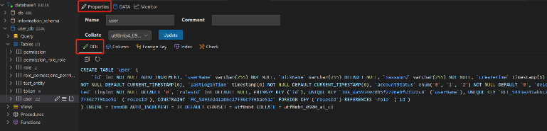
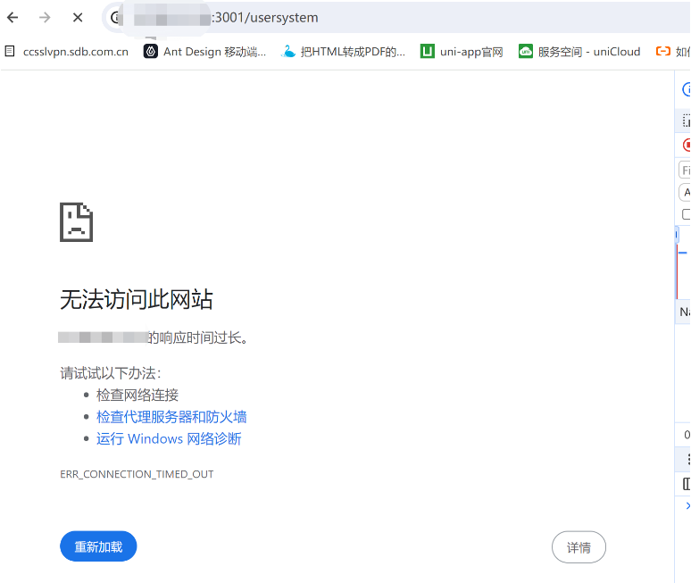

# 待定文章

- [Nuxt3 实战 (一)：初始化项目-阿里云开发者社区 (aliyun.com)](https://developer.aliyun.com/article/1515151)
- [Nuxt3 实战 (二)：配置 Eslint、Prettierrc、Husky等项目提交规范-阿里云开发者社区 (aliyun.com)](https://developer.aliyun.com/article/1515226)
- [Nuxt3 实战 (三)：使用 release-it 自动管理版本号和生成 CHANGELOG-阿里云开发者社区 (aliyun.com)](https://developer.aliyun.com/article/1515282)
- [Nuxt3 实战 (四)：安装 Nuxt UI 和配置 Typescript 类型检查-阿里云开发者社区 (aliyun.com)](https://developer.aliyun.com/article/1515295)
- [Nuxt3 实战 (五)：Header 头部布局-阿里云开发者社区 (aliyun.com)](https://developer.aliyun.com/article/1515297)
- [Nuxt3 实战 (六)：Footer 底部布局-阿里云开发者社区 (aliyun.com)](https://developer.aliyun.com/article/1515305)
- [Nuxt3 实战 (七)：配置 Supabase 数据库-阿里云开发者社区 (aliyun.com)](https://developer.aliyun.com/article/1518175)
- [Nuxt3 实战 (八)：优雅的实现暗黑主题模式-阿里云开发者社区 (aliyun.com)](https://developer.aliyun.com/article/1534431)
- [Nuxt3 实战 (九)：使用 Supabase 实现 Github 认证鉴权-阿里云开发者社区 (aliyun.com)](https://developer.aliyun.com/article/1535988)
- [Nuxt3 实战 (十)：使用 Supabase 实现 RESTful 风格 API 接口-阿里云开发者社区 (aliyun.com)](https://developer.aliyun.com/article/1541606)
- [Nuxt3 实战 (十一)：添加路由 Transition 过渡效果和 Loading 动画-阿里云开发者社区 (aliyun.com)](https://developer.aliyun.com/article/1542865)
- [Nuxt3 实战 (十二)：SEO 搜索引擎优化指南-阿里云开发者社区 (aliyun.com)](https://developer.aliyun.com/article/1549118)

# Vue+Nuxt 服务端渲染

## Nuxt 介绍

Nuxt 是一个基于 Vue 的框架，它允许应用通过 Node.JS 在服务器进行渲染，而且拥有完全交互式 JavaScript 应用程序的所有优点。

Nuxt 是一个开源框架，使 Web 开发直观而强大。使用 Nuxt 可以自信地创建高性能和生产级的全栈 Web 应用程序和网站，并且得到众多知名公司前端团队的信任。

对于 Vue 开发者来说，Nuxt 主要的优势是能够预先渲染视图，并将其作为静态文件提供。这对 SEO 优化有很大的效果，并在互动性方面有很大的提升。

NestJS是一个用于构建高效且可扩展的服务器端应用程序的框架。它的核心是模块化的结构，可以按照业务需求快速构建，而不必一开始就确定具体的结构。此外，它还支持事件驱动的异步操作，可以有效的降低延迟，提高应用程序的性能。

NuxtJS是一个用于构建客户端JavaScript应用程序的框架，它可以从服务器端渲染静态内容。它将代码分解为两个部分，一部分为服务端代码，另一部分为客户端代码。Nuxt应用程序可以很容易地在Node.js环境中运行，因此可以与NestJS实现后端渲染。

## Nuxt 的特点

### Vue 技术栈

Nuxt3 是基于 Vue3 + Vue Router + Vite + 服务引擎 Nitro 等技术栈，全程使用 Vue3 + Vite 开发，带来极致的开发体验。

### 约定式路由

约定式路由的言外之意就是目录结构即路由，Nuxt 路由基于 vue-router，在 `pages/` 目录中创建的每个页面，都会根据目录结构和文件名来自动生成路由。

### 自动导包

Nuxt 会自动导入辅助函数、组合式 API 和 Vue API，无需手动导入。Nuxt 本身基于规范的目录结构， Nuxt 还可以对自己的组件、 插件使用自动导入。

### 渲染模式

Nuxt 支持多种渲染模式，如 SSR、 CSR、 SSG 等。

### 利于搜索引擎优化

服务器端渲染模式，不但可以提高首屏渲染速度，还利于SEO。

### 服务器引擎

在开发环境中，Nuxt 使用 Rollup 和 Node.js。

在生产环境中，Nuxt 使用 Nitro 将应用程序和服务器构建到一个通用的 `.output` 目录中。其中，Nitro 服务引擎提供了跨平台部署的支持，包括 Node、 Deno、 Serverless、 Workers等平台上部署。

作者：进击的松鼠
链接：https://juejin.cn/post/7361639833864372278
来源：稀土掘金
著作权归作者所有。商业转载请联系作者获得授权，非商业转载请注明出处。

## Nuxt 网址

GitHub项目地址：https://github.com/nuxt/nuxt

Nuxt V2 版本官网：https://v2.nuxt.com/

Nuxt V3 版本官网：https://nuxt.com/

Nuxt2 中文网：https://www.nuxtjs.cn/

### Nuxt3 中文网

- **ezdoc(推荐)**：[首页 - Nuxt.js v3.11.2 - 中文开发文档手册｜官方文档中文版同步翻译更新高质量汉化 (ezdoc.cn)](https://ezdoc.cn/docs/nuxtjs)
- **推荐**：https://nuxt.com.cn/
- 待定：https://www.nuxtjs.org.cn/
- 编程之家 nuxt 教程：[Nuxt.js](https://www.jb51.cc/nuxtjs-tutorial/)

### Nuxt UI官网文档：[Nuxt UI：用于现代 Web 应用程序的 UI 库](https://ui.nuxt.com/)

### 开发调试工具：

- 官网：[Nuxt DevTools：释放Nuxt开发人员体验](https://devtools.nuxt.com/)
- GitHub：[Nuxt DevTools：https://github.com/nuxt/devtools

### 集成：

- 模块：

  - 官网：[Nuxt Modules](https://nuxt.com/modules)
  - 中文1：[Nuxt 模块 - Nuxt 中文 (nuxtjs.org.cn)](https://nuxtjs.org.cn/modules)

  - 中文2：[Nuxt 模块](https://nuxt.com.cn/modules)

- 部署：

  - 官网：[部署Nuxt应用程序](https://nuxt.com/deploy)
  - 中文：[部署一个 Nuxt 应用](https://nuxt.com.cn/deploy)

## Nuxt开源项目收集

github：[nuxt/awesome：与Nuxt.js相关的精彩事物的精选列表 (github.com)](https://github.com/nuxt/awesome)

基于Nuxt的模板：[Nuxt模板](https://nuxt.com.cn/templates)

## 怎么判断网页是否是服务端渲染

服务端渲染使用的是模板引擎渲染进来

一般网站可以浏览器右键点击“查看网页源代码”

在 body 标签里的标签大量的标签数据，这个就是服务端渲染的网站

# Nuxt 的环境搭建

## 初始化项目

**Node 的环境要求**：v18.0.0 及之后的版本

首先，在命令行终端输入：

```bash
npx nuxi@latest init <project-name>
```


然后打开项目目录，运行项目：`cd <project-name>` `npm run dev`；

## 配置 host

值得注意的是，在创建项目的时候，也许会出现报错的情况，可能是因为网络原因导致。

在命令行终端输入：`ping raw.githubusercontent.com` 检查是否能连通，如果访问不通，那么就配置下 host。

配置 host，本地解析域名：

1. Mac 电脑 host 配置路径： /etc/hosts
2. Win 电脑 host 配置路由： c:/Windows/System32/drivers/etc/hosts
3. 在 host 文件中新增一行 ，新增的内容为：185.199.108.133 raw.githubusercontent.com
4. 重新 ping 域名，如果通了就可以重新开一个终端创建项目


# Nuxt 的相关配置

## 应用入口

默认情况下， Nuxt 会将 app.vue 视为入口点，并为应用程序的每个路由呈现其内容，常用于：

1. 定义页面布局 Layout 或 自定义布局，如： NuxtLayout
2. 定义路由的占位，如： NuxtPage
3. 编写全局样式
4. 全局监听路由
5. 等等

```vue
<template>
  <div>
    <!-- 组件库的组件 nuxt/ui -->
    <NuxtWelcome />
  </div>
</template>
<script setup>
  // 监听全局路由
  let router = useRouter()
  router.beforeEach((to, form)=>{
  
  })
</script>
<style></style>
```

## Nuxt 配置

`nuxt.config.ts` 配置文件位于项目的根目录，可对 Nuxt 进行自定义配置。更多详细的配置信息可参考官网的 [**Nuxt Configuration**](https://nuxt.com/docs/api/nuxt-config) ，例如：

### runtimeConfig：运行时配置

[runtimeConfig](https://nuxt.com/docs/api/nuxt-config#runtimeconfig) 是 Nuxt 中的运行时配置，即可以在其中定义环境变量：

可通过 `.env `文件中的环境变量来覆盖 runtimeConfig 中配置的变量，优先级（.env > runtimeConfig）

`.env `的变量会打入到 `process.env` 中，符合规则的会覆盖 runtimeConfig 的变量

`.env `一般用于某些终端启动应用时动态指定配置，同时支持 dev 和 production

```ts
export default defineNuxtConfig({
  // 这里定义的运行时配置会不能在 process.env 中访问
  runtimeConfig: {
    appKey: "aabbcc", // 可以在服务端访问
    public: {
      baseURL: "http://xxx.com" // 服务端和客户端都可以访问 
    }
  }
})
```

### appConfig：应用配置

[appConfig](https://nuxt.com/docs/api/nuxt-config#appconfig) 是 Nuxt 中的应用配置，即可以在构建时确定的公共变量，如：theme 主题。

此配置会和 app.config.ts（存在于项目根目录中） 的配置合并（优先级 app.config.ts > appConfig）。

```ts
export default defineNuxtConfig({
  // 定义应用的配置
  appConfig: {
    title: "Hello Nuxt3"
    theme: {
      primary: "orange"
    }
  }
})
```

### app：app配置

通过 [app](https://nuxt.com/docs/api/nuxt-config#app) 可以给 app 所有的页面添加配置，如给每个页面上设置 head 信息。

```ts
export default defineNuxtConfig({
  // app 配置
  app: {
    // 给 app 所有的页面的 head 添加的配置(SEO, 添加外部的资源)
    head: {
      title: "学习 Nuxt",
      charset: "UTF-8",
      viewport:
        "width=device-width, initial-scale=1.0, maximum-scale=1.0, minimum-scale=1.0,user-scalable=no",
      meta: [
        {
          name: "keywords",
          content: "Nuxt 官网",
        }
      ],
      link: [
        {
          rel: "shortcut icon",
          href: "favicon.ico",
          type: "image/x-icon",
        },
      ],
      style: [
        {
          children: `body{ color: red; }`,
        }
      ],
      script: [
        {
          src: "https://nuxt.com",
        }
      ]
    }
  }
})
```

### router：配置路由相关的信息

通过配置 router 设置路由相关的信息，比如在客户端渲染可以配置 hash 路由。

```ts
export default defineNuxtConfig({
  router: {
    options: {
      hashMode: true // 只在spa应用是有效的
    }
  }
})
```

### alias：路径的别名

通过配置 [alias](https://link.juejin.cn?target=url) 可以设置路径的别名，默认已配好，我们可以直接使用路径别名。

```ts
{
  "~": "/<srcDir>",
  "@": "/<srcDir>",
  "~~": "/<rootDir>",
  "@@": "/<rootDir>",
  "assets": "/<srcDir>/assets",
  "public": "/<srcDir>/public"
}
```

### modules

通过 [modules](https://nuxt.com/docs/api/nuxt-config#modules) 配置可以拓展 Nuxt 的模块，比如： @pinia/nuxt @nuxt/image。

更多 modules 可参考 [Nuxt Modules](https://nuxt.com/modules)。

### routeRules

通过 [routeRules](https://nuxt.com/docs/api/nuxt-config#routerules-1) 配置，可以定义路由规则，可更改路由的渲染模式或分配基于路由的缓存策略。

### builder

通过 [builder](https://nuxt.com/docs/api/nuxt-config#builder) 配置可指定用 Vite 还是 webpack 来构建应用，默认是 vite。如切换为 webpack 还需要安装额外的依赖。

## 应用配置

Nuxt3 提供了一个 [**app.config**](https://nuxt.com/docs/guide/directory-structure/app-) 的应用配置文件，用来定义在构建时确定的公共变量。例如：网站的标题、主题色以及任何不敏感的项目配置等信息。

```ts
export default defineAppConfig({
  title: "Hello Nuxt3 liujun"
  theme: {
    primary: "blue"
  }
})
```

然后我们就可以在 vue 文件中使用在 **app.config** 中定义的变量：

```vue
<script setup lang="ts">
const appConfig = useAppConfig()

console.log(appConfig.theme)
</script>
```

值得注意的是，**app.config** 配置文件中的选项不能使用 env 环境变量来覆盖，这与 **runtimeConfig** 不同。

最好不要将秘密或敏感的信息放在 **app.config** 文件中，该文件是客户端公开的配置文件。

**两个配置（runtimeConifg、app.config）的区别：** **runtimeConfig** 和 **app.config** 都用于向应用程序公开变量。对于这两个配置 [Nuxt 官网也做出详细的对比](https://nuxt.com/docs/getting-started/configuration#runtimeconfig-vs-appconfig)。

要确定是否应该使用其中一种，以下是一些指导原则：**runtimeConfig** 是用来定义环境变量的，比如： 运行时需要公共变量指定的私有或公共 token。而 **app.config** 是用来定义公共变量的，比如：在构建时确定的公共 token、网站配置等。

# Nuxt基础知识

## 内置组件

Nuxt3 框架也提供一些[内置的组件](https://nuxt.com/docs/api/components/client-only)，常用的如下：

[NuxtLayout](https://nuxt.com/docs/api/components/nuxt-layout)：是 Nuxt 自带的页面布局组件。

[NuxtWelcome](https://nuxt.com/docs/api/components/nuxt-welcome)：欢迎页面组件，该组件是 [@nuxt/ui](https://ui.nuxt.com/getting-started) 的一部分。

[ClientOnly](https://nuxt.com/docs/api/components/client-only)：该组件中的默认插槽的内容只在客户端渲染，而fallback插槽的内容只在服务器端渲染。

```vue
<template>
  <div class="home">
    <div>我是Home Page</div>
    <ClientOnly>
      <div>我只会在 client 渲染</div>
      <template #fallback>
        <h2>服务器端渲染的 loading 页面</h2>
      </template>
    </ClientOnly>
  </div>
</template>
```

[NuxtLink](https://nuxt.com/docs/api/components/nuxt-link)：是 Nuxt 自带的页面导航组件，是 Vue Router`<RouterLink>`组件 和 HTML`<a>`标签的封装。

[SEO组件](https://nuxt.com/docs/getting-started/seo-meta)：`<Title>`, `<Base>`, `<NoScript>`, `<Style>`, `<Meta>`, `<Link>`, `<Body>`, `<Html>` and `<Head>`。

[NuxtPage](https://nuxt.com/docs/api/components/nuxt-page)：是 Nuxt 自带的页面占位组件，需要显示位于目录中的顶级或嵌套页面 pages/ 目录中，是对 router-view 的封装。

```vue
<template>
  <div>
    <h1>App</h1>
    <!--是 对 router-view 封装 -->
    <NuxtPage></NuxtPage>
  </div>
</template>
```

## 全局样式

**编写全局样式、全局变量步骤**

在 assets 文件中编写全局样式，比如：globel.scss；

```scss
scss复制代码// 全局样式
$color: blue;

.global-style {
  color: $color;
}
```

在 assets 文件中编写全局样式变量，比如： variables.scss；

```scss
scss复制代码// 定义全局的SCSS变量
$fsColor: purple;
$fs20: 20px;
// 混合
@mixin border() {
  border: 1px solid red;
}
```

在 nuxt.config 中的 css 选项、vite 选项中进行配置，使定义的全局样式和全局变量生效

```ts
// https://nuxt.com/docs/api/configuration/nuxt-config
export default defineNuxtConfig({
  // 定义全局样式
  css: [
    "@/assets/styles/global.scss"
  ],
  // 定义全局变量
  vite: {
    css: {
      preprocessorOptions: {
        scss: {
          // 自动的给 scss 模块首行添加额外的数据: @use "@/assets/styles/variables.scss" as *;
          additionalData: '@use "@/assets/styles/variables.scss" as *;',
        },
      },
    },
  },
});
```

接着在命令行终端执行 `npm i –D sass` 即可，然后就可以在任意组件中或 scss 文件中直接使用全局变量

## 资源的导入

### public目录

用作静态资源的公共服务器，可以在应用程序上通过 URL 直接访问

例如，引用 public/img/ 目录中的图像文件，在静态 URL 中可用 `/img/nuxt.png` 表示

```vue
<template>
  <div>
    <!-- public 资源的访问 -->
    
  </div>  
</template>
```

静态的 URL 也支持在背景中使用，如 `background-image: url(/logo.png)`

### assets目录

assets 经常用于存放如样式表、字体或 SVG 等资源

可以直接使用 ~/assets/ 路径引用位于 assets 目录中的资源文件

```vue
<template>
  <div>
    <!-- assets 资源的访问 -->
    
    
  </div>  
</template>
```

其实 ~/assets/ 路径也支持在背景中使用，如`background-image: url(@/assets/images/avatar.png)`

## 新建页面

Nuxt 项目中的页面是在 pages 目录下创建的

在 pages 目录创建的页面，Nuxt 会根据该页面的目录结构和其文件名来自动生成对应的路由

页面路由也称为文件系统路由器（file system router），路由是 Nuxt 的核心功能之一

**新建页面步骤**

1. 创建页面文件，比如： `pages/index.vue`
2. 将 `<NuxtPage />` 内置组件添加到 `app.vue`
3. 页面如果使用 `scss` 那么需要安装： `npm i sass -D`

**命令快速创建页面**

1. `npx nuxi add page home` 用来创建 home 页面
2. `npx nuxi add page detail/[id]` 用来创建 detail 页面
3. `npx nuxi add page user-[role]/[id]` 用来创建 user 页面

## 组件导航（NuxtLink）

`<NuxtLink>` 是 Nuxt 内置的组件，用来实现页面导航，本质上是对 RouterLink 的扩展，底层用的是一个 `<a>` 标签，因此使用 a + href 属性也支持路由导航。与 `<NuxtLink>` 不同的是，用 a 标签导航会有触发浏览器默认的刷新事件，而 `<NuxtLink>` 不会， `<NuxtLink>` 还扩展了其它的属性和功能，因此在 Nuxt 中我们可以使用 `<NuxtLink>` 进行组件之间的导航。

**`<NuxtLink>` 组件的部分属性：**

**`to`：** 支持路由路径、路由对象、 URL

```vue
<template>
  <NuxtLink to="/about">
    About page
  </NuxtLink>
  <!-- <a href="/about">...</a> (+Vue Router & prefetching) -->
  
  <!-- 以路由对象的形式传入 -->
    <NuxtLink
      :to="{
        path: '/category',
        query: {
          id: 100
      }
    }"
   >
     <button>category</button>
   </NuxtLink>
</template>
```

**`href`：** to 的别名

**`target`：** 和 a 标签的 target 一样，指定何种方式显示新页面

```vue
<template>
  <NuxtLink href="https://www.nuxt.com" target="_blank">
    <button>nuxt.com</button>
  </NuxtLink>
</template>
```

**`replace`：** 默认为 false，是否替换当前路由

```vue
<template>
  <NuxtLink href="/find" replace>
    <button>find replace</button>
  </NuxtLink>
</template>
```

**`activeClass`：** 激活链接的类名

```xml
<template>
  <NuxtLink to="/home" active-class="active-home">
    <button>home</button>
  </NuxtLink>
</template>
```

## 编程式导航

### navigateTo

Nuxt3 除了可以通过 `<NuxtLink>` 内置组件来实现导航，同时也支持编程导航：[**navigateTo**](https://nuxt.com/docs/api/utils/navigate-to)，通过编程式导航，在应用程序中就可以轻松实现动态导航了，但是编程式导航不利于 SEO。**navigateTo 函数在服务器端和客户端都可用**，可以**在插件、中间件中使用**，也可以**直接调用执行页面导航**。

其中 navigateTo( to , options) 函数包含**两个参数**：

**第一个参数 `to` 可以是纯字符串或外部 URL 或路由对象；**

**第二个参数 `options` 为导航配置**：

1. replace：默认为 false，为 true 时会替换当前路由页面
2. external：默认为 false，不允许导航到外部连接，true 则允许

**在 Vue 组件中直接使用**

```ts
<script setup lang="ts">
// passing 'to' as a string
await navigateTo('/search')

// ... or as a route object
await navigateTo({ path: '/search' })

// ... or as a route object with query parameters
await navigateTo({
  path: '/search',
  query: {
    page: 1,
    sort: 'asc'
  }
})
</script>
```

**在中间件中使用**

```vue
export default defineNuxtRouteMiddleware((to, from) => {
  if (to.path !== '/search') {
    // setting the redirect code to '301 Moved Permanently'
    return navigateTo('/search', { redirectCode: 301 })
  }
})
```

### useRouter

Nuxt3 中的编程导航除了可以通过 navigateTo 来实现导航，同时也支持 useRouter (或 Options API 的 this.$router)。

[useRouter 常用的 API：](https://nuxt.com/docs/api/composables/use-router)

1. back：页面返回，同 router.go(-1)
2. forward：页面前进，同 router.go(1)
3. go：页面返回或前进，如 router.go(-1) or router.go(1)
4. push：以编程方式导航到新页面，建议改用 navigateTo，支持性更好
5. replace：以编程方式导航到新页面，但会替换当前路由，建议改用 navigateTo，支持性更好
6. beforeEach：路由守卫钩子，每次导航前执行（用于全局监听）
7. afterEach：路由守卫钩子，每次导航后执行（用于全局监听）

```vue
<template>
  <div>
    <!-- 通过编程的方式进行导航 -->
    <button @click="goToHome">Go Home</button>
  </div>
  <!-- 是对router-view的封装 -->
  <NuxtPage></NuxtPage>
</template>
<script setup>
// useRouter
let router = useRouter();
function goToHome() {
  router.push("/home")
}

function goBack() {
  router.go(-1);
}

// 路由的守卫
router.beforeEach((to, form) => {
  console.log(to)
  console.log(form)
})
</script>
```

## 动态路由

Nuxt3 和 Vue 一样，也是支持动态路由的，在 Nuxt3 中，动态路由是根据目录结构和文件的名称自动生成

**动态路由语法：**

1. 页面组件目录或页面组件文件都 支持 **[ ]** 方括号语法
2. 方括号里编写动态路由的参数

例如，动态路由支持如下写法：

1. `pages/detail/[id].vue` -> `/detail/:id`
2. `pages/detail/user-[id].vue` -> `/detail/user-:id`
3. `pages/detail/[role]/[id].vue` -> `/detail/:role/:id`
4. `pages/detail-[role]/[id].vue` -> `/detail-:role/:id`

## 路由参数( useRoute )

### 动态路由参数

通过 **[ ]** 方括号语法定义动态路由，比如： `/detail/[id].vue`。

页面跳转时，在 URL 路径中传递动态路由参数，比如： `/detail/100`。

目标页面通过 `route.params` 获取动态路由参数。

**示例：导航页面**

```vue
<template>
  <div>
    <NuxtLink to="/detail/100">
      <button>detail</button>
    </NuxtLink>
    <!-- router-view -->
    <NuxtPage></NuxtPage>
  </div>
</template>
```

**示例：获取数据页面**

```vue
<template>
  <div>id={{ id }}</div>
</template>
<script lang="ts" setup>
  // 拿到动态路由的参数
  const route = useRoute()
  const { id } = route.params
</script>
<style scoped></style>
```

### 查询字符串参数

页面跳转时，通过查询字符串方式传递参数，比如： `/detail/100?name=zhangsan`。

目标页面通过 `route.query` 获取查询字符串参数。

**示例：导航页面**

```vue
<template>
  <div>
    <NuxtLink to="/detail/100?name=zhangsan">
      <button>detail</button>
    </NuxtLink>
    <!-- router-view -->
    <NuxtPage></NuxtPage>
  </div>
</template>
```

**示例：获取数据页面**

```vue
<template>
  <div>id={{ id }} name={{ name }}</div>
</template>
<script lang="ts" setup>
  // 获取动态路由的参数
  const route = useRoute()
  const { id } = route.params
  const { name } = route.query
</script>
<style scoped></style>
```

## 路由匹配规则

路由匹配需注意的事项，预定义路由优先于动态路由，动态路由优先于捕获所有路由

**预定义路由：**`pages/detail/create.vue`

1. 将匹配 `/detail/create`

**动态路由：**`pages/detail/[id].vue`

1. 将匹配 `/detail/1`、`/detail/abc` 等
2. 但不匹配 `/detail/create` 、`/detail/1/1`、`/detail/` 等

**捕获所有路由：**`pages/detail/[...slug].vue`

1. 将匹配 `/detail/1/2`, `/detail/a/b/c` 等
2. 但不匹配 `/detail` 等

### 总结

Nuxt 框架是开箱即用的，并且学习成本也非常低，我们需要做的事情 Nuxt 都帮我们做好了，因此我们只要专注于业务的开发，而无需关心那些繁琐的配置。

对于一些内置的 API，我们不需要导入就可以直接使用；对于注册路由，我们直接使用 Nuxt 给我们提供的动态路由就可以直接导航到相应的页面，并直接获取路由参数；对于代码规范，Nuxt 也帮我们内置好了，布局相关的组件，我们直接只用 layout，有关中间件相关的，我们直接在 middleware 文件夹下定义。

Nuxt 相关的知识点不止这些，我们打开 Nuxt 官网大致浏览一下就会发现，内容非常丰富，知识点非常多，不过不用焦虑，由浅入深，分章节去学习是最好的方式。在下一篇文章《拥抱全栈框架 Nuxt | 进阶篇》中，我们会学习到 Nuxt 的页面渲染、插件开发、如何书写中间件、如何发送网络请求获取数据、如何写 API 接口、如何引入状态管理库 Pinia，以及如何引入第三方组件库等内容。

## 1.页面配置

根目录 app.vue 文件标签：

[NuxtPage](https://v3.nuxtjs.org/api/components/nuxt-page)：默认显示的**pages 目录**的页面，首页为 index.vue

```vue
<!-- app.vue -->
<template>
  <NuxtPage />
</template>
```


[NuxtLayout](https://v3.nuxtjs.org/api/components/nuxt-layout)：默认显示**layouts 目录**的布局页面，默认页是：default.vue

```vue
<!-- app.vue -->
<template>
  <div>
    <NuxtLayout :name="layout">
      <NuxtPage />
    </NuxtLayout>
  </div>
</template>
<script setup>
const layout = 'custom' // 指定layout为custom页，标签内使用 :name="layout"
</script>
```


[NuxtWelcome](https://v3.nuxtjs.org/api/components/nuxt-welcome)：默认的欢迎页面

## 2.页面路由

### pages 里面的页面都会自动生成路由

可以是<mark>vue 组件</mark>或者后缀名为` .vue```.js `.jsx`.ts`.tsx`的文件

### 路由跳转

```vue
<nav>
  <ul>
    <li><NuxtLink to="/">index</NuxtLink></li>
    <li><NuxtLink to="/about">About</NuxtLink></li>
    <li v-for="id in [1,2,3]">
      <NuxtLink :to="{path: `/posts/${id}`}">Post {{id}}</NuxtLink>
    </li>
    <li><NuxtLink to="/posts/1">click 1</NuxtLink></li>
    <li><NuxtLink to="/posts/2">click 2</NuxtLink></li>
    <li><button @click="$router.push('/about')">跳转about</button></li>
  </ul>
</nav>
```

### router 和 route

可以在 script 标签内通过 useRouter()useRoute()和获得，或者在 template 标签内通过$router和$route 获得

```vue
<script setup lang='ts'>
  const router = useRouter()

  console.log('router', router)
  const route = useRoute()

  console.log('route.query', route.query)
  console.log('route.params', route.params)
</script>

<template>
  <div>
    ID：{{ $route.params.id }}
  </div>
  <div>
    posts-{{ $route.params.id }}
    {{$router.hasRoute}}
  </div>
</template>
```

### 编程式导航

`navigateTo()`和`navigate()`

**注意：**确保始终通过从函数返回来链接其结果。` await`、`navigateTo `

```vue
<script setup>
const router = useRouter();
const name = ref('');
const type = ref(1);

function navigate(){
  return navigateTo({
    path: '/search',
    query: {
      name: name.value,
      type: type.value
    }
  })
}
</script>
```

### 页面或者组件切换过渡动画配置

文档：[过渡 ·努克斯特 (nuxtjs.org)](https://v3.nuxtjs.org/getting-started/transitions#page-transitions)

1.为所有页面设置过渡：

2.为页面设置不同的过渡：

3.为布局设置过渡：[Transitions · Nuxt (nuxtjs.org)](https://v3.nuxtjs.org/getting-started/transitions#layout-transitions)

4.禁用特定页面的过：[Transitions · Nuxt (nuxtjs.org)](https://v3.nuxtjs.org/getting-started/transitions#disable-transitions)

5.高度动态和自定义的过渡：[Transitions · Nuxt (nuxtjs.org)](https://v3.nuxtjs.org/getting-started/transitions#javascript-hooks)

6.使用 NuxtPage 进行过渡：[Transitions · Nuxt (nuxtjs.org)](https://v3.nuxtjs.org/getting-started/transitions#transition-with-nuxtpage)

```js
// nuxt.config.ts
export default defineNuxtConfig({
	app: {
		pageTransition: { name: "page", mode: "out-in" },
	},
});
```

app.vue 文件设置动画

```html
<template>
	<NuxtPage />
</template>
<style>
	.page-enter-active,
	.page-leave-active {
		transition: all 0.4s;
	}
	.page-enter-from,
	.page-leave-to {
		opacity: 0;
		filter: blur(1rem);
	}
</style>
```

## 3.middleware 文件夹：中间件的使用(路由前置守卫)

nuxt.config.ts：是路由的全局守卫

1.定义中间件：middleware\auth.ts

```js
// auth.ts
export default defineNuxtRouteMiddleware((to, from) => {
	console.log("auth");
});
```

2.页面内使用中间件：

```vue
<script setup>
definePageMeta({
  middleware: ["auth"] // 中间件文件名字
  // or middleware: 'auth'
})
</script>
```

3.动态添加或重写中间件：

可以使用辅助函数手动添加全局或命名路由中间件，下例是在插件目录中定义中间件：

```js
// plugins/mideleware.ts
export default defineNuxtPlugin(() => {
	addRouteMiddleware(
		"global-test",
		() => {
			console.log(
				"this global middleware was added in a plugin and will be run on every route change"
			);
		},
		{ global: true }
	);

	addRouteMiddleware("named-test", () => {
		console.log(
			"this named middleware was added in a plugin and would override any existing middleware of the same name"
		);
	});
});
```

调用也和上面的一样

## 4.Meta 等标签的 SEO 优化相关

文档：[SEO and Meta · Nuxt (nuxtjs.org)](https://v3.nuxtjs.org/getting-started/seo-meta#components)

useHead 的标签组件：<https://v3.nuxtjs.org/getting-started/seo-meta#components>

useHead 的属性类型和作用：<https://v3.nuxtjs.org/api/composables/use-head>

SEO 标签总结 1：<https://www.cnblogs.com/colorful-paopao1/p/10189962.html>

SEO 标签总结 2：<https://www.cnblogs.com/hellowzd/p/6177836.html>

```vue
<script setup lang='ts'>
  useHead({
    // 网站标题（title）：
    // 一般设置3~5个关键词+一个品牌词，关键词要与网站定位相关，同时包含核心业务。当然，最好还要结合用户的搜索习惯。
    title: '导航首页', // 当前页面标题
    // 标题模板
    titleTemplate: (title) => {
      return title ? `${title} - 前端|后端|学习|导航|前端导航|后端导航|前端库导航|前端学习导航` : '前端|后端|学习|导航|前端导航|后端导航|前端库导航|前端学习导航'
    },
    meta: [
      // 网站描述（description）：
      // 主要是网站介绍的内容，可以适当包含title中的关键词，字数一般控制在70左右。正确填写网站描述，除了可提升网站业务相关性外，还能够增强网站关键词的匹配度，有利于网站关键词排名。
      { name:'description', content: '好用的前端后端开发者的导航网站，包含前端的学习资料，练习项目，面试题库，后端各种库的导航和学习资料' },
      // 网站关键词（keyword）：
      // 设置关键词标签更多是辅助的作用，而且不会展示在搜索结果中，提炼时候可以重复title的内容。相对来说也没有标题和描述那么重要，但按照规范填写肯定更好。
      { name:'keyword', content: '前端|后端|学习|导航|前端导航|后端导航|前端库导航|前端学习导航' },
    ],
    script: [
      { children: 'console.log(\'Hello word\')' }
    ]
  })
</script>

<template>
  <div>
    
  </div>
</template>

<style scoped lang="scss">

</style>
```

与上列标签对应的组件

```vue
<Title>
<Base>
<Script>
<NoScript>
<Style>
<Meta>
<Link>
<Body>
<Html>
<Head>
```

## 5.自定义 hook 函数

**composables 目录下定义文件，默认情况下不可再有文件夹，因为 Nuxt 默认只扫描该目录下的顶层的文件**

[Composables · Nuxt Directory Structure (nuxtjs.org)](https://v3.nuxtjs.org/guide/directory-structure/composables#how-files-are-scanned)

### 定义

```js
// composables/useFoo.ts

// 使用命名导出
export const useFoo = () => {
	return useState("foo", () => "bar");
};
// 使用默认导出
// export default function () {
//   return useState('foo', () => 'bar')
// }
```

##### 页面内使用：定义的方法会自动导入，可在` .js``.ts``.vue `文件中使用

```html
<template>
	<div>{{ foo }}</div>
</template>

<script setup>
	const foo = useFoo(); // 使用
</script>
工具
```

##### 工具函数嵌套组合使用

```js
// composables/test.ts
export const useFoo = () => {
	const nuxtApp = useNuxtApp();
	const bar = useBar();
};
```

##### 访问插件

```js
// composables/test.ts
export const useHello = () => {
	const nuxtApp = useNuxtApp();
	return nuxtApp.$hello;
};
```

## 6.server 服务器目录

文档：[Server · Nuxt Directory Structure (nuxtjs.org)](https://v3.nuxtjs.org/guide/directory-structure/server#server-directory)

---

Nuxt 会自动扫描 、 和目录中的文件，以使用 HMR 支持注册 API 和服务器处理程序。

### `~/server/api`：服务器 API 接口目录

#### 6.1.在根目录下位置创建文件夹下的新文件：`server/api/hello.ts`

```js
export default defineEventHandler((event) => {
	console.log("hello event", event.context);
	return {
		data: "hello word",
	};
});
```

1.2.页面中调用此 API：

```js
await $fetch("/api/hello");
```

1.3 浏览器中访问：

```bash
http://localhost:3000/api/hello
```

#### 6.2.匹配路由参数的 API 接口

新建目录下的文件：`~/server/api/user/[name].ts`

```js
export default defineEventHandler(
	(event) => `Hello, ${event.context.params.name}!`
);
```

6.2.1 页面内调用：

```js
// user后面的/nuxt就是返回来的：event.context.params.name
const nuxt = await $fetch("/api/user/nuxt");
```

#### 6.3.匹配 HTTP 方法：四种方法：.get、.post、.put、.delete

api 名.方法名.ts，例子：test.post.ts、test.get.ts

如果不写方法名，默认是 get 方法

```js
// server/api/test.get.ts
export default defineEventHandler(() => "Test get handler");
```

```js
// server/api/test.post.ts
export default defineEventHandler(() => "Test post handler");
```

#### 6.4.包罗万象：捕获所有路由有助于回退路由处理

###### 6.4.1 与任何路由处理程序不匹配的 所有请求注册一个 catch-all 错误捕捉

`~/server/api/foo/[...].ts`：catch-all 错误捕捉

```js
export default defineEventHandler(() => `Default foo handler`);
```

请求一个 foo 下不存在的接口：便会默认请求到上面的接口

```js
http://localhost:3000/api/foo/dd
```

#### 6.5.处理请求：使用实例

###### 6.5.1 使用 readBody 正文处理请求

```js
// server/api/submit.post.ts
export default defineEventHandler(async (event) => {
	const body = await readBody(event);
	return { body };
});
```

页面内   调用此 API：
`$fetch('/api/submit', { method: 'post', body: { test: 123 } })`

###### 6.5.2 使用 getQuery 查询参数处理请求

```js
// server/api/query.get.ts
export default defineEventHandler((event) => {
	const query = getQuery(event);
	return { a: query.param1, b: query.param2 };
});
```

浏览器页面参数示例查询：`/api/query?param1=a&param2=b`

###### 6.5.3 访问请求 cookies

```js
export default defineEventHandler((event) => {
	const cookies = parseCookies(event);
	return { cookies };
});
```

###### 6. 5.4 访问运行时配置：useRuntimeConfig()

```js
// server/api/foo.ts
export default defineEventHandler((event) => {
	const config = useRuntimeConfig();
	return { key: config.KEY };
});
```

#### 6.6.高级用法示例

###### 6.6.1 `nitro`的`nuxt.config`配置

[Server · Nuxt Directory Structure (nuxtjs.org)](https://v3.nuxtjs.org/guide/directory-structure/server#nitro-configuration)

###### 6.6.2 使用嵌套路由：server/api/hello.ts

```js
import { createRouter } from "h3";

const router = createRouter();

router.get("/", () => "Hello World");

export default router;
```

###### 6.6.3 发送流

**注意：**这是一项实验性功能，仅在 Node.js 环境中可用。

```js
// server/api/foo.get.ts
import fs from "node:fs";
import { sendStream } from "h3";

export default defineEventHandler((event) => {
	return sendStream(event, fs.createReadStream("/path/to/file"));
});
```

###### 6.6.4 返回旧版处理程序或中间件

[Server · Nuxt Directory Structure (nuxtjs.org)](https://v3.nuxtjs.org/guide/directory-structure/server#return-a-legacy-handler-or-middleware)

###### 6.6.5 服务存储

**6.6.5.1 使用 Redis 存储：nuxt.config.ts 文件设置**

```js
export default defineNuxtConfig({
	nitro: {
		storage: {
			redis: {
				driver: "redis", // 使用Redis存储
				/* redis connector options */
				port: 6379, // Redis port
				host: "127.0.0.1", // Redis host
				username: "", // needs Redis >= 6
				password: "",
				db: 0, // Defaults to 0
			},
		},
	},
});
```

**6.6.5.2 服务器接口使用 Redis 存储：**

接口使用:

```js
// server/api/test.post.ts：post接口使用
export default defineEventHandler(async (event) => {
	const body = await readBody(event);
	await useStorage().setItem("redis:test", body);
	return "Data is set";
});
```

```js
// server/api/test.get.ts：get接口使用
export default defineEventHandler(async (event) => {
	const data = await useStorage().getItem("redis:test");
	return data;
});
```

页面调用接口：

```html
<template>
	<div>
		<div>Post state: {{ resDataSuccess }}</div>
		<div>Get Data: {{ resData.text }}</div>
	</div>
</template>

<script setup lang="ts">
	const { data: resDataSuccess } = await useFetch("/api/test", {
		method: "post",
		body: { text: "Nuxt is Awesome!" },
	});
	const { data: resData } = await useFetch("/api/test");
</script>
```

---

### `~/server/routes`：服务器路由目录

在根目录下新建文件夹下的文件：server\routes\hello.ts

```js
export default defineEventHandler(() => "Hello World!");
```

浏览器中访问：

```js
http://localhost:3000/hello
```

---

### `~/server/middleware`：服务中间件目录

中间件处理程序将在任何其他服务器路由之前在每个请求上运行，用于添加或检查标头、记录请求或扩展事件的请求对象。

中间件处理程序不应返回任何内容（也不关闭或响应请求），而应仅检查或扩展请求上下文或引发错误。

服务器/中间件/日志

```js
export default defineEventHandler((event) => {
	console.log("New request: " + event.req.url);
});
```

服务器/中间件/身份验证

```js
export default defineEventHandler((event) => {
	event.context.auth = { user: 123 };
});
```

---

### `~/server/plugins`：服务器插件目录

Nuxt 将自动读取目录中的任何文件，并将它们注册为 Nitro 插件。这允许扩展 Nitro 的运行时行为并挂钩到生命周期事件中。

在根目录下位置创建文件夹下的新文件：`server/plugins/nitroPlugin.ts`

```js
export default defineNitroPlugin((nitroApp) => {
	console.log("Nitro plugin", nitroApp);
});
```

---

### `~/server/utils`：服务器公共工具程序目录

```js

```

---

## 7.使用 UI 组件库

##### 官方教程：node_modules 组件安装路径里添加 nuxt.js 文件，里面写入配置

官方文档：[Components · Nuxt Directory Structure (nuxtjs.org)](https://v3.nuxtjs.org/guide/directory-structure/components#library-authors)

中文文档：[components | Nuxt 3 - 中文文档 (nuxtjs.org.cn)](https://www.nuxtjs.org.cn/directory-structure/components.html#%E5%BA%93%E4%BD%9C%E8%80%85)

##### 2.在 plugins 目录下：用插件形式 使用 UI 组件库

1. 安装所需的插件：

   ```bash
   yarn add --dev vue-gtag-next
   ```

2. 创建一个插件文件`plugins/vue-gtag.client.js`

   ```js
   import VueGtag from "vue-gtag-next";
   
   export default defineNuxtPlugin((nuxtApp) => {
   	nuxtApp.vueApp.use(VueGtag, {
   		property: {
   			id: "GA_MEASUREMENT_ID",
   		},
   	});
   });
   ```

##### 3. ElementPlus 引入

官方文档：[快速开始 | Element Plus (gitee.io)](https://element-plus.gitee.io/zh-CN/guide/quickstart.html#%E4%BD%BF%E7%94%A8-nuxt-js)

##### 4.NaiveUI 引入

官网：[Naive UI: 一个 Vue 3 组件库](https://www.naiveui.com/)

[服务端渲染 Server-Sider Rendering - Naive UI](https://www.naiveui.com/zh-CN/os-theme/docs/ssr)

[课时 3.引入 NaiveUI 和基本使用\_哔哩哔哩\_bilibili](https://www.bilibili.com/video/BV1Zt4y187EV?p=3&spm_id_from=pageDriver&vd_source=5f0c99b3deddffe219938763769b15ac)

## 8.Nuxt3 生命周期钩子

Nuxt3 生命周期钩子列表文档：[Lifecycle Hooks · Nuxt (nuxtjs.org)](https://v3.nuxtjs.org/guide/going-further/hooks#lifecycle-hooks)

生命周期钩子函数的用法：[Lifecycle Hooks · Nuxt (nuxtjs.org)](https://v3.nuxtjs.org/guide/going-further/hooks)

## 9.plugins：Nuxt 插件目录

1.文档：[Plugins · Nuxt Directory Structure (nuxtjs.org)](https://v3.nuxtjs.org/guide/directory-structure/plugins)

2.中文文档：[插件 plugins | Nuxt 3 - 中文文档 (nuxtjs.org.cn)](https://www.nuxtjs.org.cn/directory-structure/plugins.html#%E6%8F%92%E4%BB%B6%E7%9B%AE%E5%BD%95)

3.通过生命周期钩子来写插件，生命周期钩子文档：[Lifecycle Hooks · Nuxt (nuxtjs.org)](https://v3.nuxtjs.org/guide/going-further/hooks#lifecycle-hooks)

4.生命周期钩子函数的用法：[Lifecycle Hooks · Nuxt (nuxtjs.org)](https://v3.nuxtjs.org/guide/going-further/hooks)

### 全局 loading 插件例子

```js
// plugins\loading.ts
// 1.导入相关的组件api

// 2.生命周期中判断: 未开始，开始和完成 ，或发生错误时使用
export default defineNuxtPlugin((NuxtApp) => {
	const loading = ref(null);

	NuxtApp.hook("app:mounted", (e) => {
		if (!loading.value) {
			// 运行加载组件
			// loading.value = 加载组件
		}
	});

	NuxtApp.hook("page:start", (e) => {
		// loading.value?.start() // 开始loading加载
	});

	NuxtApp.hook("page:finish", (e) => {
		// loading.value?.finish() // loading加载完成
	});

	NuxtApp.hook("app:error", (e) => {
		// 如果是在客户端
		if (process.client) {
			console.log("客户端app:error", e);
		}
		// 如果是在服务端
		if (process.server) {
			console.log("服务端app:error", e);
		}
	});
});
```

## 10.全局的错误处理

文档：[Error handling · Nuxt (nuxtjs.org)](https://v3.nuxtjs.org/getting-started/error-handling)

## 11.自定义全局错误页面

文档：[Error handling · Nuxt (nuxtjs.org)](https://v3.nuxtjs.org/getting-started/error-handling#rendering-an-error-page)

1.在根目录新建文件：error.vue 文件

```html
<template>
	<div>
		<div>发生了错误！！！</div>
		<button @click="handleError">返回首页</button>
	</div>
</template>
<script setup lang="ts">
	const handleError = () => clearError({ redirect: "/" });
</script>
```

完成后重新启动项目

## 12.通过插件实现：全局 loading 组件

1.nuxt 自带的路由跳转 全局顶部 loading 加载组件： [· Nuxt Components (nuxtjs.org)](https://v3.nuxtjs.org/api/components/nuxt-loading-indicator)

```html
<!-- app.vue文件 -->
<template>
	<div>
		<NuxtLayout>
			<NuxtLoadingIndicator
				color="#FF0000"
				height="3"
				duration="2000"
				throttle="200"
			/>
			<!-- 在页面导航上显示进度条 -->
			<NuxtPage />
			<!-- 路由出口 -->
		</NuxtLayout>
	</div>
</template>
```

2.自定义插件全局 loading 组件：看[8.plugins：Nuxt 插件目录：全局 loading 插件例子](#8pluginsnuxt插件目录)↑

## 13.全局化配置

主题、命名空间、继承主题、语言配置、使用操作系统主题、禁用 inline 主题

以 NaiveUI 的全局化配置为例：[全局化配置 Config Provider - Naive UI](https://www.naiveui.com/zh-CN/light/components/config-provider)

教程：[课时 8.主布局实现\_哔哩哔哩\_bilibili](https://www.bilibili.com/video/BV1Zt4y187EV/?p=8&spm_id_from=pageDriver&vd_source=5f0c99b3deddffe219938763769b15ac)

## 14.数据交互

官网文档：[Data Fetching · Nuxt (nuxtjs.org)](https://v3.nuxtjs.org/getting-started/data-fetching)

中文文档：[获取数据 | Nuxt 3 - 中文文档 (nuxtjs.org.cn)](https://www.nuxtjs.org.cn/usage/data-fetching.html)

`Nuxt3`提供了 4 种方式使得你可以在服务器端异步获取数据

- useAsyncData
- useLazyAsyncData （useAsyncData+lazy:true）
- useFetch
- useLazyFetch （useFetch+lazy:true）

> 注意：他们只能在**`setup`**或者是`生命周期钩子`中使用

## 15.状态管理

文档：[State Management · Nuxt (nuxtjs.org)](https://v3.nuxtjs.org/getting-started/state-management)

## 16.运行时配置

文档：[Runtime Config · Nuxt (nuxtjs.org)](https://v3.nuxtjs.org/guide/going-further/runtime-config)

##### 1 公开的运行时配置

第二种方法看中文网文档：[运行时配置 Runtime Config | Nuxt 3 - 中文文档 (nuxtjs.org.cn)](https://www.nuxtjs.org.cn/usage/runtime-config.html#%E5%85%AC%E5%BC%80%E8%BF%90%E8%A1%8C%E6%97%B6%E9%85%8D%E7%BD%AE-exposing-runtime-config)

nuxt.config.ts 文件下配置 runtimeConfig：

```js
export default defineNuxtConfig({
	runtimeConfig: {
		// The private keys which are only available within server-side
		apiSecret: "123",
		// Keys within public, will be also exposed to the client-side
		public: {
			apiBase: "/api",
		},
	},
});
```

**页面或服务器中使用（访问时运行）**

```js
const runtimeConfig = useRuntimeConfig();

console.log(runtimeConfig.apiSecret);
console.log(runtimeConfig.public.apiBase);
```

**Vue 实例页面中直接访问配置**：使用上面选项 API 配置时，可通过 下面命令获得公共运行时配置

```js
this.$config.public;
```

###### 环境变量

除了一些进程(process)环境变量之外，如果在项目的根目录中有一个  `.env`  文件，它将自动加载到  `process.env`  中，并且可以在  `nuxt.config`  文件和模块中访问。

.env 文件：

```js
// .env
BASE_URL = https://nuxtjs.org
API_SECRET = api_secret_token
```

nuxt.config.ts 文件下访问：

```js
export default defineNuxtConfig({
	publicRuntimeConfig: {
		BASE_URL: process.env.BASE_URL,
	},
	privateRuntimeConfig: {
		API_SECRET: process.env.API_SECRET,
	},
});
```

##### 2 访问运行时配置

[运行时配置 Runtime Config | Nuxt 3 - 中文文档 (nuxtjs.org.cn)](https://www.nuxtjs.org.cn/usage/runtime-config.html#%E8%AE%BF%E9%97%AE%E8%BF%90%E8%A1%8C%E6%97%B6%E9%85%8D%E7%BD%AE-accessing-runtime-config)

在 Nuxt 应用程序的 Vue 实例中，需要调用  `useRuntimeConfig()`  来访问运行时配置。

Vue 实例中访问：

```js
<script setup>const config = useRuntimeConfig()</script>
```

插件中访问：

```js
export default defineNuxtPlugin((nuxtApp) => {
	const config = useRuntimeConfig();
	console.log("API base URL:", config.public.apiBase);
});
```

服务器路由中访问：

```js
export default async () => {
	const result = await $fetch("https://my.api.com/test", {
		headers: {
			Authorization: `Bearer ${useRuntimeConfig().apiSecret}`,
		},
	});
	return result;
};
```

手动输入运行是配置：

```js
declare module '@nuxt/schema' {
  interface RuntimeConfig {
    apiSecret: string
    public: {
      apiBase: string
    }
  }
}
// 确保在扩充类型时 import/export 某
export {}
```

```js
declare module '@nuxt/schema' {
  interface PublicRuntimeConfig {
    testConfig: string
  }
  interface PrivateRuntimeConfig {
    token: string
  }
}
// 确保在扩充类型时 import/export 某些比较重要的内容
export {}
```

##

## 17.Nuxt3 第三方模块

模块预览地址：[Explore Nuxt Modules (nuxtjs.org)](https://modules.nuxtjs.org/?version=3.x)

模块都是带有 nuxt 名字的库：可以点击进去，然后看文档在项目中安装使用.

在 nuxt.config.js 文件配置好模块后，模块都是和正常 vue3 项目的模块使用一样

@pinia/nuxt 状态管理库的配合 useState()使用：[【Nuxt3 从入门到实战】第八啪：巧用社区“模块”，让开发超级高效，让 Nuxt 更加强大！\_哔哩哔哩\_bilibili](https://www.bilibili.com/video/BV15Q4y1v7ug/?spm_id_from=pageDriver&vd_source=5f0c99b3deddffe219938763769b15ac)

## 18.测试

文档：[Testing · Nuxt (nuxtjs.org)](https://v3.nuxtjs.org/getting-started/testing)

## 19.编译

1.pnpm run build 后：会在项目目录生成 .output 这个打包后的目录

2.运行 pnpm run preview 命令，预览打包后的项目。

## 20.项目部署

文档：[Deployment · Nuxt (nuxtjs.org)](https://v3.nuxtjs.org/getting-started/deployment)

中文文档：[Azure | Nuxt 3 - 中文文档 (nuxtjs.org.cn)](https://www.nuxtjs.org.cn/deployment/azure.html#azure-functions)

在 nuxt 项目中的 server 目录中：index.ts 做反向代理，

## 21.Nuxt 缺点

1.Nuxt 的 server 的服务器端存在缺点：

- 没有数据校验：如何去校验前端传来的数据

- 缺少必要的 orm：对象与关系数据库之间的桥梁

**建议使用-服务端渲染 + 其他后端语言作服务器接口 来结合 开发：CSR + SSR 相结合**

# Nuxt3 引入模块库

从 [**Nuxt Modules**](https://nuxt.com/modules) 中寻找想要引入的组件库，我们以 [Nuxt UI](https://ui.nuxt.com/) 为例，介绍如何在 Nuxt 中使用组件库，进入 [Nuxt UI](https://ui.nuxt.com/) 官网，参照文档要求进行安装。

首先，在项目根目录中打开命令行终端并输入：

```bash
npx nuxi@latest module add ui
```

这样，nuxi 脚手架会自动帮我们下载 `@nuxt/ui` 这个第三方包并自动注册到 `nuxt.config.ts` 中的 `modules` 数组中，这样我们就可以在页面中直接使用。


**示例代码：**

```vue
<template>
  <UButton>Button</UButton>
  <UInput color="primary" variant="outline" placeholder="Search..." />
</template>
```

引入组件就能使用，能达到立竿见影的效果。

# 路由中间件（middleware）

Nuxt 提供了一个可定制的[**路由中间件**](https://nuxt.com/docs/guide/directory-structure/middleware)，用来监听路由的导航，包括：局部和全局监听，而全局监听支持在服务器和客户端执行，路由中间件分为三种：**匿名（或内联）路由中间件**，**命名路由中间件**和**全局路由中间件**。

### 匿名（或内联）路由中间件

在页面中使用 `definePageMeta` 函数定义，可监听局部路由，当注册多个中间件时，会按照注册顺序来执行。

```vue
<template>
  <div>我是 Parent 二级路由页面的子页面 child1</div>
</template>

<script setup>
definePageMeta({
  // 路由中间件( 监听路由 )
  middleware: [
    // 第一个中间件
    function (to, from) {
      console.log(from)
      console.log(to)
      console.log('child1 第一个中间件')
    },
    // 第二个中间件
    function (to, from) {
      // console.log(from)
      // console.log(to)
      console.log('child1 第二个中间件')
    },
    // 第三个中间件
    function (to, from) {
      console.log('child1 第三个中间件')
    }
  ]
})
</script>

<style scoped></style>
```

**示例演示：**


### 命名路由中间件

命名路由中间件，需要在 middleware 目录中定义，会自动加载中间件，应遵循 kebab-case 命名规范。

例如，在 `/pages/middleware` 文件夹下定义一个 `home.ts` 的中间件。


```js
export default defineNuxtRouteMiddleware((to, from) => {
  console.log(from)
  console.log(to)
  console.log('home 中间件')
})
```

然后，在需要使用的页面引入，直接以字符串的形式传入 `middleware` 数组中。

```vue
<template>
  <div>我是 Parent 二级路由页面的子页面 child2</div>
</template>

<script setup>
definePageMeta({
  // 路由中间件( 监听路由 )
  middleware: ['home']
})
</script>

<style scoped></style>
```

**示例演示：**


### 全局路由中间件

需要定义在 middleware 目录中， 并且创建的文件要带 `.global` 后缀，每次路由更改都会自动运行


```ts
// 这个优先级别是比较高的
export default defineNuxtRouteMiddleware((to, from) => {
  console.log('auth.global.ts 全局路由中间件')
})
```

然后，每次路由更改的时候都会在每个页面中执行，值得注意的是，**全局路由中间件的优先级是比较高的**，执行的顺序要优于其它类型的中间件。

**示例演示：**


## 路由验证( validate )

Nuxt 支持对每个页面路由进行验证，我们可以通过 `definePageMeta` 中的 `validate` 属性来对路由进行一定的规则验证。其中 `validate` 属性接受一个回调函数，回调函数中以 `route` 作为参数。

回调函数的返回值：一方面**支持返回布尔类型**的值来确定是否放行路由，返回 `true` 则放行路由，返回 `false` 则默认重定向到内置的 404 页面中；另一方面**支持返回一个对象**，例如，返回 `{ statusCode:401 }`，同样表示路由验证失败，返回到默认的 404 页面中。

值得一提的是，对于路由验证失败来说，也是可以自定义错误页面的，在项目根目录新建 `error.vue` 页面，注意不是 pages 目录中，而是项目根目录中。

```vue
<script lang="ts" setup>
// 获取动态路由的参数
const route = useRoute()
const { id } = route.params

definePageMeta({
  // 路由参数的验证
  validate: (route) => {
    console.log(route.params.id)
    // 在这里可以进行路由参数的验证，如使用正则进行验证
    // 1. 返回布尔值
    // return /^\d+$/.test(route.params.id as string)
    // 2. 返回一个对象
    return {
      statusCode: 401, // 路由验证失败
      statusMessage: "validata router error"
    }
  }
})
</script>
```

## Nuxt 插件

Nuxt 有一个插件系统，可以在创建 Vue 应用程序时使用 Vue 插件等，Nuxt 会自动读取 plugins/ 目录中的文件，并在创建 Vue 应用程序时加载它们。

因此 Nuxt 支持自定义插件并进行扩展，创建插件有两种方式：

**方式一**：直接使用 `useNuxtApp()` 中的 `provide(name, vlaue)` 方法直接创建，例如：可在 app.vue 中创建。

```vue
<script setup>
// 方式一：创建插件
const nuxtApp = useNuxtApp()
nuxtApp.provide("provId", () => {
  return "省份名称"
})
nuxtApp.provide("feskill", "Nuxt")

// 使用插件
console.log(nuxtApp.$provId())
console.log(nuxtApp.$feskill)
</script>
```

**方式二**：在 plugins 目录中创建插件，例如，在 plugins 目录下创建 `date.ts` 插件。

```ts
export default defineNuxtPlugin((nuxtApp) => {
  return {
    provide: {
      // 自定义的插件，在创建 Vue 实例时就会自动注册
      formDate: (date: string) => {
        return '日期：' + date
      }
    }
  }
})
```

然后在组件中使用 `useNuxtApp()` 方法来获取到插件中的方法

```vue
<script setup>
// 方式二：在 plugins 目录中创建插件后，可以在这里获取
const nuxtApp = useNuxtApp()

// 使用插件
console.log(nuxtApp.$formDate('2024-4-30'))
</script>
```

# Nuxt使用数据库

## 可选数据库

### MySQL

流行的关系型数据库，适合需要高度可靠性和多用户环境的应用。

可以使用`mysql2`库来在Nuxt中创建后端接口并请求数据库数据

关系型数据库，适合需要复杂查询、事务处理和数据完整性的应用。你可以使用`mysql2`库在Nuxt中创建后端接口并请求数据库数据。


### PostgreSQL：关系型数据库

如果你的网站需要复杂的查询和事务处理，PostgreSQL是一个强大的关系型数据库选项。它提供了丰富的数据类型和强大的数据完整性支持。

可以使用 `@nuxtjs/supabase` 模块来轻松集成Supabase，它是基于PostgreSQL的

可以轻松应对大数据集的场景，并且直接支持 JSON 数据类型存储

[🚨 踩坑记录：nuxt3 - ssg 重构我的前端导航网站 - 掘金 (juejin.cn)](https://juejin.cn/post/7249205118533009469)

PG是PostgreSQL数据库的Node连接库：https://www.npmjs.com/package/pg

GitHub：https://github.com/brianc/node-postgres

### MongoDB数据库

非关系型数据库

- 适合需要高性能、易扩展性和灵活的数据模型的应用。
- 适合存储文档类型的数据，如网站的URL、介绍、说明和图标等。

它的灵活性和扩展性使得它成为一个不错的选择。对于Nuxt.js，你可以使用`nuxt-mongodb`模块来方便地集成MongoDB

[如何在Nuxt3.0中使用MongoDB数据库 - 莫颀 - 博客园 (cnblogs.com)](https://www.cnblogs.com/bokemoqi/p/17724956.html)

操作库：

**nuxt-mongoose**：[Nuxt-mongoose · Nuxt Modules](https://nuxt.com.cn/modules/nuxt-mongoose)

### Supabase 数据库

官网：https://supabase.com/

GitHub：https://supabase.com/

是一个开源的Firebase替代品，提供了包括数据库在内的后端功能。它使用PostgreSQL作为数据库，并支持SQL和RESTful API访问。Nuxt集成了`@nuxtjs/supabase`模块，使得用户认证和身份鉴权变得简单

[Nuxt3 实战 (七)：配置 Supabase 数据库-腾讯云开发者社区-腾讯云 (tencent.com)](https://cloud.tencent.com/developer/article/2420698)

## 数据库 ORM

### Prisma：数据库 ORM

下一代 Node.js、TypeScript、Go 的数据库 ORM

Prisma是一个开源的数据库工具链项目，帮助开发人员更快地构建应用程序并减少错误，支持PostgreSQL、MySQL、MongoDB、SQL Server和SQLite。

- **官网**：https://www.prisma.io/
- **中文网**：[Prisma 官方中文文档 - 下一代Node.js、TypeScript、Go 的数据库 ORM](https://prisma.yoga/)
- **GitHub**：https://github.com/prisma/prisma
- **示例项目**：https://github.com/prisma/prisma-examples

### Sequelize

功能丰富的 ORM 适用于现代 Node.js 和 TypeScript，它支持 PostgreSQL（支持 JSON 和 JSONB）、MySQL、MariaDB、SQLite、MS SQL Server、Snowflake、Oracle DB （v6）、DB2 和 DB2 for IBM i。

- 官网：https://sequelize.org/
- GitHub：https://github.com/sequelize/sequelize
- 中文网：
  - [Sequelize 简介 | Sequelize中文文档 | Sequelize中文网](https://www.sequelize.cn/)

### TypeORM

用于 TypeScript 和 JavaScript 的 ORM。支持MySQL、PostgreSQL、MariaDB、SQLite、MS SQL Server、Oracle、SAP Hana、WebSQL数据库。适用于 NodeJS、Browser、Ionic、Cordova 和 Electron 平台。

- 官网：https://typeorm.io/
- GitHub：https://github.com/typeorm/typeorm
- 中文网：
  - [开始入门 | TypeORM 中文文档](https://www.typeorm.org/)
  - [TypeORM - 一个 ORM 框架 | TypeORM中文文档 | TypeORM中文网](https://www.typeorm.net/)
  - [TypeORM - 一个 ORM 框架 | TypeORM 中文文档 | TypeORM 中文网 (bootcss.com)](https://typeorm.bootcss.com/)


# 集成Express后端框架

## 基本要求

确保开发环境已经安装了 Node.js、npm、MySQL。

## 步骤 1: 创建 Nuxt.js 项目

使用 create-nuxt-app 创建一个新的 Nuxt.js 项目：

```bash

```

选择所需的配置。一旦项目创建完毕，进入项目文件夹：

```bash
cd nuxt-crud-demo
```

## 步骤 2: 添加 Express 作为服务器

在项目根目录中创建一个名为 server 的文件夹。在 server 文件夹内创建一个 index.js 文件，用于设置 Express 服务器。

安装 Express:

```bash
npm install express
```

在 server/index.js 中添加基础服务器设置：

```bash
const express = require('express');
const app = express();

app.use(express.json());

const PORT = 3001;
app.listen(PORT, () => {
  console.log(`Server running on port ${PORT}`);
});
```

## 步骤 3: 配置 Sequelize 和 MySQL

安装 Sequelize 和 MySQL2:

```bash
npm install sequelize mysql2
```

在 server 文件夹中创建一个 Sequelize 配置。这涉及配置数据库连接和模型。这里只是一个示例：

```bash
// server/models/index.js
const Sequelize = require('sequelize');

const sequelize = new Sequelize('database', 'username', 'password', {
  host: 'localhost',
  dialect: 'mysql'
});

const Model = Sequelize.Model;

class User extends Model {}
User.init({
  username: {
    type: Sequelize.STRING,
    allowNull: false
  },
  // 其他字段...
}, {
  sequelize,
  modelName: 'user'
});

sequelize.sync();

module.exports = {
  User
};
```

## 步骤 4: 创建后端 CRUD 路由

在 server/index.js 中添加 CRUD 路由：

```js
const { User } = require('./models');

// 创建用户
app.post('/users', async (req, res) => {
  try {
    const user = await User.create(req.body);
    res.json(user);
  } catch (error) {
    res.status(400).json({ error: error.message });
  }
});

// 获取用户列表
app.get('/users', async (req, res) => {
  const users = await User.findAll();
  res.json(users);
});

// 更新用户
app.put('/users/:id', async (req, res) => {
  try {
    const user = await User.findByPk(req.params.id);
    if (user) {
      await user.update(req.body);
      res.json(user);
    } else {
      res.status(404).json({ error: 'User not found' });
    }
  } catch (error) {
    res.status(400).json({ error: error.message });
  }
});

// 删除用户
app.delete('/users/:id', async (req, res) => {
  try {
    const user = await User.findByPk(req.params.id);
    if (user) {
      await user.destroy();
      res.json({ message: 'User deleted' });
    } else {
      res.status(404).json({ error: 'User not found' });
    }
  } catch (error) {
    res.status(400).json({ error: error.message });
  }
});
```

## 步骤 5: 创建前端页面

在 Nuxt.js 项目中创建用于增删改查的前端页面。例如，在 `pages/index.vue` 中，可以使用 Axios（如果在创建项目时选择了它）来与 Express 后端进行交互：

```vue
<template>
  <div>
    <!-- 用户界面和逻辑... -->
  </div>
</template>

<script setup>
    async fetchUsers() {
      try {
        const response = await this.$axios.get('http://localhost:3001/users');
        this.users = response.data
      } catch{
          
      }
    }
    fetchUsers();
</script>
```

# 用 Nest.js构建后端 和 Nuxt.js构建前端

使用Nuxt.js开发网站时，即使选择使用Nest.js作为后端而不是Nuxt自带的服务器，仍然可以实现服务端渲染(SSR)。Nuxt.js负责页面的生成和渲染，而Nest.js则处理API请求和服务器逻辑。可以通过将Nuxt.js作为中间件集成到Nest.js中，来保持服务端渲染的功能。


具体来说，需要在Nest.js应用程序中安装Nuxt.js，然后编写Nuxt.js模板文件，这些文件将被用于渲染静态内容。

接下来，可以使用Nest.js的守护进程功能，在应用程序启动时启动Nuxt进程。

NestJS守护进程可以在应用程序启动时执行某些预先定义的操作，包括启动Nuxt进程的操作。可以使用NestJS的BootstrapModule模块完成这一操作，并在Nuxt进程启动后，将其与NestJS请求路由系统进行整合。

最后，创建一个Nuxt控制器和中间件，以处理客户端请求并将其路由到正确的Nuxt控制器。


这样，就可以在Nest.js后端上实现Nuxt.js的服务端渲染，同时享受Nest.js提供的结构化和模块化的优势。这种结合使用可以提供高效可靠的客户端应用程序，从而提升用户体验及应用程序流畅度。

### 框架融合的好处

将 Nest.js 和 Nuxt.js 集成在一起提供了许多好处，包括：

- **提高开发效率：** 这两个框架都提供了一系列工具和功能，使开发者能够快速有效地构建应用程序。
- **代码重用：** Nest.js 和 Nuxt.js 共享许多概念和模式，这使得在不同层之间重用代码变得更加容易。
- **可扩展性和维护性：** 这两个框架都以其可扩展性和可维护性而闻名，这使得应用程序在随着时间的推移而增长和变化时更容易维护。
- **社区支持：** Nest.js 和 Nuxt.js 都有活跃的社区，提供支持、文档和示例。

### 实现融合

在Nuxt.js项目中集成Nest.js后端时，有两种主流的结构方式：**单独的项目**和**Monorepo结构**。

1. **单独的项目**：您可以将Nuxt.js和Nest.js作为两个独立的项目来开发。这种方式的好处是项目结构清晰，前后端分离，便于团队协作和版本控制。但是，这也意味着您需要分别管理两个项目的依赖和配置。
2. **Monorepo结构**：另一种方式是在同一个仓库中创建一个Monorepo，其中包含两个子项目：一个用于Nuxt.js前端，另一个用于Nest.js后端：[如何搭建 Nuxt3+Nest 全栈式项目 - 掘金 (juejin.cn)](https://juejin.cn/post/7360493040136110118)。这种方式使得项目的依赖管理更加集中，同时也方便了跨项目的代码共享和重构。

根据您的项目需求和团队工作流程，您可以选择最适合您的结构方式。如果您的团队更倾向于前后端分离的开发模式，那么单独的项目可能更适合您。如果您希望更紧密地集成前后端，并且希望简化项目管理，那么Monorepo结构可能是一个更好的选择。

在实际操作中，Monorepo结构通常通过使用像pnpm这样的工具来支持，它原生支持Monorepo，并允许您在同一个仓库中管理多个项目。这种结构也有助于统一构建和测试流程，使得整个开发过程更加高效。

将 Nest.js 和 Nuxt.js 集成在一起涉及以下步骤：

1. **创建 Nest.js 后端：** 使用 Nest.js CLI 创建一个新的 Nest.js 项目。
2. **安装 Nuxt.js：** 在 Nest.js 项目中安装 Nuxt.js 依赖项。
3. **集成两个框架：** 配置 Nest.js 和 Nuxt.js 以相互通信。
4. **构建前端：** 使用 Nuxt.js 构建前端应用程序。
5. **部署应用程序：** 将应用程序部署到生产环境中。

### 代码示例

以下代码示例展示了如何集成 Nest.js 和 Nuxt.js：

```vue
// Nest.js 代码
@Controller('api/users')
export class UsersController {
  constructor(private usersService: UsersService) {}

  @Get()
  findAll(): Promise<User[]> {
    return this.usersService.findAll();
  }
}
// Nuxt.js 代码
<template>
  <div>
    <h1>Users</h1>
    <ul>
      <li v-for="user in users" :key="user.id">
        {{ user.name }}
      </li>
    </ul>
  </div>
</template>

<script>
  export default {
    async asyncData() {
      const { data } = await this.$axios.$get('/api/users');
      return { users: data };
    },
  };
</script>
```

### 结论

将 Nest.js 和 Nuxt.js 集成在一起为 TypeScript 全栈开发提供了一种强大且灵活的方法。通过利用这两个框架的优势，开发者可以创建健壮、可扩展和可维护的 Web 应用程序。在本文中，我们探讨了框架融合的好处、实现过程以及代码示例。通过遵循这些步骤，您将能够构建一个功能齐全的全栈应用程序，该应用程序充分利用了 TypeScript 的强大功能和 Nest.js 和 Nuxt.js 的优势。

## 构建一个简单的用户管理系统，包括传输加解密，密码存储加密，权限控制

### 1、新建nest项目

在我们想要新建nest项目的目录下打开命令行工具运行以下命令

```csharp
nest new project-name
```

为了让我们的请求地址看起来正规一点，我们这里加上一个统一的前缀吧

main.ts

```TypeScript
async function bootstrap() {
  const app = await NestFactory.create(AppModule);
  app.setGlobalPrefix('manager')
  await app.listen(3000);
}
```

###  2、新建user模块

src目录下运行以下命令

```TypeScript
 nest g res user
```

出现选项选第一个跟Y就行了，它们自动把你新建的模块引入到app主模块中去

src目录下已经有user模块并且在app.module中自动引入了

### 3、启动nestjs项目

要加dev，才有热更新

```TypeScript
npm run start:dev
```

### 4、构建一个用户的实体

用户拥有哪些基本数据：

用户名，不能重复，昵称（可选），密码，创建时间，最后一次登录时间，角色（用于控制权限，后面需要新建权限表），id(自增)，用户状态（枚举值），deleted（用于软删除，新建时默认为否），token数组，因为考虑到多端登录情况，暂时想到这些，后面可以再加，其实还想搞个头像功能的，但是考虑到还要专门搞个文件服务器，还是先不搞了

过程：

##### 1、新建user，token实体


##### 2、在app.module中引入TypeOrmModule连接数据库


##### 3、在user.module中引入TypeOrmModule并放入user,token实体


##### 4、在user.service中引入两张库表，用来对对应表进行增删改查操作


都保存完之后数据库中已经出现这两张表了


新增用户接口写好之后调一下接口


成功了，再看下数据库中数据，有了


为了后面删除操作，可以多搞了几条测试数据

自己把增删改查搞定了。

### 5、新建nuxt3前端工程

```swift
npx nuxi@latest init <project-name>
```

后面很多活都可以交给tongyilingma了，比如你直接跟他说，我要用某某组件（例：element-plus,甚至可以带上具体版本号）写一个后台管理页面，或者写一个表格，表格里面有哪些内容，写一个弹窗，弹窗里面有哪些内容，然后copy到页面里面，改写数据，就差不多了，看下效果


增删改查都写好了，增删改查的弹窗都可以交给tongyilingma然后自己稍微改改调接口就行 


经测试增删改查功能都没问题，接着我们既然要模拟真实应用，就要对后端应用进行改良

### 6、登录

登录方法给用户发token，数组存储，但是我们这里暂时只允许存在一个token 


jwt依赖安装：

```php
npm i jsonwebtoken
```

使用

```js
const jwt = require('jsonwebtoken');
```


调用login方法，搞定


token校验，校验通过返回用户信息即可：

```TypeScript
async checkToken(token: string) {
    try {
      const decoded = jwt.verify(token, secretKey);
      console.log('checktoken decoded ', decoded.userId)
      if (decoded.userId) { // 验证通过,返回用户信息
        const user = await this.usersRespository.findOne({
          where:
            { id: decoded.userId }
        });
        console.log('checktoken user ', user)
        return user
      }
      return decoded;
    } catch (err) {
      console.log('checkToken err ', err)
      return null;
    }
  }
```

### 7、密码加解密 

1. 前后端传输加密，这里用我们常用的aes（对称加解密），这一步搞了好久，篇幅较长，重起一片文章写这个了：[前端cryptojs加解密，后端node环境（nestjs）crypto加解密_nest接口加密解密-CSDN博客](https://blog.csdn.net/weixin_55458088/article/details/138153008)
2. 数据库存储密码加密，我们肯定不能直接前端加密密码传输然后后端直接将前端aes加密后的密码字段存在数据库，因为我们知道对称加密前后端秘钥一致，且这个秘钥是很容易搞到的，所以如果直接存前端传过来的加密密码方案肯定不可行，而且一般前后端加密传输一般都是针对整个请求对象加解密，一般不止针对密码加密

所以这里我们用nestjs推荐的bcypt

```css
npm i bcrypt

npm i -D @types/bcrypt
```

  存储密码前加密

```ts
user.password = await bcrypt.hash(user.password, config.pwdSaltOrRounds)
```

调用添加方法，再查看数据库：


可以看到，数据已经被加密了

这时候我们能想到，之前登录方法里面的用户名密码对比肯定走不通了，bcrypt提供了对比方法，因为我们给user的实体中的password设置了select：false，是无法查询到的，所以这里要加select才能查出来


调用一下登录方法，成功

注意要在我们搞完加解密之后调接口新产生的数据，才是有做数据库存储加解密的数据


让我们输个错误密码试下，没问题


在这里说一下，不要用前端传入密码用bcrypt加密然后跟数据库存储的密码去做对比，因为每次机密产生的字符串都是不一样的，结果永远是false，要用bcrypt提供的同步对比方法 

```TypeScript
bcrypt.compareSync(password, res[0].password)
```

###  8、权限控制

这是最后一步，作为管理系统，用户的增删改查肯定不是所有用户都有权限操作，所以我们要加一个权限控制，所以我们要在加一个用户角色表

每个用户暂时只能有一个角色吧，一对一

每个路由前面加个权限判断

```TypeScript
if (headers.token) {
      const hasPermission = await this.userService.hasPermission(PermissionCode.ADD, headers.token)
      if (hasPermission) {
        return await this.userService.create(createUserDto);
      } else {
        return { message: '没有添加用户权限' };
      }
    } else {
      return {
        message: '没有添加用户权限'
      }
    }
```

权限判断

```TypeScript
async hasPermission(permission: PermissionCode, token: string): Promise<boolean> {
    if (!permission || !token) {
      return false
    }
    const adminPermissions = [PermissionCode.ADD, PermissionCode.DELETE, PermissionCode.UPDATE, PermissionCode.QUERY]
    const operatorPermissions = [PermissionCode.ADD, PermissionCode.QUERY]
    const userPermissions = [PermissionCode.QUERY]
    const user = await this.checkToken(token)
    console.log('hasPermission user ', user)
    if (user && user.roles && user.roles.code) {
      if (user.roles.code === RoleCode.ADMIN && adminPermissions.includes(permission)) {
        return true
      }
      if (user.roles.code === RoleCode.Operator && operatorPermissions.includes(permission)) {
        return true
      }
      if (user.roles.code === RoleCode.USER && userPermissions.includes(permission)) {
        return true
      }
    }
 
    return false
  }
```

首先，未登录状态下试下


 没问题，让我们登录管理员再试下，添加成功


这里面用到的登录就是常规的，登录完之后得到token，把token放在缓存里面，在请求的时候把token放在请求头里面，服务端拿这个token去做校验，校验通过拿到用户信息及用户角色信息，根据角色信息判断是否有改权限，从而继续后面的操作

到这里一个简单的用户管理系统就基本完成了。

# （PWA）渐进式Web应用程序：是自己开发的网站在Edge浏览器中显示为可安装的应用程序

- [关于离线应用在nextjs中的开发实践（pwa） - 掘金 (juejin.cn)](https://juejin.cn/post/7375386125797998618)
- [一次性完整学完搭建PWA项目 - 掘金 (juejin.cn)](https://juejin.cn/post/7260845826394144825)

如在地址栏显示这个图标：


示例网站：https://yinghe.app/

这涉及以下几个关键步骤：

**MDN文档**：[渐进式 Web 应用（PWA） | MDN (mozilla.org)](https://developer.mozilla.org/zh-CN/docs/Web/Progressive_web_apps)

1. **创建Web应用清单**：这是一个JSON文件，告诉浏览器您的网站应该如何显示和表现。它包含了一些定义PWA外观或行为的成员集合，例如应用名称、图标、启动URL等：https://developer.mozilla.org/zh-CN/docs/Web/Progressive_web_apps/Guides/Making_PWAs_installable。
2. **实现Service Worker**：Service Worker是一种运行在浏览器背后的脚本，它可以帮助您的应用提供离线功能，并且是使网站可安装的关键技术之一。
3. **通过HTTPS提供**：为了确保内容的安全性，您的网站必须通过HTTPS提供。这是PWA的一个基本要求。
4. **响应式设计**：您的网站应该能够适应不同的屏幕尺寸和设备。
5. **添加到应用商店**：如果您希望通过应用商店分发您的PWA，您可以将其打包并提交到Google Play商店或Microsoft Store等平台。

具体到Edge浏览器，当用户访问符合PWA标准的网站时，地址栏旁边会出现一个安装图标。用户点击该图标后，浏览器会提示安装应用程序。安装后，PWA就会在设备上获得一个应用图标，用户可以像启动其他任何应用程序一样直接从操作系统启动它。

如果您需要更详细的指导，MDN Web Docs提供了一个关于[制作可安装的PWA](https://developer.mozilla.org/zh-CN/docs/Web/Progressive_web_apps/Guides/Making_PWAs_installable)的完整指南，您可以参考它来为您的网站添加PWA功能。

### 将Nuxt.js开发的应用转换为PWA

- **GitHub**：[vite-pwa/nuxt： Nuxt 3 的零配置 PWA 插件 (github.com)](https://github.com/vite-pwa/nuxt)
- **模块文档**：[Vite-pwa-nuxt · Nuxt Modules](https://nuxt.com.cn/modules/vite-pwa-nuxt)
- **文档**：[Nuxt 3 | Frameworks | Vite PWA (vite-pwa-org.netlify.app)](https://vite-pwa-org.netlify.app/frameworks/nuxt.html)

要将Nuxt.js开发的应用转换为PWA，可以按照以下步骤操作：

1. **安装 @vite-pwa/nuxt 模块**： 在您的Nuxt项目中，运行以下命令来安装必要的模块：

   ```bash
   npx nuxi@latest module add @vite-pwa/nuxt
   ```

2. **更新 nuxt.config.js**： 在 `nuxt.config.js` 文件中，将 `@vite-pwa/nuxt` 模块添加到 `modules` 部分。这将自动为您的应用程序添加PWA功能，包括Web应用清单和Service Worker。

   ```javascript
   export default defineNuxtConfig({
     modules: [
       '@vite-pwa/nuxt',
     ],
     pwa: {
       // PWA模块的配置选项
     }
   })
   ```

3. **配置 Web 应用清单**： **注册 Service Worker**: 要在的 Nuxt 3 应用中注册 PWA 网页清单，可以在 `app.vue` 或所有布局文件中添加 `VitePwaManifest` 或 `NuxtPwaManifest` 功能组件。只需添加其中一个即可。

   ```vue
   <template>
     <VitePwaManifest />
     <NuxtPage />
   </template>
   
   或
   
   <template>
     <NuxtPwaManifest />
     <NuxtPage />
   </template>
   ```

4. **配置 Manifest 和 Workbox**：在 `nuxt.config.ts` 文件中，可以定义网页清单和 Workbox 的相关设置。例如，可以设置缓存策略和资源预缓存：

   1. workbox：https://pwa.nuxtjs.org/workbox/
   2. manifest：https://pwa.nuxtjs.org/manifest/。

   ```javascript
   // nuxt.config.ts
   export default defineNuxtConfig({
     pwa: {
       strategies: sw ? 'injectManifest' : 'generateSW',
       srcDir: sw ? 'public' : undefined,
       filename: sw ? 'sw.ts' : undefined,
       registerType: 'autoUpdate',
       pwaAssets: {
           config: true,
       },
   
       manifest:{
         name: 'pwa',
         short_name: 'short',
         description: '说明',
         "background_color": "#fff",
         "theme_color":"#fff",
         "orientation":"any",
         "display": "standalone",
         "icons": [
           {
             "src": "/icon.webp",
             "sizes": "120x120",
             "type": "image/webp"
           }
         ],
       },
       workbox:{
         navigateFallback: '/',
         globPatterns: ['**/*.{js,css,html,png,svg,ico}']
       },
       injectManifest: {
           globPatterns: ['**/*.{js,css,html,png,svg,ico}'],
       },
       client: {
           installPrompt: true,
           periodicSyncForUpdates: 3600,
       },
       devOptions:{
         enabled: true,
         suppressWarnings: true,
         type: 'module',
         navigateFallback: '/',
         navigateFallbackAllowlist: [/^\/$/]
       },
       injectRegister: 'auto',
       registerType: 'autoUpdate',
     }
   })
   ```

5. **使用 PWA 功能**: `@vite-pwa/nuxt` 模块会注册一个插件，通过 `$pwa` 属性提供 PWA 逻辑。您可以在 Vue 组件的模板或脚本中直接访问 `$pwa` 属性。例如，您可以使用 `$pwa.updateServiceWorker` 方法来更新服务工作线程：https://nuxt.com/modules/vite-pwa-nuxt。

   ```vue
   <script setup>
   const { updateServiceWorker } = useNuxtApp().$pwa;
   
   // 当需要更新服务工作线程时调用
   updateServiceWorker();
   </script>
   ```

6. 运行：package.json：如果运行后，打开浏览器输入地址，地址栏不出现安装应用，就要清除缓存，删掉`.nuxt`文件夹，再运行

   ```json
   "scripts": {
       "dev": "nuxt dev --dotenv .env.development --host",
       "plugin:pwa": "VITE_PLUGIN_PWA=true nuxt dev --port 30333",
       "dev:pwa": "VITE_DEV_PWA=true nuxt dev --port 30333",
       "uat": "nuxt dev --dotenv .env.uat --host",
       "prod": "nuxt dev --dotenv .env.production --host",
       "build": "nuxt build",
       "build:dev": "nuxt build --dotenv .env.development",
       "build:uat": "nuxt build --dotenv .env.uat",
       "build:prod": "nuxt build --dotenv.production",
       "generate": "nuxt generate",
       "preview": "nuxt preview",
       "postinstall": "nuxt prepare",
       "prepare": "nuxi prepare",
       "start": "node .output/server/index.mjs",
       "start:generate": "npx serve .output/public",
       "typecheck": "vue-tsc --noEmit"
     },
   ```

以上步骤基于官方文档和社区资源。将帮助您将Nuxt应用转换为PWA，使其能够提供类似原生应用的体验，并且可以安装到用户的设备上。

# 部署服务端完整流程

## 工具

1、一台阿里云服务器实例加一个弹性公网

2、一套nestjs代码+mysql

3、nuxt前端代码

4、WinSCP

代码开发工具用的vscode，插件Database Client连接本地数据库，tongyilingma帮我快速构建前端代码，当然里面的逻辑还是要你自己写的

## 后端部署和环境配置

### 1、用WinSCP：代码文件上传  

连接远程服务器之后可以看到，还是上次那些文件，注意，WinSCP不会自动保存上次登录站点并且自动保存，所以要注意你这里是不是这种root开头的文件夹，如果是C/D开头的这种看清楚，可能没连上远程服务器，两边都是本地文件夹


把后端文件拖到nest文件夹内 ，最主要的就是src文件夹跟package.json文件

因为之前有过这个文件夹跟里面的一些文件，直接覆盖的话之前文件夹内比现在多的文件还是会保留，所以我们直接把全部文件跟文件夹删掉，包括dist跟node_modules

注意：删除操作最好去阿里云远程连接服务器删，不要用WinSCP，会很慢

正常来说只有这几个文件跟文件夹是必须的，当然你如果在项目里面建了跟src同级的目录那另算


### 2、安装依赖

阿里云远程连接，切换到nest目录，安装依赖


###  3、测试环境打包

先假设我们的项目分三个环境，dev，test，prod

我们部署这个环境就当做test环境吧，运行package.json中写的命令

```json
"build:test": "cross-env NODE_ENV=test nest build NODE_ENV=test",
```

记得把config里面test环境变量配置成你这台服务器的，主要是数据库配置

```cobol
npm run build:test
```

报错了，让我们本地试试


本地没问题


看下本地和服务器的node版本号是否一致

不一致，则需要设置服务器的Node的版本

完成了，直接ls查看目录，或者WinSCP刷新查看一下,可以看到已经有dist目录了

切换到dist目录,用pm2命令查看正在运行的项目，可以看到之前的项目还在运行中，所以先把之前的同名项目停掉


再运行

```bash
pm2 start main.js
```


启动成功，让我们先调接口创建一个管理员


报错了，我们看一下服务端日志，数据库的问题，找不到我们新加的这个库 


**阿里云远程连接服务器上打开一个新终端**，查看下mysql安装列表


查看一下sql状态


可以看到在12号就已经启动了的,没问题，那我连接一下数据库，查看现在有哪些库


所以可以看到，现在是没有我们用的的user_db这个库的，那新建一个


有了，再调一下之前的创建管理员接口 


又报错，继续看日志


role表不存在，看下user_db库下的表


没有，这是怎么回事，猜测应该是运行main.js的时候没有连上正确的数据库表，所以没有正确创建实体，后续创建库之后并不会再次自动创建实体，所以我们试下重新启动main.js

尝试了下，还是不行，看下代码配置


本地试一下就知道为啥了，改成false，保存，新建一个test实体，保存，刷新数据库，没有 ，改成true，保存，刷新一下数据库，出来了，所以是这个问题


一般**synchronize**这个选项在测试跟生产环境是不建议打开的，我们这里测试环境也当做生产环境操作吧，这里配置的是false，他不会自动加载，那咋办，只能自己一个一个建mysql表了

### 4、服务器数据库建sql表

作为一个前端，不会写那么长的sql咋办，

1、问AI

2、vscode里面这个mysql插件里面可以看，连接上数据库之后，点击某个具体的表，点击，Properties，点击DDL，就可以看到建表语句了，直接copy过去，在远程服务器上运行语句



建表，报错了，查到是需要升级mysql版本，这个过程中花了不少时间去解决，单独写了一篇文章描述问题过程与解决办法了，在这里，[阿里云服务器mysql5升级mysql8爬坑](https://blog.csdn.net/weixin_55458088/article/details/138346167) ，

升级成功之后连接数据库，重新跑建表语句,记住，**copy过来的建表语句记得加上英文的";"符号**


报错了，没有关联表，那我们先建关联表吧


再建user表


 之前本来是想搞角色表跟权限表的，后面一想没必要搞那么复杂，就只搞了user,role,token三个表了


### 5、创建数据

数据库问题解决，node服务之前是开着的不用动，我们再请求一下接口创建管理员试试


终于成功了，查下表


## 前端部署

### 前端本地连服务器 

好了，接下来就是部署前端了，我们先把前端的代理地址换到阿里云服务器的这个弹性公网地址

接下来就是部署前端了，我们先把前端的代理地址换到阿里云服务器的这个弹性公网地址


### 前端部署服务端

在打前端包之前，得改一下我们的请求配置，因为我们之前都是本地请求，用的axios，没有配置baseUrl，现在要请求远端了，所以要配置url了，url就是我们的代理地址，直接把代理地址改到url里面去，如果有多个环境要自己配，我们这里假设只有本地dev跟服务端环境


#### 1、前端代码上传


#### 2、安装依赖


出了一大堆node版本问题，需要升级一下服务端的node版本


安装依赖


#### 3、打包


可以看到，打包完之后怎么启动服务都告诉你了


但是我们还是用之前的pm2跑

node升级了，重装一下pm2,重装完pm2顺便把之前的nest服务也重启一下


访问不到，看下日志 



可以看到，因为在同一台服务器上，并且3000端口已经被之前的nest服务监听了

#### 4、更换监听端口


停掉前端服务，更换监听端口重启


没生效，找的教程，不生效的原因是教程里面是另外写了个一个服务的js去启动的，这个环境变量会传到那个js里面去，而我们这里没有，所以换种方式，官方的，加个文件，改个端口号


还是没生效，换种方式，在script语句里面注入变量，也是官方推荐方法


也没搞定，一气之下直接把后端服务先停了，也监听3000端口，终于有了，可是。。。。。。我页面呢，这什么玩意


本地试了下，发现是脚本的问题，运行脚本不能叫PORT=3001，去掉之后本地打包没问题了


服务端更换package.json文件重新跑打包脚本，终于可以了，但是这里我们后端服务停了，所以找不到


尝试换后端监听端口,前端端口号换成3000，后端监听端口换成3001，前端请求里面的baseUrl跟nest里面的跨域地址也要记得更换，换完之后都重启一下


可以看到接口是通了，只不是超时了，看下后端日志,搞了半天，发现好像是dist目录下的main文件没更新，所以端口号没变，直接rm -rf dist删除dist目录重新打包

后面重新打包重新请求一直不通，没请求到后端，吃饭的时候我就在想，之前3000的端口为啥就没问题呢，突然灵光一现，端口号，**安全组！！，阿里云安全组设置**，之前提过的，3001这个端口之前没加过，加上，再试下


直接调是没问题了，再启动前端工程，在前端工程里面调用一下试试


#### 5、跨域问题解决

报跨域问题，我们之前后端项目里面是打开了跨域的，但是可以看到我们用的还是localhost，改一下,改完更新文件重新打包，重新启动项目，刷新页面


通了，棒，这个返回是我自己做的拦截，到登录页登录一下，换个token回来，刷新页面


有了，新增一个用户试试


也没问题，其他的跟本地一样的就不再演示了，至此，完整流程走通，一个简单的用户体系就搞完了

