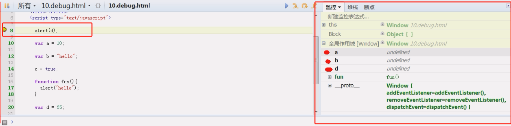
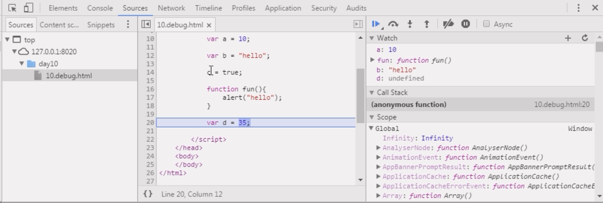

# Vue 项目开发调试

## vue_devtool 调试插件

主要是用于 Vuex 或者 pinia 的状态调试

开源地址：[vuejs/devtools: ⚙️ Browser devtools extension for debugging Vue.js applications. (github.com)](https://github.com/vuejs/devtools)

官网：[Home | Vue Devtools (vuejs.org)](https://devtools.vuejs.org/)

使用教程：[vue 调试工具 vue-devtools 安装及使用（亲测有效，望采纳） 最后付上（Vue.js is detected on this page 的解决方法） - \_\_\_\_chen - 博客园 (cnblogs.com)](https://www.cnblogs.com/chenhuichao/p/11039427.html)

## 浏览器 debug 调试

浏览器内，打开开发者调试，在【script】或者【脚本】那一栏，代码可以添加断点调试。

打完断点需要刷新页面，重新运行网页程序，再一步步进行调试。

查看代码的执行流程，从而查看整个程序的内存结构加载；

右键代码可以单独给方法和变量添加监控

火狐浏览器：

谷歌浏览器：

