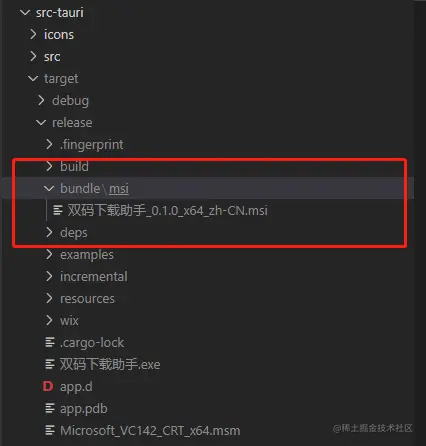

# 前端开发生态库

## npm 官网

- https://www.npmjs.com/

- 查 npm 包的下载情况

  - 使用

    - 输入 npm 包名，多个包名用逗号隔开，点击 Show charts 即可查询，可展示天、周、月、年的数据

    - `通过分析和对比，我们能初步的评估其生态和活跃度。在技术选型上也能给我们提供参考帮助`

  - 网址

    - https://npm-stat.com/

  - github
    - https://github.com/pvorb/npm-stat.com

## 生态库榜单

- https://risingstars.js.org/2021/zh

## MDN

- https://developer.mozilla.org/zh-CN/

## TypeScript

- 官网

  - https://www.typescriptlang.org/zh

- 文档

  - https://www.typescriptlang.org/zh/docs/

- 中文网

  - https://www.tslang.cn/

- 其他教程

  - http://ts.xcatliu.com/

  - https://www.runoob.com/typescript/ts-tutorial.html

## 流行的 Web 用户界面框架

- 一些流行的 javascript 框架的性能比较

  - 网站

    - https://krausest.github.io/js-framework-benchmark/index.html

  - github
    - https://github.com/krausest/js-framework-benchmark

- web components 库

  - https://nudeui.com/

  -

- vue 和 React 框架对比

  - [2022 年前端框架趋势：React 与 Vue 深度对比 - 掘金 (juejin.cn)](https://juejin.cn/post/7137146536529494052)

- vue2

  - 介绍

    - 渐进式 JavaScript 框架

  - 网址

    - 官方开源库

      - [vuejs (github.com)](https://github.com/vuejs)

    - github

      - https://github.com/vuejs/vue

    - 中文官网

      - [Vue.js (vuejs.org)](https://v2.cn.vuejs.org/)

    - 英文官网

      - [Vue.js (vuejs.org)](https://v2.vuejs.org/)

    - Vue2.7

      - [Vue 2.7 《火影忍者》 |发布维埃角 (vuejs.org)](https://blog.vuejs.org/posts/vue-2-7-naruto.html)

      - [Vue 2.7 正式发布，代号为 Naruto - 掘金 (juejin.cn)](https://juejin.cn/post/7115361618774622216)

  - Vue2 UI 界面组件库

    - PC 端

      - Element UI

        - 介绍

          - Element，一套为开发者、设计师和产品经理准备的基于 Vue 2.0 的桌面端组件库。

          - Element 是饿了么前端开源维护的 Vue UI 组件库，更新频率还是很高的，基本一周到半个月都会发布一个新版本。

          - 组件齐全，基本涵盖后台所需的所有组件，文档讲解详细，例子也很丰富。没有实际使用过，网上的 Element 教程和文章比较多。

          - Element 应该是一个质量比较高的 Vue UI 组件库。

        - 网址

          - github

            - https://github.com/ElemeFE/element

          - 官网

            - [element.eleme.io/](http://element.eleme.io/)

            - [Element - 网站快速成型工具](https://element.eleme.cn/#/zh-CN)

      - Quasar Framework

        - 介绍

          - Quasar（发音为/kweɪ.zɑɹ/)是 MIT 许可的开源框架（基于 Vue），可帮助 Web 开发人员创建：

            - 响应式网站

            - PWA（Progressive Web App）

            - 通过 Apache Cordova 构建移动 APP（Android，iOS，…）

            - 多平台桌面应用程序（使用 Electron）

          - Quasar 允许开发人员编写一次代码，然后使用相同的代码库同时部署为网站、PWA、Mobile App 和 Electron App。使用最先进的 CLI 设计应用程序，并提供精心编写，速度非常快的 Quasar Web 组件。

          - 当使用 Quasar 时，你不需要像 Hammerjs，Momentjs 或 Bootstrap 这样的额外重型库。它拥有这些功能，而且体积很小

        - 网址

          - github

            - https://github.com/quasarframework/quasar

          - 官网
            - http://www.quasarchs.com/

      - Vuetify

        - 介绍

          - Vuetify 是一个纯手工精心打造的 Material 样式的 Vue UI 组件库。 不需要任何设计技能 — 创建叹为观止的应用程序所需的一切都触手可及

          - 所有组件遵从 Material Design 设计规范，UI 体验优秀，能够媲美苹果但又完全不同的设计采用移动优先的设计；

          - 无论在手机、平板或 PC 电脑上都有完美的适配；

          - 极其丰富详细的上手文档和免费的视频教程，社区活跃，全职团队维护，长期提供支持，每周发版；

          - 支持主题定制，提供无障碍（面向缺陷人群的访问）支持。支持树摇优化，能大大减少打包体积。

        - 网址

          - github

            - https://github.com/vuetifyjs/vuetify

          - 官网
            - https://vuetifyjs.com/zh-Hans/

      - View UI

        - 介绍

          - View UI，即原先的 iView，是一套基于 Vue.js 的开源 UI 组件库，主要服务于 PC 界面的中后台产品。

          - 特性

            - 丰富的组件和功能，满足绝大部分网站场景；

            - 提供开箱即用的 Admin 系统 和 高阶组件库，极大程度节省开发成本；

            - 提供专业、优质的一对一技术支持；

            - 友好的 API ，自由灵活地使用空间；

            - 细致、漂亮的 UI；

            - 事无巨细的文档；

            - 可自定义主题。

        - 网址

          - github

            - https://github.com/view-design/ViewUI

          - 官网
            - [www.iviewui.com/](http://www.iviewui.com/)

      - iView

        - 介绍

          - iView 是一套基于 Vue.js 的开源 UI 组件库，主要服务于 PC 界面的中后台产品。iView 的组件还是比较齐全的，更新也很快，文档写得很详细。有公司团队维护，比较可靠的 Vue UI 组件框架。iView 生态也做得很好，还有开源了一个 iView Admin，做后台非常方便。官网上介绍，iView 已经应用在 TalkingData、阿里巴巴、百度、腾讯、今日头条、京东、滴滴出行、美团、新浪、联想等大型公司的产品中。

        - 网址

          - github

            - https://github.com/view-design/ViewUIPlus

          - 官网

            - https://www.iviewui.com/

          - iView 配套的工作流:https://github.com/icarusion/vue-vueRouter-webpack

          - github 地址:https://github.com/iview/iview

          - 官网:https://www.iviewui.com/

      - Bootstrap-Vue

        - 介绍

          - Bootstrap-VUE 提供了基于 vue2 的 Bootstrap V4 组件和网格系统的实现，完成了广泛和自动化的 WAI ARA 可访问性标记。

          - Bootstrap 4 是最新发布的版本，与 Bootstrap3 相比拥有了更多的具体的类以及把一些有关的部分变成了相关的组件。

          - 同时 Bootstrap.min.css 的体积减少了 40%以上。Bootstrap4 放弃了对 IE8 以及 iOS 6 的支持，现在仅仅支持 IE9 以上 以及 iOS 7 以上版本的浏览器。

          - 想当初刚流行响应式网站的时候，Bootstrap 是世界上最受欢迎的建立移动优先网站的框架，Bootstrap 可以说风靡全球。就算放在现在很多企业网站都是采用 Bootstrap 做的响应式。

          - Bootstrap-Vue 可以让你在 Vue 中也实现 Bootstrap 的效果。

        - 网址

          - github

            - https://github.com/bootstrap-vue/bootstrap-vue

          - 官网
            - [bootstrap-vue.org](https://bootstrap-vue.org/)

      - Ant Design Vue

        - 介绍

          - Ant Design Vue 是 Ant Design 3.X 的 Vue 实现，开发和服务于企业级后台产品。

          - 在 GitHub 上可以找到几个 Ant Design 的 Vue 组件。不过相比较而言，Ant Design Vue 更胜一筹。

          - Ant Design Vue 共享 Ant Design of React 设计工具体系，实现了所有 Ant Design of React 的组件，支持现代浏览器和 IE9 及以上（需要 polyfills）。可以让熟悉 Ant Design 的在使用 Vue 时，很容易的上手。

        - 网址

          - github

            - https://github.com/vueComponent/ant-design-vue

          - 官网
            - https://www.antdv.com/docs/vue/introduce-cn/

      - HEYUI

        - 介绍

          - 一个基于 Vue.js 的高质量 UI 组件库

        - 网址

          - github

            - https://github.com/heyui/heyui/tree/master

          - 官网
            - https://www.heyui.top/

      - VEUI

        - 介绍

          - veui 是一个由百度 EFE team 开发的 Vue 企业级 UI 组件库

        - 网址

          - github

            - https://github.com/ecomfe/veui

          - 官网
            - https://veui.dev/

      - Semantic-UI-Vue

        - 介绍

          - Semantic-UI-Vue 是基于 Vue.js 对 Semantic-UI 框架的实现。

          - Semantic 作为一款开发框架，帮助开发者使用对人类友好的 HTML 语言构建优雅的响应式布局。Semantic-UI-Vue 提供了一个类似于 Semantic-UI 的 API 以及一组可定制的主题。

          - 已停止维护

        - 网址

          - github

            - https://github.com/Semantic-UI-Vue/Semantic-UI-Vue

          - 官网
            - https://semantic-ui-vue.github.io/#/

      - Vue Material

        - 介绍

          - Vue-material 是一个建立在谷歌的 Material Design 基础上的轻量级框架，是一个实现 Google 像素材料设计的 Vue 组件库，它提供了适合所有现代 Web 浏览器的内置动态主题的组件，它的 API 也简单明了。

          - Vue Material 是一个轻量级的框架， 建立在谷歌的 Material Design 基础上。设计强大的和美观的 web 应用并适用于不同的屏幕。

        - 网址

          - github

            - https://github.com/vuematerial/vue-material

          - 官网
            - [www.creative-tim.com/vuematerial](http://www.creative-tim.com/vuematerial)

      - Buefy

        - 介绍

          - Buefy 基于 Bulma 和 Vue.js 的轻量级 UI 组件，它提供了即装即用的轻量级组件。

          - Buefy 的特性：

            - 专注于可用性和性能，而无需过渡动画；

            - 轻松保留当前的布尔玛主题/变量；

            - 支持 Material Design 图标和 FontAwesome；

            - 非常轻巧，除了 Vue＆Bulma 之外没有任何内部依赖性；

            - 语义代码输出；

            - 遵循布尔玛设计和一些 Material Design UX；

        - 网址

          - github

            - https://github.com/buefy/buefy

          - 官网
            - [buefy.org](https://buefy.org/)

      - Vuesax

        - 介绍

          - Vuesax 是基于 Vue.js 的组件框架,从零开始设计，可以逐步采用。Vuesax 致力于促进应用程序的开发，在不删除必要功能的情况下改进其设计。“我们希望所有组件具有独立的颜色，形状和设计，以实现我们前端喜欢的自由设计，同时又不损失创作和生产的速度。”

          - 2020 年已停止维护

        - 网址

          - github

            - https://github.com/lusaxweb/vuesax

          - 官网
            - [lusaxweb.github.io/vuesax/](http://lusaxweb.github.io/vuesax/)

      - Muse-UI

        - 介绍

          - Muse-UI 基于 Vue 2.0 优雅的 Material Design UI 组件库。Muse UI 拥有 40 多个 UI 组件，用于适应不同业务环境。Muse UI 仅需少量代码即可完成主题样式替换。Muse UI 可用于开发的复杂单页应用

          - 停止维护

        - 网址

          - github

            - https://github.com/museui/muse-ui

          - 官网
            - [muse-ui.org](https://muse-ui.org/)

      - BalmUI

        - 介绍

          - 基于 vue2 和 Vue 3 的模块化且高度可定制化的 Material Design 风格 UI 组件库，一款漂亮大气、交互动效优秀的 Vue 3 UI 组件库

        - vue2.x 版本网址

          - github

            - [balmjs/balm-ui at 8.x (github.com)](https://github.com/balmjs/balm-ui/tree/8.x)

          - 官网
            - https://v8.material.balmjs.com/#/

    - 移动端

      - Vant

        - 介绍

          - Vant 是开源的移动端组件库，Vant 是一个轻量、可靠的移动端 Vue 组件库。Vant 是有赞团队开源的，主要维护也是有赞团队。于 2017 年开源。Vant 对内承载了有赞所有核心业务，对外服务十多万开发者，是业界主流的移动端组件库之一。

          - 目前 Vant 官方提供了 Vue 2 版本、Vue 3 版本和微信小程序版本，并由社区团队维护 React 版本和支付宝小程序版本。

          - Vant 性能极佳，组件平均体积小于 1KB（min+gzip），封装了 65+ 个高质量组件，覆盖移动端主流场景。

        - 网址

          - github

            - https://github.com/vant-ui/vant

          - 官网
            - https://vant-contrib.gitee.io/vant/v2/#/zh-CN/

      - NutUI

        - 介绍

          - NutUI 2.0 是京东发布的 Vue 2 移动端 UI 组件库。一套京东风格的轻量级移动端 Vue 组件库

          - 特性

            - 50+ 高质量组件

            - 40+ 京东移动端项目正在使用

            - 基于京东 APP 7.0 视觉规范

            - 支持按需加载

            - 详尽的文档和示例

            - 支持定制主题

            - 支持多语言（国际化）

            - 支持 TypeScript

            - 支持服务端渲染（Vue SSR）

            - 单元测试加持

            - 配套有基于 Webpack 的构建工具，可快速创建已内置本组件库的 Vue 工程

        - 网址

          - github

            - https://github.com/jdf2e/nutui

          - 官网
            - [nutui.jd.com](https://nutui.jd.com/)

      - Quasar Framework

        - 介绍

          - Quasar（发音为/kweɪ.zɑɹ/)是 MIT 许可的开源框架（基于 Vue），可帮助 Web 开发人员创建：

            - 响应式网站

            - PWA（Progressive Web App）

            - 通过 Apache Cordova 构建移动 APP（Android，iOS，…）

            - 多平台桌面应用程序（使用 Electron）

          - Quasar 允许开发人员编写一次代码，然后使用相同的代码库同时部署为网站、PWA、Mobile App 和 Electron App。使用最先进的 CLI 设计应用程序，并提供精心编写，速度非常快的 Quasar Web 组件。

          - 当使用 Quasar 时，你不需要像 Hammerjs，Momentjs 或 Bootstrap 这样的额外重型库。它拥有这些功能，而且体积很小

        - 网址

          - github

            - https://github.com/quasarframework/quasar

          - 官网
            - http://www.quasarchs.com/

      - Mand Mobile

        - 介绍

          - Mand Mobile 是面向金融场景的 Vue 移动端 UI 组件库，丰富、灵活、实用，快速搭建优质的金融类产品，让复杂的金融场景变简单。Mand Mobile 含有丰富的组件 30+的基础组件，覆盖金融场景，极高的易用性组件均有详细说明文档、案例演示，汲取最前沿技术，组件化轻量化实现，兼顾稳定和品质，努力实现金融场景的全覆盖。

        - 网址

          - github

            - https://github.com/didi/mand-mobile/tree/master

          - 官网
            - https://didi.github.io/mand-mobile/#/zh-CN/home

      - Vuetify

        - 介绍

          - Vuetify 是一个纯手工精心打造的 Material 样式的 Vue UI 组件库。 不需要任何设计技能 — 创建叹为观止的应用程序所需的一切都触手可及

          - 所有组件遵从 Material Design 设计规范，UI 体验优秀，能够媲美苹果但又完全不同的设计采用移动优先的设计；

          - 无论在手机、平板或 PC 电脑上都有完美的适配；

          - 极其丰富详细的上手文档和免费的视频教程，社区活跃，全职团队维护，长期提供支持，每周发版；

          - 支持主题定制，提供无障碍（面向缺陷人群的访问）支持。支持树摇优化，能大大减少打包体积。

        - 网址

          - github

            - https://github.com/vuetifyjs/vuetify

          - 官网
            - https://vuetifyjs.com/zh-Hans/

      - Mint UI

        - 介绍

          - Mint UI 基于 Vue.js 的移动端组件库，同样出自饿了么前端的项目。

          - Mint UI 是真正意义上的按需加载组件。可以只加载声明过的组件及其样式文件。

          - Mint UI 采用 CSS3 处理各种动效，避免浏览器进行不必要的重绘和重排，从而使用户获得流畅顺滑的体验。网上的视频教程很多都是基于 Mint UI 来讲的，开发移动端 web 项目还是很方便，文档也很简介明了。

          - Mint-UI 包含丰富的 CSS 和 JS 组件，能够满足日常的移动端开发需要。通过它，可以快速构建出风格统一的页面，提升开发效率。它可以实现真正意义上的按需加载组件。可以只加载声明过的组件及其样式文件，无需再纠结文件体积过大。

          - 考虑到移动端的性能门槛，Mint UI 采用 CSS3 处理各种动效，避免浏览器进行不必要的重绘和重排，从而使用户获得流畅顺滑的体验。

          - 依托 Vue.js 高效的组件化方案，Mint UI 做到了轻量化。即使全部引入，压缩后的文件体积也仅有 100kb+。

          - 2018 年后已经停止维护

        - 网址

          - github

            - https://github.com/ElemeFE/mint-ui

          - 官网

            - [Mint UI (mint-ui.github.io)](http://mint-ui.github.io/#!/zh-cn)

          - 项目主页:http://mint-ui.github.io/#!/zh-cn

          - demo:http://elemefe.github.io/mint-ui/#/

          - github 地址:https://github.com/ElemeFE/mint-ui

          - 中文文档地址:http://mint-ui.github.io/docs/#!/zh-cn

      - Vux

        - 介绍

          - Vux 是基于 WeUI 和 Vue2.x 开发的移动端 UI 组件库，主要服务于微信页面

          - Vux 的定位已经很明确了，一是：Vue 移动端 UI 组件库，二是：WeUI 的基础样式库。

          - Vux 的组件涵盖了所有的 WeUI 的内容，还扩展了一些常用的组件。比如：Sticky、timeline、v-chart、XCircle

          - Vux 是个人维护的。在 GitHub 上看到对 issue 的关闭还是很迅速的。Vux 文档基本的组件用法和效果都讲解到位了

        - 网址

          - github

            - https://github.com/airyland/vux

          - 官网
            - https://vux.li/

      - AT-UI

        - 介绍

          - AT-UI 京东凹凸实验室开发，一款基于 Vue.js 2.0 的前端 UI 组件库，主要用于快速开发 PC 网站中后台产品，支持现代浏览器和 IE9 及以上。AT-UI 更加精简，实现了后台常用的组件。

          - 2018 年停止维护

        - 网址

          - github

            - https://github.com/at-ui/at-ui

          - 官网
            - [at.aotu.io](https://at.aotu.io/)

      - cube-ui

        - 介绍

          - cube-ui 是基于 Vue.js 实现的精致移动端组件库。

          - 由滴滴内部组件库精简提炼而来，经历了业务一年多的考验，并且每个组件都有充分单元测试，为后续集成提供保障。

          - 在交互体验方面追求极致。遵循统一的设计交互标准，高度还原设计效果；接口标准化，统一规范使用方式，开发更加简单高效。支持按需引入和后编译，轻量灵活；扩展性强，可以方便地基于现有组件实现二次开发。

        - 网址

          - github

            - https://github.com/didi/cube-ui

          - 官网
            - https://didi.github.io/cube-ui/#/zh-CN

  - 单组件

    - 颜色选择器

      - Vue Color

        - Vue Color 是一个适用于 [Sketch](https://link.juejin.cn/?target=https%3A%2F%2Fwww.w3cschool.cn%2Fsketch3book%2F)、Photoshop、[Chrome](https://link.juejin.cn/?target=https%3A%2F%2Fwww.w3cschool.cn%2Fchromedevtools%2F) 等的 Vue ([Vue2.0](https://link.juejin.cn/?target=https%3A%2F%2Fwww.w3cschool.cn%2Fminicourse%2Fplay%2Fvuecourse))颜色选择器。

        - 地址：

          - 官网

            - [xiaokaike.github.io/vue-color/](http://xiaokaike.github.io/vue-color/)

          - github
            - https://github.com/xiaokaike/vue-color

    - 轮播图

      - Swiper

        - 介绍

          - Swiper Vue.js 插件只能通过 NPM 作为主 Swiper 库的一部分提供

          - npm i swiper

        - 网址

          - github

            - https://github.com/nolimits4web/swiper

          - 官网
            - https://swiperjs.com/vue

    - 8 款 Vue 富文本编辑器

      - [最好用的 8 款 Vue 富文本编辑器测评与推荐 - 卡拉云 (kalacloud.com)](https://kalacloud.com/blog/vue-richtext-editor/)

      - TinyMCE - 富文本编辑器里的 Word ，功能想不到的丰富

      - tiptap - 多人在线实时协同编辑

      - 卡拉云 - 新一代低代码开发工具，无需任何前端技术，拖拽生成富文本编辑器等前端组件

      - CKEditor 5 - 开源免费可商用，行内编辑

      - Quill - 易扩展、轻量级二开、代码高亮好用

      - Froala - 插件丰富，UI 友好，编辑器里的苹果

      - summernote - 恰到好处的轻，可直接粘贴图片

      - Trumbowyg - 超轻量，体积小巧，仅 8KB

    - Vue 倒计时组件库

      - [5 款最棒的 Vue 倒计时组件库测评推荐 - 卡拉云 (kalacloud.com)](https://kalacloud.com/blog/best-countdown-component/)

      - vue-awesome-countdown 倒计时组件 - 精准误差小，体积小有，支持按键倒计时

      - vue-timer-hook 倒计时组件 - 模拟翻页倒计时，代码简洁，支持 Vue3

      - Vue-countdown 倒计时组件 - 按键毫秒倒计时，支持 Vue 3

      - Vue-circular-count-down-timer 倒计时组件 - 圆形动效进度条，有归零动画

      - vue2-flip-countdown 倒计时组件 - 真实的翻页效果，动效优质

  - 服务端渲染

  - 地址例子

    - 介绍

    - 网址

      - github

      - 官网

- vue3

  - 介绍

    - 易学易用，性能出色，适用场景丰富的 Web 前端框架。

  - 网址

    - 官方开源库

      - [vuejs (github.com)](https://github.com/vuejs)

    - github

      - https://github.com/vuejs/core

    - 中文官网

      - https://v3.cn.vuejs.org/

      - [Vue.js - 渐进式 JavaScript 框架 | Vue.js (vuejs.org)](https://cn.vuejs.org/)

    - 英文官网
      - [vuejs.org/](http://vuejs.org/)

  - Vue3 UI 界面组件库

    - PC 端

      - Arco.Design：字节跳动出品的企业级 UI 组件

        - 介绍

          - 字节跳动团队最新开源的企业级产品设计系统，包含一套 Vue3/React UI 组件库

          - ArcoDesign 基于字节跳动公司内部的 Byte Design 升级而来，在打磨了近 3 年之后，通过字节内部大量业务沉淀和验证

        - 网址

          - 项目官网：https://arco.design/

          - Github 项目地址：https://github.com/arco-design/arco-design

          - Vue3 文档

            - [Arco Design Vue](https://arco.design/vue/docs/pro/directory)

          - vue3 中后台项目参考

            - http://lin0716.gitee.io/gi-demo/#/login

            - https://gitee.com/lin0716/gi-demo

      - Element Plus

        - 介绍

          - Element Plus，一套为开发者、设计师和产品经理准备的基于 Vue 3.0 的桌面端组件库。

        - 网址

          - github

            - [🎉](https://github.com/element-plus/element-plus)https://github.com/element-plus/element-plus

          - 官网
            - https://element-plus.org/#/zh-CN

      - Naive UI

        - 介绍

          - 基于 Vue 3.0/TypeScript 的免费开源前端 UI 组件库，非大厂 KPI 项目！开源三天就收获 800 Star，还获得 Vue 作者尤雨溪的官方推荐。

          - Vue 3 组件库。相当完整。主题可定制。使用 TypeScript。快

        - 网址

          - 官网

            - https://www.naiveui.com/zh-CN/os-theme

          - github
            - https://github.com/tusen-ai/naive-ui

      - Ant Design Vue UI

        - 介绍

          - Ant Design Vue 是 Ant Design 3.X 的 Vue 实现，开发和服务于企业级后台产品。

          - 在 GitHub 上可以找到几个 Ant Design 的 Vue 组件。不过相比较而言，Ant Design Vue 更胜一筹。

          - Ant Design Vue 共享 Ant Design of React 设计工具体系，实现了所有 Ant Design of React 的组件，支持现代浏览器和 IE9 及以上（需要 polyfills）。可以让熟悉 Ant Design 的在使用 Vue 时，很容易的上手。

        - 网址

          - github

            - https://github.com/vueComponent/ant-design-vue

          - 官网
            - https://www.antdv.com/docs/vue/introduce-cn/

      - iView UI

        - 介绍

          - iView 是一套基于 Vue.js 的开源 UI 组件库，主要服务于 PC 界面的中后台产品。iView 的组件还是比较齐全的，更新也很快，文档写得很详细。有公司团队维护，比较可靠的 Vue UI 组件框架。iView 生态也做得很好，还有开源了一个 iView Admin，做后台非常方便。官网上介绍，iView 已经应用在 TalkingData、阿里巴巴、百度、腾讯、今日头条、京东、滴滴出行、美团、新浪、联想等大型公司的产品中。

        - 网址

          - github

            - https://github.com/view-design/ViewUIPlus

          - 官网
            - https://www.iviewui.com/

      - Quasar Framework

        - 介绍

          - Quasar（发音为/kweɪ.zɑɹ/)是 MIT 许可的开源框架（基于 Vue），可帮助 Web 开发人员创建：

            - 响应式网站

            - PWA（Progressive Web App）

            - 通过 Apache Cordova 构建移动 APP（Android，iOS，…）

            - 多平台桌面应用程序（使用 Electron）

          - Quasar 允许开发人员编写一次代码，然后使用相同的代码库同时部署为网站、PWA、Mobile App 和 Electron App。使用最先进的 CLI 设计应用程序，并提供精心编写，速度非常快的 Quasar Web 组件。

          - 当使用 Quasar 时，你不需要像 Hammerjs，Momentjs 或 Bootstrap 这样的额外重型库。它拥有这些功能，而且体积很小

        - 框架特点

          - 开箱即用，上手简单，UI 风格遵循 Material 指南

          - 官方提供的 CLI 对多种开发模式（SPA、SSR、PWA、移动应用程序、桌面应用程序和浏览器扩展）提供了一流的支持，开发体验很好

          - 内置主题定制工具以及对 Sass / SCSS / Stylus 变量的支持，快速定制适合项目特性的风格

          - 性能顶级，在不同平台体验流畅，自动树摇模式，极大地减少包大小

          - 国际化和本地化，有超过 40 种 Quasar 语言包可用。 如果缺少所需的语言包，则只需 5 分钟即可添加。

          - 花费大量精力编撰的开发文档，以及很棒的中文社区

          - 频繁的更新迭代和确定的发布周期

        - 网址

          - github

            - https://github.com/quasarframework/quasar

          - 官网

            - http://www.quasarchs.com/

              - vue2

            - https://quasar.dev/
              - vue3

      - Element 3

        - 介绍

          - 一套为开发者、设计师和产品经理准备的基于 Vue 3.0 的桌面端组件库

          - 因为 element 官方库迟迟不兼容 vue3，所以社区出的一套库

          - 现在用 Element Plus 就好了

        - 网址

          - github

            - https://github.com/hug-sun/element3

          - 官网
            - [e3.shengxinjing.cn/](http://e3.shengxinjing.cn/)

      - Varlet

        - 介绍

          - 基于 Vue3 的 Material design 风格移动端组件库

          - Varlet 是一个基于 Vue3 开发的 Material 风格移动端组件库，自 2020 年 4 月 21 日正式发布 1.0 版本

        - 网址

          - github

            - https://github.com/varletjs/varlet

          - 官网
            - https://varlet-varletjs.vercel.app/#/zh-CN/home

      - Vue DevUI

        - 介绍

          - 基于 Vue3 和 DevUI 设计的 UI 组件

          - [Vue DevUI](https://link.juejin.cn/?target=https%3A%2F%2Fgitee.com%2Fdevui%2Fvue-devui) 是一款基于 [DevUI](https://link.juejin.cn/?target=https%3A%2F%2Fdevui.design%2F) 设计体系的 Vue3 开源组件库，使用最新的 Vue3+TypeScript+Vite+JSX 技术栈进行开发和构建，使用 Jest 编写单元测试，使用 VitePress 搭建官网文档，并支持按需加载、主题定制等功能。

        - 网址

          - 官方开源库

            - https://github.com/DevCloudFE

          - github

            - https://github.com/DevCloudFE/vue-devui

          - Gitee

            - https://gitee.com/devui/vue-devui

          - 官网

            - [vue-devui.github.io](https://vue-devui.github.io/)

          - UI 组件

            - https://github.com/DevCloudFE/ng-devui

          - UI 组件官网
            - https://devui.design/home

      - HEYUI

        - 介绍

          - 一个基于 Vue.js 的高质量 UI 组件库

        - 网址

          - github

            - https://github.com/heyui/heyui/tree/master

          - 官网
            - https://v2.heyui.top/

      - Vuetify

      - Nuxt3

        - 介绍

          - 使用 Vue 3 构建您的下一个应用程序，体验混合渲染、强大的数据提取和新功能。Nuxt 3 是一个开源框架，使 Web 开发变得简单而强大。

        - 网址

          - github

            - https://github.com/nuxt/framework

          - 官网
            - https://v3.nuxtjs.org/

      - Vexip UI

        - 介绍

          - Vexip UI 使用 monorepo 的管理思想，使得可以为每个组件启动独立的开发服务与建立单独的开发文件，是新一代 vue 组件库项目的一次尝试

        - 网址

          - github

            - https://github.com/vexip-ui/vexip-ui

          - 官网
            - https://www.vexipui.com/zh-CN

      - BalmUI

        - 介绍

          - 基于 vue2 和 Vue 3 的模块化且高度可定制化的 Material Design 风格 UI 组件库，一款漂亮大气、交互动效优秀的 Vue 3 UI 组件库

          - BalmUI 是一款由 Balm.js （一款类似 Vue CLI 的前端工作流工具）团队打造前端 UI 组件库，基于最新的 Vue 3 构建，开箱即用，定制化强，设计风格完全遵循谷歌的 Material Design 设计规范，是一款交互体验非常优秀的 UI 组件库。

        - 网址

          - github

            - https://github.com/balmjs/balm-ui

          - 官网
            - https://material.balmjs.com/#/

      - primevue

        - 介绍

          - 基于 Vue 3 的免费开源、定制性强的前端 UI 组件库，来自国外的一个优秀的前端 UI 组件库，很有特色，值得研究学习和上手使用。

          - PrimeVue 是一套非常优秀的 Vue UI 组件库，支持 Vue 3 的 web UI 组件库，组件丰富，定制性很强，官网文档清晰，代码例子充足，而且中文化也做得很不错，是一款可用性很强的 Vue 组件库。

        - 网址

          - github

            - https://github.com/primefaces/primevue

          - 官网
            - [www.primefaces.org/primevue](http://www.primefaces.org/primevue)

      - Vuestic UI

        - 介绍

          - 免费开源的高质量 Vue3 UI 组件库，还内置了漂亮的 Vuestic Admin 后台框架，漂亮的 Vue 3 组件库，风格大气国际化，自带 admin 框架，开箱即用

          - Vuestic UI 是一套由 Epicmax 团队开发的一套基于 Vue.js 的 web 开发组件库，最近更新发布了 Vue3 版本，希望用 Vue .js 的专业知识以最佳方式构建一个可用性强且全面的开源工具。Vuestic UI 在发布后不久，便成为使用 Vue 构建的最受欢迎的组件库之一。

        - 网址

          - github

            - https://github.com/epicmaxco/vuestic-ui

          - 官网
            - https://vuestic.dev

      - Fighting Design

        - 介绍

          - Fighting Design 是一款灵活、优质的前端组件库，基于当前流行的 Vue3.2 + TypeScript + Vite 开发，方便开发者在 Vue3 项目中快速集成。和绝大多数开源的组件库不同，这个项目主要由来自杭州的开发者田同学 开发和维护

          - Fighting Design 目前提供了数十个前端开发常用的基础组件，UI 设计颜值在线，设计风格中性耐看，也拥有详细的使用文档，上手使用很简单。

          - Fighting Design 每一个组件都有代码示例，文档编写得也很好，使用非常简单。骨架屏、水印、日历这几个组件做得很不错，很实用。

        - Fighting Design 的技术特性

          - 使用 Vue3 最新特性开发

          - 全面基于 Vite，速度够快

          - 没有第三方依赖，够纯粹

          - 提供不同打包模式，兼容不同项目

          - 支持完整引入和按需引入，减少打包体积

          - 使用 TypeScript + Template 编写，严格的 TypeScript 类型，全局无 any 类型

          - 完善的单元测试

        - 官网
          - https://fighting.tianyuhao.cn/

    - 移动端

      - Vant UI：有赞移动端组件库

        - 介绍

          - Vant 是一个轻量、可靠的移动端 Vue 组件库。Vant 是有赞团队开源的，主要维护也是有赞团队。

          - Vant Weapp 是有赞移动端组件库 Vant 的小程序版本，两者基于相同的视觉规范，提供一致的 [API](https://so.csdn.net/so/search?q=API&spm=1001.2101.3001.7020) 接口，助力开发者快速搭建小程序应用。截止到目前，Vant 已经开源了 50+ 个经过有赞线上业务检验的组件。

          - 比如：、AddressEdit 地址编辑、AddressList 地址列表、Area 省市区选择、Card 卡片、Contact 联系人、Coupon 优惠券、GoodsAction 商品页行动点、SubmitBar 提交订单栏、Sku 商品规格弹层。如果做商城的，不太在意界面，实现业务逻辑的话，用 Vant 组件库开发还是很快的

        - 网址

          - github

            - https://github.com/vant-ui/vant

          - 官网
            - https://vant-ui.github.io/vant/#/zh-CN

      - NutUI：京东 Vue 3 移动端 UI 组件库

        - 介绍

          - NutUI 3.0 是京东发布的 Vue 3 移动端 UI 组件库。对移动端友好，特别针对移动端电商业务场景优化测试。70+ 高质量 UI 组件，基于京东 APP 10.0 对视觉规范开发，支持按需引用，支持 TypeScript，支持主题定制。可以使用 Vue 语言来编写在 H5、小程序平台上的应用，帮助我们提升开发效率，改善开发体验。

        - 网址

          - github

            - https://github.com/jdf2e/nutui

          - 官网
            - [NutUI - 移动端 Vue 组件库 (jd.com)](https://nutui.jd.com/2x/#/index)

      - Quasar Framework

        - 介绍

          - Quasar（发音为/kweɪ.zɑɹ/)是 MIT 许可的开源框架（基于 Vue），可帮助 Web 开发人员创建：

            - 响应式网站

            - PWA（Progressive Web App）

            - 通过 Apache Cordova 构建移动 APP（Android，iOS，…）

            - 多平台桌面应用程序（使用 Electron）

          - Quasar 允许开发人员编写一次代码，然后使用相同的代码库同时部署为网站、PWA、Mobile App 和 Electron App。使用最先进的 CLI 设计应用程序，并提供精心编写，速度非常快的 Quasar Web 组件。

          - 当使用 Quasar 时，你不需要像 Hammerjs，Momentjs 或 Bootstrap 这样的额外重型库。它拥有这些功能，而且体积很小

        - 网址

          - github

          - 官网
            - https://quasar.dev/

  - Vue3 快速开发模板

    - vue-manage-system

      - 介绍

        - 基于 Vue3 + pinia + typescript + Element Plus 的后台管理系统解决方案

      - 网址

        - github

          - https://github.com/lin-xin/vue-manage-system

        - 官网
          - [lin-xin.gitee.io/example/work/](http://lin-xin.gitee.io/example/work/)

    - vue-admin-better

      - 介绍

        - vue3.0 admin，vue 后台管理

      - 网址

        - github

          - https://github.com/chuzhixin/vue-admin-better

        - 官网
          - https://vue-admin-beautiful.com/admin-plus/#/index

    - vue-pure-admin

      - 介绍

        - Vue3.0+TypeScript+Vite2.0+Element-Plus 编写的一套后台管理系统（兼容移动端）

      - 网址

        - github

          - https://github.com/xiaoxian521/vue-pure-admin

        - 官网
          - http://yiming\_[chang.gitee.io/vue-pure-admin/](http://chang.gitee.io/vue-pure-admin/)

    - Geeker-Admin

      - 介绍

        - Geeker Admin，基于 Vue3.2、TypeScript、Vite2、Pinia、Element-Plus 开源的一套后台管理框架。

      - 网址

        - github

          - https://github.com/HalseySpicy/Geeker-Admin

        - 官网
          - [admin.spicyboy.cn](https://admin.spicyboy.cn/)

    - blog-vue-typescript

      - 介绍

        - Vue3 + TypeScript + Vite2 + Vuex4 + Vue-Router4 + element-plus 支持 markdown 渲染的博客前台展示

      - 网址

        - github

          - https://github.com/biaochenxuying/blog-vue-typescript

        - 官网
          - [github.com/biaochenxuying/blog](http://github.com/biaochenxuying/blog)

    - vue3-admin

      - 介绍

        - Vue 3 + Vite 2 + Vue-Router 4 + Element-Plus + Echarts 5 + Axios 开发的后台管理系统

      - 网址

        - github

          - https://github.com/newbee-ltd/vue3-admin

        - 教程

          - [Vue3 企业级项目实战 - 程序员十三 - 掘金小册 (juejin.cn)](https://juejin.cn/book/6933939264455442444?suid=3808363978174302&source=android)

        - 预览地址
          - [http://vue3-admin.newbee.ltd](http://vue3-admin.newbee.ltd/)

    - vue-admin-box

      - 介绍

        - vue3,vite,element-plus 中后台管理系统，集成四套基础模板，大量可利用组件，模板页面

      - 网址

        - github

          - https://github.com/cmdparkour/vue-admin-box

        - 官网
          - [cmdparkour.github.io/vue-admin-box/dist](http://cmdparkour.github.io/vue-admin-box/dist)

    - 地址例子

      - 介绍

      - 网址

        - github

        - 官网

  - 单组件

    - 轮播图

      - Swiper

        - 介绍

          - Swiper Vue.js 插件只能通过 NPM 作为主 Swiper 库的一部分提供

          - npm i swiper

        - 网址

          - github

            - https://github.com/nolimits4web/swiper

          - 官网
            - https://swiperjs.com/vue

  - 其他生态

    - Pinia：新一代状态管理工具

      - 介绍

      - 特点

        - 新一代状态管理工具

        - Vue2、Vue3 都可使用

        - 大小约 1kb

        - dev-tools 支持

          - 跟踪动作、突变的时间线

          - Store 出现在使用它们的组件中

          - time travel 和 更容易的调试

        - 热模块更换

          - 在不重新加载页面的情况下修改您的 Store

          - 在开发时保持任何现有状态

        - 插件：使用插件扩展 Pinia 功能

        - 为 JS 用户提供适当的 TypeScript 支持或 autocompletion

        - 服务器端渲染支持

      - 网址

        - 中文文档

          - https://pinia.web3doc.top/

        - github
          - https://github.com/vuejs/pinia

  - 服务端渲染

- React

  - 介绍

    - 用于构建用户界面的 JavaScript 库

  - 网址

    - Meta(facebook)官方开源库

      - [Meta (github.com)](https://github.com/facebook)

    - github

      - https://github.com/facebook/react/

    - 中文官网

      - https://react.docschina.org/

      - https://zh-hans.reactjs.org/

    - 英文官网
      - https://reactjs.org/

  - UI 界面组件库

    - Ant Design：企业级 UI 设计语言和 React UI 库

      - 介绍

        - 由阿里蚂蚁部门开发的开源免费的企业级 UI 设计语言和 React UI 库

        - GitHub 上超过 269 k 个项目使用了 Ant Design 组件库，Ant Design of [React](https://so.csdn.net/so/search?q=React&spm=1001.2101.3001.7020) 是一个基于 Ant Design 设计体系的 React UI 组件库，主要用于研发企业级中后台产品。

        - Ant Design 组件库主要有以下特性：

          - 🌈 提炼自企业级中后台产品的交互语言和视觉风格。

          - 📦 开箱即用的高质量 React 组件。

          - 🛡 使用 TypeScript 开发，提供完整的类型定义文件。

          - ⚙️ 全链路开发和设计工具体系。

          - 🌍 数十个国际化语言支持。

          - 🎨 深入每个细节的主题定制能力。

        - 当然，Ant Design 也是有缺点的，其包的大小有 1.2 MB（缩小 +gzip 压缩后 349.2kB），而其他 React 库通常为几百 KB。

        - Ant Design 提供了大量高质量的组件，非常适合快速构建整个 UI 框架，也可以只使用单个组件。该库基于 43.9% 的 TypeScript、31.3% 的 JavaScript、24.5% 的 Less 和 0.3% 的其他代码。

        - 优点：

          - AntDesign 随附了大量支持文档，有一个社区，包括一个带有预制模板的单独项目（AntDesignPro）；

          - 可用来快速设计后台 / 内部应用的 UI 库。

        - 缺点：

          - 缺乏可访问性；

          - 体积很大，预计会对性能产生较大影响；

          - 污染你的 CSS（期望添加!important 以防止它样式化你的非 Ant 组件）

      - 网址

        - 官方开源库

          - https://github.com/ant-design

        - github

          - https://github.com/ant-design/ant-design

        - 官网
          - [ant.design](https://ant.design/)

    - ant-design-mobile：用于构建移动 Web 应用的基本 UI 块

      - 介绍

        - 用于构建移动 Web 应用的基本 UI 块。

        - 特性

          - 快速：它针对恶劣场景进行了精心优化，无需配置，即可获得最佳的封装尺寸和终极性能。

          - 可自定义：基于 CSS 变量，您可以可靠有效地调整组件的外观或创建自己的主题。

          - 原子：每个组件的功能，无论是多还是少，正是你需要的。

          - 流畅：通过流畅的手势和细腻的动画，它有助于产品创造终极体验。

      - 网址

        - 官方开源库

          - https://github.com/ant-design

        - github

          - https://github.com/ant-design/ant-design-mobile

        - 中文官网
          - [mobile.ant.design](https://mobile.ant.design/)

    - ice 飞冰：基于 React 的研发解决方案

      - 介绍

        - 由阿里巴巴开源，基于 React 的应用研发框架 icejs，支持 Vite & Webpack 模式，同时提供了微前端、Hooks、一体化等解决开发，让前端开发更加简单规范。

      - 网址

        - 官方源码库

          - https://github.com/alibaba

        - github

          - https://github.com/alibaba/ice

        - 官网
          - https://ice.work/

    - Material UI：Google 的 Material Design 定制 React 组件库

      - 介绍

        - GitHub 上超过 781k 个项目使用了 MUI

        - 包大小（来自 BundlePhobia）：缩小后 325.7kB，缩小 +gizp 压缩 92kB，通过压缩减少体积

        - 它是一个基于 Google 的 Material Design 的简单且可定制的 React 组件库。MUI 不仅是一个组件库，而是一个完整的设计系统。它具有一套完整的指南、设计原则和 UI 设计最佳实践系统。MUI 使用了 61.4% 的 JavaScript 和 38.6% 的 TypeScript 来构建。

        - 由于 MUI 基于的 Material-UI 设计系统是由 Google 创建的，所以它也会在 Google 的一些平台上使用。因此，MUI 组件可以具有类似于 Google 的外观和感觉，这意味着 MUI 可以成为构建 Android 应用程序的绝佳选择。

        - 优点：

          - 完善的文档

          - 图标库很大

            - https://material-ui.com/components/material-icons/

          - 简单易用（一开始的情况）

        - 缺点：

          - 定制起来既困难又痛苦，但却很有必要（以改善视觉效果）；

          - 性能：会渲染过多的 DOM 节点；

          - 你的应用看起来会像谷歌的产品（对于某些人来说，这可能代表一种专业风格）。

      - 网址

        - github

          - https://github.com/mui-org/material-ui

        - 官网
          - https://mui.com/zh/

    - 两个带有 Bootstrap 的 React 绑定库

      - 简介

        - 优点：

          - 带有 React 绑定的 Bootstrap 库，大家都喜欢；

          - 通过 CSS-in-JS 轻松自定义；

          - 它已经流行了足够长的时间了，因此不必担心错误 / 问题；

          - 快速上手；

          - 没有 jQuery 依赖，因为它已在 React 中完全重新实现。

        - 缺点：
          - 这是 Bootstrap：如果你不做自定义，则你的网站将与其他网站没什么区别。

      - React Bootstrap

        - 介绍

          - 在 GitHub 上有大概 649k 个项目使用 React-Bootstrap，是比较古老的 React UI 组件库之一。

          - 包大小（来自 BundlePhobia）：缩小后 111kB，缩小 +gzip 压缩后 34.4kB，通过压缩减少体积

          - 它是使用 React 来重新构建了前端框架 Bootstrap。该库由完全响应并且可访问的现成的组件组成。所有设计元素都是高度可定制的。

          - React-Bootstrap 可以用于 UI 基础、网站和设计应用程序。

          - 该库使用 59.4% 的 JavaScript、38.3% 的 TypeScript 和 2.3% 的 SCSS 构建，最新版本可以与最新的 Bootstrap 5.1 版本兼容。

          - 我们可以 使用 React-Bootstrap 只导入需要使用的单个组件，这也有助于最大限度地减少代码总量。不过，React-Bootstrap 相对于其他组件库，组件会少一点。

        - 网址

          - github

            - https://github.com/react-bootstrap/react-bootstrap

          - 官网
            - https://react-bootstrap.github.io/

      - Reactstrap

        - 介绍

          - 在 GitHub 上有 250k 个项目使用了 Reactstrap。Reactstrap 组件元素响应迅速，设计简单，适用于各种项目。

          - Reactstrap 使用 74.7% 的 JavaScript、24.9% 的 TypeScript 和 0.4% 的 Shell 构建。

          - 我们可以使用 Reactstrap 进行完整的 UI 开发或者使用单个组件开发。它提供了极大的灵活性和预构建的验证，非常适合快速构建具有出色用户体验的精美表单。

          - 由于 Reactstrap 是一个比较年轻的组件库，所以它的可用组件相对其他组件库来说会略少一点。

        - 网址

          - github

            - https://github.com/reactstrap/reactstrap

          - 官网
            - https://reactstrap.github.io/

    - Semantic UI React

      - 介绍

        - Semantic UI React 被 GitHub 上 136k 个项目使用，是一个用于移动端的响应式前端组件库。

        - 它是 Semantic UI 开发框架的官方 React 集成，以响应迅速、人性化的 HTML 代码而闻名。

        - Semantic UI React 使用 99.9% 的 JavaScript 和 0.1% 的 TypeScript 构建。

      - 网址

        - github

          - https://github.com/Semantic-Org/Semantic-UI-React

        - 官网
          - https://react.semantic-ui.com/

    - Chakra UI

      - 介绍

        - Chakra UI 被 GitHub 上的 41.9k 个项目使用，提供了简单的、模块化的和可定制的 React 组件来支持应用程序和 Web 开发。所有元素也针对暗模式进行了优化，与其他一些 UI 组件库不同的，Chakra UI 完全兼容 WAI-ARIA 可访问性标准。

        - Chakra UI 使用 97.5% 的 TypeScript、1.9% 的 JavaScript 和 0.6% 的其他代码构建。

        - 包大小（来自 BundlePhobia）：缩小后为 326.2kB，缩小 +gzip 压缩后为 101.2kB，通过压缩减少体积

        - Chakra UI 的一大特点就是简单。它非常关注开发过程，并承诺将花费更少的时间编写代码，而将更多的时间用于构建出色的用户体验。

        - 但是，其他 React UI 组件库相比，Chakra UI 相对较新，所以会缺乏一些功能和组件。因此，它更适合用于不需要大量组件或高级功能的中小型项目。

      - 网址

        - github

          - https://github.com/chakra-ui/chakra-ui

        - 官网
          - https://chakra-ui.com/

    - semantic-ui

      - 介绍

        - 它与 React Bootstrap 非常相似，因为它是 Semantic UI 的 React 版本，Semantic UI React 提供 React 组件，而 Semantic UI 提供主题作为 CSS 样式表.

      - 网址

        - github

          - https://github.com/Semantic-Org/Semantic-UI-React

        - 官网
          - https://react.semantic-ui.com/

    - Evergreen UI

      - 介绍

        - Evergreen 是一个 React UI 框架，用于在 Web 上构建雄心勃勃的产品。任何应用程序都需要的优秀组件集。

      - 网址

        - github

          - https://github.com/segmentio/evergreen/

        - 官网
          - https://evergreen.segment.com/

    - mantine：React 组件库

      - Mantine 是个 React 组件库，包含 120+ 可定制组件和 Hook，支持暗黑主题。你可以按需勾选所需组件，并快速构建全能的 Web 应用，Mantine 已经被 2k+ 项目采用。

      - 网址

        - https://github.com/mantinedev/mantine

        - [mantine.dev](https://mantine.dev/)

    - nextui：高颜值 React UI 库

      - NextUI 是高颜值、快速、现代的 React UI 库，你可以用它构建好看的网站。

      - 网址

        - https://github.com/nextui-org/nextui

        - [nextui.org](https://nextui.org/)

    - Semi Design：抖音系推出的 React UI 组件库

      - 介绍

        - Semi Design 是字节跳动抖音前端与 UED 团队设计开发的 React UI 组件，现代化，色彩强烈

      - 网址

        - github

          - https://github.com/DouyinFE/semi-design

        - 官网
          - https://semi.design/zh-CN/

    - fluentui

      - 介绍

        - Fluent UI React [是官方开源](https://github.com/microsoft/fluentui)的 React 前端框架，旨在构建无缝融入各种微软产品的体验。它提供了健壮的，最新的，可访问的组件，这些组件可以使用 CSS-in-JS 进行高度自定义。

      - 网址

        - github

          - https://github.com/microsoft/fluentui

        - 官网
          - https://developer.microsoft.com/en-us/fluentui#/get-started

    - rsuite

      - 介绍

        - RSUITE（React Suite）是一套用于企业系统产品的 React 组件库。由 HYPERS 前端团队和 UX 团队共同构建，主要服务于公司的大数据产品。

      - 网址

        - github

          - https://github.com/rsuite/rsuite

        - 官网
          - [rsuitejs.com](https://rsuitejs.com/)

    - [28 个顶级的 React UI 组件库，请查收！\_mb5fd86d34c044c 的技术博客\_51CTO 博客](https://blog.51cto.com/u_15057848/2568549)

    - - 介绍

      - 网址

        - github

        - 官网

  - 单个组件

    - React Colorful 颜色选择器

      - React Colorful 是一个用于 [React](https://link.juejin.cn?target=https%3A%2F%2Fwww.w3cschool.cn%2Fminicourse%2Fplay%2Fpuybn) 和 Preact 应用程序的小型颜色选择器组件，使用 hooks 和函数组件构建。它使用严格的 [TypeScript](https://link.juejin.cn?target=https%3A%2F%2Fwww.w3cschool.cn%2Fminicourse%2Fplay%2Ftsminicourse) 编写，具有 100% 的测试覆盖率，界面简单易用，适用于大多数浏览器，支持移动设备和触摸屏遵循 WAI-ARIA 指南以支持辅助技术的用户，压缩后仅 2,8 KB（比 react-color 轻小 13 倍）。react-colorful 是一个简单的颜色选择器，适合那些关心包大小和客户端性能的人。。

      - 项目地址：https://github.com/omgovich/react-colorful

    - React Color

      - React Color 提供了 13 种不同的颜色选择器，可以模拟流行网站和应用程序（如 GitHub、[Photoshop](https://link.juejin.cn/?target=https%3A%2F%2Fwww.w3cschool.cn%2Fminicourse%2Fplay%2Fps_my)、Chrome 和 Twitter）的 UI。不仅如此，还可以使用不同的组件来创建自定义颜色选择器。

      - 地址：

        - github

          - https://github.com/casesandberg/react-color

        - 官网
          - http://casesandberg.github.io/react-color/

      - 图片
        - 

    - @use-gesture：用于 React 和 Vanilla Javascript 中组件绑定的鼠标/触摸手势

      - 介绍

        - 👇Bread n butter 实用程序，用于 React 和 Vanilla Javascript 中组件绑定的鼠标/触摸手势。

      - 网址

        - github

          - https://github.com/pmndrs/use-gesture

        - 官网
          - [use-gesture.netlify.app](https://use-gesture.netlify.app/)

    - React 组件资源
      - [https://github.com/huaize2020/awesome-react#ui%E5%8A%A8%E7%94%BB](https://github.com/huaize2020/awesome-react#ui动画)

  - 服务端渲染：Next.js

    - 介绍

      - 实际上，Next.js 是一个全栈框架，它提供了生产环境所需的所有功能以及最佳的开发体验：包括静态及服务器端融合渲染、 支持 TypeScript、智能化打包、 路由预取 构建脚本、打包命令、开发工具、路由、状态管理、网络请求、SASS/LESS、服务端渲染 等功能 无需任何配置。

      - Next.js 则是基于 React 的一款应用框架，基于 Next.js 你可以更便捷地上手开发 React 应用。

      - Next.js 是一个用于生产环境的 React 应用框架，使用它可以快速上手开发 React 应用，而不需要花很多时间和精力去折腾各种开发工具。所谓的用于生产环境，是指功能和稳定性足够，有大量的实际应用案例。常用于 React 服务端渲染应用。

    - Next.js 的特点如下：

      - 增量静态生成： 在构建之后以增量的方式添加并更新静态预渲染的页面。

      - 支持 TypeScript： 自动配置并编译 TypeScript；

      - API 路由： 创建 API 端点（可选）以提供后端功能；

      - 内置支持 CSS： 使用 CSS 模块创建组件级的样式。内置对 Sass 的支持；

      - 代码拆分和打包： 采用由 Google Chrome 小组创建的、并经过优化的打包和拆分算法；

      - 零配置： 自动编译并打包。从一开始就为生产环境而优化；

      - 混合模式： SSG 和 SSR：在一个项目中同时支持构建时预渲染页面（SSG）和请求时渲染页面（SSR）；

    - 网址

      - Github

        - https://github.com/vercel/next.js

      - 官网
        - [nextjs.org](https://nextjs.org/)

  - 开发工具

    - Reactide

      - 介绍

        - Reactide 是一个非常棒的 IDE，致力于开发 React Web 应用程序。它具有许多开箱即用的功能，例如组件可视化和热模块重新加载。

        - Reactide 是 React Web 应用开发的专用 IDE

      - 网址

        - github

          - https://github.com/reactide/reactide

        - 官网
          - [reactide.io](https://reactide.io/)

    - React Developer Tools

      - 介绍

        - React Developer Tools 是每个使用 React 的人的必备扩展。这是调试 React 代码并访问页面上呈现的所有组件的好方法。

        - 这将为您提供有关代码和 Web 应用程序中的组件的大量信息。因此，您可以在浏览器中下载扩展并开始将其用于项目。

      - 网址

        - github

        - 官网

    - React Three Fiber

      - 介绍

        - React Three Fiber 是 JavaScript 3D 动画库 three.js 的一个很棒的渲染器工具。

        - 如果您不了解 three.js，它是一个使用 WebGL 的 3D 动画库，您可以使用它在浏览器中创建出色的 3D 动画环境。

        - 因此，使用 React Three Fiber，您可以在 React 应用程序上创建许多很酷且令人敬畏的 3D 动画。您可以实现很多目标。这只需要一点学习，但是一旦你从他们的文档中学习，你就可以创建很多东西，比如 3D 菜单或带有很酷动画的游戏。

      - 网址

        - github

          - https://github.com/pmndrs/react-three-fiber

        - 官网
          - https://docs.pmnd.rs/react-three-fiber/getting-started/introduction

    - Web3-React

      - 介绍

        - Web3-React 是流行的库 Web3 的一个很好的 React 实现，Web3 是一个用于与以太坊区块链以及运行以太坊虚拟机的其他区块链进行通信的库，包括 Avalanche，Binance Smart chain 和 Solana

      - 网址

        - github

          - https://github.com/Uniswap/web3-react

        - 官网
          - web3-react-mu.vercel.app/

    - React Query

      - 介绍

        - React Query 是另一个很棒的库，用于数据获取。它为您提供了一种简单的方法来同步、检索、缓存和更新 React 应用程序中的服务器状态。

      - 网址

        - github

        - 官网

      - [react-query · GitHub Topics](https://github.com/topics/react-query)

    - Bundle Analyzer

      - 介绍

        - Bundle Analyzer 是一个非常有用的 CLI 实用程序和 Webpack 插件。它为您提供了一个可缩放的动态树状图，提供了 application bundle 的可视化表示形式。

        - 该工具可以帮助我们查看 bundle 的内容，并确定应删除哪些模块以及哪些模块占用的空间最大。

      - 网址

        - github

        - 官网

    - React Hook Form

      - 介绍

        - React Hook Form 是另一个很棒的库，当涉及到在 React 和 React Native 中创建高性能表单验证时。

        - 在我看来，这个有用的库使用起来更快，更简单。如果你还没有尝试过，我总是建议这样做。

      - 网址

        - github

          - https://github.com/bluebill1049/react-hook-form

        - 官网
          - https://react-hook-form.com/

    - Why Did You Render?

      - 介绍

        - 如果你正在寻找一个有用的工具来通知你关于可避免的组件重新渲染，那么在你的项目中是一个很好的 React 路径。

        - 它使您可以轻松了解组件何时以及为何重新渲染。这非常有用，尤其是在调试和性能问题方面。

      - 网址

        - github

          - https://github.com/welldone-software/why-did-you-render

        - npm
          - [@welldone-software/why-did-you-render - npm (npmjs.com)](https://www.npmjs.com/package/@welldone-software/why-did-you-render)

    - React 的应用研发框架：ice

      - 介绍

        - 基于 React 的应用研发框架 icejs，支持 Vite & Webpack 模式，同时提供了微前端、Hooks、一体化等解决开发，让前端开发更加简单规范。

      - 网址

        - github

          - https://github.com/alibaba/ice

        - 官网
          - https://ice.work/

    - 基于 [redux](https://github.com/reactjs/redux)、[redux-saga](https://github.com/redux-saga/redux-saga) 和 [react-router](https://github.com/ReactTraining/react-router) 的轻量级前端框架：dva

      - 介绍

      - 网址

        - github

          - https://github.com/dvajs/dva

        - 官网
          - [dvajs.com/](http://dvajs.com/)

    - Valtio：使 React 和 Vanilla 的代理状态变得简单

      - 介绍

        - npm i valtio 使代理状态变得简单

      - 网址

        - github

          - https://github.com/pmndrs/valtio

        - 官网
          - [valtio.pmnd.rs](http://valtio.pmnd.rs/)

    - umi：React 社区中的框架 ✨

      - 介绍

        - 用 Umi 构建你的下一个 SPA 、SSR、中后台、React、PC、移动端 应用，带给你简单而愉悦的 Web 开发体验

      - 网址

        - 官方开源库

        - github

        - 中文官网
          - [umijs.org](https://umijs.org/)

- Angular

  - 介绍

    - 现代 Web 开发人员的平台

  - 网址

    - 官方开源库

      - https://github.com/angular

    - github

      - https://github.com/angular/angular

    - 中文网

      - https://angular.cn/

    - 英文官网
      - https://angular.io

- Svelte

  - 介绍

    - Svelte 是一种全新的构建用户界面的方法。传统框架如 React 和 Vue 在浏览器中需要做大量的工作，而 Svelte 将这些工作放到构建应用程序的编译阶段来处理。

    - 与使用虚拟（virtual）DOM 差异对比不同。Svelte 编写的代码在应用程序的状态更改时就能像做外科手术一样更新 DOM。

  - 网址

    - 官方开源库

      - https://github.com/sveltejs

    - github

      - https://github.com/sveltejs/svelte

    - 中文网

      - https://www.sveltejs.cn/

    - 英文官网
      - https://svelte.dev/

- Solid

  - 介绍

    - SolidJS 框架由 Ryan Carniato 创建，于 2018 年开源

    - 一个用于构建用户界面，简单高效、性能卓越的 JavaScript 库

    - Solid 号称拥有 JSX 语法，类似于 React hook 的语法，你可以用现代化的开发方式，获得性能最快的代码

    - 特性

      - 1.没有用虚拟 DOM（无 diff 算法）：它编译出来的 DOM ，就是原生 DOM ，其它语法是直接调用的，也没有那一整套复杂的虚拟 DOM。

      - 2.提前编译，按需打包：无论是 react 还是 vue，这些框架采用的是运行时才编译方案，而 Solid 是预编译，将 jsx 部分的代码，转换成原生的语法。并且，react 和 vue 使用，都需要引入整个框架本身。而 Solid 可以按需引入，比方说像 lodash、Rxjs 那样，用个某个功能，按需引入对应的组件即可。

      - 3.响应式实现，细粒度更新：如果了解 React 的原理，就会知道，只要是 props 或者 state 改变，React 组件就会重新渲染，而每一次判断是否会重新改变，值是否不一样，也是一整套算法……而 Solid 不一样，他另辟蹊径，每一个组件都是一个独立的线程，每个组件里的 createMemo 或 createEffect 里面去收集对应的依赖， 在 set 改变值后，都会重新执行这些方法。看起来就像是实时更新了一样。

  - 网址

    - 官方开源库

      - https://github.com/solidjs

    - github

      - https://github.com/solidjs/solid

    - 中文网

      - https://www.solidjs.cn/

    - 英文官网
      - https://www.solidjs.com/

- Preact

  - 介绍

    - React 的轻量级替代方案

    - 最快的虚拟 DOM 库之一

    - 体积很小只有 3kb

    - 并且拥有与 React 相同的 API，可以无缝衔接 React 生态系统中组件

  - 网址

    - 官方开源库

      - https://github.com/preactjs

    - github

      - https://github.com/preactjs/preact

    - 中文官网

      - https://www.preactjs.com.cn/

    - 文档

      - https://www.preactjs.com.cn/guide/v10/getting-started/

    - 英文官网
      - https://preactjs.com/

- petite-vue

  - 介绍

    - petite-vue 是 [Vue](https://vuejs.org/) 的另一种发行版，针对[渐进式增强](https://developer.mozilla.org/en-US/docs/Glossary/Progressive_Enhancement)进行了优化。它提供了与标准 Vue 相同的模板语法和反应性心智模型。但是，它专门针对在服务器框架呈现的现有 HTML 页面上“洒”少量交互进行了优化。

  - 网址

    - 官方开源库

    - github
      - https://github.com/vuejs/petite-vue

- Lit

  - 介绍

  - 特点

    - 用于构建快速、轻量级的 Web 组件

    - Lit 组件可以跨多个应用程序和站点使用

    - 使用[声明式模板](https://link.juejin.cn/?target=https%3A%2F%2Flit.dev%2Fdocs%2Ftemplates%2Foverview%2F)

    - HTML 标签增强拓展，可以像使用内置 HTML 元素一样使用组件

    - 支持响应式

    - 支持 ts

    - 大小约为 5 KB

  - 网址

    - github

      - https://github.com/lit/lit/

    - 官网
      - [lit.dev](https://lit.dev/)

- Ember

  - 介绍

  - 网址

    - 官方开源库

    - github

    - 中文官网

    - 英文官网

- nerv：与 IE8 和 React 16 兼容的库(停止维护)

  - 介绍

    - Nerv 是一个基于虚拟 dom 的 JavaScript（TypeScript）库，具有相同的 React 16 API，它提供了更高的性能，更小的包大小和更好的浏览器兼容性。

    - 京东凹凸实验室开发

    - 停止维护

  - 网址

    - 官方开源库

      - https://github.com/NervJS

    - github

      - https://github.com/NervJS/nerv

    - 中文官网
      - [nerv.aotu.io](https://nerv.aotu.io/)

- Mithril.js

  - 介绍

    - 用于构建出色应用程序的 JavaScript 框架

  - 网址

    - 官网

      - [mithril.js.org](https://mithril.js.org/)

    - github
      - https://github.com/MithrilJS/mithril.js

## 小众|不那么流行|停止维护或其他的框架

- Bootstrap：最流行的 HTML、CSS 和 JavaScript 框架，用于在 Web 上开发响应式移动优先项目。

  - 介绍

    - 最流行的 HTML、CSS 和 JavaScript 框架，用于在 Web 上开发响应式移动优先项目。

  - 网址

    - 官方开源库

      - https://github.com/twbs

    - github

      - https://github.com/twbs/bootstrap

    - 中文官网

      - [Bootstrap v5 中文文档 · Bootstrap 是全球最受欢迎的 HTML、CSS 和 JS 前端工具库。 | Bootstrap 中文网 (bootcss.com)](https://v5.bootcss.com/)

      - [Bootstrap 中文网 (bootcss.com)](https://www.bootcss.com/)

      - [Bootstrap 教程 | 菜鸟教程 (runoob.com)](https://www.runoob.com/bootstrap/bootstrap-tutorial.html)

    - 英文官网
      - [getbootstrap.com](https://getbootstrap.com/)

- jQuery

  - 介绍

    - 曾经最流行的框架

  - 网址

    - 官方开源库

      - https://github.com/jquery

    - github

      - https://github.com/jquery/jquery

    - 中文官网

      - [jQuery 中文网 | 最新版 jQuery API 中文文档 (asprain.cn)](http://jquery.asprain.cn/)

      - [jQuery API 中文文档 | jQuery 中文网 (jquery123.com)](https://www.jquery123.com/)

      - [Jquery UI 中文网](https://www.jqueryui.org.cn/)

    - 英文官网
      - [jquery.com](https://jquery.com/)

- jQuery UI：jQuery 官方的用户界面库

  - 介绍

    - jQuery 官方的用户界面库

  - 网址

    - 官方开源库

      - https://github.com/jquery

    - github

      - https://github.com/jquery/jquery-ui

    - 中文官网

      - [jQuery UI 教程 | 菜鸟教程 (runoob.com)](https://www.runoob.com/jqueryui/jqueryui-tutorial.html)

      - [Jquery UI 中文网](https://www.jqueryui.org.cn/)

    - 英文官网
      - [jqueryui.com](https://jqueryui.com/)

- Zepto.js：具有大部分与 jQuery 兼容的 API，适合做移动端(停止维护)

  - 介绍

    - Zepto 是一个极简主义的 JavaScript 库，用于现代浏览器，具有大部分与 jQuery 兼容的 API。如果你使用 jQuery，你已经知道如何使用 Zepto。

    - 有关扩展简介、下载和文档，请参阅 [zeptojs.com](http://zeptojs.com/)。

  - 网址

    - 作者开源库

      - [madrobby (Thomas Fuchs) (github.com)](https://github.com/madrobby)

    - github

      - https://github.com/madrobby/zepto

    - 中文官网

      - [Zepto.js: 轻量且兼容 jQuery API 的 JavaScript 工具库 | Zepto.js 中文网 (bootcss.com)](https://zeptojs.bootcss.com/)

      - [Zepto.js 中文网 (zeptojs.com.cn)](https://www.zeptojs.com.cn/)

      - [zepto.js 源码解析 | 菜鸟教程 (runoob.com)](https://www.runoob.com/w3cnote/zepto-js-source-analysis.html)

    - 英文官网
      - [zeptojs.com](http://zeptojs.com/)

- mui：DCloud 公司最接近原生 APP 体验的高性能框架(停止维护)

  - 介绍

    - 性能和体验的差距，一直是 mobile app 开发者放弃 HTML5 的首要原因。 浏览器天生的切页白屏、不忍直视的转页动画、浮动元素的抖动、无法流畅下拉刷新等问题，这些都让 HTML5 开发者倍感挫败，尤其拿到 Android 低端机运行，摔手机的心都有； 另一方面，浏览器默认控件样式又少又丑，制作一个漂亮的控件非常麻烦，也有一些制作简单的 ui 框架但性能低下。

    - mui 框架有效的解决了这些问题，这是一个可以方便开发出高性能 App 的框架，也是目前最接近原生 App 效果的框架。

    - 特性

      - 轻量

        - 追求性能体验，是我们开始启动 MUI 项目的首要目标，轻量必然是重要特征；

        - MUI 不依赖任何第三方 JS 库，压缩后的 JS 和 CSS 文件仅有 100+K 和 60+K

      - 原生 UI

        - 鉴于之前的很多前端框架（特别是响应式布局的框架），UI 控件看起来太像网页，没有原生感觉，因此追求原生 UI 感觉也是我们的重要目标

        - MUI 以 iOS 平台 UI 为基础，补充部分 Android 平台特有的 UI 控件

  - 网址

    - 官方开源库

      - https://github.com/dcloudio

    - github

      - https://github.com/dcloudio/mui

    - 官网
      - [dev.dcloud.net.cn/mui/](http://dev.dcloud.net.cn/mui/)

- amazeui：移动优先的模块化前端框架(停止维护)

  - 介绍

    - Amaze UI，一个移动优先的模块化前端框架。

  - 网址

    - github

      - https://github.com/amazeui/amazeui

    - 中文文档官网

      - [amazeui.org/](http://amazeui.org/)

    - 英文文档
      - http://amazeui.github.io/docs/en/

- UIkit：轻量级的模块化前端框架

  - 介绍

    - 轻量级的模块化前端框架，用于开发快速而强大的 Web 界面

  - 网址

    - 官方开源库

      - https://github.com/uikit

    - github

      - https://github.com/uikit/uikit

    - 中文官网

      - [UIkit 中文网 (getuikit.work)](http://getuikit.work/)

      - [UIkit 中文网 - UIkit 前端框架 (uikitcss.com)](http://www.uikitcss.com/)

    - 英文官网

      - [getuikit.com](http://getuikit.com/)

      - https://getuikit.com/v2/

- Foundation：世界上最先进的响应式前端框架

  - 介绍

    - 世界上最先进的响应式前端框架。为可在任何类型设备上工作的站点快速创建原型和生产代码。

  - 网址

    - 官方开源库

      - https://github.com/foundation

    - github

      - https://github.com/foundation/foundation-sites

    - 英文官网
      - [get.foundation](https://get.foundation/)

- Framework7：用于构建 iOS 和 Android 应用程序的全功能 HTML 框架

  - 介绍

    - 用于构建 iOS 和 Android 应用程序的全功能移动 HTML 框架

  - 网址

    - 官方开源库

      - https://github.com/framework7io

    - github

      - https://github.com/framework7io/framework7

    - 英文官网

      - [framework7.io](http://framework7.io/)

      - https://framework7.io/docs/

- Omi：腾讯前端跨框架框架

  - 介绍

    - Omi - 前端跨框架框架

    - 特性

      - 增强了 CSS, [支持 rpx 单位](https://github.com/Tencent/omi/releases/tag/v4.0.26)，基于 750 屏幕宽度

      - 跨框架，任何框架可以使用 Omi 自定义元素

      - 提供桌面、移动和小程序整体解决方案

      - 小巧的尺寸和[高性能](https://tencent.github.io/omi/packages/omi/examples/perfs/)

      - [基于 Shadow/Light Dom 设计](https://developers.google.cn/web/fundamentals/web-components/shadowdom?hl=zh-cn)

      - 符合浏览器的发展趋势以及 API 设计理念

      - Web Components + JSX/TSX 融合为一个框架 Omi

      - JSX/TSX 是开发体验最棒(智能提示)、[语法噪音最少](https://github.com/facebook/jsx#why-not-template-literals)、图灵完备的 UI 表达式，模板引擎不完备，模板字符串完备但是语法噪音太大

      - 看看 [Facebook React 和 Web Components 对比优势](https://www.cnblogs.com/rubylouvre/p/4072979.html)，Omi 融合了各自的优点，而且给开发者自由的选择喜爱的方式

      - Shadow/Light DOM 与 Virtual DOM 融合，Omi 既使用了虚拟 DOM，也是使用真实 Shadow DOM，让视图更新更准确更迅速

      - 局部 CSS 最佳解决方案(Shadow DOM)，社区为局部 CSS 折腾了不少框架和库(使用 js 或 json 写样式，如:Radium，jsxstyle，react-style；与 webpack 绑定使用生成独特的 className 文件名—类名—hash 值，如：CSS Modules，Vue)，还有运行时注入 scoped atrr 的方式，都是 hack 技术；Shadow DOM Style 是最完美的方案

      - 对 custom elements 友好, 通过字符串 '0'或者'false'传递 false，[传递任意复杂类型](https://github.com/Tencent/omi/releases/tag/v6.8.0)

  - 网址

    - 官方开源库

      - https://github.com/Tencent

    - github

      - https://github.com/Tencent/Omi

    - 中文官网
      - [omijs.org](http://omijs.org/)

## 跨端多端运行开源库

- uniapp：开发一次，多端覆盖

  - 介绍

    - uni-app 是一个使用 [ (opens new window)](https://vuejs.org/)开发所有前端应用的框架，开发者编写一套代码，可发布到 iOS、Android、Web（响应式）、以及各种小程序（微信/支付宝/百度/头条/飞书/QQ/快手/钉钉/淘宝）、快应用等多个平台。

  - 网址

    - 官方开源库

      - https://github.com/dcloudio

    - github

      - https://github.com/dcloudio/uni-app

    - 中文官网
      - https://uniapp.dcloud.net.cn/

- Taro：开放式跨端跨框架解决方案

  - 介绍

    - 开放式跨端跨框架解决方案，支持使用 React/Vue/Nerv 等框架来开发微信/京东/百度/支付宝/字节跳动/ QQ 小程序/H5/React Native 等应用

    - 由京东凹凸实验室开源

  - 网址

    - 官方开源库

      - https://github.com/NervJS

    - github

      - https://github.com/NervJS/taro

    - 中文官网
      - https://taro.zone/

  - Taro UI

    - [NervJS/taro-ui: 一款基于 Taro 框架开发的多端 UI 组件库 (github.com)](https://github.com/NervJS/taro-ui)

    - [taro-ui.jd.com](https://taro-ui.jd.com/)

- chameleon：一套代码运行多端，一端所见即多端所见

  - 介绍

    - 一套代码运行多端，一端所见即多端所见

    - 滴滴公司开源

  - 网址

    - 官方开源库

      - https://github.com/didi

    - github

      - https://github.com/didi/chameleon

    - 中文官网
      - [cml.didi.cn/](http://cml.didi.cn/)

- Rax

  - 介绍

    - 阿里巴巴开源的一个用于构建通用应用程序的渐进式框架

  - 网址

    - 官方开源库

      - https://github.com/alibaba

    - github

      - https://github.com/alibaba/rax

    - 中文官网
      - [https://rax.js.org](https://rax.js.org/)

## Web 组件库

- stencil

  - 介绍

    - 一个工具链，用于在 TypeScript 和 Web 组件标准之上构建可扩展的企业级组件系统。Stencil 组件可以从单个与框架无关的代码库中本地分发给 React、Angular、Vue 和传统的 Web 开发人员。

    - Stencil 是一个简单的 Web 组件编译器。它结合了流行框架的设计理念，通过使用 Type、JSX、虚拟 DOM，Reactive 数据绑定和异步渲染（类似于 React Fiber）来生成 Web 组件。

    - 由于使用 Stencil 开发的组件只是 Web Components，所以这些组件可以运行在所有的主流框架（AVR）中，也可以独立地运行。这一特质使它可以成为新的前端容器框架——毕竟 Web Components 是一个新的前端容器。

  - 网址

    - github

      - https://github.com/ionic-team/stencil

    - 官网
      - https://stenciljs.com/

  - 参考
    - [StencilJS\_小城听风雨的博客-CSDN 博客\_stenciljs](https://blog.csdn.net/a5252145/article/details/108473336)

- SkateJS（停止维护）

  - 介绍

    - 由新式视图库提供支持的轻松自定义元素。

    - SkateJS 是一个 Web 组件库，旨在提供扩充 Web 组件规范能力，它重点关注功能渲染管道、清理 attribute/property 语义和较小的占用空间

    - 停止维护

  - 网址

    - github

      - https://github.com/skatejs/skatejs

    - 官网
      - [skatejs.netlify.com/](http://skatejs.netlify.com/)

- - 介绍

  - 网址

    - github

    - 官网

- - 介绍

  - 网址

    - github

    - 官网

- - 介绍

  - 网址

    - github

    - 官网

- - 介绍

  - 网址

    - github

    - 官网

- - 介绍

  - 网址

    - github

    - 官网

## 模板语言引擎

- handlebars.js：最小模板化

  - 介绍

    - handlebars.js 一种简单的模板语言

  - 网址

    - 官方开源库

    - github

      - https://github.com/handlebars-lang/handlebars.js

    - 英文官网
      - [Introduction | Handlebars (handlebarsjs.com)](https://handlebarsjs.com/guide/)

- - 介绍

  - 网址

    - 官方开源库

    - github

    - 中文官网

    - 英文官网

- - 介绍

  - 网址

    - 官方开源库

    - github

    - 中文官网

    - 英文官网

- - 介绍

  - 网址

    - 官方开源库

    - github

    - 中文官网

    - 英文官网

## 微信小程序开发

- [框架 | 微信开放文档 (qq.com)](https://developers.weixin.qq.com/miniprogram/dev/framework/MINA.html)

- Uni App：开发一次，覆盖多端

  - 介绍

    - 开发一次，覆盖多端

  - 地址

    - 官网

      - https://uniapp.dcloud.net.cn/

    - github
      - https://github.com/dcloudio/uni-app

- 官方 WeUI 组件库

  - 地址

    - https://developers.weixin.qq.com/miniprogram/dev/extended/weui/

  - WeUI 是一套同微信原生视觉体验一致的基础样式库，由微信官方设计团队为微信 Web 开发量身设计，可以令用户的使用感知更加统一。包含 button、cell、dialog、 progress、 toast、article、actionsheet、icon 等各式元素。

  - 网址

    - GitHub 地址：https://github.com/Tencent/weui

    - 效果：https://weui.io

    - 开发文档参考：https://github.com/Tencent/weui/wiki

  - 封装库
    - https://github.com/Tencent/weui.js

- WePY：组件化开发框架

  - 介绍

    - 是一款让小程序支持组件化开发的框架，通过预编译的手段让开发者可以选择自己喜欢的开发风格去开发小程序

    - 组件化开发，完美解决组件隔离，组件嵌套，组件通信等问题,支持使用第三方 npm 资源，自动处理 npm 资源之间的依赖关系，完美兼容所有无平台依赖的 npm 资源包.

  - 网址

    - Github 地址:https://github.com/Tencent/wepy

    - 官网地址：[wepyjs.gitee.io/wepy-docs/](http://wepyjs.gitee.io/wepy-docs/)

    - WePY 框架开发资源汇总
      - https://github.com/aben1188/awesome-wepy

- kbone：一个致力于微信小程序和 Web 端同构的解决方案

  - 介绍

    - kbone 是一个致力于微信小程序和 Web 端同构的解决方案。

    - kbone 是通过提供适配器的方式来实现同构

    - 微信小程序的底层模型和 Web 端不同，我们想直接把 Web 端的代码挪到小程序环境内执行是不可能的。kbone 的诞生就是为了解决这个问题，它实现了一个适配器，在适配层里模拟出了浏览器环境，让 Web 端的代码可以不做什么改动便可运行在小程序里。

  - GitHub
    - https://github.com/Tencent/kbone

- Vant Weapp

  - Vant Weapp 是有赞移动端组件库 Vant 的小程序版本，两者基于相同的视觉规范，提供一致的 API 接口，助力开发者快速搭建小程序应用。

  - 网址

    - GitHub 地址：https://github.com/youzan/vant-weapp

    - 开发文档参考：https://youzan.github.io/vant-weapp/#/intro

- Wux WeApp

  - UI 样式可配置，拓展灵活，轻松适应不同的设计风格 60+ 丰富的组件，能够满足移动端开发的基本需求

  - 网址

    - GitHub 地址：https://github.com/wux-weapp/wux-weapp

    - 开发文档：https://wux-weapp.github.io/wux-weapp-docs/#/introduce

    - 官网
      - [wuxui.com](https://wuxui.com/)

- TaroUI

  - Taro 是由 京东·凹凸实验室 倾力打造的多端开发解决方案。现如今市面上端的形态多种多样，Web、ReactNative、微信小程序等各种端大行其道，当业务要求同时在不同的端都要求有所表现的时候，针对不同的端去编写多套代码的成本显然非常高，这时候只编写一套代码就能够适配到多端的能力就显得极为需要。使用 Taro，我们可以只书写一套代码，再通过 Taro 的编译工具，将源代码分别编译出可以在不同端（微信小程序、H5、RN 等）运行的代码。

  - 地址

    - GitHub 地址：https://github.com/NervJS/taro-ui

    - 开发文档：https://taro-ui.aotu.io/#/docs/introduction

- 美团小程序框架 mpvue

  - 介绍

    - Vue.js 小程序版, fork 自 [vuejs/vue@2.4.1](https://github.com/vuejs/vue)，保留了 vue runtime 能力，添加了小程序平台的支持。

    - mpvue 是一个使用 [Vue.js](https://vuejs.org/) 开发小程序的前端框架，目前支持 微信小程序、百度智能小程序，头条小程序 和 支付宝小程序。 框架基于 Vue.js，修改了的运行时框架 runtime 和代码编译器 compiler 实现，使其可运行在小程序环境中，从而为小程序开发引入了 Vue.js 开发体验。

    - 已停止维护

  - 网址

    - github

      - https://github.com/Meituan-Dianping/mpvue

    - 官网
      - http://mpvue.com/

- Tina.js 一款轻巧的渐进式微信小程序框架

  - 介绍

    - 是一款轻巧的渐进式微信小程序框架，保留 MINA (微信小程序官方框架) 的大部分 API 设计；无论你有无小程序开发经验，都可以轻松过渡上手。

  - 地址

    - github

      - https://github.com/tinajs/tina

    - 官网
      - [tina.js.org](https://tina.js.org/)

- WuxUI

  - 地址

    - 官网

      - https://wux-weapp.github.io/wux-weapp-docs/#/introduce

      - [wuxui.com](https://wuxui.com/)

    - github
      - https://github.com/wux-weapp/wux-weapp/

- ColorUI

  - 鲜亮的高饱和色彩，专注视觉的小程序组件库

  - 地址

    - GitHub 地址：https://github.com/weilanwl/ColorUI

    - 开发文档参考：http://docs.xzeu.com/#/

    - 官网
      - [www.color-ui.com/](http://www.color-ui.com/)

- iView WeApp

  - iView Weapp 是由 TalkingData 发布的组件库，一套高质量的微信小程序 UI 组件库。

  - 地址

    - GitHub 地址：https://github.com/TalkingData/iview-weapp

    - 开发文档：https://weapp.iviewui.com/docs/guide/start

- WussUI

  - 地址
    - https://phonycode.github.io/wuss-weapp/quickstart.html

- TouchUI

  - 地址
    - https://github.com/uileader/touchwx

- MinUI

  - 介绍

    - MinUI 是蘑菇街前端开发团队开发的基于微信小程序自定义组件特性开发而成的一套简洁、易用、高效的组件库，适用场景广，覆盖小程序原生框架，各种小程序组件主流框架等，并且提供了专门的命令行工具。

    - 已删库

  - 网址

    - github

      - https://github.com/meili/minui

    - 官网

- Westore：更好的小程序项目架构

  - [Tencent/westore: 更好的小程序项目架构 (github.com)](https://github.com/Tencent/westore)

- mpvue：停止维护

  - 介绍

    - mpvue （[github 地址请参见](https://github.com/Meituan-Dianping/mpvue)）是一个使用 [Vue.js](https://vuejs.org/) 开发小程序的前端框架。框架基于 Vue.js 核心，mpvue 修改了 Vue.js 的 [runtime](http://mpvue.com/mpvue) 和 [compiler](http://mpvue.com/mpvue-template-compiler) 实现，使其可以运行在小程序环境中，从而为小程序开发引入了整套 Vue.js 开发体验。

    - 停止维护

  - 网址

    - 官网

      - http://mpvue.com/

    - github
      - https://github.com/Meituan-Dianping/mpvue

## Weex

- 介绍

  - Weex 是阿里巴巴团队的一个构建移动端[跨平台](https://baike.baidu.com/item/跨平台/8558902)[UI](https://baike.baidu.com/item/UI/393851)框架。Weex 使开发人员能够使用类似[Web](https://baike.baidu.com/item/Web/150564)的语法通过单一[代码库](https://baike.baidu.com/item/代码库/969653)构建[iOS](https://baike.baidu.com/item/iOS/45705)、[Android](https://baike.baidu.com/item/Android/60243)和 Web 应用。 [2][ ](http:) [Vue.js](https://baike.baidu.com/item/Vue.js/19884851)和 Rax（提供类[React](https://baike.baidu.com/item/React/18077599)语法前端框架）这两个[前端](https://baike.baidu.com/item/前端/5956545)框架被广泛应用于 Weex 页面开发，同时 Weex 也对这两个前端框架提供了最完善的支持。

- 网址

  - github

    - https://github.com/alibaba/weex

  - 官网
    - https://doc.weex.io/zh/

- Weex Ui

  - 基于 Weex 的丰富交互、轻量级、高性能 UI 库。

  - 网址

    - GitHub

      - https://github.com/apache/incubator-weex-ui

    - 官网
      - [apache.github.io/incubator-weex-ui/#/](http://apache.github.io/incubator-weex-ui/#/)

## 开源库

- 强大的异步状态管理：query

  - 介绍

    - 强大的异步状态管理，服务器状态实用程序和 TS / JS，React，Solid，Svelte 和 Vue 的数据提取。

  - 网址

    - github

      - https://github.com/tanstack/query

    - 官网
      - [tanstack.com/query](http://tanstack.com/query)

## 其他开源开发库合集

- 地址例子

  - 介绍

  - 网址

    - github

    - 官网

- PDF 相关操作

  - PDF 阅读器

    - [github.com/mozilla/pdf…](https://link.juejin.cn?target=https%3A%2F%2Fgithub.com%2Fmozilla%2Fpdf.js)

    - 介绍

    - 网址

      - github

      - 官网

- 文档相关操作库

- 动画设计：theatre

  - 介绍

    - Theatre 是一个动画设计库，你可以用来制作一些 Web 动画，比如：

    - 3D 动画

    - svg / html 动画

    - 微互动设计

    - 其他 JS 动画

  - 网址

    - https://github.com/theatre-js/theatre

    - [www.theatrejs.com](https://www.theatrejs.com/)

- PyScript：降低 Web 开发门槛

  - 介绍

    - PyScript 是 Scratch、JSFiddle 或其他“易用”的编程框架的 Python 替代品，它让 Web 成为一个友好的、可攻击的、任何人都可以编写有趣的交互式应用程序的地方。参考下方示例即可使用 PyScript。

  - 网址

    - https://github.com/pyscript/pyscript

  - 使用

```html
<link rel="stylesheet" href="https://pyscript.net/alpha/pyscript.css" />
<script defer src="https://pyscript.net/alpha/pyscript.js"></script>
`
```

- Slidev： 基于 markdown 的演示幻灯片

  - 介绍

    - Slidev 是一个可以将 Markdown 转换为 PPT 的工具，用技术来提高效率。

    - markdown 深度爱好者的福音！为开发人员设计的幻灯片开源库。通过 Slidev ，可以通过 Markdown 快速制作出更加灵活性、更具表现力和吸引力的幻灯片。

  - 网址

    - 官网

      - https://cn.sli.dev/

    - 在线 DOM

      - https://stackblitz.com/edit/slidev-av7vde?file=slides.md

    - github
      - https://github.com/slidevjs/slidev

- 函数库

  - core-js

    - 介绍

      - 用于 JavaScript 的模块化标准库。包括 [ECMAScript 到 2023](https://github.com/zloirock/core-js#ecmascript) 年的 [polyfills：promises](https://github.com/zloirock/core-js#ecmascript-promise)、[symbols](https://github.com/zloirock/core-js#ecmascript-symbol)、[集合](https://github.com/zloirock/core-js#ecmascript-collections)、迭代器、[类型化数组](https://github.com/zloirock/core-js#ecmascript-typed-arrays)、许多其他功能、[ECMAScript 提案](https://github.com/zloirock/core-js#ecmascript-proposals)、[一些跨平台 WHATWG/W3C 功能和](https://github.com/zloirock/core-js#web-standards) [URL](https://github.com/zloirock/core-js#url-and-urlsearchparams) 等提案。您可以仅加载所需的功能，也可以在没有全局命名空间污染的情况下使用它。

    - 网址

      - github

        - https://github.com/zloirock/core-js

      - 官网

  - Lodash（推荐）：JavaScript 实用程序库

    - 介绍

      - 一个现代的 JavaScript 实用程序库，提供模块化，性能和附加功能。

      - 内部封装了字符串、数组、对象等常见数据类型的处理函数。

    - 网址

      - github

        - https://github.com/lodash/lodash

      - 官网

        - [lodash.com/](http://lodash.com/)

      - 中文网
        - https://www.lodashjs.com/

    - lodash-es

      - [Lodash](https://lodash.com/) 库导出为 [ES](http://www.ecma-international.org/ecma-262/6.0/) 模块

      - [lodash-es - npm (npmjs.com)](https://www.npmjs.com/package/lodash-es)

  - Underscore：函数式编程帮助器

    - 介绍

      - [Underscore](https://github.com/jashkenas/underscore/)是一个 JavaScript 库，它提供了一大堆有用的函数式编程帮助器，而无需扩展任何内置对象

    - 网址

      - github

        - https://github.com/jashkenas/underscore

      - 官网
        - [underscorejs.org/](https://link.juejin.cn/?target=https%3A%2F%2Funderscorejs.org%2F)

  - Ramda：实用的函数式 Javascript

    - 介绍

      - Ramda 是一个实用的函数式库，具有可与柯里化组合的无副作用函数。

    - 网址

      - github

        - https://github.com/ramda/ramda

      - 官网
        - [ramdajs.com](https://ramdajs.com/)

  - outils：前端业务代码工具库

    - 介绍

      - 前端业务代码工具库

    - 网址

      - github

        - https://github.com/proYang/outils

      - 官网
        - [www.npmjs.com/package/outils](http://www.npmjs.com/package/outils)

  - 30-seconds-of-code：简短 JavaScript 代码片段

    - 介绍

      - 满足您所有开发需求的简短 JavaScript 代码片段

    - 网址

      - github

        - https://github.com/Chalarangelo/30-seconds-of-code

      - 官网
        - [JavaScript Snippets - 30 seconds of code](https://www.30secondsofcode.org/js/p/1)

  - jlb-tools：工具函数，如日期格式化、浏览器判断

    - github
      - https://github.com/Pasoul/jtools

  - [Search · 工具函数 (github.com)](https://github.com/search?l=JavaScript&o=desc&q=工具函数&s=stars&type=Repositories)

  - [Search · 工具函数 (github.com)](https://github.com/search?l=TypeScript&o=desc&q=工具函数&s=stars&type=Repositories)

  - licia

    - 介绍

    - 网址

      - GitHub

        - [liriliri/licia: Useful utility collection with zero dependencies (github.com)](https://github.com/liriliri/licia)

      - 官网
        - [licia.liriliri.io](https://licia.liriliri.io/)

- 数据可视化库

  - 都是找的开源可商用的

  - D3.js

    - 介绍

      - D3.js 是一个 JavaScript 库，用于基于数据操作文档。D3 可帮助您使用 HTML、SVG 和 CSS 使数据栩栩如生。

      - D3 对 Web 标准的强调为您提供了现代浏览器的全部功能，而无需将自己绑定到专有框架，将强大的可视化组件和数据驱动的 DOM 操作方法相结合。

      - 相比于 ECharts 更灵活，也更复杂。

      - 开源协议
        - [ISC license](https://github.com/d3/d3/blob/main/LICENSE)

    - 网址

      - github

        - https://github.com/d3/d3

      - 官网

        - https://d3js.org/

      - 中文网
        - https://www.d3js.org.cn/

  - three.js

    - 介绍

      - ThreeJS 是一款开源的主流 3D 绘图 JS 引擎，，基于 WebGL 实现 3d 动画，前端 3D 开发必备神器

      - 该项目的目的是创建一个易于使用，轻量级，跨浏览器，通用的 3D 库。当前的构建仅包含 WebGL 渲染器，但示例中还提供了 WebGPU（实验性），SVG 和 CSS3D 渲染器。

    - 网址

      - github

        - https://github.com/mrdoob/three.js

      - 官网
        - [threejs.org/](http://threejs.org/)

  - ECharts：百度开源图表库

    - 介绍

      - Apache ECharts 是由百度团队开发的一个免费，强大的图表和可视化库，提供了一种简单的方法来为您的商业产品添加直观，交互式和高度可定制的图表。它是用纯 JavaScript 编写的，基于[zrender](https://github.com/ecomfe/zrender)，这是一个全新的轻量级画布库

      - ECharts，一个纯 Javascript 的图表库，可以流畅的运行在 PC 和移动设备上，兼容当前绝大部分浏览器，底层依赖轻量级的 Canvas 类库 ZRender，提供直观，生动，可交互，可高度个性化定制的数据可视化图表[全集](https://www.fgba.net/)。ECharts 3 中更是加入了更多丰富的交互功能以及更多的可视化效果，并且对移动端做了深度的优化。

      - 开源协议
        - [Apache-2.0 license](https://github.com/apache/echarts/blob/master/LICENSE)

    - 网址

      - github

        - https://github.com/apache/echarts

      - 官网

        - 中文官网

          - [Apache ECharts](https://echarts.apache.org/zh/index.html)

        - 英文官网
          - [Apache ECharts](https://echarts.apache.org/en/index.html)

      - 其他扩展

        - https://github.com/apache/echarts#extensions

        - https://github.com/ecomfe/awesome-echarts#extensions

    - 社区

      - makeapie

        - ECharts 社区资源集合地。网站里面有很多社区小伙伴的作品，如果你实在想不出实现效果，那就到社区看看，很可能就有你想要的。

        - [makeapie.cn](http://makeapie.cn/)

      - 原社区失效，多个克隆社区网上查找待定记录

      - 官网案例

        - [Examples - Apache ECharts](https://echarts.apache.org/examples/zh/index.html)

      - 社区案例

        - [全网 echarts 案例资源大总结和 echarts 的高效使用技巧（细节版） - 掘金 (juejin.cn)](https://juejin.cn/post/7078834647005822983)

        - [ECharts 案例大全（最新版），含各种案例，实例。 - 掘金 (juejin.cn)](https://juejin.cn/post/7062254510311211044)

  - Vue-ECharts：Vue.js Apache ECharts 的组件

    - 介绍

      - Vue.js Apache ECharts 的组件

    - 网址

      - 团队开源库

        - https://github.com/ecomfe

      - github

        - https://github.com/ecomfe/vue-echarts

      - 官网
        - [vue-echarts.dev](https://vue-echarts.dev/)

  - AntV：蚂蚁集团可视化开源

    - 介绍

      - AntV 系列：包含各种数据可视化的解决方案，这一套很系统，包含了数据可视化的方方面面。

      - AntV 3.0 已全新升级，主要包含 G2、G6、F2、L7 以及一套完整的图表使用和设计规范。得益于丰富的业务场景和用户需求挑战，AntV 经历多年积累与不断打磨，已支撑阿里集团内外 20000+ 业务系统，通过了日均千万级 UV 产品的严苛考验后方敢与君见。

      - 开源协议
        - MIT 协议

    - github

      - https://github.com/antvis

    - 查看官网各个图表的使用场景

      - https://antv.gitee.io/zh

    - 包含单个库

      - G2

        - 数据驱动，高度易用，可扩展的可视化图形语法。

      - G2Plot

        - 开箱即用、易于配置、极致体验的通用图表库。

      - S2

        - 开箱即用的多维可视分析表格

      - G6

        - 便捷的关系数据可视化引擎与图分析工具。

      - Graphin

        - 基于 G6 封装的图分析应用组件。

      - X6

        - 极易定制、开箱即用、数据驱动的图编辑引擎

      - XFlow

        - 基于 X6 图编辑引擎、面向 React 用户的应用

      - L7

        - 高性能/高渲染质量的地理空间数据可视化框架。

      - L7Plot

        - 易于配置、图表丰富、支持定制的地理图表

      - F2

        - 专注于移动端的可视化解决方案，兼容 H5/小程序/Weex 等多端环境

      - F6

        - 一款可以快速、流畅运行于移动设备中的图可视化引擎

      - AVA
        - AVA 是为了更简便的可视分析而生的技术框架

  - BizCharts：阿里巴巴开源图表

    - 介绍

      - 在阿里内部又有像 G2 这样非常强大的图表底层引擎，所以在该引擎之上做一层封装是一件很自然而然的事情，而 [Bizcharts](https://link.juejin.cn/?target=https%3A%2F%2Fgithub.com%2Falibaba%2FBizCharts) 就是基于 G2 引擎的 React 版本的封装。

      - [Bizcharts](https://link.juejin.cn?target=https%3A%2F%2Fgithub.com%2Falibaba%2FBizCharts) 的语法设计非常贴切 React 的使用方式，图表的各个部分都拆分成了独立的 React 类，如：`<Tooltip /> `代表提示信息， `<Axis />` 代表坐标轴。 所有图表的配置项皆为组件的 props 。

      - [Bizcharts](https://link.juejin.cn?target=https%3A%2F%2Fgithub.com%2Falibaba%2FBizCharts) 在最新的 3.x 版本中，支持 Canvas 及 SVG 两种模式的图表渲染。如果单就图表库的视角来看，选择 Canvas 和 SVG 各有千秋，[Bizcharts](https://link.juejin.cn?target=https%3A%2F%2Fgithub.com%2Falibaba%2FBizCharts) 两种方式都支持，适用于各种复杂的业务场景。

      - [Bizcharts](https://link.juejin.cn?target=https%3A%2F%2Fgithub.com%2Falibaba%2FBizCharts) 在阿里内部多个部门多条业务线里反复打磨了两年之久后，于去年年底对外开源。在开源的半年时间里，做了大量的迭代优化，现在功能及性能已经做了大量的优化，非常推荐在正式环境使用。

    - 网址

      - github

        - https://github.com/alibaba/BizCharts

      - 官网
        - [bizcharts.net/products/bizcharts](http://bizcharts.net/products/bizCharts)

  - Chart.js

    - 介绍

      - Chart.js 是一种简洁、用户友好的图表库，同时也是基于 HTML5 的 JavaScript 库，用于创建动画、交互式和可自定义的图表和图形。借助 Chart.js，用户可以轻松直观地查看混合图表类型。默认情况下，也可以使用 Chart.js 创建响应式网页。Chart.js 库允许用户快速创建可视化数据。Chart.js 易于设置，对初学者十分友好。

      - 开源协议
        - [MIT license](https://github.com/chartjs/Chart.js/blob/master/LICENSE.md)

    - 网址

      - github

        - https://github.com/chartjs/Chart.js

      - 官网

        - [www.chartjs.org/](http://www.chartjs.org/)

        - https://www.chartjs.org/docs/latest/samples/information.html

  - recharts

    - 介绍

      - Recharts 是一个用 React 和 D3 构建的重新定义的图表库。这个库能帮助你在 React 应用中轻易绘制图表

      - Recharts 的主要特点：

        - 简单地使用 React 组件进行部署

        - 支持原生 SVG，轻量级应用一些 D3 子模块

    - 网址

      - github

        - https://github.com/recharts/recharts

      - 官网
        - [recharts.org](http://recharts.org/)

  - vue-echarts

    - 介绍

      - 基于 Apache ECharts 的 Vue.js 组件。

    - 网址

      - github

        - https://github.com/ecomfe/vue-echarts

      - 官网
        - [vue-echarts.dev](https://vue-echarts.dev/)

  - DataV：Vue 数据可视化组件库

    - 介绍

      - 组件库基于 Vue ，主要用于构建大屏（全屏）数据展示页面即数据可视化，具有多种类型组件可供使用

    - 网址

      - github

        - 源码源码仓库

          - https://github.com/DataV-Team/Datav

        - DataV 组件库文档
          - https://github.com/DataV-Team/datav.jiaminghi.com

      - 官网
        - http://datav.jiaminghi.com/

  - nivo

    - 介绍

      - nivo 提供增压的 React 组件来轻松构建 dataviz 应用程序，它建立在 d3 之上。

      - 已经存在几个用于 React d3 集成的库，但只有少数提供了服务器端渲染能力和完全声明性的图表。

    - 网址

      - github

        - https://github.com/plouc/nivo

      - 官网
        - [nivo.rocks](https://nivo.rocks/)

  - Rough.js：绘制草图外观的图形

    - 介绍

      - Rough.js 是一个小型 （<9 kB） 图形库，可让您以草图、手绘般的样式进行绘制。该库定义基元以绘制直线、曲线、圆弧、多边形、圆和椭圆。它还支持绘制 [SVG 路径](https://developer.mozilla.org/en-US/docs/Web/SVG/Tutorial/Paths)。

      - Rough.js 适用于[Canvas](https://developer.mozilla.org/en-US/docs/Web/API/Canvas_API)和[SVG](https://developer.mozilla.org/en-US/docs/Web/SVG)。

    - 网址

      - github

        - https://github.com/rough-stuff/rough

      - 官网
        - [roughjs.com](http://roughjs.com/)

  - apexcharts.js

    - 介绍

      - ApexCharts.JS 是一个现代化 JavaScript 图表库，用于使用简单的 API 构建交互式图表和可视化

    - 网址

      - github

        - https://github.com/apexcharts/apexcharts.js

      - 官网
        - [apexcharts.com](https://apexcharts.com/)

  - tui.chart

    - 介绍

      - [TOAST UI Chart](https://ui.toast.com/tui-chart)是一个开源 JavaScript 图表库，支持包括 IE8 在内的旧版浏览器。它包括所有常见的图表类型和地图，可以使用用户定义的主题进行自定义。图表也可以组合在组合图表中，例如带有线的列或带有区域的线等

      - 开源协议
        - [MIT license](https://github.com/nhn/tui.chart/blob/main/LICENSE)

    - 网址

      - github

        - https://github.com/nhn/tui.chart

      - 官网
        - https://ui.toast.com/tui-chart

  - TauCharts

    - 介绍

      - TauCharts 是一个最灵活的 JavaScript 图表库有。它也是基于 D3 的，是一个以数据为中心的 JavaScript 图表库，它允许改进数据可视化的效果。TauCharts 十分灵活，访问其 API 也十分轻松。TauCharts 为用户提供了无缝映射和可视化的数据，使用 TauCharts 能够设计出十分美观的数据界面。

      - 开源协议
        - [View license](https://github.com/TargetProcess/tauCharts/blob/master/LICENSE)

    - 网址

      - github

        - https://github.com/TargetProcess/tauCharts

      - 官网
        - [www.taucharts.com](https://www.taucharts.com/)

  - NVD3

    - 介绍

      - NVD3 是由 Mike Bostock 撰写的基于 D3 的 JavaScript 库。NVD3 允许用户在 Web 应用程序中创建美观的、可复用的图表。NVD3 具有很强大的图表功能，数据可视化与可爱的图表如箱形图，旭日，和 K 线图。如果你是一个 JavaScript 图表库找吨功能，NVD3 是一看出来。

      - 开源协议
        - [View license](https://github.com/novus/nvd3/blob/master/LICENSE.md)

    - 网址

      - github

        - https://github.com/novus/nvd3

      - 官网
        - [nvd3.org/](http://nvd3.org/)

  - C3.js

    - 介绍

      - 就像 TauCharts 一样，C3.js 也是一个非常有效的基于 D3 的图表可视化库。另外，C3.js 允许用户创建可定制的具有个人风格的类。C3.js 看起来是个比较难的库，但是一旦掌握了 C3.js 技巧，就能得心应手的使用了。C3.js 也允许用户为自己的 Web 应用程序创建可复用的图表，从而减少工作量。

    - 网址

      - github

      - 官网
        - http://c3js.org/

  - Flot

    - 介绍

      - Flot 是纯 Javascript 实现的基于 jQuery 的图表插件，目前，jQuery 已经成为 Web 开发人员非常重要的工具。有了 Flot.js，前端设计也变得更加容易。

      - Flot.js 是 JavaScript 库中较为古老的图表库之一。尽管如此，Flot.js 也不会因为绘制折线图、饼图、条形图、面积图、甚至堆叠图表而降低其性能。

      - 开源协议
        - [MIT license](https://github.com/flot/flot/blob/master/LICENSE.txt)

    - 网址

      - github

        - https://github.com/flot/flot

      - 官网
        - [www.flotcharts.org/](http://www.flotcharts.org/)

  - n3-charts

    - 介绍

      - 如果您是 Angular 开发人员，您肯定会发现[n3-charts](http://n3-charts.github.io/line-chart)非常有用且有趣。n3-charts 建立在 D3.js 和 Angular 之上。它以可定制的 Angular 指令的形式提供各种标准图表。

      - 开源协议

        - [MIT license](https://github.com/n3-charts/line-chart/blob/master/LICENSE)

      - 停更了

    - 网址

      - github

        - https://github.com/n3-charts/line-chart

      - 官网
        - [n3-charts.github.io/line-chart/](http://n3-charts.github.io/line-chart/)

  - 地址例子

    - 介绍

    - 网址

      - github

      - 官网

- 动画库

  - CSS 动画

    - Animate.css：CSS3 动画库

      - 介绍

        - CSS3 动画库，也是目前最通用的动画库。

      - 网址

        - github

          - https://github.com/animate-css/animate.css

        - 官网
          - https://daneden.github.io/animate.css/

    - Anime.js：强大的、轻量级 javascript 动画库

      - 介绍

        - 一个轻量级的 JavaScript 动画库，具有简单但功能强大的 API。

        - 它适用于 CSS 属性，SVG，DOM 属性和 JavaScript 对象

      - 网址

        - github

          - https://github.com/juliangarnier/anime/

        - 官网

          - http://animejs.com/

        - 中文网
          - https://www.animejs.cn/

    - Magic.css：css3 animation 动画库

      - 介绍

        - css3 animation 动画库

      - 网址

        - 官网

          - [www.minimamente.com/project/magic/](http://www.minimamente.com/project/magic/)

        - GitHub
          - https://github.com/miniMAC/magic

    - Hover.css：纯 CSS3 鼠标滑过特效库

      - 介绍

        - CSS3 鼠标滑过特效，可以应用于链接、按钮、图片等等。

      - 网址

        - github

          - https://github.com/IanLunn/Hover

        - 官网
          - https://ianlunn.github.io/Hover/

    - CSS 三维变换动画

      - 介绍

        - 第一个可组合的 CSS 动画工具包

      - 网址

        - GitHub

          - https://github.com/ingram-projects/animxyz

        - 官网
          - https://animxyz.com/

    - wow.js:滚动展示动画

      - 介绍

        - WOW.js 依赖 animate.css，所以它支持 animate.css 多达 60 多种的动画效果。

        - 比其他 JavaScript 视差插件小，如 Scrollorama（它们做了很棒的事情，但对于简单的需求来说可能太重了）

        - 安装起来非常简单，并且可以与 animate.css 配合使用，因此，如果您已经使用它，那么设置速度将非常快

        - 快速执行和轻量级代码：浏览器会喜欢它;-）

        - 您可以更改设置 - [见下文](https://github.com/matthieua/WOW#advanced-usage)

      - 网址

        - github

          - https://github.com/matthieua/WOW

        - 官网
          - [www.delac.io/wow/](https://www.delac.io/WOW/)

    - csshake：抖动动画库

      - 介绍

        - 抖动动画库

      - 网址

        - 官网

          - https://elrumordelaluz.github.io/csshake/

        - github
          - https://github.com/elrumordelaluz/csshake

    - SpinKit：使用 CSS 动画的加载指标的集合

      - 介绍

        - 使用 CSS 动画的加载指标的集合

      - 网址

        - 官网

          - https://tobiasahlin.com/spinkit/

        - GitHub
          - https://github.com/tobiasahlin/SpinKit

    - wickedCSS：CSS3 动画库

      - 介绍

        - CSS3 动画库。动画比大多数简单动画更具活力。

      - 网址

        - 官网

          - http://kristofferandreasen.github.io/wickedCSS/#

        - github
          - https://github.com/kristofferandreasen/wickedCSS

    - OBNOXIOUS.CSS：摇晃动画

      - 介绍

      - 网址

        - GitHub

          - https://github.com/tholman/obnoxious.css

        - 官网
          - https://tholman.com/obnoxious/

  - scrollReveal.js：元素进入/离开窗口时动画

    - 介绍

      - ScrollReveal 是一个 JavaScript 库，用于在元素进入/离开窗口时轻松制作动画

    - 网址

      - github

        - https://github.com/jlmakes/scrollreveal

      - 官网
        - [scrollrevealjs.org/](http://scrollrevealjs.org/)

  - Waves：点击水波纹动画效果

    - 介绍

      - 点击波纹效果

    - 网址

      - github

        - [github.com/fians/Waves](https://link.juejin.cn?target=https%3A%2F%2Fgithub.com%2Ffians%2FWaves)

      - 官网
        - [fian.my.id/waves/](http://fian.my.id/Waves/)

  - move.js：小型的 JavaScript 动画库

    - 介绍

      - 一个小型的 JavaScript 动画库，通过 JS 来控制一系列的 CSS 动画顺序执行，使 CSS3 动画变得非常简单和优雅。

    - 网址

      - github

        - https://github.com/visionmedia/move.js

      - 官网
        - [visionmedia.github.com/move.js/](http://visionmedia.github.com/move.js/)

  - Velocity.js：动画套件

    - 介绍

      - 一个功能齐全简单易用、高性能、功能丰富的轻量级的 JavaScript 动画套件，包括诸如彩色动画、SVG 支持、循环、缓动和过渡、淡入淡出、滚动、滚动、停止、结束、翻转等动画效果

      - 它结合了 CSS 和 jQuery 的优点。它能和 jQuery 完美协作，并和$.animate()有相同的 API， 但它不依赖 jQuery，可单独使用。 Velocity 不仅包含了 $.animate() 的全部功能， 还拥有：颜色动画、转换动画(transforms)、循环、 缓动、SVG 动画、和 滚动动画 等特色功能。

      - 它比 $.animate() 更快更流畅，性能甚至高于 CSS3 animation， 是 jQuery 和 CSS3 transition 的最佳组合。它支持所有现代浏览器，最低可兼容到 IE8 和 Android 2.3。

      - Velocity.js 是 velocity 模板语法的 javascript 实现。Velocity 是基于 Java 的模板引擎，广泛应用在阿里集 体各个子公司。Velocity 模板适用于大量模板使用的场景，支持复杂的逻辑运算，包含 本数据类型、变量赋值和函数等功能。还拥有：颜色动画、转换动画(transforms)、循环、 缓动、SVG 动画、和 滚动动画 等特色功能。Velocity.js 支持 Node.js 和浏览器环境。

      - 其具有以下特点：

        - 支持客户端和服务器端使用

        - 语法是富逻辑的，构成门微型的语言

        - 语法分析和模板渲染分离

        - 基本完全支持 velocity 语法

        - 浏览器使用支持模板之间相互引用，依据 kissy 模块加载机制

    - 网址

      - github

        - https://github.com/julianshapiro/velocity

      - 官网
        - [velocityjs.org](http://velocityjs.org/)

  - React Spring：弹簧物理学的 React 动画库

    - 介绍

      - react-spring 是一个基于弹簧物理学的 React 动画库，满足大多数与 UI 相关的动画需求，提供了足够灵活的工具，可以自信地将想法投射到不断变化的界面中。该库代表了一种现代动画方法。它继承了 animated 强大的插值和性能，以及 react-motion 的易用性。

    - 网址

      - github

        - https://github.com/pmndrs/react-spring

      - 官网
        - [react-spring.io/](http://react-spring.io/)

  - React Reveal：React 的高性能动画库

    - 介绍

      - React Reveal 是适一个用于 React 的高性能动画库。它占用空间小，专门为 ES6 中的 React 编写。可用于创建各种炫酷的滚动效果显示。

    - 网址

      - github

        - https://github.com/rnosov/react-reveal

      - 官网
        - [www.react-reveal.com/](http://www.react-reveal.com/)

  - React Motion：React 应用程序的动画库

    - 介绍

      - React Motion 是一个用于 React 应用程序的动画库，可以轻松创建和实现逼真的动画

      - 停止更新

    - 网址

      - github

        - https://github.com/chenglou/react-motion

      - 官网

  - Greensock(GSAP)：HTML 元素进行动画处理

    - 介绍

      - GreenSock 是一个 JavaScript 动画库，可轻松对 HTML 元素进行动画处理。 用于创建高性能，零依赖性，跨浏览器动画，声称在超过 400 万个网站中使用。

      - GSAP 能够查询和动画化几乎任何类型的 Web 元素（从 CSS 到 Canvas 到 DOM 对象），我们可以将它实现像微调器效果这样简单的事情，也可以实现更复杂的效果。

      - GreenSock 与大多数软件兼容，如 HTML5、SVG、jQuery、Canvas、CSS、新浏览器、旧浏览器、React、Vue 和 EaselJS。除此之外，它超级流畅，并带有精美的动画功能。GreenShock 也是模块化的，这意味着你可以独立选择和选择项目所需的库的任何部分。

      - 它与一堆小的 Javascript 文件一起工作，在浏览器中，使动画看起来更加漂亮。它流畅地链接多个动画属性并从 Web 浏览器中删除错误(如果有)。

      - 其具有以下特点：

      - 速度快，专门优化了动画性能，使之实现和 css 一样的高性能动画效果

      - 轻量与模块化。模块化与插件式的结构保持了核心引擎的轻量，TweenLite 包非常小(基本上低于 7kb)。提供了 TweenLite, TimelineLite, TimelineMax 和 TweenMax 不同功能的动画模块，你可以按需使用。

      - 没有依赖。

      - 灵活控制。不用受限于线性序列，可以重叠动画序列，可以通过精确时间控制，灵活地使用最少的代码实现动画。

      - 任何对象都可以实现动画。

    - 网址

      - github

        - https://github.com/greensock/GSAP

      - 官网
        - [greensock.com](https://greensock.com/)

  - Lax.js：跟随页面滑动的 JavaScript 动画插件

    - 介绍

      - Lax.js 是一款原生零依赖的制作跟随页面滑动的 JavaScript 动画插件，这款插件非常的轻巧，压缩版大小只有 3kb。当滑动页面时，帮助创建酷炫的动画效果，比如滚动视差、变形移动等基本的动画效果，响应式兼容方面，比如手机端也有不错的支持。除了可以使用插件默认集成的动画属性，还可以自定义更加丰富的动画属性。

    - 网址

      - github

        - https://github.com/alexfoxy/lax.js

      - 示例
        - https://alexfox.dev/lax.js/

  - rellax.js：纯 JavaScript 滚动视觉差特效插件

    - 介绍

      - rellax.js 是一款轻量级的纯 JavaScript 滚动视觉差特效插件。rellax.js 压缩后的版本仅 871 字节，在手机等小屏幕设备中，插件会自动限制视觉差特性。

    - 网址

      - github

        - https://github.com/dixonandmoe/rellax

      - 官网
        - [dixonandmoe.com/rellax/](http://dixonandmoe.com/rellax/)

  - Ani.js：简单语法创建动画样式

    - 介绍

      - AniJS 允许我们为网站创建动画样式，而无需任何 JavaScript 或 CSS 编码！ 您可以使用简单的 If - On - Do - To 语法用 HTML 指定所有动画

      - AniJS 是一个非常独特的动画库，它允许用户以逐步格式添加动画，例如句子，这对于绝对初学者来说非常有用，它的非特定性质使几乎每个人都可以在常规 UX 设计中使用它。

    - 网址

      - github

        - https://github.com/anijs/anijs

      - 官网
        - [anijs.github.io/](http://anijs.github.io/)

  - Typed.js：打字机形式动画库

    - 介绍

      - typed.js 是一个类型化库，效果是用打字机的方式显示一段话，可以自定义任何字符串、指定显示速度、指定是否循环等。

      - 这是一个简单的库，可以在设备屏幕上键入的任何内容设置动画。当你输入一个字符串时，观众可以以预定义的速度查看它。如果你想让禁用了 JS 的访问者也可以查看它，你只需要在页面上放置一个 HTML div。因此，搜索引擎也可以查看输入的单词。

    - 网址

      - github

        - https://github.com/mattboldt/typed.js/

      - 官网
        - [www.mattboldt.com/demos/typed-js/](http://www.mattboldt.com/demos/typed-js/)

  - Vivus：SVG 动画库

    - 介绍

      - Vivus 是一个轻量级的 JavaScript 库（没有依赖项），它允许我们对 SVG 进行动画处理，使它们看起来像是被绘制的。它有多种不同的动画可用，以及创建自定义脚本的选项，以喜欢的任何方式绘制 SVG。

    - 网址

      - github

        - https://github.com/maxwellito/vivus

      - 官网

  - ProgressBar.js：带有动画 SVG 路径的响应式和流畅的进度条

    - 介绍

      - 具有动画 SVG 路径的响应式光滑进度条。使用内置形状或[创建自己的路径](http://progressbarjs.readthedocs.org/en/latest/api/path)。[根据需要自定义](http://progressbarjs.readthedocs.org/en/latest/api/parameters#custom-animations)动画

    - 网址

      - github

        - https://github.com/kimmobrunfeldt/progressbar.js

      - 官网

        - https://kimmobrunfeldt.github.io/progressbar.js

      - 文档
        - [ProgressBar.js (progressbarjs.readthedocs.io)](https://progressbarjs.readthedocs.io/en/latest/)

  - Popmotion：JavaScript 运动引擎

    - 介绍

      - Popmotion 是一个只有 12KB 的 JavaScript 运动引擎，可以用来实现动画，物理效果和输入跟踪。原生的 DOM 支持：CSS，SVG，SVG 路径和 DOM 属性的支持，开箱即用。

    - 网址

      - github

        - https://github.com/popmotion/popmotion

      - 官网
        - [popmotion.io](https://popmotion.io/)

  - p5.js：通用动画库

    - 介绍

      - 是 Processing 的 JavaScript 实现。

      - Processing 是一种供视觉艺术家使用的独立“语言”。

      - 与我们之前看到的那些示例不同，p5.js 是一个通用动画库，不仅为实际应用提供解决方案，还为更健壮和复杂的项目提供解决方案。这包括对 2D 和 2D 效果的全面支持。

    - 网址

      - github

        - https://github.com/processing/p5.js

      - 官网
        - https://p5js.org/zh-Hans/

  - Granim.js：小型 JavaScript 流体动画库

    - 介绍

      - granim.js 是一个在网页中创建流畅的交互式流体动画的小型 JavaScript 库，granim.js 可以实现各种想要的渐变的动画效果，使网页色彩更加丰富，视觉效果更佳

    - 网址

      - github

        - https://github.com/sarcadass/granim.js

      - 官网
        - [sarcadass.github.io/granim.js/](http://sarcadass.github.io/granim.js/)

  - Kute.js：原生高性能和模块化的 Javascript 动画引擎

    - 介绍

      - Kute.js 是一个原生的 Javascript 动画引擎，具有优秀的性能和模块化的代码。 它提供了一大堆工具，以帮助创建自定义动画。它提供了易于使用的方法来设置高性能、跨浏览器的动画。

    - 网址

      - github

        - https://github.com/thednp/kute.js

      - 官网
        - [thednp.github.io/kute.js](http://thednp.github.io/kute.js)

  - simpleParallax.js：小巧的 Vanilla JS 库

    - 介绍

      - simpleParallax.js 是一个非常简单且小巧的 Vanilla JS 库，可在任何图像上添加视差动画。它因其易用性和可视化渲染而脱颖而出。视差效果直接应用于图像标签，无需使用背景图像。

    - 网址

      - github

        - https://github.com/geosigno/simpleParallax.js

      - 官网
        - [simpleparallax.com](https://simpleparallax.com/)

  - Barba.js：创建流畅和平滑的过渡网站的页面

    - 介绍

      - Barba.js 是一个小（4kb 的压缩和压缩），灵活和无依赖的库，可以帮助您创建流畅和平滑的过渡网站的页面。 它可以减少页面之间的延迟，最大限度地减少浏览器 HTTP 请求并增强用户的 Web 体验。

    - 网址

      - github

        - https://github.com/barbajs/barba

      - 官网
        - [barba.js.org](https://barba.js.org/)

  - Mo.js：简洁、高效的图形动画库

    - 介绍

      - Mo.js 是一个简洁、高效的图形动画库，拥有流畅的动画和惊人的用户体验，在任何设备上，屏幕密度独立的效果都很好，可以绘制内置的形状或者自定义形状，还可以绘制多个动画，再让它们串联在一起。

    - [还不会 svg 路径动画？这有个动画神库帮你一键搞定 - 掘金 (juejin.cn)](https://juejin.cn/post/7015826105504382983)

    - 网址

      - github

        - https://github.com/mojs

      - 官网
        - https://github.com/mojs/mojs.github.io

  - Particles.js：轻量级的 JavaScript 颗粒效果动画库

    - 介绍

      - Particles.js 一个轻量级的 JavaScript 库，用来在网页上创建颗粒效果。

    - 网址

      - github

        - https://github.com/VincentGarreau/particles.js/

      - 官网
        - [vincentgarreau.com/particles.js/](http://vincentgarreau.com/particles.js/)

  - tsParticles：粒子动画背景库

    - 介绍

      - tsParticles 可以轻松创建高度可定制的粒子动画并将它们用作网站的动画背景。可用于 React.js、Vue.js（2.x 和 3.x）、Angular、Svelte、jQuery、Preact、Inferno、Solid、Riot 和 Web 组件现成的可用组件。

    - 网址

      - github

        - https://github.com/matteobruni/tsparticles

      - 官网
        - [particles.js.org](https://particles.js.org/)

  - Lottie-Web：轻量级的动画图形库，原生渲染 After Effects 动画

    - 介绍

      - 它是一个轻量级的动画图形库，在高质量图形及其渲染之间保持了良好的平衡。它使应用程序非常紧凑，并包含许多有用的功能。

      - 在 Web、Android 和 iOS 以及 React Native 上原生渲染 After Effects 动画。

      - 它可以在任何支持 Javascript 的 Web 浏览器上运行，没有任何问题。动画的存储格式通常是人类容易理解的纯文本。由于文本数据以 JSON 格式存储，因此可以使用任何 JavaScript 环境轻松模拟。

    - 网址

      - github

        - https://github.com/airbnb/lottie-web

      - 官网
        - http://airbnb.io/lottie/

  - Rough Notation：网页上创建和动画注释

    - 介绍

      - Rough Notation 是一个小型 JavaScript 库，用于在网页上创建和动画注释。它基于使用 RoughJS 创建手绘的外观和感觉。元素可以用多种不同的样式进行注释。动画持续时间可以配置，或者只是关闭。压缩后的大小仅 3.83kb。

    - 网址

      - github

        - https://github.com/rough-stuff/rough-notation

      - 官网
        - [roughnotation.com/](http://roughnotation.com/)

  - aos(animate-on-scroll)：在页面时创建动画

    - 介绍

      - Animate on Scroll 是一个在页面时创建动画的 JavaScript 动画库。

    - 网址

      - github

        - https://github.com/michalsnik/aos

      - 官网

  - Bounce.js：弹性、有趣和好莱坞风格的动画

    - 介绍

      - Bounce 是一个 Javascript 动画库，顾名思义，它为网站提供弹性、有趣和好莱坞风格的动画。它附带了近十个预设，因此库的大小变得非常小。

      - Bounce 中的动画非常流畅和快速。如果你的动画需要围绕“弹入和弹出”类型的动画，并且你想要更小的动画库

    - 网址

      - github

        - https://github.com/tictail/bounce.js

      - 官网
        - [bouncejs.com/](http://bouncejs.com/)

  - Motion：React 的生产就绪运动库

    - 介绍

      - Motion 是 Framer 的 React 的生产就绪运动库。它带来了声明性动画、轻松的布局转换和手势，同时保持了 HTML 和 SVG 语义。Motion 使用强大的手势识别器扩展了 React 的事件系统。它支持悬停、点击、平移和拖动。注意，Motion 需要 React 16.8 或更高版本。

    - 网址

      - github

        - https://github.com/framer/motion

      - 官网
        - [framer.com/motion](http://framer.com/motion)

  - CSShake：CSS 类来移动你的 DOM

    - 介绍

      - 它专为网页的抖动元素相关的动画而设计，并且该网页有很多变体。这个库由 Apple 推广，当输入错误的响应或面部不匹配时，它在其软件中加入了摇晃的动画。CSShake 提供了一系列有趣的“摇晃”动画，并且这个库中不乏变化。

    - 网址

      - github

        - https://github.com/elrumordelaluz/csshake

      - 官网
        - [elrumordelaluz.github.io/csshake/](http://elrumordelaluz.github.io/csshake/)

  - Dynamics.js：创建物理运动动画效果

    - 介绍

      - Dynamics.js 是一款可以创建物理运动动画效果的 js 库

    - 网址

      - github

        - https://github.com/michaelvillar/dynamics.js

      - 官网
        - [dynamicsjs.com](http://dynamicsjs.com/)

  - Parallax.js：视觉差特效引擎

    - 介绍

      - Parallax.js 是一款功能非常强大的 JavaScript 视觉差特效引擎插件。通过这个视觉差插件可以制作出非常炫酷的视觉差特效，可以检测智能设备的方向

    - 网址

      - github

        - https://github.com/wagerfield/parallax

      - 官网
        - [parallax.js (wagerfield.com)](http://matthew.wagerfield.com/parallax/)

  - Proton：Javascript 粒子动画库

    - 介绍

      - Proton 是一个轻量级且功能强大的 Javascript 粒子动画库。使用它可以轻松创建各种冷粒子效果。

    - 网址

      - github

        - https://github.com/drawcall/Proton

      - 官网
        - [drawcall.github.io/proton/](https://drawcall.github.io/Proton/)

  - Direction Reveal：根据检测用户进入或离开元素的方向，设置动画

    - 介绍

      - 检测用户进入或离开元素的方向，允许您根据此方向显示或隐藏内容

    - 网址

      - 官网示例

        - https://nigelotoole.github.io/direction-reveal/#

      - github
        - https://github.com/NigelOToole/direction-reveal

  - Flat Surface Shader [FSS]：3D 模拟照明动画效果(停止维护)

    - 介绍

      - Flat Surface Shader 是一个超炫的 3D 模拟照明效果，可以配置使用基于 Canvas 的 2D 上下文或者基于 SVG 多边形数组绘制三角形。它还采用原生的 Float32Arrays 存储数字数据，进行高度优化的计算。可以调整颜色参数预览效果，而且可以导出图像。

    - 网址

      - github

        - https://github.com/wagerfield/flat-surface-shader

      - 官网
        - [wagerfield.github.io/flat-surface-shader/](http://wagerfield.github.io/flat-surface-shader/)

  - 前端 PPT 演示解决方案

    - 基于 CSS 的 3D 幻灯片工具：reveal.js

      - 介绍

        - 这是一个基于 CSS 的 3D 幻灯片工具，标星 54K。

        - Reveal.js 做 PPT 的优点是可以使用 markdown 语言直接写静态的文本，并可以加入各种 html 语言支持的交互动画，然后由 Pandoc 直接转化成 PPT。

        - reveal.js 是一个开放源代码 HTML 表示框架。 它使使用 Web 浏览器的任何人都可以免费创建功能齐全且美观的演示文稿。

        - 该框架具有广泛的功能，包括嵌套幻灯片，Markdown 支持，自动动画，PDF 导出，演讲者注释，LaTeX 支持，语法突出显示的代码等等。

        - reveal.js 有一下几个特点：

        - 支持标签来区分每一页幻灯片

        - 可以使用 markdown 来写内容

        - 支持 pdf 的导出

        - 支持演说注释

        - 提供 JavaScript API 来控制页面

        - 提供了多个默认主题和切换方式

        - 自适应移动端和 PC 端

      - 网址

        - github

          - https://github.com/hakimel/reveal.js

        - 官网
          - [revealjs.com](https://revealjs.com/)

    - 使用 Markdown 和 HTML 写逼格满满的 PPT：reveal-md

      - 介绍

        - reveal-md 是使用 Markdown 来做 PPT 展示的开源项目

      - 网址
        - github
          - https://github.com/webpro/reveal-md

  - Animsition：CSS 动画页面过渡 jQuery 插件(停止维护)

    - 介绍

      - 一个简单易用的 jQuery 插件，用于 CSS 动画页面过渡。

      - 停止维护

    - 网址

      - github

        - https://github.com/blivesta/animsition

      - 官网
        - [git.blivesta.com/animsition](http://git.blivesta.com/animsition)

  - Framer Motion：React 的动画库

    - 介绍

      - 其带有预构建的 API，可让 React 开发人员简化构建动画组件的过程，同时也减轻了学习 CSS 及其动画属性的一些障碍，特别是它很容易使用。

    - 网址

      - github

      - 官网

  - Paper.js：矢量图形动画

    - 介绍

      - Paper.js 专注于矢量图形动画领域。让您不仅可以制作静态效果，还可以制作交互式动态体验。可以通过层对对象进行分类，每个层都有一个自定义动画规范，当处理复杂的结构时，这能很好的帮助我们。

    - 网址

      - github

        - https://github.com/paperjs/paper.js

      - 官网
        - http://paperjs.org/

  - Web Animations：Web Animation API 的直接的 JS 接口

    - 介绍

      - Web Animations 库是和 Web Animation API 的直接的 JS 接口。该库直接与 Element.animate()规范集成，让您可以实现通常使用 CSS 编写的动画功能。

    - 网址

      - 官方库

        - https://github.com/web-animations

      - github

        - https://github.com/web-animations/web-animations-js

      - 官网
        - [web-animations.github.io](http://web-animations.github.io/)

  - three.js：通用 JavaScript 3D 库

    - 介绍

      - three.js 是一个易于使用、轻量级、跨浏览器的通用 JavaScript 3D 库，它是一套基于 WebGL 开发出的 Javascript 函式库，它提供了比 WebGL 更简单的 Javascript API，让开发者能够轻易在浏览器制作 3D 绘图。

    - 网址

      - github

        - https://github.com/mrdoob/three.js/

      - 官网
        - [threejs.org/](http://threejs.org/)

  - watching-you

    - 介绍

      - 一个 JS 动画库，可以设定所要观察的 DOM 元素，从而形成一种互动效果，好像页面正在注视用户的操作。

    - 网址

      - 官网

        - [watching-you (jj811208.github.io)](https://jj811208.github.io/watching-you/)

      - github
        - [jj811208/watching-you: watching-you is a javascript library for building animations that watch anything on DOM 👀. (github.com)](https://github.com/jj811208/watching-you)

  - - 介绍

    - 网址

      - 官网

      - github

- 颜色选择器组件

  - Colorjoe

    - 介绍

      - colorjoe 是一个具有触控和 AMD 支持的可扩展颜色选择器。可以通过 CSS 定义其实际尺寸和布局。通过这种方式，该组件非常适合响应式布局。

      - 与那里的许多其他颜色选择器不同，colorjoe 是真正可扩展的。它基于 CSS，不依赖于外部图像。因此，您可以调整其大小以适应您的目的。还支持触控和 AMD 模块定义。

      - colorjoe 受到 ColorJack 和 RightJS Colorpicker 的启发。与那些不同的是，它实际上可以很好地扩展。从本质上讲，这意味着您将能够使用一些 CSS 定义其实际尺寸和布局。通过这种方式，小部件非常适合响应式布局。

      - 此外，由于它提供的简单 API，实现缺失的功能（RGB 字段等）相对容易。

    - 如果您更喜欢独立的 dist，请将预打包的 dist/colorjoe.js 和添加 css/colorjoe.css 到您的页面或从 src/使用 AMD

    - 项目地址：https://github.com/bebraw/colorjoe

  - Huebee

    - Huebee 是一个 JavaScript 库，用于创建以用户为中心的颜色选择器。Huebee 显示一组有限的颜色，因此用户可以一目了然地查看所有颜色，做出明确的决定，并通过单击选择一种颜色。

    - 项目地址：https://github.com/metafizzy/huebee

  - iro.js

    - iro.js 是一个用于 [JavaScript](https://link.juejin.cn/?target=https%3A%2F%2Fwww.w3cschool.cn%2Fminicourse%2Fplay%2Fjscourse) 的模块化、注重设计的颜色颜色选择器组件 - 支持多种颜色格式。所有 iro.js 都可以从单个脚本运行 - 不需要额外的 [CSS](https://link.juejin.cn/?target=https%3A%2F%2Fwww.w3cschool.cn%2Fminicourse%2Fplay%2Fcsscourse)、图像或第三方库！

    - 地址

      - 官网

        - [iro.js.org](https://iro.js.org/)

      - github
        - https://github.com/jaames/iro.js

- 滚动库

  - iscroll：流畅的网页滚动

    - 介绍

      - iScroll 是一款高性能，占用空间小，无需依赖的多平台 javascript 滚动器

    - 网址

      - github

        - https://github.com/cubiq/iscroll

      - 官网
        - [iscrolljs.com](http://iscrolljs.com/)

  - BetterScroll：移动端滑动库

    - 介绍

      - iscroll 的优化版，使移动端滑动体验更加流畅

    - 网址

      - github

        - https://github.com/ustbhuangyi/better-scroll

      - 官网
        - https://better-scroll.github.io/docs/zh-CN/

  - mescroll：下拉刷新和上拉加载

    - 介绍

      - mescroll.js 是在 H5 端 运行的下拉刷新和上拉加载插件

    - 网址

      - github

        - https://github.com/mescroll/mescroll

      - 官网
        - [www.mescroll.com/api.html](https://link.juejin.cn?target=http%3A%2F%2Fwww.mescroll.com%2Fapi.html)

- 轮播图

  - Swiper：移动端的内容触摸滑动

    - 介绍

      - 具有硬件加速过渡的大多数现代移动触摸滑块

      - 常用于移动端网站的内容触摸滑动

    - 网址

      - github

        - https://github.com/nolimits4web/swiper

      - 中文网

        - [www.swiper.com.cn/](https://link.juejin.cn?target=https%3A%2F%2Fwww.swiper.com.cn%2F)

      - 官网
        - https://swiperjs.com/

  - iSlider：移动端 javascript 滑动组件

    - 介绍

      - iSlider 是一个表现出众，无任何插件依赖的手机平台 javascript 滑动组件。它能够处理任何元素，例如图片或者 DOM 元素

    - 网址

      - github

        - https://github.com/be-fe/iSlider

      - 官网

        - http://kele527.github.io/iSlider/

        - http://eux.baidu.com/iSlider/demo/index_chinese.html

  - slip.js：移动端跟随手指滑动组件

    - 介绍

      - 移动端跟随手指滑动组件，零依赖

    - 网址

      - github

        - https://github.com/binnng/slip.js

      - 官网
        - [binnng.github.io/slip.js](http://binnng.github.io/slip.js)

  - tiny-slider：原生所有用途的滑块

    - 介绍

      - 用于所有用途的 Vanilla javascript 滑块

    - 网址

      - github

        - https://github.com/ganlanyuan/tiny-slider

      - 官网演示
        - [Tiny slider (ganlanyuan.github.io)](http://ganlanyuan.github.io/tiny-slider/demo/)

  - WebSlides：创建 HTML 演示文稿样式的滑动

    - 介绍

      - 创建 HTML 演示文稿

    - 网址

      - github

        - https://github.com/webslides/webslides/

      - 官网
        - webslides.tv/

  - keen-slider：HTML 敏锐触摸滑块轮播

    - 介绍

      - HTML 触摸滑块轮播，您将获得最原生的感觉。

      - 特征

        - 库不可知论者：在 JavaScript，TypeScript，React，Vue，Angular，React Native 等中运行良好。

        - 轻：无依赖关系，仅压缩了约 5.5KB gz

        - 移动优先：支持多点触控，响应完全

        - 出色的性能：本机触摸/轻扫行为

        - 相容：适用于所有常见的浏览器，包括 >= IE 10 和 React Native

        - 开源：在 MIT 许可证下免费提供

        - 扩展：丰富但简单的 API

    - 网址

      - github

        - https://github.com/rcbyr/keen-slider

      - 官网
        - [keen-slider.io/](http://keen-slider.io/)

- 时间日期处理

  - 尚处于实验性阶段的 Temporal API

    - https://tc39.es/proposal-temporal/docs/index.html

    - https://github.com/tc39/proposal-temporal

    - 提案时间戳

      - https://datatracker.ietf.org/doc/draft-ietf-sedate-datetime-extended/

      - 最新版本
        - https://www.ietf.org/archive/id/draft-ietf-sedate-datetime-extended-06.html

  - Moment.js：JavaScript 日期库

    - 介绍

      - 一个 JavaScript 日期库，用于解析、验证、操作和格式化日期。

      - 官方不再维护，作者推荐使用 day.js

    - 网址

      - github

        - https://github.com/moment/moment

      - 官网
        - [momentjs.com](http://momentjs.com/)

  - day.js：极简的解析、验证、操作和显示日期和时间的 JavaScript 库

    - 介绍

      - Day.js 是一个极简的 JavaScript 库，由国人开发，可以为现代浏览器解析、验证、操作和显示日期和时间

      - Day.js 本身就是对标 Moment.js 进行开发的，极力兼容了 Moment.js 的 API

      - Day.js 的 API 和 Moment.js 几乎一模一样，学习成本和迁移成本非常低。API 调用语句绝大部分情况下可以一字不改。 但 Day.js 的大小只有 2KB

    - 网址

      - github

        - https://github.com/iamkun/dayjs

      - 官网
        - https://dayjs.fenxianglu.cn/

  - date-fns：现代 JavaScript 日期实用程序库（推荐使用）

    - 介绍

      - Date-fns 提供了最全面、最简单且一致的工具集，用于在浏览器和 Node.js 中操作 JavaScript 日期。

      - date-fns 库包含多个函数，有 200 多种功能，适用于几乎所有场合。并且是模块化的，可以根据需要单独导入这些函数。适用于 webpack、Browserify 或 Rollup，还支持 tree-shaking。

      - 例如，如果要计算 2 个日期之间的差值，只需要导入 formatDistance 和 subDays 函数。

    - 教程

      - [抛弃 moment.js，基于 date-fns 封装日期相关 utils - 掘金 (juejin.cn)](https://juejin.cn/post/7151050708094189582)

    - 网址

      - github

        - https://github.com/date-fns/date-fns

      - npm

        - https://www.npmjs.com/package/date-fns

      - 官网
        - [date-fns.org](https://date-fns.org/)

  - Luxon：Luxon 是一个轻量的 JavaScript 日期库

    - 介绍

      - Luxon 是一个轻量的 JavaScript 日期库（压缩后的大小约为 21.1KB），它隶属于 Moment 项目组，在 moment 基础上优化了 API 的语义、时区，统一了 API 的命名规范，让开发者更容易上手，让你彻底摆脱原生难用的方法，从此爱上日期时间

    - 网址

      - 官网

        - [moment.github.io/luxon](http://moment.github.io/luxon)

      - github
        - https://github.com/moment/luxon

  - timeago.js：小型的格式化日期库

    - 介绍

      - timeago.js 是一个纳米库（小于），用于用语句格式化日期时间。例如：“3 小时前”。2 kb\*\*\* time ago

    - 网址

      - github

        - https://github.com/hustcc/timeago.js

      - 官网
        - [timeago.org](https://timeago.org/)

  - js-joda：不可变的日期和时间库

    - 介绍

      - js-joda 是一个不可变的日期和时间库。它提供了一个基于 ISO 日历系统的简单，域驱动和干净的 API，该系统是遵循公历规则的事实世界日历

      - 特性

        - js-joda 具有轻量级的占用空间，只有 43 kB 的缩小和压缩，没有第三方依赖性。

        - js-joda 很快。它比其他 JavaScript 日期库快 2 到 10 倍。

        - js-joda 附带了 RFC 3339 中指定的 ISO 8601 内置解析器/格式化程序，可以轻松自定义。

        - js-joda 支持从 IE11 到 IE11 的 ECMAScript 5 浏览器。

        - js-joda 是三十进制向后移植的一个端口，它是 Java SE 8 java.time 包的 JSR-310 实现的基础。三人组的灵感来自《乔达时间》，有着相似的概念和同一位作者。

        - js-joda 是健壮而稳定的。我们移植了超过 1700 个测试用例，其中包含来自 threetenbp 项目的大量测试排列。我们针对火狐，铬，节点和幻影运行自动业力测试套件。

    - 网址

      - 官网

        - [js-joda.github.io/js-joda/](http://js-joda.github.io/js-joda/)

      - github
        - https://github.com/js-joda/js-joda

  - Miment

    - 介绍

      - Miment("Mini Moment")也是一个轻量级的时间库，打包压缩后体积更小：大约 1KB

      - 作者团队保留了 Moment.js 中核心方法，用于应对普通场景下的需求，从而有个这个精简版的 Moment。

    - 网址
      - github
        - [noahlam/Miment：一个快速，轻量级，简单且不依赖的 javascript 日期时间库（mini moment） (github.com)](https://github.com/noahlam/Miment)

  - calendar.js：农历转公历互转

    - 介绍

      - 中国农历（阴阳历）和西元阳历即公历互转 JavaScript 库

    - 网址
      - https://github.com/jjonline/calendar.js

- Markdown 编辑|查看器|辅助工具

  - - 介绍

    - 网址

      - github

      - 官网

  - 开源主流 Markdown 编辑器

    - mavonEditor：基于 Vue 的 Markdown 编辑器

      - 介绍

        - mavonEditor - 基于 Vue 的 Markdown 编辑器，支持各种个性化功能

      - 网址

        - github

          - https://github.com/hinesboy/mavonEditor

        - 官网体验

          - [www.mavoneditor.com/](http://www.mavoneditor.com/)

          - http://106.15.232.22/

    - Marked：解析器和编译器。专为速度而生

      - 介绍

        - ⚡ 为速度而生

        - ⬇️ 低级编译器，用于解析 Markdown，无需长时间缓存或阻塞

        - ⚖️ 轻量级，同时实现支持口味和规格的所有降价功能

        - 🌐 可在浏览器、服务器或命令行界面 （CLI） 中工作

      - 网址

        - github

          - https://github.com/markedjs/marked

        - 官网
          - [marked.js.org](https://marked.js.org/)

      - 使用解析
        - [打造你的 Markdown 语法 - 掘金 (juejin.cn)](https://juejin.cn/post/7028899804654600228)

    - markdown-it：Markdown 解析器

      - 介绍

        - Markdown 解析器，做对了。100%CommonMark 支持，扩展，语法插件和高速

        - 快速且易于扩展。可配置语法！您可以添加新规则，甚至替换现有规则

      - 网址

        - github

          - https://github.com/markdown-it/markdown-it

        - 官网体验

          - [markdown-it.github.io](https://markdown-it.github.io/)

        - 表情
          - https://github.com/markdown-it/markdown-it-emoji/blob/master/lib/data/full.json

    - Mdxjs：组件时代的 Markdown

      - 介绍

        - [MDX](https://mdxjs.com/) 是一种可创作的格式，可让您在降价文档中无缝地编写 JSX。您可以导入组件（如交互式图表或警报），并将其嵌入到内容中。这使得编写带有组件的长篇内容变得爆炸式。🚀

      - 网址

        - github

          - https://github.com/mdx-js/mdx

        - 官网
          - [mdxjs.com](https://mdxjs.com/)

    - tui.editor：Markdown 所见即所得编辑器

      - 介绍

        - Markdown 所见即所得编辑器-高效且可扩展

      - 网址

        - github

          - https://github.com/nhn/tui.editor

        - 官网体验

          - https://ui.toast.com/tui-editor/

        - API：
          - https://nhn.github.io/tui.editor/latest/

    - byteMD：由掘金开源的 Markdown 编辑器和查看器

      - 介绍

        - ByteMD 是使用 Svelte 构建的 Markdown 编辑器组件。它也可以用于其他库/框架，如 React，Vue 和 Angular。

      - 网址

        - github

          - https://github.com/bytedance/bytemd

        - 官网

          - [bytemd.js.org](https://bytemd.js.org/)

        - 示例
          - https://bytemd.js.org/playground/

    - Remark：它使用插件转换 markdown

      - 介绍

        - remark 是一个使用插件转换 markdown 的工具。这些插件可以检查和更改您的标记。您可以在服务器、客户端、CLI、deno 等上使用备注。

      - 网址

        - github

          - https://github.com/remarkjs/remark

        - 官网
          - [remark.js.org](https://remark.js.org/)

    - Vditor：浏览器端的 Markdown 编辑器

      - 介绍

        - 一款浏览器端的 Markdown 编辑器，支持所见即所得（富文本）、即时渲染（类似 Typora）和分屏预览模式。

      - 网址

        - github

          - https://github.com/Vanessa219/vditor

        - 官网

          - https://b3log.org/vditor/demo/index.html

          - [b3log.org/vditor](http://b3log.org/vditor)

      - 桌面端：思源笔记(开源)

        - 介绍

          - 思源笔记是一款本地优先的个人知识管理系统，支持完全离线使用，同时也支持端到端加密同步。

          - 融合块、大纲和双向链接，构建你永恒的数字花园。

        - 网址

          - github

            - https://github.com/siyuan-note/siyuan

          - 官网
            - https://b3log.org/siyuan/

    - Dillinger：AngularJS 驱动的 HTML5 Markdown 编辑器

      - 介绍

        - Dillinger 是一个支持云，移动就绪，离线存储兼容，AngularJS 驱动的 HTML5 Markdown 编辑器。

        - Dillinger 也是一个有趣的开源在线 Markdown 编辑器。与 StackEdit 类似，你也可以与 Dropbox、GitHub、Medium、Google Drive、Bitbucket 和 OneDrive 链接并保存文件。

        - 你也可以选择在需要时简单地导入/导出文件。Dillinger 的用户界面比你在 StackEdit 上看到的更简单，但它也可以工作。与 StackEdit 不同的是，你没有 LaTeX 表达式或图表的 Markdown 扩展支持，如果你只是需要一个简单的在线 Markdown 编辑器，这是一个不错的选择。

        - 如果你需要，你可以选择将它部署在服务器上的 Docker 容器中。

      - 网址

        - github

          - https://github.com/joemccann/dillinger

        - 官网
          - [dillinger.io](https://dillinger.io/)

    - milkdown：插件驱动的所见即所得 Markdown 编辑器框架

      - 介绍

        - 一个插件驱动的所见即所得的 Markdown 编辑器，灵感来自[Typoira](https://typora.io/)，建立在[散文镜像](https://prosemirror.net/)和[评论](https://github.com/remarkjs/remark)之上。

        - 该网站由[Meo](https://www.meo.cool/)设计。由[主题诺德](https://www.nordtheme.com/)和[材料设计提供支持](https://material.io/design)。

      - 网址

        - github

          - https://github.com/Saul-Mirone/milkdown

        - 官网
          - [milkdown.dev](https://milkdown.dev/)

    - EasyMDE：可嵌入的 JavaScript Markdown 编辑器

      - 介绍

        - 基于 SimpleMDE 的 fork

        - 一个简单，漂亮，可嵌入的 JavaScript Markdown 编辑器。为初学者和专家提供愉快的编辑。具有内置的自动保存和拼写检查功能。

      - 网址

        - github

          - https://github.com/Ionaru/easy-markdown-editor

        - 官网
          - https://easy-markdown-editor.tk/

    - react-markdown：用于呈现 markdown 的 React 组件

      - 介绍

        - 用于呈现 markdown 的 React 组件

      - 网址

        - github

          - https://github.com/remarkjs/react-markdown

        - 官网
          - [remarkjs.github.io/react-markdown/](http://remarkjs.github.io/react-markdown/)

    - react-mde：React Markdown 编辑器

      - 介绍

      - 网址

        - github

          - https://github.com/andrerpena/react-mde

        - 官网

    - MDsveX：Svelte 的 Markdown 预处理器

      - 介绍

        - Svelte 的 Markdown 预处理器。Markdown in Svelte.

      - 网址

        - github

          - https://github.com/pngwn/MDsveX

        - 官网

          - [mdsvex.pngwn.io](https://mdsvex.pngwn.io/)

          - [mdsvex.com](https://mdsvex.com/)

    - Stackedit：Stack Overflow 浏览器内 Markdown 编辑器

      - 介绍

        - 基于 PageDown，Stack Overflow 和其他 Stack Exchange 站点使用的 Markdown 库的功能齐全的[Apache-2.0 许可证](https://github.com/benweet/stackedit/blob/master/LICENSE)开源 Markdown 编辑器。

        - 两年未更新了

      - 网址

        - github

          - https://github.com/benweet/stackedit

        - 官网体验
          - https://stackedit.io/app#

    - markdown-online-editor：基于 Vue、Vditor，所构建的在线 Markdown 编辑器

      - 介绍

        - 📝 基于 Vue、Vditor，所构建的在线 Markdown 编辑器，支持流程图、甘特图、时序图、任务列表、HTML 自动转换为 Markdown 等功能；🎉 新增「所见即所得」编辑模式。

      - 网址

        - github

          - https://github.com/nicejade/markdown-online-editor

        - 官网

          - [markdown.lovejade.cn/](http://markdown.lovejade.cn/)

          - https://markdown.lovejade.cn/

    - markdoc：基于 Markdown 的创作框架

      - 介绍

        - 一个强大、灵活、基于 Markdown 的创作框架。

      - 网址

        - github

          - https://github.com/markdoc/markdoc

        - 官网
          - [markdoc.dev](https://markdoc.dev/)

    - remarkable：Markdown 解析器，通用标记支持，扩展，语法插件

      - 介绍

        - Markdown 解析器，做对了。通用标记支持，扩展，语法插件，高速 - 集于一身。提供 Gulp 和 metalsmith 插件。被 Facebook，Docusaurus 和许多其他人使用！使用 https://github.com/breakdance/breakdance 进行 HTML 到降价转换。使用 https://github.com/jonschlinkert/markdown-toc 生成目录。

      - 网址

        - github

          - https://github.com/jonschlinkert/remarkable

        - 官网示例
          - [jonschlinkert.github.io/remarkable/demo/](http://jonschlinkert.github.io/remarkable/demo/)

    - micromark：最小的符合 CommonMark 标准的 Markdown 解析器

      - 介绍

        - 存在的最小的公共标记（可选 gfm）兼容的 Markdown 解析器;[@unifiedjs](https://github.com/unifiedjs)的新基础（数百个项目/数十亿次下载，用于处理内容）

      - 网址

        - github

          - https://github.com/micromark/micromark

        - 官网
          - [unifiedjs.com](https://unifiedjs.com/)

    - Cherry Markdown Editor：腾讯开源 markdown 编辑器(Apache 2.0 许可证)

      - 介绍

        - Cherry Markdown Editor 是一款 Javascript Markdown 编辑器，具有开箱即用、轻量简洁、易于扩展等特点. 它可以运行在浏览器或服务端(NodeJs).

      - 网址

        - github

          - https://github.com/Tencent/cherry-markdown

        - 官网

    - Zettlr：21 世纪的 Markdown 编辑器([GPL-3.0 许可证](https://github.com/Zettlr/Zettlr/blob/develop/LICENSE))

      - 介绍

        - 使用 Zettlr，撰写专业文本既简单又激励人心：无论您是大学生，研究人员，记者还是作家 - Zettlr 都有适合您的工具。[观看视频](https://www.youtube.com/watch?v=BJ27r6YGpAs)或继续阅读，看看它们是什么！

        - 开源协议[GPL-3.0 许可证](https://github.com/Zettlr/Zettlr/blob/develop/LICENSE)

      - 网址

        - github

          - https://github.com/Zettlr/Zettlr

        - 官网
          - [www.zettlr.com](https://www.zettlr.com/)

    - Markdown Nice：支持自定义样式的 Markdown 编辑器(GPL 开源协议)

      - 介绍

        - 支持主题设计的 Markdown 编辑器，让排版变 Nice

      - 地址

        - github

          - [mdnice/markdown-nice: 支持主题设计的 Markdown 编辑器，让排版变 Nice (github.com)](https://github.com/mdnice/markdown-nice)

        - 官网
          - [mdnice.com/](http://mdnice.com/)

    - CodiMD：基于 HedgeDoc'源码构建(不可商用)

      - 介绍

        - CodiMD 允许您通过 Markdown 进行实时协作。[CodiMD 基于 HackMD](https://hackmd.io/) 源代码构建，可让您快速轻松地托管和控制团队的内容。

        - [AGPL-3.0 许可证](https://github.com/hedgedoc/hedgedoc/blob/develop/LICENSE) 不可商用

      - 网址

        - github

          - https://github.com/hackmdio/codimd

        - 官网
          - [hackmd.io/c/codimd-documentation](http://hackmd.io/c/codimd-documentation)

    - HedgeDoc：Markdown 的编写和共享最佳平台(不可商用)

      - 介绍

        - Markdown 的编写和共享最佳平台

        - [AGPL-3.0 许可证](https://github.com/hedgedoc/hedgedoc/blob/develop/LICENSE) 不可商用

      - 网址

        - github

          - https://github.com/hedgedoc/hedgedoc

        - 官网
          - [hedgedoc.org](https://hedgedoc.org/)

  - 停止维护的 Markdown 编辑器(了解代码)

    - simplemde-markdown-editor：简单，漂亮，可嵌入的 JavaScript Markdown 编辑器(停止维护)

      - 介绍

        - 一个简单，漂亮，可嵌入的 JavaScript Markdown 编辑器。为初学者和专家提供愉快的编辑。具有内置的自动保存和拼写检查功能。

        - 已在六年前停止维护

      - 网址

        - github

          - https://github.com/sparksuite/simplemde-markdown-editor

        - 官网
          - [simplemde.com](https://simplemde.com/)

    - markdown-js：用于 javascript 的 Markdown 解析器(停止维护)

      - 介绍

        - 很古老的解析器，已在 7 年前停止维护

      - github
        - https://github.com/evilstreak/markdown-js

    - HyperMD：浏览器的所见即所得的 Markdown 编辑器(停止维护)

      - 介绍

        - 用于浏览器的所见即所得的 Markdown 编辑器。打破写作和预览之间的墙

        - HyperMD 是一组 [CodeMirror][] 插件、模式、主题、编辑器命令（Commands）和按键绑定（KeyMap）等。

        - 你可以在一个页面上同时使用 HyperMD 和 CodeMirror。

      - 网址

        - github

          - https://github.com/laobubu/HyperMD

        - 官网
          - 官网失效了

    - eme：优雅的 Markdown 编辑器(停止维护)

      - 介绍

        - 优雅的 Markdown 编辑器

      - 网址

        - github

          - https://github.com/egoist/eme

        - 官网
          - https://egoist.dev/eme

    - EpicEditor：可嵌入的 JavaScript Markdown 编辑器(停止维护)

      - 介绍

        - EpicEditor 是一个可嵌入的 JavaScript Markdown 编辑器，具有拆分全屏编辑，实时预览，自动草稿保存，离线支持等功能。对于开发人员来说，它提供了一个强大的 API，可以很容易地设定主题，并允许你用你扔给它的任何东西交换捆绑的 Markdown 解析器。

        - 已于七年期停止维护

      - 网址

        - github

          - https://github.com/OscarGodson/EpicEditor

        - 官网
          - [epiceditor.com](http://epiceditor.com/)

    - Editor：A markdown editor(停止维护)

      - 介绍

        - Markdown 编辑器

        - 七年前停止维护

      - 网址

        - github

          - https://github.com/lepture/editor

        - 官网体验
          - http://lab.lepture.com/editor/

    - Editor.md：基于 CodeMirror＆jQuery＆Marked 的开源可嵌入在线 markdown 编辑器（停止维护）

      - 介绍

        - 介绍：基于 CodeMirror＆jQuery＆Marked 的开源可嵌入在线 markdown 编辑器（组件）。实时预览，图像（跨域）上载，预格式化的文本/代码块/表格插入，代码折叠，搜索替换，只读，主题，多语言，L18n，HTML 实体，代码语法突出显示。使用 MIT 开源协议。

      - 网址

        - github

          - https://github.com/pandao/editor.md

        - 官网体验

          - https://pandao.github.io/editor.md/

          - http://editor.md.ipandao.com/

    - markdown-here：(浏览器插件)在 Markdown 中编写电子邮件并在发送前进行渲染（停止维护）

      - 介绍

        - 谷歌开源(浏览器插件)在 Markdown 中编写电子邮件并在发送前进行渲染

        - 4 年前停止维护

      - 网址

        - github

          - https://github.com/adam-p/markdown-here

        - 官网以及体验地址
          - https://markdown-here.com/

    - Moeditor：通用 Markdown 编辑器(停止维护)

      - 介绍

        - 通用 Markdown 编辑器(停止维护)

      - 网址

        - github

          - https://github.com/Moeditor/Moeditor

        - 官网
          - [moeditor.github.io](https://moeditor.github.io/)

    - wxParse：微信小程序富文本解析自定义组件，支持 HTML 及 markdown 解析(停止维护)

      - 介绍

        - wxParse-微信小程序富文本解析自定义组件，支持 HTML 及 markdown 解析

      - 网址

        - github

          - https://github.com/icindy/wxParse

        - 官网
          - [weappdev.com/](http://weappdev.com/)

  - Markdown 其他工具

    - markdownlint：Markdown 格式检查器，关乎解析器是否正确解析

      - 介绍

        - node.js 样式检查器和 Lint 工具，用于 Markdown/CommonMark 文件

        - 某些构造不能在所有解析器中正常工作

      - 网址

        - github

          - https://github.com/DavidAnson/markdownlint

        - 官网

          - [Markdown](https://en.wikipedia.org/wiki/Markdown) 标记语言设计为易于阅读、编写和理解。它成功了 - 它的灵活性既是优点也是缺点。许多样式都是可能的，因此格式可能不一致。某些构造不能在所有解析器中正常工作，应避免使用。[CommonMark](https://commonmark.org/) 规范标准化解析器，但不是作者。

          - markdownlint 是 [Node 的](https://nodejs.org/)[静态分析](https://en.wikipedia.org/wiki/Static_program_analysis)工具.js 具有一个规则库，用于强制执行 Markdown 文件的标准和一致性。它的灵感来自马克·哈里森（Mark Harrison）为[Ruby](https://www.ruby-lang.org/)设计的[markdownlint](https://github.com/markdownlint/markdownlint)，并深受其影响。初始规则、规则文档和测试用例直接来自该项目。

    - 使用 JavaScript 将 HTML 转换为 Markdown

      - 介绍

        - 🛏 用 JavaScript 编写的 HTML 到 Markdown 转换器

      - 网址

        - github

          - https://github.com/mixmark-io/turndown

        - 官网
          - [mixmark-io.github.io/turndown](http://mixmark-io.github.io/turndown)

    - Fusuma：使用 Markdown 轻松制作幻灯片

      - 介绍

        - ✍️Fusuma 使用 Markdown 轻松制作幻灯片。

      - 网址

        - github

          - https://github.com/hiroppy/fusuma

        - 官网
          - [hiroppy.github.io/fusuma](http://hiroppy.github.io/fusuma)

    - reveal-md：PPT 演示文稿

      - 介绍

        - 从 Markdown 文件中获取精美的 PPT 演示文稿

      - 网址

        - github

          - https://github.com/webpro/reveal-md

        - 官网

    - mdx-deck：将 Markdown 文件转为幻灯片，并在独立窗口播放的工具

      - 介绍

        -

      - 网址

        - [mdx-deck.jxnblk.com](https://mdx-deck.jxnblk.com/)

        - https://github.com/jxnblk/mdx-deck

    - fusuma：将 Markdown 文档转换生成幻灯片

      - 介绍

        - 直接将 Markdown 文档转换生成幻灯片。

      - 网址

        - [hiroppy.github.io/fusuma](http://hiroppy.github.io/fusuma)

        - https://github.com/hiroppy/fusuma

    - markmap：将 Markdown 文档可视化为思维导图

      - 介绍

        - Markmap 是一个 javascript 组件，它将你的 markdown 文档可视化为思维导图。它对于更好地导航和概述内容非常有用。您可以[在此处](http://kb.knomaton.org/multi-agent-systems/)在线查看其实际效果。它也用于 Atom 编辑器的[扩展](https://atom.io/packages/markdown-mindmap)中。

      - 网址

        - github

          - https://github.com/dundalek/markmap

        - 官网

    - remark：使用插件转换 markdown 的工具

      - 介绍

        - remark 是一个使用插件转换 markdown 的工具。这些插件可以检查和更改您的标记。您可以在服务器、客户端、CLI、deno 等上使用备注。

        - 这些插件可以检查和更改您的标记。您可以在服务器、客户端、CLI、deno 等上使用备注。

      - 网址

        - github

          - https://github.com/remarkjs/remark

        - 官网
          - [remark.js.org](https://remark.js.org/)

    - Showdown：HTML<=>Markdown 相互转换

      - 介绍

        - 用 Javascript 编写的双向 Markdown 到 HTML 到 Markdown 转换器

      - 网址

        - github

          - https://github.com/showdownjs/showdown

        - 官网
          - [www.showdownjs.com/](http://www.showdownjs.com/)

    - turndown：HTML 转换=>Markdown

      - 介绍

        - 用 JavaScript 编写的 HTML 到 Markdown 转换器

      - 网址

        - github

          - https://github.com/mixmark-io/turndown

        - 官网
          - [mixmark-io.github.io/turndown](http://mixmark-io.github.io/turndown)

    - markvis：在 markdown 中进行可视化

      - 介绍

        - 在 markdown 中进行可视化

      - 网址

        - 官网

          - [markvis.js.org/](http://markvis.js.org/)

        - github
          - https://github.com/geekplux/markvis

    - markdown-pdf：Markdown 转 PDF

      - 介绍

        - 将 Markdown 文件转换为 PDF 的节点模块。

      - 网址

        - github

          - https://github.com/alanshaw/markdown-pdf

        - 官网
          - [npmjs.org/package/markdown-pdf](http://npmjs.org/package/markdown-pdf)

    - markdown-styles：Markdown 文件转换为 HTML(停止维护)

      - 介绍

        - Markdown 到静态 HTML 生成器和多个 CSS 主题进行 Markdown，具有十几个内置主题。

      - 网址

        - github

          - https://github.com/mixu/markdown-styles

        - 官网

    - Markdown .css：通过 css 让 HTML 看起来像 markdown(10 年不维护)

      - 介绍

        - 一种反常的方式，让你的 HTML 看起来像 markdown，纯粹通过 CSS。

        - 使用该文件使常规 HTML 看起来像纯文本标记。不需要 JavaScript 黑客。查看[演示](https://mrcoles.com/demo/markdown-css/)，了解我在说什么。markdown.css

        - 样式写在 中。如果你想破解这个项目，你可以用 css 将较少的文件转换为 css，或者运行脚本，让它在文件更改时自动更新。markdown.lessbuild.shwatch_less.sh

        - 这是为了支持所有标准 markdown[元素](http://daringfireball.net/projects/markdown/basics)而构建的，但有一些小问题。

        - 问题：

          - h1、hr 和块引用的重复使用重复 100 次的字符，因此宽度大于 100 个字符或块引用超过 100 行将不完美

          - 伪元素（：before，：after）不适用于图像（歌剧除外），所以我不支持使图像看起来像 markdown

      - 网址

        - github

          - https://github.com/mrcoles/markdown-css

        - 官网
          - [mrcoles.com/demo/markdown-css/](http://mrcoles.com/demo/markdown-css/)

    - 使用 Markdown 生成响应式 CSS3 和 HTML5 简历，并带有可选的 PDF 输出(停止维护)

      - 介绍

        - 将 Markdown 转换为 HTML 和 PDF 简历

        - 将一个简单的 Markdown 文档变成一个优雅的简历，既有完美的 pdf 可打印格式，也有响应式 css3 html5 文件。您可以在项目的[博客文章](http://there4development.com/blog/2012/12/31/markdown-resume-builder/)中查看示例，或查看示例/输出以查看示例 PDF。

      - 网址

        - github

          - https://github.com/there4/markdown-resume

        - 官网

    - marp：Markdown 演示生态系统的入口存储库

      - 介绍

        - Marp 是用普通的 Markdown 编写演示文稿的生态系统。

        - 项目分布在许多存储库中，以便专注于每个存储库的有限范围。

        - 这个回购（[marp-team/marp](https://github.com/marp-team/marp)）是 Marp 家族的入口，并将[我们的网站](https://marp.app/)放在./website

      - 网址

        - github

          - https://github.com/marp-team/marp

        - 官网
          - https://marp.app/

    - texme：LaTeX 文档

      - 介绍

        - markdown LaTeX 文档

      - 网址

        - 官网

        - github
          - https://github.com/susam/texme

  - Markdown 的 CSS 主题

    - 少数派主题

      - https://cdn.sspai.com/sspai.css

    - Mweb 主题:

      - https://cdn.sspai.com/MWeb.css

    - Github 主题:

      - 介绍

        - 复制 GitHub Markdown 风格的最少量 CSS

      - 网址

        - github

          - https://github.com/sindresorhus/github-markdown-css

        - 官网
          - [sindresorhus.com/github-markdown-css](http://sindresorhus.com/github-markdown-css)

    - typora 主题合集下载
      - https://theme.typora.io/

- 富文本编辑器

  - wangEditor

    - 介绍

      - 国产、文档详尽、更新快速

    - 网址

      - github

        - https://github.com/wangeditor-team/wangEditor

      - 官网
        - http://www.wangeditor.com/

  - 百度 UEditor

    - 介绍

    - 网址

      - github

        - https://github.com/fex-team/ueditor

      - 官网
        - https://ueditor.baidu.com/website/

  - CKEditor

    - 介绍

    - 网址

      - github

      - 官网
        - https://ckeditor.com/

  - KindEditor

    - 介绍

    - 网址

      - github

      - 官网
        - http://kindeditor.net/demo.php

  - MediumEditor

    - 介绍

    - 网址

      - github

        - https://github.com/yabwe/medium-editor

      - 官网
        - http://yabwe.github.io/medium-editor/

  - Simditor

    - 介绍

    - 网址

      - github

        - https://github.com/mycolorway/simditor

      - 官网
        - http://simditor.tower.im/

  - Summernote

    - 介绍

    - 网址

      - github

        - https://github.com/summernote/summernote/

      - 官网
        - https://summernote.org/

  - Quill

    - 介绍

      - 代码高亮功能、视频加载功能、公式处理比较强。

    - 网址

      - github

        - https://github.com/quilljs/quill

      - 官网
        - https://quilljs.com/

  - Slate

    - 介绍

    - 网址

      - github

        - https://github.com/ianstormtaylor/slate

      - 官网
        - [slatejs.org](http://slatejs.org/)

  - Tinymce

    - 介绍

      - 对 IE6+ 和 Firefox1.5+ 都有着非常良好的支持

    - 网址

      - github

        - https://github.com/tinymce/tinymce

      - 官网

  - CKEditor5

    - 介绍

      - 编辑能力强

    - 网址

      - github

        - https://github.com/ckeditor/ckeditor5

      - 官网

  - wysiwyg-editor

    - 介绍

      - 收费的 ， 就是牛

    - 网址

      - github

      - 官网
        - https://froala.com/wysiwyg-editor/

  - draft-js

    - 介绍

      - facebook 团队开发，特点：专为 React 而生，可以无缝接入 React 应用。

      - 此外需要注意的是，draft Readme 中已经提到 draft 已经不再接受新的 feature 开发，后续将维护用新框架开发的 [lexical](https://link.juejin.cn?target=https%3A%2F%2Fgithub.com%2Ffacebook%2Flexical) ，而 lexical Readme 中提到：目前还未完全开发完毕，部分 api 会随着开发而变动。

    - 网址

      - github

        - https://github.com/facebook/draft-js

      - 官网
        - [draftjs.org/](http://draftjs.org/)

- 视频播放器

  - Plyr

    - 介绍

      - 是一个简单、轻量级、可访问和可定制的 HTML5、YouTube 和 Vimeo 媒体播放器，支持现代浏览器。

    - 特点

      - 📼 HTML 视频和音频、YouTube 和 Vimeo 支持主要格式

      - 💪 无障碍- 完全支持 VTT 字幕和屏幕阅读器

      - 🔧 可定制- 使用您想要的标记使播放器看起来像你想要的样子

      - 📱 响应式- 适用于任何屏幕尺寸

      - 📹 流式传输- 支持 hls.js、Shaka 和 dash.js 流式播放

      - 🎛 API - 通过标准化 API 切换播放、音量、搜索等

      - 🎤 事件- 不用搞乱 Vimeo 和 YouTube API，所有事件都是跨格式标准化的

      - 🔎 全屏- 支持原生全屏并回退到“全窗口”模式

      - ⌨️ 快捷键- 支持键盘快捷键

      - 🖥 画中画- 支持画中画模式

      - 📱 Playsinline - 支持 playsinline 属性

      - 🏎 速度控制- 即时调整速度

      - 📖 支持多个字幕- 支持多个字幕轨道

      - 🌎 i18n 支持- 支持控件的国际化

      - 👌 预览缩略图- 支持显示预览缩略图

      - 🤟 没有框架- 用 ES6 JavaScript 编写，不需要 jQuery

    - 网址

      - github

        - [sampotts/plyr: A simple HTML5, YouTube and Vimeo player (github.com)](https://github.com/sampotts/plyr)

      - 官网
        - [Plyr - A simple, customizable HTML5 Video, Audio, YouTube and Vimeo player](https://plyr.io/)

  - flv.js

    - 介绍

      - Bilibili 开源纯 JavaScript 编写的 FLV 播放器

      - 此项目依赖于[媒体源扩展](https://w3c.github.io/media-source/)来工作。

    - 网址

      - github

        - https://github.com/bilibili/flv.js

      - 演示
        - http://bilibili.github.io/flv.js/demo/

  - Chimee

    - 介绍

      - 组件化 H5 播放器框架

    - 网址

      - github

      - 官网
        - http://chimee.org/

  - DPlayer：HTML5 弹幕视频播放器

    - 介绍

      - DPlayer 是一个可爱的 HTML5 弹幕视频播放器，可以帮助人们轻松构建视频和弹幕。

    - 网址

      - github

        - https://github.com/DIYgod/DPlayer

      - 官网
        - [dplayer.diygod.dev](https://dplayer.diygod.dev/)

  - ckplayer：[www.ckplayer.com/](https://link.juejin.cn?target=http%3A%2F%2Fwww.ckplayer.com%2F)

    - 介绍

    - 网址

      - github

      - 官网

  - jplayer：[www.jplayer.cn/](https://link.juejin.cn?target=http%3A%2F%2Fwww.jplayer.cn%2F)

    - 介绍

    - 网址

      - github

      - 官网

  - html5player：[juejin.cn/post/684490…](https://juejin.cn/post/6844903487910723592)

    - 介绍

    - 网址

      - github

      - 官网

  - Video.js - 开源、免费的 HTML5 和 Flash 视频播放器

    - 介绍

    - 网址

      - github

      - 官网

  - videojs-markers：通用的在网页上嵌入视频播放器的 JS 库(停止维护)

    - 介绍

      - Video.js 是一个通用的在网页上嵌入视频播放器的 JS 库，Video.js 自动检测浏览器对 HTML5 的支持情况,如果不支持 HTML5 则自动使用 Flash 播放器。

      - 有了这个插件，你可以在你网站上存在的视频上放置必要的标记，这样就可以轻松地切换到我们需要的时间代码。

    - 网址

      - github

        - https://github.com/spchuang/videojs-markers

      - 官网
        - [sampingchuang.com/videojs-markers](http://sampingchuang.com/videojs-markers)

  - 多青：[dogeek.net/](https://link.juejin.cn?target=https%3A%2F%2Fdogeek.net%2F)

    - 介绍

    - 网址

      - github

      - 官网

  - - 介绍

    - 网址

      - github

      - 官网

- 文档库操作

  - PDF

  - 办公文档

- 消息通知

  - Notyf：简单的响应式纯 js 消息通知插件

    - 介绍

      - 一个简约的、响应式的、普通的 JavaScript 库，用于显示 Toast 通知

    - 网址

      - github

        - https://github.com/caroso1222/notyf

      - 官网
        - [carlosroso.com/notyf/](http://carlosroso.com/notyf/)

  - PNotify：漂亮的 JavaScript 通知与 Web 通知支持

    - 介绍

      - 漂亮的 JavaScript 通知与 Web 通知支持

    - 网址

      - github

        - https://github.com/sciactive/pnotify

      - 官网

        - http://sciactive.github.io/pnotify/

        - [sciactive.com/pnotify/](http://sciactive.com/pnotify/)

- 图片操作库

  - PhotoSwipe：多端适用的图像库

    - 介绍

      - 适用于移动和桌面、模块化、独立于框架的 JavaScript 图像库

    - 网址

      - github

        - https://github.com/dimsemenov/photoswipe

      - 官网
        - [photoswipe.com](http://photoswipe.com/)

  - - 介绍

    - 网址

      - github

      - 官网

- 字符串解析库

  - qs：简单易用的字符串解析和格式化库

    - 介绍

      - 一个简单易用的字符串解析和格式化库

      - 具有一些附加安全性的查询字符串解析和字符串化库。

    - 网址

      - github

        - https://github.com/ljharb/qs

      - npm
        - https://www.npmjs.com/package/qs

- 前端机器学习库

  - Brain.js

    - brain 是一个允许你快速简单创建神经网络并且基于输入/输出进行训练的类库。虽然一个 CDN 浏览器版本可以直接将类库加载到 web 页面中， 因为这个训练过程占用了大量的资源， 所以将这个类库运行在了一格 Node.js 环境下 。 这个类库包含了一个非常迷你的在线演示， 可以用来训练识别颜色的对比度

    - Brain.js 是一个基于 JavaScript 的快速运行库，用于机器学习和神经网络。 它可以在浏览器中使用，也可以与 Node.js 一起使用。 使用 Brain.JS，不同类型的网络可用于不同的任务。 它为各种神经网络提供支持，例如长短期记忆神经网络、循环神经网络和前馈神经网络。

    - Brain.js 是一个快速处理库，因为它使用 GPU 进行计算。 即使 GPU 不可用，它也会恢复为纯 JS 并继续处理。 Brain.js 提供多种神经网络实现，并鼓励在服务器端与 Node.js 一起构建训练和运行这些神经网络。

    - 这个库的另一个好处是你不必严格熟悉神经网络就可以使用它。 为了将您的网站与这些网络模型集成，您只需将它们实现为函数或使用 JSON 格式。

    - Brain.js 可用于使用高级语言快速创建简单的神经网络。 它允许你用几行代码和一个好的数据集构建一些非常有趣的功能。 此外，Brain.JS 提供了在客户端 javascript 上运行的能力。

  - TensorFlow.js

    - TensorFlow.js 是由 Google Brain 收集构建的开源 JavaScript 库。 它通过其完整而灵活的各种工具来推动硬件加速。 由于其深度学习层和全面的线性代数，该库已成为所有基于机器学习的 JavaScript 项目的基础。

    - TensorFlow.js 允许用户在浏览器的帮助下训练神经网络，或者在推理模式下执行预训练的模型，同时将机器学习构建块引入网络。 您可以运行当前可用的默认 TensorFlow 模型，甚至可以将它们转换为一些 python 模型作为附加。

    - 此外，TensorFlow.js 使得使用 Javascript 的低级线性代数从头开始构建模型变得非常容易。

    - TensorFlow.js 还包括一些预先存在的机器学习模型。 它们可用于重新训练您自己的数据。 它还提供了在任何地方（包括设备）部署机器学习模型的能力，无论您使用何种语言、本地、浏览器或云。

    - 你可以考虑将 TensorFlow.js 用于你的下一个基于机器学习的 JavaScript 项目。 它提供了更好的计算图可视化，同时还提供了一些好处，例如频繁的新版本、快速更新和无缝性能。

    - 此外，TensorFlow.js 具有高度并行性，可与众多后端软件（如 ASIC、GPU 等）结合使用。

    - 此外，TensorFlow.js 是 TensorFlow 的一个版本，包括许多其他子版本，例如用于完整体验的 TensorFlow Extended、用于移动设备的 TensorFlow Lite 和用于 Rust 绑定的 TensorFlow Rust 等。

  - Deep playground

    - 这个教育化的 web 应用允许你把玩神经网络，并且探索不同的组件。 拥有非常设计良好的 UI， 可以允许你控制输入数据，神经元数量， 使用的算法等， 各种相关的度量将会影响最终的结果。 当然这里在后台中有大量值得学习的东西， 代码是开源的， 使用了自定义的 机器学习语言 （typescript）， 并且拥有非常好的文档

  - FlappyLearning

    - 这是一个使用 800 行代码实现的机器学习 Javasript 类库， 实现了一个机器学习 flappy bird 游戏的 demo。 在这个类库中使用了 AI 技巧：[ ](https://www.lmlphp.com/r?x=CtQ9yf-Vsi2i2jw_PM7VzekjyeKYCEZ6zihAsMkj2erGzeTVFxKSyxbr2xbm2LQ3zMwu5fYw)，应用了来自“自然”杂志的神经系统算法， 动态的从每一个迭代的成功和失败中学习。 demo 运行非常简单， 直接使用浏览器打开 index.html 即可

    - 截图中可以看到经过了 20 代的学习， 这只鸟， 在我截屏的时候，依然还没有挂掉 ！

  - Synaptic

    - 可能是最活跃维护的项目之一， Synaptic 是一个 node.js 和浏览器类库， 这个类库被设计为架构不可知的状态， 允许了开发人员创建任何类型的神经网络。 拥有很少的内建架构， 是的能够快速的测试和算法比较。 同时包含了一个非常完整的神经网络说明， 一些实际的演示， 很多其它相关的教程，来介绍机器学习如何工作滴

  - Land Lines

    - land lines 是一个非常有趣的 Chrome Web 实验， 它查找地球的卫星图片，找出类似用户的涂鸦。 这个 app 没有服务器调用， 完全在浏览器里运行， 使用了 webGL 和机器学习， 在移动端也有很好的体验。

  - ConvNetJS

    - ConvNetJS 是一个 JavaScript 库，专为训练深度学习模型和使用神经网络而设计。 该库最重要的特点是它完全依赖于浏览器，因此根本不需要任何其他特殊软件，如 GPU、编译器。 ConvNetJS 也支持 Node.js。

    - ConvNetJS 由具有完全连接层和非线性的常见神经网络模块组成。 该库具有使用简单 JavaScript 制定和解决神经网络的能力，同时提供对一些常见网络模块的支持。

    - 它还提供了用于指定神经网络和分类问题、用于图像处理的卷积网络、基于 Deep Q 学习的实验性强化学习模块以及仍处于实验水平的补充学习模块的功能。

    - 虽然已经不再活跃的维护了， ConvNetJS 是 Javascript 机器学习的最先进的类库。 最早是斯坦福大学开发， 后来在 Github 上非常知名， 拥有了很多社区开发的特性和教程。 直接在浏览器里运行， 支持多学习技巧， 偏底层， 是的它非常适合神经网络中比较大的体验

  - Thing Translator

    - 这是一个 web 实验演示， 允许你使用手机来识别现实生活中的物品，并且用不同语言来命名。 这个 app 使用 web 技术和两个来自 Google 的机器学习 API 实现，包括：

  - Cloud Vision （图片识别） 和 Translate API（语言翻译）

  - Machine_learning

    - 另外一个允许我们设置/训练神经网络的 Javascript 类库。 使用 node.js 和客户端安装非常简单， 拥有非常干净的 API， 对于不同技术水平的开发人员来说，都非常适应。这个类库包含了[大量的演示](http://)， 包含了很多流行的算法， 帮助你理解核心的及其学习语言原则

  - DeepForge

    - 这是一个用户友好的深度学习开发环境， 允许你使用一格简单图形界面设计神经网络， 支持远程机器的训练模型， 内建版本控制， 这个项目基于 Node.js 和 MongoDB，运行在浏览器里， 安装过程非常类似大多数的 web 开发过程

  - Mind

    - Mind 使用 JavaScript 编写脚本，是一个绝对灵活的神经网络库，可以处理浏览器和 Node.js 以做出更好的预测。 Mind 的主要功能之一是它使用矩阵实现来处理训练数据，同时允许开发人员自定义网络拓扑。

    - 开始使用这个库非常方便，因为它可以快速插入，并且比其他库更容易下载和上传插件。 易于配置预训练网络也是 Mind 的另一个优点。

  - ML5.js

    - 不仅如此，ML5.js 还允许随机数生成、排序、对数组和哈希表的位操作——它甚至为用户提供了优化、数组操作和线性代数的例程。这个库的另一个巨大优势是它支持交叉验证。

    - ML5.js 是一个完全打包的综合开源库，用于使用 Node.js 和浏览器进行机器学习。。

    - **它基于 TensorFlow 构建，没有任何外部依赖项。**与 Tensorflow 类似，除了管理机器学习算法的内存外，该库还可以处理由 GPU 加速的数学运算。

    - ML5.js 使得在浏览器中访问许多预训练的机器学习算法变得很容易，因此它可以用于各种目的，例如检测人体语言和音调、自定义图像、生成文本、查找英语语言关系、作曲音乐曲目等

    - 该库能够提供对机器学习的深入理解，以及各种复杂性，例如道德计算和数据收集，使其适合，即使是初学者。

    - ML5.js 为无监督和监督问题以及关键任务和简单模型提供实用程序。此外，它是一个多合一的通用 JavaScript 机器学习库，适用于 Typescript 和 JavaScript 开发人员，包括数学和统计支持库、回归算法、人工神经网络、无监督和监督学习、特征提取、线性模型、装袋、集成、分解、聚类等。

  - Neuro.js

    - Neuro.js 库的性能驱动和简单性质使任何使用它的人都可以访问和实用机器学习：

    - 基于“增强学习“的 AI 系统框架。 很可惜这个项目没有正确的文档说明， 但是有一个自动驾驶的演示，拥有很多相关细节的文字描述。 这个类库纯 Javascript，可以使用 webpack 或者 babel 来编译打包

    - Neuro.js 是一个 JavaScript 框架，用于开发和训练强化学习模型和深度学习模型，广泛用于使用 AI 技术和聊天机器人制作助手。

    - 许多开发人员使用这个库来开发、实践和训练深度学习和机器学习模型，然后将它们部署在 Web 浏览器或带有 JS 脚本的 Node.js 上。

    - 这个库的一些主要优点是它有助于进行实时分类，为学习提供在线支持，并在创建 ML 项目时支持多标签表单的分类。 看看下面使用 Neuro.js 库构建的颜色分类代码示例。

  - Keras.Js

    - Netflix 和 Uber 等许多领先公司正在使用 Keras 神经网络模型来增强用户体验。 许多科学组织，如 NASA、CERN 等，都将这项技术用于他们与人工智能相关的项目。 Keras 被认为是人工智能库的 JS 替代品，它允许您在项目中执行不同的模型并利用 WebGL 3D 设计的 API 提供的 GPU 支持。

    - Keras.js 可以被认为是继 TensorFlow.js 之后第二个使用最广泛的深度学习 JS 框架。 它在使用神经网络库的开发人员中非常流行。 由于 Keras 使用多个框架作为后端，你可以在 CNTK、TensorFlow 和其他框架中训练模型。

    - 使用 Keras 构建的机器学习模型可以在浏览器中运行。 尽管模型也可以在 Node.js 中运行，但只有 CPU 模式可用。 不会有 GPU 加速。

  - tracking.js

    - tracking.js 库将不同的计算机视觉算法和技术引入浏览器环境。通过使用现代 HTML5 规范，我们使您能够进行实时色彩跟踪，人脸检测等等 - 所有这些都具有轻量级核心（约 7 KB）和直观的界面

    - 网址

      - 官网

        - [trackingjs.com](http://trackingjs.com/)

      - github
        - https://github.com/eduardolundgren/tracking.js/

  - face.js

    - 介绍

    - 网址

      - 官网

      - github
        - http://demo.sinker.club/change-face/face-min.js

- RxJS：组合异步和基于事件模块化的库

  - 介绍

    - 用于 JavaScript 的反应式编程库

    - RxJS 是一组模块化的库，用于使用 JavaScript 中的可观察集合和组合来组合异步和基于事件的程序。

  - 网址

    - github

      - https://github.com/ReactiveX/RxJS

    - 官网
      - [rxjs.dev](https://rxjs.dev/)

- mitt：微型 200b 功能事件发射器/发布订阅

  - 特性

    - 显微：重量小于 200 字节 gzip

    - 有用：通配符事件类型侦听所有事件"\*"

    - 熟悉：与[Node 的 EventEmitter](https://nodejs.org/api/events.html#events_class_eventemitter)相同的名称和想法

    - 功能：方法不依赖于 this

    - 伟大的名字：不知何故[，手套](https://npm.im/mitt)没有被带走

    - Mitt 是为浏览器制作的，但可以在任何 JavaScript 运行时中使用。它没有依赖项，支持 IE9 +

  - 网址

    - github

      - https://github.com/developit/mitt

    - npm
      - https://www.npmjs.com/package/mitt

- Validato：字符串验证器和清理器库

  - 介绍

    - 如果不确定输入是否为字符串，请使用 强制输入。传递字符串以外的任何内容都将导致错误。input + ''

  - 网址

    - github

      - https://github.com/validatorjs/validator.js

    - npm
      - https://www.npmjs.com/package/validator

- yup：复杂的、相互依赖的验证和转换的模式构建器

  - 介绍

    - Yup 是用于运行时值解析和验证的架构生成器。定义架构、转换值以进行匹配、断言现有值的形状或两者。Yup 架构具有极强的表现力，允许对复杂、相互依赖的验证或值转换进行建模。

  - 网址

    - github

      - https://github.com/jquense/yup

    - 官网
      - https://www.npmjs.com/package/yup

- Jsonwebtoken：对 JSON Web 令牌进行签名、验证和解码

  - 介绍

    - Jsonwebtoken 是一个用于对 JSON Web 令牌进行签名、验证和解码的库

    - JsonWebToken implementation for node.js http://self-issued.info/docs/draft-ietf-oauth-json-web-token.html

  - 网址

    - github

      - https://github.com/auth0/node-jsonwebtoken

    - npm
      - https://www.npmjs.com/package/jsonwebtoken

- UUID：用于创建 RFC4122 通用唯一标识符的库

  - 介绍

    - UUID 是一个用于创建 RFC4122 通用唯一标识符的库

  - 网址

    - github

      - https://github.com/uuidjs/uuid

    - npm
      - https://www.npmjs.com/package/uuid

- - 介绍

  - 网址

    - github

    - 官网

- - 介绍

  - 网址

    - github

    - 官网

- 用户关注引导：教程步骤|新手引导

  - Driver.js：推动用户在页面上的注意力

    - 介绍

      - 一个轻量级，无依赖性，普通的 JavaScript 引擎，可推动用户在页面上的注意力

      - 通过 Driver.js，您可以突出显示页面上的项目，推动用户对整个页面的关注，以吸引用户的注意力。

      - 它是用户友好的，非常轻量级和高度可定制的

    - 网址

      - github

        - https://github.com/kamranahmedse/driver.js

      - 官网示例
        - https://kamranahmed.info/driver.js/

- 弹出框

  - Bootbox.js：小型 JavaScript 对话框库

    - 介绍

      - Bootbox.js 是一个小型 JavaScript 库，它允许您使用[Bootstrap 模式](https://getbootstrap.com/docs/4.3/components/modal/)创建编程对话框，而不必担心创建，管理或删除任何必需的 DOM 元素或 JavaScript 事件处理程序

    - 网址

      - github

        - https://github.com/makeusabrew/bootbox

      - 官网
        - http://bootboxjs.com/

- 下拉框

  - Choices.js：JS 可定制的选择框/文本输入插件

    - 介绍

      - 一个普通的 JS 可定制的选择框/文本输入插件 ⚡️

    - 网址

      - github

        - https://github.com/Choices-js/Choices

      - 官网
        - [choices-js.github.io/choices/](https://choices-js.github.io/Choices/)

    -

  - Selectize.js：基于 JQuery 的输入框下拉选择框操作

    - 介绍

      - 是文本框和选择框的混合体。它是基于 jQuery 的，它具有自动完成和原生感觉的键盘导航;可用于标记，联系人列表等

    - 网址

      - github

        - https://github.com/brianreavis/selectize.js

      - 官网
        - selectize.dev/

  - select2：基于 jQuery 的选件框的替代品

    - 介绍

      - Select2 是基于 jQuery 的选件框的替代品。它支持搜索、远程数据集和结果的无限滚动。

    - 网址

      - github

        - https://github.com/select2/select2

      - 官网
        - https://select2.org/

- 表单验证

  - validator.js：字符串验证

    - 介绍

      - 字符串验证

    - 网址

      - github

        - https://github.com/validatorjs/validator.js

      - 官网

- 树插件

- 图片懒加载

- 瀑布流

- 弹幕插件

  - 弹幕视频播放器

    - 介绍

    - 网址

      - github

      - 官网

  - DanmuPlayer - Html5 弹幕视频播放器插件：[github.com/chiruom/Dan…](https://link.juejin.cn?target=https%3A%2F%2Fgithub.com%2Fchiruom%2FDanmuPlayer)

    - 介绍

    - 网址

      - github

      - 官网

  - jquery.danmu.js - jQuery 弹幕插件：[github.com/chiruom/jqu…](https://link.juejin.cn?target=https%3A%2F%2Fgithub.com%2Fchiruom%2Fjquery.danmu.js)

    - 介绍

    - 网址

      - github

      - 官网

  - scroxt - 字幕字体滚动插件：[github.com/chenjianfan…](https://link.juejin.cn?target=https%3A%2F%2Fgithub.com%2Fchenjianfang%2Fscroxt)

    - 介绍

    - 网址

      - github

      - 官网

- 复制粘贴插件

  - clipboard.js：[github.com/zenorocha/c…](https://link.juejin.cn/?target=https%3A%2F%2Fgithub.com%2Fzenorocha%2Fclipboard.js%2F)

    - 介绍

    - 网址

      - github

      - 官网

  - ZeroClipboard：[github.com/zeroclipboa…](https://link.juejin.cn/?target=https%3A%2F%2Fgithub.com%2Fzeroclipboard%2Fzeroclipboard)

    - 介绍

    - 网址

      - github

      - 官网

- 条形码插件

  - barcode

    - 介绍

    - 网址

      - github

      - 官网

- 二维码插件

  - jquery.qrcode.js：[github.com/jeromeetien…](https://link.juejin.cn?target=https%3A%2F%2Fgithub.com%2Fjeromeetienne%2Fjquery-qrcode)

    - 介绍

    - 网址

      - github

      - 官网

- 拖拽

  - dragula：拖放

    - 介绍

      - 拖放如此简单，以至于很痛苦

      - 浏览器支持包括所有健全的浏览器和 IE7 +。（授予您在 ES5 中 polyfill 函数式数组方法）

      - 框架支持包括 vanilla JavaScript，Angular 和 React

    - 网址

      - github

        - https://github.com/bevacqua/dragula

      - 官网
        - [bevacqua.github.io/dragula/](http://bevacqua.github.io/dragula/)

  - interactjs：拖放，调整大小和多点触控手势，具有惯性和捕捉功能

    - 介绍

      - JavaScript 拖放，调整大小和多点触控手势，具有惯性和捕捉功能，适用于现代浏览器（以及 IE9 +）

    - 网址

      - github

        - https://github.com/taye/interact.js

      - 官网
        - [interactjs.io/](http://interactjs.io/)

  - @use-gesture：用于 React 和 Vanilla Javascript 中组件绑定的鼠标/触摸手势

    - 介绍

      - 👇Bread n butter 实用程序，用于 React 和 Vanilla Javascript 中组件绑定的鼠标/触摸手势。

    - 网址

      - github

        - https://github.com/pmndrs/use-gesture

      - 官网
        - [use-gesture.netlify.app](https://use-gesture.netlify.app/)

  - hammerjs：用于多点触控手势的 javascript 库(停止维护)

    - 介绍

      - 用于多点触控手势的 javascript 库：//您可以触摸它

    - 网址

      - github

        - https://github.com/hammerjs/hammer.js

      - 官网
        - [hammerjs.github.io](http://hammerjs.github.io/)

- 手机端事件

  - touch.js

    - 介绍

    - 网址

      - github

      - 官网

- 文件上传

  - WebUploader：以 HTML5 为主，FLASH 为辅的现代文件上传组件

    - 介绍

      - WebUploader 是一个简单的以 HTML5 为主，FLASH 为辅的现代文件上传组件。在现代的浏览器里面能充分发挥 HTML5 的优势，同时又不摒弃主流 IE 浏览器，延用原来的 FLASH 运行时，兼容 IE6+，Andorid 4+，IOS 6+。两套运行时，同样的调用方式，可供用户任意选用。

      - 支持大文件分片并发上传，极大的提高了文件上传效率。

    - 网址

      - github

        - https://github.com/fex-team/webuploader/

      - 官网
        - [fex.baidu.com/webuploader/](http://fex.baidu.com/webuploader/)

  - FilePond：灵活有趣的 JavaScript 文件上传库

    - 介绍

      - 一个灵活有趣的 JavaScript 文件上传库

      - 用于上传任何类型文件的 JavaScript 库。利用 API 你可以删除、复制或者粘贴文件，浏览文件系统。它适用于目录，本地和远程 URL 以及 blob。该库具有内置的图像自动优化和图像大小调整和裁剪。

    - 网址

      - github

        - https://github.com/pqina/filepond

      - 官网
        - pqina.nl/filepond

  - 示例

    - 介绍

    - 网址

      - github

      - 官网

- 地图

  - 百度地图：[lbsyun.baidu.com/](https://link.juejin.cn?target=http%3A%2F%2Flbsyun.baidu.com%2F)

    - 介绍

    - 网址

      - github

      - 官网

  - 谷歌地图：[www.runoob.com/googleapi/g…](https://link.juejin.cn?target=http%3A%2F%2Fwww.runoob.com%2Fgoogleapi%2Fgoogle-maps-api-key.html)

    - 介绍

    - 网址

      - github

      - 官网

  - 高德地图：[lbs.amap.com/](https://link.juejin.cn?target=https%3A%2F%2Flbs.amap.com%2F)

    - 介绍

    - 网址

      - github

      - 官网

  - 腾讯地图：[lbs.qq.com/](https://link.juejin.cn?target=https%3A%2F%2Flbs.qq.com%2F)

    - 介绍

    - 网址

      - github

      - 官网

- 地图操作库

  - 交互式地图库：Leaflet

    - 介绍

      - Leaflet 移动端友好的交互式地图库，仅有 39 KB 的 gzip 压缩 JS 加上 4 KB 的 gzip 压缩 CSS 代码，却能让开发人员开发在线地图的大部分功能。

      - Leaflet 是用于创建交互式地图的开源库。它为地图库提供了一些最重要的功能，如标记，图层，缩放等等。它适用于所有主流桌面和移动平台，没有外部依赖关系，并且可以使用大量插件进行扩展。

    - 网址

      - https://github.com/Leaflet/Leaflet

      - [leafletjs.com](https://leafletjs.com/)

- 代码高亮

  - highlight.js

    - 介绍

      - [highlightjs/highlight.js: JavaScript syntax highlighter with language auto-detection and zero dependencies. (github.com)](https://github.com/highlightjs/highlight.js/)

    - 网址

      - 官网

        - [highlight.js (highlightjs.org)](https://highlightjs.org/)

      - GitHub

        - [highlightjs/highlight.js](https://github.com/highlightjs/highlight.js/)

      - 中文网
        - [开始 | highlight.js 中文网 (fenxianglu.cn)](https://www.fenxianglu.cn/highlightjs/docs/start/)

  - Prism.js

    - 介绍

      - Prism.js 是一个专门美化网页中的`<code>`标签内容的 js 库。由 2 个文件组成：css+js。

      - Css 负责主题美化。Js 负责实现功能。

      - Prism.js 官网提供了功能和主题的定制。可以根据提示选择喜欢自己的风格和想要的功能。

      - 使用场景
        - 移动端和 PC 网页即可

    - 网址

      - 官网

        - https://prismjs.com/

      - GitHub
        - [PrismJS/prism: Lightweight, robust, elegant syntax highlighting. (github.com)](https://github.com/PrismJS/prism)

  - lowlight.js

    - 介绍

      - 虚拟 DOM 和非 HTML 事物的虚拟语法突出显示

    - 网址

      - GitHub

        - [wooorm/lowlight](https://github.com/wooorm/lowlight)

      - npm

        - [lowlight - npm (npmjs.com)](https://www.npmjs.com/package/lowlight)

      - 教程
        - [lowlight: Documentation | Openbase](https://openbase.com/js/lowlight/documentation)

  - codeMirror

    - 介绍

      - 代码直接变成可编辑模式，如同 vscode 网页版

    - 网址

      - 官网

        - [CodeMirror](https://codemirror.net/)

      - GitHub
        - [CodeMirror (github.com)](https://github.com/codemirror)

- 前端国际化 i18n

  - i18next：[github.com/i18next/i18…](https://link.juejin.cn?target=https%3A%2F%2Fgithub.com%2Fi18next%2Fi18next)

    - 介绍

    - 网址

      - github

      - 官网

  - vue-i18n：[github.com/kazupon/vue…](https://link.juejin.cn?target=https%3A%2F%2Fgithub.com%2Fkazupon%2Fvue-i18n)

    - 介绍

    - 网址

      - github

      - 官网

  - 前端系列——jquery.i18n.properties 前端国际化解决方案“填坑日记”：[www.cnblogs.com/landeanfen/…](https://link.juejin.cn?target=http%3A%2F%2Fwww.cnblogs.com%2Flandeanfen%2Fp%2F7581609.html)

    - 介绍

    - 网址

      - github

      - 官网

  - 基于 jQuery.i18n.properties 实现前端页面的资源国际化：[m.blog.csdn.net/aixiaoyang1…](https://link.juejin.cn?target=http%3A%2F%2Fm.blog.csdn.net%2Faixiaoyang168%2Farticle%2Fdetails%2F49336709)

    - 介绍

    - 网址

      - github

      - 官网

- 网页即时通讯

  - LayIM：[layim.layui.com/](https://link.juejin.cn?target=http%3A%2F%2Flayim.layui.com%2F)

    - 介绍

    - 网址

      - github

      - 官网

  - 闲聊么：[www.xianliao.me/](https://link.juejin.cn?target=https%3A%2F%2Fwww.xianliao.me%2F)

    - 介绍

    - 网址

      - github

      - 官网

- 主题色提取

  - RGBaster：[github.com/briangonzal…](https://link.juejin.cn?target=https%3A%2F%2Fgithub.com%2Fbriangonzalez%2Frgbaster.js)

    - 介绍

    - 网址

      - github

      - 官网

  - Color Thief

    - 介绍

    - 网址

      - github

      - 官网

  - vibrant.js

    - 介绍

    - 网址

      - github

      - 官网

- 前端存储

  - ustbhuangyi/storage：

    - 封装了 sessionStorage 和 localStorage

    - [github.com/ustbhuangyi…](https://link.juejin.cn?target=https%3A%2F%2Fgithub.com%2Fustbhuangyi%2Fstorage)

    - 介绍

    - 网址

      - github

      - 官网

  - store.js

    - 本地存储 localstorage 的封装

    - [github.com/jaywcjlove/…](https://link.juejin.cn?target=https%3A%2F%2Fgithub.com%2Fjaywcjlove%2Fstore.js)

    - 介绍

    - 网址

      - github

      - 官网

  - localForage：[github.com/localForage…](https://link.juejin.cn?target=https%3A%2F%2Fgithub.com%2FlocalForage%2FlocalForage)

    - 介绍

    - 网址

      - github

      - 官网

- 数据 Mock

  - Easy Mock：[github.com/easy-mock/e…](https://link.juejin.cn?target=https%3A%2F%2Fgithub.com%2Feasy-mock%2Feasy-mock)

    - 介绍

    - 网址

      - github

      - 官网

  - Mockjs：

    - 介绍

    - 网址

      - github

      - 官网

    - [mockjs.com](https://link.juejin.cn?target=http%3A%2F%2Fmockjs.com)

  - json-server + fakerjs：[github.com/typicode/js…](https://link.juejin.cn?target=https%3A%2F%2Fgithub.com%2Ftypicode%2Fjson-server)

    - 介绍

      - 生成任意随机数据，拦截 Ajax 请求

    - 网址

      - github

      - 官网

- 分享

  - bShare

    - 介绍

    - 网址

      - github

      - 官网

  - JiaThis（关闭了！！！）

    - 介绍

    - 网址

      - github

      - 官网

  - QQ 分享组件

    - 介绍

    - 网址

      - github

      - 官网

  - 百度分享

    - 介绍

    - 网址

      - github

      - 官网

- 评论

  - Gitalk

    - 介绍

    - 网址

      - github

      - 官网

  - gitment

    - 介绍

    - 网址

      - github

      - 官网

  - 畅言

    - 介绍

    - 网址

      - github

      - 官网

  - 来必力

    - 介绍

    - 网址

      - github

      - 官网

  - 友言（关闭了！！！）

    - 介绍

    - 网址

      - github

      - 官网

  - 网易云跟贴（关闭了！！！）

    - 介绍

    - 网址

      - github

      - 官网

  - 其他

    - 介绍

    - 网址

      - github

      - 官网

- Magic-Grid：自适应网格

  - 介绍

    - 一个简单、轻量级的 Javascript 库，用于动态网格布局。

    - 这个库帮助我们创建一个自适应网格，在这里你不需要创建单独的 @media 样式。只要指定容器，就可以了。

  - 网址

    - github

      - https://github.com/e-oj/Magic-Grid

    - 官网
      - [www.npmjs.com/package/magic-grid](http://www.npmjs.com/package/magic-grid)

- HotKeys：捕获键盘输入和按键的 JavaScript 库

  - 介绍

    - 这是一个用于捕获键盘输入和按键的 JavaScript 库。它非常简单和用户友好，不依赖于 IE 6+，Safari，Firefox 和 Chrome。与其他库一起使用时必须特别小心，因为这可能会干扰键盘处理。

  - 网址

    - github

      - https://github.com/jaywcjlove/hotkeys

    - 官网
      - [git.io/hotkeys.js](http://git.io/hotkeys.js)

- React Content Loader：基于 React 的 SVG 占位符加载，可自定义的 SVG 组件

  - 介绍

    - React Content Loader 是一个基于 React.js 的 SVG 占位符加载，可自定义的 SVG 组件，用于创建占位符加载，例如 Facebook 加载卡。

  - 网址

    - github

      - https://github.com/danilowoz/react-content-loader

    - 官网
      - [skeletonreact.com](https://skeletonreact.com/)

- Vue Content Loader：基于 Vue.js 的 SVG 占位符加载，可自定义的 SVG 组件

  - 介绍

    - Vue Content Loader 是一个基于 Vue.js 的 SVG 占位符加载，可自定义的 SVG 组件，用于创建占位符加载，例如 Facebook 加载卡。

    - Vue Content Loader 是 react-content-loader 的 Vue 实现。

  - 网址

    - github

      - https://github.com/egoist/vue-content-loader

    - 官网
      - https://skeletonreact.com/

- react-image-gallery：具有缩略图支持的反应轮播图像库组件

  - 介绍

    - React image gallery 是一个 React 组件，用于构建 Image Gallery 和 carousels

  - 特征

    - 移动滑动手势

    - 缩略图导航

    - 全屏支持

    - 自定义渲染的幻灯片

    - 劳教支持

    - 响应式设计

    - 大量的自定义选项（请参阅下面的道具）

  - 网址

    - github

      - https://github.com/xiaolin/react-image-gallery

    - 官网
      - [linxtion.com/demo/react-image-gallery](http://linxtion.com/demo/react-image-gallery)

- react-motion：React 弹性动画库

  - 介绍

    - React Motion 是一个 React 弹性动画库，使用 0-10 的弹性参数进行动画处理：

  ```jsx
  import {Motion, spring} from 'react-motion';// In your render...
  <Motion defaultStyle={{x: 0}} style={{x: spring(10)}}> {value => <div>{value.x}</div>}</Motion>`
  ```

  - 对于 95% 的动画组件使用案例，我们没有必要用硬编码(把配置写死)式的缓冲曲线和时间过渡来重排序。只需要给你的 UI 设置一个刚度系数和阻尼系数，接下来让神奇的物理原理处理即可。用这种方式，根本无需担心如中断动画等小问题。它也极大的简化了 API 。

  - 网址

    - github

      - https://github.com/chenglou/react-motion

    - 官网

- screenfull：屏幕全屏

  - 介绍

    - 用于跨浏览器使用 JavaScript 全屏 API 的简单包装器

  - 网址

    - github

      - https://github.com/sindresorhus/screenfull

    - 官网
      - [sindresorhus.com/screenfull](http://sindresorhus.com/screenfull)

- IEalert.js：IE 浏览器版本过低提示插件

  - 介绍

  - 网址

    - github

    - 官网
      - http://www.jqueryfuns.com/resource/455

- fastclick - 消除 click 移动浏览器 300ms 延迟

  - 介绍

    - 消除 click 移动浏览器 300ms 延迟

  - 网址

    - github

      - https://github.com/ftlabs/fastclick

    - 官网

- js-base64 - Base64 编码解码

  - 介绍

    - JavaScript 的 Base64 实现

  - 网址

    - github

      - https://github.com/dankogai/js-base64

    - 官网

- store.js：跨浏览器存储(停止维护)

  - 介绍

    - 跨浏览器存储，适用于所有使用案例，在 Web 上使用。

    - 存储.js 提供基本的键/值存储功能 （） 以及一组丰富的插件[存储](https://github.com/marcuswestin/store.js#user-content-storages)和额外[功能](https://github.com/marcuswestin/store.js#user-content-plugins)

  - 网址
    - github
      - https://github.com/marcuswestin/store.js

- vConsole：针对手机网页的前端开发者调试面板

  - 介绍

    - 一个轻量、可拓展、针对手机网页的前端开发者调试面板。

    - vConsole 是框架无关的，可以在 Vue、React 或其他任何框架中使用

    - 现在 vConsole 是微信小程序的官方调试工具。

  - 网址

    - 官方开源库

      - https://github.com/Tencent

    - github
      - https://github.com/Tencent/vConsole

- seajs：用于 Web 的模块加载器

  - 介绍

    - Sea.js 是一个用于 Web 的模块加载器。它旨在改变您组织 JavaScript 的方式。借助 Sea.js，构建可扩展的 Web 应用程序是一件令人高兴的事

  - 网址

    - github

      - https://github.com/seajs/seajs

    - 官网
      - [seajs.github.io/seajs/](http://seajs.github.io/seajs/)

- Cropper.js：JavaScript 图像裁剪器

  - 介绍

    - 特性

      - 支持 39 [个选项](https://github.com/fengyuanchen/cropperjs#options)

      - 支持 27 [种方法](https://github.com/fengyuanchen/cropperjs#methods)

      - 支持 6 个[事件](https://github.com/fengyuanchen/cropperjs#events)

      - 支持触摸（移动）

      - 支持缩放

      - 支持旋转

      - 支持缩放（翻转）

      - 支持多个裁剪器

      - 支持在画布上裁剪

      - 支持通过画布在浏览器端裁剪图像

      - 支持翻译 Exif 方向信息

      - 跨浏览器支持

  - 网址

    - github

      - https://github.com/fengyuanchen/cropperjs

    - 官网
      - [fengyuanchen.github.io/cropperjs/](http://fengyuanchen.github.io/cropperjs/)

- WebSlides：HTML 幻灯片

  - 介绍

    - WebSlides 是一个开源的 HTML 幻灯片项目，能够帮助熟悉前端语言的开发者快速制作出效果精美的幻灯片。页面中的每个 `<section>` 都是一个独立的幻灯片，只需要很少的 CSS 代码装饰即可。

  - 网址

    - github

      - https://github.com/webslides/WebSlides

    - 官网
      - https://webslides.tv/

- Zdog：圆形、扁平、设计师友好的伪 3D 引擎

  - 介绍

    - zdog 是一个圆形、扁平、设计师友好的伪 3D 引擎，通过这个库，可以创建伪 3D 元素，不需要知道几何或代数来创建几何图形

  - 网址

    - github

      - https://github.com/metafizzy/zdog

    - 官网
      - [zzz.dog](https://zzz.dog/)

- popperjs：工具提示和弹出定位引擎

  - 介绍

    - 轻量级 工具提示和弹出定位引擎

  - 网址

    - github

      - https://github.com/floating-ui/floating-ui

    - 官网
      - https://popper.js.org/

- Tippy.js：网页工具提示，弹出框，下拉列表和菜单

  - 介绍

    - Tippy.js 是完整的网页工具提示，弹出框，下拉列表和菜单解决方案，由[Popper](https://popper.js.org/)提供支持。

    - 它提供了元素的逻辑和可选样式，这些元素从文档流中“弹出”并浮动在目标元素旁边。

    - 智能：始终以最佳方式漂浮在视图中

    - 通用：与鼠标、键盘和触摸输入兼容

    - 可定制：精细可调功能，可通过 CSS 完全风格化

    - 类型：类型脚本支持

  - 网址

    - github

      - https://github.com/atomiks/tippyjs

    - 官网
      - https://atomiks.github.io/tippyjs/

- n8n：可扩展的工作流自动化工具

  - 介绍

    - 一个可扩展的工作流自动化工具。通过 n8n 你可以连接各类节点，让他们进行数据通信。目前 n8n 支持 300+ 类节点，可快速在不同应用和数据库之间进行数据转换，不用烦恼去读 API 文档及排查 CORS 错误。

  - 网址

    - github

      - https://github.com/n8n-io/n8n

    - 官网
      - [n8n.io](https://n8n.io/)

- NoSleep.js

  - 介绍

    - 这个 JS 库可以让手机不进入休眠状态，网页窗口始终亮屏，原理是在页面插入一段不可见的、一直在播放的视频，代价是增加 CPU 负载和耗电。

  - 网址

    - github

      - https://github.com/richtr/NoSleep.js

    - 官网

- tesseract.js：图像文字识别库

  - 介绍

    - 一个图像文字识别库，它不仅能识别英文，而且也支持中文的识别，几乎所有的语言它都能够识别，它不仅能在服务器上工作，而且也能在浏览器中运行

  - 网址
    - GitHub
      - https://github.com/naptha/tesseract.js

- 地址例子

  - 介绍

  - 网址

    - github

    - 官网

## 开发库收集网站

[Node.js 源码推荐-面试哥 (mianshigee.com)](https://www.mianshigee.com/project/t/nodejs)

-# Node 后端框架

- SSR 服务端渲染框架

  - 新一代的 JavaScript 框架都是全栈框架，前后端一体，后端的主要功能就是服务器渲染。

  - ssr

    - 最先进的 ssr 框架支持地球上的 React/Vue2/Vue3，实现了无服务器端渲染规范。

    - 网址

      - 官网

        - [doc.ssr-fc.com/](http://doc.ssr-fc.com/)

      - github
        - https://github.com/zhangyuang/ssr

  - Next.JS

    - 介绍

      - Next.JS 是一套基于 React 的服务器端渲染框架。近几年，Next.JS 发展速度飞快，从 Next.JS 10 到 Next.JS 12 只花了一年时间。

      - Next.JS 使用 React 作为基础，但通过自己的规范执行所有服务器端渲染结构。由于渲染是在服务器端完成的，它保证了模块化架构以实现出色的开发灵活性，并提供支持各种库的完整开发套件。

    - 网址

      - github

        - https://github.com/vercel/next.js

      - 官网

        - https://nextjs.org/

      - 中文网
        - https://www.nextjs.cn/

  - Nuxt

    - 介绍

      - Nuxt 是一个基于 Vue 的框架，它允许应用通过 Node.JS 在服务器进行渲染，而且拥有完全交互式 JavaScript 应用程序的所有优点。

      - 对于 Vue 开发者来说，Nuxt 主要的优势是能够预先渲染视图，并将其作为静态文件提供。这对 SEO 优化有很大的效果，并在互动性方面有很大的提升。

    - 网址

      - github

        - https://github.com/nuxt/nuxt.js

      - Nuxt 官网

        - https://nuxtjs.org/

      - Nuxt2 中文网

        - https://www.nuxtjs.cn/

        - https://www.nuxtjs.cn/guide/installation

      - Nuxt3 中文网

        - https://www.nuxtjs.org.cn/

        - https://www.nuxtjs.org.cn/getting-started/installation.html

  - - 介绍

    - 网址

      - github

      - 官网

  - - 介绍

    - 网址

      - github

      - 官网

  - [Next.js](https://nextjs.org/)

  - [Gatsby](https://www.gatsbyjs.com/)

  - [Nuxt](https://nuxtjs.org/)

  - [SvelteKit](https://kit.svelte.dev/)

  - [Remix](https://remix.run/)

  - [Astro](https://astro.build/)

  - [SolidStart](https://start.solidjs.com/getting-started/what-is-solidstart)

  - [Fresh](https://fresh.deno.dev/)

  - [Aleph.js](https://alephjs.org/)

- 后端框架

  - Express

    - 介绍

      - Express 的排名不算靠前，作为 Node 界最老牌的 Web 框架

    - 网址

      - github

      - 官网

  - Koa

    - 介绍

      - Koa 是一个新的 web 框架，由 Express 幕后的原班人马打造， 致力于成为 web 应用和 API 开发领域中的一个更小、更富有表现力、更健壮的基石。

      - 通过利用 async 函数，Koa 帮你丢弃回调函数，并有力地增强错误处理。

      - Koa 并没有捆绑任何中间件， 而是提供了一套优雅的方法，帮助您快速而愉快地编写服务端应用程序。

    - 网址

      - github

        - https://github.com/koajs/koa

      - 官网

        - https://koajs.com

      - 中文网

        - https://koa.bootcss.com

        - https://www.koajs.com.cn

  - Egg.js

    - 介绍

    - 网址

      - github

        - https://github.com/eggjs/egg

      - 官网
        - https://www.eggjs.org/zh-CN

  - Nest.JS

    - 介绍

      - Nest.JS 是一个用于构建高效 Node.JS 服务器端应用程序的框架，它使用渐进式 JavaScript，使用 TypeScript 构建并且完全支持 TypeScript，并结合了 OOP（面向对象编程）、FP（函数式编程）和 FRP（函数式响应式编程）的元素。

    - 网址

      - github

      - 官网

  - SvelteKit

    - 介绍

      - SvelteKit 是一个由 Svelte 提供支持的应用程序框架——以更小的占用空间构建更大的应用程序，凭借复杂的基于文件的路由系统脱颖而出。通过高级路由、服务器端渲染、代码拆分、离线支持等功能立即开始运行。

    - 网址

      - github

      - 官网

  - Fastify

    - 介绍

      - Fastify 致力于用最少的开销和强大的插件架构提供最好的开发体验，它的灵感来自于 Hapi 和 Express。Fastify 是这一领域中最快的 web 框架之一，取决于代码的复杂性，Fastify 最多可以处理每秒 3 万次的请求。

      - 高度专注于以最少的开销和强大的插件架构提供最佳开发者体验的 Web 框架。Fastify 是最快的 Node.js Web 之一 构架。

    - 网址

      - github

      - 官网

  - Strapi

    - 介绍

      - strapi 是免费开源的 Nodejs 无头 CMS 内容管理框架，可以通过后台管理界面创建自定义 API，并且完全使用 JavaScript 实现

      - Strapi 在开源 Headless CMS 中处于领先地位，是一个可以简单、快速、自动生成安全可靠后端 api 的框架，可谓是补齐了后端的短板。

      - Strapi 还允许开发者自由使用自己喜欢的工具和框架，而且几乎可以与任何语言、框架或者前端库集成。

      - 可以生成 JSON schema，有了 JSON schema， strapi 便会自动生成 Restful API

    - 网址

      - github

        - https://github.com/strapi/strapi

      - 官网
        - https://strapi.io/

    - 教程
      - [使用 Strapi 和 Next.js 开发一个简易微博 - 掘金 (juejin.cn)](https://juejin.cn/post/7145269546465624078)

  - Remix

    - 介绍

      - Remix 是近年来增长速度最快的全栈构架之一，它通过利用分布式系统和本地浏览器两者的特点一起来加快页面的加载速度。2021 年 11 月，Remix 宣布关闭付费订阅模式，正式开源后，跟 Next.JS 可以说是势均力敌又各有千秋。

      - 和传统框架不同，Remix 不创建基于瀑布流的结构，相反，数据是在服务器端并行加载，然后作为然后作为 HTML 页面提供。这也意味着，如果用户禁用了 JavaScript，基于 JavaScript 的功能（如表单提交）不会破坏网站。

    - 网址

      - github

      - 官网

  - Redwood

    - 介绍

      - 2020 年 GitHub 联合创始人 Tom Preston-Werner 发布了 Redwood.JS，一款全新的面向边缘的全栈 JavaScript Web 框架。Redwood 集成了预先确定的后端和前端技术栈，并努力为开发者提供类似 Ruby on rails 的开发体验。

      - Redwood 技术栈包括 React、GraphQL(Apollo)、Prisma、Babel、Webpack 等等，此外，Redwood 还支持 JAMstack（一种基于客户端 JavaScript、可重用 API 和预构建标记的现代 Web 开发架构）。凭借这一点也得到了许多喜欢 JAMstack 和 API 的开发者的支持。

    - 网址

      - github

      - 官网

  - Adonis

    - 介绍

      - Adonis 包含了创建一个完整的 Web 应用程序或 API 服务器所需要的一切，尽管 Adonis 官方将自己描述成后端框架，但实际上在全栈开发方面它也同样出色。对 TypeScript 的原生支持使 Adonis 收获了许多开发人员的喜爱。

    - 网址

      - github

      - 官网

  - Keystone

    - 介绍

      - Keystone.JS 是一个基于 Node.JS 的 CMS 和 Web 应用程序框架，是构建 Node.JS 应用程序的可扩展开源平台。KeystoneJS 支持 GraphQL，体系结构高度可扩展，使用了 Admin UI。

    - 网址

      - github

      - 官网

  - hapi

    - 介绍

      - HapiJS 是一个开源的、基于 Node.js 的应用框架，它适用于构建应用程序和服务，其设计目标是让开发者把精力集中于开发可重用的应用程序的业务逻辑，向开发者提供构建应用程序业务逻辑所需的基础设施

      - Hapi.js 是一个用来构建基于 Node.js 的应用和服务的富框架，使得开发者把重点放在便携可重用的应用逻辑而不是构建架构。内建输入验证、缓存、认证和其他 Web 应用开发常用的功能。

    - 网址

      - github

        - https://github.com/hapijs/hapi

      - 官网

        - https://hapi.dev/

      - 文档
        - https://hapi.dev/tutorials/?lang=zh_CN

  - Sail.js

    - 介绍

      - Sails.js 就像是 Node.js 平台上的 Rails 框架。这是一个可靠可伸缩的开发框架，面向服务的架构，提供数据驱动的 API 集合。用来开发多玩家游戏、聊天应用和实时面板引用非常方便，也可用于开发企业级 Node.js 应用。

      - Sails.js 基于 Node.js, Connect, Express 和 [Socket.io](http://Socket.io) 构建。

    - 网址

      - github

        - https://github.com/balderdashy/sails

      - 官网

        - https://sailsjs.com/

      - 中文文档
        - https://imfly.gitbooks.io/sailsjs-docs-gitbook/content/cn/

  - FeatherJS

    - 介绍

      - Feathers 是轻量级的网络框架，用于使用 JavaScript 或 TypeScript 创建实时应用程序和 REST API。在几分钟内构建原型，在几天内构建可用于生产的应用程序。

    - 网址

      - github

      - 官网

  - Sapper

    - 介绍

    - 网址

      - github

      - 官网

  - - 介绍

    - 网址

      - github

      - 官网

  - thinkjs：(停止维护)

    - 介绍

      - 使用完整的 ES2015 +功能开发 Node.js 应用程序，支持 TypeScript。

    - 网址

      - github

        - https://github.com/thinkjs/thinkjs

      - 文档
        - [介绍 - ThinkJS 文档](https://thinkjs.org/doc/index.html)

  - trpc：轻松用 API

    - 介绍

      - tRPC 让你更轻松地构建和使用全类型安全的 API，而不需要模式或代码生成。

      - 部分特性：

        - 可用在生产环境；

        - 无代码、运行时膨胀、管道构建；

        - 轻量，DEP 为 0 且客户端痕迹很小；

        - 易于集成到现有的项目中；

        - 支持订阅；

        - 支持批量处理请求

    - 网址

      - https://github.com/trpc/trpc

      - [trpc.io](https://trpc.io/)

  - fresh：下一代 Web 框架

    - 介绍

      - Fresh 是下一代 Web 框架，具有快速、可靠、简洁等特性。

      - 特性

        - 边缘的即时渲染；

        - Runtime 零开销：默认情况下不存在 JS 客户端的传输；

        - 没有构建环节；

        - 免配置；

        - 开箱即用，支持 TS；

    - 网址

      - https://github.com/denoland/fresh

      - [fresh.deno.dev](https://fresh.deno.dev/)

  - Midway

    - 介绍

      - 🍔 面向前端/全栈开发人员的节点.js 无服务器框架。构建未来十年的应用程序。适用于 AWS、阿里云、腾讯云和传统虚拟机/容器。与 React 和 Vue 超级容易集成。

    - 网址

      - github

        - https://github.com/midwayjs/midway

      - 官网
        - [www.midwayjs.org/](http://www.midwayjs.org/)

## 开发工具相关库解决方案收集

- StoryBook：UI 组件资源管理器

  - 介绍

    - UI 组件资源管理器。开发，记录和测试 React，Vue，Angular，Web Components，Ember，Svelte 等。

    - 有了它，你可以浏览组件库，查看每个组件的不同状态，并交互式地开发和测试组件。

  - 网址

    - https://github.com/storybookjs/storybook/

    - [storybook.js.org](http://storybook.js.org)

- APIJSON：专为 API 而生的 JSON 网络传输协议

  - 功能介绍

    - API JSON 是腾讯开发一种专为 API 而生的 JSON 网络传输协议以及基于这套协议实现的 ORM 库。适合中小型前后端分离的项目，为各种增删改查提供了完全自动化的万能 API，零代码实时满足千变万化的各种新增和变更需求。能大幅降低开发和沟通成本，简化开发流程，缩短开发周期。

    - 通过万能的 API，前端可以定制任何数据、任何结构。大部分 HTTP 请求后端再也不用写接口了，更不用写文档了。前端再也不用和后端沟通接口或文档问题了。

  - 网址

    - https://github.com/Tencent/APIJSON

    - [腾讯 APIJSON 官方网站](http://apijson.cn/)

- Wechatsync：文章同步插件工具

  - 键同步文章到多个内容平台，支持今日头条、WordPress、知乎、简书、掘金、CSDN、typecho 各大平台，一次发布，多平台同步发布。解放个人生产力。

  - 网址
    - https://github.com/wechatsync/Wechatsync

- Nginxconfig：Nginx 配置可视化神器

  - 一款可以一键生成 Nginx 配置的神器，相当给力。功能的配置：反向代理、HTTPS、HTTP/2、IPv6, 缓存、WordPress、CDN、Node.js 支持、 Python (Django) 服务器等等。

  - 网址

    - https://github.com/digitalocean/nginxconfig.io

    - https://do.co/nginxconfig

    - [NGINXConfig | DigitalOcean](https://www.digitalocean.com/community/tools/nginx#?)

- wails：Go 构建漂亮的跨平台桌面应用

  - 介绍

    - 使用 Go 和 Web 技术构建桌面应用程序。为 Go 程序提供 Web 界面的传统方法是通过内置 Web 服务器。

    - Wails 提供了一种不同的方法：它提供了将 Go 代码和 Web 前端一起打包成单个二进制文件的能力。通过提供的工具，可以很轻松的完成项目的创建、编译和打包。你所要做的就是发挥想象力！

  - 网址

    - https://github.com/wailsapp/wails

    - [wails.io](https://wails.io/)

  - 

- Elux：跨平台跨框架 Web 解决方案

  - 介绍

    - Elux：基于“微模块”和“模型驱动”的跨平台、跨框架同构方案，由开发者 @hiisea 开源。

    - 用同一个工程模式开发 Web（浏览器页面）SSR（服务器渲染）Micro（微前端）MP（小程序）APP（手机应用），更可以把 Redux 当 vuex 用，也可以把 vuex 当 redux 用。、

  - 网址

    - https://github.com/hiisea/elux

    - [Elux-基于“微模块”和“模型驱动”的跨平台、跨框架『同构方案』 (eluxjs.com)](https://eluxjs.com/)

- appwrite：后端服务

  - 介绍

    - Appwrite 是一个万星项目，它为 Web、Mobile 和 Flutter 开发人员提供的安全、端到端后端服务器。Appwrite 服务器打包为一组 Docker 微服务，用户可使用 docker compose 命令轻松使用。它免去了从零开始构建现代后端 API 复杂和重复性，允许用户更快地构建安全的应用程序。

  - 网址

    - https://github.com/appwrite/appwrite

    - [appwrite.io](https://appwrite.io/)

- amplication：解放 Node.js 开发生产力

  - 介绍

    - Amplication 可帮助 Node.js 从业人员开发出高质量的 Node.js 应用程序，而无需花费时间在重复的编码任务上。Amplication 可自动生成用 TypeScript 和 Node.js 构建的后端应用，以及用 React 构建的客户端。

  - 网址

    - https://github.com/amplication/amplication

    - [amplication.com](https://amplication.com/)

- hackathon-starter：解放 Node.js 开发生产力

  - 介绍

    - hackathon-starter 一个 Node.js 应用程序模版，具有以下特性：

    - 邮箱和密码进行本地身份验证；

    - 支持 Twitter、Google、GitHub、Linkedin、Instagram 等第三方登录验证；

    - Flash 通知；

    - MVC 项目结构；

    - 支持 Node.js 集群；

    - 可通过中间件自动编译 Sass 样式表；

    - 支持表格信息收集；

  - 网址

    - https://github.com/sahat/hackathon-starter

    - [hackathon-starter.walcony.com](https://hackathon-starter.walcony.com/)

- pkg：Node.js 打包工具

  - 介绍

    - pkg 命令接口可让你把 Node.js 项目打包成可执行文件，甚至在没有安装 Node.js 的设备上运行。值得注意的是，pkg 本身是为了在容器中使用的，所以并不提倡在无服务器环境中用 pkg。

  - 网址

    - https://github.com/vercel/pkg

    - [npmjs.com/pkg](http://npmjs.com/pkg)

- wiki 开源项目

  - wiki.js

    - 介绍

      - 它是一款轻量级、功能强大的 wiki 开源项目，拥有评论、Markdown 编辑器、图片上传、标签、全局搜索、协同编辑、编辑历史、用户管理、谷歌分析等功能，而且支持高度自定义。

      - 用到的技术栈也不同于老旧的 wiki 系统，它采用了 Node.js、PostgreSQL、Vue.js、Docker 等技术。基于 Docker 实现的一键部署，颇有 WordPress 之风，不要太爽！

    - 网址

      - https://github.com/requarks/wiki

      - [js.wiki](https://js.wiki/)

  -

- supabase：FireBase 替代方案

  - supabase 是一个开源的 Firebase 替代品。使用 Postgres 数据库、身份验证、即时 API、实时订阅和存储启动项目。

  - 网址

    - [supabase.com](https://supabase.com/)

    - https://github.com/supabase/supabase

- zx.js： 使用 JS 编写更高效便捷 shell 脚本

  - 介绍

    - 时至今日，前端工程化已经是越来越火热，前端人需要面对的工程化问题也已经越来越复杂，经常出现需要前端研发需要动手写 shell 脚本。

    - 但因为技术栈的关系，脚本质量和开发效率都非常着急。

    - zx.js 的出现，正是为了解决这一尴尬困境

    - 如果你尝试编写一个在 Node.js 下运行的 Shell 脚本，你可能会发现它并不像你希望的那样流畅。而 Google 的 zx 库有助于使用 Node.js 高效且愉快地编写 Shell 脚本。

  - 网址

    - npm

      - https://www.npmjs.com/package/zx

    - github
      - [github.com/google/zx](http://github.com/google/zx)

- Tauri： 构建更小更快的跨平台桌面应用

  - 介绍

    - 那 Tauri 凭什么在 2022 年异军突起呢？凭两个杀招：

      - 更小！它的构建物比 Electron 的构建物更小，因为它放弃了体积巨大的 Chromium 和 nodejs，前端使用操作系统的 webview，后端集成了 Rust。

      - 更加小！它对内存的开销更加小。

    - 和 electron.js 一样，同样的写 HTML/JS/CSS，同样的跨平台，同样的桌面应用。

    - Tauri 是一个为所有主流桌面平台构建小型、快速二进制文件的框架。开发人员可以集成任何编译成 HTML、 JS 和 CSS 的前端框架来构建他们的用户界面。应用程序的后端是一个 Rust 二进制文件，具有前端可以与之交互的 API。

  - 网址

    - 官网

      - https://tauri.app/zh/

    - github
      - https://github.com/tauri-apps/tauri

- Nut.js：Node.js 桌面自动化框架

  - 介绍

    -

  - 网址

    - https://nutjs.dev/

    - https://github.com/nut-tree/nut.js

- 前端 PPT 演示解决方案

  - 基于 CSS 的 3D 幻灯片工具：reveal.js

    - 介绍

      - 这是一个基于 CSS 的 3D 幻灯片工具，标星 54K。

      - Reveal.js 做 PPT 的优点是可以使用 markdown 语言直接写静态的文本，并可以加入各种 html 语言支持的交互动画，然后由 Pandoc 直接转化成 PPT。

      - reveal.js 是一个开放源代码 HTML 表示框架。 它使使用 Web 浏览器的任何人都可以免费创建功能齐全且美观的演示文稿。

      - 该框架具有广泛的功能，包括嵌套幻灯片，Markdown 支持，自动动画，PDF 导出，演讲者注释，LaTeX 支持，语法突出显示的代码等等。

      - reveal.js 有一下几个特点：

      - 支持标签来区分每一页幻灯片

      - 可以使用 markdown 来写内容

      - 支持 pdf 的导出

      - 支持演说注释

      - 提供 JavaScript API 来控制页面

      - 提供了多个默认主题和切换方式

      - 自适应移动端和 PC 端

    - 网址

      - github

        - https://github.com/hakimel/reveal.js

      - 官网
        - [revealjs.com](https://revealjs.com/)

  - 使用 Markdown 和 HTML 写逼格满满的 PPT：reveal-md

    - 介绍

      - reveal-md 是使用 Markdown 来做 PPT 展示的开源项目

    - 网址
      - github
        - https://github.com/webpro/reveal-md

- 精选低代码 (LowCode) 资源列表

  - 介绍

    - LowCode - 最近几年前端领域最火的概念, Awesome LowCode Component 项目为您收集了各种 LowCode 组件和前沿的技术方案, 可用于快速构建企业级项目或者直接用于开发, 大幅提高业务需求和商业变现的效率。

  - 网址
    - https://github.com/aliaszz/awesome-lowcode-component

- wp2vite：让 webpack 项目支持 vite

  - 介绍

    - 一个让 webpack 项目支持 vite 的前端项目的转换工具

  - 网址

    - github

      - https://github.com/tnfe/wp2vite

    - 官网
      - [tnfe.github.io/wp2vite/](http://tnfe.github.io/wp2vite/)

- WebAssembly：可移植、体积小、加载快并且兼容 Web 的全新格式

  - 介绍

    - WebAssembly/wasm WebAssembly 或者 wasm 是一个可移植、体积小、加载快并且兼容 Web 的全新格式

  - 网址

    - 官方开源库

      - [WebAssembly (github.com)](https://github.com/WebAssembly)

    - 官网

      - https://webassembly.org/

    - 中文网
      - https://www.wasm.com.cn/

  - [不安分的 Go 语言开始入侵 Web 前端领域了 - 掘金 (juejin.cn)](https://juejin.cn/post/6844903704999526413)

- nodePPT：用 node 写 PPT

  - 介绍

    - nodeppt 2.0 基于[webslides](https://github.com/webslides/WebSlides)、webpack、markdown-it、posthtml 重构，[新效果](https://nodeppt.js.org/)

    - 停止维护

  - 网址

    - github

      - https://github.com/ksky521/nodePPT

    - 官网
      - [nodeppt.js.org](https://nodeppt.js.org/)

- Tina：开源编辑器，可帮助将可视化编辑构建到自己的项目中

  - 介绍

    - Tina 是一个开源工具包，用于将内容管理直接构建到您的网站中

    - Tina 使开发人员能够在不牺牲代码质量的情况下为其团队提供上下文和直观的编辑体验。

  - 网址

    - 官网

      - [tina.io](https://tina.io/)

    - github
      - https://github.com/tinacms/tinacms

- Mermaid：是一个基于 Javascript 的图表绘制工具，通过解析类 Markdown 的文本语法来实现图表的创建和动态修改

  - 介绍

    - Mermaid 是一个基于 Javascript 的图表绘制工具，通过解析类 Markdown 的文本语法来实现图表的创建和动态修改。Mermaid 诞生的主要目的是让文档的更新能够及时跟上开发进度。

  - 网址

    - github

      - https://github.com/mermaid-js/mermaid

    - 官网文档
      - [mermaid-js.github.io/mermaid/](http://mermaid-js.github.io/mermaid/)

- Vue3 和 Vite3 使用的库

  - 目前 vue3 和 vite3 都是一个 monorepo 仓库，且都是使用 pnpm workspace 来进行仓库管理的；

    - 所以了解 monorepo 和 pnpm workspace 对源码的阅读也是有很大的帮助的；

  - vitest：快速单元测试框架

    - 介绍

      - 一个由 vite 提供支持的快速单元测试框架。

    - 网址

      - github

        - https://github.com/vitest-dev/vitest

      - 官网

  - chalk：终端修改输出字符样式

    - 介绍

      - 终端字符串样式正确完成

    - 网址

      - github

        - https://github.com/chalk/chalk

      - 官网

  - picocolors：终端修改输出字符样式

    - 介绍

      - 为什么选择 picocolors：

      - 无依赖包；

      - 比 chalk 体积小 14 倍，速度快 2 倍；

      - 支持 CJS 和 ESM 项目；

      - 因为 picocolors 包比较小，所以功能边界没有 chalk 的全面，但是用在一些自研等绝大部分的需求中是完全可以满足的。

    - 网址

      - github

        - https://github.com/alexeyraspopov/picocolors

      - 官网

  - prompts | enquirer | inquirer：实现命令行交互式界面

    - inquirer

      - 介绍

        - 大小 87.7kb

      - 网址

        - github

          - https://github.com/SBoudrias/Inquirer.js

        - 官网

    - prompts

      - 介绍

        - vite 使用的

        - 大小 187 kb

      - 网址

        - github

          - https://github.com/terkelg/prompts

        - 官网

    - enquirer

      - 介绍

        - vue3 使用

        - 大小 197kb

      - 网址

        - github

          - https://github.com/enquirer/enquirer

        - 官网
          - [github.com/jonschlinkert](http://github.com/jonschlinkert)

  - commander：构建 CLI 应用程序

    - 介绍

      - 完整的 [node.js](http://nodejs.org/) 命令行解决方案。

      - 你想写一个功能较多的 cli 工具，也是可以选择 commander 和 yargs 的；

      - 不过一些中小型的 cli 工具我还是推荐 cac 的；

    - 网址

      - github

        - https://github.com/tj/commander.js

      - 官网

  - yargs：构建 CLI 应用程序

    - 介绍

      - Yargs 通过解析参数和生成优雅的用户界面，帮助您构建交互式命令行工具。

    - 网址

      - github

        - https://github.com/tj/commander.js

      - 官网
        - [yargs.js.org/](http://yargs.js.org/)

  - cac：构建 CLI 应用程序

    - 介绍

      - 用于构建 CLI 应用程序的 JavaScript 库；

      - 通俗点讲，就是给你的 cli 工具增加自定义一些命令，例如 vite create，后面的 create 命令就是通过 cac 来增加的；

      - 因为该库较适用于一些自定义的工具库中，所以只在 vite 中使用， vue3 并不需要该工具；

      - cac 的优势：

        - 功能强大：启用默认命令，可以像使用 git 的命令一样方便去使用它，且有参数和选项的校验、自动生成 help 等完善功能；

        - 超轻量级：没有依赖，体积数倍小于 commander 和 yargs；

        - 易于学习：只需要学习 4 API cli.option、cli.version 、cli.help cli.parse 即可搞定大部分需求；

    - 网址

      - github

        - https://github.com/cacjs/cac

      - 官网

  - semver：语义化版本号管理

    - 介绍

      - 语义化版本号管理的 npm 库；semver 在 vue3 框架源码和 vite 工具源码中都有使用；

      - 说直白一点，你在开发一个开源库的时候，肯定会遇到要提醒用户不同版本号不同的情况，那么如何去判断用户版本过低，semver 就可以很好的帮助你解决这个问题；

      - semver 内置了许多方法，比如 判断一个版本是否合法，判断版本号命名是否正确，两个版本谁大谁小之类 等等方法；

    - 网址

      - github

        - https://github.com/npm/node-semver

      - 文档
        - https://github.com/npm/node-semver#usage

  - minimist：命令行参数解析工具

    - 介绍

      - 一个命令行参数解析工具；minimist 在 vue3 框架源码和 vite 工具源码中都有使用；

    - 网址

      - github

        - https://github.com/substack/minimist

      - 官网

  - magic-string：操作字符串和生成源映射

    - 介绍

      - 一个用于操作字符串和生成源映射的小而快的库；

      - 它最主要的功能就是对一些源代码和庞大的 AST 字符串做轻量级字符串的替换；

      - 在 vite 工具源码和 @vue/compiler-sfc 中大量使用；

    - 网址

      - github

        - [github.com/rich-harris/magic-string](http://github.com/rich-harris/magic-string)

      - 官网

  - fs-extra：文件操作库

    - 介绍

      - 强大的文件操作库， 是 Nodejs fs 模块 的增强版；

    - 网址

      - github

        - https://github.com/jprichardson/node-fs-extra

      - 官网
        - https://www.npmjs.com/package/fs-extra

  - chokidar：文件监控的库

    - 介绍

      - 一款专门用于文件监控的库；chokidar 只在 vite 工具源码中有使用；

      - 其实 Node.js 标准库中提供 fs.watch 和 fs.watchFile 两个方法用于处理文件监控，但是为什么我们还需要 chokidar 呢？

      - 主要是由于 兼容性不好、无法监听、监听多次 等大量影响性能的问题

    - 网址

      - github

        - https://github.com/paulmillr/chokidar

      - 官网
        - [paulmillr.com](https://paulmillr.com/)

  - fast-glob：快速批量导入、读取文件的库

    - 介绍

      - 一个快速批量导入、读取文件的库； fast-glob 只在 vite 工具源码中有使用；

    - 网址

      - github

        - https://github.com/mrmlnc/fast-glob

      - 官网

  - debug：小型 JavaScript 调试程序库

    - 介绍

      - 一个模仿 Node.js 核心调试技术的小型 JavaScript 调试程序，在适用于 Node.js 和 Web 浏览器 都可使用；debug 只在 vite 工具源码中有使用；

      - 说直白点就是你可以使用 debug 来对你的程序进行 毫秒级别时间差的统计 对你程序代码进行优化；

    - 网址

      - github

        - https://github.com/debug-js/debug

      - 官网

  - dotenv：将 .env 文件 中的环境变量加载到 process.env 中

    - 介绍

      - 一个零依赖模块，可将 .env 文件 中的环境变量加载到 process.env 中

      - dotenv 只在 vite 工具源码中有使用；

    - 网址

      - github

        - https://github.com/motdotla/dotenv

      - 官网

  - esbuild：基于 Go 语言开发的 JavaScript 打包工具

    - 介绍

      - 一个基于 Go 语言开发的 JavaScript 打包工具，被 Vite 用于开发环境的依赖解析；

      - 相比传统的打包工具，主打性能优势，在构建速度上可以快 10~100 倍

    - 优势：

      - 没有缓存机制也有极快的打包速度

      - 支持 es6 和 cjs 模块

      - 支持 es6 modules 的 tree-shaking

      - 支持 ts 和 jsx

      - sourcemap

      - 压缩工具

      - 自定义的插件开发

    - 网址

      - github

        - https://github.com/evanw/esbuild

      - 官网
        - [esbuild.github.io/](http://esbuild.github.io/)

  - rollup：JavaScript 模块打包器

    - 介绍

      - 一个 JavaScript 模块打包器，可以将小块代码编译成大块复杂的代码，我们熟悉的 vue、react、vuex、vue-router 等都是用 rollup 进行打包的。

      - 在 vite 中的生产环境（Production） 就是基于 rollup 打包来构建主要代码的。

    - 网址

      - github

        - https://github.com/rollup/rollup

      - 官网
        - [rollupjs.org](https://rollupjs.org/)

  - ws：WebSocket 客户端和 服务器

    - 介绍

      - 一个简单易用、速度极快且经过全面测试的 WebSocket 客户端和 服务器 实现；完全可以是 [Socket.io](http://Socket.io) 的替代方案；ws 只在 vite 工具源码中有使用。

      - 说直白一点就是通过 ws，咱们可以实现服务端和客户端的长连接，且通过 ws 对象，就可以获取到 客户端发送过来的信息 和 主动推送信息给客户端。

    - 网址

      - github

        - https://github.com/websockets/ws

      - 官网

  - connect：最早期的 HTTP 服务器框架

    - 介绍

      - 一个最早期的 HTTP 服务器框架，亦可称为中间件插件；express 就是基于此框架做的扩展；

      - 注意：从 vite2 开始官方已从依赖 koa 转成 connect 了；

    - 网址

      - github

        - https://github.com/senchalabs/connect

      - 官网

  - esno：基于 esbuild 的 TS/ESNext 的 Node.js 运行时

    - 介绍

      - 一个基于 esbuild 的 TS/ESNext 的 Node.js 运行时

      - 说直白点就是可以类似 ts-node 一样直接运行 TS 文件，那为甚么还用 esno 呢？

      - 因为 esno 是基于 esbuild 运行的，esbuild 很快

    - 网址

      - github

        - https://github.com/esbuild-kit/esno

      - 官网
        - [github.com/esbuild-kit/tsx](http://github.com/esbuild-kit/tsx)

  - tsup：由 esbuild 支持的打包工具

    - 介绍

      - 一个轻小且无需配置的，由 esbuild 支持的打包工具；

      - 它可以直接把 .ts、.tsx 转成不同格式 esm、cjs、iife 的文件，快速打包你的工具库；

    - 网址

      - github

        - https://github.com/egoist/tsup

      - 官网
        - [tsup.egoist.dev](https://tsup.egoist.dev/)

  - vitest：快速单元测试框架

    - 介绍

      - 是一个由 vite 提供支持的快速单元测试框架

    - 网址

      - github

        - https://github.com/vitest-dev/vitest

      - 官网
        - [vitest.dev](https://vitest.dev/)

- - 介绍

  - 网址

    - github

    - 官网

## 请求库

- axios

  - 介绍

    - Axios 是一个基于 promise 的网络请求库，可以用于浏览器和 node.js

    - Axios 使用简单,包尺寸小且提供了易于扩展的接口。

  - 网址

    - github

      - https://github.com/axios/axios

    - 官网

      - [axios-http.com](https://axios-http.com/)

    - 中文网
      - https://www.axios-http.cn/

- - 介绍

  - 网址

    - github

    - 官网

- - 介绍

  - 网址

    - github

    - 官网

- - 介绍

  - 网址

    - github

    - 官网

- - 介绍

  - 网址

    - github

    - 官网

# SVG

- 地址例子

  - 介绍

  - 网址

    - github

    - 官网

- svg-spinners：旋转艺术

  - SVG Spinners 收录了一组 24x24 的旋转器，可用在你的页面中。BTW，项目开源不到 1 周已经获得近 3k 的 star。

  - 网址

    - https://github.com/n3r4zzurr0/svg-spinners

    - [svg-animated-icons · GitHub Topics](https://github.com/topics/svg-animated-icons)

- SVG.js：操纵 SVG 和设置 SVG 动画

  - 介绍

    - SVG.js 是用于操纵 SVG 和设置 SVG 动画的轻量级库。

    - 允许你轻松操作 SVG 和定义动画

    - 它允许从 3 个不同方面设置 SVG 动画：大小、位置和颜色。与其他动画库相比，SVG.js 简单且轻量，并且具有一些令人兴奋的特性。

  - 网址

    - GitHub

      - https://github.com/svgdotjs/svg.js

    - 官网

      - [svgjs.dev](https://svgjs.dev/)

    - 示例地址
      - https://jsfiddle.net/Fuzzy/f2wbgx5a/

- Snap.svg：JavaScript SVG 库

  - 介绍

    - Snap.svg 是一个为现代 web 而生的 JavaScript SVG 库。

  - 网址

    - github

      - https://github.com/adobe-webplatform/Snap.svg

    - 官网
      - http://snapsvg.io/

  - 特性

    - 百分百开源免费；

    - 支持最新的 SVG 功能；

    - 可以在 Illustrator、Inkscape 或 Sketch 中创建 SVG 内容，然后使用 Snap 设置动画；

    - 良好的浏览器支持；

- Fabric.js：进行 svg 和 canvas 的相互转换

  - 介绍

    - Fabric 基于 canvas 开发， 在画布元素之上提供交互式对象模型

    - Fabric.js 是一个操作 canvas 的库，可以进行 svg 和 canvas 的相互转换。

  - 网址

    - github

      - https://github.com/fabricjs/fabric.js

    - 官网
      - [fabricjs.com](http://fabricjs.com/)

- svg-mesh-3d：SVG 字符串转换为 3D 三角网格(停止维护)

  - 介绍

    - 一个将 SVG 字符串转换为 3D 三角网格的高级模块。最适合用于剪影，如字体图标 SVG。

    - 六年前停止维护

  - 网址

    - github

      - https://github.com/mattdesl/svg-mesh-3d

    - 官网
      - [mattdesl.github.io/svg-mesh-3d/](http://mattdesl.github.io/svg-mesh-3d/)

- bonsaijs：基于 SVG 渲染的轻量级图形库

  - 介绍

  - 特性

    - 支持 HTML5 canvas 和 SVG；

    - 运行和渲染在结构上，是分开的；

    - 支持关键帧和传统动画；

    - 在 Node 环境下运行上下文；

    - 适配所有主流浏览器；

  - 网址

    - github

      - https://github.com/uxebu/bonsai

    - 官网
      - https://bonsaijs.org/

- Vivus：SVG 动画库

  - 介绍

    - Vivus 是一个轻量级的 JavaScript 库（没有依赖项），它允许我们对 SVG 进行动画处理，使它们看起来像是被绘制的。它有多种不同的动画可用，以及创建自定义脚本的选项，以喜欢的任何方式绘制 SVG。

  - 网址

    - github

      - https://github.com/maxwellito/vivus

    - 官网
      - http://maxwellito.github.io/vivus/

- ProgressBar.js：带有动画 SVG 路径的响应式和流畅的进度条

  - 介绍

    - 具有动画 SVG 路径的响应式光滑进度条。使用内置形状或[创建自己的路径](http://progressbarjs.readthedocs.org/en/latest/api/path)。[根据需要自定义](http://progressbarjs.readthedocs.org/en/latest/api/parameters#custom-animations)动画

  - 网址

    - github

      - https://github.com/kimmobrunfeldt/progressbar.js

    - 官网

      - https://kimmobrunfeldt.github.io/progressbar.js

    - 文档
      - [ProgressBar.js (progressbarjs.readthedocs.io)](https://progressbarjs.readthedocs.io/en/latest/)

- Paper.js：矢量图形动画

  - 介绍

    - Paper.js 专注于矢量图形动画领域。让您不仅可以制作静态效果，还可以制作交互式动态体验。可以通过层对对象进行分类，每个层都有一个自定义动画规范，当处理复杂的结构时，这能很好的帮助我们。

  - 网址

    - github

      - https://github.com/paperjs/paper.js

    - 官网
      - http://paperjs.org/

- Lazy Line Painter：用于创建 SVG 路径动画

  - 介绍

    - 专门用于路径动画。

    - 此外，它还提供了一个名为 Lazy Line Composer 的在线工具，允许您在几秒钟内创建 SVG 动画

  - 网址

    - github

    - 官网
      - http://lazylinepainter.info/

## Cavans 库

- Fabric.js

  - 介绍

  - 教程

    - [socket+fabricjs 实现画板同步 - 掘金 (juejin.cn)](https://juejin.cn/post/7026250080193626119)

    - [Fabric.js 删除元素（带过渡动画） - 掘金 (juejin.cn)](https://juejin.cn/post/7056599707094614024)

    - [Fabric.js 将本地图像上传到画布背景 - 掘金 (juejin.cn)](https://juejin.cn/post/7055201274693681160)

    - [Fabric.js 笔记 - 掘金 (juejin.cn)](https://juejin.cn/post/7012200189289218079)

    - [Fabric.js 右键菜单 - 掘金 (juejin.cn)](https://juejin.cn/post/7051373700209180679)

    - [Fabric.js 从入门到**\_\_\_\_** - 掘金 (juejin.cn)](https://juejin.cn/post/7026941253845516324)

  - 网址

    - github

    - 官网

# CSS 框架或预处理器

- 介绍

  - BEM 使用「模块名+元素名+修饰器名」，解决命名冲突。

  - postcss 使用「工具和插件」转换 CSS，可以为 css 选择器增加不同的「浏览器前缀」等。

  - css module 为 css 加入「局部作用域」，实现了「css 模块化」。

  - less 和 sass 等 css 预处理语言，将「css 扩展为一种编程语言」，增加变量，Mixin，函数等特性。

  - CSS-in-JS 是一种「将 css 内嵌到 js 文件中的技术方案」，现在已经有很多种 css-in-js 库，支持「动态改变样式」等功能。

  - CSS 原子化 的思想是「将基础功能小的，单用途的 css 定义为一个 class」，特点是「高复用性，低代码量」。

- CSS-in-JS 库

  - 原子类 CSS

    - Tailwind CSS： 新时代的“原子类”CSS 功能类优先的 实用框架

      - 介绍

        - Tailwind.css 不仅是一个 utility class 的集合。它实际上定义了一个通过以 token list 语法（HTML class）承载的 DSL，用来书写等价于 CSS/Sass/Less 的样式声明。写到 class 里的每个 token 其实几乎就是一个 mixin，在现代化工具链支持下，这个 mixin 可以带参数。每个 mixin 颗粒度可大可小，有一部分做到了和具体值解耦从而可以对接 design token，也有另一部分是纯粹的原子类（一个类名等价一条固定的样式声明，比如 flex-wrap）。和纯原子类的方案的不同之处在于，这种 DSL 已经部分表达了设计上的规约，并且这种规约是可以响应全局更新的。

        - 在 HTML class 中描述样式，内容和样式就有了强耦合。场景、优势、劣势也很明确，这部分和 CSS vs inline style 其实是一样的。解耦有成本，而内联 DSL 免去了作为胶水层的 selector，降低了极大的起名负担。CSS 本身的问题，vjeux 在他那个著名的 React: CSS in JS [[1\]](http://#ref_1) 的演讲里面其实把问题已经阐述得很清楚了。

        - 这是一个实用程序优先的 CSS 框架，它的使用方法和 10 年前的“原子类”用法类似：

        - 你可以通过诸如 flex，pt-4，text-center 这样的命名，生成相应的 CSS 代码。在目前高度组件化、CSS IN JS 横行的年代，在 Tailwind CSS 的助力下，原子化 CSS 展现了它便捷、高度语义化、高度约束性的优势。

      - 网址

        - 英文官网

          - https://tailwindcss.com/

        - 中文网文档

          - https://www.tailwindcss.cn/

        - github
          - https://github.com/tailwindlabs/tailwindcss

      - Tailwind CSS UI 组件库

        - daisyUI：基于 Tailwind CSS UI 组件库

          - 介绍

            - daisyUI 是一款极为流行的 CSS UI 组件库，作者 Pouya Saadeghi 基于 Tailwind CSS 框架 构建的组件库

            - 漂亮有特色的 CSS 组件库，组件代码非常简洁，也支持深度定制主题、定制组件，可以搭配 Vue / React 等框架使用。

          - 网址

            - 官网

              - https://daisyui.com/?lang=zh_cn

            - github
              - https://github.com/saadeghi/daisyui

        - headlessui：基于 Tailwind CSS 的 UI 组件

          - 介绍

            - 完全无样式、完全可访问的 UI 组件，旨在与 Tailwind CSS 完美集成。

          - 网址

            - 官网

              - [headlessui.com](https://headlessui.com/)

            - github
              - https://github.com/tailwindlabs/headlessui

        - tailblocks

          - 介绍

          - 网址

            - 官网

              - https://tailblocks.cc/

            - github
              - https://github.com/mertJF/tailblocks

        - Tailwind-Elements

          - 介绍

            - 海量的 taiwind css 组件、模块和模板 😎- 免费用于商业用途

          - 网址

            - 官网

              - [tailwind-elements.com](https://tailwind-elements.com/)

            - github
              - https://github.com/mdbootstrap/Tailwind-Elements

        - cleopatra：基于 Tailwind CSS 构建的管理员仪表板模板

          - 介绍

          - 网址

            - 官网

              - [moesaid.com/](http://moesaid.com/)

            - github
              - https://github.com/moesaid/cleopatra

        - cruip：管理仪表板模板

          - 介绍

            - 是一个免费的管理仪表板模板，建立在 Tailwind CSS 之上，并在 React 中完全编码

          - 网址

            - 官网

              - [cruip.com/](http://cruip.com/)

            - github
              - https://github.com/cruip/tailwind-dashboard-template

        - HyperUI

          - 介绍

            - HyperUI 是一组免费的 Tailwind CSS 组件

          - 网址

            - 官网

              - https://www.hyperui.dev/

            - github
              - https://github.com/markmead/hyperui

        - - 介绍

          - 网址

            - 官网

            - github

      - 工具

        - tailwind-config-viewer：本地 UI 工具

          - 介绍

            - 顺风配置查看器是一个本地 UI 工具，用于可视化您的顺风 CSS 配置文件。在开发过程中保持打开状态，以快速引用自定义顺风值/类。在配置的各个部分之间轻松导航，并通过单击将类名复制到剪贴板。

          - 网址

            - 官网

            - github
              - https://github.com/rogden/tailwind-config-viewer

        - tailwindo：此工具可以将 HTML/PHP（您选择的任何）文件中的 CSS 框架（当前引导）类转换为等效的 Tailwind CSS 类

          - 介绍

            - 此工具可以将 HTML/PHP（您选择的任何）文件中的 CSS 框架（当前引导）类转换为等效的顺风 CSS 类

          - github
            - [awssat/顺风：🔌 将引导 CSS 代码转换为顺风 CSS 代码 (github.com)](https://github.com/awssat/tailwindo)

    - UnoCSS：即时按需原子 CSS 引擎

      - 介绍

        - 即时按需原子 CSS 引擎。

      - 网址

        - github

          - https://github.com/unocss/unocss

        - 官网
          - https://uno.antfu.me/

    - Windi CSS：下一代效用优先的 CSS 框架

      - 介绍

        - 如果您已经熟悉 Tailwind CSS，请考虑将 Windi CSS 作为 Tailwind 的按需替代品，Tailwind 提供更快的加载时间，与 Tailwind v2.0 完全兼容，并具有许多额外的很酷的功能。

      - 网址

        - github

          - https://github.com/windicss/windicss

        - 官网
          - https://windicss.org/

    - Atomic CSS：小型，可重用的 CSS 库

      - 介绍

        - 一个库，用于创建小型，可重用的 CSS，可随着网站的增长而扩展。

      - 网址

        - github

          - https://github.com/acss-io/atomizer

        - 官网
          - [acss.io](https://acss.io/)

  - twind：Tailwind-in-JS 解决方案

    - 介绍

      - 现存最小、最快、功能最齐全的完整 Tailwind-in-JS 解决方案。

    - 网址

      - github

        - https://github.com/tw-in-js/twind

      - 官网
        - [twind.dev](https://twind.dev/)

  - Emotion：专为高性能样式组合而设计的 CSS-in-JS 库

    - 介绍

      - Emotion 是一个高性能且灵活的 CSS-in-JS 库。基于许多其他 CSS-in-JS 库，它允许您使用字符串或对象样式快速设置应用程序样式。它具有可预测的组合，以避免 CSS 的特异性问题。借助源映射和标签，Emotion 具有出色的开发人员体验和出色的性能，可在生产中进行大量缓存。

    - 网址

      - github

        - https://github.com/emotion-js/emotion

      - 官网
        - https://emotion.sh/docs/introduction

  - vanilla-extract：零运行时样式表 in-TypeScript

    - 介绍

      - 使用本地范围的类名和 CSS 变量在 TypeScript（或 JavaScript）中编写样式，然后在构建时生成静态 CSS 文件。

      - 基本上，它是[“CSS](https://github.com/css-modules/css-modules) Modules-in-TypeScript”，但具有作用域 CSS 变量+堆更多。

      - 🔥 在构建时生成的所有样式 - 就像 [Sass](https://sass-lang.com/)、[Less](http://lesscss.org/) 等。

      - ✨ 对标准 CSS 的最小抽象。

      - 🦄 适用于任何前端框架，甚至无需前端框架。

      - 🌳 本地范围的类名 — 就像 [CSS 模块一样。](https://github.com/css-modules/css-modules)

      - 🚀 本地范围的 [CSS 变量](https://developer.mozilla.org/en-US/docs/Web/CSS/Using_CSS_custom_properties)和规则。@keyframes@font-face

      - 🎨 支持同步主题的高级主题系统。没有全球！

      - 🛠 用于生成基于变量的表达式的实用程序。calc

      - 💪 通过 [CSSType](https://github.com/frenic/csstype) 的类型安全样式。

      - 🏃‍♂️ 用于开发和测试的可选运行时版本。

      - 🙈 用于动态运行时主题的可选 API。

      - Vanilla Extract 是一个通用的库，没有绑定在任何 JavaScript 框架上，你可以在 React、Vue、Angular... 等框架中来使用它，但在这之前你需要先让自己的构建工具能够支持它。

      - Vanilla Extract 目前已经为最流行的前端构建工具做了集成，包括：webpack、esbuild、Vite 等。

    - 网址

      - github

        - https://github.com/seek-oss/vanilla-extract

      - 官网
        - [vanilla-extract.style](https://vanilla-extract.style/)

  - https://github.com/MicheleBertoli/css-in-js

  - [CSS in JS 简介 - 阮一峰的网络日志 (ruanyifeng.com)](https://www.ruanyifeng.com/blog/2017/04/css_in_js.html)

  - atomizer

    - 介绍

      - Atomizer 是一个帮助您创建 Atomic CSS 规则的工具

    - 网址

      - GitHub

        - [acss-io/atomizer：一个用于创建小型、可重用 CSS 的库，可随着网站的增长而扩展。 (github.com)](https://github.com/acss-io/atomizer)

      - 官网
        - [acss.io](https://acss.io/)

- css 预处理器

  - sass

    - 介绍

      - Sass 是一种 CSS 的预编译语言，Sass 为 CSS 赋予了更强大的功能。

      - 它提供了 变量（variables）、嵌套（nested rules） [混合（mixins）、函数（functions）等功能，并且完全兼容 CSS 语法。

      - Sass 能够帮助复杂的样式表更有条理， 并且易于在项目内部或跨项目共享设计。

    - 网址

      - github

        - [Sass (github.com)](https://github.com/sass)

      - 官网
        - https://sass.bootcss.com/documentation

  - less

    - 介绍

      - Less 是一门 CSS 预处理语言,它扩展了 CSS 语言,增加了变量、Mixin、函数等特性。

      - Less 可以运行在 Node 或浏览器端。

    - 网址

      - github

        - [Less (github.com)](https://github.com/less)

      - 官网
        - https://less.bootcss.com/

  - stylus

    - 介绍

      - 富有表现力、动态、健壮的 CSS 预处理器。

      - 它提供了一种高效，动态和表达方式来生成 CSS。同时支持缩进语法和常规 CSS 样式。

    - 网址

      - github

        - https://github.com/stylus/stylus/

      - 官网
        - https://stylus-lang.com/

- CSS 框架

  - Bootstrap

    - 介绍

    - 网址

      - 官网

      - github

    - Bootstrap 主题

      - bootswatch

        - 介绍

          - Bootstrap 是最常用的 CSS 框架，这个网站收集免费的 Bootstrap 主题

        - 网址

          - 官网

            - https://bootswatch.com/

          - github
            - https://github.com/thomaspark/bootswatch

  - Bulma

    - 介绍

      - Bulma 是纯 CSS 框架，不需要 JS。你可以选择直接使用 Bulma 中的类，也可以使用包装库，例如 react-bulma-components。

      - 包大小（来自 BundlePhobia）：缩小后 179kB，缩小 +gzip 压缩 20.1kB

      - 优点：

        - 不会让你的网站长一副 Bootstrap 的样子；

        - 适合快速启动和运行；

        - 现代化特性（底层是 Flexbox/ 网格）。

      - 缺点：
        - 可访问性：虽然有一些，但没有像其他库那样严格遵守 WCAG 准则。

    - 网址

      - github

        - https://github.com/jgthms/bulma

      - 官网
        - https://bulma.io/

    - react-bulma-components

      - https://github.com/couds/react-bulma-components

    - [CSS 框架 Bulma 教程 - 阮一峰的网络日志 (ruanyifeng.com)](https://www.ruanyifeng.com/blog/2017/10/bulma.html)

    - Bulma 主题

      - bulmaswatch

        - 介绍

          - 收集免费的 Bulma 主题

        - 网址

          - 官网

            - https://jenil.github.io/bulmaswatch/

          - github
            - [jenil/bulmaswatch: Themes for Bulma (github.com)](https://github.com/jenil/bulmaswatch)

  - Pico.css

    - 介绍

      - Pico.css 是一个简单轻量化的 CSS UI 框架，最大的特点是样式都基于 HMTL 原始的标签名和内置的属性，少用甚至是不用 class 来定义样式，写出来的代码语义清晰，可维护性强，能够帮助开发者构建自己的 UI 系统，也可以直接用于快速的小型项目中。

    - Pico.css 框架的特点

      - 去 class 以及原生语义化的代码。Pico.css 尽可能使用原生的 HTML 元素的标签名称来定义样式，整个框架使用的 class 名称不到 10 个

      - 纯 CSS 实现。所有组件都由一个 10KB（压缩后）的 CSS 文件实现，无包管理，没有依赖和外部文件，甚至连 [javascript](https://www.thosefree.com/tag/javascript) 代码都没有

      - 响应式布局。内置响应式的栅格系统，在 PC / 手机 / 平板等不同屏幕大小的设备上排版美观一致

      - 支持深色主题。附带两个漂亮的颜色主题，根据用户喜好一键启用

    - 网址

      - github

        - https://github.com/picocss/pico

      - 官网
        - https://picocss.com/

  - Spectre

    - 介绍

      - 这是一个轻量级、响应式的现代 CSS 框架，用于快速建站和扩展程序的开发。它通过最佳编码实践和一致性的设计语言，为排版与元素、基于 Flexbox 的响应布局系统、CSS 组件提供了基本样式。

    - 网址

      - github

        - https://github.com/picturepan2/spectre

      - 官网
        - https://picturepan2.github.io/spectre/

  - Sakura

    - 介绍

      - 一个最小的，无类的 CSS 框架/主题。

    - 网址

      - github

        - https://github.com/oxalorg/sakura

      - 官网
        - https://oxal.org/projects/sakura/

  - Mobi

    - 介绍

      - Mobi.css 是一个轻量级、可扩展、移动优先的 CSS 框架。它专注于细节，对于内容丰富的网页能够提供优质的用户体验。虽然，它专注移动端，但桌面客户端的体验也是很棒的。

    - 网址

      - github

        - https://github.com/mobi-css/mobi.css

      - 官网
        - [getmobicss.com/](http://getmobicss.com/)

  - Hack

    - 介绍

      - Hack 是一个极度简易的 CSS 框架。这有一些[示例](https://link.zhihu.com/?target=https%3A//github.com/egoist/hack/wiki/Showcase)，你可以了解下。

    - 网址

      - github

        - [egoist/hack: ⛷ Dead simple CSS framework. (github.com)](https://github.com/egoist/hack)

      - 官网
        - [hackcss.egoist.dev](https://hackcss.egoist.dev/)

  - Milligram

    - 介绍

      - Milligram 提供了极简样式设置，便于你快速、简洁的开启建站之旅。虽然它不是一个 UI 框架，但它的设计理念却是以提供优秀的性能、高效的开发效率以及最少的属性重置而构建的。同时，它也是轻量的，在 Gzip 压缩后，它只有 2KB 大小。

    - 网址

      - github

        - https://github.com/milligram/milligram

      - 官网

        - http://milligram.io/index.html

        - [milligram.io](https://milligram.io/)

  - Cutestrap

    - 介绍

      - 如果你在寻找功能丰富的组件，那么 Bootstrap、Foundation 这类框架将会是你的最佳选择。但是，如果你想选择的框架大小是在 normalize.css 与一个完整框架范围之间， Cutestrap 或许是个不错的选择。它在压缩后仅有 8K 大小，可作为 Bootstrap 的轻量级替代方案。

    - 网址

      - github

        - https://github.com/tylerchilds/cutestrap

      - 官网
        - https://www.cutestrap.com/

  - Spectre.css

    - 介绍

      - Spectre.css 是一个轻量级，响应式的、现代 CSS 框架。

    - 网址

      - 官网

        - https://picturepan2.github.io/spectre/index.html

      - github
        - https://github.com/picturepan2/spectre

  - suit

    - 介绍

      - 用于基于组件的 UI 开发的样式工具。

      - SUIT CSS 为基于组件的样式解决方案提供了可靠且可测试的样式解决方案 网络应用程序开发

    - 网址

      - GitHub

        - [suitcss/suit: Style tools for UI components (github.com)](https://github.com/suitcss/suit)

      - 官网
        - [suitcss.github.io/](http://suitcss.github.io/)

- CSS Modules

  - Pure：小型的响应式 CSS 模块

    - 介绍

      - 一组小型的响应式 CSS 模块，您可以在每个 Web 项目中使用

    - 网址

      - 官方开源库

        - https://github.com/pure-css

      - github

        - https://github.com/pure-css/pure

      - 中文官网

      - 英文官网
        - [purecss.io/](http://purecss.io/)

  - CSS Modules 用法教程
    - https://www.ruanyifeng.com/blog/2016/06/css_modules.html

- CSS 工具

  - PostCSS：用 JavaScript 工具和插件转换 CSS 代码的工具

    - 介绍

      - 用 JavaScript 工具和插件转换 CSS 代码的工具

    - 社区插件

      - Autoprefixer：自动补全浏览器私有前缀

      - precss：CSS 预处理（整合 Sass、LESS 或 Stylus 功能，语法基本和 Sass 的相同）

      - postcss-import：通过 @import，整合多个 CSS 文件

      - css-mqpacker：将相同的 CSS 媒体查询规则合并为一个

      - cssnano：压缩 CSS 文件

      - postcss-color-rgba-fallback：给 rgba 颜色创建降级方案(添加备用颜色)

      - postcss-opacity：给 opacity 提供降级方案（给 IE 浏览器添加滤镜属性）

      - node-pixrem：让 IE8 ⽀持 rem 单位

      - postcss-pseudoelements：将伪元素的 :: 转换为 : ( IE8 不不⽀支持 ::)

    - 网址

      - github

        - https://github.com/postcss/postcss

      - 官网

        - https://postcss.org/

      - 中文网
        - https://www.postcss.com.cn/

  - animista：CSS 在线动画生成器

    - 介绍

      - 自定义动画神器，有了它可以随心所欲的生成 css 动画代码，再 copy 到项目中，有效减少多余的未使用的 css 代码)

    - 网址
      - https://animista.net/play/basic

  - purifycss：显示项目中没使用到的 css

    - 介绍

      - 一个函数，它接受内容（HTML/JS/PHP/etc）和 CSS，并仅返回使用的 CSS。

      - PurifyCSS 不会修改原始 CSS 文件。您可以写入新文件，例如缩小。

      - 如果您的应用程序使用的是 CSS 框架，则此功能特别有用，因为许多选择器通常未使用。

      - 停止维护

    - 网址
      - github
        - https://github.com/purifycss/purifycss

  - PurgeCSS：删除无用 css 代码

    - 介绍

      - PurgeCSS 删除 CSS 中未使用的代码。

    - 网址

      - 官网

        - https://purgecss.com/

      - github
        - https://github.com/FullHuman/purgecss

  - uncss：去除样式表里面没有用到的 CSS 规则的工具

    - https://github.com/uncss/uncss

  - csso：CSS 转换压缩工具

    - 介绍

      - CSSO（CSS Optimizer）是一个 CSS minifier。它执行三种类型的转换：清理（删除冗余），压缩（替换较短的形式）和重组（合并声明，规则等）。结果，输出 CSS 的大小要小得多。

    - 网址

      - github

        - https://github.com/css/csso

      - 官网
        - [css.github.io/csso/csso.html](http://css.github.io/csso/csso.html)

  - CSSNano：压缩 CSS 文件

    - 介绍

      - 这是一个用于压缩 CSS 文件的现代模块化工具。它需要您的 CSS 文件并执行一些优化，以尽可能地为生产环境压缩代码。它删除空格，注释，不必要的定义和重复样式。

    - 网址

      - github

        - https://github.com/cssnano/cssnano

      - 官网
        - [cssnano.co](https://cssnano.co/)

  - normalize.css：CSS 重置的现代替代方案

    - 介绍

      - CSS 浏览器样式重置的现代替代方案

    - 网址

      - github

        - https://github.com/necolas/normalize.css

      - 官网
        - [necolas.github.io/normalize.css/](http://necolas.github.io/normalize.css/)

  - Font Awesome：标志性的 SVG、字体和 CSS 工具包

    - 介绍

      - Font Awesome 是互联网的图标库和工具包，被数百万设计师，开发人员和内容创建者使用。

    - 网址

      - github

        - https://github.com/FortAwesome/Font-Awesome/

      - 官网
        - [fontawesome.com](https://fontawesome.com/)

  - css-checker：在几秒钟内减少类似&重复的 CSS 类与差异

    - https://github.com/ruilisi/css-checker

    - [xiemala.com/s/gaSXqA](http://xiemala.com/s/gaSXqA)

- stylelint：CSS 语法样式检查器：解析类似 CSS 的语法

  - 介绍

    - 一个强大的，现代的 linter，可以帮助您避免错误并强制执行样式中的惯例。

  - 网址

    - 官网

      - [stylelint.io](https://stylelint.io/)

    - GitHub
      - [stylelint/stylelint：一个强大的，现代的 linter，可以帮助您避免错误并强制执行样式中的惯例。 (github.com)](https://github.com/stylelint/stylelint)

- 五种 CSS 设计模式

  - OOCSS（Object Oriented CSS）（‎ 面向对象的 CSS‎）

  - SMACSS（Scalable and Modular Architecture for CSS）（CSS 的可扩展和模块化架构）‎

  - BEM（Block - Element - Modifier）（块 - 元素 - 修饰符）

    - 比较流行的 class 命名规则

    - [BEM](https://en.bem.info/)

  - ITCSS（Inverted Triangle Cascading Style Sheets）（倒三角形级联样式表）‎

  - Atomic CSS（原子类 CSS）

## 图标库

- 大厂图标库

  - 阿里巴巴矢量图标库

    - 介绍

      - 阿里巴巴旗下的一个图标库，也是现在很多设计师都在用的一个图标库

      - 图标资源很丰富，什么类型都有，并且格式也都非常的统一，需要什么样式的图标，直接搜索下载即可！

    - 官网
      - https://www.iconfont.cn/

  - IconPark：字节跳动开源图标库

    - 介绍

      - 字节跳动公司内部产品体系使用的官方图标库，如今可以免费商用

      - 众所周知，今日头条、抖音 App 的母公司字节跳动已经成为国内体量巨大的一线互联网公司，旗下有众多优秀的 C 端和 B 端产品，IconPark 并不是其中某一款产品的图标库，而是包含所有正式商用的比如巨量引擎、星图、穿山甲等平台级产品的官方图标库。

      - IconPark 是字节 CUX 设计团队出品和维护的开源图标库，如今对外开放使用，使得中小型公司可以享受国内顶级技术、设计水平的高品质、统一的图标库，是身为搬砖设计师、码农的一大福音，非常建议收藏使用。

      - 在页面的右侧，可以调节图标的大小，线段的粗细，图标的风格，颜色，端点类型等。这样设计的好处是，可以统一我们使用的图标样式

      - IconPark 是字节出品的一个开源图标库，可以将一个单一的 SVG 源文件变幻出多种主题，网站分类详细、为用户提供更轻量的代码和更灵活的使用场景；致力于构建高质量、统一化、可定义的图标资源，让大多数人都能够选择适合自己的风格图标。

    - IconPark 图标库的特点

      - 提供超过 1300+预设图标、28 种图标分类、包含 2600+ 个精美图标

      - 支持 4 种主题和在线换肤：线性、填充、双色、四色

      - 网站提供多种便捷操作：复制 SVG code、复制 React 组件、复制 Vue 组件、下载 PNG、下载 SVG，无论是设计师还是开发者，使用起来都非常方便

      - 针对前端开发者，还提供多种 NPM 包下载

    - 网址

      - github

        - https://github.com/bytedance/iconpark

      - 官网

        - [http://iconpark.bytedance.com](http://iconpark.bytedance.com/?from=thosefree.com)

        - https://iconpark.oceanengine.com/home

  - Google 官方开源图标

    - 介绍

      - 是一个由 Google 提供的免费字体库，包含了超过 1451 个开源字体系列。这个库不仅提供了用于浏览字体库的交互式 Web 目录，还提供了通过 CSS 和 Android 使用字体的 API。Google Fonts 最早在 2010 年推出，并经过多次改版。

      - 谷歌旗下的一个图标库，相比于前两个图标库，谷歌的这个图标网站，可能在数量和分类上并不是很出彩！

      - 但它也胜在简洁，更适用于 UI 设计！

    - 网址

      - github

      - 官网
        - https://fonts.google.com/icons

    - [CSS 谷歌字体 (w3school.com.cn)](https://www.w3school.com.cn/css/css_font_google.asp)

- 导航

  - [免费库存图片和视频〜AllTheFreeStock.com](https://allthefreestock.com/#)
    - 有免费视频、模型、字体、图片、图标或其他模板

- 图标网站

  - Streamline Icons：全世界最大的图标库

    - 介绍

      - Streamline Icons 是另一个优秀的图标库，你可以在项目开发中使用。

      - Streamline 大约有 30000 个漂亮的可适应性图标，包括 50 多个类别。Streamline 图标库以其对优化草图的支持而出名，这使得操作图标宽度和颜色变得容易。

      - 你可以在 Streamline 中创建一个免费账户并开始使用图标，也可以直接将整个图标集下载到你的设备上。像 Icon8、Font Awesom 和 FlatiCoin 一样，Streamline 支持在下载所需图标之前进行编辑。你可以轻松更改像素大小、格式，并在类似设计之间切换。但是，除非升级软件包，否则无法更改图标的颜色。

      - 全世界最大的图标库，内容涵盖了几乎所有类别的 icon 。这次的 Streamline-3.0 更是将图标库更新到超过 10000+ 。

      - 文件类型包括： iconjar 、sketch 、fig 、xd 、svg 、ai 、pdf 、png（需购买官网终极包才能在 Streamline 应用程序中将图标下载为 svg 、pdf 、pdf 格式的文件。）

    - 网址
      - https://www.streamlineicons.com

  - flat-icon-design：图标网站

    - 介绍

      - 日本的一个图标网站，页面首页看着就很卡哇伊，里面的图标设计的都很有美感！虽然图标数量和分类不是很多，但胜在精致

    - 网址

      - github

      - 官网

  - Flat Icon：扁平风格图标库-免费图标和贴纸网站

    - 介绍

      - 810 万+矢量图标和贴纸

      - 是一个无可抗拒的扁平风格图标库，网站提供了可以满足您日常需求的免费和高级图标集，包含免费图标集、数据分析图标、计算机图标，以及免费表情符号制作工具等，分类详细，您可以免费设计自定义表情符号。

      - 提供了超过 200 万个不同的图标。像 Icons8 一样，你可以在下载之前编辑 Flaticon 图标。但是，Flaticon 不提供像 Icons8 那样丰富的编辑选项

      - 为您的项目下载免费图标和贴纸。由设计师制作并为设计师提供的资源。巴新、世嘉、每股收益、私营部门司和 CSS 格式。

      - 另一方面，你可以下载分辨率可达 512 像素的 PNG 版本图标。如前所述，Flaticon 还分为免费和付费版本，用户可以在付费版本中使用大量更高级的图标。

      - 如果你是 Flaticon 的游客用户，你只能创建一个收藏，并且每天只能下载 10 个图标。你可以通过在 Flaticon 注册，每天最多扩展到 3 个收藏和下载 100 个图标，而不会产生任何费用。最重要的是，他们的高级版本允许你创建无限的图标集合，每天下载 2000 个图标。

    - 官网

      - https://www.flaticon.com/

      - http://flat-icon-design.com/

  - Lordicon：动态图标库

    - 介绍

      - 一个强大的精心制作的动画图标库，可用于数字产品，PPT 演示文稿或视频！

      - 6 种样式 - 1494 个免费图标 - 7466 个高级图标

      - 收费，每月 16 美元

    - 网址
      - [https://lordicon.com](https://lordicon.com/)

  - igoutu：免费图标

    - 介绍

    - 网址

      - github

      - 官网
        - https://igoutu.cn/icons

  - icons8：免费图标资源网站

    - 介绍

      - icons8 是高质量的免费图标资源网站，支持在线改色、添加文字或背景装饰等。用户在下载素材时，可以选择 SVG、EPS、PNG 和 PDF 四种下载格式，方便用户后续在不同场景中的使用需求。

      - 可以通过添加轮廓、不同颜色、文本效果来自定义

    - 网址

      - github

      - 官网
        - https://icons8.com/

  - icooon-mono：图标网站

    - 介绍

      - 日本的一个图标网站，相比于上面那个日本图标网站，这个网站内的图标分类和数量都很多，但色彩可能就没有那么鲜艳了

    - 网址

      - github

      - 官网

  - Noun Project：基于平面设计师而创办的 icon 图标分享平台

    - 介绍

      - 一个基于平面设计师而创办的 icon 图标分享平台，提供高质量、可辨识性强的图标，使用者在网站上可以通过右上角的图标找到分类，筛选出你想寻找或使用的标誌图示，分类包括动物、食物与饮料、生活保健、人物、安全与警示、科学、运动与娱乐、交通运输、旅游、天气与自然等等分类。

    - 网址

      - github

      - 官网
        - https://thenounproject.com/

  - Iconninja：免费图标素材网站

    - 介绍

      - Icon Ninja 是一个高质量的免费图标素材搜索下载平台，支持近 100 万个免费图标，按照文件格式、图片宽度、高度、文件大小等信息，用户可以根据自己的需求进行选择，特别适合前端工程师或者 PPT 设计师使用。

    - 网址

      - github

      - 官网
        - http://www.iconninja.com/

  - iconstore：设计师的免费图标

    - 介绍

      - 免费下载的图标设计源文件

    - 官网
      - https://iconstore.co/

  - xicons：免费图标网站

    - 介绍

      - 4000 多个免费图标

    - 网址

      - github

        - https://github.com/07akioni/xicons

      - 官网
        - https://www.xicons.org/#/zh-CN

  - IconFinder-Free Icons：免费图标网站

    - 介绍

      - 网站包含超过十万个免费图标，每个图示旁边都有标示使用授权与说明，大部分都可以免费使用在个人或商业用途。同时，网站无需注册即可使用。

    - 网址
      - https://www.iconfinder.com/free_ico

  - Pictogram2：矢量图标网站

    - 介绍

      - 一个矢量图标网站，提供日语和英语切换访问，提供了公众场合、体育赛事、职场场景等等方面的角色和场景图标。图标设计识别度高，运用场景也比较广泛，无论是 UI 设计还是其他视觉设计都可以运用，而且都是免费使用。

    - 官网
      - http://pictogram2.com/

  - iconmonstr：精致图标免费商用的图标库网站

    - 介绍

      - 提供超过 4000 个精致图标免费商用的图标库网站

      - 一个超多简约线条风格的免费图标素材网站

    - 网址

      - github

      - 官网
        - [https://iconmonstr.com/](https://iconmonstr.com/?from=thosefree.com)

  - iconfinder

    - 介绍

    - 网址

      - github

      - 官网
        - https://www.iconfinder.com/

  - IcoMoon：在线导入的 SVG 格式字体，并进行编辑

    - 介绍

      - 可以在线导入的 SVG 格式字体，并进行编辑，然后下载来使用

    - 官网

      - https://icomoon.io/

      - http://icomoon.io/app/#/select

  - streamlinehq：各种颜色的图标、插图、表情符号

    - 介绍

    - 网址

      - github

      - 官网

        - https://www.streamlinehq.com/icons

        - https://www.streamlinehq.com/

  - iosicongallery:ios 应用图标

    - [iOS Icon Gallery](https://www.iosicongallery.com/)

    - https://www.iosicongallery.com/

  - dribbble 免费图标

    - https://dribbble.com/search/free-icons

  - 免费图标源文件

    - https://freebiesbug.com/psd-freebies/icons/

  - iconmonstr：4 千 多个免费图标网站(svg 和 png)

    - https://iconmonstr.com/

  - graphicsfuel 免费图标源文件

    - https://www.graphicsfuel.com/category/icons/

  - 3dicons 收费图标网站

    - https://www.3dicons.com/

  - cssauthor 免费图标网站

    - https://cssauthor.com/free-icons/

  - dreamstale 免费图标下载

    - [下载免费赠品 (dreamstale.com)](https://www.dreamstale.com/free-downloads/)

  - pixeden 免费图标集合

    - [Free Icons Set | Pixeden](https://www.pixeden.com/free-icons-set)

  - thenounproject 收费图标网站

    - https://thenounproject.com/

  - endlessicons：无尽的免费图标库

    - https://endlessicons.com/

  - 网站介绍和 导航

    - [面向设计师和开发人员的免费开源图标 2021 June 15， 2021 (cssauthor.com)](https://cssauthor.com/open-source-icons-for-designers-and-developers/)

    - [2022 年最佳免费图标集 (cssauthor.com)](https://cssauthor.com/best-free-icon-sets/)

  - Iconbolt

    - 介绍

      - 一个 SVG 图标仓库，收集了 6 万多个图标，都可以免费使用。

    - 官网
      - https://www.iconbolt.com/

- icones：即时搜索功能的图标资源管理器

  - 介绍

    - 具有即时搜索功能的图标资源管理器，由 Iconify 提供支持

  - 网址

    - github

      - https://github.com/antfu/icones

    - 官网
      - https://icones.js.org/

- 图标库

  - Feather Icon：面向设计师和开发者的开源图标库

    - 介绍

      - 简单、漂亮的开源图标库，包含 287 个 图标。每个图标都基于 24×24 网格上，强调简单性、一致性和可读性

      - 一套面向设计师和开发者，功能性强、风格高度一致的免费开源图标库

      - Feather 是一套面向设计师和开发者的开源图标库，是一个简单漂亮的开源图标库。 每个图标都设计在一个 24×24 的网格上，强调简单，一致性和易读性。很多大厂出品的前端框架都内置了这款可以免费商用的图标。

    - 网址

      - github

        - https://github.com/feathericons/feather

      - 官网
        - https://feathericons.com/

  - Font-Awsome：可缩放矢量图标

    - 介绍

      - 包含了 16083 个图标，使用相对比较简单，查看官网看例子基本上都会用，可是 Font Awesome 文件较大，影响加载速度

      - Font Awesome 字体为您提供可缩放矢量图标,它可以被定制大小、颜色、阴影以及任何可以用 CSS 的样式。完全开源免费。

    - 网址

      - github

        - https://github.com/FortAwesome/Font-Awesome

      - 官网
        - http://www.fontawesome.com.cn/

  - 草莓图标：免费开放标志性字体库

    - 介绍

      - 稻草莓图标：面向开发人员和创建者的免费开放标志性字体库

    - 网址

      - github

        - https://github.com/xiangsudian/caomei

      - 官网
        - https://chuangzaoshi.com/icon/

  - Iconoir：简单高效的开源图标库

    - 介绍

      - 这是一个简单高效的开源图标库，大概有 900+的图标，大小为 24\*24，也是快速搭建组件库非常好用的图标库了。

    - 网址

      - github

        - https://github.com/iconoir-icons/iconoir

      - 官网
        - https://iconoir.com/

  - Ionicons：Ionic Framework 内置的开源图标库

    - 介绍

      - Ionicons 是一个完全开源的图标集，是知名混合开发框架 Ionic Framework 内置的图标库，包含 1300 个为 Web / iOS / Android 和桌面应用程序专门定制的图标。

      - 包含 1300 个设计优雅、风格统一的高质量图标，能满足大多数的业务场景

      - 在 web 平台上使用具有高性能的按需加载机制，只加载需要的图标资源，无需手动配置

      - 提供 filled、outline、sharp 三种不同风格的变体，适应不同的设计场景，开发中甚至可以为不同手机平台设置不同的风格的图标，适配对应手机系统的设计规范

    - 网址

      - github

        - https://github.com/ionic-team/ionicons

      - 官网
        - [ionicons.com](http://ionicons.com/)

  - Radix Icons：免费开源线性图标库

    - 介绍

      - 一组优雅细腻的免费开源线性图标库

      - Radix Icons 是一组基于 15×15 像素设计的线性图标精选集，由 Modulz 设计团队出品，该团队还出品 Radix UI （交互顺滑细腻，视觉美观的 React UI 组件库）。Radix Icons 目前包含 250 个图标，涵盖了 web 开发常用的领域。

    - 网址

      - github

        - https://github.com/radix-ui/icons

      - 官网
        - https://icons.radix-ui.com/

  - Remix Icon：免费开源图标库

    - 介绍

      - 精致的免费开源图标库

      - Remix Icon 是一套面向设计师和开发者的开源图标库。质量很高，风格中性大气，因此适用于很多风格的项目，图标以 24×24 网格为基准，分为“线性图标”和“面型图标”两种风格。

    - 网址

      - github

        - https://github.com/Remix-Design/remixicon

      - 官网
        - http://remixicon.cn/

  - iconify：SVG 图标框架

    - 介绍

      - 现代统一的 SVG 框架。许多图标集的一种语法：FontAwesome，Material Design Icons，Dashicons 和许多其他图标。超过 100,000 个图标，非常易于使用

    - 网址

      - github

        - https://github.com/iconify

      - 官网

        - https://iconify.design/

      - 浏览图标
        - https://icon-sets.iconify.design/

  - Ikonate：开源的 SVG 格式图标库

    - 介绍

      - 免费商用且开源的 SVG 格式图标库

      - Ikonate 是一组设计精美，且经过精心优化的 SVG 格式图标库，SVG 是一种通用的矢量图形格式，可以方便地在前端开发或设计应用软件（如 Sketch / Photoshop / Figma）中使用。

    - 网址

      - github

        - https://github.com/eucalyptuss/ikonate

      - 官网
        - https://ikonate.com/

  - vivid.js：开源 svg 图标库

    - 介绍

      - 一个 SVG 图标库。SVG 图标的最大好处，就是可以定制大小和颜色。

    - 网址

      - github

        - [Stargazers · webkul/vivid (github.com)](https://github.com/webkul/vivid)

      - 官网
        - [Free Open Source SVG Icons Set Pack and Library [100+ Icons\] - Vivid.js (webkul.github.io)](https://webkul.github.io/vivid/)

  - Bootstrap Icons：Bootstrap 开源的 SVG 图标库

    - 介绍

      - Bootstrap Icons 是 Bootstrap 开源的 SVG 图标库，此图标库起初专门针对其从表单控件到导航等组件和文档进行定制设计和构建，现在可以免费用于任何项目，无论此项目是否使用了 Bootstrap。

    - 网址

      - github

        - https://github.com/twbs/icons

      - 官网
        - https://icons.getbootstrap.com/

  - fontello：字体 - 图标字体生成器

    - 介绍

      - 在线定制你自己的 icon font 字体图标字库，也可以直接从 GitHub 下载整个图标集，该项目也是开源的。

    - 网址

      - github

        - https://github.com/fontello/fontello

      - 官网
        - https://fontello.com/

  - Tabler Icons：可定制的免费 SVG 图标库

    - 介绍

      - [Tabler Icons](https://link.juejin.cn/?target=https%3A%2F%2Ftablericons.com%2F) 包含 1424 个 开源免费可商用 SVG 图标。高度可定制。和 IconPark 一样， Tabler Icons 也可以自定义图标的大小、颜色以及线条的粗细等属性。

      - 定制的免费 SVG 图标，默认是黑色的图标库，它提供了搜索、修改颜色、大小、图标粗细的入口。

      - 图标库的种类非常多，而且图标的质量还不错，又方便我们自定义图标的一些参数

    - 官网
      - https://tablericons.com/

  - Squircley：形状生成 SVG 工具

    - 介绍

      - 提供了旋转方向、缩放比例、形状改变、颜色填充的入口。

    - 网址
      - https://squircley.app/

  - Simple Icons：SVG 格式图标以及品牌 LOGO

    - 介绍

      - [Simple Icons](https://link.juejin.cn/?target=https%3A%2F%2Fsimpleicons.org%2F) 包含 2261 个 SVG 格式图标以及品牌 LOGO

    - 官网

      - https://simpleicons.org/

    - GitHub
      - https://github.com/simple-icons/simple-icons

  - Simple Line Icons：线条非常优美的图标

    - 介绍

      - 一套线条非常优美的图标。

    - 网址

      - Github: https://github.com/thesabbir/simple-line-icons

      - 官网: https://thesabbir.github.io/simple-line-icons/

  - Fontisto：标志性的字体和 CSS 工具包

    - 介绍

      - Fontisto 是一个完全免费的矢量图标库，你可以将其用于项目开发和设计目的。你只需从它网站点击几下就可以定制图标。添加旋转效果、动画、边框等简单的修改，你可以用字体来完成。你也可以下载图标的 CSS 类。由于 Fontisto 支持 CSS，所以可以直接对图标的 CSS 属性进行修改，包括图标大小、颜色、背景等。

      - 除此之外，Fontsto 提供了几种方法来开始项目，比如使用 CDN，通过将整个 Fontsto 目录复制到项目中来直接使用 CSS。你可以使用包管理器，如 npm、yarn 或者 bower 等

    - 网址

      - GtiHub

        - https://github.com/kenangundogan/fontisto

      - 官网
        - [fontisto.com](http://fontisto.com/)

  - Themify：网页设计和应用相关图标

    - 介绍

      - Themify 图标是用于网页设计和应用一套完整的图标，包括 320 以上像素完美，手工制作的图标，画的灵感来自苹果 iOS7 公开，100%免费！

    - 网址

      - github

      - 官网
        - http://themify.me/themify-icons

  - Weather Icons：涵盖了与天气相关字体图标

    - 介绍

      - 涵盖了与天气相关字体图标

    - 网址

      - github

      - 官网
        - http://erikflowers.github.io/weather-icons/

  - lucide：由社区制作的精美&一致的图标工具包

    - 介绍

      - 八百多个，由社区制作的精美&一致的图标工具包

    - 网址

      - 官网

        - https://lucide.dev/

      - GitHub
        - https://github.com/lucide-icons/lucide

  - Unicons:SVG 矢量和图标字型（Iconfont）格式图标

    - 介绍

      - Unicons 是一套收录超过 4500 种图标的图标库，提供 SVG 矢量和图标字型（Iconfont）格式，使用者可以自订每个图标大小、颜色和颜色

    - 网址

      - GitHub

        - https://github.com/Iconscout/unicons

      - 官网
        - [iconscout.com/unicons](http://iconscout.com/unicons)

  - Material Design Iconic Font

    - 介绍

    - 网址

      - 官网: http://zavoloklom.github.io/material-design-iconic-font/index.html

      - Github: https://github.com/zavoloklom/material-design-iconic-font

  - Glyphicon Halflings

    - 介绍

      - Glyphicons Halflings 需要商业许可，但是可以通过基于项目的 Bootstrap 来免费使用这些图标，Bootstrap 捆绑了 200 多个字体图标。

    - 网址
      - https://glyphicons.com/

  - easy-icon

    - 介绍

      - 高颜值、简单易用的字体图标库

    - 网址

      - github

        - https://gitee.com/zhangbin292994/easy-icon

      - 官网
        - [Easy-ICON - A Easy to Use Web Font ICON lib (gitee.io)](https://theajack.gitee.io/easy-icon/)

  - Heroicons

    - 介绍

      - [Heroicons](https://link.juejin.cn/?target=https%3A%2F%2Fheroicons.com%2F) 是 Tailwind CSS 的作者发布的一款图标库。设计简单、漂亮。可以直接复制 svg、jsx 代码，你如果只需要使用几个 icon 的话不需引入整个库，对于只缺一两个图标的场景来说简直不要太完美~

    - 官网

      - https://heroicons.com/

    - GitHub
      - https://github.com/tailwindlabs/heroicons

  - materialdesignicons：materialdesign 风格的图标库

    - 介绍

      - 4000+ SVG 图标，

    - 官网

      - https://materialdesignicons.com/

    - [@mdi/js](https://www.npmjs.com/package/@mdi/js)

- 纯 CSS 图标库

  - css.gg：纯 CSS 开源图标库

    - 介绍

      - css.gg 是一套纯 [css](https://www.thosefree.com/tag/css) 实现的轻量美观的[开源图标库](https://www.thosefree.com/tag/icon)，特点是所有的图形都通过 css 语法实现，是技术和设计的完美结合。

      - 包含 700 多个时尚漂亮的 css 图标库，特别适合 UI 设计师和前端开发者下载使用。

    - 网址

      - 官网

        - https://css.gg/

      - github
        - https://github.com/astrit/css.gg

  - icono

    - 介绍

      - icono 是一套使用纯 CSS3 制作的 CSS 图标。icono 可以使用所有的 HTML 元素来制作图标，如 `<i>` 、 `<div>` 、 `<span>` 等等。

      - 可以在任意的 html 标签上添加所需要的图标的 class。

        - `<i class="icono-mail"></i>`

        - `<div class="icono-mail"></div>`

        - `<span class="icono-mail"></span>`

        - `<whatever class="icono-mail"></whatever>`

      - ICONO 是一套使用 CSS 绘制的图标库。 优点是不包含任何其他依赖，体积较小 min+gzip 后只有 7kb，包含 137 个图标。

      - 但是 CSS 图标的缺点也很明显，不能像字体图标一样那么简单就能修改图标大小。CSS 绘制的图标，修改大小只能通过一些其他的方式，我是用 CSS3 的 transform:scale(0.5)来进行图标的大小修改。

      - 总的来说，这套用 CSS 绘制的图标，作为日常使用也是够够的了，特别是追求减少请求体积的开发者们。

    - 网址

      - GitHub

        - https://github.com/saeedalipoor/icono

      - 官网

        - http://saeedalipoor.github.io/icono/

        - https://git.io/icono

  - cssicon

    - 介绍

      - 使用纯 css 代码制作的图标集，没有依赖关系

      - 512 个图标的完整 CSS ICON 集合
        - https://cssicon.space/old/

    - 网址

      - github

        - https://github.com/wentin/cssicon

      - 官网

        - https://cssicon.space/#/

      - [用 CSS3 绘制的各种小图标 (webhek.com)](https://www.webhek.com/post/cssicon/#/)

  - CIKONSS

    - 介绍

      - Cikonss 是利用纯 CSS 技术构建的响应式、跨浏览器的 icon，兼容 IE8+。这意味着必须使用 CSS2，因此，可以绘制的形状或图形就收到了限制。

      - 某些 icon 必须有 border-radius 属性，这主要是为了在支持此属性的浏览器上更好的绘制 icon，而且不会影响到不支持此属性的浏览器。

    - 网址

      - github

        - [zzap/Cikonss (github.com)](https://github.com/zzap/Cikonss)

      - 官网
        - [Cikonss | 纯 CSS 实现的响应式 Icon (bootcss.com)](https://www.bootcss.com/p/cikonss/index.html)

  - iconoo

    - 介绍

    - 网址

      - github

        - https://github.com/qieguo2016/iconoo

      - 官网

        - https://qieguo2016.github.io/iconoo/

        - http://www.voidcc.com/project/iconoo

  - css3-icons

    - 200 个纯 CSS3 图标

    - [CSS 3 图标 |CSS 3 图标生成器|用户界面平台 (uiplayground.in)](http://www.uiplayground.in/css3-icons/)

  - [50 个免费的纯 CSS 图标](https://www.oschina.net/news/52103/50-css-only-icon-graphics)

  - [51 个纯 CSS 绘制的漂亮图标 | 设计达人 (shejidaren.com)](https://www.shejidaren.com/pure-css-icons.html)

  - isf

    - [isf: 纯 css 图标库 (gitee.com)](https://gitee.com/youmingtang/isf/)

  - [20 个常用简约风格的 CSS3 图标 - 踏得网 (techbrood.com)](https://wow.techbrood.com/fiddle/8720)

  - [纯 CSS 写的图标 (jq22.com)](https://www.jq22.com/webqd966)

  - [css 图标 (passer-by.com)](http://passer-by.com/fancy-icon/)

  - [CSS 图标示例 (codepen.io)](https://codepen.io/findx_c/pen/qqYpXZ)

  - [🔥🔥 CSS 手撕 10 个手机快捷方式，咱家 UI 都笑出猪叫了](https://juejin.cn/post/7154051847848738846)

  - 纯 CSS 图标教程

    - [前端:使用纯 css 实现超实用的图标库（附源码)\_徐小夕@趣谈前端的博客-CSDN 博客](https://blog.csdn.net/KlausLily/article/details/116677287)

    - [前端:使用纯 css 实现超实用的图标库（附源码)\_mb61ce759b092ec 的技术博客\_51CTO 博客](https://blog.51cto.com/u_15478221/4911665)

    - https://www.itxm.cn/post/41303.html

    - [一个标签的 72 变，打造一个纯 CSS 图标库 (shuzhiduo.com)](https://www.shuzhiduo.com/A/l1dyAkVdem/)

    - [一个标签的 72 变，打造一个纯 CSS 图标库 - 爱码网 (likecs.com)](https://www.likecs.com/show-321204.html)

    - [40 多个纯 CSS 绘制的图形-爱码网 (likecs.com)](https://www.likecs.com/show-306715623.html)

    - [45 个值得收藏的 CSS 形状【1】 - DIVCSS5](http://www.divcss5.com/jiqiao/j56179.shtml)

    - [css 加号图标*一步步打造自己的纯 CSS 单标签图标库*科技挖掘机的博客-CSDN 博客](https://blog.csdn.net/weixin_29195137/article/details/113020979)

    - [聊聊纯 CSS 图标 - 知乎 (zhihu.com)](https://zhuanlan.zhihu.com/p/430423521)

    - [【CSS】用 CSS 绘制图标（图标大全）\_码婆 Doph 的博客-CSDN 博客\_css 图标大全](https://blog.csdn.net/liu_jiachen/article/details/78634457)

    - [css 画出小图标 - 走看看 (zoukankan.com)](http://t.zoukankan.com/Imever-p-4565160.html)

    - [CSS icon 图标之纯 CSS 实现带动画效果的天气图标 *CSS 教程\_CSS*网页制作\_脚本之家 (jb51.net)](https://www.jb51.net/css/424934.html)

    - [CSS 实现图标样式思路+总结\_Katle 的博客-CSDN 博客\_css 图标样式](https://blog.csdn.net/qq_41096610/article/details/120593565)

    - [CSS 绘制小图标 - seeBetter - 博客园 (cnblogs.com)](https://www.cnblogs.com/xjy20170907/p/12581432.html)

    - [纯 CSS 实现的一些图标和形状 - 简书 (jianshu.com)](https://www.jianshu.com/p/e29aa200042c)

    - [干货分享|三个纯 CSS 绘制图标的案例带你重新认识 CSS 的魅力\_凡星 ℃ 的博客-CSDN 博客](https://blog.csdn.net/xujing81/article/details/110355177)

- IconGO：开源的图标搜索引擎

  - 介绍

    - 开源的图标搜索引擎

  - 网址

    - github

      - https://github.com/jaywcjlove/icongo

    - 官网
      - [Search SVG Icons @icongo](https://icongo.github.io/)

- - 介绍

  - 网址

    - github

    - 官网

## 前端打包构建工具

- Esbuild： 超快的 Javascript 打包器

  - 介绍

    - 特性

      - 它基于 golang，就是比 node.js 快。

      - 高度并行的处理算法。

      - 节制的功能设计。

      - 重写核心工具链。

    - Esbuild 官方认为：“当前所有其他打包工具，都比他们理应达到的速度慢了 10-100 倍。”

    - 2021 年， Esbuild 在前端圈可谓大放异彩，本年度最大黑马 Vite 也毫不犹豫地选择了 Esbuild 作为自己的构建工具之一。

    - 可以说，在这个追求效率的年代，Esbuild 一定有更广阔的空间

  - 网址

    - 官网

      - https://esbuild.github.io/

    - github
      - https://github.com/evanw/esbuild

- Vite： 下一代前端工具

  - 介绍

    - Vite(读音类似于[weɪt]，法语，快的意思) 是一个由原生 ES Module 驱动的 Web 开发构建工具。在开发环境下基于浏览器原生 ES imports 开发，在生产环境下基于 Rollup 打包。

    - vite 由 vue 作者：尤雨溪 开发， 一出手就直接瞄准了 webpack 最遭人诟病的软肋：“开发时构建实在太慢”。

    - vite 剑走偏锋，在 dev 时，通过 esbuild 进行 esm 格式进行模块加载，几乎实现了“秒开”的效果。让那些被 webpack 如同蜗牛般开发时构建速度折磨的研发人员直呼“牛哔”。

    - 在生产构建时，vite 则通过对老牌构建工具 rollup 进行了适度封装，降低了普通开发者的介入难度。

    - 无论你是 React 开发者亦或是 Vue 开发者，Vite 都是一款觉得值得尝试的工具。

  - 网址

    - 官网

      - https://cn.vitejs.dev/

      - [vitejs.dev](http://vitejs.dev/)

    - 官方库

      - https://github.com/vitejs

    - github

      - https://github.com/vitejs/vite

    - awesome-vite：依赖 Vite 构建的库 合集
      - https://github.com/vitejs/awesome-vite

- Webpack：静态模块编译打包工具

  - 介绍

    - webpack 是代码编译工具，有入口、出口、loader 和插件。webpack 是一个用于现代[ ](https://baike.baidu.com/item/ JavaScript /321142)应用程序的静态模块打包工具。

    - 当 webpack 处理应用程序时，它会在内部构建一个依赖图(dependency graph)，此依赖图对应映射到项目所需的每个模块，并生成一个或多个 bundle。

  - 网址

    - 中文网

      - [webpack 中文文档 | webpack 中文网 (webpackjs.com)](https://www.webpackjs.com/)

    - 官网

      - https://webpack.js.org/

    - github
      - https://github.com/webpack/webpack

- Rollup：静态模块编译打包工具

  - 介绍

    - Rollup 是 JavaScript 的模块 bundler，可将一小段代码编译为更大或更复杂的内容，例如库或应用程序。

    - 它对 JavaScript 的 ES6 修订版中包含的代码模块使用了新的标准化格式，而不是先前的特殊解决方案（例如 CommonJS 和 AMD）。ES 模块使用户可以自由，无缝地结合自己喜欢的库中最有用的单个函数。

    - Rollup 是一个和 webpack 很类似但专注于 ES6 的模块打包工具，它的亮点在于，能针对 ES6 源码进行 Tree Shaking，以去除那些已被定义但没使用的代码并进行 Scope Hoisting(作用域提升)，以减小输出文件的大小和提升运行性能。rollup 的方法和 webpack 差不多

  - 网址

    - github

      - https://github.com/rollup/rollup

    - 官网

      - [rollupjs.org](https://rollupjs.org/)

    - 中文网
      - https://www.rollupjs.com/

- Babel：兼容语法转换工具链

  - 介绍

    - Babel 是一个工具链，主要用于将 ECMAScript 2015+ 版本的代码转换为向后兼容的 JavaScript 语法，以便能够运行在当前和旧版本的浏览器或其他环境中。

  - 网址

    - github

      - https://github.com/babel/babel

    - 官网

      - https://babel.dev/

    - 中文网
      - https://babeljs.io

- Parcel：极速零配置 Web 应用编译打包工具

  - 介绍

    - 极速零配置 Web 应用打包工具，Parcel 使用 worker 进程去启用多核编译。同时有文件系统缓存，即使在重启构建后也能快速再编译。

  - 网址

    - github

      - https://github.com/parcel-bundler/parcel

    - 中文网

      - [Parcel - Web 应用打包工具 | Parcel 中文网 (parceljs.cn)](https://www.parceljs.cn/)

    - 英文官网
      - https://parceljs.org/

- Grunt：任务执行者

  - 介绍

    - Grunt 和 Npm Script 类似，也是一个任务执行者。Grunt 有大量现成的插件封装了常见的任务，也能管理任务之间的依赖关系。

  - 网址

    - 官方开源库

      - https://github.com/gruntjs/

    - github

      - https://github.com/gruntjs/grunt

    - 中文官网
      - http://www.gruntjs.net

- Gulp：自动化任务执行器

  - 介绍

    - Gulp 是另一个自动化任务执行器，也是 Grunt 最强大的竞争对手。

    - 与 Grunt 最大的区别在于 Gulp 使用了一种更高效的自动化技术，可以加快构建时间。

    - 当 Grunt 使用临时文件来处理任务时，Gulp 执行内存中的操作，而不写入临时文件。这些内存中的操作称为节点流，可以为你节省大量时间，特别是当你希望在每个构建中处理多个任务时。

  - 网址

    - github

      - https://github.com/gulpjs/gulp

    - 官网

      - https://gulpjs.com/

    - 中文网
      - https://www.gulpjs.com.cn/

- Browserify：Node.js 模块加载器

  - 介绍

    - Browserify 是一个 Node.js 模块加载器，可以绑定前端依赖项，并将它们作为单个 JavaScript 文件加载到用户浏览器中。

    - 使用 Node.js 的 require（）函数设计用于加载模块的包管理器，如服务器端的 npm 和 Yarn 加载模块。

    - Browserify 将 require（）方法带到客户端，这会带来巨大的性能提升。

  - 网址

    - github

      - https://github.com/browserify/browserify

    - 官网

      - http://browserify.org/

    - 中文网

- Yeoman：规定最佳实践和工具

  - 介绍

    - Yeoman 是一个强健的工具，库，及工作流程的组合，帮你网页开发者快速创建出漂亮而且引人入胜的网页程序。

  - 网址

    - github

      - https://github.com/yeoman/yeoman

    - 官网

      - https://yeoman.io/

    - 中文网

## 微前端解决方案

- Qiankun：微前端解决方案

  - 介绍

    - Qiankun 使您和您的团队能够利用[微前端](https://micro-frontends.org/)构建下一代企业级 Web 应用程序。它的灵感来自并基于[单一水疗中心](https://github.com/CanopyTax/single-spa)

  - 网址

    - github

      - https://github.com/umijs/qiankun

    - 官网
      - [qiankun.umijs.org](https://qiankun.umijs.org/)

## 管理后台模版

- 地址例子

  - 介绍

  - 网址

    - github

    - 官网

- Vue Element Admin（Vue2）

  - 介绍

    - vue-element-admin 是一个后台前端解决方案，它基于 vue 和 element-ui 实现。它使用了最新的前端技术栈，内置了 i18n 国际化解决方案，动态路由，权限验证，提炼了典型的业务模型，提供了丰富的功能组件，它可以帮助你快速搭建企业级中后台产品原型。

  - 网址

    - github

      - https://github.com/PanJiaChen/vue-element-admin

    - 官网

      - https://panjiachen.github.io/vue-element-admin

      - https://panjiachen.gitee.io/vue-element-admin-site/zh/

- Ant Design Pro（React）

  - 介绍

    - Ant Design Pro 是基于 Ant Design 和 umi 的封装的一整套企业级中后台前端/设计解决方案，致力于在设计规范和基础组件的基础上，继续向上构建，提炼出典型模板/业务组件/配套设计资源，进一步提升企业级中后台产品设计研发过程中的用户和设计者的体验。

    - Ant Design Pro 的特点如下：

      - TypeScript: 应用程序级 JavaScript 的语言

      - 区块: 通过区块模板快速构建页面

      - 优雅美观：基于 Ant Design 体系精心设计

      - 常见设计模式：提炼自中后台应用的典型页面和场景

      - 最新技术栈：使用 React/umi/dva/antd 等前端前沿技术开发

      - 响应式：针对不同屏幕大小设计

      - 主题：可配置的主题满足多样化的品牌诉求

      - 国际化：内建业界通用的国际化方案

      - 最佳实践：良好的工程实践助您持续产出高质量代码

      - Mock 数据：实用的本地数据调试方案

      - UI 测试：自动化测试保障前端产品质量

  - 网址

    - github

      - https://github.com/ant-design/ant-design-pro

    - 官网
      - [pro.ant.design](https://pro.ant.design/)

- React Admin（React）

  - 介绍

    - React Admin 是基于 React17.x、Ant Design4.x、Material Design 在 REST/GraphQL API 之上构建在浏览器中运行的管理应用程序的一款前端框架。

  - 网址

    - github

      - https://github.com/marmelab/react-admin

    - 官网
      - [marmelab.com/react-admin](http://marmelab.com/react-admin)

- iView Admin（Vue2）

  - 介绍

    - iView-admin 是 iView 生态中的成员之一，是一套采用前后端分离开发模式，基于 Vue 的后台管理系统前端解决方案。其内置了开发后台管理系统常用的逻辑功能，和开箱即用的业务组件，旨在让开发者能够以最小的成本开发后台管理系统，降低开发量。

  - 网址

    - github

      - https://github.com/iview/iview-admin

    - 官网
      - [admin.iviewui.com/](http://admin.iviewui.com/)

- Vue Manage System（Vue3）

  - 介绍

    - Vue Manage System 是一个后台管理系统解决方案。它作为一套多功能的后台框架模板，适用于绝大部分的后台管理系统（Web Management System）开发。基于 Vue3 + pinia，引用 Element Plus 组件库，方便开发快速简洁好看的组件。分离颜色样式，支持手动切换主题色，而且很方便使用自定义主题色。

  - 网址

    - github

      - https://github.com/lin-xin/vue-manage-system

    - 官网
      - [lin-xin.gitee.io/example/work/](http://lin-xin.gitee.io/example/work/)

- Vue vben admin（Vue3）

  - 介绍

    - Vue Vben Admin 是一个免费开源的中后台模版。使用了最新的 vue3,vite2,TypeScript 等主流技术开发，开箱即用的中后台前端解决方案。

    - 其特点如下：

      - 最新技术栈：使用 Vue3/vite2 等前端前沿技术开发

      - TypeScript: 应用程序级 JavaScript 的语言

      - 主题：可配置的主题

      - 国际化：内置完善的国际化方案

      - Mock 数据 内置 Mock 数据方案

      - 权限 内置完善的动态路由权限生成方案

      - 组件 二次封装了多个常用的组件

  - 网址

    - github

      - https://github.com/vbenjs/vue-vben-admin

    - 官网
      - [vvbin.cn/next/](http://vvbin.cn/next/)

- Vue Admin Better（Vue3）

  - vue-admin-beautiful（Vue2）

    - vue-admin-beautiful 是一款基于 vue+element-ui 的绝佳的中后台前端开发管理框架（基于 vue/cli 4 最新版，同时支持电脑，手机，平板）。

    - vue-admin-beautiful-pro 拥有四种布局（画廊布局、综合布局、纵向布局、横向布局）四种主题（默认、海洋之心、绿茵草场，荣耀典藏），共计 16 布局主题种组合，满足所有项目场景。

    - 已支持常规 bug 自动修复，前端代码自动规范，代码一键生成等众多功能，可以在完全不依赖后台的情况下独立开发完成项目，以及接口自动模拟生成，支持 JAVA、PHP、NODE、.NET、Django 等常用所有后台对接，甚至完全放弃 JAVA 等常规后端开发，内置 node 服务支持直接操作数据库进行增删改查，支持当前流行的 unicloud、serverless 云开发。

  - 介绍

    - vue-admin-better 是一个基于 vue3+element-plus 的中后台前端框架。

    - 其特点如下：

      - 40+高质量单页

      - RBAC 模型 + JWT 权限控制

      - 10 万+ 项目实际应用

      - 良好的类型定义

      - 开源版本支持免费商用

      - 跨平台 PC、手机端、平板

      - 后端路由动态渲染

  - 网址

    - github

      - https://github.com/chuzhixin/vue-admin-better

    - 官网
      - [mtw.so/5urz9a](http://mtw.so/5Urz9A)

- Vue Pure Admin（Vue3）

  - 介绍

    - vue-pure-admin 是一个免费开源的中后台模版。使用了最新的 vue3 vite2 Element-Plus TypeScript 等主流技术开发，开箱即用的中后台前端解决方案。（兼容移动端）

  - 网址

    - github

      - https://github.com/xiaoxian521/vue-pure-admin

    - 官网
      - yiming\_[chang.gitee.io/vue-pure-admin](http://chang.gitee.io/vue-pure-admin)

- Geeker Admin（Vue3）

  - 介绍

    - Geeker Admin 是基于 Vue3.2、TypeScript、Vite2、Pinia、Element-Plus 开源的一套后台管理模板。

  - 网址

    - github

      - https://github.com/HalseySpicy/Geeker-Admin

    - 官网
      - [iczer.gitee.io/vue-antd-admin](http://iczer.gitee.io/vue-antd-admin)

- Soybean Admin（Vue3）

  - 介绍

    - Soybean Admin 是一个基于 Vue3、Vite3、TypeScript、Naive UI 和 UnoCSS 的清新优雅的中后台模版，它使用了最新的前端技术栈，内置丰富的主题配置，有着极高的代码规范，基于 mock 实现的动态权限路由，开箱即用的中后台前端解决方案。

  - 网址

    - github

      - https://github.com/honghuangdc/soybean-admin

    - 官网
      - [soybean.pro](https://soybean.pro/)

- Vue Admin Box（Vue3）

  - 介绍

    - vue-admin-box 是一个免费并且开源的中后台管理系统模板。使用最新版本的 vue3+vite+element-plus 开发而成，目的是为了解决通用型的业务中后台系统复杂的配置。

  - 网址

    - github

      - https://github.com/cmdparkour/vue-admin-box

    - 官网
      - https://cmdparkour.github.io/vue-admin-box/dist/

- Vue3.0 Template Admin（Vue3）

  - 介绍

    - vue3.0-template-admin 是基于 vue3+ElementPlus+Typescript+Vite 搭建一套通用的后台管理模板；并基于常见业务场景，抽象出常见功能组件；包括动态菜单，菜单权限、登录、主题切换、国际化、个人中心、表单页、列表页、复制文本、二维码分享等。

  - 网址

    - github

      - https://github.com/GeekQiaQia/vue3.0-template-admin

    - 官网
      - https://geekqiaqia.github.io/vue3.0-template-admin/#/login?redirect=/home

- D2Admin（Vue2.7）

  - 介绍

    - D2Admin 是一个完全开源免费的企业中后台产品前端集成方案，使用最新的前端技术栈，小于 60kb 的本地首屏 js 加载，已经做好大部分项目前期准备工作，并且带有大量示例代码，助力管理系统敏捷开发。

  - 网址

    - github

      - https://github.com/d2-projects/d2-admin

    - 官网
      - [d2.pub](https://d2.pub/)

- AntD Admin

  - 介绍

    - AntD Admin 是一套优秀的中后台前端解决方案。其特征如下：

      - 国际化，源码中抽离翻译字段，按需加载语言包

      - 动态权限，不同权限对应不同菜单

      - 优雅美观，Ant Design 设计体系

      - Mock 数据，本地数据调试

  - 网址

    - github

      - https://github.com/zuiidea/antd-admin

    - 官网
      - [antd-admin.zuiidea.com](http://antd-admin.zuiidea.com/)

- Vuestic Admin

  - 介绍

    - Vuestic Admin 是一套免费且美观的 Vue.js （3.x）管理模板，使用 Vuestic UI 构建，包含 44 多个自定义 UI 组件。

  - 网址

    - github

      - https://github.com/epicmaxco/vuestic-admin

    - 官网
      - [vuestic.epicmax.co](http://vuestic.epicmax.co/)

- Vue Antd Admin

  - 介绍

    - Vue Antd Admin 是 Ant Design Pro 的 Vue 实现版本，是一个开箱即用的中后台前端/设计解决方案。

  - 网址

    - github

      - https://github.com/iczer/vue-antd-admin

    - 官网
      - [iczer.gitee.io/vue-antd-admin](http://iczer.gitee.io/vue-antd-admin)

- ngx-admin

  - 介绍

    - 基于 Angular 10+ 的可定制管理仪表板模，还拥有 6 个惊人的视觉主题

  - 网址

    - github

      - https://github.com/akveo/ngx-admin

    - 官网
      - [akveo.github.io/ngx-admin/](http://akveo.github.io/ngx-admin/)

# 前端 状态管理 方案：Awesome State

- 介绍

  - 网罗行业内各种各样的前端 状态管理 方案，包含 react、vue、angular、小程序等状态库

- 网址

  - github

    - https://github.com/tnfe/awesome-state

  - 官网
    - [github.com/tnfe/awesome-state](http://github.com/tnfe/awesome-state)

## UI 组件构建库

- UI 组件资源管理器：Storybook

  - 介绍

    - Storybook 是为许多其他库和框架制作的，而不仅仅是为 React 编写的。Storybook 的美妙之处在于，它是一个开发环境，允许您独立创建 UI 组件并在该环境中展示它们。

    - 支持的库的 UI 组件构建

      - React

      - Vue

      - Angular

      - Web Components

      - Ember

      - HTML

      - Svelte

      - Preact

  - 网址

    - github

      - https://github.com/storybookjs/storybook

    - 官网
      - https://storybook.js.org/

## 桌面端跨端开发

- [跨端桌面应用开发的前世今生简史 - 掘金 (juejin.cn)](https://juejin.cn/post/7136367341536804871)

- https://mp.weixin.qq.com/s/G4K3nIB1SsYDsOxMv7CyFg

- 原生开发

  - 原生技术栈

    - 原生技术栈是指通过操作系统相关 API 或者操作系统厂家（如 Apple/Microsoft）提供的 SDK/工具来开发桌面应用的方式。使用原生技术开发的应用，通常能够在性能、体积以及系统的交互等方面做到非常不错的效果。

    - 优点

      - 构建产物体积小

      - 性能好

      - 系统 API 调用方便

      - 兼容性好

      - 和系统应用的交互融合度高，如要实现如下的一些系统原生 UI 组件非常方便

    - 缺点

      - 无法做到跨平台，所开发的应用只能在对应的平台上运行，如果需要跨平台运行，则需要在不同的操作系统上分别开发，开发成本高

      - 对于使用的技术栈有限制（Windows 使用 C#，macOS 使用 ObjC/Swift）

  - 无论是 windows、macOS、Linux 的原生开发基本都离不开 C 语言的家族，C、C++、C#、Objective-C 等

  - 优点在于更接近底层，灵活性更高，理论上性能阈值更高

  - 缺点则是学习门槛高，而且不支持跨平台

  - 类比成移动端开发的话，桌面端原生开发就有点类似 iOS 下的原生开发和安卓下的原生开发，可以做的事情相对更多、限制更少（因为跟接近系统底层），成品的性能理论上也更好。

  - Windows 平台

    - 作为目前使用率最高的操作系统，Windows 平台的 GUI 程序开发经历了漫长的迭代和演化的过程：Win32 API 作为 Windows GUI 开发的鼻祖，通过 C 语言调用 Windows 底层的绘图函数来进行开发；在 Win32 API 之后出现了 MFC（Microsoft Fundation Class），MFC 通过 C++语法将原有的 Win32 API 封装成了控件类（对话框控件、按钮控件等）；在 MFC 之后，微软推出了 Windows Form（2002 年），Windows Form 依赖于.NET 的运行时，提供了组件化的开发能力；在此之后，微软推出了 WPF（Windows Presentation Fundation，2006 年），WPF 提供了基于 XML 的语言 XAML 来描述 UI；在 Windows8 的时代，微软又推出了 UWP（Universal Windows Platform，2015 年），UWP 支持在各种平台上运行（PC/Windows Phone/Xbox），API 也支持多种语言（C++/VB/C#/JS）。

    - 从 Windows 平台应用的开发技术迭代来看，也可以大致看出 GUI 程序的技术发展史：

    - Win32API 时代：函数调用，指令式，Windows 系统处理

    - MFC 时代：面向对象，把一些指令式调用封装成类，由来自 UI 的消息驱动程序处理数据

    - Windows Form 时代：组件化，在类的基础上封装成组件，消息被封装成事件，事件驱动

    - WPF 时代：使用类 XML 语言来描述 UI，引入数据驱动 UI 的理念

    - UWP 时代：跨平台、多语言

  - macOS 平台

    - 现有的 macOS 原生应用主要基于 Cocoa 框架开发，Cocoa 是从 1980 年代由 NeXT（macOS 的前身）开发的编程环境 NeXTSTEP 和 OPENSTEP 演变而来，是面向对象的 API。

    - 在 2020 年的 WWDC 上，苹果推出了新一代的 UI 框架 SwiftUI，和 Flutter/React 等现代 GUI 框架类似，支持声明式的方式使用 Swift 语言作为 DSL 来编写 UI，同时也支持跨平台的特性，可以在 macOS/iOS/tvOS 等多平台运行。

  - Linux 平台
    - Linux 其源码只包含了操作系统内核的部分，桌面并不属于 Linux 源码的一部分，因此严格意义上来说，从「使用系统 API 和操作系统厂商提供的 SDK 开发的应用为原生应用」的定义上来说，并无所谓「原生技术栈」的概念。我们日常使用的发行版提供了桌面环境如 KDE、Gnome 等，Linux 发行版的这些桌面环境也提供了相关的一些库或者 API 来帮助绘制 GUI 程序，如 gtk+等，可以认为是「原生技术栈」。

- Neutralinojs：系统原生组件开发桌面应用的框架

  - 介绍

    - 相比 Electron，好处就是打包出来的体积比较小。

  - 网址

    - https://github.com/neutralinojs/neutralinojs

    - [neutralino.js.org](https://neutralino.js.org/)

- Chromium + Node

  - 介绍

    - Web 相关的技术在跨平台中永远是最受青睐的选择，无论是开发的便捷程度，还是庞大的 JS 开发者生态等等因素，都使得 Web 技术无论是在移动端还是桌面端的跨平台应用开发上都稳坐使用率最高的技术栈。

    - 优点

      - 开发成本比原生低，可以方便做到一套代码在不同操作系统上运行

      - 实现复杂的 UI 和动效方便，可以更快地实现一些比较炫酷的 UI 界面

    - 缺点
      - 调用系统原生 API 不方便通常需要使用打包其他的运行时环境或 JSBridge 的方式来进行调用

  - Electron.js

    - 简介

      - Electron 是一个使用 JavaScript、HTML 和 CSS 构建桌面应用程序的框架。 嵌入 [Chromium](https://www.chromium.org/) 和 [Node.js](https://nodejs.org/) 到 二进制的 Electron 允许您保持一个 JavaScript 代码代码库并创建 在 Windows 上运行的跨平台应用 macOS 和 Linux——不需要本地开发 经验。

      - Electron（原名为 Atom Shell）是 GitHub 开发的一个开源框架，最初用来开发 Atom 编辑器。它通过使用 Node.js（作为后端）和 Chromium 的渲染引擎（作为前端）完成跨平台的桌面 GUI 应用程序的开发。

      - 代表应用：VSCode（303M）、Figma（213M）、Bilibili（397M）、Discord（367M）、QQ Beta（747M）、1Password8（343M）、MS Teams（264M，根据参考文献[2]，微软正在替换 Electron 的实现，但目前看我电脑中下载的版本解包中，依然还有 Electron.framework 的文件）

      - 例子

        - VSCode

        - Typro

        - Postman

        - Skype

      - 优点

        - 开发方便，技术栈适合前端同学（UI 使用 Web 技术，系统 API 交互部分使用 NodeJS）

      - 缺点

        - 打包体积大，需要打包 Chromium 和 NodeJS 的运行时环境

        - 内存消耗大：Chromium 本身比较吃内存，同时 NodeJS 是 JIT 运行的，相比较 C++等 AOT 的语言来说内存消耗也更大。

      - 实际上，并不代表 Electron 技术开发的应用性能就一定不如其他技术栈，总的来说，具体的性能表现还是取决于开发者的投入，例如微软在 VSCode 的博客中给到了一个例子，能够将 VSCode 在渲染括号颜色匹配的速度提高 10000 倍[3]。

    - 网址

      - 官方相关库

        - https://github.com/electron

      - github

        - https://github.com/electron/electron

      - 官网

        - https://www.electronjs.org/

        - http://www.electronjs.org/zh/docs/latest/

      - 中文文档

        - https://wizardforcel.gitbooks.io/electron-doc/content/faq/electron-faq.html

      - API 速查
        - https://www.w3cschool.cn/doc_electron/dict.html

    - 系列工具

      - electron-builder：打包工具

        - 介绍

          - 一个完整的解决方案，用于打包和构建一个准备分发的 Electron，适用于 macOS，Windows 和 Linux 的 Proton Native 应用程序，具有开箱即用的“自动更新”支持。

        - 网址

          - github

            - https://github.com/electron-userland/electron-builder

          - 官网
            - [www.electron.build](https://www.electron.build/)

    - Electron Fiddle：初学者专属：官方出的快速启动的一个模板应用

      - 介绍

      - 网址

        - github

          - https://github.com/electron/fiddle

        - 官网
          - https://www.electronjs.org/fiddle

  - NW.js

    - 简介

      - NW.js 是基于 和 的应用运行时。您可以使用 NW.js 用 HTML 和 JavaScript 编写本机应用。它还允许您直接从 DOM 调用 Node.js 模块，并启用一种使用所有 Web 技术（HTML/CSS/JS 跨平台）编写本机应用程序的新方法。Chromiumnode.js

      - NW.js 基于 MIT 开源，可以无忧使用

      - 开发例子

        - 微信桌面版

      - 它是在英特尔开源技术中心创建的。

    - 网址

      - github

        - https://github.com/nwjs/nw.js

      - 官网
        - [nwjs.io](https://nwjs.io/)

  - react-desktop

    - 介绍

      - react-desktop 是一个建立在[Facebook 的 React](https://facebook.github.io/react/)库之上的 JavaScript 库，旨在为 Web 带来原生桌面体验，具有许多 macOS Sierra 和 Windows 10 组件。react-desktop 可以与[NW.js](http://nwjs.io/)和[Electron.js](http://electron.atom.io/)完美配合，但可以在任何 JavaScript 驱动的项目中使用！

    - 网址

      - 官网

        - http://reactdesktop.js.org/docs/getting-started/installation

      - github
        - https://github.com/gabrielbull/react-desktop

- 跨平台框架

  - QT

    - 介绍

      - Qt（/ˈkjuːt/）是一个跨平台的 C++应用程序开发框架，广泛用于开发 GUI 程序，在工业、嵌入式等领域的桌面程序中有着非常深入的使用。

      - 代表应用：WPS Office、剪映桌面版、AutoDesk

      - 优点

        - 性能好，与 Native 开发的应用性能相差无几

        - 支持的操作系统丰富，跨平台性能好

      - 缺点

        - C++开发成本高

        - GPL 协议，商业版本需要给钱，不符合咱们去肥增瘦的理念

    - https://www.qt.io/

  - Flutter

    - 介绍

      - Flutter 是一个由 Google 开发的跨平台应用开发框架，最初只用于移动端为 Android、iOS 开发应用。2015 年 4 月，Flutter 正式发布，其目标是希望可以在跨平台的特性上，实现 120FPS 的渲染性能。2018 年，Flutter 1.0 发布，是该框架的第一个稳定版本。2022 年 5 月，Google 在 Google I/O 2022 发布了 Flutter 3.0 版本，宣布对 Windows、macOS、Linux 桌面操作系统提供支持。

      - Flutter 是一个流行的应用程序开发框架。开发者通常使用该平台来开发移动应用程序。但它也为桌面应用程序开发提供了框架。

      - 桌面 Flutter 框架包含许多值得我们注意的功能，这些已经成为开发人员的理想工具。其中有一些是：

      - 本地功能：此框架可帮助您开发具有本机功能的应用程序。这样的桌面应用会更安全，而开发人员可以访问底层的 Cocoa 和 Win32 API。

      - 支持多平台：开发人员可以使用该框架为 Windows、Linux 和 Mac OS 开发强大的桌面应用程序。

      - 无浏览器引擎依赖：在此框架上开发的应用程序具有原生特性。因此，应用程序不依赖于浏览器引擎。

      - 该框架非常适合需要专业桌面应用程序开发框架的开发人员。

      - 优点

        - 性能好（相比较 Web 技术栈）

        - Dart 语言容易学习和上手、开发成本低

      - 缺点
        - 桌面端才刚刚发布稳定版支持，生态和稳定性都有待考量

    - 网址

      - 官网

        - https://flutter.dev/

      - github

        - https://github.com/flutter/flutter

      - 官网社区翻译中文文档

        - https://flutter.cn/

        - https://flutter.cn/community/china

      - 中文网

        - https://doc.flutterchina.club/get-started/install/

      - 开源项目
        - https://doc.flutterchina.club/opensource.html

  - CEF（Chromium Embedded Framework）

    - 介绍

      - 由于需要将 Chromium 和 NodeJS 的运行时打包进去，所以 Electron 构建应用的体积都会非常大，但是 CEF 的存在解决了 Electron 的这个问题（实际上，CEF 出现的时间比 Electron 早多了）。由于 Chromium 里面有许多第三方组件（如 ffmpeg 等），在开发应用的过程中，我们通常不会使用到 Chromium 的全部能力，因此 CEF 提供了一个轻量级的嵌入式 Chromium，同时还可以根据自己的需求进行裁剪。

      - CEF 提供了将 Chromium 嵌入到应用中，展示 Webview 的能力，同时也提供了 C++的一些 API，在需要做一些浏览器无法实现的原生 API 依赖的功能时（如系统文件读写等），则需要使用 C++（或其他语言，但是 CEF 的原生接口是 C++的）来编写相关的能力，并提供 JSBridge 给前端代码进行调用。

      - 代表应用：网易云音乐、Spotify、飞书等

      - 自渲染技术栈

      - 要实现跨平台的 GUI 应用，比较流行的的方式是实现自渲染的管线。上层通过提供类 Canvas 的绘制、渲染和排版能力，下层使用 OpenGL/Vulkan/Metal 等图形 API 进行绘制。在 Web 的跨平台桌面应用开发技术栈发展之前，许多应用开发框架都采用了类似的思路去实现跨平台的应用开发，如 QT（C++语言）、Flutter（Dart 语言，基于 Skia 渲染）和 Swing（Java 语言）等。相比于 Electron 和 CEF 的方案，由于不需要打包运行时环境（Swing 除外，需要打包 JRE）和减少了 Bridge 转换，所以体积和运行效率通常会优于 Web 技术栈。

      - 优点

        - 自绘性能通常会优于 Web 跨平台技术（具体还是取决于框架实现）

      - 缺点

        - 开发成本略高于 Web 技术栈

        - 实现复杂效果的能力不如原生和 Web 技术栈，通常情况下需要写更多复杂的代码（取决于具体框架的设计，这一点 Flutter 做得比较好）

  - Neutralino

    - 介绍

      - Neutralinojs 是一个流行的桌面应用程序开发框架，非常适合初学者。你只有基本的 Web 开发知识，就可以在这个框架上开发轻量级和跨平台的桌面应用程序。

      - 是，开发者必须了解 CSS、JavaScript 和 HTML 才能使用此平台。该平台的特点包括如下：

      - 丰富的库：Neutralinojs 自带轻量级、可移植的 SDK，不需要再安装 Node.js。无缝的 SDK 库可防止应用程序变臃肿；

      - 原生 API：Neutralinojs 有一个 JavaScript API，它可以让开发者访问操作系统级别的功能，例如命令执行、文件操作等。

      - 后端和前端开发：开发人员可以轻松地将这个平台与任何前端或后端框架一起使用，这提供了极大的灵活性。

      - 如果你正在寻找 Electronjs 开发框架的替代方案，Neutralinojs 是一个可行的选择。一些应用程序可能会因为 Electron 而变得非常庞大，但 Neutralinojs 可以帮助避免此类问题。

    - 网址

      - 官网

      - github

  - Xojo

    - 介绍

      - 如果你正在寻找适合初学者的框架，那 Xojo 是一个不错的选择。

      - 它是一个只需简单拖放就能生成用户界面的跨平台应用开发框架。只要具有基本 Web 开发技能的开发者就可能轻松使用该它开发桌面应用程序。

      - 该框架具有高级数据库支持、互联网协议兼容性和图形辅助。其显著特点有：

      - 原生控件：Xojo 拥有 40 多个用户界面控件，这些控件目标为开发者提供轻松的用户体验。

      - 高级功能：虽然 Xojo 对初学者很友好，但它也提供了许多高级功能。你可以从该平台获得图形化帮助，创建具有视觉吸引力的桌面应用。

      - 活跃的用户社区：初学者可以加入 Xojo 社区，寻求其它开发者伙伴的帮助。活跃的社区是此应用程序框架的一个显著优势。

      - 各种资源：资源池使该平台上的应用程序开发更容易。开发者可以访问示例项目、视频库、教程等大量有价值的资源。

      - 总体而言，Xojo 是一个快速发展的跨平台应用程序开发框架，非常适合初学者。

    - 网址

      - 官网

      - github

  - OS.js

    - 介绍

      - 如果正在寻找基于 JavaScript 的 Web 和桌面应用程序开发平台，OS.js 是你的最佳选择之一。该框架具有许多独特的功能，使开发者的工作变得更轻松，并且它带有一个独特的窗口管理器，使编码或编程变得无忧无虑。

      - 此外，OS.js 框架还提供了 GUI 图形工具包、应用程序 API、文件系统抽象等。OS.js 的主要功能包括如下：

      - Webpack：框架自带一个 webpack，由各种包和模块组成。开发者可以使用 webpack 轻松地向自己的应用程序添加功能。

      - 包：你可以在包下找到许多资源。例如应用主题，可以用它们来开发更引人注目的用户界面。

      - 模块：开发者可以使用模块改进和添加各种应用程序功能。

      - OS.js 是一个简单方便的桌面应用开发平台。如果你有 JavaScript 能力，那么这个桌面应用程序开发框架很适合你。

    - 网址

      - 官网

      - github

  - WPF 工具包

    - 介绍

      - Xceed Software 的 WPF 工具包带有用于开发下一代 Windows 应用程序的 WPF 组件、控件和实用程序。开发人员使用该工具包可为 Windows 创建高性能 WPF 应用程序。

      - WPF 工具包在开发人员中很受欢迎，它已在 NuGet 和 Codeplex 上下载超过一百万次。其主要特点是：

      - 广泛的资源：该工具包为开发人员提供了一个全面的资源库。你会发现多个控件，可以加快开发过程。

      - Plus 版：Xceed Software 的 WPF 工具提供 Basic 和 Plus 版本。如果你是 plus 会员，还可以访问更多其他控件。

      - 许可：工具包附带许可；因此，开发者在使用该平台时不会面临版权法律上的麻烦。

      - WPF Toolkit 的高级桌面应用开发适用于希望为 Windows 桌面计算机构建强大应用程序的开发者。

    - 网址

      - 官网

      - github

  - 8 th Dev

  - 介绍

    - 如果你正在找一个高级且强大的桌面应用开发框架，并且它对初学者也很友好，请尝试 8 th Dev。你可以使用此框架用最少的编码知识开发一个轻松且高级的桌面应用。

    - 优秀的是 8 th Dev 提供了与 Windows、Mac OS、Android、Linux 和其它操作系统的兼容性。

    - 令人吃惊的内置功能：有用的内置功能使应用程序开发特别适合初学者：用户将获得跨平台 GUI 支持、强大的安全加密、REST 访问、数据库支持、硬件访问等。

    - 无与伦比的安全性：虽然每个人都在寻求功能强大、多任务处理和用户友好的应用程序，但安全性已成为一项被忽视的功能。而 8 th Dev 将安全视为最关键的方面之一；

    - 具有成本效益：8 th Dev 有多个版本，具有不同的封装成本。基础版是免费的，初学者可以使用这个版本开发简单的桌面应用程序。

    - 8 th Dev 是用于高级桌面应用程序开发的强大且让人轻松的框架。这款框架非常适合初学者，免费版本可帮助初学者运行他们的测试项目。

  - 网址

    - 官网

    - github

  - Haxe

    - 介绍

      - Haxe 是一个跨平台的桌面应用程序开发框架，它可以在桌面和手持设备上运行。如果你了解 Java、C#、Python、PHP 或其它 Web 编程语言，使用此框架将是非常容易的事。

      - 该框架通常用于开发商业、游戏和娱乐应用程序。其主要特点是：

      - 开源：Haxe 是一个可靠的开源框架，拥有一个蓬勃发展的社区，许多贡献者致力于扩展其功能。

      - 多个库：开发人员可以找到大量的库，从而简化了开发过程。这将提高开发速度和准确性。

      - 高性价比：Haxe 是为处理专业应用程序开发项目而开发的高性价比平台。你可以使用该框架创建具有高级图形和复杂架构的应用程序。

      - 总体而言，该框架适用于为多个平台开发商业和娱乐应用程序。

    - 网址

      - 官网

      - github

  - Enact

    - 介绍

      - Enact 是一个适合有 React JS 知识的开发人员的应用开发框架。使用此框架，你可以轻松开发简单、功能丰富且可自定义的桌面应用程序。Enact 附带一个简单的命令行工具，使安装更简单。

      - 此外，它拥有一个蓬勃发展的用户社区，其中有许多可以帮助新手开发人员的资深开发者和贡献者。活跃的贡献者还不断向框架添加新功能。

      - 它的特点总结如下：

        - 用户友好：Enact 是一个对初学者友好的平台。丰富的 React 库使框架完全能够支持日常使用。

        - 高性能应用程序：除了初始设置外，该框架还为开发人员提供了许多益处，特别是构建一个高性能的应用程序。

        - 定制：开发人员寻找可以提供定制功能的灵活框架。该平台具有可自定义的小部件，最大化满足用户的需求。

        - 适应性强：基于 React 的应用程序具有类似原生应用程序的特性。因此，你可以使用 Enact 为各种嵌入式 Web 平台开发本机应用程序。

    - 网址

      - 官网

      - github

  - UWP

    - 介绍

      - UWP 是为 Windows 操作系统构建桌面应用程序的有效方式。使用 UWP 框架开发的应用程序将 WinRT API 用于其用户界面。其显著特点如下：

      - 安全性：你可以使用 UWP 工具包开发具有强大安全性的应用程序，该应用程序寻求用户授权以进行数据访问。因此应用程序对用户来说变得更透明且值得信赖。

      - 可用性：UWP 工具包可在 Microsoft Store 上轻松获得，适用于使用 Windows 10 或 11 操作系统运行的所有设备。

      - 更有趣：你可以开发具有推送通知、实时标题、用户活动和许多交互功能的令人兴奋的应用。

      - 使用 UWP 工具包很简单，它非常适合开发在设备上要求有安全互联网连接的应用程序。

    - 网址

      - 官网

      - github

  - Xamarin.Forms

    - 介绍

      - Xamarin.Forms 是一个开源框架，用于开发适用于不同操作系统（如 Windows、macOS、Android、iOS 等）的应用程序。

      - 开发者将获得适应桌面和移动屏幕尺寸和分辨率的响应式用户界面。

      - MVVM 模型：MVVM 模型代表一种将数据、用户界面和应用程序逻辑解耦的设计模式。Xamarin 开发者须遵循设计模式来构建应用。

      - 本地功能：Xamarin 提供对本机功能的访问权限。开发者可以构建具有强大安全性和本地无缝且高性能的应用程序。

      - Xamarin.Forms 框架非常适用于构建跨平台应用程序。

    - 网址

      - 官网

      - github

  - Swing（Java）

    - 介绍

      - Swing 是一个用于开发 Java GUI 应用的框架。它采用纯 Java 实现，不再依赖于本地平台的图形界面，所以可以在所有平台上保持相同的运行效果，对跨平台支持比较出色。

      - 代表应用：Jetbrains IDE

      - 优点

        - 跨平台性能好：write once run anywhere （write once debug everywhere)

      - 缺点
        - 需要打包 JRE，体积大

    - 网址

      - 官网

      - github

- webview 家族

  - Tauri

    - 简介

      - Tauri 是 Rust 编写的桌面 UI 框架，可让开发者使用每个平台的 Webview 技术栈为所有主要桌面操作系统构建应用程序，目前支持 Windows/macOS/Linux 等平台。开发者通过 Tauri 几乎可以使用任何编译为 HTML、JS 和 CSS 的前端框架来构建桌面 UI。

      - Tauri 核心库采用 Rust 编写，使用 Tauri 开发的应用程序的后端是一个基于 Rust 的二进制文件，带有一个前端可以与之交互的 API，通过 JS Api 调用后台接口。

      - 相比 Electron，它摒弃了 Chromium 和 Nodejs，使用了操作系统的 webview，所以打包后体积更小。

      - 该框架的一些显着优点：

        - 应用程序更小更快：Tauri 用户可以使用操作系统的原生渲染器来开发小于 600 KB 的应用程序。因此，开发者可以构建速度更快的轻量级应用程序。

        - Rust 编程语言：Tauri 1.0 使用 Rust 编程语言，该语言作为构建下一代应用程序的语言正在迅速流行。

        - 安全性：Tauri 拥有一支专门的团队，定期开发安全补丁，使平台能够抵御复杂的网络威胁。因此你的应用程序将更安全，威胁和数据盗窃事件的风险将较低。

        - 重新许可：Tauri 允许重新许可成为 MIT 或 Apache 2.0 许可证，确保应用的版权无忧。除了重新许可之外，它还使应用程序的重新分发变得非常容易。

      - 总体而言，Tauri 适合开发能够精确渲染、快速、高性能的小型桌面应用程序。

      - 特性：

        - 性能高（optimized）：Rust 的性能和 C/C++的性能不相上下，由于 Rust 的「所有权」机制，Rust 不需要 GC，同时也能避免如 C/C++之类需要手动管理内存的语言忘记释放内存导致的内存泄露的问题；

        - 安全性强（secure）：Rust 设计了一个所有权系统，其中所有值都有一个唯一的所有者，并且值的作用域与所有者的作用域相同。值可以通过不可变引用（&T）、可变引用（&mut T）或者通过值本身（T）传递。任何时候，一个变量都可以有多个不可变引用或一个可变引用，这实际上是一个显式的读写锁。Rust 编译器在编译时强制执行这些规则，并检查所有引用是否有效。能够有效避免 C/C++等语言中的悬垂指针等问题

        - FFI 编译友好（multiplatform）：FFI 是可以用一种编程语言写的程序能调用另一种编程语言写的代码的机制，使用 Rust 可以方便地提供接口给其他语言调用；

      - 由于 Web 技术的表现力强、开发成本低的特点，与 Electron、CEF 等框架类似，Tauri 应用的前端实现也是使用 Web 技术栈编写的。

      - Tauri 就采用了这样的一个方案，WRY 是 Tauri 封装的 Webview 框架，它在不同操作系统的平台上，封装了系统 Webview 的实现：在 macOS 上使用 WebKit.WKWebview[2]，在 Windows 上使用 Webview2[3]，在 Linux 上使用 WebKitGTK[4]。这样在运行 Tauri 应用时，会直接使用系统 Webview 来渲染应用前端的展示。

      - 对于不会使用 Rust 的同学来说，学习 Rust 还是存在着不少的学习成本，但是别担心，在需求简单的情况下，你完全可以不写 Rust 代码。Tauri 框架提供了如下的一些 API，可以方便地在 JS 中对原生能力进行调用：

        - cli：解析应用启动时的命令行参数

        - clipboard：对系统剪贴板的读写

        - dialog：展示系统文件选择、文件保存弹窗

        - event：给后端发出一些事件，后端监听并处理

        - fs：文件系统的操作，提供文件读写等能力

        - globalShortcut：注册全局快捷键

        - http：使用 Rust 的 Http 客户端进行网络请求

        - notification：系统通知

        - os：获取操作系统的一些信息

        - path：文件和文件夹路径处理的一些工具

        - process：对当前的进程进行一些操作

        - shell：对系统 shell 的一些操作

        - 需要注意的是，上述的一些 API，为了保证安全性，对于权限都有着严格的限制，都是默认关闭的状态，需要修改配置以手动启用相关的功能

      - lectron 类似，Tauri 也采用的是多进程的架构（Electron 中有主进程和渲染进程），多进程的好处是能够更好更有效地利用现代多核 CPU 的能力，同时一个组件的崩溃也不会影响到其他组件的运行，因为组件被隔离在了不同的进程中。如果应用中的某个进程崩溃了，我们只要重启该进程即可。还可以通过只给每个进程分配足够完成工作的最低限度的权限，来限制潜在漏洞的破坏范围。这种模式被称为最小权限原则。

      - 在 Tauri 中，进程分为两类：主进程和 Webview 进程。每个 Tauri 应用程序都有一个主进程，它作为应用程序的入口点，是唯一可以完整访问操作系统的组件。主进程的主要职责是使用访问权限来创建和管理应用程序窗口、系统托盘菜单或通知。Tauri 实现了必要的跨平台抽象来简化该操作。它还通过核心进程路由所有的 IPC，通过类似于事件总线的机制，可以方便地拦截、过滤和操作 IPC 消息。主进程还应该负责管理全局状态，例如数据库连接。这使你能够轻松地在窗口间同步状态，并保护你的业务敏感数据。主进程自身并不渲染实际的用户界面，它会直接利用操作系统提供的 WebView 库来实现页面渲染，不同的窗口之间会拥有不同的 WebView 进程，WebView 进程用来负责渲染对应的 UI。

    - 网址

      - 官方开源库

        - [Tauri (github.com)](https://github.com/tauri-apps)

      - github

        - https://github.com/tauri-apps/tauri

      - 官网

        - https://tauri.app/zh/

      - 开发文档
        - [Guides | Tauri Apps](https://tauri.app/zh/v1/guides/)

    - 初级开发教程

      - [使用 Tauri 构建桌面端应用程序——以 TodoMVC 为例（上） - 掘金 (juejin.cn)](https://juejin.cn/post/7093164755275218981)

      - [扔掉 Electron 后，我用 Tauri + Rust + Wasm 开发了一个图片压缩应用 - 掘金 (juejin.cn)](https://juejin.cn/post/7100105373767434247)

      - [tauri+vue 开发小巧的跨 OS 桌面应用-股票体检 - 掘金 (juejin.cn)](https://juejin.cn/post/7116043299399401479)

      - [用 Tauri + React 仿写一个酷安社区 PC 端 - 掘金 (juejin.cn)](https://juejin.cn/post/7128486522361217032)

      - [Tauri/Vue 打造桌面端 RSS 订阅器 - 掘金 (juejin.cn)](https://juejin.cn/post/7086345657065144356)

      - [用 Rust + Tauri 编写一个抖音批量下载器 - 掘金 (juejin.cn)](https://juejin.cn/post/7127491746753150983)

    - 项目开发参考

      - guijs：Vue 核心成员创建的用于管理 JavaScript 项目

        - GitHub

          - https://github.com/Akryum/guijs

        - 下载

          - https://github.com/Akryum/guijs/releases

        - 官网
          - [guijs.dev](https://guijs.dev/)

    - 编译问题

      - Mac

        - Mac 下 build 一切顺利，产物在 /src-tauri/target/release/bundle 目录下

        - 

      - Windows

        - Windows 下 build 会下载一个叫 wix311-binaries.zip 的包，失败的概率挺大的。可以直接使用浏览器下载解压到 src-tauri/WixTools 目录，相关 Issue-[Build error with wix3112](https://link.juejin.cn?target=https%3A%2F%2Fgithub.com%2Ftauri-apps%2Ftauri%2Fissues%2F2616)

          - 对于 tauri 1.0 版，把手动下载的文件夹解压到这里：

          - C：\Users\[用户名]\AppData\Local\tauri\WixTools

        - 若构建时遇到 error running light.exe window 的错误，在 tauri.conf.json 的 bundle 找到 windows 的 wix 添加语言。相关 Issue -[error running light.exe window](https://link.juejin.cn?target=https%3A%2F%2Fgithub.com%2Ftauri-apps%2Ftauri%2Fissues%2F1976)
          - "windows": { "wix": { "language": "zh-CN" }}

      - 构建成功后，产物也在 /src-tauri/target/release/bundle 目录下

      - 

      - 其实 release 目录下的 exe 也能直接使用，但 bundle 目录下的是安装文件，可把 webview2 的一些东西弄进去，用户直接安装就行，不管环境，当然也可在 tauri.conf.json 中设置，排除 webview2。

      - 可根据实际情况进行策略调整，我这边选择的是不包含 webview2，直接提供裸包，提醒 windows 10 及以下系统用户进行 webview2 安装。

  - wails

    - 介绍

      - 使用 Go + HTML + CSS + JavaScript 构建漂亮的跨平台桌面应用

      - 为 Go 程序提供 Web 界面的传统方法是通过内置的 Web 服务器。Wails 提供了一种不同的方法：它提供了将 Go 代码和 Web 前端包装成单个二进制文件的能力。提供了一些工具，通过处理项目创建、编译和捆绑来简化此操作。您所要做的就是发挥创造力！

    - 网址

      - github

        - https://github.com/wailsapp/wails

      - 官网

        - [wails.io](https://wails.io/)

      - 文档
        - https://wails.io/zh-Hans/docs/gettingstarted/installation

  - neutralinojs

    - 介绍

      - 可移植和轻量级的跨平台桌面应用程序开发框架

      - Neutralinojs 是一个轻量级和可移植的桌面应用程序开发框架。它允许您使用 JavaScript，HTML 和 CSS 开发轻量级的跨平台桌面应用程序。

      - 使用 Neutralinojs 构建的应用程序可以在 Linux、macOS、Windows、Web 和 Chrome 上运行。

      - 此外，您可以使用任何编程语言扩展 Neutralinojs（通过扩展 IPC），并使用 Neutralinojs 作为任何源文件的一部分（通过子进程 IPC）。

    - 网址

      - 官网

        - [neutralino.js.org](https://neutralino.js.org/)

      - github
        - https://github.com/neutralinojs/neutralinojs

  - go-astilectron

    - 介绍

      - 使用 GO 和 HTML / JS / CSS 构建跨平台 GUI 应用程序（由 Electron 提供支持）

    - 网址

      - 官网

      - github
        - https://github.com/asticode/go-astilectron

  - electrino

    - 介绍

      - 基于 Web 技术构建的应用的实验性桌面运行时，使用系统自己的 Web 浏览器引擎。该项目还很年轻，正在接受贡献。

      - Electrino 旨在成为流行而强大的[Electron](https://github.com/electron/electron)的轻量级替代品。它实现了 Electron 中可用的 API 的极小部分，但输出应用程序的大小要小得多。

      - 使用 Electron 的“Hello World”应用程序需要 115 MB，但使用 Electrino 只需要 167 kB：

      - 已于 3 年前停止维护

    - 网址

      - 官网

      - github
        - https://github.com/pojala/electrino

  - 他们的共同点是：

    - 界面渲染部分交给系统的 webview 来执行，这样，界面部分既能确保可以使用前端三剑客编程，也可以规避 Electron 需要打包整个 Chromium 导致最终包体积过大的问题

    - 跟系统交互、做 IO 处理部分会交给一种语言处理（上述框架都有所不同），有用 rust 的，也有用 C++ 的，也有用 go 的

- 总的来说，虽然不同大类技术栈的应用具体实现原理有所不同，但是相关开发的技术栈的大致特点可以归纳如下：

  - 系统 API 调用和交互：原生应用 > 自渲染应用 > Web 应用

  - 开发便捷程度：Web 应用 >> 自渲染应用 > 原生应用

  - 打包体积：Web 应用 > 自渲染应用 > 原生应用

  - 性能：原生应用 > 自渲染应用 > Web 应用

## 大厂设计体系

- AntDesign：阿里设计体系

  - 介绍

    - Ant Design 是一个带设计语言的免费 UI 框架，一个致力于提升「用户」和「设计者」使用体验的企业级设计体系，简单地说，能够让使用它的人更愉悦。

    - 使用专业的 UI 组件库，既能快速搭建项目，后期也容易维护，在敏捷开发项目中尤为常见。设计师可以下载设计文件，在做设计图时直接使用模板，既能快速出图，也保证了前端还原实现。因此，选择一个优秀的组件库，特别重要。

  - 特点

    - Ant Design 不仅是一个前端 UI 框架，在设计价值观也有着与众不同的坚持，官网的阐述都太过于学术，读起来非常难懂，下面是我读完后的理解，供大家参考：

    - 自然：我们每天接触的互联网产品日益复杂，而我们的意识和注意力是非常有限的。通过自然的设计，帮助用户理解产品，就像生来就会的技能一样；

    - 确定性：其实也可以理解为一致性，企业的设计者要考虑最终产品呈现的一致性，减少每个人的主观干扰，最终带给用户易学、符合预期、一致的体验；

    - 意义感：在遵循设计规范的同时，还要考虑通过产品设计附加有意义的交互。例如一个交互的结果是解决问题，所以目标要明确，反馈要清晰；交互过程的意义在于成就感和沉浸，产品设计时应该要考虑这些问题；

    - 生长性：产品功能和用户需求密不可分，两者之间相互影响，共同发展

  - 开发使用体验

    - Ant Design 是一款适合桌面端和移动端的组件库，组件涵盖了绝大部分产品交互界面，开箱即用，能够帮助企业在很短时间内打造出优秀的产品。

    - 为了让我们在工作中愉悦，官网提供了很多设计资源，涵盖 axure、sketch 和新宠设计工具 figma，如果能在公司内部推广开来，能够大大提高协同生产力，企业级 UI 框架名副其实。

  - 官网
    - https://ant.design/index-cn

- TDesign：腾讯设计体系

  - 介绍

    - TDesign 是来自腾讯内部近 300 名设计师与开发者共同打造，经由 500+ 项目使用、验证和锤炼过的企业级设计体系， 秉承包容、多元、进化、连接的价值观，TDesign 期望与用户、行业及合作伙伴等一起打造具有竞争力的产品体验。

    - 从设计出发，TDesign 提供了完整的设计语言、视觉风格指南和设计资源，以及基于 Vue2、Vue3、React （Vue3、React 目前仍在 Alpha 版本迭代中）等业界主流技术栈的组件，帮助开发者可以快速开发桌面端、移动端和小程序端等多个版本的应用程序。

    - 为了让我们在工作中愉悦，官网提供了很多设计资源，涵盖 axure、sketch 和新宠设计工具 figma，如果能在公司内部推广开来，能够大大提高协同生产力，企业级 UI 框架名副其实。

  - 官网

    - https://tdesign.tencent.com/

  - 主要开源的仓库：

    - TDesign 主工程，目前只是存放了项目文档

      - https://github.com/Tencent/tdesign

    - TDesign Vue 组件库工程：（Vue2 及 Vue3 版本）

      - https://github.com/Tencent/tdesign-vue

      - https://github.com/Tencent/tdesign-vue-next

    - TDesign React 组件库工程：

      - https://github.com/Tencent/tdesign-react

    - TDesign 小程序组件库工程：

      - https://github.com/Tencent/tdesign-miniprogram

    - TDesign Starter：（前端控制台模板，目前不支持移动端）

      - 配套 cli 工具（目前只支持拉取 vue2 和 vue3 的仓库）

        - https://github.com/Tencent/tdesign-starter-cli

      - vue2 模板：

        - https://github.com/Tencent/tdesign-vue-starter

      - vue3 模板：

        - https://github.com/Tencent/tdesign-vue-next-starter

      - TDesign Common 包（公共样式文件及 utils）

        - https://github.com/Tencent/tdesign-common

      - TDesign Icon 组件资源：
        - https://github.com/Tencent/tdesign-icons

- ArcoDesign：字节跳动设计体系

  - 介绍

    - ArcoDesign 主要解决在打造中后台应用时，让产品设计和开发无缝连接，提高质量和效率。目前 ArcoDesign 主要服务于字节跳动旗下中后台产品的体验设计和技术实现，主要由 UED 设计和开发同学共同构建及维护。

  - ArcoDesign 的亮点

    - 提供系统且全面的设计规范和资源，覆盖产品设计、UI 设计以及后期开发

    - React 和 Vue 同步支持。同时提供了 React 和 Vue 两套 UI 组件库。Vue 组件库基于 Vue3.0 开发

    - 支持一键开启暗黑模式，无缝切换

    - 提供了最佳实践 Arco Pro，整理了常见的页面场景，帮助用户快速初始化项目和使用页面模板，从 0 到 1 搭建中后台应用

  - 官网
    - https://arco.design/

- KingDesign：金山云出品的设计系统

  - 介绍

    - 金山云的开源组件库更新版本了，设计系统和开发工具都更完善，前端组件库支持 Vue2、Vue3 和 React 。

    - KingDesign 由组件、开发、设计资源、⼯具、解决方案、设计指南组成，我们可以用来快速构建⼀致性强的产品。

    - KingDesign 同样是基于 MIT 开源协议，任何公司和个人都可以免费下载使用，而金山云技术体也是一款全社会免费商用的艺术字体

  - KingDesign 的特性

    - 全新的前端 UI 组件库，交互动效细致，包含多个常用的业务组件，支持 Vue2 / Vue3 和 React

    - 统一、完整的设计指南，可用于产品统一设计规范，也提供了适用于 sketch / figma 等设计资源文件，方便设计师和产品经理调用

    - 全新发布的免费商用字体：金山云技术体，充满科技感

  - 官网
    - https://design.ksyun.com/

# 😎前端主流框架的UI框架

## PC 💻

- [Ant-Design](https://ant.design/components/overview) [](https://github.com/ant-design/ant-design) - []() - []()
- [Ant-Design-Vue](https://antdv.com/components/overview) [](https://github.com/vueComponent/ant-design-vue) - []() []() - []()
- [Arco-Design](https://arco.design/react/docs/start) [](https://github.com/arco-design/arco-design) - []() - []()
- [Chakra-UI](https://chakra-ui.com/docs/components) [](https://github.com/chakra-ui/chakra-ui) - []() - []()
- [Element-UI](https://element.eleme.cn/#/en-US/component/installation) [](https://github.com/ElemeFE/element) - []() - []()
- [Element-Plus](https://element-plus.org/en-US/component/button.html) [](https://github.com/element-plus/element-plus) - []() - []()
- [Equal](https://equal-ui.github.io/Equal/components/button) [](https://github.com/Equal-UI/Equal) - []() - []()
- [Fluent-UI](https://react.fluentui.dev/?path=/docs/concepts-introduction--page) [](https://github.com/microsoft/fluentui) - []() - []()
- [Geist-UI](https://geist-ui.dev/en-us/components/text) [](https://github.com/geist-org/geist-ui) - []() - []()
- [Idux](https://idux.site/components/button/zh) [](https://github.com/IDuxFE/idux) - []() - []()
- [IView](http://iview.talkingdata.com/#/components/guide/install-en) [](https://github.com/iview/iview) - []() - []()
- [Mantine](https://mantine.dev/core/app-shell) [](https://github.com/mantinedev/mantine) - []() - []()
- [Material-UI](https://mui.com/material-ui/getting-started/overview) [](https://github.com/mui/material-ui) - []() - []()
- [Naive-UI](https://www.naiveui.com/en-US/os-theme/components/button) [](https://github.com/tusen-ai/naive-ui) - []() - []()
- [Next-UI](https://nextui.org/) [](https://github.com/nextui-org/nextui) - []() - []()
- [Nuxt-UI](https://ui.nuxt.com/components/button) [](https://github.com/nuxt/ui) - []() - []()
- [PrimeReact](https://primereact.org/autocomplete/) [](https://github.com/primefaces/primereact) - []() - []()
- [Radix-UI](https://www.radix-ui.com/) [](https://github.com/radix-ui/primitives) - []() - []()
- [Semi-Design](https://semi.design/zh-CN/start/getting-started) [](https://github.com/DouyinFE/semi-design) - []() - []()
- [Shadcn-UI](https://ui.shadcn.com/docs/components/button) [](https://github.com/shadcn/ui) - []() - []()
- [Tdesign-vue-next](https://tdesign.tencent.com/vue-next/overview) [](https://github.com/Tencent/tdesign-vue-next) - []() - []()
- [Vexip-UI](https://www.vexipui.com/zh-CN/component/button.html) [](https://github.com/vexip-ui/vexip-ui) - []() - []()
- [Vuestic-UI](https://vuestic.dev) [](https://github.com/epicmaxco/vuestic-ui) - []() - []()
- [Vuetify](https://next.vuetifyjs.com/en/components/all/) [](https://github.com/vuetifyjs/vuetify) - []() []() - []()
- [Zent](https://youzan.github.io/zent/en/guides/install) [](https://github.com/youzan/zent) - []() - []()

## Mobile 📱

- [Ant-Design-Mobile](https://mobile.ant.design/components/button) [](https://github.com/ant-design/ant-design-mobile) - []() - []()
- [Arco-Design-Mobile](https://arco.design/mobile/react/arco-design/pc/#/) [](https://github.com/arco-design/arco-design-mobile) - []() - []()
- [Cube-UI](https://didi.github.io/cube-ui/#/en-US/docs/quick-start) [](https://github.com/didi/cube-ui) - []() - []()
- [Mint-UI](http://mint-ui.github.io/docs/#/en) [](https://github.com/ElemeFE/mint-ui) - []() - []()
- [Nut-UI](https://nutui.jd.com/h5/vue/4x/#/en-US/guide/intro) [](https://github.com/jdf2e/nutui) - []() []() - []()
- [Vant](https://vant-ui.github.io/vant/#/en-US) [](https://github.com/youzan/vant) - []() []() - []()
- [Varlet](https://varlet.gitee.io/varlet-ui/#/en-US/button) [](https://github.com/varletjs/varlet) - []() - []()
- [Zarm](https://zarm.design/#/components/button) [](https://github.com/ZhongAnTech/zarm) - []() - []()

### React-Native

- [Ant-Design-Mobile-RN](https://rn.mobile.ant.design/docs/react/introduce) [](https://github.com/ant-design/ant-design-mobile-rn) - []() - []()
- [React-Native-Paper](https://reactnativepaper.com) [](https://github.com/callstack/react-native-paper) - []() - []()
- [React-Native-UI-Kitten](https://akveo.github.io/react-native-ui-kitten) [](https://github.com/akveo/react-native-ui-kitten) - []() - []()
- [React-Native-UI-Lib](https://wix.github.io/react-native-ui-lib) [](https://github.com/wix/react-native-ui-lib) - []() - []()
- [React-Native-Xiaoshu](https://hjfruit.github.io/xiaoshu-doc) [](https://github.com/hjfruit/react-native-xiaoshu) - []() - []()

# React

[jaywcjlove/icongo：搜索 SVG 图标。在你的 React 项目中轻松包含流行的图标，并提供一个简单的工具将 SVG 转换为 React 组件。@icongo (github.com)](https://github.com/jaywcjlove/icongo)
