# Chrome浏览器插件

如下常见插件就不多说了:

1. vue , react等等开发插件
2. 掘金插件
3. google 翻译

需要能去谷歌商城，如不能，先安装 **[iGG谷歌访问助手](https://chromewebstore.google.com/detail/iguge-helper/ncldcbhpeplkfijdhnoepdgdnmjkckij?utm_source=chrome-ntp-icon)**， 然后你懂得。

次之，去插件下载网站：www.cnplugins.com/、https://crxdl.com/ 或者 [收藏猫插件-Chrome插件商店,谷歌浏览器插件,谷歌应用商店插件推荐及下载 (pictureknow.com)](https://chrome.pictureknow.com/) 搜索并下载离线包。

再次之， 下载微软edge浏览器，安装插件！

## 五星推荐类 （12）

### [绿色搜索](https://chrome.google.com/webstore/detail/%E7%BB%BF%E8%89%B2%E6%90%9C%E7%B4%A2/aeajloomjeoncelkceelhhpkgbcgafek)

**超五星推荐**，去掉百度搜索广告或者弱化显示，真的是**良心作品，良心作品，良心作品。**
 同样搜索 **前端**二字， 看效果， **广告不见了，广告不见了，广告不见了** ， 赶紧安装吧

### [iGG谷歌访问助手](https://chrome.google.com/webstore/detail/igg%E8%B0%B7%E6%AD%8C%E8%AE%BF%E9%97%AE%E5%8A%A9%E6%89%8B/ncldcbhpeplkfijdhnoepdgdnmjkckij%3Futm_source%3Dchrome-ntp-icon)

不是那个要注册的谷歌访问助手！！！

**基础免费，没任何强制要求，还等什么！！！**， 当然访问youtube等，那就是另外一回事。

在360浏览器上亲测过，非常好用，谷歌我来了。

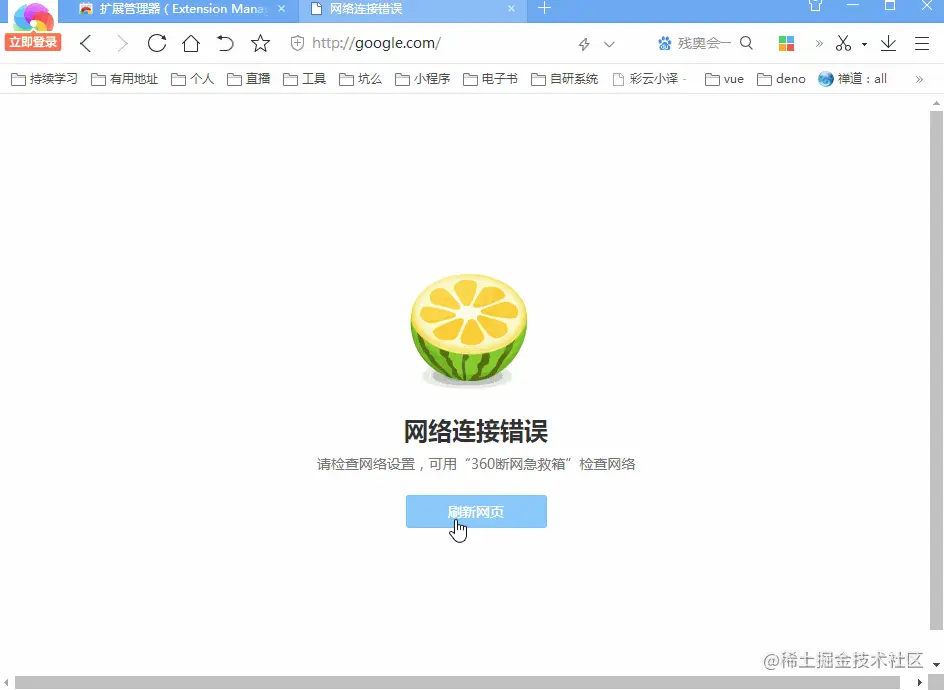

### [Stream Recorder - download HLS as MP4](https://chrome.google.com/webstore/detail/stream-recorder-download/iogidnfllpdhagebkblkgbfijkbkjdmm)

四个字： **极其强大**， 其能直接拦截**直播流， flv等格式**。 重复一遍，**能拦截直播流**。 **其原理是底层拦截 [MSE](https://developer.mozilla.org/zh-CN/docs/Web/API/Media_Source_Extensions_API)的方法**。

使用 Stream Recorder，您可以轻松地保存以典型 HLS (m3u8)格式发布的实时视频和存档视频。

甚至，如果视频文件类型是 mp4格式，您可以直接使用独特的视频捕获功能录制视频。

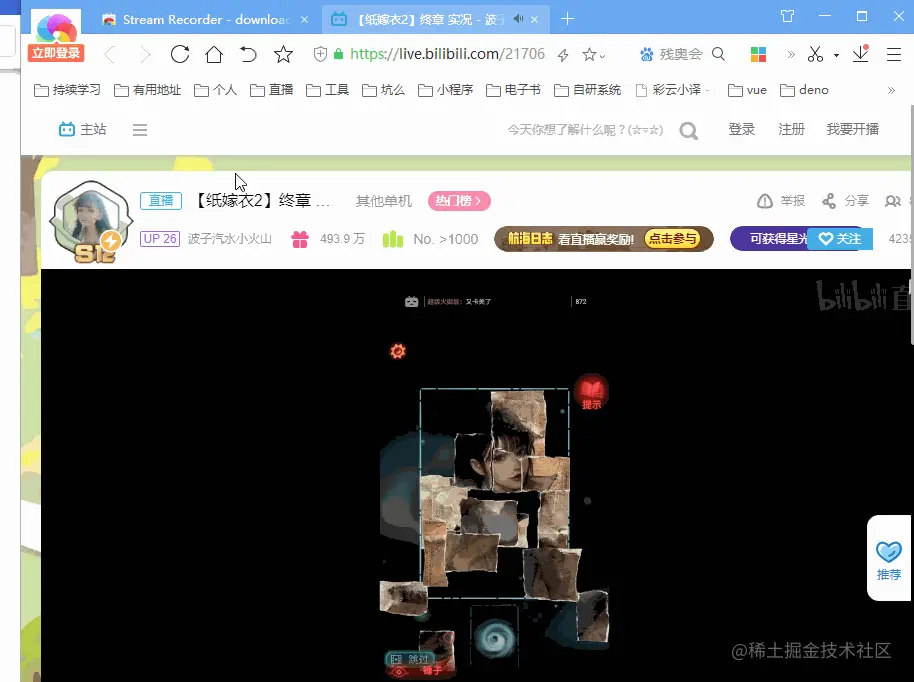

### [octotree](https://chrome.google.com/webstore/detail/octotree/bkhaagjahfmjljalopjnoealnfndnagc) Github和GitLab树形导航

github网站浏览利器，右边生产菜单，一览无余， 简单高效！！！！

另外有一款类似的插件 **[Sourcegraph](https://chrome.google.com/webstore/detail/sourcegraph/dgjhfomjieaadpoljlnidmbgkdffpack)**,  其更加智能。

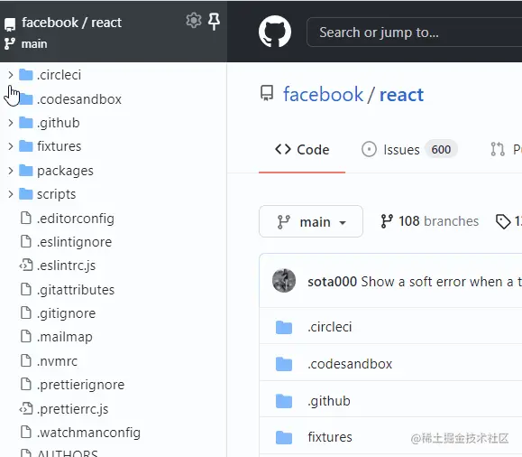

### [Tampermonkey](https://chrome.google.com/webstore/detail/tampermonkey/dhdgffkkebhmkfjojejmpbldmpobfkfo) 游猴脚本

网站上运行所谓的用户脚本。可以更改页面的布局，添加或删除新功能和内容或自动执行操作。 其不仅可以自己添加脚本，还有自己的脚本商店的概念，强到发紫。

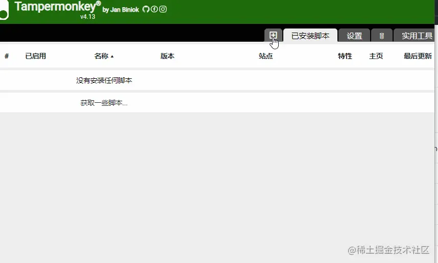

### [GitHub加速](https://chrome.google.com/webstore/detail/github%E5%8A%A0%E9%80%9F/mfnkflidjnladnkldfonnaicljppahpg)

国内Github下载很慢，用上了这个插件后，下载速度嗖嗖嗖的~！

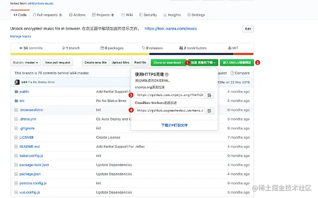

### [扩展管理器（Extension Manager）](https://chrome.google.com/webstore/detail/extension-manager/gjldcdngmdknpinoemndlidpcabkggco)

chrome插件管理器， 插件太多放不下， 激活和停用不方便，这款，真的很优秀！

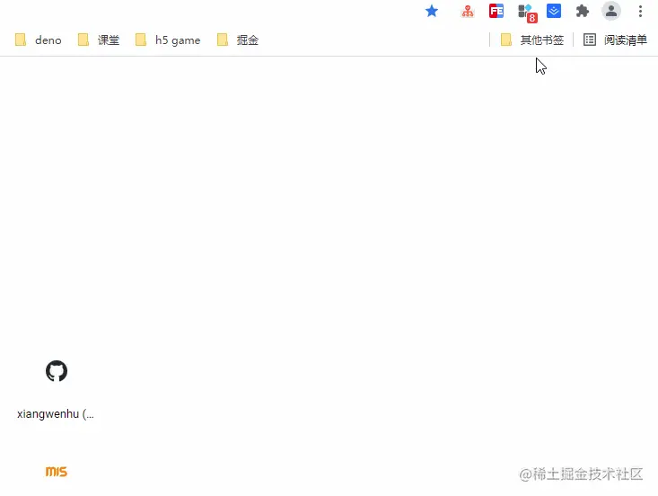

### [彩云小译 - 网页翻译插件](https://chrome.google.com/webstore/detail/lingocloud-web-translatio/jmpepeebcbihafjjadogphmbgiffiajh)

这些大家可能要说**[Google 翻译](https://chrome.google.com/webstore/detail/google-translate/aapbdbdomjkkjkaonfhkkikfgjllcleb)** 不香吗？ 前提是用连得上google的服务，而彩云小译不一样了。

彩云小译双语对照网页翻译插件，针对浏览器开发的一款网页翻译工具，一键高效获取母语阅读体验。

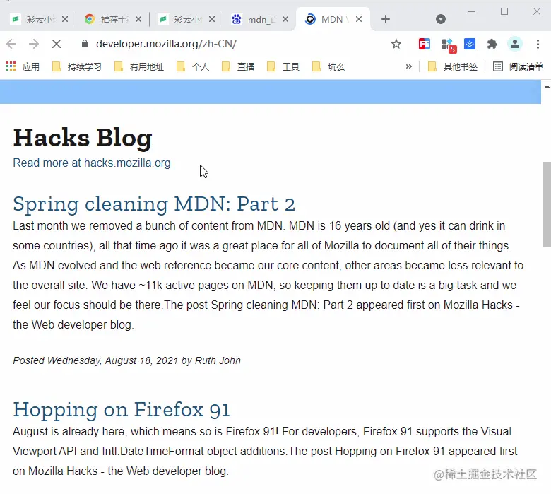

### [Adblock Plus - 免费的广告拦截器](https://chrome.google.com/webstore/detail/adblock-plus-free-ad-bloc/cfhdojbkjhnklbpkdaibdccddilifddb)

还有基础款[AdBlock — 最佳广告拦截工具](https://chrome.google.com/webstore/detail/adblock-%E2%80%94-best-ad-blocker/gighmmpiobklfepjocnamgkkbiglidom)， 以及**[AdGuard 广告拦截器](https://chrome.google.com/webstore/detail/adguard-adblocker/bgnkhhnnamicmpeenaelnjfhikgbkllg)**， 可以看出来广告是多么的烦！

Adblock Plus是Chrome浏览器中非常流行的一款广告拦截插件，Adblock Plus的用户多达数百万之多，在全球范围内都有很高的使用评价，Adblock Plus是由一个开源社区来维护。

可能需要付费，但是世界清静。

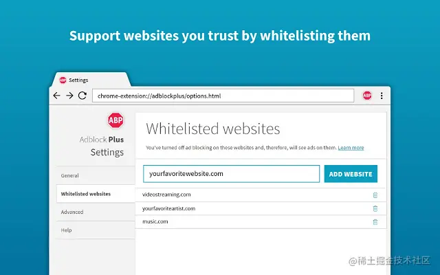

### [Infinity 新标签页](https://chrome.google.com/webstore/detail/infinity-new-tab/dbfmnekepjoapopniengjbcpnbljalfg)

百万用户选择的新标签页，自由添加网站图标，云端高清壁纸，快速访问书签、天气、笔记、待办事项、扩展管理与历史记录。

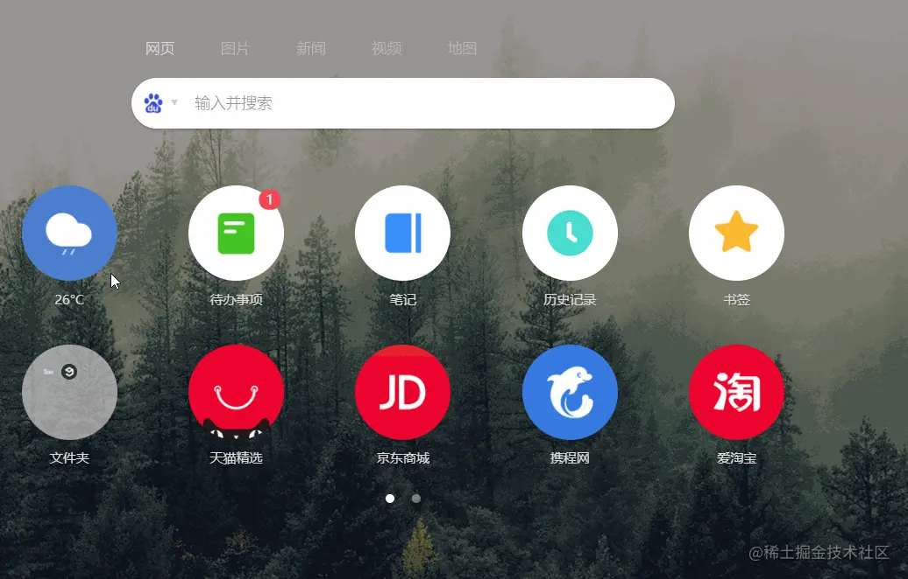

### [crxMouse Chrome™ 手势](https://chrome.google.com/webstore/detail/crxmouse-chrome-gestures/jlgkpaicikihijadgifklkbpdajbkhjo)

**酷到不行，谁用谁知道！！！**

充分发掘鼠标的所有操作.功能包括:鼠标手势,超级拖曳,滚轮手势,摇杆手势,平滑滚动,标签页列表等.

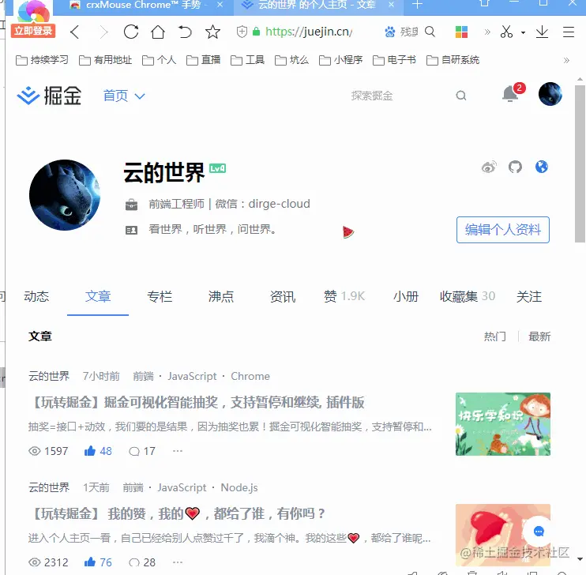

### [OneTab](https://chrome.google.com/webstore/detail/onetab/chphlpgkkbolifaimnlloiipkdnihall) 标签管理能手

节省高达95％的内存，并减轻标签页混乱现象。 来来来，**我还能再开100个标签页。**

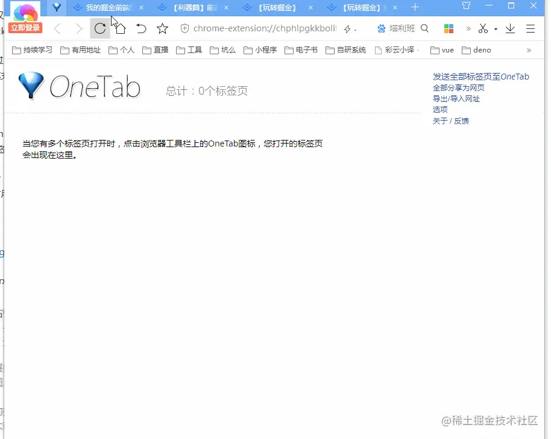

## 前端开发工具类 （17）

### [FeHelper(前端助手)](https://chrome.google.com/webstore/detail/fehelper%E5%89%8D%E7%AB%AF%E5%8A%A9%E6%89%8B/pkgccpejnmalmdinmhkkfafefagiiiad) 前端工具集

绝对的**五星推荐**，内置了json美化，json比对，图片转base, 二维码/解码, markdown工具，简易postMan,  JS正则， **页面取色**，编码转换，**网页性能**，游猴脚本， excel转json等等

**FEHelper有自己的插件市场，默认只有JSON美化工具，需要到设置面板去安装。**

### [Lighthouse](https://chrome.google.com/webstore/detail/lighthouse/blipmdconlkpinefehnmjammfjpmpbjk) 性能分析

Lighthouse 是一个开源的自动化工具，用于提高 web 应用程序的性能、质量和正确性。

在审计页面时，Lighthouse 针对页面运行大量测试，然后生成一个关于页面执行情况的报告。从这里开始，您可以使用失败测试作为指示器，说明您可以做些什么来改进您的应用程序。

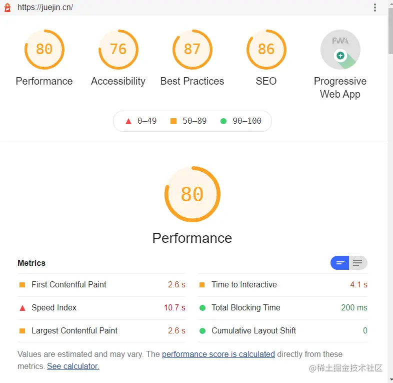

### [Talend API Tester - Free Edition](https://chrome.google.com/webstore/detail/talend-api-tester-free-ed/aejoelaoggembcahagimdiliamlcdmfm/related)

调用、发现和测试 HTTP 和 restapi 变得非常容易。

无需安装windows应用，直接在浏览器里就行操作！！

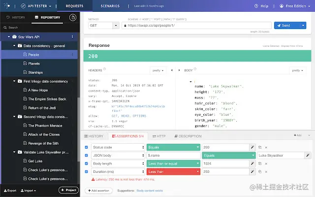

### [Image downloader](https://chrome.google.com/webstore/detail/image-downloader/kdbfjpagopjjaiofmgodphiklmjhcnok)

**偷图利器！！！！**

图像下载器显示页面上找到的每个图像的缩略图，并可以选择下载所有图像或仅选择其中一部分。如果要下载所有图像，使用起来很方便，因为只需单击两次即可。

有点坑的是，在360浏览器弹出恶心的下载框。

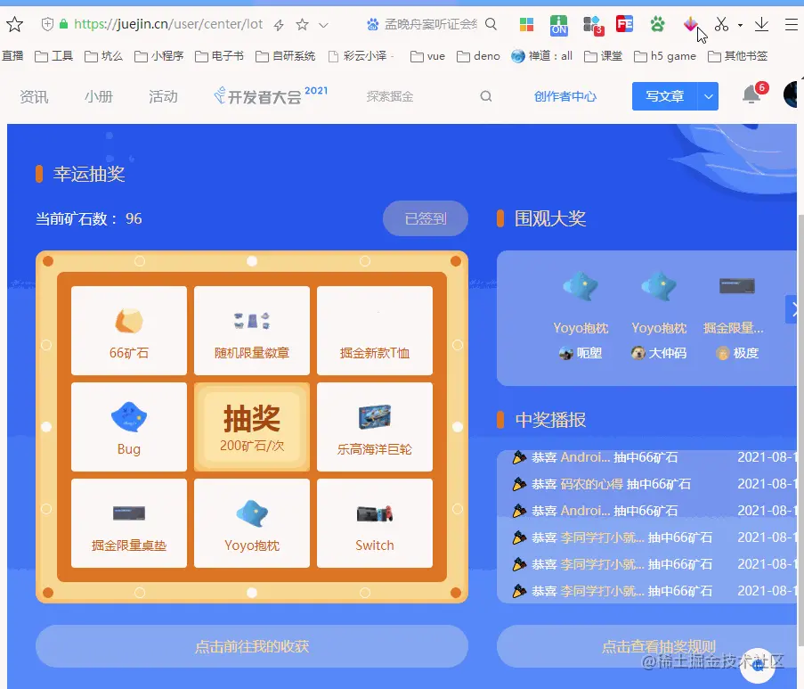

### [ColorZilla](https://chrome.google.com/webstore/detail/colorzilla/bhlhnicpbhignbdhedgjhgdocnmhomnp)

先进的滴管，颜色选择器.

其实 FeHelper也有类似功能，没这个强大。

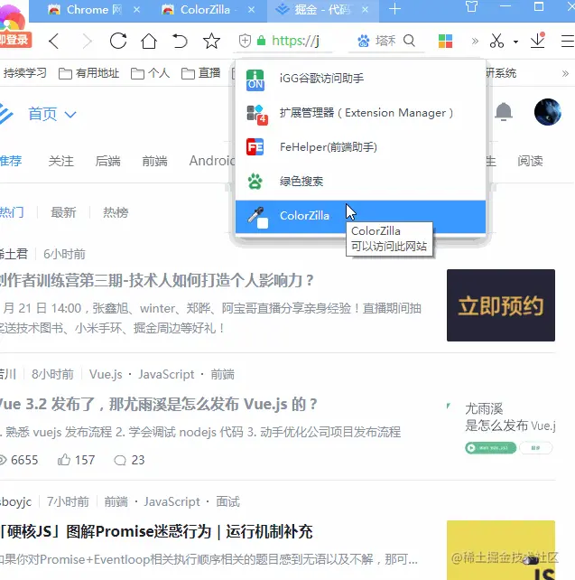

### [JSON Viewer](https://chrome.google.com/webstore/detail/json-viewer/gbmdgpbipfallnflgajpaliibnhdgobh)

美化JSON的显示，内置很多中风格，比如我就喜欢黑色，黑丝，哈哈！

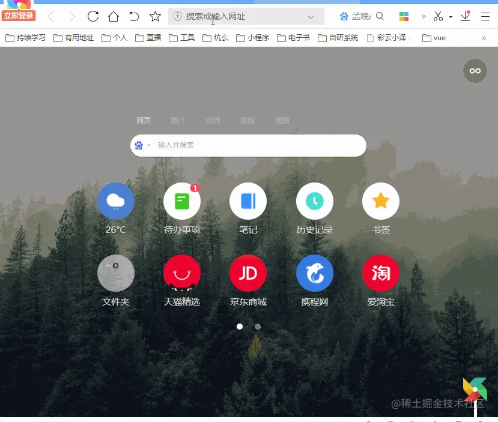

### [Web Developer](https://chrome.google.com/webstore/detail/web-developer/bfbameneiokkgbdmiekhjnmfkcnldhhm)

Web Developer 这款扩展集成了各种各样的 Web 开发工具，几乎是网页开发人员必备的 [Chrome 开发者工具扩展插件](https://link.juejin.cn?target=http%3A//www.cnplugins.com/devtool/)，安装之后会在浏览器工具栏添加一个齿轮状的小图标，点击小图标之后就可以看到大量的 Web 开发工具。 热度很高，但我不太喜欢，哈！

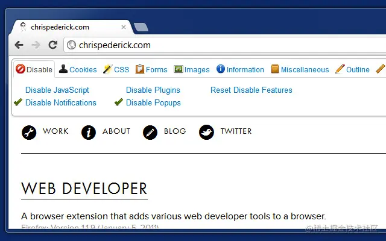

### [EditThisCookie](https://chrome.google.com/webstore/detail/editthiscookie/fngmhnnpilhplaeedifhccceomclgfbg)

EditThisCookie是一个cookie管理器。您可以添加，删除，编辑，搜索，锁定和屏蔽cookies！

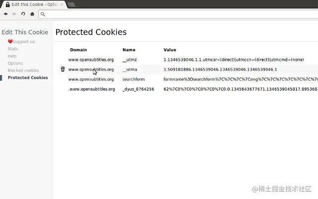

### [User-Agent Switcher for Chrome](https://www.cnplugins.com/office/user-agent-switcher-for-c/)

能将Chrome伪装成各大家不同的浏览器，让你方便测试初始网页。

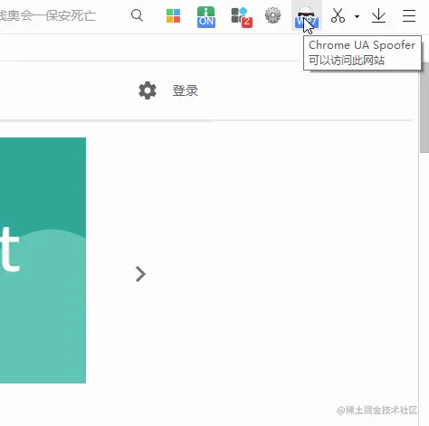

### [Window Resizer](https://chrome.google.com/webstore/detail/window-resizer/kkelicaakdanhinjdeammmilcgefonfh/)

用户可以将窗口调节为320x480、480x800、1024x768等大小，也可以选择自定义浏览器窗口的尺寸。

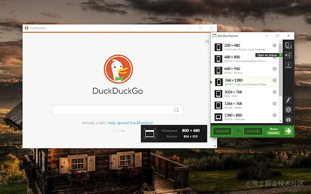

### [CSSViewer](https://chrome.google.com/webstore/detail/cssviewer/ggfgijbpiheegefliciemofobhmofgce)  和 [CSS Peeper](https://chrome.google.com/webstore/detail/css-peeper/mbnbehikldjhnfehhnaidhjhoofhpehk)

实时显示节点的样式，可惜不支持复制，最后更新2017年。

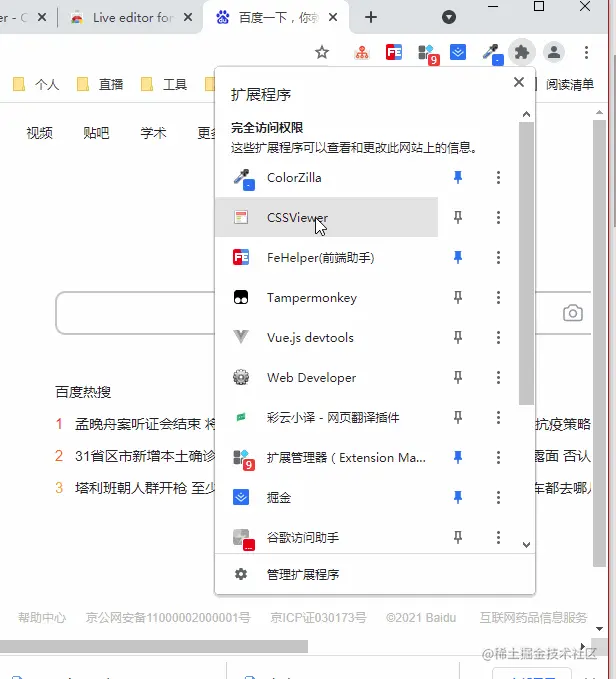

CSS Peeper可以抽取样式，棒棒哒

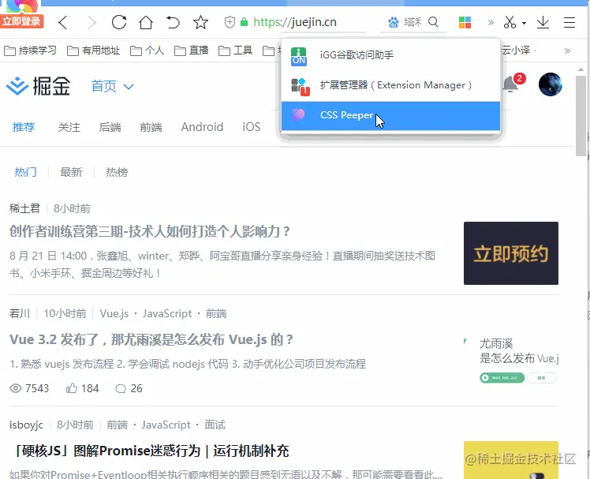

### [Page Ruler Redux](https://chrome.google.com/webstore/detail/page-ruler-redux/giejhjebcalaheckengmchjekofhhmal)

开发人员设计器标尺，用于获得完美的像素尺寸和定位，以测量任何网页上的元素。

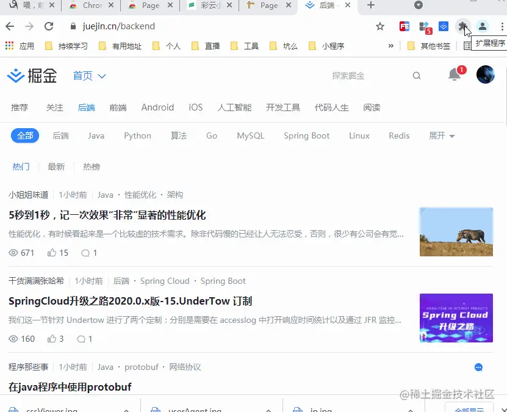

### [BuiltWith Technology Profiler](https://chrome.google.com/webstore/detail/builtwith-technology-prof/dapjbgnjinbpoindlpdmhochffioedbn)

是一个网站分析工具。在查找一个页面时，BuiltWith 返回它能在 pag 上找到的所有技术。

我们一起看看掘金

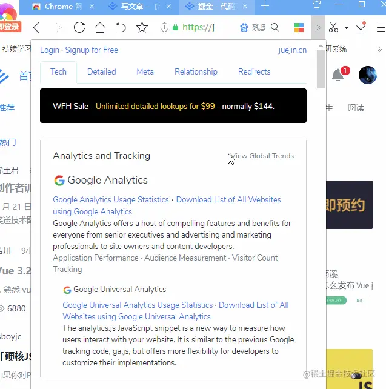

### [What Font - find font](https://chrome.google.com/webstore/detail/what-font-find-font/djgfpbegnihdgbngpmhjnlchgglngcdn)

让你知道在任何网站上使用什么字体

什么字体可以让你知道字体的名称，它的family，颜色，样式，大小，位置。这样一个伟大的工具，创建设计的网页快速。

### [SEO Analysis & Website Review by WooRank](https://chrome.google.com/webstore/detail/seo-analysis-website-revi/hlngmmdolgbdnnimbmblfhhndibdipaf/related)

SEO分析利器

即时搜索引擎优化分析和网站评论的搜索引擎优化，移动，可用性和社会媒体。

搜索引擎优化分析和网站评论扩展将分析你正在浏览器中访问的网站，并生成一个清晰的，可操作的报告，以强调任何影响被评论网站的可访问性，可读性，可用性和可寻性的问题。

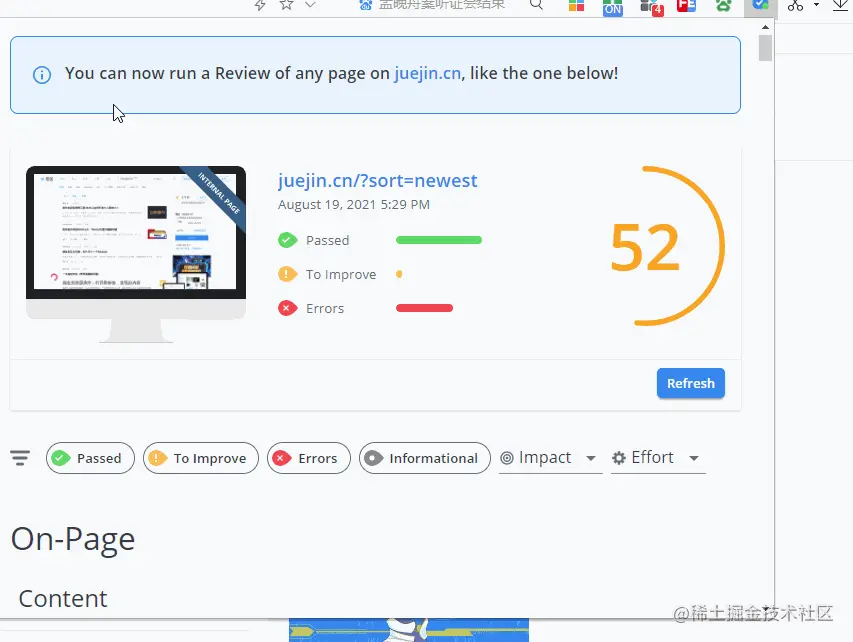

### [Live editor for CSS, Less & Sass - Magic CSS](https://chrome.google.com/webstore/detail/live-editor-for-css-less/ifhikkcafabcgolfjegfcgloomalapol)

实时预览 CSS/Less/Sass 代码更改，这些代码会立即被应用。您编写的代码将保存在浏览器扩展的存储空间或网站的本地存储中。

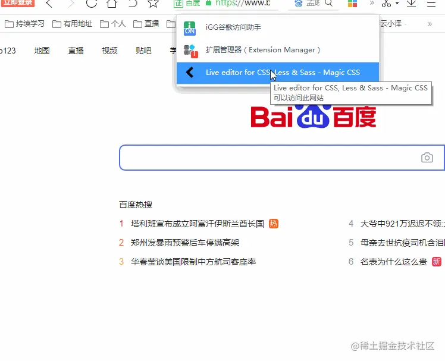

与其类似的还有一款 [User CSS](https://chrome.google.com/webstore/detail/user-css/okpjlejfhacmgjkmknjhadmkdbcldfcb)

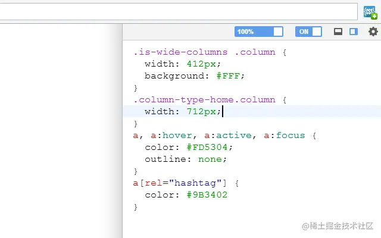

### [Page load time](https://chrome.google.com/webstore/detail/page-load-time/fploionmjgeclbkemipmkogoaohcdbig) 页面加载查看

一键查看页面加载参数！

## 其他类 （7）

### [Screenity - 屏幕录像和标注工具](https://chrome.google.com/webstore/detail/screenity-screen-recorder/kbbdabhdfibnancpjfhlkhafgdilcnji)

Chrome 最强大的屏幕录像机。 捕获，注释，编辑等。

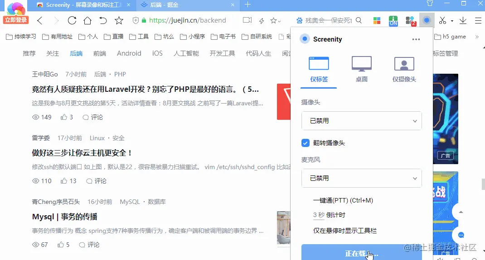

**whatruns

### [Proxy SwitchyOmega](https://chrome.google.com/webstore/detail/proxy-switchyomega/padekgcemlokbadohgkifijomclgjgif)

轻松快捷地管理和切换多个代理设置。

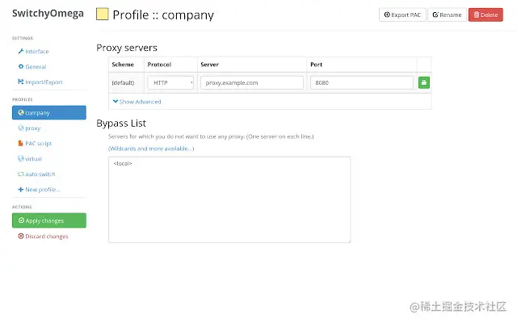

### [书签侧边栏](https://chrome.google.com/webstore/detail/bookmark-sidebar/jdbnofccmhefkmjbkkdkfiicjkgofkdh)

在浏览器视图区左侧添加固定式的, 管理所有书签的侧边栏.

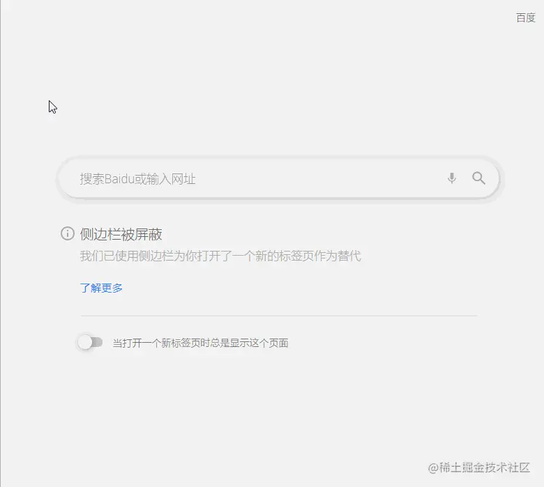

### [捕捉网页截图 - FireShot](https://chrome.google.com/webstore/detail/take-webpage-screenshots/mcbpblocgmgfnpjjppndjkmgjaogfceg)

页面截图，chrome现在已经内置截图功能，进入需要几步，而这个就比较直观了。

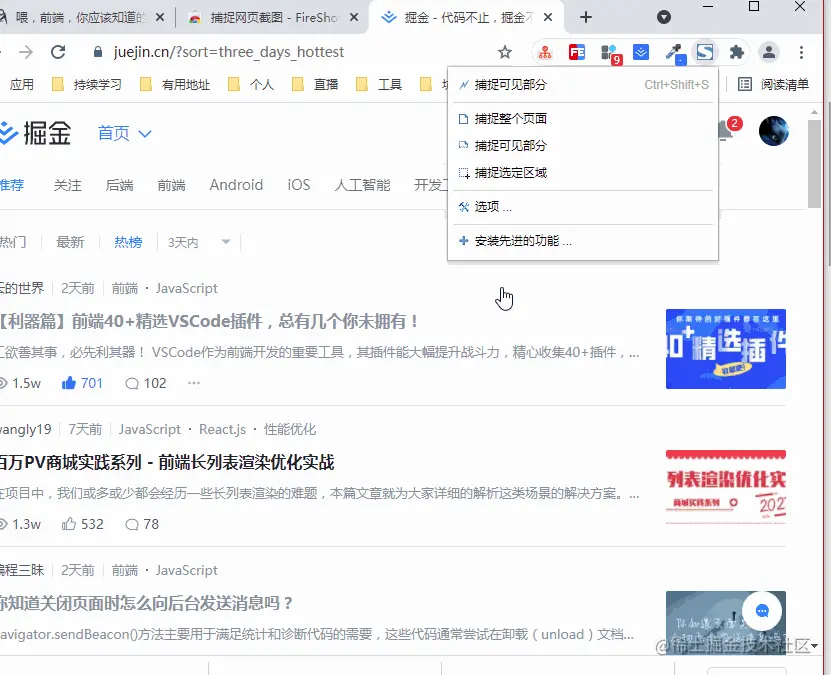

### [Clear Cache](https://chrome.google.com/webstore/detail/clear-cache/cppjkneekbjaeellbfkmgnhonkkjfpdn)

一键清除浏览器的缓存！！！ 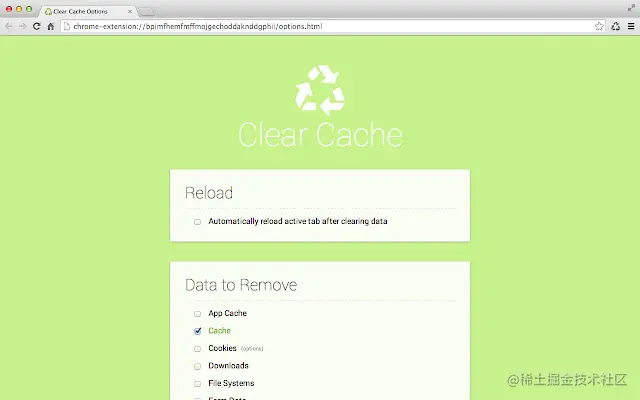

### [IP Address and Domain Information](https://chrome.google.com/webstore/detail/ip-address-and-domain-inf/lhgkegeccnckoiliokondpaaalbhafoa)

IP 地址、 域名和提供程序的详细的信息。

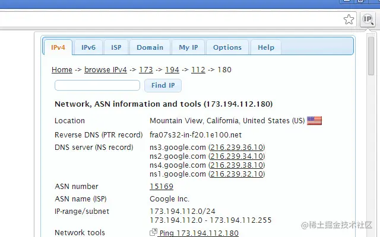

### [哔哩哔哩下载助手](https://chrome.google.com/webstore/detail/%E5%93%94%E5%93%A9%E5%93%94%E5%93%A9%E4%B8%8B%E8%BD%BD%E5%8A%A9%E6%89%8B/djinnjdnedmcilpnboifdhfgbbhgieee)

作为二次元的，推荐一款哔哩哔哩的下载助手！ 当然还有功能更强大的 **[哔哩哔哩助手：bilibili.com 综合辅助扩展](https://chrome.google.com/webstore/detail/%E5%93%94%E5%93%A9%E5%93%94%E5%93%A9%E5%8A%A9%E6%89%8B%EF%BC%9Abilibilicom-%E7%BB%BC%E5%90%88%E8%BE%85%E5%8A%A9%E6%89%A9%E5%B1%95/kpbnombpnpcffllnianjibmpadjolanh)**, 我还是喜欢轻巧的。

### [Resource Override](https://chrome.google.com/webstore/detail/resource-override/pkoacgokdfckfpndoffpifphamojphii)

这个扩展允许你在发出请求之前动态地重定向 url。

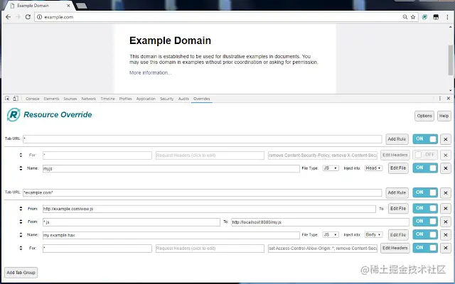