# VSCode 编辑器环境插件配置


## VSCode 编辑器用户片段

### 什么是用户片段？

一些常用的需要重复编写的代码片段 集成 json 配置文件，在编码过程中 通过输入在用户片段中自定义的字符 触发 定义好的片段，从而提高编码效率

可抽离的代码片段：（仅供参考）

- vue2 |vue3 模板页面

- react 模板页面
- 常用的调试如：console.log()
- 常用的 UI 模板提示：成功、失败...
- 类和方法的注释：

.............

---

详情 查看 VS Code 文档：[VS Code 代码片段文档](https://code.visualstudio.com/docs/editor/userdefinedsnippets)

#### VS Code 内置片段

VS Code 具有多种语言的内置代码片段，例如：JavaScript、TypeScript、Markdown 和 PHP。

#### 从插件市场安装代码片段

[VS Code 插件市场](https://marketplace.visualstudio.com/vscode)上的许多 [扩展](https://code.visualstudio.com/docs/editor/extension-marketplace) 都包含代码片段。在插件市场中搜索包含各种语言片段的扩展：`@category:"snippets"`

### 自定义代码片段

#### 1.开始

Mac 系统：三种方法呼出【用户代码片段】设置：

1. 左上角：『Code 』 → 『首选项』 → 『用户片段』
2. 快捷键：`Shift + Command + p` 然后输入 `Snippets`
3. 左下角：『设置图标(齿轮图标)』 → 『用户代码片段』

windows 系统：三种方法呼出【用户代码片段】设置：

1. 左上角：『文件』 → 『首选项』 → 『用户片段』
2. 快捷键：`Ctrl + Shift + P` 然后输入 `Snippets`
3. 左下角：『设置图标(齿轮图标)』 → 『用户代码片段』


```json
{
	"for 循环": {
		"scope": "javascript,typescript",
		"prefix": ["for", "for-const"],
		"body": ["for (const ${2:element} of ${1:array}) {", "\t$0", "}"],
		"description": "一个循环快捷代码块"
	}
}
```

#### 2.代码片段语法配置详解

|               JSON 配置               |                                                                      说明                                                                      |
| :-----------------------------------: | :--------------------------------------------------------------------------------------------------------------------------------------------: |
|              "for 循环"               |                                                                  代码片段名称                                                                  |
|   "scope": "javascript,typescript",   | 作用文件类型：表示代码片段作用于哪种语言。 不同语言之间以`,`隔开<br />(只能在全局代码片段使用，局部代码片段 json 文件使用会报警告，没有此属性) |
|    "prefix": ["for", "for-const"],    |                                     设置快捷指令为：输入 for 或 for-const 触发<br />接收一个字符串或者数组                                     |
|  "description": "一个循环快捷代码块"  |                                                                片段说明描述信息                                                                |
| **“body”: [ ]**：<br />下表是可用配置 |                                             内部为：自定义代码片段内容<br />接收一个字符串或者数组                                             |

|           body 里的可用配置           |                                                                                                                     说明                                                                                                                      |
| :-----------------------------------: | :-------------------------------------------------------------------------------------------------------------------------------------------------------------------------------------------------------------------------------------------: | -------------------------------------------------------------------------- |
|       **代码主体的书写规范：**        | 1、每个字符串元素就代表一行，行与行之间用" , "隔开表示换行。或者使用\n 换行 行内不能使用 tab 键缩进，<br />2、只能使用空格或者\t 缩进 $1 使用代码块敲击回车或者 tab 键后光标定位的位置。<br />3、$2 $3 $4…表示我们按下 tab 光标依次出现的位置 |
| 制表位：<br />`$1，$2，$3，......$0`  |                                                 代码快捷生成之后，鼠标光标的所在位置。<br />光标会首先定位在$1,『`按Tab键`』切换到 $2 的位置，数字是访问制表位的顺序，`$0`表示最终光标位置。                                                  |
|     占位符：<br />`${1:another}`      |       占位符 是带默认值的制表位 ，例如`${1:foo}`。<br />占位符 的文本会被插入到制表位 所在位置并且全选以方便修改。<br />占位符 可以嵌套使用，比如`${1:another ${2:placeholder}}`。<br />占位符 可以有多选值，每个选项的值用 `,` 分隔。        |
| 选择项：<br />`${1\|one,two,three\|}` |                                                                                                         选项的开始和结束用管道符号(`                                                                                                          | `)将选项包含<br />当插入代码片段，选择制表位的时候，会列出选项供用户选择。 |
|               **变量**                |                                                            变量太多，不多赘述，详情请 查看变量后面的文档：https://code.visualstudio.com/docs/editor/userdefinedsnippets#_variables                                                            |

##### 代码片段示例：

```json
// ********** 页面顶部说明注释片段 **********
  "Print to topNote": {
    "prefix": "topNote",
    "body": [
      "/**",
      " * @Copyright(c) 2022 rights reserved",
      " * @Description: $0",
      " * @Author: your name",
      " * @Date: $CURRENT_YEAR-$CURRENT_MONTH-$CURRENT_DATE",
      " * @LastEditTime: ${CURRENT_YEAR}-${CURRENT_MONTH}-${CURRENT_DATE} ${CURRENT_DAY_NAME} ${CURRENT_HOUR}:${CURRENT_MINUTE}:${CURRENT_SECOND}",
      " * @LastEditors: $CURRENT_YEAR-$CURRENT_MONTH-$CURRENT_DATE $CURRENT_DAY_NAME $CURRENT_HOUR:$CURRENT_MINUTE:$CURRENT_SECOND",
      " */"
    ],
    "description": "页面顶部开头说明注释模板"
  },
// ********** 方法注释片段 **********
  "Print to method": {
    "prefix": "noteMethod",
    "body": [
      "/**",
      " * @description：$0",
      " * @functionAuthor：$1",
      " * @param：{$2} $3 $4",
      " * @return：{$5} $6",
      " */"
    ],
    "description": "方法注释模板"
  },
```

```json
  // ********** vue3 **********
  "vue3页面模板": {
    "prefix": "vue3",
    "body": [
      "<template>",
      "  <div class=\"$TM_FILENAME_BASE\">",
      "    $1",
      "  </div>",
      "</template>\n",
      "<script lang='ts'>",
      "import { reactive, toRefs,onBeforeMount, onMounted } from 'vue'\n",
      "export default {",
      "  name: '$2',",
      "  setup() {",
      "    const state = reactive({})",
      "    onBeforeMount(() => {",
      "      ",
      "    })",
      "    onMounted(() => {",
      "      ",
      "    })",
      "    const refState = toRefs(state)",
      "    return {",
      "      ...refState",
      "    }",
      "  }",
      "}",
      "</script>\n",
      "<style scoped lang=\"less\">",
      "  ",
      "</style>",
      "$3"
    ],
    "description": "快速生成vue3页面"
  },
```

#### 从插件市场安装代码片段

[VS Code 插件市场](https://marketplace.visualstudio.com/vscode)上的许多[扩展](https://code.visualstudio.com/docs/editor/extension-marketplace)都包含代码片段。在插件市场中搜索包含各种语言片段的扩展：`@category:"snippets"`

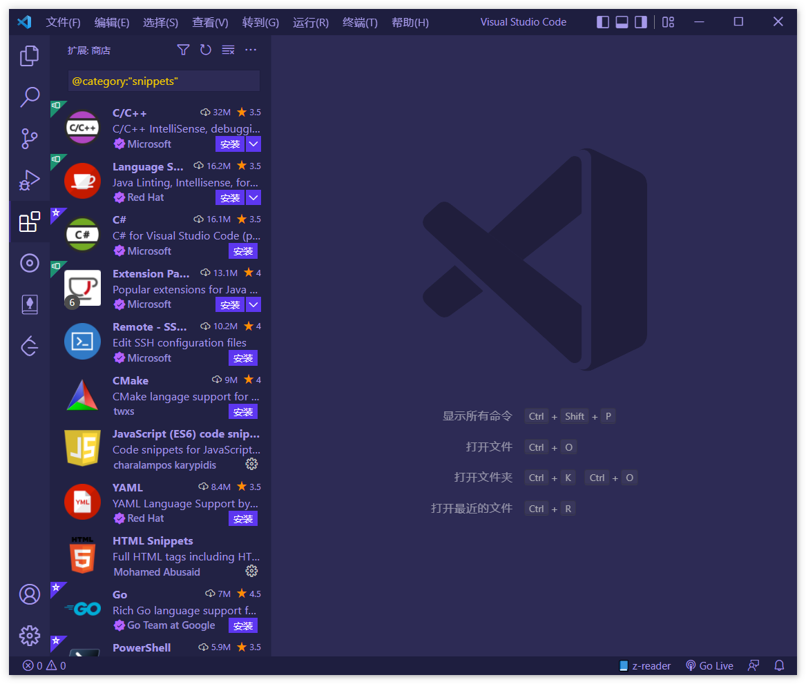

各种语言的都有，比如说你要搜 react 的，如下：`react @category:"snippets"`

比如说你要搜 vue 的，如下：`vue @category:"snippets"`

文档：[Snippets in Visual Studio Code](https://code.visualstudio.com/docs/editor/userdefinedsnippets)

---

#### 自定义代码片段

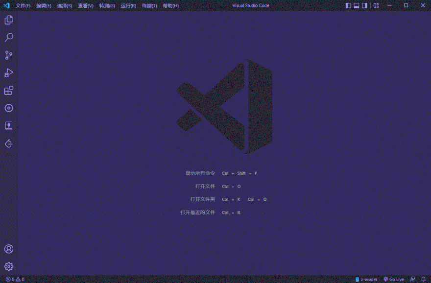

---

#### 代码片段范围

###### 全局代码片段范围：

只要在 vscode 里编码就能使用的代码片段

在编辑器里创建：

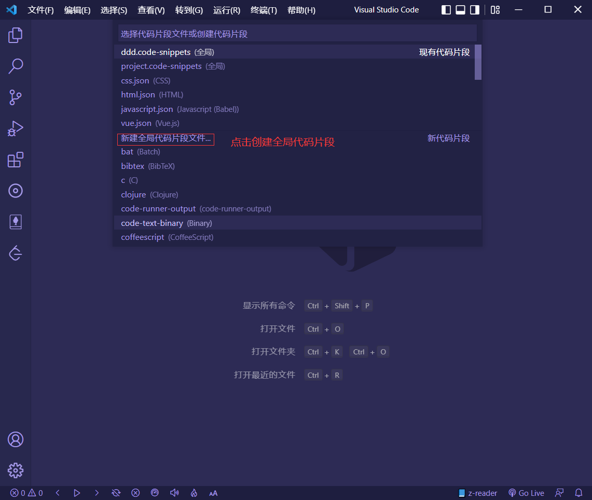

###### 语言代码段范围：

特定 后缀文件类型 或者 特定语言|作用域 里才能使用

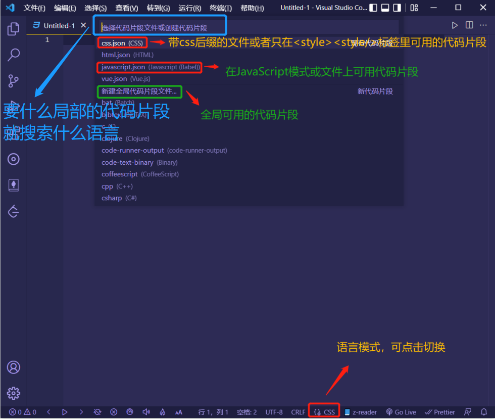

###### 项目代码片段范围：

创建在项目目录下.vscode 这个隐藏文件夹中的，这个代码块只适用于当前文件夹或者当前项目文件夹

创建：

1.在当前项目的根目录创建一个`.vscode`文件夹，然后创建以`.code-snippets`的后缀的文件即可

2.也可以在编辑器直接创建：点击后输入名字，不用带`.code-snippets`的后缀

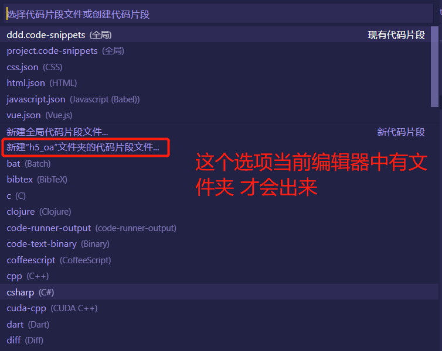

---

#### 代码片段的使用

我们只需在想要书写代码的位置 打出触发我们代码块的关键字就行


---

#### 重命名或删除代码片段文件

找到想要删除的代码片段文件的书写位置路径，然后把它重命名或删掉就好了。

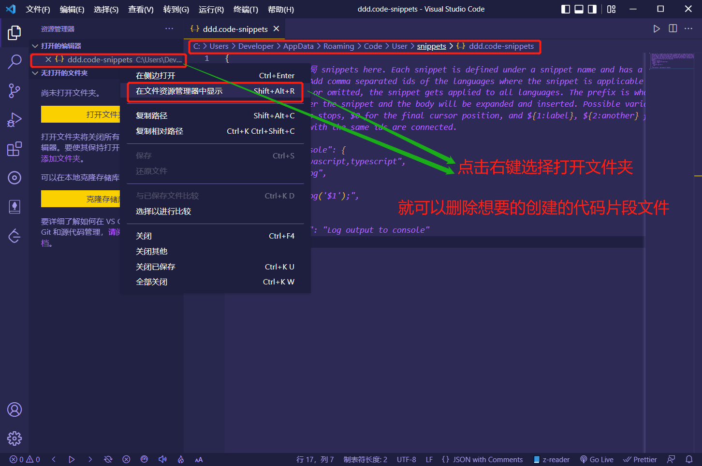

---

#### 代码片段生成器

有一段代码在代码片段里面编写好的，想要把这段代码变成代码片段，长的代码片段在编辑器里复制出来，往往需要按照一定的间隔格式来重新编辑，这个时候我们就需要片段代码生成器，直接复制写好的片段模板生成即可

##### 代码片段生成器（可生成 VSCode、Sublime Text、Atom 的代码片段）：

官网：https://snippet-generator.app/
github：https://github.com/pawelgrzybek/snippet-generator

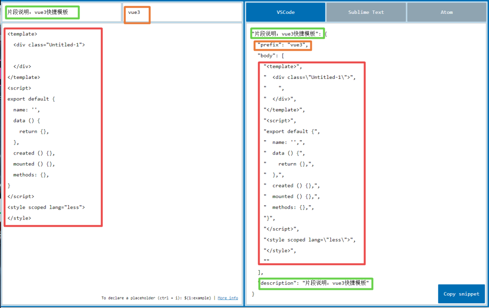

---

#### 我的自定义代码片段

GitHub：https://github.com/hujiexin77/VScode-user-snippet
参考就好

## VSCode 前端插件

[2023年最新最全 VSCode 插件推荐！ (qq.com)](https://mp.weixin.qq.com/s/am3VofYEVcjCpebC4jS0uA)

**1.HTML Snippets**

超级实用且初级的 H5 代码片段以及提示

**2.HTML CSS Support**

让 html 标签上写 class 智能提示当前项目所支持的样式

**3.Debugger for Chrome**

让 vscode 映射 chrome 的 debug 功能，静态页面都可以用 vscode 来打断点调试

[https://github.com/Microsoft/vscode-chrome-debug/blob/master/images/demo.gif?raw=truegithub.com/Microsoft/vscode-chrome-debug/blob/master/images/demo.gif?raw=true](https://github.com/Microsoft/vscode-chrome-debug/blob/master/images/demo.gif?raw=true)

**4.jQuery Code Snippets**

超过 130 个用于 JavaScript 代码的 jQuery 代码片段。只需键入字母'jq'即可获得所有可用 jQuery 代码片段的列表。

**5.vscode-icons**

让 vscode 资源树目录加上图标

**6.Path Intellisense**

自动路径补全

**7.Document this**

“Document This”是 Visual Studio 代码扩展，它自动为 TypeScript 和 JavaScript 文件生成详细的 JSDoc 注释。

**8.ESlint**

JavaScript 代码检测, JavaScript 代码风格检测, JavaScript 代码自动格式化.

**9.HTMLHint**

html 代码检测

**10.Project Manager**

在多个项目之前快速切换的工具

**11.beautify**

格式化代码的工具

**12.Bootstrap 3 Sinnpet**

常用 bootstrap 的可以下

**13.Atuo Rename Tag**

修改 html 标签，自动帮你完成尾部闭合标签的同步修改

**14.GitLens**

丰富的 git 日志插件

**15.fileheader**

顶部注释模板，可定义作者、时间等信息，并会自动更新最后修改时间

**16.Bracket Pair Colorizer**

让括号拥有独立的颜色，易于区分。可以配合任意主题使用。

**17.Class autocomplete for HTMLaessoft**

扩展自动扫描一个活动的 HTML 文件的外部 CSS 样式表链接。当找到样式表时，类名被提取出来，并与 Visual Studio 代码的代码完成特性一起使用。

**18.Code Runner**

能够运行多种语言的代码片段或代码文件：C，C ++，Java，JavaScript，PHP，Python，Perl，Ruby，Go 等等

**19.css peek**

能够查看 CSS ID 和类的字符串作为 HTML 文件中相应的 CSS 定义

**20.Font-awesome codes for html**

用于 html 的 Font-awesome 代码片段

**21.filesize**

在底部状态栏显示当前文件大小，点击后还可以看到详细创建、修改时间

**22.Git History**

以图表的形式查看 git 日志

**23.htmltagwrap**

可以在选中 HTML 标签中外面套一层标签

**24.Indenticator**

突出目前的缩进深度

**25.IntelliSense for CSS class names**

智能提示 css 的 class 名

**26.Image Preview**

鼠标移到路径里显示图像预览

**27.JavaScript (ES6) code snippets**

es6 代码片段

**28.Live Sass Compiler**

实时编译 sass

**29.markdownlint**

markdown 语法检查

**30.open in browser**

当前的 html 文件用浏览器打开，类似 webstorm 的那四个小浏览器图标功能，前提条件 html 文件必须保

**31.Quokka.js**

实时观看 javascript 的变量的变化

**32.TSLint**

测试正则的插件

**33.vetur**

语法高亮、智能感知

[Vetur | Veturvuejs.github.io/vetur/](https://vuejs.github.io/vetur/)

**34.VueHelper**

vue 代码片段

**35.Dracula Official**

主题风格

**36.One Dark Pro**

代码主题

**37. Color Info**

提供你在 CSS 中使用颜色的相关信息

**38.SVG Viewer**

无需离开编辑器，便可以打开 SVG 文件并查看它们

**39.TODO Highlight**

能够在你的代码中标记出所有的 TODO 注释，以便更容易追踪任何未完成的业务

**40.Minify**

用于压缩合并 JavaScript 和 CSS 文件的应用程序

#### draw.io

`vscode` 中的一个插件,方便我们写一些流程图。

#### Project Manager

管理的项目，方便直接。

#### Bookmarks

书签用于标记代码,快速找到所在的位置。

#### Turbo Console Log

快速生成 `console.log()` 代码。

#### Surround

代码片段包裹,把选中的代码用 `if`、`try...catch` 等包裹起来。

#### tree-extended

写文章的时候，需要展示项目组织结构。

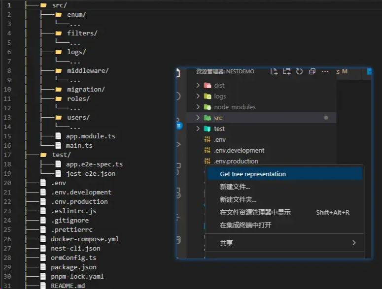

## 待定插件

- [Tabnine ](https://marketplace.visualstudio.com/items?itemName=TabNine.tabnine-vscode) AI 代码完成插
- [Trailing Spaces](https://marketplace.visualstudio.com/items?itemName=shardulm94.trailing-spaces) 尾部空格删除插件

另外两款也不错，但是不太推荐

- [ rong-notes](https://marketplace.visualstudio.com/items?itemName=zzy.rong-notes) 添加注释，下载量比较小，最后维护日期是2019年1月，就不推荐了。
- [ClassTree](https://marketplace.visualstudio.com/items?itemName=quanmin.class-tree) 根据jsx，dom结构快速生成 jsx/vue class结构。还是比较有创意的，下载量太小。

## 必备的

下面这些必备的我就不说了

1. 代码段

- [JavaScript (ES6) code snippets](https://marketplace.visualstudio.com/items?itemName=xabikos.JavaScriptSnippets)， [ES7 React/Redux/GraphQL/React-Native snippets](https://marketplace.visualstudio.com/items?itemName=dsznajder.es7-react-js-snippets)
- [vue](https://marketplace.visualstudio.com/items?itemName=jcbuisson.vue), [vetur](https://marketplace.visualstudio.com/items?itemName=octref.vetur), **[Vue 3 Snippets](https://marketplace.visualstudio.com/items?itemName=hollowtree.vue-snippets)**， [Vue VSCode Snippets](https://marketplace.visualstudio.com/items?itemName=sdras.vue-vscode-snippets)
   代码段这玩意，你也可自定义，可以参见 **[VSCode创建自定义代码段](https://www.cnblogs.com/dotnetcrazy/p/9950431.html)**

1. 代码检查和格式化

- [ESLint](https://marketplace.visualstudio.com/items?itemName=dbaeumer.vscode-eslint), [Prettier - Code formatter](https://marketplace.visualstudio.com/items?itemName=esbenp.prettier-vscode), [Beautify](https://marketplace.visualstudio.com/items?itemName=HookyQR.beautify)

1. 其他

- [open in browser](https://marketplace.visualstudio.com/items?itemName=techer.open-in-browser)

由于VSCode自身功能的增强，[NPM-Scripts](https://marketplace.visualstudio.com/items?itemName=traBpUkciP.vscode-npm-scripts), [Change Case](https://marketplace.visualstudio.com/items?itemName=wmaurer.change-case)等的插件就不需要特意安装了。

接下来更精彩！！！， **全程高能动图，请别分神！**

## 实用高效工具

### [scode-js-debug](https://marketplace.visualstudio.com/items?itemName=ms-vscode.js-debug) debug利器

**新版VSCode内置。**

可用于调试Node.js、 Chrome、 Edge、 WebView2、 VS Code 扩展等等，替换 **Debugger for Chrome** 插件。 其还可以调试Service Worker, Web Worker, 功能是异常的强大。

如下的演示，你首先的配置好`launch.json` 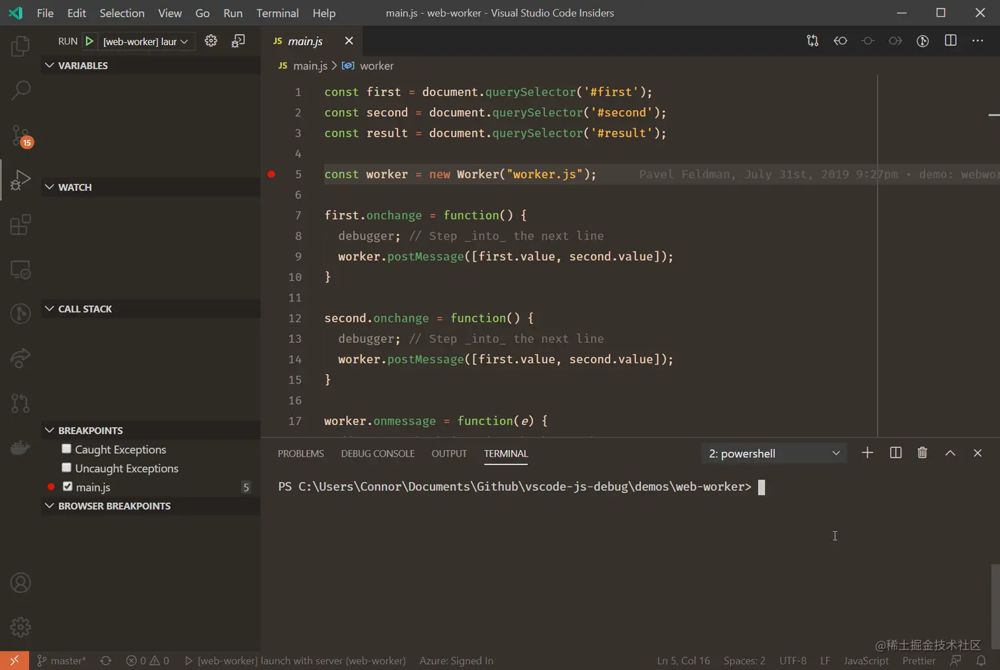

### [Live Server](https://marketplace.visualstudio.com/items?itemName=ritwickdey.LiveServer) 静态服务器

为静态和动态页面启动具有实时重载特性的本地开发服务器。

**这也是我平时最喜欢用的插件之一， 右键一键启动，还支持热等，爽字了得。**

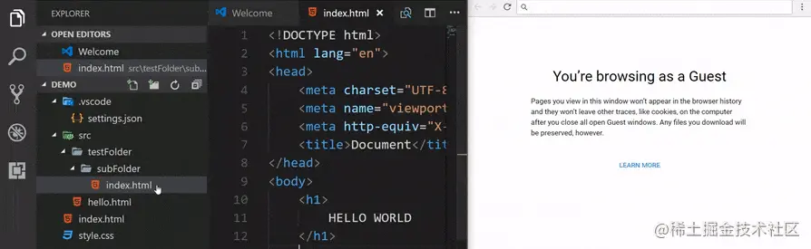

### [Code Runner](https://marketplace.visualstudio.com/items?itemName=formulahendry.code-runner) 代码运行器

**最喜欢的插件，没有之三**，平时写一些测试代码，和一些逻辑库，快捷键 `Ctrl+Alt+M`, 喝口水，看一下结果，悠哉。

一键运行多种语言运行代码片段或代码文件: c，c + + ，Java，JavaScript，PHP，Python，Perl，Perl 6，Ruby，Go，Lua，Groovy，PowerShell，BAT/CMD，BASH/SH，f # Script，f # (。NET 核心) ，c # 脚本，多到你想不到。

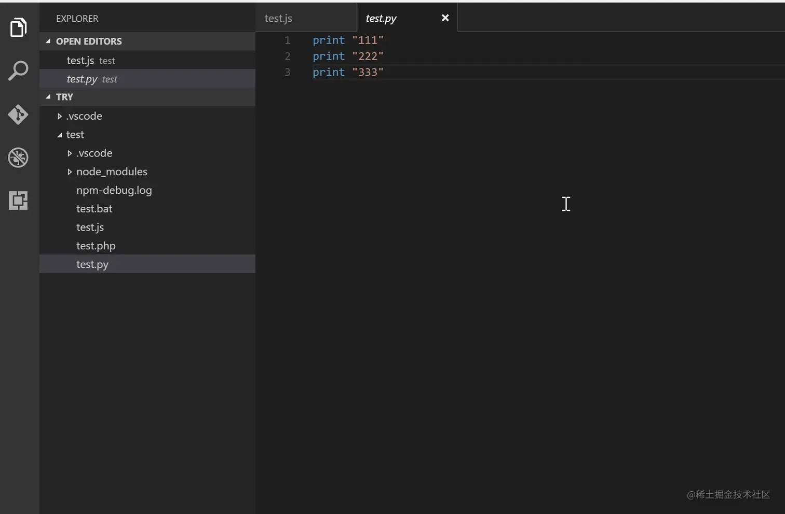

### [Tabnine ](https://marketplace.visualstudio.com/items?itemName=TabNine.tabnine-vscode)AI 代码完成插件

感谢评论区的推荐。 这是一款人工智能代码完成工具，能够以更快的速度完成代码，并且错误更少， 其支持多种语言，还具备记忆功能，真的强大。
 **我用了，就爱了**

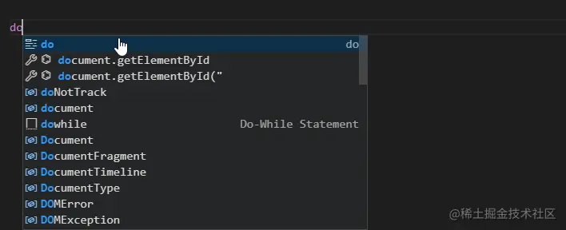

### [Trailing Spaces](https://marketplace.visualstudio.com/items?itemName=shardulm94.trailing-spaces) 尾部空格删除插件

高亮空格，并提供了一键删除。

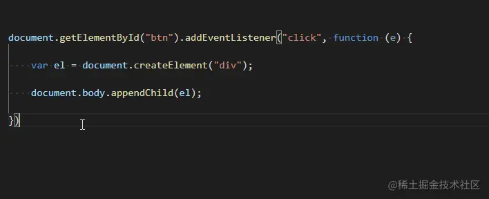

### [Markdown Preview Enhanced](https://marketplace.visualstudio.com/items?itemName=shd101wyy.markdown-preview-enhanced) markdown编辑和预览

typora？ 其实不需要的，这款markdown插件，让你一边编辑markdonwn一边预览，编程体验不差于掘金那款。

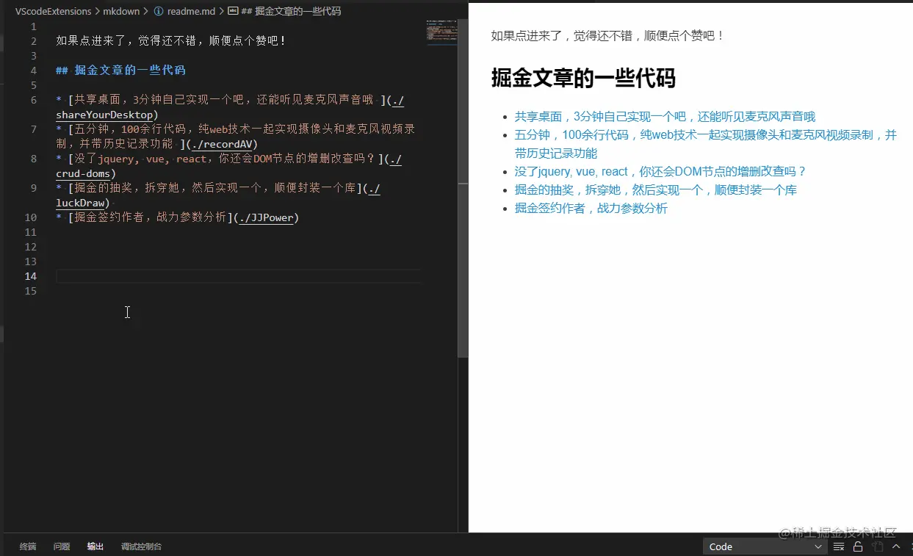

如果需要更多功能比如 TODO, 或者多行同时修改等, **[Markdown All in One](https://marketplace.visualstudio.com/items?itemName=yzhang.markdown-all-in-one)** 是不错的选择。

下面演示一下常用的TODO便签。

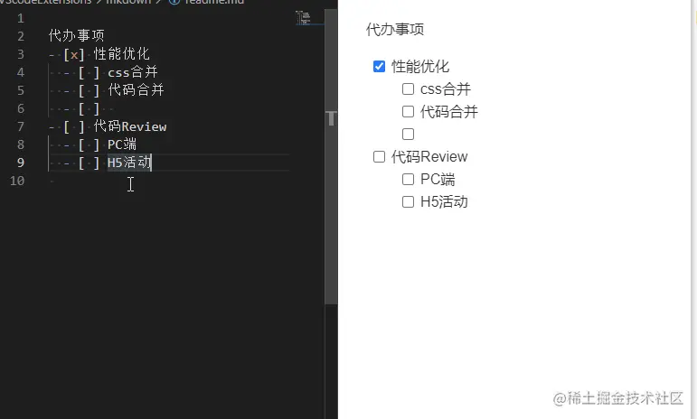

### [Git History](https://marketplace.visualstudio.com/items?itemName=donjayamanne.githistory) 和 [GitLens](https://marketplace.visualstudio.com/items?itemName=eamodio.gitlens) Git历史记录

**谁动了我的代码？** 直接在VSCode里面，查看Git的历史，搜索，版本对比。 清爽！！

VSCode也内置了时间线的功能，但是能力还是弱一些。

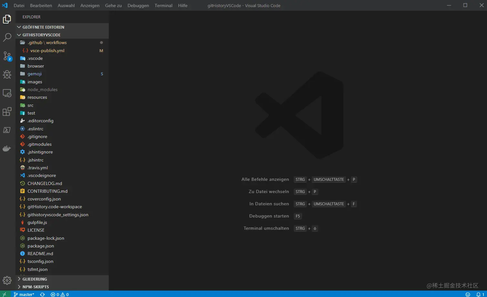

GitLens功能更加强大，无缝导航和浏览 Git 存储库。

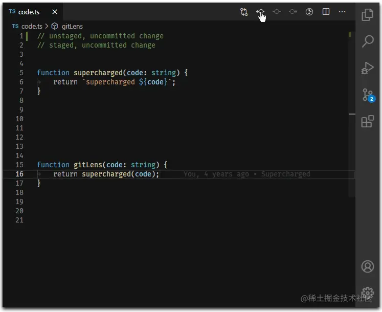

### [Image Preview](https://marketplace.visualstudio.com/items?itemName=kisstkondoros.vscode-gutter-preview) 图片预览

CSS编写，再也担心写错图片地址啦！
 其支持在`html`和`css`文件里面，当有使用图片路径的时候，在左边实现小的预览器，一眼就知对与错。

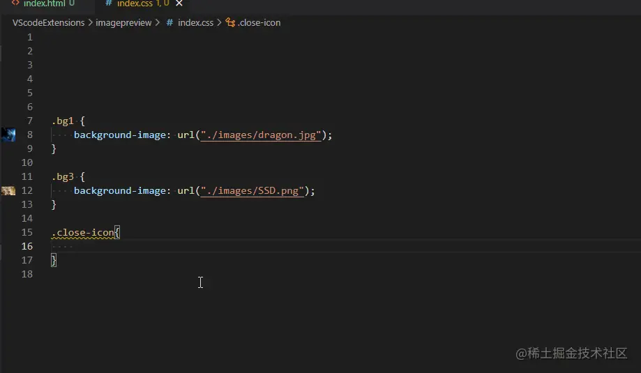

### [JSON to TS](https://marketplace.visualstudio.com/items?itemName=MariusAlchimavicius.json-to-ts)   json转为TS申明

现在的前端，谁还不写个TypeScript，可是咋生成申明文件呢？ 手写，那你太out了。 这款插件，一键生成。

别人手巧，我在喝茶，笑一个。

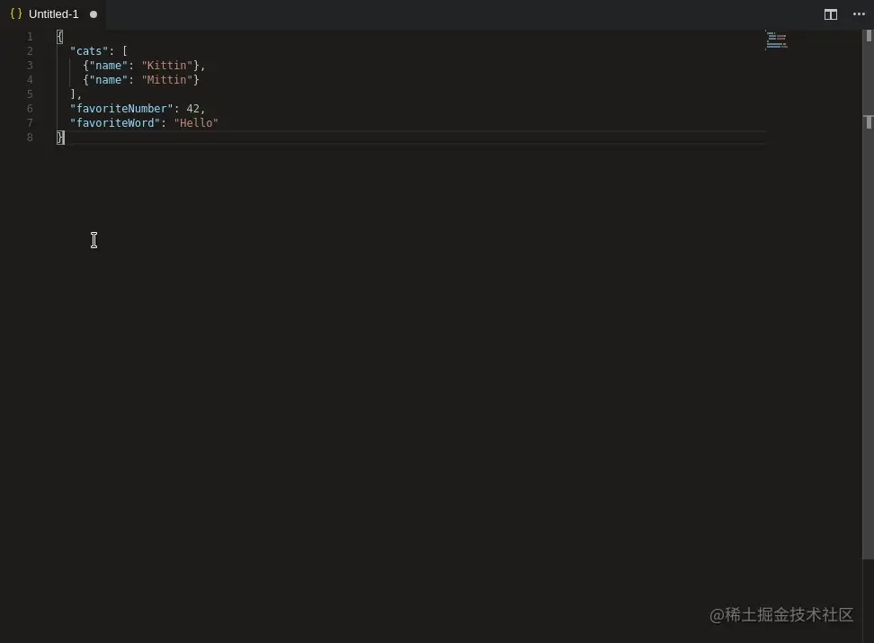

### [vscode-fileheader](https://marketplace.visualstudio.com/items?itemName=mikey.vscode-fileheader) 和 [koroFileHeader](https://marketplace.visualstudio.com/items?itemName=OBKoro1.korofileheader) 生成文件备注

某人某天编写，某人某天更新，来过就留下足迹，一眼望穿！

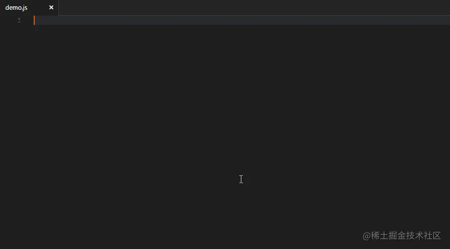

如果你觉得这些信息还不够，[koroFileHeader](https://marketplace.visualstudio.com/items?itemName=OBKoro1.korofileheader) 提供更督导的注释， 也同时支持生成函数注释。

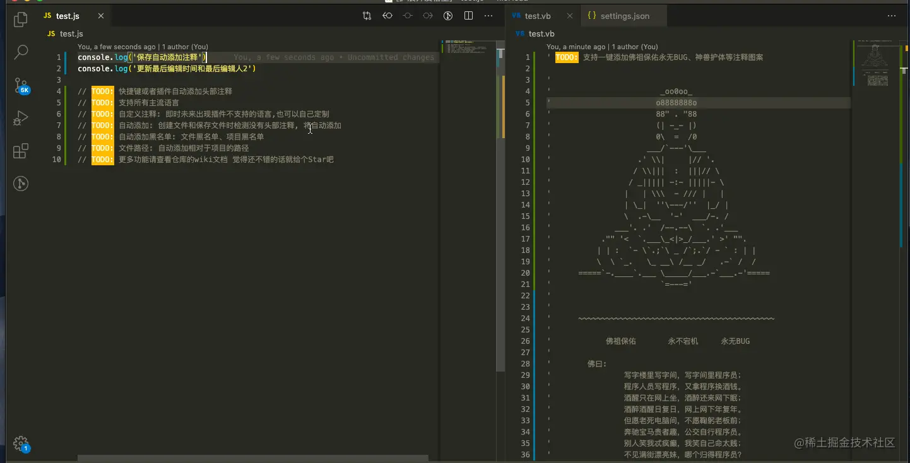

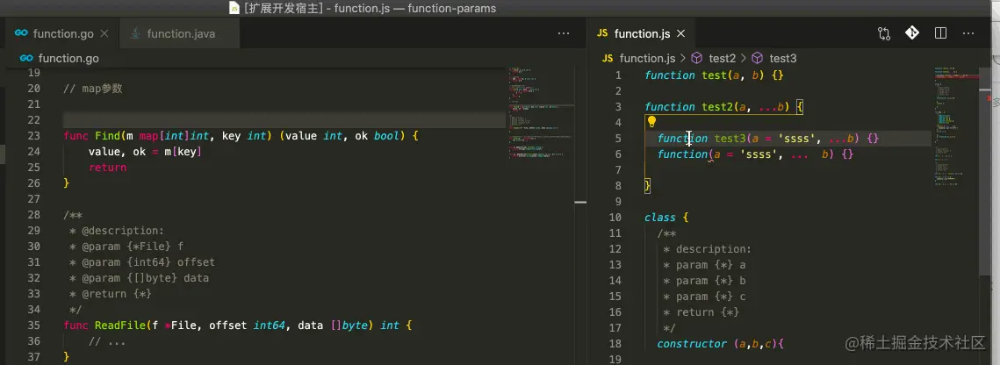

### [npm Intellisense](https://marketplace.visualstudio.com/items?itemName=christian-kohler.npm-intellisense)  npm模块导入智能提示

那么多npm模块，记性不好，脑子不快，没关系，这款插件替你分忧。

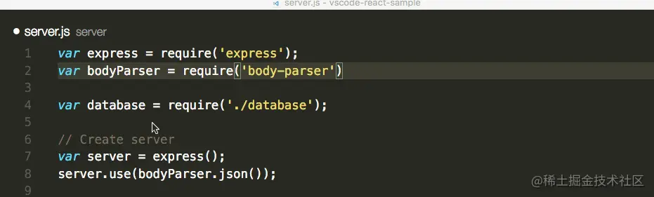

### [Import Cost](https://marketplace.visualstudio.com/items?itemName=wix.vscode-import-cost) 依赖包大小提示

我们一来那么多包，你引入的成本是多少呢？ 成本早知道，就交给她吧！

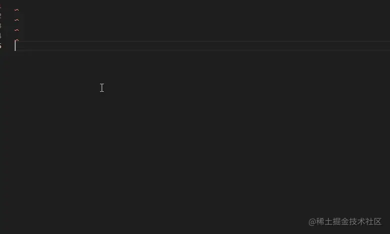

### [formate: CSS/LESS/SCSS formatter](https://marketplace.visualstudio.com/items?itemName=MikeBovenlander.formate)  css样式美化

VSCode内置css格式化功能，这款支持less, scss，高效美观，如你！

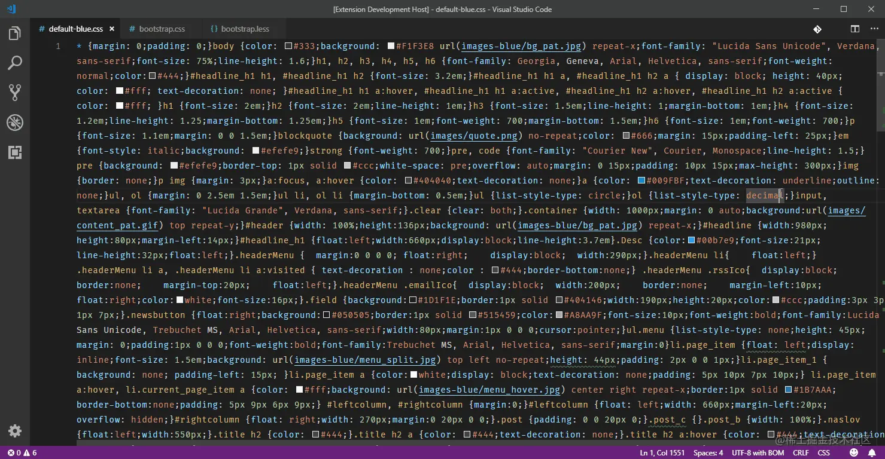

### [TODO Highlight](https://marketplace.visualstudio.com/items?itemName=wayou.vscode-todo-highlight)  高亮TODO

在代码中突出显示 TODO、 FIXME 和其他注释。

有时候，在将代码发布到生产环境之前，您会忘记检查在编码时添加的 todo。

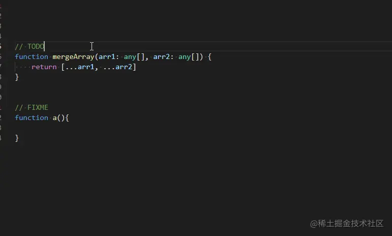

### [Add jsdoc comments](https://marketplace.visualstudio.com/items?itemName=stevencl.addDocComments)   给方法添加JSDoc

自动给方法添加JSDoc, 可别说我不会写注释, 我对我写的每一行代码负责！！！

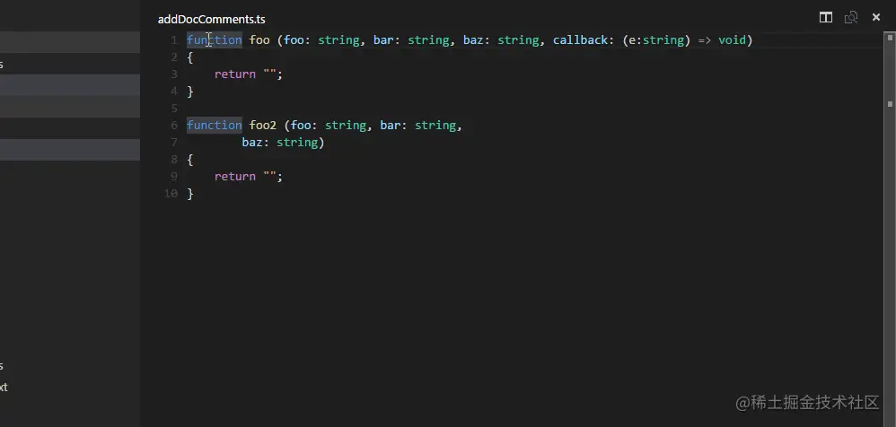

### [DotENV](https://marketplace.visualstudio.com/items?itemName=mikestead.dotenv) env文件高亮

这年头，谁的配置还没不用个env文件，没高亮，真难看，这款就是你的救星。

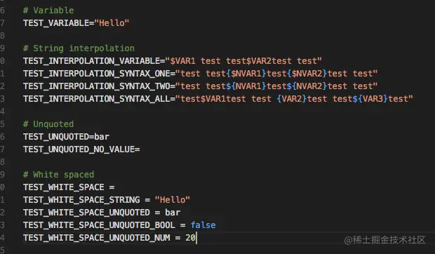

### [HTML Snippets](https://marketplace.visualstudio.com/items?itemName=abusaidm.html-snippets)  html代码段

此插件能快速的输出html代码， 效率就是懒出来的，你们说对吧。

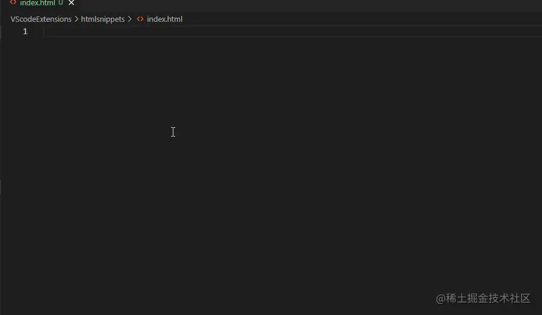

### [Wrap Console Log Lite](https://marketplace.visualstudio.com/items?itemName=ergenekonyigit.vscode-wrap-console-log-lite) 快捷的输出变量

我们经常使用`console.log`输出变量来查看执行情况，这插件，直接给你生成出书代码，懒的可以啊，懒到极致。

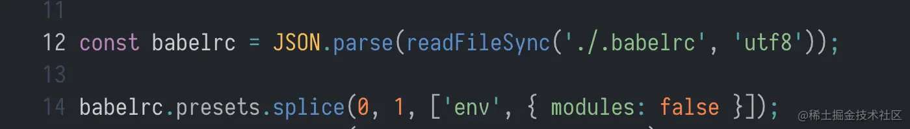 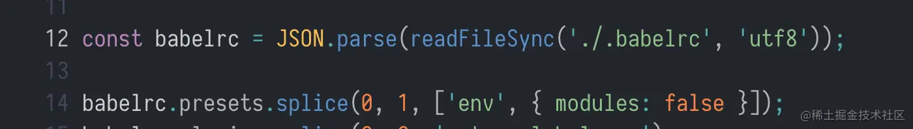

### [Quokka.js](https://marketplace.visualstudio.com/items?itemName=WallabyJs.quokka-vscode)  直接显示变量结果

不用运行，就能知道你的代码结果，这编程体验也是没谁了，把更多时间话费在逻辑上吧。

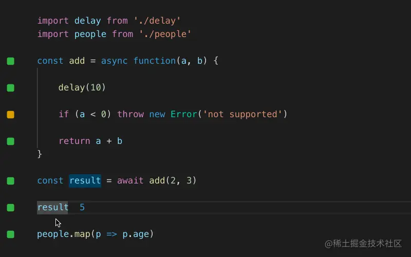

### [REST Client](https://marketplace.visualstudio.com/items?itemName=humao.rest-client)  rest请求

想请求某个站点的接口，axios?, express? , No No No , 打开VS code直接发请求就好。

此插件允许您直接发送 HTTP 请求并查看 visualstudio 代码中的响应。

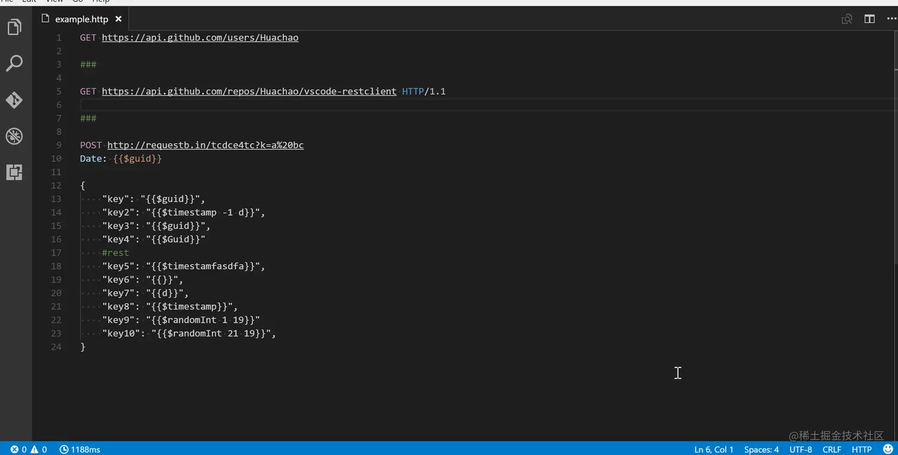

### [Path Intellisense](https://marketplace.visualstudio.com/items?itemName=christian-kohler.path-intellisense)  引用路径智能提示

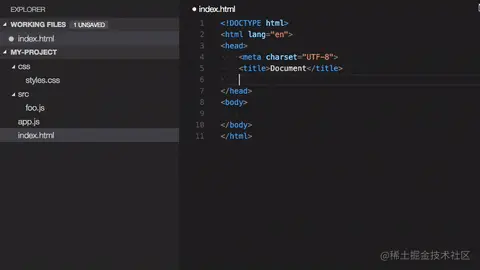

### [vscode-faker](https://marketplace.visualstudio.com/items?itemName=deerawan.vscode-faker)  生成虚假数据

谁还没造点假数据，就这么简单！

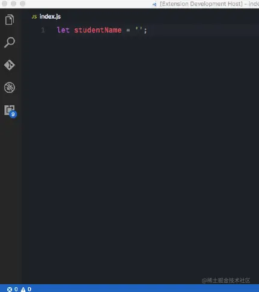

### [Regex Previewer](https://marketplace.visualstudio.com/items?itemName=chrmarti.regex) 边写正则边看结果

一边写正则，一边就能看到结果，这调试真的太方便了！！！

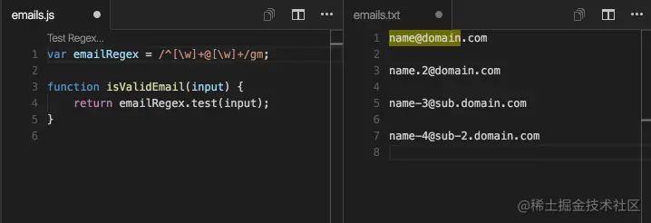

### [SVG Viewer](https://marketplace.visualstudio.com/items?itemName=cssho.vscode-svgviewer) SVG文件预览

预览svg文件，还能到处成为图片，利器！ 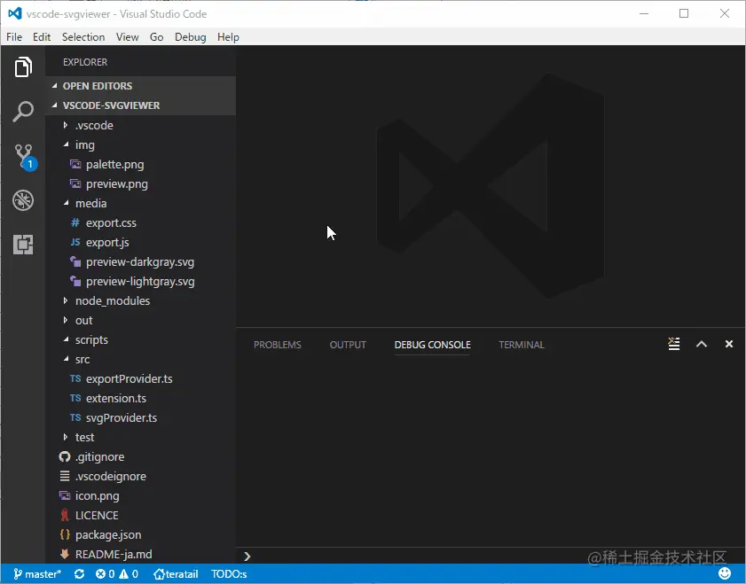

### [Auto Close Tag](https://marketplace.visualstudio.com/items?itemName=formulahendry.auto-close-tag) 自动关闭标签

自动添加 HTML/XML 关闭标记，与 Visual Studio IDE 或 Sublime Text 相同。

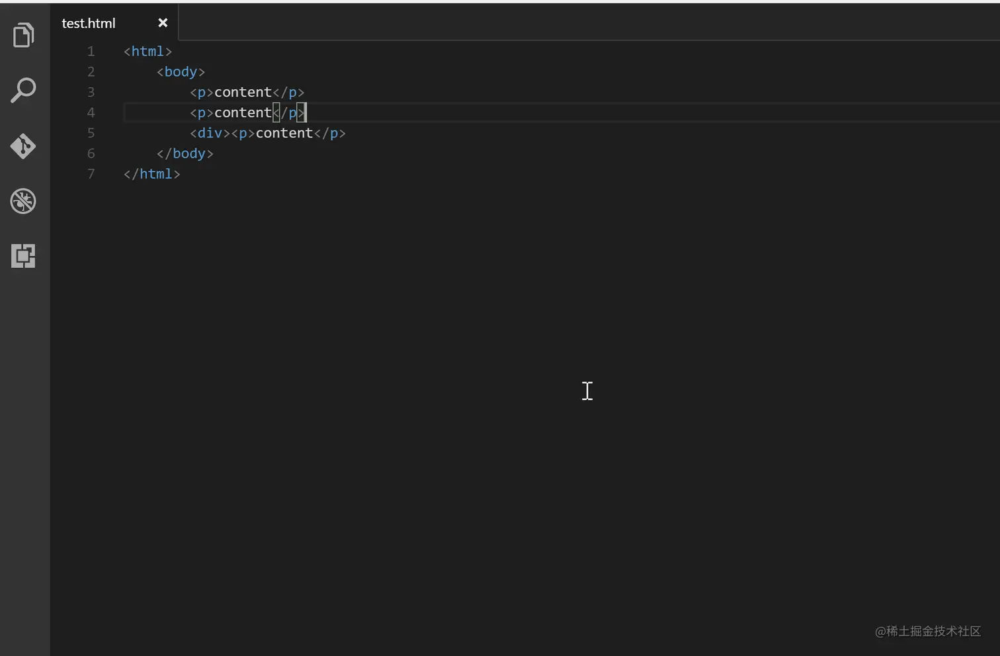

### [Auto Rename Tag](https://marketplace.visualstudio.com/items?itemName=formulahendry.auto-rename-tag) 标签重命名

自动重命名成对的 HTML/XML 标记，与 Visual Studio IDE 相同。

我们总有时候会写错，那么这就可以降低你犯错后修复成本。

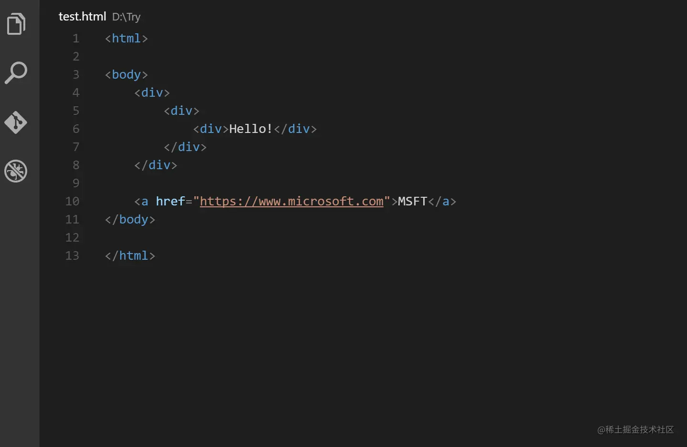

### [CSS Peek](https://marketplace.visualstudio.com/items?itemName=pranaygp.vscode-css-peek)  css定位器

我的class在哪定义的，自己都找不到了，怎么办，有请这位！！

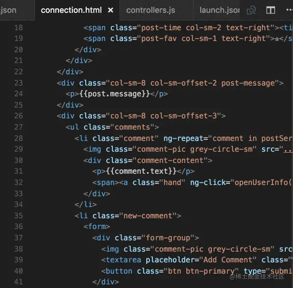 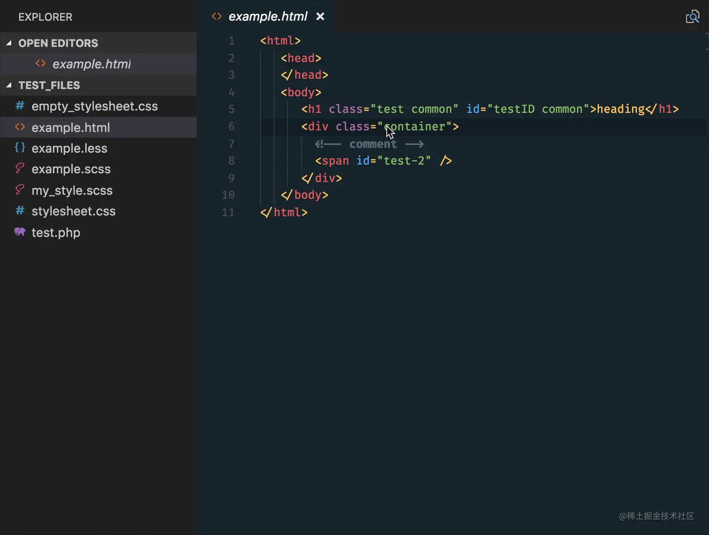

### [Code Spell Checker](https://marketplace.visualstudio.com/items?itemName=streetsidesoftware.code-spell-checker) 拼写检查

妈妈再也不担心我写错单词了。 其能检查拼写错误，并给于提示，非常好的伙伴！

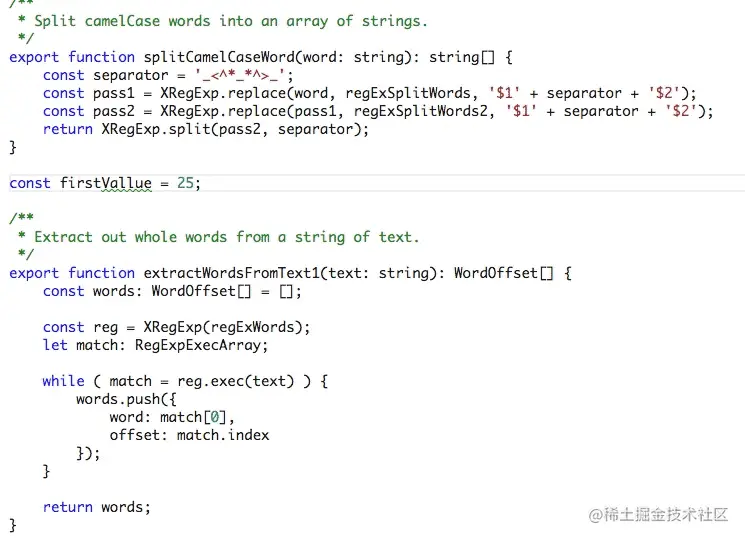

### [Color Picker](https://marketplace.visualstudio.com/items?itemName=anseki.vscode-color)  颜色选择器

那种颜色好看呢，别着急，调出色板，慢慢选择吧。

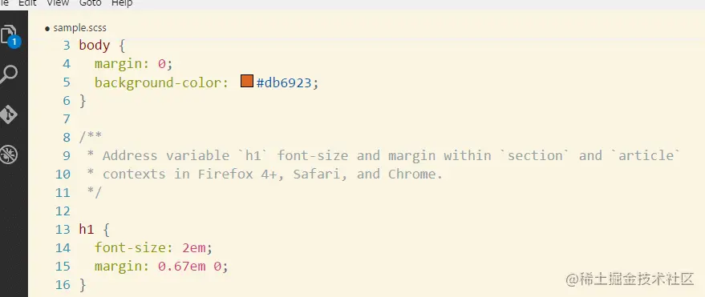

### [Sort Typescript imports](https://marketplace.visualstudio.com/items?itemName=miclo.sort-typescript-imports)  import自动排序

导入太多的库了，眼花撩顺，这款插件让他们有序排列， 强迫症患者的福星。我记得eslint好像也有类似的规则。

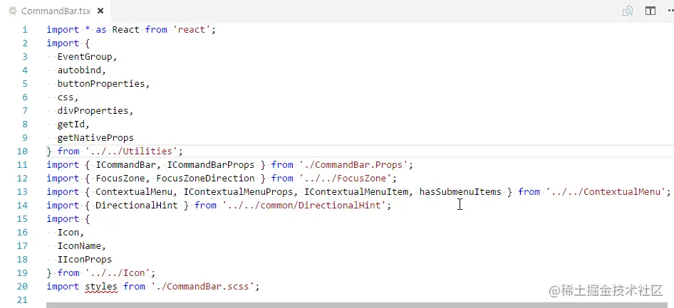

### [Bracket Pair Colorizer 2](https://marketplace.visualstudio.com/items?itemName=CoenraadS.bracket-pair-colorizer-2) 括号对齐利器

代码写太多，大括号太多，都不知道谁是谁的谁呢，这款插件给你明示。

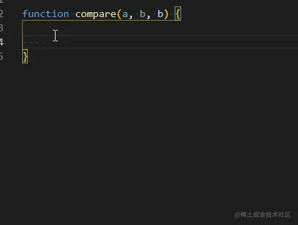

### [vscode-icon](https://marketplace.visualstudio.com/items?itemName=vscode-icons-team.vscode-icons)  文件图标

让 vscode 资源树目录加上图标，赏心悦目！

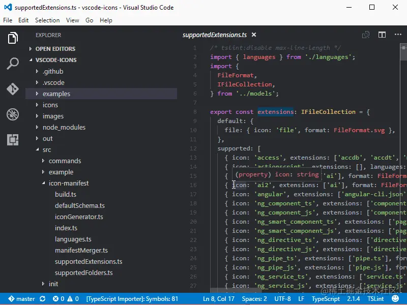

### [npm](https://marketplace.visualstudio.com/items?itemName=eg2.vscode-npm-script)  npm扩展

这个扩展支持运行 package.json 文件中定义的 npm 脚本，并根据 package.json 中定义的依赖项**验证已安装的模块。**  是不是很酷！

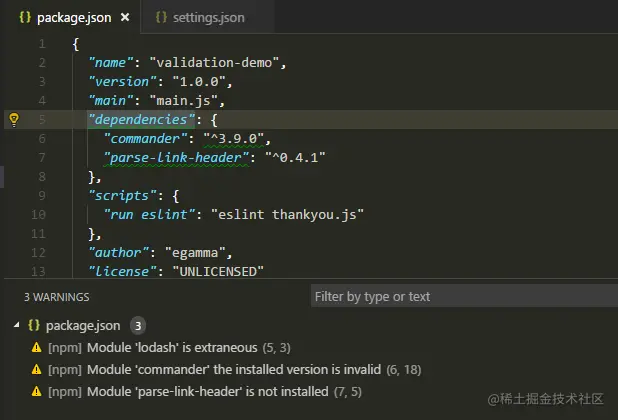

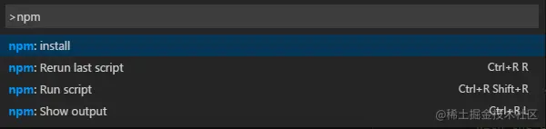

### [Project Manager](https://marketplace.visualstudio.com/items?itemName=alefragnani.project-manager) 项目管理利器

它可以帮助你轻松地访问你的项目，**不管它们位于哪里。不要再错过那些重要的项目了**。

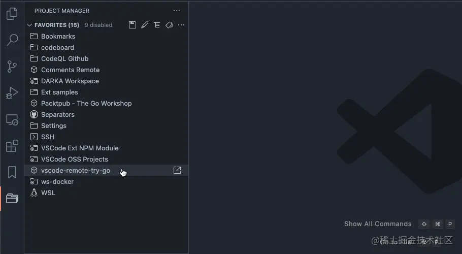

### [Live Sass Compiler](https://marketplace.visualstudio.com/items?itemName=ritwickdey.live-sass) SASS实时编译

一个 VSCode 扩展，它可以帮助您实时地将 SASS/SCSS 文件编译/传输到 CSS 文件中，并实时重新加载浏览器。

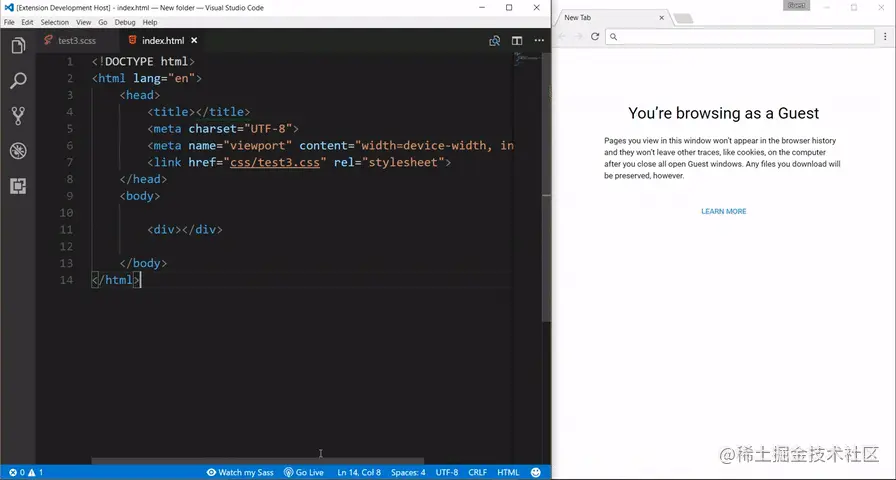

### [Todo Tree](https://marketplace.visualstudio.com/items?itemName=Gruntfuggly.todo-tree) TODO展示

把你的TODO事项以树形结构列出来，再也不担心忘记点啥呢

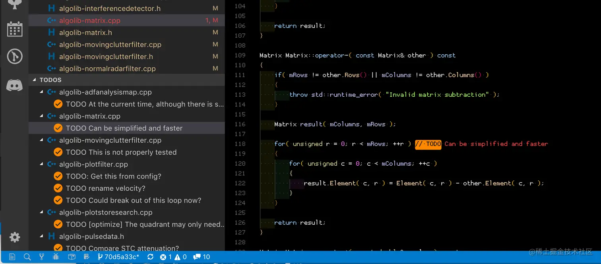

### [Markdown PDF](https://marketplace.visualstudio.com/items?itemName=yzane.markdown-pdf)  markdown转PDF

markdown写完文章，顺便生成pdf, 真的是6啊


## 让 VS Code 更好用的设置

### 1. 学习并自定义快捷键

在 VS Code 中，快捷键可以说是最重要的提效手段。合理利用快捷键，你的编码效率可以至少提高一倍。首先，你需要学习一些 VS Code 中最常用和最重要的快捷键组合:

- `Ctrl/Command + P` 快速查找和打开文件，不用再在目录层级中逐个点击寻找
- `Shift + Ctrl/Command + P`  访问命令面板，可以快速跳转到各种设置和工具
- `Ctrl/Command + J` 显示/隐藏终端面板
- `Ctrl/Command + |` 拆分编辑器，实现多文件并排编辑
- `Shift + Ctrl/Command + F` 全局搜索，可以快速在整个工程中查找文本

这些快捷键可以极大提高你的编码效率，需要花时间熟练掌握。

之后，你可以根据自己的使用习惯，自定义一些快捷键组合。例如：

- 文件目录快捷键，我会自定义为 `Shift + Ctrl/Command + E`
- Git 操作面板我会自定义为 `Shift + Ctrl/Command + G`

自定义快捷键可以让你更好地记忆和利用这些提效功能

### 2. 安装优化界面主题

VS Code 提供了丰富的主题扩展，可以让你对编辑器的颜色、字体等界面样式进行自定义。对我来说，一个好的VS Code主题，最重要的是不同功能区域之间要有清晰的视觉区分。具体来说，通过为不同区域添加边框、背景等元素，可以让导航栏、侧边栏、编辑器等区域明确分开，不会出现视觉混乱的情况。

这样可以帮助我更快定位到需要的功能区域，减少视觉搜索时间，从而提高工作效率。将功能区分明确划分开来，是我选择一款VS Code主题最首要的考虑点。

我比较喜欢的一个主题是 **Moegi Theme**，这款主题拥有色调柔和、功能区块明显的样式。它同时支持日间和夜间两种模式，可以自动切换到系统设置的模式。由 Diu 设计开发并开源 [moegi-design/vscode-theme: 🌸 An elegant theme for VS Code. (github.com)](https://github.com/moegi-design/vscode-theme)

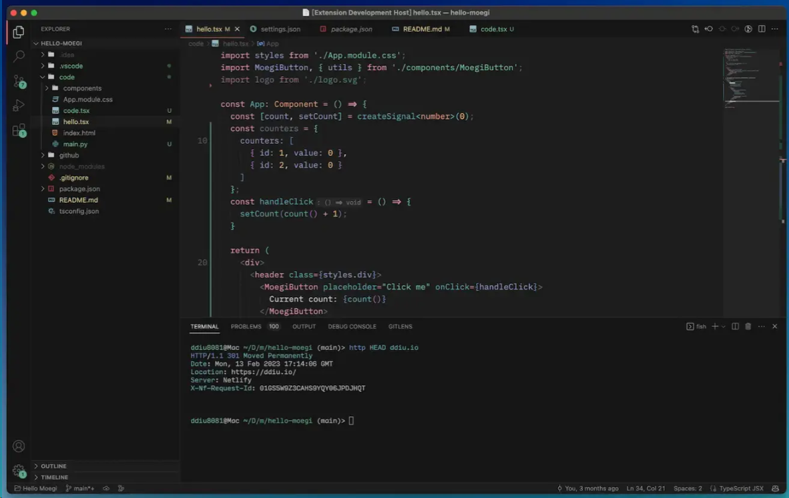

### 3. 安装提升编码效率的插件

VS Code 最大的优势之一就是拥有非常强大的扩展插件生态。针对各种语言和工作流程，都有插件可以安装来增强功能和效率。

这里我推荐几款通用的、可以提效的插件:

- **Smart Clicks**: 通过双击来快速选择或扩展选择范围，可以避免长时间拖动鼠标进行选择
- **Error Lens**: 可以在代码末尾（内联）实时显示错误和警告标记，让你更快定位到代码问题
- **GitLens**: 显示代码行修改记录和历史，辅助 Git 开发
- **Pretty TypeScript Errors**: 帮助开发者更好的阅读 TypeScript 错误

根据自己的需求，安装 1-2 款常用的插件，就可以获得显著的提效体验。

### 4. 个性化设置

通过修改 `settings.json` 文件，你可以对 VS Code 进行更深层次的个性化配置。

例如，我会设置工作台默认采用暗黑模式，并跟随系统切换:

```json
"workbench.preferredDarkColorTheme": "Moegi Dark"，
  "workbench.preferredLightColorTheme": "Moegi Light"，
```

将侧边栏放在编辑器的右侧，这样可以减少因代码过长而滑动横轴的机会：

```json
"workbench.sideBar.location": "right"
```

另外，我习惯 Git Diff 对比采用上下样式，所以会进行如下设置:

```json
"diffEditor.renderSideBySide": false 
```

👉 查看更多关于我的 [VS Code 配置](https://github.com/Fleon-fong/vscode-settings)

搜索并设置一些对个人使用习惯有帮助的配置选项，可以让 VS Code 的默认行为更加智能。

### 5. 利用快捷键提示学习快捷键

即使掌握了许多快捷键，时不时你还会需要用到一些不常用的命令面板或设置菜单。我们并不需要死记所有的快捷键，而是可以利用 VS Code 提供的快捷键提示功能。

在控制面板 `Shift + Ctrl/Command + P` 中，输入要查找的命令或功能名称，VS Code 会显示该命令对应的快捷键组合。记下该快捷键，日积月累，你就掌握了更多提效的快捷键。

例如，输入 **snippets** ，就可以找到搜索代码片段的快捷键为 `Shift + Ctrl/Command + R`

### 总结

通过对上述 5 个方面的设置调整，你可以显著提升 VS Code 的使用体验，优化界面显示，增强编辑功能，自定义个性化行为。这样，VS Code 就真正成为一个智能、高效、容易上手的编辑器。注意力不再被界面和操作瓶颈分散，而可以更专注于编码和创作。

# VSCode主题

[😝 分享几个好玩的 VSCode 主题 - 掘金 (juejin.cn)](https://juejin.cn/post/7244174817678721079)

[🌈 冷门但好看的 VSCode 主题推荐 - 掘金 (juejin.cn)](https://juejin.cn/post/7242143701069807673)

[👨‍💻 14 个最佳免费编程字体 - 掘金 (juejin.cn)](https://juejin.cn/post/7243067221999894583)

[免费连字体哪家强？最全连字体盘点！快来选一个你心仪的编程字体吧 - 掘金 (juejin.cn)](https://juejin.cn/post/7244174500773806137)
