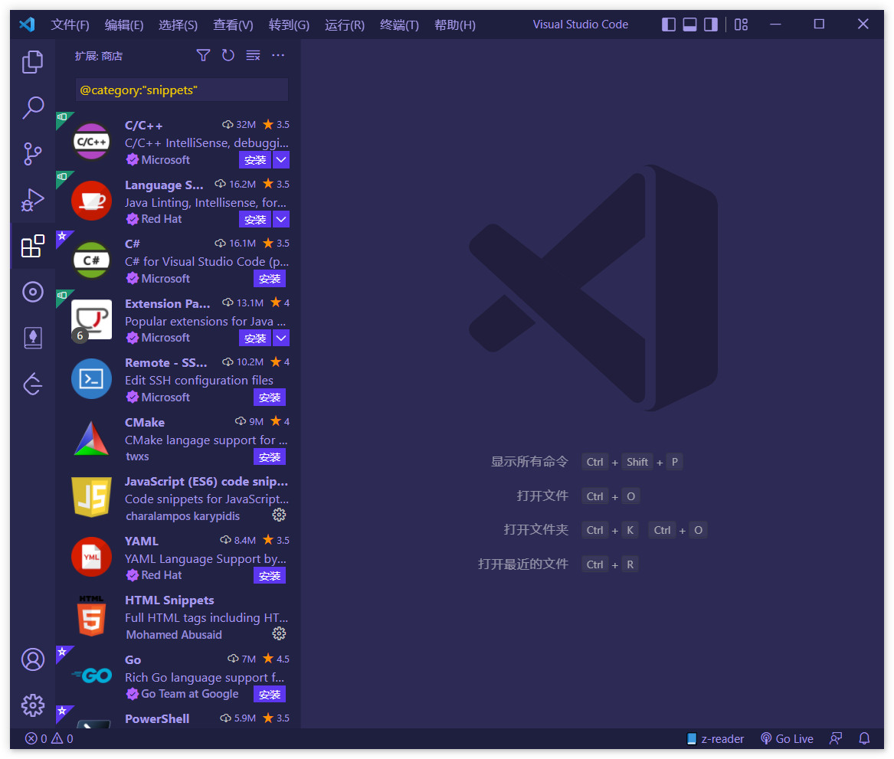
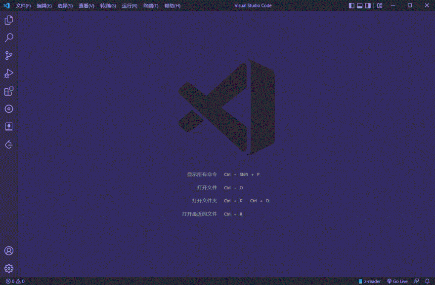
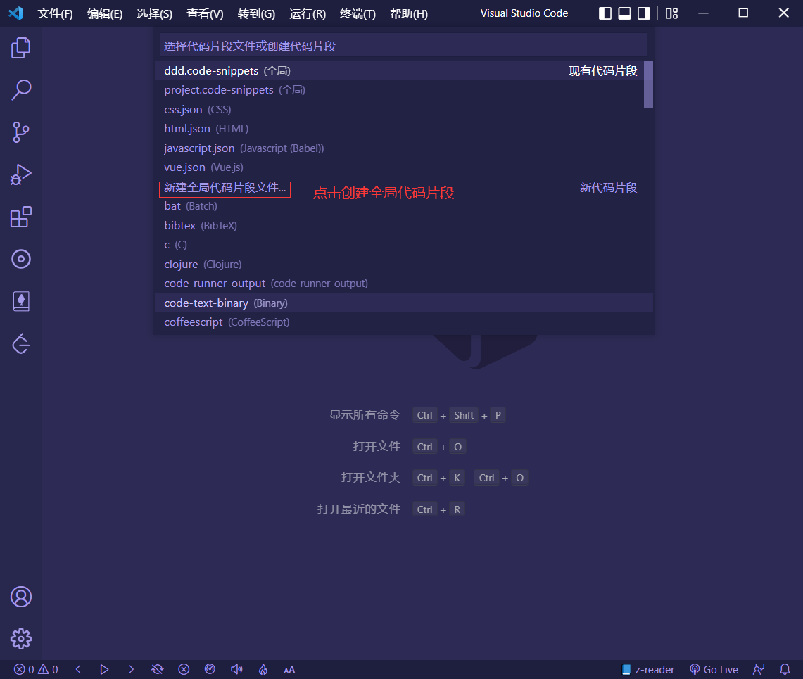
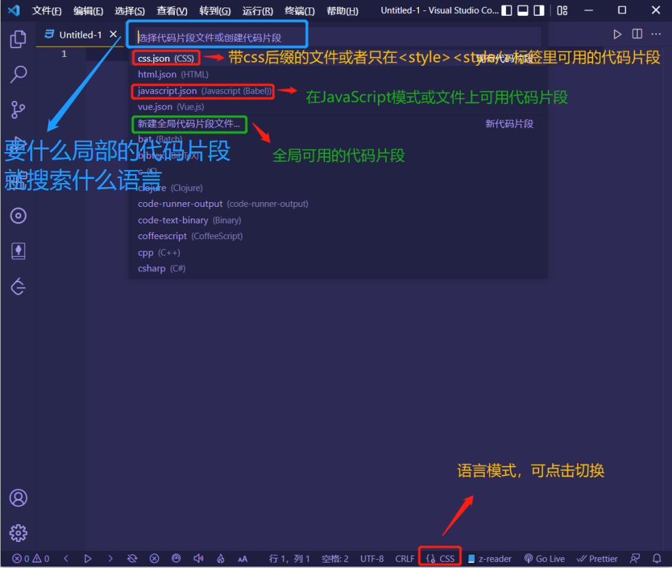
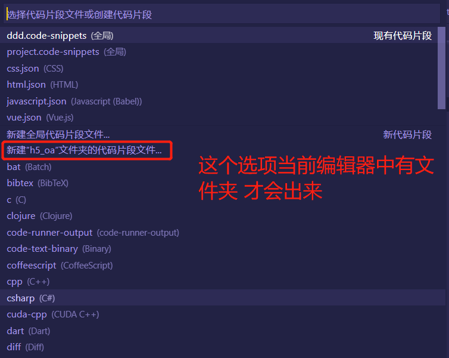
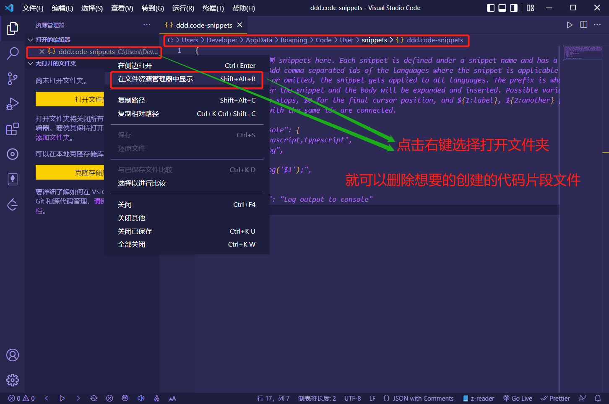
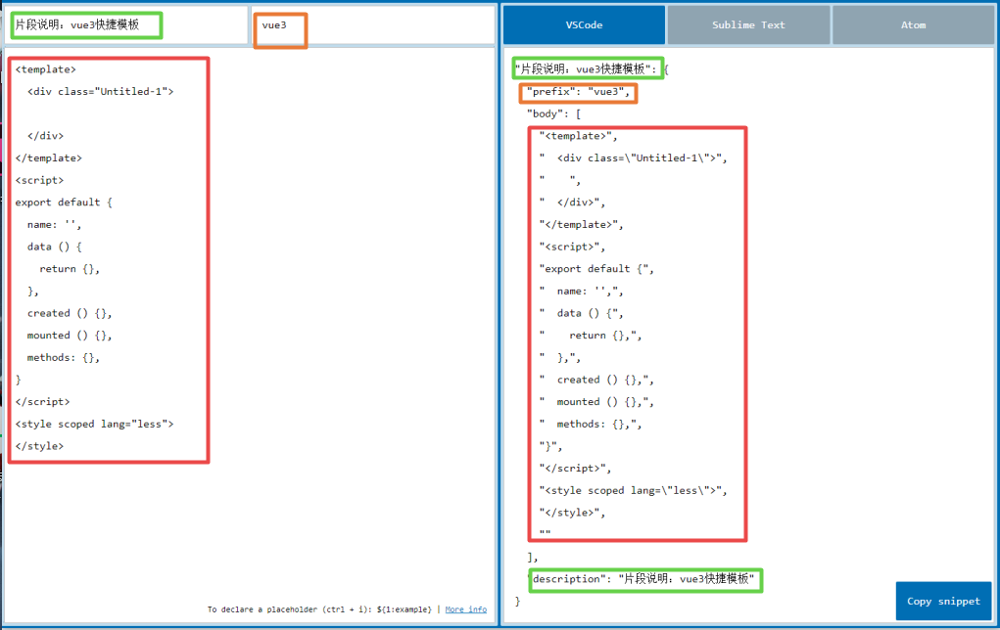
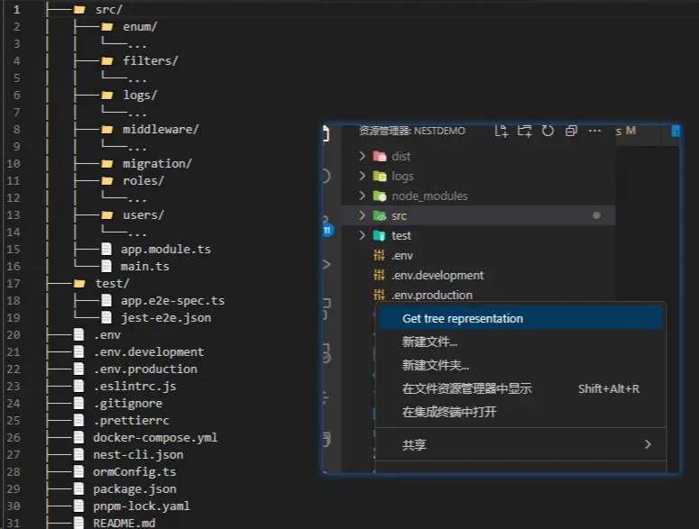

# VSCode 编辑器环境插件配置

## VSCode 编辑器用户片段

### 什么是用户片段？

一些常用的需要重复编写的代码片段 集成 json 配置文件，在编码过程中 通过输入在用户片段中自定义的字符 触发 定义好的片段，从而提高编码效率

可抽离的代码片段：（仅供参考）

- vue2 |vue3 模板页面

- react 模板页面
- 常用的调试如：console.log()
- 常用的 UI 模板提示：成功、失败...
- 类和方法的注释：

.............

---

详情 查看 VS Code 文档：[VS Code 代码片段文档](https://code.visualstudio.com/docs/editor/userdefinedsnippets)

#### VS Code 内置片段

VS Code 具有多种语言的内置代码片段，例如：JavaScript、TypeScript、Markdown 和 PHP。

#### 从插件市场安装代码片段

[VS Code 插件市场](https://marketplace.visualstudio.com/vscode)上的许多 [扩展](https://code.visualstudio.com/docs/editor/extension-marketplace) 都包含代码片段。在插件市场中搜索包含各种语言片段的扩展：`@category:"snippets"`

### 自定义代码片段

#### 1.开始

Mac 系统：三种方法呼出【用户代码片段】设置：

1. 左上角：『Code 』 → 『首选项』 → 『用户片段』
2. 快捷键：`Shift + Command + p` 然后输入 `Snippets`
3. 左下角：『设置图标(齿轮图标)』 → 『用户代码片段』

windows 系统：三种方法呼出【用户代码片段】设置：

1. 左上角：『文件』 → 『首选项』 → 『用户片段』
2. 快捷键：`Ctrl + Shift + P` 然后输入 `Snippets`
3. 左下角：『设置图标(齿轮图标)』 → 『用户代码片段』


```json
{
	"for 循环": {
		"scope": "javascript,typescript",
		"prefix": ["for", "for-const"],
		"body": ["for (const ${2:element} of ${1:array}) {", "\t$0", "}"],
		"description": "一个循环快捷代码块"
	}
}
```

#### 2.代码片段语法配置详解

|               JSON 配置               |                                                                      说明                                                                      |
| :-----------------------------------: | :--------------------------------------------------------------------------------------------------------------------------------------------: |
|              "for 循环"               |                                                                  代码片段名称                                                                  |
|   "scope": "javascript,typescript",   | 作用文件类型：表示代码片段作用于哪种语言。 不同语言之间以`,`隔开<br />(只能在全局代码片段使用，局部代码片段 json 文件使用会报警告，没有此属性) |
|    "prefix": ["for", "for-const"],    |                                     设置快捷指令为：输入 for 或 for-const 触发<br />接收一个字符串或者数组                                     |
|  "description": "一个循环快捷代码块"  |                                                                片段说明描述信息                                                                |
| **“body”: [ ]**：<br />下表是可用配置 |                                             内部为：自定义代码片段内容<br />接收一个字符串或者数组                                             |

|           body 里的可用配置           |                                                                                                                     说明                                                                                                                      |
| :-----------------------------------: | :-------------------------------------------------------------------------------------------------------------------------------------------------------------------------------------------------------------------------------------------: | -------------------------------------------------------------------------- |
|       **代码主体的书写规范：**        | 1、每个字符串元素就代表一行，行与行之间用" , "隔开表示换行。或者使用\n 换行 行内不能使用 tab 键缩进，<br />2、只能使用空格或者\t 缩进 $1 使用代码块敲击回车或者 tab 键后光标定位的位置。<br />3、$2 $3 $4…表示我们按下 tab 光标依次出现的位置 |
| 制表位：<br />`$1，$2，$3，......$0`  |                                                 代码快捷生成之后，鼠标光标的所在位置。<br />光标会首先定位在$1,『`按Tab键`』切换到 $2 的位置，数字是访问制表位的顺序，`$0`表示最终光标位置。                                                  |
|     占位符：<br />`${1:another}`      |       占位符 是带默认值的制表位 ，例如`${1:foo}`。<br />占位符 的文本会被插入到制表位 所在位置并且全选以方便修改。<br />占位符 可以嵌套使用，比如`${1:another ${2:placeholder}}`。<br />占位符 可以有多选值，每个选项的值用 `,` 分隔。        |
| 选择项：<br />`${1\|one,two,three\|}` |                                                                                                         选项的开始和结束用管道符号(`                                                                                                          | `)将选项包含<br />当插入代码片段，选择制表位的时候，会列出选项供用户选择。 |
|               **变量**                |                                                            变量太多，不多赘述，详情请 查看变量后面的文档：https://code.visualstudio.com/docs/editor/userdefinedsnippets#_variables                                                            |

##### 代码片段示例：

```json
// ********** 页面顶部说明注释片段 **********
  "Print to topNote": {
    "prefix": "topNote",
    "body": [
      "/**",
      " * @Copyright(c) 2022 rights reserved",
      " * @Description: $0",
      " * @Author: your name",
      " * @Date: $CURRENT_YEAR-$CURRENT_MONTH-$CURRENT_DATE",
      " * @LastEditTime: ${CURRENT_YEAR}-${CURRENT_MONTH}-${CURRENT_DATE} ${CURRENT_DAY_NAME} ${CURRENT_HOUR}:${CURRENT_MINUTE}:${CURRENT_SECOND}",
      " * @LastEditors: $CURRENT_YEAR-$CURRENT_MONTH-$CURRENT_DATE $CURRENT_DAY_NAME $CURRENT_HOUR:$CURRENT_MINUTE:$CURRENT_SECOND",
      " */"
    ],
    "description": "页面顶部开头说明注释模板"
  },
// ********** 方法注释片段 **********
  "Print to method": {
    "prefix": "noteMethod",
    "body": [
      "/**",
      " * @description：$0",
      " * @functionAuthor：$1",
      " * @param：{$2} $3 $4",
      " * @return：{$5} $6",
      " */"
    ],
    "description": "方法注释模板"
  },
```

```json
  // ********** vue3 **********
  "vue3页面模板": {
    "prefix": "vue3",
    "body": [
      "<template>",
      "  <div class=\"$TM_FILENAME_BASE\">",
      "    $1",
      "  </div>",
      "</template>\n",
      "<script lang='ts'>",
      "import { reactive, toRefs,onBeforeMount, onMounted } from 'vue'\n",
      "export default {",
      "  name: '$2',",
      "  setup() {",
      "    const state = reactive({})",
      "    onBeforeMount(() => {",
      "      ",
      "    })",
      "    onMounted(() => {",
      "      ",
      "    })",
      "    const refState = toRefs(state)",
      "    return {",
      "      ...refState",
      "    }",
      "  }",
      "}",
      "</script>\n",
      "<style scoped lang=\"less\">",
      "  ",
      "</style>",
      "$3"
    ],
    "description": "快速生成vue3页面"
  },
```

#### 从插件市场安装代码片段

[VS Code 插件市场](https://marketplace.visualstudio.com/vscode)上的许多[扩展](https://code.visualstudio.com/docs/editor/extension-marketplace)都包含代码片段。在插件市场中搜索包含各种语言片段的扩展：`@category:"snippets"`



各种语言的都有，比如说你要搜 react 的，如下：`react @category:"snippets"`

比如说你要搜 vue 的，如下：`vue @category:"snippets"`

文档：[Snippets in Visual Studio Code](https://code.visualstudio.com/docs/editor/userdefinedsnippets)

---

#### 自定义代码片段



---

#### 代码片段范围

###### 全局代码片段范围：

只要在 vscode 里编码就能使用的代码片段

在编辑器里创建：



###### 语言代码段范围：

特定 后缀文件类型 或者 特定语言|作用域 里才能使用



###### 项目代码片段范围：

创建在项目目录下.vscode 这个隐藏文件夹中的，这个代码块只适用于当前文件夹或者当前项目文件夹

创建：

1.在当前项目的根目录创建一个`.vscode`文件夹，然后创建以`.code-snippets`的后缀的文件即可

2.也可以在编辑器直接创建：点击后输入名字，不用带`.code-snippets`的后缀



---

#### 代码片段的使用

我们只需在想要书写代码的位置 打出触发我们代码块的关键字就行


---

#### 重命名或删除代码片段文件

找到想要删除的代码片段文件的书写位置路径，然后把它重命名或删掉就好了。



---

#### 代码片段生成器

有一段代码在代码片段里面编写好的，想要把这段代码变成代码片段，长的代码片段在编辑器里复制出来，往往需要按照一定的间隔格式来重新编辑，这个时候我们就需要片段代码生成器，直接复制写好的片段模板生成即可

##### 代码片段生成器（可生成 VSCode、Sublime Text、Atom 的代码片段）：

官网：https://snippet-generator.app/
github：https://github.com/pawelgrzybek/snippet-generator



---

#### 我的自定义代码片段

GitHub：https://github.com/hujiexin77/VScode-user-snippet
参考就好

## VSCode 前端插件

**1.HTML Snippets**

超级实用且初级的 H5 代码片段以及提示

**2.HTML CSS Support**

让 html 标签上写 class 智能提示当前项目所支持的样式

**3.Debugger for Chrome**

让 vscode 映射 chrome 的 debug 功能，静态页面都可以用 vscode 来打断点调试

[https://github.com/Microsoft/vscode-chrome-debug/blob/master/images/demo.gif?raw=truegithub.com/Microsoft/vscode-chrome-debug/blob/master/images/demo.gif?raw=true](https://link.zhihu.com/?target=https%3A//github.com/Microsoft/vscode-chrome-debug/blob/master/images/demo.gif%3Fraw%3Dtrue)

**4.jQuery Code Snippets**

超过 130 个用于 JavaScript 代码的 jQuery 代码片段。只需键入字母'jq'即可获得所有可用 jQuery 代码片段的列表。

**5.vscode-icons**

让 vscode 资源树目录加上图标

**6.Path Intellisense**

自动路径补全

**7.Document this**

“Document This”是 Visual Studio 代码扩展，它自动为 TypeScript 和 JavaScript 文件生成详细的 JSDoc 注释。

**8.ESlint**

JavaScript 代码检测, JavaScript 代码风格检测, JavaScript 代码自动格式化.

**9.HTMLHint**

html 代码检测

**10.Project Manager**

在多个项目之前快速切换的工具

**11.beautify**

格式化代码的工具

**12.Bootstrap 3 Sinnpet**

常用 bootstrap 的可以下

**13.Atuo Rename Tag**

修改 html 标签，自动帮你完成尾部闭合标签的同步修改

**14.GitLens**

丰富的 git 日志插件

**15.fileheader**

顶部注释模板，可定义作者、时间等信息，并会自动更新最后修改时间

**16.Bracket Pair Colorizer**

让括号拥有独立的颜色，易于区分。可以配合任意主题使用。

**17.Class autocomplete for HTMLaessoft**

扩展自动扫描一个活动的 HTML 文件的外部 CSS 样式表链接。当找到样式表时，类名被提取出来，并与 Visual Studio 代码的代码完成特性一起使用。

**18.Code Runner**

能够运行多种语言的代码片段或代码文件：C，C ++，Java，JavaScript，PHP，Python，Perl，Ruby，Go 等等

**19.css peek**

能够查看 CSS ID 和类的字符串作为 HTML 文件中相应的 CSS 定义

**20.Font-awesome codes for html**

用于 html 的 Font-awesome 代码片段

**21.filesize**

在底部状态栏显示当前文件大小，点击后还可以看到详细创建、修改时间

**22.Git History**

以图表的形式查看 git 日志

**23.htmltagwrap**

可以在选中 HTML 标签中外面套一层标签

**24.Indenticator**

突出目前的缩进深度

**25.IntelliSense for CSS class names**

智能提示 css 的 class 名

**26.Image Preview**

鼠标移到路径里显示图像预览

**27.JavaScript (ES6) code snippets**

es6 代码片段

**28.Live Sass Compiler**

实时编译 sass

**29.markdownlint**

markdown 语法检查

**30.open in browser**

当前的 html 文件用浏览器打开，类似 webstorm 的那四个小浏览器图标功能，前提条件 html 文件必须保

**31.Quokka.js**

实时观看 javascript 的变量的变化

**32.TSLint**

测试正则的插件

**33.vetur**

语法高亮、智能感知

[Vetur | Veturvuejs.github.io/vetur/](https://link.zhihu.com/?target=https%3A//vuejs.github.io/vetur/)

**34.VueHelper**

vue 代码片段

**35.Dracula Official**

主题风格

**36.One Dark Pro**

代码主题

**37. Color Info**

提供你在 CSS 中使用颜色的相关信息

**38.SVG Viewer**

无需离开编辑器，便可以打开 SVG 文件并查看它们

**39.TODO Highlight**

能够在你的代码中标记出所有的 TODO 注释，以便更容易追踪任何未完成的业务

**40.Minify**

用于压缩合并 JavaScript 和 CSS 文件的应用程序

#### draw.io

`vscode` 中的一个插件,方便我们写一些流程图。

#### Project Manager

管理的项目，方便直接。

#### Bookmarks

书签用于标记代码,快速找到所在的位置。

#### Turbo Console Log

快速生成 `console.log()` 代码。

#### Surround

代码片段包裹,把选中的代码用 `if`、`try...catch` 等包裹起来。

#### tree-extended

写文章的时候，需要展示项目组织结构。


