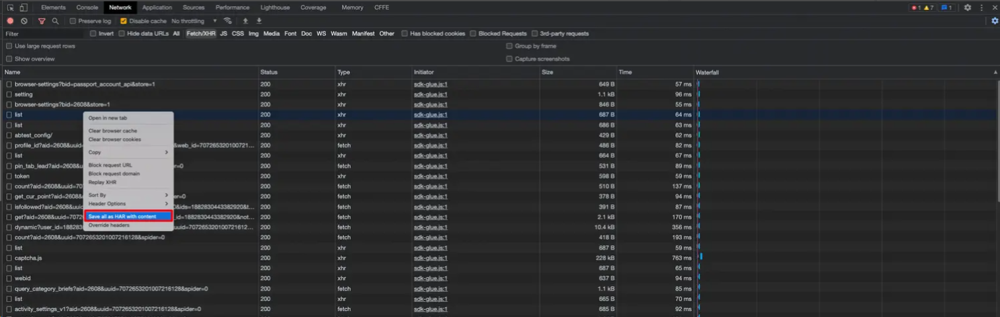
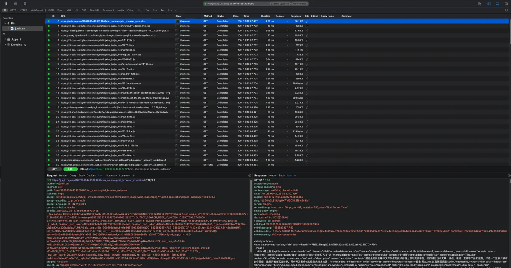

# 前端工具环境配置

参考：<https://juejin.cn/post/7187272143657730108?>

## 开发软件

### Visual Studio Code

Visual Studio Code 官网地址：[Visual Studio Code - Code Editing. Redefined](https://code.visualstudio.com/)

### WebStorm

WebStorm 官网地址：[JavaScript and TypeScript - JetBrains Guide](https://www.jetbrains.com/guide/javascript/)

## 配置开发环境

### Node 版本管理工具：nvm

工作中的项目有很多老项目，需要在不同版本的 Node.js 中运行，项目在稳定上线后通常就不会再去更新其 node 版本和依赖模块的版本，所以我们需要一个工具来为不同的项目配置不同的 node 版本。

> 下载地址：[Releases · coreybutler/nvm-windows (github.com)](https://github.com/coreybutler/nvm-windows/releases)
>
> github：[coreybutler/nvm-windows: A node.js version management utility for Windows. Ironically written in Go. (github.com)](https://github.com/coreybutler/nvm-windows)

**注意事项：**

1. 尽量先安装 nvm， 通过 nvm 安装 node.js，如果先安装了 node.js，要在 nvm 安装过程中正确配置 node.js 的路径。
2. 安装完毕后直接在命令行使用会提示 'nvm'/'node' 不是内部或外部命令，也不是可运行的程序，搜一下跟着网上教程配置环境变量即可。**不过这里要注意的是，公司电脑可能会禁止打开编辑系统环境变量**，通过 **控制面板->用户账户->更改我的环境变量** 打开即可。
3. 配置环境变量 `PATH` 时可以把 **nodejs 目录下的 node_global 文件夹**也添加进去，这个文件夹存放的是全局安装的模块。这样的话日后安装如 `yarn` 、`whistle` 等模块时无需再单独配置环境变量即可在命令行中使用其命令。

### Node 版本管理工具：volta

开源地址：[volta-cli/volta: Volta: JS Toolchains as Code. ⚡ (github.com)](https://github.com/volta-cli/volta)

官网：[Volta - The Hassle-Free JavaScript Tool Manager](https://volta.sh/)

### node / npm

当通过 nvm 安装好 node 之后，我们要把 npm 的下载源换成公司的：

```bash
# 查看下载源： https://registry.npmjs.org/
npm config get registry


# 切换 npm 下载源到京东
npm config set registry http://npm.m.jd.com/mirrors
yarn config set registry http://npm.m.jd.com/mirrors
pnpm config set registry http://npm.m.jd.com/mirrors
# 淘宝源
```

### ⭐ git

Git 官网：[Git (git-scm.com)](https://git-scm.com/)

#### ssh

安装好 git 之后我们就可以拉取远程仓库的代码了，但是在拉取公司项目代码之前还差一步——生成 SSH 密钥。

> SSH 密钥用于 SSH 协议中的密钥认证，提供一种安全的方式来进行远程登录或其他网络服务。它包括一对密钥：一个私钥（保密）和一个公钥（可以公开）。公钥放在远程服务器上，私钥由用户安全保管。当用户尝试连接到服务器时，服务器使用公钥来验证用户的私钥，如果匹配，则授予访问权限，无需输入密码。这种方式比传统密码认证更安全。

如果公司有自己的代码仓库，会对生成并上传 SSH 有教程。

## 编程插件配置

[【JSDoc】都 2024 年了，你不会还在用纯文本写注释吧 - 掘金 (juejin.cn)](https://juejin.cn/post/7331928379555971111)

### Visual Studio Code 插件配置

#### 插件：REST Client

我们在开发测试接口时一般会使用 `Postman` 等接口调试工具测试，需要设置 `URL`、`token`、`headers` 等，但是对于前端来说，我们可能只关心这个接口的入参还有返回值，不想去配置那么多东西，或者不想用 `Postman` 但又需要测试接口，有时候可能是不停地去页面点击或者刷新页面发起请求，这时候就会很麻烦。那这里有一个简单场景下的接口测试工具，适合使用 vscode 开发的同学。

#### 数据库可视化连接插件：Database Client

安装了之后，就会在 vscode 左侧生成两个图标，上面一个表示关系型，下面一个表示非关系型。你可以连接你的本地数据库服务，进行开发调试

## 开发助力工具

### whistle

文档：[安装启动 · GitBook (wproxy.org)](https://wproxy.org/whistle/install.html)

企业中前后端开发进度经常会不一致，有时候后端的接口还没上线，但我们做完了页面想自己测试一下效果，可以通过 whistle 抓包来自己模拟数据。

### SwitchHosts

GitHub 地址：[安装启动 · GitBook (wproxy.org)](https://wproxy.org/whistle/install.html)

其实直接修改 hosts 文件也可以，但 SwtichHosts 会方便一些。

有时公司后端的服务器只会响应来自特定域名的请求，比如京东的后台只响应 `xxx.jd.com` 这种以 `jd.com` 结尾的域名发起的请求，这就需要我们通过配置 webpack 的 host 为 `xxx.jd.com`，同时用 hosts 文件把 `xxx.jd.com` 解析到 **127.0.0.1** 上。

## 抓包工具

### 1.抓包工具 Proxyman

不了解抓包工具的童鞋还不知道抓包工具的强大。简单举个例子：

- 你们公司开发的系统部署给客户了，现场交付的同学给你说系统出现了故障，接口似乎出错了
- 但是用户是内网环境，各种各样的原因你又没办法远程或者 `vpn` 连接客户的电脑排查问题
- 此时你又必须要查看接口具体是入参错误还是接口调用错误，必须得有接口信息你才能排查

怎么办？此时你需要先知道一个东西，`HTTP` 存档：`HAR`。

> HAR（HTTP 存档 ） 规范定义了 HTTP 事务的存档格式，是多种 HTTP 会话工具用来导出所记录数据的 一种文件格式，Web 浏览器可以使用该格式导出有关其加载的网页的详细性能数据。

在浏览器接口列表里右键某个接口，会出现以下选项：



点击保存为 `HAR`，浏览器会为你将当前页的所有接口保存为一个 `HAR` 包。此时你可以让客户现场的同学将报错的接口保存为 `HAR` 包并发送给你，你可以使用类似 `Proxyman` 的抓包工具打开，来看看打开的效果：



和浏览器的 `Network` 界面是几乎一模一样的，这时候你就可以尽情排查问题，而不再因为 `vpn`、远程无法连接客户电脑而焦虑了。

当然了，抓包工具有很多，这里介绍 `Proxyman` 是因为它的 UI 界面简洁优美。还有就是抓包工具的用法不仅仅是这个，这只是一个比较基础的应用，更多用法这里不再赘述，以后有机会开专题来说说抓包工具的问题。

## 实用工具

### GifCam

GifCam | GIF 录制工具：[GifCam | BahraniApps Blog](https://blog.bahraniapps.com/gifcam/#download)

非常好用的 **gif 录制工具**，之前写掘金想展示前端代码效果的时候接触到的。工作中有时候想和产品或者 UI 确认一些细节效果，不想拉会议投屏，录个 gif 是很好的选择。

### Easy Mock 在线接口服务

[Easy Mock (mengxuegu.com)](https://mock.mengxuegu.com/login)

后端写接口磨磨蹭蹭？自己 `mock` 数据又麻烦？也不想用 `json-server` 或者 `node` 启动本地服务调试？那这个网站或许适合你，先拿到和后端商量好的数据格式及字段，然后在 `Easy Mock` 上定义对应的接口和数据，你可以使用 `mockjs` 语法生成随机数据，也可以使用静态数据。在你需要批量化的假数据填充表格的时候，这个工具非常有用。还可以结合 `mockjs` 语法进行函数编写，使用函数接收入参并控制返回数据。

### JSON 在线工具

[JSON 在线解析及格式化验证 - JSON.cn](https://www.json.cn/)

一个功能非常丰富的 JSON 在线工具网站，可以在线格式化 JSON 字符串，在线进行代码对比，能做非常多你想得到想不到的事 —— 它还可以在线运行 C++、C、Java 等语言代码，还可以压缩图片，IP 查询等，简直就是万能百宝箱。

### 在线打字练习

如果你还在为打字不快而烦恼，想要练习却又无从下手，现在好了，下面两个打字练习网站可以帮助你练习正确的打字姿势，快速记住键位，进行多样化的打字练习。

[Typing Practice (keybr.com)](https://www.keybr.com/)

帮助你快速熟悉键位。

[在线打字测试(打字狗 dazigo.vip)](https://dazigo.vip/)

在这里你可以进行键位练习、打字比赛、打字排行、打字游戏。海量文章古诗随意挑选进行练习，是综合功能最全、最好用的免费打字网站之一。

## 其他优秀的前端学习网站

[js 剑指 offer 题解 (luvsunlight.github.io)](https://luvsunlight.github.io/js-offer-algo/#/)

[前言 | Vue.js 技术揭秘 (ustbhuangyi.github.io)](https://ustbhuangyi.github.io/vue-analysis/)

[深入浅出 Webpack · 深入浅出 Webpack (wuhaolin.cn)](https://webpack.wuhaolin.cn/)

[ES6 入门教程 - ECMAScript 6 入门 (ruanyifeng.com)](https://es6.ruanyifeng.com/#README)

[浏览器工作原理与实践 (poetries.top)](https://blog.poetries.top/browser-working-principle/)

## 开放接口

### 聚合 API

该网站提供了大量的免费的 `API` 接口供我们使用,大家可以将其用在自己的项目上使用,并且每个接口都提供了完整的文档,开箱即用。

官网：[接口大全-免费 API,收集所有免费的 API (free-api.com)](https://www.free-api.com/)

### 网易云音乐 API 接口

网易云音乐 `NodeJs` 版 `API`,具备登陆接口,多达 200 多个接口,文档也写得很好,非常给不会写后端且没有项目经验的同学。

## Emoji 表情

[🗂 Emoji 全部分类 | EmojiAll](https://www.emojiall.com/zh-hans/all-cate)

# 其他

## 必备工具

这些是我日常使用的工具，缺了它们我很难高效工作。

- [VS Code](https://code.visualstudio.com/) —— 我选择的编辑器是微软出品的 VS Code。免费、轻量（和 WebStorm 之类的 IDE 相比），大量开箱即用的特性，丰富的扩展。
- 浏览器 —— 我的默认浏览器是 Firefox，有时切换到 Chrome 进行开发。我也安装了其他浏览器，以供测试之用。
- [DevDocs](https://devdocs.io/) —— 这个网页应用汇聚了各种项目的文档，还支持离线使用。当我需要查询文档时，一般会访问这个站点。我主要用它查询 JS 和 DOM/浏览器方面的文档。我真没找到什么能和它媲美的工具（详尽而易于搜索）。你应该看一看。
- [Google](https://google.com/) —— 没错，我经常上网搜索。关于某个 bug 的信息，如何做某件事（有时会是很基础的事情），软件包和软件库的示例代码和文档（如果 DevDocs 没收录），我都会上网搜一搜。
- [MDN](https://developer.mozilla.org/en-US) —— 对任何 web 开发者来说这都是非常棒的资源。这个站点的部分内容可以在之前提到的 DevDocs 上找到，不过有些页面只有 MDN 上有。我主要用它查询一些关于可访问性的内容，上面有不少讨论这一主题的文章。
- [StackOverflow](https://stackoverflow.com/) —— 经常 google 到上面的内容。如果有问题，多半能在上面找到答案。
- [GitHub](https://github.com/) —— 某个软件包我有疑问，或者想知道关于它的更多信息，我会到它的 GitHub 仓库去翻 issue 和代码，通常能找到问题的答案，就像 StackOverflow。据我个人的经验，如果有关于某个特定软件包的问题，在 GitHub 上翻到相关 issue 的几率要高于在 StackOverflow 上找到相关问题（像 React 这类特别流行的库例外）。当然，我也使用 GitHub 的版本控制功能。

## CSS

- [CSS-Tricks](https://css-tricks.com/) —— 你能在上面找到大量有趣的文章和窍门。这个网站上也有一个指南（Guides）栏目，包含关于特定 HTML、CSS、JS 概念的深入讲解。我常常访问这个站点更新关于网格布局的知识。不过其他指南也非常棒。这个站点绝对值得一看。
- [CSS Reference](https://tympanus.net/codrops/css_reference/) —— 如果需要更新 CSS 知识或者查下不熟悉、不常用的属性，我会访问这个站点。上面对每个 CSS 属性的讲解很深入，给出的示例也很清楚，便于你理解这些属性并应用于自己的项目。站点的作者是 [Sara Soudain](https://www.sarasoueidan.com/)。
- [Can I Use](https://caniuse.com/) —— 如果你在意浏览器兼容性，希望负责任地使用前沿特性（渐进增强），那么这是不可或缺的工具。

## 性能优化

- [SVGOMG](https://jakearchibald.github.io/svgomg/) —— 从设计师那里收到一份为 web 优化的 SVG 文件，这种事情实在太罕见。所以我会用 SVGOMG 优化 SVG，效果十分惊人。这是 [SVGO](https://github.com/svg/svgo) 的网页版，所以你也可以使用相应的命令行工具压缩 SVG。
- [Shrinkme.app](https://shrinkme.app/) —— 使用这个网页应用优化图像文件十分快捷方便。开箱即用，支持批量上传，效果相当不错。
- [Sqoosh](https://squoosh.app/) —— 需要将图片压缩到极致，或者创建 webp 格式的图像文件的时候，我会使用这个网站。你可以用它提供的大量选项调出满意的效果。你也可以用它缩放图像或是转换图像格式。它用了很多前沿技术（当初 Google Chrome 团队做这个工具是为了演示现代浏览器的功能），所以你需要使用 Chrome 或基于 Chromium 的浏览器（Opera、Brave 等）。我上次试过，在 Firefox 下这个站点并不能正常工作。
- [Icomoon app](https://icomoon.io/app/%23/select) —— 我需要创建定制图标集时会用这个工具。可以选择现有图标（免费图标和付费图标），也可以上传自己的图标。接着就可以生成相应的图标字体或 SVG 图标文件（今时今日，后者是一个更好的选择）。
- [Google Fonts](https://fonts.google.com/) —— 需要创建定制 web 字体时，我会首先访问 Google Fonts。我通常会下载所需文件，然后自行托管，这样性能更好。Google Fonts 有一个很棒的特性，允许只编码需要用到的字符。
- [Glyphhanger](https://github.com/filamentgroup/glyphhanger) —— 减少文件大小是提升网站性能的最佳途径之一。Web 字体经常包含很多我们不需要的字形，所以我会用 [Glyphhanger](https://github.com/filamentgroup/glyphhanger) 子集化字体。你可以指定需要的 Unicode 区段和字符，Glyphanger 会创建一个只包含相应字符的字体文件。它也可以将 `.ttf` 文件转为其他更适合 web 的格式，比如 `.woff` 和 `.woff2`。需要花一点功夫正确使用这个工具，不过我觉得存在字体性能问题时，这是一个值得考虑的选项。
- [Lighthouse](https://github.com/GoogleChrome/lighthouse) —— 我在发布网页前会进行测试，Chrome 浏览器的 Lighthouse 是最常用的工具之一。它会检查各方面的常见问题并给出评分，也会给出改进提示。这是一个非常好的工具，可以初步检查我在开发时是否遗漏了一些问题。
- [Font style matcher](https://meowni.ca/font-style-matcher) —— 定制字体加载后会切换字体，如果你希望这个切换不容易察觉，那么可以使用这个字体风格匹配器找到和定制字体类似的默认字体。

## 可访问性

- VoiceOver —— macOS 的默认屏幕阅读器。需要花一点时间熟悉这个工具（我推荐[这篇介绍文章](https://webaim.org/articles/voiceover)），不过我努力在开发过程中时不时用下 VoiceOver。多亏这一点，我的项目中 aria 属性和面向屏幕阅读器的文本使用量大增。使用 VoiceOver 后你会惊讶地发现一些日常使用的网页组件为屏幕阅读器用户提供的上下文信息少得可怜。
- [a11y guidelines](https://a11yproject.com/patterns) —— 通常我会尽量去找可访问性良好的解决方案，不过有的时候还是不得不自己动手，这时我会参考这个页面。这篇可访问性指导原则详细解释了什么是可访问性，为什么可访问性很重要，如何实现。很多情况下，复制其中的示例代码略作调整后即可应用于实际项目。
- [WAI-ARIA specification](https://www.w3.org/TR/wai-aria-1.1) —— 我并不经常阅读规范。如果我在读规范，那么往往是在读这一篇。其中包含大量关于如何使用 aria 角色和属性的有价值信息。要我说，任何严肃对待可访问性的开发者，都需要读下这篇规范。

## 值得一提

最后列下个人觉得挺好用但又没那么常用的工具。

- [Responsive breakpoints generator](https://responsivebreakpoints.com/) —— 手动创建响应式图像的多种变体很痛苦。用这个工具就很方便。
- [HTML Arrows](https://www.toptal.com/designers/htmlarrows) —— 各种符号的 Unicode 码、HTML 十六进制编码、HTML 实体编码、HTML 实体。
- [Char reference](https://dev.w3.org/html5/html-author/charref) —— 类似上一个工具，但显示的信息更少，主要显示 HTML 实体。
- [Typography cheatsheet](https://www.typewolf.com/cheatsheet) —— 讲解常用的字体排印规则和问题。
- [Modular scale](https://www.modularscale.com/) —— 设计网页时我通常使用这个工具选择模块化的缩放方案。如有兴趣了解更多关于这个主题的内容，请参考 [A List Appart 上的这篇文章](https://alistapart.com/article/more-meaningful-typography/) 和 [Tim Brown 在 Build Conf 2010 上的演讲](https://vimeo.com/17079380)。
- [CSS gradient generetor](https://cssgradient.io/) —— 创建渐变背景的在线工具。
- [Smooth shadow generator](https://brumm.af/shadows) —— 为网站添加美观的阴影。
- [Bezier curve generator](https://cubic-bezier.com/) —— 定制 CSS 的立方贝塞尔曲线定时函数。
- [Easing functions](https://easings.net/en) —— 各种缓动函数，可用于 CSS 动画和变换。
- [ngrok](https://ngrok.com/) —— 需要向别人展示作品或者测试不同设备上的效果时，我会使用 ngrok。ngrok 可以将本地运行的服务暴露到公网上。不过有的时候配合 Browserstack 的 localhost 扩展时不能工作。
- [sharing buttons](https://sharingbuttons.io/) —— 如果你只需要一个简单的分享按钮，不想用 JS，不想折腾追踪用户的复杂逻辑，那么这个工具特别好用。
- [Unix timestamp converter](https://dencode.com/en/date) —— unix 时间戳转换器。
- [CSS to JS converter](https://css2js.dotenv.dev/) —— 可以将 CSS 转成 JS，也可以将 JS 转回 CSS。基于 CSS-in-JS 库开发时这个工具十分方便。
- [Browser default styles](https://browserdefaultstyles.com/) —— 常见浏览器的默认样式。
