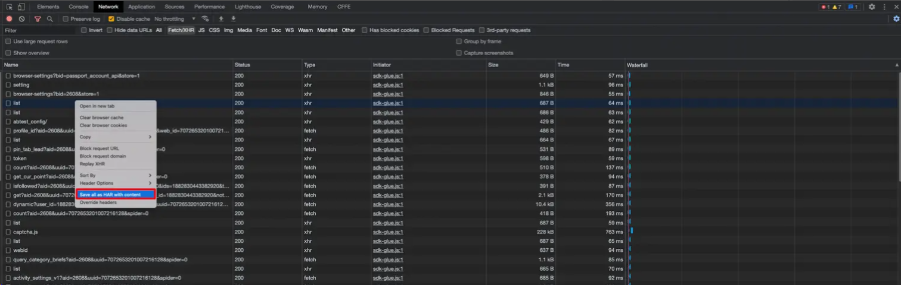
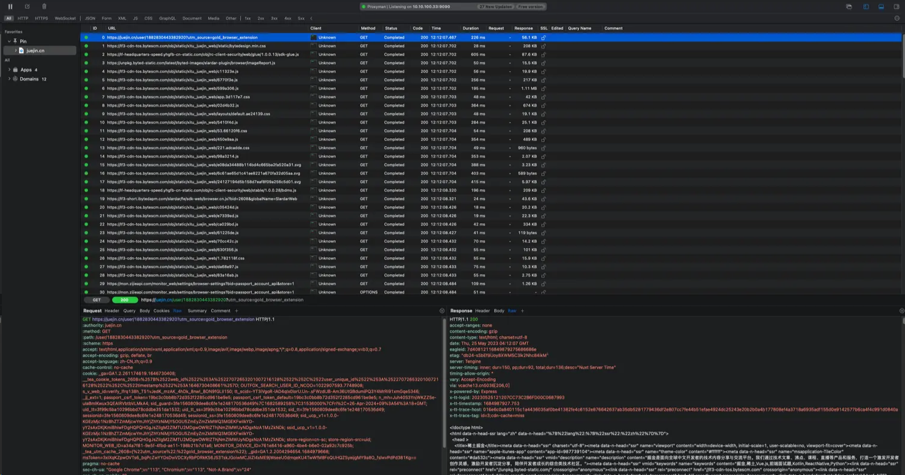

# 前端工具环境配置

参考：<https://juejin.cn/post/7187272143657730108?>

## 开发软件

### Visual Studio Code

Visual Studio Code 官网地址：[Visual Studio Code - Code Editing. Redefined](https://code.visualstudio.com/)

### WebStorm

WebStorm 官网地址：[JavaScript and TypeScript - JetBrains Guide](https://www.jetbrains.com/guide/javascript/)

## 配置开发环境

### Node 版本管理工具：nvm

工作中的项目有很多老项目，需要在不同版本的 Node.js 中运行，项目在稳定上线后通常就不会再去更新其 node 版本和依赖模块的版本，所以我们需要一个工具来为不同的项目配置不同的 node 版本。

> 下载地址：[Releases · coreybutler/nvm-windows (github.com)](https://github.com/coreybutler/nvm-windows/releases)
>
> github：[coreybutler/nvm-windows: A node.js version management utility for Windows. Ironically written in Go. (github.com)](https://github.com/coreybutler/nvm-windows)

**注意事项：**

1. 尽量先安装 nvm， 通过 nvm 安装 node.js，如果先安装了 node.js，要在 nvm 安装过程中正确配置 node.js 的路径。
2. 安装完毕后直接在命令行使用会提示 'nvm'/'node' 不是内部或外部命令，也不是可运行的程序，搜一下跟着网上教程配置环境变量即可。**不过这里要注意的是，公司电脑可能会禁止打开编辑系统环境变量**，通过 **控制面板->用户账户->更改我的环境变量** 打开即可。
3. 配置环境变量 `PATH` 时可以把 **nodejs 目录下的 node_global 文件夹**也添加进去，这个文件夹存放的是全局安装的模块。这样的话日后安装如 `yarn` 、`whistle` 等模块时无需再单独配置环境变量即可在命令行中使用其命令。

### Node 版本管理工具：volta

开源地址：[volta-cli/volta: Volta: JS Toolchains as Code. ⚡ (github.com)](https://github.com/volta-cli/volta)

官网：[Volta - The Hassle-Free JavaScript Tool Manager](https://volta.sh/)

### node / npm

当通过 nvm 安装好 node 之后，我们要把 npm 的下载源换成公司的：

```bash
# 查看下载源： https://registry.npmjs.org/
npm config get registry


# 切换 npm 下载源到京东
npm config set registry http://npm.m.jd.com/mirrors
yarn config set registry http://npm.m.jd.com/mirrors
pnpm config set registry http://npm.m.jd.com/mirrors
# 淘宝源
```

### ⭐ git

Git 官网：[Git (git-scm.com)](https://git-scm.com/)

#### ssh

安装好 git 之后我们就可以拉取远程仓库的代码了，但是在拉取公司项目代码之前还差一步——生成 SSH 密钥。

> SSH 密钥用于 SSH 协议中的密钥认证，提供一种安全的方式来进行远程登录或其他网络服务。它包括一对密钥：一个私钥（保密）和一个公钥（可以公开）。公钥放在远程服务器上，私钥由用户安全保管。当用户尝试连接到服务器时，服务器使用公钥来验证用户的私钥，如果匹配，则授予访问权限，无需输入密码。这种方式比传统密码认证更安全。

如果公司有自己的代码仓库，会对生成并上传 SSH 有教程。

## 编程插件配置

[【JSDoc】都 2024 年了，你不会还在用纯文本写注释吧 - 掘金 (juejin.cn)](https://juejin.cn/post/7331928379555971111)

### Visual Studio Code 插件配置

#### 插件：REST Client

我们在开发测试接口时一般会使用 `Postman` 等接口调试工具测试，需要设置 `URL`、`token`、`headers` 等，但是对于前端来说，我们可能只关心这个接口的入参还有返回值，不想去配置那么多东西，或者不想用 `Postman` 但又需要测试接口，有时候可能是不停地去页面点击或者刷新页面发起请求，这时候就会很麻烦。那这里有一个简单场景下的接口测试工具，适合使用 vscode 开发的同学。

#### 数据库可视化连接插件：Database Client

安装了之后，就会在 vscode 左侧生成两个图标，上面一个表示关系型，下面一个表示非关系型。你可以连接你的本地数据库服务，进行开发调试

## 开发助力工具

### whistle

文档：[安装启动 · GitBook (wproxy.org)](https://wproxy.org/whistle/install.html)

企业中前后端开发进度经常会不一致，有时候后端的接口还没上线，但我们做完了页面想自己测试一下效果，可以通过 whistle 抓包来自己模拟数据。

### SwitchHosts

GitHub 地址：[安装启动 · GitBook (wproxy.org)](https://wproxy.org/whistle/install.html)

其实直接修改 hosts 文件也可以，但 SwtichHosts 会方便一些。

有时公司后端的服务器只会响应来自特定域名的请求，比如京东的后台只响应 `xxx.jd.com` 这种以 `jd.com` 结尾的域名发起的请求，这就需要我们通过配置 webpack 的 host 为 `xxx.jd.com`，同时用 hosts 文件把 `xxx.jd.com` 解析到 **127.0.0.1** 上。

## 抓包工具

### 1.抓包工具 Proxyman

不了解抓包工具的童鞋还不知道抓包工具的强大。简单举个例子：

- 你们公司开发的系统部署给客户了，现场交付的同学给你说系统出现了故障，接口似乎出错了
- 但是用户是内网环境，各种各样的原因你又没办法远程或者 `vpn` 连接客户的电脑排查问题
- 此时你又必须要查看接口具体是入参错误还是接口调用错误，必须得有接口信息你才能排查

怎么办？此时你需要先知道一个东西，`HTTP` 存档：`HAR`。

> HAR（HTTP 存档 ） 规范定义了 HTTP 事务的存档格式，是多种 HTTP 会话工具用来导出所记录数据的 一种文件格式，Web 浏览器可以使用该格式导出有关其加载的网页的详细性能数据。

在浏览器接口列表里右键某个接口，会出现以下选项：



点击保存为 `HAR`，浏览器会为你将当前页的所有接口保存为一个 `HAR` 包。此时你可以让客户现场的同学将报错的接口保存为 `HAR` 包并发送给你，你可以使用类似 `Proxyman` 的抓包工具打开，来看看打开的效果：



和浏览器的 `Network` 界面是几乎一模一样的，这时候你就可以尽情排查问题，而不再因为 `vpn`、远程无法连接客户电脑而焦虑了。

当然了，抓包工具有很多，这里介绍 `Proxyman` 是因为它的 UI 界面简洁优美。还有就是抓包工具的用法不仅仅是这个，这只是一个比较基础的应用，更多用法这里不再赘述，以后有机会开专题来说说抓包工具的问题。

## 实用工具

### GifCam

GifCam | GIF 录制工具：[GifCam | BahraniApps Blog](https://blog.bahraniapps.com/gifcam/#download)

非常好用的 **gif 录制工具**，之前写掘金想展示前端代码效果的时候接触到的。工作中有时候想和产品或者 UI 确认一些细节效果，不想拉会议投屏，录个 gif 是很好的选择。

### Easy Mock 在线接口服务

[Easy Mock (mengxuegu.com)](https://mock.mengxuegu.com/login)

后端写接口磨磨蹭蹭？自己 `mock` 数据又麻烦？也不想用 `json-server` 或者 `node` 启动本地服务调试？那这个网站或许适合你，先拿到和后端商量好的数据格式及字段，然后在 `Easy Mock` 上定义对应的接口和数据，你可以使用 `mockjs` 语法生成随机数据，也可以使用静态数据。在你需要批量化的假数据填充表格的时候，这个工具非常有用。还可以结合 `mockjs` 语法进行函数编写，使用函数接收入参并控制返回数据。

### JSON 在线工具

[JSON 在线解析及格式化验证 - JSON.cn](https://www.json.cn/)

一个功能非常丰富的 JSON 在线工具网站，可以在线格式化 JSON 字符串，在线进行代码对比，能做非常多你想得到想不到的事 —— 它还可以在线运行 C++、C、Java 等语言代码，还可以压缩图片，IP 查询等，简直就是万能百宝箱。

### 在线打字练习

如果你还在为打字不快而烦恼，想要练习却又无从下手，现在好了，下面两个打字练习网站可以帮助你练习正确的打字姿势，快速记住键位，进行多样化的打字练习。

[Typing Practice (keybr.com)](https://www.keybr.com/)

帮助你快速熟悉键位。

[在线打字测试(打字狗 dazigo.vip)](https://dazigo.vip/)

在这里你可以进行键位练习、打字比赛、打字排行、打字游戏。海量文章古诗随意挑选进行练习，是综合功能最全、最好用的免费打字网站之一。

## 其他优秀的前端学习网站

[js 剑指 offer 题解 (luvsunlight.github.io)](https://luvsunlight.github.io/js-offer-algo/#/)

[前言 | Vue.js 技术揭秘 (ustbhuangyi.github.io)](https://ustbhuangyi.github.io/vue-analysis/)

[深入浅出 Webpack · 深入浅出 Webpack (wuhaolin.cn)](https://webpack.wuhaolin.cn/)

[ES6 入门教程 - ECMAScript 6 入门 (ruanyifeng.com)](https://es6.ruanyifeng.com/#README)

[浏览器工作原理与实践 (poetries.top)](https://blog.poetries.top/browser-working-principle/)

## 开放接口

### 聚合 API

该网站提供了大量的免费的 `API` 接口供我们使用,大家可以将其用在自己的项目上使用,并且每个接口都提供了完整的文档,开箱即用。

官网：[接口大全-免费 API,收集所有免费的 API (free-api.com)](https://www.free-api.com/)

### 网易云音乐 API 接口

网易云音乐 `NodeJs` 版 `API`,具备登陆接口,多达 200 多个接口,文档也写得很好,非常给不会写后端且没有项目经验的同学。

## Emoji 表情

[🗂 Emoji 全部分类 | EmojiAll](https://www.emojiall.com/zh-hans/all-cate)
