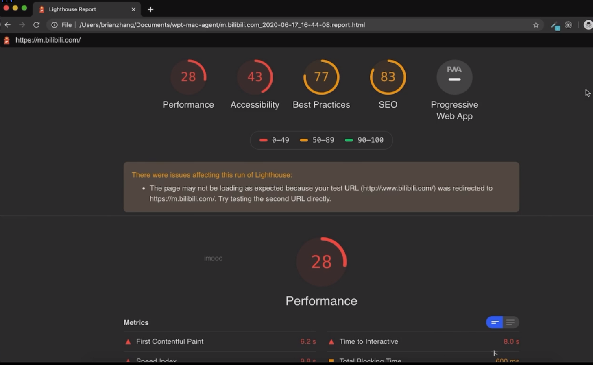
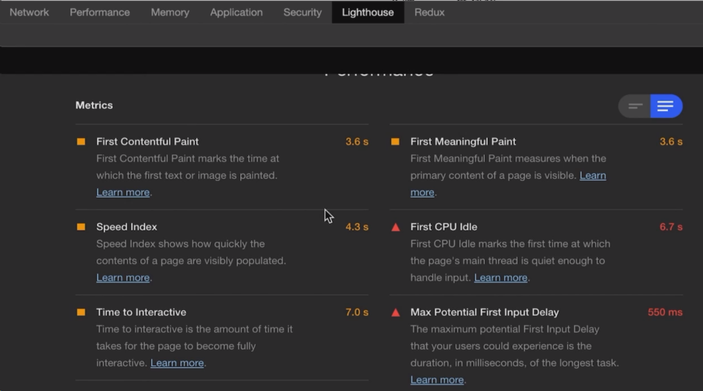

# 能分析工具

- 项目构建性能优化：优化方法和打包工具直接相关，主要思路是缓存 + 并行

- 页面性能优化：主要指页面加载速度和流畅度，页面性能指标都是从用户体验角度出发，页面性能优化目标是尽可能快地展示出页面内容，尽可能快地使功能可用，减少页面卡顿，提升用户体验。

  - 加载时性能优化

  - 运行时性能优化

## 性能分析诊断工具

### :a:浏览器开发者工具的性能诊断

#### Chrome DevTools - Lighthouse 面板

- [lighthouse](https://github.com/GoogleChrome/lighthouse)  灯塔：是 Google Chrome 推出的一款开源自动化工具（网站整体质量评估），它可以搜集多个现代网页性能指标，分析 Web 应用的性能并生成报告，为开发人员进行性能优化的提供了参考方向。
- 可以通过**谷歌浏览器**去安装使用；也可以通过本地全局安装，通过运行命令行去审查指定的页面。

#### Chrome DevTools - Performance 面板

- 谷歌浏览器中的  `Perfermance`  面板可以用于分析站点运行时性能；建议以隐身模式开启，排除其他扩展对性能测量的影响。`Safari`  浏览器对应时间轴面板，看个人爱好选择调试。其他浏览器对应的性能分析面板自查。

- **使用  `Perfermance`  接口**：通过  `W3C`  提供的  `Perfermance`  接口，监听页面的相关信息。

### :b:WebPageTest 多测试地点、全面性能报告

网址：[WebPageTest - 网站性能和优化测试](https://www.webpagetest.org/)

输入网站网址，点击测试。

指标：

- waterfall chart 请求瀑布图
- first view 首次访问
- repeat view 二次访问

#### 如何本地部署 WebPageTest 工具

安装 Docker，然后安装 webpagetest/server 镜像就可以使用这个工具了。

本地生成的测试报告

### 其他工具

#### 检测工具

- YSlow(Yahoo 工具)：23 条性能军规，打分制，提供浏览器插件，对页面性能评级和需要优化的部分
  - 官网：[YSlow - Official Open Source Project Website](https://yslow.org/)
- WebPageTest：真实浏览器，多地区，视频截图

  - 官网：[Website Speed Test | Pingdom Tools](https://tools.pingdom.com/)

- **性能魔方**：多地区、运营商、多角度，优化建议
  - 官网：[全新套餐 极速分享 | 性能魔方 mmTrix](http://www.mmtrix.com/activity/market)
- 17CE：多地区评测访问速度，更偏运维

  - 官网：[网站测速|网站速度测试|网速测试|电信|联通|网通|全国|监控|CDN|PING|DNS 一起测试|17CE.COM](http://www.17ce.com/)

- GTmetrix：
  - 官网：[GTmetrix | Website Performance Testing and Monitoring](https://gtmetrix.com/)

#### 站长工具

1、IPIPNET

网址：<https://tools.ipip.net/newping.php>

支持全国 Ping 测速，同时 IP 库精准度高，另有路由追踪等测试

2、站长工具

网址：<http://ping.chinaz.com>

支持全国 Ping 测速，IP 库不准，还有很多其他小功能（比如备案查询等）

有比较方便的解析 IP 一览

3、PingPE

网址：<http://ping.pe>

国内外服务器都有，英文界面，可以持续监测丢包，还能监测端口开放但是国内节点较少且特殊

4、BOCE

网址：<https://www.boce.com>

比较好用的网站测速网站，可以指定解析 IP，也有 IP 分布数据百分比

5、CE8

网址：<https://www.ce8.com>

支持网站测速对比，大体功能和 BOCE 差不多，但是功能少点

6、17CE

网址：<https://www.17ce.com/>

可能是最常用的压测网站，测速速度慢，但是结果好像比较准确

7、CheckHost

网址：<https://check-host.net/check-http>

国外的测速网站，只有海外测速，支持 TCP/UDP 端口测试，常用于测有没有被打死

8、PageSpeedInsights

网址：<https://developers.google.com/speed/pagespeed/insights>

谷歌的测速网站，个人感觉不怎么准，支持移动和桌面分开测速

9、性能魔方

网址：<http://www.mmtrix.com/evaluate/applist>

只有国内节点，经常报错，但是有详细的测速报告

10、Gtmetrix

网址：<https://gtmetrix.com>

国外的测速网站，节点少，但是报告也挺详细

11、CHAICP

网址：<http://chaicp.com/#first>

最好用的备案查询网站，可以检测主流备案商家（可惜没有华为云）/

12、友盟

网址：<https://www.umeng.com>

常用的站长统计工具之一

13、百度统计

网址：<https://tongji.baidu.com>

常用的站长统计工具之一

14、谷歌分析

网址：<https://analytics.google.com>

常用的站长统计工具之一

15、爱站

网址：<https://www.aizhan.com>

各种站长常用信息查询比如收录等

---

### 工具介绍文章

[前端性能优化 - 工具和优化](https://juejin.cn/post/6911472693405548557)

[对前端性能优化的一些小看法 - 分析向](https://juejin.cn/post/7101249167183822878)

[我的前端性能优化体系总结 - 掘金 (juejin.cn)](https://juejin.cn/post/7108376192767983623)

[性能查看工具指标](https://juejin.cn/post/6850037270729359367)

[前端性能优化专题 - 掘金 (juejin.cn)](https://juejin.cn/post/7095950046494982151)

[JS 避免内存泄漏](https://juejin.cn/post/6996828267068014600)

[工作中如何进行前端性能优化(23 种优化+10 种定位方式) - 掘金 (juejin.cn)](https://juejin.cn/post/6904517485349830670)

[前端搞工程化：从零打造性能检测库「源码 + 视频」 - 用户监控来分析数据来优化性能](https://juejin.cn/post/6919295789630455815)

[前端的项目构建性能优化和页面性能优化 - 掘金 (juejin.cn)](https://juejin.cn/post/7084149224312897549)

[性能优化 - 掘金 (juejin.cn)](https://juejin.cn/post/7097404568245370910)

js 定时动画性能优化：

[2022 年了！还在用定时器实现动画？赶紧试试 requestAnimationFrame 吧! - 掘金 (juejin.cn)](https://juejin.cn/post/7115572998249119775)

[2022 年了,真的懂 requestAnimationFrame 么？ - 掘金 (juejin.cn)](https://juejin.cn/post/7062178363800027173)

## 性能优化核心指标——Chrome DevTools - Lighthouse 面板

核心指标是我们页面做性能测试时必不可少的几个指标。

一下指标都可以在：Chrome DevTools - Lighthouse 面板中获取

### FCP（First Contentful Paint）首次内容绘制(首屏加载时间)

指浏览器从响应用户输入网络地址到页面内容的任何部分在屏幕上完成渲染的时间。这个就是实际有意义的首屏时间。

其实这里还有一个核心指标：FP（First Paint）首次绘制，但正常情况下做 FCP 就没必要做 FP 了。

### LCP（Largest Contentful Paint）最大内容绘制(最大视觉元素加载的时间)

对于 SEO 来说最重要的指标,用户如果打开页面很久都不能看清楚完整页面，那么 SEO 就会很低。（对于 Google 来说）

表示可视区最大内容（文本块或图像元素）在屏幕上完成渲染的时间。该时间会随着页面渲染变化而变化，因为页面中的最大元素在渲染过程中可能会发生改变，另外该指标会在用户第一次交互后停止记录。

### Speed Index 内容明显填充的速度(SI) `分数越低越好`

### TTI（Time to Interactive）可交互时间

衡量一个页面多长时间才能完全交互

测量页面从开始加载到视觉上完成渲染、初始脚本完成加载，并能够快速、可靠地响应用户输入所需的可交互状态时间。 可交互状态指的是页面上的 UI 组件是可以交互的（可以响应按钮的点击或在文本框输入文字等）。

### TBT（Total Blocking Time）总阻塞时间

指 FCP(首次内容绘制) 与 TTI (可交互时间)之间的总时间。这期间，主线程被阻塞的时间过长，无法作出输入响应。举个例子说明一下：

上图为页面加载期间浏览器主线程的图表，  上方的时间轴上有五个任务，其中三个是长任务，因为这些任务的持续时间超过 50 毫秒。下图显示了各个长任务的阻塞时间：

因此，虽然在主线程上运行任务的总时间为 560 毫秒，但其中只有 345 毫秒被视为阻塞时间。

主线程运行超过 50ms 的任务叫做 Long Task，Total Blocking Time (TBT) 是 Long Tasks（所有超过 50ms 的任务）阻塞主线程并影响页面可用性的时间量，比如异步任务过长就会导致阻塞主线程渲染，这时就需要处理这部分任务

### CLS (Cumulative Layout Shift)  累积布局偏移

累积布局偏移 (CLS) 是一个以用户为中心的测量视觉稳定性的重要指标，因为该项指标有助于量化用户发生意外布局偏移的频率，较低的 CLS 有助于用户的使用体验。

衡量页面点击某些内容位置发生偏移后对页面对影响 eg:当图片宽高不确定时会时该指标更高，还比如异步或者 dom 动态加载到现有内容上的情况也会造成 CLS 升高

如果还不知道什么是 CLS 的话找了个图可以看着理解一下：

 就是想点取消，但因为别内容加载出来把按钮顶下去了，所以点成了确定订单。

注意：2021 年 6 月 1 日：CLS 的实现方式已发生变更。想了解具体的变更原因可以查看  [不断发展 CLS 指标](https://web.dev/evolving-cls/)。

以前 CLS 测量的是整个页面生命周期内发生的**所有单次布局偏移分数的总和**。

现在 CLS 测量的是整个页面生命周期内发生的**所有意外布局偏移中最大一连串的布局偏移分数**。

布局偏移：每当一个可见元素的位置从一个已渲染帧变更到下一个已渲染帧时，就发生了布局偏移 。

一连串的布局偏移：也叫会话窗口，是指一个或多个快速连续发生的单次布局偏移，每次偏移相隔的时间少于 1 秒，且整个窗口的最大持续时长为 5 秒。

最大的一连串：是指窗口内所有布局偏移累计分数最大的会话窗口。

## 性能优化核心指标——Chrome DevTools - Performance 面板

Chrome DevTools 的 Performance 面板是一个强大的工具，可以让您分析网页的性能表现，包括加载时间，渲染时间，交互时间，内存使用，网络请求等。您可以使用它来发现和优化网页的性能瓶颈，提高用户体验。

要使用 Performance 面板，您需要了解一些前置知识，例如：

- 浏览器的多进程架构，包括浏览器进程，渲染器进程，插件进程，图形处理器进程等，以及它们的职责和通信方式。
- 渲染器进程中的不同线程，包括主线程，工作线程，合成线程，光栅线程等，以及它们的作用和协作方式。
- 浏览器的渲染流水线，包括 HTML 解析，CSS 计算，DOM 构建，布局，绘制，合成，光栅化等步骤，以及它们的顺序和依赖关系。
- 前端代码的执行过程，包括 JavaScript 的解析，编译，优化，执行，垃圾回收等步骤，以及它们对性能的影响。
- 网页的关键性能指标，包括 FCP，LCP，FMP，TBT，CLS，TTI 等，以及它们的含义和计算方法。

### 浏览器的多进程架构

现代的浏览器，如 Chrome、Firefox、Edge 等，都采用了多进程架构，即浏览器由多个进程组成，每个进程都有自己的职责和资源，相互隔离，提高了浏览器的稳定性、安全性和性能。

一般来说，浏览器的多进程架构包括以下几种类型的进程：

- **浏览器主进程（Browser Process）**：负责浏览器的界面显示、用户交互、子进程管理、文件存取等。
- **渲染进程（Renderer Process）**：负责将 HTML、CSS、JavaScript 等网页内容解析并渲染成用户可见的页面。每个标签页（Tab）一般对应一个渲染进程，称为**进程隔离（Process Isolation）**。
- **网络进程（Network Process）**：负责网络资源的请求和加载，如 HTTP、HTTPS、WebSocket 等协议。
- **GPU 进程（GPU Process）**：负责处理 GPU 相关的任务，如页面的 3D 渲染、视频解码等。
- **插件进程（Plugin Process）**：负责运行插件，如 Flash、PDF 等。每个插件一般对应一个插件进程，称为**插件隔离（Plugin Isolation）**。

浏览器的多进程架构中，每个进程的通信方式是通过 IPC（Inter-Process Communication，进程间通信）机制实现的。

IPC 是指不同进程之间传递和共享数据的方法，常见的 IPC 方式有管道、消息队列、共享内存、信号量、套接字等。

浏览器中的 IPC 主要是通过管道和套接字来实现的。

管道是指一种半双工的通信方式，即数据只能单向流动，而且只能在具有亲缘关系的进程间使用。

套接字是指一种全双工的通信方式，即数据可以双向流动，而且可以在任何进程间使用。

浏览器中的 IPC 主要分为两类：

- **同步 IPC**：指发送方在发送消息后，必须等待接收方的回复，才能继续执行后续的操作。同步 IPC 的优点是简单易用，缺点是效率低，容易造成阻塞。
- **异步 IPC**：指发送方在发送消息后，无需等待接收方的回复，就可以继续执行后续的操作。异步 IPC 的优点是效率高，缺点是复杂难用。

浏览器中的 IPC 主要用于以下几个方面：

- **浏览器主进程和渲染进程之间的通信**：浏览器主进程和渲染进程之间的通信主要是通过同步 IPC 来实现的，因为它们之间的消息通常是需要及时响应的，比如导航、页面加载、JavaScript 执行等。
- **渲染进程和插件进程之间的通信**：渲染进程和插件进程之间的通信主要是通过异步 IPC 来实现的，因为它们之间的消息通常是不需要及时响应的，比如视频播放、游戏运行等。
- **渲染进程和网络进程之间的通信**：渲染进程和网络进程之间的通信主要是通过异步 IPC 来实现的，因为它们之间的消息通常是不需要及时响应的，比如网络请求、数据传输等。
- **渲染进程和 GPU 进程之间的通信**：渲染进程和 GPU 进程之间的通信主要是通过异步 IPC 来实现的，因为它们之间的消息通常是不需要及时响应的，比如图形渲染、视频解码等。

### 渲染器进程中的不同线程

渲染器进程是多线程的，它主要包含了以下几个线程：

- **主线程（Main Thread）**：负责执行 JavaScript 代码，创建和操作 DOM 对象，执行用户交互和事件处理等。主线程使用了 JavaScript 引擎，如 V8、SpiderMonkey 等，来解析和执行 JavaScript 代码。
- **GUI 渲染线程（GUI Thread）**：负责解析和渲染页面，计算布局（Layout），绘制图形（Paint），合成图层（Composite）等。GUI 渲染线程使用了排版引擎，如 Blink、Gecko 等，来解析 HTML 和 CSS，并生成渲染树（Render Tree）。
- **事件触发线程（Event Trigger Thread）**：负责监听和处理用户的输入事件，如鼠标点击、键盘输入等，以及其他事件，如网络请求、定时器等。 事件触发线程会将事件放入一个事件队列（Event Queue），等待主线程的处理。
- **定时器触发线程（Timer Trigger Thread）**：负责执行定时器相关的任务，如 setTimeout、setInterval 等。定时器触发线程会在定时器到期后，将回调函数放入事件队列，等待主线程的处理。
- **异步 HTTP 请求线程（Async HTTP Request Thread）**：负责执行异步的网络请求，如 XMLHttpRequest、Fetch 等。异步 HTTP 请求线程会在请求完成后，将回调函数放入事件队列，等待主线程的处理

### 浏览器的渲染流水线

浏览器的渲染流水线是指浏览器将网页内容从输入到输出的一系列步骤，包括以下几个阶段：

- **构建 DOM 树（Build DOM Tree）**：浏览器将 HTML 文档解析成一个 DOM 树，DOM 树是由 DOM 节点构成的树形结构，表示了 HTML 文档的结构和内容。
- **构建 CSSOM 树（Build CSSOM Tree）**：浏览器将 CSS 样式表解析成一个 CSSOM 树，CSSOM 树是由 CSSOM 节点构成的树形结构，表示了 CSS 样式表的规则和属性。
- **构建渲染树（Build Render Tree）**：浏览器将 DOM 树和 CSSOM 树结合起来，生成一个渲染树，渲染树是由渲染对象构成的树形结构，表示了页面中可见的元素及其样式。
- **布局（Layout）**：浏览器根据渲染树中的渲染对象，计算出它们在页面中的位置和大小，这个过程叫做布局或重排（Reflow）。布局的结果是一个包含了每个渲染对象的坐标和尺寸的布局树。
- **绘制（Paint）**：浏览器根据布局树中的渲染对象，将它们的内容绘制到屏幕上，这个过程叫做绘制或重绘（Repaint）。绘制的结果是一个包含了每个渲染对象的像素信息的位图。
- **合成（Composite）**：浏览器将绘制的位图分割成多个图层（Layer），并按照正确的顺序和位置将它们合成在一起，形成最终的页面图像。合成的过程可以利用 GPU 的加速，提高渲染的效率。

### 前端代码的执行过程

前端代码的执行过程是指浏览器如何解析和执行 JavaScript 代码的过程，主要包括以下几个步骤：

- **词法分析（Lexical Analysis）**：浏览器将 JavaScript 代码分割成一个个的词法单元（Token），如标识符、关键字、运算符、字面量等。
- **语法分析（Syntactic Analysis）**：浏览器将词法单元组合成一个个的语法单元（Node），并构建成一个抽象语法树（AST），表示了 JavaScript 代码的语法结构和语义。
- **字节码生成（Bytecode Generation）**：浏览器将 AST 转换成一种中间代码，叫做字节码（Bytecode），字节码是一种更接近机器语言的代码，可以更快地被解释器执行。
- **解释执行（Interpretation）**：浏览器使用一个解释器（Interpreter），如 Ignition、SpiderMonkey 等，来逐行执行字节码，完成 JavaScript 代码的运行。
- **即时编译（Just-in-Time Compilation）**：浏览器使用一个即时编译器（JIT Compiler），如 TurboFan、IonMonkey 等，来对一些频繁执行的字节码进行优化和编译，生成更高效的机器代码，提高 JavaScript 代码的执行速度。
- **垃圾回收（Garbage Collection）**：浏览器使用一个垃圾回收器（Garbage Collector），如 V8 的 Orinoco、Firefox 的 GCR 等，来对内存中不再使用的对象进行回收和释放，防止内存泄漏和浪费。

### 网页的关键性能指标

网页的关键性能指标是指一些可以反映网页性能表现的指标，它们可以帮助我们评估和优化网页的加载速度，渲染速度，和交互速度，提升用户体验和用户满意度。

一般来说，网页的关键性能指标包括以下几个：

- **首次内容绘制（First Contentful Paint，FCP）**：指网页中第一个文本或图片等内容绘制到屏幕上的时间。 FCP 反映了网页的加载速度，越快越好。
- **最大内容绘制（Largest Contentful Paint，LCP）**：指网页中最大的文本或图片等内容绘制到屏幕上的时间。 LCP 反映了网页的渲染速度，越快越好。
- **首次有意义绘制（First Meaningful Paint，FMP）**：指网页中主要内容绘制到屏幕上的时间。 FMP 反映了网页的可用性，越快越好。
- **总阻塞时间（Total Blocking Time，TBT）**：指网页在 FCP 和 TTI 之间的所有任务超过 50 毫秒的总时间。 TBT 反映了网页的响应性，越小越好。
- **累计布局偏移（Cumulative Layout Shift，CLS）**：指网页在加载过程中，由于元素的位置或大小变化而导致的视觉上的偏移的总量。 CLS 反映了网页的稳定性，越小越好。
- **可交互时间（Time to Interactive，TTI）**：指网页在加载过程中，达到可以正常响应用户输入的时间。 TTI 反映了网页的交互性，越快越好。

## FID（First input delay）首次输入延迟

测量从用户第一次与您的网站交互（例如当他们单击链接、点按按钮或使用由 JavaScript 驱动的自定义控件）直到浏览器实际能够对交互做出响应所经过的时间。页面的 FID 应为**100 毫秒**或更短。

上述的几个核心指标其实就是最近几年比较重要的几个核心指标，但核心指标会随着时间的推移而发展。针对 2020 年的指标构成侧重于用户体验的三个方面：加载性能、交互性和视觉稳定性。

2020 年的核心 Web 指标为三大指标：

- LCP（Largest Contentful Paint）最大内容绘制、
- FID（First Input Delay）首次输入延迟
- CLS（Cumulative Layout Shift） 累积布局偏移。

每项指标所测量的用户体验是不同的：

- LCP 测量感知加载速度，并在页面的主要内容基本加载完成时，在页面加载时间轴中标记出相应的点；
- FID 测量响应度，并将用户首次尝试与页面交互的体验进行了量化；
- CLS 测量视觉稳定性，并对可见页面内容的意外布局偏移量进行了量化。

最后就是每项核心 Web 指标都有一个相关联的阈值，这些阈值将性能分为"良好"、"需要改进"或"欠佳"：

|              | 良好    | 欠佳    | 百分位数 |
| ------------ | ------- | ------- | -------- |
| 最大内容绘制 | ≤2500ms | >4000ms | 75       |
| 首次输入延迟 | ≤100ms  | >300ms  | 75       |
| 累积布局偏移 | ≤0.1    | >0.25   | 75       |

## 自定义指标

上面列出的核心性能指标有助于大致了解网络上大多数网站的性能特征。并且这些指标还可以作为网站的一组通用指标，有利于与竞争对手进行性能比较。

但某些情况下我们需要为网站量身定制一些指标来衡量我们网站的性能。这种专门为网站量身定制的指标往往才是最佳指标，我们称之为自定义指标。

还有就是，在很多人心里可能会觉得核心指标比自定义指标重要，其实不是这样的。举个例子：  
LCP 指标用于测量页面的主要内容何时完成加载，但在某些情况下，最大元素并不是页面主要内容的一部分，因此 LCP 就不再是相关指标，他对我们的性能测试就没有意义。

为解决自定义指标的情况，Web 性能工作组还推出了一系列较低级别的标准化 API，可用于我们自定义指标：

- [用户计时 API](https://w3c.github.io/user-timing/) ：该规范定义了一个接口，以帮助 Web 开发人员通过访问高精度时间戳来衡量其应用程序的性能。
- [长任务 API](https://w3c.github.io/longtasks/) ：该档定义了一个 API，网页作者可以使用该 API 来检测“长任务”的存在，这些任务会长时间垄断 UI 线程并阻止其他关键任务的执行
- [元素计时 API](https://wicg.github.io/element-timing/)：本文档定义了一个 API，可以在屏幕上显示大型或开发人员指定的图像元素和文本节点时进行监控。
- [导航计时 API](https://w3c.github.io/navigation-timing/)：该规范定义了 Web 应用程序的接口，以访问用于导航文档的完整计时信息。
- [资源计时 API](https://w3c.github.io/resource-timing/)：该规范定义了 Web 应用程序的接口，以访问文档中资源的完整计时信息。
- [服务器计时](https://w3c.github.io/server-timing/)：该规范使服务器能够将有关请求响应周期的性能指标传达给用户代理。它还标准化了 JavaScript 接口，以使应用程序能够收集和处理并对这些指标采取行动以优化应用程序交付。

那么通过上面这些标准化 API，我们就可以去定义我们自己的自定义指标。核心指标能为我们提供一个很好的性能基线，但在许多情况下，需要测量更多指标，才能刻画出具体网站的完整体验。 因此以用户为中心的自定义指标，从普遍意义上，通过它们可以更好衡量我们网站更细节的性能。

下面将列出一些针对我们编辑器页面的一些自定义指标。

注意：下面就是我根据我们网站列的一些自定义指标，网站还没上线，等上线了我再把网址贴出来，同样的自定义指标之后也会不断修改，让它更能反应我们网站的性能测试。所以文章之后也会不断更新。感兴趣的可以收藏，以后就能看着我是如何自定义性能指标，又是如何做筛选的了。

话不多说，直接进入自定义指标定义吧。

下面将结合我们自己的业务场景、类别、用户认知、瞬时性和持续性来针对编辑器项目定义一些自定义指标。(其实我真的不想放表格，表格换成图少了一千字呢！！！但掘金的表格是真的难编辑)

以上所有指标都需要结合用户的真实体验来收集和优化，以用户为中心，常用功能需要提高指标级别。

还需要根据用户的认知去做对应的性能优化，在用户的认知中应该“快”那就必须快，在用户的认知中可以“慢”那就尽量快。

由于性能监控平台的和本地平台的`差异`，本地可能要达到**70 分**，线上才有可能达到及格的状态,如果有性能优化的需求时，大家酌情处理即可（不过本人觉得，及格即可， 毕竟`大学考试有曰：60分万岁，61分浪费`，传承不能丢，咱们要把更多的时间，放到更重要的事情上来!）

## 如何进行 Web 性能优化？

在进行 Web 性能优化之前，我们需要明确了解以下几点：

1. 我们要了解性能指标
2. 学会使用 Web 性能测试；
3. 可以立足于网站页面响应的生命周期，分析出造成较差性能表现的原因；
4. 技术改造、可行性分析等具体的优化实施

### 性能指标

#### 1.[RAIL 模型衡量性能](https://web.dev/rail/)

RAIL 这四个单词代表与网站或应用的生命周期相关的四个方面，这些方面会以不同的方式影响整个网站的性能。

- 响应（Response）：应该尽可能快速的响应用户, 应该在 100ms 以内响应用户输入。
- 动画（Animation）：在展示动画的时候，每一帧应该以 16ms 进行渲染，这样可以保持动画效果的一致性，并且避免卡顿。
- 空闲（Idle）：当使用 Javascript 主线程的时候，应该把任务划分到执行时间小于 50ms 的片段中去，这样可以释放线程以进行用户交互。
- 加载（Load）：应该在小于 1s 的时间内加载完成你的网站，并可以进行用户交互。

#### 2.[衡量性能和用户体验](https://web.dev/metrics/)

- [Largest Contentful Paint 最大内容绘制 (LCP)](https://web.dev/lcp/)

> 最大内容绘制 (LCP) 是测量[感知加载速度](https://web.dev/user-centric-performance-metrics/#types-of-metrics)的一个以用户为中心的重要指标，因为该项指标会在页面的主要内容基本加载完成时，在页面加载时间轴中标记出相应的点，迅捷的 LCP 有助于让用户确信页面是[有效的](https://web.dev/user-centric-performance-metrics/#questions)。

- [First Contentful Paint 首次内容绘制 (FCP)](https://web.dev/fcp/)

> 首次内容绘制 (FCP) 是测量[感知加载速度](https://web.dev/user-centric-performance-metrics/#types-of-metrics)的一个以用户为中心的重要指标，因为该项指标会在用户首次在屏幕上看到任何内容时，在页面加载时间轴中标记出相应的点，迅捷的 FCP 有助于让用户确信某些事情正在[进行](https://web.dev/user-centric-performance-metrics/#questions)。

#### 3.[Web Vitals](https://web.dev/vitals/)

##### 什么是 Web Vitals?

> Google 给出的定义是 一个良好网站的基本指标（Essential metrics for a healthy site），过去要衡量一个网站的好坏，需要使用的指标太多了，Web Vitals 可以简化指标的学习曲线，只需聚焦于 Web Vitals 指标的表现即可。

在这些 Web Vitals 中，Google 确定了三个主要衡量指标，即在所有类型的网站中通用的 Core Web Vitals：

##### 性能测量工具

- 性能测试工具，比如 Lighthouse
- [web-vitals](https://github.com/GoogleChrome/web-vitals)库
- [Web Vitals](https://chrome.google.com/webstore/detail/web-vitals/ahfhijdlegdabablpippeagghigmibma)插件

##### 如何优化？

- [优化 Largest Contentful Paint 最大内容绘制](https://web.dev/optimize-lcp/ "https://web.dev/optimize-lcp/")
- [优化 First Input Delay 首次输入延迟](https://web.dev/optimize-fid/)
- [优化 Cumulative Layout Shift 累积布局偏移](https://web.dev/optimize-cls/)

#### 4.其他性能指标

- 重定向次数
- 重定向耗时
- DNS 解析耗时
- TCP 连接耗时
- SSL 安全连接耗时
- 网络请求耗时 (TTFB)
- 数据传输耗时
- DOM 解析耗时
- 资源加载耗时
- 首包时间
- 白屏时间
- 首次可交互时间
- DOM Ready 时间
- 页面完全加载时间
- http 头部大小
  推荐看看这个 [Web 的性能指标有哪些？](https://blog.csdn.net/lyj0629/article/details/80207732)

### [专业工具](https://www.jianshu.com/p/a87c2e84bd56)

通常我们会借助一些工具来完成性能测量。
本节先简要介绍一下会用那些工具，如果本章阅读量比较不错的话，会有独立章节详细介绍它们的使用方式与生成报告的分析。

- [lighthouse](https://github.com/GoogleChrome/lighthouse)
- [WebPageTest 测试性能](https://docs.webpagetest.org/getting-started/)
- [使用 Chrome DevTools 测试性能](https://developer.chrome.com/docs/devtools/network/)
- [Performance API](https://developer.mozilla.org/en-US/docs/Web/API/Performance_API/Using_the_Performance_API)

### 网站页面响应的生命周期

1. 浏览器通过请求得到一个 HTML 文本
2. 渲染进程解析 HTML 文本，构建 DOM 树
3. 解析 HTML 的同时，如果遇到内联样式或者样式脚本，则下载并构建样式规则（stytle rules），若遇到 JavaScript 脚本，则会下载执行脚本。
4. DOM 树和样式规则构建完成之后，渲染进程将两者合并成渲染树（render tree）
5. 渲染进程开始对渲染树进行布局，生成布局树（layout tree）
6. 渲染进程对布局树进行绘制，生成绘制记录
7. 渲染进程的对布局树进行分层，分别栅格化每一层，并得到合成帧
8. 渲染进程将合成帧信息发送给 GPU 进程显示到页面中

 页面的渲染其实就是浏览器将 HTML 文本转化为页面帧的过程

### 优化方案

经过对网站页面性能的测量及渲染过程的了解，相信你对于糟糕性能体验的原因已经比较清楚了，那么接下来便是优化性能，我们先简单扼要地介绍一些优化方面的思路。

- 从发出请求到收到响应的优化，比如 DNS 查询、HTTP 长连接、HTTP 2、HTTP 压缩、HTTP 缓存等。
- 关键渲染路径优化，比如是否存在不必要的重绘和回流。
- 加载过程的优化，比如延迟加载，是否有不需要在首屏展示的非关键信息，占用了页面加载的时间。
- 资源优化，比如图片、视频等不同的格式类型会有不同的使用场景，在使用的过程中是否恰当。
- 构建优化，比如压缩合并、基于 webpack 构建优化方案等。

接口方面，可以考虑下面的处理方案：

1. 避免同个接口多次发起请求
2. 避免不必要的接口请求
3. 需要缓存的数据，进行缓存，不需要发起二次请求
4. 列表接口采用分页处理，避免一次性加载数据，从而造成系统卡顿
5. 接口开启 `Gzip` 压缩
6. 接口可按需配置 `Etag` 作为缓存标志
7. 浏览器并非请求数量协调：同一时间针对同一域名下的请求又一定数量限制。超过数量限制数目的请求会被阻塞。合理使用不同的域名获取请求
8. 减少请求数，比如使用雪碧图，合并 `CSS / JavaScript` 文件

#### 静态资源处理

所有的文件都有可能是静态资源，比如 `Json`， `Image` 等。我们可以考虑以下处理：

1. 使用 `CDN`，避免资源放在项目的服务器上，特别是访问量大的站点，会容易奔溃或者造成资源加载缓慢，用户体验不良
2. 资源压缩
   2.1 图片资源可以使用 `TinyPNG` 2.2 视频/音频 可以通过 `FFmpeg` 处理
   2.3 `Html`，`CSS` 和 `JavaScript` 等资源，可以通过 `Webpack` 处理，现代前端框架都会集成，你只需要运行 `npm run build` 即可
3. 静态资源是否有其他的替代方案呢？比如用 `CSS` 实现三角形总比引入一个三角形的图案要强多了

#### DOM 处理

前端开发，就是以 `DOM` 为基石进行处理的一门艺术。

1. 减少重绘和重排，他们会导致页面重新渲染
2. `DOM` 节点元素需要**语义化**，不能都一股脑的使用 `DIV` 元素，这样不利于 `SEO`；起码在对外的系统上要注重语义化的处理
3. 老生常谈的点了：样式需要放在 `<head>` 标签中，脚本需要放在 `</body>` 之前引用。样式靠后会使得骨架 `HTML` 看起来辣眼睛；脚本提前加载会造成页面阻塞。
4. 避免 `Img` 节点元素的 `alt` 指向为空，为空不利于 `SEO`
