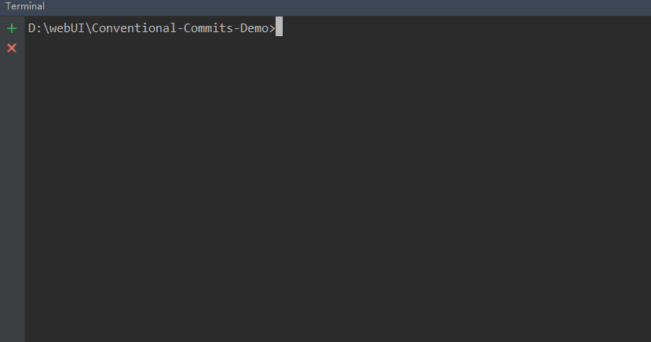
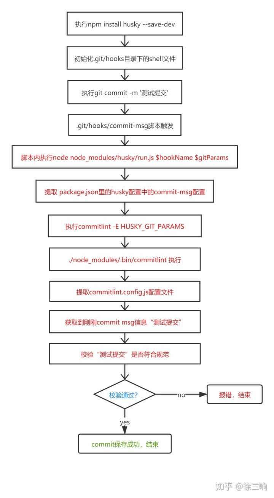
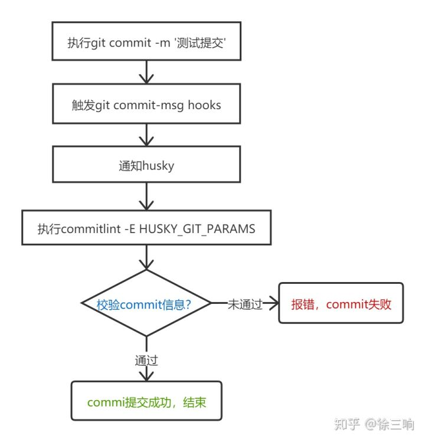
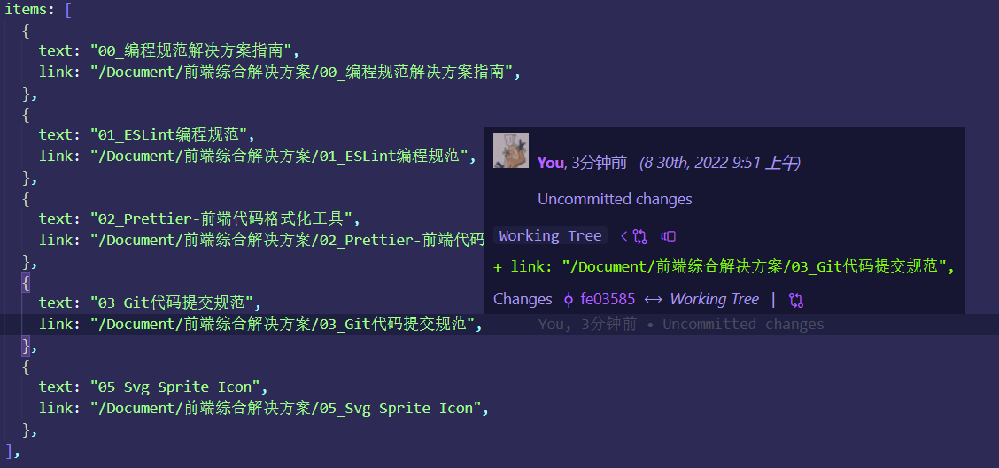

# 03_Git 代码提交规范

常见的 commit message 规范有：[atom](https://hub.fastgit.org/conventional-changelog/conventional-changelog/blob/v0.5.3/conventions/atom.md)，[eslint](https://hub.fastgit.org/conventional-changelog/conventional-changelog/blob/v0.5.3/conventions/eslint.md)和[Angular](https://github.com/angular/angular/blob/master/CONTRIBUTING.md)等,其中 Angular 规范更为通用。

现在市面上比较流行的 Git 代码提交规范方案是[Conventional Commit （约定式提交规范）](https://www.conventionalcommits.org/zh-hans/v1.0.0/)，它受到了[Angular 提交准则](https://github.com/angular/angular.js/blob/master/CONTRIBUTING.md)的启发，并在很大程度上以其为依据。

约定式提交规范是一种基于提交消息的轻量级约定。它提供了一组用于创建清晰的提交历史的简单规则；这使得编写基于规范的自动化工具变得更容易。这个约定与 SemVer 相吻合，在提交信息中描述新特性、bug 修复和破坏性变更

- **规范化提交**(无论哪种方式，要做到`统一`、`简明`)
- **一处变更一次 commit**(不要多处、多次修改堆积成一次 commit 提交，这对后期分析 bug 不利)

### 约定式提交

约定式提交：每次使用`git commit`  的时候都需要写 commit message,如果 message 的 style 是`按照固定的模版格式书写`，对于后期的维护和编写 changelog 都有巨大的好处。

而且现在的很多自动生成 changelog 的工具，都是建立在约定式提交的基础之上。

#### 优点

- 可读性好，清晰，不必深入看代码即可了解当前 commit 的作用。
- 为 Code Reviewing 做准备
- 方便跟踪工程历史
- 让其他的开发者在运行 git blame 的时候想跪谢
- 提高项目的整体质量，提高个人工程素质

---

### 1.约定式提交规范

**1.提交格式：**

- type：提交的类型；

- scope：代码修改的范围：用于说明 commit 影响的范围，比如数据层、控制层、视图层等等，视项目不同而不同。

- desctiption：对提交代码做一个简短的说明

```javascript
<type>[opting scope]: <desctiption>
// 空一行
[optional body]
// 空一行
[optional footer(s)]
```

#### <u>---------- 翻译 ----------</u>

- <mark>Header (<类型>[可选的范围]: <描述>)</mark>

  [header 包含三部分内容: 类型 type(必需)，可选的范围 scope(可选)，描述 desctiption(必需)]
  **`type`: 代码提交的类型**

  | Type     | 作用                                                                                   |
  | -------- | -------------------------------------------------------------------------------------- |
  | feat     | 新增特性 (feature)                                                                     |
  | fix      | 修复 Bug(bug fix)                                                                      |
  | docs     | 修改文档 (documentation)                                                               |
  | style    | 代码格式修改(white-space, formatting, missing semi colons, etc)                        |
  | refactor | 代码重构(refactor)                                                                     |
  | perf     | 改善性能(A code change that improves performance)                                      |
  | test     | 测试(when adding missing tests)                                                        |
  | build    | 变更项目构建或外部依赖（例如 scopes: webpack、gulp、npm 等）                           |
  | ci       | 更改持续集成软件的配置文件和 package 中的 scripts 命令，例如 scopes: Travis, Circle 等 |
  | chore    | 变更构建流程或辅助工具(比如更改测试环境)                                               |
  | revert   | 代码回退                                                                               |

  ```bash
  add：增加

  del：删除

  mod：修改

  update：更新

  feat: 新功能的开发

  fix: bug的修复

  docs: 文档的的修改变动

  style: 代码格式的修改

  refactor: 对已有功能进行重构(即不是新增功能，也不是修改bug的代码变动)

  perf: 性能优化

  test: 增加测试

  build: 修改影响到了系统的构建或外部依赖

  ci: 修改CI配置文件或相关的脚本

  chore: 构建过程或辅助工具的变动

  done: 已完成

  import：导入库

  revert：撤销上一次的 commit

  merge：合并分支操作
  ```

  中文示例

  ```bash
  【新增功能】-【新的功能点、新的需求】
  【Bug修复】-【修复的Bug:现网发散Bug、测试阶段的Bug、验收阶段的Bug】
  【文档修改】-【只是修改了文档:注释、README.md等】.
  【样式修改】-【不影响代码功能的修改:CSS样式、代码格式化等】
  【代码重构】-【代码更改既不修复错误也不添加功能】
  【性能优化】-【代码更改能够提升性能】
  【测试代码】-【添加缺失测试或更正现有测试】
  【编译代码】-【影响构建系统或外部依赖项的更改:build.gradle、package.json、Podfile等】
  【持续集成】-【咱们的CI配置文件和脚本的更改:Jenkinsfile等】
  【回退更改】-【代码回退提交更改】
  【其余提交】-【除以上全部类型以外的提交更改】
  ```

  **`scope`：用于说明 commit 影响的范围，比如数据层,控制层,视图层等等。**
  **`desctiption`：commit 提交的目的的简短描述，不超过 50 个字符**

- <mark>Body([可选的正文])</mark>

  Body 部分是对本次 commit 的详细描述：

  **此次提交的详细描述，描述为什么修改，做了什么样的修改，以及开发的思路等等。**

  可以分成多行，如

  > 为什么修改，做了什么修改，开发的思路
  >
  > - 修改了什么要点
  > - 使用了什么库，达到什么目的

- <mark>Footer( [可选的脚注] )</mark>

  Footer 脚注部分只用于两种情况

  **不兼容破坏性变动**

  如果当前代码与上一个版本不兼容，产生了破坏性变更，则 Footer 部分以 BREAKING CHANGE 开头,后面是对变动的描述，以及变动理由和迁移方法。如:

  > BREAKING CHANGE: 隔离作用域绑定定义已更改。
  >
  > 按照下面的例子来迁移代码:
  >     Before:  
  >         scope: {  
  >             myAttr: 'attribute',  
  >         }  
  >     After:  
  >         scope: {  
  >             myAttr: '@',  
  >         }  
  > 删除的' inject '已经没有用处，所以不再使用它。

  **关闭 Issue(Closed issues:)**：罗列此次提交修复的 bug，如：

  参考文档： [User Docs | GitLab](https://docs.gitlab.com/ee/user/)

  > fixes issue #110
  >
  > Closes #234
  >
  > Closes #123, #245, #992

**3.commit 提交的例子:**

最简单的例子：

```bash
fix(首页菜单栏)：添加缺少的图标
```

全部规范包含的例子：

```bash
docs[登录授权]：修改了登录授权文档

将文档中的公司改成企业授权

closes issue #10 (关闭了第10个问题)
```


### **2、自建 git 提交信息模板来作为团队提交规范**

如果你的团队对提交信息有格式要求，可以在系统上创建一个文件，并配置 git 把它作为默认的模板，这样可以更加容易地使提交信息遵循格式。

通过以下命令来配置提交信息模板:

```bash
git config commit.template   [模板文件名]    //这个命令只能设置当前分支的提交模板
git config  — —global commit.template   [模板文件名]    //这个命令能设置全局的提交模板，注意global前面是两杠
```

新建  `.gitmessage.txt`(模板文件) 内容可以如下:

```docker
# headr: <type>(<scope>): <subject>
# - type: feat, fix, docs, style, refactor, test, chore
# - scope: can be empty
# - subject: start with verb (such as 'change'), 50-character line
#
# body: 72-character wrapped. This should answer:
# * Why was this change necessary?
# * How does it address the problem?
# * Are there any side effects?
#
# footer:
# - Include a link to the issue.
# - BREAKING CHANGE
#
```

### 3、使用工具 commit 符合规范

#### 3.1 commitizen + cz-conventional-changelog：提交工具

- `commitizen（cz-cli）`：是一款可以交互式建立提交信息的工具。它帮助我们从 type 开始一步步建立提交信息

  可根据不同的`adapter`配置 commit message

  - GitHub：[commitizen/cz-cli](https://github.com/commitizen/cz-cli)

  - 官网：[commitizen.github.io/cz-cli/](http://commitizen.github.io/cz-cli/)

  - npm：[commitizen - npm (npmjs.com)](https://www.npmjs.com/package/commitizen)

- `cz-customizable`：可自定义的 Commitizen 插件（或独立实用程序），可帮助实现一致的提交消息。和 cz-conventional-changelog 一样的作用

  - GitHub：[leoforfree/cz-customizable](https://github.com/leoforfree/cz-customizable)

  - npm：[cz-customizable - npm (npmjs.com)](https://www.npmjs.com/package/cz-customizable)

- `cz-conventional-changelog`：Angular 的 adapter(适配器) commit message 格式

  - npm：[cz-conventional-changelog - npm (npmjs.com)](https://www.npmjs.com/package/cz-conventional-changelog)

  - GitHub：[https://github.com/commitizen/cz-conventional-changelog](https://github.com/commitizen/cz-conventional-changelog)

  commitizen 是一个撰写合格 commit message 的工具，用于代替 git commit 指令，而 cz-conventional-changelog 适配器提供 conventional-changelog 标准（约定式提交标准）。基于不一样需求，也可使用不一样适配器

**全局环境下安装:**

> commitizen 根据不同的`adapter`配置 commit message。例如，要使用 Angular 的 commit message 格式，可以安装`cz-conventional-changelog`。

```bash
# 需要同时安装commitizen和cz-conventional-changelog，后者是adapter
$ npm install -g commitizen cz-conventional-changelog
# 配置安装的adapter: 全局模式下，需要 ~/.czrc 配置文件, 为commitizen指定Adapter
$ echo '{ "path": "cz-conventional-changelog" }' > ~/.czrc
```

**本地项目安装:**

```bash
# 安装commitizen
$ npm install --save-dev commitizen
# 接下来安装适配器
# npm版本要 >= 5.2
$ npx commitizen init cz-conventional-changelog --save-dev --save-exact
或者
$ npm i cz-customizable --save-dev
```

ps: 对于`非Node项目`(java、php...)在执行上一条安装适配器的命令前,需要手动创建[package.json](http://t.zoukankan.com/larscheng-p-11839745.html)文件

```bash
npm init --yes
```

1.如果是安装：cz-customizable，那么要在 package.json 配置

```json
"config": {
  "commitizen": {
    "path": "node_modules/cz-customizable"
    // "path": "node_modules/cz-conventional-changelog"
  }
}
```

2.接着在项目根目录创建 `.cz-config.js` 自定义提示文件：两种格式

官方提供的配置信息:[github.com](https://github.com/leoforfree/cz-customizable/blob/master/cz-config-EXAMPLE.js)

```js
"use strict";
module.exports = {
	types: [
		{ value: "feat", name: "新增：新增功能、页面" },
		{ value: "fix", name: "bug：修复某个bug" },
		{ value: "docs", name: "文档：修改增加文档、注释" },
		{ value: "style", name: "格式：不影响代码运行的变动、空格、格式化等等" },
		{ value: "ui", name: "ui修改：布局、css样式等等" },
		{ value: "hotfix", name: "bug：修复线上紧急bug" },
		{ value: "build", name: "测试：添加一个测试" },
		{ value: "refactor", name: "重构：代码重构，未新增任何功能和修复任何bug" },
		{ value: "revert", name: "回滚：代码回退到某个版本节点" },
		{ value: "perf", name: "优化：提升性能、用户体验等" },
		{ value: "ci", name: "自动化构建：对CI/CD配置文件和脚本的更改" },
		{ value: "chore", name: "其他修改：不修改src目录或测试文件的修改" },
		{ value: "test", name: "测试：包括单元测试、集成测试" },
		{ value: "update", name: "更新：普通更新" },
	],
	// 交互提示信息
	messages: {
		type: "选择一种你的提交类型：",
		scope: "选择一个影响范围（可选）:",
		customScope: "表示此更改的范围：",
		subject: "短说明：\n",
		body: '长说明，使用"|"符号换行（可选）：\n',
		breaking: "非兼容性说明（可选）：\n",
		footer: "关闭的issue，例如：#31, #34（可选）：\n",
		confirmCommit: "确定提交说明?（yes/no）",
	},
	allowCustomScopes: true,
	// 设置选择了那些type，才询问 breaking message
	allowBreakingChanges: ["feat", "fix", "ui", "hotfix", "update", "perf"],
	subjectLimit: 100,
};
```

```js
// 配置选项：https://github.com/leoforfree/cz-customizable/blob/master/cz-config-EXAMPLE.js
// type: {Array of Object}：项目中使用的 type 和默认描述。
// scopes: {Array of Strings}：预设项目中使用的可选 scope 。如：在一个银行系统项目中使用 [“acccounts”, “payments”]；在一个旅行应用中使用 [“bookings”, “search”, “profile”]。
// scopeOverrides: {Object where key contains a Array of String}：当您想重写特定提交类型的作用域时，使用此方法。如：在类型为“fix”时指定范围 { fix: [ {name: 'merge'}, {name: 'style'}, {name: 'e2eTest'},{name: 'unitTest'} ] }。
// allowCustomScopes: {boolean, default false}：增加自定义 scope 选项，开启可以在设置 scope 时支持直接输入。
// allowBreakingChanges: {Array of Strings: default none}：配置想要 breaking change 弹出提示的scope列表，如：[‘feat’, ‘fix’]。
// appendBranchNameToCommitMessage：当配合 cz-customizable-ghooks 使用 cz-customizable 时, 可自动获取分支名称并添加到 commit message 中，此功能已经在 cz-customizable-ghooks实现，对应选项已经被添加到 cz-customizable-ghooks, v1.3.0. 中，默认值为 true。
// breakingPrefix: {string, default ‘BREAKING CHANGE:’}：设置自定义 breaking change 块。
// footerPrefix: {string, default ‘ISSUES CLOSED:’}：设置自定义 foot 块。

module.exports = {
  // 可选类型
  types: [
    {
      value: 'feat',
      name : 'feat:     新功能'
    },
    {
      value: 'fix',
      name : 'fix:      bug修复'
    },
    {
      value: 'docs',
      name : 'docs:     文档变更'
    },
    {
      value: 'style',
      name : 'style:     代码格式(不影响代码运行的变动)'
    },
    {
      value: 'refactor',
      name : 'refactor: 重构(既不是增加feature，也不是修复bug)'
    },
    {
      value: 'perf',
      name : 'perf:     性能优化'
    },
    {
      value: 'test',
      name : 'test:     增加测试'
    },
    {
      value: 'chore',
      name : 'chore:    构建过程或者辅助工具的变动'
    },
    {
      value: 'revert',
      name : 'revert:   提交的版本回退'
    },
    {
      value: 'build',
      name : 'build:    打包'
    }
  ],
  // 配置想要 breaking change 弹出提示的scope列表
  allowBreakingChanges: ['feat', 'fix', 'refactor', 'perf', 'build', 'revert'],
  // 消息步骤
  "messages": {
    type: "请选择提交类型",
    customScope: '请输入修改范围(可选)',
    subject: '请简要描述提交(必填)',
    body: '请输入详细描述(可选)',
    footer: '请输入要关闭的issue(可选)',
    confirmCommit: '确认使用以上信息提交？(y/n/e/h)',
  },
  // 跳过问题
  "skipQuestions": ['body', 'footer']
  // 文字长度：默认是72
  subjectLinmit: 72
```

**安装完毕后，可直接使用 git cz 来取代 git commit。**

以后，凡是用到`git commit`命令，一律改为使用`git cz`，就会出现选项，用来生成符合格式的 Commit message

```bash
git cz
```

提交流程展示：



执行`git cz`c 进入 interactive 模式，根据提示依次填写 blog


任何 git commit 指令的 option 都能用在 git cz 指令上, 例如 git cz -a

上面我们完成了 commitizen 的安装与提交规范的制定。

#### 3.2 git commit 规范化工具 -- commitlint

##### **3.2-1 @commitlint/cli + @commitlint/config-conventional(规范)**

> 如果要自定义提交规范，就不用安装`@commitlint/config-conventional`

- `@commitlint`：是一个提交验证工具。原理是可以在实际的 git commit 提交到远程仓库之前使用 git 钩子来验证信息。提交不符合规则的信息将会被阻止提交到远程仓库。

  - GitHub：[commitizen/cz-cli](https://github.com/commitizen/cz-cli)

  - 官网：[commitizen.github.io/cz-cli/](http://commitizen.github.io/cz-cli/)

  - npm：[@commitlint/cli - npm (npmjs.com)](https://www.npmjs.com/package/@commitlint/cli)

- `@commitlint/config-conventional`：对于  `Conventional Commits`  规范，社区已经整理好了  `@commitlint/config-conventional`  包

  - GitHub：[conventional-changelog](https://github.com/conventional-changelog/commitlint)

  - 官网：[commitlint - 官网文档](https://commitlint.js.org/#/)

  - npm：[github.com/conventional-changelog/commitlint](https://github.com/conventional-changelog/commitlint)

**1.首先安装 commitlint 以及 conventional 规范:**

```bash
# 安装两个库
npm install --save-dev @commitlint/cli @commitlint/config-conventional
# 生成配置文件commitlint.config.js
echo "module.exports = {extends: ['@commitlint/config-angular']};" > commitlint.config.js
```

**2. commitlint.config.js 配置文件**：

查阅 commitlint 文档：[配置 (commitlint.js.org)](https://commitlint.js.org/#/reference-configuration?id=rules)

在 `commitlint.config.js` 制定提交 message 规范

```js
/**
 * feature：新功能
 * update：更新某功能
 * fixbug：修补某功能的bug
 * refactor：重构某个功能
 * optimize: 优化构建工具或运行时性能
 * style：仅样式改动
 * docs：仅文档新增/改动
 * chore：构建过程或辅助工具的变动
 */

// 继承自 @commitlint/config-conventional
"module.exports = {extends: ['@commitlint/config-conventional']}";

module.exports = {
	extends: ["@commitlint/config-conventional"],
	// type 的类型定义：表示 git 提交的type必须在以下范围之内
	rules: {
		"type-enum": [
			// 当前验证的错误级别
			2,
			// 在什么情况下进行验证
			"always",
			[
				// 泛型内容：和.cz-config.js文件的内容泛型对应
				"feat", // 新功能 feature
				"fix", // 修复 Bug
				"docs", // 文档注释
				"style", // 代码格式（不影响代码运行的变动）
				"refactor", // 重构（既不增加新功能，也不是修复bug）
				"perf", // 性能优化
				"test", // 增加测试
				"chore", // 构建过程或辅助工具的变动
				"revert", // 回退
				"build", // 打包
			],
		],
		//
		"subject-full-stop": [0, "never"],
		// subject大小写不做校验
		"subject-case": [0, "never"],
	},
};
```

**3.接着在  `package.json`  中配置  `commitlint`  脚本:**

```json
"commitlint": {
   "extends": [
     "@commitlint/config-conventional"
   ]
},
```

上面我们就完成了 commitlint 的安装与提交规范的制定。

##### 3.2-2. Git Hooks + Husky 钩子

如果提交的描述信息不符合[Conventional Commit （约定式提交规范）](https://www.conventionalcommits.org/zh-hans/v1.0.0/)，可以使用 Git Hooks 阻止当前提交，并抛出对应的错误提示

> 检验 commit message 的最佳方式是结合 git hook，所以需要配合 Husky
>
> Git 也预先定义了一些“事件钩子”如“commit-msg”、“pre-commit”等，当我们执行对应的 Git 操作时会触发它们，从而通知订阅该事件的 shell script 文件处理我们要进行的任务，这些 shell 脚本文件存放在项目根目录下的.git/hooks 目录中

**PS：完整 Git Hooks 钩子说明，请参考[官网链接](https://git-scm.com/docs/githooks)**

Git 支持的所有钩子见下表（**加粗的为常用钩子**）：

| Git Hook              | 调用时机                                                                                                                                                    | 说明                                                         |
| --------------------- | ----------------------------------------------------------------------------------------------------------------------------------------------------------- | ------------------------------------------------------------ |
| pre-applypatch        | `git am`执行前                                                                                                                                              |                                                              |
| applypatch-msg        | `git am`执行前                                                                                                                                              |                                                              |
| post-applypatch       | `git am`执行后                                                                                                                                              | 不影响`git am`的结果                                         |
| **pre-commit**        | `git commit`执行前                                                                                                                                          | 可以用`git commit --no-verify`绕过                           |
| **commit-msg**        | `git commit`执行前                                                                                                                                          | 可以用`git commit --no-verify`绕过                           |
| post-commit           | `git commit`执行后                                                                                                                                          | 不影响`git commit`的结果                                     |
| pre-merge-commit      | `git merge`执行前                                                                                                                                           | 可以用`git merge --no-verify`绕过。                          |
| prepare-commit-msg    | `git commit`执行后，编辑器打开之前                                                                                                                          |                                                              |
| pre-rebase            | `git rebase`执行前                                                                                                                                          |                                                              |
| post-checkout         | `git checkout`或`git switch`执行后                                                                                                                          | 如果不使用`--no-checkout`参数，则在`git clone`之后也会执行。 |
| post-merge            | `git commit`执行后                                                                                                                                          | 在执行`git pull`时也会被调用                                 |
| pre-push              | `git push`执行前                                                                                                                                            |                                                              |
| pre-receive           | `git-receive-pack`执行前                                                                                                                                    |                                                              |
| update                |                                                                                                                                                             |                                                              |
| post-receive          | `git-receive-pack`执行后                                                                                                                                    | 不影响`git-receive-pack`的结果                               |
| post-update           | 当  `git-receive-pack`对  `git push`  作出反应并更新仓库中的引用时                                                                                          |                                                              |
| push-to-checkout      | 当``git-receive-pack`对`git push`做出反应并更新仓库中的引用时，以及当推送试图更新当前被签出的分支且`receive.denyCurrentBranch`配置被设置为`updateInstead`时 |                                                              |
| pre-auto-gc           | `git gc --auto`执行前                                                                                                                                       |                                                              |
| post-rewrite          | 执行`git commit --amend`或`git rebase`时                                                                                                                    |                                                              |
| sendemail-validate    | `git send-email`执行前                                                                                                                                      |                                                              |
| fsmonitor-watchman    | 配置`core.fsmonitor`被设置为`.git/hooks/fsmonitor-watchman`或`.git/hooks/fsmonitor-watchmanv2`时                                                            |                                                              |
| p4-pre-submit         | `git-p4 submit`执行前                                                                                                                                       | 可以用`git-p4 submit --no-verify`绕过                        |
| p4-prepare-changelist | `git-p4 submit`执行后，编辑器启动前                                                                                                                         | 可以用`git-p4 submit --no-verify`绕过                        |
| p4-changelist         | `git-p4 submit`执行并编辑完`changelist message`后                                                                                                           | 可以用`git-p4 submit --no-verify`绕过                        |
| p4-post-changelist    | `git-p4 submit`执行后                                                                                                                                       |                                                              |
| post-index-change     | 索引被写入到`read-cache.c do_write_locked_index`后                                                                                                          |                                                              |

**husky 钩子介绍**

> husky 是一个增强的  `git hook`  工具。可以在 git hook 的各个阶段执行我们在 package.json 中配置好的 npm script。

> husky 继承了 Git 下所有的钩子，在触发钩子的时候，husky 可以阻止不合法的 commit,push 等等。
>
> Husky 的原理是让我们在项目根目录中写一个配置文件，然后在安装 Husky 的时候把配置文件和 Git Hook 关联起来，这样我们就能在团队中使用 Git Hook 了。

> 注意使用 husky 之前，必须先将代码放到 git 仓库中，否则本地没有.git 文件，就没有地方去继承钩子了。

通俗来讲：commitlint 是检查提交信息工具，husky 则是负责什么时候执行检查

官网：[Husky - Git hooks (typicode.github.io)](https://typicode.github.io/husky/#/)

github：[typicode/husky: Git hooks made easy 🐶 woof! (github.com)](https://github.com/typicode/husky)

##### [husky](https://typicode.github.io/husky/#/)有什么用？

当我们**commit message**时，可以进行测试和 lint 操作，保证仓库里的代码是优雅的。
当我们进行 commit 操作时，会触发**pre-commit**，在此阶段，可进行 test 和 lint。其后，会触发**commit-msg**，对 commit 的 message 内容进行验证。

###### pre-commit

一般的 lint 会全局扫描，但是在此阶段，我们仅需要对暂存区的代码进行 lint 即可。所以使用[lint-staged](https://www.npmjs.com/package/lint-staged)插件。

###### commit-msg

在此阶段，可用 [**@commitlint/cli**](https://commitlint.js.org/#/) **@commitlint/config-conventional** 对提交信息进行验证。但是记信息格式规范真的太太太太麻烦了，所以可用 [**commitizen**](https://www.npmjs.com/package/commitizen) [**cz-git**](https://cz-git.qbb.sh/zh/guide/ "https://cz-git.qbb.sh/zh/guide/") 生成提交信息。

从上述说明中，可以得出 husky 配置的基本流程：

1. 安装 husky；安装 lint-staged @commitlint/cli @commitlint/config-conventional commitizen cz-git
2. 写 commitlint 和 lint-staged 的配置文件
3. 修改 package.json 中的 scripts 和 config
4. 添加 pre-commit 和 commit-msg 钩子

**命令行美化版配置：**[如何在自己的项目中一键添加 husky - 掘金 (juejin.cn)](https://juejin.cn/post/7138346562677129229)

**1.安裝 husky 钩子**

```bash
# 注意 Node.js 版本要 >=10
npm install husky --save-dev
```

**2.在 `package.json` 中生成 prepare 指令 (需要 npm 版本 > 7.0)**

直接在 package.json 中手动写入

```json
"script": {
   ...
   "prepare": "husky install"
}
```

或者 终端 生成指令

```bash
npm set-script prepare "husky install"
```

**3.执行`prepare`指令**

```
npm run prepare
```

执行成功，则会提示


**4.提交规范设置**：[Vue 3 + Vite + Eslint + prettier + husky + lint-staged 搭建基础项目](https://blog.csdn.net/Android062005/article/details/125332273)

<mark>commit-msg</mark>：消息提交规范设置

添加 `commitlint` 的 `hook` 到 `husky`中，并指令在 `commit-msg`的 `hooks` 下执行 `npx --no-install commitlint --edit "$1"`指令

```bash
npx husky add .husky/commit-msg 'npx --no-install commitlint --edit "$1"'
```

此指令会在根目录下的.husky 文件夹 -> 生成了 commit-msg 文件

<mark>pre-commit </mark>：检测提交时的代码规范设置

通过 husky 监测 pre-commit 钩子，在该钩子下执行 npx eslint --ext .js,.vue src 指令来去进行相关检测

1.执行 以下命令 添加 commit 时的 hook(`npx eslint --ext .js,.vue src`会在执行该 hook 时运行)

```bash
npx husky add .husky/pre-commit 'npx eslint --ext .js,.vue src'
```

此指令会在根目录下的.husky 文件夹 -> 生成了 pre-commit 文件

大批量的格式错误修改耗时耗力，<mark>推荐配合`lint-staged`插件</mark>(此插件 vue-cli 里自动安装)，来实现提交时自动美化代码格式

没有的话需要安装`lint-staged` 包

然后在 package.json 中配置

```json
// 或者配置代码自动格式修复：配合pre-commit提交是的代码规范检测
"husky": {
  "hooks": {
    "pre-commit": "lint-staged"
  }
},
"lint-staged": {
  // prettier
  "*.{js,vue}": [
    "prettier --write", // 自动美化代码格式
    "vue-cli-service lint", // vue项目中语法检查
    "git add"
  ]
  // eslint
  // "src/**/*.{js,vue}": [
  //   "eslint --fix", // 自动美化代码格式
  //   "git add"
  // ]
}
```

**4.1.或者可以通过配置  `commitmsg`和 `precommit`  脚本来执行:**

**关键配置钩子：**

`pre-commit`：可以用来代码规范化标准格式，并且可以按需指定是否要拒绝本次提交

`commit-msg`：会在提交前被调用，并且可以按需指定是否要拒绝本次提交

**第一种配置：在项目下的 package.json 的"scripts"中配置  `commitmsg` 和 `precommit`  脚本**

```json
// 这是NPM原生支持的脚本执行定义，当执行“npm run 脚本名”时执行
"scripts": {
  // "precommit": "lint-staged",
  "commitmsg": "commitlint -e $GIT_PARAMS",
},
"config": {
  "commitizen": {
    "path": "cz-customizable"
  }
},
```

**第二种配置：根目录下新建配置文件：.huskyrc**

4.2.5 版本的 Husky 共支持以下几种格式的配置文件：优先级也是按顺序排列

```bash
.huskyrc
.huskyrc.json
.huskyrc.yaml
.huskyrc.yml
.huskyrc.js
husky.config.js
```

.huskyrc 文件配置

```json
// 这是husky扩展的脚本执行的定义方式，当对应git hooks触发时执行(引入 husky版本控制)
"husky": {
  "hooks": {
    // 提交的代码规范
    "pre-commit": "lint-staged"
    // "pre-commit": "npm run lint"
    // 提交消息规范
    "commit-msg": "commitlint -E HUSKY_GIT_PARAMS"
  }
},
// 提交的代码规范设置
"lint-staged": {
  // 这里注意后缀名vue的 ts和js 和react 类型
  "*.{js,vue}": [
    "eslint --fix",
    "git add"
  ]
}
```

**5.最后我们可以正常的 git 操作，可以试试有什么限制不给提交**

```bash
// 1.1 添加整个项目，（后面是个.点号）
git add .
// 1.2 添加某些个文件用这个命令
git add [指定目录/文件]
// 2. 提交到本地仓库
git commit -m "feat：更新了什么东东"
```

下面演示下不符合规范提交示例：

```bash
D:\accesscontrol\access_control>git commit -m "featdf: aas"
husky > npm run -s commitmsg (node v8.2.1)

⧗ input:
featdf: aas

✖ type must be one of [feat, fix, docs, style, refactor, perf, test, build, ci, chore, revert] [type-enum]
✖ found 1 problems, 0 warnings

husky > commit-msg hook failed (add --no-verify to bypass)

F:\accesscontrol\access_control>
```

上面 message 不符合提交规范，所以会提示错误。

我们修改下 type

```
F:\accesscontrol\access_control>git commit -m "feat: 新功能"
husky > npm run -s commitmsg (node v8.2.1)

⧗ input: feat: 新功能
✔ found 0 problems, 0 warnings

[develop 7a20657] feat: 新功能
 1 file changed, 1 insertion(+)

F:\accesscontrol\access_control>
```

最后 commit 成功。

至此，git commit 的大概的执行过程



或者简化版



**5、最后总结过程中遇到一些问题** git commit 后可能报错相关‘regenerator-runtime’模块找不到；解决方式：npm install regenerator-runtime –save。
git commit -m “messge”,用双引号

---

##### 3-2-3. standard-version：语义化开发的版本

想自动生成 CHANGELOG，语义化我们的版本（Semantic Versioning）。 就需要借助 [standard-version](https://github.com/conventional-changelog/standard-version)

[standard-version](https://github.com/conventional-changelog/standard-version)的作用就是生成 changelog 更新 package.json 和 package.lock.json 中的 version 字段。

关于版本：

```bash
// 版本
major：主版本号，不兼容的API修改
minor：次版本号，向下兼容，功能性增加
patch：修订号，向下兼容，bug fixed

// 版本发布进度
alpha（内测）
beta（公测）
rc （正式版本的候选版本）  Release Candiate

// npm 发布指令
升级补丁版本号：npm version patch。
升级小版本号：npm version minor。
升级大版本号：npm version major。
```

关于 release:

```bash
// 发布首个版本
npm run release -- --first-release

// 发布预发布版本
// 例如：v1.0.0 -> v1.0.0-0
npm run release -- --prerelease

// 发布与首个 alpha 版本
// 例如：v1.0.0 -> 1.0.1-alpha.0
npm run release -- --prerelease alpha

// 发布 major、minor、patch 版本
npm run release -- --release-as minor
```

**安装使用**

安装命令如下：任选其一

```bash
# 全局安装
npm i -g standard-version
# 项目中安装
npm i -S standard-version
```

配置 package.json 的`script`

```json
{
	"script": {
		// .....
		"release": "standard-version"
	}
}
```

直接执行，即可生成 CHANGELOG 文件

```bash
npm run release
```

如果你的所有 Commit 都符合 Angular 格式，那么发布新版本时， Change log 就可以用脚本自动生成

备注：

> 生成 CHANGELOG 的工具很多，[conventional-changelog-cli](https://github.com/conventional-changelog/conventional-changelog/tree/master/packages/conventional-changelog-cli)也可以用来生成 CHANGELOG，安装使用方法和`standard-version`类似

---

### 4、扩展

#### **4.1 - gitmoji-cli**：git commit 的表情工具

平时与朋友聊天时，我们一定会用到表情包，比如。表情包的出现让我们与朋友之间的沟通变得更加有趣。如果能在 git 提交 commit 时用到表情包，岂不是使每次的 commit 能够更加直观，维护起来也更加方便。

`gitmoji`是实现 带表情 commit 提交 这种功能的插件

官网：<https://gitmoji.dev/>

中文网：<https://gitmoji.js.org/>

GitHub：<https://github.com/carloscuesta/gitmoji>

图示：


`gitmoji`的使用很简单:

```bash
# 安装
npm i -g gitmoji-cli
# 使用
git commit -m ':bug: 问题fix'
```

然后可以根据官网示例复制提交：

[https://gitmoji.dev/](https://gitmoji.dev/)

**最后附上一个之前项目针对 git commit 配置的`package.json`，作为参考:**

```json
{
	"name": "ts-axios",
	"version": "0.0.0",
	"description": "",
	"keywords": [],
	"main": "dist/ts-axios.umd.js",
	"module": "dist/ts-axios.es5.js",
	"typings": "dist/types/ts-axios.d.ts",
	"files": ["dist"],
	"author": "fengshuan <1263215592@qq.com>",
	"repository": {
		"type": "git",
		"url": ""
	},
	"license": "MIT",
	"engines": {
		"node": ">=6.0.0"
	},
	"scripts": {
		"dev": "node examples/server.js",
		"lint": "tslint  --project tsconfig.json -t codeFrame 'src/**/*.ts' 'test/**/*.ts'",
		"prebuild": "rimraf dist",
		"build": "tsc --module commonjs && rollup -c rollup.config.ts && typedoc --out docs --target es6 --theme minimal --mode file src",
		"start": "rollup -c rollup.config.ts -w",
		"test": "jest --coverage",
		"test:watch": "jest --coverage --watch",
		"test:prod": "npm run lint && npm run test -- --no-cache",
		"deploy-docs": "ts-node tools/gh-pages-publish",
		"report-coverage": "cat ./coverage/lcov.info | coveralls",
		"commit": "git-cz",
		"semantic-release": "semantic-release",
		"semantic-release-prepare": "ts-node tools/semantic-release-prepare",
		"precommit": "lint-staged",
		"travis-deploy-once": "travis-deploy-once"
	},
	"husky": {
		"hooks": {
			"commit-msg": "commitlint -E HUSKY_GIT_PARAMS"
		}
	},
	"lint-staged": {
		"{src,test}/**/*.ts": ["prettier --write", "git add"]
	},
	"config": {
		"commitizen": {
			"path": "node_modules/cz-conventional-changelog"
		}
	},
	"jest": {
		"transform": {
			".(ts|tsx)": "ts-jest"
		},
		"testEnvironment": "node",
		"testRegex": "(/__tests__/.*|\\.(test|spec))\\.(ts|tsx|js)$",
		"moduleFileExtensions": ["ts", "tsx", "js"],
		"coveragePathIgnorePatterns": ["/node_modules/", "/test/"],
		"coverageThreshold": {
			"global": {
				"branches": 90,
				"functions": 95,
				"lines": 95,
				"statements": 95
			}
		},
		"collectCoverageFrom": ["src/*.{js,ts}"]
	},
	"prettier": {
		"semi": false,
		"singleQuote": true
	},
	"commitlint": {
		"extends": ["@commitlint/config-conventional"]
	},
	"devDependencies": {
		"@commitlint/cli": "^7.1.2",
		"@commitlint/config-conventional": "^7.1.2",
		"@types/jest": "^23.3.2",
		"@types/node": "^10.11.0",
		"body-parser": "^1.19.0",
		"colors": "^1.3.2",
		"commitizen": "^3.0.0",
		"coveralls": "^3.0.2",
		"cross-env": "^5.2.0",
		"cz-conventional-changelog": "^2.1.0",
		"express": "^4.17.1",
		"husky": "^1.0.1",
		"jest": "^23.6.0",
		"jest-config": "^23.6.0",
		"lint-staged": "^8.0.0",
		"lodash.camelcase": "^4.3.0",
		"prettier": "^1.14.3",
		"prompt": "^1.0.0",
		"replace-in-file": "^3.4.2",
		"rimraf": "^2.6.2",
		"rollup": "^0.67.0",
		"rollup-plugin-commonjs": "^9.1.8",
		"rollup-plugin-json": "^3.1.0",
		"rollup-plugin-node-resolve": "^3.4.0",
		"rollup-plugin-sourcemaps": "^0.4.2",
		"rollup-plugin-typescript2": "^0.18.0",
		"semantic-release": "^15.9.16",
		"shelljs": "^0.8.3",
		"travis-deploy-once": "^5.0.9",
		"ts-jest": "^23.10.2",
		"ts-loader": "^6.1.1",
		"ts-node": "^7.0.1",
		"tslint": "^5.11.0",
		"tslint-config-prettier": "^1.15.0",
		"tslint-config-standard": "^8.0.1",
		"tslint-loader": "^3.5.4",
		"typedoc": "^0.12.0",
		"typescript": "^3.0.3",
		"webpack": "^4.40.2",
		"webpack-dev-middleware": "^3.7.1",
		"webpack-hot-middleware": "^2.25.0"
	}
}
```

#### 4.2 - 编辑器相关插件

##### 1.VSCode 编辑器插件：可在 VSCode 插件市场搜索安装

<mark>`gitlens`：git 功能增强插件</mark>

vscode 有自带 git 的功能，但是 gitlens 插件更多功能且比较强大

安装好 gitlens 后设置好 git 路径，文件–首选项–设置，点右上角有个小箭头进入设置编辑模式，在里面添加路径，路径在 git 的安装目录里的 bin 目录下的 git.exe 文件，这里切记电脑路径中反斜杠\ 要变成正双斜杠。

```json
"git.path": "D://Program Files//Git//bin//git.exe"
```

功能：

在源代码管理模式下，左侧下方的几个列表就是 GitLens —— Git superchanged 插件的展示操作区

###### 1. COMMITS 提交记录

展示整个提交记录、提交前后文件对比、打开提交文件、推送、拉取、切换分支等

1. 打开提交文件：在 COMMITS 里面，单击 openfile 图标打开提交的文件 或者 在路径上右键 Open File
2. 推送、拉取、切换分支：在 COMMITS 展开后，点击最上方图标可进行推送、拉取、切换分支等
3. 提交记录对照：在 COMMITS 里面选中提交记录，右键 Open Changes  
   Open Changes with Working File --- 选中提交记录和最新提交记录做对照  
   Open Previous Changes with Working File --- 选中提交记录的上一条提交记录和最新提交记录做对照  
   Open Changes with Revison --- 选中提交记录和其他再次选中的提交记录做对照

###### 2. FILE HISTORY 文件历史记录

展示目标文件的历史记录、打开历史记录文件、当前历史记录文件和不同时期的历史记录对照

1. 选中目标文件：展开左侧文件列表树，选中目标文件，右键点击 Open File History，FILE HISTORY 会自动切换成当前文件的历史记录
2. 打开历史文件：在 FILE HISTORY 里面选中历史记录，右键 Open File
3. 历史记录对照：在 FILE HISTORY 里面选中历史记录，右键 Open Changes  
   Open Changes with Working File --- 选中历史记录和最新历史记录做对照  
   Open Previous Changes with Working File --- 选中历史记录的上一条历史记录和最新历史记录做对照  
   Open Changes with Revison --- 选中历史记录和其他再次选中的历史记录做对照

###### 3. BRANCHES 现有分支

展示拉取过的分支、查看哪些分支线上代码更新、切换分支、拉取（pull）

1. 查看哪些分支线上代码更新：在 BRANCHES 里，有代码更新的分支呈现橙红色
2. 切换分支、拉取：在 BRANCHES 里右侧图标

###### 4. REMOTES 远程所有分支

展示所有远程分支，可查看远程分支上的提交内容

- 鼠标光标点击在一行代码内，会显示提交人和多久前提交
  

---

<mark>`Git History`: git 历史插件</mark>

和 GitLens —— Git superchanged 相比，更有针对性  
调起当前分支的 Git history：在源代码管理模式下点击上方的逆时针表的图标  
调起当前分支下当前分级的 Git history：直接右键 GIT:View File History

1. 可视化直观展示历史记录
2. 可获取提交 id
3. 软\硬回滚
4. 在历史记录基础上新建分支、
5. 将当前历史记录内容和并到当前分支上
6. 可选择分支（默认显示当前分支的历史记录）
7. 可通过作者、标题来过滤历史记录
8. 将当前分支切换到当前历史记录分支（点击绿色），删除远程分支（点击红色）
9. 获取文件当前行修改的历史记录：打开文件代码，将光标锁定在当前行，右键，GIT:View Line History

**查看单个文件的修改历史：**

打开资源管理器，右击要查看的文件，选择 GIt:View File History，即可查看修改历史。


通过单击提交记录，可以进行更加详细地查看：

- View file contents：仅浏览文件内容

- Compare against workspace file：与当前工作空间下的文件进行对比

- Compare against previous version：与上一个版本的文件进行对比

- View file history：浏览文件的修改历史


**查看 git log 的历史：**

打开 git 源代码管理，点击存储库的 git 图标，即可查看该 git 存储库的 git log 历史。


---

<mark>`Git Graph`:git 可视化插件</mark>

调起 Git Graph：在源代码管理模式下点击上方的树杈状的图标 或者 点击左下角的 Git Graph

1. 可直观的看到提交记录的注释、时间、作者、commitid 等
2. 可选择不同分支，也可多选几个分支
3. 获取 commit id ：右键 Copy Commit Hash
4. 显示当前文件的提交差异对照

---

##### 2.WebStorm 插件：[Git Commit Message Helper](https://plugins.jetbrains.com/plugin/13477-git-commit-message-helper/)

**安装方式**

idea -> settings -> plugins -> 搜索**Git Commit Message Helper**


git commit message helper

**使用方式**

提交时打开 idea commit(ctrl+k)


点击上图红框标识部位,会出现如下弹框,之后便可以在该弹框中填写具体的 commit 信息。


