# 前端换肤方案

最近一年很多客户要求更换主题色，而团队的项目基础框架不一，因此几乎使用了所有的更换主题的方案。以下总结了各方案的实现以及优缺点，希望能帮助有需要更换主题色的伙伴少踩坑。

## 方案一：硬编码

对一些老的前端基础库和业务库样式没有提取公共样式，当有更换主题的需求，实现的方法只能是全局样式替换，工作量比较大，需要更改form表单、按钮、表格、tab、容器等所有组件的各种状态，此外还需更换icon图标。

以下是我们的一个老项目实现主题色更换，全局样式替换接近500行，如下图所示：

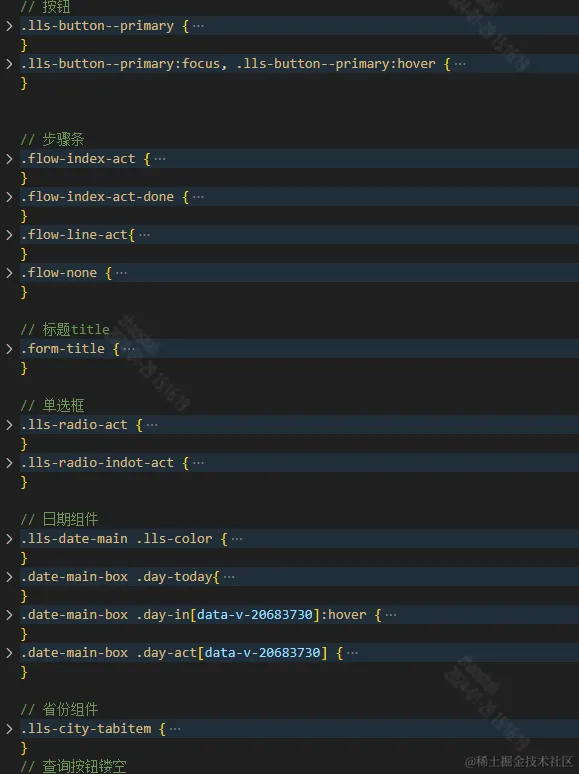

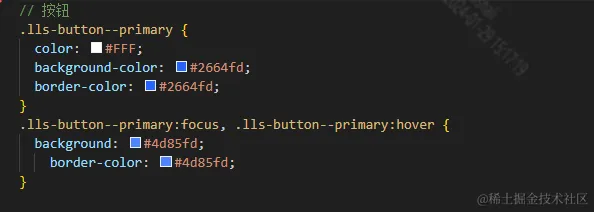

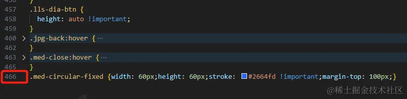

**「总结：」** 对于这种老项目只能通过硬编码的方式去更改，工作量较大，好在老项目依赖同一个基础库和业务库，所以在一个项目上实现了也可以快速推广到其它项目。

## 方案二：sass变量配置

团队的基础组件库Link-ui是基于Eelement-ui二次开发，因此可以采取类似于Element-ui的方式进行主题更改，只需要设计师提供6个主题色即可完成主题色的更改，如下所示。

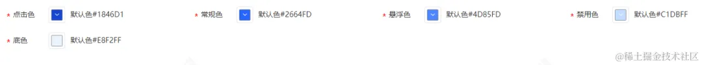

- 配置基础色 基础色一般需要设计师提供，也可以通过配置化的方式实现，

```css
$--color-primary-bold: #1846D1 !default;
$--color-primary: #2664FD !default;
$--color-primary-light: #4D85FD !default;
$--color-primary-light-1: #9AC0FE !default;
$--color-primary-light-2: #C1DBFF !default;
$--color-primary-lighter: #E8F2FF !default;
```

- 从基础库安装包引入基础色和库的样式源文件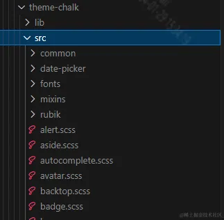

```css
@import "./common/base_var.scss";

/* 改变 icon 字体路径变量，必需 */
$--font-path: '~link-ui-web/lib/theme-chalk/fonts';

@import "~link-ui-web/packages/theme-chalk/src/index";
```

- 全局引入

```css
import '@/styles/link-variables.scss';
```

- 更换主题色 只需要更改上面的6个变量即可实现主题色的更改，比如想改成红色,代码如下

```css
$--color-primary-bold: #D11824 !default;
$--color-primary: #FD268E !default;
$--color-primary-light: #D44DFD !default;
// $--color-primary-light-1: #9AC0FE !default;
$--color-primary-light-2: #DCC1FF !default;
$--color-primary-lighter: #F1E8FF !default;
```

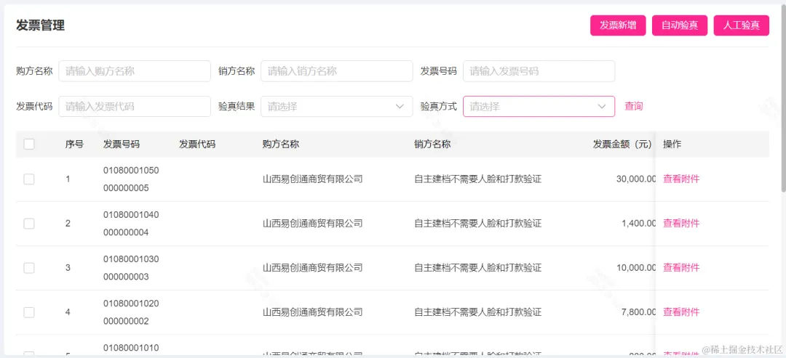

**「总结：」** 对于基础库和样式架构设计合理的项目更改主题色非常的简单，只要在配置文件更换变量的值即可。它的缺点是sass变量的更改每次都需要编译，很难实现配置化。

## 方案三、css变量+sass变量+data-theme

代码结构如下：

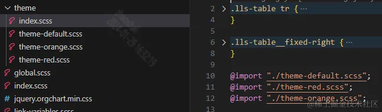

- 设计三套主题分别定义不同的变量（包含颜色、图标和图片）

```css
  // theme-default.scss
  /* 默认主题色-合作蓝色 */
[data-theme=default] {
  --color-primary: #516BD9;
  --color-primary-bold: #3347B6;

  --color-primary-light: #6C85E1;
  --color-primary-light-1: #C7D6F7;
  --color-primary-light-2: #c2d6ff;
  --color-primary-lighter: #EFF4FE;

  --main-background: linear-gradient(90deg,#4e68d7, #768ff3);

  --user-info-content-background-image: url('../../assets/main/top-user-info-bg.png');
  --msg-tip-content-background-image: url('../../assets/main/top-user-info-bg.png');
  ...
  }
  // theme-orange.scss
  // 阳光黄
[data-theme=orange] {
  --color-primary: #FF7335;
  --color-primary-bold: #fe9d2e;

  --color-primary-light: #FECB5D;
  --color-primary-light-1: #FFDE8B;
  --color-primary-light-2: #fcdaba;
  --color-primary-lighter: #FFF3E8;

  --main-background: linear-gradient(90deg,#ff7335 2%, #ffa148 100%);


  --user-info-content-background-image: url('../../assets/main/top-user-info-bg-1.png');
  --msg-tip-content-background-image: url('../../assets/main/top-user-info-bg-1.png');
  ...
  }
  // theme-red.scss
 /* 财富红 */
[data-theme=red] {
  --color-primary: #DF291E;
  --color-primary-bold: #F84323;

  --color-primary-light: #FB8E71;
  --color-primary-light-1: #FCB198;
  --color-primary-light-2: #ffd1d1;
  --color-primary-lighter: #FFEEEE;


  --main-background: linear-gradient(90deg,#df291e 2%, #ff614c 100%);

  --user-info-content-background-image: url('../../assets/main/top-user-info-bg-2.png');
  --msg-tip-content-background-image: url('../../assets/main/top-user-info-bg-2.png');
  ...
  }
```

- 把主题色的变量作为基础库的变量

```css
$--color-primary-bold: var(--color-primary-bold) !default;
$--color-primary: var(--color-primary) !default;
$--color-primary-light: var(--color-primary-light) !default;
$--color-primary-light-1: var(--color-primary-light-1) !default;
$--color-primary-light-2: var(--color-primary-light-2) !default;
$--color-primary-lighter: var(--color-primary-lighter) !default;
```

- App.vue指定默认主题色

```css
window.document.documentElement.setAttribute('data-theme', 'default')
```

data-theme会注入到全局的变量上，所以我们可以在任何地方获取定义的css变量

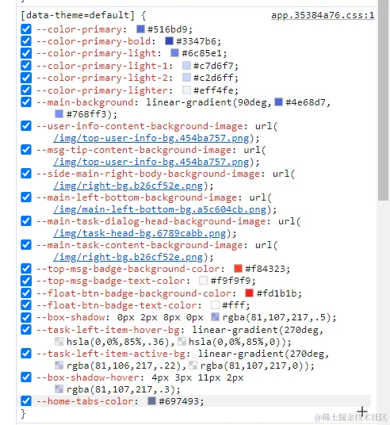

实现效果如下：

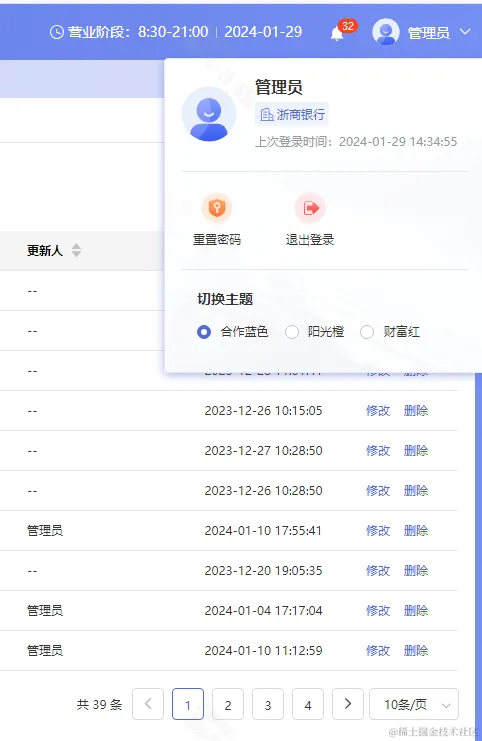

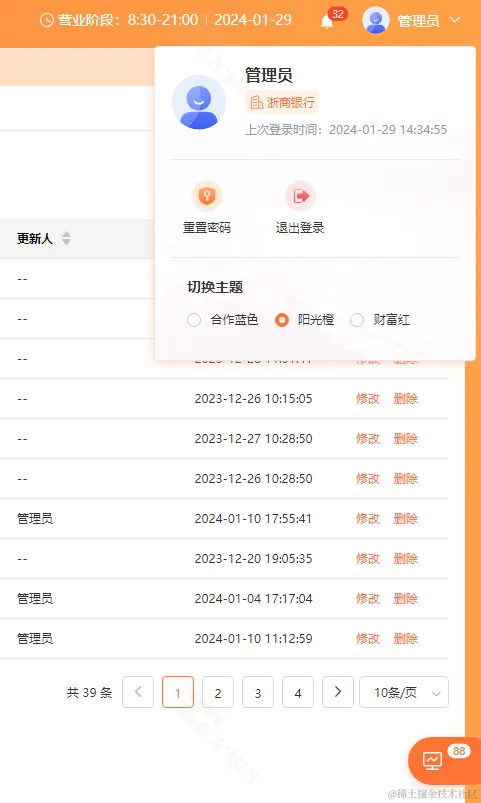

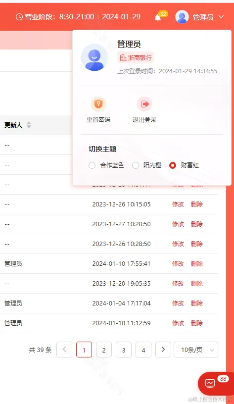

**「总结：」** 该方案是最完美的方案，但是需对颜色、背景图、icon等做配置，需设计师设计多套方案，工作量相对较大，适合要求较高的项目或者标准产品上面，目前我们的标准产品选择的是该方案。

## 方案四：滤镜filter

**「`filter`」** CSS属性将模糊或颜色偏移等图形效果应用于元素。滤镜通常用于调整图像，背景和边框的渲染。

它有个属性`hue-rotate()` 用于改变图整体色调，设定图像会被调整的色环角度值。值为`0deg`展示原图，大于`360deg`相当于又绕一圈。用法如下：

```css
body {
    filter: hue-rotate(45deg);
}
```

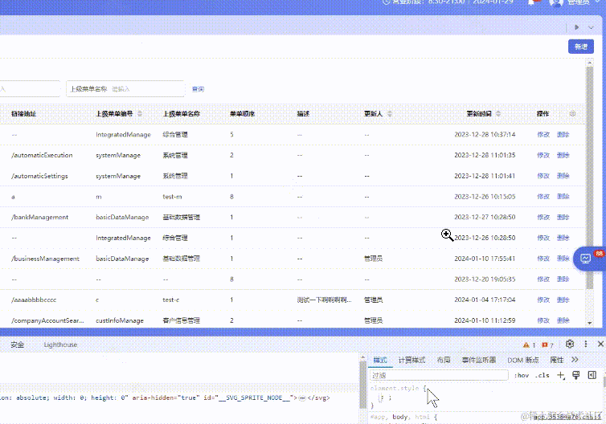

产品新建UI单元测试运行录制.gif

**「总结：」** 成本几乎为0，实现简单。缺点是对于某些图片或者不想改的颜色需要特殊处理。

## 方案五：特殊时期变灰

- filter还有个属性 `grayscale()` 改变图像灰度，值在 `0%` 到 `100%` 之间，值为0%展示原图，值为`100%` 则完全转为灰度图像。

```css
body {
    filter: grayscale(1);
}css
```

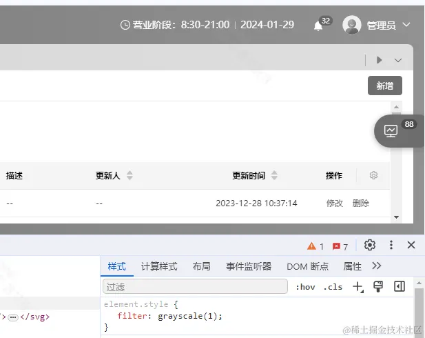

**「总结：」** 成本小，可以将该功能做成配置项，比如配置它的生效开始时间和生效结束时间，便于运营维护也不用频繁发布代码。

## 总结

以上就是实现换肤的全部方案，我们团队在实际项目都有使用，比较好推荐的方案是方案一、方案三、方案五，对于要求不高的切换主题推荐方案四，它的技术零成本，对于标准产品推荐方案三。