# 编码规范：代码检测工具+代码格式化+Git 提交规范

## Vue3 项目创建的配置：eslint：代码检测工具 + prettier：代码格式化工具

vue3 官方创建 vue 项目命令

```bash
pnpm create vue@latest
```

根据交互式选择构建项目

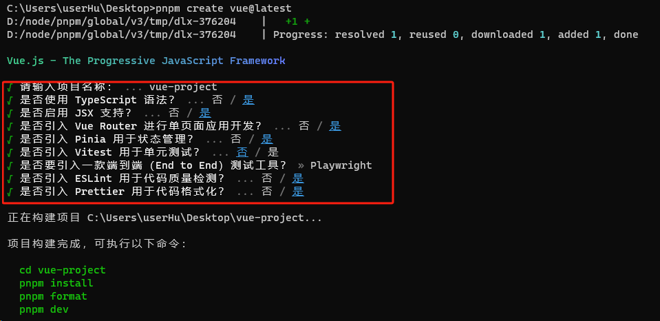

至此，集成了 eslint+prettier 的 vue3 项目模版创建完成。

### eslint：代码检测工具

- eslint 官网：[Find and fix problems in your JavaScript code - ESLint - Pluggable JavaScript Linter](https://eslint.org/)
- npm：[eslint - npm (npmjs.com)](https://www.npmjs.com/package/eslint)

`ESLint` 是 `2013年6月` 创建的一个开源项目，它的目标非常简单，只有一个，那就是 **提供一个插件化的 `javascript` 代码检测工具** ，说白了就是做 **代码格式检测使用的**

打开项目，在当前的项目中，包含一个 `.eslintrc.cjs` 文件，这个文件就是 `eslint` 的配置文件。


接下来我们就在该规则之下，看一看 `ESLint` 它的一些配置都有什么？

打开项目中的 `.eslintrc.cjs` 文件

```js
/* eslint-env node */
require("@rushstack/eslint-patch/modern-module-resolution");
// 文档：https://eslint.bootcss.com/docs/user-guide/configuring
module.exports = {
	// 表示当前目录即为根目录，ESLint 规则将被限制到该目录下
	root: true,
	extends: [
		"plugin:vue/vue3-essential",
		"eslint:recommended",
		"@vue/eslint-config-typescript",
		"@vue/eslint-config-prettier/skip-formatting",
	],
	// 解析器
	parserOptions: {
		ecmaVersion: "latest",
		parser: "@babel/eslint-parser",
	},
	// 需要修改的启用规则及其各自的错误级别
	/**
	 * 错误级别分为三种：
	 * "off" 或 0 - 关闭规则
	 * "warn" 或 1 - 开启规则，使用警告级别的错误：warn (不会导致程序退出)
	 * "error" 或 2 - 开启规则，使用错误级别的错误：error (当被触发的时候，程序会退出)
	 */
	rules: {
		"no-console": process.env.NODE_ENV === "production" ? "warn" : "off",
		"no-debugger": process.env.NODE_ENV === "production" ? "warn" : "off",
	},
};
```

那么到这里咱们已经大致的了解了`.eslintrc.cjs` 文件，基于 `ESLint` 如果我们出现不符合规范的代码格式时，那么就会得到一个对应的错误。

比如：

> 我们可以把 `Home.vue` 中的 `name` 属性值，由单引号改为双引号

此时，只要我们一保存代码，那么就会得到一个对应的错误


这个错误表示：

1. 此时我们触发了一个 《错误级别的错误》
2. 触发该错误的位置是 在 `Home.vue` 的第 13 行 第九列 中
3. 错误描述为：字符串必须使用单引号
4. 错误规则为：`quotes`

那么想要解决这个错误，通常情况下我们有两种方式：

1. 按照 `ESLint` 的要求修改代码
2. 修改 `ESLint` 的验证规则

**按照 `ESLint` 的要求修改代码：**

> 在 `Home.vue` 的第 13 行中把双引号改为单引号

**修改 `ESLint` 的验证规则：**

1. 在 `.eslintrc.cjs` 文件中，新增一条验证规则

   ```json
   "quotes": "error" // 默认
   "quotes": "warn" // 修改为警告
   "quotes": "off" // 修改不校验
   ```

一个团队中，人员的水平高低不齐，大量的 `ESLint` 规则校验，会让很多的开发者头疼不已，从而大大影响了项目的开发进度。

试想一下，在你去完成项目代码的同时，还需要时时刻刻注意代码的格式问题，这将是一件多么痛苦的事情！

那么有没有什么办法，既可以保证 `ESLint` 规则校验，又可以解决严苛的格式规则导致的影响项目进度的问题呢？

欲知后事如何，请看下一节《`Prettier` ，：代码格式化工具，让你的代码变得更漂亮！》

### prettier：代码格式化工具

- prettier 官网：[Install · Prettier](https://prettier.io/docs/en/install.html)
- Prettier 中文网：[Prettier 中文网 · Prettier 是一个“有态度”的代码格式化工具](https://www.prettier.cn/)

**`prettier` 是什么？**

1. 一个代码格式化工具
2. 开箱即用
3. 可以直接集成到 `VSCode` 之中
4. 在保存时，让代码直接符合 `ESLint` 标准（需要通过一些简单配置）

那么这些简单配置具体指的是什么呢？

### ESLint 与 Prettier 配合解决代码格式问题

1. 在 `VSCode` 中安装 `prettier` 插件（搜索 `prettier`），这个插件可以帮助我们在配置 `prettier` 的时候获得提示

   

2. 在项目中 `.prettierrc.json` 文件，该文件为 `perttier` 默认配置文件

3. 在该文件中如下配置：

   ```json
   {
   	"$schema": "https://json.schemastore.org/prettierrc",
   	"semi": false, // 不尾随分号
   	"tabWidth": 2,
   	"singleQuote": true, // 使用单引号
   	"printWidth": 100,
   	"trailingComma": "none" // 多行逗号分割的语法中，最后一行不加逗号
   }
   ```

4. 打开 `VSCode` 《设置面板》

   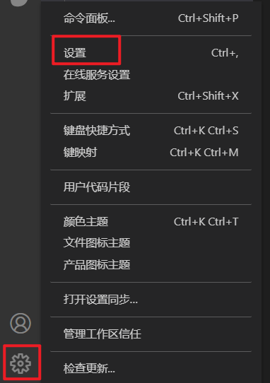

5. 在设置中，搜索 `save` ，勾选 `Format On Save`

   

至此，你即可在 **`VSCode` 保存时，自动格式化代码！**

**但是！** 你只做到这样还不够！

> 1. VSCode 而言，默认一个 tab 等于 4 个空格，而 ESLint 希望一个 tab 为两个空格
>
>    1. VSCode 设置里面，Tab Size 改成 2，这样就能与 ESLint 同步
>       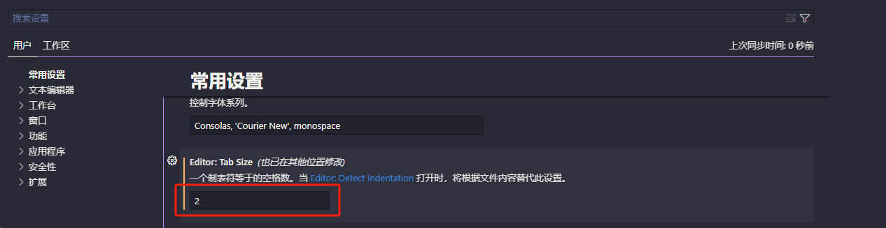
>
> 2. ESLint 和 prettier 之间的冲突问题
>
> 代码中，右键 `使用...格式化文档` 配置默认格式化文档程序，选择 prettier
>
> 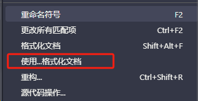
>
> 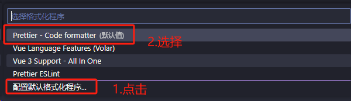

我们尝试在 `Home.vue` 中写入一个 `created` 方法，写入完成之后，打开我们的控制台我们会发现，此时代码抛出了一个 `ESLint` 的错误

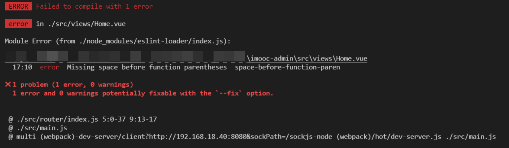

这个错误的意思是说：**`created` 这个方法名和后面的小括号之间，应该有一个空格！**

但是当我们加入了这个空格之后，只要一保存代码，就会发现 `prettier` 会自动帮助我们去除掉这个空格。

那么此时的这个问题就是 `prettier` 和 `ESLint` 的冲突问题。

针对于这个问题我们想要解决也非常简单：

1. 打开 `.eslintrc.cjs` 配置文件

2. 在 `rules` 规则下，新增一条规则

   ```json
   'space-before-function-paren': 'off'
   ```

3. 该规则表示关闭《方法名后增加空格》的规则

4. 重启项目

至此我们整个的 `perttier` 和 `ESLint` 的配合使用就算是全部完成了。

在之后我们写代码的过程中，只需要保存代码，那么 `perttier` 就会帮助我们自动格式化代码，使其符合 `ESLint` 的校验规则。而无需我们手动进行更改了。

## Git 约定式提交规范

在现在的项目开发中，通常情况下，我们都会通过 `git` 来管理项目。只要通过 `git` 来管理项目，那么就必然会遇到使用 `git` 提交代码的场景

当我们执行 `git commit -m "描述信息"` 的时候，我们知道此时必须添加一个描述信息。但是中华文化博大精深，不同的人去填写描述信息的时候，都会根据自己的理解来进行描述。

而很多人的描述 “天马行空” ，这样就会导致别人在看你的提交记录时，看不懂你说的什么意思？不知道你当前的这次提交到底做了什么事情？会不会存在潜在的风险？

比如说，我们来看这几条提交记录：

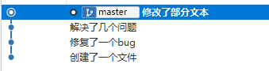

你能够想象得到它们经历了什么吗？

所以 **`git` 提交规范** 势在必行。

对于 **`git` 提交规范** 来说，不同的团队可能会有不同的标准，那么咱们今天就以目前使用较多的 [Angular 团队规范](https://github.com/angular/angular.js/blob/master/DEVELOPERS.md#-git-commit-guidelines) 延伸出的 [Conventional Commits specification（约定式提交）](https://www.conventionalcommits.org/zh-hans/v1.0.0/) 为例，来为大家详解 **`git` 提交规范**

约定式提交规范要求如下：

```js
<type>[optional scope]: <description>

[optional body]

[optional footer(s)]

--------  翻译 -------------

<类型>[可选 范围]: <描述>

[可选 正文]

[可选 脚注]
```

其中 `<type>` 类型，必须是一个可选的值，比如：

1. 新功能：`feat`
2. 修复：`fix`
3. 文档变更：`docs`
4. ....

也就是说，如果要按照 **约定式提交规范** 来去做的化，那么你的一次提交描述应该式这个样子的：


### Git Hooks

类似于前端框架中的生命周期钩子，git 在某些特定事件发生前或后也会有某些执行特定功能的钩子，githooks 就是在 git 执行特定事件（如 commit、push、receive 等）时触发运行的脚本（git 钩子 || git 回调方法）。

也就是：**`git` 在执行某个事件之前或之后进行一些其他额外的操作**

而我们所期望的 **阻止不合规的提交消息**，那么就需要使用到 `hooks` 的钩子函数。

githooks 保存在 .git 文件夹中

具体钩子如下表所示：

| git hook              | 执行调用时机                                                                                                                                         | 说明                                                                                   |
| --------------------- | ---------------------------------------------------------------------------------------------------------------------------------------------------- | -------------------------------------------------------------------------------------- |
| applypatch-msg        | git am 执行前                                                                                                                                        | 默认情况下，如果 commit-msg 启用的话，applpatch-msg 钩子在启用时会运行 commit-msg 钩子 |
| pre-applypatc         | git am 执行前                                                                                                                                        | 默认的 pre-applypatch 钩子在启用时运行 pre-commit 钩子（如果后者已启用）               |
| post-applypatch       | git am 执行后                                                                                                                                        | 这个钩子主要用于通知，不能影响 git-am 的结果                                           |
| **pre-commit**        | git commit 执行前                                                                                                                                    | 可以使用 git commit --no verify 命令绕过该钩子                                         |
| pre-merge-commit      | git merge 执行前                                                                                                                                     | 可以使用 git merge --no verify 命令绕过该钩子                                          |
| prepare-commit-msg    | git commit 执行之后，编辑器打开之前                                                                                                                  |                                                                                        |
| **commit-msg**        | git commit 执行前                                                                                                                                    | 可以使用 git commit --no verify 命令绕过该钩子                                         |
| post-commit           | git commit 执行后                                                                                                                                    | 不影响 git commit 的结果                                                               |
| pre-rebase            | git rebase 执行前                                                                                                                                    |                                                                                        |
| post-checkout         | git checkout 或 git switch 执行后                                                                                                                    | 如果不使用 --no-checkout 参数，则在 git clone 之后也会执行                             |
| post-merge            | git merge 执行后                                                                                                                                     | 在执行 git pull 时也会被调用                                                           |
| pre-push              | git push 执行前                                                                                                                                      |                                                                                        |
| pre-receive           | git receive pack 执行前                                                                                                                              |                                                                                        |
| update                |                                                                                                                                                      |                                                                                        |
| proc-receive          | `git-receive-pack`执行后                                                                                                                             | 不影响`git-receive-pack`的结果                                                         |
| post-receive          | git receive pack 执行前                                                                                                                              | 不影响 git receive pack 的执行结果                                                     |
| post-update           | 当 `git-receive-pack`对 `git push` 作出反应并更新仓库中的引用时                                                                                      |                                                                                        |
| reference-transaction |                                                                                                                                                      |                                                                                        |
| push-to-checkout      | 当 git receive pack 对 git push 作出反应并更新仓库中的引用时，以及当推送试图更新当前被签出的分支且 receive.denyCurrentBranch 配置被 updateInstead 时 |                                                                                        |
| pre-auto-gc           | git gc --auto 执行前                                                                                                                                 |                                                                                        |
| post-rewrite          | 执行 git commit --amend 或 git rebase 时                                                                                                             |                                                                                        |
| sendemail-validate    | git send-email 执行前                                                                                                                                |                                                                                        |
| fsmonitor-watchman    | 配置 core.fsmonitor 被设置为.git/hooks/fsmonitor-watchman 或.git/hooks/fsmonitor-watchmanv2 时                                                       |                                                                                        |
| p4-changelist         | git-p4 submit 执行并编辑完 changelist message 之后                                                                                                   | 可以使用 git-p4 submit --no-verify 绕过该钩子                                          |
| p4-prepare-changelist | git-p4 submit 执行后，编辑器启动前                                                                                                                   | 可以使用 git-p4 submit --no-verify 绕过该钩子                                          |
| p4-post-changelist    | git-p4 submit 执行后                                                                                                                                 |                                                                                        |
| p4-pre-submit         | git-p4 submit 执行前                                                                                                                                 | 可以使用 git-p4 submit --no-verify 绕过该钩子                                          |
| post-index-change     | 索引被写入 read-cache.c do_write_locked_index 后                                                                                                     |                                                                                        |

PS：详细的 `HOOKS介绍` 可点击 [这里](https://git-scm.com/docs/githooks) 查看

整体的 `hooks` 非常多，当时我们其中用的比较多的其实只有两个：

| Git Hook       | 调用时机                                                                                                                                           | 说明                               |
| :------------- | -------------------------------------------------------------------------------------------------------------------------------------------------- | ---------------------------------- |
| **pre-commit** | `git commit`执行前<br />它不接受任何参数，并且在获取提交日志消息并进行提交之前被调用。脚本`git commit`以非零状态退出会导致命令在创建提交之前中止。 | 可以用`git commit --no-verify`绕过 |
| **commit-msg** | `git commit`执行前<br />可用于将消息规范化为某种项目标准格式。<br />还可用于在检查消息文件后拒绝提交。                                             | 可以用`git commit --no-verify`绕过 |
| pre-push       | git push 执行前                                                                                                                                    |                                    |

简单来说这两个钩子：

1. `commit-msg`：可以用来规范化标准格式，并且可以按需指定是否要拒绝本次提交
2. `pre-commit`：会在提交前被调用，并且可以按需指定是否要拒绝本次提交

而我们接下来要做的关键，就在这两个钩子上面。

## husky 库介绍

husky 是一个用来管理 git 钩子的插件，它可以让您在提交或推送代码时执行一些自定义的操作，例如检查代码风格、运行测试等。

使用 git 的`commit`或者`push`的时候，可以使用它来对`commit`、`run`、`test`、`lint code`等进行 lint 处理。`Husky` 支持所有的 Git hooks。

- husky 的 npm：[husky - npm (npmjs.com)](https://www.npmjs.com/package/husky)
- husky 的 github 开源地址：[typicode/husky: Git hooks made easy 🐶 woof! (github.com)](https://github.com/typicode/husky)
- **husky 官网文档**：[Husky (typicode.github.io)](https://typicode.github.io/husky/)

——————————————————————————————————

## husky 版本功能更新说明

[husky 已经更新到了 9.0 版本，它于 2021 年 7 月 1 日发布了 7.0.0 版本](https://www.npmjs.com/package/husky)。这个版本主要是修复了一些 bug 和细节，没有太大的变化。

可以在 [husky 的发布页面](https://github.com/typicode/husky/releases) 中查看 husky 各个版本的更新内容和说明。

截止 2024-02-20，husky 目前的最新版本是 v9.0.11，它与之前的版本有一些不同和改进，主要包括：

- husky v9 改变了许可证，它使用了 MIT 许可证，这意味着 husky 可以免费用于商业或非商业的项目。
- husky v9 优化了 husky init 命令，它可以自动检测您的项目使用的包管理器，并使用相应的命令来安装 husky。
- husky v9 修复了一些 bug 和细节，例如支持了 Windows 上的 PowerShell 7，以及在 husky install 命令中添加了 --skip-validate 选项。

husky v8 之前的版本也有一些重要的更新，主要包括：

- husky v8 简化了安装和配置的过程，您只需要运行 `npm install husky --save-dev` 和 `npx husky-init` 命令，就可以在您的项目中初始化 husky，并生成一些示例的钩子。

husky v7 版本新特性：

- husky v7 使用了新的许可证，即 ISC 许可证，它是一个更简洁的 MIT 许可证。
- husky v7 支持了 Yarn 2 和 pnpm，它可以自动检测您的项目使用的包管理器，并使用相应的命令来运行钩子。
- husky v7 简化了安装和配置的过程，您只需要运行 `npm install husky --save-dev` 和 `npx husky-init` 命令，就可以在您的项目中初始化 husky，并生成一些示例的钩子。
- husky v7 减少了依赖的数量和包的大小，它只依赖了一个名为 run-node 的包，用来在不同的平台上运行 node。
- husky v7 改变了钩子的存放位置和格式，它将钩子文件放在了 `.husky` 目录下，而不是 `.git/hooks` 目录下，这样可以避免一些权限问题。它也将钩子文件改为了 shell 脚本，而不是 JSON 文件，这样可以提供更多的灵活性。

husky v7 之前的版本也有一些重要的更新，主要包括：

- husky v6 引入了自动安装的功能，它可以在您的 `package.json` 文件中添加一个 `prepare` 脚本，用来在安装依赖或发布包时自动安装 husky。
- husky v5 重新设计了 husky 的核心，它使用了一个名为 `husky.sh` 的脚本来管理所有的钩子，这样可以提高性能和安全性。
  - 在 2021 年 1 月 27 日，husky 迎来了 v5 的大版本升级，配置方式较上一版本有了比较大的变化。如果在 27 日之后，再按照原来的套路配置 husky 和 lint-staged，结果将是钩子校验无法生效。
- husky v4 增加了对 Yarn 和 pnpm 的支持，它可以在你的 `package.json` 文件中添加一个 `husky` 字段，用来配置不同的钩子。
  - 以前的老版本的项目主要用的版本 4，之后版本 5 有了比较大的更新
- husky v3 修复了一些 bug，并优化了一些细节，例如支持了 `HUSKY_DEBUG` 环境变量，用来打印一些调试信息。
- husky v2 增加了对 Git 工作树的支持，它可以在您的项目的子目录中使用 husky。
- husky v1 增加了对 Git 钩子的验证，它可以检查您的钩子是否被 husky 管理，以及是否有冲突的钩子。
- husky v0.14 引入了 `.huskyrc` 文件，用来存放 husky 的配置，这样可以避免污染 `package.json` 文件。

### husky 版本使用更新

从版本 4 开始，husky 的使用方法有了一些变化，主要有以下几个步骤：

主要是使用了 core.hooksPath 功能来指定 git hooks 的目录，而不是使用 package.json 中的 husky 字段。这样可以让用户只添加需要的 git hooks，而不是所有的 git hooks。具体的使用方法如下：

1. 安装 husky 作为开发依赖：`npm install husky --save-dev` 或 `yarn add husky -D`
2. 在 package.json 中添加 prepare 脚本，用于在安装后自动启用钩子：`"prepare": "husky install"`
3. 使用 husky add 命令创建你需要的 git hooks，比如 pre-commit、commit-msg 等。例如：`npx husky add .husky/pre-commit "npm test"` 或 `yarn husky add .husky/commit-msg 'npx --no-install commitlint --edit "$1"'`
4. 将创建的 git hooks 添加到 git 中：`git add .husky`

- husky 5：需要手动运行 `npx husky install` 来创建 .husky 目录和设置 core.hooksPath，然后使用 `npx husky add .husky/ ""` 来添加 git hooks，比如 `npx husky add .husky/pre-commit "npm test"`。husky 5 是免费的，但是需要遵守 MIT 协议。

- husky 6：在 husky 5 的基础上，增加了 `npm set-script prepare "husky install"` 命令，可以在 package.json 中添加 prepare 脚本，用于在安装后自动启用钩子。husky 6 也是免费的，但是需要遵守 MIT 协议。

  - `v6`版本发布后，使用方式上有了很大的改变；可以说是它的设计发生了变化；

  - `v6`版本已不在使用`.huskyrc.js`文件，同时也不支持在`package.json`文件中配置，而是使用了`.husky/`目录中配置的单个 git 钩子；

  - #### husky 为什么放弃了传统方式的配置呢

  - 在`v4`版本之前`husky`为了能够运行用户在`.huskyrc.json`中创建的任何钩子，它不得不将所有的钩子都安装在`.git/hooks`目录中。当触发到钩子脚本的时候，每个脚本都会先检查`.huskyrc.json`文件中是否有相应的钩子定义；这样的好处就是用户可以随意的添加、更新和删除钩子，所做的更改会自动的生效；缺点就是，即使没有任何东西要运行，该钩子节点也会被启动；

    在当时`husky`有过这样的设想，就是只启动在`.huskyrc.json`文件中配置的钩子，但随后的问题就又出现了，如果改动了`.huskyrc.json`文件中的钩子定义，`husky`将不会自动工作，因为在`.git/hooks`目录里还没有启动相应的钩子脚本，所以保证两个地方的配置同步成了一个难题；

    直到 2016 年，`Git 2.9`引进了`core.hooksPath`，可以设置`Git hooks`脚本的目录，这个引进也就是新版`husky`改进的基础；

    - `husky install`命令告诉`Git`使用`.hooks`目录作为钩子脚本目录，实际上就是修改了`core.hooksPath`的值；
    - `husky add`创建了一个独立的`shell`脚本

    这样也就解决了启动单一的钩子脚本和所有的配置都在一个文件目录下；但是这样也就在根目录下生成了一个`.hooks`目录，看起来不爽的话， 你也可以指定让`.hooks`放到`config`目录下；

    husky 7：在 husky 6 的基础上，简化了 husky 的安装和使用，不再需要 prepare 脚本，只需要运行 `npm install husky -D` 和 `npx husky-init`，然后编辑 .husky 目录下的钩子脚本即可。husky 7 是免费的，但是需要遵守 ISC 协议。

- husky 8：在 husky 7 的基础上，增加了 husky 的配置文件 .huskyrc，可以在其中设置一些全局的选项，比如 concurrent、shell、quiet 等。husky 8 是免费的，但是需要遵守 ISC 协议。

- husky 9：在 husky 8 的基础上，增加了 husky 的命令行工具 husky-cli，可以用来更方便地管理 husky 的安装、卸载、更新、添加、删除、列出、运行等操作。husky 9 是收费的，需要购买许可证才能使用。

## 应该使用哪个版本的 husky?

这个问题没有一个确定的答案，不同的版本的 husky 有不同的特点和优缺点，你应该根据你的项目需求和个人喜好来选择。一般来说，你可以考虑以下的因素：

- 兼容性：如果你的项目需要支持较旧的 git 版本，你可能需要使用 husky 4 或以下的版本，因为 husky 5 及以上的版本需要 git 2.13.0 或更高的版本。
- 协议：如果你的项目需要遵守某些特定的开源协议，你可能需要注意 husky 的协议变化。husky 4 使用了 MIT 协议，husky 5 和 6 也使用了 MIT 协议，但是增加了一些限制，husky 7 和 8 使用了 ISC 协议，husky 9 需要购买许可证才能使用。
- 功能：如果你的项目需要一些高级的功能，比如并发执行、自定义 shell、静默模式等，你可能需要使用 husky 8 或以上的版本，因为它们提供了 husky 的配置文件 .huskyrc，可以在其中设置一些全局的选项。如果你想使用 husky-cli 来管理 husky 的操作，你需要使用 husky 9 的版本，但是你也需要付费。
- 简洁性：如果你的项目需要简化 husky 的安装和使用，你可能需要使用 husky 7 或以上的版本，因为它们不再需要 prepare 脚本，只需要运行 `npm install husky -D` 和 `npx husky-init`，然后编辑 .husky 目录下的钩子脚本即可。

总之，你应该根据你的项目和个人的情况，权衡 husky 的各个版本的优缺点，选择一个适合你的版本。你也可以参考 husky 的官方文档和其他用户的经验，来帮助你做出决定。

### 版本 6 的具体使用方法

#### 自定配置（推荐）

`husky-init`是一个一次性命令，可以在项目中快速添加`husky`配置；

```javascript
npx husky-init && npm isntall
```

上边命令会设置`husky`，修改`package.json`并且创建了一个可执行的`pre-commit`脚本样例，当你`git commit`命令式，默认会执行`npm test`

`hooks add`添加其他 hooks

```javascript
npx hooks add .hooks/commit-msg 'npx --no-install commitlint --edit "$1"'
```

#### 手动配置

1、 安装 husky

```bash
npm install husky --save-dev
```

2、修改 git hooks 默认目录

```bash
npx husky install
```

3、如果想安装后自动启用 hooks，请编辑`package.json`

```json
{
	"scripts": {
		"prepare": "husky install"
	}
}
```

> yarn2 不支持`prepare`，可以修改为`postinstall`

4、创建 hooks，语法：`husky add <file> [cmd]`

```javascript
npx husky add .husky/pre-commit "npm test"
```

执行`git commit -m "test"` 命令，如果`npm test`失败，将终止提交

5、卸载 husky

```lua
npm uninstall husky && git config --unset core.hooksPath
```

#### 其他用法

1、推荐在`package.json`中添加 husky，您可以使用`lerna` 和`filter`等工具来只运行已更改包中的脚本

(1) 添加 hooks

```dockerfile
npx husky add .husky/pre-commit "npm run pre-commit"
```

(2) 在`package.json`文件中添加`pre-commit`

```json
{
	"script": {
		"pre-commit": "npm run test && eslint"
	}
}
```

2、自定义`.husky`目录

```bash
npx husky install .config/husky
```

3、绕过钩子

```bash
git commit -m "test" --no-verify
```

### 推荐使用 7 以后的版本

如果您想使用 husky 7.0 之后的版本，您可以使用以下命令来安装或更新 husky：

- 1.在 husky 7 之前，需要手动运行 npx husky install 来设置 husky。
- 2.在 husky 7 之后，可以继续使用 npx husky-init，也可以使用 husky-cli 的 husky init 命令
  - husky-cli 是 husky 9 版本新增的一个命令行工具，可以用来更方便地管理 husky 的安装、卸载、更新、添加、删除、列出、运行等操作。你可以使用 `npx husky-cli` 或 `yarn husky-cli` 来运行它，或者将它安装到全局或本地。husky-cli 的使用方法和参数可以参考 [husky - NPM (npmjs.com)](https://www.npmjs.com/package/husky)。需要注意的是，husky-cli 是收费的，需要购买许可证才能使用。

```bash
# 推荐使用pnpm安装husky（yarn有两个版本安装方法，比较复杂，不推荐）
pnpm install --save-dev husky
```

**以下是 husky 版本 7.0 之后的初始化命令**：对应 npm、yarn、pnpm 安装的 husky 库的初始化命令

```bash
npx husky-init && npm install       # npm
npx husky-init && yarn              # Yarn 1
yarn dlx husky-init --yarn2 && yarn # Yarn 2+：Yarn 2+安装手册：https://blog.csdn.net/HHoao/article/details/127833268
pnpm dlx husky-init && pnpm install # pnpm
```

它将设置 husky，修改 package.json 并创建一个可以编辑的示例 pre-commit 钩子。默认情况下，commit 时它将运行 npm 测试。

#### 在 husky 的 v7.x 版本之前

- 在 husky 的 4.x 版本中引入的 `npx husky add` 是一个用于添加 git 钩子的命令。

  - ```bash
    npx husky add .husky/commit-msg 'npx --no -- commitlint --edit "$1"'
    ```

- 在 husky 的 5.x 版本中，`npx husky add`这个命令被废弃了，取而代之的是 `husky install` 和 `husky add` 两个命令，它们可以让您指定 git 钩子所在的目录，而不是使用默认的 .git/hooks/

  - 在 husky 的 5.x 版本中，您可以使用 `husky install` 命令来指定 git 钩子的目录，然后使用 `husky add` 命令来添加您需要的钩子脚本。例如，如果您想添加一个 pre-commit 钩子，您可以运行以下命令：

    ```bash
    npx husky install
    npx husky add .husky/pre-commit "npm test"
    ```

#### 在 husky 的 v7.x 版本中

可以使用相同的命令来添加钩子，但是不需要再运行 `husky install` 命令了，因为 husky 会自动安装钩子。您只需要在 package.json 中添加一个 `prepare` 脚本，如下：

```bash
{
  "scripts": {
    "prepare": "husky install"
  }
}
```

或者执行命令启用钩子：

```bash
# 版本7+8都可以执行
npm set-script prepare "husky install"
pnpm set-script prepare "husky install"
```

这样，当安装依赖时，自动执行该命令，从而 husky 会自动创建 `.husky` 目录，并将其设置为 git 钩子的目录。

这样，就不需要再手动运行 `husky install` 命令了，只需要使用 `husky add` 命令来添加钩子脚本。

可以像之前一样使用 `husky add` 命令来添加钩子脚本

```bash
# 添加一个 pre-commit 钩子
npx husky add .husky/pre-commit "npm test"
# 添加一个 pre-push 钩子
npx husky add .husky/pre-push "npm run lint"
# 创建一个commit-msg钩子：
npx husky add .husky/commit-msg 'yarn commitlint --edit "$1"'
```

这样，当安装依赖时，husky 会自动创建 `.husky` 目录，并将其设置为 git 钩子的目录。然后，可以在 .husky 目录下查看或修改钩子脚本。

- 此外还有 `husky-init`命令， 执行之后可以在项目中快速的初始化一个 husky。

- husky 7.x 版本及以前的版本需要在 package.json 中添加 husky 配置，而是使用 .husky 目录来存放钩子脚本。

  - ```json
    // 版本7.x以前需要配置
    "husky": {
        "hooks": {
          "pre-commit": "lint-staged",
          "commit-msg": "commitlint -E HUSKY_GIT_PARAMS"
        }
    },
    ```

- husky 7.x 版本及以前的版本需要在 package.json 中添加 prepare 脚本，而是自动安装钩子。

  - ```json
    // 版本8.x以前需要配置
    "scripts": {
    	"prepare": "husky && husky install"
    },
    ```

- husky 7.x 版本及以前的版本需要在 package.json 中添加 config。

  - ```json
    // 版本8.x以前需要配置
    "config": {
        "commitizen": {
          "path": "node_modules/cz-customizable"
        },
        "cz-customizable": {
          "config": ".cz-config.cjs"
        }
    },
    ```

- husky 7.x 版本及以前的版本需要在 package.json 中添加 lint-staged 配置。

  - ```json
    // 版本8.x以前需要配置
    "lint-staged": {
        "src/**/*.{js,jsx,ts,tsx,json,vue}": [
          "eslint --fix",
          "prettier --write",
          "git add"
        ],
        "*.scss": [
          "stylelint --fix"
        ]
    }
    ```

#### 在 husky 的 v8.x 版本中

husky 的 8.x 版本添加新钩子的方法和 7.x 版本是一样的，您只需要使用 `husky add` 命令来添加钩子脚本。例如，如果您想添加一个 pre-push 钩子，您可以运行以下命令：

```bash
npx husky add .husky/pre-push "npm run lint"
```

这样，当安装依赖时，husky 会自动创建 `.husky` 目录，并将其设置为 git 钩子的目录。然后，您可以在 .husky 目录下查看或修改钩子脚本

#### 在 husky 的 v9.x 版本中(商业收费，不推荐使用)

husky 的作者在 9.x 版本中引入了一个新的许可证，叫做 Parity Public License。这个许可证的主要目的是为了支持开源软件的开发者，让他们能够从自己的劳动中获得收入。

具体来说，这个许可证的含义是，如果您使用 husky 的 9.x 版本，您必须遵守以下规则：

- 如果您只是在个人项目中使用 husky，或者您的项目是开源的，并且使用了和 husky 相同的许可证，那么您可以免费使用 husky。
- 如果您在商业项目中使用 husky，或者您的项目是闭源的，或者您的项目使用了和 husky 不同的许可证，那么您必须向 husky 的作者支付一定的费用，或者获得他的授权。

**在 husky 的 v9.x 版本中**，运行 `husky install` 后，您可能会看到以下警告：

```bash
install command is deprecated

# husky9.0版本中：husky install命令被废除
```

解决方法是将 package.json 中的 script 脚本：`postinstall` 命令 改成 `prepare`命令

```json
-    "postinstall": "husky install",
+    "prepare": "husky",
```

**在 husky 的 v9.x 版本中**，`npx husky add` 命令已经被废弃了，不再支持添加 git hooks 的功能，**要添加另一个钩子**，而是使用 echo 命令来创建钩子脚本，并将其重定向到 .husky 目录下的相应文件中。

1.**取而代之的是使用 echo 命令来创建钩子脚本**，并将其重定向到 .husky 目录下的相应文件中。

例如，如果您想添加一个 pre-commit 钩子，您可以运行以下命令

```bash
echo "npm test" > .husky/pre-commit
```

这样，当您安装依赖时，husky 会自动创建 `.husky` 目录，并将其设置为 git 钩子的目录。然后，您可以在 .husky 目录下查看或修改钩子脚本。

2.**也可以使用 husky-cli 来管理 git hooks**，或者直接在 .husky 目录下创建或编辑钩子脚本。

例如，如果你想添加 commit-msg 钩子，你可以使用以下的命令：

```
npx husky-cli add commit-msg 'npx --no-install commitlint --edit "$1"'
```

3.**或者直接在 .husky 目录下创建一个名为 `commit-msg` 的文件**，内容为：

```bash
#!/bin/sh
. “$(dirname “$0”)/_/husky.sh”

npx --no-install commitlint --edit “$1”
```

## 使用 husky 来规范 Git 提交的格式

### 0.Git 代码提交规范——整合安装的库

husky 搞定 Git 代码提交规范

```bash
pnpm add -D husky lint-staged cz-customizable @commitlint/cli @commitlint/config-conventional

# commitizen库需要全局安装
pnpm add -g commitizen

npm install -g commitizen
```

添加 pre-commit hook 钩子需要安装以下依赖：

- husky
- lint-staged

添加 commit-msg hook 钩子需要以下依赖：

- commitizen：交互式 git commit 配置库。
- cz-customizable：可自定义的 commitizen 插件，它可以让你根据自己的需求来配置提交信息的格式，而不是使用预定义的格式。
- @commitlint/cli
- @commitlint/config-conventional

### 1.需要先初始化`.husky`文件夹目录，执行命令

```bash
# husky版本7及之前版本
npx husky install
pnpm dlx husky install

# husky版本8
npx husky-init
pnpm dlx husky-init

# husky版本9
npx husky init
pnpm exec husky init
```

### 2.自动启用 husky 命令

项目中运行命令

```bash
# husky版本7和8都可以执行
npm set-script prepare "husky install"  && npm run prepare

pnpm pkg set scripts.prepare="husky install" && pnpm run prepare
```

会在 package.json 中添加命令（手动在 package.json 中添加这条命令也可以）

```json
"scripts": {
  "prepare": "husky install"
},
```

执行 `prepare` 指令

执行成功，提示：`husky - Git hooks installed`

之后就可以进行下面的操作

### 3.lint-staged 自动修复格式错误

- npm 文档：[lint-staged - npm (npmjs.com)](https://www.npmjs.com/package/lint-staged)
- 开源地址：[lint-staged/lint-staged: 🚫💩 — Run linters on git staged files (github.com)](https://github.com/lint-staged/lint-staged)

**lint-staged 是一个在 git 暂存区上运行 linters 的工具。**

它将根据 package.json 依赖项中的代码质量工具来安装和配置 husky 和 lint-staged ，因此请确保在此之前安装（npm install --save-dev）并配置所有代码质量工具，比如 Prettier 和 ESlint。

通过 `pre-commit` 处理了 **检测代码的提交规范问题，当我们进行代码提交时，会检测所有的代码格式规范** 。

但是这样会存在两个问题：

1. 我们只修改了个别的文件，没有必要检测所有的文件代码格式
2. 它只能给我们提示出对应的错误，我们还需要手动的进行代码修改

那么想要处理这两个问题，就需要使用另外一个插件 [lint-staged](https://github.com/okonet/lint-staged) ！

[lint-staged](https://github.com/okonet/lint-staged) 可以让你当前的代码检查 **只检查本次修改更新的代码，并在出现错误的时候，自动修复并且推送**

安装 lint-staged

```bash
yarn add lint-staged -D
pnpm add lint-staged -D
```

```js
执行 npx lint-staged --help 命令可以看到相关的所有参数如下：
用法: lint-staged [options]

Options:
  -V, --version                      输出版本号
  --allow-empty                      当任务撤消所有分阶段的更改时允许空提交（默认值：false）
  -c, --config [path]                配置文件的路径
  -d, --debug                        打印其他调试信息（默认值：false）
  -p, --concurrent <parallel tasks>  要同时运行的任务数，或者为false则要连续运行任务（默认值：true）
  -q, --quiet                        自己的控制台输出（默认值：false）
  -r, --relative                     将相对文件路径传递给任务（默认值：false）
  -x, --shell                        跳过任务解析以更好地支持shell（默认值：false）
  -h, --help                         输出用法信息
```

- **--allow-empty**：使用此参数允许创建空的 git 提交。默认情况下，当 LITER 任务撤消所有阶段性的更改时，LITET 阶段将抛出一个错误，并中止提交。

#### husky 创建钩子配置

```bash
npx husky add .husky/pre-commit
```

#### 生成的文件中写入

```bash
npx lint-staged
```

#### 把 package.json 文件的 lint-staged 修改为

```json
"lint-staged": {
   "src/**/*.{js,vue}": [      //src目录下所有的js和vue文件
     "eslint --fix",           // 自动修复
     "git add"                 // 自动提交时修复
   ]
 }
```

### 4.@commitlint/config-conventional 和@commitlint/cli——校验 git 提交的描述规范库

npm 可以这样子选择两个包安装：`npm i @commitlint/{cli,config-conventional} -D`

**规范 git 提交记录**：commitlint 相关依赖（用来帮助我们在多人开发时，遵守 git 提交约定）

- 以下参考**官网文档**得出：[commitlint - Lint commit messages](https://commitlint.js.org/#/)


1.**执行命令自动创建 `commitlint.config.js` 文件**：

```bash
echo "module.exports = {extends: ['@commitlint/config-conventional']}" > commitlint.config.js
```

2.**或在根目录手动创建 `commitlint.config.js` 文件其内容如下所示**：

```js
// 规范commit日志官网配置：https://commitlint.js.org
module.exports = {
	// 继承的规则
	extends: ["@commitlint/config-conventional"],
	// 定义规则类型：https://github.com/conventional-changelog/commitlint/blob/master/docs/reference-rules.md
	rules: {
		// 规定提交类型的大小写的。它的含义是：2：表示这是一个错误级别的规则，如果不符合，提交会被拒绝。always：表示这个规则总是生效，无论提交类型是什么。[‘lower-case’, ‘upper-case’]：表示提交类型必须是全小写或全大写，不能混合使用。
		// 'type-case': [2, 'always', ['lower-case', 'upper-case']],
		// type 类型定义：为必填项，用于指定 commit 的类型，表示 git 提交的 type 必须在以下类型范围内。
		"type-enum": [
			2,
			"always",
			[
				"feat", // 新功能 feature：增加一个新特性
				"fix", // 修复 bug
				"docs", // 文档注释：仅仅修改文档说明
				"style", // 代码格式(不影响代码运行的变动)：不影响代码含义的改动，例如去掉空格、改变缩进、增删分号
				"refactor", // 重构(既不增加新功能，也不是修复bug)
				"perf", // 性能优化：更改代码以提高性能
				"test", // 增加测试
				"chore", // 构建过程或辅助工具的变动
				"revert", // 回退
				"wip", // 正在进行的工作
				"build", // 打包：更改构建系统和外部依赖项（如将 gulp 改为 webpack，更新某个 npm 包）
				"ci", // 对 CI 配置文件和脚本的更改
				"test", // 增加新的测试功能或更改原有的测试模块
			],
		],
		// subject 大小写不做校验
		"subject-case": [0],
		// 'subject-case': [2, 'never', ['upper-case']], // 提交信息的主题不能是大写
		"header-max-length": [2, "always", 999], // 提交信息的长度不能超过999个字符
	},
};
```

**注意：确保保存为 `UTF-8` 的编码格式**，否则可能会出现以下错误：


#### 执行 commitlint 钩子命令：

```bash
pnpm husky add .husky/commit-msg 'pnpm commitlint --edit "$1"'
```

之后，会看到在根目录的`.husky`文件夹下多了一个 `commit-msg` 文件

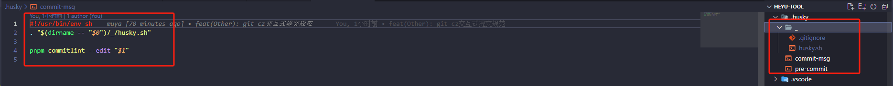

其内容如下：

```bash
#!/bin/sh
. "$(dirname "$0")/_/husky.sh"

pnpm commitlint --edit "$1"
```

将添加的 `.husky/commit-msg` 钩子添加到 git 中去，执行命令：

```bash
git add .husky/commit-msg
```

#### 再执行 lint-staged 库添加的.husky/pre-commit 钩子命令：

```bash
pnpm husky add .husky/pre-commit 'pnpm lint-staged --allow-empty "$1"'
```

之后，会看到在根目录的`.husky`文件夹下多了一个 `pre-commit` 文件

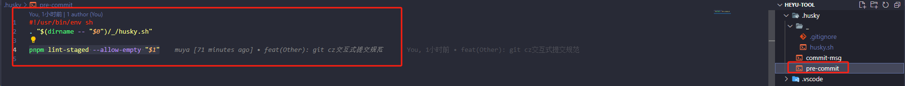

其内容如下：

```js
#!/bin/sh
. "$(dirname "$0")/_/husky.sh"

yarn lint-staged --allow-empty "$1"
```

同样的，将添加的 `.husky/pre-commit` 钩子添加到 git 中去，执行命令：

```bash
git add .husky/pre-commit
```

#### 检验现有的配置

git 提交格式：

```
<type>(<scope>): <subject>

1. type 为必填项，用于指定 commit 的类型

build : 更改构建系统和外部依赖项（如将 gulp 改为 webpack，更新某个 npm 包）
ci : 对 CI 配置文件和脚本的更改
docs : 仅仅修改文档说明
feat : 增加一个新特性
fix : 修复一个 bug
perf : 更改代码以提高性能
refactor : 代码重构时使用
style : 不影响代码含义的改动，例如去掉空格、改变缩进、增删分号
test : 增加新的测试功能或更改原有的测试模块
还支持其他自定义类型：在配置文件新增即可

2. scope 为非必填项，用于描述改动的影响范围
scope可以是文件名，也可以是模块名，由自己定

3. subject 是必填项，代表此次提交的日志信息
```

接下来，就是检验配置的时候了：当我们按照 git commit 规范正确提交时，可以在控制台看到如下输出

规范化提交代码，会提交成功

```bash
# 规范化提交代码，会提交成功
git ci -m 'feat: 新增功能'
```

不规范提交代码，阻止你的代码提交，并提交失败

```bash
# 不规范提交代码，阻止你的代码提交，并提交失败
git ci -m '哈哈哈哈哈哈'

✖   subject may not be empty [subject-empty]
✖   type may not be empty [type-empty]

✖   found 2 problems, 0 warnings
ⓘ   Get help: https://github.com/conventional-changelog/commitlint/#what-is-commitlint

husky - commit-msg hook exited with code 1 (error)
```

那么至此，我们就已经可以处理好了 **强制规范化的提交要求**，到现在 **不符合规范的提交信息，将不可在被提交！**

### 5.commitizen+cz-customizable 库——添加交互式 git commit 交互式描述的配置

**commitizen 助你规范化交互提交代码**

`commitizen` 仓库名为 [cz-cli](https://github.com/commitizen/cz-cli) ，它提供了一个 `git cz` 的指令用于代替 `git commit`，简单一句话介绍它：

> 当你使用 `commitizen` 进行代码提交（git commit）时，`commitizen` 会提交你在提交时填写所有必需的提交字段！

- **commitizen**：这是一个命令行工具，它可以让您通过交互式的方式来输入提交信息，而不是直接使用 git commit 命令。
- **cz-conventional-changelog**：这是 commitizen 的官方适配器，它可以让您按照 Angular 团队的提交信息格式来生成提交信息。
- **cz-customizable**：这是一个可自定义的 commitizen 插件，它可以让您根据自己的需求来配置提交信息的格式，而不是使用预定义的格式

我们以下用的是 commitizen 和 cz-customizable 这两个库，cz-customizable 用来自定义配置属于我们的提交信息的格式

#### 在 package.json 中追加以下配置：

```json
"config": {
    "commitizen": {
      "path": "node_modules/cz-customizable"
    },
    "cz-customizable": {
      "config": ".cz-config.cjs"
    }
},
```

#### 新建 `.cz-config.cjs` 文件，并写入：

```js
// 参考文档：https://www.npmjs.com/package/cz-customizable
module.exports = {
  // 指定要使用的适配器
  adapter: 'cz-customizable',
  // 指定要使用的预设
  preset: 'vue',
  // 指定要使用的语言
  locale: 'zh-CN',
  // 指定要使用的主题
  theme: 'default',
  // 指定要使用的表情符号
  useEmoji: true,
  // 指定要使用的提交类型
  types: [
    { value: 'feat', name: 'feat:✨  新功能' },
    { value: 'fix', name: 'fix:🐞  修复bug' },
    { value: 'docs', name: 'docs:📝  文档变更' },
    { value: 'style', name: 'style:💅  修改样式(不影响代码运行的变动)' },
    { value: 'refactor', name: 'refactor:🔨  代码重构(既不是增加feature，也不是修复bug)' },
    { value: 'perf', name: 'perf:🚀  性能|体验优化' },
    { value: 'test', name: 'test:🧪  增加测试' },
    { value: 'chore', name: 'chore:🗯  构建过程或辅助工具的变动' },
    { value: 'revert', name: 'revert:⏪  回退' },
    { value: 'WIP', name: 'WIP:🚧  正在进行中的工作' },
    { value: 'merge', name: 'merge:⌛  合并代码' },
    { value: 'build', name: 'build:📦  打包' },
    { value: 'ci', name: 'ci:🔧  持续集成' },
  ],
  
  // 指定要使用的提交范围
  scopes: [
    { name: 'UI' },
    { name: 'API' },
    { name: 'Data' },
    { name: 'Auth' },
    { name: 'Other' },
  ],
  scopeOverrides: {
    fix: [
      { name: 'Bug' },
      { name: 'Hotfix' },
    ],
  },
  
  // 消息步骤
  messages: {
    type: '请选择提交类型:',
    scope: '请选择提交范围 (可选):',
    customScope: '请输入自定义修改提交的范围(可选):',
    subject: '请简要描述提交——短说明(必填):',
    body: '请输入提交的详细描述——长说明。使用"|"换行(可选):',
    breaking: '请列出非兼容性变更 (可选):',
    footer: '请输入要关闭的issue相关的问题或合并请求，例如：#31, #34((可选):',
    confirmCommit: '确认使用以上信息提交吗？'
  },
  allowCustomScopes: true,
  allowBreakingChanges: ['feat', 'fix'],
  // 跳过问题
  skipQuestions: ['body', 'footer'],
  // 指定要使用的提交主题的最大长度：72
  subjectLimit: 72
}
```

#### js 模块化扩展知识（关于我这里为什么把.js 写成.cjs 后缀）

##### package.json 中的 `{"type": "module"}` 配置：

想要导入 CommonJS 的语法来编写和导入模块 `.cjs`：

```js
// a.cjs
// 导出一个函数
function add(x, y) {
	return x + y;
}
module.exports = { add };

// b.cjs
// 导入 a.cjs 模块
const { add } = require("./a.cjs");
console.log(add(1, 2));
```

##### package.json 中的 `{"type": "commonjs"}` 配置：

想要导入使用 ES 模块的语法来编写和导入在 .mjs 后缀文件，例如：

```js
// a.mjs
// 导出一个函数
export function add(x, y) {
	return x + y;
}

// b.mjs
// 导入 a.mjs 模块
import { add } from "./a.mjs";
console.log(add(1, 2));
```

————————————————————————————————

#### 再次校验 git 提交的配置：

```bash
git add .
# git cz命令 替代了git commit命令
git cz
```

会输出以下，根据步骤交互选择和输入描述，会自动一步步校验：

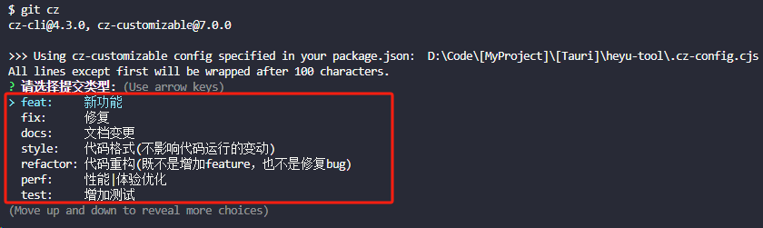

如果没有错误，便会成功提交：

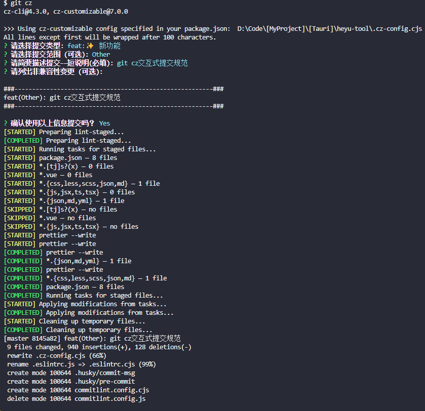

如果有错误，则会有所提示，找出来修复即可：

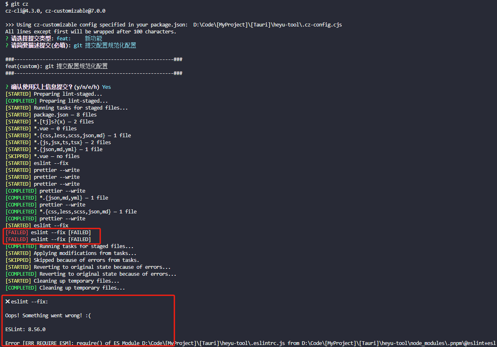

那么到这里我们就已经可以使用`git cz` 来代替了 `git commit` 实现了规范化的提交诉求了。
