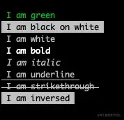
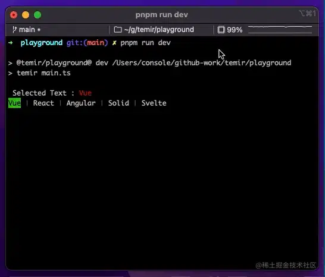
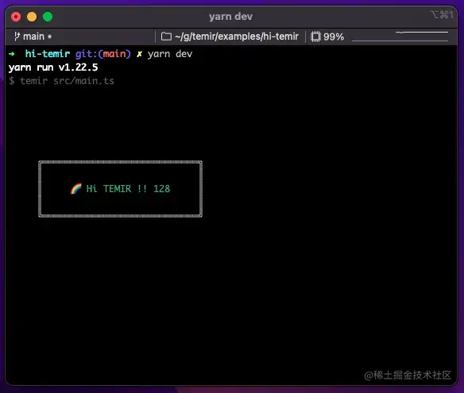
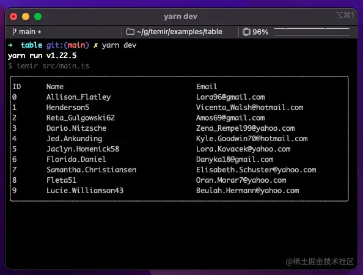
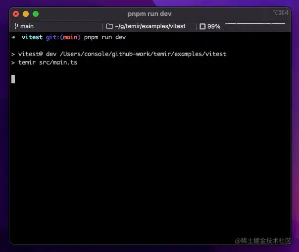
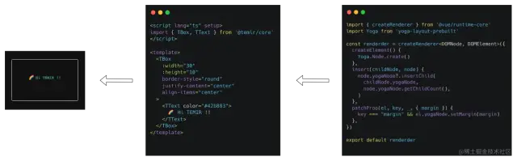

# 搭建前端脚手架

[写给5年前端妹子的三万字脚手架教程 - 掘金 (juejin.cn)](https://juejin.cn/post/7260144602471776311)

# 使用 Vue.js 编写命令行界面,前端开发 CLI 的利器

## 前言

如何将Vue渲染到命令行工具 :).关于命令行工具,大家应该都比较熟悉了,比如vue-cli、Vite等.我们在编写前端应用面向用户时,通常会非常关注用户体验,作为开发者,我们在使用工具时,它给予我们的开发者体验(DX)我们也会十分关注.团队在今年有自研脚手架的计划,作为前端,我就在想是否能有较低成本的研发方案能让团队的小伙伴参与进来,大家可以像编写前端应用一样搞定它.因此,**Temir**[3]应运而生.

## Temir

### 介绍

**Temir**[4],一个用Vue组件来编写命令行界面应用的工具.开发者只需要使用Vue就可以编写命令行应用,不需要任何额外的学习成本.

```
<script lang="ts" setup>
import { ref } from '@vue/runtime-core'
import { TBox, TText } from '@temir/core'
const counter = ref(0)
setInterval(() => {
  counter.value++
}, 100)
</script>

<template>
  <TBox>
    <TText color="green">
      {{ counter }} tests passed
    </TText>
  </TBox>
</template>

```

### 组件

**Temir**[5]提供了一些基础组件帮助开发者编写与扩展命令行工具:

#### 文本组件 (Text)

文本组件可以显示文本,将其样式更改为粗体、下划线、斜体或删除线.



```
<TText color="green">
  I am green
</TText>

<TText color="black" background-color="white">
  I am black on white
</TText>

<TText color="white">
  I am white
</TText>

<TText :bold="true">
  I am bold
</TText>

<TText :italic="true">
  I am italic
</TText>

<TText :underline="true">
  I am underline
</TText>

<TText :strikethrough="true">
  I am strikethrough
</TText>

<TText :inverse="true">
  I am inversed
</TText>

```

#### 盒子组件 (Box)

`<Box>`是构建布局必不可少的Temir组件.就像在浏览器中`<div style='display: flex'>.`它提供了一些构建布局的常用属性,比如尺寸、内外边距、对齐方式等.

```
<template>
  <TBox justify-content="flex-start">
    <TText>X</TText>
  </TBox>
  // [X      ]

  <TBox justify-content="center">
    <TText>X</TText>
  </TBox>
  // [   X   ]

  <TBox justify-content="flex-end">
    <TText>X</TText>
  </TBox>
  // [      X]

  <TBox justify-content="space-between">
    <TText>X</TText>
    <TText>Y</TText>
  </TBox>
  // [X      Y]

  <TBox justify-content="space-around">
    <TText>X</TText>
    <TText>Y</TText>
  </TBox>
  // [  X   Y  ]
</template>

```

#### 换行组件 (Newline)

添加一个或多个换行符(\n)。必须在`<Text>`组件中使用。

```
<script>
import { TBox, TNewline, TText } from '@temir/core'
</script>

<template>
  <TBox>
    <TText>
      <TText color="green">
        Hello
      </TText>
      <TNewline />
      <TText color="red">
        World
      </TText>
    </TText>
  </TBox>
</template>

```

#### 填充组件 (Spacer)

沿其包含布局的主轴展开的灵活空间。作为填充元素之间所有可用空间的快捷方式，它非常有用。

例如，在具有默认伸缩方向(`row`)的`<Box>`中使用`<Spacer>`将把"Left"定位到左边，并将"Right"推到右边。

```
<script lang="ts" setup>
import { TBox, TSpacer, TText } from '@temir/core'
</script>

<template>
  <TBox>
    <TText>Left</TText>
    <TSpacer />
    <TText>Right</TText>
  </TBox>
</template>


```

#### 超链接组件 (Link)


```
<script lang="ts" setup>
import { TBox, TText } from '@temir/core'
import TLink from '@temir/link'
</script>

<template>
  <TBox
    :margin="5"
    width="20"
    border-style="round"
    justify-content="center"
  >
    <TLink url="https://github.com">
      <TText color="yellow">
        Hi
      </TText>
      <TText color="cyan">
        Github
      </TText>
    </TLink>
  </TBox>
</template>

```

#### 加载中组件 (Spinner)

```
<script lang="ts" setup>
import { TBox, TText } from '@temir/core'
import TSpinner from '@temir/spinner'
</script>

<template>
  <TBox
    :margin="5"
    width="20"
    border-style="round"
    justify-content="center"
  >
    <TText>
      <TText color="yellow">
        <TSpinner />
      </TText>
      Loading
    </TText>
  </TBox>
</template>

```

#### 标签页组件 (Tab)



```
<script lang="ts" setup>
import { computed, ref } from '@vue/runtime-core'
import { TBox, TText } from '@temir/core'
import { TTab, TTabs } from '@temir/tab'

const tabs = ['Vue', 'React', 'Angular', 'Solid', 'Svelte']
const activeIndex = ref(0)
const selectedText = computed(() => tabs[activeIndex.value])
</script>

<template>
  <TBox>
    <TText>
      Selected Text :
      <TText color="red">
        {{ selectedText }}
      </TText>
    </TText>
  </TBox>

  <TBox>
    <TTabs :on-change="(index) => activeIndex = +index">
      <TTab v-for="item in tabs" :key="item">
        {{ item }}
      </TTab>
    </TTabs>
  </TBox>
</template>

```

#### 选择组件

```
<script lang="ts" setup>
import TSelectInput from '@temir/select-input'

const items = [
  {
    label: 'Vue',
    value: 'Vue',
  },
  {
    label: 'Vite',
    value: 'Vite',
  },
  {
    label: 'Temir',
    value: 'Temir',
  },
]
function onSelect(value) {
  console.log('selected', value)
}
</script>

<template>
  <TSelectInput :items="items" :on-select="onSelect" />
</template>


```

### 安装

```
npm install @temir/core

```

### 使用

```
<script lang="ts" setup>
import { ref } from '@vue/runtime-core'
import { TBox, TText } from '@temir/core'
const counter = ref(0)
setInterval(() => {
  counter.value++
}, 100)
</script>

<template>
  <TBox>
    <TText color="green">
      {{ counter }} tests passed
    </TText>
  </TBox>
</template>

```

### HMR支持

前面我们提到了开发者体验(DX),在现在的前端工程中,对开发者很有帮助且提效的就是HMR,这么香的东西**Temir**[6]没有理由不拥有它,话不多说,直接展示:

### 开箱即用

使用**Temir**[7]定制化CLI非常简单,我们提供了**\@temir/cli**[8]帮助你快速构建一个基于**Temir**[9]的CLI.

```
mkdir my-temir-cli

cd my-temir-cli

touch main.ts

npm install @temir/cl

# Dev (开发)

temir main.ts

# Build (打包)

temir build main.ts

```

你可以通过下载这个 **例子**[10] 来快速开始，你也可以打开 **repl.it sandbox**[11]来在线体验和尝试它。

## 演示

### **Hi Temir**[12]



### **Borders**[13]

### **Table**[14]



### **Vitest**[15]



## 实现

- createRenderer

Temir的实现主要得益于Vue3出色的跨平台能力,我们可以通过**createRenderer**[16] API创建一个自定义渲染器,通过创建宿主环境中对应的Node和Element,并对元素进行增删改查操作.

- Yoga

Vue提供了跑在命令行界面的接口,那我们就还缺少一个布局引擎就能把Vue 跑在命令行工具了.Temir使用了Yoga,一款Flexbox布局引擎.使用你在构建浏览器应用时使用过的类似CSS的属性，为你的CLI构建出色的用户界面。



## 致谢

- 这个项目的灵感来源于**ink**[17]
- **vite-node**[18]为实现HMR提供了强力的支持