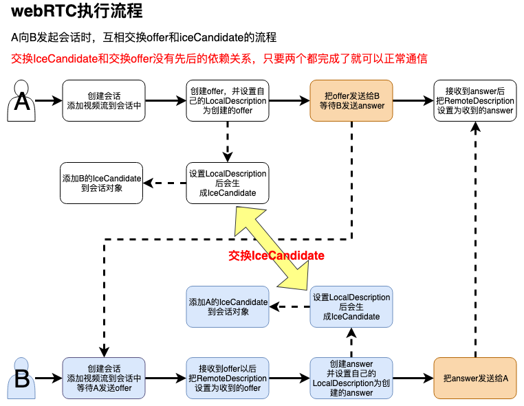

# WebRTC

[WebRTC-H5 视频通话 - 掘金 (juejin.cn)](https://juejin.cn/post/7300557026434121739)

[WebRTC 这么火 🔥，前端靓仔，请收下这篇入门教程 - 掘金 (juejin.cn)](https://juejin.cn/post/7266417942182608955)

[刚学 WebRTC 两天，领导让搭建多人视频会议，怎么整？ - 掘金 (juejin.cn)](https://juejin.cn/post/7271974618565705785)

[WebRTC 实战 | 快速搭建 1 对 1 音视频通话 - 掘金 (juejin.cn)](https://juejin.cn/post/7267892210304565303)

[【从头到脚】撸一个多人视频聊天 — 前端 WebRTC 实战（一） - 掘金 (juejin.cn)](https://juejin.cn/post/6844903798750576647)

[WebRTC 从实战到未来！前端如何实现一个最简单的音视频通话？🔥 - 掘金 (juejin.cn)](https://juejin.cn/post/7165539003465531399)

[基于 WebRtc 和 WebSocket 实现视频聊天 - 掘金 (juejin.cn)](https://juejin.cn/post/7348362217145172006)

[WebRTC 录制挑战和解决方案 - 掘金 (juejin.cn)](https://juejin.cn/post/7347962680605442102)

[快速学会 WebRTC 连接，实现实时音视频通讯 - 掘金 (juejin.cn)](https://juejin.cn/post/7346517673377579035)

[WebRTC 音视频兼容问题汇总（一） - 掘金 (juejin.cn)](https://juejin.cn/post/7302310196310261812)

[WebRTC 音视频兼容问题汇总（二） - 掘金 (juejin.cn)](https://juejin.cn/post/7302241918352015394)

[深入探索基于 WebSocket 的 WebRTC 全栈音视频会议室项目 - p2p.chat - 掘金 (juejin.cn)](https://juejin.cn/post/7261601725839949879)

[前端 er 如何玩转音视频流-WebRTC 技术介绍 - 掘金 (juejin.cn)](https://juejin.cn/post/7358633811515605030)

[《WebRTC 系列》实战 Web 端支持 H265 硬解 - 掘金 (juejin.cn)](https://juejin.cn/post/7215608036394614844)

## 无服务器实现webRTC实时视频通话

GitHub开源地址：[nashaofu/webrtc-demo: webrtc 演示示例 (github.com)](https://github.com/nashaofu/webrtc-demo)

演示地址：https://nashaofu.github.io/webrtc-demo/

主要讲述webRTC建立连接的过程，并通过手动拷贝offer和iceCandidata的方式来交换互相的网络信息。如不借助iceServers，目前只能在局域网使用，使用免费的iceServers可局域网穿透。

## 基于webrtc的文件传输工具站

GitHub：https://github.com/saljam/webwormhole

在线地址：https://webwormhole.io/

## WebRTC P2P在线网络媒体流工具（用于文件、视频、屏幕、直播、文本），具有管理和统计监控功能

GitHub：[tl-open-source/tl-rtc-file：WebRTC P2P在线网络媒体流工具（用于文件、视频、屏幕、直播、文本），具有管理和统计监控功能。 (github.com)](https://github.com/tl-open-source/tl-rtc-file)

在线：[im.iamtsm.cn/website/index.html](https://im.iamtsm.cn/website/index.html)
