# 前端下载文件

[Vue 中下载不同文件五种常用的方式*vue.js*脚本之家 (jb51.net)](https://www.jb51.net/javascript/2987938qn.htm)

[vue 实现文件下载 - 简书 (jianshu.com)](https://www.jianshu.com/p/cf2dffbee212)

**前端下载文件的几种方式 使用 Blob 下载文件**
在前端下载文件是个很通用的需求，一般后端会提供下载的方式有两种：

- 1.直接返回文件的网络地址（一般用在静态文件上，比如图片以及各种音视频资源等）
- 2.返回文件流（一般用在动态文件上，比如根据前端选择，导出不同的统计结果 excel 等）

第一种方式比较简单，但是使用场景有限。

第二种方式通用性更好

## 我们先一下第一种的使用场景

### - a 链接

```html
<a href="https://www.baidu.top.pdf">下载文件</a>
```

我们可以通过 download 属性，可以实现对下载的文件进行重命名。

```html
<a href="https://www.baidu.top.pdf" download="附件.pdf">下载文件</a>
```

1、a 标签下载（没有进度条，接口走完前端才有反应，下载大文件时用户体验不好，适用下载小文件）

```js
// 下载
const handleDownload = async (row) => {
	if (selectedData.value && selectedData.value.length != 0) {
		selectedData.value.forEach((item) => {
			downloadFileAuthentication(item.propertyId).then((res) => {
				downloadFileHref(item.propertyId).then((res) => {
					const blob = new Blob([res], { type: "application/zip" });
					const link = document.createElement("a"); //创建a标签
					link.download = item.propertyName; //a标签添加属性
					link.style.display = "none";
					link.href = URL.createObjectURL(blob);
					document.body.appendChild(link);
					link.click(); //执行下载
					URL.revokeObjectURL(link.href); //释放url
					document.body.removeChild(link); //释放标签
				});
			});
		});
	} else {
		ElMessage.warning("请先选择操作数据");
	}
};
```

### - 还可以使用编程式的写法：

1.location 的 href

```javascript
<script>function Download() {(window.location.href = "www.baidu.pdf")}</script>
```

2

```js
const handleDownload = async (row) => {
	const url = `/ca/download/downloadFile?propertyId=${row.propertyId}`;
	downloadFileAuthentication(row.propertyId).then((res) => {
		if (res.code == 200) {
			window.location.href = ` ${downLoadUrl + url}&token=${getToken()}`;
		}
	});
};
```

2.window.open

```javascript
<script>function Download() {window.open("www.baidu.pdf")}</script>
```

> `亿点小知识：`在使用 window.open 的时候在除 Google Chrome 浏览器会拦截内容但在其他浏览器是可以直接下载的
>
> - 如果要想 Google Chrome 设置里面更改

### 一、a 标签下载

```html
<body>
	<button
		onclick="downloadEvt('http://192.168.66.183:13666/download?name=HAP.pdf')"
	>
		a标签下载
	</button>
	<script>
		function downloadEvt(url, fileName = "未知文件") {
			const el = document.createElement("a");
			el.style.display = "none";
			el.setAttribute("target", "_blank");
			/**
			 * download的属性是HTML5新增的属性
			 * href属性的地址必须是非跨域的地址，如果引用的是第三方的网站或者说是前后端分离的项目(调用后台的接口)，这时download就会不起作用。
			 * 此时，如果是下载浏览器无法解析的文件，例如.exe,.xlsx..那么浏览器会自动下载，但是如果使用浏览器可以解析的文件，比如.txt,.png,.pdf....浏览器就会采取预览模式
			 * 所以，对于.txt,.png,.pdf等的预览功能我们就可以直接不设置download属性(前提是后端响应头的Content-Type: application/octet-stream，如果为application/pdf浏览器则会判断文件为 pdf ，自动执行预览的策略)
			 */
			fileName && el.setAttribute("download", fileName);
			el.href = url;
			console.log(el);
			document.body.appendChild(el);
			el.click();
			document.body.removeChild(el);
		}
	</script>
</body>
```

**优点**：

- 可以下载 txt、png、pdf 等类型文件
- `download`的属性是 HTML5 新增的属性 href 属性的地址必须是非跨域的地址，如果引用的是第三方的网站或者说是前后端分离的项目(调用后台的接口)，这时`download`就会不起作用。 此时，如果是下载浏览器无法解析的文件，例如.exe,.xlsx..那么浏览器会自动下载，但是如果使用浏览器可以解析的文件，比如.txt,.png,.pdf....浏览器就会采取预览模式；所以，对于.txt,.png,.pdf 等的预览功能我们就可以直接不设置`download`属性(前提是后端响应头的`Content-Type: application/octet-stream`，如果为`application/pdf`浏览器则会判断文件为 pdf ，自动执行预览的策略)

**缺点**：

- a 标签只能做 get 请求，所有 url 有长度限制
- 无法获取下载进度
- 无法在 header 中携带 token 做鉴权操作
- 跨域限制
- 无法判断接口是否返回成功
- IE 兼容问题

### 二、form 标签下载

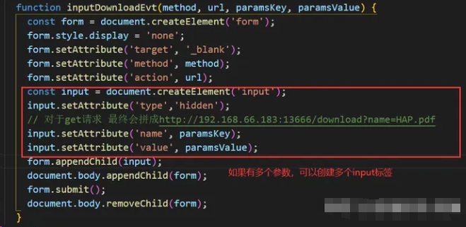

```html
body>
  <button onclick="inputDownloadEvt('get', 'http://192.168.66.183:13666/download', 'name', 'HAP.pdf')">form标签下载</button>
  <script>
    /**
     * @param {String} method - 请求方法get/post
     * @param {String} url
     * @param {String} paramsKey - 请求参数名
     * @param {String} paramsValue - 请求参数值
    */
    function inputDownloadEvt(method, url, paramsKey, paramsValue) {
      const form = document.createElement('form');
      form.style.display = 'none';
      form.setAttribute('target', '_blank');
      form.setAttribute('method', method);
      form.setAttribute('action', url);
      const input = document.createElement('input');
      input.setAttribute('type','hidden');
      // 对于get请求 最终会拼成http://192.168.66.183:13666/download?name=HAP.pdf
      input.setAttribute('name', paramsKey);
      input.setAttribute('value', paramsValue);
      form.appendChild(input);
      document.body.appendChild(form);
      form.submit();
      document.body.removeChild(form);
    }
  </script>
</body>
```

**优点**

- 兼容性好，不会出现 URL 长度限制问题
- form 标签 get 和 post 都可以

**缺点**

- 无法获取下载进度
- 无法在 header 中携带 token 做鉴权操作
- 无法直接下载浏览器可直接预览的文件类型（txt、png、pdf 会直接预览）
- 无法判断接口是否返回成功

### **三、window.open 下载**

```html
<body>
	<button
		onclick="downloadEvt('http://192.168.66.183:13666/download?name=HAP.pdf')"
	>
		window.open下载
	</button>
	<script>
		function downloadEvt(url) {
			window.open(url, "_self");
		}
	</script>
</body>
```

**优点**

- 简单方便直接

**缺点**

- 会出现 URL 长度限制问题
- 需要注意 url 编码问题
- 无法获取下载进度
- 无法在 header 中携带 token 做鉴权操作
- 无法直接下载浏览器可直接预览的文件类型（txt、png、pdf 会直接预览）
- 无法判断接口是否返回成功

### **四、iframe 下载**

```html
<body>
	<button
		onclick="downloadEvt('http://192.168.66.183:13666/download?name=HAP.pdf')"
	>
		iframe下载
	</button>
	<script>
		// 批量下载时，动态创建a标签，会始终只下载一个文件，改为动态创建iframe标签
		function downloadEvt(url) {
			const iframe = document.createElement("iframe");
			iframe.style.display = "none";
			iframe.src = url;
			document.body.appendChild(iframe);
			setTimeout(() => {
				document.body.removeChild(iframe);
			}, 200);
		}
	</script>
</body>
```

```js
const handleDownload = async (row) => {
	if (selectedData.value && selectedData.value.length != 0) {
		selectedData.value.forEach((item) => {
			downloadFileAuthentication(item.propertyId).then((res) => {
				downloadFileHref(item.propertyId).then((res) => {
					var url = `/ca/download/downloadFile?propertyId=${item.propertyId}`; // 文件地址
					var iframe = document.createElement("iframe");
					iframe.src = ` ${downLoadUrl + url}&token=${getToken()}`;
					iframe.style.display = "none";
					iframe.onload = function () {
						document.body.removeAttribute(iframe);
					};
					document.body.appendChild(iframe);
				});
			});
		});
	} else {
		ElMessage.warning("请先选择操作数据");
	}
};
```

**优点**

- 可以下载 txt、png、pdf 等类型文件

**缺点**

- 无法获取下载进度
- 无法在 header 中携带 token 做鉴权操作
- 无法判断接口是否返回成功
- 兼容、性能差

### **五、location.href 下载**

```html
<body>
	<button
		onclick="downloadEvt('http://192.168.66.183:13666/download?name=HAP.pdf')"
	>
		location.href下载
	</button>
	<script>
		function downloadEvt(url) {
			window.location.href = url;
		}
	</script>
</body>
```

**优点**

- 简单方便直接
- 可以下载大文件(G 以上)

**缺点**

- 会出现 URL 长度限制问题
- 需要注意 url 编码问题
- 无法获取下载进度
- 无法在 header 中携带 token 做鉴权操作
- 无法直接下载浏览器可直接预览的文件类型（txt、png、pdf 会直接预览）
- 无法判断接口是否返回成功

## 第二种 使用 blob 文件流下载

```javascript
<script>
	function Download(){" "}
	{axios({
		url: "www.baidu.pdf",
		method: "GET",
		responseType: "blob", // 这里就是转化为blob文件流，指定响应类型为二进制数据
		headers: {
			// 'Content-Type': 'application/json; application/octet-stream',
			token: "sss", // 可以携带token
		},
	}).then((res) => {
		const href = URL.createObjectURL(res.data);
		const link = document.createElement("a");
		link.download = "附件.pdf";
		link.href = href;
		link.click();
		document.body.removeChild(link);
		URL.revokeObjectURL(href); // 释放内存
	})}
</script>
```

下面封装了一个 blob 的方法逻辑 感兴趣的可以参考一下

```javascript
// 下载
const DownloadFile = (row: any) => {
	contractApi.xxxApi({ fullFileName: row.filePath }).then((blob: any) => {
		row.fileFormat =
			row.filePath.split(".")[row.filePath.split(".").length - 1];
		download(blob, row.fileFormat, row.fileName);
	});
};
// file:文件流(一般指后端返回的流)； fileType:文件类型/MIME类型；fileName:文件名称
export function download(file: any, fileType: string, fileName?: string) {
	const blob = new Blob([file], { fileType });
	const downloadElement = document.createElement("a");
	const href = window.URL.createObjectURL(blob); // 创建下载的链接
	downloadElement.href = href;
	downloadElement.download = fileName; // 下载后文件名
	document.body.appendChild(downloadElement);
	downloadElement.click(); // 点击下载
	document.body.removeChild(downloadElement); // 下载完成移除元素
	window.URL.revokeObjectURL(href); // 释放掉blob对象
}

// download(blobStream,{ 'Content-Type': 'application/vnd.ms-excel;charset=utf-8' })
```

### ajax 下载（Blob - 利用 Blob 对象生成 Blob URL）

如果后端需要做 token 验证，那么`a、form、iframe、window.open、location.href`都无法在 header 中携带 token，这时候可以使用 ajax 来实现。

```html
<body>
	<button
		onclick="downLoadAjaxEvt('get', 'http://192.168.66.183:13666/download?name=HAP.pdf')"
	>
		ajax下载
	</button>
	<script>
		function downloadEvt(url, fileName = "未知文件") {
			const el = document.createElement("a");
			el.style.display = "none";
			el.setAttribute("target", "_blank");
			/**
			 * download的属性是HTML5新增的属性
			 * href属性的地址必须是非跨域的地址，如果引用的是第三方的网站或者说是前后端分离的项目(调用后台的接口)，这时download就会不起作用。
			 * 此时，如果是下载浏览器无法解析的文件，例如.exe,.xlsx..那么浏览器会自动下载，但是如果使用浏览器可以解析的文件，比如.txt,.png,.pdf....浏览器就会采取预览模式
			 * 所以，对于.txt,.png,.pdf等的预览功能我们就可以直接不设置download属性(前提是后端响应头的Content-Type: application/octet-stream，如果为application/pdf浏览器则会判断文件为 pdf ，自动执行预览的策略)
			 */
			fileName && el.setAttribute("download", fileName);
			el.href = url;
			console.log(el);
			document.body.appendChild(el);
			el.click();
			document.body.removeChild(el);
		}

		// 根据header里的contenteType转换请求参数
		function transformRequestData(contentType, requestData) {
			requestData = requestData || {};
			if (contentType.includes("application/x-www-form-urlencoded")) {
				// formData格式：key1=value1&key2=value2，方式二：qs.stringify(requestData, {arrayFormat: 'brackets'}) -- {arrayFormat: 'brackets'}是对于数组参数的处理
				let str = "";
				for (const key in requestData) {
					if (Object.prototype.hasOwnProperty.call(requestData, key)) {
						str += `${key}=${requestData[key]}&`;
					}
				}
				return encodeURI(str.slice(0, str.length - 1));
			} else if (contentType.includes("multipart/form-data")) {
				const formData = new FormData();
				for (const key in requestData) {
					const files = requestData[key];
					// 判断是否是文件流
					const isFile = files
						? files.constructor === FileList ||
						  (files.constructor === Array && files[0].constructor === File)
						: false;
					if (isFile) {
						for (let i = 0; i < files.length; i++) {
							formData.append(key, files[i]);
						}
					} else {
						formData.append(key, files);
					}
				}
				return formData;
			}
			// json字符串{key: value}
			return Object.keys(requestData).length ? JSON.stringify(requestData) : "";
		}
		/**
		 * ajax实现文件下载、获取文件下载进度
		 * @param {String} method - 请求方法get/post
		 * @param {String} url
		 * @param {Object} [params] - 请求参数，{name: '文件下载'}
		 * @param {Object} [config] - 方法配置
		 */
		function downLoadAjaxEvt(method = "get", url, params, config) {
			const _method = method.toUpperCase();
			const _config = Object.assign(
				{
					contentType:
						_method === "GET"
							? "application/x-www-form-urlencoded"
							: "application/json", // 请求头类型
					fileName: "未知文件", // 下载文件名(必填，若为空，下载下来都是txt格式)
					async: true, // 请求是否异步-true异步、false同步
					token: "token", // 用户token
				},
				config
			);

			const queryParams = transformRequestData(_config.contentType, params);
			const _url = `${url}${
				_method === "GET" && queryParams ? "?" + queryParams : ""
			}`;

			const ajax = new XMLHttpRequest();
			ajax.open(_method, _url, _config.async);
			ajax.setRequestHeader("Authorization", _config.token);
			ajax.setRequestHeader("Content-Type", _config.contentType);
			// responseType若不设置，会导致下载的文件可能打不开
			ajax.responseType = "blob";
			// 获取文件下载进度
			ajax.addEventListener("progress", (progress) => {
				const percentage = ((progress.loaded / progress.total) * 100).toFixed(
					2
				);
				const msg = `下载进度 ${percentage}%...`;
				console.log(msg);
			});
			ajax.onload = function () {
				if (this.status === 200 || this.status === 304) {
					// 通过FileReader去判断接口返回是json还是文件流
					const fileReader = new FileReader();
					fileReader.onloadend = (e) => {
						if (
							this.getResponseHeader("content-type").includes(
								"application/json"
							)
						) {
							const result = JSON.parse(
								fileReader.result || "{message: 服务器出现问题，请联系管理员}"
							);
							alert(result.message);
						} else {
							// 两种解码方式，区别自行百度: decodeURIComponent/decodeURI（主要获取后缀名，否则低版本浏览器会一律识别为txt，导致下载下来的都是txt）
							const _fileName = decodeURIComponent(
								(
									this.getResponseHeader("content-disposition") ||
									'; filename="未知文件"'
								)
									.split(";")[1]
									.trim()
									.slice(9)
							);
							/**
							 * Blob.type一个字符串，表明该 Blob 对象所包含数据的 MIME 类型。如果类型未知，则该值为空字符串。
							 * 对于pdf：type为application/pdf  同时 a标签 不设置download属性, 可以直接预览
							 */
							const blob = new Blob([this.response]);
							const href = URL.createObjectURL(blob);
							downloadEvt(href, _fileName);
							// 释放一个之前已经存在的、通过调用 URL.createObjectURL() 创建的 URL 对象
							URL.revokeObjectURL(href);
						}
					};
					// 调用readAsText读取文件，少了readAsText将不会触发onloadend事件
					fileReader.readAsText(this.response);
				} else {
					alert("服务器出现问题，请联系管理员");
				}
			};
			// send(string): string：仅用于 POST 请求
			ajax.send(queryParams);
		}
	</script>
</body>
```

- `responseType` responseType 若不设置，会导致下载的文件可能打不开`ajax.responseType = 'blob';`
- `new FileReader()` 1.文件下载的接口存在返回失败的情况（例如：服务器连接不上、接口报错等），对于下载失败的情况我们需要在页面上弹出失败提示，而不是将失败信息写进文件里等用户打开，这时候可以使用`FileReader`去根据响应头里的`content-type`判断接口是否返回成功； 2.如果`content-type`返回`application/json`表示文件流返回失败，此时直接在页面上弹出失败信息（图 6-1）；如果是其他格式就认为文件流已经返回。

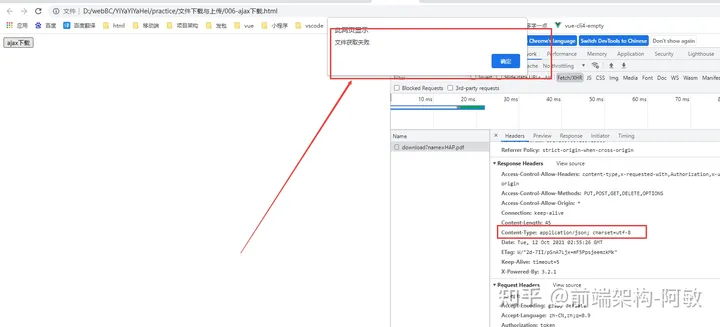

- `this.getResponseHeader('content-disposition')` 后端返回的文件名称，主要获取后缀名，否则某些浏览器会一律识别为 txt，导致下载下来的都是 txt

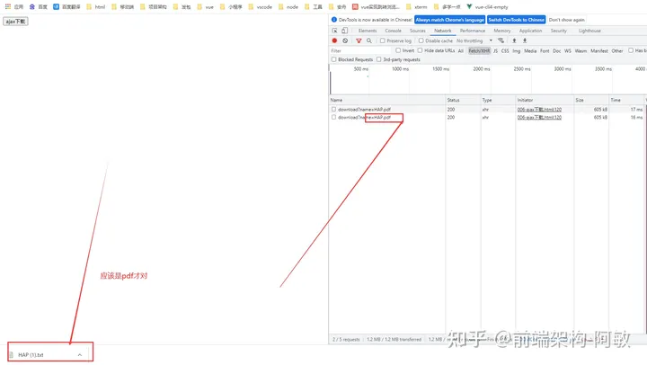

- `new Blob([this.response], {type: '文件类型'})`Application Type 对照表 1.Blob.type 一个字符串，表明该 Blob 对象所包含数据的 MIME 类型。如果类型未知，则该值为空字符串； 2.对于 pdf：type 为 application/pdf 同时 a 标签 不设置 download 属性(图 6-3), 可以直接预览（图 6-4）

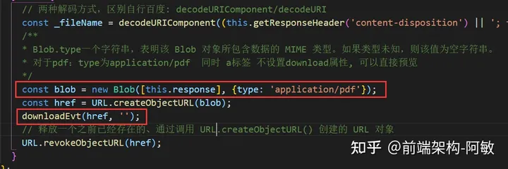

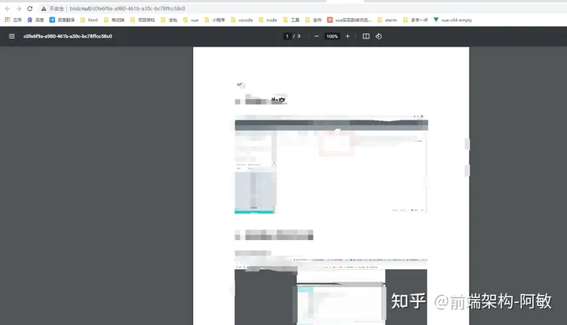

- axios 中其实已经提供了获取文件上传和下载进度的事件，这里我使用的是原生 ajax（axios 雷同，只需要修改请求方法）。

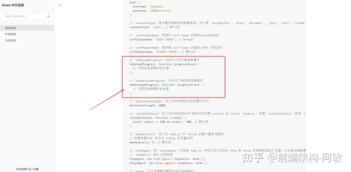

**优点**

- 可以下载 txt、png、pdf 等类型文件
- 可以在 header 中携带 token 做鉴权操作
- 可以获取文件下载进度
- 可以判断接口是否返回成功

**缺点**

- 兼容性问题，IE10 以下不可用，注意 Safari 浏览器,官网给出 `Safari has a serious issue with blobs that are of the type application/octet-stream`
- 将后端返回的文件流全部获取后才会下载

### 七、ajax 下载（Data URL - base64 编码后的 url）

```html
<body>
	<button
		onclick="downLoadAjaxEvt('get', 'http://192.168.66.183:13666/download?name=HAP.pdf')"
	>
		ajax下载(base64)
	</button>
	<script>
		function downloadEvt(url, fileName = "未知文件") {
			const el = document.createElement("a");
			el.style.display = "none";
			el.setAttribute("target", "_blank");
			/**
			 * download的属性是HTML5新增的属性
			 * href属性的地址必须是非跨域的地址，如果引用的是第三方的网站或者说是前后端分离的项目(调用后台的接口)，这时download就会不起作用。
			 * 此时，如果是下载浏览器无法解析的文件，例如.exe,.xlsx..那么浏览器会自动下载，但是如果使用浏览器可以解析的文件，比如.txt,.png,.pdf....浏览器就会采取预览模式
			 * 所以，对于.txt,.png,.pdf等的预览功能我们就可以直接不设置download属性(前提是后端响应头的Content-Type: application/octet-stream，如果为application/pdf浏览器则会判断文件为 pdf ，自动执行预览的策略)
			 */
			fileName && el.setAttribute("download", fileName);
			el.href = url;
			console.log(el);
			document.body.appendChild(el);
			el.click();
			document.body.removeChild(el);
		}

		// 根据header里的contenteType转换请求参数
		function transformRequestData(contentType, requestData) {
			requestData = requestData || {};
			if (contentType.includes("application/x-www-form-urlencoded")) {
				// formData格式：key1=value1&key2=value2，方式二：qs.stringify(requestData, {arrayFormat: 'brackets'}) -- {arrayFormat: 'brackets'}是对于数组参数的处理
				let str = "";
				for (const key in requestData) {
					if (Object.prototype.hasOwnProperty.call(requestData, key)) {
						str += `${key}=${requestData[key]}&`;
					}
				}
				return encodeURI(str.slice(0, str.length - 1));
			} else if (contentType.includes("multipart/form-data")) {
				const formData = new FormData();
				for (const key in requestData) {
					const files = requestData[key];
					// 判断是否是文件流
					const isFile = files
						? files.constructor === FileList ||
						  (files.constructor === Array && files[0].constructor === File)
						: false;
					if (isFile) {
						for (let i = 0; i < files.length; i++) {
							formData.append(key, files[i]);
						}
					} else {
						formData.append(key, files);
					}
				}
				return formData;
			}
			// json字符串{key: value}
			return Object.keys(requestData).length ? JSON.stringify(requestData) : "";
		}
		/**
		 * ajax实现文件下载、获取文件下载进度
		 * @param {String} method - 请求方法get/post
		 * @param {String} url
		 * @param {Object} [params] - 请求参数，{name: '文件下载'}
		 * @param {Object} [config] - 方法配置
		 */
		function downLoadAjaxEvt(method = "get", url, params, config) {
			const _method = method.toUpperCase();
			const _config = Object.assign(
				{
					contentType:
						_method === "GET"
							? "application/x-www-form-urlencoded"
							: "application/json", // 请求头类型
					fileName: "未知文件", // 下载文件名(必填，若为空，下载下来都是txt格式)
					async: true, // 请求是否异步-true异步、false同步
					token: "token", // 用户token
				},
				config
			);

			const queryParams = transformRequestData(_config.contentType, params);
			const _url = `${url}${
				_method === "GET" && queryParams ? "?" + queryParams : ""
			}`;

			const ajax = new XMLHttpRequest();
			ajax.open(_method, _url, _config.async);
			ajax.setRequestHeader("Authorization", _config.token);
			ajax.setRequestHeader("Content-Type", _config.contentType);
			// responseType若不设置，会导致下载的文件可能打不开
			ajax.responseType = "blob";
			// 获取文件下载进度
			ajax.addEventListener("progress", (progress) => {
				const percentage = ((progress.loaded / progress.total) * 100).toFixed(
					2
				);
				const msg = `下载进度 ${percentage}%...`;
				console.log(msg);
			});
			ajax.onload = function () {
				if (this.status === 200 || this.status === 304) {
					// 通过FileReader去判断接口返回是json还是文件流
					const fileReader = new FileReader();
					fileReader.readAsDataURL(this.response);
					fileReader.onload = () => {
						if (
							this.getResponseHeader("content-type").includes(
								"application/json"
							)
						) {
							alert("服务器出现问题，请联系管理员");
						} else {
							// 两种解码方式，区别自行百度: decodeURIComponent/decodeURI（主要获取后缀名，否则某些浏览器会一律识别为txt，导致下载下来的都是txt）
							const _fileName = decodeURIComponent(
								(
									this.getResponseHeader("content-disposition") ||
									'; filename="未知文件"'
								)
									.split(";")[1]
									.trim()
									.slice(9)
							);
							// 也可以用FileSaver（需提前引入https://github.com/eligrey/FileSaver.js）: saveAs(fileReader.result, _fileName);
							downloadEvt(fileReader.result, _fileName);
						}
					};
				} else {
					alert("服务器出现问题，请联系管理员");
				}
			};
			// send(string): string：仅用于 POST 请求
			ajax.send(queryParams);
		}
	</script>
</body>
```

- `fileSaver` 网上介绍很多，可以自己百度下

**优点**

- 可以下载 txt、png、pdf 等类型文件
- 可以在 header 中携带 token 做鉴权操作
- 可以获取文件下载进度
- 可以判断接口是否返回成功

**缺点**

- 兼容性问题，IE10 以下不可用
- 将后端返回的文件流全部获取后才会下载

### 八、大文件下载注意点

- `fileSaver` 批量下载时，总量不超过 2G 可以用下这个，但是每个浏览器允许下载的最大文件不一样~

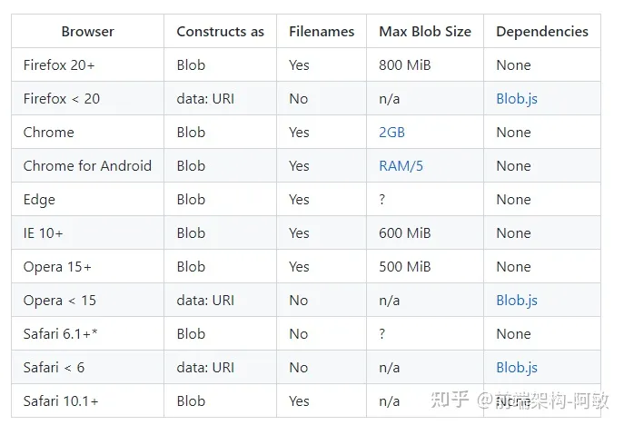

- ajax 下载 如果后端需要对下载接口做 token 鉴权，此时需要使用 ajax 获取文件流（第六、七点），可以了解下[ajax 文件下载原理](https://link.zhihu.com/?target=https%3A//links.jianshu.com/go?to=https%3A//blog.csdn.net/wiki_Wei/article/details/85325926)。 简单来说，文件下载依赖浏览器特性。前端获取到服务器端生成的字节流，此时数据是存在于**js 的内存中**的，是不可以直接保存在本地的，利用`Blob`对象和`window.URL.createObjectURL`对象生成一个虚拟的 URL 地址，然后在利用浏览器的特性进行下载。 因此对于 ajax 下载**大文件**时，会出现**浏览器崩溃**情况，此时可以考虑使用**链接直接下载**或使用**分片下载**

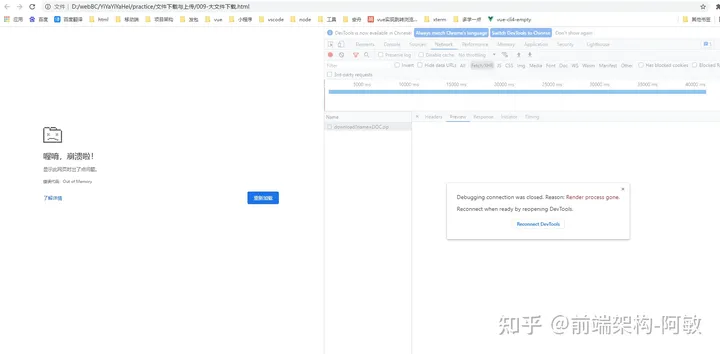

- 链接下载 链接下载需要后端一边去下载要打包的文件，一边把打包好的东西写入这个链接。存在的问题是，如果文件很大，那么这个链接需要一直保持，相当于这个接口一直开着没有结束；而且一旦中间出了什么问题，已经下载的东西也全部废了，因此推荐使用**分片下载**。

## 三、Blob

### 1、Blob 是什么

Blob（Binary Large Object）表示二进制类型的大对象。在数据库管理系统中，将二进制数据存储为一个单一个体的集合。Blob 通常是影像、声音或多媒体文件。**在 JavaScript 中 Blob 类型的对象表示不可变的类似文件对象的原始数据。** 为了更直观的感受 Blob 对象，我们先来使用 Blob 构造函数，创建一个 myBlob 对象，具体如下图所示：

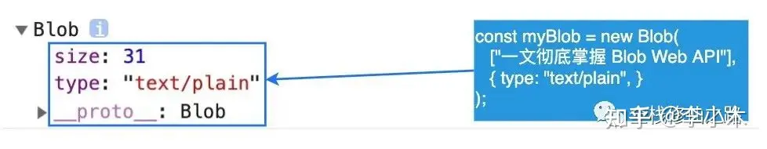

如你所见，myBlob 对象含有两个属性：size 和 type。其中 `size` 属性用于表示数据的大小（以字节为单位），`type` 是 MIME 类型的字符串。Blob 表示的不一定是 JavaScript 原生格式的数据。比如 `File` 接口基于 `Blob`，继承了 blob 的功能并将其扩展使其支持用户系统上的文件。·

### 2、Blob API 简介

`Blob` 由一个可选的字符串 `type`（通常是 MIME 类型）和 `blobParts` 组成：

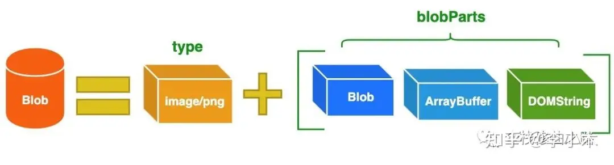

MIME（Multipurpose Internet Mail Extensions）多用途互联网邮件扩展类型，是设定某种扩展名的文件用一种应用程序来打开的方式类型，当该扩展名文件被访问的时候，浏览器会自动使用指定应用程序来打开。多用于指定一些客户端自定义的文件名，以及一些媒体文件打开方式。·

常见的 MIME 类型有：超文本标记语言文本 .html text/html、PNG 图像 .png image/png、普通文本 .txt text/plain 等。

#### 2.1 构造函数

Blob 构造函数的语法为：

> var aBlob = new Blob(blobParts, options);

相关的参数说明如下：·

- blobParts：它是一个由 ArrayBuffer，ArrayBufferView，Blob，DOMString 等对象构成的数组。DOMStrings 会被编码为 UTF-8。
- options：一个可选的对象，包含以下两个属性：
  - type —— 默认值为 `""`，它代表了将会被放入到 blob 中的数组内容的 MIME 类型。
  - endings —— 默认值为 `"transparent"`，用于指定包含行结束符 `\n` 的字符串如何被写入。它是以下两个值中的一个：`"native"`，代表行结束符会被更改为适合宿主操作系统文件系统的换行符，或者 `"transparent"`，代表会保持 blob 中保存的结束符不变。

**示例一：从字符串创建 Blob**

```javascript
let myBlobParts = ["<html><h2>Hello Semlinker</h2></html>"]; // an array consisting of a single DOMString
let myBlob = new Blob(myBlobParts, {
	type: "text/html",
	endings: "transparent",
}); // the blob

console.log(myBlob.size + " bytes size");
// Output: 37 bytes size
console.log(myBlob.type + " is the type");
// Output: text/html is the type
```

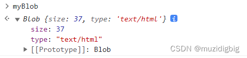

**示例二：从类型化数组和字符串创建 Blob**

```javascript
let hello = new Uint8Array([72, 101, 108, 108, 111]); // 二进制格式的 "hello"
let blob = new Blob([hello, " ", "semlinker"], { type: "text/plain" });
```

介绍完 Blob 构造函数，接下来我们来分别介绍 Blob 类的属性和方法：


#### 2.2 属性

前面我们已经知道 Blob 对象包含两个属性：·

- size（只读）：表示 `Blob` 对象中所包含数据的大小（以字节为单位）。
- type（只读）：一个字符串，表明该 `Blob` 对象所包含数据的 MIME 类型。如果类型未知，则该值为空字符串。

#### 2.3 方法

- slice([start[, end[, contentType]]])：返回一个新的 Blob 对象，包含了源 Blob 对象中指定范围内的数据。
- stream()：返回一个能读取 blob 内容的 `ReadableStream`。
- text()：返回一个 Promise 对象且包含 blob 所有内容的 UTF-8 格式的 `USVString`。
- arrayBuffer()：返回一个 Promise 对象且包含 blob 所有内容的二进制格式的 `ArrayBuffer`。

这里我们需要注意的是，**`Blob` 对象是不可改变的**。我们不能直接在一个 Blob 中更改数据，但是我们可以对一个 Blob 进行分割，从其中创建新的 Blob 对象，将它们混合到一个新的 Blob 中。这种行为类似于 JavaScript 字符串：我们无法更改字符串中的字符，但可以创建新的更正后的字符串。

## 3、Blob 使用场景

#### 3.1 分片上传

File 对象是特殊类型的 Blob，且可以用在任意的 Blob 类型的上下文中。所以针对大文件传输的场景，我们可以使用 slice 方法对大文件进行切割，然后分片进行上传，具体示例如下：

```javascript
const file = new File(["muzidigbig".repeat(1000000)], "test.txt");

const chunkSize = 40000;
const url = "https://httpbin.org/post";

async function chunkedUpload() {
	for (let start = 0; start < file.size; start += chunkSize) {
		const chunk = file.slice(start, start + chunkSize + 1);
		const fd = new FormData();
		fd.append("data", chunk);

		await fetch(url, { method: "post", body: fd }).then((res) => res.text());
	}
}
```

#### 3.2 从互联网下载数据

我们可以使用以下方法从互联网上下载数据并将数据存储到 Blob 对象中，比如：

```javascript
const downloadBlob = (url, callback) => {
	const xhr = new XMLHttpRequest();
	xhr.open("GET", url);
	xhr.responseType = "blob";
	// xhr.headers = { 'Content-Type': 'application/json; application/octet-stream' },
	xhr.onload = () => {
		callback(xhr.response);
	};
	xhr.send(null);
};
```

当然除了使用 `XMLHttpRequest` API 之外，我们也可以使用 `fetch` API 来实现以流的方式获取二进制数据。这里我们来看一下如何使用 fetch API 获取线上图片并本地显示，具体实现如下：

```javascript
const myImage = document.querySelector("img");
const myRequest = new Request("flowers.jpg");

fetch(myRequest)
	.then(function (response) {
		return response.blob();
	})
	.then(function (myBlob) {
		let objectURL = URL.createObjectURL(myBlob);
		myImage.src = objectURL;
	});
```

当 fetch 请求成功的时候，我们调用 response 对象的 `blob()` 方法，从 response 对象中读取一个 Blob 对象，然后使用 `createObjectURL()` 方法创建一个 objectURL，然后把它赋值给 `img` 元素的 `src` 属性从而显示这张图片。·

#### 3.3 blob 转 file

```javascript
let obj = {
	age: 18,
	sex: "男",
};
let content = JSON.stringify(obj);
// blob类型
let blob = new Blob([content], {
	type: "application/json",
});
// 将blob转成url
let url = URL.createObjectURL(blob); //blob:null/244bec7f-e3d3-43d5-803e-f98cc5c8117f  =>链接里面的数据就是右边的内容 {"age":18,"sex":"男"}
console.log(url);
//blob转file
let filename = "文件名";
var file = new File([blob], filename, {
	type: "application/json",
	lastModified: Date.now(),
});
//或者
var file1 = new File([content], filename, {
	type: "application/json",
	lastModified: Date.now(),
});
console.log("文件", file, file1);
```

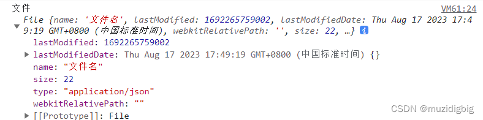

#### 3.4 Blob 用作 URL

Blob 可以很容易的作为 `<a>`、`` 或其他标签的 URL，多亏了 `type` 属性，我们也可以上传/下载 `Blob` 对象。下面我们将举一个 Blob 文件下载的示例，不过在看具体示例前我们得简单介绍一下 Blob URL。

##### 1.Blob URL/Object URL

Blob URL/Object URL 是一种伪协议，允许 Blob 和 File 对象用作图像，下载二进制数据链接等的 URL 源。在浏览器中，我们使用 `URL.createObjectURL` 方法来创建 Blob URL，该方法接收一个 `Blob` 对象，并为其创建一个唯一的 URL，其形式为 `blob:<origin>/<uuid>`，对应的示例如下：

blob:https://example.org/40a5fb5a-d56d-4a33-b4e2-0acf6a8e5f641

浏览器内部为每个通过 `URL.createObjectURL` 生成的 URL 存储了一个 URL → Blob 映射。因此，此类 URL 较短，但可以访问 `Blob`。生成的 URL 仅在当前文档打开的状态下才有效。它允许引用 ``、`<a>` 中的 `Blob`，但如果你访问的 Blob URL 不再存在，则会从浏览器中收到 404 错误。·

上述的 Blob URL 看似很不错，但实际上它也有副作用。虽然存储了 URL → Blob 的映射，但 Blob 本身仍驻留在内存中，浏览器无法释放它。映射在文档卸载时自动清除，因此 Blob 对象随后被释放。

但是，如果应用程序寿命很长，那不会很快发生。因此，如果我们创建一个 Blob URL，即使不再需要该 Blob，它也会存在内存中。

针对这个问题，我们可以调用 `URL.revokeObjectURL(url)` 方法，从内部映射中删除引用，从而允许删除 Blob（如果没有其他引用），并释放内存。接下

##### 2.Blob 文件下载示例

**index.html**

```javascript
<!DOCTYPE html>
<html>
<head>
<meta charset="UTF-8" />
<title>Blob 文件下载示例</title>
</head>

<body>
    <button id="downloadBtn">文件下载</button>
    <script src="index.js"></script>
</body>
</html>
```

**index.js**

```javascript
const download = (fileName, blob) => {
	const link = document.createElement("a");
	link.href = URL.createObjectURL(blob);
	link.download = fileName;
	link.click();
	link.remove();
	URL.revokeObjectURL(link.href);
};

const downloadBtn = document.querySelector("#downloadBtn");
downloadBtn.addEventListener("click", (event) => {
	const fileName = "blob.txt";
	const myBlob = new Blob(["一文彻底掌握 Blob Web API"], {
		type: "text/plain",
	});
	download(fileName, myBlob);
});
```

在示例中，我们通过调用 Blob 的构造函数来创建类型为 **“text/plain”** 的 Blob 对象，然后通过动态创建 `a` 标签来实现文件的下载。·

#### 3.5 Blob 转换为 Base64

`URL.createObjectURL` 的一个替代方法是，将 `Blob` 转换为 base64 编码的字符串。**Base64** 是一种基于 64 个可打印字符来表示二进制数据的表示方法，**它常用于在处理文本数据的场合，表示、传输、存储一些二进制数据，包括 MIME 的电子邮件及 XML 的一些复杂数据。**

在 MIME 格式的电子邮件中，base64 可以用来将二进制的字节序列数据编码成 ASCII 字符序列构成的文本。使用时，在传输编码方式中指定 base64。使用的字符包括大小写拉丁字母各 26 个、数字 10 个、加号 + 和斜杠 /，共 64 个字符，等号 = 用来作为后缀用途。

下面我们来介绍如何在 HTML 中嵌入 base64 编码的图片。在编写 HTML 网页时，对于一些简单图片，通常会选择将图片内容直接内嵌在网页中，从而减少不必要的网络请求，但是图片数据是二进制数据，该怎么嵌入呢？绝大多数现代浏览器都支持一种名为 `Data URLs` 的特性，允许使用 base64 对图片或其他文件的二进制数据进行编码，将其作为文本字符串嵌入网页中。

Data URLs 由四个部分组成：前缀（`data:`）、指示数据类型的 MIME 类型、如果非文本则为可选的 `base64` 标记、数据本身：

`data:[<mediatype>][;base64],<data>`

`mediatype` 是个 MIME 类型的字符串，例如 “`image/jpeg`” 表示 JPEG 图像文件。如果被省略，则默认值为 `text/plain;charset=US-ASCII`。如果数据是文本类型，你可以直接将文本嵌入（根据文档类型，使用合适的实体字符或转义字符）。如果是二进制数据，你可以将数据进行 base64 编码之后再进行嵌入。比如嵌入一张图片：

``

**但需要注意的是：如果图片较大，图片的色彩层次比较丰富，则不适合使用这种方式，因为该图片经过 base64 编码后的字符串非常大，会明显增大 HTML 页面的大小，从而影响加载速度。** 除此之外，利用 FileReader API，我们也可以方便的实现图片本地预览功能，具体代码如下：

```javascript
<input type="file" accept="image/*" onchange="loadFile(event)">


<script>
const loadFile = function(event) {
    const reader = new FileReader();
    reader.onload = function(){
        const output = document.querySelector('output');
        output.src = reader.result;
    };
    reader.readAsDataURL(event.target.files[0]);
};
</script>
```

在以上示例中，我们为 file 类型输入框绑定 `onchange` 事件处理函数 `loadFile`，在该函数中，我们创建了一个 FileReader 对象并为该对象绑定 `onload` 相应的事件处理函数，然后调用 FileReader 对象的 `readAsDataURL()` 方法，把本地图片对应的 File 对象转换为 Data URL。·

在完成本地图片预览之后，我们可以直接把图片对应的 Data URLs 数据提交到服务器。针对这种情形，服务端需要做一些相关处理，才能正常保存上传的图片，这里以 Express 为例，具体处理代码如下：

```javascript
const app = require("express")();

app.post("/upload", function (req, res) {
	let imgData = req.body.imgData; // 获取POST请求中的base64图片数据
	let base64Data = imgData.replace(/^data:image\/\w+;base64,/, "");
	let dataBuffer = Buffer.from(base64Data, "base64");
	fs.writeFile("image.png", dataBuffer, function (err) {
		if (err) {
			res.send(err);
		} else {
			res.send("图片上传成功！");
		}
	});
});
```

对于 FileReader 对象来说，除了支持把 Blob/File 对象转换为 Data URL 之外，它还提供了 `readAsArrayBuffer()` 和 `readAsText()` 方法，用于把 Blob/File 对象转换为其它的数据格式。这里我们来看个 `readAsArrayBuffer()` 的使用示例：

```javascript
// 从 blob 获取 arrayBuffer
let fileReader = new FileReader();

fileReader.onload = function (event) {
	let arrayBuffer = fileReader.result;
};
fileReader.readAsArrayBuffer(blob);
```
