# CSS 面试题


## 如何居中 div，如何居中一个浮动元素?

给 div 设置一个宽度，然后添加 margin:0 auto 属性

```css
div {
	width: 200px;
	margin: 0 auto;
}
```

居中一个浮动元素

确定容器的宽高 宽 500 高 300 的层

设置层的外边距

```css
.div {
	width: 500px;
	height: 300px; // 高度可以不设
	margin: -150px 0 0 -250px;
	position: relative; // 相对定位
	background-color: pink; // 方便看效果
	left: 50%;
	top: 50%;
}
```

### 列出 display 的值，说明他们的作用。position 的值，relative 和 absolute

#### 定位原点是？

block 象块类型元素一样显示。

none 缺省值。向行内元素类型一样显示。

inline-block 象行内元素一样显示，但其内容象块类型元素一样显示。

list-item 象块类型元素一样显示，并添加样式列表标记。

position 的值

#### \*absolute

生成绝对定位的元素，相对于 static 定位以外的第一个父元素进行定位。

#### \*fixed （老 IE 不支持）

生成绝对定位的元素，相对于浏览器窗口进行定位。

#### relative

生成相对定位的元素，相对于其正常位置进行定位。

static 默认值。没有定位，元素出现在正常的流中

#### \*（忽略 top, bottom, left, right z-index 声明）。

inherit 规定从父元素继承 position 属性的值。

### absolute 的 containing block 计算方式跟正常流有什么不同？

### position 跟 display、margin collapse、overflow、float 这些特性相互叠加后会怎么样？

### CSS 的基本语句构成是?

```css
选择器{属性 1:值 1;属性 2:值 2;……}
```


### 浏览器标准模式和怪异模式之间的区别是什么?

盒子模型 渲染模式的不同

使用 window.top.document.compatMode 可显示为什么模式

### CSS 中可以通过哪些属性定义，使得一个 DOM 元素不显示在浏览器可视范围内？

最基本的：

设置 display 属性为 none，或者设置 visibility 属性为 hidden

技巧性：

设置宽高为 0，设置透明度为 0，设置 z-index 位置在-1000

### 什么是外边距重叠？重叠的结果是什么？

答案：

外边距重叠就是 margin-collapse。

在 CSS 当中，相邻的两个盒子（可能是兄弟关系也可能是祖先关系）的外边距可以结合成一个单独的外边距。这种合并外边距的方式被称为折叠，并且因而所结合成的外边距称为折叠外边距。

折叠结果遵循下列计算规则：

- 两个相邻的外边距都是正数时，折叠结果是它们两者之间较大的值。
- 两个相邻的外边距都是负数时，折叠结果是两者绝对值的较大值。
- 两个外边距一正一负时，折叠结果是两者的相加的和。

### 描述一个"reset"的 CSS 文件并如何使用它。知道 normalize.css 吗？你了解他们的不同之处？

重置样式非常多，凡是一个前端开发人员肯定有一个常用的重置 CSS 文件并知道如何使用它们。他们是盲目的在做还是知道为什么这么做呢？原因是不同的浏览器对一些元素有不同的默认样式，如果你不处理，在不同的浏览器下会存在必要的风险，或者更有戏剧性的性发生。

你可能会用 Normalize 来代替你的重置样式文件。它没有重置所有的样式风格，但仅提供了一套合理的默认样式值。既能让众多浏览器达到一致和合理，但又不扰乱其他的东西（如
粗体的标题）。

在这一方面，无法做每一个复位重置。它也确实有些超过一个重置，它处理了你永远都不用考虑的怪癖，像 HTML 的 audio 元素不一致或 line-height 不一致。

### 说 display 属性有哪些？可以做什么？

display:block 行内元素转换为块级元素

display:inline 块级元素转换为行内元素

display:inline-block 转为内联元素

### b 标签和 strong 标签,i 标签和 em 标签的区别？

后者有语义，前者则无。

### 有那些行内元素、有哪些块级元素、盒模型？

1.内联元素(inline element)

- a – 锚点
- abbr – 缩写
- acronym – 首字
- b – 粗体(不推荐)
- big – 大字体
- br – 换行
- em – 强调
- font – 字体设定(不推荐)
- i – 斜体
- img – 图片
- input – 输入框
- label – 表格标签
- s – 中划线(不推荐)
- select – 项目选择
- small – 小字体文本
- span – 常用内联容器，定义文本内区块
- strike – 中划线
- strong – 粗体强调
- sub – 下标
- sup – 上标
- textarea – 多行文本输入框
- tt – 电传文本
- u – 下划线
- var – 定义变量

2、块级元素

- address – 地址
- blockquote – 块引用
- center – 举中对齐块
- dir – 目录列表
- div – 常用块级容易，也是 css layout 的主要标签
- dl – 定义列表
- fieldset – form 控制组
- form – 交互表单
- h1 – 大标题
- h2 – 副标题
- h3 – 3 级标题
- h4 – 4 级标题
- h5 – 5 级标题
- h6 – 6 级标题
- hr – 水平分隔线
- isindex – input prompt
- menu – 菜单列表
- noframes – frames 可选内容，（对于不支持 frame 的浏览器显示此区块内容）
- noscript – ）可选脚本内容（对于不支持 script 的浏览器显示此内容）
- ol – 排序表单
- p – 段落
- pre – 格式化文本
- table – 表格
- ul – 非排序列表

  3.CSS 盒子模型包含四个部分组成：

- 内容
- 填充（padding）
- 边框（border）
- 外边界（margin）

### 有哪些选择符，优先级的计算公式是什么？行内样式和!important 哪个优先级高？

ID > .class > 标签选择符 !important 优先级高

### 我想让行内元素跟上面的元素距离 10px，加 margin-top 和 padding-top 可以吗？

margin-top,padding-top 无效

### CSS 的盒模型由什么组成？

内容，border ,margin，padding

### 说说 display 属性有哪些？可以做什么？

display:block 行内元素转换为块级元素

display:inline 块级元素转换为行内元素

display:inline-block 转为内联元素

### 哪些 css 属性可以继承？

可继承： font-size font-family color, ul li dl dd dt;

不可继承 ：border padding margin width height ;

### text-align:center 和 line-height 有什么区别？

text-align 是水平对齐，line-height 是行间。

### 写一个表格以及对应的 CSS，使表格奇数行为白色背景，偶数行为灰色，鼠标一上去为黄色背景

### 行内元素和块级元素的具体区别是什么？行内元素的 padding 和 margin 可设置吗？

块级元素(block)特性：

- 总是独占一行，表现为另起一行开始，而且其后的元素也必须另起一行显示;
- 宽度(width)、高度(height)、内边距(padding)和外边距(margin)都可控制;

内联元素(inline)特性：

- 和相邻的内联元素在同一行;
- 宽度(width)、高度(height)、内边距的 top/bottom(padding-top/padding-bottom)和外边距的 top/bottom(margin-top/margin-bottom)都不可改变（也就是 padding 和 margin 的 left 和 right 是可以设置的），就是里面文字或图片的大小。

那么问题来了，浏览器还有默认的天生 inline-block 元素（拥有内在尺寸，可设置高宽，但不会自动换行），有哪些？

答案：`<input>` 、`` 、`<button>` 、`<textarea>` 、`<label>`

### 什么是外边距重叠？重叠的结果是什么？

外边距重叠就是 margin-collapse。

在 CSS 当中，相邻的两个盒子（可能是兄弟关系也可能是祖先关系）的外边距可以结合成一个单独的外边距。这种合并外边距的方式被称为折叠，并且因而所结合成的外边距称为折叠外边距。

折叠结果遵循下列计算规则：

两个相邻的外边距都是正数时，折叠结果是它们两者之间较大的值。

两个相邻的外边距都是负数时，折叠结果是两者绝对值的较大值。

两个外边距一正一负时，折叠结果是两者的相加的和。

### rgba()和 opacity 的透明效果有什么不同？

rgba()和 opacity 都能实现透明效果，但最大的不同是 opacity 作用于元素，以及元素内的所有内容的透明度，而 rgba()只作用于元素的颜色或其背景色。（设置 rgba 透明的元素的子元素不会继承透明效果！）

### CSS 中可以让文字在垂直和水平方向上重叠的两个属性是什么？

垂直方向：line-height

水平方向：letter-spacing

那么问题来了，关于 letter-spacing 的妙用知道有哪些么？

答案：可以用于消除 inline-block 元素间的换行符空格间隙问题。

### 如何垂直居中一个浮动元素？

```css
// 方法一：已知元素的高宽
# div1 {
	background-color: #6699ff;
	width: 200px;
	height: 200px;
	position: absolute; // 父元素需要相对定位
	top: 50%;
	left: 50%;
	margin-top: -100px; // 二分之一的 height，width
	margin-left: -100px;
}
// 方法二:未知元素的高宽
# div1 {
	width: 200px;
	height: 200px;
	background-color: #6699ff;
	margin: auto;
	position: absolute; // 父元素需要相对定位
	left: 0;
	top: 0;
	right: 0;
	bottom: 0;
}
```

那么问题来了，如何垂直居中一个``?（用更简便的方法。）

container ``的容器设置如下

```css
img {
	display: table-cell;
	text-align: center;
	vertical-align: middle;
}
```

### px 和 em 的区别

px 和 em 都是长度单位，区别是，px 的值是固定的，指定是多少就是多少，计算比较容易。

em 得值不是固定的，并且 em 会继承父级元素的字体大小。

浏览器的默认字体高都是 16px。所以未经调整的浏览器都符合: 1em=16px。那么 12px=0.75em,10px=0.625em。

### 描述一个"reset"的 CSS 文件并如何使用它。知道 normalize.css 吗？你了解他们的不同之处吗？

重置样式非常多，凡是一个前端开发人员肯定有一个常用的重置 CSS 文件并知道如何使用它们。他们是盲目的在做还是知道为什么这么做呢？原因是不同的浏览器对一些元素有不同的默认样式，如果你不处理，在不同的浏览器下会存在必要的风险，或者更有戏剧性的性发生。

你可能会用 Normalize 来代替你的重置样式文件。它没有重置所有的样式风格，但仅提供了一套合理的默认样式值。既能让众多浏览器达到一致和合理，但又不扰乱其他的东西（如粗体的标题）。

在这一方面，无法做每一个复位重置。它也确实有些超过一个重置，它处理了你永远都不用考虑的怪癖，像 HTML 的 audio 元素不一致或 line-height 不一致。

### display:none 与 visibility:hidden 的区别是什么？

display : 隐藏对应的元素但不挤占该元素原来的空间。

visibility: 隐藏对应的元素并且挤占该元素原来的空间。

即是，使用 CSS display:none 属性后，HTML 元素（对象）的宽度、高度等各种属性值都将"丢失";而使用 visibility:hidden 属性后，HTML 元素（对象）仅仅是在视觉上看不见（完全透明），而它所占据的空间位置仍然存在。

### CSS 中 link 和@import 的区别是

Link 属于 html 标签，而@import 是 CSS 中提供的在页面加载的时候，link 会同时被加载，而@import 引用的 CSS 会在页面加载完成后才会加
载引用的 CSS @import 只有在 ie5 以上才可以被识别，而 link 是 html 标签，不存在浏览器兼容性问题

Link 引入样式的权重大于@import 的引用（@import 是将引用的样式导入到当前的页面中）

### 为什么要初始化样式？

由于浏览器兼容的问题，不同的浏览器对标签的默认样式值不同，若不初始化会造成不同浏览器之间的显示差异。

但是初始化 CSS 会对搜索引擎优化造成小影响

### BFC 是什么?

BFC（块级格式化上下文），一个创建了新的 BFC 的盒子是独立布局的，盒子内元素的布局不会影响盒子外面的元素。在同一个 BFC 中的两个相邻的盒子在垂直方向发生 margin 重叠的问题 BFC 是指浏览器中创建了一个独立的渲染区域，该区域内所有元素的布局不会影响到区域外元素的布局，这个渲染区域只对块级元素起作用。

### 对 BFC 规范的理解？

Formatting Context：指页面中的一个渲染区域，并且拥有一套渲染规则，他决定了其子元素如何定位，以及与其他元素的相互关系和作用。

### 请用 CSS 写一个简单的幻灯片效果页面

答案：知道是要用 css3。使用 animation 动画实现一个简单的幻灯片效果。

```css
/**HTML**/
div.ani
/**css**/
.ani {
	width: 480px;
	height: 320px;
	margin: 50px auto;
	overflow: hidden;
	box-shadow: 0 0 5px rgba(0, 0, 0, 1);
	background-size: cover;
	background-position: center;
	-webkit-animation-name: "loops";
	-webkit-animation-duration: 20s;
	-webkit-animation-iteration-count: infinite;
}
@-webkit-keyframes "loops" {
	0% {
		background: url(<http://d.hiphotos.baidu.com/image/w%3D400/sign=c01e6adca964034f0fcdc3069fc27980/e824b899a9014c08e5e38ca4087b02087af4f4d3.jpg>)
			no-repeat;
	}
	25% {
		background: url(<http://b.hiphotos.baidu.com/image/w%3D400/sign=edee1572e9f81a4c2632edc9e72b6029/30adcbef76094b364d72bceba1cc7cd98c109dd0.jpg>)
			no-repeat;
	}
	50% {
		background: url(<http://b.hiphotos.baidu.com/image/w%3D400/sign=937dace2552c11dfded1be2353266255/d8f9d72a6059252d258e7605369b033b5bb5b912.jpg>)
			no-repeat;
	}
	75% {
		background: url(<http://g.hiphotos.baidu.com/image/w%3D400/sign=7d37500b8544ebf86d71653fe9f9d736/0df431adcbef76095d61f0972cdda3cc7cd99e4b.jpg>)
			no-repeat;
	}
	100% {
		background: url(<http://c.hiphotos.baidu.com/image/w%3D400/sign=cfb239ceb0fb43161a1f7b7a10a54642/3b87e950352ac65ce2e73f76f9f2b21192138ad1.jpg>)
			no-repeat;
	}
}
```

### 超链接访问过后 hover 样式就不出现的问题是什么？如何解决？

答案：被点击访问过的超链接样式不在具有 hover 和 active 了,解决方法是改变 CSS 属性的排列顺序: L-V-H-A（link，visited，hover，active）

### 有哪项方式可以对一个 DOM 设置它的 CSS 样式？

外部样式表，引入一个外部 css 文件

内部样式表，将 css 代码放在 `<head>` 标签内部

内联样式，将 css 样式直接定义在 HTML 元素内部

### CSS 中可以通过哪些属性定义，使得一个 DOM 元素不显示在浏览器可视范围内？

最基本的：

设置 display 属性为 none，或者设置 visibility 属性为 hidden

技巧性：

设置宽高为 0，设置透明度为 0，设置 z-index 位置在-1000

## CSS 都有哪些选择器？

派生选择器（用 HTML 标签申明）

id 选择器（用 DOM 的 ID 申明）

类选择器（用一个样式类名申明）

属性选择器（用 DOM 的属性申明，属于 CSS2，IE6 不支持，不常用，不知道就算了）

除了前 3 种基本选择器，还有一些扩展选择器，包括

后代选择器（利用空格间隔，比如 div .a{ }）

群组选择器（利用逗号间隔，比如 p,div,#a{ }）

那么问题来了，CSS 选择器的优先级是怎么样定义的？

基本原则：

一般而言，选择器越特殊，它的优先级越高。也就是选择器指向的越准确，它的优先级就越高。

复杂的计算方法：

用 1 表示派生选择器的优先级

用 10 表示类选择器的优先级

用 100 标示 ID 选择器的优先级

div.test1 .span var 优先级 1+10 +10 +1

span#xxx .songs li 优先级 1+100 + 10 + 1

xxx li 优先级 100 +1

那么问题来了，看下列代码，`<p>`标签内的文字是什么颜色的？

```html
<style>
	.classA {
		color: blue;
	}
	.classB {
		color: red;
	}
</style>
<body>
	<p class="classB classA">123</p>
</body>
```

答案：red。与样式定义在文件中的先后顺序有关，即是后面的覆盖前面的，与在`<p class='classB classA'>`中的先后关系无关。

## CSS 优化和提高性能的方法有哪些？

### 加载性能：

- （1）css 压缩：将写好的 css 进行打包压缩，可以减小文件体积。
- （2）css 单一样式：当需要下边距和左边距的时候，很多时候会选择 使 用 margin:top 0 bottom 0 ； 但 margin-bottom:bottom;margin-left:left;执行效率会更高。
- （3）减少使用@import，建议使用 link，因为后者在页面加载时一起加载，前者是等待页面加载完成之后再进行加载。

### 选择器性能：

- （1）关键选择器（key selector）。选择器的最后面的部分为关键选择器（即用来匹配目标元素的部分）。CSS 选择符是从右到左进行匹配的。当使用后代选择器的时候，浏览器会遍历所有子元素来确定是否是指定的元素等等；
- （2）如果规则拥有 ID 选择器作为其关键选择器，则不要为规则增加标签。过滤掉无关的规则（这样样式系统就不会浪费时间去匹配它们了）。
- （3）避免使用通配规则，如\*{}计算次数惊人，只对需要用到的元素进行选择。
- （4）尽量少的去对标签进行选择，而是用 class。
- （5）尽量少的去使用后代选择器，降低选择器的权重值。后代选择器的开销是最高的，尽量将选择器的深度降到最低，最高不要超过三层，更多的使用类来关联每一个标签元素。
- （6）了解哪些属性是可以通过继承而来的，然后避免对这些属性重复指定规则。

### 渲染性能：

- （1）慎重使用高性能属性：浮动、定位。
- （2）尽量减少页面重排、重绘。
- （3）去除空规则：｛｝。空规则的产生原因一般来说是为了预留样式。去除这些空规则无疑能减少 css 文档体积。
- （4）属性值为 0 时，不加单位。
- （5）属性值为浮动小数 0.\*\*，可以省略小数点之前的 0。
- （6）标准化各种浏览器前缀：带浏览器前缀的在前。标准属性在后。
- （7）不使用@import 前缀，它会影响 css 的加载速度。
- （8）选择器优化嵌套，尽量避免层级过深。
- （9）css 雪碧图，同一页面相近部分的小图标，方便使用，减少页面的请求次数，但是同时图片本身会变大，使用时，优劣考虑清楚，再使用。
- （10）正确使用 display 的属性，由于 display 的作用，某些样式组合会无效，徒增样式体积的同时也影响解析性能。
- （11）不滥用 web 字体。对于中文网站来说 WebFonts 可能很陌生，国外却很流行。web fonts 通常体积庞大，而且一些浏览器在下载 webfonts 时会阻塞页面渲染损伤性能。

可维护性、健壮性：

（1）将具有相同属性的样式抽离出来，整合并通过 class 在页面中进行使用，提高 css 的可维护性。

（2）样式与内容分离：将 css 代码定义到外部 css 中。


## CSS预处理器

less 和 sass 大家肯定都用过，今天我们从另一个角度来谈谈他们

- [2019 年，你是否可以抛弃 CSS 预处理器？](https://aotu.io/notes/2019/10/29/css-preprocessor/index.html)

### css 预处理器知道吗？用过哪些？有什么优劣？后处理器知道吗？

### stylus/sass/less 区别

- 均具有“变量”、“混合”、“嵌套”、“继承”、“颜⾊混合”五大基本特性
- Scss 和 LESS 语法较为严谨， LESS 要求一定要使用大括号“{}”， Scss 和 Stylus 可以通过缩进表示层次与嵌套关系
- Scss 无全局变量的概念， LESS 和 Stylus 有类似于其它语⾔的作用域概念
- Sass 是基于 Ruby 语⾔的，而 LESS 和 Stylus 可以基于 NodeJS NPM 下载相应库后进行编译；

### Sass、LESS 是什么？大家为什么要使用他们？

他们是 CSS 预处理器。他是 CSS 上的一种抽象层。他们是一种特殊的语法/语言编译成 CSS。

例如 Less 是一种动态样式语言。将 CSS 赋予了动态语言的特性，如变量，继承，运算， 函数. LESS 既可以在客户端上运行 (支持 IE 6+, Webkit, Firefox)，也可一在服务端运行(借助 Node.js)。

### 你平时怎么写 css（或者说用过 css 预处理器吗，用过 Less 和 SASS 吗？）

答：一般咱们说我平时写 css 用 less，可以定义变量，嵌套，混入等功能，sass 语法和 less 类似都是 css 预处理器，方便开发人员写快速高效写 css

#### 为什么要使用它们？

- 结构清晰，便于扩展。
- 可以方便地屏蔽浏览器私有语法差异。这个不用多说，封装对- 浏览器语法差异的重复处理，减少无意义的机械劳动。
- 可以轻松实现多重继承。
- 完全兼容 CSS 代码，可以方便地应用到⽼项目中。LESS 只- 是在 CSS 语法上做了扩展，所以⽼的 CSS 代码也可以与 LESS 代码一同编译

### postcss 的作用

- 可以直观的理解为：它就是一个平台。为什么说它是一个平台呢？因为我们直接用它，感觉不能⼲什么事情，但是如果让一些插件在它上面跑，那么将会很强大
- PostCSS 提供了一个解析器，它能够将 CSS 解析成抽象语法树
- 通过在 PostCSS 这个平台上，我们能够开发一些插件，来处理我们的 CSS ，比如热⻔的： autoprefixer
- postcss 可以对 sass 处理过后的 css 再处理 最常见的就是 autoprefixer。

## 对 CSS 工程化的理解

CSS 工程化是为了解决以下问题：

1.宏观设计：CSS 代码如何组织、如何拆分、模块结构怎样设计？ 2.编码优化：怎样写出更好的 CSS？ 3.构建：如何处理我的 CSS，才能让它的打包结果最优？ 4.可维护性：代码写完了，如何最小化它后续的变更成本？如何确保任何一个同事都能轻松接手？

以下三个方向都是时下比较流行的、普适性非常好的 CSS 工程化实践：

- 预处理器：Less、 Sass 等；
- 重要的工程化插件： PostCss；
- Webpack loader 等 。

基于这三个方向，可以衍生出一些具有典型意义的子问题，这里我们逐个来看：

（1）预处理器：为什么要用预处理器？它的出现是为了解决什么问题？

预处理器，其实就是 CSS 世界的“轮子”。预处理器支持我们写一种类似 CSS、但实际并不是 CSS 的语言，然后把它编译成 CSS 代码：

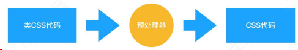

那为什么写 CSS 代码写得好好的，偏偏要转去写“类 CSS”呢？这就和本来用 JS 也可以实现所有功能，但最后却写 React 的 jsx 或者 Vue 的模板语法一样——为了爽！要想知道有了预处理器有多爽，首先要知道的是传统 CSS 有多不爽。随着前端业务复杂度的提高，前端工程中对 CSS 提出了以下的诉求：

1.宏观设计上：我们希望能优化 CSS 文件的目录结构，对现有的 CSS 文件实现复用；

2.编码优化上：我们希望能写出结构清晰、简明易懂的 CSS，需要它具有一目了然的嵌套层级关系，而不是无差别的一铺到底写法；我们希望它具有变量特征、计算能力、循环能力等等更强的可编程性，这样我们可以少写一些无用的代码；

3.可维护性上：更强的可编程性意味着更优质的代码结构，实现复用意味着更简单的目录结构和更强的拓展能力，这两点如果能做到，自然会带来更强的可维护性。

这三点是传统 CSS 所做不到的，也正是预处理器所解决掉的问题。

预处理器普遍会具备这样的特性：

嵌套代码的能力，通过嵌套来反映不同 css 属性之间的层级关系 ；

支持定义 css 变量；

提供计算函数；

允许对代码片段进行 extend 和 mixin；

支持循环语句的使用；

支持将 CSS 文件模块化，实现复用。

（2）PostCss：PostCss 是如何工作的？我们在什么场景下会使用 PostCss？

PostCss 仍然是一个对 CSS 进行解析和处理的工具，它会对 CSS 做这样的事情：

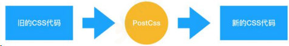

它和预处理器的不同就在于，预处理器处理的是 类 CSS，而 PostCss 处理的就是 CSS 本身。Babel 可以将高版本的 JS 代码转换为低版本的 JS 代码。PostCss 做的是类似的事情：它可以编译尚未被浏览器广泛支持的先进的 CSS 语法，还可以自动为一些需要额外兼容的语法增加前缀。更强的是，由于 PostCss 有着强大的插件机制，支持各种各样的扩展，极大地强化了 CSS 的能力。

PostCss 在业务中的使用场景非常多：

提高 CSS 代码的可读性：PostCss 其实可以做类似预处理器能做的工作；

当 我 们 的 CSS 代 码 需 要 适 配 低 版 本 浏 览 器 时 ， PostCss 的 Autoprefixer 插件可以帮助我们自动增加浏览器前缀；

允许我们编写面向未来的 CSS：PostCss 能够帮助我们编译 CSSnext 代码；

（3）Webpack 能处理 CSS 吗？如何实现？

Webpack 能处理 CSS 吗：

Webpack 在裸奔的状态下，是不能处理 CSS 的，Webpack 本身是一个面向 JavaScript 且只能处理 JavaScript 代码的模块化打包工具；

Webpack 在 loader 的辅助下，是可以处理 CSS 的。

如何用 Webpack 实现对 CSS 的处理：

Webpack 中操作 CSS 需要使用的两个关键的 loader：css-loader 和 style-loader

注意，答出“用什么”有时候可能还不够，面试官会怀疑你是不是在背答案，所以你还需要了解每个 loader 都做了什么事情：

css-loader：导入 CSS 模块，对 CSS 代码进行编译处理；
style-loader：创建 style 标签，把 CSS 内容写入标签。

在实际使用中，css-loader 的执行顺序一定要安排在 style-loader 的前面。因为只有完成了编译过程，才可以对 css 代码进行插入；

若提前插入了未编译的代码，那么 webpack 是无法理解这坨东西的，它会无情报错。

## 常见的 CSS 布局单位

常用的布局单位包括像素（px），百分比（%），em，rem，vw/vh。

（1）像素（px）是页面布局的基础，一个像素表示终端（电脑、手
机、平板等）屏幕所能显示的最小的区域，像素分为两种类型：CSS
像素和物理像素：

CSS 像素：为 web 开发者提供，在 CSS 中使用的一个抽象单位；

物理像素：只与设备的硬件密度有关，任何设备的物理像素都是固定的。

（2）百分比（%），当浏览器的宽度或者高度发生变化时，通过百分比单位可以使得浏览器中的组件的宽和高随着浏览器的变化而变化，从而实现响应式的效果。一般认为子元素的百分比相对于直接父元素。

（3）em 和 rem 相对于 px 更具灵活性，它们都是相对长度单位，它们之间的区别：em 相对于父元素，rem 相对于根元素。

em： 文本相对长度单位。相对于当前对象内文本的字体尺寸。如果当前行内文本的字体尺寸未被人为设置，则相对于浏览器的默认字体尺寸(默认 16px)。(相对父元素的字体大小倍数)。

rem： rem 是 CSS3 新增的一个相对单位，相对于根元素（html 元素）的 font-size 的倍数。作用：利用 rem 可以实现简单的响应式布局，可以利用 html 元素中字体的大小与屏幕间的比值来设置 font-size 的值，以此实现当屏幕分辨率变化时让元素也随之变化。

（4）vw/vh 是与视图窗口有关的单位，vw 表示相对于视图窗口的宽度，vh 表示相对于视图窗口高度，除了 vw 和 vh 外，还有 vmin 和 vmax 两个相关的单位。

- vw：相对于视窗的宽度，视窗宽度是 100vw；
- vh：相对于视窗的高度，视窗高度是 100vh；
- vmin：vw 和 vh 中的较小值；
- vmax：vw 和 vh 中的较大值；
- vw/vh 和百分比很类似，两者的区别：
  - 百分比（%）：大部分相对于祖先元素，也有相对于自身的情况比如（border-radius、translate 等)
  - vw/vm：相对于视窗的尺寸

### display: none; 与 visibility: hidden; 的区别

**联系：它们都能让元素不可见**

区别：

- display:none ;会让元素完全从渲染树中消失，渲染的时候不占据任何空间；visibility: hidden ;不会让元素从渲染树消失，渲染师元素继续占据空间，只是内容不可见。
- display: none ;是非继承属性，子孙节点消失由于元素从渲染树消失造成，通过修改子孙节点属性无法显示 ；visibility: hidden; 是继承属性，子孙节点消失由于继承了 hidden ，通过设置 visibility: visible; 可以让子孙节点显式。
- 修改常规流中元素的 display 通常会造成文档重排。修改 visibility 属性只会造成本元素的重绘。
- 读屏器不会读取 display: none ;元素内容；会读取 visibility: hidden; 元素内容。

### link 与 @import 的区别

1. link 是 HTML 方式， @import 是 CSS 方式
2. link 最大限度支持并行下载， @import 过多嵌套导致串行下载，出现 FOUC (文档样式
   短暂失效)
3. link 可以通过 rel="alternate stylesheet" 指定候选样式
4. 浏览器对 link 支持早于 @import ，可以使用 @import 对⽼浏览器隐藏样式
5. @import 必须在样式规则之前，可以在 css 文件中引用其他文件
6. 总体来说： link 优于 @import

### 如何创建块级格式化上下文(block formatting context),BFC 有什么用

创建规则：

- 根元素
- 浮动元素（ float 不取值为 none ）
- 绝对定位元素（ position 取值为 absolute 或 fixed ）
- display 取值为 inline-block 、 table-cell 、 table-caption 、 flex 、
- inline-flex 之一的元素
- overflow 不取值为 visible 的元素

作用：

- 可以包含浮动元素
- 不被浮动元素覆盖
- 组织父子元素的 margin 折叠

### display、float、position 的关系

- 如果 display 取值为 none ，那么 position 和 float 都不起作用，这种情况下元素不产生框
- 否则，如果 position 取值为 absolute 或者 fixed ，框就是绝对定位的， float 的计算值为 none ， display 根据下面的表格进行调整。
- 否则，如果 float 不是 none ，框是浮动的， display 根据下表进行调整
- 否则，如果元素是根元素， display 根据下表进行调整
- 其他情况下 display 的值为指定值
- 总结起来：**绝对定位、浮动、根元素都需要调整 display**

### 清除浮动的几种方式，各自的优缺点

- 父级 div 定义 height
- 结尾处加空 div 标签 clear: both
- 父级 div 定义伪类 :after 和 zoom
- 父级 div 定义 overflow: hidden
- 父级 div 也浮动，需要定义宽度
- 结尾处加 br 标签 clear: both
- 比较好的是第 3 种方式，好多网站都这么用

### css3 有哪些新特性

- 新增各种 css 选择器
- 圆角 border-radius
- 多列布局
- 阴影和反射
- 文字特效 text-shadow
- 线性渐变
- 旋转 transform

#### CSS3 新增伪类有那些？

- p:first-of-type 选择属于其父元素的首个 `<p>` 元素的每个 `<p>` 元素。
- p:last-of-type 选择属于其父元素的最后 `<p>` 元素的每个 `<p>` 元素。
- p:only-of-type 选择属于其父元素唯一的 `<p>` 元素的每个 `<p>` 元素。
- p:only-child 选择属于其父元素的唯一子元素的每个 `<p>` 元素。
- p:nth-child(2) 选择属于其父元素的第二个子元素的每个 `<p>` 元素。
- :after 在元素之前添加内容,也可以用来做清除浮动。
- :before 在元素之后添加内容。
- :enabled 已启用的表单元素。
- :disabled 已禁用的表单元素。
- :checked 单选框或复选框被选中。

### display 有哪些值？说明他们的作用

- block 转换成块状元素。
- inline 转换成行内元素。
- none 设置元素不可见。
- inline-block 象行内元素一样显示，但其内容象块类型元素一样显示。
- list-item 象块类型元素一样显示，并添加样式列表标记。
- table 此元素会作为块级表格来显示
- inherit 规定应该从父元素继承 display 属性的值

### CSS 优先级算法如何计算？

- 优先级就近原则，同权重情况下样式定义最近者为准
- 载入样式以最后载入的定位为准
- 优先级为: !important > id > class > tag ; !important 比 内联优先级高

### position 的值， relative 和 absolute 定位原点是

- absolute ：生成绝对定位的元素，相对于 static 定位以外的第一个父元素进行定位
- fixed ：生成绝对定位的元素，相对于浏览器窗口进行定位
- relative ：生成相对定位的元素，相对于其正常位置进行定位
- static 默认值。没有定位，元素出现在正常的流中
- inherit 规定从父元素继承 position 属性的值

### display:inline-block 什么时候不会显示间隙？(携程)

- 移除空格
- 使用 margin 负值
- 使用 font-size:0
- letter-spacing
- word-spacing

### 行内元素 float:left 后是否变为块级元素？

行内元素设置成浮动之后变得更加像是 inline-block （行内块级元素，设置
成这个属性的元素会同时拥有行内和块级的特性，最明显的不同是它的默认宽
度不是 100% ），这时候给行内元素设置 padding-top 和 padding-bottom
或者 width 、 height 都是有效果的。

### 为什么要把图片转成 base64 的的格式

- 用于减少 HTTP 请求
- 适用于小图片
- base64 的体积约为原图的 4/3

## 2.如何实现一个最大的正方形

用 padding-bottom 撑开边距

```css
section {
	width: 100%;
	padding-bottom: 100%;
	background: #333;
}
```

## 3.一行水平居中，多行居左

```html
制
<div>
	<span
		>我是多行文字。我是多行文字。我是多行文字。我是多行文字。我是多行文字。我是多行文
		字。我是多行文字。我是多行文字。我是多行文字。我是多行文字。</span
	>
</div>
<div><span>我是一行文字</span></div>
<style>
	div {
		text-align: center;
	}
	div span {
		display: inline-block;
		text-align: left;
	}
</style>
```

## 元素的层叠顺序

层叠顺序，英文称作 stacking order，表示元素发生层叠时有着特定的垂直显示顺序。下面是盒模型的层叠规则：

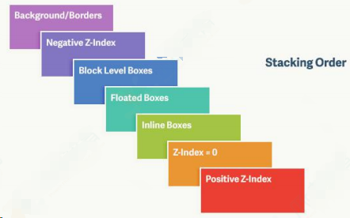

对于上图，由上到下分别是：

- （1）背景和边框：建立当前层叠上下文元素的背景和边框。
- （2）负的 z-index：当前层叠上下文中，z-index 属性值为负的元素。
- （3）块级盒：文档流内非行内级非定位后代元素。
- （4）浮动盒：非定位浮动元素。
- （5）行内盒：文档流内行内级非定位后代元素。
- （6）z-index:0：层叠级数为 0 的定位元素。
- （7）正 z-index：z-index 属性值为正的定位元素。

注意: 当定位元素 z-index:auto，生成盒在当前层叠上下文中的层级为 0，不会建立新的层叠上下文，除非是根元素。

## 4.水平垂直居中

### 水平居中

1.若是行内元素, 给其父元素设置 text-align:center,即可实现行内元素水平居中.

2.若是块级元素, 该元素设置 margin:0 auto 即可.

3.若子元素包含 float:left 属性, 为了让子元素水平居中, 则可让父元素宽度设置为 fit-content,并且配合 margin, 作如下设置：

```css
.parent {
	width: -moz-fit-content;
	width: -webkit-fit-content;
	width: fit-content;
	margin: 0 auto;
}
```

fit-content 是 CSS3 中给 width 属性新加的一个属性值,它配合 margin 可以轻松实现水平居中, 目前只支持 Chrome 和 Firefox 浏览器。

4.使用 flex 2012 年版本布局, 可以轻松的实现水平居中, 子元素设置如下：

```css
.son {
	display: flex;
	justify-content: center;
}
```

5.使用 flex 2009 年版本, 父元素 display: box;box-pack: center;如下设置：

```css
.parent {
	display: -webkit-box;
	-webkit-box-orient: horizontal;
	-webkit-box-pack: center;
	display: -moz-box;
	-moz-box-orient: horizontal;
	-moz-box-pack: center;
	display: -o-box;
	-o-box-orient: horizontal;
	-o-box-pack: center;
	display: -ms-box;
	-ms-box-orient: horizontal;
	-ms-box-pack: center;
	display: box;
	box-orient: horizontal;
	box-pack: center;
}
```

6.使用 CSS3 中新增的 transform 属性, 子元素设置如下：

```css
.son {
	position: absolute;
	left: 50%;
	transform: translate(-50%, 0);
}
```

7.使用绝对定位方式, 以及负值的 margin-left, 子元素设置如下：

```css
.son {
	position: absolute;
	width: 固定;
	left: 50%;
	margin-left: -0.5宽度;
}
```

8.使用绝对定位方式, 以及 left:0;right:0;margin:0 auto; 子元素设置如下：

```css
.son {
	position: absolute;
	width: 固定;
	left: 0;
	right: 0;
	margin: 0 auto;
}
```

### 如何实现一个 div 垂直居中（至少 3 种方法）

答：其实实现水平垂直剧中方法有很多：

第一种：定位：第一种思路：通过给 div 设置绝对定位，并且 left,right,top,bottom 设置为 0,margin:auto 即可以水平垂直居中

第二种思路：通过给 div 设置绝对定位，left 为 50%,top 为 50%,再给 div 设置距左是自身的一半即：margin-left:自身宽度/2,margin-top:自身高度/2。

第三种思路：通过给 div 设置绝对定位，left 为 50%,top 为 50%，再给 div 设置跨左和跟上是自身的一半：transform:translate3d(-50%,-50%,0)

第四种：flex 布局:思路：有两个 div，父级 div 和子级 div，给父级 div 设置 display:flex,并且设置父级 div 的水平居中 justify-content:center，并且给父级 div 设置垂直居中 align-items:center 即可

### 垂直居中

### 单行文本

#### 1.若元素是单行文本, 则可设置 line-height 等于父元素高度

```css

```

### 行内块级元素

#### 2.若元素是行内块级元素

基本思想是使用 display: inline-block, vertical-align: middle 和一个伪元素让内容块处于容器中央。

```css
.parent::after,
.son {
	display: inline-block;
	vertical-align: middle;
}
.parent::after {
	content: "";
	height: 100%;
}
```

这是一种很流行的方法, 也适应 IE7。

### 元素高度不定

#### 3.可用 vertical-align 属性

而 vertical-align 只有在父层为 td 或者 th 时, 才会生效, 对于其他块级元素，例如 div、p 等, 默认情况是不支持的. 为了使用 vertical-align, 我们需要设置父元素 display:table, 子元素 display:table-cell;vertical-align:middle;

##### 优点

元素高度可以动态改变, 不需再 CSS 中定义, 如果父元素没有足够空间时, 该元素内容也不会被截断。

##### 缺点

IE6~7, 甚至 IE8 beta 中无效。

#### 4.可用 Flex 2012 版

这是 CSS 布局未来的趋势. Flexbox 是 CSS3 新增属性, 设计初衷是为了解决像垂直居中这样的常见布局问题. 相关的文章如《[弹性盒模型 Flex 指南](https://louiszhai.github.io/2017/01/13/flex/)》

父元素做如下设置即可保证子元素垂直居中：

```css
.parent {
	display: flex;
	align-items: center;
}
```

##### 优点

内容块的宽高任意, 优雅的溢出

可用于更复杂高级的布局技术中

##### 缺点

IE8/IE9 不支持

需要浏览器厂商前缀

渲染上可能会有一些问题

#### 5.使用 flex 2009 版

```css
.parent {
	display: box;
	box-orient: vertical;
	box-pack: center;
}
```

##### 优点

实现简单, 扩展性强

##### 缺点

兼容性差, 不支持 IE

#### 6.可用 transform , 设置父元素相对定位(position:relative), 子元素如下 css 样式：

```css
.son {
	position: absolute;
	top: 50%;
	-webkit-transform: translate(-50%, -50%);
	-ms-transform: translate(-50%, -50%);
	transform: translate(-50%, -50%);
}
```

##### 优点

代码量少

##### 缺点

IE8 不支持, 属性需要追加浏览器厂商前缀, 可能干扰其他 transform 效果, 某些情形下会出现文本或元素边界渲染模糊的现象。

### 元素高度固定

#### 7.设置父元素相对定位(position:relative)

子元素如下 css 样式：

```css
.son {
	position: absolute;
	top: 50%;
	height: 固定;
	margin-top: -0.5高度;
}
```

##### 优点

适用于所有浏览器.

##### 缺点

父元素空间不够时, 子元素可能不可见(当浏览器窗口缩小时,滚动条不出现时).如果子元素设置了 overflow:auto, 则高度不够时, 会出现滚动条.

#### 8.设置父元素相对定位(position:relative)

子元素如下 css 样式：

```css
.son {
	position: absolute;
	height: 固定;
	top: 0;
	bottom: 0;
	margin: auto 0;
}
```

##### 优点

简单

##### 缺点

没有足够空间时, 子元素会被截断, 但不会有滚动条.

### 总结

水平居中较为简单, 共提供了 8 种方法, 一般情况下 text-align:center,marin:0 auto; 足矣

- ① text-align:center;
- ② margin:0 auto;
- ③ width:fit-content;
- ④ flex
- ⑤ 盒模型
- ⑥ transform
- ⑦ ⑧ 两种不同的绝对定位方法

垂直居中, 共提供了 8 种方法

- ① 单行文本, line-height
- ② 行内块级元素, 使用 display: inline-block, vertical-align: middle; 加上伪元素辅助实现
- ③ vertical-align
- ④ flex
- ⑤ 盒模型
- ⑥ transform
- ⑦ ⑧ 两种不同的绝对定位方法

我们发现, flex, 盒模型, transform, 绝对定位, 这几种方法同时适用于水平居中和垂直居中。

## 5.两栏布局，左边固定，右边自适应，左右不重叠

flex 做自适应布局很容易，但兼容性不好，这里统一不用 flex 布局

```css
.left {
	float: left;
	width: 300px;
	margin-right: 10px;
	background: red;
}
.right {
	overflow: hidden; /* 创建BFC */
	background: yellow;
}
```

## 6.如何实现左右等高布局

table 布局兼容性最好，当然 flex 布局的 align-items: stretch; 也行

```html
<div class="layout">
	<div class="layout left">left</div>
	<div class="layout right">center</div>
</div>
<style>
	.layout {
		display: table;
		width: 100%;
	}
	.layout div {
		display: table-cell;
	}
	.layout .left {
		width: 50%;
		height: 200px;
		background: red;
	}
	.layout .right {
		width: 50%;
		background: yellow;
	}
</style>
```

## 7.画三角形

::: details 查看参考回答

三角形原理：边框的均分原理

```css
.shape {
	width: 0;
	height: 0;
	border-left: 50px solid transparent;
	border-right: 50px solid transparent;
	border-top: 50px solid transparent;
	border-bottom: 50px solid blue;
	background: white;
}
```

:::

## 8.link @import 导入 css

1. link 是 XHTML 标签，除了加载 CSS 外，还可以定义 RSS 等其他事务；@import 属于 CSS 范畴，只能加载 CSS
2. link 引用 CSS 时，在页面载入时同时加载；@import 需要页面网页完全载入以后加载
3. link 无兼容问题；@import 是在 CSS2.1 提出的，低版本的浏览器不支持
4. link 支持使用 Javascript 控制 DOM 去改变样式；而@import 不支持

## 9.BFC 理解

### BFC 触发条件：

1. 根元素，即 html
2. float 的值不为 none（默认）
3. position 的值为 absolute 或 fixed
4. overflow 的值不为 visible（默认）
5. display 的值为 inline-block、table-cell、table-caption

### BFC 特性：

1. 内部的 Box 会在垂直方向上一个接一个放置。
2. Box 垂直方向的距离由 margin 决定，属于同一个 BFC 的两个相邻 Box 的 margin 会发生重叠。
3. 每个元素的 margin box 的左边，与包含块 border box 的左边相接触。
4. BFC 的区域不会与 float box 重叠。（可用于清浮动）
5. BFC 是页面上的一个隔离的独立容器，容器里面的子元素不会影响到外面的元素。
6. 计算 BFC 的高度时，浮动元素也会参与计算。

## 请用 CSS 写一个简单的幻灯片效果页面

知道是要用 CSS3 。使用 animation 动画实现一个简单的幻灯片效果

```css
/**css**/
.ani{
 width:480px;
 height:320px;
 margin:50px auto;
 overflow: hidden;
 box-shadow:0 0 5px rgba(0,0,0,1);
 background-size: cover;
 background-position: center;
 -webkit-animation-name: "loops";
 -webkit-animation-duration: 20s;
 -webkit-animation-iteration-count: infinite;
}

@-webkit-keyframes "loops" {
 0% {
 background:url(http://hiphotos.baidu.com/image/sign=c01e6
 }
 25% {
 background:url(http://hiphotos.baidu.com/image/sign=edee1
 }
 50% {
 background:url(http://hiphotos.baidu.com/image/sign=937da
 }
 75% {
 background:url(http://hiphotos.baidu.com/image/sign=7d375
 }
 100% {
 background:url(http://hiphotos.baidu.com/image/sign=cfb23
 }
}
```

### 什么是外边距重叠？重叠的结果是什么？

外边距重叠就是 margin-collapse

在 CSS 当中，相邻的两个盒子（可能是兄弟关系也可能是祖先关系）的外边距可以结合成一个单独的外边距。这种合并外边距的方式被称为折叠，并且因而所结合成的外边距称为折叠外边距。

折叠结果遵循下列计算规则：

- 两个相邻的外边距都是正数时，折叠结果是它们两者之间较大的值。
- 两个相邻的外边距都是负数时，折叠结果是两者绝对值的较大值。
- 两个外边距一正一负时，折叠结果是两者的相加的和。

### rgba()和 opacity 的透明效果有什么不同？

rgba() 和 opacity 都能实现透明效果，但最大的不同是 opacity 作用于元素，以及元素内的所有内容的透明度，而 rgba() 只作用于元素的颜⾊或其背景⾊。（设置 rgba 透明的元素的子元素不会继承透明效果！）

### css 中可以让文字在垂直和水平方向上重叠的两个属性是什么？

- 垂直方向： line-height
- 水平方向： letter-spacing

### ::before 和 :after 中双冒号和单冒号 有什么区别？解释一下这 2 个伪元素的作用

单冒号( : )用于 CSS3 伪类，双冒号( :: )用于 CSS3 伪元素

用于区分伪类和伪元素

### 伪类和伪元素的区别

- 伪类表状态
- 伪元素是真的有元素
- 前者单冒号，后者双冒号

### CSS 合并方法

避免使用 @import 引入多个 css 文件，可以使用 CSS ⼯具将 CSS 合并为一个 CSS 文件，例如使用 Sass\Compass 等

### CSS 样式（选择器）的优先级

- 计算权重确定
- !important
- 内联样式
- 后写的优先级高

### CSS 不同选择器的权重(CSS 层叠的规则)|

- ！important 规则最重要，大于其它规则
- 行内样式规则，加 1000
- 对于选择器中给定的各个 ID 属性值，加 100
- 对于选择器中给定的各个类属性、属性选择器或者伪类选择器，加 10
- 对于选择其中给定的各个元素标签选择器，加 1
- 如果权值一样，则按照样式规则的先后顺序来应用，顺序靠后的覆盖靠前的规则

### 列出你所知道可以改变页面布局的属性

position 、 display 、 float 、 width 、 height 、 margin 、 padding 、
top 、 left 、 right

### CSS 在性能优化方面的实践

- css 压缩与合并、 Gzip 压缩
- css 文件放在 head 里、不要用 @import
- 尽量用缩写、避免用滤镜、合理使用选择器

### 说一说 css3 的 animation

- css3 的 animation 是 css3 新增的动画属性，这个 css3 动画的每一帧是通过 @keyframes 来声明的， keyframes 声明了动画的名称，通过 from 、 to 或者是百分比来定义
- 每一帧动画元素的状态，通过 animation-name 来引用这个动画，同时 css3 动画也可以定义动画运行的时长、动画开始时间、动画播放方向、动画循环次数、动画播放的方式，
- 这些相关的动画子属性有： animation-name 定义动画名、 animation-duration 定义动画播放的时长、 animation-delay 定义动画延迟播放的时间、 animation-direction 定义 动画的播放方向、 animation-iteration-count 定义播放次数、animation-fill-mode 定义动画播放之后的状态、 animation-play-state 定义播放状态，如暂停运行等、 animation-timing-function
- 定义播放的方式，如恒速播放、艰涩播放等。

### CSS3 动画（简单动画的实现，如旋转等）

- 依靠 CSS3 中提出的三个属性： transition 、 transform 、 animation
- transition ：定义了元素在变化过程中是怎么样的，包含 transition-property 、transition-duration 、 transition-timing-function 、 transition-delay 。
- transform ：定义元素的变化结果，包含 rotate 、 scale 、 skew 、 translate 。
- animation ：动画定义了动作的每一帧（ @keyframes ）有什么效果，包括 animation-name ， animation-duration 、 animation-timing-function 、 animation-delay 、 animation-iteration-count 、 animation-direction

### 如何使用 CSS 实现硬件加速？

硬件加速是指通过创建独立的复合图层，让 GPU 来渲染这个图层，从而提高性
能。

一般触发硬件加速的 CSS 属性有 transform 、 opacity 、 filter ，为了避免 2D 动画在 开始和结束的时候的 repaint 操作，一般使用 tranform:translateZ(0)

### 重绘和回流（重排）是什么，如何避免？

DOM 的变化影响到了元素的几何属性（宽高）,浏览器重新计算元素的几何属性，其他元素的几何

属性和位置也会受到影响，浏览器需要重新构造渲染树，这个过程称为重排，浏览器将受到影响的部分

重新绘制到屏幕上的过程称为重绘。引起重排的原因有：

- 添加或者删除可见的 DOM 元素，
- 元素位置、尺⼨、内容改变，
- 浏览器页面初始化，
- 浏览器窗口尺⼨改变，重排一定重绘，重绘不一定重排，

减少重绘和重排的方法：

- 不在布局信息改变时做 DOM 查询
- 使用 cssText 或者 className 一次性改变属性
- 使用 fragment
- 对于多次重排的元素，如动画，使用绝对定位脱离文档流，让他的改变不影响到其他元素

### 如何美化 CheckBox

- `<label>` 属性 for 和 id
- 隐藏原生的 `<input>`
- :checked + `<label>`

### 几种常见的 CSS 布局

#### 流体布局

```css
<div
	class="container"
	> <div
	class="left"
	> </div
	> <div
	class="right"
	> </div
	> <div
	class="main"
	> </div
	> </div
	> .left {
	float: left;
	width: 100px;
	height: 200px;
	background: red;
}
.right {
	float: right;
	width: 200px;
	height: 200px;
	background: blue;
}
.main {
	margin-left: 120px;
	margin-right: 220px;
	height: 200px;
	background: green;
}
```

#### 圣杯布局

```html
.container { margin-left: 120px; margin-right: 220px; } .main { float: left;
width: 100%; height:300px; background: green; } .left { position: relative;
left: -120px; float: left; height: 300px; width: 100px; margin-left: -100%;
background: red; } .right { position: relative; right: -220px; float: right;
height: 300px; width: 200px; margin-left: -200px; background: blue; }

<div class="container">
	<div class="main"></div>
	<div class="left"></div>
	<div class="right"></div>
</div>
```

#### 双飞翼布局

```html
.content { float: left; width: 100%; } .main { height: 200px; margin-left:
110px; margin-right: 220px; background: green; } .main::after { content: '';
display: block; font-size:0; height: 0; zoom: 1; clear: both; } .left {
float:left; height: 200px; width: 100px; margin-left: -100%; background: red; }
.right { float: right; height: 200px; width: 200px; margin-left: -200px;
background: blue; }

<div class="content">
	<div class="main"></div>
</div>
<div class="left"></div>
<div class="right"></div>
```

### 知道 css 有个 content 属性吗？有什么作用？有什么应用？

css 的 content 属性专⻔应用在 before/after 伪元素上，用于来插入生成
内容。最常见的应用是利用伪类清除浮动。

```css
/**一种常见利用伪类清除浮动的代码**/
.clearfix:after {
	content: "."; //这里利用到了content属性
	display: block;
	height: 0;
	visibility: hidden;
	clear: both;
}
.clearfix {
	*zoom: 1;
}
```

### 左边定宽，右边自适应方案：float + margin，float + calc

```css
/* 方案1 */
.left {
	width: 120px;
	float: left;
}
.right {
	margin-left: 120px;
}

/* 方案2 */
.left {
	width: 120px;
	float: left;
}
.right {
	width: calc(100% - 120px);
	float: left;
}
```

### 左右两边定宽，中间自适应：float，float + calc, 圣杯布局（设置 BFC，margin 负值法），flex

```css
.wrap {
	width: 100%;
	height: 200px;
}
.wrap > div {
	height: 100%;
}
/* 方案1 */
.left {
	width: 120px;
	float: left;
}
.right {
	float: right;
	width: 120px;
}
.center {
	margin: 0 120px;
}
/* 方案2 */
.left {
	width: 120px;
	float: left;
}
.right {
	float: right;
	width: 120px;
}
.center {
	width: calc(100% - 240px);
	margin-left: 120px;
}
/* 方案3 */
.wrap {
	display: flex;
}
.left {
	width: 120px;
}
.right {
	width: 120px;
}
.center {
	flex: 1;
}
```

### 左右居中

- 行内元素：`text-align: center`
- 定宽块状元素：`左右 margin 值为 auto`
- 不定宽块状元素：`table 布局， position + transform`

```css
/* 方案1 */
.wrap {
	text-align: center;
}
.center {
	display: inline;
	/* or */
	/* display: inline-block; */
}
/* 方案2 */
.center {
	width: 100px;
	margin: 0 auto;
}
/* 方案2 */
.wrap {
	position: relative;
}
.center {
	position: absulote;
	left: 50%;
	transform: translateX(-50%);
}
```

### 上下垂直居中

- 定高： margin ， position + margin (负值)
- 不定高： position + transform ， flex ， IFC + vertical-align:middle

```css
/* 定高方案1 */
.center {
	height: 100px;
	margin: 50px 0;
}
/* 定高方案2 */
.center {
	height: 100px;
	position: absolute;
	top: 50%;
	margin-top: -25px;
}
/* 不定高方案1 */
.center {
	position: absolute;
	top: 50%;
	transform: translateY(-50%);
}
/* 不定高方案2 */
.wrap {
	display: flex;
	align-items: center;
}
.center {
	width: 100%;
}
/* 不定高方案3 */
/* 设置 inline-block 则会在外层产生 IFC，高度设为 100% 撑开 wrap 的高度 */
.wrap::before {
	content: "";
	height: 100%;
	display: inline-block;
	vertical-align: middle;
}
.wrap {
	text-align: center;
}
.center {
	display: inline-block;
	vertical-align: middle;
}
```

### 盒模型：content（元素内容） + padding（内边距） +border（边框） + margin（外边距）

延伸： box-sizing

- content-box ：默认值，总宽度 = margin + border + padding + width
- border-box ：盒子宽度包含 padding 和 border ， 总宽度 = margin + width
- inherit ：从父元素继承 box-sizing 属性

### BFC、IFC、GFC、FFC：FC（Formatting Contexts），格式化上下文

BFC ：块级格式化上下文，容器里面的子元素不会在布局上影响到外面的元
素，反之也是如此(按照这个理念来想，只要脱离文档流，肯定就能产生
BFC )。产生 BFC 方式如下

- float 的值不为 none 。
- overflow 的值不为 visible 。
- position 的值不为 relative 和 static 。
- display 的值为 table-cell , table-caption , inline-block 中的任何一个

用处？常见的多栏布局，结合块级别元素浮动，里面的元素则是在一个相对隔
离的环境里运行

IFC ：内联格式化上下文， IFC 的 line box （线框）高度由其包含行内元素中最高的实际高度计算而来（不受到竖直方向的 padding/margin 影响)。

IFC 中的 line box 一般左右都贴紧整个 IFC ，但是会因为 float 元素而扰乱。 float 元素会位于 IFC 与 line box 之间，使得 line box 宽度缩短。 同个 ifc 下的多个 line box 高度会不同。 IFC 中时不可能有块级元素的，当插入块级元素时（如 p 中插入 div ）会产生两个匿名块与 div 分隔开，即产生两个 IFC ，每个 IFC 对外表现为块级元素，与 div 垂直排列。

##### 用处？

水平居中：当一个块要在环境中水平居中时，设置其为 inline-block 则会在外层产生 IFC ，通过 text-align 则可以使其水平居中。

垂直居中：创建一个 IFC ，用其中一个元素撑开父元素的高度，然后设置其 vertical-align : middle ，其他行内元素则可以在此父元素下垂直居中

- GFC：网格布局格式化上下文（ display: grid ）
- FFC：自适应格式化上下文（ display: flex ）

### 水平居中的方法

- 元素为行内元素，设置父元素 text-align:center
- 如果元素宽度固定，可以设置左右 margin 为 auto ;
- 如果元素为绝对定位，设置父元素 position 为 relative ，元素设 left:0;right:0;margin:auto;
- 使用 flex-box 布局，指定 justify-content 属性为 center
- display 设置为 tabel-ceil

### 垂直居中的方法

::: details 查看参考回答

- 将显示方式设置为表格， display:table-cell ,同时设置 vertial-align：middle
- 使用 flex 布局，设置为 align-item：center
- 绝对定位中设置 bottom:0,top:0 ,并设置 margin:auto
- 绝对定位中固定高度时设置 top:50%，margin-top 值为高度一半的负值
- 文本垂直居中设置 line-height 为 height 值

(1)margin:auto 法

css:

```css
div {
	width: 400px;
	height: 400px;
	position: relative;
	border: 1px solid #465468;
}
img {
	position: absolute;
	margin: auto;
	top: 0;
	left: 0;
	right: 0;
	bottom: 0;
}
```

html:

```html
<div>
	
</div>
```

定位为上下左右为 0，margin：0 可以实现脱离文档流的居中.

(2)margin 负值法

```css
.container {
	width: 500px;
	height: 400px;
	border: 2px solid #379;
	position: relative;
}
.inner {
	width: 480px;
	height: 380px;
	background-color: #746;
	position: absolute;
	top: 50%;
	left: 50%;
	margin-top: -190px; /*height 的一半*/
	margin-left: -240px; /*width 的一半*/
}
```

补充：其实这里也可以将 marin-top 和 margin-left 负值替换成，transform：translateX(-50%)和 transform：translateY(-50%)

(3)table-cell（未脱离文档流的）

设置父元素的 display:table-cell,并且 vertical-align:middle，这样子元素可以实现垂直居中。

css:

```css
div {
	width: 300px;
	height: 300px;
	border: 3px solid #555;
	display: table-cell;
	vertical-align: middle;
	text-align: center;
}
img {
	vertical-align: middle;
}
```

(4)利用 flex 将父元素设置为 display:flex，并且设置 align-items:center;justify-content:center;

css:

```css
.container {
	width: 300px;
	height: 200px;
	border: 3px solid #546461;
	display: -webkit-flex;
	display: flex;
	-webkit-align-items: center;
	align-items: center;
	-webkit-justify-content: center;
	justify-content: center;
}
.inner {
	border: 3px solid #458761;
	padding: 20px;
}
```

:::

#### 7、关于 js 动画和 css3 动画的差异性

::: details 查看参考回答

渲染线程分为 main thread 和 compositor thread，如果 css 动画只改变 transform 和 opacity，这时整个 CSS 动画得以在 compositor trhead 完成（而 js 动画则会在 main thread 执行，然后出发 compositor thread 进行下一步操作），特别注意的是如果改变 transform 和 opacity 是不会 layout 或者 paint 的。

区别：

功能涵盖面，js 比 css 大

实现/重构难度不一，CSS3 比 js 更加简单，性能跳优方向固定

对帧速表现不好的低版本浏览器，css3 可以做到自然降级

css 动画有天然事件支持

css3 有兼容性问题

:::

#### 8、说一下块元素和行元素

::: details 查看参考回答

块元素：独占一行，并且有自动填满父元素，可以设置 margin 和 pading 以及高度和宽度

行元素：不会独占一行，width 和 height 会失效，并且在垂直方向的 padding 和 margin 会失效。

:::

### 如何垂直居中一个浮动元素？

```css
/**方法一：已知元素的高宽**/
#div1 {
	background-color: #6699ff;
	width: 200px;
	height: 200px;
	position: absolute; //父元素需要相对定位
	top: 50%;
	left: 50%;
	margin-top: -100px; //二分之一的height，width
	margin-left: -100px;
}

/**方法二:**/
#div1 {
	width: 200px;
	height: 200px;
	background-color: #6699ff;
	margin: auto;
	position: absolute; //父元素需要相对定位
	left: 0;
	top: 0;
	right: 0;
	bottom: 0;
}
```

- px 和 em 都是长度单位，区别是， px 的值是固定的，指定是多少就是多少，计算比较容易。 em 得值不是固定的，并且 em 会继承父级元素的字体大小。
- 浏览器的默认字体高都是 16px 。所以未经调整的浏览器都符合: 1em=16px 。那么 12px=0.75em , 10px=0.625em 。

### 如何理解浮动？和绝对定位的区别是什么？

### 什么是 BFC？触发 BFC 的条件是？常见应用是啥？

BFC 它决定了元素如何对其内容进行定位,以及与其他元素的关系和相互作用

● Block Format Context，块级格式化上下文
● ㇐块独立的渲染区域，内部元素的渲染不会影响边界以外的元素

#### 触发 BFC 的条件是：

● float 不是 none
● position 是 absolute 或 fixed
● overflow 不是 visible
● display 是 flex、inline-block 等常见应用：
● 清除浮动

### 什么是层叠上下文？

### 左边宽度固定，右边自适应布局

左侧固定宽度，右侧自适应宽度的两列布局实现

html 结构：

```html
<div class="outer">
	<div class="left">固定宽度</div>
	<div class="right">自适应宽度</div>
</div>
```

在外层 div （类名为 outer ）的 div 中，有两个子 div ，类名分别为
left 和 right ，其中 left 为固定宽度，而 right 为自适应宽度

#### 方法 1：左侧 div 设置成浮动：float: left，右侧 div 宽度会自拉升适应

```css
.outer {
	width: 100%;
	height: 500px;
	background-color: yellow;
}
.left {
	width: 200px;
	height: 200px;
	background-color: red;
	float: left;
}
.right {
	height: 200px;
	background-color: blue;
}
```

#### 方法 2：对右侧:div 进行绝对定位，然后再设置 right=0，即可以实现宽度自适应

绝对定位元素的第一个高级特性就是其具有自动伸缩的功能，当我们将
width 设置为 auto 的时候（或者不设置，默认为 auto ），绝对定位元
素会根据其 left 和 right 自动伸缩其大小

```css
.outer {
	width: 100%;
	height: 500px;
	background-color: yellow;
	position: relative;
}
.left {
	width: 200px;
	height: 200px;
	background-color: red;
}
.right {
	height: 200px;
	background-color: blue;
	position: absolute;
	left: 200px;
	top: 0;
	right: 0;
}
```

#### 方法 3：将左侧 div 进行绝对定位，然后右侧 div 设置 margin-left: 200px

```css
.outer {
	width: 100%;
	height: 500px;
	background-color: yellow;
	position: relative;
}
.left {
	width: 200px;
	height: 200px;
	background-color: red;
	position: absolute;
}
.right {
	height: 200px;
	background-color: blue;
	margin-left: 200px;
}
```

#### 方法 4：使用 flex 布局

```css
.outer {
	width: 100%;
	height: 500px;
	background-color: yellow;
	display: flex;
	flex-direction: row;
}
.left {
	width: 200px;
	height: 200px;
	background-color: red;
}
.right {
	height: 200px;
	background-color: blue;
	flex: 1;
}
```

### 两种以上方式实现已知或者未知宽度的垂直水平居中

```css
/** 1 **/
.wraper {
	position: relative;
	.box {
		position: absolute;
		top: 50%;
		left: 50%;
		width: 100px;
		height: 100px;
		margin: -50px 0 0 -50px;
	}
}
/** 2 **/
.wraper {
	position: relative;
	.box {
		position: absolute;
		top: 50%;
		left: 50%;
		transform: translate(-50%, -50%);
	}
}
/** 3 **/
.wraper {
	.box {
		display: flex;
		justify-content: center;
		align-items: center;
		height: 100px;
	}
}
/** 4 **/
.wraper {
	display: table;
	.box {
		display: table-cell;
		vertical-align: middle;
	}
}
```

### 如何实现小于 12px 的字体效果

transform:scale() 这个属性只可以缩放可以定义宽高的元素，而行内元素
是没有宽高的，我们可以加上一个 display:inline-block ;

```css
transform: scale(0.7);
```

css 的属性，可以缩放大小

### 一、页面布局

#### 题目 1：假设高度已知，请写出三栏布局，其中左栏、右栏宽度各为 300px，中间自适应

##### 列出可以实现该布局的方案，优缺点和兼容性，高度超出预定分别会怎样

- 表格布局解决方案
  - 高度超出，也会全部撑开，不影响视觉
  - 较老的实现方式，不推荐，但兼容性最好
- 浮动解决方案
  - 半脱离文档流，float 虽然脱离了文档流但是仍然会占据位置
  - 高度超出会挤开超出的地方，且会向页面最左边挤。解决办法需要创建 BFC
- 绝对定位解决方案
  - 脱离文档流
  - 高度超出的部分向下挤撑开
- flexbox 解决方案
  - 最优
  - 兼容性不错，其他的列都会相应根据高度把盒子撑开，不会变形
- Grid 网格布局解决方案
  - CSS 新特性，兼容性较差
  - 内容高度超出，不会撑开盒子，只会把内容超出

##### 具体实现布局

```html
<!DOCTYPE html>
<html>
	<head>
		<meta charset="utf-8" />
		<title>Layout</title>
		<style media="screen">
			html * {
				padding: 0;
				margin: 0;
			}
			.layout article div {
				min-height: 100px;
			}
		</style>
	</head>
	<body>
		<!--浮动布局  -->
		<section class="layout float">
			<style media="screen">
				.layout.float .left {
					float: left;
					width: 300px;
					background: red;
				}
				.layout.float .center {
					background: yellow;
				}
				.layout.float .right {
					float: right;
					width: 300px;
					background: blue;
				}
			</style>
			<h1>三栏布局</h1>
			<article class="left-right-center">
				<div class="left"></div>
				<div class="right"></div>
				<div class="center">
					<h2>浮动解决方案</h2>
					1.这是三栏布局的浮动解决方案； 2.这是三栏布局的浮动解决方案；
					3.这是三栏布局的浮动解决方案；
				</div>
			</article>
		</section>

		<!-- 绝对定位布局 -->
		<section class="layout absolute">
			<style>
				.layout.absolute .left-center-right > div {
					position: absolute;
				}
				.layout.absolute .left {
					left: 0;
					width: 300px;
					background: red;
				}
				.layout.absolute .center {
					left: 300px;
					right: 300px;
					background: yellow;
				}
				.layout.absolute .right {
					right: 0;
					width: 300px;
					background: blue;
				}
			</style>
			<h1>三栏布局</h1>
			<article class="left-center-right">
				<div class="left"></div>
				<div class="center">
					<h2>绝对定位解决方案</h2>
					1.这是三栏布局的绝对定位解决方案； 2.这是三栏布局的绝对定位解决方案；
					3.这是三栏布局的绝对定位解决方案；
				</div>
				<div class="right"></div>
			</article>
		</section>

		<!-- flexbox布局 -->
		<section class="layout flexbox">
			<style>
				.layout.flexbox {
					margin-top: 110px;
				}
				.layout.flexbox .left-center-right {
					display: flex;
				}
				.layout.flexbox .left {
					width: 300px;
					background: red;
				}
				.layout.flexbox .center {
					flex: 1;
					background: yellow;
				}
				.layout.flexbox .right {
					width: 300px;
					background: blue;
				}
			</style>
			<h1>三栏布局</h1>
			<article class="left-center-right">
				<div class="left"></div>
				<div class="center">
					<h2>flexbox解决方案</h2>
					1.这是三栏布局的flexbox解决方案； 2.这是三栏布局的flexbox解决方案；
					3.这是三栏布局的flexbox解决方案；
				</div>
				<div class="right"></div>
			</article>
		</section>

		<!-- 表格布局 -->
		<section class="layout table">
			<style>
				.layout.table .left-center-right {
					width: 100%;
					height: 100px;
					display: table;
				}
				.layout.table .left-center-right > div {
					display: table-cell;
				}
				.layout.table .left {
					width: 300px;
					background: red;
				}
				.layout.table .center {
					background: yellow;
				}
				.layout.table .right {
					width: 300px;
					background: blue;
				}
			</style>
			<h1>三栏布局</h1>
			<article class="left-center-right">
				<div class="left"></div>
				<div class="center">
					<h2>表格布局解决方案</h2>
					1.这是三栏布局的表格布局解决方案； 2.这是三栏布局的表格布局解决方案；
					3.这是三栏布局的表格布局解决方案；
				</div>
				<div class="right"></div>
			</article>
		</section>

		<!-- 网格布局 -->
		<section class="layout grid">
			<style>
				.layout.grid .left-center-right {
					width: 100%;
					display: grid;
					grid-template-rows: 100px;
					grid-template-columns: 300px auto 300px;
				}
				.layout.grid .left-center-right > div {
				}
				.layout.grid .left {
					width: 300px;
					background: red;
				}
				.layout.grid .center {
					background: yellow;
				}
				.layout.grid .right {
					background: blue;
				}
			</style>
			<h1>三栏布局</h1>
			<article class="left-center-right">
				<div class="left"></div>
				<div class="center">
					<h2>grid网格布局解决方案</h2>
					1.这是三栏布局的grid网格布局解决方案；
					2.这是三栏布局的grid网格布局解决方案；
					3.这是三栏布局的grid网格布局解决方案；
				</div>
				<div class="right"></div>
			</article>
		</section>
	</body>
</html>
```

---

#### 页面布局的变通

##### 三栏布局

- 左右宽度固定，中间自适应
- 上下高度固定，中间自适应

##### 两栏布局

- 左宽度固定，右自适应
- 右宽度固定，左自适应
- 上高度固定、下自适应
- 下高度固定，上自适应

### 二、实现水平和垂直居中的方法

### rem 和 em 的区别

答：rem 和 em 都是相对单位，主要参考的标签不同：rem 是相对于根字号，即相对于`<html>`标签的 font-size 实现的，浏览器默认字号是 font-size:16pxem:是相对于父元素标签的字号，和百分比%类似，%也是相对于父级的，只不过是%相对于父级宽度的，而 em 相对于父级字号的

### 三、rem 和 vm 的转换

---

### 四、CSS 盒模型

## css 盒模型

在最初接触 CSS 的时候，对于 CSS 盒模型的不了解，撞了很多次的南墙呀。盒模型是网页布局的基础，它制定了元素如何在页面中显示，如果足够地掌握，那使用 CSS 布局那将会容易得多。

文档相关

- [css 盒模型全面解析](https://www.cnblogs.com/ylliap/p/6119740.html)
- [CSS 盒子模型 | 菜鸟教程 (runoob.com)](https://www.runoob.com/css/css-boxmodel.html)
- [盒模型 - 学习 Web 开发 | MDN (mozilla.org)](https://developer.mozilla.org/zh-CN/docs/Learn/CSS/Building_blocks/The_box_model)
- [CSS 基础框盒模型 - CSS（层叠样式表） | MDN (mozilla.org)](https://developer.mozilla.org/zh-CN/docs/Web/CSS/CSS_Box_Model)
- [CSS 基础框盒模型介绍 - CSS（层叠样式表） | MDN (mozilla.org)](https://developer.mozilla.org/zh-CN/docs/Web/CSS/CSS_Box_Model/Introduction_to_the_CSS_box_model)

相关属性：内容(content)、内边距(padding)、边框(border)、外边距(margin)

#### 基本概念：标准盒模型 + IE 盒模型

##### 标准盒模型

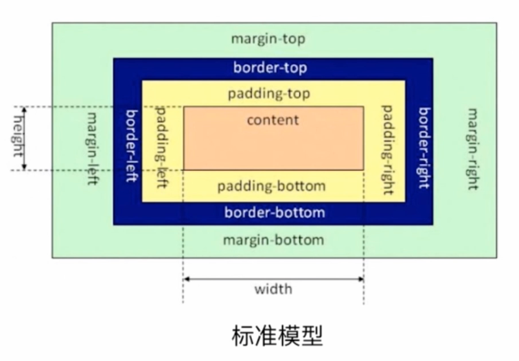

##### IE 盒模型

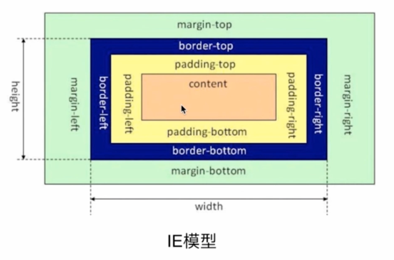

#### 标准模型和 IE 模型区别

宽和高的计算方式不同

标准模型宽高(包括)不计算 border 和 padding

```bash

```

IE 模型宽高(包括)计算 border 和 padding

```bash
width = content-width + padding-width + border-width
height = content-height + padding-height + border-height
```

#### CSS 如何设置这两种模型

```css
box-sizing: content-box; /* 标准盒模型（默认样式） */
box-sizing: border-box; /* IE模型 */
```

#### JS 如何设置获取盒模型对应的宽和高

##### dom 元素属性获取

```js
dom.style.width / height;
```

局限性：只能取到内联属性的宽和高

CSS 内联元素的盒子属性样式：display 属性，visibility，overflow 属性

##### IE 特有的获取属性

拿到浏览器渲染以后的位置宽高

```js
dom.currentStyle.width / height; // 只是IE支持
```

##### 所有浏览器都支持的获取宽高的方法

```js
window.getComputedStyle(dom).width / height;
```

##### 计算一个元素的绝对位置

```js
dom.getBoundingClientRect().width / height;
```

##### 浏览器样式调试设置：会在所有盒子显示红线，方便看盒子区块的宽高调试

```js
[].forEach.call(document.querySelectorAll("*"), function (a) {
	a.style.outline = "1px solid red";
});
```

#### BFC 与 IFC

##### 1.BFC 与 IFC 的概念

- BFC（Block Formatting Context）即“块级格式化上下文”是 Web 页面的可视化 CSS 渲染中的一部分，是布局过程中生成块级盒子的区域，也是浮动元素和其他元素的交互限定区域。

- IFC（Inline Formatting Contexts）直译为"内联格式化上下文"，IFC 的 line box（框）高度由其包含行内元素中最高的实际高度计算而来（不受到竖直方向的 padding/margin 影响)。

- 常规流（也称标准流、普通流）是一个文档在被显示时最常见的布局形态。一个框在常规流中必须属于一个格式化上下文，你可以把 BFC 想象成一个大箱子，箱子外边的元素将不与箱子内的元素产生作用。

  2.**BFC**是 W3C CSS 2.1 规范中的一个概念，它决定了元素如何对其内容进行定位，以及与其他元素的关系和相互作用。当涉及到可视化布局的时候，Block Formatting Context 提供了一个环境，HTML 元素在这个环境中按照一定规则进行布局。一个环境中的元素不会影响到其它环境中的布局。比如浮动元素会形成 BFC，浮动元素内部子元素的主要受该浮动元素影响，两个浮动元素之间是互不影响的。也可以说 BFC 就是一个作用范围

  3.在普通流中的 Box(框) 属于一种 formatting context(格式化上下文) ，类型可以是 block ，或者是 inline ，但不能同时属于这两者。并且， Block boxes(块框) 在 block formatting context(块格式化上下文) 里格式化， Inline boxes(块内框) 则在 Inline Formatting Context(行内格式化上下文) 里格式化

##### 如何产生 BFC

当一个 HTML 元素满足下面条件的任何一点，都可以产生 Block Formatting Context：

- 1.float 的值**不为**：none
- 2.overflow 的值**不为**：visible
- 3.display 的值**为**三个中任何一个：`table-cell` | `table-caption` | `inline-block`
- 4.position 的值**不为**：relative 和 static

CSS3 触发 BFC 方式则可以简单描述为：在元素定位非 static，relative 的情况下触发，float 也是一种定位方式

##### 怎样创建 BFC？

根元素或者包含根元素的元素（ html 元素会作为一个 BFC ），意味着 html 元素中的各个元素都在同一 BFC

- 浮动元素（元素的 float 不为 none）
- 绝对定位元素（元素的 position 为 absolute 或 fixed）
- 行内块元素（元素的 display 为 inline-block）
- 表格单元格（或者元素的 display 为 table-cell）
- 表格标题（或元素的 display 为 table-caption）
- 匿名表格单元格元素（ HTML 中的 table、row、thead、tbody、tfoot 或者 display 为 table、table-row、table-row-group、table-header-group、table-footer-group）
- overflow 不为 visible 的元素
- 弹性元素（display 为 flex 或者 inline-flex 元素的直接子元素）
- 网格元素（display 为 grid 或者 inline-grid 元素的直接子元素）
- 多列容器（元素的 column 或者 column-width 不为 auto，包括 column-count 为 1）

BFC 是一个独立的布局环境，其中元素的布局是不受外界的影响。

##### BFC 布局渲染规则

- 1.内部的 box 会在垂直方向，一个接一个地放置。
- 2.box 垂直方向由 Margin 决定，属于同一个 BFC 的两个相邻 box 的 margin 会发生重叠。
- 3.每个元素的 margin box 的左边，与包含块 border box 的左边相接触。
- 4.BFC 的区域不会与 float box 重叠。
- 5.BFC 就是页面上的一个隔离容器，容器里的子元素不会影响外面的元素。
- 6.计算 BFC 的高度时，浮动元素也参与计算。

如果一个浮动元素后面跟着一个非浮动的元素，那么就会产生一个重叠的现象。常规流（也称标准流、普通流）是一个文档在被显示时最常见的布局形态，当 float 不为 none 时，position 为 absolute、fixed 时元素将脱离标准流

##### BFC 的作用与特点

**不和浮动元素重叠，清除外部浮动，阻止浮动元素覆盖**

注：下图盒子设置 margin:100px; 同一个 BFC 外边距会重叠

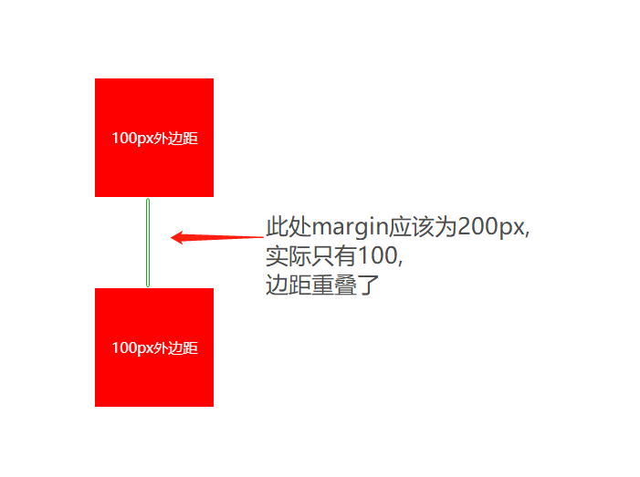

##### BFC 的应用(使用场景)

**1. 外边距溢出和外边距合并**

常规布局中，BFC 的盒子会在垂直方向上排列，两者之间的间隔由各自的外边距决定，但是不是两者之和。

外边距溢出

```html
<div class="container">
	<div class="item">Item</div>
</div>
<style>
	.container {
		background-color: #cccccc;
	}
	.item {
		margin: 10px 0;
		background-color: #ff66aa;
	}
</style>

<!-- 为了不让外边距溢出，我们只需要创建一个 BFC 即可 -->

<!-- 外边距合并 -->

<div class="container">
	<div class="item">Item 1</div>
	<div class="item">Item 2</div>
</div>
<style>
	.container {
		background-color: #cccccc;
		overflow: hidden;
	}
	.item {
		margin: 10px 0;
		background-color: #ff66aa;
	}
</style>

<!-- Item 1 和 Item 2 之间的间隔并不是 10px + 10px，而是 10px。 -->
<!-- 我们想要间隔变为 20px ，只需要将 Item1 或者Item 2 创建在一个 -->
<!-- 新的 BFC 中。 -->

<div class="container">
	<div class="item">Item 1</div>
	<div class="item-container">
		<div class="item">Item 2</div>
	</div>
</div>

<style>
	.container {
		background-color: #cccccc;
		overflow: hidden;
	}
	.item-container {
		overflow: hidden;
	}
	.item {
		margin: 10px 0;
		background-color: #ff66aa;
	}
</style>
```

**2. 解决高度塌陷问题**

浮动元素会脱离文档流，如果父元素的高度没有或者 auto ，那么父元素的高度不会被撑开。一般我们用伪元素来 clear: both 来清楚浮动。

```html
<div class="container">
	<div class="item">Item</div>
</div>
<style>
	.container {
		background-color: #cccccc;
	}
	.item {
		float: left;
		width: 100px;
		height: 100px;
		background-color: #ff66aa;
	}
	/* 只需要给父元素创建新的 BFC 则可以撑开高度。 */
	.container {
		background-color: #cccccc;
		overflow: hidden;
	}
	.item {
		float: left;
		width: 100px;
		height: 100px;
		background-color: #ff66aa;
	}
</style>
```

**3. 左边定宽右边自适应**

```html
<div class="container">
	<div class="left"></div>
	<div class="right"></div>
</div>
<style>
	.container {
		background-color: #cccccc;
	}
	.left {
		float: left;
		width: 200px;
		height: 200px;
		background-color: #ff66aa;
	}
	.right {
		overflow: hidden;
		height: 200px;
		background-color: #2222aa;
	}
</style>
```

##### BFC 实例题(根据盒模型解释边距重叠)

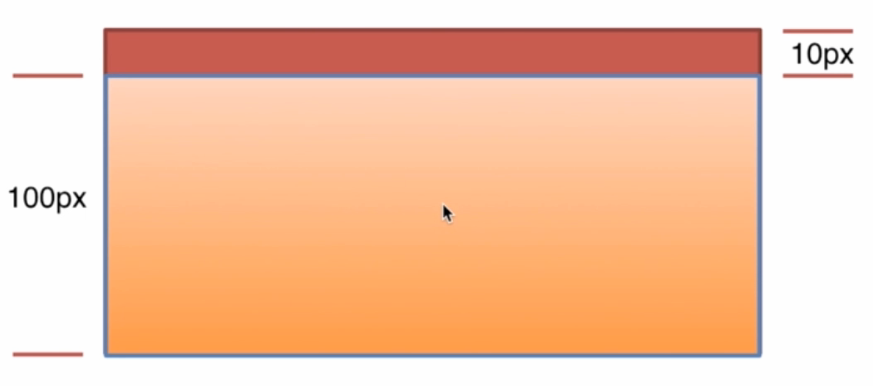

##### BFC(边距重叠解决方案)

代码实现

```html
<!DOCTYPE html>
<html>
	<head>
		<meta charset="utf-8" />
		<title>CSS盒模型</title>
		<style media="screen">
			html * {
				margin: 0;
				padding: 0;
			}
		</style>
	</head>
	<body>
		<!--  -->
		<section class="box" id="sec">
			<style media="screen">
				#sec {
					background: #f00;
				}
				.child {
					height: 100px;
					margin-top: 10px;
					background: yellow;
				}
			</style>
			<article class="child"></article>
		</section>

		<!-- BFC垂直方向边距重叠 -->
		<section id="margin">
			<style>
				#margin {
					background: pink;
					overflow: hidden;
				}
				#margin > p {
					margin: 5px auto 25px;
					background: red;
				}
			</style>
			<p>1</p>
			<div style="overflow:hidden">
				<p>2</p>
			</div>
			<p>3</p>
		</section>

		<!-- BFC不与float重叠 -->
		<section id="layout">
			<style media="screen">
				#layout {
					background: red;
				}
				#layout .left {
					float: left;
					width: 100px;
					height: 100px;
					background: pink;
				}
				#layout .right {
					height: 110px;
					background: #ccc;
					overflow: auto;
				}
			</style>
			<div class="left"></div>
			<div class="right"></div>
		</section>

		<!-- BFC子元素即使是float也会参与计算 -->
		<section id="float">
			<style media="screen">
				#float {
					background: red;
					overflow: auto;
					/*float: left;*/
				}
				#float .float {
					float: left;
					font-size: 30px;
				}
			</style>
			<div class="float">我是浮动元素</div>
		</section>
	</body>
</html>
```

#### IFC 原理和实现

##### IFC 是什么？

> IFC（Inline Formatting Contexts）直译为"内联格式化上下文"，IFC 的 line box（框）高度由其包含行内元素中最高的实际高度计算而来（不受到竖直方向的 padding/margin 影响)。

符合以下条件即会生成一个 IFC

- 块级元素中仅包含内联级别元素

形成条件非常简单，需要注意的是当 IFC 中有块级元素插入时，会产生两个匿名块将父元素分割开来，产生两个 IFC。

##### IFC 布局渲染规则

- 1.子元素水平方向横向排列，并且垂直方向起点为元素顶部
- 2.子元素只会计算横向样式空间，【padding、border、margin】，垂直方向样式空间不会被计算，【padding、border、margin】
- 3.在垂直方向上，子元素会以不同形式来对齐（vertical-align）
- 4.float 元素优先排列
- 5.能把在一行上的框都完全包含进去的一个矩形区域，被称为该行的行框（line box）。行框的宽度是由包含块（containing box）和与其中的浮动来决定
- 6.IFC 中的“line box”一般左右边贴紧其包含块，但 float 元素会优先排列
- 7.IFC 中的“line box”高度由 CSS 行高计算规则来确定，同个 IFC 下的多个 line box 高度可能会不同
- 8.当 inline-level boxes 的总宽度少于包含它们的 line box 时，其水平渲染规则由 text-align 属性值来决定
- 9.当一个“inline box”超过父元素的宽度时，它会被分割成多个 boxes，这些 boxes 分布在多个“line box”中。如果子元素未设置强制换行的情况下，“inline box”将不可被分割，将会溢出父元素

IFC 作用：解决元素垂直居中

##### IFC 的应用

##### 1.只计算水平方向的 padding、margin、border

```html
<div class="container">
	<span class="text">文本一</span>
	<span class="text">文本二</span>
</div>
<style>
	.container {
		background-color: #cccccc;
	}
	.text {
		margin: 20px;
		background-color: #ff66aa;
	}
</style>
```

##### 2.元素水平垂直居中

```html
<div class="container">
	<p>这是一个垂直水平居中的块</p>
</div>
<style>
	.container {
		width: 500px;
		height: 300px;
		line-height: 300px;
		text-align: center;
		background-color: #cccccc;
	}
	p {
		display: inline-block;
		width: 120px;
		height: 90px;
		vertical-align: middle;
		line-height: normal;
		background-color: #333333;
		color: #ffffff;
	}
</style>
```

### 说一下 css 盒模型

::: details 查看参考回答

简介：就是用来装页面上的元素的矩形区域。CSS 中的盒子模型包括 IE 盒子模型和标准的 W3C 盒子模型。

box-sizing(有 3 个值哦)：border-box,padding-box,content-box.

标准盒子模型：

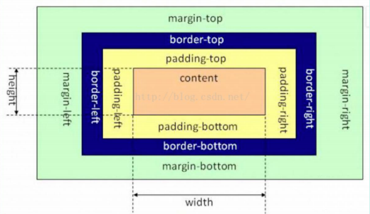

IE 盒子模型：

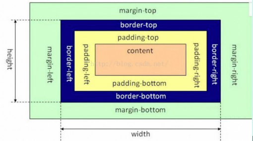

区别：从图中我们可以看出，这两种盒子模型最主要的区别就是 width 的包含范围，在标准的盒子

模型中，width 指 content 部分的宽度，在 IE 盒子模型中，width 表示 content+padding+border 这三个部分的宽度，故这使得在计算整个盒子的宽度时存在着差异：

- 标准盒子模型的盒子宽度：左右 border+左右 padding+width
- IE 盒子模型的盒子宽度：width

在 CSS3 中引入了 box-sizing 属性：

- box-sizing:content-box;表示标准的盒子模型
- box-sizing:border-box 表示的是 IE 盒子模型

最后，前面我们还提到了，box-sizing:padding-box,这个属性值的宽度包含了左右 padding+width

也很好理解性记忆，包含什么，width 就从什么开始算起。

:::

### CSS 盒模型

**考察点：CSS**

::: details 查看参考回答

当对一个文档进行布局时候，浏览器渲染引擎会根据 CSS-box 模型，将所有元素表示为一个矩形盒子，CSS 决定这些盒子的大小，位置，属性，如图：

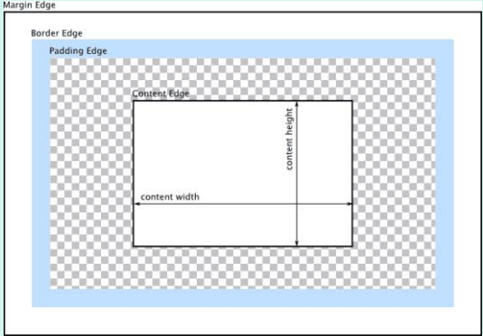

content 包含元素真实内容的区域，由 width，height，控制内容大小，内边距 padding，边框区域 border，外边距 margin，用空白区域扩展边框区域，已分开相邻的元素。

:::

### 简介盒子模型

CSS 的盒子模型有两种：IE 盒子模型、标准的 W3C 盒子模型模型

盒模型：内容、内边距、外边距（一般不计入盒子实际宽度）、边框

### 说一下你对盒模型的理解(包括 IE 和 w3c 标准盒模型)

答：哦，盒模型其实就是浏览器把一个个标签都看一个形象中的盒子，那每个盒子（即标签）都会有内容(width,height)，边框(border)，以及内容和边框中间的缝隙（即内间距 padding），还有盒子与盒子之间的外间距（即 margin）,用图表示为：

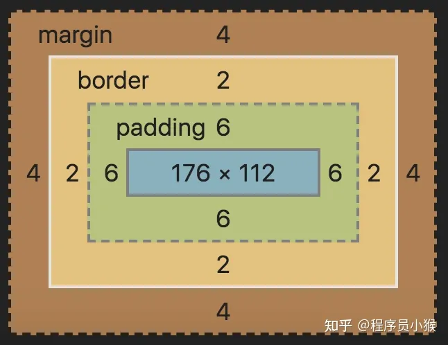

当然盒模型包括两种：IE 盒模型和 w3c 标准盒模型

IE 盒模型总宽度即就是 width 宽度=border+padding+内容宽度

标准盒模型总宽度＝ border+padding+width

那如何在 IE 盒模型宽度和标准盒模型总宽度之间切换呢，可以通过 box-sizing:border-box 或设置成 content-box 来切换

其中：box-sizing：border-box //IE 盒模型

box-sizing：content-box //w3c 盒模型

### 标准盒模型和怪异盒模型

---

#### 1. 标准盒模型（content-box）

- **概念：** 标准盒模型是 W3C 规定的盒模型标准，它包括内容区域、内边距、边框和外边距。元素的宽度和高度不包括内边距和边框。
- 在标准盒模型中，元素的宽度和高度不包括内边距和边框。换句话说，元素的实际宽度/高度等于 CSS 中定义的 width/height 属性值加上内边距和边框的宽度。因此，内边距和边框不会影响元素的宽度和高度，只会影响元素内容的排列和显示。

#### 2. 怪异盒模型（border-box）

- **概念：** 怪异盒模型是 IE5 及以下版本的浏览器采用的盒模型，它的计算方式与标准盒模型有所不同在怪异盒模型中，元素的宽度和高度包括内边距和边框。
- 换句话说，元素的实际宽度/高度等于 CSS 中定义的 width/height 属性值，包括内边距和边框的宽度。因此，内边距和边框会影响元素的宽度和高度，可能会导致元素在页面布局时出现意外的效果。

综上所述，标准盒模型和怪异盒模型都包括外边距，但在处理内边距上存在差异。

#### 3. 应用场景和解决方案

**标准盒模型的应用场景：**

- 现代的大多数浏览器都遵循标准盒模型，因此在开发中一般都采用标准盒模型。
- 通过设置 CSS 的 box-sizing 属性为 content-box 来明确使用标准盒模型。

**怪异盒模型的应用场景：**

- 一些古老的网站可能会在遗留系统中使用怪异盒模型，需要做一些兼容性处理。
- 通过设置 CSS 的 box-sizing 属性为 border-box 来模拟怪异盒模型，以便在现代浏览器中实现相同的效果。

### 上中下布局，你会怎么做

---

#### 1. 使用 Flex 布局

**实现方式：** 使用 CSS 的 Flex 布局可以轻松实现上中下布局。通过设置容器的`display: flex; flex-direction: column;`，然后分别设置上、中、下三个部分的高度或者 flex 属性，即可实现上中下布局。

**优点：**

- 简单易用，代码量少。
- 灵活性强，可以轻松调整布局结构。

**缺点：**

- 不兼容低版本浏览器，需要做兼容性处理。
- 需要理解 Flex 布局的一些概念和属性。

#### 2. 使用 Grid 布局

**实现方式：** 使用 CSS 的 Grid 布局同样可以实现上中下布局。通过设置容器的`display: grid; grid-template-rows: auto 1fr auto;`，然后分别设置上、中、下三个部分的高度，即可实现上中下布局。

**优点：**

- 灵活性高，支持复杂的布局结构。
- 兼容性较好，适用于大多数现代浏览器。

**缺点：**

- 兼容性较差，在 IE 等低版本浏览器中不支持。

#### 3. 使用绝对定位

**实现方式：** 使用 CSS 的绝对定位可以实现上中下布局。分别设置上、中、下三个部分的位置和高度，然后通过`position: absolute;`将它们定位到相应的位置。

**优点：**

- 兼容性较好，适用于大多数现代浏览器。
- 可以实现复杂的布局结构，如侧边栏布局等。

**缺点：**

- 需要手动设置位置和高度，不够灵活。
- 容易出现布局混乱的情况，需要谨慎调整。

#### 4. 使用 CSS 网格系统

**实现方式：** 使用现成的 CSS 网格系统，如 Bootstrap、Tailwind CSS 等，可以快速实现上中下布局。这些网格系统提供了预定义的栅格结构，只需要按照规定的方式使用即可实现布局。

**优点：**

- 快速方便，无需手动编写复杂的 CSS。
- 兼容性较好，适用于大多数现代浏览器。

**缺点：**

- 可能会增加项目的体积，需要额外引入网格系统的 CSS 文件。
- 需要学习和理解网格系统的使用方式。

### 实现水平垂直居中的方式

---

标题：实现水平垂直居中的多种方式及比较

---

在前端开发中，实现元素的水平垂直居中是非常常见的需求，特别是在构建页面布局时。本文将介绍几种常见的实现水平垂直居中的方式，并比较它们的优缺点，以及适用场景。

#### 1. 使用 Flex 布局

**实现方式：** 使用 CSS 的 Flex 布局可以轻松实现水平垂直居中。通过设置容器的`display: flex; justify-content: center; align-items: center;`，即可实现容器内元素的水平垂直居中。

**优点：**

- 简单易用，代码量少。
- 支持动态调整布局，适用于响应式设计。

**缺点：**

- 不兼容低版本浏览器，需要做兼容性处理。

#### 2. 使用绝对定位和 transform 属性

**实现方式：** 使用 CSS 的绝对定位和 transform 属性也可以实现水平垂直居中。通过设置元素的`position: absolute; top: 50%; left: 50%; transform: translate(-50%, -50%);`，即可实现元素的水平垂直居中。

**优点：**

- 兼容性较好，适用于大多数现代浏览器。
- 可以实现复杂的居中效果，如元素大小未知时的居中等。

**缺点：**

- 需要手动计算位置，不够灵活。
- 容易受到父元素大小的影响，需要谨慎调整。

#### 3. 使用表格布局

**实现方式：** 使用 CSS 的表格布局也可以实现水平垂直居中。通过设置容器和元素的`display: table; display: table-cell; vertical-align: middle; text-align: center;`，即可实现元素的水平垂直居中。

**优点：**

- 兼容性较好，适用于大多数现代浏览器。
- 可以实现多个元素的居中效果，适用于多元素的情况。

**缺点：**

- 语义化较差，不推荐在布局中过多使用表格布局。

#### 4. 使用 Flex 布局的 margin:auto 方法

**实现方式：** 使用 Flex 布局的 margin:auto 方法也可以实现水平垂直居中。通过设置容器的`display: flex;`，然后在需要居中的元素上添加`margin: auto;`，即可实现元素的水平垂直居中。

**优点：**

- 简单易用，代码量少。
- 支持动态调整布局，适用于响应式设计。

**缺点：**

- 不支持在两个方向同时居中。

#### 结论

上述介绍了几种常见的实现水平垂直居中的方式，每种方式都有其优缺点。在选择合适的居中方式时，可以根据项目需求、兼容性要求、开发经验等因素进行综合考虑。灵活运用各种居中方式，可以更快速、高效地实现页面布局中元素的水平垂直居中效果。


## CSS 待定

[CSS 常见布局方式 - 掘金 (juejin.cn)](https://juejin.cn/post/6844903491891118087)

### 实现一个两列等高布局，讲讲思路

参考回答：

为了实现两列等高，可以给每列加上：

```css
padding-bottom: 9999px;
margin-bottom: -9999px;
```

同时父元素设置

```css
overflow: hidden;
```

### 多行元素的文本省略号

参考回答：

```css
display: -webkit-box
-webkit-box-orient:vertical
-webkit-line-clamp:3
overflow:hidden
```

### visibility=hidden, opacity=0，display:none

::: details 查看参考回答

opacity=0，该元素隐藏起来了，但不会改变页面布局，并且，如果该元素已经绑定一些事件，如 click 事件，那么点击该区域，也能触发点击事件的 visibility=hidden，该元素隐藏起来了，但不会改变页面布局，但是不会触发该元素已经绑定的事件 display=none，把元素隐藏起来，并且会改变页面布局，可以理解成在页面中把该元素删除掉一样。

:::

### 双边距重叠问题（外边距折叠）

::: details 查看参考回答

多个相邻（兄弟或者父子关系）普通流的块元素垂直方向 marigin 会重叠

折叠的结果为：

- 两个相邻的外边距都是正数时，折叠结果是它们两者之间较大的值。
- 两个相邻的外边距都是负数时，折叠结果是两者绝对值的较大值。
- 两个外边距一正一负时，折叠结果是两者的相加的和。

:::

### position 属性 比较（position 相关属性）

**考察点：定位**

::: details 查看参考回答

#### 固定定位 fixed：

元素的位置相对于浏览器窗口是固定位置，即使窗口是滚动的它也不会移动。Fixed 定位使元素的位置与文档流无关，因此不占据空间。 Fixed 定位的元素和其他元素重叠。

#### 相对定位 relative：

如果对一个元素进行相对定位，它将出现在它所在的位置上。然后，可以通过设置垂直或水平位置，让这个元素“相对于”它的起点进行移动。 在使用相对定位时，无论是否进行移动，元素仍然占据原来的空间。因此，移动元素会导致它覆盖其它框。

#### 绝对定位 absolute：

绝对定位的元素的位置相对于最近的已定位父元素，如果元素没有已定位的父元素，那么它的位置相对于`<html>`。 absolute 定位使元素的位置与文档流无关，因此不占空间。 absolute 定位的元素和其他元素重叠。

#### 粘性定位 sticky：

元素先按照普通文档流定位，然后相对于该元素在流中的 flow root（BFC）和
containing block（最近的块级祖先元素）定位。而后，元素定位表现为在跨越特定阈值前为相对定位，之后为固定定位。

#### 默认定位 Static：

默认值。没有定位，元素出现在正常的流中（忽略 top, bottom, left, right 或者 z-index 声明）。

#### inherit:

规定应该从父元素继承 position 属性的值。

:::

### 浮动清除（清除浮动的方法）

**考察点：清除浮动**

::: details 查看参考回答

#### 方法一：使用带 clear 属性的空元素

在浮动元素后使用一个空元素如`<div class="clear"></div>`，并在 CSS 中赋予.clear{clear:both;}属性即可清理浮动。亦可使用`<br class="clear" />`或`<hr  class="clear" />`来进行清理。

#### 方法二：使用 CSS 的 overflow 属性

给浮动元素的容器添加 overflow:hidden;或 overflow:auto;可以清除浮动，另外在 IE6 中还需要触发 hasLayout ，例如为父元素设置容器宽高或设置 zoom:1。

在添加 overflow 属性后，浮动元素又回到了容器层，把容器高度撑起，达到了清理浮动的效果。

#### 方法三：给浮动的元素的容器添加浮动

给浮动元素的容器也添加上浮动属性即可清除内部浮动，但是这样会使其整体浮动，影响布局，不推荐使用。

#### 方法四：使用邻接元素处理

什么都不做，给浮动元素后面的元素添加 clear 属性。

#### 方法五：使用 CSS 的:after 伪元素

结合:after 伪元素（注意这不是伪类，而是伪元素，代表一个元素之后最近的元素）和 IEhack ，可以完美兼容当前主流的各大浏览器，这里的 IEhack 指的是触发 hasLayout。

给浮动元素的容器添加一个 clearfix 的 class，然后给这个 class 添加一 :after 伪元素实现元素末尾添加一个看不见的块元素（Block element）清理浮动。

参考：https://www.cnblogs.com/ForEvErNoME/p/3383539.html

:::

### css3 新特性

**考察点：CSS3**

::: details 查看参考回答

开放题。

CSS3 边框如 border-radius，box-shadow 等；

CSS3 背景如 background-size，background-origin 等；

CSS3 2D，3D 转换如 transform 等；

CSS3 动画如 animation 等。

:::

### CSS 选择器有哪些，优先级呢

**考察点：CSS 选择器**

::: details 查看参考回答

id 选择器，class 选择器，标签选择器，伪元素选择器，伪类选择器等

同一元素引用了多个样式时，排在后面的样式属性的优先级高；

样式选择器的类型不同时，优先级顺序为：id 选择器 > class 选择器 > 标签选择器；

标签之间存在层级包含关系时，后代元素会继承祖先元素的样式。如果后代元素定义了与祖先元素相同的样式，则祖先元素的相同的样式属性会被覆盖。继承的样式的优先级比较低，至少比标签选择器的优先级低；

带有!important 标记的样式属性的优先级最高；

样式表的来源不同时，优先级顺序为：内联样式> 内部样式 > 外部样式 > 浏览器用户自定义样式 > 浏览器默认样式

:::

### 讲讲怎么样让一个元素消失

**考察点：CSS**

::: details 查看参考回答

- display: none;
- visibility: hidden;
- opacity: 0;
- 等等

:::

### 介绍一下盒模型

**考察点：盒子模型**

::: details 查看参考回答

CSS 盒模型本质上是一个盒子，封装周围的 HTML 元素，它包括：边距，边框，填充，和实际内容。

标准盒模型：一个块的总宽度=width+margin(左右)+padding(左)+border(左右)

怪异盒模型：一个块的总宽度=width+margin（左右）（既 width 已经包含了 padding 和 border 值）

设置盒模型：box-sizing:border-box

:::

### css3 动画

答：哦，您问的 css3 动画啊，css3 动画大致上包括两种：

第一种：过渡动画：主要通过 transition 来实现，通过设置过渡属性，运动时间，延迟时间和运动速度实现。

第二种：关键帧动画：主要通过 animation 配合@keyframes 实现

transition 动画和 animation 动画的主要区别有两点：

第一点 transition 动画需要事件来触发，animation 不需要

第二点:transition 只要开始结束两种状态，而 animation 可以实现多种状态，并且 animation 是可以做循环次数甚至是无限运动

### css 动画如何实现

**考察点：动画**

::: details 查看参考回答

创建动画序列，需要使用 animation 属性或其子属性，该属性允许配置动画时间、时长以及其他动画细节，但该属性不能配置动画的实际表现，动画的实际表现是由 @keyframes 规则实现，具体情况参见使用 keyframes 定义动画序列小节部分。

transition 也可实现动画。transition 强调过渡，是元素的一个或多个属性发生变化时产生的过渡效果，同一个元素通过两个不同的途径获取样式，而第二个途径当某种改变发生（例如 hover）时才能获取样式，这样就会产生过渡动画。

:::

### 如何实现图片在某个容器中居中的？

**考察点：居中**

::: details 查看参考回答

- 父元素固定宽高，利用定位及设置子元素 margin 值为自身的一半。
- 父元素固定宽高，子元素设置 position: absolute，margin：auto 平均分配 margin
- css3 属性 transform。子元素设置 position: absolute; left: 50%; top:
  50%;transform: translate(-50%,-50%);即可。
- 将父元素设置成 display: table, 子元素设置为单元格 display: table-cell。
- 弹性布局 display: flex。设置 align-items: center; justify-content: center

:::

### 如何实现元素的垂直居中

::: details 查看参考回答

- 方法 1：父元素 display:flex,align-items:center;
- 方法 2：元素绝对定位，top:50%，margin-top：-（高度/2）
- 方法 3：高度不确定用 transform：translateY（-50%）
- 方法 4：父元素 table 布局，子元素设置 vertical-align:center;

:::

### CSS3 中对溢出的处理

**考察点：溢出**

::: details 查看参考回答

text-overflow 属性，值为 clip 是修剪文本；

ellipsis 为显示省略符号来表被修剪的文本；

string 为使用给定的字符串来代表被修剪的文本。

:::

### float 的元素，display 是什么

**考察点：浮动**

::: details 查看参考回答

display 为 block

:::

### 隐藏页面中某个元素的方法

**考察点：隐藏元素**

::: details 查看参考回答

- display:none;
- visibility:hidden;
- opacity: 0;
- position 移到外部
- z-index 涂层遮盖
- 等等

:::

### 三栏布局的实现方式，尽可能多写，浮动布局时，三个 div 的生成顺序有没有影响

**考察点：CSS**

::: details 查看参考回答

三列布局又分为两种，两列定宽一列自适应，以及两侧定宽中间自适应

两列定宽一列自适应：

#### 1、使用 float+margin：

给 div 设置 float：left，left 的 div 添加属性 margin-right：left 和 center 的间隔 px,right 的 div 添加属性 margin-left：left 和 center 的宽度之和加上间隔

#### 2、使用 float+overflow：

给 div 设置 float：left，再给 right 的 div 设置 overflow:hidden。这样子两个盒子浮动，另一个盒子触发 bfc 达到自适应

#### 3、使用 position：

父级 div 设置 position：relative，三个子级 div 设置 position：absolute，这个要计算好盒子的宽度和间隔去设置位置，兼容性比较好，

#### 4、使用 table 实现：

父级 div 设置 display：table，设置 border-spacing：10px//设置间距，取值随意，子级 div 设置 display:table-cell，这种方法兼容性好，适用于高度宽度未知的情况，但是 margin 失效，设计间隔比较麻烦，

#### 5、flex 实现：

parent 的 div 设置 display：flex；left 和 center 的 div 设置 margin-right；然后 right 的 div 设置 flex：1；这样子 right 自适应，但是 flex 的兼容性不好

#### 6、grid 实现：

parent 的 div 设置 display：grid，设置 grid-template-columns 属性，固定第一列第二列宽度，第三列 auto，对于两侧定宽中间自适应的布局，对于这种布局需要把 center 放在前面，可以采用双飞翼布局：圣杯布局，来实现，也可以使用上述方法中的 grid，table，flex，position 实现

:::

### 什么是 BFC

**考察点：CSS**

::: details 查看参考回答

参考回答：

BFC 也就是常说的块格式化上下文，这是一个独立的渲染区域，规定了内部如何布局，并且这个区域的子元素不会影响到外面的元素，其中比较重要的布局规则有内部 box 垂直放置，计算 BFC 的高度的时候，浮动元素也参与计算，触发 BFC 的规则有根元素，浮动元素，position 为 absolute 或 fixed 的元素，display 为 inline-block，table-cell，table-caption，flex，inline-flex，overflow 不为 visible 的元素

:::

### calc 属性

**考察点：CSS**

::: details 查看参考回答

Calc 用户动态计算长度值，任何长度值都可以使用 calc()函数计算，需要注意的是，运算符前后都需要保留一个空格，例如：width: calc(100% - 10px)；

:::

### 有一个 width300，height300，怎么实现在屏幕上垂直水平居中

**考察点：CSS**

::: details 查看参考回答

#### 对于行内块级元素

1、父级元素设置 text-alig：center，然后设置 line-height 和 vertical-align 使其垂直居中，最后设置 font-size：0 消除近似居中的 bug

2、父级元素设置 display：table-cell，vertical-align：middle 达到水平垂直居中

3、采用绝对定位，原理是子绝父相，父元素设置 position：relative，子元素设置 position：absolute，然后通过 transform 或 margin 组合使用达到垂直居中效果，设置 top：50%，left：50%，transform：translate（-50%，-50%）

4、绝对居中，原理是当 top,bottom 为 0 时，margin-top&bottom 设置 auto 的话会无限延伸沾满空间并平分，当 left，right 为 0 时,margin-left&right 设置 auto 会无限延伸占满空间并平分，

5、采用 flex，父元素设置 display：flex，子元素设置 margin：auto

6、视窗居中，vh 为视口单位，50vh 即是视口高度的 50/100，设置 margin：50vh auto 0，transform：translate(-50%)

:::

### display：table 和本身的 table 有什么区别

**考察点：CSS**

::: details 查看参考回答

Display:table 和本身 table 是相对应的，区别在于，display：table 的 css 声明能够让一个 html 元素和它的子节点像 table 元素一样，使用基于表格的 css 布局，是我们能够轻松定义一个单元格的边界，背景等样式，而不会产生因为使用了 table 那样的制表标签导致的语义化问题。

之所以现在逐渐淘汰了 table 系表格元素，是因为用 div+css 编写出来的文件比用 table 边写出来的文件小，而且 table 必须在页面完全加载后才显示，div 则是逐行显示，table 的嵌套性太多，没有 div 简洁。

:::

### position 属性的值有哪些及其区别

**考察点：CSS**

::: details 查看参考回答

Position 属性把元素放置在一个静态的，相对的，绝对的，固定的位置中

Static：位置设置为 static 的元素，他始终处于页面流给予的位置，static 元素会忽略任何 top,buttom,left,right 声明

Relative：位置设置为 relative 的元素，可将其移至相对于其正常位置的地方。

left：20 会将元素移至元素正常位置左边 20 个像素的位置

Absolute：此元素可定位于相对包含他的元素的指定坐标，此元素可通过 left，top 等属性规定

Fixed：位置被设为 fiexd 的元素，可定为与相对浏览器窗口的指定坐标，可以通过 left，top，right 属性来定位。

:::

### z-index 的定位方法

**考察点：CSS**

::: details 查看参考回答

z-index 属性设置元素的堆叠顺序，拥有更好堆叠顺序的元素会处于较低顺序元素之前，z-index 可以为负，且 z-index 只能在定位元素上奏效，该属性设置一个定位元素沿 z 轴的位置，如果为正数，离用户越近，为负数，离用户越远，它的属性值有 auto，默认，堆叠顺序与父元素相等，number，inherit，从父元素继承 z-index 属性的值。

:::

### 如果想要改变一个 DOM 元素的字体颜色，不在它本身上进行操作？

**考察点：CSS**

::: details 查看参考回答

可以更改父元素的 color

:::

### 对 CSS 的新属性有了解过的吗？

**考察点：CSS**

::: details 查看参考回答

CSS3 的新特性中，在布局方面新增了 flex 布局，在选择器方面新增了例如 first-of-type,nth-child 等选择器，在盒模型方面添加了 box-sizing 来改变盒模型，在动画方面增加了 animation，2d 变换，3d 变换等，在颜色方面添加透明，rbga 等，在字体方面允许嵌入字体和设置字体阴影，最后还有媒体查讯等

:::

### 用的最多的 css 属性是啥？

**考察点：CSS**

::: details 查看参考回答

用的目前来说最多的是 flex 属性，灵活但是兼容性方面不强

:::

### line-height 和 height 的区别

**考察点：CSS**

::: details 查看参考回答

line-height 一般是指布局里面一段文字上下行之间的高度，是针对字体来设置的，height 一般是指容器的整体高度

:::

### 设置一个元素的背景颜色，背景颜色会填充哪些区域？

**考察点：CSS**

::: details 查看参考回答

background-color 设置的背景颜色会填充元素的 content、padding、border 区域

:::

### 知道属性选择器和伪类选择器的优先级吗

考察点：选择器

::: details 查看参考回答

属性选择器和伪类选择器优先级相同

:::

### inline-block、inline 和 block 的区别；为什么 img 是 inline 还可以设置宽高

**考察点：CSS**

::: details 查看参考回答

Block 是块级元素，其前后都会有换行符，能设置宽度，高度，margin/padding 水平垂直方
向都有效。
Inline：设置 width 和 height 无效，margin 在竖直方向上无效，padding 在水平方向垂直
方向都有效，前后无换行符
Inline-block：能设置宽度高度，margin/padding 水平垂直方向 都有效，前后无换行符

:::

### 用 css 实现一个硬币旋转的效果

**考察点：CSS**

::: details 查看参考回答

虽然不认为很多人能在面试中写出来

```css
#euro {
	width: 150px;
	height: 150px;
	margin-left: -75px;
	margin-top: -75px;
	position: absolute;
	top: 50%;
	left: 50%;
	transform-style: preserve-3d;
	animation: spin 2.5s linear infinite;
}
.back {
	background-image: url("/uploads/160101/backeuro.png");
	width: 150px;
	height: 150px;
}
.middle {
	background-image: url("/uploads/160101/faceeuro.png");
	width: 150px;
	height: 150px;
	transform: translateZ(1px);
	position: absolute;
	top: 0;
}
.front {
	background-image: url("/uploads/160101/faceeuro.png");
	height: 150px;
	position: absolute;
	top: 0;
	transform: translateZ(10px);
	width: 150px;
}
@keyframes spin {
	0% {
		transform: rotateY(0deg);
	}
	100% {
		transform: rotateY(360deg);
	}
}
```

:::

### 了解重绘和重排吗，知道怎么去减少重绘和重排吗，让文档脱离文档流有哪些方法

考察点：CSS

::: details 查看参考回答

DOM 的变化影响到了预算内宿的几何属性比如宽高，浏览器重新计算元素的几何属性，其他元素的几何属性也会受到影响，浏览器需要重新构造渲染书，这个过程称之为重排，浏览器将受到影响的部分重新绘制在屏幕上 的过程称为重绘，引起重排重绘的原因有：

- 添加或者删除可见的 DOM 元素，
- 元素尺寸位置的改变
- 浏览器页面初始化，
- 浏览器窗口大小发生改变，重排一定导致重绘，重绘不一定导致重排，

减少重绘重排的方法有：

- 不在布局信息改变时做 DOM 查询，
- 使用 csstext,className 一次性改变属性
- 使用 fragment
- 对于多次重排的元素，比如说动画。使用绝对定位脱离文档流，使其不影响其他元素

:::

### CSS 画正方体，三角形

**考察点：CSS**

::: details 查看参考回答

#### 画三角形

```css
#triangle02 {
	width: 0;
	height: 0;
	border-top: 50px solid blue;
	border-right: 50px solid red;
	border-bottom: 50px solid green;
	border-left: 50px solid yellow;
}
```

#### 画正方体

```html
<!DOCTYPE html>
<html lang="en">
	<head>
		<meta charset="UTF-8" />
		<title>perspective</title>
		<style>
			.wrapper {
				width: 50%;
				float: left;
			}
			.cube {
				font-size: 4em;
				width: 2em;
				margin: 1.5em auto;
				transform-style: preserve-3d;
				transform: rotateX(-35deg) rotateY(30deg);
			}
			.side {
				position: absolute;
				width: 2em;
				height: 2em;
				background: rgba(255, 99, 71, 0.6);
				border: 1px solid rgba(0, 0, 0, 0.5);
				color: white;
				text-align: center;
				line-height: 2em;
			}
			.front {
				transform: translateZ(1em);
			}
			.bottom {
				transform: rotateX(-90deg) translateZ(1em);
			}
			.top {
				transform: rotateX(90deg) translateZ(1em);
			}
			.left {
				transform: rotateY(-90deg) translateZ(1em);
			}
			.right {
				transform: rotateY(90deg) translateZ(1em);
			}
			.back {
				transform: translateZ(-1em);
			}
		</style>
	</head>
	<body>
		<div class="wrapper w1">
			<div class="cube">
				<div class="side front">1</div>
				<div class="side back">6</div>
				<div class="side right">4</div>
				<div class="side left">3</div>
				<div class="side top">5</div>
				<div class="side bottom">2</div>
			</div>
		</div>
		<div class="wrapper w2">
			<div class="cube">
				<div class="side front">1</div>
				<div class="side back">6</div>
				<div class="side right">4</div>
				<div class="side left">3</div>
				<div class="side top">5</div>
				<div class="side bottom">2</div>
			</div>
		</div>
	</body>
</html>
```

:::

### overflow 的原理

考察点：CSS

::: details 查看参考回答

要讲清楚这个解决方案的原理，首先需要了解块格式化上下文，A block formatting context is a part of a visual CSS rendering of a Web page. It is the region in which the layout of block boxes occurs and in which floats interact with each other.

翻译过来就是

格式化上下文是 CSS 可视化渲染的一部分，它是一块区域，规定了内部块盒 的渲染方式，以及浮动相互之间的影响关系当元素设置了 overflow 样式且值部位 visible 时，该元素就构建了一个 BFC，BFC 在计算高度时，内部浮动元素的高度也要计算在内，也就是说技术 BFC 区域内只有一个浮动元素，BFC 的高度也不会发生塌缩，所以达到了清除浮动的目的。

:::

### 清除浮动的方法

**考察点：CSS**

::: details 查看参考回答

给要清除浮动的元素添加样式 clear，\ 父元素结束标签钱插入清除浮动的块级元素，给该元素添加样式 clear
添加伪元素，在父级元素的最后，添加一个伪元素，通过清除伪元素的浮动，注意该伪元素的 display 为 block，
父元素添加样式 overflow 清除浮动，overflow 设置除 visible 以外的任何位置

:::

### box-sizing 的语法和基本用处

考察点：CSS

::: details 查看参考回答

box-sizing 规定两个并排的带边框的框，语法为 box-sizing：content-box/border-box/inherit

content-box：宽度和高度分别应用到元素的内容框，在宽度和高度之外绘制元素的内边距和边框

border-box：为元素设定的宽度和高度决定了元素的边框盒，

inherit：继承父元素的 box-sizing

:::

### 使元素消失的方法有哪些？

考察点：css

::: details 查看参考回答

1、 opacity：0，该元素隐藏起来了，但不会改变页面布局，并且，如果该元素已经绑定一些事件，如 click 事件，那么点击该区域，也能触发点击事件的

2、 visibility：hidden，该元素隐藏起来了，但不会改变页面布局，但是不会触发该元素已经绑定的事件

3、 display：none，把元素隐藏起来，并且会改变页面布局，可以理解成在页面中把该元素删除掉。

:::

### 两个嵌套的 div，position 都是 absolute，子 div 设置 top 属性，那么这个 top 是相对于父元素的哪个位置定位的。

**考察点：定位**

::: details 查看参考回答

margin 的外边缘

:::

### 说说盒子模型

考察点：盒子模型

::: details 查看参考回答

CSS 盒模型本质上是一个盒子，封装周围的 HTML 元素，它包括：边距，边框，填充，和实际内容。

标准盒模型：一个块的总宽度=width+margin(左右)+padding(左右)+border(左右)

怪异盒模型：一个块的总宽度=width+margin（左右）（既 width 已经包含了 padding 和 border 值）

如何设置：box-sizing:border-box

:::

### display

**考察点：display**

::: details 查看参考回答

主要取值有 none,block,inline-block,inline,flex 等。

具体可参考：https://developer.mozilla.org/zh-CN/docs/Web/CSS/display

:::

### 怎么隐藏一个元素

**考察点：元素隐藏**

::: details 查看参考回答

1、 opacity：0，该元素隐藏起来了，但不会改变页面布局，并且，如果该元素已经绑定一些事件，如 click 事件，那么点击该区域，也能触发点击事件的

2、 visibility：hidden，该元素隐藏起来了，但不会改变页面布局，但是不会触发该元素已经绑定的事件

3、 display：none，把元素隐藏起来，并且会改变页面布局，可以理解成在页面中把该元素删除掉。

:::

### display:none 和 visibilty:hidden 的区别

**考察点：元素隐藏**

::: details 查看参考回答

1、 visibility：hidden，该元素隐藏起来了，但不会改变页面布局，但是不会触发该元素已经绑定的事件

2、 display：none，把元素隐藏起来，并且会改变页面布局，可以理解成在页面中把该元素删除掉。

:::

### 相对布局和绝对布局，position:relative 和 obsolute。

**考察点：定位**

::: details 查看参考回答

#### 相对定位 relative：

如果对一个元素进行相对定位，它将出现在它所在的位置上。然后，可以通过设置垂直或水平位置，让这个素“相对于”它的起点进行移动。 在使用相对定位时，无论是否进行移动，元素仍然占据原来的空间。因此，移动元素会导致它覆盖其它框。

#### 绝对定位 absolute：

绝对定位的元素的位置相对于最近的已定位父元素，如果元素没有已定位的父元素，那么它的位置相对于`<html>`。 absolute 定位使元素的位置与文档流无关，因此不占据空间。 absolute 定位的元素和其他元素重叠。

:::

### flex 布局

**考察点：flex**

::: details 查看参考回答

flex 是 Flexible Box 的缩写，意为"弹性布局"。指定容器 display: flex 即可。

容器有以下属性：flex-direction，flex-wrap，flex-flow，justify-content，align-items，align-content。

flex-direction 属性决定主轴的方向；

flex-wrap 属性定义，如果一条轴线排不下，如何换行；

flex-flow 属性是 flex-direction 属性和 flex-wrap 属性的简写形式，默认值为 row nowrap；

justify-content 属性定义了项目在主轴上的对齐方式。

align-items 属性定义项目在交叉轴上如何对齐。

align-content 属性定义了多根轴线的对齐方式。如果项目只有一根轴线，该属性不起作用。

项目（子元素）也有一些属性：order，flex-grow，flex-shrink，flex-basis，flex，align-self。

order 属性定义项目的排列顺序。数值越小，排列越靠前，默认为 0。

flex-grow 属性定义项目的放大比例，默认为 0，即如果存在剩余空间，也不放大。

flex-shrink 属性定义了项目的缩小比例，默认为 1，即如果空间不足，该项目将缩小。

flex-basis 属性定义了在分配多余空间之前，项目占据的主轴空间（main size）。

flex 属性是 flex-grow, flex-shrink 和 flex-basis 的简写，默认值为 0 1 auto。后两个属性可选。

align-self 属性允许单个项目有与其他项目不一样的对齐方式，可覆盖 align-items 属性。

默认值为 auto，表示继承父元素的 align-items 属性，如果没有父元素，则等同于 stretch。

参考 <http://www.ruanyifeng.com/blog/2015/07/flex-grammar.html>

:::

### block、inline、inline-block 的区别。

考察点：display

::: details 查看参考回答

block 元素会独占一行，多个 block 元素会各自新起一行。默认情况下，block 元素宽度自动填满其父元素宽度。

block 元素可以设置 width,height 属性。块级元素即使设置了宽度,仍然是独占一行。

block 元素可以设置 margin 和 padding 属性。

inline 元素不会独占一行，多个相邻的行内元素会排列在同一行里，直到一行排列不下，才会新换一行，其宽度随元素的内容而变化。

inline 元素设置 width,height 属性无效。

inline 元素的 margin 和 padding 属性，水平方向的 padding-left, padding-right,margin-left, margin-right 都产生边距效果；但竖直方向的 padding-top, padding-bottom,margin-top, margin-bottom 不会产生边距效果。

inline-block：简单来说就是将对象呈现为 inline 对象，但是对象的内容作为 block 对象呈现。

之后的内联对象会被排列在同一行内。比如我们可以给一个 link（a 元素）inline-block 属性值，使其既具有 block 的宽度高度特性又具有 inline 的同行特性。

:::

### css 的常用选择器

**考察点：css**

::: details 查看参考回答

id 选择器，类选择器，伪类选择器等

:::

### css 布局

**考察点：布局**

::: details 查看参考回答

六种布局方式总结：圣杯布局、双飞翼布局、Flex 布局、绝对定位布局、表格布局、网格布局。

圣杯布局：是指布局从上到下分为 header、container、footer，然后 container 部分定为三栏布局。这种布局方式同样分为 header、container、footer。圣杯布局的缺陷在于 center 是在 container 的 padding 中的，因此宽度小的时候会出现混乱。

双飞翼布局给 center 部分包裹了一个 main 通过设置 margin 主动地把页面撑开。

Flex 布局是由 CSS3 提供的一种方便的布局方式。

绝对定位布局是给 container 设置 position: relative 和 overflow: hidden，因为绝对定位的元素的参照物为第一个 postion 不为 static 的祖先元素。 left 向左浮动，right 向右浮动。center 使用绝对定位，通过设置 left 和 right 并把两边撑开。 center 设置 top: 0 和 bottom: 0 使其高度撑开。

表格布局的好处是能使三栏的高度统一。

网格布局可能是最强大的布局方式了，使用起来极其方便，但目前而言，兼容性并不好。

网格布局，可以将页面分割成多个区域，或者用来定义内部元素的大小，位置，图层关系。

:::

### relative 定位规则

::: details 查看参考回答

如果对一个元素进行相对定位，它将出现在它所在的位置上。然后，可以通过设置垂直或水平位置，让这个元素“相对于”它的起点进行移动。 在使用相对定位时，无论是否进行移动，元素仍然占据原来的空间。因此，移动元素会导致它覆盖其它框。

:::

### 垂直居中

**考察点：垂直居中**

::: details 查看参考回答

父元素固定宽高，利用定位及设置子元素 margin 值为自身的一半。

父元素固定宽高，子元素设置 position: absolute，margin：auto 平均分配 margin css3 属性 transform。

子元素设置 position: absolute; left: 50%; top: 50%;transform: translate(-50%,-50%);即可。

将父元素设置成 display: table, 子元素设置为单元格 display: table-cell。

弹性布局 display: flex。设置 align-items: center; justify-content: center;

:::

### 1. 让一个元素水平垂直居中，到底有多少种方案？

#### 水平居中

##### 行内元素

text-align: center;

##### 确定宽度的块级元素

- （1）width 和 margin 实现。margin: 0 auto;
- （2）绝对定位和 margin-left: -width/2, 前提是父元素 position: relative

##### 对于宽度未知的块级元素

- （1）table 标签配合 margin 左右 auto 实现水平居中。使用 table 标签（或直接将块级元素设值为 display:table），再通过给该标签添加左右 margin 为 auto。
- （2）inline-block 实现水平居中方法。display：inline-block 和 text-align:center 实现水平居中。
- （3）绝对定位+transform，translateX 可以移动本身元素的 50%。
- （4）flex 布局使用 justify-content:center

#### 垂直居中

- 利用 line-height 实现居中，这种方法适合纯文字类
- 通过设置父容器 相对定位 ，子级设置 绝对定位 ，标签通过 margin 实现自适应居中
- 弹性布局 flex :父级设置 display: flex; 子级设置 margin 为 auto 实现自适应居中
- 父级设置相对定位，子级设置绝对定位，并且通过位移 transform 实现
- table 布局，父级通过转换成表格形式，然后子级设置 vertical-align 实现。（需要注意的是：vertical-align: middle 使用的前提条件是内联元素以及 display 值为 table-cell 的元素）。

### 浮动布局的优点？有什么缺点？清除浮动有哪些方式？

#### 简介

当元素浮动以后可以向左或向右移动，直到它的外边缘碰到包含它的框或者另外一个浮动元素的边框为止。元素浮动以后会脱离正常的文档流，所以文档的普通流中的框就变现的好像浮动元素不存在一样。

##### 优点

这样做的优点就是在图文混排的时候可以很好的使文字环绕在图片周围。另外当元素浮动了起来之后，它有着块级元素的一些性质例如可以设置宽高等，但它与 inline-block 还是有一些区别的，第一个就是关于横向排序的时候，float 可以设置方向而 inline-block 方向是固定的；还有一个就是 inline-block 在使用
时有时会有空白间隙的问题

##### 缺点

最明显的缺点就是浮动元素一旦脱离了文档流，就无法撑起父元素，会造成父级元素高度塌陷。

#### 清除浮动的方式

##### 添加额外标签

```html
<div class="parent">
	//添加额外标签并且添加clear属性
	<div style="clear:both"></div>
	//也可以加一个br标签
</div>
```

##### 父级添加 overflow 属性，或者设置高度

```html
<div class="parent" style="overflow:hidden">
	//auto 也可以 // 将父元素的overflow设置为hidden
	<div class="f"></div>
</div>
```

##### 建立伪类选择器清除浮动（推荐）

```html
//在css中添加:after伪元素 .parent:after{ /* 设置添加子元素的内容是空 */ content:
''; /* 设置添加子元素为块级元素 */ display: block; /* 设置添加的子元素的高度0 */
height: 0; /* 设置添加子元素看不见 */ visibility: hidden; /* 设置clear：both */
clear: both; }

<div class="parent">
	<div class="f"></div>
</div>
```

### 使用 display:inline-block 会产生什么问题？解决方法？

#### 问题复现

问题: 两个 display：inline-block 元素放到一起会产生一段空白。

#### 如代码

```html
<!DOCTYPE html>
<html lang="en">
	<head>
		<meta charset="UTF-8" />
		<meta name="viewport" content="width=device-width, initial-scale=1.0" />
		<meta http-equiv="X-UA-Compatible" content="ie=edge" />
		<title>Document</title>
		<style>
			.container {
				width: 800px;
				height: 200px;
			}
			.left {
				font-size: 14px;
				background: red;
				display: inline-block;
				width: 100px;
				height: 100px;
			}
			.right {
				font-size: 14px;
				background: blue;
				display: inline-block;
				width: 100px;
				height: 100px;
			}
		</style>
	</head>
	<body>
		<div class="container">
			<div class="left">左</div>
			<div class="right">右</div>
		</div>
	</body>
</html>
```

#### 效果如下：

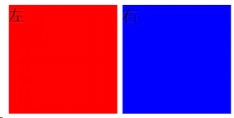

#### 产生空白的原因

元素被当成行内元素排版的时候，元素之间的空白符（空格、回车换行等）都会被浏览器处理，根据 CSS 中 white-space 属性的处理方式（默认是 normal，合并多余空白），原来 HTML 代码中的回车换行被转成一个空白符，在字体不为 0 的情况下，空白符占据一定宽度，所以 inline-block 的元素之间就出现了
空隙。

#### 解决办法

（1）将子元素标签的结束符和下一个标签的开始符写在同一行或把所有子标签写在同一行

```html
<div class="container">
	<div class="left">左</div>
	<div class="right">右</div>
</div>
```

（2）父元素中设置 font-size: 0，在子元素上重置正确的 font-size

```css
.container {
	width: 800px;
	height: 200px;
	font-size: 0;
}
```

（3）为子元素设置 float:left

```css
.left {
	float: left;
	font-size: 14px;
	background: red;
	display: inline-block;
	width: 100px;
	height: 100px;
}
// right是同理
```

### 4.布局题：div 垂直居中，左右 10px，高度始终为宽度一半

问题描述: 实现一个 div 垂直居中, 其距离屏幕左右两边各 10px, 其高度始终是宽度的 50%。同时 div 中有一个文字 A，文字需要水平垂直居中。

#### 思路一：利用 height:0; padding-bottom: 50%;

```html
<!DOCTYPE html>
<html lang="en">
	<head>
		<meta charset="UTF-8" />
		<meta name="viewport" content="width=device-width, initial-scale=1.0" />
		<meta http-equiv="X-UA-Compatible" content="ie=edge" />
		<title>Document</title>
		<style>
			* {
				margin: 0;
				padding: 0;
			}
			html,
			body {
				height: 100%;
				width: 100%;
			}
			.outer_wrapper {
				margin: 0 10px;
				height: 100%;
				/* flex布局让块垂直居中 */
				display: flex;
				align-items: center;
			}
			.inner_wrapper {
				background: red;
				position: relative;
				width: 100%;
				height: 0;
				padding-bottom: 50%;
			}
			.box {
				position: absolute;
				width: 100%;
				height: 100%;
				display: flex;
				justify-content: center;
				align-items: center;
				font-size: 20px;
			}
		</style>
	</head>
	<body>
		<div class="outer_wrapper">
			<div class="inner_wrapper">
				<div class="box">A</div>
			</div>
		</div>
	</body>
</html>
```

强调两点：

padding-bottom 究竟是相对于谁的？

答案是相对于 父元素的 width 值 。

那么对于这个 out_wrapper 的用意就很好理解了。 CSS 呈流式布局，div 默认宽度填满，即 100%大小，给 out_wrapper 设置 margin: 0 10px;相当于让左右分别减少了 10px。

父元素相对定位，那绝对定位下的子元素宽高若设为百分比，是相对谁而言的？

相对于父元素的(content + padding)值, 注意不含 border

延伸：如果子元素不是绝对定位，那宽高设为百分比是相对于父元素的宽高，标准盒模型下是 content, IE 盒模型是 content+padding+border。

#### 思路二: 利用 calc 和 vw

```html
<!DOCTYPE html>
<html lang="en">
	<head>
		<meta charset="UTF-8" />
		<meta name="viewport" content="width=device-width, initial-scale=1.0" />
		<meta http-equiv="X-UA-Compatible" content="ie=edge" />
		<title>Document</title>
		<style>
			* {
				padding: 0;
				margin: 0;
			}
			html,
			body {
				width: 100%;
				height: 100%;
			}
			.wrapper {
				position: relative;
				width: 100%;
				height: 100%;
			}
			.box {
				margin-left: 10px;
				/* vw是视口的宽度， 1vw代表1%的视口宽度 */
				width: calc(100vw - 20px);
				/* 宽度的一半 */
				height: calc(50vw - 10px);
				position: absolute;
				background: red;
				/* 下面两行让块垂直居中 */
				top: 50%;
				transform: translateY(-50%);
				display: flex;
				align-items: center;
				justify-content: center;
				font-size: 20px;
			}
		</style>
	</head>
	<body>
		<div class="wrapper">
			<div class="box">A</div>
		</div>
	</body>
</html>
```

效果如下：

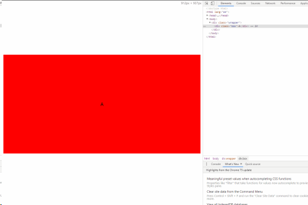

### 5. 盒模型

```css
/* 红色区域的大小是多少？200 - 20*2 - 20*2 = 120 */
.box {
	width: 200px;
	height: 200px;
	padding: 20px;
	margin: 20px;
	background: red;
	border: 20px solid black;
	box-sizing: border-box;
}
/* 标准模型 */
box-sizing: content-box;
/*IE模型*/
box-sizing: border-box;
```

### 6.CSS 如何进行品字布局？

#### 第一种

```html
<!DOCTYPE html>
<html>
	<head>
		<meta charset="utf-8" />
		<title>品字布局</title>
		<style>
			* {
				margin: 0;
				padding: 0;
			}
			body {
				overflow: hidden;
			}
			div {
				margin: auto 0;
				width: 100px;
				height: 100px;
				background: red;
				font-size: 40px;
				line-height: 100px;
				color: #fff;
				text-align: center;
			}
			.div1 {
				margin: 100px auto 0;
			}
			.div2 {
				margin-left: 50%;
				background: green;
				float: left;
				transform: translateX(-100%);
			}
			.div3 {
				background: blue;
				float: left;
				transform: translateX(-100%);
			}
		</style>
	</head>
	<body>
		<div class="div1">1</div>
		<div class="div2">2</div>
		<div class="div3">3</div>
	</body>
</html>
```

##### 效果：

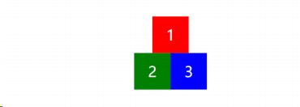

#### 第二种(全屏版)

```html
<!DOCTYPE html>
<html>
	<head>
		<meta charset="utf-8" />
		<title>品字布局</title>
		<style>
			* {
				margin: 0;
				padding: 0;
			}
			div {
				width: 100%;
				height: 100px;
				background: red;
				font-size: 40px;
				line-height: 100px;
				color: #fff;
				text-align: center;
			}
			.div1 {
				margin: 0 auto 0;
			}
			.div2 {
				background: green;
				float: left;
				width: 50%;
			}
			.div3 {
				background: blue;
				float: left;
				width: 50%;
			}
		</style>
	</head>
	<body>
		<div class="div1">1</div>
		<div class="div2">2</div>
		<div class="div3">3</div>
	</body>
</html>
```

##### 效果：

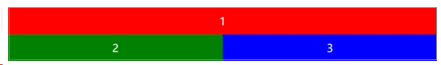

### 7.CSS 如何进行圣杯布局

#### 圣杯布局如图：

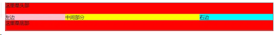

而且要做到左右宽度固定，中间宽度自适应。

#### 利用 flex 布局

```html
<!DOCTYPE html>
<html lang="en">
	<head>
		<meta charset="UTF-8" />
		<title>Document</title>
		<style>
			* {
				margin: 0;
				padding: 0;
			}
			.header,
			.footer {
				height: 40px;
				width: 100%;
				background: red;
			}
			.container {
				display: flex;
			}
			.middle {
				flex: 1;
				background: yellow;
			}
			.left {
				width: 200px;
				background: pink;
			}
			.right {
				background: aqua;
				width: 300px;
			}
		</style>
	</head>
	<body>
		<div class="header">这里是头部</div>
		<div class="container">
			<div class="left">左边</div>
			<div class="middle">中间部分</div>
			<div class="right">右边</div>
		</div>
		<div class="footer">这里是底部</div>
	</body>
</html>
```

#### float 布局(全部 float:left)

```html
<!DOCTYPE html>
<html lang="en">
	<head>
		<meta charset="UTF-8" />
		<meta name="viewport" content="width=device-width, initial-scale=1.0" />
		<meta http-equiv="X-UA-Compatible" content="ie=edge" />
		<title>Document</title>
		<style>
			* {
				margin: 0;
				padding: 0;
			}
			.header,
			.footer {
				height: 40px;
				width: 100%;
				background: red;
			}
			.footer {
				clear: both;
			}
			.container {
				padding-left: 200px;
				padding-right: 250px;
			}
			.container div {
				position: relative;
				float: left;
			}
			.middle {
				width: 100%;
				background: yellow;
			}
			.left {
				width: 200px;
				background: pink;
				margin-left: -100%;
				left: -200px;
			}
			.right {
				width: 250px;
				background: aqua;
				margin-left: -250px;
				left: 250px;
			}
		</style>
	</head>
	<body>
		<div class="header">这里是头部</div>
		<div class="container">
			<div class="middle">中间部分</div>
			<div class="left">左边</div>
			<div class="right">右边</div>
		</div>
		<div class="footer">这里是底部</div>
	</body>
</html>
```

这种 float 布局是最难理解的，主要是浮动后的负 margin 操作，这里重点强调一下。

设置负 margin 和 left 值之前是这样子：

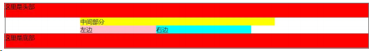

左边的盒子设置 margin-left: -100%是将盒子拉上去，效果：

```css
.left {
	/* ... */
	margin-left: -100%;
}
```

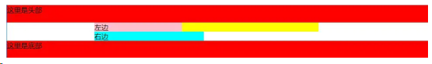

然后向左移动 200px 来填充空下来的 padding-left 部分

```css
.left {
	/* ... */
	margin-left: -100%;
	left: -200px;
}
```

效果呈现：

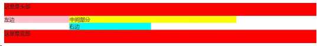

右边的盒子设置 margin-left: -250px 后，盒子在该行所占空间为 0，因此直接到上面的 middle 块中,效果:

```css
.right {
	/* ... */
	margin-left: -250px;
}
```

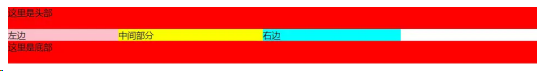

然后向右移动 250px, 填充父容器的 padding-right 部分:

```css
.right {
	/* ... */
	margin-left: -250px;
	left: 250px;
}
```

现在就达到最后的效果了：

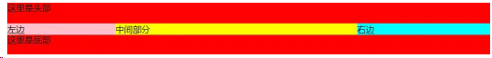

#### float 布局(左边 float: left, 右边 float: right)

```html
<!DOCTYPE html>
<html lang="en">
	<head>
		<meta charset="UTF-8" />
		<meta name="viewport" content="width=device-width, initial-scale=1.0" />
		<meta http-equiv="X-UA-Compatible" content="ie=edge" />
		<title>Document</title>
		<style>
			* {
				margin: 0;
				padding: 0;
			}
			.header,
			.footer {
				height: 40px;
				width: 100%;
				background: red;
			}
			.container {
				overflow: hidden;
			}
			.middle {
				background: yellow;
			}
			.left {
				float: left;
				width: 200px;
				background: pink;
			}
			.right {
				float: right;
				width: 250px;
				background: aqua;
			}
		</style>
	</head>
	<body>
		<div class="header">这里是头部</div>
		<div class="container">
			<div class="left">左边</div>
			<div class="right">右边</div>
			<div class="middle">中间部分</div>
		</div>
		<div class="footer">这里是底部</div>
	</body>
</html>
```

#### 绝对定位

```html
<!DOCTYPE html>
<html lang="en">
	<head>
		<meta charset="UTF-8" />
		<meta name="viewport" content="width=device-width, initial-scale=1.0" />
		<meta http-equiv="X-UA-Compatible" content="ie=edge" />
		<title>Document</title>
		<style>
			* {
				margin: 0;
				padding: 0;
			}
			.header,
			.footer {
				height: 40px;
				width: 100%;
				background: red;
			}
			.container {
				min-height: 1.2em;
				position: relative;
			}
			.container > div {
				position: absolute;
			}
			.middle {
				left: 200px;
				right: 250px;
				background: yellow;
			}
			.left {
				left: 0;
				width: 200px;
				background: pink;
			}
			.right {
				right: 0;
				width: 250px;
				background: aqua;
			}
		</style>
	</head>
	<body>
		<div class="header">这里是头部</div>
		<div class="container">
			<div class="left">左边</div>
			<div class="right">右边</div>
			<div class="middle">中间部分</div>
		</div>
		<div class="footer">这里是底部</div>
	</body>
</html>
```

#### grid 布局

```html
<!DOCTYPE html>
<html lang="en">
<head>
<meta charset="UTF-8">
<meta name="viewport" content="width=device-width, initial-scale=1.0">
<meta http-equiv="X-UA-Compatible" content="ie=edge">
<title>Document</title>
<style>
body{
display: grid;
}
#header{
background: red;
grid-row:1;
grid-column:1/5;
}
#left{
grid-row:2;
grid-column:1/2;
background: orange;
}
#right{
grid-row:2;
grid-column:4/5;
background: cadetblue;
}
#middle{
grid-row:2;
grid-column:2/4;
background: rebeccapurple
}
#footer{
background: gold;
grid-row:3;
grid-column:1/5;
}
</style>
</head>
<body>
<div id="header">header</div>
<div id="left">left</div>
<div id="middle">middle</div>
<div id="right">right</div>
<div id="footer">footer</footer></div>
</body>
</html>
```

### 8.CSS 如何实现双飞翼布局？

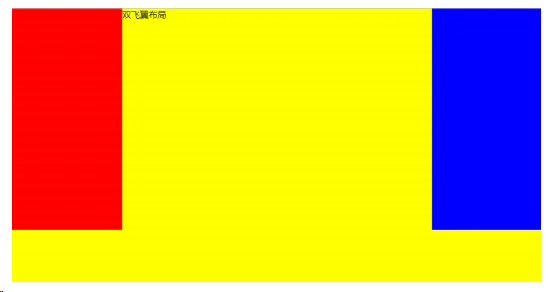

有了圣杯布局的铺垫，双飞翼布局也就问题不大啦。这里采用经典的 float 布局来完成。

```html
<!DOCTYPE html>
<html lang="en">
	<head>
		<meta charset="UTF-8" />
		<meta name="viewport" content="width=device-width, initial-scale=1.0" />
		<meta http-equiv="X-UA-Compatible" content="ie=edge" />
		<title>Document</title>
		<style>
			* {
				margin: 0;
				padding: 0;
			}
			.container {
				min-width: 600px;
			}
			.left {
				float: left;
				width: 200px;
				height: 400px;
				background: red;
				margin-left: -100%;
			}
			.center {
				float: left;
				width: 100%;
				height: 500px;
				background: yellow;
			}
			.center .inner {
				margin: 0 200px;
			}
			.right {
				float: left;
				width: 200px;
				height: 400px;
				background: blue;
				margin-left: -200px;
			}
		</style>
	</head>
	<body>
		<article class="container">
			<div class="center">
				<div class="inner">双飞翼布局</div>
			</div>
			<div class="left"></div>
			<div class="right"></div>
		</article>
	</body>
</html>
```

### 9.什么是 BFC？

W3C 对 BFC 的定义如下： 浮动元素和绝对定位元素，非块级盒子的块级容器（例如 inline-blocks, table-cells, 和 table-captions），以及 overflow 值不为"visiable"的块级盒子，都会为他们的内容创建新的 BFC（Block Fromatting Context， 即块级格式上下文）。

### 10.触发条件

一个 HTML 元素要创建 BFC，则满足下列的任意一个或多个条件即可： 下列方式会创建块格式化上下文：

- 根元素()
- 浮动元素（元素的 float 不是 none）
- 绝对定位元素（元素的 position 为 absolute 或 fixed）
- 行内块元素（元素的 display 为 inline-block）
- 表格单元格（元素的 display 为 table-cell，HTML 表格单元格默认为该值）
- 表格标题（元素的 display 为 table-caption，HTML 表格标题默认为该值）
- 匿名表格单元格元素（元素的 display 为 table、table-row、 table-row-group、table-header-group、table-footer-group（分别是 HTML table、row、tbody、thead、tfoot 的默认属性）或 inline-table）
- overflow 值不为 visible 的块元素 -弹性元素（display 为 flex 或 inline-flex 元素的直接子元素）
- 网格元素（display 为 grid 或 inline-grid 元素的直接子元素） 等等。

### 11.BFC 渲染规则

（1）BFC 垂直方向边距重叠
（2）BFC 的区域不会与浮动元素的 box 重叠
（3）BFC 是一个独立的容器，外面的元素不会影响里面的元素
（4）计算 BFC 高度的时候浮动元素也会参与计算

### 12.应用场景

#### （1）防止浮动导致父元素高度塌陷

现有如下页面代码:

```html
<!DOCTYPE html>
<html lang="en">
	<head>
		<meta charset="UTF-8" />
		<meta name="viewport" content="width=device-width, initial-scale=1.0" />
		<meta http-equiv="X-UA-Compatible" content="ie=edge" />
		<title>Document</title>
		<style>
			.container {
				border: 10px solid red;
			}
			.inner {
				background: #08bdeb;
				height: 100px;
				width: 100px;
			}
		</style>
	</head>
	<body>
		<div class="container">
			<div class="inner"></div>
		</div>
	</body>
</html>
```

![Image[21]](./CSS面试题.assets/Image[21].jpg)

接下来将 inner 元素设为浮动：

```css
.inner {
	float: left;
	background: #08bdeb;
	height: 100px;
	width: 100px;
}
```

会产生这样的塌陷效果：

![Image[21]](./CSS面试题.assets/Image[21]-1710672697118-2.jpg)

但如果我们对父元素设置 BFC 后, 这样的问题就解决了:

```css
.container {
	border: 10px solid red;
	overflow: hidden;
}
```

同时这也是清除浮动的一种方式。

#### （2）避免外边距折叠

两个块同一个 BFC 会造成外边距折叠，但如果对这两个块分别设置 BFC，那么边距重叠的问题就不存在了。

现有代码如下：

```html
<!DOCTYPE html>
<html lang="en">
	<head>
		<meta charset="UTF-8" />
		<meta name="viewport" content="width=device-width, initial-scale=1.0" />
		<meta http-equiv="X-UA-Compatible" content="ie=edge" />
		<title>Document</title>
		<style>
			.container {
				background-color: green;
				overflow: hidden;
			}
			.inner {
				background-color: lightblue;
				margin: 10px 0;
			}
		</style>
	</head>
	<body>
		<div class="container">
			<div class="inner">1</div>
			<div class="inner">2</div>
			<div class="inner">3</div>
		</div>
	</body>
</html>
```

![Image[22]](./CSS面试题.assets/Image[22].jpg)

此时三个元素的上下间隔都是 10px, 因为三个元素同属于一个 BFC。 现在我们做如下操作：

```html
<div class="container">
	<div class="inner">1</div>
	<div class="bfc">
		<div class="inner">2</div>
	</div>
	<div class="inner">3</div>
</div>
```

style 增加：

```css
.bfc {
	overflow: hidden;
}
```

效果如下:

![Image[23]](./CSS面试题.assets/Image[23].jpg)

可以明显地看到间隔变大了，而且是原来的两倍，符合我们的预期。

### 13.画一个对话框

要画一个对话框，首先来学习做一个三角形。

```html
<!DOCTYPE html>
<html lang="en">
	<head>
		<meta charset="UTF-8" />
		<meta name="viewport" content="width=device-width, initial-scale=1.0" />
		<meta http-equiv="X-UA-Compatible" content="ie=edge" />
		<title>Document</title>
		<style>
			.triangle {
				width: 0;
				height: 0;
				border: 50px solid;
				border-color: #f00 #0f0 #ccc #00f;
			}
		</style>
	</head>
	<body>
		<div class="triangle"></div>
	</body>
	h
</html>
```

出现如下效果：

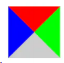

已经知道 border 的构成原理，然后只需改一行代码：

```css
// 四个参数对应 ：上 右 下 左
border-color: transparent transparent #ccc transparent;
```

于是就只剩下面的三角形部分啦！

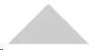

现在来利用三角形技术做对话框：

```html
<!DOCTYPE html>
<html lang="en">
	<head>
		<meta charset="UTF-8" />
		<meta name="viewport" content="width=device-width, initial-scale=1.0" />
		<meta http-equiv="X-UA-Compatible" content="ie=edge" />
		<title>Document</title>
		<style>
			.dialog {
				position: relative;
				margin-top: 50px;
				margin-left: 50px;
				padding-left: 20px;
				width: 300px;
				line-height: 2;
				background: lightblue;
				color: #fff;
			}
			.dialog::before {
				content: "";
				position: absolute;
				border: 8px solid;
				border-color: transparent lightblue transparent transparent;
				left: -16px;
				top: 8px;
			}
		</style>
	</head>
	<body>
		<div class="dialog">这是一个对话框鸭！</div>
	</body>
</html>
```

效果如下：

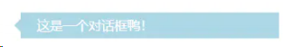

### 14.画一个平行四边形

利用 skew 特性，第一个参数为 x 轴倾斜的角度，第二个参数为 y 轴倾斜的角度。

```html
<!DOCTYPE html>
<html lang="en">
	<head>
		<meta charset="UTF-8" />
		<meta name="viewport" content="width=device-width, initial-scale=1.0" />
		<meta http-equiv="X-UA-Compatible" content="ie=edge" />
		<title>Document</title>
		<style>
			.parallel {
				margin-top: 50px;
				margin-left: 50px;
				width: 200px;
				height: 100px;
				background: lightblue;
				transform: skew(-20deg, 0);
			}
		</style>
	</head>
	<body>
		<div class="parallel"></div>
	</body>
</html>
```

效果如下：

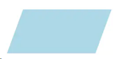

### 15.用一个 div 画五角星

对于这个五角星而言，我们可以拆分成三个部分，想一想是不是这样？


对于这个五角星而言，我们可以拆分成三个部分，想一想是不是这样？


那我们现在就来实现这三个部分。 对于最上面的三角，我们在第一个部分已经实现了三角形，这个不难。但是下面的两个如何实现呢？

其实也非常的简单，想一想，下面这两个是不是就是一个向上的三角形旋转而来呢？明白了这一点，就可以动手实现啦！

```html
<!DOCTYPE html>
<html lang="en">
	<head>
		<meta charset="UTF-8" />
		<meta name="viewport" content="width=device-width, initial-scale=1.0" />
		<meta http-equiv="X-UA-Compatible" content="ie=edge" />
		<title>Document</title>
		<style>
			#star {
				position: relative;
				margin: 200px auto;
				width: 0;
				height: 0;
				border-style: solid;
				border-color: transparent transparent red transparent;
				border-width: 70px 100px;
				transform: rotate(35deg);
			}
			#star::before {
				position: absolute;
				content: "";
				width: 0;
				height: 0;
				top: -128px;
				left: -95px;
				border-style: solid;
				border-color: transparent transparent red transparent;
				border-width: 80px 30px;
				transform: rotate(-35deg);
			}
			#star::after {
				position: absolute;
				content: "";
				width: 0;
				height: 0;
				top: -45px;
				left: -140px;
				border-style: solid;
				border-color: transparent transparent red transparent;
				border-width: 70px 100px;
				transform: rotate(-70deg);
			}
		</style>
	</head>
	<body>
		<div id="star"></div>
	</body>
</html>
```

### css3 有什么新特性，浏览器支持怎么样

### 伪类是什么？有哪些？会有哪些兼容性问题？如何处理？


### 盒模型有哪几种？怪异模式和标准模式？

### 说一下 css 盒模型

参考回答：

简介：就是用来装页面上的元素的矩形区域。CSS 中的盒子模型包括 IE 盒子模型和标准的 W3C 盒子模型。

box-sizing(有 3 个值哦)：border-box,padding-box,content-box.

标准盒子模型：

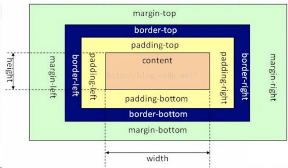

IE 盒子模型：

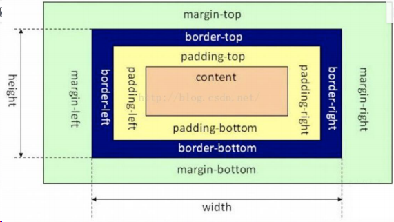

区别：从图中我们可以看出，这两种盒子模型最主要的区别就是 width 的包含范围，在标准的盒子模型中，width 指 content 部分的宽度，在 IE 盒子模型中，width 表示 content+padding+border 这三个部分的宽度，故这使得在计算整个盒子的宽度时存在着差异：

标准盒子模型的盒子宽度：左右 border+左右 padding+width

IE 盒子模型的盒子宽度：width

在 CSS3 中引入了 box-sizing 属性，box-sizing:content-box;表示标准的盒子模型，box-sizing:border-box 表示的是 IE 盒子模型

最后，前面我们还提到了，box-sizing:padding-box,这个属性值的宽度包含了左右 padding+width

也很好理解性记忆，包含什么，width 就从什么开始算起。

### 画一条 0.5px 的线

::: details 查看参考回答

采用 meta viewport 的方式

```html
<meta name="viewport" content="initial-scale=1.0, maximum-scale=1.0, user-scalable=no" ></pre>
```

采用 border-image 的方式

采用 transform: scale()的方式

:::

### link 标签和 import 标签的区别

::: details 查看参考回答

link 属于 html 标签，而@import 是 css 提供的

页面被加载时，link 会同时被加载，而@import 引用的 css 会等到页面加载结束后加载。

link 是 html 标签，因此没有兼容性，而@import 只有 IE5 以上才能识别。

link 方式样式的权重高于@import 的。

:::

### transition 和 animation 的区别

::: details 查看参考回答

Animation 和 transition 大部分属性是相同的，他们都是随时间改变元素的属性值，他们的主要区别是 transition 需要触发一个事件才能改变属性，而 animation 不需要触发任何事件的情况下才会随时间改变属性值，并且 transition 为 2 帧，从 from .... to，而 animation 可以一帧一帧的。

:::

### 关于 JS 动画和 css3 动画的差异性

参考回答：

渲染线程分为 main thread 和 compositor thread，如果 css 动画只改变 transform 和 opacity，这时整个 CSS 动画得以在 compositor trhead 完成（而 JS 动画则会在 main thread 执行，然后出发 compositor thread 进行下一步操作），特别注意的是如果改变 transform 和 opacity 是不会 layout 或者 paint 的。

区别：

- 功能涵盖面，JS 比 CSS 大
- 实现/重构难度不一，CSS3 比 JS 更加简单，性能跳优方向固定
- 对帧速表现不好的低版本浏览器，css3 可以做到自然降级
- css 动画有天然事件支持
- css3 有兼容性问题

### 说一下块元素和行元素

参考回答：

块元素：独占一行，并且有自动填满父元素，可以设置 margin 和 pading 以及高度和宽度

行元素：不会独占一行，width 和 height 会失效，并且在垂直方向的 padding 和 margin 会失效。

### less 、 sass 、 postcss 、 prefix

### 层叠优先级

### 圣杯、双飞燕布局

### float 清除浮动

### flex 布局、 grid 布局、 table 布局

### css 以及中轴旋转、动画变换

### 绘制三角形、矩形、菱形、梯形（奇巧淫技，可以不问）

### sprite 图（雪碧图）知道吗？ svg 雪碧图了解吗？

### px 、 em 、 rem 、 vw 、 vh ？ rem 的根节点样式在什么时候设置？

### position 有哪些？他们的定位原点是什么？

### 媒体查询用 css 好还是用 js 好？

### 响应式布局的原理

### css 低版本浏览器兼容问题，额外需要什么后缀来声明浏览器兼容

### !important 意义，是否应当规避使用？

### BFC 块级上下文、 IFC ，实现双栏高度对齐

### BEM 命名法，有什么优势，有什么劣势

### 1px 边框问题

### 1 介绍一下标准的 CSS 的盒子模型？与低版本 IE 的盒子模型有什么不同的？

标准盒子模型：宽度=内容的宽度（content）+ border + padding + margin
低版本 IE 盒子模型：宽度=内容宽度（content+border+padding）+ margin

（1） IE 盒子模型、标准 W3C 盒子模型；IE 的 content 部分包含了 border 和 pading;

（2）盒模型： 内容(content)、填充(padding)、边界(margin)、 边框(border).

### 2 box-sizing 属性？

用来控制元素的盒子模型的解析模式，默认为 content-box
context-box：W3C 的标准盒子模型，设置元素的 height/width 属性指的是 content 部分的高/宽
border-box：IE 传统盒子模型。设置元素的 height/width 属性指的是 border + padding + content 部分的高/宽

### 3 CSS 选择器有哪些？哪些属性可以继承？

CSS 选择符：

- 1.id 选择器（ # myid）
- 2.类选择器（.myclassname）

- 3.标签选择器（div, h1, p）

- 4.相邻选择器（h1 + p）

- 5.子选择器（ul < li）

- 6.后代选择器（li a）
- 7.通配符选择器（ \* ）

- 8.属性选择器（a[rel = "external"]）

- 9.伪类选择器（a: hover, li: nth - child）

可继承的属性：font-size, font-family, color, UL LI DL DD DT;

不可继承的样式：border, padding, margin, width, height

优先级（就近原则，样式定义最近者为准；载入样式以最后载入的定位为准;）：!important > [ id > class > tag ]
!important 比内联优先级高

### 哪些 css 属性可以继承？

可继承： font-size font-family color, ul li dl dd dt;

不可继承 ：border padding margin width height ;

### css 优先级算法如何计算？

!important > id > class > 标签

!important 比 内联优先级高

\*优先级就近原则，样式定义最近者为准;

\*以最后载入的样式为准;

### CSS3 新增伪类有那些？

CSS3 新增伪类举例：

```css
p:first-of-type 选择属于其父元素的首个 <p> 元素的每个 <p> 元素。
p:last-of-type 选择属于其父元素的最后 <p> 元素的每个 <p> 元素。
p:only-of-type 选择属于其父元素唯一的 <p> 元素的每个 <p> 元素。
p:only-child 选择属于其父元素的唯一子元素的每个 <p> 元素。
p:nth-child(2) 选择属于其父元素的第二个子元素的每个 <p> 元素。
:enabled、:disabled 控制表单控件的禁用状态。
:checked，单选框或复选框被选中。
```

### 4 CSS 优先级算法如何计算？

元素选择符： 1
class 选择符： 10
id 选择符：100
元素标签：1000

1. !important 声明的样式优先级最高，如果冲突再进行计算。
2. 如果优先级相同，则选择最后出现的样式。
3. 继承得到的样式的优先级最低。

### 5 CSS3 新增伪类有那些?

p:first-of-type 选择属于其父元素的首个元素
p:last-of-type 选择属于其父元素的最后元素
p:only-of-type 选择属于其父元素唯一的元素
p:only-child 选择属于其父元素的唯一子元素
p:nth-child(2) 选择属于其父元素的第二个子元素
:enabled :disabled 表单控件的禁用状态。
:checked 单选框或复选框被选中。

### （水平）居中有哪些实现方式、（垂直）居中有哪些实现方式

### 6 如何居中 div？如何居中一个浮动元素？如何让绝对定位的 div 居中？

div：

```css
border: 1px solid red;
margin: 0 auto;
height: 50px;
width: 80px;
```

浮动元素的上下左右居中：

```css
border: 1px solid red;
float: left;
position: absolute;
width: 200px;
height: 100px;
left: 50%;
top: 50%;
margin: -50px 0 0 -100px;
```

绝对定位的左右居中：

```css
border: 1px solid black;
position: absolute;
width: 200px;
height: 100px;
margin: 0 auto;
left: 0;
right: 0;
```

还有更加优雅的居中方式就是用 flexbox，我以后会做整理。

### 7 display 有哪些值？说明他们的作用?

inline（默认）--内联
none--隐藏
block--块显示
table--表格显示
list-item--项目列表
inline-block

### 8 position 的值？

static（默认）：按照正常文档流进行排列；
relative（相对定位）：不脱离文档流，参考自身静态位置通过 top, bottom, left, right 定位；
absolute(绝对定位)：参考距其最近一个不为 static 的父级元素通过 top, bottom, left, right 定位；
fixed(固定定位)：所固定的参照对像是可视窗口。

### 9 CSS3 有哪些新特性？

1. RGBA 和透明度
2. background-image background-origin(content-box/padding-box/border-box) background-size background-repeat
3. word-wrap（对长的不可分割单词换行）word-wrap：break-word
4. 文字阴影：text-shadow： 5px 5px 5px #FF0000;（水平阴影，垂直阴影，模糊距离，阴影颜色）
5. font-face 属性：定义自己的字体
6. 圆角（边框半径）：border-radius 属性用于创建圆角
7. 边框图片：border-image: url(border.png) 30 30 round
8. 盒阴影：box-shadow: 10px 10px 5px #888888
9. 媒体查询：定义两套 css，当浏览器的尺寸变化时会采用不同的属性

- 新增各种 CSS 选择器 （: not(.input)：所有 class 不是“input” 的节点）
- 圆角 （border-radius:8px）
- 多列布局 （multi-column layout）
- 阴影和反射 （Shadoweflect）
- 文字特效 （text-shadow）
- 文字渲染 （Text-decoration）
- 线性渐变 （gradient）
- 旋转 （transform）
- 增加了旋转,缩放,定位,倾斜,动画,多背景

### 10 请解释一下 CSS3 的 flexbox（弹性盒布局模型）,以及适用场景？

该布局模型的目的是提供一种更加高效的方式来对容器中的条目进行布局、对齐和分配空间。在传统的布局方式中，block 布局是把块在垂直方向从上到下依次排列的；而 inline 布局则是在水平方向来排列。弹性盒布局并没有这样内在的方向限制，可以由开发人员自由操作。
试用场景：弹性布局适合于移动前端开发，在 Android 和 ios 上也完美支持。

### 11 用纯 CSS 创建一个三角形的原理是什么？

首先，需要把元素的宽度、高度设为 0。然后设置边框样式。

```css
width: 0;
height: 0;
border-top: 40px solid transparent;
border-left: 40px solid transparent;
border-right: 40px solid transparent;
border-bottom: 40px solid #ff0000;
```

### 12 一个满屏品字布局如何设计?

第一种真正的品字：

1. 三块高宽是确定的；
2. 上面那块用 margin: 0 auto;居中；
3. 下面两块用 float 或者 inline-block 不换行；
4. 用 margin 调整位置使他们居中。

第二种全屏的品字布局:
上面的 div 设置成 100%，下面的 div 分别宽 50%，然后使用 float 或者 inline 使其不换行。

### 13 常见的兼容性问题？

1. 不同浏览器的标签默认的 margin 和 padding 不一样。

   ```css
   * {
   	margin: 0;
   	padding: 0;
   }
   ```

2. IE6 双边距 bug：块属性标签 float 后，又有横行的 margin 情况下，在 IE6 显示 margin 比设置的大。hack：display:inline;将其转化为行内属性。

3. 渐进识别的方式，从总体中逐渐排除局部。首先，巧妙的使用“9”这一标记，将 IE 浏览器从所有情况中分离出来。接着，再次使用“+”将 IE8 和 IE7、IE6 分离开来，这样 IE8 已经独立识别。

   ```css
    {
   	background-color: #f1ee18; /*所有识别*/
   	.background-color: #00deff\9; /*IE6、7、8识别*/
   	+background-color: #a200ff; /*IE6、7识别*/
   	_background-color: #1e0bd1; /*IE6识别*/
   }
   ```

4. 设置较小高度标签（一般小于 10px），在 IE6，IE7 中高度超出自己设置高度。hack：给超出高度的标签设置 overflow:hidden;或者设置行高 line-height 小于你设置的高度。

5. IE 下，可以使用获取常规属性的方法来获取自定义属性,也可以使用 getAttribute()获取自定义属性；Firefox 下，只能使用 getAttribute()获取自定义属性。解决方法:统一通过 getAttribute()获取自定义属性。

6. Chrome 中文界面下默认会将小于 12px 的文本强制按照 12px 显示,可通过加入 CSS 属性 -webkit-text-size-adjust: none; 解决。

7. 超链接访问过后 hover 样式就不出现了，被点击访问过的超链接样式不再具有 hover 和 active 了。解决方法是改变 CSS 属性的排列顺序:L-V-H-A ( love hate ): a:link {} a:visited {} a:hover {} a:active {}

### 14 为什么要初始化 CSS 样式

因为浏览器的兼容问题，不同浏览器对有些标签的默认值是不同的，如果没对 CSS 初始化往往会出现浏览器之间的页面显示差异。

### 15 absolute 的 containing block 计算方式跟正常流有什么不同？

无论属于哪种，都要先找到其祖先元素中最近的 position 值不为 static 的元素，然后再判断：

1. 若此元素为 inline 元素，则 containing block 为能够包含这个元素生成的第一个和最后一个 inline box 的 padding box (除 margin, border 外的区域) 的最小矩形；
2. 否则,则由这个祖先元素的 padding box 构成。

如果都找不到，则为 initial containing block。

补充：

1. static(默认的)/relative：简单说就是它的父元素的内容框（即去掉 padding 的部分）
2. absolute: 向上找最近的定位为 absolute/relative 的元素
3. fixed: 它的 containing block 一律为根元素(html/body)

### 16 CSS 里的 visibility 属性有个 collapse 属性值？在不同浏览器下以后什么区别？

当一个元素的 visibility 属性被设置成 collapse 值后，对于一般的元素，它的表现跟 hidden 是一样的。

1. chrome 中，使用 collapse 值和使用 hidden 没有区别。
2. firefox，opera 和 IE，使用 collapse 值和使用 display：none 没有什么区别。

### 17 display:none 与 visibility：hidden 的区别？

display：none 不显示对应的元素，在文档布局中不再分配空间（回流+重绘）
visibility：hidden 隐藏对应元素，在文档布局中仍保留原来的空间（重绘）

### 18 position 跟 display、overflow、float 这些特性相互叠加后会怎么样？

display 属性规定元素应该生成的框的类型；position 属性规定元素的定位类型；float 属性是一种布局方式，定义元素在哪个方向浮动。
类似于优先级机制：position：absolute/fixed 优先级最高，有他们在时，float 不起作用，display 值需要调整。float 或者 absolute 定位的元素，只能是块元素或表格。

### 19 对 BFC 规范(块级格式化上下文：block formatting context)的理解？

BFC 规定了内部的 Block Box 如何布局。
定位方案：

1. 内部的 Box 会在垂直方向上一个接一个放置。
2. Box 垂直方向的距离由 margin 决定，属于同一个 BFC 的两个相邻 Box 的 margin 会发生重叠。
3. 每个元素的 margin box 的左边，与包含块 border box 的左边相接触。
4. BFC 的区域不会与 float box 重叠。
5. BFC 是页面上的一个隔离的独立容器，容器里面的子元素不会影响到外面的元素。
6. 计算 BFC 的高度时，浮动元素也会参与计算。

满足下列条件之一就可触发 BFC

1. 根元素，即 html
2. float 的值不为 none（默认）
3. overflow 的值不为 visible（默认）
4. display 的值为 inline-block、table-cell、table-caption
5. position 的值为 absolute 或 fixed

### 20 为什么会出现浮动和什么时候需要清除浮动？清除浮动的方式？

浮动元素碰到包含它的边框或者浮动元素的边框停留。由于浮动元素不在文档流中，所以文档流的块框表现得就像浮动框不存在一样。浮动元素会漂浮在文档流的块框上。
浮动带来的问题：

1. 父元素的高度无法被撑开，影响与父元素同级的元素
2. 与浮动元素同级的非浮动元素（内联元素）会跟随其后
3. 若非第一个元素浮动，则该元素之前的元素也需要浮动，否则会影响页面显示的结构。

清除浮动的方式：

1. 父级 div 定义 height
2. 最后一个浮动元素后加空 div 标签 并添加样式 clear:both。
3. 包含浮动元素的父标签添加样式 overflow 为 hidden 或 auto。
4. 父级 div 定义 zoom

### 21 上下 margin 重合的问题

在重合元素外包裹一层容器，并触发该容器生成一个 BFC。

例子：

```html
<div class="aside"></div>
<div class="text">
	<div class="main"></div>
</div>
<!--下面是css代码-->
.aside { margin-bottom: 100px; width: 100px; height: 150px; background: #f66; }
.main { margin-top: 100px; height: 200px; background: #fcc; } .text{
/*盒子main的外面包一个div，通过改变此div的属性使两个盒子分属于两个不同的BFC，以此来阻止margin重叠*/
overflow: hidden; //此时已经触发了BFC属性。 }
```

### 22 设置元素浮动后，该元素的 display 值是多少？

自动变成 display:block

### 25 CSS 优化、提高性能的方法有哪些？

1. 避免过度约束
2. 避免后代选择符
3. 避免链式选择符
4. 使用紧凑的语法
5. 避免不必要的命名空间
6. 避免不必要的重复
7. 最好使用表示语义的名字。一个好的类名应该是描述他是什么而不是像什么
8. 避免！important，可以选择其他选择器
9. 尽可能的精简规则，你可以合并不同类里的重复规则

### 26 浏览器是怎样解析 CSS 选择器的？

CSS 选择器的解析是从右向左解析的。若从左向右的匹配，发现不符合规则，需要进行回溯，会损失很多性能。若从右向左匹配，先找到所有的最右节点，对于每一个节点，向上寻找其父节点直到找到根元素或满足条件的匹配规则，则结束这个分支的遍历。两种匹配规则的性能差别很大，是因为从右向左的匹配在第一步就筛选掉了大量的不符合条件的最右节点（叶子节点），而从左向右的匹配规则的性能都浪费在了失败的查找上面。
而在 CSS 解析完毕后，需要将解析的结果与 DOM Tree 的内容一起进行分析建立一棵 Render Tree，最终用来进行绘图。在建立 Render Tree 时（WebKit 中的「Attachment」过程），浏览器就要为每个 DOM Tree 中的元素根据 CSS 的解析结果（Style Rules）来确定生成怎样的 Render Tree。

### 27 在网页中的应该使用奇数还是偶数的字体？为什么呢？

使用偶数字体。偶数字号相对更容易和 web 设计的其他部分构成比例关系。Windows 自带的点阵宋体（中易宋体）从 Vista 开始只提供 12、14、16 px 这三个大小的点阵，而 13、15、17 px 时用的是小一号的点。（即每个字占的空间大了 1 px，但点阵没变），于是略显稀疏。

### 28 margin 和 padding 分别适合什么场景使用？

何时使用 margin：

1. 需要在 border 外侧添加空白
2. 空白处不需要背景色
3. 上下相连的两个盒子之间的空白，需要相互抵消时。

何时使用 padding：

1. 需要在 border 内侧添加空白
2. 空白处需要背景颜色
3. 上下相连的两个盒子的空白，希望为两者之和。

兼容性的问题：在 IE5 IE6 中，为 float 的盒子指定 margin 时，左侧的 margin 可能会变成两倍的宽度。通过改变 padding 或者指定盒子的 display：inline 解决。

### 29 元素竖向的百分比设定是相对于容器的高度吗？

当按百分比设定一个元素的宽度时，它是相对于父容器的宽度计算的，但是，对于一些表示竖向距离的属性，例如 padding-top , padding-bottom , margin-top , margin-bottom 等，当按百分比设定它们时，依据的也是父容器的宽度，而不是高度。

### 30 全屏滚动的原理是什么？用到了 CSS 的哪些属性？

1. 原理：有点类似于轮播，整体的元素一直排列下去，假设有 5 个需要展示的全屏页面，那么高度是 500%，只是展示 100%，剩下的可以通过 transform 进行 y 轴定位，也可以通过 margin-top 实现
2. overflow：hidden；transition：all 1000ms ease；

### 31 什么是响应式设计？响应式设计的基本原理是什么？如何兼容低版本的 IE？

响应式网站设计(Responsive Web design)是一个网站能够兼容多个终端，而不是为每一个终端做一个特定的版本。
基本原理是通过媒体查询检测不同的设备屏幕尺寸做处理。
页面头部必须有 meta 声明的 viewport。

```html
<meta
	name="’viewport’"
	content="”width"
	="device-width,"
	initial-scale="1."
	maximum-scale="1,user-scalable"
	="no”"
/>
```

### 32 视差滚动效果？

视差滚动（Parallax Scrolling）通过在网页向下滚动的时候，控制背景的移动速度比前景的移动速度慢来创建出令人惊叹的 3D 效果。

1. CSS3 实现
   优点：开发时间短、性能和开发效率比较好，缺点是不能兼容到低版本的浏览器
2. jQuery 实现
   通过控制不同层滚动速度，计算每一层的时间，控制滚动效果。
   优点：能兼容到各个版本的，效果可控性好
   缺点：开发起来对制作者要求高
3. 插件实现方式
   例如：parallax-scrolling，兼容性十分好

### 33 ::before 和 :after 中双冒号和单冒号有什么区别？解释一下这 2 个伪元素的作用

1. 单冒号(:)用于 CSS3 伪类，双冒号(::)用于 CSS3 伪元素。
2. ::before 就是以一个子元素的存在，定义在元素主体内容之前的一个伪元素。并不存在于 dom 之中，只存在在页面之中。

:before 和 :after 这两个伪元素，是在 CSS2.1 里新出现的。起初，伪元素的前缀使用的是单冒号语法，但随着 Web 的进化，在 CSS3 的规范里，伪元素的语法被修改成使用双冒号，成为::before ::after

### 34 你对 line-height 是如何理解的？

行高是指一行文字的高度，具体说是两行文字间基线的距离。CSS 中起高度作用的是 height 和 line-height，没有定义 height 属性，最终其表现作用一定是 line-height。
单行文本垂直居中：把 line-height 值设置为 height 一样大小的值可以实现单行文字的垂直居中，其实也可以把 height 删除。
多行文本垂直居中：需要设置 display 属性为 inline-block。

### 35 怎么让 Chrome 支持小于 12px 的文字？

```css
p {
	font-size: 10px;
	-webkit-transform: scale(0.8);
} //0.8是缩放比例
```

### 36 让页面里的字体变清晰，变细用 CSS 怎么做？

-webkit-font-smoothing 在 window 系统下没有起作用，但是在 IOS 设备上起作用-webkit-font-smoothing：antialiased 是最佳的，灰度平滑。

### 37 position:fixed;在 android 下无效怎么处理？

```html
<meta
	name="viewport"
	content="width=device-width, initial-scale=1.0, maximum-scale=1.0, minimum-scale=1.0, user-scalable=no"
/>
```

### 38 如果需要手动写动画，你认为最小时间间隔是多久，为什么？

多数显示器默认频率是 60Hz，即 1 秒刷新 60 次，所以理论上最小间隔为 1/60＊1000ms ＝ 16.7ms。

### 39 li 与 li 之间有看不见的空白间隔是什么原因引起的？有什么解决办法？

行框的排列会受到中间空白（回车空格）等的影响，因为空格也属于字符,这些空白也会被应用样式，占据空间，所以会有间隔，把字符大小设为 0，就没有空格了。
解决方法：

1. 可以将`<li>`代码全部写在一排
2. 浮动 li 中 float：left
3. 在 ul 中用 font-size：0（谷歌不支持）；可以使用 letter-space：-3px

### 40 display:inline-block 什么时候会显示间隙？

1. 有空格时候会有间隙 解决：移除空格
2. margin 正值的时候 解决：margin 使用负值
3. 使用 font-size 时候 解决：font-size:0、letter-spacing、word-spacing

### 41 有一个高度自适应的 div，里面有两个 div，一个高度 100px，希望另一个填满剩下的高度

外层 div 使用 position：relative；高度要求自适应的 div 使用 position: absolute; top: 100px; bottom: 0; left: 0

### 42 png、jpg、gif 这些图片格式解释一下，分别什么时候用。有没有了解过 webp？

1. png 是便携式网络图片（Portable Network Graphics）是一种无损数据压缩位图文件格式.优点是：压缩比高，色彩好。 大多数地方都可以用。
2. jpg 是一种针对相片使用的一种失真压缩方法，是一种破坏性的压缩，在色调及颜色平滑变化做的不错。在 www 上，被用来储存和传输照片的格式。
3. gif 是一种位图文件格式，以 8 位色重现真色彩的图像。可以实现动画效果.
4. webp 格式是谷歌在 2010 年推出的图片格式，压缩率只有 jpg 的 2/3，大小比 png 小了 45%。缺点是压缩的时间更久了，兼容性不好，目前谷歌和 opera 支持。

### 43 style 标签写在 body 后与 body 前有什么区别？

页面加载自上而下 当然是先加载样式。
写在 body 标签后由于浏览器以逐行方式对 HTML 文档进行解析，当解析到写在尾部的样式表（外联或写在 style 标签）会导致浏览器停止之前的渲染，等待加载且解析样式表完成之后重新渲染，在 windows 的 IE 下可能会出现 FOUC 现象（即样式失效导致的页面闪烁问题）

### 44 CSS 属性 overflow 属性定义溢出元素内容区的内容会如何处理?

参数是 scroll 时候，必会出现滚动条。
参数是 auto 时候，子元素内容大于父元素时出现滚动条。
参数是 visible 时候，溢出的内容出现在父元素之外。
参数是 hidden 时候，溢出隐藏。

### 45 阐述一下 CSS Sprites

将一个页面涉及到的所有图片都包含到一张大图中去，然后利用 CSS 的 background-image，background- repeat，background-position 的组合进行背景定位。利用 CSS Sprites 能很好地减少网页的 http 请求，从而大大的提高页面的性能；CSS Sprites 能减少图片的字节。

CSSSprites（精灵图），将一个页面涉及到的所有图片都包含到一张大图中去，然后利用 CSS 的 background-image，background-repeat，background-position 属性的组合进行背景定位。

优点：

利用 CSS Sprites 能很好地减少网页的 http 请求，从而大大提高了页面的性能，这是 CSS Sprites 最大的优点；

CSS Sprites 能减少图片的字节，把 3 张图片合并成 1 张图片的字节总是小于这 3 张图片的字节总和。

缺点：

在图片合并时，要把多张图片有序的、合理的合并成一张图片，还要留好足够的空间，防止板块内出现不必要的背景。在宽屏及高分辨率下的自适应页面，如果背景不够宽，很容易出现背景断裂；

CSSSprites 在开发的时候相对来说有点麻烦，需要借助 photoshop 或其他工具来对每个背景单元测量其准确的位置。

维护方面：CSS Sprites 在维护的时候比较麻烦，页面背景有少许改动时，就要改这张合并的图片，无需改的地方尽量不要动，这样避免改动更多的 CSS，如果在原来的地方放不下，又只能（最好）往下加图片，这样图片的字节就增加了，还要改动 CSS。

### css sprite 是什么,有什么优缺点

概念：将多个小图片拼接到一个图片中。通过 background-position 和元素尺⼨调节需要显示的背景图案。

优点：

- 减少 HTTP 请求数，极大地提高页面加载速度
- 增加图片信息重复度，提高压缩比，减少图片大小
- 更换⻛格方便，只需在一张或几张图片上修改颜⾊或样式即可实现

缺点：

- 图片合并麻烦
- 维护麻烦，修改一个图片可能需要从新布局整个图片，样式

### clearfix 是解决什么问题的（另一种问法 div 塌陷问题如何解决的,或者说一下 BFC）

答：解决的方法有很多，主要目的是让父级元素有高度

方法一：给父级元素设置绝对定位：position:absolute

方法二：给父级元素设置 overflow:hidden;

方法三：通过伪对象来实现

```css
.clearfix:after {
	content: " ";
	display: block;
	clear: both;
	height: 0;
}
```

## 知道 css 有个 content 属性吗？有什么作用？有什么应用？

知道。css 的 content 属性专门应用在 before/after 伪元素上，用来插入生成内容。
最常见的应用是利用伪类清除浮动。

```css
// 一种常见利用伪类清除浮动的代码
.clearfix:after {
	content: "."; // 这里利用到了 content 属性
	display: block;
	height: 0;
	visibility: hidden;
	clear: both;
}
.clearfix {
	*zoom: 1;
}
```

## 描述下 CSS3 里实现元素动画的方法

动画相关属性的熟悉程度

## 1、CSS3 有哪些新特性？

1. CSS3 实现圆角（border-radius），阴影（box-shadow），
2. 对文字加特效（text-shadow、），线性渐变（gradient），旋转（transform）
   3.transform:rotate(9deg) scale(0.85,0.90) translate(0px,-30px)
   skew(-9deg,0deg);// 旋转,缩放,定位,倾斜
3. 增加了更多的 CSS 选择器 多背景 rgba
4. 在 CSS3 中唯一引入的伪元素是 ::selection.
5. 媒体查询，多栏布局
6. border-image

## postion

- [杀了个回马枪，还是说说 position:sticky 吧](https://www.zhangxinxu.com/wordpress/2018/12/css-position-sticky/)

## flex

布局的传统解决方案，基于盒状模型，依赖 display 属性 + position 属性 + float 属性。它对于那些特殊布局非常不方便，比如，垂直居中就不容易实现。但 flex 两行代码就可以实现

- [Flex 布局语法教程](https://www.runoob.com/w3cnote/flex-grammar.html)
- [30 分钟彻底弄懂 flex 布局](https://www.cnblogs.com/qcloud1001/p/9848619.html)

#### Flex 布局

::: details 查看参考回答

Flex 是 Flexible Box 的缩写，意为"弹性布局"，用来为盒状模型提供最大的灵活性。

布局的传统解决方案，基于盒状模型，依赖 display 属性 + position 属性 + float 属性。它
对于那些特殊布局非常不方便，比如，垂直居中就不容易实现。

简单的分为容器属性和元素属性

容器的属性：

```css
/*flex-direction：决定主轴的方向（即子 item 的排列方法）*/
.box {
	flex-direction: row | row-reverse | column | column-reverse;
}
/*flex-wrap：决定换行规则*/
.box {
	flex-wrap: nowrap | wrap | wrap-reverse;
}
/*flex-flow：*/
.box {
	flex-flow: <flex-direction> || <flex-wrap>;
}
```

- justify-content：对其方式，水平主轴对齐方式
- align-items：对齐方式，竖直轴线方向

项目的属性（元素的属性）：

- order 属性：定义项目的排列顺序，顺序越小，排列越靠前，默认为 0
- flex-grow 属性：定义项目的放大比例，即使存在空间，也不会放大
- flex-shrink 属性：定义了项目的缩小比例，当空间不足的情况下会等比例的缩小，如果定
- 义个 item 的 flow-shrink 为 0，则为不缩小
- flex-basis 属性：定义了在分配多余的空间，项目占据的空间。
- flex：是 flex-grow 和 flex-shrink、flex-basis 的简写，默认值为 0 1 auto。
- align-self：允许单个项目与其他项目不一样的对齐方式，可以覆盖 align-items，默认属
- 性为 auto，表示继承父元素的 align-items

比如说，用 flex 实现圣杯布局

:::

## 页面布局

- [CSS 实现水平垂直居中的 1010 种方式](https://juejin.im/post/5b9a4477f265da0ad82bf921%23heading-9)
- [CSS 常见布局方式](https://juejin.im/post/599970f4518825243a78b9d5)
- [各种常见布局实现+知名网站实例分析](https://juejin.im/post/5aa252ac518825558001d5de)

## BFC

BFC 是块级格式化上下文，是一个独立的渲染区域，让处于 BFC 内部的元素与外部的元素相互隔离，使内外元素的定位不会相互影响

- [什么是 BFC？看这一篇就够了](https://blog.csdn.net/sinat_36422236/article/details/88763187)

### BFC（块级格式化上下文，用于清楚浮动，防止 margin 重叠等）

::: details 查看参考回答

直译成：块级格式化上下文，是一个独立的渲染区域，并且有一定的布局规则。

BFC 区域不会与 float box 重叠

BFC 是页面上的一个独立容器，子元素不会影响到外面计算 BFC 的高度时，浮动元素也会参与计算那些元素会生成 BFC：

- 根元素
- float 不为 none 的元素
- position 为 fixed 和 absolute 的元素
- display 为 inline-block、table-cell、table-caption，flex，inline-flex 的元素
- overflow 不为 visible 的元素

:::

## CSS3 动画

在 CSS3 出现之前，动画都是通过 JavaScript 动态的改变元素的样式属性来完成了，这种方式虽然能够实现动画，但是在性能上存在一些问题。CSS3 的出现，让动画变得更加容易，性能也更加好。

- [css3 动画详解](https://www.jianshu.com/p/15f2adfbdad0)
- [前端面试题——如何画一条 0.5px 的线](https://www.jianshu.com/p/7bfd8764ffc2)
