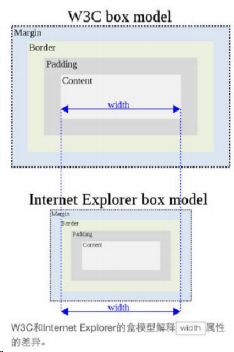

# HTML面试题


## 对 HTML 语义化标签的理解

::: details 查看参考回答

HTML5 语义化标签是指正确的标签包含了正确的内容，结构良好，便于阅读，比如 nav 表示导航条，类似的还有 article、header、footer 等等标签。

:::

## iframe 是什么？有什么缺点？

::: details 查看参考回答

定义：iframe 元素会创建包含另一个文档的内联框架

提示：可以将提示文字放在`<iframe></iframe>`之间，来提示某些不支持 iframe 的浏览器

缺点：

会阻塞主页面的 onload 事件

搜索引擎无法解读这种页面，不利于 SEO

iframe 和主页面共享连接池，而浏览器对相同区域有限制所以会影响性能。

:::

## Doctype 作用? 严格模式与混杂模式如何区分？它们有何意义?

::: details 查看参考回答

Doctype 声明于文档最前面，告诉浏览器以何种方式来渲染页面，这里有两种模式，严格模式和混杂模式。

严格模式的排版和 JS 运作模式是 以该浏览器支持的最高标准运行。

混杂模式，向后兼容，模拟老式浏览器，防止浏览器无法兼容页面。

:::


## 说一下 web Quality （无障碍）

::: details 查看参考回答

能够被残障人士使用的网站才能称得上一个易用的（易访问的）网站。

残障人士指的是那些带有残疾或者身体不健康的用户。

使用 alt 属性：

```html

```

有时候浏览器会无法显示图像。具体的原因有：

- 用户关闭了图像显示
- 浏览器是不支持图形显示的迷你浏览器
- 浏览器是语音浏览器（供盲人和弱视人群使用）
- 如果您使用了 alt 属性，那么浏览器至少可以显示或读出有关图像的描述。

:::

### click 在 ios 上有 300ms 延迟，原因及如何解决？

参考回答：

#### (1) 粗暴型，禁用缩放

```html
<meta name="viewport" content="width=device-width, user-scalable=no" />
```

#### (2) 利用 FastClick，其原理是：

检测到 touchend 事件后，立刻出发模拟 click 事件，并且把浏览器 300 毫秒之后真正出发的事件给阻断掉。

### Doctype 作用?严格模式与混杂模式如何区分？它们有何意义?

参考回答：

Doctype 声明于文档最前面，告诉浏览器以何种方式来渲染页面，这里有两种模式，严格模式和混杂模式。

严格模式的排版和 JS 运作模式是 以该浏览器支持的最高标准运行。

混杂模式，向后兼容，模拟老式浏览器，防止浏览器无法兼容页面。

#### 项目中使用了 iframe，说说 iframe 的优缺点

**考察点：iframe**

::: details 查看参考回答

**iframe 的优点**：

iframe 能够原封不动地把嵌入的网页展现出来。

如果有多个网页调用 iframe，只需要修改 iframe 的内容，就可以实现对调用 iframe 的每一个页面内容的更改，方便快捷。

网页如果为了统一风格，头部和版本都是一样的，就可以写成一个页面，用 iframe 来嵌套，可以增加代码的可重用性。

如果遇到加载缓慢的第三方内容，如图标和广告等，可以用 iframe 来解决。

**iframe 的缺点**：

会产生很多页面，不容易管理。

在几个框架中都出现上下、左右滚动条时，这些滚动条除了会挤占已经非常有限的页面空间外，还会分散访问者的注意力。

使用框架结构时，必须保证正确设置所有的导航链接，否则会给访问者带来很大的麻烦。比如被链接的页面出现在导航框架内，这种情况下会导致链接死循环。

很多的移动设备（PDA 手机）无法完全显示框架，设备兼容性差。

iframe 框架页面会增加服务器的 http 请求，对于大型网站是不可取的。

参考 https://blog.csdn.net/zhouziyu2011/article/details/58593362

:::

### iframe 是什么？有什么缺点？

参考回答：

定义：iframe 元素会创建包含另一个文档的内联框架

提示：可以将提示文字放在`<iframe></iframe>`之间，来提示某些不支持 iframe 的浏览器

缺点：

- 会阻塞主页面的 onload 事件
- 搜索引擎无法解读这种页面，不利于 SEO
- iframe 和主页面共享连接池，而浏览器对相同区域有限制所以会影响性能。

### 对 WEB 标准以及 W3C 的理解与认识

标签闭合、标签小写、不乱嵌套、提高搜索机器人搜索几率、使用外 链 css 和 js 脚本、结构行为表现的分离、文件下载与页面速度更快、内容能被更多的用户所访问、内容能被更广泛的设备所访问、更少的代码和组件，容易维 护、改版方便，不需要变动页面内容、提供打印版本而不需要复制内容、提高网站易用性；

### html 语义化是什么？

当页面样式加载失败的时候能够让页面呈现出清晰的结构

有利于 seo 优化，利于被搜索引擎收录（更便于搜索引擎的爬虫程序来识别）

便于项目的开发及维护，使 html 代码更具有可读性，便于其他设备解析。

### HTML 与 XHTML——二者有什么区别？

1. 所有的标记都必须要有一个相应的结束标记
2. 所有标签的元素和属性的名字都必须使用小写
3. 所有的 XML 标记都必须合理嵌套
4. 所有的属性必须用引号 "" 括起来
5. 把所有 < 和 & 特殊符号用编码表示
6. 给所有属性赋一个值
7. 不要在注释内容中使用 "--"
8. 图片必须有说明文字

### html 常见兼容性问题？

1.双边距 BUG float 引起的 使用 display

2.3 像素问题 使用 float 引起的 使用 dislpay:inline -3px

3.超链接 hover 点击后失效 使用正确的书写顺序 link visited hover active

4.Ie z-index 问题 给父级添加 position:relative

5.Png 透明 使用 js 代码 改

6.Min-height 最小高度 ！Important 解决'

7.select 在 ie6 下遮盖 使用 iframe 嵌套

为 什 么 没 有 办 法 定 义 1px 左 右 的 宽 度 容 器 （ IE6 默 认 的 行 高 造 成 的 ， 使 用 over:hidden,zoom:0.08 line-height:1px）

9.IE5-8 不支持 opacity，解决办法：

```css
.opacity {
opacity: 0.4
filter: alpha(opacity=60); /*for IE5-7*/
-ms-filter: "progid:DXImageTransform.Microsoft.Alpha(Opacity=60)"; /*for IE
8*/
}
```

IE6 不支持 PNG 透明背景，解决办法: IE6 下使用 gif 图片

### 对 WEB 标准以及 W3C 的理解与认识

答：

标签闭合、标签小写、不乱嵌套、提高搜索机器人搜索几率、使用外 链 css 和 js 脚本、结构行为表现的分离、文件下载与页面速度更快、内容能被更多的用户所访问、内容能被更广泛的设备所访问、更少的代码和组件，容易维 护、改版方便，不需要变动页面内容、提供打印版本而不需要复制内容、提高网站易用性。

### 行内元素有哪些?块级元素有哪些?CSS 的盒模型?

答：块级元素：div p h1 h2 h3 h4 form ul

行内元素: a b br i span input select

Css 盒模型:内容，border ,margin，padding

### 前端页面有哪三层构成，分别是什么?作用是什么?

答：结构层 Html 表示层 CSS 行为层 js。

### Doctype 作用? 严格模式与混杂模式-如何触发这两种模式，区分它们有何意义?

（1）、<!DOCTYPE> 声明位于文档中的最前面，处于 `<html>` 标签之前。告知浏览器的解析器，用什么文档类型 规范来解析这个文档。

（2）、严格模式的排版和 JS 运作模式是 以该浏览器支持的最高标准运行。

（3）、在混杂模式中，页面以宽松的向后兼容的方式显示。模拟老式浏览器的行为以防止站点无法工作。

（4）、DOCTYPE 不存在或格式不正确会导致文档以混杂模式呈现。

### Doctype 的作用？严格模式与混杂模式的区别？

`<!DOCTYPE>`用于告知浏览器该以何种模式来渲染文档

严格模式下：页面排版及 JS 解析是以该浏览器支持的最高标准来执行

混杂模式：不严格按照标准执行，主要用来兼容旧的浏览器，向后兼容

### 你能描述一下渐进增强和优雅降级之间的不同吗?

渐进增强 progressive enhancement：针对低版本浏览器进行构建页面，保证最基本的功能，然后再针对高级浏览器进行效果、交互等改进和追加功能达到更好的用户体验。

优雅降级 graceful degradation：一开始就构建完整的功能，然后再针对低版本浏览器进行兼容。

区别：优雅降级是从复杂的现状开始，并试图减少用户体验的供给，而渐进增强则是从一个非常基础的，能够起作用的版本开始，并不断扩充，以适应未来环境的需要。降级（功能衰减）意味着往回看；而渐进增强则意味着朝前看，同时保证其根基处于安全地带。

**"优雅降级"观点**

"优雅降级"观点认为应该针对那些最高级、最完善的浏览器来设计网站。而将那些被认为"过时"或有功能缺失的浏览器下的测试工作安排在开发周期的最后阶段，并把测试对象限定为主流浏览器（如 IE、Mozilla 等）的前一个版本。

在这种设计范例下，旧版的浏览器被认为仅能提供"简陋却无妨 (poor, but passable)" 的浏览体验。你可以做一些小的调整来适应某个特定的浏览器。但由于它们并非我们所关注的焦点，因此除了修复较大的错误之外，其它的差异将被直接忽略。

**"渐进增强"观点**

"渐进增强"观点则认为应关注于内容本身。

内容是我们建立网站的诱因。有的网站展示它，有的则收集它，有的寻求，有的操作，还有的网站甚至会包含以上的种种，但相同点是它们全都涉及到内容。这使得"渐进增强"成为一种更为合理的设计范例。这也是它立即被 Yahoo! 所采纳并用以构建其"分级式浏览器支持 (Graded Browser Support)"策略的原因所在。

那么问题来了。现在产品经理看到 IE6,7,8 网页效果相对高版本现代浏览器少了很多圆角，阴影（CSS3），要求兼容（使用图片背景，放弃 CSS3），你会如何说服他？

### 为什么利用多个域名来存储网站资源会更有效？

CDN 缓存更方便

突破浏览器并发限制

节约 cookie 带宽

节约主域名的连接数，优化页面响应速度

防止不必要的安全问题

### 请谈一下你对网页标准和标准制定机构重要性的理解

网页标准和标准制定机构都是为了能让 web 发展的更'健康'，开发者遵循统一的标准，降低开发难度，开发成本，SEO 也会更好做，也不会因为滥用代码导致各种 BUG、安全问题，最终提高网站易用性。

### 请描述一下 cookies，sessionStorage 和 localStorage 的区别？

sessionStorage （session）中的数据，这些数据只有在同一个会话中的页面才能访问并且当会话结束后数据也随之销毁。因此 sessionStorage 不是一种持久化的本地存储，仅

仅是会话级别的存储。而 localStorage 用于持久化的本地存储，除非主动删除数据，否则数据是永远不会过期的。

web storage 和 cookie 的区别

Web Storage 的概念和 cookie 相似，区别是它是为了更大容量存储设计的。Cookie 的大小是受限的，并且每次你请求一个新的页面的时候 Cookie 都会被发送过去，这样无形中浪费了带宽，另外 cookie 还需要指定作用域，不可以跨域调用。

除此之外，Web Storage 拥有 setItem,getItem,removeItem,clear 等方法，不像 cookie 需要前端开发者自己封装 setCookie，getCookie。但是 Cookie 也是不可以或缺的：Cookie 的作用是与服务器进行交互，作为 HTTP 规范的一部分而存在 ，而 Web Storage 仅仅是为了在本地"存储"数据而生。

### 简述一下 src 与 href 的区别

src 用于替换当前元素，href 用于在当前文档和引用资源之间确立联系。

src 是 source 的缩写，指向外部资源的位置，指向的内容将会嵌入到文档中当前标签所在位置；在请求 src 资源时会将其指向的资源下载并应用到文档内，例如 js 脚本，img 图片和 frame 等元素。

`<script src ="js.js"></script>`

当浏览器解析到该元素时，会暂停其他资源的下载和处理，直到将该资源加载、编译、执行完毕，图片和框架等元素也如此，类似于将所指向资源嵌入当前标签内。这也是为什么将 js 脚本放在底部而不是头部。

href 是 Hypertext Reference 的缩写，指向网络资源所在位置，建立和当前元素（锚点）或当前文档（链接）之间的链接，如果我们在文档中添加

`<link href="common.css" rel="stylesheet"/>`

那么浏览器会识别该文档为 css 文件，就会并行下载资源并且不会停止对当前文档的处理。这也是为什么建议使用 link 方式来加载 css，而不是使用@import 方式。

### 知道的网页制作会用到的图片格式有哪些？

png-8，png-24，jpeg，gif，svg。

但是上面的那些都不是面试官想要的最后答案。面试官希望听到是 Webp。（是否有关注新技术，新鲜事物）

科普一下 Webp：WebP 格式，谷歌（google）开发的一种旨在加快图片加载速度的图片格式。

图片压缩体积大约只有 JPEG 的 2/3，并能节省大量的服务器带宽资源和数据空间。FacebookEbay 等知名网站已经开始测试并使用 WebP 格式。

在质量相同的情况下，WebP 格式图像的体积要比 JPEG 格式图像小 40%

### 知道什么是微格式吗？谈谈理解。在前端构建中应该考虑微格式吗？

微格式（Microformats）是一种让机器可读的语义化 XHTML 词汇的集合，是结构化数据的开放标准。是为特殊应用而制定的特殊格式。

优点：将智能数据添加到网页上，让网站内容在搜索引擎结果界面可以显示额外的提示。（应用范例：豆瓣，有兴趣自行 google）

### 一个页面上有大量的图片（大型电商网站），加载很慢，你有哪些方法优

化这些图片的加载，给用户更好的体验。

图片懒加载，在页面上的未可视区域可以添加一个滚动条事件，判断图片位置与浏览器顶端的距离与页面的距离，如果前者小于后者，优先加载。

如果为幻灯片、相册等，可以使用图片预加载技术，将当前展示图片的前一张和后一张优先下载。

如果图片为 css 图片，可以使用 CSSsprite，SVGsprite，Iconfont、Base64 等技术。

如果图片过大，可以使用特殊编码的图片，加载时会先加载一张压缩的特别厉害的缩略图，以提高用户体验。

如果图片展示区域小于图片的真实大小，则因在服务器端根据业务需要先行进行图片压缩，图片压缩后大小与展示一致。

### 谈谈以前端角度出发做好 SEO 需要考虑什么？

了解搜索引擎如何抓取网页和如何索引网页

你需要知道一些搜索引擎的基本工作原理，各个搜索引擎之间的区别，搜索机器人（SE robot 或叫 web crawler）如何进行工作，搜索引擎如何对搜索结果进行排序等等。

Meta 标签优化

主要包括主题（Title)，网站描述(Description)，和关键词（Keywords）。还有一些其它的隐藏文字比如 Author（作者），Category（目录），Language（编码语种）等。

如何选取关键词并在网页中放置关键词

搜索就得用关键词。关键词分析和选择是 SEO 最重要的工作之一。首先要给网站确定主关键词（一般在 5 个上下），然后针对这些关键词进行优化，包括关键词密度（Density），相关度（Relavancy），突出性（Prominency）等等。

了解主要的搜索引擎

虽然搜索引擎有很多，但是对网站流量起决定作用的就那么几个。比如英文的主要有 Google，Yahoo，Bing 等；中文的有百度，搜狗，有道等。不同的搜索引擎对页面的抓取和索引、排序的规则都不一样。还要了解各搜索门户和搜索引擎之间的关系，比如 AOL 网页搜索用的是 Google 的搜索技术，MSN 用的是 Bing 的技术。

主要的互联网目录

Open Directory 自身不是搜索引擎，而是一个大型的网站目录，他和搜索引擎的主要区别是网站内容的收集方式不同。目录是人工编辑的，主要收录网站主页；搜索引擎是自动收集的，除了主页外还抓取大量的内容页面。

按点击付费的搜索引擎

搜索引擎也需要生存，随着互联网商务的越来越成熟，收费的搜索引擎也开始大行其道。最典型的有 Overture 和百度，当然也包括 Google 的广告项目 Google Adwords。越来越多的人通过搜索引擎的点击广告来定位商业网站，这里面也大有优化和排名的学问，你得学会用最少的广告投入获得最多的点击。

搜索引擎登录

网站做完了以后，别躺在那里等着客人从天而降。要让别人找到你，最简单的办法就是将网站提交（submit）到搜索引擎。如果你的是商业网站，主要的搜索引擎和目录都会要求你付费来获得收录（比如 Yahoo 要 299 美元），但是好消息是（至少到目前为止）最大的搜索引擎 Google 目前还是免费，而且它主宰着 60％以上的搜索市场。

链接交换和链接广泛度（Link Popularity）

网页内容都是以超文本（Hypertext）的方式来互相链接的，网站之间也是如此。除了搜索引擎以外，人们也每天通过不同网站之间的链接来 Surfing（"冲浪"）。其它网站到你的网站的链接越多，你也就会获得更多的访问量。更重要的是，你的网站的外部链接数越多，会被搜索引擎认为它的重要性越大，从而给你更高的排名。

合理的标签使用

## HTML5

## 每个 HTML 文件里开头都有个很重要的东西，Doctype，知道这是干什么的吗？

`<!DOCTYPE>` 声明位于文档中的最前面的位置，处于 `<html>` 标签之前。

此标签可告知浏览器文档使用哪种 HTML 或 XHTML 规范。（重点：告诉浏览器按照何种规范解析页面）

## div+css 的布局较 table 布局有什么优点？

改版的时候更方便 只要改 css 文件。

页面加载速度更快、结构化清晰、页面显示简洁。

表现与结构相分离。

易于优化（seo）搜索引擎更友好，排名更容易靠前。

## img 的 alt 与 title 有何异同？ strong 与 em 的异同？

a:alt(alt text):为不能显示图像、窗体或 applets 的用户代理（UA），alt 属性用来指定替换文字。替换文字的语言由 lang 属性指定。(在 IE 浏览器下会在没有 title 时把 alt 当成 tool tip 显示)

title(tool tip):该属性为设置该属性的元素提供建议性的信息。

strong:粗体强调标签，强调，表示内容的重要性

em:斜体强调标签，更强烈强调，表示内容的强调点

## 2.Label 的作用是什么？是怎么用的？

label 标签来定义表单控制间的关系,当用户选择该标签时，浏览器会自动将焦点转到和标签相关的表单控件上。

```html
<label for="Name">Number:</label>
<input type="“text“name" ="Name" id="Name" />
<label>Date:<input type="text" name="B" /></label>
```

## 3.HTML5 的 form 如何关闭自动完成功能

给不想要提示的 form 或某个 input 设置为 autocomplete=off

## 4.dom 如何实现浏览器内多个标签页之间的通信? (阿里)

1）WebSocket、SharedWorker；
2）也可以调用 localstorge、cookies 等本地存储方式；localstorge 另一 个浏览上下文里被添加、修改或删除时，它都会触发一个事件，我们通 过监听事件，控制它的值来进行页面信息通信；
3）注意 quirks：Safari 在无痕模式下设置 localstorge 值时会抛出 QuotaExceededError 的异常；

## 5.实现不使用 border 画出 1px 高的线，在不同浏览器的标准模式与怪异模式下都能保持一致的效果

```html
<div style="height:1px;overflow:hidden;background:red"></div>
```

## 6.title 与 h1 的区别、b 与 strong 的区别、i 与 em 的区别？

title 属性没有明确意义只表示是个标题，H1 则表示层次明确的标题，对页面信息的抓取也有很大的影响；

strong 是标明重点内容，有语气加强的含义，使用阅读设备阅读网络时：` <strong>` 会重读，而 `<B>`是展示强调内容。

i 内容展示为斜体，me 表示强调的文本；

Physical Style Elements -- 自然样式标签
b, i, u, s, pre
Semantic Style Elements -- 语义样式标签
strong, em, ins, del, code

应该准确使用语义样式标签, 但不能滥用, 如果不能确定时首选使用自然样式标签。

## 8.每个 HTML 文件里开头都有个很重要的东西，Doctype，知道这是干什么的吗？

文档声明。

## 9.div+css 的布局较 table 布局有什么优点

正常场景一般都适用 div+CSS 布局，

优点：

1）结构与样式分离
2）代码语义性好
3）更符合 HTML 标准规范
4） SEO 友好

Table 布局的适用场景：

某种原因不方便加载外部 CSS 的场景，例如邮件正文，此时用 table 布局可以在无 css 情况下保持页面布局正常

## 10.img 的 alt 与 title 有何异同？ strong 与 em 的异同

alt(alt text):为不能显示图像、窗体或 applets 的用户代理（UA），alt 属性用来指定替换文字。替换文字

的语言由 lang 属性指定。(在 IE 浏览器下会在没有 title 时把 alt 当成 tool tip 显示)

title(tool tip):该属性为设置该属性的元素提供建议性的信息。

em:表现为斜体，语义表示强调

strong:表现为粗体，语义为强烈语气，强调程度超过 em

## 11.简述一下 src 与 href 的区别

src 用于替换当前元素，href 用于在当前文档和引用资源之间确立联系。
src 是 source 的缩写，指向外部资源的位置，指向的内容将会嵌入到文档中当前标签所在位置；在请求 src 资源时会将其指向的资源下载并应用到文档内，例如 js 脚本，img 图片和 frame 等元素。

```html
<script src="”js.js”"></script>
```

当浏览器解析到该元素时，会暂停其他资源的下载和处理，直到将该资源加载、编译、执行完毕，图片和框架等元素也如此，类似于将所指向资源嵌入当前标签内。这也是为什么将 js 脚本放在底部而不是头部。

href 是 Hypertext Reference 的缩写，指向网络资源所在位置，建立和当前元素（锚点）或当前文档（链接）之间的链接，如果我们在文档中添加

```html
<link href="common.css" rel="stylesheet" />
```

那么浏览器会识别该文档为 css 文件，就会并行下载资源并且不会停止对当前文档的处理。这也是为什么建议使用 link 方式来加载 css，而不是使用@import 方式。

## 12.知道的网页制作会用到的图片格式有哪些

png-8，png-24，jpeg，gif，svg。

但是上面的那些都不是面试官想要的最后答案。面试官希望听到是 Webp。（是否有关注新技术，新鲜事物）

科普一下 Webp：WebP 格式，谷歌（google）开发的一种旨在加快图片加载速度的图片格式。图片压缩体积大约只有 JPEG 的 2/3，并能节省大量的服务器带宽资源和数据空间。Facebook Ebay 等知名网站已经开始测试并使用 WebP 格式。

在质量相同的情况下，WebP 格式图像的体积要比 JPEG 格式图像小 40%

## 13.在 css/js 代码上线之后开发人员经常会优化性能，从用户刷新网页开始，一次 js 请求一般情况下有哪些地方会有缓存处理

dns 缓存，cdn 缓存，浏览器缓存，服务器缓存

## 14.一个页面上有大量的图片（大型电商网站），加载很慢，你有哪些方法优化这些图片的加载，给用户更好的体验

1）图片懒加载，在页面上的未可视区域可以添加一个滚动条事件，判断图片位置与浏览器顶端的距离与页面的距离，如果前者小于后者，优先加载。

2）如果为幻灯片、相册等，可以使用图片预加载技术，将当前展示图片的前一张和后一张优先下载。

3）如果图片为 css 图片，可以使用 CSSsprite，SVGsprite，Iconfont、Base64 等技术。

4）如果图片过大，可以使用特殊编码的图片，加载时会先加载一张压缩的特别厉害的缩略图，以提高用户体验。

5）如果图片展示区域小于图片的真实大小，则因在服务器端根据业务需要先行进行图片压缩，图片压缩后大小与展示一致

## 15.你如何理解 HTML 结构的语义化

- 1）更符合 W3C 统一的规范标准，是技术趋势。
- 2）没有样式时浏览器的默认样式也能让页面结构很清晰。
- 3）对功能障碍用户友好。屏幕阅读器（如果访客有视障）会完全根据你的标记来“读”你的网页。
- 4）对其他非主流终端设备友好。例如机顶盒、PDA、各种移动终端。
- 5）对 SEO 友好。

## 16.谈谈以前端角度出发做好 SEO 需要考虑什么

搜索引擎主要以：

外链数量和质量,网页内容和结构等来决定某关键字下的网页搜索排名。

前端应该注意网页结构和内容方面的情况：

1）Meta 标签优化：主要包括主题（Title)，网站描述(Description)。还有一些其它的隐藏文字比如 Author（作者），Category（目录），Language（编码语种）等，符合 W3C 规范的语义性标签的使用

2）如何选取关键词并在网页中放置关键词：搜索就得用关键词。关键词分析和选择是 SEO 最重要的工作之一。首先要给网站确定主关键词（一般在 5 个上下），然后针对这些关键词进行优化，包括关键词密度（Density），相关度（Relavancy），突出性（Prominency）等等。

## 17.html5 有哪些新特性、移除了那些元素

新特性：

1）拖拽释放(Drag and drop) API
2）语义化更好的内容标签（header,nav,footer,aside,article,section）
3）音频、视频 API(audio,video)
4） 画布(Canvas) API
5）地理(Geolocation) API
6） 本地离线存储 localStorage 长期存储数据，浏览器关闭后数据不丢失；
7）sessionStorage 的数据在浏览器关闭后自动删除
8）表单控件，calendar、date、time、email、url、search
9）新的技术 webworker, websocket, Geolocation

移除的元素：

1）纯表现的元素：basefont，big，center，font, s，strike，tt，u；
2）对可用性产生负面影响的元素：frame，frameset，noframes；

## 18.如何处理 HTML5 新标签的浏览器兼容问题

IE8/IE7/IE6 支持通过 document.createElement 方法产生的标签，可以利用这一特性让这些浏览器支持 HTML5 新标签，浏览器支持新标签后，还需要添加标签默认的样式（当然最好的方式是直接使用成熟的框架、使用最多的是 html5shim 框架）：

```html
<!--[if lt IE 9]>
	<script>
		src = "http://html5shim.googlecode.com/svn/trunk/html5.js";
	</script>
<![endif]-->
```

## 19.如何区分 HTML 和 HTML5？

DOCTYPE 声明新增的结构元素、功能元素

## 20.HTML5 Canvas 元素有什么用

Canvas 元素用于在网页上绘制图形，该元素标签强大之处在于可以直接在 HTML 上进行图形操作

## 25.介绍一下你对浏览器内核的理解

主要分成两部分：渲染引擎(layout engineer 或 Rendering Engine)和 JS 引擎

渲染引擎：负责取得网页的内容（HTML、XML、图像等等）、整理讯息（例如加入 CSS 等），以及计算网页的显示方式，然后会输出至显示器或打印机。浏览器的内核的不同对于网页的语法解释会有不同，所以渲染的效果也不相同。所有网页浏览器、电子邮件客户端以及其它需要编辑、显示网络内容的应用程序都需要内核

JS 引擎则：解析和执行 javascript 来实现网页的动态效果

最开始渲染引擎和 JS 引擎并没有区分的很明确，后来 JS 引擎越来越独立，内核就倾向于只指渲染引擎

## 26.浏览器是怎么对 HTML5 的离线储存资源进行管理和加载的呢

在线的情况下，浏览器发现 html 头部有 manifest 属性，它会请求 manifest 文件，如果是第一次访问 app，那么浏览器就会根据 manifest 文件的内容下载相应的资源并且进行离线存储。如果已经访问过 app 并且资源已经离线存储了，那么浏览器就会使用离线的资源加载页面，然后浏览器会对比新的 manifest 文件与旧的 manifest 文件，如果文件没有发生改变，就不做任何操作，如果文件改变了，那么就会重新下载文件中的资源并进行离线存储。

离线的情况下，浏览器就直接使用离线存储的资源

## 27.请描述一下 cookies，sessionStorage 和 localStorage 的区别

cookie 是网站为了标示用户身份而储存在用户本地终端（Client Side）上的数据（通常经过加密）

cookie 数据始终在同源的 http 请求中携带（即使不需要），记会在浏览器和服务器间来回传递 sessionStorage 和 localStorage 不会自动把数据发给服务器，仅在本地保存
存储大小：

cookie 数据大小不能超过 4k

sessionStorage 和 localStorage 虽然也有存储大小的限制，但比 cookie 大得多，可以达到 5M 或更大有期时间：

localStorage 存储持久数据，浏览器关闭后数据不丢失除非主动删除数据

sessionStorage 数据在当前浏览器窗口关闭后自动删除

cookie 设置的 cookie 过期时间之前一直有效，即使窗口或浏览器关闭

## 28.css sprite 是什么,有什么优缺点

概念：将多个小图片拼接到一个图片中。通过 background-position 和元素尺寸调节需要显示的背景图案。

优点：

- 减少 HTTP 请求数，极大地提高页面加载速度
- 增加图片信息重复度，提高压缩比，减少图片大小
- 更换风格方便，只需在一张或几张图片上修改颜色或样式即可实现

缺点：

- 图片合并麻烦
- 维护麻烦，修改一个图片可能需要从新布局整个图片，样式

## 29.canvas 如何绘制一个三角形|正方形

moveto 是移动到某个坐标， lineto 是从当前坐标连线到某个坐标。

这两个函数加起来就是画一条直线。 画线要用“笔”，那么 MoveTo()把笔要画的起始位置固定了（x,y）然后要固定终止位置要用到 LineTo 函数确定终止位置（xend,yend）,这样一条线就画出来了。 每次与前面一个坐标相连 。

stroke() 方法会实际地绘制出通过 moveTo() 和 lineTo() 方法定义的路径。默认颜色是黑色。

```html
<!DOCTYPE HTML5>
<html>
	<head>
		<meta http-equiv="Content-Type" content="text/html; charset=utf-8" />
		<title>画布</title>
	</head>
	<body>
		<canvas
			id="myCanvas"
			width="200"
			height="100"
			style="border:1px solid
#c3c3c3;"
		>
			Your browser does not support the canvas element.
		</canvas>
		<script type="text/javascript">
			var c = document.getElementById("myCanvas"); //三角形
			var cxt = c.getContext("2d");
			cxt.moveTo(10, 10);
			cxt.lineTo(50, 50);
			cxt.lineTo(10, 50);
			cxt.lineTo(10, 10);
			cxt.stroke(); //正方形
			var cxt2 = c.getContext("2d");
			cxt2.moveTo(60, 10);
			cxt2.lineTo(100, 10);
			cxt2.lineTo(100, 50);
			cxt2.lineTo(60, 50);
			cxt2.lineTo(60, 10);
			cxt2.stroke();
		</script>
	</body>
</html>
```

## 30.弹性盒子模型? flex|box 区别?

1）引入弹性盒布局模型的目的是提供一种更加有效的方式来对一个容器中的条目进行排列、对齐和分配空白空间。

即便容器中条目的尺寸未知或是动态变化的，弹性盒布局模型也能正常的工作。在该布局模型中，容器会根据布局的需要，调整其中包含的条目的尺寸和顺序来最好地填充所有可用的空间。

当容器的尺寸由于屏幕大小或窗口尺寸发生变化时，其中包含的条目也会被动态地调整。比如当容器尺寸变大时，其中包含的条目会被拉伸以占满多余的空白空间；当容器尺寸变小时，条目会被缩小以防止超出容器的范围。弹性盒布局是与方向无关的。

在传统的布局方式中，block 布局是把块在垂直方向从上到下依次排列的；

而 inline 布局则是在水平方向来排列。弹性盒布局并没有这样内在的方向限制，可以由开发人员自由操作。

2）flex 和 box 的区别: display：box 是老规范，要兼顾古董机子就加上它； 父级元素有 display:box;属性之后。他的子元素里面加上 box-flex 属性。可以让子元素按照父元素的宽度进行一定比例的分占空间。

flex 是最新的，董机老机子不支持的；

父元素设置 display:flex 后，子元素宽度会随父元素宽度的改变而改变，而 display:box 不会。 Android

UC 浏览器只支持 display: box 语法；而 iOS UC 浏览器则支持两种方式。

## 31.解释在 ie 低版本下的怪异盒模型和 c3 的怪异盒模型 和 弹性盒模型?

IE 当 padding+border 的值小于 width 或者 height:

盒模型的宽度=margin(左右)+width（width 已经包含了 padding 和 border 的值）
盒模型的高度=margin(上下)+height（height 已经包含了 padding 和 border 的值）

当 padding+border 的值大于 width 或者 height:

盒模型的宽度=margin(左右)+padding(左右)+border(左右)
盒模型的高度=margin(上下)+padding(上下)+border(上下)+19px （加一个默认行高 19px） 所以相当于是 padding+border 和 width 或者 height 比大小，谁大取谁。

以上几种 DOCTYPE 都是标准的文档类型，无论使用哪种模式完整定义 DOCTYPE，都会触发标准模式，而如果 DOCTYPE 缺失则在 ie6，ie7，ie8 下将会触发怪异模式（quirks 模式） CSS3box-sizing 有两个值

一个是 content-box，另一个是 border-box。

当设置为 box-sizing:content-box 时，将采用标准模式解析计算，也是默认模式；

当设置为 box-sizing:border-box 时，将采用怪异模式解析计算；

Css3 弹性盒模型引入了新的盒子模型—弹性盒模型，该模型决定一个盒子在其他盒子中的分布方式以及如何处理可用的空间。使用该模型，可以很轻松的创建自适应浏览器窗口的流动布局或自适应字体大小的弹性布局。

## 2、html5 有哪些新特性、移除了那些元素？如何处理 HTML5 新标签的浏览器兼容问题？如何区分 HTML 和 HTML5？

新特性：

1. 拖拽释放(Drag and drop) API
2. 语义化更好的内容标签（header,nav,footer,aside,article,section）
3. 音频、视频 API(audio,video)
4. 画布(Canvas) API
5. 地理(Geolocation) API
6. 本地离线存储 localStorage 长期存储数据，浏览器关闭后数据不丢失；
7. sessionStorage 的数据在浏览器关闭后自动删除
8. 表单控件，calendar、date、time、email、url、search
9. 新的技术 webworker, websocket, Geolocation

移除的元素：

1. 纯表现的元素：basefont，big，center，font, s，strike，tt，u；
2. 对可用性产生负面影响的元素：frame，frameset，noframes；
   支持 HTML5 新标签：
3. IE8/IE7/IE6 支持通过 document.createElement 方法产生的标签，可以利用这一特性让这些浏览器支持 HTML5 新标签，浏览器支持新标签后，还需要添加标签默认的样式（当然最好的方式是直接使用成熟的框架、使用最多的是 html5shim 框架）：

```html
<!--[if lt IE 9]>
	<script src="http://html5shim.googlecode.com/svn/trunk/html5.js"></script>
<![endif]-->
```

如何区分：
DOCTYPE 声明新增的结构元素、功能元素

## 3、本地存储（Local Storage ）和 cookies（储存在用户本地终端上的数据）之间的区别是什么？

Cookies:服务器和客户端都可以访问；大小只有 4KB 左右；有有效期，过期后将会删除；
本地存储：只有本地浏览器端可访问数据，服务器不能访问本地存储直到故意通过 POST 或
者 GET 的通道发送到服务器；每个域 5MB；没有过期数据，它将保留知道用户从浏览器清除
或者使用 Javascript 代码移除

## 4、如何实现浏览器内多个标签页之间的通信?

调用 localstorge、cookies 等本地存储方式

## 5、你如何对网站的文件和资源进行优化？

文件合并
文件最小化/文件压缩
使用 CDN 托管
缓存的使用

## 6、什么是响应式设计？

它是关于网页制作的过程中让不同的设备有不同的尺寸和不同的功能。响应式设计是让所有的人能在这些设备上让网站运行正常

## 7、新的 HTML5 文档类型和字符集是？

答：HTML5 文档类型：`<!doctype html>`

HTML5 使用的编码：`<meta charset="UTF-8">`

## 8、HTML5 Canvas 元素有什么用？

答：Canvas 元素用于在网页上绘制图形，该元素标签强大之处在于可以直接在 HTML 上进行图形操作。

## 9、HTML5 存储类型有什么区别？

答：Media API、Text Track API、Application Cache API、User Interaction、Data Transfer API、Command API、Constraint Validation API、History API

## 10、用 H5+CSS3 解决下导航栏最后一项掉下来的问题


## 17、为什么利用多个域名来存储网站资源会更有效？

- CDN 缓存更方便
- 突破浏览器并发限制
- 节约 cookie 带宽
- 节约主域名的连接数，优化页面响应速度
- 防止不必要的安全问题

## 18、请谈一下你对网页标准和标准制定机构重要性的理解。

（无标准答案）网页标准和标准制定机构都是为了能让 web 发展的更‘健康’，开发者
遵循统一的标准，降低开发难度，开发成本，SEO 也会更好做，也不会因为滥用代码导致各种 BUG、安全问题，最终提高网站易用性。

## 19、请描述一下 cookies，sessionStorage 和 localStorage 的区别？

sessionStorage 用于本地存储一个会话（session）中的数据，这些数据只有在同一个会话中的页面才能访问并且当会话结束后数据也随之销毁。因此 sessionStorage 不是一种持久化的本地存储，仅仅是会话级别的存储。而 localStorage 用于持久化的本地存储，除非主动删除数据，否则数据是永远不会过期的。

web storage 和 cookie 的区别

Web Storage 的概念和 cookie 相似，区别是它是为了更大容量存储设计的。Cookie
的大小是受限的，并且每次你请求一个新的页面的时候 Cookie 都会被发送过去，这样，无形中浪费了带宽，另外 cookie 还需要指定作用域，不可以跨域调用。

除此之外，Web Storage 拥有 setItem,getItem,removeItem,clear 等方法，不像 cookie 需要前端开发者自己封装 setCookie，getCookie。但是 Cookie 也是不可以或
缺的：Cookie 的作用是与服务器进行交互，作为 HTTP 规范的一部分而存在 ，而 Web Storage 仅仅是为了在本地“存储”数据而生。

## HTML5 引入什么新的表单属性？

Datalist datetime output keygen date month week time number range
emailurl

## 25、(写)描述一段语义的 html 代码吧。

（HTML5 中新增加的很多标签（如：`<article>、<nav>、<header>`和`<footer>`等）

就是基于语义化设计原则）

```html
< div id="header">
    < h1>标题< /h1>
    < h2>专注 Web 前端技术</h2>
< /div>
```

语义 HTML 具有以下特性：

文字包裹在元素中，用以反映内容。例如：

段落包含在 `<p>` 元素中。

顺序表包含在`<ol>`元素中。

从其他来源引用的大型文字块包含在`<blockquote>`元素中。

HTML 元素不能用作语义用途以外的其他目的。

例如：

```html
<h1>
	包含标题，但并非用于放大文本。
	<blockquote>
		包含大段引述，但并非用于文本缩进。 空白段落元素 (
		<p></p>
		) 并非用于跳行。 文本并不直接包含任何样式信息。例如： 不使用
		<font>
			或
			<center>等格式标记。</center></font
		>
	</blockquote>
</h1>
```

类或 ID 中不引用颜色或位置。

## 26.cookie 在浏览器和服务器间来回传递。 sessionStorage 和 localStorage 区别

- sessionStorage 和 localStorage 的存储空间更大；
- sessionStorage 和 localStorage 有更多丰富易用的接口；
- sessionStorage 和 localStorage 各自独立的存储空间；

## 29、语义化的理解？

用正确的标签做正确的事情！

html 语义化就是让页面的内容结构化，便于对浏览器、搜索引擎解析；

在没有样式 CCS 情况下也以一种文档格式显示，并且是容易阅读的。

搜索引擎的爬虫依赖于标记来确定上下文和各个关键字的权重，利于 SEO。

使阅读源代码的人对网站更容易将网站分块，便于阅读维护理解。

## 说一下 HTML5 drag api

::: details 查看参考回答

dragstart：事件主体是被拖放元素，在开始拖放被拖放元素时触发。

darg：事件主体是被拖放元素，在正在拖放被拖放元素时触发。

dragenter：事件主体是目标元素，在被拖放元素进入某元素时触发。

dragover：事件主体是目标元素，在被拖放在某元素内移动时触发。

dragleave：事件主体是目标元素，在被拖放元素移出目标元素是触发。

drop：事件主体是目标元素，在目标元素完全接受被拖放元素时触发。

dragend：事件主体是被拖放元素，在整个拖放操作结束时触发

:::

## 30、HTML5 的离线储存？

localStorage 长期存储数据，浏览器关闭后数据不丢失；
sessionStorage 数据在浏览器关闭后自动删除。

## 31、写出 HTML5 的文档声明方式

`<DOCYPE html>`

## 32、HTML5 和 CSS3 的新标签

HTML5： nav, footer, header, section, hgroup, video, time, canvas, audio...
CSS3: RGBA, opacity, text-shadow, box-shadow, border-radius, border-image,
border-color, transform...;

## 33、自己对标签语义化的理解

在我看来，语义化就是比如说一个段落， 那么我们就应该用 `<p>`标签来修饰，标题就应该用 <h?>标签等。符合文档语义的标签。

### 2、每个 HTML 文件里开头都有个很重要的东西，Doctype，知道这是干什么的吗？

`<!DOCTYPE>` 声明位于文档中的最前面的位置，处于 `<html>` 标签之前。此标签可告知浏览器文档使用哪种 HTML 或 XHTML 规范。（重点：告诉浏览器按照何种规范解析页面）

### 3、Quirks 模式是什么？它和 Standards 模式有什么区别

从 IE6 开始，引入了 Standards 模式，标准模式中，浏览器尝试给符合标准的文档在规范上的正确处理达到在指定浏览器中的程度。

在 IE6 之前 CSS 还不够成熟，所以 IE5 等之前的浏览器对 CSS 的支持很差， IE6 将对 CSS 提供更好的支持，然而这时的问题就来了，因为有很多页面是基于旧的布局方式写的，而如果 IE6 支持 CSS 则将令这些页面显示不正常，如何在即保证不破坏现有页面，又提供新的渲染机制呢？

在写程序时我们也会经常遇到这样的问题，如何保证原来的接口不变，又提供更强大的功能，尤其是新功能不兼容旧功能时。遇到这种问题时的一个常见做法是增加参数和分支，即当某个参数为真时，我们就使用新功能，而如果这个参数 不为真时，就使用旧功能，这样就能不破坏原有的程序，又提供新功能。IE6 也是类似这样做的，它将 DTD 当成了这个“参数”，因为以前的页面大家都不会去写 DTD，所以 IE6 就假定 如果写了 DTD，就意味着这个页面将采用对 CSS 支持更好的布局，而如果没有，则采用兼容之前的布局方式。这就是 Quirks 模式（怪癖模式，诡异模式，怪异模式）。

区别：

总体会有布局、样式解析和脚本执行三个方面的区别。

盒模型：在 W3C 标准中，如果设置一个元素的宽度和高度，指的是元素内容的宽度和高度，而在 Quirks 模式下，IE 的宽度和高度还包含了 padding 和 border。

设置行内元素的高宽：在 Standards 模式下，给 `<span>` 等行内元素设置 wdith 和 height 都不会生效，而在 quirks 模式下，则会生效。

设置百分比的高度：在 standards 模式下，一个元素的高度是由其包含的内容来决定的，如果父元素没有设置百分比的高度，子元素设置一个百分比的高度是无效的用
margin:0 auto 设置水平居中：使用 margin:0 auto 在 standards 模式下可以使元素水平居中，但在 quirks 模式下却会失效。

（还有很多，答出什么不重要，关键是看他答出的这些是不是自己经验遇到的，还是说都是看文章看的，甚至完全不知道。）

### 4、div+css 的布局较 table 布局有什么优点？

改版的时候更方便 只要改 css 文件。

页面加载速度更快、结构化清晰、页面显示简洁。

表现与结构相分离。

易于优化（seo）搜索引擎更友好，排名更容易靠前。

### 5、 img 的 alt 与 title 有何异同？ strong 与 em 的异同？

a:alt(alt text):为不能显示图像、窗体或 applets 的用户代理（UA），alt 属性用来指
定替换文字。替换文字的语言由 lang 属性指定。(在 IE 浏览器下会在没有 title 时把 alt 当成 tool tip 显示)

title(tool tip)：该属性为设置该属性的元素提供建议性的信息。

strong：粗体强调标签，强调，表示内容的重要性

em：斜体强调标签，更强烈强调，表示内容的强调点

### 6、你能描述一下渐进增强和优雅降级之间的不同吗?

渐进增强 progressive enhancement：针对低版本浏览器进行构建页面，保证最基本的功能，然后再针对高级浏览器进行效果、交互等改进和追加功能达到更好的用户体验。

优雅降级 graceful degradation：一开始就构建完整的功能，然后再针对低版本浏览器进行兼容。

区别：优雅降级是从复杂的现状开始，并试图减少用户体验的供给，而渐进增强则是从一个非常基础的，能够起作用的版本开始，并不断扩充，以适应未来环境的需要。

降级（功能衰减）意味着往回看；而渐进增强则意味着朝前看，同时保证其根基处于安全地带。

#### “优雅降级”观点

“优雅降级”观点认为应该针对那些最高级、最完善的浏览器来设计网站。而将那些被认为“过时”或有功能缺失的浏览器下的测试工作安排在开发周期的最后阶段，并把测试对象限定为主流浏览器（如 IE、Mozilla 等）的前一个版本。

在这种设计范例下，旧版的浏览器被认为仅能提供“简陋却无妨 (poor, but passable)” 的浏览体验。你可以做一些小的调整来适应某个特定的浏览器。但由于它们并非我们所关注的焦点，因此除了修复较大的错误之外，其它的差异将被直接忽略。

#### “渐进增强”观点

“渐进增强”观点则认为应关注于内容本身。

内容是我们建立网站的诱因。有的网站展示它，有的则收集它，有的寻求，有的操作，还有的网站甚至会包含以上的种种，但相同点是它们全都涉及到内容。这使得“渐进增强”成为一种更为合理的设计范例。这也是它立即被 Yahoo! 所采纳并用以构建其“分级式浏览器支持 (Graded Browser Support)”策略的原因所在。

那么问题来了。现在产品经理看到 IE6,7,8 网页效果相对高版本现代浏览器少了很多圆角，阴影（CSS3），要求兼容（使用图片背景，放弃 CSS3），你会如何说服他？

### 7、为什么利用多个域名来存储网站资源会更有效？

- CDN 缓存更方便
- 突破浏览器并发限制
- 节约 cookie 带宽
- 节约主域名的连接数，优化页面响应速度
- 防止不必要的安全问题

### 8、请谈一下你对网页标准和标准制定机构重要性的理解。

网页标准和标准制定机构都是为了能让 web 发展的更‘健康’，开发者遵循统一的标准，降低开发难度，开发成本，SEO 也会更好做，也不会因为滥用代码导致各种 BUG、安全问题，最终提高网站易用性。

### 9、请描述一下 cookies，sessionStorage 和 localStorage 的区别？

sessionStorage （session）中的数据，这些数据只有在同一个会话中的页面才能访问并且当会话结束后数据也随之销毁。因此 sessionStorage 不是一种持久化的本地存储，仅仅是会话级别的存储。而 localStorage 用于持久化的本地存储，除非主动删除数据，否则数据是永远不会过期的。

#### web storage 和 cookie 的区别

Web Storage 的概念和 cookie 相似，区别是它是为了更大容量存储设计的。Cookie 的大小是受限的，并且每次你请求一个新的页面的时候 Cookie 都会被发送过去，这样无形中浪费了带宽，另外 cookie 还需要指定作用域，不可以跨域调用。

除此之外，Web Storage 拥有 setItem,getItem,removeItem,clear 等方法，不像 cookie 需要前端开发者自己封装 setCookie，getCookie。但是 Cookie 也是不可以或缺的：Cookie 的作用是与服务器进行交互，作为 HTTP 规范的一部分而存在 ，而 Web Storage 仅仅是为了在本地“存储”数据而生。

### 10、简述一下 src 与 href 的区别。

src 用于替换当前元素，href 用于在当前文档和引用资源之间确立联系。

src 是 source 的缩写，指向外部资源的位置，指向的内容将会嵌入到文档中当前标签所在位置；在请求 src 资源时会将其指向的资源下载并应用到文档内，例如 js 脚本，img 图片和 frame 等元素。

```html
<script src="”js.js”"></script>
```

当浏览器解析到该元素时，会暂停其他资源的下载和处理，直到将该资源加载、编译、执行完毕，图片和框架等元素也如此，类似于将所指向资源嵌入当前标签内。这也是为什么将 js 脚本放在底部而不是头部。

href 是 Hypertext Reference 的缩写，指向网络资源所在位置，建立和当前元素（锚点）或当前文档（链接）之间的链接，如果我们在文档中添加

```html
<link href="common.css" rel="stylesheet" />
```

那么浏览器会识别该文档为 css 文件，就会并行下载资源并且不会停止对当前文档的处理。

这也是为什么建议使用 link 方式来加载 css，而不是使用@import 方式。

### 11、知道的网页制作会用到的图片格式有哪些？

png-8，png-24，jpeg，gif，svg。

但是上面的那些都不是面试官想要的最后答案。面试官希望听到是 Webp。（是否有关注新技术，新鲜事物）

科普一下 Webp：WebP 格式，谷歌（google）开发的一种旨在加快图片加载速度的图片格式。

图片压缩体积大约只有 JPEG 的 2/3，并能节省大量的服务器带宽资源和数据空间。

Facebook

Ebay 等知名网站已经开始测试并使用 WebP 格式。

在质量相同的情况下，WebP 格式图像的体积要比 JPEG 格式图像小 40%

### 12、知道什么是微格式吗？谈谈理解。在前端构建中应该考虑微格式吗？

微格式（Microformats）是一种让机器可读的语义化 XHTML 词汇的集合，是结构化数据的开放标准。是为特殊应用而制定的特殊格式。

优点：将智能数据添加到网页上，让网站内容在搜索引擎结果界面可以显示额外的提示。（应用范例：豆瓣，有兴趣自行 google）

### 13、在 css/js 代码上线之后开发人员经常会优化性能，从用户刷新网页开始，一次 js 请求一般情况下有哪些地方会有缓存处理？

答案：dns 缓存，cdn 缓存，浏览器缓存，服务器缓存。

### 14、一个页面上有大量的图片（大型电商网站），加载很慢，你有哪些方法优化这些图片的加载，给用户更好的体验。

图片懒加载，在页面上的未可视区域可以添加一个滚动条事件，判断图片位置与浏览器顶端的距离与页面的距离，如果前者小于后者，优先加载。

如果为幻灯片、相册等，可以使用图片预加载技术，将当前展示图片的前一张和后一张优先下载。

如果图片为 css 图片，可以使用 CSSsprite，SVGsprite，Iconfont、Base64 等技术。
如果图片过大，可以使用特殊编码的图片，加载时会先加载一张压缩的特别厉害的缩略图，以提高用户体验。

如果图片展示区域小于图片的真实大小，则因在服务器端根据业务需要先行进行图片压缩，图片压缩后大小与展示一致。

### 15、你如何理解 HTML 结构的语义化？

去掉或样式丢失的时候能让页面呈现清晰的结构：

html 本身是没有表现的，我们看到例如`<h1>`是粗体，字体大小 2em，加粗；`<strong>`是加粗的，不要认为这是 html 的表现，这些其实 html 默认的 css 样式在起作用，所以去掉或样式丢失的时候能让页面呈现清晰的结构不是语义化的 HTML 结构的优点，但是浏览器都有有默认样式，默认样式的目的也是为了更好的表达 html 的语义，可以说浏览器的默认样式和语义化的 HTML 结构是不可分割的。

屏幕阅读器（如果访客有视障）会完全根据你的标记来“读”你的网页. 例如,如果你使用的含语义的标记,屏幕阅读器就会“逐个拼出”你的单词,而不是试着去对它完整发音。

PDA、手机等设备可能无法像普通电脑的浏览器一样来渲染网页（通常是因为这些设备对 CSS 的支持较弱）

使用语义标记可以确保这些设备以一种有意义的方式来渲染网页.理想情况下,观看设备的任务是符合设备本身的条件来渲染网页. 语义标记为设备提供了所需的相关信息,就省去了你自己去考虑所有可能的显示情况（包括现有的或者将来新的设备）.例如,一部手机可以选择使一段标记了标题的文字以粗体显示. 而掌上电脑可能会以比较大的字体来显示.无论哪种方式一旦你对文本标记为标题,您就可以确信读取设备将根据其自身的条件来合适地显示页面. 搜索引擎的爬虫也依赖于标记来确定上下文和各个关键字的权重过去你可能还没有考虑搜索引擎的爬虫也是网站的“访客”,但现在它们他们实际上是极其宝贵的用户.没有他们的话,搜索引擎将无法索引你的网站,然后一般用户将很难过来访问. 你的页面是否对爬虫容易理解非常重要,因为爬虫很大程度上会忽略用于表现的标记,而只注重语义标记. 因此,如果页面文件的标题被标记,而不是,那么这个页面在搜索结果的位置可能会比较靠后. 除了提升易用性外,语义标记有利于正确使用 CSS 和 JavaScript,因为其本身提供了许多“钩钩”来应用页面的样式与行为。

SEO 主要还是靠你网站的内容和外部链接的。

便于团队开发和维护 W3C 给我们定了一个很好的标准，在团队中大家都遵循这个标准，可以减少很多差异化的东西，方便开发和维护，提高开发效率，甚至实现模块化开发。

### 16、谈谈以前端角度出发做好 SEO 需要考虑什么？

了解搜索引擎如何抓取网页和如何索引网页

你需要知道一些搜索引擎的基本工作原理，各个搜索引擎之间的区别，搜索机器人
（SE robot 或叫 web crawler）如何进行工作，搜索引擎如何对搜索结果进行排序等
等。

#### Meta 标签优化

主要包括主题（Title)，网站描述(Description)，和关键词（Keywords）。还有一些其它的隐藏文字比如 Author（作者），Category（目录），Language（编码语种）等。

##### 如何选取关键词并在网页中放置关键词

搜索就得用关键词。关键词分析和选择是 SEO 最重要的工作之一。首先要给网站确定主关键词（一般在 5 个上下），然后针对这些关键词进行优化，包括关键词密度（Density），相关度（Relavancy），突出性（Prominency）等等。

##### 了解主要的搜索引擎

虽然搜索引擎有很多，但是对网站流量起决定作用的就那么几个。比如英文的主要有
Google，Yahoo，Bing 等；中文的有百度，搜狗，有道等。不同的搜索引擎对页面的抓取和索引、排序的规则都不一样。还要了解各搜索门户和搜索引擎之间的关系，比如 AOL 网页搜索用的是 Google 的搜索技术，MSN 用的是 Bing 的技术。

##### 主要的互联网目录

Open Directory 自身不是搜索引擎，而是一个大型的网站目录，他和搜索引擎的主要区别是网站内容的收集方式不同。目录是人工编辑的，主要收录网站主页；搜索引擎是自动收集的，除了主页外还抓取大量的内容页面。

##### 按点击付费的搜索引擎

搜索引擎也需要生存，随着互联网商务的越来越成熟，收费的搜索引擎也开始大行其道。最典型的有 Overture 和百度，当然也包括 Google 的广告项目 Google Adwords。越来越多的人通过搜索引擎的点击广告来定位商业网站，这里面也大有优化和排名的学问，你得学会用最少的广告投入获得最多的点击。

##### 搜索引擎登录

网站做完了以后，别躺在那里等着客人从天而降。要让别人找到你，最简单的办法就是将网站提交（submit）到搜索引擎。如果你的是商业网站，主要的搜索引擎和目录都会要求你付费来获得收录（比如 Yahoo 要 299 美元），但是好消息是（至少到目前为止）最大的搜索引擎 Google 目前还是免费，而且它主宰着 60％以上的搜索市场。

链接交换和链接广泛度（Link Popularity）

网页内容都是以超文本（Hypertext）的方式来互相链接的，网站之间也是如此。除了搜索引擎以外，人们也每天通过不同网站之间的链接来 Surfing（“冲浪”）。其它网站到你的网站的链接越多，你也就会获得更多的访问量。更重要的是，你的网站的外部链接数越多，会被搜索引擎认为它的重要性越大，从而给你更高的排名。

合理的标签使用

### 17、有哪项方式可以对一个 DOM 设置它的 CSS 样式？

外部样式表：引入一个外部 css 文件

内部样式表：将 css 代码放在 `<head>` 标签内部

内联样式：将 css 样式直接定义在 HTML 元素内部

### 18、CSS 都有哪些选择器？

- 派生选择器（用 HTML 标签申明）
- id 选择器（用 DOM 的 ID 申明）
- 类选择器（用一个样式类名申明）
- 属性选择器（用 DOM 的属性申明，属于 CSS2，IE6 不支持，不常用，不知道就算了）

除了前 3 种基本选择器，还有一些扩展选择器，包括：

- 后代选择器（利用空格间隔，比如 div .a{ }）
- 群组选择器（利用逗号间隔，比如 p,div,#a{ }）
- 那么问题来了，CSS 选择器的优先级是怎么样定义的？

基本原则：

一般而言，选择器越特殊，它的优先级越高。也就是选择器指向的越准确，它的优先级就越高。

复杂的计算方法：

用 1 表示派生选择器的优先级
用 10 表示类选择器的优先级
用 100 标示 ID 选择器的优先级
div.test1 .span var 优先级 1+10 +10 +1
span#xxx .songs li 优先级 1+100 + 10 + 1
#xxx li 优先级 100 +1

那么问题来了，看下列代码，`<p>` 标签内的文字是什么颜色的？

```html
<style>
	.classA {
		color: blue;
	}
	.classB {
		color: red;
	}
</style>
<body>
	<p class="classB classA">123</p>
</body>
```

答案：red。与样式定义在文件中的先后顺序有关，即是后面的覆盖前面的，与在<p class=’classB classA’>中的先后关系无关。

### 19、CSS 中可以通过哪些属性定义，使得一个 DOM 元素不显示在浏览器可视范围内？

最基本的：

设置 display 属性为 none，或者设置 visibility 属性为 hidden

技巧性：

设置宽高为 0，设置透明度为 0，设置 z-index 位置在-1000

### 20、超链接访问过后 hover 样式就不出现的问题是什么？如何解决？

答案：被点击访问过的超链接样式不在具有 hover 和 active 了,解决方法是改变 CSS 属性的排列顺序: L-V-H-A（link,visited,hover,active）

### 21、什么是 Css Hack？ie6,7,8 的 hack 分别是什么？

答案：针对不同的浏览器写不同的 CSS code 的过程，就是 CSS hack。

示例如下：

```css
#test {
	width: 300px;
	height: 300px;
	background-color: blue; /*firefox*/
	background-color: red\9; /*all ie*/
	background-color: yellow; /*ie8*/
	+background-color: pink; /*ie7*/
	_background-color: orange; /*ie6*/
}
:root #test {
	background-color: purple\9;
} /*ie9*/
@media all and (min-width: 0px) {
	#test {
		background-color: black;
	}
} /*opera*/
@media screen and (-webkit-min-device-pixel-ratio: 0) {
	#test {
		background-color: gray;
	}
}
/*chrome and safari*/
```

### 22、请用 Css 写一个简单的幻灯片效果页面

答案：知道是要用 css3。使用 animation 动画实现一个简单的幻灯片效果。

```css
div.ani
/**css**/
.ani {
	width: 480px;
	height: 320px;
	margin: 50px auto;
	overflow: hidden;
	box-shadow: 0 0 5px rgba(0, 0, 0, 1);
	background-size: cover;
	background-position: center;
	-webkit-animation-name: "loops";
	-webkit-animation-duration: 20s;
	-webkit-animation-iteration-count: infinite;
}
@-webkit-keyframes "loops" {
	0% {
		background: url(http://d.hiphotos.baidu.com/image/w%3D400/sign=c01e6adca964034f0fcdc3069fc27980/e824b899a9014c08e5e38ca4087b02087af4f4d3.jpg)
			no-repeat;
	}
	25% {
		background: url(http://b.hiphotos.baidu.com/image/w%3D400/sign=edee1572e9f81a4c2632edc9e72b6029/30adcbef76094b364d72bceba1cc7cd98c109dd0.jpg)
			no-repeat;
	}
	50% {
		background: url(http://b.hiphotos.baidu.com/image/w%3D400/sign=937dace2552c11dfded1be2353266255/d8f9d72a6059252d258e7605369b033b5bb5b912.jpg)
			no-repeat;
	}
	75% {
		background: url(http://g.hiphotos.baidu.com/image/w%3D400/sign=7d37500b8544ebf86d71653fe9f9d736/0df431adcbef76095d61f0972cdda3cc7cd99e4b.jpg)
			no-repeat;
	}
	100% {
		background: url(http://c.hiphotos.baidu.com/image/w%3D400/sign=cfb239ceb0fb43161a1f7b7a10a54642/3b87e950352ac65ce2e73f76f9f2b21192138ad1.jpg)
			no-repeat;
	}
}
```

### 24、行内元素和块级元素的具体区别是什么？行内元素的 padding 和 margin 可设置吗？

块级元素(block)特性：

总是独占一行，表现为另起一行开始，而且其后的元素也必须另起一行显示；

宽度(width)、高度(height)、内边距(padding)和外边距(margin)都可控制；

内联元素(inline)特性：

和相邻的内联元素在同一行；

宽度(width)、高度(height)、内边距的 top/bottom(padding-top/padding-bottom)和外边距的 top/bottom(margin-top/margin-bottom)都不可改变（也就是 padding 和 margin 的 left 和 right 是可以设置的），就是里面文字或图片的大小。

那么问题来了，浏览器还有默认的天生 inline-block 元素（拥有内在尺寸，可设置高宽，但不会自动换行），有哪些？

答案：`<input> 、 、<button> 、<texterea> 、<label>`。

### 25、什么是外边距重叠？重叠的结果是什么？

外边距重叠就是 margin-collapse。

在 CSS 当中，相邻的两个盒子（可能是兄弟关系也可能是祖先关系）的外边距可以结合成一个单独的外边距。这种合并外边距的方式被称为折叠，并且因而所结合成的外边距称为折叠外边距。

折叠结果遵循下列计算规则：

两个相邻的外边距都是正数时，折叠结果是它们两者之间较大的值。

两个相邻的外边距都是负数时，折叠结果是两者绝对值的较大值。

两个外边距一正一负时，折叠结果是两者的相加的和。

### 26、rgba()和 opacity 的透明效果有什么不同？

rgba()和 opacity 都能实现透明效果，但最大的不同是 opacity 作用于元素，以及元素内的所有内容的透明度，而 rgba()只作用于元素的颜色或其背景色。（设置 rgba 透明的元素的子元素不会继承透明效果！）

### 27、css 中可以让文字在垂直和水平方向上重叠的两个属性是什么？

垂直方向：line-height

水平方向：letter-spacing

那么问题来了，关于 letter-spacing 的妙用知道有哪些么？

答案：可以用于消除 inline-block 元素间的换行符空格间隙问题。

### 28、如何垂直居中一个浮动元素？

```css
// 方法一：已知元素的高宽
#div1 {
	background-color: #6699ff;
	width: 200px;
	height: 200px;
	position: absolute; // 父元素需要相对定位
	top: 50%;
	left: 50%;
	margin-top: -100px; // 二分之一的 height，width
	margin-left: -100px;
}
// 方法二:未知元素的高宽
#div1 {
	width: 200px;
	height: 200px;
	background-color: #6699ff;
	margin: auto;
	position: absolute; // 父元素需要相对定位
	left: 0;
	top: 0;
	right: 0;
	bottom: 0;
}
```

那么问题来了，如何垂直居中一个``?（用更简便的方法。）

```css
#container //的容器设置如下
{
	display: table-cell;
	text-align: center;
	vertical-align: middle;
}
```

### 29、px 和 em 的区别

px 和 em 都是长度单位，区别是，px 的值是固定的，指定是多少就是多少，计算比较容易。

em 得值不是固定的，并且 em 会继承父级元素的字体大小。

浏览器的默认字体高都是 16px。所以未经调整的浏览器都符合: 1em=16px。那么 12px=0.75em,10px=0.625em。

### 30、描述一个”reset”的 CSS 文件并如何使用它。知道 normalize.css 吗？你了解他们的不同之处？

重置样式非常多，凡是一个前端开发人员肯定有一个常用的重置 CSS 文件并知道如何使用它们。他们是盲目的在做还是知道为什么这么做呢？原因是不同的浏览器对一些元素有不同的默认样式，如果你不处理，在不同的浏览器下会存在必要的风险，或者更有戏剧性的性发生。

你可能会用 Normalize 来代替你的重置样式文件。它没有重置所有的样式风格，但仅提供了一套合理的默认样式值。既能让众多浏览器达到一致和合理，但又不扰乱其他的东西（如粗体的标题）。

在这一方面，无法做每一个复位重置。它也确实有些超过一个重置，它处理了你永远都不用考虑的怪癖，像 HTML 的 audio 元素不一致或 line-height 不一致。

### 31、Sass、LESS 是什么？大家为什么要使用他们？

他们是 CSS 预处理器。他是 CSS 上的一种抽象层。他们是一种特殊的语法/语言编译成 CSS。

例如 Less 是一种动态样式语言. 将 CSS 赋予了动态语言的特性，如变量，继承，运算， 函数. LESS 既可以在客户端上运行 (支持 IE 6+, Webkit, Firefox)，也可一在服务端运行(借助 Node.js)。

#### 为什么要使用它们？

##### 结构清晰，便于扩展。

可以方便地屏蔽浏览器私有语法差异。这个不用多说，封装对浏览器语法差异的重复处理，减少无意义的机械劳动。

##### 可以轻松实现多重继承。

完全兼容 CSS 代码，可以方便地应用到老项目中。LESS 只是在 CSS 语法上做了扩展，所以老的 CSS 代码也可以与 LESS 代码一同编译。

### 32、display:none 与 visibility:hidden 的区别是什么？

display : 隐藏对应的元素但不挤占该元素原来的空间。

visibility: 隐藏对应的元素并且挤占该元素原来的空间。

即是，使用 CSS display:none 属性后，HTML 元素（对象）的宽度、高度等各种属性值都将“丢失”;而使用 visibility:hidden 属性后，HTML 元素（对象）仅仅是在视觉上看不见（完全透明），而它所占据的空间位置仍然存在。

### 34、CSS 中 link 和@import 的区别是：

Link 属于 html 标签，而@import 是 CSS 中提供的

在页面加载的时候，link 会同时被加载，而@import 引用的 CSS 会在页面加载完成后才会加载引用的 CSS

@import 只有在 ie5 以上才可以被识别，而 link 是 html 标签，不存在浏览器兼容性问题 Link 引入样式的权重大于@import 的引用（@import 是将引用的样式导入到当前的页面中）

两者都是外部引用 CSS 的方式，它们的区别如下：

- link 是 XHTML 标签，除了加载 CSS 外，还可以定义 RSS 等其他事务；@import 属于 CSS 范畴，只能加载 CSS。
- link 引用 CSS 时，在页面载入时同时加载；@import 需要页面网页完全载入以后加载。
- link 是 XHTML 标签，无兼容问题；@import 是在 CSS2.1 提出的，低版本的浏览器不支持。
- link 支持使用 Javascript 控制 DOM 去改变样式；而@import 不支持。

### 35、简介盒子模型：

CSS 的盒子模型有两种：IE 盒子模型、标准的 W3C 盒子模型模型

盒模型：内容、内边距、外边距（一般不计入盒子实际宽度）、边框



### 36、为什么要初始化样式？

由于浏览器兼容的问题，不同的浏览器对标签的默认样式值不同，若不初始化会造成不同浏览器之间的显示差异但是初始化 CSS 会对搜索引擎优化造成小影响

### 37、BFC 是什么?

BFC（块级格式化上下文），一个创建了新的 BFC 的盒子是独立布局的，盒子内元素的布局不会影响盒子外面的元素。在同一个 BFC 中的两个相邻的盒子在垂直方向发生 margin 重叠的问题

BFC 是指浏览器中创建了一个独立的渲染区域，该区域内所有元素的布局不会影响到区域外元素的布局，这个渲染区域只对块级元素起作用

### 38、html 语义化是什么？

当页面样式加载失败的时候能够让页面呈现出清晰的结构

有利于 seo 优化，利于被搜索引擎收录（更便于搜索引擎的爬虫程序来识别）

便于项目的开发及维护，使 html 代码更具有可读性，便于其他设备解析。

### 39、Doctype 的作用？严格模式与混杂模式的区别？

`<!DOCTYPE>`用于告知浏览器该以何种模式来渲染文档

严格模式下：页面排版及 JS 解析是以该浏览器支持的最高标准来执行

混杂模式：不严格按照标准执行，主要用来兼容旧的浏览器，向后兼容

### 40、IE 的双边距 BUG：块级元素 float 后设置横向 margin，ie6 显示的 margin

比设置的较大。

解决：加入\_display：inline

### 41、HTML 与 XHTML——二者有什么区别？

1. 所有的标记都必须要有一个相应的结束标记
2. 所有标签的元素和属性的名字都必须使用小写
3. 所有的 XML 标记都必须合理嵌套
4. 所有的属性必须用引号 "" 括起来
5. 把所有 < 和 & 特殊符号用编码表示
6. 给所有属性赋一个值
7. 不要在注释内容中使用 "--"
8. 图片必须有说明文字

### 42、html 常见兼容性问题？

- 1.双边距 BUG float 引起的 使用 display
- 2.3 像素问题 使用 float 引起的 使用 dislpay:inline -3px
- 3.超链接 hover 点击后失效 使用正确的书写顺序 link visited hover active
- 4.Ie z-index 问题 给父级添加 position:relative
- 5.Png 透明 使用 js 代码 改
- 6.Min-height 最小高度 ！Important 解决’
- 7.select 在 ie6 下遮盖 使用 iframe 嵌套
- 8.为 什 么 没 有 办 法 定 义 1px 左 右 的 宽 度 容 器 （ IE6 默 认 的 行 高 造 成 的 ， 使 用 over:hidden,zoom:0.08 line-height:1px）
- 9.IE5-8 不支持 opacity，解决办法：

```css
.opacity {
    opacity: 0.4
    filter: alpha(opacity=60); /* for IE5-7 */
    -ms-filter: "progid:DXImageTransform.Microsoft.Alpha(Opacity=60)"; /* for IE 8*/
}
```

IE6 不支持 PNG 透明背景，解决办法: IE6 下使用 gif 图片

### 43、对 WEB 标准以及 W3C 的理解与认识

答：标签闭合、标签小写、不乱嵌套、提高搜索机器人搜索几率、使用外 链 css 和 js 脚本、结构行为表现的分离、文件下载与页面速度更快、内容能被更多的用户所访问、内容能被更广泛的设备所访问、更少的代码和组件，容易维 护、改版方便，不需要变动页面内容、提供打印版本而不需要复制内容、提高网站易用性。

### 44、行内元素有哪些?块级元素有哪些?CSS 的盒模型?

答：

- 块级元素：div p h1 h2 h3 h4 form ul
- 行内元素: a b br i span input select
- Css 盒模型:内容，border ,margin，padding

### 45、前端页面有哪三层构成，分别是什么?作用是什么?

答：结构层 Html 表示层 CSS 行为层 js。

### 46、Doctype 作用? 严格模式与混杂模式-如何触发这两种模式，区分它们有何意义?

- （1）、`<!DOCTYPE>` 声明位于文档中的最前面，处于 `<html>` 标签之前。告知浏览器的解析器，用什么文档类型 规范来解析这个文档。
- （2）、严格模式的排版和 JS 运作模式是 以该浏览器支持的最高标准运行。
- （3）、在混杂模式中，页面以宽松的向后兼容的方式显示。模拟老式浏览器的行为以防止站点无法工作。
- （4）、DOCTYPE 不存在或格式不正确会导致文档以混杂模式呈现。

### 47、行内元素有哪些？块级元素有哪些？ 空(void)元素有那些？

- （1）CSS 规范规定，每个元素都有 display 属性，确定该元素的类型，每个元素都有默认的 display 值，比如 div 默认 display 属性值为“block”，成为“块级”元素；span 默认 display 属性值为“inline”，是“行内”元素。
- （2）行内元素有：a b span img input select strong（强调的语气） 块级元素有：div ul ol li dl dt dd h1 h2 h3 h4…p
- （3）知名的空元素：

```js
<br><hr><input><link><meta>鲜为人知的是： <area><base><col><command>
    <embed><keygen><param><source><track><wbr>
```

### 48、CSS 的盒子模型？

（1）两种， IE 盒子模型、标准 W3C 盒子模型；IE 的 content 部分包含了 border 和
pading;
（2）盒模型： 内容(content)、填充(padding)、边界(margin)、 边框(border)。

### 49、CSS 选择符有哪些？哪些属性可以继承？优先级算法如何计算？ CSS3 新增伪类有那些？

1.id 选择器（ # myid） 2.类选择器（.myclassname） 3.标签选择器（div, h1, p） 4.相邻选择器（h1 + p） 5.子选择器（ul < li） 6.后代选择器（li a） 7.通配符选择器（ \* ） 8.属性选择器（a[rel = "external"]） 9.伪类选择器（a: hover, li: nth - child）

```bash
* 可继承： font-size font-family color, UL LI DL DD DT;
* 不可继承 ：border padding margin width height ;
* 优先级就近原则，样式定义最近者为准;
* 载入样式以最后载入的定位为准;
```

优先级为：

- !important > id > class > tag
- important 比 内联优先级高

CSS3 新增伪类举例：

- p:first-of-type 选择属于其父元素的首个 `<p>` 元素的每个 `<p>` 元素。
- p:last-of-type 选择属于其父元素的最后 `<p>` 元素的每个 `<p>` 元素。
- p:only-of-type 选择属于其父元素唯一的 `<p>` 元素的每个 `<p>` 元素。
- p:only-child 选择属于其父元素的唯一子元素的每个 `<p>` 元素。
- p:nth-child(2) 选择属于其父元素的第二个子元素的每个 `<p>` 元素。
- :enabled、:disabled 控制表单控件的禁用状态。
- :checked，单选框或复选框被选中。

### 50、如何居中 div,如何居中一个浮动元素?

给 div 设置一个宽度，然后添加 margin:0 auto 属性

```css
div {
	width: 200px;
	margin: 0 auto;
}
```

居中一个浮动元素

- 确定容器的宽高 宽 500 高 300 的层
- 设置层的外边距

```css
.div {
	width: 500px;
	height: 300px; // 高度可以不设
	margin: -150px 0 0 -250px;
	position: relative; // 相对定位
	background-color: pink; // 方便看效果
	left: 50%;
	top: 50%;
}
```

### 51、浏览器的内核分别是什么?经常遇到的浏览器的兼容性有哪些？原因，解决方法是什么，常用 hack 的技巧 ？

- IE 浏览器的内核 Trident、Mozilla 的 Gecko、google 的 WebKit、Opera 内核 Presto；

- png24 为的图片在 iE6 浏览器上出现背景，解决方案是做成 PNG8.

- 浏 览 器 默 认 的 margin 和 padding 不 同 。 解 决 方 案 是 加 一 个 全 局 的
  \*{margin:0;padding:0;}来统一。

- IE6 双边距 bug:块属性标签 float 后，又有横行的 margin 情况下，在 ie6 显示 margin 比设置的大。

  - 浮动 ie 产生的双倍距离 #box{ float:left; width:10px; margin:0 0 0 100px;}
    这种情况之下 IE 会产生 20px 的距离，解决方案是在 float 的标签样式控制中加入 —— `display:inline;` 将其转化为行内属性。(\_这个符号只有 ie6 会识别)渐进识别的方式，从总体中逐渐排除局部。

  - 首先，巧妙的使用“\9”这一标记，将 IE 游览器从所有情况中分离出来。

  - 接着，再次使用“+”将 IE8 和 IE7、IE6 分离开来，这样 IE8 已经独立识别。

    ```css
    .bb {
    	background-color: #f1ee18; /*所有识别*/
    	.background-color: #00deff\9; /*IE6、7、8 识别*/
    	+background-color: #a200ff; /*IE6、7 识别*/
    	_background-color: #1e0bd1; /*IE6 识别*/
    }
    ```

- IE 下,可以使用获取常规属性的方法来获取自定义属性, 也可以使用 getAttribute()获取自定义属性;
  Firefox 下,只能使用 getAttribute()获取自定义属性。解决方法：统一通过 getAttribute()获取自定义属性.

- IE 下,even 对象有 x,y 属性,但是没有 pageX,pageY 属性;
  Firefox 下,event 对象有 pageX,pageY 属性,但是没有 x,y 属性.

- （条件注释）缺点是在 IE 浏览器下可能会增加额外的 HTTP 请求数。

- Chrome 中文界面下默认会将小于 12px 的文本强制按照 12px 显示, 可通过加入
  CSS 属性 -webkit-text-size-adjust: none; 解决. 超链接访问过后 hover 样式就不出现了 被点击访问过的超链接样式不在具有 hover 和 active 了解决方法是改变 CSS 属性的排列顺序：
  L-V-H-A : a:link {} a:visited {} a:hover {} a:active {}

## display 的 block、inline 和 inline-block 的区别

（1）block：会独占一行，多个元素会另起一行，可以设置 width、height、margin 和 padding 属性；

（2）inline：元素不会独占一行，设置 width、height 属性无效。

但可以设置水平方向的 margin 和 padding 属性，不能设置垂直方向
的 padding 和 margin；

（3）inline-block：将对象设置为 inline 对象，但对象的内容作为 block 对象呈现，之后的内联对象会被排列在同一行内。

对于行内元素和块级元素，其特点如下：

（1）行内元素

- 设置宽高无效；
- 可以设置水平方向的 margin 和 padding 属性，不能设置垂直方向的
- padding 和 margin；
- 不会自动换行；

（2）块级元素

- 可以设置宽高；
- 设置 margin 和 padding 都有效；
- 可以自动换行；
- 多个块状，默认排列从上到下。

### 52、列出 display 的值，说明他们的作用。position 的值，relative 和 absolute 定位原点是？

1. block 象块类型元素一样显示。
   none 缺省值。向行内元素类型一样显示。
   inline-block 象行内元素一样显示，但其内容象块类型元素一样显示。
   list-item 象块类型元素一样显示，并添加样式列表标记。
2. position 的值
   *absolute
   生成绝对定位的元素，相对于 static 定位以外的第一个父元素进行定位。
   *fixed （老 IE 不支持）
   生成绝对定位的元素，相对于浏览器窗口进行定位。

- relative
  生成相对定位的元素，相对于其正常位置进行定位。
- static 默认值。没有定位，元素出现在正常的流中 \*（忽略 top, bottom, left, right z-index 声明）。
- inherit 规定从父元素继承 position 属性的值。

### 54、position 跟 display、margin collapse、overflow、float 这些特性相互叠加后会怎么样？

### 55、对 WEB 标准以及 W3C 的理解与认识

标签闭合、标签小写、不乱嵌套、提高搜索机器人搜索几率、使用外 链 css 和 js 脚本、结构行为表现的分离、文件下载与页面速度更快、内容能被更多的用户所访问、内容能被更广泛的设备所访问、更少的代码和组件，容易维 护、改版方便，不需要变动页面内容、提供打印版本而不需要复制内容、提高网站易用性；

### 57、浏览器标准模式和怪异模式之间的区别是什么?

盒子模型 渲染模式的不同

浏览器控制台使用 `window.top.document.compatMode` 可显示为什么模式

### 58、CSS 中可以通过哪些属性定义，使得一个 DOM 元素不显示在浏览器可视范围内？

最基本的：

设置 display 属性为 none，或者设置 visibility 属性为 hidden

技巧性：

设置宽高为 0，设置透明度为 0，设置 z-index 位置在-1000

### 59、超链接访问过后 hover 样式就不出现的问题是什么？如何解决？

答案：被点击访问过的超链接样式不在具有 hover 和 active 了，解决方法是改变 CSS
属性的排列顺序：L-V-H-A（link,visited,hover,active）

### 60、什么是 Css Hack？ie6,7,8 的 hack 分别是什么？

答案：针对不同的浏览器写不同的 CSS code 的过程，就是 CSS hack。

示例如下：

```css
#test {
	width: 300px;
	height: 300px;
	background-color: blue; /*firefox*/
	background-color: red\9; /*all ie*/
	background-color: yellow\0; /*ie8*/
	+background-color: pink; /*ie7*/
	_background-color: orange; /*ie6*/
}
:root #test {
	background-color: purple\9;
} /*ie9*/
@media all and (min-width: 0px) {
	#test {
		background-color: black\0;
	}
} /*opera*/
@media screen and (-webkit-min-device-pixel-ratio: 0) {
	#test {
		background-color: gray;
	}
} /*chrome and safari*/
```

### 62、请用 Css 写一个简单的幻灯片效果页面

答案：知道是要用 css3。使用 animation 动画实现一个简单的幻灯片效果。

```css
.ani {
	width: 480px;
	height: 320px;
	margin: 50px auto;
	overflow: hidden;
	box-shadow: 0 0 5px rgba(0, 0, 0, 1);
	background-size: cover;
	background-position: center;
	-webkit-animation-name: "loops";
	-webkit-animation-duration: 20s;
	-webkit-animation-iteration-count: infinite;
}
@-webkit-keyframes "loops" {
	0% {
		background: url(http://d.hiphotos.baidu.com/image/w%3D400/sign=c01e6adca964034
f0fcdc3069fc27980/e824b899a9014c08e5e38ca4087b02087af4f4d3.jpg) no-repeat;
	}
	25% {
		background: url(http://b.hiphotos.baidu.com/image/w%3D400/sign=edee1572e9f81a4c2
632edc9e72b6029/30adcbef76094b364d72bceba1cc7cd98c109dd0.jpg) no-repeat;
	}
	50% {
		background: url(http://b.hiphotos.baidu.com/image/w%3D400/sign=937dace2552c11dfd
ed1be2353266255/d8f9d72a6059252d258e7605369b033b5bb5b912.jpg) no-repeat;
	}
	75% {
		background: url(http://g.hiphotos.baidu.com/image/w%3D400/sign=7d37500b8544ebf86
d71653fe9f9d736/0df431adcbef76095d61f0972cdda3cc7cd99e4b.jpg) no-repeat;
	}
	100% {
		background: url(http://c.hiphotos.baidu.com/image/w%3D400/sign=cfb239ceb0fb43161
a1f7b7a10a54642/3b87e950352ac65ce2e73f76f9f2b21192138ad1.jpg) no-repeat;
	}
}
```

### 63、行内元素和块级元素的具体区别是什么？行内元素的 padding 和 margin 可设置吗？

块级元素(block)特性：

-  总是独占一行，表现为另起一行开始，而且其后的元素也必须另起一行显示;
-  宽度(width)、高度(height)、内边距(padding)和外边距(margin)都可控制;

内联元素(inline)特性：

-  和相邻的内联元素在同一行;
-  宽度(width)、高度(height)、内边距的 top/bottom(padding-top/padding-bottom)和外边距的 top/bottom(margin-top/margin-bottom)都不可改变（也就是 padding 和 margin 的 left 和 right 是可以设置的），就是里面文字或图片的大小。

那么问题来了，浏览器还有默认的天生 inline-block 元素（拥有内在尺寸，可设置高
宽，但不会自动换行），有哪些？

答案：`<input> 、 、<button> 、<textarea> 、<label>`

### 64、什么是外边距重叠？重叠的结果是什么？

答案：

外边距重叠就是 margin-collapse。

在 CSS 当中，相邻的两个盒子（可能是兄弟关系也可能是祖先关系）的外边距可以结合成一个单独的外边距。这种合并外边距的方式被称为折叠，并且因而所结合成的外边距称为折叠外边距。

折叠结果遵循下列计算规则：

1. 两个相邻的外边距都是正数时，折叠结果是它们两者之间较大的值。
2. 两个相邻的外边距都是负数时，折叠结果是两者绝对值的较大值。
3. 两个外边距一正一负时，折叠结果是两者的相加的和。

### 65、rgba()和 opacity 的透明效果有什么不同？

rgba()和 opacity 都能实现透明效果，但最大的不同是 opacity 作用于元素，以及元素
内的所有内容的透明度，而 rgba()只作用于元素的颜色或其背景色。（设置 rgba 透明的元素的子元素不会继承透明效果！）

### 66、css 中可以让文字在垂直和水平方向上重叠的两个属性是什么？

垂直方向：line-height

水平方向：letter-spacing

那么问题来了，关于 letter-spacing 的妙用知道有哪些么？

答案：可以用于消除 inline-block 元素间的换行符空格间隙问题。

### 67、如何垂直居中一个浮动元素？

```html
// 方法一：已知元素的高宽 #div1{ background-color:#6699FF; width:200px;
height:200px; position: absolute; //父元素需要相对定位 top: 50%; left: 50%;
margin-top:-100px ; //二分之一的 height，width margin-left: -100px; }
//方法二:未知元素的高宽 #div1{ width: 200px; height: 200px; background-color:
#6699FF; margin:auto; position: absolute; //父元素需要相对定位 left: 0; top: 0;
right: 0; bottom: 0; }
```

那么问题来了，如何垂直居中一个``?（用更简便的方法。）

```css
#container //``的容器设置如下
{
	display: table-cell;
	text-align: center;
	vertical-align: middle;
}
```

### 68、描述一个"reset"的 CSS 文件并如何使用它。知道 normalize.css 吗？你了解他们的不同之处？

重置样式非常多，凡是一个前端开发人员肯定有一个常用的重置 CSS 文件并知道如何使用它们。他们是盲目的在做还是知道为什么这么做呢？原因是不同的浏览器对一些元素有不同的默认样式，如果你不处理，在不同的浏览器下会存在必要的风险，或者更有戏剧性的性发生。

你可能会用 Normalize 来代替你的重置样式文件。它没有重置所有的样式风格，但仅提供了一套合理的默认样式值。既能让众多浏览器达到一致和合理，但又不扰乱其他的东西（如粗体的标题）。

在这一方面，无法做每一个复位重置。它也确实有些超过一个重置，它处理了你永远都不用考虑的怪癖，像 HTML 的 audio 元素不一致或 line-height 不一致。

### 69、说 display 属性有哪些？可以做什么？

- display:block 行内元素转换为块级元素
- display:inline 块级元素转换为行内元素
- display:inline-block 转为内联元素

### 70、哪些 css 属性可以继承？

可继承： font-size font-family color, ul li dl dd dt;

不可继承 ：border padding margin width height ;

### 71、css 优先级算法如何计算？

!important > id > class > 标签

!important 比 内联优先级高

\*优先级就近原则，样式定义最近者为准;

\*以最后载入的样式为准;

### 72、b 标签和 strong 标签,i 标签和 em 标签的区别？

后者有语义，前者则无。

### 73、有那些行内元素、有哪些块级元素、盒模型？

#### 1.内联元素(inline element)

a – 锚点
abbr – 缩写
acronym – 首字
b – 粗体(不推荐)
big – 大字体
br – 换行
em – 强调
font – 字体设定(不推荐)
i – 斜体
img – 图片
input – 输入框
label – 表格标签
s – 中划线(不推荐)
select – 项目选择
small – 小字体文本
span – 常用内联容器，定义文本内区块
strike – 中划线
strong – 粗体强调
sub – 下标
sup – 上标
textarea – 多行文本输入框
tt – 电传文本
u – 下划线
var – 定义变量

#### 2、块级元素

address – 地址
blockquote – 块引用
center – 举中对齐块
dir – 目录列表
div – 常用块级容易，也是 css layout 的主要标签
dl – 定义列表
fieldset – form 控制组
form – 交互表单
h1 – 大标题
h2 – 副标题
h3 – 3 级标题
h4 – 4 级标题
h5 – 5 级标题
h6 – 6 级标题
hr – 水平分隔线
isindex – input prompt
menu – 菜单列表
noframes – frames 可选内容，（对于不支持 frame 的浏览器显示此区块内容）
noscript – ）可选脚本内容（对于不支持 script 的浏览器显示此内容）
ol – 排序表单
p – 段落
pre – 格式化文本
table – 表格
ul – 非排序列表

#### 3.CSS 盒子模型包含四个部分组成：

内容、填充（padding）、边框（border）、外边界（margin）。

### 74、有哪些选择符，优先级的计算公式是什么？行内样式和！important 哪个优先级高？

#ID > .class > 标签选择符 !important 优先级高

### 75.我想让行内元素跟上面的元素距离 10px，加 margin-top 和 padding-top 可以吗？

margin-top,padding-top 无效

### 76.CSS 的盒模型由什么组成？

内容，border ,margin，padding

### 77、.说说 display 属性有哪些？可以做什么？

display:block 行内元素转换为块级元素
display:inline 块级元素转换为行内元素
display:inline-block 转为内联元素

### 78、哪些 css 属性可以继承？

可继承： font-size font-family color, ul li dl dd dt;
不可继承 ：border padding margin width height ;

### 79、css 优先级算法如何计算？

!important > id > class > 标签
!important 比 内联优先级高

- 优先级就近原则，样式定义最近者为准;
- 以最后载入的样式为准;

### 80、text-align:center 和 line-height 有什么区别？

text-align 是水平对齐，line-height 是行间。

### 81、前端页面由哪三层构成，分别是什么？作用是什么？

结构层 Html 表示层 CSS 行为层 js

### 82、写一个表格以及对应的 CSS,使表格奇数行为白色背景，偶数行为灰色，鼠标一上去为黄色背景。

## HTML 面试题

### HTML5 新增的元素

参考回答：

首先 html5 为了更好的实践 web 语义化，增加了 header，footer，nav,aside,section

等语义化标签，在表单方面，为了增强表单，为 input 增加了 color，emial,data ,range 等类型，在存储方面，提供了 sessionStorage, localStorage,和离线存储，通过这些存储方式方便数据在客户端的存储和获取，在多媒体方面规定了音频和视频元素 audio 和 vedio，另外还有地理定位，canvas 画布，拖放，多线程编程的 web worker 和 websocket 协议。

### 说一下 HTML5 drag api

参考回答：

- dragstart：事件主体是被拖放元素，在开始拖放被拖放元素时触发。
- darg：事件主体是被拖放元素，在正在拖放被拖放元素时触发。
- dragenter：事件主体是目标元素，在被拖放元素进入某元素时触发。
- dragover：事件主体是目标元素，在被拖放在某元素内移动时触发。
- dragleave：事件主体是目标元素，在被拖放元素移出目标元素是触发。
- drop：事件主体是目标元素，在目标元素完全接受被拖放元素时触发。
- dragend：事件主体是被拖放元素，在整个拖放操作结束时触发

### html5 新标签有哪些

### canvas 、 svg 、 webGL

### 你是如何理解 HTML 语义化的，有什么好处

### 前端需要注意哪些 SEO ?

### manifest 、 worker 、 socket

### input 和 textarea 的区别

### 用一个 div 模拟 textarea 的实现

### HTML5 的离线储存怎么使用，工作原理能不能解释一下？

- 在用户没有与因特网连接时，可以正常访问站点或应用，在用户与因特网连接时，更新用户机器上的缓存文件
- 原理： HTML5 的离线存储是基于一个新建的 .appcache 文件的缓存机制(不是存储技术)，通过这个文件上的解析清单离线存储资源，这些资源就会像 cookie 一样被存储了下来。之后当网络在处于离线状态下时，浏览器会通过被离线存储的数据进行页面展示

如何使用：

- 页面头部像下面一样加入一个 manifest 的属性；
- 在 cache.manifest 文件的编写离线存储的资源
- 在离线状态时，操作 window.applicationCache 进行需求实现

```bash
CACHE MANIFEST
#v0.11
CACHE:
js/app.js
css/style.css
NETWORK:
resourse/logo.png
FALLBACK:
/offline.html
```

### 浏览器是怎么对 HTML5 的离线储存资源进行管理和加载的呢

在线的情况下，浏览器发现 html 头部有 manifest 属性，它会请求 manifest 文件，如果是第一次访问 app ，那么浏览器就会根据 manifest 文件的内容下载相应的资源并且进行离线存储。如果已经访问过 app 并且资源已经离线存储了，那么浏览器就会使用离线的资源加载页面，然后浏览器会对比新的 manifest 文件与旧的 manifest 文件，如果文件没有发生改变，就不做任何操作，如果文件改变了，那么就会重新下载文件中的资源并进行离线存储。

离线的情况下，浏览器就直接使用离线存储的资源。

### 请描述一下 cookies ， sessionStorage 和 localStorage 的区别？

cookie 是网站为了标示用户身份而储存在用户本地终端（Client Side）上的数据（通常经过加密）

cookie 数据始终在同源的 http 请求中携带（即使不需要），记会在浏览器和服务器间来回传递

sessionStorage 和 localStorage 不会自动把数据发给服务器，仅在本地保存

存储大小：

- cookie 数据大小不能超过 4k
- sessionStorage 和 localStorage 虽然也有存储大小的限制，但比 cookie 大得
- 多，可以达到 5M 或更大

有期时间：

- localStorage 存储持久数据，浏览器关闭后数据不丢失除非主动删除数据
- sessionStorage 数据在当前浏览器窗口关闭后自动删除
- cookie 设置的 cookie 过期时间之前一直有效，即使窗口或浏览器关闭

### iframe 有那些缺点？

- iframe 会阻塞主页面的 Onload 事件
- 搜索引擎的检索程序无法解读这种页面，不利于 SEO
- iframe 和主页面共享连接池，而浏览器对相同域的连接有限制，所以会影响页面的并行加载
- 使用 iframe 之前需要考虑这两个缺点。如果需要使用 iframe ，最好是通过 javascript 动态给 iframe 添加 src 属性值，这样可以绕开以上两个问题

### xhtml 和 html 有什么区别?

一个是功能上的差别：主要是 XHTML 可兼容各大浏览器、手机以及 PDA ，并且浏览器也能快速正确地编译网页

另外是书写习惯的差别：XHTML 元素必须被正确地嵌套，闭合，区分大小写，文档必须拥有根元素

### Doctype 作用? 严格模式与混杂模式如何区分？它们有何意义?

- 页面被加载的时， link 会同时被加载，而 @imort 页面被加载的时， link 会同时被加载，而 @import 引用的 CSS 会等到页面被加载完再加载 import 只在 IE5 以上才能识别，而 link 是 XHTML 标签，无兼容问题 link 方式的样式的权重 高于 @import 的权重
- `<!DOCTYPE> 声明位于文档中的最前面，处于 <html> 标签之前。告知浏览器的解析器， 用什么文档类型 规范来解析这个文档`
- 严格模式的排版和 JS 运作模式是 以该浏览器支持的最高标准运行。
- 在混杂模式中，页面以宽松的向后兼容的方式显示。模拟⽼式浏览器的行为以防止站点无法⼯作。 DOCTYPE 不存在或格式不正确会导致文档以混杂模式呈现

### 行内元素有哪些？块级元素有哪些？ 空(void)元素有那些？行内元素和块级元素有什么区别？

- 行内元素有： `a b span img input select strong`
- 块级元素有： `div ul ol li dl dt dd h1 h2 h3 h4… p`
- 空元素： `<br> <hr>  <input> <link> <meta>`
- 行内元素不可以设置宽高，不独占一行
- 块级元素可以设置宽高，独占一行

### HTML 全局属性(global attribute)有哪些

- class :为元素设置类标识
- data-\* : 为元素增加自定义属性
- draggable : 设置元素是否可拖拽
- id : 元素 id ，文档内唯一
- lang : 元素内容的的语⾔
- style : 行内 css 样式
- title : 元素相关的建议信息

### Canvas 和 SVG 有什么区别？

- svg 绘制出来的每一个图形的元素都是独立的 DOM 节点，能够方便的绑定事件或用来修改。 canvas 输出的是一整幅画布
- svg 输出的图形是⽮量图形，后期可以修改参数来自由放大缩小，不会失真和锯⻮。而 canvas 输出标量画布，就像一张图片一样，放大会失真或者锯齿

### HTML5 为什么只需要写 `<!DOCTYPE HTML>`

- HTML5 不基于 SGML ，因此不需要对 DTD 进行引用，但是需要 doctype 来规范浏览器的行为
- 而 HTML4.01 基于 SGML ,所以需要对 DTD 进行引用，才能告知浏览器文档所使用的文档类型

### 渲染优化

禁止使用 iframe （阻塞父文档 onload 事件）

- iframe 会阻塞主页面的 Onload 事件
- 搜索引擎的检索程序无法解读这种页面，不利于 SEO
- iframe 和主页面共享连接池，而浏览器对相同域的连接有限制，所以会影响页面的并行加载
- 使用 iframe 之前需要考虑这两个缺点。如果需要使用 iframe ，最好是通过 javascript
- 动态给 iframe 添加 src 属性值，这样可以绕开以上两个问题

禁止使用 gif 图片实现 loading 效果（降低 CPU 消耗，提升渲染性能）

使用 CSS3 代码代替 JS 动画（尽可能避免重绘重排以及回流）

对于一些小图标，可以使用 base64 位编码，以减少网络请求。但不建议大图使用，比较耗费 CPU

- 小图标优势在于
  - 减少 HTTP 请求
  - 避免文件跨域
  - 修改及时生效

页面头部的 `<style></style> <script></script>` 会阻塞页面；（因为 Renderer 进程中 JS 线程和渲染线程是互斥的）

页面中空的 href 和 src 会阻塞页面其他资源的加载 (阻塞下载进程)

网页 gzip ， CDN 托管， data 缓存 ，图片服务器

前端模板 JS+数据，减少由于 HTML 标签导致的带宽浪费，前端用变量保存 AJAX 请求结果，每次操作本地变量，不用请求，减少请求次数

用 innerHTML 代替 DOM 操作，减少 DOM 操作次数，优化 javascript 性能

当需要设置的样式很多时设置 className 而不是直接操作 style

少用全局变量、缓存 DOM 节点查找的结果。减少 IO 读取操作

图片预加载，将样式表放在顶部，将脚本放在底部 加上时间戳

对普通的网站有一个统一的思路，就是尽量向前端优化、减少数据库操作、减少磁盘 IO

### meta viewport 相关

```html
<!DOCTYPE html>
<!--H5标准声明，使用 HTML5 doctype，不区分大小写-->
<head lang="”en”">
	<!--标准的 lang 属性写法-->
	<meta charset="’utf-8′" />
	<!--声明文档使用的字符编码-->
	<meta http-equiv="”X-UA-Compatible”" content="”IE" ="edge,chrome" ="1″" />
	<!--优先使
<meta name=”description” content=”不超过150个字符”/> <!--页面描述-->
	<meta name="”keywords”" content="””" />
	<!-- 页面关键词-->
	<meta name="”author”" content="”name," email@gmail.com” />
	<!--网页作者-->
	<meta name="”robots”" content="”index,follow”" />
	<!--搜索引擎抓取-->
	<meta
		name="”viewport”"
		content="”initial-scale"
		="1,"
		maximum-scale="3,"
		minimum-sc
		<meta
		name="”apple-mobile-web-app-title”"
		content="”标题”"
	/>
	<!--iOS 设备 begin-->
	<meta name="”apple-mobile-web-app-capable”" content="”yes”" />
	<!--添加到主屏后的标
是否启用 WebApp 全屏模式，删除苹果默认的⼯具栏和菜单栏-->
	<meta
		name="”apple-itunes-app”"
		content="”app-id"
		="myAppStoreID,"
		affiliate-data="<!--添加智能"
		App
		⼴告条
		Smart
		App
		Banner（iOS
		6+
		Safari）--
	/>
	<meta name="”apple-mobile-web-app-status-bar-style”" content="”black”" />
	<meta name="”format-detection”" content="”telphone" ="no," email="no”" />
	<!--设置苹果
<meta name=”renderer” content=”webkit”> <!-- 启用360浏览器的极速模式(webkit)-->
	<meta http-equiv="”X-UA-Compatible”" content="”IE" ="edge”" />
	<!--避免IE使用兼容模
<meta http-equiv=”Cache-Control” content=”no-siteapp” /> <!--不让百度转码-
<meta name=”HandheldFriendly” content=”true”> <!--针对手持设备优化，主要是针
<meta name=”MobileOptimized” content=”320″> <!--微软的⽼式浏览器-->
	<meta name="”screen-orientation”" content="”portrait”" />
	<!--uc强制竖屏-->
	<meta name="”x5-orientation”" content="”portrait”" />
	<!--QQ强制竖屏-->
	<meta name="”full-screen”" content="”yes”" />
	<!--UC强制全屏-->
	<meta name="”x5-fullscreen”" content="”true”" />
	<!--QQ强制全屏-->
	<meta name="”browsermode”" content="”application”" />
	<!--UC应用模式-->
	<meta name="”x5-page-mode”" content="”app”" />
	<!-- QQ应用模式-->
	<meta name="”msapplication-tap-highlight”" content="”no”" />
	<!--windows phone
设置页面不缓存-->
	<meta http-equiv="”pragma”" content="”no-cache”" />
	<meta http-equiv="”cache-control”" content="”no-cache”" />
	<meta http-equiv="”expires”" content="”0″" />
</head>
```

### 你做的页面在哪些流览器测试过？这些浏览器的内核分别是什么?

- IE：trident 内核
- Firefox：gecko 内核
- Safari：webkit 内核
- Opera：以前是 presto 内核， Opera 现已改用 Google - Chrome 的 Blink 内核
- Chrome：Blink (基于 webkit ，Google 与 Opera Software 共同开发)

### WEB 标准以及 W3C 标准是什么?

标签闭合、标签小写、不乱嵌套、使用外链 css 和 js 、结构行为表现的分离

### html5 有哪些新特性、移除了那些元素？

HTML5 现在已经不是 SGML 的子集，主要是关于图像，位置，存储，多任务等功能的增加：

- 绘画 canvas
- 用于媒介回放的 video 和 audio 元素
- 本地离线存储 localStorage 长期存储数据，浏览器关闭后数据不丢失
- sessionStorage 的数据在浏览器关闭后自动删除
- 语意化更好的内容元素，比如 article 、 footer 、 header 、 nav 、 section
- 表单控件， calendar 、 date 、 time 、 email 、 url 、 search
- 新的技术 webworker 、 websocket 、 Geolocation

移除的元素：

- 纯表现的元素： basefont 、 big 、 center 、 font 、 s 、 strike 、 tt 、 u
- 对可用性产生负面影响的元素： frame 、 frameset 、 noframes

支持 HTML5 新标签：

- IE8/IE7/IE6 支持通过 document.createElement 方法产生的标签
- 可以利用这一特性让这些浏览器支持 HTML5 新标签
- 浏览器支持新标签后，还需要添加标签默认的样式

当然也可以直接使用成熟的框架、比如 html5shim

### sessionStorage 和 localStorage 的细节

无痕模式会有㇐些影响，以在 Chrome 测试得出的结论为准。

#### sessionStorage

● 基于会话级的存储，浏览器会话结束时，sessionStorage 会被清除。
● 刷新页面不会重置 sessionStorage。
● 由㇐个父窗口打开的新窗口会共享同㇐个 sessionStorage。
● 手动通过 URL 打开各自的标签页，sessionStorage 不共享。
● 受同源策略限制。
● 无痕模式下，从父窗口打开同源新窗口也无法共享 sessionStorage。

#### localStorage

● 除非用户手动清除，localStorage 永远不会自动失效。
● 受同源策略限制。
● 浏览器无痕浏览模式下，localStorage 会在私密窗口下最后㇐个标签页关闭时清除。

### canvas 相关

使用前需要获得上下文环境，暂不支持 3 d

常用 api:

- fillRect(x,y,width,height)实心矩形
- strokeRect(x,y,width,height)空心矩形
- fillText( "Hello world" , 200 , 200 );实心文字
- strokeText( "Hello world" , 200 , 300 )空心文字

新标签兼容低版本

- ie9 之前版本通过 createElement 创建 html5 新标签
- 引入 html5shiv.js：https://github.com/aFarkas/html5shiv

### svg 和 canvas 的区别？

- canvas 时 h5 提供的新的绘图方法 ；svg 已经有了十多年的历史
- canvas 画图基于像素点，是位图，如果进行放大或缩小会失真 ；svg 基于图形，用 html 标签描绘形状，放大缩小不会失真
- canvas 需要在 js 中绘制 ；svg 在 html 绘制
- canvas 支持颜色比 svg 多
- canvas 无法对已经绘制的图像进行修改、操作 ；svg 可以获取到标签进行操作

### html5 有哪些新特性？

HTML5 主要是关于图像，位置，存储，多任务等功能的增加。

- 拖拽释放(Drag and drop) API
- 语义化更好的内容标签（header,nav,footer,aside,article,section）
- 音频、视频 API(audio,video)
- 画布(Canvas) API
- 地理(Geolocation) API
- 本地离线存储 localStorage 长期存储数据，浏览器关闭后数据不丢失；
- sessionStorage 的数据在浏览器关闭后自动删除
- 表单控件，calendar、date、time、email、url、search

### 如何处理 HTML5 新标签的浏览器兼容问题？

IE8/IE7/IE6 支持通过 document.createElement 方法产生的标签，可以利用这一特性让这些浏览器支持 HTML5 新标签，当然最好的方式是直接使用成熟的框架、使用最多的是 html5shim 框架

### 说说 title 和 alt 属性

- 两个属性都是当鼠标滑动到元素上的时候显示
- alt 是 img 的特有属性，是图片内容的等价描述，图片无法正常显示时候的替代文字。
- title 属性可以用在除了 base，basefont，head，html，meta，param，script 和 title 之外的所有标签，是对 dom 元素的一种类似注释说明

### HTML 全局属性(global attribute)有哪些

- class :为元素设置类标识
- data-\* : 为元素增加自定义属性
- draggable : 设置元素是否可拖拽
- id : 元素 id ，文档内唯一
- lang : 元素内容的的语言
- style : 行内 css 样式
- title : 元素相关的建议信息

