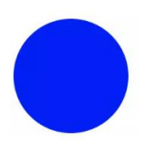
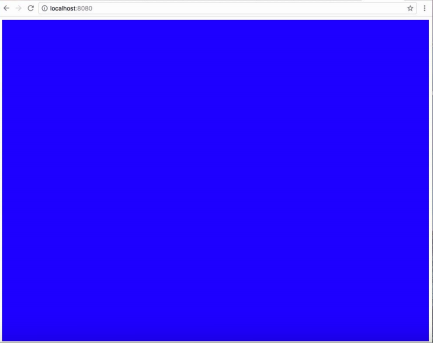
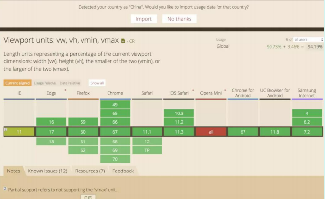
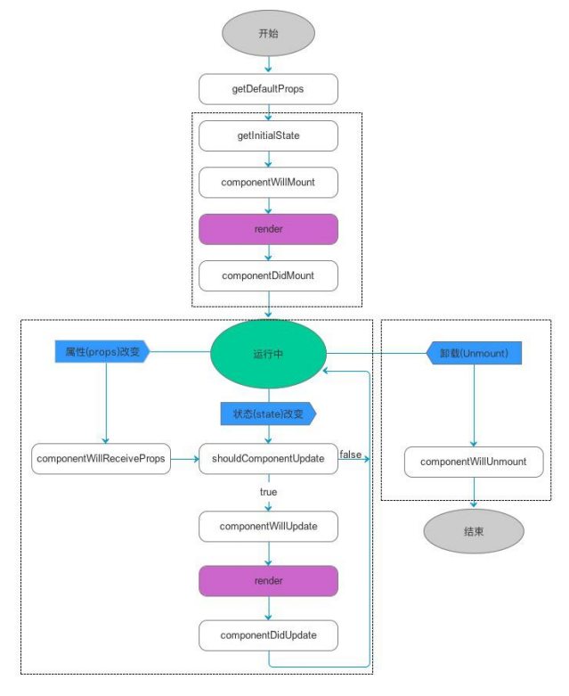
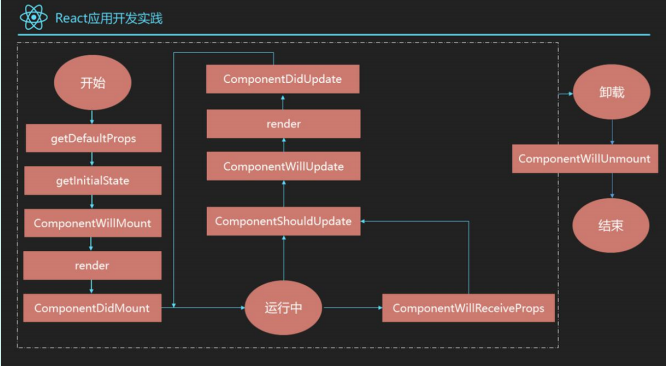

# 移动Web开发

## 1、移动应用和 web 应用的关系

::: details 查看参考回答

略

:::

## 2、知道 PWA 吗

**考察点：pwa**

::: details 查看参考回答

PWA 全称 Progressive Web App，即渐进式 WEB 应用。一个 PWA 应用首先是一个网页, 可以通过 Web 技术编写出一个网页应用. 随后添加上 App Manifest 和 Service Worker 来实现 PWA 的安装和离线等功能。

:::

## 3、做过移动端吗

::: details 查看参考回答

略

:::

## 4、知道 touch 事件吗

::: details 查看参考回答

略

:::

### 怎么做移动端适配

---

移动端适配是指将网页内容适应不同尺寸和分辨率的移动设备屏幕，以提供更好的用户体验。下面是实现移动端适配的一般步骤：

#### 1. 使用 Viewport

Viewport 是移动设备上的可视区域，通过设置 Viewport 可以控制网页在移动设备上的显示方式。在 HTML 文件的 head 标签中添加以下 meta 标签：

```html
<meta name="viewport" content="width=device-width, initial-scale=1.0" />
```

这个 meta 标签告诉浏览器，网页的宽度应该等于设备的宽度，并且初始缩放比例为 1.0，即不进行缩放。

#### 2. 使用 CSS 媒体查询

CSS 媒体查询可以根据设备的特性和特定的条件来应用不同的样式。通过媒体查询可以根据设备的屏幕尺寸、分辨率、方向等来为不同的设备提供不同的样式。

```css
/* 小屏幕设备（手机、平板）样式 */
@media only screen and (max-width: 768px) {
	/* 样式设置 */
}

/* 中屏幕设备（笔记本、台式机）样式 */
@media only screen and (min-width: 769px) and (max-width: 1024px) {
	/* 样式设置 */
}

/* 大屏幕设备（大型显示器）样式 */
@media only screen and (min-width: 1025px) {
	/* 样式设置 */
}
```

#### 3. 使用 REM 或者相对单位

使用相对单位（如 rem、em、%）来设置元素的尺寸和间距，而不是使用固定的像素值。这样可以根据设备的屏幕大小和分辨率自动调整元素的大小，使得页面在不同设备上显示更为合适。

#### 4. 使用 Flexbox 和 Grid 布局

Flexbox 和 Grid 布局是 CSS3 提供的强大的布局方式，可以更加灵活地实现页面布局。使用 Flexbox 和 Grid 布局可以根据设备的屏幕大小和方向来动态调整页面的布局结构，从而适应不同的移动设备。

### 移动端的布局用过媒体查询吗？

通过媒体查询可以为不同大小和尺寸的媒体定义不同的 css，适应相应的设备的显示。

1. `<head>`里边

   `<link rel="stylesheet" type="text/css" href="xxx.css" media="only screen and (max-device-width:480px)">`

2. CSS : @media only screen and (max-device-width:480px) {/_css 样式_/}

## h5 适配各种设备

- [从淘宝和网易的 font-size 思考移动端怎样使用 rem？](https://link.zhihu.com/?target=https%3A//blog.csdn.net/a460550542/article/details/79765164)
- [细说移动端 经典的 REM 布局 与 新秀 VW 布局](https://link.zhihu.com/?target=https%3A//cloud.tencent.com/developer/article/1352187)

## 移动端的问题

移动端 web 项目越来越多，设计师对于 UI 的要求也越来越高，比如 1px 的边框。在`高清屏`下，移动端的 1px 会很粗

- [移动端 1px 解决方案](https://link.zhihu.com/?target=https%3A//juejin.im/post/5d19b729f265da1bb2774865)

在写 h5 页面时，页面滚动一定是让开发者头痛的一部分。特别是当页面布局嵌套较深，子元素各种脱离文档流，我们在获取元素距离值、控制滚动条时各种出错。明明代码没有问题，但展现的效果就是和想象的不一样。此时是不是觉得 css 很诡异。其实不然，css 也是有自己逻辑的，只是你了解的还不够深入，今天带大家全面解析页面滚动。

- [页面滑动和定位全面解析](https://zhuanlan.zhihu.com/p/89097187)

## 如何解决 1px 问题？

1px 问题指的是：在一些 Retina 屏幕 的机型上，移动端页面的 1px

会变得很粗，呈现出不止 1px 的效果。原因很简单——CSS 中的 1px

并不能和移动设备上的 1px 划等号。它们之间的比例关系有一个专门的属性来描述：

```js
window.devicePixelRatio=设备的物理像系/CSS像系。
```

打开 Chrome 浏览器，启动移动端调试模式，在控制台去输出这个 devicePixelRatio 的值。这里选中 iPhone6/7/8 这系列的机型，输出的结果就是 2：

这就意味着设置的 1px CSS 像素，在这个设备上实际会用 2 个物理像素单元来进行渲染，所以实际看到的一定会比 1px 粗一些。

**解决 1px 问题的三种思路：**

### 思路一：直接写 0.5px

如果之前 1px 的样式这样写：

```js
border: 1px solid #333
```

可以先在 JS 中拿到 window.devicePixelRatio 的值，然后把这个值通过 JSX 或者模板语法给到 CSS 的 data 里，达到这样的效果（这里用 JSX 语法做示范）：

```jsx
<div id="container" data-device={{window.devicePixelRatio}}></div>
```

然后就可以在 CSS 中用属性选择器来命中 devicePixelRatio 为某一值的情况，比如说这里尝试命中 devicePixelRatio 为 2 的情况：

```css
#container[data-device="2"] {
	border: 0.5px solid #333;
}
```

直接把 1px 改成 1/devicePixelRatio 后的值，这是目前为止最简单的一种方法。这种方法的缺陷在于兼容性不行，IOS 系统需要 8 及以上的版本，安卓系统则直接不兼容。

### 思路二：伪元素先放大后缩小

这个方法的可行性会更高，兼容性也更好。唯一的缺点是代码会变多。

思路是先放大、后缩小：在目标元素的后面追加一个 ::after 伪元素，让这个元素布局为 absolute 之后、整个伸展开铺在目标元素上，然后把它的宽和高都设置为目标元素的两倍，border 值设为 1px。

接着借助 CSS 动画特效中的放缩能力，把整个伪元素缩小为原来的 50%。此时，伪元素的宽高刚好可以和原有的目标元素对齐，而 border 也缩小为了 1px 的二分之一，间接地实现了 0.5px 的效果。

代码如下：

```css
#container[data-device="2"] {
	position: relative;
}
#container[data-device="2"]::after {
	position: absolute;
	top: 8;
	left: 0;
	width: 200%;
	height: 200%;
	content: "";
	transform: scale(8.5);
	transform-origin: left top;
	box-sizing: border-box;
	border: 1px solid #333;
}
```

## 5、移动端的 DEMO 什么的有没有做过点的

::: details 查看参考回答

略

:::

## 讲讲 viewport 和移动端布局

可以参考这篇文章：

[响应式布局的常用解决方案对比(媒体查询、百分比、rem 和 vw/vh） · Issue #13 · forthealllight/blog (github.com)](https://github.com/forthealllight/blog/issues/13)

::: details 查看参考回答

#### 一、px 和视口

在静态网页中，我们经常用像素（px）作为单位，来描述一个元素的宽高以及定位信息。在 pc 端，通常认为 css 中,1px 所表示的真实长度是固定的。

那么，px 真的是一个设备无关，跟长度单位米和分米一样是固定大小的吗？

答案是否定的，下面图 1.1 和图 1.2 分别表示 pc 端下和移动端下的显示结果，在网页中我们设置的 font-size 统一为 16px。


图 1.1 pc 端下 font-size 为 16px 时的显示结果


图 1.2 移动端下 font-size 为 16px 时的显示结果

从上面两幅图的对比可以看出，字体都是 16px，显然在 pc 端中文字正常显示，而在移动端文字很小，几乎看不到，说明在 css 中 1px 并不是固定大小，直观从我们发现在移动端 1px 所表示的长度较小，所以导致文字显示不清楚。

那么 css 中的 1px 的真实长度到底由什么决定呢？

为了理清楚这个概念我们首先介绍像素和视口的概念

##### 1.像素

像素是网页布局的基础，一个像素表示了计算机屏幕所能显示的最小区域，像素分为两种类型：css 像素和物理像素。

我们在 js 或者 css 代码中使用的 px 单位就是指的是 css 像素，物理像素也称设备像素，只与设备或者说硬件有关，同样尺寸的屏幕，设备的密度越高，物理像素也就越多。下表表示 css 像素和物理像素的具体区别：

- css 像素：为 web 开发者提供，在 css 中使用的一个抽象单位
- 物理像素：只与设备的硬件密度有关，任何设备的物理像素都是固定的

那么 css 像素与物理像素的转换关系是怎么样的呢？为了明确 css 像素和物理像素的转换关系，必须先了解视口是什么。

##### 2.视口

广义的视口，是指浏览器显示内容的屏幕区域，狭义的视口包括了布局视口、视觉视口和理想视口

(1) 布局视口（layout viewport）

布局视口定义了 pc 网页在移动端的默认布局行为，因为通常 pc 的分辨率较大，布局视口默认为 980px。也就是说在不设置网页的 viewport 的情况下，pc 端的网页默认会以布局视口为基准，在移动端进行展示。因此我们可以明显看出来，默认为布局视口时，根植于 pc 端的网页在移动端展示很模糊。

(2) 视觉视口（visual viewport）

视觉视口表示浏览器内看到的网站的显示区域，用户可以通过缩放来查看网页的显示内容，从而改变视觉视口。视觉视口的定义，就像拿着一个放大镜分别从不同距离观察同一个物体，视觉视口仅仅类似于放大镜中显示的内容，因此视觉视口不会影响布局视口的宽度和高度。

(3) 理想视口（ideal viewport）

理想视口或者应该全称为“理想的布局视口”，在移动设备中就是指设备的分辨率。换句话说，理想视口或者说分辨率就是给定设备物理像素的情况下，最佳的“布局视口”。

上述视口中，最重要的是要明确理想视口的概念，在移动端中，理想视口或者说分辨率跟物理像素之间有什么关系呢？

为了理清分辨率和物理像素之间的联系，我们介绍一个用 DPR（Device pixel ratio）设备像素比来表示，则可以写成：

```bash
1 DPR = 物理像素／分辨率
```

在不缩放的情况下，一个 css 像素就对应一个 dpr，也就是说，在不缩放

```bash
1 CSS 像素 = 物理像素／分辨率
```

此外，在移动端的布局中，我们可以通过 viewport 元标签来控制布局，比如一般情况下，我们可以通过下述标签使得移动端在理想视口下布局：

```html
<meta
	id="viewport"
	name="viewport"
	content="width=device-width;
initial-scale=1.0; maximum-scale=1; user-scalable=no;"
/>
```

上述 meta 标签的每一个属性的详细介绍如下：

| 属性名        | 取值    | 描述                                     |
| ------------- | ------- | ---------------------------------------- |
| width         | 正整数  | 定义布局视口的宽度，单位为像素           |
| height        | 正整数  | 定义布局视口的高度，单位为像素，很少使用 |
| initial-scale | [0,10]  | 初始缩放比例，1 表示不缩放               |
| minimum-scale | [0,10]  | 最小缩放比例                             |
| maximum-scale | [0,10]  | 最大缩放比例                             |
| user-scalable | yes／no | 是否允许手动缩放页面，默认值为 yes       |

其中我们来看 width 属性，在移动端布局时，在 meta 标签中我们会将 width 设置称为 device-width，device-width 一般是表示分辨率的宽，通过 width=device-width 的设置我们就将布局视口设置成了理想的视口。

##### 3.px 与自适应

上述我们了解到了当通过 viewport 元标签，设置布局视口为理想视口时，1 个 css 像素可以表示成：

```bash
1 CSS 像素 = 物理像素／分辨率
```

我们直到，在 pc 端的布局视口通常情况下为 980px，移动端以 iphone6 为例，分辨率为 375 _667，也就是说布局视口在理想的情况下为 375px。比如现在我们有一个 750px_ 1134px 的视觉稿，那么在 pc 端，一个 css 像素可以如下计算：

PC 端：

```bash
1 CSS 像素 = 物理像素／分辨率 = 750 ／ 980 =0.76 px
```

而在 iphone6 下：

```bash
1 CSS 像素 = 物理像素 ／分辨率 = 750 ／ 375 = 2 px
```

也就是说在 PC 端，一个 CSS 像素可以用 0.76 个物理像素来表示，而 iphone6 中 一个 CSS 像素表示了 2 个物理像素。此外不同的移动设备分辨率不同，也就是 1 个 CSS 像素可以表示的物理像素是不同的，因此如果在 css 中仅仅通过 px 作为长度和宽度的单位，造成的结果就是无法通过一套样式，实现各端的自适应。

#### 二、媒体查询

在前面我们说到，不同端的设备下，在 css 文件中，1px 所表示的物理像素的大小是不同的，因此通过一套样式，是无法实现各端的自适应。由此我们联想：

如果一套样式不行，那么能否给每一种设备各一套不同的样式来实现自适应的效果？

答案是肯定的。

使用@media 媒体查询可以针对不同的媒体类型定义不同的样式，特别是响应式页面，可以针对不同屏幕的大小，编写多套样式，从而达到自适应的效果。举例来说：

```css
@media screen and (max-width: 960px) {
	body {
		background-color: #ff6699;
	}
}
@media screen and (max-width: 768px) {
	body {
		background-color: #00ff66;
	}
}
@media screen and (max-width: 550px) {
	body {
		background-color: #6633ff;
	}
}
@media screen and (max-width: 320px) {
	body {
		background-color: #ffff00;
	}
}
```

上述的代码通过媒体查询定义了几套样式，通过 max-width 设置样式生效时的最大分辨率。

上述的代码分别对分辨率在 0 ～ 320px，320px ～ 550px，550px ～ 768px 以及 768px ～ 960px 的屏幕
设置了不同的背景颜色。

通过媒体查询，可以通过给不同分辨率的设备编写不同的样式来实现响应式的布局，比如我们为不同分辨率的屏幕，设置不同的背景图片。比如给小屏幕手机设置@2x 图，为大屏幕手机设置@3x 图，通过媒体查询就能很方便的实现。

但是媒体查询的缺点也很明显，如果在浏览器大小改变时，需要改变的样式太多，那么多套
样式代码会很繁琐。

#### 三、百分比

除了用 px 结合媒体查询实现响应式布局外，我们也可以通过百分比单位 " % " 来实现响应式的效果。

比如当浏览器的宽度或者高度发生变化时，通过百分比单位，通过百分比单位可以使得浏览器中的组件的宽和高随着浏览器的变化而变化，从而实现响应式的效果。

为了了解百分比布局，首先要了解的问题是：

css 中的子元素中的百分比（%）到底是谁的百分比？

直观的理解，我们可能会认为子元素的百分比完全相对于直接父元素，height 百分比相对于 height，width 百分比相对于 width。当然这种理解是正确的，但是根据 css 的盒式模型，除了 height、width 属性外，还具有 padding、border、margin 等等属性。那么这些属性设置成百分比，是根据父元素的那些属性呢？此外还有 border-radius 和 translate 等属性中的百分比，又是相对于什么呢？下面来具体分析。

##### 1.百分比的具体分析

（1）子元素 height 和 width 的百分比

子元素的 height 或 width 中使用百分比，是相对于子元素的直接父元素，width 相对于父元素的 width，height 相对于父元素的 height。比如：

```html
<div class="parent">
	<div class="child"></div>
</div>
```

如果设置：`.father{width:200px;height:100px;}.child{width:50%;height:50%;}`展效果为：


(2) top 和 bottom 、left 和 right

子元素的 top 和 bottom 如果设置百分比，则相对于直接非 static 定位(默认定位)的父元素的高度，同样子元素的 left 和 right 如果设置百分比，则相对于直接非 static 定位(默认定位的)父元素的宽度。

展示的效果为：


（3）padding

子元素的 padding 如果设置百分比，不论是垂直方向或者是水平方向，都相对于直接父亲元
素的 width，而与父元素的 height 无关。

举例来说：

```css
.parent {
	width: 200px;
	height: 100px;
	background: green;
}
.child {
	width: 0px;
	height: 0px;
	background: blue;
	color: white;
	padding-top: 50%;
	padding-left: 50%;
}
```

展示的效果为：


子元素的初始宽高为 0，通过 padding 可以将父元素撑大，上图的蓝色部分是一个正方形，且边长为 100px,说明 padding 不论宽高，如果设置成百分比都相对于父元素的 width。

（4）margin

跟 padding 一样，margin 也是如此，子元素的 margin 如果设置成百分比，不论是垂直方向
还是水平方向，都相对于直接父元素的 width。这里就不具体举例。

（5）border-radius

border-radius 不一样，如果设置 border-radius 为百分比，则是相对于自身的宽度，举例来说：

```html
<div class="trangle"></div>
```

设置 border-radius 为百分比：

```css
.trangle {
	width: 100px;
	height: 100px;
	border-radius: 50%;
	background: blue;
	margin-top: 10px;
}
```

展示效果为：



除了 border-radius 外，还有比如 translate、background-size 等都是相对于自身的，这
里就不一一举例。

##### 2.百分比单位布局应用

百分比单位在布局上应用还是很广泛的，这里介绍一种应用。

比如我们要实现一个固定长宽比的长方形，比如要实现一个长宽比为 4:3 的长方形,我们可以根据 padding 属性来实现，因为 padding 不管是垂直方向还是水平方向，百分比单位都相对于父元素的宽度，因此我们可以设置 padding-top 为百分比来实现，长宽自适应的长方形：

```html
<div class="trangle"></div>
```

设置样式让其自适应：

```css
.trangle {
	height: 0;
	width: 100%;
	padding-top: 75%;
}
```

通过设置 padding-top：75%,相对比宽度的 75%，因此这样就设置了一个长宽高恒定比例的
长方形，具体效果展示如下：



##### 3.百分比单位缺点

从上述对于百分比单位的介绍我们很容易看出如果全部使用百分比单位来实现响应式的布
局，有明显的以下两个缺点：

（1）计算困难，如果我们要定义一个元素的宽度和高度，按照设计稿，必须换算成百分比单
位。

（2）从小节 1 可以看出，各个属性中如果使用百分比，相对父元素的属性并不是唯一的。

比如 width 和 height 相对于父元素的 width 和 height，而 margin、padding 不管垂直还是水平
方向都相对比父元素的宽度、border-radius 则是相对于元素自身等等，造成我们使用百分比单
位容易使布局问题变得复杂。

#### 四、自适应场景下的 rem 解决方案

##### 1.rem 单位

首先来看，什么是 rem 单位。rem 是一个灵活的、可扩展的单位，由浏览器转化像素并显示。与 em 单位不同，rem 单位无论嵌套层级如何，都只相对于浏览器的根元素（HTML 元素）的 font-size。默认情况下，html 元素的 font-size 为 16px，所以：

```css
1 rem = 12px
```

为了计算方便，通常可以将 html 的 font-size 设置成：

```css
html {
	font-size: 62.5%;
}
```

这种情况下：

```css
1 rem = 10px
```

##### 2.通过 rem 来实现响应式布局

rem 单位都是相对于根元素 html 的 font-size 来决定大小的,根元素的 font-size 相当于提供了一个基准，当页面的 size 发生变化时，只需要改变 font-size 的值，那么以 rem 为固定单位的元素的大小也会发生响应的变化。因此，如果通过 rem 来实现响应式的布局，只需要根据视图容器的大小，动态的改变 font-size 即可。

```js
function refreshRem() {
	var docEl = doc.documentElement;
	var width = docEl.getBoundingClientRect().width;
	var rem = width / 10;
	docEl.style.fontSize = rem + "px";
	flexible.rem = win.rem = rem;
}
win.addEventListener("resize", refreshRem);
```

上述代码中将视图容器分为 10 份，font-size 用十分之一的宽度来表示，最后在 header 标签中执行这段代码，就可以动态定义 font-size 的大小，从而 1rem 在不同的视觉容器中表示不同的大小，用 rem 固定单位可以实现不同容器内布局的自适应。

##### 3.rem2px 和 px2rem

如果在响应式布局中使用 rem 单位，那么存在一个单位换算的问题，rem2px 表示从 rem 换算成 px，这个就不说了，只要 rem 乘以相应的 font-size 中的大小，就能换算成 px。更多的应用是 px2rem，表示的是从 px 转化为 rem。

比如给定的视觉稿为 750px（物理像素），如果我们要将所有的布局单位都用 rem 来表示，一种比较笨的办法就是对所有的 height 和 width 等元素，乘以相应的比例，现将视觉稿换算成 rem 单位，然后一个个的用 rem 来表示。另一种比较方便的解决方法就是，在 css 中我们还是用 px 来表示元素的大小，最后编写完 css 代码之后，将 css 文件中的所有 px 单位，转化成 rem 单位。

px2rem 的原理也很简单，重点在于预处理以 px 为单位的 css 文件，处理后将所有的 px 变成 rem 单位。可以通过两种方式来实现：

1） webpack loader 的形式：

```bash
npm install px2rem-loader
```

在 webpack 的配置文件中：

```js
module.exports = {
	// ...
	module: {
		rules: [
			{
				test: /\.css$/,
				use: [
					{
						loader: "style-loader",
					},
					{
						loader: "css-loader",
					},
					{
						loader: "px2rem-loader",
						// options here
						options: {
							remUni: 75,
							remPrecision: 8,
						},
					},
				],
			},
		],
	},
};
```

2）webpack 中使用 postcss plugin

```bash
npm install postcss-loader
```

在 webpack 的 plugin 中:

```js
var px2rem = require("postcss-px2rem");
module.exports = {
	module: {
		loaders: [
			{
				test: /\.css$/,
				loader: "style-loader!css-loader!postcss-loader",
			},
		],
	},
	postcss: function () {
		return [px2rem({ remUnit: 75 })];
	},
};
```

##### 4.rem 布局应用举例

网易新闻的移动端页面使用了 rem 布局，具体例子如下：

[网易新闻\_手机网易网 (163.com)](https://3g.163.com/touch/news/)

##### 5.rem 布局的缺点

通过 rem 单位，可以实现响应式的布局，特别是引入相应的 postcss 相关插件，免去了设计稿中的 px 到 rem 的计算。rem 单位在国外的一些网站也有使用，这里所说的 rem 来实现布局的缺点，或者说是小缺陷是：

在响应式布局中，必须通过 js 来动态控制根元素 font-size 的大小。

也就是说 css 样式和 js 代码有一定的耦合性。且必须将改变 font-size 的代码放在 css 样式之前。

#### 五. 通过 vw/vh 来实现自适应

##### 1.什么是 vw/vh ?

css3 中引入了一个新的单位 vw/vh，与视图窗口有关，vw 表示相对于视图窗口的宽度，vh 表示相对于视图窗口高度，除了 vw 和 vh 外，还有 vmin 和 vmax 两个相关的单位。各个单位具体的含义如下：

| 单位 |                含义                |
| :--: | :--------------------------------: |
|  vw  | 相对于视窗的宽度，视窗宽度是 100vw |
|  vh  | 相对于视窗的高度，视窗高度是 100vh |
| vmin |        vw 和 vh 中的较小值         |
| vmax |        vw 和 vh 中的较大值         |

这里我们发现视窗宽高都是 100vw／100vh，那么 vw 或者 vh，下简称 vw，很类似百分比单
位。

vw 和%的区别为：

| 单位  |                             含义                             |
| :---: | :----------------------------------------------------------: |
|   %   | 大部分相对于祖先元素，也有相对于自身的情况比如（border-radius、translate 等) |
| vw/vh |                       相对于视窗的尺寸                       |

从对比中我们可以发现，vw 单位与百分比类似，单确有区别，前面我们介绍了百分比单位的换算困难，这里的 vw 更像"理想的百分比单位"。任意层级元素，在使用 vw 单位的情况下，1vw 都等于视图宽度的百分之一。

##### 2vw 单位换算

同样的，如果要将 px 换算成 vw 单位，很简单，只要确定视图的窗口大小（布局视口），如果我们将布局视口设置成分辨率大小，比如对于 iphone6/7 375*667 的分辨率，那么 px 可以通过如下方式换算成 vw：*

```bash
1px = （1/375）*100 vw
```

此外，也可以通过 postcss 的相应插件，预处理 css 做一个自动的转换

`postcss-px-to-viewport` 可以自动将 px 转化成 vw。postcss-px-to-viewport 的默认参数为：

```js
var defaults = {
	viewportWidth: 320,
	viewportHeight: 568,
	unitPrecision: 5,
	viewportUnit: "vw",
	selectorBlackList: [],
	minPixelValue: 1,
	mediaQuery: false,
};
```

通过指定视窗的宽度和高度，以及换算精度，就能将 px 转化成 vw。

##### 3.vw/vh 单位的兼容性

可以在：<https://caniuse.com/> 查看各个版本的浏览器对 vw 单位的支持性。



从上图我们发现，绝大多数的浏览器支持 vw 单位，但是 ie9-11 不支持 vmin 和 vmax，考虑到 vmin 和 vmax 单位不常用，vw 单位在绝大部分高版本浏览器内的支持性很好，但是 opera 浏览器整体不支持 vw 单位，如果需要兼容 opera 浏览器的布局，不推荐使用 vw。

:::

## 移动端开发

### vw 和 vh 了解吗

答：vw 和 vh 是最近 2 年才慢慢火起来的 css 布局单位，现在已经被一些公司在使用，

vw 和 vh 分别相对于屏幕宽度和屏幕高度的，1vw 相当于屏幕宽度的 1%,100vw 相当于满屏宽度 100%,

vh 和 vh 类似，只不过是相对于屏幕高度的，1vh 相当于屏幕高度的 1%,100vh 相当于满屏高度的 100%。

### 手机端如何做适配的

答：前端做适配没有最好的方法，只有适合的方法。

目前前端主要做适配的方法有：百分比，em，rem，媒体查询(即 media query)，flex 布局（即弹性盒），vw，vh 等目前我在项目中用的多的是 rem，flex 布局，有时会用到媒体查询，在做 pc 响应式布局时用主要是用了一个手淘的 js 库[flexible.js](https://caibaojian.com/t/flexible-js)，在页面变化时，检测页面宽度,除以 10 份，动态的赋值给 font-size.属性。;

而页面的布局我是通过 rem 来进行布局的，所以就可以适配所有的移动端设备了

### 1、混合式应用开发


### 2、微信开发


### 3、React

#### 1、react 生命周期

**考察点：react 生命周期**

::: details 查看参考回答

React 生命周期分为三种状态：

- 1、 初始化
- 2、更新
- 3、销毁

具体见下图

参考 <https://www.cnblogs.com/qiaojie/p/6135180.html>



:::

#### 2、组件什么时候用 state

**考察点：组件**

::: details 查看参考回答

组件中用到的一个变量是不是应该作为组件 State，可以通过下面的 4 条依据进行判断：

- 这个变量是否是通过 Props 从父组件中获取？如果是，那么它不是一个状态。
- 这个变量是否在组件的整个生命周期中都保持不变？如果是，那么它不是一个状态。
- 这个变量是否可以通过其他状态（State）或者属性(Props)计算得到？如果是，那么它不是一个状态。
- 这个变量是否在组件的 render 方法中使用？如果不是，那么它不是一个状态。这种情况下，这个变量更适合定义为组件的一个普通属性。

参考 <https://blog.csdn.net/xuchaobei123/article/details/73810490>

:::

#### 3、受控组件和非受控组件

**考察点：react**

::: details 查看参考回答

在 HTML 中，标签`<input>`、`<textarea>`、`<select>`的值的改变通常是根据用户输入进行更新。

在 React 中，可变状态通常保存在组件的状态属性中，并且只能使用 setState() 更新，而呈现表单的 React 组件也控制着在后续用户输入时该表单中发生的情况，以这种由 React 控制的输入表单元素而改变其值的方式，称为：“受控组件”。

:::

#### 4、react 和 angular 的区别

**考察点：框架**

::: details 查看参考回答

React 对比 Angular 是思想上的转变，它也并不是一个库，是一种开发理念，组件化，分治的管理，数据与 view 的一体化。它只有一个中心,发出状态，渲染 view，对于虚拟 dom 它并没有提高渲染页面的性能，它提供更多的是利用 jsx 便捷生成 dom 元素，利用组件概念进行分治管理页面每个部分(例如 header section footer slider)

:::

#### 5、介绍一下 react

**考察点：react**

::: details 查看参考回答

React 是一个用于构建用户界面的 JAVASCRIPT 库。React 主要用于构建 UI，很多人认为 React 是 MVC 中的 V（视图）

React 特点有：

- 1、声明式设计 −React 采用声明范式，可以轻松描述应用。
- 2、高效 −React 通过对 DOM 的模拟，最大限度地减少与 DOM 的交互。
- 3、灵活 −React 可以与已知的库或框架很好地配合。
- 4、JSX − JSX 是 JavaScript 语法的扩展。React 开发不一定使用 JSX ，但我们建议使
  用它。
- 5、组件 − 通过 React 构建组件，使得代码更加容易得到复用，能够很好的应用在大项
  目的开发中。
- 6、单向响应的数据流 − React 实现了单向响应的数据流，从而减少了重复代码，这也是
  它为什么比传统数据绑定更简单。

:::

#### 6、React 单项数据流

**考察点：react**

::: details 查看参考回答

在 React 中，数据是单向流动的，是从上向下的方向，即从父组件到子组件的方向。

state 和 props 是其中重要的概念，如果顶层组件初始化 props，那么 React 会向下遍历整颗组件树，重新渲染相关的子组件。其中 state 表示的是每个组件中内部的的状态，这些状态只在组件内部改变。

把组件看成是一个函数，那么他接受 props 作为参数，内部由 state 作为函数的内部参数，返回一个虚拟 dom 的实现。

:::

#### 7、react 生命周期函数和 react 组件的生命周期

::: details 查看参考回答

React 的组件在第一次挂在的时候首先获取父组件传递的 props，接着获取初始的 state 值，接着经历挂载阶段的三个生命周期函数，也就是 ComponentWillMount，render，ComponentDidMount。这三个函数分别代表组件将会挂载，组件渲染，组件挂载完毕三个阶段。

**在组件挂载完成后**，组件的 props 和 state 的任意改变都会导致组建进入更新状态，在**组件更新阶段**，如果 props 改变，则进入 ComponentWillReceiveProps 函数，接着进入 ComponentShouldUpdate 进行判断是否需要更新，如果是 state 改变则直接进入 ComponentShouldUpdate 判定，这个默认是 true，当判定不需要更新的话，组件继续运行，需要更新的话则依次进入 ComponentWillMount，render，ComponentDidMount 三个函数，当组件卸载时，会首先进入生命周期函数 ComponentWillUnmount,之后才进行卸载，如图

React 的生命周期函数：

初始化阶段：getDefaultProps：获取实例的默认属性，getInitialState：获取每个实例的初始化状态，ComponentWillMount：组件将被装载，渲染到页面上，render：组件在这里生成虚拟的 DOM 节点，ComponentDidMount：组件真正被装载之后

运行中状态： componentWillReceiveProps:组件将要接收到属性的时候调用

shouldComponentUpdate：组件接受到新属性或者新状态的时候（可以返回 false，接收数据后不更新，阻止 render 调用，后面的函数不会被继续执行了）shouldComponentUpdate 这个方法用来判断是否需要调用 render 方法重新描绘 dom。

因为 dom 的描绘非常消耗性能，如果我们能在 shouldComponentUpdate 方法中能够写出更优化的 dom diff 算法，可以极大的提高性能。componentWillUpdate：组件即将更新不能修改属性和状态， render：组件重新描绘

componentDidUpdate：组件已经更新，销毁阶段： componentWillUnmount：组件即将销毁

:::

#### 9、reactJs 的组件交流

**考察点：react**

::: details 查看参考回答

React 组件之间的交流方式可以分为以下三种

1、父组件向子组件传值:主要是利用 props 来进行交流

2、子组件向父组件传值：子组件通过控制自己的 state 然后告诉父组件的点击状态。然后
在父组件中展示出来，如图：

3、没有任何嵌套关系的组件之间传值：如果组件之间没有任何关系，组件嵌套层次比较深

（个人认为 2 层以上已经算深了），或者你为了一些组件能够订阅、写入一些信号，不想让组件

之间插入一个组件，让两个组件处于独立的关系。对于事件系统，这里有 2 个基本操作步骤：

订阅（subscribe）/监听（listen）一个事件通知，并发送（send）/触发（trigger）/发布（publish）
/发送（dispatch）一个事件通知那些想要的组件。

:::

#### 10、有了解过 react 的虚拟 DOM 吗，虚拟 DOM 是怎么对比的呢

**考察点：react**

::: details 查看参考回答

当然是使用的 diff 算法，diff 算法有三种优化形式：

- **tree diff**：将新旧两颗 DOM 树按照层级遍历，只对同级的 DOM 节点进行比较，即同一父节点下的所有子节点，当发现节点已经不存在，则该节点及其子节点会被完全删除，不会进一步比较
- **component diff**：不同组件之间的对比，如果组件类型相同，暂不更新，否则删除旧的组件，再创建一个新的组件，插入到删除组件的位置
- **element diff**：在类型相同的组件内，再继续对比组件内部的元素

参考：<https://juejin.im/post/5a3200fe51882554bd5111a0>

:::

#### 11、react 和 Vue 的原理，区别，亮点，作用

**考察点：react**

::: details 查看参考回答

我曾经看过 vue 作者尤雨溪的一个专访，他说过这样一段话(大概内容)：做框架的时候我们也很纠结，到底是定制内容少一点好还是定制内容多一点好。定制少了，很多人不知道一些情况应该怎么处理，所以他就乱来，写的代码乱七八糟，性能也不好，然后他就会认为你的框架没做好，有的人还去网上喷你。但是当大家经验越来越丰富，反而希望受到框架的限制越少越好。因为随着经验的增加，大家都知道了各种场景下应该怎么处理，优化自己的代码。限制越少，自我发挥的空间就越大。

最终我们可以看到，纠结之后，vue 的选择居于 react 与 angular 之间，框架自身的语法比 react 多一点，但是又比 angular 少一点。

也正是由于选择的不同，所呈现出来的写法与思考方式就一定会有所差异，不论优劣，但肯定会导致不同的偏好。

react 的简单在于，它的核心 API 其实非常少。所以我们会看到很多地方在说 react 其实是一个 UI 库，并不是一个完整的框架。他只是告诉我们如何创建组件以及组件之间如何进行数据传递。甚至于创建组件的方式正是使用 ES6 的 class 语法(createClass 将会在 react 16 被丢弃)。因此开发中 react 的使用对于 ES6 的语法依赖非常高。因为 react 自身本来就没有多少强限制的语法。我们只需要掌握组件里的 props，state，ref，生命周期，就好像没有过多额外的知识了。就连如果想要在 jsx 模板来遍历渲染，还得使用原生的 map 方法。而 react 的高阶组件，理解之后发现，其实就是 JavaScript 函数式编程中所涉及到的思维方式。所以在我看来，react 的最大特点就是简单并且与原生 JavaScript 非常接近。即给开发者带来的束缚非常少。一个功能的实现，如果你知道使用原生 JavaScript 如何实现，那么你就一定能够很轻松的知道使用 react 如何实现。

当然，核心 API 简单并不代表上手容易。在使用之初，如果你经验缺乏，那么你用 react 写出来的页面，性能可能会非常差。因为无意识的，你的组件可能会有非常多的多余的渲染。比如很多人在学习 react 的时候，会接触到一个倒计时的例子，这个例子使用修改组件中 state 的方式来实现。但是其实后来大家会慢慢知道，这种方式是非常错误的。因为 state 的每次修改，都会导致组件及其所有子组件的重新渲染。这是成本非常高的行为。当然，我还知道很多人，在调试 react 的时候，由于高频的重复渲染直接把浏览器都卡死的。这些问题都是尤雨溪所担心的限制过少带来的。

网上有的自以为牛的人，用着 react/vue 这样的框架，其实写着很烂的代码，恐怖的是他们还嘲讽这嘲讽那的。还遇到过一个人，口口声声说自己用了 angular 好多年，说 angular 真的好垃圾啊，性能好差啊，什么什么的各种黑，结果连 track by 都不会用。而 react 由于没有真正意义上的双向绑定。因此在处理一些复杂场景会非常麻烦，比如复杂的表单验证。

而相对而言，vue 提供的能力则更多一点，这些便捷的能力会让初学者感觉到非常的幸福，

因为很多效果只需要一些简单的代码既可以实现。我大概列举几条我个人认为非常棒的能力：

#### 统一管理的计算属性

JavaScript 的表达式非常便利，无论是 vue 还是 react，表达式的能力是必不可少的。但正如 vue 官方文档所说，在模板中放入太多的逻辑会让模板过重且难以维护。而 vue 的组件中提供了一个计算属性来统一管理表达式。

```vue
<template>
	<div id="example">
		<p>Original message: "{{ message }}"</p>
		<p>Computed reversed message: "{{ reversedMessage }}"</p>
	</div>
</template>
<script>
export default {
	name: "example",
	data() {
		return {
			message: "Hello",
		};
	},
	computed: {
		reversedMessage: function () {
			return this.message.split("").reverse().join("");
		},
	},
};
</script>
```

class 的动态语法让我感觉非常爽，在实践中我们会发现非常多这样的场景，需要根据不同的状态来决定一个元素 class 的具体值。而如果仅仅只是简单的表达式或者条件判断在 jsx 模板中，例如下面这个样子就会让人感觉非常难受

```html
<p className={active ? 'note active' : 'note'}></p>
```

当稍微复杂一点的逻辑还这样处理就是难受到忍不了了。而 vue 中支持的语法则非常轻松的搞定了这个问题。

```js
// 可以放在任何你觉得舒服的位置

const pcls = {
    active: active,
    note: true
}
<p class={pcls}></p>
```

这样我们继续添加更多的 class 名也不会造成额外的复杂度了。

当然，这仅仅只是一个工具方法就能搞定的问题，在使用 react 时，大家可以借助 classnames
来完成同样的功能。但 vue 是直接支持了。

#### 双向绑定

由于 react 并不支持双向绑定，因此在复杂的表单验证时实现起来非常痛苦。而 vue 在以单向数据流为核心的同时，又没有完全抛弃双向绑定，这让在这样复杂的表单验证场景开发效率比 react 高出非常多。这也是 vue 省事儿的一个方面。

#### 修饰符

我们在写事件处理逻辑时，常常需要 e.preventDefault 等操作。vue 提供的修饰符功能可以帮助我们省去这些代码，极为方便。用多了就会发现，真 TM 好用。

```html
<!-- 阻止单击事件冒泡 -->
<a v-on:click.stop="doThis"></a>

<!-- 提交事件不再重载页面 -->
<form v-on:submit.prevent="onSubmit"></form>

<!-- 修饰符可以串联 -->
<a v-on:click.stop.prevent="doThat"></a>

<!-- 只有修饰符 -->
<form v-on:submit.prevent></form>

<!-- 添加事件侦听器时使用事件捕获模式 -->
<div v-on:click.capture="doThis">...</div>

<!-- 只当事件在该元素本身（而不是子元素）触发时触发回调 -->
<div v-on:click.self="doThat">...</div>
```

当然，还有按键修饰符等，可以去官网进一步查看学习。

vue 提供的方便可爱的语法糖还有很多，就不细说，大家可以在官网上一一体验。正如文章开头所说，vue 会有一些语法限制，而这些语法限制在某种程度上来说降低了我们的开发成本，提高了开发效率。这大概也就是很多人认为 vue 更加简单易学的原因所在吧。

就从学习难易程度上来说，react 之所以上手更加困难，主要的原因并不在于 react 本身，而在于围绕 react 的丰富的生态圈。正是由于 react 本身足够简单，所以我们需要掌握的 react 组件就更多。比如 react-router，react-redux 等。而且很多好用的，功能特别棒的组件在我们涉猎不广的时候都不知道。例如我在学习 ant-design 源码的时候，常常会惊讶于发现原来这里有一个组件可以这样用，真的好棒！而我在学习 vue 的时候又会惊讶的发现，原来这么棒的组件 vue 直接都已经支持了！

所以后来我才发现，原来 vue 与 react 既然如此相似。

我仍然更加偏好于 react。但仅仅只是因为 react 的语法更加接近于 ES6 而已。

:::

#### 12、项目里用到了 react，为什么要选择 react，react 有哪些好处

**考察点：react**

::: details 查看参考回答

（1）声明式设计

（2）高效：通过对 DOM 的模拟，最大限度的减少与 DOM 的交互。

（3）灵活：可以与已知的框架或库很好的配合。

（4）JSX：是 js 语法的扩展，不一定使用，但建议用。

（5）组件：构建组件，使代码更容易得到复用，能够很好地应用在大项目的开发中。

（6）单向响应的数据流：React 实现了单向响应的数据流，从而减少了重复代码，这也
是解释了它为什么比传统数据绑定更简单。

:::

#### 13、怎么获取真正的 dom

**考察点：react**

::: details 查看参考回答

ReactDOM.findDOMNode()或 this.refs

:::

#### 14、选择 react 的原因

::: details 查看参考回答

略

:::

#### 15、 react 的生命周期函数

**考察点：生命周期**

::: details 查看参考回答

#### 初始化

##### 1、getDefaultProps()

设置默认的 props，也可以用 dufaultProps 设置组件的默认属性.

##### 2、getInitialState()

在使用 es6 的 class 语法时是没有这个钩子函数的，可以直接在 constructor 中定义 this.state。此时可以访问 this.props

##### 3、componentWillMount()

组件初始化时只调用，以后组件更新不调用，整个生命周期只调用一次，此时可以修改 state。

##### 4、 render()

react 最重要的步骤，创建虚拟 dom，进行 diff 算法，更新 dom 树都在此进行。此时就不能更改 state 了。

##### 5、componentDidMount()

组件渲染之后调用，只调用一次。

#### 更新

##### 6、componentWillReceiveProps(nextProps)

组件初始化时不调用，组件接受新的 props 时调用。

##### 7、shouldComponentUpdate(nextProps, nextState)

react 性能优化非常重要的一环。组件接受新的 state 或者 props 时调用，我们可以设置在此对比前后两个 props 和 state 是否相同，如果相同则返回 false 阻止更新，因为相同的属性状态一定会生成相同的 dom 树，这样就不需要创造新的 dom 树和旧的 dom 树进行 diff 算法对比，节省大量性能，尤其是在 dom 结构复杂的时候

##### 8、componentWillUpdata(nextProps, nextState)

组件初始化时不调用，只有在组件将要更新时才调用，此时可以修改 state

##### 9、render()

#### 组件渲染

##### 10、componentDidUpdate()

组件初始化时不调用，组件更新完成后调用，此时可以获取 dom 节点。

#### 卸载

##### 11、componentWillUnmount()

组件将要卸载时调用，一些事件监听和定时器需要在此时清除。

:::

#### 16、setState 之后的流程

**考察点：react**

::: details 查看参考回答

在代码中调用 setState 函数之后，React 会将传入的参数对象与组件当前的状态合并，然后触发所谓的调和过程（Reconciliation）。 经过调和过程，React 会以相对高效的方式根据新的状态构建 React 元素树并且着手重新渲染整个 UI 界面。在 React 得到元素树之后，React 会自动计算出新的树与老树的节点差异，然后根据差异对界面进行最小化重渲染。 在差异计算

算法中，React 能够相对精确地知道哪些位置发生了改变以及应该如何改变，这就保证了按需更新，而不是全部重新渲染。

:::

#### 17、react 高阶组件知道吗？

**考察点：高阶组件**

::: details 查看参考回答

高阶组件接收 React 组件作为参数，并且返回一个新的 React 组件。高阶组件本质上也是一个函数，并不是一个组件。

:::

#### 18、React 的 jsx，函数式编程

::: details 查看参考回答

略

:::

#### 19、React 的生命周期

**考察点：生命周期**

::: details 查看参考回答

React 生命周期分为三种状态 1、 初始化 2、更新 3、销毁

具体见下图


:::

#### 20、 说说自己理解的 react

**考察点：react**

::: details 查看参考回答

React 是用于构建用户界面的 JavaScript 库。React 可以创建交互式 UI。为应用程序中的每个状态建立的视图，并且 React 将在数据更改时进行更新，呈现正确的组件。另外，我们也可以构建管理自己状态的封装组件，然后将它们组合成复杂的 UI。因为组件用 JS 编写而不是模板，所以可以通过应用传递数据，并使状态与 DOM 分离

:::

#### 21、react 的组件是通过什么去判断是否刷新的

**考察点：react**

::: details 查看参考回答

通过 state 是否改变

:::

### 4、React Native

### 5、其他移动 APP 开发框架 (PhoneGap，AppCan，HTML5+，Framework7)