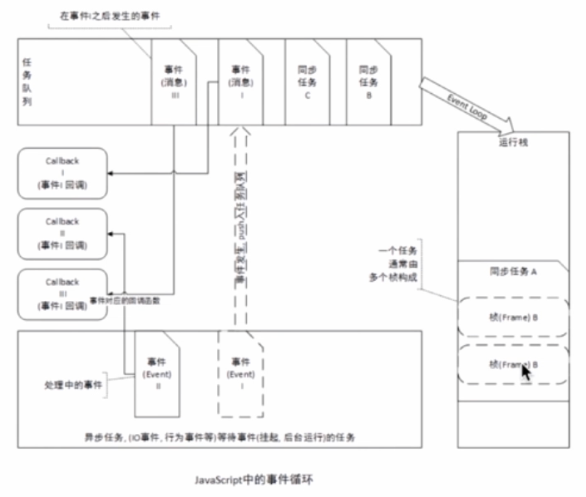

# JavaScript 引擎运行原理

## 同步和异步任务

### JS 的单线程

javascript 语言的执行环境是"单线程"。也就是指一次只能完成一件任务。如果有多个任务，就必须排队，前面一个任务完成，在执行后面一个任务

这种模式虽然实现起来比较简单，执行环境相对单纯，但是只要一个任务耗时很长，后面的任务都必须排队等着，会拖延整个程序的执行。常见的浏览器无响应（假死），往往是因为莫一段 javascript 代码长时间运行（比如死循环），导致整个页面卡在这个地方，其他任务无法运行。

为了解决这个问题 Javascript 语言将任务的执行模式分成两种：同步和异步

### 任务队列

所有异步任务都是在同步任务执行结束之后，从任务队列中依次取出执行。

### Event Loop(事件循环机制)



### 异步队列任务方法

#### 回调函数

回调函数是异步操作最基本的方法

**假如有两个函数 fn1 和 fn2，后者等待前者的执行结果。如果 fn1 是一个很耗时的任务，可以考虑改写 fn1，把 fn2 写成 f1 的回调函数。**

```js
function fn1(callback) {
	setTimeout(function () {
		callback();
	}, 1000);
}
fn1(fn2);
```

采用这种方式，我们把同步操作变成了异步操作，fn1 不会堵塞程序的运行，相当于先执行程序的主要逻辑，将耗时的操作推迟执行。

回调函数：优点是简单、容易理解和部署。

缺点是不利于代码的阅读和维护，各个部分之间高度耦合（Coupling），流程会很混乱，而且每个任务只能指定一个回调函数。

#### 事件监听

采用事件驱动模式：`on`监听 和 `trigger` 调用

任务的执行不取决于代码的顺序，而取决与某个事件的发生。

**以 fn3 和 fn4 为例。先为 fn3 绑定事件**

```js
fn3.on("done", fn4);
function fn3() {
	setTimeout(function () {
		// fn3的任务代码
		fn3.trigger("done");
	}, 1000);
}
```

fn3.trigger(‘done’)表示，执行完成之后，立即触发 done 事件，从而开始执行 fn4。

事件监听：优点是可以绑定多个事件，每个事件可以指定多个回调函数，而且可以“去耦合”（Decoupling），有利于实现模块化。

缺点是：整个程序都要变成事件驱动型，运动流程会变得很不清晰。

#### setTimeout 定时器和 setInterval

```js
console.log(1);
setTimeout(function () {
	console.log(2);
}, 0);
console.log(3);
console.log(4);

console.log("A");
setTimeout(function () {
	console.log("B");
}, 0);
```

一次把同步任务执行完成，才会执行 setTimeout 定时器里面的任务

所以依次输出的是：1、3、4、A、2、B

`setInterval`方法同理

#### 发布和订阅

发布/订阅模式，又称观察者模式

我们假定，存在一个“信号中心”，某个任务执行完成，就向信号中心“发布”（publish）一个信号，其他任务可以向信号中心“订阅”（subcribe）这个信号，从而知道什么时候自己可以开始执行。

```js
// fn7向信号中心Jquery订阅done信号
jQuery.subscribe("done", fn6);
function fn5() {
	setTimeout(function () {
		// f1的任务代码
		//发布done信号
		jQuery.publish("done");
	}, 1000);
}
// f2执行完成后，取消订阅
jQuery.unsubscribe("done", fn6);
```

发布/订阅，性质与“事件监听类似”，但是明显优于后者，因为我们可以通过查看”消息中心“，了解存在多少信号，多少个订阅者，从而监听程序的运行。

#### Promise 对象

Promises 对象是 ES6 的 CommonJs 工作提出的一种规范，目的是为了异步编程提供统一接口

他的思想是每一个异步任务返回一个 Promise 对象，该对象有一个 then 方法，允许指定回调函数，比如 fn7 的回调函数 fn8，可以写成：

```js
fn7().then(fn8);
function fn7() {
	// deferred对象就是jQuery的回调函数解决方案。
	var dfd = $.Deferred();
	setTimeout(function () {
		// f1的任务代码
		// 将dtd对象的执行状态从"未完成"改为"已完成"，从而触发done()方法
		dfd.resolve();
	}, 500);
	// 返回promise对象
	// deferred.promise()方法。它的作用是，在原来的deferred对象上返回另一个deferred对象，
	// 后者只开放与改变执行状态无关的方法（比如done()方法和fail()方法），
	// 屏蔽与改变执行状态有关的方法（比如resolve()方法和reject()方法），
	// 从而使得执行状态不能被改变。
	return dfd.promise;
}

fn7().then(fn8).then(fn9); // 指定多个回调函数
fn7().then(fn8).fail(fn9); // 指定发生错误时的回调函数
```

Promises 对象这种方法优点在于，回调函数变成了链式写法，程序的流程可以看得很清楚，而且有一整套的配套方法，可以实现许多强大的功能。

#### 生成器 Generators/yield

Generator 函数是 ES6 提供的一种异步编程解决方案。

**yield 表达式可以暂停函数执行，next 方法用于恢复函数执行，这使得 Generator 函数非常适合将异步任务同步化。**

**yield 表达式本身没有返回值，或者说总是返回 undefined。next 方法可以带一个参数，该参数就会被当作上一个 yield 表达式的返回值。**

**每个 yield 返回的是｛value:yield 返回的值，done:true/false(执行状态)｝**

```js
function* generatorDemo() {
	yield "hello";
	yield 1 + 2;
	return "ok";
}

var demo = generatorDemo();

demo.next(); // { value: 'hello', done: false }
demo.next(); // { value: 3, done: false }
demo.next(); // { value: 'ok', done: ture }
demo.next(); // { value: undefined, done: ture }
```

Generator 并不是为异步而设计出来的，它还有其他功能（对象迭代、控制输出、部署 Interator 接口…）

#### async/await

async 是“异步”的意思，而 await 是等待的意思。所以应该很好理解 async 用于申明一个 异步的 function （实际上是 asnyc function 对象）

await 用于等待一个异步任务执行完成的结果，并且 await 只等出现在 async 函数中

**一个函数如果加上 asnyc，那么该函数就会返回一个 Promise**

```js
async function async1() {
	return "1";
}
console.log(async1()); // -> Promise {<resolved>: "1"}
```

**async 函数返回的是一个 Promise 对象，可以使用 then 方法添加回调函数，async 函数内部 return 语句返回的值，会成为 then 方法回调函数的参数。当函数执行的时候，一旦遇到 await 就会先返回，等到异步操作完成，再接着执行函数体内后面的语句。**

**1.await 命令后面返回的是 Promise 对象，运行结果可能是 rejected，所以最好把 await 命令放在 try…catch 代码块中。**

```js
async function test() {
	let newTime = await new Promise((resolve, reject) => {
		//这里等待异步返回结果，再继续向下执行
		let time = 3000;
		setTimeout(() => {
			resolve(time);
		}, time);
	});
	console.log(newTime + "毫秒后执行");
	let content = "test";
	console.log(content); //3s后，先输出  “3000毫秒后执行”，再输出 "test"
}
test();
```
