# 浏览器原理

## 浏览器在生成页面的时候，会生成那两颗树？

**考察点：浏览器**

::: details 查看参考回答

构造两棵树，DOM 树和 CSSOM 规则树当浏览器接收到服务器相应来的 HTML 文档后，会遍历文档节点，生成 DOM 树，CSSOM 规则树由浏览器解析 CSS 文件生成，

:::

## 1、你做的页面在哪些流览器测试过？这些浏览器的内核分别是什么?

IE: trident 内核

Firefox：gecko 内核

Safari:webkit 内核

Opera:以前是 presto 内核，Opera 现已改用 Google Chrome 的 Blink 内核

Chrome:Blink(基于 webkit，Google 与 Opera Software 共同开发)

## 8.僵尸进程和孤儿进程是什么？

孤儿进程：父进程退出了，而它的一个或多个进程还在运行，那这些子进程都会成为孤儿进程。孤儿进程将被 init 进程(进程号为 1)所收养，并由 init 进程对它们完成状态收集工作。

僵尸进程：子进程比父进程先结束，而父进程又没有释放子进程占用的资源，那么子进程的进程描述符仍然保存在系统中，这种进程称之为僵死进程。

## 9.如何实现浏览器内多个标签页之间的通信?

实现多个标签页之间的通信，本质上都是通过中介者模式来实现的。

因为标签页之间没有办法直接通信，因此我们可以找一个中介者，让标签页和中介者进行通信，然后让这个中介者来进行消息的转发。通信方法如下：

使用 websocket 协议，因为 websocket 协议可以实现服务器推送，所以服务器就可以用来当做这个中介者。标签页通过向服务器发送数据，然后由服务器向其他标签页推送转发。

使用 ShareWorker 的方式，shareWorker 会在页面存在的生命周期内创建一个唯一的线程，并且开启多个页面也只会使用同一个线程。

这个时候共享线程就可以充当中介者的角色。标签页间通过共享一个线程，然后通过这个共享的线程来实现数据的交换。

使用 localStorage 的方式，我们可以在一个标签页对 localStorage 的变化事件进行监听，然后当另一个标签页修改数据的时候，我们就可以通过这个监听事件来获取到数据。这个时候 localStorage 对象就是充当的中介者的角色。

使用 postMessage 方法，如果我们能够获得对应标签页的引用，就可以使用 postMessage 方法，进行通信。

## 说一下对 Cookie 和 Session 的认知，Cookie 有哪些限制？

**考察点：cookie**

::: details 查看参考回答

1、cookie 数据存放在客户的浏览器上，session 数据放在服务器上。

2、cookie 不是很安全，别人可以分析存放在本地的 COOKIE 并进行 COOKIE 欺骗考虑到安全应当使用 session。
3、session 会在一定时间内保存在服务器上。当访问增多，会比较占用你服务器的性能考虑到减轻服务器性能方面，应当使用 COOKIE。

4、单个 cookie 保存的数据不能超过 4K，很多浏览器都限制一个站点最多保存 20 个 cookie。

:::

## 浏览器缓存机制

**考察点：缓存**

::: details 查看参考回答

缓存分为两种：强缓存和协商缓存，根据响应的 header 内容来决定。

强缓存相关字段有 expires，cache-control。如果 cache-control 与 expires 同时存在的话，cache-control 的优先级高于 expires。

协商缓存相关字段有 Last-Modified/If-Modified-Since，Etag/If-None-Match

:::

## 对浏览器的缓存机制的理解

浏览器缓存的全过程：

浏览器第一次加载资源，服务器返回 200，浏览器从服务器下载资源文件，并缓存资源文件与 response header，以供下次加载时对比使用；

下一次加载资源时，由于强制缓存优先级较高，先比较当前时间与上一次返回 200 时的时间差，如果没有超过 cache-control 设置的 max-age，则没有过期，并命中强缓存，直接从本地读取资源。如果浏览器不支持 HTTP1.1，则使用 expires 头判断是否过期；

如果资源已过期，则表明强制缓存没有被命中，则开始协商缓存，向服务器发送带有 If-None-Match 和 If-Modified-Since 的请求；

服务器收到请求后，优先根据 Etag 的值判断被请求的文件有没有做修改，Etag 值一致则没有修改，命中协商缓存，返回 304；如果不一致则有改动，直接返回新的资源文件带上新的 Etag 值并返回 200；

如果服务器收到的请求没有 Etag 值，则将 If-Modified-Since 和被请求文件的最后修改时间做比对，一致则命中协商缓存，返回 304；

不一致则返回新的 last-modified 和文件并返回 200

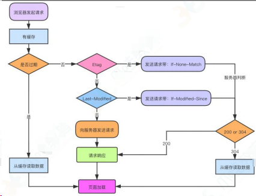

很多网站的资源后面都加了版本号，这样做的目的是：每次升级了 JS 或 CSS 文件后，为了防止浏览器进行缓存，强制改变版本号，客户端浏览器就会重新下载新的 JS 或 CSS 文件 ，以保证用户能够及时获得网站的最新更新。

## 协商缓存和强缓存的区别

### （1）强缓存

使用强缓存策略时，如果缓存资源有效，则直接使用缓存资源，不必再向服务器发起请求。

强缓存策略可以通过两种方式来设置，分别是 http 头信息中的 Expires 属性和 Cache-Control 属性

（1）服务器通过在响应头中添加 Expires 属性，来指定资源的过期时间。在过期时间以内，该资源可以被缓存使用，不必再向服务器发送请求。这个时间是一个绝对时间，它是服务器的时间，因此可能存在这样的问题，就是客户端的时间和服务器端的时间不一致，或者用户可以对客户端时间进行修改的情况，这样就可能会影响缓存命中的结果。

（2）Expires 是 http1.0 中的方式，因为它的一些缺点，在 HTTP1.1 中提出了一个新的头部属性就是 Cache-Control 属性，它提供了对资源的缓存的更精确的控制。它有很多不同的值，Cache-Control 可设置的字段：

public：设置了该字段值的资源表示可以被任何对象（包括：发送请求的客户端、代理服务器等等）缓存。这个字段值不常用，一般还是使用 max-age=来精确控制；

private：设置了该字段值的资源只能被用户浏览器缓存，不允许任何代理服务器缓存。在实际开发当中，对于一些含有用户信息的 HTML，通常都要设置这个字段值，避免代理服务器(CDN)缓存；

no-cache：设置了该字段需要先和服务端确认返回的资源是否发生了变化，如果资源未发生变化，则直接使用缓存好的资源；

no-store：设置了该字段表示禁止任何缓存，每次都会向服务端发起新的请求，拉取最新的资源；

max-age=：设置缓存的最大有效期，单位为秒；

s-maxage=：优先级高于 max-age=，仅适用于共享缓存(CDN)，优先级高于 max-age 或者 Expires 头；

max-stale[=]：设置了该字段表明客户端愿意接收已经过期的资源，但是不能超过给定的时间限制。

一般来说只需要设置其中一种方式就可以实现强缓存策略，当两种方式一起使用时，Cache-Control 的优先级要高于 Expires。

no-cache 和 no-store 很容易混淆：

no-cache 是指先要和服务器确认是否有资源更新，在进行判断。也就是说没有强缓存，但是会有协商缓存；

no-store 是指不使用任何缓存，每次请求都直接从服务器获取资源。

（2）协商缓存

如果命中强制缓存，我们无需发起新的请求，直接使用缓存内容，如果没有命中强制缓存，如果设置了协商缓存，这个时候协商缓存就会发挥作用了。

上面已经说到了，命中协商缓存的条件有两个：

- max-age=xxx 过期了
- 值为 no-store

使用协商缓存策略时，会先向服务器发送一个请求，如果资源没有发生修改，则返回一个 304 状态，让浏览器使用本地的缓存副本。如果资源发生了修改，则返回修改后的资源。

协商缓存也可以通过两种方式来设置，分别是 http 头信息中的 Etag 和 Last-Modified 属性。

（1）服务器通过在响应头中添加 Last-Modified 属性来指出资源最后一次修改的时间，当浏览器下一次发起请求时，会在请求头中添加一个 If-Modified-Since 的属性，属性值为上一次资源返回时的

Last-Modified 的值。当请求发送到服务器后服务器会通过这个属性来和资源的最后一次的修改时间来进行比较，以此来判断资源是否做了修改。如果资源没有修改，那么返回 304 状态，让客户端使用本地的缓存。如果资源已经被修改了，则返回修改后的资源。使用这种方法有一个缺点，就是 Last-Modified 标注的最后修改时间只能精确到秒级，如果某些文件在 1 秒钟以内，被修改多次的话，那么文件已将改变了但是 Last-Modified 却没有改变，这样会造成缓存命中的不准确。

（2）因为 Last-Modified 的这种可能发生的不准确性，http 中提供了另外一种方式，那就是 Etag 属性。服务器在返回资源的时候，在头信息中添加了 Etag 属性，这个属性是资源生成的唯一标识符，当资源发生改变的时候，这个值也会发生改变。在下一次资源请求时，浏览器会在请求头中添加一个 If-None-Match 属性，这个属性的值就是上次返回的资源的 Etag 的值。服务接收到请求后会根据这个值来和资源当前的 Etag 的值来进行比较，以此来判断资源是否发生改变，是否需要返回资源。通过这种方式，比 Last-Modified 的方式更加精确。

当 Last-Modified 和 Etag 属性同时出现的时候，Etag 的优先级更高。使用协商缓存的时候，服务器需要考虑负载平衡的问题，因此多个服务器上资源的 Last-Modified 应该保持一致，因为每个服务器上 Etag 的值都不一样，因此在考虑负载平衡时，最好不要设置 Etag 属性。

### 总结：

强缓存策略和协商缓存策略在缓存命中时都会直接使用本地的缓存副本，区别只在于协商缓存会向服务器发送一次请求。它们缓存不命中时，都会向服务器发送请求来获取资源。在实际的缓存机制中，强缓存策略和协商缓存策略是一起合作使用的。浏览器首先会根据请求的信息判断，强缓存是否命中，如果命中则直接使用资源。如果不命中则根据头信息向服务器发起请求，使用协商缓存，如果协商缓存命中的话，则服务器不返回资源，浏览器直接使用本地资源的副本，如果协商缓存不命中，则浏览器返回最新的资源给浏览器。

## 点击刷新按钮或者按 F5、按 Ctrl+F5 （强制刷新）、地址栏回车有什么区别？

点击刷新按钮或者按 F5：浏览器直接对本地的缓存文件过期，但是会带上 If-Modifed-Since，If-None-Match，这就意味着服务器会对文件检查新鲜度，返回结果可能是 304，也有可能是 200。

用户按 Ctrl+F5（强制刷新）：浏览器不仅会对本地文件过期，而且不会带上 If-Modifed-Since，If-None-Match，相当于之前从来没有请求过，返回结果是 200。

地址栏回车： 浏览器发起请求，按照正常流程，本地检查是否过期，然后服务器检查新鲜度，最后返回内容。

## 浏览器的内核分别是什么?

- IE: trident 内核

- Mozilla Firefox：Gecko，俗称 Firefox 内核。

- Safari：webkit 内核

- Opera：以前是 presto 内核，现已改用 Google Chrome 的 Blink 内核

- Chrome：Blink(最初是基于 webkit 开发的，Google 与 Opera Software 共同开发)

- 微软 Edge 浏览器：其内核是 Chromium，基于 Blink 内核。

Trident：这种浏览器内核是 IE 浏览器用的内核，因为在早期 IE 占有大量的市场份额，所以这种内核比较流行，以前有很多网页也是根据这个内核的标准来编写的，但是实际上这个内核对真正的网页标准支持不是很好。但是由于 IE 的高市场占有率，微软也很长时间没有更新 Trident 内核，就导致了 Trident 内核和 W3C 标准脱节。还
有就是 Trident 内核的大量 Bug 等安全问题没有得到解决，加上一些专家学者公开自己认为 IE 浏览器不安全的观点，使很多用户开始转向其他浏览器。

Gecko：这是 Firefox 和 Flock 所采用的内核，这个内核的优点就是功能强大、丰富，可以支持很多复杂网页效果和浏览器扩展接口，但是代价是也显而易见就是要消耗很多的资源，比如内存。

Presto：Opera 曾经采用的就是 Presto 内核，Presto 内核被称为公认的浏览网页速度最快的内核，这得益于它在开发时的天生优势，在处理 JS 脚本等脚本语言时，会比其他的内核快 3 倍左右，缺点就是为了达到很快的速度而丢掉了一部分网页兼容性。

Webkit：Webkit 是 Safari 采用的内核，它的优点就是网页浏览速度较快，虽然不及 Presto 但是也胜于 Gecko 和 Trident，缺点是对于网页代码的容错性不高，也就是说对网页代码的兼容性较低，会使一些编写不标准的网页无法正确显示。WebKit 前身是 KDE 小组的 KHTML 引擎，可以说 WebKit 是 KHTML 的一个开源的分支。

Blink：谷歌在 Chromium Blog 上发表博客，称将与苹果的开源浏览器核心 Webkit 分道扬镳，在 Chromium 项目中研发 Blink 渲染引擎（即浏览器核心），内置于 Chrome 浏览器之中。其实 Blink 引擎就是 Webkit 的一个分支，就像 webkit 是 KHTML 的分支一样。

Blink 引擎现在是谷歌公司与 Opera Software 共同研发，上面提到过的，Opera 弃用了自己的 Presto 内核，加入 Google 阵营，跟随谷歌一起研发 Blink。

## 1.能不能说一说浏览器缓存?

缓存是性能优化中非常重要的一环，浏览器的缓存机制对开发也是非常重要的知识点。接下来以三个部分来把浏览器的缓存机制说清楚：

- 强缓存
- 协商缓存
- 缓存位置

### 1）强缓存

浏览器中的缓存作用分为两种情况，一种是需要发送 HTTP 请求，一种是不需要发送。

首先是检查强缓存，这个阶段 不需要 发送 HTTP 请求。

如何来检查呢？通过相应的字段来进行，但是说起这个字段就有点门道了。

在 HTTP/1.0 和 HTTP/1.1 当中，这个字段是不一样的。在早期，也就是 HTTP/1.0 时期，使用的是 Expires，而 HTTP/1.1 使用的是 Cache-Control。让我们首先来看看 Expires。

#### （1）Expires

Expires 即过期时间，存在于服务端返回的响应头中，告诉浏览器在这个过期时间之前可以直接从缓存里面获取数据，无需再次请求。比如下面这样:

```bash
Expires: Wed, 22 Nov 2019 08:41:00 GMT
```

表示资源在 2019 年 11 月 22 号 8 点 41 分过期，过期了就得向服务端发请求。

这个方式看上去没什么问题，合情合理，但其实潜藏了一个坑，那就是服务器的时间和浏览器的时间可能并不一致，那服务器返回的这个过期时间可能就是不准确的。因此这种方式很快在后来的 HTTP1.1 版本中被抛弃了。

#### （2）Cache-Control

在 HTTP1.1 中，采用了一个非常关键的字段： Cache-Control 。这个字段也是存在于
它和 Expires 本质的不同在于它并没有采用 具体的过期时间点 这个方式，而是采用过期时长来控制缓存，对应的字段是 max-age。比如这个例子：

```bash
Cache-Control:max-age=3600
```

代表这个响应返回后在 3600 秒，也就是一个小时之内可以直接使用缓存。

如果你觉得它只有 max-age 一个属性的话，那就大错特错了。

它其实可以组合非常多的指令，完成更多场景的缓存判断, 将一些关键的属性列举如下: public: 客户端和代理服务器都可以缓存。因为一个请求可能要经过不同的 代理服务器 最后才到达目标服务器，那么结果就是不仅仅浏览器可以缓存数据，中间的任何代理节点都可以进行缓存。

- private： 这种情况就是只有浏览器能缓存了，中间的代理服务器不能缓存。
- no-cache: 跳过当前的强缓存，发送 HTTP 请求，即直接进入 协商缓存阶段 。
- no-store：非常粗暴，不进行任何形式的缓存。
- Expires: Wed, 22 Nov 2019 08:41:00 GMT
- Cache-Control:max-age=3600
- s-maxage：这和 max-age 长得比较像，但是区别在于 s-maxage 是针对代理服务器的缓存时间。

值得注意的是，当 Expires 和 Cache-Control 同时存在的时候，Cache-Control\*\*会优先考虑。

当然，还存在一种情况，当资源缓存时间超时了，也就是 强缓存 失效了，接下来怎么办？没错，这样就进入到第二级屏障——协商缓存了。

### 2）协商缓存

强缓存失效之后，浏览器在请求头中携带相应的 缓存 tag 来向服务器发请求，由服务器根据这个 tag，来决定是否使用缓存，这就是协商缓存。

具体来说，这样的缓存 tag 分为两种: Last-Modified 和 ETag。这两者各有优劣，并不存在谁对谁有 绝对的优势 ，跟上面强缓存的两个 tag 不一样。

#### （1）Last-Modified

即最后修改时间。在浏览器第一次给服务器发送请求后，服务器会在响应头中加上这个字段。

浏览器接收到后，如果再次请求，会在请求头中携带 If-Modified-Since 字段，这个字段的值也就是服务器传来的最后修改时间。

服务器拿到请求头中的 If-Modified-Since 的字段后，其实会和这个服务器中 该资源的最后修改时间 对比：

如果请求头中的这个值小于最后修改时间，说明是时候更新了。返回新的资源，跟常规的 HTTP 请求响应的流程一样。

否则返回 304，告诉浏览器直接用缓存。

#### （2）ETag

ETag 是服务器根据当前文件的内容，给文件生成的唯一标识，只要里面的内容有改动，这个值就会变。服务器通过 响应头 把这个值给浏览器。

浏览器接收到 ETag 的值，会在下次请求时，将这个值作为 If-None-Match 这个字段的内容，并放到请求头中，然后发给服务器。

服务器接收到 If-None-Match 后，会跟服务器上该资源的 ETag 进行比对：

- 如果两者不一样，说明要更新了。返回新的资源，跟常规的 HTTP 请求响应的流程一样。
- 否则返回 304，告诉浏览器直接用缓存。

#### （3）两者对比

1）在 精准度 上， ETag 优于 Last-Modified 。优于 ETag 是按照内容给资源上标识，因此能准确感知资源的变化。而 Last-Modified 就不一样了，它在一些特殊的情况并不能准确感知资源变化，主要有两种情况：

- 编辑了资源文件，但是文件内容并没有更改，这样也会造成缓存失效。
- Last-Modified 能够感知的单位时间是秒，如果文件在 1 秒内改变了多次，那么这时候的 Last-Modified 并没有体现出修改了。

2）在性能上， Last-Modified 优于 ETag ，也很简单理解， Last-Modified 仅仅只是记录一个时间点，而 Etag 需要根据文件的具体内容生成哈希值。

另外，如果两种方式都支持的话，服务器会优先考虑 ETag 。

3）缓存位置

前面我们已经提到，当 强缓存 命中或者协商缓存中服务器返回 304 的时候，我们直接从缓存中获取资源。那这些资源究竟缓存在什么位置呢？

浏览器中的缓存位置一共有四种，按优先级从高到低排列分别是：

- Service Worker
- Memory Cache
- Disk Cache
- Push Cache

4）Service Worker

Service Worker 借鉴了 Web Worker 的 思路，即让 JS 运行在主线程之外，由于它脱离了浏览器的窗体，因此无法直接访问 DOM 。虽然如此，但它仍然能帮助我们完成很多有用的功能，比如 离线缓存 、 消息推送 和 网络代理 等功能。其中的 离线缓存 就是 Service Worker Cache。

Service Worker 同时也是 PWA 的重要实现机制，关于它的细节和特性，我们将会在后面的 PWA 的分享中详细介绍。

5）Memory Cache 和 Disk Cache

Memory Cache 指的是内存缓存，从效率上讲它是最快的。但是从存活时间来讲又是最短的，当渲染进程结束后，内存缓存也就不存在了。

Disk Cache 就是存储在磁盘中的缓存，从存取效率上讲是比内存缓存慢的，但是他的优势在于存储容量和存储时长。稍微有些计算机基础的应该很好理解，就不展开了。

好，现在问题来了，既然两者各有优劣，那浏览器如何决定将资源放进内存还是硬盘呢？主要策略如下：

比较大的 JS、CSS 文件会直接被丢进磁盘，反之丢进内存
内存使用率比较高的时候，文件优先进入磁盘

6）Push Cache

即推送缓存，这是浏览器缓存的最后一道防线。它是 HTTP/2 中的内容，虽然现在应用的并不广泛，但随着 HTTP/2 的推广，它的应用越来越广泛。

### 总结

对浏览器的缓存机制来做个简要的总结：

首先通过 Cache-Control 验证强缓存是否可用

- 如果强缓存可用，直接使用
- 否则进入协商缓存，即发送 HTTP 请求，服务器通过请求头中的 If-Modified-Since 或者 If-None-Match 字段检查资源是否更新
  - 若资源更新，返回资源和 200 状态码
  - 否则，返回 304，告诉浏览器直接从缓存获取资源

## 2.能不能说一说浏览器的本地存储？各自优劣如何？

浏览器的本地存储主要分为 Cookie 、 WebStorage 和 IndexedDB , 其中 WebStorage 又可以分为 localStorage 和 sessionStorage 。接下来我们就来一一分析这些本地存储方案。

### 1）Cookie

Cookie 最开始被设计出来其实并不是来做本地存储的，而是为了弥补 HTTP 在状态管理上的不足。

HTTP 协议是一个无状态协议，客户端向服务器发请求，服务器返回响应，故事就这样结束了，但是下次发请求如何让服务端知道客户端是谁呢？

这种背景下，就产生了 Cookie。

Cookie 本质上就是浏览器里面存储的一个很小的文本文件，内部以键值对的方式来存储(在 chrome 开发者面板的 Application 这一栏可以看到)。向同一个域名下发送请求，都会携带相同的 Cookie，服务器拿到 Cookie 进行解析，便能拿到客户端的状态。

- Cookie 的作用很好理解，就是用来做状态存储的，但它也是有诸多致命的缺陷的：
  容量缺陷。Cookie 的体积上限只有 4KB ，只能用来存储少量的信息。
- 性能缺陷。Cookie 紧跟域名，不管域名下面的某一个地址需不需要这个 Cookie ，请求都会携带上完整的 Cookie，这样随着请求数的增多，其实会造成巨大的性能浪费的，因为请求携带了很多不必要的内容。
- 安全缺陷。由于 Cookie 以纯文本的形式在浏览器和服务器中传递，很容易被非法用户截获，然后进行一系列的篡改，在 Cookie 的有效期内重新发送给服务器，这是相当危险的。另外，在 HttpOnly 为 false 的情况下，Cookie 信息能直接通过 JS 脚本来读取。

### 2）localStorage 和 Cookie 异同

localStorage 有一点跟 Cookie 一样，就是针对一个域名，即在同一个域名下，会存储相同的一段 localStorage。

不过它相对 Cookie 还是有相当多的区别的：

- 容量。localStorage 的容量上限为 5M，相比于 Cookie 的 4K 大大增加。当然这个 5M 是针对一个域名的，因此对于一个域名是持久存储的。
- 只存在客户端，默认不参与与服务端的通信。这样就很好地避免了 Cookie 带来的性能问题和安全问题。
- 接口封装。通过 localStorage 暴露在全局，并通过它的 setItem 和 getItem 等方法进行操作，非常方便。

#### 操作方式

接下来我们来具体看看如何来操作 localStorage 。

```js
let obj = { name: "sanyuan", age: 18 };
localStorage.setItem("name", "sanyuan");
localStorage.setItem("info", JSON.stringify(obj));
```

接着进入相同的域名时就能拿到相应的值：

从这里可以看出， localStorage 其实存储的都是字符串，如果是存储对象需要调用 JSON 的 stringify 方法，并且用 JSON.parse 来解析成对象。

#### 应用场景

利用 localStorage 的较大容量和持久特性，可以利用 localStorage 存储一些内容稳定的资源，比如官网的 logo ，存储 Base64 格式的图片资源，因此利用 localStorage

### 3）sessionStorage

#### 特点

sessionStorage 以下方面和 localStorage 一致：

- 容量。容量上限也为 5M。
- 只存在客户端，默认不参与与服务端的通信。
- 接口封装。除了 sessionStorage 名字有所变化，存储方式、操作方式均和 localStorage 一样。

但 sessionStorage 和 localStorage 有一个本质的区别，那就是前者只是会话级别的存储，并不是持久化存储。会话结束，也就是页面关闭，这部分 sessionStorage 就不复存在了。

#### 应用场景

1）可以用它对表单信息进行维护，将表单信息存储在里面，可以保证页面即使刷新也不会让之前的表单信息丢失。

2）可以用它存储本次浏览记录。如果关闭页面后不需要这些记录，用 sessionStorage 就再合适不过了。事实上微博就采取了这样的存储方式。

### 4）IndexedDB

IndexedDB 是运行在浏览器中的 非关系型数据库 , 本质上是数据库，绝不是和刚才 WebStorage 的 5M 一个量级，理论上这个容量是没有上限的。

接着我们来分析一下 IndexedDB 的一些重要特性，除了拥有数据库本身的特性，比如 支持事务 ， 存储二进制数据 ，还有这样一些特性需要格外注意：

- 键值对存储。内部采用 对象仓库 存放数据，在这个对象仓库中数据采用键值对的方式来存储。
- 异步操作。数据库的读写属于 I/O 操作, 浏览器中对异步 I/O 提供了支持。
- 受同源策略限制，即无法访问跨域的数据库。

### 总结

浏览器中各种本地存储和缓存技术的发展，给前端应用带来了大量的机会，PWA 也正是依托了这些优秀的存储方案才得以发展起来。重新梳理一下这些本地存储方案:

（1） cookie 并不适合存储，而且存在非常多的缺陷。

（2） Web Storage 包括 localStorage 和 sessionStorage , 默认不会参与和服务器的通信。

（3） IndexedDB 为运行在浏览器上的非关系型数据库，为大型数据的存储提供了接口。

## 3.说一说从输入 URL 到页面呈现发生了什么？（网络）

这是一个可以无限难的问题。出这个题目的目的就是为了考察你的 web 基础深入到什么程度。由于水平和篇幅有限，在这里我将把其中一些重要的过程给大家梳理一遍，相信能在绝大部分的情况下给出一个比较惊艳的答案。

这里我提前声明，由于是一个综合性非常强的问题，可能会在某一个点上深挖出非常多的细节，我个人觉得学习是一个循序渐进的过程，在明白了整体过程后再去自己研究这些细节，会对整个知识体系有更深的理解。同时，关于延申出来的细节点我都有参考资料，看完这篇之后不妨再去深入学习一下，扩展知识面。

好，正题开始。

此时此刻，你在浏览器地址栏输入了百度的网址：

```bash
https://www.baidu.com/
```

### 网络请求

#### （1）构建请求

浏览器会构建请求行：

```bash
// 请求方法是GET，路径为根路径，HTTP协议版本为1.1
GET / HTTP/1.1
```

#### （2）查找强缓存

先检查强缓存，如果命中直接使用，否则进入下一步。

#### （3）DNS 解析

由于我们输入的是域名，而数据包是通过 IP 地址 传给对方的。因此我们需要得到域名对应的 IP 地址。这个过程需要依赖一个服务系统，这个系统将域名和 IP 一一映射，我们将这个系统就叫做 DNS（域名系统）。得到具体 IP 的过程就是 DNS 解析。

当然，值得注意的是，浏览器提供了 DNS 数据缓存功能。即如果一个域名已经解析过，那会把解析的结果缓存下来，下次处理直接走缓存，不需要经过 DNS 解析。

另外，如果不指定端口的话，默认采用对应的 IP 的 80 端口。

#### （4）建立 TCP 连接

这里要提醒一点，Chrome 在同一个域名下要求同时最多只能有 6 个 TCP 连接，超过 6 个的话剩下的请求就得等待。

假设现在不需要等待，我们进入了 TCP 连接的建立阶段。首先解释一下什么是 TCP:

> TCP（Transmission Control Protocol，传输控制协议）是一种面向连接的、可靠的、基于字节流的传输层通信协议。

建立 TCP 连接 经历了下面三个阶段：

- 1）通过三次握手(即总共发送 3 个数据包确认已经建立连接)建立客户端和服务器之间的连接。
- 2）进行数据传输。这里有一个重要的机制，就是接收方接收到数据包后必须要向发送方 确认 , 如果发送方没有接到这个 确认 的消息，就判定为数据包丢失，并重新发送该数据包。当然，发送的过程中还有一个优化策略，就是把 大的数据包拆成一个个小包 ，依次传输到接收方，接收方按照这个小包的顺序把它们组装 成完整数据包。
- 3）断开连接的阶段。数据传输完成，现在要断开连接了，通过四次挥手来断开连接。

读到这里，你应该明白 TCP 连接通过什么手段来保证数据传输的可靠性，一是三次握手确认连接，二是数据包校验保证数据到达接收方，三是通过四次挥手断开连接。

#### （5）发送 HTTP 请求

现在 TCP 连接 建立完毕，浏览器可以和服务器开始通信，即开始发送 HTTP 请求。浏览器发 HTTP 请求要携带三样东西:请求行、请求头和请求体。

首先，浏览器会向服务器发送请求行,关于请求行， 我们在这一部分的第一步就构建完了，贴一下内容：

```bash
// 请求方法是GET，路径为根路径，HTTP协议版本为1.1
GET / HTTP/1.1
```

结构很简单，由请求方法、请求 URI 和 HTTP 版本协议组成。

同时也要带上请求头，比如我们之前说的 Cache-Control、If-Modified-Since、If-None-Match 都由可能被放入请求头中作为缓存的标识信息。当然了还有一些其他的属性，列举如下：

```bash
Accept:
text/html,application/xhtml+xml,application/xml;q=0.9,image/webp,image/apng,*/*;
q=0.8,application/signed-exchange;v=b3
Accept-Encoding: gzip, deflate, br
Accept-Language: zh-CN,zh;q=0.9
Cache-Control: no-cache
Connection: keep-alive
Cookie: /* 省略cookie信息 */
Host: www.baidu.com
Pragma: no-cache
Upgrade-Insecure-Requests: 1
User-Agent: Mozilla/5.0 (iPhone; CPU iPhone OS 11_0 like Mac OS X)
AppleWebKit/604.1.38 (KHTML, like Gecko) Version/11.0 Mobile/15A372 Safari/604.1
```

最后是请求体，请求体只有在 POST 方法下存在，常见的场景是表单提交。

### 网络响应

HTTP 请求到达服务器，服务器进行对应的处理。最后要把数据传给浏览器，也就是返回网络响应。

跟请求部分类似，网络响应具有三个部分:响应行、响应头和响应体。

响应行类似下面这样:

```bash
HTTP/1.1 200 OK
```

由 HTTP 协议版本、状态码和状态描述组成。

响应头包含了服务器及其返回数据的一些信息, 服务器生成数据的时间、返回的数据类型以及对即将写入的 Cookie 信息。

举例如下：

```bash
Cache-Control: no-cache
Connection: keep-alive
Content-Encoding: gzip
Content-Type: text/html;charset=utf-8
Date: Wed, 04 Dec 2019 12:29:13 GMT
Server: apache
Set-Cookie:
rsv_i=f9a0SIItKqzv7kqgAAgphbGyRts3RwTg%2FLyU3Y5Eh5LwyfOOrAsvdezbay0QqkDqFZ0DfQXb
y4wXKT8Au8O7ZT9UuMsBq2k; path=/; domain=.baidu.com
```

响应完成之后怎么办？TCP 连接就断开了吗？

不一定。这时候要判断 Connection 字段, 如果请求头或响应头中包含 Connection: Keep-Alive，表示建立了持久连接，这样 TCP 连接会一直保持，之后请求统一站点的资源会复用这个连接。

否则断开 TCP 连接, 请求-响应流程结束。

### 总结

到此，我们来总结一下主要内容，也就是浏览器端的网络请求过程：

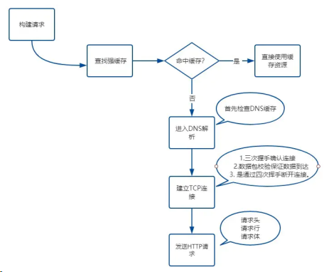

## 4.说一说从输入 URL 到页面呈现发生了什么？（解析算法）

完成了网络请求和响应，如果响应头中 Content-Type 的值是 text/html ，那么接下来就是浏览器的 解析 和 渲染 工作了。

首先来介绍解析部分，主要分为以下几个步骤:

- 构建 DOM 树
- 样式 计算
- 生成 布局树 ( Layout Tree )

### 构建 DOM 树

由于浏览器无法直接理解 HTML 字符串 ，因此将这一系列的字节流转换为一种有意义并且方便操作的数据结构，这种数据结构就是 DOM 树 。 DOM 树 本质上是一个以 document 为根节点的多叉树。

那通过什么样的方式来进行解析呢？

#### （1）HTML 文法的本质

首先，我们应该清楚把握一点: HTML 的文法并不是 上下文无关文法 。

这里，有必要讨论一下什么是 上下文无关文法 。

在计算机科学的编译原理学科中，有非常明确的定义：

> 若一个形式文法 G = (N, Σ, P, S) 的产生式规则都取如下的形式：V->w，则叫上下文无关语法。其中 V∈N ，w∈(N∪Σ)\* 。

其中把 G = (N, Σ, P, S) 中各个参量的意义解释一下：

- N 是非终结符(顾名思义，就是说最后一个符号不是它, 下面同理)集合。
- Σ 是终结符集合。
- P 是开始符，它必须属于 N ，也就是非终结符。
- S 就是不同的产生式的集合。如 S -> aSb 等等。

通俗一点讲，上下文无关的文法就是说这个文法中所有产生式的左边都是一个非终结符。

看到这里，如果还有一点懵圈，我举个例子你就明白了。

比如：

```bash
A -> B
```

这个文法中，每个产生式左边都会有一个非终结符，这就是上下文无关的文法。在这种情况下，xBy 一定是可以规约出 xAy 的。

我们下面看看看一个反例：

```bash
aA -> B
Aa -> B
```

这种情况就是不是上下文无关的文法，当遇到 B 的时候，我们不知道到底能不能规约出 A，取决于左边或者右边是否有 a 存在，也就是说和上下文有关。

关于它为什么是非上下文无关文法，首先需要让大家注意的是，规范的 HTML 语法，是符合上下文无关文法的，能够体现它非上下文无关的是不标准的语法。在此我仅举一个反例即可证明。

比如解析器扫描到 form 标签的时候，上下文无关文法的处理方式是直接创建对应 form 的 DOM 对象，而真实的 HTML5 场景中却不是这样，解析器会查看 form 的上下文，如果这个 form 标签的父标签也是 form，那么直接跳过当前的 form 标签，否则才创建 DOM 对象。

常规的编程语言都是上下文无关的，而 HTML 却相反，也正是它非上下文无关的特性，决定了 HTML Parser 并不能使用常规编程语言的解析器来完成，需要另辟蹊径。

#### （2）解析算法

HTML5 规范详细地介绍了解析算法。这个算法分为两个阶段：

- 标记化。
- 建树。

对应的两个过程就是词法分析和语法分析。

##### 标记化算法

这个算法输入为 HTML 文本 ，输出为 HTML 标记 ，也成为标记生成器。其中运用有限自动状态机来完成。

即在当当前状态下，接收一个或多个字符，就会更新到下一个状态。

```html
<html>
	<body>
		Hello sanyuan
	</body>
</html>
```

通过一个简单的例子来演示一下 标记化 的过程。

遇到 < , 状态为标记打开。

接收 [a-z] 的字符，会进入标记名称状态。

这个状态一直保持，直到遇到 > ，表示标记名称记录完成，这时候变为数据状态。

接下来遇到 body 标签做同样的处理。

这个时候 html 和 body 的标记都记录好了。

现在来到 `<body>` 中的 > ，进入数据状态，之后保持这样状态接收后面的字符 hello sanyuan。
接着接收 `</body>` 中的 < ，回到标记打开, 接收下一个 / 后，这时候会创建一个 end tag 的 token。

随后进入标记名称状态, 遇到 > 回到数据状态。

接着以同样的样式处理 `</body>` 。

##### 建树算法

之前提到过，DOM 树是一个以 document 为根节点的多叉树。因此解析器首先会创建一个 document 对象。标记生成器会把每个标记的信息发送给建树器。建树器接收到相应的标记时，会创建对应的 DOM 对象。创建这个 DOM 对象 后会做两件事情：

1. 将 DOM 对象 加入 DOM 树中。
2. 将对应标记压入存放开放(与 闭合标签 意思对应)元素的栈中。

还是拿下面这个例子说：

```html
<html>
	<body>
		Hello sanyuan
	</body>
</html>
```

首先，状态为初始化状态。

接收到标记生成器传来的 html 标签，这时候状态变为 before html 状态。同时创建一个 HTMLHtmlElement 的 DOM 元素, 将其加到 document 根对象上，并进行压栈操作。

接着状态自动变为 before head, 此时从标记生成器那边传来 body ，表示并没有 head , 这时候建树器会自动创建一个 HTMLHeadElement 并将其加入到 DOM 树 中。

现在进入到 in head 状态, 然后直接跳到 after head。

现在标记生成器传来了 body 标记，创建 HTMLBodyElement, 插入到 DOM 树中，同时压入开放标记栈。

接着状态变为 in body，然后来接收后面一系列的字符: Hello sanyuan。接收到第一个字符的时候，会创建一个 Text 节点并把字符插入其中，然后把 Text 节点插入到 DOM 树中 body 元素 的下面。随着不断接收后面的字符，这些字符会附在 Text 节点上。

现在，标记生成器传过来一个 body 的结束标记，进入到 after body 状态。

标记生成器最后传过来一个 html 的结束标记, 进入到 after after body 的状态，表示解析过程到此结束。

##### 容错机制

讲到 HTML5 规范，就不得不说它强大的宽容策略, 容错能力非常强，虽然大家褒贬不一，不过我想作为一名资深的前端工程师，有必要知道 HTML Parser 在容错方面做了哪些事情。

接下来是 WebKit 中一些经典的容错示例，发现有其他的也欢迎来补充。

1.使用 `</br>` 而不是 `<br>`

```js
if (t->isCloseTag(brTag) && m_document->inCompatMode()) {
    reportError(MalformedBRError);
    t->beginTag = true;
}
```

全部换为 `<br>` 的形式。

表格离散

```html
<table>
	<table>
		<tr>
			<td>inner table</td>
		</tr>
	</table>
	<tr>
		<td>outer table</td>
	</tr>
</table>
```

WebKit 会自动转换为：

```html
<table>
	<tr>
		<td>outer table</td>
	</tr>
</table>
<table>
	<tr>
		<td>inner table</td>
	</tr>
</table>
```

表单元素嵌套

这时候直接忽略里面的 form 。

### 样式计算

关于 CSS 样式，它的来源一般是三种:
link 标签引用
style 标签中的样式
元素的内嵌 style 属性

#### (1）格式化样式表

首先，浏览器是无法直接识别 CSS 样式文本的，因此渲染引擎接收到 CSS 文本之后第一件事情就是将其转化为一个结构化的对象，即 styleSheets。

这个格式化的过程过于复杂，而且对于不同的浏览器会有不同的优化策略，这里就不展开了。

在浏览器控制台能够通过 document.styleSheets 来查看这个最终的结构。当然，这个结构包含了以上三种 CSS 来源，为后面的样式操作提供了基础。

#### （2）标准化样式属性

有一些 CSS 样式的数值并不容易被渲染引擎所理解，因此需要在计算样式之前将它们标准化，如 em -> px , red -> #ff0000 , bold -> 700 等等。

#### （3）计算每个节点的具体样式

样式已经被 格式化 和 标准化 ,接下来就可以计算每个节点的具体样式信息了。

其实计算的方式也并不复杂，主要就是两个规则: 继承和层叠。

每个子节点都会默认继承父节点的样式属性，如果父节点中没有找到，就会采用浏览器默认样式，也叫 UserAgent 样式 。这就是继承规则，非常容易理解。

然后是层叠规则，CSS 最大的特点在于它的层叠性，也就是最终的样式取决于各个属性共同作用的效果，甚至有很多诡异的层叠现象，看过《CSS 世界》的同学应该对此深有体会，具体的层叠规则属于深入 CSS 语言的范畴，这里就不过多介绍了。

不过值得注意的是，在计算完样式之后，所有的样式值会被挂在到 window.getComputedStyle 当中，也就是可以通过 JS 来获取计算后的样式，非常方便。

##### 生成布局树

现在已经生成了 DOM 树 和 DOM 样式 ，接下来要做的就是通过浏览器的布局系统 确定元素的位置 ，也就是要生成一棵 布局树 (Layout Tree)。

布局树生成的大致工作如下：

1）遍历生成的 DOM 树节点，并把他们添加到 布局树中 。
2）计算布局树节点的坐标位置。

值得注意的是，这棵布局树值包含可见元素，对于 head 标签和设置了 display: none 的元素，将不会被放入其中。

有人说首先会生成 Render Tree ，也就是渲染树，其实这还是 16 年之前的事情，现在 Chrome 团队已经做了大量的重构，已经没有生成 Render Tree 的过程了。而布局树的信息已经非常完善，完全拥有 Render Tree 的功能。

#### （3）总结

梳理一下这一节的主要脉络:

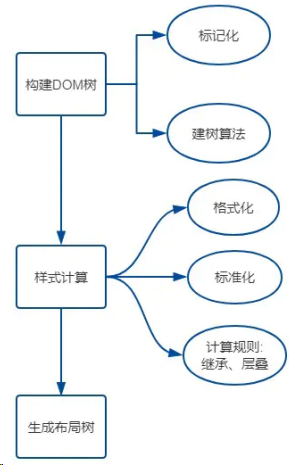

## 浏览器的渲染过程

浏览器渲染主要有以下步骤：

首先解析收到的文档，根据文档定义构建一棵 DOM 树，DOM 树是由 DOM 元素及属性节点组成的。

然后对 CSS 进行解析，生成 CSSOM 规则树。

根据 DOM 树和 CSSOM 规则树构建渲染树。渲染树的节点被称为渲染对象，渲染对象是一个包含有颜色和大小等属性的矩形，渲染对象和 DOM 元素相对应，但这种对应关系不是一对一的，不可见的 DOM 元素不会被插入渲染树。还有一些 DOM 元素对应几个可见对象，它们一般是一些具有复杂结构的元素，无法用一个矩形来描述。

当渲染对象被创建并添加到树中，它们并没有位置和大小，所以当浏览器生成渲染树以后，就会根据渲染树来进行布局（也可以叫做回流）。

这一阶段浏览器要做的事情是要弄清楚各个节点在页面中的确切位置和大小。通常这一行为也被称为“自动重排”。

布局阶段结束后是绘制阶段，遍历渲染树并调用渲染对象的 paint 方法将它们的内容显示在屏幕上，绘制使用 UI 基础组件。

大致过程如图所示：

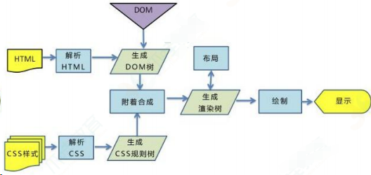

注意：这个过程是逐步完成的，为了更好的用户体验，渲染引擎将会尽可能早的将内容呈现到屏幕上，并不会等到所有的 html 都解析完成之后再去构建和布局 render 树。它是解析完一部分内容就显示一部分内容，同时，可能还在通过网络下载其余内容。

## 渲染过程中遇到 JS 文件如何处理？

JavaScript 的加载、解析与执行会阻塞文档的解析，也就是说，在构建 DOM 时，HTML 解析器若遇到了 JavaScript，那么它会暂停文档的解析，将控制权移交给 JavaScript 引擎，等 JavaScript 引擎运行完毕，浏览器再从中断的地方恢复继续解析文档。也就是说，如果想要首屏渲染的越快，就越不应该在首屏就加载 JS 文件，这也是都建议将 script 标签放在 body 标签底部的原因。当然在当下，并不是说 script 标签必须放在底部，因为你可以给 script 标签添加 defer 或者 async 属性。

## 事件是什么？事件模型？

事件是用户操作网页时发生的交互动作，比如 click/move， 事件除了用户触发的动作外，还可以是文档加载，窗口滚动和大小调整。事件被封装成一个 event 对象，包含了该事件发生时的所有相关信息（ event 的属性）以及可以对事件进行的操作（ event 的方法）。

事件是用户操作网页时发生的交互动作或者网页本身的一些操作，现代浏览器一共有三种事件模型：

DOM0 级事件模型，这种模型不会传播，所以没有事件流的概念，但是现在有的浏览器支持以冒泡的方式实现，它可以在网页中直接定义

监听函数，也可以通过 js 属性来指定监听函数。所有浏览器都兼容这种方式。直接在 dom 对象上注册事件名称，就是 DOM0 写法。

IE 事件模型，在该事件模型中，一次事件共有两个过程，事件处理阶段和事件冒泡阶段。事件处理阶段会首先执行目标元素绑定的监听事件。然后是事件冒泡阶段，冒泡指的是事件从目标元素冒泡到

document，依次检查经过的节点是否绑定了事件监听函数，如果有则执行。这种模型通过 attachEvent 来添加监听函数，可以添加多个监听函数，会按顺序依次执行。

DOM2 级事件模型，在该事件模型中，一次事件共有三个过程，第一个过程是事件捕获阶段。捕获指的是事件从 document 一直向下传播到目标元素，依次检查经过的节点是否绑定了事件监听函数，如果有则执行。后面两个阶段和 IE 事件模型的两个阶段相同。这种事件模型，事件绑定的函数是 addEventListener，其中第三个参数可以指
定事件是否在捕获阶段执行。

## 对事件循环的理解

因为 js 是单线程运行的，在代码执行时，通过将不同函数的执行上下文压入执行栈中来保证代码的有序执行。在执行同步代码时，如果遇到异步事件，js 引擎并不会一直等待其返回结果，而是会将这个事件挂起，继续执行执行栈中的其他任务。当异步事件执行完毕后，再将异步事件对应的回调加入到一个任务队列中等待执行。任务队列
可以分为宏任务队列和微任务队列，当当前执行栈中的事件执行完毕后，js 引擎首先会判断微任务队列中是否有任务可以执行，如果有就将微任务队首的事件压入栈中执行。当微任务队列中的任务都执行完成后再去执行宏任务队列中的任务。

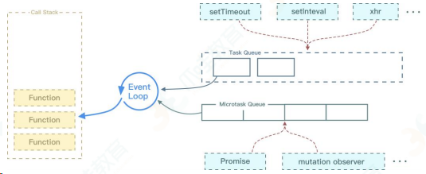

Event Loop 执行顺序如下所示：

- 首先执行同步代码，这属于宏任务
- 当执行完所有同步代码后，执行栈为空，查询是否有异步代码需要执行
- 执行所有微任务
- 当执行完所有微任务后，如有必要会渲染页面
- 然后开始下一轮 Event Loop，执行宏任务中的异步代码

## 5.说一说从输入 URL 到页面呈现发生了什么？（渲染过程）

上一节介绍了浏览器 解析 的过程,其中包含 构建 DOM 、 样式计算 和 构建布局树 。
接下来就来拆解下一个过程—— 渲染 。分为以下几个步骤：

- 建立 图层树 ( Layer Tree )
- 生成 绘制列表
- 生成 图块 并 栅格化
- 显示器显示内容

### 建图层树

如果你觉得现在 DOM 节点 也有了，样式和位置信息也都有了，可以开始绘制页面了，那你就错了。

因为你考虑掉了另外一些复杂的场景，比如 3D 动画如何呈现出变换效果，当元素含有层叠上下文时如何控制显示和隐藏等等。

为了解决如上所述的问题，浏览器在构建完 布局树 之后，还会对特定的节点进行分层，构建一棵 图层树( Layer Tree )。

**那这棵图层树是根据什么来构建的呢？**

一般情况下，节点的图层会默认属于父亲节点的图层(这些图层也称为合成层)。那什么时候会提升为一个单独的合成层呢？

有两种情况需要分别讨论，一种是显式合成，一种是隐式合成。

#### （1）显式合成

下面是 显式合成 的情况:

##### 一、 拥有层叠上下文的节点。

层叠上下文也基本上是有一些特定的 CSS 属性创建的，一般有以下情况：

- HTML 根元素本身就具有层叠上下文。
- 普通元素设置 position 不为 static 并且设置了 z-index 属性，会产生层叠上下文。
- 元素的 opacity 值不是 1
- 元素的 transform 值不是 none
- 元素的 filter 值不是 none
- 元素的 isolation 值是 isolate
- will-change 指定的属性值为上面任意一个。(will-change 的作用后面会详细介绍)

##### 二、需要剪裁的地方。

比如一个 div，你只给他设置 100 \* 100 像素的大小，而你在里面放了非常多的文字，那么超出的文字部分就需要被剪裁。当然如果出现了滚动条，那么滚动条会被单独提升为一个图层。

#### （2）隐式合成

接下来是 隐式合成 ，简单来说就是 层叠等级低 的节点被提升为单独的图层之后，那么 所有层叠等级比它高的节点都会成为一个单独的图层。

这个隐式合成其实隐藏着巨大的风险，如果在一个大型应用中，当一个 z-index 比较低的元素被提升为单独图层之后，层叠在它上面的的元素统统都会被提升为单独的图层，可能会增加上千个图层，大大增加内存的压力，甚至直接让页面崩溃。这就是层爆炸的原理。

值得注意的是，当需要 repaint 时，只需要 repaint 本身，而不会影响到其他的层。

### 生成绘制列表

接下来渲染引擎会将图层的绘制拆分成一个个绘制指令，比如先画背景、再描绘边框......然后将这些指令

按顺序组合成一个待绘制列表，相当于给后面的绘制操作做了一波计划。

这里我以百度首页为例，大家可以在 Chrome 开发者工具中在设置栏中展开 more tools , 然后选择 Layers 面板，就能看到下面的绘制列表：

![Image[196]](./浏览器原理.assets/Image[196].jpg)

### 生成图块和生成位图

现在开始绘制操作，实际上在渲染进程中绘制操作是由专门的线程来完成的，这个线程叫合成线程。

绘制列表准备好了之后，渲染进程的主线程会给 合成线程 发送 commit 消息，把绘制列表提交给合成线程。接下来就是合成线程一展宏图的时候啦。

首先，考虑到视口就这么大，当页面非常大的时候，要滑很长时间才能滑到底，如果要一口气全部绘制出来是相当浪费性能的。因此，合成线程要做的第一件事情就是将图层分块。这些块的大小一般不会特别大，通常是 256 _ 256 或者 512 _ 512 这个规格。这样可以大大加速页面的首屏展示。

因为后面图块数据要进入 GPU 内存，考虑到浏览器内存上传到 GPU 内存的操作比较慢，即使是绘制一部分图块，也可能会耗费大量时间。针对这个问题，Chrome 采用了一个策略: 在首次合成图块时只采用一个低分辨率的图片，这样首屏展示的时候只是展示出低分辨率的图片，这个时候继续进行合成操作，当正常的图块内容绘制完毕后，会将当前低分辨率的图块内容替换。这也是 Chrome 底层优化首屏加载速度的一个手段。

顺便提醒一点，渲染进程中专门维护了一个栅格化线程池，专门负责把图块转换为位图数据。

然后合成线程会选择视口附近的图块，把它交给栅格化线程池生成位图。

生成位图的过程实际上都会使用 GPU 进行加速，生成的位图最后发送给 合成线程 。

### 显示器显示内容

栅格化操作完成后，合成线程会生成一个绘制命令，即"DrawQuad"，并发送给浏览器进程。

浏览器进程中的 viz 组件 接收到这个命令，根据这个命令，把页面内容绘制到内存，也就是生成了页面，然后把这部分内存发送给显卡。为什么发给显卡呢？我想有必要先聊一聊显示器显示图像的原理。

无论是 PC 显示器还是手机屏幕，都有一个固定的刷新频率，一般是 60 HZ，即 60 帧，也就是一秒更新 60 张图片，一张图片停留的时间约为 16.7 ms。而每次更新的图片都来自显卡的前缓冲区。而显卡接收到浏览器进程传来的页面后，会合成相应的图像，并将图像保存到后缓冲区，然后系统自动将 前缓冲区和 后缓冲区 对换位置，如此循环更新。

看到这里你也就是明白，当某个动画大量占用内存的时候，浏览器生成图像的时候会变慢，图像传送给显卡就会不及时，而显示器还是以不变的频率刷新，因此会出现卡顿，也就是明显的掉帧现象。

### 总结

到这里，我们算是把整个过程给走通了，现在重新来梳理一下页面渲染的流程。

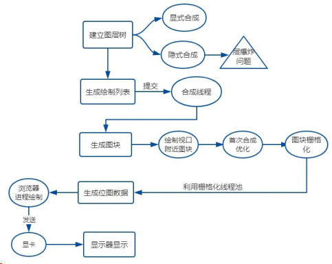

## 6.谈谈你对重绘和回流的理解

我们首先来回顾一下渲染流水线的流程：

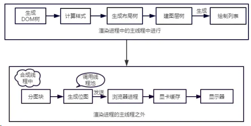

接下来，我们将来以此为依据来介绍重绘和回流，以及让更新视图的另外一种方式——合成。

### 回流

首先介绍回流。回流也叫重排。

#### （1）触发条件

简单来说，就是当我们对 DOM 结构的修改引发 DOM 几何尺寸变化的时候，会发生 回流 的过程。

具体一点，有以下的操作会触发回流:

1.一个 DOM 元素的几何属性变化，常见的几何属性有 width 、 height 、 padding 、 margin 、
left 、 top 、 border 等等, 这个很好理解。

2.使 DOM 节点发生 增减 或者 移动 。

3.读写 offset 族、 scroll 族和 client 族属性的时候，浏览器为了获取这些值，需要进行回流操
作。

4.调用 window.getComputedStyle 方法。

#### （2）回流过程

依照上面的渲染流水线，触发回流的时候，如果 DOM 结构发生改变，则重新渲染 DOM 树，然后将后面的流程(包括主线程之外的任务)全部走一遍。

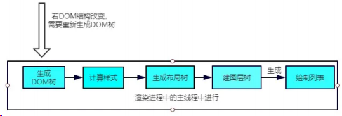

相当于将解析和合成的过程重新又走了一篇，开销是非常大的。

### 重绘

#### （1）触发条件

当 DOM 的修改导致了样式的变化，并且没有影响几何属性的时候，会导致 重绘 ( repaint )。

#### （2）重绘过程

由于没有导致 DOM 几何属性的变化，因此元素的位置信息不需要更新，从而省去布局的过程。流程如下：

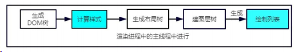

跳过了 生成布局树 和 建图层树 的阶段，直接生成绘制列表，然后继续进行分块、生成位图等后面一系列操作。

可以看到，重绘不一定导致回流，但回流一定发生了重绘。

### 合成

还有一种情况，是直接合成。比如利用 CSS3 的 transform 、 opacity 、 filter 这些属性就可以实现合成的效果，也就是大家常说的 GPU 加速。

#### （1）GPU 加速的原因

在合成的情况下，会直接跳过布局和绘制流程，直接进入 非主线程 处理的部分，即直接交给 合成线程 处理。交给它处理有两大好处：

能够充分发挥 GPU 的优势。合成线程生成位图的过程中会调用线程池，并在其中使用 GPU 进行加速生成，而 GPU 是擅长处理位图数据的。

没有占用主线程的资源，即使主线程卡住了，效果依然能够流畅地展示。

### 实践意义

- 知道上面的原理之后，对于开发过程有什么指导意义呢？
- 避免频繁使用 style，而是采用修改 class 的方式。
- 使用 createDocumentFragment 进行批量的 DOM 操作。
- 对于 resize、scroll 等进行防抖/节流处理。

添加 will-change: tranform ，让渲染引擎为其单独实现一个图层，当这些变换发生时，仅仅只是利用合成线程去处理这些变换，而不牵扯到主线程，大大提高渲染效率。当然这个变化不限于 tranform , 任何可以实现合成效果的 CSS 属性都能用 will-change 来声明。这里有一个实际的例子，一行 will-change: tranform 拯救一个项目。

## 9.HTTPS 为什么让数据传输更安全？

谈到 HTTPS , 就不得不谈到与之相对的 HTTP 。 HTTP 的特性是明文传输，因此在传输的每一个环节，数据都有可能被第三方窃取或者篡改，具体来说，HTTP 数据经过 TCP 层，然后经过 WIFI 路由器 、 运营商和 目标服务器 ，这些环节中都可能被中间人拿到数据并进行篡改，也就是我们常说的中间人攻击。

为了防范这样一类攻击，我们不得已要引入新的加密方案，即 HTTPS。

HTTPS 并不是一个新的协议, 而是一个加强版的 HTTP 。其原理是在 HTTP 和 TCP 之间建立了一个中间层，当 HTTP 和 TCP 通信时并不是像以前那样直接通信，直接经过了一个中间层进行加密，将加密后的数据包传给 TCP , 响应的， TCP 必须将数据包解密，才能传给上面的 HTTP 。这个中间层也叫 安全层 。 安全层 的核心就是对数据 加解密 。

接下来我们就来剖析一下 HTTPS 的加解密是如何实现的。

### 对称加密和非对称加密

#### （1）概念

首先需要理解 对称加密 和 非对称加密 的概念，然后讨论两者应用后的效果如何。
对称加密 是最简单的方式，指的是 加密 和 解密 用的是同样的密钥。

而对于 非对称加密 ，如果有 A、 B 两把密钥，如果用 A 加密过的数据包只能用 B 解密，反之，如果用 B 加密过的数据包只能用 A 解密。

#### （2）加解密过程

- 接着我们来谈谈 浏览器 和 服务器 进行协商加解密的过程。
- 首先，浏览器会给服务器发送一个随机数 client_random 和一个加密的方法列表。
- 服务器接收后给浏览器返回另一个随机数 server_random 和加密方法。
- 现在，两者拥有三样相同的凭证: client_random 、 server_random 和加密方法。
- 接着用这个加密方法将两个随机数混合起来生成密钥，这个密钥就是浏览器和服务端通信的 暗号 。

#### （3）各自应用的效果

如果用 对称加密 的方式，那么第三方可以在中间获取到 client_random 、 server_random 和加密方法，由于这个加密方法同时可以解密，所以中间人可以成功对暗号进行解密，拿到数据，很容易就将这种加密方式破解了。

既然 对称加密 这么不堪一击，我们就来试一试 非对称 加密。在这种加密方式中，服务器手里有两把钥匙，一把是 公钥 ，也就是说每个人都能拿到，是公开的，另一把是 私钥 ，这把私钥只有服务器自己知道。

好，现在开始传输。

浏览器把 client_random 和加密方法列表传过来，服务器接收到，把 server_random 、 加密方法 和 公钥 传给浏览器。

现在两者拥有相同的 client_random 、 server_random 和加密方法。然后浏览器用公钥将 client_random 和 server_random 加密，生成与服务器通信的 暗号 。

这时候由于是非对称加密，公钥加密过的数据只能用 私钥 解密，因此中间人就算拿到浏览器传来的数据，由于他没有私钥，照样无法解密，保证了数据的安全性。

这难道一定就安全吗？聪明的小伙伴早就发现了端倪。回到 非对称加密 的定义，公钥加密的数据可以用私钥解密，那私钥加密的数据也可以用公钥解密呀！

服务器的数据只能用私钥进行加密(因为如果它用公钥那么浏览器也没法解密啦)，中间人一旦拿到公钥，那么就可以对服务端传来的数据进行解密了，就这样又被破解了。而且，只是采用非对称加密，对于服务器性能的消耗也是相当巨大的，因此我们暂且不采用这种方案。

### 对称加密和非对称加密的结合

可以发现，对称加密和非对称加密，单独应用任何一个，都会存在安全隐患。那我们能不能把两者结合，进一步保证安全呢？

其实是可以的，演示一下整个流程：

- 1）浏览器向服务器发送 client_random 和加密方法列表。
- 2）服务器接收到，返回 server_random 、加密方法以及公钥。
- 3）浏览器接收，接着生成另一个随机数 pre_random , 并且用公钥加密，传给服务器。
- 4）服务器用私钥解密这个被加密后的 pre_random 。

现在浏览器和服务器有三样相同的凭证: client_random 、 server_random 和 pre_random 。然后两者用相同的加密方法混合这三个随机数，生成最终的 密钥 。

然后浏览器和服务器尽管用一样的密钥进行通信，即使用 对称加密 。

这个最终的密钥是很难被中间人拿到的，为什么呢? 因为中间人没有私钥，从而拿不到 pre_random，也就无法生成最终的密钥了。

回头比较一下和单纯的使用非对称加密, 这种方式做了什么改进呢？本质上是防止了私钥加密的数据外传。单独使用非对称加密，最大的漏洞在于服务器传数据给浏览器只能用 私钥 加密，这是危险产生的根源。利用 对称和非对称 加密结合的方式，就防止了这一点，从而保证了安全。

### 证书

尽管通过两者加密方式的结合，能够很好地实现加密传输，但实际上还是存在一些问题。黑客如果采用 DNS 劫持，将目标地址替换成黑客服务器的地址，然后黑客自己造一份公钥和私钥，照样能进行数据传输。而对于浏览器用户而言，他是不知道自己正在访问一个危险的服务器的。

事实上 HTTPS 在上述 结合对称和非对称加密 的基础上，又添加了 数字证书认证 的步骤。其目的就是让服务器证明自己的身份。

#### （1）传输过程

为了获取这个证书，服务器运营者需要向第三方认证机构获取授权，这个第三方机构也叫 CA ( Certificate Authority ), 认证通过后 CA 会给服务器颁发数字证书。

这个数字证书有两个作用：

- 1.服务器向浏览器证明自己的身份。
- 2.把公钥传给浏览器。

**这个验证的过程发生在什么时候呢？**

当服务器传送 server_random 、加密方法的时候，顺便会带上 数字证书 (包含了 公钥 ), 接着浏览器接收之后就会开始验证数字证书。如果验证通过，那么后面的过程照常进行，否则拒绝执行。

现在我们来梳理一下 HTTPS 最终的加解密过程：

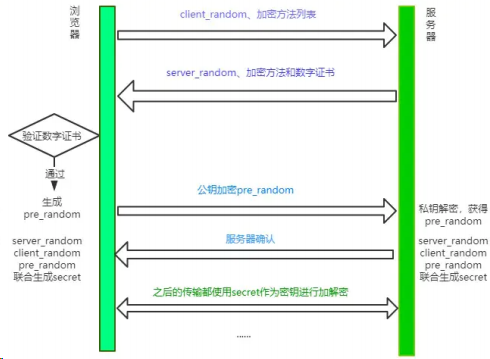

#### （2）认证过程

浏览器拿到数字证书后，如何来对证书进行认证呢？

首先，会读取证书中的明文内容。CA 进行数字证书的签名时会保存一个 Hash 函数，来这个函数来计算明文内容得到 信息 A ，然后用公钥解密明文内容得到 信息 B ，两份信息做比对，一致则表示认证合法。

当然有时候对于浏览器而言，它不知道哪些 CA 是值得信任的，因此会继续查找 CA 的上级 CA，以同样的信息比对方式验证上级 CA 的合法性。一般根级的 CA 会内置在操作系统当中，当然如果向上找没有找到根级的 CA，那么将被视为不合法。

### 总结

HTTPS 并不是一个新的协议, 它在 HTTP 和 TCP 的传输中建立了一个安全层，利用 对称加密 和 非对称加密结合数字证书认证的方式，让传输过程的安全性大大提高。

## 11.能不能实现图片懒加载？

### 方案一：clientHeight、scrollTop 和 offsetTop

首先给图片一个占位资源：

```html

```

接着，通过监听 scroll 事件来判断图片是否到达视口：

```js
let img = document.getElementsByTagName("img");
let num = img.length;
let count = 0; //计数器，从第一张图片开始计
lazyload(); //首次加载别忘了显示图片
window.addEventListener("scroll", lazyload);
function lazyload() {
	let viewHeight = document.documentElement.clientHeight; //视口高度
	let scrollTop = document.documentElement.scrollTop || document.body.scrollTop; //滚动条卷去的高度
	for (let i = count; i < num; i++) {
		// 元素现在已经出现在视口中
		if (img[i].offsetTop < scrollHeight + viewHeight) {
			if (img[i].getAttribute("src") !== "default.jpg") continue;
			img[i].src = img[i].getAttribute("data-src");
			count++;
		}
	}
}
```

当然，最好对 scroll 事件做节流处理，以免频繁触发：

```js
// throttle函数我们上节已经实现
window.addEventListener("scroll", throttle(lazyload, 200));
```

### 方案二：getBoundingClientRect

现在我们用另外一种方式来判断图片是否出现在了当前视口, 即 DOM 元素的 getBoundingClientRect API。

上述的 lazyload 函数改成下面这样：

```js
function lazyload() {
	for (let i = count; i < num; i++) {
		// 元素现在已经出现在视口中
		if (
			img[i].getBoundingClientRect().top < document.documentElement.clientHeight
		) {
			if (img[i].getAttribute("src") !== "default.jpg") continue;
			img[i].src = img[i].getAttribute("data-src");
			count++;
		}
	}
}
```

### 方案三：IntersectionObserver

这是浏览器内置的一个 API ，实现了 监听 window 的 scroll 事件 、 判断是否在视口中 以及 节流 三大功能。

我们来具体试一把：

```js
let img = document.getElementsByTagName("img");
const observer = new IntersectionObserver((changes) => {
	// changes 是被观察的元素集合
	for (let i = 0, len = changes.length; i < len; i++) {
		let change = changes[i];
		// 通过这个属性判断是否在视口中
		if (change.isIntersecting) {
			const imgElement = change.target;
			imgElement.src = imgElement.getAttribute("data-src");
			observer.unobserve(imgElement);
		}
	}
});
Array.from(img).forEach((item) => observer.observe(item));
```

这样就很方便地实现了图片懒加载，当然这个 IntersectionObserver 也可以用作其他资源的预加载，功能非常强大。

## 重排和重绘，讲讲看

参考回答：

重绘（repaint 或 redraw）：当盒子的位置、大小以及其他属性，例如颜色、字体大小等都确定下来之后，浏览器便把这些原色都按照各自的特性绘制一遍，将内容呈现在页面上。

重绘是指一个元素外观的改变所触发的浏览器行为，浏览器会根据元素的新属性重新绘制，使元素呈现新的外观。

触发重绘的条件：改变元素外观属性。如：color，background-color 等。

注意：table 及其内部元素可能需要多次计算才能确定好其在渲染树中节点的属性值，比同等元素要多花两倍时间，这就是我们尽量避免使用 table 布局页面的原因之一。

重排（重构/回流/reflow）：当渲染树中的一部分(或全部)因为元素的规模尺寸，布局，隐藏等改变而需要重新构建, 这就称为回流(reflow)。每个页面至少需要一次回流，就是在页面第一次加载的时候。

重绘和重排的关系：在回流的时候，浏览器会使渲染树中受到影响的部分失效，并重新构造这部分渲染树，完成回流后，浏览器会重新绘制受影响的部分到屏幕中，该过程称为重绘。所以，重排必定会引发重绘，但重绘不一定会引发重排。

## 浏览器在生成页面的时候，会生成那两颗树？

参考回答：

构造两棵树，**DOM 树和 CSSOM 规则树**，

当浏览器接收到服务器相应来的 HTML 文档后，会遍历文档节点，生成 DOM 树，CSSOM 规则树由浏览器解析 CSS 文件生成。

## 在地址栏里输入一个 URL,到这个页面呈现出来，中间会发生什么？

::: details 查看参考回答

参考回答：

这是一个必考的面试问题。

输入 url 后，首先需要找到这个 url 域名的服务器 ip,为了寻找这个 ip，浏览器首先会寻找缓存，查看缓存中是否有记录，缓存的查找记录为：浏览器缓存-》系统缓存-》路由器缓存，缓存中没有则查找系统的 hosts 文件中是否有记录，如果没有则查询 DNS 服务器，得到服务器的 ip 地址后，浏览器根据这个 ip 以及相应的端口号，构造一个 http 请求，这个请求报文会包括这次请求的信息，主要是请求方法，请求说明和请求附带的数据，并将这个 http 请求封装在一个 tcp 包中，这个 tcp 包会依次经过传输层，网络层，数据链路层，物理层到达服务器，服务器解析这个请求来作出响应，返回相应的 html 给浏览器，因为 html 是一个树形结构，浏览器根据这个 html 来构建 DOM 树，在 dom 树的构建过程中如果遇到 JS 脚本和外部 JS 连接，则会停止构建 DOM 树来执行和下载相应的代码，这会造成阻塞，这就是为什么推荐 JS 代码应该放在 html 代码的后面，之后根据外部央视，内部央视，内联样式构建一个 CSS 对象模型树 CSSOM 树，构建完成后和 DOM 树合并为渲染树，这里主要做的是排除非视觉节点，比如 script，meta 标签和排除 display 为 none 的节点，之后进行布局，布局主要是确定各个元素的位置和尺寸，之后是渲染页面，因为 html 文件中会含有图片，视频，音频等

资源，在解析 DOM 的过程中，遇到这些都会进行并行下载，浏览器对每个域的并行下载数量有一定的限制，一般是 4-6 个，当然在这些所有的请求中我们还需要关注的就是缓存，缓存一般通过 Cache-Control、Last-Modify、Expires 等首部字段控制。

Cache-Control 和 Expires 的区别在于 Cache-Control 使用相对时间，Expires 使用的是基于服务器 端的绝对时间，因为存在时差问题，一般采用 Cache-Control，在请求这些有设置了缓存的数据时，会先 查看是否过期，如果没有过期则直接使用本地缓存，过期则请求并在服务器校验文件是否修改，如果上一次 响应设置了 ETag 值会在这次请求的时候作为 If-None-Match 的值交给服务器校验，如果一致，继续校验 Last-Modified，没有设置 ETag 则直接验证 Last-Modified，再决定是否返回 304。

:::

### 输入 URL 到页面加载渲染完成到显示发生了什么?

**考察点：计算机网络**

::: details 查看参考回答

1. DNS 解析:将域名地址解析为 ip 地址

   1. 浏览器 DNS 缓存
   2. 系统 DNS 缓存
   3. 路由器 DNS 缓存
   4. 网络运营商 DNS 缓存
   5. 递归搜索：blog.baidu.com
      1. .com 或名下查找 DNS 解析
      2. .baidu 域名下查找 DNS 解析
      3. blog 域名下查找 DNS 解析
      4. 出错了

2. TCP 连接：TCP 三次握手

   1. 第一次握手，由浏览器发起，告诉服务器我要发送请求了
   2. 第二次握手，由服务器发起，告诉浏览器我准备接受了，你赶紧发送吧
   3. 第三次握手，由浏览器发送，告诉服务器，我马上就发了，准备接受吧

3. 发送 HTTP 请求

   1. 请求报文：HTTP 协议的通信内容

4. 服务器处理请求并返回响应的 HTTP 报文
5. 浏览器解析渲染页面

   1. 遇见 HTML 标记，浏览器调用 HTML 解析器解析成 Token 并构建成 dom 对
   2. 遇见 style/link 标记，浏览器调用 css 解析器，处理 css 标记并构建 cssom 树
   3. 遇到 script 标记，调用 javascript 解析器，处理 script 代码(绑定事件，修改 dom 树/cssom 树)
   4. 将 dom 树和 cssom 树合并成一个渲染树
   5. 根据渲染树来计算布局，计算每个节点的几何信息(布局)
   6. 将各个节点颜色绘制到屏幕上(渲染)
   7. 注意：这个五个步骤不一定按照顺序执行，如果 dom 树或 cssom 对被修改了，可能会执行多次布局和渲染往往实际页面中，这些步骤都会执行多次的。

6. 断开连接(连接结束)：TCP 的四次挥手
   1. 第一次挥手:由浏览器发起的，发送给服务器，我东西发送完了 (请求报文)，你准备关闭吧
   2. 第二次挥手:由服务器发起的，告诉浏览器，我东西接受完了(请求报文)，我准备关闭了，你也准备吧
   3. 第三次挥手:由服务器发起，告诉浏览器，我东西发送完了 (响应报文)，你准备关闭吧
   4. 第四次挥手:由浏览器发起，告诉服务器，我东西接受完了，我准备关闭了(响应报文)，你也准备吧

:::

## 浏览器输入网址到页面渲染全过程

::: details 查看参考回答

1. DNS 解析
2. TCP 连接
3. 发送 HTTP 请求
4. 服务器处理请求并返回 HTTP 报文
5. 浏览器解析渲染页面
6. 连接结束

:::

## 打开一个网页经历了那些过程？

## 浏览器加载白屏是什么原因？

## 千万访问量的项目，前端需要注意些什么？

## 跨标签页通讯

不同标签页间的通讯，本质原理就是去运用一些可以 共享的中间介质，因此比
较常用的有以下方法:

- 通过父页面 window.open() 和子页面 postMessage
  - 异步下，通过 window.open('about: blank') 和 tab.location.href = '\*'
- 设置同域下共享的 localStorage 与监听 window.onstorage
  - 重复写入相同的值无法触发
  - 会受到浏览器隐身模式等的限制
- 设置共享 cookie 与不断轮询脏检查( setInterval )
- 借助服务端或者中间层实现

## cookie 和 localSrorage、session、indexDB 的区别

|     特性     |                   cookie                   |       localStorage       | sessionStorage | indexDB                  |
| :----------: | :----------------------------------------: | :----------------------: | :------------: | ------------------------ |
| 数据生命周期 |     一般由服务器生成，可以设置过期时间     | 除非被清理，否则一直存在 | 页面关闭就清理 | 除非被清理，否则一直存在 |
| 数据存储大小 |                     4K                     |            5M            |       5M       | 无限                     |
| 与服务端通信 | 每次都会携带在 header 中，对于请求性能影响 |          不参与          |     不参与     | 不参与                   |

从上表可以看到， cookie 已经不建议用于存储。如果没有大量数据存储需求的话，可以使用 localStorage 和 sessionStorage 。对于不怎么改变的数据尽量使用 localStorage 存储，否则可以用 sessionStorage 存储。

对于 cookie ，我们还需要注意安全性

|   属性    |                              作用                              |
| :-------: | :------------------------------------------------------------: |
|   value   | 如果用于保存用户登录态，应该将该值加密，不能使用明文的用户标识 |
| http-only |            不能通过 JS 访问 Cookie ，减少 XSS 攻击             |
|  secure   |                只能在协议为 HTTPS 的请求中携带                 |
| same-site |     规定浏览器不能在跨域请求中携带 Cookie ，减少 CSRF 攻击     |

### Service worker

Service workers 本质上充当 Web 应用程序与浏览器之间的代理服务器，也可以在网络可用时作为浏览器和网络间的代理。它们旨在（除其他之外）使得能够创建有效的离线体验，拦截网络请求并基于网络是否可用以及更新的资源是否驻留在服务器上来采取适当的动作。他们还允许访问推送通知和后台同步 API。

目前该技术通常用来做缓存文件，**提高首屏速度**，可以试着来实现这个功能

Service Worker 是运行在浏览器背后的独立线程，一般可以用来实现缓存功能。使用 Service Worker 的话，传输协议必须为 HTTPS 。因为 Service Worker 中涉及到请求拦截，所以必须使用 HTTPS 协议来保障安全。

Service Worker 实现缓存功能一般分为三个步骤：首先需要先注册 Service
Worker ，然后监听到 install 事件以后就可以缓存需要的文件，那么在下次用户访问的时候就可以通过拦截请求的方式查询是否存在缓存，存在缓存的话就可以直接读取缓存文件，否则就去请求数据。以下是这个步骤的实现：

```js
// index.js
if (navigator.serviceWorker) {
	navigator.serviceWorker
		.register("sw.js")
		.then(function (registration) {
			console.log("service worker 注册成功");
		})
		.catch(function (err) {
			console.log("servcie worker 注册失败");
		});
}

// sw.js
// 监听 `install` 事件，回调中缓存所需文件
self.addEventListener("install", (e) => {
	e.waitUntil(
		caches.open("my-cache").then(function (cache) {
			return cache.addAll(["./index.html", "./index.js"]);
		})
	);
});
// 拦截所有请求事件
// 如果缓存中已经有请求的数据就直接用缓存，否则去请求数据
self.addEventListener("fetch", (e) => {
	e.respondWith(
		caches.match(e.request).then(function (response) {
			if (response) {
				return response;
			}
			console.log("fetch source");
		})
	);
});
```

打开页面，可以在开发者工具中的 Application 看到 Service Worker 已经启动了。

在 Cache 中也可以发现我们所需的文件已被缓存

当我们重新刷新页面可以发现我们缓存的数据是从 Service Worker 中读取
的

## 怎么判断页面是否加载完成？

Load 事件触发代表页面中的 DOM ， CSS ， JS ，图片已经全部加载完毕。

DOMContentLoaded 事件触发代表初始的 HTML 被完全加载和解析，不需要等待 CSS ， JS ，图片加载

## 浏览器架构

- 用户界面
- 主进程
- 内核
  - 渲染引擎
  - JS 引擎
    - 执行栈
- 事件触发线程
  - 消息队列
    - 微任务
    - 宏任务
- 网络异步线程
- 定时器线程

## 浏览器下事件循环(Event Loop)

事件循环是指: 执行一个宏任务，然后执行清空微任务列表，循环再执行宏任
务，再清微任务列表

- 微任务 microtask(jobs): promise / ajax / Object.observe (该方法已废弃)
- 宏任务 macrotask(task): setTimout / script / IO / UI Rendering

## 浏览器缓存

浏览器缓存分为强缓存和协商缓存。当客户端请求某个资源时，获取缓存的流
程如下：

- 先根据这个资源的一些 http header 判断它是否命中强缓存，如果命中，则直接从本地获取缓存资源，不会发请求到服务器；
- 当强缓存没有命中时，客户端会发送请求到服务器，服务器通过另一些 request header 验证这个资源是否命中协商缓存，称为 http 再验证，如果命中，服务器将请求返回，但不返回资源，而是告诉客户端直接从缓存中获取，客户端收到返回后就会从缓存中获取资源；
- 强缓存和协商缓存共同之处在于，如果命中缓存，服务器都不会返回资源； 区别是，强缓存不对发送请求到服务器，但协商缓存会。
- 当协商缓存也没命中时，服务器就会将资源发送回客户端。
- 当 ctrl+f5 强制刷新网页时，直接从服务器加载，跳过强缓存和协商缓存；
- 当 f5 刷新网页时，跳过强缓存，但是会检查协商缓存；

### 强缓存

实现强缓存可以通过两种响应头实现： Expires 和 Cache-Control 。强缓
存表示在缓存期间不需要请求， state code 为 200

- Expires （该字段是 http1.0 时的规范，值为一个绝对时间的 GMT 格式的时间字符串，代表缓存资源的过期时间）

  - 表示资源会在 Wed , 22 Oct 2018 08:41:00 GMT 后过期，需要再次请求。并且 Expires 受限于本地时间，如果修改了本地时间，可能会造成缓存失效

- Cache-Control:max-age （该字段是 http1.1 的规范，强缓存利用其 max-age 值来判断缓存资源的最大生命周期，它的值单位为秒）
  - Cache-control: max-age=30
  - 优先级高于 Expires 。该属性表示资源会在 30 秒后过期，需要再次请求。

### 协商缓存

如果缓存过期了，我们就可以使用协商缓存来解决问题。协商缓存需要请求，如果缓存有效会返回 304 。

协商缓存需要客户端和服务端共同实现，和强缓存一样，也有两种实现方式

- Last-Modified （值为资源最后更新时间，随服务器 response 返回）
- If-Modified-Since （通过比较两个时间来判断资源在两次请求期间是否有过修改，如果没有修改，则命中协商缓存）
- ETag （表示资源内容的唯一标识，随服务器 response 返回）
- If-None-Match （服务器通过比较请求头部的 If-None-Match 与当前资源的 ETag 是否一致来判断资源是否在两次请求之间有过修改，如果没有修改，则命中协商缓存）

### Last-Modified 和 If-Modified-Since

- Last-Modified 表示本地文件最后修改⽇期， If-Modified-Since 会将 Last-Modified 的值发送给服务器，询问服务器在该⽇期后资源是否有更新，有更新的话就会将新的资源发送回来。
- 但是如果在本地打开缓存文件，就会造成 Last-Modified 被修改，所以在 HTTP / 1.1 出现了 ETag

### ETag 和 If-None-Match

ETag 类似于文件指纹， If-None-Match 会将当前 ETag 发送给服务器，询问该资源 ETag 是否变动，有变动的话就将新的资源发送回来。并且 ETag 优先级比 Last-Modified 高

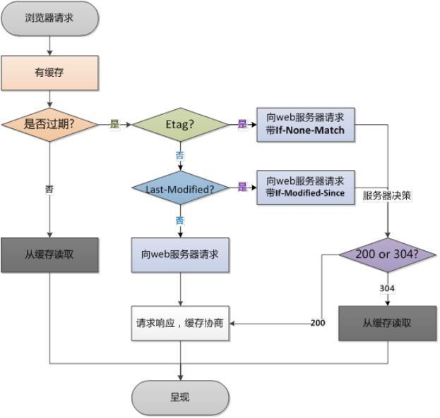

### 选择合适的缓存策略

对于大部分的场景都可以使用强缓存配合协商缓存解决，但是在一些特殊的地
方可能需要选择特殊的缓存策略

- 对于某些不需要缓存的资源，可以使用 Cache-control: no-store ，表示该资源不需要缓存
- 对于频繁变动的资源，可以使用 Cache-Control: no-cache 并配合 ETag 使用，表示该资源已被缓存，但是每次都会发送请求询问资源是否更新。
- 对于代码文件来说，通常使用 Cache-Control: max-age=31536000 并配合策略缓存使用，然后对文件进行指纹处理，一旦文件名变动就会立刻下载新的文件

## 浏览器缓存机制

注意：该知识点属于性能优化领域，并且整一章节都是一个面试题

缓存可以说是性能优化中简单高效的一种优化方式了，它可以显著减少网络传输所带来的损耗。

对于一个数据请求来说，可以分为发起网络请求、后端处理、浏览器响应三个步骤。浏览器缓存可以帮助我们在第一和第三步骤中优化性能。比如说直接使用缓存而不发起请求，或者发起了请求但后端存储的数据和前端一致，那么就没有必要再将数据回传回来，这样就减少了响应数据。

接下来的内容中我们将通过以下几个部分来探讨浏览器缓存机制：

- 缓存位置
- 缓存策略
- 实际场景应用缓存策略

### 1 缓存位置

从缓存位置上来说分为四种，并且各自有优先级，当依次查找缓存且都没有命
中的时候，才会去请求网络

1. Service Worker
2. Memory Cache
3. Disk Cache
4. Push Cache
5. 网络请求

#### 1.Service Worker

service Worker 的缓存与浏览器其他内建的缓存机制不同，它可以让我们自由控制缓存哪些文件、如何匹配缓存、如何读取缓存，并且缓存是持续性的。
当 Service Worker 没有命中缓存的时候，我们需要去调用 fetch 函数获取数据。也就是说，如果我们没有在 Service Worker 命中缓存的话，会根据缓存查找优先级去查找数据。但是不管我们是从 Memory Cache 中还是从网络请求中获取的数据，浏览器都会显示我们是从 Service Worker 中获取的内容。

#### 2.Memory Cache

Memory Cache 也就是内存中的缓存，读取内存中的数据肯定比磁盘快。但是内存缓存虽然读取高效，可是缓存持续性很短，会随着进程的释放而释放。 一旦我们关闭 Tab 页面，内存中的缓存也就被释放了。

当我们访问过页面以后，再次刷新页面，可以发现很多数据都来自于内存缓存

**那么既然内存缓存这么高效，我们是不是能让数据都存放在内存中呢？**

先说结论，这是不可能的。首先计算机中的内存一定比硬盘容量小得多，操作系统需要精打细算内存的使用，所以能让我们使用的内存必然不多。内存中其实可以存储大部分的文件，比如说 JS 、 HTML 、 CSS 、图片等等。

**当然，我通过一些实践和猜测也得出了一些结论：**

对于大文件来说，大概率是不存储在内存中的，反之优先当前系统内存使用率高的话，文件优先存储进硬盘

#### 3.Disk Cache

Disk Cache 也就是存储在硬盘中的缓存，读取速度慢点，但是什么都能存储到磁盘中，比之 Memory Cache 胜在容量和存储时效性上。

在所有浏览器缓存中， Disk Cache 覆盖面基本是最大的。它会根据 ·HTTP Herder· 中的字段判断哪些资源需要缓存，哪些资源可以不请求直接使用，哪些资源已经过期需要重新请求。并且即使在跨站点的情况下，相同地址的资源一旦被硬盘缓存下来，就不会再次去请求数据

#### 4.Push Cache

- Push Cache 是 HTTP/2 中的内容，当以上三种缓存都没有命中时，它才会被使用。并且缓存时间也很短暂，只在会话（ Session ）中存在，一旦会话结束就被释放。
- Push Cache 在国内能够查到的资料很少，也是因为 HTTP/2 在国内不够普及，但是 HTTP/2 将会是⽇后的一个趋势

##### 结论

- 所有的资源都能被推送，但是 Edge 和 Safari 浏览器兼容性不怎么好
- 可以推送 no-cache 和 no-store 的资源
- 一旦连接被关闭， Push Cache 就被释放
- 多个页面可以使用相同的 HTTP/2 连接，也就是说能使用同样的缓存
- Push Cache 中的缓存只能被使用一次
- 浏览器可以拒绝接受已经存在的资源推送
- 你可以给其他域名推送资源

#### 5.网络请求

如果所有缓存都没有命中的话，那么只能发起请求来获取资源了。

那么为了性能上的考虑，大部分的接口都应该选择好缓存策略，接下来我们就来学习缓存策略这部分的内容。

### 2 缓存策略

通常浏览器缓存策略分为两种：强缓存和协商缓存，并且缓存策略都是通过设
置 HTTP Header 来实现的

#### 2.1 强缓存

强缓存可以通过设置两种 HTTP Header 实现： Expires 和 Cache-Control 。强缓存表示在缓存期间不需要请求， state code 为 200

##### Expires

```bash
Expires: Wed, 22 Oct 2018 08:41:00 GMT
```

Expires 是 HTTP/1 的产物，表示资源会在 Wed, 22 Oct 2018 08:41:00 GMT 后过期，需要再次请求。并且 Expires 受限于本地时间，如果修改了本地时间，可能会造成缓存失效。

##### Cache-control

```bash
Cache-control: max-age=30
```

Cache-Control 出现于 HTTP/1.1 ，优先级高于 Expires 。该属性值表示资源会在 30 秒后过期，需要再次请求。

Cache-Control 可以在请求头或者响应头中设置，并且可以组合使用多种指令

可以将多个指令配合起来一起使用，达到多个目的。比如说我们希望资源能被缓存下来，并且是客户端和代理服务器都能缓存，还能设置缓存失效时间等

#### 2.2 协商缓存

- 如果缓存过期了，就需要发起请求验证资源是否有更新。协商缓存可以通过设置两种 HTTP Header 实现： Last-Modified 和 ETag
- 当浏览器发起请求验证资源时，如果资源没有做改变，那么服务端就会返回 304 状态码，并且更新浏览器缓存有效期。

##### Last-Modified 和 If-Modified-Since

Last-Modified 表示本地文件最后修改⽇期， If-Modified-Since 会将 Last-Modified 的值发送给服务器，询问服务器在该⽇期后资源是否有更新，有更新的话就会将新的资源发送回来，否则返回 304 状态码。

但是 Last-Modified 存在一些弊端：

- 如果本地打开缓存文件，即使没有对文件进行修改，但还是会造成 Last-Modified 被修改，服务端不能命中缓存导致发送相同的资源
- 因为 Last-Modified 只能以秒计时，如果在不可感知的时间内修改完成文件，那么服务端会认为资源还是命中了，不会返回正确的资源 因为以上这些弊端，所以在 HTTP / 1.1 出现了 ETag

##### ETag 和 If-None-Match

ETag 类似于文件指纹， If-None-Match 会将当前 ETag 发送给服务器，询问该资源 ETag 是否变动，有变动的话就将新的资源发送回来。并且 ETag 优先级比 Last-Modified 高。

以上就是缓存策略的所有内容了，看到这里，不知道你是否存在这样一个疑问。**如果什么缓存策略都没设置，那么浏览器会怎么处理？**

对于这种情况，浏览器会采用一个启发式的算法，通常会取响应头中的 Date 减去 Last-Modified 值的 10% 作为缓存时间。

### 3 实际场景应用缓存策略

#### 频繁变动的资源

对于频繁变动的资源，首先需要使用 Cache-Control: no-cache 使浏览器每次都请求服务器，然后配合 ETag 或者 Last-Modified 来验证资源是否有效。这样的做法虽然不能节省请求数量，但是能显著减少响应数据大小。

#### 代码文件

这里特指除了 HTML 外的代码文件，因为 HTML 文件一般不缓存或者缓存时
间很短。

一般来说，现在都会使用工具来打包代码，那么我们就可以对文件名进行哈希处理，只有当代码修改后才会生成新的文件名。基于此，我们就可以给代码文件设置缓存有效期一年 Cache-Control: max-age=31536000 ，这样只有当 HTML 文件中引入的文件名发生了改变才会去下载最新的代码文件，否则就一直使用缓存

更多缓存知识详解：http://blog.poetries.top/2019/01/02/browser-cache

## 说一下浏览器缓存

参考回答：

缓存分为两种：强缓存和协商缓存，根据响应的 header 内容来决定。

强缓存相关字段有 expires，cache-control。如果 cache-control 与 expires 同时存在的话，cache-control 的优先级高于 expires。

协商缓存相关字段有 Last-Modified/If-Modified-Since，Etag/If-None-Match

## 介绍一下你对浏览器内核的理解？

- 主要分成两部分：渲染引擎( layout engineer 或 Rendering Engine )和 JS 引擎
- 渲染引擎：负责取得网页的内容（ HTML 、 XML 、图像等等）、整理讯息（例如加入 CSS 等），以及计算网页的显示方式，然后会输出⾄显示器或打印机。浏览器的内核的不同对于网页的语法解释会有不同，所以渲染的效果也不相同。所有网页浏览器、电子邮件客户端以及其它需要编辑、显示网络内容的应用程序都需要内核
- JS 引擎则：解析和执行 javascript 来实现网页的动态效果
- 最开始渲染引擎和 JS 引擎并没有区分的很明确，后来 JS 引擎越来越独立，内核就倾向于只指渲染引擎

## 从浏览器地址栏输入 url 到显示页面的步骤

### 基础版本

- 浏览器根据请求的 URL 交给 DNS 域名解析，找到真实 IP ，向服务器发起请求；
- 服务器交给后台处理完成后返回数据，浏览器接收文件（ HTML、JS、CSS 、图象等）；
- 浏览器对加载到的资源（ HTML、JS、CSS 等）进行语法解析，建立相应的内部数据结构（如 HTML 的 DOM ）；
- 载入解析到的资源文件，渲染页面，完成。

### 详细版

1.在浏览器地址栏输入 URL

2.浏览器查看 缓存 ，如果请求资源在缓存中并且新鲜，跳转到转码步骤

1. 如果资源未缓存，发起新请求

2. 如果已缓存，检验是否足够新鲜，足够新鲜直接提供给客户端，否则与服务器进行验证。
3. 检验新鲜通常有两个 HTTP 头进行控制 Expires 和 Cache-Control ：
   - HTTP1.0 提供 Expires，值为一个绝对时间表示缓存新鲜日期
   - HTTP1.1 增加了 Cache-Control: max-age=,值为以秒为单位的最大新鲜时间

3.浏览器 **解析 URL** 获取协议，主机，端口，path

4.浏览器 **组装一个 HTTP（GET）请求报文**

5.浏览器 **获取主机 ip 地址** ，过程如下：

1. 浏览器缓存
2. 本机缓存
3. hosts 文件
4. 路由器缓存
5. ISP DNS 缓存
6. DNS 递归查询（可能存在负载均衡导致每次 IP 不一样）

6.**打开一个 socket 与目标 IP 地址，端口建立 TCP 链接** ，三次握手如下：

1. 客户端发送一个 TCP 的 **SYN=1，Seq=X** 的包到服务器端口
2. 服务器发回 **SYN=1， ACK=X+1， Seq=Y** 的响应包
3. 客户端发送 **ACK=Y+1， Seq=Z**

7.TCP 链接建立后 **发送 HTTP 请求**

8.服务器接受请求并解析，将请求转发到服务程序，如虚拟主机使用 HTTP Host 头部判断请
求的服务程序

9.服务器检查 **HTTP 请求头是否包含缓存验证信息** 如果验证缓存新鲜，返回 **304** 等对应状态码

10。处理程序读取完整请求并准备 HTTP 响应，可能需要查询数据库等操作

11.服务器将 **响应报文通过 TCP 连接发送回浏览器**

12.浏览器接收 HTTP 响应，然后根据情况选择 **关闭 TCP 连接或者保留重用，关闭 TCP 连接的四次握手如下** ：

1. 主动方发送 **Fin=1， Ack=Z， Seq= X** 报文
2. 被动方发送 **ACK=X+1， Seq=Z** 报文
3. 被动方发送 **Fin=1， ACK=X， Seq=Y** 报文
4. 主动方发送 **ACK=Y， Seq=X** 报文

   13.浏览器检查响应状态吗：是否为 1 XX， 3 XX， 4 XX， 5 XX，这些情况处理与 2 XX 不同

   14.如果资源可缓存， **进行缓存**

   15.对响应进行 **解码** （例如 gzip 压缩）

   16.根据资源类型决定如何处理（假设资源为 HTML 文档）

17**解析 HTML 文档，构件 DOM 树，下载资源，构造 CSSOM 树，执行 js 脚本** ，这些操作没有严
格的先后顺序，以下分别解释

18.**构建 DOM 树** ：

1. **Tokenizing** ：根据 HTML 规范将字符流解析为标记
2. **Lexing** ：词法分析将标记转换为对象并定义属性和规则
3. **DOM construction** ：根据 HTML 标记关系将对象组成 DOM 树

   19.解析过程中遇到图片、样式表、js 文件， **启动下载**

   20.构建 **CSSOM 树** ：

4. **Tokenizing** ：字符流转换为标记流

5. **Node** ：根据标记创建节点
6. **CSSOM** ：节点创建 CSSOM 树

   21.根据 DOM 树和 CSSOM 树构建渲染树 :

7. 从 DOM 树的根节点遍历所有 **可见节点** ，不可见节点包括： 1 ） script ,meta 这样本身不可见的标签。2)被 css 隐藏的节点，如 display: none
8. 对每一个可见节点，找到恰当的 CSSOM 规则并应用
9. 发布可视节点的内容和计算样式

   22.**js 解析如下** ：

10. 浏览器创建 Document 对象并解析 HTML，将解析到的元素和文本节点添加到文档中，此
    时 **document.readystate 为 loading**
11. HTML 解析器遇到 **没有 async 和 defer 的 script 时** ，将他们添加到文档中，然后执行行内
    或外部脚本。这些脚本会同步执行，并且在脚本下载和执行时解析器会暂停。这样就可
    以用 document.write()把文本插入到输入流中。 **同步脚本经常简单定义函数和注册事件
    处理程序，他们可以遍历和操作 script 和他们之前的文档内容**
12. 当解析器遇到设置了 **async** 属性的 script 时，开始下载脚本并继续解析文档。脚本会在它
    **下载完成后尽快执行** ，但是 **解析器不会停下来等它下载** 。异步脚本 **禁止使用
    document.write()** ，它们可以访问自己 script 和之前的文档元素
13. 当文档完成解析，document.readState 变成 interactive
14. 所有 **defer** 脚本会 **按照在文档出现的顺序执行** ，延迟脚本 **能访问完整文档树** ，禁止使用
    document.write()
15. 浏览器 **在 Document 对象上触发 DOMContentLoaded 事件**
16. 此时文档完全解析完成，浏览器可能还在等待如图片等内容加载，等这些 **内容完成载入
    并且所有异步脚本完成载入和执行** ，document.readState 变为 complete，window 触发
    load 事件

    23.**显示页面** （HTML 解析过程中会逐步显示页面）

### 详细简版

1. 从浏览器接收 url 到开启网络请求线程（这一部分可以展开浏览器的机制以及进程与线程
   之间的关系）
2. 开启网络线程到发出一个完整的 HTTP 请求（这一部分涉及到 dns 查询， TCP/IP 请求，
   五层因特网协议栈等知识）
3. 从服务器接收到请求到对应后台接收到请求（这一部分可能涉及到负载均衡，安全拦截以
   及后台内部的处理等等）
4. 后台和前台的 HTTP 交互（这一部分包括 HTTP 头部、响应码、报文结构、 cookie 等知
   识，可以提下静态资源的 cookie 优化，以及编码解码，如 gzip 压缩等）
5. 单独拎出来的缓存问题， HTTP 的缓存（这部分包括 http 缓存头部， ETag ， catch-
   control 等）
6. 浏览器接收到 HTTP 数据包后的解析流程（解析 html -词法分析然后解析成 dom 树、解
   析 css 生成 css 规则树、合并成 render 树，然后 layout 、 painting 渲染、复合图
   层的合成、 GPU 绘制、外链资源的处理、 loaded 和 DOMContentLoaded 等）
7. CSS 的可视化格式模型（元素的渲染规则，如包含块，控制框， BFC ， IFC 等概念）
8. JS 引擎解析过程（ JS 的解释阶段，预处理阶段，执行阶段生成执行上下文， VO，作
   用域链、回收机制等等）
9. 其它（可以拓展不同的知识模块，如跨域，web 安全， hybrid 模式等等内容）

### 版本 4

- 首先浏览器主进程接管，开了一个下载线程。
- 然后进行 HTTP 请求（DNS 查询、IP 寻址等等），中间会有三次捂手，等待响应，开始下载响应报文。
- 将下载完的内容转交给 Renderer 进程管理。
- Renderer 进程开始解析 css rule tree 和 dom tree，这两个过程是并行的，所以一般我会把 link 标签放在页面顶部。
- 解析绘制过程中，当浏览器遇到 link 标签或者 script、img 等标签，浏览器会去下载这些内容，遇到时候缓存的使用缓存，不适用缓存的重新下载资源。
- css rule tree 和 dom tree 生成完了之后，开始合成 render tree，这个时候浏览器会进行 layout，开始计算每一个节点的位置，然后进行绘制。
- 绘制结束后，关闭 TCP 连接，过程有四次挥手

### 版本 5

- DNS 解析
- TCP 三次握手
- 发送请求，分析 url ，设置请求报文(头，主体)
- 服务器返回请求的文件 ( html )
- 浏览器渲染
  - HTML parser --> DOM Tree
  - 标记化算法，进行元素状态的标记
  - dom 树构建
- CSS parser --> Style Tree
  - 解析 css 代码，生成样式树
- attachment --> Render Tree
  - 结合 dom 树 与 style 树，生成渲染树
- layout : 布局
  - GPU painting : 像素绘制页面

## 浏览器渲染机制

### 什么是 DOCTYPE 及作用

DTD (document type definition，文档类型定义) 是一系列的语法规则，用来定义 XML 或(X)HTML 的文件类型。浏览器会使用它来判断文档类型，决定使用何种协议来解析以及切换浏览器模式

DOCTYPE 是用来声明文档类型和 DTD 规范的，一个主要的用途便是文件的合法性验证如果文件代码不合法，那么浏览器解析时便会出一些差错

#### 常见的 DOCTYPE 和作用

##### HTML5

```html
<!DOCTYPE html>
```

##### HTML 4.01 Strict(严格模式)

该 DTD 包含所有 HTML 元素和属性，但不包括展示性的和弃用的元素 (比如 font)

```html
<!DOCTYPE html PUBLIC"-/W3C//DTD HTML 4.01//EN""http://www.w3.org/TR/html4/strict.dtd">
```

##### HTML 4.01 Transitional(传统模式)

该 DTD 包含所有 HTML 元素和属性，包括展示性的和弃用的元素(比如 font)

```html
<!DOCTYPE html PUBLIC"-/W3C//DTD HTML 4.01 Transitional//EN""http://www.w3.org/TR/html4/loose.dtd">
```

### 浏览器渲染过程


#### DOM Tree(DOM 树)

.jpg)

#### CSSOM Tree


#### Render Tree


### 重排 Reflow

#### 定义

DOM 结构中的各个元素都有自己的盒子 (模型)，这些都需要浏览器根据各种样式来计算，并根据计算结果将元素

放到它该出现的位置，这个过程称之为 reflow

#### 触发 Reflow

- 当你增加、删除、修改 DOM 结点时，会导致 Reflow 或 Repaint
- 当你移动 DOM 的位置，或是搞个动画的时候
- 当你修改 CSS 样式的时候
- 当你 Resize 窗口的时候 (移动端没有这个问题)或是滚动的时候
- 当你修改网页的默认字体时

### 重绘 Repaint

#### 定义

当各种盒子的位置、大小以及其他属性，例如颜色、字体大小等都确定下来后，浏览器于是便把这些元素都按照各自的特性绘制了一遍，于是页面的内容出现了，这个过程称之为 repaint

#### 触发 Repaint

DOM 改动

CSS 改动

### 布局 Layout

## 浏览器渲染原理

注意：该章节都是一个面试题。

### 1.1 渲染过程

#### 1.浏览器接收到 HTML 文件并转换为 DOM 树

当我们打开一个网页时，浏览器都会去请求对应的 HTML 文件。虽然平时我们写代码时都会分为 JS 、 CSS 、 HTML 文件，也就是字符串，但是计算机硬件是不理解这些字符串的，所以在网络中传输的内容其实都是 0 和 1 这些字节数据。当浏览器接收到这些字节数据以后，它会将这些字节数据转换为字符串，也就是我们写的代码。

当数据转换为字符串以后，浏览器会先将这些字符串通过词法分析转换为标记
（ token ），这一过程在词法分析中叫做标记化（ tokenization ）

那么什么是标记呢？这其实属于编译原理这一块的内容了。简单来说，标记还
是字符串，是构成代码的最小单位。这一过程会将代码分拆成一块块，并给这
些内容打上标记，便于理解这些最小单位的代码是什么意思

当结束标记化后，这些标记会紧接着转换为 Node ，最后这些 Node 会根据
不同 Node 之前的联系构建为一颗 DOM 树

以上就是浏览器从网络中接收到 HTML 文件然后一系列的转换过程

当然，在解析 HTML 文件的时候，浏览器还会遇到 CSS 和 JS 文件，这时候浏览器也会去下载并解析这些文件，接下来就让我们先来学习浏览器如何解
析 CSS 文件

#### 2.将 CSS 文件转换为 CSSOM 树

其实转换 CSS 到 CSSOM 树的过程和上一小节的过程是极其类似的

在这一过程中，浏览器会确定下每一个节点的样式到底是什么，并且这一过程其实是很消耗资源的。因为样式你可以自行设置给某个节点，也可以通过继承获得。在这一过程中，浏览器得递归 CSSOM 树，然后确定具体的元素到底是什么样式。

如果你有点不理解为什么会消耗资源的话，我这里举个例子

```html
<div>
	<a> <span></span> </a>
</div>
<style>
	span {
		color: red;
	}
	div > a > span {
		color: red;
	}
</style>
```

对于第一种设置样式的方式来说，浏览器只需要找到页面中所有的 span 标签然后设置颜⾊，但是对于第二种设置样式的方式来说，浏览器首先需要找到所有的 span 标签，然后找到 span 标签上的 a 标签，最后再去找到 div 标签，然后给符合这种条件的 span 标签设置颜⾊，这样的递归过程就很复杂。所以我们应该尽可能的避免写过于具体的 CSS 选择器，然后对于 HTML 来说也尽量少的添加无意义标签，保证层级扁平

#### 3.生成渲染树

当我们生成 DOM 树和 CSSOM 树以后，就需要将这两棵树组合为渲染树

在这一过程中，不是简单的将两者合并就行了。渲染树只会包括需要显示的节点和这些节点的样式信息，如果某个节点是 display: none 的，那么就不会在渲染树中显示。当浏览器生成渲染树以后，就会根据渲染树来进行布局（也可以叫做回流），然后调用 GPU 绘制，合成图层，显示在屏幕上。对于这一部分的内容因为过于底层，还涉及到了硬件相关的知识，这里就不再继续展开内容了。

### 2 为什么操作 DOM 慢

**想必大家都听过操作 DOM 性能很差，但是这其中的原因是什么呢？**

因为 DOM 是属于渲染引擎中的东⻄，而 JS ⼜是 JS 引擎中的东⻄。当我们通过 JS 操作 DOM 的时候，其实这个操作涉及到了两个线程之间的通信，那么势必会带来一些性能上的损耗。操作 DOM 次数一多，也就等同于一直在进行线程之间的通信，并且操作 DOM 可能还会带来重绘回流的情况，所以也就导致了性能上的问题。

#### 经典面试题：插入几万个 DOM，如何实现页面不卡顿？

对于这道题目来说，首先我们肯定不能一次性把几万个 DOM 全部插入，这样肯定会造成卡顿，所以解决问题的重点应该是如何分批次部分渲染 DOM 。大部分⼈应该可以想到通过 requestAnimationFrame 的方式去循环的插入 DOM ，其实还有种方式去解决这个问题：虚拟滚动（ virtualized scroller ）。

这种技术的原理就是只渲染可视区域内的内容，非可见区域的那就完全不渲染了，当用户在滚动的时候就实时去替换渲染的内容

从上图中我们可以发现，即使列表很长，但是渲染的 DOM 元素永远只有那么
几个，当我们滚动页面的时候就会实时去更新 DOM ，这个技术就能顺利解决
这道经典面试题。

### 3 什么情况阻塞渲染

- 首先渲染的前提是生成渲染树，所以 HTML 和 CSS 肯定会阻塞渲染。如果你想渲染的越快，你越应该降低一开始需要渲染的文件大小，并且扁平层级，优化选择器。
- 然后当浏览器在解析到 script 标签时，会暂停构建 DOM ，完成后才会从暂停的地方重新开始。也就是说，如果你想首屏渲染的越快，就越不应该在首屏就加载 JS 文件，这也是都建议将 script 标签放在 body 标签底部的原因。
- 当然在当下，并不是说 script 标签必须放在底部，因为你可以给 script 标签添加 defer 或者 async 属性。
- 当 script 标签加上 defer 属性以后，表示该 JS 文件会并行下载，但是会放到 HTML 解析完成后顺序执行，所以对于这种情况你可以把 script 标签放在任意位置。
- 对于没有任何依赖的 JS 文件可以加上 async 属性，表示 JS 文件下载和解析不会阻塞渲染。

### 4 重绘（Repaint）和回流（Reflow）

当元素的样式发生变化时，浏览器需要触发更新，重新绘制元素。这个过程
中，有两种类型的操作，即重绘与回流。

- 重绘(repaint): 当元素样式的改变不影响布局时，浏览器将使用重绘对元素进行更新，此时由于只需要 UI 层面的重新像素绘制，因此 损耗较少
- 回流(reflow): 当元素的尺⼨、结构或触发某些属性时，浏览器会重新渲染页面，称为回流。此时，浏览器需要重新经过计算，计算后还需要重新页面布局，因此是较重的操作。会触发回流的操作:
  - 页面初次渲染
  - 浏览器窗口大小改变
  - 元素尺⼨、位置、内容发生改变
  - 元素字体大小变化
  - 添加或者删除可见的 dom 元素
  - 激活 CSS 伪类（例如： :hover ）
  - 查询某些属性或调用某些方法
    - clientWidth、clientHeight、clientTop、clientLeft
    - offsetWidth、offsetHeight、offsetTop、offsetLeft
    - scrollWidth、scrollHeight、scrollTop、scrollLeft
    - getComputedStyle()
    - getBoundingClientRect()
    - scrollTo()

**回流必定触发重绘，重绘不一定触发回流。重绘的开销较小，回流的代价较高。**

重绘和回流会在我们设置节点样式时频繁出现，同时也会很大程度上影响性能。

- 重绘是当节点需要更改外观而不会影响布局的，比如改变 color 就叫称为重绘
- 回流是布局或者几何属性需要改变就称为回流。
- 回流必定会发生重绘，重绘不一定会引发回流。回流所需的成本比重绘高的多，改变父节点里的子节点很可能会导致父节点的一系列回流。

以下几个动作可能会导致性能问题：

- 改变 window 大小
- 改变字体
- 添加或删除样式
- 文字改变
- 定位或者浮动
- 盒模型

并且很多⼈不知道的是，重绘和回流其实也和 Eventloop 有关。

- 当 Eventloop 执行完 Microtasks 后，会判断 document 是否需要更新，因为浏览器是 60Hz 的刷新率，每 16.6ms 才会更新一次。
- 然后判断是否有 resize 或者 scroll 事件，有的话会去触发事件，所以 resize 和
  scroll 事件也是⾄少 16ms 才会触发一次，并且自带节流功能。
- 判断是否触发了 media query
- 更新动画并且发送事件
- 判断是否有全屏操作事件
- 执行 requestAnimationFrame 回调
- 执行 IntersectionObserver 回调，该方法用于判断元素是否可见，可以用于懒加载上，但是兼容性不好 更新界面
- 以上就是一帧中可能会做的事情。如果在一帧中有空闲时间，就会去执行
  requestIdleCallback 回调

### 5 减少重绘和回流

1.使用 transform 替代 top

```html
<div class="test"></div>
<style>
	.test {
		position: absolute;
		top: 10px;
		width: 100px;
		height: 100px;
		background: red;
	}
</style>
<script>
	setTimeout(() => {
		// 引起回流
		document.querySelector(".test").style.top = "100px";
	}, 1000);
</script>
```

2.使用 visibility 替换 display: none ，因为前者只会引起重绘，后者会引发回流（改变了布局）

3.不要把节点的属性值放在一个循环里当成循环里的变量

```js
for (let i = 0; i < 1000; i++) {
	// 获取 offsetTop 会导致回流，因为需要去获取正确的值
	console.log(document.querySelector(".test").style.offsetTop);
}
```

4.不要使用 table 布局，可能很小的一个小改动会造成整个 table 的重新布局

5.动画实现的速度的选择，动画速度越快，回流次数越多，也可以选择使用
requestAnimationFrame

6.CSS 选择符从右往左匹配查找，避免节点层级过多

7.将频繁重绘或者回流的节点设置为图层，图层能够阻止该节点的渲染行为影响别的节点。比如对于 video 标签来说，浏览器会自动将该节点变为图层。

设置节点为图层的方式有很多，我们可以通过以下几个常用属性可以生成新图层

- will-change
- video 、 iframe 标签

#### 最佳实践

##### css

- 避免使用 table 布局
- 将动画效果应用到 position 属性为 absolute 或 fixed 的元素上

##### javascript

- 避免频繁操作样式，可汇总后统一 一次修改
- 尽量使用 class 进行样式修改
- 减少 dom 的增删次数，可使用 字符串 或者 documentFragment 一次性插入
- 极限优化时，修改样式可将其 display: none 后修改
- 避免多次触发上面提到的那些会触发回流的方法，可以的话尽量用 变量存住

## 浏览器性能问题

重绘（Repaint）和回流（Reflow）

- 重绘和回流是渲染步骤中的一小节，但是这两个步骤对于性能影响很大。
- 重绘是当节点需要更改外观而不会影响布局的，比如改变 color 就叫称为重绘
- 回流是布局或者几何属性需要改变就称为回流。
- 回流必定会发生重绘，重绘不一定会引发回流。回流所需的成本比重绘高的多，改变深层次的节点很可能导致父节点的一系列回流。

### 所以以下几个动作可能会导致性能问题：

- 改变 window 大小
- 改变字体
- 添加或删除样式
- 文字改变
- 定位或者浮动
- 盒模型

### 很多⼈不知道的是，重绘和回流其实和 Event loop 有关。

- 当 Event loop 执行完 Microtasks 后，会判断 document 是否需要更新。- 因为浏览器是 60Hz 的刷新率，每 16ms 才会更新一次。
- 然后判断是否有 resize 或者 scroll ，有的话会去触发事件，所以 resize 和 scroll 事件也是⾄少 16ms 才会触发一次，并且自带节流功能。
- 判断是否触发了 media query
- 更新动画并且发送事件
- 判断是否有全屏操作事件
- 执行 requestAnimationFrame 回调
- 执行 IntersectionObserver 回调，该方法用于判断元素是否可见，可以用于懒加载上，但是兼容性不好
- 更新界面
- 以上就是一帧中可能会做的事情。如果在一帧中有空闲时间，就会去执行 requestIdleCallback 回调。

### 减少重绘和回流

使用 translate 替代 top

```html
<div class="test"></div>
<style>
	.test {
		position: absolute;
		top: 10px;
		width: 100px;
		height: 100px;
		background: red;
	}
</style>
<script>
	setTimeout(() => {
		// 引起回流
		document.querySelector(".test").style.top = "100px";
	}, 1000);
</script>
```

使用 visibility 替换 display: none ，因为前者只会引起重绘，后者会引发回流
（改变了布局）

把 DOM 离线后修改，比如：先把 DOM 给 display:none (有一次 Reflow )，然后你修改 100 次，然后再把它显示出来

不要把 DOM 结点的属性值放在一个循环里当成循环里的变量

```js
for (let i = 0; i < 1000; i++) {
	// 获取 offsetTop 会导致回流，因为需要去获取正确的值
	console.log(document.querySelector(".test").style.offsetTop);
}
```

不要使用 table 布局，可能很小的一个小改动会造成整个 table 的重新布局 动画实现的速度的选择，动画速度越快，回流次数越多，也可以选择使用 requestAnimationFrame

CSS 选择符从右往左匹配查找，避免 DOM 深度过深

将频繁运行的动画变为图层，图层能够阻止该节点回流影响别的元素。比如对于 video 标签，浏览器会自动将该节点变为图层。

### CDN

静态资源尽量使用 CDN 加载，由于浏览器对于单个域名有并发请求上限，可
以考虑使用多个 CDN 域名。对于 CDN 加载静态资源需要注意 CDN 域名要
与主站不同，否则每次请求都会带上主站的 Cookie

### 使用 Webpack 优化项目

- 对于 Webpack4 ，打包项目使用 production 模式，这样会自动开启代码压缩
- 使用 ES6 模块来开启 tree shaking ，这个技术可以移除没有使用的代码
- 优化图片，对于小图可以使用 base64 的方式写入文件中
- 按照路由拆分代码，实现按需加载
