# JavaScript 基础面试题

### 说一下 JS 原生事件如何绑定

答：JS 原生绑定事件主要为三种：

- 一是 html 事件处理程序
- 二是 DOM0 级事件处理程序
- 三是 DOM2 级事件处理程序

其中：html 事件现在早已不用了，就是在 html 各种标签上直接添加事件，类似于 css 的行内样式，缺点是不好维护，因为散落在标签中,也就是耦合<\/?[a-z]+[1-6]?\b[^>]*>度太高

例如：`<button onclick="事件处理函数">点我</button>`

第二类是 DOM0 级事件，目前在 PC 端用的还是比较多的绑定事件方式，兼容性也好，主要是先获取 dom 元素，然后直接给 dom 元素添加事件

例如：

```js
var btn = document.getElementById(‘id元素’)
btn.onclick = function() {
 // 要处理的事件逻辑
}
```

DOM0 事件如何移除呢？很简单：`btn.onclick=null;`置为空就行

优点：兼容性好

缺点：只支持冒泡，不支持捕获

第三类是 DOM2 级事件，移动端用的比较多，也有很多优点，提供了专门的绑定和移除方法

例如：

```js
var btn=document.getElementById(‘id元素’)
// 绑定事件
btn.addEventListener(‘click’,绑定的事件处理函数名,false)
// 移除事件
btn.removeEventListener(‘click’,要移除的事件处理函数名，false)
```

优点：支持给个元素绑定多个相同事件，支持冒泡和捕获事件机制

### 说一下 JS 原生常用 dom 操作方法？

答：js 原生 dom 操作方法有？

查找：getElementByid,

getElementsByTagName,

querySelector,

querySelectorAll

插入：appendChild,insertBefore

删除：removeChild

克隆：cloneNode

设置和获取属性：setAttribute(“属性名”,”值”),getAttibute(“属性名”)

### 说一下 ES6 新增特性?

答：ES6 新增特性常用的主要有：let/const,箭头函数，模板字符串，解构赋值，模块的导入(import)和导出(export default/export),Promise,还有一些数组字符串的新方法,其实有很多，我平时常用的就这些**(了解)JS 设计模式有哪些(单例模式[观察者模式](https://www.zhihu.com/search?q=观察者模式&search_source=Entity&hybrid_search_source=Entity&hybrid_search_extra={"sourceType"%3A"answer"%2C"sourceId"%3A2603050043})等)**

答：JS 设计模式有很多，但我知道的有单例模式，观察者模式

单例模式：就是保证一个类只有一个实例，实现的方法一般是先判断实例存在与否，如果存在直接返回，如果不存在就创建了再返回，这就确保了一个类只有一个实例对象。在 JavaScript 里，单例作为一个命名空间提供者，从全局命名空间里提供一个唯一的访问点来访问该对象。

观察者模式: 观察者的使用场合就是：当一个对象的改变需要同时改变其它对象，并且它不知道具体有多少对象需要改变的时候，就应该考虑使用观察者模式。

总的来说，观察者模式所做的工作就是在解耦，让耦合的双方都依赖于抽象，而不是依赖于具体。从而使得各自的变化都不会影响到另一边的变化

### 说一下你对 JS 面试对象的理解

答：JS 面向对象主要基于 function 来实现的，通过 function 来模拟类，通过 prototype 来实现类方法的共享，跟其他语言有着本质的不同，自从有了 ES6 后，把面向对象类的实现更像后端语言的实现了，通过 class 来定义类，通过 extends 来继承父类，其实 ES6 类的实现本质上是一个语法糖，不过对于开发简单了好多。

### 说一下 JS 数组常用方法（至少 6 个）

答：在开发中，数组使用频率很频繁，JS 数组常用方法

有:push,pop,unshift,shift,splice,join,concat,forEach,filter,map,sort,some,every 好多，不过都是平时开发中很常用的方法,大家可以补充一点儿 es6 的

### 说一下 JS 数组内置遍历方法有哪些和区别

答：JS 数组内置遍历（遍历就是循环的意思）方法主要有：
**forEach:**这个方法是为了取代 for 循环遍历数组的，返回值为 undefined 例如：
let arrInfo=[4,6,6,8,5,7,87]
arrInfo.forEach((item,index,arr)=>{
//遍历逻辑
})
其中：
item 代码遍历的每一项,
index:代表遍历的每项的索引，
arr 代表数组本身
**filter:**是一个过滤遍历的方法，如果返回条件为 true，则返回满足条件为 true 的新数组
let arrInfo=[4,16,6,8,45,7,87]
let resultArr=arrInfo.filter((item,index,arr)=>{
//例如返回数组每项值大于 9 的数组
return item>9
})
**map:**这个 map 方法主要对数组的复杂逻辑处理时用的多，特别是 react 中遍历数据，也经常用到，写法和 forEach 类似
**some:**这个 some 方法用于只要数组中至少存在一个满足条件的结果，返回值就为 true,否则返回 fasel, 写法和 forEach 类似
**every:**这个 every 方法用于数组中每一项都得满足条件时，才返回 true，否则返回 false, 写法和 forEach 类似

### 说一下 JS 作用域和作用域链

答：JS 作用域也就是 JS 识别变量的范围，作用域链也就是 JS 查找变量的顺序
先说作用域，JS 作用域主要包括全局作用域、局部作用域和 ES6 的块级作用域
全局作用域：也就是定义在 window 下的变量范围，在任何地方都可以访问，
局部作用域：是只在函数内部定义的变量范围
块级作用域：简单来说用 let 和 const 在任意的代码块中定义的变量都认为是块级作用域中的变量，例如在 for 循环中用 let 定义的变量，在 if 语句中用 let 定义的变量等等
注：尽量不要使用全局变量，因为容易导致全局的污染，命名冲突，对 bug 查找不利。
2️ 而所谓的作用域链就是由最内部的作用域往最外部,查找变量的过程.形成的链条就是作用域链

### 说一下从输入 URL 到页面加载完中间发生了什么？

答：大致过程是这样的：DNS 解析 TCP 连接发送 HTTP 请求服务器处理请求并返回需要的数据浏览器解析渲染页面连接结束输入了一个域名,域名要通过 DNS 解析找到这个域名对应的服务器地址(ip),通过 TCP 请求链接服务,通过 WEB 服务器(apache)返回数据,浏览器根据返回数据构建 DOM 树,通过 css 渲染引擎及 js 解析引擎将页面渲染出来,关闭 tcp 连接

### 说一下 JS 事件代理（也称事件委托）是什么，及实现原理？

答：JS 事件代理就是通过给父级元素（例如：ul）绑定事件，不给子级元素(例如：li)绑定事件，然后当点击子级元素时，通过事件冒泡机制在其绑定的父元素上触发事件处理函数，主要目的是为了提升性能，因为我不用给每个子级元素绑定事件，只给父级元素绑定一次就好了,在原生 js 里面是通过 event 对象的 targe 属性实现

```js
var ul = document.querySelector("ul");
ul.onclick = function(e){ // e指event,事件对象
    // target获取触发事件的目标(li)
    var target = e.target || e.srcElement;
    // 目标(li)节点名转小写字母，不转的话是大写字母
    if(target.nodeName.toLowerCase() == 'li'){
    	alert(target.[inne](https://www.zhihu.com/search?q=inne&search_source=Entity&hybrid_search_source=Entity&hybrid_search_extra={"sourceType"%3A"answer"%2C"sourceId"%3A2603050043})rHTML)
    }
}
```

jq 方式实现相对而言简单 $(“ul”).on(“click”,“li”,function(){//事件逻辑}) 其中第二个参数指的是触发事件的具体目标，**特别是给动态添加的元素绑定事件，这个特别起作用**

如果一个节点中的子节点是动态生成的，那么子节点需要注册事件的话应该注
册在父节点上

```html
<ul id="ul">
	<li>1</li>
	<li>2</li>
	<li>3</li>
	<li>4</li>
	<li>5</li>
</ul>
<script>
	let ul = document.querySelector("#ul");
	ul.addEventListener("click", (event) => {
		console.log(event.target);
	});
</script>
```

事件代理的方式相对于直接给目标注册事件来说，有以下优点

- 节省内存
- 不需要给子节点注销事件

### 请解释什么是事件代理

- 事件代理（ Event Delegation ），⼜称之为事件委托。是 JavaScript 中常用绑定事件的常用技巧。顾名思义，“事件代理”即是把原本需要绑定的事件委托给父元素，让父元素担当事件监听的职务。事件代理的原理是 DOM 元素的事件冒泡。使用事件代理的好处是：可以提高性能
- 可以大量节省内存占用，减少事件注册，比如在 table 上代理所有 td 的 click 事件就非常棒
- 可以实现当新增子对象时无需再次对其绑定

### 说一下 JS 数据类型有哪些？

答：JS 数据类型有：

基本数据类型：number,string,Boolean,null,undefined,symbol（ES6 新增）
复合类型：Object,function

### 说一下 call,apply,bind 区别

答：call,apply,bind 主要作用都是改变 this 指向的，但使用上略有区别

说一下区别：call 和 apply 的主要区别是在传递参数上不同，**call 后面传递的参数是以逗号的形式分开的，apply 传递的参数是数组形式 [Apply 是以 A 开头的,所以应该是跟 Array(数组)形式的参数]**

bind 返回的是一个函数形式，如果要执行，则后面要再加一个小括号 例如：


bind(obj,参数 1,参数 2,)(),bind 只能以逗号分隔形式，不能是数组形式

## JavaScript

#### 1、get 请求传参长度的误区

::: details 查看参考回答

误区：我们经常说 get 请求参数的大小存在限制，而 post 请求的参数大小是无限制的。

实际上 HTTP 协议从未规定 GET/POST 的请求长度限制是多少。对 get 请求参数的限制是来源与浏览器或 web 服务器，浏览器或 web 服务器限制了 url 的长度。为了明确这个概念，我们必须再次强调下面几点:

- HTTP 协议 未规定 GET 和 POST 的长度限制
- GET 的最大长度显示是因为 浏览器和 web 服务器限制了 URI 的长度
- 不同的浏览器和 WEB 服务器，限制的最大长度不一样
- 要支持 IE，则最大长度为 2083byte，若只支持 Chrome，则最大长度 8182byte

:::

#### 2、补充 get 和 post 请求在缓存方面的区别

::: details 查看参考回答

post/get 的请求区别，具体不再赘述。

补充补充一个 get 和 post 在缓存方面的区别：

get 请求类似于查找的过程，用户获取数据，可以不用每次都与数据库连接，所以可以使用缓存。

post 不同，post 做的一般是修改和删除的工作，所以必须与数据库交互，所以不能使用缓存。因此 get 请求适合于请求缓存。

:::

#### 3、说一下闭包

::: details 查看参考回答

一句话可以概括：闭包就是能够读取其他函数内部变量的函数，或者子函数在外调用，子函数所在的父函数的作用域不会被释放。

:::

#### 4、说一下类的创建和继承

::: details 查看参考回答

##### （1）类的创建（es5）：new 一个 function，在这个 function 的 prototype 里面增加属性和方法

下面来创建一个 Animal 类：

```js
// 定义一个动物类
function Animal(name) {
	// 属性
	this.name = name || "Animal";
	// 实例方法
	this.sleep = function () {
		console.log(this.name + "正在睡觉！");
	};
}
// 原型方法
Animal.prototype.eat = function (food) {
	console.log(this.name + "正在吃：" + food);
};
```

这样就生成了一个 Animal 类，实力化生成对象后，有方法和属性。

##### （2）类的继承——原型链继承--原型链继承

```js
function Cat() {}

Cat.prototype = new Animal();
Cat.prototype.name = "cat";
// Test Code
var cat = new Cat();
console.log(cat.name);
console.log(cat.eat("fish"));
console.log(cat.sleep());
console.log(cat instanceof Animal); //true
console.log(cat instanceof Cat); //true
```

介绍：在这里我们可以看到 new 了一个空对象,这个空对象指向 Animal 并且 Cat.prototype 指向了这个空对象，这种就是基于原型链的继承。

特点：基于原型链，既是父类的实例，也是子类的实例

缺点：无法实现多继承

##### （3）构造继承：使用父类的构造函数来增强子类实例，等于是复制父类的实例属性给子类（没用到原型）

```js
function Cat(name) {
	Animal.call(this);
	this.name = name || "Tom";
}
// Test Code
var cat = new Cat();
console.log(cat.name);
console.log(cat.sleep());
console.log(cat instanceof Animal); // false
console.log(cat instanceof Cat); // true
```

特点：可以实现多继承

缺点：只能继承父类实例的属性和方法，不能继承原型上的属性和方法。

##### （4）实例继承和拷贝继承

实例继承：为父类实例添加新特性，作为子类实例返回
拷贝继承：拷贝父类元素上的属性和方法
上述两个实用性不强，不一一举例。

##### （5）组合继承：相当于构造继承和原型链继承的组合体。通过调用父类构造，继承父类的属

性并保留传参的优点，然后通过将父类实例作为子类原型，实现函数复用

```js
function Cat(name) {
	Animal.call(this);
	this.name = name || "Tom";
}
Cat.prototype = new Animal();
Cat.prototype.constructor = Cat;
// Test Code
var cat = new Cat();
console.log(cat.name);
console.log(cat.sleep());
console.log(cat instanceof Animal); // true
console.log(cat instanceof Cat); // true
```

特点：可以继承实例属性/方法，也可以继承原型属性/方法

缺点：调用了两次父类构造函数，生成了两份实例

##### （6）寄生组合继承：通过寄生方式，砍掉父类的实例属性，这样，在调用两次父类的构造的时候，就不会初始化两次实例方法/属性

较为推荐

```js
function Cat(name) {
	Animal.call(this);
	this.name = name || "Tom";
}
(function () {
	// 创建一个没有实例方法的类
	var Super = function () {};
	Super.prototype = Animal.prototype;
	//将实例作为子类的原型
	Cat.prototype = new Super();
})();
// Test Code
var cat = new Cat();
console.log(cat.name);
console.log(cat.sleep());
console.log(cat instanceof Animal); // true
console.log(cat instanceof Cat); //true
```

:::

#### 5、如何解决异步回调地狱

::: details 查看参考回答

promise、generator、async/await

:::

#### 6、说说前端中的事件流

::: details 查看参考回答
HTML 中与 javascript 交互是通过事件驱动来实现的，例如鼠标点击事件 onclick、页面的滚动事件 onscroll 等等，可以向文档或者文档中的元素添加事件侦听器来预订事件。想要知道这些事件是在什么时候进行调用的，就需要了解一下“事件流”的概念。什么是事件流：事件流描述的是从页面中接收事件的顺序,DOM2 级事件流包括下面几个阶段。

- 事件捕获阶段
- 处于目标阶段
- 事件冒泡阶段

addEventListener：addEventListener 是 DOM2 级事件新增的指定事件处理程序的操作，这个方法接收 3 个参数：要处理的事件名、作为事件处理程序的函数和一个布尔值。最后这个布尔值参数如果是 true，表示在捕获阶段调用事件处理程序；如果是 false，表示在冒泡阶段调用事件处理程序。

IE 只支持事件冒泡。

:::

#### 7、如何让事件先冒泡后捕获

::: details 查看参考回答

在 DOM 标准事件模型中，是先捕获后冒泡。但是如果要实现先冒泡后捕获的效果，对于同一个事件，监听捕获和冒泡，分别对应相应的处理函数，监听到捕获事件，先暂缓执行，直到冒泡事件被捕获后再执行捕获之间。

:::

#### 8、说一下事件委托

::: details 查看参考回答

简介：事件委托指的是，不在事件的发生地（直接 dom）上设置监听函数，而是在其父元素上设置监听函数，通过事件冒泡，父元素可以监听到子元素上事件的触发，通过判断事件发生元素 DOM 的类型，来做出不同的响应。

举例：最经典的就是 ul 和 li 标签的事件监听，比如我们在添加事件时候，采用事件委托机制，不会在 li 标签上直接添加，而是在 ul 父元素上添加。

好处：比较合适动态元素的绑定，新添加的子元素也会有监听函数，也可以有事件触发机制。

:::

#### 9、说一下图片的懒加载和预加载

::: details 查看参考回答

预加载：提前加载图片，当用户需要查看时可直接从本地缓存中渲染。

懒加载：懒加载的主要目的是作为服务器前端的优化，减少请求数或延迟请求数。

两种技术的本质：两者的行为是相反的，一个是提前加载，一个是迟缓甚至不加载。

懒加载对服务器前端有一定的缓解压力作用，预加载则会增加服务器前端压力。

:::

#### 10、mouseover 和 mouseenter 的区别

::: details 查看参考回答

mouseover：当鼠标移入元素或其子元素都会触发事件，所以有一个重复触发，冒泡的过程。

对应的移除事件是 mouseout

mouseenter：当鼠标移除元素本身（不包含元素的子元素）会触发事件，也就是不会冒泡。

对应的移除事件是 mouseleave

:::

#### 11、js 的 new 操作符做了哪些事情

::: details 查看参考回答

new 操作符新建了一个空对象，这个对象原型指向构造函数的 prototype，执行构造函数后返回这个对象。

:::

#### 12、改变函数内部 this 指针的指向函数（bind，apply，call 的区别）

::: details 查看参考回答

通过 apply 和 call 改变函数的 this 指向，他们两个函数的第一个参数都是一样的表示要改变指向的那个对象，第二个参数，apply 是数组，而 call 则是 arg1,arg2、..这种形式。

通过 bind 改变 this 作用域会返回一个新的函数，这个函数不会马上执行。

:::

#### 13、js 的各种位置，比如 clientHeight,scrollHeight,offsetHeight ,以及 scrollTop, offsetTop,clientTop 的区别？

::: details 查看参考回答

clientHeight：表示的是可视区域的高度，不包含 border 和滚动条

offsetHeight：表示可视区域的高度，包含了 border 和滚动条

scrollHeight：表示了所有区域的高度，包含了因为滚动被隐藏的部分。

clientTop：表示边框 border 的厚度，在未指定的情况下一般为 0

scrollTop：滚动后被隐藏的高度，获取对象相对于由 offsetParent 属性指定的父坐标(css 定位的元素或 body 元素)距离顶端的高度。

:::

#### 14、js 拖拽功能的实现

::: details 查看参考回答

首先是三个事件，分别是 mousedown，mousemove，mouseup

当鼠标点击按下的时候，需要一个 tag 标识此时已经按下，可以执行 mousemove 里面的具体方法。

clientX，clientY 标识的是鼠标的坐标，分别标识横坐标和纵坐标，并且我们用 offsetX 和 offsetY 来表示元素的元素的初始坐标，移动的举例应该是：

- 鼠标移动时候的坐标-鼠标按下去时候的坐标。

也就是说定位信息为：

- 鼠标移动时候的坐标-鼠标按下去时候的坐标+元素初始情况下的 offetLeft. 还有一点也是原理性的东西，也就是拖拽的同时是绝对定位，我们改变的是绝对定位条件下的 left 以及 top 等等值。

补充：也可以通过 html5 的拖放（Drag 和 drop）来实现

:::

#### 15、异步加载 js 的方法

::: details 查看参考回答

defer：只支持 IE 如果您的脚本不会改变文档的内容，可将 defer 属性加入到`<script>`标签中，以便加快处理文档的速度。因为浏览器知道它将能够安全地读取文档的剩余部分而不用执行脚本，它将推迟对脚本的解释，直到文档已经显示给用户为止。

async，HTML5 属性仅适用于外部脚本，并且如果在 IE 中，同时存在 defer 和 async，那么 defer 的优先级比较高，脚本将在页面完成时执行。

创建 script 标签，插入到 DOM 中

:::

#### 16、Ajax 解决浏览器缓存问题

::: details 查看参考回答

- 在 ajax 发送请求前加上 anyAjaxObj.setRequestHeader("If-Modified-Since","0")。
- 在 ajax 发送请求前加上 anyAjaxObj.setRequestHeader("Cache-Control","no-cache")。
- 在 URL 后面加上一个随机数： "fresh=" + Math.random()。
- 在 URL 后面加上时间搓："nowtime=" + new Date().getTime()。

如果是使用 jQuery，直接这样就可以了 $.ajaxSetup({cache:false})。这样页面的所有
ajax 都会执行这条语句就是不需要保存缓存记录。

:::

#### 17、js 的节流和防抖

::: details 查看参考回答

<http://www.cnblogs.com/coco1s/p/5499469.html>

:::

#### 18、JS 中的垃圾回收机制

::: details 查看参考回答

必要性：由于字符串、对象和数组没有固定大小，所有当他们的大小已知时，才能对他们进行动态的存储分配。JavaScript 程序每次创建字符串、数组或对象时，解释器都必须分配内存来存储那个实体。

只要像这样动态地分配了内存，最终都要释放这些内存以便他们能够被再用，否则，JavaScript 的解释器将会消耗完系统中所有可用的内存，造成系统崩溃。这段话解释了为什么需要系统需要垃圾回收，JS 不像 C/C++，他有自己的一套垃圾回收机制（Garbage Collection）。

JavaScript 的解释器可以检测到何时程序不再使用一个对象了，当他确定了一个对象是无用的时候，他就知道不再需要这个对象，可以把它所占用的内存释放掉了。

例如：

```js
var a = "hello world";
var b = "world";
var a = b;
//这时，会释放掉"hello world"，释放内存以便再引用
```

垃圾回收的方法：标记清除、计数引用。

##### 标记清除

这是最常见的垃圾回收方式，当变量进入环境时，就标记这个变量为”进入环境“,从逻辑上讲，永远不能释放进入环境的变量所占的内存，永远不能释放进入环境变量所占用的内存，只要执行流程进入相应的环境，就可能用到他们。当离开环境时，就标记为离开环境。

垃圾回收器在运行的时候会给存储在内存中的变量都加上标记（所有都加），然后去掉环境变量中的变量，以及被环境变量中的变量所引用的变量（条件性去除标记），删除所有被标记的变量，删除的变量无法在环境变量中被访问所以会被删除，最后垃圾回收器，完成了内存的清除工作，并回收他们所占用的内存。

##### 引用计数法

另一种不太常见的方法就是引用计数法，引用计数法的意思就是每个值没引用的次数，当声明了一个变量，并用一个引用类型的值赋值给改变量，则这个值的引用次数为 1,；相反的，如果包含了对这个值引用的变量又取得了另外一个值，则原先的引用值引用次数就减 1，当这个值的引用次数为 0 的时候，说明没有办法再访问这个值了，因此就把所占的内存给回收进来，这样垃圾收集器再次运行的时候，就会释放引用次数为 0 的这些值。

用引用计数法会存在内存泄露，下面来看原因：

```js
function problem() {
	var objA = new Object();
	var objB = new Object();
	objA.someOtherObject = objB;
	objB.anotherObject = objA;
}
```

在这个例子里面，objA 和 objB 通过各自的属性相互引用，这样的话，两个对象的引用次数都为 2，在采用引用计数的策略中，由于函数执行之后，这两个对象都离开了作用域，函数执行完成之后，因为计数不为 0，这样的相互引用如果大量存在就会导致内存泄露。

特别是在 DOM 对象中，也容易存在这种问题：

```js
var element=document.getElementById（’‘）；
var myObj=new Object();
myObj.element=element;
element.someObject=myObj;
```

这样就不会有垃圾回收的过程。

:::

#### 19、eval 是做什么的

::: details 查看参考回答

它的功能是将对应的字符串解析成 js 并执行，应该避免使用 js，因为非常消耗性能（2 次，一次解析成 js，一次执行）

:::

#### 20、如何理解前端模块化

::: details 查看参考回答

前端模块化就是复杂的文件编程一个一个独立的模块，比如 js 文件等等，分成独立的模块有利于重用（复用性）和维护（版本迭代），这样会引来模块之间相互依赖的问题，所以有了 commonJS 规范，AMD，CMD 规范等等，以及用于 js 打包（编译等处理）的工具 webpack

:::

#### 21、说一下 Commonjs、 AMD 和 CMD

::: details 查看参考回答

一个模块是能实现特定功能的文件，有了模块就可以方便的使用别人的代码，想要什么功能就能加载什么模块。
Commonjs：开始于服务器端的模块化，同步定义的模块化，每个模块都是一个单独的作用域，模块输出，modules.exports，模块加载 require()引入模块。

AMD：中文名异步模块定义的意思。

requireJS 实现了 AMD 规范，主要用于解决下述两个问题。

- 1、多个文件有依赖关系，被依赖的文件需要早于依赖它的文件加载到浏览器
- 2、加载的时候浏览器会停止页面渲染，加载文件越多，页面失去响应的时间越长。

语法：requireJS 定义了一个函数 define，它是全局变量，用来定义模块。

requireJS 的例子：

```js
//定义模块
define(['dependency'], function(){
var name = 'Byron';
function printName(){
console.log(name);
}
return {
printName: printName
};
});
//加载模块
require(['myModule'], function (my){
my.printName();
}
```

requirejs 定义了一个函数 define,它是全局变量，用来定义模块：

```js
define(id?dependencies?,factory)
```

在页面上使用模块加载函数：

```js
require([dependencies], factory);
```

总结 AMD 规范：require（）函数在加载依赖函数的时候是异步加载的，这样浏览器不会失去响应，它指定的回调函数，只有前面的模块加载成功，才会去执行。

因为网页在加载 js 的时候会停止渲染，因此我们可以通过异步的方式去加载 js,而如果需要依赖某些，也是异步去依赖，依赖后再执行某些方法。

:::

#### 22、对象深度克隆的简单实现

::: details 查看参考回答

```js
function deepClone(obj) {
	var newObj = obj instanceof Array ? [] : {};
	for (var item in obj) {
		var temple =
			typeof obj[item] == "object" ? deepClone(obj[item]) : obj[item];
		newObj[item] = temple;
	}
	return newObj;
}
```

ES5 的常用的对象克隆的一种方式。注意数组是对象，但是跟对象又有一定区别，所以我们一开始判断了一些类型，决定 newObj 是对象还是数组~

:::

#### 23、实现一个 once 函数，传入函数参数只执行一次

::: details 查看参考回答

```js
function ones(func) {
	var tag = true;
	return function () {
		if (tag == true) {
			func.apply(null, arguments);
			tag = false;
		}
		return undefined;
	};
}
```

:::

#### 24、将原生的 ajax 封装成 promise

::: details 查看参考回答

```js
var myNewAjax = function (url) {
	return new Promise(function (resolve, reject) {
		var xhr = new XMLHttpRequest();
		xhr.open("get", url);
		xhr.send(data);
		xhr.onreadystatechange = function () {
			if (xhr.status == 200 && readyState == 4) {
				var json = JSON.parse(xhr.responseText);
				resolve(json);
			} else if (xhr.readyState == 4 && xhr.status != 200) {
				reject("error");
			}
		};
	});
};
```

:::

#### 25、js 监听对象属性的改变

::: details 查看参考回答

我们假设这里有一个 user 对象

(1)在 ES5 中可以通过 Object.defineProperty 来实现已有属性的监听

```js
Object.defineProperty(user,'name', { set：function(key,value){} })
```

缺点：如果 id 不在 user 对象中，则不能监听 id 的变化

(2)在 ES6 中可以通过 Proxy 来实现

```js
var user = new Proxy({}，{
set：function(target,key,value,receiver){
}
})
```

这样即使有属性在 user 中不存在，通过 user.id 来定义也同样可以这样监听这个属性的变化哦~

:::

#### 26、如何实现一个私有变量，用 getName 方法可以访问，不能直接访问

::: details 查看参考回答

(1)通过 defineProperty 来实现

```js
obj = {
	name: yuxiaoliang,
	getName: function () {
		return this.name;
	},
};

object.defineProperty(obj, "name", {
	//不可枚举不可配置
});
```

(2)通过函数的创建形式

```js
function product() {
	var name = "yuxiaoliang";
	this.getName = function () {
		return name;
	};
}
var obj = new product();
```

:::

#### 27、==和===、以及 Object.is 的区别

::: details 查看参考回答

(1) == 主要存在：强制转换成 number,null==undefined

```js
" " == 0; //true
"0" == 0; //true
" " != "0"; //true
123 == "123"; //true
null == undefined; //true
```

(2)Object.js

主要的区别就是+0！=-0 而 NaN==NaN

(相对比===和==的改进)

:::

#### 28、setTimeout、setInterval 和 requestAnimationFrame 之间的区别

::: details 查看参考回答

与 setTimeout 和 setInterval 不同，requestAnimationFrame 不需要设置时间间隔，大多数电脑显示器的刷新频率是 60Hz，大概相当于每秒钟重绘 60 次。大多数浏览器都会对重绘操作加以限制，不超过显示器的重绘频率，因为即使超过那个频率用户体验也不会有提升。因此，最平滑动画的最佳循环间隔是 1000ms/60，约等于 16、6ms。

RAF 采用的是系统时间间隔，不会因为前面的任务，不会影响 RAF，但是如果前面的任务多的话，会响应 setTimeout 和 setInterval 真正运行时的时间间隔。

特点：

（1）requestAnimationFrame 会把每一帧中的所有 DOM 操作集中起来，在一次重绘或回流中就完成，并且重绘或回流的时间间隔紧紧跟随浏览器的刷新频率。

（2）在隐藏或不可见的元素中，requestAnimationFrame 将不会进行重绘或回流，这当然就意味着更少的 CPU、GPU 和内存使用量

（3）requestAnimationFrame 是由浏览器专门为动画提供的 API，在运行时浏览器会自动优化方法的调用，并且如果页面不是激活状态下的话，动画会自动暂停，有效节省了 CPU 开销。

:::

#### 29、实现一个两列等高布局，讲讲思路

**考察点：布局**

::: details 查看参考回答

为了实现两列等高，可以给每列加上：padding-bottom:9999px; margin-bottom: -9999px;

同时父元素设置：overflow:hidden;

:::

#### 30、自己实现一个 bind 函数

::: details 查看参考回答

原理：通过 apply 或者 call 方法来实现。

(1)初始版本

```js
Function.prototype.bind = function (obj, arg) {
	var arg = Array.prototype.slice.call(arguments, 1);
	var context = this;
	return function (newArg) {
		arg = arg.concat(Array.prototype.slice.call(newArg));

		return context.apply(obj, arg);
	};
};
```

(2) 考虑到原型链

为什么要考虑？因为在 new 一个 bind 过生成的新函数的时候，必须的条件是要继承原函数的原型

```js
Function.prototype.bind = function (obj, arg) {
	var arg = Array.prototype.slice.call(arguments, 1);
	var context = this;
	var bound = function (newArg) {
		arg = arg.concat(Array.prototype.slice.call(newArg));
		return context.apply(obj, arg);
	};
	var F = function () {};
	// 这里需要一个寄生组合继承
	F.prototype = context.prototype;
	bound.prototype = new F();
	return bound;
};
```

:::

#### 31、用 setTimeout 来实现 setInterval

::: details 查看参考回答

(1)用 setTimeout()方法来模拟 setInterval()与 setInterval()之间的什么区别？

首先来看 setInterval 的缺陷，使用 setInterval()创建的定时器确保了定时器代码规则地插入队列中。这个问题在于：如果定时器代码在代码再次添加到队列之前还没完成执行，结果就会导致定时器代码连续运行好几次。而之间没有间隔。

不过幸运的是：javascript 引擎足够聪明，能够避免这个问题。当且仅当没有该定时器的如何代码实例时，才会将定时器代码添加到队列中。这确保了定时器代码加入队列中最小的时间间隔为指定时间。

这种重复定时器的规则有两个问题：1、某些间隔会被跳过 2、多个定时器的代码执行时间可能会比预期小。

下面举例子说明：

假设，某个 onclick 事件处理程序使用啦 setInterval()来设置了一个 200ms 的重复定时器。

如果事件处理程序花了 300ms 多一点的时间完成。

```html

```

这个例子中的第一个定时器是在 205ms 处添加到队列中，但是要过 300ms 才能执行。在 405ms 又添加了一个副本。在一个间隔，605ms 处，第一个定时器代码还在执行中，而且队列中已经有了一个定时器实例，结果是 605ms 的定时器代码不会添加到队列中。结果是在 5ms 处添加的定时器代码执行结束后，405 处的代码立即执行。

```js
function say() {
	// something
	setTimeout(say, 200);
}
setTimeout(say, 200);
```

或者

```js
setTimeout(function () {
	// do something
	setTimeout(arguments.callee, 200);
}, 200);
```

:::

#### 32、js 怎么控制一次加载一张图片，加载完后再加载下一张

::: details 查看参考回答

(1)方法 1

```html
<script type="text/javascript">
	var obj = new Image();
	obj.src =
		"http://www.phpernote.com/uploadfiles/editor/201107240502201179.jpg";

	obj.onload = function () {
		alert("图片的宽度为：" + obj.width + "；图片的高度为：" + obj.height);
		document.getElementById("mypic").innnerHTML =
			"";
	};
</script>
```

html

```html
<div id="mypic">onloading……</div>
```

(2)方法 2

```html
<script type="text/javascript">
	var obj = new Image();
	obj.src =
		"http://www.phpernote.com/uploadfiles/editor/201107240502201179.jpg";

	obj.onreadystatechange = function () {
		if (this.readyState == "complete") {
			alert("图片的宽度为：" + obj.width + "；图片的高度为：" + obj.height);
			document.getElementById("mypic").innnerHTML =
				"";
		}
	};
</script>

<div id="mypic">onloading……</div>
```

:::

#### 33、代码的执行顺序

::: details 查看参考回答

```js
setTimeout(function () {
	console.log(1);
}, 0);
new Promise(function (resolve, reject) {
	console.log(2);
	resolve();
})
	.then(function () {
		console.log(3);
	})
	.then(function () {
		console.log(4);
	});
process.nextTick(function () {
	console.log(5);
});
console.log(6);
//输出 2,6,5,3,4,1
```

为什么呢？具体请参考我的文章：

[从 promise、process.nextTick、setTimeout 出发，谈谈 Event Loop 中的 Job queue\_小小小小小亮的博客-CSDN 博客](https://blog.csdn.net/liwusen/article/details/79509288)

:::

#### 34、如何实现 sleep 的效果（es5 或者 es6）

::: details 查看参考回答

(1)while 循环的方式

```js
function sleep(ms) {
	var start = Date.now(),
		expire = start + ms;
	while (Date.now() < expire);
	console.log("1111");
	return;
}
```

执行 sleep(1000)之后，休眠了 1000ms 之后输出了 1111。上述循环的方式缺点很明显，容易造成死循环。

(2)通过 promise 来实现

```js
function sleep(ms) {
	var temple = new Promise((resolve) => {
		console.log(111);
		setTimeout(resolve, ms);
	});
	return temple;
}

sleep(500).then(function () {
	//console.log(222)
});
//先输出了 111，延迟 500ms 后输出 222
```

(3)通过 async 封装

```js
function sleep(ms) {
	return new Promise((resolve) => setTimeout(resolve, ms));
}
async function test() {
	var temple = await sleep(1000);
	console.log(1111);
	return temple;
}
test();
//延迟 1000ms 输出了 1111
```

(4).通过 generate 来实现

```js
function* sleep(ms) {
	yield new Promise(function (resolve, reject) {
		console.log(111);
		setTimeout(resolve, ms);
	});
}
sleep(500)
	.next()
	.value.then(function () {
		console.log(2222);
	});
```

:::

#### 35、简单的实现一个 promise

::: details 查看参考回答

看手写题目：JavaScript 笔记/JavaScript 功能源码实现/手写 Promise

:::

#### 36、`Function._proto_(getPrototypeOf)`是什么？

::: details 查看参考回答

获取一个对象的原型，在 chrome 中可以通过*proto*的形式，或者在 ES6 中可以通过 Object.getPrototypeOf 的形式。

那么 Function.proto 是什么么？也就是说 Function 由什么对象继承而来，我们来做如下判别。

Function.**proto**==Object.prototype //false

Function.**proto**==Function.prototype//true

我们发现 Function 的原型也是 Function。

我们用图可以来明确这个关系：

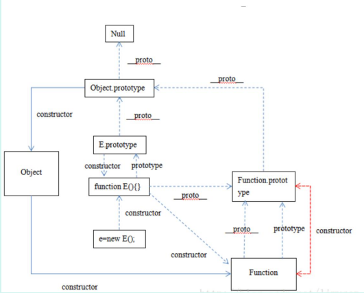

:::

#### 37、实现 js 中所有对象的深度克隆（包装对象，Date 对象，正则对象）

::: details 查看参考回答

通过递归可以简单实现对象的深度克隆，但是这种方法不管是 ES6 还是 ES5 实现，都有同样的缺陷，就是只能实现特定的 object 的深度复制（比如数组和函数），不能实现包装对象 Number，String ， Boolean，以及 Date 对象，RegExp 对象的复制。

(1)前文的方法

```js
function deepClone(obj) {
	var newObj = obj instanceof Array ? [] : {};
	for (var i in obj) {
		newObj[i] = typeof obj[i] == "object" ? deepClone(obj[i]) : obj[i];
	}
	return newObj;
}
```

这种方法可以实现一般对象和数组对象的克隆，比如：

```js
var arr = [1, 2, 3];
var newArr = deepClone(arr);
// newArr->[1,2,3]
var obj = {
	x: 1,
	y: 2,
};
var newObj = deepClone(obj);
// newObj={x:1,y:2}
```

但是不能实现例如包装对象 Number,String,Boolean,以及正则对象 RegExp 和 Date 对象的克隆，比如：

```js
//Number 包装对象
var num=new Number(1);
typeof num // "object"
var newNum=deepClone(num);
//newNum -> {} 空对象
//String 包装对象
var str=new String("hello");
typeof str //"object"
var newStr=deepClone(str);


//newStr-> {0:'h',1:'e',2:'l',3:'l',4:'o'};
//Boolean 包装对象
var bol=new Boolean(true);
typeof bol //"object"
var newBol=deepClone(bol);
// newBol ->{} 空对象
...
```

(2)valueof()函数

所有对象都有 valueOf 方法，valueOf 方法对于：如果存在任意原始值，它就默认将对象转换为表示它的原始值。对象是复合值，而且大多数对象无法真正表示为一个原始值，因此默认的 valueOf()方法简单地返回对象本身，而不是返回一个原始值。数组、函数和正则表达式简单地继承了这个默认方法，调用这些类型的实例的 valueOf()方法只是简单返回这个对象本身。

对于原始值或者包装类：

```js
function baseClone(base) {
	return base.valueOf();
}
//Number
var num = new Number(1);
var newNum = baseClone(num);
//newNum->1
//String
var str = new String("hello");

var newStr = baseClone(str);
// newStr->"hello"
//Boolean
var bol = new Boolean(true);
var newBol = baseClone(bol);
//newBol-> true
```

其实对于包装类，完全可以用=号来进行克隆，其实没有深度克隆一说，这里用 valueOf 实现，语法上比较符合规范。

对于 Date 类型：

因为 valueOf 方法，日期类定义的 valueOf()方法会返回它的一个内部表示：1970 年 1 月 1 日以来的毫秒数.因此我们可以在 Date 的原型上定义克隆的方法：

```js
Date.prototype.clone = function () {
	return new Date(this.valueOf());
};
var date = new Date("2010");
var newDate = date.clone();
// newDate-> Fri Jan 01 2010 08:00:00 GMT+0800
```

对于正则对象 RegExp：

```js
RegExp.prototype.clone = function () {
	var pattern = this.valueOf();
	var flags = "";
	flags += pattern.global ? "g" : "";
	flags += pattern.ignoreCase ? "i" : "";
	flags += pattern.multiline ? "m" : "";

	return new RegExp(pattern.source, flags);
};
var reg = new RegExp("/111/");
var newReg = reg.clone();
//newReg-> /\/111\//
```

:::

#### 38、简单实现 Node 的 Events 模块

::: details 查看参考回答

简介：观察者模式或者说订阅模式，它定义了对象间的一种一对多的关系，让多个观察者对象同时监听某一个主题对象，当一个对象发生改变时，所有依赖于它的对象都将得到通知。

node 中的 Events 模块就是通过观察者模式来实现的：

```js
var events = require("events");
var eventEmitter = new events.EventEmitter();
eventEmitter.on("say", function (name) {
	console.log("Hello", name);
});
eventEmitter.emit("say", "Jony yu");
```

这样，eventEmitter 发出 say 事件，通过 On 接收，并且输出结果，这就是一个订阅模式的实现，下面我们来简单的实现一个 Events 模块的 EventEmitter。

(1)实现简单的 Event 模块的 emit 和 on 方法

```js
function Events() {
	this.on = function (eventName, callBack) {
		if (!this.handles) {
			this.handles = {};
		}
		if (!this.handles[eventName]) {
			this.handles[eventName] = [];
		}
		this.handles[eventName].push(callBack);
	};
	this.emit = function (eventName, obj) {
		if (this.handles[eventName]) {
			for (var i = 0; o < this.handles[eventName].length; i++) {
				this.handles[eventName][i](obj);
			}
		}
	};
	return this;
}
```

这样我们就定义了 Events，现在我们可以开始来调用：

```js
var events = new Events();
events.on("say", function (name) {
	console.log("Hello", nama);
});
events.emit("say", "Jony yu");
// 结果就是通过 emit 调用之后，输出了 Jony yu
```

(2)每个对象是独立的

因为是通过 new 的方式，每次生成的对象都是不相同的，因此：

```js
var event1=new Events();
var event2=new Events();

event1、on('say',function(){
 console.log('Jony event1');
});

event2、on('say',function(){
 console.log('Jony event2');
})

event1、emit('say');
event2、emit('say');

//event1、event2 之间的事件监听互相不影响
//输出结果为'Jony event1' 'Jony event2'
```

:::

#### 39、箭头函数中 this 指向举例

::: details 查看参考回答

定义时绑定。

```js
var a = 11;
function test2() {
	this.a = 22;
	let b = () => {
		console.log(this.a);
	};
	b();
}
var x = new test2();
//输出 22
```

:::

#### 40、js 判断类型

**考察点：JS 数据类型**

::: details 查看参考回答

判断方法：typeof()，instanceof，Object.prototype.toString.call()等

:::

#### 41、数组常用方法

**考察点：数组**

::: details 查看参考回答

push()，pop()，shift()，unshift()，splice()，sort()，reverse()，map()等

:::

#### 42、数组去重

**考察：数组去重**

::: details 查看参考回答

法一：indexOf 循环去重

法二：ES6 Set 去重；Array.from(new Set(array))

法三：Object 键值对去重；把数组的值存成 Object 的 key 值，比如 Object[value1] = true，在判断另一个值的时候，如果 Object[value2]存在的话，就说明该值是重复的。

:::

#### 43、闭包 有什么用

**考察：闭包**

::: details 查看参考回答

（1）什么是闭包：

闭包是指有权访问另外一个函数作用域中的变量的函数。

闭包就是函数的局部变量集合，只是这些局部变量在函数返回后会继续存在。闭包就是就是函数的“堆栈”在函数返回后并不释放，我们也可以理解为这些函数堆栈并不在栈上分配而是在堆上分配。当在一个函数内定义另外一个函数就会产生闭包。

（2）为什么要用：

匿名自执行函数：我们知道所有的变量，如果不加上 var 关键字，则默认的会添加到全局对象的属性上去，这样的临时变量加入全局对象有很多坏处，比如：别的函数可能误用这些变量；

造成全局对象过于庞大，影响访问速度(因为变量的取值是需要从原型链上遍历的)。除了每次使用变量都是用 var 关键字外，我们在实际情况下经常遇到这样一种情况，即有的函数只需要执行一次，其内部变量无需维护，可以用闭包。

结果缓存：我们开发中会碰到很多情况，设想我们有一个处理过程很耗时的函数对象，每次调用都会花费很长时间，那么我们就需要将计算出来的值存储起来，当调用这个函数的时候，首先在缓存中查找，如果找不到，则进行计算，然后更新缓存并返回值，如果找到了，直接返回查找到的值即可。闭包正是可以做到这一点，因为它不会释放外部的引用，从而函数内部的值可以得以保留。

封装：实现类和继承等。

:::

#### 44、事件代理在捕获阶段的实际应用

**考察点：事件代理**

::: details 查看参考回答

可以在父元素层面阻止事件向子元素传播，也可代替子元素执行某些操作。

:::

#### 45、去除字符串首尾空格

**考察点：正则**

::: details 查看参考回答

使用正则(^\s*)|(\s*$)即可

:::

#### 46、性能优化

**考察点：性能优化**

::: details 查看参考回答

- 减少 HTTP 请求
- 使用内容发布网络（CDN）
- 添加本地缓存
- 压缩资源文件
- 将 CSS 样式表放在顶部，把 javascript 放在底部（浏览器的运行机制决定）
- 避免使用 CSS 表达式
- 减少 DNS 查询
- 使用外部 javascript 和 CSS
- 避免重定向
- 图片 lazyLoad

:::

#### 47 来讲讲 JS 的闭包吧

**考察点:闭包**

::: details 查看参考回答

闭包是指有权访问另外一个函数作用域中的变量的函数。

闭包就是函数的局部变量集合，只是这些局部变量在函数返回后会继续存在。闭包就是就是函数的“堆栈”在函数返回后并不释放，我们也可以理解为这些函数堆栈并不在栈上分配而是在堆上分配。当在一个函数内定义另外一个函数就会产生闭包。

（2）为什么要用：

匿名自执行函数：我们知道所有的变量，如果不加上 var 关键字，则默认的会添加到全局对象的属性上去，这样的临时变量加入全局对象有很多坏处，比如：别的函数可能误用这些变量；造成全局对象过于庞大，影响访问速度(因为变量的取值是需要从原型链上遍历的)。除了每次使用变量都是用 var 关键字外，我们在实际情况下经常遇到这样一种情况，即有的函数只需要执行一次，其内部变量无需维护，可以用闭包。

结果缓存：我们开发中会碰到很多情况，设想我们有一个处理过程很耗时的函数对象，每次调用都会花费很长时间，那么我们就需要将计算出来的值存储起来，当调用这个函数的时候，首先在缓存中查找，如果找不到，则进行计算，然后更新缓存并返回值，如果找到了，直接返回查找到的值即可。闭包正是可以做到这一点，因为它不会释放外部的引用，从而函数内部的值可以得以保留。

:::

#### 48 能来讲讲 JS 的语言特性吗

**考察点：JS**

::: details 查看参考回答

- 运行在客户端浏览器上；
- 不用预编译，直接解析执行代码；
- 是弱类型语言，较为灵活；
- 与操作系统无关，跨平台的语言；
- 脚本语言、解释性语言

:::

#### 49 如何判断一个数组(讲到 typeof 差点掉坑里)

**考察点：JS**

::: details 查看参考回答

- Object.prototype.call.toString()
- instanceof

:::

#### 50、你说到 typeof，能不能加一个限制条件达到判断条件

**考察点：typeof**

::: details 查看参考回答

typeof 只能判断是 object,可以判断一下是否拥有数组的方法

:::

#### 51、JS 实现跨域

跨域不是问题，是一种安全机制。浏览器有一种策略名为同源策略，同源策略规定了部分请求不能被浏览器所接受。

值得一提的是：同源策略导致的跨域是浏览器单方面拒绝响应数据，服务器端是处理完毕并做出了响应的。

**考察点：跨域**

::: details 查看参考回答

1.JSONP：通过动态创建 script，再请求一个带参网址实现跨域通信。document.domain + iframe 跨域：两个页面都通过 js 强制设置 document.domain 为基础主域，就实现了同域。

2.location.hash + iframe 跨域：a 欲与 b 跨域相互通信，通过中间页 c 来实现。 三个页面，不同域之间利用 iframe 的 location.hash 传值，相同域之间直接 js 访问来通信。

3.window.name + iframe 跨域：通过 iframe 的 src 属性由外域转向本地域，跨域数据即由 iframe 的 window.name 从外域传递到本地域。

4.postMessage 跨域：可以跨域操作的 window 属性之一。

5.JQuery 的 ajax(推荐 JQuery 项目中使用)：jq 的 ajax 自带解决跨域的方法。底层原理采用的 JSONP 的跨域解决方案。

```js
function callback() {
	console.log("月薪一千五，心比美式苦");
}

$.ajax({
	url: "http://www.domain2.com:8080/login",
	type: "get",
	dataType: "jsonp", // 请求方式为jsonp  设置跨域的重点
	jsonpCallback: "callBack", // 回调函数
});
```

6.script 标签解决跨域(远古 Web 项目中使用)：原生采用的是 script 标签可以不受跨域限制的特性来实现跨域。

```html
<script>
	// 回调
	function callBack(res) {
		console.log("跨域的回调", res);
		// ...完成你所有操作后记得删除script↓
		document.head.getElementsByClassName("script")[0].remove();
	}

	const scriptDom = document.createElement("script");
	scriptDom.type = "text/javascript";
	scriptDom.class = "script"; //用于删除
	// 传参一个回调函数名给后端，方便后端返回时执行这个在前端定义的回调函数
	scriptDom.src = "http://192.167.0.152:9996/inface?callback=callBack";
	document.head.appendChild(script); //将标签挂载到dom上
</script>
```

这里需要注意的是，使用完请求之后记得删除 script,否则会随着请求的变多 script 标签会一直挂载在 DOM 上。

在远古的 web 中，这是一种方案。但现在已经基本不用了。

7.CORS 跨域：服务端设置 Access-Control-Allow-Origin 即可，前端无须设置，若要带 cookie 请
求，前后端都需要设置。

8.前端代理跨域：启一个代理服务器，实现数据的转发

如 Vue 项目的跨域：

```js

```

如 React 项目的跨域：

```js

```

9.服务端代理（Nginx 代理）

nginx 代理一般使用在生产环境。是服务端解决跨域的一种方案。

简单配置模板 👇

```bash
#如果监听到请求接口地址是 www.xxx.com/api/page ，nginx就向http://www.yyy.com:9999/api/page这个地址发送请求
server {
     listen       80;
        server_name  www.xxx.com;
        #判过滤出含有api的请求
        location /api/ {
            proxy_pass http://www.yyy.com:9999; #真实服务器的地址
        }
}
```

注意，nginx 配置完代理后需要重启 nginx，nginx 代理是生产环境的常用方案

10.后台（逻辑层）添加响应头解决

Access-Control-Allow-Origin 响应头的意思是，安全同行的请求。

举个例子

http://192.168.0.103:8080 向 http://192.168.0.102:8080 发送了请求，结果因为域名不一样，在返回信息的时候因为 IP 地址不一致被拦截。

但是如果http://192.168.0.102:8080 在响应头中的 Access-Control-Allow-Origin 字段中携带上属性值'http://192.168.0.103:8080' 如下

```php
// 响应头
'Access-Control-Allow-Origin':'http:/ /192.168.0.103:8080'
```

这就等于告诉浏览器，http://192.168.0.102:8080 这个地址是安全的，请不要拦截。

这样，http://192.168.0.103:8080 就可以接受来自 http://192.168.0.102:8080 返回的信息。

当然，我们也可以进行所有域名均不拦截的设置（如下）

```php
// 响应头
// * 代表所有域名均不拦截
Access-Control-Allow-Origin':'*'
```

node 案例如下：

```js
res.writeHead(200, {
    'Access-Control-Allow-Origin': 'http://192.168.0.103:8080'
});

// 或者

res.writeHead(200, {
    Access-Control-Allow-Origin':'*'
});
```

并不建议此种方案，因为安全性不高。自己写小练习的时候建议使用，因为真的很方便。

---

参考：

<https://segmentfault.com/a/1190000011145364>

<https://juejin.cn/post/7194734127390654520>

:::

#### 52、 Js 基本数据类型

**考察点：数据类型**

::: details 查看参考回答

基本数据类型：undefined、null、number、boolean、string、symbol

:::

#### 53、js 的命名方式

::: details 查看参考回答

略

:::

#### 54、js 深度拷贝一个元素的具体实现

**考察点：深拷贝**

::: details 查看参考回答

```js
var deepCopy = function (obj) {
	if (typeof obj !== "object") return;
	var newObj = obj instanceof Array ? [] : {};
	for (var key in obj) {
		if (obj.hasOwnProperty(key)) {
			newObj[key] =
				typeof obj[key] === "object" ? deepCopy(obj[key]) : obj[key];
		}
	}
	return newObj;
};
```

:::

#### 55、之前说了 ES6set 可以数组去重，是否还有数组去重的方法

**考察点：数组去重**

::: details 查看参考回答

- 法一：indexOf 循环去重
- 法二：Object 键值对去重；把数组的值存成 Object 的 key 值，比如 Object[value1] =true，在判断另一个值的时候，如果 Object[value2]存在的话，就说明该值是重复的。

:::

#### 56、重排和重绘

**考察点：重排，重绘**

::: details 查看参考回答

公司：今日头条

重绘（repaint 或 redraw）：当盒子的位置、大小以及其他属性，例如颜色、字体大小等都确定下来之后，浏览器便把这些原色都按照各自的特性绘制一遍，将内容呈现在页面上。重绘是指一个元素外观的改变所触发的浏览器行为，浏览器会根据元素的新属性重新绘制，使元素呈现新的外观。

触发重绘的条件：改变元素外观属性。如：color，background-color 等。

注意：table 及其内部元素可能需要多次计算才能确定好其在渲染树中节点的属性值，比同等元素要多花两倍时间，这就是我们尽量避免使用 table 布局页面的原因之一。

重排（重构/回流/reflow）：当渲染树中的一部分(或全部)因为元素的规模尺寸，布局，隐藏等改变而需要重新构建, 这就称为回流(reflow)。每个页面至少需要一次回流，就是在页面第一次加载的时候。

**重绘和重排的关系**：在回流的时候，浏览器会使渲染树中受到影响的部分失效，并重新构造这部分渲染树，完成回流后，浏览器会重新绘制受影响的部分到屏幕中，该过程称为重绘。所以，重排必定会引发重绘，但重绘不一定会引发重排。

:::

#### 56、JS 的全排列

**考察点：全排列**

::: details 查看参考回答

```js
function permutate(str) {
var result = [];
if(str.length > 1) {
var left = str[0];
var rest = str.slice(1, str.length);
var preResult = permutate(rest);
for(var i=0; i<preResult.length; i++) {
for(var j=0; j<preResult[i].length; j++) {
var tmp = preResult[i],slice(0, j) + left +
preResult[i].slice(j, preResult[i].length);
result.push(tmp);
}
}

} else if (str.length == 1) {
return [str];
}
return result;
}
```

:::

#### 57、ES6 中用过哪些

::: details 查看参考回答

略

:::

#### 58、跨域的原理

::: details 查看参考回答

跨域，是指浏览器不能执行其他网站的脚本。它是由浏览器的同源策略造成的，是浏览器对 JavaScript 实施的安全限制，那么只要协议、域名、端口有任何一个不同，都被当作是不同的域。跨域原理，即是通过各种方式，避开浏览器的安全限制。

:::

#### 59、不同数据类型的值的比较，是怎么转换的，有什么规则

**考察点：类型转换**

::: details 查看参考回答

比较运算 x=my，其中 x 和 y 是值，产生 true 或者 false。这样的比较按如下方式进行：

1.若 Type(x)与 Type(y)相同，则

- a.若 Type(x)为 Undefined，返回 true。

- b.若 Type(x)为 Null，返回 trues

- c 若 Type(x)为 Number，则

  - i 若 x 为 NaN，返回 false。
  - i.若 y 为 NaN，返回 false。
  - ll 若 x 与 y 为相等数值，返回 true。
  - iv.若 x 为+0 且 y 为-0，返回 true。
  - v.若 x 为-0 且 y 为+0，返回 true。
  - vi 返回 false。

- d.若 Type(x)为 Sting.则当 x 和 y 为完全相同的字符序列(长度相等且相同字符在相同位置)时返回 true。否则返回 false。

- e,若 Type(x)为 Boolean,当 x 和 y 为同为 true 或者同为 false 时返回 true。否则，返回 false。

- f.当 x 和 y 为引用同一对象时返回 true。否则，这回 faise。

  2.若 x 为 null 且 y 为 undefined， 返回 true。

  3.若 x 为 undefined 且 y 为 null，返回 true。

  4.若 Type(x)为 Number 且 Type(y)为 String，返回 comparison x== ToNumber(y)的结果。

  5.若 Type(x)为 String 且 Tpe(y)为 Number。

  6.返回比较 ToNumber(x) == y 的结果。

  7.若 Type(x)为 Boolean， 返回比较 ToNumber(x)== y 的结果。

  8.若 Type(y)为 Boolean，返回比较 x == ToNumben(y)的结果。

  9.若 Type(x)为 String 或 Number，且 Type(y)为 Object，返回比较 x== ToPrimitive(y)的结果

  10.若 Type(x)为 Object 且 Type(y)为 String 或 Number，返回比较 ToPrimitive(x)== y 的结果。

  11.返回 false.

:::

#### 60、null == undefined 为什么

**考察点：隐式转换**

::: details 查看参考回答

要比较相等性之前，不能将 null 和 undefined 转换成其他任何值，但 null == undefined 会返回 true 。ECMAScript 规范中是这样定义的。

:::

#### 61、this 的指向 哪几种

**考察点：this**

::: details 查看参考回答

- 默认绑定：全局环境中，this 默认绑定到 window。
- 隐式绑定：一般地，被直接对象所包含的函数调用时，也称为方法调用，this 隐式绑定到该直接对象。
- 隐式丢失：隐式丢失是指被隐式绑定的函数丢失绑定对象，从而默认绑定到 window。
- 显式绑定：通过 call()、apply()、bind()方法把对象绑定到 this 上，叫做显式绑定。
- new 绑定：如果函数或者方法调用之前带有关键字 new，它就构成构造函数调用。对于 this 绑定来说，称为 new 绑定。

【1】构造函数通常不使用 return 关键字，它们通常初始化新对象，当构造函数的函数体执行完毕时，它会显式返回。在这种情况下，构造函数调用表达式的计算结果就是这个新对象的值。

【2】如果构造函数使用 return 语句但没有指定返回值，或者返回一个原始值，那么这时将忽略返回值，同时使用这个新对象作为调用结果。

【3】如果构造函数显式地使用 return 语句返回一个对象，那么调用表达式的值就是这个对象。

:::

#### 62、暂停死区

**考察点：暂时性死区**

::: details 查看参考回答

在代码块内，使用 let、const 命令声明变量之前，该变量都是不可用的。这在语法上，称为“暂时性死区”

:::

#### 63、AngularJS 双向绑定原理

**考察点：双向绑定**

::: details 查看参考回答

Angular 将双向绑定转换为一堆 watch 表达式，然后递归这些表达式检查是否发生过变化，如果变了则执行相应的 watcher 函数（指 view 上的指令，如 ng-bind，ng-show 等或是{{}}）。

等到 model 中的值不再发生变化，也就不会再有 watcher 被触发，一个完整的 digest 循环就完成了。

Angular 中在 view 上声明的事件指令，如：ng-click、ng-change 等，会将浏览器的事件转发给$scope 上相应的 model 的响应函数。等待相应函数改变 model，紧接着触发脏检查机制刷新 view。

watch 表达式：可以是一个函数、可以是$scope 上的一个属性名，也可以是一个字符串形式的表达式。

$watch 函数所监听的对象叫做 watch 表达式。watcher 函数：指在 view 上的指令（ngBind，ngShow、ngHide 等）以及{{}}表达式，他们所注册的函数。

每一个 watcher 对象都包括：监听函数，上次变化的值，获取监听表达式的方法以及监听表达式，最后还包括是否需要使用深度对比（angular.equals()）

:::

#### 64、写一个深度拷贝

考察点：深拷贝

::: details 查看参考回答

```js
function clone(obj) {
	var copy;
	switch (typeof obj) {
		case "undefined":
			break;
		case "number":
			copy = obj - 0;
			break;
		case "string":
			copy = obj + "";
			break;
		case "boolean":
			copy = obj;
			break;
		case "object": //object 分为两种情况 对象（Object）和数组（Array）
			if (obj === null) {
				copy = null;
			} else {
				if (Object.prototype.toString.call(obj).slice(8, -1) === "Array") {
					copy = [];
					for (var i = 0; i < obj.length; i++) {
						copy.push(clone(obj[i]));
					}
				} else {
					copy = {};
					for (var j in obj) {
						copy[j] = clone(obj[j]);
					}
				}
			}
			break;
		default:
			copy = obj;
			break;
	}
	return copy;
}
```

:::

#### 65、简历中提到了 requestAnimationFrame，请问是怎么使用的

**考察点：requestAnimationFrame**

::: details 查看参考回答

requestAnimationFrame() 方法告诉浏览器您希望执行动画并请求浏览器在下一次重绘之前调用指定的函数来更新动画。该方法使用一个回调函数作为参数，这个回调函数会在浏览器重绘之前调用。

:::

#### 66、有一个游戏叫做 Flappy Bird，就是一只小鸟在飞，前面是无尽的沙漠，上下不断有钢管生成，你要躲避钢管。然后小明在玩这个游戏时候老是卡顿甚至崩溃，说出原因（3-5 个）以及解决办法（3-5 个）

**考察点：性能优化**

::: details 查看参考回答

##### 原因可能是

1、内存溢出问题。

2、资源过大问题。

3、资源加载问题。

4、canvas 绘制频率问题

##### 解决办法

1、针对内存溢出问题，我们应该在钢管离开可视区域后，销毁钢管，让垃圾收集器回收钢管，因为不断生成的钢管不及时清理容易导致内存溢出游戏崩溃。

2、针对资源过大问题，我们应该选择图片文件大小更小的图片格式，比如使用 webp、png 格式的图片，因为绘制图片需要较大计算量。

3、针对资源加载问题，我们应该在可视区域之前就预加载好资源，如果在可视区域生成钢管的话，用户的体验就认为钢管是卡顿后才生成的，不流畅。

4、针对 canvas 绘制频率问题，我们应该需要知道大部分显示器刷新频率为 60 次/s,因此游戏的每一帧绘制间隔时间需要小于 1000/60=16、7ms，才能让用户觉得不卡顿。（注意因为这是单机游戏，所以回答与网络无关）

:::

#### 67、编写代码，满足以下条件

（1）Hero("37er");执行结果为

```bash
Hi! This is 37er
```

（2）Hero("37er").kill(1).recover(30);执行结果为

```bash
Hi! This is 37er
Kill 1 bug
Recover 30 bloods
```

（3）Hero("37er").sleep(10).kill(2)执行结果为

```bash
Hi! This is 37er
//等待 10s 后
Kill 2 bugs //注意为 bugs
```

（双斜线后的为提示信息，不需要打印）

**考察点：编程**

::: details 查看参考回答

```js
function Hero(name) {
	let o = new Object();
	o.name = name;
	o.time = 0;
	console.log("Hi! This is " + o.name);

	o.kill = function (bugs) {
		if (bugs == 1) {
			console.log("Kill " + bugs + " bug");
		} else {
			setTimeout(function () {
				console.log("Kill " + bugs + " bugs");
			}, 1000 * this.time);
		}
		return o;
	};
	o.recover = function (bloods) {
		console.log("Recover " + bloods + " bloods");
		return o;
	};
	o.sleep = function (sleepTime) {
		o.time = sleepTime;
		return o;
	};
	return o;
}
```

:::

#### 68、 jit;jc

::: details 查看参考回答

略

:::

#### 69、 es6 新特性用过哪些

::: details 查看参考回答

略

:::

#### 70、什么是按需加载

**考察点：加载顺序**

::: details 查看参考回答

当用户触发了动作时才加载对应的功能。触发的动作，是要看具体的业务场景而言，包括但不限于以下几个情况：鼠标点击、输入文字、拉动滚动条，鼠标移动、窗口大小更改等。加载的文件，可以是 JS、图片、CSS、HTML 等。

:::

#### 71、说一下什么是 virtual dom

**考察点：vdom**

::: details 查看参考回答

用 JavaScript 对象结构表示 DOM 树的结构；然后用这个树构建一个真正的 DOM 树，插到文档当中 当状态变更的时候，重新构造一棵新的对象树。然后用新的树和旧的树进行比较，记录两棵树差异 把所记录的差异应用到所构建的真正的 DOM 树上，视图就更新了。Virtual DOM 本质上就是在 JS 和 DOM 之间做了一个缓存。

:::

#### 72、webpack 用来干什么的

**考察点：webpack**

::: details 查看参考回答

webpack 是一个现代 JavaScript 应用程序的静态模块打包器(module bundler)。当 webpack 处理应用程序时，它会递归地构建一个依赖关系图(dependency graph)，其中包含应用程序需要的每个模块，然后将所有这些模块打包成一个或多个 bundle。

:::

#### 73、ant-design 优点和缺点

**考察点：ant-design**

::: details 查看参考回答

优点：组件非常全面，样式效果也都比较不错。

缺点：框架自定义程度低，默认 UI 风格修改困难。

:::

#### 74、JS 中继承实现的几种方式

**考察点：JS**

::: details 查看参考回答

1、原型链继承，将父类的实例作为子类的原型，他的特点是实例是子类的实例也是父类的实例，父类新增的原型方法/属性，子类都能够访问，并且原型链继承简单易于实现，缺点是来自原型对象的所有属性被所有实例共享，无法实现多继承，无法向父类构造函数传参。

2、构造继承，使用父类的构造函数来增强子类实例，即复制父类的实例属性给子类，构造继承可以向父类传递参数，可以实现多继承，通过 call 多个父类对象。但是构造继承只能继承父类的实例属性和方法，不能继承原型属性和方法，无法实现函数服用，每个子类都有父类实例函数的副本，影响性能

3、实例继承，为父类实例添加新特性，作为子类实例返回，实例继承的特点是不限制调用方法，不管是 new 子类（）还是子类（）返回的对象具有相同的效果，缺点是实例是父类的实例，不是子类的实例，不支持多继承

4、拷贝继承：特点：支持多继承，缺点：效率较低，内存占用高（因为要拷贝父类的属性）无法获取父类不可枚举的方法（不可枚举方法，不能使用 for in 访问到）

5、组合继承：通过调用父类构造，继承父类的属性并保留传参的优点，然后通过将父类实例作为子类原型，实现函数复用

6、寄生组合继承：通过寄生方式，砍掉父类的实例属性，这样，在调用两次父类的构造的时候，就不会初始化两次实例方法/属性，避免的组合继承的缺点

:::

#### 75、写一个函数，第一秒打印 1，第二秒打印 2

**考察点：数据结构算法**

::: details 查看参考回答

两个方法，第一个是用 let 块级作用域

```js
for (let i = 0; i < 5; i++) {
	setTimeout(function () {
		console.log(i);
	}, 1000 * i);
}
```

第二个方法闭包

```js
for (var i = 0; i < 5; i++) {
	(function (i) {
		setTimeout(function () {
			console.log(i);
		}, 1000 * i);
	})(i);
}
```

:::

#### 76、vue 的生命周期

**考察点：vue**

::: details 查看参考回答

Vue 实例有一个完整的生命周期，也就是从开始创建、初始化数据、编译模板、挂载 Dom、渲染 → 更新 → 渲染、销毁等一系列过程，我们称这是 Vue 的生命周期。通俗说就是 Vue 实例从创建到销毁的过程，就是生命周期。

每一个组件或者实例都会经历一个完整的生命周期，总共分为三个阶段：初始化、运行中、销毁。

实例、组件通过 new Vue() 创建出来之后会初始化事件和生命周期，然后就会执行 beforeCreate 钩子函数，这个时候，数据还没有挂载呢，只是一个空壳，无法访问到数据和真实的 dom，一般不做操作挂载数据，绑定事件等等，然后执行 created 函数，这个时候已经可以使用到数据，也可以更改数据,在这里更改数据不会触发 updated 函数，在这里可以在渲染前倒数第二次更改数据的机会，不会触发其他的钩子函数，一般可以在这里做初始数据的获取接下来开始找实例或者组件对应的模板，编译模板为虚拟 dom 放入到 render 函数中准备渲染，然后执行 beforeMount 钩子函数，在这个函数中虚拟 dom 已经创建完成，马上就要渲染,在这里也可以更改数据，不会触发 updated，在这里可以在渲染前最后一次更改数据的机会，不会触发其他的钩子函数，一般可以在这里做初始数据的获取接下来开始 render，渲染出真实 dom，然后执行 mounted 钩子函数，此时，组件已经出现在
页面中，数据、真实 dom 都已经处理好了,事件都已经挂载好了，可以在这里操作真实 dom 等事情...

当组件或实例的数据更改之后，会立即执行 beforeUpdate，然后 vue 的虚拟 dom 机制会重新构建虚拟 dom 与上一次的虚拟 dom 树利用 diff 算法进行对比之后重新渲染，一般不做什么事儿

当更新完成后，执行 updated，数据已经更改完成，dom 也重新 render 完成，可以操作更新后的虚拟 dom
当经过某种途径调用$destroy 方法后，立即执行 beforeDestroy，一般在这里做一些善后工作，例如清除计时器、清除非指令绑定的事件等等

组件的数据绑定、监听...去掉后只剩下 dom 空壳，这个时候，执行 destroyed，在这里做善后工作也可以

:::

#### 77、简单介绍一下 symbol

**考察点：ES6**

::: details 查看参考回答

Symbol 是 ES6 的新增属性，代表用给定名称作为唯一标识，这种类型的值可以这样创建，let id=symbol(“id”)

Symbl 确保唯一，即使采用相同的名称，也会产生不同的值，我们创建一个字段，仅为知道对应 symbol 的人能访问，使用 symbol 很有用，symbol 并不是 100%隐藏，有内置方法 Object.getOwnPropertySymbols(obj)可以获得所有的 symbol。

也有一个方法 Reflect.ownKeys(obj)返回对象所有的键，包括 symbol。

所以并不是真正隐藏。但大多数库内置方法和语法结构遵循通用约定他们是隐藏的，

:::

#### 78、什么是事件监听

\*\*考察点：JS

::: details 查看参考回答

addEventListener()方法，用于向指定元素添加事件句柄，它可以更简单的控制事件，语法为

```js
element.addEventListener(event, function, useCapture);
```

- 第一个参数是事件的类型 (如 "click" 或 "mousedown"). 第二个参数是事件触发后调用的函数。
- 第三个参数是个布尔值用于描述事件是冒泡还是捕获。该参数是可选的。

事件传递有两种方式，冒泡和捕获

事件传递定义了元素事件触发的顺序，如果你将 P 元素插入到 div 元素中，用户点击 P 元素，在冒泡中，内部元素先被触发，然后再触发外部元素，捕获中，外部元素先被触发，在触发内部元素。

:::

#### 79、介绍一下 promise，及其底层如何实现

**考察点：JS**

::: details 查看参考回答

Promise 是一个对象，保存着未来将要结束的事件，她有两个特征:

1、对象的状态不受外部影响，Promise 对象代表一个异步操作，有三种状态，pending 进行中，fulfilled 已成功，rejected 已失败，只有异步操作的结果，才可以决定当前是哪一种状态，任何其他操作都无法改变这个状态，这也就是 promise 名字的由来

2、一旦状态改变，就不会再变，promise 对象状态改变只有两种可能，从 pending 改到 fulfilled 或者从 pending 改到 rejected，只要这两种情况发生，状态就凝固了，不会再改变，这个时候就称为定型 resolved,

Promise 的基本用法，

```js
let promise1 = new Promise(function(resolve,reject){
setTimeout(function(){
resolve('ok')
},1000)
})
promise1、then(function success(val){
console.log(val)
})
```

最简单代码实现 promise

```js
class PromiseM {
	constructor(process) {
		this.status = "pending";
		this.msg = "";
		process(this.resolve.bind(this), this.reject.bind(this));
		return this;
	}
	resolve(val) {
		this.status = "fulfilled";
		this.msg = val;
	}
	reject(err) {
		this.status = "rejected";
		this.msg = err;
	}
	then(fufilled, reject) {
		if (this.status === "fulfilled") {
			fufilled(this.msg);
		}
		if (this.status === "rejected") {
			reject(this.msg);
		}
	}
}
//测试代码
var mm = new PromiseM(function (resolve, reject) {
	resolve("123");
});
mm.then(
	function (success) {
		console.log(success);
	},
	function () {
		console.log("fail!");
	}
);
```

:::

#### 80、说说 C++,Java，JavaScript 这三种语言的区别

**考察点：编程语言**

::: details 查看参考回答

从静态类型还是动态类型来看

静态类型，编译的时候就能够知道每个变量的类型，编程的时候也需要给定类型，如 Java 中的整型 int，浮点型 float 等。C、C++、Java 都属于静态类型语言。

动态类型，运行的时候才知道每个变量的类型，编程的时候无需显示指定类型，如 JavaScript 中的 var、PHP 中的$。JavaScript、Ruby、Python 都属于动态类型语言。

静态类型还是动态类型对语言的性能有很大影响。

对于静态类型，在编译后会大量利用已知类型的优势，如 int 类型，占用 4 个字节，编译后的代码就可以用内存地址加偏移量的方法存取变量，而地址加偏移量的算法汇编很容易实现。

对于动态类型，会当做字符串通通存下来，之后存取就用字符串匹配。

从编译型还是解释型来看编译型语言，像 C、C++，需要编译器编译成本地可执行程序后才能运行，由开发人员在编写完成后手动实施。用户只使用这些编译好的本地代码，这些本地代码由系统加载器执行，由操作系统的 CPU 直接执行，无需其他额外的虚拟机等。

源代码=》抽象语法树=》中间表示=》本地代码

解释性语言，像 JavaScript、Python，开发语言写好后直接将代码交给用户，用户使用脚本解释器将脚本文件解释执行。对于脚本语言，没有开发人员的编译过程，当然，也不绝对。

源代码=》抽象语法树=》解释器解释执行。

对于 JavaScript，随着 Java 虚拟机 JIT 技术的引入，工作方式也发生了改变。可以将抽象语法树转成中间表示（字节码），再转成本地代码，如 JavaScriptCore，这样可以大大提高执行效率。也可以从抽象语法树直接转成本地代码，如 V8

Java 语言，分为两个阶段。

首先像 C++语言一样，经过编译器编译。和 C++的不同，C++编译生成本地代码，Java 编译后，生成字节码，字节码与平台无关。第二阶段，由 Java 的运行环境也就是 Java 虚拟机运行字节码，使用解释器执行这些代码。一般情况下，Java 虚拟机都引入了 JIT 技术，将字节码转换成本地代码来提高执行效率。

注意，在上述情况中，编译器的编译过程没有时间要求，所以编译器可以做大量的代码优化

措施。

对于 JavaScript 与 Java 它们还有的不同：

对于 Java，Java 语言将源代码编译成字节码，这个同执行阶段是分开的。也就是从源代码到抽象语法树到字节码这段时间的长短是无所谓的。

对于 JavaScript，这些都是在网页和 JavaScript 文件下载后同执行阶段一起在网页的加载和渲染过程中实施的，所以对于它们的处理时间有严格要求。

:::

#### 81、js 原型链，原型链的顶端是什么？Object 的原型是什么？Object 的原型的原型是什么？

在数组原型链上实现删除数组重复数据的方法

**考察点：JS**

::: details 查看参考回答

能够把这个讲清楚弄明白是一件很困难的事

首先明白原型是什么，在 ES6 之前，JS 没有类和继承的概念，JS 是通过原型来实现继承的，在 JS 中一个构造函数默认带有一个 prototype 属性，这个的属性值是一个对象，同时这个 prototype 对象自带有一个 constructor 属性，这个属性指向这个构造函数，同时每一个实例都会有一个*proto*属性指向这个 prototype 对象，我们可以把这个叫做隐式原型，我们在使用一个实例的方法的时候，会先检查这个实例中是否有这个方法，没有的话就会检查这个 prototype 对象是否有这个方法。

基于这个规则，如果让原型对象指向另一个类型的实例，即 constructor1、protoytpe=instance2，这时候如果试图引用 constructor1 构造的实例 instance1 的某个属性 p1,

首先会在 instance1 内部属性中找一遍，

接着会在 instance1、_proto_（constructor1、prototype）即是 instance2 中寻找 p1

搜寻轨迹：instance1->instance2->constructor2、prototype……->**Object.prototype**;

这即是原型链，原型链顶端是 **Object.prototype**

#### 补充学习

每个函数都有一个 prototype 属性，这个属性指向了一个对象，这个对象正是调用该函数而创建的实例的原型，那么什么是原型呢，可以这样理解，每一个 JavaScript 对象在创建的时候就会预制管理另一个对象，这个对象就是我们所说的原型，每一个对象都会从原型继承属性，如图：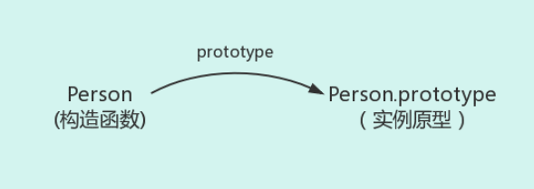

那么怎么表示实例与实例原型的关系呢，这时候就要用到第二个属性`_proto_` 这是每一个 JS 对象都会有的一个属性，指向这个对象的原型，如图：

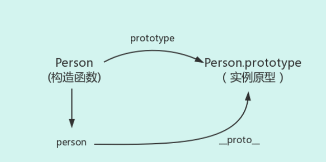

既然实例对象和构造函数都可以指向原型，那么原型是否有属性指向构造函数或者实例呢，指向实例是没有的，因为一个构造函数可以生成多个实例，但是原型有属性可以直接指向构造函数，通过 constructor 即可接下来讲解实例和原型的关系：

- 当读取实例的属性时，如果找不到，就会查找与对象相关的原型中的属性，如果还查不到，就去找原型的原型，一直找到最顶层，那么原型的原型是什么呢，首先，原型也是一个对象，既然是对象，我们就可以通过构造函数的方式创建它，所以原型对象就是通过 Object 构造函数生成的，如图：

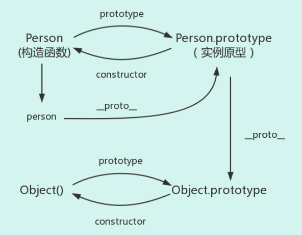

那么 **Object.prototype** 的原型呢，我们可以打印

`console.log(Object.prototype.__proto__ === null)`，返回 true

null 表示没有对象，即该处不应有值，所以 `Object.prototype` 没有原型，如图：

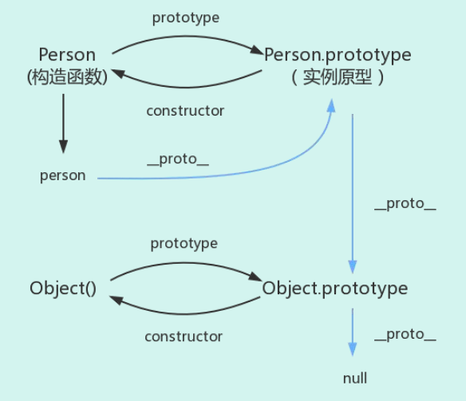

图中这条蓝色的线即是原型链，

最后补充三点：

```js
constructor：
function Person(){
}
var person = new Person();
console.log(Person === person.constructor);
```

原本 person 中没有 constructor 属性，当不能读取到 constructor 属性时，会从 person 的原型中读取，所以指向构造函数 Person

`__proto__`：

绝大部分浏览器支持这个非标准的方法访问原型，然而它并不存在与 Person.prototype 中，实际上它来自 **Object.prototype**，当使用 `obj.__proto__`时，可以理解为返回来 Object.getPrototype(obj)

继承：

前面说到，每个对象都会从原型继承属性，但是引用《你不知道的 JS》中的话，继承意味着复制操作，然而 JS 默认不会复制对象的属性，相反，JS 只是在两个对象之间创建一个关联，这样子一个对象就可以通过委托访问另一个对象的属性和函数，所以与其叫继承，叫委托更合适，

:::

#### 82、什么是 js 的闭包？有什么作用，用闭包写个单例模式

**考察点：JS，设计模式**

::: details 查看参考回答

MDN 对闭包的定义是：闭包是指那些能够访问自由变量的函数，自由变量是指在函数中使用的，但既不是函数参数又不是函数的局部变量的变量，由此可以看出，闭包=函数+函数能够访问的自由变量，所以从技术的角度讲，所有 JS 函数都是闭包，但是这是理论上的闭包，还有一个实践角度上的闭包，从实践角度上来说，只有满足 以下两点，才称为闭包

- 1、即使创建它的上下文已经销毁，它仍然存在，
- 2、在代码中引入了自由变量，

闭包的应用：

模仿块级作用域。2、保存外部函数的变量。3、封装私有变量

单例模式：

```js
var Singleton = (function () {
	var instance;
	var CreateSingleton = function (name) {
		this.name = name;
		if (instance) {
			return instance;
		}
		// 打印实例名字
		this.getName();
		// instance = this;
		// return instance;

		return (instance = this);
	};
	// 获取实例的名字
	CreateSingleton.prototype.getName = function () {
		console.log(this.name);
	};
	return CreateSingleton;
})();
// 创建实例对象 1
var a = new Singleton("a");
// 创建实例对象 2
var b = new Singleton("b");
console.log(a === b);
```

:::

#### 83、promise+Generator+Async 的使用

**考察点：JS**

::: details 查看参考回答

#### Promise

解决的问题：回调地狱

##### Promise 规范

promise 有三种状态，等待（pending）、已完成（fulfilled/resolved）、已拒绝（rejected）.Promise 的状态只能从“等待”转到“完成”或者“拒绝”，不能逆向转换，同时“完成”和“拒绝”也不能相互转换.

promise 必须提供一个 then 方法以访问其当前值、终值和据因。promise.then(resolve,reject),resolve 和 reject 都是可选参数。如果 resolve 或 reject 不是函数，其必须被忽略.

then 方法必须返回一个 promise 对象. 使用:

实例化 promise 对象需要传入函数(包含两个参数),resolve 和 reject,内部确定状态.resolve 和 reject 函数可以传入参数在回调函数中使用.

resolve 和 reject 都是函数,传入的参数在 then 的回调函数中接收.

```js
var promise = new Promise(function (resolve, reject) {
	setTimeout(function () {
		resolve("好哈哈哈哈");
	});
});
promise.then(function (val) {
	console.log(val);
});
```

then 接收两个函数,分别对应 resolve 和 reject 状态的回调,函数中接收实例化时传入的参数.

```js
promise.then(
	(val) => {
		//resolved
	},
	(reason) => {
		//rejected
	}
);
```

catch 相当于.then(null, rejection)

当 then 中没有传入 rejection 时,错误会冒泡进入 catch 函数中,若传入了 rejection,则错误会被 rejection 捕获,而且不会进入 catch.此外,then 中的回调函数中发生的错误只会在下一级的 then 中被捕获,不会影响该 promise 的状态.

```js
new Promise((resolve, reject) => {
	throw new Error("错误");
})
	.then(null, (err) => {
		console.log(err, 1); //此处捕获
	})
	.catch((err) => {
		console.log(err, 2);
	});
// 对比
new Promise((resolve, reject) => {
	throw new Error("错误");
})
	.then(null, null)
	.catch((err) => {
		console.log(err, 2); //此处捕获
	});
// 错误示例
new Promise((resolve, reject) => {
	resolve("正常");
})
	.then(
		(val) => {
			throw new Error("回调函数中错误");
		},
		(err) => {
			console.log(err, 1);
		}
	)
	.then(null, (err) => {
		console.log(err, 2); //此处捕获,也可用 catch
	});
```

##### 两者不等价的情况

此时，catch 捕获的并不是 p1 的错误，而是 p2 的错误，

```js
p1().then(res=>{
return p2()//p2 返回一个 promise 对象
}).catch(err=> console.log(err)) 一个错误捕获的错误用例:
```

该函数调用中即使发生了错误依然会进入 then 中的 resolve 的回调函数,因为函数 p1 中实例化

promise 对象时已经调用了 catch,若发生错误会进入 catch 中,此时会返回一个新的 promise,因此即使发生错误依然会进入 p1 函数的 then 链中的 resolve 回调函数。

```js
function p1(val) {
	return new Promise((resolve, reject) => {
		if (val) {
			var len = val.length; //传入 null 会发生错误,进入 catch 捕获错误
			resolve(len);
		} else {
			reject();
		}
	}).catch((err) => {
		console.log(err);
	});
}
p1(null)
	.then(
		(len) => {
			console.log(len, "resolved");
		},
		() => {
			console.log("rejected");
		}
	)
	.catch((err) => {
		console.log(err, "catch");
	});
```

##### Promise 回调链

promise 能够在回调函数里面使用 return 和 throw， 所以在 then 中可以 return 出一个 promise 对象或其他值，也可以 throw 出一个错误对象，但如果没有 return，将默认返回 undefined，那么后面的 then 中的回调参数接收到的将是 undefined.

```js
function p1(val) {
	return new Promise((resolve, reject) => {
		val == 1 ? resolve(1) : reject();
	});
}
function p2(val) {
	return new Promise((resolve, reject) => {
		val == 2 ? resolve(2) : reject();
	});
}
let promimse = new Promise(function (resolve, reject) {
	resolve(1);
})
	.then(function (data1) {
		return p1(data1); //如果去掉 return,则返回 undefined 而不是 p1 的返回值,会
		导致报错;
	})
	.then(function (data2) {
		return p2(data2 + 1);
	})
	.then((res) => console.log(res));
```

##### Generator 函数

generator 函数使用:

1、分段执行，可以暂停

2、可以控制阶段和每个阶段的返回值

3、可以知道是否执行到结尾

```js
function* g() {
	var o = 1;
	yield o++;

	yield o++;
}
var gen = g();
console.log(gen.next()); // Object {value: 1, done: false}
var xxx = g();
console.log(gen.next()); // Object {value: 2, done: false}
console.log(xxx.next()); // Object {value: 1, done: false}
console.log(gen.next()); // Object {value: undefined, done: true}
```

##### generator 和异步控制

利用 Generator 函数的暂停执行的效果，可以把异步操作写在 yield 语句里面，等到调用 next 方法时再往后执行。这实际上等同于不需要写回调函数了，因为异步操作的后续操作可以放在 yield 语句下面，反正要等到调用 next 方法时再执行。所以，Generator 函数的一个重要实际意义就是用来处理异步操作，改写回调函数。

async 和异步用法:

- async 表示这是一个 async 函数，await 只能用在这个函数里面。
- await 表示在这里等待异步操作返回结果，再继续执行。
- await 后一般是一个 promise 对象

示例：async 用于定义一个异步函数，该函数返回一个 Promise。

如果 async 函数返回的是一个同步的值，这个值将被包装成一个理解 resolve 的 Promise，等同于 return Promise.resolve(value)。

await 用于一个异步操作之前，表示要“等待”这个异步操作的返回值。await 也可以用于一个同步的值。

```js
let timer = async function timer() {
	return new Promise((resolve, reject) => {
		setTimeout(() => {
			resolve("500");
		}, 500);
	});
};
timer()
	.then((result) => {
		console.log(result); //500
	})
	.catch((err) => {
		console.log(err.message);
	});
//返回一个同步的值
let sayHi = async function sayHi() {
	let hi = await "hello world";
	return hi; //等同于 return Promise.resolve(hi);
};
sayHi().then((result) => {
	console.log(result);
});
```

:::

#### 84、事件委托以及冒泡原理

**考察点：JS**

::: details 查看参考回答

事件委托是利用冒泡阶段的运行机制来实现的，就是把一个元素响应事件的函数委托到另一个元素，一般是把一组元素的事件委托到他的父元素上，委托的优点是减少内存消耗，节约效率

动态绑定事件

事件冒泡，就是元素自身的事件被触发后，如果父元素有相同的事件，如 onclick 事件，那么元素本身的触发状态就会传递，也就是冒到父元素，父元素的相同事件也会一级一级根据嵌套关系向外触发，直 document/window，冒泡过程结束。

:::

#### 85、写个函数，可以转化下划线命名到驼峰命名

**考察点：JS**

::: details 查看参考回答

```js
public static String UnderlineToHump(String para){
StringBuilder result=new StringBuilder();
String a[]=para.split("_");
for(String s:a){
if(result.length()==0){
result.append(s.toLowerCase());
}else{
result.append(s.substring(0, 1).toUpperCase());
result.append(s.substring(1).toLowerCase());
}
}
return result.toString();
}
}
```

:::

#### 86、深浅拷贝的区别和实现

**考察点：JS**

::: details 查看参考回答

#### 数组的浅拷贝

如果是数组，我们可以利用数组的一些方法，比如 slice，concat 方法返回一个新数组的特性来实现拷贝，但假如数组嵌套了对象或者数组的话，使用 concat 方法克隆并不完整，如果数组元素是基本类型，就会拷贝一份，互不影响，而如果是对象或数组，就会只拷贝对象和数组的引用，这样我们无论在新旧数组进行了修改，两者都会发生变化，我们把这种复制引用的拷贝方法称为浅拷贝。

深拷贝就是指完全的拷贝一个对象，即使嵌套了对象，两者也互相分离，修改一个对象的属性，不会影响另一个
如何深拷贝一个数组

1、这里介绍一个技巧，不仅适用于数组还适用于对象！那就是：

```js
var arr = ["old", 1, true, ["old1", "old2"], { old: 1 }];
var new_arr = JSON.parse(JSON.stringify(arr));
console.log(new_arr);
```

原理是 JOSN 对象中的 stringify 可以把一个 js 对象序列化为一个 JSON 字符串，parse 可以把 JSON 字符串反序列化为一个 js 对象，通过这两个方法，也可以实现对象的深复制。但是这个方法不能够拷贝函数

#### 浅拷贝的实现

以上三个方法 concat、slice 、JSON.stringify 都是技巧类，根据实际项目情况选择使用，我们可以思考下如何实现一个对象或数组的浅拷贝，遍历对象，然后把属性和属性值都放在一个新的对象里即可

```js
var shallowCopy = function (obj) {
	// 只拷贝对象
	if (typeof obj !== "object") return;
	// 根据 obj 的类型判断是新建一个数组还是对象
	var newObj = obj instanceof Array ? [] : {};
	// 遍历 obj，并且判断是 obj 的属性才拷贝
	for (var key in obj) {
		if (obj.hasOwnProperty(key)) {
			newObj[key] = obj[key];
		}
	}
	return newObj;
};
```

#### 深拷贝的实现

那如何实现一个深拷贝呢？说起来也好简单，我们在拷贝的时候判断一下属性值的类型，如果是对象，我们递归调用深拷贝函数不就好了~

```js
var deepCopy = function (obj) {
	if (typeof obj !== "object") return;
	var newObj = obj instanceof Array ? [] : {};
	for (var key in obj) {
		if (obj.hasOwnProperty(key)) {
			newObj[key] =
				typeof obj[key] === "object" ? deepCopy(obj[key]) : obj[key];
		}
	}
	return newObj;
};
```

:::

#### 87、JS 中 string 的 startwith 和 indexof 两种方法的区别

**考察点：JS**

::: details 查看参考回答

JS 中 startwith 函数，其参数有 3 个，stringObj,要搜索的字符串对象，str，搜索的字符串，position，可选，从哪个位置开始搜索，如果以 position 开始的字符串以搜索字符串开头，则返回 true，否则返回 false。

Indexof 函数，indexof 函数可返回某个指定字符串在字符串中首次出现的位置

:::

#### 88、js 字符串转数字的方法

**考察点：JS**

::: details 查看参考回答

通过函数 parseInt（），可解析一个字符串，并返回一个整数，语法为 parseInt（string ,radix）

string：被解析的字符串

radix：表示要解析的数字的基数，默认是十进制，如果 radix<2 或>36,则返回 NaN

:::

#### 89、let const var 的区别 ，什么是块级作用域，如何用 ES5 的方法实现块级作用域（立即执行函数），ES6 呢

**考察点：JS**

::: details 查看参考回答

提起这三个最明显的区别是 var 声明的变量是全局或者整个函数块的，而 let,const 声明的变量是块级的变量，var 声明的变量存在变量提升，let,const 不存在，let 声明的变量允许重新赋值，const 不允许。

:::

#### 90、ES6 箭头函数的特性

**考察点：JS**

::: details 查看参考回答

ES6 增加了箭头函数，基本语法为

```js
let func = (value) => value;
```

相当于

```js
let func = function (value) {
	return value;
};
```

箭头函数与普通函数的区别在于：

1、箭头函数没有 this，所以需要通过查找作用域链来确定 this 的值，这就意味着如果箭头函数被非箭头函数包含，this 绑定的就是最近一层非箭头函数的 this，

2、箭头函数没有自己的 arguments 对象，但是可以访问外围函数的 arguments 对象

3、不能通过 new 关键字调用，同样也没有 new.target 值和原型

:::

#### 91、setTimeout 和 Promise 的执行顺序

**考察点：JS**

::: details 查看参考回答

首先我们来看这样一道题：

```js
setTimeout(function () {
	console.log(1);
}, 0);
new Promise(function (resolve, reject) {
	console.log(2);
	for (var i = 0; i < 10000; i++) {
		if (i === 10) {
			console.log(10);
		}
		i == 9999 && resolve();
	}
	console.log(3);
}).then(function () {
	console.log(4);
});
console.log(5);
```

输出答案为 2 10 3 5 4 1

要先弄清楚 settimeout（fun,0）何时执行，promise 何时执行，then 何时执行

settimeout 这种异步操作的回调，只有主线程中没有执行任何同步代码的前提下，才会执行异步回调，而 settimeout（fun,0）表示立刻执行，也就是用来改变任务的执行顺序，要求浏览器尽可能快的进行回调 promise 何时执行，由上图可知 promise 新建后立即执行，所以 promise 构造函数里代码同步执行的。

then 方法指向的回调将在当前脚本所有同步任务执行完成后执行。

那么 then 为什么比 settimeout 执行的早呢，因为 settimeout（fun,0）不是真的立即执行，经过测试得出结论：执行顺序为：同步执行的代码-》promise.then->settimeout

:::

#### 92、有了解过事件模型吗，DOM0 级和 DOM2 级有什么区别，DOM 的分级是什么

**考察点：JS**

::: details 查看参考回答

JSDOM 事件流存在如下三个阶段：

- 事件捕获阶段
- 处于目标阶段
- 事件冒泡阶段

JSDOM 标准事件流的触发的先后顺序为：先捕获再冒泡，点击 DOM 节点时，事件传播顺序：

事件捕获阶段，从上往下传播，然后到达事件目标节点，最后是冒泡阶段，从下往上传播 DOM 节点添加事件监听方法 addEventListener，中参数 capture 可以指定该监听是添加在事件捕获阶段还是事件冒泡阶段，为 false 是事件冒泡，为 true 是事件捕获。

并非所有的事件都支持冒泡，比如 focus，blur 等等，我们可以通过 event.bubbles 来判断

事件模型有三个常用方法：

- event.stopPropagation：阻止捕获和冒泡阶段中，当前事件的进一步传播，
- event.stopImmediatePropagetion，阻止调用相同事件的其他侦听器，
- event.preventDefault，取消该事件（假如事件是可取消的）而不停止事件的进一步传播，
- event.target：指向触发事件的元素，在事件冒泡过程中这个值不变
- event.currentTarget = this，时间帮顶的当前元素，只有被点击时目标元素的 target 才会等于 currentTarget，

最后，对于执行顺序的问题，如果 DOM 节点同时绑定了两个事件监听函数，一个用于捕获，一个用于冒泡，那么两个事件的执行顺序真的是先捕获在冒泡吗，答案是否定的，绑定在被点击元素的事件是按照代码添加顺序执行的，其他函数是先捕获再冒泡

:::

#### 93、平时是怎么调试 JS 的

**考察点：JS**

::: details 查看参考

回答一般用 Chrome 自带的控制台

:::

#### 94、JS 的基本数据类型有哪些，基本数据类型和引用数据类型的区别，NaN 是什么的缩写，JS 的作用域类型，undefined==null 返回的结果是什么，undefined 与 null 的区别在哪，写一个函数判断变量类型

**考察点：JS**

::: details 查看参考回答

JS 的基本数据类型有字符串，数字，布尔，数组，对象，Null，Undefined,基本数据类型
是按值访问的，也就是说我们可以操作保存在变量中的实际的值。

#### 基本数据类型和引用数据类型的区别如下

- 基本数据类型的值是不可变的，任何方法都无法改变一个基本类型的值，当这个变量重新赋值后看起来变量的值是改变了，但是这里变量名只是指向变量的一个指针，所以改变的是指针的指向改变，该变量是不变的，但是引用类型可以改变
- 基本数据类型不可以添加属性和方法，但是引用类型可以基本数据类型的赋值是简单赋值，如果从一个变量向另一个变量赋值基本类型的值，会在变量对象上创建一个新值，然后把该值复制到为新变量分配的位置上，引用数据类型的赋值是对象引用，
- 基本数据类型的比较是值的比较，引用类型的比较是引用的比较，比较对象的内存地址是否相同
- 基本数据类型是存放在栈区的，引用数据类型同事保存在栈区和堆区

NaN 是 JS 中的特殊值，表示非数字，NaN 不是数字，但是他的数据类型是数字，它不等于任何值，包括自身，在布尔运算时被当做 false，NaN 与任何数运算得到的结果都是 NaN，党员算失败或者运算无法返回正确的数值的就会返回 NaN，一些数学函数的运算结果也会出现 NaN ,

#### JS 的作用域类型

一般认为的作用域是词法作用域，此外 JS 还提供了一些动态改变作用域的方法，常见的作用域类型有：

- 函数作用域，如果在函数内部我们给未定义的一个变量赋值，这个变量会转变成为一个全局
  变量
- 块作用域：块作用域吧标识符限制在{}中

#### 改变函数作用域的方法

- eval（），这个方法接受一个字符串作为参数，并将其中的内容视为好像在书写时就存在于程序中这个位置的代码，
- with 关键字：通常被当做重复引用同一个对象的多个属性的快捷方式
- undefined 与 null：目前 null 和 undefined 基本是同义的，只有一些细微的差别，null 表示没有对象，
- undefined 表示缺少值，就是此处应该有一个值但是还没有定义，因此 undefined==null 返回 false

#### 此外了解== 和===的区别

在做==比较时。不同类型的数据会先转换成一致后在做比较，===中如果类型不一致就直接返回 false，一致的才会比较类型判断函数，使用 typeof 即可，首先判断是否为 null，之后用 typeof 哦按段，如果是 object 的话，再用 array.isarray 判断是否为数组，如果是数字的话用 isNaN 判断是否是 NaN 即可

#### 扩展学习

JS 采用的是词法作用域，也就是静态作用域，所以函数的作用域在函数定义的时候就决定了，看如下例子：

```js
var value = 1;
function foo() {
	console.log(value);
}
function bar() {
	var value = 2;
	foo();
}
bar();
```

**假设 JavaScript 采用静态作用域**，让我们分析下执行过程：

执行 foo 函数，先从 foo 函数内部查找是否有局部变量 value，如果没有，就根据书写的位置，查找上面一层的代码，也就是 value 等于 1，所以结果会打印 1。

**假设 JavaScript 采用动态作用域**，让我们分析下执行过程：

执行 foo 函数，依然是从 foo 函数内部查找是否有局部变量 value。如果没有，就从调用函数的作用域，也就是 bar 函数内部查找 value 变量，所以结果会打印 2。

前面我们已经说了，JavaScript 采用的是静态作用域，所以这个例子的结果是 1。

:::

#### 95、setTimeout(fn,100);100 毫秒是如何权衡的

**考察点：JS**

::: details 查看参考回答

setTimeout()函数只是将事件插入了任务列表，必须等到当前代码执行完，主线程才会去执行它指定的回调函数，有可能要等很久，所以没有办法保证回调函数一定会在 setTimeout 指定的时间内执行，100 毫秒是插入队列的时间+等待的时间

:::

#### 96、JS 的垃圾回收机制

**考察点：JS**

::: details 查看参考回答

GC（garbage collection），GC 执行时，中断代码，停止其他操作，遍历所有对象，对于不可访问的对象进行回收，在 V8 引擎中使用两种优化方法：

分代回收，2、增量 GC，目的是通过对象的使用频率，存在时长来区分新生代和老生代对象，多回收新生代区，少回收老生代区，减少每次遍历的时间，从而减少 GC 的耗时

回收方法：

引用计次，当对象被引用的次数为零时进行回收，但是循环引用时，两个对象都至少被引用了一次，因此导致内存泄漏

标记清除

:::

#### 97、写一个 newBind 函数，完成 bind 的功能

**考察点：JS**

::: details 查看参考回答

bind（）方法，创建一个新函数，当这个新函数被调用时，bind（）的第一个参数将作为它运行时的 this，之后的一序列参数将会在传递的实参前传入作为它的参数

```js
Function.prototype.bind2 = function (context) {
if (typeof this !== "function") {
throw new Error("Function.prototype.bind - what is trying to be bound is not
callable");
}
var self = this;
var args = Array.prototype.slice.call(arguments, 1);
var fNOP = function () {};
var fbound = function () {
self.apply(this instanceof self ? this : context,
args.concat(Array.prototype.slice.call(arguments)));
}
fNOP.prototype = this.prototype;
fbound.prototype = new fNOP();

return fbound;
}
```

:::

#### 98、怎么获得对象上的属性：比如说通过 Object.key（）

**考察点：JS**

::: details 查看参考回答

从 ES5 开始，有三种方法可以列出对象的属性

- for（let I in obj）该方法依次访问一个对象及其原型链中所有可枚举的类型
- object.keys:返回一个数组，包括所有可枚举的属性名称
- object.getOwnPropertyNames:返回一个数组包含不可枚举的属性

:::

#### 99、简单讲一讲 ES6 的一些新特性

**考察点：JS**

::: details 查看参考回答

ES6 在变量的声明和定义方面增加了 let、const 声明变量，有局部变量的概念，赋值中有比较吸引人的结构赋值，同时 ES6 对字符串、 数组、正则、对象、函数等拓展了一些方法，如字符串方面的模板字符串、函数方面的默认参数、对象方面属性的简洁表达方式，ES6 也 引入了新的数据类型 symbol，新的数据结构 set 和 map,symbol 可以通过 typeof 检测出来，为解决异步回调问题，引入了 promise 和 generator，还有最为吸引人了实现 Class 和模块，通过 Class 可以更好的面向对象编程，使用模块加载方便模块化编程，当然考虑到 浏览器兼容性，我们在实际开发中需要使用 babel 进行编译

重要的特性：

块级作用域：ES5 只有全局作用域和函数作用域，块级作用域的好处是不再需要立即执行的函数表达式，循环体中的闭包不再有问题

rest 参数：用于获取函数的多余参数，这样就不需要使用 arguments 对象了

promise：一种异步编程的解决方案，比传统的解决方案回调函数和事件更合理强大

模块化：其模块功能主要有两个命令构成，export 和 import，export 命令用于规定模块的对外接口，import 命令用于输入其他模块提供的功能

:::

#### 100、call 和 apply 是用来做什么？

**考察点：JS**

::: details 查看参考回答

Call 和 apply 的作用是一模一样的，只是传参的形式有区别而已

1、改变 this 的指向

2、借用别的对象的方法，

3、调用函数，因为 apply，call 方法会使函数立即执行

:::

#### 101、了解事件代理吗，这样做有什么好处

::: details 查看参考回答

事件代理/事件委托：利用了事件冒泡，只指定一个事件处理程序，就可以管理某一类型的事件，简而言之：事件代理就是说我们将事件添加到本来要添加的事件的父节点，将事件委托给父节点来触发处理函数，这通常会使用在大量的同级元素需要添加同一类事件的时候，比如一个动态的非常多的列表，需要为每个列表项都添加点击事件，这时就可以使用事件代理，通过判断 e.target.nodeName 来判断发生的具体元素，这样做的好处是减少事件绑定，同事动态的 DOM 结构任然可以监听，事件代理发生在冒泡阶段

:::

#### 102、如何使不同页面之间进行通信

::: details 查看参考回答

略

:::

#### 103、 如何写一个继承？

**考察点：继承**

::: details 查看参考回答

:::

#### 104、给出以下代码，输出的结果是什么？原因？

```js
for (var i = 0; i < 5; i++) {
	setTimeout(function () {
		console.log(i);
	}, 1000);
}
console.log(i);
```

**考察点：闭包**

::: details 查看参考回答

在一秒后输出 5 个 5

每次 for 循环的时候 setTimeout 都会执行，但是里面的 function 则不会执行被放入任务队列，因此放了 5 次；for 循环的 5 次执行完之后不到 1000 毫秒；1000 毫秒后全部执行任务队列中的函数，所以就是输出 5 个 5。

:::

#### 105、给两个构造函数 A 和 B，如何实现 A 继承 B？

考察点：继承

::: details 查看参考回答

```js
function A(...) {} A.prototype...
function B(...) {} B.prototype...
A.prototype = Object.create(B.prototype);
// 再在 A 的构造函数里 new B(props);
for(var i = 0; i < lis.length; i++) {
lis[i].addEventListener('click', function(e) {
alert(i);
}, false)
}
```

:::

#### 106、问能不能正常打印索引

**考察点：闭包**

::: details 查看参考回答

在 click 的时候，已经变成 length 了

:::

#### 107、如果已经有三个 promise，A、B 和 C，想串行执行，该怎么写？

**考察点：promise**

::: details 查看参考回答

```js
// promise
A.then(B).then(C).catch(...)
// async/await
(async ()=>{
await a();
await b();
await c();
})()
```

:::

#### 108、知道 private 和 public 吗

**考察点：私有变量**

::: details 查看参考回答

public：public 表明该数据成员、成员函数是对所有用户开放的，所有用户都可以直接进行调用

private：private 表示私有，私有的意思就是除了 class 自己之外，任何人都不可以直接使用

:::

#### 109、基础的 js

::: details 查看参考回答

```js
Function.prototype.a = 1;
Object.prototype.b = 2;
function A() {}
var a = new A();
console.log(a.a, a.b); // undefined, 2
console.log(A.a, A.b); // 1, 2
```

:::

#### 110、 async 和 await 具体该怎么用？

**考察点：async**

::: details 查看参考回答

```js
(async () = > {
 await new promise();
})()
```

:::

#### 111、知道哪些 ES6，ES7 的语法

**考察点：es6**

::: details 查看参考回答

promise，await/async，let、const、块级作用域、箭头函数

:::

#### 112、promise 和 await/async 的关系

**考察点：es6**

::: details 查看参考回答

都是异步编程的解决方案

:::

#### 113、给出一段 js 代码，输出结果是什么

::: details 查看参考回答

略

:::

#### 114、js 的数据类型

**考察点：数据类型**

::: details 查看参考回答

字符串，数字，布尔，数组，null，Undefined，symbol，对象。

:::

#### 115、js 加载过程阻塞，解决方法

**考察点：js**

::: details 查看参考回答

指定 script 标签的 async 属性。

如果 async="async"，脚本相对于页面的其余部分异步地执行（当页面继续进行解析时，脚本将被执行）

如果不使用 async 且 defer="defer"：脚本将在页面完成解析时执行

:::

#### 116、js 对象类型，基本对象类型以及引用对象类型的区别

**考察点：数据类型**

::: details 查看参考回答

分为基本对象类型和引用对象类型

基本数据类型：按值访问，可操作保存在变量中的实际的值。基本类型值指的是简单的数据段。基本
数据类型有这六种:undefined、null、string、number、boolean、symbol。

引用类型：当复制保存着对象的某个变量时，操作的是对象的引用，但在为对象添加属性时，操作的
是实际的对象。引用类型值指那些可能为多个值构成的对象。

引用类型有这几种：Object、Array、RegExp、Date、Function、特殊的基本包装类型(String、Number、
Boolean)以及单体内置对象(Global、Math)。

:::

#### 117、JavaScript 中的轮播实现原理？假如一个页面上有两个轮播，你会怎么实现？

**考察点：轮播**

::: details 查看参考回答

图片轮播的原理就是图片排成一行，然后准备一个只有一张图片大小的容器，对这个容器设置超出部
分隐藏，在控制定时器来让这些图片整体左移或右移，这样呈现出来的效果就是图片在轮播了。

如果有两个轮播，可封装一个轮播组件，供两处调用

:::

#### 118、怎么实现一个计算一年中有多少周？

**考察点：算法**

::: details 查看参考回答

首先你得知道是不是闰年，也就是一年是 365 还是 366

其次你得知道当年 1 月 1 号是周几。假如是周五，一年 365 天把 1 号 2 号 3 号减去，也就是把第一个不到
一周的天数减去等于 362

还得知道最后一天是周几，加入是周五，需要把周一到周五减去，也就是 362-5=357、正常情况 357 这个
数计算出来是 7 的倍数。357/7=51 。即为周数。

:::

#### 120、 JS 的数据类型

**考察点：数据类型**

::: details 查看参考回答

字符串，数字，布尔，数组，null，Undefined，symbol，对象。

:::

#### 121、引用类型常见的对象

**考察点：引用类型**

::: details 查看参考回答

Object、Array、RegExp、Date、Function、特殊的基本包装类型(String、Number、Boolean)以及单
体内置对象(Global、Math)等

:::

#### 122、es6 的常用

**考察点：es6**

::: details 查看参考回答

promise，await/async，let、const、块级作用域、箭头函数

:::

#### 123、class

**考察点：class**

::: details 查看参考回答

ES6 提供了更接近传统语言的写法，引入了 Class（类）这个概念，作为对象的模板。通过 class 关键字，可以定义类。

:::

#### 124、口述数组去重

**考察点：数组去重**

::: details 查看参考回答

法一：indexOf 循环去重

法二：ES6 Set 去重；Array.from(new Set(array))

法三：Object 键值对去重；把数组的值存成 Object 的 key 值，比如 Object[value1] = true，在判断另一个值的时候，如果 Object[value2]存在的话，就说明该值是重复的。

:::

#### 125、继承(面向对象的继承方式)

**考察点：继承**

::: details 查看参考回答

#### 原型链继承

核心： 将父类的实例作为子类的原型

特点：

- 非常纯粹的继承关系，实例是子类的实例，也是父类的实例
- 父类新增原型方法/原型属性，子类都能访问到
- 简单，易于实现

缺点：

- 要想为子类新增属性和方法，不能放到构造器中
- 无法实现多继承
- 来自原型对象的所有属性被所有实例共享
- 创建子类实例时，无法向父类构造函数传参

##### 构造继承

核心：使用父类的构造函数来增强子类实例，等于是复制父类的实例属性给子类（没用到原型）

特点：

- 解决了子类实例共享父类引用属性的问题
- 创建子类实例时，可以向父类传递参数
- 可以实现多继承（call 多个父类对象）

缺点：

- 实例并不是父类的实例，只是子类的实例
- 只能继承父类的实例属性和方法，不能继承原型属性/方法
- 无法实现函数复用，每个子类都有父类实例函数的副本，影响性能

##### 实例继承

核心：为父类实例添加新特性，作为子类实例返回

特点：

不限制调用方式，不管是 new 子类()还是子类(),返回的对象具有相同的效果

缺点：

- 实例是父类的实例，不是子类的实例
- 不支持多继承

##### 拷贝继承

特点：

支持多继承

缺点：

效率较低，内存占用高（因为要拷贝父类的属性）

组合继承

核心：通过调用父类构造，继承父类的属性并保留传参的优点，然后通过将父类实例作为子类原型，实现函数复用

特点：

- 可以继承实例属性/方法，也可以继承原型属性/方法
- 既是子类的实例，也是父类的实例
- 不存在引用属性共享问题
- 可传参
- 函数可复用

##### 寄生组合继承

核心：通过调用父类构造，继承父类的属性并保留传参的优点，然后通过将父类实例作为子类原型，实现函数复用

参考 <https://www.cnblogs.com/humin/p/4556820.html>

:::

#### 126、call 和 apply 的区别

**考察点：call apply**

::: details 查看参考回答

apply：调用一个对象的一个方法，用另一个对象替换当前对象。例如：B.apply(A, arguments);即 A 对象应用 B 对象的方法。

call：调用一个对象的一个方法，用另一个对象替换当前对象。例如：B.call(A, args1,args2);即 A 对象调用 B 对象的方法。

:::

#### 127、es6 的常用特性

**考察点：es6**

::: details 查看参考回答

promise，await/async，let、const、块级作用域、箭头函数

:::

#### 128、箭头函数和 function 有什么区别

**考察点：箭头函数**

::: details 查看参考回答

箭头函数根本就没有绑定自己的 this，在箭头函数中调用 this 时，仅仅是简单的沿着作用域链向上寻找，找到最近的一个 this 拿来使用

:::

#### 129、new 操作符原理

**考察点：new**

::: details 查看参考回答

1、 创建一个类的实例：创建一个空对象 obj，然后把这个空对象的**proto**设置为构造函数的
prototype。

2、 初始化实例：构造函数被传入参数并调用，关键字 this 被设定指向该实例 obj。

3、 返回实例 obj。

:::

#### 130、bind,apply,call

**考察点：bind apply call**

::: details 查看参考回答

apply：调用一个对象的一个方法，用另一个对象替换当前对象。例如：B.apply(A, arguments);即 A 对象应用 B 对象的方法。

call：调用一个对象的一个方法，用另一个对象替换当前对象。例如：B.call(A, args1,args2);即 A 对象调用 B 对象的方法。

bind 除了返回是函数以外，它的参数和 call 一样。

:::

#### 131、 bind 和 apply 的区别

**考察点：bind apply**

::: details 查看参考回答

返回不同：bind 返回是函数

参数不同：apply(A, arguments)，bind(A, args1,args2)

:::

#### 132、数组的去重

**考察点：数组去重**

::: details 查看参考回答

法一：indexOf 循环去重

法二：ES6 Set 去重；Array.from(new Set(array))

法三：Object 键值对去重；把数组的值存成 Object 的 key 值，比如 Object[value1] = true，在判断另一个值的时候，如果 Object[value2]存在的话，就说明该值是重复的。

:::

#### 133、闭包

**考察点：闭包**

::: details 查看参考回答

（1）什么是闭包：

闭包是指有权访问另外一个函数作用域中的变量的函数。

闭包就是函数的局部变量集合，只是这些局部变量在函数返回后会继续存在。闭包就是就是函数的“堆栈”在函数返回后并不释放，我们也可以理解为这些函数堆栈并不在栈上分配而是在堆上分配。当在一个函数内定义另外一个函数就会产生闭包。

（2）为什么要用：

匿名自执行函数：我们知道所有的变量，如果不加上 var 关键字，则默认的会添加到全局对象的属性上去，这样的临时变量加入全局对象有很多坏处，比如：别的函数可能误用这些变量；造成全局对象过于庞大，影响访问速度(因为变量的取值是需要从原型链上遍历的)。除了每次使用变量都是用 var 关键字外，我们在实际情况下经常遇到这样一种情况，即有的函数只需要执行一次，其内部变量无需维护，可以用闭包。

结果缓存：我们开发中会碰到很多情况，设想我们有一个处理过程很耗时的函数对象，每次调用都会花费很长时间，那么我们就需要将计算出来的值存储起来，当调用这个函数的时候，首先在缓存中查找，如果找不到，则进行计算，然后更新缓存并返回值，如果找到了，直接返回查找到的值即可。闭包正是可以做到这一点，因为它不会释放外部的引用，从而函数内部的值可以得以保留。

:::

#### 134、promise 实现

**考察点：promise**

::: details 查看参考回答

Promise 实现如下

```js
function Promise(fn) {
	var state = "pending",
		value = null,
		callbacks = [];
	this.then = function (onFulfilled, onRejected) {
		return new Promise(function (resolve, reject) {
			handle({
				onFulfilled: onFulfilled || null,
				onRejected: onRejected || null,
				resolve: resolve,
				reject: reject,
			});
		});
	};
	function handle(callback) {
		if (state === "pending") {
			callbacks.push(callback);
			return;
		}
		var cb = state === "fulfilled" ? callback.onFulfilled : callback.onRejected,
			ret;
		if (cb === null) {
			cb = state === "fulfilled" ? callback.resolve : callback.reject;
			cb(value);

			return;
		}
		ret = cb(value);
		callback.resolve(ret);
	}
	function resolve(newValue) {
		if (
			newValue &&
			(typeof newValue === "object" || typeof newValue === "function")
		) {
			var then = newValue.then;
			if (typeof then === "function") {
				then.call(newValue, resolve, reject);
				return;
			}
		}
		state = "fulfilled";
		value = newValue;
		execute();
	}
	function reject(reason) {
		state = "rejected";
		value = reason;
		execute();
	}

	function execute() {
		setTimeout(function () {
			callbacks.forEach(function (callback) {
				handle(callback);
			});
		}, 0);
	}
	fn(resolve, reject);
}
```

:::

#### 135、assign 的深拷贝

**考察点：深拷贝**

::: details 查看参考回答

```js
function clone(obj) {
	var copy;
	switch (typeof obj) {
		case "undefined":
			break;
		case "number":
			copy = obj - 0;
			break;
		case "string":
			copy = obj + "";
			break;
		case "boolean":
			copy = obj;

			break;
		case "object": //object 分为两种情况 对象（Object）和数组（Array）
			if (obj === null) {
				copy = null;
			} else {
				if (Object.prototype.toString.call(obj).slice(8, -1) === "Array") {
					copy = [];
					for (var i = 0; i < obj.length; i++) {
						copy.push(clone(obj[i]));
					}
				} else {
					copy = {};
					for (var j in obj) {
						copy[j] = clone(obj[j]);
					}
				}
			}
			break;
		default:
			copy = obj;
			break;
	}
	return copy;
}
```

:::

#### 136、说 promise，没有 promise 怎么办

**考察点：异步编程**

::: details 查看参考回答

没有 promise，可以用回调函数代替

:::

#### 137、事件委托

**考察点：事件委托**

::: details 查看参考回答

把一个元素响应事件（click、keydown......）的函数委托到另一个元素；

优点：减少内存消耗、动态绑定事件。

:::

#### 138、怎么用原生的 js 实现 jquery 的一个特定方法

::: details 查看参考回答

略

:::

#### 139、箭头函数和 function 的区别

**考察点：箭头函数**

::: details 查看参考回答

箭头函数根本就没有绑定自己的 this，在箭头函数中调用 this 时，仅仅是简单的沿着作用域链向上寻找，找到最近的一个 this 拿来使用

:::

#### 140、arguments

**考察点：arguments**

::: details 查看参考回答

arguments 是类数组对象，有 length 属性，不能调用数组方法可用 Array.from()转换

:::

#### 141、箭头函数获取 arguments

**考察点：箭头函数**

::: details 查看参考回答

可用…rest 参数获取

:::

#### 142、Promise

::: details 查看参考回答

Promise 对象是 CommonJS 工作组提出的一种规范，目的是为异步编程提供统一接口。每一个异步任务返回一个 Promise 对象，该对象有一个 then 方法，允许指定回调函数。

f1().then(f2); 一个 promise 可能有三种状态：等待（pending）、已完成（resolved，又称 fulfilled）、已拒绝
（rejected）。

promise 必须实现 then 方法（可以说，then 就是 promise 的核心），而且 then 必须返回一个 promise，同一个 promise 的 then 可以调用多次，并且回调的执行顺序跟它们被定义时的顺序一致。

then 方法接受两个参数，第一个参数是成功时的回调，在 promise 由“等待”态转换到“完成”态时调用，另一个是失败时的回调，在 promise 由“等待”态转换到“拒绝”态时调用。同时，then 可以接受另一个 promise 传入，也接受一个“类 then”的对象或方法，即 thenable 对象。

:::

#### 143、模块化开发（require）

::: details 查看参考回答

略

:::

#### 144、事件代理

考察点：事件代理

::: details 查看参考回答

事件代理是利用事件的冒泡原理来实现的，何为事件冒泡呢？

就是事件从最深的节点开始，然后逐步向上传播事件，举个例子：页面上有这么一个节点树，div>ul>li>a;比如给最里面的 a 加一个 click 点击事件，那么这个事件就会一层一层的往外执行，执行顺序 a>li>ul>div，有这样一个机制，那么我们给最外面的 div 加点击事件，那么里面的 ul，li，a 做点击事件的时候，都会冒泡到最外层的 div 上，所以都会触发，这就是事件代理，代理它们父级代为执行事件。

:::

#### 145、Eventloop

**考察点：事件循环**

::: details 查看参考回答

任务队列中，在每一次事件循环中，macrotask 只会提取一个执行，而 microtask 会一直提取，直到 microsoft 队列为空为止。

也就是说如果某个 microtask 任务被推入到执行中，那么当主线程任务执行完成后，会循环调用该队列任务中的下一个任务来执行，直到该任务队列到最后一个任务为止。而事件循环每次只会入栈一个 macrotask, 主线程执行完成该任务后又会检查 microtasks 队列并完成里面的所有任务后再执行 macrotask 的任务。

macrotasks: setTimeout, setInterval, setImmediate, I/O, UI rendering

microtasks: process.nextTick, Promise, MutationObserver

:::

## 说一下 web worker

::: details 查看参考回答

在 HTML 页面中，如果在执行脚本时，页面的状态是不可相应的，直到脚本执行完成后，页面才变成可相应。web worker 是运行在后台的 js，独立于其他脚本，不会影响页面你的性能。

并且通过 postMessage 将结果回传到主线程。这样在进行复杂操作的时候，就不会阻塞主线程了。

如何创建 web worker：

- 检测浏览器对于 web worker 的支持性
- 创建 web worker 文件（js，回传函数等）
- 创建 web worker 对象

:::

## fetch 发送 2 次请求的原因

::: details 查看参考回答

fetch 发送 post 请求的时候，总是发送 2 次，第一次状态码是 204，第二次才成功？

原因很简单，因为你用 fetch 的 post 请求的时候，导致 fetch 第一次发送了一个 Options 请求，询问服务器是否支持修改的请求头，如果服务器支持，则在第二次中发送真正的请求。

:::

## 几个很实用的 BOM 属性对象方法?

::: details 查看参考回答

什么是 Bom? Bom 是浏览器对象。有哪些常用的 Bom 属性呢？

#### (1)location 对象

location.href-- 返回或设置当前文档的 URL

location.search -- 返回 URL 中的查询字符串部分。例如 <http://www.dreamdu.com/dreamdu.php?id=5&name=dreamdu> 返回包括(?)后面的内容?id=5&name=dreamdu

location.hash -- 返回 URL#后面的内容，如果没有#，返回空

location.host -- 返回 URL 中的域名部分，例如 www.dreamdu.com

location.hostname -- 返回 URL 中的主域名部分，例如 dreamdu.com

location.pathname -- 返回 URL 的域名后的部分。例如 <http://www.dreamdu.com/xhtml/> 返
回/xhtml/

location.port -- 返回 URL 中的端口部分。例如 <http://www.dreamdu.com:8080/xhtml/> 返
回 8080

location.protocol -- 返回 URL 中的协议部分。例如 <http://www.dreamdu.com:8080/xhtml/> 返回(//)前面的内容 http:

- location.assign -- 设置当前文档的 URL
- location.replace() -- 设置当前文档的 URL，并且在 history 对象的地址列表中移除这个 URL
- location.replace(url);
- location.reload() -- 重载当前页面

#### (2)history 对象

history.go() -- 前进或后退指定的页面数 history.go(num);

history.back() -- 后退一页

history.forward() -- 前进一页

#### (3)Navigator 对象

navigator.userAgent -- 返回用户代理头的字符串表示(就是包括浏览器版本信息等的字
符串)

navigator.cookieEnabled -- 返回浏览器是否支持(启用)cookie

:::

### 那些操作会造成内存泄漏？

内存泄漏指任何对象在您不再拥有或需要它之后仍然存在。

垃圾回收器定期扫描对象，并计算引用了每个对象的其他对象的数量。如果一个对象的引用数量为 0（没有其他对象引用过该对象），或对该对象的惟一引用是循环的，那么该对象的内存即可回收。

setTimeout 的第一个参数使用字符串而非函数的话，会引发内存泄漏。

闭包、控制台日志、循环（在两个对象彼此引用且彼此保留时，就会产生一个循环）

### 1、javascript 的 typeof 返回哪些数据类型

```js
object number function boolean underfind string
typeof null;//object
typeof isNaN;//
typeof isNaN(123)
typeof [];//object
Array.isARRAY(); es5
toString.call([]);//"[object Array]" var arr=[];
arr.constructor;//Array
```

### 2、例举 3 种强制类型转换和 2 种隐式类型转换?

强制类型转换

```js
parseInt;
parseFloat;
Number();
```

隐式转换

```js
// == 符号
1 == "1"; // true
null == undefined; // true
```

### 3、split() 、join() 的区别

split()：是切割成数组的形式

join()：是将数组转换成字符串

### 4、数组方法 pop() push() unshift() shift()

Push()尾部添加 pop()尾部删除

Unshift()头部添加 shift()头部删除

### 5、事件绑定和普通事件有什么区别

传统事件绑定和符合 W3C 标准的事件绑定有什么区别？

```html
<button onmouseover=""></button>
<script>
	div1.onclick = function () {};
</script>
```

1、如果说给同一个元素绑定了两次或者多次相同类型的事件，那么后面的绑定会覆盖前面的绑定

2、不支持 DOM 事件流 事件捕获阶段  目标元素阶段=>事件冒泡阶段 addEventListener

1、 如果说给同一个元素绑定了两次或者多次相同类型的事件，所有的绑定将会依次触发

2、 支持 DOM 事件流的

3、 进行事件绑定传参不需要 on 前缀

addEventListener("click",function(){},true);//此时的事件就是在事件冒泡阶段执行

ie9 开始，ie11 edge：addEventListener

ie9 以前：attachEvent/detachEvent

1、 进行事件类型传参需要带上 on 前缀

2、 这种方式只支持事件冒泡，不支持事件捕获

事件绑定是指把事件注册到具体的元素之上，普通事件指的是可以用来注册的事件

## 6、IE 和 DOM 事件流的区别

1.执行顺序不一样、

2.参数不一样

3.事件加不加 on

4.this 指向问题

IE9 以前：attachEvent("onclick")、detachEvent("onclick")

IE9 开始跟 DOM 事件流是一样的，都是 addEventListener

### 7、IE 和标准下有哪些兼容性的写法

```js
var ev = ev || window.event;
document.documentElement.clientWidth || document.body.clientWidth;
var target = ev.srcElement || ev.target;
```

### 8、call 和 apply 的区别

call 和 apply 相同点：

都是为了用一个本不属于一个对象的方法，让这个对象去执行

```js
toString.call([], 1, 2, 3);
toString.apply([], [1, 2, 3]);
Object.call(this, obj1, obj2, obj3);
Object.apply(this, arguments);
```

### 9、b 继承 a 的方法

考点：继承的多种方式

```js
function b() {}

b.protoototype = new a();
```

### 10、JavaScript this 指针、闭包、作用域

this：指向调用上下文

闭包：内层作用域可以访问外层作用域的变量

作用域：定义一个函数就开辟了一个局部作用域，整个 js 执行环境有一个全局作用域

### 11、事件委托是什么

符合 W3C 标准的事件绑定 addEventLisntener /attachEvent 让利用事件冒泡的原理，让自己的所触发的事件，让他的父元素代替执行！

### 12、闭包是什么，有什么特性，对页面有什么影响

闭包就是能够读取其他函数内部变量的函数。

闭包的缺点：滥用闭包函数会造成内存泄露，因为闭包中引用到的包裹函数中定义的变量都永远不会被释放，所以我们应该在必要的时候，及时释放这个闭包函数

### 13、如何阻止事件冒泡和默认事件

```js
e.stopPropagation(); // 标准浏览器

event.canceBubble = true; // ie9 之前阻止默认事件：为了不让 a 点击之后跳转，我们就要给他的点击事件进行阻止
return false;
e.preventDefault();
```

### 14、添加 删除 替换 插入到某个接点的方法

```js
obj.appendChild();
obj.insertBefore(); // 原生的 js 中不提供 insertAfter();
obj.replaceChild(); // 替换
obj.removeChild(); // 删除
```

### 15、javascript 的本地对象，内置对象和宿主对象

本地对象为 array obj regexp 等可以 new 实例化

内置对象为 gload Math 等不可以实例化的

宿主为浏览器自带的 document,window 等

### 16、document load 和 document ready 的区别

Document.onload 是在结构和样式加载完才执行 js

window.onload：不仅仅要在结构和样式加载完，还要执行完所有的样式、图片这些资源文件，全部加载完才会触发 window.onload 事件

Document.ready 原生中没有这个方法，jquery 中有 $().ready(function)

### 17、"=="和"==="的不同

前者会自动转换类型，后者不会

1=="1"

null==undefined

===先判断左右两边的数据类型，如果数据类型不一致，直接返回 false

之后才会进行两边值的判断

### 18、javascript 的同源策略

一段脚本只能读取来自于同一来源的窗口和文档的属性，这里的同一来源指的是
主机名、协议和端口号的组合

http,ftp:协议

主机名；localhost

端口名：8

同源策略带来的麻烦：ajax 在不 0:http 协议的默认端口

https:默认端口是 8083

同域名下的请求无法实现如果说想要请求其他来源的 js 文件，或者 json 数据，那么可以通过 jsonp 来解决

### 19、编写一个数组去重的方法

var arr=[1,1,3,4,2,4,7]; =>[1,3,4,2,7] 一个比较简单的实现就是：

1、 先创建一个空数组，用来保存最终的结果

2、 循环原数组中的每个元素

3、 再对每个元素进行二次循环，判断是否有与之相同的元素，如果没有，将把这个元素放到新数组中

4、 返回这个新数组

```js
function oSort(arr) {
var result ={};
var newArr=[];
for(var i=0;i<arr.length;i++){
if(!result[arr]) {
newArr.push(arr)
result[arr]=1
}
}
return newArr
}</arr.length;i++)
```

### 20、JavaScript 是一门什么样的语言，它有哪些特点？

没有标准答案。

运行环境：浏览器中的 JS 引擎（v8.。。）

语言特性：面向对象，动态语言：

```js
// 动态语言的特性
var num = 10; // num 是一个数字类型
num = "jim"; // 此时 num 又变成一个字符串类型
// 我们把一个变量用来保存不同数据类型的语言称之为一个动态语言
// 静态语言：c# java c c++
// 静态语言在声明一个变量就已经确定了这个变量的数据类型，
// 而且在任何时候都不可以改变他的数据类型
```

### 21、JavaScript 的数据类型都有什么？

基本数据类型：String,Boolean,number,undefined,object,Null

引用数据类型：Object(Array,Date,RegExp,Function)

那么问题来了，如何判断某变量是否为数组数据类型？

方法一.判断其是否具有"数组性质"，如 slice()方法。可自己给该变量定义 slice 方法，故有时会失效

方法二.obj instanceof Array 在某些 IE 版本中不正确

方法三.方法一二皆有漏洞，在 ECMA Script5 中定义了新方法 Array.isArray(), 保证其兼容性，最好的方法如下：

```js
toString.call(18); // "[object Number]"
toString.call(""); // "[object String]"
```

解析这种简单的数据类型直接通过 typeof 就可以直接判断

```js
toString.call; // 常用于判断数组、正则这些复杂类型
toString.call(/[0-9]{10}/); // "[object RegExp]"
if (typeof Array.isArray === "undefined") {
	Array.isArray = function (arg) {
		return Object.prototype.toString.call(arg) === "[object Array]";
	};
}
```

### 22、已知 ID 的 Input 输入框，希望获取这个输入框的输入值，怎么做？(不使用第三方框架)

```js
document.getElementById("ID").value;
```

### 23、希望获取到页面中所有的 checkbox 怎么做？(不使用第三方框架)

```js
var domList = document.getElementsByTagName("input");
var checkBoxList = []; //返回的所有的 checkbox
var len = domList.length; // 缓存到局部变量
while (len--) {
	//使用 while 的效率会比 for 循环更高
	if (domList[len].type == "checkbox") {
		checkBoxList.push(domList[len]);
	}
}
```

### 24、设置一个已知 ID 的 DIV 的 html 内容为 xxxx，字体颜色设置为黑色(不使用第三方框架)

```js
var dom = document.getElementById("ID");
dom.innerHTML = "xxxx";
dom.style.color = "#000";
```

### 25、当一个 DOM 节点被点击时候，我们希望能够执行一个函数，应该怎么做？

直接在 DOM 里绑定事件：`<div onclick="test()"></div>`

在 JS 里通过 onclick 绑定：xxx.onclick = test

通过事件添加进行绑定：addEventListener(xxx, 'click', test)

那么问题来了，Javascript 的事件流模型都有什么？

"事件冒泡"：事件开始由最具体的元素接受，然后逐级向上传播

"事件捕捉"：事件由最不具体的节点先接收，然后逐级向下，一直到最具体的"DOM 事件流"：三个阶段：事件捕捉，目标阶段，事件冒泡

### 26、看下列代码输出为何？解释原因

```js
var a;
alert(typeof a); // "undefined"
// alert(b); // 报错
b = 10;
alert(typeof b); // "number"
```

解释：Undefined 是一个只有一个值的数据类型，这个值就是"undefined"，在使用 var 声明变量但并未对其赋值进行初始化时，这个变量的值就是 undefined。而 b 由于未声明将报错。注意未申明的变量和声明了未赋值的是不一样的。

undefined 会在以下三种情况下产生：

1、 一个变量定义了却没有被赋值
2、 想要获取一个对象上不存在的属性或者方法:
3、 一个数组中没有被赋值的元素

注意区分 undefined 跟 not defnied(语法错误)是不一样的

### 27、看下列代码,输出什么？解释原因

var a = null;

alert(typeof a); // object

解释：null 是一个只有一个值的数据类型，这个值就是 null。表示一个空指针对象，所以用 typeof 检测会返回"object"。

### 28、看下列代码,输出什么？解释原因

```js
var undefined; // 此时 undefined 这个变量的值是 undefined
undefined == null; // true
1 == true; // true
```

此时会把布尔类型的值转换为数字类型 true=1 false=0

```js
2 == true; // false
0 == false; // true
0 == ""; // true
NaN == NaN; // false
[] == false; // true
[] == ![]; // true
```

 undefined 与 null 相等，但不恒等（===）

一个是 number 一个是 string 时，会尝试将 string 转换为 number

尝试将 boolean 转换为 number，0 或 1

尝试将 Object 转换成 number 或 string，取决于另外一个对比量的类型

所以，对于 0、空字符串的判断，建议使用 "===" 。"==="会先判断两边的值类型，类型不匹配时为 false。

那么问题来了，看下面的代码，输出什么，foo 的值为什么？

```js
var foo = "11" + 2 - "1";
console.log(foo); //111
console.log(typeof foo);
```

执行完后 foo 的值为 111，foo 的类型为 number。

### 29、看代码给答案

```js
var a = new Object();
a.value = 1;
b = a;
{
	value: 1;
}
b.value = 2;
alert(a.value); //2
```

答案：2（考察引用数据类型细节）

### 30 、 已知数组

```js
var stringArray = ["This", "is", "Baidu", "Campus"]; // Alert出"This is Baidu Campus"。
```

答案：alert(stringArray.join(" "))

已知有字符串 foo="get-element-by-id",写一个 function 将其转化成驼峰表示法"

getElementById"。

```js
//
function combo(msg) {
	var arr = msg.split("-"); //[get,element,by,id]
	for (var i = 1; i < arr.length; i++) {
		arr[i] =
			arr[i].charAt(0).toUpperCase() + arr[i].substr(1, arr[i].length - 1); //Element
	}
	msg = arr.join(""); //msg=" getElementById"
	return msg;
}
```

(考察基础 API)

### 31、var numberArray = [3,6,2,4,1,5]; （考察基础 API）

实现对该数组的倒排，输出[5,1,4,2,6,3]

实现对该数组的降序排列，输出[6,5,4,3,2,1]

```js
function combo(msg) {
	var arr = msg.split("-");
	for (var i = 1; i < arr.length; i++) {
		arr[i] =
			arr[i].charAt(0).toUpperCase() + arr[i].substr(1, arr[i].length - 1);
	}
	msg = arr.join("");
	return msg;
}
```

### 32、输出今天的日期，以 YYYY-MM-DD 的方式，比如今天是 2014 年 9 月 26 日，则输出 2014-09-26

```js
var d = new Date();
// 获取年，getFullYear()返回 4 位的数字
var year = d.getFullYear();
// 获取月，月份比较特殊，0 是 1 月，11 是 12 月
var month = d.getMonth() + 1;
// 变成两位
month = month < 10 ? "0" + month : month;
// 获取日
var day = d.getDate();
day = day < 10 ? "0" + day : day;

alert(year + "-" + month + "-" + day);
```

### 33、将字符串`"<tr><td>{$id}</td><td>{$name}</td></tr>"`中的{$id}替换

成 10，{$name}替换成 Tony （使用正则表达式）

答案：`"<tr><td>{$id}</td><td>{$id}_{$name}</td></tr>".replace(/{\$id}/g, '`

10′).replace(/{\$name}/g, 'Tony');

### 34、为了保证页面输出安全，我们经常需要对一些特殊的字符进行转义，请写一个函数 escapeHtml，将<, >, &, "进行转义

```js
function escapeHtml(str) {
//[<>"&]:中括号中字符只要其中的一个出现就代表满足条件
//给 replace 第二个参数传递一个回调函数，回调函数中参数就是匹配结果，如果匹配不到就
是 null
return str.replace(/[<>"&]/g, function(match) {
switch (match) {
case "<":
return "&lt;";
case ">":
return "&gt;";
case "&":
return "&amp;";
case "\"":
return "&quot;";
}
});
}
```

### 35、foo = foo||bar ，这行代码是什么意思？为什么要这样写？

这种写法称之为短路表达式

答案：if(!foo) foo = bar; //如果 foo 存在，值不变，否则把 bar 的值赋给 foo。

短路表达式：作为"&&"和"||"操作符的操作数表达式，这些表达式在进行求值时，只要最终的结果已经可以确定是真或假，求值过程便告终止，这称之为短路求值。

注意 if 条件的真假判定，记住以下是 false 的情况：

空字符串、false、undefined、null、0

### 36、看下列代码，将会输出什么?(变量声明提升)

```js
var foo = 1;
function(){
console.log(foo);
var foo = 2;
console.log(foo);
}
```

答案：输出 undefined 和 2。上面代码相当于：

```js
var foo = 1;
function(){
var foo;
console.log(foo); // undefined
foo = 2;
console.log(foo); // 2;
}
```

函数声明与变量声明会被 JavaScript 引擎隐式地提升到当前作用域的顶部，但是只提升名称不会提升赋值部分。

### 37、用 js 实现随机选取 10–100 之间的 10 个数字，存入一个数组，并排序

```js
var iArray = [];
funtion getRandom(istart, iend){
var iChoice = istart - iend +1;
return Math.floor(Math.random() * iChoice + istart;
}
Math.random() // 就是获取 0-1 之间的随机数（永远获取不到 1）
for(var i=0; i<10; i++){
var result= getRandom(10,100);
iArray.push(result);
}
iArray.sort();
```

### 38、把两个数组合并，并删除第二个元素

```js
var array1 = ["a", "b", "c"];

var bArray = ["d", "e", "f"];
var cArray = array1.concat(bArray);
cArray.splice(1, 1);
```

### 39、怎样添加、移除、移动、复制、创建和查找节点（原生 JS，实在基础，没细写每一步）

1）创建新节点

createDocumentFragment() //创建一个 DOM 片段
createElement() //创建一个具体的元素
createTextNode() //创建一个文本节点

2）添加、移除、替换、插入

appendChild() //添加
removeChild() //移除
replaceChild() //替换
insertBefore() //插入

3）查找

getElementsByTagName() //通过标签名称
getElementsByName() //通过元素的 Name 属性的值
getElementById() //通过元素 Id，唯一性

### 40、有这样一个 URL：`http://item.taobao.com/item.htm?a=1&b=2&c=&d=xxx&e`

请写一段 JS 程序提取 URL 中的各个 GET 参数(参数名和参数个数不确定)，将其按 key-value 形式返回到一个 json 结构中，如{a:'1′, b:'2′, c:", d:'xxx', e:undefined}。

答案：

```js
function serilizeUrl(url) {

var result = {};
url = url.split["?"](1);
var map = url.split("&");
for(var i = 0, len = map.length; i < len; i++) {
result<script>jQuery(function($) {$("#google-maps-1").gMap({controls: false,scrollwheel: false,markers: [{address: "",icon: {image:
"http://blog.jobbole.com/wp-content/themes/jobboleblogv3/_assets/img/_colors/red/pin.png",iconsize: [32, 32],iconanchor: [16,27],infowindowanchor: [16, 27]}}],address: "",zoom: 15,icon: {image:
"http://blog.jobbole.com/wp-content/themes/jobboleblogv3/_assets/img/_colors/red/pin.png",iconsize: [32, 32],iconanchor: [16,27],infowindowanchor: [16, 27]}});});</script><div id="google-maps-1"
class="google-maps" style="width: 100%; height: 200px;"></div>.split["="](0)] = map[i].split["="](1);
}
return result;
}
```

### 41、正则表达式构造函数 var reg=new RegExp("xxx")与正则表达字面量 var

reg= 有什么不同？匹配邮箱的正则表达式？

答案：当使用 RegExp()构造函数的时候，不仅需要转义引号（即\"表示"），并且还需要双反斜杠（即\\表示一个\）。使用正则表达字面量的效率更高。

邮箱的正则匹配：

```js
var regMail = /^([a-zA-Z0-9_-])+@([a-zA-Z0-9_-])+((.[a-zA-Z0-9_-]{2,3}){1,2})$/;
```

### 24.看下面代码，给出输出结果

```js
for (var i = 1; i <= 3; i++) {
	setTimeout(function () {
		console.log(i);
	}, 0);
}
```

答案：4 4 4。

原因：Javascript 事件处理器在线程空闲之前不会运行。追问，如何让上述代码输出 1 2 3？

```js
for (var i = 1; i <= 3; i++) {
	setTimeout(
		(function (a) {
			//改成立即执行函数
			console.log(a);
		})(i),
		0
	);
}
```

输出
1
2
3

### 42、写一个 function，清除字符串前后的空格。（兼容所有浏览器）

使用自带接口 trim()，考虑兼容性：

```js
if (!String.prototype.trim) {
	String.prototype.trim = function () {
		return this.replace(/^\s+/, "").replace(/\s+$/, "");
		//\s 匹配空白字符：回车、换行、制表符 tab 空格
	};
}
// test the function
var str = " \t\n test string ".trim();
alert(str == "test string"); // alerts "true"
```

### 43、Javascript 中 callee 和 caller 的作用？

arguments.callee：获得当前函数的引用

caller 是返回一个对函数的引用，该函数调用了当前函数；

callee 是返回正在被执行的 function 函数，也就是所指定的 function 对象的正文。

那么问题来了？如果一对兔子每月生一对兔子；一对新生兔，从第二个月起就开始生兔子；

假定每对兔子都是一雌一雄，试问一对兔子，第 n 个月能繁殖成多少对兔子？（使用 callee 完成）

```js
var result = [];
function fn(n) {
	//典型的斐波那契数列
	if (n == 1) {
		return 1;
	} else if (n == 2) {
		return 1;
	} else {
		if (result[n]) {
			return result[n];
		} else {
			//argument.callee()表示 fn()
			result[n] = arguments.callee(n - 1) + arguments.callee(n - 2);
			return result[n];
		}
	}
}
```

### 44、Javascript 中, 以下哪条语句一定会产生运行错误？ 答案( BC )

A、 var \_变量=NaN;

B、var 0bj = [];

C、var obj = //;

D、var obj = {};

正确答案：BC

### 45、以下两个变量 a 和 b，a+b 的哪个结果是 NaN？ 答案( C )

```js
var a = undefind;
b = NaN; // 拼写

var a = "123";
b = NaN; // 字符串

var a = undefined,
	b = NaN;

var a = NaN,
	b = "undefined"; //"Nan"

//var a=10; b=20; c=4; ++b+c+a++
//21+4+10=35;
```

### 46、var a=10; b=20; c=4; ++b+c+a++ 以下哪个结果是正确的？答案( B )

A、 34 B、35 C、36 D、37

### 47、下面的 JavaScript 语句中

（ D ）实现检索当前页面中的表单元素中的所有文本框，并将它们全部清空

```js
for (vari = 0; i < form1.elements.length; i++) {
	if (form1.elements.type == "text") form1.elements.value = "";
}
```

```js
for (vari = 0; i < document.forms.length; i++) {
	if (forms[0].elements.type == "text") forms[0].elements.value = "";
}
```

```js
if (document.form.elements.type == "text") form.elements.value = "";
```

```js
for (vari = 0; i < document.forms.length; i++) {
	for (var j = 0; j < document.forms.elements.length; j++) {
		if (document.forms.elements[j].type == "text")
			document.forms.elements[j].value = "";
	}
}
```

### 48、要将页面的状态栏中显示"已经选中该文本框"，下列 JavaScript 语句正确的是（ A ）

A. window.status="已经选中该文本框"

B. document.status="已经选中该文本框"

C. window.screen="已经选中该文本框"

D. document.screen="已经选中该文本框"

### 49、以下哪条语句会产生运行错误：（A）正确答案：A、D

A.var obj = ();
B.var obj = [];
C.var obj = {};
D.var obj = //;

### 50、以下哪个单词不属于 javascript 保留字：（B）

A.with

B.parent

C.class

D.void

### 51、请选择结果为真的表达式：（C）

A.null instanceof Object

B.null === undefined

C.null == undefined

D.NaN == NaN

### 52、Javascript 中, 如果已知 HTML 页面中的某标签对象的 id="username"

用 document.getElementById('username')*\_\_ *方法获得该标签对象。

### 53、typeof 运算符返回值中有一个跟 javascript 数据类型不一致，它是

`__"function"__`。

typeof Number

typeof Object

### 54、定义了一个变量，但没有为该变量赋值，如果 alert 该变量，javascript

弹出的对话框中显示`undefined` 。

### 55、分析代码，得出正确的结果

```js
var a = 10,
	b = 20,
	c = 30;
++a;

a++;
e = ++a + ++b + c++ + a++;
alert(e);
```

弹出提示对话框：77

```js
var a = 10,
	b = 20,
	c = 30;
++a; //a=11
a++; //a=11
e = ++a + ++b + c++ + a++;
//a=12 13+21+30+13=77
alert(e);
```

### 56、写出函数 DateDemo 的返回结果，系统时间假定为今天

```js
function DateDemo() {
	var d,
		s = "今天日期是：";
	d = new Date();
	s += d.getMonth() + "/";
	s += d.getDate() + "/";
	s += d.getFullYear();
	return s;
}
```

结果：今天日期是：7/17/2010

### 57、写出程序运行的结果？

```js
for (i = 0, j = 0; i < 10, j < 6; i++, j++) {
	k = i + j;
}
```

结果：10

```js
for (i = 0, j = 0; i < 10, j < 6; i++, j++) {
	//j=5 i=5
	k = i + j; //k=10
}
```

结果：10

### 58、阅读以下代码，请分析出结果

```js
var arr = new Array(1, 3, 5);
arr[4] = "z"; //[1,3,5,undefined,'z']
arr2 = arr.reverse(); //arr2=['z',undefined,5,3,1];
//arr=['z',undefined,5,3,1]
arr3 = arr.concat(arr2);
alert(arr3);
```

弹出提示对话框：z,,5,3,1,z,,5,3,1

reverse 方法颠倒数组中元素的位置，并返回该数组的引用。

### 59、补充按钮事件的函数，确认用户是否退出当前页面，确认之后关闭窗口

```html
<html>
	<head>
		<script type="text/javascript">
			function closeWin() {
				// 在此处添加代码
				if (confirm("确定要退出吗？")) {
					window.close();
				}
			}
		</script>
	</head>
	<body>
		<input type="button" value="关闭窗口" onclick="closeWin()" />
	</body>
</html>
```

### 60、写出简单描述 html 标签（不带属性的开始标签和结束标签）的正则表达式，并将以下字符串中的 html 标签去除掉

```html
var str = "
<div>
	这里是 div
	<p>里面的段落</p>
</div>
";

<script type="text/javascript">
	var reg = /<\/?\w+\/?>/gi;//
	x? // 匹配问号前面的内容出现 0 或 1 次。
	var str = "<div>这里是 div<p>里面的段落</p></div>";
	alert(str.replace(reg,""));
</script>
```

### 61、完成 foo()函数的内容，要求能够弹出对话框提示当前选中的是第几个单选框

```html
<html>

<head>
<meta http-equiv="Content-Type" content="text/html;charset=utf-8" />
</head>

<body>
<script type="text/javascript">
function foo() {
//在此处添加代码
var rdo =document.form1.radioGroup;
for(var i =0 ;i< rdo.length;i++){
if(rdo.checked){
alert("您选择的是第"+(i+1)+"个单选框");
}
}
}
</script>
<body>
    <form name="form1">
        <input type="radio" name="radioGroup" />
        <input type="radio" name="radioGroup" />
        <input type="radio" name="radioGroup" />
        <input type="radio" name="radioGroup" />
        <input type="submit"/>
    </form>
 </body>
</html>
```

### 62、完成函数 showImg()，要求能够动态根据下拉列表的选项变化，更新图片的显示

```html
<body>
	<script type="text/javascript">
		function showImg(oSel) {
			//在此处添加代码
			var str = oSel.value;
			document.getElementById("pic").src = str + ".jpg";
		}
	</script>

	
	<br />
	<select id="sel">
		<option value="img1">城市生活</option>
		<option value="img2">都市早报</option>
		<option value="img3">青山绿水</option>
	</select>
</body>
```

### 63、截取字符串 abcdefg 的 efg

alert('abcdefg'.substring(4));

### 64、列举浏览器对象模型 BOM 里常用的至少 4 个对象，并列举 window 对象的常用方法至少 5 个

对象：Window document location screen history navigator

方法：Alert() confirm() prompt() open() close()

### 65、简述列举文档对象模型 DOM 里 document 的常用的查找访问节点的方法并做简单说明

Document.getElementById 根据元素 id 查找元素

Document.getElementByName 根据元素 name 查找元素

Document.getElementTagName 根据指定的元素名查找元素

### 66、希望获取到页面中所有的 checkbox 怎么做？(不使用第三方框架)

```html
<!DOCTYPE html>
<html lang="en">
	<head>
		<meta charset="UTF-8" />
		<title>Title</title>
	</head>
	<body>
		<input class="1" type="checkbox" />
		<input class="2" type="text" />
		<input class="3" type="checkbox" />
		<input class="4" type="textarea" />
		<input class="5" type="checkbox" />
		<input class="6" type="button" />

		<script>
			var domList = document.getElementsByTagName("input");
			var checkBoxList = [];
			var len = domList.length; // 缓存到局部变量
			while (len--) {
				// 使用 while 的效率会比 for 循环更高
				if (domList[len].type == "checkbox") {
					checkBoxList.push(domList[len]);
				}
			}
			console.log(checkBoxList);
		</script>
	</body>
</html>
```

### 67、JavaScript 的数据类型都有什么？

基本数据类型：String,Boolean,Number,Undefined,Null

引用数据类型：Object(Array,Date,RegExp,Function)

### 68、javascript 中有哪几种数据类型，分别写出中文和英文

string boolean number null undefined object

字符串 布尔 数值 空值 未定义 对象

### 69、javascript 中==和===的区别是什么？举例说明

===会自动进行类型转换，==不会

### 70、简述创建函数的几种方式

第一种（函数声明）：

```js
function sum1(num1, num2) {
	return num1 + num2;
}
```

第二种（函数表达式）：

```js
var sum2 = function (num1, num2) {
	return num1 + num2;
};
```

匿名函数：

```js
function(){}
```

只能自己执行自己

第三种（函数对象方式）：

```js
var sum3 = new Function("num1", "num2", "return num1+num2");
```

### 71、Javascript 如何实现继承？

原型链继承，借用构造函数继承，组合继承，寄生式继承，寄生组合继承

### 72、Javascript 创建对象的几种方式？

工厂方式，构造函数方式，原型模式，混合构造函数原型模式，动态原型方式

javascript 创建对象简单的说,无非就是使用内置对象或各种自定义对象，当然还可以用 JSON ；但写法有很多种，也能混合使用

#### 对象字面量的方式

```js
person = { firstname: "Mark", lastname: "Yun", age: 25, eyecolor: "black" };
```

#### 用 function 来模拟无参的构造函数

```js
function Person(){}
// 定义一个function，如果使用new"实例化",该function可
var person = new Person();

person.name="Mark";
person.age="25";
person.work=function(){
alert(person.name+" hello...");

person.work();
```

#### 用 function 来模拟参构造函数来实现（用 this 关键字定义构造的上下文属性）

```js
function Pet(name, age, hobby) {
	this.name = name; //this作用域：当前对象
	this.age = age;
	this.hobby = hobby;
	this.eat = function () {
		alert("我叫" + this.name + ",我喜欢" + this.hobby + ",是个程序员");
	};
}

var maidou = new Pet("⻨兜", 25, "coding"); //实例化、创建对象
maidou.eat(); //调用eat方法
```

#### 用工⼚方式来创建（内置对象）

```js
var wcDog = new Object();

wcDog.name = "旺财";
wcDog.age = 3;
wcDog.work = function () {
	alert("我是" + wcDog.name + ",汪汪汪......");
};
wcDog.work();
```

#### 用原型方式来创建

```js
function Dog() {}
Dog.prototype.name = "旺财";

Dog.prototype.eat = function () {
	alert(this.name + "是个吃货");
};
var wangcai = new Dog();
wangcai.eat();
```

#### 用混合方式来创建

```js
function Car(name, price) {
	this.name = name;
	this.price = price;
}
Car.prototype.sell = function () {
	alert("我是" + this.name + "，我现在卖" + this.price + "万元");
};
var camry = new Car("凯美瑞", 27);
camry.sell();
```

### 73、把 Script 标签 放在页面的最底部的 body 封闭之前 和封闭之后有什么区

别？浏览器会如何解析它们？
如果说放在 body 的封闭之前，将会阻塞其他资源的加载
如果放在 body 封闭之后，不会影响 body 内元素的加载

### 74、iframe 的优缺点？

优点：

解决加载缓慢的第三方内容如图标和广告等的加载问题

Security sandbox

并行加载脚本
缺点：

iframe 会阻塞主页面的 Onload 事件

即时内容为空，加载也需要时间

没有语意

### 75、请你谈谈 Cookie 的弊端？

缺点： 1.`Cookie`数量和长度的限制。每个 domain 最多只能有 20 条 cookie，每个 cookie 长度不
能超过 4KB，否则会被截掉。 2.安全性问题。如果 cookie 被人拦截了，那人就可以取得所有的 session 信息。即使加密
也与事无补，因为拦截者并不需要知道 cookie 的意义，他只要原样转发 cookie 就可以达到
目的了。 3.有些状态不可能保存在客户端。例如，为了防止重复提交表单，我们需要在服务器端保存
一个计数器。如果我们把这个计数器保存在客户端，那么它起不到任何作用。

### 76、DOM 操作——怎样添加、移除、移动、复制、创建和查找节点

创建新节点

```js
createDocumentFragment(); // 创建一个 DOM 片段
createElement(); // 创建一个具体的元素
createTextNode(); // 创建一个文本节点
```

添加、移除、替换、插入

```js
appendChild();
removeChild();
replaceChild();
insertBefore(); // 在已有的子节点前插入一个新的子节点
```

查找

```js
getElementsByTagName(); // 通过标签名称
getElementsByName(); // 通过元素的 Name 属性的值(IE 容错能力较强，会得到一个数组，其中包括 id 等于 name 值的)
getElementById(); // 通过元素 Id，唯一性
```

### 77、js 延迟加载的方式有哪些？

defer 和 async

动态创建 DOM 方式（创建 script，插入到 DOM 中，加载完毕后 callBack）

按需异步载入 js

### 78、documen.write 和 innerHTML 的区别？

document.write 只能重绘整个页面
innerHTML 可以重绘页面的一部分

### 79、哪些操作会造成内存泄漏？

内存泄漏指任何对象在您不再拥有或需要它之后仍然存在。

垃圾回收器定期扫描对象，并计算引用了每个对象的其他对象的数量。如果一个对象的引用数量为 0（没有其他对象引用过该对象），或对该对象的惟一引用是循环的，那么该对象的内存即可回收

setTimeout 的第一个参数使用字符串而非函数的话，会引发内存泄漏。

闭包

控制台日志

循环（在两个对象彼此引用且彼此保留时，就会产生一个循环）

### 80、javascript 的 typeof 返回哪些数据类型?

答：object、 number、 function 、boolean、 underfind

### 81、split() join() 的区别

答：前者是切割成数组的形式，后者是将数组转换成字符串

### 82、数组方法 pop() push() unshift() shift()各表示什么意思？

答：Push()尾部添加、pop()尾部删除、Unshift()头部添加、shift()头部删除

### 83、判断一个字符串中出现次数最多的字符，统计这个次数

答：var str = 'asdfssaaasasasasaa';

```js
var json = {};
for (var i = 0; i < str.length; i++) {
	if (!json[str.charAt(i)]) {
		json[str.charAt(i)] = 1;
	} else {
		json[str.charAt(i)]++;
	}
}
var iMax = 0;
var iIndex = "";
for (var i in json) {
	if (json[i] > iMax) {
		iMax = json[i];

		iIndex = i;
	}
}
alert("出现次数最多的是:" + iIndex + "出现" + iMax + "次");
```

### 84、javascript 的 typeof 返回哪些数据类型

Object number function boolean underfind

### 85、例举 3 种强制类型转换和 2 种隐式类型转换?

强制（parseInt,parseFloat,number）

隐式（== – ===）

### 86、split() join() 的区别

前者是切割成数组的形式，后者是将数组转换成字符串

### 87、数组方法 pop() push() unshift() shift()

Push()尾部添加 shift() 尾部删除
Unshift() 头部添加 shift() 头部删除

### 89、IE 和 DOM 事件流的区别

1.执行顺序不一样

2.参数不一样

3.事件加不加 on

4.this 指向问题

### 90、IE 和标准下有哪些兼容性的写法

```js
var ev = ev || window.event;
document.documentElement.clientWidth || document.body.clientWidth;
var target = ev.srcElement || ev.target;
```

### 91、call 和 apply 的区别

```js
Object.call(this, obj1, obj2, obj3);
Object.apply(this, arguments);
```

### 93、写一个获取非行间样式的函数

```js
function getStyle(obj, attr, value) {
	if (!value) {
		if (obj.currentStyle) {
			//ie
			return obj.currentStyle(attr);
		} else {
			//标准浏览器
			obj.getComputedStyle(attr, false);
		}
	} else {
		obj.style[attr] = value;
	}
}
```

### 95、闭包是什么，有什么特性，对页面有什么影响

闭包就是能够读取其他函数内部变量的函数。

<http://blog.csdn.net/gaoshanwudi/article/details/7355794> 此链接可查看（问这个问题的不是一个公司）

### 96、解释 jsonp 的原理，以及为什么不是真正的 ajax

动态创建 script 标签，回调函数

Ajax 是页面无刷新请求数据操作

### 97、javascript 的本地对象，内置对象和宿主对象

本地对象为 array obj regexp 等可以 new 实例化

内置对象为 gload Math 等不可以实例化的

宿主为浏览器自带的 document,window 等

### 98、document load 和 document ready 的区别

Document.onload 是在结构和样式加载完才执行 js

Document.ready 原生种没有这个方法，jquery 中有 $().ready(function)

### 99、字符串反转，如将 '12345678' 变成 '87654321'

//大牛做法；

//思路：先将字符串转换为数组 split()，利用数组的反序函数 reverse()颠倒数组，再利用 jion() 转换为字符串

```js
var str = "12345678";
str = str.split("").reverse().join("");
```

### 100、将数字 12345678 转化成 RMB 形式 如： 12,345,678

```js
//个人方法；
//思路：先将数字转为字符， str= str + '' ;
//利用反转函数，每三位字符加一个 ','最后一位不加； re()是自定义的反转函数，最后再反转回去！
for (var i = 1; i <= re(str).length; i++) {
	tmp += re[str](i - 1);
	if (i % 3 == 0 && i != re(str).length) {
		tmp += ",";
	}
}
```

### 101、生成 5 个不同的随机数

```js
//思路：5 个不同的数，每生成一次就和前面的所有数字相比较，如果有相同的，则放弃当前生成的数字！
var num1 = [];
for (var i = 0; i < 5; i++) {
	num1[i] = Math.floor(Math.random() * 10) + 1; //范围是 [1, 10]
	for (var j = 0; j < i; j++) {
		if (num1[i] == num1[j]) {
			i--;
		}
	}
}
```

### 102、去掉数组中重复的数字 方法一

```js
//思路：每遍历一次就和之前的所有做比较，不相等则放入新的数组中！
//这里用的原型 个人做法；
Array.prototype.unique = function () {
	var len = this.length,
		newArr = [],
		flag = 1;
	for (var i = 0; i < len; i++, flag = 1) {
		for (var j = 0; j < i; j++) {
			if (this[i] == this[j]) {
				flag = 0; //找到相同的数字后，不执行添加数据
			}
		}
		flag ? newArr.push(this[i]) : "";
	}
	return newArr;
};
```

方法二：

```js
(function (arr) {
	var len = arr.length,
		newArr = [],
		flag;
	for (var i = 0; i < len; i += 1, flag = 1) {
		for (var j = 0; j < i; j++) {
			if (arr[i] == arr[j]) {
				flag = 0;
			}
		}
		flag ? newArr.push(arr[i]) : "";
	}
	alert(newArr);
})([1, 1, 22, 3, 4, 55, 66]);
```

### 103、阶乘函数；9*8*7*6*5…\*1

```js
//原型方法
Number.prototype.N = function () {
	var re = 1;
	for (var i = 1; i <= this; i++) {
		re *= i;
	}
	return re;
};

var num = 5;
alert(num.N());
```

### 104、window.location.search 返回的是什么？

答：查询(参数)部分。除了给动态语言赋值以外，我们同样可以给静态页面, 并使用 javascript 来获得相信应的参数值返回值：?ver=1.0&id=timlq 也就是问号后面的！

url：<http://www.sina.com/getage?number=1&year=2016>

### 105、window.location.hash 返回的是什么？

答：锚点 ， 返回值：#love ；

url：<http://www.sina.com/getage?#age>

这时就返回"#age"

### 106、window.location.reload() 作用？

答：刷新当前页面。

### 107、阻止冒泡函数

```js
function stopPropagation(e) {
	e = e || window.event;
	if (e.stopPropagation) {
		//W3C 阻止冒泡方法
		e.stopPropagation();
	} else {
		e.cancelBubble = true; //IE 阻止冒泡方法
	}
}
document.getElementById("need_hide").onclick = function (e) {
	stopPropagation(e);
};
```

### 108、什么是闭包？ 写一个简单的闭包？

答：我的理解是，闭包就是能够读取其他函数内部变量的函数。在本质上，闭包就是将函数内部和函数外部连接起来的一座桥梁。

```js
function outer() {
	var num = 1;
	function inner() {
		var n = 2;
		alert(n + num);
	}
	return inner;
}
outer()();
```

### 109、javascript 中的垃圾回收机制？

答：在 Javascript 中，如果一个对象不再被引用，那么这个对象就会被 GC 回收。如果两个对象互相引用，而不再 被第 3 者所引用，那么这两个互相引用的对象也会被回收。因为函数 a 被 b 引用，b 又被 a 外的 c 引用，这就是为什么 函数 a 执行后不会被回收的原因。

### 110、看题做答

```js
function f1(){
var tmp = 1;
this.x = 3;
console.log(tmp); //A
console.log(this.x)； //B
}
var obj = new f1(); //1
console.log(obj.x) //2
console.log(f1()); //3
```

分析：
这道题让我重新认识了对象和函数，首先看代码（1），这里实例话化了 f1 这个类。相当于执行了 f1 函数。所以这个时候 A 会输出 1， 而 B 这个时候的 this 代表的是 实例化的当前对象 obj B 输出 3.。 代码（2）毋庸置疑会输出 3， 重点 代码（3）首先这里将不再是一个类，它只是一个函数。那么 A 输出 1， B 呢？这里的 this 代表的其实就是 window 对象，那么 this.x 就是一个全局变量 相当于在外部 的一个全局变量。所以 B 输出 3。最后代码由于 f 没有返回值那么一个函数如果没返回值的话，将会返回 underfined ，所以答案就是 ： 1， 3， 3，1， 3， underfined 。

### 111、下面输出多少？

```js
var o1 = new Object();
var o2 = o1;
o2.name = "CSSer";
console.log(o1.name);
```

如果不看答案，你回答真确了的话，那么说明你对 javascript 的数据类型了解的还是比较清楚了。js 中有两种数据类型，分别是：基本数据类型和引用数据类型（object Array）。对于保存基本类型值的变量，变量是按值访问的，因为我们操作的是变量实际保存的值。对于保存引用类型值的变量，变量是按引用访问的，我们操作的是变量值所引用（指向）的对象。答案就清楚了： //CSSer;

### 112、再来一个

```js
function changeObjectProperty(o) {
	o.siteUrl = "http://www.csser.com/";
	o = new Object();
	o.siteUrl = "http://www.popcg.com/";
}
var CSSer = new Object();
changeObjectProperty(CSSer);
console.log(CSSer.siteUrl); //
```

如果 CSSer 参数是按引用传递的，那么结果应该是："http://www.popcg.com/"，但实际结果却仍是："http://www.csser.com/"。

事实是这样的：在函数内部修改了引用类型值的参数，该参数值的原始引用保持不变。我们可以把参数想象成局部变量，当参数被重写时，这个变量引用的就是一个局部变量，局部变量的生存期仅限于函数执行的过程中，函数执行完毕，局部变量即被销毁以释放内存。

（补充：内部环境可以通过作用域链访问所有的外部环境中的变量对象，但外部环境无法访问内部环境。每个环境都可以向上搜索作用域链，以查询变量和函数名，反之向下则不能。）

### 113、输出多少？

```js
var a = 6;

setTimeout(function () {
	var a = 666; //由于变量 a 是一个局部变量
	alert(a); // 输出 666，
}, 1000);
a = 66;
```

因为 var a = 666;定义了局部变量 a，并且赋值为 666，根据变量作用域链，全局变量处在作用域末端，优先访问了局部变量，从而覆盖了全局变量 。

```js
var a = 6;
setTimeout(function () {
	//变量声明提前
	alert(a); // 输出 undefined
	var a = 666;
}, 1000);
a = 66;
```

因为 var a = 666;定义了局部变量 a，同样覆盖了全局变量，但是在 alert(a);之前 a 并未赋值，所以输出 undefined。

```js
var a = 6;
setTimeout(function () {
	alert(a);
	var a = 66;
}, 1000);
a = 666;
alert(a);
//结果：666 undefined
```

记住： 异步处理，一切 OK 声明提前

### 114、输出多少？

```js
function setN(obj) {
	obj.name = "屌丝";
	obj = new Object();

	obj.name = "腐女";
}
var per = new Object();
setN(per);
alert(per.name); //屌丝 内部
```

### 115、JS 的继承性

```js
window.color = "red";
var o = { color: "blue" };
function sayColor() {
	alert(this.color);
}
```

考点：1、this 的指向

2、call 的用法

```js
sayColor(); //red
sayColor.call(this); //red this 指向的是 window 对象
sayColor.call(window); //red
sayColor.call(o); //blue
```

### 116、精度问题: JS 精度不能精确到 0.1 所以 同时存在于值和差值中

```js
var n = 0.3,
	m = 0.2,
	i = 0.2,
	j = 0.1;
alert(n - m == i - j); // false
alert(n - m == 0.1); // false
alert(i - j == 0.1); // true
```

### 117、加减运算

```js
alert("5" + 3); //53 string
alert("5" + "3"); //53 string
alert("5" - 3); //2 number
alert("5" - "3"); //2 number
```

### 118、什么是同源策略？

指： 同协议、端口、域名的安全策略，由网景(Netscape)公司提出来的安全协议！

### 119、call 和 apply 的区别是什么？

参数形式不同，call(obj, pra, pra)后面是单个参数。`apply(obj, [args])`后面是数组。

### 120、为什么不能定义 1px 左右的 div 容器？

IE6 下这个问题是因为默认的行高造成的，解决的方法也有很多，例如：`overflow:hidden | zoom:0.08 | line-height:1px`

### 121、结果是什么？

```js
function foo() {
	foo.a = function () {
		alert(1);
	};
	this.a = function () {
		alert(2);
	};
	a = function () {
		alert(3);
	};
	var a = function () {
		alert(4);
	};
}
foo.prototype.a = function () {
	alert(5);
};
foo.a = function () {
	alert(6);
};
foo.a(); //6
var obj = new foo();
obj.a(); //2
foo.a(); //1
```

### 122、输出结果

```js
var a = 5;
function test() {
	a = 0;
	alert(a);
	alert(this.a); //没有定义 a 这个属性
	var a;
	alert(a);
}
test(); // 0, 5, 0
new test(); // 0, undefined, 0 //由于类它自身没有属性 a， 所以是 undefined
```

### 123、计算字符串字节数

```js
new (function (s) {
	if (!arguments.length || !s) return null;
	if ("" == s) return 0; //无效代码，因为上一句!s 已经判断过
	var l = 0;
	for (var i = 0; i < s.length; i++) {
		if (s.charCodeAt(i) > 255) l += 2;
		else l += 1; //charCodeAt()得到的是 unCode
		码;
	} //汉字的 unCode 码大于 255bit 就是两个字节
	alert(l);
})("hello world!");
```

### 124、结果是

```js
var bool = !!2; alert(bool)；//true;
```

技巧：双向非操作可以把字符串和数字转换为布尔值。

### 125、声明对象，添加属性，输出属性

```js
var obj = {
	name: "leipeng",
	showName: function () {
		alert(this.name);
	},
};
obj.showName();
```

### 126、匹配输入的字符：第一个必须是字母或下划线开头，后面就是字母和数字或者下划线构成，长度 5-20

```js
var reg = /^[a-zA-Z_][a-zA-Z0-9_]{4,19}/,
	name1 = "leipeng",
	name2 = "0leipeng",
	name3 = "你好 leipeng",
	name4 = "hi";

alert(reg.test(name1));
alert(reg.test(name2));
alert(reg.test(name3));
alert(reg.test(name4));
```

### 127、检测变量类型

```js
function checkStr(str) {
	typeof str == "string" ? alert("true") : alert("false");
}
checkStr("leipeng");
```

### 128、如何在 HTML 中添加事件，几种方法？

1、标签之中直接添加 onclick="fun()";

2、JS 添加 Eobj.onclick = method;

3、现代事件 IE9 以前： obj.attachEvent('onclick', method)；

标准浏览器: obj.addEventListener('click', method, false);

### 129、BOM 对象有哪些，列举 window 对象？

1、window 对象 ，是 JS 的最顶层对象，其他的 BOM 对象都是 window 对象的属性；

2、document 对象，文档对象；

3、location 对象，浏览器当前 URL 信息；

4、navigator 对象，浏览器本身信息；

5、screen 对象，客户端屏幕信息；

6、history 对象，浏览器访问历史信息；

### 130、请问代码实现 outerHTML

```js
// 说明：outerHTML 其实就是 innerHTML 再加上本身；
Object.prototype.outerHTML = function () {
	var innerCon = this.innerHTML, //获得里面的内容
		outerCon = this.appendChild(innerCon); //添加到里面
	alert(outerCon);
};
```

演示代码：

```html
<!DOCTYPE html>
<html>
	<head>
		<meta charset="UTF-8" />
		<title>Document</title>
	</head>
	<body>
		<div id="outer">hello</div>
		<script>
			Object.prototype.outerHTML = function () {
				var innerCon = this.innerHTML, //获得里面的内容
					outerCon = this.appendChild(innerCon); //添加到里面
				alert(outerCon);
			};
			function $(id) {
				return document.getElementById(id);
			}
			alert($("outer").innerHTML);
			alert($("outer").outerHTML);
		</script>
	</body>
</html>
```

### 131、JS 中的简单继承 call 方法

```js
//顶一个父母类，注意：类名都是首字母大写的哦！
function Parent(name, money) {
	this.name = name;
	this.money = money;
	this.info = function () {
		alert("姓名： " + this.name + " 钱： " + this.money);
	};
}

//定义孩子类
function Children(name) {
	Parent.call(this, name); //继承 姓名属性，不要钱。
	this.info = function () {
		alert("姓名： " + this.name);
	};
}
//实例化类
var per = new Parent("parent", 800000000000);
var chi = new Children("child");
per.info();
chi.info();
```

### 132、bind(), live(), delegate()的区别

bind： 绑定事件，对新添加的事件不起作用，方法用于将一个处理程序附加到每个匹配元素的事件上并返回 jQuery 对象。

live： 方法将一个事件处理程序附加到与当前选择器匹配的所有元素（包含现有的或将来添加的）的指定事件上并返回 jQuery 对象。

delegate： 方法基于一组特定的根元素将处理程序附加到匹配选择器的所有元素（现有的或将来的）的一个或多个事件上。

最佳实现：on() off()

### 133、typeof 的返回类型有哪些？

```js
alert(typeof [1, 2]); //object
alert(typeof "leipeng"); //string
var i = true;
alert(typeof i); //boolean
alert(typeof 1); //number
var a;
alert(typeof a); //undefined
function a() {}
alert(typeof a); //function
```

### 134、简述 link 和 import 的区别？

区别 1：link 是 XHTML 标签，除了加载 CSS 外，还可以定义 RSS 等其他事务；@import 属于 CSS 范畴，只能加载 CSS。

区别 2：link 引用 CSS 时，在页面载入时同时加载；@import 需要页面网页完全载入以后加载。

区别 3：link 是 XHTML 标签，无兼容问题；@import 是在 CSS2.1 提出的，低版本的浏览器不支持。

区别 4：link 支持使用 Javascript 控制 DOM 去改变样式；而@import 不支持。

### 135、window.onload 和 document.ready 的区别？

load 要等到图片和包含的文件都加在进来之后执行；

ready 是不包含图片和非文字文件的文档结构准备好就执行；

### 136、 解析 URL 成一个对象？

```js
String.prototype.urlQueryString = function () {
	var url = this.split["?"](1).split("&"),
		len = url.length;
	this.url = {};
	for (var i = 0; i < len; i += 1) {
		var cell = url[i].split("="),
			key = cell[0],
			val = cell[1];
		this.url["" + key + ""] = val;
	}
	return this.url;
};
var url = "?name=12&age=23";
console.log(url.urlQueryString().age);
```

### 137、看下列代码输出什么？

```js
var foo = "11" + 2 - "1";
console.log(foo);
console.log(typeof foo);
```

执行完后 foo 的值为 111，foo 的类型为 Number。

### 138、看下列代码,输出什么？

```js
var a = new Object();
a.value = 1;
b = a;
b.value = 2;
alert(a.value);
```

执行完后输出结果为 2

### 139、已知数组 var stringArray = ["This", "is", "Baidu", "Campus"]

Alert 出"This is Baidu Campus"。

答案：`alert(stringArray.join(" "))`

### 140、已知有字符串 foo="get-element-by-id",写一个 function 将其转化成驼

峰表示法"getElementById"。

答案：

```js
function combo(msg) {
	var arr = msg.split("-");
	var len = arr.length; // 将 arr.length 存储在一个局部变量可以提高 for 循环效率
	for (var i = 1; i < len; i++) {
		arr[i] =
			arr[i].charAt(0).toUpperCase() + arr[i].substr(1, arr[i].length - 1);
	}
	msg = arr.join("");
	return msg;
}
```

### 141、怎样添加、移除、移动、复制、创建和查找节点

1）创建新节点

createDocumentFragment() // 创建一个 DOM 片段
createElement() // 创建一个具体的元素
createTextNode() // 创建一个文本节点

2）添加、移除、替换、插入

appendChild() // 添加
removeChild() // 移除
replaceChild() // 替换
insertBefore() // 插入

3）查找

getElementsByTagName() // 通过标签名称
getElementsByName() // 通过元素的 Name 属性的值
getElementById() // 通过元素 Id，唯一性

### 142、原生 JS 的 window.onload 与 Jquery 的$(document).ready(function(){})有什么不同？

`window.onload()`方法是必须等到页面内包括图片的所有元素加载完毕后才能执行。

`$(document).ready()`是 DOM 结构绘制完毕后就执行，不必等到加载完毕。

### 143、你如何优化自己的代码？

代码重用

避免全局变量（命名空间，封闭空间，模块化 mvc..）

拆分函数避免函数过于臃肿：单一职责原则

适当的注释，尤其是一些复杂的业务逻辑或者是计算逻辑，都应该写出这个业务逻辑的具体过程

内存管理，尤其是闭包中的变量释放

### 144、请描述出下列代码运行的结果

```js
function d() {
	console.log(this);
}
d(); // window
```

### 145、需要将变量 e 的值修改为"a+b+c+d",请写出对应的代码

var e="abcd";

设计一段代码能够遍历下列整个 DOM 节点

```html
<div>
	<p>
		<span><a></a></span>
		<span><a></a></span>
	</p>
	<ul>
		<li></li>
		<li></li>
	</ul>
</div>
```

### 146、怎样实现两栏等高？

### 147、使用 js 实现这样的效果：在文本域里输入文字时，当按下 enter 键时不换行，而是替换成"{{enter}}",(只需要考虑在行尾按下 enter 键的情况)

```js
textarea.onkeydown = function (e) {
	e.preventDefault(); //为了阻止 enter 键的默认换行效果
	if (e.keycode == "enter 键码") {
		testarea.value += "{{enter}}";
	}
};
```

### 148、以下代码中 end 字符串什么时候输出

```js
var t = true;
setTimeout(function () {
	console.log(123);
	t = false;
}, 1000);
while (t) {} // 此时是一个死循环，永远不可能执行 setTimeout 中的回调函数
console.log("end");
```

### 149 、 specify('hello,world')//=>'h,e,l,l,o,w,o,r,l,d' 实 现 specify 函数

### 150、请将一个 URL 的 search 部分参数与值转换成一个 json 对象

```js
// search 部分的参数格式：a=1&b=2&c=3
function getJsonFromUrlSearch(search) {
	var item;
	var result = {};
	if (search.indexOf("&") < 0) {
		item = search.split("=");

		result[item[0]] = item[1];
		return result;
	}
	var splitArray = search.split("&");
	for (var i = 0; i < splitArray.length; i++) {
		var obj = splitArray[i];
		item = obj.split("=");
		result[item[0]] = item[1];
	}
	return result;
}
var c = getJsonFromUrlSearch("a=1&b=2&c=3");
```

### 151、请用原生 js 实现 jquery 的 get\post 功能，以及跨域情况下

### 152、请简要描述 web 前端性能需要考虑哪方面，你的优化思路是什么？

参见雅虎 14web 优化规则

减少 http 请求：

1、小图弄成大图

2、合理的设置缓存

3、资源合并、压缩

将外部的 js 文件置底

### 153、简述 readyonly 与 disabled 的区别

readonly 只针对 input(text / password)和 textarea 有效，而 disabled 对于所有的表单元素都有效，当表单元素在使用了 disabled 后，当我们将表单以 POST 或 GET 的方式提交的话，这个元素的值不会被传递出去，而 readonly 会将该值传递出去

### 154、判断一个字符串出现次数最多的字符，统计这个次数并输出

### 155、编写一个方法，去掉一个数组的复重元素

### 156、写出 3 个使用 this 的典型应用构造函数中使用 this，原型中使用 this，对象字面量使用 this

### 157、请尽可能详尽的解释 ajax 的工作原理

思路：先解释异步，再解释 ajax 如何使用 Ajax 的原理简单来说通过 XmlHttpRequest 对象来向服务器发异步请求，从服务器获得数据，然后用 javascript 来操作 DOM 而更新页面。这其中最关键的一步就是从服务器获得请求数据。
要清楚这个过程和原理，我们必须对 XMLHttpRequest 有所了解。
XMLHttpRequest 是 ajax 的核心机制，它是在 IE5 中首先引入的，是一种支持异步请求的技术。
简单的说，也就是 javascript 可以及时向服务器提出请求和处理响应，而不阻塞用户。达到无刷新的效果。

### 158、为什么扩展 javascript 内置对象不是好的做法？

因为扩展内置对象会影响整个程序中所使用到的该内置对象的原型属性

### 159、请解释一下 javascript 的同源策略

域名、协议、端口相同

### 160、什么是三元表达式？"三元"表示什么意思？

? :
因为运算符会涉及 3 个表达式

### 161、浏览器标准模式和怪异模式之间的区别是什么？

标准模式是指，浏览器按 W3C 标准解析执行代码；

怪异模式则是使用浏览器自己的方式解析执行代码，因为不同浏览器解析执行的方式不一样，所以我们称之为怪异模式。

浏览器解析时到底使用标准模式还是怪异模式，与你网页中的 DTD 声明直接相关，DTD 声明定义了标准文档的类型（标准模式解析）文档类型，会使浏览器使用相应的方式加载网页并显示，忽略 DTD 声明,将使网页进入怪异模式

### 162、如果设计中使用了非标准的字体，你该如何去实现？

先通过 font-face 定义字体，再引用

```css
@font-face {
	font-family: myFirstFont;
	src: url("Sansation_Light.ttf"), url("Sansation_Light.eot"); /*IE9+*/
}
```

### 163、用 css 分别实现某个 div 元素上下居中和左右居中

```css
margin: 0 auto;
```

### 164、module(12,5)//2 实现满足这个结果的 modulo 函数

```js
function modulo(a, b) {
	return a % b; //return a/b;
}
```

### 165、HTTP 协议中，GET 和 POST 有什么区别？分别适用什么场景 ？

get 传送的数据长度有限制，post 没有

get 通过 url 传递，在浏览器地址栏可见，post 是在报文中传递

适用场景：

post 一般用于表单提交

get 一般用于简单的数据查询，严格要求不是那么高的场景

### 166、HTTP 状态消息 200 302 304 403 404 500 分别表示什么

200：请求已成功，请求所希望的响应头或数据体将随此响应返回。

302：请求的资源临时从不同的 URI 响应请求。由于这样的重定向是临时的，客户端应当继续向原有地址发送以后的请求。只有在 Cache-Control 或 Expires 中进行了指定的情况下，这个响应才是可缓存的

304：如果客户端发送了一个带条件的 GET 请求且该请求已被允许，而文档的内容（自上次访问以来或者根据请求的条件）并没有改变，则服务器应当返回这个状态码。304 响应禁止包含消息体，因此始终以消息头后的第一个空行结尾。

403：服务器已经理解请求，但是拒绝执行它。

404：请求失败，请求所希望得到的资源未被在服务器上发现。

500：服务器遇到了一个未曾预料的状况，导致了它无法完成对请求的处理。一般来说，这个问题都会在服务器端的源代码出现错误时出现。

### 167 、 HTTP 协 议 中 ， header 信 息 里 面 ， 怎 么 控 制 页 面 失 效 时 间

（last-modified,cache-control,Expires 分别代表什么）

Last-Modified 文档的最后改动时间。

客户可以通过 If-Modified-Since 请求头提供一个日期，该请求将被视为一个条件 GET，只有改动时间迟于指定时间的文档 才会返回，否则返回一个 304（Not Modified）状态。

Last-Modified 也可用 setDateHeader 方法来设置。

Expires 应该在什么时候认为文档已经过期，从而不再缓存它？

### 168、HTTP 协议目前常用的有哪几个？KEEPALIVE 从哪个版本开始出现的？

http1.0

http1.1 keeplive

### 169、业界常用的优化 WEB 页面加载速度的方法（可以分别从页面元素展现，请

求连接，css,js,服务器等方面介绍）

### 171、解释什么是 sql 注入，xss 漏洞

### 172、如何判断一个 js 变量是数组类型

```js
ES5:Array.isArray()

[] instanceof Array

Object.prototype.toString.call([]); // "[object Array]"
```

### 173、请列举 js 数组类型中的常用方法

方法 描述

concat() 连接两个或更多的数组，并返回结果。

join() 把数组的所有元素放入一个字符串。元素通过指定的分隔符进行分隔。

pop() 删除并返回数组的最后一个元素

push() 向数组的末尾添加一个或更多元素，并返回新的长度。

reverse() 颠倒数组中元素的顺序。

shift() 删除并返回数组的第一个元素

slice() 从某个已有的数组返回选定的元素

sort() 对数组的元素进行排序

splice() 删除元素，并向数组添加新元素。

toSource() 返回该对象的源代码。

toString() 把数组转换为字符串，并返回结果。

toLocaleString() 把数组转换为本地数组，并返回结果。

unshift() 向数组的开头添加一个或更多元素，并返回新的长度。

valueOf() 返回数组对象的原始值

### 174、FF 与 IE 中如何阻止事件冒泡，如何获取事件对象，以及如何获取触发事件的元素

### 176、js 中如何实现一个 map

数组的 map 方法： 概述

map() 方法返回一个由原数组中的每个元素调用一个指定方法后的返回值组成的新数组。

语法
array.map(callback[, thisArg])

参数

callback

原数组中的元素经过该方法后返回一个新的元素。

currentValue

callback 的第一个参数，数组中当前被传递的元素。

index

callback 的第二个参数，数组中当前被传递的元素的索引。

array

callback 的第三个参数，调用 map 方法的数组。

thisArg

执行 callback 函数时 this 指向的对象。

实现：

```js
Array.prototype.map2 = function (callback) {
	for (var i = 0; i < this.length; i++) {
		this[i] = callback(this[i]);
	}
};
```

### 177、js 可否实现面向对象编程，如果可以如何实现 js 对象的继承

创建对象的几种方式

实现继承的几种方式

原型链

### 178、约瑟夫环—已知 n 个人（以编号 1，2，3…分别表示）围坐在一张圆桌周围。从编号为 k 的人开始报数，数到 m 的那个人出列；他的下一个人又从 1 开始报数，数到 m 的那个人又出列；依此规律重复下去，直到圆桌周围的人全部出列

### 179、有 1 到 10w 这个 10w 个数，去除 2 个并打乱次序，如何找出那两个数？

### 180、如何获取对象 a 拥有的所有属性（可枚举的、不可枚举的，不包括继承来的属性）

Object.keys——IE9+

或者使用 for…in 并过滤出继承的属性

```js
for (o in obj) {
	if (obj.hasOwnproperty(o)) {
		//把 o 这个属性放入到一个数组中
	}
}
```

### 181、有下面这样一段 HTML 结构，使用 css 实现这样的效果

左边容器无论宽度如何变动，右边容器都能自适应填满父容器剩余的宽度。

```html
<div class="warp">
	<div class="left"></div>
	<div class="right"></div>
</div>
```

### 182、下面这段代码想要循环昝输出结果 01234，请问输出结果是否正确，如果不正确，请说明为什么，并修改循环内的代码使其输出正确结果

```js
for (var i = 0; i < 5; ++i) {
	setTimeout(function () {
		console.log(i + "");
	}, 100 * i);
}
```

### 183、解释下这个 css 选择器什么发生什么？

```css
[role="nav"] > ul a:not([href^-mailto]) {
}
```

### 184、JavaScript 以下哪条语句会产生运行错误

A. var obj = ();
B. var obj = [];
C. var obj = {};
D. var obj = //;

答案：AD

### 185、以下哪些是 javascript 的全局函数：（ABCDE）

A. escape 函数可对字符串进行编码，这样就可以在所有的计算机上读取该字符串。ECMAScript v3 反对使用该方法，应用使用 decodeURI() 和 decodeURIComponent() 替代它。

B. parseFloat parseFloat() 函数可解析一个字符串，并返回一个浮点数。该函数指定字符串中的首个字符是否是数字。如果是，则对字符串进行解析，直到到达数字的末端为止，然后以数字返回该数字，而不是作为字符串。

C. eval 函数可计算某个字符串，并执行其中的的 JavaScript 代码。

D. setTimeout

E. alert

## 186、关于 IE 的 window 对象表述正确的有：（CD）

A. window.opener 属性本身就是指向 window 对象 window.opener 返回打开当前窗口的那个窗口的引用. 如果当前窗口是由另一个窗口打开的, window.opener 保留了那个窗口的引用. 如果当前窗口不是由其他窗口打开的, 则该属性返回 null.

B. window.reload()方法可以用来刷新当前页面 //正确答案：应该是 location.reload 或者 window.location.reload

C. window.location="a.html"和 window.location.href="a.html"的作用都是把当前页面替换成 a.html 页面

D. 定义了全局变量 g；可以用 window.g 的方式来存取该变量

### 187、描述错误的是 D

A：Http 状态码 302 表示暂时性转移 对

B:domContentLoaded 事件早于 onload 事件 //正确

当 onload 事件触发时，页面上所有的 DOM，样式表，脚本，图片，flash 都
已经加载完成了。

当 DOMContentLoaded 事件触发时，仅当 DOM 加载完成，不包括样式表，
图片，flash。

C: IE678 不支持事件捕获

D:localStorage 存储的数据在电脑重启后丢失 //错误，因为没有时间限制

try...catch 语句。(在 IE5+、Mozilla 1.0、和 Netscape 6 中可用)

### 188、关于 link 和@import 的区别正确的是 A

A: link 属于 XHTML 标签，而@import 是 CSS 提供的；

B：页面被加载时，link 会同时被加载，而后者引用的 CSS 会等到页面被加载完再加载

C：import 只在 IE5 以上才能识别 而 link 是 XHTML 标签，无兼容问题

D: link 方式的样式的权重高于@import 的权重

### 189、下面正确的是 A

A: 跨域问题能通过 JsonP 方案解决

B：不同子域名间仅能通过修改 window.name 解决跨域 //还可以通过 script 标签 src jsonp

C：只有在 IE 中可通过 iframe 嵌套跨域 //任何浏览器都可以使用 iframe

D：MediaQuery 属性是进行视频格式检测的属性是做响应式的

### 188、错误的是：AC

A: Ajax 本质是 XMLHttpRequest //异步请求 json 和 xml 数据

B: 块元素实际占用的宽度与它的 width、border、padding 属性有关，与 background 无关

C: position 属性 absolute、fixed、---relative---会使文档脱标

D: float 属性 left 也会使 div 脱标

### 189、不用任何插件，如何实现一个 tab 栏切换？

通过改变不同层的 css 设置层的显示和隐藏

### 190、基本数据类型的专业术语以及单词拼写

### 191、变量的命名规范以及命名推荐

### 192、三种弹窗的单词以及三种弹窗的功能

alert

confirm

prompt

193、console.log( 8 | 1 ); 输出值是多少？

答案：9

### 194、只允许使用 + - _/ 和 Math._ ，求一个函数 y = f(x, a, b);当 x > 100 时返回 a 的值，否则返回 b 的值，不能使用 if else 等条件语句，也不能使

用|,?:,数组。

答案：

```js
function f(x, a, b) {
	var temp = Math.ceil(Math.min(Math.max(x - 100, 0), 1));
	return a * temp + b * (1 - temp);
}
console.log(f(-10, 1, 2));
```

### 195、JavaScript alert(0.4\*0.2);结果是多少？和你预期的一样吗？如果不一样该如何处理？

有误差，应该比准确结果偏大。 一般我会将小数变为整数来处理。当前之前遇到这个问题时也上网查询发现有人用 try catch return 写了一个函数，
当然原理也是一致先转为整数再计算。看起来挺麻烦的，我没用过。

### 196、一个 div，有几种方式得到这个 div 的 jQuery 对象？`<div class='aabbcc' id='nodesView'></div>`想直接获取这个 div 的 dom 对象，如何获取？dom 对象

如何转化为 jQuery 对象？

```js
var domView = document.getElementById("nodesView");
document.getElementsByClassName("aabbcc");
document.querySelector(".aabbcc#nodesView");
```

转换为 jquery 对象：$( domView)

### 197、主流浏览器内核

IE trident 火狐 gecko 谷歌苹果 webkit

Opera：Presto

### 198、如何显示/隐藏一个 dom 元素？请用原生的 JavaScript 方法实现

dom.style.display="none";

dom.style.display="";

### 199、JavaScript 有哪几种数据类型

Number String Boolean Null Undefined Object

### 200、jQuery 框架中$.ajax()的常用参数有哪些？

type

类型：String

默认值: "GET")。请求方式 ("POST" 或 "GET")， 默认为 "GET"。注意：其它 HTTP 请求方法，如 PUT 和 DELETE 也可以使用，但仅部分浏览器支持。

url

类型：String

默认值: 当前页地址。发送请求的地址。

success

类型：Function

请求成功后的回调函数。

参数：由服务器返回，并根据 dataType 参数进行处理后的数据；描述状态的字符串。这是一个 Ajax 事件。

options

类型：Object

可选。AJAX 请求设置。所有选项都是可选的。

async

类型：Boolean

默认值: true。默认设置下，所有请求均为异步请求。如果需要发送同步请求，请将此选项设置为 false。

注意，同步请求将锁住浏览器，用户其它操作必须等待请求完成才可以执行。

beforeSend(XHR)

类型：Function

发送请求前可修改 XMLHttpRequest 对象的函数，如添加自定义 HTTP 头。

XMLHttpRequest 对象是唯一的参数。

这是一个 Ajax 事件。如果返回 false 可以取消本次 ajax 请求。

cache

类型：Boolean

默认值: true，dataType 为 script 和 jsonp 时默认为 false。设置为 false 将不缓存此页面。

jQuery 1.2 新功能。

contentType

类型：String

默认值: "application/x-www-form-urlencoded"。发送信息至服务器时内容编码类型。

默认值适合大多数情况。如果你明确地传递了一个 content-type 给 $.ajax() 那么它必定会发送给服务器（即使没有数据要发送）。

data

类型：String

发送到服务器的数据。将自动转换为请求字符串格式。GET 请求中将附加在 URL 后。查看 processData 选项说明以禁止此自动转换。必须为 Key/Value 格式。如果为数组，jQuery 将自动为不同值对应同一个名称。如 {foo:["bar1", "bar2"]} 转换为 '&foo=bar1&foo=bar2'。

dataFilter

类型：Function

给 Ajax 返回的原始数据的进行预处理的函数。提供 data 和 type 两个参数：data 是 Ajax 返回的原始数据，type 是调用 jQuery.ajax 时提供的 dataType 参数。函数返回的值将由 jQuery 进一步处理。

dataType

类型：String

预期服务器返回的数据类型。如果不指定，jQuery 将自动根据 HTTP 包 MIME 信息来智能判断，比如 XML MIME 类型就被识别为 XML。在 1.4 中，JSON 就会生成一个 JavaScript 对象，而 script 则会执行这个脚本。随后服务器端返回的数据会根据这个值解析后，传递给回调函数。可用值:  "xml": 返回 XML 文档，可用 jQuery 处理。

 "html": 返回纯文本 HTML 信息；包含的 script 标签会在插入 dom 时执行。

 "script": 返回纯文本 JavaScript 代码。不会自动缓存结果。除非设置了 "cache" 参数。

注意：在远程请求时(不在同一个域下)，所有 POST 请求都将转为 GET 请求。（因为将使用 DOM 的 script 标签来加载）

 "json": 返回 JSON 数据 。

 "jsonp": JSONP 格式。使用 JSONP 形式调用函数时，如 "myurl?callback=?"jQuery 将自动替换 ? 为正确的函数名，以执行回调函数。

 "text": 返回纯文本字符串

error

类型：Function

默认值: 自动判断 (xml 或 html)。请求失败时调用此函数。

有以下三个参数：XMLHttpRequest 对象、错误信息、（可选）捕获的异常对象。

如果发生了错误，错误信息（第二个参数）除了得到 null 之外，还可能是 "timeout", "error", "notmodified" 和 "parsererror"。

这是一个 Ajax 事件。 写一个 post 请求并带有发送数据和返回数据的样例

```js
$.ajax({
	url: "1.html",
	data: { name: "张三", age: 18 }, //post 数据
	dataType: "json",
	type: "POST",
	success: function (data) {
		//data：返回的数据
	},
	error: function () {
		//异常处理
	},
});
```

### 201、JavaScript 数组元素添加、删除、排序等方法有哪些？

Array.concat( ) 连接数组

Array.join( ) 将数组元素连接起来以构建一个字符串

Array.length 数组的大小

Array.pop( ) 删除并返回数组的最后一个元素

Array.push( ) 给数组添加元素

Array.reverse( ) 颠倒数组中元素的顺序

Array.shift( ) 将元素移出数组

Array.slice( ) 返回数组的一部分

Array.sort( ) 对数组元素进行排序

Array.splice( ) 插入、删除或替换数组的元素

Array.toLocaleString( ) 把数组转换成局部字符串

Array.toString( ) 将数组转换成一个字符串

Array.unshift( ) 在数组头部插入一个元素

### 202、如何添加 html 元素的事件，有几种方法？请列举

a、直接在标签里添加：`<div onclick="alert(你好)">这是一个层</div>`
b、在元素上通过 js 添加:
c、使用事件注册函数添加

### 203、JavaScript 的循环语句有哪些？

while for do while for…in

### 204、作用域-编译期执行期以及全局局部作用域问题

理解 js 执行主要的两个阶段：预解析和执行期

### 205、闭包：下面这个 ul，如何点击每一列的时候 alert 其 index？

```html
<ul id="test">
	<li>这是第一条</li>
	<li>这是第二条</li>
	<li>这是第三条</li>
</ul>
```

实现

```js
// 非闭包实现
var lis=document.querySelectorAll('li');
document.querySelector('#test').onclick=functi
on(e){
for (var i = 0; i < lis.length; i++) {
var li = lis[i];
if(li==e.target){
alert(i);
}
}
};

// 闭包实现
var lis=document.querySelectorAll('li');
for (var i = 0; i < lis.length; i++) {
var li = lis[i];
li.onclick=(function(index){
return function(e){
alert(index);
};
})(i);
}
```

### 206、列出 3 条以上 ff 和 IE 的脚本兼容问题

1、在 IE 下可通过 document.frames["id"];得到该 IFRAME 对象，

而在火狐下则是通过 document.getElementById("content_panel_if").contentWindow;

2、IE 的写法： \_tbody=\_table.childNodes[0]

在 FF 中，firefox 会在子节点中包含空白则第一个子节点为空白""， 而 ie 不会返回空白

可以通过 if("" != node.nodeName)过滤掉空白子对象

3、模拟点击事件

```js
if (document.all) {
	//ie 下
	document.getElementById("a3").click();
} else {
	//非 IE
	var evt = document.createEvent("MouseEvents");
	evt.initEvent("click", true, true);
	document.getElementById("a3").dispatchEvent(evt);
}
```

4、事件注册

```js
if (isIE) {
	window.attachEvent("onload", init);
} else {
	window.addEventListener("load", init, false);
}
```

### 207、列举可以哪些方面对前端开发进行优化

代码压缩、合并减少 http 请求，图片制作精灵图、代码优化

### 208、至少列出一种 JavaScript 继承的实现方式

### 209、如现在有一个效果，有显示用户头像、用户昵称、用户其

他信息；当用户鼠标移到头像上时，会弹出用户的所有信息；如果是你，你会如何实现这个功能，请用代码实现？

### 210、call 与 apply 有什么作用？又有什么什么区别？用 callee 属性实现函数

递归？

apply 的参数是数组,call 的参数是单个的值，除此之外，两者没有差别，重点理解 this 的改变，callee 已经不推荐使用

### 211、用正则表达式，写出由字母开头，其余由数字、字母、下

划线组成的 6~30 的字符串？

```js
var reg = /^[a-ZA-Z][\da-zA-Z_]{5,29}/;
```

### 212、列举浏览器对象模型 BOM 里常用的至少 4 个对象，并列举 window 对象的

常用方法至少 5 个 （10 分）

对象：window document location screen history navigator

方法：alert() confirm() prompt() open() close() setInterval() setTimeout() clearInterval() clearTimeout()

### 213、Javascript 中 callee 和 caller 的作用？

caller 是返回一个对函数的引用，该函数调用了当前函数；

用法：fn.caller

callee 是返回正在被执行的 function 函数，也就是所指定的 function 对象的正文。

用法：arguments.callee

### 214、对于 apply 和 call 两者在作用上是相同的，即是调用一个对象的一个方法，以另一个对象替换当前对象。将一个函数的对象上下文从初始的上下文改变为由 thisObj 指定的新对象

但两者在参数上有区别的。对于第一个参数意义都一样，但对第二个参数：?apply 传入的是一个参数数组，也就是将多个参数组合成为一个数组传入，而 call 则作为 call 的参数传
入（从第二个参数开始）。?如 func.call(func1,var1,var2,var3)对应的 apply 写法为：

```js
func.apply(func1,[var1,var2,var3]) 。
```

### 215、在 Javascript 中什么是伪数组？如何将伪数组转化为标准数组？

伪数组（类数组）：无法直接调用数组方法或期望 length 属性有什么特殊的行为，但仍可以对真正数组遍历方法来遍历它们。典型的是函数的 argument 参数，还有像调用

getElementsByTagName,document.childNodes 之类的,它们都返回 NodeList 对象都属于伪数组。

可以使用 Array.prototype.slice.call(fakeArray)将数组转化为真正的 Array 对象。

### 216、写一个函数可以计算 sum(5,0,-5);输出 0; sum(1,2,3,4);输出 10

```js
function calc() {
	var result = 0;
	for (var i = 0; i < arguments.length; i++) {
		var obj = arguments[i];
		result += obj;
	}
	return result;
}
alert(calc(1, 2, 3, 4));
```

## Js 基本功

### 217、事件代理怎么实现？

在元素的父节点注册事件，通过事件冒泡，在父节点捕获事件

### 218、《正则》写出正确的正则表达式匹配固话号，区号 3-4 位

第一位为 0，中横线，7-8 位数字，中横线，3-4 位分机号格式的固话号

常用正则表达式语法要熟悉

```js
/0[0-9]{2,3}-\d{7,8}/;
```

### 219、《算法》 一下 A,B 可任选一题作答，两题全答加分

A:农场买了一只羊，第一年是小羊，第二年底生一只，第三年不生，第四年底再生一只，第五年死掉。

B: 写 出 代 码 对 下 列 数 组 去 重 并 从 大 到 小 排 列

{5,2,3,6,8,6,5,4,7,1,9}

先去重再排序

### 220、请写出一张图片的 HTML 代码，已知道图片地址为"images/abc.jpg",宽 100px，高 50px

### 221、请写一个正则表达式：要求最短 6 位数，最长 20 位，阿拉伯数和英文字母（不区分大小写）组成

```js
^(?=.*\d)(?=.*[a-z])[?=.*[A-Z]](a-zA-Z\d){6,20}$
```

### 222、统计 1 到 400 亿之间的自然数中含有多少个 1？

比如，有 1、10、11、12、13、14、15、16、17、18、19、20、21

这么多自然数有 13 个 1

### 223、删除与某个字符相邻且相同的字符，比如 fdaffdaaklfjklja 字符串处理

之后成为"fdafdaklfjklja"

### 224、请写出三种以上的 Firefox 有但 InternetExplorer 没有的属性和函数

1、在 IE 下可通过 document.frames["id"];得到该 IFRAME 对象，而在火狐下则是通过 document.getElementById("content_panel_if").contentWindow;

2、IE 的写法： \_tbody=\_table.childNodes[0] 在 FF 中，firefox 会在子节点中包含空白则第一个子节点为空白""， 而 ie 不会返回空白可以通过 if("" != node.nodeName)过滤掉空白子对象

3、模拟点击事件

```js
if (document.all) {
	//ie 下
	document.getElementById("a3").click();
} else {
	//非 IE
	var evt = document.createEvent("MouseEvents");
	evt.initEvent("click", true, true);
	document.getElementById("a3").dispatchEvent(evt);
}
```

4、事件注册

```js
if (isIE) {
	window.attachEvent("onload", init);
} else {
	window.addEventListener("load", init, false);
}
```

### 225、请写出一个程序，在页面加载完成后动态创建一个 form 表单，并在里面添加一个 input 对象并给它任意赋值后义 post 方式

提交到：<http://127.0.0.1/save.php>

### 226、用 JavaScript 实现冒泡排序。数据为 23、45、18、37、92、13、24

面试经常遇到的排序，查找算法要熟悉

### 227、解释一下什么叫闭包，并实现一段闭包代码

简单理解就是函数的嵌套形成闭包，闭包包括函数本身及其外部作用域

### 228、简述一下什么叫事件委托以及其原理

在元素的父节点注册事件，通过事件冒泡，在父节点捕获事件

### 229、前端代码优化的方法

```js
var User = { // 对象
count = 1,// 属性
getCount：function() { // 方法
return this.count;
}

}
console.log(User.getCount());
var func = User.getCount;
console.log(func());
```

1 undefined（window）;

### 230、下列 JavaScript 代码执行后，依次 alert 的结果是

```js
(function test() {
	var a = (b = 5);
	alert(typeof a);
	alert(typeof b);
})();
alert(typeof a);
alert(typeof b);
//number number undefined number
```

### 231、下列 JavaScript 代码执行后，iNum 的值是

```js
var iNum = 0;
for (var i = 1; i < 10; i++) {
	if (i % 5 == 0) {
		continue;
	}
	iNum++;
}
```

分析：

i=1 1
i=2 2

i=3 3
i=4 4
i=5
i=6 6
i=7 7
i=8 8
i=9 9

### 232、输出结果是多少？

1） var a;

```js
var b = a * 0;
if (b == b) {
	console.log(b * 2 + "2" - 0 + 4);
} else {
	console.log(!b * 2 + "2" - 0 + 4);
}
```

答案：26

2）

```html
<script>
	var a = 1;
</script>
```

2

```html
<script>
	var a;
	var b = a * 0;
	if (b == b) {
		//b=0
		console.log(b * 2 + "2" - 0 + 4);
	} else {
		console.log(!b * 2 + "2" - 0 + 4);
	}
</script>
```

答案：6

3）

```js
var t = 10;
function test(t) {
	var t = t++; //此时的 t 是一个局部变量，全局变量没有任何变化
	console.log(t); //此时的结果又是多少？
}
test(t);
console.log(t);
```

答案：10

4） var t = 10;

```js
function test(test) {
	var t = test++;
}
test(t);
console.log(t);
```

答案：10
6）

```js
var t = 10;
function test(test) {
	t = test++;
}
test(t);
console.log(t);
```

答案：10

7）

```js
var t = 10;

function test(test) {
	t = t + test; // undefined+10=NaN
	console.log(t);
	var t = 3;
}
test(t);
console.log(t);
```

答案：NaN 10

8）

```js
var a;
var b = a / 0;
if (b == b) {
	//b=NaN
	console.log(!b * 2 + "2" - 0 + 4);
} else {
	console.log(!b * 2 + "2" - 0 + 4);
}
```

答案：26
9）

```html
<script>
	var a = 1;
</script>
```

2

```html
<script>
	var a;
	var b = a / 0;
	if (b == b) {
		//b=Infinity
		console.log(b * 2 + "2" + 4);
	} else {
		console.log(!b * 2 + "2" + 4);
	}
</script>
```

答案：Infinity24

### 233、用程序实现找到 html 中 id 名相同的元素？

```html
<body>
	<form id="form1">
		<div id="div1"></div>
		<div id="div2"></div>
		<div id="div3"></div>
		<div id="div4"></div>
		<div id="div5"></div>
		<div id="div3">id 名重复的元素</div>
	</form>
</body>
```

### 234、下列 JavaScript 代码执行后，运行的结果是

```js
<button id="btn">点击我</button>;
var btn = document.getElementById("btn");
var handler = {
	id: "_eventHandler",
	exec: function () {
		alert(this.id);
	},
};
btn.addEventListener("click", handler.exec);
```

答案：btn，因为 handler.exec 是由 btn 这个按钮执行的

### 235、☆☆☆ 下列 JavaScript 代码执行后，依次 alert 的结果是

var obj = {proto: {a:1,b:2}};
function F(){};
F.prototype = obj.proto;
var f = new F();
obj.proto.c = 3;

obj.proto = {a:-1, b:-2};
alert(f.a);//1
alert(f.c);//3
delete F.prototype['a'];
alert(f.a);//undefined
alert(obj.proto.a);//-1

### 236、下列 JavaScript 代码执行后的效果是

```html
<ul id="list">
	<li>item</li>
	<li>item</li>
	<li>item</li>
	<li>item</li>
	<li>item</li>
</ul>

<script>
	var items = document.querySelectorAll("#list>li");
	for (var i = 0; i < items.length; i++) {
		setTimeout(function () {
			items[i].style.backgroundColor = "#fee";
		}, 5);
	}
</script>
```

答案：异常

### 237、下列 JavaScript 代码执行后的 li 元素的数量是

```html
<ul>
	<li>Item</li>
	<li></li>
	<li></li>
	<li>Item</li>
	<li>Item</li>
</ul>

<script>
	var items = document.getElementsByTagName("li");
	for (var i = 0; i < items.length; i++) {
		if (items[i].innerHTML == "") {
			items[i].parentNode.removeChild(items[i]);
		}
	}
</script>
```

答案：4 个

### 238、程序中捕获异常的方法？

```js
window.error
try{}catch(){}finally{}
```

### 239、将字符串`"<tr><td>{$id}</td><td>{$name}</td></tr>"`中的{$id}替换成 10，{$name}替换成 Tony （使用正则表达式）

答案：`"<tr><td>{$id}</td><td>{$id}_{$name}</td></tr>".replace(/{\$id}/g,"`

`10).replace(/{\$name}/g,'Tony');`

### 240、给 String 对象添加一个方法，传入一个 string 类型的参数，然后将 string 的每个字符间价格空格返回，例如

```js
addSpace("hello world"); // -> 'h e l l o ?w o r l d'
String.prototype.spacify = function () {
	return this.split("").join(" ");
};
```

### 241、写出函数 DateDemo 的返回结果，系统时间假定为今天

```js
function DateDemo() {
	var d,
		s = "今天日期是：";
	d = new Date();
	s += d.getMonth() + "/";
	s += d.getDate() + "/";
	s += d.getFullYear();

	return s;
}
```

结果：今天日期是：7/17/2010

### 242、输出今天的日期，以 YYYY-MM-DD 的方式，比如今天是 2014 年 9 月 26 日，则输出 2014-09-26

```js
var d = new Date();
// 获取年，getFullYear()返回 4 位的数字
var year = d.getFullYear();
// 获取月，月份比较特殊，0 是 1 月，11 是 12 月
var month = d.getMonth() + 1;
// 变成两位
month = month < 10 ? "0" + month : month;
// 获取日
var day = d.getDate();
day = day < 10 ? "0" + day : day;
alert(year + "-" + month + "-" + day);
```

### 243、已知数组 var?stringArray?=?["This",?"is",?"Baidu",?"Campus"]

Alert 出"This?is?Baidu?Campus"。

答案：alert(stringArray.join(""))

### 244、已知有字符串 foo="get-element-by-id",写一个 function 将其转化成

驼峰表示法"getElementById"。

```js
function combo(msg) {
	var arr = msg.split("-");
	for (var i = 1; i < arr.length; i++) {
		arr[i] =
			arr[i].charAt(0).toUpperCase() + arr[i].substr(1, arr[i].length - 1);
	}
	msg = arr.join("");
	return msg;
}
```

### 245、.var numberArray=[3,6,2,4,1,5]; （考察基础 API）

1)实现对该数组的倒排，输出[5,1,4,2,6,3]

2)实现对该数组的降序排列，输出[6,5,4,3,2,1]

```js
function combo(msg) {
	var arr = msg.split("-");
	for (var i = 1; i < arr.length; i++) {
		arr[i] =
			arr[i].charAt(0).toUpperCase() + arr[i].substr(1, arr[i].length - 1);
	}
	msg = arr.join("");
	return msg;
}
```

### 246、把两个数组合并，并删除第二个元素

```js
var array1 = ["a", "b", "c"];
var bArray = ["d", "e", "f"];
var cArray = array1;
```

答案：

```js
array1 = array1.concat(bArray);
array1.splice(1, 1);
```

### 247、如何消除一个数组里面重复的元素？

```js
var arr=[1,2,3,3,4,4,5,5,6,1,9,3,25,4];
function deRepeat(){
var newArr=[];
var obj={};
var index=0;
var l=arr.length;
for(var i=0;i<l;i++){
if(obj[arr[i]]==undefined)

{
obj[arr[i]]=1;
newArr[index++]=arr[i];
}
else if(obj[arr[i]]==1)
}
return newArr;
}
var newArr2=deRepeat(arr);
alert(newArr2); //输出 1,2,3,4,5,6,9,25
```

### 248、用 js 实现随机选取 10–100 之间的 10 个数字，存入一个数组，并排序

```js
var iArray = [];
funtion getRandom(istart, iend){
var iChoice = istart - iend +1;
return Math.floor(Math.random() * iChoice + istart;
}
for(var i=0; i<10; i++){
iArray.push(getRandom(10,100));
}
iArray.sort();
```

### 249、正则表达式构造函数 var reg=new RegExp("xxx")与正则表达字面量 var

reg=//有什么不同？匹配邮箱的正则表达式？

答案：当使用 RegExp()构造函数的时候，不仅需要转义引号（即\"表示"），并且还需要双反斜杠（即\\表示一个\）。使用正则表达字面量的效率更高。?

### 250、1 var regMail = /^([a-zA-Z0-9_-])+@([a-zA-Z0-9_-])+((.[a-zA-Z0-9_-]{2,3}){1,2})$/

正则表达式对象 3 – 清除空格

写一个 function，清除字符串前后的空格。（兼容所有浏览器）

使用自带接口 trim()，考虑兼容性：

```js
if (!String.prototype.trim) {
	String.prototype.trim = function () {
		return this.replace(/^\s+/, "").replace(/\s+$/, "");
	};
}
// test the function
var str = " \t\n test string ".trim();
alert(str == "test string"); // alerts "true" 251、数组和字符串
```

2

```html
<script lang="JavaScript" type="text/javascript">
	function outPut(s) {
		document.writeln(s);
	}
	var a = "lashou";
	var b = a;
	outPut(b);
	a = "拉手";
	outPut(a);
	outPut(b);
	var a_array = [1, 2, 3];
	var b_array = a_array;
	outPut(b_array);
	a_array[3] = 4;
	outPut(a_array);
	outPut(b_array);
</script>
```

输出结果：

答案：lashou 拉手 lashou 1,2,3 1,2,3,4 1,2,3,4

### 252、下列控制台都输出什么

第 1 题：

```js
function setName() {
	name = "张三";
}
setName();
console.log(name);
```

答案："张三"

### 253、第 2 题

```js
//考点：1、变量声明提升 2、变量搜索机制
var a = 1;
function test() {
	console.log(a);
	var a = 1;
}
test();
```

答案：undefined

### 254、第 3 题

```js
var b = 2;
function test2() {
	window.b = 3;
	console.log(b);
}
test2();
```

答案：3

### 255、第 4 题

```js
c = 5; //声明一个全局变量 c
function test3() {
	window.c = 3;
	console.log(c); //答案：undefined，原因：由于此时的 c 是一个局部变量 c，
	并且没有被赋值;
	var c;
	console.log(window.c); //答案：3，原因：这里的 c 就是一个全局变量 c
}
test3();
```

### 256、第 5 题

```js
var arr = [];
arr[0] = "a";
arr[1] = "b";
arr[10] = "c";
alert(arr.length); //答案：11
console.log(arr[5]); //答案：undefined
```

### 257、第 6 题

```js
var a = 1;
console.log(a++); //答案：1
console.log(++a); //答案：3
```

### 258、第 7 题

```js
console.log(null == undefined); //答案：true
console.log("1" == 1); //答案：true，因为会将数字 1 先转换为字符串 1
console.log("1" === 1); //答案：false，因为数据类型不一致
```

### 259、第 8 题

```js
typeof 1;
("number");
typeof "hello";
("string");
typeof /[0-9]/;
("object");
typeof {};
("object");
typeof null;
("object");
typeof undefined;
("undefined");
typeof [1, 2, 3];
("object");
typeof function () {}; //"function"
```

### 260、第 9 题

```js
parseInt(3.14); //3
parseFloat("3asdf"); //3
parseInt("1.23abc456");
parseInt(true); //"true" NaN
```

### 261、第 10 题

```js
//考点：函数声明提前
function bar() {
	return foo;
	foo = 10;
	function foo() {}
	//var foo = 11;
}
alert(typeof bar()); //"function"
```

### 262、第 11 题：考点：函数声明提前

```js
var foo = 1;
function bar() {
	foo = 10;
	return;
	function foo() {}
}
bar();
alert(foo); //答案：1
```

### 263、第 12 题

```js
console.log(a); //是一个函数
var a = 3;
function a() {}
console.log(a); ////3
```

### 264、第 13 题

```js
//考点：对 arguments 的操作
function foo(a) {
	arguments[0] = 2;
	alert(a); //答案：2，因为：a、arguments 是对实参的访问，b、通过 arguments[i]
	可以修改指定实参的值;
}
foo(1);
```

### 265、第 14 题

```js
function foo(a) {
	alert(arguments.length); //答案：3，因为 arguments 是对实参的访问
}
foo(1, 2, 3);
```

### 266、第 15 题

```js
bar(); //报错
var foo = function bar(name) {
	console.log("hello" + name);
	console.log(bar);
};
//alert(typeof bar);
foo("world"); //"hello"
console.log(bar); //undefined
console.log(foo.toString());
bar(); //报错
```

### 267、第 16 题

```js
function test() {
	console.log("test 函数");
}
setTimeout(function () {
	console.log("定时器回调函数");
}, 0);
test();
function foo() {
	var name = "hello";
}
```

## 三、Jquery

### 1、jQuery 的 slideUp 动画 ，如果目标元素是被外部事件驱动, 当鼠标快速地连续触发外部元素事件, 动画会滞后的反复执行

该如何处理呢?

先 stop(true,true)后 slideUp()

## 四、HTML5 CSS3

### 1、CSS3 新特性

IE8/IE7/IE6 支持通过 document.createElement 方法产生的标签，可以利用这一特性让这些浏览器支持 HTML5 新标签，浏览器支持新标签后，还需要添加标签默认的样式（当然最好的方式是直接使用成熟的框架、使用最多的是 html5shim 框架）：

```html
<!--[if lt IE 9]>
	<script>
		src = "http://html5shim.googlecode.com/svn/trunk/html5.js";
	</script>
<![endif]-->
```

如何区分：

DOCTYPE 声明新增的结构元素、功能元素

### 3、本地存储（Local Storage ）和 cookies（储存在用户本地终端上的数据）之间的区别是什么？

Cookies:服务器和客户端都可以访问；大小只有 4KB 左右；有有效期，过期后将会删除；

本地存储：只有本地浏览器端可访问数据，服务器不能访问本地存储直到故意通过 POST 或者 GET 的通道发送到服务器；每个域 5MB；没有过期数据，它将保留知道用户从浏览器清除或者使用 Javascript 代码移除

### 4、如何实现浏览器内多个标签页之间的通信?

调用 localstorge、cookies 等本地存储方式

### 5、你如何对网站的文件和资源进行优化？

文件合并

文件最小化/文件压缩

使用 CDN 托管

缓存的使用

### 6、什么是响应式设计？

它是关于网页制作的过程中让不同的设备有不同的尺寸和不同的功能。响应式设计是让所有的人能在这些设备上让网站运行正常

### 7、新的 HTML5 文档类型和字符集是？

答：HTML5 文档类型：`<!doctype html>`

HTML5 使用的编码`<meta charset="UTF-8">`

### 8、HTML5 Canvas 元素有什么用？

答：Canvas 元素用于在网页上绘制图形，该元素标签强大之处在于可以直接在 HTML 上进行图形操作。

### 9、HTML5 存储类型有什么区别？

答：Media API、Text Track API、Application Cache API、User Interaction、Data Transfer API、Command API、Constraint Validation API、History API

### 10、用 H5+CSS3 解决下导航栏最后一项掉下来的问题

### 11、CSS3 新增伪类有那些？

p:first-of-type 选择属于其父元素的首个 `<p>` 元素的每个 `<p>` 元素。

p:last-of-type 选择属于其父元素的最后 `<p>` 元素的每个 `<p>` 元素。

p:only-of-type 选择属于其父元素唯一的 `<p>` 元素的每个 `<p>` 元素。

p:only-child 选择属于其父元素的唯一子元素的每个 `<p>` 元素。

p:nth-child(2) 选择属于其父元素的第二个子元素的每个 `<p>` 元素。

:enabled、:disabled 控制表单控件的禁用状态。

:checked，单选框或复选框被选中。

### 12、请用 CSS 实现：一个矩形内容，有投影，有圆角，hover 状态慢慢变透明

css 属性的熟练程度和实践经验

### 13、描述下 CSS3 里实现元素动画的方法

动画相关属性的熟悉程度

### 14、html5\CSS3 有哪些新特性、移除了那些元素？如何处理 HTML5 新标签的浏

览器兼容问题？如何区分 HTML 和 HTML5？

HTML5 现在已经不是 SGML 的子集，主要是关于图像，位置，存储，地理定位等功能的增加。

- 绘画 canvas 元素
  用于媒介回放的 video 和 audio 元素
  本地离线存储 localStorage 长期存储数据，浏览器关闭后数据不丢失；

sessionStorage 的数据在浏览器关闭后自动删除

语意化更好的内容元素，比如 article、footer、header、nav、section

表单控件，calendar、date、time、email、url、search

CSS3 实现圆角，阴影，对文字加特效，增加了更多的 CSS 选择器 多背景 rgba 新的技术 webworker, websockt, Geolocation

移除的元素

纯表现的元素：basefont，big，center，font, s，strike，tt，u；

对可用性产生负面影响的元素：frame，frameset，noframes；

- 是 IE8/IE7/IE6 支持通过 document.createElement 方法产生的标签，可以利用这一特性让这些浏览器支持 HTML5 新标签

浏览器支持新标签后，还需要添加标签默认的样式：

- 当然最好的方式是直接使用成熟的框架、使用最多的是 html5shim 框架
  <!--[if lt IE 9]>

<script> src="http://html5shim.googlecode.com/svn/trunk/html5.js"</script>

<![endif]-->

### 15、你怎么来实现页面设计图，你认为前端应该如何高质量完成工作? 一个满屏 品 字布局 如何设计?

首先划分成头部、body、脚部；

实现效果图是最基本的工作，精确到 2px；

与设计师，产品经理的沟通和项目的参与做好的页面结构，页面重构和用户体验处理 hack，兼容、写出优美的代码格式针对服务器的优化、拥抱 HTML5。

### 16、你能描述一下渐进增强和优雅降级之间的不同吗?

渐进增强 progressive enhancement：针对低版本浏览器进行构建页面，保证最基本的功能，然后再针对高级浏览器进行效果、交互等改进和追加功能达到更好的用户体验。

优雅降级 graceful degradation：一开始就构建完整的功能，然后再针对低版本浏览器进行兼容。

区别：优雅降级是从复杂的现状开始，并试图减少用户体验的供给，而渐进增强则是从一个非常基础的，能够起作用的版本开始，并不断扩充，以适应未来环境的需要。降级（功能衰减）意味着往回看；而渐进增强则意味着朝前看，同时保证其根基处于安全地带。

"优雅降级"观点

"优雅降级"观点认为应该针对那些最高级、最完善的浏览器来设计网站。而将那些被认为"过时"或有功能缺失的浏览器下的测试工作安排在开发周期的最后阶段，并把测试对
象限定为主流浏览器（如 IE、Mozilla 等）的前一个版本。

在这种设计范例下，旧版的浏览器被认为仅能提供"简陋却无妨 (poor, but passable)" 的浏览体验。你可以做一些小的调整来适应某个特定的浏
览器。但由于它们并非我们所关注的焦点，因此除了修复较大的错误之外，其它的差异将被直接忽略。

"渐进增强"观点

"渐进增强"观点则认为应关注于内容本身。

内容是我们建立网站的诱因。有的网站展示它，有的则收集它，有的寻求，有的操作，还有的网站甚至会包含以上的种种，但相同点是它们全都涉及到内容。这使得"渐进增强"
成为一种更为合理的设计范例。这也是它立即被 Yahoo! 所采纳并用以构建其"分级式浏览器支持 (Graded Browser Support)"策略的原因所在。

那么问题了。现在产品经理看到 IE6,7,8 网页效果相对高版本现代浏览器少了很多圆角，阴影（CSS3），要求兼容（使用图片背景，放弃 CSS3），你会如何说服他？

### 17、为什么利用多个域名来存储网站资源会更有效？

CDN 缓存更方便

突破浏览器并发限制

节约 cookie 带宽

节约主域名的连接数，优化页面响应速度

防止不必要的安全问题

### 18、请谈一下你对网页标准和标准制定机构重要性的理解

（无标准答案）网页标准和标准制定机构都是为了能让 web 发展的更'健康'，开发者

遵循统一的标准，降低开发难度，开发成本，SEO 也会更好做，也不会因为滥用代码导致各种 BUG、安全问题，最终提高网站易用性。

### 19、请描述一下 cookies，sessionStorage 和 localStorage 的区别？

sessionStorage 用于本地存储一个会话（session）中的数据，这些数据只有在同一个会话中的页面才能访问并且当会话结束后数据也随之销毁。因此 sessionStorage 不是一种

持久化的本地存储，仅仅是会话级别的存储。而 localStorage 用于持久化的本地存储，除非主动删除数据，否则数据是永远不会过期的。

web storage 和 cookie 的区别

Web Storage 的概念和 cookie 相似，区别是它是为了更大容量存储设计的。Cookie 的大小是受限的，并且每次你请求一个新的页面的时候 Cookie 都会被发送过去，这样
无形中浪费了带宽，另外 cookie 还需要指定作用域，不可以跨域调用。

除此之外，Web Storage 拥有 setItem,getItem,removeItem,clear 等方法，不像 cookie 需要前端开发者自己封装 setCookie，getCookie。但是 Cookie 也是不可以或缺的：Cookie 的作用是与服务器进行交互，作为 HTTP 规范的一部分而存在 ，而 Web Storage 仅仅是为了在本地"存储"数据而生。

### 20、知道 css 有个 content 属性吗？有什么作用？有什么应用？

知道。css 的 content 属性专门应用在 before/after 伪元素上，用来插入生成内容。

最常见的应用是利用伪类清除浮动。

```css
//一种常见利用伪类清除浮动的代码
.clearfix:after {
	content: "."; //这里利用到了 content 属性
	display: block;
	height: 0;
	visibility: hidden;
	clear: both;
}
.clearfix {
	*zoom: 1;
}
```

after 伪元素通过 content 在元素的后面生成了内容为一个点的块级素，再利用 clear:both 清除浮动。

那么问题继续还有，知道 css 计数器（序列数字字符自动递增）吗？如何通过 css content 属性实现 css 计数器？

答案：css 计数器是通过设置 counter-reset 、counter-increment 两个属性 、及 counter()/counters()一个方法配合 after / before 伪类实现。

### 21、如何在 HTML5 页面中嵌入音频?

HTML 5 包含嵌入音频文件的标准方式，支持的格式包括 MP3、Wav 和 Ogg：

```html
<audio controls>
	<source src="jamshed.mp3" type="audio/mpeg" />
	Your browser does'nt support audio embedding feature.
</audio>
```

### 22、如何在 HTML5 页面中嵌入视频？

和音频一样，HTML5 定义了嵌入视频的标准方法，支持的格式包括：MP4、WebM 和 Ogg：

```html
<video width="450" height="340" controls>
	<source src="jamshed.mp4" type="video/mp4" />
	Your browser does'nt support video embedding feature.
</video>
```

### 23、HTML5 引入什么新的表单属性？

Datalist datetime output keygen date month week time number range emailurl

### 25、(写)描述一段语义的 html 代码吧

（HTML5 中新增加的很多标签（如：`<article>`、`<nav>`、`<header>`和`<footer>`等）
就是基于语义化设计原则）

```html
<div id="header">
	<h1>标题</h1>
	<h2>专注 Web 前端技术</h2>
</div>
```

语义 HTML 具有以下特性：

文字包裹在元素中，用以反映内容。例如：

段落包含在 `<p>` 元素中。

顺序表包含在`<ol>`元素中。

从其他来源引用的大型文字块包含在`<blockquote>`元素中。

HTML 元素不能用作语义用途以外的其他目的。例如：

`<h1>`包含标题，但并非用于放大文本。

`<blockquote>`包含大段引述，但并非用于文本缩进。

空白段落元素 ( `<p></p>` ) 并非用于跳行。

文本并不直接包含任何样式信息。例如：

不使用 `<font>` 或 `<center>` 等格式标记。

类或 ID 中不引用颜色或位置。

### 26.cookie 在浏览器和服务器间来回传递。 sessionStorage 和 localStorage 区别

sessionStorage 和 localStorage 的存储空间更大；

sessionStorage 和 localStorage 有更多丰富易用的接口；

sessionStorage 和 localStorage 各自独立的存储空间；

### 27、html5 有哪些新特性、移除了那些元素？如何处理 HTML5 新标签的浏览器兼容问题？如何区分 HTML 和 HTML5？

HTML5 现在已经不是 SGML 的子集，主要是关于图像，位置，存储，多任务等功能的增加。

绘画 canvas

用于媒介回放的 video 和 audio 元素

本地离线存储 localStorage 长期存储数据，浏览器关闭后数据不丢失；

sessionStorage 的数据在浏览器关闭后自动删除

语意化更好的内容元素，比如 article、footer、header、nav、section

表单控件，calendar、date、time、email、url、search

新的技术 webworker, websockt, Geolocation

移除的元素

纯表现的元素：basefont，big，center，font, s，strike，tt，u；

对可用性产生负面影响的元素：frame，frameset，noframes；

支持 HTML5 新标签：

IE8/IE7/IE6 支持通过 document.createElement 方法产生的标签，

可以利用这一特性让这些浏览器支持 HTML5 新标签，

浏览器支持新标签后，还需要添加标签默认的样式：

当然最好的方式是直接使用成熟的框架、使用最多的是 html5shim 框架

```html
<!--[if lt IE 9]>
	<script>
		src = "http://html5shim.googlecode.com/svn/trunk/html5.js";
	</script>
<![endif]-->
```

### 28、如何区分： DOCTYPE 声明\新增的结构元素\功能元素

### 29、语义化的理解？

用正确的标签做正确的事情！

html 语义化就是让页面的内容结构化，便于对浏览器、搜索引擎解析；

在没有样式 CCS 情况下也以一种文档格式显示，并且是容易阅读的。

搜索引擎的爬虫依赖于标记来确定上下文和各个关键字的权重，利于 SEO。
使阅读源代码的人对网站更容易将网站分块，便于阅读维护理解。

### 30、HTML5 的离线储存？

localStorage 长期存储数据，浏览器关闭后数据不丢失；

sessionStorage 数据在浏览器关闭后自动删除。

### 31、写出 HTML5 的文档声明方式

`<DOCYPE html>`

### 32、HTML5 和 CSS3 的新标签

HTML5： nav, footer, header, section, hgroup, video, time, canvas, audio...

CSS3: RGBA, opacity, text-shadow, box-shadow, border-radius, border-image, border-color, transform...;

### 33、自己对标签语义化的理解

在我看来，语义化就是比如说一个段落， 那么我们就应该用 `<p>`标签来修饰，标题就应该用 `<h?>`标签等。符合文档语义的标签。

## 五、移动 web 开发

### 1、移动端常用类库及优缺点

知识面宽度，多多益善

### 2、Zepto 库和 JQ 区别

Zepto 相对 jQuery 更加轻量，主要用在移动端，jQuery 也有对应的 jQuerymobile 移动端框
架 d

## 六、Ajax

### 1、Ajax 是什么? 如何创建一个 Ajax？

Ajax 并不算是一种新的技术，全称是 asynchronous javascript and xml，可以说是已有技术的组合，主要用来实现客户端与服务器端的异步通信效果，实现页面的局部刷新，早
期的浏览器并不能原生支持 ajax，可以使用隐藏帧（iframe）方式变相实现异步效果，后来的浏览器提供了对 ajax 的原生支持

使 用 ajax 原 生 方 式 发 送 请 求 主 要 通 过 XMLHttpRequest( 标 准 浏 览 器 ) 、ActiveXObject(IE 浏览器)对象实现异步通信效果

基本步骤：

```js
var xhr = null; //创建对象
if (window.XMLHttpRequest) {
	xhr = new XMLHttpRequest();
} else {
	xhr = new ActiveXObject("Microsoft.XMLHTTP");
}
xhr.open("方式", "地址", "标志位"); //初始化请求
xhr.setRequestHeader("", ""); //设置 http 头信息
xhr.onreadystatechange = function () {}; //指定回调函数
xhr.send(); //发送请求
```

js 框架（jQuery/EXTJS 等）提供的 ajax API 对原生的 ajax 进行了封装，熟悉了基础理论，再学习别的框架就会得心应手，好多都是换汤不换药的内容

### 2、同步和异步的区别?

同步：阻塞的

-张三叫李四去吃饭，李四一直忙得不停，张三一直等着，直到李四忙完两个人一块去吃饭

=浏览器向服务器请求数据，服务器比较忙，浏览器一直等着（页面白屏），直到服务器返回数据，浏览器才能显示页面

异步：非阻塞的

-张三叫李四去吃饭，李四在忙，张三说了一声然后自己就去吃饭了，李四忙完后自己去吃

=浏览器向服务器请求数据，服务器比较忙，浏览器可以自如的干原来的事情（显示页面），服务器返回数据的时候通知浏览器一声，浏览器把返回的数据再渲染到页面，局部更新

### 3、如何解决跨域问题?

理解跨域的概念：协议、域名、端口都相同才同域，否则都是跨域

出于安全考虑，服务器不允许 ajax 跨域获取数据，但是可以跨域获取文件内容，所以基于这一点，可以动态创建 script 标签，使用标签的 src 属性访问 js 文件的形式获取 js

脚本，并且这个 js 脚本中的内容是函数调用，该函数调用的参数是服务器返回的数据，为了获取这里的参数数据，需要事先在页面中定义回调函数，在回调函数中处理服务器返回的数据，这就是解决跨域问题的主流解决方案

### 4、页面编码和被请求的资源编码如果不一致如何处理？

对于 ajax 请求传递的参数，如果是 get 请求方式，参数如果传递中文，在有些浏览器会乱码，不同的浏览器对参数编码的处理方式不同，所以对于 get 请求的参数需要使用 encodeURIComponent 函数对参数进行编码处理，后台开发语言都有相应的解码 api。对于 post 请求不需要进行编码

### 5、简述 ajax 的过程

1. 创建 XMLHttpRequest 对象,也就是创建一个异步调用对象
2. 创建一个新的 HTTP 请求,并指定该 HTTP 请求的方法、URL 及验证信息
3. 设置响应 HTTP 请求状态变化的函数
4. 发送 HTTP 请求
5. 获取异步调用返回的数据
6. 使用 JavaScript 和 DOM 实现局部刷新

### 6、阐述一下异步加载

1. 异步加载的方案： 动态插入 script 标签
2. 通过 ajax 去获取 js 代码，然后通过 eval 执行
3. script 标签上添加 defer 或者 async 属性
4. 创建并插入 iframe，让它异步执行 js

### 7、请解释一下 JavaScript 的同源策略

同源策略是客户端脚本（尤其是 Javascript）的重要的安全度量标准。它最早出自 Netscape Navigator2.0，其目的是防止某个文档或脚本从多个不同源装载。所谓同源指的
是：协议，域名，端口相同，同源策略是一种安全协议，指一段脚本只能读取来自同一来源的窗口和文档的属性。

### 8、GET 和 POST 的区别，何时使用 POST？

GET：一般用于信息获取，使用 URL 传递参数，对所发送信息的数量也有限制，一般在 2000 个字符，有的浏览器是 8000 个字符

POST：一般用于修改服务器上的资源，对所发送的信息没有限制在以下情况中，请使用 POST 请求：

1. 无法使用缓存文件（更新服务器上的文件或数据库）
2. 向服务器发送大量数据（POST 没有数据量限制）
3. 发送包含未知字符的用户输入时，POST 比 GET 更稳定也更可靠

### 9、ajax 是什么?ajax 的交互模型?同步和异步的区别?如何解决跨域问题?

1. 通过异步模式，提升了用户体验
2. 优化了浏览器和服务器之间的传输，减少不必要的数据往返，减少了带宽占用
3. Ajax 在客户端运行，承担了一部分本来由服务器承担的工作，减少了大用户量下的服务器负载。

### 10、 Ajax 的最大的特点是什么

Ajax 可以实现异步通信效果，实现页面局部刷新，带来更好的用户体验；按需获取数据，节约带宽资源；

### 11、ajax 的缺点

1、ajax 不支持浏览器 back 按钮。
2、安全问题 AJAX 暴露了与服务器交互的细节。
3、对搜索引擎的支持比较弱。
4、破坏了程序的异常机制。

### 12、ajax 请求的时候 get 和 post 方式的区别

get 一般用来进行查询操作，url 地址有长度限制，请求的参数都暴露在 url 地址当中，如果传递中文参数，需要自己进行编码操作，安全性较低。

post 请求方式主要用来提交数据，没有数据长度的限制，提交的数据内容存在于 http 请求体中，数据不会暴漏在 url 地址中。

### 13、解释 jsonp 的原理，以及为什么不是真正的 ajax

Jsonp 并不是一种数据格式，而 json 是一种数据格式，jsonp 是用来解决跨域获取数据的一种解决方案，具体是通过动态创建 script 标签，然后通过标签的 src 属性获取 js 文件
中的 js 脚本，该脚本的内容是一个函数调用，参数就是服务器返回的数据，为了处理这些返回的数据，需要事先在页面定义好回调函数，本质上使用的并不是 ajax 技术

### 14、什么是 Ajax 和 JSON，它们的优缺点

Ajax 是全称是 asynchronous JavaScript andXML，即异步 JavaScript 和 xml，用于在 Web 页面中实现异步数据交互，实现页面局部刷新。
优点：可以使得页面不重载全部内容的情况下加载局部内容，降低数据传输量，避免用户不断刷新或者跳转页面，提高用户体验

缺点：对搜索引擎不友好；要实现 ajax 下的前后退功能成本较大；可能造成请求数的增加跨域问题限制；

JSON 是一种轻量级的数据交换格式，ECMA 的一个子集优点：轻量级、易于人的阅读和编写，便于机器（JavaScript）解析，支持复合数据类型（数组、对象、字符串、数字）

### 15、http 常见的状态码有那些？分别代表是什么意思？

200 - 请求成功
301 - 资源（网页等）被永久转移到其它 URL
404 - 请求的资源（网页等）不存在
500 - 内部服务器错误

### 16、一个页面从输入 URL 到页面加载显示完成，这个过程中都发生了什么？

分为 4 个步骤：

1. 当发送一个 URL 请求时，不管这个 URL 是 Web 页面的 URL 还是 Web 页面上每个资源的 URL，浏览器都会开启一个线程来处理这个请求，同时在远程 DNS 服务器上启动一个 DNS 查询。这能使浏览器获得请求对应的 IP 地址。
2. 浏览器与远程 Web 服务器通过 TCP 三次握手协商来建立一个 TCP/IP 连接。该握手包括一个同步报文，一个同步-应答报文和一个应答报文，这三个报文在 浏览器和服务器之间传递。该握手首先由客户端尝试建立起通信，而后服务器应答并接受客户端的请求，最后由客户端发出该请求已经被接受的报文。
3. 一旦 TCP/IP 连接建立，浏览器会通过该连接向远程服务器发送 HTTP 的 GET 请求。远程服务器找到资源并使用 HTTP 响应返回该资源，值为 200 的 HTTP 响应状态表示一个正确的响应。
4. 此时，Web 服务器提供资源服务，客户端开始下载资源。

### 17、ajax 请求的时候 get 和 post 方式的区别

get 一般用来进行查询操作，url 地址有长度限制，请求的参数都暴露在 url 地址当中，如果传递中文参数，需要自己进行编码操作，安全性较低。

post 请求方式主要用来提交数据，没有数据长度的限制，提交的数据内容存在于 http 请求体中，数据不会暴漏在 url 地址中。

### 18、ajax 请求时，如何解释 json 数据

使用 eval() 或者 JSON.parse() 鉴于安全性考虑，推荐使用 JSON.parse()更靠谱，对数据的安全性更好。

### 19、.javascript 的本地对象，内置对象和宿主对象

本地对象为独立于宿主环境的 ECMAScript 提供的对象，包括 Array Object RegExp 等可以 new 实例化的对象

内置对象为 Gload，Math 等不可以实例化的(他们也是本地对象，内置对象是本地对象的一个子集)

宿主对象为所有的非本地对象，所有的 BOM 和 DOM 对象都是宿主对象，如浏览器自带的 document,window 等对象

### 20、为什么利用多个域名来存储网站资源会更有效？

确保用户在不同地区能用最快的速度打开网站，其中某个域名崩溃用户也能通过其他郁闷访问网站，并且不同的资源放到不同的服务器上有利于减轻单台服务器的压力。

### 21、请说出三种减低页面加载时间的方法

1、压缩 css、js 文件
2、合并 js、css 文件，减少 http 请求
3、外部 js、css 文件放在最底下
4、减少 dom 操作，尽可能用变量替代不必要的 dom 操作

### 22、HTTP 状态码都有那些

200 OK //客户端请求成功

400 Bad Request //客户端请求有语法错误，不能被服务器所理解

403 Forbidden //服务器收到请求，但是拒绝提供服务

404 Not Found //请求资源不存在，输入了错误的 URL

500 Internal Server Error //服务器发生不可预期的错误

503 Server Unavailable //服务器当前不能处理客户端的请求，一段时间后可能恢复正常

## 七、JS 高级

### 1、JQuery 一个对象可以同时绑定多个事件，这是如何实现的？

jQuery 可以给一个对象同时绑定多个事件，低层实现方式是使用 addEventListner 或 attachEvent 兼容不同的浏览器实现事件的绑定，这样可以给同一个对象注册多个事件。

### 2、知道什么是 webkit 么? 知道怎么用浏览器的各种工具来调试和 debug 代码么?

Webkit 是浏览器引擎，包括 html 渲染和 js 解析功能，手机浏览器的主流内核，与之相对应的引擎有 Gecko（Mozilla Firefox 等使用）和 Trident（也称 MSHTML，IE 使用）。

对于浏览器的调试工具要熟练使用，主要是页面结构分析，后台请求信息查看，js 调试工具使用，熟练使用这些工具可以快速提高解决问题的效率

### 3、如何测试前端代码? 知道 BDD, TDD, Unit Test 么? 知道怎么测试你的前端工程么(mocha, sinon, jasmin, qUnit..)?

了解 BDD 行为驱动开发与 TDD 测试驱动开发已经单元测试相关概念，

### 4、前端 templating(Mustache, underscore, handlebars)是干嘛的, 怎么用?

Web 模板引擎是为了使用户界面与业务数据（内容）分离而产生的，

Mustache 是一个 logic-less （轻逻辑）模板解析引擎，它的优势在于可以应用在 Javascript、PHP、Python、Perl 等多种编程语言中。

Underscore 封装了常用的 JavaScript 对象操作方法，用于提高开发效率。

Handlebars 是 JavaScript 一个语义模板库，通过对 view 和 data 的分离来快速构建 Web 模板。

### 5、简述一下 Handlebars 的基本用法？

没有用过的话说出它是干什么的即可

官网：<http://handlebarsjs.com/>

### 6、简述一下 Handlerbars 的对模板的基本处理流程， 如何编译的？如何缓存的？

学习技术不仅要会用，还有熟悉它的实现机制，这样在开发中遇到问题时才能更好的解决

### 7、用 js 实现千位分隔符?

原生 js 的熟练度，实践经验，实现思路

### 8、检测浏览器版本版本有哪些方式？

IE 与标准浏览器判断，IE 不同版本的判断，userAgent var ie = /_@cc_on !@_/false;

### 9、我们给一个 dom 同时绑定两个点击事件，一个用捕获，一个用冒泡，你来说

下会执行几次事件，然后会先执行冒泡还是捕获对两种事件模型的理解

### 10、实现一个函数 clone，可以对 JavaScript 中的 5 种主要的数据类型（包括 Number、String、Object、Array、Boolean）进行值复制

 考察点 1：对于基本数据类型和引用数据类型在内存中存放的是值还是指针这一区别是否清楚
 考察点 2：是否知道如何判断一个变量是什么类型的
 考察点 3：递归算法的设计

```js
// 方法一：
Object.prototype.clone = function () {
	var o = this.constructor === Array ? [] : {};
	for (var e in this) {
		o[e] = typeof this[e] === "object" ? this[e].clone() : this[e];
	}
	return o;
};
//方法二：
/**

克隆一个对象

@param Obj

@returns
*/
function clone(Obj) {
	var buf;
	if (Obj instanceof Array) {
		buf = []; //创建一个空的数组
		var i = Obj.length;
		while (i--) {
			buf[i] = clone(Obj[i]);
		}
		return buf;
	} else if (Obj instanceof Object) {
		buf = {}; //创建一个空对象
		for (var k in Obj) {
			//为这个对象添加新的属性
			buf[k] = clone(Obj[k]);
		}

		return buf;
	} else {
		//普通变量直接赋值
		return Obj;
	}
}
```

### 11、如何消除一个数组里面重复的元素？

```js
var arr = [1, 2, 3, 3, 4, 4, 5, 5, 6, 1, 9, 3, 25, 4];
function deRepeat() {
	var newArr = [];
	var obj = {};
	var index = 0;
	var l = arr.length;
	for (var i = 0; i < l; i++) {
		if (obj[arr[i]] == undefined) {
			obj[arr[i]] = 1;
			newArr[index++] = arr[i];
		} else if (obj[arr[i]] == 1) continue;
	}
	return newArr;
}
var newArr2 = deRepeat(arr);
alert(newArr2); //输出 1,2,3,4,5,6,9,25
```

### 12、小贤是一条可爱的小狗(Dog)，它的叫声很好听(wow)，每次看到主人的时候就会乖乖叫一声(yelp)

从这段描述可以得到以下对象：

```js
function Dog() {
	this.wow = function () {
		alert("Wow");
	};
	this.yelp = function () {
		this.wow();
	};
}
```

小芒和小贤一样，原来也是一条可爱的小狗，可是突然有一天疯了(MadDog)，一看到人就会每隔半秒叫一声(wow)地不停叫唤(yelp)。请根据描述，按示例的形式用代码来实。（继承，原型，setInterval）

```js
function MadDog() {
	this.yelp = function () {
		var self = this;
		setInterval(function () {
			self.wow();
		}, 500);
	};
}
MadDog.prototype = new Dog();
//for test
var dog = new Dog();
dog.yelp();
var madDog = new MadDog();
madDog.yelp();
```

### 13、下面这个 ul，如何点击每一列的时候 alert 其 index?（闭包）

```html
<ul id="test">
	<li>这是第一条</li>
	<li>这是第二条</li>
	<li>这是第三条</li>
</ul>
```

js

```js
// 方法一：
var lis = document.getElementById("2223").getElementsByTagName("li");
for (var i = 0; i < 3; i++) {
	lis[i].index = i;
	lis[i].onclick = function () {
		alert(this.index);
	};
}
//方法二：
var lis = document.getElementById("2223").getElementsByTagName("li");
for (var i = 0; i < 3; i++) {
	lis[i].index = i;
	lis[i].onclick = (function (a) {
		return function () {
			alert(a);
		};
	})(i);
}
```

### 14、编写一个 JavaScript 函数，输入指定类型的选择器(仅需支持 id，class，tagName 三种简单 CSS 选择器，无需兼容组合选择器)可以返回匹配的 DOM 节点，需考虑浏览器兼容性和性能。

```js
/*** @param selector {String} 传入的 CSS 选择器。* @return {Array}*/
var query = function (selector) {
	var reg = /^(#)?(\.)?(\w+)$/gim;
	var regResult = reg.exec(selector);
	var result = [];
	//如果是 id 选择器
	if (regResult[1]) {
		if (regResult[3]) {
			if (typeof document.querySelector === "function") {
				result.push(document.querySelector(regResult[3]));
			} else {
				result.push(document.getElementById(regResult[3]));
			}
		}
	}
	//如果是 class 选择器
	else if (regResult[2]) {
		if (regResult[3]) {
			if (typeof document.getElementsByClassName === "function") {
				var doms = document.getElementsByClassName(regResult[3]);
				if (doms) {
					result = converToArray(doms);
				}
			}

			//如果不支持 getElementsByClassName 函数
			else {
				var allDoms = document.getElementsByTagName("*");
				for (var i = 0, len = allDoms.length; i < len; i++) {
					if (allDoms[i].className.search(new RegExp(regResult[2])) > -1) {
						result.push(allDoms[i]);
					}
				}
			}
		}
	}
	//如果是标签选择器
	else if (regResult[3]) {
		var doms = document.getElementsByTagName(regResult[3].toLowerCase());
		if (doms) {
			result = converToArray(doms);
		}
	}
	return result;
};
function converToArray(nodes) {
	var array = null;
	try {
		array = Array.prototype.slice.call(nodes, 0); //针对非 IE 浏览器
	} catch (ex) {
		array = new Array();
		for (var i = 0, len = nodes.length; i < len; i++) {
			array.push(nodes[i]);
		}
	}
	return array;
}
```

### 15、请评价以下代码并给出改进意见

```js
if (window.addEventListener) {
	var addListener = function (el, type, listener, useCapture) {
		el.addEventListener(type, listener, useCapture);
	};
} else if (document.all) {
	addListener = function (el, type, listener) {
		el.attachEvent("on" + type, function () {
			listener.apply(el);
		});
	};
}
```

 不应该在 if 和 else 语句中声明 addListener 函数，应该先声明；

 不需要使用 window.addEventListener 或 document.all 来进行检测浏览器，应该使用能力检测；

 由于 attachEvent 在 IE 中有 this 指向问题，所以调用它时需要处理一下改进如下：

```js
function addEvent(elem, type, handler) {
	if (elem.addEventListener) {
		elem.addEventListener(type, handler, false);
	} else if (elem.attachEvent) {
		elem["temp" + type + handler] = handler;
		elem[type + handler] = function () {
			elem["temp" + type + handler].apply(elem);
		};
		elem.attachEvent("on" + type, elem[type + handler]);
	} else {
		elem["on" + type] = handler;
	}
}
```

### 16、给 String 对象添加一个方法，传入一个 string 类型的参数，然后将 string 的每个字符间价格空格返回，例如

```js
addSpace("hello world"); // -> 'h e l l o w o r l d'
String.prototype.spacify = function () {
	return this.split("").join(" ");
};
```

接着上述问题答案提问，

1）直接在对象的原型上添加方法是否安全？尤其是在 Object 对象上。(这个我没能答出？希望知道的说一下。)

2）函数声明与函数表达式的区别？

答案：在 js 中，解析器在向执行环境中加载数据时，对函数声明和函数表达式并非是一视同仁的，解析器会率先读取函数声明，并使其在执行任何代码之前可用（可以访问），至于函数表达式，则必须等到解析器执行到它所在的代码行，才会真正被解析执行。

### 17、定义一个 log 方法，让它可以代理 console.log 的方法

可行的方法一：

```js
function log(msg) {
	console.log(msg);
}
log("hello world!"); // hello world!
```

如果要传入多个参数呢？显然上面的方法不能满足要求，所以更好的方法是：

```js
function log() {
	console.log.apply(console, arguments);
}
```

到此，追问 apply 和 call 方法的异同。

对于 apply 和 call 两者在作用上是相同的，即是调用一个对象的一个方法，以另一个对象替换当前对象。将一个函数的对象上下文从初始的上下文改变为由 thisObj 指定的新对象。

但两者在参数上有区别的。对于第一个参数意义都一样，但对第二个参数： apply 传入的是一个参数数组，也就是将多个参数组合成为一个数组传入，而 call 则作为 call 的参数传
入（从第二个参数开始）。 如 func.call(func1,var1,var2,var3)对应的 apply 写法为：

```js
func.apply(func1, [var1, var2, var3]);
```

### 18、在 Javascript 中什么是伪数组？如何将伪数组转化为标准数组？

伪数组（类数组）：无法直接调用数组方法或期望 length 属性有什么特殊的行为，但仍可以对真正数组遍历方法来遍历它们。典型的是函数的 argument 参数，还有像调用 getElementsByTagName,document.childNodes 之类的,它们都返回 NodeList 对象都属于伪数组。

可以使用 Array.prototype.slice.call(fakeArray)将数组转化为真正的 Array 对象。

假设接第八题题干，我们要给每个 log 方法添加一个"(app)"前缀，比如'hello world!'

->'(app)hello world!'。方法如下：

```js
function log(){
var args = Array.prototype.slice.call(arguments); //为了使用 unshift
数组方法，将 argument 转化为真正的数组
args.unshift('(app)');
console.log.apply(console, args);
};
```

### 19、对作用域上下文和 this 的理解，看下列代码

```js
var User = {
	count: 1,
	getCount: function () {
		return this.count;
	},
};
console.log(User.getCount()); // what?
var func = User.getCount;
console.log(func()); // what?
```

问两处 console 输出什么？为什么？

答案是 1 和 undefined。

func 是在 winodw 的上下文中被执行的，所以会访问不到 count 属性。

继续追问，那么如何确保 Uesr 总是能访问到 func 的上下文，即正确返回 1。正确的方法是使用 Function.prototype.bind。

兼容各个浏览器完整代码如下：

```js
Function.prototype.bind =
	Function.prototype.bind ||
	function (context) {
		var self = this;
		return function () {
			return self.apply(context, arguments);
		};
	};
var func = User.getCount.bind(User);
console.log(func());
```

### 20、原生 JS 的 window.onload 与 Jquery 的$(document).ready(function(){})有什么不同？如何用原生 JS 实现 Jq 的 ready 方法？

`window.onload()`方法是必须等到页面内包括图片的所有元素加载完毕后才能执行。

`$(document).ready()`是 DOM 结构绘制完毕后就执行，不必等到加载完毕。

```js
/*

* 传递函数给 whenReady()
* 当文档解析完毕且为操作准备就绪时，函数作为 document 的方法调用
  */
var whenReady = (function () {
	//这个函数返回 whenReady()
	函数;
	var funcs = []; //当获得事件时，要运行的函数
	var ready = false; //当触发事件处理程序时,切换为 true
	//当文档就绪时,调用事件处理程序
	function handler(e) {
		if (ready) return; //确保事件处理程序只完整运行一次
		//如果发生 onreadystatechange 事件，但其状态不是 complete 的话,那么文
		档尚未准备好;
		if (e.type === "onreadystatechange" && document.readyState !== "complete") {
			return;
		}
		//运行所有注册函数
		//注意每次都要计算 funcs.length
		//以防这些函数的调用可能会导致注册更多的函数
		for (var i = 0; i < funcs.length; i++) {
			funcs[i].call(document);
		}
		//事件处理函数完整执行,切换 ready 状态, 并移除所有函数
		ready = true;
		funcs = null;
	}
	//为接收到的任何事件注册处理程序
	if (document.addEventListener) {
		document.addEventListener("DOMContentLoaded", handler, false);
		document.addEventListener("readystatechange", handler, false); //IE9+
		window.addEventListener("load", handler, false);
	} else if (document.attachEvent) {
		document.attachEvent("onreadystatechange", handler);
		window.attachEvent("onload", handler);
	}
	//返回 whenReady()函数
	return function whenReady(fn) {
		if (ready) {
			fn.call(document);
		} else {
			funcs.push(fn);
		}
	};
})();
```

如果上述代码十分难懂，下面这个简化版：

```js
function ready(fn){
if(document.addEventListener) {//标准浏览器
document.addEventListener('DOMContentLoaded', function() {
//注销事件, 避免反复触发
document.removeEventListener('DOMContentLoaded',arguments.c
allee, false);
fn();//执行函数
}, false);
}else if(document.attachEvent) {//IE
document.attachEvent('onreadystatechange', function() {
if(document.readyState == 'complete') {
document.detachEvent('onreadystatechange',
arguments.callee);
fn();//函数执行
}
});
}
};
```

### 21、（设计题）想实现一个对页面某个节点的拖曳？如何做？（使用原生 JS）回答出概念即可，下面是几个要点

1. 给需要拖拽的节点绑定 mousedown, mousemove, mouseup 事件
2. mousedown 事件触发后，开始拖拽
3. mousemove 时，需要通过 event.clientX 和 clientY 获取拖拽位置，并实时更新位置
4. mouseup 时，拖拽结束
5. 需要注意浏览器边界的情况

### 22、请实现如下功能

```js
function setcookie(name,value,days){ //给 cookie 增加一个时间变量
var exp = new Date();
exp.setTime(exp.getTime() + days*24*60*60*1000); //设置过期时间为 days 天
document.cookie = name + "="+ escape (value) + ";expires=" + exp.toGMTString();
}
function getCookie(name){
var result = "";
var myCookie = ""+document.cookie+";";
var searchName = "+name+"=";
var startOfCookie = myCookie.indexOf(searchName);
var endOfCookie;
if(satrtOfCookie != -1){
startOfcookie += searchName.length;
endOfCookie = myCookie.indexOf(";",startOfCookie);
result = (myCookie.substring(startOfCookie,endOfCookie));
}
return result;
}
(function(){
var oTips = document.getElementById('tips');//假设 tips 的 id 为 tips
var page = {
check: function(){//检查 tips 的 cookie 是否存在并且允许显示
var tips = getCookie('tips');
if(!tips || tips == 'show') return true;//tips 的 cookie 不存在
if(tips == "never_show_again") return false;
},
hideTip: function(bNever){
if(bNever) setcookie('tips', 'never_show_again', 365);
oTips.style.display = "none";//隐藏

},
showTip: function(){
oTips.style.display = "inline";//显示，假设 tips 为行级元素
},
init: function(){
var _this = this;
if(this.check()){
_this.showTip();
setcookie('tips', 'show', 1);
}
oTips.onclick = function(){
_this.hideTip(true);
};
}
};
page.init();
})();
```

### 23、说出以下函数的作用是？空白区域应该填写什么？

```js
//define
(function (window) {
	function fn(str) {
		this.str = str;
	}
	fn.prototype.format = function () {
		var arg = ______;
		return this.str.replace(_____, function (a, b) {
			return arg[b] || "";
		});
	};
	window.fn = fn;
})(window);
//use
(function () {
	var t = new fn('<p><a href="{0}">{1}</a><span>{2}</span></p>');

	console.log(t.format("http://www.alibaba.com", "Alibaba", "Welcome"));
})();
```

答案：访函数的作用是使用 format 函数将函数的参数替换掉{0}这样的内容，返回一个格式化后的结果：

第一个空是：arguments

第二个空是：`/\{(\d+)\}/ig`

### 24、 Javascript 作用域链?

理解变量和函数的访问范围和生命周期，全局作用域与局部作用域的区别，JavaScript 中没有块作用域，函数的嵌套形成不同层次的作用域，嵌套的层次形成链式形式，通过作用域链查找属性的规则需要深入理解。

### 25、 谈谈 this 对象的理解

理解不同形式的函数调用方式下的 this 指向，理解事件函数、定时函数中的 this 指向，函数的调用形式决定了 this 的指向。

### 26、 eval 是做什么的？

它的功能是把对应的字符串解析成 JS 代码并运行；应该避免使用 eval，不安全，非常耗性能（2 个步骤，一次解析成 js 语句，一次执行）

### 27、 关于事件，IE 与火狐的事件机制有什么区别？ 如何阻止冒泡？

[1].在 IE 中,事件对象是作为一个全局变量来保存和维护的.所有的浏览器事件,不管是用户触发的，还是其他事件,都会更新 window.event 对象.所以在代码中，只要调用
window.event 就可以获取事件对象， 再 event.srcElement 就可以取得触发事件的元素进行进一步处理.

[2].在 FireFox 中，事件对象却不是全局对象，一般情况下，是现场发生，现场使用，FireFox 把事件对象自动传给事件处理程序. 关于事件的兼容性处理要熟练掌握，事件对象具体哪些属性存在兼容性问题，IE 与标准事件模型事件冒泡与事件捕获的支持要理解

### 28、 什么是闭包（closure），为什么要用它？

简单的理解是函数的嵌套形成闭包，闭包包括函数本身已经它的外部作用域 使用闭包可以形成独立的空间，延长变量的生命周期，报存中间状态值

### 29、javascript 代码中的"use strict";是什么意思 ? 使用它区别是什么？

意思是使用严格模式，使用严格模式，一些不规范的语法将不再支持

严格模式

链接：<http://www.ruanyifeng.com/blog/2013/01/javascript_strict_mode.html>

全局变量显式声明

静态绑定

禁止使用 with 语句

eval 中定义的变量都是局部变量

禁止 this 关键字指向全局对象

禁止在函数内部遍历调用栈

严格模式下无法删除变量。只有 configurable 设置为 true 的对象属性，才能被删除

正常模式下，对一个对象的只读属性进行赋值，不会报错，只会默默地失败。

严格模式下，将报错。

严格模式下，对一个使用 getter 方法读取的属性进行赋值，会报错。

严格模式下，对禁止扩展的对象添加新属性，会报错。

严格模式下，删除一个不可删除的属性，会报错。

正常模式下，如果对象有多个重名属性，最后赋值的那个属性会覆盖前面的值。严格模式下，这属于语法错误。

正常模式下，如果函数有多个重名的参数，可以用 arguments[i]读取。严格模式下，这属于语法错误。

正常模式下，整数的第一位如果是 0，表示这是八进制数，比如 0100 等于十进制的 64。严格模式禁止这种表示法，整数第一位为 0，将报错。

不允许对 arguments 赋值

arguments 不再追踪参数的变化

禁止使用 arguments.callee

严格模式只允许在全局作用域或函数作用域的顶层声明函数。也就是说，不允许在非函数的代码块内声明函数

严格模式新增了一些保留字：implements, interface, let, package, private, protected, public, static, yield。

### 30、如何判断一个对象是否属于某个类(严格来说在 ES6 之前，js 没有类的概念)？

instanceof constructor

### 31、new 操作符具体干了什么呢?

1、创建一个空对象，并且 this 变量引用该对象，同时还继承了该函数的原型。
2、属性和方法被加入到 this 引用的对象中。
3、新创建的对象由 this 所引用，并且最后隐式的返回 this 。

### 32、用原生 JavaScript 的实现过什么功能吗？

主要考察原生 js 的实践经验

### 33、Javascript 中，有一个函数，执行时对象查找时，永远不会去查找原型，这个函数是？

HasOwnProperty

### 34、对 JSON 的了解？

轻量级数据交互格式，可以形成复杂的嵌套格式，解析非常方便

### 35、js 延迟加载的方式有哪些？

方案一：`<script>`标签的 async="async"属性（详细参见：script 标签的 async 属性）
方案二：`<script>`标签的 defer="defer"属性
方案三：动态创建`<script>`标签
方案四：AJAX eval（使用 AJAX 得到脚本内容，然后通过 eval_r(xmlhttp.responseText)来运行脚本）
方案五：iframe 方式

### 36、模块化开发怎么做？

理解模块化开发模式：浏览器端 requirejs，seajs；服务器端 nodejs；ES6 模块化；fis、webpack 等前端整体模块化解决方案；grunt、gulp 等前端工作流的使用

### 37、AMD（Modules/Asynchronous-Definition）、CMD（Common Module Definition）规范区别？

理解这两种规范的差异，主要通过 requirejs 与 seajs 的对比，理解模块的定义与引用方式

的差异以及这两种规范的设计原则

参考链接 1：<https://www.zhihu.com/question/20351507/answer/14859415>

参考链接 2：<https://github.com/seajs/seajs/issues/277>

1、对于依赖的模块，AMD 是提前执行，CMD 是延迟执行。不过 RequireJS 从 2.0 开始，也改成可以延迟执行（根据写法不同，处理方式不同）。CMD 推崇 as lazy as possible.

2、CMD 推崇依赖就近，AMD 推崇依赖前置。

3、AMD 的 API 默认是一个当多个用，CMD 的 API 严格区分，推崇职责单一。比如 AMD 里，require 分全局 require 和局部 require，都叫 require。CMD 里，没有全局 require，而是根据模块系统的完备性，提供 seajs.use 来实现模块系统的加载启动。CMD 里，每个 API 都简单纯粹。

### 38、requireJS 的核心原理是什么？（如何动态加载的？如何避免多次加载的？如何 缓存的？）

核心是 js 的加载模块，通过正则匹配模块以及模块的依赖关系，保证文件加载的先后顺序，根据文件的路径对加载过的文件做了缓存

### 39、让你自己设计实现一个 requireJS，你会怎么做？

核心是实现 js 的加载模块，维护 js 的依赖关系，控制好文件加载的先后顺序

### 40、谈一谈你对 ECMAScript6 的了解？

ES6 新的语法糖，类，模块化等新特性

关于 ES6 参考书籍：<http://es6.ruanyifeng.com/>

### 41、ECMAScript6 怎么写 class 么，为什么会出现 class 这种东西?

```js
class Point {
	constructor(x, y) {
		this.x = x;
		this.y = y;
	}
	toString() {
		return "(" + this.x + ", " + this.y + ")";
	}
}
```

### 42、异步加载的方式有哪些？

- 方案一：`<script>`标签的 async="async"属性（详细参见：script 标签的 async 属性）
- 方案二：`<script>`标签的 defer="defer"属性
- 方案三：动态创建`<script>`标签
- 方案四：AJAX eval（使用 AJAX 得到脚本内容，然后通过 eval_r(xmlhttp.responseText)来运行脚本）
- 方案五：iframe 方式

### 43、documen.write 和 innerHTML 的区别?

document.write 是重写整个 document, 写入内容是字符串的 html

innerHTML 是 HTMLElement 的属性，是一个元素的内部 html 内容

### 44、DOM 操作——怎样添加、移除、移动、复制、创建和查找节点?

（1）创建新节点

createDocumentFragment() // 创建一个 DOM 片段
createElement_x() // 创建一个具体的元素
createTextNode() // 创建一个文本节点

（2）添加、移除、替换、插入

appendChild()
removeChild()
replaceChild()
insertBefore()

（3）查找

getElementsByTagName() // 通过标签名称
getElementsByName() // 通过元素的 Name 属性的值
getElementById() // 通过元素 Id，唯一性

### 45、call() 和 apply() 的含义和区别？

apply 的参数是数组形式，call 的参数是单个的值，除此之外在使用上没有差别，重点理解这两个函数调用的 this 改变

### 46、数组和对象有哪些原生方法，列举一下？

Array.concat( ) 连接数组
Array.join( ) 将数组元素连接起来以构建一个字符串
Array.length 数组的大小
Array.pop( ) 删除并返回数组的最后一个元素
Array.push( ) 给数组添加元素
Array.reverse( ) 颠倒数组中元素的顺序
Array.shift( ) 将元素移出数组
Array.slice( ) 返回数组的一部分
Array.sort( ) 对数组元素进行排序
Array.splice( ) 插入、删除或替换数组的元素
Array.toLocaleString( ) 把数组转换成局部字符串
Array.toString( ) 将数组转换成一个字符串
Array.unshift( ) 在数组头部插入一个元素
Object 对象的常用方法
Object.hasOwnProperty( ) 检查属性是否被继承
Object.isPrototypeOf( ) 一个对象是否是另一个对象的原型
Object.propertyIsEnumerable( ) 是否可以通过 for/in 循环看到属性
Object.toLocaleString( ) 返回对象的本地字符串表示
Object.toString( ) 定义一个对象的字符串表示
Object.valueOf( ) 指定对象的原始值

### 47、JS 怎么实现一个类。怎么实例化这个类

严格来讲 js 中并没有类的概念，不过 js 中的函数可以作为构造函数来使用，通过 new 来实例化，其实函数本身也是一个对象。

### 48、JavaScript 中的作用域与变量声明提升？

理解 JavaScript 的预解析机制，js 的运行主要分两个阶段：js 的预解析和运行，预解析阶段所有的变量声明和函数定义都会提前，但是变量的赋值不会提前

### 49、如何编写高性能的 Javascript？

使用 DocumentFragment 优化多次 append 通过模板元素 clone ，替代 createElement

使用一次 innerHTML 赋值代替构建 dom 元素

使用 firstChild 和 nextSibling 代替 childNodes 遍历 dom 元素

使用 Array 做为 StringBuffer ，代替字符串拼接的操作

将循环控制量保存到局部变量顺序无关的遍历时，用 while 替代 for

将条件分支，按可能性顺序从高到低排列

在同一条件子的多（ >2 ）条件分支时，使用 switch 优于 if

使用三目运算符替代条件分支

需要不断执行的时候，优先考虑使用 setInterval

### 50、那些操作会造成内存泄漏？

闭包，死循环

### 51、javascript 对象的几种创建方式？

1. 工厂模式
2. 构造函数模式
3. 原型模式
4. 混合构造函数和原型模式
5. 动态原型模式
6. 寄生构造函数模式
7. 稳妥构造函数模式

### 52、javascript 继承的 6 种方法？

1. 原型链继承
2. 借用构造函数继承
3. 组合继承(原型+借用构造)
4. 原型式继承
5. 寄生式继承
6. 寄生组合式继承

### 53、eval 是做什么的？

1. 它的功能是把对应的字符串解析成 JS 代码并运行
2. 应该避免使用 eval，不安全，非常耗性能（2 次，一次解析成 js 语句，一次执行）

### 54、JavaScript 原型，原型链 ? 有什么特点？

1. 原型对象也是普通的对象，是对象一个自带隐式的 \***\*proto\*\*** 属性，原型也有可能有自己的原型，如果一个原型对象的原型不为 null 的话，我们就称之为原型链
2. 原型链是由一些用来继承和共享属性的对象组成的（有限的）对象链

### 55、事件、IE 与火狐的事件机制有什么区别？ 如何阻止冒泡？

1. 我们在网页中的某个操作（有的操作对应多个事件）。例如：当我们点击一个按钮就会产生一个事件。是可以被 JavaScript 侦测到的行为
2. 事件处理机制：IE 是事件冒泡、firefox 同时支持两种事件模型，也就是：捕获型事件和冒泡型事件
3. ev.stopPropagation(); 注意旧 ie 的方法：ev.cancelBubble = true;

### 56、简述一下 Sass、Less，且说明区别？

他们是动态的样式语言，是 CSS 预处理器,CSS 上的一种抽象层。他们是一种特殊的语法/语言而编译成 CSS。

变量符不一样，less 是@，而 Sass 是$;

Sass 支持条件语句，可以使用 if{}else{},for{}循环等等。而 Less 不支持;

Sass 是基于 Ruby 的，是在服务端处理的，而 Less 是需要引入 less.js 来处理 Less 代码输出 Css 到浏览器

### 57、关于 javascript 中 apply()和 call()方法的区别？

相同点:两个方法产生的作用是完全一样的

不同点:方法传递的参数不同

```js
Object.call(this,obj1,obj2,obj3)
Object.apply(this,arguments)
apply() // 接收两个参数，一个是函数运行的作用域(this)，另一个是参数数组。
call() 方法第一个参数与 apply()方法相同，但传递给函数的参数必须列举出来。
```

### 58、简述一下 JS 中的闭包？

闭包用的多的两个作用：读取函数内部的变量值；让这些变量值始终保存着(在内存中)。

同时需要注意的是：闭包慎用，不滥用，不乱用，由于函数内部的变量都被保存在内存中，会导致内存消耗大。

### 59、说说你对 this 的理解？

在 JavaScript 中，this 通常指向的是我们正在执行的函数本身，或者是，指向该函数所属的对象。

全局的 this → 指向的是 Window

函数中的 this → 指向的是函数所在的对象 错误答案

对象中的 this → 指向其本身

事件中 this → 指向事件对象

### 60、分别阐述 split(),slice(),splice(),join()？

join()用于把数组中的所有元素拼接起来放入一个字符串。所带的参数为分割字符串的分隔符，默认是以逗号分开。归属于 Array

split()即把字符串分离开，以数组方式存储。归属于 Stringstring

slice() 方法可从已有的数组中返回选定的元素。该方法并不会修改数组，而是返回一个子数组。如果想删除数组中的一段元素，应该使用方法 Array.splice()

splice() 方法向/从数组中添加/删除项目，然后返回被删除的项目。返回的是含有被删除的元素的数组。

### 61、事件委托是什么？

让利用事件冒泡的原理，让自己的所触发的事件，让他的父元素代替执行！

### 62、如何阻止事件冒泡和默认事件？

阻止浏览器的默认行为

```js
window.event ? (window.event.returnValue = false) : e.preventDefault();
```

停止事件冒泡

```js
window.event ? (window.event.cancelBubble = true) : e.stopPropagation();
```

原生 JavaScript 中，return false;只阻止默认行为，不阻止冒泡，jQuery 中的 return false;

既阻止默认行为，又阻止冒泡

### 63、添加 删除 替换 插入到某个接点的方法？

obj.appendChidl()

obj.removeChild()

obj.replaceChild()

obj.innersetBefore()

### 64、你用过 require.js 吗？它有什么特性？

（1）实现 js 文件的异步加载，避免网页失去响应；

（2）管理模块之间的依赖性，便于代码的编写和维护。

### 65、谈一下 JS 中的递归函数，并且用递归简单实现阶乘？

递归即是程序在执行过程中不断调用自身的编程技巧，当然也必须要有一个明确的结束条件，不然就会陷入死循环。

### 66、请用正则表达式写一个简单的邮箱验证

/^[a-zA-Z0-9_-]+@[a-zA-Z0-9_-]+(\.[a-zA-Z0-9_-]+)+$/;

### 67、简述一下你对 web 性能优化的方案？

1、尽量减少 HTTP 请求
2、使用浏览器缓存
3、使用压缩组件
4、图片、JS 的预载入
5、将脚本放在底部
6、将样式文件放在页面顶部
7、使用外部的 JS 和 CSS
8、精简代码

### 68、在 JS 中有哪些会被隐式转换为 false

Undefined、null、布尔值 false、NaN、零、空字符串

### 69、定时器 setInterval 有一个有名函数 fn1，setInterval（fn1,500）与

setInterval（fn1(),500）有什么区别？

第一个是重复执行每 500 毫秒执行一次，后面一个只执行一次。

### 70、外部 JS 文件出现中文字符，会出现什么问题，怎么解决？

会出现乱码，加 charset="GB2312";

另一种解决方式：网页文件和外部 JS 文件都是 UTF8 编码

### 71、谈谈浏览器的内核，并且说一下什么是内核？

Trident (['traɪd(ə)nt])--IE ， Gecko (['gekəʊ])--Firefox, Presto(['prestəʊ])--opera,webkit—谷歌和 Safari

浏览器内核又可以分成两部分：渲染引擎和 JS 引擎。它负责取得网页的内容（HTML、XML、图像等等）、整理讯息（例如加入 CSS 等），以及计算网页的显示方式，然后会输出至显示器或打印机。JS 引擎则是解析 Javascript 语言，执行 javascript 语言来实现网页的动态效果。

### 72、JavaScript 原型，原型链 ? 有什么特点？

- 原型对象也是普通的对象，是对象一个自带隐式的 **proto** 属性，原型也有可能有自己的原型，如果一个原型对象的原型不为 null 的话，我们就称之为原型链。
- 原型链是由一些用来继承和共享属性的对象组成的（有限的）对象链。
- JavaScript 的数据对象有那些属性值？

writable：这个属性的值是否可以改。

configurable：这个属性的配置是否可以删除，修改。

enumerable：这个属性是否能在 for…in 循环中遍历出来或在 Object.keys 中列举出来。

value：属性值。

- 当我们需要一个属性的时，Javascript 引擎会先看当前对象中是否有这个属性， 如果没有的话，就会查找他的 Prototype 对象是否有这个属性。

```js
function clone(proto) {
	function Dummy() {}
	Dummy.prototype = proto;
	Dummy.prototype.constructor = Dummy;

	return new Dummy(); //等价于 Object.create(Person);
}
function object(old) {
	function F() {}
	F.prototype = old;
	return new F();
}
var newObj = object(oldObject);
```

### 73、写一个通用的事件侦听器函数

```js
// event(事件)工具集，来源：<https://github.com/markyun>

markyun.Event = {
	// 页面加载完成后
	readyEvent: function (fn) {
		if (fn == null) {
			fn = document;
		}
		var oldonload = window.onload;
		if (typeof window.onload != "function") {
			window.onload = fn;
		} else {
			window.onload = function () {
				oldonload();
				fn();
			};
		}
	},
	// 视能力分别使用 dom0||dom2||IE 方式 来绑定事件
	// 参数： 操作的元素,事件名称 ,事件处理程序
	addEvent: function (element, type, handler) {
		if (element.addEventListener) {
			//事件类型、需要执行的函数、是否捕捉
			element.addEventListener(type, handler, false);
		} else if (element.attachEvent) {
			element.attachEvent("on" + type, function () {
				handler.call(element);
			});
		} else {
			element["on" + type] = handler;
		}
	},
	// 移除事件
	removeEvent: function (element, type, handler) {
		if (element.removeEnentListener) {
			element.removeEnentListener(type, handler, false);
		} else if (element.datachEvent) {
			element.detachEvent("on" + type, handler);
		} else {
			element["on" + type] = null;
		}
	},
	// 阻止事件 (主要是事件冒泡，因为 IE 不支持事件捕获)
	stopPropagation: function (ev) {
		if (ev.stopPropagation) {
			ev.stopPropagation();
		} else {
			ev.cancelBubble = true;
		}
	},
	// 取消事件的默认行为
	preventDefault: function (event) {
		if (event.preventDefault) {
			event.preventDefault();
		} else {
			event.returnValue = false;
		}
	},
	// 获取事件目标
	getTarget: function (event) {
		return event.target || event.srcElement;
	},
	// 获取 event 对象的引用，取到事件的所有信息，确保随时能使用 event；
	getEvent: function (e) {
		var ev = e || window.event;

		if (!ev) {
			var c = this.getEvent.caller;
			while (c) {
				ev = c.arguments[0];
				if (ev && Event == ev.constructor) {
					break;
				}
				c = c.caller;
			}
		}
		return ev;
	},
};
```

### 74、事件、IE 与火狐的事件机制有什么区别？ 如何阻止冒泡？

1. 我们在网页中的某个操作（有的操作对应多个事件）。例如：当我们点击一个按钮就会产生一个事件。是可以被 JavaScript 侦测到的行为。
2. 事件处理机制：IE 是事件冒泡、火狐是 事件捕获；
3. ev.stopPropagation();

### 75、什么是闭包（closure），为什么要用？

执行 say667()后,say667()闭包内部变量会存在,而闭包内部函数的内部变量不会存在.使得 Javascript 的垃圾回收机制 GC 不会收回 say667()所占用的资源，因为 say667()的内部函数的执行需要依赖 say667()中的变量。这是对闭包作用的非常直白的描述.

```js
function say667() {
	// Local variable that ends up within closure
	var num = 666;
	var sayAlert = function () {
		alert(num);
	};
	num++;
	return sayAlert;
}
var sayAlert = say667();
sayAlert(); //执行结果应该弹出的 667
```

### 76、如何判断一个对象是否属于某个类？

使用 instanceof （待完善）

```js
if (a instanceof Person) {
	alert("yes");
}
```

### 77、new 操作符具体干了什么呢?

1、创建一个空对象，并且 this 变量引用该对象，同时还继承了该函数的原型。
2、属性和方法被加入到 this 引用的对象中。
3、新创建的对象由 this 所引用，并且最后隐式的返回 this 。

```js
var obj = {};
obj.__proto__ = Base.prototype;
Base.call(obj);
```

### 78、JSON 的了解

JSON(JavaScript Object Notation) 是一种轻量级的数据交换格式。

它是基于 JavaScript 的一个子集。数据格式简单, 易于读写, 占用带宽小

```json
{ "age": "12", "name": "back" }
```

### 79、js 延迟加载的方式有哪些

defer 和 async、动态创建 DOM 方式（用得最多）、按需异步载入 js

### 80、模块化怎么做？

立即执行函数,不暴露私有成员

1、 使用字面量实现命名空间(YUI)：

```js
Itcast.common.dom = {};
Itcast.common.css = {};
Itcast.common.event = {};
```

2、使用闭包

```js
var module1 = (function () {
	var _count = 0;
	var m1 = function () {
		//...
	};
	var m2 = function () {
		//...
	};
	return {
		m1: m1,
		m2: m2,
	};
})();
```

### 81、异步加载的方式

(1) defer，只支持 IE
(2) async：
(3) 创建 script，插入到 DOM 中，加载完毕后 callBack

documen.write 和 innerHTML 的区别

document.write 只能重绘整个页面

innerHTML 可以重绘页面的一部分

### 82、告诉我答案是多少？

```js
(function (x) {
	delete x;
	alert(x);
})(1 + 5);
```

函数参数无法 delete 删除，delete 只能删除通过 for in 访问的属性。

当然，删除失败也不会报错，所以代码运行会弹出"1"。

### 83、JS 中的 call()和 apply()方法的区别？

例子中用 add 来替换 sub，add.call(sub,3,1) == add(3,1) ，所以运行结果为：alert(4);

注意：js 中的函数其实是对象，函数名是对 Function 对象的引用。

```js
function add(a, b) {
	alert(a + b);
}
function sub(a, b) {
	alert(a - b);
}
add.call(sub, 3, 1);
```

### 85、jquery 中如何将数组转化为 json 字符串，然后再转化回来？

jQuery 中没有提供这个功能，所以你需要先编写两个 jQuery 的扩展：

```js
$.fn.stringifyArray = function (array) {
	return JSON.stringify(array);
};
$.fn.parseArray = function (array) {
	return JSON.parse(array);
};
```

然后调用：

```js
$("").stringifyArray(array);
```

### 86、JavaScript 中的作用域与变量声明提升？

其他部分

（HTTP、正则、优化、重构、响应式、移动端、团队协作、SEO、UED、职业生涯）

*基于 Class 的选择性的性能相对于 Id 选择器开销很大，因为需遍历所有 DOM 元素。
*频繁操作的 DOM，先缓存起来再操作。用 Jquery 的链式调用更好。

比如：var str=$("a").attr("href");

\*for (var i = size; i < arr.length; i++) {}

for 循环每一次循环都查找了数组 (arr) 的.length 属性，在开始循环的时候设置一个变量来存储这个数字，可以让循环跑得更快：

```js
for (var i = size, length = arr.length; i < length; i++) {}
```

### 87、前端开发的优化问题（看雅虎 14 条性能优化原则）

参考资料：雅虎 14 条优化规则.docx

（1） 减少 http 请求次数：CSS Sprites, JS、CSS 源码压缩、图片大小控制合适；网页 Gzip，CDN 托管，data 缓存 ，图片服务器。

（2） 前端模板 JS+数据，减少由于 HTML 标签导致的带宽浪费，前端用变量保存 AJAX 请求结果，每次操作本地变量，不用请求，减少请求次数

（3） 用 innerHTML 代替 DOM 操作，减少 DOM 操作次数，优化 javascript 性能。

（4） 当需要设置的样式很多时设置 className 而不是直接操作 style。

（5） 少用全局变量、缓存 DOM 节点查找的结果。减少 IO 读取操作。

（6） 避免使用 CSS Expression（css 表达式)又称 Dynamic properties(动态属性)。

（7） 图片预加载，将样式表放在顶部，将脚本放在底部 加上时间戳。

（8） 避免在页面的主体布局中使用 table，table 要等其中的内容完全下载之后才会显示出来，显示比 div+css 布局慢。

### 88、http 状态码有那些？分别代表是什么意思？

100-199 用于指定客户端应相应的某些动作。

200-299 用于表示请求成功。

300-399 用于已经移动的文件并且常被包含在定位头信息中指定新的地址信息。

400-499 用于指出客户端的错误。

400 语义有误，当前请求无法被服务器理解。

401 当前请求需要用户验证

403 服务器已经理解请求，但是拒绝执行它。

500-599 用于支持服务器错误。

503 – 服务不可用

### 89、一个页面从输入 URL 到页面加载显示完成，这个过程中都发生了什么？（流程说的越详细越好）

要熟悉前后端的通信流程，最好把动态网站的背后细节也介绍一遍

## DOM 事件

### 移动端 300ms 延迟是指什么？

早期的网站都是为 PC 端而设计，而在移动端访问就会显得大小不合适。iPhone 发布之前，就针对这个问题提出了双击缩放的概念。但是这就带来了㇐个问题，如何判断㇐个用户到底是想点击㇐个元素，还是想双击缩放呢？早期移动端浏览器就只能在 touchend 事件之后再等待 300ms，判断用户是不是会再次点击，如果用户在 300ms 内不会再次点击屏幕就触发 click 事件。但是这样就会造成 300ms 的延迟。

### 点击穿透问题？

### DOM 事件类

#### 基本概念：DOM 事件的级别

- DOM0 时代：element.onclick = function(){}

- DOM2 时代：element.addEventListener('click', function(){}, false)
- DOM3 时代：element.addEventListener('keyup', function(){}, false)

#### DOM 事件模型

捕获和冒泡

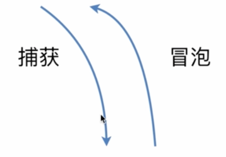

#### DOM 事件流

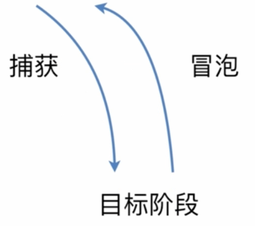

#### 描述 DOM 事件捕获的具体流程

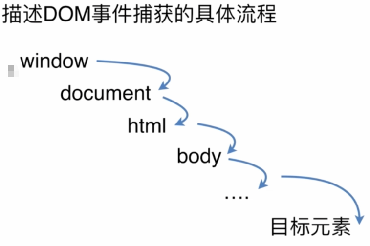

#### Event 对象的常见应用

Event 对象

```js
event.preventDefault(); // 阻止默认事件：a标签链接跳转等
event.stopPropagation(); // 阻止冒泡：元素的冒泡
event.stoplmmediatePropagation(); // 事件响应优先级排序，A和B事件，谁优先
event.currentTarget; // （面试常考）事件代理委托，当前所绑定的事件对象
event.target; // （面试常考）事件代理委托，当前被点击的元素
```

#### 自定义 Event 事件

MDN 事件文档：[事件参考 | MDN (mozilla.org)](https://developer.mozilla.org/zh-CN/docs/Web/Events)

使用`Event`和`CustomEvent`两个方法

Event

```js
var eve = new Event("custome");
ev.addEventListener("custome", function () {
	console.log("custome");
});
// 触发事件
ev.dispatchEvent(eve);
```

CustomEvent

```js
var event = new CustomEvent("build", { detail: elem.dataset.time });
// 允许你在事件监听器中访问更多的数据
function eventHandler(e) {
	log("The time is: " + e.detail);
}
```

#### 自定义事件实战

```html
<!DOCTYPE html>
<html>
	<head>
		<meta charset="utf-8" />
		<title>Event</title>
	</head>
	<body>
		<div id="ev">
			<style media="screen">
				#ev {
					width: 300px;
					height: 100px;
					background: red;
					color: #fff;
					text-align: center;
					line-height: 100px;
				}
			</style>
			目标元素
		</div>
		<script type="text/javascript">
			var ev = document.getElementById("ev");

			// 元素监听点击事件
			ev.addEventListener(
				"click",
				function (e) {
					console.log("ev captrue");
				},
				true
			); // true 捕获阶段触发，false 冒泡阶段触发

			// 注册捕获事件：全局监听点击事件
			window.addEventListener(
				"click",
				function (e) {
					console.log("window captrue");
				},
				true
			); // true 捕获阶段触发，false 冒泡阶段触发

			// document：html文档元素监听点击事件
			document.addEventListener(
				"click",
				function (e) {
					console.log("html captrue");
				},
				true
			); // true 捕获阶段触发，false 冒泡阶段触发

			// documentElement节点监听点击事件
			document.documentElement.addEventListener(
				"click",
				function (e) {
					console.log("html captrue");
				},
				true
			); // true 捕获阶段触发，false 冒泡阶段触发

			// body节点监听点击事件
			document.body.addEventListener(
				"click",
				function (e) {
					console.log("body captrue");
				},
				true
			);

			// 自定义事件
			var eve = new Event("test");
			ev.addEventListener("test", function () {
				console.log("test dispatch");
			});
			setTimeout(function () {
				ev.dispatchEvent(eve);
			}, 1000);
		</script>
	</body>
</html>
```

## JavaScript 有哪些数据类型，它们的区别？

JavaScript 共有八种数据类型，分别是 Undefined、Null、Boolean、Number、String、Object、Symbol、BigInt。

### 其中 Symbol 和 BigInt 是 ES6 中新增的数据类型：

●Symbol 代表创建后独一无二且不可变的数据类型，它主要是为了解决可能出现的全局变量冲突的问题。

●BigInt 是一种数字类型的数据，它可以表示任意精度格式的整数，使用 BigInt 可以安全地存储和操作大整数，即使这个数已经超出了 Number 能够表示的安全整数范围。

### 这些数据可以分为原始数据类型和引用数据类型：

● 栈：原始数据类型（Undefined、Null、Boolean、Number、String）
● 堆：引用数据类型（对象、数组和函数）

### 两种类型的区别在于存储位置的不同：

● 原始数据类型直接存储在栈（stack）中的简单数据段，占据空间小、大小固定，属于被频繁使用数据，所以放入栈中存储；

● 引用数据类型存储在堆（heap）中的对象，占据空间大、大小不固定。如果存储在栈中，将会影响程序运行的性能；引用数据类型在栈中存储了指针，该指针指向堆中该实体的起始地址。当解释器寻找引用值时，会首先检索其在栈中的地址，取得地址后从堆中获得实体。

### 堆和栈的概念存在于数据结构和操作系统内存中，在数据结构中：

● 在数据结构中，栈中数据的存取方式为先进后出。
● 堆是一个优先队列，是按优先级来进行排序的，优先级可以按照大小来规定。

### 在操作系统中，内存被分为栈区和堆区：

● 栈区内存由编译器自动分配释放，存放函数的参数值，局部变量的值等。其操作方式类似于数据结构中的栈。

● 堆区内存一般由开发着分配释放，若开发者不释放，程序结束时可能由垃圾回收机制回收。

## 数据类型检测的方式有哪些

### （1）typeof

```js
console.log(typeof 2); // number
console.log(typeof true); // boolean
console.log(typeof "str"); // string
console.log(typeof []); // object
console.log(typeof function () {}); // function
console.log(typeof {}); // object
console.log(typeof undefined); // undefined
console.log(typeof null); // object
```

其中数组、对象、null 都会被判断为 object，其他判断都正确。

### （2）instanceof

instanceof 可以正确判断对象的类型，其内部运行机制是判断在其原型链中能否找到该类型的原型。

```js
console.log(2 instanceof Number); // false
console.log(true instanceof Boolean); // false
console.log("str" instanceof String); // false

console.log([] instanceof Array); // true
console, log(function () {} instanceof Function); // true
console.log({} instanceof object); // true
```

可以看到，instanceof 只能正确判断引用数据类型，而不能判断基本数据类型。instanceof 运算符可以用来测试一个对象在其原型链中是否存在一个构造函数的 prototype 属性。

### （3） constructor

```js
console.log((2).constructor === Mumber); // true
console.log((true).constructor === Boolean); // true
console.1og(('str').constructor === String); // true
console.log(([]).constructor === Array); // true
console.log((function(){}).constructor === Function); // true
console.l0g(({}).constructor === object); // true
```

constructor 有两个作用，一是判断数据的类型，二是对象实例通过 constrcutor 对象访问它的构造函数。需要注意，如果创建一个对象来改变它的原型，constructor 就不能用来判断数据类型了：

```js
function Fn() {}

Fn.prototype - new Array();

var f = new Fn();

console.log(f.constructor === Fn); // false
console.log(f.constructor === Array); // true
```

### （4）Object.prototype.toString.call()

Object.prototype.toString.call() 使用 Object 对象的原型方法 toString 来判断数据类型：

同样是检测对象 obj 调用 toString 方法，obj.toString()的结果和 Object.prototype.toString.call(obj)的结果不一样，这是为什么？

这是因为 toString 是 Object 的原型方法，而 Array、function 等类型作为 Object 的实例，都重写了 toString 方法。不同的对象类型调用 toString 方法时，根据原型链的知识，调用的是对应的重写之后的 toString 方法（function 类型返回内容为函数体的字符串，Array 类型返回元素组成的字符串…），而不会去调用 Object 上原型 toString 方法（返回对象的具体类型），所以采用 obj.toString()

不能得到其对象类型，只能将 obj 转换为字符串类型；因此，在想要得到对象的具体类型时，应该调用 Object 原型上的 toString 方法。

## null 和 undefined 区别

首先 Undefined 和 Null 都是基本数据类型，这两个基本数据类型分别都只有一个值，就是 undefined 和 null。

undefined 代表的含义是未定义，null 代表的含义是空对象。一般变量声明了但还没有定义的时候会返回 undefined，null 主要用于赋值给一些可能会返回对象的变量，作为初始化。

undefined 在 JavaScript 中不是一个保留字，这意味着可以使用 undefined 来作为一个变量名，但是这样的做法是非常危险的，它会影响对 undefined 值的判断。我们可以通过一些方法获得安全的 undefined 值，比如说 void 0。

当对这两种类型使用 typeof 进行判断时，Null 类型化会返回“object”，这是一个历史遗留的问题。当使用双等号对两种类型的值进行比较时会返回 true，使用三个等号时会返回 false。

## intanceof 操作符的实现原理及实现

instanceof 运算符用于判断构造函数的 prototype 属性是否出现在对象的原型链中的任何位置。

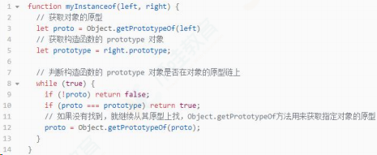

## 如何获取安全的 undefined 值？

因为 undefined 是一个标识符，所以可以被当作变量来使用和赋值，但是这样会影响 undefined 的正常判断。表达式 void \_\_\_ 没有返回值，因此返回结果是 undefined。void 并不改变表达式的结果，只是让表达式不返回值。因此可以用 void 0 来获得 undefined。

## Object.is() 与比较操作符 “===”、“==” 的区别？

使用双等号（==）进行相等判断时，如果两边的类型不一致，则会进行强制类型转化后再进行比较。

使用三等号（===）进行相等判断时，如果两边的类型不一致时，不会做强制类型准换，直接返回 false。

使用 Object.is 来进行相等判断时，一般情况下和三等号的判断相同，它处理了一些特殊的情况，比如 -0 和 +0 不再相等，两个 NaN 是相等的。

## 什么是 JavaScript 中的包装类型？

在 JavaScript 中，基本类型是没有属性和方法的，但是为了便于操作基本类型的值，在调用基本类型的属性或方法时 JavaScript 会在后台隐式地将基本类型的值转换为对象，如：

```js
const a = "abc";
a.length; // 3
a.toUpperCase(); // 'ABC'
```

在 访 问 'abc'.length 时 ， JavaScript 将 'abc' 在 后 台 转 换 成 String('abc')，然后再访问其 length 属性。

JavaScript 也可以使用 Object 函数显式地将基本类型转换为包装类型：

```js
var a = "abc";
Object(a); // String{'abc'}
```

也可以使用 valueOf 方法将包装类型倒转成基本类型：

```js
var a = "abc";
var b = Object(a);
var c = b.valueOf(); // 'abc'
```

看看如下代码会打印出什么：

```js
var a = new Boolean(false);

if (!a) {
	console.log("Oops"); // never runs
}
```

答案是什么都不会打印，因为虽然包裹的基本类型是 false，但是 false 被包裹成包装类型后就成了对象，所以其非值为 false，所以循环体中的内容不会运行。

## 为什么会有 BigInt 的提案？

JavaScript 中 Number.MAX_SAFE_INTEGER 表示最⼤安全数字，计算结果是 9007199254740991，即在这个数范围内不会出现精度丢失（小数除外）。但是⼀旦超过这个范围，js 就会出现计算不准确的情况，这在⼤数计算的时候不得不依靠⼀些第三⽅库进⾏解决，因此官⽅提出了 BigInt 来解决此问题。

## 如何判断一个对象是空对象

使用 JSON 自带的.stringify 方法来判断：

```js
if (json.string(obj == "{}")) {
	console.log("空对象");
}
```

使用 ES6 新增的方法 Object.keys()来判断：

```js
if (Object.keys(obj).length < 0) {
	console.log("空对象");
}
```

## const 对象的属性可以修改吗

const 保证的并不是变量的值不能改动，而是变量指向的那个内存地址不能改动。对于基本类型的数据（数值、字符串、布尔值），其值就保存在变量指向的那个内存地址，因此等同于常量。

但对于引用类型的数据（主要是对象和数组）来说，变量指向数据的内存地址，保存的只是一个指针，const 只能保证这个指针是固定不变的，至于它指向的数据结构是不是可变的，就完全不能控制了。

## 如果 new 一个箭头函数的会怎么样

箭头函数是 ES6 中的提出来的，它没有 prototype，也没有自己的 this 指向，更不可以使用 arguments 参数，所以不能 New 一个箭头函数。

new 操作符的实现步骤如下：

- 1.创建一个对象
- 2.将构造函数的作用域赋给新对象（也就是将对象的`__proto__`属性指向构造函数的 prototype 属性）
- 3.指向构造函数中的代码，构造函数中的 this 指向该对象（也就是为这个对象添加属性和方法）
- 4.返回新的对象

所以，上面的第二、三步，箭头函数都是没有办法执行的。

## 箭头函数的 this 指向哪里？

箭头函数不同于传统 JavaScript 中的函数，箭头函数并没有属于⾃⼰的 this，它所谓的 this 是捕获其所在上下⽂的 this 值，作为⾃⼰的 this 值，并且由于没有属于⾃⼰的 this，所以是不会被 new 调⽤的，这个所谓的 this 也不会被改变。

可以⽤ Babel 理解⼀下箭头函数：

```js
const obj = {
	getArrow() {
		return () => {
			console.log(this === obj);
		};
	},
};
```

转化后：

```js
// ES5，由 Babe1转译
var obj = {
	getArrow: function getArrow() {
		var _this = this;
		return function () {
			console.log(_this === obj);
		};
	},
};
```

## 扩展运算符的作用及使用场景

### （1）对象扩展运算符

对象的扩展运算符(...)用于取出参数对象中的所有可遍历属性，拷贝到当前对象之中。

```js
let bar = { a: 1, b: 2 };
let baz = { ...bar }; // {a:1.b: 2 }
```

上述方法实际上等价于:

```js
let bar = { a: 1, b: 2 };
let baz = Object.assign({}, bar); // { a: 1, b: 2 }
```

Object.assign 方法用于对象的合并，将源对象（source）的所有可枚举属性，复制到目标对象（target）。Object.assign 方法的第一个参数是目标对象，后面的参数都是源对象。(如果目标对象与源对象有同名属性，或多个源对象有同名属性，则后面的属性会覆盖前面的属性)。

同样，如果用户自定义的属性，放在扩展运算符后面，则扩展运算符内部的同名属性会被覆盖掉。

```js
let bar = { a: 1, b: 2 };
let baz = { ...bar, ...{ a: 2, b: 4 } }; // { a: 2, b: 2 }
```

利用上述特性就可以很方便的修改对象的部分属性。在 redux 中的 reducer 函数规定必须是一个纯函数，reducer 中的 state 对象要求不能直接修改，可以通过扩展运算符把修改路径的对象都复制一遍，然后产生一个新的对象返回。

需要注意：扩展运算符对对象实例的拷贝属于浅拷贝。

### （2）数组扩展运算符

数组的扩展运算符可以将一个数组转为用逗号分隔的参数序列，且每次只能展开一层数组。

```js
console.1og(...[1,2,3]) // 1 2 3
console.1og(...[1, [2,3,4], 5])// [1, [2, 3, 4], 5]
```

下面是数组的扩展运算符的应用：

将数组转换为参数序列

```js
function add(x, y) {
	return x + y;
}
const numbers = [1, 2];
add(...numbers); // 3
```

复制数组

```js
const arr1 = [1, 2];
const arr2 = [...arr1];
```

要记住：扩展运算符(…)用于取出参数对象中的所有可遍历属性，拷贝到当前对象之中，这里参数对象是个数组，数组里面的所有对象都是基础数据类型，将所有基础数据类型重新拷贝到新的数组中。

合并数组

如果想在数组内合并数组，可以这样：

```js
const arr1 = ["two", "three"];
const arr2 = ["one", ...arr1, "four", "five"]; // ["one", "three", "four", "five"]
```

扩展运算符与解构赋值结合起来，用于生成数组

```js
const [first, ...rest] = [1, 2, 3, 4, 5];
first; // 1
rest; // [2,3,4,5]
```

需要注意：如果将扩展运算符用于数组赋值，只能放在参数的最后一位，否则会报错。

```js
cons [...rest, 1ast] = [1,2,3,4,5]; // 报错
const[first, ...rest, last] = [1,2,3,4,5]; // 报错
```

将字符串转为真正的数组

```js
[..."he11o"]; // [ 'h','e','l','l','o']
```

任何 Iterator 接口的对象，都可以用扩展运算符转为真正的数组比较常见的应用是可以将某些数据结构转为数组：

```js
// arguments对象
function foo() {
	const args = [...arguments];
}
```

用于替换 es5 中的 Array.prototype.slice.call(arguments)写法。

使用 Math 函数获取数组中特定的值

```js
const numbers = [9, 4, 7, 1];
Math.min(...numbers); // 1
Math.max(...numbers); // 9
```

## 常用的正则表达式有哪些？

## 对 JSON 的理解

JSON 是一种基于文本的轻量级的数据交换格式。它可以被任何的编程语言读取和作为数据格式来传递。

在项目开发中，使用 JSON 作为前后端数据交换的方式。在前端通过将一个符合 JSON 格式的数据结构序列化为 JSON 字符串，然后将它传递到后端，后端通过 JSON 格式的字符串解析后生成对应的数据结构，以此来实现前后端数据的一个传递。

因为 JSON 的语法是基于 js 的，因此很容易将 JSON 和 js 中的对象弄混，但是应该注意的是 JSON 和 js 中的对象不是一回事，JSON 中对象格式更加严格，比如说在 JSON 中属性值不能为函数，不能出现 NaN 这样的属性值等，因此大多数的 js 对象是不符合 JSON 对象的格式的。

在 js 中提供了两个函数来实现 js 数据结构和 JSON 格式的转换处理，JSON.stringify 函数，通过传入一个符合 JSON 格式的数据结构，将其转换为一个 JSON 字符串。如果传入的数据结构不符合 JSON 格式，那么在序列化的时候会对这些值进行对应的特殊处理，使其符合规范。在前端向后端发送数据时，可以调用这个函数将数据对象转化为 JSON 格式的字符串。

JSON.parse() 函数，这个函数用来将 JSON 格式的字符串转换为一个 js 数据结构，如果传入的字符串不是标准的 JSON 格式的字符串的话，将会抛出错误。当从后端接收到 JSON 格式的字符串时，可以通过这个方法来将其解析为一个 js 数据结构，以此来进行数据的访问。

## JavaScript 脚本延迟加载的方式有哪些？

延迟加载就是等页面加载完成之后再加载 JavaScript 文件。js 延迟加载有助于提高页面加载速度。

一般有以下几种方式：

defer 属性：给 js 脚本添加 defer 属性，这个属性会让脚本的加载与文档的解析同步解析，然后在文档解析完成后再执行这个脚本文件，这样的话就能使页面的渲染不被阻塞。多个设置了 defer 属性的脚本按规范来说最后是顺序执行的，但是在一些浏览器中可能不是这样。

async 属性：给 js 脚本添加 async 属性，这个属性会使脚本异步加载，不会阻塞页面的解析过程，但是当脚本加载完成后立即执行 js 脚本，这个时候如果文档没有解析完成的话同样会阻塞。多个 async 属性的脚本的执行顺序是不可预测的，一般不会按照代码的顺序依次执行。

动态创建 DOM 方式：动态创建 DOM 标签的方式，可以对文档的加载事件进行监听，当文档加载完成后再动态的创建 script 标签来引入 js 脚本。

使用 setTimeout 延迟方法：设置一个定时器来延迟加载 js 脚本文件

让 JS 最后加载：将 js 脚本放在文档的底部，来使 js 脚本尽可能的在最后来加载执行。

## 什么是 DOM 和 BOM？

DOM 指的是文档对象模型，它指的是把文档当做一个对象，这个对象主要定义了处理网页内容的方法和接口。

BOM 指的是浏览器对象模型，它指的是把浏览器当做一个对象来对待，这个对象主要定义了与浏览器进行交互的法和接口。BOM 的核心是 window，而 window 对象具有双重角色，它既是通过 js 访问浏览器窗口的一个接口，又是一个 Global（全局）对象。这意味着在网页中定义的任何对象，变量和函数，都作为全局对象的一个属性或者方法存在。window 对象含有 location 对象、navigator 对象、screen 对象等子对象，并且 DOM 的最根本的对象 document 对象也是 BOM 的 window 对象的子对象。

## escape、encodeURI、encodeURIComponent 的区别

encodeURI 是对整个 URI 进行转义，将 URI 中的非法字符转换为合
法字符，所以对于一些在 URI 中有特殊意义的字符不会进行转义。
encodeURIComponent 是对 URI 的组成部分进行转义，所以一些特殊
字符也会得到转义。
escape 和 encodeURI 的作用相同，不过它们对于 unicode 编码为
0xff 之外字符的时候会有区别，escape 是直接在字符的 unicode
编码前加上 %u，而 encodeURI 首先会将字符转换为 UTF-8 的格式，
再在每个字节前加上 %。

## 什么是尾调用，使用尾调用有什么好处？

尾调用指的是函数的最后一步调用另一个函数。代码执行是基于执行栈的，所以当在一个函数里调用另一个函数时，会保留当前的执行上下文，然后再新建另外一个执行上下文加入栈中。使用尾调用的话，因为已经是函数的最后一步，所以这时可以不必再保留当前的执行上下文，从而节省了内存，这就是尾调用优化。但是 ES6 的尾调用优化只在严格模式下开启，正常模式是无效的。

## ES6 模块与 CommonJS 模块有什么异同？

ES6 Module 和 CommonJS 模块的区别：

CommonJS 是对模块的浅拷⻉，ES6 Module 是对模块的引⽤，即 ES6Module 只存只读，不能改变其值，也就是指针指向不能变，类似 const；

import 的接⼝是 read-only（只读状态），不能修改其变量值。 即不能修改其变量的指针指向，但可以改变变量内部指针指向，可以对 commonJS 对重新赋值（改变指针指向），但是对 ES6 Module 赋值会编译报错。

ES6 Module 和 CommonJS 模块的共同点：

CommonJS 和 ES6 Module 都可以对引入的对象进⾏赋值，即对对象内部属性的值进⾏改变。

## for...in 和 for...of 的区别

for…of 是 ES6 新增的遍历方式，允许遍历一个含有 iterator 接口的数据结构（数组、对象等）并且返回各项的值，和 ES3 中的 for…in 的区别如下

for…of 遍历获取的是对象的键值，for…in 获取的是对象的键名；

for… in 会遍历对象的整个原型链，性能非常差不推荐使用，而 for … of 只遍历当前对象不会遍历原型链；

对于数组的遍历，for…in 会返回数组中所有可枚举的属性(包括原型链上可枚举的属性)，for…of 只返回数组的下标对应的属性值；

总结：for...in 循环主要是为了遍历对象而生，不适用于遍历数组；

for...of 循环可以用来遍历数组、类数组对象，字符串、Set、Map 以及 Generator 对象。

## ajax、axios、fetch 的区别

### （1）AJAX

Ajax 即“AsynchronousJavascriptAndXML”（异步 JavaScript 和 XML），是指一种创建交互式网页应用的网页开发技术。它是一种在无需重新加载整个网页的情况下，能够更新部分网页的技术。通过在后台与服务器进行少量数据交换，Ajax 可以使网页实现异步更新。

这意味着可以在不重新加载整个网页的情况下，对网页的某部分进行更新。传统的网页（不使用 Ajax）如果需要更新内容，必须重载整个网页页面。其缺点如下：

- 本身是针对 MVC 编程，不符合前端 MVVM 的浪潮
- 基于原生 XHR 开发，XHR 本身的架构不清晰
- 不符合关注分离（Separation of Concerns）的原则
- 配置和调用方式非常混乱，而且基于事件的异步模型不友好。

### （2）Fetch

fetch 号称是 AJAX 的替代品，是在 ES6 出现的，使用了 ES6 中的 promise 对象。Fetch 是基于 promise 设计的。Fetch 的代码结构比起 ajax 简单多。fetch 不是 ajax 的进一步封装，而是原生 js，没有使用 XMLHttpRequest 对象。

fetch 的优点：

- 语法简洁，更加语义化
- 基于标准 Promise 实现，支持 async/await
- 更加底层，提供的 API 丰富（request, response）
- 脱离了 XHR，是 ES 规范里新的实现方式

fetch 的缺点：

- fetch 只对网络请求报错，对 400，500 都当做成功的请求，服务器返回 400，500 错误码时并不会 reject，只有网络错误这些导致请求不能完成时，fetch 才会被 reject。
- fetch 默 认 不 会 带 cookie ， 需 要 添 加 配 置 项 ： fetch(url, {credentials: 'include'})
- fetch 不 支 持 abort ， 不 支 持 超 时 控 制 ， 使 用 setTimeout 及 Promise.reject 的实现的超时控制并不能阻止请求过程继续在后台运行，造成了流量的浪费
- fetch 没有办法原生监测请求的进度，而 XHR 可以

### （3）Axios

Axios 是一种基于 Promise 封装的 HTTP 客户端，其特点如下：

- 浏览器端发起 XMLHttpRequests 请求
- node 端发起 http 请求
- 支持 Promise API
- 监听请求和返回
- 对请求和返回进行转化
- 取消请求
- 自动转换 json 数据
- 客户端支持抵御 XSRF 攻击

## 对原型、原型链的理解

在 JavaScript 中是使用构造函数来新建一个对象的，每一个构造函数的内部都有一个 prototype 属性，它的属性值是一个对象，这个对象包含了可以由该构造函数的所有实例共享的属性和方法。当使用构造函数新建一个对象后，在这个对象的内部将包含一个指针，这个指针指向构造函数的 prototype 属性对应的值，在 ES5 中这个指针
被称为对象的原型。一般来说不应该能够获取到这个值的，但是现在浏览器中都实现了 `__proto__` 属性来访问这个属性，但是最好不要使用这个属性，因为它不是规范中规定的。ES5 中新增了一个 Object.getPrototypeOf() 方法，可以通过这个方法来获取对象的原型。

当访问一个对象的属性时，如果这个对象内部不存在这个属性，那么它就会去它的原型对象里找这个属性，这个原型对象又会有自己的原型，于是就这样一直找下去，也就是原型链的概念。原型链的尽头一般来说都是 Object.prototype 所以这就是新建的对象为什么能够使用 toString() 等方法的原因。

特点：JavaScript 对象是通过引用来传递的，创建的每个新对象实体中并没有一份属于自己的原型副本。当修改原型时，与之相关的对象也会继承这一改变。

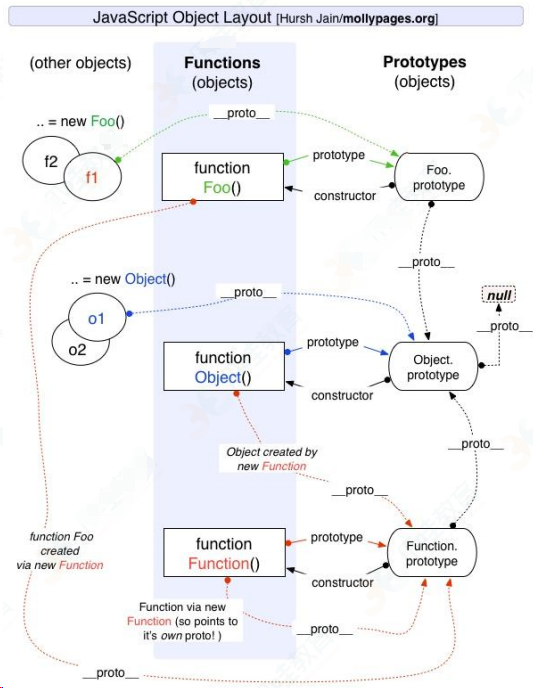

## 原型链的终点是什么？如何打印出原型链的终点？

由于 Object 是构造函数，原型链终点 `Object.prototype.__proto__`，而 `Object.prototype.__proto__=== null // true`，所以，原型链的终点是 null。原型链上的所有原型都是对象，所有的对象最终都是由 Object 构造的，而 Object.prototype 的下一级是 `Object.prototype.__proto__`。

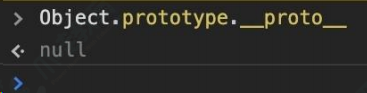

## 对作用域、作用域链的理解

### 1）全局作用域和函数作用域

#### （1）全局作用域

- 最外层函数和最外层函数外面定义的变量拥有全局作用域
- 所有未定义直接赋值的变量自动声明为全局作用域
- 所有 window 对象的属性拥有全局作用域
- 全局作用域有很大的弊端，过多的全局作用域变量会污染全局命名空间，容易引起命名冲突。

#### （2）函数作用域

函数作用域声明在函数内部的变零，一般只有固定的代码片段可以访

问到作用域是分层的，内层作用域可以访问外层作用域，反之不行

### 2）块级作用域

使用 ES6 中新增的 let 和 const 指令可以声明块级作用域，块级作用域可以在函数中创建也可以在一个代码块中的创建（由{ }包裹的代码片段）

let 和 const 声明的变量不会有变量提升，也不可以重复声明

在循环中比较适合绑定块级作用域，这样就可以把声明的计数器变量限制在循环内部。

作用域链：

在当前作用域中查找所需变量，但是该作用域没有这个变量，那这个变量就是自由变量。如果在自己作用域找不到该变量就去父级作用域查找，依次向上级作用域查找，直到访问到 window 对象就被终止，这一层层的关系就是作用域链。

作用域链的作用是保证对执行环境有权访问的所有变量和函数的有序访问，通过作用域链，可以访问到外层环境的变量和函数。

作用域链的本质上是一个指向变量对象的指针列表。变量对象是一个包含了执行环境中所有变量和函数的对象。作用域链的前端始终都是当前执行上下文的变量对象。全局执行上下文的变量对象（也就是全局对象）始终是作用域链的最后一个对象。

当查找一个变量时，如果当前执行环境中没有找到，可以沿着作用域链向后查找。

## 对 this 对象的理解

this 是执行上下文中的一个属性，它指向最后一次调用这个方法的对象。在实际开发中，this 的指向可以通过四种调用模式来判断。

第一种是函数调用模式，当一个函数不是一个对象的属性时，直接作为函数来调用时，this 指向全局对象。

第二种是方法调用模式，如果一个函数作为一个对象的方法来调用时，this 指向这个对象。

第三种是构造器调用模式，如果一个函数用 new 调用时，函数执行前会新创建一个对象，this 指向这个新创建的对象。

第四种是 apply 、 call 和 bind 调用模式，这三个方法都可以显示的指定调用函数的 this 指向。其中 apply 方法接收两个参数：

一个是 this 绑定的对象，一个是参数数组。call 方法接收的参数，第一个是 this 绑定的对象，后面的其余参数是传入函数执行的参数。

也就是说，在使用 call() 方法时，传递给函数的参数必须逐个列举出来。bind 方法通过传入一个对象，返回一个 this 绑定了传入对象的新函数。这个函数的 this 指向除了使用 new 时会被改变，其他情况下都不会改变。

这四种方式，使用构造器调用模式的优先级最高，然后是 apply、call 和 bind 调用模式，然后是方法调用模式，然后是函数调用模式。

## 异步编程的实现方式？

JavaScript 中的异步机制可以分为以下几种：

回调函数 的方式，使用回调函数的方式有一个缺点是，多个回调函数嵌套的时候会造成回调函数地狱，上下两层的回调函数间的代码耦合度太高，不利于代码的可维护。

Promise 的方式，使用 Promise 的方式可以将嵌套的回调函数作为链式调用。但是使用这种方法，有时会造成多个 then 的链式调用，可能会造成代码的语义不够明确。

generator 的方式，它可以在函数的执行过程中，将函数的执行权转移出去，在函数外部还可以将执行权转移回来。当遇到异步函数执行的时候，将函数执行权转移出去，当异步函数执行完毕时再将执行权给转移回来。因此在 generator 内部对于异步操作的方式，可以以同步的顺序来书写。使用这种方式需要考虑的问题是何时将函数的控制权转移回来，因此需要有一个自动执行 generator 的机制，比如说 co 模块等方式来实现 generator 的自动执行。

async 函数 的方式，async 函数是 generator 和 promise 实现的一个自动执行的语法糖，它内部自带执行器，当函数内部执行到一个 await 语句的时候，如果语句返回一个 promise 对象，那么函数将会等待 promise 对象的状态变为 resolve 后再继续向下执行。因此可以将异步逻辑，转化为同步的顺序来书写，并且这个函数可以自动执行。

## 对 Promise 的理解

Promise 是异步编程的一种解决方案，它是一个对象，可以获取异步操作的消息，他的出现大大改善了异步编程的困境，避免了地狱回调，它比传统的解决方案回调函数和事件更合理和更强大。

所谓 Promise，简单说就是一个容器，里面保存着某个未来才会结束的事件（通常是一个异步操作）的结果。从语法上说，Promise 是一个对象，从它可以获取异步操作的消息。Promise 提供统一的 API，各种异步操作都可以用同样的方法进行处理。

（1）Promise 的实例有三个状态:

Pending（进行中）
Resolved（已完成）
Rejected（已拒绝）

当把一件事情交给 promise 时，它的状态就是 Pending，任务完成了状态就变成了 Resolved、没有完成失败了就变成了 Rejected。

（2）Promise 的实例有两个过程：

pending -> fulfilled : Resolved（已完成）
pending -> rejected：Rejected（已拒绝）

注意：一旦从进行状态变成为其他状态就永远不能更改状态了。

Promise 的特点：

对象的状态不受外界影响。promise 对象代表一个异步操作，有三种状态，pending（进行中）、fulfilled（已成功）、rejected（已失败）。只有异步操作的结果，可以决定当前是哪一种状态，任何其他操作都无法改变这个状态，这也是 promise 这个名字的由来——“承诺”；

一旦状态改变就不会再变，任何时候都可以得到这个结果。promise 对象的状态改变，只有两种可能：从 pending 变为 fulfilled，从 pending 变为 rejected。这时就称为 resolved（已定型）。如果改变已经发生了，你再对 promise 对象添加回调函数，也会立即得到这个结果。这与事件（event）完全不同，事件的特点是：如果你错过
了它，再去监听是得不到结果的。

Promise 的缺点：

无法取消 Promise，一旦新建它就会立即执行，无法中途取消。

如果不设置回调函数，Promise 内部抛出的错误，不会反应到外部。

当处于 pending 状态时，无法得知目前进展到哪一个阶段（刚刚开始还是即将完成）。

### 总结：

Promise 对象是异步编程的一种解决方案，最早由社区提出。Promise 是一个构造函数，接收一个函数作为参数，返回一个 Promise 实例。

一个 Promise 实例有三种状态，分别是 pending、resolved 和 rejected，分别代表了进行中、已成功和已失败。实例的状态只能由 pending 转变 resolved 或者 rejected 状态，并且状态一经改变，就凝固了，无法再被改变了。

状态的改变是通过 resolve() 和 reject() 函数来实现的，可以在异步操作结束后调用这两个函数改变 Promise 实例的状态，它的原型上定义了一个 then 方法，使用这个 then 方法可以为两个状态的改变注册回调函数。这个回调函数属于微任务，会在本轮事件循环的末尾执行。

注意：在构造 Promise 的时候，构造函数内部的代码是立即执行的

## 对 async/await 的理解

async/await 其实是 Generator 的语法糖，它能实现的效果都能用 then 链来实现，它是为优化 then 链而开发出来的。从字面上来看，async 是“异步”的简写，await 则为等待，所以很好理解 async 用于申明一个 function 是异步的，而 await 用于等待一个异步方法执行完成。当然语法上强制规定 await 只能出现在 asnyc 函数中，先来看看 async 函数返回了什么：

所以，async 函数返回的是一个 Promise 对象。async 函数（包含函数语句、函数表达式、Lambda 表达式）会返回一个 Promise 对象，如果在函数中 return 一个直接量，async 会把这个直接量通过 Promise.resolve() 封装成 Promise 对象。

async 函数返回的是一个 Promise 对象，所以在最外层不能用 await 获取其返回值的情况下，当然应该用原来的方式：then() 链来处理这个 Promise 对象，就像这样：

那如果 async 函数没有返回值，又该如何？很容易想到，它会返回 Promise.resolve(undefined)。

联想一下 Promise 的特点——无等待，所以在没有 await 的情况下执行 async 函数，它会立即执行，返回一个 Promise 对象，并且，绝不会阻塞后面的语句。这和普通返回 Promise 对象的函数并无二致。

注意：Promise.resolve(x) 可以看作是 new Promise(resolve =>resolve(x)) 的简写，可以用于快速封装字面量对象或其他对象，将其封装成 Promise 实例。

## async/await 的优势

单一的 Promise 链并不能发现 async/await 的优势，但是，如果需要处理由多个 Promise 组成的 then 链的时候，优势就能体现出来了（很有意思，Promise 通过 then 链来解决多层回调的问题，现在又用 async/await 来进一步优化它）。

假设一个业务，分多个步骤完成，每个步骤都是异步的，而且依赖于上一个步骤的结果。仍然用 setTimeout 来模拟异步操作：

现在用 Promise 方式来实现这三个步骤的处理：

输出结果 result 是 step3() 的参数 700 + 200 = 900。doIt() 顺序执行了三个步骤，一共用了 300 + 500 + 700 = 1500 毫秒，和 console.time()/console.timeEnd() 计算的结果一致。

如果用 async/await 来实现呢，会是这样：

结果和之前的 Promise 实现是一样的，但是这个代码看起来是不是清晰得多，几乎跟同步代码一样

## async/await 对比 Promise 的优势

代码读起来更加同步，Promise 虽然摆脱了回调地狱，但是 then 的链式调⽤也会带来额外的阅读负担

Promise 传递中间值⾮常麻烦，⽽ async/await ⼏乎是同步的写法，⾮常优雅

错误处理友好，async/await 可以⽤成熟的 try/catch，Promise 的错误捕获⾮常冗余

调试友好，Promise 的调试很差，由于没有代码块，你不能在⼀个返回表达式的箭头函数中设置断点，如果你在⼀个.then 代码块中使⽤调试器的步进(step-over)功能，调试器并不会进入后续的.then 代码块，因为调试器只能跟踪同步代码的每⼀步。

## 对象创建的方式有哪些？

一般使用字面量的形式直接创建对象，但是这种创建方式对于创建大量相似对象的时候，会产生大量的重复代码。但 js 和一般的面向对象的语言不同，在 ES6 之前它没有类的概念。但是可以使用函数来进行模拟，从而产生出可复用的对象创建方式，常见的有以下几种：

（1）第一种是工厂模式，工厂模式的主要工作原理是用函数来封装创建对象的细节，从而通过调用函数来达到复用的目的。但是它有一个很大的问题就是创建出来的对象无法和某个类型联系起来，它只是简单的封装了复用代码，而没有建立起对象和类型间的关系。

（2）第二种是构造函数模式。js 中每一个函数都可以作为构造函数，只要一个函数是通过 new 来调用的，那么就可以把它称为构造函数。

执行构造函数首先会创建一个对象，然后将对象的原型指向构造函数的 prototype 属性，然后将执行上下文中的 this 指向这个对象，最后再执行整个函数，如果返回值不是对象，则返回新建的对象。因为 this 的值指向了新建的对象，因此可以使用 this 给对象赋值。

构造函数模式相对于工厂模式的优点是，所创建的对象和构造函数建立起了联系，因此可以通过原型来识别对象的类型。但是构造函数存在一个缺点就是，造成了不必要的函数对象的创建，因为在 js 中函数也是一个对象，因此如果对象属性中如果包含函数的话，那么每次都会新建一个函数对象，浪费了不必要的内存空间，因为函数是所有的实例都可以通用的。

（3）第三种模式是原型模式，因为每一个函数都有一个 prototype 属性，这个属性是一个对象，它包含了通过构造函数创建的所有实例都能共享的属性和方法。因此可以使用原型对象来添加公用属性和方法，从而实现代码的复用。这种方式相对于构造函数模式来说，解决了函数对象的复用问题。但是这种模式也存在一些问题，一个是没有办法通过传入参数来初始化值，另一个是如果存在一个引用类型如 Array 这样的值，那么所有的实例将共享一个对象，一个实例对引用类型值的改变会影响所有的实例。

（4）第四种模式是组合使用构造函数模式和原型模式，这是创建自定义类型的最常见方式。因为构造函数模式和原型模式分开使用都存在一些问题，因此可以组合使用这两种模式，通过构造函数来初始化对象的属性，通过原型对象来实现函数方法的复用。这种方法很好的解决了两种模式单独使用时的缺点，但是有一点不足的就是，因为使用了两种不同的模式，所以对于代码的封装性不够好。

（5）第五种模式是动态原型模式，这一种模式将原型方法赋值的创建过程移动到了构造函数的内部，通过对属性是否存在的判断，可以实现仅在第一次调用函数时对原型对象赋值一次的效果。这一种方式很好地对上面的混合模式进行了封装。

（6）第六种模式是寄生构造函数模式，这一种模式和工厂模式的实现基本相同，我对这个模式的理解是，它主要是基于一个已有的类型，在实例化时对实例化的对象进行扩展。这样既不用修改原来的构造函数，也达到了扩展对象的目的。它的一个缺点和工厂模式一样，无法实现对象的识别。

## 对象继承的方式有哪些？

（1）第一种是以原型链的方式来实现继承，但是这种实现方式存在的缺点是，在包含有引用类型的数据时，会被所有的实例对象所共享，容易造成修改的混乱。还有就是在创建子类型的时候不能向超类型传递参数。

（2）第二种方式是使用借用构造函数的方式，这种方式是通过在子类型的函数中调用超类型的构造函数来实现的，这一种方法解决了不能向超类型传递参数的缺点，但是它存在的一个问题就是无法实现函数方法的复用，并且超类型原型定义的方法子类型也没有办法访问到。

（3）第三种方式是组合继承，组合继承是将原型链和借用构造函数组合起来使用的一种方式。通过借用构造函数的方式来实现类型的属性的继承，通过将子类型的原型设置为超类型的实例来实现方法的继承。这种方式解决了上面的两种模式单独使用时的问题，但是由于我们是以超类型的实例来作为子类型的原型，所以调用了两次超类的构造函数，造成了子类型的原型中多了很多不必要的属性。

（4）第四种方式是原型式继承，原型式继承的主要思路就是基于已有的对象来创建新的对象，实现的原理是，向函数中传入一个对象，然后返回一个以这个对象为原型的对象。这种继承的思路主要不是为了实现创造一种新的类型，只是对某个对象实现一种简单继承，ES5 中定义的 Object.create() 方法就是原型式继承的实现。缺点与原型链方式相同。

（5）第五种方式是寄生式继承，寄生式继承的思路是创建一个用于封装继承过程的函数，通过传入一个对象，然后复制一个对象的副本，然后对象进行扩展，最后返回这个对象。这个扩展的过程就可以理解是一种继承。这种继承的优点就是对一个简单对象实现继承，如果这个对象不是自定义类型时。缺点是没有办法实现函数的复用。

（6）第六种方式是寄生式组合继承，组合继承的缺点就是使用超类型的实例做为子类型的原型，导致添加了不必要的原型属性。寄生式组合继承的方式是使用超类型的原型的副本来作为子类型的原型，这样就避免了创建不必要的属性。

## 哪些情况会导致内存泄漏

以下四种情况会造成内存的泄漏：

意外的全局变量：由于使用未声明的变量，而意外的创建了一个全局变量，而使这个变量一直留在内存中无法被回收。

被遗忘的计时器或回调函数：设置了 setInterval 定时器，而忘记取消它，如果循环函数有对外部变量的引用的话，那么这个变量会被一直留在内存中，而无法被回收。

脱离 DOM 的引用：获取一个 DOM 元素的引用，而后面这个元素被删除，由于一直保留了对这个元素的引用，所以它也无法被回收。

闭包：不合理的使用闭包，从而导致某些变量一直被留在内存当中。

## 待定

### 1.问：0.1 + 0.2 === 0.3 嘛？为什么？

JavaScirpt 使用 Number 类型来表示数字（整数或浮点数），遵循 IEEE 754 标准，通过 64 位来表示一个数字（1 + 11 + 52）

- 1 符号位，0 表示正数，1 表示负数 s
- 11 指数位（e）
- 52 尾数，小数部分（即有效数字）

最大安全数字：Number.MAX_SAFE_INTEGER = Math.pow(2, 53) - 1，转换成整数就是 16 位，所以 0.1 === 0.1，是因为通过 toPrecision(16) 去有效位之后，两者是相等的。

在两数相加时，会先转换成二进制，0.1 和 0.2 转换成二进制的时候尾数会发生无限循环，然后进行对阶运算，JS 引擎对二进制进行截断，所以造成精度丢失。

所以总结：精度丢失可能出现在进制转换和对阶运算中

### 2.JS 数据类型

基本类型：Number、Boolean、String、null、undefined、symbol（ES6 新增的），BigInt（ES2020） 引用类型：Object，对象子类型（Array，Function）

### 3.JS 整数是怎么表示的？

通过 Number 类型来表示，遵循 IEEE754 标准，通过 64 位来表示一个数字，（1 + 11 + 52），最大安全数字是 Math.pow(2, 53) - 1，对于 16 位十进制。（符号位 + 指数位 + 小数部分有效位）

### 4.Number() 的存储空间是多大？如果后台发送了一个超过最大自己的数字怎么办

Math.pow(2, 53) ，53 为有效数字，会发生截断，等于 JS 能支持的最大数字。

### 1.判断 js 类型的方式

#### 1. typeof

可以判断出'string','number','boolean','undefined','symbol'
但判断 typeof(null) 时值为 'object'; 判断数组和对象时值均为 'object'

#### 2. instanceof

原理是 构造函数的 prototype 属性是否出现在对象的原型链中的任何位置

```javascript
function A() {}
let a = new A();
a instanceof A; // true,因为 Object.getPrototypeOf(a) === A.prototype;
```

#### 3. Object.prototype.toString.call()

常用于判断浏览器内置对象,对于所有基本的数据类型都能进行判断，即使是 null 和 undefined

#### 4. Array.isArray()

用于判断是否为数组

### 2.ES5 和 ES6 分别几种方式声明变量

ES5 有俩种：`var` 和 `function`

ES6 有六种：增加四种，`let`、`const`、`class` 和 `import`

注意：`let`、`const`、`class`声明的全局变量再也不会和全局对象的属性挂钩

### 3.闭包的概念？优缺点？

闭包的概念：闭包就是能读取其他函数内部变量的函数。

优点：

1. 避免全局变量的污染
2. 希望一个变量长期存储在内存中（缓存变量）

缺点：

1. 内存泄露（消耗）
2. 常驻内存，增加内存使用量

### 4.数组去重的方法

#### 1.ES6 的 Set

```javascript
let arr = [1, 1, 2, 3, 4, 5, 5, 6];
let arr2 = [...new Set(arr)];
```

#### 2.reduce()

```javascript
let arr = [1, 1, 2, 3, 4, 5, 5, 6];
let arr2 = arr.reduce(function (ar, cur) {
	if (!ar.includes(cur)) {
		ar.push(cur);
	}

	return ar;
}, []);
```

#### 3.filter()

```javascript
// 这种方法会有一个问题：[1,'1']会被当做相同元素，最终输入[1]
let arr = [1, 1, 2, 3, 4, 5, 5, 6];
let arr2 = arr.filter(function (item, index) {
	// indexOf() 方法可返回某个指定的 字符串值 在字符串中首次出现的位置
	return arr.indexOf(item) === index;
});
```

### 5.DOM 事件有哪些阶段？谈谈对事件代理的理解

分为三大阶段：捕获阶段--目标阶段--冒泡阶段

事件代理简单说就是：事件不直接绑定到某元素上，而是绑定到该元素的父元素上，进行触发事件操作时(例如'click')，再通过条件判断，执行事件触发后的语句(例如'alert(e.target.innerHTML)')

好处：(1)使代码更简洁；(2)节省内存开销

### 6.js 执行机制、事件循环

JavaScript 语言的一大特点就是单线程，同一个时间只能做一件事。单线程就意味着，所有任务需要排队，前一个任务结束，才会执行后一个任务。如果前一个任务耗时很长，后一个任务就不得不一直等着。JavaScript 语言的设计者意识到这个问题，将所有任务分成两种，一种是**同步任务（synchronous），另一种是异步任务（asynchronous）**，在所有同步任务执行完之前，任何的异步任务是不会执行的。

当我们打开网站时，网页的渲染过程就是一大堆同步任务，比如页面骨架和页面元素的渲染。而像加载图片音乐之类占用资源大耗时久的任务，就是异步任务。关于这部分有严格的文字定义，但本文的目的是用最小的学习成本彻底弄懂执行机制，所以我们用导图来说明：
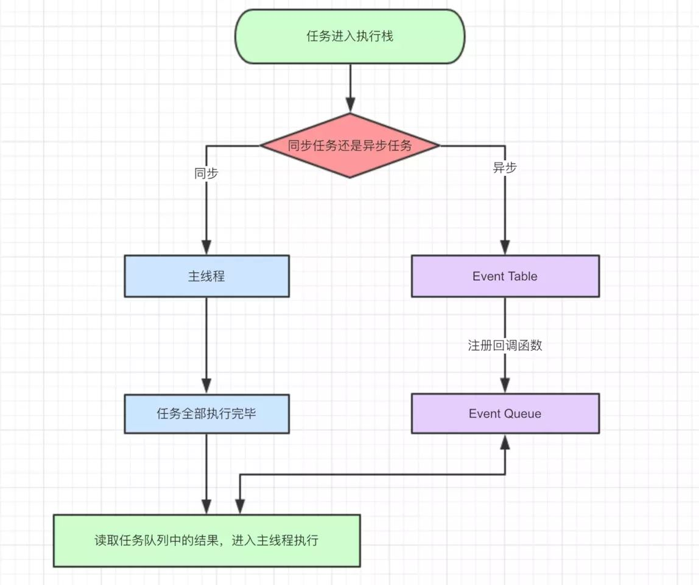

导图要表达的内容用文字来表述的话：

同步和异步任务分别进入不同的执行"场所"，同步的进入主线程，异步的进入 Event Table 并注册函数。当**指定的事情完成时**，Event Table 会将这个函数移入 Event Queue。主线程内的任务执行完毕为空，会去 Event Queue 读取对应的函数，进入主线程执行。上述过程会不断重复，也就是常说的 Event Loop(事件循环)。

我们不禁要问了，那怎么知道主线程执行栈为空啊？js 引擎存在 monitoring process 进程，会持续不断的检查主线程执行栈是否为空，一旦为空，就会去 Event Queue 那里检查是否有等待被调用的函数。换一张图片也许更好理解主线程的执行过程：

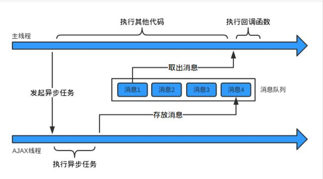
上图用文字表述就是：主线程从"任务队列"中读取事件，这个过程是循环不断的，所以整个的这种运行机制又称为 Event Loop（事件循环)。只要主线程空了，就会去读取"任务队列"，这就是 JavaScript 的运行机制。

说完 JS 主线程的执行机制，下面说说经常被问到的 JS 异步中 宏任务

（macrotasks）、微任务（microtasks）执行顺序。**JS 异步有一个机制，就是遇到宏任务，先执行宏任务，将宏任务放入 Event Queue，然后再执行微任务，将微任务放入 Event Queue，但是，这两个 Queue 不是一个 Queue。当你往外拿的时候先从微任务里拿这个回调函数，然后再从宏任务的 Queue 拿宏任务的回调函数**。如下图：
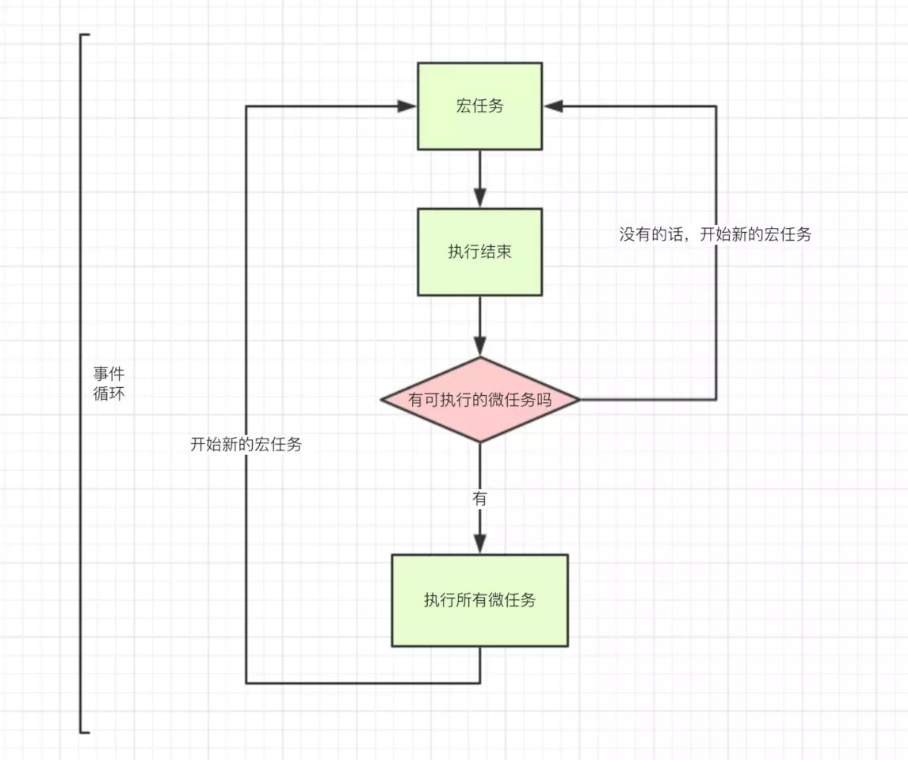

宏任务：整体代码 script，setTimeout，setInterval

微任务：Promise，process.nextTick

参考链接：[这一次，彻底弄懂 JavaScript 执行机制 - 掘金 (juejin.cn)](https://juejin.cn/post/6844903512845860872)

### 7.介绍下 promise.all

Promise.all()方法将多个 Promise 实例包装成一个 Promise 对象（p），接受一个数组（p1,p2,p3）作为参数，数组中不一定需要都是 Promise 对象，但是一定具有 Iterator 接口，如果不是的话，就会调用 Promise.resolve 将其转化为 Promise 对象之后再进行处理。

使用 Promise.all()生成的 Promise 对象（p）的状态是由数组中的 Promise 对象（p1,p2,p3）决定的。

1. 如果所有的 Promise 对象（p1,p2,p3）都变成 fullfilled 状态的话，生成的 Promise 对象（p）也会变成 fullfilled 状态，p1,p2,p3 三个 Promise 对象产生的结果会组成一个数组返回给传递给 p 的回调函数。
2. 如果 p1,p2,p3 中有一个 Promise 对象变为 rejected 状态的话，p 也会变成 rejected 状态，第一个被 rejected 的对象的返回值会传递给 p 的回调函数。
3. Promise.all()方法生成的 Promise 对象也会有一个 catch 方法来捕获错误处理，但是如果数组中的 Promise 对象变成 rejected 状态时，并且这个对象还定义了 catch 的方法，那么 rejected 的对象会执行自己的 catch 方法。并且返回一个状态为 fullfilled 的 Promise 对象，Promise.all()生成的对象会接受这个 Promise 对象，不会返回 rejected 状态。

### 8.async 和 await

主要考察宏任务和微任务，搭配 promise，询问一些输出的顺序

原理：**async 和 await 用了同步的方式去做异步，async 定义的函数的返回值都是 promise，await 后面的函数会先执行一遍，然后就会跳出整个 async 函数来执行后面 js 栈的代码**

### 9.ES6 的 class 和构造函数的区别

class 的写法只是语法糖，和之前 prototype 差不多，但还是有细微差别的，下面看看：

##### 1. 严格模式

类和模块的内部，默认就是严格模式，所以不需要使用`use strict`指定运行模式。只要你的代码写在类或模块之中，就只有严格模式可用。考虑到未来所有的代码，其实都是运行在模块之中，所以 ES6 实际上把整个语言升级到了严格模式。

##### 2. 不存在提升

类不存在变量提升（hoist），这一点与 ES5 完全不同。

```cpp
new Foo(); // ReferenceError
class Foo {}
```

##### 3. 方法默认是不可枚举的

ES6 中的 class，它的方法（包括静态方法和实例方法）默认是不可枚举的，而构造函数默认是可枚举的。细想一下，这其实是个优化，让你在遍历时候，不需要再判断 hasOwnProperty 了

##### 4. class 的所有方法（包括静态方法和实例方法）都没有原型对象 prototype，所以也没有[[construct]]，不能使用 new 来调用。

##### 5. class 必须使用 new 调用，否则会报错。这是它跟普通构造函数的一个主要区别，后者不用 new 也可以执行。

##### 6. ES5 和 ES6 子类 this 生成顺序不同

ES5 的继承先生成了子类实例，再调用父类的构造函数修饰子类实例。ES6 的继承先 生成父类实例，再调用子类的构造函数修饰父类实例。这个差别使得 ES6 可以继承内置对象。

##### 7. ES6 可以继承静态方法，而构造函数不能

### 10.transform、translate、transition 分别是什么属性？CSS 中常用的实现动画方式

三者属性说明

- transform 是指变换、变形，是 css3 的一个属性，和 width，height 属性一样；
- translate 是 transform 的属性值，是指元素进行 2D(3D)维度上位移或范围变换;
- transition 是指过渡效果，往往理解成简单的动画，需要有触发条件。

这里可以补充下 transition 和 animation 的比较，前者一般定义开始结束两个状态，需要有触发条件；而后者引入了关键帧、速度曲线、播放次数等概念，更符合动画的定义，且无需触发条件。

### 11.介绍一下 rAF(requestAnimationFrame)

专门用来做动画，不卡顿，用法和 setTimeout 一样。对 rAF 的阐述：[Window：requestAnimationFrame() 方法 - Web API 接口参考 | MDN (mozilla.org)](https://developer.mozilla.org/zh-CN/docs/Web/API/Window/requestAnimationFrame)

定时器一直是 js 动画的核心技术，但它们不够精准，因为定时器时间参数是指将执行代码放入 UI 线程队列中等待的时间，如果前面有其他任务队列执行时间过长，则会导致动画延迟，效果不精确等问题。

所以处理动画循环的关键是知道延迟多长时间合适：时间要足够短，才能让动画看起来比较柔滑平顺，避免多余性能损耗；时间要足够长，才能让浏览器准备好变化渲染。这个时候 rAF 就出现了，采用系统时间间隔(大多浏览器刷新频率是 60Hz，相当于 1000ms/60≈16.6ms)，保持最佳绘制效率，不会因为间隔时间过短，造成过度绘制，增加开销；也不会因为间隔时间太长，使用动画卡顿不流畅，让各种网页动画效果能够有一个统一的刷新机制。

并且 rAF 会把每一帧中的所有 DOM 操作集中起来，在一次重绘或回流中就完成。

详情：[CSS3 动画那么强，requestAnimationFrame 还有毛线用？ « 张鑫旭-鑫空间-鑫生活 (zhangxinxu.com)](https://www.zhangxinxu.com/wordpress/2013/09/css3-animation-requestanimationframe-tween-动画算法/)

### 12.javascript 的垃圾回收机制讲一下

定义：指一块被分配的内存既不能使用，又不能回收，直到浏览器进程结束。

像 C 这样的编程语言，具有低级内存管理原语，如 malloc()和 free()。开发人员使用这些原语显式地对操作系统的内存进行分配和释放。

而 JavaScript 在创建对象(对象、字符串等)时会为它们分配内存，不再使用对时会“自动”释放内存，这个过程称为垃圾收集。

内存生命周期中的每一个阶段:

分配内存 —  内存是由操作系统分配的，它允许您的程序使用它。在低级语言(例如 C 语言)中，这是一个开发人员需要自己处理的显式执行的操作。然而，在高级语言中，系统会自动为你分配内在。

使用内存 — 这是程序实际使用之前分配的内存，在代码中使用分配的变量时，就会发生读和写操作。

释放内存 — 释放所有不再使用的内存,使之成为自由内存,并可以被重利用。与分配内存操作一样,这一操作在低级语言中也是需要显式地执行。

##### 四种常见的内存泄漏：全局变量，未清除的定时器，闭包，以及 dom 的引用

1. 全局变量 不用 var 声明的变量，相当于挂载到 window 对象上。如：b=1; 解决：使用严格模式
2. 被遗忘的定时器和回调函数
3. 闭包
4. 没有清理的 DOM 元素引用

### 13.对前端性能优化有什么了解？一般都通过那几个方面去优化的？

[前端性能优化的七大手段](https://www.cnblogs.com/xiaohuochai/p/9178390.html)

1. 减少请求数量
2. 减小资源大小
3. 优化网络连接
4. 优化资源加载
5. 减少重绘回流
6. 性能更好的 API
7. webpack 优化

## BOM

### 6.事件流

事件流是网页元素接收事件的顺序，"DOM2 级事件"规定的事件流包括三个阶段：事件捕获阶段、处于目标阶段、事件冒泡阶段。 首先发生的事件捕获，为截获事件提供机会。然后是实际的目标接受事件。

最后一个阶段是时间冒泡阶段，可以在这个阶段对事件做出响应。 虽然捕获阶段在规范中规定不允许响应事件，但是实际上还是会执行，所以有两次机会获取到目标对象。

```html
<!DOCTYPE html>
<html lang="en">
	<head>
		<meta charset="UTF-8" />
		<title>事件冒泡</title>
	</head>
	<body>
		<div>
			<p id="parEle">我是父元素 <span id="sonEle">我是子元素</span></p>
		</div>
	</body>
</html>
<script type="text/javascript">
	var sonEle = document.getElementById("sonEle");
	var parEle = document.getElementById("parEle");
	parEle.addEventListener(
		"click",
		function () {
			alert("父级 冒泡");
		},
		false
	);
	parEle.addEventListener(
		"click",
		function () {
			alert("父级 捕获");
		},
		true
	);
	sonEle.addEventListener(
		"click",
		function () {
			alert("子级冒泡");
		},
		false
	);
	sonEle.addEventListener(
		"click",
		function () {
			alert("子级捕获");
		},
		true
	);
</script>
```

当容器元素及嵌套元素，即在 捕获阶段 又在 冒泡阶段 调用事件处理程序时：事件按 DOM 事件流的顺序执行事件处理程序：

- 父级捕获
- 子级冒泡
- 子级捕获
- 父级冒泡

且当事件处于目标阶段时，事件调用顺序决定于绑定事件的书写顺序，按上面的例子为，先调用冒泡阶段的事件处理程序，再调用捕获阶段的事件处理程序。依次 alert 出“子集冒泡”，“子集捕获”。

### IE 兼容

attchEvent('on' + type, handler)
detachEvent('on' + type, handler)

## 代码输出结果

```javascript
const async1 = async () => {
	console.log("async1");
	setTimeout(() => {
		console.log("timer1");
	}, 2000);
	await new Promise((resolve) => {
		console.log("promise1");
	});
	console.log("async1 end");
	return "async1 success";
};
console.log("script start");
async1().then((res) => console.log(res));
console.log("script end");
Promise.resolve(1)
	.then(2)
	.then(Promise.resolve(3))
	.catch(4)
	.then((res) => console.log(res));
setTimeout(() => {
	console.log("timer2");
}, 1000);
```

输出结果如下：

```bash
script start
async1
promise1
script end
1
timer2
timer1
```

代码的执行过程如下：

1. 首先执行同步带吗，打印出 script start；
2. 遇到定时器 timer1 将其加入宏任务队列；
3. 之后是执行 Promise，打印出 promise1，由于 Promise 没有返回值，所以后面的代码不会执行；
4. 然后执行同步代码，打印出 script end；
5. 继续执行下面的 Promise，.then 和.catch 期望参数是一个函数，这里传入的是一个数字，因此就会发生值渗透，将 resolve(1)的值传到最后一个 then，直接打印出 1；
6. 遇到第二个定时器，将其加入到微任务队列，执行微任务队列，按顺序依次执行两个定时器，但是由于定时器时间的原因，会在两秒后先打印出 timer2，在四秒后打印出 timer1。

## 7.事件是如何实现的？

基于发布订阅模式，就是在浏览器加载的时候会读取事件相关的代码，但是只有实际等到具体的事件触发的时候才会执行。

比如点击按钮，这是个事件（Event），而负责处理事件的代码段通常被称为事件处理程序（EventHandler），也就是「启动对话框的显示」这个动作。

在 Web 端，我们常见的就是 DOM 事件：

DOM0 级事件，直接在 html 元素上绑定 on-event，比如 onclick，取消的话，dom.onclick = null，同一个事件只能有一个处理程序，后面的会覆盖前面的。

DOM2 级事件，通过 addEventListener 注册事件，通过 removeEventListener 来删除事件，一个事件可以有多个事件处理程序，按顺序执行，捕获事件和冒泡事件 DOM3 级事件，增加了事件类型，比如 UI 事件，焦点事件，鼠标事件

## setTimeout(fn, 0)多久才执行，Event Loop

setTimeout 按照顺序放到队列里面，然后等待函数调用栈清空之后才开始执行，而这些操作进入队列的顺序，则由设定的延迟时间来决定

## 如何判断一个对象是不是空对象？

Object.keys(obj).length === 0
手写题：在线编程，getUrlParams(url,key); 就是很简单的获取 url 的某个参数的问题，但要考虑边界情
况，多个返回值等等

## 24.`<script src=’xxx’ ’xxx’/>`外部 js 文件先加载还是 onload 先执行，为什么？

onload 是所以加载完成之后执行的

## 24.怎么加事件监听

onclick 和 addEventListener

## 25.事件传播机制（事件流）

冒泡和捕获

## 26.说一下原型链和原型链的继承吧

所有普通的 [[Prototype]] 链最终都会指向内置的 Object.prototype，其包含了 JavaScript 中许多通用的功能

为什么能创建 “类”，借助一种特殊的属性：所有的函数默认都会拥有一个名为 prototype 的共有且不可枚举的属性，它会指向另外一个对象，这个对象通常被称为函数的原型

```js
function Person(name) {
	this.name = name;
}
Person.prototype.constructor = Person;
```

在发生 new 构造函数调用时，会将创建的新对象的 [[Prototype]] 链接到 Person.prototype 指向的对象，这个机制就被称为原型链继承

方法定义在原型上，属性定义在构造函数上

首先要说一下 JS 原型和实例的关系：每个构造函数 （constructor）都有一个原型对象（prototype），这个原型对象包含一个指向此构造函数的指针属性，通过 new 进行构造函数调用生成的实例，此实例包含一个指向原型对象的指针，也就是通过 [[Prototype]] 链接到了这个原型对象

然后说一下 JS 中属性的查找：当我们试图引用实例对象的某个属性时，是按照这样的方式去查找的，首先查找实例对象上是否有这个属性，如果没有找到，就去构造这个实例对象的构造函数的 prototype 所指向的对象上去查找，如果还找不到，就从这个 prototype 对象所指向的构造函数的 prototype 原型对象上去查找

什么是原型链：这样逐级查找形似一个链条，且通过 [[Prototype]] 属性链接，所以被称为原型链什么是原型链继承，类比类的继承：当有两个构造函数 A 和 B，将一个构造函数 A 的原型对象的，通过其 [[Prototype]] 属性链接到另外一个 B 构造函数的原型对象时，这个过程被称之为原型继承。

## 说下对 JS 的了解吧

是基于原型的动态语言，主要独特特性有 this、原型和原型链。

JS 严格意义上来说分为：语言标准部分（ECMAScript）+ 宿主环境部分

### 语言标准部分

2015 年发布 ES6，引入诸多新特性使得能够编写大型项目变成可能，标准自 2015 之后以年号代号，每年一更

### 宿主环境部分

在浏览器宿主环境包括 DOM + BOM 等

在 Node，宿主环境包括一些文件、数据库、网络、与操作系统的交互等

## 数组能够调用的函数有那些？

- push
- pop
- splice
- slice
- shift
- unshift
- sort
- find
- findIndex
- map/filter/reduce 等函数式编程方法
- 还有一些原型链上的方法：toString/valudOf

## 如何判断数组类型

Array.isArray

## 函数中的 arguments 是数组吗？类数组转数组的方法了解一下？

是类数组，是属于鸭子类型的范畴，长得像数组，

- ... 运算符
- Array.from
- Array.prototype.slice.apply(arguments)

## 用过 TypeScript 吗？它的作用是什么？

为 JS 添加类型支持，以及提供最新版的 ES 语法的支持，是的利于团队协作和排错，开发大型项目

## PWA 使用过吗？serviceWorker 的使用原理是啥？

渐进式网络应用（PWA） 是谷歌在 2015 年底提出的概念。基本上算是 web 应用程序，但在外观和感觉上与 原生 app 类似。支持 PWA 的网站可以提供脱机工作、推送通知和设备硬件访问等功能。

Service Worker 是浏览器在后台独立于网页运行的脚本，它打开了通向不需要网页或用户交互的功能的大门。 现在，它们已包括如推送通知和后台同步等功能。 将来， Service Worker 将会支持如定期同步或地理围栏等其他功能。 本教程讨论的核心功能是拦截和处理网络请求，包括通过程序来管理缓存中的响应。

## PWA 使用过吗？serviceWorker 的使用原理是啥？

渐进式网络应用（PWA） 是谷歌在 2015 年底提出的概念。基本上算是 web 应用程序，但在外观和感觉上与 原生 app 类似。支持 PWA 的网站可以提供脱机工作、推送通知和设备硬件访问等功能。

Service Worker 是浏览器在后台独立于网页运行的脚本，它打开了通向不需要网页或用户交互的功能的大门。 现在，它们已包括如推送通知和后台同步等功能。 将来， Service Worker 将会支持如定期同步或地理围栏等其他功能。 本教程讨论的核心功能是拦截和处理网络请求，包括通过程序来管理缓存中的响应。

## ES6 之前使用 prototype 实现继承

Object.create() 会创建一个 “新” 对象，然后将此对象内部的 [[Prototype]] 关联到你指定的对象（Foo.prototype）。Object.create(null) 创建一个空 [[Prototype]] 链接的对象，这个对象无法进行委托。

```js
function Foo(name) {
	this.name = name;
}
Foo.prototype.myName = function () {
	return this.name;
};
// 继承属性，通过借用构造函数调用
function Bar(name, label) {
	Foo.call(this, name);
	this.label = label;
}
// 继承方法，创建备份
Bar.prototype = Object.create(Foo.prototype);
// 必须设置回正确的构造函数，要不然在会发生判断类型出错
Bar.prototype.constructor = Bar;
// 必须在上一步之后
Bar.prototype.myLabel = function () {
	return this.label;
};
var a = new Bar("a", "obj a");
a.myName(); // "a"
a.myLabel(); // "obj a
```

## 如果一个构造函数，bind 了一个对象，用这个构造函数创建出的实例会继承这个对象的属性吗？为什么？

不会继承，因为根据 this 绑定四大规则，new 绑定的优先级高于 bind 显示绑定，通过 new 进行构造函数调用时，会创建一个新对象，这个新对象会代替 bind 的对象绑定，作为此函数的 this，并且在此函数没有返回对象的情况下，返回这个新建的对象

## 箭头函数和普通函数有啥区别？箭头函数能当构造函数吗？

普通函数通过 function 关键字定义， this 无法结合词法作用域使用，在运行时绑定，只取决于函数的调用方式，在哪里被调用，调用位置。（取决于调用者，和是否独立运行）

箭头函数使用被称为 “胖箭头” 的操作 => 定义，箭头函数不应用普通函数 this 绑定的四种规则，而是根据外层（函数或全局）的作用域来决定 this，且箭头函数的绑定无法被修改（new 也不行）。

- 箭头函数常用于回调函数中，包括事件处理器或定时器
- 箭头函数和 var self = this，都试图取代传统的 this 运行机制，将 this 的绑定拉回到词法作用域
- 没有原型、没有 this、没有 super，没有 arguments，没有 new.target
- 不能通过 new 关键字调用
  - 一个函数内部有两个方法：[[Call]] 和 [[Construct]]，在通过 new 进行函数调用时，会执行[[construct]] 方法，创建一个实例对象，然后再执行这个函数体，将函数的 this 绑定在这个实例对象上
  - 当直接调用时，执行 [[Call]] 方法，直接执行函数体
  - 箭头函数没有 [[Construct]] 方法，不能被用作构造函数调用，当使用 new 进行函数调用时会报错。

```js
function foo() {
	return (a) => {
		console.log(this.a);
	};
}
var obj1 = {
	a: 2,
};
var obj2 = {
	a: 3,
};
var bar = foo.call(obj1);
bar.call(obj2);
```

## 知道 ES6 的 Class 嘛？Static 关键字有了解嘛

为这个类的函数对象直接添加方法，而不是加在这个函数对象的原型对象上

## 事件循环机制 （Event Loop）

事件循环机制从整体上告诉了我们 JavaScript 代码的执行顺序 Event Loop 即事件循环，是指浏览器或 Node 的一种解决 javaScript 单线程运行时不会阻塞的一种机制，也就是我们经常使用异步的原理。

先执行宏任务队列，然后执行微任务队列，然后开始下一轮事件循环，继续先执行宏任务队列，再执行微任务队列。

宏任务：script/setTimeout/setInterval/setImmediate/ I/O / UI Rendering
微任务：process.nextTick()/Promise

上诉的 setTimeout 和 setInterval 等都是任务源，真正进入任务队列的是他们分发的任务。

优先级

- setTimeout = setInterval 一个队列
- setTimeout > setImmediate
- process.nextTick > Promise

```js
for (const macroTask of macroTaskQueue) {
	handleMacroTask();
	for (const microTask of microTaskQueue) {
		handleMicroTask(microTask);
	}
}
```

## let 闭包

let 会产生临时性死区，在当前的执行上下文中，会进行变量提升，但是未被初始化，所以在执行上下文执行阶段，执行代码如果还没有执行到变量赋值，就引用此变量就会报错，此变量未初始化。

## 变量提升

函数在运行的时候，会首先创建执行上下文，然后将执行上下文入栈，然后当此执行上下文处于栈顶时，开始运行执行上下文。

在创建执行上下文的过程中会做三件事：创建变量对象，创建作用域链，确定 this 指向，其中创建变量对象的过程中，首先会为 arguments 创建一个属性，值为 arguments，然后会扫码 function 函数声明，创建一个同名属性，值为函数的引用，接着会扫码 var 变量声明，创建一个同名属性，值为 undefined，这就是变量提升 。

## instance 如何使用

左边可以是任意值，右边只能是函数

## 1、javascript 的 typeof 返回哪些数据类型

```js
object number function boolean underfind string
typeof null;// object
typeof isNaN;//
typeof isNaN(123)
typeof [];// object
Array.isARRAY(); es5
toString.call([]);// ”[object Array]” var arr=[];
arr.constructor;//Array
```

## 2、例举 3 种强制类型转换和 2 种隐式类型转换?

### 强制转换

parseInt,parseFloat,Number()

### 隐式（==）

1==”1”//true

null==undefined//true

## 3、split() join() 的区别

前者是切割成数组的形式，后者是将数组转换成字符串

## 判断数组的方式有哪些

- 通过 Object.prototype.toString.call()做判断

```javascript
Object.prototype.toString.call(obj).slice(8, -1) === "Array";
```

- 通过原型链做判断

```javascript
obj.__proto__ === Array.prototype;
```

- 通过 ES6 的 Array.isArray()做判断

```javascript
Array.isArrray(obj);
```

- 通过 instanceof 做判断

```javascript
obj instanceof Array;
```

- 通过 Array.prototype.isPrototypeOf

```javascript
Array.prototype.isPrototypeOf(obj);
```

## 4、数组方法 pop() push() unshift() shift()

Push()尾部添加 pop()尾部删除

Unshift()头部添加 shift()头部删除

## JS 隐式转换，显示转换

一般非基础类型进行转换时会先调用 valueOf，如果 valueOf 无法返回基本类型值，就会调用 toString

## 5、事件绑定和普通事件有什么区别

### 传统事件绑定和符合 W3C 标准的事件绑定有什么区别？

```html
div1.onclick=function(){};

<button onmouseover=""></button>
```

1、如果说给同一个元素绑定了两次或者多次相同类型的事件，那么后面的绑定会覆盖前面的绑定

2、不支持 DOM 事件流 事件捕获阶段 => 目标元素阶段 => 事件冒泡阶段

#### addEventListener

1、 如果说给同一个元素绑定了两次或者多次相同类型的事件，所有的绑定将会依次触发

2、 支持 DOM 事件流的

3、 进行事件绑定传参不需要 on 前缀

addEventListener(“click”,function(){},true);//此时的事件就是在事件冒泡阶段执行

ie9 开始，ie11 edge：addEventListener

ie9 以前：attachEvent/detachEvent

1、 进行事件类型传参需要带上 on 前缀

2、 这种方式只支持事件冒泡，不支持事件捕获

事件绑定是指把事件注册到具体的元素之上，普通事件指的是可以用来注册的事件

## 6、IE 和 DOM 事件流的区别

- 1.执行顺序不一样
- 2.参数不一样
- 3.事件加不加 on
- 4.this 指向问题

IE9 以前：attachEvent(“onclick”)、detachEvent(“onclick”)

IE9 开始跟 DOM 事件流是一样的，都是 addEventListener

## 7、IE 和标准下有哪些兼容性的写法

```js
var ev = ev || window.event;
document.documentElement.clientWidth || document.body.clientWidth;
var target = ev.srcElement || ev.target;
```

## 8、call 和 apply 的区别

call 和 apply 相同点：

都是为了用一个本不属于一个对象的方法，让这个对象去执行

```js
toString.call([], 1, 2, 3);
toString.apply([], [1, 2, 3]);
Object.call(this, obj1, obj2, obj3);
Object.apply(this, arguments);
```

## 9、b 继承 a 的方法

考点：继承的多种方式

```js
function b() {}
b.protoototype = new a();
```

## 10、JavaScript this 指针、闭包、作用域

this：指向调用上下文

闭包：内层作用域可以访问外层作用域的变量

作用域：定义一个函数就开辟了一个局部作用域，整个 js 执行环境有一个全局作用域

## 11、事件委托是什么

符合 W3C 标准的事件绑定 addEventLisntener /attachEvent
让利用事件冒泡的原理，让自己的所触发的事件，让他的父元素代替执行！

## 12、闭包是什么，有什么特性，对页面有什么影响

闭包就是能够读取其他函数内部变量的函数。

闭包的缺点：滥用闭包函数会造成内存泄露，因为闭包中引用到的包裹函数中定义的变量都永远不会被释放，所以我们应该在必要的时候，及时释放这个闭包函数

## 13、如何阻止事件冒泡和默认事件

```js
e.stopPropagation(); // 标准浏览器
event.canceBubble = true; // ie9 之前
```

阻止默认事件：

为了不让 a 点击之后跳转，我们就要给他的点击事件进行阻止

- return false
- e.preventDefault();

## 14、添加 删除 替换 插入到某个接点的方法

```js
obj.appendChild();
obj.insertBefore(); //原生的 js 中不提供 insertAfter();
obj.replaceChild(); //替换
obj.removeChild(); //删除
```

## 15、javascript 的本地对象，内置对象和宿主对象

本地对象为 array obj regexp 等可以 new 实例化

内置对象为 gload Math 等不可以实例化的

宿主为浏览器自带的 document,window 等

## 16、document load 和 document ready 的区别

Document.onload 是在结构和样式加载完才执行 js

window.onload：不仅仅要在结构和样式加载完，还要执行完所有的样式、图片这些资源文件，全部加载完才会触发 window.onload 事件

Document.ready 原生中没有这个方法，jquery 中有 $().ready(function)

## 17、”==”和“===”的不同

前者会自动转换类型

后者不会

- 1==”1”
- null==undefined

===先判断左右两边的数据类型，如果数据类型不一致，直接返回 false

之后才会进行两边值的判断

## 18、javascript 的同源策略

一段脚本只能读取来自于同一来源的窗口和文档的属性，这里的同一来源指的是主机名、协议和端口号的组合

http,ftp:协议

主机名；localhost
端口名：8

同源策略带来的麻烦：ajax 在不 0:http 协议的默认端口

https:默认端口是 8083

同域名下的请求无法实现，如果说想要请求其他来源的 js 文件，或者 json 数据，那么可以通过 jsonp 来解决

## 19、编写一个数组去重的方法

var arr=[1,1,3,4,2,4,7]; =>[1,3,4,2,7] 一个比较简单的实现就是：

- 1、 先创建一个空数组，用来保存最终的结果
- 2、 循环原数组中的每个元素
- 3、 再对每个元素进行二次循环，判断是否有与之相同的元素，如果没有，将把这个元素放到新数组中
- 4、 返回这个新数组

```js
function oSort(arr) {
	var result = {};
	var newArr = [];
	for (var i = 0; i < arr.length; i++) {
		if (!result[arr]) {
			newArr.push(arr);
			result[arr] = 1;
		}
	}
	return newArr;
} //arr.length;i++
```

## 20、JavaScript 是一门什么样的语言，它有哪些特点？

没有标准答案。

运行环境：浏览器中的 JS 引擎（v8）

语言特性：面向对象，动态语言：

```js
// 动态语言的特性
var num = 10; // num 是一个数字类型
num = "jim"; // 此时 num 又变成一个字符串类型
// 我们把一个变量用来保存不同数据类型的语言称之为一个动态语言
// 静态语言：c# java c c++
// 静态语言在声明一个变量就已经确定了这个变量的数据类型，
//  而且在任何时候都不可以改变他的数据类型
```

## 21、JavaScript 的数据类型都有什么？

基本数据类型：String,Boolean,number,undefined,object,Null

引用数据类型：Object(Array,Date,RegExp,Function)

那么问题来了，如何判断某变量是否为数组数据类型？

方法一.判断其是否具有“数组性质”，如 slice()方法。可自己给该变量定义 slice 方法，
故有时会失效

方法二.obj instanceof Array 在某些 IE 版本中不正确

方法三.方法一二皆有漏洞，在 ECMA Script5 中定义了新方法 Array.isArray(), 保证其兼容性，最好的方法如下：

```js
toString.call(18); //”[object Number]”
toString.call(""); //”[object String]”
```

解析这种简单的数据类型直接通过 typeof 就可以直接判断

```js
toString.call; // 常用于判断数组、正则这些复杂类型
toString.call(/[0-9]{10}/); // ”[object RegExp]”
if (typeof Array.isArray === "undefined") {
	Array.isArray = function (arg) {
		return Object.prototype.toString.call(arg) === "[object Array]";
	};
}
```

## 22、已知 ID 的 Input 输入框，希望获取这个输入框的输入值，怎么做？(不使用第三方框架)

document.getElementById(“ID”).value

## 23、希望获取到页面中所有的 checkbox 怎么做？(不使用第三方框架)

```js
var domList = document.getElementsByTagName(‘input’)
var checkBoxList = []; // 返回的所有的 checkbox
var len = domList.length; // 缓存到局部变量
while (len--) { // 使用 while 的效率会比 for 循环更高
    if (domList[len].type == ‘checkbox’) {
    	checkBoxList.push(domList[len]);
    }
}
```

## 24、设置一个已知 ID 的 DIV 的 html 内容为 xxxx，字体颜色设置为黑色(不使用第三方框架)

```js
var dom = document.getElementById(“ID”);
dom.innerHTML = “xxxx”
dom.style.color = “#000”
```

## 25、当一个 DOM 节点被点击时候，我们希望能够执行一个函数，应该怎么做？

- 直接在 DOM 里绑定事件：`<div onclick="test()"></div>`
- 在 JS 里通过 onclick 绑定：`xxx.onclick = test`
- 通过事件添加进行绑定：`addEventListener(xxx, ‘click’, test)`

那么问题来了，Javascript 的事件流模型都有什么？

- “事件冒泡”：事件开始由最具体的元素接受，然后逐级向上传播
- “事件捕捉”：事件由最不具体的节点先接收，然后逐级向下，一直到最具体的
- “DOM 事件流”：三个阶段：事件捕捉，目标阶段，事件冒泡

## 26、看下列代码输出为何？解释原因。

```js
var a;
alert(typeof a); // “undefined”
// alert(b); // 报错
b = 10;
alert(typeof b); // ”number”
```

解释：Undefined 是一个只有一个值的数据类型，这个值就是“undefined”，在使用 var 声明变量但并未对其赋值进行初始化时，这个变量的值就是 undefined。而 b 由于未声明将报错。注意未申明的变量和声明了未赋值的是不一样的。

undefined 会在以下三种情况下产生：

- 1、 一个变量定义了却没有被赋值
- 2、 想要获取一个对象上不存在的属性或者方法:
- 3、 一个数组中没有被赋值的元素

注意区分 undefined 跟 not defnied(语法错误)是不一样的

## 27、看下列代码,输出什么？解释原因。

```js
var a = null;
alert(typeof a); // object
```

解释：null 是一个只有一个值的数据类型，这个值就是 null。表示一个空指针对象，所以用 typeof 检测会返回”object”。

## 28、看下列代码，输出什么？解释原因。

```js
var undefined; // 此时 undefined 这个变量的值是 undefined
undefined == null; // true
1 == true; // true
```

此时会把布尔类型的值转换为数字类型 true=1 false=0

```js
2 == true; // false
0 == false; // true
0 == ""; // true
NaN == NaN; // false
[] == false; // true
[] == ![]; // true
```

undefined 与 null 相等，但不恒等（===）

一个是 number 一个是 string 时，会尝试将 string 转换为 number

尝试将 boolean 转换为 number，0 或 1

尝试将 Object 转换成 number 或 string，取决于另外一个对比量的类型

所以，对于 0、空字符串的判断，建议使用 “===” 。“===”会先判断两边的值类
型，类型不匹配时为 false。

那么问题来了，看下面的代码，输出什么，foo 的值为什么？

```js
var foo = "11" + 2 - "1";
console.log(foo); //111
console.log(typeof foo);
```

执行完后 foo 的值为 111，foo 的类型为 number。

## 29、看代码给答案

```js
var a = new Object();
a.value = 1;
b = a;
{
	value: 1;
}
b.value = 2;
alert(a.value); //2
```

答案：2（考察引用数据类型细节）

## 30 、 已 知 数 组

```js
var stringArray = [“This”, “is”, “Baidu”, “Campus”]
// Alert出”This is Baidu Campus”。
```

答案：alert(stringArray.join(“ ”))

已知有字符串 foo=”get-element-by-id”,写一个 function 将其转化成驼峰表示法”
getElementById”。

```js
//
function combo(msg) {
	var arr = msg.split("-"); // [get,element,by,id]
	for (var i = 1; i < arr.length; i++) {
		arr[i] =
			arr[i].charAt(0).toUpperCase() + arr[i].substr(1, arr[i].length - 1); // Element
	}
	msg = arr.join(""); // msg=” getElementById”
	return msg;
}
```

## 31、var numberArray = [3,6,2,4,1,5]; （考察基础 API）

1. 实现对该数组的倒排，输出[5,1,4,2,6,3]
2. 实现对该数组的降序排列，输出[6,5,4,3,2,1]

```js
function combo(msg) {
	var arr = msg.split("-");
	for (var i = 1; i < arr.length; i++) {
		arr[i] =
			arr[i].charAt(0).toUpperCase() + arr[i].substr(1, arr[i].length - 1);
	}
	msg = arr.join("");
	return msg;
}
```

## 32、输出今天的日期，以 YYYY-MM-DD 的方式，比如今天是 2014 年 9 月 26 日，则输出 2014-09-26

```js
var d = new Date();
// 获取年，getFullYear()返回 4 位的数字
var year = d.getFullYear();
// 获取月，月份比较特殊，0 是 1 月，11 是 12 月
var month = d.getMonth() + 1;
// 变成两位
month = month < 10 ? "0" + month : month;
// 获取日
var day = d.getDate();
day = day < 10 ? "0" + day : day;
alert(year + "-" + month + "-" + day);
```

## 33、将字符串 `”<tr><td>{$id}</td><td>{$name}</td></tr>”`中的{$id}替换成 10，{$name}替换成 Tony （使用正则表达式）

答案：

```js
"<tr><td>{$id}</td><td>{$id}_{$name}</td></tr>"
	.replace(/{\$id}/g, "10")
	.replace(/{\$name}/g, "Tony");
```

## 34、为了保证页面输出安全，我们经常需需要对一些特殊的字符进行转义，请写一个函数 escapeHtml，将<, >, &, “进行转义

```js
function escapeHtml(str) {
    // [<>”&]:中括号中字符只要其中的一个出现就代表满足条件
    // 给 replace 第二个参数传递一个回调函数，回调函数中参数就是匹配结果，如果匹配不到就是 null
    return str.replace(/[<>”&]/g, function(match) {
        switch (match) {
            case “<”:
            return “&lt;”;
            case “>”:
            return “&gt;”;
            case “&”:
            return “&amp;”;
            case “\””:
            return “&quot;”;
    	}
    });
}
```

## 35、foo = foo||bar ，这行代码是什么意思？为什么要这样写？

这种写法称之为短路表达式

答案：if(!foo) foo = bar; //如果 foo 存在，值不变，否则把 bar 的值赋给 foo。

短路表达式：作为”&&”和”||”操作符的操作数表达式，这些表达式在进行求值时，只要最终的结果已经可以确定是真或假，求值过程便告终止，这称之为短路求值。

注意 if 条件的真假判定，记住以下是 false 的情况：

空字符串、false、undefined、null、0

## 36、看下列代码，将会输出什么?(变量声明提升)

```js
var foo = 1;
function(){
console.log(foo);
var foo = 2;
console.log(foo);
}
```

答案：输出 undefined 和 2。上面代码相当于：

```js
var foo = 1;
function(){
var foo;
console.log(foo); //undefined
foo = 2;
console.log(foo); // 2;
}
```

函数声明与变量声明会被 JavaScript 引擎隐式地提升到当前作用域的顶部，但是只提升名称不会提升赋值部分。

## 37、用 js 实现随机选取 10–100 之间的 10 个数字，存入一个数组，并排序。

```js
var iArray = [];
funtion getRandom(istart, iend){
    var iChoice = istart - iend +1;
    return Math.floor(Math.random() * iChoice + istart;
}
Math.random() // 就是获取 0-1 之间的随机数（永远获取不到 1）
for(var i=0; i<10; i++){
    var result= getRandom(10,100);
    iArray.push(result);
}
iArray.sort();
```

## 38、把两个数组合并，并删除第二个元素。

var array1 = ['a','b','c'];
var bArray = ['d','e','f'];
var cArray = array1.concat(bArray);
cArray.splice(1,1);

## 39、怎样添加、移除、移动、、创建和查找节点（原生 JS，实在基础，没细写每一步）

### 1）创建新节点

createDocumentFragment() //创建一个 DOM 片段
createElement() //创建一个具体的元素
createTextNode() //创建一个文本节点

### 2）添加、移除、替换、插入

appendChild() //添加
removeChild() //移除
replaceChild() //替换
insertBefore() //插入

### 3）查找

getElementsByTagName() //通过标签名称
getElementsByName() //通过元素的 Name 属性的值
getElementById() //通过元素 Id，唯一性

## 40、有这样一个 URL：`http://item.taobao.com/item.htm?a=1&b=2&c=&d=xxx&e`，请写一段 JS 程序提取 URL 中的各个 GET 参数(参数名和参数个数不确定)，将其按 key-value 形式返回到一个 json 结构中，如{a:’1′, b:’2′, c:”, d:’ xxx’, e:undefined}。

答案：

```js
function serilizeUrl(url) {
var result = {};
url = url.split("?")[1];
var map = url.split("&");
for(var i = 0, len = map.length; i < len; i++) {
result<script>jQuery(function($) {$("#google-maps-1").gMap({controls: false,scrollwheel: false,markers: [{address: "",icon: {image:
"http://blog.jobbole.com/wp-content/themes/jobboleblogv3/_assets/img/_colors/red/pin.png",iconsize: [32, 32],iconanchor: [16,27],infowindowanchor: [16, 27]}}],address: "",zoom: 15,icon: {image:
"http://blog.jobbole.com/wp-content/themes/jobboleblogv3/_assets/img/_colors/red/pin.png",iconsize: [32, 32],iconanchor: [16,27],infowindowanchor: [16, 27]}});});</script><div id="google-maps-1"
class="google-maps" style="width: 100%; height: 200px;"></div>.split("=")[0]] = map[i].split("=")[1];
}
return result;
}
```

## 41、正则表达式构造函数 var reg=new RegExp(“xxx”)与正则表达字面量 varreg=//有什么不同？匹配邮箱的正则表达式？

答案：当使用 RegExp()构造函数的时候，不仅需要转义引号（即\”表示”），并且还需要双反斜杠（即\\表示一个\）。使用正则表达字面量的效率更高。

邮箱的正则匹配：

var regMail = /^([a-zA-Z0-9_-])+@([a-zA-Z0-9_-])+((.[a-zA-Z0-9_-]{2,3}){1,2})$/;

## 24.看下面代码，给出输出结果。

```js
for (var i = 1; i <= 3; i++) {
	setTimeout(function () {
		console.log(i);
	}, 0);
}
```

答案：4 4 4。

原因：Javascript 事件处理器在线程空闲之前不会运行。

### 追问，如何让上述代码输出 1 2 3？

```js
for (var i = 1; i <= 3; i++) {
	setTimeout(
		(function (a) {
			// 改成立即执行函数
			console.log(a);
		})(i),
		0
	);
}
1; // 输出
2;
3;
```

## 42、写一个 function，清除字符串前后的空格。（兼容所有浏览器）

使用自带接口 trim()，考虑兼容性：

```js
if (!String.prototype.trim) {
	String.prototype.trim = function () {
		return this.replace(/^\s+/, "").replace(/\s+$/, "");
		// \s 匹配空白字符：回车、换行、制表符 tab 空格
	};
}
// test the function
var str = " \t\n test string ".trim();
alert(str == "test string"); // alerts "true"
```

## 43、Javascript 中 callee 和 caller 的作用？

arguments.callee：获得当前函数的引用

caller 是返回一个对函数的引用，该函数调用了当前函数；

callee 是返回正在被执行的 function 函数，也就是所指定的 function 对象的正文。

那么问题来了？如果一对兔子每月生一对兔子；一对新生兔，从第二个月起就开始生兔子；

假定每对兔子都是一雌一雄，试问一对兔子，第 n 个月能繁殖成多少对兔子？（使用 callee 完成）

```js
var result = [];
function fn(n) {
	//典型的斐波那契数列
	if (n == 1) {
		return 1;
	} else if (n == 2) {
		return 1;
	} else {
		if (result[n]) {
			return result[n];
		} else {
			// argument.callee()表示 fn()
			result[n] = arguments.callee(n - 1) + arguments.callee(n - 2);
			return result[n];
		}
	}
}
```

## 44、Javascript 中, 以下哪条语句一定会产生运行错误？ 答案( BC )

A、 var \_变量=NaN;B、var 0bj = [];C、var obj = //; D、var obj = {};

正确答案：BC

## 45、以下两个变量 a 和 b，a+b 的哪个结果是 NaN？ 答案( C )

```js
A、var a=undefind; b=NaN //拼写
B、var a=‘123’; b=NaN//字符串
C、var a =undefined , b =NaN
D、var a=NaN , b='undefined'//”Nan”
//var a=10; b=20; c=4; ++b+c+a++
//21+4+10=35;
```

## 46、var a=10; b=20; c=4; ++b+c+a++ 以下哪个结果是正确的？答案( B )

A、 34 B、35 C、36 D、37

## 47、下面的 JavaScript 语句中，（ D ）实现检索当前页面中的表单元素中的所有文本框，并将它们全部清空

```js
A. for(vari=0;i< form1.elements.length;i++) {
if(form1.elements.type==”text”)
form1.elements.value=”";}
B. for(vari=0;i<document.forms.length;i++) {
if(forms[0].elements.type==”text”)
forms[0].elements.value=”";
}
C. if(document.form.elements.type==”text”)
form.elements.value=”";
D. for(vari=0;i<document.forms.length; i++){
for(var j=0;j<document.forms.elements.length; j++){
if(document.forms.elements[j].type==”text”)
document.forms.elements[j].value=”";
}
}
```

## 48、要将页面的状态栏中显示“已经选中该文本框”，下列 JavaScript 语句正确的是（ A ）

- A. window.status=”已经选中该文本框”
- B. document.status=”已经选中该文本框”
- C. window.screen=”已经选中该文本框”
- D. document.screen=”已经选中该文本框”

## 49、以下哪条语句会产生运行错误：正确答案：A、D

```js
A.var obj = ();
B.var obj = [];
C.var obj = {};
D.var obj = //;
```

## 50、以下哪个单词不属于 javascript 保留字：（B）

A.with
B.parent
C.class
D.void

## 51、请选择结果为真的表达式：（C）

A.null instanceof Object
B.null === undefined
C.null == undefined
D.NaN == NaN

## 52、Javascript 中, 如果已知 HTML 页面中的某标签对象的 id=”username”，

用 document.getElementById(‘username’)*\_\_ *方法获得该标签对象。

## 53、typeof 运算符返回值中有一个跟 javascript 数据类型不一致，它是`____”function”____`**\_**。

```js
typeof Number;
typeof Object;
```

## 54、定义了一个变量，但没有为该变量赋值，如果 alert 该变量，javascript 弹出的对话框中显示`___undefined______` 。

## 55、分析代码，得出正确的结果。

```js
var a = 10,
	b = 20,
	c = 30;
++a;
a++;
e = ++a + ++b + c++ + a++;
alert(e);

// 弹出提示对话框：77
var a = 10,
	b = 20,
	c = 30;
++a; //a=11
a++; //a=11
e = ++a + ++b + c++ + a++;
//a=12 13+21+30+13=77
alert(e);
```

## 56、写出函数 DateDemo 的返回结果，系统时间假定为今天

```js
function DateDemo() {
	var d,
		s = "今天日期是：";
	d = new Date();
	s += d.getMonth() + "/";
	s += d.getDate() + "/";
	s += d.getFullYear();
	return s;
}
```

结果：今天日期是：7/17/2010

## 57、写出程序运行的结果？

```js
for (i = 0, j = 0; i < 10, j < 6; i++, j++) {
	k = i + j;
}
// 结果：10
for (i = 0, j = 0; i < 10, j < 6; i++, j++) {
	// j=5 i=5
	k = i + j; //k=10
}
// 结果：10
```

## 58、阅读以下代码，请分析出结果：

```js
var arr = new Array(1, 3, 5);
arr[4] = "z"; // [1,3,5,undefined,’z’]
arr2 = arr.reverse(); // arr2=[’z’,undefined,5,3,1];
// arr=[’z’,undefined,5,3,1]
arr3 = arr.concat(arr2);
alert(arr3);
```

弹出提示对话框：z,,5,3,1,z,,5,3,1

reverse 方法颠倒数组中元素的位置，并返回该数组的引用。

## 59、补充按钮事件的函数，确认用户是否退出当前页面，确认之后关闭窗口；

```html
<html>
    <head>
<script type=”text/javascript” >
function closeWin(){
    // 在此处添加代码
    if(confirm(“确定要退出吗？”)){
    	window.close();
    }
}
</script>
</head>
    <body>
<input type=”button”value=”关闭窗口”onclick=”closeWin()”/>
</body>
</html>
```

## 60、写出简单描述 html 标签（不带属性的开始标签和结束标签）的正则表达式，并将以下字符串中的 html 标签去除掉

```html
var str = “<div>这里是 div<p>里面的段落</p></div>”;
//
<scripttype=”text/javascript”>
var reg = /<\/?\w+\/?>/gi;//
x? 匹配问号前面的内容出现 0 或 1 次。
var str = “<div>这里是 div<p>里面的段落</p></div>”;
alert(str.replace(reg,”"));
</script>
```

## 61、完成 foo()函数的内容，要求能够弹出对话框提示当前选中的是第几个单选框。

```html
<html>
    <head>
    <metahttp-equiv=”Content-Type” content=”text/html;charset=utf-8″ />
    </head>
    <body>

<script type=”text/javascript” >
function foo() {
    // 在此处添加代码
    var rdo =document.form1.radioGroup;
    for(var i =0 ;i<rdo.length;i++){
        if(rdo.checked){
        alert(“您选择的是第”+(i+1)+”个单选框”);
    }
}
</script>

<body>

<form name=”form1″ >
<input type=”radio” name=”radioGroup” />
<input type=”radio” name=”radioGroup”/>
<input type=”radio” name=”radioGroup”/>
<input type=”radio” name=”radioGroup”/>
<input type=”submit”/>
</form>

</body>
</html>
```

## 62、完成函数 showImg()，要求能够动态根据下拉列表的选项变化，更新图片的显示

```html
<body>

<script type=”text/javascript” >
function showImg (oSel) {
//在此处添加代码
var str = oSel.value;
document.getElementById(“pic”).src= str+”.jpg”;
}
</script>


<br />

<select id=”sel”>
<option value=”img1“>城市生活</option>
<option value=”img2“>都市早报</option>
<option value=”img3“>青山绿水</option>
</select></body>
```

## 64、列举浏览器对象模型 BOM 里常用的至少 4 个对象，并列举 window 对象的常

用方法至少 5 个

对象：Window document location screen history navigator

方法：Alert() confirm() prompt() open() close()

## 65、简述列举文档对象模型 DOM 里 document 的常用的查找访问节点的方法并做简单说明

Document.getElementById 根据元素 id 查找元素
Document.getElementByName 根据元素 name 查找元素
Document.getElementTagName 根据指定的元素名查找元素

## 66、希望获取到页面中所有的 checkbox 怎么做？(不使用第三方框架)

```html
<!DOCTYPE html>
<html lang="en">
	<head>
		<meta charset="UTF-8" />
		<title>Title</title>
	</head>
	<body>
		<input class="1" type="checkbox" />
		<input class="2" type="text" />
		<input class="3" type="checkbox" />
		<input class="4" type="textarea" />
		<input class="5" type="checkbox" />
		<input class="6" type="button" />
		<script>
			var domList = document.getElementsByTagName("input");
			var checkBoxList = [];
			var len = domList.length; // 缓存到局部变量
			while (len--) {
				// 使用 while 的效率会比 for 循环更高
				if (domList[len].type == "checkbox") {
					checkBoxList.push(domList[len]);
				}
			}
			console.log(checkBoxList);
		</script>
	</body>
</html>
```

## 67、JavaScript 的数据类型都有什么？

基本数据类型：String,Boolean,Number,Undefined,Null

引用数据类型：Object(Array,Date,RegExp,Function)

## 68、javascript 中有哪几种数据类型，分别写出中文和英文。

string boolean number null undefined object

字符串 布尔 数值 空值 未定义 对象

## 69、javascript 中==和===的区别是什么？举例说明。

===会自动进行类型转换，==不会

## 70、简述创建函数的几种方式

第一种（函数声明）：

```js
function sum1(num1, num2) {
	return num1 + num2;
}
```

第二种（函数表达式）：

```js
var sum2 = function (num1, num2) {
	return num1 + num2;
};
```

匿名函数：

```js
function(){}:只能自己执行自己
```

第三种（函数对象方式）：

```js
var sum3 = new Function("num1", "num2", "return num1+num2");
```

## 71、Javascript 如何实现继承？

原型链继承，借用构造函数继承，组合继承，寄生式继承，寄生组合继承

## 72、Javascript 创建对象的几种方式？

工厂方式，构造函数方式，原型模式，混合构造函数原型模式，动态原型方式

## 73、把 Script 标签 放在页面的最底部的 body 封闭之前 和封闭之后有什么区别？浏览器会如何解析它们？

如果说放在 body 的封闭之前，将会阻塞其他资源的加载
如果放在 body 封闭之后，不会影响 body 内元素的加载

## 74、iframe 的优缺点？

优点：

1. 解决加载缓慢的第三方内容如图标和广告等的加载问题
2. Security sandbox
3. 并行加载脚本
   缺点：
4. iframe 会阻塞主页面的 Onload 事件
5. 即时内容为空，加载也需要时间
6. 没有语意

## 76、DOM 操作——怎样添加、移除、移动、、创建和查找节点。

### 1.创建新节点

```js
createDocumentFragment(); // 创建一个 DOM 片段
createElement(); // 创建一个具体的元素
createTextNode(); // 创建一个文本节点
```

### 2.添加、移除、替换、插入

```js
appendChild();
removeChild();
replaceChild();
insertBefore(); // 在已有的子节点前插入一个新的子节点
```

### 3.查找

```js
getElementsByTagName(); // 通过标签名称
getElementsByName(); // 通过元素的 Name 属性的值(IE 容错能力较强，会得到一个数组，其中包括 id 等于 name 值的)
getElementById(); // 通过元素 Id，唯一性
```

## 77、js 延迟加载的方式有哪些？

1. defer 和 async
2. 动态创建 DOM 方式（创建 script，插入到 DOM 中，加载完毕后 callBack）
3. 按需异步载入 js

## 78、documen.write 和 innerHTML 的区别？

document.write 只能重绘整个页面
innerHTML 可以重绘页面的一部分

## 79、哪些操作会造成内存泄漏？

内存泄漏指任何对象在您不再拥有或需要它之后仍然存在。

垃圾回收器定期扫描对象，并计算引用了每个对象的其他对象的数量。如果一个对象的引用数量为 0（没有其他对象引用过该对象），或对该对象的惟一引用是循环的，那么该对象的内存即可回收。

1. setTimeout 的第一个参数使用字符串而非函数的话，会引发内存泄漏。
2. 闭包
3. 控制台日志
4. 循环（在两个对象彼此引用且彼此保留时，就会产生一个循环）

## 80、javascript 的 typeof 返回哪些数据类型?

答：object、 number、 function 、boolean、 underfind

## 81、split() join() 的区别

答：前者是切割成数组的形式，后者是将数组转换成字符串

## 82、数组方法 pop() push() unshift() shift()各表示什么意思？

答：Push()尾部添加、pop()尾部删除、Unshift()头部添加、shift()头部删除

## 83、判断一个字符串中出现次数最多的字符，统计这个次数

答：

```js
var str = "asdfssaaasasasasaa";
var json = {};
for (var i = 0; i < str.length; i++) {
	if (!json[str.charAt(i)]) {
		json[str.charAt(i)] = 1;
	} else {
		json[str.charAt(i)]++;
	}
}
var iMax = 0;
var iIndex = "";
for (var i in json) {
	if (json[i] > iMax) {
		iMax = json[i];
		iIndex = i;
	}
}
```

alert('出现次数最多的是:'+iIndex+'出现'+iMax+'次');

## 84、javascript 的 typeof 返回哪些数据类型

Object number function boolean underfind

## 85、例举 3 种强制类型转换和 2 种隐式类型转换?

强制（parseInt,parseFloat,number）
隐式（== – ===）

## 86、split() join() 的区别

前者是切割成数组的形式，后者是将数组转换成字符串

## 87、数组方法 pop() push() unshift() shift()

Push()尾部添加 shift() 尾部删除
Unshift() 头部添加 shift() 头部删除

## 89、IE 和 DOM 事件流的区别

1.执行顺序不一样、 2.参数不一样 3.事件加不加 on
4.this 指向问题

## 90、IE 和标准下有哪些兼容性的写法

```js
var ev = ev || window.event;
document.documentElement.clientWidth || document.body.clientWidth;
var target = ev.srcElement || ev.target;
```

## 91、call 和 apply 的区别

Object.call(this,obj1,obj2,obj3)
Object.apply(this,arguments)

## 93、写一个获取非行间样式的函数

```js
function getStyle(obj, attr, value) {
	if (!value) {
		if (obj.currentStyle) {
			//ie
			return obj.currentStyle(attr);
		} else {
			//标准浏览器
			obj.getComputedStyle(attr, false);
		}
	} else {
		obj.style[attr] = value;
	}
}
```

## 95、闭包是什么，有什么特性，对页面有什么影响

闭包就是能够读取其他函数内部变量的函数。

http://blog.csdn.net/gaoshanwudi/article/details/7355794 此链接可查看（问这
个问题的不是一个公司）

## 96、解释 jsonp 的原理，以及为什么不是真正的 ajax

动态创建 script 标签，回调函数
Ajax 是页面无刷新请求数据操作

## 97、javascript 的本地对象，内置对象和宿主对象

本地对象为 array obj regexp 等可以 new 实例化
内置对象为 gload Math 等不可以实例化的
宿主为浏览器自带的 document,window 等

## 98、document load 和 document ready 的区别

Document.onload 是在结构和样式加载完才执行 js
Document.ready 原生种没有这个方法，jquery 中有 $().ready(function)

## 99、字符串反转，如将 '12345678' 变成 '87654321'

//大牛做法；
//思路：先将字符串转换为数组 split()，利用数组的反序函数 reverse()颠倒数组，再利用 jion() 转换
为字符串
var str = '12345678';
str = str.split('').reverse().join('');

## 100、将数字 12345678 转化成 RMB 形式 如： 12,345,678

```js
// 个人方法；
// 思路：先将数字转为字符， str= str + '' ;
// 利用反转函数，每三位字符加一个 ','最后一位不加； re()是自定义的反转函数，最后再反转回去！
for (var i = 1; i <= re(str).length; i++) {
	tmp += re(str)[i - 1];
	if (i % 3 == 0 && i != re(str).length) {
		tmp += ",";
	}
}
```

## 101、生成 5 个不同的随机数；

```js
// 思路：5 个不同的数，每生成一次就和前面的所有数字相比较，如果有相同的，则放弃当前生成的数字！
var num1 = [];
for (var i = 0; i < 5; i++) {
	num1[i] = Math.floor(Math.random() * 10) + 1; // 范围是 [1, 10]
	for (var j = 0; j < i; j++) {
		if (num1[i] == num1[j]) {
			i--;
		}
	}
}
```

## 102、去掉数组中重复的数字 方法一；

```js
// 思路：每遍历一次就和之前的所有做比较，不相等则放入新的数组中！
// 这里用的原型 个人做法；
Array.prototype.unique = function () {
	var len = this.length,
		newArr = [],
		flag = 1;
	for (var i = 0; i < len; i++, flag = 1) {
		for (var j = 0; j < i; j++) {
			if (this[i] == this[j]) {
				flag = 0; // 找到相同的数字后，不执行添加数据
			}
		}
		flag ? newArr.push(this[i]) : "";
	}
	return newArr;
};
```

方法二：

```js
(function(arr){
var len = arr.length,
newArr = [],
flag;
for(var i = 0; i < len; i+=1, flag = 1){
for(var j = 0; j < i; j++){
if(arr[i] == arr[j]){
flag = 0;
}
}
flag?newArr.push(arr[i]):'';
}
alert(newArr);
})([1, 1, 22, 3, 4, 55, 66]);
103、阶乘函数；9*8*7*6*5…*1
//原型方法
Number.prototype.N = function(){
var re = 1;
for(var i = 1; i <= this; i++){
re *= i;
}
return re;
}
var num = 5;
alert(num.N());
```

## 104、window.location.search 返回的是什么？

答：查询(参数)部分。除了给动态语言赋值以外，我们同样可以给静态页面, 并使用 javascript 来获得相信应的参数值
返回值：?ver=1.0&id=timlq 也就是问号后面的！
//url:http://www.sina.com/getage?number=1&year
=2016

## 105、window.location.hash 返回的是什么？

答：

锚点 ， 返回值：#love ；
// url:http://www.sina.com/getage?#age

这时就返回”#age”

## 106、window.location.reload() 作用？

答：刷新当前页面。

## 107、阻止冒泡函数

```js
function stopPropagation(e) {
	e = e || window.event;
	if (e.stopPropagation) {
		// W3C 阻止冒泡方法
		e.stopPropagation();
	} else {
		e.cancelBubble = true; // IE 阻止冒泡方法
	}
}
document.getElementById("need_hide").onclick = function (e) {
	stopPropagation(e);
};
```

## 108、什么是闭包？ 写一个简单的闭包？；

答：我的理解是，闭包就是能够读取其他函数内部变量的函数。在本质上，闭包就是将函数内部和函数外部连接起来的一座桥梁。

```js
function outer() {
	var num = 1;
	function inner() {
		var n = 2;
		alert(n + num);
	}
	return inner;
}
outer()();
```

## 109、javascript 中的垃圾回收机制？

答：在 Javascript 中，如果一个对象不再被引用，那么这个对象就会被 GC 回收。如果两个对象互相引用，而不再 被第 3 者所引用，那么这两个互相引用的对象也会被回收。因为函数 a 被 b 引用，b 又被 a 外的 c 引用，这就是为什么 函数 a 执行后不会被回收的原因。

## 110、看题做答：

```js
function f1(){
var tmp = 1;
this.x = 3;
console.log(tmp); //A
console.log(this.x)； //B
}
var obj = new f1(); //1
console.log(obj.x) //2
console.log(f1()); //3
```

分析：

这道题让我重新认识了对象和函数，首先看代码（1），这里实例话化了 f1 这个类。相当于执行了 f1 函数。所以这个时候 A 会输出 1， 而 B 这个时候的 this 代表的是 实例化的当前对象 obj B 输出 3.。 代码（2）毋庸置疑会输出 3， 重点 代码（3）首先这里将不再是一个类，它只是一个函数。那么 A 输出 1， B 呢？这里的 this 代表的其实就是 window 对象，那么 this.x 就是一个全局变量 相当于在外部 的一个全局变量。所以 B 输出 3。最后代码由于 f 没有返回值那么一个函数如果没返回值的话，将会返回 underfined ，所以答案就是 ： 1， 3， 3，1， 3， underfined 。

## 111、下面输出多少？

```js
var o1 = new Object();
var o2 = o1;
o2.name = "CSSer";
console.log(o1.name);
```

如果不看答案，你回答真确了的话，那么说明你对 javascript 的数据类型了解的还是比较清楚了。js 中有两种数据类型，分别是：基本数据类型和引用数据类型（object Array）。对于保存基本类型值的变量，变量是按值访问的，因为我们操作的是变量实际保存的值。对于保存引用类型值的变量，变量是按引用访问的，我们操作的是变量值所引用（指向）的对象。答案就清楚了： //CSSer;

## 112、再来一个

```js
function changeObjectProperty(o) {
	o.siteUrl = "http://www.csser.com/";
	o = new Object();
	o.siteUrl = "http://www.popcg.com/";
}
var CSSer = new Object();
changeObjectProperty(CSSer);
console.log(CSSer.siteUrl); //
```

如果 CSSer 参数是按引用传递的，那么结果应该是"http://www.popcg.com/"，但实际结果却仍是"http://www.csser.com/"。事实是这样的：在函数内部修改了引用类型值的参数，该参数值的原始引用保持不变。我们可以把参数想象成局部变量，当参数被重写时，这个变量引用的就是一个局部变量，局部变量的生存期仅限于函数执行的过程中，函数执行完毕，局部变量即被销毁以释放内存。

（补充：内部环境可以通过作用域链访问所有的外部环境中的变量对象，但外部环境无法访问内部环境。每个环境都可以向上搜索作用域链，以查询变量和函数名，反之向下则不能。）

## 113、输出多少？

```js
var a = 6;
setTimeout(function () {
	var a = 666; //由于变量 a 是一个局部变量
	alert(a); // 输出 666，
}, 1000);
a = 66;
```

因为 var a = 666;定义了局部变量 a，并且赋值为 666，根据变量作用域链，全局变量处在作用域末端，优先访问了局部变量，从而覆盖了全局变量 。

```js
var a = 6;
setTimeout(function () {
	// 变量声明提前
	alert(a); // 输出 undefined
	var a = 666;
}, 1000);
a = 66;
```

因为 var a = 666;定义了局部变量 a，同样覆盖了全局变量，但是在 alert(a);之前
a 并未赋值，所以输出 undefined。

```js
var a = 6;
setTimeout(function () {
	alert(a);
	var a = 66;
}, 1000);
a = 666;
alert(a);
// 结果：666 undefined
```

记住： 异步处理，一切 OK 声明提前

## 114、输出多少？

```js
function setN(obj) {
	obj.name = "屌丝";
	obj = new Object();
	obj.name = "腐女";
}
var per = new Object();
setN(per);
alert(per.name); // 屌丝 内部
```

## 115、JS 的继承性

```js
window.color = "red";
var o = { color: "blue" };
function sayColor() {
	alert(this.color);
}
```

考点：

1、this 的指向
2、call 的用法

```js
sayColor(); // red
sayColor.call(this); // red this 指向的是 window 对象
sayColor.call(window); // red
sayColor.call(o); // blue
```

## 116、精度问题: JS 精度不能精确到 0.1 所以 同时存在于值和差值中

```js
var n = 0.3,
	m = 0.2,
	i = 0.2,
	j = 0.1;
alert(n - m == i - j); // false
alert(n - m == 0.1); // false
alert(i - j == 0.1); // true
```

## 117、加减运算

```js
alert("5" + 3); // 53 string
alert("5" + "3"); // 53 string
alert("5" - 3); // 2 number
alert("5" - "3"); // 2 number
```

## 118、什么是同源策略？

指： 同协议、端口、域名的安全策略，由网景(Netscape)公司提出来的安全协议！

## 119、call 和 apply 的区别是什么？

参数形式不同，call(obj, pra, pra)后面是单个参数。apply(obj, [args])后面是数组。

## 120、为什么不能定义 1px 左右的 div 容器？

IE6 下这个问题是因为默认的行高造成的，解决的方法也有很多，例如：
overflow:hidden | zoom:0.08 | line-height:1px

## 121、结果是什么？

```js
function foo() {
	foo.a = function () {
		alert(1);
	};
	this.a = function () {
		alert(2);
	};
	a = function () {
		alert(3);
	};
	var a = function () {
		alert(4);
	};
}
foo.prototype.a = function () {
	alert(5);
};
foo.a = function () {
	alert(6);
};
foo.a(); //6
var obj = new foo();
obj.a(); //2
foo.a(); //1
```

## 122、输出结果

```js
var a = 5;
function test() {
	a = 0;
	alert(a);
	alert(this.a); // 没有定义 a 这个属性
	var a;
	alert(a);
}
test(); // 0, 5, 0
new test(); // 0, undefined, 0 //由于类它自身没有属性 a， 所以是 undefined
```

## 123、计算字符串字节数：

```js
new (function (s) {
	if (!arguments.length || !s) return null;
	if ("" == s) return 0; // 无效代码，因为上一句!s 已经判断过
	var l = 0;
	for (var i = 0; i < s.length; i++) {
		if (s.charCodeAt(i) > 255) l += 2;
		else l += 1; // charCodeAt()得到的是 unCode
		码;
	} // 汉字的 unCode 码大于 255bit 就是两个字节
	alert(l);
})("hello world!");
```

## 124、结果是：

var bool = !!2; alert(bool)；//true;

技巧：双向非操作可以把字符串和数字转换为布尔值。

## 125、声明对象，添加属性，输出属性

```js
var obj = {
	name: "leipeng",
	showName: function () {
		alert(this.name);
	},
};
obj.showName();
```

## 126、匹配输入的字符：第一个必须是字母或下划线开头，后面就是字母和数字或者下划线构成，长度 5-20

```js
var reg = /^[a-zA-Z_][a-zA-Z0-9_]{4,19}/,
	name1 = "leipeng",
	name2 = "0leipeng",
	name3 = "你好 leipeng",
	name4 = "hi";
alert(reg.test(name1));
alert(reg.test(name2));
alert(reg.test(name3));
alert(reg.test(name4));
```

## 127、检测变量类型

```js
function checkStr(str) {
	typeof str == "string" ? alert("true") : alert("false");
}
checkStr("leipeng");
```

## 128、如何在 HTML 中添加事件，几种方法？

- 1、标签之中直接添加 onclick="fun()";
- 2、JS 添加 Eobj.onclick = method;
- 3、现代事件 IE9 以前： obj.attachEvent('onclick', method)；

标准浏览器: obj.addEventListener('click', method, false);

## 129、BOM 对象有哪些，列举 window 对象？

1、window 对象 ，是 JS 的最顶层对象，其他的 BOM 对象都是 window 对象的
属性；
2、document 对象，文档对象；
3、location 对象，浏览器当前 URL 信息；
4、navigator 对象，浏览器本身信息；
5、screen 对象，客户端屏幕信息；
6、history 对象，浏览器访问历史信息；

## 130、请问代码实现 outerHTML

```js
// 说明：outerHTML 其实就是 innerHTML 再加上本身；
Object.prototype.outerHTML = function () {
	var innerCon = this.innerHTML, // 获得里面的内容
		outerCon = this.appendChild(innerCon); // 添加到里面
	alert(outerCon);
};
```

演示代码：

```html
<!DOCTYPE html>
<html>
	<head>
		<meta charset="UTF-8" />
		<title>Document</title>
	</head>
	<body>
		<div id="outer">hello</div>
		<script>
			Object.prototype.outerHTML = function () {
				var innerCon = this.innerHTML, //获得里面的内容
					outerCon = this.appendChild(innerCon); //添加到里面
				alert(outerCon);
			};
			function $(id) {
				return document.getElementById(id);
			}
			alert($("outer").innerHTML);
			alert($("outer").outerHTML);
		</script>
	</body>
</html>
```

## 131、JS 中的简单继承 call 方法！

```js
// 顶一个父母类，注意：类名都是首字母大写的哦！
function Parent(name, money) {
	this.name = name;
	this.money = money;
	this.info = function () {
		alert("姓名： " + this.name + " 钱： " + this.money);
	};
}
// 定义孩子类
function Children(name) {
	Parent.call(this, name); // 继承 姓名属性，不要钱。
	this.info = function () {
		alert("姓名： " + this.name);
	};
}
// 实例化类
var per = new Parent("parent", 800000000000);
var chi = new Children("child");
per.info();
chi.info();
```

## 132、bind(), live(), delegate()的区别

bind： 绑定事件，对新添加的事件不起作用，方法用于将一个处理程序附加到每个匹配元素的事件上并返回 jQuery 对象。

live： 方法将一个事件处理程序附加到与当前选择器匹配的所有元素（包含现有的或将来添加的）的指定事件上并返回 jQuery 对象。

delegate： 方法基于一组特定的根元素将处理程序附加到匹配选择器的所有元素（现有的或将来的）的一个或多个事件上。

最佳实现：on() off()

## 133、typeof 的返回类型有哪些？

```js
alert(typeof [1, 2]); //object
alert(typeof "leipeng"); //string
var i = true;
alert(typeof i); //boolean
alert(typeof 1); //number
var a;
alert(typeof a); //undefined
function a() {}
alert(typeof a); //function
```

## 134、简述 link 和 import 的区别？

区别 1：link 是 XHTML 标签，除了加载 CSS 外，还可以定义 RSS 等其他事务；@import 属于 CSS 范畴，只能加载 CSS。

区别 2：link 引用 CSS 时，在页面载入时同时加载；@import 需要页面网页完全载入
以后加载。

区别 3：link 是 XHTML 标签，无兼容问题；@import 是在 CSS2.1 提出的，低版本的浏览器不支持。

区别 4：link 支持使用 Javascript 控制 DOM 去改变样式；而@import 不支持。

## 135、window.onload 和 document.ready 的区别？

load 要等到图片和包含的文件都加在进来之后执行；

ready 是不包含图片和非文字文件的文档结构准备好就执行；

## 136、 解析 URL 成一个对象？

```js
String.prototype.urlQueryString = function () {
	var url = this.split("?")[1].split("&"),
		len = url.length;
	this.url = {};
	for (var i = 0; i < len; i += 1) {
		var cell = url[i].split("="),
			key = cell[0],
			val = cell[1];
		this.url["" + key + ""] = val;
	}
	return this.url;
};
var url = "?name=12&age=23";
console.log(url.urlQueryString().age);
```

## 137、看下列代码输出什么？

```js
var foo = "11" + 2 - "1";
console.log(foo);
console.log(typeof foo);
```

执行完后 foo 的值为 111，foo 的类型为 Number。

## 138、看下列代码,输出什么？

```js
var a = new Object();
a.value = 1;
b = a;
b.value = 2;
alert(a.value);
```

执行完后输出结果为 2

## 139、已知数组 var stringArray = ["This”, "is”, "Baidu”, "Campus”]，Alert 出”This is Baidu Campus”。

答案：alert(stringArray.join(" "))

## 140、已知有字符串 foo="get-element-by-id",写一个 function 将其转化成驼峰表示法"getElementById"。

答案：

```js
function combo(msg) {
	var arr = msg.split("-");
	var len = arr.length; // 将 arr.length 存储在一个局部变量可以提高 for 循环效率
	for (var i = 1; i < len; i++) {
		arr[i] =
			arr[i].charAt(0).toUpperCase() + arr[i].substr(1, arr[i].length - 1);
	}
	msg = arr.join("");
	return msg;
}
```

## 141、怎样添加、移除、移动、、创建和查找节点

1）创建新节点

createDocumentFragment() // 创建一个 DOM 片段
createElement() // 创建一个具体的元素
createTextNode() // 创建一个文本节点

2）添加、移除、替换、插入

appendChild() // 添加
removeChild() // 移除
replaceChild() // 替换
insertBefore() // 插入

3）查找

getElementsByTagName() // 通过标签名称
getElementsByName() // 通过元素的 Name 属性的值
getElementById() // 通过元素 Id，唯一性

## 142、原生 JS 的 window.onload 与 Jquery 的$(document).ready(function(){})有什么不同？

window.onload()方法是必须等到页面内包括图片的所有元素加载完毕后才能执行。
$(document).ready()是 DOM 结构绘制完毕后就执行，不必等到加载完毕。

## 143、你如何优化自己的代码？

代码重用

避免全局变量（命名空间，封闭空间，模块化 mvc..）

拆分函数避免函数过于臃肿：单一职责原则

适当的注释，尤其是一些复杂的业务逻辑或者是计算逻辑，都应该写出这个业务逻辑
的具体过程内存管理，尤其是闭包中的变量释放

## 144、请描述出下列代码运行的结果

```js
function d() {
	console.log(this);
}
d(); //window
```

## 145、需要将变量 e 的值修改为“a+b+c+d”,请写出对应的代码

var e=”abcd”;

设计一段代码能够遍历下列整个 DOM 节点

```html
<div>
	<p>
		<span><a /></span>
		<span><a /></span>
	</p>
	<ul>
		<li></li>
		<li></li>
	</ul>
</div>
```

## 146、怎样实现两栏等高？

## 147、使用 js 实现这样的效果：在文本域里输入文字时，当按下 enter 键时不换行，而是替换成“{{enter}}”,(只需要考虑在行尾按下 enter 键的情况).

```js
textarea.onkeydown=function(e){
    e.preventDefault();//为了阻止 enter 键的默认换行效果
    if(e.keycode==”enter 键码”){
    	testarea.value+=”{{enter}}”;
    }
}
```

## 148、以下代码中 end 字符串什么时候输出

```js
var t=true;
setTimeout(function(){
console.log(123);
t=false;
},1000);
while(t){} // 此时是一个死循环，永远不可能执行 setTimeout 中的回调函数
console.log(‘end’);
```

## 150、请将一个 URL 的 search 部分参数与值转换成一个 json 对象

```js
// search 部分的参数格式：a=1&b=2&c=3
function getJsonFromUrlSearch(search) {
	var item;
	var result = {};
	if (search.indexOf("&") < 0) {
		item = search.split("=");
		result[item[0]] = item[1];
		return result;
	}
	var splitArray = search.split("&");
	for (var i = 0; i < splitArray.length; i++) {
		var obj = splitArray[i];
		item = obj.split("=");
		result[item[0]] = item[1];
	}
	return result;
}
var c = getJsonFromUrlSearch("a=1&b=2&c=3");
```

## 152、请简要描述 web 前端性能需要考虑哪方面，你的优化思路是什么？

//参见雅虎 14web 优化规则

//减少 http 请求：

//1、小图弄成大图

// 2、合理的设置缓存

//3、资源合并、压缩

//将外部的 js 文件置底

## 153、简述 readyonly 与 disabled 的区别

readonly 只针对 input(text / password)和 textarea 有效，而 disabled 对于所有的表单元素都有效，当表单元素在使用了 disabled 后，当我们将表单以 POST 或 GET 的方式提交的话，这个元素的值不会被传递出去，而 readonly 会将该值传递出去

## 156、写出 3 个使用 this 的典型应用

构造函数中使用 this，原型中使用 this，对象字面量使用 this

## 六、Ajax

### 1、Ajax 是什么? 如何创建一个 Ajax？

Ajax 并不算是一种新的技术，全称是 asynchronous javascript and xml，可以说是已有技术的组合，主要用来实现客户端与服务器端的异步通信效果，实现页面的局部刷新，早期的浏览器并不能原生支持 ajax，可以使用隐藏帧（iframe）方式变相实现异步效果，后来的浏览器提供了对 ajax 的原生支持

使 用 ajax 原 生 方 式 发 送 请 求 主 要 通 过 XMLHttpRequest( 标 准 浏 览 器 ) 、ActiveXObject(IE 浏览器)对象实现异步通信效果

基本步骤：

```js
var xhr = null; // 创建对象
if (window.XMLHttpRequest) {
	xhr = new XMLHttpRequest();
} else {
	xhr = new ActiveXObject("Microsoft.XMLHTTP");
}
xhr.open("方式", "地址", "标志位"); // 初始化请求
xhr.setRequestHeader("", ""); // 设置 http 头信息
xhr.onreadystatechange = function () {}; // 指定回调函数
xhr.send(); // 发送请求
```

### 3、如何解决跨域问题?

理解跨域的概念：协议、域名、端口都相同才同域，否则都是跨域

出于安全考虑，服务器不允许 ajax 跨域获取数据，但是可以跨域获取文件内容，所以
基于这一点，可以动态创建 script 标签，使用标签的 src 属性访问 js 文件的形式获取 js 脚本，并且这个 js 脚本中的内容是函数调用，该函数调用的参数是服务器返回的数据，为了获取这里的参数数据，需要事先在页面中定义回调函数，在回调函数中处理服务器返回的数据，这就是解决跨域问题的主流解决方案

### 4、页面编码和被请求的资源编码如果不一致如何处理？

对于 ajax 请求传递的参数，如果是 get 请求方式，参数如果传递中文，在有些浏览器
会乱码，不同的浏览器对参数编码的处理方式不同，所以对于 get 请求的参数需要使用 encodeURIComponent 函数对参数进行编码处理，后台开发语言都有相应的解码 api。对于 post 请求不需要进行编码

### 5、简述 ajax 的过程

1. 创建 XMLHttpRequest 对象,也就是创建一个异步调用对象
2. 创建一个新的 HTTP 请求,并指定该 HTTP 请求的方法、URL 及验证信息
3. 设置响应 HTTP 请求状态变化的函数
4. 发送 HTTP 请求
5. 获取异步调用返回的数据
6. 使用 JavaScript 和 DOM 实现局部刷新

### 6、阐述一下异步加载

1. 异步加载的方案： 动态插入 script 标签
2. 通过 ajax 去获取 js 代码，然后通过 eval 执行
3. script 标签上添加 defer 或者 async 属性
4. 创建并插入 iframe，让它异步执行 js

### 7、请解释一下 JavaScript 的同源策略。

同源策略是客户端脚本（尤其是 Javascript）的重要的安全度量标准。它最早出自
Netscape Navigator2.0，其目的是防止某个文档或脚本从多个不同源装载。所谓同源指的

是：协议，域名，端口相同，同源策略是一种安全协议，指一段脚本只能读取来自同一来源的窗口和文档的属性。

### 8、GET 和 POST 的区别，何时使用 POST？

GET：一般用于信息获取，使用 URL 传递参数，对所发送信息的数量也有限制，一般在 2000 个字符，有的浏览器是 8000 个字符

POST：一般用于修改服务器上的资源，对所发送的信息没有限制

在以下情况中，请使用 POST 请求：

1. 无法使用缓存文件（更新服务器上的文件或数据库）
2. 向服务器发送大量数据（POST 没有数据量限制）
3. 发送包含未知字符的用户输入时，POST 比 GET 更稳定也更可靠

9、ajax 是什么?ajax 的交互模型?同步和异步的区别?如何解决跨域问题?

1. 通过异步模式，提升了用户体验
2. 优化了浏览器和服务器之间的传输，减少不必要的数据往返，减少了带宽占用
3. Ajax 在客户端运行，承担了一部分本来由服务器承担的工作，减少了大用户量下
   的服务器负载。

### 10、 Ajax 的最大的特点是什么。

Ajax 可以实现异步通信效果，实现页面局部刷新，带来更好的用户体验；按需获取数
据，节约带宽资源；

### 11、ajax 的缺点

- 1、ajax 不支持浏览器 back 按钮。
- 2、安全问题 AJAX 暴露了与服务器交互的细节。
- 3、对搜索引擎的支持比较弱。
- 4、破坏了程序的异常机制。

### 12、ajax 请求的时候 get 和 post 方式的区别

get 一般用来进行查询操作，url 地址有长度限制，请求的参数都暴露在 url 地址当中，如果传递中文参数，需要自己进行编码操作，安全性较低。

post 请求方式主要用来提交数据，没有数据长度的限制，提交的数据内容存在于 http
请求体中，数据不会暴漏在 url 地址中。

### 13、解释 jsonp 的原理，以及为什么不是真正的 ajax

Jsonp 并不是一种数据格式，而 json 是一种数据格式，jsonp 是用来解决跨域获取数据的一种解决方案，具体是通过动态创建 script 标签，然后通过标签的 src 属性获取 js 文件中的 js 脚本，该脚本的内容是一个函数调用，参数就是服务器返回的数据，为了处理这些返回的数据，需要事先在页面定义好回调函数，本质上使用的并不是 ajax 技术

### 14、什么是 Ajax 和 JSON，它们的优缺点。

Ajax 是全称是 asynchronous JavaScript andXML，即异步 JavaScript 和 xml，用于在 Web 页面中实现异步数据交互，实现页面局部刷新。

优点：可以使得页面不重载全部内容的情况下加载局部内容，降低数据传输量，避免用户不断刷新或者跳转页面，提高用户体验

缺点：对搜索引擎不友好；要实现 ajax 下的前后退功能成本较大；可能造成请求数的
增加跨域问题限制；

JSON 是一种轻量级的数据交换格式，ECMA 的一个子集

优点：轻量级、易于人的阅读和编写，便于机器（JavaScript）解析，支持复合数据类
型（数组、对象、字符串、数字）

### 16、一个页面从输入 URL 到页面加载显示完成，这个过程中都发生了什么？

分为 4 个步骤：

1. 当发送一个 URL 请求时，不管这个 URL 是 Web 页面的 URL 还是 Web 页面上每个资源的 URL，浏览器都会开启一个线程来处理这个请求，同时在远程 DNS 服务器上启动一个 DNS 查询。这能使浏览器获得请求对应的 IP 地址。
2. 浏览器与远程 Web 服务器通过 TCP 三次握手协商来建立一个 TCP/IP 连接。该握手包括一个同步报文，一个同步-应答报文和一个应答报文，这三个报文在 浏览器和服务器之间传递。该握手首先由客户端尝试建立起通信，而后服务器应答并接受客户端的请求，最后由客户端发出该请求已经被接受的报文。
3. 一旦 TCP/IP 连接建立，浏览器会通过该连接向远程服务器发送 HTTP 的 GET 请求。远程服务器找到资源并使用 HTTP 响应返回该资源，值为 200 的 HTTP 响应状态表示一个正确的响应。
4. 此时，Web 服务器提供资源服务，客户端开始下载资源。

### 17、ajax 请求的时候 get 和 post 方式的区别

get 一般用来进行查询操作，url 地址有长度限制，请求的参数都暴露在 url 地址当中，如果传递中文参数，需要自己进行编码操作，安全性较低。

post 请求方式主要用来提交数据，没有数据长度的限制，提交的数据内容存在于 http
请求体中，数据不会暴漏在 url 地址中。

### 18、ajax 请求时，如何解释 json 数据

使用 eval() 或者 JSON.parse() 鉴于安全性考虑，推荐使用 JSON.parse()更靠谱，对
数据的安全性更好。

### 19、.javascript 的本地对象，内置对象和宿主对象

本地对象为独立于宿主环境的 ECMAScript 提供的对象，包括 Array Object RegExp 等可以 new 实例化的对象

内置对象为 Gload，Math 等不可以实例化的(他们也是本地对象，内置对象是本地对象的一个子集)

宿主对象为所有的非本地对象，所有的 BOM 和 DOM 对象都是宿主对象，如浏览器自带的 document,window 等对象

### 20、为什么利用多个域名来存储网站资源会更有效？

确保用户在不同地区能用最快的速度打开网站，其中某个域名崩溃用户也能通过其他郁闷访问网站，并且不同的资源放到不同的服务器上有利于减轻单台服务器的压力。

### 21、请说出三种减低页面加载时间的方法

1、压缩 css、js 文件
2、合并 js、css 文件，减少 http 请求
3、外部 js、css 文件放在最底下
4、减少 dom 操作，尽可能用变量替代不必要的 dom 操作

## 157、请尽可能详尽的解释 ajax 的工作原理

思路：先解释异步，再解释 ajax 如何使用

Ajax 的原理简单来说通过 XmlHttpRequest 对象来向服务器发异步请求，从服务器获得数据，然后用 javascript 来操作 DOM 而更新页面。这其中最关键的一步就是从服务器获得请求数据。

要清楚这个过程和原理，我们必须对 XMLHttpRequest 有所了解。

XMLHttpRequest 是 ajax 的核心机制，它是在 IE5 中首先引入的，是一种支持异步请求的技术。简单的说，也就是 javascript 可以及时向服务器提出请求和处理响应，而不阻塞用户。

达到无刷新的效果。

## 35、js 延迟加载的方式有哪些？

- 方案一：`<script>`标签的 async="async"属性（详细参见：script 标签的 async 属性）
- 方案二：`<script>`标签的 defer="defer"属性
- 方案三：动态创建`<script>`标签
- 方案四：AJAX eval（使用 AJAX 得到脚本内容，然后通 eval_r(xmlhttp.responseText)来运行脚本）
- 方案五：iframe 方式

## 36、模块化开发怎么做？

理解模块化开发模式：浏览器端 requirejs，seajs；服务器端 nodejs；ES6 模块化；fis、webpack 等前端整体模块化解决方案；grunt、gulp 等前端工作流的使用

## 37、AMD（Modules/Asynchronous-Definition）、CMD（Common Module Definition）

### 规范区别？

理解这两种规范的差异，主要通过 requirejs 与 seajs 的对比，理解模块的定义与引用方式的差异以及这两种规范的设计原则

参考链接 1：https://www.zhihu.com/question/20351507/answer/14859415
参考链接 2：https://github.com/seajs/seajs/issues/277

1、对于依赖的模块，AMD 是提前执行，CMD 是延迟执行。不过 RequireJS 从 2.0 开始，也改成可以延迟执行（根据写法不同，处理方式不同）。CMD 推崇 as lazy as possible。

2、CMD 推崇依赖就近，AMD 推崇依赖前置。

3、AMD 的 API 默认是一个当多个用，CMD 的 API 严格区分，推崇职责单一。比如 AMD 里，require 分全局 require 和局部 require，都叫 require。CMD 里，没有全局 require，而是根据模块系统的完备性，提供 seajs.use 来实现模块系统的加载启动。CMD 里，每个 API 都简单纯粹。

## 38、requireJS 的核心原理是什么？（如何动态加载的？如何避免多次加载的？如何 缓存的？）

核心是 js 的加载模块，通过正则匹配模块以及模块的依赖关系，保证文件加载的先后顺序，根据文件的路径对加载过的文件做了缓存

## 39、让你自己设计实现一个 requireJS，你会怎么做？

核心是实现 js 的加载模块，维护 js 的依赖关系，控制好文件加载的先后顺序

## 43、documen.write 和 innerHTML 的区别?

document.write 是重写整个 document, 写入内容是字符串的 html

innerHTML 是 HTMLElement 的属性，是一个元素的内部 html 内容

## 44、DOM 操作——怎样添加、移除、移动、、创建和查找节点?

### （1）创建新节点

createDocumentFragment() //创建一个 DOM 片段
createElement_x() //创建一个具体的元素
createTextNode() //创建一个文本节点

### （2）添加、移除、替换、插入

appendChild()
removeChild()
replaceChild()
insertBefore()

### （3）查找

getElementsByTagName() //通过标签名称
getElementsByName() //通过元素的 Name 属性的值
getElementById() //通过元素 Id，唯一性

## 45、call() 和 apply() 的含义和区别？

apply 的参数是数组形式，call 的参数是单个的值，除此之外在使用上没有差别，重点
理解这两个函数调用的 this 改变

## 46、数组和对象有哪些原生方法，列举一下？

### 数组的原生方法

Array.concat( ) 连接数组
Array.join( ) 将数组元素连接起来以构建一个字符串
Array.length 数组的大小
Array.pop( ) 删除并返回数组的最后一个元素
Array.push( ) 给数组添加元素
Array.reverse( ) 颠倒数组中元素的顺序
Array.shift( ) 将元素移出数组
Array.slice( ) 返回数组的一部分
Array.sort( ) 对数组元素进行排序
Array.splice( ) 插入、删除或替换数组的元素
Array.toLocaleString( ) 把数组转换成局部字符串
Array.toString( ) 将数组转换成一个字符串
Array.unshift( ) 在数组头部插入一个元素

### Object 对象的常用方法

Object.hasOwnProperty( ) 检查属性是否被继承
Object.isPrototypeOf( ) 一个对象是否是另一个对象的原型
Object.propertyIsEnumerable( ) 是否可以通过 for/in 循环看到属性
Object.toLocaleString( ) 返回对象的本地字符串表示
Object.toString( ) 定义一个对象的字符串表示
Object.valueOf( ) 指定对象的原始值

## 47、JS 怎么实现一个类。怎么实例化这个类

严格来讲 js 中并没有类的概念，不过 js 中的函数可以作为构造函数来使用，通过 new 来实例化，其实函数本身也是一个对象。

## 48、JavaScript 中的作用域与变量声明提升？

理解 JavaScript 的预解析机制，js 的运行主要分两个阶段：js 的预解析和运行，预解
析阶段所有的变量声明和函数定义都会提前，但是变量的赋值不会提前

## 49、如何编写高性能的 Javascript？

- 使用 DocumentFragment 优化多次 append
- 通过模板元素 clone ，替代 createElement
- 使用一次 innerHTML 赋值代替构建 dom 元素
- 使用 firstChild 和 nextSibling 代替 childNodes 遍历 dom 元素
- 使用 Array 做为 StringBuffer ，代替字符串拼接的操作
- 将循环控制量保存到局部变量
- 顺序无关的遍历时，用 while 替代 for
- 将条件分支，按可能性顺序从高到低排列
- 在同一条件子的多（ >2 ）条件分支时，使用 switch 优于 if
- 使用三目运算符替代条件分支
- 需要不断执行的时候，优先考虑使用 setInterval

## 50、那些操作会造成内存泄漏？

闭包，死循环

## 51、javascript 对象的几种创建方式？

1. 工厂模式
2. 构造函数模式
3. 原型模式
4. 混合构造函数和原型模式
5. 动态原型模式
6. 寄生构造函数模式
7. 稳妥构造函数模式

## 52、javascript 继承的 6 种方法？

1. 原型链继承
2. 借用构造函数继承
3. 组合继承(原型+借用构造)
4. 原型式继承
5. 寄生式继承
6. 寄生组合式继承

## 53、eval 是做什么的？

1. 它的功能是把对应的字符串解析成 JS 代码并运行
2. 应该避免使用 eval，不安全，非常耗性能（2 次，一次解析成 js 语句，一次执行）

## 54、JavaScript 原型，原型链 ? 有什么特点？

1. 原型对象也是普通的对象，是对象一个自带隐式的 `__proto__` 属性，原型也有可能有自己的原型，如果一个原型对象的原型不为 null 的话，我们就称之为原型链
2. 原型链是由一些用来继承和共享属性的对象组成的（有限的）对象链

## 55、事件、IE 与火狐的事件机制有什么区别？ 如何阻止冒泡？

1. 我们在网页中的某个操作（有的操作对应多个事件）。例如：当我们点击一个按钮就会产生一个事件。是可以被 JavaScript 侦测到的行为
2. 事件处理机制：IE 是事件冒泡、firefox 同时支持两种事件模型，也就是：捕获型事件和冒泡型事件
3. ev.stopPropagation();
   注意旧 ie 的方法：ev.cancelBubble = true;

## 56、简述一下 Sass、Less，且说明区别？

他们是动态的样式语言，是 CSS 预处理器,CSS 上的一种抽象层。他们是一种特殊的语法/语言而编译成 CSS。

变量符不一样，less 是@，而 Sass 是$;

Sass 支持条件语句，可以使用 if{}else{},for{}循环等等。而 Less 不支持;

Sass 是基于 Ruby 的，是在服务端处理的，而 Less 是需要引入 less.js 来处理 Less 代码输出 Css 到浏览器

## 57、关于 javascript 中 apply()和 call()方法的区别？

相同点:两个方法产生的作用是完全一样的

不同点:方法传递的参数不同

```js
Object.call(this, obj1, obj2, obj3);
Object.apply(this, arguments);
```

apply()接收两个参数，一个是函数运行的作用域(this)，另一个是参数数组。

call()方法第一个参数与 apply()方法相同，但传递给函数的参数必须列举出来。

## 58、简述一下 JS 中的闭包？

闭包用的多的两个作用：读取函数内部的变量值；让这些变量值始终保存着(在内存中)。

同时需要注意的是：闭包慎用，不滥用，不乱用，由于函数内部的变量都被保存在内存中，会导致内存消耗大。

## 59、说说你对 this 的理解？

在 JavaScript 中，this 通常指向的是我们正在执行的函数本身，或者是，指向该函数所属的对象。

全局的 this → 指向的是 Window
函数中的 this → 指向的是函数所在的对象 错误答案
对象中的 this → 指向其本身
事件中 this → 指向事件对象

## 60、分别阐述 split(),slice(),splice(),join()？

join()用于把数组中的所有元素拼接起来放入一个字符串。所带的参数为分割字符串的分隔符，默认是以逗号分开。归属于 Array

split()即把字符串分离开，以数组方式存储。归属于 Stringstring

slice() 方法可从已有的数组中返回选定的元素。该方法并不会修改数组，而是返回一个子数组。如果想删除数组中的一段元素，应该使用方法 Array.splice()

splice() 方法向/从数组中添加/删除项目，然后返回被删除的项目。返回的是含有被删除的元素的数组。

## 61、事件委托是什么？

让利用事件冒泡的原理，让自己的所触发的事件，让他的父元素代替执行！

## 62、如何阻止事件冒泡和默认事件？

阻止浏览器的默认行为

```js
window.event ? (window.event.returnValue = false) : e.preventDefault();
```

停止事件冒泡

```js
window.event ? (window.event.cancelBubble = true) : e.stopPropagation();
```

原生 JavaScript 中，return false;只阻止默认行为，不阻止冒泡，jQuery 中的 return false; 既阻止默认行为，又阻止冒泡

## 63、添加 删除 替换 插入到某个接点的方法？

```js
obj.appendChidl();
obj.removeChild();
obj.replaceChild();
obj.innersetBefore();
```

## 64、你用过 require.js 吗？它有什么特性？

（1）实现 js 文件的异步加载，避免网页失去响应；
（2）管理模块之间的依赖性，便于代码的编写和维护。

## 65、谈一下 JS 中的递归函数，并且用递归简单实现阶乘？

递归即是程序在执行过程中不断调用自身的编程技巧，当然也必须要有一个明确的结束条件，不然就会陷入死循环。

## 66、请用正则表达式写一个简单的邮箱验证。

```js
/^[a-zA-Z0-9_-]+@[a-zA-Z0-9_-]+(\.[a-zA-Z0-9_-]+)+$/;
```

## 67、简述一下你对 web 性能优化的方案？

1、尽量减少 HTTP 请求
2、使用浏览器缓存
3、使用压缩组件
4、图片、JS 的预载入
5、将脚本放在底部
6、将样式文件放在页面顶部
7、使用外部的 JS 和 CSS
8、精简代码

## 68、在 JS 中有哪些会被隐式转换为 false

Undefined、null、布尔值 false、NaN、零、空字符串

## 69、定时器 setInterval 有一个有名函数 fn1，setInterval（fn1,500）与 setInterval（fn1(),500）有什么区别？

第一个是重复执行每 500 毫秒执行一次，后面一个只执行一次。

## 70、外部 JS 文件出现中文字符，会出现什么问题，怎么解决？

会出现乱码，加 charset=”GB2312”;
另一种解决方式：网页文件和外部 JS 文件都是 UTF8 编码

## 71、谈谈浏览器的内核，并且说一下什么是内核？

Trident (['traɪd(ə)nt])--IE ， Gecko (['gekəʊ])--Firefox, Presto
(['prestəʊ])--opera,webkit—谷歌和 Safari

浏览器内核又可以分成两部分：渲染引擎和 JS 引擎。它负责取得网页的内容（HTML、XML、图像等等）、整理讯息（例如加入 CSS 等），以及计算网页的显示方式，然后会输出至显示器或打印机。

JS 引擎则是解析 Javascript 语言，执行 javascript 语言来实现网页的态效果。

## 73、写一个通用的事件侦听器函数

```js
// event(事件)工具集，来源：https://github.com/markyun
markyun.Event = {
	// 页面加载完成后
	readyEvent: function (fn) {
		if (fn == null) {
			fn = document;
		}
		var oldonload = window.onload;
		if (typeof window.onload != "function") {
			window.onload = fn;
		} else {
			window.onload = function () {
				oldonload();
				fn();
			};
		}
	},
	// 视能力分别使用 dom0||dom2||IE 方式 来绑定事件
	// 参数： 操作的元素,事件名称 ,事件处理程序
	addEvent: function (element, type, handler) {
		if (element.addEventListener) {
			//事件类型、需要执行的函数、是否捕捉
			element.addEventListener(type, handler, false);
		} else if (element.attachEvent) {
			element.attachEvent("on" + type, function () {
				handler.call(element);
			});
		} else {
			element["on" + type] = handler;
		}
	},
	// 移除事件
	removeEvent: function (element, type, handler) {
		if (element.removeEnentListener) {
			element.removeEnentListener(type, handler, false);
		} else if (element.datachEvent) {
			element.detachEvent("on" + type, handler);
		} else {
			element["on" + type] = null;
		}
	},
	// 阻止事件 (主要是事件冒泡，因为 IE 不支持事件捕获)
	stopPropagation: function (ev) {
		if (ev.stopPropagation) {
			ev.stopPropagation();
		} else {
			ev.cancelBubble = true;
		}
	},
	// 取消事件的默认行为
	preventDefault: function (event) {
		if (event.preventDefault) {
			event.preventDefault();
		} else {
			event.returnValue = false;
		}
	},
	// 获取事件目标
	getTarget: function (event) {
		return event.target || event.srcElement;
	},
	// 获取 event 对象的引用，取到事件的所有信息，确保随时能使用 event；
	getEvent: function (e) {
		var ev = e || window.event;
		if (!ev) {
			var c = this.getEvent.caller;
			while (c) {
				ev = c.arguments[0];
				if (ev && Event == ev.constructor) {
					break;
				}
				c = c.caller;
			}
		}
		return ev;
	},
};
```

## 74、事件、IE 与火狐的事件机制有什么区别？ 如何阻止冒泡？

1. 我们在网页中的某个操作（有的操作对应多个事件）。例如：当我们点击一个按钮就会产生一个事件。是可以被 JavaScript 侦测到的行为。
2. 事件处理机制：IE 是事件冒泡、火狐是 事件捕获；
3. ev.stopPropagation();

## 75、什么是闭包（closure），为什么要用？

执行 say667()后,say667()闭包内部变量会存在,而闭包内部函数的内部变量不会存在.使得 Javascript 的垃圾回收机制 GC 不会收回 say667()所占用的资源，因为 say667()的内部函数的执行需要依赖 say667()中的变量。这是对闭包作用的非常直白的描述。

```js
function say667() {
	// Local variable that ends up within closure
	var num = 666;
	var sayAlert = function () {
		alert(num);
	};
	num++;
	return sayAlert;
}
var sayAlert = say667();
```

sayAlert()//执行结果应该弹出的 667

## 76、如何判断一个对象是否属于某个类？

使用 instanceof （待完善）

```js
if (a instanceof Person) {
	alert("yes");
}
```

## 77、new 操作符具体干了什么呢?

构造调用：

- 创造一个全新的对象
- 这个对象会被执行 [[Prototype]] 连接，将这个新对象的 [[Prototype]] 链接到这个构造函数.prototype 所指向的对象
- 这个新对象会绑定到函数调用的 this
- 如果函数没有返回其他对象，那么 new 表达式中的函数调用会自动返回这个新对象

1、创建一个空对象，并且 this 变量引用该对象，同时还继承了该函数的原型。
2、属性和方法被加入到 this 引用的对象中。
3、新创建的对象由 this 所引用，并且最后隐式的返回 this 。

```js
var obj = {};
obj.__proto__ = Base.prototype;
Base.call(obj);
```

## new 一个构造函数，如果函数返回 return {} 、 return null ，return 1 ， return true 会发生什么情况？

如果函数返回一个对象，那么 new 这个函数调用返回这个函数的返回对象，否则返回 new 创建的新对象。

## symbol 有什么用处

可以用来表示一个独一无二的变量防止命名冲突。但是面试官问还有吗？我没想出其他的用处就直接答我不知道了，还可以利用 symbol 不会被常规的方法（除了 Object.getOwnPropertySymbols 外）遍历到，所以可以用来模拟私有变量。

主要用来提供遍历接口，布置了 symbol.iterator 的对象才可以使用 for···of 循环，可以统一处理数据结构。调用之后回返回一个遍历器对象，包含有一个 next 方法，使用 next 方法后有两个返回值 value 和 done 分别表示函数当前执行位置的值和是否遍历完毕。

Symbol.for() 可以在全局访问 symbol

## 闭包是什么？

闭包是指有权访问另外一个函数作用域中的变量的函数

JavaScript 代码的整个执行过程，分为两个阶段，代码编译阶段与代码执行阶段。编译阶段由编译器完成，将代码翻译成可执行代码，这个阶段作用域规则会确定。执行阶段由引擎完成，主要任务是执行可执行代码，执行上下文在这个阶段创建。

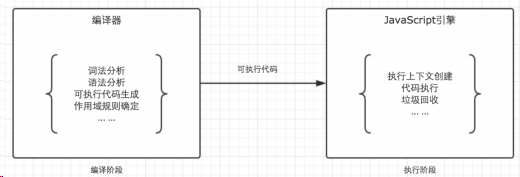

## 闭包产生的本质

当前环境中存在指向父级作用域的引用

## 一般如何产生闭包

- 返回函数
- 函数当做参数传递

## 闭包的应用场景

- 柯里化 bind
- 模块

## 什么是作用域？

ES5 中只存在两种作用域：全局作用域和函数作用域。在 JavaScript 中，我们将作用域定义为一套规则，这套规则用来管理引擎如何在当前作用域以及嵌套子作用域中根据标识符名称进行变量（变量名或者函数名）查找

## 什么是作用域链？

首先要了解作用域链，当访问一个变量时，编译器在执行这段代码时，会首先从当前的作用域中查找是否有这个标识符，如果没有找到，就会去父作用域查找，如果父作用域还没找到继续向上查找，直到全局作用域为止,，而作用域链，就是有当前作用域与上层作用域的一系列变量对象组成，它保证了当前执行的作用域对符合访问权限的变量和函数的有序访问。

## NaN 是什么，用 typeof 会输出什么？

Not a Number，表示非数字，typeof NaN === 'number

## 闭包是什么？

闭包是指有权访问另外一个函数作用域中的变量的函数

JavaScript 代码的整个执行过程，分为两个阶段，代码编译阶段与代码执行阶段。编译阶段由编译器完成，将代码翻译成可执行代码，这个阶段作用域规则会确定。执行阶段由引擎完成，主要任务是执行可执行代码，执行上下文在这个阶段创建。

## NaN 是什么，用 typeof 会输出什么？

Not a Number，表示非数字，typeof NaN === 'number'

## JS 隐式转换，显示转换

一般非基础类型进行转换时会先调用 valueOf，如果 valueOf 无法返回基本类型值，就会调用 toString

### 1）字符串和数字

"+" 操作符，如果有一个为字符串，那么都转化到字符串然后执行字符串拼接
"-" 操作符，转换为数字，相减 (-a, a \* 1 a/1) 都能进行隐式强制类型转换

```bash
[] + {} 和 {} + []
```

### 2）布尔值到数字

- 1 + true = 2
- 1 + false = 1

### 3）转换为布尔值

- for 中第二个
- while
- if
- 三元表达式
- || （逻辑或） && （逻辑与）左边的操作数

### 4）符号

不能被转换为数字
能被转换为布尔值（都是 true）
可以被转换成字符串 "Symbol(cool)"

### 5）宽松相等和严格相等

宽松相等允许进行强制类型转换，而严格相等不允许

#### （1）字符串与数字

转换为数字然后比较

#### （2）其他类型与布尔类型

先把布尔类型转换为数字，然后继续进行比较

#### （3）对象与非对象

执行对象的 ToPrimitive(对象）然后继续进行比较

#### （4）假值列表

- undefined
- null
- false
- +0, -0, NaN
- ""

#### 了解 this 嘛，bind，call，apply 具体指什么

它们都是函数的方法

`call: Array.prototype.call(this, args1, args2])` `apply: Array.prototype.apply(this, [args1, args2])` ：ES6 之前用来展开数组调用, `foo.appy(null, [])`，ES6 之后使用 ... 操作符

- New 绑定 > 显示绑定 > 隐式绑定 > 默认绑定
- 如果需要使用 bind 的柯里化和 apply 的数组解构，绑定到 null，尽可能使用 Object.create(null) 创建一个 DMZ 对象

四条规则：

- 默认绑定，没有其他修饰（bind、apply、call)，在非严格模式下定义指向全局对象，在严格模式下定义指向 undefined

```javascript
function foo() {
	console.log(this.a);
}

var a = 2;
foo();
```

- 隐式绑定：调用位置是否有上下文对象，或者是否被某个对象拥有或者包含，那么隐式绑定规则会把函数调用中的 this 绑定到这个上下文对象。而且，对象属性链只有上一层或者说最后一层在调用位置中起作用

```javascript
function foo() {
	console.log(this.a);
}

var obj = {
	a: 2,
	foo: foo,
};

obj.foo(); // 2
```

- 显示绑定：通过在函数上运行 call 和 apply ，来显示的绑定 this

```javascript
function foo() {
	console.log(this.a);
}

var obj = {
	a: 2,
};

foo.call(obj);
```

显示绑定之硬绑定

```javascript
function foo(something) {
	console.log(this.a, something);

	return this.a + something;
}

function bind(fn, obj) {
	return function () {
		return fn.apply(obj, arguments);
	};
}

var obj = {
	a: 2,
};

var bar = bind(foo, obj);
```

New 绑定，new 调用函数会创建一个全新的对象，并将这个对象绑定到函数调用的 this。

- New 绑定时，如果是 new 一个硬绑定函数，那么会用 new 新建的对象替换这个硬绑定 this，

```javascript
function foo(a) {
	this.a = a;
}

var bar = new foo(2);
console.log(bar.a);
```

## 代码输出结果

```javascript
// a
function Foo() {
	getName = function () {
		console.log(1);
	};
	return this;
}
// b
Foo.getName = function () {
	console.log(2);
};
// c
Foo.prototype.getName = function () {
	console.log(3);
};
// d
var getName = function () {
	console.log(4);
};
// e
function getName() {
	console.log(5);
}

Foo.getName(); // 2
getName(); // 4
Foo().getName(); // 1
getName(); // 1
new Foo.getName(); // 2
new Foo().getName(); // 3
new new Foo().getName(); // 3
```

输出结果：2 4 1 1 2 3 3

**解析：**

1. **Foo.getName()，** Foo 为一个函数对象，对象都可以有属性，b 处定义 Foo 的 getName 属性为函数，输出 2；
2. **getName()，** 这里看 d、e 处，d 为函数表达式，e 为函数声明，两者区别在于变量提升，函数声明的 5 会被后边函数表达式的 4 覆盖；
3. **Foo().getName()，** 这里要看 a 处，在 Foo 内部将全局的 getName 重新赋值为 console.log(1) 的函数，执行 Foo()返回 this，这个 this 指向 window，Foo().getName() 即为 window.getName()，输出 1；
4. **getName()，** 上面 3 中，全局的 getName 已经被重新赋值，所以这里依然输出 1；
5. **new Foo.getName()，** 这里等价于 new (Foo.getName())，先执行 Foo.getName()，输出 2，然后 new 一个实例；
6. **new Foo().getName()，** 这 里等价于 (new Foo()).getName(), 先 new 一个 Foo 的实例，再执行这个实例的 getName 方法，但是这个实例本身没有这个方法，所以去原型链**protot**上边找，实例.**protot** === Foo.prototype，所以输出 3；
7. **new new Foo().getName()，** 这里等价于 new (new Foo().getName())，如上述 6，先输出 3，然后 new 一个 new Foo().getName() 的实例。

## 一个 tcp 连接能发几个 http 请求？

如果是 HTTP 1.0 版本协议，一般情况下，不支持长连接，因此在每次请求发送完毕之后，TCP 连接即会断开，因此一个 TCP 发送一个 HTTP 请求，但是有一种情况可以将一条 TCP 连接保持在活跃状态，那就是通过 Connection 和 Keep-Alive 首部，在请求头带上 Connection: Keep-Alive，并且可以通过 Keep-Alive 通用首部中指定的，用逗号分隔的选项调节 keep-alive 的行为，如果客户端和服务端都支持，那么其实也可以发送多条，不过此方式也有限制，可以关注《HTTP 权威指南》4.5.5 节对于 Keep-Alive 连接的限制和规则。

而如果是 HTTP 1.1 版本协议，支持了长连接，因此只要 TCP 连接不断开，便可以一直发送 HTTP 请求，持续不断，没有上限； 同样，如果是 HTTP 2.0 版本协议，支持多用复用，一个 TCP 连接是可以并发多个 HTTP 请求的，同样也是支持长连接，因此只要不断开 TCP 的连接，HTTP 请求数也是可以没有上限地持续发送

## 什么是同源策略

跨域问题其实就是浏览器的同源策略造成的。

> 同源策略限制了从同一个源加载的文档或脚本如何与另一个源的资源进行交互。这是浏览器的一个用于隔离潜在恶意文件的重要的安全机制。同源指的是：**协议**、**端口号**、**域名**必须一致。

**同源策略：protocol（协议）、domain（域名）、port（端口）三者必须一致。**

**同源政策主要限制了三个方面：**

- 当前域下的 js 脚本不能够访问其他域下的 cookie、localStorage 和 indexDB。
- 当前域下的 js 脚本不能够操作访问操作其他域下的 DOM。
- 当前域下 ajax 无法发送跨域请求。

同源政策的目的主要是为了保证用户的信息安全，它只是对 js 脚本的一种限制，并不是对浏览器的限制，对于一般的 img、或者 script 脚本请求都不会有跨域的限制，这是因为这些操作都不会通过响应结果来进行可能出现安全问题的操作。

## 说下对 JS 的了解吧

是基于原型的动态语言，主要独特特性有 this、原型和原型链。

JS 严格意义上来说分为：语言标准部分（ECMAScript）+ 宿主环境部分

**语言标准部分**

2015 年发布 ES6，引入诸多新特性使得能够编写大型项目变成可能，标准自 2015 之后以年号代号，每年一更

**宿主环境部分**

- 在浏览器宿主环境包括 DOM + BOM 等
- 在 Node，宿主环境包括一些文件、数据库、网络、与操作系统的交互等

## React 17 带来了哪些改变

> 最重要的是以下三点：

- 新的 `JSX` 转换逻辑
- 事件系统重构
- `Lane 模型`的引入

**1. 重构 JSX 转换逻辑**

在过去，如果我们在 React 项目中写入下面这样的代码：

```javascript
function MyComponent() {
	return <p>这是我的组件</p>;
}
```

React 是会报错的，原因是 React 中对 JSX 代码的转换依赖的是 `React.createElement` 这个函数。因此但凡我们在代码中包含了 JSX，那么就必须在文件中引入 React，像下面这样：

```javascript
import React from "react";
function MyComponent() {
	return <p>这是我的组件</p>;
}
```

而 `React 17 则允许我们在不引入 React 的情况下直接使用 JSX`。这是因为在 React 17 中，编译器会自动帮我们引入 JSX 的解析器，也就是说像下面这样一段逻辑：

```javascript
function MyComponent() {
	return <p>这是我的组件</p>;
}
```

会被编译器转换成这个样子：

```javascript
import { jsx as _jsx } from "react/jsx-runtime";
function MyComponent() {
	return _jsx("p", { children: "这是我的组件" });
}
```

`react/jsx-runtime` 中的 JSX 解析器将取代 `React.createElement` 完成 `JSX` 的编译工作，这个过程对开发者而言是自动化、无感知的。因此，新的 JSX 转换逻辑带来的最显著的改变就是降低了开发者的学习成本。

`react/jsx-runtime` 中的 JSX 解析器看上去似乎在调用姿势上和 `React.createElement` 区别不大，那么它是否只是 `React.createElement` 换了个马甲呢？当然不是，它在内部实现了 `React.createElement` 无法做到的性能优化和简化。在一定情况下，它可能会略微改善编译输出内容的大小

**2. 事件系统重构**

事件系统在 React 17 中的重构要从以下两个方面来看：

- 卸掉历史包袱
- 拥抱新的潮流

**2.1 卸掉历史包袱：放弃利用 document 来做事件的中心化管控**

> React 16.13.x 版本中的事件系统会通过将所有事件冒泡到 document 来实现对事件的中心化管控

这样的做法虽然看上去已经足够巧妙，但仍然有它不聪明的地方——document 是整个文档树的根节点，操作 document 带来的影响范围实在是太大了，这将会使事情变得更加不可控

> 在 React 17 中，React 团队终于正面解决了这个问题：事件的中心化管控不会再全部依赖 `document`，管控相关的逻辑被转移到了每个 React 组件自己的[容器](https://cloud.tencent.com/product/tke?from_column=20065&from=20065) DOM 节点中。比如说我们在 ID 为 root 的 DOM 节点下挂载了一个 React 组件，像下面代码这样：

```javascript
const rootElement = document.getElementById("root");
ReactDOM.render(<App />, rootElement);
```

那么事件管控相关的逻辑就会被安装到 `root 节点`上去。这样一来， React 组件就能够自己玩自己的，再也无法对全局的事件流构成威胁了

**2.2 拥抱新的潮流：放弃事件池**

在 React 17 之前，合成事件对象会被放进一个叫作“事件池”的地方统一管理。这样做的目的是能够实现事件对象的复用，进而提高性能：每当事件处理函数执行完毕后，其对应的合成事件对象内部的所有属性都会被置空，意在为下一次被复用做准备。这也就意味着事件逻辑一旦执行完毕，我们就拿不到事件对象了，React 官方给出的这个例子就很能说明问题，请看下面这个代码

```javascript
function handleChange(e) {
	// This won't work because the event object gets reused.
	setTimeout(() => {
		console.log(e.target.value); // Too late!
	}, 100);
}
```

> 异步执行的 `setTimeout` 回调会在 `handleChange` 这个事件处理函数执行完毕后执行，因此它拿不到想要的那个事件对象 `e`。

要想拿到目标事件对象，必须显式地告诉 React——我永远需要它，也就是调用 `e.persist()` 函数，像下面这样：

```javascript
function handleChange(e) {
	// Prevents React from resetting its properties:
	e.persist();
	setTimeout(() => {
		console.log(e.target.value); // Works
	}, 100);
}
```

在 React 17 中，我们不需要 `e.persist()`，也可以随时随地访问我们想要的事件对象。

**3. Lane 模型的引入**

初学 React 源码的同学由此可能会很自然地认为：`优先级就应该是用 Lane 来处理的`。但事实上，`React 16 中处理优先级采用的是 expirationTime 模型`。

> `expirationTime` 模型使用 `expirationTime`（一个时间长度） 来描述任务的优先级；而 `Lane 模型`则使用`二进制数来表示任务的优先级`：

`lane 模型`通过将不同优先级赋值给一个位，通过 `31 位的位运算`来操作优先级。

`Lane 模型`提供了一个新的优先级排序的思路，相对于 `expirationTime` 来说，它对优先级的处理会更细腻，能够覆盖更多的边界条件。

## 浏览器的渲染过程

浏览器渲染主要有以下步骤：

- 首先解析收到的文档，根据文档定义构建一棵 DOM 树，DOM 树是由 DOM 元素及属性节点组成的。
- 然后对 CSS 进行解析，生成 CSSOM 规则树。
- 根据 DOM 树和 CSSOM 规则树构建渲染树。渲染树的节点被称为渲染对象，渲染对象是一个包含有颜色和大小等属性的矩形，渲染对象和 DOM 元素相对应，但这种对应关系不是一对一的，不可见的 DOM 元素不会被插入渲染树。还有一些 DOM 元素对应几个可见对象，它们一般是一些具有复杂结构的元素，无法用一个矩形来描述。
- 当渲染对象被创建并添加到树中，它们并没有位置和大小，所以当浏览器生成渲染树以后，就会根据渲染树来进行布局（也可以叫做回流）。这一阶段浏览器要做的事情是要弄清楚各个节点在页面中的确切位置和大小。通常这一行为也被称为“自动重排”。
- 布局阶段结束后是绘制阶段，遍历渲染树并调用渲染对象的 paint 方法将它们的内容显示在屏幕上，绘制使用 UI 基础组件。

大致过程如图所示：

**注意：** 这个过程是逐步完成的，为了更好的用户体验，渲染引擎将会尽可能早的将内容呈现到屏幕上，并不会等到所有的 html 都解析完成之后再去构建和布局 render 树。它是解析完一部分内容就显示一部分内容，同时，可能还在通过网络下载其余内容。

## 进程与线程的概念

从本质上说，进程和线程都是 CPU 工作时间片的一个描述：

- 进程描述了 CPU 在运行指令及加载和保存上下文所需的时间，放在应用上来说就代表了一个程序。
- 线程是进程中的更小单位，描述了执行一段指令所需的时间。

**进程是资源分配的最小单位，线程是 CPU 调度的最小单位。**

一个进程就是一个程序的运行实例。详细解释就是，启动一个程序的时候，操作系统会为该程序创建一块内存，用来存放代码、运行中的数据和一个执行任务的主线程，我们把这样的一个运行环境叫**进程**。**进程是运行在虚拟内存上的，虚拟内存是用来解决用户对硬件资源的无限需求和有限的硬件资源之间的矛盾的。从操作系统角度来看，虚拟内存即交换文件；从处理器角度看，虚拟内存即虚拟地址空间。**

如果程序很多时，内存可能会不够，操作系统为每个进程提供一套独立的虚拟地址空间，从而使得同一块物理内存在不同的进程中可以对应到不同或相同的虚拟地址，变相的增加了程序可以使用的内存。

进程和线程之间的关系有以下四个特点：

**（1）进程中的任意一线程执行出错，都会导致整个进程的崩溃。**

**（2）线程之间共享进程中的数据。**

**（3）当一个进程关闭之后，操作系统会回收进程所占用的内存，** 当一个进程退出时，操作系统会回收该进程所申请的所有资源；即使其中任意线程因为操作不当导致内存泄漏，当进程退出时，这些内存也会被正确回收。

**（4）进程之间的内容相互隔离。** 进程隔离就是为了使操作系统中的进程互不干扰，每一个进程只能访问自己占有的数据，也就避免出现进程 A 写入数据到进程 B 的情况。正是因为进程之间的数据是严格隔离的，所以一个进程如果崩溃了，或者挂起了，是不会影响到其他进程的。如果进程之间需要进行数据的通信，这时候，就需要使用用于进程间通信的机制了。

**Chrome 浏览器的架构图**： 从图中可以看出，最新的 Chrome 浏览器包括：

- 1 个浏览器主进程
- 1 个 GPU 进程
- 1 个网络进程
- 多个渲染进程
- 多个插件进程

这些进程的功能：

- **浏览器进程**：主要负责界面显示、用户交互、子进程管理，同时提供存储等功能。
- **渲染进程**：核心任务是将 HTML、CSS 和 JavaScript 转换为用户可以与之交互的网页，排版引擎 Blink 和 JavaScript 引擎 V8 都是运行在该进程中，默认情况下，Chrome 会为每个 Tab 标签创建一个渲染进程。出于安全考虑，渲染进程都是运行在沙箱模式下。
- **GPU 进程**：其实， GPU 的使用初衷是为了实现 3D CSS 的效果，只是随后网页、Chrome 的 UI 界面都选择采用 GPU 来绘制，这使得 GPU 成为浏览器普遍的需求。最后，Chrome 在其多进程架构上也引入了 GPU 进程。
- **网络进程**：主要负责页面的网络资源加载，之前是作为一个模块运行在浏览器进程里面的，直至最近才独立出来，成为一个单独的进程。
- **插件进程**：主要是负责插件的运行，因插件易崩溃，所以需要通过插件进程来隔离，以保证插件进程崩溃不会对浏览器和页面造成影响。

所以，**打开一个网页，最少需要四个进程**：1 个网络进程、1 个浏览器进程、1 个 GPU 进程以及 1 个渲染进程。如果打开的页面有运行插件的话，还需要再加上 1 个插件进程。

虽然多进程模型提升了浏览器的稳定性、流畅性和安全性，但同样不可避免地带来了一些问题：

- **更高的资源占用**：因为每个进程都会包含公共基础结构的副本（如 JavaScript 运行环境），这就意味着浏览器会消耗更多的内存资源。
- **更复杂的体系架构**：浏览器各模块之间耦合性高、扩展性差等问题，会导致现在的架构已经很难适应新的需求了。

## 对对象与数组的解构的理解

解构是 ES6 提供的一种新的提取数据的模式，这种模式能够从对象或数组里有针对性地拿到想要的数值。 **1）数组的解构** 在解构数组时，以元素的位置为匹配条件来提取想要的数据的：

```javascript
const [a, b, c] = [1, 2, 3];
```

最终，a、b、c 分别被赋予了数组第 0、1、2 个索引位的值：

数组里的 0、1、2 索引位的元素值，精准地被映射到了左侧的第 0、1、2 个变量里去，这就是数组解构的工作模式。还可以通过给左侧变量数组设置空占位的方式，实现对数组中某几个元素的精准提取：

```javascript
const [a, , c] = [1, 2, 3];
```

通过把中间位留空，可以顺利地把数组第一位和最后一位的值赋给 a、c 两个变量：

**2）对象的解构** 对象解构比数组结构稍微复杂一些，也更显强大。在解构对象时，是以属性的名称为匹配条件，来提取想要的数据的。现在定义一个对象：

```javascript
const stu = {
	name: "Bob",
	age: 24,
};
```

假如想要解构它的两个自有属性，可以这样：

```javascript
const { name, age } = stu;
```

这样就得到了 name 和 age 两个和 stu 平级的变量：

注意，对象解构严格以属性名作为定位依据，所以就算调换了 name 和 age 的位置，结果也是一样的：

```javascript
const { age, name } = stu;
```

## 78、JSON 的了解

JSON(JavaScript Object Notation) 是一种轻量级的数据交换格式。它是基于 JavaScript

的一个子集。数据格式简单, 易于读写, 占用带宽小

```js
{'age':'12', 'name':'back'}
```

## 79、js 延迟加载的方式有哪些

defer 和 async、动态创建 DOM 方式（用得最多）、按需异步载入 js

## 80、模块化怎么做？

立即执行函数,不暴露私有成员

1、 使用字面量实现命名空间(YUI)：

```js
Itcast.common.dom = {};
Itcast.common.css = {};
Itcast.common.event = {};
```

2、使用闭包

```js
var module1 = (function () {
	var _count = 0;
	var m1 = function () {
		//...
	};
	var m2 = function () {
		//...
	};
	return {
		m1: m1,
		m2: m2,
	};
})();
```

## 81、异步加载的方式

- (1) defer，只支持 IE
- (2) async：
- (3) 创建 script，插入到 DOM 中，加载完毕后 callBack
  - documen.write 和 innerHTML 的区别
  - document.write 只能重绘整个页面
  - innerHTML 可以重绘页面的一部分

## 82、告诉我答案是多少？

```js
(function (x) {
	delete x;
	alert(x);
})(1 + 5);
```

函数参数无法 delete 删除，delete 只能删除通过 for in 访问的属性。

当然，删除失败也不会报错，所以代码运行会弹出“1”。

## 83、JS 中的 call()和 apply()方法的区别？

例子中用 add 来替换 sub，add.call(sub,3,1) == add(3,1) ，所以运行结果为：alert(4);
注意：js 中的函数其实是对象，函数名是对 Function 对象的引用。
function add(a,b){
alert(a+b);
}
function sub(a,b){
alert(a-b);
}
add.call(sub,3,1);

## 86、JavaScript 中的作用域与变量声明提升？

### 其他部分

（HTTP、正则、优化、重构、响应式、移动端、团队协作、SEO、UED、职业生涯） \*基于 Class 的选择性的性能相对于 Id 选择器开销很大，因为需遍历所有 DOM 元素。

\*频繁操作的 DOM，先缓存起来再操作。用 Jquery 的链式调用更好。

比如：var str=$("a").attr("href");

\*for (var i = size; i < arr.length; i++) {}

for 循环每一次循环都查找了数组 (arr) 的.length 属性，在开始循环的时候设置一
个变量来存储这个数字，可以让循环跑得更快：

```js
for (var i = size, length = arr.length; i < length; i++) {}
```

## 87、前端开发的优化问题（看雅虎 14 条性能优化原则）。

- （1） 减少 http 请求次数：CSS Sprites, JS、CSS 源码压缩、图片大小控制合适；网页 Gzip，CDN 托管，data 缓存 ，图片服务器。
- （2） 前端模板 JS+数据，减少由于 HTML 标签导致的带宽浪费，前端用变量保存 AJAX 请求结果，每次操作本地变量，不用请求，减少请求次数
- （3） 用 innerHTML 代替 DOM 操作，减少 DOM 操作次数，优化 javascript 性能。
- （4） 当需要设置的样式很多时设置 className 而不是直接操作 style。
- （5） 少用全局变量、缓存 DOM 节点查找的结果。减少 IO 读取操作。
- （6） 避免使用 CSS Expression（css 表达式)又称 Dynamic properties(动态属性)。
- （7） 图片预加载，将样式表放在顶部，将脚本放在底部 加上时间戳。
- （8） 避免在页面的主体布局中使用 table，table 要等其中的内容完全下载之后才会显示出来，显示比 div+css 布局慢。

## 158、为什么扩展 javascript 内置对象不是好的做法？

因为扩展内置对象会影响整个程序中所使用到的该内置对象的原型属性

## 159、请解释一下 javascript 的同源策略

域名、协议、端口相同

## 160、什么是三元表达式？“三元”表示什么意思？

因为运算符会涉及 3 个表达式

## 161、浏览器标准模式和怪异模式之间的区别是什么？

标准模式是指，浏览器按 W3C 标准解析执行代码；

怪异模式则是使用浏览器自己的方式解析执行代码，因为不同浏览器解析执行的方式不一样，所以我们称之为怪异模式。

浏览器解析时到底使用标准模式还是怪异模式，与你网页中的 DTD 声明直接相关，DTD 声明定义了标准文档的类型（标准模式解析）文档类型，会使浏览器使用相应的方式加载网页并显示，忽略 DTD 声明,将使网页进入怪异模式

## 162、如果设计中使用了非标准的字体，你该如何去实现？

先通过 font-face 定义字体，再引用

```css
@font-face {
	font-family: myFirstFont;
	src: url("Sansation_Light.ttf"), url("Sansation_Light.eot"); /* IE9+ */
}
```

## 163、用 css 分别实现某个 div 元素上下居中和左右居中

margin:0 auto;

## 164、module(12,5)//2 实现满足这个结果的 modulo 函数

```js
function modulo(a, b) {
	return a % b; // return a/b;
}
```

## 165、HTTP 协议中，GET 和 POST 有什么区别？分别适用什么场景 ？

get 传送的数据长度有限制，post 没有
get 通过 url 传递，在浏览器地址栏可见，post 是在报文中传递
适用场景：
post 一般用于表单提交
get 一般用于简单的数据查询，严格要求不是那么高的场景

## 166、HTTP 状态消息 200 302 304 403 404 500 分别表示什么

200：请求已成功，请求所希望的响应头或数据体将随此响应返回。
302：请求的资源临时从不同的 URI 响应请求。由于这样的重定向是临时的，客户端应当
继续向原有地址发送以后的请求。只有在 Cache-Control 或 Expires 中进行了指定的情况下，
这个响应才是可缓存的
304：如果客户端发送了一个带条件的 GET 请求且该请求已被允许，而文档的内容（自上
次访问以来或者根据请求的条件）并没有改变，则服务器应当返回这个状态码。304 响应禁
止包含消息体，因此始终以消息头后的第一个空行结尾。
403：服务器已经理解请求，但是拒绝执行它。
404：请求失败，请求所希望得到的资源未被在服务器上发现。
500：服务器遇到了一个未曾预料的状况，导致了它无法完成对请求的处理。一般来说，这
个问题都会在服务器端的源代码出现错误时出现。

## 167 、 HTTP 协 议 中 ， header 信 息 里 面 ， 怎 么 控 制 页 面 失 效 时 间

（last-modified,cache-control,Expires 分别代表什么）
Last-Modified
文 档的最后改动时间。客户可以通过 If-Modified-Since 请求头提供一个日期，该请求将被视为
一个条件 GET，只有改动时间迟于指定时间的文档 才会返回，否则返回一个 304（Not Modified）
状态。Last-Modified 也可用 setDateHeader 方法来设置。
Expires 应该在什么时候认为文档已经过期，从而不再缓存它？

## 168、HTTP 协议目前常用的有哪几个？KEEPALIVE 从哪个版本开始出现的？

http1.0
http1.1 keeplive

## 169、业界常用的优化 WEB 页面加载速度的方法（可以分别从页面元素展现，请求连接，css,js,服务器等方面介绍）

## 170、列举常用的 web 页面开发，调试以及优化工具

sublime vscode webstorm hbuilder dw
httpwatch=>ie
ff:firebug
chrome:

## 171、解释什么是 sql 注入，xss 漏洞

## 172、如何判断一个 js 变量是数组类型

ES5:Array.isArray()
[] instanceof Array
Object.prototype.toString.call([]);//"[object Array]" 173、请列举 js 数组类型中的常用方法
方法 描述
concat() 连接两个或更多的数组，并返回结果。
join() 把数组的所有元素放入一个字符串。元素通过指定的分隔符进行分隔。
pop() 删除并返回数组的最后一个元素
push() 向数组的末尾添加一个或更多元素，并返回新的长度。
reverse() 颠倒数组中元素的顺序。
shift() 删除并返回数组的第一个元素
slice() 从某个已有的数组返回选定的元素
sort() 对数组的元素进行排序
splice() 删除元素，并向数组添加新元素。
toSource() 返回该对象的源代码。
toString() 把数组转换为字符串，并返回结果。
toLocaleString() 把数组转换为本地数组，并返回结果。
unshift() 向数组的开头添加一个或更多元素，并返回新的长度。
valueOf() 返回数组对象的原始值

## 174、FF 与 IE 中如何阻止事件冒泡，如何获取事件对象，以及如何获取触发事件的元素

## 175、列举常用的 js 框架以及分别适用的领域

jquery：简化了 js 的一些操作，并且提供了一些非常好用的 API
jquery ui、jquery-easyui：在 jqeury 的基础上提供了一些常用的组件 日期，下拉框，表格这
些组件
require.js、sea.js（阿里的玉帛）+》模块化开发使用的
zepto：精简版的 jquery，常用于手机 web 前端开发 提供了一些手机页面实用功能,touch
ext.js：跟 jquery 差不多，但是不开源，也没有 jquery 轻量
angular、knockoutjs、avalon(去哪儿前端总监)：MV\*框架，适合用于单页应用开发(SPA)

## 176、js 中如何实现一个 map

数组的 map 方法： 概述 map() 方法返回一个由原数组中的每个元素调用一个指定方法后的返回值组成的新数组。 语法 array.map(callback[, thisArg])

参数
callback
原数组中的元素经过该方法后返回一个新的元素。
currentValue
callback 的第一个参数，数组中当前被传递的元素。
index
callback 的第二个参数，数组中当前被传递的元素的索引。
array
callback 的第三个参数，调用 map 方法的数组。
thisArg
执行 callback 函数时 this 指向的对象。

实现：

Array.prototype.map2=function(callback){
for (var i = 0; i < this.length; i++) {
this[i]=callback(this[i]);
}
};

## 182、下面这段代码想要循环昝输出结果 01234，请问输出结果是否正确，如果不正确，请说明为什么，并修改循环内的代码使其输出正确结果

```js
for(var i=0;i<5;++i){
    setTimeout(function(){
    console.log(i+’’);
},100*i);
}
```

## 183、解释下这个 css 选择器什么发生什么？

[role=nav]>ul a:not([href^-mailto]){}

## 184、JavaScript 以下哪条语句会产生运行错误

```js
A. var obj = (); B. var obj = []; C. var obj = {}; D. var obj = //;
```

答案：AD

## 185、以下哪些是 javascript 的全局函数：（ABCDE）

A. escape 函数可对字符串进行编码，这样就可以在所有的计算机上读取该字符串。
ECMAScript v3 反对使用该方法，应用使用 decodeURI() 和 decodeURIComponent() 替代它。

B. parseFloat parseFloat() 函数可解析一个字符串，并返回一个浮点数。

该函数指定字符串中的首个字符是否是数字。如果是，则对字符串进行解析，直到到达数字的末端为止，然后以数字返回该数字，而不是作为字符串。

C. eval 函数可计算某个字符串，并执行其中的的 JavaScript 代码。

D. setTimeout

E. alert

## 186、关于 IE 的 window 对象表述正确的有：（CD）

A. window.opener 属性本身就是指向 window 对象

window.opener 返回打开当前窗口的那个窗口的引用. 如果当前窗口是由另一个窗口打开的, window.opener 保留了那个窗口的引用. 如果当前窗口不是由其他窗口打开的, 则该属性返回 null.

B. window.reload()方法可以用来刷新当前页面 //正确答案：应该是 location.reload
或者 window.location.reload

C. window.location=”a.html”和 window.location.href=”a.html”的作用都是把当前
页面替换成 a.html 页面

D. 定义了全局变量 g；可以用 window.g 的方式来存取该变量

## 201、JavaScript 数组元素添加、删除、排序等方法有哪些？

Array.concat( ) 连接数组
Array.join( ) 将数组元素连接起来以构建一个字符串
Array.length 数组的大小
Array.pop( ) 删除并返回数组的最后一个元素
Array.push( ) 给数组添加元素
Array.reverse( ) 颠倒数组中元素的顺序
Array.shift( ) 将元素移出数组
Array.slice( ) 返回数组的一部分
Array.sort( ) 对数组元素进行排序
Array.splice( ) 插入、删除或替换数组的元素
Array.toLocaleString( ) 把数组转换成局部字符串
Array.toString( ) 将数组转换成一个字符串
Array.unshift( ) 在数组头部插入一个元素

## 202、如何添加 html 元素的事件，有几种方法？请列举

- a、直接在标签里添加：`<div onclick="alert(你好)">这是一个层</div>`
- b、在元素上通过 js 添加:
- c、使用事件注册函数添加

## 203、JavaScript 的循环语句有哪些？

while for do while for…in

## 204、作用域-编译期执行期以及全局局部作用域问题

理解 js 执行主要的两个阶段：预解析和执行期

## 205、闭包：下面这个 ul，如何点击每一列的时候 alert 其 index？

```html
<ul id="test">
	<li>这是第一条</li>
	<li>这是第二条</li>
	<li>这是第三条</li>
</ul>
```

```js
// 非闭包实现
var lis=document.querySelectorAll('li');
document.querySelector('#test').onclick=functi
on(e){
for (var i = 0; i < lis.length; i++) {
var li = lis[i];
if(li==e.target){
alert(i);
}
}
};
// 闭包实现
var lis=document.querySelectorAll('li');
for (var i = 0; i < lis.length; i++) {
var li = lis[i];
li.onclick=(function(index){
return function(e){
alert(index);
};
})(i);
}
```

## 206、列出 3 条以上 ff 和 IE 的脚本兼容问题

1、在 IE 下可通过 document.frames["id"];得到该 IFRAME 对象，而在火狐下则是通过 document.getElementById("content_panel_if").contentWindow;

2、IE 的写法： \_tbody=\_table.childNodes[0]在 FF 中，firefox 会在子节点中包含空白则第一个子节点为空白""， 而 ie 不会返回空白可以通过 if("" != node.nodeName)过滤掉空白子对象

3、模拟点击事件

```js
if (document.all) {
	// ie 下
	document.getElementById("a3").click();
} else {
	// 非 IE
	var evt = document.createEvent("MouseEvents");
	evt.initEvent("click", true, true);
	document.getElementById("a3").dispatchEvent(evt);
}
```

4、事件注册

```js
if (isIE) {
	window.attachEvent("onload", init);
} else {
	window.addEventListener("load", init, false);
}
```

## 207、列举可以哪些方面对前端开发进行优化

代码压缩、合并减少 http 请求，图片制作精灵图、代码优化

## 212、列举浏览器对象模型 BOM 里常用的至少 4 个对象，并列举 window 对象的常用方法至少 5 个 （10 分）

对象：window document location screen history navigator
方法：alert() confirm() prompt() open() close() setInterval() setTimeout()
clearInterval() clearTimeout()
(详细参见：J:\代码,PPT,笔记,电子书\面试题\window 对象方法.png)

## 213、Javascript 中 callee 和 caller 的作用？

caller 是返回一个对函数的引用，该函数调用了当前函数；
用法：fn.caller
callee 是返回正在被执行的 function 函数，也就是所指定的 function 对象的正文。
用法：arguments.callee

## 214、对于 apply 和 call 两者在作用上是相同的，即是调用一个对象的一个方法，以另一个对象替换当前对象。将一个函数的对象上下文从初始的上下文改变为由 thisObj 指定的新对象。

但两者在参数上有区别的。对于第一个参数意义都一样，但对第二个参数：?apply 传入的是一个参数数组，也就是将多个参数组合成为一个数组传入，而 call 则作为 call 的参数传入（从第二个参数开始）。?如 func.call(func1,var1,var2,var3)对应的 apply 写法为：func.apply(func1,[var1,var2,var3]) 。

## 215、在 Javascript 中什么是伪数组？如何将伪数组转化为标准数组？

伪数组（类数组）：无法直接调用数组方法或期望 length 属性有什么特殊的行为，但仍可以对真正数组遍历方法来遍历它们。典型的是函数的 argument 参数，还有像调用 getElementsByTagName,document.childNodes 之类的,它们都返回 NodeList 对象都属于伪数组。

可以使用 Array.prototype.slice.call(fakeArray)将数组转化为真正的 Array 对象。

## 216、写一个函数可以计算 sum(5,0,-5);输出 0; sum(1,2,3,4);输出 10;

```js
function calc() {
	var result = 0;
	for (var i = 0; i < arguments.length; i++) {
		var obj = arguments[i];
		result += obj;
	}
	return result;
}
alert(calc(1, 2, 3, 4));
```

## 217、事件代理怎么实现？

在元素的父节点注册事件，通过事件冒泡，在父节点捕获事件

## 230、下列 JavaScript 代码执行后，依次 alert 的结果是

```js
(function test() {
	var a = (b = 5);
	alert(typeof a);
	alert(typeof b);
})();
alert(typeof a);
alert(typeof b);
//number number undefined number
```

## 231、下列 JavaScript 代码执行后，iNum 的值是

```js
var iNum = 0;
for (var i = 1; i < 10; i++) {
	if (i % 5 == 0) {
		continue;
	}
	iNum++;
}
```

## 252、下列控制台都输出什么

第 1 题：

```js
function setName() {
	name = "张三";
}
setName();
console.log(name);
```

答案："张三"

## 253、第 2 题：

```js
// 考点：1、变量声明提升 2、变量搜索机制
var a = 1;
function test() {
	console.log(a);
	var a = 1;
}
test();
```

答案：undefined

## 254、第 3 题：

```js
var b = 2;
function test2() {
	window.b = 3;
	console.log(b);
}
test2();
```

答案：3

## 255、第 4 题：

```js
c = 5; // 声明一个全局变量 c
function test3() {
	window.c = 3;
	console.log(c); // 答案：undefined，原因：由于此时的 c 是一个局部变量 c，并且没有被赋值
	var c;
	console.log(window.c); // 答案：3，原因：这里的 c 就是一个全局变量 c
}
test3();
```

## 256、第 5 题：

```js
var arr = [];
arr[0] = "a";
arr[1] = "b";
arr[10] = "c";
alert(arr.length); // 答案：11
console.log(arr[5]); // 答案：undefined
```

## 257、第 6 题：

```js
var a = 1;
console.log(a++); // 答案：1
console.log(++a); // 答案：3
```

## 258、第 7 题：

```js
console.log(null == undefined); // 答案：true
console.log("1" == 1); // 答案：true，因为会将数字 1 先转换为字符串 1
console.log("1" === 1); // 答案：false，因为数据类型不一致
```

## 259、第 8 题：

```js
typeof 1;
("number");
typeof "hello";
("string");
typeof /[0-9]/;
("object");
typeof {};
("object");
typeof null;
("object");
typeof undefined;
("undefined");
typeof [1, 2, 3];
("object");
typeof function () {}; // "function" 260、第 9 题：
parseInt(3.14); // 3
parseFloat("3asdf"); // 3
parseInt("1.23abc456");
parseInt(true); // "true" NaN
```

## 261、第 10 题：

```js
// 考点：函数声明提前
function bar() {
	return foo;
	foo = 10;
	function foo() {}
	// var foo = 11;
}
alert(typeof bar()); // "function"
```

## 262、第 11 题：考点：函数声明提前

```js
var foo = 1;
function bar() {
	foo = 10;
	return;
	function foo() {}
}
bar();
alert(foo); //答案：1
```

## 263、第 12 题：

```js
console.log(a); // 是一个函数
var a = 3;
function a() {}
console.log(a); // 3
```

## 264、第 13 题：

```js
// 考点：对 arguments 的操作
function foo(a) {
	arguments[0] = 2;
	alert(a); // 答案：2，因为：a、arguments 是对实参的访问，b、通过 arguments[i]可以修改指定实参的值
}
foo(1);
```

## 265、第 14 题：

```js
function foo(a) {
	alert(arguments.length); // 答案：3，因为 arguments 是对实参的访问
}
foo(1, 2, 3);
```

## 266、第 15 题

```js
bar(); // 报错
var foo = function bar(name) {
	console.log("hello" + name);
	console.log(bar);
};
//alert(typeof bar);
foo("world"); //"hello"
console.log(bar); //undefined
console.log(foo.toString());
bar(); //报错
```

## 267、第 16 题

```js
function test() {
	console.log("test 函数");
}
setTimeout(function () {
	console.log("定时器回调函数");
}, 0);
test();
function foo() {
	var name = "hello";
}
```

### typeof 以及弱类型转换规则？ NaN 、 undefined 、 null

### dom 的节点操作？能够背 api 还是知道 api ？

### ajax 是什么？知道底层实现原理吗？知道 fetch 吗？自己封装过吗？

### GET 、 POST 意义？ restful 架构下还有别的什么请求？ OPTION 请求是什么？

### 事件冒泡和事件捕获是怎样的？对应的默认方法有什么？一般在什么情况使用？

### 如何判断数据类型？

### hoisting 是什么？具体表现是怎样的？

### 匿名函数是什么？函数表达式和函数声明的区别？

### 严格模式是什么？有什么好处？ use strict

### arguments 是什么类型？ callee 和 caller 有什么区别？

### Date.format 实现过吗？思路是怎样的？

### 动画： setTimeout 何时执行， requestAnimationFrame 的优点

### 你知道 new 一个对象有几步吗？

## 数组(array)

- map : 遍历数组，返回回调返回值组成的新数组
- forEach : 无法 break ，可以用 try/catch 中 throw new Error 来停止
- filter : 过滤
- some : 有一项返回 true ，则整体为 true
- every : 有一项返回 false ，则整体为 false
- join : 通过指定连接符生成字符串
- push / pop : 末尾推入和弹出，改变原数组， 返回推入/弹出项
- unshift / shift : 头部推入和弹出，改变原数组，返回操作项
- sort(fn) / reverse : 排序与反转，改变原数组
- concat : 连接数组，不影响原数组， 浅拷⻉
- slice(start, end) : 返回截断后的新数组，不改变原数组
- splice(start, number, value...) : 返回删除元素组成的数组， value 为插入项，改变原数组
- indexOf / lastIndexOf(value, fromIndex) : 查找数组项，返回对应的下标
- reduce / reduceRight(fn(prev, cur) ， defaultPrev) : 两两执行， prev 为上次化简函数的 return 值， cur 为当前值(从第二项开始)

数组乱序：

```js
var arr = [1, 2, 3, 4, 5, 6, 7, 8, 9, 10];
arr.sort(function () {
	return Math.random() - 0.5;
});
```

数组拆解: flat: [1,[2,3]] --> [1, 2, 3]

```js
Array.prototype.flat = function () {
	this.toString()
		.split(",")
		.map((item) => +item);
};
```

## ES5

### 函数执行改变 this

由于 JS 的设计原理: 在函数中，可以引用运行环境中的变量。因此就需要一个机制来让我们可以在函数体内部获取当前的运行环境，这便是 this 。

因此要明白 this 指向，其实就是要搞清楚 函数的运行环境，说⼈话就是，
谁调用了函数。例如

- obj.fn() ，便是 obj 调用了函数，既函数中的 this === obj
- fn() ，这里可以看成 window.fn() ，因此 this === window

但这种机制并不完全能满⾜我们的业务需求，因此提供了三种方式可以手动修
改 this 的指向:

- call: fn.call(target, 1, 2)
- apply: fn.apply(target, [1, 2])
- bind: fn.bind(target)(1,2)

### call，apply，bind 三者用法和区别

参数、绑定规则（显示绑定和强绑定），运行效率（最终都会转换成一个一个
的参数去运行）、运行情况（ call ， apply 立即执行， bind 是 return 出一个 this “固定”的函数，这也是为什么 bind 是强绑定的一个原因）

注：“固定”这个词的含义，它指的固定是指只要传进去了 context ，则 bind 中 return 出来的函数 this 便一直指向 context ，除非 context 是个变量

### 变量声明提升

js 代码在运行前都会进行 AST 解析，函数申明默认会提到当前作用域最前面，变量申明也会进行提升。但赋值不会得到提升。关于 AST 解析，这里也可以说是形成词法作用域的主要原因

## ES6

### let，const

let 产生块级作用域（通常配合 for 循环或者 {} 进行使用产生块级作用域）， const 申明的变量是常量（内存地址不变）

### Promise

这里你谈 promise 的时候，除了将他解决的痛点以及常用的 API 之外，最好进行拓展把 eventloop 带进来好好讲一下， microtask (微任务)、macrotask (任务) 的执行顺序，如果看过 promise 源码，最好可以谈一谈原生 Promise 是如何实现的。

Promise 的关键点在于 callback 的两个参数，一个是 resovle ，一个是 reject 。还有就是 Promise 的链式调用（ Promise.then() ，每一个 then 都是一个责任⼈）

### Generator

遍历器对象生成函数，最大的特点是可以交出函数的执行权

- function 关键字与函数名之间有一个星号；
- 函数体内部使用 yield 表达式，定义不同的内部状态；
- next 指针移向下一个状态

这里你可以说说 Generator 的异步编程，以及它的语法糖 async 和 awiat ，传统的异步编程。

ES6 之前，异步编程大致如下：

- 回调函数
- 事件监听
- 发布/订阅

传统异步编程方案之一：协程，多个线程互相协作，完成异步任务。

### async、await

Generator 函数的语法糖。有更好的语义、更好的适用性、返回值是 Promise 。

- async => \*
- await => yield

```js
// 基本用法
async function timeout(ms) {
	await new Promise((resolve) => {
		setTimeout(resolve, ms);
	});
}
async function asyncConsole(value, ms) {
	await timeout(ms);
	console.log(value);
}
asyncConsole("hello async and await", 1000);
```

注：最好把 2，3，4 连到一起讲

### AMD，CMD，CommonJs，ES6 Module：解决原始无模块化的痛点

- AMD： requirejs 在推⼴过程中对模块定义的规范化产出，提前执行，推崇依赖前置
- CMD： seajs 在推⼴过程中对模块定义的规范化产出，延迟执行，推崇依赖就近
- CommonJs：模块输出的是一个值的 copy ，运行时加载，加载的是一个对象
- （ module.exports 属性），该对象只有在脚本运行完才会生成
- ES6 Module：模块输出的是一个值的引用，编译时输出接口， ES6 模块不是对象，它对外接口只是一种静态定义，在代码静态解析阶段就会生成。

### Proxy

Proxy 是 ES6 中新增的功能，可以用来自定义对象中的操作

```js
// let MyProxy = new Proxy(target, handler);
// `target` 代表需要添加代理的对象
// `handler` 用来自定义对象中的操作
// 可以很方便的使用 Proxy 来实现一个数据绑定和监听
let onWatch = (obj, setBind, getLogger) => {
	let handler = {
		get(target, property, receiver) {
			getLogger(target, property);
			return Reflect.get(target, property, receiver);
		},
		set(target, property, value, receiver) {
			setBind(value);
			return Reflect.set(target, property, value);
		},
	};
	return new Proxy(obj, handler);
};
let obj = { a: 1 };
let value;
let MyProxy = onWatch(
	obj,
	(v) => {
		value = v;
	},
	(target, property) => {
		console.log(`Get '${property}' = ${target[property]}`);
	}
);
p.a = 2; // bind `value` to `2`
p.a; // -> Get 'a' = 2
```

### 1、es5 和 es6 的区别，说一下你所知道的 es6

ECMAScript5，即 ES5，是 ECMAScript 的第五次修订，于 2009 年完成标准化

ECMAScript6，即 ES6，是 ECMAScript 的第六次修订，于 2015 年完成，也称 ES2015

ES6 是继 ES5 之后的一次改进，相对于 ES5 更加简洁，提高了开发效率

#### ES6 新增的一些特性：

##### 1）let 声明变量和 const 声明常量，两个都有块级作用域

ES5 中是没有块级作用域的，并且 var 有变量提升，在 let 中，使用的变量一定要进行声明

##### 2）箭头函数

ES6 中的函数定义不再使用关键字 function()，而是利用了()=>来进行定义

##### 3）模板字符串

模板字符串是增强版的字符串，用反引号（`）标识，可以当作普通字符串使用，也可以用来定义多行字符串

##### 4）解构赋值

ES6 允许按照一定模式，从数组和对象中提取值，对变量进行赋值

##### 5）for of 循环

for...of 循环可以遍历数组、Set 和 Map 结构、某些类似数组的对象、对象，以及字符串

##### 6）import、export 导入导出

ES6 标准中，Js 原生支持模块(module)。将 JS 代码分割成不同功能的小块进行模块化，将不同功能的代码分别写在不同文件中，各模块只需导出公共接口部分，然后通过模块的导入的方式可以在其他地方使用

##### 7）set 数据结构

Set 数据结构，类似数组。所有的数据都是唯一的，没有重复的值。它本身是一个构造函数

##### 8）... 展开运算符

可以将数组或对象里面的值展开；还可以将多个值收集为一个变量

##### 9）修饰器 @

decorator 是一个函数，用来修改类甚至于是方法的行为。修饰器本质就是译时执行的函数

##### 10）class 类的继承

ES6 中不再像 ES5 一样使用原型链实现继承，而是引入 Class 这个概念

##### 11）async、await

使用 async/await, 搭配 promise,可以通过编写形似同步的代码来处理异步流程, 提高代码的简洁性和可读性 async 用于申明一个 function 是异步的，而 await 用于等待一个异步方法执行完成

##### 12）promise

Promise 是异步编程的一种解决方案，比传统的解决方案（回调函数和事件）更合理、强大

##### 13）Symbol

Symbol 是一种基本类型。Symbol 通过调用 symbol 函数产生，它接收一个可选的名字参数，该函数返回的 symbol 是唯一的

##### 14）Proxy 代理

使用代理（Proxy）监听对象的操作，然后可以做一些相应事情

### 2、var、let、const 之间的区别

- var 声明变量可以重复声明，而 let 不可以重复声明
- var 是不受限于块级的，而 let 是受限于块级
- var 会与 window 相映射（会挂一个属性），而 let 不与 window 相映射
- var 可以在声明的上面访问变量，而 let 有暂存死区，在声明的上面访问变量会报错
- const 声明之后必须赋值，否则会报错
- const 定义不可变的量，改变了就会报错
- const 和 let 一样不会与 window 相映射、支持块级作用
- 域、在声明的上面访问变量会报错

### 3、使用箭头函数应注意什么？

- （1）用了箭头函数，this 就不是指向 window，而是父级（指向是可变的）
- （2）不能够使用 arguments 对象
- （3）不能用作构造函数，这就是说不能够使用 new 命令，否则会抛出一个错误
- （4）不可以使用 yield 命令，因此箭头函数不能用作 Generator 函数

### ES6 的模板字符串有哪些新特性？并实现一个类模板字符串的功能

基本的字符串格式化。将表达式嵌入字符串中进行拼接。用${}来界定

在 ES5 时我们通过反斜杠()来做多行字符串或者字符串一行行拼接。ES6 反引号(``)就能解决

类模板字符串的功能

```js
let name = "web";
let age = 10;
let str = "你好，${name} 已经 ${age}岁了";
str = str.replace(/\$\{([^}]*)\}/g, function () {
	return eval(arguments[1]);
});
console.log(str); //你好，web 已经 10 岁了
```

### 5、介绍下 Set、Map 的区别？

应用场景 Set 用于数据重组，Map 用于数据储存

Set：

（1）成员不能重复
（2）只有键值没有键名，类似数组
（3）可以遍历，方法有 add, delete,has

Map:

（1）本质上是健值对的集合，类似集合
（2）可以遍历，可以跟各种数据格式转换

### 6、ECMAScript 6 怎么写 class ，为何会出现 class？

ES6 的 class 可以看作是一个语法糖，它的绝大部分功能 ES5 都可以做到，新的 class 写法只是让对象原型的写法更加清晰、更像面向对象编程的语法

```js
// 定义类
class Point {
	constructor(x, y) {
		// 构造方法
		this.x = x; //this 关键字代表实例对象
		this.y = y;
	}
	toString() {
		return "(" + this.x + "," + this.y + ")";
	}
}
```

### 7、Promise 构造函数是同步执行还是异步执行，那么 then 方法呢？

promise 构造函数是同步执行的，then 方法是异步执行的

### 8、setTimeout、Promise、Async/Await 的区别

事件循环中分为宏任务队列和微任务队列

其中 setTimeout 的回调函数放到宏任务队列里，等到执行栈清空以后执行

promise.then 里的回调函数会放到相应宏任务的微任务队列里，等宏任务里面的同步代码执行完再执行

async 函数表示函数里面可能会有异步方法，await 后面跟一个表达式

async 方法执行时，遇到 await 会立即执行表达式，然后把表达式后面的代码放到微任务队列里，让出执行栈让同步代码先执行

### promise 有几种状态，什么时候会进入 catch？

- 三个状态：pending、fulfilled、reject
- 两个过程：padding -> fulfilled、padding -> rejected
- 当 pending 为 rejectd 时，会进入 catch

### 下面 Set 结构，打印出的 size 值是多少

```js
let s = new Set();
s.add([1]);
s.add([1]);
console.log(s.size);
```

答案：2

两个数组[1]并不是同一个值，它们分别定义的数组，在内存中分别对应着不同的存储地址，因此并不是相同的值都能存储到 Set 结构中，所以 size 为 2

### 10 、下面的输出结果是多少

```js
constpromise = newPromise((resolve, reject) => {
	console.log(1);
	resolve();
	console.log(2);
});

promise.then(() => {
	console.log(3);
});

console.log(4);
```

输出：1243

Promise 新建后立即执行，所以会先输出 1 ， 2 ，而 Promise.then()内部的代码在 当次 事件循环的 结尾 立刻执行 ，所以会继续输出 4 ，最后输出 3

### 使用结构赋值，实现两个变量的值的交换

```js
leta = 1;
letb = 2;
[a, b] = [b, a];
```

### 设计一个对象，键名的类型至少包含一个 symbol 类型，并且实现遍历所有 key

```js
letname = Symbol("name");
letproduct = {
	[name]: "洗衣机",
	price: 799,
};
Reflect.ownKeys(product);
```

### 14 、Promise 中 reject 和 catch 处理上有什么区别

- reject 是用来抛出异常，catch 是用来处理异常
- reject 是 Promise 的方法，而 catch 是 Promise 实例的方法
- reject 后的东西，一定会进入 then 中的第二个回调，如果 then 中没有写第二个回调，则进入 catch
- 网络异常（比如断网），会直接进入 catch 而不会进入 then 的第二个回调

### 15 、使用 class 手写一个 promise

```js
// 创建一个Promise的类
class Promise {
	constructor(executor) {
		let resolveFn = (value) => {
			if (this.status === "pending") {
				this.status = "resolved";
				this.value = value;
			}
		};

		let rejectFn = (reason) => {
			if (this.status === "pending") {
				this.status = "rejected";
				this.reason = reason;
			}
		};

		// 定义resolve和reject变量，并传递给executor
		let resolve = resolveFn.bind(this);
		let reject = rejectFn.bind(this);

		try {
			executor(resolve, reject);
		} catch (e) {
			reject(e);
		}
	}

	// 使用原型添加then方法
	then(onFulfilled, onRejected) {
		// 检查onFulfilled和onRejected是否为函数
		if (typeof onFulfilled !== "function") onFulfilled = (value) => value;
		if (typeof onRejected !== "function")
			onRejected = (reason) => {
				throw reason;
			};

		// 根据状态调用相应的回调函数，并返回一个新的Promise实例
		if (this.status === "resolved") {
			return new Promise((resolve, reject) => {
				onFulfilled(this.value);
			});
		} else if (this.status === "rejected") {
			return new Promise((resolve, reject) => {
				onRejected(this.reason);
			});
		}
	}
}
```

### 16 、如何使用 Set 去重

```js
letarr = [12, 43, 23, 43, 68, 12];
letitem = [...newSet(arr)];
console.log(item); //[ 12 , 43 , 23 , 68 ]
```

### 17 、将下面 for 循环改成 forof 形式

```js
letarr = [11, 22, 33, 44, 55];
letsum = 0;
for (leti = 0; i < arr.length; i++) {
	sum += arr[i];
}
```

答案：

```js
let arr = [11, 22, 33, 44, 55];

letsum = 0;
for (value of arr) {
	sum += value;
}
```

### 18 、理解 async/await 以及对 Generator 的优势

asyncawait 是用来解决异步的，async 函数是 Generator 函数的语法糖

使用关键字 async 来表示，在函数内部使用 await 来表示异步

async 函数返回一个 Promise 对象，可以使用 then 方法添加回调函数

当函数执行的时候，一旦遇到 await 就会先返回，等到异步操作完成，再接着执行函数体内后面的语句

async 较 Generator 的优势：

- （ 1 ）内置执行器。Generator 函数的执行必须依靠执行器，而 Aysnc 函数自带执行器，调用方式跟普通函数的调用一样
- （ 2 ）更好的语义。async 和 await 相较于 \* 和 yield 更加语义化
- （ 3 ）更广的适用性。yield 命令后面只能是 Thunk 函数或 Promise 对象，async 函数的 await 后面可以是 Promise 也可以是原始类型的值
- （ 4 ）返回值是 Promise。async 函数返回的是 Promise 对象，比 Generator 函数返回的 Iterator 对象方便，可以直接使用 then() 方法进行调用

### 19 、forEach、forin、forof 三者区别

- forEach 更多的用来遍历数组
- for in 一般常用来遍历对象或 json
- for of 数组对象都可以遍历，遍历对象需要通过和 Object.keys()
- for in 循环出的是 key，for of 循环出的是 value

### 20 、说一下 es 6 的导入导出模块

导入通过 import 关键字

```js
// 只导入一个
import {sum} from "./example.js"

// 导入多个

import {sum,multiply,time} from "./exportExample.js"
// 导入一整个模块
import * as example from "./exportExample.js"

// 导出通过export关键字

//可以将export放在任何变量,函数或类声明的前面
export var firstName = 'Michael';
export var lastName = 'Jackson';
export var year= 1958 ;
//也可以使用大括号指定所要输出的一组变量
var firstName = 'Michael';
var lastName = 'Jackson';
var year = 1958 ;
export{firstName,lastName,year};
// 使用exportdefault时，对应的import语句不需要使用大括号
let bosh = functioncrs(){}
export default bosh;
import crc from 'crc';

// 不使用exportdefault时，对应的import语句需要使用大括号
let bosh= functioncrs(){}
export bosh;
import {crc} from 'crc';
```

## Web API

由于 http 存在一个明显的弊端（消息只能有客户端推送到服务器端，而服
务器端不能主动推送到客户端），导致如果服务器如果有连续的变化，这时只
能使用轮询，而轮询效率过低，并不适合。于是 WebSocket 被发明出来

相比与 http 具有以下有点：

- 支持双向通信，实时性更强；
- 可以发送文本，也可以二进制文件；
- 协议标识符是 ws ，加密后是 wss ；
- 较少的控制开销。连接创建后， ws 客户端、服务端进行数据交换时，协议控制的数据包
- 头部较小。在不包含头部的情况下，服务端到客户端的包头只有 2~10 字节（取决于数据包长度），客户端到服务端的的话，需要加上额外的 4 字节的掩码。而 HTTP 协议每次通信都需要携带完整的头部；
- 支持扩展。ws 协议定义了扩展，用户可以扩展协议，或者实现自定义的子协议。（比如支持自定义压缩算法等）
- 无跨域问题。

实现比较简单，服务端库如 socket.io 、 ws ，可以很好的帮助我们入⻔。
而客户端也只需要参照 api 实现即可

## 希望获取到页面中所有的 checkbox 怎么做？

不使用第三方框架

```js
var domList = document.getElementsByTagName(‘input’)
var checkBoxList = [];
var len = domList.length; // 缓存到局部变量

while (len--) { // 使用while的效率会比for循环更高
    if (domList[len].type == ‘checkbox’) {
        checkBoxList.push(domList[len]);
    }
}
```

## Javascript 中 callee 和 caller 的作用？

- caller 是返回一个对函数的引用，该函数调用了当前函数；
- callee 是返回正在被执行的 function 函数，也就是所指定的 function 对象的正文

那么问题来了？如果一对兔子每⽉生一对兔子；一对新生兔，从第二个⽉起就
开始生兔子；假定每对兔子都是一雌一雄，试问一对兔子，第 n 个⽉能繁殖成
多少对兔子？（使用 callee 完成）

```js
var result = [];
function fn(n) {
	//典型的斐波那契数列
	if (n == 1) {
		return 1;
	} else if (n == 2) {
		return 1;
	} else {
		if (result[n]) {
			return result[n];
		} else {
			//argument.callee()表示fn()
			result[n] = arguments.callee(n - 1) + arguments.callee(n - 2);
			return result[n];
		}
	}
}
```

### caller 和 callee 的区别

#### caller

caller 返回一个函数的引用，这个函数调用了当前的函数。

使用这个属性要注意：

- 这个属性只有当函数在执行时才有用
- 如果在 javascript 程序中，函数是由顶层调用的，则返回 null

functionName.caller: functionName 是当前正在执行的函数。

```js
function a() {
	console.log(a.caller);
}
```

#### callee

callee 放回正在执行的函数本身的引用，它是 arguments 的一个属性

使用 callee 时要注意:

- 这个属性只有在函数执行时才有效
- 它有一个 length 属性，可以用来获得形参的个数，因此可以用来比较形参和实参个数是否一致，即比较 arguments.length 是否等于 arguments.callee.length
- 它可以用来递归匿名函数。

```js
function a() {
	console.log(arguments.callee);
}
```

## window.onload 和$(document).ready

> 原生 JS 的 window.onload 与 Jquery 的 $(document).ready(function()
> {}) 有什么不同？如何用原生 JS 实现 Jq 的 ready 方法？

- window.onload() 方法是必须等到页面内包括图片的所有元素加载完毕后才能执行。
- $(document).ready() 是 DOM 结构绘制完毕后就执行，不必等到加载完毕

```js
function ready(fn) {
	if (document.addEventListener) {
		// 标准浏览器
		document.addEventListener(
			"DOMContentLoaded",
			function () {
				//注销事件, 避免反复触发
				document.removeEventListener(
					"DOMContentLoaded",
					arguments.callee,
					false
				);
				fn(); //执行函数
			},
			false
		);
	} else if (document.attachEvent) {
		// IE
		document.attachEvent("onreadystatechange", function () {
			if (document.readyState == "complete") {
				document.detachEvent("onreadystatechange", arguments.callee);
				fn(); // 函数执行
			}
		});
	}
}
```

## JS 动画与 CSS 动画区别及相应实现

CSS3 的动画的优点

- 在性能上会稍微好一些，浏览器会对 CSS3 的动画做一些优化
- 代码相对简单

缺点

- 在动画控制上不够灵活
- 兼容性不好

JavaScript 的动画正好弥补了这两个缺点，控制能⼒很强，可以单帧的控制、变换，同时写得好完全可以兼容 IE6 ，并且功能强大。对于一些复杂控制的动画，使用 javascript 会比较靠谱。而在实现一些小的交互动效的时候，就多考虑考虑 CSS 吧。

## 使用 js 实现一个持续的动画效果

### 定时器思路

```js
var e = document.getElementById("e");
var flag = true;
var left = 0;
setInterval(() => {
	left == 0 ? (flag = true) : left == 100 ? (flag = false) : "";
	flag ? (e.style.left = ` ${left++}px`) : (e.style.left = ` ${left--}px`);
}, 1000 / 60);
```

### requestAnimationFrame

```js
// 兼容性处理
window.requestAnimFrame = (function () {
	return (
		window.requestAnimationFrame ||
		window.webkitRequestAnimationFrame ||
		window.mozRequestAnimationFrame ||
		function (callback) {
			window.setTimeout(callback, 1000 / 60);
		}
	);
})();
var e = document.getElementById("e");
var flag = true;
var left = 0;
function render() {
	left == 0 ? (flag = true) : left == 100 ? (flag = false) : "";
	flag ? (e.style.left = ` ${left++}px`) : (e.style.left = ` ${left--}px`);
}
(function animloop() {
	render();
	requestAnimFrame(animloop);
})();
```

### 使用 css 实现一个持续的动画效果

```css
animation: mymove 5s infinite;

@keyframes mymove {
	from {
		top: 0px;
	}
	to {
		top: 200px;
	}
}
```

- animation-name 规定需要绑定到选择器的 keyframe 名称。
- animation-duration 规定完成动画所花费的时间，以秒或毫秒计。
- animation-timing-function 规定动画的速度曲线。
- animation-delay 规定在动画开始之前的延迟。
- animation-iteration-count 规定动画应该播放的次数。
- animation-direction 规定是否应该轮流反向播放动画

## JS 数组和对象的遍历方式，以及几种方式的比较

通常我们会用循环的方式来遍历数组。但是循环是 导致 js 性能问题的原因之
一。一般我们会采用下几种方式来进行数组的遍历

**for in 循环**

**for 循环**

**forEach**

- 这里的 forEach 回调中两个参数分别为 value ， index
- forEach 无法遍历对象
- IE 不支持该方法； Firefox 和 chrome 支持
- forEach 无法使用 break ， continue 跳出循环，且使用 return 是跳过本次循环

这两种方法应该非常常见且使用很频繁。但实际上，这两种方法都存在性能问题。

在 for in 循环中， for-in 需要分析出 array 的每个属性，这个操作性能开销很大。用在 key 已知的数组上是非常不划算的。所以尽量不要用 for-in ，除非你不清楚要处理哪些属性，例如 JSON 对象这样的情况

在 for 循环中，循环每进行一次，就要检查一下数组长度。读取属性（数组长度）要比读局部变量慢，尤其是当 array 里存放的都是 DOM 元素，因为每次读取都会扫描一遍页面上的选择器相关元素，速度会大大降低

## 对原生 Javascript 了解程度

数据类型、运算、对象、Function、继承、闭包、作用域、原型链、事件、 RegExp 、JSON 、 Ajax 、 DOM 、 BOM 、内存泄漏、跨域、异步装载、模板引擎、前端 MVC 、路由、模块化、 Canvas 、 ECMAScript

## 执行上下文

当执行 JS 代码时，会产生三种执行上下文

- 全局执行上下文
- 函数执行上下文
- eval 执行上下文

每个执行上下文中都有三个重要的属性

- 变量对象（ VO ），包含变量、函数声明和函数的形参，该属性只能在全局上下文中访问
- 作用域链（ JS 采用词法作用域，也就是说变量的作用域是在定义时就决定了）
- this

```js
var a = 10;
function foo(i) {
	var b = 20;
}
foo();
```

对于上述代码，执行栈中有两个上下文：全局上下文和函数 foo 上下文

```js
stack = [globalContext, fooContext];
```

对于全局上下文来说， VO 大概是这样的

```js
globalContext.VO === globe
globalContext.VO = {
	a: undefined,
	foo: <Function>,
}
```

对于函数 foo 来说， VO 不能访问，只能访问到活动对象（ AO ）

```js
fooContext.VO === foo.AO
fooContext.AO {
 i: undefined,
b: undefined,
 arguments: <>
}
// arguments 是函数独有的对象(箭头函数没有)
// 该对象是一个伪数组，有 `length` 属性且可以通过下标访问元素
// 该对象中的 `callee` 属性代表函数本身
// `caller` 属性代表函数的调用者
```

对于作用域链，可以把它理解成包含自身变量对象和上级变量对象的列表，通
过 [[Scope]] 属性查找上级变量

```js
fooContext.[[Scope]] = [
 globalContext.VO
]
fooContext.Scope = fooContext.[[Scope]] + fooContext.VO
fooContext.Scope = [
 fooContext.VO,
 globalContext.VO
]
```

接下来让我们看一个⽼生常谈的例子， var

```js
b(); // call b
console.log(a); // undefined
var a = "Hello world";
function b() {
	console.log("call b");
}
```

想必以上的输出大家肯定都已经明白了，这是因为函数和变量提升的原因。通常提升的解释是说将声明的代码移动到了顶部，这其实没有什么错误，便于大家理解。但是更准确的解释应该是：在生成执行上下文时，会有两个阶段。第一个阶段是创建的阶段（具体步骤是创建 VO ）， JS 解释器会找出需要提升的变量和函数，并且给他们提前在内存中开辟好空间，函数的话会将整个函数存入内存中，变量只声明并且赋值为 undefined ，所以在第二个阶段，也就是代码执行阶段，我们可以直接提前使用。

在提升的过程中，相同的函数会覆盖上一个函数，并且函数优先于变量提升

```js
b(); // call b second
function b() {
	console.log("call b fist");
}
function b() {
	console.log("call b second");
}
var b = "Hello world";
```

var 会产生很多错误，所以在 ES6 中引入了 let 。 let 不能在声明前使用，但是这并不是常说的 let 不会提升， let 提升了声明但没有赋值，因为临时死区导致了并不能在声明前使用。

对于非匿名的立即执行函数需要注意以下一点

```js
var foo = 1(
	(function foo() {
		foo = 10;
		console.log(foo);
	})()
); // -> ƒ foo() { foo = 10 ; console.log(foo) }
```

因为当 JS 解释器在遇到非匿名的立即执行函数时，会创建一个辅助的特定对象，然后将函数名称作为这个对象的属性，因此函数内部才可以访问到

foo ，但是这个值⼜是只读的，所以对它的赋值并不生效，所以打印的结果
还是这个函数，并且外部的值也没有发生更改。

```js
specialObject = {};
Scope = specialObject + Scope;
foo = new FunctionExpression;
foo.[[Scope]] = Scope;
specialObject.foo = foo; // {DontDelete}, {ReadOnly}
delete Scope[0]; // remove specialObject from the front of scope chain
```

## eval 是做什么的

- 它的功能是把对应的字符串解析成 JS 代码并运行
- 应该避免使用 eval ，不安全，非常耗性能（ 2 次，一次解析成 js 语句，一次执行）
- 由 JSON 字符串转换为 JSON 对象的时候可以用 eval：`var obj =eval('('+ str +')')`

## typeof 于 instanceof 区别

typeof 对于基本类型，除了 null 都可以显示正确的类型

```js
typeof 1; // 'number'
typeof "1"; // 'string'
typeof undefined; // 'undefined'
typeof true; // 'boolean'
typeof Symbol(); // 'symbol'
typeof b; // b 没有声明，但是还会显示 undefined
```

typeof 对于对象，除了函数都会显示 object

```js
typeof []; // 'object'
typeof {}; // 'object'
typeof console.log; // 'function'
```

对于 null 来说，虽然它是基本类型，但是会显示 object ，这是一个存在很久了的 Bug

```js
typeof null; // 'object'
```

instanceof 可以正确的判断对象的类型，因为内部机制是通过判断对象的原型链中是不是能找到类型的 prototype

```js
// 我们也可以试着实现一下 instanceof
function myInstanceof(left, right) {
	// 获得类型的原型
	let prototype = right.prototype;
	// 获得对象的原型
	left = left.__proto__;
	// 判断对象的类型是否等于类型的原型
	while (true) {
		if (left === null) return false;
		if (prototype === left) return true;
		left = left.__proto__;
	}
}
```

## DOM 相关

### 说说事件流

事件流分为两种，捕获事件流和冒泡事件流

- 捕获事件流从根节点开始执行，一直往子节点查找执行，直到查找执行到目标节点
- 冒泡事件流从目标节点开始执行，一直往父节点冒泡查找执行，直到查到到根节点

事件流分为三个阶段，一个是捕获节点，一个是处于目标节点阶段，一个是冒
泡阶段

### 事件的各个阶段

1：捕获阶段 ---> 2：目标阶段 ---> 3：冒泡阶段

- document ---> target 目标 ----> document
- 由此， addEventListener 的第三个参数设置为 true 和 false 的区别已经非常清晰了
- true 表示该元素在事件的“捕获阶段”（由外往内传递时）响应事件
- false 表示该元素在事件的“冒泡阶段”（由内向外传递时）响应事件

### 怎样添加、移除、移动、、创建和查找节点

#### 创建新节点

- createDocumentFragment() // 创建一个 DOM 片段
- createElement() // 创建一个具体的元素
- createTextNode() // 创建一个文本节点

#### 添加、移除、替换、插入

- appendChild() // 添加
- removeChild() // 移除
- replaceChild() // 替换
- insertBefore() // 插入

#### 查找

- getElementsByTagName() // 通过标签名称
- getElementsByName() // 通过元素的 Name 属性的值
- getElementById() // 通过元素 Id，唯一性

### offsetWidth/offsetHeight,clientWidth/clientHeight 与 scrollWidth/scrollHeight 的区别

- offsetWidth/offsetHeight 返回值包含 content + padding + border，效果与
  e.getBoundingClientRect()相同
- clientWidth/clientHeight 返回值只包含 content + padding，如果有滚动条，也不包含滚动条
- scrollWidth/scrollHeight 返回值包含 content + padding + 溢出内容的尺⼨

### 事件模型

W3C 中定义事件的发生经历三个阶段：捕获阶段（ capturing ）、目标阶段
（ targetin ）、冒泡阶段（ bubbling ）

- 冒泡型事件：当你使用事件冒泡时，子级元素先触发，父级元素后触发
- 捕获型事件：当你使用事件捕获时，父级元素先触发，子级元素后触发
- DOM 事件流：同时支持两种事件模型：捕获型事件和冒泡型事件
- 阻止冒泡：在 W3c 中，使用 stopPropagation() 方法；在 IE 下设置 cancelBubble =true
- 阻止捕获：阻止事件的默认行为，例如 click - `<a>` 后的跳转。在 W3C 中，使用 preventDefault() 方法，在 IE 下设置 window.event.returnValue = false

## new 操作符具体干了什么呢?

- 新(生成)创建一个空对象，并且 this 变量引用该对象，同时还继承了该函数的原型
- 属性和方法被加入到 this 引用的对象中
- 新创建的对象由 this 所引用，并且最后隐式的返回 this

在调用 new 的过程中会发生以上四件事情，我们也可以试着来自己实现一个
new

```js
function create() {
	// 创建一个空的对象
	let obj = new Object();
	// 获得构造函数
	let Con = [].shift.call(arguments);
	// 链接到原型
	obj.__proto__ = Con.prototype;
	// 绑定 this，执行构造函数
	let result = Con.apply(obj, arguments);
	// 确保 new 出来的是个对象
	return typeof result === "object" ? result : obj;
}
```

- 新生成了一个对象
- 链接到原型
- 绑定 this
- 返回新对象

## Ajax

### Ajax 原理

- Ajax 的原理简单来说是在用户和服务器之间加了—个中间层( AJAX 引擎)，通过
  XmlHttpRequest 对象来向服务器发异步请求，从服务器获得数据，然后用 javascript 来操作 DOM 而更新页面。使用户操作与服务器响应异步化。这其中最关键的一步就是从服务器获得请求数据
- Ajax 的过程只涉及 JavaScript 、 XMLHttpRequest 和 DOM 。XMLHttpRequest 是 ajax 的核⼼机制

```js
/** 1. 创建连接 **/
var xhr = null;
xhr = new XMLHttpRequest();
/** 2. 连接服务器 **/
xhr.open("get", url, true);
/** 3. 发送请求 **/
xhr.send(null);
/** 4. 接受请求 **/
xhr.onreadystatechange = function () {
	if (xhr.readyState == 4) {
		if (xhr.status == 200) {
			success(xhr.responseText);
		} else {
			/** false **/
			fail && fail(xhr.status);
		}
	}
};
```

### ajax 有那些优缺点?

优点：

- 通过异步模式，提升了用户体验。
- 优化了浏览器和服务器之间的传输，减少不必要的数据往返，减少了带宽占用。
- Ajax 在客户端运行，承担了一部分本来由服务器承担的工作，减少了大用户量下的服务器负载。
- Ajax 可以实现动态不刷新（局部刷新）

缺点：

- 安全问题 AJAX 暴露了与服务器交互的细节。
- 对搜索引擎的支持比较弱。
- 不容易调试。

### ajax、axios、fetch 区别

#### jQuery ajax

```js
$.ajax({
	type: "POST",
	url: url,
	data: data,
	dataType: dataType,
	success: function () {},
	error: function () {},
});
```

优缺点：

- 本身是针对 MVC 的编程,不符合现在前端 MVVM 的浪潮
- 基于原生的 XHR 开发， XHR 本身的架构不清晰，已经有了 fetch 的替代方案
- JQuery 整个项目太大，单纯使用 ajax 却要引入整个 JQuery 非常的不合理（采取个性化打包的方案⼜不能享受 CDN 服务）

#### axios

```js
axios({
	method: "post",
	url: "/user/12345",
	data: {
		firstName: "Fred",
		lastName: "Flintstone",
	},
})
	.then(function (response) {
		console.log(response);
	})
	.catch(function (error) {
		console.log(error);
	});
```

优缺点：

- 从浏览器中创建 XMLHttpRequest
- 从 node.js 发出 http 请求
- 支持 Promise API
- 拦截请求和响应
- 转换请求和响应数据
- 取消请求
- 自动转换 JSON 数据
- 客户端支持防止 CSRF/XSRF

#### fetch

```js
try {
	let response = await fetch(url);
	let data = response.json();
	console.log(data);
} catch (e) {
	console.log("Oops, error", e);
}
```

优缺点：

- fetcht 只对网络请求报错，对 400 ， 500 都当做成功的请求，需要封装去处理
- fetch 默认不会带 cookie ，需要添加配置项
- fetch 不支持 abort ，不支持超时控制，使用 setTimeout 及 Promise.reject 的实现的超时控制并不能阻止请求过程继续在后台运行，造成了量的浪费
- fetch 没有办法原生监测请求的进度，而 XHR 可以

## 如何解决跨域问题?

首先了解下浏览器的同源策略 同源策略 /SOP（Same origin policy） 是一
种约定，由 Netscape 公司 1995 年引入浏览器，它是浏览器最核⼼也最基本的
安全功能，如果缺少了同源策略，浏览器很容易受到 XSS 、 CSFR 等攻击。
所谓同源是指"协议+域名+端口"三者相同，即便两个不同的域名指向同一个 ip
地址，也非同源

**那么怎样解决跨域问题的呢？**

### 通过 jsonp 跨域

JSONP 的原理很简单，就是利用 `<script>` 标签没有跨域限制的漏洞。通过`<script>` 标签指向一个需要访问的地址并提供一个回调函数来接收数据当需要通讯时

```js
var script = document.createElement("script");
script.type = "text/javascript";
// 传参并指定回调执行函数为onBack
script.src = "http://www.....:8080/login?user=admin&callback=onBack";
document.head.appendChild(script);
// 回调执行函数
function onBack(res) {
	alert(JSON.stringify(res));
}
```

创建以下标签

```html
<script src="http://domain/api?param1=a&param2=b&callback=jsonp"></script>
<script>
	function jsonp(data) {
		console.log(data);
	}
</script>
```

**JSONP 使用简单且兼容性不错，但是只限于 get 请求**

在开发中可能会遇到多个 JSONP 请求的回调函数名是相同的，这时候就需要自己封装一个 JSONP ，以下是简单实现

```json
function jsonp(url, jsonpCallback, success) {
	let script = document.createElement("script");
	script.src = url;
	script.async = true;
	script.type = "text/javascript";
	window[jsonpCallback] = function (data) {
		success && success(data);
	};
	document.body.appendChild(script);
}
jsonp("http://xxx", "callback", function (value) {
	console.log(value);
});
```

### CORS

- ORS 需要浏览器和后端同时支持。 IE 8 和 9 需要通过 XDomainRequest 来实现。
- 浏览器会自动进行 CORS 通信，实现 CORS 通信的关键是后端。只要后端实现了 CORS ，就实现了跨域。
- 服务端设置 Access-Control-Allow-Origin 就可以开启 CORS 。 该属性表示哪些域名可以访问资源，如果设置通配符则表示所有网站都可以访问资源。

#### 简单请求

以 Ajax 为例，当满⾜以下条件时，会触发简单请求

使用下列方法之一：

- GET
- HEAD
- POST

Content-Type 的值仅限于下列三者之一：

- text/plain
- multipart/form-data
- application/x-www-form-urlencoded

请求中的任意 XMLHttpRequestUpload 对象均没有注册任何事件监听器；XMLHttpRequestUpload 对象可以使用 XMLHttpRequest.upload 属性访问

#### 复杂请求

对于复杂请求来说，首先会发起一个预检请求，该请求是 option 方法的，
通过该请求来知道服务端是否允许跨域请求。

对于预检请求来说，如果你使用过 Node 来设置 CORS 的话，可能会遇到过这么一个坑。

##### 以下以 express 框架举例

```js
app.use((req, res, next) => {
    res.header('Access-Control-Allow-Origin', '*')
    res.header('Access-Control-Allow-Methods', 'PUT, GET, POST, DELETE, OPTIO
    res.header(
        'Access-Control-Allow-Headers',
        'Origin, X-Requested-With, Content-Type, Accept, Authorization, Access-
    )
    next()
})
```

该请求会验证你的 Authorization 字段，没有的话就会报错。

当前端发起了复杂请求后，你会发现就算你代码是正确的，返回结果也永远是报错的。因为预检请求也会进入回调中，也会触发 next 方法，因为预检请求并不包含 Authorization 字段，所以服务端会报错。

想解决这个问题很简单，只需要在回调中过滤 option 方法即可

```js
res.statusCode = 204;
res.setHeader("Content-Length", "0");
res.end();
```

### document.domain

- 该方式只能用于二级域名相同的情况下，比如 `a.test.com` 和 `b.test.com` 适用于该方式。
- 只需要给页面添加 `document.domain = 'test.com'` 表示二级域名都相同就可以实现跨域

### postMessage

这种方式通常用于获取嵌入页面中的第三方页面数据。一个页面发送消息，另
一个页面判断来源并接收消息

```js
// 发送消息端
window.parent.postMessage("message", "http://test.com");
// 接收消息端
var mc = new MessageChannel();
mc.addEventListener("message", (event) => {
	var origin = event.origin || event.originalEvent.origin;
	if (origin === "http://test.com") {
		console.log("验证通过");
	}
});
```

### document.domain + iframe 跨域

此方案仅限主域相同，子域不同的跨域应用场景

1）父窗口：(http://www.domain.com/a.html)

```html
<iframe id="iframe" src="http://child.domain.com/b.html"></iframe>
<script>
	document.domain = "domain.com";
	var user = "admin";
</script>
```

2.）子窗口：(http://child.domain.com/b.html)

```js
document.domain = "domain.com";
// 获取父窗口中变量
alert("get js data from parent ---> " + window.parent.user);
```

- nginx 代理跨域
- nodejs 中间件代理跨域
- 后端在头部信息里面设置安全域名

## 模块化开发怎么做？

立即执行函数,不暴露私有成员

```js
var module1 = (function () {
	var _count = 0;
	var m1 = function () {
		//...
	};
	var m2 = function () {
		//...
	};
	return {
		m1: m1,
		m2: m2,
	};
})();
```

## 异步加载 JS 的方式有哪些？

- defer，只支持 IE
- async ：
- 创建 script ，插入到 DOM 中，加载完毕后 callBack

## 那些操作会造成内存泄漏？

**内存泄漏指任何对象在您不再拥有或需要它之后仍然存在**

- setTimeout 的第一个参数使用字符串而非函数的话，会引发内存泄漏
- 闭包使用不当：闭包、控制台⽇志、循环（在两个对象彼此引用且彼此保留时，就会产生一个循环）

## == 和 ===区别，什么情况用 ==

这里来解析一道题目 [] == ![] // -> true ，下面是这个表达式为何为
true 的步骤

```js
// [] 转成 true，然后取反变成 false
[] == false
// 根据第 8 条得出
[] == ToNumber(false)
[] == 0
// 根据第 10 条得出
ToPrimitive([]) == 0
// [].toString() -> ''
'' == 0
// 根据第 6 条得出
0 == 0 // -> true

```

=== 用于判断两者类型和值是否相同。 在开发中，对于后端返回的 code ，
可以通过 == 去判断

## XML 和 JSON 的区别？

- 数据体积方面：JSON 相对 于 XML 来讲，数据的体积小，传递的速度更快些。
- 数据交互方面：JSON 与 JavaScript 的交互更加方便，更容易解析处理，更好的数据交互
- 数据描述方面：JSON 对数据的描述性比 XML 较差
- 传输速度方面：JSON 的速度要远远快于 XML

## js 自定义事件

三要素： document.createEvent()、event.initEvent()、element.dispatchEvent()

```js
// (en:自定义事件名称，fn:事件处理函数，addEvent:为DOM元素添加自定义事件，triggerEve
window.onload = function () {
	var demo = document.getElementById("demo");
	demo.addEvent("test", function () {
		console.log("handler1");
	});
	demo.addEvent("test", function () {
		console.log("handler2");
	});
	demo.onclick = function () {
		this.triggerEvent("test");
	};
};
Element.prototype.addEvent = function (en, fn) {
	this.pools = this.pools || {};
	if (en in this.pools) {
		this.pools[en].push(fn);
	} else {
		this.pools[en] = [];
		this.pools[en].push(fn);
	}
};
Element.prototype.triggerEvent = function (en) {
	if (en in this.pools) {
		var fns = this.pools[en];
		for (var i = 0, il = fns.length; i < il; i++) {
			fns[i]();
		}
	} else {
		return;
	}
};
```

## 基本数据类型

### 基本数据类型和引用类型在存储上的差别

基本数据类型存储在栈上，引用类型存储在堆上

### 怎么判断对象类型

- 可以通过 Object.prototype.toString.call(xx) 。这样我们就可以获得类似 [objectType] 的字符串。
- instanceof 可以正确的判断对象的类型，因为内部机制是通过判断对象的原型链中是不是能找到类型的 prototype

### 如何通过 JS 判断一个数组

#### instanceof 方法

instanceof 可以正确的判断对象的类型，因为内部机制是通过判断对象的
原型链中是不是能找到类型的 prototype

instanceof 运算符是用来测试一个对象是否在其原型链原型构造函数的属性

```js
var arr = [];
arr instanceof Array; // true
```

#### constructor 方法

constructor 属性返回对创建此对象的数组函数的引用，就是返回对象相对应的构造函数

```js
var arr = [];
arr.constructor == Array; //true
```

#### 最简单的方法

这种写法，是 jQuery 正在使用的

```js
Object.prototype.toString.call(value) == "[object Array]";
// 利用这个方法，可以写一个返回数据类型的方法
var isType = function (obj) {
	return Object.prototype.toString.call(obj).slice(8, -1);
};
```

#### ES5 新增方法 isArray()

```js
var a = new Array(123);
var b = new Date();
console.log(Array.isArray(a)); // true
console.log(Array.isArray(b)); // false
```

### null，undefined 的区别

undefined 表示不存在这个值。

undefined :是一个表示"无"的原始值或者说表示"缺少值"，就是此处应该有一个值，但是还没有定义。当尝试读取时会返回 undefined

例如变量被声明了，但没有赋值时，就等于 undefined

null 表示一个对象被定义了，值为“空值”

null : 是一个对象(空对象, 没有任何属性和方法)

例如作为函数的参数，表示该函数的参数不是对象；

在验证 null 时，一定要使用 === ，因为 == 无法分别 null 和 undefined

### ["1", "2", "3"].map(parseInt) 答案是多少

**[1, NaN, NaN]**

因为 parseInt 需要两个参数 (val, radix) ，其中 radix 表示解析时用的基数。

map 传了 3 个 (element, index, array) ，对应的 radix 不合法导致解析失败。

### JS 的数据类型？如何判断 js 的数据类型?

### javascript 有哪些方法定义对象

- 对象字面量： var obj = {};
- 构造函数： var obj = new Object();
- Object.create(): var obj = Object.create(Object.prototype);

### 1. JavaScript 的数据类型

**原始数据类型：**

- **Number（数字）**：表示数字，可以是整数或浮点数。
- **String（字符串）**：表示文本数据，使用单引号或双引号括起来。
- **Boolean（布尔值）**：表示逻辑值，只有 true 和 false 两个值。
- **Null（空值）**：表示空值或者不存在的值。
- **Undefined（未定义）**：表示未定义的值。
- **Symbol（符号，ES6 新增）**：表示唯一的标识符。

**引用数据类型：**

- **Object（对象）**：表示复杂数据类型，可以是对象、数组、函数等。

### 介绍 js 有哪些内置对象

- Object 是 JavaScript 中所有对象的父对象
- 数据封装类对象： Object 、 Array 、 Boolean 、 Number 和 String
- 其他对象： Function 、 Arguments 、 Math 、 Date 、 RegExp 、 Error

### 2. 如何判断 JavaScript 的数据类型

#### 使用 typeof

在 JavaScript 中，可以使用 typeof 运算符来判断变量的数据类型。typeof 运算符返回一个字符串，表示变量的数据类型。

```javascript
typeof 42; // "number"
typeof "hello"; // "string"
typeof true; // "boolean"
typeof undefined; // "undefined"
typeof null; // "object"
typeof {}; // "object"
typeof []; // "object"
typeof function () {}; // "function"
```

需要注意的是，`typeof null`返回的是"object"，这是 JavaScript 的一个历史遗留问题，不代表 null 是对象类型。

#### 使用 instanceof

另外，可以使用 instanceof 运算符来判断一个对象是否属于某个类的实例。

```javascript
var obj = {};
obj instanceof Object; // true

var arr = [];
arr instanceof Array; // true

function fn() {}
fn instanceof Function; // true
```

### 3. 注意事项

- 在判断 JavaScript 的数据类型时，需要注意 typeof 运算符的一些特殊情况，如 typeof null 返回的是"object"。
- 在判断一个对象的具体类型时，可以使用 instanceof 运算符，但需要注意它不能准确判断一个对象的原始类型。
- 在开发中，根据实际情况选择合适的数据类型判断方法，确保代码的正确性和可靠性。

### 为什么说 Symbol 是基本数据类型？

Symbol 是没有构造函数 constructor 的，不能通过 new Symbol() 获得实例。

### 基本类型为什么也可以调方法，比如.toFixed() ？

基本类型都有对应的包装类，可以调方法是因为进行了自动装箱。

## 谈谈变量提升？

当执行 JS 代码时，会生成执行环境，只要代码不是写在函数中的，就是在全
局执行环境中，函数中的代码会产生函数执行环境，只此两种执行环境

接下来让我们看一个⽼生常谈的例子， var

```js
b(); // call b
console.log(a); // undefined
var a = "Hello world";
function b() {
	console.log("call b");
}
```

### 变量提升

这是因为函数和变量提升的原因。通常提升的解释是说将声明的代码移动到了顶部，这其实没有什么错误，便于大家理解。但是更准确的解释应该是：在生成执行环境时，会有两个阶段。第一个阶段是创建的阶段，JS 解释器会找出需要提升的变量和函数，并且给他们提前在内存中开辟好空间，函数的话会将整个函数存入内存中，变量只声明并且赋值为 undefined ，所以在第二个阶段，也就是代码执行阶段，我们可以直接提前使用

在提升的过程中，相同的函数会覆盖上一个函数，并且函数优先于变量提升

```js
b(); // call b second
function b() {
	console.log("call b fist");
}
function b() {
	console.log("call b second");
}
var b = "Hello world";
```

代码 var 会产生很多错误，所以在 ES6 中引入了 let 。 let 不能在
声明前使用，但是这并不是常说的 let 不会提升， let 提升了，在第一阶
段内存也已经为他开辟好了空间，但是因为这个声明的特性导致了并不能在声
明前使用

## 谈一谈 let 与 var 的区别

- let 命令不存在变量提升，如果在 let 前使用，会导致报错
- 如果块区中存在 let 和 const 命令，就会形成封闭作用域
- 不允许重复声明，因此，不能在函数内部重新声明参数

## let var const

#### let

- 允许你声明一个作用域被限制在块级中的变量、语句或者表达式
- let 绑定不受变量提升的约束，这意味着 let 声明不会被提升到当前
- 该变量处于从块开始到初始化处理的“暂存死区”

#### var

- 声明变量的作用域限制在其声明位置的上下文中，而非声明变量总是全局的
- 由于变量声明（以及其他声明）总是在任意代码执行之前处理的，所以在代码中的任意位置声明变量总是等效于在代码开头声明

#### const

- 声明创建一个值的只读引用 (即指针)
- 基本数据当值发生改变时，那么其对应的指针也将发生改变，故造成 const 申明基本数据类型时
- 再将其值改变时，将会造成报错， 例如 const a = 3 ; a = 5 时 将会报错
- 但是如果是复合类型时，如果只改变复合类型的其中某个 Value 项时， 将还是正常使用

## 快速的让一个数组乱序

```js
var arr = [1, 2, 3, 4, 5, 6, 7, 8, 9, 10];
arr.sort(function () {
	return Math.random() - 0.5;
});
console.log(arr);
```

## 数组去重方法总结

### 方法一、利用 ES6 Set 去重（ES6 中最常用）

```js
function unique(arr) {
	return Array.from(new Set(arr));
}

var arr = [
	1,
	1,
	"true",
	"true",
	true,
	true,
	15,
	15,
	false,
	false,
	undefined,
	undefined,
];
console.log(unique(arr));
//[1, "true", 15, false, undefined, NaN, NaN, "NaN", "a", {…}, {…}]
```

### 方法二、利用 for 嵌套 for，然后 splice 去重（ES5 中最常用）

```js
function unique(arr) {
	for (var i = 0; i < arr.length; i++) {
		for (var j = i + 1; j < arr.length; j++) {
			if (arr[i] == arr[j]) {
				//第一个等同于第二个，splice方法删除
				arr.splice(j, 1);
				j--;
			}
		}
	}
	return arr;
}
var arr = [
	1,
	1,
	"true",
	"true",
	true,
	true,
	15,
	15,
	false,
	false,
	undefined,
	undefined,
];
console.log(unique(arr));
//[1, "true", 15, false, undefined, NaN, NaN, "NaN", "a", {…}, {…}]
```

- 双层循环，外层循环元素，内层循环时比较值。值相同时，则删去这个值。
- 想快速学习更多常用的 ES6 语法

### 方法三、利用 indexOf 去重

新建一个空的结果数组， for 循环原数组，判断结果数组是否存在当前元素，如果有相同的值则跳过，不相同则 push 进数组

```js
function unique(arr) {
	if (!Array.isArray(arr)) {
		console.log("type error!");
		return;
	}
	var array = [];
	for (var i = 0; i < arr.length; i++) {
		if (array.indexOf(arr[i]) === -1) {
			array.push(arr[i]);
		}
	}
	return array;
}
var arr = [
	1,
	1,
	"true",
	"true",
	true,
	true,
	15,
	15,
	false,
	false,
	undefined,
	undefined,
];
console.log(unique(arr));
//[1, "true", 15, false, undefined, NaN, NaN, "NaN", "a", {…}, {…}]
```

### 方法四、利用 sort()

利用 sort() 排序方法，然后根据排序后的结果进行遍历及相邻元素比对

```js
function unique(arr) {
	if (!Array.isArray(arr)) {
		console.log("type error!");
		return;
	}
	arr = arr.sort();
	var arrry = [arr[0]];
	for (var i = 1; i < arr.length; i++) {
		if (arr[i] !== arr[i - 1]) {
			arrry.push(arr[i]);
		}
	}
	return arrry;
}

var arr = [
	1,
	1,
	"true",
	"true",
	true,
	true,
	15,
	15,
	false,
	false,
	undefined,
	undefined,
];
console.log(unique(arr));
//[1, "true", 15, false, undefined, NaN, NaN, "NaN", "a", {…}, {…}]
```

### 方法五、利用对象的属性不能相同的特点进行去重

```js
function unique(arr) {
	if (!Array.isArray(arr)) {
		console.log("type error!");
		return;
	}
	var arrry = [];
	var obj = {};
	for (var i = 0; i < arr.length; i++) {
		if (!obj[arr[i]]) {
			arrry.push(arr[i]);
			obj[arr[i]] = 1;
		} else {
			obj[arr[i]]++;
		}
	}
	return arrry;
}

var arr = [
	1,
	1,
	"true",
	"true",
	true,
	true,
	15,
	15,
	false,
	false,
	undefined,
	undefined,
];
console.log(unique(arr));
//[1, "true", 15, false, undefined, NaN, NaN, "NaN", "a", {…}, {…}]
```

#### 方法六、利用 includes

```js
function unique(arr) {
	if (!Array.isArray(arr)) {
		console.log("type error!");
		return;
	}
	var array = [];
	for (var i = 0; i < arr.length; i++) {
		if (!array.includes(arr[i])) {
			//includes 检测数组是否有某个值
			array.push(arr[i]);
		}
	}
	return array;
}

var arr = [
	1,
	1,
	"true",
	"true",
	true,
	true,
	15,
	15,
	false,
	false,
	undefined,
	undefined,
];
console.log(unique(arr));
//[1, "true", 15, false, undefined, NaN, NaN, "NaN", "a", {…}, {…}]
```

#### 方法七、利用 hasOwnProperty

利用 hasOwnProperty 判断是否存在对象属性

```js
function unique(arr) {
	var obj = {};
	return arr.filter(function (item, index, arr) {
		return obj.hasOwnProperty(typeof item + item)
			? false
			: (obj[typeof item + item] = true);
	});
}

var arr = [
	1,
	1,
	"true",
	"true",
	true,
	true,
	15,
	15,
	false,
	false,
	undefined,
	undefined,
];
console.log(unique(arr));
//[1, "true", 15, false, undefined, NaN, NaN, "NaN", "a", {…}, {…}]
```

#### 方法八、利用 filter

```js
function unique(arr) {
	return arr.filter(function (item, index, arr) {
		// 当前元素，在原始数组中的第一个索引==当前索引值，否则返回当前元素
		return arr.indexOf(item, 0) === index;
	});
}

var arr = [
	1,
	1,
	"true",
	"true",
	true,
	true,
	15,
	15,
	false,
	false,
	undefined,
	undefined,
];
console.log(unique(arr));
//[1, "true", 15, false, undefined, NaN, NaN, "NaN", "a", {…}, {…}]
```

#### 方法九、利用递归去重

```js
function unique(arr) {
	var array = arr;
	var len = array.length;
	array.sort(function (a, b) {
		//排序后更加方便去重
		return a - b;
	});
	function loop(index) {
		if (index >= 1) {
			if (array[index] === array[index - 1]) {
				array.splice(index, 1);
			}
			loop(index - 1); //递归loop，然后数组去重
		}
	}
	loop(len - 1);
	return array;
}

var arr = [
	1,
	1,
	"true",
	"true",
	true,
	true,
	15,
	15,
	false,
	false,
	undefined,
	undefined,
];
console.log(unique(arr));
//[1, "true", 15, false, undefined, NaN, NaN, "NaN", "a", {…}, {…}]
```

#### 方法十、利用 Map 数据结构去重

创建一个空 Map 数据结构，遍历需要去重的数组，把数组的每一个元素作为
key 存到 Map 中。由于 Map 中不会出现相同的 key 值，所以最终得到的就
是去重后的结果

```js
function arrayNonRepeatfy(arr) {
	let map = new Map();
	let array = new Array(); // 数组用于返回结果
	for (let i = 0; i < arr.length; i++) {
		if (map.has(arr[i])) {
			// 如果有该key值
			map.set(arr[i], true);
		} else {
			map.set(arr[i], false); // 如果没有该key值
			array.push(arr[i]);
		}
	}
	return array;
}

var arr = [
	1,
	1,
	"true",
	"true",
	true,
	true,
	15,
	15,
	false,
	false,
	undefined,
	undefined,
];
console.log(arrayNonRepeatfy(arr));
//[1, "true", 15, false, undefined, NaN, NaN, "NaN", "a", {…}, {…}]
```

#### 方法十一、利用 reduce+includes

```js
function unique(arr) {
	return arr.reduce(
		(prev, cur) => (prev.includes(cur) ? prev : [...prev, cur]),
		[]
	);
}

var arr = [
	1,
	1,
	"true",
	"true",
	true,
	true,
	15,
	15,
	false,
	false,
	undefined,
	undefined,
];
console.log(unique(arr));
//[1, "true", 15, false, undefined, NaN, NaN, "NaN", "a", {…}, {…}]
```

#### 方法十二、[...new Set(arr)]

```js
var arr = [
	1,
	1,
	"true",
	"true",
	true,
	true,
	15,
	15,
	false,
	false,
	undefined,
	undefined,
];

// 代码就是这么少----（其实，严格来说并不算是一种，相对于第一种方法来说只是简化了代码）
console.log([...new Set(arr)]);
//[1, "true", 15, false, undefined, NaN, NaN, "NaN", "a", {…}, {…}]
```

## 怎么判断两个对象相等？

```js
obj = {
	a: 1,
	b: 2,
};
obj2 = {
	a: 1,
	b: 2,
};
obj3 = {
	a: 1,
	b: "2",
};

// 可以转换为字符串来判断
JSON.stringify(obj) == JSON.stringify(obj2); //true
JSON.stringify(obj) == JSON.stringify(obj3); //false
```

## 封装一个函数，参数是定时器的时间，.then 执行回调函数

```js
function sleep(time) {
	return new Promise((resolve) => setTimeout(resolve, time));
}
```

## setTimeout 倒计时误差

JS 是单线程的，所以 setTimeout 的误差其实是无法被完全解决的，原因
有很多，可能是回调中的，有可能是浏览器中的各种事件导致。这也是为什么
页面开久了，定时器会不准的原因，当然我们可以通过一定的办法去减少这个
误差。

```js
// 以下是一个相对准备的倒计时实现
var period = 60 * 1000 * 60 * 2;
var startTime = new Date().getTime();
var count = 0;
var end = new Date().getTime() + period;
var interval = 1000;
var currentInterval = interval;
function loop() {
	count++;
	var offset = new Date().getTime() - (startTime + count * interval); // 代码
	var diff = end - new Date().getTime();
	var h = Math.floor(diff / (60 * 1000 * 60));
	var hdiff = diff % (60 * 1000 * 60);
	var m = Math.floor(hdiff / (60 * 1000));
	var mdiff = hdiff % (60 * 1000);
	var s = mdiff / 1000;
	var sCeil = Math.ceil(s);
	var sFloor = Math.floor(s);
	currentInterval = interval - offset; // 得到下一次循环所消耗的时间
	console.log(
		"时：" + h,
		"分：" + m,
		"毫秒：" + s,
		"秒向上取整：" + sCeil,
		"代码执行时间：" + offset,
		"下一次循环时间：" + currentInterval
	);
	setTimeout(loop, currentInterval);
}
setTimeout(loop, currentInterval);
```

## map 与 forEach 的区别

forEach 方法，是最基本的方法，就是遍历与循环，默认有 3 个传参：分别是遍历的数组
内容 item 、数组索引 index 、和当前遍历数组 Array
map 方法，基本用法与 forEach 一致，但是不同的，它会返回一个新的数组，所以在
callback 需要有 return 值，如果没有，会返回 undefined

## let 和 const 声明的变量暂时性死区

let 、 const 暂时性锁区知道吗？表现是怎样的？

这个其实在 ES6 规范就有提到了：The variables are created when their containing Lexical
Environment <https://262.ecma-international.org/6.0/#sec-lexical-environments> is instantiated but may not be accessed in any way until
the variable’s LexicalBinding is evaluated.

通过 let 或 const 声明的变量是在包围它的词法环境实例化时被创建，但是在变量的词法绑定执行前，该变量不能被访问。

var 是没有这个问题的，var 声明变量有变量提升，并且变量的初始值是 undefined 。

警告：养成先声明再使用的好习惯，别花里胡哨的！

## 诡异的块级函数声明

```js
a = 3;
{
	a = 2;
	function a() {}
	a = 1;
}
console.log(a); // 2
```

## 严格模式要注意的地方

● Module code is always strict mode code.
● All parts of a ClassDeclaration or a ClassExpression are strict mode code.
● 禁止意外创建全局变量，直接抛出错误
● this 问题
● arguments 和参数列表的独立性，并且 arguments 不可修改
● 给 NaN 赋值会抛出错误
● 对象操作：给不可写属性赋值(writable: false)；给只读属性赋值(只有 get，没有 set)；给不可扩展对象新增属性
● 严格模式要求参数名唯㇐，属性名唯㇐
● 禁止⼋进制数字
● 禁止对 primitive type 的变量加属性或方法
● 禁止使用 with
● eval 不再为 surrounding scope 添加新的变量
● 禁止 delete 声明的变量，禁止 delete 不可删除的属性或方法

## LHS 和 RHS 是什么？会造成什么影响？

LHS 是 Left Hand Side 的意思，左值查询㇐个变量，如果变量不存在，且在非严格模式下，就会创建㇐个全局变量。RHS 查询㇐个变量，如果变量不存在，
就会报错 ReferenceError。

## 实现 Storage，使得该对象为单例，并对 localStorage 进行封装设置值 setItem(key,value)和 getItem(key)

```js
var instance = null;
class Storage {
	static getInstance() {
		if (!instance) {
			instance = new Storage();
		}
		return instance;
	}
	setItem = (key, value) => localStorage.setItem(key, value);
	getItem = (key) => localStorage.getItem(key);
}
```

## 常见的 JS 语法错误类型有哪些？举几个例子。

ReferenceError：引用了不存在的变量

TypeError：类型错误，比如对数值类型调用了方法。

SyntaxError：语法错误，词法分析阶段报错。

RangeError：数值越界。

URIError，EvalError

## 说说你对 promise 的了解

依照 Promise/A+ 的定义， Promise 有四种状态：

- pending: 初始状态, 非 fulfilled 或 rejected.
- fulfilled: 成功的操作.
- rejected: 失败的操作.
- settled: Promise 已被 fulfilled 或 rejected ，且不是 pending

另外， fulfilled 与 rejected 一起合称 settled

Promise 对象用来进行延迟( deferred ) 和异步( asynchronous ) 计算

### Promise 的构造函数

构造一个 Promise ，最基本的用法如下：

```js
var promise = new Promise(function(resolve, reject) {
    if (...) { // succeed
    	resolve(result);
	} else { // fails
     	reject(Error(errMessage));
     }
});
```

Promise 实例拥有 then 方法（具有 then 方法的对象，通常被称为 thenable ）。

它的使用方法如下：

```js
promise.then(onFulfilled, onRejected);
```

接收两个函数作为参数，一个在 fulfilled 的时候被调用，一个在 rejected 的时候被调用，接收参数就是 future ， onFulfilled 对应 resolve , onRejected 对应 reject。

## async、await 优缺点

async 和 await 相比直接使用 Promise 来说，优势在于处理 then 的调用链，能够更清晰准确的写出代码。

缺点在于滥用 await 可能会导致性能问题，因为 await 会阻塞代码，也许之后的异步代码并不依赖于前者，但仍然需要等待前者完成，导致代码失去了并发性

下面来看一个使用 await 的代码。

```js
var a = 0;
var b = async () => {
	a = a + (await 10);
	console.log("2", a); // -> '2' 10
	a = (await 10) + a;
	console.log("3", a); // -> '3' 20
};
b();
a++;
console.log("1", a); // -> '1' 1
```

- 首先函数 b 先执行，在执行到 await 10 之前变量 a 还是 0 ，因为在 await 内部实现了 generators ， generators 会保留堆栈中东⻄，所以这时候 a = 0 被保存了下来
- 因为 await 是异步操作，遇到 await 就会立即返回一个 pending 状态的 Promise 对象，暂时返回执行代码的控制权，使得函数外的代码得以继续执行，所以会先执行 console.log('1', a)
- 这时候同步代码执行完毕，开始执行异步代码，将保存下来的值拿出来使用，这时候 a =10
- 然后后面就是常规执行代码了

## 在 try-catch 或 with 中定义变量有什么影响？

catch 子句和 with 语句中有自己的词法作用域，但是如果通过 var 定义变量，会直接影响 try-catch 或 with 语句所在词法作用域。

### 对 web 标准、可用性、可访问性的理解

- 可用性（Usability）：产品是否容易上手，用户能否完成任务，效率如何，以及这过程中用户的主观感受可好，是从用户的角度来看产品的质量。可用性好意味着产品质量高，是企业的核⼼竞争⼒
- 可访问性（Accessibility）：Web 内容对于残障用户的可阅读和可理解性
- 可维护性（Maintainability）：一般包含两个层次，一是当系统出现问题时，快速定位并解决问题的成本，成本低则可维护性好。二是代码是否容易被⼈理解，是否容易修改和增强功能。

## 你觉得 jQuery 源码有哪些写的好的地方

- jquery 源码封装在一个匿名函数的自执行环境中，有助于防止变量的全局污染，然后通过传入 window 对象参数，可以使 window 对象作为局部变量使用，好处是当 jquery 中访问 window 对象的时候，就不用将作用域链退回到顶层作用域了，从而可以更快的访问 window 对象。同样，传入 undefined 参数，可以缩短查找 undefined 时的作用域链
- jquery 将一些原型属性和方法封装在了 jquery.prototype 中，为了缩短名称，⼜赋值给了 jquery.fn ，这是很形象的写法
- 有一些数组或对象的方法经常能使用到， jQuery 将其保存为局部变量以提高访问速度
- jquery 实现的链式调用可以节约代码，所返回的都是同一个对象，可以提高代码效率

## 说几条写 JavaScript 的基本规范

- 不要在同一行声明多个变量
- 请使用 ===/!== 来比较 true/false 或者数值
- 使用对象字面量替代 new Array 这种形式
- 不要使用全局函数
- Switch 语句必须带有 default 分支
- If 语句必须使用大括号
- for-in 循环中的变量 应该使用 var 关键字明确限定作用域，从而避免作用域污染

## 内存泄漏可能引发得到问题

定义：程序中己动态分配的堆内存由于某种原因程序未释放或无法释放引发的
各种问题。

### js 中可能出现的内存泄漏情况

结果：变慢，崩溃，延迟大等

### 原因：

- 全局变量
- dom 清空时，还存在引用
- ie 中使用闭包
- 定时器未清除
- 子元素存在引起的内存泄露

### 避免策略

- 减少不必要的全局变量，或者生命周期较长的对象，及时对无用的数据进行垃圾回收；
- 注意程序逻辑，避免“死循环”之类的 ；
- 避免创建过多的对象 原则：不用了的东⻄要及时归还。
- 减少层级过多的引用

## JavaScript 有几种类型的值

- 栈：原始数据类型（ Undefined ， Null ， Boolean ， Number 、 String ）
- 堆：引用数据类型（对象、数组和函数）
- 两种类型的区别是：存储位置不同；
- 原始数据类型直接存储在栈( stack )中的简单数据段，占据空间小、大小固定，属于被频繁使用数据，所以放入栈中存储；
- 引用数据类型存储在堆( heap )中的对象,占据空间大、大小不固定,如果存储在栈中，将会影响程序运行的性能；引用数据类型在栈中存储了指针，该指针指向堆中该实体的起始地址。当解释器寻找引用值时，会首先检索其
- 在栈中的地址，取得地址后从堆中获得实体

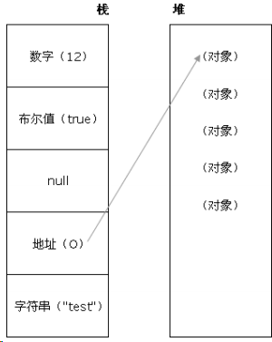

### Javascript 代码中的"use strict";是什么意思

use strict 是一种 ECMAscript 5 添加的（严格）运行模式,这种模式使得 Javascript 在更严格的条件下运行，使 JS 编码更加规范化的模式，消除 Javascript 语法的一些不合理、不严谨之处，减少一些怪异行为

### 说说严格模式的限制

- 变量必须声明后再使用
- 函数的参数不能有同名属性，否则报错
- 不能使用 with 语句
- 禁止 this 指向全局对象

### JSON 的了解

JSON(JavaScript Object Notation) 是一种轻量级的数据交换格式。

它是基于 JavaScript 的一个子集。数据格式简单, 易于读写, 占用带宽小

JSON 字符串转换为 JSON 对象:

```js
var obj = eval("(" + str + ")");
var obj = str.parseJSON();
var obj = JSON.parse(str);
```

JSON 对象转换为 JSON 字符串：

```js
var last = obj.toJSONString();
var last = JSON.stringify(obj);
```

### js 延迟加载的方式有哪些

defer 和 async 、动态创建 DOM 方式（用得最多）、按需异步载入 js

### 同步和异步的区别

同步：浏览器访问服务器请求，用户看得到页面刷新，重新发请求,等请求完，页面刷新，新内容出现，用户看到新内容,进行下一步操作

异步：浏览器访问服务器请求，用户正常操作，浏览器后端进行请求。等请求完，页面不刷新，新内容也会出现，用户看到新内容

### defer 和 async

defer 并行加载 js 文件，会按照页面上 script 标签的顺序执行

async 并行加载 js 文件，下载完成立即执行，不会按照页面上 script 标签的顺序执行

## ES6

### 谈谈你对 ES6 的理解

- 新增模板字符串（为 JavaScript 提供了简单的字符串插值功能）
- 箭头函数
- for-of （用来遍历数据—例如数组中的值。）
- arguments 对象可被不定参数和默认参数完美代替。
- ES6 将 p romise 对象纳入规范，提供了原生的 Promise 对象。
- 增加了 let 和 const 命令，用来声明变量。
- 增加了块级作用域。
- let 命令实际上就增加了块级作用域。

### ECMAScript6 怎么写 class 么

这个语法糖可以让有 OOP 基础的⼈更快上手 js ，⾄少是一个官方的实现了
但对熟悉 js 的⼈来说，这个东⻄没啥大影响；一个 Object.creat() 搞定继承，比 class 简洁清晰的多

## 实现效果，点击容器内的图标，图标边框变成 border 1px solid red，点击空白处重置

```js
const box = document.getElementById("box");
function isIcon(target) {
	return target.className.includes("icon");
}
box.onClick = function (e) {
	e.stopPropagation();
	const target = e.target;
	if (isIcon(target)) {
		target.style.border = "1px solid red";
	}
};
const doc = document;
doc.onclick = function (e) {
	const children = box.children;
	for (let i; i < children.length; i++) {
		if (isIcon(children[i])) {
			children[i].style.border = "none";
		}
	}
};
```

### 下面这个 ul，如何点击每一列的时候 alert 其 index

考察闭包

```js
<ul id=”test”>
    <li>这是第一条</li>
    <li>这是第二条</li>
    <li>这是第三条</li>
</ul>

// 方法一：
var lis = document.getElementById('2223').getElementsByTagName('li');

for(var i=0;i<3;i++) {
    lis[i].index=i;
    lis[i].onclick=function(){
    	alert(this.index);
    }
}

// 方法二：
var lis = document.getElementById('2223').getElementsByTagName('li');
for(var i=0;i<3;i++){
    lis[i].index=i;
    lis[i].onclick=(function(a){
        return function() {
        	alert(a);
    	}
    })(i);
}
```

## 定义一个 log 方法，让它可以代理 console.log 的方法

可行的方法一：

```js
function log(msg) {
	console.log(msg);
}
log("hello world!"); // hello world!
```

如果要传入多个参数呢？显然上面的方法不能满⾜要求，所以更好的方法是：

```js
function log() {
	console.log.apply(console, arguments);
}
```

## 输出今天的⽇期

以 YYYY-MM-DD 的方式，比如今天是 2014 年 9 ⽉ 26 ⽇，则输出 2014-09-26

```js
function log() {
	console.log.apply(console, arguments);
}
var d = new Date();
// 获取年，getFullYear()返回4位的数字
var year = d.getFullYear();
// 获取⽉，⽉份比较特殊，0是1⽉，11是12⽉
var month = d.getMonth() + 1;
// 变成两位
month = month < 10 ? "0" + month : month;
// 获取⽇
var day = d.getDate();
day = day < 10 ? "0" + day : day;
alert(year + "-" + month + "-" + day);
```

## 用 js 实现随机选取 10–100 之间的 10 个数字，存入一个数组，并排序

```js
var iArray = [];
function getRandom(istart, iend) {
	var iChoice = istart - iend + 1;
	return Math.floor(Math.random() * iChoice + istart);
}
for (var i = 0; i < 10; i++) {
	iArray.push(getRandom(10, 100));
}
iArray.sort();
```

## 写一段 JS 程序提取 URL 中的各个 GET 参数

有这样一个 URL ： http://item.taobao.com/item.htm?a=1&b=2&c=&d=xxx&e ，请写一段 JS 程序提取 URL 中的各个 GET 参数(参数名和参数个数不确定)，将其按 key-value 形式返回到一个 json 结构中，如 `{a:'1', b:'2', c:'', d:'xxx', e:undefined}`

```js
function serilizeUrl(url) {
	var result = {};
	url = url.split("?")[1];
	var map = url.split("&");
	for (var i = 0, len = map.length; i < len; i++) {
		result[map[i].split("=")[0]] = map[i].split("=")[1];
	}
	return result;
}
```

## 写一个 function ，清除字符串前后的空格

使用自带接口 trim() ，考虑兼容性：

```js
if (!String.prototype.trim) {
	String.prototype.trim = function () {
		return this.replace(/^\s+/, "").replace(/\s+$/, "");
	};
}
// test the function
var str = " \t\n test string ".trim();
alert(str == "test string"); // alerts "true"
```

## 实现每隔一秒钟输出 1,2,3...数字

```js
for (var i = 0; i < 10; i++) {
	(function (j) {
		setTimeout(function () {
			console.log(j + 1);
		}, j * 1000);
	})(i);
}
```

## 实现一个函数，判断输入是不是回文字符串

```js
function run(input) {
	if (typeof input !== "string") return false;
	return input.split("").reverse().join("") === input;
}
```

## 数组扁平化处理

实现一个 flatten 方法，使得输入一个数组，该数组里面的元素也可以是数
组，该方法会输出一个扁平化的数组

```js
function flatten(arr) {
	return arr.reduce(function (prev, item) {
		return prev.concat(Array.isArray(item) ? flatten(item) : item);
	}, []);
}
```

## 数组降维

```js
[1, [2], 3].flatMap((v) => v);
// -> [1, 2, 3]
```

如果想将一个多维数组彻底的降维，可以这样实现

```js
const flattenDeep = (arr) =>
	Array.isArray(arr)
		? arr.reduce((a, b) => [...a, ...flattenDeep(b)], [])
		: [arr];
flattenDeep([1, [[2], [3, [4]], 5]]);
```

## (设计题）想实现一个对页面某个节点的拖曳？如何做？（使用原生 JS）

给需要拖拽的节点绑定 mousedown , mousemove , mouseup 事件

- mousedown 事件触发后，开始拖拽
- mousemove 时，需要通过 event.clientX 和 clientY 获取拖拽位置，并实时更新位置
- mouseup 时，拖拽结束
- 需要注意浏览器边界的情况

## Javascript 全局函数和全局变量

### 全局变量

- Infinity 代表正的无穷大的数值。
- NaN 指示某个值是不是数字值。
- undefined 指示未定义的值。

### 全局函数

- decodeURI() 解码某个编码的 URI 。
- decodeURIComponent() 解码一个编码的 URI 组件。
- encodeURI() 把字符串编码为 URI。
- encodeURIComponent() 把字符串编码为 URI 组件。
- escape() 对字符串进行编码。
- eval() 计算 JavaScript 字符串，并把它作为脚本代码来执行。
- isFinite() 检查某个值是否为有穷大的数。
- isNaN() 检查某个值是否是数字。
- Number() 把对象的值转换为数字。
- parseFloat() 解析一个字符串并返回一个浮点数。
- parseInt() 解析一个字符串并返回一个整数。
- String() 把对象的值转换为字符串。
- unescape() 对由 escape() 编码的字符串进行解码

## js 待定面试题

### 说一下闭包

参考回答：

一句话可以概括：闭包就是能够读取其他函数内部变量的函数，或者子函数在外调用，子函数所在的父函数的作用域不会被释放。

### 说一下类的创建和继承

参考回答：

（1）类的创建（es5）：new 一个 function，在这个 function 的 prototype 里面增加属性和方法。

下面来创建一个 Animal 类：

```js
// 定义一个动物类
function Animal(name) {
	// 属性
	this.name = name || "Animal";
	// 实例方法
	this.sleep = function () {
		console.log(this.name + "正在睡觉！");
	};
}
// 原型方法
Animal.prototype.eat = function (food) {
	console.log(this.name + "正在吃：" + food);
};
```

这样就生成了一个 Animal 类，实力化生成对象后，有方法和属性。

（2）类的继承——原型链继承--原型链继承

```js
function Cat() {}
Cat.prototype = new Animal();
Cat.prototype.name = "cat";
// Test Code
var cat = new Cat();
console.log(cat.name);
console.log(cat.eat("fish"));
console.log(cat.sleep());
console.log(cat instanceof Animal); //true
console.log(cat instanceof Cat); //true
```

介绍：在这里我们可以看到 new 了一个空对象,这个空对象指向 Animal 并且 Cat.prototype 指向了这个空对象，这种就是基于原型链的继承。

特点：基于原型链，既是父类的实例，也是子类的实例

缺点：无法实现多继承

（3）构造继承：使用父类的构造函数来增强子类实例，等于是父类的实例属性给子类（没用到原型）

```js
function Cat(name) {
	Animal.call(this);
	this.name = name || "Tom";
}
// Test Code
var cat = new Cat();
console.log(cat.name);
console.log(cat.sleep());
console.log(cat instanceof Animal); // false
console.log(cat instanceof Cat); // true
```

特点：可以实现多继承

缺点：只能继承父类实例的属性和方法，不能继承原型上的属性和方法。

（4）实例继承和拷贝继承

- 实例继承：为父类实例添加新特性，作为子类实例返回
- 拷贝继承：拷贝父类元素上的属性和方法

上述两个实用性不强，不一一举例。

（5）组合继承：相当于构造继承和原型链继承的组合体。通过调用父类构造，继承父类的属性并保留传参的优点，然后通过将父类实例作为子类原型，实现函数复用

```js
function Cat(name) {
	Animal.call(this);
	this.name = name || "Tom";
}
Cat.prototype = new Animal();
Cat.prototype.constructor = Cat;
// Test Code
var cat = new Cat();
console.log(cat.name);
console.log(cat.sleep());
console.log(cat instanceof Animal); // true
console.log(cat instanceof Cat); // true
```

特点：可以继承实例属性/方法，也可以继承原型属性/方法

缺点：调用了两次父类构造函数，生成了两份实例

（6）寄生组合继承：通过寄生方式，砍掉父类的实例属性，这样，在调用两次父类的构造的时候，就不会初始化两次实例方法/属性

```js
function Cat(name) {
	Animal.call(this);
	this.name = name || "Tom";
}
(function () {
	// 创建一个没有实例方法的类
	var Super = function () {};
	Super.prototype = Animal.prototype;
	//将实例作为子类的原型
	Cat.prototype = new Super();
})();
// Test Code
var cat = new Cat();
console.log(cat.name);
console.log(cat.sleep());
console.log(cat instanceof Animal); // true
console.log(cat instanceof Cat); //true
```

较为推荐

### 如何解决异步回调地狱

参考回答：

promise、generator、async/await

### 说说前端中的事件流

参考回答：

HTML 中与 javascript 交互是通过事件驱动来实现的，例如鼠标点击事件 onclick、页面的滚动事件 onscroll 等等，可以向文档或者文档中的元素添加事件侦听器来预订事件。想要知道这些事件是在什么时候进行调用的，就需要了解一下“事件流”的概念。

什么是事件流：事件流描述的是从页面中接收事件的顺序,DOM2 级事件流包括下面几个阶段。

- 事件捕获阶段
- 处于目标阶段
- 事件冒泡阶段

addEventListener：addEventListener 是 DOM2 级事件新增的指定事件处理程序的操作，这个方法接收 3 个参数：要处理的事件名、作为事件处理程序的函数和一个布尔值。最后这个布尔值参数如果是 true，表示在捕获阶段调用事件处理程序；

如果是 false，表示在冒泡阶段调用事件处理程序。

IE 只支持事件冒泡。

### 如何让事件先冒泡后捕获

参考回答：

在 DOM 标准事件模型中，是先捕获后冒泡。但是如果要实现先冒泡后捕获的效果，对于同一个事件，监听捕获和冒泡，分别对应相应的处理函数，监听到捕获事件，先暂缓执行，直到冒泡事件被捕获后再执行捕获之间。

### 说一下事件委托

参考回答：

简介：事件委托指的是，不在事件的发生地（直接 dom）上设置监听函数，而是在其父元素上设置监听函数，通过事件冒泡，父元素可以监听到子元素上事件的触发，通过判断事件发生元素 DOM 的类型，来做出不同的响应。

举例：最经典的就是 ul 和 li 标签的事件监听，比如我们在添加事件时候，采用事件委托机制，不会在 li 标签上直接添加，而是在 ul 父元素上添加。

好处：比较合适动态元素的绑定，新添加的子元素也会有监听函数，也可以有事件触发机制。

### 说一下图片的懒加载和预加载

参考回答：

预加载：提前加载图片，当用户需要查看时可直接从本地缓存中渲染。

懒加载：懒加载的主要目的是作为服务器前端的优化，减少请求数或延迟请求数。

两种技术的本质：两者的行为是相反的，一个是提前加载，一个是迟缓甚至不加载。

懒加载对服务器前端有一定的缓解压力作用，预加载则会增加服务器前端压力。

### mouseover 和 mouseenter 的区别

参考回答：

mouseover：当鼠标移入元素或其子元素都会触发事件，所以有一个重复触发，冒泡的过程。对应的移除事件是 mouseout

mouseenter：当鼠标移除元素本身（不包含元素的子元素）会触发事件，也就是不会冒泡，对应的移除事件是 mouseleave

### JS 的 new 操作符做了哪些事情

参考回答：

new 操作符新建了一个空对象，这个对象原型指向构造函数的 prototype，执行构造函数后返回这个对象。

### 改变函数内部 this 指针的指向函数（bind，apply，call 的区别）

参考回答：

通过 apply 和 call 改变函数的 this 指向，他们两个函数的第一个参数都是一样的表示要改变指向的那个对象，第二个参数，apply 是数组，而 call 则是 arg1,arg2...这种形式。通过 bind 改变 this 作用域会返回一个新的函数，这个函数不会马上执行。

### JS 的各种位置，比如 clientHeight,scrollHeight,offsetHeight ,以及 scrollTop, offsetTop,clientTop 的区别？

参考回答：

- clientHeight：表示的是可视区域的高度，不包含 border 和滚动条
- offsetHeight：表示可视区域的高度，包含了 border 和滚动条
- scrollHeight：表示了所有区域的高度，包含了因为滚动被隐藏的部分。
- clientTop：表示边框 border 的厚度，在未指定的情况下一般为 0
- scrollTop：滚动后被隐藏的高度，获取对象相对于由 offsetParent 属性指定的父坐
- 标(css 定位的元素或 body 元素)距离顶端的高度。

### JS 拖拽功能的实现

参考回答：

首先是三个事件，分别是 mousedown，mousemove，mouseup

当鼠标点击按下的时候，需要一个 tag 标识此时已经按下，可以执行 ousemove 里面的具体方法。

clientX，clientY 标识的是鼠标的坐标，分别标识横坐标和纵坐标，并且我们用
offsetX 和 offsetY 来表示元素的元素的初始坐标，移动的举例应该是：

鼠标移动时候的坐标-鼠标按下去时候的坐标。

也就是说定位信息为：

鼠标移动时候的坐标-鼠标按下去时候的坐标+元素初始情况下的 offetLeft。

还有一点也是原理性的东西，也就是拖拽的同时是绝对定位，我们改变的是绝对定位条件下的 left 以及 top 等等值。

补充：也可以通过 html5 的拖放（Drag 和 drop）来实现

### 异步加载 JS 的方法

参考回答：

defer：只支持 IE 如果您的脚本不会改变文档的内容，可将 defer 属性加入到

`<script>`标签中，以便加快处理文档的速度。因为浏览器知道它将能够安全地读取文档的剩余部分而不用执行脚本，它将推迟对脚本的解释，直到文档已经显示给用户为止。

async，HTML5 属性仅适用于外部脚本，并且如果在 IE 中，同时存在 defer 和 async，那么 defer 的优先级比较高，脚本将在页面完成时执行。

创建 script 标签，插入到 DOM 中

### Ajax 解决浏览器缓存问题

参考回答：

在 ajax 发送请求前加上 `anyAjaxObj.setRequestHeader("If-Modified-Since","0")`。

在 ajax 发送请求前加上 `anyAjaxObj.setRequestHeader("Cache-Control","no-cache")`。

在 URL 后面加上一个随机数： `"fresh=" + Math.random()`。

在 URL 后面加上时间搓：`"nowtime=" + new Date().getTime()`。

如果是使用 jQuery，直接这样就可以了 `$.ajaxSetup({cache:false})`。这样页面的所有 ajax 都会执行这条语句就是不需要保存缓存记录。

### JS 中的垃圾回收机制

参考回答：

必要性：由于字符串、对象和数组没有固定大小，所有当他们的大小已知时，才能对他们进行动态的存储分配。JavaScript 程序每次创建字符串、数组或对象时，解释器都必须分配内存来存储那个实体。只要像这样动态地分配了内存，最终都要释放这些内存以便他们能够被再用，否则，JavaScript 的解释器将会消耗完系统中所有可用的内存，造成系统崩溃。

这段话解释了为什么需要系统需要垃圾回收，JS 不像 C/C++，他有自己的一套垃圾回收机制（Garbage Collection）。JavaScript 的解释器可以检测到何时程序不再使用一个对象了，当他确定了一个对象是无用的时候，他就知道不再需要这个对象，可以把它所占用的内存释放掉了。例如：

```js
var a = "hello world";
var b = "world";
var a = b;
//这时，会释放掉"hello world"，释放内存以便再引用
```

垃圾回收的方法：标记清除、计数引用。

#### 标记清除

这是最常见的垃圾回收方式，当变量进入环境时，就标记这个变量为”进入环境“,从逻辑上讲，永远不能释放进入环境的变量所占的内存，永远不能释放进入环境变量所占用的内存，只要执行流程进入相应的环境，就可能用到他们。当离开环境时，就标记为离开环境。

垃圾回收器在运行的时候会给存储在内存中的变量都加上标记（所有都加），然后去掉环境变量中的变量，以及被环境变量中的变量所引用的变量（条件性去除标记），删除所有被标记的变量，删除的变量无法在环境变量中被访问所以会被删除，最后垃圾回收器，完成了内存的清除工作，并回收他们所占用的内存。

#### 引用计数法

另一种不太常见的方法就是引用计数法，引用计数法的意思就是每个值没引用的次数，当声明了一个变量，并用一个引用类型的值赋值给改变量，则这个值的引用次数为 1,；相反的，如果包含了对这个值引用的变量又取得了另外一个值，则原先的引用值引用次数就减 1，当这个值的引用次数为 0 的时候，说明没有办法再访问这个值了，因此就把所占的内存给回收进来，这样垃圾收集器再次运行的时候，就会释放引用次数为 0 的这些值。

用引用计数法会存在内存泄露，下面来看原因：

```js
function problem() {
	var objA = new Object();
	var objB = new Object();
	objA.someOtherObject = objB;
	objB.anotherObject = objA;
}
```

在这个例子里面，objA 和 objB 通过各自的属性相互引用，这样的话，两个对象的引用次数都为 2，在采用引用计数的策略中，由于函数执行之后，这两个对象都离开了作用域，函数执行完成之后，因为计数不为 0，这样的相互引用如果大量存在就会导致内存泄露。

特别是在 DOM 对象中，也容易存在这种问题：

```js
var element=document.getElementById（’‘）；
var myObj=new Object();
myObj.element=element;
element.someObject=myObj;
```

这样就不会有垃圾回收的过程。

### eval 是做什么的

参考回答：

它的功能是将对应的字符串解析成 JS 并执行，应该避免使用 JS，因为非常消耗性能（2 次，一次解析成 JS，一次执行）

### 如何理解前端模块化

参考回答：

前端模块化就是复杂的文件编程一个一个独立的模块，比如 JS 文件等等，分成独立的模块有利于重用（复用性）和维护（版本迭代），这样会引来模块之间相互依赖的问题，所以有了 commonJS 规范，AMD，CMD 规范等等，以及用于 JS 打包（编译等处理）的工具 webpack

### 说一下 CommonJS、AMD 和 CMD

参考回答：

一个模块是能实现特定功能的文件，有了模块就可以方便的使用别人的代码，想要什么功能就能加载什么模块。

CommonJS：开始于服务器端的模块化，同步定义的模块化，每个模块都是一个单独的作用域，模块输出，modules.exports，模块加载 require()引入模块。

AMD：中文名异步模块定义的意思。

requireJS 实现了 AMD 规范，主要用于解决下述两个问题。 1.多个文件有依赖关系，被依赖的文件需要早于依赖它的文件加载到浏览器 2.加载的时候浏览器会停止页面渲染，加载文件越多，页面失去响应的时间越长。

语法：requireJS 定义了一个函数 define，它是全局变量，用来定义模块。

requireJS 的例子：

```js
// 定义模块
define(['dependency'], function(){
var name = 'Byron';
function printName(){
console.log(name);
}
return {
printName: printName
};
});
// 加载模块
require(['myModule'], function (my){
my.printName();
}
```

RequireJS 定义了一个函数 define,它是全局变量，用来定义模块：

```js
define(id?dependencies?,factory)
```

在页面上使用模块加载函数：

```js
require([dependencies],factory)；
```

总结 AMD 规范：require（）函数在加载依赖函数的时候是异步加载的，这样浏览器不会失去响应，它指定的回调函数，只有前面的模块加载成功，才会去执行。

因为网页在加载 JS 的时候会停止渲染，因此我们可以通过异步的方式去加载 JS,而如果需要依赖某些，也是异步去依赖，依赖后再执行某些方法。

### 对象深度克隆的简单实现

参考回答：

```js
function deepClone(obj) {
	var newObj = obj instanceof Array ? [] : {};
	for (var item in obj) {
		var temple =
			typeof obj[item] == "object" ? deepClone(obj[item]) : obj[item];
		newObj[item] = temple;
	}
	return newObj;
}
```

ES5 的常用的对象克隆的一种方式。注意数组是对象，但是跟对象又有一定区别，所以一开始判断了一些类型，决定 newObj 是对象还是数组。

### 实现一个 once 函数，传入函数参数只执行一次

参考回答：

```js
function ones(func) {
	var tag = true;
	return function () {
		if (tag == true) {
			func.apply(null, arguments);
			tag = false;
		}
		return undefined;
	};
}
```

### 将原生的 ajax 封装成 promise

参考回答：

```js
var myNewAjax = function (url) {
	return new Promise(function (resolve, reject) {
		var xhr = new XMLHttpRequest();
		xhr.open("get", url);
		xhr.send(data);
		xhr.onreadystatechange = function () {
			if (xhr.status == 200 && readyState == 4) {
				var json = JSON.parse(xhr.responseText);
				resolve(json);
			} else if (xhr.readyState == 4 && xhr.status != 200) {
				reject("error");
			}
		};
	});
};
```

### JS 监听对象属性的改变

参考回答：

我们假设这里有一个 user 对象,

(1)在 ES5 中可以通过 Object.defineProperty 来实现已有属性的监听

```js
Object.defineProperty(user,'name',{
set：function(key,value){
}
})
```

缺点：如果 id 不在 user 对象中，则不能监听 id 的变化
(2)在 ES6 中可以通过 Proxy 来实现

```js
var user = new Proxy({}，{
set：function(target,key,value,receiver){
}
})
```

这样即使有属性在 user 中不存在，通过 user.id 来定义也同样可以这样监听这个属性的变化哦。

### 如何实现一个私有变量，用 getName 方法可以访问，不能直接访问

参考回答：

(1)通过 defineProperty 来实现

```js
obj = {
	name: yuxiaoliang,
	getName: function () {
		return this.name;
	},
};
object.defineProperty(obj, "name", {
	//不可枚举不可配置
});
```

(2)通过函数的创建形式

```js
function product() {
	var name = "yuxiaoliang";
	this.getName = function () {
		return name;
	};
}
var obj = new product();
```

### ==和===、以及 Object.is 的区别

参考回答：

(1) ==

主要存在：强制转换成 number,null==undefined

- " "==0 //true
- "0"==0 //true
- " " !="0" //true
- 123=="123" //true
- null==undefined //true

(2)Object.js

- 主要的区别就是+0！=-0 而 NaN==NaN (相对比===和==的改进)

### setTimeout、setInterval 和 requestAnimationFrame 之间的区别

参考回答：

这里有一篇文章讲的是 requestAnimationFrame：http://www.cnblogs.com/xiaohuochai/p/5777186.html

与 setTimeout 和 setInterval 不同，requestAnimationFrame 不需要设置时间间隔，大多数电脑显示器的刷新频率是 60Hz，大概相当于每秒钟重绘 60 次。大多数浏览器都会对重绘操作加以限制，不超过显示器的重绘频率，因为即使超过那个频率用户体验也不会有提升。

因此，最平滑动画的最佳循环间隔是 1000ms/60，约等于 16.6ms。

RAF 采用的是系统时间间隔，不会因为前面的任务，不会影响 RAF，但是如果前面的任务多的话，会响应 setTimeout 和 setInterval 真正运行时的时间间隔。

特点：

- （1）requestAnimationFrame 会把每一帧中的所有 DOM 操作集中起来，在一次重绘或回流中就完成，并且重绘或回流的时间间隔紧紧跟随浏览器的刷新频率。
- （2）在隐藏或不可见的元素中，requestAnimationFrame 将不会进行重绘或回流，这当然就意味着更少的 CPU、GPU 和内存使用量
- （3）requestAnimationFrame 是由浏览器专门为动画提供的 API，在运行时浏览器会自动优化方法的调用，并且如果页面不是激活状态下的话，动画会自动暂停，有效节省了 CPU 开销。

### 自己实现一个 bind 函数

参考回答：

原理：通过 apply 或者 call 方法来实现。

(1)初始版本

```js
Function.prototype.bind = function (obj, arg) {
	var arg = Array.prototype.slice.call(arguments, 1);
	var context = this;
	return function (newArg) {
		arg = arg.concat(Array.prototype.slice.call(newArg));
		return context.apply(obj, arg);
	};
};
```

(2) 考虑到原型链

为什么要考虑？因为在 new 一个 bind 过生成的新函数的时候，必须的条件是要继承原函数的原型

```js
Function.prototype.bind = function (obj, arg) {
	var arg = Array.prototype.slice.call(arguments, 1);
	var context = this;
	var bound = function (newArg) {
		arg = arg.concat(Array.prototype.slice.call(newArg));
		return context.apply(obj, arg);
	};
	var F = function () {};
	// 这里需要一个寄生组合继承
	F.prototype = context.prototype;
	bound.prototype = new F();
	return bound;
};
```

### 用 setTimeout 来实现 setInterval

参考回答：

(1)用 setTimeout()方法来模拟 setInterval()与 setInterval()之间的什么区别？
首先来看 setInterval 的缺陷，使用 setInterval()创建的定时器确保了定时器代码规则地插入队列中。这个问题在于：如果定时器代码在代码再次添加到队列之前还没完成执行，结果就会导致定时器代码连续运行好几次。而之间没有间隔。不过幸运的是：javascript 引擎足够聪明，能够避免这个问题。当且仅当没有该定时器的如何代码实例时，才会将定时器代码添加到队列中。这确保了定时器代码加入队列中最小的时间间隔为指定时间。

这种重复定时器的规则有两个问题：1.某些间隔会被跳过 2.多个定时器的代码执行时间可能会比预期小。

下面举例子说明：

假设，某个 onclick 事件处理程序使用啦 setInterval()来设置了一个 200ms 的重复定时器。如果事件处理程序花了 300ms 多一点的时间完成。


这个例子中的第一个定时器是在 205ms 处添加到队列中，但是要过 300ms 才能执行。

在 405ms 又添加了一个副本。在一个间隔，605ms 处，第一个定时器代码还在执行中，而且队列中已经有了一个定时器实例，结果是 605ms 的定时器代码不会添加到队列中。结果是在 5ms 处添加的定时器代码执行结束后，405 处的代码立即执行。

```js
function say() {
	//something
	setTimeout(say, 200);
}
setTimeout(say, 200);

// 或者
setTimeout(function () {
	//do something
	setTimeout(arguments.callee, 200);
}, 200);
```

### JS 怎么控制一次加载一张图片，加载完后再加载下一张

参考回答：

(1)方法 1

```html
<script type="text/javascript">
	var obj=new Image();
	obj.src="http://www.phpernote.com/uploadfiles/editor/2011072405022011
	79.jpg";
	obj.onload=function(){
	alert('图片的宽度为：'+obj.width+'；图片的高度为：'+obj.height);
	document.getElementById("mypic").innnerHTML="";
	}
</script>
<div id="mypic">onloading……</div>
```

(2)方法 2

```html
<script type="text/javascript">
	var obj=new Image();
	obj.src="http://www.phpernote.com/uploadfiles/editor/2011072405022011
	79.jpg";
	obj.onreadystatechange=function(){
	if(this.readyState=="complete"){
	alert('图片的宽度为：'+obj.width+'；图片的高度为：'+obj.height);
	document.getElementById("mypic").innnerHTML="";
	}
	}
</script>
<div id="mypic">onloading……</div>
```

### 代码的执行顺序

参考回答：

```js
setTimeout(function () {
	console.log(1);
}, 0);
new Promise(function (resolve, reject) {
	console.log(2);
	resolve();
})
	.then(function () {
		console.log(3);
	})
	.then(function () {
		console.log(4);
	});
process.nextTick(function () {
	console.log(5);
});
console.log(6);
// 输出 2,6,5,3,4,1
```

### 如何实现 sleep 的效果（es5 或者 es6）

参考回答：

(1)while 循环的方式

```js
function sleep(ms) {
	var start = Date.now(),
		expire = start + ms;
	while (Date.now() < expire);
	console.log("1111");
	return;
}
```

执行 sleep(1000)之后，休眠了 1000ms 之后输出了 1111。上述循环的方式缺点很明显，容易造成死循环。

(2)通过 promise 来实现

```js
function sleep(ms) {
	var temple = new Promise((resolve) => {
		console.log(111);
		setTimeout(resolve, ms);
	});
	return temple;
}
sleep(500).then(function () {
	// console.log(222)
});
// 先输出了 111，延迟 500ms 后输出 222
```

(3)通过 async 封装

```js
function sleep(ms) {
	return new Promise((resolve) => setTimeout(resolve, ms));
}
async function test() {
	var temple = await sleep(1000);
	console.log(1111);
	return temple;
}
test();
// 延迟 1000ms 输出了 1111
```

(4).通过 generate 来实现

```js
function* sleep(ms) {
	yield new Promise(function (resolve, reject) {
		console.log(111);
		setTimeout(resolve, ms);
	});
}
sleep(500)
	.next()
	.value.then(function () {
		console.log(2222);
	});
```

### `Function._proto_(getPrototypeOf)`是什么？

参考回答：

获取一个对象的原型，在 chrome 中可以通过*proto*的形式，或者在 ES6 中可以通过 Object.getPrototypeOf 的形式。

那么 Function.proto 是什么么？也就是说 Function 由什么对象继承而来，我们来做如下判别。

```js
Function.__proto__ == Object.prototype; // false
Function.__proto__ == Function.prototype; // true
```

我们发现 Function 的原型也是 Function。

我们用图可以来明确这个关系：

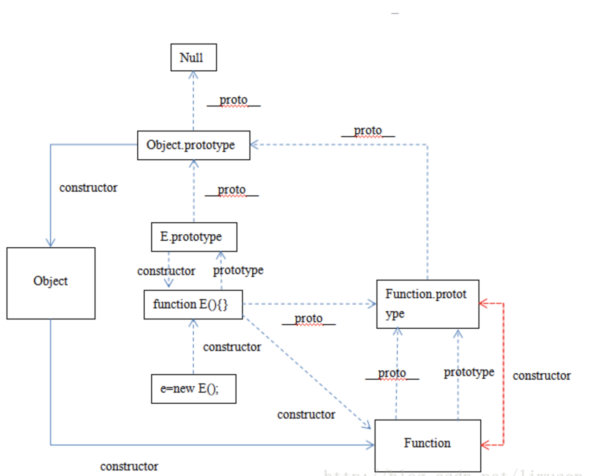

### 实现 JS 中所有对象的深度克隆（包装对象，Date 对象，正则对象）

参考回答：

通过递归可以简单实现对象的深度克隆，但是这种方法不管是 ES6 还是 ES5 实现，都有同样的缺陷，就是只能实现特定的 object 的深度（比如数组和函数），不能实现包装对象 Number，String ， Boolean，以及 Date 对象，RegExp 对象的。

(1)前文的方法

```js
function deepClone(obj) {
	var newObj = obj instanceof Array ? [] : {};
	for (var i in obj) {
		newObj[i] = typeof obj[i] == "object" ? deepClone(obj[i]) : obj[i];
	}
	return newObj;
}
```

这种方法可以实现一般对象和数组对象的克隆，比如：

```js
var arr = [1, 2, 3];
var newArr = deepClone(arr);
// newArr->[1,2,3]
var obj = {
	x: 1,
	y: 2,
};
var newObj = deepClone(obj);
// newObj={x:1,y:2}
```

但是不能实现例如包装对象 Number,String,Boolean,以及正则对象 RegExp 和 Date 对象的克隆，比如：

```js
//Number 包装对象
var num = new Number(1);
typeof num; // "object"
var newNum = deepClone(num);
//newNum -> {} 空对象
//String 包装对象
var str = new String("hello");
typeof str; //"object"
var newStr = deepClone(str);
//newStr-> {0:'h',1:'e',2:'l',3:'l',4:'o'};
//Boolean 包装对象
var bol = new Boolean(true);
typeof bol; //"object"
var newBol = deepClone(bol);
// newBol ->{} 空对象

// ...
```

(2)valueof()函数

所有对象都有 valueOf 方法，valueOf 方法对于：如果存在任意原始值，它就默认将对象转换为表示它的原始值。对象是复合值，而且大多数对象无法真正表示为一个原始值，因此默认的 valueOf()方法简单地返回对象本身，而不是返回一个原始值。数组、函数和正则表达式简单地继承了这个默认方法，调用这些类型的实例的 valueOf()方法只是简单返回这个对象本身。

对于原始值或者包装类：

```js
function baseClone(base) {
	return base.valueOf();
}
//Number
var num = new Number(1);
var newNum = baseClone(num);
//newNum->1
//String
var str = new String("hello");
var newStr = baseClone(str);
// newStr->"hello"
//Boolean
var bol = new Boolean(true);
var newBol = baseClone(bol);
//newBol-> true
```

其实对于包装类，完全可以用=号来进行克隆，其实没有深度克隆一说，
这里用 valueOf 实现，语法上比较符合规范。

对于 Date 类型：

因为 valueOf 方法，日期类定义的 valueOf()方法会返回它的一个内部表示：1970 年 1 月 1 日以来的毫秒数.因此我们可以在 Date 的原型上定义克隆的方法：

```js
Date.prototype.clone = function () {
	return new Date(this.valueOf());
};
var date = new Date("2010");
var newDate = date.clone();
// newDate-> Fri Jan 01 2010 08:00:00 GMT+0800
```

对于正则对象 RegExp：

```js
RegExp.prototype.clone = function () {
	var pattern = this.valueOf();
	var flags = "";
	flags += pattern.global ? "g" : "";
	flags += pattern.ignoreCase ? "i" : "";
	flags += pattern.multiline ? "m" : "";
	return new RegExp(pattern.source, flags);
};
var reg = new RegExp("/111/");
var newReg = reg.clone();
//newReg-> /\/111\//
```

### 简单实现 Node 的 Events 模块

参考回答：

简介：观察者模式或者说订阅模式，它定义了对象间的一种一对多的关系，让多个观察者对象同时监听某一个主题对象，当一个对象发生改变时，所有依赖于它的对象都将得到通知。

node 中的 Events 模块就是通过观察者模式来实现的：

```js
var events = require("events");
var eventEmitter = new events.EventEmitter();
eventEmitter.on("say", function (name) {
	console.log("Hello", name);
});
eventEmitter.emit("say", "Jony yu");
```

这样，eventEmitter 发出 say 事件，通过 On 接收，并且输出结果，这就是一个订阅模式的实现，下面我们来简单的实现一个 Events 模块的 ventEmitter。

(1)实现简单的 Event 模块的 emit 和 on 方法

```js
function Events() {
	this.on = function (eventName, callBack) {
		if (!this.handles) {
			this.handles = {};
		}
		if (!this.handles[eventName]) {
			this.handles[eventName] = [];
		}
		this.handles[eventName].push(callBack);
	};
	this.emit = function (eventName, obj) {
		if (this.handles[eventName]) {
			for (var i = 0; o < this.handles[eventName].length; i++) {
				this.handles[eventName][i](obj);
			}
		}
	};
	return this;
}
```

这样我们就定义了 Events，现在我们可以开始来调用：

```js
var events = new Events();
events.on("say", function (name) {
	console.log("Hello", nama);
});
events.emit("say", "Jony yu");
// 结果就是通过 emit 调用之后，输出了 Jony yu
```

(2)每个对象是独立的

因为是通过 new 的方式，每次生成的对象都是不相同的，因此：

```js
var event1 = new Events();
var event2 = new Events();
event1.on("say", function () {
	console.log("Jony event1");
});
event2.on("say", function () {
	console.log("Jony event2");
});
event1.emit("say");
event2.emit("say");
// event1、event2 之间的事件监听互相不影响
// 输出结果为'Jony event1' 'Jony event2'
```

### 箭头函数中 this 指向举例

参考回答：

```js
var a = 11;
function test2() {
	this.a = 22;
	let b = () => {
		console.log(this.a);
	};
	b();
}
var x = new test2();
// 输出 22
```

定义时绑定。

### JS 判断类型

参考回答：

判断方法：typeof()，instanceof，Object.prototype.toString.call()等

### 数组常用方法

参考回答：

push()，pop()，shift()，unshift()，splice()，sort()，reverse()，map()等

### 数组去重

参考回答：

- 方法 1：indexOf 循环去重
- 方法 2：ES6 Set 去重；Array.from(new Set(array))
- 方法 3：Object 键值对去重；把数组的值存成 Object 的 key 值，比如
- Object[value1] = true，在判断另一个值的时候，如果 Object[value2]存在的话，就说明该值是重复的。

### 闭包 有什么用

参考回答：

（1）什么是闭包：

闭包是指有权访问另外一个函数作用域中的变量的函数。

闭包就是函数的局部变量集合，只是这些局部变量在函数返回后会继续存在。闭包就是就是函数的“堆栈”在函数返回后并不释放，我们也可以理解为这些函数堆栈并不在栈上分配而是在堆上分配。当在一个函数内定义另外一个函数就会产生闭包。

（2）为什么要用：

匿名自执行函数：我们知道所有的变量，如果不加上 var 关键字，则默认的会添加到全局对象的属性上去，这样的临时变量加入全局对象有很多坏处，比如：别的函数可能误用这些变量；造成全局对象过于庞大，影响访问速度(因为变量的取值是需要从原型链上遍历的)。除了每次使用变量都是用 var 关键字外，我们在实际情况下经常遇到这样一种情况，即有的函数只需要执行一次，其内部变量无需维护，可以用闭包。

结果缓存：我们开发中会碰到很多情况，设想我们有一个处理过程很耗时的函数对象，每次调用都会花费很长时间，那么我们就需要将计算出来的值存储起来，当调用这个函数的时候，首先在缓存中查找，如果找不到，则进行计算，然后更新缓存并返回值，如果找到了，直接返回查找到的值即可。闭包正是可以做到这一点，因为它不会释放外部的引用，从而函数内部的值可以得以保留。

封装：实现类和继承等。

### 事件代理在捕获阶段的实际应用

参考回答：

可以在父元素层面阻止事件向子元素传播，也可代替子元素执行某些操作。

### 去除字符串首尾空格

参考回答：

使用正则 `(^\s*)|(\s*$)` 即可

### 性能优化

参考回答：

- 减少 HTTP 请求
- 使用内容发布网络（CDN）
- 添加本地缓存
- 压缩资源文件
- 将 CSS 样式表放在顶部，把 javascript 放在底部（浏览器的运行机制决定）
- 避免使用 CSS 表达式
- 减少 DNS 查询
- 使用外部 javascript 和 CSS
- 避免重定向
- 图片 lazyLoad

### 能来讲讲 JS 的语言特性吗

参考回答：

- 运行在客户端浏览器上；
- 不用预编译，直接解析执行代码；
- 是弱类型语言，较为灵活；
- 与操作系统无关，跨平台的语言；
- 脚本语言、解释性语言

### 如何判断一个数组(讲到 typeof 差点掉坑里)

参考回答：

- Object.prototype.call.toString()
- instanceof

### 你说到 typeof，能不能加一个限制条件达到判断条件

参考回答：

typeof 只能判断是 object，可以判断一下是否拥有数组的方法

### JS 实现跨域

参考回答：

JSONP：通过动态创建 script，再请求一个带参网址实现跨域通信。

#### document.domain

- iframe 跨域：两个页面都通过 js 强制设置 document.domain 为基础主域，就实现了同域。
- location.hash + iframe 跨域：a 欲与 b 跨域相互通信，通过中间页 c 来实现。 三个页面，不同域之间利用 iframe 的 location.hash 传值，相同域之间直接 js 访问来通信。
- window.name + iframe 跨域：通过 iframe 的 src 属性由外域转向本地域，跨域数据即

#### 由 iframe 的 window.name 从外域传递到本地域。

postMessage 跨域：可以跨域操作的 window 属性之一。

CORS：服务端设置 Access-Control-Allow-Origin 即可，前端无须设置，若要带

#### cookie 请求，前后端都需要设置。

代理跨域：启一个代理服务器，实现数据的转发

参考：https://segmentfault.com/a/1190000011145364

### JS 深度拷贝一个元素的具体实现

参考回答：

```js
var deepCopy = function (obj) {
	if (typeof obj !== "object") return;
	var newObj = obj instanceof Array ? [] : {};
	for (var key in obj) {
		if (obj.hasOwnProperty(key)) {
			newObj[key] =
				typeof obj[key] === "object" ? deepCopy(obj[key]) : obj[key];
		}
	}
	return newObj;
};
```

### 之前说了 ES6set 可以数组去重，是否还有数组去重的方法

参考回答：

方法 1：indexOf 循环去重

方法 2：Object 键值对去重；把数组的值存成 Object 的 key 值，比如
Object[value1] = true，在判断另一个值的时候，如果 Object[value2]存在的话，就说明该值是重复的。

### JS 的全排列

参考回答：

```js
function permutate(str) {
var result = [];
if(str.length > 1) {
var left = str[0];
var rest = str.slice(1, str.length);
var preResult = permutate(rest);
for(var i=0; i<preResult.length; i++) {
for(var j=0; j<preResult[i].length; j++) {
var tmp = preResult[i],slice(0, j) + left + preResult[i].slice(j,
preResult[i].length);
result.push(tmp);
}
}
} else if (str.length == 1) {
return [str];
}
return result;
}
```

### null == undefined 为什么

参考回答：

要比较相等性之前，不能将 null 和 undefined 转换成其他任何值，但 null ==
undefined 会返回 true 。ECMAScript 规范中是这样定义的。

### this 的指向 哪几种

参考回答：

默认绑定：全局环境中，this 默认绑定到 window。

隐式绑定：一般地，被直接对象所包含的函数调用时，也称为方法调用，this 隐式绑定到该直接对象。

隐式丢失：隐式丢失是指被隐式绑定的函数丢失绑定对象，从而默认绑定到 window。

显式绑定：通过 call()、apply()、bind()方法把对象绑定到 this 上，叫做显式绑
定。

new 绑定：如果函数或者方法调用之前带有关键字 new，它就构成构造函数调用。对于 this 绑定来说，称为 new 绑定。

【1】构造函数通常不使用 return 关键字，它们通常初始化新对象，当构造函数的函数体执行完毕时，它会显式返回。在这种情况下，构造函数调用表达式的计算结果就是这个新对象的值。

【2】如果构造函数使用 return 语句但没有指定返回值，或者返回一个原始值，那么这时将忽略返回值，同时使用这个新对象作为调用结果。

【3】如果构造函数显式地使用 return 语句返回一个对象，那么调用表达式的值就是这个对象。

### 暂停死区

参考回答：

在代码块内，使用 let、const 命令声明变量之前，该变量都是不可用的。这在语法上，称为“暂时性死区”

### 写一个深度拷贝

参考回答：

```js
function clone(obj) {
	var copy;
	switch (typeof obj) {
		case "undefined":
			break;
		case "number":
			copy = obj - 0;
			break;
		case "string":
			copy = obj + "";
			break;
		case "boolean":
			copy = obj;
			break;
		case "object": //object 分为两种情况 对象（Object）和数组（Array）
			if (obj === null) {
				copy = null;
			} else {
				if (Object.prototype.toString.call(obj).slice(8, -1) === "Array") {
					copy = [];
					for (var i = 0; i < obj.length; i++) {
						copy.push(clone(obj[i]));
					}
				} else {
					copy = {};
					for (var j in obj) {
						copy[j] = clone(obj[j]);
					}
				}
			}
			break;
		default:
			copy = obj;
			break;
	}
	return copy;
}
```

### 简历中提到了 requestAnimationFrame，请问是怎么使用的

参考回答：

requestAnimationFrame() 方法告诉浏览器您希望执行动画并请求浏览器在下一次重绘之前调用指定的函数来更新动画。该方法使用一个回调函数作为参数，这个回调函数会在浏览器重绘之前调用。

### 有一个游戏叫做 Flappy Bird，就是一只小鸟在飞，前面是无尽的沙漠，上下不断有钢管生成，你要躲避钢管。然后小明在玩这个游戏时候老是卡顿甚至崩溃，说出原因（3-5 个）以及解决办法（3-5 个）

参考回答：

原因可能是： 1.内存溢出问题。 2.资源过大问题。 3.资源加载问题。4.canvas 绘制频率问题

解决办法：

1.针对内存溢出问题，我们应该在钢管离开可视区域后，销毁钢管，让垃圾收集器回收钢管，因为不断生成的钢管不及时清理容易导致内存溢出游戏崩溃。

2.针对资源过大问题，我们应该选择图片文件大小更小的图片格式，比如使用 webp、png 格式的图片，因为绘制图片需要较大计算量。

3.针对资源加载问题，我们应该在可视区域之前就预加载好资源，如果在可视区域生成钢管的话，用户的体验就认为钢管是卡顿后才生成的，不流畅。

4.针对 canvas 绘制频率问题，我们应该需要知道大部分显示器刷新频率为 60 次/s,因此游戏的每一帧绘制间隔时间需要小于 1000/60=16.7ms，才能让用户觉得不卡顿。（注意因为这是单机游戏，所以回答与网络无关）

### 编写代码，满足以下条件：

### （1）Hero("37er");执行结果为 Hi! This is 37er （2）Hero("37er").kill(1).recover(30);执行结果为 Hi! This is 37er Kill 1 bug Recover 30 bloods （3）Hero("37er").sleep(10).kill(2)执行结果为 Hi! This is 37er //等待 10s 后 Kill 2 bugs //注意为 bugs （双斜线后的为提示信息，不需要打印）

参考回答：

```js
function Hero(name){
let o=new Object();
o.name=name;
o.time=0;
console.log("Hi! This is "+o.name);
o.kill=function(bugs) {
if(bugs==1){
console.log("Kill "+(bugs)+" bug");
}else {
setTimeout(function () {
console.log("Kill " + (bugs) + " bugs");
}, 1000 \* this.time);
}
return o;
};
o.recover=function (bloods) {
console.log("Recover "+(bloods)+" bloods");
return o;
}
o.sleep=function (sleepTime) {
o.time=sleepTime;
return o;
}
return o;
}
```

### 什么是按需加载

参考回答：

当用户触发了动作时才加载对应的功能。触发的动作，是要看具体的业务场景而言，包括但不限于以下几个情况：鼠标点击、输入文字、拉动滚动条，鼠标移动、窗口大小更改等。加载的文件，可以是 JS、图片、CSS、HTML 等。

### 说一下什么是 virtual dom

参考回答：

用 JavaScript 对象结构表示 DOM 树的结构；然后用这个树构建一个真正的 DOM 树，插到文档当中 当状态变更的时候，重新构造一棵新的对象树。然后用新的树和旧的树进行比较，记录两棵树差异 把所记录的差异应用到所构建的真正的 DOM 树上，视图就更新了。Virtual DOM 本质上就是在 JS 和 DOM 之间做了一个缓存。

### JS 中继承实现的几种方式，

参考回答：

1、原型链继承，将父类的实例作为子类的原型，他的特点是实例是子类的实例也是父类的实例，父类新增的原型方法/属性，子类都能够访问，并且原型链继承简单易于实现，缺点是来自原型对象的所有属性被所有实例共享，无法实现多继承，无法向父类构造函数传参。

2、构造继承，使用父类的构造函数来增强子类实例，即父类的实例属性给子类，构造继承可以向父类传递参数，可以实现多继承，通过 call 多个父类对象。但是构造继承只能继承父类的实例属性和方法，不能继承原型属性和方法，无法实现函数服用，每个子类都有父类实例函数的副本，影响性能

3、实例继承，为父类实例添加新特性，作为子类实例返回，实例继承的特点是不限制调用方法，不管是 new 子类（）还是子类（）返回的对象具有相同的效果，缺点是实例是父类的实例，不是子类的实例，不支持多继承

4、拷贝继承：特点：支持多继承，缺点：效率较低，内存占用高（因为要拷贝父类的属性）无法获取父类不可枚举的方法（不可枚举方法，不能使用 for in 访问到）

5、组合继承：通过调用父类构造，继承父类的属性并保留传参的优点，然后通过将父类实例作为子类原型，实现函数复用

6、寄生组合继承：通过寄生方式，砍掉父类的实例属性，这样，在调用两次父类的构造的时候，就不会初始化两次实例方法/属性，避免的组合继承的缺点

### 写一个函数，第一秒打印 1，第二秒打印 2

参考回答：

两个方法，第一个是用 let 块级作用域

```js
for (let i = 0; i < 5; i++) {
	setTimeout(function () {
		console.log(i);
	}, 1000 * i);
}
```

第二个方法闭包

```js
for (var i = 0; i < 5; i++) {
	(function (i) {
		setTimeout(function () {
			console.log(i);
		}, 1000 * i);
	})(i);
}
```

### 简单介绍一下 symbol

参考回答：

Symbol 是 ES6 的新增属性，代表用给定名称作为唯一标识，这种类型的值可以这样创建，`let id=symbol(“id”)`
Symbl 确保唯一，即使采用相同的名称，也会产生不同的值，我们创建一个字段，仅为知道对应 symbol 的人能访问，使用 symbol 很有用，symbol 并不是 100%隐藏，有内置方法 `Object.getOwnPropertySymbols(obj)`可以获得所有的 symbol。

也有一个方法 Reflect.ownKeys(obj)返回对象所有的键，包括 symbol。

所以并不是真正隐藏。但大多数库内置方法和语法结构遵循通用约定他们是隐藏的。

### 什么是事件监听

参考回答：

addEventListener()方法，用于向指定元素添加事件句柄，它可以更简单的控制事件，语法为 `element.addEventListener(event, function, useCapture);`

- 第一个参数是事件的类型(如 "click" 或 "mousedown").
- 第二个参数是事件触发后调用的函数。
- 第三个参数是个布尔值用于描述事件是冒泡还是捕获。该参数是可选的。

事件传递有两种方式，冒泡和捕获

事件传递定义了元素事件触发的顺序，如果你将 P 元素插入到 div 元素中，用户点击 P 元素，在冒泡中，内部元素先被触发，然后再触发外部元素，捕获中，外部元素先被触发，在触发内部元素。

### 介绍一下 promise，及其底层如何实现

参考回答：

Promise 是一个对象，保存着未来将要结束的事件，她有两个特征:

1、对象的状态不受外部影响，Promise 对象代表一个异步操作，有三种状态，pending 进行中，fulfilled 已成功，rejected 已失败，只有异步操作的结果，才可以决定当前是哪一种状态，任何其他操作都无法改变这个状态，这也就是 promise 名字的由来

2、一旦状态改变，就不会再变，promise 对象状态改变只有两种可能，从 pending 改到 fulfilled 或者从 pending 改到 rejected，只要这两种情况发生，状态就凝固了，不会再改变，这个时候就称为定型 resolved,Promise 的基本用法：

```js
let promise1 = new Promise(function (resolve, reject) {
	setTimeout(function () {
		resolve("ok");
	}, 1000);
});
promise1.then(function success(val) {
	console.log(val);
});
```

最简单代码实现 promise

```js
class PromiseM {
	constructor(process) {
		this.status = "pending";
		this.msg = "";
		process(this.resolve.bind(this), this.reject.bind(this));
		return this;
	}
	resolve(val) {
		this.status = "fulfilled";
		this.msg = val;
	}
	reject(err) {
		this.status = "rejected";
		this.msg = err;
	}
	then(fufilled, reject) {
		if (this.status === "fulfilled") {
			fufilled(this.msg);
		}
		if (this.status === "rejected") {
			reject(this.msg);
		}
	}
}
// 测试代码
var mm = new PromiseM(function (resolve, reject) {
	resolve("123");
});
mm.then(
	function (success) {
		console.log(success);
	},
	function () {
		console.log("fail!");
	}
);
```

### 说说 C++,Java，JavaScript 这三种语言的区别

参考回答：

#### 从静态类型还是动态类型来看

静态类型，编译的时候就能够知道每个变量的类型，编程的时候也需要给定类型，如 Java 中的整型 int，浮点型 float 等。C、C++、Java 都属于静态类型语言。

动态类型，运行的时候才知道每个变量的类型，编程的时候无需显示指定类型，如 JavaScript 中的 var、PHP 中的$。JavaScript、Ruby、Python 都属于动态类型语言。

静态类型还是动态类型对语言的性能有很大影响。

对于静态类型，在编译后会大量利用已知类型的优势，如 int 类型，占用 4 个字节，编译后的代码就可以用内存地址加偏移量的方法存取变量，而地址加偏移量的算法汇编很容易实现。

对于动态类型，会当做字符串通通存下来，之后存取就用字符串匹配。

#### 从编译型还是解释型来看

编译型语言，像 C、C++，需要编译器编译成本地可执行程序后才能运行，由开发人员在编写完成后手动实施。用户只使用这些编译好的本地代码，这些本地代码由系统加载器执行，由操作系统的 CPU 直接执行，无需其他额外的虚拟机等。

##### 源代码=》抽象语法树=》中间表示=》本地代码

解释性语言，像 JavaScript、Python，开发语言写好后直接将代码交给用户，用户使用脚本解释器将脚本文件解释执行。对于脚本语言，没有开发人员的编译过程，当然，也不绝对。

##### 源代码=》抽象语法树=》解释器解释执行。

对于 JavaScript，随着 Java 虚拟机 JIT 技术的引入，工作方式也发生了改变。可以将抽象语法树转成中间表示（字节码），再转成本地代码，如 JavaScriptCore，这样可以大大提高执行效率。也可以从抽象语法树直接转成本地代码，如 V8Java 语言，分为两个阶段。首先像 C++语言一样，经过编译器编译。和 C++的不同，C++编译生成本地代码，Java 编译后，生成字节码，字节码与平台无关。第二阶段，由 Java 的运行环境也就是 Java 虚拟机运行字节码，使用解释器执行这些代码。

一般情况下，Java 虚拟机都引入了 JIT 技术，将字节码转换成本地代码来提高执行效率。

注意，在上述情况中，编译器的编译过程没有时间要求，所以编译器可以做大量的代码优化措施。

#### 对于 JavaScript 与 Java 它们还有的不同：

对于 Java，Java 语言将源代码编译成字节码，这个同执行阶段是分开的。也就是从源代码到抽象语法树到字节码这段时间的长短是无所谓的。

对于 JavaScript，这些都是在网页和 JavaScript 文件下载后同执行阶段一起在网页的加载和渲染过程中实施的，所以对于它们的处理时间有严格要求。

### JS 原型链，原型链的顶端是什么？Object 的原型是什么？Object 的原型的原型是什么？在数组原型链上实现删除数组重复数据的方法

参考回答：

能够把这个讲清楚弄明白是一件很困难的事，

首先明白原型是什么，在 ES6 之前，JS 没有类和继承的概念，JS 是通过原型来实现继承的，在 JS 中一个构造函数默认带有一个 prototype 属性，这个的属性值是一个对象，同时这个 prototype 对象自带有一个 constructor 属性，这个属性指向这个构造函数，同时每一个实例都会有一个*proto*属性指向这个 prototype 对象，我们可以把这个叫做隐式原型，我们在使用一个实例的方法的时候，会先检查这个实例中是否有这个方法，没有的话就会检查这个 prototype 对象是否有这个方法，基于这个规则，如果让原型对象指向另一个类型的实例，即 constructor1.protoytpe=instance2，这时候如果试图引用 constructor1 构造的实例 instance1 的某个属性 p1,首先会在 instance1 内部属性中找一遍，接着会在 instance1._proto_（constructor1.prototype）即是 instance2 中寻找 p1

搜寻轨迹：

instance1->instance2->constructor2.prototype……->Object.prototype;

这即是原型链，原型链顶端是 Object.prototype

补充学习：

每个函数都有一个 prototype 属性，这个属性指向了一个对象，这个对象正是调用该函数而创建的实例的原型，那么什么是原型呢，可以这样理解，每一个 JavaScript 对象在创建的时候就会预制管理另一个对象，这个对象就是我们所说的原型，每一个对象都会从原型继承属性，如图：

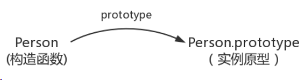

那么怎么表示实例与实例原型的关系呢，这时候就要用到第二个属性*proto*
这是每一个 JS 对象都会有的一个属性，指向这个对象的原型，如图：

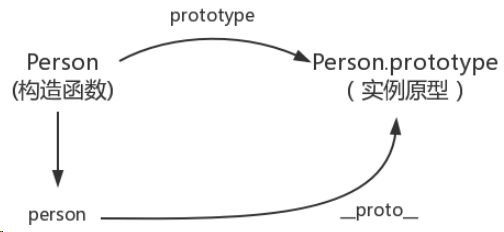

既然实例对象和构造函数都可以指向原型，那么原型是否有属性指向构造函数或者实例呢，指向实例是没有的，因为一个构造函数可以生成多个实例，但是原型有属性可以直接指向构造函数，通过 constructor 即可

接下来讲解实例和原型的关系：

当读取实例的属性时，如果找不到，就会查找与对象相关的原型中的属性，如果还查不到，就去找原型的原型，一直找到最顶层，那么原型的原型是什么呢，首先，原型也是一个对象，既然是对象，我们就可以通过构造函数的方式创建它，所以原型对象就是通过 Object 构造函数生成的，如图：

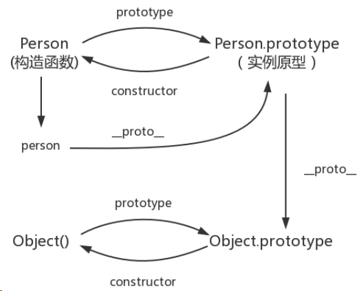

那么 Object.prototype 的原型呢，我们可以打印 console.log(Object.prototype.**proto** === null)，返回 true

null 表示没有对象，即该处不应有值，所以 Object.prototype 没有原型，如图：

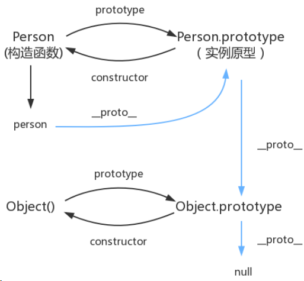

图中这条蓝色的线即是原型链，

最后补充三点：

```js
constructor：
function Person(){
}
var person = new Person();
console.log(Person === person.constructor);
```

原本 person 中没有 constructor 属性，当不能读取到 constructor 属性时，会从 person 的原型中读取，所以指向构造函数 Person

`__proto__`：
绝大部分浏览器支持这个非标准的方法访问原型，然而它并不存在与 Person.prototype 中，实际上它来自 Object.prototype，当使用 obj.**proto**`时，可以理解为返回来 Object.getPrototype(obj)

继承：

前面说到，每个对象都会从原型继承属性，但是引用《你不知道的 JS》中的话，继承意味着操作，然而 JS 默认不会对象的属性，相反，JS 只是在两个对象之间创建一个关联，这样子一个对象就可以通过委托访问另一个对象的属性和函数，所以与其叫继承，叫委托更合适。

### 什么是 js 的闭包？有什么作用，用闭包写个单例模式

参考回答：

MDN 对闭包的定义是：闭包是指那些能够访问自由变量的函数，自由变量是指在函数中使用的，但既不是函数参数又不是函数的局部变量的变量，由此可以看出，闭包=函数 +函数能够访问的自由变量，所以从技术的角度讲，所有 JS 函数都是闭包，但是这是理论上的闭包，还有一个实践角度上的闭包，从实践角度上来说，只有满足

1、即使创建它的上下文已经销毁，它仍然存在

2、在代码中引入了自由变量，才称为闭包

闭包的应用：

1、模仿块级作用域。2、保存外部函数的变量。3、封装私有变量

#### 单例模式：

```js
var Singleton = (function () {
	var instance;
	var CreateSingleton = function (name) {
		this.name = name;
		if (instance) {
			return instance;
		}
		// 打印实例名字
		this.getName();
		// instance = this;
		// return instance;
		return (instance = this);
	};
	// 获取实例的名字
	CreateSingleton.prototype.getName = function () {
		console.log(this.name);
	};
	return CreateSingleton;
})();
// 创建实例对象 1
var a = new Singleton("a");
// 创建实例对象 2
var b = new Singleton("b");
console.log(a === b);
```

### promise+Generator+Async 的使用

参考回答：

Promise

解决的问题:回调地狱

Promise 规范:

promise 有三种状态，等待（pending）、已完成（fulfilled/resolved）、已拒绝

（rejected）.Promise 的状态只能从“等待”转到“完成”或者“拒绝”，不能逆向
转换，同时“完成”和“拒绝”也不能相互转换。

promise 必须提供一个 then 方法以访问其当前值、终值和据因。

promise.then(resolve, reject),resolve 和 reject 都是可选参数。如果 resolve
或 reject 不是函数，其必须被忽略。

then 方法必须返回一个 promise 对象.

使用:

实例化 promise 对象需要传入函数(包含两个参数),resolve 和 reject,内部确定状态.resolve 和 reject 函数可以传入参数在回调函数中使用。

resolve 和 reject 都是函数,传入的参数在 then 的回调函数中接收。

```js
var promise = new Promise(function (resolve, reject) {
	setTimeout(function () {
		resolve("好哈哈哈哈");
	});
});
promise.then(function (val) {
	console.log(val);
});
```

then 接收两个函数,分别对应 resolve 和 reject 状态的回调,函数中接收实例化时传入的参数.

```js
promise.then(
	(val) => {
		//resolved
	},
	(reason) => {
		//rejected
	}
);
```

catch 相当于.then(null, rejection)

当 then 中没有传入 rejection 时,错误会冒泡进入 catch 函数中,若传入了 rejection,则错误会被 rejection 捕获,而且不会进入 catch.此外,then 中的回调函数中发生的错误只会在下一级的 then 中被捕获,不会影响该 promise 的状态.

```js
new Promise((resolve, reject) => {
	throw new Error("错误");
})
	.then(null, (err) => {
		console.log(err, 1); //此处捕获
	})
	.catch((err) => {
		console.log(err, 2);
	});
// 对比
new Promise((resolve, reject) => {
	throw new Error("错误");
})
	.then(null, null)
	.catch((err) => {
		console.log(err, 2); //此处捕获
	});
// 错误示例
new Promise((resolve, reject) => {
	resolve("正常");
})
	.then(
		(val) => {
			throw new Error("回调函数中错误");
		},
		(err) => {
			console.log(err, 1);
		}
	)
	.then(null, (err) => {
		console.log(err, 2); //此处捕获,也可用 catch
	});
```

两者不等价的情况:

此时，catch 捕获的并不是 p1 的错误，而是 p2 的错误，

```js
p1()
	.then((res) => {
		return p2(); //p2 返回一个 promise 对象
	})
	.catch((err) => console.log(err));
```

一个错误捕获的错误用例:

该函数调用中即使发生了错误依然会进入 then 中的 resolve 的回调函数,因为函数 p1 中实例化 promise 对象时已经调用了 catch,若发生错误会进入 catch 中,此时会返回一个新的 promise,因此即使发生错误依然会进入 p1 函数的 then 链中的 resolve 回调函数。

```js
function p1(val) {
	return new Promise((resolve, reject) => {
		if (val) {
			var len = val.length; //传入 null 会发生错误,进入 catch 捕获错
			resolve(len);
		} else {
			reject();
		}
	}).catch((err) => {
		console.log(err);
	});
}
p1(null)
	.then(
		(len) => {
			console.log(len, "resolved");
		},
		() => {
			console.log("rejected");
		}
	)
	.catch((err) => {
		console.log(err, "catch");
	});
```

Promise 回调链:

promise 能够在回调函数里面使用 return 和 throw， 所以在 then 中可以 return 出一个 promise 对象或其他值，也可以 throw 出一个错误对象，但如果没有 return，将默认返回 undefined，那么后面的 then 中的回调参数接收到的将是 undefined。

```js
function p1(val) {
	return new Promise((resolve, reject) => {
		val == 1 ? resolve(1) : reject();
	});
}
function p2(val) {
	return new Promise((resolve, reject) => {
		val == 2 ? resolve(2) : reject();
	});
}
let promimse = new Promise(function (resolve, reject) {
	resolve(1);
})
	.then(function (data1) {
		return p1(data1); //如果去掉 return,则返回 undefined 而不是 p1 的返回值,
		会导致报错;
	})
	.then(function (data2) {
		return p2(data2 + 1);
	})
	.then((res) => console.log(res));
```

Generator 函数：

generator 函数使用:

- 1、分段执行，可以暂停
- 2、可以控制阶段和每个阶段的返回值
- 3、可以知道是否执行到结尾

```js
function\* g() {
var o = 1;
yield o++;
yield o++;
}
var gen = g();
console.log(gen.next()); // Object {value: 1, done: false}
var xxx = g();
console.log(gen.next()); // Object {value: 2, done: false}
console.log(xxx.next()); // Object {value: 1, done: false}
console.log(gen.next()); // Object {value: undefined, done: true}
```

generator 和异步控制:

利用 Generator 函数的暂停执行的效果，可以把异步操作写在 yield 语句里面，等到调用 next 方法时再往后执行。这实际上等同于不需要写回调函数了，因为异步操作的后续操作可以放在 yield 语句下面，反正要等到调用 next 方法时再执行。所以，Generator 函数的一个重要实际意义就是用来处理异步操作，改写回调函数。

async 和异步:

用法:

async 表示这是一个 async 函数，await 只能用在这个函数里面。
await 表示在这里等待异步操作返回结果，再继续执行。
await 后一般是一个 promise 对象
示例:async 用于定义一个异步函数，该函数返回一个 Promise。
如果 async 函数返回的是一个同步的值，这个值将被包装成一个理解 resolve 的
Promise，等同于 return Promise.resolve(value)。

await 用于一个异步操作之前，表示要“等待”这个异步操作的返回值。await 也可以用于一个同步的值。

```js
let timer = async function timer() {
	return new Promise((resolve, reject) => {
		setTimeout(() => {
			resolve("500");
		}, 500);
	});
};
timer()
	.then((result) => {
		console.log(result); // 500
	})
	.catch((err) => {
		console.log(err.message);
	});
// 返回一个同步的值
let sayHi = async function sayHi() {
	let hi = await "hello world";
	return hi; // 等同于 return Promise.resolve(hi);
};
sayHi().then((result) => {
	console.log(result);
});
```

### 事件委托以及冒泡原理

参考回答：

事件委托是利用冒泡阶段的运行机制来实现的，就是把一个元素响应事件的函数委托到另一个元素，一般是把一组元素的事件委托到他的父元素上，委托的优点是减少内存消耗，节约效率

动态绑定事件

事件冒泡，就是元素自身的事件被触发后，如果父元素有相同的事件，如 onclick 事件，那么元素本身的触发状态就会传递，也就是冒到父元素，父元素的相同事件也会一级一级根据嵌套关系向外触发，直到 document/window，冒泡过程结束。

### JS 中 string 的 startwith 和 indexof 两种方法的区别

参考回答：

JS 中 startwith 函数，其参数有 3 个，stringObj,要搜索的字符串对象，str，搜索的字符串，position，可选，从哪个位置开始搜索，如果以 position 开始的字符串以搜索字符串开头，则返回 true，否则返回 false

Indexof 函数，indexof 函数可返回某个指定字符串在字符串中首次出现的位置。

### JS 字符串转数字的方法

参考回答：

通过函数 parseInt（），可解析一个字符串，并返回一个整数，语法为 parseInt（string ,radix）

string：被解析的字符串

radix：表示要解析的数字的基数，默认是十进制，如果 radix<2 或>36,则返回 NaN

### let const var 的区别 ，什么是块级作用域，如何用 ES5 的方法实现块级作用域（立即执行函数），ES6 呢

参考回答：

提起这三个最明显的区别是 var 声明的变量是全局或者整个函数块的，而 let,const 声明的变量是块级的变量，var 声明的变量存在变量提升，let,const 不存在，let 声明的变量允许重新赋值，const 不允许。

### ES6 箭头函数的特性

参考回答：

ES6 增加了箭头函数，基本语法为

```js
let func = (value) => value;
```

相当于

```js
let func = function (value) {
	return value;
};
```

箭头函数与普通函数的区别在于：

- 1、箭头函数没有 this，所以需要通过查找作用域链来确定 this 的值，这就意味着如果箭头函数被非箭头函数包含，this 绑定的就是最近一层非箭头函数的 this。
  2、箭头函数没有自己的 arguments 对象，但是可以访问外围函数的 arguments 对象
- 3、不能通过 new 关键字调用，同样也没有 new.target 值和原型

### setTimeout 和 Promise 的执行顺序

参考回答：

首先我们来看这样一道题：

```js
setTimeout(function () {
	console.log(1);
}, 0);
new Promise(function (resolve, reject) {
	console.log(2);
	for (var i = 0; i < 10000; i++) {
		if (i === 10) {
			console.log(10);
		}
		i == 9999 && resolve();
	}
	console.log(3);
}).then(function () {
	console.log(4);
});
console.log(5);
```

输出答案为 2 10 3 5 4 1

要先弄清楚 settimeout（fun,0）何时执行，promise 何时执行，then 何时执行

settimeout 这种异步操作的回调，只有主线程中没有执行任何同步代码的前提下，才会执行异步回调，而 settimeout（fun,0）表示立刻执行，也就是用来改变任务的执行顺序，要求浏览器尽可能快的进行回调

promise 何时执行，由上图可知 promise 新建后立即执行，所以 promise 构造函数里代码同步执行的，then 方法指向的回调将在当前脚本所有同步任务执行完成后执行，那么 then 为什么比 settimeout 执行的早呢，因为 settimeout（fun,0）不是真的立即执行，

经过测试得出结论：执行顺序为：同步执行的代码-》promise.then->settimeout

### 有了解过事件模型吗，DOM0 级和 DOM2 级有什么区别，DOM 的分级是什么

参考回答：

JSDOM 事件流存在如下三个阶段：

事件捕获阶段
处于目标阶段
事件冒泡阶段

JSDOM 标准事件流的触发的先后顺序为：先捕获再冒泡，点击 DOM 节点时，事件传播顺序：事件捕获阶段，从上往下传播，然后到达事件目标节点，最后是冒泡阶段，从下往上传播

DOM 节点添加事件监听方法 addEventListener，中参数 capture 可以指定该监听是添加在事件捕获阶段还是事件冒泡阶段，为 false 是事件冒泡，为 true 是事件捕获，并非所有的事件都支持冒泡，比如 focus，blur 等等，我们可以通过 event.bubbles 来判断

事件模型有三个常用方法：

- event.stopPropagation:阻止捕获和冒泡阶段中，当前事件的进一步传播，
- event.stopImmediatePropagetion，阻止调用相同事件的其他侦听器，
- event.preventDefault，取消该事件（假如事件是可取消的）而不停止事件的进一步传播，
- event.target：指向触发事件的元素，在事件冒泡过程中这个值不变
- event.currentTarget = this，时间帮顶的当前元素，只有被点击时目标元素的
- target 才会等于 currentTarget，最后，对于执行顺序的问题，如果 DOM 节点同时绑定了两个事件监听函数，一个用于捕获，一个用于冒泡，那么两个事件的执行顺序真的是先捕获在冒泡吗，答案是否定的，绑定在被点击元素的事件是按照代码添加顺序执行的，其他函数是先捕获再冒泡

### 平时是怎么调试 JS 的

参考回答：

一般用 Chrome 自带的控制台或使用编辑器自带的 debug

### JS 的基本数据类型有哪些，基本数据类型和引用数据类型的区别，NaN

是什么的缩写，JS 的作用域类型，undefined==null 返回的结果是什么，undefined 与 null 的区别在哪，写一个函数判断变量类型

参考回答：

JS 的基本数据类型有字符串，数字，布尔，数组，对象，Null，Undefined,基本数据类型是按值访问的，也就是说我们可以操作保存在变量中的实际的值，

基本数据类型和引用数据类型的区别如下：

基本数据类型的值是不可变的，任何方法都无法改变一个基本类型的值，当这个变量

重新赋值后看起来变量的值是改变了，但是这里变量名只是指向变量的一个指针，所以改变的是指针的指向改变，该变量是不变的，但是引用类型可以改变
基本数据类型不可以添加属性和方法，但是引用类型可以基本数据类型的赋值是简单赋值，如果从一个变量向另一个变量赋值基本类型的值，会在变量对象上创建一个新值，然后把该值到为新变量分配的位置上，引用数据类型的赋值是对象引用，

基本数据类型的比较是值的比较，引用类型的比较是引用的比较，比较对象的内存地址是否相同

基本数据类型是存放在栈区的，引用数据类型同事保存在栈区和堆区

NaN 是 JS 中的特殊值，表示非数字，NaN 不是数字，但是他的数据类型是数字，它不等于任何值，包括自身，在布尔运算时被当做 false，NaN 与任何数运算得到的结果都是 NaN，党员算失败或者运算无法返回正确的数值的就会返回 NaN，一些数学函数的运算结果也会出现 NaN ,

JS 的作用域类型：

一般认为的作用域是词法作用域，此外 JS 还提供了一些动态改变作用域的方法，常见的作用域类型有：

函数作用域，如果在函数内部我们给未定义的一个变量赋值，这个变量会转变成为一个全局变量，块作用域：块作用域吧标识符限制在{}中，

改变函数作用域的方法：

eval（），这个方法接受一个字符串作为参数，并将其中的内容视为好像在书写时就存在于程序中这个位置的代码，

with 关键字：通常被当做重复引用同一个对象的多个属性的快捷方式

undefined 与 null：目前 null 和 undefined 基本是同义的，只有一些细微的差别，

null 表示没有对象，undefined 表示缺少值，就是此处应该有一个值但是还没有定义，因此 undefined==null 返回 false

此外了解== 和===的区别：

在做==比较时。不同类型的数据会先转换成一致后在做比较，===中如果类型不一致就直接返回 false，一致的才会比较类型判断函数，使用 typeof 即可，首先判断是否为 null，之后用 typeof 哦按段，如果是 object 的话，再用 array.isarray 判断是否为数组，如果是数字的话用 isNaN 判断是否是 NaN 即可

扩展学习：

JS 采用的是词法作用域，也就是静态作用域，所以函数的作用域在函数定义的时候就决定了，看如下例子：

```js
var value = 1;
function foo() {
	console.log(value);
}
function bar() {
	var value = 2;
	foo();
}
bar();
```

假设 JavaScript 采用静态作用域，让我们分析下执行过程：

执行 foo 函数，先从 foo 函数内部查找是否有局部变量 value，如果没有，就根据书

写的位置，查找上面一层的代码，也就是 value 等于 1，所以结果会打印 1。

假设 JavaScript 采用动态作用域，让我们分析下执行过程：

执行 foo 函数，依然是从 foo 函数内部查找是否有局部变量 value。如果没有，就从调用函数的作用域，也就是 bar 函数内部查找 value 变量，所以结果会打印 2。

前面我们已经说了，JavaScript 采用的是静态作用域，所以这个例子的结果是 1。

### setTimeout(fn,100);100 毫秒是如何权衡的

参考回答：

setTimeout()函数只是将事件插入了任务列表，必须等到当前代码执行完，主线程才会去执行它指定的回调函数，有可能要等很久，所以没有办法保证回调函数一定会在 setTimeout 指定的时间内执行，100 毫秒是插入队列的时间+等待的时间

### JS 的垃圾回收机制

参考回答：

GC（garbage collection），GC 执行时，中断代码，停止其他操作，遍历所有对象，对于不可访问的对象进行回收，在 V8 引擎中使用两种优化方法，分代回收，2、增量 GC，目的是通过对象的使用频率，存在时长来区分新生代和老生代对象，多回收新生代区，少回收老生代区，减少每次遍历的时间，从而减少 GC 的耗时

回收方法：

引用计次，当对象被引用的次数为零时进行回收，但是循环引用时，两个对象都至少被引用了一次，因此导致内存泄漏，

标记清除

### 写一个 newBind 函数，完成 bind 的功能。

参考回答：

bind（）方法，创建一个新函数，当这个新函数被调用时，bind（）的第一个参数将作为它运行时的 this，之后的一序列参数将会在传递的实参前传入作为它的参数

```js
Function.prototype.bind2 = function (context) {
if (typeof this !== "function") {
throw new Error("Function.prototype.bind - what is trying to be bound
is not callable");
}
var self = this;
var args = Array.prototype.slice.call(arguments, 1);
var fNOP = function () {};
var fbound = function () {
self.apply(this instanceof self ? this : context,
args.concat(Array.prototype.slice.call(arguments)));
}
fNOP.prototype = this.prototype;
fbound.prototype = new fNOP();
return fbound;
}
```

### 怎么获得对象上的属性：比如说通过 Object.key（）

参考回答：

从 ES5 开始，有三种方法可以列出对象的属性

- for（let I in obj）该方法依次访问一个对象及其原型链中所有可枚举的类型
- object.keys:返回一个数组，包括所有可枚举的属性名称
- object.getOwnPropertyNames:返回一个数组包含不可枚举的属性

### 简单讲一讲 ES6 的一些新特性

参考回答：

ES6 在变量的声明和定义方面增加了 let、const 声明变量，有局部变量的概念，赋值中有比较吸引人的结构赋值，同时 ES6 对字符串、 数组、正则、对象、函数等拓展了一些方法，如字符串方面的模板字符串、函数方面的默认参数、对象方面属性的简洁表达方式，ES6 也 引入了新的数据类型 symbol，新的数据结构 set 和 map,symbol 可以通过 typeof 检测出来，为解决异步回调问题，引入了 promise 和 generator，还有最为吸引人了实现 Class 和模块，通过 Class 可以更好的面向对象编程，使用模块加载方便模块化编程，当然考虑到 浏览器兼容性，我们在实际开发中需要使用 babel 进行编译

重要的特性：

块级作用域：ES5 只有全局作用域和函数作用域，块级作用域的好处是不再需要立即执行的函数表达式，循环体中的闭包不再有问题

rest 参数：用于获取函数的多余参数，这样就不需要使用 arguments 对象了

promise:一种异步编程的解决方案，比传统的解决方案回调函数和事件更合理强大

模块化：其模块功能主要有两个命令构成，export 和 import，export 命令用于规定模块的对外接口，import 命令用于输入其他模块提供的功能

### call 和 apply 是用来做什么？

参考回答：

Call 和 apply 的作用是一模一样的，只是传参的形式有区别而已

- 1、改变 this 的指向
- 2、借用别的对象的方法，
- 3、调用函数，因为 apply，call 方法会使函数立即执行

### 了解事件代理吗，这样做有什么好处

参考回答：

事件代理/事件委托：利用了事件冒泡，只指定一个事件处理程序，就可以管理某一类型的事件，

简而言之：事件代理就是说我们将事件添加到本来要添加的事件的父节点，将事件委托给父节点来触发处理函数，这通常会使用在大量的同级元素需要添加同一类事件的时候，比如一个动态的非常多的列表，需要为每个列表项都添加点击事件，这时就可以使用事件代理，通过判断 e.target.nodeName 来判断发生的具体元素，这样做的好处是减少事件绑定，同事动态的 DOM 结构任然可以监听，事件代理发生在冒泡阶段

### 如何写一个继承？(面向对象的继承方式)

参考回答：

#### 原型链继承

核心： 将父类的实例作为子类的原型

特点：

- 非常纯粹的继承关系，实例是子类的实例，也是父类的实例
- 父类新增原型方法/原型属性，子类都能访问到
- 简单，易于实现

缺点：

- 要想为子类新增属性和方法，不能放到构造器中
- 无法实现多继承
- 来自原型对象的所有属性被所有实例共享
- 创建子类实例时，无法向父类构造函数传参

#### 构造继承

核心：使用父类的构造函数来增强子类实例，等于是父类的实例属性给子类（没用到原型）

特点：

- 解决了子类实例共享父类引用属性的问题
- 创建子类实例时，可以向父类传递参数
- 可以实现多继承（call 多个父类对象）

缺点：

- 实例并不是父类的实例，只是子类的实例
- 只能继承父类的实例属性和方法，不能继承原型属性/方法
- 无法实现函数复用，每个子类都有父类实例函数的副本，影响性能

#### 实例继承

核心：为父类实例添加新特性，作为子类实例返回

特点：不限制调用方式，不管是 new 子类()还是子类(),返回的对象具有相同的效果

缺点：

- 实例是父类的实例，不是子类的实例
- 不支持多继承

#### 拷贝继承

特点：支持多继承

缺点：效率较低，内存占用高（因为要拷贝父类的属性）

#### 组合继承

核心：通过调用父类构造，继承父类的属性并保留传参的优点，然后通过将父类实例作为子类原型，实现函数复用

特点：

- 可以继承实例属性/方法，也可以继承原型属性/方法
- 既是子类的实例，也是父类的实例
- 不存在引用属性共享问题
- 可传参
- 函数可复用

#### 寄生组合继承

核心：通过调用父类构造，继承父类的属性并保留传参的优点，然后通过将父类实例

作为子类原型，实现函数复用

参考：https://www.cnblogs.com/humin/p/4556820.html

### 给出以下代码，输出的结果是什么？原因？ `for(var i=0;i<5;i++){ setTimeout(function(){ console.log(i); },1000); }

console.log(i)`

参考回答：

在一秒后输出 5 个 5

每次 for 循环的时候 setTimeout 都会执行，但是里面的 function 则不会执行被放入任务队列，因此放了 5 次；for 循环的 5 次执行完之后不到 1000 毫秒；1000 毫秒后全部执行任务队列中的函数，所以就是输出 5 个 5。

### 给两个构造函数 A 和 B，如何实现 A 继承 B？

参考回答：

```js
function A(...) {} A.prototype...
function B(...) {} B.prototype...
A.prototype = Object.create(B.prototype);
// 再在 A 的构造函数里 new B(props);
for(var i = 0; i < lis.length; i++) {
lis[i].addEventListener('click', function(e) {
alert(i);
}, false)
}
```

### 问能不能正常打印索引

参考回答：

在 click 的时候，已经变成 length 了

### 如果已经有三个 promise，A、B 和 C，想串行执行，该怎么写？

参考回答：

```js
// promise
A.then(B).then(C).catch(...)
// async/await
(async ()=>{
await a();
await b();
await c();
})()
```

### 知道 private 和 public 吗

参考回答：

public：public 表明该数据成员、成员函数是对所有用户开放的，所有用户都可以直接进行调用

private：private 表示私有，私有的意思就是除了 class 自己之外，任何人都不可以直接使用

### 基础的 js

参考回答：

```js
Function.prototype.a = 1;
Object.prototype.b = 2;
function A() {}
var a = new A();
console.log(a.a, a.b); // undefined, 2
console.log(A.a, A.b); // 1, 2
```

### async 和 await 具体该怎么用？

参考回答：

```js
(async () = > {
await new promise();
})()
```

### 知道哪些 ES6，ES7 的语法

参考回答：

promise，await/async，let、const、块级作用域、箭头函数

### promise 和 await/async 的关系

参考回答：

都是异步编程的解决方案

### JS 的数据类型

参考回答：

字符串，数字，布尔，数组，null，Undefined，symbol，对象。

### JS 加载过程阻塞，解决方法。

参考回答：

指定 script 标签的 async 属性。

如果 async="async"，脚本相对于页面的其余部分异步地执行（当页面继续进行解析时，脚本将被执行）

如果不使用 async 且 defer="defer"：脚本将在页面完成解析时执行

### JS 对象类型，基本对象类型以及引用对象类型的区别

参考回答：

分为基本对象类型和引用对象类型

基本数据类型：按值访问，可操作保存在变量中的实际的值。基本类型值指的是简单的数据段。基本数据类型有这六种:undefined、null、string/number、boolean、symbol。

引用类型：当保存着对象的某个变量时，操作的是对象的引用，但在为对象添加属性时，操作的是实际的对象。引用类型值指那些可能为多个值构成的对象。

引用类型有这几种：Object、Array、RegExp、Date、Function、特殊的基本包装类型(String、Number、Boolean)以及单体内置对象(Global、Math)。

### JavaScript 中的轮播实现原理？假如一个页面上有两个轮播，你会怎么实现？

参考回答：

图片轮播的原理就是图片排成一行，然后准备一个只有一张图片大小的容器，对这个容器设置超出部分隐藏，在控制定时器来让这些图片整体左移或右移，这样呈现出来的效果就是图片在轮播了。

如果有两个轮播，可封装一个轮播组件，供两处调用

### 怎么实现一个计算一年中有多少周？

参考回答：

首先你得知道是不是闰年，也就是一年是 365 还是 366.

其次你得知道当年 1 月 1 号是周几。假如是周五，一年 365 天把 1 号 2 号 3 号减去，也就是把第一个不到一周的天数减去等于 362

还得知道最后一天是周几，加入是周五，需要把周一到周五减去，也就是 362-5=357.

正常情况 357 这个数计算出来是 7 的倍数。357/7=51 。即为周数。

### JS 的原始(基本)数据类型

参考回答：

在 JS 中，存在着 7 种原始值，分别是：

- boolean：布尔
- null
- undefined
- number：数字
- string：字符串
- symbol
- bigint

### 引用类型常见的对象

参考回答：

**对象 Object**（包含普通对象-Object，数组对象-Array，正则对象-RegExp，日期对象-
Date，数学函数-Math，函数对象-Function）

特殊的基本包装类型(String、Number、Boolean)以及单体内置对象(Global、Math)等。

### es6 的常用特性

参考回答：

promise，await/async，let、const、块级作用域、箭头函数

### class

参考回答：

ES6 提供了更接近传统语言的写法，引入了 Class（类）这个概念，作为对象的模板。

通过 class 关键字，可以定义类。

### 口述数组去重

参考回答：

- 法一：indexOf 循环去重
- 法二：ES6 Set 去重；Array.from(new Set(array))
- 法三：Object 键值对去重；把数组的值存成 Object 的 key 值，比如
- Object[value1] = true，在判断另一个值的时候，如果 Object[value2]存在的话，就说明该值是重复的。

### call 和 apply 的区别

参考回答：

apply：调用一个对象的一个方法，用另一个对象替换当前对象。例如：B.apply(A,arguments);即 A 对象应用 B 对象的方法。

call：调用一个对象的一个方法，用另一个对象替换当前对象。例如：B.call(A,
args1,args2);即 A 对象调用 B 对象的方法。

### 箭头函数和 function 有什么区别

参考回答：

箭头函数根本就没有绑定自己的 this，在箭头函数中调用 this 时，仅仅是简单的沿着作用域链向上寻找，找到最近的一个 this 拿来使用

### new 操作符原理

参考回答：

1. 创建一个类的实例：创建一个空对象 obj，然后把这个空对象的**proto**设置为构造函数的 prototype。
2. 初始化实例：构造函数被传入参数并调用，关键字 this 被设定指向该实例 obj。
3. 返回实例 obj。

### bind,apply,call

参考回答：

apply：调用一个对象的一个方法，用另一个对象替换当前对象。例如：B.apply(A,arguments);即 A 对象应用 B 对象的方法。

call：调用一个对象的一个方法，用另一个对象替换当前对象。例如：B.call(A,
args1,args2);即 A 对象调用 B 对象的方法。

bind 除了返回是函数以外，它的参数和 call 一样。

### bind 和 apply 的区别

参考回答：

- 返回不同：bind 返回是函数
- 参数不同：apply(A, arguments)，bind(A, args1,args2)

### assign 的深拷贝

参考回答：

```js
function clone(obj) {
	var copy;
	switch (typeof obj) {
		case "undefined":
			break;
		case "number":
			copy = obj - 0;
			break;
		case "string":
			copy = obj + "";
			break;
		case "boolean":
			copy = obj;
			break;
		case "object": //object 分为两种情况 对象（Object）和数组（Array）
			if (obj === null) {
				copy = null;
			} else {
				if (Object.prototype.toString.call(obj).slice(8, -1) === "Array") {
					copy = [];
					for (var i = 0; i < obj.length; i++) {
						copy.push(clone(obj[i]));
					}
				} else {
					copy = {};
					for (var j in obj) {
						copy[j] = clone(obj[j]);
					}
				}
			}
			break;
		default:
			copy = obj;
			break;
	}
	return copy;
}
```

### 说 promise，没有 promise 怎么办

参考回答：

没有 promise，可以用回调函数代替

### 事件委托

参考回答：

把一个元素响应事件（click、keydown......）的函数委托到另一个元素；
优点：减少内存消耗、动态绑定事件。

### 箭头函数和 function 的区别

参考回答：

箭头函数根本就没有绑定自己的 this，在箭头函数中调用 this 时，仅仅是简单的沿着作用域链向上寻找，找到最近的一个 this 拿来使用

### arguments

参考回答：

arguments 是类数组对象，有 length 属性，不能调用数组方法可用 Array.from()转换

### 箭头函数获取 arguments

参考回答：

可用 `…rest` 参数获取

### Promise

参考回答：

Promise 对象是 CommonJS 工作组提出的一种规范，目的是为异步编程提供统一接口。

每一个异步任务返回一个 Promise 对象，该对象有一个 then 方法，允许指定回调函数。

f1().then(f2);

一个 promise 可能有三种状态：等待（pending）、已完成（resolved，又称
fulfilled）、已拒绝（rejected）。

promise 必须实现 then 方法（可以说，then 就是 promise 的核心），而且 then 必须返回一个 promise，同一个 promise 的 then 可以调用多次，并且回调的执行顺序跟它们被定义时的顺序一致。

then 方法接受两个参数，第一个参数是成功时的回调，在 promise 由“等待”态转换到“完成”态时调用，另一个是失败时的回调，在 promise 由“等待”态转换到“拒绝”态时调用。同时，then 可以接受另一个 promise 传入，也接受一个“类 then”的对象或方法，即 thenable 对象。

### 事件代理

参考回答：

事件代理是利用事件的冒泡原理来实现的，何为事件冒泡呢？就是事件从最深的节点开始，然后逐步向上传播事件，举个例子：页面上有这么一个节点树，div>ul>li>a;

比如给最里面的 a 加一个 click 点击事件，那么这个事件就会一层一层的往外执行，执行顺序 a>li>ul>div，有这样一个机制，那么我们给最外面的 div 加点击事件，那么里面的 ul，li，a 做点击事件的时候，都会冒泡到最外层的 div 上，所以都会触发，这就是事件代理，代理它们父级代为执行事件。

### Eventloop

参考回答：

任务队列中，在每一次事件循环中，macrotask 只会提取一个执行，而 microtask 会一直提取，直到 microsoft 队列为空为止。

也就是说如果某个 microtask 任务被推入到执行中，那么当主线程任务执行完成后，会循环调用该队列任务中的下一个任务来执行，直到该任务队列到最后一个任务为止。而事件循环每次只会入栈一个 macrotask,主线程执行完成该任务后又会检查

- microtasks 队列并完成里面的所有任务后再执行 macrotask 的任务。
- macrotasks: setTimeout, setInterval, setImmediate, I/O, UI rendering
- microtasks: process.nextTick, Promise, MutationObserver

### 说出下面运行的结果，解释原因。

```js
function test(person) {
	person.age = 26;
	person = {
		name: "hzj",
		age: 18,
	};
	return person;
}
const p1 = {
	name: "fyq",
	age: 19,
};
const p2 = test(p1);
console.log(p1); // -> ?
console.log(p2); // -> ?
```

结果：

```bash
p1：{name: “fyq”, age: 26}
p2：{name: “hzj”, age: 18}
```

原因: 在函数传参的时候传递的是对象在堆中的内存地址值，test 函数中的实参 person 是 p1 对象的内存地址，通过调用 person.age = 26 确实改变了 p1 的值，但随后 person 变成了另一块内存空间的地址，并且在最后将这另外一份内存空间的地址返回，赋给了 p2。

### 3.null 是对象吗？为什么？

结论: null 不是对象。

解释: 虽然 typeof null 会输出 object，但是这只是 JS 存在的一个悠久 Bug。在 JS 的最初版本中使用的是 32 位系统，为了性能考虑使用低位存储变量的类型信息，000 开头代表是对象然而 null 表示为全零，所以将它错误的判断为 object 。

### 4.'1'.toString()为什么可以调用？

其实在这个语句运行的过程中做了这样几件事情：

```js
var s = new Object("1");
s.toString();
s = null;
```

- 第一步: 创建 Object 类实例。注意为什么不是 String ？ 由于 Symbol 和 BigInt 的出现，对它们调用 new 都会报错，目前 ES6 规范也不建议用 new 来创建基本类型的包装类。
- 第二步: 调用实例方法。
- 第三步: 执行完方法立即销毁这个实例。

整个过程体现了 基本包装类型 的性质，而基本包装类型恰恰属于基本数据类型，包括 Boolean, Number 和 String。

### 5.0.1+0.2 为什么不等于 0.3？

0.1 和 0.2 在转换成二进制后会无限循环，由于标准位数的限制后面多余的位数会被截掉，此时就已经出现了精度的损失，相加后因浮点数小数位的限制而截断的二进制数字在转换为十进制就会变成 0.30000000000000004。

### 6.什么是 BigInt?

BigInt 是一种新的数据类型，用于当整数值大于 Number 数据类型支持的范围时。这种数据类型允许我们安全地对 大整数 执行算术操作，表示高分辨率的时间戳，使用大整数 id，等等，而不需要使用库。

### 7.为什么需要 BigInt?

在 JS 中，所有的数字都以双精度 64 位浮点格式表示，那这会带来什么问题呢？

这导致 JS 中的 Number 无法精确表示非常大的整数，它会将非常大的整数四舍五入，确切地说，JS 中的 Number 类型只能安全地表示-9007199254740991(-(2^53-1))和 9007199254740991（(2^53-1)），任何超出此范围的整数值都可能失去精度。

```js
console.log(999999999999999); //=>10000000000000000
```

同时也会有一定的安全性问题：

```js
9007199254740992 === 9007199254740993; // → true 居然是true!
```

### 8.如何创建并使用 BigInt？

要创建 BigInt，只需要在数字末尾追加 n 即可。

```js
console.log(9007199254740995n); // → 9007199254740995n
console.log(9007199254740995); // → 9007199254740996
```

另一种创建 BigInt 的方法是用 BigInt()构造函数

```js
BigInt("9007199254740995"); // → 9007199254740995n
```

简单使用如下:

```js
10n + 20n; // → 30n
10n - 20n; // → -10n
+10n; // → TypeError: Cannot convert a BigInt value to a number
-10n; // → -10n
10n * 20n; // → 200n
20n / 10n; // → 2n
23n % 10n; // → 3n
10n ** 3n; // → 1000n
const x = 10n;
++x; // → 11n
--x; // → 9n
console.log(typeof x); //"bigint"
```

#### 值得警惕的点

- 1）BigInt 不支持一元加号运算符, 这可能是某些程序可能依赖于 + 始终生成 Number 的不变量，或者抛出异常。另外，更改 + 的行为也会破坏 asm.js 代码。

- 2）因为隐式类型转换可能丢失信息，所以不允许在 bigint 和 Number 之间进行混合操作。当混合使用大整数和浮点数时，结果值可能无法由 BigInt 或 Number 精确表示。

  ```bash
  10 + 10n; // → TypeError
  ```

- 3）不能将 BigInt 传递给 Web api 和内置的 JS 函数，这些函数需要一个 Number 类型的数字。尝试这样做会报 TypeError 错误。

  ```js
  Math.max(2n, 4n, 6n); // → TypeError
  ```

- 4）当 Boolean 类型与 BigInt 类型相遇时，BigInt 的处理方式与 Number 类似，换句话说，只要不是 0n，BigInt 就被视为 truthy 的值。

  ```js
  if (0n) {
  	// 条件判断为false
  }
  if (3n) {
  	// 条件为true
  }
  ```

- 5）元素都为 BigInt 的数组可以进行 sort。

- 6）BigInt 可以正常地进行位运算，如|、&、<<、>>和^

#### 浏览器兼容性

caniuse 的结果：

![Image[30]](./JavaScript基础面试题.assets/Image[30].jpg)

其实现在的兼容性并不怎么好，只有 chrome67、firefox、Opera 这些主流实现，要正式成为规范，其实还有很长的路要走。

### 9.typeof 是否能正确判断类型？

对于原始类型来说，除了 null 都可以调用 typeof 显示正确的类型。

```js
typeof 1; // 'number'
typeof "1"; // 'string'
typeof undefined; // 'undefined'
typeof true; // 'boolean'
typeof Symbol(); // 'symbol'
```

但对于引用数据类型，除了函数之外，都会显示"object"。

```js
typeof []; // 'object'
typeof {}; // 'object'
typeof console.log; // 'function'
```

因此采用 typeof 判断对象数据类型是不合适的，采用 instanceof 会更好，instanceof 的原理是基于原型链的查询，只要处于原型链中，判断永远为 true

```js
const Person = function () {};
const p1 = new Person();
p1 instanceof Person; // true
var str1 = "hello world";
str1 instanceof String; // false
var str2 = new String("hello world");
str2 instanceof String; // true
```

### 10.instanceof 能否判断基本数据类型？

能。比如下面这种方式：

```js
class PrimitiveNumber {
	static [Symbol.hasInstance](x) {
		return typeof x === "number";
	}
}
console.log(111 instanceof PrimitiveNumber); // true
```

其实就是自定义 instanceof 行为的一种方式，这里将原有的 instanceof 方法重定义，换成了 typeof，因此能够判断基本数据类型。

### 11.能不能手动实现一下 instanceof 的功能？

核心: 原型链的向上查找。

```js
function myInstanceof(left, right) {
	//基本数据类型直接返回false
	if (typeof left !== "object" || left === null) return false;
	//getProtypeOf是Object对象自带的一个方法，能够拿到参数的原型对象
	let proto = Object.getPrototypeOf(left);
	while (true) {
		//查找到尽头，还没找到
		if (proto == null) return false;
		//找到相同的原型对象
		if (proto == right.prototype) return true;
		proto = Object.getPrototypeOf(proto);
	}
}
```

测试:

```js
console.log(myInstanceof("111", String)); //false
console.log(myInstanceof(new String("111"), String)); //true
```

### 12.Object.is 和===的区别？

Object 在严格等于的基础上修复了一些特殊情况下的失误，具体来说就是+0 和-0，NaN 和 NaN。 源码如下：

```js
function is(x, y) {
if (x === y) {
//运行到1/x === 1/y的时候x和y都为0，但是1/+0 = +Infinity， 1/-0 = -Infinity, 是不
一样的
return x !== 0 || y !== 0 || 1 / x === 1 / y;
} else {
//NaN===NaN是false,这是不对的，我们在这里做一个拦截，x !== x，那么一定是 NaN, y 同理
//两个都是NaN的时候返回true
r
```

### 13.[] == ![]结果是什么？为什么？

解析:

== 中，左右两边都需要转换为数字然后进行比较。

[]转换为数字为 0。

![] 首先是转换为布尔值，由于[]作为一个引用类型转换为布尔值为 true，因此![]为 false，进而在转换成数字，变为 0。

0 == 0 ， 结果为 true

### 14.JS 中类型转换有哪几种？

JS 中，类型转换只有三种：

- 转换成数字
- 转换成布尔值
- 转换成字符串

转换具体规则如下:

- 注意"Boolean 转字符串"这行结果指的是 true 转字符串的例子

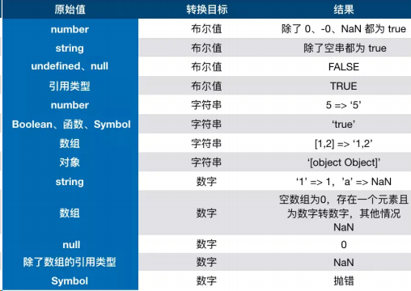

### 15.== 和 ===有什么区别？

> ===叫做严格相等，是指：左右两边不仅值要相等，类型也要相等，例如'1'===1 的结果是 false，因为一边是 string，另一边是 number。

==不像===那样严格，对于一般情况，只要值相等，就返回 true，但==还涉及一些类型转换，它的转换规则如下：

- 两边的类型是否相同，相同的话就比较值的大小，例如 1==2，返回 false
- 判断的是否是 null 和 undefined，是的话就返回 true
- 判断的类型是否是 String 和 Number，是的话，把 String 类型转换成 Number，再进行比较
- 判断其中一方是否是 Boolean，是的话就把 Boolean 转换成 Number，再进行比较
- 如果其中一方为 Object，且另一方为 String、Number 或者 Symbol，会将 Object 转换成字符串，再进行比较

```js
console.log({ a: 1 } == true); //false
console.log({ a: 1 } == "[object Object]"); //true
```

### 16.对象转原始类型是根据什么流程运行的？

对象转原始类型，会调用内置的[ToPrimitive]函数，对于该函数而言，其逻辑如下：

- 1）如果 Symbol.toPrimitive()方法，优先调用再返回
- 2）调用 valueOf()，如果转换为原始类型，则返回
- 3）调用 toString()，如果转换为原始类型，则返回
- 4）如果都没有返回原始类型，会报错

```js
var obj = {
	value: 3,
	valueOf() {
		return 4;
	},
	toString() {
		return "5";
	},
	[Symbol.toPrimitive]() {
		return 6;
	},
};
console.log(obj + 1); // 输出7
```

### 17.如何让 if(a == 1 && a == 2)条件成立？

```js
var a = {
	value: 0,
	valueOf: function () {
		this.value++;
		return this.value;
	},
};
console.log(a == 1 && a == 2); //true
```

### 18.什么是闭包？

红宝书上对于闭包的定义：闭包是指有权访问另外一个函数作用域中的变量的函数，
MDN 对闭包的定义为：闭包是指那些能够访问自由变量的函数。

（其中自由变量，指在函数中使用的，但既不是函数参数 arguments 也不是函数的局部变量的变量，其实就是另外一个函数作用域中的变量。）

### 19.闭包产生的原因?

首先要明白作用域链的概念，其实很简单，在 ES5 中只存在两种作用域————全局作用域和函数作用域，当访问一个变量时，解释器会首先在当前作用域查找标示符，如果没有找到，就去父作用域找，直到找到该变量的标示符或者不在父作用域中，这就是作用域链，值得注意的是，每一个子函数都会拷贝上级的作用域，形成一个作用域的链条。 比如:

```js
var a = 1;
function f1() {
	var a = 2;
	function f2() {
		var a = 3;
		console.log(a); //3
	}
}
```

在这段代码中，f1 的作用域指向有全局作用域(window)和它本身，而 f2 的作用域指向全局作用域(window)、f1 和它本身。而且作用域是从最底层向上找，直到找到全局作用域 window 为止，如果全局还没有的话就会报错。就这么简单一件事情！

闭包产生的本质就是，当前环境中存在指向父级作用域的引用。还是举上面的例子：

```js
function f1() {
	var a = 2;
	function f2() {
		console.log(a); //2
	}
	return f2;
}
var x = f1();
x();
```

这里 x 会拿到父级作用域中的变量，输出 2。因为在当前环境中，含有对 f2 的引用，f2 恰恰引用了 window、f1 和 f2 的作用域。因此 f2 可以访问到 f1 的作用域的变量。

那是不是只有返回函数才算是产生了闭包呢？

回到闭包的本质，我们只需要让父级作用域的引用存在即可，因此我们还可以这么做：

```js
var f3;
function f1() {
	var a = 2;
	f3 = function () {
		console.log(a);
	};
}
f1();
f3();
```

让 f1 执行，给 f3 赋值后，等于说现在 f3 拥有了 window、f1 和 f3 本身这几个作用域的访问权限，还是自底向上查找，最近是在 f1 中找到了 a,因此输出 2。

在这里是外面的变量 f3 存在着父级作用域的引用，因此产生了闭包，形式变了，本质没有改变。

### 20.闭包有哪些表现形式?

在真实的场景中，究竟在哪些地方能体现闭包的存在？

1）返回一个函数。刚刚已经举例。

2）作为函数参数传递

```js
var a = 1;
function foo() {
	var a = 2;
	function baz() {
		console.log(a);
	}
	bar(baz);
}
function bar(fn) {
	// 这就是闭包
	fn();
}
// 输出2，而不是1
foo();
```

3）在定时器、事件监听、Ajax 请求、跨窗口通信、Web Workers 或者任何异步中，只要使用了回调函数，实际上就是在使用闭包。

以下的闭包保存的仅仅是 window 和当前作用域。

```js
// 定时器
setTimeout(function timeHandler(){
console.log('111');
}，100)
// 事件监听
$('#app').click(function(){
console.log('DOM Listener');
})


```

4）IIFE(立即执行函数表达式)创建闭包, 保存了 全局作用域 window 和 当前函数的作用域 ，因此可以全局的变量。

```js
var a = 2;
(function IIFE() {
	// 输出2
	console.log(a);
})();
```

### 21.如何解决下面的循环输出问题？

```js
for (var i = 1; i <= 5; i++) {
	setTimeout(function timer() {
		console.log(i);
	}, 0);
}
```

为什么会全部输出 6？如何改进，让它输出 1，2，3，4，5？(方法越多越好)

因为 setTimeout 为宏任务，由于 JS 中单线程 eventLoop 机制，在主线程同步任务执行完后才去执行宏任务，因此循环结束后 setTimeout 中的回调才依次执行，但输出 i 的时候当前作用域没有，往上一级再找，发现了 i，此时循环已经结束，i 变成了 6。因此会全部输出 6。

#### 解决方法：

1、利用 IIFE(立即执行函数表达式)当每次 for 循环时，把此时的 i 变量传递到定时器中

```js
for (var i = 1; i <= 5; i++) {
	(function (j) {
		setTimeout(function timer() {
			console.log(j);
		}, 0);
	})(i);
}
```

2、给定时器传入第三个参数, 作为 timer 函数的第一个函数参数

```js
for (var i = 1; i <= 5; i++) {
	setTimeout(
		function timer(j) {
			console.log(j);
		},
		0,
		i
	);
}
```

3、使用 ES6 中的 let

```js
for (let i = 1; i <= 5; i++) {
	setTimeout(function timer() {
		console.log(i);
	}, 0);
}
```

let 使 JS 发生革命性的变化，让 JS 有函数作用域变为了块级作用域，用 let 后作用域链不复存在。代码的作用域以块级为单位，以上面代码为例：

```js
// i = 1
{
    setTimeout(function timer(){
    	console.log(1)
    },0)
}
// i = 2
{
    setTimeout(function timer(){
    	console.log(2)
    },0)
}
// i = 3
...
```

因此能输出正确的结果。

### 22.原型对象和构造函数有何关系？

在 JavaScript 中，每当定义一个函数数据类型(普通函数、类)时候，都会天生自带一个 prototype 属性，这个属性指向函数的原型对象。

当函数经过 new 调用时，这个函数就成为了构造函数，返回一个全新的实例对象，这个实例对象有一个 proto 属性，指向构造函数的原型对象。

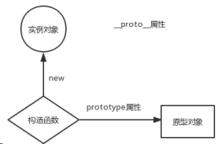

### 23.能不能描述一下原型链？

JavaScript 对象通过 proto 指向父类对象，直到指向 Object 对象为止，这样就形成了一个原型指向的链条, 即原型链。

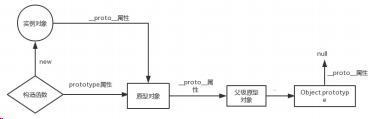

- 对象的 hasOwnProperty() 来检查对象自身中是否含有该属性
- 使用 in 检查对象中是否含有某个属性时，如果对象中没有但是原型链中有，也会返回 true

### 24.JS 如何实现继承？

#### 第一种: 借助 call

```js
function Parent1() {
	this.name = "parent1";
}
function Child1() {
	Parent1.call(this);
	this.type = "child1";
}
console.log(new Child1());
```

这样写的时候子类虽然能够拿到父类的属性值，但是问题是父类原型对象中一旦存在方法那么子类无法继承。那么引出下面的方法。

#### 第二种: 借助原型链

```js
function Parent2() {
	this.name = "parent2";
	this.play = [1, 2, 3];
}
function Child2() {
	this.type = "child2";
}
Child2.prototype = new Parent2();
console.log(new Child2());
```

看似没有问题，父类的方法和属性都能够访问，但实际上有一个潜在的不足。举个例子：

```js
var s1 = new Child2();
var s2 = new Child2();
s1.play.push(4);
console.log(s1.play, s2.play);
```

可以看到控制台：


明明我只改变了 s1 的 play 属性，为什么 s2 也跟着变了呢？很简单，因为两个实例使用的是同一个原型对象。

那么还有更好的方式么？

#### 第三种：将前两种组合

```js
function Parent3() {
	this.name = "parent3";
	this.play = [1, 2, 3];
}
function Child3() {
	Parent3.call(this);
	this.type = "child3";
}
Child3.prototype = new Parent3();
var s3 = new Child3();
var s4 = new Child3();
s3.play.push(4);
console.log(s3.play, s4.play);
```

可以看到控制台：

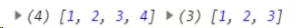

之前的问题都得以解决。但是这里又徒增了一个新问题，那就是 Parent3 的构造函数会多执行了一次（Child3.prototype = new Parent3();）。这是我们不愿看到的。那么如何解决这个问题？

#### 第四种: 组合继承的优化 1

```js
function Parent4() {
	this.name = "parent4";
	this.play = [1, 2, 3];
}
function Child4() {
	Parent4.call(this);
	this.type = "child4";
}
Child4.prototype = Parent4.prototype;
```

这里让将父类原型对象直接给到子类，父类构造函数只执行一次，而且父类属性和方法均能访问，但是我们来测试一下：

```js
var s3 = new Child4();
var s4 = new Child4();
console.log(s3);
```

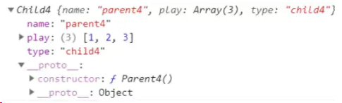

子类实例的构造函数是 Parent4，显然这是不对的，应该是 Child4。

#### 第五种(最推荐使用): 组合继承的优化 1

```js
function Parent5() {
	this.name = "parent5";
	this.play = [1, 2, 3];
}
function Child5() {
	Parent5.call(this);
	this.type = "child5";
}
Child5.prototype = Object.create(Parent5.prototype);
Child5.prototype.constructor = Child5;
```

这是最推荐的一种方式，接近完美的继承，它的名字也叫做寄生组合继承。

**ES6 的 extends 被编译后的 JavaScript 代码**

ES6 的代码最后都是要在浏览器上能够跑起来的，这中间就利用了 babel 这个编译工具，将 ES6 的代码编译成 ES5 让一些不支持新语法的浏览器也能运行。

那最后编译成了什么样子呢？

```js
function _possibleConstructorReturn(self, call) {
	// ...
	return call && (typeof call === "object" || typeof call === "function")
		? call
		: self;
}
function _inherits(subClass, superClass) {
	// ...
	//看到没有
	subClass.prototype = Object.create(superClass && superClass.prototype, {
		constructor: {
			value: subClass,
			enumerable: false,
			writable: true,
			configurable: true,
		},
	});
	if (superClass)
		Object.setPrototypeOf
			? Object.setPrototypeOf(subClass, superClass)
			: (subClass.__proto__ = superClass);
}
var Parent = function Parent() {
	// 验证是否是 Parent 构造出来的 this
	_classCallCheck(this, Parent);
};
var Child = (function (_Parent) {
	_inherits(Child, _Parent);
	function Child() {
		_classCallCheck(this, Child);
		return _possibleConstructorReturn(
			this,
			(Child.__proto__ || Object.getPrototypeOf(Child)).apply(this, arguments)
		);
	}
	return Child;
})(Parent);
```

核心是`_inherits函数`，可以看到它采用的依然也是第五种方式————寄生组合继承方式，同时证明了这种方式的成功。**不过这里加了一个 Object.setPrototypeOf(subClass, superClass)，这是用来干啥的呢？**

答案是用来继承父类的静态方法。这也是原来的继承方式疏忽掉的地方。

**追问: 面向对象的设计一定是好的设计吗？**

不一定。从继承的角度说，这一设计是存在巨大隐患的。

#### 从设计思想上谈谈继承本身的问题

假如现在有不同品牌的车，每辆车都有 drive、music、addOil 这三个方法。

```js
class Car {
	constructor(id) {
		this.id = id;
	}
	drive() {
		console.log("wuwuwu!");
	}
	music() {
		console.log("lalala!");
	}
	addOil() {
		console.log("哦哟！");
	}
}
class otherCar extends Car {}
```

现在可以实现车的功能，并且以此去扩展不同的车。

但是问题来了，新能源汽车也是车，但是它并不需要 addOil(加油)。

如果让新能源汽车的类继承 Car 的话，也是有问题的，俗称"大猩猩和香蕉"的问题。大猩猩手里有香蕉，但是我现在明明只需要香蕉，却拿到了一只大猩猩。也就是说加油这个方法，我现在是不需要的，但是由于继承的原因，也给到子类了。

> 继承的最大问题在于：无法决定继承哪些属性，所有属性都得继承。

当然你可能会说，可以再创建一个父类啊，把加油的方法给去掉，但是这也是有问题的，一方面父类是无法描述所有子类的细节情况的，为了不同的子类特性去增加不同的父类，代码势必会大量重复，另一方面一旦子类有所变动，父类也要进行相应的更新，代码的耦合性太高，维护性不好。

**那如何来解决继承的诸多问题呢？**

用组合，这也是当今编程语法发展的趋势，比如 golang 完全采用的是面向组合的设计方式。

顾名思义，面向组合就是先设计一系列零件，然后将这些零件进行拼装，来形成不同的实例或者类。

```js
function drive() {
	console.log("wuwuwu!");
}
function music() {
	console.log("lalala!");
}
function addOil() {
	console.log("哦哟！");
}
let car = compose(drive, music, addOil);
let newEnergyCar = compose(drive, music);
```

代码干净，复用性也很好。这就是面向组合的设计方式。

### 25.函数的 arguments 为什么不是数组？如何转化成数组？

因为 arguments 本身并不能调用数组方法，它是一个另外一种对象类型，只不过属性从 0 开始排，依次为 0，1，2...最后还有 callee 和 length 属性。我们也把这样的对象称为类数组。

常见的类数组还有：

- 用 getElementsByTagName/ClassName()获得的 HTMLCollection
- 用 querySelector 获得的 nodeList

那这导致很多数组的方法就不能用了，必要时需要我们将它们转换成数组，有哪些方法呢？

**Array.prototype.slice.call()**

```js
function sum(a, b) {
	let args = Array.prototype.slice.call(arguments);
	console.log(args.reduce((sum, cur) => sum + cur)); //args可以调用数组原生的方法啦
}
sum(1, 2); //3
```

**Array.from()**

```js
function sum(a, b) {
	let args = Array.from(arguments);
	console.log(args.reduce((sum, cur) => sum + cur)); //args可以调用数组原生的方法啦
}
sum(1, 2); //3
```

这种方法也可以用来转换 Set 和 Map 哦！

**ES6 展开运算符**

```js
function sum(a, b) {
	let args = [...arguments];
	console.log(args.reduce((sum, cur) => sum + cur)); //args可以调用数组原生的方法啦
}
sum(1, 2); //3
```

**利用 concat+apply**

```js
function sum(a, b) {
	let args = Array.prototype.concat.apply([], arguments); //apply方法会把第二个参数展
	开;
	console.log(args.reduce((sum, cur) => sum + cur)); //args可以调用数组原生的方法啦
}
sum(1, 2); //3
```

当然，最原始的方法就是再创建一个数组，用 for 循环把类数组的每个属性值放在里面，过于简单，就不浪费篇幅了。

### 26.forEach 中 return 有效果吗？如何中断 forEach 循环？

在 forEach 中用 return 不会返回，函数会继续执行。

```js
let nums = [1, 2, 3];
nums.forEach((item, index) => {
	return; //无效
});
```

中断方法：

- 1）使用 try 监视代码块，在需要中断的地方抛出异常。
- 2）官方推荐方法（替换方法）：用 every 和 some 替代 forEach 函数。every 在碰到 return false 的时候，中止循环。some 在碰到 return true 的时候，中止循环

### 27.JS 判断数组中是否包含某个值

#### 方法一：array.indexOf

此方法判断数组中是否存在某个值，如果存在，则返回数组元素的下标，否则返回-1。

```js
var arr = [1, 2, 3, 4];
var index = arr.indexOf(3);
console.log(index);
```

#### 方法二：array.includes(searcElement[,fromIndex])

此方法判断数组中是否存在某个值，如果存在返回 true，否则返回 false

```js
var arr = [1, 2, 3, 4];
if (arr.includes(3)) console.log("存在");
else console.log("不存在");
```

#### 方法三：array.find(callback[,thisArg])

返回数组中满足条件的第一个元素的值，如果没有，返回 undefined

```js
var arr = [1, 2, 3, 4];
var result = arr.find((item) => {
	return item > 3;
});
console.log(result);
```

#### 方法四：array.findeIndex(callback[,thisArg])

返回数组中满足条件的第一个元素的下标，如果没有找到，返回 -1 ]

```js
var arr = [1, 2, 3, 4];
var result = arr.findIndex((item) => {
	return item > 3;
});
console.log(result);
```

当然，for 循环当然是没有问题的，这里讨论的是数组方法，就不再展开了。

### 28JS 中 flat---数组扁平化

对于前端项目开发过程中，偶尔会出现层叠数据结构的数组，我们需要将多层级数组转化为一级数组（即提取嵌套数组元素最终合并为一个数组），使其内容合并且展开。那么该如何去实现呢？

需求:多维数组=>一维数组

```js
let ary = [1, [2, [3, [4, 5]]], 6]; // -> [1, 2, 3, 4, 5, 6]
let str = JSON.stringify(ary);
```

**调用 ES6 中的 flat 方法**

```js
ary = ary.flat(Infinity);
```

**replace + split**

```js
ary = str.replace(/(\[|\])/g, "").split(",");
```

**replace + JSON.parse**

```js
str = str.replace(/(\[|\])/g, "");
str = "[" + str + "]";
ary = JSON.parse(str);
```

**普通递归**

```js
let result = [];
let fn = function (ary) {
	for (let i = 0; i < ary.length; i++) {
		let item = ary[i];
		if (Array.isArray(ary[i])) {
			fn(item);
		} else {
			result.push(item);
		}
	}
};
```

**利用 reduce 函数迭代**

```js
function flatten(ary) {
	return ary.reduce((pre, cur) => {
		return pre.concat(Array.isArray(cur) ? flatten(cur) : cur);
	}, []);
}
let ary = [1, 2, [3, 4], [5, [6, 7]]];
console.log(flatten(ary));
```

**扩展运算符**

```js
// 只要有一个元素有数组，那么循环继续
while (ary.some(Array.isArray)) {
	ary = [].concat(...ary);
}
```

这是一个比较实用而且很容易被问到的问题，欢迎大家交流补充。

### 29.什么是高阶函数

概念非常简单，如下：

一个函数 就可以接收另一个函数作为参数或者返回值为一个函数， 这种函数 就称之为高阶函数。

### 30.数组中的高阶函数

#### map

参数：接受两个参数，一个是回调函数，一个是回调函数的 this 值(可选)。

其中，回调函数被默认传入三个值，依次为当前元素、当前索引、整个数组。

- 创建一个新数组，其结果是该数组中的每个元素都调用一个提供的函数后返回的结果
- 对原来的数组没有影响

```js
let nums = [1, 2, 3];
let obj = { val: 5 };
let newNums = nums.map(function (item, index, array) {
	return item + index + array[index] + this.val;
	//对第一个元素，1 + 0 + 1 + 5 = 7
	//对第二个元素，2 + 1 + 2 + 5 = 10
	//对第三个元素，3 + 2 + 3 + 5 = 13
}, obj);
console.log(newNums); //[7, 10, 13]
```

当然，后面的参数都是可选的 ，不用的话可以省略。

#### reduce

参数：接收两个参数，一个为回调函数，另一个为初始值。回调函数中四个默认参数，依次为积累值、当前值、当前索引和整个数组。

```js
let nums = [1, 2, 3];
// 多个数的加和
let newNums = nums.reduce(function (preSum, curVal, currentIndex, array) {
	return preSum + curVal;
}, 0);
console.log(newNums); //6
```

**不传默认值会怎样？**

不传默认值会自动以第一个元素为初始值，然后从第二个元素开始依次累计。

#### filter

参数: 一个函数参数。这个函数接受一个默认参数，就是当前元素。这个作为参数的函数返回值为一个布尔类型，决定元素是否保留。

filter 方法返回值为一个新的数组，这个数组里面包含参数里面所有被保留的项。

```js
let nums = [1, 2, 3];
// 保留奇数项
let oddNums = nums.filter((item) => item % 2);
console.log(oddNums);
```

#### sort

参数: 一个用于比较的函数，它有两个默认参数，分别是代表比较的两个元素。
举个例子:

```js
let nums = [2, 3, 1];
//两个比较的元素分别为a, b
nums.sort(function (a, b) {
	if (a > b) return 1;
	else if (a < b) return -1;
	else if (a == b) return 0;
});
```

当比较函数返回值大于 0，则 a 在 b 的后面，即 a 的下标应该比 b 大。

反之，则 a 在 b 的后面，即 a 的下标比 b 小。

整个过程就完成了一次升序的排列。

当然还有一个需要注意的情况，就是比较函数不传的时候，是如何进行排序的？

答案是将数字转换为字符串，然后根据字母 unicode 值进行升序排序，也就是根据字符串的比较规则进行升序排序。

## 浏览器事件流程

### 数据是如何存储的？

基本数据类型用 `栈` 存储，引用数据类型用 `堆` 存储。

看起来没有错误，但实际上是有问题的。可以考虑一下闭包的情况，如果变量存在栈中，那函数调用完栈顶空间销毁 ，闭包变量不就没了吗？

其实还是需要补充一句：

闭包变量是存在堆内存中的。

具体而言，以下数据类型存储在栈中：

- boolean
- null
- undefined
- number
- string
- symbol
- bigint

而所有的对象数据类型存放在堆中。

值得注意的是，对于 赋值 操作，原始类型的数据直接完整地变量值，对象数据类型的数据则是引用地址。

因此会有下面的情况：

```js
let obj = { a: 1 };
let newObj = obj;
newObj.a = 2;
console.log(obj.a); // 变成了2
```

之所以会这样，是因为 obj 和 newObj 是同一份堆空间的地址，改变 newObj，等于改变了共同的堆内存，这时候通过 obj 来获取这块内存的值当然会改变。

为什么不全部用栈来保存呢？

首先，对于系统栈来说，它的功能除了保存变量之外，还有创建并切换函数执行上下文的功能。举个例子：

```js
function f(a) {
	console.log(a);
}
function func(a) {
	f(a);
}
func(1);
```

假设用 ESP 指针来保存当前的执行状态，在系统栈中会产生如下的过程：

- 1）调用 func, 将 func 函数的上下文压栈，ESP 指向栈顶。
- 2）执行 func，又调用 f 函数，将 f 函数的上下文压栈，ESP 指针上移。
- 3）执行完 f 函数，将 ESP 下移，f 函数对应的栈顶空间被回收。
- 4）执行完 func，ESP 下移，func 对应的空间被回收。

图示如下：

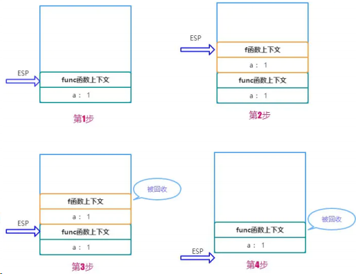

因此你也看到了，如果采用栈来存储相对基本类型更加复杂的对象数据，那么切换上下文的开销将变得巨大！

不过堆内存虽然空间大，能存放大量的数据，但与此同时垃圾内存的回收会带来更大的开销。

### V8 引擎如何进行垃圾内存的回收？

JS 语言不像 C/C++, 让程序员自己去开辟或者释放内存，而是类似 Java，采用自己的一套垃圾回收算法进行自动的内存管理。作为一名资深的前端工程师，对于 JS 内存回收的机制是需要非常清楚, 以便于在极端的环境下能够分析出系统性能的瓶颈，另一方面，学习这其中的机制，也对我们深入理解 JS 的闭包特性、以及对内存的高效使用，都有很大的帮助。

#### V8 内存限制

在其他的后端语言中，如 Java/Go, 对于内存的使用没有什么限制，但是 JS 不一样，V8 只能使用系统的一部分内存，具体来说，在 64 位系统下，V8 最多只能分配 1.4G , 在 32 位系统中，最多只能分配 0.7G 。

你想想在前端这样的大内存需求其实并不大，但对于后端而言，nodejs 如果遇到一个 2G 多的文件，那么将无法全部将其读入内存进行各种操作了。

我们知道对于栈内存而言，当 ESP 指针下移，也就是上下文切换之后，栈顶的空间会自动被回收。但对于堆内存而言就比较复杂了，我们下面着重分析堆内存的垃圾回收。

所有的对象类型的数据在 JS 中都是通过堆进行空间分配的。当我们构造一个对象进行赋值操作的时候，其实相应的内存已经分配到了堆上。你可以不断的这样创建对象，让 V8 为它分配空间，直到堆的大小达到上限。

那么问题来了，V8 为什么要给它设置内存上限？明明我的机器大几十 G 的内存，只能让我用这么一点？

究其根本，是由两个因素所共同决定的，一个是 JS 单线程的执行机制，另一个是 JS 垃圾回收机制的限制。

首先 JS 是单线程运行的，这意味着一旦进入到垃圾回收，那么其它的各种运行逻辑都要暂停; 另一方面垃圾回收其实是非常耗时间的操作，V8 官方是这样形容的：

> 以 1.5GB 的垃圾回收堆内存为例，V8 做一次小的垃圾回收需要 50ms 以上，做一次非增量式(ps:后面会解释)的垃圾回收甚至要 1s 以上。

可见其耗时之久，而且在这么长的时间内，我们的 JS 代码执行会一直没有响应，造成应用卡顿，导致应用性能和响应能力直线下降。因此，V8 做了一个简单粗暴的选择，那就是限制堆内存，也算是一种权衡的手段，因为大部分情况是不会遇到操作几个 G 内存这样的场景的。

不过，如果你想调整这个内存的限制也不是不行。配置命令如下：

```bash
// 这是调整老生代这部分的内存，单位是MB。后面会详细介绍新生代和老生代内存
node --max-old-space-size=2048 xxx.js
```

或者

```bash
// 这是调整新生代这部分的内存，单位是 KB。
node --max-new-space-size=2048 xxx.js
```

#### 新生代内存的回收

V8 把堆内存分成了两部分进行处理——新生代内存和老生代内存。顾名思义，新生代就是临时分配的内存，存活时间短， 老生代是常驻内存，存活的时间长。V8 的堆内存，也就是两个内存之和。

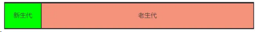

根据这两种不同种类的堆内存，V8 采用了不同的回收策略，来根据不同的场景做针对性的优化。

首先是新生代的内存，刚刚已经介绍了调整新生代内存的方法，那它的内存默认限制是多少？在 64 位和 32 位系统下分别为 32MB 和 16MB。够小吧，不过也很好理解，新生代中的变量存活时间短，来了马上就走，不容易产生太大的内存负担，因此可以将它设的足够小。

那好了，新生代的垃圾回收是怎么做的呢？

首先将新生代内存空间一分为二：

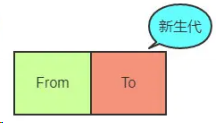

其中 From 部分表示正在使用的内存，To 是目前闲置的内存。

当进行垃圾回收时，V8 将 From 部分的对象检查一遍，如果是存活对象那么到 To 内存中(在 To 内存中按照顺序从头放置的)，如果是非存活对象直接回收即可。

当所有的 From 中的存活对象按照顺序进入到 To 内存之后，From 和 To 两者的角色 对调 ，From 现在被闲置，To 为正在使用，如此循环。

那你很可能会问了，直接将非存活对象回收了不就万事大吉了嘛，为什么还要后面的一系列操作？

注意，我刚刚特别说明了，在 To 内存中按照顺序从头放置的，这是为了应对这样的场景：

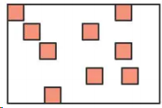

深色的小方块代表存活对象，白色部分表示待分配的内存，由于堆内存是连续分配的，这样零零散散的空间可能会导致稍微大一点的对象没有办法进行空间分配，这种零散的空间也叫做内存碎片。刚刚介绍的新生代垃圾回收算法也叫 Scavenge 算法。

Scavenge 算法主要就是解决内存碎片的问题，在进行一顿之后，To 空间变成了这个样子：

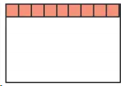

是不是整齐了许多？这样就大大方便了后续连续空间的分配。

不过 Scavenge 算法的劣势也非常明显，就是内存只能使用新生代内存的一半，但是它只存放生命周期短的对象，这种对象 一般很少 ，因此 时间 性能非常优秀。

#### 老生代内存的回收

刚刚介绍了新生代的回收方式，那么新生代中的变量如果经过多次回收后依然存在，那么就会被放入到老生代内存 中，这种现象就叫 晋升 。

发生晋升其实不只是这一种原因，我们来梳理一下会有那些情况触发晋升：

已经经历过一次 Scavenge 回收。

To（闲置）空间的内存占用超过 25%。

现在进入到老生代的垃圾回收机制当中，老生代中累积的变量空间一般都是很大的，当然不能用 Scavenge 算法啦，浪费一半空间不说，对庞大的内存空间进行岂不是劳民伤财？

那么对于老生代而言，究竟是采取怎样的策略进行垃圾回收的呢？

第一步，进行标记-清除。这个过程在《JavaScript 高级程序设计(第三版)》中有过详细的介绍，主要分成两个阶段，即标记阶段和清除阶段。首先会遍历堆中的所有对象，对它们做上标记，然后对于代码环境中 使用的变量 以及被 强引用 的变量取消标记，剩下的就是要删除的变量了，在随后的 清除阶段 对其进行空间的回收。

当然这又会引发内存碎片的问题，存活对象的空间不连续对后续的空间分配造成障碍。老生代又是如何处理这个问题的呢？

第二步，整理内存碎片。V8 的解决方式非常简单粗暴，在清除阶段结束后，把存活的对象全部往一端靠拢。

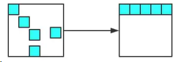

由于是移动对象，它的执行速度不可能很快，事实上也是整个过程中最耗时间的部分。

#### 增量标记

由于 JS 的单线程机制，V8 在进行垃圾回收的时候，不可避免地会阻塞业务逻辑的执行，倘若老生代的垃圾回收任务很重，那么耗时会非常可怕，严重影响应用的性能。

那这个时候为了避免这样问题，V8 采取了增量标记的方案，即将一口气完成的标记任务分为很多小的部分完成，每做完一个小的部分就"歇"一下，就 js 应用逻辑执行一会儿，然后再执行下面的部分，如果循环，直到标记阶段完成才进入内存碎片的整理上面来。其实这个过程跟 React Fiber 的思路有点像，这里就不展开了。

经过增量标记之后，垃圾回收过程对 JS 应用的阻塞时间减少到原来了 1 / 6, 可以看到，这是一个非常成功的改进。

### 描述一下 V8 执行一段 JS 代码的过程？

前端相对来说是一个比较新兴的领域，因此各种前端框架和工具层出不穷，让人眼花缭乱，尤其是各大厂商推出 小程序 之后 各自制定标准 ，让前端开发的工作更加繁琐，在此背景下为了抹平平台之间的差异，诞生的各种 编译工具/框架 也数不胜数。但无论如何，想要赶上这些框架和工具的更新速度是非常难的，即使赶上了也很难产生自己的 技术积淀 ，一个更好的方式便是学习那些 本质的知识 ，抓住上层应用中不变的 底层机制 ，这样我们便能轻松理解上层的框架而不仅仅是被动地使用，甚至能够在适当的场景下自己造出轮子，以满足开发效率的需求。

站在 V8 的角度，理解其中的执行机制，也能够帮助我们理解很多的上层应用，包括 Babel、Eslint、前端框架的底层机制。那么，一段 JavaScript 代码放在 V8 当中究竟是如何执行的呢？

首先需要明白的是，机器是读不懂 JS 代码，机器只能理解特定的机器码，那如果要让 JS 的逻辑在机器上运行起来，就必须将 JS 的代码翻译成机器码，然后让机器识别。JS 属于解释型语言，对于解释型的语言说，解释器会对源代码做如下分析：

- 通过词法分析和语法分析生成 AST(抽象语法树)
- 生成字节码

然后解释器根据字节码来执行程序。但 JS 整个执行的过程其实会比这个更加复杂，接下来就来一一地拆解。

#### 生成 AST

生成 AST 分为两步——词法分析和语法分析。

词法分析即分词，它的工作就是将一行行的代码分解成一个个 token。 比如下面一行代码：

```js
let name = "sanyuan";
```

其中会把句子分解成四个部分：

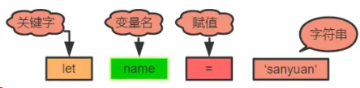

即解析成了四个 token，这就是词法分析的作用。

接下来语法分析阶段，将生成的这些 token 数据，根据一定的语法规则转化为 AST。举个例子：

```js
let name = "sanyuan";
console.log(name);
```

最后生成的 AST 是这样的：

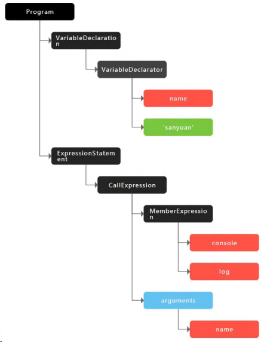

当生成了 AST 之后，编译器/解释器后续的工作都要依靠 AST 而不是源代码。顺便补充一句，babel 的工作原理就是将 ES6 的代码解析生成 ES6 的 AST ，然后将 ES6 的 AST 转换为 ES5 的 AST ,最后才将 ES5 的 AST 转化为具体的 ES5 代码。

生成 AST 后，接下来会生成执行上下文

#### 生成字节码

开头就已经提到过了，生成 AST 之后，直接通过 V8 的解释器(也叫 Ignition)来生成字节码。但是字节码并不能让机器直接运行，那你可能就会说了，不能执行还转成字节码干嘛，直接把 AST 转换成机器码不就得了，让机器直接执行。确实，在 V8 的早期是这么做的，但后来因为机器码的体积太大，引发了严重的内存占用问题。

给一张对比图让大家直观地感受以下三者代码量的差异：

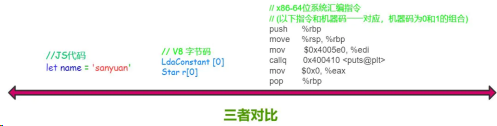

很容易得出，字节码是比机器码轻量得多的代码。那 V8 为什么要使用字节码，字节码到底是个什么东西？

> 字节码是介于 AST 和 机器码之间的一种代码，但是与特定类型的机器码无关，字节码需要通过解释器将其转换为机器码然后执行。

字节码仍然需要转换为机器码，但和原来不同的是，现在不用一次性将全部的字节码都转换成机器码，而是通过解释器来逐行执行字节码，省去了生成二进制文件的操作，这样就大大降低了内存的压力。

#### 执行代码

在执行字节码的过程中，如果发现某一部分代码重复出现，那么 V8 将它记做 热点代码 (HotSpot)，然后将这么代码编译成 机器码 保存起来，这个用来编译的工具就是 V8 的 编译器 (也叫做 TurboFan ) , 因此在这样的机制下，代码执行的时间越久，那么执行效率会越来越高，因为有越来越多的字节码被标记为 热点代码 ，遇到它们时直接执行相应的机器码，不用再次将转换为机器码。

其实当你听到有人说 JS 就是一门解释器语言的时候，其实这个说法是有问题的。因为字节码不仅配合了解释器，而且还和编译器打交道，所以 JS 并不是完全的解释型语言。而编译器和解释器的 根本区别在于前者会编译生成二进制文件但后者不会。

并且，这种字节码跟编译器和解释器结合的技术，我们称之为 即时编译 , 也就是我们经常听到的 JIT 。

这就是 V8 中执行一段 JS 代码的整个过程，梳理一下：

- 1）首先通过词法分析和语法分析生成 AST
- 2）将 AST 转换为字节码
- 3）由解释器逐行执行字节码，遇到热点代码启动编译器进行编译，生成对应的机器码, 以优化执行效率

### 宏任务(MacroTask)引入

在 JS 中，大部分的任务都是在主线程上执行，常见的任务有：

- 1）渲染事件
- 2）用户交互事件
- 3）js 脚本执行
- 4）网络请求、文件读写完成事件等等。

为了让这些事件有条不紊地进行，JS 引擎需要对之执行的顺序做一定的安排，V8 其实采用的是一种 队列的方式来存储这些任务， 即先进来的先执行。模拟如下：

```js
bool keep_running = true;
void MainTherad(){
    for(;;){
        //执行队列中的任务
        Task task = task_queue.takeTask();
        ProcessTask(task);
        //执行延迟队列中的任务
        ProcessDelayTask()
        if(!keep_running) // 如果设置了退出标志，那么直接退出线程循环
            break;
    }
}
```

这里用到了一个 for 循环，将队列中的任务一一取出，然后执行，这个很好理解。但是其中包含了两种任务队列，除了上述提到的任务队列， 还有一个延迟队列，它专门处理诸如 setTimeout/setInterval 这样的定时器回调任务。

上述提到的，普通任务队列和延迟队列中的任务，都属于宏任务。

### 微任务(MicroTask)引入

对于每个宏任务而言，其内部都有一个微任务队列。那为什么要引入微任务？微任务在什么时候执行呢？

其实引入微任务的初衷是为了解决异步回调的问题。想一想，对于异步回调的处理，有多少种方式？总结起来有两点:

- 1）将异步回调进行宏任务队列的入队操作。
- 2）将异步回调放到当前宏任务的末尾。

如果采用第一种方式，那么执行回调的时机应该是在前面 所有的宏任务 完成之后，倘若现在的任务队列非常长，那么回调迟迟得不到执行，造成 应用卡顿 。

为了规避这样的问题，V8 引入了第二种方式，这就是 微任务 的解决方式。在每一个宏任务中定义一个微任务队列，当该宏任务执行完成，会检查其中的微任务队列，如果为空则直接执行下一个宏任务，如果不为空，则 依次执行微任务 ，执行完成才去执行下一个宏任务。

常见的微任务有 MutationObserver、Promise.then(或.reject) 以及以 Promise 为基础开发的其他技术(比如 fetch API), 还包括 V8 的垃圾回收过程。

Ok, 这便是 宏任务 和 微任务 的概念，接下来正式介绍 JS 非常重要的运行机制——EventLoop。

### 理解 EventLoop：浏览器

例子：

```js
console.log("start");
setTimeout(() => {
	console.log("timeout");
});
Promise.resolve().then(() => {
	console.log("resolve");
});
console.log("end");
```

分析一下:

- 1）刚开始整个脚本作为一个宏任务来执行，因此先打印 start 和 end
- 2）setTimeout 作为一个宏任务放入宏任务队列
- 3）Promise.then 作为一个为微任务放入到微任务队列
- 4）当本次宏任务执行完，检查微任务队列，发现一个 Promise.then，执行
- 5）接下来进入到下一个宏任务——setTimeout，执行

因此最后的顺序是：

```js
start;
end;
resolve;
timeout;
```

这样就带大家直观地感受到了浏览器环境下 EventLoop 的执行流程。不过，这只是其中的一部分情况，接下来我们来做一个更完整的总结。

- 1）一开始整段脚本作为第一个宏任务执行
- 2）执行过程中同步代码直接执行，宏任务进入宏任务队列，微任务进入微任务队列
- 3）当前宏任务执行完出队，检查微任务队列，如果有则依次执行，直到微任务队列为空
- 4）执行浏览器 UI 线程的渲染工作
- 5）检查是否有 Web worker 任务，有则执行
- 6）执行队首新的宏任务，回到 2，依此循环，直到宏任务和微任务队列都为空

最后留一道题目练习：

```js
Promise.resolve().then(() => {
	console.log("Promise1");
	setTimeout(() => {
		console.log("setTimeout2");
	}, 0);
});
setTimeout(() => {
	console.log("setTimeout1");
	Promise.resolve().then(() => {
		console.log("Promise2");
	});
}, 0);
console.log("start");
// start
// Promise1
// setTimeout1
// Promise2
// setTimeout2
```

### 理解 EventLoop：nodejs

nodejs 和 浏览器的 eventLoop 还是有很大差别的，值得单独拿出来说一说。

不知你是否看过关于 nodejs 中 eventLoop 的一些文章, 是否被这些流程图搞得眼花缭乱、一头雾水：

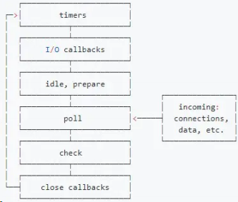

看到这你不用紧张，这里会抛开这些晦涩的流程图，以最清晰浅显的方式来一步步拆解 nodejs 的事件循环机制。

#### 三大关键阶段

首先，梳理一下 nodejs 三个非常重要的执行阶段:

1）执行 定时器回调 的阶段。检查定时器，如果到了时间，就执行回调。这些定时器就是 setTimeout、setInterval。这个阶段暂且叫它 timer 。

2）轮询(英文叫 poll )阶段。因为在 node 代码中难免会有异步操作，比如文件 I/O，网络 I/O 等等，那么当这些异步操作做完了，就会来通知 JS 主线程，怎么通知呢？就是通过'data'、'connect'等事件使得事件循环到达 poll 阶段。到达了这个阶段后：

如果当前已经存在定时器，而且有定时器到时间了，拿出来执行，eventLoop 将回到 timer 阶段。

如果没有定时器, 会去看回调函数队列。

- 如果队列不为空，拿出队列中的方法依次执行
- 如果队列为空，检查是否有 setImmdiate 的回调
  - 有则前往 check 阶段
  - 没有则继续等待，相当于阻塞了一段时间(阻塞时间是有上限的), 等待 callback 函数加入队列，加入后会立刻执行。一段时间后自动进入 check 阶段。

3）check 阶段。这是一个比较简单的阶段，直接 执行 setImmdiate 的回调。

这三个阶段为一个循环过程。不过现在的 eventLoop 并不完整，我们现在就来一一地完善。

#### 完善

首先，当第 1 阶段结束后，可能并不会立即等待到异步事件的响应，这时候 nodejs 会进入到 I/O 异常的回调阶段 。比如说 TCP 连接遇到 ECONNREFUSED，就会在这个时候执行回调。

并且在 check 阶段结束后还会进入到 关闭事件的回调阶段 。如果一个 socket 或句柄（handle）被突然关闭，例如 socket.destroy()， 'close' 事件的回调就会在这个阶段执行。

梳理一下，nodejs 的 eventLoop 分为下面的几个阶段：

1）timer 阶段
2）I/O 异常回调阶段
空闲、预备状态(第 2 阶段结束，poll 未触发之前)
3）poll 阶段
4）check 阶段
5）关闭事件的回调阶段

#### 实例演示

```js
setTimeout(() => {
	console.log("timer1");
	Promise.resolve().then(function () {
		console.log("promise1");
	});
}, 0);
setTimeout(() => {
	console.log("timer2");
	Promise.resolve().then(function () {
		console.log("promise2");
	});
}, 0);
```

node 版本 >= 11 和在 11 以下的会有不同的表现。

首先说 node 版本 >= 11 的，它会和浏览器表现一致，一个定时器运行完立即运行相应的微任务。

```js
timer1;
promise1;
time2;
promise2;
```

而 node 版本小于 11 的情况下，对于定时器的处理是：

> 若第一个定时器任务出队并执行完，发现队首的任务仍然是一个定时器，那么就将微任务暂时保存，直接去执行新的定时器任务，当新的定时器任务执行完后，再一一执行中途产生的微任务。

因此会打印出这样的结果：

```js
timer1;
timer2;
promise1;
promise2;
```

### nodejs 和 浏览器关于 eventLoop 的主要区别

两者最主要的区别在于浏览器中的微任务是在 每个相应的宏任务 中执行的，而 nodejs 中的微任务是在 不同阶段之间 执行的。

### 关于 process.nextTick 的一点说明

process.nextTick 是一个独立于 eventLoop 的任务队列。
在每一个 eventLoop 阶段完成后会去检查这个队列，如果里面有任务，会让这部分任务 优先于微任务 执行。

### nodejs 中的异步、非阻塞 I/O 是如何实现的？

在听到 nodejs 相关的特性时，经常会对 异步 I/O 、 非阻塞 I/O 有所耳闻，听起来好像是差不多的意思，但其实是两码事，下面我们就以原理的角度来剖析一下对 nodejs 来说，这两种技术底层是如何实现的？

#### 什么是 I/O？

I/O 即 Input/Output, 输入和输出的意思。在浏览器端，只有一种 I/O，那就是利用 Ajax 发送网络请求，然后读取返回的内容，这属于 网络 I/O 。回到 nodejs 中，其实这种的 I/O 的场景就更加广泛了，主要分为两种：

- 文件 I/O。比如用 fs 模块对文件进行读写操作。
- 网络 I/O。比如 http 模块发起网络请求。

##### 阻塞和非阻塞 I/O

阻塞 和 非阻塞 I/O 其实是针对操作系统内核而言的，而不是 nodejs 本身。阻塞 I/O 的特点就是一定要等到操作系统完成所有操作后才表示调用结束，而非阻塞 I/O 是调用后立马返回，不用等操作系统内核完成操作。

对前者而言，在操作系统进行 I/O 的操作的过程中，我们的应用程序其实是一直处于等待状态的，什么都做不了。那如果换成 非阻塞 I/O ，调用返回后我们的 nodejs 应用程序可以完成其他的事情，而操作系统同时也在进行 I/O。这样就把等待的时间充分利用了起来，提高了执行效率，但是同时又会产生一个问题，nodejs 应用程序怎么知道操作系统已经完成了 I/O 操作呢？

为了让 nodejs 知道操作系统已经做完 I/O 操作，需要重复地去操作系统那里判断一下是否完成，这种重复判断的方式就是 轮询 。对于轮询而言，有以下这么几种方案：

- 1）一直轮询检查 I/O 状态，直到 I/O 完成。这是最原始的方式，也是性能最低的，会让 CPU 一直耗用在等待上面。其实跟阻塞 I/O 的效果是一样的。
- 2）遍历文件描述符(即 文件 I/O 时操作系统和 nodejs 之间的文件凭证)的方式来确定 I/O 是否完成，I/O 完成则文件描述符的状态改变。但 CPU 轮询消耗还是很大。
- 3）epoll 模式。即在进入轮询的时候如果 I/O 未完成 CPU 就休眠，完成之后唤醒 CPU。

总之，CPU 要么重复检查 I/O，要么重复检查文件描述符，要么休眠，都得不到很好的利用，我们希望的是：

> nodejs 应用程序发起 I/O 调用后可以直接去执行别的逻辑，操作系统默默地做完 I/O 之后给 nodejs 发一个完成信号，nodejs 执行回调操作。

这是理想的情况，也是异步 I/O 的效果，那如何实现这样的效果呢？

##### 异步 I/O 的本质

Linux 原生存在这样的一种方式，即(AIO), 但两个致命的缺陷：

- 1）只有 Linux 下存在，在其他系统中没有异步 I/O 支持。
- 2）无法利用系统缓存。

##### nodejs 中的异步 I/O 方案

是不是没有办法了呢？在单线程的情况下确实是这样，但是如果把思路放开一点，利用多线程来考虑这个问题，就变得轻松多了。我们可以让一个进程进行计算操作，另外一些进行 I/O 调用，I/O 完成后把信号传给计算的线程，进而执行回调，这不就好了吗？没错，异步 I/O 就是使用这样的线程池来实现的。

只不过在不同的系统下面表现会有所差异，在 Linux 下可以直接使用线程池来完成，在 Window 系统下则采用 IOCP 这个系统 API(其内部还是用线程池完成的)。

有了操作系统的支持，那 nodejs 如何来对接这些操作系统从而实现异步 I/O 呢？
以文件为 I/O 我们以一段代码为例：

```js
let fs = require("fs");
fs.readFile("/test.txt", function (err, data) {
	console.log(data);
});
```

##### 执行流程

执行代码的过程中大概发生了这些事情：

1）首先，fs.readFile 调用 Node 的核心模块 fs.js ；

2）接下来，Node 的核心模块调用内建模块 node_file.cc，创建对应的文件 I/O 观察者对象(这个对象后面有大用！) ；

3）最后，根据不同平台（Linux 或者 window），内建模块通过 libuv 中间层进行系统

##### 调用 libuv 调用过程拆解

重点来了！libuv 中是如何来进行进行系统调用的呢？也就是 uv_fs_open() 中做了些什么？

###### （1）创建请求对象

以 Windows 系统为例来说，在这个函数的调用过程中，我们创建了一个文件 I/O 的请求对象，并往里面注入了回调函数。

```bash
req_wrap->object_->Set(oncomplete_sym, callback);
```

req*wrap 便是这个请求对象，req_wrap 中 object* 的 oncomplete_sym 属性对应的值便是我们 nodejs 应用程序代码中传入的回调函数。

###### （2）推入线程池，调用返回

在这个对象包装完成后，QueueUserWorkItem() 方法将这个对象推进线程池中等待执行。

好，至此现在 js 的调用就直接返回了，我们的 js 应用程序代码可以 继续往下执行 ，当然，当前的 I/O 操作同时也在线程池中将被执行，这不就完成了异步么：）

等等，别高兴太早，回调都还没执行呢！接下来便是执行回调通知的环节。

###### （3）回调通知

事实上现在线程池中的 I/O 无论是阻塞还是非阻塞都已经无所谓了，因为异步的目的已经达成。重要的是 I/O 完成后会发生什么。

在介绍后续的故事之前，给大家介绍两个重要的方法: GetQueuedCompletionStatus 和 PostQueuedCompletionStatus 。

1）还记得之前讲过的 eventLoop 吗？在每一个 Tick 当中会调用 GetQueuedCompletionStatus 检查线程池中是否有执行完的请求，如果有则表示时机已经成熟，可以执行回调了。

2） PostQueuedCompletionStatus 方法则是向 IOCP 提交状态，告诉它当前 I/O 完成了。

把后面的过程串联起来。

当对应线程中的 I/O 完成后，会将获得的结果 存储 起来，保存到 相应的请求对象 中，然后调用 PostQueuedCompletionStatus() 向 IOCP 提交执行完成的状态，并且将线程还给操作系统。一旦 EventLoop 的轮询操作中，调用 etQueuedCompletionStatus 检测到了完成的状态，就会把 请求对象塞给 I/O 观察者(之前埋下伏笔，如今终于闪亮登场)。

I/O 观察者现在的行为就是取出 请求对象 的 存储结果 ，同时也取出它的 oncomplete_sym 属性，即回调函数(不懂这个属性的回看第 1 步的操作)。将前者作为函数参数传入后者，并执行后者。 这里，回调函数就成功执行啦！

#### 总结

1） 阻塞 和 非阻塞 I/O 其实是针对操作系统内核而言的。阻塞 I/O 的特点就是一定要等到操作系统完成所有操作后才表示调用结束，而非阻塞 I/O 是调用后立马返回，不用等操作系统内核完成操作。
2）nodejs 中的异步 I/O 采用多线程的方式，由 EventLoop 、 I/O 观察者 ， 请求对象 、 线程池 四大要素相互配合，共同实现。

### JS 异步编程有哪些方案？为什么会出现这些方案？

关于 JS 单线程 、 EventLoop 以及 异步 I/O 这些底层的特性，我们之前做过了详细的拆解，不在赘述。在探究了底层机制之后，我们还需要对代码的组织方式有所理解，这是离我们最日常开发最接近的部分，异步代码的组织方式直接决定了 开发 和 维护 的 效率 ，其重要性也不可小觑。尽管底层机制没变，但异步代码的组织方式却随着 ES 标准的发展，一步步发生了巨大的 变革 。接着让我们来一探究竟吧！

#### 回调函数时代

相信很多 nodejs 的初学者都或多或少踩过这样的坑，node 中很多原生的 api 就是诸如这样的：

```js
fs.readFile("xxx", (err, data) => {});
```

典型的高阶函数，将回调函数作为函数参数传给了 readFile。但久而久之，就会发现，这种传入回调的方式也存在大坑, 比如下面这样：

```js
fs.readFile("1.json", (err, data) => {
	fs.readFile("2.json", (err, data) => {
		fs.readFile("3.json", (err, data) => {
			fs.readFile("4.json", (err, data) => {});
		});
	});
});
```

回调当中嵌套回调，也称 回调地狱 。这种代码的可读性和可维护性都是非常差的，因为嵌套的层级太多。而且还有一个严重的问题，就是每次任务可能会失败，需要在回调里面对每个任务的失败情况进行处理，增加了代码的混乱程度。

#### Promise 时代

ES6 中新增的 Promise 就很好了解决了 回调地狱 的问题，同时了合并了错误处理。写出来的代码类似于下面这样：

```js
readFilePromise("1.json")
	.then((data) => {
		return readFilePromise("2.json");
	})
	.then((data) => {
		return readFilePromise("3.json");
	})
	.then((data) => {
		return readFilePromise("4.json");
	});
```

以链式调用的方式避免了大量的嵌套，也符合人的线性思维方式，大大方便了异步编程。

#### co + Generator 方式

利用协程完成 Generator 函数，用 co 库让代码依次执行完，同时以同步的方式书写，也让异步操作按顺序执行。

```js
co(function* () {
	const r1 = yield readFilePromise("1.json");
	const r2 = yield readFilePromise("2.json");
	const r3 = yield readFilePromise("3.json");
	const r4 = yield readFilePromise("4.json");
});
```

#### async + await 方式

这是 ES7 中新增的关键字，凡是加上 async 的函数都默认返回一个 Promise 对象，而更重要的是 async + await 也能让异步代码以同步的方式来书写，而不需要借助第三方库的支持。

```js
const readFileAsync = async function () {
	const f1 = await readFilePromise("1.json");
	const f2 = await readFilePromise("2.json");
	const f3 = await readFilePromise("3.json");
	const f4 = await readFilePromise("4.json");
};
```

### 能不能简单实现一下 node 中回调函数的机制？

回调函数 的方式其实内部利用了 发布-订阅 模式，在这里我们以模拟实现 node 中的 Event 模块为例来写实现回调函数的机制。

```js
function EventEmitter() {
	this.events = new Map();
}
```

这个 EventEmitter 一共需要实现这些方法: addListener , removeListener , once ,
removeAllListener , emit 。

首先是 addListener：

```js
// once 参数表示是否只是触发一次
const wrapCallback = (fn, once = false) => ({ callback: fn, once });

EventEmitter.prototype.addListener = function (type, fn, once = false) {
	let handler = this.events.get(type);
	if (!handler) {
		// 为 type 事件绑定回调
		this.events.set(type, wrapCallback(fn, once));
	} else if (handler && typeof handler.callback === "function") {
		// 目前 type 事件只有一个回调
		this.events.set(type, [handler, wrapCallback(fn, once)]);
	} else {
		// 目前 type 事件回调数 >= 2
		handler.push(wrapCallback(fn, once));
	}
};
```

removeLisener 的实现如下：

```js
EventEmitter.prototype.removeListener = function (type, listener) {
	let handler = this.events.get(type);
	if (!handler) return;
	if (!Array.isArray(handler)) {
		if (handler.callback === listener.callback) this.events.delete(type);
		else return;
	}
	for (let i = 0; i < handler.length; i++) {
		let item = handler[i];
		if (item.callback === listener.callback) {
			// 删除该回调，注意数组塌陷的问题，即后面的元素会往前挪一位。i 要 --
			handler.splice(i, 1);
			i--;
			if (handler.length === 1) {
				// 长度为 1 就不用数组存了
				this.events.set(type, handler[0]);
			}
		}
	}
};
```

once 实现思路很简单，先调用 addListener 添加上了 once 标记的回调对象, 然后在 emit 的时候遍历回调列表，将标记了 once: true 的项 remove 掉即可。

```js
EventEmitter.prototype.once = function (type, fn) {
	this.addListener(type, fn, true);
};
EventEmitter.prototype.emit = function (type, ...args) {
	let handler = this.events.get(type);
	if (!handler) return;
	if (Array.isArray(handler)) {
		// 遍历列表，执行回调
		handler.map((item) => {
			item.callback.apply(this, args);
			// 标记的 once: true 的项直接移除
			if (item.once) this.removeListener(type, item);
		});
	} else {
		// 只有一个回调则直接执行
		handler.callback.apply(this, args);
	}
	return true;
};
```

最后是 removeAllListener：

```js
EventEmitter.prototype.removeAllListener = function (type) {
	let handler = this.events.get(type);
	if (!handler) return;
	else this.events.delete(type);
};
```

现在我们测试一下：

```js
let e = new EventEmitter();
e.addListener("type", () => {
	console.log("type事件触发！");
});
e.addListener("type", () => {
	console.log("WOW!type事件又触发了！");
});
function f() {
	console.log("type事件我只触发一次");
}

e.once("type", f);
e.emit("type");
e.emit("type");
e.removeAllListener("type");
e.emit("type");
// type事件触发！
// WOW!type事件又触发了！
// type事件我只触发一次
// type事件触发！
// WOW!type事件又触发了！
```

一个简易的 Event 就这样实现完成了，为什么说它简易呢？因为还有很多细节的部分没有考虑：

- 1）在 参数少 的情况下，call 的性能优于 apply，反之 apply 的性能更好。因此在执行回调时候可以根据情况调用 call 或者 apply。
- 2）考虑到内存容量，应该设置 回调列表的最大值 ，当超过最大值的时候，应该选择部分回调进行删除操作。
- 3）鲁棒性有待提高。对于参数的校验很多地方直接忽略掉了。

### Promise 凭借什么消灭了回调地狱？

#### 问题

首先，什么是回调地狱：

- 1）多层嵌套的问题。
- 2）每种任务的处理结果存在两种可能性（成功或失败），那么需要在每种任务执行结束后分别处理这两种可能性。

这两种问题在回调函数时代尤为突出。Promise 的诞生就是为了解决这两个问题。

#### 解决方法

Promise 利用了三大技术手段来解决回调地狱：

- 回调函数延迟绑定。
- 返回值穿透。
- 错误冒泡。

首先来举个例子：

```js
let readFilePromise = (filename) => {
	fs.readFile(filename, (err, data) => {
		if (err) {
			reject(err);
		} else {
			resolve(data);
		}
	});
};
readFilePromise("1.json").then((data) => {
	return readFilePromise("2.json");
});
```

看到没有，回调函数不是直接声明的，而是在通过后面的 then 方法传入的，即延迟传入。这就是回调函数延迟绑定。

然后我们做以下微调：

```js
let x = readFilePromise("1.json").then((data) => {
	return readFilePromise("2.json"); //这是返回的Promise
});
x.then(/* 内部逻辑省略 */);
```

我们会根据 then 中回调函数的传入值创建不同类型的 Promise, 然后把返回的 Promise 穿透到外层, 以供后续的调用。这里的 x 指的就是内部返回的 Promise，然后在 x 后面可以依次完成链式调用。

这便是返回值穿透的效果。

这两种技术一起作用便可以将深层的嵌套回调写成下面的形式：

```js
readFilePromise("1.json")
	.then((data) => {
		return readFilePromise("2.json");
	})
	.then((data) => {
		return readFilePromise("3.json");
	})
	.then((data) => {
		return readFilePromise("4.json");
	});
```

这样就显得清爽了许多，更重要的是，它更符合人的线性思维模式，开发体验也更好。

两种技术结合产生了 链式调用 的效果。

这解决的是多层嵌套的问题，那另一个问题，即每次任务执行结束后 分别处理成功和失败 的情况怎么解决的呢？

Promise 采用了 错误冒泡 的方式。其实很简单理解，我们来看看效果：

```js
readFilePromise("1.json")
	.then((data) => {
		return readFilePromise("2.json");
	})
	.then((data) => {
		return readFilePromise("3.json");
	})
	.then((data) => {
		return readFilePromise("4.json");
	})
	.catch((err) => {
		// xxx
	});
```

这样前面产生的错误会一直向后传递，被 catch 接收到，就不用频繁地检查错误了。

#### 解决效果

- 实现链式调用，解决多层嵌套问题
- 实现错误冒泡后一站式处理，解决每次任务中判断错误、增加代码混乱度的问题

### 为什么 Promise 要引入微任务？

Promise 中的执行函数是同步进行的，但是里面存在着异步操作，在异步操作结束后会调用 resolve 方法，或者中途遇到错误调用 reject 方法，这两者都是作为微任务进入到 EventLoop 中。但是你有没有想过，Promise 为什么要引入微任务的方式来进行回调操作？

#### 解决方式

回到问题本身，其实就是如何处理回调的问题。总结起来有三种方式：

- 1）使用同步回调，直到异步任务进行完，再进行后面的任务。
- 2）使用异步回调，将回调函数放在进行 宏任务队列 的队尾。
- 3）使用异步回调，将回调函数放到 当前宏任务中 的最后面。

#### 优劣对比

第一种方式显然不可取，因为同步的问题非常明显，会让整个脚本阻塞住，当前任务等待，后面的任务都无法得到执行，而这部分等待的时间是可以拿来完成其他事情的，导致 CPU 的利用率非常低，而且还有另外一个致命的问题，就是无法实现延迟绑定的效果。

如果采用第二种方式，那么执行回调(resolve/reject)的时机应该是在前面 所有的宏任务 完成之后，倘若现在的任务队列非常长，那么回调迟迟得不到执行，造成 应用卡顿 。

为了解决上述方案的问题，另外也考虑到延迟绑定的需求，Promise 采取第三种方式, 即引入微任务, 即把 resolve(reject) 回调的执行放在当前宏任务的末尾。

这样，利用微任务解决了两大痛点：

- 采用异步回调替代同步回调解决了浪费 CPU 性能的问题。
- 放到当前宏任务最后执行，解决了回调执行的实时性问题。

好，Promise 的基本实现思想已经讲清楚了，相信大家已经知道了它 为什么这么设计 ，接下来就让我们一步步弄清楚它内部到底是 怎么设计的 。

### Promise 如何实现链式调用？

#### 简易版实现

首先写出第一版的代码：

```js
// 定义三种状态
const PENDING = "pending";
const FULFILLED = "fulfilled";
const REJECTED = "rejected";

function MyPromise(executor) {
	let self = this; // 缓存当前promise实例
	self.value = null;
	self.error = null;
	self.status = PENDING;
	self.onFulfilled = null; //成功的回调函数
	self.onRejected = null; //失败的回调函数
	const resolve = (value) => {
		if (self.status !== PENDING) return;
		setTimeout(() => {
			self.status = FULFILLED;
			self.value = value;
			self.onFulfilled(self.value); //resolve时执行成功回调
		});
	};
	const reject = (error) => {
		if (self.status !== PENDING) return;
		setTimeout(() => {
			self.status = REJECTED;
			self.error = error;
			self.onRejected(self.error); //resolve时执行成功回调
		});
	};
	executor(resolve, reject);
}
MyPromise.prototype.then = function (onFulfilled, onRejected) {
	if (this.status === PENDING) {
		this.onFulfilled = onFulfilled;
		this.onRejected = onRejected;
	} else if (this.status === FULFILLED) {
		//如果状态是fulfilled，直接执行成功回调，并将成功值传入
		onFulfilled(this.value);
	} else {
		//如果状态是rejected，直接执行失败回调，并将失败原因传入
		onRejected(this.error);
	}
	return this;
};
```

可以看到，Promise 的本质是一个有限状态机，存在三种状态：

PENDING(等待)
FULFILLED(成功)
REJECTED(失败)

状态改变规则如下图：

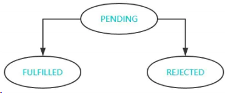

对于 Promise 而言，状态的改变 不可逆 ，即由等待态变为其他的状态后，就无法再改变了。

不过，回到目前这一版的 Promise, 还是存在一些问题的。

#### 设置回调数组

首先只能执行一个回调函数，对于多个回调的绑定就无能为力，比如下面这样：

```js
let promise1 = new MyPromise((resolve, reject) => {
	fs.readFile("./001.txt", (err, data) => {
		if (!err) {
			resolve(data);
		} else {
			reject(err);
		}
	});
});
let x1 = promise1.then((data) => {
	console.log("第一次展示", data.toString());
});
let x2 = promise1.then((data) => {
	console.log("第二次展示", data.toString());
});
let x3 = promise1.then((data) => {
	console.log("第三次展示", data.toString());
});
```

这里绑定了三个回调，想要在 resolve() 之后一起执行，那怎么办呢？

需要将 onFulfilled 和 onRejected 改为数组，调用 resolve 时将其中的方法拿出来一一执行即可。

```js
self.onFulfilledCallbacks = [];
self.onRejectedCallbacks = [];
MyPromise.prototype.then = function (onFulfilled, onRejected) {
	if (this.status === PENDING) {
		this.onFulfilledCallbacks.push(onFulfilled);
		this.onRejectedCallbacks.push(onRejected);
	} else if (this.status === FULFILLED) {
		onFulfilled(this.value);
	} else {
		onRejected(this.error);
	}
	return this;
};
```

接下来将 resolve 和 reject 方法中执行回调的部分进行修改：

```js
// resolve 中
self.onFulfilledCallbacks.forEach((callback) => callback(self.value));
//reject 中
self.onRejectedCallbacks.forEach((callback) => callback(self.error));
```

#### 链式调用完成

我们采用目前的代码来进行测试：

```js
let fs = require("fs");
let readFilePromise = (filename) => {
	return new MyPromise((resolve, reject) => {
		fs.readFile(filename, (err, data) => {
			if (!err) {
				resolve(data);
			} else {
				reject(err);
			}
		});
	});
};
readFilePromise("./001.txt")
	.then((data) => {
		console.log(data.toString());
		return readFilePromise("./002.txt");
	})
	.then((data) => {
		console.log(data.toString());
	});
// 001.txt的内容
// 001.txt的内容
```

咦？怎么打印了两个 001 ，第二次不是读的 002 文件吗？

问题出在这里：

```js
MyPromise.prototype.then = function (onFulfilled, onRejected) {
	// ...
	return this;
};
```

这么写每次返回的都是第一个 Promise。then 函数当中返回的第二个 Promise 直接被无视了！

说明 then 当中的实现还需要改进, 我们现在需要对 then 中返回值重视起来。

```js
MyPromise.prototype.then = function (onFulfilled, onRejected) {
	let bridgePromise;
	let self = this;
	if (self.status === PENDING) {
		return (bridgePromise = new MyPromise((resolve, reject) => {
			self.onFulfilledCallbacks.push((value) => {
				try {
					// 看到了吗？要拿到 then 中回调返回的结果。
					let x = onFulfilled(value);
					resolve(x);
				} catch (e) {
					reject(e);
				}
			});
			self.onRejectedCallbacks.push((error) => {
				try {
					let x = onRejected(error);
					resolve(x);
				} catch (e) {
					reject(e);
				}
			});
		}));
	}
	//...
};
```

假若当前状态为 PENDING，将回调数组中添加如上的函数，当 Promise 状态变化后，会遍历相应回调数组并执行回调。

但是这段程度还是存在一些问题：

- 1）首先 then 中的两个参数不传的情况并没有处理，
- 2）假如 then 中的回调执行后返回的结果(也就是上面的 x )是一个 Promise, 直接给 resolve 了，这是我们不希望看到的。

**怎么来解决这两个问题呢？**

先对参数不传的情况做判断：

```js
// 成功回调不传给它一个默认函数
onFulfilled = typeof onFulfilled === "function" ? onFulfilled : value => value;
// 对于失败回调直接抛错
onRejected = typeof onRejected === "function" ? onRejected : error => { throw
error };
```

然后对返回 Promise 的情况进行处理：

```js
function resolvePromise(bridgePromise, x, resolve, reject) {
	//如果x是一个promise
	if (x instanceof MyPromise) {
		// 拆解这个 promise ，直到返回值不为 promise 为止
		if (x.status === PENDING) {
			x.then(
				(y) => {
					resolvePromise(bridgePromise, y, resolve, reject);
				},
				(error) => {
					reject(error);
				}
			);
		} else {
			x.then(resolve, reject);
		}
	} else {
		// 非 Promise 的话直接 resolve 即可
		resolve(x);
	}
}
```

然后在 then 的方法实现中作如下修改：

```js
resolve(x) -> resolvePromise(bridgePromise, x, resolve, reject);
```

在这里大家好好体会一下拆解 Promise 的过程，其实不难理解，要强调的是其中的递归调用始终传入的 resolve 和 reject 这两个参数是什么含义，其实他们控制的是最开始传入的 bridgePromise 的状态，这一点非常重要。

紧接着，我们实现一下当 Promise 状态不为 PENDING 时的逻辑。

成功状态下调用 then：

```js
if (self.status === FULFILLED) {
	return (bridgePromise = new MyPromise((resolve, reject) => {
		try {
			// 状态变为成功，会有相应的 self.value
			let x = onFulfilled(self.value);
			// 暂时可以理解为 resolve(x)，后面具体实现中有拆解的过程
			resolvePromise(bridgePromise, x, resolve, reject);
		} catch (e) {
			reject(e);
		}
	}));
}
```

失败状态下调用 then：

```js
if (self.status === REJECTED) {
	return (bridgePromise = new MyPromise((resolve, reject) => {
		try {
			// 状态变为失败，会有相应的 self.error
			let x = onRejected(self.error);
			resolvePromise(bridgePromise, x, resolve, reject);
		} catch (e) {
			reject(e);
		}
	}));
}
```

Promise A+中规定成功和失败的回调都是微任务，由于浏览器中 JS 触碰不到底层微任务的分配，可以直接拿 setTimeout (属于宏任务的范畴) 来模拟，用 setTimeout 将需要执行的任务包裹 ，当然，上面的 resolve 实现也是同理, 大家注意一下即可，其实并不是真正的微任务。

```js
if (self.status === FULFILLED) {
	return (bridgePromise = new MyPromise((resolve, reject) => {
		setTimeout(() => {
			//...
		});
	}));
}
if (self.status === REJECTED) {
	return (bridgePromise = new MyPromise((resolve, reject) => {
		setTimeout(() => {
			//...
		});
	}));
}
```

好了，到这里, 我们基本实现了 then 方法，现在我们拿刚刚的测试代码做一下测试, 依次打印如下：

```js
(001).txt的内容;
(002).txt的内容;
```

可以看到，已经可以顺利地完成链式调用。

#### 错误捕获及冒泡机制分析

现在来实现 catch 方法：

```js
Promise.prototype.catch = function (onRejected) {
	return this.then(null, onRejected);
};
```

对，就是这么几行，catch 原本就是 then 方法的语法糖。

相比于实现来讲，更重要的是理解其中错误冒泡的机制，即中途一旦发生错误，可以在最后用 catch 捕获错误。

我们回顾一下 Promise 的运作流程也不难理解，贴上一行关键的代码：

```js
// then 的实现中
onRejected = typeof onRejected === "function" ? onRejected : error => { throw
error };
```

一旦其中有一个 PENDING 状态的 Promise 出现错误后状态必然会变为失败, 然后执行 onRejected 函数，而这个 onRejected 执行又会抛错，把新的 Promise 状态变为失败，新的 Promise 状态变为失败后又会执行 onRejected......就这样一直抛下去，直到用 catch 捕获到这个错误，才停止往下抛。

这就是 Promise 的错误冒泡机制。

至此，Promise 三大法宝: 回调函数延迟绑定、回调返回值穿透 和 错误冒泡。

### 实现 Promise 的 resolve、reject 和 finally

#### 实现 Promise.resolve

实现 resolve 静态方法有三个要点：

- 传参为一个 Promise, 则直接返回它。
- 传参为一个 thenable 对象，返回的 Promise 会跟随这个对象， 采用它的最终状态 作为 自己的状态 。
- 其他情况，直接返回以该值为成功状态的 promise 对象。

具体实现如下：

```js
Promise.resolve = (param) => {
	if (param instanceof Promise) return param;
	return new Promise((resolve, reject) => {
		if (param && param.then && typeof param.then === "function") {
			// param 状态变为成功会调用resolve，将新 Promise 的状态变为成功，反之亦然
			param.then(resolve, reject);
		} else {
			resolve(param);
		}
	});
};
```

#### 实现 Promise.reject

Promise.reject 中传入的参数会作为一个 reason 原封不动地往下传, 实现如下：

```js
Promise.reject = function (reason) {
	return new Promise((resolve, reject) => {
		reject(reason);
	});
};
```

#### 实现 Promise.prototype.finally

无论当前 Promise 是成功还是失败，调用 finally 之后都会执行 finally 中传入的函数，并且将值原封不动的往下传。

```js
Promise.prototype.finally = function (callback) {
	this.then(
		(value) => {
			return Promise.resolve(callback()).then(() => {
				return value;
			});
		},
		(error) => {
			return Promise.resolve(callback()).then(() => {
				throw error;
			});
		}
	);
};
```

### 现 Promise 的 all 和 race

#### 实现 Promise.all

对于 all 方法而言，需要完成下面的核心功能：

- 1）传入参数为一个空的可迭代对象，则直接进行 resolve。
- 2）如果参数中有一个 promise 失败，那么 Promise.all 返回的 promise 对象失败。
- 3）在任何情况下，Promise.all 返回的 promise 的完成状态的结果都是一个数组

具体实现如下：

```js
Promise.all = function (promises) {
	return new Promise((resolve, reject) => {
		let result = [];
		let index = 0;
		let len = promises.length;
		if (len === 0) {
			resolve(result);
			return;
		}
		for (let i = 0; i < len; i++) {
			// 为什么不直接 promise[i].then, 因为promise[i]可能不是一个promise
			Promise.resolve(promise[i])
				.then((data) => {
					result[i] = data;
					index++;
					if (index === len) resolve(result);
				})
				.catch((err) => {
					reject(err);
				});
		}
	});
};
```

#### 实现 Promise.race

race 的实现相比之下就简单一些，只要有一个 promise 执行完，直接 resolve 并停止执行。

```js
Promise.race = function (promises) {
	return new Promise((resolve, reject) => {
		let len = promises.length;
		if (len === 0) return;
		for (let i = 0; i < len; i++) {
			Promise.resolve(promise[i])
				.then((data) => {
					resolve(data);
					return;
				})
				.catch((err) => {
					reject(err);
					return;
				});
		}
	});
};
```

### 谈谈你对生成器以及协程的理解

生成器(Generator)是 ES6 中的新语法，相对于之前的异步语法，上手的难度还是比较大的。因此这里我们先来好好熟悉一下 Generator 语法。

#### 生成器执行流程

上面是生成器函数？

生成器是一个带 星号 的"函数"(注意：它并不是真正的函数)，可以通过 yield 关键字 暂停执行 和 恢复执行 的

举个例子：

```js
function* gen() {
	console.log("enter");
	let a = yield 1;
	let b = yield (function () {
		return 2;
	})();
	return 3;
}
var g = gen(); // 阻塞住，不会执行任何语句
console.log(typeof g); // object 看到了吗？不是"function"
console.log(g.next());
console.log(g.next());
console.log(g.next());
console.log(g.next());
// enter
// { value: 1, done: false }
// { value: 2, done: false }
// { value: 3, done: true }
// { value: undefined, done: true }
```

由此可以看到，生成器的执行有这样几个关键点：

- 1）调用 gen() 后，程序会阻塞住，不会执行任何语句。
- 2）调用 g.next() 后，程序继续执行，直到遇到 yield 程序暂停。
- 3）next 方法返回一个对象， 有两个属性: value 和 done 。value 为 当前 yield 后面的结果 ，done 表示 是否执行完 ，遇到了 return 后， done 会由 false 变为 true 。

#### yield\*

当一个生成器要调用另一个生成器时，使用 yield\* 就变得十分方便。比如下面的例子：

```js
function* gen1() {
	yield 1;
	yield 4;
}
function* gen2() {
	yield 2;
	yield 3;
}
```

我们想要按照 1234 的顺序执行，如何来做呢？

在 gen1 中，修改如下：

```js
function* gen1() {
	yield 1;
	yield* gen2();
	yield 4;
}
```

这样修改之后，之后依次调用 next 即可。

#### 生成器实现机制——协程

可能你会比较好奇，生成器究竟是如何让函数暂停, 又会如何恢复的呢？接下来我们就来对其中的执行机制—— 协程 一探究竟。

##### 什么是协程？

协程是一种比线程更加轻量级的存在，协程处在线程的环境中， 一个线程可以存在多个协程 ，可以将协程理解为线程中的一个个任务。不像进程和线程，协程并不受操作系统的管理，而是被具体的应用程序代码所控制。

##### 协程的运作过程

那你可能要问了，JS 不是单线程执行的吗，开这么多协程难道可以一起执行吗？

答案是：并不能。一个线程一次只能执行一个协程。比如当前执行 A 协程，另外还有一个 B 协程，如果想要执行 B 的任务，就必须在 A 协程中将 JS 线程的控制权转交给 B 协程 ，那么现在 B 执行，A 就相当于处于暂停的状态。

举个具体的例子：

```js
function* A() {
	console.log("我是A");
	yield B(); // A停住，在这里转交线程执行权给B
	console.log("结束了");
}
function B() {
	console.log("我是B");
	return 100; // 返回，并且将线程执行权还给A
}
let gen = A();
gen.next();
gen.next();
// 我是A
// 我是B
// 结束了
```

在这个过程中，A 将执行权交给 B，也就是 A 启动 B ，我们也称 A 是 B 的父协程。因此 B 当中最后 return 100 其实是将 100 传给了父协程。

需要强调的是，对于协程来说，它并不受操作系统的控制，完全由用户自定义切换，因此并没有进程/线程 上下文切换 的开销，这是 高性能 的重要原因。

OK, 原理就说到这里。可能你还会有疑问: 这个生成器不就暂停-恢复、暂停-恢复这样执行的吗？它和异步有什么关系？而且，每次执行都要调用 next，能不能让它一次性执行完毕呢？下一节我们就来仔细拆解这些问题。

### 如何让 Generator 的异步代码按顺序执行完毕？

这里面其实有两个问题：

- 1） Generator 如何跟 异步 产生关系？
- 2）怎么把 Generator 按顺序执行完毕？

#### thunk 函数

要想知道 Generator 跟异步的关系，首先带大家搞清楚一个概念——thunk 函数(即 偏函数 )，虽然这只是实现两者关系的方式之一。(另一种方式是 Promise , 后面会讲到)
举个例子，比如我们现在要判断数据类型。可以写如下的判断逻辑：

```js
let isString = (obj) => {
	return Object.prototype.toString.call(obj) === "[object String]";
};
let isFunction = (obj) => {
	return Object.prototype.toString.call(obj) === "[object Function]";
};
let isArray = (obj) => {
	return Object.prototype.toString.call(obj) === "[object Array]";
};
let isSet = (obj) => {
	return Object.prototype.toString.call(obj) === "[object Set]";
};
// ...
```

可以看到，出现了非常多重复的逻辑。我们将它们做一下封装：

```js
let isType = (type) => {
	return (obj) => {
		return Object.prototype.toString.call(obj) === `[object ${type}]`;
	};
};
```

现在我们这样做即可：

```js
let isString = isType("String");
let isFunction = isType("Function");
//...
```

相应的 isString 和 isFunction 是由 isType 生产出来的函数，但它们依然可以判断出参数是否为 String（Function），而且代码简洁了不少。

```js
isString("123");
isFunction((val) => val);
```

isType 这样的函数我们称为 thunk 函数。它的核心逻辑是接收一定的参数，生产出定制化的函数，然后使用定制化的函数去完成功能。thunk 函数的实现会比单个的判断函数复杂一点点，但就是这一点点的复杂，大大方便了后续的操作。

#### Generator 和 异步

##### thunk 版本

以文件操作为例，我们来看看 异步操作 如何应用于 Generator。

```js
const readFileThunk = (filename) => {
	return (callback) => {
		fs.readFile(filename, callback);
	};
};
```

readFileThunk 就是一个 thunk 函数 。异步操作核心的一环就是绑定回调函数，而 thunk 函数 可以帮我们做到。首先传入文件名，然后生成一个针对某个文件的定制化函数。这个函数中传入回调，这个回调就会成为异步操作的回调。这样就让 Generator 和 异步 关联起来了。

紧接者我们做如下的操作：

```js
const gen = function* () {
	const data1 = yield readFileThunk("001.txt");
	console.log(data1.toString());
	const data2 = yield readFileThunk("002.txt");
	console.log(data2.toString);
};
```

接着我们让它执行完：

```js
let g = gen();
// 第一步: 由于进场是暂停的，我们调用next，让它开始执行。
// next返回值中有一个value值，这个value是yield后面的结果，放在这里也就是是thunk函数生成的定制化函数，里面需要传一个回调函数作为参数
g.next().value((err, data1) => {
	// 第二步: 拿到上一次得到的结果，调用next, 将结果作为参数传入，程序继续执行。
	// 同理，value传入回调
	g.next(data1).value((err, data2) => {
		g.next(data2);
	});
});
```

打印结果如下：

```bash
001.txt的内容
002.txt的内容
```

上面嵌套的情况还算简单，如果任务多起来，就会产生很多层的嵌套，可操作性不强，有必要把执行的代码封装一下：

```js
function run(gen) {
	const next = (err, data) => {
		let res = gen.next(data);
		if (res.done) return;
		res.value(next);
	};
	next();
}
run(g);
```

再次执行，依然打印正确的结果。代码虽然就这么几行，但包含了递归的过程，好好体会一下。

这是通过 thunk 完成异步操作的情况。

#### Promise 版本

还是拿上面的例子，用 Promise 来实现就轻松一些：

```js
const readFilePromise = (filename) => {
	return new Promise((resolve, reject) => {
		fs.readFile(filename, (err, data) => {
			if (err) {
				reject(err);
			} else {
				resolve(data);
			}
		});
	}).then((res) => res);
};
const gen = function* () {
	const data1 = yield readFilePromise("001.txt");
	console.log(data1.toString());
	const data2 = yield readFilePromise("002.txt");
	console.log(data2.toString);
};
```

执行的代码如下：

```js
let g = gen();
function getGenPromise(gen, data) {
	return gen.next(data).value;
}
getGenPromise(g)
	.then((data1) => {
		return getGenPromise(g, data1);
	})
	.then((data2) => {
		return getGenPromise(g, data2);
	});
```

打印结果如下：

```js
(001).txt的内容;
(002).txt的内容;
```

同样，我们可以对执行 Generator 的代码加以封装：

```js
function run(g) {
	const next = (data) => {
		let res = g.next();
		if (res.done) return;
		res.value.then((data) => {
			next(data);
		});
	};
	next();
}
```

同样能输出正确的结果。代码非常精炼，希望能参照刚刚链式调用的例子，仔细体会一下递归调用的过程。

#### 采用 co 库

以上我们针对 thunk 函数 和 Promise 两种 Generator 异步操作 的一次性执行完毕做了封装，但实际场景中已经存在成熟的工具包了，如果大名鼎鼎的 co 库, 其实核心原理就是我们已经手写过了（就是刚刚封装的 Promise 情况下的执行代码），只不过源码会各种边界情况做了处理。使用起来非常简单：

```js
const co = require("co");
let g = gen();
co(g).then((res) => {
	console.log(res);
});
```

打印结果如下：

```bash
001.txt的内容
002.txt的内容
100
```

简单几行代码就完成了 Generator 所有的操作，真不愧 co 和 Generator 天生一对啊！

### 解释一下 async/await 的运行机制。

async/await 被称为 JS 中异步终极解决方案。它既能够像 co + Generator 一样用同步的方式来书写异步代码，又得到底层的语法支持，无需借助任何第三方库。接下来，我们从原理的角度来重新审视这个语法糖背后究竟做了些什么。

#### async

##### 什么是 async ?

MDN 的定义：async 是一个通过异步执行并隐式返回 Promise 作为结果的函数。

注意重点：**返回结果为 Promise。**

举个例子：

```js
async function func() {
	return 100;
}
console.log(func());
// Promise {<resolved>: 100}
```

这就是隐式返回 Promise 的效果。

##### await

我们来看看 await 做了些什么事情。

以一段代码为例：

```js
async function test() {
	console.log(100);
	let x = await 200;
	console.log(x);
	console.log(200);
}
console.log(0);
test();
console.log(300);
```

我们来分析一下这段程序。首先代码同步执行，打印出 0 ，然后将 test 压入执行栈，打印出 100 , 下面注意了，遇到了关键角色 await。

放个慢镜头：

```js
await 100;
```

被 JS 引擎转换成一个 Promise：

```js
let promise = new Promise((resolve, reject) => {
	resolve(100);
});
```

这里调用了 resolve，resolve 的任务进入微任务队列。

然后，JS 引擎将暂停当前协程的运行，把线程的执行权交给 父协程 (父协程不懂是什么的，上上篇才讲，回去补课)。

回到父协程中，父协程的第一件事情就是对 await 返回的 Promise 调用 then , 来监听这个 Promise 的状态改变 。

```js
promise.then((value) => {
	// 相关逻辑，在resolve 执行之后来调用
});
```

然后往下执行，打印出 300 。

根据 EventLoop 机制，当前主线程的宏任务完成，现在检查 微任务队列 , 发现还有一个 Promise 的 resolve，执行，现在父协程在 then 中传入的回调执行。我们来看看这个回调具体做的是什么。

```js
promise.then((value) => {
	// 1. 将线程的执行权交给test协程
	// 2. 把 value 值传递给 test 协程
});
```

Ok, 现在执行权到了 test 协程 手上，test 接收到 父协程 传来的 200, 赋值给 a ,然后依次执行后面的语句，打印 200 、 200 。

最后的输出为：

```js
0;
100;
300;
200;
200;
```

总结一下，async/await 利用协程和 Promise 实现了同步方式编写异步代码的效果，其中 Generator 是对协程的一种实现，虽然语法简单，但引擎在背后做了大量的工作，我们也对这些工作做了一一的拆解。

用 async/await 写出的代码也更加优雅、美观，相比于之前的 Promise 不断调用 then 的方式，语义化更加明显，相比于 co + Generator 性能更高，上手成本也更低，不愧是 JS 异步终极解决方案！

### forEach 中用 await 会产生什么问题?怎么解决这个问题？

#### 问题

**问题：对于异步代码，forEach 并不能保证按顺序执行。**

举个例子:

```js
async function test() {
	let arr = [4, 2, 1];
	arr.forEach(async (item) => {
		const res = await handle(item);
		console.log(res);
	});
	console.log("结束");
}
function handle(x) {
	return new Promise((resolve, reject) => {
		setTimeout(() => {
			resolve(x);
		}, 1000 * x);
	});
}
test();
```

我们期望的结果是：

```bash
4
2
1
结束
```

但是实际上会输出：

```bash
结束
1
2
4
```

##### 问题原因

这是为什么呢？我想我们有必要看看 forEach 底层怎么实现的。

```js
// 核心逻辑
for (var i = 0; i < length; i++) {
	if (i in array) {
		var element = array[i];
		callback(element, i, array);
	}
}
```

可以看到，forEach 拿过来直接执行了，这就导致它无法保证异步任务的执行顺序。比如后面的任务用时短，那么就又可能抢在前面的任务之前执行。

##### 解决方案

如何来解决这个问题呢？

其实也很简单, 我们利用 `for...of` 就能轻松解决。

```js
async function test() {
	let arr = [4, 2, 1];
	for (const item of arr) {
		const res = await handle(item);
		console.log(res);
	}
	console.log("结束");
}
```

#### 解决原理——Iterator

for...of 并不像 forEach 那么简单粗暴的方式去遍历执行，而是采用一种特别的手段——迭代器去遍历。

首先，对于数组来讲，它是一种可迭代数据类型。那什么是可迭代数据类型呢？
原生具有[Symbol.iterator]属性数据类型为可迭代数据类型。如数组、类数组（如 arguments、NodeList）、Set 和 Map。

可迭代对象可以通过迭代器进行遍历。

```js
let arr = [4, 2, 1];
// 这就是迭代器
let iterator = arr[Symbol.iterator]();
console.log(iterator.next());
console.log(iterator.next());
console.log(iterator.next());
console.log(iterator.next());
// {value: 4, done: false}
// {value: 2, done: false}
// {value: 1, done: false}
// {value: undefined, done: true}
```

因此，我们的代码可以这样来组织：

```js
async function test() {
	let arr = [4, 2, 1];
	let iterator = arr[Symbol.iterator]();
	let res = iterator.next();
	while (!res.done) {
		let value = res.value;
		console.log(value);
		await handle(value);
		res = iterater.next();
	}
	console.log("结束");
}
// 4
// 2
// 1
// 结束
```

多个任务成功地按顺序执行！

#### 重新认识生成器

回头再看看用 iterator 遍历[4,2,1]这个数组的代码。

```js
let arr = [4, 2, 1];
// 迭代器
let iterator = arr[Symbol.iterator]();
console.log(iterator.next());
console.log(iterator.next());
console.log(iterator.next());
console.log(iterator.next());
// {value: 4, done: false}
// {value: 2, done: false}
// {value: 1, done: false}
// {value: undefined, done: true}
```

咦？返回值有 value 和 done 属性，生成器也可以调用 next,返回的也是这样的数据结构，这么巧?!

没错，生成器本身就是一个迭代器。

既然属于迭代器，那它就可以用 for...of 遍历了吧？

当然没错，不信来写一个简单的斐波那契数列(50 以内)：

```js
function* fibonacci() {
	let [prev, cur] = [0, 1];
	console.log(cur);
	while (true) {
		[prev, cur] = [cur, prev + cur];
		yield cur;
	}
}
for (let item of fibonacci()) {
	if (item > 50) break;
	console.log(item);
}
// 1
// 1
// 2
// 3
// 5
// 8
// 13
// 21
// 34
```

### 事件流向

（1）冒泡：子节点一层层冒泡到根节点
（2）捕获顺序与冒泡相反
（3）addEventListener 最后个参数 true 代表捕获反之代表冒泡
（4）阻止冒泡不停止父节点捕获

### 事件委托

参考定义：事件委托就是利用事件冒泡，只指定一个事件处理程序，就可以管理某一类型的所有事件 好处：给重复的节点添加相同操作，减少 dom 交互，提高性能 实现思路：给父组件添加事件，通过事件冒泡，排查元素是否为指定元素，并进行系列操作
