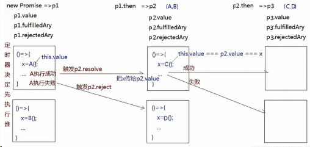

# 手写 Promise

## Promise 介绍

Promise 是 ES6 新增的语法，解决了回调地狱的问题。

- 可以把 Promise 看成一个状态机。初始是 pending 状态，可以通过函数 resolve 和 reject ，将状态转变为 resolved 或者 rejected 状态，状态一旦改变就不能再次变化。
- then 函数会返回一个 Promise 实例，并且该返回值是一个新的实例而不是之前的实例。因为 Promise 规范规定除了 pending 状态，其他状态是不可以改变的，如果返回的是一个相同实例的话，多个 then 调用就失去意义了。 对于 then 来说，本质上可以把它看成是 flatMap

## Promise 用法

```js
new Promise((resolve, reject) => {
	// 异步成功执行resolve，否则执行reject
}).then((res) => {
	// resolve触发第一个回调函数执行
}, (err) => {
	// reject触发第二个回调函数执行
}).then(res => {
// 需要保证then方法返回的依然是promise
// 这样才能实现链式调用
}).catch(reason => {
});
// 等待所有的promise都成功执行then，
// 反之只要有一个失败就会执行catch
Promise.all([promise1, ...]).then();
```

## Promise/A+ 规范

在编写 Promise 之前，我们必须了解 Promise/A+ 规范。由于内容较长，下面我总结了几点，更详细的内容可以查阅 [Promise/A+ 规范](https://promisesaplus.com/)。

Promise 是一个对象或者函数，对外提供了一个 then 函数，内部拥有 3 个状态。

### then 函数

then 函数接收两个函数作为可选参数：

```js
promise.then(onFulfilled, onRejected);
```

同时遵循下面几个规则：

- 如果可选参数不为函数时应该被忽略；

- 两个函数都应该是异步执行的，即放入事件队列等待下一轮 tick，而非立即执行；

- 当调用 onFulfilled 函数时，会将当前 Promise 的值作为参数传入；

- 当调用 onRejected 函数时，会将当前 Promise 的失败原因作为参数传入；

- then 函数的返回值为 Promise。

### Promise 状态

Promise 的 3 个状态分别为 pending、fulfilled 和 rejected。

- pending：“等待”状态，可以转移到 fulfilled 或者 rejected 状态

- fulfilled：“执行”（或“履行”）状态，是 Promise 的最终态，表示执行成功，该状态下不可再改变。

- rejected：“拒绝”状态，是 Promise 的最终态，表示执行失败，该状态不可再改变。

### Promise 解决过程

Promise 解决过程是一个抽象的操作，即接收一个 promise 和一个值 x，目的就是对 Promise 形式的执行结果进行统一处理。需要考虑以下 4 种情况。

- 情况 1： x 等于 promise

- 抛出一个 TypeError 错误，拒绝 promise。
- 情况 2：x 为 Promise 的实例
- 如果 x 处于等待状态，那么 promise 继续等待至 x 执行或拒绝，否则根据 x 的状态执行/拒绝 promise。
- 情况 3：x 为对象或函数
- 该情况的核心是取出 x.then 并调用，在调用的时候将 this 指向 x。将 then 回调函数中得到结果 y 传入新的 Promise 解决过程中，形成一个递归调用。其中，如果执行报错，则以对应的错误为原因拒绝 promise。
- 这一步是处理拥有 then() 函数的对象或函数，这类对象或函数我们称之为“thenable”。注意，它只是拥有 then() 函数，并不是 Promise 实例。
- 情况 4：如果 x 不为对象或函数
- 以 x 作为值，执行 promise。

## Promise 实现

下面我们就根据规范来逐步实现一个 Promise。

### 实现 Promise() 函数及状态

由于 Promise 只有 3 个 状态，这里我们可以先创建 3 个“常量”来消除魔术字符串：

```js
var PENDING = "pending";
var FULFILLED = "fulfilled";
var REJECTED = "rejected";
```

由于 Promise 可以被实例化，所以可以定义成类或函数，这里为了增加难度，先考虑在 ES5 环境下实现，所以写成构造函数的形式。

使用过 Promise 的人肯定知道，在创建 Promise 的时候会传入一个回调函数，该回调函数会接收两个参数，分别用来执行或拒绝当前 Promise。同时考虑到 Promise 在执行时可能会有返回值，在拒绝时会给出拒绝原因，我们分别用 value 和 reason 两个变量来表示。具体代码如下：

```js
function Promise(execute) {
	var self = this;
	self.state = PENDING;
	function resolve(value) {
		if (self.state === PENDING) {
			self.state = FULFILLED;
			self.value = value;
		}
	}
	function reject(reason) {
		if (self.state === PENDING) {
			self.state = REJECTED;
			self.reason = reason;
		}
	}
	try {
		execute(resolve, reject);
	} catch (e) {
		reject(e);
	}
}
```

Promise 是单次执行的，所以需要判断状态为 PENDING 的时候再执行函数 resolve() 或函数 reject() 。同时 Promise 的内部异常不能直接抛出，所以要进行异常捕获。

#### 实现 2

```js
// promise.js
class Promise {
	// 传一个异步函数进来
	constructor(excutorCallBack) {
		this.status = "pending";
		this.value = undefined;
		this.fulfillAry = [];
		this.rejectedAry = [];
		// =>执行Excutor
		let resolveFn = (result) => {
			if (this.status !== "pending") return;
			let timer = setTimeout(() => {
				this.status = "fulfilled";
				this.value = result;
				this.fulfillAry.forEach((item) => item(this.value));
			}, 0);
		};
		let rejectFn = (reason) => {
			if (this.status !== "pending") return;
			let timer = setTimeout(() => {
				this.status = "rejected";
				this.value = reason;
				this.rejectedAry.forEach((item) => item(this.value));
			});
		};
		try {
			// 执行这个异步函数
			excutorCallBack(resolveFn, rejectFn);
		} catch (err) {
			// =>有异常信息按照rejected状态处理
			rejectFn(err);
		}
	}
	then(fulfilledCallBack, rejectedCallBack) {
		// resolve和reject函数其实一个作为微任务
		// 因此他们不是立即执行，而是等then调用完成后执行
		this.fulfillAry.push(fulfilledCallBack);
		this.rejectedAry.push(rejectedCallBack);
		// 一顿push过后他们被执行
	}
}
module.exports = Promise;
```

测试如下：

```js
let Promise = require("./promise");
let p1 = new Promise((resolve, reject) => {
	setTimeout(() => {
		Math.random() < 0.5 ? resolve(100) : reject(-100);
	}, 1000);
}).then(
	(res) => {
		console.log(res);
	},
	(err) => {
		console.log(err);
	}
);
```

### 完成链式 then() 效果函数

每个 Promise 实例都有一个 then() 函数，该函数会访问 Promise 内部的值或拒绝原因，所以通过函数原型 prototype 来实现。then() 函数接收两个回调函数作为参数，于是写成下面的形式：

```js
Promise.prototype.then = function (onFulfilled, onRejected) {};
```

根据第 1 条原则，如果可选参数不为函数时应该被忽略，所以在函数 then() 内部加上对参数的判断：

```js
onFulfilled =
	typeof onFulfilled === "function"
		? onFulfilled
		: function (x) {
				return x;
		  };
onRejected =
	typeof onRejected === "function"
		? onRejected
		: function (e) {
				throw e;
		  };
```

根据第 2 条规则，传入的回调函数是异步执行的。要模拟异步，可以通过 setTimeout 来延迟执行。再根据第 3 条和第 4 条规则，应根据 Promise 的状态来执行对应的回调，执行状态下调用 onFulfilled() 函数，拒绝状态下调用 onRejected() 函数。

```js
var self = this;
switch (self.state) {
	case FULFILLED:
		setTimeout(function () {
			onFulfilled(self.value);
		});
		break;
	case REJECTED:
		setTimeout(function () {
			onRejected(self.reason);
		});
		break;
	case PENDING:
		// todo
		break;
}
```

等待状态下就有些麻烦了，需要等到 Promise 状态转变时才能调用。

按照常规处理方式，可以建立一个监听，监听 Promise 的状态值改变。由于浏览器环境和 Node.js 环境的事件监听不一样，考虑兼容性，这种实现会比较复杂。

换个角度来看，在不考虑异常的情况下 Promise 的状态改变只依赖于构造函数中的 resolve() 函数和 reject() 函数执行。所以可考虑将 onFulfilled() 和 onRejected() 函数先保存到 Promise 属性 onFulfilledFn 和 onRejectedFn 中，等到状态改变时再调用。

```js
case PENDING:
  self.onFulfilledFn = function () {
    onFulfilled(self.value);
  }
  self.onRejectedFn = function () {
    onRejected(self.reason);
  }
  break;
```

最后看第 5 条规则，then() 被调用时应该返回一个新的 Promise，所以在上面的 3 种状态的处理逻辑中，都应该创建并返回一个 Promise 实例。以执行状态为例，可以改成下面的样子。

```js
case FULFILLED:
  promise = new Promise(function (resolve, reject) {
    setTimeout(function () {
      try {
        onFulfilled(self.value);
      } catch (e) {
        reject(e)
      }
    })
  });
  break;
```

同时，它带来的另一个效果是支持链式调用。在链式调用的情况下，如果 Promise 实例处于等待状态，那么需要保存多个 resolve() 或 reject() 函数，所以 onFulfilledFn 和 onRejectedFn 应该改成数组。

```js
case PENDING:
  promise = new Promise(function (resolve, reject) {
    self.onFulfilledFn.push(function () {
      try {
        onFulfilled(self.value);
      } catch (e) {
        reject(e)
      }
    });
    self.onRejectedFn.push(function () {
      try {
        onRejected(self.reason);
      } catch (e) {
        reject(e)
      }
    })
  });
  break;
```

对应的，Promise 构造函数中应该初始化属性 onFulfilledFn 和 onRejectedFn 为数组，同时 resolve() 和 reject() 函数在改变状态时应该调用这个数组中的函数，并且这个调用过程应该是异步的。

```js
function Promise(execute) {
  ...
  self.onFulfilledFn = [];
  self.onRejectedFn = [];
  ...
  function resolve(value) {
    setTimeout(function() {
      ...
      self.onFulfilledFn.forEach(function (f) {
        f(self.value)
      })
    })
  }
  function reject(reason) {
    setTimeout(function() {
      ...
      self.onRejectedFn.forEach(function (f) {
        f(self.reason)
      })
    })
  }
}
```

#### 实现 2

最大的难点在于链式调用的实现，具体来说就是 then 方法的实现。

```js
// then传进两个函数
then(fulfilledCallBack, rejectedCallBack) {
	// 保证两者为函数
	typeof fulfilledCallBack !== "function"
		? (fulfilledCallBack = (result) => result)
		: null;
	typeof rejectedCallBack !== "function"
		? (rejectedCallBack = (reason) => {
				throw new Error(reason instanceof Error ? reason.message : reason);
		  })
		: null;
	// 返回新的Promise对象，后面称它为“新Promise”
	return new Promise((resolve, reject) => {
		// 注意这个this指向目前的Promise对象，而不是新的Promise
		// 再强调一遍,很重要：
		// 目前的Promise(不是这里return的新Promise)的resolve和reject函数其实一个作为微任务
		// 因此他们不是立即执行，而是等then调用完成后执行
		this.fulfillAry.push(() => {
			try {
				// 把then里面的方法拿过来执行
				// 执行的目的已经达到
				let x = fulfilledCallBack(this.value);
				// 下面执行之后的下一步，也就是记录执行的状态，决定新Promise如何表现
				// 如果返回值x是一个Promise对象，就执行then操作
				// 如果不是Promise,直接调用新Promise的resolve函数,
				// 新Promise的fulfilAry现在为空,在新Promise的then操作后.新Promise的resolve执
				行;
				x instanceof Promise ? x.then(resolve, reject) : resolve(x);
			} catch (err) {
				reject(err);
			}
		});
		// 以下同理
		this.rejectedAry.push(() => {
			try {
				let x = this.rejectedCallBack(this.value);
				x instanceof Promise ? x.then(resolve, reject) : resolve(x);
			} catch (err) {
				reject(err);
			}
		});
	});
}
```

测试用例：

```js
let p1 = new Promise((resolve, reject) => {
	setTimeout(() => {
		Math.random() < 0.5 ? resolve(100) : reject(-100);
	}, 1000);
});
let p2 = p1.then((result) => {
	// 执行then返回的是一个新的Promise
	return result + 100;
});
let p3 = p2.then(
	(result) => {
		console.log(result);
	},
	(reason) => {
		console.log(reason);
	}
);
```

简单画图来模拟一下链式调用的内部流程：



有了 then 方法，catch 自然而然调用即可：

```js
catch(rejectedCallBack) {
	return this.then(null, rejectedCallBack);
}
```

### Promise.resolve() 函数

前面提到解决过程函数有两个参数及 3 种情况，先来考虑第 1 种情况，promise 与 x 相等，应该直接抛出 TypeError 错误：

```js
function resolvePromise(promise, x) {
	if (promise === x) {
		return reject(new TypeError("x 不能与 promise 相等"));
	}
}
```

情况 2，x 为 Promise 的实例，应该尝试让 promise 接受 x 的状态，怎么接受呢？

直接改变 promise 状态肯定是不可取的，首先状态信息属于内部变量，其次也无法调用属性 onResolvedFn 和 onFulfilledFn 中的待执行函数。所以必须要通过调用 promise 在构造时的函数 resolve() 和 reject() 来改变。

如果 x 处于等待状态，那么 promise 继续保持等待状态，等待解决过程函数 resolvePromise() 执行，否则应该用相同的值执行或拒绝 promise。我们无法从外部拒绝或执行一个 Promise 实例，只能通过调用构造函数传入的 resolve() 和 reject() 函数来实现。所以还需要把这两个函数作为参数传递到 resolvePromise 函数中。

在函数 resolvePromise() 内部加上情况 2 的判断，代码如下：

```js
function resolvePromise(promise, x, resolve, reject) {
  ...
  if (x instanceof Promise) {
    if (x.state === FULFILLED) {
      resolve(x.value)
    } else if (x.state === REJECTED) {
      reject(x.reason)
    } else {
      x.then(function (y) {
        resolvePromise(promise, y, resolve, reject)
      }, reject)
    }
  }
}
```

再来实现情况 3，将 x.then 取出然后执行，并将执行结果放入解决过程函数 resolvePromise() 中。 考虑到 x 可能只是一个 thenable 而非真正的 Promise，所以在调用 then() 函数的时候要设置一个变量 excuted 避免重复调用。同时记得在执行时添加异常捕获并及时拒绝当前 promise。

```js
if (x !== null && (typeof x === "object" || typeof x === "function")) {
	var executed;
	try {
		var then = x.then;
		if (typeof then === "function") {
			then.call(
				x,
				function (y) {
					if (executed) return;
					executed = true;
					return resolvePromise(promise, y, resolve, reject);
				},
				function (e) {
					if (executed) return;
					executed = true;
					reject(e);
				}
			);
		} else {
			resolve(x);
		}
	} catch (e) {
		if (executed) return;
		executed = true;
		reject(e);
	}
}
```

情况 4 就很简单了，直接把 x 作为值执行。

```js
resolve(x);
```

#### 实现 2

```js
static resolve (value) {
    if (value instanceof Promise) return value
    return new Promise(resolve => resolve(value))
}
```

### Promise.reject()

#### 实现 2

```js
static reject (value) {
	return new Promise((resolve, reject) => reject(value))
}
```

### Promise 测试

编写测试代码永远是一个好习惯，为了验证编写的 Promise 正确性，引用一个专门用来测试 Promise 规范性的模块 [promises-aplus-tests](https://github.com/promises-aplus/promises-tests)，该模块内置了数百个测试案例，支持命令行一键测试。只是在导出模块的时候需要遵循 CommonJS 规范，并且按照要求导出对应的函数。最终代码地址：[course/plus2 at master · yalishizhude/course (github.com)](https://github.com/yalishizhude/course/tree/master/plus2)

### async/await

async 是 ES2017 标准推出的用于处理异步操作的关键字，从本质上来说，它就是 Generator 函数的语法糖。

#### 什么是 Generator 函数？

Generator 函数是 ES6 提出的除 Promise 之外的另一种异步解决方案，不同于常见的异步回调，它的用法有些“奇怪”。这里我们只简单介绍一下它的主要用法。

当声明一个 Generator 函数时，需要在 function 关键字与函数名之间加上一个星号，像下面这样：

```js
function* fn() {
  ...
}
```

当调用 Generator 函数后，函数并不会立即执行，而是返回一个迭代器对象。

- 函数体内部使用 yield 表达式，定义不同的内部状态。

- 当函数体外部调用迭代器的 next() 函数时，函数会执行到下一个 yield 表达式的位置，并返回一个对象，该对象包含属性 value 和 done，value 是调用 next() 函数时传入的参数，done 为布尔值表示是否执行完成。

下面是一个将异步回调函数改写成 Generator 函数的示例代码：

```js
function asyncFn(cb) {
	setTimeout(cb, 1000, 1);
}
function* fn() {
	var result = yield asyncFn(function (data) {
		it.next(data);
	});
	console.log(result); // 1
}
var it = fn();
it.next();
```

下面讲讲这段代码的执行逻辑。

- asyncFn() 是一个自定义的异步回调函数，1 秒后返回数值 1。

- 先调用 Generator 函数得到迭代器 it，但此时函数并没有执行，需要执行迭代器的 next() 函数才能调用函数 fn() 。

- Generator 函数 fn() 内部调用异步函数 asyncFn 时使用了 yield 关键字，代表此处暂停执行，等到异步函数 asyncFn 执行完成后再执行后面的代码。

- 1 秒后，匿名回调函数内部得到的返回值 1，通过 it.next() 函数返回这个值，并告诉迭代器继续执行后面的 console.log。

#### async/await 原理

虽然说 Generator 函数号称是解决异步回调问题，但却带来了一些麻烦，比如函数外部无法捕获异常，比如多个 yield 会导致调试困难。所以相较之下 Promise 是更优秀的异步解决方案。

async/await 做的事情就是将 Generator 函数转换成 Promise。下面代码描述的是 async 的实现逻辑：

```js
function generator2promise(generatorFn) {
	return function () {
		var gen = generatorFn.apply(this, arguments);
		return new Promise(function (resolve, reject) {
			function step(key, arg) {
				try {
					var info = gen[key](arg);
					var value = info.value;
				} catch (error) {
					reject(error);
					return;
				}
				if (info.done) {
					resolve(value);
				} else {
					return Promise.resolve(value).then(
						function (value) {
							step("next", value);
						},
						function (err) {
							step("throw", err);
						}
					);
				}
			}
			return step("next");
		});
	};
}
```

它将 Generator 函数包装成了一个新的匿名函数，调用这个匿名函数时返回一个 Promise。在这个 Promise 内部会创建一个 step() 函数，该函数负责递归调用 Generator 函数对应的迭代器，当迭代器执行完成时执行当前的 Promise，失败时则拒绝 Promise。

### Promise.all()

#### 实现 2

```js
// 为类的静态方法，而不是在原型上
static all(promiseAry = []) {
    let index = 0,
    result = [];
    return new Promise((resolve, reject) => {
        for(let i = 0; i < promiseAry.length; i++){
            promiseAry[i].then(val => {
                index++;
                result[i] = val;
                if( index === promiseAry.length){
                	resolve(result)
                }
            }, reject);
        }
    })
}
```

### 总结

本课时通过代码实例深入分析了 Promise/A+ 规范以及 async/await 的实现原理。对于手写 Promise 的过程，重点不在于实现结果，而在于实现过程，即先理解清楚规范，然后根据规范一步一步地去实现和优化。

对于 async/await 语法糖，结合 Generator 函数，理解其封装原理即可。

最后布置一道练习题：学完本课时内容后，试着自己动手写一个 Promise，看看能否通过测试用例。

## ES5 构造函数实现 Promise

```js
function SxPromise(executor) {
	this.status = "pending"; // 记录状态
	this.result = undefined; // 记录执行结果
	this.cb = []; // 成功和失败的回调方法存储
	var _this = this;
	// resolve方法
	function resolve(res) {
		if (_this.status !== "pending") return;
		// console.log(_this)
		_this.status = "fulfilled";
		_this.result = res;

		_this.cb.forEach((item) => {
			item.successCB && item.successCB(_this.result);
		});
	}
	// reject方法
	function reject(res) {
		if (_this.status !== "pending") return;
		// console.log("reject")
		_this.status = "rejected";
		_this.result = res;
		_this.cb.forEach((item) => {
			item.failCB && item.failCB(_this.result);
		});
	}
	executor(resolve, reject);
}

// 实现.then方法-链式调用，解决回调地狱
SxPromise.prototype.then = function (successCB, failCB) {
	// .catch方法的实现需要的判断，如果没有成功或失败的回调参数，则返回
	if (!successCB) {
		successCB = (value) => value;
	}
	if (!failCB) {
		failCB = (error) => error;
	}

	// 成功完成、失败、进行中的状态返回
	return new SxPromise((resolve, reject) => {
		// 成功完成 状态，执行successCB成功回调函数
		if (this.status === "fulfilled") {
			var result = successCB && successCB(this.result);
			// console.log(result);

			// 如果result结果是SxPromise的实例：用于.then方法里无限返回调用：return new SxPromise()，供链式调用的下一个.then()方法使用
			if (result instanceof SxPromise) {
				result.then(
					(res) => {
						// console.log(res)
						resolve(res);
					},
					(err) => {
						// console.log(err)
						reject(err);
					}
				);
			} else {
				resolve(result);
			}
		}
		// 失败 状态，执行failCB失败回调函数
		if (this.status === "rejected") {
			var result = failCB && failCB(this.result);
			// 如果result结果是SxPromise的实例：用于.then方法里无限返回调用：return new SxPromise()，供链式调用的下一个.then()方法使用
			if (result instanceof SxPromise) {
				result.then(
					(res) => {
						// console.log(res)
						resolve(res);
					},
					(err) => {
						// console.log(err)
						reject(err);
					}
				);
			} else {
				reject(result);
			}
		}
		// 进行中 状态
		if (this.status === "pending") {
			// 收集成功和失败的回调函数
			this.cb.push({
				successCB: () => {
					var result = successCB && successCB(this.result);
					// 和上面的两个状态的原理一样
					if (result instanceof SxPromise) {
						result.then(
							(res) => {
								// console.log(res)
								resolve(res);
							},
							(err) => {
								// console.log(err)
								reject(err);
							}
						);
					} else {
						resolve(result);
					}
				},
				failCB: () => {
					var result = failCB && failCB(this.result);
					// 和上面的两个状态的原理一样
					if (result instanceof SxPromise) {
						result.then(
							(res) => {
								// console.log(res)
								resolve(res);
							},
							(err) => {
								// console.log(err)
								reject(err);
							}
						);
					} else {
						reject(result);
					}
				},
			});
		}
	});
};
// .catch方法的实现
SxPromise.prototype.catch = function (failCB) {
	this.then(undefined, failCB);
};
```

## ES6 实现

现在手写一个简陋但是功能较为完备的 Promise 就大功告成了。

```js
class Promise {
	constructor(excutorCallBack) {
		this.status = "pending";
		this.value = undefined;
		this.fulfillAry = [];
		this.rejectedAry = [];
		//=>执行Excutor
		let resolveFn = (result) => {
			if (this.status !== "pending") return;
			let timer = setTimeout(() => {
				this.status = "fulfilled";
				this.value = result;
				this.fulfillAry.forEach((item) => item(this.value));
			}, 0);
		};
		let rejectFn = (reason) => {
			if (this.status !== "pending") return;
			let timer = setTimeout(() => {
				this.status = "rejected";
				this.value = reason;
				this.rejectedAry.forEach((item) => item(this.value));
			});
		};
		try {
			excutorCallBack(resolveFn, rejectFn);
		} catch (err) {
			//=>有异常信息按照rejected状态处理
			rejectFn(err);
		}
	}
	then(fulfilledCallBack, rejectedCallBack) {
		typeof fulfilledCallBack !== "function"
			? (fulfilledCallBack = (result) => result)
			: null;
		typeof rejectedCallBack !== "function"
			? (rejectedCallBack = (reason) => {
					throw new Error(reason instanceof Error ? reason.message : reason);
			  })
			: null;
		return new Promise((resolve, reject) => {
			this.fulfillAry.push(() => {
				try {
					let x = fulfilledCallBack(this.value);
					x instanceof Promise ? x.then(resolve, reject) : resolve(x);
				} catch (err) {
					reject(err);
				}
			});
			this.rejectedAry.push(() => {
				try {
					let x = this.rejectedCallBack(this.value);
					x instanceof Promise ? x.then(resolve, reject) : resolve(x);
				} catch (err) {
					reject(err);
				}
			});
		});
	}
	catch(rejectedCallBack) {
		return this.then(null, rejectedCallBack);
	}
	static all(promiseAry = []) {
		let index = 0,
			result = [];
		return new Promise((resolve, reject) => {
			for (let i = 0; i < promiseAry.length; i++) {
				promiseAry[i].then((val) => {
					index++;
					result[i] = val;
					if (index === promiseAry.length) {
						resolve(result);
					}
				}, reject);
			}
		});
	}
	static race(promiseAry) {
		return new Promise((resolve, reject) => {
			if (promiseAry.length === 0) {
				return;
			}
			for (let i = 0; i < promiseAry.length; i++) {
				promiseAry[i].then((val) => {
					resolve(val);
					return;
				}, reject);
			}
		});
	}
	static resolve(value) {
		if (value instanceof Promise) return value;
		return new Promise((resolve) => resolve(value));
	}
	static reject(value) {
		return new Promise((resolve, reject) => reject(value));
	}
}
module.exports = Promise;
```

## class 类实现 Promise：把上述代码 使用 VS Code 的在 SxPromise 函数的快速修复 转为 ES6 的 class 类 实现

```js
class SxPromise {
	constructor(executor) {
		this.status = "pending"; // 记录状态
		this.result = undefined; // 记录执行结果
		this.cb = []; // 成功和失败的回调方法存储
		var _this = this;
		// resolve方法
		function resolve(res) {
			if (_this.status !== "pending") return;
			// console.log(_this)
			_this.status = "fulfilled";
			_this.result = res;

			_this.cb.forEach((item) => {
				item.successCB && item.successCB(_this.result);
			});
		}
		// reject方法
		function reject(res) {
			if (_this.status !== "pending") return;
			// console.log("reject")
			_this.status = "rejected";
			_this.result = res;
			_this.cb.forEach((item) => {
				item.failCB && item.failCB(_this.result);
			});
		}
		executor(resolve, reject);
	}
	// 实现.then方法-链式调用，解决回调地狱
	then(successCB, failCB) {
		// .catch方法的实现需要的判断，如果没有成功或失败的回调参数，则返回
		if (!successCB) {
			successCB = (value) => value;
		}
		if (!failCB) {
			failCB = (error) => error;
		}

		// 成功完成、失败、进行中的状态返回
		return new SxPromise((resolve, reject) => {
			// 成功完成 状态，执行successCB成功回调函数
			if (this.status === "fulfilled") {
				var result = successCB && successCB(this.result);
				// console.log(result);
				// 如果result结果是SxPromise的实例：用于.then方法里无限返回调用：return new SxPromise()，供链式调用的下一个.then()方法使用
				if (result instanceof SxPromise) {
					result.then(
						(res) => {
							// console.log(res)
							resolve(res);
						},
						(err) => {
							// console.log(err)
							reject(err);
						}
					);
				} else {
					resolve(result);
				}
			}
			// 失败 状态，执行failCB失败回调函数
			if (this.status === "rejected") {
				var result = failCB && failCB(this.result);
				// 如果result结果是SxPromise的实例：用于.then方法里无限返回调用：return new SxPromise()，供链式调用的下一个.then()方法使用
				if (result instanceof SxPromise) {
					result.then(
						(res) => {
							// console.log(res)
							resolve(res);
						},
						(err) => {
							// console.log(err)
							reject(err);
						}
					);
				} else {
					reject(result);
				}
			}
			// 进行中 状态
			if (this.status === "pending") {
				// 收集成功和失败的回调函数
				this.cb.push({
					successCB: () => {
						var result = successCB && successCB(this.result);
						// 和上面的两个状态的原理一样
						if (result instanceof SxPromise) {
							result.then(
								(res) => {
									// console.log(res)
									resolve(res);
								},
								(err) => {
									// console.log(err)
									reject(err);
								}
							);
						} else {
							resolve(result);
						}
					},
					failCB: () => {
						var result = failCB && failCB(this.result);
						// 和上面的两个状态的原理一样
						if (result instanceof SxPromise) {
							result.then(
								(res) => {
									// console.log(res)
									resolve(res);
								},
								(err) => {
									// console.log(err)
									reject(err);
								}
							);
						} else {
							reject(result);
						}
					},
				});
			}
		});
	}
	// .catch方法的实现
	catch(failCB) {
		this.then(undefined, failCB);
	}
}
```

## 实现 3

```js
// 三种状态
const PENDING = "pending";
const RESOLVED = "resolved";
const REJECTED = "rejected";
// promise 接收一个函数参数，该函数会立即执行
function MyPromise(fn) {
	let _this = this;
	_this.currentState = PENDING;
	_this.value = undefined;
	// 用于保存 then 中的回调，只有当 promise
	// 状态为 pending 时才会缓存，并且每个实例⾄多缓存一个
	_this.resolvedCallbacks = [];
	_this.rejectedCallbacks = [];
	_this.resolve = function (value) {
		if (value instanceof MyPromise) {
			// 如果 value 是个 Promise，递归执行
			return value.then(_this.resolve, _this.reject);
		}
		setTimeout(() => {
			// 异步执行，保证执行顺序
			if (_this.currentState === PENDING) {
				_this.currentState = RESOLVED;
				_this.value = value;
				_this.resolvedCallbacks.forEach((cb) => cb());
			}
		});
	};
	_this.reject = function (reason) {
		setTimeout(() => {
			// 异步执行，保证执行顺序
			if (_this.currentState === PENDING) {
				_this.currentState = REJECTED;
				_this.value = reason;
				_this.rejectedCallbacks.forEach((cb) => cb());
			}
		});
	};
	// 用于解决以下问题
	// new Promise(() => throw Error('error))
	try {
		fn(_this.resolve, _this.reject);
	} catch (e) {
		_this.reject(e);
	}
}
MyPromise.prototype.then = function (onResolved, onRejected) {
	var self = this;
	// 规范 2.2.7，then 必须返回一个新的 promise
	var promise2;
	// 规范 2.2.onResolved 和 onRejected 都为可选参数
	// 如果类型不是函数需要忽略，同时也实现了透传
	// Promise.resolve(4).then().then((value) => console.log(value))
	onResolved = typeof onResolved === "function" ? onResolved : (v) => v;
	onRejected =
		typeof onRejected === "function"
			? onRejected
			: (r) => {
					throw r;
					if (self.currentState === RESOLVED) {
						return (promise2 = new MyPromise(function (resolve, reject) {
							// 规范 2.2.4，保证 onFulfilled，onRjected 异步执行
							// 所以用了 setTimeout 包裹下
							setTimeout(function () {
								try {
									var x = onResolved(self.value);
									resolutionProcedure(promise2, x, resolve, reject);
								} catch (reason) {
									reject(reason);
								}
							});
						}));
					}
					if (self.currentState === REJECTED) {
						return (promise2 = new MyPromise(function (resolve, reject) {
							setTimeout(function () {
								// 异步执行onRejected
								try {
									var x = onRejected(self.value);
									resolutionProcedure(promise2, x, resolve, reject);
								} catch (reason) {
									reject(reason);
								}
							});
						}));
					}
					if (self.currentState === PENDING) {
						return (promise2 = new MyPromise(function (resolve, reject) {
							self.resolvedCallbacks.push(function () {
								// 考虑到可能会有报错，所以使用 try/catch 包裹
								try {
									var x = onResolved(self.value);
									resolutionProcedure(promise2, x, resolve, reject);
								} catch (r) {
									reject(r);
								}
							});
							self.rejectedCallbacks.push(function () {
								try {
									var x = onRejected(self.value);
									resolutionProcedure(promise2, x, resolve, reject);
								} catch (r) {
									reject(r);
								}
							});
						}));
					}
			  };
	// 规范 2.3
	function resolutionProcedure(promise2, x, resolve, reject) {
		// 规范 2.3.1，x 不能和 promise2 相同，避免循环引用
		if (promise2 === x) {
			return reject(new TypeError("Error"));
		}
		// 规范 2.3.2
		// 如果 x 为 Promise，状态为 pending 需要继续等待否则执行
		if (x instanceof MyPromise) {
			if (x.currentState === PENDING) {
				x.then(function (value) {
					// 再次调用该函数是为了确认 x resolve 的
					// 参数是什么类型，如果是基本类型就再次 resolve
					// 把值传给下个 then
					resolutionProcedure(promise2, value, resolve, reject);
				}, reject);
			} else {
				x.then(resolve, reject);
			}
			return;
		}
		// 规范 2.3.3.3.3
		// reject 或者 resolve 其中一个执行过得话，忽略其他的
		let called = false;
		// 规范 2.3.3，判断 x 是否为对象或者函数
		if (x !== null && (typeof x === "object" || typeof x === "function")) {
			// 规范 2.3.3.2，如果不能取出 then，就 reject
			try {
				// 规范 2.3.3.1
				let then = x.then;
				// 如果 then 是函数，调用 x.then
				if (typeof then === "function") {
					// 规范 2.3.3.3
					then.call(
						x,
						(y) => {
							if (called) return;
							called = true;
							// 规范 2.3.3.3.1
							resolutionProcedure(promise2, y, resolve, reject);
						},
						(e) => {
							if (called) return;
							called = true;
							reject(e);
						}
					);
				} else {
					// 规范 2.3.3.4
					resolve(x);
				}
			} catch (e) {
				if (called) return;
				called = true;
				reject(e);
			}
		} else {
			// 规范 2.3.4，x 为基本类型
			resolve(x);
		}
	}
};
```

## 实现 4

我很早之前实现过一版，而且注释很多，但是居然找不到了,这是在网络上找了一版带注释的，目测没有大问题，具体过程可以看这篇：[史上最易读懂的 Promise/A+ 完全实现 - 知乎 (zhihu.com)](https://zhuanlan.zhihu.com/p/21834559)

```js
var PromisePolyfill = (function () {
	// 和reject不同的是resolve需要尝试展开thenable对象
	function tryToResolve(value) {
		if (this === value) {
			// 主要是防止下面这种情况
			// let y = new Promise(res => setTimeout(res(y)))
			throw TypeError("Chaining cycle detected for promise!");
		}
		// 根据规范2.32以及2.33 对对象或者函数尝试展开
		// 保证S6之前的 polyfill 也能和ES6的原生promise混用
		if (
			value !== null &&
			(typeof value === "object" || typeof value === "function")
		) {
			try {
				// 这里记录这次then的值同时要被try包裹
				// 主要原因是 then 可能是一个getter, 也也就是说
				// 1. value.then可能报错
				// 2. value.then可能产生副作用(例如多次执行可能结果不同)
				var then = value.then;
				// 另一方面, 由于无法保证 then 确实会像预期的那样只调用一个onFullfilled / onRejected
				// 所以增加了一个flag来防止resolveOrReject被多次调用
				var thenAlreadyCalledOrThrow = false;
				if (typeof then === "function") {
					// 是thenable 那么尝试展开
					// 并且在该thenable状态改变之前this对象的状态不变
					then.bind(value)(
						// onFullfilled
						function (value2) {
							if (thenAlreadyCalledOrThrow) return;
							thenAlreadyCalledOrThrow = true;
							tryToResolve.bind(this, value2)();
						}.bind(this),
						// onRejected
						function (reason2) {
							if (thenAlreadyCalledOrThrow) return;
							thenAlreadyCalledOrThrow = true;
							resolveOrReject.bind(this, "rejected", reason2)();
						}.bind(this)
					);
				} else {
					// 拥有then 但是then不是一个函数 所以也不是thenable
					resolveOrReject.bind(this, "resolved", value)();
				}
			} catch (e) {
				if (thenAlreadyCalledOrThrow) return;
				thenAlreadyCalledOrThrow = true;
				resolveOrReject.bind(this, "rejected", e)();
			}
		} else {
			// 基本类型 直接返回
			resolveOrReject.bind(this, "resolved", value)();
		}
	}
	function resolveOrReject(status, data) {
		if (this.status !== "pending") return;
		this.status = status;
		this.data = data;
		if (status === "resolved") {
			for (var i = 0; i < this.resolveList.length; ++i) {
				this.resolveList[i]();
			}
		} else {
			for (i = 0; i < this.rejectList.length; ++i) {
				this.rejectList[i]();
			}
		}
	}
	function Promise(executor) {
		if (!(this instanceof Promise)) {
			throw Error("Promise can not be called without new !");
		}
		if (typeof executor !== "function") {
			// 非标准 但与Chrome⾕歌保持一致
			throw TypeError("Promise resolver " + executor + " is not a function");
		}
		this.status = "pending";
		this.resolveList = [];
		this.rejectList = [];
		try {
			executor(tryToResolve.bind(this), resolveOrReject.bind(this, "rejected"));
		} catch (e) {
			resolveOrReject.bind(this, "rejected", e)();
		}
	}
	Promise.prototype.then = function (onFullfilled, onRejected) {
		// 返回值穿透以及错误穿透, 注意错误穿透用的是throw而不是return，否则的话
		// 这个then返回的promise状态将变成resolved即接下来的then中的onFullfilled
		// 会被调用, 然而我们想要调用的是onRejected
		if (typeof onFullfilled !== "function") {
			onFullfilled = function (data) {
				return data;
			};
		}
		if (typeof onRejected !== "function") {
			onRejected = function (reason) {
				throw reason;
			};
		}
		var executor = function (resolve, reject) {
			setTimeout(
				function () {
					try {
						// 拿到对应的handle函数处理this.data
						// 并以此为依据解析这个新的Promise
						var value =
							this.status === "resolved"
								? onFullfilled(this.data)
								: onRejected(this.data);
						resolve(value);
					} catch (e) {
						reject(e);
					}
				}.bind(this)
			);
		};
		// then 接受两个函数返回一个新的Promise
		// then 自身的执行永远异步与onFullfilled/onRejected的执行
		if (this.status !== "pending") {
			return new Promise(executor.bind(this));
		} else {
			// pending
			return new Promise(
				function (resolve, reject) {
					this.resolveList.push(executor.bind(this, resolve, reject));
					this.rejectList.push(executor.bind(this, resolve, reject));
				}.bind(this)
			);
		}
	};
	// for prmise A+ test
	Promise.deferred = Promise.defer = function () {
		var dfd = {};
		dfd.promise = new Promise(function (resolve, reject) {
			dfd.resolve = resolve;
			dfd.reject = reject;
		});
		return dfd;
	};
	// for prmise A+ test
	if (typeof module !== "undefined") {
		module.exports = Promise;
	}
	return Promise;
})();
PromisePolyfill.all = function (promises) {
	return new Promise((resolve, reject) => {
		const result = [];
		let cnt = 0;
		for (let i = 0; i < promises.length; ++i) {
			promises[i].then((value) => {
				cnt++;
				result[i] = value;
				if (cnt === promises.length) resolve(result);
			}, reject);
		}
	});
};
PromisePolyfill.race = function (promises) {
	return new Promise((resolve, reject) => {
		for (let i = 0; i < promises.length; ++i) {
			promises[i].then(resolve, reject);
		}
	});
};
```
