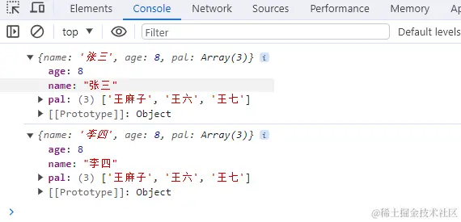
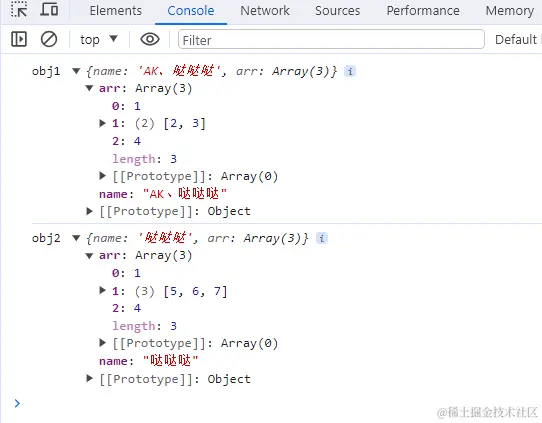
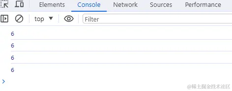
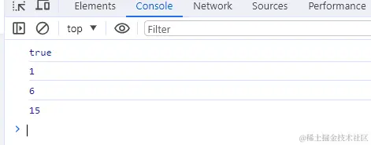
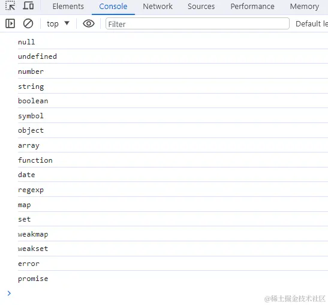
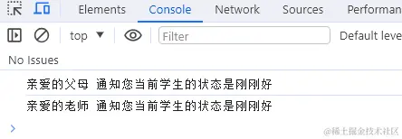
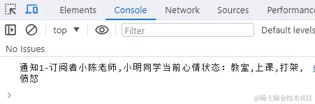
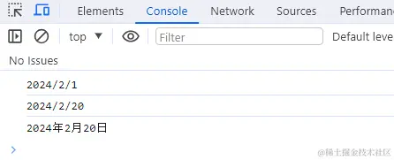
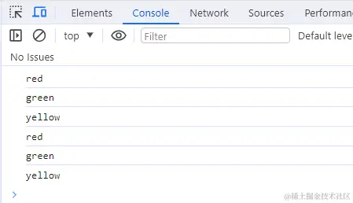

# 手写实现 JS 方法

## 🌟2022-2023 年 前端 JavaScript 手写题，编程题

前端手写题集锦 记录大厂**笔试，面试常考**手写题：<https://github.com/Sunny-117/js-challenges>

## 实现单例模式

核心要点：用闭包和 Proxy 属性拦截

```js
function proxy(func) {
	let instance;
	let handler = {
		construct(target, args) {
			if (!instance) {
				instance = Reflect.construct(func, args);
			}
			return instance;
		},
	};
	return new Proxy(func, handler);
}
```

## 手写浅拷贝与深拷贝

### 浅拷贝

浅拷贝是创建一个新对象，这个对象有着原始对象属性值的一份精确拷贝。如果属性是基本类型，拷贝的就是基本类型的值，如果属性是引用类型，拷贝的就是内存地址，所以如果其中一个对象改变了这个地址，就会影响到另一个对象。

#### 实现浅拷贝

```js
// 实现浅拷贝
function shallowCopy(obj) {
	// 只拷贝对象，基本类型或null直接返回
	if (typeof obj !== "object" || obj === null) {
		return obj;
	}
	// 判断是新建一个数组还是对象
	let newObj = Array.isArray(obj) ? [] : {};
	//for…in会遍历对象的整个原型链，如果只考虑对象本身的属性，需要搭配hasOwnProperty
	for (let key in obj) {
		//hasOwnProperty判断是否是对象自身属性，会忽略从原型链上继承的属性
		if (obj.hasOwnProperty(key)) {
			newObj[key] = obj[key]; //只拷贝对象本身的属性
		}
	}
	return newObj;
}

// 测试
var obj = {
	name: "张三",
	age: 8,
	pal: ["王五", "王六", "王七"],
};
let obj2 = shallowCopy(obj);
obj2.name = "李四";
obj2.pal[0] = "王麻子";
console.log(obj); //{age: 8, name: "张三", pal: ['王麻子', '王六', '王七']}
console.log(obj2); //{age: 8, name: "李四", pal: ['王麻子', '王六', '王七']}
```

测试结果：



#### 实现 2

```js
const shallowClone = (target) => {
	if (typeof target === "object" && target !== null) {
		const cloneTarget = Array.isArray(target) ? [] : {};
		for (let prop in target) {
			if (target.hasOwnProperty(prop)) {
				cloneTarget[prop] = target[prop];
			}
		}
		return cloneTarget;
	} else {
		return target;
	}
};
```

#### 使用 Object.assign 实现浅拷贝

但是需要注意的是，Object.assgin() 拷贝的是对象的属性的引用，而不是对象本身。

```js
let obj = { name: "sy", age: 18 };
const obj2 = Object.assign({}, obj, { name: "sss" });
console.log(obj2); //{ name: 'sss', age: 18 }
```

#### concat 浅拷贝数组

```js
let arr = [1, 2, 3];
let newArr = arr.concat();
newArr[1] = 100;
console.log(arr); //[ 1, 2, 3 ]
```

#### slice 浅拷贝

```js
let arr = [1, 2, 3];
let newArr = arr.slice();
newArr[0] = 100;
console.log(arr); //[1, 2, 3]
```

#### 使用展开运算符实现浅拷贝

```js
let arr = [1, 2, 3];
let newArr = [...arr]; // 跟arr.slice()是一样的效果
```

### 深拷贝

深拷贝是将一个对象从内存中完整的拷贝一份出来，从堆内存中开辟一个新的区域存放新对象，且修改新对象不会影响原对象。

#### 简易版及问题

```js
JSON.parse(JSON.stringify());
```

估计这个 api 能覆盖大多数的应用场景，没错，谈到深拷贝，我第一个想到的也是它。但是实际上，对于某些严格的场景来说，这个方法是有巨大的坑的。问题如下：

无法解决 循环引用 的问题。举个例子：

```js
const a = { val: 2 };
a.target = a;
```

- 拷贝 a 会出现系统栈溢出，因为出现了 无限递归 的情况。
- 无法拷贝一写 特殊的对象 ，诸如 RegExp, Date, Set, Map 等。
- 无法拷贝 函数 (划重点)。

因此这个 api 先 pass 掉，我们重新写一个深拷贝，简易版如下：

```js
const deepClone = (target) => {
	if (typeof target === "object" && target !== null) {
		const cloneTarget = Array.isArray(target) ? [] : {};
		for (let prop in target) {
			if (target.hasOwnProperty(prop)) {
				cloneTarget[prop] = deepClone(target[prop]);
			}
		}
		return cloneTarget;
	} else {
		return target;
	}
};
```

现在，我们以刚刚发现的三个问题为导向，一步步来完善、优化我们的深拷贝代码。

```js

```

- 考虑基础类型
- 引用类型
  - RegExp、Date、函数 不是 JSON 安全的
  - 会丢失 constructor，所有的构造函数都指向 Object
  - 破解循环引用

```js
function deepCopy(obj) {
	if (typeof obj === "object") {
		var result = obj.constructor === Array ? [] : {};
		for (var i in obj) {
			result[i] = typeof obj[i] === "object" ? deepCopy(obj[i]) : obj[i];
		}
	} else {
		var result = obj;
	}
	return result;
}
```

##### 解决循环引用

现在问题如下：

```js
let obj = { val: 100 };
obj.target = obj;
deepClone(obj); // 报错: RangeError: Maximum call stack size exceeded
```

这就是循环引用。我们怎么来解决这个问题呢？

创建一个 Map。记录下已经拷贝过的对象，如果说已经拷贝过，那直接返回它行了。

```js
const isObject = (target) =>
	(typeof target === "object" || typeof target === "function") &&
	target !== null;
const deepClone = (target, map = new Map()) => {
	if (map.get(target)) return target;
	if (isObject(target)) {
		map.set(target, true);
		const cloneTarget = Array.isArray(target) ? [] : {};
		for (let prop in target) {
			if (target.hasOwnProperty(prop)) {
				cloneTarget[prop] = deepClone(target[prop], map);
			}
		}
		return cloneTarget;
	} else {
		return target;
	}
};
```

现在来试一试：

```js
const a = { val: 2 };
a.target = a;
let newA = deepClone(a);
console.log(newA); //{ val: 2, target: { val: 2, target: [Circular] } }
```

好像是没有问题了, 拷贝也完成了。但还是有一个潜在的坑, 就是 map 上的 key 和 map 构成了 强引用关系 ，这是相当危险的。我给你解释一下与之相对的弱引用的概念你就明白了：

> 在计算机程序设计中，弱引用与强引用相对，是指不能确保其引用的对象不会被垃圾回收器回收的引用。 一个对象若只被弱引用所引用，则被认为是不可访问（或弱可访问）的，并因此可能在任何时刻被回收。 --百度百科

大白话解释一下，被弱引用的对象可以在任何时候被回收，而对于强引用来说，只要这个强引用还在，那么对象无法被回收。拿上面的例子说，map 和 a 一直是强引用的关系， 在程序结束之前，a 所占的内存空间一直不会被释放。

**怎么解决这个问题？**

很简单，让 map 的 key 和 map 构成 弱引用 即可。ES6 给我们提供了这样的数据结构，它的名字叫 WeakMap ，它是一种特殊的 Map, 其中的键是 弱引用 的。其键必须是对象，而值可以是任意的。

稍微改造一下即可：

```js
const deepClone = (target, map = new WeakMap()) => {
	//...
};
```

##### 拷贝特殊对象

###### （1）可继续遍历

对于特殊的对象，我们使用以下方式来鉴别：

```js
Object.prototype.toString.call(obj);
```

梳理一下对于可遍历对象会有什么结果：

```bash
["object Map"]
["object Set"]
["object Array"]
["object Object"]
["object Arguments"]
```

好，以这些不同的字符串为依据，我们就可以成功地鉴别这些对象。

```js
const getType = Object.prototype.toString.call(obj);
const canTraverse = {
	"[object Map]": true,
	"[object Set]": true,
	"[object Array]": true,
	"[object Object]": true,
	"[object Arguments]": true,
};
const deepClone = (target, map = new Map()) => {
	if (!isObject(target)) return target;
	let type = getType(target);
	let cloneTarget;
	if (!canTraverse[type]) {
		// 处理不能遍历的对象
		return;
	} else {
		// 这波操作相当关键，可以保证对象的原型不丢失！
		let ctor = target.prototype;
		cloneTarget = new ctor();
	}
	if (map.get(target)) return target;
	map.put(target, true);
	if (type === mapTag) {
		//处理Map
		target.forEach((item, key) => {
			cloneTarget.set(deepClone(key), deepClone(item));
		});
	}
	if (type === setTag) {
		//处理Set
		target.forEach((item) => {
			target.add(deepClone(item));
		});
	}
	// 处理数组和对象
	for (let prop in target) {
		if (target.hasOwnProperty(prop)) {
			cloneTarget[prop] = deepClone(target[prop]);
		}
	}
	return cloneTarget;
};
```

###### （2）不可遍历的对象

```bash
const boolTag = '[object Boolean]';
const numberTag = '[object Number]';
const stringTag = '[object String]';
const dateTag = '[object Date]';
const errorTag = '[object Error]';
const regexpTag = '[object RegExp]';
const funcTag = '[object Function]';
```

对于不可遍历的对象，不同的对象有不同的处理。

```js
const handleRegExp = (target) => {
	const { source, flags } = target;
	return new target.constructor(source, flags);
};
const handleFunc = (target) => {
	// 待会的重点部分
};
const handleNotTraverse = (target, tag) => {
	const Ctor = targe.constructor;
	switch (tag) {
		case boolTag:
		case numberTag:
		case stringTag:
		case errorTag:
		case dateTag:
			return new Ctor(target);
		case regexpTag:
			return handleRegExp(target);
		case funcTag:
			return handleFunc(target);
		default:
			return new Ctor(target);
	}
};
```

##### 拷贝函数

虽然函数也是对象，但是它过于特殊，我们单独把它拿出来拆解。

提到函数，在 JS 种有两种函数，一种是普通函数，另一种是箭头函数。每个普通函数都是 Function 的实例，而箭头函数不是任何类的实例，每次调用都是不一样的引用。那我们只需要 处理普通函数的情况，箭头函数直接返回它本身就好了。

**那么如何来区分两者呢？**

答案是：利用原型。箭头函数是不存在原型的。

代码如下：

```js
const handleFunc = (func) => {
	// 箭头函数直接返回自身
	if (!func.prototype) return func;
	const bodyReg = /(?<={)(.|\n)+(?=})/m;
	const paramReg = /(?<=\().+(?=\)\s+{)/;
	const funcString = func.toString();
	// 分别匹配 函数参数 和 函数体
	const param = paramReg.exec(funcString);
	const body = bodyReg.exec(funcString);
	if (!body) return null;
	if (param) {
		const paramArr = param[0].split(",");
		return new Function(...paramArr, body[0]);
	} else {
		return new Function(body[0]);
	}
};
```

到现在，我们的深拷贝就实现地比较完善了。不过在测试的过程中，我也发现了一个小小的 bug。

##### 小小的 bug

如下所示：

```js
const target = new Boolean(false);
const Ctor = target.constructor;
new Ctor(target); // 结果为 Boolean {true} 而不是 false。
```

对于这样一个 bug，我们可以对 Boolean 拷贝做最简单的修改， 调用 valueOf: new
target.constructor(target.valueOf())。

但实际上，这种写法是不推荐的。因为在 ES6 后不推荐使用【new 基本类型()】这 样的语法，所以 es6 中的新类型 Symbol 是不能直接 new 的，只能通过 new Object(SymbelType)。

因此我们接下来统一一下：

```js
const handleNotTraverse = (target, tag) => {
	const Ctor = targe.constructor;
	switch (tag) {
		case boolTag:
			return new Object(Boolean.prototype.valueOf.call(target));
		case numberTag:
			return new Object(Number.prototype.valueOf.call(target));
		case stringTag:
			return new Object(String.prototype.valueOf.call(target));
		case errorTag:
		case dateTag:
			return new Ctor(target);
		case regexpTag:
			return handleRegExp(target);
		case funcTag:
			return handleFunc(target);
		default:
			return new Ctor(target);
	}
};
```

##### 完整代码展示

完整版的深拷贝：

```js
const getType = (obj) => Object.prototype.toString.call(obj);
const isObject = (target) =>
	(typeof target === "object" || typeof target === "function") &&
	target !== null;
const canTraverse = {
	"[object Map]": true,
	"[object Set]": true,
	"[object Array]": true,
	"[object Object]": true,
	"[object Arguments]": true,
};
const mapTag = "[object Map]";
const setTag = "[object Set]";
const boolTag = "[object Boolean]";
const numberTag = "[object Number]";
const stringTag = "[object String]";
const symbolTag = "[object Symbol]";
const dateTag = "[object Date]";
const errorTag = "[object Error]";
const regexpTag = "[object RegExp]";
const funcTag = "[object Function]";
const handleRegExp = (target) => {
	const { source, flags } = target;
	return new target.constructor(source, flags);
};
const handleFunc = (func) => {
	// 箭头函数直接返回自身
	if (!func.prototype) return func;
	const bodyReg = /(?<={)(.|\n)+(?=})/m;
	const paramReg = /(?<=\().+(?=\)\s+{)/;
	const funcString = func.toString();
	// 分别匹配 函数参数 和 函数体
	const param = paramReg.exec(funcString);
	const body = bodyReg.exec(funcString);
	if (!body) return null;
	if (param) {
		const paramArr = param[0].split(",");
		return new Function(...paramArr, body[0]);
	} else {
		return new Function(body[0]);
	}
};
const handleNotTraverse = (target, tag) => {
	const Ctor = target.constructor;
	switch (tag) {
		case boolTag:
			return new Object(Boolean.prototype.valueOf.call(target));
		case numberTag:
			return new Object(Number.prototype.valueOf.call(target));
		case stringTag:
			return new Object(String.prototype.valueOf.call(target));
		case symbolTag:
			return new Object(Symbol.prototype.valueOf.call(target));
		case errorTag:
		case dateTag:
			return new Ctor(target);
		case regexpTag:
			return handleRegExp(target);
		case funcTag:
			return handleFunc(target);
		default:
			return new Ctor(target);
	}
};
const deepClone = (target, map = new WeakMap()) => {
	if (!isObject(target)) return target;
	let type = getType(target);
	let cloneTarget;
	if (!canTraverse[type]) {
		// 处理不能遍历的对象
		return handleNotTraverse(target, type);
	} else {
		// 这波操作相当关键，可以保证对象的原型不丢失！
		let ctor = target.constructor;
		cloneTarget = new ctor();
	}
	if (map.get(target)) return target;
	map.set(target, true);
	if (type === mapTag) {
		//处理Map
		target.forEach((item, key) => {
			cloneTarget.set(deepClone(key, map), deepClone(item, map));
		});
	}
	if (type === setTag) {
		//处理Set
		target.forEach((item) => {
			cloneTarget.add(deepClone(item, map));
		});
	}
	// 处理数组和对象
	for (let prop in target) {
		if (target.hasOwnProperty(prop)) {
			cloneTarget[prop] = deepClone(target[prop], map);
		}
	}
	return cloneTarget;
};
```

#### 实现简易深拷贝 2

```js
function deepCopy(obj, map = new WeakMap()) {
	// 基本类型或null直接返回
	if (typeof obj !== "object" || obj === null) {
		return obj;
	}
	// 判断是新建一个数组还是对象
	let newObj = Array.isArray(obj) ? [] : {};
	// 利用map解决循环引用
	if (map.has(obj)) {
		return map.get(obj);
	}
	map.set(obj, newObj); // 将当前对象作为key，克隆对象作为value
	for (let key in obj) {
		if (obj.hasOwnProperty(key)) {
			newObj[key] = deepCopy(obj[key], map); // 递归
		}
	}
	return newObj;
}

// 测试
let obj1 = {
	name: "AK、哒哒哒",
	arr: [1, [2, 3], 4],
};
let obj2 = deepCopy(obj1);
obj2.name = "哒哒哒";
obj2.arr[1] = [5, 6, 7]; // 新对象跟原对象不共享内存

console.log("obj1", obj1); // obj1 { name: 'AK、哒哒哒', arr: [ 1, [ 2, 3 ], 4 ] }
console.log("obj2", obj2); // obj2 { name: '哒哒哒', arr: [ 1, [ 5, 6, 7 ], 4 ] }
```

测试结果：



#### 简易版深拷贝

没有考虑循环引用的情况和 Buffer、Promise、Set、Map 的处理，如果一一实现，过于复杂，面试短时间写出来不太现实

```js
const clone = (parent) => {
	// 判断类型
	const isType = (target, type) =>
		`[object ${type}]` === Object.prototype.toString.call(target);
	// 处理正则
	const getRegExp = (re) => {
		let flags = "";
		if (re.global) flags += "g";
		if (re.ignoreCase) flags += "i";
		if (re.multiline) flags += "m";
		return flags;
	};
	const _clone = (parent) => {
		if (parent === null) return null;
		if (typeof parent !== "object") return parent;
		let child, proto;
		if (isType(parent, "Array")) {
			// 对数组做特殊处理
			child = [];
		} else if (isType(parent, "RegExp")) {
			// 对正则对象做特殊处理
			child = new RegExp(parent.source, getRegExp(parent));
			if (parent.lastIndex) child.lastIndex = parent.lastIndex;
		} else if (isType(parent, "Date")) {
			// 对Date对象做特殊处理
			child = new Date(parent.getTime());
		} else {
			// 处理对象原型
			proto = Object.getPrototypeOf(parent);
			// 利用Object.create切断原型链
			child = Object.create(proto);
		}
		for (let i in parent) {
			// 递归
			child[i] = _clone(parent[i]);
		}
		return child;
	};
	return _clone(parent);
};
```

#### 简易深拷贝 3

```javascript
function deepClone(val) {
	var type = getType(val);
	if (type === "object") {
		var result = {};
		Object.keys(val).forEach((key) => {
			result[key] = deepClone(val[key]);
		});
	} else if (type === "array") {
		return val.map((item) => deepClone(item));
	} else if (type === "date") {
		return new Date(val.getTime());
	} else if (type === "regexp") {
		return new RegExp(val.source, val.flags);
	} else if (type === "function") {
		return eval("(" + val.tostring() + ")");
	} else if (type === "map" || type === "set") {
		return new val.constructor(val);
	} else {
		return val;
	}
}
```

#### 通过 JSON.parse(JSON.stringify(object)) 来实现深拷贝

```js
let a = {
	age: 1,
	jobs: {
		first: "FE",
	},
};

let b = JSON.parse(JSON.stringify(a));
a.jobs.first = "native";
console.log(b.jobs.first); // FE
```

该方法也是有局限性的

- 会忽略 undefined
- 不能序列化函数
- 不能解决循环引用的对象

```js
let obj = {
	a: 1,
	b: {
		c: 2,
		d: 3,
	},
};
obj.c = obj.b;
obj.e = obj.a;
obj.b.c = obj.c;
obj.b.d = obj.b;
obj.b.e = obj.b.c;
let newObj = JSON.parse(JSON.stringify(obj));
console.log(newObj);
```

在遇到函数、 undefined 或者 symbol 的时候，该对象也不能正常的序列化。

```js
let a = {
	age: undefined,
	sex: Symbol("male"),
	jobs: function () {},
	name: "yck",
};
let b = JSON.parse(JSON.stringify(a));
console.log(b); // {name: "yck"}
```

但是在通常情况下，复杂数据都是可以序列化的，所以这个函数可以解决大部分问题，并且该函数是内置函数中处理深拷⻉性能最快的。当然如果你的数据中含有以上三种情况下，可以使用 lodash 的深拷⻉函数。

### 实现一个函数 clone

可以对 JavaScript 中的 5 种主要的数据类型,包括 Number 、 String 、Object 、 Array 、 Boolean ）进行值复制

- 考察点 1：对于基本数据类型和引用数据类型在内存中存放的是值还是指针这一区别是否清楚
- 考察点 2：是否知道如何判断一个变量是什么类型的

```js
// 方法一：
Object.prototype.clone = function () {
	var o = this.constructor === Array ? [] : {};
	for (var e in this) {
		o[e] = typeof this[e] === "object" ? this[e].clone() : th;
	}
	return o;
};

// 方法二：
/**
 * 克隆一个对象
 * @param Obj
 * @returns
 */
function clone(Obj) {
	var buf;
	if (Obj instanceof Array) {
		buf = []; //创建一个空的数组
		var i = Obj.length;
		while (i--) {
			buf[i] = clone(Obj[i]);
		}
		return buf;
	} else if (Obj instanceof Object) {
		buf = {}; //创建一个空对象
		for (var k in Obj) {
			//为这个对象添加新的属性
			buf[k] = clone(Obj[k]);
		}
		return buf;
	} else {
		//普通变量直接赋值
		return Obj;
	}
}
```

## 实现 JavaScript 的深拷贝

### ES5 深拷贝函数封装

```js
// ES5实现深拷贝
function deepClone(origin, target) {
	var tar = target || {};
	var toStr = Object.prototype.toString;
	var arrType = "[object Array]";

	for (var k in origin) {
		if (origin.has0wnProperty(k)) {
			// 对象自身属性中是否具有指定的k属性
			if (typeof origin[k] === "object" && origin[k] !== null) {
				// toString方法通过call调用之后 === arrType 就是数组，如果是"[object object]"就是对象
				tar[k] = toStr.call(origin[k]) === arrType ? [] : {};
				deepClone(origin[k], tar[k]);
			} else {
				tar[k] = origin[k];
			}
		}
	}

	return tar;
}
```

---

WeakMap 知识铺垫：[WeakMap - JavaScript | MDN (mozilla.org)](https://developer.mozilla.org/zh-CN/docs/Web/JavaScript/Reference/Global_Objects/WeakMap)

new WeakMap()实例化后使用 set 方法，是弱引用，一引用了元素，引用便回断开，元素就会被内存垃圾回收，不占用内存（设置弱引用，在 new WeakMap()实例化的内存中存起来，引用后会删掉节点，节省内存）

`Map` 和 `WeakMap` 是两种数据结构，可用于操纵键和值之间的关系。

区别：

我们可以对 `Map` 的键和值使用对象或任何基本类型。

但是，`WeakMap` 仅接受对象。这意味着我们不能将基本类型用作 `WeakMap` 的键。

```js
const attrs = new WeakMap();

attrs.set("color", "plum"); // error
```

与 `Map`不同，`WeakMap` 不支持对键和值进行迭代。无法获取 `WeakMap` 的所有键或值。此外，也没有办法清除 `WeakMap`。

**最重要的区别是，`WeakMap` 不会阻止在没有对键的引用时对键进行垃圾收集。**

另一方面，`Map` 无限期地维护对键和值的引用。一旦创建了键和值，它们将占用内存，即使没有对它们的引用，也不会被垃圾收集。这可能会导致内存泄漏问题。

考虑下面的一个简单代码，我们将一个唯一的 ID 映射到特定的人的信息：

```js
let id = { value: 1 };

const people = new Map();
people.set(id, {
	name: "Foo",
	age: 20,
	address: "Bar",
});

// 移除 id
id = null;
```

删除键对象 `id` 后，它仍然能够通过映射键访问其引用：

```js
people.keys().next().value; // { value: 1 }
```

由于这种差异，`WeakMap`（顾名思义）保存对键的弱引用。它解释了为什么它的键不可枚举，这在前面的区别中已经提到。

由于 `WeakMap` 保存对键的弱引用，且无法枚举，因此无法使用 `keys()`、`values()`、`entries()` 这些方法。

### ES6 实现深拷贝

```js
// ES6实现深拷贝
function deepClone(origin, hashMap = new WeakMap()) {
	if (origin == undefined || typeof origin !== "object") {
		return origin;
	}
	// 如果是时间构造函数
	if (origin instanceof Date) {
		return new Date(origin);
	}
	// 如果是正则构造函数
	if (origin instanceof RegExp) {
		return new RegExp(origin);
	}

	// 判断是否弱引用，两个对象-相互把对方作为键名赋值给对方
	const hashKey = hashMap.get(origin);
	if (hashKey) {
		return hashKey;
	}
	// 执行继承来的构造器，实例化构造器得到新的对象，就不用判断
	const target = new origin.constructor();
	// 设置弱引用，引用后会删掉节点，节省内存
	hashMap.set(origin, target);
	for (let k in origin) {
		if (origin.hasOwnProperty(k)) {
			// 对象自身属性中是否具有指定的k属性
			target[k] = deepClone(origin[k], hashMap); // 递归再赋值
		}
	}

	return target;
}
```

## 手写防抖和节流

### 对节流与防抖的理解

- 函数防抖是指在事件被触发 n 秒后再执行回调，如果在这 n 秒内事件又被触发，则重新计时。这可以使用在一些点击请求的事件上，避免因为用户的多次点击向后端发送多次请求。
- 函数节流是指规定一个单位时间，在这个单位时间内，只能有一次触发事件的回调函数执行，如果在同一个单位时间内某事件被触发多次，只有一次能生效。节流可以使用在 scroll 函数的事件监听上，通过事件节流来降低事件调用的频率。

**防抖函数的应用场景：**

- 按钮提交场景：防⽌多次提交按钮，只执⾏最后提交的⼀次
- 服务端验证场景：表单验证需要服务端配合，只执⾏⼀段连续的输入事件的最后⼀次，还有搜索联想词功能类似⽣存环境请⽤ lodash.debounce

**节流函数的适⽤场景：**

- 拖拽场景：固定时间内只执⾏⼀次，防⽌超⾼频次触发位置变动
- 缩放场景：监控浏览器 resize
- 动画场景：避免短时间内多次触发动画引起性能问题

### 防抖

防抖是指在事件被触发 n 秒后在执行回调，如果在这 n 秒内时间又被触发，则重新计时。

可以使用在一些点击请求的事件上，避免因为用户的多次点击向后端发送多次请求。

用处：在滚动事件中需要做个复杂计算或者实现一个按钮的防二次点击操作。

#### 原理：

防抖（ debounce ）：不管事件触发频率多高，㇐定在事件触发 n 秒后才执行，如果你在㇐个事件触发的 n 秒内⼜触发了这个事件，就以新的事件的时间为准， n 秒后才执行，总之，触发完事件 n 秒内不再触发事件， n 秒后再执行。（频繁触发就执行最后㇐次）

核心要点：如果在定时器的时间范围内再次触发，则重新计时

#### 应用场景：

1. 窗口大小变化，调整样式
2. 搜索框，输入后 1000 毫秒搜索
3. 表单验证，输入 1000 毫秒后验证
4. 频繁点击按钮，使用防抖避免重复提交请求

#### 防抖实现：

##### 简单实现

```js
const debounce = (fn, delay) => {
	let timer = null;
	return (...args) => {
		clearTimeout(timer);
		timer = setTimeout(() => {
			fn.apply(this, args);
		}, delay);
	};
};
```

- debunce 实则是个包装函数，通过传入操作函数和时间间隔，来返回㇐个新函数
- 新函数中主要是通过定时器来设置函数调用的频率
- flag 只有第㇐次触发的时候会立即执行

```javascript
// fn是需要防抖的函数,delay是等待时间,flag：是否立即执行
function debounce(fn, delay = 500, flag) {
	let timer = null;
	// 这里返回的函数是每次用户实际调用的防抖函数
	return function (...args) {
		// ...args是es6的剩余参数语法，将多余的参数放入数组，用来代替arguments对象
		// 如果已经设定过定时器了就清空上一次的定时器
		if (timer) {
			clearTimeout(timer);
		}

		if (flag && !timer) {
			fn.apply(this, args);
		}
		// 开始一个新的定时器，延迟执行用户传入的方法；注：定时器的返回值是一个数值，作为定时器的编号，可以传入clearTimeout来取消定时器
		timer = setTimeout(() => {
			// 这里必须是箭头函数，不然this指向window,要让this就指向fn的调用者
			fn.apply(this, args);
		}, delay);
	};
}

// use
window.addEventListener("resize", debounce(handler, 1000));
function handler() {
	console.log("ok");
}
```

#### 使用 underscore 的源码来解释防抖动

```js
/**
 * underscore 防抖函数，返回函数连续调用时，空闲时间必须大于或等于 wait，func 才会执行
 *
 * @param {function} func 回调函数
 * @param {number} wait 表示时间窗口的间隔
 * @param {boolean} immediate 设置为ture时，是否立即调用函数
 * @return {function} 返回客户调用函数
 */
_.debounce = function (func, wait, immediate) {
	var timeout, args, context, timestamp, result;
	var later = function () {
		// 现在和上一次时间戳比较
		var last = _.now() - timestamp;
		// 如果当前间隔时间少于设定时间且大于0就重新设置定时器
		if (last < wait && last >= 0) {
			timeout = setTimeout(later, wait - last);
		} else {
			// 否则的话就是时间到了执行回调函数
			timeout = null;
			if (!immediate) {
				result = func.apply(context, args);
				if (!timeout) context = args = null;
			}
		}
	};
	return function () {
		context = this;
		args = arguments;
		// 获得时间戳
		timestamp = _.now();
		// 如果定时器不存在且立即执行函数
		var callNow = immediate && !timeout;
		// 如果定时器不存在就创建一个
		if (!timeout) timeout = setTimeout(later, wait);
		if (callNow) {
			// 如果需要立即执行函数的话 通过 apply 执行
			result = func.apply(context, args);
			context = args = null;
		}
		return result;
	};
};
```

#### 整体函数实现

对于按钮防点击来说的实现

- 开始一个定时器，只要我定时器还在，不管你怎么点击都不会执行回调函数。一旦定时器结束并设置为 null，就可以再次点击了
- 对于延时执行函数来说的实现：每次调用防抖动函数都会判断本次调用和之前的时间间隔，如果小于需要的时间间隔，就会重新创建一个定时器，并且定时器的延时为设定时间减去之前的时间间隔。一旦时间到了，就会执行相应的回调函数

### 节流

节流就是一定时间内执行一次事件，即使重复触发，也只有一次生效。

可以使用在监听滚动 scroll 事件上，通过事件节流来降低事件调用的频率。

核心要点：如果在定时器的时间范围内再次触发，则不予理睬，等当前定时器完成，才能启动下一个定时器。

#### 原理：

节流（ throttle ）:不管事件触发频率多高，只在单位时间内执行㇐次。（频繁触发，还是按照时间间隔执行）

#### 应用场景：

1. ⿏标不断点击触发，mousedown(单位时间内只触发㇐次)
2. 监听滚动事件，比如是否滑到底部自动加载更多，用 throttle 来判断

#### 节流实现

- 和防抖不同的是，防抖中是取消定时器，节流中是定时器到时间自动执行，仅仅是将 timer 变量设置为 null
- 防抖动和节流本质是不一样的。防抖动是将多次执行变为最后一次执行，节流是将多次执行变成每隔一段时间执行
- 定时器版：第一次不执行，最后一次执行
- 时间戳版：第㇐次执行，最后㇐次不执行

#### 简单实现

```js
const throttle = (fn, delay = 500) => {
	let flag = true;
	return (...args) => {
		if (!flag) return;
		flag = false;
		setTimeout(() => {
			fn.apply(this, args);
			flag = true;
		}, delay);
	};
};
```

#### 1. 定时器版本

第一次不执行，最后一次执行

```js
function throttle(fn, delay = 500) {
	let timer = null;
	return function (...args) {
		// 当前有任务了，直接返回
		if (timer) {
			return;
		}
		timer = setTimeout(() => {
			fn.apply(this, args);
			//执行完后，需重置定时器，不然timer一直有值，无法开启下一个定时器
			timer = null;
		}, delay);
	};
}
```

#### 2. 时间戳版本

第㇐次执行，最后㇐次不执行

```javascript
// 节流
function throttle(fn, delay = 500) {
	let prev = 0; // 上一次执行该函数的时间
	return function (...args) {
		let now = Date.now(); // 返回从UTC到当前时间的毫秒数
		// 如果差值大于等于设置的等待时间就执行函数
		if (now - prev >= delay) {
			fn.apply(this, args);
			prev = Date.now();
		}
	};
}
```

待定版本

```js
/**
 * underscore 节流函数，返回函数连续调用时，func 执行频率限定为 次 / wait
 *
 * @param {function} func 回调函数
 * @param {number} wait 表示时间窗口的间隔
 * @param {object} options 如果想忽略开始函数的的调用，传入{leading: false
 * 如果想忽略结尾函数的调用，传入{trailing: false
 * 两者不能共存，否则函数不能执行
 * @return {function} 返回客户调用函数
 */

_.throttle = function (func, wait, options) {
	var context, args, result;
	var timeout = null;
	// 之前的时间戳
	var previous = 0;
	// 如果 options 没传则设为空对象
	if (!options) options = {};
	// 定时器回调函数
	var later = function () {
		// 如果设置了 leading，就将 previous 设为 0
		// 用于下面函数的第一个 if 判断
		previous = options.leading === false ? 0 : _.now();
		// 置空一是为了防止内存泄漏，二是为了下面的定时器判断
		timeout = null;
		result = func.apply(context, args);
		if (!timeout) context = args = null;
	};
	return function () {
		// 获得当前时间戳
		var now = _.now();
		// 首次进入前者肯定为 true
		// 如果需要第一次不执行函数
		// 就将上次时间戳设为当前的
		// 这样在接下来计算 remaining 的值时会大于0
		if (!previous && options.leading === false) previous = now;
		// 计算剩余时间
		var remaining = wait - (now - previous);
		context = this;
		args = arguments;
		// 如果当前调用已经大于上次调用时间 + wait
		// 或者用户手动调了时间
		// 如果设置了 trailing，只会进入这个条件
		// 如果没有设置 leading，那么第一次会进入这个条件
		// 还有一点，你可能会觉得开启了定时器那么应该不会进入这个 if 条件了
		// 其实还是会进入的，因为定时器的延时
		// 并不是准确的时间，很可能你设置了2秒
		// 但是他需要2.2秒才触发，这时候就会进入这个条件
		if (remaining <= 0 || remaining > wait) {
			// 如果存在定时器就清理掉否则会调用二次回调
			if (timeout) {
				clearTimeout(timeout);
				timeout = null;
			}
			previous = now;
			result = func.apply(context, args);
			if (!timeout) context = args = null;
		} else if (!timeout && options.trailing !== false) {
			// 判断是否设置了定时器和 trailing
			// 没有的话就开启一个定时器
			// 并且不能不能同时设置 leading 和 trailing
			timeout = setTimeout(later, remaining);
		}
		return result;
	};
};
```

## 函数柯里化

函数柯里化指的是：将使用多个参数的函数转换成使用单一参数的函数，并返回接受余下参数且返回结果的新函数的技术。

**作用**：可以**参数复用**（公共的参数已经通过柯里化预置了）和**延迟执行**（柯里化时只是返回一个**预置参数的新函数**，并没有立刻执行，在满足条件后才会执行）。

柯里化函数实现的原理：利用闭包原理在执行可以形成一个不销毁的作用域，然后把需要预先处理的内容都储存在这个不销毁的作用域中，并且返回一个最少参数函数。

比如：

```js
function add(a, b) {
	return a + b;
}
var add1 = function (val) {
	return add(1 + val);
};
```

### 参数定长的柯里化

**思路**：通过函数的 length 属性获取函数的形参个数，形参的个数就是所需参数的个数。维护一个数组，当数组的长度与函数接收参数的个数一致，再执行该函数。

柯里化有延迟计算的作用，参数的缓存是通过闭包实现的，所以实现上可以是：

```javascript
// 实现函数柯里化
function curry(fn) {
	// 返回一个新函数
	return function curried(...args) {
		if (args.length >= fn.length) {
			return fn.apply(this, args); // 如果参数够了，就执行原函数，返回结果
		} else {
			//返回一个新函数，继续递归去进行柯里化，利用闭包，将当前已经传入的参数保存下来
			return function (...args2) {
				//递归调用 curried 函数
				return curried.apply(this, [...args, ...args2]); //新函数调用时会继续传参，拼接参数
			};
		}
	};
}

// 测试
function sum(a, b, c) {
	return a + b + c;
}
var curried = curry(sum);
console.log(curried(1, 2, 3)); //6
console.log(curried(1, 2)(3)); //6
console.log(curried(1)(2, 3)); //6
console.log(curried(1)(2)(3)); //6

// 实现2
/**
* 实现要点：柯里化函数接收到足够参数后，就会执行原函数，那么我们如何去确定何时达到足够的参数呢？
* 柯里化函数需要记住你已经给过他的参数，如果没给的话，则默认为一个空数组。
* 接下来每次调用的时候，需要检查参数是否给够，如果够了，则执行fn，没有的话则返回一个新的 curry
函数，将现有的参数塞给他。
*
*/
// 待柯里化处理的函数
let sum = (a, b, c, d) => {
return a + b + c + d
}
// 柯里化函数，返回一个被处理过的函数
let curry = (fn, ...arr) => { // arr 记录已有参数
return (...args) => { // args 接收新参数
if (fn.length <= (...arr,...args)) { // 参数够时，触发执行
return fn(...arr, ...args)
} else { // 继续添加参数
return curry(fn, [...arr, ...args])
}
}
}
var sumPlus = curry(sum)
sumPlus(1)(2)(3)(4)
sumPlus(1, 2)(3)(4)
sumPlus(1, 2, 3)(4)
```

测试结果：



### 参数不定长的柯里化

**题目**：如何实现一个方法，使计算结果能够满足如下预期。

```js
add(1, 2, 3); // 6
add(1); // 1
add(1)(2); // 3
add(1, 2)(3); // 6
add(1)(2)(3); // 6
add(1)(2)(3)(4); // 10
```

**思路**：利用闭包和递归，如果参数为空，则判断递归结束，求和，返回结果。

```javascript
function addCurry() {
	// 利用闭包的特性收集所有参数值
	let arr = [...arguments];
	//返回函数
	return function fn() {
		// 如果参数为空，则判断递归结束，即传入一个()执行函数
		if (arguments.length === 0) {
			return arr.reduce((a, b) => a + b); // 求和
		} else {
			arr.push(...arguments);
			return fn; //递归
		}
	};
}

// 测试
console.log(addCurry(1)()); //1
console.log(addCurry(1)(2)()); //3
console.log(addCurry(1)(2)(3)()); //6
console.log(addCurry(1, 2)(3)()); //6
console.log(addCurry(1, 2, 3)()); //6
```

上述写法，总是要以空括号()结尾，于是再改进为隐式转换`.toString`写法，原理：当用 Function 的值做计算的时候，会调用 toString 做隐式转换。注意一些旧版本的浏览器隐式转换会默认执行，新版本不行了。可以利用隐式转换或者 alert。

```javascript
function addCurry() {
	let arr = [...arguments];
	// 利用闭包的特性收集所有参数值
	var fn = function () {
		arr.push(...arguments);
		return fn; //递归
	};
	// 利用 toString 隐式转换，转换的时候再返回结果
	fn.toString = function () {
		return arr.reduce(function (a, b) {
			return a + b;
		});
	};
	return fn;
}

// 测试
console.log(addCurry(1)(2) == 3); //true 利用隐式转换，自动调用toString方法得到柯里化的结果
//alert(addCurry(1)(2)(3))//6 alert参数只能是字符串，如果其他类型的值，会转换成字符串，会调用toString方法
console.log(addCurry(1).toString()); //1 手动调用toString
console.log(addCurry(1, 2)(3).toString()); //6
console.log(addCurry(1, 2)(3)(4)(5).toString()); //15
```

测试结果：



不固定传入参数，随时执行

```js
/**
 * 当然了，柯里化函数的主要作用还是延迟执行，执行的触发条件不一定是参数个数相等，也可以是其他的条件。
 * 例如参数个为0的情况，那么我们需要对上面curry函数稍微做修改
 */
// 待柯里化处理的函数
let sum = (arr) => {
	return arr.reduce((a, b) => {
		return a + b;
	});
};
let curry = (fn, ...arr) => {
	// arr 记录已有参数
	return (...args) => {
		// args 接收新参数
		if (args.length === 0) {
			// 参数为空时，触发执行
			return fn(...arr, ...args);
		} else {
			// 继续添加参数
			return curry(fn, ...arr, ...args);
		}
	};
};
var sumPlus = curry(sum);
sumPlus(1)(2)(3)(4)();
sumPlus(1, 2)(3)(4)();
sumPlus(1, 2, 3)(4)();
```

### 结合实现

```js
// 按定义实现
function curry(fn, presetParam) {
	return function () {
		return fn.apply(this, [presetParam, ...arguments]);
	};
}

// 扩展多参数
function curry(fn, ...args) {
	return function () {
		return fn.apply(this, [...args, ...arguments]);
	};
}

// 定长柯里化，执行时机判断
function curry(fn, ...args) {
	var len = fn.length;
	return function () {
		var allArgs = [...args, ...arguments];
		if (allArgs.length >= len) {
			return fn.apply(this, allArgs);
		} else {
			return curry.call(null, fn.bind(this), ...allArgs);
		}
	};
}

// 不定长柯里化
function curry(fn) {
	var len = fn.length;
	return function (...args) {
		if (args.length >= len) {
			return fn.apply(this, args);
		} else {
			return curry.call(null, fn.bind(this), ...args);
		}
	};
}
```

## 数组扁平化

数组扁平化其实就是将多维数组转为一维数组。

**1. ES6 中的 flat**

```javascript
const arr = [1, [2, [3, [4, 5]]], 6];
//  arr.flat([depth]) flat的参数代表的是需要展开几层，如果是Infinity的话，就是不管嵌套几层，全部都展开
console.log(arr.flat(Infinity)); // [1,2,3,4,5,6]
```

**2. 递归**

```js
function flatten(arr) {
	let result = [];

	for (let i = 0; i < arr.length; i++) {
		// 如果当前元素还是一个数组
		if (Array.isArray(arr[i])) {
			result = result.concat(flatten(arr[i])); // 递归拼接
		} else {
			result.push(arr[i]);
			// 或
			// result = result.concat(arr[i]);
		}
	}
	return result;
}

let arr = [1, [2, [3, 4]]];
console.log(flatten(arr)); //  [1, 2, 3, 4]
```

**3. reduce 函数迭代**

从上面普通的递归函数中可以看出，其实就是对数组的每一项进行处理，那么其实也可以用 reduce 来实现数组的拼接，从而简化第一种方法的代码。

```javascript
let arr = [1, [2, [3, 4]]];
function flatten(arr) {
	return arr.reduce((total, cur) => {
		return total.concat(Array.isArray(cur) ? flatten(cur) : cur);
	}, []); //传递初始值空数组[]，就会从数组索引为 0 的元素开始执行
}
console.log(flatten(arr)); //  [1, 2, 3, 4]
```

**4. split 和 toString**

数组的`toString`方法可以把数组直接转换成逗号分隔的字符串。如[1, [2, [3, 4]]] => "1,2,3,4"

```javascript
let arr = [1, [2, [3, 4]]];
function flatten(arr) {
	// 先把数组直接转换成逗号分隔的字符串，然后再用 split 方法把字符串重新转换为数组
	return arr.toString().split(",").map(Number);
}
console.log(flatten(arr)); //  [ 1, 2, 3, 4 ]
```

## 数组去重

**利用 Set**。new 一个 Set，参数为需要去重的数组，Set 会自动删除重复的元素，在 Array.form 将 Set 转为数组返回

```javascript
const arr = [1, 2, 3, 5, 1, 5, 9, 1, 2, 8];
console.log([...new Set(arr)]); //[ 1, 2, 3, 5, 9, 8 ]
console.log(Array.from(new Set(arr))); //[ 1, 2, 3, 5, 9, 8 ]

// 直接使用：
Array.from(new Set([1, 1, 2, 2]));
```

**利用数组的 filter（）+indexOf**去重。利用 filter 方法，返回 arr.indexOf(num)等于 index 的值。原理就是 indexOf 会返回先找到的数字的索引。

```javascript
function unique(arr) {
	return arr.filter((item, index, array) => {
		return array.indexOf(item) === index;
	});
}
const arr = [1, 2, 3, 5, 1, 5, 9, 1, 2, 8];
console.log(unique(arr)); // [1, 2, 3, 5, 9, 8]
```

**利用 Map**。新建一个数组和 map，如果当前值在 map 中没有出现过，就加入数组，最后返回数组

```javascript
const unique = (arr) => {
	const map = new Map();
	const res = [];
	for (let item of arr) {
		if (!map.has(item)) {
			map.set(item, true);
			res.push(item);
		}
	}
	return res;
};
const arr = [1, 2, 3, 5, 1, 5, 9, 1, 2, 8];
console.log(unique(arr)); // [1, 2, 3, 5, 9, 8]
```

## 手写类型判断函数

**思路**：如果是 null，直接返回 String(null)；基本类型和函数，直接使用 typeof`；`其它引用类型，使用 Object.prototype.toString.call。

```typescript
function getType(value) {
	// 判断数据是 null 的情况
	let type;
	if (value === null) {
		return String(value);
	}
	// 判断数据是基本数据类型的情况和函数的情况，使用typeof
	if (typeof value !== "object") {
		return typeof value;
	} else {
		// 判断数据是引用类型的情况，设当前类型为date
		let valueClass = Object.prototype.toString.call(value); //"[object Date]"
		type = valueClass.split(" ")[1].split(""); //[ 'D', 'a', 't', 'e', ']' ] 截取类型并转换为数组
		type.pop(); //[ 'D', 'a', 't', 'e' ]，去掉数组最后的右括号"]"
		return type.join("").toLowerCase(); //[ 'D', 'a', 't', 'e' ] => "Date" => "date" 数组转小写字符串
	}
}

// 测试
console.info(getType(null)); // null
console.info(getType(undefined)); // undefined
console.info(getType(100)); // number
console.info(getType("abc")); // string
console.info(getType(true)); // boolean
console.info(getType(Symbol())); // symbol
console.info(getType({})); // object
console.info(getType([])); // array
console.info(getType(() => {})); // function
console.info(getType(new Date())); // date
console.info(getType(new RegExp(""))); // regexp
console.info(getType(new Map())); // map
console.info(getType(new Set())); // set
console.info(getType(new WeakMap())); // weakmap
console.info(getType(new WeakSet())); // weakset
console.info(getType(new Error())); // error
console.info(getType(new Promise(() => {}))); // promise
```

测试结果：



## 实现观察者模式

`观察者模式`：定义对象间的一种一对多的依赖关系，当一个对象的状态发生改变时，所有依赖于它的对象都将得到通知。

### 发布订阅模式和观察者模式的区别

**发布订阅模式是㇐个多事件的事件总线；而观察者模式是针对单主题的，这是二者最大的区别。**

举个例子：发布订阅模式就是，我请了一个私家侦探，要求监视目标的一举一动;而观察者模式就是，我只关注目标有没有和另一个人在一起这一个举动。

由于观察者模式界限明确，有主题和观察者两部分，所以分别用 Subject 和 Observer 类来实现。

```javascript
// 被观察者 学生
class Subject {
	constructor(name) {
		this.name = name;
		this.state = "happy";
		this.observers = []; // 存储所有的观察者
	}
	// 新增观察者
	add(observer) {
		this.observers.push(observer);
	}
	// 移除观察者
	remove(observer) {
		const index = this.observers.findIndex((item) => item.id === observer.id);
		if (index !== 1) {
			this.observers.splice(index, 1);
		}
	}
	// 获取状态
	getState() {
		return this.state;
	}
	// 更新状态并通知
	setState(newState) {
		this.state = newState;
		this.notify();
	}
	// 通知所有的观察者
	notify(observer) {
		this.observers.forEach((observer) => observer.update(this));
	}
	// 通知所有的观察者
	// notify(...args) {
	// 	this.observers.forEach(observer => {
	//         observer.complete(...args)
	//     });
	// }
}

// 观察者 父母和老师
class Observer {
	static autoIncreaseId = 1;

	constructor(id, name, callback) {
		this.id = id;
		this.name = name;
		this.callback = callback;
	}
	// 更新
	update(student) {
		console.log(
			`亲爱的${this.name} 通知您当前学生的状态是${student.getState()}`
		);
	}
	// 暴露一个接口，让被观察者去调用，complete是约定的命名
	complete(...args) {
		this.callback(...args);
	}
}

let student = new Subject();
let parent = new Observer("父母");
let teacher = new Observer("老师");
// 添加观察者
student.add(parent);
student.add(teacher);
// 设置被观察者的状态
student.setState("刚刚好");
```

测试结果：



## 实现发布-订阅模式

发布订阅模式本质上是实现㇐个事件总线。只要实现其核⼼的 on, emit, off, remove, once 等方法即可。

### 订阅模式—Evenbus 是什么东西？

EventBus（事件总线）是一种在软件架构中用于组件间通信的模式或工具。它通常被用于解耦组件之间的直接依赖关系，使得组件之间可以更灵活地进行通信和交互。

在前端开发中，特别是在 Vue.js 等现代 JavaScript 框架中，EventBus 通常指的是一个全局事件总线实例，用于在不同组件之间进行通信。它可以帮助组件之间进行解耦，使得组件的通信更加简单和灵活。

EventBus 通常具有以下特点：

1. **全局单例：** EventBus 通常是一个全局单例对象，可以在应用的任何地方被访问和使用。
2. **发布订阅模式：** EventBus 基于发布-订阅模式，它允许组件订阅特定类型的事件，并在其他组件发布该类型的事件时接收到通知。
3. **事件类型：** EventBus 通常支持多种事件类型，开发者可以自定义事件类型来满足不同的需求。
4. **异步通信：** EventBus 通常支持同步和异步两种通信方式，使得组件之间的通信更加灵活。

在 `Vue.js` 版本 2 中，可以使用 Vue 实例作为 EventBus，通过`$emit`方法触发事件，通过`$on`方法监听事件，从而实现组件之间的通信。例如：

```javascript
// 创建一个全局的EventBus实例：发布者
const EventBus = new Vue();

// 订阅者
const vm = new Vue({
	el: "#app",
	data() {
		return {
			count: 0,
		};
	},
	created() {
		eventBus.$on("increment", () => {
			this.count++;
		});
	},
});

// 在组件A中发布事件
EventBus.$emit("event-name", eventData);

// 在组件B中订阅事件
EventBus.$on("event-name", (eventData) => {
	// 处理事件数据
});
```

总之，EventBus 是一种用于在组件间进行解耦的通信机制，它可以帮助开发者构建更灵活和可维护的应用程序。

### 使用 JavaScript 手写实现发布订阅模式

```js
// 发布者
function Publisher() {
	this.events = {};
}

Publisher.prototype.on = function (event, callback) {
	if (!this.events[event]) {
		this.events[event] = [];
	}
	this.events[event].push(callback);
};

// 订阅者
function Subscriber() {
	this.events = {};
}

Subscriber.prototype.on = function (event, callback) {
	if (!this.events[event]) {
		this.events[event] = [];
	}
	this.events[event].push(callback);
};

Subscriber.prototype.off = function (event, callback) {
	if (!this.events[event]) {
		return;
	}
	const index = this.events[event].indexOf(callback);
	if (index > -1) {
		this.events[event].splice(index, 1);
	}
};

Subscriber.prototype.emit = function (event, data) {
	if (!this.events[event]) {
		return;
	}
	this.events[event].forEach((callback) => {
		callback(data);
	});
};

// 发布者
const publisher = new Publisher();

// 订阅者
const subscriber1 = new Subscriber();
const subscriber2 = new Subscriber();

// 订阅者1订阅事件
subscriber1.on("event1", (data) => {
	console.log("subscriber1接收到事件1的消息：" + data);
});

// 订阅者2订阅事件
subscriber2.on("event1", (data) => {
	console.log("subscriber2接收到事件1的消息：" + data);
});

// 发布者发布事件
publisher.emit("event1", "hello world");
```

使用 class 类实现

```js
class Listener {
	constructor(id, eventName, callback) {
		this.id = id;
		this.eventName = eventName;
		this.callback = callback;
	}
}

class EventBus {
	constructor() {
		this.events = {};
		this.autoIncreaseId = 1;
	}

	addListener(listener) {
		if (!this.events[listener.eventName]) {
			this.events[listener.eventName].push(listener);
		} else {
			this.events[listener.eventName] = [listener];
		}
		return listener;
	}

	on(eventName, callback) {
		const listener = new Listener(this.autoIncreaseId++, eventName, callback);
	}

	emit(eventName, ...args) {
		if (this.events[eventName]) {
			this.events[eventName].forEach((listener) => {
				listener.callback(...args);
			});
		}
	}

	off(eventName, listener) {
		const listeners = this.events[eventName];
		if (listeners && listeners.length) {
			const index = listeners.findIndex((l) => l.id === listener.id);
			if (index !== -1) {
				listeners.splice(index, 1);
			}
		}
	}

	remove(eventName) {
		if (this.events[eventName]) {
			delete this.events[eventName];
		}
	}

	removeAllListeners(eventName) {
		if (this.events[eventName]) {
			this.events[eventName] = [];
		}
	}

	once(eventName, callback) {
		const that = this;
		const id = this.autoIncreaseId++;
		// 需要搞一个listenenr对象，然后在callback中调用off方法，这样就实现了一次性订阅
		const listener = new Listener(id, eventName, (...args) => {
			callback(...args);
			const index = that.events[eventName].findIndex((l) => l.id === id);
			if (index !== -1) {
				that.events[eventName].splice(index, 1);
			}
		});
		return this.addListener(listener);
	}
}
```

第二种：

发布订阅模式跟观察者模式很像，但它发布和订阅是不互相依赖的，因为有一个`统一调度中心`

```javascript
class EventBus {
	constructor() {
		// 缓存列表，用来存放注册的事件与回调
		this.cache = {};
	}

	// 订阅事件
	on(name, cb) {
		// 如果当前事件没有订阅过，就给事件创建一个队列
		if (!this.cache[name]) {
			this.cache[name] = []; //由于一个事件可能注册多个回调函数，所以使用数组来存储事件队列
		}
		this.cache[name].push(cb);
	}

	// 触发事件
	emit(name, ...args) {
		// 检查目标事件是否有监听函数队列
		if (this.cache[name]) {
			// 逐个调用队列里的回调函数
			this.cache[name].forEach((callback) => {
				callback(...args);
			});
		}
	}

	// 取消订阅
	off(name, cb) {
		const callbacks = this.cache[name];
		const index = callbacks.indexOf(cb);
		if (index !== -1) {
			callbacks.splice(index, 1);
		}
	}

	// 只订阅一次
	once(name, cb) {
		// 执行完第一次回调函数后，自动删除当前订阅事件
		const fn = (...args) => {
			cb(...args);
			this.off(name, fn);
		};
		this.on(name, fn);
	}
}

// 测试
let eventBus = new EventBus();
let event1 = function (...args) {
	console.log(`通知1-订阅者小陈老师,小明同学当前心情状态：${args}`);
};
// 订阅事件，只订阅一次
eventBus.once("teacherName1", event1);
// 发布事件
eventBus.emit("teacherName1", "教室", "上课", "打架", "愤怒");
eventBus.emit("teacherName1", "教室", "上课", "打架", "愤怒");
eventBus.emit("teacherName1", "教室", "上课", "打架", "愤怒");
```

测试结果：



简易实现：

```js
// 组件通信，一个触发与监听的过程
class EventEmitter {
	constructor() {
		// 存储事件
		this.events = this.events || new Map();
	}
	// 监听事件
	addListener(type, fn) {
		if (!this.events.get(type)) {
			this.events.set(type, fn);
		}
	}
	// 触发事件
	emit(type) {
		let handle = this.events.get(type);
		handle.apply(this, [...arguments].slice(1));
	}
}
// 测试
let emitter = new EventEmitter();
// 监听事件
emitter.addListener("ages", (age) => {
	console.log(age);
});
// 触发事件
emitter.emit("ages", 18); // 18
```

## 实现日期格式化函数

```javascript
const dateFormat = (dateInput, format) => {
	var day = dateInput.getDate();
	var month = dateInput.getMonth() + 1;
	var year = dateInput.getFullYear();
	format = format.replace(/yyyy/, year);
	format = format.replace(/MM/, month);
	format = format.replace(/dd/, day);
	console.log(format);
	return format;
};

dateFormat(new Date("2024-02-01"), "yyyy/MM/dd"); // 2024/02/01
dateFormat(new Date("2024-02-20"), "yyyy/MM/dd"); // 2024/02/20
dateFormat(new Date("2024-02-20"), "yyyy年MM月dd日"); // 2024年02月20日
```

测试结果：



## 手写限流调度器

实现：进㇐个任务，taskCount+1，等 Promise finally 后，才 taskCount-1；如果 taskCount 达到 taskCountLimit 上限，不能进任务。

限流器的作用：防止某些请求过多，导致服务器压力过大，甚至崩溃。

### 限流器的实现：

1.引入一个变量 taskCount，初始值为 0；

2.对于每个请求，在发送前，判断 taskCount 是否达到上限，如果达到上限，则等待；如果未达到上限，则 taskCount+1，发送请求，请求成功后，taskCount-1。

```js
class Scheduler {
	constructor(taskCountLimit) {
		this.taskCount = 0;
		this.taskCountLimit = taskCountLimit;
	}

	async schedule(task) {
		if (this.taskCount >= this.taskCountLimit) {
			throw new Error("Task count limit reached");
		}
		this.taskCount++;
		try {
			return await task();
		} finally {
			this.taskCount--;
		}
	}
}

// 使用示例：
const scheduler = new Scheduler(3);

async function task1() {
	console.log("task1 start");
	await new Promise((resolve) => setTimeout(resolve, 1000));
	console.log("task1 end");
}

async function task2() {
	console.log("task2 start");
	await new Promise((resolve) => setTimeout(resolve, 2000));
	console.log("task2 end");
}

async function task3() {
	console.log("task3 start");
	await new Promise((resolve) => setTimeout(resolve, 3000));
	console.log("task3 end");
}

async function task4() {
	console.log("task4 start");
	await new Promise((resolve) => setTimeout(resolve, 4000));
	console.log("task4 end");
}

(async () => {
	try {
		await scheduler.schedule(task1);
		await scheduler.schedule(task2);
		await scheduler.schedule(task3);
		await scheduler.schedule(task4);
	} catch (error) {
		console.error(error);
	}
})();
```

## 实现双向数据绑定

参考 vue 的双向数据绑定实现

```js
let obj = {};
let input = document.getElementById("input");
let span = document.getElementById("span");
// 数据劫持
Object.defineProperty(obj, "text", {
	configurable: true,
	enumerable: true,
	get() {
		console.log("获取数据了");
	},
	set(newVal) {
		console.log("数据更新了");
		input.value = newVal;
		span.innerHTML = newVal;
	},
});
// 输入监听
input.addEventListener("keyup", function (e) {
	obj.text = e.target.value;
});
```

## 实现一个简单路由

```js
// hash路由
class Route {
	constructor() {
		// 路由存储对象
		this.routes = {};
		// 当前hash
		this.currentHash = "";
		// 绑定this，避免监听时this指向改变
		this.freshRoute = this.freshRoute.bind(this);
		// 监听
		window.addEventListener("load", this.freshRoute, false);
		window.addEventListener("hashchange", this.freshRoute, false);
	}
	// 存储
	storeRoute(path, cb) {
		this.routes[path] = cb || function () {};
	}
	// 更新
	freshRoute() {
		this.currentHash = location.hash.slice(1) || "/";
		this.routes[this.currentHash]();
	}
}
```

## 实现懒加载

```html
<ul>
	<li></li>
	<li></li>
	<li></li>
	<li></li>
	<li></li>
	<li></li>
	<li></li>
	<li></li>
	<li></li>
	<li></li>
</ul>

<script>
	let imgs = document.querySelectorAll("img");
	// 可视区高度
	let clientHeight =
		window.innerHeight ||
		document.documentElement.clientHeight ||
		document.body.clientHeight;
	function lazyLoad() {
		// 滚动卷去的高度
		let scrollTop =
			window.pageYOffset ||
			document.documentElement.scrollTop ||
			document.body.scrollTop;
		for (let i = 0; i < imgs.length; i++) {
			// 图片在可视区冒出的高度
			let x = clientHeight + scrollTop - imgs[i].offsetTop;
			// 图片在可视区内
			if (x > 0 && x < clientHeight + imgs[i].height) {
				imgs[i].src = imgs[i].getAttribute("data");
			}
		}
	}
	// addEventListener('scroll', lazyLoad) or setInterval(lazyLoad, 1000)
</script>
```

## rem 基本设置

```js
// 提前执行，初始化 resize 事件不会执行
setRem();
// 原始配置
function setRem() {
	let doc = document.documentElement;
	let width = doc.getBoundingClientRect().width;
	let rem = width / 75;
	doc.style.fontSize = rem + "px";
}
// 监听窗口变化
addEventListener("resize", setRem);
```

## 手写实现 AJAX

### 1、ajax 返回的状态

**考察点：ajax**

::: details 查看参考回答

0 － （未初始化）还没有调用 send()方法

1 － （载入）已调用 send()方法，正在发送请求

2 － （载入完成）send()方法执行完成，已经接收到全部响应内容

3 － （交互）正在解析响应内容

4 － （完成）响应内容解析完成，可以在客户端调用了

:::

### 2、实现一个 Ajax

**考察点：ajax**

::: details 查看参考回答

AJAX 创建异步对象 XMLHttpRequest

操作 XMLHttpRequest 对象

（1）设置请求参数（请求方式，请求页面的相对路径，是否异步）

（2）设置回调函数，一个处理服务器响应的函数，使用 onreadystatechange ，类似函数指针

（3）获取异步对象的 readyState 属性：该属性存有服务器响应的状态信息。每当 readyState 改变时，onreadystatechange 函数就会被执行。

（4）判断响应报文的状态，若为 200 说明服务器正常运行并返回响应数据。

（5）读取响应数据，可以通过 responseText 属性来取回由服务器返回的数据。

:::

### 3、如何实现 ajax 请求，假如我有多个请求，我需要让这些 ajax 请求按照某种顺序一次执行，有什么办法呢？如何处理 ajax 跨域

**考察点：JS**

::: details 查看参考回答

通过实例化一个 XMLHttpRequest 对象得到一个实例，调用实例的 open 方法为这次 ajax 请求设定相应的 http 方法，相应的地址和是否异步，以异步为例，调用 send 方法，这个方法可以设定需要发送的报文主体，然后通过监听 readystatechange 事件，通过这个实例 的 readyState 属性来判断这个 ajax 请求状态，其中分为 0，1，2，3，4 这四种状态（0 未初始化，1 载入/正在发送请求 2 载入完成/数据接收，3 交互/解析数据，4 接收数据完成），当状态为 4 的时候也就是接受数据完成的时候，这时候可以通过实例的 status 属性判断这个请求是否成功

```js
var xhr = new XMLHttpRequest();
xhr.open("get", "aabb.php", true);
xhr.send(null);
xhr.onreadystatechange = function () {
	if (xhr.readyState == 4) {
		if (xhr.status == 200) {
			console.log(xhr.responseText);
		}
	}
};
```

使 ajax 请求按照队列顺序执行，通过调用递归函数：

```js
// 按顺序执行多个 ajax 命令，因为数量不定，所以采用递归
function send(action, arg2) {
	// 将多个命令按顺序封装成数组对象，递归执行
	// 利用了 deferred 对象控制回调函数的特点
	$.when(send_action(action[0], arg2))
		.done(function () {
			// 前一个 ajax 回调函数完毕之后判断队列长度
			if (action.length > 1) {
				// 队列长度大于 1，则弹出第一个，继续递归执行该队列
				action.shift();
				send(action, arg2);
			}
		})
		.fail(function () {
			// 队列中元素请求失败后的逻辑
			//
			// 重试发送
			//send(action, arg2);
			//
			// 忽略错误进行下个
			// if (action.length > 1) {
			// 队列长度大于 1，则弹出第一个，继续递归执行该队列
			//  action.shift();
			//  send(action, arg2);
			// }
		});
}

// 处理每个命令的 ajax 请求以及回调函数
function send_action(command, arg2) {
	var dtd = $.Deferred(); // 定义 deferred 对象
	$.post("url", {
		command: command,
		arg2: arg2,
	})
		.done(function (json) {
			json = $.parseJSON(json);
			// 每次请求回调函数的处理逻辑
			//
			//
			//
			// 逻辑结束
			dtd.resolve();
		})
		.fail(function () {
			// ajax 请求失败的逻辑
			dtd.reject();
		});
	return dtd.promise(); // 返回 Deferred 对象的 promise，防止在外部修改状态
}
```

:::

#### 写出原生 Ajax

**考察点：ajax**

::: details 查看参考回答

Ajax 能够在不重新加载整个页面的情况下与服务器交换数据并更新部分网页内容，实现局部刷新，大大降低了资源的浪费，是一门用于快速创建动态网页的技术，ajax 的使用分为四部分：

1、创建 XMLHttpRequest 对象 var xhr = new XMLHttpRequest();

2、向服务器发送请求，使用 xmlHttpRequest 对象的 open 和 send 方法

3、监听状态变化，执行相应回调函数

```js
// 1. 简单流程
// 实例化
let xhr = new XMLHttpRequest();
// 初始化
xhr.open(method, url, async);
// 发送请求
xhr.send(data);
// 设置状态变化回调处理请求结果
xhr.onreadystatechange = () => {
	if (xhr.readyStatus === 4 && xhr.status === 200) {
		console.log(xhr.responseText);
	}
};

// 2. 基于promise实现
function ajax(options) {
	// 请求地址
	const url = options.url;
	// 请求方法
	const method = options.method.toLocaleLowerCase() || "get";
	// 默认为异步true
	const async = options.async;
	// 请求参数
	const data = options.data;
	// 实例化
	const xhr = new XMLHttpRequest();
	// 请求超时
	if (options.timeout && options.timeout > 0) {
		xhr.timeout = options.timeout;
	}
	// 返回一个Promise实例
	return new Promise((resolve, reject) => {
		xhr.ontimeout = () => reject && reject("请求超时");
		// 监听状态变化回调
		xhr.onreadystatechange = () => {
			if (xhr.readyState == 4) {
				// 200-300 之间表示请求成功，304资源未变，取缓存
				if ((xhr.status >= 200 && xhr.status < 300) || xhr.status == 304) {
					resolve && resolve(xhr.responseText);
				} else {
					reject && reject();
				}
			}
		};
		// 错误回调
		xhr.onerror = (err) => reject && reject(err);
		let paramArr = [];
		let encodeData;
		// 处理请求参数
		if (data instanceof Object) {
			for (let key in data) {
				// 参数拼接需要通过 encodeURIComponent 进行编码
				paramArr.push(
					encodeURIComponent(key) + "=" + encodeURIComponent(data[key])
				);
			}
			encodeData = paramArr.join("&");
		}
		// get请求拼接参数
		if (method === "get") {
			// 检测url中是否已存在 ? 及其位置
			const index = url.indexOf("?");
			if (index === -1) url += "?";
			else if (index !== url.length - 1) url += "&";
			// 拼接url
			url += encodeData;
		}
		// 初始化
		xhr.open(method, url, async);
		// 发送请求
		if (method === "get") xhr.send(null);
		else {
			// post 方式需要设置请求头
			xhr.setRequestHeader(
				"Content-Type",
				"application/x-www-form￾urlencoded;charset=UTF-8"
			);
			xhr.send(encodeData);
		}
	});
}
```

:::

### 5、如何实现一个 ajax 请求？如果我想发出两个有顺序的 ajax 需要怎么做？

**考察点：ajax**

::: details 查看参考回答

AJAX 创建异步对象 XMLHttpRequest

操作 XMLHttpRequest 对象

（1）设置请求参数（请求方式，请求页面的相对路径，是否异步）

（2）设置回调函数，一个处理服务器响应的函数，使用 onreadystatechange ，类似函数指针

（3）获取异步对象的 readyState 属性：该属性存有服务器响应的状态信息。每当 readyState 改变时，onreadystatechange 函数就会被执行。

（4）判断响应报文的状态，若为 200 说明服务器正常运行并返回响应数据。

（5）读取响应数据，可以通过 responseText 属性来取回由服务器返回的数据。

发出两个有顺序的 ajax，可以用回调函数，也可以使用 Promise.then 或者 async 等。

:::

### 6、Fetch 和 Ajax 比有什么优缺点？

**考察点：ajax**

::: details 查看参考回答

promise 方便异步，在不想用 jQuery 的情况下，相比原生的 ajax，也比较好写。

:::

### 7、原生 JS 的 ajax

**考察点：ajax**

::: details 查看参考回答

AJAX 创建异步对象 XMLHttpRequest

操作 XMLHttpRequest 对象

（1）设置请求参数（请求方式，请求页面的相对路径，是否异步）

（2）设置回调函数，一个处理服务器响应的函数，使用 onreadystatechange ，类似函数指针

（3）获取异步对象的 readyState 属性：该属性存有服务器响应的状态信息。每当 readyState 改变时，onreadystatechange 函数就会被执行。

（4）判断响应报文的状态，若为 200 说明服务器正常运行并返回响应数据。

（5）读取响应数据，可以通过 responseText 属性来取回由服务器返回的数据。

:::

## 实现每隔一秒打印 1,2,3,4

```js
// 1.使用 let 块级作用域
for (let i = 0; i < 5; i++) {
	setTimeout(() => {
		console.log(i);
	}, i * 1000);
}

// 2.使用闭包实现
for (var i = 0; i < 5; i++) {
	(function (j) {
		setTimeout(() => {
			console.log(j);
		}, j * 1000);
	})(i);
}
```

## 循环打印红黄绿

场景：红灯 3s 亮一次，绿灯 1s 亮一次，黄灯 2s 亮一次；如何让三个灯不断**交替重复**亮灯？

**红绿灯函数**

```javascript
function red() {
	console.log("red");
}
function green() {
	console.log("green");
}
function yellow() {
	console.log("yellow");
}
```

### promise 实现

```javascript
const task = (timer, light) =>
	new Promise((resolve, reject) => {
		setTimeout(() => {
			if (light === "red") {
				red();
			} else if (light === "green") {
				green();
			} else if (light === "yellow") {
				yellow();
			}
			resolve();
		}, timer);
	});
const step = () => {
	task(3000, "red")
		.then(() => task(2000, "green"))
		.then(() => task(1000, "yellow"))
		.then(step);
};
step();
```

### async/await 实现

```javascript
const task = (timer, light) => {
	return new Promise((resolve, reject) => {
		setTimeout(() => {
			if (light === "red") {
				red();
			} else if (light === "green") {
				green();
			} else if (light === "yellow") {
				yellow();
			}
			resolve(); //注意，要resolve让Promise状态变成fulfilled，不然会一直是pending，无法往下执行
		}, timer);
	});
};
const taskRunner = async () => {
	await task(3000, "red");
	await task(2000, "green");
	await task(1000, "yellow");
	taskRunner(); //递归
};
taskRunner();
```

测试结果：



## 写一个通用的事件侦听器函数

```js
// event(事件)工具集，来源：github.com/markyun
markyun.Event = {
	// 视能⼒分别使用dom0||dom2||IE方式 来绑定事件
	// 参数： 操作的元素,事件名称 ,事件处理程序
	addEvent: function (element, type, handler) {
		if (element.addEventListener) {
			//事件类型、需要执行的函数、是否捕捉
			element.addEventListener(type, handler, false);
		} else if (element.attachEvent) {
			element.attachEvent("on" + type, function () {
				handler.call(element);
			});
		} else {
			element["on" + type] = handler;
		}
	},
	// 移除事件
	removeEvent: function (element, type, handler) {
		if (element.removeEventListener) {
			element.removeEventListener(type, handler, false);
		} else if (element.datachEvent) {
			element.detachEvent("on" + type, handler);
		} else {
			element["on" + type] = null;
		}
	},
	// 阻止事件 (主要是事件冒泡，因为IE不支持事件捕获)
	stopPropagation: function (ev) {
		if (ev.stopPropagation) {
			ev.stopPropagation();
		} else {
			ev.cancelBubble = true;
		}
	},
	// 取消事件的默认行为
	preventDefault: function (event) {
		if (event.preventDefault) {
			event.preventDefault();
		} else {
			event.returnValue = false;
		}
	},
	// 获取事件目标
	getTarget: function (event) {
		return event.target || event.srcElement;
	},
};
```

## 如何判断一个对象是否为数组

```js
function isArray(arg) {
	if (typeof arg === "object") {
		return Object.prototype.toString.call(arg) === "[object Array]";
	}
	return false;
}
```

## 编写一个方法 求一个字符串的字节长度

假设：一个英文字符占用一个字节，一个中文字符占用两个字节

```js
function GetBytes(str) {
	var len = str.length;
	var bytes = len;
	for (var i = 0; i < len; i++) {
		if (str.charCodeAt(i) > 255) bytes++;
	}
	return bytes;
}
alert(GetBytes("你好,as"));
```
