# 手写实现 JS 底层方法

使用 JavaScript 模拟实现 JavaScript 的底层方法

## 🌟2022-2023 年 前端 JavaScript 手写题，编程题

前端手写题集锦 记录大厂**笔试，面试常考**手写题：<https://github.com/Sunny-117/js-challenges>

## 实现 JSON.parse

```js
var json = '{"name":"cxk", "age":25}';
var obj = eval("(" + json + ")");
```

此方法属于⿊魔法，eval();极易容易被 xss 攻击，还有一种 new Function 大同小异。

## 模拟 Object.create

Object.create()方法创建一个新对象，使用现有的对象来提供新创建的对象的 proto。

```js
// 模拟 Object.create
function create(proto) {
	function F() {}
	F.prototype = proto;
	F.prototype.constructor = F;

	return new F();
}
```

## 1.实现 New 关键字(操作符)

new 被调用后做了三件事情:

- 1）让实例可以访问到私有属性
- 2）让实例可以访问构造函数原型(constructor.prototype)所在原型链上的属性
- 3）如果构造函数返回的结果不是引用数据类型

实现步骤：

1. 首先创建一个新的空对象
2. 设置原型，将对象的原型设置为函数的 prototype 对象
3. 让函数的 this 指向这个对象，执行构造函数的代码
4. 判断函数的返回值类型，如果是值类型，返回创建的对象。如果是引用类型，就返回这个引用类型的对象

```javascript
function myNew(constructor, ...args) {
	// 如果不是一个函数，就报错
	if (typeof constructor !== "function") {
		throw "myNew function the first param must be a function";
	}

	// 基于原型链 创建一个新对象，继承构造函数constructor的原型对象上的属性
	let newObj = Object.create(constructor.prototype);
	// 将newObj作为this，执行 constructor ，传入参数
	let res = constructor.apply(newObj, args);
	// 判断函数的执行结果是否是对象，typeof null 也是'object'所以要排除null
	let isObject = typeof res === "object" && res !== null;
	// 判断函数的执行结果是否是函数
	let isFunction = typeof res === "function";
	// 如果函数的执行结果是一个对象或函数, 则返回执行的结果, 否则, 返回新创建的对象
	return isObject || isFunction ? res : newObj;
}

// 用法
function Person(name, age) {
	this.name = name;
	this.age = age;
	// 如果构造函数内部，return 一个引用类型的对象，则整个构造函数失效，而是返回这个引用类型的对象
}

Person.prototype.say = function () {
	console.log(this.age);
};

let p1 = myNew(Person, "poety", 18);
console.log(p1.name); //poety
console.log(p1); //Person {name: 'poety', age: 18}
p1.say(); //18
```

测试结果：

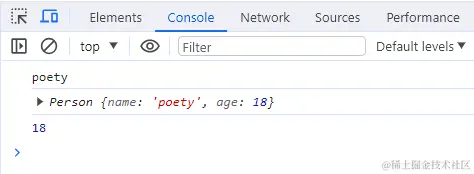

第二种实现

```js
function newOperator(ctor, ...args) {
    if(typeof ctor !== 'function'){
    	throw 'newOperator function the first param must be a function';
    }
    let obj = Object.create(ctor.prototype);
    let res = ctor.apply(obj, args);
    let isObject = typeof res === 'object' && res !== null;
    let isFunction = typoof res === 'function';
    return isObect || isFunction ? res : obj;
};
```

实现 3

```js
function myNew(fn, ...args) {
	let instance = Object.create(fn.prototype);
	let res = fn.apply(instance, args);
	return typeof res === "object" ? res : instance;
}
```

## 2.call、apply、bind

### 实现 call

**思路**：接受传入的 context 上下文，如果不传默认为 window，将被调用的方法设置为上下文的属性，使用上下文对象来调用这个方法，删除新增属性，返回结果。

```javascript
// 写在函数的原型上
Function.prototype.myCall = function (context) {
	// 如果要调用的方法不是一个函数，则报错
	if (typeof this !== "function") {
		throw new Error("Error: this is not a function");
	}
	// 判断 context 是否传入,如果没有传就设置为 window
	context = context || window;
	// 获取参数，[...arguments]把类数组转为数组
	let args = [...arguments].slice(1);
	let result = null;
	// 将被调用的方法设置为context的属性,this即为要调用的方法
	context.fn = this;
	// 执行要被调用的方法
	result = context.fn(...args);
	// 删除手动增加的属性方法
	delete context.fn;
	// 将执行结果返回
	return result;
};

//测试
function f(a, b) {
	console.log(a + b);
	console.log(this.name);
}
let obj = {
	name: "jack",
};

console.log(add.myCall(obj, 1, 2)); // 3
console.log(add.myCall(null, 1, 2)); // 3
console.log(add.myCall(undefined, 1, 2)); // 3
console.log(add.myCall(window, 1, 2)); // 3
```

实现 2

```js
Function.prototype.call = function (context) {
	let context = context || window;

	let fn = Symbol("fn");
	context.fn = this;

	let args = [];
	for (let i = 1, len = arguments.length; i < len; i++) {
		args.push("arguments[" + i + "]");
	}
	let result = eval("context.fn(" + args + ")");

	delete context.fn;
	return result;
};
```

实现 3

```js
// 实现apply只要把下一行中的...args换成args即可
Function.prototype.myCall = function (context = window, ...args) {
	let func = this;
	let fn = Symbol("fn");
	context[fn] = func;

	let res = context[fn](...args); // 重点代码，利用this指向，相当于
	context.caller(...args);
	delete context[fn];
	return res;
};
```

不过我认为换成 ES6 的语法会更精炼一些：

```js
Function.prototype.call = function (context, ...args) {
	let context = context || window;

	let fn = Symbol("fn");
	context.fn = this;

	let result = eval("context.fn(...args)");

	delete context.fn;
	return result;
};

Function.prototype.call = function (context, ...args) {
	context = context || window;

	const fnSymbol = Symbol("fn");
	context[fnSymbol] = this;

	context[fnSymbol](...args);
	delete context[fnSymbol];
};
```

### 实现 apply

**思路**：除了传参方式是数组，其它与 call 没区别

```javascript
Function.prototype.myApply = function (context) {
	if (typeof this !== "function") {
		throw new Error("Type error");
	}
	let result = null;
	context = context || window;
	// 与上面代码相比，我们使用 Symbol 来保证属性唯一,也就是保证不会重写用户自己原来定义在 context 中的同名属性
	const fnSymbol = Symbol();
	context[fnSymbol] = this;
	// 执行要被调用的方法,处理参数和 call 有区别，判断是否传了参数数组
	if (arguments[1]) {
		// 传了参数数组
		result = context[fnSymbol](...arguments[1]);
	} else {
		// 没传参数数组
		result = context[fnSymbol]();
	}
	delete context[fnSymbol];
	return result;
};

// 测试
function f(a, b) {
	console.log(a, b);
	console.log(this.name);
}
let obj = {
	name: "张三",
};
f.myApply(obj, [1, 2]); // 1 2, 张三
```

测试结果：

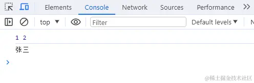

实现 2

```js
Function.prototype.apply = function (context, args) {
	let context = context || window;
	context.fn = this;
	let result = eval("context.fn(...args)");
	delete context.fn;
	return result;
};

Function.prototype.apply = function (context, argsArr) {
	context = context || window;

	const fnSymbol = Symbol("fn");
	context[fnSymbol] = this;

	context[fnSymbol](...argsArr);
	delete context[fnSymbol];
};
```

### 实现 bind

**实现 bind 之前，我们首先要知道它做了哪些事情。**

- 1）对于普通函数，绑定 this 指向
- 2）对于构造函数，要保证原函数的原型对象上的属性不能丢失

**思路**：bind 返回的是一个函数，需要判断函数作为构造函数的情况，当作为构造函数时，this 指向实例，不会被任何方式改变 this，所以要忽略传入的 context 上下文。

bind 的作用与 call 和 apply 相同，区别是 call 和 apply 是立即调用函数，而
bind 是返回了一个函数，需要调用的时候再执行。

bind 可以分开传递参数，所以需要将参数拼接。如果绑定的是构造函数，还需要继承构造函数原型上的属性和方法，保证不丢失。

```javascript
Function.prototype.myBind = function (context) {
	// 判断调用对象是否为函数
	if (typeof this !== "function") {
		throw new Error("Type error");
	}
	// 获取参数
	const args = [...arguments].slice(1);
	const fn = this; // 保存this的值，代表调用bind的函数
	//返回一个函数，此函数可以被作为构造函数调用，也可以作为普通函数调用
	const Fn = function () {
		// 根据调用方式，传入不同绑定值
		// 当作为构造函数时,this 指向实例，不会被任何方式改变 this，要忽略传入的context上下文
		return fn.apply(
			this instanceof Fn ? this : context,
			// bind可以分开传递参数(如f.bind(obj, 1)(2))，所以需要将参数拼接，这里使用apply，参数拼接成一个数组
			args.concat(...arguments) //当前的这个 arguments 是指 Fn 的参数，也可以用剩余参数的方式
		);
	};
	//对于构造函数，要保证原函数的原型对象上的属性不能丢失
	Fn.prototype = Object.create(fn.prototype);
	return Fn;
};

// 1.先测试作为构造函数调用
function Person(name, age) {
	console.log(name);
	console.log(age);
	console.log(this); //构造函数this指向实例对象
}
// 构造函数原型的方法
Person.prototype.say = function () {
	console.log("say");
};
var obj = {
	name: "cc",
	age: 18,
};
var bindFun = Person.myBind(obj, "cxx");
var a = new bindFun(10);
// cxx
// 10
// Person {}
a.say(); // say

// 2.再测试作为普通函数调用
function normalFun(name, age) {
	console.log(name);
	console.log(age);
	console.log(this); // 普通函数this指向绑定bind的第一个参数 也就是例子中的obj
}
var obj = {
	name: "aa",
	age: 18,
};
var bindNormalFun = normalFun.myBind(obj, "cc");
bindNormalFun(12);
// cc
// 12
// { name: 'aa', age: 18 }
```

测试结果：

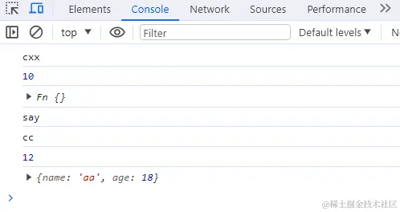

实现 2

```js
Function.prototype.bind = function (context, ...args) {
    // 异常处理
    if (typeof this !== "function") {
        throw new Error("Function.prototype.bind - what is trying to be bound is
        not callable");
    }
    // 保存this的值，它代表调用 bind 的函数
    var self = this;
    var fNOP = function () {};
    var fbound = function () {
        self.apply(this instanceof self ?
        this :
        context, args.concat(Array.prototype.slice.call(arguments)));
    }
    fNOP.prototype = this.prototype;
    fbound.prototype = new fNOP();
    return fbound;
}
```

实现 3

```js
Function.prototype.bind = function (context, ...args) {
	let self = this; // 谨记this表示调用bind的函数
	let fBound = function () {
		// this instanceof fBound为true表示构造函数的情况。如new func.bind(obj)
		return self.apply(
			this instanceof fBound ? this : context || window,
			args.concat(Array.prototype.slice.call(arguments))
		);
	};
	// 保证原函数的原型对象上的属性不丢失
	fBound.prototype = Object.create(this.prototype);
	return fBound;
};

Function.prototype.bind = function (context, ...args) {
	context = context || window;
	const fnSymbol = Symbol("fn");
	context[fnSymbol] = this;

	return function (..._args) {
		args = args.concat(_args);
		context[fnSymbol](...args);
		delete context[fnSymbol];
	};
};
```

也可以用 Object.create 来处理原型：

```js
Function.prototype.bind = function (context, ...args) {
    if (typeof this !== "function") {
        throw new Error("Function.prototype.bind - what is trying to be bound is
        not callable");
    }
    var self = this;
    var fbound = function () {
        self.apply(this instanceof self ?
        this :
        context, args.concat(Array.prototype.slice.call(arguments)));
    }
    fbound.prototype = Object.create(self.prototype);
    return fbound;
}
```

## 3.实现 instanceof

核心要点：原型链的向上查找。

instanceof 用于检测构造函数的 prototype 属性是否出现在某个实例对象的原型链上。

instanceof 判断的是右操作数的 prototype 属性是否出现在左操作数的原型链上。核心是要拿到左操作数的原型进行检查，要顺着原型链检查。取得原型是利用了 Object.getPrototypeOf(obj)。

```js
function myInstanceof(instance, constructor) {
	// 如果不是对象，或者是null，直接返回false
	if (typeof instance !== "object" || instance === null) {
		return false;
	}
	// 如果不是一个函数，就报错
	if (typeof constructor !== "function") {
		throw "myInstanceof function the first param must be a function";
	}

	// 获取对象的原型
	let proto = Object.getPrototypeOf(instance);
	// 获取构造函数的 prototype 对象
	let prototype = constructor.prototype;
	// 判断构造函数的 prototype对象是否在对象的原型链上
	while (true) {
		// 到达原型链终点null，说明没找到
		if (!proto) {
			return false;
		}
		if (proto === prototype) {
			return true;
		}
		// 如果没有找到，就继续从其原型上找
		proto = Object.getPrototypeOf(proto);
	}
}

// 测试
let Fn = function () {};
let p1 = new Fn();
console.log(myInstanceof(p1, Fn)); // true
console.log(myInstanceof([], Fn)); // false
console.log(myInstanceof([], Array)); // true
console.log(myInstanceof(function () {}, Function)); // true
```

测试结果：

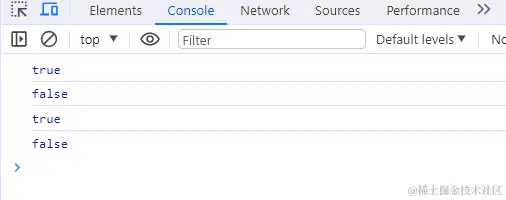

简单版

```js
function instanceof(left, right) {
    // 获得类型的原型
    let prototype = right.prototype
    // 获得对象的原型
    left = left.__proto__
    // 判断对象的类型是否等于类型的原型
    while (true) {
        if (left === null)
        return false
        if (prototype === left)
        return true
        left = left.__proto__
    }
}
```

实现 3

```js
function myInstanceof(left, right) {
	let proto = Object.getPrototypeOf(left);
	while (true) {
		if (proto == null) return false;
		if (proto == right.prototype) return true;
		proto = Object.getPrototypeof(proto);
	}
}
```

## 4.实现数组方法

### 数组 sort 排序

#### sort 排序

```javascript
// 对数字进行排序，简写
let arr = [3, 2, 4, 1, 5];
arr.sort((a, b) => a - b);
console.log(arr); // [1, 2, 3, 4, 5]

// 对字母进行排序
let arr = ["b", "c", "a", "e", "d"];
arr.sort((a, b) => {
	if (a > b) return 1;
	else if (a < b) return -1;
	else return 0;
});
console.log(arr); // ['a', 'b', 'c', 'd', 'e']
```

测试结果：

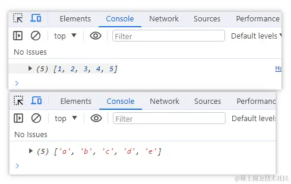

### 冒泡排序

```javascript
function bubbleSort(arr) {
	let len = arr.length;
	for (let i = 0; i < len - 1; i++) {
		// 从第一个元素开始，比较相邻的两个元素，前者大就交换位置
		for (let j = 0; j < len - 1 - i; j++) {
			if (arr[j] > arr[j + 1]) {
				let num = arr[j];
				arr[j] = arr[j + 1];
				arr[j + 1] = num;
			}
		}
		// 每次遍历结束，都能找到一个最大值，放在数组最后
	}
	return arr;
}

// 测试
console.log(bubbleSort([2, 3, 1, 5, 4])); // [ 1, 2, 3, 4, 5 ]
```

测试结果：

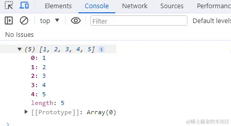

### 手写 reduce

#### reduce 的使用

```javascript
// 普通数组求和
let arr = [1, 2, 3, 4, 5, 6, 7, 8, 9, 10];
arr.reduce((prev, cur) => {
	return prev + cur;
}, 0); // 55
// 多维数组求和
let arr = [1, 2, 3, [[4, 5], 6], 7, 8, 9];
arr.flat(Infinity).reduce((prev, cur) => {
	return prev + cur;
}, 0); // 45
// 对象数组求和
let arr = [{ a: 9, b: 3, c: 4 }, { a: 1, b: 3 }, { a: 3 }];
arr.reduce((prev, cur) => {
	return prev + cur["a"]; // 13 求对象数组中所有属性为a的和
}, 0);
```

#### reduce 的实现

核心要点：

- 1）初始值不传怎么处理
- 2）回调函数的参数有哪些，返回值如何处理。

```javascript
Array.prototype.myReduce = function (cb, initialValue) {
	const arr = this; // this就是调用reduce方法的数组
	let total = initialValue ? initialValue : arr[0]; // 不传默认取数组第一项
	let startIndex = initialValue ? 0 : 1; // 有初始值的话从0遍历，否则从1遍历
	for (let i = startIndex; i < arr.length; i++) {
		total = cb(total, arr[i], i, arr); // 参数为初始值、当前值、索引、当前数组
	}
	return total;
};

// 测试
let arr = [1, 2, 3, 4, 5, 6, 7, 8, 9, 10];
let res = arr.myReduce((total, cur) => {
	return total + cur;
}, 0);
console.log(res); // 55
```

实现 2

```js
Array.prototype.myReduce = function (fn, initialValue) {
	var arr = Array.prototype.slice.call(this);
	var res, startIndex;
	res = initialValue ? initialValue : arr[0];
	startIndex = initialValue ? 0 : 1;
	for (var i = startIndex; i < arr.length; i++) {
		res = fn.call(null, res, arr[i], i, this);
	}
	return res;
};
```

### 实现数组 forEach 方法

```js
// 实现forEach方法
Array.prototype.myForEach = function (cb) {
	var _arr = this;
	var _len = _arr.length;
	var _arg2 = arguments[1] || window; // 剩余第二个参数，如果没有第二个参数，就指向window

	for (var i = 0; i < _len; i++) {
		// 回调函数apply调用，this指向更改成剩余参数_arg2或者window
		cb.apply(_arg2, [_arr[i], i, _arr]); // apply的第二个参数数组里面的，就是回调函数的参数
	}
};
```

### 实现 map 方法

#### 用 ES5 实现数组的 map 方法

核心要点：

1）回调函数的参数有哪些，返回值如何处理。
2）不修改原来的数组。

```js
Array.prototype.MyMap = function (fn, context) {
	var arr = Array.prototype.slice.call(this); //由于是ES5所以就不用...展开符了
	var mappedArr = [];
	for (var i = 0; i < arr.length; i++) {
		mappedArr.push(fn.call(context, arr[i], i, this));
	}
	return mappedArr;
};
```

##### 第二种

```js
// 实现map方法
Array.prototype.myMap = function (cb) {
	var _arr = this;
	var _len = _arr.length;
	var _arg2 = arguments[1] || window; // 剩余第二个参数，如果没有第二个参数，就指向window
	var _newArr = [];
	var _item;
	var _res;

	for (var i = 0; i < _len; i++) {
		_item = deepClone(_arr[i]); // 结合上面的深拷贝方法
		// 回调函数apply调用，this指向更改成剩余参数_arg2或者window
		// apply的第二个参数数组里面的，就是回调函数的参数
		_res = cb.apply(_arg2, [_item, i, _arr]);

		_res && _newArr.push(_res); // 是否有返回值才执行push
	}
	return _newArr;
};
```

### 实现 filter 方法

```js
// 实现filter方法
Array.prototype.myFilter = function (cb) {
	var _arr = this;
	var _len = _arr.length;
	var _arg2 = arguments[1] || window; // 剩余第二个参数，如果没有第二个参数，就指向window
	var _newArr = [];
	var _item;

	for (var i = 0; i < _len; i++) {
		_item = deepClone(_arr[i]); // 深拷贝
		// 回调函数apply调用，this指向更改成剩余参数_arg2或者window
		// apply的第二个参数数组里面的，就是回调函数的参数
		cb.apply(_arg2, [_item, i, _arr]) ? _newArr.push(_item) : "";
	}
	return _newArr;
};
```

### 实现 evey 方法

```js
// 实现every方法
Array.prototype.myEvery = function (cb) {
	var _arr = this;
	var _len = _arr.length;
	var _arg2 = arguments[1] || window; // 剩余第二个参数，如果没有第二个参数，就指向window
	var _res = true;

	for (var i = 0; i < _len; i++) {
		if (!cb.apply(_arg2, [_arr[i], i, _arr])) {
			_res = false;
			break;
		}
	}
	return _res;
};
```

### 实现 some 方法

```js
// 实现some方法
Array.prototype.mySome = function (cb) {
	var _arr = this;
	var _len = _arr.length;
	var _arg2 = arguments[1] || window; // 剩余第二个参数，如果没有第二个参数，就指向window
	var _res = false;

	for (var i = 0; i < _len; i++) {
		if (cb.apply(_arg2, [_arr[i], i, _arr])) {
			_res = true;
			break;
		}
	}
	return _res;
};
```

### 实现 reduce 与 reduceRight 方法

```js
// 实现reduce方法
Array.prototype.myReduce = function (cb, initialValue) {
	var _arr = this;
	var _len = _arr.length;
	// 如果有第三个参数就指向它，没有就指向window
	var _arg3 = arguments[2] || window;
	var _item;

	for (var i = 0; i < _len; i++) {
		_item = deepClone(_arr[i]); // 深克隆
		// 指向_arg3
		initialValue = cb.apply(_arg3, [initialValue, _item, i, _arr]);
	}
	return initialValue;
};

// 实现reduceRight方法
Array.prototype.myReduceRight = function (cb, initialValue) {
	var _arr = this;
	var _len = _arr.length;
	// 如果有第三个参数就指向它，没有就指向window
	var _arg3 = arguments[2] || window;
	var _item;

	for (var i = _len - 1; i >= 0; i--) {
		// 倒叙插入
		_item = deepClone(_arr[i]); // 深克隆
		// 指向_arg3的this，并传四个参数回去
		initialValue = cb.apply(_arg3, [initialValue, _item, i, _arr]);
	}
	return initialValue;
};
```

### 所有的重写实现数组方法练习

index.html：

```html
<!DOCTYPE html>
<html lang="en">
	<head>
		<meta charset="UTF-8" />
		<meta http-equiv="X-UA-Compatible" content="IE=edge" />
		<meta name="viewport" content="width=device-width, initial-scale=1.0" />
		<title>js的底层方法实现</title>
	</head>
	<body></body>
	<script src="./utils.js"></script>
	<script src="./index.js"></script>
</html>
```

utils.js：重写工具方法

```js
// ES6实现深拷贝
function deepClone(origin, hashMap = new WeakMap()) {
	if (origin == undefined || typeof origin !== "object") {
		return origin;
	}
	// 如果是时间构造函数
	if (origin instanceof Date) {
		return new Date(origin);
	}
	// 如果是正则构造函数
	if (origin instanceof RegExp) {
		return new RegExp(origin);
	}

	// 判断是否弱引用，两个对象-相互把对方作为键名赋值给对方
	const hashKey = hashMap.get(origin);
	if (hashKey) {
		return hashKey;
	}
	// 执行继承来的构造器，实例化构造器得到新的对象，就不用判断
	const target = new origin.constructor();
	// 设置弱引用，引用后会删掉节点，节省内存
	hashMap.set(origin, target);
	for (let k in origin) {
		if (origin.hasOwnProperty(k)) {
			// 对象自身属性中是否具有指定的k属性
			target[k] = deepClone(origin[k], hashMap); // 递归再赋值
		}
	}

	return target;
}

// 实现forEach方法
Array.prototype.myForEach = function (cb) {
	var _arr = this;
	var _len = _arr.length;
	var _arg2 = arguments[1] || window; // 剩余第二个参数，如果没有第二个参数，就指向window

	for (var i = 0; i < _len; i++) {
		// 回调函数apply调用，this指向更改成剩余参数_arg2或者window
		cb.apply(_arg2, [_arr[i], i, _arr]); // apply的第二个参数数组里面的，就是回调函数的参数
	}
};

// 实现map方法
Array.prototype.myMap = function (cb) {
	var _arr = this;
	var _len = _arr.length;
	var _arg2 = arguments[1] || window; // 剩余第二个参数，如果没有第二个参数，就指向window
	var _newArr = [];
	var _item;
	var _res;

	for (var i = 0; i < _len; i++) {
		_item = deepClone(_arr[i]); // 结合上面的深拷贝方法
		// 回调函数apply调用，this指向更改成剩余参数_arg2或者window
		// apply的第二个参数数组里面的，就是回调函数的参数
		_res = cb.apply(_arg2, [_item, i, _arr]);

		_res && _newArr.push(_res); // 是否有返回值才执行push
	}
	return _newArr;
};

// 实现filter方法
Array.prototype.myFilter = function (cb) {
	var _arr = this;
	var _len = _arr.length;
	var _arg2 = arguments[1] || window; // 剩余第二个参数，如果没有第二个参数，就指向window
	var _newArr = [];
	var _item;

	for (var i = 0; i < _len; i++) {
		_item = deepClone(_arr[i]); // 深拷贝
		// 回调函数apply调用，this指向更改成剩余参数_arg2或者window
		// apply的第二个参数数组里面的，就是回调函数的参数
		cb.apply(_arg2, [_item, i, _arr]) ? _newArr.push(_item) : "";
	}
	return _newArr;
};

// 实现every方法
Array.prototype.myEvery = function (cb) {
	var _arr = this;
	var _len = _arr.length;
	var _arg2 = arguments[1] || window; // 剩余第二个参数，如果没有第二个参数，就指向window
	var _res = true;

	for (var i = 0; i < _len; i++) {
		if (!cb.apply(_arg2, [_arr[i], i, _arr])) {
			_res = false;
			break;
		}
	}
	return _res;
};

// 实现some方法
Array.prototype.mySome = function (cb) {
	var _arr = this;
	var _len = _arr.length;
	var _arg2 = arguments[1] || window; // 剩余第二个参数，如果没有第二个参数，就指向window
	var _res = false;

	for (var i = 0; i < _len; i++) {
		if (cb.apply(_arg2, [_arr[i], i, _arr])) {
			_res = true;
			break;
		}
	}
	return _res;
};

// 实现reduce方法
Array.prototype.myReduce = function (cb, initialValue) {
	var _arr = this;
	var _len = _arr.length;
	// 如果有第三个参数就指向它，没有就指向window
	var _arg3 = arguments[2] || window;
	var _item;

	for (var i = 0; i < _len; i++) {
		_item = deepClone(_arr[i]); // 深克隆
		// 指向_arg3
		initialValue = cb.apply(_arg3, [initialValue, _item, i, _arr]);
	}
	return initialValue;
};

// 实现reduceRight方法
Array.prototype.myReduceRight = function (cb, initialValue) {
	var _arr = this;
	var _len = _arr.length;
	// 如果有第三个参数就指向它，没有就指向window
	var _arg3 = arguments[2] || window;
	var _item;

	for (var i = _len - 1; i >= 0; i--) {
		// 倒叙插入
		_item = deepClone(_arr[i]); // 深克隆
		// 指向_arg3的this，并传四个参数回去
		initialValue = cb.apply(_arg3, [initialValue, _item, i, _arr]);
	}
	return initialValue;
};
```

index.js：调用比较

```js
var obj = {
	name: "Jacky",
	age: 8,
};
var arr = [
	{
		name: "周一",
		age: 20,
	},
	{
		name: "刘二",
		age: 28,
	},
	{
		name: "张三",
		age: 25,
	},

	{
		name: "李四",
		age: 30,
	},
	{
		name: "王五",
		age: 27,
	},
	{
		name: "赵六",
		age: 36,
	},
	{
		name: "胡七",
		age: 35,
	},
];

// forEach方法输出
// arr.forEach(function (item, index , array) {
//   console.log(this.name);
//   console.log(item, index, array);
// }, obj);

// console.log('------');

// arr.myForEach(function (item, index , array) {
//   console.log(this.name);
//   console.log(item, index, array);
// }, obj);

// map方法输出
// var newArr = arr.map(function (item, index , array) {
//   console.log(this);
//   console.log(item, index, array);
//   return item;
// }, obj);
// console.log(newArr);

// console.log('----------');

// var newArr2 = arr.myMap(function (item, index , array) {
//   console.log(this);
//   console.log(item, index, array);
//   return item;
// }, obj);
// console.log(newArr2);

// filter方法输出
// var newArr = arr.filter(function (item, index , array) {
//   console.log(this);
//   return item.age > 30;
// }, obj);
// console.log(newArr);

// console.log('----------');

// var newArr2 = arr.myFilter(function (item, index , array) {
//   console.log(this);
//   return item.age > 30;
// }, obj);
// console.log(newArr2);

// every方法输出
// var res = arr.every(function (item, index , array) {
//   console.log(this);
//   return item.age < 40;
// }, obj);
// console.log(res);

// console.log('------');

// var res2 = arr.myEvery(function (item, index , array) {
//   console.log(this);
//   return item.age < 40;
// }, obj);
// console.log(res2);

// some方法输出
// var res = arr.some(function (item, index , array) {
//   console.log(this);
//   return item.age < 40;
// }, obj);
// console.log(res);

// console.log('------');

// var res2 = arr.mySome(function (item, index , array) {
//   console.log(this);
//   return item.age < 40;
// }, obj);
// console.log(res2);

// reduce方法输出
// var initialValue = [
//   {
//     name: '大哥',
//     age: 18
//   }
// ];
// var newArr = arr.reduce(function (prev, item, index, array) {
//   console.log(this);
//   item.age >= 25 && prev.push(item);
//   return prev;
// }, initialValue, obj);

// console.log(newArr);

// console.log('----------');

// var initialValue2 = [
//   {
//     name: '二哥',
//     age: 18
//   }
// ];
// var newArr2 = arr.myReduce(function (prev, item, index, array) {
//   console.log(this);
//   item.age >= 25 && prev.push(item);
//   return prev;
// }, initialValue2, obj);

// console.log(newArr2);

// reduceRight方法输出
var initialValue = [
	{
		name: "大哥",
		age: 18,
	},
];
var newArr = arr.reduceRight(function (prev, item, index, array) {
	console.log(this);
	item.age >= 25 && prev.push(item);
	return prev;
}, initialValue);

console.log(newArr);

console.log("----------");

var initialValue2 = [
	{
		name: "二哥",
		age: 18,
	},
];
var newArr2 = arr.myReduceRight(function (prev, item, index, array) {
	console.log(this);
	item.age >= 25 && prev.push(item);
	return prev;
}, initialValue2);

console.log(newArr2);
```

## 实现数组 map 方法 ?

依照 ecma262 草案，实现的 map 的规范如下：

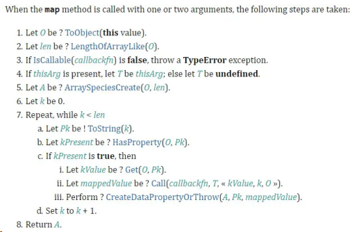

下面根据草案的规定一步步来模拟实现 map 函数：

```js
Array.prototype.map = function (callbackFn, thisArg) {
	// 处理数组类型异常
	if (this === null || this === undefined) {
		throw new TypeError("Cannot read property 'map' of null or undefined");
	}
	// 处理回调类型异常
	if (Object.prototype.toString.call(callbackfn) != "[object Function]") {
		throw new TypeError(callbackfn + " is not a function");
	}
	// 草案中提到要先转换为对象
	let O = Object(this);
	let T = thisArg;
	let len = O.length >>> 0;
	let A = new Array(len);
	for (let k = 0; k < len; k++) {
		// 还记得原型链那一节提到的 in 吗？in 表示在原型链查找
		// 如果用 hasOwnProperty 是有问题的，它只能找私有属性
		if (k in O) {
			let kValue = O[k];
			// 依次传入this, 当前项，当前索引，整个数组
			let mappedValue = callbackfn.call(T, KValue, k, O);
			A[k] = mappedValue;
		}
	}
	return A;
};
```

这里解释一下, length >>> 0, 字面意思是指"右移 0 位"，但实际上是把前面的空位用 0 填充，这里的作用是保证 len 为数字且为整数。

举几个特例：

```js
null >>> 0 //0
undefined >>> 0 //0
void(0) >>> 0 //0
function a (){}; a >>> 0 //0
[] >>> 0 //0
var a = {}; a >>> 0 //0
123123 >>> 0 //123123
45.2 >>> 0 //45
0 >>> 0 //0
-0 >>> 0 //0
-1 >>> 0 //4294967295
-1212 >>> 0 //4294966084
```

总体实现起来并没那么难，需要注意的就是使用 in 来进行原型链查找。同时，如果没有找到就不处理，能有效处理稀疏数组的情况。

最后给大家奉上 V8 源码，参照源码检查一下，其实还是实现得很完整了。

```js
function ArrayMap(f, receiver) {
	CHECK_OBJECT_COERCIBLE(this, "Array.prototype.map");
	// Pull out the length so that modifications to the length in the
	// loop will not affect the looping and side effects are visible.
	var array = TO_OBJECT(this);
	var length = TO_LENGTH(array.length);
	if (!IS_CALLABLE(f)) throw %make_type_error(kCalledNonCallable, f);
	var result = ArraySpeciesCreate(array, length);
	for (var i = 0; i < length; i++) {
		if (i in array) {
			var element = array[i];
			%CreateDataProperty(result, i, %_Call(f, receiver, element, i, array));
		}
	}
	return result;
}
```

## 实现数组 reduce 方法 ?

依照 ecma262 草案，实现的 reduce 的规范如下：

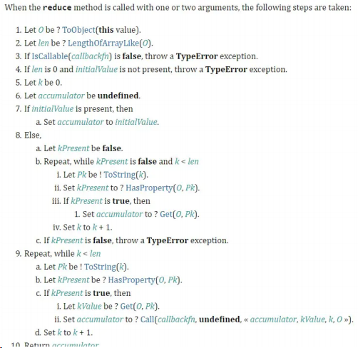

其中有几个核心要点：

1）初始值不传怎么处理
2）回调函数的参数有哪些，返回值如何处理。

```js
Array.prototype.reduce = function (callbackfn, initialValue) {
	// 异常处理，和 map 一样
	// 处理数组类型异常
	if (this === null || this === undefined) {
		throw new TypeError("Cannot read property 'reduce' of null or undefined");
	}
	// 处理回调类型异常
	if (Object.prototype.toString.call(callbackfn) != "[object Function]") {
		throw new TypeError(callbackfn + " is not a function");
	}
	let O = Object(this);
	let len = O.length >>> 0;
	let k = 0;
	let accumulator = initialValue;
	if (accumulator === undefined) {
		for (; k < len; k++) {
			// 查找原型链
			if (k in O) {
				accumulator = O[k];
				k++;
				break;
			}
		}
	}
	// 表示数组全为空
	if (k === len && accumulator === undefined)
		throw new Error("Each element of the array is empty");
	for (; k < len; k++) {
		if (k in O) {
			// 注意，核心！
			accumulator = callbackfn.call(undefined, accumulator, O[k], k, O);
		}
	}
	return accumulator;
};
```

其实是从最后一项开始遍历，通过原型链查找跳过空项。

最后给大家奉上 V8 源码，以供大家检查：

```js
function ArrayReduce(callback, current) {
	CHECK_OBJECT_COERCIBLE(this, "Array.prototype.reduce");
	// Pull out the length so that modifications to the length in the
	// loop will not affect the looping and side effects are visible.
	var array = TO_OBJECT(this);
	var length = TO_LENGTH(array.length);
	return InnerArrayReduce(callback, current, array, length, arguments.length);
}
function InnerArrayReduce(callback, current, array, length, argumentsLength) {
	if (!IS_CALLABLE(callback)) {
		throw %make_type_error(kCalledNonCallable, callback);
	}
	var i = 0;
	find_initial: if (argumentsLength < 2) {
		for (; i < length; i++) {
			if (i in array) {
				current = array[i++];
				break find_initial;
			}
		}
		throw %make_type_error(kReduceNoInitial);
	}
	for (; i < length; i++) {
		if (i in array) {
			var element = array[i];
			current = callback(current, element, i, array);
		}
	}
	return current;
}
```

## 实现数组 push、pop 方法 ?

参照 ecma262 草案的规定，关于 push 和 pop 的规范如下图所示：

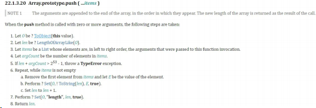

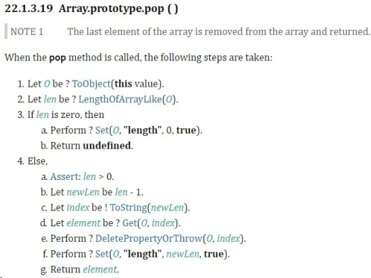

实现 push 方法：

```js
Array.prototype.push = function (...items) {
	let O = Object(this);
	let len = this.length >>> 0;
	let argCount = items.length >>> 0;
	// 2 ** 53 - 1 为JS能表示的最大正整数
	if (len + argCount > 2 ** 53 - 1) {
		throw new TypeError(
			"The number of array is over the max value restricted!"
		);
	}
	for (let i = 0; i < argCount; i++) {
		O[len + i] = items[i];
	}
	let newLength = len + argCount;
	O.length = newLength;
	return newLength;
};
```

实现 pop 方法:

```js
Array.prototype.pop = function () {
	let O = Object(this);
	let len = this.length >>> 0;
	if (len === 0) {
		O.length = 0;
		return undefined;
	}
	len--;
	let value = O[len];
	delete O[len];
	O.length = len;
	return value;
};
```

## 实现数组 filter 方法 ?

代码如下：

```js
Array.prototype.filter = function (callbackfn, thisArg) {
	// 处理数组类型异常
	if (this === null || this === undefined) {
		throw new TypeError("Cannot read property 'filter' of null or undefined");
	}
	// 处理回调类型异常
	if (Object.prototype.toString.call(callbackfn) != "[object Function]") {
		throw new TypeError(callbackfn + " is not a function");
	}
	let O = Object(this);
	let len = O.length >>> 0;
	let resLen = 0;
	let res = [];
	for (let i = 0; i < len; i++) {
		if (i in O) {
			let element = O[i];
			if (callbackfn.call(thisArg, O[i], i, O)) {
				res[resLen++] = element;
			}
		}
	}
	return res;
};
```

## 实现数组 splice 方法 ?

splice 可以说是最受欢迎的数组方法之一，api 灵活，使用方便。现在来梳理一下用法：

- splice(position, count) 表示从 position 索引的位置开始，删除 count 个元素
- splice(position, 0, ele1, ele2, ...) 表示从 position 索引的元素后面插入一系列的元素
- splice(postion, count, ele1, ele2, ...) 表示从 position 索引的位置开始，删除 count 个元素，然后再插入一系列的元素
- 返回值为 被删除元素 组成的 数组 。

**接下来我们实现数组 splice 方法。**

首先我们梳理一下实现的思路：

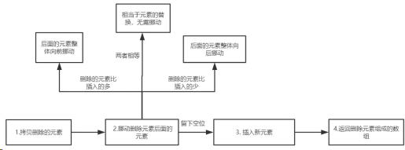

初步实现：

```js
Array.prototype.splice = function (startIndex, deleteCount, ...addElements) {
	let argumentsLen = arguments.length;
	let array = Object(this);
	let len = array.length;
	let deleteArr = new Array(deleteCount);
	// 拷贝删除的元素
	sliceDeleteElements(array, startIndex, deleteCount, deleteArr);
	// 移动删除元素后面的元素
	movePostElements(array, startIndex, len, deleteCount, addElements);
	// 插入新元素
	for (let i = 0; i < addElements.length; i++) {
		array[startIndex + i] = addElements[i];
	}
	array.length = len - deleteCount + addElements.length;
	return deleteArr;
};
```

先拷贝删除的元素，如下所示：

```js
const sliceDeleteElements = (array, startIndex, deleteCount, deleteArr) => {
	for (let i = 0; i < deleteCount; i++) {
		let index = startIndex + i;
		if (index in array) {
			let current = array[index];
			deleteArr[i] = current;
		}
	}
};
```

然后对删除元素后面的元素进行挪动, 挪动分为三种情况：

1）添加的元素和删除的元素个数相等
2）添加的元素个数小于删除的元素
3）添加的元素个数大于删除的元素

当两者相等时，

```js
const movePostElements = (array, startIndex, len, deleteCount, addElements) => {
	if (deleteCount === addElements.length) return;
};
```

当添加的元素个数小于删除的元素时, 如图所示：

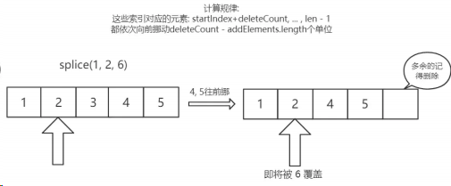

```js
const movePostElements = (array, startIndex, len, deleteCount, addElements) => {
	//...
	// 如果添加的元素和删除的元素个数不相等，则移动后面的元素
	if (deleteCount > addElements.length) {
		// 删除的元素比新增的元素多，那么后面的元素整体向前挪动
		// 一共需要挪动 len - startIndex - deleteCount 个元素
		for (let i = startIndex + deleteCount; i < len; i++) {
			let fromIndex = i;
			// 将要挪动到的目标位置
			let toIndex = i - (deleteCount - addElements.length);
			if (fromIndex in array) {
				array[toIndex] = array[fromIndex];
			} else {
				delete array[toIndex];
			}
		}
		// 注意注意！这里我们把后面的元素向前挪，相当于数组长度减小了，需要删除冗余元素
		// 目前长度为 len + addElements - deleteCount
		for (let i = len - 1; i >= len + addElements.length - deleteCount; i--) {
			delete array[i];
		}
	}
};
```

当添加的元素个数大于删除的元素时, 如图所示：

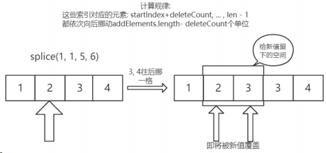

```js
const movePostElements = (array, startIndex, len, deleteCount, addElements) => {
	//...
	if (deleteCount < addElements.length) {
		// 删除的元素比新增的元素少，那么后面的元素整体向后挪动
		// 思考一下: 这里为什么要从后往前遍历？从前往后会产生什么问题？
		for (let i = len - 1; i >= startIndex + deleteCount; i--) {
			let fromIndex = i;
			// 将要挪动到的目标位置
			let toIndex = i + (addElements.length - deleteCount);
			if (fromIndex in array) {
				array[toIndex] = array[fromIndex];
			} else {
				delete array[toIndex];
			}
		}
	}
};
```

#### 优化一: 参数的边界情况

当用户传来非法的 startIndex 和 deleteCount 或者负索引的时候，需要我们做出特殊的处理。

```js
const computeStartIndex = (startIndex, len) => {
	// 处理索引负数的情况
	if (startIndex < 0) {
		return startIndex + len > 0 ? startIndex + len : 0;
	}
	return startIndex >= len ? len : startIndex;
};
const computeDeleteCount = (startIndex, len, deleteCount, argumentsLen) => {
	// 删除数目没有传，默认删除startIndex及后面所有的
	if (argumentsLen === 1) return len - startIndex;
	// 删除数目过小
	if (deleteCount < 0) return 0;
	// 删除数目过大
	if (deleteCount > len - startIndex) return len - startIndex;
	return deleteCount;
};
Array.prototype.splice = function (startIndex, deleteCount, ...addElements) {
	//,...
	let deleteArr = new Array(deleteCount);
	// 下面参数的清洗工作
	startIndex = computeStartIndex(startIndex, len);
	deleteCount = computeDeleteCount(startIndex, len, deleteCount, argumentsLen);
	// 拷贝删除的元素
	sliceDeleteElements(array, startIndex, deleteCount, deleteArr);
	//...
};
```

#### 优化二：数组为密封对象或冻结对象

##### 什么是密封对象?

密封对象是不可扩展的对象，而且已有成员的[[Configurable]]属性被设置为 false，这意味着不能添加、删除方法和属性。但是属性值是可以修改的。

##### 什么是冻结对象？

冻结对象是最严格的防篡改级别，除了包含密封对象的限制外，还不能修改属性值。
接下来，我们来把这两种情况一一排除。

```js
// 判断 sealed 对象和 frozen 对象, 即 密封对象 和 冻结对象
if (Object.isSealed(array) && deleteCount !== addElements.length) {
	throw new TypeError("the object is a sealed object!");
} else if (
	Object.isFrozen(array) &&
	(deleteCount > 0 || addElements.length > 0)
) {
	throw new TypeError("the object is a frozen object!");
}
```

好了，现在就写了一个比较完整的 splice，如下：

```js
const sliceDeleteElements = (array, startIndex, deleteCount, deleteArr) => {
	for (let i = 0; i < deleteCount; i++) {
		let index = startIndex + i;
		if (index in array) {
			let current = array[index];
			deleteArr[i] = current;
		}
	}
};
const movePostElements = (array, startIndex, len, deleteCount, addElements) => {
	// 如果添加的元素和删除的元素个数相等，相当于元素的替换，数组长度不变，被删除元素后面的元素不需要挪动;
	if (deleteCount === addElements.length) return;
	// 如果添加的元素和删除的元素个数不相等，则移动后面的元素
	else if (deleteCount > addElements.length) {
		// 删除的元素比新增的元素多，那么后面的元素整体向前挪动
		// 一共需要挪动 len - startIndex - deleteCount 个元素
		for (let i = startIndex + deleteCount; i < len; i++) {
			let fromIndex = i;
			// 将要挪动到的目标位置
			let toIndex = i - (deleteCount - addElements.length);
			if (fromIndex in array) {
				array[toIndex] = array[fromIndex];
			} else {
				delete array[toIndex];
			}
		}
		// 注意注意！这里我们把后面的元素向前挪，相当于数组长度减小了，需要删除冗余元素
		// 目前长度为 len + addElements - deleteCount
		for (let i = len - 1; i >= len + addElements.length - deleteCount; i--) {
			delete array[i];
		}
	} else if (deleteCount < addElements.length) {
		// 删除的元素比新增的元素少，那么后面的元素整体向后挪动
		// 思考一下: 这里为什么要从后往前遍历？从前往后会产生什么问题？
		for (let i = len - 1; i >= startIndex + deleteCount; i--) {
			let fromIndex = i;
			// 将要挪动到的目标位置
			let toIndex = i + (addElements.length - deleteCount);
			if (fromIndex in array) {
				array[toIndex] = array[fromIndex];
			} else {
				delete array[toIndex];
			}
		}
	}
};
const computeStartIndex = (startIndex, len) => {
	// 处理索引负数的情况
	if (startIndex < 0) {
		return startIndex + len > 0 ? startIndex + len : 0;
	}
	return startIndex >= len ? len : startIndex;
};
const computeDeleteCount = (startIndex, len, deleteCount, argumentsLen) => {
	// 删除数目没有传，默认删除startIndex及后面所有的
	if (argumentsLen === 1) return len - startIndex;
	// 删除数目过小
	if (deleteCount < 0) return 0;
	// 删除数目过大
	if (deleteCount > len - startIndex) return len - startIndex;
	return deleteCount;
};
Array.prototype.splice = function (startIndex, deleteCount, ...addElements) {
	let argumentsLen = arguments.length;
	let array = Object(this);
	let len = array.length >>> 0;
	let deleteArr = new Array(deleteCount);
	startIndex = computeStartIndex(startIndex, len);
	deleteCount = computeDeleteCount(startIndex, len, deleteCount, argumentsLen);
	// 判断 sealed 对象和 frozen 对象, 即 密封对象 和 冻结对象
	if (Object.isSealed(array) && deleteCount !== addElements.length) {
		throw new TypeError("the object is a sealed object!");
	} else if (
		Object.isFrozen(array) &&
		(deleteCount > 0 || addElements.length > 0)
	) {
		throw new TypeError("the object is a frozen object!");
	}
	// 拷贝删除的元素
	sliceDeleteElements(array, startIndex, deleteCount, deleteArr);
	// 移动删除元素后面的元素
	movePostElements(array, startIndex, len, deleteCount, addElements);
	// 插入新元素
	for (let i = 0; i < addElements.length; i++) {
		array[startIndex + i] = addElements[i];
	}
	array.length = len - deleteCount + addElements.length;
	return deleteArr;
};
```

## 实现数组 sort 方法？

估计大家对 JS 数组的 sort 方法已经不陌生了，之前也对它的用法做了详细的总结。那，它的内部是如何来实现的呢？如果说我们能够进入它的内部去看一看， 理解背后的设计，会使我们的思维和素养得到不错的提升。

sort 方法在 V8 内部相对与其他方法而言是一个比较高深的算法，对于很多边界情况做了反复的优化，但是这里我们不会直接拿源码来干讲。我们会来根据源码的思路，实现一个 跟引擎性能一样的排序算法，并且一步步拆解其中的奥秘。

#### V8 引擎的思路分析

首先大概梳理一下源码中排序的思路：

设要排序的元素个数是 n：

当 n <= 10 时，采用 插入排序

当 n > 10 时，采用：**三路快速排序**

- 10 < n <= 1000, 采用中位数作为哨兵元素
- n > 1000, 每隔 200~215 个元素挑出一个元素，放到一个新数组，然后对它排序，找到中间位置的数，以此作为中位数

在动手之前，我觉得我们有必要为什么这么做搞清楚。

**第一、为什么元素个数少的时候要采用插入排序？**

虽然 插入排序 理论上说是 O(n^2)的算法， 快速排序 是一个 O(nlogn)级别的算法。但是别忘了，这只是理论上的估算，在实际情况中两者的算法复杂度前面都会有一个系数的， 当 n 足够小的时候，快速排序 nlogn 的优势会越来越小，倘若插入排序 O(n^2)前面的系数足够小，那么就会超过快排。而事实上正是如此， 插入排序 经过优化以后对于小数据集的排序会有非常优越的性能，很多时候甚至会超过快排。

因此，对于很小的数据量，应用 插入排序 是一个非常不错的选择。

**第二、为什么要花这么大的力气选择哨兵元素？**

因为 快速排序 的性能瓶颈在于递归的深度，最坏的情况是每次的哨兵都是最小元素或者最大元素，那么进行 partition(一边是小于哨兵的元素，另一边是大于哨兵的元素)时，就会有一边是空的，那么这么排下去，递归的层数就达到了 n, 而每一层的复杂度是 O(n)，因此快排这时候会退化成 O(n^2)级别。

**这种情况是要尽力避免的！如果来避免？**

就是让哨兵元素进可能地处于数组的中间位置，让最大或者最小的情况尽可能少。这时候，你就能理解 V8 里面所做的种种优化了。

接下来，我们来一步步实现的这样的官方排序算法。

#### 插入排序及优化

最初的插入排序可能是这样写的：

```js
const insertSort = (arr, start = 0, end) => {
	end = end || arr.length;
	for (let i = start; i < end; i++) {
		let j;
		for (j = i; j > start && arr[j - 1] > arr[j]; j--) {
			let temp = arr[j];
			arr[j] = arr[j - 1];
			arr[j - 1] = temp;
		}
	}
	return;
};
```

看似可以正确的完成排序，但实际上交换元素会有相当大的性能消耗，我们完全可以用变量覆盖的方式来完成，如图所示：

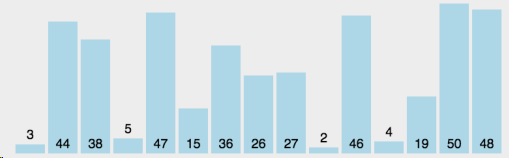

优化后代码如下：

```js
const insertSort = (arr, start = 0, end) => {
	end = end || arr.length;
	for (let i = start; i < end; i++) {
		let e = arr[i];
		let j;
		for (j = i; j > start && arr[j - 1] > e; j--) arr[j] = arr[j - 1];
		arr[j] = e;
	}
	return;
};
```

接下来正式进入到 sort 方法。

#### 寻找哨兵元素

sort 的骨架大致如下：

```js
Array.prototype.sort = (comparefn) => {
	let array = Object(this);
	let length = array.length >>> 0;
	return InnerArraySort(array, length, comparefn);
};
const InnerArraySort = (array, length, comparefn) => {
	// 比较函数未传入
	if (Object.prototype.toString.call(callbackfn) !== "[object Function]") {
		comparefn = function (x, y) {
			if (x === y) return 0;
			x = x.toString();
			y = y.toString();
			if (x == y) return 0;
			else return x < y ? -1 : 1;
		};
	}
	const insertSort = () => {
		//...
	};
	const getThirdIndex = (a, from, to) => {
		// 元素个数大于1000时寻找哨兵元素
	};
	const quickSort = (a, from, to) => {
		//哨兵位置
		let thirdIndex = 0;
		while (true) {
			if (to - from <= 10) {
				insertSort(a, from, to);
				return;
			}
			if (to - from > 1000) {
				thirdIndex = getThirdIndex(a, from, to);
			} else {
				// 小于1000 直接取中点
				thirdIndex = from + ((to - from) >> 2);
			}
		}
		// 下面开始快排
	};
};
```

先来把求取哨兵位置的代码实现一下：

```js
const getThirdIndex = (a, from, to) => {
	let tmpArr = [];
	let increment = 200 + ((to - from) & 15);
	let j = 0;
	from += 1;
	to -= 1;
	for (let i = from; i < to; i += increment) {
		tmpArr[j] = [i, a[i]];
		j++;
	}
	// 把临时数组排序，取中间的值，确保哨兵的值接近平均位置
	tmpArr.sort(function (a, b) {
		return comparefn(a[1], b[1]);
	});
	let thirdIndex = tmpArr[tmpArr.length >> 1][0];
	return thirdIndex;
};
```

#### 完成快排

接下来我们来完成快排的具体代码：

```js
const _sort = (a, b, c) => {
	let arr = [a, b, c];
	insertSort(arr, 0, 3);
	return arr;
};
const quickSort = (a, from, to) => {
	//...
	// 上面我们拿到了thirdIndex
	// 现在我们拥有三个元素，from, thirdIndex, to
	// 为了再次确保 thirdIndex 不是最值，把这三个值排序
	[a[from], a[thirdIndex], a[to - 1]] = _sort(
		a[from],
		a[thirdIndex],
		a[to - 1]
	);
	// 现在正式把 thirdIndex 作为哨兵
	let pivot = a[thirdIndex];
	// 正式进入快排
	let lowEnd = from + 1;
	let highStart = to - 1;
	// 现在正式把 thirdIndex 作为哨兵, 并且lowEnd和thirdIndex交换
	let pivot = a[thirdIndex];
	a[thirdIndex] = a[lowEnd];
	a[lowEnd] = pivot;
	// [lowEnd, i)的元素是和pivot相等的
	// [i, highStart) 的元素是需要处理的
	for (let i = lowEnd + 1; i < highStart; i++) {
		let element = a[i];
		let order = comparefn(element, pivot);
		if (order < 0) {
			a[i] = a[lowEnd];
			a[lowEnd] = element;
			lowEnd++;
		} else if (order > 0) {
			do {
				highStart--;
				if (highStart === i) break;
				order = comparefn(a[highStart], pivot);
			} while (order > 0);
			// 现在 a[highStart] <= pivot
			// a[i] > pivot
			// 两者交换
			a[i] = a[highStart];
			a[highStart] = element;
			if (order < 0) {
				// a[i] 和 a[lowEnd] 交换
				element = a[i];
				a[i] = a[lowEnd];
				a[lowEnd] = element;
				lowEnd++;
			}
		}
	}
	// 永远切分大区间
	if (lowEnd - from > to - highStart) {
		// 继续切分lowEnd ~ from 这个区间
		to = lowEnd;
		// 单独处理小区间
		quickSort(a, highStart, to);
	} else if (lowEnd - from <= to - highStart) {
		from = highStart;
		quickSort(a, from, lowEnd);
	}
};
```

### 测试结果

测试结果如下：

一万条数据：

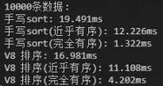

十万条数据：

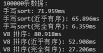

一百万条数据：

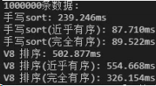

一千万条数据：

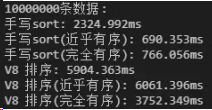

结果仅供大家参考，因为不同的 node 版本对于部分细节的实现可能不一样，我现在的版本是 v10.15。

从结果可以看到，目前版本的 node 对于有序程度较高的数据是处理的不够好的，而我们刚刚实现的排序通过反复确定哨兵的位置就能 有效的规避快排在这一场景下的劣势。

最后给大家完整版的 sort 代码：

```js
const sort = (arr, comparefn) => {
	let array = Object(arr);
	let length = array.length >>> 0;
	return InnerArraySort(array, length, comparefn);
};
const InnerArraySort = (array, length, comparefn) => {
	// 比较函数未传入
	if (Object.prototype.toString.call(comparefn) !== "[object Function]") {
		comparefn = function (x, y) {
			if (x === y) return 0;
			x = x.toString();
			y = y.toString();
			if (x == y) return 0;
			else return x < y ? -1 : 1;
		};
	}
	const insertSort = (arr, start = 0, end) => {
		end = end || arr.length;
		for (let i = start; i < end; i++) {
			let e = arr[i];
			let j;
			for (j = i; j > start && comparefn(arr[j - 1], e) > 0; j--)
				arr[j] = arr[j - 1];
			arr[j] = e;
		}
		return;
	};
	const getThirdIndex = (a, from, to) => {
		let tmpArr = [];
		// 递增量，200~215 之间，因为任何正数和15做与操作，不会超过15，当然是大于0的
		let increment = 200 + ((to - from) & 15);
		let j = 0;
		from += 1;
		to -= 1;
		for (let i = from; i < to; i += increment) {
			tmpArr[j] = [i, a[i]];
			j++;
		}
		// 把临时数组排序，取中间的值，确保哨兵的值接近平均位置
		tmpArr.sort(function (a, b) {
			return comparefn(a[1], b[1]);
		});
		let thirdIndex = tmpArr[tmpArr.length >> 1][0];
		return thirdIndex;
	};
	const _sort = (a, b, c) => {
		let arr = [];
		arr.push(a, b, c);
		insertSort(arr, 0, 3);
		return arr;
	};
	const quickSort = (a, from, to) => {
		//哨兵位置
		let thirdIndex = 0;
		while (true) {
			if (to - from <= 10) {
				insertSort(a, from, to);
				return;
			}
			if (to - from > 1000) {
				thirdIndex = getThirdIndex(a, from, to);
			} else {
				// 小于1000 直接取中点
				thirdIndex = from + ((to - from) >> 2);
			}
			let tmpArr = _sort(a[from], a[thirdIndex], a[to - 1]);
			a[from] = tmpArr[0];
			a[thirdIndex] = tmpArr[1];
			a[to - 1] = tmpArr[2];
			// 现在正式把 thirdIndex 作为哨兵
			let pivot = a[thirdIndex];
			[a[from], a[thirdIndex]] = [a[thirdIndex], a[from]];
			// 正式进入快排
			let lowEnd = from + 1;
			let highStart = to - 1;
			a[thirdIndex] = a[lowEnd];
			a[lowEnd] = pivot;
			// [lowEnd, i)的元素是和pivot相等的
			// [i, highStart) 的元素是需要处理的
			for (let i = lowEnd + 1; i < highStart; i++) {
				let element = a[i];
				let order = comparefn(element, pivot);
				if (order < 0) {
					a[i] = a[lowEnd];
					a[lowEnd] = element;
					lowEnd++;
				} else if (order > 0) {
					do {
						highStart--;
						if (highStart === i) break;
						order = comparefn(a[highStart], pivot);
					} while (order > 0);
					// 现在 a[highStart] <= pivot
					// a[i] > pivot
					// 两者交换
					a[i] = a[highStart];
					a[highStart] = element;
					if (order < 0) {
						// a[i] 和 a[lowEnd] 交换
						element = a[i];
						a[i] = a[lowEnd];
						a[lowEnd] = element;
						lowEnd++;
					}
				}
			}
			// 永远切分大区间
			if (lowEnd - from > to - highStart) {
				// 单独处理小区间
				quickSort(a, highStart, to);
				// 继续切分lowEnd ~ from 这个区间
				to = lowEnd;
			} else if (lowEnd - from <= to - highStart) {
				quickSort(a, from, lowEnd);
				from = highStart;
			}
		}
	};
	quickSort(array, 0, length);
};
```

## 5.手写实现函数的 call、apply、bind 方法

### call 方法实现

```js
// 手写自己的call方法
Function.prototype.myCall = function (thisArg, ...args) {
	// ...args：...把剩余参数args展开
	// 1.获取需要被执行的函数
	var fn = this;

	// 2.对thisArg转成对象类型（防止它传入的是非对象类型）
	thisArg = thisArg ? Object(thisArg) : window;

	// 3.执行传入的第一个参数为对象
	thisArg.fn = fn;
	var res = thisArg.fn(...args); // 传入剩余参数，执行this指向的函数
	delete thisArg; // 删除参数

	// 4.返回结果
	return res;
};

// 示例函数1
function foo() {
	console.log("foo函数被执行");
}
// 示例函数2
function sum(num1, num2) {
	return num1 + num2;
}

// 系统内置call方法
foo.call(undefined);
foo.call();

var sumResult1 = sum.call({}, 10, 20, 30);
console.log(sumResult1); //

// 自己实现的call方法
foo.myCall();
foo.myCall(123);
foo.myCall({ name: "哈哈" });
foo.myCall("呵呵");
foo.myCall(true);
foo.myCall(false);

var sumResult2 = sum.call({}, 10, 20, 30);
console.log(sumResult2); //
```

### apply 方法实现

```js
// 手写自己的apply方法
Function.prototype.myApply = function (thisArg, argArray) {
	// 1.获取需要被执行的函数
	var fn = this;

	// 2.判断参数对象是什么数值，进行转换，或者指向全局
	thisArg =
		thisArg !== null && thisArg !== undefined ? Object(thisArg) : window;

	// 3.执行传入的第一个参数为对象
	thisArg.fn = fn;

	// ***** 判断是否传了第二个数组参数 *****
	// 方法1：
	// var res;
	// if(!argArray) { // 没有传第二个参数argArray
	//     res = thisArg.fn();
	// } else{ // 有传参数
	//     res = thisArg.fn(...argArray);// 展开传入剩余数组参数，执行this指向的函数
	// }
	// 方法2：
	argArray = argArray ? argArray : []; // 如果没有第二个参数，就默认赋值空数组给第二个参数
	// argArray = argArray || []; // 逻辑或判断替代三元运算👆
	var res = thisArg.fn(...argArray); // 展开传入剩余数组参数，执行this指向的函数

	delete thisArg.fn; // 删除参数属性

	// 4.返回结果
	return res;
};

// 示例函数1
function sum(num1, num2) {
	return num1 + num2;
}
// 示例函数2
function foo(num) {
	return num;
}
// 示例函数3
function bar() {
	console.log("bar函数被执行");
}

// 系统内置apply方法
foo.apply(undefined);
foo.apply();

var sumResult1 = sum.apply("abc", [10, 20, 30]);
console.log(sumResult1); //

// 自己实现的call方法

foo.myApply();
foo.myApply(123);
foo.myApply({ name: "哈哈" });
foo.myApply("呵呵");
foo.myApply(true);
foo.myApply(false);
// 第二种情况：数组参数
var sumResult2 = sum.myApply("嘿嘿", [10, 20, 30]);
console.log(sumResult2);
// 第三种情况：没有参数
bar.myApply("abcBar");
```

### bind 方法实现

```js
// 手写自己的bind方法
Function.prototype.myBind = function (thisArg, ...argArray) {
	// 1.获取需要被执行的函数
	var fn = this;

	// 2.判断参数对象是什么数值，进行转换，或者指向全局
	thisArg =
		thisArg !== null && thisArg !== undefined ? Object(thisArg) : window;

	// 返回出去的函数
	function proxyFn() {
		thisArg.fn = fn;
		// 对两个传入的参数进行合并
		var finalArgs = [...argArrar, ...args];
		var res = thisArg.fn(...finalArgs); // 展开数组参数 传入
		delete thisArg.fn; // 删除参数属性
		return res;
	}
	// 4.返回函数
	return proxyFn;
};

// 示例函数1
function sum(num1, num2, num3, num4) {
	console.log(num1 + num2 + num3 + num4);
}
// 示例函数2
function foo() {
	console.log("foo函数被执行");
	return 20;
}

// 系统内置的bind方法使用示例

// 自己手写实现的bind方法使用示例
var bar = foo.myBind("abc");
var res = bar();
cosole.log(res);

var newSum = sum.myBind("abc", 10, 20);
var numRes = newSum(30, 40);
cosole.log(numRes);
```

## 6.实现 Ajax

1. 创建一个 XMLHttpRequest 对象
2. 在这个对象上使用 open 方法创建一个 HTTP 请求（参数为请求方法、请求地址、是否异步和用户的认证信息）
3. 通过 send 方法来向服务器发起请求（post 请求可以入参作为发送的数据体）
4. 监听请求成功后的状态变化：根据状态码进行相应的出来。onreadystatechange 设置监听函数，当对象的 readyState 变为 4 的时候，代表服务器返回的数据接收完成，这个时候可以通过判断请求的状态，如果状态是 200 则为成功，404 或 500 为失败。

```javascript
function ajax(url) {
	//1.创建XMLHttpRequest对象
	const xhr = new XMLHttpRequest();
	//2.使用open方法创建一个GET请求
	xhr.open("GET", url);
	//xhr.open('GET',url,true);//true代表异步，已完成事务的通知可供事件监听器使用;如果为false，send() 方法直到收到答复前不会返回
	//3.发送请求
	xhr.send();
	//4.监听请求成功后的状态变化(readyState改变时触发)：根据状态码(0~5)进行相应的处理
	xhr.onreadystatechange = function () {
		//readyState为4代表服务器返回的数据接收完成
		if (xhr.readyState == 4) {
			//请求的状态为200或304代表成功
			if (xhr.status == 200 || xhr.status == 304) {
				//this.response代表返回的数据
				handle(this.response);
			} else {
				//this.statusText代表返回的文本信息
				console.error(this.statusText);
			}
		}
	};
}
```

使用 Promise 封装 Ajax：

```javascript
function ajax(url) {
	return new Promise((resolve, reject) => {
		let xhr = new XMLHttpRequest();
		xhr.open("get", url);
		xhr.send();
		xhr.onreadystatechange = () => {
			if (xhr.readyState == 4) {
				if (xhr.status == 200 || xhr.status == 304) {
					resolve(this.response);
				} else {
					reject(new Error(this.statusText));
				}
			}
		};
	});
}
// 使用
let url = "/data.json";
ajax(url)
	.then((res) => console.log(res))
	.catch((reason) => console.log(reason));
```

## 7.实现继承

说出中⼼思想，而不是列举被博客炒了㇐遍⼜㇐遍的冷饭。

实现继承有两个方面要考虑，㇐个是原型属性和方法的继承，另㇐个是构造器的继承。

### **ES5** 继承（寄生组合式继承）

寄生组合式继承是对组合式继承（调用了 2 次父构造方法）的改进，使用父类的原型的副本来作为子类的原型，这样就只调用一次父构造函数，避免了创建不必要的属性。

```javascript
function Parent(name) {
	this.name = name;
	this.colors = ["red", "blue", "green"];
}
Parent.prototype.getName = function () {
	console.log(this.name);
};
function Child(name, age) {
	Parent.call(this, name); //借用构造函数的方式来实现属性的继承和传参
	this.age = age;
}

//这里不用Child.prototype = new Parent()原型链方式的原因是会调用2次父类的构造方法，导致子类的原型上多了不需要的父类属性
Child.prototype = Object.create(Parent.prototype); //这里就是对组合继承的改进,创建了父类原型的副本
Child.prototype.constructor = Child; //把子类的构造指向子类本身

var child1 = new Child("AK、dadada", "18");
console.log(child1.colors); //[ 'red', 'blue', 'green' ]
child1.getName(); //AK、dadada
```

测试结果：

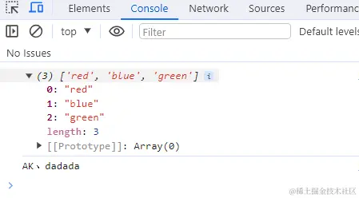

### ES6 继承

在 ES6 中，可以使用 class 类去实现继承。使用 extends 表明继承自哪个父类，并且在子类构造函数中必须调用 super。

```javascript
class Parent {
	constructor(name) {
		this.name = name;
	}
	getName() {
		console.log(this.name);
	}
}

class Child extends Parent {
	constructor(name, age) {
		//使用this之前必须先调用super(),它调用父类的构造函数并绑定父类的属性和方法
		super(name);
		//之后子类的构造函数再进一步访问和修改 this
		this.age = age;
	}
}

// 测试
let child = new Child("AK、dadada", 18);
console.log(child.name); // AK、dadada
console.log(child.age); // 18
child.getName(); // AK、dadada
```

测试结果：

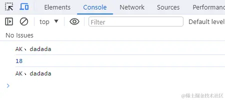

### ES5 继承和 ES6 继承的**区别**：

- `ES5`继承是先创建子类的实例对象，然后再将父类方法添加到 this（`Parent.call(this)`）上。
- `ES6`的继承不同，实质是先将父类实例对象的属性和方法，加到 this 上面（所以必须先调用 super 方法），然后再用子类的构造函数修改 this。

## 8.手写实现 Promise

### 手写实现 Promise

这个㇐般不会直接出现吧，因为如果按 Promise/A+规范来，代码量不少，如果做题时能提供 Promise/A+规范原文做参考，应该是能写出来的。我可以跟面试官说我 github 已经写过㇐个实现了吗？promises-aplus-robin
<https://github.com/cumt-robin/promises-aplus-robin>

```js
可以看同级的文档：【手写Promise.md】
```

### 手写 Promise.prototype.catch

catch 是基于 Promise.prototype.then 实现的，所以就有点简单了。

```js
Promise.prototype.myCatch = function (onRejected) {
	return this.then(undefined, onRejected);
};
```

### 手写 Promise.prototype.finally

这个是有可能考的，比如微信小程序就不支持 finally。可以基于 .then 来实现，不管 fulfilled 还是 rejected 都要执行 onFinally。

但是要注意，不管当前 Promise 的状态是 fulfilled 还是 rejected，只要在 onFinally 中没有发生以下任何一条情况，finally 方法返回的新的 Promise 实例的状态就会与当前 Promise 的状态保持一致!

这也意味着即使在 onFinally 中返回一个状态为 fulfilled 的 Promise 也不能阻止新的 Promise 实例采纳当前 Promise 的状态或值！

- 返回一个状态为或将为 rejected 的 Promise
- 抛出错误

总的来说，在 finally 情况下，rejected 优先！

```js
Promise.prototype.myFinally = function(onFinally){
    return this.then(
        value => {
            return Promise.resolve(onFinally()).then(()=> value)
        },
        reason => {
        return Promise.resolve(onFinally()).then(() => { throw reason }
	);
};
```

### 手写实现 Promise.all

这个主要是考察如何收集每㇐个 Promise 的状态变化，在最后㇐个 Promise 状态变化时，对外发出信号。

- 判断 iterable 是否空
- 判断 iterable 是否全部不是 Promise
- 遍历，如果某项是 Promise，利用 .then 获取结果，如果 fulfilled，将 value 存在 values 中，并用 fulfillCount 计数；如果是 rejected，直接 reject reason。
- 如果某项不是 Promise，直接将值存起来，并计数。
- 等所有异步都 fulfilled，fulfillCount 必将是 iterable 的长度（在 onFulfilled 中判断 fulfillCount），此时可以 resolve values。

```javascript
function PromiseAll(promises) {
	return new Promise(function (resolve, reject) {
		// 传入参数为一个空的可迭代对象，直接resolve
		if (promises.length === 0) {
			resolve([]);
		} else {
			const res = [];
			let count = 0;
			for (let i = 0; i < promises.length; i++) {
				//为什么不直接promise[i].then, 因为promise[i]可能不是一个promise, 也可能是普通值
				Promise.resolve(promises[i])
					.then((data) => {
						res[i] = data;
						count++;
						if (count === promises.length) {
							resolve(res); //如果所有Promise都成功，则返回成功结果数组
						}
					})
					.catch((err) => {
						reject(err); //如果有一个Promise失败，则返回这个失败结果
					});
			}
		}
	});
}

// 测试
const promise1 = Promise.resolve(5);
const promise2 = 4;
const promise3 = new Promise((resolve, reject) => {
	setTimeout(resolve, 100, "AK、DADADA");
});

PromiseAll([promise1, promise2, promise3]).then((values) => {
	console.log(values); //[5, 4, "AK、DADADA"]
});
```

测试结果：

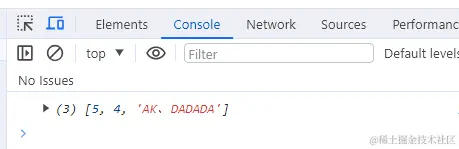

方法 2

```js
function PromiseAll(promises) {
	return new Promise((resolve, reject) => {
		const result = [];
		let count = 0;
		const len = promises.length;
		for (let i = 0; i < len; i++) {
			promises[i].then(
				(value) => {
					result[i] = value;
					count++;
					if (count === len) {
						resolve(result);
					}
				},
				(reason) => {
					reject(reason);
				}
			);
		}
	});
}

// Usage
const p1 = new Promise((resolve) => {
	setTimeout(() => {
		resolve(1);
	}, 1000);
});

const p2 = new Promise((resolve) => {
	setTimeout(() => {
		resolve(2);
	}, 500);
});

const p3 = new Promise((resolve) => {
	setTimeout(() => {
		resolve(3);
	}, 1500);
});

PromiseAll([p1, p2, p3]).then((result) => {
	console.log(result); // [1, 2, 3]
});
```

方法 3：

```js
function PromiseAll(iterable) {
	var tasks = Array.from(iterable);
	if (tasks.length === 0) {
		return Promise.resolve([]);
	}
	if (tasks.every((task) => !(task instanceof Promise))) {
		return Promise.resolve(tasks);
	}

	return new Promise((resolve, reject) => {
		var values = new Array(tasks.length).fill(null);
		var fulfillCount = 0;
		tasks.forEach((task, index, arr) => {
			if (task instanceof Promise) {
				task.then(
					(value) => {
						fulfillCount++;
						values[index] = value;
						if (fulfillCount === arr.length) {
							resolve(values);
						}
					},
					(reason) => {
						reject(reason);
					}
				);
			} else {
				fulfillCount++;

				values[index] = task;
			}
		});
	});
}
```

## 9. 使用 setTimeout 实现 setInterval

`setInterval的缺点`：setInterval 的作用是`每隔一段时间执行一个函数`，但是这个执行不是真的到了时间立即执行，它真正的作用是每隔一段时间将事件加入事件队列中去，只有当当前的执行栈为空的时候，才能去从事件队列中取出事件执行。所以可能会出现这样的情况，就是当前执行栈执行的时间很长，导致事件队列里边积累多个定时器加入的事件，当执行栈结束的时候，这些事件会依次执行，因此就不能到间隔一段时间执行的效果。

```bash
针对 setInterval 的这个缺点，我们可以使用 setTimeout 递归调用来模拟 setInterval，这样我们就确保了只有一个事件结束了，我们才会触发下一个定时器事件，这样解决了 setInterval 的问题。
```

实现思路是使用递归函数，不断地去执行 setTimeout 从而达到 setInterval 的效果。

```javascript
function mySetInterval(fn, timeout) {
	// 控制器，控制定时器是否继续执行
	var timer = {
		flag: true,
	};
	// 设置递归函数，模拟定时器执行
	function interval() {
		if (timer.flag) {
			fn();
			setTimeout(interval, timeout); //递归
		}
	}
	// 启动定时器
	setTimeout(interval, timeout);
	// 返回控制器
	return timer;
}

let timer = mySetInterval(() => {
	console.log("1");
}, 1000);
//3秒后停止定时器
setTimeout(() => (timer.flag = false), 3000);
```

## 手写实现 generator

### generator 原理

Generator 是 ES6 中新增的语法，和 Promise 一样，都可以用来异步编
程

```js
var a = 0;
var b = async () => {
	a = a + (await 10);
	console.log("2", a); // -> '2' 10
	a = (await 10) + a;
	console.log("3", a); // -> '3' 20
};
b();
a++;
console.log("1", a); // -> '1' 1
// 使用 * 表示这是一个 Generator 函数
// 内部可以通过 yield 暂停代码
// 通过调用 next 恢复执行
function* test() {
	let a = 1 + 2;
	yield 2;
	yield 3;
}
let b = test();
console.log(b.next()); // > { value: 2, done: false }
console.log(b.next()); // > { value: 3, done: false }
console.log(b.next()); // > { value: undefined, done: true }
```

从以上代码可以发现，加上 \* 的函数执行后拥有了 next 函数，也就是说
函数执行后返回了一个对象。每次调用 next 函数可以继续执行被暂停的代
码。

### 以下是 Generator 函数的简单实现

```js
// cb 也就是编译过的 test 函数
function generator(cb) {
	return (function () {
		var object = {
			next: 0,
			stop: function () {},
		};
		return {
			next: function () {
				var ret = cb(object);
				if (ret === undefined) return { value: undefined, done: true };
				return {
					value: ret,
					done: false,
				};
			},
		};
	})();
}
// 如果你使用 babel 编译后可以发现 test 函数变成了这样
function test() {
	var a;
	return generator(function (_context) {
		while (1) {
			switch ((_context.prev = _context.next)) {
				// 可以发现通过 yield 将代码分割成几块
				// 每次执行 next 函数就执行一块代码
				// 并且表明下次需要执行哪块代码
				case 0:
					a = 1 + 2;
					_context.next = 4;
					return 2;
				case 4:
					_context.next = 6;
					return 3;
				// 执行完毕
				case 6:
				case "end":
					return _context.stop();
			}
		}
	});
}
```
