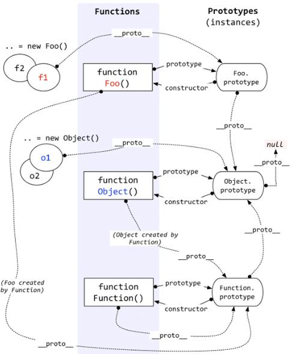

# JavaScript 高级面试题

我的掘金收藏：<https://juejin.cn/user/3544481219748590/collections>

**数据类型**

javascript 的数据类型、数据检查、深浅拷贝，是 js 最基础的内容了。月薪 4k 的前端开发都知道的经典面试题“JavaScript 有几种类型”，但如果让你手写一个深拷贝，你能写出来吗

- [JavaScript 基础心法——深浅拷贝](https://link.zhihu.com/?target=https%3A//github.com/axuebin/articles/issues/20)
- [面试题之如何实现一个深拷贝](https://link.zhihu.com/?target=https%3A//github.com/yygmind/blog/issues/29)

**作用域**

- [理解 JavaScript 中的执行上下文和执行栈](https://link.zhihu.com/?target=https%3A//juejin.im/post/5ba32171f265da0ab719a6d7)
- [破解前端面试（80% 应聘者不及格系列）：从闭包说起](https://link.zhihu.com/?target=https%3A//juejin.im/post/58f1fa6a44d904006cf25d22%23heading-0)

**原型**

- [JavaScript 深入之创建对象的多种方式以及优缺点](https://link.zhihu.com/?target=https%3A//github.com/mqyqingfeng/Blog/issues/15)
- [JavaScript 深入之从原型到原型链](https://link.zhihu.com/?target=https%3A//github.com/mqyqingfeng/Blog/issues/2)
- [重新认识构造函数、原型和原型链](https://link.zhihu.com/?target=https%3A//juejin.im/post/5c6a9c10f265da2db87b98f3)
- [一文吃透所有 JS 原型相关知识点](https://link.zhihu.com/?target=https%3A//juejin.im/post/5dba456d518825721048bce9%23heading-19)

**继承**

- [彻底弄懂 JS 原型与继承](https://link.zhihu.com/?target=https%3A//juejin.im/post/5bf3d8936fb9a04a072ffba1%23heading-6)
- [JavaScript 深入之继承的多种方式和优缺点](https://link.zhihu.com/?target=https%3A//github.com/mqyqingfeng/Blog/issues/16)

**new、this**

- [JavaScript 深入之 new 的模拟实现](https://link.zhihu.com/?target=https%3A//github.com/mqyqingfeng/Blog/issues/13)
- [面试官问：JS 的 this 指向](https://link.zhihu.com/?target=https%3A//juejin.im/post/5c0c87b35188252e8966c78a)

**call apply bind**

- [JavaScript 基础心法——call apply bind](https://link.zhihu.com/?target=https%3A//github.com/axuebin/articles/issues/7)
- [JavaScript 深入之 call 和 apply 的模拟实现](https://link.zhihu.com/?target=https%3A//github.com/mqyqingfeng/Blog/issues/11)
- [JavaScript 深入之 bind 的模拟实现](https://link.zhihu.com/?target=https%3A//github.com/mqyqingfeng/Blog/issues/12)

**event loop**

- [这一次，彻底弄懂 JavaScript 执行机制](https://link.zhihu.com/?target=https%3A//juejin.im/post/59e85eebf265da430d571f89)
- [一次弄懂 Event Loop（彻底解决此类面试问题）](https://link.zhihu.com/?target=https%3A//juejin.im/post/5c3d8956e51d4511dc72c200)
- [从 event loop 规范探究 javaScript 异步及浏览器更新渲染时机](https://link.zhihu.com/?target=https%3A//github.com/aooy/blog/issues/5)
- [浏览器与 Node 的事件循环(Event Loop)有何区别?](https://zhuanlan.zhihu.com/p/54882306)

**promise**

promise 平时工作中用到的比较多，一般现在的项目只要你请求接口都会用到 promise。它也是平时面试中的高频考点，虽然平时用到的多，但大部分人面试时遇到原理性的问题还是一点懵逼。

不管是平时开发还是面试，promise 都是常客。所以推荐的文章比较多，大家一定要耐性看完，这一次彻底弄懂它。

- [Promise 不会？？看这里！！！史上最通俗易懂的 Promise！！！](https://link.zhihu.com/?target=https%3A//juejin.im/post/5afe6d3bf265da0b9e654c4b)
- [BAT 前端经典面试问题：史上最最最详细的手写 Promise 教程](https://link.zhihu.com/?target=https%3A//juejin.im/post/5b2f02cd5188252b937548ab%23heading-9)
- [Promise 必知必会（十道题）](https://link.zhihu.com/?target=https%3A//juejin.im/post/5a04066351882517c416715d)
- [当 async/await 遇上 forEach](https://link.zhihu.com/?target=https%3A//objcer.com/2017/10/12/async-await-with-forEach/)

英文好的同学可以看下这篇文档

- [Promises/A+](https://link.zhihu.com/?target=https%3A//promisesaplus.com/)

**浏览器缓存机制**

- [浏览器缓存机制全解](https://link.zhihu.com/?target=http%3A//blog.poetries.top/FE-Interview-Questions/excellent/%23_20-%E6%B5%8F%E8%A7%88%E5%99%A8%E7%BC%93%E5%AD%98%E6%9C%BA%E5%88%B6)
- [浏览器缓存原理？---送你满分答案](https://link.zhihu.com/?target=https%3A//mp.weixin.qq.com/s%3F__biz%3DMzI5MjU0Mjk5MA%3D%3D%26mid%3D2247483826%26idx%3D2%26sn%3De38f5e5b928a6aa5c15371505b4e8d71%26chksm%3Dec7e8ed3db0907c545393ea90ee8bfd7dc944ff013957228b200d66929767251b1982340d036%26token%3D1895398626%26lang%3Dzh_CN%23rd)

**浏览器渲染原理**

- [浏览器渲染原理（性能优化之如何减少重排和重绘）](https://link.zhihu.com/?target=https%3A//juejin.im/post/5c35cf62f265da615e05a67d)
- [浏览器地址栏里输入 URL 后的全过程](https://link.zhihu.com/?target=https%3A//juejin.im/post/5c354b656fb9a049e553ce68)
- [前端性能优化之重排和重绘](https://link.zhihu.com/?target=https%3A//www.cnblogs.com/soyxiaobi/p/9963019.html)

**函数式编程**

- [JavaScript 函数式编程到底是个啥](https://link.zhihu.com/?target=https%3A//segmentfault.com/a/1190000009864459)
- [函数式编程全书](https://link.zhihu.com/?target=https%3A//llh911001.gitbooks.io/mostly-adequate-guide-chinese/content/)
- [简明 JavaScript 函数式编程——入门篇](https://link.zhihu.com/?target=https%3A//juejin.im/post/5d70e25de51d453c11684cc4)

**HTML5 Web Worker**

- [浅谈 HTML5 Web Worker](https://link.zhihu.com/?target=https%3A//juejin.im/post/59c1b3645188250ea1502e46%23heading-0)
- [JavaScript 性能利器 —— Web Worker](https://link.zhihu.com/?target=https%3A//juejin.im/post/5c10e5a9f265da611c26d634)

**Service Worker**

- [借助 Service Worker 和 cacheStorage 缓存及离线开发](https://link.zhihu.com/?target=https%3A//www.zhangxinxu.com/wordpress/2017/07/service-worker-cachestorage-offline-develop/)
- [JavaScript 是如何工作的：Service Worker 的生命周期及使用场景](https://link.zhihu.com/?target=https%3A//github.com/qq449245884/xiaozhi/issues/8)
- 面[试官：请你实现一个 PWA 我：](https://link.zhihu.com/?target=https%3A//juejin.im/post/5e26aa785188254c257c462d%23heading-24)

**数据处理**

- [解锁多种 JavaScript 数组去重姿势](https://link.zhihu.com/?target=https%3A//juejin.im/post/5b0284ac51882542ad774c45)
- [20 道 JS 原理题助你面试一臂之力！](https://link.zhihu.com/?target=https%3A//juejin.im/post/5d2ee123e51d4577614761f8%23heading-6)
- [一个合格的中级前端工程师需要掌握的 28 个 JavaScript 技巧](https://link.zhihu.com/?target=https%3A//juejin.im/post/5cef46226fb9a07eaf2b7516)

**es6**

- [ES6、ES7、ES8 特性一锅炖(ES6、ES7、ES8 学习指南)](https://link.zhihu.com/?target=https%3A//juejin.im/post/5b9cb3336fb9a05d290ee47e%23heading-27)
- [近一万字的 ES6 语法知识点补充 - 掘金](https://link.zhihu.com/?target=https%3A//juejin.im/post/5c6234f16fb9a049a81fcca5)

## 表达式和语句有什么区别？如何把语句转换为表达式？

### 什么叫执行上下文栈(·Execution Context Stack)·? 一个函数调用会产生多少上下文环境？如何激活一个上下文，什么叫 caller(调用者)，什么叫 callee(被调用者)？给你一段代码能否画出执行过程中的上下文堆栈变化？

### 执行上下文包括哪些结构(状态/属性)，如何追踪关联代码的执行进度？

### eval 在调用的时候有哪些特别的地方？ eval 函数自身会产生上下文吗？会影响当前的调用上下文吗？

### 什么叫变量对象？什么叫活动对象？

### 词法作用域是什么？闭包是如何形成的？

### var foo = function bar () {} 命名函数表达式中(上述的 foo 函数)bar 变量是定义在哪一层作用域的？

### (0, 1, 2) 的结果是什么？

### var foo = { value: 2, bar: function () { return this.value; } 中(foo.bar,foo.bar)() 的 this 值是什么？ (foo.bar = foo.bar)()、(false || foo.bar)()

呢?

## JavaScript 闭包

### 说一说闭包

答：闭包说的通俗一点就是打通了一条在函数外部访问函数内部作用域的通道。正常情况下函数外部是访问不到函数内部作用域变量的，表象判断是不是闭包：函数嵌套函数,内部函数被 return 内部函数调用外层函数的局部变量

优点：可以隔离作用域，不造成全局污染

缺点：由于闭包长期驻留内存，则长期这样会导致内存泄露

如何解决内存泄露：将暴露全外部的闭包变量置为 null

适用场景：封装组件，for 循环和定时器结合使用，for 循环和 dom 事件结合。可以在性能优化的过程中，节流防抖函数的使用，导航栏获取下标的使用。

### 单例模式封装

1.保存变量

```js
for (var i = 0; i < li.length; i++) {
	(function (n) {
		li[i].onclick = function () {
			console.log(n);
		};
	})(i);
	// 加入一个立即执行函数，闭包就形成了
}
```

闭包就是能够读取其他函数内部变量的函数（这里读取 n,n 为内部变量）， 可以理解成定义在一个函数内部的函数

在执行 for 循环后，先执行立即执行函数，不会因为异步的问题需要等待 for 循环执行完毕，在被调用时保存 i 变量自执行赋给 n。

2.延长变量生命周期之单例模式

在设计模式中的封装单例时也可以用到闭包来保存变量在空间中或者严格来说是延长变量生命周期从而实现单一实例

```js
const singleTon1 = (function () {
	function Person() {}
	let instance = null; // 因变量保存返回的instance不会被销毁
	return function singleTon2() {
		// 函数被返回没有被执行，变量被保存
		if (!instance) {
			instance = new Person();
			return instance;
		}
	};
})(); // 自执行singleTon1方法
const p = singleTon1(); // 执行singleTon2方法
```

在这里就牵扯到垃圾回收机制，在有变量的地方 js 就会开辟空间，分配内存，内存使用，当执行完函数，使用完变量后销毁。全局变量会在网页关闭后进行销毁。

3.闭包的另一个重要的作用： 防止全局变量污染

```js
var name = "lihua";
function obj() {
	console.log(name);
}
// 中间插入，会被恶意修改全局变量。或者多人协作，如果出现多人命名相同，就会造成污染。
name = "zhangsan";
obj();

let count = 0;
// 全局会造成污染
function demo() {
	count++;
	console.log(count);
}
demo();
demo();

let demo1 = (() => {
	// 闭包解决污染的问题
	let count = 3;
	return () => {
		count++;
		console.log(count);
	};
})();

demo1();
```

## JavaScript 原型和原型链

### 简单说下原型链？



每个函数都有 `prototype` 属性，除了 `Function.prototype.bind()` ，该属性指向原型。

- 每个对象都有 `__proto__` 属性，指向了创建该对象的构造函数的原型。其实这个属性指向了 `[[prototype]]` ，但是 `[[prototype]]` 是内部属性，我们并不能访问到，所以使用 `_proto_` 来访问。
- 对象可以通过 `__proto__` 来寻找不属于该对象的属性， `__proto__` 将对象连接起来组成了原型链。

### JavaScript 原型，原型链 ? 有什么特点？

每个对象都会在其内部初始化一个属性，就是 prototype (原型)，当我们访问一个对象的属性时

如果这个对象内部不存在这个属性，那么他就会去 prototype 里找这个属性，这个 prototype ⼜会有自己的 prototype ，于是就这样一直找下去，也就是我们平时所说的原型链的概念

关系： instance.constructor.prototype = instance.**proto**

特点：JavaScript 对象是通过引用来传递的，我们创建的每个新对象实体中并没有一份属于自己的原型副本。当我们修改原型时，与之相关的对象也会继承这一改变。

当我们需要一个属性的时， Javascript 引擎会先看当前对象中是否有这个属性， 如果没有的，就会查找他的 Prototype 对象是否有这个属性，如此递推下去，一直检索到 Object 内建对象

### 说一下 JS 中的原型链的理解？

答：原型链是理解 JS 面向对象很重要的一点，这里主要涉及到两个点，一是`__proto__`*，二是*prototype,举个例子吧，这样还好说点，例如：我用 function 创建一个 Person 类，然后用 new Person 创建一个对象的实例假如叫 p1 吧，在 Person 类的原型 prototype 添加一个方法，例如：play 方法,那对象实例 p1 如何查找到 play 这个方法呢，有一个查找过程，具体流程是这样的：

首先在 p1 对象实例上查找是否有有 play 方法，如果有则调用执行，如果没有则用`p1.__proto__(_proto_`是一个指向的作用,指向上一层的原型)往创建 p1 的类的原型上查找，也就是说往 Person.prototype 上查找，如果在 Person.prototype 找到 play 方法则执行，否则继续往上查找，则用 Person.prototye.**proto**继续往上查找，找到 Object.prototype，如果 Object.prototype 有 play 方法则执行之，否则用 Object.prototype.**proto**继续再往上查找，但 Object.prototpye.**proto**上一级是 null,也就是原型链的顶级，结束原型链的查找，这是我对原型链的理解

### 说一下 JS 继承（含 ES6 的）或者人家这样问有两个类 A 和 B，B 怎么继承 A

答：JS 继承实现方式也很多，主要分 ES5 和 ES6 继承的实现

先说一下 ES5 是如何实现继承的

ES5 实现继承主要是基于 prototype 来实现的，具体有三种方法

一是**原型链继承**：即 B.prototype=new A()

二是借**用构造函数继承(call 或者 apply 的方式继承)**

```js
function B(name, age) {
	A.call(ths, name, age);
}
```

三**是组合继承**

组合继承是结合第一种和第二种方式

再说一下 ES6 是如何实现继承的

ES6 继承是目前比较新，并且主流的继承方式，用 class 定义类，用 extends 继承类，用 super()表示父类,【下面代码部分只是熟悉，不用说课】

例如：创建 A 类

```js
class A ｛
    constructor() {
    //构造器代码，new时自动执行
    }
    方法1( ) { //A类的方法 }
    方法2( ) { //A类的方法 }
｝
```

创建 B 类并继承 A 类

```js
class B extends A {
	constructor() {
		super(); // 表示父类
	}
}
```

实例化 B 类： var b1 = new B( );

b1.方法 1( );

### Javascript 如何实现继承？

- 构造继承
- 原型继承
- 实例继承
- 拷⻉继承

原型 prototype 机制或 apply 和 call 方法去实现较简单，建议使用构造函数与原型混合方式

```js
function Parent() {
	this.name = "wang";
}
function Child() {
	this.age = 28;
}

Child.prototype = new Parent(); //继承了Parent，通过原型
var demo = new Child();
alert(demo.age);
alert(demo.name); //得到被继承的属性
```

## JavaScript 设计模式

- [JavaScript 中常见的十五种设计模式\_javascript 设计模式\_chenzoff 的博客-CSDN 博客](https://blog.csdn.net/chenzoff/article/details/127672963)
- [八大最常用的 JavaScript 设计模式 - 知乎 (zhihu.com)](https://zhuanlan.zhihu.com/p/465206177)

设计模式总的来说是一个抽象的概念，前⼈通过无数次的实践总结出的一套写
代码的方式，通过这种方式写的代码可以让别⼈更加容易阅读、维护以及复
用。

### 用过哪些设计模式？

#### 工⼚模式：

- 工⼚模式解决了重复实例化的问题，但还有一个问题,那就是识别问题，因为根本无法
- 主要好处就是可以消除对象间的耦合，通过使用工程方法而不是 new 关键字

##### 简单工⼚模式

```js
class Man {
	constructor(name) {
		this.name = name;
	}
	alertName() {
		alert(this.name);
	}
}
class Factory {
	static create(name) {
		return new Man(name);
	}
}
Factory.create("yck").alertName();
```

当然工⼚模式并不仅仅是用来 new 出实例。

可以想象一个场景。假设有一份很复杂的代码需要用户去调用，但是用户并不关⼼这些复杂的代码，只需要你提供给我一个接口去调用，用户只负责传递需要的参数，⾄于这些参数怎么使用，内部有什么逻辑是不关⼼的，只需要你最后返回我一个实例。这个构造过程就是工⼚。

工⼚起到的作用就是隐藏了创建实例的复杂度，只需要提供一个接口，简单清晰。

在 Vue 源码中，你也可以看到工⼚模式的使用，比如创建异步组件

```js
export function createComponent(
	Ctor: Class<Component> | Function | Object | void,
	data: ?VNodeData,
	context: Component,
	children: ?Array<VNode>,
	tag?: string
): VNode | Array<VNode> | void {
	// 逻辑处理...

	const vnode = new VNode(
		`vue-component-${Ctor.cid}${name ? `-${name}` : ""}`,
		data,
		undefined,
		undefined,
		undefined,
		context,
		{ Ctor, propsData, listeners, tag, children },
		asyncFactory
	);
	return vnode;
}
```

在上述代码中，我们可以看到我们只需要调用 createComponent 传入参数
就能创建一个组件实例，但是创建这个实例是很复杂的一个过程，工⼚帮助我
们隐藏了这个复杂的过程，只需要一句代码调用就能实现功能

#### 单例模式

单例模式很常用，比如全局缓存、全局状态管理等等这些只需要一个对象，就可以使用单例模式。

单例模式的核⼼就是保证全局只有一个对象可以访问。因为 JS 是⻔无类的语⾔，所以别的语⾔实现单例的方式并不能套入 JS 中，我们只需要用一个变量确保实例只创建一次就行，以下是如何实现单例模式的例子

```js
class Singleton {
	constructor() {}
}
Singleton.getInstance = (function () {
	let instance;
	return function () {
		if (!instance) {
			instance = new Singleton();
		}
		return instance;
	};
})();
let s1 = Singleton.getInstance();
let s2 = Singleton.getInstance();
console.log(s1 === s2); // true
```

在 Vuex 源码中，你也可以看到单例模式的使用，虽然它的实现方式不大一
样，通过一个外部变量来控制只安装一次 Vuex

```js
let Vue; // bind on install
export function install(_Vue) {
	if (Vue && _Vue === Vue) {
		// 如果发现 Vue 有值，就不重新创建实例了
		return;
	}
	Vue = _Vue;
	applyMixin(Vue);
}
```

#### 适配器模式

适配器用来解决两个接口不兼容的情况，不需要改变已有的接口，通过包装一层的方式实现两个接口的正常协作。

以下是如何实现适配器模式的例子

```js
class Plug {
	getName() {
		return "港版插头";
	}
}
class Target {
	constructor() {
		this.plug = new Plug();
	}
	getName() {
		return this.plug.getName() + " 适配器转二脚插头";
	}
}
let target = new Target();
target.getName(); // 港版插头 适配器转二脚插头
```

在 Vue 中，我们其实经常使用到适配器模式。比如父组件传递给子组件一个
时间戳属性，组件内部需要将时间戳转为正常的⽇期显示，一般会使用 computed 来做转换这件事情，这个过程就使用到了适配器模式

#### 装饰模式

装饰模式不需要改变已有的接口，作用是给对象添加功能。就像我们经常需要给手机戴个保护套防摔一样，不改变手机自身，给手机添加了保护套提供防摔功能。

以下是如何实现装饰模式的例子，使用了 ES7 中的装饰器语法

```js
function readonly(target, key, descriptor) {
	descriptor.writable = false;
	return descriptor;
}
class Test {
	@readonly
	name = "yck";
}
let t = new Test();
t.yck = "111"; // 不可修改
```

在 React 中，装饰模式其实随处可见

```js
import { connect } from "react-redux";
class MyComponent extends React.Component {
	// ...
}
export default connect(mapStateToProps)(MyComponent);
```

#### 代理模式

代理是为了控制对对象的访问，不让外部直接访问到对象。在现实生活中，也有很多代理的场景。比如你需要买一件国外的产品，这时候你可以通过代购来购买产品。

在实际代码中其实代理的场景很多，也就不举框架中的例子了，比如事件代理就用到了代理模式。

```html
<ul id="ul">
	<li>1</li>
	<li>2</li>
	<li>3</li>
	<li>4</li>
	<li>5</li>
</ul>
<script>
	let ul = document.querySelector("#ul");
	ul.addEventListener("click", (event) => {
		console.log(event.target);
	});
</script>
```

因为存在太多的 li，不可能每个都去绑定事件。这时候可以通过给父节点绑定
一个事件，让父节点作为代理去拿到真实点击的节点。

#### 发布-订阅模式

发布-订阅模式也叫做观察者模式。通过一对一或者一对多的依赖关系，当对象发生改变时，订阅方都会收到通知。在现实生活中，也有很多类似场景，比如我需要在购物网站上购买一个产品，但是发现该产品目前处于缺货状态，这时候我可以点击有货通知的按钮，让网站在产品有货的时候通过短信通知我。

在实际代码中其实发布-订阅模式也很常见，比如我们点击一个按钮触发了点击事件就是使用了该模式

```html
<ul id="ul"></ul>
<script>
	let ul = document.querySelector("#ul");
	ul.addEventListener("click", (event) => {
		console.log(event.target);
	});
</script>
```

在 Vue 中，如何实现响应式也是使用了该模式。对于需要实现响应式的对象
来说，在 get 的时候会进行依赖收集，当改变了对象的属性时，就会触发派
发更新。

#### 外观模式

外观模式提供了一个接口，隐藏了内部的逻辑，更加方便外部调用。

个例子来说，我们现在需要实现一个兼容多种浏览器的添加事件方法

```js
function addEvent(elm, evType, fn, useCapture) {
	if (elm.addEventListener) {
		elm.addEventListener(evType, fn, useCapture);
		return true;
	} else if (elm.attachEvent) {
		var r = elm.attachEvent("on" + evType, fn);
		return r;
	} else {
		elm["on" + evType] = fn;
	}
}
```

对于不同的浏览器，添加事件的方式可能会存在兼容问题。如果每次都需要去
这样写一遍的话肯定是不能接受的，所以我们将这些判断逻辑统一封装在一个接口中，外部需要添加事件只需要调用 addEvent 即可。

#### 构造函数模式

使用构造函数的方法，即解决了重复实例化的问题，⼜解决了对象识别的问题，该模式与工⼚模式的不同之处在于直接将属性和方法赋值给 this 对象;
