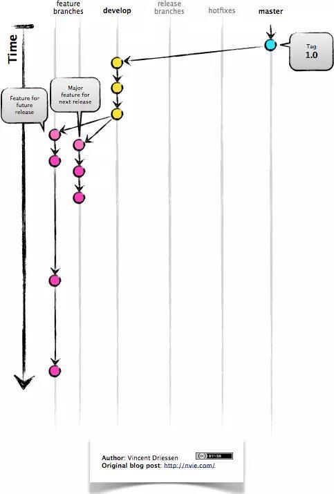
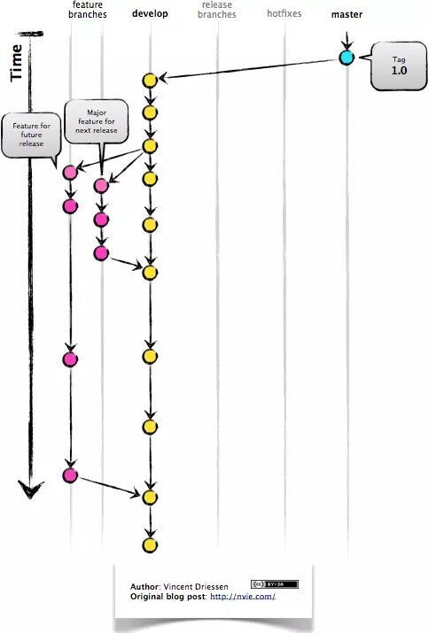
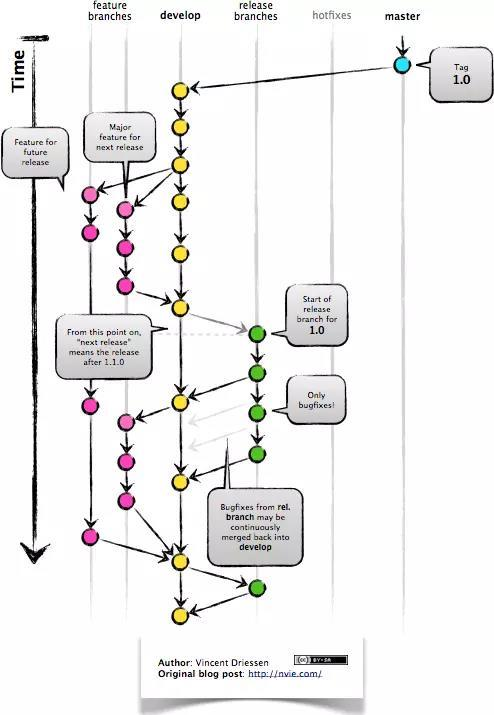
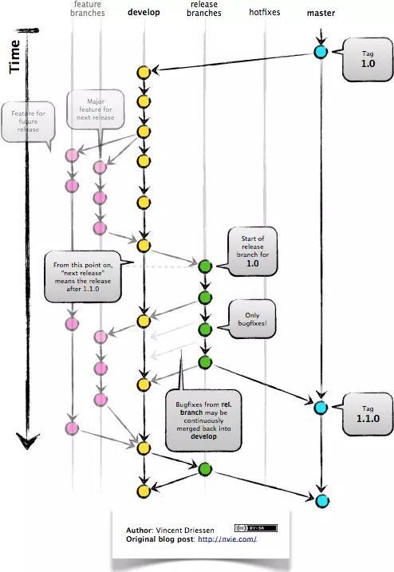
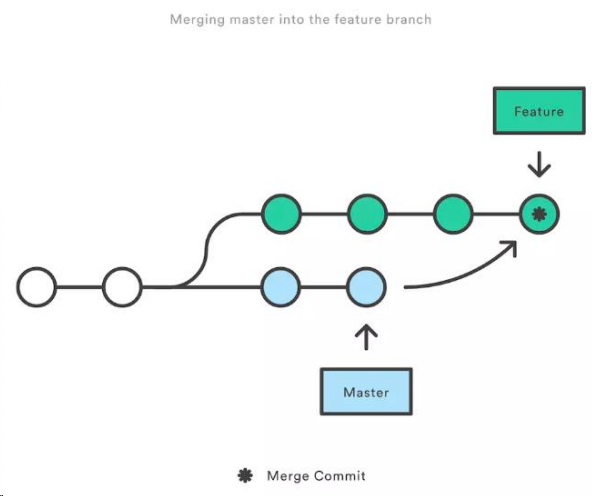
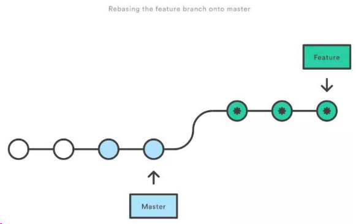
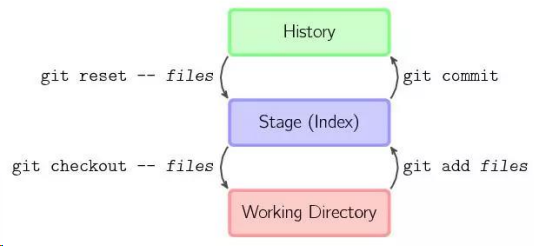

# Git面试题

### git 相关：你们公司项目是如何管理的？

答：主要通过 git 来进行项目版本控制的说几个 git 常用命令？

答：我工作中常用的有 git add ,git status,git commit –m,git push,git pull 等

### 说一下多人操作同一个文件，如果出现冲突该如何解决？

答：当遇到多人协作修改同一个文件时出现冲突，我先将远程文件先 git pull 下来，手动修改冲突代码后，再 git add ,git commit,git push 再上传到远程仓库。

如果 pull 也 pull 不下来提示冲突的话，可以先通过 git stash 暂存下来，然后再 pull 拉取，然后 git stash pop，取出原来写的，手动修改，然后提交。

## git 和 svn 的区别

git 和 svn 最大的区别在于 git 是分布式的，而 svn 是集中式的。

因此我们不能再离线的情况下使用 svn。如果服务器出现问题，就没有办法使用 svn 来提交代码。

svn 中的分支是整个版本库的复制的一份完整目录，而 git 的分支是指针指向某次提交，因此 git 的分支创建更加开销更小并且分支上的变化不会影响到其他人。svn 的分支变化会影响到所有的人。

svn 的指令相对于 git 来说要简单一些，比 git 更容易上手。

GIT 把内容按元数据方式存储，而 SVN 是按文件：因为 git 目录是处于个人机器上的一个克隆版的版本库，它拥有中心版本库上所有的东西，例如标签，分支，版本记录等。

GIT 分支和 SVN 的分支不同：svn 会发生分支遗漏的情况，而 git 可以同一个工作目录下快速的在几个分支间切换，很容易发现未被合并的分支，简单而快捷的合并这些文件。

GIT 没有一个全局的版本号，而 SVN 有GIT 的内容完整性要优于 SVN：GIT 的内容存储使用的是 SHA-1 哈希算法。这能确保代码内容的完整性，确保在遇到磁盘故障和网络问题时降低对版本库的破坏。

## git pull 和 git fetch 的区别

git fetch 只是将远程仓库的变化下载下来，并没有和本地分支合并。

git pull 会将远程仓库的变化下载下来，并和当前分支合并。

## git rebase 和 git merge 的区别

git merge 和 git rebase 都是用于分支合并，关键在 commit 记录的处理上不同：

git merge 会新建一个新的 commit 对象，然后两个分支以前的

commit 记录都指向这个新 commit 记录。这种方法会保留之前每个分支的 commit 历史。

git rebase 会先找到两个分支的第一个共同的 commit 祖先记录，然后将提取当前分支这之后的所有 commit 记录，然后将这个commit 记录添加到目标分支的最新提交后面。经过这个合并后，两个分支合并后的 commit 记录就变为了线性的记录了。

## 你的 git 工作流是怎样的? 

参考回答：

GitFlow 是由 Vincent Driessen 提出的一个 git 操作流程标准。包含如下几个关键

分支：

master 主分支 develop 主开发分支，包含确定即将发布的代码

feature 新功能分支，一般一个新功能对应一个分支，对于功能的拆分需要比较合理，以避免一些后面不必要的代码冲突

release 发布分支，发布时候用的分支，一般测试时候发现的

bug 在这个分支进行修复 hotfixhotfix 分支，紧急修 bug 的时候用

GitFlow 的优势有如下几点：

• 并行开发：GitFlow 可以很方便的实现并行开发：每个新功能都会建立一个新
的 feature 分支，从而和已经完成的功能隔离开来，而且只有在新功能完成开发的情况下，其对应的 feature 分支才会合并到主开发分支上（也就是我们经常说的 develop 分支）。另外，如果你正在开发某个功能，同时又有一个新的功能需要开发，你只需要提交当前 feature 的代码，然后创建另外一个 feature 分支并完成新功能开发。然后再切回之前的 feature 分支即可继续完成之前功能的开发。

• 协作开发：GitFlow 还支持多人协同开发，因为每个 feature 分支上改动的代码都只是为了让某个新的 feature 可以独立运行。同时我们也很容易知道每个人都在干啥。

• 发布阶段：当一个新 feature 开发完成的时候，它会被合并到 develop 分支，这个分支主要用来暂时保存那些还没有发布的内容，所以如果需要再开发新的 feature，我们只需要从 develop 分支创建新分支，即可包含所有已经完成的 feature 。

• 支持紧急修复：GitFlow 还包含了 hotfix 分支。这种类型的分支是从某个已经发布的 tag 上创建出来并做一个紧急的修复，而且这个紧急修复只影响这个已经发布的 tag，而不会影响到你正在开发的新 feature。

然后就是 GitFlow 最经典的几张流程图，一定要理解：

feature 分支都是从 develop 分支创建，完成后再合并到 develop 分支上，
等待发布。

当需要发布时，我们从 develop 分支创建一个 release 分支

然后这个 release 分支会发布到测试环境进行测试，如果发现问题就在这个分支直接进行修复。在所有问题修复之前，我们会不停的重复发布->测试->修复->重新发布->重新测试这个流程。

发布结束后，这个 release 分支会合并到 develop 和 master 分支，从而保证不会有代码丢失。

master 分支只跟踪已经发布的代码，合并到 master 上的 commit 只能来
自 release 分支和 hotfix 分支。

hotfix 分支的作用是紧急修复一些 Bug。

它们都是从 master 分支上的某个 tag 建立，修复结束后再合并到 develop 和 master 分支上。

## rebase 与 merge 的区别? 

参考回答：

git rebase 和 git merge 一样都是用于从一个分支获取并且合并到当前分支.

假设一个场景,就是我们开发的[feature/todo]分支要合并到 master 主分支，那么用rebase 或者 merge 有什么不同呢?

marge 特点：自动创建一个新的 commit 如果合并的时候遇到冲突，仅需要修改后重新 commit

o 优点：记录了真实的 commit 情况，包括每个分支的详情

o 缺点：因为每次 merge 会自动产生一个 merge commit，所以在使用一
些 git 的 GUI tools，特别是 commit 比较频繁时，看到分支很杂乱。

rebase 特点：会合并之前的 commit 历史

o 优点：得到更简洁的项目历史，去掉了 merge commit
o 缺点：如果合并出现代码问题不容易定位，因为 re-write 了 history
因此,当需要保留详细的合并信息的时候建议使用 git merge，特别是需要将分支合并进入 master 分支时；当发现自己修改某个功能时，频繁进行了 git commit 提交时，发现其实过多的提交信息没有必要时，可以尝试 git rebase.

## git reset、git revert 和 git checkout 有什么区别 

参考回答：

这个问题同样也需要先了解 git 仓库的三个组成部分：工作区（Working 
Directory）、暂存区（Stage）和历史记录区（History）。

o 工作区：在 git 管理下的正常目录都算是工作区，我们平时的编辑工作都是在工作区完成

o 暂存区：临时区域。里面存放将要提交文件的快照

o 历史记录区：git commit 后的记录区

三个区的转换关系以及转换所使用的命令：

git reset、git revert 和 git checkout 的共同点：用来撤销代码仓库中的某些更
改。

然后是不同点：

首先，从 commit 层面来说：

- o git reset 可以将一个分支的末端指向之前的一个 commit。然后再下次 git 执行垃圾回收的时候，会把这个 commit 之后的 commit 都扔掉。git reset 还支持三种标记，用来标记 reset 指令影响的范围：
  - ▪ --mixed：会影响到暂存区和历史记录区。也是默认选项
  - ▪ --soft：只影响历史记录区
  - ▪ --hard：影响工作区、暂存区和历史记录区
    - 注意：因为 git reset 是直接删除 commit 记录，从而会影响到其他开发人员的分支，所以不要在公共分支（比如 develop）做这个操作。
  - ▪ git checkout 可以将 HEAD 移到一个新的分支，并更新工作目录。因为可能会覆盖本地的修改，所以执行这个指令之前，你需要 stash 或者 commit 暂存区和工作区的更改。
- o git revert 和 git reset 的目的是一样的，但是做法不同，它会以创建新的 commit 的方式来撤销 commit，这样能保留之前的 commit 历史，比较安全。另外，同样因为可能会覆盖本地的修改，所以执行这个指令之前，你需要 stash 或者 commit 暂存区和工作区的更改。

然后，从文件层面来说：

- o git reset 只是把文件从历史记录区拿到暂存区，不影响工作区的内容，而且不支持 --mixed、--soft 和 --hard。
- o git checkout 则是把文件从历史记录拿到工作区，不影响暂存区的内容。
- o git revert 不支持文件层面的操作。
