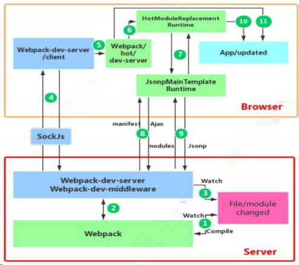
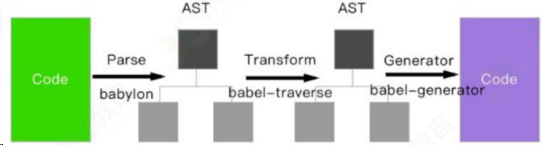

# 前端工程能力面试题

### 模块化介绍？CMD 和 ESM 的区别

[一文搞懂 JavaScript 模块化 - 掘金 (juejin.cn)](https://juejin.cn/post/7345105809599889427)

### 说说你对 AMD 和 Commonjs 的理解

- CommonJS 是服务器端模块的规范， Node.js 采用了这个规范。 CommonJS 规范加载模块是同步的，也就是说，只有加载完成，才能执行后面的操作。 AMD 规范则是非同步加载模块，允许指定回调函数
- AMD 推荐的⻛格通过返回一个对象做为模块对象， CommonJS 的⻛格通过对 module.exports 或 exports 的属性赋值来达到暴露模块对象的目的

#### es6 模块 CommonJS、AMD、CMD

- CommonJS 的规范中，每个 JavaScript 文件就是一个独立的模块上下文（ module context ），在这个上下文中默认创建的属性都是私有的。也就是说，在一个文件定义的
- 变量（还包括函数和类），都是私有的，对其他文件是不可见的。
- CommonJS 是同步加载模块,在浏览器中会出现堵塞情况，所以不适用
- AMD 异步，需要定义回调 define 方式
- es6 一个模块就是一个独立的文件，该文件内部的所有变量，外部无法获取。如果你希望外部能够读取模块内部的某个变量，就必须使用 export 关键字输出该变量 es6 还可以导出类、方法，自动适用严格模式

### mjs 是什么？

### 什么是 Tree Shaking？其基本原理是什么？按需加载的实现原理

### Webpack 的㇐些细节代码规范细节

### Git 工作流细节

### npm 相关

## webpack

### 基本使用

- 安装配置
- dev-server
- 解析 ES6
- 解析样式
- 解析图片文件
- 常见 loader 和 plugin

### 高级特性

- 多入口
- 抽离和压缩 css
- 抽离公共代码
- 懒加载
- 处理 React 和 vue

### 性能优化

- 优化构建速度
  - 优化 babel-loader
  - lgnorePlugin
  - noParse
  - happyPack
  - ParallelUglifyPlugin
  - 自动刷新
  - 热更新
  - DllPlugin
- 优化产出代码
  - 使用生产环境
  - 小图片 base64 编码
  - bundle 加 hash
  - 使用 CDN
  - 提取公共改代码
  - 懒加载
  - scope hosting

### 谈谈你对 webpack 的看法

WebPack 是一个模块打包工具，你可以使用 WebPack 管理你的模块依赖，并编绎输出模块们所需的静态文件。它能够很好地管理、打包 Web 开发中所用到的 HTML 、Javascript 、 CSS 以及各种静态文件（图片、字体等），让开发过程更加高效。对于不同类型的资源， webpack 有对应的模块加载器。

webpack 模块打包器会分析模块间的依赖关系，最后 生成了优化且合并后的静态资源。

### 打包体积 优化思路

- 提取第三方库或通过引用外部文件的方式引入第三方库
- 代码压缩插件 UglifyJsPlugin
- 服务器启用 gzip 压缩
- 按需加载资源文件 require.ensure
- 优化 devtool 中的 source-map
- 剥离 css 文件，单独打包
- 去除不必要插件，通常就是开发环境与生产环境用同一套配置文件导致

### 打包效率

- 开发环境采用增量构建，启用热更新
- 开发环境不做无意义的工作如提取 css 计算文件 hash 等
- 配置 devtool
- 选择合适的 loader
- 个别 loader 开启 cache 如 babel-loader
- 第三方库采用引入方式
- 提取公共代码
- 优化构建时的搜索路径 指明需要构建目录及不需要构建目录
- 模块化引入需要的部分

### Loader

编写一个 loader

loader 就是一个 node 模块，它输出了一个函数。当某种资源需要用这个
loader 转换时，这个函数会被调用。并且，这个函数可以通过提供给它的
this 上下文访问 Loader API 。 reverse-txt-loader

```js
// 定义
module.exports = function(src) {
    // src是原文件内容（abcde），下面对内容进行处理，这里是反转
    var result = src.split('').reverse().join('');
    // 返回JavaScript源码，必须是String或者Buffer
    return `module.exports = '${result}'`;
}
// 使用
{
    test: /\.txt$/,
    use: [
        {
        	'./path/reverse-txt-loader'
        }
    ]
},
```

### 说一下 webpack 的一些 plugin，怎么使用 webpack 对项目进行优化

#### 构建优化

- 减少编译体积 ContextReplacementPugin 、 IgnorePlugin 、 babel-plugin、import 、 babel-plugin-transform-runtime
- 并行编译 happypack 、 thread-loader 、 uglifyjsWebpackPlugin 开启并行
- 缓存 cache-loader 、 hard-source-webpack-plugin 、 uglifyjsWebpackPlugin 开启缓存、 babel-loader 开启缓存
- 预编译 dllWebpackPlugin && DllReferencePlugin 、 auto-dll-webapck-plugin

#### 性能优化

- 减少编译体积 Tree-shaking 、 Scope Hositing
- hash 缓存 webpack-md5-plugin
- 拆包 splitChunksPlugin 、 import() 、 require.ensure

### 优化打包速度

- 减少文件搜索范围：比如通过别名——loader 的 test ， include & exclude
- Webpack4 默认压缩并行
- Happypack 并发调用
- babel 也可以缓存编译

### webpack 用来干什么的

参考回答：

webpack 是一个现代 JavaScript 应用程序的静态模块打包器(module bundler)。当 webpack 处理应用程序时，它会递归地构建一个依赖关系图(dependency graph)，其中包含应用程序需要的每个模块，然后将所有这些模块打包成一个或多个 bundle。

## webpack 和 gulp 区别（模块化与流的区别）

参考回答：

gulp 强调的是前端开发的工作流程，我们可以通过配置一系列的 task，定义 task 处理的事务（例如文件压缩合并、雪碧图、启动 server、版本控制等），然后定义执行顺序，来让 gulp 执行这些 task，从而构建项目的整个前端开发流程。

webpack 是一个前端模块化方案，更侧重模块打包，我们可以把开发中的所有资源（图片、js 文件、css 文件等）都看成模块，通过 loader（加载器）和 plugins（插件）

对资源进行处理，打包成符合生产环境部署的前端资源。

## webpack 与 grunt、gulp 的不同？

Grunt、Gulp 是基于任务运⾏的⼯具： 它们会⾃动执⾏指定的任务，就像流⽔线，把资源放上去然后通过不同插件进⾏加⼯，它们包含活跃的社区，丰富的插件，能⽅便的打造各种⼯作流。

Webpack 是基于模块化打包的⼯具: ⾃动化处理模块，webpack 把⼀切当成模块，当 webpack 处理应⽤程序时，它会递归地构建⼀个依赖关系图 (dependency graph)，其中包含应⽤程序需要的每个模块，然后将所有这些模块打包成⼀个或多个 bundle。

因此这是完全不同的两类⼯具,⽽现在主流的⽅式是⽤ npm script 代替 Grunt、Gulp，npm script 同样可以打造任务流。

## webpack、rollup、parcel 优劣？

webpack 适⽤于⼤型复杂的前端站点构建: webpack 有强⼤的 loader 和插件⽣态,打包后的⽂件实际上就是⼀个⽴即执⾏函数，这个⽴即执⾏函数接收⼀个参数，这个参数是模块对象，键为各个模块的路径，值为模块内容。⽴即执⾏函数内部则处理模块之间的引⽤，执⾏模块等,这种情况更适合⽂件依赖复杂的应⽤开发。

rollup 适⽤于基础库的打包，如 vue、d3 等: Rollup 就是将各个模块打包进⼀个⽂件中，并且通过 Tree-shaking 来删除⽆⽤的代码, 可以最⼤程度上降低代码体积,但是 rollup 没有 webpack 如此多的的如代码分割、按需加载等⾼级功能，其更聚焦于库的打包，因此更适合库的开发。

parcel 适⽤于简单的实验性项目: 他可以满⾜低⻔槛的快速看到效果,但是⽣态差、报错信息不够全⾯都是他的硬伤，除了⼀些玩具项目或者实验项目不建议使⽤。

## 有哪些常⻅的 Loader？

file-loader：把⽂件输出到⼀个⽂件夹中，在代码中通过相对 URL 去引⽤输出的⽂件

url-loader：和 file-loader 类似，但是能在⽂件很小的情况下以 base64 的⽅式把⽂件内容注入到代码中去

source-map-loader：加载额外的 Source Map ⽂件，以⽅便断点调试

image-loader：加载并且压缩图片⽂件

babel-loader：把 ES6 转换成 ES5

css-loader：加载 CSS，⽀持模块化、压缩、⽂件导入等特性

style-loader：把 CSS 代码注入到 JavaScript 中，通过 DOM 操作去加载 CSS。

eslint-loader：通过 ESLint 检查 JavaScript 代码

注意：在 Webpack 中，loader 的执行顺序是从右向左执行的。因为 webpack 选择了 compose 这样的函数式编程方式，这种方式的表达式执行是从右向左的。

## 有哪些常⻅的 Plugin？

define-plugin：定义环境变量

html-webpack-plugin：简化 html ⽂件创建

uglifyjs-webpack-plugin：通过 UglifyES 压缩 ES6 代码

webpack-parallel-uglify-plugin: 多核压缩，提⾼压缩速度

webpack-bundle-analyzer: 可视化 webpack 输出⽂件的体积

mini-css-extract-plugin: CSS 提取到单独的⽂件中，⽀持按需加载

## bundle，chunk，module 是什么？

bundle：是由 webpack 打包出来的⽂件；

chunk：代码块，⼀个 chunk 由多个模块组合⽽成，⽤于代码的合并和分割；

module：是开发中的单个模块，在 webpack 的世界，⼀切皆模块，⼀个模块对应⼀个⽂件，webpack 会从配置的 entry 中递归开始找出所有依赖的模块。

## Loader 和 Plugin 的不同？

不同的作⽤：

Loader 直译为"加载器"。Webpack 将⼀切⽂件视为模块，但是 webpack 原⽣是只能解析 js ⽂件，如果想将其他⽂件也打包的话，就会⽤到 loader 。 所以 Loader 的作⽤是让 webpack 拥有了加载和解析⾮ JavaScript ⽂件的能⼒。

Plugin 直译为"插件"。Plugin 可以扩展 webpack 的功能，让 webpack 具有更多的灵活性。在 Webpack 运⾏的⽣命周期中会⼴播出许多事件，Plugin 可以监听这些事件，在合适的时机通过 Webpack 提供的 API 改变输出结果。

不同的⽤法：

Loader 在 module.rules 中配置，也就是说他作为模块的解析规则⽽存在。 类型为数组，每⼀项都是⼀个 Object ，里⾯描述了对于什么类型的⽂件（ test ），使⽤什么加载( loader )和使⽤的参数（ options ）

Plugin 在 plugins 中单独配置。类型为数组，每⼀项是⼀个 plugin 的实例，参数都通过构造函数传入。

## webpack 热更新的实现原理？

webpack 的热更新⼜称热替换（Hot Module Replacement），缩写为 HMR。这个机制可以做到不⽤刷新浏览器⽽将新变更的模块替换掉旧的模块。

原理：



首先要知道 server 端和 client 端都做了处理⼯作：

第⼀步，在 webpack 的 watch 模式下，⽂件系统中某⼀个⽂件发⽣修改，webpack 监听到⽂件变化，根据配置⽂件对模块重新编译打包，并将打包后的代码通过简单的 JavaScript 对象保存在内存中。

第二步是 webpack-dev-server 和 webpack 之间的接⼝交互，⽽在这⼀步，主要是 dev-server 的中间件 webpack- dev-middleware 和 webpack 之间的交互，webpack-dev-middleware 调⽤ webpack 暴露的 API 对代码变化进⾏监 控，并且告诉 webpack，将代码打包到内存中。

第三步是 webpack-dev-server 对⽂件变化的⼀个监控，这⼀步不同于第⼀步，并不是监控代码变化重新打包。当我们在配置⽂件中配置了 evServer.watchContentBase 为 true 的时候，Server 会监听这些配置⽂件夹中静态⽂件的变化，变化后会通知浏览器端对应⽤进⾏ live reload。注意，这⼉是浏览器刷新，和 HMR 是两个概念。

第四步也是 webpack-dev-server 代码的⼯作，该步骤主要是通过 sockjs（webpack-dev-server 的依赖）在浏览器端和服务端之间建⽴⼀个 websocket ⻓连接，将 webpack 编译打包的各个阶段的状态信息告知浏览器端，同时也包括第三步中 Server 监听静态⽂件变化的信息。浏览器端根据这些 socket 消息进⾏不同的操作。当然服务
端传递的最主要信息还是新模块的 hash 值，后⾯的步骤根据这⼀ hash 值来进⾏模块热替换。

webpack-dev-server/client 端并不能够请求更新的代码，也不会执⾏ 热 更 模 块 操 作 ， ⽽ 把 这 些 ⼯ 作 ⼜ 交 回 给 了 webpack。

webpack/hot/dev-server 的 ⼯ 作 就 是 根 据 webpack-dev-server/client 传给它的信息以及 dev-server 的配置决定是刷新浏览器呢还是进⾏模块热更新。当然如果仅仅是刷新浏览器，也就没有后⾯那些步骤了。

HotModuleReplacement.runtime 是客户端 HMR 的中枢，它接收到上⼀ 步 传 递 给 他 的 新 模 块 的 hash 值 ， 它 通 过 JsonpMainTemplate.runtime 向 server 端发送 Ajax 请求，服务端返回⼀个 json，该 json 包含了所有要更新的模块的 hash 值，获
取到更新列表后，该模块再次通过 jsonp 请求，获取到最新的模块代码。这就是上图中 7、8、9 步骤。

⽽第 10 步是决定 HMR 成功与否的关键步骤，在该步骤中，HotModulePlugin 将会对新旧模块进⾏对⽐，决定是否更新模块，在决定更新模块后，检查模块之间的依赖关系，更新模块的同时更新模块间的依赖引⽤。

最后⼀步，当 HMR 失败后，回退到 live reload 操作，也就是进⾏浏览器刷新来获取最新打包代码。

## Babel 的原理是什么?

babel 的转译过程也分为三个阶段，这三步具体是：

解析 Parse: 将代码解析⽣成抽象语法树（AST），即词法分析与语法分析的过程；

转换 Transform: 对于 AST 进⾏变换⼀系列的操作，babel 接受得到 AST 并通过 babel-traverse 对其进⾏遍历，在此过程中进⾏添加、更新及移除等操作；

⽣成 Generate: 将变换后的 AST 再转换为 JS 代码, 使⽤到的模块是 babel-generator。



## babel

- polyfill
- runtime

### babel 原理

ES6、7 代码输入 -> babylon 进行解析 -> 得到 AST （抽象语法树）-> plugin 用 b abel-traverse 对 AST 树进行遍历转译 -> 得到新的 AST 树 -> 用 babel-generator 通过 AST 树生成 ES5 代码

## 性能优化

### 如何进行网站性能优化

#### content 方面

- 减少 HTTP 请求：合并文件、 CSS 精灵、 inline Image
- 减少 DNS 查询： DNS 缓存、将资源分布到恰当数量的主机名
- 减少 DOM 元素数量

#### Server 方面

- 使用 CDN
- 配置 ETag
- 对组件使用 Gzip 压缩

#### Cookie 方面

- 减小 cookie 大小

#### css 方面

- 将样式表放到页面顶部
- 不使用 CSS 表达式
- 使用 `<link>` 不使用 @import

#### Javascript 方面

- 将脚本放到页面底部
- 将 javascript 和 css 从外部引入
- 压缩 javascript 和 css
- 删除不需要的脚本
- 减少 DOM 访问

#### 图片方面

- 优化图片：根据实际颜色需要选择色深、压缩
- 优化 css 精灵
- 不要在 HTML 中拉伸图片

### 什么样的前端代码是好的

- 高复用低耦合，这样文件小，好维护，而且好扩展。
- 具有可用性、健壮性、可靠性、宽容性等特点
- 遵循设计模式的六大原则

### 你觉得前端工程的价值体现在哪

- 为简化用户使用提供技术支持（交互部分）
- 为多个浏览器兼容性提供支持
- 为提高用户浏览速度（浏览器性能）提供支持
- 为跨平台或者其他基于 webkit 或其他渲染引擎的应用提供支持
- 为展示数据提供支持（数据接口）

### 平时如何管理你的项目

- 先期团队必须确定好全局样式（ globe.css ），编码模式( utf-8 ) 等；
- 编写习惯必须一致（例如都是采用继承式的写法，单样式都写成一行）；
- 标注样式编写⼈，各模块都及时标注（标注关键样式调用的地方）；
- 页面进行标注（例如 页面 模块 开始和结束）；
- CSS 跟 HTML 分文件夹并行存放，命名都得统一（例如 style.css ）；
- JS 分文件夹存放 命名以该 JS 功能为准的英文翻译。
- 图片采用整合的 images.png png8 格式文件使用 - 尽量整合在一起使用方便将来的管理。
