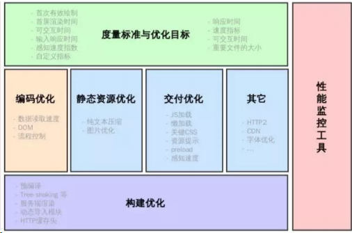

# 前端性能优化面试题

## 怎么看网站的性能如何

**考察点：浏览器**

::: details 查看参考回答

检测页面加载时间一般有两种方式，一种是被动去测：

就是在被检测的页面置入脚本或探针，当用户访问网页时，探针自动采集数据并传回数据库进行分析，

另一种主动监测的方式，即主动的搭建分布式受控环境，模拟用户发起页面访问请求，主动采集性能数据并分析，在检测的精准度上，专业的第三方工具效果更佳，比如说性能极客

:::

## 前端优化策略

**考察点：性能优化**

::: details 查看参考回答

- 减少 HTTP 请求
- 使用内容发布网络（CDN）
- 添加本地缓存
- 压缩资源文件
- 将 CSS 样式表放在顶部，把 javascript 放在底部（浏览器的运行机制决定）
- 避免使用 CSS 表达式
- 减少 DNS 查询
- 使用外部 javascript 和 CSS
- 避免重定向
- 图片 lazyLoad

:::

## web性能优化

**考察点：性能优化**

::: details 查看参考回答

- 降低请求量：合并资源，减少 HTTP 请求数，minify / gzip 压缩，webP，lazyLoad。
- 加快请求速度：预解析 DNS，减少域名数，并行加载，CDN 分发。
- 缓存：HTTP 协议缓存请求，离线缓存 manifest，离线数据缓存 localStorage。
- 渲染：JS/CSS 优化，加载顺序，服务端渲染，pipeline。

:::

## 前端性能优化

**考察点：性能优化**

::: details 查看参考回答

降低请求量：合并资源，减少 HTTP 请求数，minify / gzip 压缩，webP，lazyLoad。

加快请求速度：预解析 DNS，减少域名数，并行加载，CDN 分发。

缓存：HTTP 协议缓存请求，离线缓存 manifest，离线数据缓存 localStorage。

渲染：JS/CSS 优化，加载顺序，服务端渲染，pipeline。

:::

## Web 性能优化



## 怎么看网站的性能如何

参考回答：

检测页面加载时间一般有两种方式，一种是被动去测：就是在被检测的页面置入脚本或探针，当用户访问网页时，探针自动采集数据并传回数据库进行分析，另一种主动监测的方式，即主动的搭建分布式受控环境，模拟用户发起页面访问请求，主动采集性能数据并分析，在检测的精准度上，专业的第三方工具效果更佳，比如说性能极客。

## 前端优化

参考回答：

降低请求量：合并资源，减少 HTTP 请求数，minify / gzip 压缩，webP lazyLoad。

加快请求速度：预解析 DNS，减少域名数，并行加载，CDN 分发。

缓存：HTTP 协议缓存请求，离线缓存 manifest，离线数据缓存 localStorage。

渲染：JS/CSS 优化，加载顺序，服务端渲染，pipeline。

## 说一下 web worker

文档：[使用 Web Workers - Web API 接口参考 | MDN (mozilla.org)](https://developer.mozilla.org/zh-CN/docs/Web/API/Web_Workers_API/Using_web_workers)

参考回答：

在 HTML 页面中，如果在执行脚本时，页面的状态是不可相应的，直到脚本执行完成后，页面才变成可相应。web worker 是运行在后台的 js，独立于其他脚本，不会影响页面你的性能。并且通过 postMessage 将结果回传到主线程。这样在进行复杂操作的时候，就不会阻塞主线程了。

如何创建 web worker：

- 检测浏览器对于 web worker 的支持性
- 创建 web worker 文件（js，回传函数等）
- 创建 web worker 对象

## 从 V8 中看 JS 性能优化

注意：该知识点属于性能优化领域。

### 1 测试性能工具 Audits

Chrome 已经提供了一个大而全的性能测试工具 Audits

选择想测试的功能然后点击 Run audits ，工具就会自动运行帮助我们测试问题并且给出一个完整的报告

测试性能后给出的一个报告，可以看到报告中分别为性能、体验、SEO 都给出了打分，并且每一个指标都有详细的评估

评估结束后，工具还提供了一些建议便于我们提高这个指标的分数

我们只需要一条条根据建议去优化性能即可。

### 2 Performance 工具

可以详细的看到每个时间段中浏览器在处理什么事情，哪个过程最消耗时间，便于我们更加详细的了解性能瓶颈

## JS 性能优化

JS 是编译型还是解释型语⾔其实并不固定。首先 JS 需要有引擎才能运行起来，无论是浏览器还是在 Node 中，这是解释型语⾔的特性。但是在 V8 引擎下，⼜引入了 TurboFan 编译器，他会在特定的情况下进行优化，将代码编译成执行效率更高的 Machine Code ，当然这个编译器并不是 JS 必须需要的，只是为了提高代码执行性能，所以总的来说 JS 更偏向于解释型语⾔。

那么这一小节的内容主要会针对于 Chrome 的 V8 引擎来讲解。

在这一过程中， JS 代码首先会解析为抽象语法树（ AST ），然后会通过解
释器或者编译器转化为 Bytecode 或者 Machine Code

从上图中我们可以发现， JS 会首先被解析为 AST ，解析的过程其实是略慢
的。代码越多，解析的过程也就耗费越长，这也是我们需要压缩代码的原因之
一。另外一种减少解析时间的方式是预解析，会作用于未执行的函数，这个我
们下面再谈这里需要注意一点，对于函数来说，应该尽可能避免声明嵌套函数（类也是函数），因为这样会造成函数的重复解析

```js
function test1() {
	// 会被重复解析
	function test2() {}
}
```

然后 Ignition 负责将 AST 转化为 Bytecode ， TurboFan 负责编译出优化后的 Machine Code ，并且 Machine Code 在执行效率上优于 Bytecode

那么我们就产生了一个疑问，什么情况下代码会编译为 Machine Code ？

JS 是一⻔动态类型的语⾔，并且还有一大堆的规则。简单的加法运算代码，内部就需要考虑好几种规则，比如数字相加、字符串相加、对象和字符串相加等等。这样的情况也就势必导致了内部要增加很多判断逻辑，降低运行效率。

```js
function test(x) {
	return x + x;
}
test(1);
test(2);
test(3);
test(4);
```

对于以上代码来说，如果一个函数被多次调用并且参数一直传入 number 类型，那么 V8 就会认为该段代码可以编译为 Machine Code ，因为你固定了类型，不需要再执行很多判断逻辑了。

但是如果一旦我们传入的参数类型改变，那么 Machine Code 就会被 DeOptimized 为 Bytecode ，这样就有性能上的一个损耗了。所以如果我们希望代码能多的编译为 Machine Code 并且 DeOptimized 的次数减少，就应该尽可能保证传入的类型一致。

那么你可能会有一个疑问，**到底优化前后有多少的提升呢**，接下来我们就来实践测试一下到底有多少的提升

```js
const { performance, PerformanceObserver } = require("perf_hooks");
function test(x) {
	return x + x;
}
// node 10 中才有 PerformanceObserver
// 在这之前的 node 版本可以直接使用 performance 中的 API
const obs = new PerformanceObserver((list, observer) => {
	console.log(list.getEntries());
	observer.disconnect();
});
obs.observe({ entryTypes: ["measure"], buffered: true });
performance.mark("start");
let number =
	10000000 %
	// 不优化代码
	NeverOptimizeFunction(test);
while (number--) {
	test(1);
}
performance.mark("end");
performance.measure("test", "start", "end");
```

以上代码中我们使用了 performance API ，这个 API 在性能测试上⼗分好用。不仅可以用来测量代码的执行时间，还能用来测量各种网络连接中的时间消耗等等，并且这个 API 也可以在浏览器中使用。

从上图中我们可以发现，优化过的代码执行时间只需要 9ms ，但是不优化过的代码执行时间却是前者的二⼗倍，已经接近 200ms 了。在这个案例中，我相信大家已经看到了 V8 的性能优化到底有多强，只需要我们符合一定的规则书写代码，引擎底层就能帮助我们自动优化代码。

另外，编译器还有个骚操作 Lazy-Compile ，当函数没有被执行的时候，会对函数进行一次预解析，直到代码被执行以后才会被解析编译。对于上述代码来说， test 函数需要被预解析一次，然后在调用的时候再被解析编译。但是对于这种函数⻢上就被调用的情况来说，预解析这个过程其实是多余的，那么有什么办法能够让代码不被预解析呢？

```js
(function test(obj) {
	return x + x;
});
```

但是不可能我们为了性能优化，给所有的函数都去套上括号，并且也不是所有
函数都需要这样做。我们可以通过 optimize-js 实现这个功能，这个库会分
析一些函数的使用情况，然后给需要的函数添加括号，当然这个库很久没⼈维
护了，如果需要使用的话，还是需要测试过相关内容的。

其实很简单，我们只需要给函数套上括号就可以了

## 性能优化

总的来说性能优化这个领域的很多内容都很碎片化，这一章节我们将来学习这
些碎片化的内容。

### 1 图片优化

#### 计算图片大小

对于一张 100 _ 100 像素的图片来说，图像上有 10000 个像素点，如果每个像素的值是 RGBA 存储的话，那么也就是说每个像素有 4 个通道，每个通道 1 个字节（ 8 位 = 1 个字节），所以该图片大小大概为 39KB （ 10000 _ 1 \* 4 / 1024 ）。

但是在实际项目中，一张图片可能并不需要使用那么多颜⾊去显示，我们可以通过减少每个像素的调⾊板来相应缩小图片的大小。

了解了如何计算图片大小的知识，那么对于如何优化图片，想必大家已经有 2 个思路了：

1. 减少像素点
2. 减少每个像素点能够显示的颜⾊

### 2 图片加载优化

不用图片。很多时候会使用到很多修饰类图片，其实这类修饰图片完全可以用 CSS 去代替。
对于移动端来说，屏幕宽度就那么点，完全没有必要去加载原图浪费带宽。一般图片都用 CDN 加载，可以计算出适配屏幕的宽度，然后去请求相应裁剪好的图片。

小图使用 base64 格式

将多个图标文件整合到一张图片中（雪碧图）

选择正确的图片格式：

- 对于能够显示 WebP 格式的浏览器尽量使用 WebP 格式。因为 WebP 格式具有更好的图像数据压缩算法，能带来更小的图片体积，而且拥有⾁眼识别无差异的图像质量，缺点就是兼容性并不好
- 小图使用 PNG ，其实对于大部分图标这类图片，完全可以使用 SVG 代替
- 照片使用 JPEG

### 3 DNS 预解析

DNS 解析也是需要时间的，可以通过预解析的方式来预先获得域名所对应的 IP 。

```html
<link rel="dns-prefetch" href="//blog.poetries.top" />
```

考虑一个场景，滚动事件中会发起网络请求，但是我们并不希望用户在滚动过
程中一直发起请求，而是隔一段时间发起一次，对于这种情况我们就可以使用

### 4 节流

理解了节流的用途，我们就来实现下这个函数

```js
// func是用户传入需要防抖的函数
// wait是等待时间
const throttle = (func, wait = 50) => {
	// 上一次执行该函数的时间
	let lastTime = 0;
	return function (...args) {
		// 当前时间
		let now = +new Date();
		// 将当前时间和上一次执行函数时间对比
		// 如果差值大于设置的等待时间就执行函数
		if (now - lastTime > wait) {
			lastTime = now;
			func.apply(this, args);
		}
	};
};
setInterval(
	throttle(() => {
		console.log(1);
	}, 500),
	1
);
```

### 5 防抖

考虑一个场景，有一个按钮点击会触发网络请求，但是我们并不希望每次点击
都发起网络请求，而是当用户点击按钮一段时间后没有再次点击的情况才去发
起网络请求，对于这种情况我们就可以使用防抖。

理解了防抖的用途，我们就来实现下这个函数

### 6 预加载

在开发中，可能会遇到这样的情况。有些资源不需要⻢上用到，但是希望尽早获取，这时候就可以使用预加载。

预加载其实是声明式的 fetch ，强制浏览器请求资源，并且不会阻塞 onload 事件，可以使用以下代码开启预加载

```html
<link rel="preload" href="http://blog.poetries.top" />
```

预加载可以一定程度上降低首屏的加载时间，因为可以将一些不影响首屏但重
要的文件延后加载，唯一缺点就是兼容性不好。

### 7 预渲染

可以通过预渲染将下载的文件预先在后台渲染，可以使用以下代码开启预渲染

```html
<link rel="prerender" href="http://blog.poetries.top" />
```

预渲染虽然可以提高页面的加载速度，但是要确保该页面大概率会被用户在之
后打开，否则就是白白浪费资源去渲染。

### 8 懒执行

懒执行就是将某些逻辑延迟到使用时再计算。该技术可以用于首屏优化，对于
某些耗时逻辑并不需要在首屏就使用的，就可以使用懒执行。懒执行需要唤醒，一般可以通过定时器或者事件的调用来唤醒。

### 9 懒加载

懒加载就是将不关键的资源延后加载。

懒加载的原理就是只加载自定义区域（通常是可视区域，但也可以是即将进入可视区域）内需要加载的东⻄。对于图片来说，先设置图片标签的 src 属性为一张占位图，将真实的图片资源放入一个自定义属性中，当进入自定义区域时，就将自定义属性替换为 src 属性，这样图片就会去下载资源，实现了图片懒加载。

懒加载不仅可以用于图片，也可以使用在别的资源上。比如进入可视区域才开始播放视频等等。

### 10 CDN

CDN 的原理是尽可能的在各个地方分布机房缓存数据，这样即使我们的根服
务器远在国外，在国内的用户也可以通过国内的机房迅速加载资源。

因此，我们可以将静态资源尽量使用 CDN 加载，由于浏览器对于单个域名有并发请求上限，可以考虑使用多个 CDN 域名。并且对于 CDN 加载静态资源需要注意 CDN 域名要与主站不同，否则每次请求都会带上主站的 Cookie ，平白消耗流量

## 雅虎军规 14 条

> 前言：雅虎军规是雅虎的开发人员在总结了网站的不合理部分后，提出的优化网站性能提高的一套方法规则，非常适合初学者绕过这些坎。这篇博文，是我在网络上搜集的一些关于雅虎军规的内容，图片归原作者所有，总结一起，供大家参考使用，希望对你们以后的开发过程中有所帮助。

### 1.尽可能的减少 http 请求数

**HTTP**：从客户端到服务器端的请求消息。包括消息首行中，对资源的请求方法资源的标识符以及使用的协议。

**请求过程**：当你打开网页的时候，你所看到的文字，图片，多媒体，这一切内容，都是你从服务器获取的，每一个内容的获取，就是一个 http 请求。


### 2.使用 CDN（内容分发网络）

**CDN**：内容分发网络，意思就是尽可能避开互联网上有可能影响数据传输速度和稳定性的瓶颈和环节，使内容传输的更快、更稳定。

**通俗来说**：就是在离你最近的地方，放置一台性能好、链接顺畅的副本服务器，让你能够以最近的距离，最快的速度获取内容。


### 3.添加 Expire/Cache-Control 头

**Expire 头**：内容是一个时间值，值就是资源在本地的过期时间，存在本地；在本地缓存阶段，找到一个对应的资源值，当前时间还没有超过资源的过期时间，就直接使用这个资源，不会发送 http 请求。

**Cache-Control 头 C**：是 http 协议中常用的头部之一，负责页面的缓存机制，如果该头部指示缓存，缓存的内容也会存在本地，操作流程和 expire 相似，但也有不同的地方，Cache-Control 有更多的选项，而且有更多的处理方式。

### 4.启用 Gzip 压缩

- Gzip 压缩就是文件在服务器上进行压缩，然后在传输。
- 这样可以显著的减少文件的大小。压缩完毕之后，浏览器会对压缩之后的文件进行解压缩。目前市面上的浏览器都能很好的支持 Gzip。
- 在 Yahoo，所有的文件都要求被压缩。

下图是我们使用一个 79kb 的 JavaScript 文件进行压缩的例子。


这个 Gzip 需要我们启用我们的智慧在服务器上配置了。

### 5.将 css 放在页面最上面

为了提高游览器加载速度，建议把 CSS 样式放在`html`的`head`标签内。


在 IE 浏览器中，将 CSS 放在底部，他禁止了页面内容的顺序显示。IE 阻止了页面的显示，以免重画元素。在地网速的情况下，用户打开网页就只能看见空白页了。

但是在 Firefox 浏览其中，虽然不会阻止页面内容的显示 ，但是在加载完 CSS 样式后，部分元素可能会重画。这就会导致闪错的情况。所以，为了避免页面显示空白或者闪错的问题，我们应该将 Css 样式放在页面的头部 head 下。

### 6.将 script 放在页面最下面

页面 DOM 加载顺序


为了顺利加载各种资源，把 js 放在页面最下面，可以正常运行脚本，也为获取 DOM 元素更流畅。

### 7.避免在 CSS 中使用 Expressions


例子：

```html
<!doctype html>
<html>
<head>
  <meta charset="utf-8">
  <title>Css Expression测试</title>

  <script type="text/javascript">
    var i = 0;
    function scare() {
      1++;
      document.getElementById('run').value = i;
      return;
    }
  </script>

  <style type="text/css">
    ul a { width: expression(this.offsetWidth > 750 ? scare() : scare());}
  </style>

</head>
<body>
  当移动鼠标时，css Expression计算了<input id="run"/>次
  <u1>
    <li><a href="http://enme.me">aaa</a></li>
    <li><a href="http://enme.me">bbb</a></li>
    <li><a href="http://enme.me">cccc</a></li>
  </ul>
</body>
</html>
```

这个功能只在早期的 IE 浏览器中可以使用，IE8 之后就没有这个功能了。

Css Expressions 这个共能就是在 CSS 样式中插入 JS 代码，他不符合 web 标准、效率低下、有可能带来安全隐患。

### 8.把 js 和 css 文件放到外部文件中

**情况 1**：写在页面内，如果只是的单独一个页面使用 js 和 css 文件，可以写在页面里面；还有就是不经常访问的页面；并且脚本和样式很少。

这样写可以：

- 减少页面请求
- 提升页面渲染速度

**情况 2**：单独提取，如果是大量页面复用，那就需要引入 js 和 css 文件。

这样写可以：

- 提高 js 和 css 的复用性
- 缩小页面体积
- 提高了 js 的 css 的可维护性

### 9.减少 DNS 查询

**DNS**：（Domain Name System，域名系统），万维网上作为域名和 IP 地址相互映射的一个分布式数据库，能够使用户更方便的访问互联网，而不用去记住能够被机器直接读取的 IP 数串。通过域名，最终得到该域名对应的 IP 地址的过程叫做域名解析（或主机名解析）。


**缓存时间对比**:

- 当缓存时间长时：减少 DNS 的重复查找，节省时间。
- 当缓存时间短时：及时的检测网站服务器的变化，保证正确性。

现在的浏览器做的比较好，都有个缓存机制。但是主流的三大浏览器的缓存时间不同。他们的缓存时间如图。


缓存时间长时：减少 DNS 的重复查找，节省时间。
缓存时间短时：能够及时检测到网站服务器的变化，保证正确性。

**域名**：（Domain Name），简称域名、网域，是由一串用点分隔的名字组成的 Internet 上某一台计算机或计算机组的名称，用于在数据传输时标识计算机的电子方位（有时也指地理位置）。

可以使用单域名和多域名


### 10.压缩 JavaScript 和 CSS

- 减少 JavaScript 和 Css 文件大小。文件体积小了，下载速度了就快了。
- 减小文件体积的方法
  - 去除不必要的空白符、格式符、注释符
  - 简写方法名、参数压缩 JS 脚本

建议：在网站上线项目前，将 JavaScript 和 Css 都进行压缩，使线上版本是最轻量级的，大幅提升网站性能。

### 11.避免重定向

> 重定向就是原始的请求重新转向了其他请求。

通俗的说就是用户想访问的页面 A 被重新指向了页面 B

因为重定向尤其存在的意义，所以在 HTTP 协议中有两个状态码来标识。

_状态码_：

- 301（Moved Permanently）：被移动到了另外的位置。
  - 表示用户请求的页面，比如 a.com 被移动到另外的位置 b.bom。用户需要去另外一个位置去下载内容。
- 302 Found：被找到了，不在原始位置，临时重定向。
  - 表示所请求的页面被找到了，但不在原始位置。服务器会回复用户一个地址，然后浏览器在通过这个地址找到相应的资源。
- 即：301 表示永久的重定向，302 表示临时的重定向。

为什么避免重定向：多了一次请求。

对于我们用户来说，301 和 302 没有什么区别，都是但是对于搜索引擎来说的完全不同的两个概念。
我们知道互联网会不定期的对网站的内容进行扫描（俗称蜘蛛爬网），来完善索引机构。如果网站用的是 301 永久重定向，那么蜘蛛在爬网的过程中，会只能分析，删除老的地址，添加新的地址。如果是 302 重定向，蜘蛛只会认为是普通的链接跳转。


为什么要使用重定向呢，其实无论是 301 还是 302 重定向都增加了浏览器到服务器的之间的往返次数，增加了访问时间。

### 12.移除重复的脚本

例子:

test.html

```html
<!DOCTYPE html>
<html>
	<head>
		<meta charset="utf-8" />
		<meta http-equiv="X-UA-Compatible" content="IE=edge" />
		<title>移除重复的脚步</title>
		<meta name="viewport" content="width=device-width, initial-scale=1" />
	</head>
	<body>
		<input id="test" type="text" value="" />
		<script>
			var number = 0;
		</script>
		<script src="./test.js"></script>
		<!-- 引用1次 正常 1 -->
		<script src="./test.js"></script>
		<!-- 引用2次 不正常 2 -->
	</body>
</html>
```

test.js

```js
//js dom
number++;
document.getElementById("test").value = number;
```

### 13.配置实体标签（ETag）

> ETag 全称 EntityTag （实体标签）。它包含在响应头当中，从字面意思来讲就是某个实体的标识。属于 Http 协议，自然所有的 web 服务都支持。

> ETag：使用特殊的字符串来标识某个请资源版本

当用户向服务器发从请求时，服务器会对比两边的 ETag，如果两边的 ETag 一致就意味着该资源没有被修改过，和以前是一样的。这时服务器会返回 304 码，告诉浏览器对比一致，可以使用以前的资源。


这就是配置 ETag 的好处，它减轻了服务器的负担。

### 14.使用 Ajax 缓存

即“Asynchronous Javascript And XML”（异步 JavaScript 和 XML），是指一种创建交互式网页应用的网页开发技术。

他可以使网站在不刷新页面的情况下加载数据，可以使网站分批加载，实现局部更新。

Ajax 仍然是通过发送数据请求的方式向服务器索要数据，实现局部的刷新。所以在这里我们对数据也是有必要进行缓存的，但是不是所有的 ajax 数据都进行缓存的，如果所有的数据请求都进行缓存，那么 ajax 就没有它存在的必要了，和默默无闻的静态数据没有什么区别。

Ajax 请求的时候把需要的数据缓存在浏览器里面，用的时候取出，减少 HTTP 请求

**方法**：get 和 post

- POST：Post 请求时每次都要发给服务器请求的，服务器每次都会返回一个状态码 200。因为这个方法是每次都需要执行的，所以他是不被缓存的。
- get：get 请求，除非制定不同的地址，否知同一个地址不重复执行。它返回的状态码是 304 。所以他的数据是被缓存的。

那么什么时候使用 Post 什么时候使用 Get 呢，下图列出了 Post 和 Get 的区别。


### YSlow 网站性能分析插件

YSlow 是 Yahoo 研发 的一款插件，专门用来分析网站的性能。他是基于浏览器的一款插件，在 Firefox 浏览器里兼容性比较好。
YSlow 会对浏览器性能做分析，给出意见和规则，让我们一步步的优化我们的网站。

> 注意：在安装 YSlow 的同时还要安装 firebug 插件

## 面试问题

### 题目：提升页面性能的方法有哪些?

1、资源压缩合并，减少 HTTP 请求

2、非核心代码异步加载 —> 异步加载的方式 —> 异步加载的区别

3、利用浏览器缓存 —> 缓存的分类 —> 缓存的原理

4、使用 CDN

5、预解析 DNS

```html
<meta http-equiv="x-dns-prefetch-control" content="on" />
<link rel="dns-prefetch" href="//host_name_to_prefetch.com" />
```

#### 异步加载

JavaScript 加载的方式

```html
<head>
	<!-- 内联脚本 -->
	<script>
		alert("这是内联脚本！");
	</script>
	<!-- 外联脚本 -->
	<script src="test.js"></script>
</head>
```

浏览器会立即加载并执行指定的脚本，“立即”指的是在渲染该 `script` 标签之下的文档元素之前，也就是说不等待后续载入的文档元素，读到就加载并执行。

1、异步加载的方式

在 script 标签的属性值

- 1）动态脚本加载

  - **1、直接 document.write**

  - ```html
    <script language="javascript">
    	document.write("<script src='test.js'><\/script>");
    </script>
    ```

  - **2、动态改变已有 script 的 src 属性**

  - ```html
    <script src="" id="s1"></script>
    <script language="javascript">
    	s1.src = "test.js";
    </script>
    ```

  - **3、动态创建 script 元素**

  - ```html
    <script>
    	var oHead = document.getElementsByTagName("HEAD").item(0);
    	var oScript = document.createElement("script");
    	oScript.type = "text/javascript";
    	oScript.src = "test.js";
    	oHead.appendChild(oScript);
    </script>
    ```

- 2）defer

  - 这个布尔属性被设定用来通知浏览器该脚本将在文档完成解析后，触发 DOMContentLoaded 事件前执行。如果缺少 src 属性（即内嵌脚本），该属性不应被使用，因为这种情况下它不起作用。对动态嵌入的脚本使用 `async=false` 来达到类似的效果。

  - 有 `defer`，加载后续文档元素的过程将和 `script.js` 的加载并行进行（异步），但是 `script.js` 的执行要在所有元素解析完成之后，`DOMContentLoaded` 事件触发之前完成。

  - ```html
    <script defer src="myscript.js"></script>
    ```

- 3）async

  - 该布尔属性指示浏览器是否在允许的情况下异步执行该脚本。该属性对于内联脚本无作用 (即没有 src 属性的脚本）。也就是说，async 属性告诉浏览器先把文件下载下来，在“时机成熟”的时候再执行。异步脚本一定会在页面的 load 事件前执行，但可能会在 DOMContentLoaded 事件触发之前或之后执行。而且更加需要注意的是，标记为 async 的脚本并不保证按照指定他们的先后顺序执行。所以，确保各个异步脚本互不依赖非常重要。

  - 有 `async`，加载和渲染后续文档元素的过程将和 `script.js` 的加载与执行并行进行（异步）。

  - ```html
    <script async src="script.js"></script>
    ```

练习代码

```html
<!DOCTYPE html>
<html>
	<head>
		<meta charset="utf-8" />
		<title>性能优化</title>
		<!-- <script src="./defer1.js" charset="utf-8" defer></script>
    <script src="./defer2.js" charset="utf-8" defer></script> -->
		<script src="./async1.js" charset="utf-8" async></script>
		<script src="./async2.js" charset="utf-8" async></script>
	</head>
	<body>
		<div class="">
			test
			<script type="text/javascript">
				console.log("write");
				document.write("<span>write</span>");
			</script>
			<script type="text/javascript">
				for (var i = 0; i < 200000; i++) {
					if (i % 20000 === 0) {
						console.log(i);
					}
				}
			</script>
		</div>
	</body>
</html>
```

2、异步加载的区别


- 1）defer 是在 HTML 所有资源解析结束之后才会执行，如果是多个，按照加载的顺序依次执行
- 2）async 是在加载完之后立即执行，浏览器空间时就会执行，依然有可能造成渲染阻塞，如果是多个，执行顺序和加载顺序无关

相同点：

- 加载文件时不阻塞页面渲染；
- 对于 inline 的 script 无效；
- 使用这两个属性的脚本中不能调用 document.write 方法；
- 有脚本的 onload 的事件回调；
- 允许不定义属性值，仅仅使用属性名；

不同点：

- html 的版本 html4.0 中定义了 defer；html5.0 中定义了 async；这将造成由于浏览器版本的不同而对其支持的程度不同；
- 执行时刻：每一个 async 属性的脚本都在它下载结束之后立刻执行，同时会在 window 的 load 事件之前执行。所以就有可能出现脚本执行顺序被打乱 的情况；每一个 defer 属性的脚本都是在页面解析完毕之后，按照原本的顺序执行，同时会在 document 的 DOMContentLoaded 之前执 行。

**这两个属性会有三种可能的组合：**

- 如果 async 为 true，那么脚本在下载完成后异步执行。
- 如果 async 为 false，defer 为 true，那么脚本会在页面解析完毕之后执行。
- 如果 async 和 defer 都为 false，那么脚本会在页面解析中，停止页面解析，立刻下载并且执行。

> 注意：在现实当中，延迟脚本并不一定会按照顺序执行，也不一定会在 DOMContentLoaded 事件触发前执行，因此最好只包含一个延迟脚本。

> **注意：**defer 属性在浏览器之间表现并不一致。(这里可用 onload 的代替)

如果同时指定了两个属性，则会遵从 async 属性，而忽略 defer 属性。

---

#### 浏览器缓存

##### 缓存的分类

###### 1）强缓存

**Expires** Expires:Thu, 21 Jan 2022 23:39:02 GMT

**Cache-Control** Cache-Control:max-age=3600

###### 2）协商缓存

**Last-Modified If-Modified-Since** Last-Modified: Wed, 26 Jan 2022 00:35:11 GMT

**Etag** **If-None-Match**

### 如何渲染几万条数据并不卡住界面

这道题考察了如何在不卡住页面的情况下渲染数据，也就是说不能一次性将几
万条都渲染出来，而应该一次渲染部分 DOM ，那么就可以通过 requestAnimationFrame 来每 16 ms 刷新一次

```html
<!DOCTYPE html>
<html lang="en">
	<head>
		<meta charset="UTF-8" />
		<meta name="viewport" content="width=device-width, initial-scale=1.0" />
		<meta http-equiv="X-UA-Compatible" content="ie=edge" />
		<title>Document</title>
	</head>

	<body>
		<ul>
			控件
		</ul>
		<script>
			setTimeout(() => {
				// 插入⼗万条数据
				const total = 100000;
				// 一次插入 20 条，如果觉得性能不好就减少
				const once = 20;
				// 渲染数据总共需要几次
				const loopCount = total / once;
				let countOfRender = 0;
				let ul = document.querySelector("ul");
				function add() {
					// 优化性能，插入不会造成回流
					const fragment = document.createDocumentFragment();
					for (let i = 0; i < once; i++) {
						const li = document.createElement("li");
						li.innerText = Math.floor(Math.random() * total);
						fragment.appendChild(li);
					}
					ul.appendChild(fragment);
					countOfRender += 1;
					loop();
				}
				function loop() {
					if (countOfRender < loopCount) {
						window.requestAnimationFrame(add);
					}
				}
				loop();
			}, 0);
		</script>
	</body>
</html>
```

### 项目做过哪些性能优化？

- 减少 HTTP 请求数
- 减少 DNS 查询
- 使用 CDN
- 避免重定向
- 图片懒加载
- 减少 DOM 元素数量
- 减少 DOM 操作
- 使用外部 JavaScript 和 CSS
- 压缩 JavaScript 、 CSS 、字体、图片等
- 优化 CSS Sprite
- 使用 iconfont
- 字体裁剪
- 多域名分发划分内容到不同域名
- 尽量减少 iframe 使用
- 避免图片 src 为空
- 把样式表放在 link 中
- 把 JavaScript 放在页面底部
