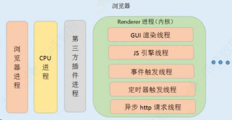

# 网络安全面试题

## 描述一下 XSS 和 CRSF 攻击？防御方法？

::: details 查看参考回答

XSS, 即为（Cross Site Scripting）, 中文名为跨站脚本, 是发生在目标用户的浏览器层面上的，当渲染 DOM 树的过程成发生了不在预期内执行的 JS 代码时，就发生了 XSS 攻击。大多数 XSS 攻击的主要方式是嵌入一段远程或者第三方域上的 JS 代码。实际上是在目标网站的作用域下执行了这段 js 代码。

CSRF（Cross Site Request Forgery，跨站请求伪造），字面理解意思就是在别的站点伪造了一个请求。专业术语来说就是在受害者访问一个网站时，其 Cookie 还没有过期的情况下，攻击者伪造一个链接地址发送受害者并欺骗让其点击，从而形成 CSRF 攻击。

XSS 防御的总体思路是：对输入(和 URL 参数)进行过滤，对输出进行编码。也就是对提交的所有内容进行过滤，对 url 中的参数进行过滤，过滤掉会导致脚本执行的相关内容；然后对动态输出到页面的内容进行 html 编码，使脚本无法在浏览器中执行。虽然对输入过滤可以被绕过，但是也还是会拦截很大一部分的 XSS 攻击。

防御 CSRF 攻击主要有三种策略：验证 HTTP Referer 字段；在请求地址中添加 token 并验证；

在 HTTP 头中自定义属性并验证。

:::

## 7.能不能说一说 XSS 攻击？

### 1）什么是 XSS 攻击？

XSS 全称是 Cross Site Scripting (即 跨站脚本 )，为了和 CSS 区分，故叫它 XSS 。XSS 攻击是指浏览器中执行恶意脚本(无论是跨域还是同域)，从而拿到用户的信息并进行操作。

这些操作一般可以完成下面这些事情：

- 窃取 Cookie 。
- 监听用户行为，比如输入账号密码后直接发送到黑客服务器。
- 修改 DOM 伪造登录表单。
- 在页面中生成浮窗广告。

通常情况，XSS 攻击的实现有三种方式——存储型、反射型和文档型。原理都比较简单，先来一一介绍一下。

#### （1）存储型

存储型 ，顾名思义就是将恶意脚本存储了起来，确实，存储型的 XSS 将脚本存储到了服务端的数据库，
然后在客户端执行这些脚本，从而达到攻击的效果。
常见的场景是留言评论区提交一段脚本代码，如果前后端没有做好转义的工作，那评论内容存到了数据
库，在页面渲染过程中 直接执行 , 相当于执行一段未知逻辑的 JS 代码，是非常恐怖的。这就是存储型的
XSS 攻击。

#### （2）反射型

反射型 XSS 指的是恶意脚本作为网络请求的一部分。

比如我输入：

```bash
http://sanyuan.com?q=<script>alert("你完蛋了")</script>
```

这杨，在服务器端会拿到 q 参数,然后将内容返回给浏览器端，浏览器将这些内容作为 HTML 的一部分解析，发现是一个脚本，直接执行，这样就被攻击了。

之所以叫它 反射型 , 是因为恶意脚本是通过作为网络请求的参数，经过服务器，然后再反射到 HTML 文档中，执行解析。和 存储型 不一样的是，服务器并不会存储这些恶意脚本。

#### （3）文档型

文档型的 XSS 攻击并不会经过服务端，而是作为中间人的角色，在数据传输过程劫持到网络数据包，然后修改里面的 html 文档！

这样的劫持方式包括 WIFI 路由器劫持 或者 本地恶意软件 等。

### 2）防范措施

明白了三种 XSS 攻击的原理，我们能发现一个共同点: 都是让恶意脚本直接能在浏览器中执行。

那么要防范它，就是要避免这些脚本代码的执行。

为了完成这一点，必须做到一个信念，两个利用。

#### （1）一个信念

千万不要相信任何用户的输入！

无论是在前端和服务端，都要对用户的输入进行转码或者过滤。

如：

```html
<script>
	alert("你完蛋了");
</script>
```

转码后变为：

这样的代码在 html 解析的过程中是无法执行的。

#### （2）利用 CSP

CSP，即浏览器中的内容安全策略，它的核心思想就是服务器决定浏览器加载哪些资源，具体来说可以完成以下功能：

1. 限制其他域下的资源加载。
2. 禁止向其它域提交数据。
3. 提供上报机制，能帮助我们及时发现 XSS 攻击。

#### （3）利用 HttpOnly

很多 XSS 攻击脚本都是用来窃取 Cookie, 而设置 Cookie 的 HttpOnly 属性后，JavaScript 便无法读取 Cookie 的值。这样也能很好的防范 XSS 攻击。

### 总结

XSS 攻击是指浏览器中执行恶意脚本, 然后拿到用户的信息进行操作。主要分为 存储型 、 反射型 和 文档型 。防范的措施包括:

- 一个信念: 不要相信用户的输入，对输入内容转码或者过滤，让其不可执行。
- 两个利用: 利用 CSP，利用 Cookie 的 HttpOnly 属性。

## 8.能不能说一说 CSRF 攻击？

### 什么是 CSRF 攻击？

CSRF(Cross-site request forgery), 即跨站请求伪造，指的是黑客诱导用户点击链接，打开黑客的网站，然后黑客利用用户目前的登录状态发起跨站请求。

举个例子, 你在某个论坛点击了黑客精心挑选的小姐姐图片，你点击后，进入了一个新的页面。

那么恭喜你，被攻击了:）

你可能会比较好奇，怎么突然就被攻击了呢？接下来我们就来拆解一下当你点击了链接之后，黑客在背后做了哪些事情。

可能会做三样事情。列举如下：

#### （1）自动发 GET 请求

黑客网页里面可能有一段这样的代码：

```html

```

进入页面后自动发送 get 请求，值得注意的是，这个请求会自动带上关于 xxx.com 的 cookie 信息(这里是假定你已经在 xxx.com 中登录过)。

假如服务器端没有相应的验证机制，它可能认为发请求的是一个正常的用户，因为携带了相应的 cookie，然后进行相应的各种操作，可以是转账汇款以及其他的恶意操作。

#### （2） 自动发 POST 请求

黑客可能自己填了一个表单，写了一段自动提交的脚本。

```html
<form id="hacker-form" action="https://xxx.com/info" method="POST">
	<input type="hidden" name="user" value="hhh" />
	<input type="hidden" name="count" value="100" />
</form>
<script>
	document.getElementById("hacker-form").submit();
</script>
```

同样也会携带相应的用户 cookie 信息，让服务器误以为是一个正常的用户在操作，让各种恶意的操作变为可能。

#### （3）诱导点击发送 GET 请求

在黑客的网站上，可能会放上一个链接，驱使你来点击：

```html
<a href="https://xxx/info?user=hhh&count=100" taget="_blank"
	>点击进入修仙世界</a
>
```

点击后，自动发送 get 请求，接下来和 自动发 GET 请求 部分同理。

这就是 CSRF 攻击的原理。和 XSS 攻击对比，CSRF 攻击并不需要将恶意代码注入用户当前页面的 html 文档中，而是跳转到新的页面，利用服务器的验证漏洞和用户之前的登录状态来模拟用户进行操作。

### 防范措施

#### （1）利用 Cookie 的 SameSite 属性

CSRF 攻击 中重要的一环就是自动发送目标站点下的 Cookie ,然后就是这一份 Cookie 模拟了用户的身份。因此在 Cookie 上面下文章是防范的不二之选。

恰好，在 Cookie 当中有一个关键的字段，可以对请求中 Cookie 的携带作一些限制，这个字段就是 SameSite 。

SameSite 可以设置为三个值， Strict 、 Lax 和 None 。

- a. 在 Strict 模式下，浏览器完全禁止第三方请求携带 Cookie。比如请求 sanyuan.com 网站只能在 sanyuan.com 域名当中请求才能携带 Cookie，在其他网站请求都不能。
- b. 在 Lax 模式，就宽松一点了，但是只能在 get 方法提交表单 况或者 a 标签发送 get 请求 的情况下可以携带 Cookie，其他情况均不能。
- c. 在 None 模式下，也就是默认模式，请求会自动携带上 Cookie。

#### （2）验证来源站点

这就需要要用到请求头中的两个字段: Origin 和 Referer。

其中，Origin 只包含域名信息，而 Referer 包含了 具体 的 URL 路径。

当然，这两者都是可以伪造的，通过 Ajax 中自定义请求头即可，安全性略差。

#### （3）CSRF Token

Django 作为 Python 的一门后端框架，如果是用它开发过的同学就知道，在它的模板(template)中，开发表单时，经常会附上这样一行代码：

```bash

```

这就是 CSRF Token 的典型应用。那它的原理是怎样的呢？

首先，浏览器向服务器发送请求时，服务器生成一个字符串，将其植入到返回的页面中。

然后浏览器如果要发送请求，就必须带上这个字符串，然后服务器来验证是否合法，如果不合法则不予响应。这个字符串也就是 CSRF Token ，通常第三方站点无法拿到这个 token, 因此也就是被服务器给拒绝。

### 总结

CSRF(Cross-site request forgery), 即跨站请求伪造，指的是黑客诱导用户点击链接，打开黑客的网站，然后黑客利用用户目前的登录状态发起跨站请求。

CSRF 攻击一般会有三种方式:

- 自动 GET 请求
- 自动 POST 请求
- 诱导点击发送 GET 请求。

防范措施：利用 Cookie 的 SameSite 属性 、 验证来源站点 和 CSRF Token 。

## csrf 和 xss 的网络攻击及防范

**考察点：web 安全**

::: details 查看参考回答

CSRF：跨站请求伪造，可以理解为攻击者盗用了用户的身份，以用户的名义发送了恶意请求。

比如用户登录了一个网站后，立刻在另一个ｔａｂ页面访问量攻击者用来制造攻击的网站，这个网站要求访问刚刚登陆的网站，并发送了一个恶意请求，这时候 CSRF 就产生了，

比如这个制造攻击的网站使用一张图片，但是这种图片的链接却是可以修改数据库的，这时候攻击者就可以以用户的名义操作这个数据库，防御方式的话：使用验证码，检查 https 头部的 refer，使用 token XSS：跨站脚本攻击，是说攻击者通过注入恶意的脚本，在用户浏览网页的时候进行攻击，

比如获取 cookie，或者其他用户身份信息，可以分为存储型和反射型，存储型是攻击者输入一些数据并且存储到了数据库中，其他浏览者看到的时候进行攻击，反射型的话不存储在数据库中，往往表现为将攻击代码放在 url 地址的请求参数中，防御的话为 cookie 设置 httpOnly 属性，对用户的输入进行检查，进行特殊字符过滤

:::

## Cookie 如何防范 XSS 攻击

::: details 查看参考回答

参考回答：

XSS（跨站脚本攻击）是指攻击者在返回的 HTML 中嵌入 javascript 脚本，为了减轻这些攻击，需要在 HTTP 头部配上，set-cookie：

- httponly-这个属性可以防止 XSS，它会禁止 javascript 脚本来访问 cookie。
- secure - 这个属性告诉浏览器仅在请求为 https 的时候发送 cookie。

结果应该是这样的：`Set-Cookie=<cookie-value>`.....

:::

## csrf 和 xss 的网络攻击及防范

参考回答：
CSRF：跨站请求伪造，可以理解为攻击者盗用了用户的身份，以用户的名义发送了恶意请求，比如用户登录了一个网站后，立刻在另一个ｔａｂ页面访问量攻击者用来制造攻击的网站，这个网站要求访问刚刚登陆的网站，并发送了一个恶意请求，这时候 CSRF 就产生了，比如这个制造攻击的网站使用一张图片，但是这种图片的链接却是可以修改数据库的，这时候攻击者就可以以用户的名义操作这个数据库，防御方式的话：使用验证码，检查 https 头部的 refer，使用 token

XSS：跨站脚本攻击，是说攻击者通过注入恶意的脚本，在用户浏览网页的时候进行攻击，比如获取 cookie，或者其他用户身份信息，可以分为存储型和反射型，存储型是攻击者输入一些数据并且存储到了数据库中，其他浏览者看到的时候进行攻击，反射型的话不存储在数据库中，往往表现为将攻击代码放在 url 地址的请求参数中，防御的话为 cookie 设置 httpOnly 属性，对用户的输入进行检查，进行特殊字符过滤。

## XSS

[什么是跨站脚本攻击*跨站脚本攻击简介*跨站脚本攻击的优势以及应用场景-腾讯云开发者社区 (tencent.com)](https://cloud.tencent.com/developer/techpedia/1668)

### （1）概念

XSS 攻击指的是跨站脚本攻击，是一种代码注入攻击。攻击者通过在网站注入恶意脚本，使之在用户的浏览器上运行，从而盗取用户的信息如 cookie 等。

XSS 的本质是因为网站没有对恶意代码进行过滤，与正常的代码混合在一起了，浏览器没有办法分辨哪些脚本是可信的，从而导致了恶意代码的执行。

攻击者可以通过这种攻击方式可以进行以下操作：

- 获取页面的数据，如 DOM、cookie、localStorage；
- DOS 攻击，发送合理请求，占用服务器资源，从而使用户无法访问服务器；
- 破坏页面结构；
- 流量劫持（将链接指向某网站）；

### （2）攻击类型

XSS 可以分为存储型、反射型和 DOM 型：

存储型指的是恶意脚本会存储在目标服务器上，当浏览器请求数据时，脚本从服务器传回并执行。

反射型指的是攻击者诱导用户访问一个带有恶意代码的 URL 后，服务器端接收数据后处理，然后把带有恶意代码的数据发送到浏览器端，浏览器端解析这段带有 XSS 代码的数据后当做脚本执行，最终完成 XSS 攻击。

DOM 型指的通过修改页面的 DOM 节点形成的 XSS。

#### 1）存储型 XSS 的攻击步骤：

- 1.攻击者将恶意代码提交到目标⽹站的数据库中。
- 2.⽤户打开目标⽹站时，⽹站服务端将恶意代码从数据库取出，拼接在 HTML 中返回给浏览器。
- 3.⽤户浏览器接收到响应后解析执⾏，混在其中的恶意代码也被执⾏。
- 4.恶意代码窃取⽤户数据并发送到攻击者的⽹站，或者冒充⽤户的⾏为，调⽤目标⽹站接⼝执⾏攻击者指定的操作。

这种攻击常⻅于带有⽤户保存数据的⽹站功能，如论坛发帖、商品评论、⽤户私信等。

#### 2）反射型 XSS 的攻击步骤：

1.攻击者构造出特殊的 URL，其中包含恶意代码。

2.⽤户打开带有恶意代码的 URL 时，⽹站服务端将恶意代码从 URL 中取出，拼接在 HTML 中返回给浏览器。

3.⽤户浏览器接收到响应后解析执⾏，混在其中的恶意代码也被执⾏。

4.恶意代码窃取⽤户数据并发送到攻击者的⽹站，或者冒充⽤户的⾏为，调⽤目标⽹站接⼝执⾏攻击者指定的操作。

反射型 XSS 跟存储型 XSS 的区别是：存储型 XSS 的恶意代码存在数据库里，反射型 XSS 的恶意代码存在 URL 里。

反射型 XSS 漏洞常⻅于通过 URL 传递参数的功能，如⽹站搜索、跳转等。 由于需要⽤户主动打开恶意的 URL 才能⽣效，攻击者往往会结合多种⼿段诱导⽤户点击。

#### 3）DOM 型 XSS 的攻击步骤：

1.攻击者构造出特殊的 URL，其中包含恶意代码。

2.⽤户打开带有恶意代码的 URL。

3.⽤户浏览器接收到响应后解析执⾏，前端 JavaScript 取出 URL 中的恶意代码并执⾏。

4.恶意代码窃取⽤户数据并发送到攻击者的⽹站，或者冒充⽤户的⾏为，调⽤目标⽹站接⼝执⾏攻击者指定的操作。

DOM 型 XSS 跟前两种 XSS 的区别：DOM 型 XSS 攻击中，取出和执⾏恶意代码由浏览器端完成，属于前端 JavaScript ⾃身的安全漏洞，⽽其他两种 XSS 都属于服务端的安全漏洞。

涉及面试题：什么是 XSS 攻击？如何防范 XSS 攻击？什么是 CSP ？

- XSS 简单点来说，就是攻击者想尽一切办法将可以执行的代码注入到网页中。
- XSS 可以分为多种类型，但是总体上我认为分为两类：持久型和非持久型。
- 持久型也就是攻击的代码被服务端写入进数据库中，这种攻击危害性很大，因为如果网站访问量很大的话，就会导致大量正常访问页面的用户都受到攻击。

举个例子，对于评论功能来说，就得防范持久型 XSS 攻击，因为我可以在评
论中输入以下内容

- 这种情况如果前后端没有做好防御的话，这段评论就会被存储到数据库中，这样每个打开该页面的用户都会被攻击到。
- 非持久型相比于前者危害就小的多了，一般通过修改 URL 参数的方式加入攻击代码，诱导用户访问链接从而进行攻击。

举个例子，如果页面需要从 URL 中获取某些参数作为内容的话，不经过过滤
就会导致攻击代码被执行

```html
<!-- http://www.domain.com?name=<script>alert(1)</script> -->
<div>{{name}}</div>
```

但是对于这种攻击方式来说，如果用户使用 Chrome 这类浏览器的话，浏览
器就能自动帮助用户防御攻击。但是我们不能因此就不防御此类攻击了，因为
我不能确保用户都使用了该类浏览器。

### 对于 XSS 攻击来说，通常有两种方式可以用来防御

#### 1.转义字符

首先，对于用户的输入应该是永远不信任的。最普遍的做法就是转义输入输出
的内容，对于引号、尖括号、斜杠进行转义

```js
function escape(str) {
	str = str.replace(/&/g, "&amp;");
	str = str.replace(/</g, "&lt;");
	str = str.replace(/>/g, "&gt;");
	str = str.replace(/"/g, "&quto;");
	str = str.replace(/'/g, "&#39;");
	str = str.replace(/`/g, "&#96;");
	str = str.replace(/\//g, "&#x2F;");
	return str;
}
```

通过转义可以将攻击代码 `<script>alert(1)</script>` 变成

```js
// -> &lt;script&gt;alert(1)&lt;&#x2F;script&gt;
escape("<script>alert(1)</script>");
```

但是对于显示富文本来说，显然不能通过上面的办法来转义所有字符，因为这
样会把需要的格式也过滤掉。对于这种情况，通常采用白名单过滤的办法，当
然也可以通过⿊名单过滤，但是考虑到需要过滤的标签和标签属性实在太多，
更加推荐使用白名单的方式

```js
const xss = require('xss')
let html = xss('<h1 id="title">XSS Demo</h1><script>alert("xss");</script>'
// -> <h1>XSS Demo</h1>&lt;script&gt;alert("xss");&lt;/script&gt;
console.log(html)
```

以上示例使用了 js-xss 来实现，可以看到在输出中保留了 h1 标签且过滤了 script 标签

#### 2.CSP

CSP 本质上就是建立白名单，开发者明确告诉浏览器哪些外部资源可以加载
和执行。我们只需要配置规则，如何拦截是由浏览器自己实现的。我们可以通
过这种方式来尽量减少 XSS 攻击。

通常可以通过两种方式来开启 CSP：

- 设置 HTTP Header 中的 Content-Security-Policy
- 设置 meta 标签的方式 `<meta http-equiv="Content-Security-Policy">`

这里以设置 HTTP Header 来举例

##### 只允许加载本站资源

```bash
Content-Security-Policy: default-src ‘self’
```

##### 只允许加载 HTTPS 协议图片

```bash
Content-Security-Policy: img-src https://*
```

##### 允许加载任何来源框架

```bash
Content-Security-Policy: child-src 'none'
```

当然可以设置的属性远不止这些，你可以通过查阅 文档 的方式来学习，这里就不过多赘述其他的属性了。对于这种方式来说，只要开发者配置了正确的规则，那么即使网站存在漏洞，攻击者也不能执行它的攻击代码，并且 CSP 的兼容性也不错。

对于这种方式来说，只要开发者配置了正确的规则，那么即使网站存在漏洞，攻击者也不能执行它的攻击代码，并且 CSP 的兼容性也不错。

#### 什么是 XSS 攻击？

##### （1）概念

XSS 攻击指的是跨站脚本攻击，是一种代码注入攻击。攻击者通过在网站注入恶意脚本，使之在用户的浏览器上运行，从而盗取用户的信息如 cookie 等。

XSS 的本质是因为网站没有对恶意代码进行过滤，与正常的代码混合在一起了，浏览器没有办法分辨哪些脚本是可信的，从而导致了恶意代码的执行。

攻击者可以通过这种攻击方式可以进行以下操作：

- 获取页面的数据，如 DOM、cookie、localStorage；
- DOS 攻击，发送合理请求，占用服务器资源，从而使用户无法访问服务器；
- 破坏页面结构；
- 流量劫持（将链接指向某网站）；

##### （2）攻击类型

XSS 可以分为存储型、反射型和 DOM 型：

- 存储型指的是恶意脚本会存储在目标服务器上，当浏览器请求数据时，脚本从服务器传回并执行。
- 反射型指的是攻击者诱导用户访问一个带有恶意代码的 URL 后，服务器端接收数据后处理，然后把带有恶意代码的数据发送到浏览器端，浏览器端解析这段带有 XSS 代码的数据后当做脚本执行，最终完成 XSS 攻击。
- DOM 型指的通过修改页面的 DOM 节点形成的 XSS。

**1）存储型 XSS 的攻击步骤：**

1. 攻击者将恶意代码提交到目标⽹站的数据库中。
2. ⽤户打开目标⽹站时，⽹站服务端将恶意代码从数据库取出，拼接在 HTML 中返回给浏览器。
3. ⽤户浏览器接收到响应后解析执⾏，混在其中的恶意代码也被执⾏。
4. 恶意代码窃取⽤户数据并发送到攻击者的⽹站，或者冒充⽤户的⾏为，调⽤目标⽹站接⼝执⾏攻击者指定的操作。

这种攻击常⻅于带有⽤户保存数据的⽹站功能，如论坛发帖、商品评论、⽤户私信等。

**2）反射型 XSS 的攻击步骤：**

1. 攻击者构造出特殊的 URL，其中包含恶意代码。
2. ⽤户打开带有恶意代码的 URL 时，⽹站服务端将恶意代码从 URL 中取出，拼接在 HTML 中返回给浏览器。
3. ⽤户浏览器接收到响应后解析执⾏，混在其中的恶意代码也被执⾏。
4. 恶意代码窃取⽤户数据并发送到攻击者的⽹站，或者冒充⽤户的⾏为，调⽤目标⽹站接⼝执⾏攻击者指定的操作。

反射型 XSS 跟存储型 XSS 的区别是：存储型 XSS 的恶意代码存在数据库里，反射型 XSS 的恶意代码存在 URL 里。

反射型 XSS 漏洞常⻅于通过 URL 传递参数的功能，如⽹站搜索、跳转等。 由于需要⽤户主动打开恶意的 URL 才能⽣效，攻击者往往会结合多种⼿段诱导⽤户点击。

**3）DOM 型 XSS 的攻击步骤：**

1. 攻击者构造出特殊的 URL，其中包含恶意代码。
2. ⽤户打开带有恶意代码的 URL。
3. ⽤户浏览器接收到响应后解析执⾏，前端 JavaScript 取出 URL 中的恶意代码并执⾏。
4. 恶意代码窃取⽤户数据并发送到攻击者的⽹站，或者冒充⽤户的⾏为，调⽤目标⽹站接⼝执⾏攻击者指定的操作。

DOM 型 XSS 跟前两种 XSS 的区别：DOM 型 XSS 攻击中，取出和执⾏恶意代码由浏览器端完成，属于前端 JavaScript ⾃身的安全漏洞，⽽其他两种 XSS 都属于服务端的安全漏洞。

## 如何防御 XSS 攻击？

可以看到 XSS 危害如此之大，那么在开发网站时就要做好防御措施，具体措施如下：

可以从浏览器的执行来进行预防，一种是使用纯前端的方式，不用服务器端拼接后返回（不使用服务端渲染）。另一种是对需要插入到 HTML 中的代码做好充分的转义。

对于 DOM 型的攻击，主要是前端脚本的不可靠而造成的，对于数据获取渲染和字符串拼接的时候应该对可能出现的恶意代码情况进行判断。

使用 CSP ，CSP 的本质是建立一个白名单，告诉浏览器哪些外部资源可以加载和执行，从而防止恶意代码的注入攻击。

1.CSP 指的是内容安全策略，它的本质是建立一个白名单，告诉浏览器哪些外部资源可以加载和执行。我们只需要配置规则，如何拦截由浏览器自己来实现。

2.通常有两种方式来开启 CSP，一种是设置 HTTP 首部中的`Content-Security-Policy`，一种是设置 meta 标签的方式 `<meta
http-equiv="Content-Security-Policy">` 对一些敏感信息进行保护，比如 cookie 使用 http-only，使得脚本无法获取。也可以使用验证码，避免脚本伪装成用户执行一些操作。

## 什么是 CSRF 攻击？

### （1）概念

CSRF 攻击指的是跨站请求伪造攻击，攻击者诱导用户进入一个第三方网站，然后该网站向被攻击网站发送跨站请求。如果用户在被攻击网站中保存了登录状态，那么攻击者就可以利用这个登录状态，绕过后台的用户验证，冒充用户向服务器执行一些操作。

CSRF 攻击的本质是利用 cookie 会在同源请求中携带发送给服务器的特点，以此来实现用户的冒充。

### （2）攻击类型

常见的 CSRF 攻击有三种：

GET 类型的 CSRF 攻击，比如在网站中的一个 img 标签里构建一个请求，当用户打开这个网站的时候就会自动发起提交。

POST 类型的 CSRF 攻击，比如构建一个表单，然后隐藏它，当用户进入页面时，自动提交这个表单。

链接类型的 CSRF 攻击，比如在 a 标签的 href 属性里构建一个请求，然后诱导用户去点击。

## CSRF

涉及面试题：什么是 CSRF 攻击？如何防范 CSRF 攻击？

CSRF 中文名为跨站请求伪造。原理就是攻击者构造出一个后端请求地址，诱导用户点击或者通过某些途径自动发起请求。如果用户是在登录状态下的话，后端就以为是用户在操作，从而进行相应的逻辑。

举个例子，假设网站中有一个通过 GET 请求提交用户评论的接口，那么攻击者就可以在钓⻥网站中加入一个图片，图片的地址就是评论接口

```html

```

那么你是否会想到使用 POST 方式提交请求是不是就没有这个问题了呢？其实并不是，使用这种方式也不是百分百安全的，攻击者同样可以诱导用户进入某个页面，在页面中通过表单提交 POST 请求。

### 如何防御

- Get 请求不对数据进行修改
- 不让第三方网站访问到用户 Cookie
- 阻止第三方网站请求接口
- 请求时附带验证信息，比如验证码或者 Token

#### SameSite

可以对 Cookie 设置 SameSite 属性。该属性表示 Cookie 不随着跨域请
求发送，可以很大程度减少 CSRF 的攻击，但是该属性目前并不是所有浏览
器都兼容。

#### 验证 Referer

对于需要防范 CSRF 的请求，我们可以通过验证 Referer 来判断该请求是否为第三方网站发起的。

#### Token

服务器下发一个随机 Token ，每次发起请求时将 Token 携带上，服务器验证 Token 是否有效

## 如何防御 CSRF 攻击？

CSRF 攻击可以使用以下方法来防护：

进行同源检测，服务器根据 http 请求头中 origin 或者 referer 信息来判断请求是否为允许访问的站点，从而对请求进行过滤。当 origin 或者 referer 信息都不存在的时候，直接阻止请求。这种方式的缺点是有些情况下 referer 可以被伪造，同时还会把搜索引擎的链接也给屏蔽了。所以一般网站会允许搜索引擎的页面请求，但是相应的页面请求这种请求方式也可能被攻击者给利用。（Referer 字段会告诉服务器该网页是从哪个页面链接过来的）

使用 CSRF Token 进行验证，服务器向用户返回一个随机数 Token ，当网站再次发起请求时，在请求参数中加入服务器端返回的 token ，然后服务器对这个 token 进行验证。这种方法解决了使用 cookie 单一验证方式时，可能会被冒用的问题，但是这种方法存在一个缺点就是，我们需要给网站中的所有请求都添加上这个 token，操作比较
繁琐。还有一个问题是一般不会只有一台网站服务器，如果请求经过负载平衡转移到了其他的服务器，但是这个服务器的 session 中没有保留这个 token 的话，就没有办法验证了。这种情况可以通过改变 token 的构建方式来解决。

对 Cookie 进行双重验证，服务器在用户访问网站页面时，向请求域名注入一个 Cookie，内容为随机字符串，然后当用户再次向服务器发送请求的时候，从 cookie 中取出这个字符串，添加到 URL 参数中，然后服务器通过对 cookie 中的数据和参数中的数据进行比较，来进行验证。使用这种方式是利用了攻击者只能利用 cookie，但是不能访问获取 cookie 的特点。并且这种方法比 CSRF Token 的方法更加方便，并且不涉及到分布式访问的问题。这种方法的缺点是如果网站存在 XSS 漏洞的，那么这种方式会失效。同时这种方式不能做到子域名的隔离。

在设置 cookie 属性的时候设置 Samesite ，限制 cookie 不能作为被第三方使用，从而可以避免被攻击者利用。Samesite 一共有两种模式，一种是严格模式，在严格模式下 cookie 在任何情况下都不可能作为第三方 Cookie 使用，在宽松模式下，cookie 可以被请求是 GET 请求，且会发生页面跳转的请求所使用。

## 有哪些可能引起前端安全的问题?

跨站脚本 (Cross-Site Scripting, XSS): ⼀种代码注入⽅式, 为了与 CSS 区分所以被称作 XSS。早期常⻅于⽹络论坛, 起因是⽹站没有对⽤户的输入进⾏严格的限制, 使得攻击者可以将脚本上传到帖子让其他⼈浏览到有恶意脚本的⻚⾯, 其注入⽅式很简单包括但不
限于 JavaScript / CSS / Flash 等；

iframe 的滥⽤: iframe 中的内容是由第三⽅来提供的，默认情况下他们不受控制，他们可以在 iframe 中运⾏ JavaScirpt 脚本、Flash 插件、弹出对话框等等，这可能会破坏前端⽤户体验；

跨站点请求伪造（Cross-Site Request Forgeries，CSRF）: 指攻击者通过设置好的陷阱，强制对已完成认证的⽤户进⾏⾮预期的个⼈信息或设定信息等某些状态更新，属于被动攻击恶意第三⽅库: ⽆论是后端服务器应⽤还是前端应⽤开发，绝⼤多数时候都是在借助开发框架和各种类库进⾏快速开发，⼀旦第三⽅库被植入恶意代码很容易引起安全问题。

## 网络劫持有哪几种，如何防范？

⽹络劫持分为两种：

（1）DNS 劫持: (输入京东被强制跳转到淘宝这就属于 dns 劫持)

DNS 强制解析: 通过修改运营商的本地 DNS 记录，来引导⽤户流量到缓存服务器

302 跳转的⽅式: 通过监控⽹络出⼝的流量，分析判断哪些内容是可以进⾏劫持处理的,再对劫持的内存发起 302 跳转的回复，引导⽤户获取内容

（2）HTTP 劫持: (访问⾕歌但是⼀直有贪玩蓝⽉的⼴告),由于 http 明⽂传输,运营商会修改你的 http 响应内容(即加⼴告)

（3）DNS 劫持由于涉嫌违法，已经被监管起来，现在很少会有 DNS 劫持，⽽ http 劫持依然⾮常盛⾏，最有效的办法就是全站 HTTPS，将 HTTP 加密，这使得运营商⽆法获取明⽂，就⽆法劫持你的响应内容。

## 浏览器渲染进程的线程有哪些

浏览器的渲染进程的线程总共有五种：



### （1）GUI 渲染线程

负责渲染浏览器页面，解析 HTML、CSS，构建 DOM 树、构建 CSSOM 树、构建渲染树和绘制页面；当界面需要重绘或由于某种操作引发回流时，该线程就会执行。

注意：GUI 渲染线程和 JS 引擎线程是互斥的，当 JS 引擎执行时 GUI 线程会被挂起，GUI 更新会被保存在一个队列中等到 JS 引擎空闲时立即被执行。

### （2）JS 引擎线程

JS 引擎线程也称为 JS 内核，负责处理 Javascript 脚本程序，解析 Javascript 脚本，运行代码；JS 引擎线程一直等待着任务队列中任务的到来，然后加以处理，一个 Tab 页中无论什么时候都只有一个 JS 引擎线程在运行 JS 程序；

注意：GUI 渲染线程与 JS 引擎线程的互斥关系，所以如果 JS 执行的时间过长，会造成页面的渲染不连贯，导致页面渲染加载阻塞。

### （3）时间触发线程

时间触发线程属于浏览器而不是 JS 引擎，用来控制事件循环；当 JS 引擎执行代码块如 setTimeOut 时（也可是来自浏览器内核的其他线程,如鼠标点击、AJAX 异步请求等），会将对应任务添加到事件触发线程中；当对应的事件符合触发条件被触发时，该线程会把事件添加到待处理队列的队尾，等待 JS 引擎的处理；

注意：由于 JS 的单线程关系，所以这些待处理队列中的事件都得排队等待 JS 引擎处理（当 JS 引擎空闲时才会去执行）；

### （4）定时器触发进程

定时器触发进程即 setInterval 与 setTimeout 所在线程；浏览器定时计数器并不是由 JS 引擎计数的，因为 JS 引擎是单线程的，如果处于阻塞线程状态就会影响记计时的准确性；因此使用单独线程来计时并触发定时器，计时完毕后，添加到事件队列中，等待 JS 引擎空闲后执行，所以定时器中的任务在设定的时间点不一定能够准时执行，定时器只是在指定时间点将任务添加到事件队列中；

注意：W3C 在 HTML 标准中规定，定时器的定时时间不能小于 4ms，如果是小于 4ms，则默认为 4ms。

### （5）异步 http 请求线程

XMLHttpRequest 连接后通过浏览器新开一个线程请求；

检测到状态变更时，如果设置有回调函数，异步线程就产生状态变更事件，将回调函数放入事件队列中，等待 JS 引擎空闲后执行；

## 安全问题，如 XSS 和 CSRF

XSS ：跨站脚本攻击，是一种网站应用程序的安全漏洞攻击，是代码注入的一种。常见方式是将恶意代码注入合法代码里隐藏起来，再诱发恶意代码，从而进行各种各样的非法活动

防范：记住一点 “所有用户输入都是不可信的”，所以得做输入过滤和转义

CSRF ：跨站请求伪造，也称 XSRF ，是一种挟制用户在当前已登录的 Web 应用程序上执行非本意的操作的攻击方法。与 XSS 相比， XSS 利用的是用户对指定网站的信任，CSRF 利用的是网站对用户网页浏览器的信任。

防范：用户操作验证（验证码），额外验证机制（ token 使用）等

## 为什么要有同源限制？

同源策略指的是：协议，域名，端口相同，同源策略是一种安全协议

举例说明：比如一个⿊客程序，他利用 Iframe 把真正的银行登录页面嵌到他的页面上，当你使用真实的用户名，密码登录时，他的页面就可以通过 Javascript 读取到你的表单中 input 中的内容，这样用户名，密码就轻松到手了。

## 常见的 web 安全及防护原理

### sql 注入原理

就是通过把 SQL 命令插入到 Web 表单递交或输入域名或页面请求的查询字符串，最终达到欺骗服务器执行恶意的 SQL 命令

总的来说有以下几点：

- 永远不要信任用户的输入，要对用户的输入进行校验，可以通过正则表达式，或限制长度，对单引号和双 "-" 进行转换等
- 永远不要使用动态拼装 SQL，可以使用参数化的 SQL 或者直接使用存储过程进行数据查询存取
- 永远不要使用管理员权限的数据库连接，为每个应用使用单独的权限有限的数据库连接
- 不要把机密信息明文存放，请加密或者 hash 掉密码和敏感的信息

### XSS 原理及防范

Xss(cross-site scripting) 攻击指的是攻击者往 Web 页面里插入恶意 html 标签或者 javascript 代码。比如：攻击者在论坛中放一个看似安全的链接，骗取用户点击后，窃取 cookie 中的用户私密信息；或者攻击者在论坛中加一个恶意表单，当用户提交表单的时候，却把信息传送到攻击者的服务器中，而不是用户原本以为的信任站点

### XSS 防范方法

首先代码里对用户输入的地方和变量都需要仔细检查长度和对 ”<”，”>”，”;”，”’” 等字符做过滤；其次任何内容写到页面之前都必须加以 encode，避免不小⼼把 html tag 弄出来。这一个层面做好，⾄少可以堵住超过一半的 XSS 攻击

### XSS 与 CSRF 有什么区别吗？

- XSS 是获取信息，不需要提前知道其他用户页面的代码和数据包。 CSRF 是代替用户完成指定的动作，需要知道其他用户页面的代码和数据包。要完成一次 CSRF 攻击，受害者必须依次完成两个步骤
- 登录受信任网站 A ，并在本地生成 Cookie
- 在不登出 A 的情况下，访问危险网站 B

### CSRF 的防御

- 服务端的 CSRF 方式方法很多样，但总的思想都是一致的，就是在客户端页面增加伪随机数
- 通过验证码的方法

## CSRF

### 基本概念和缩写

CSRF，通常称为跨站请求伪造，英文名 Cross-site request forgery 缩写 CSRF

### 攻击原理


### 防御措施

- Token 验证
- Referer 验证
- 隐藏令牌

## XSS

### 基本概念和缩写

XSS (cross-site scripting 跨域脚本攻击)

### 攻击原理

慕课免费课程：[Web 安全 XSS 攻击防范实例视频教程-慕课网 (imooc.com)](http://www.imooc.com/learn/812)

### 防御措施

慕课免费课程：[Web 安全 XSS 攻击防范实例视频教程-慕课网 (imooc.com)](http://www.imooc.com/learn/812)

## iframe 点击劫持

**涉及面试题：什么是点击劫持？如何防范点击劫持？**

点击劫持是一种视觉欺骗的攻击手段。攻击者将需要攻击的网站通过 iframe 嵌套的方式嵌入自己的网页中，并将 iframe 设置为透明，在页面中透出一个按钮诱导用户点击

### 对于这种攻击方式，推荐防御的方法有两种

#### 1.X-FRAME-OPTIONS

X-FRAME-OPTIONS 是一个 HTTP 响应头，在现代浏览器有一个很好的支
持。这个 HTTP 响应头 就是为了防御用 iframe 嵌套的点击劫持攻击。

该响应头有三个值可选，分别是 DENY ，表示页面不允许通过 iframe 的方式展示 SAMEORIGIN ，表示页面可以在相同域名下通过 iframe 的方式展示 ALLOW-FROM ，表示页面可以在指定来源的 iframe 中展示。

#### 2.JS 防御

对于某些远古浏览器来说，并不能支持上面的这种方式，那我们只有通过 JS 的方式来防御点击劫持了。

```html
<head>
	<style id="click-jack">
		html {
			display: none !important;
		}
	</style>
</head>
<body>
	<script>
		if (self == top) {
			var style = document.getElementById("click-jack");
			document.body.removeChild(style);
		} else {
			top.location = self.location;
		}
	</script>
</body>
```

以上代码的作用就是当通过 iframe 的方式加载页面时，攻击者的网页直接
不显示所有内容了

## 跨域

跨域主要是针对 Javascript 的限制，防止恶意的脚本窃取/破坏/滥用用户数据。

### 什么是跨域？

同源的判断三要素是 协议、主机（域名/IP）、端口 ，只要三者中任何㇐个不同，就会发生跨域。

注意，即使是二级域名与子域名之间，也存在跨域问题。

PS: IE 并未将端口纳入检测的范围。

### 跨域产生了哪些限制？有哪些疑惑点？

● 写操作或嵌入操作是允许的，读操作是禁止的：很奇怪吧？你可以在在网站中链接到其他网站，或者提交跨域的表单；你也可以嵌入跨域的图片，视频等
媒体资源，甚⾄嵌入跨域的 iframe（前提是 X-Frame-Options 不被设置为 Deny 等值）；但是你不能通过 canvas 跨域图片的文件细节。

● 为什么 form 不被同源策略限制：form 提交㇐个 action 后，其处理过程完全交由浏览器和目标服务器，是不能指定脚本回调的。而通过 Ajax 发出的请求
是可以获取到响应内容的，这就有极大⻛险，所以浏览器同源策略限制了跨域 Ajax 和 Fetch。但是，这也不是说 form 就是安全的，诱骗表单或 XSS 注入
的恶意表单也是危险性很高的。

● canvas 操作图片的跨域：
● XMLHTTPRequest：无法跨域请求，这个是遇到最多的。
● preflight（预检）：
● Cookie：出于安全考虑，无法跨域读取或设置 cookie（无论是从服务端还是客户端）。只能通过将 cookie 的 domain 设置为㇐个父域名来达到父域名下
站点共享该 cookie 的目的。

### 如何解决跨域问题？

● jsonp
● CORS
● nginx 反向代理
● nodejs 服务代理

### 同源和同站

Same Origin 和 Same Site 的判断依据。TLD 和 eTLD。

点击劫持 Click Jacking

⿊客通过㇐个 iframe 嵌套了目标网站，并通过㇐些 opacity 等技巧，在最上层覆盖㇐些恶意网站的链接，诱骗用户点击。用户以为自己访问的是百度，其实是㇐个假百度（⿊客的域名进去的，但是用户没注意域名，只看到界面是百度）。

解决方案：HTTP headers 设置 X-FRAME-OPTIONS，用 deny 或者 sameorigin 是比较安全的，或者通过 allow-from 指定 URI 白名单。

### 中间人攻击

Man-in-the-middle attack <https://developer.mozilla.org/en-US/docs/Glossary/MitM> ，通信过程被⿊客劫持，就像邮递员可能篡改邮件㇐样。

预防中间⼈攻击：使用 HTTPS；用户认证信息和 IP 做绑定。

### 什么是 XSS 攻击？

XSS 是 Crossing-Site-Scripting，也就是跨站脚本攻击，指的是⿊客恶意在目标网站植入㇐段脚本，用于窃取用户信息和伪装成用户，甚⾄执行其他恶意行
为。常发生于未对用户输入做校验和未对 innerHTML 做过滤的情况。

### XSS 防御手段

● Set-Cookie 增加 HttpOnly 和 Secure 设置
● Set-Cookie 增加 SameSite 约束
● 不使用 Cookie 这种自动携带的身份验证手段，改用 JWT 等自定义 Request Header 的方案。
● CSRF Token
● 关键业务用验证码等方式强制校验。
