# React 面试题

## React 的事件和普通的 HTML 事件有什么不同？

区别：

- 对于事件名称命名方式，原生事件为全小写，react 事件采用小驼峰；

- 对于事件函数处理语法，原生事件为字符串，react 事件为函数；

- react 事件不能采用 return false 的方式来阻止浏览器的默认行

- 为，而必须要地明确地调用 preventDefault()来阻止默认行为。

- 合成事件是 react 模拟原生 DOM 事件所有能力的一个事件对象，其优点如下：

  - 兼容所有浏览器，更好的跨平台；

  - 将事件统一存放在一个数组，避免频繁的新增与删除（垃圾回收）。

  - 方便 react 统一管理和事务机制。

  - 事件的执行顺序为原生事件先执行，合成事件后执行，合成事件会冒泡绑定到 document 上，所以尽量避免原生事件与合成事件混用，如果原生事件阻止冒泡，可能会导致合成事件不执行，因为需要冒泡到 document 上合成事件才会执行。

## React 组件中怎么做事件代理？它的原理是什么？

React 基于 Virtual DOM 实现了一个 SyntheticEvent 层（合成事件层），定义的事件处理器会接收到一个合成事件对象的实例，它符合 W3C 标准，且与原生的浏览器事件拥有同样的接口，支持冒泡机制，所有的事件都自动绑定在最外层上。

在 React 底层，主要对合成事件做了两件事：

事件委派：React 会把所有的事件绑定到结构的最外层，使用统一的事件监听器，这个事件监听器上维持了一个映射来保存所有组件内部事件监听和处理函数。

自动绑定：React 组件中，每个方法的上下文都会指向该组件的实例，即自动绑定 this 为当前组件。

## React 高阶组件、Render props、hooks 有什么区别，为什么要不断迭代

这三者是目前 react 解决代码复用的主要方式：

高阶组件（HOC）是 React 中用于复用组件逻辑的一种高级技巧。HOC 自身不是 React API 的一部分，它是一种基于 React 的组合特性而形成的设计模式。具体而言，高阶组件是参数为组件，返回值为新组件的函数。

render props 是指一种在 React 组件之间使用一个值为函数的 prop 共享代码的简单技术，更具体的说，render prop 是一个用于告知组件需要渲染什么内容的函数 prop。

通常，render props 和高阶组件只渲染一个子节点。让 Hook 来服务这个使用场景更加简单。这两种模式仍有用武之地，（例如，一个虚拟滚动条组件或许会有一个 renderltem 属性，或是一个可见的容器组件或许会有它自己的 DOM 结构）。但在大部分场景下，Hook 足够了，并且能够帮助减少嵌套。

### （1）HOC

官方解释 ∶

高阶组件（HOC）是 React 中用于复用组件逻辑的一种高级技巧。HOC 自身不是 React API 的一部分，它是一种基于 React 的组合特性而形成的设计模式。

简言之，HOC 是一种组件的设计模式，HOC 接受一个组件和额外的参数（如果需要），返回一个新的组件。HOC 是纯函数，没有副作用。

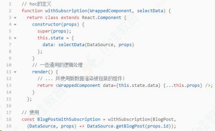

HOC 的优缺点 ∶

优点 ∶ 逻辑服用、不影响被包裹组件的内部逻辑。

缺点 ∶ hoc 传递给被包裹组件的 props 容易和被包裹后的组件重名，进而被覆盖

### （2）Render props

官方解释 ∶

"render prop"是指一种在 React 组件之间使用一个值为函数的 prop 共享代码的简单技术

具有 render prop 的组件接受一个返回 React 元素的函数，将 render 的渲染逻辑注入到组件内部。在这里，"render"的命名可以是任何其他有效的标识符。

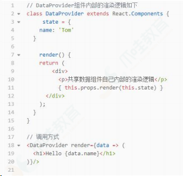

由此可以看到，render props 的优缺点也很明显 ∶

优点：数据共享、代码复用，将组件内的 state 作为 props 传递给调用者，将渲染逻辑交给调用者。

缺点：无法在 return 语句外访问数据、嵌套写法不够优雅

### （3）Hooks

官方解释 ∶

Hook 是 React 16.8 的新增特性。它可以让你在不编写 class 的情况下使用 state 以及其他的 React 特性。通过自定义 hook，可以复用代码逻辑。

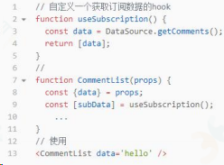

以上可以看出，hook 解决了 hoc 的 prop 覆盖的问题，同时使用的方式解决了 render props 的嵌套地狱的问题。hook 的优点如下 ∶

使用直观；

解决 hoc 的 prop 重名问题；

解决 render props 因共享数据 而出现嵌套地狱的问题；

能在 return 之外使用数据的问题。

需要注意的是：hook 只能在组件顶层使用，不可在分支语句中使用。

### 总结 ∶

Hoc、render props 和 hook 都是为了解决代码复用的问题，但是 hoc 和 render props 都有特定的使用场景和明显的缺点。hook 是 react16.8 更新的新的 API，让组件逻辑复用更简洁明了，同时也解决了 hoc 和 render props 的一些缺点。

## Component, Element, Instance 之间有什么区别和联系？

元素：一个元素 element 是一个普通对象(plain object)，描述了对于一个 DOM 节点或者其他组件 component，你想让它在屏幕上呈现成什么样子。元素 element 可以在它的属性 props 中包含其他元素(译注:用于形成元素树)。创建一个 React 元素 element 成本很低。元素 element 创建之后是不可变的。

组件：一个组件 component 可以通过多种方式声明。可以是带有一个 render()方法的类，简单点也可以定义为一个函数。这两种情况下，它都把属性 props 作为输入，把返回的一棵元素树作为输出。

实例：一个实例 instance 是你在所写的组件类 component class 中使用关键字 this 所指向的东西(译注:组件实例)。它用来存储本地状态和响应生命周期事件很有用。

函数式组件(Functional component)根本没有实例 instance。类组件(Class component)有实例 instance，但是永远也不需要直接创建一个组件的实例，因为 React 帮我们做了这些。

## React.createClass 和 extends Component 的区别有哪些？

React.createClass 和 extends Component 的 bai 区别主要在于：

### （1）语法区别

createClass 本质上是一个工厂函数，extends 的方式更加接近最新
的 ES6 规范的 class 写法。两种方式在语法上的差别主要体现在方法
的定义和静态属性的声明上。
createClass 方式的方法定义使用逗号，隔开，因为 creatClass 本
质上是一个函数，传递给它的是一个 Object；而 class 的方式定义
方法时务必谨记不要使用逗号隔开，这是 ES6 class 的语法规范。

### （2）propType 和 getDefaultProps

React.createClass：通过 proTypes 对象和 getDefaultProps()方法
来设置和获取 props.
React.Component：通过设置两个属性 propTypes 和 defaultProps

### （3）状态的区别

React.createClass：通过 getInitialState()方法返回一个包含初
始值的对象
React.Component：通过 constructor 设置初始状态
78

### （4）this 区别

React.createClass：会正确绑定 this
React.Component：由于使用了 ES6，这里会有些微不同，属性并不
会自动绑定到 React 类的实例上。

### （5）Mixins

React.createClass：使用 React.createClass 的话，可以在创建组
件时添加一个叫做 mixins 的属性，并将可供混合的类的集合以数组
的形式赋给 mixins。
如果使用 ES6 的方式来创建组件，那么 React mixins 的特性将不
能被使用了。

## React 如何判断什么时候重新渲染组件？

组件状态的改变可以因为 props 的改变，或者直接通过 setState 方法改变。组件获得新的状态，然后 React 决定是否应该重新渲染组件。

只要组件的 state 发生变化，React 就会对组件进行重新渲染。这是因为 React 中的 shouldComponentUpdate 方法默认返回 true，这就是导致每次更新都重新渲染的原因。

当 React 将要渲染组件时会执行 shouldComponentUpdate 方法来看它是否返回 true（组件应该更新，也就是重新渲染）。所以需要重写 shouldComponentUpdate 方法让它根据情况返回 true 或者 false 来告诉 React 什么时候重新渲染什么时候跳过重新渲染。

## React 中可以在 render 访问 refs 吗？为什么？

不可以，render 阶段 DOM 还没有生成，无法获取 DOM。DOM 的获取

需要在 pre-commit 阶段和 commit 阶段：

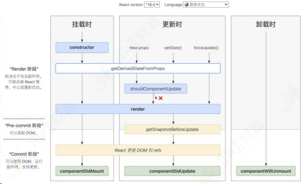

## React setState 调用之后发生了什么？是同步还是异步？

### （1）React 中 setState 后发生了什么

在代码中调用 setState 函数之后，React 会将传入的参数对象与组件当前的状态合并，然后触发调和过程(Reconciliation)。经过调和过程，React 会以相对高效的方式根据新的状态构建 React 元素树并且着手重新渲染整个 UI 界面。

在 React 得到元素树之后，React 会自动计算出新的树与老树的节点差异，然后根据差异对界面进行最小化重渲染。在差异计算算法中，React 能够相对精确地知道哪些位置发生了改变以及应该如何改变，这就保证了按需更新，而不是全部重新渲染。

如果在短时间内频繁 setState。React 会将 state 的改变压入栈中，在合适的时机，批量更新 state 和视图，达到提高性能的效果。

### （2）setState 是同步还是异步的

假如所有 setState 是同步的，意味着每执行一次 setState 时（有可能一个同步代码中，多次 setState），都重新 vnode diff + dom 修改，这对性能来说是极为不好的。如果是异步，则可以把一个同步代码中的多个 setState 合并成一次组件更新。所以默认是异步的，但是在一些情况下是同步的。

setState 并不是单纯同步/异步的，它的表现会因调用场景的不同而不同。在源码中，通过 isBatchingUpdates 来判断 setState 是先存进 state 队列还是直接更新，如果值为 true 则执行异步操作，为 false 则直接更新。

异步：在 React 可以控制的地方，就为 true，比如在 React 生命周期事件和合成事件中，都会走合并操作，延迟更新的策略。

同步：在 React 无法控制的地方，比如原生事件，具体就是在 addEventListener 、setTimeout、setInterval 等事件中，就只能同步更新。

一般认为，做异步设计是为了性能优化、减少渲染次数：

setState 设计为异步，可以显著的提升性能。如果每次调用 setState 都进行一次更新，那么意味着 render 函数会被频繁调用，界面重新渲染，这样效率是很低的；最好的办法应该是获取到多个更新，之后进行批量更新；

如果同步更新了 state，但是还没有执行 render 函数，那么 state 和 props 不能保持同步。state 和 props 不能保持一致性，会在开发中产生很多的问题；

## React 组件的 state 和 props 有什么区别？

### （1）props

props 是一个从外部传进组件的参数，主要作为就是从父组件向子组件传递数据，它具有可读性和不变性，只能通过外部组件主动传入新的 props 来重新渲染子组件，否则子组件的 props 以及展现形式不会改变。

### （2）state

state 的主要作用是用于组件保存、控制以及修改自己的状态，它只能在 constructor 中初始化，它算是组件的私有属性，不可通过外部访问和修改，只能通过组件内部的 this.setState 来修改，修改 state 属性会导致组件的重新渲染。

### （3）区别

props 是传递给组件的（类似于函数的形参），而 state 是在组件内被组件自己管理的（类似于在一个函数内声明的变量）。

props 是不可修改的，所有 React 组件都必须像纯函数一样保护它们的 props 不被更改。

state 是在组件中创建的，一般在 constructor 中初始化 state。

state 是多变的、可以修改，每次 setState 都异步更新的。

## React 中的 props 为什么是只读的？

this.props 是组件之间沟通的一个接口，原则上来讲，它只能从父组件流向子组件。React 具有浓重的函数式编程的思想。

提到函数式编程就要提一个概念：纯函数。它有几个特点：

- 给定相同的输入，总是返回相同的输出。
- 过程没有副作用。
- 不依赖外部状态。

this.props 就是汲取了纯函数的思想。props 的不可以变性就保证的
相同的输入，页面显示的内容是一样的，并且不会产生副作用

## React 中怎么检验 props？验证 props 的目的是什么？

React 为我们提供了 PropTypes 以供验证使用。当我们向 Props 传入的数据无效（向 Props 传入的数据类型和验证的数据类型不符）就会在控制台发出警告信息。它可以避免随着应用越来越复杂从而出现的问题。并且，它还可以让程序变得更易读。

当然，如果项目汇中使用了 TypeScript，那么就可以不用 PropTypes 来校验，而使用 TypeScript 定义接口来校验 props。

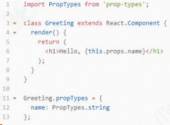

## React 废弃了哪些生命周期？为什么？

被废弃的三个函数都是在 render 之前，因为 fber 的出现，很可能因为高优先级任务的出现而打断现有任务导致它们会被执行多次。另外的一个原因则是，React 想约束使用者，好的框架能够让人不得已写出容易维护和扩展的代码，这一点又是从何谈起，可以从新增加以及即将废弃的生命周期分析入手

### componentWillMount

首先这个函数的功能完全可以使用 componentDidMount 和 constructor 来代替，异步获取的数据的情况上面已经说明了，而如果抛去异步获取数据，其余的即是初始化而已，这些功能都可以在 constructor 中执行，除此之外，如果在 willMount 中订阅事件，但在服务端这并不会执行 willUnMount 事件，也就是说服务端会导致内存泄漏所以 componentWilIMount 完全可以不使用，但使用者有时候难免因为各 种各样的情况在 componentWilMount 中做一些操作，那么 React 为了约束开发者，干脆就抛掉了这个 API

### componentWillReceiveProps

在老版本的 React 中，如果组件自身的某个 state 跟其 props 密切相关的话，一直都没有一种很优雅的处理方式去更新 state，而是需要在 componentWilReceiveProps 中判断前后两个 props 是否相同，如果不同再将新的 props 更新到相应的 state 上去。这样做一来会破坏 state 数据的单一数据源，导致组件状态变得不可预测，另一方面也会增加组件的重绘次数。类似的业务需求也有很多，如一个可以横向滑动的列表，当前高亮的 Tab 显然隶属于列表自身的时，根据传入的某个值，直接定位到某个 Tab。为了解决这些问题，React 引入了第一个新的生命周期：

getDerivedStateFromProps。它有以下的优点 ∶

- ●getDSFP 是静态方法，在这里不能使用 this，也就是一个纯函数，开发者不能写出副作用的代码
- ● 开发者只能通过 prevState 而不是 prevProps 来做对比，保证了 state 和 props 之间的简单关系以及不需要处理第一次渲染时 prevProps 为空的情况
- ● 基于第一点，将状态变化（setState）和昂贵操作（tabChange）区分开，更加便于 render 和 commit 阶段操作或者说优化。

### componentWillUpdate

与 componentWillReceiveProps 类似，许多开发者也会在 componentWillUpdate 中根据 props 的变化去触发一些回调 。 但不论是 componentWilReceiveProps 还 是 componentWilUpdate，都有可能在一次更新中被调用多次，也就是说写在这里的回调函数也有可能会被调用多次，这显然是不可取的。与 componentDidMount 类似， componentDidUpdate 也不存在这样的问题，一次更新中 componentDidUpdate 只会被调用一次，所以将原先写在 componentWillUpdate 中 的 回 调 迁 移 至 componentDidUpdate 就可以解决这个问题。

另外一种情况则是需要获取 DOM 元素状态，但是由于在 fber 中，render 可打断，可能在 wilMount 中获取到的元素状态很可能与实际需要的不同，这个通常可以使用第二个新增的生命函数的解决 getSnapshotBeforeUpdate(prevProps, prevState)

### getSnapshotBeforeUpdate(prevProps, prevState)

返回的值作为 componentDidUpdate 的第三个参数。与 willMount 不同的是，getSnapshotBeforeUpdate 会在最终确定的 render 执行之前执行，也就是能保证其获取到的元素状态与 didUpdate 中获取到的元素状态相同。官方参考代码：

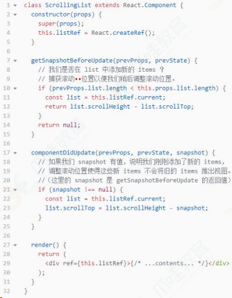

## React 16.X 中 props 改变后在哪个生命周期中处理

在 getDerivedStateFromProps 中进行处理。

这个生命周期函数是为了替代 componentWillReceiveProps 存在的，所以在需要使用 componentWillReceiveProps 时，就可以考虑使用 getDerivedStateFromProps 来进行替代。

两者的参数是不相同的，而 getDerivedStateFromProps 是一个静态函数，也就是这个函数不能通过 this 访问到 class 的属性，也并不推荐直接访问属性。而是应该通过参数提供的 nextProps 以及 prevState 来进行判断，根据新传入的 props 来映射到 state。

需要注意的是，如果 props 传入的内容不需要影响到你的 state，那么就需要返回一个 null，这个返回值是必须的，所以尽量将其写到函数的末尾：

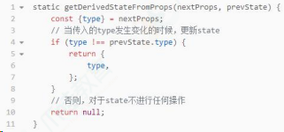

## React 16 中新生命周期有哪些

关于 React16 开始应用的新生命周期：

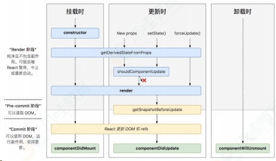

可以看出，React16 自上而下地对生命周期做了另一种维度的解读：

Render 阶段：用于计算一些必要的状态信息。这个阶段可能会被 React 暂停，这一点和 React16 引入的 Fiber 架构（我们后面会重点讲解）是有关的；

Pre-commit 阶段：所谓“commit”，这里指的是“更新真正的 DOM 节点”这个动作。所谓 Pre-commit，就是说我在这个阶段其实还并没有去更新真实的 DOM，不过 DOM 信息已经是可以读取的了；

Commit 阶段：在这一步，React 会完成真实 DOM 的更新工作。Commit 阶段，我们可以拿到真实 DOM（包括 refs）。

与此同时，新的生命周期在流程方面，仍然遵循“挂载”、“更新”、“卸载”这三个广义的划分方式。它们分别对应到：

挂载过程：

- constructor
- getDerivedStateFromProps
- render
- componentDidMount

更新过程：

- getDerivedStateFromProps
- shouldComponentUpdate
- render
- getSnapshotBeforeUpdate
- componentDidUpdate

卸载过程：

- componentWillUnmount

## React-Router 的实现原理是什么？

客户端路由实现的思想：

- 基于 hash 的路由：通过监听 hashchange 事件，感知 hash 的变化
- 改变 hash 可以直接通过 location.hash=xxx

基于 H5 history 路由：

改变 url 可以通过 history.pushState 和 resplaceState 等，会将 URL 压入堆栈，同时能够应用 history.go() 等 API 监听 url 的变化可以通过自定义事件触发实现

react-router 实现的思想：

基于 history 库来实现上述不同的客户端路由实现思想，并且能够保存历史记录等，磨平浏览器差异，上层无感知通过维护的列表，在每次 URL 发生变化的回收，通过配置的 路由路径，匹配到对应的 Component，并且 render

## react-router 里的 Link 标签和 a 标签的区别

从最终渲染的 DOM 来看，这两者都是链接，都是 标签，区别是：

`<Link>`是 react-router 里实现路由跳转的链接，一般配合`<Route>`使用，react-router 接管了其默认的链接跳转行为，区别于传统的页面跳转，`<Link> `的“跳转”行为只会触发相匹配的`<Route>`对应的页面内容更新，而不会刷新整个页面。

`<Link>`做了 3 件事情：

有 onclick 那就执行 onclick
click 的时候阻止 a 标签默认事件

根据跳转 href(即是 to)，用 history (web 前端路由两种方式之一，history & hash)跳转，此时只是链接变了，并没有刷新页面而`<a>`标签就是普通的超链接了，用于从当前页面跳转到 href 指向的另一个页面(非锚点情况)。

a 标签默认事件禁掉之后做了什么才实现了跳转?

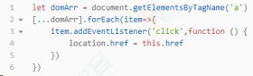

## 对 Redux 的理解，主要解决什么问题

React 是视图层框架。Redux 是一个用来管理数据状态和 UI 状态的 JavaScript 应用工具。随着 JavaScript 单页应用（SPA）开发日趋复杂， JavaScript 需要管理比任何时候都要多的 state（状态），Redux 就是降低管理难度的。（Redux 支持 React、Angular、jQuery 甚至纯 JavaScript）。

在 React 中，UI 以组件的形式来搭建，组件之间可以嵌套组合。但 React 中组件间通信的数据流是单向的，顶层组件可以通过 props 属性向下层组件传递数据，而下层组件不能向上层组件传递数据，兄弟组件之间同样不能。这样简单的单向数据流支撑起了 React 中的数据可控性。

当项目越来越大的时候，管理数据的事件或回调函数将越来越多，也将越来越不好管理。管理不断变化的 state 非常困难。如果一个 model 的变化会引起另一个 model 变化，那么当 view 变化时，就可能引起对应 model 以及另一个 model 的变化，依次地，可能会引起另一个 view 的变化。直至你搞不清楚到底发生了什么。state 在什么时候，由于什么原因，如何变化已然不受控制。 当系统变得错综复杂的时候，想重现问题或者添加新功能就会变得举步维艰。如果

这还不够糟糕，考虑一些来自前端开发领域的新需求，如更新调优、服务端渲染、路由跳转前请求数据等。state 的管理在大项目中相当复杂。

- Redux 提供了一个叫 store 的统一仓储库，组件通过 dispatch 将
- state 直接传入 store，不用通过其他的组件。并且组件通过
- subscribe 从 store 获取到 state 的改变。使用了 Redux，所有的
- 组件都可以从 store 中获取到所需的 state，他们也能从 store 获
- 取到 state 的改变。这比组件之间互相传递数据清晰明朗的多。

主要解决的问题：

单纯的 Redux 只是一个状态机，是没有 UI 呈现的，react- redux 作用是将 Redux 的状态机和 React 的 UI 呈现绑定在一起，当你 dispatchaction 改变 state 的时候，会自动更新页面。

## Redux 状态管理器和变量挂载到 window 中有什么区别

两者都是存储数据以供后期使用。但是 Redux 状态更改可回溯——Time travel，数据多了的时候可以很清晰的知道改动在哪里发生，完整的提供了一套状态管理模式。

随着 JavaScript 单页应用开发日趋复杂，JavaScript 需要管理比任何时候都要多的 state （状态）。 这些 state 可能包括服务器响应、缓存数据、本地生成尚未持久化到服务器的数据，也包括 UI 状态，如激活的路由，被选中的标签，是否显示加载动效或者分页器等等。

管理不断变化的 state 非常困难。如果一个 model 的变化会引起另一个 model 变化，那么当 view 变化时，就可能引起对应 model 以及另一个 model 的变化，依次地，可能会引起另一个 view 的变化。

直至你搞不清楚到底发生了什么。state 在什么时候，由于什么原因，如何变化已然不受控制。 当系统变得错综复杂的时候，想重现问题或者添加新功能就会变得举步维艰。

如果这还不够糟糕，考虑一些来自前端开发领域的新需求，如更新调优、服务端渲染、路由跳转前请求数据等等。前端开发者正在经受前所未有的复杂性，难道就这么放弃了吗?当然不是。

这里的复杂性很大程度上来自于：我们总是将两个难以理清的概念混淆在一起：变化和异步。 可以称它们为曼妥思和可乐。如果把二者分开，能做的很好，但混到一起，就变得一团糟。一些库如 React 视图在视图层禁止异步和直接操作 DOM 来解决这个问题。美中不足的是，React 依旧把处理 state 中数据的问题留给了你。Redux 就是
为了帮你解决这个问题。

## Redux 和 Vuex 有什么区别，它们的共同思想

### （1）Redux 和 Vuex 区别

Vuex 改进了 Redux 中的 Action 和 Reducer 函数，以 mutations 变化函数取代 Reducer，无需 switch，只需在对应的 mutation 函数里改变 state 值即可

Vuex 由于 Vue 自动重新渲染的特性，无需订阅重新渲染函数，只要生成新的 State 即可

Vuex 数据流的顺序是 ∶View 调用 store.commit 提交对应的请求到 Store 中对应的 mutation 函数->store 改变（vue 检测到数据变化自动渲染）

通俗点理解就是，vuex 弱化 dispatch，通过 commit 进行 store 状态的一次更变；取消了 action 概念，不必传入特定的 action 形式进行指定变更；弱化 reducer，基于 commit 参数直接对数据进行转变，使得框架更加简易;

### （2）共同思想

单—的数据源

变化可以预测

本质上 ∶ redux 与 vuex 都是对 mvvm 思想的服务，将数据从视图中抽离的一种方案。

## Redux 中间件是怎么拿到 store 和 action? 然后怎么处理?

redux 中间件本质就是一个函数柯里化。redux applyMiddleware Api 源码中每个 middleware 接受 2 个参数，Store 的 getState 函数和 dispatch 函数，分别获得 store 和 action，最终返回一个函数。该函数会被传入 next 的下一个 middleware 的 dispatch 方法，并返回一个接收 action 的新函数，这个函数可以直接调用 next（action），或者在其他需要的时刻调用，甚至根本不去调用它。调用链中最后一个 middleware 会接受真实的 store 的 dispatch 方法作为 next 参数，并借此结束调用链。所以，middleware 的函数签名是（{ getState，dispatch })=> next => action。

## React Hooks 解决了哪些问题？

React Hooks 主要解决了以下问题：

### （1）在组件之间复用状态逻辑很难

React 没有提供将可复用性行为“附加”到组件的途径（例如，把组件连接到 store）解决此类问题可以使用 render props 和 高阶组件。但是这类方案需要重新组织组件结构，这可能会很麻烦，并且会使代码难以理解。由 providers，consumers，高阶组件，render props 等其他抽象层组成的组件会形成“嵌套地狱”。尽管可以在 DevTools
过滤掉它们，但这说明了一个更深层次的问题：React 需要为共享状态逻辑提供更好的原生途径。

可以使用 Hook 从组件中提取状态逻辑，使得这些逻辑可以单独测试并复用。Hook 使我们在无需修改组件结构的情况下复用状态逻辑。

这使得在组件间或社区内共享 Hook 变得更便捷。

### （2）复杂组件变得难以理解

在组件中，每个生命周期常常包含一些不相关的逻辑。例如，组件常常在 componentDidMount 和 componentDidUpdate 中获取数据。但是，同一个 componentDidMount 中可能也包含很多其它的逻辑，如设置事件监听，而之后需在 componentWillUnmount 中清除。相互关联且需要对照修改的代码被进行了拆分，而完全不相关的代码却在同一个方法中组合在一起。如此很容易产生 bug，并且导致逻辑不一致。

在多数情况下，不可能将组件拆分为更小的粒度，因为状态逻辑无处不在。这也给测试带来了一定挑战。同时，这也是很多人将 React 与状态管理库结合使用的原因之一。但是，这往往会引入了很多抽象概念，需要你在不同的文件之间来回切换，使得复用变得更加困难。

为了解决这个问题，Hook 将组件中相互关联的部分拆分成更小的函数（比如设置订阅或请求数据），而并非强制按照生命周期划分。你还可以使用 reducer 来管理组件的内部状态，使其更加可预测。

### （3）难以理解的 class

除了代码复用和代码管理会遇到困难外，class 是学习 React 的一大屏障。我们必须去理解 JavaScript 中 this 的工作方式，这与其他语言存在巨大差异。还不能忘记绑定事件处理器。没有稳定的语法提案，这些代码非常冗余。大家可以很好地理解 props，state 和自顶向下的数据流，但对 class 却一筹莫展。即便在有经验的 React 开发者之间，对于函数组件与 class 组件的差异也存在分歧，甚至还要区分两种组件的使用场景。

为了解决这些问题，Hook 使你在非 class 的情况下可以使用更多的 React 特性。 从概念上讲，React 组件一直更像是函数。而 Hook 则拥抱了函数，同时也没有牺牲 React 的精神原则。Hook 提供了问题的解决方案，无需学习复杂的函数式或响应式编程技术

## React Hook 的使用限制有哪些？

React Hooks 的限制主要有两条：

不要在循环、条件或嵌套函数中调用 Hook；

在 React 的函数组件中调用 Hook。

那为什么会有这样的限制呢？Hooks 的设计初衷是为了改进 React 组件的开发模式。在旧有的开发模式下遇到了三个问题。

组件之间难以复用状态逻辑。过去常见的解决方案是高阶组件、render props 及状态管理框架。

复杂的组件变得难以理解。生命周期函数与业务逻辑耦合太深，导致关联部分难以拆分。

人和机器都很容易混淆类。常见的有 this 的问题，但在 React 团队中还有类难以优化的问题，希望在编译优化层面做出一些改进。这三个问题在一定程度上阻碍了 React 的后续发展，所以为了解决这三个问题，Hooks 基于函数组件开始设计。然而第三个问题决定了 Hooks 只支持函数组件。

那为什么不要在循环、条件或嵌套函数中调用 Hook 呢？因为 Hooks 的设计是基于数组实现。在调用时按顺序加入数组中，如果使用循环、条件或嵌套函数很有可能导致数组取值错位，执行错误的 Hook。当然，实质上 React 的源码里不是数组，是链表。

这些限制会在编码上造成一定程度的心智负担，新手可能会写错，为了避免这样的情况，可以引入 ESLint 的 Hooks 检查插件进行预防。

## React diff 算法的原理是什么？

实际上，diff 算法探讨的就是虚拟 DOM 树发生变化后，生成 DOM 树更新补丁的方式。它通过对比新旧两株虚拟 DOM 树的变更差异，将更新补丁作用于真实 DOM，以最小成本完成视图更新。

具体的流程如下：

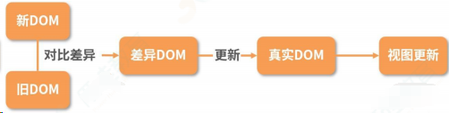

- 真实的 DOM 首先会映射为虚拟 DOM；
- 当虚拟 DOM 发生变化后，就会根据差距计算生成 patch，这个 patch
- 是一个结构化的数据，内容包含了增加、更新、移除等；
- 根据 patch 去更新真实的 DOM，反馈到用户的界面上。

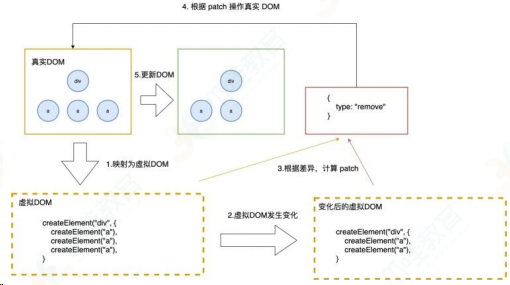

一个简单的例子：

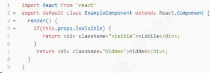

这里，首先假定 ExampleComponent 可见，然后再改变它的状态，让它不可见 。映射为真实的 DOM 操作是这样的，React 会创建一个 div 节点。

```html
<div class="visible">visible</div>
```

当把 visbile 的值变为 false 时，就会替换 class 属性为 hidden，并重写内部的 innerText 为 hidden。这样一个生成补丁、更新差异的过程统称为 diff 算法。

diff 算法可以总结为三个策略，分别从树、组件及元素三个层面进行复杂度的优化：

策略一：忽略节点跨层级操作场景，提升比对效率。（基于树进行对比）

这一策略需要进行树比对，即对树进行分层比较。树比对的处理手法是非常“暴力”的，即两棵树只对同一层次的节点进行比较，如果发现节点已经不存在了，则该节点及其子节点会被完全删除掉，不会用于进一步的比较，这就提升了比对效率。

策略二：如果组件的 class 一致，则默认为相似的树结构，否则默认为不同的树结构。（基于组件进行对比）

在组件比对的过程中：

- 如果组件是同一类型则进行树比对；
  如果不是则直接放入补丁中。
- 只 要 父 组 件 类 型 不 同 ， 就 会 被 重 新 渲 染 。 这 也 就 是 为 什 么 shouldComponentUpdate、PureComponent 及 React.memo 可以提高性能的原因。

策略三：同一层级的子节点，可以通过标记 key 的方式进行列表对比。（基于节点进行对比）

元素比对主要发生在同层级中，通过标记节点操作生成补丁。节点操作包含了插入、移动、删除等。其中节点重新排序同时涉及插入、移动、删除三个操作，所以效率消耗最大，此时策略三起到了至关重要的作用。通过标记 key 的方式，React 可以直接移动 DOM 节点，降低内耗。

## React key 是干嘛用的 为什么要加？key 主要是解决哪一类问题的

Keys 是 React 用于追踪哪些列表中元素被修改、被添加或者被移除的辅助标识。在开发过程中，我们需要保证某个元素的 key 在其同级元素中具有唯一性。

在 React Diff 算法中 React 会借助元素的 Key 值来判断该元素是新近创建的还是被移动而来的元素，从而减少不必要的元素重渲染此外，React 还需要借助 Key 值来判断元素与本地状态的关联关系。

注意事项：

- key 值一定要和具体的元素—一对应；
- 尽量不要用数组的 index 去作为 key；
- 不要在 render 的时候用随机数或者其他操作给元素加上不稳定的 key，这样造成的性能开销比不加 key 的情况下更糟糕。

## React 与 Vue 的 diff 算法有何不同？

diff 算法是指生成更新补丁的方式，主要应用于虚拟 DOM 树变化后，更新真实 DOM。所以 diff 算法一定存在这样一个过程：触发更新 → 生成补丁 → 应用补丁。

React 的 diff 算法，触发更新的时机主要在 state 变化与 hooks 调用之后。此时触发虚拟 DOM 树变更遍历，采用了深度优先遍历算法。但传统的遍历方式，效率较低。为了优化效率，使用了分治的方式。将单一节点比对转化为了 3 种类型节点的比对，分别是树、组件及元素，以此提升效率。

树比对：由于网页视图中较少有跨层级节点移动，两株虚拟 DOM 树只对同一层次的节点进行比较。

组件比对：如果组件是同一类型，则进行树比对，如果不是，则直接放入到补丁中。

元素比对：主要发生在同层级中，通过标记节点操作生成补丁，节点操作对应真实的 DOM 剪裁操作。

以上是经典的 React diff 算法内容。自 React 16 起，引入了 Fiber 架构。为了使整个更新过程可随时暂停恢复，节点与树分别采用了 FiberNode 与 FiberTree 进行重构。fiberNode 使用了双链表的结构，可以直接找到兄弟节点与子节点。整个更新过程由 current 与 workInProgress 两株树双缓冲完成。workInProgress 更新完成后，再通过修改 current 相关指针指向新节点。

Vue 的整体 diff 策略与 React 对齐，虽然缺乏时间切片能力，但这并不意味着 Vue 的性能更差，因为在 Vue 3 初期引入过，后期因为收益不高移除掉了。除了高帧率动画，在 Vue 中其他的场景几乎都可以使用防抖和节流去提高响应性能。

## react 最新版本解决了什么问题，增加了哪些东西

React 16.x 的三大新特性 Time Slicing、Suspense、 hooks

Time Slicing（解决 CPU 速度问题）使得在执行任务的期间可以随时暂停，跑去干别的事情，这个特性使得 react 能在性能极其差的机器跑时，仍然保持有良好的性能

Suspense（解决网络 IO 问题）和 lazy 配合，实现异步加载组件。能暂停当前组件的渲染， 当完成某件事以后再继续渲染，解决从 react 出生到现在都存在的「异步副作用」的问题，而且解决得非的优雅，使用的是 T 异步但是同步的写法，这是最好的解决异步问题的方式

提供了一个内置函数 componentDidCatch，当有错误发生时，可以友好地展示 fallback 组件; 可以捕捉到它的子元素（包括嵌套子元素）抛出的异常; 可以复用错误组件。

### （1）React16.8

加入 hooks，让 React 函数式组件更加灵活，hooks 之前，React 存在很多问题：

在组件间复用状态逻辑很难

复杂组件变得难以理解，高阶组件和函数组件的嵌套过深。

class 组件的 this 指向问题

难以记忆的生命周期

hooks 很好的解决了上述问题，hooks 提供了很多方法

useState 返回有状态值，以及更新这个状态值的函数

useEffect 接受包含命令式，可能有副作用代码的函数。

useContext 接受上下文对象（从 React.createContext 返回的值）并返回当前上下文值，useReducer useState 的替代方案。接受类型为 （state，action）=> newState 的 reducer，并返回与 dispatch 方法配对的当前状态。

useCalLback 返回一个回忆的 memoized 版本，该版本仅在其中一个输入发生更改时才会更改。纯函数的输入输出确定性 o useMemo 纯的一个记忆函数 o useRef 返回一个可变的 ref 对象，其 Current 属性被初始化为传递的参数，返回的 ref 对象在组件的整个生命周期内保持不变。

useImperativeMethods 自定义使用 ref 时公开给父组件的实例值

useMutationEffect 更新兄弟组件之前，它在 React 执行其 DOM 改变的同一阶段同步触发 useLayoutEffect DOM 改变后同步触发。使用它来从 DOM 读取布局并
同步重新渲染

### （2）React16.9

重命名 Unsafe 的生命周期方法。新的 UNSAFE\_前缀将有助于在代码 review 和 debug 期间，使这些有问题的字样更突出废弃 javascrip:形式的 URL。以 javascript:开头的 URL 非常容易遭受攻击，造成安全漏洞。

废弃"Factory"组件。 工厂组件会导致 React 变大且变慢。

act（）也支持异步函数，并且你可以在调用它时使用 await。

使用 `<React.ProfiLer>` 进行性能评估。在较大的应用中追踪性能回归可能会很方便

### （3）React16.13.0

支持在渲染期间调用 setState，但仅适用于同一组件

可检测冲突的样式规则并记录警告

废弃 unstable_createPortal，使用 CreatePortal

将组件堆栈添加到其开发警告中，使开发人员能够隔离 bug 并调试其程序，这可以清楚地说明问题所在，并更快地定位和修复错误。

## 在 React 中页面重新加载时怎样保留数据？

这个问题就设计到了数据持久化，主要的实现方式有以下几种：

Redux：将页面的数据存储在 redux 中，在重新加载页面时，获取 Redux
中的数据；

data.js：使用 webpack 构建的项目，可以建一个文件，data.js，将数据保存 data.js 中，跳转页面后获取；

sessionStorge：在进入选择地址页面之前，componentWillUnMount 的时候，将数据存储到 sessionStorage 中，每次进入页面判断 sessionStorage 中有没有存储的那个值，有，则读取渲染数据；没有，则说明数据是初始化的状态。返回或进入除了选择地址以外的页面，清掉存储的 sessionStorage，保证下次进入是初始化的数据

history API：History API 的 pushState 函数可以给历史记录关联一个任意的可序列化 state，所以可以在路由 push 的时候将当前页面的一些信息存到 state 中，下次返回到这个页面的时候就能从 state 里面取出离开前的数据重新渲染。react-router 直接可以支持。这个方法适合一些需要临时存储的场景。

## 为什么使用 jsx 的组件中没有看到使用 react 却需要引入 react？

本质上来说 JSX 是 React.createElement(component,props, ...children)方法的语法糖。在 React 17 之前，如果使用了 JSX，其实就是在使用 React， babel 会把组件转换为 CreateElement 形式。在 React 17 之后，就不再需要引入，因为 babel 已经可以帮我们自动引入 react。

## Redux 中间件是什么？接受几个参数？柯里化函数两端的参数具体是什么？

Redux 的中间件提供的是位于 action 被发起之后，到达 reducer 之前的扩展点，换而言之，原本 view -→> action -> reducer ->store 的数据流加上中间件后变成了 view -> action -> middleware-> reducer -> store ，在这一环节可以做一些"副作用"的操作，如异步请求、打印日志等。

applyMiddleware 源码：

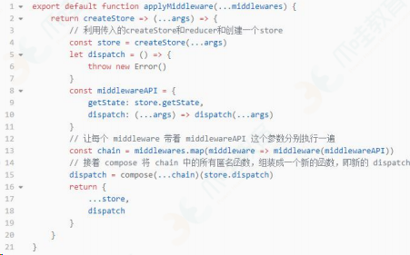

从 applyMiddleware 中可以看出 ∶

redux 中间件接受一个对象作为参数，对象的参数上有两个字段：dispatch 和 getState，分别代表着 Redux Store 上的两个同名函数。

柯里化函数两端一个是 middewares，一个是 store.dispatch

## 组件通信的方式有哪些

⽗组件向子组件通讯: ⽗组件可以向子组件通过传 props 的⽅式，向子组件进⾏通讯

子组件向⽗组件通讯: props+回调的⽅式，⽗组件向子组件传递 props 进⾏通讯，此 props 为作⽤域为⽗组件⾃身的函 数，子组件调⽤该函数，将子组件想要传递的信息，作为参数，传递到⽗组件的作⽤域中

兄弟组件通信: 找到这两个兄弟节点共同的⽗节点,结合上⾯两种⽅式由⽗节点转发信息进⾏通信

跨层级通信: Context 设计目的是为了共享那些对于⼀个组件树⽽⾔是“全局”的数据，例如当前认证的⽤户、主题或首选语⾔，对于跨越多层的全局数据通过 Context 通信再适合不过

发布订阅模式: 发布者发布事件，订阅者监听事件并做出反应,我们可以通过引入 event 模块进⾏通信

全局状态管理⼯具: 借助 Redux 或者 Mobx 等全局状态管理⼯具进⾏通信,这种⼯具会维护⼀个全局状态中⼼ Store,并根据不同的事件产⽣新的状态

## 使用

- create-react-app
- 基本用法
  - JSX 语法
  - 条件
  - 列表渲染
  - 事件
  - 组件和 props（类型检查）
  - state 和 setState
  - 组件声明周期
- 高级使用
  - 函数组件
  - 受控和非受控组件
  - refs
  - Protals
  - context
  - 异步组件（懒加载）
  - 性能优化
  - shouldComponentUpdate
  - 纯组件
  - 不可变值 immutablejs
  - 高阶组件

## 周边工具

- redux
  - store
  - reducer
  - action
  - dispatch
  - 单项数据流模型
  - 中间件 redux-thunkredux-saga
- react-redux
  - provider
  - connect
  - mapStateToProps
  - mapDispatchToProps
- react-router

## 待定面试题

### React 的生命周期 mount 和 update 描述下

### React 的生命周期中的 isBatchingUpdates 了解吗？ Transaction 知道吗

### React 的 vdom 如何实现？ jsx 是怎样解析的？

### React 的 Fiber`是什么？具有什么样的特性？

### React 的 diff/patch 算法原理

### React 的组件逻辑（受控、非受控）？如何设计一个组件库

### React 的数据流， Redux 、 Mobx 、 Rxjs ，发布订阅模式、观察者模式， flux 和 no-flux

### React 的事件注册和事件分发知道吗？

### Redux 解决了什么痛点（有什么优点），⼜有什么缺点

### Redux 的中间件有哪些？ redux-actions 、 redux-promise 、 redux-thunk 、redux-saga 、 redux-immutable 了解过哪些？说说中间件的意义

### Redux 有什么优化方案？

### SSR 了解过吗？怎样做？了解 Koa 么？

### React-Native 了解过吗？ JavascriptCore 是什么？

## 原理

- 函数式编程
- vdom 和 diff 算法
- JSX 本质
- 合成事件
- setState 和 batchUpdate
- 组件渲染过程
- 前端路由

## 1 生命周期

在 V16 版本中引入了 Fiber 机制。这个机制一定程度上的影响了部分生命
周期的调用，并且也引入了新的 2 个 API 来解决问题

在之前的版本中，如果你拥有一个很复杂的复合组件，然后改动了最上层组件
的 state ，那么调用栈可能会很长

调用栈过长，再加上中间进行了复杂的操作，就可能导致长时间阻塞主线程，带来不好的用户体验。 Fiber 就是为了解决该问题而生

Fiber 本质上是一个虚拟的堆栈帧，新的调度器会按照优先级自由调度这些帧，从而将之前的同步渲染改成了异步渲染，在不影响体验的情况下去分段计算更新

对于如何区别优先级， React 有自己的一套逻辑。对于动画这种实时性很高的东⻄，也就是 16 ms 必须渲染一次保证不卡顿的情况下， React 会每 16 ms（以内） 暂停一下更新，返回来继续渲染动画

对于异步渲染，现在渲染有两个阶段： reconciliation 和 commit 。前者过程是可以打断的，后者不能暂停，会一直更新界面直到完成。

#### 1.Reconciliation 阶段

- componentWillMount
- componentWillReceiveProps
- shouldComponentUpdate
- componentWillUpdate

#### 2.Commit 阶段

- componentDidMount
- componentDidUpdate
- componentWillUnmount

因为 Reconciliation 阶段是可以被打断的，所以 Reconciliation 阶段会执行的生命周期函数就可能会出现调用多次的情况，从而引起 Bug 。由此对于 Reconciliation 阶段调用的几个函数，除了 shouldComponentUpdate 以外，其他都应该避免去使用，并且 V16 中也引入了新的 API 来解决这个问题。

getDerivedStateFromProps 用于替换 componentWillReceiveProps ，该函数会在初始化和 update 时被调用

```js
class ExampleComponent extends React.Component {
	// Initialize state in constructor,
	// Or with a property initializer.
	state = {};
	static getDerivedStateFromProps(nextProps, prevState) {
		if (prevState.someMirroredValue !== nextProps.someValue) {
			return {
				derivedData: computeDerivedState(nextProps),
				someMirroredValue: nextProps.someValue,
			};
		}
		// Return null to indicate no change to state.
		return null;
	}
}
```

getSnapshotBeforeUpdate 用于替换 componentWillUpdate ，该函数会
在 update 后 DOM 更新前被调用，用于读取最新的 DOM 数据

更多详情：http://blog.poetries.top/2018/11/18/react-lifecircle

## setState

setState 在 React 中是经常使用的一个 API ，但是它存在一些的问题经常会导致初学者出错，核⼼原因就是因为这个 API 是异步的。

首先 setState 的调用并不会⻢上引起 state 的改变，并且如果你一次调用了多个 setState ，那么结果可能并不如你期待的一样。

```js
handle() {
    // 初始化 `count` 为 0
    console.log(this.state.count) // -> 0
    this.setState({ count: this.state.count + 1 })
    this.setState({ count: this.state.count + 1 })
    this.setState({ count: this.state.count + 1 })
    console.log(this.state.count) // -> 0
}
```

第一，两次的打印都为 0 ，因为 setState 是个异步 API ，只有同步代码运行完毕才会执行。 setState 异步的原因我认为在于， setState 可能会导致 DOM 的重绘，如果调用一次就⻢上去进行重绘，那么调用多次就会造成不必要的性能损失。设计成异步的话，就可以将多次调用放入一个队列中，在恰当的时候统一进行更新过程。

```js
Object.assign(
	{},
	{ count: this.state.count + 1 },
	{ count: this.state.count + 1 },
	{ count: this.state.count + 1 }
);
```

当然你也可以通过以下方式来实现调用三次 setState 使得 count 为 3

```js
handle() {
    this.setState((prevState) => ({ count: prevState.count + 1 }))
    this.setState((prevState) => ({ count: prevState.count + 1 }))
    this.setState((prevState) => ({ count: prevState.count + 1 }))
}
```

如果你想在每次调用 setState 后获得正确的 state ，可以通过如下代码实现

```js
handle() {
    this.setState((prevState) => ({ count: prevState.count + 1 }), () => {
    	console.log(this.state)
    })
}
```

更多详情：http://blog.poetries.top/2018/12/20/react-setState

## React 中 keys 的作用是什么？

Keys 是 React 用于追踪哪些列表中元素被修改、被添加或者被移除的辅助
标识

在开发过程中，我们需要保证某个元素的 key 在其同级元素中具有唯一性。在 ReactDiff 算法中 React 会借助元素的 Key 值来判断该元素是新近创建的还是被移动而来的元素，从而减少不必要的元素重渲染。此外，React 还需要借助 Key 值来判断元素与本地状态的关联关系，因此我们绝不可忽视转换函数中 Key 的重要性

## 传入 setState 函数的第二个参数的作用是什么？

该函数会在 setState 函数调用完成并且组件开始重渲染的时候被调用，我们
可以用该函数来监听渲染是否完成：

```js
this.setState({ username: "tylermcginnis33" }, () =>
	console.log("setState has finished and the component has re-rendere")
);
this.setState((prevState, props) => {
	return {
		streak: prevState.streak + props.count,
	};
});
```

## React 中 refs 的作用是什么

Refs 是 React 提供给我们的安全访问 DOM 元素或者某个组件实例的句柄
可以为元素添加 ref 属性然后在回调函数中接受该元素在 DOM 树中的句柄，该值会作为回调函数的第一个参数返回

## 在生命周期中的哪一步你应该发起 AJAX 请求

我们应当将 AJAX 请求放到 componentDidMount 函数中执行，主要原因有下
React 下一代调和算法 Fiber 会通过开始或停止渲染的方式优化应用性能，其会影响到 componentWillMount 的触发次数。对于 componentWillMount 这个生命周期函数的调用次数会变得不确定， React 可能会多次频繁调用 componentWillMount 。如果我们将 AJAX 请求放到 componentWillMount 函数中，那么显而易见其会被触发多次，自然也就不是好的选择。

如果我们将 AJAX 请求放置在生命周期的其他函数中，我们并不能保证请求仅在组件挂载完毕后才会要求响应。如果我们的数据请求在组件挂载之前就完成，并且调用了 setState 函数将数据添加到组件状态中，对于未挂载的组件则会报错。而在 componentDidMount 函数中进行 AJAX 请求则能有效避免这个问题。

## shouldComponentUpdate 的作用

shouldComponentUpdate 允许我们手动地判断是否要进行组件更新，根据组
件的应用场景设置函数的合理返回值能够帮我们避免不必要的更新

## 如何告诉 React 它应该编译生产环境版

通常情况下我们会使用 Webpack 的 DefinePlugin 方法来将 NODE_ENV 变量值设置为 production 。编译版本中 React 会忽略 propType 验证以及其他的告警信息，同时还会降低代码库的大小， React 使用了 Uglify 插件来移除生产环境下不必要的注释等信息

## 7 概述下 React 中的事件处理逻辑

为了解决跨浏览器兼容性问题， React 会将浏览器原生事件（ Browser Native Event ）封装为合成事件（ SyntheticEvent ）传入设置的事件处理器中。这里的合成事件提供了与原生事件相同的接口，不过它们屏蔽了底层浏览器的细节差异，保证了行为的一致性。另外有意思的是， React 并没有直接将事件附着到子元素上，而是以单一事件监听器的方式将所有的事件发送到顶层进行处理。这样 React 在更新 DOM 的时候就不需要考虑如何去处理附着在 DOM 上的事件监听器，最终达到优化性能的目的

## 8 createElement 与 cloneElement 的区别是什么

createElement 函数是 JSX 编译之后使用的创建 React Element 的函数，而 cloneElement 则是用于复制某个元素并传入新的 Props

## 9 redux 中间件

中间件提供第三方插件的模式，自定义拦截 action -> reducer 的过程。

变为 action -> middlewares -> reducer 。这种机制可以让我们改变数据流，实现如异步 action ， action 过滤，⽇志输出，异常报告等功能

- redux-logger ：提供⽇志输出
- redux-thunk ：处理异步操作
- redux-promise ：处理异步操作， actionCreator 的返回值是 promise

## 10 redux 有什么缺点

一个组件所需要的数据，必须由父组件传过来，而不能像 flux 中直接从 store 取。

当一个组件相关数据更新时，即使父组件不需要用到这个组件，父组件还是会重新 render ，可能会有效率影响，或者需要写复杂的 shouldComponentUpdate 进行判断。

## 11 react 组件的划分业务组件技术组件？

- 根据组件的职责通常把组件分为 UI 组件和容器组件。
- UI 组件负责 UI 的呈现，容器组件负责管理数据和逻辑。
- 两者通过 React-Redux 提供 connect 方法联系起来

## 12 react 生命周期函数

### 初始化阶段

- getDefaultProps：获取实例的默认属性
- getInitialState：获取每个实例的初始化状态
- componentWillMount ：组件即将被装载、渲染到页面上
- render：组件在这里生成虚拟的 DOM 节点
- omponentDidMount：组件真正在被装载之后

### 运行中状态

- componentWillReceiveProps：组件将要接收到属性的时候调用
- shouldComponentUpdate：组件接受到新属性或者新状态的时候（可以返回 false，接收数据后不更新，阻止 render 调用，后面的函数不会被继续执行了）
- componentWillUpdate：组件即将更新不能修改属性和状态
- render：组件重新描绘
- componentDidUpdate：组件已经更新

### 销毁阶段

componentWillUnmount：组件即将销毁

## 13 react 性能优化是哪个周期函数

shouldComponentUpdate 这个方法用来判断是否需要调用 render 方法重新描绘 dom。因为 dom 的描绘非常消耗性能，如果我们能在 shouldComponentUpdate 方 法中能够写出更优化的 dom diff 算法，可以极大的提高性能

## react 的虚拟 dom 是怎么实现的

首先说说为什么要使用 Virturl DOM ，因为操作真实 DOM 的耗费的性能代价太高，所以 react 内部使用 js 实现了一套 dom 结构，在每次操作在和真实 dom 之前，使用实现好的 diff 算法，对虚拟 dom 进行比较，递归找出有变化的 dom 节点，然后对其进行更新操作。

为了实现虚拟 DOM ，我们需要把每一种节点类型抽象成对象，每一种节点类型有自己的属性，也就是 prop，每次进行 diff 的时候， react 会先比较该节点类型，假如节点类型不一样，那么 react 会直接删除该节点，然后直接创建新的节点插入到其中，假如节点类型一样，那么会比较 prop 是否有更新，假如有 prop 不一样，那么 react 会判定该节点有更新，那么重渲染该节点，然后在对其子节点进行比较，一层一层往下，直到没有子节点

## react 的渲染过程中，兄弟节点之间是怎么处理的？也就是 key 值不一样的时候

通常我们输出节点的时候都是 map 一个数组然后返回一个 ReactNode ，为了方便 react 内部进行优化，我们必须给每一个 reactNode 添加 key ，这个 key prop 在设计值处不是给开发者用的，而是给 react 用的，大概的作用就是给每一个 reactNode 添加一个身份标识，方便 react 进行识别，在重渲染过程中，如果 key 一样，若组件属性有所变化，则 react 只更新组件对应的属性；没有变化则不更新，如果 key 不一样，则 react 先销毁该组件，然后重新创建该组件

## 介绍一下 react

1. 以前我们没有 jquery 的时候，我们大概的流程是从后端通过 ajax 获取到数据然后使用 jquery 生成 dom 结果然后更新到页面当中，但是随着业务发展，我们的项目可能会越来越复杂，我们每次请求到数据，或则数据有更改的时候，我们⼜需要重新组装一次 dom 结构，然后更新页面，这样我们手动同步 dom 和数据的成本就越来越高，而且频繁的操作 dom，也使我们页面的性能慢慢的降低。
2. 这个时候 mvvm 出现了，mvvm 的双向数据绑定可以让我们在数据修改的同时同步 dom 的更新，dom 的更新也可以直接同步我们数据的更改，这个特定可以大大降低我们手动去维护 dom 更新的成本，mvvm 为 react 的特性之一，虽然 react 属于单项数据流，需要我们手动实现双向数据绑定。
3. 有了 mvvm 还不够，因为如果每次有数据做了更改，然后我们都全量更新 dom 结构的话，也没办法解决我们频繁操作 dom 结构(降低了页面性能)的问题，为了解决这个问题，react 内部实现了一套虚拟 dom 结构，也就是用 js 实现的一套 dom 结构，他的作用是讲真实 dom 在 js 中做一套缓存，每次有数据更改的时候，react 内部先使用算法，也就是鼎鼎有名的 diff 算法对 dom 结构进行对比，找到那些我们需要新增、更新、删除的 dom 节点，然后一次性对真实 DOM 进行更新，这样就大大降低了操作 dom 的次数。 那么 diff 算法是怎么运作的呢?
   首先，diff 针对类型不同的节点，会直接判定原来节点需要卸载并且用新的节点来装载卸载的节点的位置；针对于节点类型相同的节点，会对比这个节点的所有属性，如果节点的所有属性相同，那么判定这个节点不需要更新，如果节点属性不相同，那么会判定这个节点需要更新，react 会更新并重渲染这个节点。
4. react 设计之初是主要负责 UI 层的渲染，虽然每个组件有自己的 state，state 表示组件的状态，当状态需要变化的时候，需要使用 setState 更新我们的组件，但是，我们想通过一个组件重渲染它的兄弟组件，我们就需要将组件的状态提升到父组件当中，让父组件的状态来
5. 控制这两个组件的重渲染，当我们组件的层次越来越深的时候，状态需要一直往下传，无疑加大了我们代码的复杂度，我们需要一个状态管理中⼼，来帮我们管理我们状态 state。
6. 这个时候，redux 出现了，我们可以将所有的 state 交给 redux 去管理，当我们的某一个 state 有变化的时候，依赖到这个 state 的组件就会进行一次重渲染，这样就解决了我们的我们需要一直把 state 往下传的问题。redux 有 action、reducer 的概念，action 为唯一修改 state 的来源，reducer 为唯一确定 state 如何变化的入口，这使得 redux 的数据流非常规范，同时也暴露出了 redux 代码的复杂，本来那么简单的功能，却需要完成那么多的代码。
7. 后来，社区就出现了另外一套解决方案，也就是 mobx，它推崇代码简约易懂，只需要定义一个可观测的对象，然后哪个组价使用到这个可观测的对象，并且这个对象的数据有更改，那么这个组件就会重渲染，而且 mobx 内部也做好了是否重渲染组件的生命周期
   shouldUpdateComponent，不建议开发者进行更改，这使得我们使用 mobx 开发项目的时
   候可以简单快速的完成很多功能，连 redux 的作者也推荐使用 mobx 进行项目开发。但是，随着项目的不断变大，mobx 也不断暴露出了它的缺点，就是数据流太随意，出了 bug 之后不好追溯数据的流向，这个缺点正好体现出了 redux 的优点所在，所以针对于小项目来说，社区推荐使用 mobx，对大项目推荐使用 redux

## 为什么虚拟 dom 会提高性能

虚拟 dom 相当于在 js 和真实 dom 中间加了一个缓存，利用 dom diff 算
法避免了没有必要的 dom 操作，从而提高性能

具体实现步骤如下：

- 用 JavaScript 对象结构表示 DOM 树的结构；然后用这个树构建一个真正的 DOM 树，插到文档当中
- 当状态变更的时候，重新构造一棵新的对象树。然后用新的树和旧的树进行比较，记录两棵树差异
- 把 2 所记录的差异应用到步骤 1 所构建的真正的 DOM 树上，视图就更新

## 15 diff 算法?

- 把树形结构按照层级分解，只比较同级元素。
- 给列表结构的每个单元添加唯一的 key 属性，方便比较。
- React 只会匹配相同 class 的 component （这里面的 class 指的是组件的名=字）
- 合并操作，调用 component 的 setState 方法的时候, React 将其标记为 - dirty
- 到每一个事件循环结束, React 检查所有标记 dirty 的 component 重新绘制.
- 选择性子树渲染。开发⼈员可以重写 shouldComponentUpdate 提高 diff 的性能

## 16 react 性能优化方案

- 重写 shouldComponentUpdate 来避免不必要的 dom 操作
- 使用 production 版本的 react.js
- 使用 key 来帮助 React 识别列表中所有子组件的最小变化

## 16 简述 flux 思想

Flux 的最大特点，就是数据的"单向流动"。

- 用户访问 View
- View 发出用户的 Action
- Dispatcher 收到 Action ，要求 Store 进行相应的更新
- Store 更新后，发出一个 "change" 事件
- View 收到 "change" 事件后，更新页面

## 说说你用 react 有什么坑点？

1. JSX 做表达式判断时候，需要强转为 boolean 类型

如果不使用 !!b 进行强转数据类型，会在页面里面输出 0 。

```jsx
render() {
 const b = 0;
 return <div>
     {
     !!b && <div>这是一段文本</div>
     }
 </div>
}
```

2. 尽量不要在 componentWillReviceProps 里使用 setState，如果一定要使用，那么需要判断结束条件，不然会出现无限重渲染，导致页面崩溃
3. 给组件添加 ref 时候，尽量不要使用匿名函数，因为当组件更新的时候，匿名函数会被当做新的 prop 处理，让 ref 属性接受到新函数的时候，react 内部会先清空 ref，也就是会以 null 为回调参数先执行一次 ref 这个 props，然后在以该组件的实例执行一次 ref，所以用匿名函数做 ref
   的时候，有的时候去 ref 赋值后的属性会取到 null
4. 遍历子节点的时候，不要用 index 作为组件的 key 进行传入

## 18 我现在有一个 button，要用 react 在上面绑定点击事件，要怎么做？

```jsx
class Demo {
	render() {
		return (
			<button
				onClick={(e) => {
					alert("我点击了按钮");
				}}
			>
				按钮
			</button>
		);
	}
}
```

你觉得你这样设置点击事件会有什么问题吗？

由于 onClick 使用的是匿名函数，所有每次重渲染的时候，会把该 onClick 当做一个新的 prop 来处理，会将内部缓存的 onClick 事件进行重新赋值，所以相对直接使用函数来说，可能有一点的性能下降

修改

```jsx
class Demo {
 onClick = (e) => {
 alert('我点击了按钮')
 }
 render() {
 return <button onClick={this.onClick}>
 按钮
 </button>
 }

```

## 性能优化

在 shouldComponentUpdate 函数中我们可以通过返回布尔值来决定当前组件是否需要更新。这层代码逻辑可以是简单地浅比较一下当前 state 和之前的 state 是否相同，也可以是判断某个值更新了才触发组件更新。一般来说不推荐完整地对比当前 state 和之前的 state 是否相同，因为组件更新触发可能会很频繁，这样的完整对比性能开销会有点大，可能会造成得不偿失的情况。

当然如果真的想完整对比当前 state 和之前的 state 是否相同，并且不影响性能也是行得通的，可以通过 immutable 或者 immer 这些库来生成不可变对象。这类库对于操作大规模的数据来说会提升不错的性能，并且一旦改变数据就会生成一个新的对象，对比前后 state 是否一致也就方便多了，同时也很推荐阅读下 immer 的源码实现

另外如果只是单纯的浅比较一下，可以直接使用 PureComponent ，底层就是实现了浅比较 state

```jsx
class Test extends React.PureComponent {
	render() {
		return <div>PureComponent</div>;
	}
}
```

这时候你可能会考虑到函数组件就不能使用这种方式了，如果你使用 16.6.0 之后的版本的话，可以使用 React.memo 来实现相同的功能

```jsx
const Test = React.memo(() => <div>PureComponent</div>);
```

通过这种方式我们就可以既实现了 shouldComponentUpdate 的浅比较，⼜
能够使用函数组件

## 通信

### 1.父子通信

父组件通过 props 传递数据给子组件，子组件通过调用父组件传来的函数传递数据给父组件，这两种方式是最常用的父子通信实现办法。

这种父子通信方式也就是典型的单向数据流，父组件通过 props 传递数据，子组件不能直接修改 props ， 而是必须通过调用父组件函数的方式告知父组件修改数据。

### 2.兄弟组件通信

对于这种情况可以通过共同的父组件来管理状态和事件函数。比如说其中一个
兄弟组件调用父组件传递过来的事件函数修改父组件中的状态，然后父组件将
状态传递给另一个兄弟组件

### 3.跨多层次组件通信

如果你使用 16.3 以上版本的话，对于这种情况可以使用 Context API

```jsx
// 创建 Context，可以在开始就传入值
const StateContext = React.createContext()
class Parent extends React.Component {
 render () {
 return (
 // value 就是传入 Context 中的值
 <StateContext.Provider value='yck'>
 <Child />
 </StateContext.Provider>
 )
 }
}
class Child extends React.Component {
 render () {
 return (
 <ThemeContext.Consumer>
 // 取出值
 {context => (
 name is { context }
 )}
 </ThemeContext.Consumer>
 );
 }
}
```

### 4.任意组件

这种方式可以通过 Redux 或者 Event Bus 解决，另外如果你不怕麻烦的
话，可以使用这种方式解决上述所有的通信情况

## HOC 是什么？相比 mixins 有什么优点？

很多⼈看到高阶组件（ HOC ）这个概念就被吓到了，认为这东⻄很难，其实
这东⻄概念真的很简单，我们先来看一个例子。

```js
function add(a, b) {
	return a + b;
}
```

现在如果我想给这个 add 函数添加一个输出结果的功能，那么你可能会考虑
我直接使用 console.log 不就实现了么。说的没错，但是如果我们想做的更
加优雅并且容易复用和扩展，我们可以这样去做

```js
function withLog(fn) {
	function wrapper(a, b) {
		const result = fn(a, b);
		console.log(result);
		return result;
	}
	return wrapper;
}
const withLogAdd = withLog(add);
withLogAdd(1, 2);
```

其实这个做法在函数式编程里称之为高阶函数，大家都知道 React 的思想中是存在函数式编程的，高阶组件和高阶函数就是同一个东⻄。我们实现一个函数，传入一个组件，然后在函数内部再实现一个函数去扩展传入的组件，最后返回一个新的组件，这就是高阶组件的概念，作用就是为了更好的复用代码。

其实 HOC 和 Vue 中的 mixins 作用是一致的，并且在早期 React 也是使用
mixins 的方式。但是在使用 class 的方式创建组件以后， mixins 的方式就不能使用了，并且其实 mixins 也是存在一些问题的，比如

1. 隐含了一些依赖，比如我在组件中写了某个 state 并且在 mixin 中使用了，就这存在了一个依赖关系。万一下次别⼈要移除它，就得去 mixin 中查找依赖

2. 多个 mixin 中可能存在相同命名的函数，同时代码组件中也不能出现相同命名的函数，否则就是重写了，其实我一直觉得命名真的是一件麻烦事。
3. 雪球效应，虽然我一个组件还是使用着同一个 mixin ，但是一个 mixin 会被多个组件使用，可能会存在需求使得 mixin 修改原本的函数或者新增更多的函数，这样可能就会产生一个维护成本

HOC 解决了这些问题，并且它们达成的效果也是一致的，同时也更加的政治正确（毕竟更加函数式了）

## 事件机制

React 其实自己实现了一套事件机制，首先我们考虑一下以下代码：

```jsx
const Test = ({ list, handleClick }) => ({
    list.map((item, index) => (
    	<span onClick={handleClick} key={index}>{index}</span>
    ))
})
```

- 以上类似代码想必大家经常会写到，但是你是否考虑过点击事件是否绑定在了每一个标签上？事实当然不是， JSX 上写的事件并没有绑定在对应的真实 DOM 上，而是通过事件代理的方式，将所有的事件都统一绑定在了 document 上。这样的方式不仅减少了内存消耗，还能在组件挂载销毁时统一订阅和移除事件。
- 另外冒泡到 document 上的事件也不是原生浏览器事件，而是 React 自己实现的合成事件（ SyntheticEvent ）。因此我们如果不想要事件冒泡的话，调用 event.stopPropagation 是无效的，而应该调用 event.preventDefault

那么实现合成事件的目的是什么呢？总的来说在我看来好处有两点，分别是：

1. 合成事件首先抹平了浏览器之间的兼容问题，另外这是一个跨浏览器原生事件包装器，赋予了跨浏览器开发的能⼒
2. 对于原生浏览器事件来说，浏览器会给监听器创建一个事件对象。如果你有很多的事件监听，那么就需要分配很多的事件对象，造成高额的内存分配问题。但是对于合成事件来说，有一个事件池专⻔来管理它们的创建和销毁，当事件需要被使用时，就会从池子中复用对象，事件回调结束后，就会销毁事件对象上的属性，从而便于下次复用事件对象。

## 比较 React 和 Vue

### 1) 相同点

1. 都有组件化开发和 Virtual DOM

2. 都支持 props 进行父子组件间数据通信

3. 都支持数据驱动视图, 不直接操作真实 DOM, 更新状态数据界面就自动更新

4. 都支持服务器端渲染

5. 都有支持 native 的方案,React 的 React Native,Vue 的 Weex

### 2) 不同点

1. 数据绑定: vue 实现了数据的双向绑定,react 数据流动是单向的

2. 组件写法不一样, React 推荐的做法是 JSX , 也就是把 HTML 和 CSS 全都写进 JavaScript 了,即'all in js'; Vue 推荐的做法是 webpack+vue-loader 的单文件组件格式,即 html,css,js 写在同一个文件

3. state 对象在 react 应用中不可变的,需要使用 setState 方法更新状态;在 vue 中,state 对象不是必须的,数据由 data 属性在 vue 对象中管理

4. virtual DOM 不一样,vue 会跟踪每一个组件的依赖关系,不需要重新渲染整个组件树.而对于 React 而言,每当应用的状态被改变时,全部组件都会重新渲染,所以 react 中会需要 shouldComponentUpdate 这个生命周期函数方法来进行控制

5. React 严格上只针对 MVC 的 view 层,Vue 则是 MVVM 模式

## 1.Redux 管理状态的机制

### 1) 对 Redux 基本理解

1. redux 是一个独立专门用于做状态管理的 JS 库, 不是 react 插件库

2. 它可以用在 react, angular, vue 等项目中, 但基本与 react 配合使用

3. 作用: 集中式管理 react 应用中多个组件共享的状态和从后台获取的数据

### 2) Redux 的工作原理


### 3)Redux 使用扩展

1. 使用 react-redux 简化 redux 的编码

2. 使用 redux-thunk 实现 redux 的异步编程

3. 使用 Redux DevTools 实现 chrome 中 redux 的调试

## 其他面试题

### 1.redux 中间件的原理是什么?

redux 官方源码库：[Redux (github.com)](https://github.com/reduxjs)

中间件关键源码：[redux-thunk](https://github.com/reduxjs/redux-thunk)

源码源码实现在此目录：redux-thunk/src/index.ts

```typescript

```

### 2.你会把数据统一放到 redux 中管理，还是共享数据放在 redux 中管理?

所有数据统一放到 redux 中管理

1.从项目开发业务复杂度和工程性来看，统一管理数据，可维护性和可扩展性上，数据全部都是一致的，问题定位快

2.

### 3.componentWillReceiveProps(已废弃) 的调用时机

### 4.react 性能优化的最佳实践

### 5.虚拟 dom 是什么? 为什么虚拟 dom 会提升代码性能。

### 6.webpack 中，是借助 Loader 完成的 JSX 代码的转化，还是 babel?

### 7.调用 setState 后，发生了什么

### 8.setState 是异步的，这个点你在什么时候遇到过坑

### 9.refs 的作用是什么，你在什么业务场景下使用过 refs

### 10.ref 是一个函数，有什么好处?

### 11.高阶组件你是怎么理解的，它本质是一个什么东西?

### 12.受控组件与非受控组件的区别

### 13.函数组件和 hooks

### 14.this 指向问题你一般怎么解决

### 15.函数组件怎么性能优化

### 16.感个生命周期里发送 ajax?

### 17.ssr 的原理是什么?

### 18.redux-saga 的设计思想是什么? 什么是 sideEffects

### 19.react，jquery，vue 是否有可能共存在一个项目中?

### 20.组件是什么? 类是什么? 类被编译成什么?

### 21.你是如何跟着社区成长的?

### 22.如何避免 ajax 数据重新获取

### 23.react-router4 的核心思想是什么，和 react-router3 有什么区别

### 24.immutable.js 和 redux 的最佳实践

### 25.reselect 是做什么使用的?

### 26.react-router 的基本原理，hashHistory，browserHisotry

### 27.什么情况下使用异步组件

### 28.XSs 攻击在 react 中如何防范?

### 29.getDerivedStateFromProps， getDerivedStateFromProps

## Redux

### 1、redux 用处

::: details 查看参考回答

在组件化的应用中，会有着大量的组件层级关系，深嵌套的组件与浅层父组件进行数据交互，变得十分繁琐困难。而 redux，站在一个服务级别的角度，可以毫无阻碍地将应用的状态传递到每一个层级的组件中。redux 就相当于整个应用的管家。

:::

### 2、redux 里常用方法

**考察点：redux**

::: details 查看参考回答

- 提供 getState() 方法获取 state；
- 提供 dispatch(action) 方法更新 state；
- 通过 subscribe(listener) 注册监听器;
- 等等

:::


## React 基本使用

### 1.React 组件如何通讯

### 2.JSX 本质是什么

### 3.context 是什么，有何用途 ?

### 4.shouldComponentUpdate 的用途

### 5.描述 redux 单项数据流

### 6.setState 是同步还是异步?(场景图，见下页)

### 7.框架综合应用：基于 React 设计一个 todolist ( 组件结构，redux state 数据结构)

## React 高级特性

### 高级特性

### 周边插件

## React 原理

## 待定

### angularJs 和 React 区别

::: details 查看参考回答

React 对比 Angular 是思想上的转变，它也并不是一个库，是一种开发理念，组件化，分治的管理，数据与 view 的一体化。

它只有一个中心，发出状态，渲染 view，对于虚拟 dom 它并没有提高渲染页面的性能，它提供更多的是利用 jsx 便捷生成 dom 元素，利用组件概念进行分治管理页面每个部分(例如 header section footer slider)

:::

### 说说 vue react angularjs jquery 的区别

**考察点：框架**

::: details 查看参考回答

JQuery 与另外几者最大的区别是，JQuery 是事件驱动，其他两者是数据驱动。

JQuery 业务逻辑和 UI 更改该混在一起， UI 里面还参杂这交互逻辑，让本来混乱的逻辑更加混乱。

Angular，vue 是双向绑定，而 React 不是其他还有设计理念上的区别等

:::

### redux 中间件

参考回答：

中间件提供第三方插件的模式，自定义拦截 action -> reducer 的过程。变为
action -> middlewares -> reducer 。这种机制可以让我们改变数据流，实现如异步 action ，action 过滤，日志输出，异常报告等功能。

常见的中间件： redux-logger：提供日志输出；redux-thunk：处理异步操作；

redux-promise：处理异步操作；actionCreator 的返回值是 promise

### redux 有什么缺点

参考回答：

1.一个组件所需要的数据，必须由父组件传过来，而不能像 flux 中直接从 store 取。

2.当一个组件相关数据更新时，即使父组件不需要用到这个组件，父组件还是会重新 render，可能会有效率影响，或者需要写复杂的 shouldComponentUpdate 进行判断。

### React 组件的划分业务组件技术组件？

参考回答：

根据组件的职责通常把组件分为 UI 组件和容器组件。UI 组件负责 UI 的呈现，容器组件负责管理数据和逻辑。两者通过 React-Redux 提供 connect 方法联系起来。

### React 生命周期函数

参考回答：

一、初始化阶段：

- getDefaultProps:获取实例的默认属性
- getInitialState:获取每个实例的初始化状态
- componentWillMount：组件即将被装载、渲染到页面上
- render:组件在这里生成虚拟的 DOM 节点
- componentDidMount:组件真正在被装载之后

二、运行中状态：

- componentWillReceiveProps:组件将要接收到属性的时候调用
- shouldComponentUpdate:组件接受到新属性或者新状态的时候（可以返回 false，接收数据后不更新，阻止 render 调用，后面的函数不会被继续执行了）
- componentWillUpdate:组件即将更新不能修改属性和状态
- render:组件重新描绘
- componentDidUpdate:组件已经更新

三、销毁阶段：

- componentWillUnmount:组件即将销毁

### React 性能优化是哪个周期函数？

参考回答：

shouldComponentUpdate 这个方法用来判断是否需要调用 render 方法重新描绘 dom。

因为 dom 的描绘非常消耗性能，如果我们能在 shouldComponentUpdate 方法中能够写出更优化的 dom diff 算法，可以极大的提高性能。

### 为什么虚拟 dom 会提高性能?

参考回答：

虚拟 dom 相当于在 js 和真实 dom 中间加了一个缓存，利用 dom diff 算法避免了没有必要的 dom 操作，从而提高性能。

具体实现步骤如下：

- 1.用 JavaScript 对象结构表示 DOM 树的结构；然后用这个树构建一个真正的 DOM 树，插到文档当中；
- 2.当状态变更的时候，重新构造一棵新的对象树。然后用新的树和旧的树进行比较，记录两棵树差异；

把 2 所记录的差异应用到步骤 1 所构建的真正的 DOM 树上，视图就更新了。

### diff 算法?

参考回答：

1.把树形结构按照层级分解，只比较同级元素。

2.给列表结构的每个单元添加唯一的 key 属性，方便比较。

3.React 只会匹配相同 class 的 component（这里面的 class 指的是组件的名字）

4.合并操作，调用 component 的 setState 方法的时候, React 将其标记为 dirty。到每一个事件循环结束, React 检查所有标记 dirty 的 component 重新绘制.
6．选择性子树渲染。开发人员可以重写 shouldComponentUpdate 提高 diff 的性能。

### React 性能优化方案

参考回答：

- 1）重写 shouldComponentUpdate 来避免不必要的 dom 操作。
- 2）使用 production 版本的 React.js。
- 3）使用 key 来帮助 React 识别列表中所有子组件的最小变化

### 简述 flux 思想

参考回答：

Flux 的最大特点，就是数据的"单向流动"。

- 1.用户访问 View
- 2.View 发出用户的 Action
- 3.Dispatcher 收到 Action，要求 Store 进行相应的更新
- 4.Store 更新后，发出一个"change"事件
- 5.View 收到"change"事件后，更新页面

### React 项目用过什么脚手架？Mern? Yeoman?

参考回答：

Mern：MERN 是脚手架的工具，它可以很容易地使用 Mongo, Express, React and NodeJS 生成同构 JS 应用。它最大限度地减少安装时间，并得到您使用的成熟技术来加速开发。

### 你了解 React 吗？

参考回答：

了解，React 是 facebook 搞出来的一个轻量级的组件库，用于解决前端视图层的一些问题，就是 MVC 中 V 层的问题，它内部的 Instagram 网站就是用 React 搭建的。

### React 解决了什么问题？

参考回答：

解决了三个问题：

1.组件复用问题

2.性能问题

3.兼容性问题

### React 的协议？

参考回答：

React 遵循的协议是“BSD 许可证 + 专利开源协议”，这个协议比较奇葩，如果你的产品跟 facebook 没有竞争关系，你可以自由的使用 React，但是如果有竞争关系，你的 React 的使用许可将会被取消

### 了解 shouldComponentUpdate 吗？

参考回答：

React 虚拟 dom 技术要求不断的将 dom 和虚拟 dom 进行 diff 比较，如果 dom 树比价大，这种比较操作会比较耗时，因此 React 提供了 shouldComponentUpdate 这种补丁函数，如果对于一些变化，如果我们不希望某个组件刷新，或者刷新后跟原来其实一样，就可以使用这个函数直接告诉 React，省去 diff 操作，进一步的提高了效率。

### React 的工作原理？

参考回答：

React 会创建一个虚拟 DOM(virtual DOM)。当一个组件中的状态改变时，React 首先会通过 "diffing" 算法来标记虚拟 DOM 中的改变，第二步是调节
(reconciliation)，会用 diff 的结果来更新 DOM。

### 使用 React 有何优点？

参考回答：

- 1.只需查看 render 函数就会很容易知道一个组件是如何被渲染的
- 2.JSX 的引入，使得组件的代码更加可读，也更容易看懂组件的布局，或者组件之间是如何互相引用的
- 3.支持服务端渲染，这可以改进 SEO 和性能
- 4.易于测试
- 5.React 只关注 View 层，所以可以和其它任何框架(如 Backbone.js, Angular.js)一起使用

### 展示组件(Presentational component)和容器组件(Container component)之间有何不同？

参考回答：

1.展示组件关心组件看起来是什么。展示专门通过 props 接受数据和回调，并且几乎不会有自身的状态，但当展示组件拥有自身的状态时，通常也只关心 UI 状态而不是数据的状态。

2.容器组件则更关心组件是如何运作的。容器组件会为展示组件或者其它容器组件提供数据和行为(behavior)，它们会调用 Flux actions，并将其作为回调提供给展示组件。容器组件经常是有状态的，因为它们是(其它组件的)数据源

### 类组件(Class component)和函数式组件(Functional component)之间有何不同？

参考回答：

- 1.类组件不仅允许你使用更多额外的功能，如组件自身的状态和生命周期钩子，也能使组件直接访问 store 并维持状态
- 2.当组件仅是接收 props，并将组件自身渲染到页面时，该组件就是一个 '无状态组件(stateless component)'，可以使用一个纯函数来创建这样的组件。这种组件也被称为哑组件(dumb components)或展示组件

### (组件的)状态(state)和属性(props)之间有何不同？

参考回答：

- State 是一种数据结构，用于组件挂载时所需数据的默认值。State 可能会随着时间的推移而发生突变，但多数时候是作为用户事件行为的结果。
- Props(properties 的简写)则是组件的配置。props 由父组件传递给子组件，并且就子组件而言，props 是不可变的(immutable)。组件不能改变自身的 props，但是可以把其子组件的 props 放在一起(统一管理)。Props 也不仅仅是数据--回调函数也可以通过 props 传递。

### 应该在 React 组件的何处发起 Ajax 请求？

参考回答：

在 React 组件中，应该在 componentDidMount 中发起网络请求。这个方法会在组件第一次“挂载”(被添加到 DOM)时执行，在组件的生命周期中仅会执行一次。更重要的是，你不能保证在组件挂载之前 Ajax 请求已经完成，如果是这样，也就意味着你将尝试在一个未挂载的组件上调用 setState，这将不起作用。在 componentDidMount 中发起网络请求将保证这有一个组件可以更新了。

### 在 React 中，refs 的作用是什么？

参考回答：

Refs 可以用于获取一个 DOM 节点或者 React 组件的引用。何时使用 refs 的好的示例有管理焦点/文本选择，触发命令动画，或者和第三方 DOM 库集成。你应该避免使用 String 类型的 Refs 和内联的 ref 回调。Refs 回调是 React 所推荐的。

### 何为高阶组件(higher order component)？

参考回答：

高阶组件是一个以组件为参数并返回一个新组件的函数。HOC 运行你重用代码、逻辑和引导抽象。最常见的可能是 Redux 的 connect 函数。除了简单分享工具库和简单的组合，HOC 最好的方式是共享 React 组件之间的行为。

如果你发现你在不同的地方写了大量代码来做同一件事时，就应该考虑将代码重构为可重用的 HOC。

### 使用箭头函数(arrow functions)的优点是什么？

参考回答：

1.作用域安全：在箭头函数之前，每一个新创建的函数都有定义自身的 this 值(在构造函数中是新对象；在严格模式下，函数调用中的 this 是未定义的；如果函数被 称为“对象方法”，则为基础对象等)，但箭头函数不会，它会使用封闭执行上下文的 this 值。

2.简单：箭头函数易于阅读和书写

3.清晰：当一切都是一个箭头函数，任何常规函数都可以立即用于定义作用域。开发者总是可以查找 next-higher 函数语句，以查看 this 的值

### 为什么建议传递给 setState 的参数是一个 callback 而不是一个对象？

参考回答：

因为 this.props 和 this.state 的更新可能是异步的，不能依赖它们的值去计算下一个 state。

### 除了在构造函数中绑定 this，还有其它方式吗？

参考回答：

可以使用属性初始值设定项(property initializers)来正确绑定回调，create-React-app 也是默认支持的。在回调中你可以使用箭头函数，但问题是每次组件渲染时都会创建一个新的回调。

### 怎么阻止组件的渲染？

参考回答：

在组件的 render 方法中返回 null 并不会影响触发组件的生命周期方法

### 当渲染一个列表时，何为 key？设置 key 的目的是什么？

参考回答：

Keys 会有助于 React 识别哪些 items 改变了，被添加了或者被移除了。Keys 应该被赋予数组内的元素以赋予(DOM)元素一个稳定的标识，选择一个 key 的最佳方法是使用一个字符串，该字符串能惟一地标识一个列表项。很多时候你会使用数据中的 IDs 作为 keys，当你没有稳定的 IDs 用于被渲染的 items 时，可以使用项目索引作为渲染项的 key，但这种方式并不推荐，如果 items 可以重新排序，就会导致 re-render 变慢

### (在构造函数中)调用 super(props) 的目的是什么？

参考回答：

在 super() 被调用之前，子类是不能使用 this 的，在 ES2015 中，子类必须在
constructor 中调用 super()。传递 props 给 super() 的原因则是便于(在子类中)能在 constructor 访问 this.props。

### 何为 JSX ？

参考回答：

JSX 是 JavaScript 语法的一种语法扩展，并拥有 JavaScript 的全部功能。JSX 生
产 React "元素"，你可以将任何的 JavaScript 表达式封装在花括号里，然后将其嵌入到 JSX 中。

在编译完成之后，JSX 表达式就变成了常规的 JavaScript 对象，这意味着你可以在 if 语句和 for 循环内部使用 JSX，将它赋值给变量，接受它作为参数，并从函数中返回它。
