# VueRouter 面试题

Vue-Router 官网：[介绍 | Vue Router (vuejs.org)](https://router.vuejs.org/zh/introduction.html)

## 路由原理

涉及面试题：前端路由原理？两种实现方式有什么区别？

前端路由实现起来其实很简单，本质就是监听 URL 的变化，然后匹配路由规
则，显示相应的页面，并且无须刷新页面。目前前端使用的路由就只有两种实
现方式

### 1.Hash 模式

www.test.com/#/ 就是 Hash URL ，当 # 后面的哈希值发生变化时，可以通过 hashchange 事件来监听到 URL 的变化，从而进行跳转页面，并且无论哈希值如何变化，服务端接收到的 URL 请求永远是：www.test.com

```js
window.addEventListener("hashchange", () => {
	// ... 具体逻辑
});
```

Hash 模式相对来说更简单，并且兼容性也更好

### 2.History 模式

History 模式是 HTML5 新推出的功能，主要使用 history.pushState 和 history.replaceState 改变 URL

通过 History 模式改变 URL 同样不会引起页面的刷新，只会更新浏览器的历史记录。

```js
// 新增历史记录
history.pushState(stateObject, title, URL);
// 替换当前历史记录
history.replaceState(stateObject, title, URL);
```

当用户做出浏览器动作时，比如点击后退按钮时会触发 popState 事件

```js
window.addEventListener("popstate", (e) => {
	// e.state 就是 pushState(stateObject) 中的 stateObject
	console.log(e.state);
});
```

### 两种模式对比

- **Hash** 模式只可以更改 # 后面的内容， History 模式可以通过 API 设置任意的同源 URL
- **History** 模式可以通过 API 添加任意类型的数据到历史记录中， Hash 模式只能更改哈希值，也就是字符串
- **Hash** 模式无需后端配置，并且兼容性好。 History 模式在用户手动输入地址或者刷新页面的时候会发起 URL 请求，后端需要配置 index.html 页面用于匹配不到静态资源的时候

## 两个模式

### hash 模式

- hash 变化会触发网页跳转，即浏览器的前进、后退
- hash 变化不会刷新页面，SPA 必需的特点
- hash 永远不会提交到 server 端(前端自生自灭)

#### 实现 hash 路由

MDN 的`location.hash`文档：[Location: hash - Web API 接口参考 | MDN (mozilla.org)](https://developer.mozilla.org/zh-CN/docs/Web/API/Location/hash)

```html
<!DOCTYPE html>
<html lang="en">
	<head>
		<meta charset="UTF-8" />
		<meta name="viewport" content="width=device-width, initial-scale=1.0" />
		<meta http-equiv="X-UA-Compatible" content="ie=edge" />
		<title>hash test</title>
	</head>
	<body>
		<p>hash test</p>
		<button id="btn1">修改 hash</button>

		<script>
			// hash 变化，包括：
			// a. JS 修改 url
			// b. 手动修改 url 的 hash
			// c. 浏览器前进、后退
			window.onhashchange = (event) => {
				console.log("old url", event.oldURL);
				console.log("new url", event.newURL);

				console.log("hash:", location.hash);
			};

			// 页面初次加载，获取 hash
			document.addEventListener("DOMContentLoaded", () => {
				console.log("hash:", location.hash);
			});

			// JS 修改 url
			document.getElementById("btn1").addEventListener("click", () => {
				location.href = "#/user";
			});
		</script>
	</body>
</html>
```

### history 模式

- https://github.com/xxx 刷新页面
- https://github.com/xxx/yyy 前端跳转，不刷新页面
- https://github.com/xxx/yyy/zzz 前端跳转，不刷新页面

#### 实现 history 路由

MDN history API 文档：[History - Web API 接口参考 | MDN (mozilla.org)](https://developer.mozilla.org/zh-CN/docs/Web/API/History)

```html
<!DOCTYPE html>
<html lang="en">
	<head>
		<meta charset="UTF-8" />
		<meta name="viewport" content="width=device-width, initial-scale=1.0" />
		<meta http-equiv="X-UA-Compatible" content="ie=edge" />
		<title>history API test</title>
	</head>
	<body>
		<p>history API test</p>
		<button id="btn1">修改 url</button>

		<script>
			// 页面初次加载，获取 path
			document.addEventListener("DOMContentLoaded", () => {
				console.log("load", location.pathname);
			});

			// 打开一个新的路由
			// 【注意】用 pushState 方式，浏览器不会刷新页面
			document.getElementById("btn1").addEventListener("click", () => {
				const state = { name: "page1" };
				console.log("切换路由到", "page1");
				history.pushState(state, "", "page1"); // 重要！！
			});

			// 监听浏览器前进、后退
			window.onpopstate = (event) => {
				// 重要！！
				console.log("onpopstate", event.state, location.pathname);
			};

			// 需要 server 端配合，可参考
			// https://router.vuejs.org/zh/guide/essentials/history-mode.html#%E5%90%8E%E7%AB%AF%E9%85%8D%E7%BD%AE%E4%BE%8B%E5%AD%90
		</script>
	</body>
</html>
```

### 总结

- hash - window.onhashchange
- H5 history - `history.pushState` 和 `window.onpopstate`
- H5 history 需要后端支持

### 两者选择

- to B 的系统，推荐用 hash，简单易用，对 url 规范不敏感
- to C 的系统，可以考虑选择 H5 history，但需要服务端支持
- 能选择简单的，就别用复杂的，要考虑成本和收益

### Vue-router 常用的路由模式

- hash 默认
- H5 history (需要服务端支持)

#### 两者比较

滴滴滴

## 路由配置

### 如何配置 Vue-router 的异步加载

```js
export default new VueRouter({
	routers: [
		{
			path: "/",
			component: () =>
				import(
					/* webpackChunkName: "navigator" */
					"./../components/Navigator"
				),
		},
		{
			path: "/feedback",
			component: () =>
				import(
					/* webpackChunkName: "feedback" */
					"./../components/FeedBack"
				),
		},
	],
});
```

## 路由懒加载

## 待定

### 1.vue-router 如何响应 路由参数 的变化？

提醒一下，当使用路由参数时，例如从 /user/foo 导航到 /user/bar，原来的组件实例会被复用。因为两个路由都渲染同个组件，比起销毁再创建，复用则显得更加高效。不过，这也意味着组件的生命周期钩子不会再被调用。

复用组件时，想对路由参数的变化作出响应的话，你可以简单地 watch (监测变化) $route 对象：

```js
const User = {
	template: "...",
	watch: {
		$route(to, from) {
			// 对路由变化作出响应...
		},
	},
};
```

或者使用 2.2 中引入的 beforeRouteUpdate 导航守卫：

```js
const User = {
template: '...',
beforeRouteUpdate (to, from, next) {
// react to route changes...
// don't forget to call next()
}
}
注意是：
（1）从同一个组件跳转到同一个组件。
（2）生命周期钩子created和mounted都不会调用
```

### 2.完整的 vue-router 导航解析流程

- 1）导航被触发。
- 2）在失活的组件里调用离开守卫。
- 3）调用全局的 beforeEach 守卫。
- 4）在重用的组件里调用 beforeRouteUpdate 守卫 (2.2+)。
- 5）在路由配置里调用 beforeEnter 。
- 6）解析异步路由组件。
- 7）在被激活的组件里调用 beforeRouteEnter 。
- 8）调用全局的 beforeResolve 守卫 (2.5+)。
- 9）导航被确认。
- 10）调用全局的 afterEach 钩子。
- 11）触发 DOM 更新。
- 12）用创建好的实例调用 beforeRouteEnter 守卫中传给 next 的回调函数。

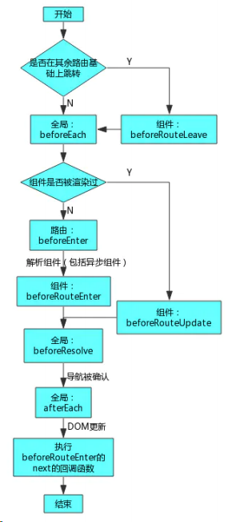

### 3.vue-router 有哪几种导航钩子（ 导航守卫 ）？

vue-router 提供的导航守卫主要用来通过跳转或取消的方式守卫导航。
例如判断登录信息：没登录全部跳到登录页。判断必要操作是否进行没进行的话中断跳转。
参数或查询的改变并不会触发进入/离开的导航守卫。你可以通过观察 $route 对象响应路由参数的变
化)来应对这些变化，或使用 beforeRouteUpdate 的组件内守卫。
分为三大类：全局守卫、路由守卫、组件守卫
全局前置守卫
你可以使用 router.beforeEach 注册一个全局前置守卫：
当一个导航触发时，全局前置守卫按照创建顺序调用。守卫是异步解析执行，此时导航在所有守卫
resolve 完之前一直处于 等待中。
每个守卫方法接收三个参数：
to: Route : 即将要进入的目标 路由对象
from: Route : 当前导航正要离开的路由
next: Function : 一定要调用该方法来 resolve 这个钩子。执行效果依赖 next 方法的调用参
数。
next() : 进行管道中的下一个钩子。如果全部钩子执行完了，则导航的状态就是 confirmed (确认
的)。
next(false) : 中断当前的导航。如果浏览器的 URL 改变了 (可能是用户手动或者浏览器后退按
钮)，那么 URL 地址会重置到 from 路由对应的地址。
next('/') 或者 next({ path: '/' }) : 跳转到一个不同的地址。当前的导航被中断，然后进
行一个新的导航。你可以向 next 传递任意位置对象，且允许设置诸如 replace: true 、 name:
'home' 之类的选项以及任何用在 router-link 的 to prop 或 router.push 中的选项。
next(error) : (2.4.0+) 如果传入 next 的参数是一个 Error 实例，则导航会被终止且该错误会
被传递给 router.onError() 注册过的回调。
确保要调用 next 方法，否则钩子就不会被 resolved。
全局解析守卫
在 2.5.0+ 你可以用 router.beforeResolve 注册一个全局守卫。这和 router.beforeEach 类似，区
别是在导航被确认之前，同时在所有组件内守卫和异步路由组件被解析之后，解析守卫就被调用。
全局后置钩子
你也可以注册全局后置钩子，然而和守卫不同的是，这些钩子不会接受 next 函数也不会改变导航本
身：
路由独享的守卫
你可以在路由配置上直接定义 beforeEnter 守卫：

这些守卫与全局前置守卫的方法参数是一样的。
组件内的守卫
最后，你可以在路由组件内直接定义以下路由导航守卫：
beforeRouteEnter
beforeRouteUpdate (2.2 新增)
beforeRouteLeave
beforeRouteEnter 守卫 不能 访问 this ，因为守卫在导航确认前被调用,因此即将登场的新组件还没
被创建。
不过，你可以通过传一个回调给 next 来访问组件实例。在导航被确认的时候执行回调，并且把组件实
例作为回调方法的参数。
const router = new VueRouter({
routes: [
{
path: '/foo',
component: Foo,
beforeEnter: (to, from, next) => {
// ...
}
}
]
})
const Foo = {
template: `...`,
beforeRouteEnter (to, from, next) {
// 在渲染该组件的对应路由被 confirm 前调用
// 不！能！获取组件实例 `this`
// 因为当守卫执行前，组件实例还没被创建
},
beforeRouteUpdate (to, from, next) {
// 在当前路由改变，但是该组件被复用时调用
// 举例来说，对于一个带有动态参数的路径 /foo/:id，在 /foo/1 和 /foo/2 之间跳转的时候，
// 由于会渲染同样的 Foo 组件，因此组件实例会被复用。而这个钩子就会在这个情况下被调用。
// 可以访问组件实例 `this`
},
beforeRouteLeave (to, from, next) {
// 导航离开该组件的对应路由时调用
// 可以访问组件实例 `this`
}
}
beforeRouteEnter (to, from, next) {
next(vm => {
// 通过 `vm` 访问组件实例
})
}
注意 beforeRouteEnter 是支持给 next 传递回调的唯一守卫。对于 beforeRouteUpdate 和
beforeRouteLeave 来说， this 已经可用了，所以不支持传递回调，因为没有必要了。
这个离开守卫通常用来禁止用户在还未保存修改前突然离开。该导航可以通过 next(false) 来取消。

### 4.vue-router 传递参数的几种方式

#### 1）使用 name 传递

之前一直在配置路由的时候出现一个 name,但不知道他具体有什么用，在路由里他可以用来传递参数。

在 index.js 中将路由的 name 都写好

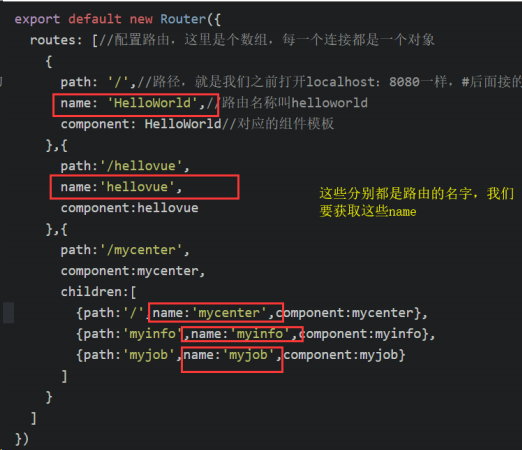

接收参数：
在我们需要接收它的页面里添加

```vue
<p>我是router-name:{{$route.name}}</p>
```

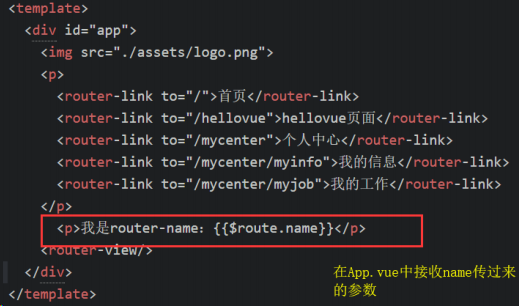

比如我在这里是在 APP.vue 中接收的，我希望切换每个页面都能看见参数。

但这种方法不太常用，因为我们觉得它不太规整。

#### 2）to 来传递

利用 router-link 中的 to 来传参，看语法：

```vue
<router-link v-bind:to="{ name: 'xxx', params: { key: value } }"></router-link>
```

- a.首先：to 需要绑定；
- b.传参使用类似与对象的形式；
- c.name 就是我们在配置路由时候取的名字；
- d.参数也是采用对象的形式。

实际操作一下：

- a.在 APP.vue 中将 to 里面的路径改成上面那样，这里我们注意 to 的写法，前面加了冒号，因为那是绑定的，传递一个 username 过去，值为 tomcat

  ```vue
  <router-link
  	:to="{ name: 'hellovue', params: { username: 'tomcat' } }"
  >hellovue页面
  </router-link>
  ```

- b.在 index.js 里面给 hellovue 配置名字叫 hellovue,与上面 name 相对应
  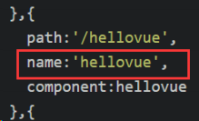

- c、在 hellovue.vue 中接收参数
  ```vue
  <p>传递的名字是：{{$route.params.username}}</p>
  ```

#### 3）采用 url 传参

在路由文件里采用冒号的形式传参，这就是对参数的绑定

a、修改 index.js 里的 path，这里我们修改 myjob.vue 组件

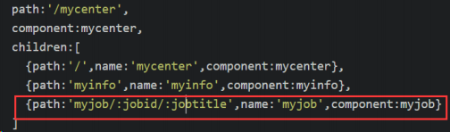

b、在 App.vue 组件里传递参数

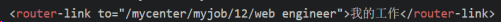

c、在 myjob.vue 组件里显示我们要展示的内容（接收参数）

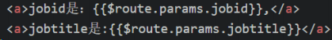

### 5.怎么定义 vue-router 的动态路由? 怎么获取传过来的值

在 router 目录下的 index.js 文件中，对 path 属性加上 /:id。

使用 router 对象的 params.id 获取

### 6.vue-router 的动态路由匹配

我们经常需要把某种模式匹配到的所有路由，全都映射到同个组件。例如，我们有一个 User 组件，对于所有 ID 各不相同的用户，都要使用这个组件来渲染。

那么，我们可以在 vue-router 的路由路径中使用“动态路径参数”(dynamic segment) 来达到这个效果：

```js
const User = {
	template: "<div>User</div>",
};
const router = new VueRouter({
	routes: [
		// 动态路径参数 以冒号开头
		{ path: "/user/:id", component: User },
	],
});
```

现在呢，像 /user/foo 和 /user/bar 都将映射到相同的路由。

一个“路径参数”使用冒号 : 标记。当匹配到一个路由时，参数值会被设置到 this.$route.params ，可以在每个组件内使用。于是，我们可以更新 User 的模板，输出当前用户的 ID：

```js
const User = {
	template: "<div>User {{ $route.params.id }}</div>",
};
```

你可以在一个路由中设置多段“路径参数”，对应的值都会设置到$route.params 中。例如：

| 模式                            | 匹配路径              | $route.params                         |
| ------------------------------- | --------------------- | ------------------------------------- |
| `/user/:username`               | `/user/evan`          | `{ username: 'evan' }`                |
| `/user/:username/post/:post_id` | `/user/evan/post/123` | `{ username: 'evan', post_id:'123' }` |

除了 `$route.params` 外， `$route` 对象还提供了其它有用的信息，例如， `$route.query` (如果 URL 中有查询参数)、 `$route.hash` 等等。

### 7.vue-router 如何定义嵌套路由？

### 8.`<router-link></router-link>` 组件及其属性

支持用户在具有路由功能的应用中 (点击) 导航 通过 to 属性指定目标地址
一：router-link 组件的 props：

#### to

表示目标路由的链接。当被点击后，内部会立刻把 to 的值传到 router.push()
有组件引用组件中有 router-view 组件

```vue
<router-link :to="/Home">Home</router-link>
渲染结果：
<a href="Home">Home</a>

<router-link
	:to="{ path: 'register', query: { name: 'fjw' } }"
>router</router-link>
渲染结果：
<a href="/register?name=fjw">router</a>
```

#### tag：

指定 `<router-link>` 组件最终被渲染成什么标签；非必须；如果没有 tag 属性，router-link 最终会被渲染成 a 标签。在上面的栗子中，渲染成了 li 标签。

```vue
<router-link :to="/Home" tag="li">Home</router-link>
渲染结果：
<li>Home</li>
此时依旧会监听点击事件，触发导航
```

#### replace：

当点击时，会调用 router.replace() 而不是 router.push()，于是导航后不会留下 history 记录。

```vue
<router-link :to="{ path: '/abc' }" replace></router-link>
```

#### append：

则在当前 (相对) 路径前添加基路径。/a 导航到一个相对路径 b，如果没有配置 append，则路径为 /b，如果配了，则为 /a/b

```vue
<router-link :to="{ path: 'relative/path' }" append></router-link>
```

#### active-class：

表示激活这个链接时，添加的 class，默认是 router-link-class。默认值可以通过路由的构造选项 linkActiveClass 来全局配置。

#### exact：

"是否激活" 默认类名的依据是 inclusive match (全包含匹配)。

```vue
<!-- 这个链接只会在地址为 / 的时候被激活 -->
<router-link to="/" exact>
```

#### event：

默认值: 'click' 声明可以用来触发导航的事件。可以是一个字符串或是一个包含字符串的数组。

### 9.vue-router 实现路由懒加载

在项目 router/index.js 文件中将

```js
import Recommend from "components/recommend/recommend";
```

更改为

```js
// 方法1：
const Recommend = () => import("components/recommend/recommend");

// 方法2：
const Recommend = (resolve) => {
	import("components/recommend/recommend").then((module) => {
		resolve(module);
	});
};
```

即可实现路由懒加载的效果

### 10.vue-router 路由的两种模式

**类型**: string

**默认值**: "hash" (浏览器环境) | "abstract" (Node.js 环境)

**可选值**: "hash" | "history" | "abstract"

配置路由模式:

- hash : 使用 URL hash 值来作路由。支持所有浏览器，包括不支持 HTML5 History Api 的浏览器。
- history : 依赖 HTML5 History API 和服务器配置。查看 HTML5 History 模式。
- abstract : 支持所有 JavaScript 运行环境，如 Node.js 服务器端。**如果发现没有浏览器的 API，路由会自动强制进入这个模式**

#### hash 模式：

url 的 hash 是以 # 开头，原本是用来作为锚点，从而定位到页面的特定区域。当 hash 改变时，页面不会因此刷新，浏览器也不会向服务器发送请求。

http://www.xxx.com/#/home

同时， hash 改变时，并会触发相应的 hashchange 事件。所以，hash 很适合被用来做前端路由。当 hash 路由发生了跳转，便会触发 hashchange 回调，回调里可以实现页面更新的操作，从而达到跳转页面的效果。

hash 模式的工作原理是 hashchange 事件，可以在 window 监听 hash 的变化。我们在 url 后面随便添加一个#xx 触发这个事件。

```js
window.onhashchange = function (event) {
	console.log(event);
};
```

打开浏览器调试，可以看到里边有两个属性 newURL 和 oldURL。可以通过模拟改变 hsh 的值，动态页面数据。

```html
<div id="test" style="height: 500px;width: 500px;margin: 0 auto"></div>
<script>
	window.onhashchange = function (event) {
		let hash = location.hash.slice(1);
		document.body.style.color = hash;
		document.getElementById("test").style.backgroundColor = hash;
	};
</script>
```

尽管浏览器没有请求服务器，但是页面状态和 url 已经关联起来了，这就是所谓的前端路由，单页应用的标配。

#### history 模式：

HTML5 规范中提供了 history.pushState 和 history.replaceState 来进行路由控制。通过这两个方法，可以实现改变 url 且不向服务器发送请求。同时不会像 hash 有一个 # ，更加的美观。但是 History 路由需要服务器的支持，并且需将所有的路由重定向到根页面。

History 路由的改变不会去触发某个事件，所以我们需要去考虑如何触发路由更新后的回调。

有以下两种方式会改变 url：

- 调用 history.pushState 或 history.replaceState；
- 点击浏览器的前进与后退。

第一个方式可以封装一个方法，在调用 pushState（replaceState）后再调用回调。

```js
function push(url) {
	window.history.pushState({}, null, url);
	handleHref();
}
function handleHref() {
	console.log("render");
}
```

第二个方式，浏览器的前进与后退会触发 popstate 事件。前进，后退，跳转操作方法：

```js
window.addEventListener("popstate", handleHref);
```

打开浏览器调试：

前进，后退，跳转操作方法：

```bash
history.go(-3);//后退3次
history.go(2);//前进2次
history.go(0);//刷新当前页面
history.back(); //后退
history.forward(); //前进
```

### 11.history 路由模式配置及后台配置

项目根目录文件夹名称：rootFile

#### 一：后台配置：

1、Nginx：

```bash
location ~ ^/rootFile/ {
 root F:/XXX;
 try_files $uri $uri/ /rootFile/index.html;
}
```

#### 二：Vue 配置：

1、文件 router.js 将 mode 设置成 history 模式，并设置 base：rootFile（和网站根目录名称一致，不然会报错）

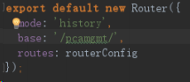

2、config > index.js 找到 build，将 assetsPublicPath 设置成绝对路径/rootFile/（和网站根目录名称一致）

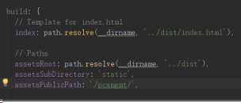

PS：

a、assetsPublicPath 如果设置相对路径，路由 history 模式在嵌套子路由页面刷新会出现 js、css 文件路径引入出错，如下图所示：

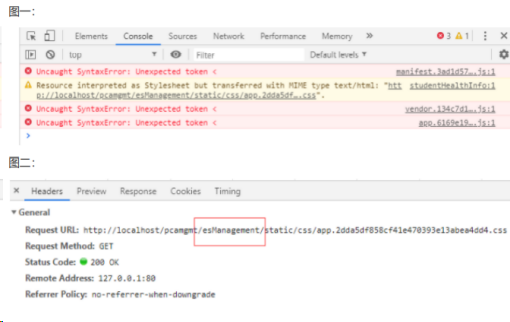

b、以上三处设置的名称必须一致，不然会出现下面的错误

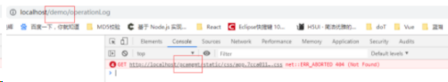
