# Vue 面试题

## 使用

- vue-cli
- 基本使用
  - 模板（插值，指令)
  - computed 和 watch
  - class 和 style
  - 条件
  - 循环
  - 事件
  - 表单
- 组件
  - 生命周期
  - props（类型和默认值）
  - v-on 和$emit
  - 自定义事件
- 高级特性
  - 自定义 v-model
  - $nextTick
  - refs
  - slot
  - 动态组件
  - 异步组件
  - keep-alive

## 周边工具

- vuex
  - state
  - getters
  - action
  - mutation
  - 用于 vue
    - dispatch
    - commit
    - mapState
    - mapGetters
    - mapActions
    - mapMutations
- vue-router
  - 动态路由
  - to 和 push
  - hash 和 history
  - 懒加载（配合动态组件）

## 原理

- 组件化和 MVVM
- 响应式原理
- vdom 和 diff 算法
- 模板编译
- 组件渲染过程
- 前端路由

## vue3

- Proxy 响应式
- 其他会持续更新……

## Vue 和 React 之间的区别

- Vue 的表单可以使用 v-model 支持双向绑定，相比于 React 来说开发上更加方便，当然了 v-model 其实就是个语法糖，本质上和 React 写表单的方式没什么区别
- 改变数据方式不同， Vue 修改状态相比来说要简单许多， React 需要使用 setState 来改变状态，并且使用这个 API 也有一些坑点。并且 Vue 的底层使用了依赖追踪，页面更新渲染已经是最优的了，但是 React 还是需要用户手动去优化这方面的问题。
- React 16 以后，有些钩子函数会执行多次，这是因为引入 Fiber 的原因
- React 需要使用 JSX ，有一定的上手成本，并且需要一整套的工具链支持，但是完全可以通过 JS 来控制页面，更加的灵活。 Vue 使用了模板语法，相比于 JSX 来说没有那么灵活，但是完全可以脱离工具链，通过直接编写 render 函数就能在浏览器中运行。
- 在生态上来说，两者其实没多大的差距，当然 React 的用户是远远高于 Vue 的

## 新收集的面试题：

- [vue 高频面试知识点汇总【2023 新春版】 - 掘金 (juejin.cn)](https://juejin.cn/post/7161036677182898207)
- [2023 前端面试系列-- Vue 篇 - 掘金 (juejin.cn)](https://juejin.cn/post/7191325434486161467)
- [抽丝剥茧带你复习 vue 源码（2023 年面试版本） - 掘金 (juejin.cn)](https://juejin.cn/post/7195517440344211512)

### 请简单实现双向数据绑定 mvvm

```js
<input id="input" />;

const data = {};
const input = document.getElementById("input");
Object.defineProperty(data, "text", {
	set(value) {
		input.value = value;
		this.value = value;
	},
});

input.onChange = function (e) {
	data.text = e.target.value;
};
```

### 数据流问题

### 响应式原理双向绑定原理

- Object.defineProperty（vue） ：劫持数据的 getter 和 setter
- 脏值检测（ angularjs ）：通过特定事件进行轮循 发布/订阅模式：通过消息发布并将消息进行订阅

Vue 内部使用了 Object.defineProperty() 来实现数据响应式，通过这个函数可以监听到 set 和 get 的事件

```js
var data = { name: "poetries" };
observe(data);
let name = data.name; // -> get value
data.name = "yyy"; // -> change value
function observe(obj) {
	// 判断类型
	if (!obj || typeof obj !== "object") {
		return;
	}
	Object.keys(obj).forEach((key) => {
		defineReactive(obj, key, obj[key]);
	});
}
function defineReactive(obj, key, val) {
	// 递归子属性
	observe(val);
	Object.defineProperty(obj, key, {
		// 可枚举
		enumerable: true,
		// 可配置
		configurable: true,
		// 自定义函数
		get: function reactiveGetter() {
			console.log("get value");
			return val;
		},
		set: function reactiveSetter(newVal) {
			console.log("change value");
			val = newVal;
		},
	});
}
```

以上代码简单的实现了如何监听数据的 set 和 get 的事件，但是仅仅如此是不够的，因为自定义的函数一开始是不会执行的。只有先执行了依赖收集，从能在属性更新的时候派发更新，所以接下来我们需要先触发依赖收集

```html
<div>{{name}}</div>
```

在解析如上模板代码时，遇到 就会进行依赖收集。

接下来我们先来实现一个 Dep 类，用于解耦属性的依赖收集和派发更新操作

```js
// 通过 Dep 解耦属性的依赖和更新操作
class Dep {
	constructor() {
		this.subs = [];
	}
	// 添加依赖
	addSub(sub) {
		this.subs.push(sub);
	}
	// 更新
	notify() {
		this.subs.forEach((sub) => {
			sub.update();
		});
	}
}
// 全局属性，通过该属性配置 Watcher
Dep.target = null;
```

以上的代码实现很简单，当需要依赖收集的时候调用 addSub ，当需要派发更新的时候调用 notify 。

接下来我们先来简单的了解下 Vue 组件挂载时添加响应式的过程。在组件挂
载时，会先对所有需要的属性调用 Object.defineProperty() ，然后实例化 Watcher ，传入组件更新的回调。在实例化过程中，会对模板中的属性进行求值，触发依赖收集。

因为这一小节主要目的是学习响应式原理的细节，所以接下来的代码会**简略的表达触发依赖收集时的操作**。

```js
class Watcher {
	constructor(obj, key, cb) {
		// 将 Dep.target 指向自己
		// 然后触发属性的 getter 添加监听
		// 最后将 Dep.target 置空
		Dep.target = this;
		this.cb = cb;
		this.obj = obj;
		this.key = key;
		this.value = obj[key];
		Dep.target = null;
	}
	update() {
		// 获得新值
		this.value = this.obj[this.key];
		// 调用 update 方法更新 Dom
		this.cb(this.value);
	}
}
```

以上就是 Watcher 的简单实现，在执行构造函数的时候将 Dep.target 指向自身，从而使得收集到了对应的 Watcher ，在派发更新的时候取出对应的 Watcher 然后执行 update 函数。

接下来，需要对 defineReactive 函数进行改造，在自定义函数中添加依赖收集和派发更新相关的代码

```js
function defineReactive(obj, key, val) {
	// 递归子属性
	observe(val);
	let dp = new Dep();
	Object.defineProperty(obj, key, {
		enumerable: true,
		configurable: true,
		get: function reactiveGetter() {
			console.log("get value");
			// 将 Watcher 添加到订阅
			if (Dep.target) {
				dp.addSub(Dep.target);
			}
			return val;
		},
		set: function reactiveSetter(newVal) {
			console.log("change value");
			val = newVal;
			// 执行 watcher 的 update 方法
			dp.notify();
		},
	});
}
```

以上所有代码实现了一个简易的数据响应式，核⼼思路就是手动触发一次属性
的 getter 来实现依赖收集。

现在我们就来测试下代码的效果，只需要把所有的代码复制到浏览器中执行，就会发现页面的内容全部被替换了

```js
var data = { name: "poetries" };
observe(data);
function update(value) {
	document.querySelector("div").innerText = value;
}
// 模拟解析到 `{{name}}` 触发的操作
new Watcher(data, "name", update);
// update Dom innerText
data.name = "yyy";
```

#### Object.defineProperty 的缺陷

- 以上已经分析完了 Vue 的响应式原理，接下来说一点 Object.defineProperty 中的缺陷。
- 如果通过下标方式修改数组数据或者给对象新增属性并不会触发组件的重新渲染，因为 Object.defineProperty 不能拦截到这些操作，更精确的来说，对于数组而⾔，大部分操作都是拦截不到的，只是 Vue 内部通过重写函数的方式解决了这个问题。
- 对于第一个问题， Vue 提供了一个 API 解决

```typescript
export function set(target: Array < any > | Object, key: any, val: any): any {
	// 判断是否为数组且下标是否有效
	if (Array.isArray(target) && isValidArrayIndex(key)) {
		// 调用 splice 函数触发派发更新
		// 该函数已被重写
		target.length = Math.max(target.length, key)
		target.splice(key, 1, val)
		return val
	}
	// 判断 key 是否已经存在
	if (key in target && !(key in Object.prototype)) {
		target[key] = val
		return val
	}
	const ob = (target: any).__ob__
	// 如果对象不是响应式对象，就赋值返回
	if (!ob) {
		target[key] = val
		return val
	}
	// 进行双向绑定
	defineReactive(ob.value, key, val)
	// 手动派发更新
	ob.dep.notify()
	return val
}
```

对于数组而⾔， Vue 内部重写了以下函数实现派发更新

```js
// 获得数组原型
const arrayProto = Array.prototype;
export const arrayMethods = Object.create(arrayProto);
// 重写以下函数
const methodsToPatch = [
	"push",
	"pop",
	"shift",
	"unshift",
	"splice",
	"sort",
	"reverse",
];
methodsToPatch.forEach(function (method) {
	// 缓存原生函数
	const original = arrayProto[method];
	// 重写函数
	def(arrayMethods, method, function mutator(...args) {
		// 先调用原生函数获得结果
		const result = original.apply(this, args);
		const ob = this.__ob__;
		let inserted;
		// 调用以下几个函数时，监听新数据
		switch (method) {
			case "push":
			case "unshift":
				inserted = args;
				break;
			case "splice":
				inserted = args.slice(2);
				break;
		}
		if (inserted) ob.observeArray(inserted);
		// 手动派发更新
		ob.dep.notify();
		return result;
	});
});
```

#### 2 编译过程

想必大家在使用 Vue 开发的过程中，基本都是使用模板的方式。那么你有过「模板是怎么在浏览器中运行的」这种疑虑嘛？

首先直接把模板丢到浏览器中肯定是不能运行的，模板只是为了方便开发者进行开发。Vue 会通过编译器将模板通过几个阶段最终编译为 render 函数，然后通过执行 render 函数生成 Virtual DOM 最终映射为真实 DOM 。

接下来我们就来学习这个编译的过程，了解这个过程中大概发生了什么事情。这个过程其中⼜分为三个阶段，分别为：

- 将模板解析为 AST
- 优化 AST
- 将 AST 转换为 render 函数

在第一个阶段中，最主要的事情还是通过各种各样的正则表达式去匹配模板中的内容，然后将内容提取出来做各种逻辑操作，接下来会生成一个最基本的 AST 对象

```json
{
 // 类型
 type: 1,
 // 标签
 tag,
 // 属性列表
 attrsList: attrs,
 // 属性映射
 attrsMap: makeAttrsMap(attrs),
 // 父节点
 parent,
 // 子节点
 children: []
}
```

- 然后会根据这个最基本的 AST 对象中的属性，进一步扩展 AST 。
- 当然在这一阶段中，还会进行其他的一些判断逻辑。比如说对比前后开闭标签是否一致，判断根组件是否只存在一个，判断是否符合 HTML5 Content Model 规范等等问题。
- 接下来就是优化 AST 的阶段。在当前版本下， Vue 进行的优化内容其实还是不多的。只是对节点进行了静态内容提取，也就是将永远不会变动的节点提取了出来，实现复用 Virtual DOM ，跳过对比算法的功能。在下一个大版本中， Vue 会在优化 AST 的阶段继续发⼒，实现更多的优化功能，尽可能的在编译阶段压榨更多的性能，比如说提取静态的属性等等优化行为。
- 最后一个阶段就是通过 AST 生成 render 函数了。其实这一阶段虽然分支有很多，但是最主要的目的就是遍历整个 AST ，根据不同的条件生成不同的代码罢了。

### Vue 是如何设计响应式系统的？（依赖收集）

### 依赖收集的过程

### 什么时候使用 computed , methods , watch ？之间有什么样区别？

### template 和 render(jsx) 有什么的联系？

### this.$nextTick 是如何设计的？

### Vue 组件 data 为什么必须是函数？

### VDOM：三个 part

- 虚拟节点类，将真实 DOM 节点用 js 对象的形式进行展示，并提供 render 方法，将虚拟节点渲染成真实 DOM
- 节点 diff 比较：对虚拟节点进行 js 层面的计算，并将不同的操作都记录到 patch 对象
- re-render ：解析 patch 对象，进行 re-render

#### 补充 1：VDOM 的必要性？

- 创建真实 DOM 的代价高：真实的 DOM 节点 node 实现的属性很多，而 vnode 仅仅实现一些必要的属性，相比起来，创建一个 vnode 的成本比较低。
- 触发多次浏览器重绘及回流：使用 vnode ，相当于加了一个缓冲，让一次数据变动所带来的所有 node 变化，先在 vnode 中进行修改，然后 diff 之后对所有产生差异的节点集中一次对 DOM tree 进行修改，以减少浏览器的重绘及回流。

#### 补充 2：vue 为什么采用 vdom？

引入 Virtual DOM 在性能方面的考量仅仅是一方面。

- 性能受场景的影响是非常大的，不同的场景可能造成不同实现方案之间成倍的性能差距，所以依赖细粒度绑定及 Virtual DOM 哪个的性能更好还真不是一个容易下定论的问题。
- Vue 之所以引入了 Virtual DOM ，更重要的原因是为了解耦 HTML 依赖，这带来两个非常重要的好处是：
  - 不再依赖 HTML 解析器进行模版解析，可以进行更多的 AOT 工作提高运
    行时效率：通过模版 AOT 编译， Vue 的运行时体积可以进一步压缩，运
    行时效率可以进一步提升；
  - 可以渲染到 DOM 以外的平台，实现 SSR 、同构渲染这些高级特性，
    Weex 等框架应用的就是这一特性。

综上， Virtual DOM 在性能上的收益并不是最主要的，更重要的是它使得 Vue 具备了现代框架应有的高级特性。

### Patch 过程 nextTick 原理

### watch 和 computed 原理

### computed 是怎么收集依赖的？

### watchEffect 是怎么收集依赖的？

### vue 和 react 异同

相同点：都支持 ssr ，都有 vdom ，组件化开发，实现 webComponents 规范，数据驱动等

不同点： vue 是双向数据流（当然为了实现单数据流方便管理组件状态，vuex 便出现了）， react 是单向数据流。 vue 的 vdom 是追踪每个组件的依赖关系，不会渲染整个组件树， react 每当应该状态被改变时，全部子组件都会 re-render

## 待定


### 说一下 vue 最大特点是什么或者说 vue 核心是什么

答：vue 最大特点我感觉就是“组件化“和”数据驱动“

组件化就是可以将页面和页面中可复用的元素都看做成组件，写页面的过程，就是写组件，然后页面是由这些组件“拼接“起来的组件树

数据驱动就是让我们只关注数据层，只要数据变化，页面（即视图层）会自动更新，至于如何操作 dom，完全交由 vue 去完成，咱们只关注数据，数据变了，页面自动同步变化了，很方便

### 说一下 vue 常用基本指令有哪些

v-if：根据表达式的值的真假条件渲染元素。在切换时元素及它的数据绑定 / 组件被销毁并重建。

v-show：根据表达式之真假值，切换元素的 display CSS 属性。

v-for：循环指令，基于一个数组或者对象渲染一个列表，vue 2.0 以上必须需配合 key 值 使用。

v-bind：动态地绑定一个或多个特性，或一个组件 prop 到表达式。

v-on：用于监听指定元素的 DOM 事件，比如点击事件。绑定事件监听器。

v-model：实现表单输入和应用状态之间的双向绑定

v-pre：跳过这个元素和它的子元素的编译过程。可以用来显示原始 

Mustache 标签。跳过大量没有指令的节点会加快编译。

v-once：只渲染元素和组件一次。随后的重新渲染，元素/组件及其所有的子节点将被视为静态内容并跳过。这可以用于优化更新性能。

### Vue 常用的修饰符

v-on 指令常用修饰符：

- .stop - 调用 event.stopPropagation()，禁止事件冒泡。
- .prevent - 调用 event.preventDefault()，阻止事件默认行为。
- .capture - 添加事件侦听器时使用 capture 模式。
- .self - 只当事件是从侦听器绑定的元素本身触发时才触发回调。
- .{keyCode | keyAlias} - 只当事件是从特定键触发时才触发回调。
- .native - 监听组件根元素的原生事件。
- .once - 只触发一次回调。
- .left - (2.2.0) 只当点击鼠标左键时触发。
- .right - (2.2.0) 只当点击鼠标右键时触发。
- .middle - (2.2.0) 只当点击鼠标中键时触发。
- .passive - (2.3.0) 以 { passive: true } 模式添加侦听器

注意： 如果是在自己封装的组件或者是使用一些第三方的 UI 库时，会发现并不起效果，这时就需要用`·.native 修饰符了，如：

```vue
//使用示例：
<el-input
	v-model="inputName"
	placeholder="搜索你的文件"
	@keyup.enter.native="searchFile(params)"
	\
>
</el-input>
```

v-bind 指令常用修饰符：

.prop - 被用于绑定 DOM 属性 (property)。(差别在哪里？)

.camel - (2.1.0+) 将 kebab-case 特性名转换为 camelCase. (从 2.1.0 开始支持)

.sync (2.3.0+) 语法糖，会扩展成一个更新父组件绑定值的 v-on 侦听器。

v-model 指令常用修饰符：

.lazy - 取代 input 监听 change 事件

.number - 输入字符串转为数字

.trim - 输入首尾空格过滤

### Vue 组件中 data 为什么必须是函数

问题一：Vue 组件中 data 为什么必须是函数？

简单回答

//为什么 data 函数里面要 return 一个对象

```vue
<script>
export default {
	data() {
		return {
			// 返回一个唯一的对象，不要和其他组件共用一个对象进行返回
			menu: MENU.data,
			poi: POILIST.data,
		};
	},
};
</script>
```

因为一个组件是可以共享的，但他们**的 data 是私有的，所以每个组件都要 return 一个新的 data 对象，返回一个唯一的对象，不要和其他组件共用一个对象**。

### 说一下 v-if 和 v-show 的区别

答：v-if 和 v-show 都可以显示和隐藏一个元素，但有本质区别

v-if 是惰性的，只是值为 false 就不会加载对应元素，为 true 才动态加载对应元素
v-show:是无论为 true 和为 false 都会加载对应 html 代码，但为 false 时用 display:none 隐藏不在页面显示，但为 true 时页面上用 display:block 显示其效果
适用场景：切换频繁的场合用 v-show,切换不频繁的场合用 v-if

### 说一下 vue 自定义指令如何实现的和适用场景？

答：哦，这个问题是这样的，vue 除有了 v-for,v-if 等自带 vue 指令外,但不能满足所有的开发需求，有时需要自定义指令，自定义指令创建有全局自定义指令和局部自定义指令
全局自定义指令：Vue.directive(‘指令名’,{ inserted(el) { } })
局部自定义指令：directives:{ }

### 说一下 vue 过滤器做什么的(vue1.x 和 vue2.x 这块的区别)

答：**vue 过滤器主要用于对渲染出来的数据进行格式化处理**。

例如：后台返回的数据性别用 0 和 1 表示，但渲染到页面上不能是 0 和 1 我得转换为“男“和”女”，这时就会用到过滤器，还有商品价格读取出来的是普通数值，例如：230035,但我要在前面加个货币符号和千分分隔等，例如变成：￥ 230，035,都得需要 vue 过滤器

如何创建过滤器呢，跟创建自定义指令类似，也有全局和局部过滤器的形式

**全局过滤器**：

```js
Vue.filter(‘过滤器名’,function(参数 1,参数 2,…) {
    //………..
    return 要返回的数据格式
})
```


**局部过滤器**：在组件内部添加 filters 属性来定义过滤器

```js
fitlers:{
    过滤器名(参数 1,参数 2,,…参数 n) {
    //………..
    	return 要返回的数据格式
    }
}
```

### 说一下 vue 生命周期钩子函数有哪些，分别什么时候触发

答：vue 生命周期即为一个组件从出生到死亡的一个完整周期，主要包括以下**4 个阶段：创建，挂载，更新，销毁**

创建前：beforeCreate, 创建后:created
挂载前：beforeMount, 挂载后：mounted
更新前：beforeUpdate, 更新后：updated
销毁前：beforeDestroy, 销毁后：destroyed

我平时用的比较多的钩了是 created 和 mounted，created 用于获取后台数据，mounted 用于 dom 挂载完后做一些 dom 操作,以及初始化插件等.beforeDestroy 用户清除定时器以及解绑事件等,

另外还新增了使用内置组件 keep-alive 来缓存实例，而不是频繁创建和销毁(开销大)

actived 实例激活
deactived 实例失效

以下为详解版,大家理解就 ok:

生命周期钩子函数（11 个）Function（类型），标注蓝色的那个是属于类型的意思。

beforeCreateFunction 在实例初始化之后，数据观测 (data observer) 和 event/watcher 事件配置之前被调用。

createdFunction 在实例创建完成后被立即调用。在这一步，实例已完成以下的配置：数据观测 (data observer)， 属性和方法的运算，watch/event 事件回调。然而，挂载阶段还没开始，$el 属性目前不可见。

beforeMountFunction在挂载开始之前被调用：相关的 render 函数首次被调用。

mountedFunctionel 被新创建的 vm.$el 替换，并挂载到实例上去之后调用该钩子。如果 root 实例挂载了一个文档内元素，当 mounted 被调用时 vm.$el 也在文档内。

beforeUpdateFunction 数据更新时调用，发生在虚拟 DOM 打补丁之前。这里适合在更新之前访问现有的 DOM，比如手动移除已添加的事件监听器。该钩子在服务器端渲染期间不被调用，因为只有初次渲染会在服务端进行。

updatedFunction 由于数据更改导致的虚拟 DOM 重新渲染和打补丁，在这之后会调用该钩子。

activatedFunctionkeep-alive 组件激活时调用。该钩子在服务器端渲染期间不被调用。

deactivatedFunctionkeep-alive 组件停用时调用。该钩子在服务器端渲染期间不被调用。

beforeDestroyFunction 实例销毁之前调用。在这一步，实例仍然完全可用。该钩子在服务器端渲染期间不被调用。

destroyedFunctionVue 实例销毁后调用。调用后，Vue 实例指示的所有东西都会解绑定，所有的事件监听器会被移除，所有的子实例也会被销毁。该钩子在服务器端渲染期间不被调用。

errorCaptured（2.5.0+ 新增）(err: Error, vm: Component, info: string) => ?boolean 当捕获一个来自子孙组件的错误时被调用。此钩子会收到三个参数：错误对象、发生错误的组件实例以及一个包含错误来源信息的字符串。此钩子可以返回 false 以阻止该错误继续向上传播。

### 说一下 vue 组件通讯（即传值）有哪几种形式，分别是如何实现的

答：vue 组件通讯大致有三种：父传子，子传父，还有兄弟之间通讯

**第一种：父传子：主要通过 props 来实现的**

具体实现：父组件通过 import 引入子组件，并注册，在子组件标签上添加要传递的属性，子组件通过 props 接收，接收有两种形式一是通过数组形式[‘要接收的属性’ ]，二是通过对象形式{ }来接收，对象形式可以设置要传递的数据类型和默认值，而数组只是简单的接收

**第二种：子传父：主要通过$emit 来实现**

具体实现：子组件通过通过绑定事件触发函数，在其中设置 this.$emit(‘要派发的自定义事件’，要传递的值)，$emit 中有两个参数一是要派发的自定义事件，第二个参数是要传递的值

然后父组件中,在这个子组件身上@派发的自定义事件,绑定事件触发的 methods 中的方法接受的默认值,就是传递过来的参数

**第三种：兄弟之间传值有两种方法：**

方法一：通过 event bus 实现

具体实现:创建一个空的 vue 并暴露出去，这个作为公共的 bus,即当作两个组件的桥梁，在两个兄弟组件中分别引入刚才创建的 bus，在组件 A 中通过 bus.$emit（’自定义事件名’，要发送的值）发送数据，在组件B中通过bus.$on（‘自定义事件名‘,function(v) { //v 即为要接收的值 }）接收数据

方法二：通过 vuex 实现

具体实现：vuex 是一个状态管理工具，主要解决大中型复杂项目的数据共享问题，主要包括 state,actions,mutations,getters 和 modules 5 个要素，主要流程：组件通过 dispatch 到 actions，actions 是异步操作，再 actions 中通过 commit 到 mutations，mutations 再通过逻辑操作改变 state，从而同步到组件，更新其数据状态

### 说一下 vue 封装组件中的 slot 作用

答：vue 封装组件涉及三个东西:

- 一是事件(v-on,$emit)，
- 二是传参通过 props
- 三是 slot：slot 作用主要是可以实现内容分发，组件标签内嵌套内容，可通过`<slot></slot>`来定义占位的内容

分为具名的 slot 和匿名的 slot

在编写可复用组件的时候，时刻考虑组件是否可复用是有好处的。一次性组件跟其他组件紧密耦合没关系，但是可复用组件一定要定义一个清晰的公开接口。

Vue.js 组件 API 来自 三部分：prop、事件、slot：

- **prop 允许外部环境传递数据给组件**，在 vue-cli 工程中也可以使用 vuex 等传递数据。
- **事件允许组件触发外部环境的 action(就是行为,也就是方法的意思)**
- **slot 允许外部环境将内容插入到组件的视图结构内。**

### 说一下 vue 转场动画如何实现的

答：vue 转场动画主要通过 vue 中的提供的 transition 组件实现的，例如；

```vue
<transition name="名称">
    <router-view></router-view>
</transition>
```

其中 name 为转场的名称，自己定义，可通过定义进入和离开两种转场动画，格式为：

- .名称-enter ｛ ｝ //将要进入动画
- .名称-enter-active { } //定义进入的过程动画
- .名称-leave { } //将要离开的动画
- .名称-leave-active { } //定义离开过程中的动画

### 说一下你对单向数据流的理解

答：**单向数据流**主要是 vue 组件间传递数据是单向的，即数据总是由父组件传递给子组件，子组件在其内部维护自己的数据，但它无权修改父组件传递给它的数据，当开发者尝试这样做的时候，vue 将会报错。这样做是为了组件间更好的维护。

在开发中可能有多个子组件依赖于父组件的某个数据，假如子组件可以修改父组件数据的话，一个子组件变化会引发所有依赖这个数据的子组件发生变化，所以 vue 不推荐子组件修改父组件的数据

### 说一下 vue 双向数据绑定的原理

答：核心主要利用 ES5 中的 Object.defineProperty 实现的，然后利用里面的 getter 和 setter 来实现双向数据绑定的，大致就这些，其实要实现起来比这个要复杂一些，不过我大致了解过。

### 说一下 vue 路由或前端路由实现原理

答：前端路由实现原理主要通过以下两种技术实现的

第一种：利用 H5 的 history API 实现

主要通过 history.pushState 和 history.replaceState 来实现，不同之处在于，pushState 会增加一条新的历史记录，而 replaceState 则会替换当前的历史记录[发布项目时,需要配置下 apache]

第二种：利用 url 的 hash 实现

我们经常在 url 中看到 #，这个 # 有两种情况，一个是我们所谓的锚点，路由里的 # 不叫锚点，我们称之为 hash，我们说的就是 hash,主要利用监听哈希值的变化来触发事件 —— hashchange 事件来做页面局部更新

总结：hash 方案兼容性好，而 H5 的 history 主要针对高级浏览器。

以下为具体的 API 的区别:

this.$router.push(location, onComplete?, onAbort?)这个方法会向 history 栈添加一个新的记录，所以，当用户点击浏览器后退按钮时，则回到之前的 URL。并且点击 `<router-link :to="...">`等同于调用 router.push(...)。

this.$router.replace(location, onComplete?, onAbort?)这个方法不会向 history 添加新记录，而是跟它的方法名一样 —— 替换掉当前的 history 记录，所以，当用户点击浏览器后退按钮时，并不会回到之前的 URL。

this.$router.go(n)这个方法的参数是一个整数，意思是在 history 记录中向前或者后退多少步，类似 window.history.go(n)。

以上也可能会形成一个新的面试题:**replace和push的区别**

**可以说,以前在一个项目里面配置了一个二级路由,里面有tab切换部分(详情,评价,说明),因为返回上一页的时候,不能在这几个选项卡之间来回切换.所以我使用了this.$router.replace 方法,不计入 history 记录中,所以不会出现,反复切换的 bug**

### 说一下 vue 路由钩子（或称 vue 路由守卫）的理解

什么场景下用到

答：vue 路由钩子是在路由跳转过程中拦截当前路由和要跳转的路由的信息，有三种路由钩子：

第一种：全局路由钩子 

```js
beforeEach(to,from,next) { }
```


第二种：路由独享的钩子

```js
beforeEnter(to,from,next) {
    
}
```


第三种：组件内的钩子

```js
beforeRouteEnter(to,from,next) {
//…
}
beforeRouteUpdate(to,from,next) {
//…
}
beforeRouteLeave(to,from,next) {
//…
}
```

适用场景：动态设置页面标题，判断用户登录权限等:

代码示例:

```js
// 全局路由导航守卫
vueRouter.beforeEach(function (to, from, next) {
	const nextRoute = ["detail"];
	const auth = sessionStorage.getItem("username");
	let FROMPATH = from.path;
	//跳转至上述 3 个页面
	if (nextRoute.indexOf(to.name) >= 0) {
		//上述数组中的路径，是相当于有权限的页面，访问数组列表中的页面就应该是在登陆状态下
		if (!auth) {
			let params = Object.assign({ frompath: FROMPATH }, from.query);
			next({ path: "/newlogin", query: params });
		}
	}
	//已登录的情况再去登录页，跳转至首页
	if (to.name === "newlogin") {
		if (auth) {
			// vueRouter.push({name: 'index'});
			next({ path: "/" });
		}
	}
	next();
});
```

### 说一下 vue 路由懒加载解决什么问题的?

答：vue 路由懒加载主要解决打包后文件过大的问题，事件触发才加载对应组件中的 js**说一下如何解决 vue 首屏加载慢或白屏？**

答： 

1.路由懒加载
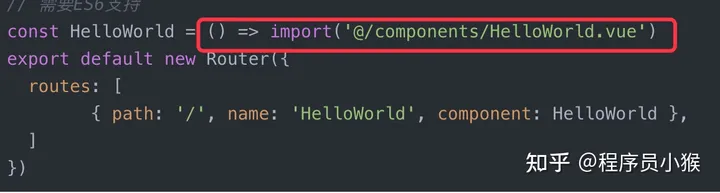 2.开启 Gzip 压缩
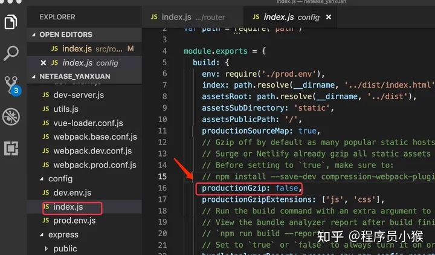

3.使用 webpack 的 externals 属性把不需要打包的库文件分离出去，减少打包后文件的大小
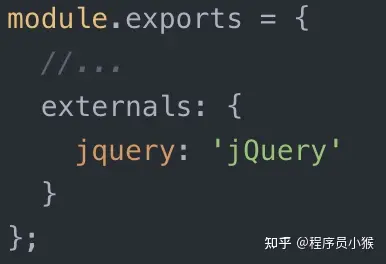

4.使用 vue 的服务端渲染(SSR)

### 说一下 vue 开发环境和线上环境如何切换

答：主要通过检测 process.env.NODE_ENV===”production”和 process.env.NODE_ENV===”development”环境，来设置线上和线下环境地址，从而实现线上和线下环境地址的切换

### 说一下你们项目中 vue 如何跨域的

答：跨域前端和后端都可以实现，如果只针对 vue,vue 本身可以通过代理的方式可以实现，具体实现：

在 config 中的 index.js 中配置 proxy 来实现：

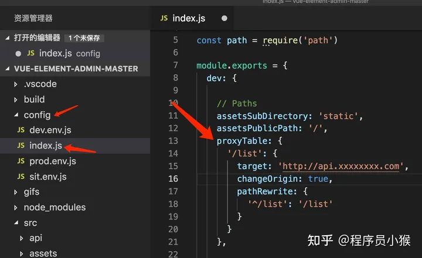

### 说一下 vue 中 methods,computed,watch 的区别

答：methods 中都是封装好的函数，无论是否有变化只要触发就会执行
computed:是 vue 独有的特性计算属性，可以对 data 中的依赖项再重新计算，得到一个新值，应用到视图中，和 methods 本质区别是 computed 是可缓存的，也就是说 computed 中的依赖项没有变化，则 computed 中的值就不会重新计算，而 methods 中的函数是没有缓存的。Watch 是监听 data 和计算属性中的新旧变化。
vue 用什么绑定事件，用什么绑定属性
答：用 v-on 绑定事件，简称：@,用 v-bind 来绑定属性，简称：:属性

### vue 如何动态添加属性，实现数据响应？

答：vue 主要通过用 this.$set(对象，‘属性‘，值)实现动态添加属性，以实现数据的响应注意是添加,我记忆中如果是修改引用类型属性的值,是可以自动渲染的。

### vue 中的 http 请求是如何管理的

答：vue 中的 http 请求如果散落在 vue 各种组件中，不便于后期维护与管理，所以项目中通常将业务需求统一存放在一个目录下管理，例如 src 下的 API 文件夹，这里面放入组件中用到的所有封装好的 http 请求并导出，再其他用到的组件中导入调用。

如下面封装的 HTTP 请求
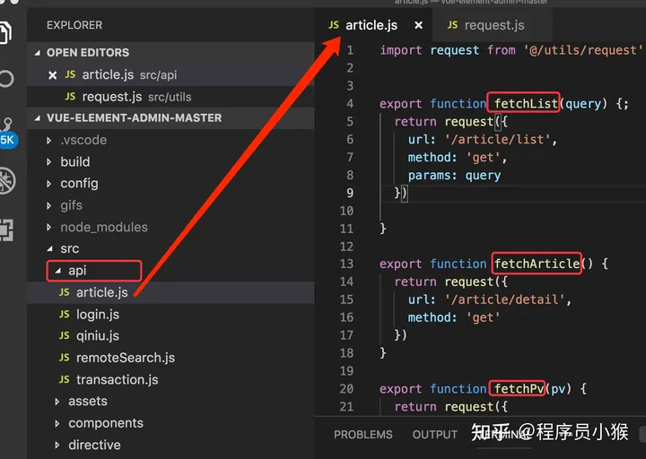说一下你对 axios 拦截器的理解：

答：axios 拦截器可以让我们在项目中对后端 http 请求和响应自动拦截处理，减少请求和响应的代码量，提升开发效率同时也方便项目后期维护

例如：
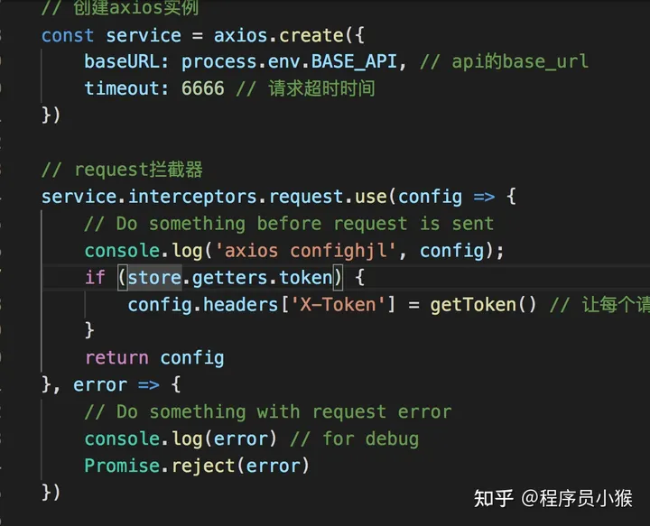
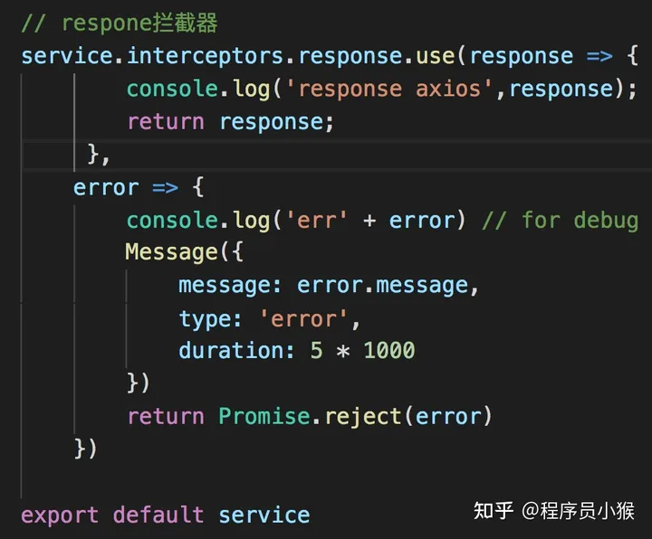
或者对公共的数据做操作

### 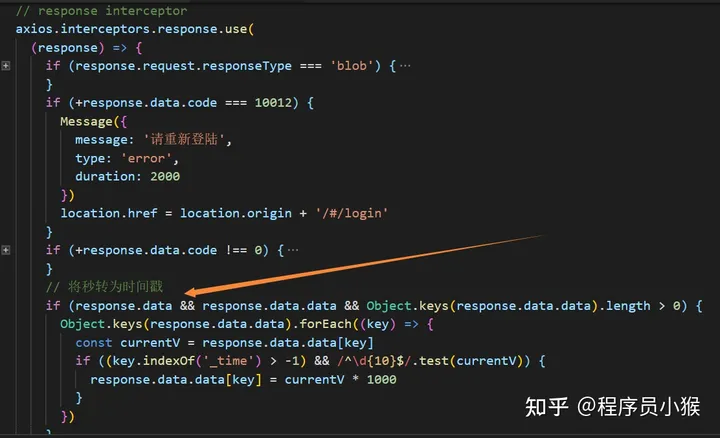

### 说一下 vue 和 jquey 的区别

答：jquery 主要是玩 dom 操作的“神器“，强大的选择器,封装了好多好用的 dom 操作方法和如何获取 ajax 方法 例如：$.ajax（)非常好用
vue:主要用于数据驱动和组件化，很少操作 dom，当然 vue 可能通过 ref 来选择一个 dom 或组件

### 说一下 vue 如何实现局部样式的或者说如何实现组件之间样式不冲突的和实现原理是什么？

答：css 没有局部样式的概念，vue 脚手架通过实现了，即在 style 标签上添加 scoped

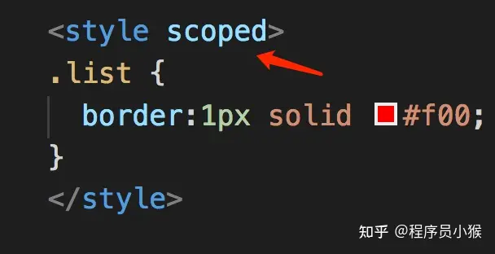

scoped 的实现原理：vue 通过 postcss 给每个 dom 元素添加一个以 data-开头的随机自定义属性实现的

### 说一下 vue 第三方 ui 样式库如何实现样式穿透的（ui 库和 less/sass 穿透问题） >>> /deep/

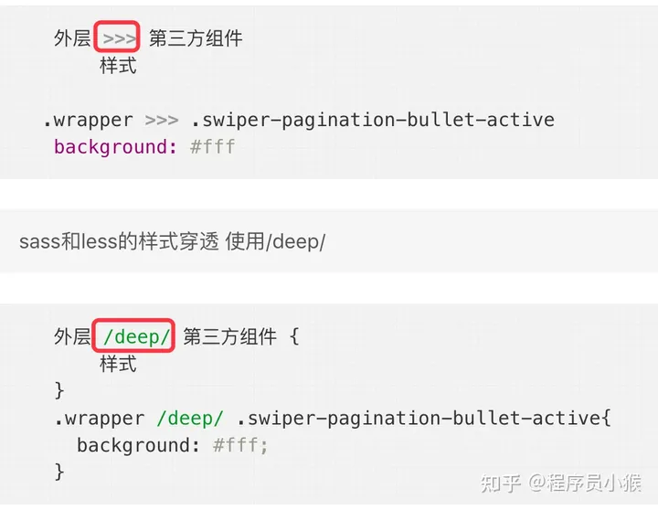

### vue 目录结构（面试时可能会这样问说一下 vue 工程目录结构)：这个了解下就可以

答：统一的目录结构可以方便团队协作和职责明晰，也方便项目后期维护和管理，具体 vue 项目目录结构包括：

- build:项目构建目录
- config:项目配置，包括代理配置，线上和线下环境配置
- node_modules:node 包目录，npm install 安装的包都在这个目录
- src:平时开发时的目录
- static:存入一些静态资源资源目录，我们可以把一些图片，字体，json 数据放在这里。
- .eslintrc.js：Eslint 代码检查配置文件
- .babelrc:ES6 配置
- .gitignore:忽略提交到远程仓库的配置

### vue 脚手架是你们公司搭建的，还是用的 vue 的脚本架？webpack 了解多少？

答：我们公司用的 vue 官方的脚手架（vue-cli）,vue-cli 版本有 3.0 和 2.9.x 版本

webpack 是一个前端模块化打包构建工具，vue 脚手架本身就用的 webpack 来构建的，webpack 本身需要的入口文件通过 entry 来指定，出口通过 output 来指定，默认只支持 js 文件，其他文件类型需要通过对应的 loader 来转换，例如：less 需要 less,less-loader,sass 需要 sass-loader,css 需要 style-loader,css-loader 来实现。

当然本身还有一些内置的插件来对文件进行压缩合并等操作

### 说一下你对 vuex 的理解

答：

vuex 是一个状态管理工具，主要解决大中型复杂项目的数据共享问题，主要包括 state,actions,mutations,getters 和 modules 5 个要素，主要流程：组件通过 dispatch 到 actions，actions 是异步操作，再 actions 中通过 commit 到 mutations，mutations 再通过逻辑操作改变 state，从而同步到组件，更新其数据状态,而 getters 相当于组件的计算属性对,组件中获取到的数据做提前处理的.再说到辅助函数的作用。

### vuex 如何实现数据持久化（即刷新后数据还保留）？

答：因为 vuex 中的 state 是存储在内存中的，一刷新就没了，例如登录状态，解决方案有：

第一种：利用 H5 的本地存储(localStorage,sessionStorage)

第二种：利用第三方封装好的插件，例如：vuex-persistedstate
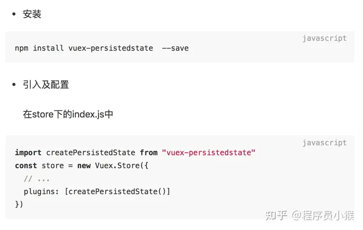

### 说一下 nextTick 的作用和使用场景

答：vue 中的 nextTick 主要用于处理数据动态变化后，DOM 还未及时更新的问题，用 nextTick 就可以获取数据更新后最新 DOM 的变化适用场景：

第一种：有时需要根据数据动态的为页面某些 dom 元素添加事件，这就要求在 dom 元素渲染完毕时去设置，但是 created 与 mounted 函数执行时一般 dom 并没有渲染完毕，所以就会出现获取不到，添加不了事件的问题，这回就要用到 nextTick 处理

第二种：在使用某个第三方插件时 ，希望在 vue 生成的某些 dom 动态发生变化时重新应用该插件，也会用到该方法，这时候就需要在 $nextTick 的回调函数中执行重新应用插件的方法，例如:应用滚动插件better-scroll时

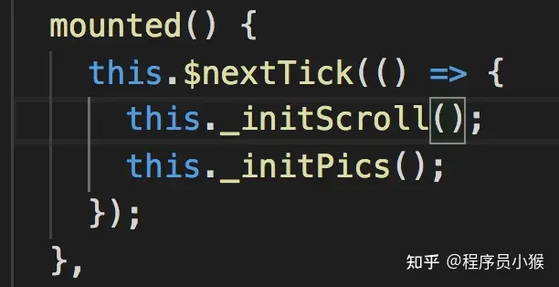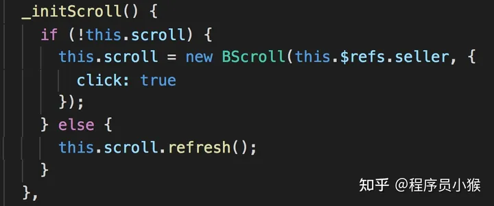

第三种：数据改变后获取焦点

**再来看以下解析:**

### 何为$nextTick？

简单回答：因为 Vue 的异步更新队列，$nextTick 是用来知道什么时候 DOM 更新完成的。详细解读：我们先来看这样一个场景：有一个 div，默认用 v-if 将它隐藏，点击一个按钮后，改变 v-if 的值，让它显示出来，同时拿到这个 div 的文本内容。

如果 v-if 的值是 false，直接去获取 div 内容是获取不到的，因为此时 div 还没有被创建出来，那么应该在点击按钮后，改变 v-if 的值为 true，div 才会被创建，此时再去获取。

示例代码如下：

```html
<div id="app">
	<div id="div" v-if="showDiv">这是一段文本</div>
	<button @click="getText">获取div内容</button>
</div>
<script>
	var app = new Vue({
		el: "#app",
		data: { showDiv: false },
		methods: {
			getText: function () {
				this.showDiv = true;
				var text = document.getElementById("div").innnerHTML;
				console.log(text);
			},
		},
	});
</script>
```

这段代码并不难理解，但是运行后在控制台会抛出一个错误：Cannot read property 'innnerHTML of null，意思就是获取不到 div 元素。这里就涉及 Vue 一个重要的概念：异步更新队列。

异步更新队列**Vue 在观察到数据变化时并不是直接更新 DOM，而是开启一个队列，并缓冲在同一个事件循环中发生的所以数据改变。在缓冲时会去除重复数据，从而避免不必要的计算和 DOM 操作。然后，在下一个事件循环 tick 中，Vue 刷新队列并执行实际（已去重的）工作**。

所以如果你用一个 for 循环来动态改变数据 100 次，其实它只会应用最后一次改变，如果没有这种机制，DOM 就要重绘 100 次，这固然是一个很大的开销。Vue 会根据当前浏览器环境优先使用原生的 Promise.then 和 MutationObserver，如果都不支持，就会采用 setTimeout 代替。

知道了 Vue 异步更新 DOM 的原理，上面示例的报错也就不难理解了。事实上，在执行 this.showDiv = true 时，div 仍然还是没有被创建出来，直到下一个 vue 事件循环时，才开始创建。

**$nextTick 就是用来知道什么时候 DOM 更新完成的**，所以上面的示例代码需要修改为：

```html
<div id="app">
	<div id="div" v-if="showDiv">这是一段文本</div>
	<button @click="getText">获取div内容</button>
</div>
<script>
	var app = new Vue({
		el: "#app",
		data: { showDiv: false },
		methods: {
			getText: function () {
				this.showDiv = true;
				this.$nextTick(function () {
					var text = document.getElementById("div").innnerHTML;
					console.log(text);
				});
			},
		},
	});
</script>
```

这时再点击事件，控制台就打印出 div 的内容“这是一段文本“了。

理论上，我们应该不用去主动操作 DOM，因为 Vue 的核心思想就是数据驱动 DOM，但在很多业务里，我们避免不了会使用一些第三方库，比如 popper.js、swiper 等，这些基于原生 javascript 的库都有创建和更新及销毁的完整生命周期，与 Vue 配合使用时，就要利用好$nextTick。

### v-for 与 v-if 的优先级

当它们处于同一节点，**v-for 的优先级比 v-if 更高**，这意味着 v-if 将分别重复运行于每个 v-for 循环中。当你想为仅有的一些项渲染节点时，这种优先级的机制会十分有用，如下：

```html
<li v-for="todo in todos" v-if="!todo.isComplete">{{ todo }}</li>
```

上面的代码只传递了未完成的 todos。而如果你的目的是有条件地跳过循环的执行，那么可以将 v-if 置于外层元素 (或`<template>`)上 vue 中 keep-alive 组件的作用**keep-alive：主要用于保留组件状态或避免重新渲染。**

比如： 有一个列表页面和一个 详情页面，那么用户就会经常执行打开详情=>返回列表=>打开详情这样的话 列表 和 详情 都是一个频率很高的页面，那么就可以对列表组件使用`<keep-alive></keep-alive>`进行缓存，这样用户每次返回列表的时候，都能从缓存中快速渲染，而不是重新渲染。

1、属性：include:字符串或正则表达式。只有匹配的组件会被缓存。

exclude：字符串或正则表达式。任何匹配的组件都不会被缓存。

2、用法：包裹动态组件时，会缓存不活动的组件实例，而不是销毁它们。和`<transition>`相似，`<keep-alive>`是一个抽象组件：它自身不会渲染一 DOM 元素，也不会出现在父组件链中。当组件在`<keep-alive>` 内被切换，在 2.2.0 及其更高版本中，

**activated 和 deactivated 生命周期 将会在 树内的所有嵌套组件中触发**。

## active-class 是哪个组件的属性？嵌套路由怎么定义？

vue-router 模块的 router-link 组件。

## 怎么定义 vue-router 的动态路由？怎么获取传过来的动态参数？

在 router 目录下的 index.js 文件中，对 path 属性加上/:id。 使用 router 对象的 arams.id

## vue-router 有哪几种导航钩子？

三种，一种是全局导航钩子：router.beforeEach(to,from,next)，作用：跳转前进行判断拦截。第二种：组件内的钩子；第三种：单独路由独享组件

## scss 是什么？在 vue.cli 中的安装使用步骤是？有哪几大特性？

### css 的预编译

#### 使用步骤

- 第一步：用 npm 下三个 loader（sass-loader、css-loader、node-sass）
- 第二步：在 build 目录找到 webpack.base.config.js，在那个 extends 属性中加一个拓展.scss
- 第三步：还是在同一个文件，配置一个 module 属性
- 第四步：然后在组件的 style 标签加上 lang 属性 ，例如：lang=”scss”

#### 有哪几大特性

- 1、可以用变量，例如（$变量名称=值）；
- 2、可以用混合器，例如（）
- 3、可以嵌套

## mint-ui 是什么？怎么使用？说出至少三个组件使用方法？

基于 vue 的前端组件库。npm 安装，然后 import 样式和 js，vue.use（mintUi）全局引入。在单个组件局部引入：import {Toast} from ‘mint-ui’。组件一：Toast(‘登录成功’)；组件二：mint-header；组件三：mint-swiper

## v-model 是什么？怎么使用？ vue 中标签怎么绑定事件？

可以实现双向绑定，指令（v-class、v-for、v-if、v-show、v-on）。vue 的 model 层的 data 属性。绑定事件：<input @click=doLog() />

## axios 是什么？怎么使用？描述使用它实现登录功能的流程？

请求后台资源的模块。npm install axios -S 装好，然后发送的是跨域，需在配置文件中 config/index.js 进行设置。后台如果是 Tp5 则定义一个资源路由。js 中使用 import 进来，然后.get 或.post。返回在.then 函数中如果成功，失败则是在.catch 函数中

## axios+tp5 进阶中，调用 axios.post(‘api/user’)是进行的什么操作？

axios.put(‘api/user/8′)呢？
跨域，添加用户操作，更新操作。

## 什么是 RESTful API？怎么使用?

是一个 api 的标准，无状态请求。请求的路由地址是固定的，如果是 tp5 则先路由配置中把资源路由配置好。标准有：.post .put .delete

## vuex 是什么？怎么使用？哪种功能场景使用它？

vue 框架中状态管理。在 main.js 引入 store，注入。新建了一个目录 store，….. export 。场景有：单页应用中，组件之间的状态。音乐播放、登录状态、加入购物车

## mvvm 框架是什么？它和其它框架（jquery）的区别是什么？哪些场景适合？

一个 model+view+viewModel 框架，数据模型 model，viewModel 连接两个
区别：vue 数据驱动，通过数据来显示视图层而不是节点操作。
场景：数据操作比较多的场景，更加便捷

## 自定义指令（v-check、v-focus）的方法有哪些？它有哪些钩子函数？还有哪些钩子函数参数？

全局定义指令：在 vue 对象的 directive 方法里面有两个参数，一个是指令名称，另外一个是函数。

组件内定义指令：directives

钩子函数：bind（绑定事件触发）、inserted(节点插入的时候触发)、update（组件内相关更新）

钩子函数参数：el、binding

## 说出至少 4 种 vue 当中的指令和它的用法？

v-if：判断是否隐藏；v-for：数据循环出来；v-bind:class：绑定一个属性；v-model：实现双向绑定

## vue-router 是什么？它有哪些组件？

vue 用来写路由一个插件。router-link、router-view

## slot 是什么？有什么作用？原理是什么？

slot 又名插槽，是 Vue 的内容分发机制，组件内部的模板引擎使用 slot 元素作为承载分发内容的出口。插槽 slot 是子组件的一个模板标签元素，而这一个标签元素是否显示，以及怎么显示是由父组件决定的。slot 又分三类，默认插槽，具名插槽和作用域插槽。

默认插槽：又名匿名插槽，当 slot 没有指定 name 属性值的时候一个默认显示插槽，一个组件内只有有一个匿名插槽。

具名插槽：带有具体名字的插槽，也就是带有 name 属性的 slot，一个组件可以出现多个具名插槽。

作用域插槽：默认插槽、具名插槽的一个变体，可以是匿名插槽，也可以是具名插槽，该插槽的不同点是在子组件渲染作用域插槽时，可以将子组件内部的数据传递给父组件，让父组件根据子组件的传递过来的数据决定如何渲染该插槽。

实现原理：当子组件 vm 实例化时，获取到父组件传入的 slot 标签的内容，存放在 vm.$slot 中，默认插槽为 vm.$slot.default，具名插槽为 vm.$slot.xxx，xxx 为插槽名，当组件执行渲染函数时候，遇到 slot 标签，使用$slot 中的内容进行替换，此时可以为插槽传递数据，若存在数据，则可称该插槽为作用域插槽。

## $nextTick 原理及作用

Vue 的 nextTick 其本质是对 JavaScript 执行原理 EventLoop 的一种应用。

nextTick 的 核 心 是 利 用 了 如 Promise 、 MutationObserver 、setImmediate、setTimeout 的原生 JavaScript 方法来模拟对应的微/宏任务的实现，本质是为了利用 JavaScript 的这些异步回调任务队列来实现 Vue 框架中自己的异步回调队列。

nextTick 不仅是 Vue 内部的异步队列的调用方法，同时也允许开发者在实际项目中使用这个方法来满足实际应用中对 DOM 更新数据时机的后续逻辑处理

nextTick 是典型的将底层 JavaScript 执行原理应用到具体案例中的示例，引入异步更新队列机制的原因：

如果是同步更新，则多次对一个或多个属性赋值，会频繁触发 UI/DOM 的渲染，可以减少一些无用渲染

同时由于 VirtualDOM 的引入，每一次状态发生变化后，状态变化的信号会发送给组件，组件内部使用 VirtualDOM 进行计算得出需要更新的具体的 DOM 节点，然后对 DOM 进行更新操作，每次更新状态后的渲染过程需要更多的计算，而这种无用功也将浪费更多的性能，所以异步渲染变得更加至关重要

Vue 采用了数据驱动视图的思想，但是在一些情况下，仍然需要操作 DOM。有时候，可能遇到这样的情况，DOM1 的数据发生了变化，而 DOM2 需要从 DOM1 中获取数据，那这时就会发现 DOM2 的视图并没有更新，这时就需要用到了 nextTick 了。

由于 Vue 的 DOM 操作是异步的，所以，在上面的情况中，就要将 DOM2 获取数据的操作写在$nextTick 中。

```js
this.$nextTick(() => {
	// 获取数据的操作...
});
```

所以，在以下情况下，会用到 nextTick：

在数据变化后执行的某个操作，而这个操作需要使用随数据变化而变化的 DOM 结构的时候，这个操作就需要方法在 nextTick()的回调函数中。

在 vue 生命周期中，如果在 created()钩子进行 DOM 操作，也一定要放在 nextTick()的回调函数中。

因为在 created()钩子函数中，页面的 DOM 还未渲染，这时候也没办法操作 DOM，所以，此时如果想要操作 DOM，必须将操作的代码放在 nextTick()的回调函数中。

## Vue 单页应用与多页应用的区别

概念：

SPA 单页面应用（SinglePage Web Application），指只有一个主页面的应用，一开始只需要加载一次 js、css 等相关资源。所有内容都包含在主页面，对每一个功能模块组件化。单页应用跳转，就是切换相关组件，仅仅刷新局部资源。

MPA 多页面应用 （MultiPage Application），指有多个独立页面的应用，每个页面必须重复加载 js、css 等相关资源。多页应用跳转，需要整页资源刷新。

区别：

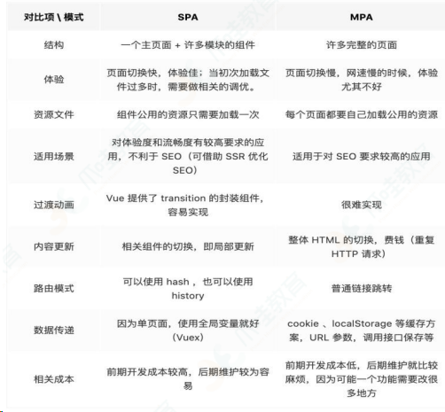

## Vue 中封装的数组方法有哪些，其如何实现页面更新

在 Vue 中，对响应式处理利用的是 Object.defineProperty 对数据进行拦截，而这个方法并不能监听到数组内部变化，数组长度变化，数组的截取变化等，所以需要对这些操作进行 hack，让 Vue 能监听到其中的变化。

vue 将被侦听的数组的变更方法进行了包裹，所以它们也将会触发视图更新。这些被包事过的方法包括：

- push()
- pop()
- shift()
- unshift()
- splice()
- sort()
- reverse()

那 Vue 是如何实现让这些数组方法实现元素的实时更新的呢，下面是 Vue 中对这些方法的封装：

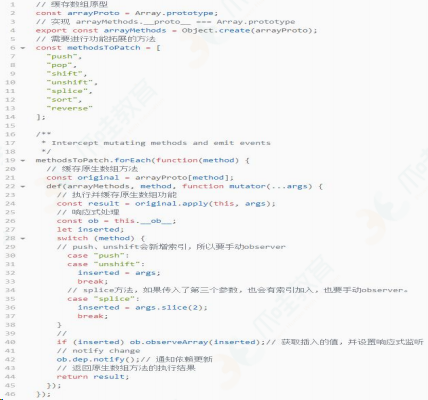

简单来说就是，重写了数组中的那些原生方法，首先获取到这个数组的**ob**，也就是它的 Observer 对象，如果有新的值，就调用 observeArray 继续对新的值观察变化（也就是通过 `target__proto__== arrayMethods` 来改变了数组实例的型），然后手动调用 notify，通知渲染 watcher，执行 update。

## Vue data 中某一个属性的值发生改变后，视图会立即同步执行重新渲染吗？

不会立即同步执行重新渲染。Vue 实现响应式并不是数据发生变化之后 DOM 立即变化，而是按一定的策略进行 DOM 的更新。Vue 在更新 DOM 时是异步执行的。只要侦听到数据变化， Vue 将开启一个队列，并缓冲在同一事件循环中发生的所有数据变更。

如果同一个 watcher 被多次触发，只会被推入到队列中一次。这种在缓冲时去除重复数据对于避免不必要的计算和 DOM 操作是非常重要的。然后，在下一个的事件循环 tick 中，Vue 刷新队列并执行实际（已去重的）工作。

## 简述 mixin、extends 的覆盖逻辑

### （1）mixin 和 extends

mixin 和 extends 均是用于合并、拓展组件的，两者均通过 mergeOptions 方法实现合并。

mixins 接收一个混入对象的数组，其中混入对象可以像正常的实例对象一样包含实例选项，这些选项会被合并到最终的选项中。Mixin 钩子按照传入顺序依次调用，并在调用组件自身的钩子之前被调用。

extends 主要是为了便于扩展单文件组件，接收一个对象或构造函数。

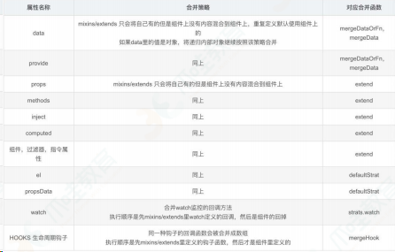

### （2）mergeOptions 的执行过程

规 范 化 选 项 （ normalizeProps 、 normalizelnject 、normalizeDirectives)对未合并的选项，进行判断

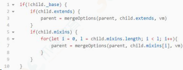

## 子组件可以直接改变父组件的数据吗？

子组件不可以直接改变父组件的数据。这样做主要是为了维护父子组件的单向数据流。每次父级组件发生更新时，子组件中所有的 prop 都将会刷新为最新的值。如果这样做了，Vue 会在浏览器的控制台中发出警告。

Vue 提倡单向数据流，即父级 props 的更新会流向子组件，但是反过来则不行。这是为了防止意外的改变父组件状态，使得应用的数据流变得难以理解，导致数据流混乱。如果破坏了单向数据流，当应用复杂时，debug 的成本会非常高。

只能通过 $emit 派发一个自定义事件，父组件接收到后，由父组件修改。

## 对 React 和 Vue 的理解，它们的异同

### 相似之处：

都将注意力集中保持在核心库，而将其他功能如路由和全局状态管理交给相关的库；

都有自己的构建工具，能让你得到一个根据最佳实践设置的项目模板；

都使用了 Virtual DOM（虚拟 DOM）提高重绘性能；

都有 props 的概念，允许组件间的数据传递；

都鼓励组件化应用，将应用分拆成一个个功能明确的模块，提高复用性。

### 不同之处 ：

#### 1）数据流

Vue 默认支持数据双向绑定，而 React 一直提倡单向数据流

#### 2）虚拟 DOM

Vue2.x 开始引入"Virtual DOM"，消除了和 React 在这方面的差异，但是在具体的细节还是有各自的特点。

Vue 宣称可以更快地计算出 Virtual DOM 的差异，这是由于它在渲染过程中，会跟踪每一个组件的依赖关系，不需要重新渲染整个组件树。

对于 React 而言，每当应用的状态被改变时，全部子组件都会重新渲染。当然，这可以通过 PureComponent/shouldComponentUpdate 这个生命周期方法来进行控制，但 Vue 将此视为默认的优化。

#### 3）组件化

React 与 Vue 最大的不同是模板的编写。

Vue 鼓励写近似常规 HTML 的模板。写起来很接近标准 HTML 元素，只是多了一些属性。

React 推荐你所有的模板通用 JavaScript 的语法扩展——JSX 书写。

具体来讲：React 中 render 函数是支持闭包特性的，所以 import 的组件在 render 中可以直接调用。但是在 Vue 中，由于模板中使用的数据都必须挂在 this 上进行一次中转，所以 import 一个组件完了之后，还需要在 components 中再声明下。

#### 4）监听数据变化的实现原理不同

Vue 通过 getter/setter 以及一些函数的劫持，能精确知道数据变化，不需要特别的优化就能达到很好的性能

React 默 认 是 通 过 比 较 引 用 的 方 式 进 行 的 ， 如 果 不 优 化（PureComponent/shouldComponentUpdate）可能导致大量不必要的 vDOM 的重新渲染。这是因为 Vue 使用的是可变数据，而 React 更强调数据的不可变。

#### 5）高阶组件

react 可以通过高阶组件（HOC）来扩展，而 Vue 需要通过 mixins 来扩展。

高阶组件就是高阶函数，而 React 的组件本身就是纯粹的函数，所以高阶函数对 React 来说易如反掌。相反 Vue.js 使用 HTML 模板创建视图组件，这时模板无法有效的编译，因此 Vue 不能采用 HOC 来实现。

#### 6）构建工具

两者都有自己的构建工具：

- React ==> Create React APP
- Vue ==> vue-cli

#### 7）跨平台

- React ==> React Native
- Vue ==> Weex

## Vue 的优点

轻量级框架：只关注视图层，是一个构建数据的视图集合，大小只有几十 kb ；

简单易学：国人开发，中文文档，不存在语言障碍 ，易于理解和学习；

双向数据绑定：保留了 angular 的特点，在数据操作方面更为简单；

组件化：保留了 react 的优点，实现了 html 的封装和重用，在构建单页面应用方面有着独特的优势；

视图，数据，结构分离：使数据的更改更为简单，不需要进行逻辑代码的修改，只需要操作数据就能完成相关操作；

虚拟 DOM：dom 操作是非常耗费性能的，不再使用原生的 dom 操作节点，极大解放 dom 操作，但具体操作的还是 dom 不过是换了另一种方式；

运行速度更快：相比较于 react 而言，同样是操作虚拟 dom，就性能而言， vue 存在很大的优势。

## assets 和 static 的区别

相同点： assets 和 static 两个都是存放静态资源文件。项目中所需要的资源文件图片，字体图标，样式文件等都可以放在这两个文件下，这是相同点

不相同点：assets 中存放的静态资源文件在项目打包时，也就是运行 npm run build 时会将 assets 中放置的静态资源文件进行打包上传，所谓打包简单点可以理解为压缩体积，代码格式化。而压缩后的静态资源文件最终也都会放置在 static 文件中跟着 index.html 一同上传至服务器。static 中放置的静态资源文件就不会要走打包压缩格式化等流程，而是直接进入打包好的目录，直接上传至服务器。

因为避免了压缩直接进行上传，在打包时会提高一定的效率，但是 static 中的资源文件由于没有进行压缩等操作，所以文件的体积也就相对于 assets 中打包后的文件提交较大点。在服务器中就会占据更大的空间。

建议： 将项目中 template 需要的样式文件 js 文件等都可以放置在 assets 中，走打包这一流程。减少体积。而项目中引入的第三方的资源文件如 iconfoont.css 等文件可以放置在 static 中，因为这些引入的第三方文件已经经过处理，不再需要处理，直接上传。

## delete 和 Vue.delete 删除数组的区别

delete 只是被删除的元素变成了 empty/undefined 其他的元素的键值还是不变。

Vue.delete 直接删除了数组 改变了数组的键值。

## Vue 模版编译原理

vue 中的模板 template 无法被浏览器解析并渲染，因为这不属于浏览器的标准，不是正确的 HTML 语法，所有需要将 template 转化成一个 JavaScript 函数，这样浏览器就可以执行这一个函数并渲染出对应的 HTML 元素，就可以让视图跑起来了，这一个转化的过程，就成为模板编译。模板编译又分三个阶段，解析 parse，优化 optimize，生成 generate，最终生成可执行函数 render。

解析阶段：使用大量的正则表达式对 template 字符串进行解析，将标签、指令、属性等转化为抽象语法树 AST。

优化阶段：遍历 AST，找到其中的一些静态节点并进行标记，方便在页面重渲染的时候进行 diff 比较时，直接跳过这一些静态节点，优化 runtime 的性能。

生成阶段：将最终的 AST 转化为 render 函数字符串。

## vue 初始化页面闪动问题

使用 vue 开发时，在 vue 初始化之前，由于 div 是不归 vue 管的，所以我们写的代码在还没有解析的情况下会容易出现花屏现象，看到类似于 `{{}}` 的字样，虽然一般情况下这个时间很短暂，但是还是有必要让解决这个问题的。

首先：在 css 里加上以下代码：

```css
[v-cloak] {
	display: none;
}
```

如 果 没 有 彻 底 解 决 问 题 ， 则 在 根 元 素 加 上 `style="display:
none;"`  ，`:style="{display: 'block'}"`

## 17. MVVM 的优缺点?

优点：

分离视图（View）和模型（Model），降低代码耦合，提⾼视图或者逻辑的重⽤性: ⽐如视图（View）可以独⽴于 Model 变化和修改，⼀个 ViewModel 可以绑定不同的"View"上，当 View 变化的时候 Model 不可以不变，当 Model 变化的时候 View 也可以不变。你可以把⼀些视图逻辑放在⼀个 ViewModel 里⾯，让很多 view 重⽤这段视图逻辑提⾼可测试性: ViewModel 的存在可以帮助开发者更好地编写测试代码

⾃动更新 dom: 利⽤双向绑定,数据更新后视图⾃动更新,让开发者从繁琐的⼿动 dom 中解放

缺点:

Bug 很难被调试: 因为使⽤双向绑定的模式，当你看到界⾯异常了，有可能是你 View 的代码有 Bug，也可能是 Model 的代码有问题。数据绑定使得⼀个位置的 Bug 被快速传递到别的位置，要定位原始出问题的地⽅就变得不那么容易了。另外，数据绑定的声明是指令式地写在 View 的模版当中的，这些内容是没办法去打断点 debug 的
⼀个⼤的模块中 model 也会很⼤，虽然使⽤⽅便了也很容易保证了数据的⼀致性，当时⻓期持有，不释放内存就造成了花费更多的内存对于⼤型的图形应⽤程序，视图状态较多，ViewModel 的构建和维护的成本都会⽐较⾼。

## v-if 和 v-for 哪个优先级更高？如果同时出现，应如何优化？

v-for 优先于 v-if 被解析，如果同时出现，每次渲染都会先执行循环再判断条件，无论如何循环都不可避免，浪费了性能。

要避免出现这种情况，则在外层嵌套 template，在这一层进行 v-if 判断，然后在内部进行 v-for 循环。如果条件出现在循环内部，可通过计算属性提前过滤掉那些不需要显示的项。

## 对 Vue 组件化的理解

1.组件是独立和可复用的代码组织单元。组件系统是 Vue 核心特性之一，它使开发者使用小型、独立和通常可复用的组件构建大型应用；

2.组件化开发能大幅提高应用开发效率、测试性、复用性等；

3.组件使用按分类有：页面组件、业务组件、通用组件；

4.vue 的组件是基于配置的，我们通常编写的组件是组件配置而非组件，框架后续会生成其构造函数，它们基于 VueComponent，扩展于 Vue；

5.vue 中常见组件化技术有：属性 prop，自定义事件，插槽等，它们主要用于组件通信、扩展等；6.合理的划分组件，有助于提升应用性能；

6.组件应该是高内聚、低耦合的；

7.遵循单向数据流的原则。

## 对 vue 设计原则的理解

1.渐进式 JavaScript 框架：与其它大型框架不同的是，Vue 被设计为可以自底向上逐层应用。Vue 的核心库只关注视图层，不仅易于上手，还便于与第三方库或既有项目整合。另一方面，当与现代化的工具链以及各种支持类库结合使用时，Vue 也完全能够为复杂的单页应用提供驱动。

2.易用性：vue 提供数据响应式、声明式模板语法和基于配置的组件系统等核心特性。这些使我们只需要关注应用的核心业务即可，只要会写 js、html 和 css 就能轻松编写 vue 应用。

3.灵活性：渐进式框架的最大优点就是灵活性，如果应用足够小，我们可能仅需要 vue 核心特性即可完成功能；随着应用规模不断扩大，我们才可能逐渐引入路由、状态管理、vue-cli 等库和工具，不管是应用体积还是学习难度都是一个逐渐增加的平和曲线。

4.高效性：超快的虚拟 DOM 和 diff 算法使我们的应用拥有最佳的性能表现。追求高效的过程还在继续，vue3 中引入 Proxy 对数据响应式改进以及编译器中对于静态内容编译的改进都会让 vue 更加高效。

## 说一下 Vue 的生命周期

Vue 实例有⼀个完整的⽣命周期，也就是从开始创建、初始化数据、编译模版、挂载 Dom -> 渲染、更新 -> 渲染、卸载 等⼀系列过程，称这是 Vue 的⽣命周期。

1.beforeCreate（创建前）：数据观测和初始化事件还未开始，此时 data 的响应式追踪、event/watcher 都还没有被设置，也就是说不能访问到 data、computed、watch、methods 上的方法和数据。

2.created（创建后） ：实例创建完成，实例上配置的 options 包括 data、computed、watch、methods 等都配置完成，但是此时渲染得节点还未挂载到 DOM，所以不能访问到 $el 属性。

3.beforeMount（挂载前）：在挂载开始之前被调用，相关的 render 函数首次被调用。实例已完成以下的配置：编译模板，把 data 里面的数据和模板生成 html。此时还没有挂载 html 到页面上。

4.mounted（挂载后）：在 el 被新创建的 vm.$el 替换，并挂载到实例上去之后调用。实例已完成以下的配置：用上面编译好的 html 内容替换 el 属性指向的 DOM 对象。完成模板中的 html 渲染到 html 页面中。此过程中进行 ajax 交互。

5.beforeUpdate（更新前）：响应式数据更新时调用，此时虽然响应式数据更新了，但是对应的真实 DOM 还没有被渲染。

6.updated（更新后） ：在由于数据更改导致的虚拟 DOM 重新渲染和打补丁之后调用。此时 DOM 已经根据响应式数据的变化更新了。调用时，组件 DOM 已经更新，所以可以执行依赖于 DOM 的操作。然而在大多数情况下，应该避免在此期间更改状态，因为这可能会导致更新无限循环。该钩子在服务器端渲染期间不被调用。

7.beforeDestroy（销毁前）：实例销毁之前调用。这一步，实例仍然完全可用，this 仍能获取到实例。

8.destroyed（销毁后）：实例销毁后调用，调用后，Vue 实例指示的所有东西都会解绑定，所有的事件监听器会被移除，所有的子实例也会被销毁。该钩子在服务端渲染期间不被调用。

另外还有 keep-alive 独有的生命周期，分别为 activated 和 deactivated。用 keep-alive 包裹的组件在切换时不会进行销毁，而是缓存到内存中并执行 deactivated 钩子函数，命中缓存渲染后会执行 activated 钩子函数。

## Vue 子组件和父组件执行顺序

### 加载渲染过程：

1.父组件 beforeCreate 2.父组件 created 3.父组件 beforeMount 4.子组件 beforeCreate 5.子组件 created 6.子组件 beforeMount 7.子组件 mounted 8.父组件 mounted

### 更新过程：

1.父组件 beforeUpdate 2.子组件 beforeUpdate 3.子组件 updated 4.父组件 updated

### 销毁过程：

1.父组件 beforeDestroy 2.子组件 beforeDestroy 3.子组件 destroyed 4.父组件 destoryed

## created 和 mounted 的区别

created:在模板渲染成 html 前调用，即通常初始化某些属性值，然后再渲染成视图。

mounted:在模板渲染成 html 后调用，通常是初始化页面完成后，再对 html 的 dom 节点进行一些需要的操作。

## 一般在哪个生命周期请求异步数据

我们可以在钩子函数 created、beforeMount、mounted 中进行调用，因为在这三个钩子函数中，data 已经创建，可以将服务端端返回的数据进行赋值。

推荐在 created 钩子函数中调用异步请求，因为在 created 钩子函数中调用异步请求有以下优点：

能更快获取到服务端数据，减少页面加载时间，用户体验更好；

SSR 不支持 beforeMount 、mounted 钩子函数，放在 created 中有助于一致性。

## keep-alive 中的生命周期哪些

keep-alive 是 Vue 提供的一个内置组件，用来对组件进行缓存——在组件切换过程中将状态保留在内存中，防止重复渲染 DOM。

如果为一个组件包裹了 keep-alive，那么它会多出两个生命周期：

deactivated、activated。同时，beforeDestroy 和 destroyed 就不会再被触发了，因为组件不会被真正销毁。

当组件被换掉时，会被缓存到内存中、触发 deactivated 生命周期；

当组件被切回来时，再去缓存里找这个组件、触发 activated 钩子函数。

## 路由的 hash 和 history 模式的区别

Vue-Router 有两种模式：hash 模式和 history 模式。默认的路由模式是 hash 模式。

## hash 模式

简介： hash 模式是开发中默认的模式，它的 URL 带着一个#，例如：http://www.abc.com/#/vue，它的 hash 值就是#/vue。

特点：hash 值会出现在 URL 里面，但是不会出现在 HTTP 请求中，对后端完全没有影响。所以改变 hash 值，不会重新加载页面。这种模式的浏览器支持度很好，低版本的 IE 浏览器也支持这种模式。hash 路由被称为是前端路由，已经成为 SPA（单页面应用）的标配。

原理： hash 模式的主要原理就是 onhashchange()事件：

```js
window.onhashchange = function (event) {
	console.log(event.oldURL, event.newURL);
	let hash = location.hash.slice(1);
};
```

使用 onhashchange()事件的好处就是，在页面的 hash 值发生变化时，无需向后端发起请求，window 就可以监听事件的改变，并按规则加载相应的代码。除此之外，hash 值变化对应的 URL 都会被浏览器记录下来，这样浏览器就能实现页面的前进和后退。虽然是没有请求后端服务器，但是页面的 hash 值和对应的 URL 关联起来了。

## history 模式

简介： history 模式的 URL 中没有#，它使用的是传统的路由分发模式，即用户在输入一个 URL 时，服务器会接收这个请求，并解析这个 URL，然后做出相应的逻辑处理。

特 点 ： 当 使 用 history 模 式 时 ， URL 就 像 这 样 ：http://abc.com/user/id。相比 hash 模式更加好看。但是，history 模式需要后台配置支持。如果后台没有正确配置，访问时会返回 404。

API： history api 可以分为两大部分，切换历史状态和修改历史状态：

修 改 历 史 状 态 ： 包 括 了 HTML5 History Interface 中 新 增 的 pushState() 和 replaceState() 方法，这两个方法应用于浏览器的历史记录栈，提供了对历史记录进行修改的功能。只是当他们进行修改时，虽然修改了 url，但浏览器不会立即向后端发送请求。如果要做到改变 url 但又不刷新页面的效果，就需要前端用上这两个 API。

切换历史状态： 包括 forward()、back()、go()三个方法，对应浏览器的前进，后退，跳转操作。

虽然 history 模式丢弃了丑陋的#。但是，它也有自己的缺点，就是在刷新页面的时候，如果没有相应的路由或资源，就会刷出 404 来。

如果想要切换到 history 模式，就要进行以下配置（后端也要进行配置）：

```js
const router = new VueRouter({
    mode: 'history',
    routes: [...]
})
```

## 3.两种模式对比

调用 history.pushState() 相比于直接修改 hash，存在以下优势：

pushState() 设置的新 URL 可以是与当前 URL 同源的任意 URL；而 hash 只可修改 # 后面的部分，因此只能设置与当前 URL 同文档的 URL；

pushState() 设置的新 URL 可以与当前 URL 一模一样，这样也会把记录添加到栈中；而 hash 设置的新值必须与原来不一样才会触发动作将记录添加到栈中；

pushState() 通过 stateObject 参数可以添加任意类型的数据到记录中；而 hash 只可添加短字符串；

pushState() 可额外设置 title 属性供后续使用。

hash 模式下，仅 hash 符号之前的 url 会被包含在请求中，后端如果没有做到对路由的全覆盖，也不会返回 404 错误；history 模式下，前端的 url 必须和实际向后端发起请求的 url 一致，如果没有对用的路由处理，将返回 404 错误。

hash 模式和 history 模式都有各自的优势和缺陷，还是要根据实际情况选择性的使用。

## Vue-router 跳转和 location.href 有什么区别

- 使用 location.href= /url 来跳转，简单方便，但是刷新了页面；
- 使用 history.pushState( /url ) ，无刷新页面，静态跳转；
- 引进 router ，然后使用 router.push( /url ) 来跳转，使用了 diff 算法，实现了按需加载，减少了 dom 的消耗。其实使用 router 跳转和使用 history.pushState() 没什么差别的，因为 vue-router 就是用了 history.pushState() ，尤其是在 history 模式下。

## Vuex 的原理

Vuex 是一个专为 Vue.js 应用程序开发的状态管理模式。每一个 Vuex 应用的核心就是 store（仓库）。“store” 基本上就是一个容器，它包含着你的应用中大部分的状态 ( state )。

Vuex 的状态存储是响应式的。当 Vue 组件从 store 中读取状态的时候，若 store 中的状态发生变化，那么相应的组件也会相应地得到高效更新。

改 变 store 中 的 状 态 的 唯 一 途 径 就 是 显 式 地 提 交 (commit)mutation。这样可以方便地跟踪每一个状态的变化。

Vuex 为 Vue Components 建立起了一个完整的生态圈，包括开发中的 API 调用一环。

### （1）核心流程中的主要功能：

Vue Components 是 vue 组件，组件会触发（dispatch）一些事件或动作，也就是图中的 Actions;

在组件中发出的动作，肯定是想获取或者改变数据的，但是在 vuex 中，数据是集中管理的，不能直接去更改数据，所以会把这个动作提交（Commit）到 Mutations 中;

然后 Mutations 就去改变（Mutate）State 中的数据;

当 State 中的数据被改变之后，就会重新渲染（Render）到 Vue Components 中去，组件展示更新后的数据，完成一个流程。

### （2）各模块在核心流程中的主要功能：

Vue Components∶ Vue 组件。HTML 页面上，负责接收用户操作等交互行为，执行 dispatch 方法触发对应 action 进行回应。

dispatch∶ 操作行为触发方法，是唯一能执行 action 的方法。

actions∶ 操作行为处理模块。负责处理 Vue Components 接收到的所有交互行为。包含同步/异步操作，支持多个同名方法，按照注册的顺序依次触发。向后台 API 请求的操作就在这个模块中进行，包括触发其他 action 以及提交 mutation 的操作。该模块提供了 Promise 的封装，以支持 action 的链式触发。

commit∶ 状态改变提交操作方法。对 mutation 进行提交，是唯一能执行 mutation 的方法。

mutations∶ 状态改变操作方法。是 Vuex 修改 state 的唯一推荐方法，其他修改方式在严格模式下将会报错。该方法只能进行同步操作，且方法名只能全局唯一。操作之中会有一些 hook 暴露出来，以进行 state 的监控等。

state∶ 页面状态管理容器对象。集中存储 Vuecomponents 中 data 对象的零散数据，全局唯一，以进行统一的状态管理。页面显示所需的数据从该对象中进行读取，利用 Vue 的细粒度数据响应机制来进行高效的状态更新。

getters∶ state 对象读取方法。图中没有单独列出该模块，应该被包含在了 render 中，Vue Components 通过该方法读取全局 state 对象。

### 总结：

Vuex 实现了一个单向数据流，在全局拥有一个 State 存放数据，当组件要更改 State 中的数据时，必须通过 Mutation 提交修改信息，Mutation 同时提供了订阅者模式供外部插件调用获取 State 数据的更新。而当所有异步操作(常见于调用后端接口异步获取更新数据)或批量的同步操作需要走 Action ，但 Action 也是无法直接修改 State 的，还是需要通过 Mutation 来修改 State 的数据。最后，根据 State 的变化，渲染到视图上。

## Vuex 和 localStorage 的区别

### （1）最重要的区别

vuex 存储在内存中

localstorage 则以文件的方式存储在本地，只能存储字符串类型的数据，存储对象需要 JSON 的 stringify 和 parse 方法进行处理。 读取内存比读取硬盘速度要快

### （2）应用场景

Vuex 是一个专为 Vue.js 应用程序开发的状态管理模式。它采用集中式存储管理应用的所有组件的状态，并以相应的规则保证状态以一种可预测的方式发生变化。vuex 用于组件之间的传值。

localstorage 是本地存储，是将数据存储到浏览器的方法，一般是在跨页面传递数据时使用 。

Vuex 能做到数据的响应式，localstorage 不能

### （3）永久性

刷新页面时 vuex 存储的值会丢失，localstorage 不会。

注意：对于不变的数据确实可以用 localstorage 可以代替 vuex，但是当两个组件共用一个数据源（对象或数组）时，如果其中一个组件改变了该数据源，希望另一个组件响应该变化时，localstorage 无法做到，原因就是区别 1。

## Redux 和 Vuex 有什么区别，它们的共同思想

### （1）Redux 和 Vuex 区别

Vuex 改进了 Redux 中的 Action 和 Reducer 函数，以 mutations 变化函数取代 Reducer，无需 switch，只需在对应的 mutation 函数里改变 state 值即可

Vuex 由于 Vue 自动重新渲染的特性，无需订阅重新渲染函数，只要生成新的 State 即可

Vuex 数据流的顺序是 ∶View 调用 store.commit 提交对应的请求到 Store 中对应的 mutation 函数->store 改变（vue 检测到数据变化自动渲染）

通俗点理解就是，vuex 弱化 dispatch，通过 commit 进行 store 状态的一次更变;取消了 action 概念，不必传入特定的 action 形式进行指定变更;弱化 reducer，基于 commit 参数直接对数据进行转变，使得框架更加简易;

### （2）共同思想

单—的数据源

变化可以预测

本质上：redux 与 vuex 都是对 mvvm 思想的服务，将数据从视图中抽离的一种方案;

形式上：vuex 借鉴了 redux，将 store 作为全局的数据中心，进行 mode 管理;

## 为什么要用 Vuex 或者 Redux

由于传参的方法对于多层嵌套的组件将会非常繁琐，并且对于兄弟组件间的状态传递无能为力。我们经常会采用父子组件直接引用或者通过事件来变更和同步状态的多份拷贝。以上的这些模式非常脆弱，通常会导致代码无法维护。

所以需要把组件的共享状态抽取出来，以一个全局单例模式管理。在这种模式下，组件树构成了一个巨大的"视图"，不管在树的哪个位置，任何组件都能获取状态或者触发行为。

另外，通过定义和隔离状态管理中的各种概念并强制遵守一定的规则，代码将会变得更结构化且易维护。

## Vuex 有哪几种属性？

有五种，分别是 State、 Getter、Mutation 、Action、 Module

- state => 基本数据(数据源存放地)
- getters => 从基本数据派生出来的数据
- mutations => 提交更改数据的方法，同步
- actions => 像一个装饰器，包裹 mutations，使之可以异步。
- modules => 模块化 Vuex

## Vuex 和单纯的全局对象有什么区别？

Vuex 的状态存储是响应式的。当 Vue 组件从 store 中读取状态的时候，若 store 中的状态发生变化，那么相应的组件也会相应地得到高效更新。

不能直接改变 store 中的状态。改变 store 中的状态的唯一途径就是显式地提交 (commit) mutation。这样可以方便地跟踪每一个状态的变化，从而能够实现一些工具帮助更好地了解我们的应用。

## 为什么 Vuex 的 mutation 中不能做异步操作？

Vuex 中所有的状态更新的唯一途径都是 mutation，异步操作通过
Action 来提交 mutation 实现，这样可以方便地跟踪每一个状态的
变化，从而能够实现一些工具帮助更好地了解我们的应用。
每个 mutation 执行完成后都会对应到一个新的状态变更，这样
devtools 就可以打个快照存下来，然后就可以实现 time-travel 了。
如果 mutation 支持异步操作，就没有办法知道状态是何时更新的，
无法很好的进行状态的追踪，给调试带来困难。

## Vue3.0 有什么更新

### （1）监测机制的改变

3.0 将带来基于代理 Proxy 的 observer 实现，提供全语言覆盖的反应性跟踪。

消除了 Vue 2 当中基于 Object.defineProperty 的实现所存在的很多限制：

### （2）只能监测属性，不能监测对象

检测属性的添加和删除；

检测数组索引和长度的变更；

支持 Map、Set、WeakMap 和 WeakSet。

### （3）模板

作用域插槽，2.x 的机制导致作用域插槽变了，父组件会重新渲染，而 3.0 把作用域插槽改成了函数的方式，这样只会影响子组件的重新渲染，提升了渲染的性能。

同时，对于 render 函数的方面，vue3.0 也会进行一系列更改来方便习惯直接使用 api 来生成 vdom 。

### （4）对象式的组件声明方式

vue2.x 中 的 组 件 是 通 过 声 明 的 方 式 传 入 一 系 列 option， 和 TypeScript 的结合需要通过一些装饰器的方式来做，虽然能实现功能，但是比较麻烦。

3.0 修改了组件的声明方式，改成了类式的写法，这样使得和 TypeScript 的结合变得很容易

### （5）其它方面的更改

支持自定义渲染器，从而使得 weex 可以通过自定义渲染器的方式来扩展，而不是直接 fork 源码来改的方式。

支持 Fragment（多个根节点）和 Protal（在 dom 其他部分渲染组建内容）组件，针对一些特殊的场景做了处理。

基于 tree shaking 优化，提供了更多的内置功能。

## defineProperty 和 proxy 的区别

Vue 在 实 例 初 始 化 时 遍 历 data 中 的 所 有 属 性 ， 并 使 用 Object.defineProperty 把这些属性全部转为 getter/setter。这样当追踪数据发生变化时，setter 会被自动调用。

Object.defineProperty 是 ES5 中一个无法 shim 的特性，这也就是 Vue 不支持 IE8 以及更低版本浏览器的原因。

但是这样做有以下问题：

1.添加或删除对象的属性时，Vue 检测不到。因为添加或删除的对象没 有 在 初 始 化 进 行 响 应 式 处 理 ， 只 能 通 过 $set 来 调 用 Object.defineProperty()处理。

2.无法监控到数组下标和长度的变化。

Vue3 使用 Proxy 来监控数据的变化。Proxy 是 ES6 中提供的功能，其作用为：用于定义基本操作的自定义行为（如属性查找，赋值，枚举，函数调用等）。相对于 Object.defineProperty()，其有以下特点：

- 1.Proxy 直接代理整个对象而非对象属性，这样只需做一层代理就可以监听同级结构下的所有属性变化，包括新增属性和删除属性。
- 2.Proxy 可以监听数组的变化。

## Vue3.0 为什么要用 proxy？

在 Vue2 中， 0bject.defineProperty 会改变原始数据，而 Proxy 是创建对象的虚拟表示，并提供 set 、get 和 deleteProperty 等

处理器，这些处理器可在访问或修改原始对象上的属性时进行拦截，有以下特点 ∶
不需用使用 Vue.$set 或 Vue.$delete 触发响应式。

全方位的数组变化检测，消除了 Vue2 无效的边界情况。

支持 Map，Set，WeakMap 和 WeakSet。

Proxy 实现的响应式原理与 Vue2 的实现原理相同，实现方式大同小异 ∶

get 收集依赖

Set、delete 等触发依赖

对于集合类型，就是对集合对象的方法做一层包装：原方法执行后执行依赖相关的收集或触发逻辑。

## 虚拟 DOM 的解析过程

虚拟 DOM 的解析过程：

首先对将要插入到文档中的 DOM 树结构进行分析，使用 js 对象将其表示出来，比如一个元素对象，包含 TagName、props 和 Children 这些属性。然后将这个 js 对象树给保存下来，最后再将 DOM 片段插入到文档中。

当页面的状态发生改变，需要对页面的 DOM 的结构进行调整的时候，首先根据变更的状态，重新构建起一棵对象树，然后将这棵新的对象树和旧的对象树进行比较，记录下两棵树的的差异。

最后将记录的有差异的地方应用到真正的 DOM 树中去，这样视图就更新了。

## DIFF 算法的原理

在新老虚拟 DOM 对比时：

首先，对比节点本身，判断是否为同一节点，如果不为相同节点，则删除该节点重新创建节点进行替换

如果为相同节点，进行 patchVnode，判断如何对该节点的子节点进行处理，先判断一方有子节点一方没有子节点的情况(如果新的 children 没有子节点，将旧的子节点移除)

比较如果都有子节点，则进行 updateChildren，判断如何对这些新老节点的子节点进行操作（diff 核心）。

匹配时，找到相同的子节点，递归比较子节点

在 diff 中，只对同层的子节点进行比较，放弃跨级的节点比较，使得时间复杂从 O(n 3)降低值 O(n)，也就是说，只有当新旧 children

都为多个子节点时才需要用核心的 Diff 算法进行同层级比较。

## Vue 中 key 的作用

vue 中 key 值的作用可以分为两种情况来考虑：

第一种情况是 v-if 中使用 key。由于 Vue 会尽可能高效地渲染元素，通常会复用已有元素而不是从头开始渲染。因此当使用 v-if 来实现元素切换的时候，如果切换前后含有相同类型的元素，那么这个元素就会被复用。如果是相同的 input 元素，那么切换前后用户的输入不会被清除掉，这样是不符合需求的。因此可以通过使用 key 来
唯一的标识一个元素，这个情况下，使用 key 的元素不会被复用。

这个时候 key 的作用是用来标识一个独立的元素。

第二种情况是 v-for 中使用 key。用 v-for 更新已渲染过的元素列表时，它默认使用“就地复用”的策略。如果数据项的顺序发生了改变，Vue 不会移动 DOM 元素来匹配数据项的顺序，而是简单复用此处的每个元素。因此通过为每个列表项提供一个 key 值，来以便 Vue 跟踪元素的身份，从而高效的实现复用。这个时候 key 的作用是为了高效的更新渲染虚拟 DOM。

key 是为 Vue 中 vnode 的唯一标记，通过这个 key，diff 操作可以更准确、更快速、更准确：因为带 key 就不是就地复用了，在 sameNode 函数 a.key=== b.key 对比中可以避免就地复用的情况。所以会更加准确。

更快速：利用 key 的唯一性生成 map 对象来获取对应节点，比遍历方式更快

## 导航钩子有哪些？它们有哪些参数？

导航钩子有：a/全局钩子和组件内独享的钩子。b/beforeRouteEnter、afterEnter、
beforeRouterUpdate、beforeRouteLeave

参数：有 to（去的那个路由）、from（离开的路由）、next（一定要用这个函数才能去到下一个路由，如果不用就拦截）最常用就这几种

## Vue 的双向数据绑定原理是什么？

vue.js 是采用数据劫持结合发布者-订阅者模式的方式，通过 Object.defineProperty() 来劫持各个属性的 setter ， getter ，在数据变动时发布消息给订阅者，触发相应的监听回调。

具体步骤：

- 第一步：需要 observe 的数据对象进行递归遍历，包括子属性对象的属性，都加上 setter 和 getter 这样的话，给这个对象的某个值赋值，就会触发 setter ，那么就能监听到了数据变化
- 第二步：compile 解析模板指令，将模板中的变量替换成数据，然后初始化渲染页面视图，并将每个指令对应的节点绑定更新函数，添加监听数据的订阅者，一旦数据有变动，收到通知，更新视图
- 第三步：Watcher 订阅者是 Observer 和 Compile 之间通信的桥梁，主要做的事情是：
  - 1、在自身实例化时往属性订阅器(dep)里面添加自己
  - 2、自身必须有一个 update()方法
  - 3、待属性变动 dep.notice()通知时，能调用自身的 update()方法，并触发 Compile 中绑定的回调，则功成身退。
- 第四步：MVVM 作为数据绑定的入口，整合 Observer、Compile 和 Watcher 三者，通过 Observer 来监听自己的 model 数据变化，通过 Compile 来解析编译模板指令，最终利用 Watcher 搭起 Observer 和 Compile 之间的通信桥梁，达到数据变化 -> 视图更新；视图交互变化(input) -> 数据 model 变更的双向绑定效果。

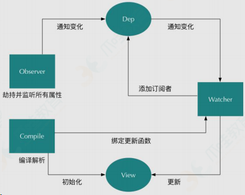

ps：16 题答案同样适合”vue data 是怎么实现的？”此面试题。


## 请说下封装 vue 组件的过程？

答：首先，组件可以提升整个项目的开发效率。能够把页面抽象成多个相对独立的模块，解决了我们传统项目开发：效率低、难维护、复用性等问题。

然后，使用 Vue.extend 方法创建一个组件，然后使用 Vue.component 方法注册组件。子组件需要数据，可以在 props 中接受定义。而子组件修改好数据后，想把数据传递给父组件。可以采用 emit 方法。

## 你是怎么认识 vuex 的？

答：vuex 可以理解为一种开发模式或框架。比如 PHP 有 thinkphp，java 有 spring 等。
通过状态（数据源）集中管理驱动组件的变化（好比 spring 的 IOC 容器对 bean 进行集中管理）。

应用级的状态集中放在 store 中； 改变状态的方式是提交 mutations，这是个同步的事物； 异步逻辑应该封装在 action 中。

## vue-loader 是什么？使用它的用途有哪些？

答：解析.vue 文件的一个加载器，跟 template/js/style 转换成 js 模块。

用途：js 可以写 es6、style 样式可以 scss 或 less、template 可以加 jade 等

## 请说出 vue.cli 项目中 src 目录每个文件夹和文件的用法？

答：assets 文件夹是放静态资源；components 是放组件；router 是定义路由相关的配置;view 视图；

app.vue 是一个应用主组件；main.js 是入口文件

## vue.cli 中怎样使用自定义的组件？有遇到过哪些问题吗？

答：

第一步：在 components 目录新建你的组件文件（smithButton.vue），script 一定要 export default {

第二步：在需要用的页面（组件）中导入：import smithButton from ‘../components/smithButton.vue’

第三步：注入到 vue 的子组件的 components 属性上面,components:{smithButton}

第四步：在 template 视图 view 中使用，问题有：smithButton 命名，使用的时候则 smith-button。

## 聊聊你对 Vue.js 的 template 编译的理解？

答：简而言之，就是先转化成 AST 树，再得到的 render 函数返回 VNode（Vue 的虚拟 DOM 节点）详情步骤：

首先，通过 compile 编译器把 template 编译成 AST 语法树（abstract syntax tree 即 源代码的抽象语法结构的树状表现形式），compile 是 createCompiler 的返回值，createCompiler 是用以创建编译器的。另外 compile 还负责合并 option。

然后，AST 会经过 generate（将 AST 语法树转化成 render funtion 字符串的过程）得到 render 函数，render 的返回值是 VNode，VNode 是 Vue 的虚拟 DOM 节点，里面有（标签名、子节点、文本等等）

## Vuex 是什么？为什么使用 Vuex？

答：Vuex 类似 Redux 的状态管理器，用来管理 Vue 的所有组件状态。
当你打算开发大型单页应用（SPA），会出现多个视图组件依赖同一个状态，来自不同视图的行为需要
变更同一个状态。

## vuejs 与 angularjs 的区别？

答：

一、定位 ：

虽然 Vue.js 被定义为 MVC framework，但其实 Vue 本身还是一个 library，加了一些其他的工具，可以被当成一个 framework，而 Angular 2 虽然还是一个 framework，但其实在设计之初，Angular 2 的团队站在了更高的角度，希望做一个 platform。

二、文档：

vue.js 的更加亲切

三、性能：

angular 所有的数据和方法都是挂载在$scope 上。而 vue 的数据和方法都是挂载在 vue 上，只是数据挂载在 vue 的 data,方法挂载在 vue 的 methods 上，vue 的代码风格更加优雅，json 格式书写代码。Vue.js 有更好的性能，并且非常非常容易优化，因为它不使用脏检查。Angular，当 watcher 越来越多时会变得越来越慢，因为作用域内的每一次变化，所有 watcher 都要重新计算。

其它区别：

渲染性能：Vue> react >angular。

使用场景：Vue React 覆盖中小型，大型项目。angular 一般用于大型（因为比较厚重）。

## vue 为什么不直接操作 dom？

答：因为操作 dom 对象后，会触发一些浏览器行为，比如布局（layout）和绘制（paint）。 paint 是一个耗时的过程，然而 layout 是一个更耗时的过程，我们无法确定 layout 一定是自上而下或是自下而上进行的，甚至一次 layout 会牵涉到整个文档布局的重新计算。浏览器的 layout 是 lazy 的，也就是说：在 js 脚本执行时，是不会去更新 DOM 的，任何对 DOM 的修改都会被暂存在一个队列中，在当前 js 的执行上下文完成执行后，会根据这个队列中的修改，进行一次 layout。

## 你怎么理解 vue 是一个渐进式的框架？

答：我觉得渐进式就是不必一开始就用 Vue 所有的全家桶，可以根据场景，按需使用想要的插件。也可以说就使用 vue 不需要太多的要求。

## 28、Vue 声明组件的 state 是用 data 方法，那为什么 data 是通过一个 function 来返回一个对象，而不是直接写一个对象呢？

答：从语法上说，如果不用 function 返回就会出现语法错误导致编译不通过。从原理上的话，大概就是组件可以被多次创建，如果不使用 function 就会使所有调用该组件的页面公用同一个数据域，这样就失去了组件的概念了

## vue 中 mixin 与 extend 区别？

答：

全局注册混合对象，会影响到所有之后创建的 vue 实例，而 Vue.extend 是对单个实例进行扩展。

mixin 混合对象（组件复用）

同名钩子函数（bind，inserted，update，componentUpdate，unbind）将混合为一个数组，因此都将被调用，混合对象的钩子将在组件自身钩子之前调用 methods，components，directives 将被混为同一个对象。两个对象的键名（方法名，属性名）冲突时，取组件（而非 mixin）对象的键值对。

## 面试题 2：vue 里的生命周期和钩子函数

### 生命周期函数和钩子函数概念

生命周期函数和钩子函数在 Vue.js 中通常被用来描述相同的概念，但是它们并不完全是同一个东西。让我来解释一下：

1. **生命周期函数：** Vue.js 组件的生命周期函数是指在组件生命周期中自动执行的一系列方法，用于控制组件的行为。这些生命周期函数包括 `beforeCreate`、`created`、`beforeMount`、`mounted`、`beforeUpdate`、`updated`、`beforeDestroy` 和 `destroyed`。它们按照组件的创建、更新和销毁阶段被调用。
2. **钩子函数：** 在 Vue.js 中，钩子函数通常指的是在组件生命周期的不同阶段执行的回调函数。这些回调函数与生命周期函数是一一对应的，例如在 `created` 阶段执行的回调函数就被称为 `created` 钩子函数，而在 `mounted` 阶段执行的回调函数就被称为 `mounted` 钩子函数。这些钩子函数允许开发者在组件的不同生命周期中执行自定义的逻辑。

因此，虽然生命周期函数和钩子函数在描述上有些交叉，但从概念上来说，生命周期函数是组件的生命周期阶段，而钩子函数是在这些阶段中执行的回调函数。

### 生命周期函数

#### 1. Vue.js 生命周期概述

Vue.js 组件的生命周期可以分为三个阶段：创建阶段、更新阶段和销毁阶段。在每个阶段，Vue.js 提供了一系列钩子函数，允许开发者在组件的不同生命周期中执行相关逻辑。

#### 2. 创建阶段

在组件的创建阶段，Vue.js 主要执行组件的初始化工作，包括实例化、数据观测、编译模板等。

- **beforeCreate：** 在实例初始化之后，数据观测 (data observation) 和 event/watcher 事件配置之前被调用。
- **created：** 实例已经创建完成之后被调用。在这一步，实例已经完成了数据观测等配置，但是尚未挂载到页面上。

#### 3. 更新阶段

在组件的更新阶段，Vue.js 会根据数据的变化重新渲染组件，更新视图。

- **beforeMount：** 在挂载开始之前被调用：相关的 render 函数首次被调用。
- **mounted：** el 被新创建的 vm.$el 替换，并挂载到实例上去之后调用该钩子。
- **beforeUpdate：** 数据更新时调用，发生在虚拟 DOM 重新渲染和打补丁之前。
- **updated：** 数据更新导致虚拟 DOM 重新渲染和打补丁后调用。

#### 4. 销毁阶段

在组件销毁阶段，Vue.js 会执行清理工作，释放相关资源。

- **beforeDestroy：** 实例销毁之前调用。在这一步，实例仍然完全可用。
- **destroyed：** 实例销毁之后调用。在这一步，Vue 实例的所有指令和事件监听器都已被移除，所有子实例也已被销毁。

#### 5. 钩子函数应用场景

- **beforeCreate 和 created：** 适合用于初始化数据、配置事件等操作。
- **mounted：** 适合用于发起网络请求、操作 DOM 元素等任务。
- **beforeDestroy 和 destroyed：** 适合用于清理定时器、取消网络请求等收尾工作。

## 一.说说 Vue 组件间通信方式

### 1)通信种类

1.父组件向子组件通信

2.子组件向父组件通信

3.隔代跨层组件间通信

4.兄弟组件间通信

### 2)实现通信方式

#### 1.props(★★)

通过一般属性实现父向子通信

通过函数属性实现子向父通信

缺点：隔代组件和兄弟组件间通信比较麻烦

实现通信例子：

**父组件 A 通过`props`向子组件 B 传递值， B 组件传递 A 组件通过`$emit`A 组件通过`v-on/@`触发**

**1）父组件=>子组件传值（父组件通过 props 向下传递数据给子组件）**

父组件：

```vue
<template>
	<div id="app">
		<Child v-bind:child="users"></Child>
		//前者自定义名称便于子组件调用，后者要传递数据名
	</div>
</template>
<script>
import Child from "./components/Child"; //子组件
export default {
	name: "App",
	data() {
		return {
			users: ["Eric", "Andy", "Sai"],
		};
	},
	components: {
		Child: Child,
	},
};
</script>
```

子组件：

```vue
<template>
	<div class="hello">
		<ul>
			<li v-for="item in child">{{ item }}</li>
			//遍历传递过来的值渲染页面
		</ul>
	</div>
</template>
<script>
export default {
	name: "Hello World",
	props: {
		child: {
			// 这个就是父组件中子标签自定义名字
			type: Array, // 对传递过来的值进行校验
			required: true, // 必传，不传会报错
		},
	},
};
</script>
```

**2）子组件=>父组件传值（子组件通过 events 给父组件发送消息，实际上是子组件把自己的数据发送到父组件）**

子组件：

```vue
<template>
	<div>
		<h1 @click="changeTitle">{{ title }}</h1>
		//绑定一个点击事件
	</div>
</template>
<script>
export default {
	name: "header",
	data() {
		return {
			title: "Vue.js Demo",
		};
	},
	methods: {
		changeTitle() {
			this.$emit("titleChanged", "子向父组件传值"); //自定义事件  传递值“子向父组件传值”
		},
	},
};
</script>
```

父组件：

```vue
<template>
	<div id="app">
		<header v-on:titleChanged="updateTitle"></header>
		//与子组件titleChanged自定义事件保持一致 //
		updateTitle($event)接受传递过来的文字
		<h2>{{ title }}</h2>
	</div>
</template>
<script>
import Header from "./components/Header";
export default {
	name: "App",
	data() {
		return {
			title: "传递的是一个值",
		};
	},
	methods: {
		updateTitle(e) {
			// 声明这个函数
			this.title = e;
		},
	},
	components: {
		"app-header": Header,
	},
};
</script>
```

#### 2.$emit 自定义事件

vue 内置实现, 可以代替函数类型的 props

- a. 绑定监听：`<MyComp @eventName="callback" />`
- b. 触发(分发)事件：`this.$emit("eventName", data)`

缺点：只适合于子向父通信

#### 3.$emit/$on => $bus 事件总线(★★)

`vue`实例 作为事件总线（事件中心）用来触发事件和监听事件，可以通过此种方式进行组件间通信包括：父子组件、兄弟组件、跨级组件

**实现例子**：

创建 bus 文件：bus.js

```js
import Vue from 'vue'

export defult new Vue()
```

gg 组件

```vue
<template id="a">
	<div>
		<h3>gg组件</h3>
		<button @click="sendMsg">将数据发送给dd组件</button>
	</div>
</template>
<script>
import bus from "./bus";
export default {
	methods: {
		sendMsg() {
			bus.$emit("sendTitle", "传递的值");
		},
	},
};
</script>
```

dd 组件

```vue
<template>
	<div>接收gg传递过来的值：{{ msg }}</div>
</template>
<script>
import bus from './bus'
export default {
    data(){
        return {
            mag: ''
        }
    }
    mounted(){
        bus.$on('sendTitle', (val) => {
            this.mag = val
        })
    }
}
</script>
```

#### 4.消息订阅与发布

需要引入消息订阅与发布的实现库, 如: pubsub-js

- a. 订阅消息：PubSub.subscribe('msg', (msg, data)=>{})
- b. 发布消息：PubSub.publish(‘msg’, data)

优点: 此方式可用于任意关系组件间通信

#### 5.$parent/$children 与 ref

- `ref`：如果在普通的 DOM 元素上使用，引用指向的就是 DOM 元素；如果用在子组件上，引用就指向组件实例
- `$parent / $children`：访问父 / 子实例

注意：这两种都是直接得到组件实例，使用后可以直接调用组件的方法或访问数据。我们先来看个用 ref 来访问组件的

**ref 例子**：对 component-a 组件的 属性和方法 操作

component-a 组件的 属性和方法

```vue
export default { data () { return { title: 'Vue.js' } }, methods: { sayHello ()
{ window.alert('Hello'); } } }
```

引用 component-a 组件并操作

```vue
<template>
	<component-a ref="comA"></component-a>
</template>
<script>
export default {
	mounted() {
		const comA = this.$refs.comA;
		console.log(comA.title); // Vue.js
		comA.sayHello(); // 弹窗
	},
};
</script>
```

注：这两种方法的弊端是，无法在跨级或兄弟间通信。

> 我们想在 component-a 中，访问到引用它的页面中（这里就是 parent.vue）的两个 component-b 组件，那这种情况下，就得配置额外的插件或工具了，比如 Vuex 和 Bus 的解决方案。

#### 6.$attrs/$listeners

多级组件嵌套需要传递数据时，通常使用的方法是通过 vuex。但如果仅仅是传递数据，而不做中间处理，使用 vuex 处理，未免有点大材小用。为此 Vue2.4 版本提供了另一种方法----`$attrs/$listeners`

- `$attrs`：包含了父作用域中不被 prop 所识别 (且获取) 的特性绑定 (class 和 style 除外)。当一个组件没有声明任何 prop 时，这里会包含所有父作用域的绑定 (class 和 style 除外)，并且可以通过 v-bind="$attrs" 传入内部组件。通常配合 interitAttrs 选项一起使用。
- `$listeners`：包含了父作用域中的 (不含 .native 修饰器的) v-on 事件监听器。它可以通过 v-on="$listeners" 传入内部组件

使用例子：

index.vue

```vue
<template>
	<div>
		<h2>王者峡谷</h2>
		<child-com1
			:foo="foo"
			:boo="boo"
			:coo="coo"
			:doo="doo"
			title="前端工匠"
		></child-com1>
	</div>
</template>
<script>
const childCom1 = () => import("./childCom1.vue");
export default {
	components: { childCom1 },
	data() {
		return {
			foo: "Javascript",
			boo: "Html",
			coo: "CSS",
			doo: "Vue",
		};
	},
};
</script>
```

childCom1.vue

```vue
<template class="border">
	<div>
		<p>foo: {{ foo }}</p>
		<p>childCom1的$attrs: {{ $attrs }}</p>
		<child-com2 v-bind="$attrs"></child-com2>
	</div>
</template>
<script>
const childCom2 = () => import("./childCom2.vue");
export default {
	components: {
		childCom2,
	},
	inheritAttrs: false, // 可以关闭自动挂载到组件根元素上的没有在props声明的属性
	props: {
		foo: String, // foo作为props属性绑定
	},
	created() {
		console.log(this.$attrs);
		// { "boo": "Html", "coo": "CSS", "doo": "Vue", "title": "前端工匠" }
	},
};
</script>
```

childCom2.vue

```vue
<template>
	<div class="border">
		<p>boo: {{ boo }}</p>
		<p>childCom2: {{ $attrs }}</p>
		<child-com3 v-bind="$attrs"></child-com3>
	</div>
</template>
<script>
const childCom3 = () => import("./childCom3.vue");
export default {
	components: {
		childCom3,
	},
	inheritAttrs: false,
	props: {
		boo: String,
	},
	created() {
		console.log(this.$attrs);
		// {"coo": "CSS", "doo": "Vue", "title": "前端工匠" }
	},
};
</script>
```

childCom3.vue

```vue
<template>
	<div class="border">
		<p>childCom3: {{ $attrs }}</p>
	</div>
</template>
<script>
export default {
	props: {
		coo: String,
		title: String,
	},
};
</script>
```

所示`$attrs`表示没有继承数据的对象，格式为{属性名：属性值}。Vue2.4 提供了`$attrs , $listeners` 来传递数据与事件，跨级组件之间的通讯变得更简单。

简单来说：`$attrs与$listeners` 是两个对象，`$attrs` 里存放的是父组件中绑定的非 `Props` 属性，`$listeners`里存放的是父组件中绑定的非原生事件。

#### 7.vuex(★★★)

**vuex 是什么**：vuex 是 vue 官方提供的集中式管理 vue 多组件共享状态数据的 vue 插件

`Vuex`实现了一个单向数据流，在全局拥有一个`State`存放数据，当组件要更改`State`中的数据时，必须通过`Mutation`提交修改信息，`Mutation`同时提供了订阅者模式供外部插件调用获取`State`数据的更新。

而当所有异步操作(常见于调用后端接口异步获取更新数据)或批量的同步操作需要走`Action`，但`Action`也是无法直接修改`State`的，还是需要通过`Mutation`来修改 State 的数据。最后，根据`State`的变化，渲染到视图上。

优点：对组件间关系没有限制, 且相比于 pubsub 库管理更集中, 更方便

##### Vuex 的核心概念（如何使用 vuex 实现状态管理）

##### vuex 中数据存储 localStorage

`vuex` 是 `vue` 的状态管理器，存储的数据是响应式的。但是并不会保存起来，刷新之后就回到了初始状态，具体做法应该在`vuex`里数据改变的时候把数据拷贝一份保存到`localStorage`里面，刷新之后，如果`localStorage`里有保存的数据，取出来再替换`store`里的`state`。

```js
let defaultCity = "上海";
try {
	// 用户关闭了本地存储功能，此时在外层加个try...catch
	if (!defaultCity) {
		// f复制一份
		defaultCity = JSON.parse(window.localStorage.getItem("defaultCity"));
	}
} catch (e) {
	console.log(e);
}
export default new Vuex.Store({
	state: {
		city: defaultCity,
	},
	mutations: {
		changeCity(state, city) {
			state.city = city;
			try {
				window.localStorage.setItem("defaultCity", JSON.stringify(state.city));
				// 数据改变的时候把数据拷贝一份保存到localStorage里面
			} catch (e) {}
		},
	},
});
```

注意：vuex 里，保存的状态，都是数组，而 localStorage 只支持字符串，所以需要用 JSON 转换：

```js
JSON.stringify(state.subscribeList);  // array -> string

JSON.parse(window.localStorage.getItem("subscribeList")); // string -> array
```


#### 8.pinia(最新的 vuex)

#### 9.provide/inject(★★★)

Vue2.2.0 新增 API，这对选项需要一起使用，以允许一个祖先组件向其所有子孙后代注入一个依赖，不论组件层次有多深，并在起上下游关系成立的时间里始终生效。一言而蔽之：祖先组件中通过 provider 来提供变量，然后在子孙组件中通过 inject 来注入变量。

provide / inject API 主要解决了跨级组件间的通信问题，不过它的使用场景，主要是子组件获取上级组件的状态，跨级组件间建立了一种主动提供与依赖注入的关系。

使用例子：

a.vue

```vue
export default { provide: { name: '王者峡谷' // 这种绑定是不可响应的 } }
```

b.vue

```vue
export default { inject: ['name'], mounted () { console.log(this.name) //
输出王者峡谷 } }
```

> A.vue，我们设置了一个 `provide:name`，值为王者峡谷，将 name 这个变量提供给它的所有子组件。

> B.vue ，通过 inject 注入了从 A 组件中提供的 name 变量，组件 B 中，直接通过 this.name 访问这个变量了。

> 这就是 provide / inject API 最核心的用法。

> 需要注意的是：provide 和 inject 绑定并不是可响应的。这是刻意为之的。然而，如果你传入了一个可监听的对象，那么其对象的属性还是可响应的----vue 官方文档,所以，上面 A.vue 的 name 如果改变了，B.vue 的 this.name 是不会改变的。

##### provide 与 inject 怎么实现数据响应式

**方法 1**：provide 祖先组件的实例，然后在子孙组件中注入依赖，这样就可以在子孙组件中直接修改祖先组件的实例的属性，不过这种方法有个缺点就是这个实例上挂载很多没有必要的东西比如 props，methods

**方法 2**：使用 2.6 最新 API Vue.observable 优化响应式 provide(推荐)

例子：

> 组件 D、E 和 F 获取 A 组件传递过来的 color 值，并能实现数据响应式变化，即 A 组件的 color 变化后，组件 D、E、F 会跟着变（核心代码如下：）

A 组件

```vue
<div>
      <h1>A 组件</h1>
      <button @click="() => changeColor()">改变color</button>
      <ChildrenB />
      <ChildrenC />
</div>
...... data() { return { color: "blue" }; }, // provide() { // return { //
theme: { // color: this.color //这种方式绑定的数据并不是可响应的 // } //
即A组件的color变化后，组件D、E、F不会跟着变 // }; // }, provide() { return {
theme: this//方法一：提供祖先组件的实例 }; }, methods: { changeColor(color) { if
(color) { this.color = color; } else { this.color = this.color === "blue" ?
"red" : "blue"; } } } // 方法二:使用2.6最新API Vue.observable 优化响应式 provide
// provide() { // this.theme = Vue.observable({ // color: "blue" // }); //
return { // theme: this.theme // }; // }, // methods: { // changeColor(color) {
// if (color) { // this.theme.color = color; // } else { // this.theme.color =
this.theme.color === "blue" ? "red" : "blue"; // } // } // }
```

F 组件

```vue
<template functional>
	<div class="border2">
		<h3 :style="{ color: injections.theme.color }">F 组件</h3>
	</div>
</template>
<script>
export default {
	inject: {
		theme: {
			//函数式组件取值不一样
			default: () => ({}),
		},
	},
};
</script>
```

注：provide 和 inject 主要为高阶插件/组件库提供用例，能在业务中熟练运用，可以达到事半功倍的效果！

#### 10.slot

是什么：专门用来实现父向子传递带数据的标签

- a. 子组件
- b. 父组件

注意：通信的标签模板是在父组件中解析好后再传递给子组件的

## 面试题 3：vue 里的组件传值

当在 Vue.js 中进行组件传值时，通常会经历以下步骤：

### 1. 父子组件传值：

1. **在父组件中定义数据：** 在父组件中定义需要传递给子组件的数据，并将其通过 props 属性传递给子组件。
2. **在子组件中接收数据：** 在子组件中通过 props 属性接收父组件传递过来的数据，即定义 props 选项并在模板中使用。

```html
<!-- 父组件 -->
<template>
	<div>
		<ChildComponent :message="parentMessage" />
	</div>
</template>

<script>
	import ChildComponent from "./ChildComponent.vue";

	export default {
		data() {
			return {
				parentMessage: "Hello from parent component",
			};
		},
		components: {
			ChildComponent,
		},
	};
</script>

<!-- 子组件 -->
<template>
	<div>
		<p>{{ message }}</p>
	</div>
</template>

<script>
	export default {
		props: ["message"],
	};
</script>
```

### 2. 子父组件传值：

1. **子组件触发事件：** 子组件通过$emit 方法触发自定义事件，并传递需要传递的数据作为参数。
2. **父组件监听事件：** 在父组件中使用 v-on 指令监听子组件触发的事件，当事件被触发时，执行相应的方法。

```html
<!-- 父组件 -->
<template>
	<div>
		<ChildComponent @sendData="handleData" />
	</div>
</template>

<script>
	import ChildComponent from "./ChildComponent.vue";

	export default {
		methods: {
			handleData(data) {
				console.log("Data received from child:", data);
			},
		},
		components: {
			ChildComponent,
		},
	};
</script>

<!-- 子组件 -->
<template>
	<div>
		<button @click="sendDataToParent">Send Data to Parent</button>
	</div>
</template>

<script>
	export default {
		methods: {
			sendDataToParent() {
				this.$emit("sendData", "Data from child component");
			},
		},
	};
</script>
```

### 3. 兄弟组件传值：

1. **使用中央事件总线或者 Vuex：** 在 Vue.js 应用中可以使用中央事件总线(EventBus)或者 Vuex 等全局状态管理工具来实现兄弟组件之间的数据传递。

### 中央事件总线（Central Event Bus）

它实际上是一个 Vue 实例，组件可以通过它来发送和接收事件。

**工作原理：**

1. 创建一个全局的 Vue 实例作为事件总线。
2. 组件可以通过该事件总线实例的 `$emit()` 方法触发事件，并传递数据。
3. 其他组件可以通过 `$on()` 方法监听这些事件，并在事件发生时执行相应的操作。

**优点：**

- 简单易用，适用于简单的应用场景。
- 无需安装额外的库或依赖，直接使用 Vue 的特性。

**缺点：**

- 全局事件总线可能导致事件命名冲突和不可预测性。
- 不适用于大型应用程序或需要严格状态管理的场景。

### Vuex、pinia

**优点：**

- 提供了一种集中式的状态管理方案，适用于复杂的应用场景。
- 严格的状态管理机制确保了状态的可预测性和可维护性。
- 支持插件和开发者工具，方便调试和扩展。

**缺点：**

- 对于小型应用来说可能会显得繁琐，增加了一些额外的复杂度。
- 需要额外学习和理解 Vuex 的概念和工作原理。

### 如何在组件中使用这些数据

#### 1. 中央事件总线

使用中央事件总线时，你可以通过在组件中访问全局的事件总线实例来获取 Vue 的数据。

```js
// 在组件中获取 Vue 数据
const data = this.$data;
const message = this.$root.message;
```

#### 2. Vuex

使用 Vuex 管理状态时，你可以通过在组件中使用 `mapState` 辅助函数或直接访问 Vuex store 实例来获取 Vue 的数据。

```js
// 使用 mapState 辅助函数
import { mapState } from "vuex";

export default {
	computed: {
		...mapState(["message"]),
	},
};
// 或者直接访问 store 实例
const message = this.$store.state.message;
```

#### 3. Pinia

使用 Pinia 管理状态时，你可以通过在组件中使用 `useStore` 钩子来获取整个 store 实例，并从中获取数据。

```js
import { useStore } from "pinia";

export default {
	setup() {
		const store = useStore();
		const message = store.message;
		return {
			message,
		};
	},
};
```

总的来说，在 Vue.js 中实现组件传值的步骤可以概括为：定义数据、传递数据、接收数据、触发事件、监听事件等。根据具体的场景和需求，选择合适的传值方式，并按照以上步骤进行相应的操作，即可完成组件间的数据传递。

## 面试题 4：createWebhistory 和 createwebhashhistory 的区别

在 Vue.js 中，Vue Router 是非常重要的路由管理工具，它提供了多种路由模式来满足不同的需求。其中，createWebHistory 和 createWebHashHistory 是两种常用的路由模式，它们在 URL 的处理方式上有着显著的区别。

### 1. createWebHistory

**原理：** createWebHistory 使用 HTML5 History API 来管理路由，它通过浏览器的 History API 来改变 URL，实现路由的跳转和管理。在使用 createWebHistory 时，URL 中的路由信息是以正常的路径形式呈现，不带有#号。

**应用场景：**

- 适用于支持 HTML5 History API 的现代浏览器，如 Chrome、Firefox、Safari 等。
- 适用于需要更加友好的 URL 形式，不带有#号，更符合用户的预期和习惯。
- 适用于需要利用浏览器的前进和后退按钮进行导航的场景。

**优点：**

- URL 更加美观，不带有#号，提升了用户体验。
- 支持 HTML5 History API，能够利用浏览器的前进和后退按钮进行导航。

**缺点：**

- 不兼容低版本的浏览器，需要特殊处理。
- 在部署时需要服务器端的配置支持，以避免刷新页面时出现 404 错误。

### 2. createWebHashHistory

**原理：** createWebHashHistory 使用浏览器的 URL 的哈希（#）部分来管理路由，它通过监听浏览器的 hashchange 事件来实现路由的跳转和管理。在使用 createWebHashHistory 时，URL 中的路由信息是以哈希（#）的形式呈现。

**应用场景：**

- 适用于兼容性要求较高的场景，哈希模式在大多数浏览器中都能正常工作。
- 适用于不支持 HTML5 History API 的浏览器，如 IE9 及以下版本。

**优点：**

- 兼容性较好，适用于大多数现代浏览器以及不支持 HTML5 History API 的旧版本浏览器。
- 不需要服务器端的特殊配置，可以直接部署上线。

**缺点：**

- URL 带有#号，不够美观，可能会影响用户体验。
- 无法利用浏览器的前进和后退按钮进行导航，需要自行实现路由的导航逻辑。

### 结论

createWebHistory 和 createWebHashHistory 是 Vue Router 提供的两种常用的路由模式，它们在 URL 的处理方式上有着显著的区别。createWebHistory 使用 HTML5 History API 来管理路由，URL 中不带有#号，适用于现代浏览器；而 createWebHashHistory 使用 URL 的哈希部分来管理路由，URL 中带有#号，兼容性较好，适用于不支持 HTML5 History API 的浏览器。

在实际开发中，根据项目的需求和目标浏览器的兼容性要求，合理选择适当的路由模式非常重要。如果项目不需要考虑兼容性问题，并且希望 URL 更加友好美观，可以选择 createWebHistory；如果项目需要兼容性较好，并且不介意 URL 中带有#号，可以选择 createWebHashHistory。

深入理解 createWebHistory 和 createWebHashHistory 的原理和应用场景，可以帮助我们更好地选择合适的路由模式，提升 Vue.js 应用的开发效率和用户体验。

## 二.Vuex 管理状态的机制

### 1.对 Vuex 基本理解

是什么：Vuex 是一个专为 Vue.js 应用程序开发的状态管理的 vue 插件

作用：集中式管理 vue 多个组件共享的状态和从后台获取的数据

### 2.Vuex 的工作原理


## 三.说说 Vue 的 MVVM 实现原理

### 理解

1.Vue 作为 MVVM 模式的实现库的 2 种技术

- a. 模板解析
- b. 数据绑定

  2.模板解析: 实现初始化显示

- a. 解析大括号表达式
- b. 解析指令

  3.数据绑定: 实现更新显示

- a. 通过数据劫持实现

### 原理结构图


## 四.v-if 和 v-for 哪个优先级更高？如果两个同时出现，应该怎么优化得到更好的性能？

vue 源码中找答案：`compiler/codegen/index.js`

```vue
<p v-for="item in items" v-if="condition">
```

做个测试如下

```html
<!DOCTYPE html>
<html>
	<head>
		<title>Vue事件处理</title>
	</head>
	<body>
		<div id="demo">
			<h1>v-for和v-if谁的优先级高？应该如何正确使用避免性能问题？</h1>
			<!-- <p v-for="child in children" v-if="isFolder">{{child.title}}</p> -->
			<template v-if="isFolder">
				<p v-for="child in children">{{child.title}}</p>
			</template>
		</div>
		<script src="../../dist/vue.js"></script>
		<script>
			// 创建实例
			const app = new Vue({
				el: "#demo",
				data() {
					return { children: [{ title: "foo" }, { title: "bar" }] };
				},
				computed: {
					isFolder() {
						return this.children && this.children.length > 0;
					},
				},
			});
			console.log(app.$options.render);
		</script>
	</body>
</html>
```

两者同级时，渲染函数如下：

```js
(function anonymous() {
	with (this) {
		return _c(
			"div",
			{ attrs: { id: "demo" } },
			[
				_c("h1", [
					_v("v-for和v-if谁的优先 级高？应该如何正确使用避免性能问题？"),
				]),
				_v(" "),
				_l(children, function (child) {
					return isFolder ? _c("p", [_v(_s(child.title))]) : _e();
				}),
			],
			2
		);
	}
});
```

> \_l 包含了 isFolder 的条件判断

两者不同级时，渲染函数如下

```js
(function anonymous() {
	with (this) {
		return _c(
			"div",
			{ attrs: { id: "demo" } },
			[
				_c("h1", [
					_v("v-for和v-if谁的优先 级高？应该如何正确使用避免性能问题？"),
				]),
				_v(" "),
				isFolder
					? _l(children, function (child) {
							return _c("p", [_v(_s(child.title))]);
					  })
					: _e(),
			],
			2
		);
	}
});
```

> 先判断了条件再看是否执行\_l

**结论：**

1.显然 v-for 优先于 v-if 被解析（把你是怎么知道的告诉面试官）

2.如果同时出现，每次渲染都会先执行循环再判断条件，无论如何循环都不可避免，浪费了性能

3.要避免出现这种情况，则在外层嵌套 template，在这一层进行 v-if 判断，然后在内部进行 v-for 循环

4.如果条件出现在循环内部，可通过计算属性提前过滤掉那些不需要显示的项

## 五.Vue 自定义组件的 data 为什么必须是个函数，而 Vue 的根实例则没有此限制？

vue 源码中找答案：`src\core\instance\state.js` - `initData()`

> 函数每次执行都会返回全新 data 对象实例

组件实现：

```vue
export default { name: 'app', data() { return { name: 'vue', list: ['a', 'b',
'c'] } }, methods: { changeName() { this.name = '张三'; }, addItem() {
this.list.push(`${Date.now()}`); } } }
```

错误实例`Vue.component()`代码如下:

```html
<!DOCTYPE html>
<html>
	<head>
		<title>Vue事件处理</title>
	</head>
	<body>
		<div id="demo">
			<h1>vue组件data为什么必须是个函数?</h1>
			<comp></comp> <comp></comp>
		</div>
		<script src="../../dist/vue.js"></script>
		<script>
			Vue.component("comp", {
				template: '<div @click="counter++">{{counter}}</div>',
				data: { counter: 0 },
			});
			// 创建实例
			const app = new Vue({ el: "#demo" });
		</script>
	</body>
</html>
```


> 程序甚至无法通过 vue 检测

结论

**Vue 组件**可能存在多个实例，如果使用对象形式定义 data，则会导致它们共用一个 data 对象，那么状态变更将会产生污染，从而影响所有组件实例，这是不合理的；

**Vue 组件**采用函数形式定义，在 initData 时会将其作为工厂函数返回全新 data 对象，有效规避多实例之间状态污染问题。

而在**Vue 根实例**创建过程中则不存在该限制，也是因为根实例只能有一个，不需要担心这种情况

## 六.你知道 vue 中 key 的作用和工作原理吗？说说你对它的理解。

vue 源码中找答案：`src\core\vdom\patch.js` - `updateChildren()`

测试代码如下：

```html
<!DOCTYPE html>
<html>
	<head>
		<title>03-key的作用及原理?</title>
	</head>
	<body>
		<div id="demo">
			<p v-for="item in items" :key="item">{{item}}</p>
		</div>
		<script src="../../dist/vue.js"></script>
		<script>
			// 创建实例
			const app = new Vue({
				el: "#demo",
				data: { items: ["a", "b", "c", "d", "e"] },
				mounted() {
					setTimeout(() => {
						this.items.splice(2, 0, "f");
					}, 2000);
				},
			});
		</script>
	</body>
</html>
```

上面案例重现的是以下过程


不使用 key


使用 key

```js
// 首次循环patch A
A B C D E
A B F C D E

// 第2次循环patch B
B C D E
B F C D E

// 第3次循环patch E
C D E
F C D E

// 第4次循环patch D
C D
F C D

// 第5次循环patch C
C
F C

// oldCh全部处理结束，newCh中剩下的F，创建F并插入到C前面
```

结论

1. key 的作用主要是为了高效的更新虚拟 DOM，其原理是 vue 在 patch 过程中通过 key 可以精准判断两个节点是否是同一个，从而避免频繁更新不同元素，使得整个 patch 过程更加高效，减少 DOM 操作量，提高性能。
2. 另外，若不设置 key 还可能在列表更新时引发一些隐蔽的 bug
3. vue 中在使用相同标签名元素的过渡切换时，也会使用到 key 属性，其目的也是为了让 vue 可以区分它们，否则 vue 只会替换其内部属性而不会触发过渡效果。

## 七.怎么理解 vue 中的 diff 算法？


源码分析 1：必要性，`core/instance/lifecycle.js` - `mountComponent()`

- 组件中可能存在很多个 data 中的 key 使用

源码分析 2：执行方式，`core/vdom/patch.js` - `patchVnode()`

- patchVnode 是 diff 发生的地方，整体策略：深度优先，同层比较

源码分析 3：高效性，`core/vdom/patch.js` - `updateChildren()`

测试代码：

```html
<!DOCTYPE html>
<html>
	<head>
		<title>Vue源码剖析</title>
		<script src="../../dist/vue.js"></script>
	</head>
	<body>
		<div id="demo">
			<h1>虚拟DOM</h1>
			<p>{{foo}}</p>
		</div>
		<script>
			// 创建实例
			const app = new Vue({
				el: "#demo",
				data: { foo: "foo" },
				mounted() {
					setTimeout(() => {
						this.foo = "fooooo";
					}, 1000);
				},
			});
		</script>
	</body>
</html>
```

总结
1.diff 算法是虚拟 DOM 技术的必然产物：通过新旧虚拟 DOM 作对比（即 diff），将变化的地方更新在真实 DOM 上；另外，也需要 diff 高效的执行对比过程，从而降低时间复杂度为 O(n^3)。

2.vue 2.x 中为了降低 Watcher 粒度，每个组件只有一个 Watcher 与之对应，只有引入 diff 才能精确找到发生变化的地方。

3.vue 中 diff 执行的时刻是组件实例执行其更新函数时，它会比对上一次渲染结果 oldVnode 和新的渲染结果 newVnode，此过程称为 patch。

4.diff 过程整体遵循深度优先、同层比较的策略；两个节点之间比较会根据它们是否拥有子节点或者文本节点做不同操作；比较两组子节点是算法的重点，首先假设头尾节点可能相同做 4 次比对尝试，如果没有找到相同节点才按照通用方式遍历查找，查找结束再按情况处理剩下的节点；借助 key 通常可以非常精确找到相同节点，因此整个 patch 过程非常高效。

## 八.谈一谈对 vue 组件化的理解？

回答总体思路：

组件化定义、优点、使用场景和注意事项等方面展开陈述，同时要强调 vue 中组件化的一些特点。

源码分析 1：组件定义

```vue
// 组件定义 Vue.component('comp', { template: '
<div>this is a component</div>
' })
```

> vue 的组件定义源码 ：`src\core\global-api\assets.js`

```vue
<template>
	<div>this is a component</div>
</template>
```

> vue-loader 会编译 template 为 render 函数，最终导出的依然是组件配置对象

源码分析 2：组件化优点

`lifecycle.js` - `mountComponent()`

组件、Watcher、渲染函数和更新函数之间的关系

源码分析 3：组件化实现

构造函数，`src\core\global-api\extend.js`

实例化及挂载，`src\core\vdom\patch.js` - `createElm()`

总结

1. 组件是独立和可复用的代码组织单元。组件系统是 Vue 核心特性之一，它使开发者使用小型、独立和通常可复用的组件构建大型应用；
2. 组件化开发能大幅提高应用开发效率、测试性、复用性等；

3. 组件使用按分类有：页面组件、业务组件、通用组件；
4. vue 的组件是基于配置的，我们通常编写的组件是组件配置而非组件，框架后续会生成其构造函数，它们基于 VueComponent，扩展于 Vue；
5. vue 中常见组件化技术有：属性 prop，自定义事件，插槽等，它们主要用于组件通信、扩展等；
6. 合理的划分组件，有助于提升应用性能；
7. 组件应该是高内聚、低耦合的；
8. 遵循单向数据流的原则。

## extend 能做什么

这个 API 很少用到，作用是扩展组件生成一个构造器，通常会与 $mount 一起使用。

```js
// 创建组件构造器
let Component = Vue.extend({
	template: "<div>test</div>",
});
// 挂载到 #app 上
new Component().$mount("#app");
// 除了上面的方式，还可以用来扩展已有的组件
let SuperComponent = Vue.extend(Component);
new SuperComponent({
	created() {
		console.log(1);
	},
});
new SuperComponent().$mount("#app");
```

## mixin 和 mixins 区别

mixin 用于全局混入，会影响到每个组件实例，通常插件都是这样做初始化
的

```js
Vue.mixin({
	beforeCreate() {
		// ...逻辑
		// 这种方式会影响到每个组件的 beforeCreate 钩子函数
	},
});
```

- 虽然文档不建议我们在应用中直接使用 mixin ，但是如果不滥用的话也是很有帮助的，比如可以全局混入封装好的 ajax 或者一些工具函数等等。
- mixins 应该是我们最常使用的扩展组件的方式了。如果多个组件中有相同的业务逻辑，就可以将这些逻辑剥离出来，通过 mixins 混入代码，比如上拉下拉加载数据这种逻辑等等。
- 另外需要注意的是 mixins 混入的钩子函数会先于组件内的钩子函数执行，并且在遇到同名选项的时候也会有选择性的进行合并，具体可以阅读 文档。

## 九.谈一谈对 vue 设计原则的理解？

在 vue 的官网上写着大大的定义和特点：

- 渐进式 JavaScript 框架
- 易用、灵活和高效

所以阐述此题的整体思路按照这个展开即可

### 渐进式 JavaScript 框架

与其它大型框架不同的是，Vue 被设计为可以自底向上逐层应用。Vue 的核心库只关注视图层，不仅易于上手，还便于与第三方库或既有项目整合。另一方面，当与[现代化的工具链](https://v2.cn.vuejs.org/v2/guide/single-file-components.html)以及[[各种支持类库](https://github.com/vuejs/awesome-vue#libraries--plugins)结合使用时，Vue 也完全能够为复杂的单页应用提供驱动。

#### 易用性

vue 提供数据响应式、声明式模板语法和基于配置的组件系统等核心特性。这些使我们只需要关注应用的核心业务即可，只要会写 js、html 和 css 就能轻松编写 vue 应用。

#### 灵活性

渐进式框架的最大优点就是灵活性，如果应用足够小，我们可能仅需要 vue 核心特性即可完成功能；随着应用规模不断扩大，我们才可能逐渐引入路由、状态管理、vue-cli 等库和工具，不管是应用体积还是学习难度都是一个逐渐增加的平和曲线。

#### 高效性

超快的虚拟 DOM 和 diff 算法使我们的应用拥有最佳的性能表现。

追求高效的过程还在继续，vue3 中引入 Proxy 对数据响应式改进以及编译器中对于静态内容编译的改进都会让 vue 更加高效。

## 十.vue2 为什么要求组件模板只能有一个根元素

从三方面考虑

- 1.new Vue({el:'#app'})
- 2.单文件组件中，template 下的元素 div。其实就是"树”状数据结构中的"根”。
- 3.diff 算法要求的，源码中，patch.js 里 patchVnode()。

### 第一

实例化 Vue 时

```html
<body>
	<div id="app"></div>
</body>
<script>
	var vm = new Vue({
		el: "#app",
	});
</script>
```

如果我在 body 下这样

```html
<body>
	<div id="app1"></div>
	<div id="app2"></div>
</body>
```

Vue 其实并不知道哪一个才是我们的入口。如果同时设置了多个入口，那么 vue 就不知道哪一个才是这个类。

### 第二

vue 开发环境下，使用单文件组件时：

```vue
<template>
	<div></div>
</template>
```

template 这个标签，它有三个特性：

- 1，隐藏性：该标签不会显示在页面的任何地方，即便里面有多少内容，它永远都是隐藏的状态，设置了 display: none;
- 2.任意性：该标签可以写在任何地方，甚至是 head、body、sciprt 标签内;
- 3.无效性：该标签里的任何 HTML 内容都是无效的，不会起任何作用;只能 innerHTML 来获取到里面的内容一个 vue 单文件组件就是一个 vue 实例，如果 template 下有多个 div 那么如何指定 vue 实例的根入口呢，为了让组件可以正常生成一个 vue 实例，这个 div 会自然的处理成程序的入口，通过这个根节点，来递归遍历整个 vue 树下的所有节点，并处理为 vdom，最后再渲染成真正的 HTML，插入在正确的位置。

### 第三

diff 算法中 patchVnode 方法，用来比较新旧节点，我们一起来看下源码

vue 源码：`vdom/patch.js` - `patchVnode`方法

## 对于 MVVM 的理解

MVVM 是 Model-View-ViewModel 的缩写

- Model 代表数据模型，也可以在 Model 中定义数据修改和操作的业务逻辑。
- View 代表 UI 组件，它负责将数据模型转化成 UI 展现出来。
- ViewModel 监听模型数据的改变和控制视图行为、处理用户交互，简单理解就是一个同步 View 和 Model 的对象，连接 Model 和 View

在 MVVM 架构下， View 和 Model 之间并没有直接的联系，而是通过 ViewModel 进行交互， Model 和 ViewModel 之间的交互是双向的， 因此 View 数据的变化会同步到 Model 中，而 Model 数据的变化也会立即反应到 View 上。

ViewModel 通过双向数据绑定把 View 层和 Model 层连接了起来，而 View 和 Model 之间的同步工作完全是自动的，无需⼈为⼲涉，因此开发者只需关注业务逻辑，不需要手动操作 DOM，不需要关注数据状态的同步问题，复杂的数据状态维护完全由 MVVM 来统一管理

## 十.谈谈你对 MVC、MVP 和 MVVM 的理解？

答题思路：此题涉及知识点很多，很难说清、说透，因为 mvc、mvp 这些我们前端程序员自己甚至都没用过。但是恰恰反映了前端这些年从无到有，从有到优的变迁过程，因此沿此思路回答将十分清楚。

### Web1.0 时代

在 web1.0 时代，并没有前端的概念。开发一个 web 应用多数采用 ASP.NET/Java/PHP 编写，项目通常由多个 aspx/jsp/php 文件构成，每个文件中同时包含了 HTML、CSS、JavaScript、C#/Java/PHP 代码，系统整体架构可能是这样子的


这种架构的好处是简单快捷，但是，缺点也非常明显：JSP 代码难以维护

为了让开发更加便捷，代码更易维护，前后端职责更清晰。便衍生出 MVC 开发模式和框架，前端展示以模板的形式出现。典型的框架就是 Spring、Structs、Hibernate。整体框架如图所示：


使用这种分层架构，职责清晰，代码易维护。但这里的 MVC 仅限于后端，前后端形成了一定的分离，前端只完成了后端开发中的 view 层。

但是，同样的这种模式存在着一些：

1. 前端页面开发效率不高
2. 前后端职责不清

### web 2.0 时代

自从 Gmail 的出现，ajax 技术开始风靡全球。有了 ajax 之后，前后端的职责就更加清晰了。因为前端可以通过 Ajax 与后端进行数据交互，因此，整体的架构图也变化成了下面这幅图：


通过 ajax 与后台服务器进行数据交换，前端开发人员，只需要开发页面这部分内容，数据可由后台进行提供。而且 ajax 可以使得页面实现部分刷新，减少了服务端负载和流量消耗，用户体验也更佳。这时，才开始有专职的前端工程师。同时前端的类库也慢慢的开始发展，最著名的就是 jQuery 了。

当然，此架构也存在问题：缺乏可行的开发模式承载更复杂的业务需求，页面内容都杂糅在一起，一旦应用规模增大，就会导致难以维护了。因此，前端的 MVC 也随之而来。

#### 前后端分离后的架构演变——MVC、MVP 和 MVVM

##### MVC

前端的 MVC 与后端类似，具备着 View、Controller 和 Model。

Model：负责保存应用数据，与后端数据进行同步

Controller：负责业务逻辑，根据用户行为对 Model 数据进行修改

View：负责视图展示，将 model 中的数据可视化出来。

三者形成了一个如图所示的模型：


这样的模型，在理论上是可行的。但往往在实际开发中，并不会这样操作。因为开发过程并不灵活。例
如，一个小小的事件操作，都必须经过这样的一个流程，那么开发就不再便捷了。

在实际场景中，我们往往会看到另一种模式，如图：


这种模式在开发中更加的灵活，backbone.js 框架就是这种的模式。

但是，这种灵活可能导致严重的问题：

1.数据流混乱。如下图：


2.View 比较庞大，而 Controller 比较单薄：由于很多的开发者都会在 view 中写一些逻辑代码，逐渐的就导致 view 中的内容越来越庞大，而 controller 变得越来越单薄。

既然有缺陷，就会有变革。前端的变化中，似乎少了 MVP 的这种模式，是因为 AngularJS 早早地将 MVVM 框架模式带入了前端。MVP 模式虽然前端开发并不常见，但是在安卓等原生开发中，开发者还是会考虑到它。

##### MVP

MVP 与 MVC 很接近，P 指的是 Presenter，presenter 可以理解为一个中间人，它负责着 View 和 Model 之间的数据流动，防止 View 和 Model 之间直接交流。我们可以看一下图示：


我们可以通过看到，presenter 负责和 Model 进行双向交互，还和 View 进行双向交互。这种交互方式，相对于 MVC 来说少了一些灵活，VIew 变成了被动视图，并且本身变得很小。虽然它分离了 View 和 Model。但是应用逐渐变大之后，导致 presenter 的体积增大，难以维护。要解决这个问题，或许可以从 MVVM 的思想中找到答案。

##### MVVM

首先，何为 MVVM 呢？MVVM 可以分解成(Model-View-VIewModel)。ViewModel 可以理解为在 presenter 基础上的进阶版。如图所示：


ViewModel 通过实现一套数据响应式机制自动响应 Model 中数据变化；

同时 Viewmodel 会实现一套更新策略自动将数据变化转换为视图更新；

通过事件监听响应 View 中用户交互修改 Model 中数据。

这样在 ViewModel 中就减少了大量 DOM 操作代码。

MVVM 在保持 View 和 Model 松耦合的同时，还减少了维护它们关系的代码，使用户专注于业务逻辑，兼顾开发效率和可维护性。

总结

- 这三者都是框架模式，它们设计的目标都是为了解决 Model 和 View 的耦合问题。
- MVC 模式出现较早主要应用在后端，如 Spring MVC、ASP.NET MVC 等，在前端领域的早期也有应用，如 Backbone.js。它的优点是分层清晰，缺点是数据流混乱，灵活性带来的维护性问题。
- MVP 模式在是 MVC 的进化形式，Presenter 作为中间层负责 MV 通信，解决了两者耦合问题，但 P 层过于臃肿会导致维护问题。
- MVVM 模式在前端领域有广泛应用，它不仅解决 MV 耦合问题，还同时解决了维护两者映射关系的大量繁杂代码和 DOM 操作代码，在提高开发效率、可读性同时还保持了优越的性能表现。

## MVVM、MVC、MVP 的区别

MVC、MVP 和 MVVM 是三种常见的软件架构设计模式，主要通过分离关注点的方式来组织代码结构，优化开发效率。

在开发单页面应用时，往往一个路由页面对应了一个脚本文件，所有的页面逻辑都在一个脚本文件里。页面的渲染、数据的获取，对用户事件的响应所有的应用逻辑都混合在一起，这样在开发简单项目时，可能看不出什么问题，如果项目变得复杂，那么整个文件就会变得冗长、混乱，这样对项目开发和后期的项目维护是非常不利的。

### （1）MVC

MVC 通过分离 Model、View 和 Controller 的方式来组织代码结构。

其中 View 负责页面的显示逻辑，Model 负责存储页面的业务数据，以及对相应数据的操作。并且 View 和 Model 应用了观察者模式，当 Model 层发生改变的时候它会通知有关 View 层更新页面。

Controller 层是 View 层和 Model 层的纽带，它主要负责用户与应用的响应操作，当用户与页面产生交互的时候，Controller 中的事件触发器就开始工作了，通过调用 Model 层，来完成对 Model 的修改，然后 Model 层再去通知 View 层更新。

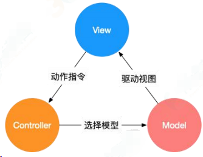

### （2）MVVM

MVVM 分为 Model、View、ViewModel：

Model 代表数据模型，数据和业务逻辑都在 Model 层中定义；
View 代表 UI 视图，负责数据的展示；

ViewModel 负责监听 Model 中数据的改变并且控制视图的更新，处理用户交互操作；

Model 和 View 并无直接关联，而是通过 ViewModel 来进行联系的，Model 和 ViewModel 之间有着双向数据绑定的联系。因此当 Model 中的数据改变时会触发 View 层的刷新，View 中由于用户交互操作而改变的数据也会在 Model 中同步。

这种模式实现了 Model 和 View 的数据自动同步，因此开发者只需要专注于数据的维护操作即可，而不需要自己操作 DOM。

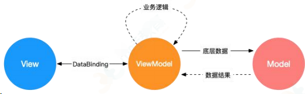

### （3）MVP

MVP 模式与 MVC 唯一不同的在于 Presenter 和 Controller。在 MVC 模式中使用观察者模式，来实现当 Model 层数据发生变化的时候，通知 View 层的更新。这样 View 层和 Model 层耦合在一起，当项目逻辑变得复杂的时候，可能会造成代码的混乱，并且可能会对代码的复用性造成一些问题。MVP 的模式通过使用 Presenter 来实现对 View 层和 Model 层的解耦。MVC 中的 Controller 只知道 Model 的接口，因此它没有办法控制 View 层的更新，MVP 模式中，View 层的接口暴露给了 Presenter 因此可以在 Presenter 中将 Model 的变化和 View 的变化绑定在一起，以此来实现 View 和
Model 的同步更新。这样就实现了对 View 和 Model 的解耦，Presenter 还包含了其他的响应逻辑。

## 十一.你了解哪些 Vue 性能优化方法？

答题思路：根据题目描述，这里主要探讨 Vue 代码层面的优化

### 1.路由懒加载

```js
const router = new VueRouter({
	routes: [{ path: "/foo", component: () => import("./Foo.vue") }],
});
```

### 2.keep-alive 缓存页面

```vue
<template>
	<div id="app">
		<keep-alive>
			<router-view />
		</keep-alive>
	</div>
</template>
```

### 3.使用 v-show 复用 DOM

```vue
<template>
	<div class="cell">
		<!--这种情况用v-show复用DOM，比v-if效果好-->
		<div v-show="value" class="on">
			<Heavy :n="10000" />
		</div>
		<section v-show="!value" class="off">
			<Heavy :n="10000" />
		</section>
	</div>
</template>
```

### 4.v-for 遍历避免同时使用 v-if

```vue
<template>
	<ul>
		<li v-for="user in activeUsers" :key="user.id">
			{{ user.name }}
		</li>
	</ul>
</template>
<script>
export default {
	computed: {
		activeUsers: function () {
			return this.users.filter(function (user) {
				return user.isActive;
			});
		},
	},
};
</script>
```

### 5.长列表性能优化

1.如果列表是纯粹的数据展示，不会有任何改变，就不需要做响应化

```vue
export default { data: () => ({ users: [] }), async created() { const users =
await axios.get("/api/users"); this.users = Object.freeze(users); } };
```

2.如果是大数据长列表，可采用虚拟滚动，只渲染少部分区域的内容

```vue
<recycle-scroller class="items" :items="items" :item-size="24">
    <template v-slot="{ item }">
        <FetchItemView
        :item="item"
        @vote="voteItem(item)"
        />
    </template>
</recycle-scroller>
```

> 参考：[vue-virtual-scroller](https://github.com/Akryum/vue-virtual-scroller)、[vue-virtual-scroll-list](https://github.com/tangbc/vue-virtual-scroll-list)

### 6.事件的销毁

Vue 组件销毁时，会自动解绑它的全部指令及事件监听器，但是仅限于组件本身的事件。

```vue
created() { this.timer = setInterval(this.refresh, 2000) }, beforeDestroy() {
clearInterval(this.timer) }
```

### 7.图片懒加载

对于图片过多的页面，为了加速页面加载速度，所以很多时候我们需要将页面内未出现在可视区域内的图片先不做加载， 等到滚动到可视区域后再去加载。

```vue

```

> 参考项目：[vue-lazyload](https://github.com/hilongjw/vue-lazyload)

### 8.第三方插件组件按需引入

像 element-ui 这样的第三方组件库可以按需引入避免体积太大。

```js
import Vue from "vue";
import { Button, Select } from "element-ui";

Vue.use(Button);
Vue.use(Select);
```

### 9.无状态的组件标记为函数式组件

```vue
<template functional>
	<div class="cell">
		<div v-if="props.value" class="on"></div>
		<section v-else class="off"></section>
	</div>
</template>
<script>
export default {
	props: ["value"],
};
</script>
```

### 10.子组件分割

```vue
<template>
	<div>
		<ChildComp />
	</div>
</template>
<script>
export default {
	components: {
		ChildComp: {
			methods: {
				heavy() {
					/* 耗时任务 */
				},
			},
			render(h) {
				return h("div", this.heavy());
			},
		},
	},
};
</script>
```

### 11.变量本地化

```vue
<template>
	<div :style="{ opacity: start / 300 }">
		{{ result }}
	</div>
</template>
<script>
import { heavy } from "@/utils";
export default {
	props: ["start"],
	computed: {
		base() {
			return 42;
		},
		result() {
			const base = this.base; // 不要频繁引用this.base
			let result = this.start;
			for (let i = 0; i < 1000; i++) {
				result += heavy(base);
			}
			return result;
		},
	},
};
</script>
```

### 12.SSR

略

```vue

```

## 十二.你对 Vue3.0 的新特性有没有了解？

根据尤大的 PPT 总结，Vue3.0 改进主要在以下几点：

- 更快
  - 虚拟 DOM 重写
  - 优化 slots 的生成
  - 静态树提升
  - 静态属性提升
  - 基于 Proxy 的响应式系统
- 更小：通过摇树优化核心库体积
- 更容易维护：TypeScript + 模块化
- 更加友好
  - 跨平台：编译器核心和运行时核心与平台无关，使得 Vue 更容易与任何平台（Web、Android、iOS）一起使用
- 更容易使用
  - 改进的 TypeScript 支持，编辑器能提供强有力的类型检查和错误及警告
  - 更好的调试支持
  - 独立的响应化模块
  - Composition API

### 虚拟 DOM 重写

期待更多的编译时提示来减少运行时开销，使用更有效的代码来创建虚拟节点。

组件快速路径+单个调用+子节点类型检测

- 跳过不必要的条件分支
- JS 引擎更容易优化


### 优化 slots 生成

vue3 中可以单独重新渲染父级和子级

- 确保实例正确的跟踪依赖关系
- 避免不必要的父子组件重新渲染


### 静态树提升(Static Tree Hoisting)

使用静态树提升，这意味着 Vue 3 的编译器将能够检测到什么是静态的，然后将其提升，从而降低了渲染成本。

- 跳过修补整棵树，从而降低渲染成本
- 即使多次出现也能正常工作

.jpg)

### 静态属性提升

使用静态属性提升，Vue 3 打补丁时将跳过这些属性不会改变的节点。


### 基于 Proxy 的数据响应式

Vue 2 的响应式系统使用 Object.defineProperty 的 getter 和 setter。Vue 3 将使用 ES2015 Proxy 作为
其观察机制，这将会带来如下变化：

组件实例初始化的速度提高 100％

- 使用 Proxy 节省以前一半的内存开销，加快速度，但是存在低浏览器版本的不兼容
- 为了继续支持 IE11，Vue 3 将发布一个支持旧观察者机制和新 Proxy 版本的构建


### 高可维护性

Vue 3 将带来更可维护的源代码。它不仅会使用 TypeScript，而且许多包被解耦，更加模块化。


## 十三.简单说一说 vuex 使用及其理解？

vue 中状态管理（登陆验证，购物车，播放器等）

### vuex 数据流程


### 1 vuex 介绍

Vuex 实现了一个单向数据流，在全局拥有一个 State 存放数据，当组件要更改 State 中的数据时，必须通过 Mutation 提交修改信息， Mutation 同时提供了订阅者模式供外部插件调用获取 State 数据的更新。

而当所有异步操作(常见于调用后端接口异步获取更新数据)或批量的同步操作需要走 Action ，但 Action 也是无法直接修改 State 的，还是需要通过 Mutation 来修改 State 的数据。最后，根据 State 的变化，渲染到视图上。

### 2 vuex 中核心概念

`state` ： vuex 的唯一数据源，如果获取多个 state ，可以使用 ...mapState 。

```js
export const store = new Vuex.Store({
    // 注意Store的S大写
    <!-- 状态储存 -->
    state: {
        productList: [
            {
                name: 'goods 1',
                price: 100
            }
        ]
    }
})
```

`getter` : 可以将 getter 理解为计算属性， getter 的返回值根据他的依赖缓存起来，依赖发
生变化才会被重新计算。

```js
import Vue from "vue";
import Vuex from "vuex";
Vue.use(Vuex);

export const store = new Vuex.Store({
	state: {
		productList: [
			{
				name: "goods 1",
				price: 100,
			},
		],
	},
	// 辅助对象 mapGetter
	getters: {
		getSaledPrice: (state) => {
			let saleProduct = state.productList.map((item) => {
				return {
					name: "**" + item.name + "**",
					price: item.price / 2,
				};
			});
			return saleProduct;
		},
	},
});
```

获取 getter 计算后的值

```js
// 获取getter计算后的值
export default {
	data() {
		return {
			productList: this.$store.getters.getSaledPrice,
		};
	},
};
```

`mutation` ：更改 state 中唯一的方法是提交 mutation 都有一个字符串和一个回调函数。回调函数就是使劲进行状态修改的地方。并且会接收 state 作为第一个参数 payload 为第二个参数， payload 为自定义函数， mutation 必须是同步函数。

辅助对象 mapMutations

```js
// 辅助对象 mapMutations
mutations: {
    <!-- payload 为自定义函数名-->
    reducePrice: (state, payload) => {
        return state.productList.forEach((product) => {
        	product.price -= payload;
        })
    }
}
```

页面使用

```vue
methods: { reducePrice(){ this.$store.commit('reducePrice', 4) } }
```

`action` ： action 类似 mutation 都是修改状态，不同之处,

> action 提交的 mutation 不是直接修改状态
> action 可以包含异步操作，而 mutation 不行
> action 中的回调函数第一个参数是 context ，是一个与 store 实例具有相同属性的
> 方法的对象
> action 通过 store.dispatch 触发， mutation 通过 store.commit 提交

```js
actions: {
	// 提交的是mutation，可以包含异步操作
	reducePriceAsync: (context, payload) => {
		setTimeout(() => {
			context.commit("reducePrice", payload); // reducePrice为上一步mutation中的属性
		}, 2000);
	};
}
```

页面使用

```vue
// 辅助对象 mapActions methods: { reducePriceAsync(){
this.$store.dispatch('reducePriceAsync', 2) }, }
```

`module` ：由于是使用单一状态树，应用的所有状态集中到比较大的对象，当应用变得非常复杂是， store 对象就有可能变得相当臃肿。为了解决以上问题， vuex 允许我们将 store 分割成模块，每个模块拥有自己的 state,mutation,action,getter ,甚至是嵌套子模块从上至下进行同样方式分割。

```js
const moduleA = {
    state: {...},
    mutations: {...},
    actions: {...},
    getters: {...}
}
const moduleB = {
    state: {...},
    mutations: {...},
    actions: {...},
    getters: {...}
}
const store = new Vuex.Store({
    a: moduleA,
    b: moduleB
})
store.state.a
store.state.b
```

### 3 vuex 中数据存储 localStorage

vuex 是 vue 的状态管理器，存储的数据是响应式的。但是并不会保存起来，刷新之后就回到了初始状态，具体做法应该在 vuex 里数据改变的时候把数据拷贝一份保存到 localStorage 里面，刷新之后，如果 localStorage 里有保存的数据，取出来再替换 store 里的 state 。

例：

```js
let defaultCity = "上海";
try {
	// 用户关闭了本地存储功能，此时在外层加个try...catch
	if (!defaultCity) {
		// f复制一份
		defaultCity = JSON.parse(window.localStorage.getItem("defaultCity"));
	}
} catch (e) {
	console.log(e);
}
export default new Vuex.Store({
	state: {
		city: defaultCity,
	},
	mutations: {
		changeCity(state, city) {
			state.city = city;
			try {
				window.localStorage.setItem("defaultCity", JSON.stringify(state.city));
				// 数据改变的时候把数据拷贝一份保存到localStorage里面
			} catch (e) {}
		},
	},
});
```

注意：vuex 里保存的状态，都是数组，而 localStorage 只支持字符串。

总结：

- 首先说明 Vuex 是一个专为 Vue.js 应用程序开发的状态管理模式。它采用集中式存储管理应用的所
- 有组件的状态，并以相应的规则保证状态以一种可预测的方式发生变化。
- vuex 核心概念 重点同步异步实现 action mutation
- vuex 中做数据存储 --------- local storage
- 如何选用 vuex

## 十四.vue-router 中的导航钩子由那些？

### 1.全局的钩子函数

- beforeEach (to，from，next) 路由改变前调用

- 常用验证用户权限

- beforeEach ()参数

  - to ：即将要进入的目标路由对象

  - from：当前正要离开的路由对象

  - next：路由控制参数

  - next()：如果一切正常，则调用这个方法进入下一个钩子

  - next(false)：取消导航（即路由不发生改变）

  - next('/login')：当前导航被中断，然后进行一个新的导航

  - next(error)：如果一个 Error 实例，则导航会被终止且该错误会被传递给 router.onError ()

- afterEach (to，from) 路由改变后的钩子
  - 常用自动让页面返回最顶端
  - 用法相似，少了 next 参数

```js
router.beforeEach((to, from, next) => {
	console.log(to.fullPath);
	if (to.fullPath != "/login") {
		// 如果不是登录组件
		if (!localStorage.getItem("username")) {
			// 如果没有登录，就先进入login组件进行登录
			next("/login");
		} else {
			// 如果登录了，那就继续
			next();
		}
	} else {
		// 如果是登录组件，那就继续。
		next();
	}
});
```

### 2.路由配置中的导航钩子

- beforeEnter (to，from，next)

```js
const router = new VueRouter({
	routes: [
		{
			path: "/foo",
			component: Foo,
			beforeEnter: (to, from, next) => {
				// ...
			},
			beforeEnter: (route) => {
				// ...
			},
		},
	],
});
```

### 3.组件内的钩子函数

- 钩子函数介绍
- 1.beforeRouteEnter (to,from,next)
  - 该组件的对应路由被 comfirm 前调用。
  - 此时实例还没被创建，所以不能获取实例（this）
- 2.beforeRouteUpdate (to,from,next)
  - 当前路由改变，但改组件被复用时候调用
  - 该函数内可以访问组件实例(this)
- 3.beforeRouteLeave (to,from,next)
  - 当导航离开组件的对应路由时调用。
  - 该函数内可以访问获取组件实例（this）

```js
const Foo = {
	template: `...`,
	beforeRouteEnter(to, from, next) {
		// 在渲染该组件的对应路由被 confirm 前调用
		// 不！能！获取组件实例 `this`
		// 因为当钩子执行前，组件实例还没被创建
	},
	beforeRouteUpdate(to, from, next) {
		// 在当前路由改变，但是该组件被复用时调用
		// 举例来说，对于一个带有动态参数的路径 /foo/:id，在 /foo/1 和 /foo/2 之间跳转的时候，
		// 由于会渲染同样的 Foo 组件，因此组件实例会被复用。而这个钩子就会在这个情况下被调用。
		// 可以访问组件实例 `this`
	},
	beforeRouteLeave(to, from, next) {
		// 导航离开该组件的对应路由时调用
		// 可以访问组件实例 `this`
	},
};
```

### 4.路由监测变化

监听到路由对象发生变化，从而对路由变化做出响应

```js
const user = {
    template:'<div></div>',
    watch: {
        '$route' (to, from){
            // 对路由做出响应
            // to , from 分别表示从哪跳转到哪，都是一个对象
            // to.path ( 表示的是要跳转到的路由的地址 eg: /home );
    	}
    }
}
// 多了一个watch，这会带来依赖追踪的内存开销，
// 修改
const user = {
    template:'<div></div>',
    watch: {
        '$route.query.id' {
        	// 请求个人描述
        },
        '$route.query.page' {
        	// 请求列表
        }
    }
}
```

总结：

路由中的导航钩子有三种

- 全局
- 组件
- 路由配置

在做页面登陆权限时候可以使用到路由导航配置 （举例两三个即可）

监听路由变化怎么做

> 使用 watch 来对$route 监听

## 十五.什么是递归组件？

概念：组件是可以在它们自己的模板中调用自身的。

递归组件，一定要有一个结束的条件，否则就会使组件循环引用，最终出现的错误，我们可以使用 vif="false"作递归组件的结束条件。当遇到 v-if 为 false 时，组件将不会再进行渲染。

既然要用递归组件，那么对我们的数据格式肯定是需要满足递归的条件的。就像下边这样，这是一个树状的递归数据。

```js
// tree组件数据
list: [
	{
		name: "web全栈工程师",
		cList: [
			{ name: "vue" },
			{
				name: "react",
				cList: [
					{
						name: "javascrict",
						cList: [{ name: "css" }],
					},
				],
			},
		],
	},
	{ name: "web高级工程师" },
	{
		name: "web初级工程师",
		cList: [{ name: "javascript" }, { name: "css" }],
	},
];
```

案例：

```vue
<template>
	<div>
		<ul>
			<li v-for="(item, index) in list" :key="index">
				<p>{{ item.name }}</p>
				<tree-muen :list="list" />
			</li>
		</ul>
	</div>
</template>
<script>
export default {
    components: {
    	treeMuen
    },
    data () {
    	return {
            list: [
                {
                    name: "web全栈工程师",
                    cList: [
                        { name: "vue" },
                        {
                            name: "react",
                            cList: [
                                {
                                    name: "javascrict",
                                    cList: [{ name: "css" }],
                                },
                            ],
                        },
                    ],
                },
                { name: "web高级工程师" },
                {
                    name: "web初级工程师",
                    cList: [{ name: "javascript" }, { name: "css" }],
                },
            ];
        }
    },
    methods: {}
}
</script>
```

总结：

通过 props 从父组件拿到数据，递归组件每次进行递归的时候都会 tree-menus 组件传递下一级 treeList 数据，整个过程结束之后，递归也就完成了，对于折叠树状菜单来说，我们一般只会去渲染一级的数据，当点击一级菜单时，再去渲染一级菜单下的结构，如此往复。那么 v-if 就可以实现我们的这个需求，当 v-if 设置为 false 时，递归组件将不会再进行渲染，设置为 true 时，继续渲染。

总结：

简述递归组件的实现和概念，可以封装成什么样的组件（收缩框）

使用它有什么优点

## keep-alive 组件有什么作用

如果你需要在组件切换的时候，保存一些组件的状态防止多次渲染，就可以使用 keep-alive 组件包裹需要保存的组件。

对于 keep-alive 组件来说，它拥有两个独有的生命周期钩子函数，分别为 activated 和 deactivated 。用 keep-alive 包裹的组件在切换时不会进行销毁，而是缓存到内存中并执行 deactivated 钩子函数，命中缓存渲染后会执行 actived 钩子函数。

## v-show 与 v-if 区别

v-show 只是在 display: none 和 display: block 之间切换。无论初始条件是什么都会被渲染出来，后面只需要切换 CSS ， DOM 还是一直保留着的。所以总的来说 v-show 在初始渲染时有更高的开销，但是切换开销很小，更适合于频繁切换的场景。

v-if 的话就得说到 Vue 底层的编译了。当属性初始为 false 时，组件就不会被渲染，直到条件为 true ，并且切换条件时会触发销毁/挂载组件，所以总的来说在切换时开销更高，更适合不经常切换的场景。

并且基于 v-if 的这种惰性渲染机制，可以在必要的时候才去渲染组件，减少整个页面的初始渲染开销。

## Vue 生命周期钩子函数

- 在 beforeCreate 钩子函数调用的时候，是获取不到 props 或者 data 中的数据的，因为这些数据的初始化都在 initState 中。
- 然后会执行 created 钩子函数，在这一步的时候已经可以访问到之前不能访问到的数据，但是这时候组件还没被挂载，所以是看不到的。
- 接下来会先执行 beforeMount 钩子函数，开始创建 VDOM ，最后执行 mounted 钩子，并将 VDOM 渲染为真实 DOM 并且渲染数据。组件中如果有子组件的话，会递归挂载子组件，只有当所有子组件全部挂载完毕，才会执行根组件的挂载钩子。
- 接下来是数据更新时会调用的钩子函数 beforeUpdate 和 updated ，这两个钩子函数没什么好说的，就是分别在数据更新前和更新后会调用。
- 另外还有 keep-alive 独有的生命周期，分别为 activated 和 deactivated 。用 keep-alive 包裹的组件在切换时不会进行销毁，而是缓存到内存中并执行 deactivated 钩子函数，命中缓存渲染后会执行 actived 钩子函数。
- 最后就是销毁组件的钩子函数 beforeDestroy 和 destroyed 。前者适合移除事件、定时器等等，否则可能会引起内存泄露的问题。然后进行一系列的销毁操作，如果有子组件的话，也会递归销毁子组件，所有子组件都销毁完毕后才会执行根组件的 destroyed 钩子函数

### init

- initLifecycle/Event ，往 vm 上挂载各种属性
- callHook: beforeCreated : 实例刚创建
- initInjection/initState : 初始化注入和 data 响应性
- created: 创建完成，属性已经绑定， 但还未生成真实 dom`
- 进行元素的挂载： $el / vm.$mount()
- 是否有 template : 解析成 render function
  - \*.vue 文件: vue-loader 会将 `<template>` 编译成 render function
- beforeMount : 模板编译/挂载之前
- 执行 render function ，生成真实的 dom ，并替换到 dom tree 中
- mounted : 组件已挂载

### update

- 执行 diff 算法，比对改变是否需要触发 UI 更新
- flushScheduleQueue
- watcher.before : 触发 beforeUpdate 钩子 - watcher.run() : 执行 watcher 中的 notify ，通知所有依赖项更新 UI
- 触发 updated 钩子: 组件已更新
- actived / deactivated(keep-alive) : 不销毁，缓存，组件激活与失活
- destroy
  - beforeDestroy : 销毁开始
  - 销毁自身且递归销毁子组件以及事件监听
    - remove() : 删除节点
    - watcher.teardown() : 清空依赖
    - vm.$off() : 解绑监听
  - destroyed : 完成后触发钩子

上面是 vue2 的声明周期的简单梳理，接下来我们直接以代码的形式来完成 vue2 的初始化。

```js
new Vue({});
// 初始化Vue实例
function _init() {
	// 挂载属性
	initLifeCycle(vm);
	// 初始化事件系统，钩子函数等
	initEvent(vm);
	// 编译slot、vnode
	initRender(vm);
	// 触发钩子
	callHook(vm, "beforeCreate");
	// 添加inject功能
	initInjection(vm);
	// 完成数据响应性 props/data/watch/computed/methods
	initState(vm);
	// 添加 provide 功能
	initProvide(vm);
	// 触发钩子
	callHook(vm, "created");
	// 挂载节点
	if (vm.$options.el) {
		vm.$mount(vm.$options.el);
	}
}
// 挂载节点实现
function mountComponent(vm) {
	// 获取 render function
	if (!this.options.render) {
		// template to render
		// Vue.compile = compileToFunctions
		let { render } = compileToFunctions();
		this.options.render = render;
	}
	// 触发钩子
	callHook("beforeMounte");
	// 初始化观察者
	// render 渲染 vdom，
	vdom = vm.render();
	// update: 根据 diff 出的 patchs 挂载成真实的 dom
	vm._update(vdom);
	// 触发钩子
	callHook(vm, "mounted");
}
// 更新节点实现
function queueWatcher(watcher) {
	nextTick(flushScheduleQueue);
}
// 清空队列
function flushScheduleQueue() {
	// 遍历队列中所有修改
	for () {
		// beforeUpdate
		watcher.before();

		// 依赖局部更新节点
		watcher.update();
		callHook("updated");
	}
}
// 销毁实例实现
Vue.prototype.$destory = function () {
	// 触发钩子
	callHook(vm, "beforeDestory");
	// 自身及子节点
	remove();
	// 删除依赖
	watcher.teardown();
	// 删除监听
	vm.$off();
	// 触发钩子
	callHook(vm, "destoryed");
};
```

## 请详细说下你对 vue 生命周期的理解

答：总共分为 8 个阶段创建前/后，载入前/后，更新前/后，销毁前/后

- 创建前/后： 在 beforeCreate 阶段， vue 实例的挂载元素 el 和数据对象 data 都为 undefined ，还未初始化。在 created 阶段， vue 实例的数据对象 data 有了，el 还没有
- 载入前/后：在 beforeMount 阶段， vue 实例的 $el 和 data 都初始化了，但还是挂载之前为虚拟的 dom 节点， `data.message` 还未替换。在 mounted 阶段， vue 实例挂载完成， `data.message` 成功渲染。
- 更新前/后：当 data 变化时，会触发 beforeUpdate 和 updated 方法
- 销毁前/后：在执行 destroy 方法后，对 data 的改变不会再触发周期函数，说明此时 vue 实例已经解除了事件监听以及和 dom 的绑定，但是 dom 结构依然存在

### 什么是 vue 生命周期？

答： Vue 实例从创建到销毁的过程，就是生命周期。从开始创建、初始化数据、编译模板、挂载 Dom→ 渲染、更新 → 渲染、销毁等一系列过程，称之为 Vue 的生命周期。

### vue 生命周期的作用是什么？

答：它的生命周期中有多个事件钩子，让我们在控制整个 Vue 实例的过程时更容易形成好的逻辑。

### vue 生命周期总共有几个阶段？

答：它可以总共分为 8 个阶段：创建前/后、载入前/后、更新前/后、销毁前/销毁后。

### 第一次页面加载会触发哪几个钩子？

答：会触发下面这几个 beforeCreate 、created 、beforeMount、mounted。

### DOM 渲染在哪个周期中就已经完成？

答： DOM 渲染在 mounted 中就已经完成了

## 实现 Vue SSR

### 其基本实现原理

- app.js 作为客户端与服务端的公用入口，导出 Vue 根实例，供客户端 entry 与服务端 entry 使用。客户端 entry 主要作用挂载到 DOM 上，服务端 entry 除了创建和返回实例，还进行路由匹配与数据预获取。
- webpack 为客服端打包一个 Client Bundle ，为服务端打包一个 Server Bundle 。
- 服务器接收请求时，会根据 url ，加载相应组件，获取和解析异步数据，创建一个读取 Server Bundle 的 BundleRenderer ，然后生成 html 发送给客户端。
- 客户端混合，客户端收到从服务端传来的 DOM 与自己的生成的 DOM 进行对比，把不相同的 DOM 激活，使其可以能够响应后续变化，这个过程称为客户端激活 。为确保混合成功，客户端与服务器端需要共享同一套数据。在服务端，可以在渲染之前获取数据，填充到 stroe 里，这样，在客户端挂载到 DOM 之前，可以直接从 store 里取数据。首屏的动态数据通过 window.**INITIAL_STATE** 发送到客户端
  - Vue SSR 的实现，主要就是把 Vue 的组件输出成一个完整 HTML , vue-server-renderer 就是⼲这事的
- Vue SSR 需要做的事多点（输出完整 HTML），除了 complier -> vnode ，还需如数据获取填充⾄ HTML 、客户端混合（ hydration ）、缓存等等。 相比于其他模板引擎（ ejs , jade 等），最终要实现的目的是一样的，性能上可能要差点

## Vue 组件 data 为什么必须是函数

每个组件都是 Vue 的实例。

组件共享 data 属性，当 data 的值是同一个引用类型的值时，改变其中一个会影响其他

## Vue computed 实现

- 建立与其他属性（如： data 、 Store ）的联系；
- 属性改变后，通知计算属性重新计算

实现时，主要如下：

- 初始化 data ， 使用 Object.defineProperty 把这些属性全部转为 getter/setter 。
- 初始化 computed , 遍历 computed 里的每个属性，每个 computed 属性都是一个 watch 实例。每个属性提供的函数作为属性的 getter ，使用 Object.defineProperty 转化。
- Object.defineProperty getter 依赖收集。用于依赖发生变化时，触发属性重新计算。
- 若出现当前 computed 计算属性嵌套其他 computed 计算属性时，先进行其他的依赖收集

## Vue complier 实现

模板解析这种事，本质是将数据转化为一段 html ，最开始出现在后端，经过各种处理吐给前端。随着各种 mv\* 的兴起，模板解析交由前端处理。

总的来说， Vue complier 是将 template 转化成一个 render 字符串。

可以简单理解成以下步骤：

- parse 过程，将 template 利用正则转化成 AST 抽象语法树。
- optimize 过程，标记静态节点，后 diff 过程跳过静态节点，提升性能。
- generate 过程，生成 render 字符串

### 怎么快速定位哪个组件出现性能问题

[如何使用 chrome Timeline 工具-CSDN 博客](https://blog.csdn.net/weixin_44786530/article/details/126965084)

用 chrome timeline 工具。 大意是通过 timeline 来查看每个函数的调用时常，定位出哪个函数的问题，从而能判断哪个组件出了问题

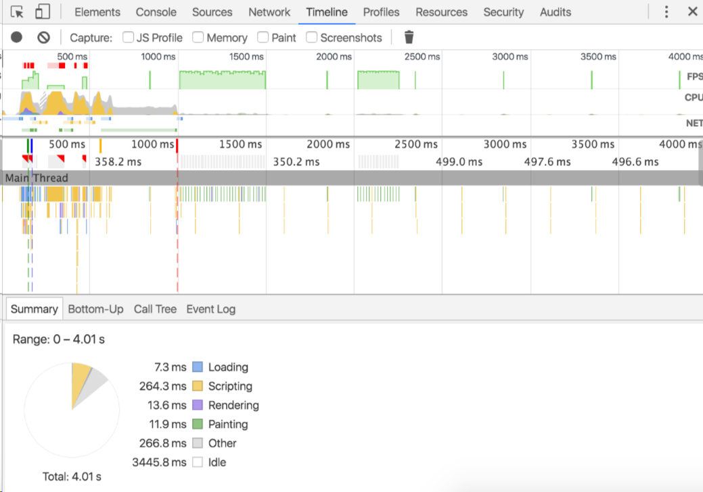

## Proxy 相比于 defineProperty 的优势

数组变化也能监听到

不需要深度遍历监听

```js
let data = { a: 1 };
let reactiveData = new Proxy(data, {
	get: function (target, name) {
		// ...
	},
	// ...
});
```

## 十六.说一说 vue 响应式理解？

响应式实现：

- object.defineProperty
- proxy(兼容性不太好)


observer 类

```js
/** observer 类会附加到每一个被侦测的object上
 * 一旦被附加上，observer会被object的所有属性转换为getter/setter的形式
 * 当属性发生变化时候及时通知依赖
 */
// Observer 实例
export class Observer {
	constructor(value) {
		this.value = value;
		if (!Array.isArray(value)) {
			// 判断是否是数组
			this.walk(value); // 劫持对象
		}
	}
	walk(obj) {
		// 将会每一个属性转换为getter/setter 形式来侦测数据变化
		const keys = Object.keys(obj);
		for (let i = 0; i < keys.length; i++) {
			defineReactive(obj, keys[i], obj[key[i]]); // 数据劫持方法
		}
	}

	defineReactive(data, key, val) {
		// 递归属性
		if (typeof val === "object") {
			new Obeserve(val);
		}
		let dep = new Dep();
		Object.defineProperty(data, key, {
			enumerable: true,
			configurable: true,
			get: function () {
				dep.depend();
				return val;
			},
			set: function (newVal) {
				if (val === newVal) {
					return;
				}
				val = newVal;
				dep.notify();
			},
		});
	}
}
```

> 定义了 observer 类，用来将一个正常的 object 转换成被侦测的 object 然后判断数据类型
> 只有 object 类型才会调用 walk 将每一个属性转换成 getter/setter 的形式来侦测变化
> 最后在 defineReactive 中新增 new Observer（val）来递归子属性
> 当 data 中的属性变化时，与这个属性对应的依赖就会接收通知

dep 依赖收集

> getter 中收集依赖，那么这些依赖收集到那？

```js
export default class Dep {
	constructor() {
		this.subs = []; // 观察者集合
	}
	// 添加观察者
	addSub(sub) {
		this.subs.push(sub);
	}
	// 移除观察者
	removeSub(sub) {
		remove(this.subs, sub);
	}
	depend() {
		// 核心，如果存在 ，则进行依赖收集操作
		if (window.target) {
			this.addDep(window.target);
		}
	}
	notify() {
		const subs = this.subs.slice(); // 避免污染原来的集合
		// 如果不是异步执行，先进行排序，保证观察者执行顺序
		if (process.env.NODE_ENV !== "production" && !config.async) {
			subs.sort((a, b) => a.id - b.id);
		}
		for (let i = 0, l = subs.length; i < l; i++) {
			subs[i].update(); // 发布执行
		}
	}
}
function remove(arr, item) {
	if (arr.length) {
		const index = arr.indexOf(item);
		if (index > -1) {
			return arr.splice(index, 1);
		}
	}
}
```

> 收集的依赖时 window.target ,他到以是什么？
> 当属性变化时候我们通知谁？

watcher

是一个中介的角色，数据发生变化时通知它，然后它再去通知其他地方

```js
export default class Watcher {
	constructor(vm, expOrFn, cb) {
		// 组件实例对象
		// 要观察的表达式，函数，或者字符串，只要能触发取值操作
		// 被观察者发生变化后的回调
		this.vm = vm; // Watcher有一个 vm 属性，表明它是属于哪个组件的
		// 执行this.getter()及时读取数据
		this.getter = parsePath(expOrFn);
		this.cb = cb;
		this.value = this.get();
	}
	get() {
		window.target = this;
		let value = this.getter.call(this.vm, this.vm);
		window.target = undefined;
		return value;
	}
	update() {
		const oldValue = this.value;
		this.value = this.get();
		this.cb.call(this.vm, this.value, oldValue);
	}
}
```

总结
data 通过 Observer 转换成了 getter/setter 的形式来追踪变化
当外界通过 Watcher 读取数据的，会触发 getter 从而将 watcher 添加到依赖中

当数据变化时，会触发 setter 从而向 Dep 中的依赖（watcher）发送通知

watcher 接收通知后，会向外界发送通知，变化通知到外界后可能会触发视图更新，也有可能触发用户的某个回调函数等

什么是响应式

我们先来看个例子：

```html
<div id="app">
	<div>Price :￥{{ price }}</div>
	<div>Total:￥{{ price * num }}</div>
	<div>Taxes: ￥{{ totalPrice }}</div>
	<button @click="changePrice">改变价格</button>
</div>

var app = new Vue({ el: '#app', data() { return { price: 5.0, num: 2 }; },
computed: { totalPrice() { return this.price * this.num * 1.03; } }, methods: {
changePrice() { this.price = 10; } } })
```


上例中当 price 发生变化的时候， Vue 就知道自己需要做三件事情：

- 更新页面上 price 的值
- 计算表达式 price \* num 的值，更新页面
- 调用 totalPrice 函数，更新页面

数据发生变化后，会重新对页面渲染，这就是 Vue 响应式 ！

想完成这个过程，我们需要：

- 侦测数据的变化
- 收集视图依赖了哪些数据
- 数据变化时，自动“通知”需要更新的视图部分，并进行更新

对应专业俗语分别是：

- 数据劫持 / 数据代理
- 依赖收集
- 发布订阅模式

## 十七.vue 如果想要扩展某个组件现有组件时怎么做？

### 1.使用 Vue.mixin 全局混入

**混入 (mixins) 是一种分发 Vue 组件中可复用功能的非常灵活的方式。混入对象可以包含任意组件选项。当组件使用混入对象时，所有混入对象的选项将被混入该组件本身的选项**。mixins 选项接受一个混合对象的数组。

```vue
<template>
	<div id="app">
		<p>num:{{ num }}</p>
		<P>
			<button @click="add">增加数量</button>
		</P>
	</div>
</template>
<script>
var addLog = {
	// 额外临时加入时，用于显示日志
	updated: function () {
		console.log("数据发生变化,变化成" + this.num + ".");
	},
};
export default {
	name: "app",
	data() {
		return {
			num: 1,
		};
	},
	methods: {
		add() {
			this.num++;
		},
	},
	updated() {
		console.log("我是原生的update");
	},
	mixins: [addLog], //混入
};
</script>
<style></style>
```

混入

```js
Vue.mixin({
	// 全局注册一个混入，影响注册之后所有创建的每个 Vue 实例
	updated: function () {
		console.log("我是全局的混入");
	},
});
```

mixins 的调用顺序:

上例说明了：从执行的先后顺序来说，混入对象的钩子将在组件自身钩子之前调用，如果遇到全局混入(Vue.mixin)，全局混入的执行顺序要前于混入和组件里的方法。

### 2.加 slot 扩展

- #### 默认插槽和匿名插槽

slot 用来获取组件中的原内容。

```vue
<template id="hello">
	<div>
		<h3>kaikeba</h3>
		<slot>如果没有原内容，则显示该内容</slot>// 默认插槽
	</div>
</template>
<script>
var vm = new Vue({
	el: "#app",
	components: {
		"my-hello": {
			template: "#hello",
		},
	},
});
</script>
```

- #### 具名插槽

```html
<div id="itany">
	<my-hello>
		<ul slot="s1">
			<li>aaa</li>
			<li>bbb</li>
			<li>ccc</li>
		</ul>
		<ol slot="s2">
			<li>111</li>
			<li>222</li>
			<li>333</li>
		</ol>
	</my-hello>
</div>
<template id="hello">
	<div>
		<slot name="s2"></slot>
		<h3>welcome to kaikeba</h3>
		<slot name="s1"></slot>
	</div>
</template>
<script>
	var vm = new Vue({
		el: "#itany",
		components: {
			"my-hello": {
				template: "#hello",
			},
		},
	});
</script>
```

总结：

1. 使用 mixin 全局混入
2. 使用 slot 扩展

## 十八.vue 为什么要求组件模版只能有一个根元素?

从三方面考虑：

1. new Vue({el:'#app'})
2. 单文件组件中，template 下的元素 div。其实就是"树"状数据结构中的"根"。
3. diff 算法要求的，源码中，patch.js 里 patchVnode()。

实例化 Vue 时：

```html
<body>
	<div id="app"></div>
</body>
<script>
	var vm = new Vue({
		el: "#app",
	});
</script>
```

如果我在 body 下这样：

```html
<body>
	<div id="app1"></div>
	<div id="app2"></div>
</body>
```

Vue 其实并不知道哪一个才是我们的入口。如果同时设置了多个入口，那么 vue 就不知道哪一个才是这个‘类’。

在 webpack 搭建的 vue 开发环境下，使用单文件组件时：

```vue
<template>
	<div></div>
</template>
```

template 这个标签，它有三个特性：

1. 隐藏性：该标签不会显示在页面的任何地方，即便里面有多少内容，它永远都是隐藏的状态，设置
   了 display：none；
2. 任意性：该标签可以写在任何地方，甚至是 head、body、sciprt 标签内；
3. 无效性：该标签里的任何 HTML 内容都是无效的，不会起任何作用；只能 innerHTML 来获取到里面
   的内容。

一个 vue 单文件组件就是一个 vue 实例，如果 template 下有多个 div 那么如何指定 vue 实例的根入口呢，为了让组件可以正常生成一个 vue 实例，这个 div 会自然的处理成程序的入口，通过这个根节点，来递归遍历整个 vue 树下的所有节点，并处理为 vdom，最后再渲染成真正的 HTML，插入在正确的位置。

diff 中 patchvnode 方法，用来比较新旧节点，我们一起来看下源码。

#### 总结

1. new Vue({el:'#app'})
2. 单文件组件中，template 下的元素 div。其实就是"树"状数据结构中的"根"。
3. diff 算法要求的，源码中，patch.js 里 patchVnode()。

## 十九.watch 和 computed 的区别以及怎么选用?

- computed 是计算属性，依赖其他属性计算值，并且 computed 的值有缓存，只有当计算值变化才会返回内容。
- watch 监听到值的变化就会执行回调，在回调中可以进行一些逻辑操作。
- 所以一般来说需要依赖别的属性来动态获得值的时候可以使用 computed ，对于监听到值的变化需要做一些复杂业务逻辑的情况可以使用 watch 。

### 区别

#### 1.定义/语义区别

**watch**

```vue
<input type="text" v-model="foo" />

var vm = new Vue({ el: '#demo', data: { foo: 1 }, watch: { foo: function
(newVal,oldVal) { console.log(newVal+''+oldVal) } } }) vm.foo = 2 // 2 1
```

**computed**

```js
var vm = new Vue({
	el: "#demo",
	data: {
		firstName: "Foo",
		lastName: "Bar",
	},
	computed: {
		fullName: function () {
			return this.firstName + " " + this.lastName;
		},
	},
});
vm.fullName; // Foo Bar computed内部的函数调用的时候不需要加()
```

#### 2.功能区别

watch 更通用，computed 派生功能都能实现，计算属性底层来自于 watch，但做了更多，例如缓存

#### 3.用法区别

computed 更简单/更高效，优先使用

有些必须 watch，比如值变化要和后端交互

### 使用场景

#### watch

watch 需要在数据变化时执行异步或开销较大的操作时使用，简单讲，当一条数据影响多条数据的时候，例如 搜索数据

#### computed

对于任何复杂逻辑或一个数据属性在它所依赖的属性发生变化时，也要发生变化，简单讲。当一个属性受多个属性影响的时候，例如 购物车商品结算时

## 二十.你知道 nextTick 的原理吗?

nextTick 官方文档的解释，它可以在 DOM 更新完毕之后执行一个回调

```js
// 修改数据
vm.msg = "Hello";
// DOM 还没有更新
Vue.nextTick(function () {
	// DOM 更新了
});
```

尽管 MVVM 框架并不推荐访问 DOM，但有时候确实会有这样的需求，尤其是和第三方插件进行配合的时候，免不了要进行 DOM 操作。而 nextTick 就提供了一个桥梁，确保我们操作的是更新后的 DOM。

### NextTick 原理分析

nextTick 可以让我们在下次 DOM 更新循环结束之后执行延迟回调，用于
获得更新后的 DOM 。

- 在 Vue 2.4 之前都是使用的 microtasks ，但是 microtasks 的优先级过高，在某些情况下可能会出现比事件冒泡更快的情况，但如果都使用 macrotasks ⼜可能会出现渲染的性能问题。所以在新版本中，会默认使用 microtasks ，但在特殊情况下会使用 macrotasks ，比如 v-on 。
- macrotasks 任务的实现：`setImmediate` / `MessageChannel` / `setTimeout`
- 对于实现 macrotasks ，会先判断是否能使用 setImmediate ，不能的话降级为 MessageChannel ，以上都不行的话就使用 setTimeout

```js
if (typeof setImmediate !== "undefined" && isNative(setImmediate)) {
	macroTimerFunc = () => {
		setImmediate(flushCallbacks);
	};
} else if (
	typeof MessageChannel !== "undefined" &&
	(isNative(MessageChannel) ||
		// PhantomJS
		MessageChannel.toString() === "[object MessageChannelConstructor]")
) {
	const channel = new MessageChannel();
	const port = channel.port2;
	channel.port1.onmessage = flushCallbacks;
	macroTimerFunc = () => {
		port.postMessage(1);
	};
} else {
	macroTimerFunc = () => {
		setTimeout(flushCallbacks, 0);
	};
}
```

以上代码很简单，就是判断能不能使用相应的 API

### 问：Vue 如何检测到 DOM 更新完毕呢？

H5 新增的能监听到 DOM 改动的 API：`MutationObserver`

#### 理解 MutationObserver

MutationObserver 是 HTML5 新增的属性，用于监听 DOM 修改事件，能够监听到节点的属性、文本内容、子节点等的改动，是一个功能强大的利器。

```js
//MutationObserver基本用法
var observer = new MutationObserver(function () {
	//这里是回调函数
	console.log("DOM被修改了！");
});
var article = document.querySelector("article");

observer.observer(article);
```

vue 是不是用 MutationObserver 来监听 DOM 更新完毕的呢？

vue 的源码中实现 nextTick 的地方：

```js
//vue@2.2.5 /src/core/util/env.js
if (
	typeof MutationObserver !== "undefined" &&
	(isNative(MutationObserver) ||
		MutationObserver.toString() === "[object MutationObserverConstructor]")
) {
	var counter = 1;
	var observer = new MutationObserver(nextTickHandler);
	var textNode = document.createTextNode(String(counter));
	observer.observe(textNode, {
		characterData: true,
	});
	timerFunc = () => {
		counter = (counter + 1) % 2;
		textNode.data = String(counter);
	};
}
```

### JavaScript 事件循环机制（Event Loop）

在 js 的运行环境中，通常伴随着很多事件的发生，比如用户点击、页面渲染、脚本执行、网络请求，等等。为了协调这些事件的处理，浏览器使用事件循环机制。

简要来说，事件循环会维护一个或多个任务队列（task queues），以上提到的事件作为任务源往队列中加入任务。有一个持续执行的线程来处理这些任务，每执行完一个就从队列中移除它，这就是一次事件循环。


```js
for (let i = 0; i < 100; i++) {
	dom.style.left = i + "px";
}
```

事实上，这 100 次 for 循环同属一个 task，浏览器只在该 task 执行完后进行一次 DOM 更新。

只要让 nextTick 里的代码放在 UI render 步骤后面执行，岂不就能访问到更新后的 DOM 了？

> vue 就是这样的思路，并不是用 MO 进行 DOM 变动监听，而是用队列控制的方式达到目的。那么
> vue 又是如何做到队列控制的呢？我们可以很自然的想到 setTimeout，把 nextTick 要执行的代码
> 当作下一个 task 放入队列末尾。
> vue 的数据响应过程包含：数据更改->通知 Watcher->更新 DOM。而数据的更改不由我们控制，
> 可能在任何时候发生。如果恰巧发生在重绘之前，就会发生多次渲染。这意味着性能浪费，是 vue
> 不愿意看到的。
> 所以，vue 的队列控制是经过了深思熟虑的。在这之前，我们还需了解 event loop 的另一个重要概
> 念，microtask。

### microtask 微任务

每一次事件循环都包含一个 microtask 队列，在循环结束后会依次执行队列中的 microtask 并移除，然后再开始下一次事件循环。

在执行 microtask 的过程中后加入 microtask 队列的微任务，也会在下一次事件循环之前被执行。也就是说，macrotask 总要等到 microtask 都执行完后才能执行，microtask 有着更高的优先级。

microtask 的这一特性，是做队列控制的最佳选择。vue 进行 DOM 更新内部也是调用 nextTick 来做异步队列控制。

而当我们自己调用 nextTick 的时候，它就在更新 DOM 的那个 microtask 后追加了我们自己的回调函数，从而确保我们的代码在 DOM 更新后执行，同时也避免了 setTimeout 可能存在的多次执行问题。

常见的 microtask 有：`Promise`、`MutationObserver`、`Object.observe(废弃)`，以及 nodejs 中的`process.nextTick`

看到了 MutationObserver，vue 用 MutationObserver 是想利用它的 microtask 特性，而不是想做 DOM 监听。核心是 microtask，用不用 MutationObserver 都行的。事实上，vue 在 2.5 版本中已经删去了 MutationObserver 相关的代码，因为它是 HTML5 新增的特性，在 iOS 上尚有 bug。

那么最优的 microtask 策略就是 Promise 了，而令人尴尬的是，Promise 是 ES6 新增的东西，也存在兼容问题呀。所以 vue 就面临一个降级策略。

### vue 的降级策略

上面我们讲到了，队列控制的最佳选择是 microtask，而 microtask 的最佳选择是`Promise`但如果当前环境不支持 Promise，vue 就不得不降级为 macrotask 来做队列控制了。

macrotask 有哪些可选的方案呢？前面提到了 setTimeout 是一种，但它不是理想的方案。因为 setTimeout 执行的最小时间间隔是约 4ms 的样子，略微有点延迟。

在 vue2.5 的源码中，macrotask 降级的方案依次是：setImmediate、MessageChannel、setTimeout.setImmediate 是最理想的方案了，可惜的是只有 IE 和 nodejs 支持。

MessageChannel 的 onmessage 回调也是 microtask，但也是个新 API，面临兼容性的尴尬。

所以最后的兜底方案就是`setTimeout`了，尽管它有执行延迟，可能造成多次渲染，算是没有办法的办法了。

### 总结

1. vue 用异步队列的方式来控制 DOM 更新和 nextTick 回调先后执行

2. microtask 因为其高优先级特性，能确保队列中的微任务在一次事件循环前被执行完毕
3. 因为兼容性问题，vue 不得不做了 microtask 向 macrotask 的降级方案

## 二十一.你知道 vue 双向数据绑定的原理吗?

### 什么是双向数据绑定？

数据变化更新视图，视图变化更新数据


输入框内容变化时，data 中的数据同步变化 view => model

data 中的数据变化时，文本节点的内容同步变化 model => view

### 设计思想：观察者模式

Vue 的双向数据绑定的设计思想为观察者模式。

**Dep 对象**：Dependency 依赖的简写，包含有三个主要属性 id, subs, target 和四个主要函数 addSub,removeSub, depend, notify，是观察者的依赖集合，负责在数据发生改变时，使用 notify()触发保存在 subs 下的订阅列表，依次更新数据和 DOM。

**Observer 对象**：即观察者，包含两个主要属性 value, dep。做法是使用 getter/setter 方法覆盖默认的取值和赋值操作，将对象封装为响应式对象，每一次调用时更新依赖列表，更新值时触发订阅者。绑定在对象的* ob *原型链属性上。

```js
new Vue({
    el: '#app',
    data: {
    	count: 100
    },
    ...
});
```

初始化函数 initMixin：

```js
Vue.prototype._init = function (options) {
    ...
    var vm = this;
    ...
    initLifecycle(vm);
    initEvents(vm);
    initRender(vm);
    callHook(vm, 'beforeCreate');
    // 这里就是我们接下来要跟进的初始化Vue参数
    initState(vm);
    initInjections(vm);
    callHook(vm, 'created');
    ...
};
```

初始化参数 initState：

```js
function initState(vm) {
	vm._watchers = [];
	var opts = vm.$options;
	if (opts.props) {
		initProps(vm, opts.props);
	}
	if (opts.methods) {
		initMethods(vm, opts.methods);
	}
	// 我们的count在这里初始化
	if (opts.data) {
		initData(vm);
	} else {
		observe((vm._data = {}), true /* asRootData */);
	}
	if (opts.computed) {
		initComputed(vm, opts.computed);
	}
	if (opts.watch) {
		initWatch(vm, opts.watch);
	}
}
```

initData：

```js
function initData (vm) {
    var data = vm.$options.data;
    data = vm._data = typeof data === 'function'
    ? data.call(vm)
    : data || {};
    if (!isPlainObject(data)) {
    	data = {};
	}
...
// observe data
observe(data, true /* asRootData */);
```

将 data 参数设置为响应式：

```js
/**
 * Attempt to create an observer instance for a value,
 * returns the new observer if successfully observed,
 * or the existing observer if the value already has one.
 */
function observe(value, asRootData) {
	if (!isObject(value)) {
		return;
	}
	var ob;
	if (hasOwn(value, "__ob__") && value.__ob__ instanceof Observer) {
		ob = value.__ob__;
	} else if (
		/* 为了防止value不是单纯的对象而是Regexp或者函数之类的，或者是vm实例再或者是不可扩展的 */
		observerState.shouldConvert &&
		!isServerRendering() &&
		(Array.isArray(value) || isPlainObject(value)) &&
		Object.isExtensible(value) &&
		!value._isVue
	) {
		ob = new Observer(value);
	}
	if (asRootData && ob) {
		ob.vmCount++;
	}
	return ob;
}
```

Observer 类：

```js
/**
* Observer class that are attached to each observed
* object. Once attached, the observer converts target
* object's property keys into getter/setters that
* collect dependencies and dispatches updates.
*/
var Observer = function Observer (value) {
    this.value = value;
    this.dep = new Dep();
    this.vmCount = 0;
    // def函数是defineProperty的简单封装
    def(value, '__ob__', this);
    if (Array.isArray(value)) {
        // 在es5及更低版本的js里，无法完美继承数组，这里检测并选取合适的函数
        // protoAugment函数使用原型链继承，copyAugment函数使用原型链定义（即对每个数组
        defineProperty）
        var augment = hasProto
        ? protoAugment
        : copyAugment;
        augment(value, arrayMethods, arrayKeys);
        this.observeArray(value);
    } else {
    	this.walk(value);
    }
};
```

observerArray：

```js
/**
 * Observe a list of Array items.
 */
Observer.prototype.observeArray = function observeArray(items) {
	for (var i = 0, l = items.length; i < l; i++) {
		observe(items[i]);
	}
};
```

Dep 类：

```js
/**
 * A dep is an observable that can have multiple
 * directives subscribing to it.
 */
var Dep = function Dep() {
	this.id = uid$1++;
	this.subs = [];
};
```

walk 函数：

```js
/**
 * Walk through each property and convert them into
 * getter/setters. This method should only be called when
 * value type is Object.
 */
Observer.prototype.walk = function walk(obj) {
	var keys = Object.keys(obj);
	for (var i = 0; i < keys.length; i++) {
		defineReactive$$1(obj, keys[i], obj[keys[i]]);
	}
};
```

defineReactive：

```js
/**
 * Define a reactive property on an Object.
 */
function defineReactive$$1(obj, key, val, customSetter) {
	var dep = new Dep();
	var property = Object.getOwnPropertyDescriptor(obj, key);
	if (property && property.configurable === false) {
		return;
	}
	// cater for pre-defined getter/setters
	var getter = property && property.get;
	var setter = property && property.set;
	var childOb = observe(val);
	Object.defineProperty(obj, key, {
		enumerable: true,
		configurable: true,
		get: function reactiveGetter() {
			var value = getter ? getter.call(obj) : val;
			if (Dep.target) {
				dep.depend();
				if (childOb) {
					childOb.dep.depend();
				}
				if (Array.isArray(value)) {
					dependArray(value);
				}
			}
			return value;
		},
		set: function reactiveSetter(newVal) {
			var value = getter ? getter.call(obj) : val;
			// 脏检查，排除了NaN !== NaN的影响
			if (newVal === value || (newVal !== newVal && value !== value)) {
				return;
			}
			if (setter) {
				setter.call(obj, newVal);
			} else {
				val = newVal;
			}
			childOb = observe(newVal);
			dep.notify();
		},
	});
}
```

Dep.target&depend()：

```js
// the current target watcher being evaluated.
// this is globally unique because there could be only one
// watcher being evaluated at any time.
Dep.target = null;
Dep.prototype.depend = function depend() {
	if (Dep.target) {
		Dep.target.addDep(this);
	}
};
Dep.prototype.notify = function notify() {
	// stablize the subscriber list first
	var subs = this.subs.slice();
	for (var i = 0, l = subs.length; i < l; i++) {
		subs[i].update();
	}
};
```

addDep()：

```js
/**
 * Add a dependency to this directive.
 */
Watcher.prototype.addDep = function addDep(dep) {
	var id = dep.id;
	if (!this.newDepIds.has(id)) {
		this.newDepIds.add(id);
		this.newDeps.push(dep);
		if (!this.depIds.has(id)) {
			// 使用push()方法添加一个订阅者
			dep.addSub(this);
		}
	}
};
```

dependArray()：

```js
/**
 * Collect dependencies on array elements when the array is touched, since
 * we cannot intercept array element access like property getters.
 */
function dependArray(value) {
	for (var e = void 0, i = 0, l = value.length; i < l; i++) {
		e = value[i];
		e && e.__ob__ && e.__ob__.dep.depend();
		if (Array.isArray(e)) {
			dependArray(e);
		}
	}
}
```

数组的更新检测：

```js
/*
 * not type checking this file because flow doesn't play well with
 * dynamically accessing methods on Array prototype
 */
var arrayProto = Array.prototype;
var arrayMethods = Object.create(arrayProto);
["push", "pop", "shift", "unshift", "splice", "sort", "reverse"].forEach(
	function (method) {
		// cache original method
		var original = arrayProto[method];
		def(arrayMethods, method, function mutator() {
			var arguments$1 = arguments;
			// avoid leaking arguments:
			// http://jsperf.com/closure-with-arguments
			var i = arguments.length;
			var args = new Array(i);
			while (i--) {
				args[i] = arguments$1[i];
			}
			var result = original.apply(this, args);
			var ob = this.__ob__;
			var inserted;
			switch (method) {
				case "push":
					inserted = args;
					break;
				case "unshift":
					inserted = args;
					break;
				case "splice":
					inserted = args.slice(2);
					break;
			}
			if (inserted) {
				ob.observeArray(inserted);
			}
			// notify change
			ob.dep.notify();
			return result;
		});
	}
);
```

总结：
从上面的代码中我们可以一步步由深到浅的看到 Vue 是如何设计出双向数据绑定的，最主要的两点：

- 使用 getter/setter 代理值的读取和赋值，使得我们可以控制数据的流向。
- 使用观察者模式设计，实现了指令和数据的依赖关系以及触发更新。

## 二十二.简单说一说 vue 生命周期的理解？

文档：[Vue 实例 — Vue.js (vuejs.org)](https://v2.cn.vuejs.org/v2/guide/instance.html#生命周期图示)

API：[API — Vue.js (vuejs.org)](https://v2.cn.vuejs.org/v2/api/#选项-生命周期钩子)

下面我们从源码方面详细解释一下官网的[生命周期图示](https://v2.cn.vuejs.org/v2/guide/instance.html#生命周期图示)

### 1.实例化`new Vue()`

显而易见，这个就是实例化。实例化之后，会执行以下操作。根据 Vue 的源码，我们可以看到 Vue 的本质就是一个 function , new Vue 的过程就是初始化参数、生命周期、事件等一系列过程

**源码路径**：`src/core/instance/index.js`

### 2.初始化事件 生命周期函数

`Init Events & Lifecycle`

首先就是初始化事件和生命周期函数。这时候，这个对象身上只有默认一些生命周期函数和默认的事件，其他的东西都未创建。

### 3.beforeCreate 创建前

接着就是 beforeCreate（创建前） 执行。但是这个时候拿不到 data 里边的数据。data 和 methods 中的数据都还没初始化。

### 4.注射响应

`Init injections & reactivity`

injections(注射器) reactivity(响应) 给数据添加观察者

### 5.created 创建后

created 创建后 执行。因为上边给数据添加了观察者，所以现在就可以访问到 data 里的数据了。

这个钩子也是常用的，可以请求数据了。如果要调用 methods 中的方法或者操作 data 中数据，要在 created 里操作。要因为请求数据是异步的，所以发送请求宜早不宜迟，通常在这个时候发送请求。

`源码路径`：`src/core/instance/init.js` - `initMixin`

### 6.是否存在 el

`Has "el" option?`

el 指明挂载目标。这个步骤就是判断一下是否有写 el ，如果没有就判断有没有调用实例上的$mount('') 方法调用。

`源码路径`：`src/core/instance/init.js`

### 7.判断是否有 template

`Has "template" option?`

如果有 template 则渲染 template 里的内容。

如果没有 则渲染 el 指明的挂载对象里的内容。

`源码路径`：`src/platforms/web/entry-runtime-with-compiler.js` - `$mount`

### 8.beforeMount 挂载前

beforeMount 挂载前 执行。

### 9.替换 el

`Create vm.Sel and replace "el" with it`

这个时候会在实例上创建一个 el ，替换掉原来的 el 。也是真正的挂载。

### 10.mounted 挂载后

mounted 挂载后 执行。这个时候 DOM 已经加载完成了，可以操作 DOM 了。只要执行完了 mounted，就表示整个 vue 实例已经初始化完毕了。这个也是常用的钩子。一般操作 DOM 都是在这里。

`源码路径`：`src/platforms/web/runtime/index.js` - `$mount` -> `src/core/instance/lifecycle.js` - `mountComponent`

### 11.dataChange

`when data changes`

当数据有变动时，会触发下面这两个钩子。

- beforeUpdate
- update

`源码路径`：`src/core/instance/lifecycle.js`

- 在 beforeUpdate 更新前 和 updated 更新后 之间会进行 DOM 的重新渲染和补全。
- 接着是 updated 更新后

`源码路径`：`src/core/observer/scheduler.js` - `callUpdatedHooks`

### 12.callDestroy

`when vm.$destroy() is called`

- beforeDestroy 销毁前 和 destroy 销毁后 这两个钩子是需要我们手动调用实例上的 $destroy 方法才会触发的。
- 当 $destroy 方法调用后。
- `beforeDestroy` 销毁前触发

- 移除数据劫持、事件监听、子组件属性 所有的东西还保留 只是不能修改
  - `Teardown watchers, child components and event listeners`
- destroy 销毁后触发

`源码路径`：`src/core/instance/lifecycle.js  lifecycleMixin` - `$destroy`

新增钩子

- activated：keep-alive 组件激活时调用。
- 类似 created 没有真正创建，只是激活
- deactivated：keep-alive 组件停用时调用。
- 类似 destroyed 没有真正移除，只是禁用
- 在 2.2.0 及其更高版本中，activated 和 deactivated 将会在 树内的所有嵌套组件中触发。

顺序验证代码如下：

```html
<body>
	<div id="app">{{msg}}</div>
	<script>
		let vm = new Vue({
			el: "#app", // 指明 VUE实例 的挂载目标 （只在 new 创建的实例中遵守）
			data: { msg: "kaikeba" },
			beforeCreate() {
				console.log("创建前");
			},
			created() {
				console.log("创建后");
			},
			beforeMount() {
				console.log("挂载前");
			},
			mounted() {
				console.log("挂载后");
			},
			beforeUpdate() {
				alert("更新前");
			},
			updated() {
				alert("更新后");
			},
			beforeDestroy() {
				alert("销毁前");
			},
			destroyed() {
				alert("销毁后");
			},
		});
		option;
		// vm.$mount('#app') // 等价于 el:"#app"
		vm.$destroy();
		// init events, init lifecycle 初始事件，初始化生命周期钩子函数
		// init injections （注射器） reactivity （响应） 给数据添加观察者
		// Compile el's outerHTML as template 编译el的outerHTML作为模板
		// 在beforeMount mounted 之间 create vm.$el and replace “el” with it 会创建一个 el 代替自己的el对象
		// virtual DOM re-render and patch 虚拟DOM重新渲染和修补
		// when vm.$destroy() is called 当销毁函数vm.$destroy()调用时 才会调用销毁前后的生命周期
		// teardown watchs child components and event listeners 移除数据劫持、事件监听、子组件属性 所有的东西还保留 只是不能修改
	</script>
</body>
```

总结：

- 1.beforeCreate：在实例初始化之后，数据观测（data observe）和 event/watcher 事件配置之前被调用，这时无法访问 data 及 props 等数据；
- 2.created：在实例创建完成后被立即调用，此时实例已完成数据观测（data observer），属性和方法的运算，watch/event 事件回调，挂载阶段还没开始， $el 尚不可用。
- 3.beforemount:在挂载开始之前被调用，相关的 render 函数首次被调用。
- 4.mounted：实例被挂载后调用，这时 el 被新创建的 vm. $el 替换，若根实例挂载到了文档上的元素上，当mounted被调用时vm.$el 也在文档内。注意 mounted 不会保证所有子组件一起挂载。
- 5.beforeupdata：数据更新时调用，发生在虚拟 dom 打补丁前，这时适合在更新前访问现有 dom，如手动移除已添加的事件监听器。
- 6.updated：在数据变更导致的虚拟 dom 重新渲染和打补丁后，调用该钩子。当这个钩子被调用时，组件 dom 已更新，可执行依赖于 dom 的操作。多数情况下应在此期间更改状态。 如需改变，最好使用 watcher 或计算属性取代。注意 updated 不会保证所有的子组件都能一起被重绘。
- 7.beforedestory：在实例销毁之前调用。在这时，实例仍可用。
- 8.destroyed：实例销毁后调用，这时 vue 实例的所有指令都被解绑，所有事件监听器被移除，所有子实例也被销毁。

## 一、Vue 基本使用

### 1.v-show 和 v-if 的区别

- v-show 通过 CSS display 控制显示和隐藏
- v-if 组件真正的渲染和销毁，而不是显示和隐藏
- v-show 和 v-if 的使用场景：频繁切换显示状态用 v-show，否则用 v-if

### 2.为何 v-for 中要用 key

- 必须用 key，且不能是 index 和 random，因为使用 index 会导致 bug
- diff 算法中通过 tag 和 key 来判断，是否是 sameNode
- 减少渲染次数，提升渲染性能

### 3.描述 Vue 组件生命周期(有父子组件的情况)

Vue3 官网：[Vue 实例 — Vue.js (vuejs.org)](https://v2.cn.vuejs.org/v2/guide/instance.html#生命周期图示)

Vue 官网：[生命周期钩子 | Vue.js (vuejs.org)](https://cn.vuejs.org/guide/essentials/lifecycle.html#lifecycle-diagram)

#### 单组件生命周期图

#### 父子组件生命周期关系

### 4.Vue 组件如何通讯

- 父子组件 props 和 this.$emit
- 自定义事件 `event.$no`、`event.$off`、`event.$emit`
- vuex

### 5.描述组件渲染和更新的过程

看响应式原理：[深入响应式原理 — Vue.js (vuejs.org)](https://v2.cn.vuejs.org/v2/guide/reactivity.html)

### 6.双向数据绑定 v-model 的实现原理

- input 元素的动态绑定属性 :value = this.name
- 绑定@input 事件：`this.name = $event.target.value`
- data 更新触发 re-render

在 input 标签的基础上自定义`v-model`

input 组件

```vue
<template>
	<div>
		<input
			type="text"
			:value="text"
			@input="$emit('change', $event.target.value)"
		/>
	</div>
	<!-- 
		1.上面的 input 使用了 :value 而不是 v-model
		2.上面的 change 和 model.event 要对应起来
		3.text 属性对应起来
	-->
</template>

<script>
export default {
    model: {
        prop: 'text', // 对应的 props text
        event: 'change' // 触发事件
    }
    props: {
        text: String,
        default() {
            return ''
        }
    }
}
</script>
```

父组件

```vue
<CustomVModel v-model="name" />
```

### 7.框架综合应用：基于 Vue 设计一个购物车(组件结构，vuex state 数据结构)

### 8.computed 有什么特点

- 缓存，data 不变不会重新计算
- 提高性能

### 9.Ajax 请求应该放在哪个生命周期

- mounted
- JS 是单线程的，ajax 异步获取数据
- 放在 mounted 之前没有用，只会让逻辑更加混乱

### 10.如何将组件的所有 props 传递给子组件

- $props
- `<User v-bind="$props"/>`
- 细节知识点，优先级不高

### 11.多个组件有相同的逻辑，如何抽离

- 使用 mixin

### 12.何时要使用异步组件

- 加载的大组件

- 路由异步加载：

- ```vue
  export default { components: { // 异步导入组件 FormDemo: () =>
  import('../BaseUse/FormDemo'), }, }
  ```

### 13.何时需要使用 beforeDestory 这个生命周期

- 解绑自定义事件`event.$off`
- 清除定时器
- 解绑自定义的 DOM 事件，如 window scroll 等

### 14.什么事作用域插槽

### 15.Vue 常见的性能优化方式

- 合理使用 v-show 和 v-if
- 合理使用 computed
- v-for 时加 key，以及避免 v-for 和 v-if 同时使用
- 自定义事件、DOM 事件及时销毁
- 合理使用异步组件
- 合理使用 keep-alive
- data 层级不要太深
- 使用 vue-loader 在开发环境做模板编译(预编译)
- 合理使用 keep-alive

#### 2.构建打包工具层面的优化

##### webpack

##### vite

#### 3.前端通用的性能优化，如图片懒加载

#### 4.使用 SSR

## 二、Vue 高级特性

### 高级特性

#### 自定义 v-model

在 input 标签的基础上自定义`v-model`

input 组件

```vue
<template>
	<div>
		<input
			type="text"
			:value="text"
			@input="$emit('change', $event.target.value)"
		/>
	</div>
	<!-- 
		1.上面的 input 使用了 :value 而不是 v-model
		2.上面的 change 和 model.event 要对应起来
		3.text 属性对应起来
	-->
</template>

<script>
export default {
    model: {
        prop: 'text', // 对应的 props text
        event: 'change' // 触发事件
    }
    props: {
        text: String,
        default() {
            return '';
        }
    }
}
</script>
```

父组件

```vue
<CustomVModel v-model="name" />
```

#### $nextTick

Vue 是异步染(原理部分会详细讲解 )

data 改变之后，DOM 不会立刻渲染

$nextTick 会在 DOM 渲染之后被触发，以获取最新 DOM 节点

```vue
<template>
	<div id="app">
		<ul ref="ul1">
			<li v-for="(item, index) in list" :key="index">
				{{ item }}
			</li>
		</ul>
		<button @click="addItem">添加一项</button>
	</div>
</template>

<script>
export default {
	name: "app",
	data() {
		return {
			list: ["a", "b", "c"],
		};
	},
	methods: {
		addItem() {
			this.list.push(`${Date.now()}`);
			this.list.push(`${Date.now()}`);
			this.list.push(`${Date.now()}`);

			// 1. 异步渲染，$nextTick 待 DOM 渲染完再回调
			// 3. 页面渲染时会将 data 的修改做整合，多次 data 修改只会渲染一次
			this.$nextTick(() => {
				// 获取 DOM 元素
				const ulElem = this.$refs.ul1;
				// eslint-disable-next-line
				console.log(ulElem.childNodes.length);
			});
		},
	},
};
</script>
```

#### 组件插槽 slot

子组件：通过`:slotData="website"`传递数据到父组件

```vue
<template>
	<a :href="url">
		<!-- 传递该插槽可使用的数据到父组件：在父组件可以使用这个组件的website的对象的数据 -->
		<slot :slotData="website">
			{{ website.subTitle }}
			<!-- 默认值显示 subTitle ，即父组件不传内容时 -->
		</slot>
	</a>
</template>

<script>
export default {
	props: ["url"],
	data() {
		return {
			website: {
				url: "http://wangEditor.com/",
				title: "wangEditor",
				subTitle: "轻量级富文本编辑器",
			},
		};
	},
};
</script>
```

父组件：通过 `v-slot="slotProps"` 接收子组件的传递过来的数据

```vue
<!-- 引入组件 -->
<ScopedSlotDemo :url="website.url">
    <!-- 插槽内容：通过v-slot来获取改组件传过来的数据 -->
    <template v-slot="slotProps">
		  {{slotProps.slotData.title}}
    </template>
</ScopedSlotDemo>
```

#### 动态、异步组件

动态组件：

```vue
<component :is="NextTickName" />
<!--组件名：NextTickName-->

<!-- 使用场景：多个组件在对象中集合v-for遍历出来 -->
```

异步组件：

```js
export default {
	components: {
		// 异步导入组件
		FormDemo: () => import("../BaseUse/FormDemo"),
	},
};
```

#### 组件状态缓存保持的组件：keep-alive

`<keep-alive></keep-alive>`组件包裹的组件状态会被缓存保持住，不会被销毁

KeepAlive 父组件：实现 tab 切换

```vue
<template>
	<div>
		<button @click="changeState('A')">A</button>
		<button @click="changeState('B')">B</button>
		<button @click="changeState('C')">C</button>

		<keep-alive>
			<!-- tab 切换 -->
			<KeepAliveStageA v-if="state === 'A'" />
			<!-- v-show -->
			<KeepAliveStageB v-if="state === 'B'" />
			<KeepAliveStageC v-if="state === 'C'" />
		</keep-alive>
	</div>
</template>

<script>
import KeepAliveStageA from "./KeepAliveStateA";
import KeepAliveStageB from "./KeepAliveStateB";
import KeepAliveStageC from "./KeepAliveStateC";

export default {
	components: {
		KeepAliveStageA,
		KeepAliveStageB,
		KeepAliveStageC,
	},
	data() {
		return {
			state: "A",
		};
	},
	methods: {
		changeState(state) {
			this.state = state;
		},
	},
};
</script>
```

三个子组件：

KeepAliveStateA

```vue
<template>
	<p>state A</p>
</template>

<script>
export default {
	mounted() {
		// eslint-disable-next-line
		console.log("A mounted");
	},
	destroyed() {
		// eslint-disable-next-line
		console.log("A destroyed");
	},
};
</script>
```

KeepAliveStateB

```vue
<template>
	<p>state B</p>
</template>

<script>
export default {
	mounted() {
		// eslint-disable-next-line
		console.log("B mounted");
	},
	destroyed() {
		// eslint-disable-next-line
		console.log("B destroyed");
	},
};
</script>
```

KeepAliveStateC

```vue
<template>
	<p>state C</p>
</template>

<script>
export default {
	mounted() {
		// eslint-disable-next-line
		console.log("C mounted");
	},
	destroyed() {
		// eslint-disable-next-line
		console.log("C destroyed");
	},
};
</script>
```

#### 多个组件相同逻辑和属性方法等抽离：mixin

公共逻辑：mixin.js

```js
export default {
	data() {
		return {
			city: "北京",
		};
	},
	methods: {
		showName() {
			// eslint-disable-next-line
			console.log(this.name);
		},
	},
	mounted() {
		// eslint-disable-next-line
		console.log("mixin mounted", this.name);
	},
};
```

组件使用公共逻辑混入 mixin.js 例子：MixinDemo.vue

```vue
<template>
	<div>
		<p>{{ name }} {{ major }} {{ city }}</p>
		<button @click="showName">显示姓名</button>
	</div>
</template>

<script>
import myMixin from "./mixin";

export default {
	mixins: [myMixin], // 可以添加多个，会自动合并起来
	data() {
		return {
			name: "张三",
			major: "web 前端",
		};
	},
	mounted() {
		// eslint-disable-next-line
		console.log("component mounted", this.name);
	},
	methods: {},
};
</script>
```

mixin 并不是完美的解决方案，会有一些问题

- 变量来源不明确，不利于阅读
- 多 mixin 可能会造成命名冲突
- mixin 和组件可能出现多对多的关系，复杂度较高

Vue 3 提出的 Composition API 旨在解决这些问题

## 三、Vue 原理

- 之前然知其所以然——各行业通用的道理
- 了解原理，才能应用的更好(竞争激烈，择优录取)
- 大厂造轮子(有钱有资源，业务定制，技术 KPI)
- 流程全面，技术深度考察

### 组件化和 MVVM(数据驱动视图)模型

#### 组件化

组件化可以追溯到 asp，jsp，php 的后端的模板引擎的渲染时代

传统组件，只是静态渲染，更新还要依赖于操作 DOM

数据驱动视图——Vue MVVM

数据驱动视图——React setState

#### MVVM 模型

View 视图层 => 通过对 DOM 的监听 通知 => Model 模型层

Model 模型层操作数据更新 => 指导 => View 视图层更新数据

### 响应式原理

文档：[深入响应式原理 — Vue.js (vuejs.org)](https://v2.cn.vuejs.org/v2/guide/reactivity.html)

- 组件 data 的数据一旦变化，立刻触发视图的更新
- 实现数据驱动视图的第一步
- 考察 Vue 原理组件化和 MVVM 模型

#### 核心 API：Object.defineProperty

MDN 的文档：[Object.defineProperty() - JavaScript | MDN (mozilla.org)](https://developer.mozilla.org/zh-CN/docs/Web/JavaScript/Reference/Global_Objects/Object/defineProperty)

如何实现响应式，代码演示：

```js
const data = {};
const name = '张三'；

Object.defineProperty(data, "name", {
    get: function() {
        console.log('get');
        return name;
    },
    set: function(newVal) {
        console.log('set');
        name = newVal
    }
});

// 测试
console.log(data.name); // get 方法
data.name = '李四';
```

简易的响应式方法编写：observe.js

```js
// 触发更新视图
function updateView() {
	console.log("视图更新");
}

// 重新定义数组原型，监听数组变化：为了修改数组也能触发视图更新
const oldArrayProperty = Array.prototype;
// 创建新对象，原型指向 oldArrayProperty ，再扩展新的方法不会影响原型
const arrProto = Object.create(oldArrayProperty);
// 数组常用方法的遍历监听：触发视图更新
["push", "pop", "shift", "unshift", "splice"].forEach((methodName) => {
	arrProto[methodName] = function () {
		updateView(); // 触发视图更新
		oldArrayProperty[methodName].call(this, ...arguments);
		// Array.prototype.push.call(this, ...arguments)
	};
});

// 重新定义属性，监听起来
function defineReactive(target, key, value) {
	// 深度监听
	observer(value);

	// 核心 API
	Object.defineProperty(target, key, {
		get() {
			return value;
		},
		set(newValue) {
			if (newValue !== value) {
				// 深度监听
				observer(newValue);

				// 设置新值
				// 注意，value 一直在闭包中，此处设置完之后，再 get 时也是会获取最新的值
				value = newValue;

				// 触发更新视图
				updateView();
			}
		},
	});
}

// 监听对象属性
function observer(target) {
	if (typeof target !== "object" || target === null) {
		// 不是对象或数组
		return target;
	}

	// 不能使用：因为会污染全局的 Array 原型
	// Array.prototype.push = function () {
	//     updateView()
	//     ...
	// }

	if (Array.isArray(target)) {
		target.__proto__ = arrProto;
	}

	// 重新定义各个属性（for in 也可以遍历数组）
	for (let key in target) {
		defineReactive(target, key, target[key]);
	}
}

// 准备数据
const data = {
	name: "zhangsan",
	age: 20,
	info: {
		address: "北京", // 需要深度监听
	},
	nums: [10, 20, 30],
};

// 监听数据
observer(data);

// 测试
// data.name = 'lisi'
// data.age = 21
// // console.log('age', data.age)
// data.x = '100' // 新增属性，监听不到 —— 所以有 Vue.set
// delete data.name // 删除属性，监听不到 —— 所有已 Vue.delete
// data.info.address = '上海' // 深度监听
data.nums.push(4); // 监听数组
```

Vue 的源码里实现响应式的是这个文件：observe.js

#### Object.defineProperty 的一些缺点——(Vue3.0 启用 Proxy)

- 深度监听，需要递归到底，一次性计算量大
- 无法监听新增属性/删除属性，所以 Vue 单独设置了两个 API：Vue.set/Vue.delete，赋值新增和删除属性
- 无法监听原生数组，需要特殊处理

### 虚拟 DOM（Virtual DOM）和虚拟 DOM 的 diff 算法

- Virtual DOM 是实现 vue 和 React 的重要基石
- diff 算法是 Virtual DOM 中最核心、最关键的部分
- Virtual DOM 是一个热门话题，也是面试中的热门问题

#### 为什么需要 Virtual DOM？

- DOM 操作非常耗费性能
- 以前用 jQuery，可以自行控制 DOM 操作的时机，手动调整
- Vue 和 React 是数据驱动视图，如何有效控制 DOM 操作
  - 有了一定复杂度，想减少计算次数比较难
  - 能不能把计算，更多的移为 JS 计算？因为 JS 执行速度很快
  - vdom-用 JS 模拟 DOM 结构，计算出最小的变更，操作 DOM

#### 使用 JS 模拟 DOM 结构

```html
<!DOCTYPE html>
<html lang="en">
	<head>
		<meta charset="UTF-8" />
		<meta http-equiv="X-UA-Compatible" content="IE=edge" />
		<meta name="viewport" content="width=device-width, initial-scale=1.0" />
		<title>使用 JS 模拟 DOM 结构</title>
	</head>
	<body>
		<div id="div1" class="container">
			<p>vdom</p>
			<ul style="font-size: 20px;">
				<li>a</li>
			</ul>
		</div>
	</body>
	<script>
		let dom = {
			tag: "div",
			props: {
				classNmae: "container",
				id: "div1",
			},
			children: [
				{
					tag: "p",
					children: "vdom",
				},
				{
					tag: "ul",
					props: { style: "fons-size: 20px" },
					children: [
						{
							tag: "li",
							children: "a",
						},
						// ...
					],
				},
			],
		};
	</script>
</html>
```

#### 通过 snabbdom 库学习虚拟 DOM(Virtual DOM)

snabbdom 库开源地址：https://github.com/snabbdom/snabbdom

- 简洁强大的 Virtual DOM 库，易学易用
- Vue 参考它实现的 Virtual DOM 和 diff
- Vue3.0 重写了 Virtual DOM 的代码，优化了性能
- 但 Virtual DOM 的基本理念不变，面试考点也不变
- React Virtual DOM 具体实现和 Vue 也不同，但不妨碍统一学习

#### diff 算法

- diff 算法是 Virtual DOM 中最核心、最关键的部分
- diff 算法能在日常使用 vue React 中体现出来(如 key)
- diff 算法是前端热门话题，面试“宠儿”

##### 概述

- diff 即对比，是一个广泛的概念，如 linux diff 命令、git diff 等
- 两个 js 对象也可以做 diff，如：https://github.com/cujojs/jiff
- 两棵树做 diff，如这里的 Virtual DOM 的 diff

##### 树 diff 的时间复杂度 O(n^3)

- 第一，遍历 tree1;第二，遍历 tree2
- 第三，排序
- 1000 个节点，要计算 1 亿次，算法不可用

##### 优化时间复杂度到 O(n)

- 只比较同一层级，不跨级比较
- tag 不相同，则直接删掉重建，不再深度比较
- tag 和 key，两者都相同，则认为是相同节点，不再深度比较

#### snabbdom 库的 源码解析

snabbdom 库开源地址：https://github.com/snabbdom/snabbdom

通过看源码页的 Example 例子使用的方法，查看源码

克隆 snabbdom 源码，查看源码的`src/h.ts` 文件，找到 h 方法，按照这个思路然后一步步往下找跳转其他方法：

`h、vnode、patch、diff、key`

### 模板编译

- 模板是 vue 开发中最常用的部分，即与使用相关联的原理
- 它不是 html，有指令、插值、JS 表达式，到底是什么?
- 面试不会直接问，但会通过“组件渲染和更新过程”考察

#### 模板编译

- 前置知识：JS 的 with 语法
- 使用`vue-template-complier` 库将模板编译为 render 函数
- 执行 render 函数生成 vnode

#### with 语法

MDN 文档：[with - JavaScript | MDN (mozilla.org)](https://developer.mozilla.org/zh-CN/docs/Web/JavaScript/Reference/Statements/with)

- 改变 {} 内自由变量的查找规则，当做 obi 属性来查找
- 如果找不到匹配的 obj 属性，就会报错
- with 要慎用，它打破了作用域规则，易读性变差

```js
// 普通的对象和with对比
const obj = { a: 100, b: 200 };

console.log(obj.a);
console.log(obj.b);
console.log(obj.c);

// 使用 with ，能改变 {} 内自由变量的查找方式
// 将 {} 内自由变量，当做 obj 的属性来查找
with (obj) {
	console.log(a);
	console.log(b);
	console.log(c); // 会报错 ! ! !
}
```

#### 编译模板

- 模板不是 html，有指令、插值、JS 表达式，能实现判断、循环
- html 是标签语言，只有 JS 才能实现判断、循环(图灵完备的)
- 因此，模板一定是转换为某种 JS 代码，即编译模板

安装 vue-template-complier 库

示例代码：

```js
const compiler = require("vue-template-compiler");

// 插值
// const template = `<p>{{message}}</p>`
// with(this){return createElement('p',[createTextVNode(toString(message))])}
// h -> vnode
// createElement -> vnode

// // 表达式
// const template = `<p>{{flag ? message : 'no message found'}}</p>`
// // with(this){return _c('p',[_v(_s(flag ? message : 'no message found'))])}

// // 属性和动态属性
// const template = `
//     <div id="div1" class="container">
//         
//     </div>
// `
// with(this){return _c('div',
//      {staticClass:"container",attrs:{"id":"div1"}},
//      [
//          _c('img',{attrs:{"src":imgUrl}})])}

// // 条件
// const template = `
//     <div>
//         <p v-if="flag === 'a'">A</p>
//         <p v-else>B</p>
//     </div>
// `
// with(this){return _c('div',[(flag === 'a')?_c('p',[_v("A")]):_c('p',[_v("B")])])}

// 循环
// const template = `
//     <ul>
//         <li v-for="item in list" :key="item.id">{{item.title}}</li>
//     </ul>
// `
// with(this){return _c('ul',_l((list),function(item){return _c('li',{key:item.id},[_v(_s(item.title))])}),0)}

// 事件
// const template = `
//     <button @click="clickHandler">submit</button>
// `
// with(this){return _c('button',{on:{"click":clickHandler}},[_v("submit")])}

// v-model
const template = `<input type="text" v-model="name">`;
// 主要看 input 事件
// with(this){return _c('input',{directives:[{name:"model",rawName:"v-model",value:(name),expression:"name"}],attrs:{"type":"text"},domProps:{"value":(name)},on:{"input":function($event){if($event.target.composing)return;name=$event.target.value}}})}

// render 函数
// 返回 vnode
// patch

// 编译
const res = compiler.compile(template);
console.log(res.render);

// ---------------分割线--------------

// // 从 vue 源码中找到缩写函数的含义
// function installRenderHelpers (target) {
//     target._o = markOnce;
//     target._n = toNumber;
//     target._s = toString;
//     target._l = renderList;
//     target._t = renderSlot;
//     target._q = looseEqual;
//     target._i = looseIndexOf;
//     target._m = renderStatic;
//     target._f = resolveFilter;
//     target._k = checkKeyCodes;
//     target._b = bindObjectProps;
//     target._v = createTextVNode;
//     target._e = createEmptyVNode;
//     target._u = resolveScopedSlots;
//     target._g = bindObjectListeners;
//     target._d = bindDynamicKeys;
//     target._p = prependModifier;
// }
```

- 模板编译为 render 函数，执行 render 函数返回 vnode
- 基于 vnode 再执行 patch 和 diff
- 使用 webpack vue-loader，会在开发环境下编译模板(重要)

#### vue 组件中使用 render 代替 template

```js
Vue.component("heading", {
	// template
	render: function (createElement) {
		return createElement("h" + this.level, [
			createElement(
				"a",
				{
					attrs: {
						name: "headerId",
						href: "#" + "headerId",
					},
				},
				"this is a tag"
			),
		]);
	},
});
```

- 看完模板编译，再讲这个 render，就比较好理解了
- 在有些复杂情况中，不能用 template，可以考虑用 render
- React 一直都用 render (没有模板)，和这里一样

### 组件渲染/更新的过程

- 一个组件染到页面，修改 data 触发更新(数据动视图)
- 其背后原理是什么，需要掌握哪些要点 ?
- 考察对流程了解的全面程度

文档：[深入响应式原理 — Vue.js (vuejs.org)](https://v2.cn.vuejs.org/v2/guide/reactivity.html)

#### 初次渲染过程

- 解析模板为 render 函数(或在开发环境已完成，vue-loader)
- 触发响应式，监听 data 属性 getter setter
- 执行 render 函数，生成 vnode ，patch(elem, vnode)

#### 更新过程

- 修改 data，触发 setter (此前在 getter 中已被监听)
- 重新执行 render 函数，生成 newVnode
- patch(vnode, newVnode)

#### 异步渲染

- 回顾 $nextTick()
- 汇总 data 的修改，一次性更新视图
- 减少 DOM 操作次数，提高性能

---

### 总结 1

- 渲染和响应式的关系
- 渲染和模板编译的关系
- 渲染和 vdom 的关系

### 总结 2

- 初次渲染过程
- 更新过程
- 异步渲染

## Vue3

- 全部用 ts 重写(响应式、Virtual DOM、模板编译等)
- 性能提升，代码量减少
- 会调整部分 API

### Proxy 基本使用

Proxy 文档：[Proxy - JavaScript | MDN (mozilla.org)](https://developer.mozilla.org/zh-CN/docs/Web/JavaScript/Reference/Global_Objects/Proxy)

Reflect 文档：[Reflect - JavaScript | MDN (mozilla.org)](https://developer.mozilla.org/zh-CN/docs/Web/JavaScript/Reference/Global_Objects/Reflect)

Proxy 和 Reflect 结合使用：

```js
// const data = {
//     name: 'zhangsan',
//     age: 20,
// }
const data = ["a", "b", "c"];

const proxyData = new Proxy(data, {
	get(target, key, receiver) {
		// 只处理本身（非原型的）属性
		const ownKeys = Reflect.ownKeys(target);
		if (ownKeys.includes(key)) {
			console.log("get", key); // 监听
		}

		const result = Reflect.get(target, key, receiver);
		return result; // 返回结果
	},
	set(target, key, val, receiver) {
		// 重复的数据，不处理
		if (val === target[key]) {
			return true;
		}

		const result = Reflect.set(target, key, val, receiver);
		console.log("set", key, val);
		// console.log('result', result); // true
		return result; // 是否设置成功
	},
	deleteProperty(target, key) {
		const result = Reflect.deleteProperty(target, key);
		console.log("delete property", key);
		// console.log('result', result); // true
		return result; // 是否删除成功
	},
});
```

- 和 Proxy 能力一一对应
- 规范化、标准化、函数式
- 替代掉 Object 上的工具函数

### Proxy 实现响应式

index.html

```html
<!DOCTYPE html>
<html>
	<head>
		<meta charset="UTF-8" />
		<meta
			name="viewport"
			content="width=device-width, initial-scale=1, minimum-scale=1,maximum-scale=1,user-scalable=no"
		/>
		<meta name="format-detection" content="telephone=no" />
		<title>Observe demo</title>
	</head>
	<body>
		<p>响应式 demo</p>

		<!-- <script src="./observe.js"></script> -->
		<script src="./proxy-observe.js"></script>
	</body>
</html>
```

proxy-observe.js

```js
// 创建响应式
function reactive(target = {}) {
	if (typeof target !== "object" || target == null) {
		// 不是对象或数组，则返回
		return target;
	}

	// 代理配置
	const proxyConf = {
		get(target, key, receiver) {
			// 只处理本身（非原型的）属性
			const ownKeys = Reflect.ownKeys(target);
			if (ownKeys.includes(key)) {
				console.log("get", key); // 监听
			}

			const result = Reflect.get(target, key, receiver);

			// 深度监听
			// 性能如何提升的？
			return reactive(result);
		},
		set(target, key, val, receiver) {
			// 重复的数据，不处理
			if (val === target[key]) {
				return true;
			}

			const ownKeys = Reflect.ownKeys(target);
			if (ownKeys.includes(key)) {
				console.log("已有的 key", key);
			} else {
				console.log("新增的 key", key);
			}

			const result = Reflect.set(target, key, val, receiver);
			console.log("set", key, val);
			// console.log('result', result); // true
			return result; // 是否设置成功
		},
		deleteProperty(target, key) {
			const result = Reflect.deleteProperty(target, key);
			console.log("delete property", key);
			// console.log('result', result); // true
			return result; // 是否删除成功
		},
	};

	// 生成代理对象
	const observed = new Proxy(target, proxyConf);
	return observed;
}

// 测试数据
const data = {
	name: "zhangsan",
	age: 20,
	info: {
		city: "beijing",
		a: {
			b: {
				c: {
					d: {
						e: 100,
					},
				},
			},
		},
	},
};

const proxyData = reactive(data);
```

### Proxy 的问题

- Proxy 能规避 Object.defineProperty 的问题
- Proxy 兼容性不好，且无法 polyfill

### Proxy 与 Object.defineProperty 的优劣对比?

#### Proxy 的优势如下：

- Proxy 可以直接监听对象而非属性
- Proxy 可以直接监听数组的变化
- Proxy 有多达 13 种拦截方法,不限于 apply、ownKeys、deleteProperty、has 等等是 Object.defineProperty 不具备的
- Proxy 返回的是一个新对象,我们可以只操作新的对象达到目的,而 Object.defineProperty 只能遍历对象属性直接修改
- Proxy 作为新标准将受到浏览器⼚商重点持续的性能优化，也就是传说中的新标准的性能红利

#### Object.defineProperty 的优势如下：

兼容性好,支持 IE9

### 既然 Vue 通过数据劫持可以精准探测数据变化,为什么还需要虚拟

DOM 进行 diff 检测差异?

考点: Vue 的变化侦测原理

前置知识: 依赖收集、虚拟 DOM、响应式系统

现代前端框架有两种方式侦测变化,一种是 pull 一种是 push

pull: 其代表为 React，我们可以回忆一下 React 是如何侦测到变化的,我们通常会用 setState API 显式更新,然后 React 会进行一层层的 Virtual Dom Diff 操作找出差异,然后 Patch 到 DOM 上，React 从一开始就不知道到底是哪发生了变化,只是知道「有变化了」，然后再进行比较暴⼒的 Diff 操作查找「哪发生变化了」，另外一个代表就是 Angular 的脏检查操作。

push: Vue 的响应式系统则是 push 的代表,当 Vue 程序初始化的时候就会对数据 data 进行依赖的收集，一但数据发生变化,响应式系统就会立刻得知，因此 Vue 是一开始就知道是「在哪发生变化了」，但是这⼜会产生一个问题,如果你熟悉 Vue 的响应式系统就知道，通常一个绑定一个数据就需要一个 Watcher，一但我们的绑定细粒度过高就会产生大量的 Watcher，这会带来内存以及依赖追踪的开销，而细粒度过低会无法精准侦测变化，因此 Vue 的设计是选择中等细粒度的方案，在组件级别进行 push 侦测的方式,也就是那套响应式系统,通常我们会第一时间侦测到发生变化的组件，然后在组件内部进行 Virtual Dom Diff 获取更加具体的差异，而 Virtual Dom Diff 则是 pull 操作，Vue 是 push+pull 结合的方式进行变化侦测的。

### Vue 为什么没有类似于 React 中 shouldComponentUpdate 的生命周期？

考点: Vue 的变化侦测原理

前置知识: 依赖收集、虚拟 DOM、响应式系统

根本原因是 Vue 与 React 的变化侦测方式有所不同

React 是 pull 的方式侦测变化,当 React 知道发生变化后，会使用 Virtual Dom Diff 进行差异检测,但是很多组件实际上是肯定不会发生变化的,这个时候需要用 shouldComponentUpdate 进行手动操作来减少 diff，从而提高程序整体的性能。

Vue 是 pull+push 的方式侦测变化的,在一开始就知道那个组件发生了变化,因此在 push 的阶段并不需要手动控制 diff，而组件内部采用的 diff 方式实际上是可以引入类似于 shouldComponentUpdate 相关生命周期的,但是通常合理大小的组件不会有过量的 diff，手动优化的价值有限，因此目前 Vue 并没有考虑引入 shouldComponentUpdate 这种手动优化的生命周期。

### Vue 中的 key 到底有什么用？

key 是为 Vue 中的 vnode 标记的唯一 id，通过这个 key，我们的 diff 操作可以更准确、更快速 diff 算法的过程中，先会进行新旧节点的首尾交叉对比，当无法匹配的时候会用新节点的 key 与旧节点进行比对，然后超出差异。

diff 程可以概括为：oldCh 和 newCh 各有两个头尾的变量 StartIdx 和 EndIdx，它们的 2 个变量相互比较，一共有 4 种比较方式。

如果 4 种比较都没匹配，如果设置了 key，就会用 key 进行比较，在比较的过程中，变量会往中间靠，一旦 StartIdx>EndIdx 表明 oldCh 和 newCh ⾄少有一个已经遍历完了，就会结束比较,这四种比较方式就是首、尾、旧尾新头、旧头新尾。

- 准确：如果不加 key，那么 vue 会选择复用节点(Vue 的就地更新策略)，导致之前节点的状态被保留下来，会产生一系列的 bug。
- 快速：key 的唯一性可以被 Map 数据结构充分利用，相比于遍历查找的时间复杂度 O(n)，Map 的时间复杂度仅仅为 O(1)。

## Vue 待定面试题

### 说说你对 Vue 的理解

参考回答：

Vue 是一个构建数据驱动的渐进性框架，它的目标是通过 API 实现响应数据绑定和视图更新。

### 说说 Vue 的优缺点

参考回答：

优点：

- 1、数据驱动视图，对真实 dom 进行抽象出 virtual dom（本质就是一个 js 对
  象），并配合 diff 算法、响应式和观察者、异步队列等手段以最小代价更新 dom，渲染页面
- 2、组件化，组件用单文件的形式进行代码的组织编写，使得我们可以在一个文件里编写 html+css（scoped 属性配置 css 隔离）js 并且配合 Vue-loader 之后，支持更强大的预处理器等功能
- 3、强大且丰富的 API 提供一系列的 api 能满足业务开发中各类需求
- 4、由于采用虚拟 dom，让 Vue ssr 先天就足
- 5、生命周期钩子函数，选项式的代码组织方式，写熟了还是蛮顺畅的，但仍然有优化空间（Vue3 composition-api）
- 6、生态好，社区活跃

缺点：

- 1、由于底层基于 Object.defineProperty 实现响应式，而这个 api 本身不支持
- IE8 及以下浏览器
- 2、csr 的先天不足，首屏性能问题（白屏）
- 3、由于百度等搜索引擎爬虫无法爬取 js 中的内容，故 spa 先天就对 seo 优化
- 心有余力不足（谷歌的 puppeteer 就挺牛逼的，实现预渲染底层也是用到了这
- 个工具）

### Vue 和 React 有什么不同？使用场景分别是什么？

参考回答：

- 1、Vue 是完整一套由官方维护的框架，核心库主要有由尤雨溪大神独自维护，而 React 是不要脸的书维护（很多库由社区维护），曾经一段时间很多人质疑 Vue 的后续维护性，似乎这并不是问题。
- 2、Vue 上手简单，进阶式框架，白话说你可以学一点，就可以在你项目中去用一点，你不一定需要一次性学习整个 Vue 才能去使用它，而 React，恐怕如果你这样会面对项目束手无策。
- 3、语法上 Vue 并不限制你必须 es6+完全 js 形式编写页面，可以视图和 js 逻辑尽可能分离，减少很多人看不惯 React-jsx 的恶心嵌套，毕竟都是作为前端开发者，还是更习惯于 html 干净。
- 4、很多人说 React 适合大型项目，适合什么什么，Vue 轻量级，适合移动端中小型项目，其实我想说，说这话的人是心里根本没点逼数，Vue 完全可以应对复杂的大型应用，甚至于说如果你 React 学的不是很好，写出来的东西或根本不如 Vue 写的，毕竟 Vue 跟着官方文档撸就行，自有人帮你规范，而 React 比较懒散自由，可以自由发挥
- 5、Vue 在国内人气明显胜过 React，这很大程度上得益于它的很多语法包括编程思维更符合国人思想。

### 什么是虚拟 DOM？

参考回答：

虚拟 dom 是相对于浏览器所渲染出来的真实 dom 的，在 react，vue 等技术出现之前，我们要改变页面展示的内容只能通过遍历查询 dom 树的方式找到需要修改的 dom 然后修改样式行为或者结构，来达到更新 ui 的目的。

这种方式相当消耗计算资源，因为每次查询 dom 几乎都需要遍历整颗 dom 树，如果建立一个与 dom 树对应的虚拟 dom 对象（ js 对象），以对象嵌套的方式来表示 dom 树，那么每次 dom 的更改就变成了 js 对象的属性的更改，这样一来就能查找 js 对象的属性变化要比查询 dom 树的性能开销小。

### 请描述下 vue 的生命周期是什么？

参考回答：

生命周期就是 vue 从开始创建到销毁的过程，分为四大步（创建，挂
载，更新，销毁），每一步又分为两小步，如 beforeCreate，created。

beforeCreate 前，也就是 new Vue 的时候会初始化事件和生命周期；beforeCreate 和 created 之间会挂载 Data，绑定事件；接下来会根据 el 挂载页面元素，如果没有设置 el 则生命周期结束，直到手动挂载；el 挂载结束后，根据 templete/outerHTML(el)渲染页面；在 beforeMount 前虚拟 DOM 已经创建完成；之后在 mounted 前，将 vm.$el 替换掉页面元素 el;mounted 将虚拟 dom 挂载到真实页面（此时页面已经全部渲染完成）；之后发生数据变化时触发 beforeUpdate 和 updated 进行一些操作；最后主动调用销毁函数或者组件自动销毁时 beforeDestroy，手动撤销监听事件，计时器等；destroyed 时仅存在 Dom 节点，其他所有东西已自动销毁。这就是我所理解的 vue 的一个完整的生命周期。

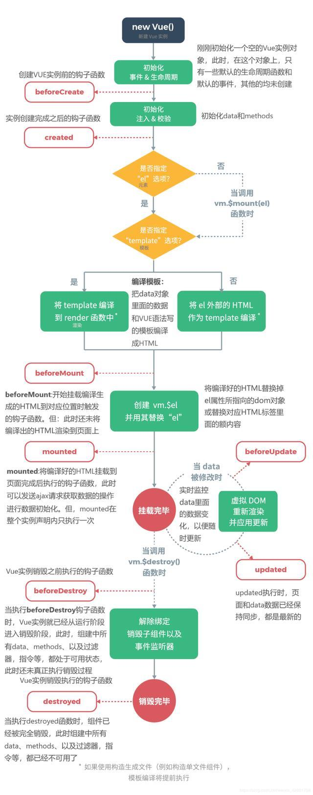

### vue 如何监听键盘事件？

参考回答：

#### 1.@keyup. 方法

```vue
<template>
	<input
		ref="myInput"
		type="text"
		value="hello world"
		autofocus
		@keyup.enter="handleKey"
	/>
</template>
<script>
export default {
	methods: {
		handleKey(e) {
			console.log(e);
		},
	},
};
</script>
```

#### 2.adEventListener

```vue
<script>
export default {
	mounted() {
		document.addEventListener("keyup", this.handleKey);
	},
	beforeDestroy() {
		document.removeEventListener("keyup", this.handleKey);
	},
	methods: {
		handleKey(e) {
			console.log(e);
		},
	},
};
</script>
```

### watch 怎么深度监听对象变化

参考回答：

deep 设置为 true 就可以监听到对象的变化

```js
let vm = new Vue({
	el: "#first",
	data: { msg: { name: "北京" } },
	watch: {
		msg: {
			handler(newMsg, oldMsg) {
				console.log(newMsg);
			},
			immediate: true,
			deep: true,
		},
	},
});
```

### 删除数组用 delete 和 Vue.delete 有什么区别？

参考回答：

- delete：只是被删除数组成员变为 empty / undefined，其他元素键值不变
- Vue.delete：直接删了数组成员，并改变了数组的键值（对象是响应式的，确保删除能触发更新视图，这个方法主要用于避开 Vue 不能检测到属性被删除的限制）

### watch 和计算属性有什么区别？

参考回答：

通俗来讲，既能用 computed 实现又可以用 watch 监听来实现的功能，推荐用 computed，重点在于 computed 的缓存功能

computed 计算属性是用来声明式的描述一个值依赖了其它的值，当所依赖的值或者变量改变时，计算属性也会跟着改变；

watch 监听的是已经在 data 中定义的变量，当该变量变化时，会触发 watch 中的方法。

### Vue 双向绑定原理

参考回答：

Vue 数据双向绑定是通过数据劫持结合发布者-订阅者模式的方式来实现的。利用了 Object.defineProperty() 这个方法重新定义了对象获取属性值(get)和设置属性值(set)。

### v-model 是什么？有什么用呢？

参考回答：

一则语法糖，相当于 v-bind:value="xxx" 和 @input，意思是绑定了一个 value 属性的值，子组件可对 value 属性监听，通过$emit('input', xxx)的方式给父组件通讯。

自己实现 v-model 方式的组件也是这样的思路。

### axios 是什么？怎样使用它？怎么解决跨域的问题？

参考回答：

axios 的是一种异步请求，用法和 ajax 类似，安装 npm install axios --save 即可使用，请求中包括 get,post,put, patch ,delete 等五种请求方式，解决跨域可以在请求头中添加 Access-Control-Allow-Origin，也可以在 index.js 文件中更改 proxyTable 配置等解决跨域问题。

### 在 vue 项目中如何引入第三方库（比如 jQuery）？有哪些方法可以做到？

参考回答：

#### 1、绝对路径直接引入

在 index.html 中用 script 引入

```html
<script src="./static/jquery-1.12.4.js"></script>
```

然后在 webpack 中配置 external

```js
externals: { 'jquery': 'jQuery' }
```

在组件中使用时 import

```js
import $ from "jquery";
```

#### 2 、在 webpack 中配置 alias

```js
resolve: { extensions: ['.js', '.vue', '.json'], alias: { '@':
resolve('src'), 'jquery': resolve('static/jquery-1.12.4.js') } }
```

然后在组件中 import

#### 3、在 webpack 中配置 plugins

```js
plugins: [new webpack.ProvidePlugin({ $: "jquery" })];
```

全局使用，但在使用 eslint 情况下会报错，需要在使用了 $ 的代码前添加 `/_
eslint-disable_/` 来去掉 ESLint 的检查。

### 说说 Vue React angularjs jquery 的区别

参考回答：

JQuery 与另外几者最大的区别是，JQuery 是事件驱动，其他两者是数据驱动。

JQuery 业务逻辑和 UI 更改该混在一起， UI 里面还参杂这交互逻辑，让本来混乱的逻辑更加混乱。

Angular，Vue 是双向绑定，而 React 不是

其他还有设计理念上的区别等

### Vue3.0 里为什么要用 Proxy API 替代 defineProperty API？

参考回答：

**响应式优化。**

#### a. defineProperty API 的局限性最大原因是它只能针对单例属性做监听。

Vue2.x 中的响应式实现正是基于 defineProperty 中的 descriptor，对 data 中的属性做了遍历 + 递归，为每个属性设置了 getter、setter。

这也就是为什么 Vue 只能对 data 中预定义过的属性做出响应的原因，在 Vue 中使用下标的方式直接修改属性的值或者添加一个预先不存在的对象属性是无法做到 setter 监听的，这是 defineProperty 的局限性。

#### b. Proxy API 的监听是针对一个对象的

那么对这个对象的所有操作会进入监听操作，这就完全可以代理所有属性，将会带来很大的性能提升和更优的代码。

Proxy 可以理解成，在目标对象之前架设一层“拦截”，外界对该对象的访问，都必须先通过这层拦截，因此提供了一种机制，可以对外界的访问进行过滤和改写。

#### c. 响应式是惰性的

在 Vue.js 2.x 中，对于一个深层属性嵌套的对象，要劫持它内部深层次的变化，就需要递归遍历这个对象，执行 Object.defineProperty 把每一层对象数据都变成响应式的，这无疑会有很大的性能消耗。

在 Vue.js 3.0 中，使用 Proxy API 并不能监听到对象内部深层次的属性变化，因此它的处理方式是在 getter 中去递归响应式，这样的好处是真正访问到的内部属性才会变成响应式，简单的可以说是按需实现响应式，减少性能消耗。
基础用法：

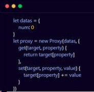

### Vue3.0 编译做了哪些优化？

参考回答：

##### a. 生成 Block tree

Vue.js 2.x 的数据更新并触发重新渲染的粒度是组件级的，单个组件内部 需要遍历该组件的整个 vnode 树。在 2.0 里，渲染效率的快慢与组件大小成正相关：组件越大，渲染效率越慢。并且，对于一些静态节点，又无数据更新，这些遍历都是性能浪费。

Vue.js 3.0 做到了通过编译阶段对静态模板的分析，编译生成了 Block tree。

Block tree 是一个将模版基于动态节点指令切割的嵌套区块，每个 区块内部的节点结构是固定的，每个区块只需要追踪自身包含的动态节点。所以，在 3.0 里，渲染效率不再与模板大小成正相关，而是与模板中动态节点的数量成正相关。

#### b. slot 编译优化

Vue.js 2.x 中，如果有一个组件传入了 slot，那么每次父组件更新的时候，会强制使子组件 update，造成性能的浪费。

Vue.js 3.0 优化了 slot 的生成，使得非动态 slot 中属性的更新只会触发子组件的更新。动态 slot 指的是在 slot 上面使用 v-if，v-for，动态 slot 名字等会导致 slot 产生运行时动态变化但是又无法被子组件 track 的操作。

#### c. diff 算法优化

### Vue3.0 新特性 —— Composition API 与 React.js 中 Hooks 的异同点

参考回答：

#### a. React.js 中的 Hooks 基本使用

React Hooks 允许你 "勾入" 诸如组件状态和副作用处理等 React 功能中。

Hooks 只能用在函数组件中，并允许我们在不需要创建类的情况下将状态、副作用处理和更多东西带入组件中。

React 核心团队奉上的采纳策略是不反对类组件，所以你可以升级 React 版本、在新组件中开始尝试 Hooks，并保持既有组件不做任何更改。

案例：

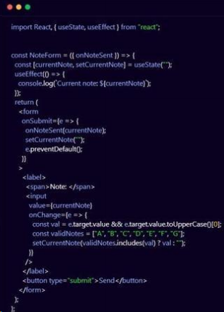

useState 和 useEffect 是 React Hooks 中的一些例子，使得函数组件中也能增加状态和运行副作用。

我们也可以自定义一个 Hooks，它打开了代码复用性和扩展性的新大门。

#### b. Vue Composition API 基本使用

Vue Composition API 围绕一个新的组件选项 setup 而创建。setup() 为 Vue 组件提供了状态、计算值、watcher 和生命周期钩子。

并没有让原来的 API（Options-based API）消失。允许开发者 结合使用新旧两种 API（向下兼容）。

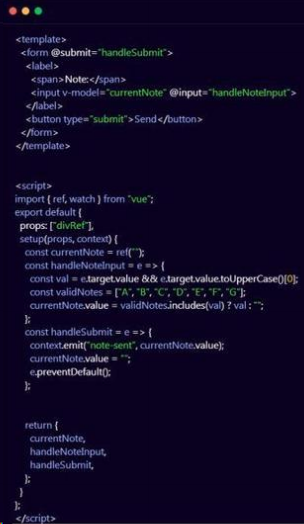

#### c. 原理

React hook 底层是基于链表实现，调用的条件是每次组件被 render 的时候都会顺序执行所有的 hooks。

Vue hook 只会被注册调用一次，Vue 能避开这些麻烦的问题，原因在于它对数据的响应是基于 proxy 的，对数据直接代理观察。（这种场景下，只要任何一个更改 data 的地方，相关的 function 或者 template 都会被重新计算，因此避开了 React 可能遇到的性能上的问题）。

React 中，数据更改的时候，会导致重新 render，重新 render 又会重新把 hooks 重新注册一次，所以 React 复杂程度会高一些。

### Vue3.0 是如何变得更快的？（底层，源码）

参考回答：

#### a. diff 方法优化

Vue2.x 中的虚拟 dom 是进行全量的对比。

Vue3.0 中新增了静态标记（PatchFlag）：在与上次虚拟结点进行对比的时候，值对比带有 patch flag 的节点，并且可以通过 flag 的信息得知当前节点要对比的具体内容化。

#### b. hoistStatic 静态提升

Vue2.x : 无论元素是否参与更新，每次都会重新创建。

Vue3.0 : 对不参与更新的元素，只会被创建一次，之后会在每次渲染时候被不停的复用。

#### c. cacheHandlers 事件侦听器缓存

默认情况下 onClick 会被视为动态绑定，所以每次都会去追踪它的变化但是因为是同一个函数，所以没有追踪变化，直接缓存起来复用即可。

### vue 要做权限管理该怎么做？如果控制到按钮级别的权限怎么做？

参考回答：

按钮级别的权限：https://panjiachen.github.io/vue-element-admin

### vue 在 created 和 mounted 这两个生命周期中请求数据有什么区别呢？

参考回答：

看实际情况，一般在 created（或 beforeRouter） 里面就可以，如果涉及到需要页面加载完成之后的话就用 mounted。

在 created 的时候，视图中的 html 并没有渲染出来，所以此时如果直接去操作 html 的 dom 节点，一定找不到相关的元素

而在 mounted 中，由于此时 html 已经渲染出来了，所以可以直接操作 dom 节点，（此时 document.getelementById 即可生效了）。

### 说说你对 proxy 的理解

参考回答：

vue 的数据劫持有两个缺点:

- 1、无法监听通过索引修改数组的值的变化
- 2、无法监听 object 也就是对象的值的变化

所以 vue2.x 中才会有$set 属性的存在

proxy 是 es6 中推出的新 api，可以弥补以上两个缺点，所以 vue3.x 版本用 proxy 替换 object.defineproperty。

### vue 中怎么重置 data?

使用 Object.assign()，vm.$data可以获取当前状态下的data，vm.$options.data(this)可以获取到组件初始化状态下的 data。

### 组件中写 name 选项有什么作用？

- 项目使用 keep-alive 时，可搭配组件 name 进行缓存过滤
- DOM 做递归组件时需要调用自身 name
- vue-devtools 调试工具里显示的组见名称是由 vue 中组件 name 决定的

### vue-router 有哪些钩子函数?

- 全局前置守卫 router.beforeEach
- 全局解析守卫 router.beforeResolve
- 全局后置钩子 router.afterEach
- 路由独享的守卫 beforeEnter
- 组件内的守卫 beforeRouteEnter 、 beforeRouteUpdate 、 beforeRouteLeave
- Object.assign(this.$data, this.$options.data(this)) // 注意加 this，不然取不到 data(){ a: this.methodA } 中的 this.methodA。

### route 和 router 的区别是什么？

**route 是“路由信息对象”**，包括 path , params , hash , query , fullPath , matched , name 等路由信息参数。

**router 是“路由实例对象”**，包括了路由的跳转方法( push 、 replace )，钩子函数等。

### 说一下 Vue 和 React 的认识，做一个简单的对比

#### 1）监听数据变化的实现原理不同

Vue 通过 getter/setter 以及一些函数的劫持，能精确快速的计算出 Virtual DOM 的差异。这是由于它在渲染过程中，会跟踪每一个组件的依赖关系，不需要重新渲染整个组件树。

React 默认是通过比较引用的方式进行的，如果不优化，每当应用的状态被改变时，全部子组件都会重新渲染，可能导致大量不必要的 VDOM 的重新渲染。

Vue 不需要特别的优化就能达到很好的性能，而对于 React 而言，需要通过
PureComponent/shouldComponentUpdate 这个生命周期方法来进行控制。如果你的应用中，交互复杂，需要处理大量的 UI 变化，那么使用 Virtual DOM 是一个好主意。如果你更新元素并不频繁，那么 Virtual DOM 并不一定适用，性能很可能还不如直接操控 DOM。

为什么 React 不精确监听数据变化呢？这是因为 Vue 和 React 设计理念上的区别，Vue 使用的是可变数据，而 React 更强调数据的不可变。

#### 2）数据流的不同

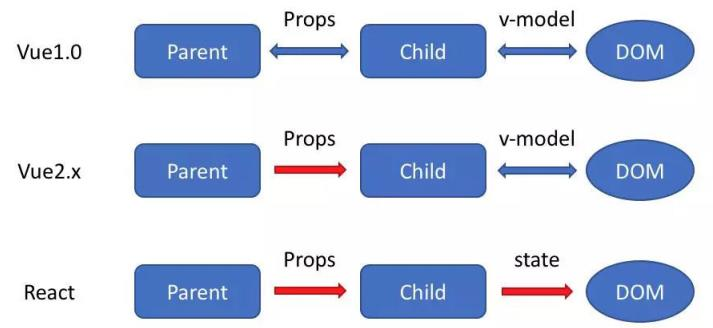

Vue 中默认支持双向绑定，组件与 DOM 之间可以通过 v-model 双向绑定。但是，父子组件之间，props 在 2.x 版本是单向数据流

React 一直提倡的是单向数据流，他称之为 onChange/setState()模式。不过由于我们一般都会用 Vuex 以及 Redux 等单向数据流的状态管理框架，因此很多时候我们感受不到这一点的区别了。

#### 3）模板渲染方式的不同

在表层上，模板的语法不同

- React 是通过 JSX 渲染模板
- 而 Vue 是通过一种拓展的 HTML 语法进行渲染

在深层上，模板的原理不同，这才是他们的本质区别：

- React 是在组件 JS 代码中，通过原生 JS 实现模板中的常见语法，比如插值，条件，循环等，都是通过 JS 语法实现的
- Vue 是在和组件 JS 代码分离的单独的模板中，通过指令来实现的，比如条件语句就需要 v-if 来实现。对这一点，我个人比较喜欢 React 的做法，因为他更加纯粹更加原生，而 Vue 的做法显得有些独特，会把 HTML 弄得很乱。举个例子，说明 React 的好处：react 中 render 函数是支持闭包特性的，所以我们 import 的组件在 render 中可以直接调用。但是在 Vue 中，由于模板中使用的数据都必须挂在 this 上进行一次中转，所以我们 import 一个组件完了之后，还需要在 components 中。再声明下，这样显然是很奇怪但又不得不这样的做法。

### Vue 的 nextTick 的原理是什么？

#### 1）为什么需要 nextTick

Vue 是异步修改 DOM 的并且不鼓励开发者直接接触 DOM，但有时候业务需要必须对数据更改--刷新后的 DOM 做相应的处理，这时候就可以使用 Vue.nextTick(callback)这个 api 了。

#### 2）理解原理前的准备

首先需要知道事件循环中宏任务和微任务这两个概念(这其实也是面试常考点)。

常见的宏任务有 script, setTimeout, setInterval, setImmediate, I/O, UI rendering
常见的微任务有 process.nextTick(Nodejs),Promise.then(), MutationObserver;

#### 3）理解 nextTick

而 nextTick 的原理正是 vue 通过异步队列控制 DOM 更新和 nextTick 回调函数先后执行的方式。如果大家看过这部分的源码，会发现其中做了很多 isNative()的判断，因为这里还存在兼容性优雅降级的问题。可见 Vue 开发团队的深思熟虑，对性能的良苦用心。

### Vuex 有哪几种属性?

有五种，分别是 State 、 Getter 、 Mutation 、 Action 、 Module

### vue 首屏加载优化

把不常改变的库放到 index.html 中，通过 cdn 引入，然后找到 build/webpack.base.conf.js 文件，在 module.exports = { } 中添加以下代码

```json
externals: {
    'vue': 'Vue',
    'vue-router': 'VueRouter',
    'element-ui': 'ELEMENT',
},
```

- 这样 webpack 就不会把 vue.js, vue-router, element-ui 库打包了。
- vue 路由的懒加载：import 或者 require 懒加载。
- 不生成 map 文件：找到 config/index.js，修改为 productionSourceMap: false
- vue 组件尽量不要全局引入
- 使用更轻量级的工具库

### vuex

#### （1）vuex 是什么？怎么使用？哪种功能场景使用它？

vue 框架中状态管理。在 main.js 引入 store，注入。新建一个目录 store，….. export 。
场景有：单页应用中，组件之间的状态。音乐播放、登录状态、加入购物车

#### （2）vuex 有哪几种属性？

有五种，分别是 State、 Getter、Mutation 、Action、 Module

##### vuex 的 State 特性

A，Vuex 就是一个仓库，仓库里面放了很多对象。其中 state 就是数据源存放地，对应于一般 Vue 对象里面的 data

B，state 里面存放的数据是响应式的，Vue 组件从 store 中读取数据，若是 store 中的数据发生改变，依赖这个数据的组件也会发生更新

C、它通过 mapState 把全局的 state 和 getters 映射到当前组件的 computed 计算属性中

##### vuex 的 Getter 特性

A、getters 可以对 State 进行计算操作，它就是 Store 的计算属性
B、 虽然在组件内也可以做计算属性，但是 getters 可以在多组件之间复用
C、 如果一个状态只在一个组件内使用，是可以不用 getters

##### vuex 的 Mutation 特性

Action 类似于 mutation，不同在于：Action 提交的是 mutation，而不是直接变更状态；Action 可以包含任意异步操作。

#### （3）不用 Vuex 会带来什么问题？

可维护性会下降，想修改数据要维护三个地方；

可读性会下降，因为一个组件里的数据，根本就看不出来是从哪来的；

增加耦合，大量的上传派发，会让耦合性大大增加，本来 Vue 用 Component 就是为了减少耦合，现在这么用，和组件化的初衷相背

### v-show 和 v-if 指令的共同点和不同点

v-show 指令是通过修改元素的 display 的 CSS 属性让其显示或者隐藏

v-if 指令是直接销毁和重建 DOM 达到让元素显示和隐藏的效果

## Vue 基础知识

### 1.Vue 特性

轻量

Vue.js 库的体积非常小的，并且不依赖其他基础库。

数据绑定

对于一些富交互、状态机类似的前端 UI 界面，数据绑定非常简单、方便。

指令

内置指令统一为(v—\*)，也可以自定义指令，通过对应表达值的变化就可以修改对应的 DOM。

插件化

Vue.js 核心不包含 Router、AJAX、表单验证等功能，但是可以非常方便地根据需要加载对应插件。

组件化

组件可以扩展 HTML 元素，封装可重用的代码。允许我们使用小型、自包含和通常可复用的组件构建大型应用。

### 2.Vue 项目结构介绍

- build 文件夹：用于存放 webpack 相关配置和脚本。
- config 文件夹：主要存放配置文件，比如配置开发环境的端口号、开启热加载或开启 gzip 压缩等。
- dist 文件夹：默认命令打包生成的静态资源文件。
- node_modules：存放 npm 命令下载的开发环境和生产环境的依赖包。
- src: 存放项目源码及需要引用的资源文件。
- src 下 assets：存放项目中需要用到的资源文件，css、js、images 等。
- src 下 componets：存放 vue 开发中一些公共组件。
- src 下 emit：自己配置的 vue 集中式事件管理机制。
- src 下 router：vue-router vue 路由的配置文件。
- src 下 service：自己配置的 vue 请求后台接口方法。
- src 下 page：存在 vue 页面组件的文件夹。
- src 下 util：存放 vue 开发过程中一些公共的 js 方法。
- src 下 vuex：存放 vuex 为 vue 专门开发的状态管理器。
- src 下 app.vue：整个工程的 vue 根组件。
- src 下 main.js：工程的入口文件。
- index.html：设置项目的一些 meta 头信息和提供 html 元素节点，用于挂载 vue。
- package.json：对项目的描述以及对项目部署和启动、打包的 npm 命令管理。

### 3.Vue 常用指令

- v-model 多用于表单元素实现双向数据绑定（同 angular 中的 ng-model）
- v-for 格式： v-for="字段名 in(of) 数组 json" 循环数组或 json(同 angular 中的 ng-repeat),需要注意
- 从 vue2 开始取消了$index
- v-show 显示内容 （同 angular 中的 ng-show）
- v-hide 隐藏内容（同 angular 中的 ng-hide）
- v-if 显示与隐藏 （dom 元素的删除添加 同 angular 中的 ng-if 默认值为 false）
- v-else-if 必须和 v-if 连用
- v-else 必须和 v-if 连用 不能单独使用 否则报错 模板编译错误
- v-bind 动态绑定 作用： 及时对页面的数据进行更改
- v-on:click 给标签绑定函数，可以缩写为@，例如绑定一个点击函数 函数必须写在 methods 里面
- v-text 解析文本
- v-html 解析 html 标签
- v-bind:class 三种绑定方法 1、对象型 '{red:isred}' 2、三元型 'isred?"red":"blue"' 3、数组型
- '[{red:"isred"},{blue:"isblue"}]'
- v-once 进入页面时 只渲染一次 不在进行渲染
- v-cloak 防止闪烁
- v-pre 把标签内部的元素原位输出

### 4.Vue 常用的修饰符

#### a、按键修饰符

如：.delete（捕获“删除”和”退格“键） 用法上和事件修饰符一样，挂载在 v-on:后面，语法：

```vue
// v-on:keyup.xxx="yyy"

<input class="aaa" v-model="inputValue" @keyup.delete="onKey" />
```

#### b、系统修饰符

可以用如下修饰符来实现仅在按下相应按键时才触发鼠标或键盘事件的监听器

- (1) .ctrl
- (2) .alt
- (3) .shift
- (4) .meta

#### c、鼠标按钮修饰符

- (1) .left
- (2) .right
- (3) .middle

这些修饰符会限制处理函数仅响应特定的鼠标按钮。

如： `<button @click.middle ="onClick">A</button>` 鼠标滚轮单击触发
Click 默认是鼠标左键单击

#### d、其他修饰符

(1) .lazy

在默认情况下， v-model 在每次 input 事件触发后将输入框的值与数据进行同步 ，我们可以添加 lazy 修饰符，从而转变为使用 change 事件进行同步：

```vue
<input v-model.lazy="msg" >
```

(2) .number

如果想自动将用户的输入值转为数值类型，可以给 v-model 添加 .number 修饰符：

```vue
<input v-model.number="age" type="number">
```

这通常很有用，因为即使在 type="number" 时，HTML 输入元素的值也总会返回字符串。如果这个值无法被 parseFloat() 解析，则会返回原始的值。

(3) .trim

如果要自动过滤用户输入的首尾空白字符，可以给 v-model 添加 trim 修饰符：

```vue
<inputv-model.trim="msg">
```

同样前面都有空格加上.trim 后 将前后空格都去掉了。

### 5.条件渲染

v-if：条件指令

```vue
<input type="checkbox" v-model="ok">同意许可协议
<!-- v:if条件指令：还有v-else、v-else-if 切换开销大 -->
<h1 v-if="ok">if：Lorem ipsum dolor sit amet.</h1>
<h1 v-else>no</h1>
```

v-show：条件指令

使用 v-show 完成和上面相同的功能

```vue
<!-- v:show 条件指令 初始渲染开销大 -->
<h1 v-show="ok">show：Lorem ipsum dolor sit amet.</h1>
<h1 v-show="!ok">no</h1>
```

- v-if 是“真正”的条件渲染，因为它会确保在切换过程中条件块内的事件监听器和子组件适当地被销毁和重建。
- v-if 也是惰性的：如果在初始渲染时条件为假，则什么也不做——直到条件第一次变为真时，才会开始渲染条件块。
- 相比之下，v-show 就简单得多——不管初始条件是什么，元素总是会被渲染，并且只是简单地基于 CSS 进行切换。
- 一般来说，v-if 有更高的切换开销，而 v-show 有更高的初始渲染开销。因此，如果需要非常频繁地切换，则使用 v-show 较好；如果在运行时条件很少改变，则使用 v-if 较好。

### 6.列表渲染

v-for：列表循环指令

简单的列表渲染

```vue
<!-- 1、简单的列表渲染 -->
<ul>
	<li v-for="n in 10">{{ n }} </li>
</ul>
<ul>
    <!-- 如果想获取索引，则使用index关键字，注意，圆括号中的index必须放在后面 -->
    <li v-for="(n, index) in 5">{{ n }} - {{ index }} </li>
</ul>
```

遍历数据列表

```vue
data: { userList: [ { id: 1, username: 'helen', age: 18 }, { id: 2, username:
'peter', age: 28 }, { id: 3, username: 'andy', age: 38 } ] }

<!-- 2、遍历数据列表 -->
<table border="1">
    <!-- <tr v-for="item in userList"></tr> -->
    <tr v-for="(item, index) in userList">
        <td>{{index}}</td>
        <td>{{item.id}}</td>
        <td>{{item.username}}</td>
        <td>{{item.age}}</td>
    </tr>
</table>
```

### 7.组件

组件（Component）是 Vue.js 最强大的功能之一。

组件可以扩展 HTML 元素，封装可重用的代码。

组件系统让我们可以用独立可复用的小组件来构建大型应用，几乎任意类型的应用的界面都可以抽象为一个组件树：

（1）局部组件

```js
var app = new Vue({
	el: "#app",
	// 定义局部组件，这里可以定义多个局部组件
	components: {
		//组件的名字
		Navbar: {
			// 组件的内容
			template: "<ul><li>首页</li><li>学员管理</li></ul>",
		},
	},
});
```

使用组件

```vue
<div id="app">
	<Navbar></Navbar>
</div>
```

（2）全局组件

定义全局组件：components/Navbar.js

```js
// 定义全局组件
Vue.component("Navbar", {
	template: "<ul><li>首页</li><li>学员管理</li><li>讲师管理</li></ul>",
});
```

使用组件

```vue
<div id="app">
	<Navbar></Navbar>
</div>
<script src="vue.min.js"></script>
<script src="components/Navbar.js"></script>
<script>
var app = new Vue({
	el: "#app",
});
</script>
```

## Vue 核心知识点

### 1.对于 Vue 是一套渐进式框架的理解

渐进式代表的含义是：没有多做职责之外的事，vue.js 只提供了 vue-cli 生态中最核心的组件系统和双向数据绑定，就好像 vuex、vue-router 都属于围绕 vue.js 开发的库。

示例：

#### 使用 Angular，必须接受以下东西：

- 1）必须使用它的模块机制。
- 2）必须使用它的依赖注入。
- 3）必须使用它的特殊形式定义组件（这一点每个视图框架都有，这是难以避免的）

所以 Angular 是带有比较强的排它性的，如果你的应用不是从头开始，而是要不断考虑是否跟其他东西集成，这些主张会带来一些困扰。

#### 使用 React，你必须理解：

- 1）函数式编程的理念。
- 2）需要知道它的副作用。
- 3）什么是纯函数。
- 4）如何隔离、避免副作用。
- 5）它的侵入性看似没有 Angular 那么强，主要因为它是属于软性侵入的。

Vue 与 React、Angular 的不同是，但它是渐进的：

- 1）可以在原有的大系统的上面，把一两个组件改用它实现，就是当成 jQuery 来使用。
- 2）可以整个用它全家桶开发，当 Angular 来使用。
- 3）可以用它的视图，搭配你自己设计的整个下层使用。
- 4）可以在底层数据逻辑的地方用 OO 和设计模式的那套理念。
- 5）可以函数式，它只是个轻量视图而已，只做了最核心的东西。

### 2.vue.js 的两个核心是什么？

数据驱动和组件系统：

- 数据驱动：ViewModel，保证数据和视图的一致性。
- 组件系统：应用类 UI 可以看作全部是由组件树构成的。

### 3.请问 v-if 和 v-show 有什么区别

**相同点**： 两者都是在判断 DOM 节点是否要显示。

**不同点**：

- (1) 实现方式： v-if 是根据后面数据的真假值判断直接从 Dom 树上删除或重建元素节点。 v-show 只是在修改元素的 css 样式，也就是 display 的属性值，元素始终在 Dom 树上。
- (2) 编译过程：v-if 切换有一个局部编译/卸载的过程，切换过程中合适地销毁和重建内部的事件监听和子组件； v-show 只是简单的基于 css 切换；
- (3) 编译条件：v-if 是惰性的，如果初始条件为假，则什么也不做；只有在条件第一次变为真时才开始局部编译； v-show 是在任何条件下（首次条件是否为真）都被编译，然后被缓存，而且 DOM 元素始终被保留；
- (4) 性能消耗：v-if 有更高的切换消耗，不适合做频繁的切换； v-show 有更高的初始渲染消耗，适合做频繁的额切换；

### 4.v-for 与 v-if 的优先级

当它们处于同一节点，v-for 的优先级比 v-if 更高，这意味着 v-if 将分别重复运行于每个 v-for 循环中。当你想为仅有的一些项渲染节点时，这种优先级的机制会十分有用，如下：

```vue
<li v-for="todo in todos" v-if="!todo.isComplete">
	{{ todo }}
</li>
```

上面的代码只传递了未完成的 todos。

而如果你的目的是有条件地跳过循环的执行，那么可以将 v-if 置于外层元素 (或 `<template>` )上。如：

```vue
<ul>
    <li v-for="todo in todos">
        {{ todo }}
    </li>
</ul>
<p v-else>No todos left!</p>
```

### 5.v-on 可以监听多个方法吗？

v-on 可以监听多个方法

```vue
<template>
	<div class="about">
		<button @click="myclick('hello', 'world', '你好世界', $event)">
			点我text
		</button>
		<!-- v-on在vue2.x中测试,以下两种均可-->
		<button v-on="{ mouseenter: onEnter, mouseleave: onLeave }">
			鼠标进来1
		</button>
		<button @mouseenter="onEnter" @mouseleave="onLeave">鼠标进来2</button>
		<!-- 一个事件绑定多个函数，按顺序执行，这里分隔函数可以用逗号也可以用分号-->
		<button @click="a(), b()">点我ab</button>
		<button @click="one()">点我onetwothree</button>
		<!-- v-on修饰符 .stop .prevent .capture .self 以及指定键.{keyCode|keyAlias} -->
		<!-- 这里的.stop 和 .prevent也可以通过传入&event进行操作 -->
		<!-- 全部按键别名有：enter tab delete esc space up down left right -->
		<form @keyup.delete="onKeyup" @submit.prevent="onSubmit">
			<input type="text" placeholder="在这里按delete" />
			<button type="submit">点我提交</button>
		</form>
	</div>
</template>
<script>
export default {
	methods: {
		//这里是es6对象里函数写法
		a() {
			console.log("a");
		},
		b() {
			console.log("b");
		},
		one() {
			console.log("one");
			this.two();
			this.three();
		},
		two() {
			console.log("two");
		},
		three() {
			console.log("three");
		},
		myclick(msg1, msg2, msg3, event) {
			console.log(msg1 + msg2 + "--" + msg3);
			console.log(event);
		},
		onKeyup() {
			console.log("you press 'delete'");
		},
		onSubmit() {
			console.log("sumited");
		},
		onEnter() {
			console.log("mouse enter");
		},
		onLeave() {
			console.log("mouse leave");
		},
	},
};
</script>
```

### 6.vue 中 key 值的作用

使用 key 来给每个节点做一个唯一标识

key 的作用主要是为了高效的更新虚拟 DOM。另外 vue 中在使用相同标签名元素的过渡切换时，也会使用到 key 属性，其目的也是为了让 vue 可以区分它们，否则 vue 只会替换其内部属性而不会触发过渡效果。

### 7.vue 事件中如何使用 event 对象？

注意在事件中要使用 $ 符号

```vue
//html部分
<a href="javascript:void(0);" data-id="12" @click="showEvent($event)">event</a>

//js部分 showEvent(event){ //获取自定义data-id
console.log(event.target.dataset.id) //阻止事件冒泡 event.stopPropagation();
//阻止默认 event.preventDefault() }
```

### 9.$nextTick 的使用

参数： {Function} [callback]

用法：将回调延迟到下次 DOM 更新循环之后执行。在修改数据之后立即使用它，然后等待 DOM 更新。

它跟全局方法 Vue.nextTick 一样，不同的是回调的 this 自动绑定到调用它的实例上。

实例：

```vue
<template>
<p ref="msgp">{{msg}}</p>
<button @click="change">$nextTick</button>
</div></template>
<script>export default {
name: 'nextTick',
data() {
return {
msg: '未更新'
}
},
methods: {
change() {
// 修改数据
this.msg = '被更新了'
// DOM还没有更新
console.log(this.$refs.msgp.innerHTML)
this.$nextTick(() => {
// DOM更新了
console.log('$nextTick:' + this.$refs.msgp.innerHTML)
})
}
},
created() {
}}</script>
```

#### $nextTick() 的应用场景:

在 vue 的生命周期 created() 钩子函数中进行 dom 操作，一定要放在 $nextTick() 函数中执行。

在 created() 钩子函数执行的时候 DOM 其实并未进行任何渲染，而此时进行 DOM 操作无异于徒劳，所以此处一定要将 DOM 操作的代码放进 nextTick() 的回调函数中。

mounted() 钩子函数，因为该钩子函数执行时，所有的 DOM 挂载和 渲染都已完成，此时在该钩子函数中进行任何 DOM 操作都不会有问题，在数据变化后要执行某个操作，而这个操作需要随数据改变而改变 DOM 结构时，这个操作都是需要放置$nextTick() 的回调函数中。

### 10.Vue 组件中 data 为什么必须是函数

在 new Vue() 中， data 是可以作为一个对象进行操作的，然而在 component 中， data 只能以函数的形式存在，不能直接将对象赋值给它。

当 data 选项是一个函数的时候，每个实例可以维护一份被返回对象的独立的拷贝，这样各个实例中的 data 不会相互影响，是独立的。

### 11.vue 中子组件调用父组件的方法

Vue 中子组件调用父组件的方法，这里有三种方法提供参考

### 方法 1：是直接在子组件中通过 this.$parent.event 来调用父组件的方法

父组件

```vue
<template>
	<div>
		<child></child>
	</div>
</template>
<script>
import child from "~/components/dam/child";
export default {
	components: {
		child,
	},
	methods: {
		fatherMethod() {
			console.log("测试");
		},
	},
};
</script>
```

子组件

```vue
<template>
	<div>
		<button @click="childMethod()">点击</button>
	</div>
</template>
<script>
export default {
	methods: {
		childMethod() {
			this.$parent.fatherMethod();
		},
	},
};
</script>
```

#### 方法 2：:在子组件里用 $emit 向父组件触发一个事件，父组件监听这个事件就行了。

父组件

```vue
<template>
	<div>
		<child @fatherMethod="fatherMethod"></child>
	</div>
</template>
<script>
import child from "~/components/dam/child";
export default {
	components: {
		child,
	},
	methods: {
		fatherMethod() {
			console.log("测试");
		},
	},
};
</script>
```

子组件

```vue
<template>
	<div>
		<button @click="childMethod()">点击</button>
	</div>
</template>
<script>
export default {
	methods: {
		childMethod() {
			this.$emit("fatherMethod");
		},
	},
};
</script>
```

#### 方法 3：是父组件把方法传入子组件中，在子组件里直接调用这个方法

父组件

```vue
<template>
	<div>
		<child :fatherMethod="fatherMethod"></child>
	</div>
</template>
<script>
import child from "~/components/dam/child";
export default {
	components: {
		child,
	},
	methods: {
		fatherMethod() {
			console.log("测试");
		},
	},
};
</script>
```

子组件

```vue
<template>
	<div>
		<button @click="childMethod()">点击</button>
	</div>
</template>
<script>
export default {
	props: {
		fatherMethod: {
			type: Function,
			default: null,
		},
	},
	methods: {
		childMethod() {
			if (this.fatherMethod) {
				this.fatherMethod();
			}
		},
	},
};
</script>
```

### 12.vue 中 keep-alive 组件的作用

作用：用于保留组件状态或避免重新渲染（缓存的作用）

比如：当一个目录页面与一个详情页面，用户经常：打开目录页面=>进入详情页面=>返回目录页面=>打开详情页面，这样目录页面就是一个使用频率很高的页面，那么就可以对目录组件使用 `<keep-alive></keep-alive>` 进行缓存，这样用户每次返回目录时，都能从缓存中快速渲染，而不用重新渲染。

### 13.vue 中如何编写可复用的组件？

组件，是一个具有一定功能，且不同组件间功能相对独立的模块。高内聚、低耦合。

开发可复用性的组件应遵循以下原则：

- 1）规范化命名：组件的命名应该跟业务无关，而是依据组件的功能命名。
- 2）数据扁平化：定义组件接口时，尽量不要将整个对象作为一个 prop 传进来。每个 prop 应该是一个简单类型的数据。这样做有下列几点好处：
  - (1) 组件接口清晰。
  - (2) props 校验方便。
  - (3) 当服务端返回的对象中的 key 名称与组件接口不一样时，不需要重新构造一个对象。扁平化的 props 能让我们更直观地理解组件的接口。
- 3）可复用组件只实现 UI 相关的功能，即展示、交互、动画，如何获取数据跟它无关，因此不要在组件内部去获取数据。
- 4）可复用组件应尽量减少对外部条件的依赖，所有与 vuex 相关的操作都不应在可复用组件中出现。
- 5）组件在功能独立的前提下应该尽量简单，越简单的组件可复用性越强。
- 6）组件应具有一定的容错性。
- 7）组件应当避免对其父组件的依赖，不要通过 this.parent 来操作父组件的示例。父组件也不要通过 this.children 来引用子组件的示例，而是通过子组件的接口与之交互。
- 8）可复用组件除了定义一个清晰的公开接口外，还需要有命名空间。命名空间可以避免与浏览器保留标签和其他组件的冲突。特别是当项目引用外部 UI 组件或组件迁移到其他项目时，命名空间可以避免很多命名冲突的问题。

### 14 什么是 vue 生命周期？

vue 生命周期是指 vue 实例对象从创建之初到销毁的过程，vue 所有功能的实现都是围绕其生命周期进行的，在生命周期的不同阶段调用对应的钩子函数实现组件数据管理和 DOM 渲染两大重要功能。

vue 生命周期的这八个阶段:

1）创建前(beforeCreate)

对应的钩子函数为 beforeCreate。此阶段为实例初始化之后，此时的数据观察和事件机制都未形成，不能获得 DOM 节点。

2）创建后（created）

对应的钩子函数为 created。在这个阶段 vue 实例已经创建，仍然不能获取 DOM 元素。

3，载入前（beforeMount）

对应的钩子函数是 beforeMount，在这一阶段，我们虽然依然得不到具体的 DOM 元素，但 vue 挂载的根节点已经创建，下面 vue 对 DOM 的操作将围绕这个根元素继续进行；beforeMount 这个阶段是过渡性的，一般一个项目只能用到一两次。

4，载入后（mounted）

对应的钩子函数是 mounted。mounted 是平时我们使用最多的函数了，一般我们的异步请求都写在这里。在这个阶段，数据和 DOM 都已被渲染出来。

5，更新前（beforeUpdate）

对应的钩子函数是 beforeUpdate。在这一阶段，vue 遵循数据驱动 DOM 的原则。beforeUpdate 函数在数据更新后虽然没立即更新数据，但是 DOM 中的数据会改变，这是 Vue 双向数据绑定的作用。

6，更新后（updated）

对应的钩子函数是 updated。在这一阶段 DOM 会和更改过的内容同步。

7，销毁前（beforeDestroy）

对应的钩子函数是 beforeDestroy。在上一阶段 Vue 已经成功的通过数据驱动 DOM 更新，当我们不再需要 vue 操纵 DOM 时，就要销毁 Vue,也就是清除 vue 实例与 DOM 的关联，调用 destroy 方法可以销毁当前组件。在销毁前，会触发 beforeDestroy 钩子函数。

8，销毁后(destroyed)对应的钩子函数是 destroyed。

在销毁后，会触发 destroyed 钩子函数。

vue 的生命周期的思想贯穿在组件开发的始终，通过熟悉其生命周期调用不同的钩子函数，我们可以准确的控制数据流和其对 DOM 的影响；vue 生命周期的思想是 Vnode 和 MVVM 的生动体现和继承。

### 15.vue 生命周期钩子函数有哪些？

- 1）VUE 生命周期是 VUE 实例化或者组件创建到消亡的过程。
- 2）beforeCreate 创建前的状态，初始化事件和生命周期。
- 3）创建完毕状态 Init (初始化) injections (依赖注入) & reactivity (开始响应)。
- 4）beforeMount 挂载前状态， 是否有元素 el，是否有模板，是否渲染到了函数内，是否作为模板进行了 outerHTML 渲染到了页 面，向虚拟 DOM 上挂载的过程，并且还是把我们的‘#app’生成虚拟 DOM，生成完毕后并渲染到 view 层。
- 5）mounted 挂载结束状态，渲染到真正的 DOM。
- 6）beforeUpdate 可以拿到 Vue 实例化改变前的状态。
- 7）Updated 拿到变动完成的状态。
- 8）beforeDestroy 消亡前的状态。
- 9）destroyed 实例化或组件被摧毁消亡。

### 16.vue 如何监听键盘事件中的按键？

在 Vue 中，已经为常用的按键设置了别名，这样我们就无需再去匹配 keyCode ，直接使用别名就能监听按键的事件。

```vue
<input @keyup.enter="function">
```

| 别名    | 实际键值                                         |
| ------- | ------------------------------------------------ |
| .delete | delete（删除）/BackSpace（退格）                 |
| .tab    | Tab                                              |
| .enter  | Enter（回车）                                    |
| .esc    | Esc（退出）                                      |
| .space  | Space（空格键）                                  |
| .left   | Left（左箭头）                                   |
| .up     | Up（上箭头）                                     |
| .right  | Right（右箭头）                                  |
| .down   | Down（下箭头）                                   |
| .ctrl   | Ctrl                                             |
| .alt    | Alt                                              |
| .shift  | Shift                                            |
| .meta   | (window 系统下是 window 键，mac 下是 command 键) |

另外，Vue 中还支持组合写法：

| 组合写法                 | 按键组合     |
| ------------------------ | ------------ |
| @keyup.alt.67=”function” | Alt + C      |
| @click.ctrl=”function”   | Ctrl + Click |

但是，如果是在自己封装的组件或者是使用一些第三方的 UI 库时，会发现并不起效果，这时就需要用到 .native 修饰符了，如：

```vue
<el-input
	v-model="inputName"
	placeholder="搜索你的文件"
	@keyup.enter.native="searchFile(params)"
></el-input>
```

如果遇到 .native 修饰符也无效的情况，可能就需要用到 $listeners 了。

### 17.vue 更新数组时触发视图更新的方法

1）Vue.set 响应式新增与修改数据

可以设置对象或数组的值，通过 key 或数组索引，可以触发视图更新

- target：要更改的数据源(可以是对象或者数组)
- key：要更改的具体数据
- value ：重新赋的值

数组修改

```vue
Vue.set(array, indexOfItem, newValue) this.array.$set(indexOfItem, newValue)
```

对象修改

```vue
Vue.set(obj, keyOfItem, newValue) this.obj.$set(keyOfItem, newValue)
```

2）Vue.delete

删除对象或数组中元素，通过 key 或数组索引，可以触发视图更新

- Vue.set(array, indexOfItem, newValue)
- this.array.$set(indexOfItem, newValue)
- Vue.set(obj, keyOfItem, newValue)
- this.obj.$set(keyOfItem, newValue)

数组修改

```vue
Vue.delete(array, indexOfItem) this.array.$delete(indexOfItem)
```

对象修改

```vue
Vue.delete(obj, keyOfItem) this.obj.$delete(keyOfItem)
```

3）数组对象直接修改属性，可以触发视图更新

```vue
this.array[0].show = true; this.array.forEach(function(item){ item.show = true;
});
```

4）splice 方法修改数组，可以触发视图更新

```vue
this.array.splice(indexOfItem, 1, newElement)
```

5）数组整体修改，可以触发视图更新

```vue
var tempArray = this.array; tempArray[0].show = true; this.array = tempArray;
```

6）用 Object.assign 或 lodash.assign 可以为对象添加响应式属性，可以触发视图更新

```js
// Object.assign的单层的覆盖前面的属性，不会递归的合并属性
this.obj = Object.assign({}, this.obj, { a: 1, b: 2 });
// assign与Object.assign一样
this.obj = _.assign({}, this.obj, { a: 1, b: 2 });
// merge会递归的合并属性
this.obj = _.merge({}, this.obj, { a: 1, b: 2 });
```

7） Vue 包含一组观察数组变异的方法，使用它们改变数组也会触发视图更新

```bash
push()      向数组的末尾添加一个或多个元素，并返回新的长度。
pop()       删除最后一个元素，把数组长度减 1，并且返回它删除的元素的值。
shift()     把数组的第一个元素从其中删除，并返回第一个元素的值。
unshift()   向数组的开头添加一个或更多元素，并返回新的长度。
splice()    向/从数组中添加/删除项目，然后返回被删除的项目。 该方法会改变原始数组。
sort()      对数组的元素进行排序。
reverse()   颠倒数组中元素的顺序。
```

不变异的方法:

```bash
filter()
concat()
slice()
他们返回的是一个新数组，使用这些方法时，可以用新数组来替换原始数组
```

原理:

-- Vue 在检测到数组变化时，并不是直接重新渲染整个列表，而是最大化复用 DOM 元素。替换的数组中，含有相同元素的项不会被重新渲染，因此可以大胆的用新数组来替换旧数组，不用担心性能问题。

-- 值得注意的是：

以下变动的数组中 Vue 是不能检测到的，也不会触发视图更新。

- 1.通过索引直接设置项， 比如 this.books[3]={...}
- 2.修改数组长度， 比如 this.books.length = 1;

两个问题都可以用 splice 来解决：

第一个问题 还可以用 set 方法 this.$set(this.books,3,{...})

### 18.vue 中对象更改检测的注意事项

还是由于 JavaScript 的限制，Vue 不能检测对象属性的添加或删除：

```js
var vm = new Vue({
	data: {
		a: 1,
	},
});
// `vm.a` 现在是响应式的
vm.b = 2;
// `vm.b` 不是响应式的
```

对于已经创建的实例，Vue 不允许动态添加根级别的响应式属性。但是，可以使用 Vue.set(object,propertyName, value) 方法向嵌套对象添加响应式属性。例如，对于：

```js
var vm = new Vue({
	data: {
		userProfile: {
			name: "Anika",
		},
	},
});
```

你可以添加一个新的 age 属性到嵌套的 userProfile 对象：

```js
Vue.set(vm.userProfile, "age", 27);
```

你还可以使用 vm.$set 实例方法，它只是全局 Vue.set 的别名：

```js
vm.$set(vm.userProfile, "age", 27);
```

有时你可能需要为已有对象赋值多个新属性，比如使用 Object.assign() 或 \_.extend()。在这种情况下，你应该用两个对象的属性创建一个新的对象。所以，如果你想添加新的响应式属性，不要像这样：

```js
Object.assign(vm.userProfile, {
	age: 27,
	favoriteColor: "Vue Green",
});
```

你应该这样做：

```js
vm.userProfile = Object.assign({}, vm.userProfile, {
	age: 27,
	favoriteColor: "Vue Green",
});
```

### 19.解决非工程化项目初始化页面闪动问题

vue 页面在加载的时候闪烁花括号{}，v-cloak 指令和 css 规则如[v-cloak]{display:none}一起用时，这个指令可以隐藏未编译的 Mustache 标签直到实例准备完毕。

```vue
/*css样式*/ [v-cloak] { display: none; }
<!--html代码-->
<div id="app" v-cloak>
    <ul>
    	<li v-for="item in tabs">{{item.text}}</li>
    </ul>
</div>
```

### 20.v-for 产生的列表，实现 active 的切换

```vue
<div v-for="(desc, tableIndex) in descriptions.firstface">
    <ul class="controller-checkboxs clearfix" >
        <li
        @click="currentIndex=index,currentTable=tableIndex"
        class="controller-checkbox-item"
        :class="{active:index===currentIndex&&tableIndex==currentTable}"
        v-for="(ctrlValue,index) in desc.args">
        </li>
    </ul>
</div>
```

### 21.v-model 语法糖的组件中的使用

```vue
<input type="text" v-model="mes">
```

此时 mes 值就与 input 的值进行双向绑定

实际上上面的代码是下面代码的语法糖。

```vue
<input v-bind:value="mes" v-on:input="mes = $event.target.value" />
```

要理解这行代码，首先你要知道 input 元素本身有个 oninput 事件，这是 HTML5 新增加的，类似 onchange ，每当输入框内容发生变化，就会触发 oninput ，把最新的 value 传递给 mes。从而实现了 v-model

#### v-model 用在组件上的时候

我们知道 v-model 可以实现数据的双向绑定，但是，如果说这是一个复杂的输入框，在项目中也经常使用。此时我们我们就把这个输入框封装成组件，那怎么利用 v-mode 让父组件的值与子组件 input 框里的

值双向绑定起来。看下面的例子:

1）父组件

`<InputBox v-model="mes"></InputBox>`

根据上面讲的 v-model 语法糖，所以 InputBox 那行代码也可以写成

`<InputBox v-bind:value="value" v-on:input="mes= $event.target.value"></InputBox>`

2）子组件

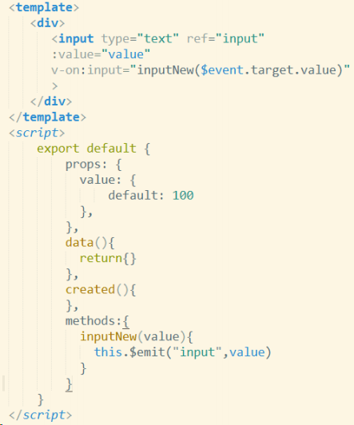

所以说：

- 1）接受一个 value prop
- 2）在有新的值时触发 input 事件并将新值作为参数 。

这样，我们就可以看到子组件和父组件的值就可以联动起来。但是我们看到 v-model 中的事件是 input,如果碰到单选复选按钮这种 check 事件，那我们就需要去自定义 v-model

#### v-model 自定义

父组件

```vue
<InputCheckout v-model="foo"></InputCheckout>
<InputBox v-bind:value="value" v-on:input="mes = $event.target.value">
</InputBox>
```

但是单选复选框不会触发 input 事件，只会触发 change 事件。所以在子组件我们需要自定义 v-model。我们来看看代码:

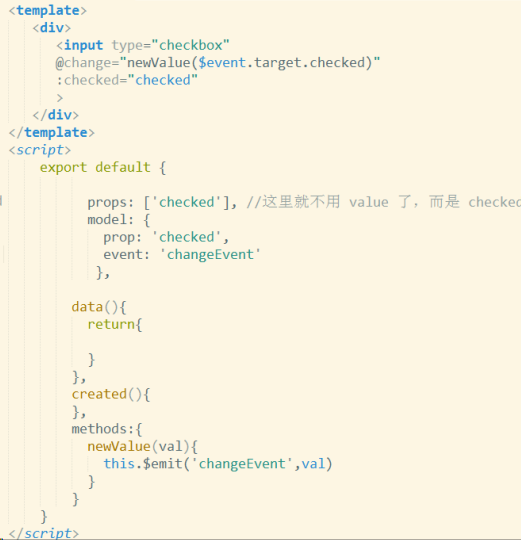

### 22.Vue 中自定义过滤器

过滤器是一个通过输入数据，能够及时对数据进行处理并返回一个数据结果的简单函数。Vue 有很多很便利的过滤器，过滤器通常会使用管道标志 “ | ”。使用:

```vue
<td>{{item.ctime | dataFormat('yyyy-mm-dd')}}</td>
```

#### 自定义全局过滤器

虽然 VueJs 给我们提供了很多强有力的过滤器，但有时候还是不够。值得庆幸的，Vue 给我们提供了一个干净简洁的方式来定义我们自己的过滤器，之后我们就可以利用管道 “ | ” 来完成过滤。

定义一个全局的自定义过滤器，需要使用 Vue.filter() 构造器。这个构造器需要两个参数。

```js
// 定义一个全局过滤器
Vue.filter("dataFormat", function (input, pattern = "") {
	var dt = new Date(input);
	// 获取年月日
	var y = dt.getFullYear();
	var m = (dt.getMonth() + 1).toString().padStart(2, "0");
	var d = dt.getDate().toString().padStart(2, "0");
	// 如果 传递进来的字符串类型，转为小写之后，等于 yyyy-mm-dd，那么就返回 年-月-日
	// 否则，就返回 年-月-日 时：分：秒
	if (pattern.toLowerCase() === "yyyy-mm-dd") {
		return `${y}-${m}-${d}`;
	} else {
		// 获取时分秒
		var hh = dt.getHours().toString().padStart(2, "0");
		var mm = dt.getMinutes().toString().padStart(2, "0");
		var ss = dt.getSeconds().toString().padStart(2, "0");
		return `${y}-${m}-${d} ${hh}:${mm}:${ss}`;
	}
});
```

#### 自定义私有过滤器

```js
    filters: { // 私有局部过滤器，只能在 当前 VM 对象所控制的 View 区域进行使用
    dataFormat(input, pattern = "") { // 在参数列表中 通过 pattern="" 来指定形参默认值，防止报错
        var dt = new Date(input);
        // 获取年月日
        var y = dt.getFullYear();
        var m = (dt.getMonth() + 1).toString().padStart(2, '0');
        var d = dt.getDate().toString().padStart(2, '0');
        // 如果 传递进来的字符串类型，转为小写之后，等于 yyyy-mm-dd，那么就返回 年-月-日
        // 否则，就返回 年-月-日 时：分：秒
        if (pattern.toLowerCase() === 'yyyy-mm-dd') {
        	return `${y}-${m}-${d}`;
        } else {
            // 获取时分秒
            var hh = dt.getHours().toString().padStart(2, '0');
            var mm = dt.getMinutes().toString().padStart(2, '0');
            var ss = dt.getSeconds().toString().padStart(2, '0');
            return `${y}-${m}-${d} ${hh}:${mm}:${ss}`;
        }
    }
}
```

### 23.vue 等单页面应用及其优缺点

优点：

- 1）用户体验好，快，内容的改变不需要重新加载整个页面，对服务器压力较小。
- 2）前后端分离，比如 vue 项目
- 3）完全的前端组件化，前端开发不再以页面为单位，更多地采用组件化的思想，代码结构和组织方式更加规范化，便于修改 和调整；

缺点：

- 1）首次加载页面的时候需要加载大量的静态资源，这个加载时间相对比较长。
- 2）不利于 SEO 优化，单页页面，数据在前端渲染，就意味着没有 SEO。
- 3）页面导航不可用，如果一定要导航需要自行实现前进、后退。（由于是单页面不能用浏览器的前进后退功能，所以需要自 己建立堆栈管理）

### 24.什么是 vue 的计算属性？

模板内的表达式非常便利，但是设计它们的初衷是用于简单运算的。在模板中放入太多的逻辑会让模板过重且难以维护。

```vue
<div id="example">
{{ message.split('').reverse().join('') }}
</div>
```

这里的表达式包含 3 个操作，并不是很清晰，所以遇到复杂逻辑时应该使用 Vue 特带的计算属性 computed 来进行处理。

### 26.vue 弹窗后如何禁止滚动条滚动？

```js
/***滑动限制***/
stop(){
var mo=function(e){e.preventDefault();};
document.body.style.overflow='hidden';
document.addEventListener("touchmove",mo,false);//禁止页面滑动
},
/***取消滑动限制***/
move(){
var mo=function(e){e.preventDefault();};
document.body.style.overflow='';//出现滚动条
document.removeEventListener("touchmove",mo,false);
}
```

```js
function toggleBody(isPin) {
	if (isPin) {
		document.body.style.height = "100vh";
		document.body.style["overflow-y"] = "hidden";
	} else {
		document.body.style.height = "unset";
		document.body.style["overflow-y"] = "auto";
	}
}
toggleBody(1); //在跳出弹窗的时候
toggleBody(0); //弹窗消失的时候
```

超长的页面怎么办呢

上面直接限制 body 固然有效，但如果一个页面很长很长，超出了 100vh，而我正好滚到中间时弹出弹窗。此时若直接限制 body 的 overflow: hidden 则会让页面一下弹到顶部，显然不是好的做法。那么，又该怎么做呢？

对移动端，可以引入 touch-action，限制为 none，在弹窗消失时再变回 auto。但 ios 的 safari 上不支持该属性（可以去 caniuse 上查查，起码 2018.11 的时候还不支持）。如果我们的 app 在 ios 上用的是 safari 内核，就起不到效果了。

这时候，就需要结合 event.preventDefault 属性来用了。注意在绑定 addEventListener 的时候，需要多传一个 options，强调这个事件不是 passive 的，否则谷歌等新版浏览器会报错。同时最好也指定 capture: true，这样可以早点禁止该事件。

报错是 Unable to preventDefault inside passive event listener due to target being treated as passive.。这是因为谷歌从 chrome51 之后引入的新优化。事实上，谷歌建议一般情况下，将 passive 标志添加到每个没有调用 preventDefault() 的 wheel、mousewheel、touchstart 和 touchmove 事件侦听器。但是，对于这种禁止了默认事件的 eventListener，在这种情况下，反而是要强调它不是消极监听的。因为滚动都不能滚了，无所谓什么优化了。

代码如下（vue 版本的）：

```vue
watch: { show(v) { this.toggleContainerTouchAction(v) if (v) {
document.body.addEventListener('touchmove', this.stopTouch, { passive: false,
capture: true }) } else { document.body.removeEventListener('touchmove',
this.stopTouch, { capture: true }) } }, }, methods: {
toggleContainerTouchAction(v) { const container =
document.querySelector('.container') if (!container) { return }
container.style['touch-action'] = v ? 'none' : 'auto' }, stopTouch(e) {
e.preventDefault() },
```

### 26.计算属性的缓存和方法调用的区别

计算属性必须返回结果

计算属性是基于它的依赖缓存的。一个计算属性所依赖的数据发生变化时，它才会重新取值。

使用计算属性还是 methods 取决于是否需要缓存，当遍历大数组和做大量计算时，应当使用计算属性，除非你不希望得到缓存。

计算属性是根据依赖自动执行的，methods 需要事件调用

### 27.vue-cli 中自定义指令的使用

vue 中除了内置的指令（v-show,v-model）还允许我们自定义指令

想要创建自定义指令，就要注册指令（以输入框获取焦点为例） 注意：autofocus 在移动版 Safari 上不工作

一、注册全局指令：

```js
// 注册一个全局自定义指令 `v-focus`
Vue.directive("focus", {
	// 当被绑定的元素插入到 DOM 中时……
	inserted: function (el, binding) {
		// 当前指令绑定的dom元素
		//console.log(el);
		// 指令传入的参数、修饰符、值 v-指令名称:参数.修饰符=值
		// console.log(binding)
		// 聚焦元素
		el.focus();
	},
});
```

二、注册局部指令： 组件中也接受一个 directives 的选项

```js
directives: {
    focus: {
        // 指令的定义
        inserted: function (el) {
        	el.focus()
        }
    }
}
```

使用也很简单：直接在元素上面使用 v-focus 即可：

```vue
<input type="text" v-focus />
```

下面再举一个自定义指令的小例子：拖拽

```js
Vue.directive("drag", {
	// 当指令绑定到元素上的时候执行
	bind(el, binding) {
		// console.log('bind');
		// 当前指令绑定的dom元素
		//console.log(el);
		// 指令传入的参数、修饰符、值 v-指令名称:参数.修饰符=值
		// console.log(binding)
		el.onmousedown = function (e) {
			var e = e || event;
			let disX = e.clientX - el.offsetLeft;
			let disY = e.clientY - el.offsetTop;
			document.onmousemove = function (e) {
				var e = e || event;
				let L = e.clientX - disX;
				let T = e.clientY - disY;
				if (binding.modifiers.limit) {
					if (L < 0) {
						L = 0;
					}
				}
				el.style.left = L + "px";
				el.style.top = T + "px";
			};
			document.onmouseup = function () {
				document.onmousemove = null;
			};
			return false;
		};
	},
});
```

使用也很简单，只用在元素上添加 v-drag 或者 v-drag.limit

```vue
<div id="div1" v-drag.limit></div>
<div id="div2" v-drag></div>
```
