# 前端数据结构

我的掘金收藏：[数据结构和算法 - 牧涯的收藏集 - 掘金 (juejin.cn)](https://juejin.cn/collection/7067413572061659143)

[基础面试题—数据结构与算法](https://juejin.cn/post/6844903760771153928)

[那些年，面试中常见的数据结构基础和算法题（上）](https://juejin.cn/post/6844903688213889038)

[那些年，面试中常见的数据结构基础和算法题（下）](https://juejin.cn/post/6844903688218083341)

[数据结构和算法面试题系列—C 指针、数组和结构体](https://juejin.cn/post/6844903668026703880)

[数据结构和算法面试题系列—字符串](https://juejin.cn/post/6844903673311526925)

[数据结构和算法面试题系列—链表](https://juejin.cn/post/6844903668030898190)

[数据结构和算法面试题系列—栈](https://juejin.cn/post/6844903679913361421)

[数据结构和算法面试题系列—二叉堆](https://juejin.cn/post/6844903680324403208)

[数据结构和算法面试题系列—二叉树基础](https://juejin.cn/post/6844903682606104584)

[数据结构和算法面试题系列—二叉树面试题汇总](https://juejin.cn/post/6844903684506288135)

[数据结构和算法面试题系列—二分查找算法详解](https://juejin.cn/post/6844903684527112205)

[数据结构和算法面试题系列—排序算法之基础排序](https://juejin.cn/post/6844903685013651470)

[数据结构和算法面试题系列—排序算法之快速排序](https://juejin.cn/post/6844903685542117384)

[数据结构和算法面试题系列—随机算法总结](https://juejin.cn/post/6844903686238371847)

[数据结构和算法面试题系列—递归算法总结](https://juejin.cn/post/6844903686678773767)

[数据结构和算法面试题系列—背包问题总结](https://juejin.cn/post/6844903686888488967)

[数据结构和算法面试题系列—数字题总结](https://juejin.cn/post/6844903686976585735)

[数据结构基础和算法题系列总结](https://juejin.cn/post/6844903686997540878)

[「算法与数据结构」DFS 和 BFS 算法之美](https://juejin.cn/post/6861376131615227912)

[50+ 精选数据结构和算法面试问题【译】](https://juejin.cn/post/6844903692810846216)

[「算法与数据结构」一张脑图带你看动态规划算法之美](https://juejin.cn/post/6872115031501340679)

[【干货】史上最好的排序和数据结构入门](https://juejin.cn/post/6844904093471752206)

[「算法与数据结构」梳理 6 大排序算法](https://juejin.cn/post/6856546833025237006)

[面试官: 100 万个成员的数组取第一个和最后一个有性能差距吗?](https://juejin.cn/post/6844903938068578311)

[「算法与数据结构」时间与空间复杂度](https://juejin.cn/post/6911477791754027021)

[算法与面试之-如何准备算法面试](https://juejin.cn/post/6844903621105041416)

## 常见的数据结构

● 数组（线性表）
● 链表（单向链表，双向链表，循环链表）
● 栈
● 队列，优先队列
● 哈希表
● 堆：最大堆，最小堆
● 树：二叉树，红⿊树
● 图
● 字符串：前缀树（字典树） ／ 后缀树

## 时间/空间复杂度怎么算？

#### 时间复杂度

取最坏情况下的算法执行步骤，忽略常数项，低次项。

- 通常使用最差的时间复杂度来衡量一个算法的好坏。
- 常数时间 O(1) 代表这个操作和数据量没关系，是一个固定时间的操作，比如说四则运算。
- 对于一个算法来说，可能会计算出操作次数为 aN + 1 ， N 代表数据量。那么该算法的时间复杂度就是 O(N) 。因为我们在计算时间复杂度的时候，数据量通常是非常大的，这时候低阶项和常数项可以忽略不计。
- 当然可能会出现两个算法都是 O(N) 的时间复杂度，那么对比两个算法的好坏就要通过对比低阶项和常数项了

### 空间复杂度

递归深度 N\*每次递归所要创建的变量数。

### 技巧

● 链表转数组：迭代就行了
● 反转链表：链表先转栈是㇐种办法，但是太慢了；反转其实是改变箭头方向，可以利用 prev 存储前㇐个节点，依次迭代修改 next。
● 双指针遍历：指针相遇即结束
● 快慢指针：判断环
● dummy header（虚拟节点）：用于生成链表
● hashtable：值作为 key，值出现的次数作为 value 排序

### 排序算法的稳定性？

## 排序算法

| 排序算法 | 平均时间复杂度 | 最好情况     | 最坏情况     | 空间复杂度 | 排序方式  | 稳定性 |
| -------- | -------------- | ------------ | ------------ | ---------- | --------- | ------ |
| 冒泡排序 | O(n^2)         | O(n)         | O(n^2)       | O(1)       | In-place  | 稳定   |
| 选择排序 | O(n^2)         | O(n^2)       | O(n^2)       | O(1)       | In-place  | 不稳定 |
| 插入排序 | O(n^2)         | O(n)         | O(n log^2 n) | O(1)       | In-place  | 稳定   |
| 希尔排序 | O(n log n)     | O(n log^2 n) | O(n log n)   | O(1)       | In-place  | 不稳定 |
| 归并排序 | O(n log n)     | O(n log n)   | O(n log n)   | O(n)       | Out-place | 稳定   |
| 快速排序 | O(n log n)     | O(n log n)   | O(n^2)       | O(log n)   | In-place  | 不稳定 |
| 堆排序   | O(n log n)     | O(n log n)   | O(n log n)   | O(1)       | In-place  | 不稳定 |
| 计数排序 | O(n + k)       | O(n + k)     | O(n + k)     | O(k)       | Out-place | 稳定   |
| 桶排序   | O(n + k)       | O(n + k)     | O(n^2)       | O(n + k)   | Out-place | 稳定   |
| 基数排序 | O(n \* k)      | O(n \* k)    | O(n \* k)    | O(n + k)   | Out-place | 稳定   |

选择排序快速排序动态规划滑动窗口

### LRU 算法

### 其他

前端必会算法：<https://sunny-117.github.io/2020/07/23/%E5%89%8D%E7%AB%AF%E5%BF%85%E4%BC%9A%E7%AE%97%E6%B3%95/>

### 重点

快速排序: <https://segmentfault.com/a/1190000009426421>

选择排序: <https://segmentfault.com/a/1190000009366805>

希尔排序: <https://segmentfault.com/a/1190000009461832>

### 排序算法面试题

#### 1、知道的排序算法 说一下冒泡快排的原理

**考察点：算法**

::: details 查看参考回答

**冒泡排序**：重复地走访过要排序的元素列，依次比较两个相邻的元素，如果他们的顺序（如从大到小、首字母从 A 到 Z）错误就把他们交换过来。走访元素的工作是重复地进行直到没有相邻元素需要交换，也就是说该元素已经排序完成。

**快速排序**：通过一趟排序将要排序的数据分割成独立的两部分，其中一部分的所有数据都比另外一部分的所有数据都要小，然后再按此方法对这两部分数据分别进行快速排序，整个排序过程可以递归进行，以此达到整个数据变成有序序列。

:::

#### 2、说一下你了解的数据结构 区别

::: details 查看参考回答

略

:::

#### 3、Heap 排序方法的原理？复杂度？

**考察点：排序**

::: details 查看参考回答

堆排序（英语：Heapsort）是指利用堆这种数据结构所设计的一种排序算法。堆是一个近似
完全二叉树的结构，并同时满足堆积的性质：即子结点的键值或索引总是小于（或者大于）它的
父节点。

复杂度：O (nlgn)

:::

#### 4、几种常见的排序算法，手写

**考察点：数据结构算法**

::: details 查看参考回答

基本排序算法：冒泡，选择，插入，希尔，归并，快排

冒泡排序：

```js
function bubbleSort(data) {
	var temp = 0;
	for (var i = data.length; i > 0; i--) {
		for (var j = 0; j < i - 1; j++) {
			if (data[j] > data[j + 1]) {
				temp = data[j];
				data[j] = data[j + 1];
				data[j + 1] = temp;
			}
		}
	}
	return data;
}
```

选择排序：

```js
function selectionSort(data) {
	for (var i = 0; i < data.length; i++) {
		var min = data[i];
		var temp;
		var index = 1;
		for (var j = i + 1; j < data.length; j++) {
			if (data[j] < min) {
				temp = data[j];
				data[j] = min;
				min = temp;
			}
		}
		temp = data[i];
		data[i] = min;
		data[index] = temp;
	}
}
```

插入排序：

```js
function insertSort(data) {
	var len = data.length;
	for (var i = 0; i < len; i++) {
		var key = data[i];
		var j = i - 1;
		while (j >= 0 && data[j] > key) {
			data[j + 1] = data[i];

			j--;
		}
		data[j + 1] = key;
	}
	return data;
}
```

希尔排序：

```js
function shallSort(array) {
	var increment = array.length;
	var i;
	var temp; //暂存
	do {
		//设置增量
		increment = Math.floor(increment / 3) + 1;
		for (i = increment; i < array.length; i++) {
			if (array[i] < array[i - increment]) {
				temp = array[i];
				for (var j = i - increment; j >= 0 && temp < array[j]; j -= increment) {
					array[j + increment] = array[j];
				}
				array[j + increment] = temp;
			}
		}
	} while (increment > 1);
	return array;
}
```

归并排序：

```js
function mergeSort(array) {
	var len = array.length;
	if (len < 2) {
		return array;
	}
	var middle = Math.floor(len / 2),
		left = array.slice(0, middle),
		right = array.slice(middle);
	return merge(mergeSort(left), mergeSort(right));
}
function merge(left, right) {
	var result = [];
	while (left.length && right.length) {
		if (left[0] <= right[0]) {
			result.push(left.shift());
		} else {
			result.push(right.shift());
		}
	}
	while (left.length) result.push(left.shift());
	while (right.length) result.push(right.shift());
	return result;
}
```

快速排序

```js
function quickSort(arr) {
	if (arr.length == 0) return [];
	var left = [];
	var right = [];
	var pivot = arr[0];
	for (var i = 0; i < arr.length; i++) {
		if (arr[i] < pivot) {
			left.push(arr[i]);
		} else {
			right.push(arr[i]);
		}
	}
	return quickSort(left).concat(pivot, quickSort(right));
}
```

:::

#### 5、数组的去重，尽可能写出多个方法

**考察点：数据结构与算法**

::: details 查看参考回答

首先介绍最简单的双层循环方法：

```js
var array = ["1", "2", 1, "1", "4", "9", "1"];
function unique(array) {
	var res = [];
	for (var i = 0, arraylen = array.length; i < array.length; i++) {
		for (var j = 0, reslen = array.length; j < array.length; j++) {
			if (array[i] == res[j]) break;
		}
		if (j === reslen) {
			res.push(array[i]);
		}
	}
	return res;
}
console.log(unique(array));
```

2、用 indexOf 简化内层循环：indexOf 函数返回某个指定的字符在字符串中第一次出现的位置

```js
var array = ["1", "2", 1, "1", "4", "9", "1"];
function unique(array) {
	var res = [];
	for (var i = 0, len = array.length; i < len; i++) {
		var current = array[i];
		if (res.indexOf(current) === -1) {
			res.push(current);
		}
	}
	return res;
}
console.log(unique(array));

// 排序后去重
var array = ["1", "2", 1, "1", "4", "9", "1"];
function unique(array) {
	// res 用来存储结果
	var res = [];
	var sortArray = array.concat().sort();
	console.log(sortArray);
	var seen;
	for (var i = 0, len = sortArray.length; i < len; i++) {
		if (!i || seen !== sortArray[i]) {
			res.push(sortArray[i]);
		}
		seen = sortArray[i];
	}

	return res;
}
console.log(unique(array));

// ES6 的方法，使用 set 和 map 数据结构，以 set 为例，它类似于数组，但是成员的值都是唯一的，没有重复的值，很适合这个题目
var array = ["1", "2", 1, "1", "4", "4", "1"];
function unique(array) {
	// res 用来存储结果
	return Array.from(new Set(array));
}
console.log(unique(array));

// 或者更简化点
var array = ["1", "2", 1, "1", "4", "4", "1"];
function unique(array) {
	// res 用来存储结果
	return [...new Set(array)];
}
console.log(unique(array));
```

:::

#### 6、如果有一个大的数组，都是整型，怎么找出最大的前 10 个数

**考察点：数据结构与算法**

::: details 查看参考回答

排序数组，输出前 10 个

:::

#### 7、知道数据结构里面的常见的数据结构

**考察点：数据结构与算法**

::: details 查看参考回答

常见的数据结构有链表，栈，队列，树，更深一点的就还有图，但是考的不怎么多

:::

#### 8、找出数组中第 k 大的数组出现多少次

比如数组【1，2，4，4，3，5】第二大的数字是 4，出现两次，所以返回 2

**考察点：数据结构算法**

::: details 查看参考回答

对数组进行排序，找到第 k 大的数，然后看第 k 大的数有几个，返回

:::

#### 9、合并两个有序数组

**考察点：数据结构算法**

::: details 查看参考回答

即是采用归并排序即可

:::

## 堆栈、队列、链表

堆栈：

队列：[JavaScript 的数据结构与算法 (一) - 掘金 (juejin.cn)](https://juejin.cn/post/6844903459993419790)

链表：[JavaScript 的数据结构与算法 (一) - 掘金 (juejin.cn)](https://juejin.cn/post/6844903459993419790)

[Javascript 的数据结构与算法 (二) - 掘金 (juejin.cn)](https://juejin.cn/post/6844903459997614094)

[Javascript 的数据结构与算法 (三) - 掘金 (juejin.cn)](https://juejin.cn/post/6844903459997614093)

## 递归

递归：<https://segmentfault.com/a/1190000009857470>

#### 1、尾递归

**考察点：尾递归**

::: details 查看参考回答

如果一个函数中所有递归形式的调用都出现在函数的末尾，我们称这个递归函数是尾递归的。

当递归调用是整个函数体中最后执行的语句且它的返回值不属于表达式的一部分时，这个递归调用就是尾递归。

:::

#### 2、如何写一个大数阶乘？递归的方法会出现什么问题？

**考察点：算法**

::: details 查看参考回答

```js
function factorial(n) {
	return n > 1 ? n * factorial(n - 1) : 1;
}
```

递归方法会有计算溢出的问题

:::

#### 3、把多维数组变成一维数组的方法

**考察点：数组扁平化**

::: details 查看参考回答

法一：递归

```js
function flatten(arr) {
	var result = [];

	for (var i = 0, len = arr.length; i < len; i++) {
		if (Array.isArray(arr[i])) {
			result = result.concat(flatten(arr[i]));
		} else {
			result.push(arr[i]);
		}
	}
	return result;
}
```

法二：toString

```js
function flatten(arr) {
	return arr
		.toString()
		.split(",")
		.map(function (item) {
			return +item;
		});
}
```

法三：reduce

```js
function flatten(arr) {
	return arr.reduce(function (prev, next) {
		return prev.concat(Array.isArray(next) ? flatten(next) : next);
	}, []);
}
```

法四：rest 运算符

```js
function flatten(arr) {
	while (arr.some((item) => Array.isArray(item))) {
		arr = [].concat(...arr);
	}
	return arr;
}
```

参考：<https://github.com/mqyqingfeng/Blog/issues/36>

:::

## 波兰式和逆波兰式

理论：<http://www.cnblogs.com/chenying99/p/3675876.html>
源码：<https://github.com/Tairraos/rpn.jis/blob/master/rpn.jis>

# 前端算法 1

## 算法可视化网站：VisuAlgo

网站：[https://visualgo.net/zh](https://visualgo.net/zh)

在人体的直接感官体验上，动画与图形相对于文字代码往往能带来更有冲击感的视觉效果，也更容易加深大脑对某项事物的认知程度。

而像算法这类，拥有完整逻辑推理计算链条的知识，用动画来展示是再好不过了。


该网站由 Steven Halim 博士推行建立，其初衷是为了帮助新加坡国立大学的学生们，更好的理解数据结构与算法，并进一步强化对各项知识点的吸收。

到了今天，这个网站已被越来越开发者所知晓，并拿来作为学习算法的辅助工具。

网站里面包含了排序、链表、哈希表、二叉搜索树、递归树、循环查找等常见算法动画，而部分高级算法，现今也只能在 VisuAlgo 上找到具体的动画展示效果。

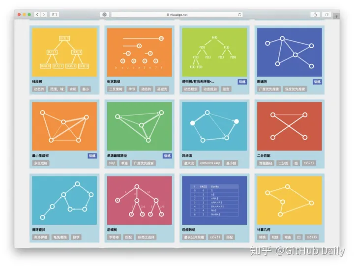

在动画执行的过程中，还会在网站右下角高亮显示当前动画的代码逻辑。

下面我以最为经典的冒泡排序算法为例，给大家做下视频展示：

[VisuAlgo：算法可视化网站 4225 播放 · 13 赞同视频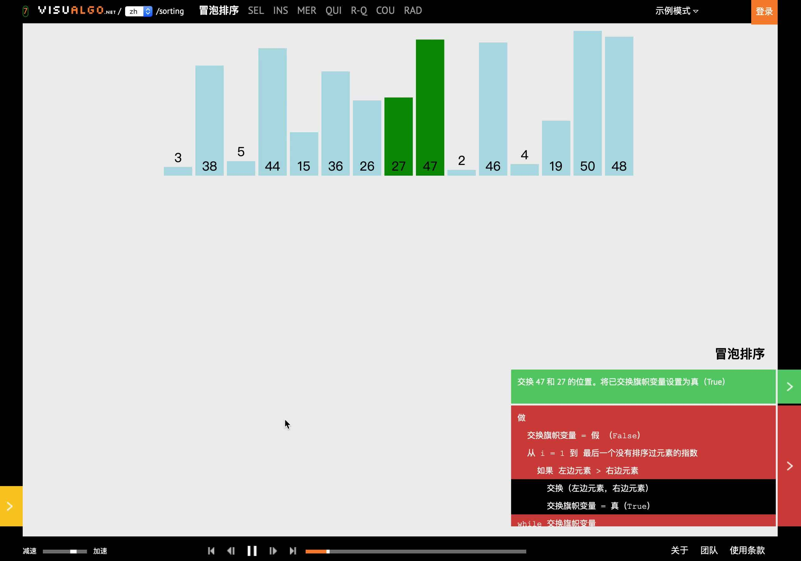](https://www.zhihu.com/zvideo/1274049932966629376)

不仅于此，该网站还提供了一些算法练习题供学生训练，以便更进一步巩固自己的算法知识。

令人称赞的是，这些问题都是可以直接通过系统自动生成与评测的。问题通过一些规则随机产生，学生答案提交后后台服务器会自动评测。

据网站管理员透露，类似这种在线评测系统，已被世界各校的 CS 讲师采用，仅通过设置系统的在线测验权重，便能很快了解学生的算法掌握程度。

当前网站上共提供 12 个可视化算法模块的问题测验，剩余 8 个可视化模块正在研发中，相信未来 VisuAlgo 的每个可视化模块都能拥有在线测验组件。

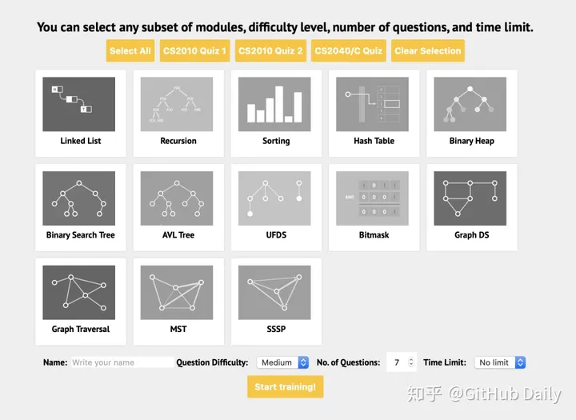

由于 VisuAlgo 的使用人群足够广，地理位置跨度大，因此平台管理员也很贴心的添加了各个国家的语言，这其中便包含了中文。

所以，英语能力不太好的同学也无需担心，直接撸起袖子举手手，干就完事儿了。

## ↓ 数据结构

## 栈

### 概念

栈是一个线性结构，在计算机中是一个相当常见的数据结构。

栈的特点是只能在某一端添加或删除数据，遵循先进后出的原则

### 实现

每种数据结构都可以用很多种方式来实现，其实可以把栈看成是数组的一个子
集，所以这里使用数组来实现

```js
class Stack {
	constructor() {
		this.stack = [];
	}
	push(item) {
		this.stack.push(item);
	}
	pop() {
		this.stack.pop();
	}
	peek() {
		return this.stack[this.getCount() - 1];
	}
	getCount() {
		return this.stack.length;
	}
	isEmpty() {
		return this.getCount() === 0;
	}
}
```

### 应用

匹配括号，可以通过栈的特性来完成

```js
var isValid = function (s) {
	let map = {
		"(": -1,
		")": 1,
		"[": -2,
		"]": 2,
		"{": -3,
		"}": 3,
	};
	let stack = [];
	for (let i = 0; i < s.length; i++) {
		if (map[s[i]] < 0) {
			stack.push(s[i]);
		} else {
			let last = stack.pop();
			if (map[last] + map[s[i]] != 0) return false;
		}
	}
	if (stack.length > 0) return false;
	return true;
};
```

## 队列

### 概念

队列一个线性结构，特点是在某一端添加数据，在另一端删除数据，遵循先进
先出的原则

### 实现

这里会讲解两种实现队列的方式，分别是单链队列和循环队列

### 单链队列

```js
class Queue {
	constructor() {
		this.queue = [];
	}
	enQueue(item) {
		this.queue.push(item);
	}
	deQueue() {
		return this.queue.shift();
	}
	getHeader() {
		return this.queue[0];
	}
	getLength() {
		return this.queue.length;
	}
	isEmpty() {
		return this.getLength() === 0;
	}
}
```

因为单链队列在出队操作的时候需要 O(n) 的时间复杂度，所以引入了循环队列。循环队列的出队操作平均是 O(1) 的时间复杂度

### 循环队列

```js
class SqQueue {
	constructor(length) {
		this.queue = new Array(length + 1);
		// 队头
		this.first = 0;
		// 队尾
		this.last = 0;
		// 当前队列大小
		this.size = 0;
	}
	enQueue(item) {
		// 判断队尾 + 1 是否为队头
		// 如果是就代表需要扩容数组
		// % this.queue.length 是为了防止数组越界
		if (this.first === (this.last + 1) % this.queue.length) {
			this.resize(this.getLength() * 2 + 1);
		}
		this.queue[this.last] = item;
		this.size++;
		this.last = (this.last + 1) % this.queue.length;
	}
	deQueue() {
		if (this.isEmpty()) {
			throw Error("Queue is empty");
		}
		let r = this.queue[this.first];
		this.queue[this.first] = null;
		this.first = (this.first + 1) % this.queue.length;
		this.size--;
		// 判断当前队列大小是否过小
		// 为了保证不浪费空间，在队列空间等于总长度四分之一时
		// 且不为 2 时缩小总长度为当前的一半
		if (this.size === this.getLength() / 4 && this.getLength() / 2 !== 0) {
			this.resize(this.getLength() / 2);
		}
		return r;
	}
	getHeader() {
		if (this.isEmpty()) {
			throw Error("Queue is empty");
		}
		return this.queue[this.first];
	}
	getLength() {
		return this.queue.length - 1;
	}
	isEmpty() {
		return this.first === this.last;
	}
	resize(length) {
		let q = new Array(length);
		for (let i = 0; i < length; i++) {
			q[i] = this.queue[(i + this.first) % this.queue.length];
		}
		this.queue = q;
		this.first = 0;
		this.last = this.size;
	}
}
```

## 树

### 二叉树

树拥有很多种结构，二叉树是树中最常用的结构，同时也是一个天然的递归结构。

二叉树拥有一个根节点，每个节点⾄多拥有两个子节点，分别为：左节点和右节点。树的最底部节点称之为叶节点，当一颗树的叶数量数量为满时，该树可以称之为满二叉树

### 二分搜索树

二分搜索树也是二叉树，拥有二叉树的特性。但是区别在于二分搜索树每个节点的值都比他的左子树的值大，比右子树的值小

这种存储方式很适合于数据搜索。如下图所示，当需要查找 6 的时候，因为需要查找的值比根节点的值大，所以只需要在根节点的右子树上寻找，大大提高了搜索效率

#### 实现

```js
class Node {
	constructor(value) {
		this.value = value;
		this.left = null;
		this.right = null;
	}
}
class BST {
	constructor() {
		this.root = null;
		this.size = 0;
	}
	getSize() {
		return this.size;
	}
	isEmpty() {
		return this.size === 0;
	}
	addNode(v) {
		this.root = this._addChild(this.root, v);
	}
	// 添加节点时，需要比较添加的节点值和当前
	// 节点值的大小
	_addChild(node, v) {
		if (!node) {
			this.size++;
			return new Node(v);
		}
		if (node.value > v) {
			node.left = this._addChild(node.left, v);
		} else if (node.value < v) {
			node.right = this._addChild(node.right, v);
		}
		return node;
	}
}
```

以上是最基本的二分搜索树实现，接下来实现树的遍历。

对于树的遍历来说，有三种遍历方法，分别是先序遍历、中序遍历、后序遍历。

三种遍历的区别在于何时访问节点。在遍历树的过程中，每个节点都会遍历三次，分别是遍历到自己，遍历左子树和遍历右子树。如果需要实现先序遍历，那么只需要第一次遍历到节点时进行操作即可。

```js
class Xxx {
	// 先序遍历可用于打印树的结构
	// 先序遍历先访问根节点，然后访问左节点，最后访问右节点。
	preTraversal() {
		this._pre(this.root);
	}
	_pre(node) {
		if (node) {
			console.log(node.value);
			this._pre(node.left);
			this._pre(node.right);
		}
	}
	// 中序遍历可用于排序
	// 对于 BST 来说，中序遍历可以实现一次遍历就
	// 得到有序的值
	// 中序遍历表示先访问左节点，然后访问根节点，最后访问右节点。
	midTraversal() {
		this._mid(this.root);
	}
	_mid(node) {
		if (node) {
			this._mid(node.left);
			console.log(node.value);
			this._mid(node.right);
		}
	}
	// 后序遍历可用于先操作子节点
	// 再操作父节点的场景
	// 后序遍历表示先访问左节点，然后访问右节点，最后访问根节点。
	backTraversal() {
		this._back(this.root);
	}
	_back(node) {
		if (node) {
			this._back(node.left);
			this._back(node.right);
			console.log(node.value);
		}
	}
}
```

以上的这几种遍历都可以称之为深度遍历，对应的还有种遍历叫做⼴度遍历，
也就是一层层地遍历树。对于⼴度遍历来说，我们需要利用之前讲过的队列结
构来完成

```js
breadthTraversal() {
	if (!this.root) return null;
	let q = new Queue();
	// 将根节点入队
	q.enQueue(this.root);
	// 循环判断队列是否为空，为空
	// 代表树遍历完毕
	while (!q.isEmpty()) {
		// 将队首出队，判断是否有左右子树
		// 有的话，就先左后右入队
		let n = q.deQueue();
		console.log(n.value);
		if (n.left) q.enQueue(n.left);
		if (n.right) q.enQueue(n.right);
	}
}
```

接下来先介绍如何在树中寻找最小值或最大数。因为二分搜索树的特性，所以
最小值一定在根节点的最左边，最大值相反

```js
getMin() {
	return this._getMin(this.root).value;
}
_getMin(node) {
	if (!node.left) return node;
	return this._getMin(node.left);
}
getMax() {
	return this._getMax(this.root).value;
}
_getMax(node) {
	if (!node.right) return node;
	return this._getMin(node.right);
}
```

向上取整和向下取整，这两个操作是相反的，所以代码也是类似的，这里只介
绍如何向下取整。既然是向下取整，那么根据二分搜索树的特性，值一定在根
节点的左侧。只需要一直遍历左子树直到当前节点的值不再大于等于需要的
值，然后判断节点是否还拥有右子树。如果有的话，继续上面的递归判断

```js
floor(v) {
	let node = this._floor(this.root, v);
	return node ? node.value : null;
}
_floor(node, v) {
	if (!node) return null;
	if (node.value === v) return v;
	// 如果当前节点值还比需要的值大，就继续递归
	if (node.value > v) {
		return this._floor(node.left, v);
	}
	// 判断当前节点是否拥有右子树
	let right = this._floor(node.right, v);
	if (right) return right;
	return node;
}
```

排名，这是用于获取给定值的排名或者排名第几的节点的值，这两个操作也是
相反的，所以这个只介绍如何获取排名第几的节点的值。对于这个操作而⾔，
我们需要略微的改造点代码，让每个节点拥有一个 size 属性。该属性表示该节
点下有多少子节点（包含自身）

```js
class Node {
	constructor(value) {
		this.value = value;
		this.left = null;
		this.right = null;
		// 修改代码
		this.size = 1;
	}

	// 新增代码
	_getSize(node) {
		return node ? node.size : 0;
	}
	_addChild(node, v) {
		if (!node) {
			return new Node(v);
		}
		if (node.value > v) {
			// 修改代码
			node.size++;
			node.left = this._addChild(node.left, v);
		} else if (node.value < v) {
			// 修改代码
			node.size++;
			node.right = this._addChild(node.right, v);
		}
		return node;
	}
	select(k) {
		let node = this._select(this.root, k);
		return node ? node.value : null;
	}
	_select(node, k) {
		if (!node) return null;
		// 先获取左子树下有几个节点
		let size = node.left ? node.left.size : 0;
		// 判断 size 是否大于 k
		// 如果大于 k，代表所需要的节点在左节点
		if (size > k) return this._select(node.left, k);
		// 如果小于 k，代表所需要的节点在右节点
		// 注意这里需要重新计算 k，减去根节点除了右子树的节点数量
		if (size < k) return this._select(node.right, k - size - 1);
		return node;
	}
}
```

接下来讲解的是二分搜索树中最难实现的部分：删除节点。因为对于删除节点
来说，会存在以下几种情况

- 需要删除的节点没有子树
- 需要删除的节点只有一条子树
- 需要删除的节点有左右两条树
- 对于前两种情况很好解决，但是第三种情况就有难度了，所以先来实现相对简单的操作：
  - 删除最小节点，对于删除最小节点来说，是不存在第三种情况的，删除最大节点操作是和删除最小节点相反的，所以这里也就不再赘述

```js
delectMin() {
	this.root = this._delectMin(this.root);
	console.log(this.root);
}
_delectMin(node) {
	// 一直递归左子树
	// 如果左子树为空，就判断节点是否拥有右子树
	// 有右子树的话就把需要删除的节点替换为右子树
	if ((node != null) & !node.left) return node.right;
	node.left = this._delectMin(node.left);
	// 最后需要重新维护下节点的 `size`
	node.size = this._getSize(node.left) + this._getSize(node.right) + 1;
	return node;
}
```

- 最后讲解的就是如何删除任意节点了。对于这个操作， T.Hibbard 在 1962 年提出了解决这个难题的办法，也就是如何解决第三种情况。
- 当遇到这种情况时，需要取出当前节点的后继节点（也就是当前节点右子树的最小节点）来替换需要删除的节点。然后将需要删除节点的左子树赋值给后继结点，右子树删除后继结点后赋值给他。
- 你如果对于这个解决办法有疑问的话，可以这样考虑。因为二分搜索树的特性，父节点一定比所有左子节点大，比所有右子节点小。那么当需要删除父节点时，势必需要拿出一个比父节点大的节点来替换父节点。这个节点肯定不存在于左子树，必然存在于右子树。然后⼜需要保持父节点都是比右子节点小的，那么就可以取出右子树中最小的那个节点来替换父节点

```js
delect(v) {
	this.root = this._delect(this.root, v);
}
_delect(node, v) {
	if (!node) return null;
	// 寻找的节点比当前节点小，去左子树找
	if (node.value < v) {
		node.right = this._delect(node.right, v);
	} else if (node.value > v) {
		// 寻找的节点比当前节点大，去右子树找
		node.left = this._delect(node.left, v);
	} else {
		// 进入这个条件说明已经找到节点
		// 先判断节点是否拥有拥有左右子树中的一个
		// 是的话，将子树返回出去，这里和 `_delectMin` 的操作一样
		if (!node.left) return node.right;
		if (!node.right) return node.left;
		// 进入这里，代表节点拥有左右子树
		// 先取出当前节点的后继结点，也就是取当前节点右子树的最小值
		let min = this._getMin(node.right);
		// 取出最小值后，删除最小值
		// 然后把删除节点后的子树赋值给最小值节点
		min.right = this._delectMin(node.right);
		// 左子树不动
		min.left = node.left;
		node = min;
	}
	// 维护 size
	node.size = this._getSize(node.left) + this._getSize(node.right) + 1;
	return node;
}
```

### 1、二叉树层序遍历

**考察点：树**

::: details 查看参考回答

思路：先建立一棵二叉树。再进行队列遍历

```js
function tree(obj) {
	var obj = obj.split(")");
	obj.pop();
	var newobj = [];
	for (var i = 0; i < obj.length; i++) {
		newobj.push(obj[i].replace("(", ""));
	}
	var root = {
		value: null,
		left: null,
		right: null,
		have: 0,
	};
	var u;
	for (var i = 0; i < newobj.length; i++) {
		var a1 = newobj[i].split(",")[0];

		var a2 = newobj[i].split(",")[1];
		u = root;
		if (a2 !== "") {
			for (var j = 0; j < a2.length; j++) {
				if (a2[j] === "L") {
					if (u.left === null) {
						u.left = newnode();
						u = u.left;
					} else {
						u = u.left;
					}
				} else if (a2[j] === "R") {
					if (u.right === null) {
						u.right = newnode();
						u = u.right;
					} else {
						u = u.right;
					}
				}
			}
			if (u.have === 1) {
			} else {
				u.value = a1;

				u.have = 1;
			}
		} else {
			root.value = a1;
			u.have = 1;
		}
	}
	return root;
}
// 建立新结点
function newnode() {
	return { value: null, left: null, right: null, have: 0 };
}
// 队列遍历
function bfs() {
	var root = tree("(11,LL)(7,LLL)(8,R)(5,)(4,L)(13,RL)(2,LLR)(1,RRR)(4,RR)");
	var front = 0,
		rear = 1,
		n = 0;
	var q = [],
		ans = [];
	q[0] = root;
	while (front < rear) {
		var u = q[front++];
		if (u.have !== 1) {
			return;
		}
		ans[n++] = u.value;

		if (u.left !== null) {
			q[rear++] = u.left;
		}
		if (u.right !== null) {
			q[rear++] = u.right;
		}
	}
	console.log(ans.join(" "));
}
bfs();
```

:::

### 2、B 树的特性，B 树和 B+树的区别

**考察点：数据结构**

::: details 查看参考回答

一个 m 阶的 B 树满足以下条件：

每个结点至多拥有 m 棵子树；

根结点至少拥有两颗子树（存在子树的情况下）；

除了根结点以外，其余每个分支结点至少拥有 m/2 棵子树；

所有的叶结点都在同一层上；

有 k 棵子树的分支结点则存在 k-1 个关键码，关键码按照递增次序进行排列；

关键字数量需要满足 ceil(m/2)-1 <= n <= m-1；

B 树和 B+树的区别：

以一个 m 阶树为例。

关键字的数量不同；B+树中分支结点有 m 个关键字，其叶子结点也有 m 个，其关键字只是起到了一个索引的作用，但是 B 树虽然也有 m 个子结点，但是其只拥有 m-1 个关键字。

存储的位置不同；B+树中的数据都存储在叶子结点上，也就是其所有叶子结点的数据组合起来就是完整的数据，但是 B 树的数据存储在每一个结点中，并不仅仅存储在叶子结点上。

分支结点的构造不同；B+树的分支结点仅仅存储着关键字信息和儿子的指针（这里的指针指的是磁盘块的偏移量），也就是说内部结点仅仅包含着索引信息。

查询不同；B 树在找到具体的数值以后，则结束，而 B+树则需要通过索引找到叶子结点中的数据才结束，也就是说 B+树的搜索过程中走了一条从根结点到叶子结点的路径。

:::

### AVL 树

#### 概念

二分搜索树实际在业务中是受到限制的，因为并不是严格的 O(logN)，在极端
情况下会退化成链表，比如加入一组升序的数字就会造成这种情况。

AVL 树改进了二分搜索树，在 AVL 树中任意节点的左右子树的高度差都不大于
1，这样保证了时间复杂度是严格的 O(logN)。基于此，对 AVL 树增加或删除节点时可能需要旋转树来达到高度的平衡。

#### 实现

因为 AVL 树是改进了二分搜索树，所以部分代码是于二分搜索树重复的，对于重复内容不作再次解析。

对于 AVL 树来说，添加节点会有四种情况

图片暂缺...

- 对于左左情况来说，新增加的节点位于节点 2 的左侧，这时树已经不平衡，需要旋转。
- 因为搜索树的特性，节点比左节点大，比右节点小，所以旋转以后也要实现这个特性。
- 旋转之前： new < 2 < C < 3 < B < 5 < A ，右旋之后节点 3 为根节点，这时候需要将节点 3 的右节点加到节点 5 的左边，最后还需要更新节点的高度。
- 对于右右情况来说，相反于左左情况，所以不再赘述。
- 对于左右情况来说，新增加的节点位于节点 4 的右侧。对于这种情况，需要通过两次旋转来达到目的。

首先对节点的左节点左旋，这时树满⾜左左的情况，再对节点进行一次右旋就可以达到目的。

```js
class Node {
	constructor(value) {
		this.value = value;
		this.left = null;
		this.right = null;
		this.height = 1;
	}
}
class AVL {
	constructor() {
		this.root = null;
	}
	addNode(v) {
		this.root = this._addChild(this.root, v);
	}
	_addChild(node, v) {
		if (!node) {
			return new Node(v);
		}
		if (node.value > v) {
			node.left = this._addChild(node.left, v);
		} else if (node.value < v) {
			node.right = this._addChild(node.right, v);
		} else {
			node.value = v;
		}
		node.height =
			1 + Math.max(this._getHeight(node.left), this._getHeight(node.right));
		let factor = this._getBalanceFactor(node);
		// 当需要右旋时，根节点的左树一定比右树高度高
		if (factor > 1 && this._getBalanceFactor(node.left) >= 0) {
			return this._rightRotate(node);
		}
		// 当需要左旋时，根节点的左树一定比右树高度矮
		if (factor < -1 && this._getBalanceFactor(node.right) <= 0) {
			return this._leftRotate(node);
		}
		// 左右情况
		// 节点的左树比右树高，且节点的左树的右树比节点的左树的左树高
		if (factor > 1 && this._getBalanceFactor(node.left) < 0) {
			node.left = this._leftRotate(node.left);
			return this._rightRotate(node);
		}
		// 右左情况
		// 节点的左树比右树矮，且节点的右树的右树比节点的右树的左树矮
		if (factor < -1 && this._getBalanceFactor(node.right) > 0) {
			node.right = this._rightRotate(node.right);
			return this._leftRotate(node);
		}
		return node;
	}
	_getHeight(node) {
		if (!node) return 0;
		return node.height;
	}
	_getBalanceFactor(node) {
		return this._getHeight(node.left) - this._getHeight(node.right);
	}
	// 节点右旋
	// 5 2
	// / \ / \
	// 2 6 ==> 1 5
	// / \ / / \
	// 1 3 new 3 6
	// /
	// new
	_rightRotate(node) {
		// 旋转后新根节点
		let newRoot = node.left;
		// 需要移动的节点
		let moveNode = newRoot.right;
		// 节点 2 的右节点改为节点 5
		newRoot.right = node;
		// 节点 5 左节点改为节点 3
		node.left = moveNode;
		// 更新树的高度
		node.height =
			1 + Math.max(this._getHeight(node.left), this._getHeight(node.right));
		newRoot.height =
			1 +
			Math.max(this._getHeight(newRoot.left), this._getHeight(newRoot.right));

		// 返回新根节点
		return newRoot;
	}
	// 节点左旋
	// 4 6
	// / \ / \
	// 2 6 ==> 4 7
	// / \ / \ \
	// 5 7 2 5 new
	// \
	// new
	_leftRotate(node) {
		// 旋转后新根节点
		let newRoot = node.right;
		// 需要移动的节点
		let moveNode = newRoot.left;
		// 节点 6 的左节点改为节点 4
		newRoot.left = node;
		// 节点 4 右节点改为节点 5
		node.right = moveNode;
		// 更新树的高度
		node.height =
			1 + Math.max(this._getHeight(node.left), this._getHeight(node.right));
		newRoot.height =
			1 +
			Math.max(this._getHeight(newRoot.left), this._getHeight(newRoot.right));
		return newRoot;
	}
}
```

### Trie

#### 概念

在计算机科学，trie，⼜称前缀树或字典树，是一种有序树，用于保存关联数组，其中的键通常是字符串。

简单点来说，这个结构的作用大多是为了方便搜索字符串，该树有以下几个特
点根节点代表空字符串，每个节点都有 N（假如搜索英文字符，就有 26 条） 条链接，每条链接代表一个字符节点不存储字符，只有路径才存储，这点和其他的树结构不同从根节点开始到任意一个节点，将沿途经过的字符连接起来就是该节点对应的字符串

#### 实现

总得来说 Trie 的实现相比别的树结构来说简单的很多，实现就以搜索英文
字符为例。

```js
class TrieNode {
	constructor() {
		// 代表每个字符经过节点的次数
		this.path = 0;
		// 代表到该节点的字符串有几个
		this.end = 0;
		// 链接
		this.next = new Array(26).fill(null);
	}
}
class Trie {
	constructor() {
		// 根节点，代表空字符
		this.root = new TrieNode();
	}
	// 插入字符串
	insert(str) {
		if (!str) return;
		let node = this.root;
		for (let i = 0; i < str.length; i++) {
			// 获得字符先对应的索引
			let index = str[i].charCodeAt() - "a".charCodeAt();
			// 如果索引对应没有值，就创建
			if (!node.next[index]) {
				node.next[index] = new TrieNode();
			}
			node.path += 1;
			node = node.next[index];
		}
		node.end += 1;
	}
	// 搜索字符串出现的次数
	search(str) {
		if (!str) return;
		let node = this.root;
		for (let i = 0; i < str.length; i++) {
			let index = str[i].charCodeAt() - "a".charCodeAt();
			// 如果索引对应没有值，代表没有需要搜素的字符串
			if (!node.next[index]) {
				return 0;
			}
			node = node.next[index];
		}
		return node.end;
	}
	// 删除字符串
	delete(str) {
		if (!this.search(str)) return;
		let node = this.root;
		for (let i = 0; i < str.length; i++) {
			let index = str[i].charCodeAt() - "a".charCodeAt();
			// 如果索引对应的节点的 Path 为 0，代表经过该节点的字符串
			// 已经一个，直接删除即可
			if (--node.next[index].path == 0) {
				node.next[index] = null;
				return;
			}
			node = node.next[index];
		}
		node.end -= 1;
	}
}
```

### 并查集

#### 概念

并查集是一种特殊的树结构，用于处理一些不交集的合并及查询问题。该结构中每个节点都有一个父节点，如果只有当前一个节点，那么该节点的父节点指向自己。

这个结构中有两个重要的操作，分别是：

- Find ：确定元素属于哪一个子集。它可以被用来确定两个元素是否属于同一子集。
- Union ：将两个子集合并成同一个集合。

#### 实现

```js
class DisjointSet {
	// 初始化样本
	constructor(count) {
		// 初始化时，每个节点的父节点都是自己
		this.parent = new Array(count);
		// 用于记录树的深度，优化搜索复杂度
		this.rank = new Array(count);
		for (let i = 0; i < count; i++) {
			this.parent[i] = i;
			this.rank[i] = 1;
		}
	}
	find(p) {
		// 寻找当前节点的父节点是否为自己，不是的话表示还没找到
		// 开始进行路径压缩优化
		// 假设当前节点父节点为 A
		// 将当前节点挂载到 A 节点的父节点上，达到压缩深度的目的
		while (p != this.parent[p]) {
			this.parent[p] = this.parent[this.parent[p]];
			p = this.parent[p];
		}
		return p;
	}
	isConnected(p, q) {
		return this.find(p) === this.find(q);
	}
	// 合并
	union(p, q) {
		// 找到两个数字的父节点
		let i = this.find(p);
		let j = this.find(q);
		if (i === j) return;
		// 判断两棵树的深度，深度小的加到深度大的树下面
		// 如果两棵树深度相等，那就无所谓怎么加
		if (this.rank[i] < this.rank[j]) {
			this.parent[i] = j;
		} else if (this.rank[i] > this.rank[j]) {
			this.parent[j] = i;
		} else {
			this.parent[i] = j;
			this.rank[j] += 1;
		}
	}
}
```

## 堆

### 概念

- 堆通常是一个可以被看做一棵树的数组对象。
- 堆的实现通过构造二叉堆，实为二叉树的一种。这种数据结构具有以下性质。

  1.任意节点小于（或大于）它的所有子节点

  2.堆总是一棵完全树。即除了最底层，其他层的节点都被元素填满，且最底层从左到右填入。

- 将根节点最大的堆叫做最大堆或大根堆，根节点最小的堆叫做最小堆或小堆。
- 优先队列也完全可以用堆来实现，操作是一模一样的。

### 实现大根堆

堆的每个节点的左边子节点索引是 i _ 2 + 1 ，右边是 i _ 2 + 2 ，父节点是 (i - 1) /2 。

- 堆有两个核⼼的操作，分别是 shiftUp 和 shiftDown 。前者用于添加元素，后者用于删除根节点。
- shiftUp 的核⼼思路是一路将节点与父节点对比大小，如果比父节点大，就和父节点交换位置。
- shiftDown 的核⼼思路是先将根节点和末尾交换位置，然后移除末尾元素。接下来循环判断父节点和两个子节点的大小，如果子节点大，就把最大的子节点和父节点交换

```js
class MaxHeap {
	constructor() {
		this.heap = [];
	}
	size() {
		return this.heap.length;
	}
	empty() {
		return this.size() == 0;
	}
	add(item) {
		this.heap.push(item);
		this._shiftUp(this.size() - 1);
	}
	removeMax() {
		this._shiftDown(0);
	}
	getParentIndex(k) {
		return parseInt((k - 1) / 2);
	}
	getLeftIndex(k) {
		return k * 2 + 1;
	}
	_shiftUp(k) {
		// 如果当前节点比父节点大，就交换
		while (this.heap[k] > this.heap[this.getParentIndex(k)]) {
			this._swap(k, this.getParentIndex(k));
			// 将索引变成父节点
			k = this.getParentIndex(k);
		}
	}
	_shiftDown(k) {
		// 交换首位并删除末尾
		this._swap(k, this.size() - 1);
		this.heap.splice(this.size() - 1, 1);
		// 判断节点是否有左孩子，因为二叉堆的特性，有右必有左
		while (this.getLeftIndex(k) < this.size()) {
			let j = this.getLeftIndex(k);
			// 判断是否有右孩子，并且右孩子是否大于左孩子
			if (j + 1 < this.size() && this.heap[j + 1] > this.heap[j]) j++;
			// 判断父节点是否已经比子节点都大
			if (this.heap[k] >= this.heap[j]) break;
			this._swap(k, j);
			k = j;
		}
	}
	_swap(left, right) {
		let rightValue = this.heap[right];
		this.heap[right] = this.heap[left];
		this.heap[left] = rightValue;
	}
}
```

## 算法面试题

对于大部分公司的面试来说，排序的内容已经⾜以应付了，由此为了更好的符
合大众需求，排序的内容是最多的。当然如果你还想冲击更好的公司，那么整
一个章节的内容都是需要掌握的。对于字节跳动这类⼗分看重算法的公司来说，这一章节是远远不够的，剑指 Offer 应该是你更好的选择

这一章节的内容信息量会很大，不适合在非电脑环境下阅读，请各位打开代码
编辑器，一行行的敲代码，单纯阅读是学习不了算法的
另

外学习算法的时候，有一个可视化界面会相对减少点学习的难度，具体可以
阅读 [algorithm-visualizer/algorithm-visualizer: :fireworks:](https://github.com/algorithm-visualizer/algorithm-visualizer) 这个仓库

### 3.1 时间复杂度

- 通常使用最差的时间复杂度来衡量一个算法的好坏。
- 常数时间 O(1) 代表这个操作和数据量没关系，是一个固定时间的操作，比如说四则运算。
- 对于一个算法来说，可能会计算出如下操作次数 aN + 1 ， N 代表数据量。那么该算法的时间复杂度就是 O(N) 。因为我们在计算时间复杂度的时候，数据量通常是非常大的，这时候低阶项和常数项可以忽略不计。
- 当然可能会出现两个算法都是 O(N) 的时间复杂度，那么对比两个算法的好坏就要通过对比低阶项和常数项了

### 3.2 位运算

- 位运算在算法中很有用，速度可以比四则运算快很多。
- 在学习位运算之前应该知道十进制如何转二进制，二进制如何转十进制。这里说明下简单的计算方式
- ⼗进制 33 可以看成是 32 + 1 ，并且 33 应该是六位二进制的（因为 33 近似 32 ，而 32 是 2 的五次方，所以是六位），那么 ⼗进制 33 就是 100001 ，只要是 2 的次方，那么就是 1 否则都为 0 那么二进制 100001 同理，首位是 2^5 ，末位是 2^0 ，相加得出 33

#### 左移 <<

```bash
10 << 1 // -> 20
```

左移就是将二进制全部往左移动， 10 在二进制中表示为 1010 ，左移一位后变成 10100 ，转换为十进制也就是 20 ，所以基本可以把左移看成以下公式： a \* (2 ^ b)

#### 算数右移 >>

```bash
10 >> 1 // -> 5
```

算数右移就是将二进制全部往右移动并去除多余的右边， 10 在二进制中表示为 1010 ，右移一位后变成 101 ，转换为十进制也就是 5 ，所以基本可以把右移看成以下公式：int v = a / (2 ^ b)

右移很好用，比如可以用在二分算法中取中间值

```bash
13 >> 1 // -> 6
```

#### 按位操作

##### 按位与

每一位都为 1 ，结果才为 1

```js
8 & 7; // -> 0
// 1000 & 0111 -> 0000 -> 0
```

##### 按位或

其中一位为 1，结果就是 1

```
8 | 7 // -> 15
// 1000 | 0111 -> 1111 -> 15
```

##### 按位异或

每一位都不同，结果才为 1

```bash
8 ^ 7 // -> 15
8 ^ 8 // -> 0
// 1000 ^ 0111 -> 1111 -> 15
// 1000 ^ 1000 -> 0000 -> 0
```

##### 面试题：两个数不使用四则运算得出和

这道题中可以按位异或，因为按位异或就是不进位加法， 8 ^ 8 = 0 如果进位了，就是 16 了，所以我们只需要将两个数进行异或操作，然后进位。那么也就是说两个二进制都是 1 的位置，左边应该有一个进位 1 ，所以可以得出以下公式 a + b = (a ^ b) + ((a & b) << 1) ，然后通过迭代的方式模拟加法

```js
function sum(a, b) {
	if (a == 0) return b;
	if (b == 0) return a;
	let newA = a ^ b;
	let newB = (a & b) << 1;
	return sum(newA, newB);
}
```

### 3.3 排序

#### 冒泡排序

冒泡排序的原理如下，从第一个元素开始，把当前元素和下一个索引元素进行
比较。如果当前元素大，那么就交换位置，重复操作直到比较到最后一个元素，那么此时最后一个元素就是该数组中最大的数。下一轮重复以上操作，但
是此时最后一个元素已经是最大数了，所以不需要再比较最后一个元素，只需
要比较到 length - 1 的位置

##### 以下是实现该算法的代码

```js
function bubble(array) {
	checkArray(array);
	for (let i = array.length - 1; i > 0; i--) {
		// 从 0 到 `length - 1` 遍历
		for (let j = 0; j < i; j++) {
			if (array[j] > array[j + 1]) swap(array, j, j + 1);
		}
	}
	return array;
}
```

#### 插入排序

入排序的原理如下。第一个元素默认是已排序元素，取出下一个元素和当前元素比较，如果当前元素大就交换位置。那么此时第一个元素就是当前的最小数，所以下次取出操作从第三个元素开始，向前对比，重复之前的操作

##### 以下是实现该算法的代码

```
function insertion(array) {
	checkArray(array);
	for (let i = 1; i < array.length; i++) {
		for (let j = i - 1; j >= 0 && array[j] > array[j + 1]; j--)
			swap(array, j, j + 1);
	}
	return array;
}
```

该算法的操作次数是一个等差数列 n + (n - 1) + (n - 2) + 1 ，去掉常数项以后得出时间复杂度是 O(n \* n)

#### 选择排序

选择排序的原理如下。遍历数组，设置最小值的索引为 0 ，如果取出的值比当前最小值小，就替换最小值索引，遍历完成后，将第一个元素和最小值索引上的值交换。如上操作后，第一个元素就是数组中的最小值，下次遍历就可以从索引 1 开始重复上述操作

##### 以下是实现该算法的代码

```js
function selection(array) {
	checkArray(array);
	for (let i = 0; i < array.length - 1; i++) {
		let minIndex = i;
		for (let j = i + 1; j < array.length; j++) {
			minIndex = array[j] < array[minIndex] ? j : minIndex;
		}
		swap(array, i, minIndex);
	}
	return array;
}
```

该算法的操作次数是一个等差数列 n + (n - 1) + (n - 2) + 1 ，去掉常数项以后得出时间复杂度是 O(n \* n)

#### 归并排序

归并排序的原理如下。递归的将数组两两分开直到最多包含两个元素，然后将数组排序合并，最终合并为排序好的数组。假设我有一组数组 [3, 1, 2, 8, 9, 7, 6] ，中间数索引是 3，先排序数组 [3, 1, 2, 8] 。在这个左边数组上，继续拆分直到变成数组包含两个元素（如果数组长度是奇数的话，会有一个拆分数组只包含一个元素）。然后排序数组 [3, 1] 和 [2, 8] ，然后再排序数组 [1, 3, 2, 8] ，这样左边数组就排序完成，然后按照以上思路排序右边数组，最后将数组 [1, 2, 3, 8] 和 [6, 7, 9] 排序

##### 以下是实现该算法的代码

```js
function sort(array) {
	checkArray(array);
	mergeSort(array, 0, array.length - 1);
	return array;
}
function mergeSort(array, left, right) {
	// 左右索引相同说明已经只有一个数
	if (left === right) return;
	// 等同于 `left + (right - left) / 2`
	// 相比 `(left + right) / 2` 来说更加安全，不会溢出
	// 使用位运算是因为位运算比四则运算快
	let mid = parseInt(left + ((right - left) >> 1));
	mergeSort(array, left, mid);
	mergeSort(array, mid + 1, right);
	let help = [];
	let i = 0;
	let p1 = left;
	let p2 = mid + 1;
	while (p1 <= mid && p2 <= right) {
		help[i++] = array[p1] < array[p2] ? array[p1++] : array[p2++];
	}
	while (p1 <= mid) {
		help[i++] = array[p1++];
	}
	while (p2 <= right) {
		help[i++] = array[p2++];
	}
	for (let i = 0; i < help.length; i++) {
		array[left + i] = help[i];
	}
	return array;
}
```

以上算法使用了递归的思想。递归的本质就是压栈，每递归执行一次函数，就
将该函数的信息（比如参数，内部的变量，执行到的行数）压栈，直到遇到终
止条件，然后出栈并继续执行函数。对于以上递归函数的调用轨迹如下

```js
mergeSort(data, 0, 6); // mid = 3
mergeSort(data, 0, 3); // mid = 1
mergeSort(data, 0, 1); // mid = 0
mergeSort(data, 0, 0); // 遇到终止，回退到上一步
mergeSort(data, 1, 1); // 遇到终止，回退到上一步
// 排序 p1 = 0, p2 = mid + 1 = 1
// 回退到 `mergeSort(data, 0, 3)` 执行下一个递归
mergeSort(2, 3); // mid = 2
mergeSort(3, 3); // 遇到终止，回退到上一步
// 排序 p1 = 2, p2 = mid + 1 = 3
// 回退到 `mergeSort(data, 0, 3)` 执行合并逻辑
// 排序 p1 = 0, p2 = mid + 1 = 2
// 执行完毕回退
// 左边数组排序完毕，右边也是如上轨迹
```

该算法的操作次数是可以这样计算：递归了两次，每次数据量是数组的一半，
并且最后把整个数组迭代了一次，所以得出表达式 2T(N / 2) + T(N)（ T 代表时间， N 代表数据量）。根据该表达式可以套用 该公式 得出时间复杂度为 O(N \* logN)

#### 快排

快排的原理如下。随机选取一个数组中的值作为基准值，从左至右取值与基准值对比大小。比基准值小的放数组左边，大的放右边，对比完成后将基准值和第一个比基准值大的值交换位置。然后将数组以基准值的位置分为两部分，继续递归以上操作。

##### 以下是实现该算法的代码

```js
function sort(array) {
	checkArray(array);
	quickSort(array, 0, array.length - 1);
	return array;
}
function quickSort(array, left, right) {
	if (left < right) {
		swap(array, right);
		// 随机取值，然后和末尾交换，这样做比固定取一个位置的复杂度略低
		let indexs = part(
			array,
			parseInt(Math.random() * (right - left + 1)) +
				quickSort(array, left, indexs[0])
		);
		quickSort(array, indexs[1] + 1, right);
	}
}
function part(array, left, right) {
	let less = left - 1;
	let more = right;
	while (left < more) {
		if (array[left] < array[right]) {
			// 当前值比基准值小，`less` 和 `left` 都加一
			++less;
			++left;
		} else if (array[left] > array[right]) {
			// 当前值比基准值大，将当前值和右边的值交换
			// 并且不改变 `left`，因为当前换过来的值还没有判断过大小
			swap(array, --more, left);
		} else {
			// 和基准值相同，只移动下标
			left++;
		}
	}
	// 将基准值和比基准值大的第一个值交换位置
	// 这样数组就变成 `[比基准值小, 基准值, 比基准值大]`
	swap(array, right, more);
	return [less, more];
}
```

该算法的复杂度和归并排序是相同的，但是额外空间复杂度比归并排序少，只需 O(logN) ，并且相比归并排序来说，所需的常数时间也更少

#### 面试题

Sort Colors：该题目来自 LeetCode，题目需要我们将 [2,0,2,1,1,0] 排序成 [0,0,1,1,2,2] ，这个问题就可以使用三路快排的思想

代码的实现

```js
var sortColors = function (nums) {
	let left = -1;
	let right = nums.length;
	let i = 0;
	// 下标如果遇到 right，说明已经排序完成
	while (i < right) {
		if (nums[i] == 0) {
			swap(nums, i++, ++left);
		} else if (nums[i] == 1) {
			i++;
		} else {
			swap(nums, i, --right);
		}
	}
};
```

Kth Largest Element in an Array：该题目来自 LeetCode，题目需要找出数组
中第 K 大的元素，这问题也可以使用快排的思路。并且因为是找出第 K 大元
素，所以在分离数组的过程中，可以找出需要的元素在哪边，然后只需要排序
相应的一边数组就好。

```js
var findKthLargest = function (nums, k) {
	let l = 0;
	let r = nums.length - 1;
	// 得出第 K 大元素的索引位置
	k = nums.length - k;
	while (l < r) {
		// 分离数组后获得比基准树大的第一个元素索引
		let index = part(nums, l, r);
		// 判断该索引和 k 的大小
		if (index < k) {
			l = index + 1;
		} else if (index > k) {
			r = index - 1;
		} else {
			break;
		}
	}
	return nums[k];
};
function part(array, left, right) {
	let less = left - 1;
	let more = right;
	while (left < more) {
		if (array[left] < array[right]) {
			++less;
			++left;
		} else if (array[left] > array[right]) {
			swap(array, --more, left);
		} else {
			left++;
		}
	}
	swap(array, right, more);
	return more;
}
```

#### 堆排序

堆排序利用了二叉堆的特性来做，二叉堆通常用数组表示，并且二叉堆是一颗
完全二叉树（所有叶节点（最底层的节点）都是从左往右顺序排序，并且其他
层的节点都是满的）。二叉堆⼜分为大根堆与小根堆

- 大根堆是某个节点的所有子节点的值都比他小
- 小根堆是某个节点的所有子节点的值都比他大

堆排序的原理就是组成一个大根堆或者小根堆。以小根堆为例，某个节点的左
边子节点索引是 i _ 2 + 1 ，右边是 i _ 2 + 2 ，父节点是 (i - 1) /2

1. 首先遍历数组，判断该节点的父节点是否比他小，如果小就交换位置并继续判断，直到他的父节点比他大
2. 重新以上操作 1 ，直到数组首位是最大值
3. 然后将首位和末尾交换位置并将数组长度减一，表示数组末尾已是最大值，不需要再比较大小
4. 对比左右节点哪个大，然后记住大的节点的索引并且和父节点对比大小，如果子节点大就交换位置
5. 重复以上操作 3 - 4 直到整个数组都是大根堆。

以下是实现该算法的代码

```js
function heap(array) {
	checkArray(array);
	// 将最大值交换到首位
	for (let i = 0; i < array.length; i++) {
		heapInsert(array, i);
	}
	let size = array.length;
	// 交换首位和末尾
	swap(array, 0, --size);
	while (size > 0) {
		heapify(array, 0, size);
		swap(array, 0, --size);
	}
	return array;
}
function heapInsert(array, index) {
	// 如果当前节点比父节点大，就交换
	while (array[index] > array[parseInt((index - 1) / 2)]) {
		swap(array, index, parseInt((index - 1) / 2));
		// 将索引变成父节点
		index = parseInt((index - 1) / 2);
	}
}
function heapify(array, index, size) {
	let left = index * 2 + 1;
	while (left < size) {
		// 判断左右节点大小
		let largest =
			left + 1 < size && array[left] < array[left + 1] ? left + 1 : left;
		// 判断子节点和父节点大小
		largest = array[index] < array[largest] ? largest : index;
		if (largest === index) break;
		swap(array, index, largest);
		index = largest;
		left = index * 2 + 1;
	}
}
```

以上代码实现了小根堆，如果需要实现大根堆，只需要把节点对比反一下就好。

该算法的复杂度是 O(logN)

### 3.4 链表

#### 反转单向链表

该题目来自 LeetCode，题目需要将一个单向链表反转。思路很简单，使用三个变量分别表示当前节点和当前节点的前后节点，虽然这题很简单，但是却是一道面试常考题

以下是实现该算法的代码：

```js
var reverseList = function (head) {
	// 判断下变量边界问题
	if (!head || !head.next) return head;
	// 初始设置为空，因为第一个节点反转后就是尾部，尾部节点指向 null
	let pre = null;
	let current = head;
	let next;
	// 判断当前节点是否为空
	// 不为空就先获取当前节点的下一节点
	// 然后把当前节点的 next 设为上一个节点
	// 然后把 current 设为下一个节点，pre 设为当前节点
	while (current) {
		next = current.next;
		current.next = pre;
		pre = current;
		current = next;
	}
	return pre;
};
```

### 3.5 树

##### 二叉树的先序，中序，后序遍历

- 先序遍历表示先访问根节点，然后访问左节点，最后访问右节点。
- 中序遍历表示先访问左节点，然后访问根节点，最后访问右节点。
- 后序遍历表示先访问左节点，然后访问右节点，最后访问根节点

#### 递归实现

递归实现相当简单，代码如下

```js
function TreeNode(val) {
	this.val = val;
	this.left = this.right = null;
}
var traversal = function (root) {
	if (root) {
		// 先序
		console.log(root);
		traversal(root.left);
		// 中序
		// console.log(root);
		traversal(root.right);
		// 后序
		// console.log(root);
	}
};
```

对于递归的实现来说，只需要理解每个节点都会被访问三次就明白为什么这样实现了

#### 非递归实现

非递归实现使用了栈的结构，通过栈的先进后出模拟递归实现。

##### 以下是先序遍历代码实现

```js
function pre(root) {
	if (root) {
		let stack = [];
		// 先将根节点 push
		stack.push(root);
		// 判断栈中是否为空
		while (stack.length > 0) {
			// 弹出栈顶元素
			root = stack.pop();
			console.log(root);
			// 因为先序遍历是先左后右，栈是先进后出结构
			// 所以先 push 右边再 push 左边
			if (root.right) {
				stack.push(root.right);
			}
			if (root.left) {
				stack.push(root.left);
			}
		}
	}
}
```

##### 以下是中序遍历代码实现

```js
function mid(root) {
	if (root) {
		let stack = [];
		// 中序遍历是先左再根最后右
		// 所以首先应该先把最左边节点遍历到底依次 push 进栈
		// 当左边没有节点时，就打印栈顶元素，然后寻找右节点
		// 对于最左边的叶节点来说，可以把它看成是两个 null 节点的父节点
		// 左边打印不出东⻄就把父节点拿出来打印，然后再看右节点
		while (stack.length > 0 || root) {
			if (root) {
				stack.push(root);
				root = root.left;
			} else {
				root = stack.pop();
				console.log(root);
				root = root.right;
			}
		}
	}
}
```

以下是后序遍历代码实现，该代码使用了两个栈来实现遍历，相比一个栈的遍历来说要容易理解很多

```js
function pos(root) {
	if (root) {
		let stack1 = [];
		let stack2 = [];
		// 后序遍历是先左再右最后根
		// 所以对于一个栈来说，应该先 push 根节点
		// 然后 push 右节点，最后 push 左节点
		stack1.push(root);
		while (stack1.length > 0) {
			root = stack1.pop();
			stack2.push(root);
			if (root.left) {
				stack1.push(root.left);
			}
			if (root.right) {
				stack1.push(root.right);
			}
		}
		while (stack2.length > 0) {
			console.log(s2.pop());
		}
	}
}
```

##### 中序遍历的前驱后继节点

实现这个算法的前提是节点有一个 parent 的指针指向父节点，根节点指向
null

如图所示，该树的中序遍历结果是 4, 2, 5, 1, 6, 3, 7

##### 前驱节点

对于节点 2 来说，他的前驱节点就是 4 ，按照中序遍历原则，可以得出以下结论：

- 如果选取的节点的左节点不为空，就找该左节点最右的节点。对于节点 1 来说，他有左节点 2 ，那么节点 2 的最右节点就是 5
- 如果左节点为空，且目标节点是父节点的右节点，那么前驱节点为父节点。对于节点 5 来说，没有左节点，且是节点 2 的右节点，所以节点 2 是前驱节点
- 如果左节点为空，且目标节点是父节点的左节点，向上寻找到第一个是父节点的右节点的节点。对于节点 6 来说，没有左节点，且是节点 3 的左节点，所以向上寻找到节点 1 ，发现节点 3 是节点 1 的右节点，所以节点 1 是节点 6 的前驱节点

##### 以下是算法实现

```js
function predecessor(node) {
	if (!node) return;
	// 结论 1
	if (node.left) {
		return getRight(node.left);
	} else {
		let parent = node.parent;
		// 结论 2 3 的判断
		while (parent && parent.right === node) {
			node = parent;
			parent = node.parent;
		}
		return parent;
	}
}
function getRight(node) {
	if (!node) return;
	node = node.right;
	while (node) node = node.right;
	return node;
}
```

##### 后继节点

对于节点 2 来说，他的后继节点就是 5 ，按照中序遍历原则，可以得出以下结论：

- 如果有右节点，就找到该右节点的最左节点。对于节点 1 来说，他有右节点 3 ，那么节点 3 的最左节点就是 6
- 如果没有右节点，就向上遍历直到找到一个节点是父节点的左节点。对于节点 5 来说，没有右节点，就向上寻找到节点 2 ，该节点是父节点 1 的左节点，所以节点 1 是后继节点

##### 以下是算法实现

```js
function successor(node) {
	if (!node) return;
	// 结论 1
	if (node.right) {
		return getLeft(node.right);
	} else {
		// 结论 2
		let parent = node.parent;
		// 判断 parent 为空
		while (parent && parent.left === node) {
			node = parent;
			parent = node.parent;
		}
		return parent;
	}
}
function getLeft(node) {
	if (!node) return;
	node = node.left;
	while (node) node = node.left;
	return node;
}
```

##### 树的深度

树的最大深度：该题目来自 Leetcode，题目需要求出一颗二叉树的最大深度

##### 以下是算法实现

```js
var maxDepth = function (root) {
	if (!root) return 0;
	return Math.max(maxDepth(root.left), maxDepth(root.right)) + 1;
};
```

对于该递归函数可以这样理解：一旦没有找到节点就会返回 0，每弹出一次递
归函数就会加一，树有三层就会得到 3

### 3.6 动态规划

动态规划背后的基本思想非常简单。就是将一个问题拆分为子问题，一般来说这些子问题都是非常相似的，那么我们可以通过只解决一次每个子问题来达到减少计算量的目的。

一旦得出每个子问题的解，就存储该结果以便下次使用。

#### 斐波那契数列

斐波那契数列就是从 0 和 1 开始，后面的数都是前两个数之和

```bash
0，1，1，2，3，5，8，13，21，34，55，89....
```

那么显然易见，我们可以通过递归的方式来完成求解斐波那契数列

```js
function fib(n) {
	if (n < 2 && n >= 0) return n;
	return fib(n - 1) + fib(n - 2);
}
fib(10);
```

以上代码已经可以完美的解决问题。但是以上解法却存在很严重的性能问题，
当 n 越大的时候，需要的时间是指数增长的，这时候就可以通过动态规划来
解决这个问题。

##### 动态规划的本质其实就是两点

- 自底向上分解子问题
- 通过变量存储已经计算过的解

##### 根据上面两点，我们的斐波那契数列的动态规划思路也就出来了

- 斐波那契数列从 0 和 1 开始，那么这就是这个子问题的最底层
- 通过数组来存储每一位所对应的斐波那契数列的值

#### 0 - 1 背包问题

该问题可以描述为：给定一组物品，每种物品都有自己的重量和价格，在限定
的总重量内，我们如何选择，才能使得物品的总价格最高。每个问题只能放入
⾄多一次。

假设我们有以下物品

| 物品 ID / 重量 | 价值 |
| -------------- | ---- |
| 1              | 3    |
| 2              | 7    |
| 3              | 12   |

对于一个总容量为 5 的背包来说，我们可以放入重量 2 和 3 的物品来达到背包内的物品总价值最高。

对于这个问题来说，子问题就两个，分别是放物品和不放物品，可以通过以下表格来理解子问题

| 物品 ID/剩余容量 | 0   | 1   | 2   | 3   | 4   | 5   |
| ---------------- | --- | --- | --- | --- | --- | --- |
| 1                | 0   | 3   | 3   | 3   | 3   | 3   |
| 2                | 0   | 3   | 7   | 10  | 10  | 10  |
| 3                | 0   | 3   | 7   | 12  | 15  | 19  |

直接来分析能放三种物品的情况，也就是最后一行

当容量少于 3 时，只取上一行对应的数据，因为当前容量不能容纳物品 3

当容量 为 3 时，考虑两种情况，分别为放入物品 3 和不放物品 3

- 不放物品 3 的情况下，总价值为 10
- 放入物品 3 的情况下，总价值为 12，所以应该放入物品 3

当容量 为 4 时，考虑两种情况，分别为放入物品 3 和不放物品 3

- 不放物品 3 的情况下，总价值为 10
- 放入物品 3 的情况下，和放入物品 1 的价值相加，得出总价值为 15，所以应该放入物品 3

当容量 为 5 时，考虑两种情况，分别为放入物品 3 和不放物品 3

- 不放物品 3 的情况下，总价值为 10
- 放入物品 3 的情况下，和放入物品 2 的价值相加，得出总价值为 19，所以应该放入物品 3

以下代码对照上表更容易理解

```js
/**
 * @param {*} w 物品重量
 * @param {*} v 物品价值
 * @param {*} C 总容量
 * @returns
 */
function knapsack(w, v, C) {
	let length = w.length;
	if (length === 0) return 0;
	// 对照表格，生成的二维数组，第一维代表物品，第二维代表背包剩余容量
	// 第二维中的元素代表背包物品总价值
	let array = new Array(length).fill(new Array(C + 1).fill(null));
	// 完成底部子问题的解
	for (let i = 0; i <= C; i++) {
		// 对照表格第一行， array[0] 代表物品 1
		// i 代表剩余总容量
		// 当剩余总容量大于物品 1 的重量时，记录下背包物品总价值，否则价值为 0
		array[0][i] = i >= w[0] ? v[0] : 0;
	}
	// 自底向上开始解决子问题，从物品 2 开始
	for (let i = 1; i < length; i++) {
		for (let j = 0; j <= C; j++) {
			// 这里求解子问题，分别为不放当前物品和放当前物品
			// 先求不放当前物品的背包总价值，这里的值也就是对应表格中上一行对应的值
			array[i][j] = array[i - 1][j];
			// 判断当前剩余容量是否可以放入当前物品
			if (j >= w[i]) {
				// 可以放入的话，就比大小
				// 放入当前物品和不放入当前物品，哪个背包总价值大
				array[i][j] = Math.max(array[i][j], v[i] + array[i - 1][j - w[i]]);
			}
		}
	}
	return array[length - 1][C];
}
```

#### 最长递增子序列

最长递增子序列意思是在一组数字中，找出最长一串递增的数字，比如

```bash
0, 3, 4, 17, 2, 8, 6, 10
```

对于以上这串数字来说，最长递增子序列就是 0, 3, 4, 8, 10 ，可以通过以下表格更清晰的理解

| 数字 | 0   | 3   | 4   | 17  | 2   | 8   | 6   | 10  |
| ---- | --- | --- | --- | --- | --- | --- | --- | --- |
| 长度 | 1   | 2   | 3   | 4   | 2   | 44  | 5   |     |

通过以上表格可以很清晰的发现一个规律，找出刚好比当前数字小的数，并且在小的数组成的长度基础上加一。

这个问题的动态思路解法很简单，直接上代码

```js
function lis(n) {
	if (n.length === 0) return 0;
	// 创建一个和参数相同大小的数组，并填充值为 1
	let array = new Array(n.length).fill(1);
	// 从索引 1 开始遍历，因为数组已经所有都填充为 1 了
	for (let i = 1; i < n.length; i++) {
		// 从索引 0 遍历到 i
		// 判断索引 i 上的值是否大于之前的值
		for (let j = 0; j < i; j++) {
			if (n[i] > n[j]) {
				array[i] = Math.max(array[i], 1 + array[j]);
			}
		}
	}
	let res = 1;
	for (let i = 0; i < array.length; i++) {
		res = Math.max(res, array[i]);
	}
	return res;
}
```

## 手写实现算法题

### 冒泡排序

每次比较相邻的两个数，如果后一个比前一个小，换位置

```js
var arr = [3, 1, 4, 6, 5, 7, 2];
function bubbleSort(arr) {
	for (var i = 0; i < arr.length - 1; i++) {
		for (var j = 0; j < arr.length - i - 1; j++) {
			if (arr[j + 1] < arr[j]) {
				var temp;
				temp = arr[j];
				arr[j] = arr[j + 1];
				arr[j + 1] = temp;
			}
		}
	}
	return arr;
}
console.log(bubbleSort(arr));
```

### 快速排序

采用二分法，取出中间数，数组每次和中间数比较，小的放到左边，大的放到右边

```js
var arr = [3, 1, 4, 6, 5, 7, 2];
function quickSort(arr) {
	if (arr.length == 0) {
		return []; // 返回空数组
	}
	var cIndex = Math.floor(arr.length / 2);
	var c = arr.splice(cIndex, 1);
	var l = [];
	var r = [];
	for (var i = 0; i < arr.length; i++) {
		if (arr[i] < c) {
			l.push(arr[i]);
		} else {
			r.push(arr[i]);
		}
	}
	return quickSort(l).concat(c, quickSort(r));
}
console.log(quickSort(arr));
```

## 待定

## 链表

### 概念

链表是一个线性结构，同时也是一个天然的递归结构。链表结构可以充分利用
计算机内存空间，实现灵活的内存动态管理。但是链表失去了数组随机读取的
优点，同时链表由于增加了结点的指针域，空间开销比较大

### 单向链表

```js
class Node {
	constructor(v, next) {
		this.value = v;
		this.next = next;
	}
}
class LinkList {
	constructor() {
		// 链表长度
		this.size = 0;
		// 虚拟头部
		this.dummyNode = new Node(null, null);
	}
	find(header, index, currentIndex) {
		if (index === currentIndex) return header;
		return this.find(header.next, index, currentIndex + 1);
	}
	addNode(v, index) {
		this.checkIndex(index);
		// 当往链表末尾插入时，prev.next 为空
		// 其他情况时，因为要插入节点，所以插入的节点
		// 的 next 应该是 prev.next
		// 然后设置 prev.next 为插入的节点
		let prev = this.find(this.dummyNode, index, 0);
		prev.next = new Node(v, prev.next);
		this.size++;
		return prev.next;
	}
	insertNode(v, index) {
		return this.addNode(v, index);
	}
	addToFirst(v) {
		return this.addNode(v, 0);
	}
	addToLast(v) {
		return this.addNode(v, this.size);
	}
	removeNode(index, isLast) {
		this.checkIndex(index);
		index = isLast ? index - 1 : index;
		let prev = this.find(this.dummyNode, index, 0);
		let node = prev.next;
		prev.next = node.next;
		node.next = null;
		this.size--;
		return node;
	}
	removeFirstNode() {
		return this.removeNode(0);
	}
	removeLastNode() {
		return this.removeNode(this.size, true);
	}
	checkIndex(index) {
		if (index < 0 || index > this.size) throw Error("Index error");
	}
	getNode(index) {
		this.checkIndex(index);
		if (this.isEmpty()) return;
		return this.find(this.dummyNode, index, 0).next;
	}
	isEmpty() {
		return this.size === 0;
	}
	getSize() {
		return this.size;
	}
}
```

### 1.简单的反转链表

反转一个单链表。

示例：

```bash
输入: 1->2->3->4->5->NULL
输出: 5->4->3->2->1->NULL
```

#### &循环解决方案

这道题是链表中的经典题目，充分体现链表这种数据结构 操作思路简单 , 但是 实现上 并没有那么简单的特点。

那在实现上应该注意一些什么问题呢？

保存后续节点。作为新手来说，很容易将当前节点的 next 指针直接指向前一个节点，但其实当前节点的下一个节点 的指针也就丢失了。因此，需要在遍历的过程当中，先将下一个节点保存，然后再操作 next 指向。

链表结构声定义如下:

```js
function ListNode(val) {
	this.val = val;
	this.next = null;
}
```

实现如下:

```js
/**
 * @param {ListNode} head
 * @return {ListNode}
 */
let reverseList = (head) => {
	if (!head) return null;
	let pre = null,
		cur = head;
	while (cur) {
		// 关键: 保存下一个节点的值
		let next = cur.next;
		cur.next = pre;
		pre = cur;
		cur = next;
	}
	return pre;
};
```

由于逻辑比较简单，代码直接一气呵成。不过仅仅写完还不够，对于链表问题，边界检查的习惯能帮助我们进一步保证代码的质量。

但作为系统性的训练而言，单单让程序通过未免太草率了，我们后续会尽可能地用不同的方式去解决相同的问题，达到融会贯通的效果，也是对自己思路的开拓，有时候或许能达到更优解。

#### 递归解决方案

由于之前的思路已经介绍得非常清楚了，因此在这我们贴上代码，大家好好体会：

```js
let reverseList = (head) => {
	let reverse = (pre, cur) => {
		if (!cur) return pre;
		// 保存 next 节点
		let next = cur.next;
		cur.next = pre;
		return reverse(cur, next);
	};
	return reverse(null, head);
};
```

### 反转链表

```js
/**

* Definition for singly-linked list.
* function ListNode(val) {
* 	this.val = val;
* 	this.next = null;
* }
*/
/**
 * @param {ListNode} head
 * @return {ListNode}
 */
var reverseList = function (head) {
	if (head == null || head.next == null) return head;
	let last = reverseList(head.next);
	head.next.next = head;
	head.next = null;
	return last;
};
```

### 合并 K 个升序链表

```js
/**
 * Definition for singly-linked list.
 * function ListNode(val) {
 * this.val = val;
 * this.next = null;
 * }
 */
/**
 * @param {ListNode[]} lists
 * @return {ListNode}
 */
var mergeKLists = function (lists) {
	if (lists.length === 0) return null;
	return mergeArr(lists);
};
function mergeArr(lists) {
	if (lists.length <= 1) return lists[0];
	let index = Math.floor(lists.length / 2);
	const left = mergeArr(lists.slice(0, index));
	const right = mergeArr(lists.slice(index));
	return merge(left, right);
}
function merge(l1, l2) {
	if (l1 == null && l2 == null) return null;
	if (l1 != null && l2 == null) return l1;
	if (l1 == null && l2 != null) return l2;
	let newHead = null,
		head = null;
	while (l1 != null && l2 != null) {
		if (l1.val < l2.val) {
			if (!head) {
				newHead = l1;
				head = l1;
			} else {
				newHead.next = l1;
				newHead = newHead.next;
			}
			l1 = l1.next;
		} else {
			if (!head) {
				newHead = l2;
				head = l2;
			} else {
				newHead.next = l2;
				newHead = newHead.next;
			}
			l2 = l2.next;
		}
	}
	newHead.next = l1 ? l1 : l2;
	return head;
}
```

### K 个一组翻转链表

```js
/**
 * Definition for singly-linked list.
 * function ListNode(val) {
 * this.val = val;
 * this.next = null;
 * }
 */
/**
 * @param {ListNode} head
 * @param {number} k
 * @return {ListNode}
 */
var reverseKGroup = function (head, k) {
	let a = head,
		b = head;
	for (let i = 0; i < k; i++) {
		if (b == null) return head;
		b = b.next;
	}
	const newHead = reverse(a, b);
	a.next = reverseKGroup(b, k);
	return newHead;
};
function reverse(a, b) {
	let prev = null,
		cur = a,
		nxt = a;
	while (cur != b) {
		nxt = cur.next;
		cur.next = prev;
		prev = cur;
		cur = nxt;
	}
	return prev;
}
```

### 环形链表

```js
/**
 * Definition for singly-linked list.
 * function ListNode(val) {
 * this.val = val;
 * this.next = null;
 * }
 */
/**
 * @param {ListNode} head
 * @return {boolean}
 */
var hasCycle = function (head) {
	if (head == null || head.next == null) return false;
	let slower = head,
		faster = head;
	while (faster != null && faster.next != null) {
		slower = slower.next;
		faster = faster.next.next;
		if (slower === faster) return true;
	}
	return false;
};
```

### 排序链表

```js
/**
 * Definition for singly-linked list.
 * function ListNode(val) {
 * this.val = val;
 * this.next = null;
 * }
 */
/**
 * @param {ListNode} head
 * @return {ListNode}
 */
var sortList = function (head) {
	if (head == null) return null;
	let newHead = head;
	return mergeSort(head);
};
function mergeSort(head) {
	if (head.next != null) {
		let slower = getCenter(head);
		let nxt = slower.next;
		slower.next = null;
		console.log(head, slower, nxt);
		const left = mergeSort(head);
		const right = mergeSort(nxt);
		head = merge(left, right);
	}
	return head;
}
function merge(left, right) {
	let newHead = null,
		head = null;
	while (left != null && right != null) {
		if (left.val < right.val) {
			if (!head) {
				newHead = left;
				head = left;
			} else {
				newHead.next = left;
				newHead = newHead.next;
			}
			left = left.next;
		} else {
			if (!head) {
				newHead = right;
				head = right;
			} else {
				newHead.next = right;
				newHead = newHead.next;
			}
			right = right.next;
		}
	}
	newHead.next = left ? left : right;
	return head;
}
function getCenter(head) {
	let slower = head,
		faster = head.next;
	while (faster != null && faster.next != null) {
		slower = slower.next;
		faster = faster.next.next;
	}
	return slower;
}
```

### 相交链表

```js
/**
 * Definition for singly-linked list.
 * function ListNode(val) {
 * this.val = val;
 * this.next = null;
 * }
 */
/**
 * @param {ListNode} headA
 * @param {ListNode} headB
 * @return {ListNode}
 */
var getIntersectionNode = function (headA, headB) {
	let lastHeadA = null;
	let lastHeadB = null;
	let originHeadA = headA;
	let originHeadB = headB;
	if (!headA || !headB) {
		return null;
	}
	while (true) {
		if (headB == headA) {
			return headB;
		}
		if (headA && headA.next == null) {
			lastHeadA = headA;
			headA = originHeadB;
		} else {
			headA = headA.next;
		}
		if (headB && headB.next == null) {
			lastHeadB = headB;
			headB = originHeadA;
		} else {
			headB = headB.next;
		}
		if (lastHeadA && lastHeadB && lastHeadA != lastHeadB) {
			return null;
		}
	}
	return null;
};
```

### 2.区间反转

反转从位置 m 到 n 的链表。请使用一趟扫描完成反转。

说明: 1 ≤ m ≤ n ≤ 链表长度。

#### 示例：

```bash
输入: 1->2->3->4->5->NULL, m = 2, n = 4
输出: 1->4->3->2->5->NULL
```

#### 思路

这一题相比上一个整个链表反转的题，其实是换汤不换药。我们依然有两种类型的解法：循环解法和递归解法。

需要注意的问题就是 前后节点 的保存(或者记录)，什么意思呢？看这张图你就明白了。

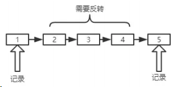

关于前节点和后节点的定义，大家在图上应该能看的比较清楚了，后面会经常用到。

反转操作上一题已经拆解过，这里不再赘述。值得注意的是反转后的工作，那么对于整个区间反转后的工作，其实就是一个移花接木的过程，首先将前节点的 next 指向区间终点，然后将区间起点的 next 指向后节点。因此这一题中有四个需要重视的节点: 前节点 、 后节点 、 区间起点 和 区间终点 。接下来我们开始实际的编码操作。

#### 循环解法

```js
/**
 * @param {ListNode} head
 * @param {number} m
 * @param {number} n
 * @return {ListNode}
 */
var reverseBetween = function (head, m, n) {
	let count = n - m;
	let p = (dummyHead = new ListNode());
	let pre, cur, start, tail;
	p.next = head;
	for (let i = 0; i < m - 1; i++) {
		p = p.next;
	}
	// 保存前节点
	front = p;
	// 同时保存区间首节点
	pre = tail = p.next;
	cur = pre.next;
	// 区间反转
	for (let i = 0; i < count; i++) {
		let next = cur.next;
		cur.next = pre;
		pre = cur;
		cur = next;
	}
	// 前节点的 next 指向区间末尾
	front.next = pre;
	// 区间首节点的 next 指向后节点(循环完后的cur就是区间后面第一个节点，即后节点)
	tail.next = cur;
	return dummyHead.next;
};
```

#### 递归解法

对于递归解法，唯一的不同就在于对于区间的处理，采用递归程序进行处理，大家也可以趁着复习一下递归反转的实现。

```js
var reverseBetween = function (head, m, n) {
	// 递归反转函数
	let reverse = (pre, cur) => {
		if (!cur) return pre;
		// 保存 next 节点
		let next = cur.next;
		cur.next = pre;
		return reverse(cur, next);
	};
	let p = (dummyHead = new ListNode());
	dummyHead.next = head;
	let start, end; // 区间首尾节点
	let front, tail; // 前节点和后节点
	for (let i = 0; i < m - 1; i++) {
		p = p.next;
	}
	front = p; // 保存前节点
	start = front.next;
	for (let i = m - 1; i < n; i++) {
		p = p.next;
	}
	end = p;
	tail = end.next; //保存后节点
	end.next = null;
	// 开始穿针引线啦，前节点指向区间首，区间首指向后节点
	front.next = reverse(null, start);
	start.next = tail;
	return dummyHead.next;
};
```

### 3.两个一组翻转链表

给定一个链表，两两交换其中相邻的节点，并返回交换后的链表。

你不能只是单纯的改变节点内部的值，而是需要实际的进行节点交换。

#### 示例：

```bash
给定 1->2->3->4, 你应该返回 2->1->4->3.
```

#### 思路

如图所示，我们首先建立一个虚拟头节点(dummyHead)，辅助我们分析。

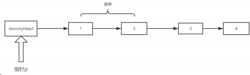

首先让 p 处在 dummyHead 的位置，记录下 p.next 和 p.next.next 的节点，也就是 node1 和 node2。

随后让 node1.next = node2.next, 效果：

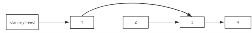

然后让 node2.next = node1, 效果：

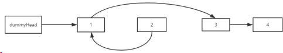

最后，dummyHead.next = node2，本次翻转完成。同时 p 指针指向 node1, 效果如下：

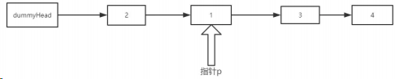

依此循环，如果 p.next 或者 p.next.next 为空，也就是 找不到新的一组节点 了，循环结束。

#### 循环解决

思路清楚了，其实实现还是比较容易的，代码如下:

```js
var swapPairs = function (head) {
	if (head == null || head.next == null) return head;
	let dummyHead = (p = new ListNode());
	let node1, node2;
	dummyHead.next = head;
	while ((node1 = p.next) && (node2 = p.next.next)) {
		node1.next = node2.next;
		node2.next = node1;
		p.next = node2;
		p = node1;
	}
	return dummyHead.next;
};
```

#### 递归方式

```js
var swapPairs = function (head) {
	if (head == null || head.next == null) return head;

	let node1 = head,
		node2 = head.next;
	node1.next = swapPairs(node2.next);
	node2.next = node1;
	return node2;
};
```

### 4.K 个一组翻转链表

给你一个链表，每 k 个节点一组进行翻转，请你返回翻转后的链表。

k 是一个正整数，它的值小于或等于链表的长度。

如果节点总数不是 k 的整数倍，那么请将最后剩余的节点保持原有顺序。

#### 示例 :

```bash
给定这个链表：1->2->3->4->5
当 k = 2 时，应当返回: 2->1->4->3->5
当 k = 3 时，应当返回: 3->2->1->4->5
```

说明：

- 你的算法只能使用常数的额外空间。
- 你不能只是单纯的改变节点内部的值，而是需要实际的进行节点交换。

#### 思路

思路类似 No.3 中的两个一组翻转。唯一的不同在于两个一组的情况下每一组只需要反转两个节点，而在 K 个一组的情况下对应的操作是将 K 个元素 的链表进行反转。

#### 递归解法

以下代码的注释中 首节点 、 尾结点 等概念都是针对反转前的链表而言的。

```js
/**
 * @param {ListNode} head
 * @param {number} k
 * @return {ListNode}
 */
var reverseKGroup = function (head, k) {
	let pre = null,
		cur = head;
	let p = head;
	// 下面的循环用来检查后面的元素是否能组成一组
	for (let i = 0; i < k; i++) {
		if (p == null) return head;
		p = p.next;
	}
	for (let i = 0; i < k; i++) {
		let next = cur.next;
		cur.next = pre;
		pre = cur;
		cur = next;
	}
	// pre为本组最后一个节点，cur为下一组的起点
	head.next = reverseKGroup(cur, k);
	return pre;
};
```

#### 循环解法

重点都放在注释里面了。

```js
var reverseKGroup = function (head, k) {
	let count = 0;
	// 看是否能构成一组，同时统计链表元素个数
	for (let p = head; p != null; p = p.next) {
		if (p == null && i < k) return head;
		count++;
	}
	let loopCount = Math.floor(count / k);
	let p = (dummyHead = new ListNode());
	dummyHead.next = head;
	// 分成了 loopCount 组，对每一个组进行反转
	for (let i = 0; i < loopCount; i++) {
		let pre = null,
			cur = p.next;
		for (let j = 0; j < k; j++) {
			let next = cur.next;
			cur.next = pre;
			pre = cur;
			cur = next;
		}
		// 当前 pre 为该组的尾结点，cur 为下一组首节点
		let start = p.next; // start 是该组首节点
		// 开始穿针引线！思路和2个一组的情况一模一样
		p.next = pre;
		start.next = cur;
		p = start;
	}
	return dummyHead.next;
};
```

### 5.如何检测链表形成环？

给定一个链表，判断链表中是否形成环。

#### 思路

思路一: 循环一遍，用 Set 数据结构保存节点，利用节点的内存地址来进行判重，如果同样的节点走过两次，则表明已经形成了环。

思路二: 利用快慢指针，快指针一次走两步，慢指针一次走一步，如果 两者相遇 ，则表明已经形成了环。

可能你会纳闷，为什么思路二用两个指针在环中一定会相遇呢？

其实很简单，如果有环，两者一定同时走到环中，那么在环中，选慢指针为参考系，快指针每次 相对参考系 向前走一步，终究会绕回原点，也就是回到慢指针的位置，从而让两者相遇。如果没有环，则两者的相对距离越来越远，永远不会相遇。

接下来我们来编程实现。

#### 方法一: Set 判重

```js
/**
 * @param {ListNode} head
 * @return {boolean}
 */
var hasCycle = (head) => {
	let set = new Set();
	let p = head;
	while (p) {
		// 同一个节点再次碰到，表示有环
		if (set.has(p)) return true;
		set.add(p);
		p = p.next;
	}
	return false;
};
```

#### 方法二: 快慢指针

```js
var hasCycle = function (head) {
	let dummyHead = new ListNode();
	dummyHead.next = head;
	let fast = (slow = dummyHead);
	// 零个结点或者一个结点，肯定无环
	if (fast.next == null || fast.next.next == null) return false;
	while (fast && fast.next) {
		fast = fast.next.next;
		slow = slow.next;
		// 两者相遇了
		if (fast == slow) {
			return true;
		}
	}
	return false;
};
```

### 6.如何找到环的起点

给定一个链表，返回链表开始入环的第一个节点。 如果链表无环，则返回 null。
说明：不允许修改给定的链表。

#### 思路分析

刚刚已经判断了如何判断出现环，那如何找到环的节点呢？我们来分析一波。

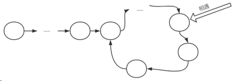

看上去比较繁琐，我们把它做进一步的抽象：

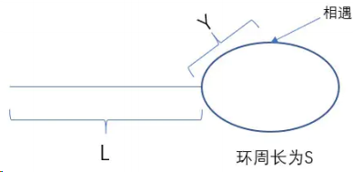

设快慢指针走了 x 秒，慢指针一秒走一次。
对快指针，有: 2x - L = m _ S + Y -----①
对慢指针，有: x - L = n _ S + Y -----②
其中，m、n 均为自然数。
① - ② _ 2 得：
L = (m - n) _ S - Y-----③

好，这是一个非常重要的等式。我们现在假设有一个新的指针在 L 段的最左端，慢指针现在还在相遇处。

让 新指针 和 慢指针 都每次走一步，那么，当 新指针 走了 L 步之后到达环起点，而与此同时，我们看看慢指针情况如何 。

由 ③ 式，慢指针走了 (m - n) _ S - Y 个单位，以环起点为参照物，相遇时的位置为 Y，而现在由 Y + (m - n) _ S - Y 即 (m - n) \* S ，得知慢指针实际上参照环起点，走了整整(m - n)圈。也就是说，慢指针此时也到达了环起点。 :::tip 结论 现在的解法就很清晰了，当快慢指针相遇之后，让新指针从头出发，和慢指针同时前进，且每次前进一步，两者相遇的地方，就是环起点。

#### 编程实现

懂得原理之后，实现起来就容易很多了。

```js
/**

* @param {ListNode} head
* @return {ListNode}
  */
var detectCycle = function (head) {
	let dummyHead = new ListNode();
	dummyHead.next = head;
	let fast = (slow = dummyHead);
	// 零个结点或者一个结点，肯定无环
	if (fast.next == null || fast.next.next == null) return null;
	while (fast && fast.next) {
		fast = fast.next.next;
		slow = slow.next;
		// 两者相遇了
		if (fast == slow) {
			let p = dummyHead;
			while (p != slow) {
				p = p.next;
				slow = slow.next;
			}
			return p;
		}
	}
	return null;
};
```

### 7.合并两个有序链表

将两个有序链表合并为一个新的有序链表并返回。新链表是通过拼接给定的两个链表的所有节点组成的。

#### 示例：

```bash
输入：1->2->4, 1->3->4
输出：1->1->2->3->4->4
```

#### 递归解法

递归解法更容易理解，我们先用递归来做一下:

```js
/**
* @param {ListNode} l1
* @param {ListNode} l2
* @return {ListNode}
  */
var mergeTwoLists = function(l1, l2) {
const merge = (l1, l2) => {
if(l1 == null) return l2;
if(l2 == null) return l1;
if(l1.val > l2.val) {
l2.next = merge(l1, l2.next);
return l2;
}else {
l1.next = merge(l1.next, l2);
return l1;
}
}
return merge(l1, l2);
};
var mergeTwoLists = function(l1, l2) {
if(l1 == null) return l2;
if(l2 == null) return l1;
```

#### 循环解法

```js
var mergeTwoLists = function (l1, l2) {
	if (l1 == null) return l2;
	if (l2 == null) return l1;

	let p = (dummyHead = new ListNode());
	let p1 = l1,
		p2 = l2;
	while (p1 && p2) {
		if (p1.val > p2.val) {
			p.next = p2;
			p = p.next;
			p2 = p2.next;
		} else {
			p.next = p1;
			p = p.next;
			p1 = p1.next;
		}
	}
	// 循环完成后务必检查剩下的部分
	if (p1) p.next = p1;
	else p.next = p2;
	return dummyHead.next;
};
```

### 8.合并 K 个有序链表

合并 k 个排序链表，返回合并后的排序链表。请分析和描述算法的复杂度。

#### 示例：

```bash
输入:
[
1->4->5,
1->3->4,
2->6
]
输出: 1->1->2->3->4->4->5->6
```

#### 自上而下(递归)实现

```js
/**
 * @param {ListNode[]} lists
 * @return {ListNode}
 **/
var mergeKLists = function (lists) {
	// 上面已经实现
	var mergeTwoLists = function (l1, l2) {
		/*上面已经实现*/
	};
	const _mergeLists = (lists, start, end) => {
		if (end - start < 0) return null;
		if (end - start == 0) return lists[end];
		let mid = Math.floor(start + (end - start) / 2);
		return mergeTwoList(
			_mergeLists(lists, start, mid),
			_mergeLists(lists, mid + 1, end)
		);
	};
	return _mergeLists(lists, 0, lists.length - 1);
};
```

#### 自下而上实现

在自下而上的实现方式中，为每一个链表绑定了一个虚拟头指针(dummyHead)，为什么这么做？

这是为了方便链表的合并，比如 l1 和 l2 合并之后，合并后链表的头指针就直接是 l1 的 dummyHead.next 值，等于说两个链表都合并到了 l1 当中，方便了后续的合并操作。

```js
9. var mergeKLists = function(lists) {
   var mergeTwoLists = function(l1, l2) {/*上面已经实现*/};
   // 边界情况
   if(!lists || !lists.length) return null;
   // 虚拟头指针集合
   let dummyHeads = [];
   // 初始化虚拟头指针
   for(let i = 0; i < lists.length; i++) {
   let node = new ListNode();
   node.next = lists[i];
   dummyHeads[i] = node;
   }
   // 自底向上进行merge
   for(let size = 1; size < lists.length; size += size){
   for(let i = 0; i + size < lists.length;i += 2 * size) {
   dummyHeads[i].next = mergeTwoLists(dummyHeads[i].next, dummyHeads[i + size].next);
  }
  }
  return dummyHeads[0].next;
  };
```

多个链表的合并到这里就实现完成了，这种归并的方式同时也是对链表进行归并排序的核心代码。

### 9.判断回文链表

请判断一个单链表是否为回文链表。

#### 示例 1：

```bash
输入: 1->2
输出: false
```

#### 示例 2：

```bash
输入: 1->2->2->1
输出: true
```

你能否用 O(n) 时间复杂度和 O(1) 空间复杂度解决此题？

#### 思路分析

这一题如果不考虑性能的限制，其实是非常简单的。但考虑到 O(n) 时间复杂度和 O(1) 空间复杂度，恐怕就值得停下来好好想想了。

题目的要求是单链表，没有办法访问前面的节点，那我们只得另辟蹊径:

找到链表中点，然后将后半部分反转，就可以依次比较得出结论了。下面我们来实现一波。

#### 代码实现

其实关键部分的代码就是找中点了。先亮剑：

```js
let dummyHead = (slow = fast = new ListNode());
dummyHead.next = head;
// 注意注意，来找中点了
while (fast && fast.next) {
	slow = slow.next;
	fast = fast.next.next;
}
```

为什么边界要设成这样？

不妨来分析一下，分链表节点个数为 奇数 和 偶数 的时候分别讨论。

**当链表节点个数为奇数**

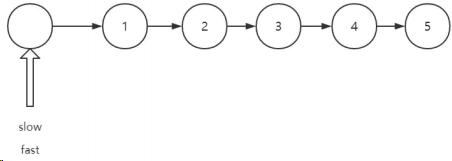

**试着模拟一下， fast 为空的时候，停止循环, 状态如下：**

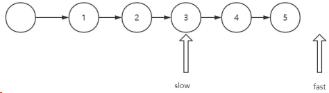

**当链表节点个数为偶数**

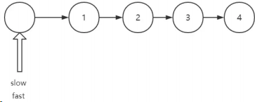

**模拟走一遍，当 fast.next 为空的时候，停止循环，状态如下：**

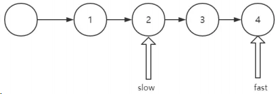

对于 fast 为空 和 fast.next 为空 两个条件，在奇数的情况下，总是 fast 为空 先出现，偶数的情况下，总是 fast.next 先出现。

也就是说: 一旦 fast 为空 , 链表节点个数一定为奇数，否则为偶数。因此两种情况可以合并来讨论，当 fast 为空或者 fast.next 为空，循环就可以终止了。

完整实现如下：

```js
/**

* @param {ListNode} head
* @return {boolean}
  */
var isPalindrome = function (head) {
	let reverse = (pre, cur) => {
		if (!cur) return pre;
		let next = cur.next;
		cur.next = pre;
		return reverse(cur, next);
	};
	let dummyHead = (slow = fast = new ListNode());
	dummyHead.next = head;
	// 注意注意，来找中点了, 黄金模板
	while (fast && fast.next) {
		slow = slow.next;
		fast = fast.next.next;
	}
	let next = slow.next;
	slow.next = null;
	let newStart = reverse(null, next);
	for (
		let p = head, newP = newStart;
		newP != null;
		p = p.next, newP = newP.next
	) {
		if (p.val != newP.val) return false;
	}
	return true;
};
```

### 10.前序遍历判断回文链表

利用链表的后续遍历，使用函数调用栈作为后序遍历栈，来判断是否回文

```js
/**
 *
 */
var isPalindrome = function (head) {
	let left = head;
	function traverse(right) {
		if (right == null) return true;
		let res = traverse(right.next);
		res = res && right.val === left.val;
		left = left.next;
		return res;
	}
	return traverse(head);
};
```

通过 快、慢指针找链表中点，然后反转链表，比较两个链表两侧是否相等，来判断是否是回文链表

```js
/**
 *
 */
var isPalindrome = function (head) {
	// 反转 slower 链表
	let right = reverse(findCenter(head));
	let left = head;
	// 开始比较
	while (right != null) {
		if (left.val !== right.val) {
			return false;
		}
		left = left.next;
		right = right.next;
	}
	return true;
};
function findCenter(head) {
	let slower = head,
		faster = head;
	while (faster && faster.next != null) {
		slower = slower.next;
		faster = faster.next.next;
	}
	// 如果 faster 不等于 null，说明是奇数个，slower 再移动一格
	if (faster != null) {
		slower = slower.next;
	}
	return slower;
}
function reverse(head) {
	let prev = null,
		cur = head,
		nxt = head;
	while (cur != null) {
		nxt = cur.next;
		cur.next = prev;
		prev = cur;
		cur = nxt;
	}
	return prev;
}
```

## 栈和队列

### 1.有效括号

给定一个只包括 '('，')'，'{'，'}'，'['，']' 的字符串，判断字符串是否有效。

有效字符串需满足：

左括号必须用相同类型的右括号闭合。 左括号必须以正确的顺序闭合。 注意空字符串可被认为是有效字符串。

#### 示例：

```bash
输入: "()"
输出: true
```

#### 代码实现

```js
/**
 * @param {string} s
 * @return {boolean}
 */
var isValid = function (s) {
	let stack = [];
	for (let i = 0; i < s.length; i++) {
		let ch = s.charAt(i);
		if (ch == "(" || ch == "[" || ch == "{") stack.push(ch);
		if (!stack.length) return false;
		if (ch == ")" && stack.pop() !== "(") return false;
		if (ch == "]" && stack.pop() !== "[") return false;
		if (ch == "}" && stack.pop() !== "{") return false;
	}
	return stack.length === 0;
};
```

### 2.多维数组 flatten

将多维数组转化为一维数组。

示例：

```bash
[1, [2, [3, [4, 5]]], 6] -> [1, 2, 3, 4, 5, 6]
```

代码实现

```js
/**
* @constructor
* @param {NestedInteger[]} nestedList
* @return {Integer[]}
  */
let flatten = (nestedList) => {
let result = [];
let fn = function (target, ary) {
for (let i = 0; i < ary.length; i++) {
let item = ary[i];
if (Array.isArray(ary[i])) {
fn(target, item);
} else {
target.push(item);
}
}
}
fn(result, nestedList)
return result;
```

同时可采用 reduce 的方式, 一行就可以解决，非常简洁。

```js
let flatten = (nestedList) =>
	nestedList.reduce(
		(pre, cur) => pre.concat(Array.isArray(cur) ? flatten(cur) : cur),
		[]
	);
```

### 3.普通的层次遍历

给定一个二叉树，返回其按层次遍历的节点值。 （即逐层地，从左到右访问所有节点）。
示例：

```bash
3
/ \
9 20
  / \
 15 7
```

结果应输出：

```bash
[
    [3],
    [9,20],
    [15,7]
]
```

实现

```js
/**

* @param {TreeNode} root
* @return {number[][]}
  */
var levelOrder = function (root) {
	if (!root) return [];
	let queue = [];
	let res = [];
	let level = 0;
	queue.push(root);
	let temp;
	while (queue.length) {
		res.push([]);
		let size = queue.length;
		// 注意一下: size -- 在层次遍历中是一个非常重要的技巧
		while (size--) {
			// 出队
			let front = queue.shift();
			res[level].push(front.val);
			// 入队
			if (front.left) queue.push(front.left);
			if (front.right) queue.push(front.right);
		}
		level++;
	}
	return res;
};
```

### 4.二叉树的锯齿形层次遍历

给定一个二叉树，返回其节点值的锯齿形层次遍历。（即先从左往右，再从右往左进行下一层遍历，以此类推，层与层之间交替进行）。

例如：

给定二叉树 [3,9,20,null,null,15,7] 输出应如下：

```bash
3
/ \
9 20
  / \
  15 7
```

返回锯齿形层次遍历如下：

```bash
[
    [3],
    [20,9],
    [15,7]
]
```

#### 思路

这一题思路稍微不同，但如果把握住层次遍历的思路，就会非常简单。

#### 代码实现

```js
var zigzagLevelOrder = function (root) {
	if (!root) return [];
	let queue = [];
	let res = [];
	let level = 0;

	queue.push(root);
	let temp;
	while (queue.length) {
		res.push([]);
		let size = queue.length;
		while (size--) {
			// 出队
			let front = queue.shift();
			res[level].push(front.val);
			if (front.left) queue.push(front.left);
			if (front.right) queue.push(front.right);
		}
		// 仅仅增加下面一行代码即可
		if (level % 2) res[level].reverse();
		level++;
	}
	return res;
};
```

### 5.二叉树的右视图

给定一棵二叉树，想象自己站在它的右侧，按照从顶部到底部的顺序，返回从右侧所能看到的节点值。

示例：

```bash
输入: [1,2,3,null,5,null,4]
输出: [1, 3, 4]

解释:

 1        <---
/ \
2 3       <---
 \ \
  5 4     <---
```

#### 思路

右视图？如果你以 DFS 即深度优先搜索的思路来想，你会感觉异常的痛苦。

但如果用广度优先搜索的思想，即用层序遍历的方式，求解这道题目也变得轻而易举。

#### 代码实现

```js
/**

* @param {TreeNode} root
* @return {number[]}
  */
var rightSideView = function (root) {
	if (!root) return [];
	let queue = [];
	let res = [];
	queue.push(root);
	while (queue.length) {
		res.push(queue[0].val);
		let size = queue.length;
		while (size--) {
			// 一个size的循环就是一层的遍历，在这一层只拿最右边的结点
			let front = queue.shift();
			if (front.right) queue.push(front.right);
			if (front.left) queue.push(front.left);
		}
	}
	return res;
};
```

### 6.完全平方数

给定正整数 n，找到若干个完全平方数（比如 1, 4, 9, 16, ...）使得它们的和等于 n。你需要让组成和的完全平方数的个数最少。

#### 示例：

```bash
输入: n = 12
输出: 3
解释: 12 = 4 + 4 + 4.
```

#### 思路

这一题其实最容易想到的思路是动态规划，我们放到后面专门来拆解。实际上用队列进行图的建模，也是可以顺利地用广度优先遍历的方式解决的。

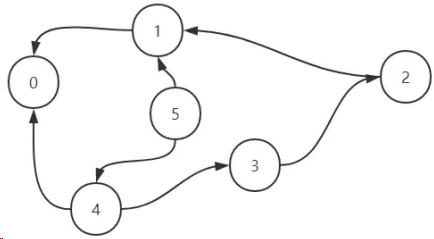

看到这个图，你可能会有点懵，我稍微解释一下你就明白了。

在这个无权图中，每一个点指向的都是它可能经过的上一个节点。举例来说，对 5 而言，可能是 4 加上了 1 的平方 转换而来，也可能是 1 加上了 2 的平方 转换而来，因此跟 1 和 2 都有联系，依次类推。

那么我们现在要做了就是寻找到 从 n 转换到 0 最短的连线数 。

举个例子， n = 8 时，我们需要找到它的邻居节点 4 和 7 ，此时到达 4 和到达 7 的步数都为 1, 然后分别从 4 和 7 出发，4 找到邻居节点 3 和 0 ，达到 3 和 0 的步数都为 2，考虑到此时已经到达 0，遍历终止，返回到达 0 的步数 2 即可。

Talk is cheap, show me your code. 我们接下来来一步步实现这个寻找的过程。

#### 实现

接下来我们来实现第一版的代码。

```js
/**

* @param {number} n
* @return {number}
  */
var numSquares = function (n) {
	let queue = [];
	queue.push([n, 0]);
	while (queue.length) {
		let [num, step] = queue.shift();
		for (let i = 1; ; i++) {
			let nextNum = num - i * i;
			if (nextNum < 0) break;
			// 还差最后一步就到了，直接返回 step + 1
			if (nextNum == 0) return step + 1;
			queue.push([nextNum, step + 1]);
		}
	}
	// 最后是不需要返回另外的值的，因为 1 也是完全平方数，所有的数都能用 1 来组合
};
```

这个解法从功能上来讲是没有问题的，但是其中隐藏了巨大的性能问题

那为什么会出现这样的问题？

出就出在这样一行代码：

```js
queue.push([nextNum, step + 1]);
```

只要是大于 0 的数，统统塞进队列。要知道 2 - 1 = 1， 5 - 4 = 1， 9 - 8 = 1 ......这样会重复非常多的 1 ,依次类推，也会重复非常多的 2 , 3 等等等等。

这样大量的重复数字不仅仅消耗了更多的循环次数，同时也造成更加巨大的内存空间压力。

因此，我们需要对已经推入队列的数字进行标记，避免重复推入。改善代码如下：

```js
var numSquares = function (n) {
	let map = new Map();
	let queue = [];
	queue.push([n, 0]);
	map.set(n, true);
	while (queue.length) {
		let [num, step] = queue.shift();
		for (let i = 1; ; i++) {
			let nextNum = num - i * i;
			if (nextNum < 0) break;
			if (nextNum == 0) return step + 1;
			// nextNum 未被访问过
			if (!map.get(nextNum)) {
				queue.push([nextNum, step + 1]);
				// 标记已经访问过
				map.set(nextNum, true);
			}
		}
	}
};
```

### 7.单词接龙

给定两个单词（beginWord 和 endWord）和一个字典，找到从 beginWord 到 endWord 的最短转换序列的长度。转换需遵循如下规则：

- 每次转换只能改变一个字母。
- 转换过程中的中间单词必须是字典中的单词。

#### 说明：

- 1）如果不存在这样的转换序列，返回 0。
- 2）所有单词具有相同的长度。
- 3）所有单词只由小写字母组成。
- 4）字典中不存在重复的单词。
- 5）你可以假设 beginWord 和 endWord 是非空的，且二者不相同。

#### 示例：

```bash
输入:
beginWord = "hit",
endWord = "cog",
wordList = ["hot","dot","dog","lot","log","cog"]
输出: 5
解释: 一个最短转换序列是 "hit" -> "hot" -> "dot" -> "dog" -> "cog",
返回它的长度 5。
```

#### 思路

这一题是一个更加典型的用图建模的问题。如果每一个单词都是一个节点，那么只要和这个单词仅有一个字母不同，那么就是它的相邻节点。

这里我们可以通过 BFS 的方式来进行遍历。实现如下：

```js
/**

* @param {string} beginWord
* @param {string} endWord
* @param {string[]} wordList
* @return {number}
  */
var ladderLength = function (beginWord, endWord, wordList) {
	// 两个单词在图中是否相邻
	const isSimilar = (a, b) => {
		let diff = 0;
		for (let i = 0; i < a.length; i++) {
			if (a.charAt(i) !== b.charAt(i)) diff++;
			if (diff > 1) return false;
		}
		return true;
	};
	let queue = [beginWord];
	let index = wordList.indexOf(beginWord);
	if (index !== -1) wordList.splice(index, 1);
	let res = 2;
	while (queue.length) {
		let size = queue.length;
		while (size--) {
			let front = queue.shift();
			for (let i = 0; i < wordList.length; i++) {
				if (!isSimilar(front, wordList[i])) continue;
				// 找到了
				if (wordList[i] === endWord) {
					return res;
				} else {
					queue.push(wordList[i]);
				}
				// wordList[i]已经成功推入，现在不需要了，删除即可
				// 这一步性能优化，相当关键，不然100%超时
				wordList.splice(i, 1);
				i--;
			}
		}
		// 步数 +1
		res += 1;
	}
	return 0;
};
```

### 8.优先队列

所谓优先队列，就是一种特殊的队列, 其底层使用堆的结构，使得每次添加或者删除，让队首元素始终是优先级最高的。关于优先级通过什么字段、按照什么样的比较方式来设定，可以由我们自己来决定。

要实现优先队列，首先来实现一个堆的结构。

### 9.关于堆的说明

可能你以前没有接触过堆这种数据结构，但是其实是很简单的一种结构，其本质就是一棵二叉树。但是这棵二叉树比较特殊，除了用数组来依次存储各个节点(节点对应的数组下标和层序遍历的序号一致)之外，它需要保证任何一个父节点的优先级大于子节点，这也是它最关键的性质，因为保证了根元素一定是优先级最高的。

举一个例子：

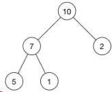

现在这个堆的数组就是: [10, 7, 2, 5, 1]

因此也会产生两个非常关键的操作——siftUp 和 siftDown。

对于 siftUp 操作，我们试想一下现在有一个正常的堆，满足任何父元素优先级大于子元素，这时候向这个堆的数组末尾又添加了一个元素，那现在可能就不符合 堆 的结构特点了。那么现在我将新增的节点和其父节点进行比较，如果父节点优先级小于它，则两者交换，不断向上比较直到根节点为止，这样就保证了堆的正确结构。而这样的操作就是 siftUp。

siftDown 是与其相反方向的操作，从上到下比较，原理相同，也是为了保证堆的正确结构。

### 10.实现一个最大堆

最大堆，即堆顶元素为优先级最高的元素。

```js
// 以最大堆为例来实现一波
/**

* @param {number[]} nums
* @param {number} k
* @return {number[]}
  */
class MaxHeap {
	constructor(arr = [], compare = null) {
		this.data = arr;
		this.size = arr.length;
		this.compare = compare;
	}
	getSize() {
		return this.size;
	}
	isEmpty() {
		return this.size === 0;
	}
	// 增加元素
	add(value) {
		this.data.push(value);
		this.size++;
		// 增加的时候把添加的元素进行 siftUp
		this._siftUp(this.getSize() - 1);
	}
	// 找到优先级最高的元素
	findMax() {
		if (this.getSize() === 0) return;
		return this.data[0];
	}
	// 让优先级最高的元素(即队首元素)出队
	extractMax() {
		// 1.保存队首元素
		let ret = this.findMax();
		// 2.让队首和队尾元素交换位置
		this._swap(0, this.getSize() - 1);
		// 3. 把队尾踢出去，size--
		this.data.pop();
		this.size--;
		// 4. 新的队首 siftDown
		this._siftDown(0);
		return ret;
	}
	toString() {
		console.log(this.data);
	}
	_swap(i, j) {
		[this.data[i], this.data[j]] = [this.data[j], this.data[i]];
	}
	_parent(index) {
		return Math.floor((index - 1) / 2);
	}
	_leftChild(index) {
		return 2 * index + 1;
	}
	_rightChild(index) {
		return 2 * index + 2;
	}
	_siftUp(k) {
		// 上浮操作，只要子元素优先级比父节点大，父子交换位置，一直向上直到根节点
		while (k > 0 && this.compare(this.data[k], this.data[this._parent(k)])) {
			this._swap(k, this._parent(k));
			k = this._parent(k);
		}
	}
	_siftDown(k) {
		// 存在左孩子的时候
		while (this._leftChild(k) < this.size) {
			let j = this._leftChild(k);
			// 存在右孩子而且右孩子比左孩子大
			if (
				this._rightChild(k) < this.size &&
				this.compare(this.data[this._rightChild(k)], this.data[j])
			) {
				j++;
			}
			if (this.compare(this.data[k], this.data[j])) return;
			// 父节点比子节点小，交换位置
			this._swap(k, j);
			// 继续下沉
			k = j;
		}
	}
}
```

### 11.实现优先队列

有了最大堆作铺垫，实现优先队列就易如反掌，废话不多说，直接放上代码。

```js
class PriorityQueue {
	// max 为优先队列的容量
	constructor(max, compare) {
		this.max = max;
		this.compare = compare;
		this.maxHeap = new MaxHeap([], compare);
	}
	getSize() {
		return this.maxHeap.getSize();
	}
	isEmpty() {
		return this.maxHeap.isEmpty();
	}
	getFront() {
		return this.maxHeap.findMax();
	}
	enqueue(e) {
		// 比当前最高的优先级的还要高，直接不处理
		if (this.getSize() === this.max) {
			if (this.compare(e, this.getFront())) return;
			this.dequeue();
		}
		return this.maxHeap.add(e);
	}
	dequeue() {
		if (this.getSize() === 0) return null;
		return this.maxHeap.extractMax();
	}
}
```

可能会有人问: 你怎么保证这个优先队列是正确的呢?

我们不妨来做一下测试：

```js
let pq = new PriorityQueue(3);
pq.enqueue(1);
pq.enqueue(333);
console.log(pq.dequeue());
console.log(pq.dequeue());
pq.enqueue(3);
pq.enqueue(6);
pq.enqueue(62);
console.log(pq.dequeue());
console.log(pq.dequeue());
console.log(pq.dequeue());
```

结果如下:

```bash
333
1
62
6
3
```

可见，这个优先队列的功能初步满足了我们的预期。

### 12.前 K 个高频元素

给定一个非空的整数数组，返回其中出现频率前 k 高的元素。

#### 示例：

```bash
输入: nums = [1,1,1,2,2,3], k = 2
输出: [1,2]
```

#### 说明：

- 可以假设给定的 k 总是合理的，且 1 ≤ k ≤ 数组中不相同的元素的个数。
- 算法的时间复杂度必须优于 O(n log n) , n 是数组的大小。

#### 思路

首先要做的肯定是统计频率，那之后如何来选取频率前 K 个元素同时又保证时间复杂度小于 O(n log n)呢？

当然，这是一道典型的考察优先队列的题，利用容量为 K 的优先队列每次踢出不符合条件的值，那么最后剩下的即为所求。整个时间复杂度成为 O（n log K），明显是小于 O(n log n) 的。

既然是优先队列，就涉及到如何来定义优先级的问题。

倘若我们以高频率为高优先级，那么队首始终是高频率的元素，因此每次出队是踢出出现频率最高的元素，假设优先队列容量为 K，那照这么做，剩下的是频率最低的 K 个元素，显然不符合题意。

因此，我们需要的是每次出队时踢出频率最低的元素，这样最后剩下来的就是频率最高 K 个元素。

是不是我们为了踢出频率最低的元素，还要重新写一个小顶堆的实现呢？

完全不需要！就像我刚才所说的，合理地定义这个优先级的比较逻辑即可。接下来我们来具体实现一下。

#### 代码实现

```js
var topKFrequent = function (nums, k) {
	let map = {};
	let pq = new PriorityQueue(k, (a, b) => map[a] - map[b] < 0);
	for (let i = 0; i < nums.length; i++) {
		if (!map[nums[i]]) map[nums[i]] = 1;
		else map[nums[i]] = map[[nums[i]]] + 1;
	}
	let arr = Array.from(new Set(nums));
	for (let i = 0; i < arr.length; i++) {
		pq.enqueue(arr[i]);
	}
	return pq.maxHeap.data;
};
```

### 13.合并 K 个排序链表

合并 k 个排序链表，返回合并后的排序链表。请分析和描述算法的复杂度。

示例：

```bash
输入：
[
    1->4->5,
    1->3->4,
    2->6
]
输出: 1->1->2->3->4->4->5->6
```

这一题我们之前在链表实现过，殊不知，它也可以利用优先队列完美解决。

```js
/**

* @param {ListNode[]} lists
* @return {ListNode}
  */
var mergeKLists = function (lists) {
	let dummyHead = (p = new ListNode());
	// 定义优先级的函数，重要！
	let pq = new PriorityQueue(lists.length, (a, b) => a.val <= b.val);
	// 将头结点推入优先队列
	for (let i = 0; i < lists.length; i++) if (lists[i]) pq.enqueue(lists[i]);
	// 取出值最小的节点，如果 next 不为空，继续推入队列
	while (pq.getSize()) {
		let min = pq.dequeue();
		p.next = min;
		p = p.next;
		if (min.next) pq.enqueue(min.next);
	}
	return dummyHead.next;
};
```

### 14.什么是双端队列？

双端队列是一种特殊的队列，首尾都可以添加或者删除元素，是一种加强版的队列。

JS 中的数组就是一种典型的双端队列。push、pop 方法分别从尾部添加和删除元素，unshift、shift 方法分别从首部添加和删除元素。

### 15.滑动窗口最大值

给定一个数组 nums，有一个大小为 k 的滑动窗口从数组的最左侧移动到数组的最右侧。你只可以看到在滑动窗口内的 k 个数字。滑动窗口每次只向右移动一位。

返回滑动窗口中的最大值。

#### 示例：

```bash
输入: nums = [1,3,-1,-3,5,3,6,7], 和 k = 3
输出: [3,3,5,5,6,7]
解释:
滑动窗口的位置 最大值

--------------- -----

[1 3 -1] -3 5 3 6 7 3
1 [3 -1 -3] 5 3 6 7 3
1 3 [-1 -3 5] 3 6 7 5
1 3 -1 [-3 5 3] 6 7 5
1 3 -1 -3 [5 3 6] 7 6
1 3 -1 -3 5 [3 6 7] 7
```

#### 要求：时间复杂度应为线性。

#### 思路

这是典型地使用双端队列求解的问题。

建立一个双端队列 window，每次 push 进来一个新的值，就将 window 中目前 前面所有比它小的值 都删除。利用双端队列的特性，可以从后往前遍历，遇到小的就删除之，否则停止。

这样可以保证队首始终是最大值，因此寻找最大值的时间复杂度可以降到 O(1)。由于 window 中会有越来越多的值被淘汰，因此整体的时间复杂度是线性的。

#### 代码实现

代码非常的简洁，但是如果要写出 bug free 的代码还是有相当的难度的，希望你能自己独立实现一遍。

```js
var maxSlidingWindow = function (nums, k) {
	// 异常处理
	if (nums.length === 0 || !k) return [];
	let window = [],
		res = [];
	for (let i = 0; i < nums.length; i++) {
		// 先把滑动窗口之外的踢出
		if (window[0] !== undefined && window[0] <= i - k) window.shift();
		// 保证队首是最大的
		while (nums[window[window.length - 1]] <= nums[i]) window.pop();
		window.push(i);
		if (i >= k - 1) res.push(nums[window[0]]);
	}
	return res;
};
```

### 16.栈实现队列

使用栈实现队列的下列操作：

push(x) -- 将一个元素放入队列的尾部。 pop() -- 从队列首部移除元素。 peek() -- 返回队列首部的元素。 empty() -- 返回队列是否为空。

#### 示例：

```js
let queue = new MyQueue();
queue.push(1);
queue.push(2);
queue.peek(); // 返回 1
queue.pop(); // 返回 1
queue.empty(); // 返回 fals
```

#### 思路

既然栈是先进后出, 要想得到先进先出的效果，我们不妨用两个栈。

当进行 push 操作时，push 到 stack1 ，而进行 pop 和 peek 的操作时，我们通过 stack2 。

当然这其中有一个特殊情况，就是 stack2 是空，如何来进行 pop 和 peek ? 很简单，把 stack1 中的元素依次 pop 并推入 stack2 中，然后正常地操作 stack2 即可，如下图所示：

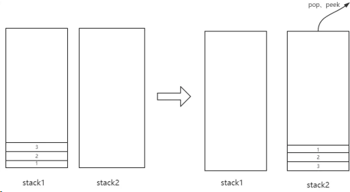

这就就能保证先入先出的效果了。

#### 代码实现

```js
var MyQueue = function () {
	this.stack1 = [];
	this.stack2 = [];
};
MyQueue.prototype.push = function (x) {
	this.stack1.push(x);
};
// 将 stack1 的元素转移到 stack2
MyQueue.prototype.transform = function () {
	while (this.stack1.length) {
		this.stack2.push(this.stack1.pop());
	}
};
MyQueue.prototype.pop = function () {
	if (!this.stack2.length) this.transform();
	return this.stack2.pop();
};
MyQueue.prototype.peek = function () {
	if (!this.stack2.length) this.transform();
	return this.stack2[this.stack2.length - 1];
};
MyQueue.prototype.empty = function () {
	return !this.stack1.length && !this.stack2.length;
};
```

### 17.队列实现栈

和上一题的效果刚好相反，用队列 先进先出 的方式来实现 先进后出 的效果。

#### 思路

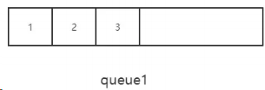

以上面的队列为例，push 操作好说，直接从在队列末尾推入。但 pop 和 peek 呢？

回到我们的目标，我们的目标是拿到队尾的值，也就是 3 。这就好办了，我们让前面的元素统统出队，只留队尾元素即可，剩下的元素让另外一个队列保存。

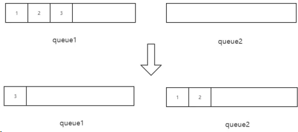

#### 代码实现

实现过程中，值得注意的一点是， queue1 始终保存前面的元素，queue2 始终保存队尾元素（即栈顶元素） 。

但是当 push 的时候有一个陷阱，就是当 queue2 已经有元素的时候，不能将新值 push 到 queue1 ，因为此时的栈顶元素应该更新。此时对于新的值来说，应先 push 到 queue2， 然后将 旧的栈顶 从 queue2 出队，推入 queue1 ，这样就实现了更新栈顶的操作。

```js
var MyStack = function () {
	this.queue1 = [];
	this.queue2 = [];
};
MyStack.prototype.push = function (x) {
	if (!this.queue2.length) this.queue1.push(x);
	else {
		// queue2 已经有值
		this.queue2.push(x);
		// 旧的栈顶移到 queue1 中
		this.queue1.push(this.queue2.shift());
	}
};
MyStack.prototype.transform = function () {
	while (this.queue1.length !== 1) {
		this.queue2.push(this.queue1.shift());
	}
	// queue2 保存了前面的元素
	// 让 queue1 和 queue2 交换
	// 现在queue1 包含前面的元素，queue2 里面就只包含队尾的元素
	let tmp = this.queue1;
	this.queue1 = this.queue2;
	this.queue2 = tmp;
};
MyStack.prototype.pop = function () {
	if (!this.queue2.length) this.transform();
	return this.queue2.shift();
};
MyStack.prototype.top = function () {
	if (!this.queue2.length) this.transform();
	return this.queue2[0];
};

MyStack.prototype.empty = function () {
	return !this.queue1.length && !this.queue2.length;
};
```

## 二叉树

### 1. 二叉树的最近公共祖先

```js
/**
 * Definition for a binary tree node.
 * function TreeNode(val) {
 * this.val = val;
 * this.left = this.right = null;
 * }
 */
/**
 * @param {TreeNode} root
 * @param {TreeNode} p
 * @param {TreeNode} q
 * @return {TreeNode}
 */
let visited;
let parent;
var lowestCommonAncestor = function (root, p, q) {
	visited = new Set();
	parent = new Map();
	dfs(root);
	while (p != null) {
		visited.add(p.val);
		p = parent.get(p.val);
	}
	while (q != null) {
		if (visited.has(q.val)) {
			return q;
		}
		q = parent.get(q.val);
	}
	return null;
};
function dfs(root) {
	if (root.left != null) {
		parent.set(root.left.val, root);
		dfs(root.left);
	}
	if (root.right != null) {
		parent.set(root.right.val, root);
		dfs(root.right);
	}
}
```

### 2. 二叉搜索树中的搜索

```js
/**
 * Definition for a binary tree node.
 * function TreeNode(val) {
 * this.val = val;
 * this.left = this.right = null;
 * }
 */
/**
 * @param {TreeNode} root
 * @param {number} val
 * @return {TreeNode}
 */
var searchBST = function (root, val) {
	if (root == null) return null;
	if (root.val === val) return root;
	if (root.val > val) {
		return searchBST(root.left, val);
	} else if (root.val < val) {
		return searchBST(root.right, val);
	}
};
```

### 3. 删除二叉搜索树中的节点

```js
/**
 * Definition for a binary tree node.
 * function TreeNode(val) {
 * this.val = val;
 * this.left = this.right = null;
 * }
 */
/**
 * @param {TreeNode} root
 * @param {number} key
 * @return {TreeNode}
 */
var deleteNode = function (root, key) {
	if (root == null) return null;
	if (root.val === key) {
		if (root.left == null && root.right == null) return null;
		if (root.left == null) return root.right;
		if (root.right == null) return root.left;
		if (root.left != null && root.right != null) {
			let target = getMinTreeMaxNode(root.left);
			root.val = target.val;
			root.left = deleteNode(root.left, target.val);
		}
	}
	if (root.val < key) {
		root.right = deleteNode(root.right, key);
	} else if (root.val > key) {
		root.left = deleteNode(root.left, key);
	}
	return root;
};
function getMinTreeMaxNode(root) {
	if (root.right == null) return root;
	return getMinTreeMaxNode(root.right);
}
```

### 4. 完全二叉树的节点个数

```js
/**
 * Definition for a binary tree node.
 * function TreeNode(val) {
 * this.val = val;
 * this.left = this.right = null;
 * }
 */
/**
 * @param {TreeNode} root
 * @return {number}
 */
var countNodes = function (root) {
	if (root == null) return 0;
	let l = root,
		r = root;
	let lh = 0,
		rh = 0;
	while (l != null) {
		l = l.left;
		lh++;
	}
	while (r != null) {
		r = r.right;
		rh++;
	}
	if (lh === rh) {
		return Math.pow(2, lh) - 1;
	}
	return 1 + countNodes(root.left) + countNodes(root.right);
};
```

### 5. 二叉树的锯齿形层序遍历

```js
/**
 * Definition for a binary tree node.
 * function TreeNode(val) {
 * this.val = val;
 * this.left = this.right = null;
 * }
 */
/**
 * @param {TreeNode} root
 * @return {number[][]}
 */
let res;
var zigzagLevelOrder = function (root) {
	if (root == null) return [];
	res = [];
	BFS(root, true);
	return res;
};
function BFS(root, inOrder) {
	let arr = [];
	let resItem = [];
	let node;
	let stack1 = new Stack();
	let stack2 = new Stack();
	// 判断交换时机
	let flag;
	stack1.push(root);
	res.push([root.val]);
	inOrder = !inOrder;
	while (!stack1.isEmpty() || !stack2.isEmpty()) {
		if (stack1.isEmpty()) {
			flag = "stack1";
		} else if (stack2.isEmpty()) {
			flag = "stack2";
		}
		// 决定取那个栈里面的元素
		if (flag === "stack2" && !stack1.isEmpty()) node = stack1.pop();
		else if (flag === "stack1" && !stack2.isEmpty()) node = stack2.pop();
		if (inOrder) {
			if (node.left) {
				if (flag === "stack1") {
					stack1.push(node.left);
				} else {
					stack2.push(node.left);
				}
				resItem.push(node.left.val);
			}
			if (node.right) {
				if (flag === "stack1") {
					stack1.push(node.right);
				} else {
					stack2.push(node.right);
				}
				resItem.push(node.right.val);
			}
		} else {
			if (node.right) {
				if (flag === "stack1") {
					stack1.push(node.right);
				} else {
					stack2.push(node.right);
				}
				resItem.push(node.right.val);
			}
			if (node.left) {
				if (flag === "stack1") {
					stack1.push(node.left);
				} else {
					stack2.push(node.left);
				}
				resItem.push(node.left.val);
			}
		}
		// 判断下次翻转的时机
		if (
			(flag === "stack2" && stack1.isEmpty()) ||
			(flag === "stack1" && stack2.isEmpty())
		) {
			inOrder = !inOrder;
			// 需要翻转了，就加一轮值
			if (resItem.length > 0) {
				res.push(resItem);
			}
			resItem = [];
		}
	}
}
class Stack {
	constructor() {
		this.count = 0;
		this.items = [];
	}
	push(element) {
		this.items[this.count] = element;
		this.count++;
	}
	pop() {
		if (this.isEmpty()) return undefined;
		const element = this.items[this.count - 1];
		delete this.items[this.count - 1];
		this.count--;
		return element;
	}
	size() {
		return this.count;
	}
	isEmpty() {
		return this.size() === 0;
	}
}
```

### 1.前序遍历

#### 示例：

```bash
示例:
输入: [1,null,2,3]
  1
   \
    2
   /
  3
输出: [1,2,3]
```

#### 递归方式

```js
/**

* @param {TreeNode} root
* @return {number[]}
  */
var preorderTraversal = function (root) {
	let arr = [];
	let traverse = (root) => {
		if (root == null) return;
		arr.push(root.val);
		traverse(root.left);
		traverse(root.right);
	};
	traverse(root);
	return arr;
};
```

#### 非递归方式

```js
var preorderTraversal = function (root) {
	if (root == null) return [];
	let stack = [],
		res = [];
	stack.push(root);
	while (stack.length) {
		let node = stack.pop();
		res.push(node.val);
		// 左孩子后进先出，进行先左后右的深度优先遍历
		if (node.right) stack.push(node.right);
		if (node.left) stack.push(node.left);
	}
	return res;
};
```

### 2.中序遍历

给定一个二叉树，返回它的中序 遍历。

示例：

```bash
输入: [1,null,2,3]
 1
  \
   2
  /
 3
输出: [1,3,2]
```

#### 递归方式：

```js
/**

* @param {TreeNode} root
* @return {number[]}
  */
var inorderTraversal = function (root) {
	let arr = [];
	let traverse = (root) => {
		if (root == null) return;
		traverse(root.left);
		arr.push(root.val);
		traverse(root.right);
	};
	traverse(root);
	return arr;
};
```

#### 非递归方式：

```js
var inorderTraversal = function (root) {
	if (root == null) return [];
	let stack = [],
		res = [];
	let p = root;
	while (stack.length || p) {
		while (p) {
			stack.push(p);
			p = p.left;
		}
		let node = stack.pop();
		res.push(node.val);
		p = node.right;
	}
	return res;
};
```

### 3.后序遍历

给定一个二叉树，返回它的 后序 遍历。

#### 示例：

```bash
输入: [1,null,2,3]
  1
   \
    2
   /
  3
输出: [3,2,1]
```

#### 递归方式

```js
/**

* @param {TreeNode} root
* @return {number[]}
  */
var postorderTraversal = function (root) {
	let arr = [];
	let traverse = (root) => {
		if (root == null) return;
		traverse(root.left);
		traverse(root.right);
		arr.push(root.val);
	};
	traverse(root);
	return arr;
};
```

#### 非递归方式

```js
var postorderTraversal = function (root) {
	if (root == null) return [];
	let stack = [],
		res = [];
	let visited = new Set();
	let p = root;
	while (stack.length || p) {
		while (p) {
			stack.push(p);
			p = p.left;
		}
		let node = stack[stack.length - 1];
		// 如果右孩子存在，而且右孩子未被访问
		if (node.right && !visited.has(node.right)) {
			p = node.right;
			visited.add(node.right);
		} else {
			res.push(node.val);
			stack.pop();
		}
	}
	return res;
};
```

### 4.最大深度

给定一个二叉树，找出其最大深度。

二叉树的深度为根节点到最远叶子节点的最长路径上的节点数。

说明: 叶子节点是指没有子节点的节点。

示例： 给定二叉树 [3,9,20,null,null,15,7]：

```bash
3
/ \
9 20
  / \
 15  7
```

#### 递归实现

实现非常简单，直接贴出代码：

```js
/**

* @param {TreeNode} root
* @return {number}
  */
var maxDepth = function (root) {
	// 递归终止条件
	if (root == null) return 0;
	return Math.max(maxDepth(root.left) + 1, maxDepth(root.right) + 1);
};
```

#### 非递归实现

采用层序遍历的方式，非常好理解。

```js
var maxDepth = function (root) {
	if (root == null) return 0;
	let queue = [root];
	let level = 0;
	while (queue.length) {
		let size = queue.length;
		while (size--) {
			let front = queue.shift();
			if (front.left) queue.push(front.left);
			if (front.right) queue.push(front.right);
		}
		// level ++ 后的值代表着现在已经处理完了几层节点
		level++;
	}
	return level;
};
```

### 5.最小深度

给定一个二叉树，找出其最小深度。

最小深度是从根节点到最近叶子节点的最短路径上的节点数量。

说明: 叶子节点是指没有子节点的节点。

#### 示例：

给定二叉树 [3,9,20,null,null,15,7]：

```bash
3
/ \
9 20
  / \
 15  7
```

返回它的最小深度 2.

#### 递归实现

在实现的过程中，如果按照最大深度的方式来做会出现一个陷阱，即：

```js
/**

* @param {TreeNode} root
* @return {number}
  */
var minDepth = function (root) {
	// 递归终止条件
	if (root == null) return 0;
	return Math.min(minDepth(root.left) + 1, minDepth(root.right) + 1);
};
```

当 root 节点有一个孩子为空的时候，此时返回的是 1， 但这是不对的，最小高度指的是根节点到最近叶子节点的最小路径，而不是到一个空节点的路径。

因此我们需要做如下的调整：

```js
var minDepth = function (root) {
	if (root == null) return 0;
	// 左右孩子都不为空才能像刚才那样调用
	if (root.left && root.right)
		return Math.min(minDepth(root.left), minDepth(root.right)) + 1;
	// 右孩子为空了，直接忽略之
	else if (root.left) return minDepth(root.left) + 1;
	// 左孩子为空，忽略
	else if (root.right) return minDepth(root.right) + 1;
	// 两个孩子都为空，说明到达了叶子节点，返回 1
	else return 1;
};
```

这样程序便能正常工作了。

#### 非递归实现

类似于 最大高度 问题，采用了层序遍历的方式，很容易理解。

```js
var minDepth = function (root) {
	if (root == null) return 0;
	let queue = [root];
	let level = 0;
	while (queue.length) {
		let size = queue.length;
		while (size--) {
			let front = queue.shift();
			// 找到叶子节点
			if (!front.left && !front.right) return level + 1;
			if (front.left) queue.push(front.left);
			if (front.right) queue.push(front.right);
		}
		// level ++ 后的值代表着现在已经处理完了几层节点
		level++;
	}
	return level;
};
```

### 6.对称二叉树

给定一个二叉树，检查它是否是镜像对称的。

例如，二叉树 [1,2,2,3,4,4,3] 是对称的。

```bash
   1
  / \
 2   2
/ \ / \
3 4 4 3
```

但是下面这个 [1,2,2,null,3,null,3] 则不是镜像对称的：

```bash
   1
  / \
 2  2
  \  \
   3  3
```

#### 递归实现

递归方式的代码是非常干练和优雅的，希望你先自己实现一遍，然后对比改进。

```js
/**
 * @param {TreeNode} root
 * @return {boolean}
 */
var isSymmetric = function (root) {
	let help = (node1, node2) => {
		// 都为空
		if (!node1 && !node2) return true;
		// 一个为空一个不为空，或者两个节点值不相等
		if (!node1 || !node2 || node1.val !== node2.val) return false;
		return help(node1.left, node2.right) && help(node1.right, node2.left);
	};
	if (root == null) return true;
	return help(root.left, root.right);
};
```

#### 非递归实现

非递归实现用一个队列保存访问过的节点，每次取出两个节点，进行比较。

```js
var isSymmetric = function (root) {
	if (root == null) return true;
	let queue = [root.left, root.right];
	let node1, node2;
	while (queue.length) {
		node1 = queue.shift();
		node2 = queue.shift();
		// 两节点均为空
		if (!node1 && !node2) continue;
		// 一个为空一个不为空，或者两个节点值不相等
		if (!node1 || !node2 || node1.val !== node2.val) return false;
		queue.push(node1.left);
		queue.push(node2.right);
		queue.push(node1.right);
		queue.push(node2.left);
	}
	return true;
};
```

### 7.二叉树的最近公共祖先

对于一个普通的二叉树: root = [3,5,1,6,2,0,8,null,null,7,4]

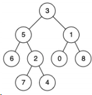

```bash
输入: root = [3,5,1,6,2,0,8,null,null,7,4], p = 5, q = 1
输出: 3
解释: 节点 5 和节点 1 的最近公共祖先是节点 3。
```

#### 思路分析

思路一: 首先遍历一遍二叉树，记录下每个节点的父节点。然后对于题目给的 p 节点，根据这个记录表不断的找 p 的上层节点，直到根，记录下 p 的上层节点集合。然后对于 q 节点，根据记录不断向上找它的上层节点，在寻找的过程中一旦发现这个上层节点已经包含在刚刚的集合中，说明发现了最近公共祖先，直接返回。

思路二: 深度优先遍历二叉树，如果当前节点为 p 或者 q，直接返回这个节点，否则查看左右孩子，左孩子中不包含 p 或者 q 则去找右孩子，右孩子不包含 p 或者 q 就去找左孩子，剩下的情况就是左右孩子中都存在 p 或者 q, 那么此时直接返回这个节点。

##### 祖先节点集合法

```js
/**

* @param {TreeNode} root
* @param {TreeNode} p
* @param {TreeNode} q
* @return {TreeNode}
  */
var lowestCommonAncestor = function (root, p, q) {
	if (root == null || root == p || root == q) return root;
	let set = new Set();
	let map = new WeakMap();
	let queue = [];
	queue.push(root);
	// 层序遍历
	while (queue.length) {
		let size = queue.length;
		while (size--) {
			let front = queue.shift();
			if (front.left) {
				queue.push(front.left);
				// 记录父亲节点
				map.set(front.left, front);
			}
			if (front.right) {
				queue.push(front.right);
				// 记录父亲节点
				map.set(front.right, front);
			}
		}
	}
	// 构造 p 的上层节点集合
	while (p) {
		set.add(p);
		p = map.get(p);
	}
	while (q) {
		// 一旦发现公共节点重合，直接返回
		if (set.has(q)) return q;
		q = map.get(q);
	}
};
```

可以看到整棵二叉树遍历了一遍，时间复杂度大致是 O(n)，但是由于哈希表的存在，空间复杂度比较高，接下来我们来用另一种遍历的方式，可以大大减少空间的开销。
深度优先遍历法代码非常简洁、美观，不过更重要的是体会其中递归调用的过程，代码是自顶向下执行的，我建议大家用自底向上的方式来理解它，即从最左下的节点开始分析，相信你会很好的理解整个过程。

```js
var lowestCommonAncestor = function (root, p, q) {
	if (root == null || root == p || root == q) return root;
	let left = lowestCommonAncestor(root.left, p, q);
	let right = lowestCommonAncestor(root.right, p, q);
	if (left == null) return right;
	else if (right == null) return left;
	return root;
};
```

### 8.二叉搜索树的最近公共祖先

给定如下二叉搜索树: root = [6,2,8,0,4,7,9,null,null,3,5]

```bash
输入: root = [6,2,8,0,4,7,9,null,null,3,5], p = 2, q = 8
输出: 6
解释: 节点 2 和节点 8 的最近公共祖先是 6。
```

#### 实现

二叉搜索树作为一种特殊的二叉树，当然是可以用上述的两种方式来实现的。

不过借助二叉搜索树有序的特性，我们也可以写出另外一个版本的深度优化遍历。

```js
/**

* @param {TreeNode} root
* @param {TreeNode} p
* @param {TreeNode} q
* @return {TreeNode}
  */
var lowestCommonAncestor = function (root, p, q) {
	if (root == null || root == p || root == q) return root;
	// root.val 比 p 和 q 都大，找左孩子
	if (root.val > p.val && root.val > q.val)
		return lowestCommonAncestor(root.left, p, q);
	// root.val 比 p 和 q 都小，找右孩子
	if (root.val < p.val && root.val < q.val)
		return lowestCommonAncestor(root.right, p, q);
	else return root;
};
```

同时也可以采用非递归的方式：

```js
var lowestCommonAncestor = function (root, p, q) {
	let node = root;
	while (node) {
		if (p.val > node.val && q.val > node.val) node = node.right;
		else if (p.val < node.val && q.val < node.val) node = node.left;
		else return node;
	}
};
```

是不是被二叉树精简而优雅的代码惊艳到了呢？希望你能好好体会其中遍历的过程，然后务必自己独立实现一遍，保证对这种数据结构足够熟悉，增强自己的编程内力。

### 9.二叉树的直径

给定一棵二叉树，你需要计算它的直径长度。一棵二叉树的直径长度是任意两个结点路径长度中的最大值。这条路径可能穿过根结点。

#### 示例：给定二叉树

```bash
     1
    / \
   2   3
    / \
   4   5
```

返回 3，它的长度是路径 [4,2,1,3] 或者 [5,2,1,3]。

注意：两结点之间的路径长度是以它们之间边的数目表示。

#### 思路

所谓的 求直径 , 本质上是求树中节点左右子树 高度和的最大值 。

注意，这里我说的是 树中节点 , 并非根节点。因为会有这样一种情况：

```bash
         1
        /
       2
      / \
     4   5
    /     \
   8       6
            \
             7
```

那这个时候，直径最大的路径是: 8 -> 4 -> 2-> 5 -> 6 -> 7。交界的元素并不是根节点。这是这个问题特别需要注意的地方，不然无解。

#### 初步求解

目标已经确定了，求树中节点左右子树 高度和的最大值 。开干！

```js
/**

* @param {TreeNode} root
* @return {number}
  */
var diameterOfBinaryTree = function (root) {
	// 求最大深度
	let maxDepth = (node) => {
		if (node == null) return 0;
		return Math.max(maxDepth(node.left) + 1, maxDepth(node.right) + 1);
	};
	let help = (node) => {
		if (node == null) return 0;
		let rootSum = maxDepth(node.left) + maxDepth(node.right);
		let childSum = Math.max(help(node.left), help(node.right));
		return Math.max(rootSum, childSum);
	};
	if (root == null) return 0;
	return help(root);
};
```

这样一段代码放到 LeetCode 是可以通过，但时间上却不让人很满意，为什么呢？

因为在反复调用 maxDepth 的过程，对树中的一些节点增加了很多不必要的访问。比如：

```js
         1
        /
       2
      / \
     4   5
    /     \
   8       6
            \
             7
```

我们看什么时候访问节点 8，maxDepth(节点 2)的时候访问， maxDepth(节点 4)的时候又会访问，如果节点层级更高，重复访问的次数更加频繁，剩下的节点 6、节点 7 都是同理。每一个节点访问的次数大概是 O(logK)(设当前节点在第 K 层)。那能不能把这个频率降到 O(1) 呢？

答案是肯定的，接下来我们来优化这个算法。

#### 优化解法

```js
var diameterOfBinaryTree = function (root) {
	let help = (node) => {
		if (node == null) return 0;
		let left = node.left ? help(node.left) + 1 : 0;
		let right = node.right ? help(node.right) + 1 : 0;
		let cur = left + right;
		if (cur > max) max = cur;
		// 这个返回的操作相当关键
		return Math.max(left, right);
	};
	let max = 0;
	if (root == null) return 0;
	help(root);
	return max;
};
```

在这个过程中设置了一个 max 全局变量，深度优先遍历这棵树，每遍历完一个节点就更新 max ，并通过返回值的方式 自底向上 把当前节点左右子树的最大高度传给父函数使用，使得每个节点只需访问一次即可。

现在提交我们优化后的代码，时间消耗明显降低。

### 10.二叉树的所有路径

给定一个二叉树，返回所有从根节点到叶子节点的路径。

说明：叶子节点是指没有子节点的节点。

示例：

```bash
输入:
     1
    /  \
   2    3
    \
     5
输出: ["1->2->5", "1->3"]
```

解释：所有根节点到叶子节点的路径为: 1->2->5, 1->3

#### 递归解法

利用 DFS(深度优先遍历) 的方式进行遍历。

```js
/**

* @param {TreeNode} root
* @return {string[]}
  */
var binaryTreePaths = function (root) {
	let path = [];
	let res = [];
	let dfs = (node) => {
		if (node == null) return;
		path.push(node);
		dfs(node.left);
		dfs(node.right);
		if (!node.left && !node.right)
			res.push(path.map((item) => item.val).join("->"));
		// 注意每访问完一个节点记得把它从path中删除，达到回溯效果
		path.pop();
	};
	dfs(root);
	return res;
};
```

#### 非递归解法

接下来我们通过 非递归的后序遍历 的方式来实现一下, 顺便复习一下后序遍历的实现。

```js
var binaryTreePaths = function (root) {
	if (root == null) return [];
	let stack = [];
	let p = root;
	let set = new Set();
	res = [];
	while (stack.length || p) {
		while (p) {
			stack.push(p);
			p = p.left;
		}
		let node = stack[stack.length - 1];
		// 叶子节点
		if (!node.right && !node.left) {
			res.push(stack.map((item) => item.val).join("->"));
		}
		// 右孩子存在，且右孩子未被访问
		if (node.right && !set.has(node.right)) {
			p = node.right;
			set.add(node.right);
		} else {
			stack.pop();
		}
	}
	return res;
};
```

### 11.二叉树的最大路径和

给定一个非空二叉树，返回其最大路径和。

本题中，路径被定义为一条从树中任意节点出发，达到任意节点的序列。该路径至少包含一个节点，且不一定经过根节点。

示例：

```bash
输入: [-10,9,20,null,null,15,7]
-10
/ \
9 20
/ \
15 7
输出: 42
```

#### 递归解

```js
/**

* @param {TreeNode} root
* @return {number}
  */
var maxPathSum = function (root) {
	let help = (node) => {
		if (node == null) return 0;
		let left = Math.max(help(node.left), 0);
		let right = Math.max(help(node.right), 0);
		let cur = left + node.val + right;
		// 如果发现某一个节点上的路径值比max还大，则更新max
		if (cur > max) max = cur;
		// left 和 right 永远是"一根筋"，中间不会有转折
		return Math.max(left, right) + node.val;
	};
	let max = Number.MIN_SAFE_INTEGER;
	help(root);
	return max;
};
```

### 12.验证二叉搜索树

给定一个二叉树，判断其是否是一个有效的二叉搜索树。

假设一个二叉搜索树具有如下特征：

节点的左子树只包含小于当前节点的数。 节点的右子树只包含大于当前节点的数。 所有左子树和右子树自身必须也是二叉搜索树。

#### 示例 1：

```bash
输入:
     2
    / \
   1   3
输出: true
```

#### 方法一：中序遍历

通过中序遍历，保存前一个节点的值，扫描到当前节点时，和前一个节点的值比较，如果大于前一个节点，则满足条件，否则不是二叉搜索树。

```js
/**

* @param {TreeNode} root
* @return {boolean}
  */
var isValidBST = function (root) {
	let prev = null;
	const help = (node) => {
		if (node == null) return true;
		if (!help(node.left)) return false;
		if (prev !== null && prev >= node.val) return false;
		// 保存当前节点，为下一个节点的遍历做准备
		prev = node.val;
		return help(node.right);
	};
	return help(root);
};
```

#### 方法二: 限定上下界进行 DFS

二叉搜索树每一个节点的值，都有一个上界和下界，深度优先遍历的过程中，如果访问左孩子，则通过当前节点的值来更新左孩子节点的上界，同时访问右孩子，则更新右孩子的下界，只要出现节点值越界的情况，则不满足二叉搜索树的条件。

```bash
  parent
  /   \
left right
```

假设这是一棵巨大的二叉树的一个部分(parent、left、right 都是实实在在的节点)，那么全部的节点排完序一定是这样：

...left, parent, right...

可以看到左孩子的 最严格的上界 是该节点, 同时, 右孩子的 最严格的下界 也是该节点。我们按照这样的规则来进行更新上下界。

#### 递归实现：

```js
var isValidBST = function (root) {
	const help = (node, max, min) => {
		if (node == null) return true;
		if (node.val >= max || node.val <= min) return false;
		// 左孩子更新上界，右孩子更新下界，相当于边界要求越来越苛刻
		return help(node.left, node.val, min) && help(node.right, max, node.val);
	};
	return help(root, Number.MAX_SAFE_INTEGER, Number.MIN_SAFE_INTEGER);
};
```

#### 非递归实现：

```js
var isValidBST = function (root) {
	if (root == null) return true;
	let stack = [root];
	let min = Number.MIN_SAFE_INTEGER;
	let max = Number.MAX_SAFE_INTEGER;
	root.max = max;
	root.min = min;
	while (stack.length) {
		let node = stack.pop();
		if (node.val <= node.min || node.val >= node.max) return false;
		if (node.left) {
			stack.push(node.left);
			// 更新上下界
			node.left.max = node.val;
			node.left.min = node.min;
		}
		if (node.right) {
			stack.push(node.right);
			// 更新上下界
			node.right.max = node.max;
			node.right.min = node.val;
		}
	}
	return true;
};
```

### 13.将有序数组转换为二叉搜索树

将一个按照升序排列的有序数组，转换为一棵高度平衡二叉搜索树。

本题中，一个高度平衡二叉树是指一个二叉树每个节点 的左右两个子树的高度差的绝对值不超过 1。

#### 示例：

```bash
给定有序数组: [-10,-3,0,5,9],
一个可能的答案是：[0,-3,9,-10,null,5]，它可以表示下面这个高度平衡二叉搜索树：
     0
    /  \
   -3   9
   /  /
 -10 5
```

#### 递归实现

```js
/**

* @param {number[]} nums
* @return {TreeNode}
  */
var sortedArrayToBST = function (nums) {
	let help = (start, end) => {
		if (start > end) return null;
		if (start === end) return new TreeNode(nums[start]);
		let mid = Math.floor((start + end) / 2);
		// 找出中点建立节点
		let node = new TreeNode(nums[mid]);
		node.left = help(start, mid - 1);
		node.right = help(mid + 1, end);
		return node;
	};
	return help(0, nums.length - 1);
};
```

递归程序比较好理解，不断地调用 help 完成整棵树树的构建。那如何用非递归来解决呢？我觉得这是一个非常值得大家思考的问题。希望你能动手试一试，如果实在想不出来，可以参考下面我写的非递归版本。

其实思路跟递归的版本是一样的，只不过实现起来是用栈来实现 DFS 的效果。

```js
* /**
* @param {number[]} nums
* @return {TreeNode}
  */
  var sortedArrayToBST = function(nums) {
  if(nums.length === 0) return null;
  let mid = Math.floor(nums.length / 2);
  let root = new TreeNode(nums[mid]);
  // 说明: 1. index 指的是当前元素在数组中的索引
  // 2. 每一个节点的值都是区间中点，那么 start 属性就是这个区间的起点，end 为其终点
  root.index = mid; root.start = 0; root.end = nums.length - 1;
    let stack = [root];
while(stack.length) {
let node = stack.pop();
// node 出来了，它本身包含了一个区间，[start, ..., index, ... end]
// 下面判断[node.start, node.index - 1]之间是否还有开发的余地
if(node.index - 1 >= node.start) {
let leftMid = Math.floor((node.start + node.index)/2);
let leftNode = new TreeNode(nums[leftMid]);
node.left = leftNode;
// 初始化新节点的区间起点、终点和索引
leftNode.start = node.start;
leftNode.end = node.index - 1;
leftNode.index = leftMid;
stack.push(leftNode);
}
// 中间夹着node.index, 已经有元素了，这个位置不能再开发
// 下面判断[node.index + 1, node.end]之间是否还有开发的余地
if(node.end >= node.index + 1) {
let rightMid = Math.floor((node.index + 1 + node.end)/2);
let rightNode = new TreeNode(nums[rightMid]);
node.right = rightNode;
// 初始化新节点的区间起点、终点和索引
rightNode.start = node.index + 1;
rightNode.end = node.end;
rightNode.index = rightMid;
stack.push(rightNode);
}
}
return root;
};
```

### 14.二叉树展开为链表

给定一个二叉(搜索)树，原地将它展开为链表。

例如，给定二叉树

```bash
     1
    / \
   2   5
  / \   \
  3  4   6
```

将其展开为：

```bash
1
 \
  2
   \
    3
     \
      4
       \
        5
         \
          6
```

#### 递归方式

采用后序遍历，遍历完左右孩子我们要做些什么呢？用下面的图来演示一下：

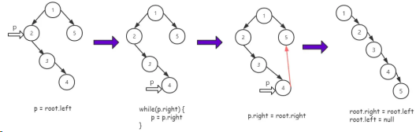

非递归方式采用非递归的后序遍历方式，思路跟之前的完全一样。

```js
/**

* @param {TreeNode} root
* @return {void} Do not return anything, modify root in-place instead.
  */
var flatten = function (root) {
	if (root == null) return;
	flatten(root.left);
	flatten(root.right);
	if (root.left) {
		let p = root.left;
		while (p.right) {
			p = p.right;
		}
		p.right = root.right;
		root.right = root.left;
		root.left = null;
	}
};
```

#### 非递归方式

采用非递归的后序遍历方式，思路跟之前的完全一样。

```js
var flatten = function (root) {
	if (root == null) return;
	let stack = [];
	let visited = new Set();
	let p = root;
	// 开始后序遍历
	while (stack.length || p) {
		while (p) {
			stack.push(p);
			p = p.left;
		}
		let node = stack[stack.length - 1];
		// 如果右孩子存在，而且右孩子未被访问
		if (node.right && !visited.has(node.right)) {
			p = node.right;
			visited.add(node.right);
		} else {
			// 以下为思路图中关键逻辑
			if (node.left) {
				let p = node.left;
				while (p.right) {
					p = p.right;
				}
				p.right = node.right;
				node.right = node.left;
				node.left = null;
			}
			stack.pop();
		}
	}
};
```

### 15.不同的二叉搜索树 II

给定一个整数 n，生成所有由 1 ... n 为节点所组成的二叉搜索树。

示例：

```bash
输入: 3
输出:
[
    [1,null,3,2],
    [3,2,null,1],
    [3,1,null,null,2],
    [2,1,3],
    [1,null,2,null,3]
]
解释:

以上的输出对应以下 5 种不同结构的二叉搜索树：
1       3   3     2    1
 \     /   /     / \    \
  3   2   1     1   3    2
  /  /     \              \
2   1       2              3
```

#### 递归解法

递归创建子树

```js
/**

* @param {number} n
* @return {TreeNode[]}
  */
var generateTrees = function (n) {
	let help = (start, end) => {
		if (start > end) return [null];
		if (start === end) return [new TreeNode(start)];
		let res = [];
		for (let i = start; i <= end; i++) {
			// 左孩子集
			let leftNodes = help(start, i - 1);
			// 右孩子集
			let rightNodes = help(i + 1, end);
			for (let j = 0; j < leftNodes.length; j++) {
				for (let k = 0; k < rightNodes.length; k++) {
					let root = new TreeNode(i);
					root.left = leftNodes[j];
					root.right = rightNodes[k];
					res.push(root);
				}
			}
		}
		return res;
	};
	if (n == 0) return [];
	return help(1, n);
};
```

#### 非递归解法

```js
var generateTrees = function (n) {
	let clone = (node, offset) => {
		if (node == null) return null;
		let newnode = new TreeNode(node.val + offset);
		newnode.left = clone(node.left, offset);
		newnode.right = clone(node.right, offset);
		return newnode;
	};
	if (n == 0) return [];
	let dp = [];
	dp[0] = [null];
	// i 是子问题中的节点个数，子问题: [1], [1,2], [1,2,3]...逐步递增，直到[1,2,3...,n]
	for (let i = 1; i <= n; i++) {
		dp[i] = [];
		for (let j = 1; j <= i; j++) {
			// 左子树集
			for (let leftNode of dp[j - 1]) {
				// 右子树集
				for (let rightNode of dp[i - j]) {
					let node = new TreeNode(j);
					// 左子树结构共享
					node.left = leftNode;
					// 右子树无法共享，但可以借用节点个数相同的树，每个节点增加一个偏移量
					node.right = clone(rightNode, j);
					dp[i].push(node);
				}
			}
		}
	}
	return dp[n];
};
```

## 指针

## 字符串

### 1.【面试真题】最长回文子串【双指针】

```js
/**
 * @param {string} s
 * @return {string}
 */
var longestPalindrome = function (s) {
	if (s.length === 1) return s;
	let maxRes = 0,
		maxStr = "";
	for (let i = 0; i < s.length; i++) {
		let str1 = palindrome(s, i, i);
		let str2 = palindrome(s, i, i + 1);
		if (str1.length > maxRes) {
			maxStr = str1;
			maxRes = str1.length;
		}
		if (str2.length > maxRes) {
			maxStr = str2;
			maxRes = str2.length;
		}
	}
	return maxStr;
};
function palindrome(s, l, r) {
	while (l >= 0 && r < s.length && s[l] === s[r]) {
		l--;
		r++;
	}
	return s.slice(l + 1, r);
}
```

### 2.最长公共前缀【双指针】

```js
/**
 * @param {string[]} strs
 * @return {string}
 */
var longestCommonPrefix = function (strs) {
	if (strs.length === 0) return "";
	let first = strs[0];
	if (first === "") return "";
	let minLen = Number.MAX_SAFE_INTEGER;
	for (let i = 1; i < strs.length; i++) {
		const len = twoStrLongestCommonPrefix(first, strs[i]);
		minLen = Math.min(len, minLen);
	}
	return first.slice(0, minLen);
};
function twoStrLongestCommonPrefix(s, t) {
	let i = 0,
		j = 0;
	let cnt = 0;
	while (i < s.length && j < t.length) {
		console.log(s[i], t[j], cnt);
		if (s[i] === t[j]) {
			cnt++;
		} else {
			return cnt;
		}
		i++;
		j++;
	}
	return cnt;
}
```

### 3.无重复字符的最长子串【双指针】

```js
/**
 * @param {string} s
 * @return {number}
 */
var lengthOfLongestSubstring = function (s) {
	let window = {};
	let left = 0,
		right = 0;
	let maxLen = 0,
		maxStr = "";
	while (right < s.length) {
		let c = s[right];
		right++;
		if (window[c]) window[c]++;
		else window[c] = 1;
		while (window[c] > 1) {
			let d = s[left];
			left++;
			window[d]--;
		}
		if (maxLen < right - left) {
			maxLen = right - left;
		}
	}
	return maxLen;
};
```

### 4.【面试真题】 最小覆盖子串【滑动窗口】

```js
/**
 * @param {string} s
 * @param {string} t
 * @return {string}
 */
var minWindow = function (s, t) {
	let need = {},
		window = {};
	for (let c of t) {
		if (!need[c]) need[c] = 1;
		else need[c]++;
	}
	let left = 0,
		right = 0;
	let valid = 0,
		len = Object.keys(need).length;
	let minLen = s.length + 1,
		minStr = "";
	while (right < s.length) {
		const d = s[right];
		right++;
		if (!window[d]) window[d] = 1;
		else window[d]++;
		if (need[d] && need[d] === window[d]) {
			valid++;
		}
		console.log("left - right", left, right);
		while (valid === len) {
			if (right - left < minLen) {
				minLen = right - left;
				minStr = s.slice(left, right);
			}
			console.lo;
			let c = s[left];
			left++;
			window[c]--;
			if (need[c] && window[c] < need[c]) {
				valid--;
			}
		}
	}
	return minStr;
};
```

## 数组问题

### 1.【面试真题】俄罗斯套娃信封问题【排序+最长上升子序列】

```js
/**
 * @param {number[][]} envelopes
 * @return {number}
 */
var maxEnvelopes = function (envelopes) {
	if (envelopes.length === 1) return 1;
	envelopes.sort((a, b) => {
		if (a[0] !== b[0]) return a[0] - b[0];
		else return b[1] - a[1];
	});
	let LISArr = [];
	for (let [key, value] of envelopes) {
		LISArr.push(value);
	}
	console.log(LISArr);
	return LIS(LISArr);
};
function LIS(arr) {
	let dp = [];
	let maxAns = 0;
	for (let i = 0; i < arr.length; i++) {
		dp[i] = 1;
	}
	for (let i = 1; i < arr.length; i++) {
		for (let j = i; j >= 0; j--) {
			if (arr[i] > arr[j]) {
				dp[i] = Math.max(dp[i], dp[j] + 1);
			}
			maxAns = Math.max(maxAns, dp[i]);
		}
	}
	return maxAns;
}
```

### 2.最长连续递增序列【快慢指针】

```js
/**
 * @param {number[]} nums
 * @return {number}
 */
var findLengthOfLCIS = function (nums) {
	if (nums.length === 0) return 0;
	const n = nums.length;
	let left = 0,
		right = 1;
	let globalMaxLen = 1,
		maxLen = 1;
	while (right < n) {
		if (nums[right] > nums[left]) maxLen++;
		else {
			maxLen = 1;
		}
		left++;
		right++;
		globalMaxLen = Math.max(globalMaxLen, maxLen);
	}
	return globalMaxLen;
};
```

### 3.最长连续序列 【哈希表】

```js
/**
 * @param {number[]} nums
 * @return {number}
 */
var longestConsecutive = function (nums) {
	if (nums.length === 0) return 0;
	const set = new Set(nums);
	const n = nums.length;
	let globalLongest = 1;
	for (let i = 0; i < n; i++) {
		if (!set.has(nums[i] - 1)) {
			let longest = 1;
			let currentNum = nums[i];
			while (set.has(currentNum + 1)) {
				currentNum += 1;
				longest++;
			}
			globalLongest = Math.max(globalLongest, longest);
		}
	}
	return globalLongest;
};
```

### 4.【面试真题】盛最多水的容器【哈希表】

```js
/**
 * @param {number[]} height
 * @return {number}
 */
var maxArea = function (height) {
	let n = height.length;
	let left = 0,
		right = n - 1;
	let maxOpacity = 0;
	while (left < right) {
		let res = Math.min(height[left], height[right]) * (right - left);
		maxOpacity = Math.max(maxOpacity, res);
		if (height[left] < height[right]) left++;
		else right--;
	}
	return maxOpacity;
};
```

### 5.寻找两个正序数组的中位数【双指针】

```js
/**
 * @param {number[]} nums1
 * @param {number[]} nums2
 * @return {number}
 */
var findMedianSortedArrays = function (nums1, nums2) {
	let m = nums1.length,
		n = nums2.length;
	let i = 0,
		j = 0;
	let newArr = [];
	while (i < m && j < n) {
		if (nums1[i] < nums2[j]) {
			newArr.push(nums1[i++]);
		} else {
			newArr.push(nums2[j++]);
		}
	}
	newArr = newArr.concat(i < m ? nums1.slice(i) : nums2.slice(j));
	const len = newArr.length;
	console.log(newArr);
	if (len % 2 === 0) {
		return (newArr[len / 2] + newArr[len / 2 - 1]) / 2;
	} else {
		return newArr[Math.floor(len / 2)];
	}
};
```

### 6.删除有序数组中的重复项【快慢指针】

```js
/**
 * @param {number[]} nums
 * @return {number}
 */
var removeDuplicates = function (nums) {
	if (nums.length <= 1) return nums.length;
	let lo = 0,
		hi = 0;
	while (hi < nums.length) {
		while (nums[lo] === nums[hi] && hi < nums.length) hi++;
		if (nums[lo] !== nums[hi] && hi < nums.length) {
			lo++;
			nums[lo] = nums[hi];
		}
		hi++;
	}
	return lo + 1;
};
```

### 7.和为 K 的子数组【哈希表】

```js
/**
 * @param {number[]} nums
 * @param {number} k
 * @return {number}
 */
var subarraySum = function (nums, k) {
	let cnt = 0;
	let sum0_i = 0,
		sum0_j = 0;
	let map = new Map();
	map.set(0, 1);
	for (let i = 0; i <= nums.length; i++) {
		sum0_i += nums[i];
		sum0_j = sum0_i - k;
		console.log("map", sum0_j, map.get(sum0_j));
		if (map.has(sum0_j)) {
			cnt += map.get(sum0_j);
		}
		let sumCnt = map.get(sum0_i) || 0;
		map.set(sum0_i, sumCnt + 1);
	}
	return cnt;
};
```

### 8.nSum 问题【哈希表】

```js
/**
 * @param {number[]} nums
 * @param {number} target
 * @return {number[]}
 */
var twoSum = function (nums, target) {
	let map2 = new Map();
	for (let i = 0; i < nums.length; i++) {
		map2.set(nums[i], i);
	}
	for (let i = 0; i < nums.length; i++) {
		if (map2.has(target - nums[i]) && map2.get(target - nums[i]) !== i) return;
		[i, map2.get(target - nums[i])];
	}
};
```

### 9.【面试真题】接雨水【暴力+备忘录优化】

```js
/**
 * @param {number[]} height
 * @return {number}
 */
var trap = function (height) {
	let l_max = [],
		r_max = [];
	let len = height.length;
	let maxCapacity = 0;
	for (let i = 0; i < len; i++) {
		l_max[i] = height[i];
		r_max[i] = height[i];
	}
	for (let i = 1; i < len; i++) {
		l_max[i] = Math.max(l_max[i - 1], height[i]);
	}
	for (let j = len - 2; j >= 0; j--) {
		r_max[j] = Math.max(r_max[j + 1], height[j]);
	}
	for (let i = 0; i < len; i++) {
		maxCapacity += Math.min(l_max[i], r_max[i]) - height[i];
	}
	return maxCapacity;
};
```

### 10.跳跃游戏【贪心算法】

```js
/**
 * @param {number[]} nums
 * @return {boolean}
 */
var canJump = function (nums) {
	let faster = 0;
	for (let i = 0; i < nums.length - 1; i++) {
		faster = Math.max(faster, i + nums[i]);
		if (faster <= i) return false;
	}
	return faster >= nums.length - 1;
};
```

## 排序算法

### 1. 用最少数量的箭引爆气球

```js
/**
 * @param {number[][]} points
 * @return {number}
 */
var findMinArrowShots = function (points) {
	if (points.length === 0) return 0;
	points.sort((a, b) => a[1] - b[1]);
	let cnt = 1;
	let resArr = [points[0]];
	let curr, last;
	for (let i = 1; i < points.length; i++) {
		curr = points[i];
		last = resArr[resArr.length - 1];
		if (curr[0] > last[1]) {
			resArr.push(curr);
			cnt++;
		}
	}
	return cnt;
};
```

### 2. 合并区间【排序算法+区间问题】

```js
/**
 * @param {number[][]} intervals
 * @return {number[][]}
 */
var merge = function (intervals) {
	if (intervals.length === 0) return [];
	intervals.sort((a, b) => a[0] - b[0]);
	let mergeArr = [intervals[0]];
	let last, curr;
	for (let j = 1; j < intervals.length; j++) {
		last = mergeArr[mergeArr.length - 1];
		curr = intervals[j];
		if (last[1] >= curr[0]) {
			last[1] = Math.max(curr[1], last[1]);
		} else {
			mergeArr.push(curr);
		}
	}
	return mergeArr;
};
```

## 查找：二分查找

```js
/**
 * @param {number[]} nums1
 * @param {number[]} nums2
 * @return {number}
 */
var findMedianSortedArrays = function (nums1, nums2) {
	let m = nums1.length,
		n = nums2.length;
	let i = 0,
		j = 0;
	let newArr = [];
	while (i < m && j < n) {
		if (nums1[i] < nums2[j]) {
			newArr.push(nums1[i++]);
		} else {
			newArr.push(nums2[j++]);
		}
	}
	newArr = newArr.concat(i < m ? nums1.slice(i) : nums2.slice(j));
	const len = newArr.length;
	console.log(newArr);
	if (len % 2 === 0) {
		return (newArr[len / 2] + newArr[len / 2 - 1]) / 2;
	} else {
		return newArr[Math.floor(len / 2)];
	}
};
```

### 1. 判断子序列【二分查找】

```js
/**
 * @param {string} s
 * @param {string} t
 * @return {boolean}
 */
var isSubsequence = function (s, t) {
	let hash = {};
	for (let i = 0; i < t.length; i++) {
		if (!hash[t[i]]) hash[t[i]] = [];
		hash[t[i]].push(i);
	}
	let lastMaxIndex = 0;
	for (let i = 0; i < s.length; i++) {
		if (hash[s[i]]) {
			const index = binarySearch(hash[s[i]], lastMaxIndex);
			console.log("index", index, hash[s[i]]);
			if (index === -1) return false;
			lastMaxIndex = hash[s[i]][index] + 1;
		} else return false;
	}
	return true;
};
function binarySearch(array, targetIndex) {
	let left = 0,
		right = array.length;
	while (left < right) {
		let mid = left + Math.floor((right - left) / 2);
		if (array[mid] >= targetIndex) {
			right = mid;
		} else if (array[mid] < targetIndex) {
			left = mid + 1;
		}
	}
	if (left >= array.length || array[left] < targetIndex) return -1;
	return left;
}
```

### 2. 在排序数组中查找元素的第一个和最后一个位置【二分搜索】

```js
/**
 * @param {number[]} nums
 * @param {number} target
 * @return {number[]}
 */
var searchRange = function (nums, target) {
	const left = leftBound(nums, target);
	const right = rightBound(nums, target);
	return [left, right];
};
function leftBound(nums, target) {
	let left = 0;
	let right = nums.length - 1;
	while (left <= right) {
		let mid = Math.floor(left + (right - left) / 2);
		if (nums[mid] === target) {
			right = mid - 1;
		} else if (nums[mid] < target) {
			left = mid + 1;
		} else if (nums[mid] > target) {
			right = mid - 1;
		}
	}
	if (left >= nums.length || nums[left] !== target) {
		return -1;
	}
	return left;
}
function rightBound(nums, target) {
	let left = 0;
	let right = nums.length - 1;
	while (left <= right) {
		let mid = Math.floor(left + (right - left) / 2);
		if (nums[mid] === target) {
			left = mid + 1;
		} else if (nums[mid] < target) {
			left = mid + 1;
		} else if (nums[mid] > target) {
			right = mid - 1;
		}
	}
	if (right < 0 || nums[right] !== target) {
		return -1;
	}
	return right;
}
```

#### 1、给一个数，去一个已经排好序的数组中寻找这个数的位置（通过快速查找，二分查找）

**考察点：数据结构算法**

::: details 查看参考回答

```js
function binarySearch(target, arr, start, end) {
	var start = start || 0;

	var end = end || arr.length - 1;
	var mid = parseInt(start + (end - start) / 2);
	if (target == arr[mid]) {
		return mid;
	} else if (target > arr[mid]) {
		return binarySearch(target, arr, mid + 1, end);
	} else {
		return binarySearch(target, arr, start, mid - 1);
	}
	return -1;
}
```

:::

## 动态规划

### 1.最长递增子序列

```js
/**
 * @param {number[]} nums
 * @return {number}
 */
var lengthOfLIS = function (nums) {
	let maxLen = 0,
		n = nums.length;
	let dp = [];
	for (let i = 0; i < n; i++) {
		dp[i] = 1;
	}
	for (let i = 0; i < n; i++) {
		for (let j = 0; j < i; j++) {
			if (nums[i] > nums[j]) {
				dp[i] = Math.max(dp[i], dp[j] + 1);
			}
		}
		maxLen = Math.max(maxLen, dp[i]);
	}
	return maxLen;
};
```

### 2. 【面试真题】 零钱兑换

```js
/**
 * @param {number[]} coins
 * @param {number} amount
 * @return {number}
 */
var coinChange = function (coins, amount) {
	if (amount === 0) return 0;
	let dp = [];
	for (let i = 0; i <= amount; i++) {
		dp[i] = amount + 1;
	}
	dp[0] = 0;
	for (let i = 0; i <= amount; i++) {
		for (let j = 0; j < coins.length; j++) {
			if (i >= coins[j]) {
				dp[i] = Math.min(dp[i - coins[j]] + 1, dp[i]);
			}
		}
	}
	return dp[amount] === amount + 1 ? -1 : dp[amount];
};
```

### 3. 【面试真题】 最长公共子序列

```js
/**
 * @param {string} text1
 * @param {string} text2
 * @return {number}
 */
var longestCommonSubsequence = function (text1, text2) {
	let n1 = text1.length,
		n2 = text2.length;
	let dp = [];
	for (let i = -1; i < n1; i++) {
		dp[i] = [];
		for (let j = -1; j < n2; j++) {
			dp[i][j] = 0;
		}
	}
	for (let i = 0; i < n1; i++) {
		for (let j = 0; j < n2; j++) {
			if (text1[i] === text2[j]) {
				dp[i][j] = Math.max(dp[i][j], dp[i - 1][j - 1] + 1);
			} else {
				dp[i][j] = Math.max(dp[i - 1][j], dp[i][j - 1]);
			}
		}
	}
	return dp[n1 - 1][n2 - 1];
};
```

### 4. 编辑距离

```js
/**
 * @param {string} word1
 * @param {string} word2
 * @return {number}
 */
var minDistance = function (word1, word2) {
	let len1 = word1.length,
		len2 = word2.length;
	let dp = [];
	for (let i = 0; i <= len1; i++) {
		dp[i] = [];
		for (let j = 0; j <= len2; j++) {
			dp[i][j] = 0;
			if (i === 0) {
				dp[i][j] = j;
			}
			if (j === 0) {
				dp[i][j] = i;
			}
		}
	}
	for (let i = 1; i <= len1; i++) {
		for (let j = 1; j <= len2; j++) {
			if (word1[i - 1] === word2[j - 1]) {
				dp[i][j] = dp[i - 1][j - 1];
			} else {
				dp[i][j] = Math.min(
					dp[i - 1][j] + 1,
					dp[i][j - 1] + 1,
					dp[i - 1][j - 1] + 1
				);
			}
		}
	}
	return dp[len1][len2];
};
```

### 5. 【面试真题】最长回文子序列

```js
/**
 * @param {string} s
 * @return {number}
 */
var longestPalindromeSubseq = function (s) {
	let dp = [];
	for (let i = 0; i < s.length; i++) {
		dp[i] = [];
		for (let j = 0; j < s.length; j++) {
			dp[i][j] = 0;
		}
		dp[i][i] = 1;
	}
	for (let i = s.length - 1; i >= 0; i--) {
		for (let j = i + 1; j < s.length; j++) {
			if (s[i] === s[j]) {
				dp[i][j] = dp[i + 1][j - 1] + 2;
			} else {
				dp[i][j] = Math.max(dp[i + 1][j], dp[i][j - 1]);
			}
		}
	}
	return dp[0][s.length - 1];
};
```

### 6. 【面试真题】最大子序和

```js
/**
 * @param {number[]} nums
 * @return {number}
 */
var maxSubArray = function (nums) {
	let maxSum = -Infinity;
	let dp = [],
		n = nums.length;
	for (let i = -1; i < n; i++) {
		dp[i] = 0;
	}
	for (let i = 0; i < n; i++) {
		dp[i] = Math.max(nums[i], dp[i - 1] + nums[i]);
		maxSum = Math.max(maxSum, dp[i]);
	}
	return maxSum;
};
```

### 7. 【面试真题】 买卖股票的最佳时机

```js
/**
 * @param {number[]} prices
 * @return {number}
 */
var maxProfit = function (prices) {
	let dp = [];
	for (let i = -1; i < prices.length; i++) {
		dp[i] = [];
		for (let j = 0; j <= 1; j++) {
			dp[i][j] = [];
			dp[i][j][0] = 0;
			dp[i][j][1] = 0;
			if (i === -1) {
				dp[i][j][1] = -Infinity;
			}
			if (j === 0) {
				dp[i][j][1] = -Infinity;
			}
			if (j === -1) {
				dp[i][j][1] = -Infinity;
			}
		}
	}
	for (let i = 0; i < prices.length; i++) {
		for (let j = 1; j <= 1; j++) {
			dp[i][j][0] = Math.max(dp[i - 1][j][0], dp[i - 1][j][1] + prices[i]);
			dp[i][j][1] = Math.max(dp[i - 1][j][1], dp[i - 1][j - 1][0] - prices[i]);
		}
	}
	return dp[prices.length - 1][1][0];
};
```

## BFS

### 1. 打开转盘锁

```js
/**
 * @param {string[]} deadends
 * @param {string} target
 * @return {number}
 */
var openLock = function (deadends, target) {
	let queue = new Queue();
	let visited = new Set();
	let step = 0;
	queue.push("0000");
	visited.add("0000");
	while (!queue.isEmpty()) {
		let size = queue.size();
		for (let i = 0; i < size; i++) {
			let str = queue.pop();
			if (deadends.includes(str)) continue;
			if (target === str) {
				return step;
			}
			for (let j = 0; j < 4; j++) {
				let plusStr = plusOne(str, j);
				let minusStr = minusOne(str, j);
				if (!visited.has(plusStr)) {
					queue.push(plusStr);
					visited.add(plusStr);
				}
				if (!visited.has(minusStr)) {
					queue.push(minusStr);
					visited.add(minusStr);
				}
			}
		}
		step++;
	}
	return -1;
};

function plusOne(str, index) {
	let strArr = str.split("");
	if (strArr[index] === "9") {
		strArr[index] = "0";
	} else {
		strArr[index] = (Number(strArr[index]) + 1).toString();
	}
	return strArr.join("");
}

function minusOne(str, index) {
	let strArr = str.split("");
	if (strArr[index] === "0") {
		strArr[index] = "9";
	} else {
		strArr[index] = (Number(strArr[index]) - 1).toString();
	}
	return strArr.join("");
}
class Queue {
	constructor() {
		this.items = [];
		this.count = 0;
		this.lowerCount = 0;
	}
	push(elem) {
		this.items[this.count++] = elem;
	}
	pop() {
		if (this.isEmpty()) {
			return;
		}
		const elem = this.items[this.lowerCount];
		delete this.items[this.lowerCount];
		this.lowerCount++;
		return elem;
	}
	isEmpty() {
		if (this.size() === 0) return true;
		return false;
	}
	size() {
		return this.count - this.lowerCount;
	}
}
```

### 2. 二叉树的最小深度

```js
/**
 * Definition for a binary tree node.
 * function TreeNode(val) {
 * this.val = val;
 * this.left = this.right = null;
 * }
 */
/**
 * @param {TreeNode} root
 * @return {number}
 */
var minDepth = function (root) {
	if (root == null) return 0;
	let depth = 1;
	let queue = new Queue();
	queue.push(root);
	while (!queue.isEmpty()) {
		let size = queue.size();
		for (let i = 0; i < size; i++) {
			const node = queue.pop();
			if (node.left == null && node.right == null) return depth;
			if (node.left) {
				queue.push(node.left);
			}
			if (node.right) {
				queue.push(node.right);
			}
		}
		depth++;
	}
	return depth;
};
class Queue {
	constructor() {
		this.items = [];
		this.count = 0;
		this.lowerCount = 0;
	}
	push(elem) {
		this.items[this.count++] = elem;
	}
	pop() {
		if (this.isEmpty()) {
			return;
		}
		const elem = this.items[this.lowerCount];
		delete this.items[this.lowerCount];
		this.lowerCount++;
		return elem;
	}
	isEmpty() {
		if (this.size() === 0) return true;
		return false;
	}
	size() {
		return this.count - this.lowerCount;
	}
}
```

## 栈

### 1.最小栈【栈】

```js
/**
 * initialize your data structure here.
 */
var MinStack = function () {
	this.stack = [];
	this.minArr = [];
	this.count = 0;
	this.min = Number.MAX_SAFE_INTEGER;
};
/**
 * @param {number} x
 * @return {void}
 */
MinStack.prototype.push = function (x) {
	this.min = Math.min(this.min, x);
	this.minArr[this.count] = this.min;
	this.stack[this.count] = x;
	this.count++;
};
/**
 * @return {void}
 */
MinStack.prototype.pop = function () {
	const element = this.stack[this.count - 1];
	if (this.count - 2 >= 0) this.min = this.minArr[this.count - 2];
	else this.min = Number.MAX_SAFE_INTEGER;
	delete this.stack[this.count - 1];
	delete this.minArr[this.count - 1];
	this.count--;
	return element;
};
/**
 * @return {number}
 */
MinStack.prototype.top = function () {
	if (this.count >= 1) {
		return this.stack[this.count - 1];
	}
	return null;
};
/**
 * @return {number}
 */
MinStack.prototype.getMin = function () {
	const element = this.minArr[this.count - 1];
	return element;
};
/**
 * Your MinStack object will be instantiated and called as such:
 * var obj = new MinStack()
 * obj.push(x)
 * obj.pop()
 * var param_3 = obj.top()
 * var param_4 = obj.getMin()
 */
```

### 2. 下一个更大元素

```js
/**
 * @param {number[]} nums
 * @return {number[]}
 */
var nextGreaterElements = function (nums) {
	let ans = [];
	let stack = new Stack();
	const n = nums.length;
	for (let i = 2 * n - 1; i >= 0; i--) {
		while (!stack.isEmpty() && stack.top() <= nums[i % n]) {
			stack.pop();
		}
		ans[i % n] = stack.isEmpty() ? -1 : stack.top();
		stack.push(nums[i % n]);
	}
	return ans;
};
class Stack {
	constructor() {
		this.count = 0;
		this.items = [];
	}
	top() {
		if (this.isEmpty()) return undefined;
		return this.items[this.count - 1];
	}
	push(element) {
		this.items[this.count] = element;
		this.count++;
	}
	pop() {
		if (this.isEmpty()) return undefined;
		const element = this.items[this.count - 1];
		delete this.items[this.count - 1];
		this.count--;
		return element;
	}
	isEmpty() {
		return this.size() === 0;
	}
	size() {
		return this.count;
	}
}
```

### 3. 【面试真题】有效的括号

```js
/**
 * @param {string} s
 * @return {boolean}
 */
var isValid = function (s) {
	if (s.length === 0) {
		return true;
	}
	if (s.length % 2 !== 0) {
		return false;
	}
	let map = {
		")": "(",
		"]": "[",
		"}": "{",
	};
	let left = ["(", "[", "{"];
	let right = [")", "]", "}"];
	let stack = new Stack();
	for (let i = 0; i < s.length; i++) {
		if (!right.includes(s[i])) {
			stack.push(s[i]);
		} else {
			const matchStr = map[s[i]];
			while (!stack.isEmpty()) {
				const element = stack.pop();
				if (left.includes(element) && matchStr !== element) return;
				false;
				if (element === matchStr) break;
			}
		}
	}
	return stack.isEmpty();
};
class Stack {
	constructor() {
		this.count = 0;
		this.items = [];
	}
	push(element) {
		this.items[this.count] = element;
		this.count++;
	}
	pop() {
		if (this.isEmpty()) return undefined;
		const element = this.items[this.count - 1];
		delete this.items[this.count - 1];
		this.count--;
		return element;
	}
	isEmpty() {
		return this.size() === 0;
	}
	size() {
		return this.count;
	}
}
```

### 4.简化路径

```js
/**
 * @param {string} path
 * @return {string}
 */
var simplifyPath = function (path) {
	let newPath = path.split("/");
	newPath = newPath.filter((item) => item !== "");
	const stack = new Stack();
	for (let s of newPath) {
		if (s === "..") stack.pop();
		else if (s !== ".") stack.push(s);
	}
	if (stack.isEmpty()) return "/";
	let str = "";
	while (!stack.isEmpty()) {
		const element = stack.pop();
		str = "/" + element + str;
	}
	return str;
};
function handleBack(stack, tag, num) {
	if (!stack.isEmpty()) return num;
	const element = stack.pop();
	if (element === "..") return handleBack(stack, tag, num + 1);
	else {
		stack.push(element);
		return num;
	}
}
class Stack {
	constructor() {
		this.count = 0;
		this.items = [];
	}
	push(element) {
		this.items[this.count] = element;
		this.count++;
	}
	pop() {
		if (this.isEmpty()) return undefined;
		const element = this.items[this.count - 1];
		delete this.items[this.count - 1];
		this.count--;
		return element;
	}
	size() {
		return this.count;
	}
	isEmpty() {
		return this.size() === 0;
	}
}
```

## DFS

### 1.岛屿的最大面积

```js
/**
 * @param {number[][]} grid
 * @return {number}
 */
let maxX, maxY;
let visited;
let globalMaxArea;
var maxAreaOfIsland = function (grid) {
	visited = new Set();
	maxX = grid.length;
	maxY = grid[0].length;
	globalMaxArea = 0;
	for (let i = 0; i < maxX; i++) {
		for (let j = 0; j < maxY; j++) {
			if (grid[i][j] === 1) {
				visited.add(`(${i}, ${j})`);
				globalMaxArea = Math.max(globalMaxArea, dfs(grid, i, j));
			}
			visited.clear();
		}
	}
	return globalMaxArea;
};
function dfs(grid, x, y) {
	let res = 1;
	for (let i = -1; i <= 1; i++) {
		for (let j = -1; j <= 1; j++) {
			if (Math.abs(i) === Math.abs(j)) continue;
			const newX = x + i;
			const newY = y + j;
			if (newX >= maxX || newX < 0 || newY >= maxY || newY < 0) continue;
			if (visited.has(`(${newX}, ${newY})`)) continue;
			visited.add(`(${newX}, ${newY})`);
			const areaCnt = grid[newX][newY];
			if (areaCnt === 1) {
				const cnt = dfs(grid, newX, newY);
				res += cnt;
			}
		}
	}
	return res;
}
```

### 2.相同的树

```js
/**
 * Definition for a binary tree node.
 * function TreeNode(val) {
 * this.val = val;
 * this.left = this.right = null;
 * }
 */
/**
 * @param {TreeNode} p
 * @param {TreeNode} q
 * @return {boolean}
 */
var isSameTree = function (p, q) {
	if (p == null && q == null) return true;
	if (p == null || q == null) return false;
	if (p.val !== q.val) return false;
	return isSameTree(p.left, q.left) && isSameTree(p.right, q.right);
};
```

## 回溯算法

### 1.N 皇后

```js
/**
 * @param {number} n
 * @return {string[][]}
 */
let result = [];
var solveNQueens = function (n) {
	result = [];
	let board = [];
	for (let i = 0; i < n; i++) {
		board[i] = [];
		for (let j = 0; j < n; j++) {
			board[i][j] = ".";
		}
	}
	backtrack(0, board, n);
	return result;
};
function deepClone(board) {
	let res = [];
	for (let i = 0; i < board.length; i++) {
		res.push(board[i].join(""));
	}
	return res;
}
function backtrack(row, board, n) {
	if (row === n) {
		result.push(deepClone(board));
		return;
	}
	for (let j = 0; j < n; j++) {
		if (checkInValid(board, row, j, n)) continue;
		board[row][j] = "Q";
		backtrack(row + 1, board, n);
		board[row][j] = ".";
	}
}
function checkInValid(board, row, column, n) {
	// 行
	for (let i = 0; i < n; i++) {
		if (board[i][column] === "Q") return true;
	}
	for (let i = row - 1, j = column + 1; i >= 0 && j < n; i--, j++) {
		if (board[i][j] === "Q") return true;
	}
	for (let i = row - 1, j = column - 1; i >= 0 && j >= 0; i--, j--) {
		if (board[i][j] === "Q") return true;
	}
	return false;
}
```

### 2.全排列

```js
/**
 * @param {number[]} nums
 * @return {number[][]}
 */
let results = [];
var permute = function (nums) {
	results = [];
	backtrack(nums, []);
	return results;
};
function backtrack(nums, track) {
	if (nums.length === track.length) {
		results.push(track.slice());
		return;
	}
	for (let i = 0; i < nums.length; i++) {
		if (track.includes(nums[i])) continue;
		track.push(nums[i]);
		backtrack(nums, track);
		track.pop();
	}
}
```

### 3.括号生成

```js
/**
 * @param {number} n
 * @return {string[]}
 */
var generateParenthesis = function (n) {
	let validRes = [];
	backtrack(n * 2, validRes, "");
	return validRes;
};
function backtrack(len, validRes, bracket) {
	if (bracket.length === len) {
		if (isValidCombination(bracket)) {
			validRes.push(bracket);
		}
		return;
	}
	for (let str of ["(", ")"]) {
		bracket += str;
		backtrack(len, validRes, bracket);
		bracket = bracket.slice(0, bracket.length - 1);
	}
}
function isValidCombination(bracket) {
	let stack = new Stack();
	for (let i = 0; i < bracket.length; i++) {
		const str = bracket[i];
		if (str === "(") {
			stack.push(str);
		} else if (str === ")") {
			const top = stack.pop();
			if (top !== "(") return false;
		}
	}
	return stack.isEmpty();
}
class Stack {
	constructor() {
		this.count = 0;
		this.items = [];
	}
	push(element) {
		this.items[this.count] = element;
		this.count++;
	}
	pop() {
		if (this.isEmpty()) return;
		const element = this.items[this.count - 1];
		delete this.items[this.count - 1];
		this.count--;
		return element;
	}
	size() {
		return this.count;
	}
	isEmpty() {
		return this.size() === 0;
	}
}
```

### 4.复原 IP 地址

```js
/**
 * @param {string} s
 * @return {string[]}
 */
var restoreIpAddresses = function (s) {
	if (s.length > 12) return [];
	let res = [];
	const track = [];
	backtrack(s, track, res);
	return res;
};
function backtrack(s, track, res) {
	if (track.length === 4 && s.length === 0) {
		res.push(track.join("."));
		return;
	}
	let len = s.length >= 3 ? 3 : s.length;
	for (let i = 0; i < len; i++) {
		const c = s.slice(0, i + 1);
		if (parseInt(c) > 255) continue;
		if (i >= 1 && parseInt(c) < parseInt(1 + "0".repeat(i))) continue;
		track.push(c);
		backtrack(s.slice(i + 1), track, res);
		track.pop();
	}
}
```

### 5.子级

```js
/**
 * @param {number[]} nums
 * @return {number[][]}
 */
var subsets = function (nums) {
	if (nums.length === 0) return [[]];
	let resArr = [];
	backtrack(nums, 0, [], resArr);
	return resArr;
};
function backtrack(nums, index, subArr, resArr) {
	if (Array.isArray(subArr)) {
		resArr.push(subArr.slice());
	}
	if (index === nums.length) {
		return;
	}
	for (let i = index; i < nums.length; i++) {
		subArr.push(nums[i]);
		backtrack(nums, i + 1, subArr, resArr);
		subArr.pop(nums[i]);
	}
}
```
