# 计算机网络面试题

### 1、TCP 建立连接的三次握手过程

**考察点：tcp**

::: details 查看参考回答

第一次握手：起初两端都处于 CLOSED 关闭状态，Client 将标志位 SYN 置为 1，随机产生一个值 seq=x，并将该数据包发送给 Server，Client 进入 SYN-SENT 状态，等待 Server 确认；

第二次握手：Server 收到数据包后由标志位 SYN=1 得知 Client 请求建立连接，Server 将标志位 SYN 和 ACK 都置为 1，ack=x+1，随机产生一个值 seq=y，并将该数据包发送给 Client 以确认连接请求，Server 进入 SYN-RCVD 状态，此时操作系统为该 TCP 连接分配 TCP 缓存和变量；

第三次握手：Client 收到确认后，检查 ack 是否为 x+1，ACK 是否为 1，如果正确则将标志位 ACK 置为 1，ack=y+1，并且此时操作系统为该 TCP 连接分配 TCP 缓存和变量，并将该数据包发送给 Server，Server 检查 ack 是否为 y+1，ACK 是否为 1，如果正确则连接建立成功，Client 和 Server 进入 ESTABLISHED 状态，完成三次握手，随后 Client 和 Server 就可以开始传输数据。

:::

### 2、cdn 原理

**考察：cdn**

::: details 查看参考回答

CDN 的全称是 Content Delivery Network，即内容分发网络。

CDN 的基本原理是广泛采用各种缓存服务器，将这些缓存服务器分布到用户访问相对集中的地区或网络中，在用户访问网站时，利用全局负载技术将用户的访问指向距离最近的工作正常的缓存服务器上，由缓存服务器直接响

:::

### 3、tcp 三次握手过程

**考察点：tcp**

::: details 查看参考回答

第一次握手：起初两端都处于 CLOSED 关闭状态，Client 将标志位 SYN 置为 1，随机产生一个值 seq=x，并将该数据包发送给 Server，Client 进入 SYN-SENT 状态，等待 Server 确认；

第二次握手：Server 收到数据包后由标志位 SYN=1 得知 Client 请求建立连接，Server 将标志位 SYN 和 ACK 都置为 1，ack=x+1，随机产生一个值 seq=y，并将该数据包发送给 Client 以确认连接请求，Server 进入 SYN-RCVD 状态，此时操作系统为该 TCP 连接分配 TCP 缓存和变量；

第三次握手：Client 收到确认后，检查 ack 是否为 x+1，ACK 是否为 1，如果正确则将标志位 ACK 置为 1，ack=y+1，并且此时操作系统为该 TCP 连接分配 TCP 缓存和变量，并将该数据包发送给 Server，Server 检查 ack 是否为 y+1，ACK 是否为 1，如果正确则连接建立成功，Client 和 Server 进入 ESTABLISHED 状态，完成三次握手，随后 Client 和 Server 就可以开始传输数据。

:::

### 4、说一下用户从输入 url 到显示页面这个过程发生了什么

**考察点：计算机网络**

::: details 查看参考回答

1. DNS 解析
2. TCP 连接
3. 发送 HTTP 请求
4. 服务器处理请求并返回 HTTP 报文
5. 浏览器解析渲染页面
6. 连接结束

:::

### 5、HTTP 的头部包含哪些内容。常见的请求方法（我为什么要说后面的 options，head，connect）

**考察点：计算机网络**

::: details 查看参考回答

常见的请求方法有 get,post，get 用来请求数据，post 用来提交数据，form 表单使用 get 时数据会以 querystring 形式存在 url 中，因而不够安全也存在数据大小限制，而 post 不会，post 将数据存放在 http 报文体中，获取数据应该用 get，提交数据用 post

:::

### 6、请求方法 head 特性

**考察点：计算机网络**

::: details 查看参考回答

Head 只请求页面的首部，head 方法和 get 方法相同，只不过服务器响应时不会返回消息体，一个 head 请求的响应中，http 头中包含的元信息应该和一个 get 请求的响应消息相同，这种方法可以用来获取请求中隐含的元信息，而不用传输实体本身，这个也经常用来测试超链接的有效性和可用性，

Head 请求有以下特点：

- 只请求资源的首部，
- 检查超链接的有效性
- 检查网页是否被修改
- 用于自动搜索机器人获取网页的标志信息，获取 rss 种子信息，或者传递安全认证信息等

:::

### 7、HTTP 状态码，301 和 302 有什么具体区别，200 和 304 的区别

**考察点：计算机网络**

::: details 查看参考回答

状态码可以按照第一个数字分类，1 表示信息，2 表示成功，3 表示重定向，4 表示客户端错
误，5 表示服务器错误

常见的状态码：

- 101 切换协议
- 200 成功
- 301 永久重定向
- 302 临时重定向
- 304 未修改
- 301 和 302 的区别：301：永久移动，请求的网页已永久移动到新的位置，服务器返回此响应，会自动将请求者转到新位置，302：历史移动，服务器目前从不同位置的网页响应请求，但请求者应继续使用原有位置来继续以后的请求，

200 和 304：

200 表示成功，服务器已成功处理了请求，通常表示为服务器提供了请求的网页，304 表示未修改，自从上次请求后，请求的网页未修改过，服务器返回此响应时不会返回网页内容

:::

### 8、OSI 七层模型

**考察点：计算机网络**

::: details 查看参考回答

osi 七层模型可以说是面试必考基础了

从上到下分别是：

- **应用层**：文件传输，常用协议 HTTP，snmp,FTP , 表示层：数据格式化，代码转换，数据加密，
- **会话层**：建立，解除会话
- **传输层**：提供端对端的接口，tcp,udp
- **网络层**：为数据包选择路由，IP，icmp
- **数据链路层**：传输有地址的帧
- **物理层**：二进制的数据形式在物理媒体上传输数据

:::

### 9、TCP 和 UDP 的区别，为什么三次握手四次挥手

**考察点：计算机网络**

::: details 查看参考回答

TCP 和 UDP 之间的区别 OSI 和 TCP/IP 模型在传输层定义两种传输协议：TCP（或传输控制协议）和 UDP（或用户数据报协议）。 UDP 与 TCP 的主要区别在于 UDP 不一定提供可靠的数据传输。 事实上，该协议不能保证数据准确无误地到达目的地。

为什么 TCP 要进行四次挥手呢？

因为是双方彼此都建立了连接，因此双方都要释放自己的连接，A 向 B 发出一个释放连接请求，他要释放链接表明不再向 B 发送数据了，此时 B 收到了 A 发送的释放链接请求之后，给 A 发送一个确认，A 不能再向 B 发送数据了，它处于 FIN-WAIT-2 的状态，但是此时 B 还可以向 A 进行数据的传送。此时 B 向 A 发送一个断开连接的请求，A 收到之后给 B 发送一个确认。此时 B 关闭连接。A 也关闭连接。

为什么要有 TIME-WAIT 这个状态呢，这是因为有可能最后一次确认丢失，如果 B 此时继续向 A 发送一个我要断开连接的请求等待 A 发送确认，但此时 A 已经关闭连接了，那么 B 永远也关不掉了，所以我们要有 TIME-WAIT 这个状态。

当然 TCP 也并不是 100%可靠的。

:::

### 10、HTTP 缓存机制

**考察点：计算机网络**

::: details 查看参考回答

HTTP 缓存即是浏览器第一次想一个服务器发起 HTTP 请求后，服务器会返回请求的资源，并且在响应头中添加一些有关缓存的字段如：cache-control，expires,last-modifed，ETag,Date，等，之后浏览器再向该服务器请求资源就可以视情况使用强缓存和协商缓存，强缓存：浏览器直接从本地缓存中获取数据，不与服务器进行交互，协商缓存：浏览器发送请求到服务器，服务器判断是否可使用本地缓存，

:::

### 11、websocket 和 ajax 的区别是什么，websocket 的应用场景有哪些

**考察点：计算机网络**

::: details 查看参考回答

WebSocket 的诞生本质上就是为了解决 HTTP 协议本身的单向性问题：请求必须由客户端向服务端发起，然后服务端进行响应。这个 Request-Response 的关系是无法改变的。对于一般的网页浏览和访问当然没问题，一旦我们需要服务端主动向客户端发送消息时就麻烦了，因为此前的 TCP 连接已经释放，根本找不到客户端在哪。

为了能及时从服务器获取数据，程序员们煞费苦心研究出来的各种解决方案其实都是在 HTTP 框架下做的妥协，没法子，浏览器这东西只支持 HTTP，我们有什么办法。所以大家要么定时去轮询，要么就靠长连接——客户端发起请求，服务端把这个连接攥在手里不回复，等有消息了再回，如果超时了客户端就再请求一次——其实大家也懂，这只是个减少了请求次数、实时性更好的轮询，本质没变。

WebSocket 就是从技术根本上解决这个问题的：看名字就知道，它借用了 Web 的端口和消息头来创建连接，后续的数据传输又和基于 TCP 的 Socket 几乎完全一样，但封装了好多原本在 Socket 开发时需要我们手动去做的功能。比如原生支持 wss 安全访问（跟 https 共用端口和证书）、创建连接时的校验、从数据帧中自动拆分消息包等等。

换句话说，原本我们在浏览器里只能使用 HTTP 协议，现在有了 Socket，还是个更好用的 Socket。

了解了 WebSocket 的背景和特性之后，就可以回答它能不能取代 AJAX 这个问题了：

对于服务器与客户端的双向通信，WebSocket 简直是不二之选。如果不是还有少数旧版浏览器尚在服役的话，所有的轮询、长连接等方式早就该废弃掉。那些整合多种双向推送消息方式的库（如 <http://Socket.IO、SignalR）当初最大的卖点就是兼容所有浏览器版本，自动识别旧版浏览器并采取不同的连接方式，现在也渐渐失去了优势——所有新版浏览器都兼容> WebSocket，直接用原生的就行了。

说句题外话，这点很像 jQuery，在原生 js 难用时迅速崛起，当其他库和原生 js 都吸收了
它的很多优势时，慢慢就不那么重要了。

但是，很大一部分 AJAX 的使用场景仍然是传统的请求-响应形式，比如获取 json 数据、post 表单之类。这些功能虽然靠 WebSocket 也能实现，但就像在原本传输数据流的 TCP 之上定义了基于请求的 HTTP 协议一样，我们也要在 WebSocket 之上重新定义一种新的协议，最少也要加个 request id 用来区分每次响应数据对应的请求吧。

……但是，何苦一层叠一层地造个新轮子呢？直接使用 AJAX 不是更简单、更成熟吗？

另外还有一种情况，也就是传输大文件、图片、媒体流的时候，最好还是老老实实用 HTTP 来传。如果一定要用 WebSocket 的话，至少也专门为这些数据专门开辟个新通道，而别去占用那条用于推送消息、对实时性要求很强的连接。否则会把串行的 WebSocket 彻底堵死的。

所以说，WebSocket 在用于双向传输、推送消息方面能够做到灵活、简便、高效，但在普通的 Request-Response 过程中并没有太大用武之地，比起普通的 HTTP 请求来反倒麻烦了许多，甚至更为低效。

每项技术都有自身的优缺点，在适合它的地方能发挥出最大长处，而看到它的几个优点就不分场合地全方位推广的话，可能会适得其反。

我们自己在开发能与手机通信的互联网机器人时就使用了 WebSocket，效果很好。但并不是用它取代 HTTP，而是取代了原先用于通信的基于 TCP 的 Socket。

优点是：

原先在 Socket 连接后还要进行一些复杂的身份验证，同时要阻止未验证的连接发送控制指令。现在不需要了，在建立 WebSocket 连接的 url 里就能携带身份验证参数，验证不通过可以直接拒绝，不用设置状态；

原先自己实现了一套类似 SSL 的非对称加密机制，现在完全不需要了，直接通过 wss 加密，还能顺便保证证书的可信性；

原先要自己定义 Socket 数据格式，设置长度与标志，处理粘包、分包等问题，现在 WebSocket 收到的直接就是完整的数据包，完全不用自己处理；

前端的 nginx 可以直接进行转发与负载均衡，部署简单多了

:::

### 12、TCP/IP 的网络模型

考察点：计算机网络

::: details 查看参考回答

TCP/IP 模型是一系列网络协议的总称

这些协议的目的是使得计算机之间可以进行信息交换

TCP/IP 模型四层架构从下到上分别是链路层，网络层，传输层

- **应用层链路层**的作用是负责建立电路连接，是整个网络的物理基础，典型的协议包括以太网，ADSL 等
- **网络层**负责分配地址和传送二进制数据，主要协议是 IP 协议
- **传输层**负责传送文本数据，主要协议是 TCP 应用层负责传送各种最终形态的数据，是直接与用户信息打交道的层，主要协议是 http，ftp 等

:::

### 13、知道什么跨域方式吗，jsonp 具体流程是什么，如何实现原生 Jsonp 封装，优化，对于

CORS，服务器怎么判断它该不该跨域呢

**考察点：计算机网络**

::: details 查看参考回答

常见的跨域方式大概有七种，大致可分为 iframe、api 跨域

1、JSONP，全称为 json with padding，解决老版本浏览器跨域数据访问问题，原理是 web 页面调用 JS 文件不受浏览器同源策略限制，所以通过 script 标签可以进行跨域请求，流程如下：

- 首先前端设置好回调参数，并将其作为 URL 的参数
- 服务器端收到请求后，通过该参数获取到回调函数名，并将数据放在参数中返回
- 收到结果后因为是 script 标签，所以浏览器当做脚本运行，

2、cors，全称是跨域资源共享，允许浏览器向跨源服务器发出 XMLHTTP Request 请求，从而克服了 ajax 只能同源使用的策略，实现 cors 的关键是服务器，只要服务器实现了 cros 接口，就可以跨域通信

前端逻辑很简单，正常发起 ajax 请求即可，成功的关键在于服务器

Access-Control-Allow-Origin 是否包含请求页面的域名，如果不包含的话，浏览器将认为这是
一次失败的异步请求，将会调用 xhr.onerror 中的函数。

Cros 使用简单，支持 POST 方式，但是存在兼容问题

浏览器将 cors 请求分为两类，简单请求和非简单请求，对于简单请求，浏览器直接发出 cors 请求，就是在头信息之中增加一个 origin 字段，用于说明本次请求来自哪个协议+域名+端口，服务器根据这个值，决定是否同意本次请求，如果服务器同意本次请求，返回的响应中会多出几个头信息字段：

- Access-Control-Allow-Orign：返回 origin 的字段或者\*
- Access-Control-Allow-Credentials,该字段可选，是一个 bool 值，表示是否允许发送
- cookie，
- Access-Control-Expose-Headers

参考：<http://www.ruanyifeng.com/blog/2016/04/cors.html>

3、服务器代理：

即当你有跨域的请求操作时发给后端，让后端帮你代为请求，

此外还有四中不常用的方式，也可了解下：

- location.hash：
- Window.name
- postMessage

参考：<https://juejin.im/entry/59feae9df265da43094488f6>

:::

### 14、怎么生成 token，怎么传递

**考察点：计算机网络**

::: details 查看参考回答

接口特点汇总：

- 1、因为是非开放性的，所以所有的接口都是封闭的，只对公司内部的产品有效；
- 2、因为是非开放性的，所以 OAuth 那套协议是行不通的，因为没有中间用户的授权过程；
- 3、有点接口需要用户登录才能访问；
- 4、有点接口不需要用户登录就可访问；

针对以上特点，移动端与服务端的通信就需要 2 把钥匙，即 2 个 token。

- **第一个 token 是针对接口的（api_token）；**

  - 它的职责是保持接口访问的隐蔽性和有效性，保证接口只能给自家人用，怎么做到？参考思路如下：

    - 现在的接口基本是 mvc 模式，URL 基本是 restful 风格，URL 大体格式如下：

      <http://blog.snsgou.com/模块名/控制器名/方法名?参数名1=参数值1&参数名2=参数值2&参数名> 3=参数值 3

    - 接口 token 生成规则参考如下：

      api_token = md5 ('模块名' + '控制器名' + '方法名' + '2017-07-18' + '加密密钥') =
      770fed4ca2aabd20ae9a5dd774711de2

      其中的

      1、 '2013-12-18' 为当天时间，

      2、'加密密钥' 为私有的加密密钥，手机端需要在服务端注册一个“接口使用者”账号后，
      系统会分配一个账号及密码，数据表设计参考如下：

      |    字段名     |  字段类型   |       注释       |
      | :-----------: | :---------: | :--------------: |
      |   client_id   | varchar(20) |    客户端 ID     |
      | client_secret | varchar(20) | 客户端(加密)密匙 |

    - 服务端接口校验，PHP 实现流程如下：

    - ```php
      <?php
      // 1、 获取 GET 参数值
    
      $module = $_GET['mod'];
      $controller = $_GET['ctl'];
      $action = $_GET['act'];
      $client_id = $_GET['client_id'];
      $api_token = $_GET['api_token'];
    
      // 2、 根据客户端传过来的 client_id，查询数据库，获取对应的 client_secret。
    
      $client_secret = getclientSecretById($client_id);
    
      // 3、 服务器重新生成一份 api_token
    
      $api_token_server = md5($module.$controller.$action.date('Y-m-d',
      time()).$client_secret);
    
      // 4、 客户端传过来的 api_token 与服务器生成的 api_token 进行校对，如果不相等，则表示验证失败。
    
      if($api_token != $api_token_server){
      exit('access deny');
      }
    
      // 5、 验证通过，返回数据到客户端。
      ```

    -

- **第二个 token 是针对用户的（user_token）；**

  - 它的职责是保护用户的用户名及密码多次提交，以防密码泄露。

  - 如果接口需要用户登录，其访问流程如下：

    - 1、用户提交“用户名”和“密码”，实现登录（条件允许，这一步最好走 https）；
    - 2、登录成功后，服务端返回一个 user_token，生成规则参考如下：

  - 服务端用数据表维护 user_token 的状态，表设计如下：

    - |   字段名    |  字段类型   |         注释          |
      | :---------: | :---------: | :-------------------: |
      |   user_id   |     int     |        用户 ID        |
      | user_token  | varchar(36) |      用户 token       |
      | expire_time |     int     | 过期时间(Unix 时间戳) |

  - 服务端生成 user_token 后，返回给客户端（自己存储），客户端每次接口请求时，如果接口需要用户登录才能访问，则需要把 user_id 与 user_token 传回给服务端，服务端接受到这 2 个参数后，需要做以下几步：

    - 1、检测 api_token 的有效性；
    - 2、删除过期的 user_token 表记录；
    - 3、根据 user_id，user_token 获取表记录，如果表记录不存在，直接返回错误，如果记录存在，则进行下一步；
    - 4、更新 user_token 的过期时间（延期，保证其有效期内连续操作不掉线）；
    - 5、返回接口数据。

  - 那么 token 如何传递呢，ajax 中传递 token 有以下几种方式：

    - 1、放在请求头中：
    - 2、使用 beforeSend 方法设置请求头

:::

## GET 和 POST 的区别

参考回答：
get 参数通过 url 传递，post 放在 request body 中。

get 请求在 url 中传递的参数是有长度限制的，而 post 没有。

get 比 post 更不安全，因为参数直接暴露在 url 中，所以不能用来传递敏感信息。

get 请求只能进行 url 编码，而 post 支持多种编码方式

get 请求会浏览器主动 cache，而 post 支持多种编码方式。

get 请求参数会被完整保留在浏览历史记录里，而 post 中的参数不会被保留。

GET 和 POST 本质上就是 TCP 链接，并无差别。但是由于 HTTP 的规定和浏览器/服务器的限制，导致他们在应用过程中体现出一些不同。

GET 产生一个 TCP 数据包；POST 产生两个 TCP 数据包。

## fetch 发送 2 次请求的原因

参考回答：

fetch 发送 post 请求的时候，总是发送 2 次，第一次状态码是 204，第二次才成功？

原因很简单，因为你用 fetch 的 post 请求的时候，导致 fetch 第一次发送了一个 Options 请求，询问服务器是否支持修改的请求头，如果服务器支持，则在第二次中发送真正的请求

## 跨域

很多种方法，但万变不离其宗，都是为了搞定同源策略。重用的有 jsonp 、 iframe 、 cors 、 img 、H TML5 postMessage 等等。其中用到 html 标签进行跨域的原理就是 html 不受同源策略影响。但只是接受 Get 的请求方式，这个得清楚。

延伸 1：img iframe script 来发送跨域请求有什么优缺点？

### iframe

优点：跨域完毕之后 DOM 操作和互相之间的 JavaScript 调用都是没有问题的

缺点：

1.若结果要以 URL 参数传递，这就意味着在结果数据量很大的时候需要分割传递，巨烦。

2.还有一个是 iframe 本身带来的，⺟页面和 iframe 本身的交互本身就有安全性限制。

### script

优点：可以直接返回 json 格式的数据，方便处理

缺点：只接受 GET 请求方式

### 图片 ping

优点：可以访问任何 url ，一般用来进行点击追踪，做页面分析常用的方法

缺点：不能访问响应文本，只能监听是否响应

延伸 2：配合 webpack 进行反向代理？

webpack 在 devServer 选项里面提供了一个 proxy 的参数供开发⼈员进行反向代理

```json
'/api': {
    target: 'http://www.example.com', // your target host
    changeOrigin: true, // needed for virtual hosted sites
    pathRewrite: {
    	'^/api': '' // rewrite path
    }
},

```

然后再配合 http-proxy-middleware 插件对 api 请求地址进行代理

```js
const express = require("express");
const proxy = require("http-proxy-middleware");
// proxy api requests
const exampleProxy = proxy(options); // 这里的 options 就是 webpack 里面的 pro
// mount `exampleProxy` in web server
const app = express();
app.use("/api", exampleProxy);
app.listen(3000);
```

然后再用 nginx 把允许跨域的源地址添加到报头里面即可

说到 nginx ，可以再谈谈 CORS 配置，大致如下：

```json
location / {
    if ($request_method = 'OPTIONS') {
        add_header 'Access-Control-Allow-Origin' '*';
        add_header 'Access-Control-Allow-Methods' 'GET, POST, OPTIONS';
        add_header 'Access-Control-Allow-Credentials' 'true';
        add_header 'Access-Control-Allow-Headers' 'DNT, X-Mx-ReqToken, Keep-Ali
        add_header 'Access-Control-Max-Age' 86400;
        add_header 'Content-Type' 'text/plain charset=UTF-8';
        add_header 'Content-Length' 0;
        return 200;
    }
}
```

## http 无状态无连接

- http 协议对于事务处理没有记忆能⼒
- 对同一个 url 请求没有上下文关系
- 每次的请求都是独立的，它的执行情况和结果与前面的请求和之后的请求是无直接关系
- 的，它不会受前面的请求应答情况直接影响，也不会直接影响后面的请求应答情况
- 服务器中没有保存客户端的状态，客户端必须每次带上自己的状态去请求服务器
- ⼈生若只如初见，请求过的资源下一次会继续进行请求

### http 协议无状态中的 状态 到底指的是什么？！

- 【状态】的含义就是：客户端和服务器在某次会话中产生的数据
- 那么对应的【无状态】就意味着：这些数据不会被保留
- 通过增加 cookie 和 session 机制，现在的网络请求其实是有状态的
- 在没有状态的 http 协议下，服务器也一定会保留你每次网络请求对数据的修=改，但这跟保留每次访问的数据是不一样的，保留的只是会话产生的结果，而没有保留会话

## http-cache：就是 http 缓存

### 1.首先得明确 http 缓存的好处

- 减少了冗余的数据传输，减少网费
- 减少服务器端的压⼒
- Web 缓存能够减少延迟与网络阻塞，进而减少显示某个资源所用的时间
- 加快客户端加载网页的速度

### 2.常见 http 缓存的类型

- 私有缓存（一般为本地浏览器缓存）
- 代理缓存

### 3.然后谈谈本地缓存

本地缓存是指浏览器请求资源时命中了浏览器本地的缓存资源，浏览器并不会
发送真正的请求给服务器了。它的执行过程是:

- 第一次浏览器发送请求给服务器时，此时浏览器还没有本地缓存副本，服务器返回资源给浏览器，响应码是 200 OK ，浏览器收到资源后，把资源和对应的响应头一起缓存下来
- 第二次浏览器准备发送请求给服务器时候，浏览器会先检查上一次服务端返回的响应头信息中的 Cache-Control ，它的值是一个相对值，单位为秒，表示资源在客户端缓存的最大有效期，过期时间为第一次请求的时间减去 Cache-Control 的值，过期时间跟当前的请求时间比较，如果本地缓存资源没过期，那么命中缓存，不再请求服务器
- 如果没有命中，浏览器就会把请求发送给服务器，进入缓存协商阶段。

与本地缓存相关的头有： Cache-Control 、 Expires ， Cache-Control 有多个可选值代表不同的意义，而 Expires 就是一个⽇期格式的绝对值。

#### 3.1 Cache-Control

Cache-Control 是 HTPP 缓存策略中最重要的头，它是 HTTP/1.1 中出现
的，它由如下几个值：

- no-cache ：不使用本地缓存。需要使用缓存协商，先与服务器确认返回的响应是否被更改，如果之前的响应中存在 ETag ，那么请求的时候会与服务端验证，如果资源未被更改，则可以避免重新下载
- no-store ：直接禁止游览器缓存数据，每次用户请求该资源，都会向服务器发送一个请求，每次都会下载完整的资源
- public ：可以被所有的用户缓存，包括终端用户和 CDN 等中间代理服务器。
- private ：只能被终端用户的浏览器缓存，不允许 CDN 等中继缓存服务器对其缓存。
- max-age ：从当前请求开始，允许获取的响应被重用的最长时间（秒）。

```bash
# 例如：
Cache-Control: public, max-age=1000
# 表示资源可以被所有用户以及代理服务器缓存，最长时间为1000秒
```

#### 3.2 Expires

Expires 是 HTTP/1.0 出现的头信息，同样是用于决定本地缓存策略的头，它是一个绝对时间，时间格式是如 Mon, 10 Jun 2015 21:31:12 GMT ，只要发送请求时间是在 Expires 之前，那么本地缓存始终有效，否则就会去服务器发送请求获取新的资源。如果同时出现 Cache-Control：max-age 和 Expires ，那么 max-age 优先级更高。他们可以这样组合使用

```bash
Cache-Control: public
Expires: Wed, Jan 10 2018 00:27:04 GMT
```

#### 3.3 所谓的缓存协商

当第一次请求时服务器返回的响应头中存在以下情况时

- 没有 Cache-Control 和 Expires
- Cache-Control 和 Expires 过期了
- Cache-Control 的属性设置为 no-cache 时

那么浏览器第二次请求时就会与服务器进行协商，询问浏览器中的缓存资源是不是旧版本，需不需要更新，此时，服务器就会做出判断，如果缓存和服务端资源的最新版本是一致的，那么就无需再次下载该资源，服务端直接返回 304
Not Modified 状态码，如果服务器发现浏览器中的缓存已经是旧版本了，那么服务器就会把最新资源的完整内容返回给浏览器，状态码就是 200 Ok ，那么服务端是根据什么来判断浏览器的缓存是不是最新的呢？其实是根据 HTTP 的另外两组头信息，分别是： Last-Modified/If-Modified-Since 与 ETag/If-None-Match 。

##### Last-Modified 与 If-Modified-Since

- 浏览器第一次请求资源时，服务器会把资源的最新修改时间 Last-Modified:Thu, 29 Dec 2011 18:23:55 GMT 放在响应头中返回给浏览器
- 第二次请求时，浏览器就会把上一次服务器返回的修改时间放在请求头 If-Modified-Since:Thu, 29 Dec 2011 18:23:55 发送给服务器，服务器就会拿这个时间跟服务器上的资源的最新修改时间进行对比

如果两者相等或者大于服务器上的最新修改时间，那么表示浏览器的缓存是有
效的，此时缓存会命中，服务器就不再返回内容给浏览器了，同时 Last-Modified 头也不会返回，因为资源没被修改，返回了也没什么意义。如果没命中缓存则最新修改的资源连同 Last-Modified 头一起返回

```bash
# 第一次请求返回的响应头
Cache-Control:max-age=3600
Expires: Fri, Jan 12 2018 00:27:04 GMT
Last-Modified: Wed, Jan 10 2018 00:27:04 GMT
# 第二次请求的请求头信息
If-Modified-Since: Wed, Jan 10 2018 00:27:04 GMT
```

这组头信息是基于资源的修改时间来判断资源有没有更新，另一种方式就是根
据资源的内容来判断，就是接下来要讨论的 ETag 与 If-None-Match

##### ETag 与 If-None-Match

ETag/If-None-Match 与 Last-Modified/If-Modified-Since 的流程其实是类似的，唯一的区别是它基于资源的内容的摘要信息（比如 MD5 hash ）来判断

浏览器发送第二次请求时，会把第一次的响应头信息 ETag 的值放在 If-None-Match 的请求头中发送到服务器，与最新的资源的摘要信息对比，如果相等，取浏览器缓存，否则内容有更新，最新的资源连同最新的摘要信息返回。用 ETag 的好处是如果因为某种原因到时资源的修改时间没改变，那么用 ETag 就能区分资源是不是有被更新。

```bash
# 第一次请求返回的响应头：
Cache-Control: public, max-age=31536000
ETag: "15f0fff99ed5aae4edffdd6496d7131f"

# 第二次请求的请求头信息：
If-None-Match: "15f0fff99ed5aae4edffdd6496d7131f"
```

## cookie 和 session

- session ： 是一个抽象概念，开发者为了实现中断和继续等操作，将 user agent 和 server 之间一对一的交互，抽象为“会话”，进而衍生出“会话状态”，也就是 session 的概念
- cookie ：它是一个世纪存在的东⻄， http 协议中定义在 header 中的字段，可以认为是 session 的一种后端无状态实现

现在我们常说的 session ，是为了绕开 cookie 的各种限制，通常借助 cookie 本身和后端存储实现的，一种更高级的会话状态实现

session 的常见实现要借助 cookie 来发送 sessionID

### CDN，回源

CDN 是内容分发网络，源站提供内容，CDN 节点进行内容分发，用户可以就近获取所需内容，降低网络拥塞，提高用户访问响应速度和命中率。

回源，当有用户访问某㇐个 URL 的时候，如果被解析到的那个 CDN 节点没有缓存响应的内容，或者是缓存已经到期，就会回源站去获取。如果没有⼈访问，那么 CDN 节点不会主动去源站拿的。

回源的策略间接决定了缓存的命中率，频繁回源会对源站产生较大的负担。

# 网络协议(TCP HTTP)面试题

计算机网络基础面试题

参考：<https://baijiahao.baidu.com/s?id=1744563217713889117&wfr=spider&for=pc>

《网络协议》学习文档笔记：

- [12.Network-1](http://www.zhufengpeixun.com/strong/html/12.Network-1.html)
- [12-Network-2](http://www.zhufengpeixun.com/strong/html/12-Network-2.html)
- [12.NetWork-3](http://www.zhufengpeixun.com/strong/html/12.NetWork-3.html)
- [13.tcp](http://www.zhufengpeixun.com/strong/html/13.tcp.html)
- [14.http-1](http://www.zhufengpeixun.com/strong/html/14.http-1.html)
- [14.http-2](http://www.zhufengpeixun.com/strong/html/14.http-2.html)

## 知道 304 吗，什么时候用 304？

**考察点：http**

::: details 查看参考回答

304：如果客户端发送了一个带条件的 GET 请求且该请求已被允许，而文档的内容（自上次访问以来或者根据请求的条件）并没有改变，则服务器应当返回这个 304 状态码。

:::

## 具体有哪些请求头是跟缓存相关的

**考察点：缓存**

::: details 查看参考回答

缓存分为两种：强缓存和协商缓存，根据响应的 header 内容来决定。

强缓存相关字段有 expires，cache-control。如果 cache-control 与 expires 同时存在的话，cache-control 的优先级高于 expires。

协商缓存相关字段有 Last-Modified/If-Modified-Since，Etag/If-None-Match

:::

## cookie 和 session 的区别

**考察点：cookie**

::: details 查看参考回答

1、 cookie 数据存放在客户的浏览器上，session 数据放在服务器上。

2、 cookie 不是很安全，别人可以分析存放在本地的 COOKIE 并进行 COOKIE 欺骗考虑到安全应当使用 session。

3、 session 会在一定时间内保存在服务器上。当访问增多，会比较占用你服务器的性能考虑到减轻服务器性能方面，应当使用 COOKIE。

4、 单个 cookie 保存的数据不能超过 4K，很多浏览器都限制一个站点最多保存 20 个 cookie。

:::

## cookie 有哪些字段可以设置

**考察点：cookie**

::: details 查看参考回答

name 字段为一个 cookie 的名称。

value 字段为一个 cookie 的值。

domain 字段为可以访问此 cookie 的域名。

非顶级域名，如二级域名或者三级域名，设置的 cookie 的 domain 只能为顶级域名或者二级域名或者三级域名本身，不能设置其他二级域名的 cookie，否则 cookie 无法生成。

顶级域名只能设置 domain 为顶级域名，不能设置为二级域名或者三级域名，否则 cookie 无法生成。

二级域名能读取设置了 domain 为顶级域名或者自身的 cookie，不能读取其他二级域名 domain 的 cookie。所以要想 cookie 在多个二级域名中共享，需要设置 domain 为顶级域名，这样就可以在所有二级域名里面或者到这个 cookie 的值了。

顶级域名只能获取到 domain 设置为顶级域名的 cookie，其他 domain 设置为二级域名的无法获取。

path 字段为可以访问此 cookie 的页面路径。 比如 domain 是 abc.com,path 是/test，那么只有/test 路径下的页面可以读取此 cookie。

expires/Max-Age 字段为此 cookie 超时时间。

若设置其值为一个时间，那么当到达此时间后，此 cookie 失效。不设置的话默认值是 Session，意思是 cookie 会和 session 一起失效。当浏览器关闭(不是浏览器标签页，而是整个浏览器) 后，此 cookie 失效。

Size 字段 此 cookie 大小。

http 字段 cookie 的 httponly 属性。若此属性为 true，则只有在 http 请求头中会带有此 cookie 的信息，而不能通过 document.cookie 来访问此 cookie。

secure 字段 设置是否只能通过 https 来传递此条 cookie

:::

## cookie 有哪些编码方式？

**考察点：cookie**

::: details 查看参考回答

encodeURI（）

:::

## 既然你看过图解 http，那你回答下 200 和 304 的区别

**考察点：http**

::: details 查看参考回答

200 OK 请求成功。一般用于 GET 与 POST 请求

304 Not Modified 未修改。所请求的资源未修改，服务器返回此状态码时，不会返回任何资源。客户端通常会缓存访问过的资源，通过提供一个头信息指出客户端希望只返回在指定日期之后修改的资源

:::

## 除了 cookie，还有什么存储方式。说说 cookie 和 localStorage 的区别

**考察点：浏览器存储**

::: details 查看参考回答

还有 localStorage，sessionStorage，indexdDB 等 cookie 和 localStorage 的区别：

cookie 数据始终在同源的 http 请求中携带(即使不需要)，即 cookie 在浏览器和服务器间来回传递

cookie 数据还有路径（path）的概念，可以限制。cookie 只属于某个路径下

存储大小限制也不同，cookie 数据不能超过 4K，同时因为每次 http 请求都会携带 cookie，所以 cookie 只适合保存很小的数据，如回话标识。

localStorage 虽然也有存储大小的限制，但是比 cookie 大得多，可以达到 5M 或更大

localStorage 始终有效，窗口或浏览器关闭也一直保存，因此用作持久数据；cookie 只在设置的 cookie 过期时间之前一直有效，即使窗口和浏览器关闭。

:::

## 介绍 HTTP 协议(特征)

**考察点：http**

::: details 查看参考回答

HTTP 是一个基于 TCP/IP 通信协议来传递数据（HTML 文件, 图片文件, 查询结果等）HTTP 是一个属于应用层的面向对象的协议，由于其简捷、快速的方式，适用于分布式超媒体信息系统。

它于 1990 年提出，经过几年的使用与发展，得到不断地完善和扩展。

目前在 WWW 中使用的是 HTTP/1、0 的第六版，HTTP/1、1 的规范化工作正在进行之中，而且 HTTP-NG(Next Generation ofHTTP)的建议已经提出。

HTTP 协议工作于客户端-服务端架构为上。浏览器作为 HTTP 客户端通过 URL 向 HTTP 服务端即 WEB 服务器发送所有请求。Web 服务器根据接收到的请求后，向客户端发送响应信息。

:::

## Cookie 和 session 的区别

::: details 查看参考回答

HTTP 是一个无状态协议，因此 Cookie 的最大的作用就是存储 sessionId 用来唯一标识用户

:::

## cookie 和 session 的区别，localstorage 和 sessionstorage 的区别

::: details 查看参考回答

Cookie 和 session 都可用来存储用户信息，cookie 存放于客户端，session 存放于服务器端，因为 cookie 存放于客户端有可能被窃取，所以 cookie 一般用来存放不敏感的信息，比如用户设置的网站主题，敏感的信息用 session 存储，比如用户的登陆信息，session 可以存放于文件，数据库，内存中都可以，cookie 可以服务器端响应的时候设置，也可以客户端通过 JS 设置 cookie 会在请求时在 http 首部发送给客户端，cookie 一般在客户端有大小限制，一般为 4K，

下面从几个方向区分一下 cookie，localstorage，sessionstorage 的区别

1、生命周期：

- Cookie：可设置失效时间，否则默认为关闭浏览器后失效
- Localstorage:除非被手动清除，否则永久保存
- Sessionstorage：仅在当前网页会话下有效，关闭页面或浏览器后就会被清除

2、存放数据：

- Cookie：4k 左右
- Localstorage 和 sessionstorage：可以保存 5M 的信息

3、http 请求：

- Cookie：每次都会携带在 http 头中，如果使用 cookie 保存过多数据会带来性能问题
- 其他两个：仅在客户端即浏览器中保存，不参与和服务器的通信

4、易用性：

- Cookie：需要程序员自己封装，原生的 cookie 接口不友好
- 其他两个：即可采用原生接口，亦可再次封装

5、应用场景：

从安全性来说，因为每次 http 请求都回携带 cookie 信息，这样子浪费了带宽，所以 cookie 应该尽可能的少用，此外 cookie 还需要指定作用域，不可以跨域调用，限制很多，但是用户识别用户登陆来说，cookie 还是比 storage 好用，其他情况下可以用 storage，localstorage 可以用来在页面传递参数，sessionstorage 可以用来保存一些临时的数据，防止用户刷新页面后丢失了一些参数。

:::

## 一句话概括 RESTFUL

::: details 查看参考回答

就是用 URL 定位资源，用 HTTP 描述操作

:::

## HTTP 请求的方式，HEAD 方式

::: details 查看参考回答

head：类似于 get 请求，只不过返回的响应中没有具体的内容，用户获取报头

options：允许客户端查看服务器的性能，比如说服务器支持的请求方式等等。

:::

## 一个图片 url 访问后直接下载怎样实现？

::: details 查看参考回答

请求的返回头里面，用于浏览器解析的重要参数就是 OSS 的 API 文档里面的返回 http 头，决定用户下载行为的参数。

下载的情况下：

1、 x-oss-object-type：Normal

2、 x-oss-request-id：598D5ED34F29D01FE2925F41

3、 x-oss-storage-class：Standard

:::

## 你对计算机网络的认识怎么样

应用层、表示层、会话层、传输层、网络层、数据链路层、物理层

## 1.说一下 http 和 https

::: details 查看参考回答

https 的 SSL 加密是在传输层实现的。

#### (1)http 和 https 的基本概念

http: 超文本传输协议，是互联网上应用最为广泛的一种网络协议，是一个客户端和服务器端请求和应答的标准 (TCP)，用于从 mT 服务器传输超文本到本地浏览器的传输协议，它可以使浏览器更加高效，使网络传输减少。
https: 是以安全为目标的 HTTP 通道,简单讲是 HTTP 的安全版,即 HTTP 下加入 SSL 层,HTTPS 的安全基础是 SSL，因此加密的详细内容就需要 SSL。

https 协议的主要作用是: 建立一个信息安全通道，来确保数组的传输，确保网站的真实性

#### (2)http 和 https 的区别?

http 传输的数据都是未加密的，也就是明文的，网景公司设置了 SSL 协议来对 http 协议传输的数据进行加密处理，简单来说 https 协议是由 http 和 ss 协议构建的可进行加密传输和身份认证的网络协议，比 http 协议的安全性更高。主要的区别如下：

Https 协议需要 ca 证书，费用较高。

http 是超文本传输协议，信息是明文传输，https 则是具有安全性的 ssl 加密传输协议。

使用不同的链接方式，端口也不同，一般而言，http 协议的端口为 80，https 的端口为 443

http 的连接很简单，是无状态的: HTTPS 协议是由 SSL+HTTP 协议构建的可进行加密传输身份认证的网络协议，比 http 协议安全。

#### (3)https 协议的工作原理

客户端在使用 HTTPS 方式与 Web 服务器通信时有以下几个步骤，如图所示。

客户使用 https url 访问服务器，则要求 web 服务器建立 ssl 链接。

web 服务器接收到客户端的请求之后，会将网站的证书(证书中包含了公)，返回或者说传输给客户端。

客户端和 web 服务器端开始协商 SSL 链接的安全等级，也就是加密等级。

客户端浏览器通过双方协商一致的安全等级，建立会话密钥，然后通过网站的公钥来加密会话密钥，并传送给网站。

web 服务器通过自己的私钥解密出会话密钥。

web 服务器通过会话密钥加密与客户端之间的通信。

#### (4)https 协议的优点

使用 HTTPS 协议可认证用户和服务器，确保数据发送到正确的客户机和服务器:

HTTPS 协议是由 SSL+HTTP 协议构建的可进行加密传输、身份认证的网络协议，要比 http 协议安全，可防止数据在传输过程中不被窃取、改变，确保数据的完整性。

HTTPS 是现行架构下最安全的解决方案，虽然不是绝对安全，但它大幅增加了中间人攻击的成本。

谷歌曾在 2014 年 8 月份调整搜索引警算法，并称“比起同等 HTTP 网站，采用 HTTPS 加密的网站在搜索结果中的排名将会更高”

#### (5)https 协议的缺点

https 握手阶段比较费时，会使页面加载时间延长 50%，增加 10%~20%的耗电。

https 缓存不如 http 高效，会增加数据开销。

SSL 证书也需要钱，功能越强大的证书费用越高。

SSL 证书需要绑定 IP，不能再同一个 ip 上绑定多个域名，ipv4 资源支持不了这种消耗。

:::

## 2、tcp 三次握手，一句话概括

::: details 查看参考回答

客户端和服务端都需要直到各自可收发，因此需要三次握手。

简化三次握手：

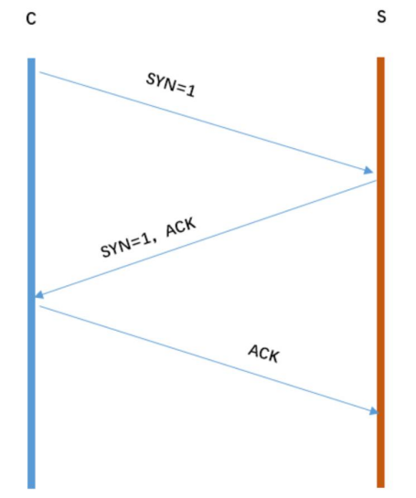

从图片可以得到三次握手可以简化为: C 发起请求连接 S 确认，也发起连接 C 确认我们再看看每次挥手的作用:第一次挥手:S 只可以确认 自己可以接受 C 发送的报文段第二次握手:C 可以确认 S 收到了自己发送的报文段,并且可以确认 自己可以接受 S 发送的报文段第三次挥手:S 可以确认 C 收到了自己发送的报文段

:::

## HTTPS 是什么？具体流程

HTTPS 是在 HTTP 和 TCP 之间建立了一个安全层，HTTP 与 TCP 通信的时候，必须先进过一个安全层，对数据包进行加密，然后将加密后的数据包传送给 TCP，相应的 TCP 必须将数据包解密，才能传给上面的 HTTP。

浏览器传输一个 client_random 和加密方法列表，服务器收到后，传给浏览器一个 server_random、加密方法列表和数字证书（包含了公钥），然后浏览器对数字证书进行合法验证，如果验证通过，则生成一个 pre_random，然后用公钥加密传给服务器，服务器用 client_random、server_random 和 pre_random ，使用公钥加密生成 secret，然后之后的传输使用这个 secret 作为秘钥来进行数据的加解密。

## 什么是 HTTPS 协议？

超文本传输安全协议（Hypertext Transfer Protocol Secure，简称：HTTPS）是一种通过计算机网络进行安全通信的传输协议。HTTPS 经由 HTTP 进行通信，利用 SSL/TLS 来加密数据包。HTTPS 的主要目的是提供对网站服务器的身份认证，保护交换数据的隐私与完整性

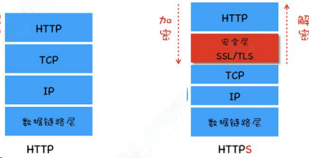

HTTP 协议采用明文传输信息，存在信息窃听、信息篡改和信息劫持的风险，而协议 TLS/SSL 具有身份验证、信息加密和完整性校验的功能，可以避免此类问题发生。

安全层的主要职责就是对发起的 HTTP 请求的数据进行加密操作 和对接收到的 HTTP 的内容进行解密操作。

## HTTPS 通信（握手）过程

HTTPS 的通信过程如下：

1.客户端向服务器发起请求，请求中包含使用的协议版本号、生成的一个随机数、以及客户端支持的加密方法。

2.服务器端接收到请求后，确认双方使用的加密方法、并给出服务器的证书、以及一个服务器生成的随机数。

3.客户端确认服务器证书有效后，生成一个新的随机数，并使用数字证书中的公钥，加密这个随机数，然后发给服 务器。并且还会提供一个前面所有内容的 hash 的值，用来供服务器检验。

4.服务器使用自己的私钥，来解密客户端发送过来的随机数。并提供前面所有内容的 hash 值来供客户端检验。

5.客户端和服务器端根据约定的加密方法使用前面的三个随机数，生成对话秘钥，以后的对话过程都使用这个秘钥来加密信息。

## DNS 完整的查询过程

DNS 服务器解析域名的过程：

首先会在浏览器的缓存中查找对应的 IP 地址，如果查找到直接返回，若找不到继续下一步

将请求发送给本地 DNS 服务器，在本地域名服务器缓存中查询，如果查找到，就直接将查找结果返回，若找不到继续下一步

本地 DNS 服务器向根域名服务器发送请求，根域名服务器会返回一个所查询域的顶级域名服务器地址

本地 DNS 服务器向顶级域名服务器发送请求，接受请求的服务器查询自己的缓存，如果有记录，就返回查询结果，如果没有就返回相关的下一级的权威域名服务器的地址

本地 DNS 服务器向权威域名服务器发送请求，域名服务器返回对应的结果

本地 DNS 服务器将返回结果保存在缓存中，便于下次使用

本地 DNS 服务器将返回结果返回给浏览器

比如要查询 www.baidu.com 的 IP 地址，首先会在浏览器的缓存中查找是否有该域名的缓存，如果不存在就将请求发送到本地的 DNS 服务器中，本地 DNS 服务器会判断是否存在该域名的缓存，如果不存在，则向根域名服务器发送一个请求，根域名服务器返回负责 .com 的顶级域名服务器的 IP 地址的列表。然后本地 DNS 服务器再向其中一个负责 .com 的顶级域名服务器发送一个请求，负责 .com 的顶级域名服务器返回负责 .baidu 的权威域名服务器的 IP 地址列表。

然后本地 DNS 服务器再向其中一个权威域名服务器发送一个请求，最后权威域名服务器返回一个对应的主机名的 IP 地址列表。

## OSI 七层模型

ISO 为了更好的使网络应用更为普及，推出了 OSI 参考模型。

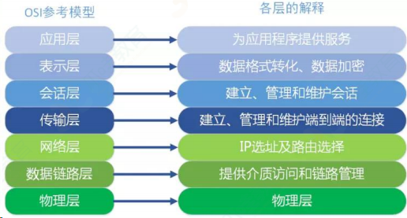

### （1）应用层

OSI 参考模型中最靠近用户的一层，是为计算机用户提供应用接口，也为用户直接提供各种网络服务。我们常见应用层的网络服务协议有：HTTP，HTTPS，FTP，POP3、SMTP 等。

在客户端与服务器中经常会有数据的请求，这个时候就是会用到 http(hyper text transfer protocol)(超文本传输协议)或者 https. 在后端设计数据接口时，我们常常使用到这个协议。

FTP 是文件传输协议，在开发过程中，个人并没有涉及到，但是我想，在一些资源网站，比如百度网盘``迅雷应该是基于此协议的。

SMTP 是 simple mail transfer protocol（简单邮件传输协议）。在一个项目中，在用户邮箱验证码登录的功能时，使用到了这个协议。

### （2）表示层

表示层提供各种用于应用层数据的编码和转换功能,确保一个系统的应用层发送的数据能被另一个系统的应用层识别。如果必要，该层可提供一种标准表示形式，用于将计算机内部的多种数据格式转换成通信中采用的标准表示形式。数据压缩和加密也是表示层可提供的转换功能之一。

在项目开发中，为了方便数据传输，可以使用 base64 对数据进行编解码。如果按功能来划分，base64 应该是工作在表示层。

### （3）会话层

会话层就是负责建立、管理和终止表示层实体之间的通信会话。该层的通信由不同设备中的应用程序之间的服务请求和响应组成。

### （4）传输层

传输层建立了主机端到端的链接，传输层的作用是为上层协议提供端到端的可靠和透明的数据传输服务，包括处理差错控制和流量控制等问题。该层向高层屏蔽了下层数据通信的细节，使高层用户看到的只是在两个传输实体间的一条主机到主机的、可由用户控制和设定的、可靠的数据通路。我们通常说的，TCP UDP 就是在这一层。端口号既是这里的“端”。

### （5）网络层

本层通过 IP 寻址来建立两个节点之间的连接，为源端的运输层送来的分组，选择合适的路由和交换节点，正确无误地按照地址传送给目的端的运输层。就是通常说的 IP 层。这一层就是我们经常说的 IP 协议层。IP 协议是 Internet 的基础。我们可以这样理解，网络层规定了数据包的传输路线，而传输层则规定了数据包的传输方式。

### （6）数据链路层

将比特组合成字节,再将字节组合成帧,使用链路层地址 (以太网使用 MAC 地址)来访问介质,并进行差错检测。

网络层与数据链路层的对比，通过上面的描述，我们或许可以这样理解，网络层是规划了数据包的传输路线，而数据链路层就是传输路线。

不过，在数据链路层上还增加了差错控制的功能。

### （7）物理层

实际最终信号的传输是通过物理层实现的。通过物理介质传输比特流。

规定了电平、速度和电缆针脚。常用设备有（各种物理设备）集线器、中继器、调制解调器、网线、双绞线、同轴电缆。这些都是物理层的传输介质。

OSI 七层模型通信特点：对等通信

## HTTP 协议

### HTTP 协议的主要特点

- 简单快速
  - 每个资源和图片的地址都是固定的
- 灵活
- 无连接
- 无状态：不会保存状态

### HTTP 报文的组成部分

#### 请求报文

- 请求行
- 请求头
- 空行
- 请求体

#### 响应报文

- 状态行
- 响应头
- 空行
- 响应体

### HTTP 报文结构

对于 TCP 而言，在传输的时候分为两个部分:TCP 头和数据部分。

而 HTTP 类似，也是 header + body 的结构，具体而言：

```bash
起始行 + 头部 + 空行 + 实体
```

由于 http 请求报文 和 响应报文 是有一定区别，因此我们分开介绍。

#### 起始行

对于请求报文来说，起始行类似下面这样:

```bash
GET /home HTTP/1.1
```

也就是方法 + 路径 + http 版本。

对于响应报文来说，起始行一般张这个样:

```bash
HTTP/1.1 200 OK
```

响应报文的起始行也叫做 状态行 。由 http 版本、状态码和原因三部分组成。

值得注意的是，在起始行中，每两个部分之间用空格隔开，最后一个部分后面应该接一个换行，严格遵循 ABNF 语法规范。

#### 头部

展示一下请求头和响应头在报文中的位置:

![Image[132]](./计算机网络面试题.assets/Image[132].jpg)

![Image[133]](./计算机网络面试题.assets/Image[133].jpg)

不管是请求头还是响应头，其中的字段是相当多的，而且牵扯到 http 非常多的特性，这里就不一一列举的，重点看看这些头部字段的格式：

- 字段名不区分大小写
- 字段名不允许出现空格，不可以出现下划线 \_
- 字段名后面必须紧接着 :

##### 空行

很重要，用来区分开 头部 和 实体 。

问: 如果说在头部中间故意加一个空行会怎么样？

那么空行后的内容全部被视为实体。

```bash
HTTP/1.1 200 OK
```

##### 实体

就是具体的数据了，也就是 body 部分。请求报文对应 请求体 , 响应报文对应 响应体 。

### HTTP 的请求方法

http/1.1 规定了以下请求方法(注意，都是大写):

- GET：获取资源

- POST：传输资源

- PUT：更新资源

- DELETE：删除资源

- HEAD：获得报文首部
- CONNECT：建立连接隧道，用于代理服务器
- OPTIONS：列出可对资源实行的请求方法，用来跨域请求
- TRACE：追踪请求-响应的传输路径

### POST 和 GET 的区别

::: details 查看参考回答

- GET 在浏览器回退时是无害的，而 POST 会再次提交请求
- GET 产生的 URL 地址可以被收藏，而 POST 不可以
- GET 请求会被浏览器主动缓存，而 POST 不会，除非手动设置
- GET 请求只能进行 url 编码，而 POST 支持多种编码方式
- get 请求会浏览器主动 cache，而 post 支持多种编码方式。
- GET 请求参数会被完整保留在浏览器历史记录里，而 POST 中的参数不会被保留
- GET 请求在 URL 中传送的参数是有长度限制的，而 POST 没有限制
- 对参数的数据类型，GET 只接受 ASCII 字符，而 POST 没有限制
- GET 比 POST 更不安全，因为 GET 参数直接暴露在 URL 上，且会被浏览器保存历史纪录，所以不能用来传递敏感信息；Post 不会，但是在抓包的情况下两者都是一样的。
- GET 参数通过 URL 传递，POST 放在 Request body 中
- POST 可以通过 request body 来传输比 Get 更多的数据， Get 没有这个技术
- URL 有长度限制，会影响 Get 请求，但是这个长度限制是浏览器规定的，不是 RFC 规定的
- POST 支持更多的编码类型且不对数据类型限制
- GET 和 POST 本质上就是 TCP 链接，并无差别。但是由于 HTTP 的规定和浏览器/服务器的限制，导致他们在应用过程中体现出一些不同。
- GET 产生一个 TCP 数据包；POST 产生两个 TCP 数据包。

首先最直观的是语义上的区别。

而后又有这样一些具体的差别:

- 从缓存的角度，GET 请求会被浏览器主动缓存下来，留下历史记录，而 POST 默认不会。
- 从编码的角度，GET 只能进行 URL 编码，只能接收 ASCII 字符，而 POST 没有限制。
- 从参数的角度，GET 一般放在 URL 中，因此不安全，POST 放在请求体中，更适合传输敏感信息。
- 从幂等性的角度， GET 是幂等的，而 POST 不是。( 幂等 表示执行相同的操作，结果也是相同的)
- 从 TCP 的角度，GET 请求会把请求报文一次性发出去，而 POST 会分为两个 TCP 数据包，首先发 header 部分，如果服务器响应 100(continue)， 然后发 body 部分。(火狐浏览器除外，它的 POST 请求只发一个 TCP 包)

:::

### HTTP 状态码

::: details 查看参考回答

100 Continue 继续。客户端应继续其请求

101 Switching Protocols 切换协议。服务器根据客户端的请求切换协议。只能切换到更高级的协议，例如，切换到 HTTP 的新版本协议

200OK：客户端请求成功。一般用于 GET 与 POST 请求

201 Created 已创建。成功请求并创建了新的资源

202 Accepted 已接受。已经接受请求，但未处理完成

203 Non-Authoritative Information 非授权信息。请求成功。但返回的 meta 信息不在原始的服务器，而是一个副本

204 No Content 无内容。服务器成功处理，但未返回内容。在未更新网页的情况下，可确保浏览器继续显示当前文档

205 Reset Content 重置内容。服务器处理成功，用户终端（例如：浏览器）应重置文档视图。可通过此返回码清除浏览器的表单域

206 Partial Content：客户发送了一个带有 Range 头的 GET 请求，服务器完成了它

300 Multiple Choices 多种选择。请求的资源可包括多个位置，相应可返回一个资源特征与地址的列表用于用户终端（例如：浏览器）选择

301 Moved Permanently 永久移动。请求的资源已被永久的移动到新 URI，返回信息会包括新的 URI，浏览器会自动定向到新 URI。今后任何新的请求都应使用新的 URI 代替

302 Found 临时移动。与 301 类似。但资源只是临时被移动。客户端应继续使用原有 URI

303 See Other 查看其它地址。与 301 类似。使用 GET 和 POST 请求查看

304 Not Modified 未修改。所请求的资源未修改，服务器返回此状态码时，不会返回任何资源。客户端通常会缓存访问过的资源，通过提供一个头信息指出客户端希望只返回在指定日期之后修改的资源

305 Use Proxy 使用代理。所请求的资源必须通过代理访问

306 Unused 已经被废弃的 HTTP 状态码

307 Temporary Redirect 临时重定向。与 302 类似。使用 GET 请求重定向

400 Bad Request：客户端请求有语法错误，不能被服务器所理解

401 Unauthorized：请求未经授权，这个状态代码必须和 WWW-Authenticate 报头域一起使用

403 Forbidden：对被请求页面的访问被禁止

402 Payment Required 保留，将来使用

404 Not Found：请求资源不存在。服务器无法根据客户端的请求找到资源（网页）。通过此代码，网站前端开发可设置"您所请求的资源无法找到的 404"的个性页面

405 Method Not Allowed 客户端请求中的方法被禁止

406 Not Acceptable 服务器无法根据客户端请求的内容特性完成请求

407 Proxy Authentication Required 请求要求代理的身份认证，与 401 类似，但请求者应当使用代理进行授权

408 Request Time-out 服务器等待客户端发送的请求时间过长，超时

409 Conflict 服务器完成客户端的 PUT 请求是可能返回此代码，服务器处理请求时发生了冲突

410 Gone 客户端请求的资源已经不存在。410 不同于 404，如果资源以前有现在被永久删除了可使用 410 代码，网站设计人员可通过 301 代码指定资源的新位置

411 Length Required 服务器无法处理客户端发送的不带 Content-Length 的请求信息

412 Precondition Failed 客户端请求信息的先决条件错误

413 Request Entity Too Large 由于请求的实体过大，服务器无法处理，因此拒绝请求。为防止客户端的连续请求，服务器可能会关闭连接。如果只是服务器暂时无法处理，则会包含一个 Retry-After 的响应信息

414 Request-URI Too Large 请求的 URI 过长（URI 通常为网址），服务器无法处理

415 Unsupported Media Type 服务器无法处理请求附带的媒体格式

416 Requested range not satisfiable 客户端请求的范围无效

417 Expectation Failed 服务器无法满足 Expect 的请求头信息

500 Internal Server Error：服务器内部错误，无法完成请求。服务器发生不可预期的错误原来缓冲的文档还可以继续使用

501 Not Implemented 服务器不支持请求的功能，无法完成请求

502 Bad Gateway 作为网关或者代理工作的服务器尝试执行请求时，从远程服务器接收到了一个无效的响应

503 Server Unavailable：请求未完成，服务器临时过载或当机，一段时间后可能恢复正常。由于超载或系统维护，服务器暂时的无法处理客户端的请求。延时的长度可包含在服务器的 Retry-After 头信息中

504 Gateway Time-out 充当网关或代理的服务器，未及时从远端服务器获取请求

505 HTTP Version not supported 服务器不支持请求的 HTTP 协议的版本，无法完成处理

:::

### HTTP 状态码及其含义

#### 1XX：信息状态码-表示目前是协议处理的中间状态，还需要后续操作。

- 100 Continue 继续，一般在发送 post 请求时，已发送了 http header 之后服务端将返回此信息，表示确认，之后发送具体参数信息
- 101 Switching Protocols。在 HTTP 升级为 WebSocket 的时候，如果服务器同意变更，就会发送状态码 101。

#### 2XX：成功状态码

- 200 OK 成功返回信息
- 201 Created 请求成功并且服务器创建了新的资源
- 202 Accepted 服务器已接受请求，但尚未处理
- 204 No content ，表示请求成功，但响应报文不含实体的主体部分，也就是 不含 body 数据
- 205 Reset Content ，表示请求成功，但响应报文不含实体的主体部分，但是与 204 响应不同在于要求请求方重置内容
- 206 Partial Content ，进行范围请求—表示部分内容，它的使用场景为 HTTP 分块下载和断点续传，当然也会带上相应的响应头字段 Content-Range 。

#### 3XX：重定向-重定向状态，资源位置发生变动，需要重新请求

- 301 Moved Permanently 永久性重定向，表示资源已被分配了新的 URL。
- 302 Found 临时性重定向，表示资源临时被分配了新的 URL。
- 303 See Other 表示资源存在着另一个 URL，应使用 GET 方法获取资源。
- 304 Not Modified 表示服务器允许访问资源，但因发生请求未满⾜条件的情况。
- 307 temporary redirect ，临时重定向，和 302 含义类似，但是期望客户端保持请求方法不变向新的地址发出请求

#### 4XX：客户端错误-请求报文有误

- 400 Bad Request 请求报文存在语法错误，服务器无法理解请求的格式，客户端不应当尝试再次使用相同的内容发起请求。
- 401 Unauthorized 请求未授权，表示发送的请求需要有通过 HTTP 认证的认证信息。
- 403 Forbidden 禁止访问，表示对请求资源的访问被服务器拒绝。
- 404 Not Found 找不到如何与 URI 相匹配的资源，表示在服务器上没有找到请求的资源。
- 405 Method Not Allowed: 请求方法不被服务器端允许。
- 406 Not Acceptable: 资源无法满足客户端的条件。
- 408 Request Timeout: 服务器等待了太长时间。
- 409 Conflict: 多个请求发生了冲突。
- 413 Request Entity Too Large: 请求体的数据过大。
- 414 Request-URI Too Long: 请求行里的 URI 太大。
- 429 Too Many Request: 客户端发送的请求过多。
- 431 Request Header Fields Too Large 请求头的字段内容太大。

#### 5XX: 服务器发生错误

- 500 Internal Server Error 最常见的服务器端错误，表示服务器端在执行请求时发生了错误。
- 501 Not Implemented ，表示服务器不支持当前请求所需要的某个功能
- 502 Bad Gateway: 服务器自身是正常的，但访问的时候出错了，错误不会指明。
- 503 Service Unavailable 服务器端暂时无法处理请求，表明服务器暂时处于超负载或正在停机维护，无法处理请求。

## 301 和 302 的区别

**考察点：http**

::: details 查看参考回答

301 Moved Permanently 被请求的资源已永久移动到新位置，并且将来任何对此资源的引用都应该使用本响应返回的若干个 URI 之一。如果可能，拥有链接编辑功能的客户端应当自动把请求的地址修改为从服务器反馈回来的地址。除非额外指定，否则这个响应也是可缓存的。

302 Found 请求的资源现在临时从不同的 URI 响应请求。由于这样的重定向是临时的，客户端应当继续向原有地址发送以后的请求。只有在 Cache-Control 或 Expires 中进行了指定的情况下，这个响应才是可缓存的。字面上的区别就是 301 是永久重定向，而 302 是临时重定向。

301 比较常用的场景是使用域名跳转。302 用来做临时跳转 比如未登陆的用户访问用户中心重定向到登录页面。

:::

## http 常用请求头

**考察点：http**

::: details 查看参考回答

| 协议头              | 说明                                                         |
| ------------------- | ------------------------------------------------------------ |
| Accept              | 可接受的响应内容类型（Content-Types）                        |
| Accept-Charset      | 可接受的字符集                                               |
| Accept-Encoding     | 可接受的响应内容的编码方式                                   |
| Accept-Language     | 可接受的响应内容语言列表                                     |
| Accept-Datetime     | 可接受的按照时间来表示的响应内容版本                         |
| Authorization       | 用于表示 HTTP 协议中需要认证资源的认证信息                   |
| Cache-Control       | 用来指定当前的请求/回复中的，是否使用缓存机制                |
| Connection          | 客户端（浏览器）想要优先使用的连接类型                       |
| Cookie              | 由之前服务器通过 Set-Cookie（见下文）设置的一个 HTTP 协议 Cookie |
| Content-Length      | 以 8 进制表示的请求体的长度                                  |
| Content-MD5         | 请求体的内容的二进制 MD5 散列值（数字签名），以 Base64 编码的结果 |
| Content-Type        | 请求体的 MIME 类型 （用于 POST 和 PUT 请求中）               |
| Date                | 发送该消息的日期和时间（以 RFC 7231 中定义的"HTTP 日期"格式来发送） |
| Expect              | 表示客户端要求服务器做出特定的行为                           |
| From                | 发起此请求的用户的邮件地址                                   |
| Host                | 表示服务器的域名以及服务器所监听的端口号。如果所请求的端口是对应的服务的标准端口（80），则端口号可以省略。 |
| If-Match            | 仅当客户端提供的实体与服务器上对应的实体相匹配时，才进行对应的操作。主要用于像 PUT 这样的方法中，仅当从用户上次更新某个资源后，该资源未被修改的情况下，才更新该资源。 |
| If-Modified-Since   | 允许在对应的资源未被修改的情况下返回 304 未修改              |
| If-None-Match       | 允许在对应的内容未被修改的情况下返回 304 未修改（ 304 Not Modified ），参考超文本传输协议 的实体标记 |
| If-Range            | 如果该实体未被修改过，则向返回所缺少的那一个或多个部分。否则，返回整个新的实体 |
| If-UnmodifiedSince  | 仅当该实体自某个特定时间以来未被修改的情况下，才发送回应。   |
| Max-Forwards        | 限制该消息可被代理及网关转发的次数。                         |
| Origin              | 发起一个针对跨域资源共享的请求（该请求要求服务器在响应中加入一个 Access-Control-Allow-Origin 的消息头，表示访问控制所允许的来源）。 |
| Pragma              | 与具体的实现相关，这些字段可能在请求/回应链中的任何时候产生。 |
| Proxy-Authorization | 用于向代理进行认证的认证信息。                               |
| Range               | 表示请求某个实体的一部分，字节偏移以 0 开始。                |
| Referer             | 表示浏览器所访问的前一个页面，可以认为是之前访问页面的链接将浏览器带到了当前页面。Referer 其实是 Referrer 这个单词，但 RFC 制作标准时给拼错了，后来也就将错就错使用 Referer 了。TE 浏览器预期接受的传输时的编码方式：可使用回应协议头 Transfer-Encoding 中的值（还可以使用"trailers"表示数据传输时的分块方式）用来表示浏览器希望在最后一个大小为 0 的块之后还接收到一些额外的字段。 |
| User-Agent          | 浏览器的身份标识字符串                                       |
| Upgrade             | 要求服务器升级到一个高版本协议。                             |
| Via                 | 告诉服务器，这个请求是由哪些代理发出的。                     |
| Warning             | 一个一般性的警告，表示在实体内容体中可能存在错误。           |

:::

### HTTP 首部

#### 通用首部

|     通用字段      |                     作用                      |
| :---------------: | :-------------------------------------------: |
|   Cache-Control   |                控制缓存的行为                 |
|    Connection     | 浏览器想要优先使用的连接类型，比如 keep-alive |
|       Date        |                 创建报文时间                  |
|      Pragma       |                   报文指令                    |
|        Via        |              代理服务器相关信息               |
| Transfer-Encoding |                 传输编码方式                  |
|      Upgrade      |              要求客户端升级协议               |
|      Warning      |  一个一般性的警告，表示在内容中可能存在错误   |

#### 请求首部

| 请求字段            | 作用                                          |
| :------------------ | --------------------------------------------- |
| Accept              | 可接受的响应内容类型（Content-Types）。       |
| Accept-Charset      | 可接受的字符集                                |
| Accept-Encoding     | 可接受的响应内容的编码方式。                  |
| Accept-Language     | 可接受的响应内容语言列表。                    |
| Accept-Datetime     | 可接受的按照时间来表示的响应内容版本          |
| Expect              | 表示客户端要求服务器做出特定的行为            |
| From                | 发起此请求的用户的邮件地址                    |
| Host                | 服务器的域名                                  |
| If-Match            | 两端资源标记比较                              |
| If-Modified-Since   | 本地资源未修改返回 304（比较时间）            |
| If-None-Match       | 本地资源未修改返回 304（比较标记）            |
| User-Agent          | 客户端信息                                    |
| Max-Forwards        | 限制可被代理及网关转发的次数                  |
| Proxy-Authorization | 向代理服务器发送验证信息                      |
| Range               | 表示请求某个实体的一部分，字节偏移以 0 开始。 |
| Referer             | 表示浏览器所访问的前一个页面                  |
| TE                  | 传输编码方式                                  |

#### 响应首部

| 响应字段           | 作用                       |
| ------------------ | -------------------------- |
| Accept-Ranges      | 是否支持某些种类的范围     |
| Age                | 资源在代理缓存中存在的时间 |
| ETag               | 资源标识                   |
| Location           | 客户端重定向到某个 URL     |
| Proxy-Authenticate | 向代理服务器发送验证信息   |
| Server             | 服务器名字                 |
| WWW-Authenticate   | 获取资源需要的验证信息     |

#### 实体首部

| 实体字段         | 作用                                           |
| ---------------- | ---------------------------------------------- |
| Allow            | 资源的正确请求方式                             |
| Content-Encoding | 内容的编码格式                                 |
| Content-Language | 内容使用的语言                                 |
| Content-Length   | request body 长度                              |
| Content-Location | 返回数据的备用地址                             |
| Content-MD5      | Base64 加密格式的内容 MD5 检验值               |
| Content-Range    | 内容的位置范围                                 |
| Content-Type     | 请求体的 MIME 类型 （用于 POST 和 PUT 请求中） |
| Expires          | 内容的过期时间                                 |
| Last_modified    | 内容的最后修改时间                             |

### 说下常见的 HTTP 的头部

参考回答：

可以将 http 首部分为通用首部，请求首部，响应首部，实体首部

通用首部表示一些通用信息，比如 date 表示报文创建时间，

请求首部就是请求报文中独有的，如 cookie，和缓存相关的如 if-Modified-Since

响应首部就是响应报文中独有的，如 set-cookie，和重定向相关的 location，
实体首部用来描述实体部分，如 allow 用来描述可执行的请求方法，content-type 描述主题类型，content-Encoding 描述主体的编码方式。

### DNS

DNS 的作用就是通过域名查询到具体的 IP。

因为 IP 存在数字和英文的组合（IPv6），很不利于⼈类记忆，所以就出现了域名。你可以把域名看成是某个 IP 的别名，DNS 就是去查询这个别名的真正名称是什么在 TCP 握手之前就已经进行了 DNS 查询，这个查询是操作系统自己做的。

当你在浏览器中想访问 www.google.com 时，会进行一下操作

#### 操作系统会首先在本地缓存中查询

- 没有的话会去系统配置的 DNS 服务器中查询
- 如果这时候还没得话，会直接去 DNS 根服务器查询，这一步查询会找出负责 com 这个一级域名的服务器
- 然后去该服务器查询 google 这个二级域名
- 接下来三级域名的查询其实是我们配置的，你可以给 www 这个域名配置一个 IP，然后还可以给别的三级域名配置一个 IP

以上介绍的是 DNS 迭代查询，还有种是递归查询，区别就是前者是由客户端
去做请求，后者是由系统配置的 DNS 服务器做请求，得到结果后将数据返回
给客户端。

### 常见的 HTTP 的头部

**考察点：计算机网络**

::: details 查看参考回答

可以将 http 首部分为通用首部，请求首部，响应首部，实体首部通用首部表示一些通用信息，

比如 date 表示报文创建时间，请求首部就是请求报文中独有的，

如 cookie，和缓存相关的如 if-Modified-Since 响应首部就是响应报文中独有的，

如 set-cookie，和重定向相关的 location，实体首部用来描述实体部分，

如 allow 用来描述可执行的请求方法，content-type 描述主题类型，content-Encoding 描述主体的编码方式

:::

### 什么是持久连接

HTTP 协议采用“请求-应答”模式，当使用普通模式，即非 Keep-Alive 模式时，每个请求/应答客户和服务器都要新建一个连接，完成之后立即断开连接 (HTTP 协议为无连接的协议)

当使用 Keep-Alive 模式 (又称持久连接、连接重用)时，Keep-Alive 功能使客户端到服务器端的连接持续有效，当出现对服务器的后继请求时，Keep-Alive 功能避免了建立或者重新建立连接

### 什么是管线化

在使用持久连接的情况下，某个连接上消息的传递类似于：请求 1-> 响应 1-> 请求 2 -> 响应 2-> 请求 3-> 响应 3

某个连接上的消息变成了类似这样：请求 1 -> 请求 2 -> 请求 3 -> 响应 1-> 响应 2-> 响应 3

#### 管线化特点

- 管线化机制通过持久连接完成，仅 HTTP/1.1 支持此技术
- 只有 GET 和 HEAD 请求可以进行管线化，而 POST 则有所限制
- 初次创建连接时不应启动管线机制，因为对方 (服务器)不一定支持 HTTP/1.1 版本的协议
- 管线化不会影响响应到来的顺序，如上面的例子所示，响应返回的顺序并未改变
- HTTP/1.1 要求服务器端支持管线化，但并不要求服务器端也对响应进行管线化处理，只是要求对于管线化的请求不失败即可
- 由于上面提到的服务器端问题，开启管线化很可能并不会带来大幅度的性能提升，而且很多服多器端和代理程序对管线化的支持并不好，因此现代浏览器如 Chrome 和 Firefox 默认并未开启管线化支持

## 说一下 http2.0

参考回答：

首先补充一下，http 和 https 的区别，相比于 http,https 是基于 ssl 加密的 http 协议

简要概括：http2.0 是基于 1999 年发布的 http1.0 之后的首次更新。

提升访问速度（可以对于，请求资源所需时间更少，访问速度更快，相比 http1.0）

允许多路复用：多路复用允许同时通过单一的 HTTP/2 连接发送多重请求-响应信息。

改善了：在 http1.1 中，浏览器客户端在同一时间，针对同一域名下的请求有一定数量限制（连接数量），超过限制会被阻塞。

二进制分帧：HTTP2.0 会将所有的传输信息分割为更小的信息或者帧，并对他们进行二进制编码、首部压缩、服务器端推送

## HTTP2.0 的特性

**考察点：计算机网络**

::: details 查看参考回答

http2.0 的特性如下：

1、内容安全，应为 http2.0 是基于 https 的，天然具有安全特性，通过 http2.0 的特性可以避免单纯使用 https 的性能下降

2、二进制格式，http1.X 的解析是基于文本的，http2.0 将所有的传输信息分割为更小的消息和帧，并对他们采用二进制格式编码，基于二进制可以让协议有更多的扩展性，比如引入了帧来传输数据和指令

3、多路复用，这个功能相当于是长连接的增强，每个 request 请求可以随机的混杂在一起，接收方可以根据 request 的 id 将 request 再归属到各自不同的服务端请求里面，另外多路复用中也支持了流的优先级，允许客户端告诉服务器那些内容是更优先级的资源，可以优先传输。

:::

## cache-control 的值有哪些

**考察点：计算机网络**

::: details 查看参考回答

cache-control 是一个通用消息头字段被用于 HTTP 请求和响应中，通过指定指令来实现缓存机制，这个缓存指令是单向的，常见的取值有 private、no-cache、max-age、must-revalidate 等，默认为 private。

:::

## 简要概括一下 HTTP 的特点？HTTP 有哪些缺点？

### HTTP 特点

HTTP 的特点概括如下:

1.灵活可扩展，主要体现在两个方面。一个是语义上的自由，只规定了基本格式，比如空格分隔单词，换行分隔字段，其他的各个部分都没有严格的语法限制。另一个是传输形式的多样性，不仅仅可以传输文本，还能传输图片、视频等任意数据，非常方便。

2.可靠传输。HTTP 基于 TCP/IP，因此把这一特性继承了下来。这属于 TCP 的特性，不具体介绍了。

3.请求-应答。也就是 一发一收 、 有来有回 ， 当然这个请求方和应答方不单单指客户端和服务器之间，如果某台服务器作为代理来连接后端的服务端，那么这台服务器也会扮演请求方的角色。

4.无状态。这里的状态是指通信过程的上下文信息，而每次 http 请求都是独立、无关的，默认不需要保留状态信息。

### HTTP 缺点

#### 无状态

所谓的优点和缺点还是要分场景来看的，对于 HTTP 而言，最具争议的地方在于它的无状态。

在需要长连接的场景中，需要保存大量的上下文信息，以免传输大量重复的信息，那么这时候无状态就是 http 的缺点了。

但与此同时，另外一些应用仅仅只是为了获取一些数据，不需要保存连接上下文信息，无状态反而减少了网络开销，成为了 http 的优点。

#### 明文传输

即协议里的报文(主要指的是头部)不使用二进制数据，而是文本形式。

这当然对于调试提供了便利，但同时也让 HTTP 的报文信息暴露给了外界，给攻击者也提供了便利。

WIFI 陷阱 就是利用 HTTP 明文传输的缺点，诱导你连上热点，然后疯狂抓你所有的流量，从而拿到你的敏感信息。

#### 队头阻塞问题

当 http 开启长连接时，共用一个 TCP 连接，同一时刻只能处理一个请求，那么当前请求耗时过长的情况下，其它的请求只能处于阻塞状态，也就是著名的队头阻塞问题。接下来会有一小节讨论这个问题。

## 对 Accept 系列字段了解多少？

对于 Accept 系列字段的介绍分为四个部分: 数据格式、压缩方式、支持语言和字符集。

### 数据格式

HTTP 灵活的特性，它支持非常多的数据格式，那么这么多格式的数据一起到达客户端，客户端怎么知道它的格式呢？

当然，最低效的方式是直接猜，有没有更好的方式呢？直接指定可以吗？

答案是肯定的。不过首先需要介绍一个标准——MIME(Multipurpose Internet Mail Extensions, 多用途互联网邮件扩展)。它首先用在电子邮件系统中，让邮件可以发任意类型的数据，这对于 HTTP 来说也是通用的。

因此，HTTP 从 MIME type 取了一部分来标记报文 body 部分的数据类型，这些类型体现在 Content-Type 这个字段，当然这是针对于发送端而言，接收端想要收到特定类型的数据，也可以用 Accept 字段。

具体而言，这两个字段的取值可以分为下面几类:

- text： text/html, text/plain, text/css 等
- image: image/gif, image/jpeg, image/png 等
- audio/video: audio/mpeg, video/mp4 等
- application: application/json, application/javascript, application/pdf, application/octet-stream

#### 压缩方式

当然一般这些数据都是会进行编码压缩的，采取什么样的压缩方式就体现在了发送方的 Content-Encoding 字段上， 同样的，接收什么样的压缩方式体现在了接受方的 Accept-Encoding 字段上。这个字段的取值有下面几种：

- gzip: 当今最流行的压缩格式
- deflate: 另外一种著名的压缩格式
- br: 一种专门为 HTTP 发明的压缩算法

```bash
// 发送端
Content-Encoding: gzip
// 接收端
Accept-Encoding: gzip
```

#### 支持语言

对于发送方而言，还有一个 Content-Language 字段，在需要实现国际化的方案当中，可以用来指定支持的语言，在接受方对应的字段为 Accept-Language 。如:

```bash
// 发送端
Content-Language: zh-CN, zh, en
// 接收端
Accept-Language: zh-CN, zh, en
```

#### 字符集

最后是一个比较特殊的字段, 在接收端对应为 Accept-Charset ，指定可以接受的字符集，而在发送端并没有对应的 Content-Charset , 而是直接放在了 Content-Type 中，以 charset 属性指定。如:

```bash
// 发送端
Content-Type: text/html; charset=utf-8
// 接收端
Accept-Charset: charset=utf-8
```

最后以一张图来总结一下吧:

![Image[138]](./计算机网络面试题.assets/Image[138].jpg)

## 对于定长和不定长的数据，HTTP 是怎么传输的？

### 定长包体

对于定长包体而言，发送端在传输的时候一般会带上 Content-Length , 来指明包体的长度。

我们用一个 nodejs 服务器来模拟一下:

```js
const http = require("http");
const server = http.createServer();
server.on("request", (req, res) => {
	if (req.url === "/") {
		res.setHeader("Content-Type", "text/plain");
		res.setHeader("Content-Length", 10);
		res.write("helloworld");
	}
});
server.listen(8081, () => {
	console.log("成功启动");
});
```

启动后访问: localhost:8081

浏览器中显示如下:

```bash
helloworld
```

这是长度正确的情况，那不正确的情况是如何处理的呢？

我们试着把这个长度设置的小一些:

```bash
res.setHeader('Content-Length', 8);
```

重启服务，再次访问，现在浏览器中内容如下:

```bash
hellowor
```

那后面的 ld 哪里去了呢？实际上在 http 的响应体中直接被截去了。

然后我们试着将这个长度设置得大一些:

```bash
res.setHeader('Content-Length', 12);
```

此时浏览器显示如下:

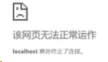

直接无法显示了。可以看到 Content-Length 对于 http 传输过程起到了十分关键的作用，如果设置不当可以直接导致传输失败。

### 不定长包体

上述是针对于 定长包体 ，那么对于 不定长包体 而言是如何传输的呢？

这里就必须介绍另外一个 http 头部字段了:

```bash
Transfer-Encoding: chunked
```

表示分块传输数据，设置这个字段后会自动产生两个效果:

- Content-Length 字段会被忽略
- 基于长连接持续推送动态内容

我们依然以一个实际的例子来模拟分块传输，nodejs 程序如下:

```js
const http = require("http");
const server = http.createServer();
server.on("request", (req, res) => {
	if (req.url === "/") {
		res.setHeader("Content-Type", "text/html; charset=utf8");
		res.setHeader("Content-Length", 10);
		res.setHeader("Transfer-Encoding", "chunked");
		res.write("<p>来啦</p>");
		setTimeout(() => {
			res.write("第一次传输<br/>");
		}, 1000);
		setTimeout(() => {
			res.write("第二次传输");
			res.end();
		}, 2000);
	}
});
server.listen(8009, () => {
	console.log("成功启动");
});
```

访问效果入下:

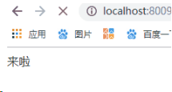

用 telnet 抓到的响应如下:

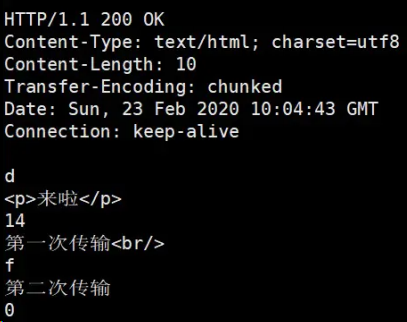

注意， Connection: keep-alive 及之前的为响应行和响应头，后面的内容为响应体，这两部分用换行符隔开。

响应体的结构比较有意思，如下所示:

```bash
chunk长度(16进制的数)
第一个chunk的内容
chunk长度(16进制的数)
第二个chunk的内容
......
0
```

最后是留有有一个 空行 的，这一点请大家注意。

以上便是 http 对于定长数据和不定长数据的传输方式。

## HTTP 如何处理大文件的传输？

对于几百 M 甚至上 G 的大文件来说，如果要一口气全部传输过来显然是不现实的，会有大量的等待时间，严重影响用户体验。因此，HTTP 针对这一场景，采取了 范围请求 的解决方案，允许客户端仅仅请求一个资源的一部分。

### 如何支持

当然，前提是服务器要支持范围请求，要支持这个功能，就必须加上这样一个响应头：

```bash
Accept-Ranges: none
```

用来告知客户端这边是支持范围请求的。

### Range 字段拆解

而对于客户端而言，它需要指定请求哪一部分，通过 Range 这个请求头字段确定，格式为 bytes=x-y 。

接下来就来讨论一下这个 Range 的书写格式:

- 0-499 表示从开始到第 499 个字节。
- 500- 表示从第 500 字节到文件终点。
- -100 表示文件的最后 100 个字节。

服务器收到请求之后，首先验证范围是否合法，如果越界了那么返回 416 错误码，否则读取相应片段，返回 206 状态码。

同时，服务器需要添加 Content-Range 字段，这个字段的格式根据请求头中 Range 字段的不同而有所差异。

具体来说，请求 单段数据 和请求 多段数据 ，响应头是不一样的。

举个例子:

```bash
// 单段数据
Range: bytes=0-9
// 多段数据
Range: bytes=0-9, 30-39
```

接下来我们就分别来讨论着两种情况。

### 单段数据

对于 单段数据 的请求，返回的响应如下:

```bash
HTTP/1.1 206 Partial Content
Content-Length: 10
Accept-Ranges: bytes
Content-Range: bytes 0-9/100
i am xxxxx
```

值得注意的是 Content-Range 字段， 0-9 表示请求的返回， 100 表示资源的总大小，很好理解。

### 多段数据

接下来我们看看多段请求的情况。得到的响应会是下面这个形式：

```bash
HTTP/1.1 206 Partial Content
Content-Type: multipart/byteranges; boundary=00000010101
Content-Length: 189
Connection: keep-alive
Accept-Ranges: bytes
--00000010101
Content-Type: text/plain
Content-Range: bytes 0-9/96
i am xxxxx
--00000010101
Content-Type: text/plain
Content-Range: bytes 20-29/96
eex jspy e
--00000010101--
```

这个时候出现了一个非常关键的字段 Content-Type:

`multipart/byteranges;boundary=00000010101` ，它代表了信息量是这样的:

- 请求一定是多段数据请求
- 响应体中的分隔符是 00000010101

因此，在响应体中各段数据之间会由这里指定的分隔符分开，而且在最后的分隔末尾添上 -- 表示结束。

以上就是 http 针对大文件传输所采用的手段。

## 10.HTTP 中如何处理表单数据的提交？

在 http 中，有两种主要的表单提交的方式，体现在两种不同的 Content-Type 取值：

- application/x-www-form-urlencoded
- multipart/form-data

由于表单提交一般是 POST 请求，很少考虑 GET ，因此这里我们将默认提交的数据放在请求体中。

#### application/x-www-form-urlencoded

对于 application/x-www-form-urlencoded 格式的表单内容，有以下特点:
其中的数据会被编码成以 & 分隔的键值对字符以 URL 编码方式编码。

如：

```bash
// 转换过程: {a: 1, b: 2} -> a=1&b=2 -> 如下(最终形式)
"a%3D1%26b%3D2"
```

#### multipart/form-data

对于 multipart/form-data 而言：

- 请求头中的 Content-Type 字段会包含 boundary ，且 boundary 的值有浏览器默认指定。例:
  - Content-Type: multipart/form-data;boundary=----
  - WebkitFormBoundaryRRJKeWfHPGrS4LKe 。
- 数据会分为多个部分，每两个部分之间通过分隔符来分隔，每部分表述均有 HTTP 头部描述子包体，如 Content-Type ，在最后的分隔符会加上 -- 表示结束。

相应的 请求体 是下面这样:

```bash
Content-Disposition: form-data;name="data1";
Content-Type: text/plain
data1
----WebkitFormBoundaryRRJKeWfHPGrS4LKe
Content-Disposition: form-data;name="data2";
Content-Type: text/plain
data2
----WebkitFormBoundaryRRJKeWfHPGrS4LKe--
```

#### 小结

值得一提的是， multipart/form-data 格式最大的特点在于:每一个表单元素都是独立的资源表述。另外，你可能在写业务的过程中，并没有注意到其中还有 boundary 的存在，如果你打开抓包工具，确实可以看到不同的表单元素被拆分开了，之所以在平时感觉不到，是以为浏览器和 HTTP 给你封装了这一系列操作。

而且，在实际的场景中，对于图片等文件的上传，基本采用 multipart/form-data 而不用 application/x-www-form-urlencoded ，因为没有必要做 URL 编码，带来巨大耗时的同时也占用了更多的空间。

## 11.HTTP1.1 如何解决 HTTP 的队头阻塞问题？

### 什么是 HTTP 队头阻塞？

HTTP 传输是基于 请求-应答 的模式进行的，报文必须是一发一收，但值得注意的是，里面的任务被放在一个任务队列中串行执行，一旦队首的请求处理太慢，就会阻塞后面请求的处理。这就是著名的 HTTP 队头阻塞 问题。

### 并发连接

对于一个域名允许分配多个长连接，那么相当于增加了任务队列，不至于一个队伍的任务阻塞其它所有任务。在 RFC2616 规定过客户端最多并发 2 个连接，不过事实上在现在的浏览器标准中，这个上限要多很多，Chrome 中是 6 个。

但其实，即使是提高了并发连接，还是不能满足人们对性能的需求。

### 域名分片

一个域名不是可以并发 6 个长连接吗？那我就多分几个域名。

比如 content1.sanyuan.com 、content2.sanyuan.com。

这样一个 sanyuan.com 域名下可以分出非常多的二级域名，而它们都指向同样的一台服务器，能够并发的长连接数更多了，事实上也更好地解决了队头阻塞的问题。

## 12.对 Cookie 了解多少？

### Cookie 简介

HTTP 是一个无状态的协议，每次 http 请求都是独立、无关的，默认不需要保留状态信息。但有时候需要保存一些状态，怎么办呢？

HTTP 为此引入了 Cookie。Cookie 本质上就是浏览器里面存储的一个很小的文本文件，内部以键值对的方式来存储(在 chrome 开发者面板的 Application 这一栏可以看到)。向同一个域名下发送请求，都会携带相同的 Cookie，服务器拿到 Cookie 进行解析，便能拿到客户端的状态。而服务端可以通过响应头中的 Set-Cookie 字段来对客户端写入 Cookie 。举例如下:

### Cookie 属性

#### 1）生存周期

Cookie 的有效期可以通过 Expires 和 Max-Age 两个属性来设置。

- Expires 即 过期时间
- Max-Age 用的是一段时间间隔，单位是秒，从浏览器收到报文开始计算。

若 Cookie 过期，则这个 Cookie 会被删除，并不会发送给服务端。

#### 2）作用域

关于作用域也有两个属性: Domain 和 path, 给 Cookie 绑定了域名和路径，在发送请求之前，发现域名或者路径和这两个属性不匹配，那么就不会带上 Cookie。值得注意的是，对于路径来说， `/` 表示域名下的任意路径都允许使用 Cookie。

#### 3）安全相关

如果带上 Secure ，说明只能通过 HTTPS 传输 cookie。

如果 cookie 字段带上 HttpOnly ，那么说明只能通过 HTTP 协议传输，不能通过 JS 访问，这也是预防 XSS 攻击的重要手段。

相应的，对于 CSRF 攻击的预防，也有 SameSite 属性。

SameSite 可以设置为三个值， Strict 、 Lax 和 None 。

a. 在 Strict 模式下，浏览器完全禁止第三方请求携带 Cookie。比如请求 sanyuan.com 网站只能在 sanyuan.com 域名当中请求才能携带 Cookie，在其他网站请求都不能。

b. 在 Lax 模式，就宽松一点了，但是只能在 get 方法提交表单 况或者 a 标签发送 get 请求 的情况下可以携带 Cookie，其他情况均不能。

c. 在 None 模式下，也就是默认模式，请求会自动携带上 Cookie。

### Cookie 的缺点

- 1）容量缺陷。Cookie 的体积上限只有 4KB ，只能用来存储少量的信息。
- 2）性能缺陷。Cookie 紧跟域名，不管域名下面的某一个地址需不需要这个 Cookie ，请求都会携带上完整的 Cookie，这样随着请求数的增多，其实会造成巨大的性能浪费的，因为请求携带了很多不必要的内容。但可以通过 Domain 和 Path 指定作用域来解决。
- 3）安全缺陷。由于 Cookie 以纯文本的形式在浏览器和服务器中传递，很容易被非法用户截获，然后进行一系列的篡改，在 Cookie 的有效期内重新发送给服务器，这是相当危险的。另外，在 HttpOnly 为 false 的情况下，Cookie 信息能直接通过 JS 脚本来读取。

## 如何理解 HTTP 代理？

我们知道在 HTTP 是基于 请求-响应 模型的协议，一般由客户端发请求，服务器来进行响应。

当然，也有特殊情况，就是代理服务器的情况。引入代理之后，作为代理的服务器相当于一个中间人的角色，对于客户端而言，表现为服务器进行响应；而对于源服务器，表现为客户端发起请求，具有双重身份。

**那代理服务器到底是用来做什么的呢？**

### 功能

1）负载均衡。客户端的请求只会先到达代理服务器，后面到底有多少源服务器，IP 都是多少，客户端是不知道的。因此，这个代理服务器可以拿到这个请求之后，可以通过特定的算法分发给不同的源服务器，让各台源服务器的负载尽量平均。当然，这样的算法有很多，包括随机算法、轮询、一致性 hash、LRU (最近最少使用) 等等，不过这些算法并不是本文的重点，大家有兴趣自己可以研究一下。

2）保障安全。利用心跳机制监控后台的服务器，一旦发现故障机就将其踢出集群。并且对于上下行的数据进行过滤，对非法 IP 限流，这些都是代理服务器的工作。

3）缓存代理。将内容缓存到代理服务器，使得客户端可以直接从代理服务器获得而不用到源服务器那里。下一节详细拆解。

### 相关头部字段

#### Via

代理服务器需要标明自己的身份，在 HTTP 传输中留下自己的痕迹，怎么办呢？
通过 Via 字段来记录。举个例子，现在中间有两台代理服务器，在客户端发送请求后会经历这样一个过程:

```bash
客户端 -> 代理1 -> 代理2 -> 源服务器
```

在源服务器收到请求后，会在 请求头 拿到这个字段:

```bash
Via: proxy_server1, proxy_server2
```

而源服务器响应时，最终在客户端会拿到这样的 响应头 :

```bash
Via: proxy_server2, proxy_server1
```

可以看到， Via 中代理的顺序即为在 HTTP 传输中报文传达的顺序。

#### X-Forwarded-For

字面意思就是 为谁转发 , 它记录的是请求方的 IP 地址(注意，和 Via 区分开， X-Forwarded-For 记录的是请求方这一个 IP)。

#### X-Real-IP

是一种获取用户真实 IP 的字段，不管中间经过多少代理，这个字段始终记录最初的客户端的 IP。

相应的，还有 X-Forwarded-Host 和 X-Forwarded-Proto ，分别记录客户端(注意哦，不包括代理)的 域名 和 协议名 。

#### X-Forwarded-For 产生的问题

前面可以看到， X-Forwarded-For 这个字段记录的是请求方的 IP，这意味着每经过一个不同的代理，这个字段的名字都要变，从 客户端 到 代理 1 ，这个字段是客户端的 IP，从 代理 1 到 代理 2 ，这个字段就变为了代理 1 的 IP。

但是这会产生两个问题:

- 1）意味着代理必须解析 HTTP 请求头，然后修改，比直接转发数据性能下降。
- 2）在 HTTPS 通信加密的过程中，原始报文是不允许修改的。

由此产生了 代理协议 ，一般使用明文版本，只需要在 HTTP 请求行上面加上这样格式的文本即可:

```bash
// PROXY + TCP4/TCP6 + 请求方地址 + 接收方地址 + 请求端口 + 接收端口
PROXY TCP4 0.0.0.1 0.0.0.2 1111 2222
GET / HTTP/1.1
...
```

这样就可以解决 X-Forwarded-For 带来的问题了。

## 如何理解 HTTP 缓存及缓存代理？

首先通过 Cache-Control 验证强缓存是否可用

- 如果强缓存可用，直接使用
- 否则进入协商缓存，即发送 HTTP 请求，服务器通过请求头中的 If-Modified-Since 或者 If-None-Match 这些条件请求字段检查资源是否更新
  - 若资源更新，返回资源和 200 状态码
- 否则，返回 304，告诉浏览器直接从缓存获取资源

## 说一下浏览器缓存

**考察点：缓存**

::: details 查看参考回答

缓存分为两种：强缓存和协商缓存，根据响应的 header 内容来决定。

强缓存相关字段有 expires，cache-control。如果 cache-control 与 expires 同时存在的话，cache-control 的优先级高于 expires。

协商缓存相关字段有 Last-Modified/If-Modified-Since，Etag/If-None-Match

:::

## 强缓存、协商缓存什么时候用哪个

**考察点：缓存**

::: details 查看参考回答

因为服务器上的资源不是一直固定不变的，大多数情况下它会更新，这个时候如果我们还访问本地缓存，那么对用户来说，那就相当于资源没有更新，用户看到的还是旧的资源；所以我们希望服务器上的资源更新了浏览器就请求新的资源，没有更新就使用本地的缓存，以最大程度的减少因网络请求而产生的资源浪费。

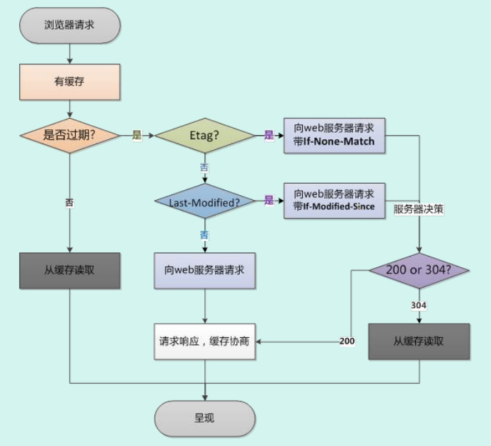

:::

## 为什么产生代理缓存？

对于源服务器来说，它也是有缓存的，比如 Redis, Memcache，但对于 HTTP 缓存来说，如果每次客户端缓存失效都要到源服务器获取，那给源服务器的压力是很大的。

由此引入了缓存代理的机制。让 代理服务器 接管一部分的服务端 HTTP 缓存，客户端缓存过期后就近到代理缓存中获取，代理缓存过期了才请求源服务器，这样流量巨大的时候能明显降低源服务器的压力。

那缓存代理究竟是如何做到的呢？

总的来说，缓存代理的控制分为两部分，一部分是源服务器端的控制，一部分是客户端的控制。

## HTTP 缓存

HTTP 缓存又分为强缓存和协商缓存：

首先通过 Cache-Control 验证强缓存是否可用，如果强缓存可用，那么直接读取缓存

如果不可以，那么进入协商缓存阶段，发起 HTTP 请求，服务器通过请求头中是否带上 If-Modified-Since 和 If-None-Match 这些条件请求字段检查资源是否更新：

- 若资源更新，那么返回资源和 200 状态码
- 如果资源未更新，那么告诉浏览器直接使用缓存获取资源

## 强，协商缓存

**考察点：缓存**

::: details 查看参考回答

缓存分为两种：强缓存和协商缓存，根据响应的 header 内容来决定。

|          | 获取资源形式 | 状态码              | 发送请求到服务器                 |
| -------- | ------------ | ------------------- | -------------------------------- |
| 强缓存   | 从缓存取     | 200（from cache）   | 否，直接从缓存取                 |
| 协商缓存 | 从缓存取     | 304（not modified） | 是，通过服务器来告知缓存是否可用 |

强缓存相关字段有 expires，cache-control。如果 cache-control 与 expires 同时存在的话，cache-control 的优先级高于 expires。

协商缓存相关字段有 Last-Modified/If-Modified-Since，Etag/If-None-Match

:::

## 源服务器的缓存控制

### private 和 public

在源服务器的响应头中，会加上 Cache-Control 这个字段进行缓存控制字段，那么它的值当中可以加入 private 或者 public 表示是否允许代理服务器缓存，前者禁止，后者为允许。

比如对于一些非常私密的数据，如果缓存到代理服务器，别人直接访问代理就可以拿到这些数据，是非常危险的，因此对于这些数据一般是不会允许代理服务器进行缓存的，将响应头部的 Cache-Control 设为 private ，而不是 public 。

### proxy-revalidate

must-revalidate 的意思是客户端缓存过期就去源服务器获取，而 proxy-revalidate 则表示代理服务器的缓存过期后到源服务器获取。

### s-maxage

s 是 share 的意思，限定了缓存在代理服务器中可以存放多久，和限制客户端缓存时间的 max-age 并不冲突。

讲了这几个字段，我们不妨来举个小例子，源服务器在响应头中加入这样一个字段:

```bash
Cache-Control: public, max-age=1000, s-maxage=2000
```

相当于源服务器说: 我这个响应是允许代理服务器缓存的，客户端缓存过期了到代理中拿，并且在客户端的缓存时间为 1000 秒，在代理服务器中的缓存时间为 2000 s。

## 客户端的缓存控制

### max-stale 和 min-fresh

在客户端的请求头中，可以加入这两个字段，来对代理服务器上的缓存进行宽容和限制操作。比如：

```bash
max-stale: 5
```

表示客户端到代理服务器上拿缓存的时候，即使代理缓存过期了也不要紧，只要过期时间在 5 秒之内，还是可以从代理中获取的。

又比如:

```bash
min-fresh: 5
```

表示代理缓存需要一定的新鲜度，不要等到缓存刚好到期再拿，一定要在到期前 5 秒之前的时间拿，否则拿不到。

### only-if-cached

这个字段加上后表示客户端只会接受代理缓存，而不会接受源服务器的响应。如果代理缓存无效，则直接返回 504（Gateway Timeout） 。

以上便是缓存代理的内容，涉及的字段比较多，希望能好好回顾一下，加深理解。

## 18.什么是跨域？浏览器如何拦截响应？如何解决？

在前后端分离的开发模式中，经常会遇到跨域问题，即 Ajax 请求发出去了，服务器也成功响应了，前端就是拿不到这个响应。接下来我们就来好好讨论一下这个问题。

### 1）什么是跨域

回顾一下 URI 的组成:


浏览器遵循同源政策( scheme(协议) 、 host(主机) 和 port(端口) 都相同则为 同源 )。非同源站点有这样一些限制:

- 不能读取和修改对方的 DOM
- 不读访问对方的 Cookie、IndexDB 和 LocalStorage
- 限制 XMLHttpRequest 请求。(后面的话题着重围绕这个)

当浏览器向目标 URI 发 Ajax 请求时，只要当前 URL 和目标 URL 不同源，则产生跨域，被称为 跨域请求 。

跨域请求的响应一般会被浏览器所拦截，注意，是被浏览器拦截，响应其实是成功到达客户端了。那这个拦截是如何发生呢？

首先要知道的是，浏览器是多进程的，以 Chrome 为例，进程组成如下：

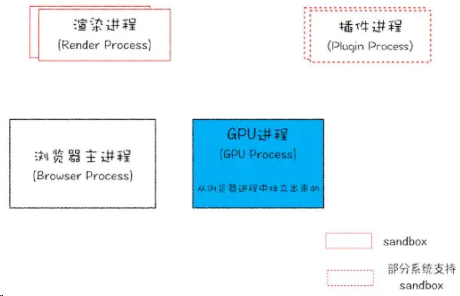

WebKit 渲染引擎和 V8 引擎都在渲染进程当中。

当 xhr.send 被调用，即 Ajax 请求准备发送的时候，其实还只是在渲染进程的处理。为了防止黑客通过脚本触碰到系统资源，浏览器将每一个渲染进程装进了沙箱，并且为了防止 CPU 芯片一直存在的 Spectre 和 Meltdown 漏洞，采取了 站点隔离 的手段，给每一个不同的站点(一级域名不同)分配了沙箱，互不干扰。

在沙箱当中的渲染进程是没有办法发送网络请求的，那怎么办？只能通过网络进程来发送。那这样就涉及到进程间通信(IPC，Inter Process Communication)了。接下来我们看看 chromium 当中进程间通信是如何完成的，在 chromium 源码中调用顺序如下:

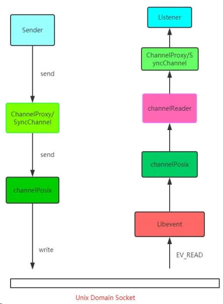

总的来说就是利用 Unix Domain Socket 套接字，配合事件驱动的高性能网络并发库 libevent 完成进程的 IPC 过程。

好，现在数据传递给了浏览器主进程，主进程接收到后，才真正地发出相应的网络请求。

在服务端处理完数据后，将响应返回，主进程检查到跨域，且没有 cors(后面会详细说)响应头，将响应体全部丢掉，并不会发送给渲染进程。这就达到了拦截数据的目的。

接下来我们来说一说解决跨域问题的几种方案。

### CORS

CORS 其实是 W3C 的一个标准，全称是 跨域资源共享 。它需要浏览器和服务器的共同支持，具体来说，非 IE 和 IE10 以上支持 CORS，服务器需要附加特定的响应头，后面具体拆解。不过在弄清楚 CORS 的原理之前，我们需要清楚两个概念: 简单请求和非简单请求。

浏览器根据请求方法和请求头的特定字段，将请求做了一下分类，具体来说规则是这样，凡是满足下面条件的属于简单请求:

- 请求方法为 GET、POST 或者 HEAD
- 请求头的取值范围: Accept、Accept-Language、Content-Language、Content-Type(只限于三个值 application/x-www-form-urlencoded 、 multipart/form-data 、 text/plain )

浏览器画了这样一个圈，在这个圈里面的就是简单请求, 圈外面的就是非简单请求，然后针对这两种不同的请求进行不同的处理。

### 简单请求

**请求发出去之前，浏览器做了什么？**

它会自动在请求头当中，添加一个 Origin 字段，用来说明请求来自哪个 源 。服务器拿到请求之后，在回应时对应地添加 Access-Control-Allow-Origin 字段，如果 Origin 不在这个字段的范围中，那么浏览器就会将响应拦截。

因此， Access-Control-Allow-Origin 字段是服务器用来决定浏览器是否拦截这个响应，这是必需的字段。与此同时，其它一些可选的功能性的字段，用来描述如果不会拦截，这些字段将会发挥各自的作用。

Access-Control-Allow-Credentials。这个字段是一个布尔值，表示是否允许发送 Cookie，对于跨域请求，浏览器对这个字段默认值设为 false，而如果需要拿到浏览器的 Cookie，需要添加这个响应头并设为 true , 并且在前端也需要设置 withCredentials 属性:

```bash
let xhr = new XMLHttpRequest();
xhr.withCredentials = true;
```

Access-Control-Expose-Headers。这个字段是给 XMLHttpRequest 对象赋能，让它不仅可以拿到基本的 6 个响应头字段（包括 Cache-Control 、 Content-Language 、 Content-Type 、 Expires 、Last-Modified 和 Pragma ）, 还能拿到这个字段声明的响应头字段。比如这样设置:

```bash
Access-Control-Expose-Headers: aaa
```

那么在前端可以通过 XMLHttpRequest.getResponseHeader('aaa') 拿到 aaa 这个字段的值。

### 非简单请求

非简单请求相对而言会有些不同，体现在两个方面: 预检请求和响应字段。

我们以 PUT 方法为例。

```bash
var url = 'http://xxx.com';
var xhr = new XMLHttpRequest();
xhr.open('PUT', url, true);
xhr.setRequestHeader('X-Custom-Header', 'xxx');
xhr.send();
```

当这段代码执行后，首先会发送预检请求。这个预检请求的请求行和请求体是下面这个格式:

```bash
OPTIONS / HTTP/1.1
Origin: 当前地址
Host: xxx.com
Access-Control-Request-Method: PUT
Access-Control-Request-Headers: X-Custom-Header
```

预检请求的方法是 OPTIONS ，同时会加上 Origin 源地址和 Host 目标地址，这很简单。同时也会加上两个关键的字段:

- Access-Control-Request-Method, 列出 CORS 请求用到哪个 HTTP 方法
- Access-Control-Request-Headers，指定 CORS 请求将要加上什么请求头

这是 预检请求 。接下来是响应字段，响应字段也分为两部分，一部分是对于预检请求的响应，一部分是对于 CORS 请求的响应。

预检请求的响应。如下面的格式:

```bash
HTTP/1.1 200 OK
Access-Control-Allow-Origin: *
Access-Control-Allow-Methods: GET, POST, PUT
Access-Control-Allow-Headers: X-Custom-Header
Access-Control-Allow-Credentials: true
Access-Control-Max-Age: 1728000
Content-Type: text/html; charset=utf-8
Content-Encoding: gzip
Content-Length: 0
```

其中有这样几个关键的响应头字段:

- Access-Control-Allow-Origin: 表示可以允许请求的源，可以填具体的源名，也可以填 \* 表示允许任意源请求。
- Access-Control-Allow-Methods: 表示允许的请求方法列表。
- Access-Control-Allow-Credentials: 简单请求中已经介绍。
- Access-Control-Allow-Headers: 表示允许发送的请求头字段
- Access-Control-Max-Age: 预检请求的有效期，在此期间，不用发出另外一条预检请求。

在预检请求的响应返回后，如果请求不满足响应头的条件，则触发 XMLHttpRequest 的 onerror 方法，当然后面真正的 CORS 请求也不会发出去了。

CORS 请求的响应。绕了这么一大转，到了真正的 CORS 请求就容易多了，现在它和简单请求的情况是一样的。浏览器自动加上 Origin 字段，服务端响应头返回 Access-Control-Allow-Origin。可以参考以上简单请求部分的内容。

### JSONP

虽然 XMLHttpRequest 对象遵循同源政策，但是 script 标签不一样，它可以通过 src 填上目标地址从而发出 GET 请求，实现跨域请求并拿到响应。这也就是 JSONP 的原理，接下来我们就来封装一个 JSONP:

```bash
const jsonp = ({ url, params, callbackName }) => {
    const generateURL = () => {
        let dataStr = '';
        for(let key in params) {
        	dataStr += `${key}=${params[key]}&`;
        }
    dataStr += `callback=${callbackName}`;
    return `${url}?${dataStr}`;
	};
    return new Promise((resolve, reject) => {
    // 初始化回调函数名称
    callbackName = callbackName || Math.random().toString.replace(',', '');
    // 创建 script 元素并加入到当前文档中
    let scriptEle = document.createElement('script');
    scriptEle.src = generateURL();
    document.body.appendChild(scriptEle);
    // 绑定到 window 上，为了后面调用
    window[callbackName] = (data) => {
    resolve(data);
    // script 执行完了，成为无用元素，需要清除
    document.body.removeChild(scriptEle);
    }
    });
}
```

当然在服务端也会有响应的操作, 以 express 为例：

```bash
let express = require('express')
let app = express()
app.get('/', function(req, res) {
let { a, b, callback } = req.query
console.log(a); // 1
console.log(b); // 2
// 注意哦，返回给script标签，浏览器直接把这部分字符串执行
res.end(`${callback}('数据包')`);
})
app.listen(3000)
```

前端这样简单地调用一下就好了：

```bash
jsonp({
    url: 'http://localhost:3000',
    params: {
        a: 1,
        b: 2
    }
}).then(data => {
    // 拿到数据进行处理
    console.log(data); // 数据包
})
```

和 CORS 相比，JSONP 最大的优势在于兼容性好，IE 低版本不能使用 CORS 但可以使用 JSONP，缺点也很明显，请求方法单一，只支持 GET 请求。

### Nginx

Nginx 是一种高性能的 反向代理 服务器，可以用来轻松解决跨域问题。

what？反向代理？我给你看一张图你就懂了。

![Image[154]](./计算机网络面试题.assets/Image[154].jpg)

正向代理帮助客户端访问客户端自己访问不到的服务器，然后将结果返回给客户端。

反向代理拿到客户端的请求，将请求转发给其他的服务器，主要的场景是维持服务器集群的负载均衡，换句话说，反向代理帮其它的服务器拿到请求，然后选择一个合适的服务器，将请求转交给它。

因此，两者的区别就很明显了，正向代理服务器是帮客户端做事情，而反向代理服务器是帮其它的服务器做事情。

好了，那 Nginx 是如何来解决跨域的呢？

比如说现在客户端的域名为 client.com，服务器的域名为 server.com，客户端向服务器发送 Ajax 请求，当然会跨域了，那这个时候让 Nginx 登场了，通过下面这个配置:

```bash
server {
    listen 80;
    server_name client.com;
    location /api {
    	proxy_pass server.com;
    }
}
```

Nginx 相当于起了一个跳板机，这个跳板机的域名也是 client.com ，让客户端首先访问

client.com/api ，这当然没有跨域，然后 Nginx 服务器作为反向代理，将请求转发给 server.com ，当响应返回时又将响应给到客户端，这就完成整个跨域请求的过程。

其实还有一些不太常用的方式，大家了解即可，比如 postMessage ，当然 WebSocket 也是一种方式，但是已经不属于 HTTP 的范畴，另外一些奇技淫巧就不建议大家去死记硬背了，一方面从来不用，名字都难得记住，另一方面临时背下来，面试官也不会对你印象加分，因为看得出来是背的。

当然没有背并不代表减分，把跨域原理和前面三种主要的跨域方式理解清楚，经得起更深一步的推敲，反而会让别人觉得你是一个靠谱的人。

## 19 传统 RSA 握手

先来说说传统的 TLS 握手，也是大家在网上经常看到的。

### TLS 1.2 握手过程

现在我们来讲讲主流的 TLS 1.2 版本所采用的方式。

![image[155]](./计算机网络面试题.assets/image[155].jpg)

刚开始你可能会比较懵，先别着急，过一遍下面的流程再来看会豁然开朗。

#### step 1: Client Hello

首先，浏览器发送 client_random、TLS 版本、加密套件列表。

client_random 是什么？用来最终 secret 的一个参数。

加密套件列表是什么？我举个例子，加密套件列表一般张这样:

```bash
TLS_ECDHE_WITH_AES_128_GCM_SHA256
```

意思是 TLS 握手过程中，使用 ECDHE 算法生成 pre_random (这个数后面会介绍)，128 位的 AES 算法进行对称加密，在对称加密的过程中使用主流的 GCM 分组模式，因为对称加密中很重要的一个问题就是如何分组。最后一个是哈希摘要算法，采用 SHA256 算法。

其中值得解释一下的是这个哈希摘要算法，试想一个这样的场景，服务端现在给客户端发消息来了，客户端并不知道此时的消息到底是服务端发的，还是中间人伪造的消息呢？现在引入这个哈希摘要算法，将服务端的证书信息通过这个算法生成一个摘要(可以理解为 比较短的字符串 )，用来标识这个服务端的身份，用私钥加密后把加密后的标识和自己的公钥传给客户端。客户端拿到这个公钥来解密，生成另外一份摘要。

两个摘要进行对比，如果相同则能确认服务端的身份。这也就是所谓数字签名的原理。其中除了哈希算法，最重要的过程是私钥加密，公钥解密。

#### step 2: Server Hello

可以看到服务器一口气给客户端回复了非常多的内容。

server_random 也是最后生成 secret 的一个参数, 同时确认 TLS 版本、需要使用的加密套件和自己的证书，这都不难理解。

那剩下的 server_params 是干嘛的呢？

我们先埋个伏笔，现在你只需要知道， server_random 到达了客户端。

#### step 3: Client 验证证书，生成 secret

客户端验证服务端传来的 证书 和 签名 是否通过，如果验证通过，则传递 client_params 这个参数给服务器。

接着客户端通过 ECDHE 算法计算出 pre_random ，其中传入两个参:server_params 和 client_params。现在你应该清楚这个两个参数的作用了吧，由于 ECDHE 基于 椭圆曲线离散对数 ，这两个参数也称作 椭圆曲线的公钥 。

客户端现在拥有了 client_random 、 server_random 和 pre_random ，接下来将这三个数通过一个伪随机数函数来计算出最终的 secret 。

#### step4: Server 生成 secret

刚刚客户端不是传了 client_params 过来了吗？

现在服务端开始用 ECDHE 算法生成 pre_random ，接着用和客户端同样的伪随机数函数生成最后的 secret 。

### 注意事项

TLS 的过程基本上讲完了，但还有两点需要注意。

**第一**、实际上 TLS 握手是一个双向认证的过程，从 step1 中可以看到，客户端有能力验证服务器的身份，那服务器能不能验证客户端的身份呢？

当然是可以的。具体来说，在 step3 中，客户端传送 client_params ，实际上给服务器传一个验证消息，让服务器将相同的验证流程(哈希摘要 + 私钥加密 + 公钥解密)走一遍，确认客户端的身份。

**第二**、当客户端生成 secret 后，会给服务端发送一个收尾的消息，告诉服务器之后的都用对称加密，对称加密的算法就用第一次约定的。服务器生成完 secret 也会向客户端发送一个收尾的消息，告诉客户端以后就直接用对称加密来通信。

这个收尾的消息包括两部分，一部分是 Change Cipher Spec ，意味着后面加密传输了，另一个是 Finished 消息，这个消息是对之前所有发送的数据做的摘要，对摘要进行加密，让对方验证一下。

当双方都验证通过之后，握手才正式结束。后面的 HTTP 正式开始传输加密报文。

## 19.RSA 和 ECDHE 握手过程的区别

1）ECDHE 握手，也就是主流的 TLS1.2 握手中，使用 ECDHE 实现 pre_random 的加密解密，没有用到 RSA。

2）使用 ECDHE 还有一个特点，就是客户端发送完收尾消息后可以提前 抢跑 ，直接发送 HTTP 报文，节省了一个 RTT，不必等到收尾消息到达服务器，然后等服务器返回收尾消息给自己，直接开始发请求。

这也叫 TLS False Start 。

## TLS 1.3 做了哪些改进？

TLS 1.2 虽然存在了 10 多年，经历了无数的考验，但历史的车轮总是不断向前的，为了获得更强的安全、更优秀的性能，在 2018 年 就推出了 TLS1.3，对于 TLS1.2 做了一系列的改进，主要分为这几个部分:强化安全、提高性能。

### 强化安全

在 TLS1.3 中废除了非常多的加密算法，最后只保留五个加密套件:

- TLS_AES_128_GCM_SHA256
- TLS_AES_256_GCM_SHA384
- TLS_CHACHA20_POLY1305_SHA256
- TLS_AES_128_GCM_SHA256
- TLS_AES_128_GCM_8_SHA256

可以看到，最后剩下的对称加密算法只有 AES 和 CHACHA20，之前主流的也会这两种。分组模式也只剩下 GCM 和 POLY1305, 哈希摘要算法只剩下了 SHA256 和 SHA384 了。

那你可能会问了, 之前 RSA 这么重要的非对称加密算法怎么不在了？

我觉得有两方面的原因：

- 第一、2015 年发现了 FREAK 攻击，即已经有人发现了 RSA 的漏洞，能够进行破解了。
- 第二、一旦私钥泄露，那么中间人可以通过私钥计算出之前所有报文的 secret ，破解之前所有的密文。

为什么？回到 RSA 握手的过程中，客户端拿到服务器的证书后，提取出服务器的公钥，然后生成 pre_random 并用公钥加密传给服务器，服务器通过私钥解密，从而拿到真实的 pre_random 。当中间人拿到了服务器私钥，并且截获之前所有报文的时候，那么就能拿到 pre_random 、 server_random 和 client_random 并根据对应的随机数函数生成 secret ，也就是拿到了 TLS 最终的会话密钥，每一个历史报文都能通过这样的方式进行破解。

但 ECDHE 在每次握手时都会生成临时的密钥对，即使私钥被破解，之前的历史消息并不会收到影响。这种一次破解并不影响历史信息的性质也叫前向安全性。

RSA 算法不具备前向安全性，而 ECDHE 具备，因此在 TLS1.3 中彻底取代了 RSA 。

### 提升性能

握手改进流程如下:

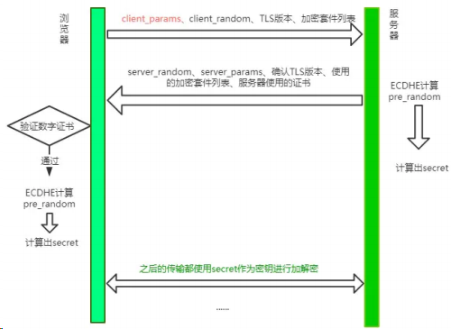

大体的方式和 TLS1.2 差不多，不过和 TLS 1.2 相比少了一个 RTT， 服务端不必等待对方验证证书之后才拿到 client_params ，而是直接在第一次握手的时候就能够拿到, 拿到之后立即计算 secret ，节省了之前不必要的等待时间。同时，这也意味着在第一次握手的时候客户端需要传送更多的信息，一口气给传完。

这种 TLS 1.3 握手方式也被叫做 1-RTT 握手。但其实这种 1-RTT 的握手方式还是有一些优化的空间的，接下来我们来一一介绍这些优化方式。

### 会话复用

会话复用有两种方式: Session ID 和 Session Ticket。

先说说最早出现的 Seesion ID，具体做法是客户端和服务器首次连接后各自保存会话的 ID，并存储会话密钥，当再次连接时，客户端发送 ID 过来，服务器查找这个 ID 是否存在，如果找到了就直接复用之前的会话状态，会话密钥不用重新生成，直接用原来的那份。

但这种方式也存在一个弊端，就是当客户端数量庞大的时候，对服务端的存储压力非常大。

因而出现了第二种方式——Session Ticket。它的思路就是: 服务端的压力大，那就把压力分摊给客户端呗。具体来说，双方连接成功后，服务器加密会话信息，用 Session Ticket 消息发给客户端，让客户端保存下来。下次重连的时候，就把这个 Ticket 进行解密，验证它过没过期，如果没过期那就直接恢复之前的会话状态。

这种方式虽然减小了服务端的存储压力，但与带来了安全问题，即每次用一个固定的密钥来解密 Ticket 数据，一旦黑客拿到这个密钥，之前所有的历史记录也被破解了。因此为了尽量避免这样的问题，密钥需要定期进行更换。

总的来说，这些会话复用的技术在保证 1-RTT 的同时，也节省了生成会话密钥这些算法所消耗的时间，是一笔可观的性能提升。

### PSK

刚刚说的都是 1-RTT 情况下的优化，那能不能优化到 0-RTT 呢？
答案是可以的。做法其实也很简单，在发送 Session Ticket 的同时带上应用数据，不用等到服务端确认，这种方式被称为 Pre-Shared Key ，即 PSK。

这种方式虽然方便，但也带来了安全问题。中间人截获 PSK 的数据，不断向服务器重复发，类似于 TCP 第一次握手携带数据，增加了服务器被攻击的风险。

### 总结

TLS1.3 在 TLS1.2 的基础上废除了大量的算法，提升了安全性。同时利用会话复用节省了重新生成密钥的时间，利用 PSK 做到了 0-RTT 连接。

## HTTP/2 有哪些改进？

由于 HTTPS 在安全方面已经做的非常好了，HTTP 改进的关注点放在了性能方面。对于 HTTP/2 而言，它对于性能的提升主要在于两点:

- 头部压缩
- 多路复用

当然还有一些颠覆性的功能实现：

- 设置请求优先级
- 服务器推送

这些重大的提升本质上也是为了解决 HTTP 本身的问题而产生的。接下来我们来看看 HTTP/2 解决了哪些问题，以及解决方式具体是如何的。

### 头部压缩

在 HTTP/1.1 及之前的时代，请求体一般会有响应的压缩编码过程，通过 Content-Encoding 头部字段来指定，但你有没有想过头部字段本身的压缩呢？当请求字段非常复杂的时候，尤其对于 GET 请求，请求报文几乎全是请求头，这个时候还是存在非常大的优化空间的。HTTP/2 针对头部字段，也采用了对应的压缩算法——HPACK，对请求头进行压缩。

HPACK 算法是专门为 HTTP/2 服务的，它主要的亮点有两个：

- 首先是在服务器和客户端之间建立哈希表，将用到的字段存放在这张表中，那么在传输的时候对于之前出现过的值，只需要把索引(比如 0，1，2，...)传给对方即可，对方拿到索引查表就行了。这种传索引的方式，可以说让请求头字段得到极大程度的精简和复用。

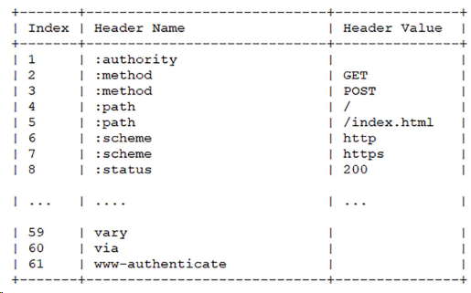

HTTP/2 当中废除了起始行的概念，将起始行中的请求方法、URI、状态码转换成了头字段，不过这些字段都有一个":"前缀，用来和其它请求头区分开。

其次是对于整数和字符串进行哈夫曼编码，哈夫曼编码的原理就是先将所有出现的字符建立一张索引表，然后让出现次数多的字符对应的索引尽可能短，传输的时候也是传输这样的索引序列，可以达到非常高的压缩率。

### 多路复用

#### HTTP 队头阻塞

我们之前讨论了 HTTP 队头阻塞的问题，其根本原因在于 HTTP 基于 请求-响应 的模型，在同一个 TCP 长连接中，前面的请求没有得到响应，后面的请求就会被阻塞。

后面我们又讨论到用并发连接和域名分片的方式来解决这个问题，但这并没有真正从 HTTP 本身的层面解决问题，只是增加了 TCP 连接，分摊风险而已。而且这么做也有弊端，多条 TCP 连接会竞争有限的带宽，让真正优先级高的请求不能优先处理。

而 HTTP/2 便从 HTTP 协议本身解决了 队头阻塞 问题。注意，这里并不是指的 TCP 队头阻塞 ，而是 HTTP 队头阻塞 ，两者并不是一回事。TCP 的队头阻塞是在 数据包 层面，单位是 数据包 ，前一个报文没有收到便不会将后面收到的报文上传给 HTTP，而 HTTP 的队头阻塞是在 HTTP 请求-响应 层面，前一个请求没处理完，后面的请求就要阻塞住。两者所在的层次不一样。

**那么 HTTP/2 如何来解决所谓的队头阻塞呢？**

#### 二进制分帧

首先，HTTP/2 认为明文传输对机器而言太麻烦了，不方便计算机的解析，因为对于文本而言会有多义的字符，比如回车换行到底是内容还是分隔符，在内部需要用到状态机去识别，效率比较低。于是 HTTP/2 干脆把报文全部换成二进制格式，全部传输 01 串，方便了机器的解析。

原来 Headers + Body 的报文格式如今被拆分成了一个个二进制的帧，用 Headers 帧存放头部字段，Data 帧存放请求体数据。分帧之后，服务器看到的不再是一个个完整的 HTTP 请求报文，而是一堆乱序的二进制帧。这些二进制帧不存在先后关系，因此也就不会排队等待，也就没有了 HTTP 的队头阻塞问题。

通信双方都可以给对方发送二进制帧，这种二进制帧的双向传输的序列，也叫做 流 (Stream)。HTTP/2 用 流 来在一个 TCP 连接上来进行多个数据帧的通信，这就是多路复用的概念。

可能你会有一个疑问，既然是乱序首发，那最后如何来处理这些乱序的数据帧呢？

首先要声明的是，所谓的乱序，指的是不同 ID 的 Stream 是乱序的，但同一个 Stream ID 的帧一定是按顺序传输的。二进制帧到达后对方会将 Stream ID 相同的二进制帧组装成完整的请求报文和响应报文。

当然，在二进制帧当中还有其他的一些字段，实现了优先级和流量控制等功能，我们放到下一节再来介绍。

#### 服务器推送

另外值得一说的是 HTTP/2 的服务器推送(Server Push)。在 HTTP/2 当中，服务器已经不再是完全被动地接收请求，响应请求，它也能新建 stream 来给客户端发送消息，当 TCP 连接建立之后，比如浏览器请求一个 HTML 文件，服务器就可以在返回 HTML 的基础上，将 HTML 中引用到的其他资源文件一起返回给客户端，减少客户端的等待。

### 总结

当然，HTTP/2 新增那么多的特性，是不是 HTTP 的语法要重新学呢？不需要，TTP/2 完全兼容之前

HTTP 的语法和语义，如请求头、URI、状态码、头部字段都没有改变，完全不用担心。同时，在安全方面，HTTP 也支持 TLS，并且现在主流的浏览器都公开只支持加密的 HTTP/2, 因此你现在能看到的 HTTP/2 也基本上都是跑在 TLS 上面的了。最后放一张分层图给大家参考:

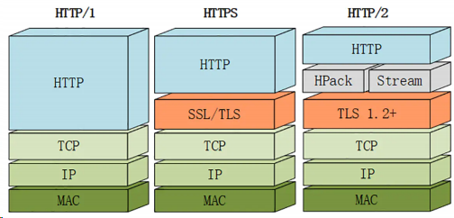

## HTTP 和 HTTPS 协议的区别

HTTP 和 HTTPS 协议的主要区别如下：

HTTPS 协议需要 CA 证书，费用较高；而 HTTP 协议不需要；

HTTP 协议是超文本传输协议，信息是明文传输的，HTTPS 则是具有安全性的 SSL 加密传输协议；

使用不同的连接方式，端口也不同，HTTP 协议端口是 80，HTTPS 协议端口是 443；

HTTP 协议连接很简单，是无状态的；HTTPS 协议是有 SSL 和 HTTP 协议构建的可进行加密传输、身份认证的网络协议，比 HTTP 更加安全

## HTTP2 的头部压缩算法是怎样的？

HTTP2 的头部压缩是 HPACK 算法。在客户端和服务器两端建立“字典”，用索引号表示重复的字符串，采用哈夫曼编码来压缩整数和字符串，可以达到 50%~90%的高压缩率。

具体来说：

在客户端和服务器端使用“首部表”来跟踪和存储之前发送的键值对，对于相同的数据，不再通过每次请求和响应发送；

首部表在 HTTP/2 的连接存续期内始终存在，由客户端和服务器共同渐进地更新；

每个新的首部键值对要么被追加到当前表的末尾，要么替换表中之前的值。

例如下图中的两个请求， 请求一发送了所有的头部字段，第二个请求则只需要发送差异数据，这样可以减少冗余数据，降低开销。

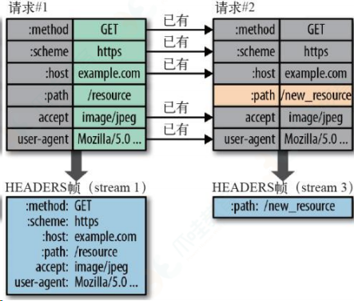

## HTTP/2 中的二进制帧是如何设计的？

### 帧结构

HTTP/2 中传输的帧结构如下图所示:

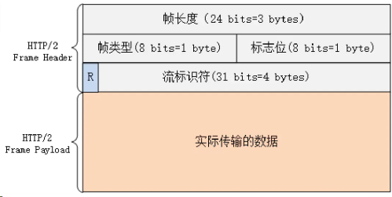

每个帧分为 帧头 和 帧体 。先是三个字节的帧长度，这个长度表示的是 帧体 的长度。

然后是帧类型，大概可以分为数据帧和控制帧两种。数据帧用来存放 HTTP 报文，控制帧用来管理 流 的传输。

接下来的一个字节是帧标志，里面一共有 8 个标志位，常用的有 END_HEADERS 表示头数据结束，END_STREAM 表示单方向数据发送结束。

后 4 个字节是 Stream ID , 也就是 流标识符 ，有了它，接收方就能从乱序的二进制帧中选择出 ID 相同的帧，按顺序组装成请求/响应报文。

### 流的状态变化

从前面可以知道，在 HTTP/2 中，所谓的 流 ，其实就是二进制帧的双向传输的序列。那么在 HTTP/2 请求和响应的过程中，流的状态是如何变化的呢？

HTTP/2 其实也是借鉴了 TCP 状态变化的思想，根据帧的标志位来实现具体的状态改变。这里我们以一个普通的 请求-响应 过程为例来说明：

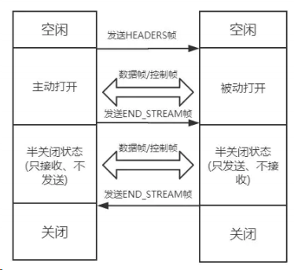

最开始两者都是空闲状态，当客户端发送 Headers 帧 后，开始分配 Stream ID , 此时客户端的 流 打开，服务端接收之后服务端的 流 也打开，两端的 流 都打开之后，就可以互相传递数据帧和控制帧了。

当客户端要关闭时，向服务端发送 END_STREAM 帧，进入 半关闭状态 , 这个时候客户端只能接收数据，而不能发送数据。

服务端收到这个 END_STREAM 帧后也进入 半关闭状态 ，不过此时服务端的情况是只能发送数据，而不能接收数据。随后服务端也向客户端发送 END_STREAM 帧，表示数据发送完毕，双方进入 关闭状态 。

如果下次要开启新的 流 ，流 ID 需要自增，直到上限为止，到达上限后开一个新的 TCP 连接重头开始计数。由于流 ID 字段长度为 4 个字节，最高位又被保留，因此范围是 0 ~ 2 的 31 次方，大约 21 亿个。

### 流的特性

刚刚谈到了流的状态变化过程，这里顺便就来总结一下 流 传输的特性:

- 并发性。一个 HTTP/2 连接上可以同时发多个帧，这一点和 HTTP/1 不同。这也是实现多路复用的基础。
- 自增性。流 ID 是不可重用的，而是会按顺序递增，达到上限之后又新开 TCP 连接从头开始。
- 双向性。客户端和服务端都可以创建流，互不干扰，双方都可以作为 发送方 或者 接收方 。
- 可设置优先级。可以设置数据帧的优先级，让服务端先处理重要资源，优化用户体验。

## HTTP2.0 的特性

参考回答：

http2.0 的特性如下：

1、内容安全，应为 http2.0 是基于 https 的，天然具有安全特性，通过 http2.0 的特性可以避免单纯使用 https 的性能下降

2、二进制格式，http1.X 的解析是基于文本的，http2.0 将所有的传输信息分割为更小的消息和帧，并对他们采用二进制格式编码，基于二进制可以让协议有更多的扩展性，比如引入了帧来传输数据和指令

3、多路复用，这个功能相当于是长连接的增强，每个 request 请求可以随机的混杂在一起，接收方可以根据 request 的 id 将 request 再归属到各自不同的服务端请求里面，另外多路复用中也支持了流的优先级，允许客户端告诉服务器那些内容是更优先级的资源，可以优先传输。

## HTTP2.0

HTTP/2 很好的解决了当下最常用的 HTTP/1 所存在的一些性能问题，只需要升级到该协议就可以减少很多之前需要做的性能优化工作，当然兼容问题以及如何优雅降级应该是国内还不普遍使用的原因之一。

虽然 HTTP/2 已经解决了很多问题，但是并不代表它已经是完美的了，HTTP/3 就是为了解决 HTTP/2 所存在的一些问题而被推出来的。

### 1 HTTP/2

HTTP/2 相比于 HTTP/1 ，可以说是大幅度提高了网页的性能。

- 在 HTTP/1 中，为了性能考虑，我们会引入雪碧图、将小图内联、使用多个域名等等的方式。这一切都是因为浏览器限制了同一个域名下的请求数量（Chrome 下一般是限制六个连接），当页面中需要请求很多资源的时候，队头阻塞（Head of line blocking）会导致在达到最大请求数量时，剩余的资源需要等待其他资源请求完成后才能发起请求。
- 在 HTTP/2 中引入了多路复用的技术，这个技术可以只通过一个 TCP 连接就可以传输所有的请求数据。多路复用很好的解决了浏览器限制同一个域名下的请求数量的问题，同时也接更容易实现全速传输，毕竟新开一个 TCP 连接都需要慢慢提升传输速度。

大家可以通过 该链接：https://http2.akamai.com/demo 感受下 HTTP/2 比 HTTP/1 到底快了多少

在 HTTP/1 中，因为队头阻塞的原因，你会发现发送请求是长这样的

在 HTTP/2 中，因为可以复用同一个 TCP 连接，你会发现发送请求是长这样的

### 2 二进制传输

HTTP/2 中所有加强性能的核⼼点在于此。在之前的 HTTP 版本中，我们是
通过文本的方式传输数据。在 HTTP/2 中引入了新的编码机制，所有传输的
数据都会被分割，并采用二进制格式编码。

### 3 多路复用

在 HTTP/2 中，有两个非常重要的概念，分别是帧（frame）和流（stream）。

帧代表着最小的数据单位，每个帧会标识出该帧属于哪个流，流也就是多个帧组成的数据流。

多路复用，就是在一个 TCP 连接中可以存在多条流。换句话说，也就是可以发送多个请求，对端可以通过帧中的标识知道属于哪个请求。通过这个技术，可以避免 HTTP 旧版本中的队头阻塞问题，极大的提高传输性能。

### 4 Header 压缩

在 HTTP/1 中，我们使用文本的形式传输 header ，在 header 携带 cookie 的情况下，可能每次都需要重复传输几百到几千的字节。

在 HTTP / 2 中，使用了 HPACK 压缩格式对传输的 header 进行编码，减少了
header 的大小。并在两端维护了索引表，用于记录出现过的 header ，后面在传输过程中就可以传输已经记录过的 header 的键名，对端收到数据后就可以通过键名找到对应的值。

### 5 服务端 Push

在 HTTP/2 中，服务端可以在客户端某个请求后，主动推送其他资源。

可以想象以下情况，某些资源客户端是一定会请求的，这时就可以采取服务端 push 的技术，提前给客户端推送必要的资源，这样就可以相对减少一点延迟时间。当然在浏览器兼容的情况下你也可以使用 prefetch

## 说一下 HTTP 3.0

HTTP/3 基于 UDP 协议实现了类似于 TCP 的多路复用数据流、传输可靠性等功能，这套功能被称为 QUIC 协议。

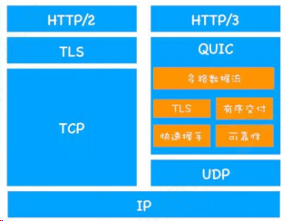

1.流量控制、传输可靠性功能：QUIC 在 UDP 的基础上增加了一层来保证数据传输可靠性，它提供了数据包重传、拥塞控制、以及其他一些 TCP 中的特性。

2.集成 TLS 加密功能：目前 QUIC 使用 TLS1.3，减少了握手所花费的 RTT 数。

3.多路复用：同一物理连接上可以有多个独立的逻辑数据流，实现了数据流的单独传输，解决了 TCP 的队头阻塞问题。

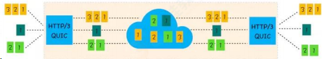

4.快速握手：由于基于 UDP，可以实现使用 0 ~ 1 个 RTT 来建立连接。

## HTTP/3

虽然 HTTP/2 解决了很多之前旧版本的问题，但是它还是存在一个巨大的问题，虽然这个问题并不是它本身造成的，而是底层支撑的 TCP 协议的问题。

因为 HTTP/2 使用了多路复用，一般来说同一域名下只需要使用一个 TCP 连接。当这个连接中出现了丢包的情况，那就会导致 HTTP/2 的表现情况反倒不如 HTTP/1 了。

因为在出现丢包的情况下，整个 TCP 都要开始等待重传，也就导致了后面的所有数据都被阻塞了。但是对于 HTTP/1 来说，可以开启多个 TCP 连接，出现这种情况反到只会影响其中一个连接，剩余的 TCP 连接还可以正常传输数据。

那么可能就会有⼈考虑到去修改 TCP 协议，其实这已经是一件不可能完成的任务了。因为 TCP 存在的时间实在太长，已经充斥在各种设备中，并且这个协议是由操作系统实现的，更新起来不大现实。

基于这个原因，Google 就更起炉灶搞了一个基于 UDP 协议的 QUIC 协议，并且使用在了 HTTP/3 上，当然 HTTP/3 之前名为 HTTP-over-QUIC ，从这个名字中我们也可以发现，HTTP/3 最大的改造就是使用了 QUIC ，接下来我们就来学习关于这个协议的内容。

#### QUIC

之前我们学习过 UDP 协议的内容，知道这个协议虽然效率很高，但是并不是
那么的可靠。QUIC 虽然基于 UDP，但是在原本的基础上新增了很多功能，比
如多路复用、0-RTT、使用 TLS1.3 加密、流量控制、有序交付、重传等等功
能。这里我们就挑选几个重要的功能学习下这个协议的内容。

#### 多路复用

虽然 HTTP/2 支持了多路复用，但是 TCP 协议终究是没有这个功能的。QUIC
原生就实现了这个功能，并且传输的单个数据流可以保证有序交付且不会影响
其他的数据流，这样的技术就解决了之前 TCP 存在的问题。

并且 QUIC 在移动端的表现也会比 TCP 好。因为 TCP 是基于 IP 和端口去识别连接的，这种方式在多变的移动端网络环境下是很脆弱的。但是 QUIC 是通过 ID 的方式去识别一个连接，不管你网络环境如何变化，只要 ID 不变，就能迅速重连上。

#### 0-RTT

通过使用类似 TCP 快速打开的技术，缓存当前会话的上下文，在下次恢复会
话的时候，只需要将之前的缓存传递给服务端验证通过就可以进行传输了。

#### 纠错机制

假如说这次我要发送三个包，那么协议会算出这三个包的异或值并单独发出一个校验包，也就是总共发出了四个包。

当出现其中的非校验包丢包的情况时，可以通过另外三个包计算出丢失的数据包的内容。

当然这种技术只能使用在丢失一个包的情况下，如果出现丢失多个包就不能使用纠错机制了，只能使用重传的方式了

## HTTP 1.1 和 HTTP 2.0 的区别

二进制协议：HTTP/2 是一个二进制协议。在 HTTP/1.1 版中，报文的头信息必须是文本（ASCII 编码），数据体可以是文本，也可以是二进制。HTTP/2 则是一个彻底的二进制协议，头信息和数据体都是二进制，并且统称为"帧"，可以分为头信息帧和数据帧。 帧的概念是它实现多路复用的基础。

多路复用：HTTP/2 实现了多路复用，HTTP/2 仍然复用 TCP 连接，但是在一个连接里，客户端和服务器都可以同时发送多个请求或回应，而且不用按照顺序一一发送，这样就避免了"队头堵塞"的问题。

数据流：HTTP/2 使用了数据流的概念，因为 HTTP/2 的数据包是不按顺序发送的，同一个连接里面连续的数据包，可能属于不同的请求。

因此，必须要对数据包做标记，指出它属于哪个请求。HTTP/2 将每个请求或回应的所有数据包，称为一个数据流。每个数据流都有一个独一无二的编号。数据包发送时，都必须标记数据流 ID ，用来区分它属于哪个数据流。

头信息压缩：HTTP/2 实现了头信息压缩，由于 HTTP 1.1 协议不带状态，每次请求都必须附上所有信息。所以，请求的很多字段都是重复的，比如 Cookie 和 User Agent ，一模一样的内容，每次请求都必须附带，这会浪费很多带宽，也影响速度。HTTP/2 对这一点做了优化，引入了头信息压缩机制。一方面，头信息使用 gzip 或 compress 压缩后再发送；另一方面，客户端和服务器同时维护一张头信息表，所有字段都会存入这个表，生成一个索引号，以后就不发送同样字段了，只发送索引号，这样就能提高速度了。

服务器推送：HTTP/2 允许服务器未经请求，主动向客户端发送资源，这叫做服务器推送。使用服务器推送提前给客户端推送必要的资源，这样就可以相对减少一些延迟时间。这里需要注意的是 http2 下服务器主动推送的是静态资源，和 WebSocket 以及使用 SSE 等方式向客户端发送即时数据的推送是不同的

## 说一下 http 和 https

参考回答：

https 的 SSL 加密是在传输层实现的。

### (1)http 和 https 的基本概念

- http: 超文本传输协议，是互联网上应用最为广泛的一种网络协议，是一个客户端和服务器端请求和应答的标准（TCP），用于从 WWW 服务器传输超文本到本地浏览器的传输协议，它可以使浏览器更加高效，使网络传输减少。
- https: 是以安全为目标的 HTTP 通道，简单讲是 HTTP 的安全版，即 HTTP 下加入 SSL 层，HTTPS 的安全基础是 SSL，因此加密的详细内容就需要 SSL。
- https 协议的主要作用是：建立一个信息安全通道，来确保数组的传输，确保网站的真实性。

### (2)http 和 https 的区别？

http 传输的数据都是未加密的，也就是明文的，网景公司设置了 SSL 协议来对 http 协议传输的数据进行加密处理，简单来说 https 协议是由 http 和 ssl 协议构建的可进行加密传输和身份认证的网络协议，比 http 协议的安全性更高。

主要的区别如下：

- Https 协议需要 ca 证书，费用较高。
- http 是超文本传输协议，信息是明文传输，https 则是具有安全性的 ssl 加密传输协议。
- 使用不同的链接方式，端口也不同，一般而言，http 协议的端口为 80，https 的端口为 443
- http 的连接很简单，是无状态的；HTTPS 协议是由 SSL+HTTP 协议构建的可进行加密传输、身份认证的网络协议，比 http 协议安全。

### (3)https 协议的工作原理

客户端在使用 HTTPS 方式与 Web 服务器通信时有以下几个步骤，如图所示。

客户使用 https url 访问服务器，则要求 web 服务器建立 ssl 链接。

web 服务器接收到客户端的请求之后，会将网站的证书（证书中包含了公钥），返回或者说传输给客户端。

客户端和 web 服务器端开始协商 SSL 链接的安全等级，也就是加密等级。

客户端浏览器通过双方协商一致的安全等级，建立会话密钥，然后通过网站的公钥来加密会话密钥，并传送给网站。

web 服务器通过自己的私钥解密出会话密钥。

web 服务器通过会话密钥加密与客户端之间的通信。

### (4)https 协议的优点

使用 HTTPS 协议可认证用户和服务器，确保数据发送到正确的客户机和服务器；

HTTPS 协议是由 SSL+HTTP 协议构建的可进行加密传输、身份认证的网络协议，要比 http 协议安全，可防止数据在传输过程中不被窃取、改变，确保数据的完整性。

HTTPS 是现行架构下最安全的解决方案，虽然不是绝对安全，但它大幅增加了中间人攻击的成本。

谷歌曾在 2014 年 8 月份调整搜索引擎算法，并称“比起同等 HTTP 网站，采用 HTTPS 加密的网站在搜索结果中的排名将会更高”。

### (5)https 协议的缺点

https 握手阶段比较费时，会使页面加载时间延长 50%，增加 10%~20%的耗电。

https 缓存不如 http 高效，会增加数据开销。

SSL 证书也需要钱，功能越强大的证书费用越高。

SSL 证书需要绑定 IP，不能再同一个 ip 上绑定多个域名，ipv4 资源支持不了这种消耗。

## TCP/IP 通信协议

### tcp 三次握手，一句话概括

参考回答：

客户端和服务端都需要直到各自可收发，因此需要三次握手。

简化三次握手：

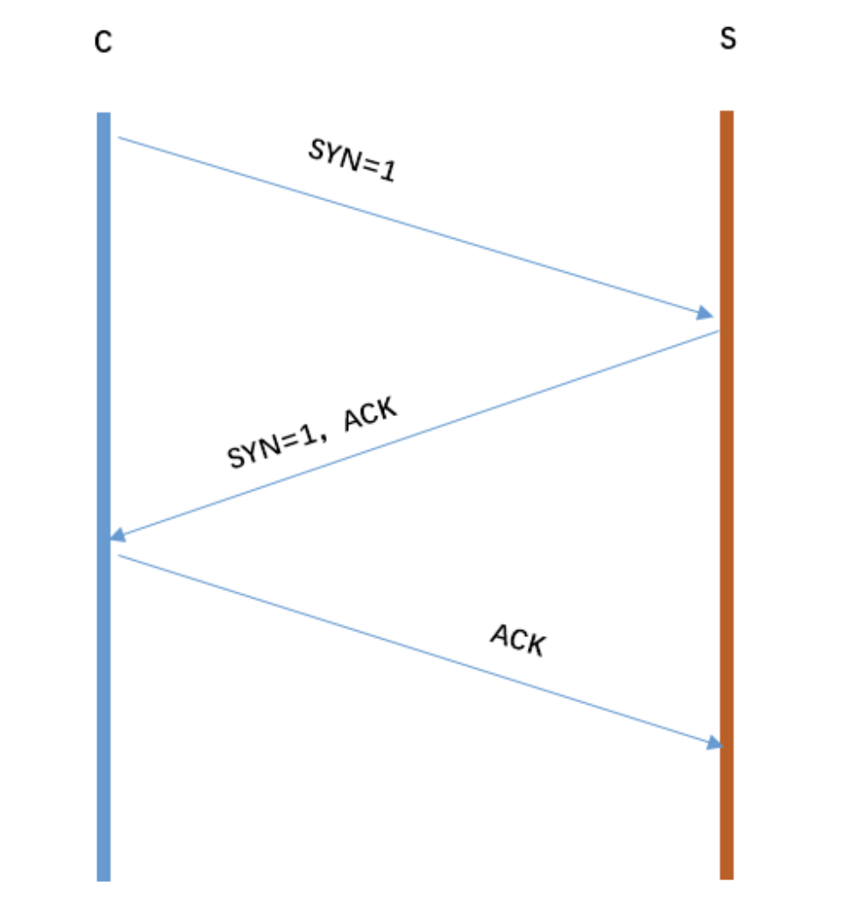

从图片可以得到三次握手可以简化为：

C 发起请求连接 S 确认，也发起连接 C 确认

我们再看看每次握手的作用：

- 第一次握手：S 只可以确认 自己可以接受 C 发送的报文段
- 第二次握手：C 可以确认 S 收到了自己发送的报文段，并且可以确认 自己可以接受 S 发送的报文段
- 第三次握手：S 可以确认 C 收到了自己发送的报文段

### 说下 TCP 握手和挥手过程

三次握手，五次挥手，每㇐次的目的要知道

### HTTP 1.1 的队头阻塞问题编解码/加密 base64

encodeURIComponent / decodeURIComponent 对称加密

### 非对称加密数字签名/验签

### 头部

TCP 头部比 UDP 头部复杂的多

对于 TCP 头部来说，以下几个字段是很重要的

- Sequence number ，这个序号保证了 TCP 传输的报文都是有序的，对端可以通过序号顺序的拼接报文
- Acknowledgement Number ，这个序号表示数据接收端期望接收的下一个字节的编号是多少，同时也表示上一个序号的数据已经收到
- Window Size ，窗口大小，表示还能接收多少字节的数据，用于流量控制

#### 标识符

- URG=1 ：该字段为一表示本数据报的数据部分包含紧急信息，是一个高优先级数据报文，此时紧急指针有效。紧急数据一定位于当前数据包数据部分的最前面，紧急指针标明了紧急数据的尾部。
- ACK=1 ：该字段为一表示确认号字段有效。此外， TCP 还规定在连接建立后传送的所有报文段都必须把 ACK 置为一 PSH=1 ：该字段为一表示接收端应该立即将数据 push 给应用层，而不是等到缓冲区满后再提交。
- RST=1 ：该字段为一表示当前 TCP 连接出现严重问题，可能需要重新建立 TCP 连接，也可以用于拒绝非法的报文段和拒绝连接请求。
- SYN=1 ：当 SYN=1 ， ACK=0 时，表示当前报文段是一个连接请求报文。当 SYN=1 ，ACK=1 时，表示当前报文段是一个同意建立连接的应答报文。
- FIN=1 ：该字段为一表示此报文段是一个释放连接的请求报文

### 状态机

HTTP 是无连接的，所以作为下层的 TCP 协议也是无连接的，虽然看似 TCP 将两端连接了起来，但是其实只是两端共同维护了一个状态

- TCP 的状态机是很复杂的，并且与建立断开连接时的握手息息相关，接下来就来详细描述下两种握手。
- 在这之前需要了解一个重要的性能指标 RTT。该指标表示发送端发送数据到接收到对端数据所需的往返时间

#### 建立连接三次握手

- 在 TCP 协议中，主动发起请求的一端为客户端，被动连接的一端称为服务端。不管是客户端还是服务端， TCP 连接建立完后都能发送和接收数据，所以 TCP 也是一个全双工的协议。
- 起初，两端都为 CLOSED 状态。在通信开始前，双方都会创建 TCB 。 服务器创建完 TCB 后遍进入 LISTEN 状态，此时开始等待客户端发送数据

##### 第一次握手

客户端向服务端发送连接请求报文段。该报文段中包含自身的数据通讯初始序
号。请求发送后，客户端便进入 SYN-SENT 状态，x 表示客户端的数据通信初
始序号。

##### 第二次握手

服务端收到连接请求报文段后，如果同意连接，则会发送一个应答，该应答中
也会包含自身的数据通讯初始序号，发送完成后便进入 SYN-RECEIVED 状态。

##### 第三次握手

当客户端收到连接同意的应答后，还要向服务端发送一个确认报文。客户端发
完这个报文段后便进入 ESTABLISHED 状态，服务端收到这个应答后也进入 ESTABLISHED 状态，此时连接建立成功。

**PS**：第三次握手可以包含数据，通过 TCP 快速打开（ TFO ）技术。其实只要涉及到握手的协议，都可以使用类似 TFO 的方式，客户端和服务端存储相同 cookie ，下次握手时发出 cookie 达到减少 RTT 的目的

#### 你是否有疑惑明明两次握手就可以建立起连接，为什么还需要第三次应答？

因为这是为了防止失效的连接请求报文段被服务端接收，从而产生错误

可以想象如下场景。客户端发送了一个连接请求 A，但是因为网络原因造成了超时，这时 TCP 会启动超时重传的机制再次发送一个连接请求 B。此时请求顺
利到达服务端，服务端应答完就建立了请求。如果连接请求 A 在两端关闭后终
于抵达了服务端，那么这时服务端会认为客户端⼜需要建立 TCP 连接，从而应答了该请求并进入 ESTABLISHED 状态。此时客户端其实是 CLOSED 状态，那么就会导致服务端一直等待，造成资源的浪费

PS：在建立连接中，任意一端掉线，TCP 都会重发 SYN 包，一般会重试五
次，在建立连接中可能会遇到 SYN FLOOD 攻击。遇到这种情况你可以选择调
低重试次数或者⼲脆在不能处理的情况下拒绝请求

#### 断开链接四次握手

TCP 是全双工的，在断开连接时两端都需要发送 FIN 和 ACK 。

##### 第一次握手

若客户端 A 认为数据发送完成，则它需要向服务端 B 发送连接释放请求。

##### 第二次握手

B 收到连接释放请求后，会告诉应用层要释放 TCP 链接。然后会发送 ACK 包，并进入 CLOSE_WAIT 状态，表示 A 到 B 的连接已经释放，不接收 A 发的数据了。但是因为 TCP 连接时双向的，所以 B 仍旧可以发送数据给 A。

##### 第三次握手

B 如果此时还有没发完的数据会继续发送，完毕后会向 A 发送连接释放请求，
然后 B 便进入 LAST-ACK 状态。

PS：通过延迟确认的技术（通常有时间限制，否则对方会误认为需要重传），
可以将第二次和第三次握手合并，延迟 ACK 包的发送。

##### 第四次握手

A 收到释放请求后，向 B 发送确认应答，此时 A 进入 TIME-WAIT 状态。该状态会持续 2MSL（最大段生存期，指报文段在网络中生存的时间，超时会被抛弃） 时间，若该时间段内没有 B 的重发请求的话，就进入 CLOSED 状态。当 B 收到确认应答后，也便进入 CLOSED 状态。

###### 为什么 A 要进入 TIME-WAIT 状态，等待 2MSL 时间后才进入 CLOSED 状态？

为了保证 B 能收到 A 的确认应答。若 A 发完确认应答后直接进入 CLOSED 状态，如果确认应答因为网络问题一直没有到达，那么会造成 B 不能正常关闭

## TCP 和 UDP 的区别

::: details 查看参考回答

参考回答：

- （1）TCP 是面向连接的，udp 是无连接的即发送数据前不需要先建立链接。
- （2）TCP 提供可靠的服务。也就是说，通过 TCP 连接传送的数据，无差错，不丢失，不重复，且按序到达;UDP 尽最大努力交付，即不保证可靠交付。 并且因为 tcp 可靠，面向连接，不会丢失数据因此适合大数据量的交换。
- （3）TCP 是面向字节流，UDP 面向报文，并且网络出现拥塞不会使得发送速率降低（因此会出现丢包，对实时的应用比如 IP 电话和视频会议等）。
- （4）TCP 只能是 1 对 1 的，UDP 支持 1 对 1,1 对多。
- （5）TCP 的首部较大为 20 字节，而 UDP 只有 8 字节。
- （6）TCP 是面向连接的可靠性传输，而 UDP 是不可靠的。

首先概括一下基本的区别:

**TCP 是一个面向连接的、可靠的、基于字节流的传输层协议。**

而 UDP 是一个面向无连接的传输层协议。(就这么简单，其它 TCP 的特性也就没有了)。

具体来分析，和 UDP 相比， TCP 有三大核心特性:

- 1）**面向连接。**所谓的连接，指的是客户端和服务器的连接，在双方互相通信之前，TCP 需要三次握手建立连接，而 UDP 没有相应建立连接的过程。
- 2）**可靠性。**TCP 花了非常多的功夫保证连接的可靠，这个可靠性体现在哪些方面呢？一个是有状态，另一个是可控制。
  - TCP 会精准记录哪些数据发送了，哪些数据被对方接收了，哪些没有被接收到，而且保证数据包按序到达，不允许半点差错。这是有状态。
  - 当意识到丢包了或者网络环境不佳，TCP 会根据具体情况调整自己的行为，控制自己的发送速度或者重发。这是可控制。
  - 相应的，UDP 就是 无状态 , 不可控 的。
- 3）**面向字节流。**UDP 的数据传输是基于数据报的，这是因为仅仅只是继承了 IP 层的特性，而 TCP 为了维护状态，将一个个 IP 包变成了字节流。

:::

## TCP 三次握手和四次挥手

**为什么要进行三次握手：为了确认对方的发送和接收能力。**

### 三次握手

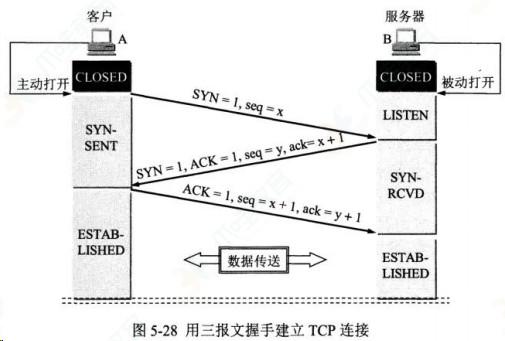

三次握手主要流程：

- 一开始双方处于 CLOSED 状态，然后服务端开始监听某个端口进入 LISTEN 状态
  然后客户端主动发起连接，发送 SYN，然后自己变为 SYN-SENT，seq = x
  服务端收到之后，返回 SYN seq = y 和 ACK ack = x + 1（对于客户端发来的 SYN），自己变成 SYN-REVD
- 之后客户端再次发送 ACK seq = x + 1, ack = y + 1 给服务端，自己变成 ASTABLISHED 状态，服务端收到 ACK，也进入 ESTABLISHED

SYN 需要对端确认，所以 ACK 的序列化要加一，凡是需要对端确认的，一点要消耗 TCP 报文的序列化。

三次握手（Three-way Handshake）其实就是指建立一个 TCP 连接时，需要客户端和服务器总共发送 3 个包。

进行三次握手的主要作用就是为了确认双方的接收能力和发送能力是否正常、指定自己的初始化序列号为后面的可靠性传送做准备。实质上其实就是连接服务器指定端口，建立 TCP 连接，并同步连接双方的序列号和确认号，交换 TCP 窗口大小信息。

刚开始客户端处于 Closed 的状态，服务端处于 Listen 状态。

第一次握手：客户端给服务端发一个 SYN 报文，并指明客户端的初始化序列号 ISN，此时客户端处于 SYN_SEND 状态。

首部的同步位 SYN=1，初始序号 seq=x，SYN=1 的报文段不能携带数据，但要消耗掉一个序号。

第二次握手：服务器收到客户端的 SYN 报文之后，会以自己的 SYN 报文作为应答，并且也是指定了自己的初始化序列号 ISN。同时会把客户端的 ISN + 1 作为 ACK 的值，表示自己已经收到了客户端的 SYN，此时服务器处于 SYN_REVD 的状态。

在确认报文段中 SYN=1，ACK=1，确认号 ack=x+1，初始序号 seq=y 第三次握手：客户端收到 SYN 报文之后，会发送一个 ACK 报文，当然，也是一样把服务器的 ISN + 1 作为 ACK 的值，表示已经收到了服务端的 SYN 报文，此时客户端处于 ESTABLISHED 状态。服务器收到 ACK 报文之后，也处于 ESTABLISHED 状态，此时，双方已建立起
了连接。

确认报文段 ACK=1，确认号 ack=y+1，序号 seq=x+1（初始为 seq=x，第二个报文段所以要+1），ACK 报文段可以携带数据，不携带数据则不消耗序号。

### 那为什么要三次握手呢？两次不行吗？

为了确认双方的接收能力和发送能力都正常

如果是用两次握手，则会出现下面这种情况：

如客户端发出连接请求，但因连接请求报文丢失而未收到确认，于是客户端再重传一次连接请求。后来收到了确认，建立了连接。数据传输完毕后，就释放了连接，客户端共发出了两个连接请求报文段，其中第一个丢失，第二个到达了服务端，但是第一个丢失的报文段只是在某些网络结点长时间滞留了，延误到连接释放以后的某个时间才到达服务端，此时服务端误认为客户端又发出一次新的连接请求，于是就向客户端发出确认报文段，同意建立连接，不采用三次握手，只要服务端发出确认，就建立新的连接了，此时客户端忽略服务端发来的确认，也不发送数据，则服务端一致等待客户端发送数据，浪费资源。

简单来说就是以下三步：

第一次握手：客户端向服务端发送连接请求报文段。该报文段中包含自身的数据通讯初始序号。请求发送后，客户端便进入 SYN-SENT 状态。

第二次握手：服务端收到连接请求报文段后，如果同意连接，则会发送一个应答，该应答中也会包含自身的数据通讯初始序号，发送完成后便进入 SYN-RECEIVED 状态。

第三次握手：当客户端收到连接同意的应答后，还要向服务端发送一个确认报文。客户端发完这个报文段后便进入 ESTABLISHED 状态，服务端收到这个应答后也进入 ESTABLISHED 状态，此时连接建立成功。

TCP 三次握手的建立连接的过程就是相互确认初始序号的过程，告诉对方，什么样序号的报文段能够被正确接收。 第三次握手的作用是客户端对服务器端的初始序号的确认。如果只使用两次握手，那么服务器就没有办法知道自己的序号是否 已被确认。同时这样也是为了防止失效的请求报文段被服务器接收，而出现错误的情况。

### 为什么不是两次？

无法确认客户端的接收能力。

如果首先客户端发送了 SYN 报文，但是滞留在网络中，TCP 以为丢包了，然后重传，两次握手建立了连接。

等到客户端关闭连接了。但是之后这个包如果到达了服务端，那么服务端接收到了，然后发送相应的数据表，就建立了链接，但是此时客户端已经关闭连接了，所以带来了链接资源的浪费。

### 为什么不是四次？

四次以上都可以，只不过 三次就够了

### 四次挥手

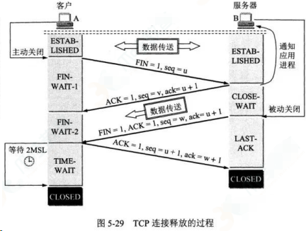

- 一开始都处于 ESTABLISH 状态，然后客户端发送 FIN 报文，带上 seq = p，状态变为 FIN-WAIT-1
- 服务端收到之后，发送 ACK 确认，ack = p + 1，然后进入 CLOSE-WAIT 状态
- 客户端收到之后进入 FIN-WAIT-2 状态
- 过了一会等数据处理完，再次发送 FIN、ACK，seq = q，ack = p + 1，进入 LAST-ACK 阶段客户端收到 FIN 之后，客户端收到之后进入 TIME_WAIT（等待 2MSL），然后发送 ACK 给服务端 ack = 1 + 1
- 服务端收到之后进入 CLOSED 状态

客户端这个时候还需要等待两次 MSL 之后，如果没有收到服务端的重发请求，就表明 ACK 成功到达，挥手结束，客户端变为 CLOSED 状态，否则进行 ACK 重发

为什么需要等待 2MSL（Maximum Segement Lifetime）：
因为如果不等待的话，如果服务端还有很多数据包要给客户端发，且此时客户端端口被新应用占据，那么就会接收到无用的数据包，造成数据包混乱，所以说最保险的方法就是等服务器发来的数据包都死翘翘了再启动新应用。

- 1 个 MSL 保证四次挥手中主动关闭方最后的 ACK 报文能最终到达对端
- 1 个 MSL 保证对端没有收到 ACK 那么进行重传的 FIN 报文能够到达

刚开始双方都处于 ESTABLISHED 状态，假如是客户端先发起关闭请求。四次挥手的过程如下：

第一次挥手： 客户端会发送一个 FIN 报文，报文中会指定一个序列号。此时客户端处于 FIN_WAIT1 状态。

即发出连接释放报文段（FIN=1，序号 seq=u），并停止再发送数据，主动关闭 TCP 连接，进入 FIN_WAIT1（终止等待 1）状态，等待服务端的确认。

第二次挥手：服务端收到 FIN 之后，会发送 ACK 报文，且把客户端的序列号值 +1 作为 ACK 报文的序列号值，表明已经收到客户端的报文了，此时服务端处于 CLOSE_WAIT 状态。

即服务端收到连接释放报文段后即发出确认报文段（ACK=1，确认号 ack=u+1，序号 seq=v），服务端进入 CLOSE_WAIT（关闭等待）状态，此时的 TCP 处于半关闭状态，客户端到服务端的连接释放。客户端收到服务端的确认后，进入 FIN_WAIT2（终止等待 2）状态，等待服务端发出的连接释放报文段。

第三次挥手：如果服务端也想断开连接了，和客户端的第一次挥手一样，发给 FIN 报文，且指定一个序列号。此时服务端处于 LAST_ACK 的状态。

即服务端没有要向客户端发出的数据，服务端发出连接释放报文段（FIN=1，ACK=1，序号 seq=w，确认号 ack=u+1），服务端进入 LAST_ACK（最后确认）状态，等待客户端的确认。

第四次挥手：客户端收到 FIN 之后，一样发送一个 ACK 报文作为应答，且把服务端的序列号值 +1 作为自己 ACK 报文的序列号值，此时客户端处于 TIME_WAIT 状态。需要过一阵子以确保服务端收到自己的 ACK 报文之后才会进入 CLOSED 状态，服务端收到 ACK 报文之后，就处于关闭连接了，处于 CLOSED 状态。

即客户端收到服务端的连接释放报文段后，对此发出确认报文段（ACK=1，seq=u+1，ack=w+1），客户端进入 TIME_WAIT（时间等待）状态。此时 TCP 未释放掉，需要经过时间等待计时器设置的时间 2MSL 后，客户端才进入 CLOSED 状态。

### 那为什么需要四次挥手呢？

因为当服务端收到客户端的 SYN 连接请求报文后，可以直接发送 SYN+ACK 报文。其中 ACK 报文是用来应答的，SYN 报文是用来同步的。

但是关闭连接时，当服务端收到 FIN 报文时，很可能并不会立即关闭 SOCKET，所以只能先回复一个 ACK 报文，告诉客户端，“你发的 FIN 报文我收到了”。只有等到我服务端所有的报文都发送完了，我才能发送 FIN 报文，因此不能一起发送，故需要四次挥手。

简单来说就是以下四步：

第一次挥手：若客户端认为数据发送完成，则它需要向服务端发送连接释放请求。

第二次挥手：服务端收到连接释放请求后，会告诉应用层要释放 TCP 链接。然后会发送 ACK 包，并进入 CLOSE_WAIT 状态，此时表明客户端到服务端的连接已经释放，不再接收客户端发的数据了。但是因为 TCP 连接是双向的，所以服务端仍旧可以发送数据给客户端。

第三次挥手：服务端如果此时还有没发完的数据会继续发送，完毕后会向客户端发送连接释放请求，然后服务端便进入 LAST-ACK 状态。

第四次挥手：客户端收到释放请求后，向服务端发送确认应答，此时客户端进入 TIME-WAIT 状态。该状态会持续 2MSL（最大段生存期，指报文段在网络中生存的时间，超时会被抛弃） 时间，若该时间段内没有服务端的重发请求的话，就进入 CLOSED 状态。当服务端收到确认应答后，也便进入 CLOSED 状态。

TCP 使用四次挥手的原因是因为 TCP 的连接是全双工的，所以需要双方分别释放到对方的连接，单独一方的连接释放，只代 表不能再向对方发送数据，连接处于的是半释放的状态。

最后一次挥手中，客户端会等待一段时间再关闭的原因，是为了防止发送给服务器的确认报文段丢失或者出错，从而导致服务器 端不能正常关闭。

### 为什么是四次而不是三次？

如果是三次的话，那么服务端的 ACK 和 FIN 合成一个挥手，那么长时间的延迟可能让 TCP 一位 FIN 没有达到服务器端，然后让客户的不断的重发 FIN

## 在交互过程中如果数据传送完了，还不想断开连接怎么办，怎么维持？

在 HTTP 中响应体的 Connection 字段指定为 keep-alive

## 你对 TCP 滑动窗口有了解嘛？

在 TCP 链接中，对于发送端和接收端而言，TCP 需要把发送的数据放到发送缓存区, 将接收的数据放到接收缓存区。而经常会存在发送端发送过多，而接收端无法消化的情况，所以就需要流量控制，就是在通过接收缓存区的大小，控制发送端的发送。如果对方的接收缓存区满了，就不能再继续发送了。而这种流量控制的过程就需要在发送端维护一个发送窗口，在接收端维持一个接收窗口。

TCP 滑动窗口分为两种: 发送窗口和接收窗口。

## 了解 WebSocket 嘛？

长轮询和短轮询，WebSocket 是长轮询。

具体比如在一个电商场景，商品的库存可能会变化，所以需要及时反映给用户，所以客户端会不停的发请求，然后服务器端会不停的去查变化，不管变不变，都返回，这个是短轮询。

而长轮询则表现为如果没有变，就不返回，而是等待变或者超时（一般是十几秒）才返回，如果没有返回，客户端也不需要一直发请求，所以减少了双方的压力。

## WebSocket 与 Ajax 的区别

### 本质不同

Ajax 即异步 JavaScript 和 XML，是一种创建交互式网页的应用的网页开发技术

websocket 是 HTML5 的一种新协议，实现了浏览器和服务器的实时通信

生命周期不同：

- websocket 是长连接，会话一直保持
- ajax 发送接收之后就会断开

适用范围：

- websocket 用于前后端实时交互数据
- ajax 非实时

发起人：

- AJAX 客户端发起
- WebSocket 服务器端和客户端相互推送

## 了解 WebSocket 嘛？

长轮询和短轮询，WebSocket 是长轮询。
具体比如在一个电商场景，商品的库存可能会变化，所以需要及时反映给用户，所以客户端会不停的发
请求，然后服务器端会不停的去查变化，不管变不变，都返回，这个是短轮询。
而长轮询则表现为如果没有变，就不返回，而是等待变或者超时（一般是十几秒）才返回，如果没有返
回，客户端也不需要一直发请求，所以减少了双方的压力。

## HTTP 如何实现长连接？在什么时候会超时？

通过在头部（请求和响应头）设置 Connection: keep-alive，HTTP1.0 协议支持，但是默认关闭，从 HTTP1.1 协议以后，连接默认都是长连接

HTTP 一般会有 httpd 守护进程，里面可以设置 keep-alive timeout，当 tcp 链接闲置超过这个时间就会关闭，也可以在 HTTP 的 header 里面设置超时时间

TCP 的 keep-alive 包含三个参数，支持在系统内核的 net.ipv4 里面设置：当 TCP 链接之后，闲置了 tcp_keepalive_time，则会发生侦测包，如果没有收到对方的 ACK，那么会每隔 tcp_keepalive_intvl 再发一次，直到发送了 tcp_keepalive_probes，就会丢弃该链接。

- tcp_keepalive_intvl = 15
- tcp_keepalive_probes = 5
- tcp_keepalive_time = 1800

实际上 HTTP 没有长短链接，只有 TCP 有，TCP 长连接可以复用一个 TCP 链接来发起多次 HTTP 请求，这样可以减少资源消耗，比如一次请求 HTML，可能还需要请求后续的 JS/CSS/图片等

## Fetch API 与传统 Request 的区别

fetch 符合关注点分离，使用 Promise，API 更加丰富，支持 Async/Await
语意简单，更加语意化可以使用 isomorphic-fetch ，同构方便

## POST 一般可以发送什么类型的文件，数据处理的问题

- 文本、图片、视频、音频等都可以
- text/image/audio/ 或 application/json 等

## TCP 如何保证有效传输及拥塞控制原理。

tcp 是面向连接的、可靠的、传输层通信协议

可靠体现在：有状态、可控制

- 有状态是指 TCP 会确认发送了哪些报文，接收方受到了哪些报文，哪些没有收到，保证数据包按序到达，不允许有差错
- 可控制的是指，如果出现丢包或者网络状况不佳，则会跳转自己的行为，减少发送的速度或者重发

所以上面能保证数据包的有效传输。

### 拥塞控制原理

原因是有可能整个网络环境特别差，容易丢包，那么发送端就应该注意了。

主要用三种方法：

- 慢启动阈值 + 拥塞避免
- 快速重传
- 快速回复

### 慢启动阈值 + 拥塞避免

对于拥塞控制来说，TCP 主要维护两个核心状态：

拥塞窗口（cwnd）
慢启动阈值（ssthresh）

在发送端使用拥塞窗口来控制发送窗口的大小。

然后采用一种比较保守的慢启动算法来慢慢适应这个网络，在开始传输的一段时间，发送端和接收端会首先通过三次握手建立连接，确定各自接收窗口大小，然后初始化双方的拥塞窗口，接着每经过一轮 RTT（收发时延），拥塞窗口大小翻倍，直到达到慢启动阈值。

然后开始进行拥塞避免，拥塞避免具体的做法就是之前每一轮 RTT，拥塞窗口翻倍，现在每一轮就加一个。

### 快速重传

在 TCP 传输过程中，如果发生了丢包，接收端就会发送之前重复 ACK，比如 第 5 个包丢了，6、7 达到，然后接收端会为 5，6，7 都发送第四个包的 ACK，这个时候发送端受到了 3 个重复的 ACK，意识到丢包了，就会马上进行重传，而不用等到 RTO （超时重传的时间）

选择性重传：报文首部可选性中加入 SACK 属性，通过 left edge 和 right edge 标志那些包到了，然后重传没到的包

### 快速恢复

如果发送端收到了 3 个重复的 ACK，发现了丢包，觉得现在的网络状况已经进入拥塞状态了，那么就会进入快速恢复阶段：

- 会将拥塞阈值降低为 拥塞窗口的一半
- 然后拥塞窗口大小变为拥塞阈值
- 接着 拥塞窗口再进行线性增加，以适应网络状况

## http 知道嘛？哪一层的协议？（应用层）

灵活可扩展，除了规定空格分隔单词，换行分隔字段以外，其他都没有限制，不仅仅可以传输文本，还可以传输图片、视频等任意资源

- 可靠传输，基于 TCP/IP 所以继承了这一特性
- 请求-应答，有来有回
- 无状态，每次 HTTP 请求都是独立的，无关的、默认不需要保存上下文信息

缺点：

- 明文传输不安全
- 复用一个 TCP 链接，会发生对头拥塞
- 无状态在长连接场景中，需要保存大量上下文，以避免传输大量重复的信息

## OSI 七层模型和 TCP/IP 四层模型

- 应用层
- 表示层
- 会话层
- 传输层
- 网络层
- 数据链路层
- 物理层

TCP/IP 四层概念：

- 应用层：应用层、表示层、会话层：HTTP
- 传输层：传输层：TCP/UDP
- 网络层：网络层：IP
- 数据链路层：数据链路层、物理层

## TCP 协议怎么保证可靠的，UDP 为什么不可靠？

TCP 是面向连接的、可靠的、传输层通信协议
UDP 是无连接的传输层通信协议，继承 IP 特性,基于数据报
为什么 TCP 可靠？TCP 的可靠性体现在有状态和控制
会精准记录那些数据发送了，那些数据被对方接收了，那些没有被接收，而且保证数据包按序到
达，不允许半点差错，这就是有状态
当意识到丢包了或者网络环境不佳，TCP 会根据具体情况调整自己的行为，控制自己的发送速度或
者重发，这是可控制的
反之 UDP 就是无状态的和不可控制的

## HTTP 2 改进

改进性能：
头部压缩
多路信道复用
Server Push

## DDOS 攻击

### 1）什么是 DDOS 攻击

- 分布式拒绝服务攻击(Distributed denial of service attack)
- 向目标系统同时提出数量庞大的服务请求。

### 2）DDOS 攻击方式

- 通过使网络过载来干扰甚至阻断正常的网络通讯；
- 通过向服务器提交大量请求，使服务器超负荷；
- 阻断某一用户访问服务器；
- 阻断某服务与特定系统或个人的通讯。

### 3）如何应对 DDOS 攻击

#### 黑名单

DDOS 清洗：对用户请求数据进行实时监控，及时发现 DOS 攻击等异常流量，在不影响正常业务开展的情况下清洗掉这些异常流量。

#### CDN 加速

高防服务器：高防服务器主要是指能独立硬防御 50Gbps 以上的服务器，能够帮助网站拒绝服务攻击，定期扫描网络主节点

## 说说 TCP 三次握手的过程？

### 恋爱模拟

以谈恋爱为例，两个人能够在一起最重要的事情是首先确认各自爱和被爱的能力。接下来我们以此来模拟三次握手的过程。

第一次:
男: 我爱你。
女方收到。由此证明男方拥有 爱 的能力。

第二次:
女: 我收到了你的爱，我也爱你。
男方收到。
OK，现在的情况说明，女方拥有 爱 和 被爱 的能力。

第三次:
男: 我收到了你的爱。
女方收到。
现在能够保证男方具备 被爱 的能力。

由此完整地确认了双方 爱 和 被爱 的能力，两人开始一段甜蜜的爱情。

### 真实握手

当然刚刚那段属于扯淡，不代表本人价值观，目的是让大家理解整个握手过程的意义，因为两个过程非常相似。对应到 TCP 的三次握手，也是需要确认双方的两样能力: 发送的能力 和 接收的能力 。于是便会有下面的三次握手的过程:

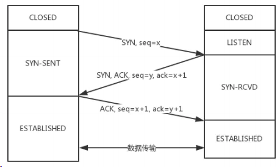

从最开始双方都处于 CLOSED 状态。然后服务端开始监听某个端口，进入了 LISTEN 状态。

然后客户端主动发起连接，发送 SYN , 自己变成了 SYN-SENT 状态。

服务端接收到，返回 SYN 和 ACK (对应客户端发来的 SYN)，自己变成了 SYN-REVD 。

之后客户端再发送 ACK 给服务端，自己变成了 ESTABLISHED 状态；服务端收到 ACK 之后，也变成了 ESTABLISHED 状态。

另外需要提醒你注意的是，从图中可以看出，SYN 是需要消耗一个序列号的，下次发送对应的 ACK 序列号要加 1，为什么呢？只需要记住一个规则:

> 凡是需要对端确认的，一定消耗 TCP 报文的序列号。

SYN 需要对端的确认， 而 ACK 并不需要，因此 SYN 消耗一个序列号而 ACK 不需要。

## TCP 为什么是三次握手而不是两次、四次？

### 1）为什么不是两次？

根本原因: 无法确认客户端的接收能力。

分析如下:

如果是两次，你现在发了 SYN 报文想握手，但是这个包滞留在了当前的网络中迟迟没有到达，TCP 以为这是丢了包，于是重传，两次握手建立好了连接。

看似没有问题，但是连接关闭后，如果这个滞留在网路中的包到达了服务端呢？这时候由于是两次握手，服务端只要接收到然后发送相应的数据包，就默认建立连接，但是现在客户端已经断开了。

看到问题的吧，这就带来了连接资源的浪费。

### 2）为什么不是四次？

三次握手的目的是确认双方 发送 和 接收 的能力，那四次握手可以嘛？

当然可以，100 次都可以。但为了解决问题，三次就足够了，再多用处就不大了。

## TCP 三次握手过程中可以携带数据么？

第三次握手的时候，可以携带。前两次握手不能携带数据。

如果前两次握手能够携带数据，那么一旦有人想攻击服务器，那么他只需要在第一次握手中的 SYN 报文中放大量数据，那么服务器势必会消耗更多的时间和内存空间去处理这些数据，增大了服务器被攻击的风险。

第三次握手的时候，客户端已经处于 ESTABLISHED 状态，并且已经能够确认服务器的接收、发送能力正常，这个时候相对安全了，可以携带数据。

## 同时打开会怎样？

如果双方同时发 SYN 报文，状态变化会是怎样的呢？

这是一个可能会发生的情况。

状态变迁如下:

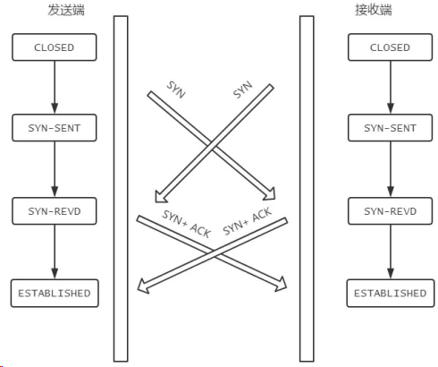

在发送方给接收方发 SYN 报文的同时，接收方也给发送方发 SYN 报文，两个人刚上了!

发完 SYN ，两者的状态都变为 SYN-SENT 。

在各自收到对方的 SYN 后，两者状态都变为 SYN-REVD 。

接着会回复对应的 ACK + SYN ，这个报文在对方接收之后，两者状态一起变为 ESTABLISHED 。

这就是同时打开情况下的状态变迁。

## 说说 TCP 四次挥手的过程

过程拆解

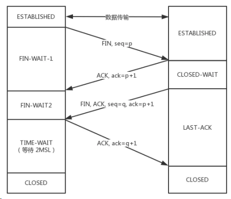

刚开始双方处于 ESTABLISHED 状态。

客户端要断开了，向服务器发送 FIN 报文，在 TCP 报文中的位置如下图:

![Image[167]](./计算机网络面试题.assets/Image[167].jpg)

- 发送后客户端变成了 FIN-WAIT-1 状态。注意, 这时候客户端同时也变成了 half-close(半关闭) 状态，即无法向服务端发送报文，只能接收。

- 服务端接收后向客户端确认，变成了 CLOSED-WAIT 状态。
- 客户端接收到了服务端的确认，变成了 FIN-WAIT2 状态。
- 随后，服务端向客户端发送 FIN ，自己进入 LAST-ACK 状态，客户端收到服务端发来的 FIN 后，自己变成了 TIME-WAIT 状态，然后发送 ACK 给服务端。

注意了，这个时候，客户端需要等待足够长的时间，具体来说，是 2 个 MSL ( Maximum Segment Lifetime，报文最大生存时间 ), 在这段时间内如果客户端没有收到服务端的重发请求，那么表示 ACK 成功到达，挥手结束，否则客户端重发 ACK。

### 等待 2MSL 的意义

如果不等待会怎样？

如果不等待，客户端直接跑路，当服务端还有很多数据包要给客户端发，且还在路上的时候，若客户端的端口此时刚好被新的应用占用，那么就接收到了无用数据包，造成数据包混乱。所以，最保险的做法是等服务器发来的数据包都死翘翘再启动新的应用。

那，照这样说一个 MSL 不就不够了吗，为什么要等待 2 MSL?

- 1 个 MSL 确保四次挥手中主动关闭方最后的 ACK 报文最终能达到对端
- 1 个 MSL 确保对端没有收到 ACK 重传的 FIN 报文可以到达

这就是等待 2MSL 的意义。

## 为什么是四次挥手而不是三次？

因为服务端在接收到 FIN , 往往不会立即返回 FIN , 必须等到服务端所有的报文都发送完毕了，才能发 FIN 。因此先发一个 ACK 表示已经收到客户端的 FIN ，延迟一段时间才发 FIN 。这就造成了四次挥手。

如果是三次挥手会有什么问题？

等于说服务端将 ACK 和 FIN 的发送合并为一次挥手，这个时候长时间的延迟可能会导致客户端误以为 FIN 没有到达客户端，从而让客户端不断的重发 FIN 。

## 同时关闭会怎样？

如果客户端和服务端同时发送 FIN ，状态会如何变化？如图所示:

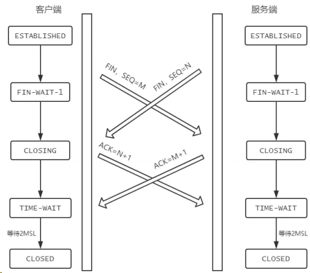

## 9.说说半连接队列和 SYN Flood 攻击的关系

三次握手前，服务端的状态从 CLOSED 变为 LISTEN , 同时在内部创建了两个队列：半连接队列和全连接队列，即 SYN 队列和 ACCEPT 队列。

### 半连接队列

当客户端发送 SYN 到服务端，服务端收到以后回复 ACK 和 SYN ，状态由 LISTEN 变为 SYN_RCVD ，此时这个连接就被推入了 SYN 队列，也就是半连接队列。

### 全连接队列

当客户端返回 ACK , 服务端接收后，三次握手完成。这个时候连接等待被具体的应用取走，在被取走之前，它会被推入另外一个 TCP 维护的队列，也就是全连接队列(Accept Queue)。

### SYN Flood 攻击原理

SYN Flood 属于典型的 DoS/DDoS 攻击。其攻击的原理很简单，就是用客户端在短时间内伪造大量不存在的 IP 地址，并向服务端疯狂发送 SYN 。对于服务端而言，会产生两个危险的后果：

1）处理大量的 SYN 包并返回对应 ACK , 势必有大量连接处于 SYN_RCVD 状态，从而占满整个半连接队列，无法处理正常的请求。

2）由于是不存在的 IP，服务端长时间收不到客户端的 ACK ，会导致服务端不断重发数据，直到耗尽服务端的资源。

## 10.如何应对 SYN Flood 攻击？

- 增加 SYN 连接，也就是增加半连接队列的容量。
- 减少 SYN + ACK 重试次数，避免大量的超时重发。
- 利用 SYN Cookie 技术，在服务端接收到 SYN 后不立即分配连接资源，而是根据这个 SYN 计算出一个 Cookie，连同第二次握手回复给客户端，在客户端回复 ACK 的时候带上这个 Cookie 值，服务端验证 Cookie 合法之后才分配连接资源。

## 11.介绍一下 TCP 报文头部的字段

报文头部结构如下(单位为字节)：

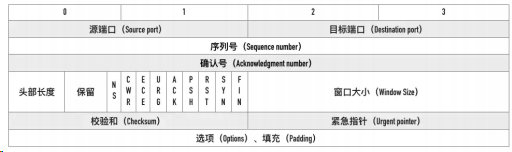

### 源端口、目标端口

如何标识唯一标识一个连接？答案是 TCP 连接的 四元组 ——源 IP、源端口、目标 IP 和目标端口。

那 TCP 报文怎么没有源 IP 和目标 IP 呢？这是因为在 IP 层就已经处理了 IP 。TCP 只需要记录两者的端口即可。

### 序列号

即 Sequence number , 指的是本报文段第一个字节的序列号。

从图中可以看出，序列号是一个长为 4 个字节，也就是 32 位的无符号整数，表示范围为 0 ~ 2^32 - 1。

如果到达最大值了后就循环到 0。

序列号在 TCP 通信的过程中有两个作用：

- 1.在 SYN 报文中交换彼此的初始序列号。
- 2.保证数据包按正确的顺序组装。

### ISN

即 Initial Sequence Number（初始序列号） ,在三次握手的过程当中，双方会用过 SYN 报文来交换彼此的 ISN 。

ISN 并不是一个固定的值，而是每 4 ms 加一，溢出则回到 0，这个算法使得猜测 ISN 变得很困难。那为什么要这么做？

如果 ISN 被攻击者预测到，要知道源 IP 和源端口号都是很容易伪造的，当攻击者猜测 ISN 之后，直接伪造一个 RST 后，就可以强制连接关闭的，这是非常危险的。

而动态增长的 ISN 大大提高了猜测 ISN 的难度。

### 确认号

即 ACK(Acknowledgment number) 。用来告知对方下一个期望接收的序列号，小于 ACK 的所有字节已经全部收到。

### 标记位

常见的标记位有 SYN , ACK , FIN , RST , PSH 。

SYN 和 ACK 已经在上文说过，后三个解释如下: FIN ： 即 Finish，表示发送方准备断开连接。

- RST ：即 Reset，用来强制断开连接。
- PSH ： 即 Push, 告知对方这些数据包收到后应该马上交给上层的应用，不能缓存。

### 窗口大小

占用两个字节，也就是 16 位，但实际上是不够用的。因此 TCP 引入了窗口缩放的选项，作为窗口缩放的比例因子，这个比例因子的范围在 0 ~ 14，比例因子可以将窗口的值扩大为原来的 2 ^ n 次方。

### 校验和

占用两个字节，防止传输过程中数据包有损坏，如果遇到校验和有差错的报文，TCP 直接丢弃之，等待重传。

### 可选项

可选项的格式如下:

- 种类（Kind）1byle
- 长度（Length）1 byte
- 值（value）

常用的可选项有以下几个:

- TimeStamp: TCP 时间戳，后面详细介绍。
- MSS: 指的是 TCP 允许的从对方接收的最大报文段。
- SACK: 选择确认选项。
- Window Scale： 窗口缩放选项。

## 12.说说 TCP 快速打开的原理(TFO)

第一节讲了 TCP 三次握手，可能有人会说，每次都三次握手好麻烦呀！能不能优化一点？

可以啊。今天来说说这个优化后的 TCP 握手流程，也就是 TCP 快速打开(TCP Fast Open, 即 TFO)的原理。

优化的过程是这样的，还记得我们说 SYN Flood 攻击时提到的 SYN Cookie 吗？这个 Cookie 可不是浏览器的 Cookie , 用它同样可以实现 TFO。

### 1）TFO 流程

#### 首轮三次握手

首先客户端发送 SYN 给服务端，服务端接收到。

注意哦！现在服务端不是立刻回复 SYN + ACK，而是通过计算得到一个 SYN Cookie , 将这个 Cookie 放到 TCP 报文的 Fast Open 选项中，然后才给客户端返回。

客户端拿到这个 Cookie 的值缓存下来。后面正常完成三次握手。

首轮三次握手就是这样的流程。而后面的三次握手就不一样啦！

#### 后面的三次握手

在后面的三次握手中，客户端会将之前缓存的 Cookie 、 SYN 和 HTTP 请求 (是的，你没看错)发送给服务端，服务端验证了 Cookie 的合法性，如果不合法直接丢弃；如果是合法的，那么就正常返回 SYN + ACK 。

重点来了，现在服务端能向客户端发 HTTP 响应了！这是最显著的改变，三次握手还没建立，仅仅验证了 Cookie 的合法性，就可以返回 HTTP 响应了。

当然，客户端的 ACK 还得正常传过来，不然怎么叫三次握手嘛。

流程如下：

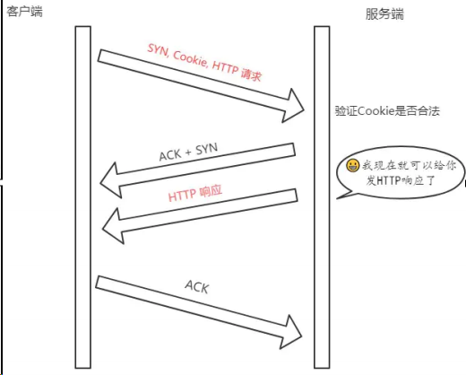

注意: 客户端最后握手的 ACK 不一定要等到服务端的 HTTP 响应到达才发送，两个过程没有任何关系。

### 2）TFO 的优势

TFO 的优势并不在与首轮三次握手，而在于后面的握手，在拿到客户端的 Cookie 并验证通过以后，可以直接返回 HTTP 响应，充分利用了 1 个 RTT(Round-Trip Time，往返时延)的时间提前进行数据传输，积累起来还是一个比较大的优势。

## 13.能不能说说 TCP 报文中时间戳的作用？

timestamp 是 TCP 报文首部的一个可选项，一共占 10 个字节，格式如下:

```bash
kind(1 字节) + length(1 字节) + info(8 个字节)
```

其中 kind = 8， length = 10， info 有两部分构成: timestamp 和 timestamp echo，各占 4 个字节。

那么这些字段都是干嘛的呢？它们用来解决那些问题？

接下来我们就来一一梳理，TCP 的时间戳主要解决两大问题:

- 计算往返时延 RTT(Round-Trip Time)
- 防止序列号的回绕问题

### 计算往返时延 RTT

在没有时间戳的时候，计算 RTT 会遇到的问题如下图所示:

如果以第一次发包为开始时间的话，就会出现左图的问题，RTT 明显偏大，开始时间应该采用第二次的；

如果以第二次发包为开始时间的话，就会导致右图的问题，RTT 明显偏小，开始时间应该采用第一次发包的。

实际上无论开始时间以第一次发包还是第二次发包为准，都是不准确的。

那这个时候引入时间戳就很好的解决了这个问题。

比如现在 a 向 b 发送一个报文 s1，b 向 a 回复一个含 ACK 的报文 s2 那么：

- step 1: a 向 b 发送的时候， timestamp 中存放的内容就是 a 主机发送时的内核时刻 ta1 。
- step 2: b 向 a 回复 s2 报文的时候， timestamp 中存放的是 b 主机的时刻 tb , timestamp echo 字段为从 s1 报文中解析出来的 ta1。
- step 3: a 收到 b 的 s2 报文之后，此时 a 主机的内核时刻是 ta2, 而在 s2 报文中的 timestamp
- echo 选项中可以得到 ta1 , 也就是 s2 对应的报文最初的发送时刻。然后直接采用 ta2 - ta1 就得到了 RTT 的值。

### 防止序列号回绕问题

现在我们来模拟一下这个问题。

序列号的范围其实是在 0 ~ 2 ^ 32 - 1, 为了方便演示，我们缩小一下这个区间，假设范围是 0 ~ 4，那么到达 4 的时候会回到 0。

| 第几次发包 | 发送字节 | 对应序列号 | 状态                      |
| ---------- | -------- | ---------- | ------------------------- |
| 1          | 0 ~ 1    | 0 ~ 1      | 成功接收                  |
| 2          | 1 ~ 2    | 1 ~ 2      | 滞留在网络中              |
| 3          | 2 ~ 3    | 2 ~ 3      | 成功接收                  |
| 4          | 3 ~ 4    | 3 ~ 4      | 成功接收                  |
| 5          | 4 ~ 5    | 0 ~ 1      | 成功接收，序列号从 0 开始 |
| 6          | 5 ~ 6    | 1 ~ 2      | ？？？                    |

假设在第 6 次的时候，之前还滞留在网路中的包回来了，那么就有两个序列号为 1 ~ 2 的数据包了，怎么区分谁是谁呢？这个时候就产生了序列号回绕的问题。

那么用 timestamp 就能很好地解决这个问题，因为每次发包的时候都是将发包机器当时的内核时间记录在报文中，那么两次发包序列号即使相同，时间戳也不可能相同，这样就能够区分开两个数据包了。

那么用 timestamp 就能很好地解决这个问题，因为每次发包的时候都是将发包机器当时的内核时间记录在报文中，那么两次发包序列号即使相同，时间戳也不可能相同，这样就能够区分开两个数据包了。

## 14.TCP 的超时重传时间是如何计算的？

TCP 具有超时重传机制，即间隔一段时间没有等到数据包的回复时，重传这个数据包。

那么这个重传间隔是如何来计算的呢？

今天我们就来讨论一下这个问题。

这个重传间隔也叫做超时重传时间(Retransmission TimeOut, 简称 RTO)，它的计算跟上一节提到的 RTT 密切相关。这里我们将介绍两种主要的方法，一个是经典方法，一个是标准方法。

### 经典方法

经典方法引入了一个新的概念——SRTT(Smoothed round trip time，即平滑往返时间)，没产生一次新的 RTT. 就根据一定的算法对 SRTT 进行更新，具体而言，计算方式如下(SRTT 初始值为 0):

```bash
SRTT = (α * SRTT) + ((1 - α) * RTT)
```

其中，α 是平滑因子，建议值是 0.8 ，范围是 0.8 ~ 0.9 。

拿到 SRTT，我们就可以计算 RTO 的值了:

```bash
RTO = min(ubound, max(lbound, β * SRTT))
```

β 是加权因子，一般为 1.3 ~ 2.0 ， lbound 是下界，ubound 是上界。

其实这个算法过程还是很简单的，但是也存在一定的局限，就是在 RTT 稳定的地方表现还可以，而在 RTT 变化较大的地方就不行了，因为平滑因子 α 的范围是 0.8 ~ 0.9 , RTT 对于 RTO 的影响太小。

### 标准方法

为了解决经典方法对于 RTT 变化不敏感的问题，后面又引出了标准方法，也叫 Jacobson / Karels 算法 。

一共有三步。

#### 第一步: 计算 SRTT ，公式如下：

```bash
SRTT = (1 - α) * SRTT + α * RTT
```

注意这个时候的 α 跟经典方法中的 α 取值不一样了，建议值是 1/8 ，也就是 0.125 。

#### 第二步: 计算 RTTVAR (round-trip time variation)这个中间变量。

β 建议值为 0.25。这个值是这个算法中出彩的地方，也就是说，它记录了最新的 RTT 与当前 SRTT 之间的差值，给我们在后续感知到 RTT 的变化提供了抓手。

#### 第三步: 计算最终的 RTO :

```bash
RTO = µ * SRTT + ∂ * RTTVAR
```

µ 建议值取 1 , ∂ 建议值取 4 。

这个公式在 SRTT 的基础上加上了最新 RTT 与它的偏移，从而很好的感知了 RTT 的变化，这种算法下，RTO 与 RTT 变化的差值关系更加密切。

## 15.能不能说一说 TCP 的流量控制？

对于发送端和接收端而言，TCP 需要把发送的数据放到发送缓存区, 将接收的数据放到接收缓存区。

而流量控制索要做的事情，就是在通过接收缓存区的大小，控制发送端的发送。如果对方的接收缓存区满了，就不能再继续发送了。

要具体理解流量控制，首先需要了解 滑动窗口 的概念。

### TCP 滑动窗口

TCP 滑动窗口分为两种: 发送窗口和接收窗口。

#### （1）发送窗口

发送端的滑动窗口结构如下:

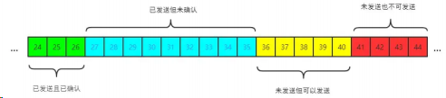

其中包含四大部分：

- 已发送且已确认
- 已发送但未确认
- 未发送但可以发送
- 未发送也不可以发送

其中有一些重要的概念，我标注在图中：

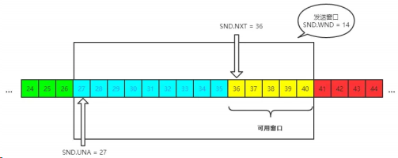

发送窗口就是图中被框住的范围。SND 即 send , WND 即 window , UNA 即 unacknowledged , 表示未被确认，NXT 即 next , 表示下一个发送的位置。

#### （2）接收窗口

接收端的窗口结构如下：

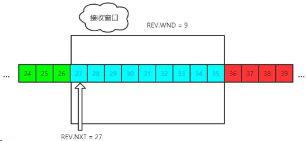

REV 即 receive ，NXT 表示下一个接收的位置，WND 表示接收窗口大小。

### 流量控制过程

这里我们不用太复杂的例子，以一个最简单的来回来模拟一下流量控制的过程，方便大家理解。

首先双方三次握手，初始化各自的窗口大小，均为 200 个字节。

假如当前发送端给接收端发送 100 个字节，那么此时对于发送端而言，SND.NXT 当然要右移 100 个字节，也就是说当前的 可用窗口 减少了 100 个字节，这很好理解。

现在这 100 个到达了接收端，被放到接收端的缓冲队列中。不过此时由于大量负载的原因，接收端处理不了这么多字节，只能处理 40 个字节，剩下的 60 个字节被留在了缓冲队列中。

注意了，此时接收端的情况是处理能力不够用啦，你发送端给我少发点，所以此时接收端的接收窗口应该缩小，具体来说，缩小 60 个字节，由 200 个字节变成了 140 字节，因为缓冲队列还有 60 个字节没被应用拿走。

因此，接收端会在 ACK 的报文首部带上缩小后的滑动窗口 140 字节，发送端对应地调整发送窗口的大小为 140 个字节。

此时对于发送端而言，已经发送且确认的部分增加 40 字节，也就是 SND.UNA 右移 40 个字节，同时发送窗口缩小为 140 个字节。

这也就是流量控制的过程。尽管回合再多，整个控制的过程和原理是一样的。

## 16.能不能说说 TCP 的拥塞控制？

上一节所说的流量控制发生在发送端跟接收端之间，并没有考虑到整个网络环境的影响，如果说当前网络特别差，特别容易丢包，那么发送端就应该注意一些了。而这，也正是 拥塞控制 需要处理的问题。

对于拥塞控制来说，TCP 每条连接都需要维护两个核心状态:

- 拥塞窗口（Congestion Window，cwnd）
- 慢启动阈值（Slow Start Threshold，ssthresh）

涉及到的算法有这几个:

- 慢启动
- 拥塞避免
- 快速重传和快速恢复

接下来，我们就来一一拆解这些状态和算法。首先，从拥塞窗口说起。

### 拥塞窗口

拥塞窗口（Congestion Window，cwnd）是指目前自己还能传输的数据量大小。

那么之前介绍了接收窗口的概念，两者有什么区别呢？

- 接收窗口(rwnd)是 接收端 给的限制
- 拥塞窗口(cwnd)是 发送端 的限制

限制谁呢？

限制的是 发送窗口 的大小。

有了这两个窗口，如何来计算 发送窗口 ？

```bash
发送窗口大小 = min(rwnd, cwnd)
```

取两者的较小值。而拥塞控制，就是来控制 cwnd 的变化。

### 慢启动

刚开始进入传输数据的时候，你是不知道现在的网路到底是稳定还是拥堵的，如果做的太激进，发包太急，那么疯狂丢包，造成雪崩式的网络灾难。

因此，拥塞控制首先就是要采用一种保守的算法来慢慢地适应整个网路，这种算法叫 慢启动 。运作过程如下:

- 首先，三次握手，双方宣告自己的接收窗口大小
- 双方初始化自己的拥塞窗口(cwnd)大小
- 在开始传输的一段时间，发送端每收到一个 ACK，拥塞窗口大小加 1，也就是说，每经过一个 RTT，cwnd 翻倍。如果说初始窗口为 10，那么第一轮 10 个报文传完且发送端收到 ACK 后，cwnd 变为 20，第二轮变为 40，第三轮变为 80，依次类推。

难道就这么无止境地翻倍下去？当然不可能。它的阈值叫做慢启动阈值，当 cwnd 到达这个阈值之后，好比踩了下刹车，别涨了那么快了，老铁，先 hold 住！

在到达阈值后，如何来控制 cwnd 的大小呢？

这就是拥塞避免做的事情了。

### 拥塞避免

原来每收到一个 ACK，cwnd 加 1，现在到达阈值了，cwnd 只能加这么一点: 1 / cwnd。那你仔细算算，一轮 RTT 下来，收到 cwnd 个 ACK, 那最后拥塞窗口的大小 cwnd 总共才增加 1。

也就是说，以前一个 RTT 下来， cwnd 翻倍，现在 cwnd 只是增加 1 而已。

当然，慢启动和拥塞避免是一起作用的，是一体的。

### 快速重传和快速恢复

#### 快速重传

在 TCP 传输的过程中，如果发生了丢包，即接收端发现数据段不是按序到达的时候，接收端的处理是重复发送之前的 ACK。

比如第 5 个包丢了，即使第 6、7 个包到达的接收端，接收端也一律返回第 4 个包的 ACK。当发送端收到 3 个重复的 ACK 时，意识到丢包了，于是马上进行重传，不用等到一个 RTO 的时间到了才重传。

这就是快速重传，它解决的是是否需要重传的问题。

#### 选择性重传

那你可能会问了，既然要重传，那么只重传第 5 个包还是第 5、6、7 个包都重传呢？
当然第 6、7 个都已经到达了，TCP 的设计者也不傻，已经传过去干嘛还要传？干脆记录一下哪些包到了，哪些没到，针对性地重传。

在收到发送端的报文后，接收端回复一个 ACK 报文，那么在这个报文首部的可选项中，就可以加上 SACK 这个属性，通过 left edge 和 right edge 告知发送端已经收到了哪些区间的数据报。

因此，即使第 5 个包丢包了，当收到第 6、7 个包之后，接收端依然会告诉发送端，这两个包到了。剩下第 5 个包没到，就重传这个包。这个过程也叫做选择性重传(SACK，Selective Acknowledgment)，它解决的是如何重传的问题。

#### 快速恢复

当然，发送端收到三次重复 ACK 之后，发现丢包，觉得现在的网络已经有些拥塞了，自己会进入快速恢复阶段。

在这个阶段，发送端如下改变：

- 拥塞阈值降低为 cwnd 的一半
- cwnd 的大小变为拥塞阈值
- cwnd 线性增加

以上就是 TCP 拥塞控制的经典算法: 慢启动、拥塞避免、快速重传和快速恢复。

## 17.能不能说说 Nagle 算法和延迟确认？

### Nagle 算法

试想一个场景，发送端不停地给接收端发很小的包，一次只发 1 个字节，那么发 1 千个字节需要发 1000 次。这种频繁的发送是存在问题的，不光是传输的时延消耗，发送和确认本身也是需要耗时的，频繁的发送接收带来了巨大的时延。

而避免小包的频繁发送，这就是 Nagle 算法要做的事情。

具体来说，Nagle 算法的规则如下:

当第一次发送数据时不用等待，就算是 1byte 的小包也立即发送

后面发送满足下面条件之一就可以发了:

数据包大小达到最大段大小(Max Segment Size, 即 MSS)

之前所有包的 ACK 都已接收到

### 延迟确认

试想这样一个场景，当我收到了发送端的一个包，然后在极短的时间内又接收到了第二个包，那我是一个个地回复，还是稍微等一下，把两个包的 ACK 合并后一起回复呢？

延迟确认(delayed ack)所做的事情，就是后者，稍稍延迟，然后合并 ACK，最后才回复给发送端。TCP 要求这个延迟的时延必须小于 500ms，一般操作系统实现都不会超过 200ms。

不过需要主要的是，有一些场景是不能延迟确认的，收到了就要马上回复:

- 接收到了大于一个 frame 的报文，且需要调整窗口大小
- TCP 处于 quickack 模式（通过 tcp_in_quickack_mode 设置）
- 发现了乱序包

### 两者一起使用会怎样？

前者意味着延迟发，后者意味着延迟接收，会造成更大的延迟，产生性能问题。

## 18.如何理解 TCP 的 keep-alive？

大家都听说过 http 的 keep-alive , 不过 TCP 层面也是有 keep-alive 机制，而且跟应用层不太一样。

试想一个场景，当有一方因为网络故障或者宕机导致连接失效，由于 TCP 并不是一个轮询的协议，在下一个数据包到达之前，对端对连接失效的情况是一无所知的。

这个时候就出现了 keep-alive, 它的作用就是探测对端的连接有没有失效。

在 Linux 下，可以这样查看相关的配置：

```bash
sudo sysctl -a | grep keepalive
// 每隔 7200 s 检测一次
net.ipv4.tcp_keepalive_time = 7200
// 一次最多重传 9 个包
net.ipv4.tcp_keepalive_probes = 9
// 每个包的间隔重传间隔 75 s
net.ipv4.tcp_keepalive_intvl = 75
```

不过，现状是大部分的应用并没有默认开启 TCP 的 keep-alive 选项，为什么？

站在应用的角度：

- 7200s 也就是两个小时检测一次，时间太长
- 时间再短一些，也难以体现其设计的初衷, 即检测长时间的死连接

## UDP

### 1.1 面向报文

UDP 是一个面向报文（报文可以理解为一段段的数据）的协议。意思就是 UDP 只是报文的搬运工，不会对报文进行任何拆分和拼接操作

具体来说

- 在发送端，应用层将数据传递给传输层的 UDP 协议， UDP 只会给数据增加一个 UDP 头标识下是 UDP 协议，然后就传递给网络层了
- 在接收端，网络层将数据传递给传输层， UDP 只去除 IP 报文头就传递给应用层，不会任何拼接操作

### 1.2 不可靠性

- UDP 是无连接的，也就是说通信不需要建立和断开连接。
- UDP 也是不可靠的。协议收到什么数据就传递什么数据，并且也不会备份数据，对方能不能收到是不关心的
- UDP 没有拥塞控制，一直会以恒定的速度发送数据。即使网络条件不好，也不会对发送速率进行调整。这样实现的弊端就是在网络条件不好的情况下可能会导致丢包，但是优点也很明显，在某些实时性要求高的场景（比如电话会议）就需要使用 UDP 而不是 TCP

### 1.3 高效

因为 UDP 没有 TCP 那么复杂，需要保证数据不丢失且有序到达。所以 UDP 的头部开销小，只有八字节，相比 TCP 的至少二十字节要少得多，在传输数据报文时是很高效的

#### 头部包含了以下几个数据

- 两个十六位的端口号，分别为源端口（可选字段）和目标端口 整个数据报文的长度
- 整个数据报文的检验和（ IPv4 可选 字段），该字段用于发现头部信息和数据中的错误

### 1.4 传输方式

UDP 不止支持一对一的传输方式，同样支持一对多，多对多，多对一的方式，也就是说 UDP 提供了单播，多播，广播的功能

### 如何理解 URI？

URI, 全称为(Uniform Resource Identifier), 也就是统一资源标识符，它的作用很简单，就是区分互联网上不同的资源。

但是，它并不是我们常说的 网址 , 网址指的是 URL , 实际上 URI 包含了 URN 和 URL 两个部分，由于 URL 过于普及，就默认将 URI 视为 URL 了。

#### URI 的结构

URI 真正最完整的结构是这样的。

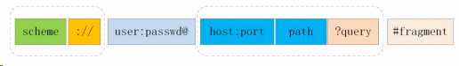

可能你会有疑问，好像跟平时见到的不太一样啊！先别急，我们来一一拆解。

- scheme 表示协议名，比如 http , https , file 等等。后面必须和 :// 连在一起。
- user:passwd@ 表示登录主机时的用户信息，不过很不安全，不推荐使用，也不常用。
- host:port 表示主机名和端口。
- path 表示请求路径，标记资源所在位置。
- query 表示查询参数，为 key=val 这种形式，多个键值对之间用 & 隔开。
- fragment 表示 URI 所定位的资源内的一个锚点，浏览器可以根据这个锚点跳转到对应的位置。

举个例子：

```bash
https://www.baidu.com/s?wd=HTTP&rsv_spt=1
```

这个 URI 中， https 即 scheme 部分， www.baidu.com 为 host:port 部分（注意，http 和 https 的默认端口分别为 80、443）， /s 为 path 部分，而 wd=HTTP&rsv_spt=1 就是 query 部分。

#### URI 编码

URI 只能使用 ASCII , ASCII 之外的字符是不支持显示的，而且还有一部分符号是界定符，如果不加以处理就会导致解析出错。

因此，URI 引入了 编码 机制，将所有非 ASCII 码字符和界定符转为十六进制字节值，然后在前面加个 % 。

如，空格被转义成了 %20 ，三元被转义成了 %E4%B8%89%E5%85%83 。

## WebSocket 的实现和应用

::: details 查看参考回答

参考回答：

### (1)什么是 WebSocket?

WebSocket 是 HTML5 中的协议，支持持久连续，http 协议不支持持久性连接。

Http1.0 和 HTTP1.1 都不支持持久性的链接，HTTP1.1 中的 keep-alive，将多个 http 请求合并为 1 个

### (2)WebSocket 是什么样的协议，具体有什么优点？

HTTP 的生命周期通过 Request 来界定，也就是 Request 一个 Response，那么在 Http1.0 协议中，这次 Http 请求就结束了。在 Http1.1 中进行了改进，是的有一个 connection：Keep-alive，也就是说，在一个 Http 连接中，可以发送多个 Request，接收多个 Response。但是必须记住，在 Http 中一个 Request 只能对应有一个 Response，而且这个 Response 是被动的，不能主动发起。

WebSocket 是基于 Http 协议的，或者说借用了 Http 协议来完成一部分握手，在握手阶段与 Http 是相同的。我们来看一个 websocket 握手协议的实现，基本是 2 个属性，upgrade，connection。

基本请求如下：

```bash
GET /chat HTTP/1.1
Host: server.example.com
Upgrade: websocket
Connection: Upgrade
Sec-WebSocket-Key: x3JJHMbDL1EzLkh9GBhXDw==
Sec-WebSocket-Protocol: chat, superchat
Sec-WebSocket-Version: 13
Origin: http://example.com
```

多了下面 2 个属性：

```bash
Upgrade:webSocket
Connection:Upgrade
```

告诉服务器发送的是 websocket

```bash
Sec-WebSocket-Key: x3JJHMbDL1EzLkh9GBhXDw==
Sec-WebSocket-Protocol: chat, superchat
Sec-WebSocket-Version: 13
```

:::

## 一个图片 url 访问后直接下载怎样实现？

参考回答：
请求的返回头里面，用于浏览器解析的重要参数就是 OSS 的 API 文档里面的返回 http 头，决定用户下载行为的参数。

下载的情况下：

1. x-oss-object-type: Normal
2. x-oss-request-id: 598D5ED34F29D01FE2925F41
3. x-oss-storage-class: Standard

## cookie

HTTP 协议本身是无状态的，而 Cookie 是在 HTTP 中的㇐个请求头，用来保存㇐小块数据，Cookie 会传递到服务端，用来作为会话标识。服务端可以通过
Set-Cookie 来设置 cookie，而客户端网页 也可以通过 document.cookie 来操作 cookie。

### document 操作 cookie

需要问 AI 完善.....

```js
document.cookie;
```

### cookie 的过期控制

cookie 可以通过 max-age 和 expires 控制过期时间，如果不设置过期时间，cookie 会在浏览器完全关闭时失效。

### 防止 cookie 被 javascript 脚本操作

可以在 Set-Cookie 时使用 HttpOnly 控制。㇐定程度上缓解 XSS 攻击

### 服务端 Set-Cookie

㇐个 Set-Cookie 也只能设置㇐个 cookie，如果需要设置多个，则返回多个 Set-Cookie 头。

Set-Cookie 和 document.cookie 操作类似，但是要注意两个选项，分别是 HttpOnly 和 SameSite， HttpOnly 在上㇐小节说过了。SameSite 则是预防 CSRF 攻击的㇐种手段，允许服务器要求某个 cookie 在跨站请求时不会被发送。

● SameSite=Strict：跨站请求时，不携带 cookie。
● SameSite=Lax：宽松的，跨站请求时，也不会携带 cookie。但是从外部站点导航到本站点时会携带 cookie。Lax 是高版本 Chrome（80 版本以上）的
默认设置。

Lax 保证了这种场景可用：比如你在 github 已经登录过了，现在希望通过另外㇐个网站的链接跳转到 github，并且能保持 gitlab 的登录态，就需要用到
Lax。而 Strict 会阻止这㇐行为，这可能会 要求你重新登录 github。

● SameSite=None：不做限制，跨站请求时，会携带 cookie。使用 SameSite=None 时，需要配合 Secure 使用，也就是要求 Https 协议下才能使用 None。

### 跨站 cookie

恶意的跨站传递 cookie

在被恶意注入的情况下（比如 XSS），就可能导致本站点的 cookie 泄露。比如㇐个论坛留⾔板块，被 XSS 注入了㇐段脚本，脚本会动态加载㇐张图片，图片的地址可能是⿊客服务。

这样㇐来，只要用户打开留⾔板块，自己的 cookie 信息就泄露了，就有可能被⿊客冒充身份，造成损失。

### 业务需要的共享 cookie

为了满⾜类似于单点登录这样的功能，我们在统㇐认证平台 authgateway.myenterprise.com 登录后，希望公司内部另㇐个站点 other.myenterprise.com 也能共享这种登录状态。那么服务器端在 authgateway.myenterprise.com 登录成功后，应该 Set-Cookie 时将 domain 部分设置为 myenterprise.com，这样 myenterprise.com 的各个子域名才能共享登录状态。

但是这样也有⻛险，㇐旦某个子站被 XSS，就有可能全部被攻击（Cookie 作用域攻击）。最好启用全站 HTTPS+Secure，也必须适当缩小 cookie 的作用域
（限制 domain 和 path）。

### cookie 篡改

这个就很好理解了，document.cookie 是可以操作 cookie 的，这就留下了㇐些隐患，对于关键 cookie 信息，必须启用 HttpOnly 防护。

### cookie 劫持

如果没有 HTTPS 证书的保障，cookie 也是明文传输，相当于裸奔。除了 XSS 攻击劫持 cookie，攻击者还可以通过中间⼈攻击获取 HTTP 报文中的
cookie。对于这些劫持情况，应该对 cookie 加密/ 签名或者采用 Https 防范！强缓存和协商缓存

## cookie 和 session 的区别，localstorage 和 sessionstorage 的区别

参考回答：

Cookie 和 session 都可用来存储用户信息，cookie 存放于客户端，session 存放于服务器端，因为 cookie 存放于客户端有可能被窃取，所以 cookie 一般用来存放不敏感的信息，比如用户设置的网站主题，敏感的信息用 session 存储，比如用户的登陆信息，session 可以存放于文件，数据库，内存中都可以，cookie 可以服务器端响应的时候设置，也可以客户端通过 JS 设置 cookie 会在请求时在 http 首部发送给客户端，cookie 一般在客户端有大小限制，一般为 4K，

### 下面从几个方向区分一下 cookie，localstorage，sessionstorage 的区别

1、生命周期：

- Cookie：可设置失效时间，否则默认为关闭浏览器后失效
- Localstorage:除非被手动清除，否则永久保存
- Sessionstorage：仅在当前网页会话下有效，关闭页面或浏览器后就会被清除

2、存放数据：

- Cookie：4k 左右
- Localstorage 和 sessionstorage：可以保存 5M 的信息

3、http 请求：

- Cookie：每次都会携带在 http 头中，如果使用 cookie 保存过多数据会带来性能问题
- 其他两个：仅在客户端即浏览器中保存，不参与和服务器的通信

4、易用性：

- Cookie：需要程序员自己封装，原生的 cookie 接口不友好
- 其他两个：即可采用原生接口，亦可再次封装

5、应用场景：

从安全性来说，因为每次 http 请求都回携带 cookie 信息，这样子浪费了带宽，所以 cookie 应该尽可能的少用，此外 cookie 还需要指定作用域，不可以跨域调用，限制很多，但是用户识别用户登陆来说，cookie 还是比 storage 好用，其他情况下可以用 storage，localstorage 可以用来在页面传递参数，sessionstorage 可以用来保存一些临时的数据，防止用户刷新页面后丢失了一些参数。

## Cookie、sessionStorage、localStorage 的区别

::: details 查看参考回答

参考回答：

共同点：都是保存在浏览器端，并且是同源的

Cookie：cookie 数据始终在同源的 http 请求中携带（即使不需要），即 cookie 在浏览器和服务器间来回传递。而 sessionStorage 和 localStorage 不会自动把数据发给服务器，仅在本地保存。cookie 数据还有路径（path）的概念，可以限制 cookie 只属于某个路径下,存储的大小很小只有 4K 左右。（key：可以在浏览器和服务器端来回传递，存储容量小，只有大约 4K 左右）

sessionStorage：仅在当前浏览器窗口关闭前有效，自然也就不可能持久保持，localStorage：始终有效，窗口或浏览器关闭也一直保存，因此用作持久数据；

cookie 只在设置的 cookie 过期时间之前一直有效，即使窗口或浏览器关闭。（key：本身就是一个回话过程，关闭浏览器后消失，session 为一个回话，当页面不同即使是同一页面打开两次，也被视为同一次回话）

localStorage：localStorage 在所有同源窗口中都是共享的；cookie 也是在所有同源窗口中都是共享的。（key：同源窗口都会共享，并且不会失效，不管窗口或者浏览器关闭与否都会始终生效）

### 补充说明一下 cookie 的作用：

#### 保存用户登录状态

例如将用户 id 存储于一个 cookie 内，这样当用户下次访问该页面时就不需要重新登录了，现在很多论坛和社区都提供这样的功能。 cookie 还可以设置过期时间，当超过时间期限后，cookie 就会自动消失。因此，系统往往可以提示用户保持登录状态的时间：常见选项有一个月、三个 月、一年等。

#### 跟踪用户行为

例如一个天气预报网站，能够根据用户选择的地区显示当地的天气情况。如果每次都需要选择所在地是烦琐的，当利用了 cookie 后就会显得很人性化了，
系统能够记住上一次访问的地区，当下次再打开该页面时，它就会自动显示上次用户所在地区的天气情况。因为一切都是在后 台完成，所以这样的页面就像为某个用户所定制的一样，使用起来非常方便定制页面。如果网站提供了换肤或更换布局的功能，那么可以使用 cookie 来记录用户的选项，例如：背景色、分辨率等。当用户下次访问时，仍然可以保存上一次访问的界面风格。

:::

### 说一下 http2.0

::: details 查看参考回答

首先补充一下，http 和 https 的区别，相比于 http,https 是基于 ssl 加密的 http 协议
简要概括：http2、0 是基于 1999 年发布的 http1、0 之后的首次更新。

提升访问速度（可以对于，请求资源所需时间更少，访问速度更快，相比 http1、0）
允许多路复用：多路复用允许同时通过单一的 HTTP/2 连接发送多重请求-响应信息。

改善了：在 http1、1 中，浏览器客户端在同一时间，针对同一域名下的请求有一定数量限制（连接数量），
超过限制会被阻塞。

二进制分帧：HTTP2、0 会将所有的传输信息分割为更小的信息或者帧，并对他们进行二进制编码、首部压缩、服务器端推送

:::

### 补充 400 和 401、403 状态码

::: details 查看参考回答

#### (1)400 状态码：请求无效

##### 产生原因

前端提交数据的字段名称和字段类型与后台的实体没有保持一致

前端提交到后台的数据应该是 json 字符串类型，但是前端没有将对象 JSON.stringify 转化
成字符串。

##### 解决方法

对照字段的名称，保持一致性

将 obj 对象通过 JSON.stringify 实现序列化

#### (2)401 状态码：当前请求需要用户验证

#### (3)403 状态码：服务器已经得到请求，但是拒绝执行

:::

### 状态码 304 和 200

**考察点：http 状态码**

::: details 查看参考回答

状态码 200：请求已成功，请求所希望的响应头或数据体将随此响应返回。即返回的数据为全量的数据，如果文件不通过 GZIP 压缩的话，文件是多大，则要有多大传输量。

状态码 304：如果客户端发送了一个带条件的 GET 请求且该请求已被允许，而文档的内容（自上次访问以来或者根据请求的条件）并没有改变，则服务器应当返回这个状态码。即客户端和服务器端只需要传输很少的数据量来做文件的校验，如果文件没有修改过，则不需要返回全量的数据。

:::
