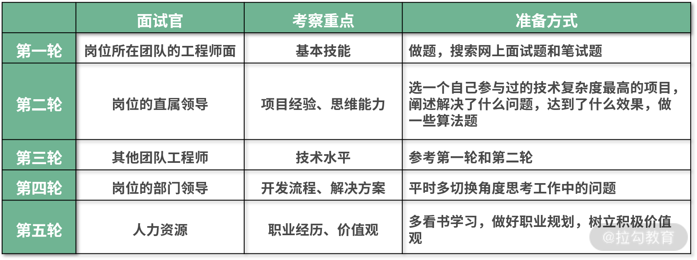

# 职业规划和面试技巧职业规划

这一课时我们继续抛开技术，聊聊前端工程师职业规划相关的内容。我不打算给你制定一个最优的进阶路线，因为每个工程师所处的环境、工作经历、职业目标都不一样，有的名校高学历，有的大厂背景，有的自学成才……并没有一个万金油的最优进阶路线。

虽然如此，但如果能明白核心问题，在职业生涯中做好关键选择，就能帮我们大大增加成功概率。具体核心问题包括下面 3 个：跳槽时机、公司选择及管理团队。

## 什么时机该跳槽？

近些年，“走出舒适区”这个言论经常被提及和推崇，但仔细推敲，这个论调似乎也有问题，人为什么要走出舒适圈，难道工作奋斗的目标不是为了生活得更舒服吗？

什么是舒适区？舒适区的工作一般具有以下几个特点：

- **重复度高**，不需要过多的思考和分析，按照之前的经验做就行了；
- **可替代性高**，市场上能轻易找到同类型的人才替代你的工作；
- **工作内容轻松**，当前工作对个人能力提升没有帮助。

定义完舒适区之后再回到开头提出的问题：为什么要走出舒适区？

因为大多数情况下停留在舒适区则意味着只顾短期利益而牺牲长期利益，导致一些看不见的风险。比如公司出现危机裁员，肯定会优先考虑工作量不饱和、可替代性强的员工，这些被裁的员工由于长期处于舒适区，能力没有随着年龄增长，也很难找到满意的工作。即使公司发展良好，处于舒适区的员工也会由于长期做重复性工作而导致产出价值较低或能力提升跟不上公司的发展速度，从而失去晋升的机会。

所以一定要理性地看待“钱多事少离家近”的工作，钱多和离家近肯定是好的，但事少对于个人的成长和晋升而言是个缺点，很容易把人困在舒适区里。

正确的做法应该是首先主动识别舒适区，做到“晴天修房顶”。比如，工作中的年/月度总结、每半年更新一次简历都是比较好的做法。在意识到处于舒适区的时候，一定要及时做出调整，比如调整自己的学习方向，向领导申请更有挑战的工作。如果在当前的工作环境中，能力和薪资都得不到有效增长时就可以考虑跳槽了，即使你现在仍处于高光时刻。

任何能帮助你成长的东西终究会变成你的阻碍，通过定期回顾来判断和跳出舒适区，就能实现个人的快速成长。

## 怎么选择公司？

当我们在选择是否加入一家公司的时候，可以从下面 4 个方面来考虑，按照考虑权重依次是：

```bash
岗位职责 > 直属领导  >  公司前景 > 行业趋势
```

### 岗位职责

理想的工作岗位既属于公司的核心业务，又能给自己带来成长。核心业务很好理解，就是能给公司创造较大价值的业务，有些岗位可能并不归属于具体业务，比如架构组、技术中台，那么可以看它服务的业务项目有哪些。

带来成长可以不光指技术，在工作前 3 年甚至前 5 年，核心关注点是技术，但越往后走，越要注重自身的综合能力，比如管理能力、产品思维、沟通能力。

岗位职责信息在招聘要求上一般不会写得很具体，所以在面试过程中要和面试官多沟通了解，比如项目用到了哪些技术栈？技术难点有哪些？产品的目标用户是谁？产品的营收或活跃用户数多少？

### 直属领导

直属领导这个因素可能是很多工程师容易忽略的因素，其实它至关重要。因为直属领导对你的关注和帮助会直接影响到你的成长速度和晋升速度，所以很多时候我们直接将直属领导称之为“老板”。理想的直属领导应该具有下面 3 个特点。

- 关注指导。工作受到领导的关注，业绩更容易被看到，出现的问题也更容易被及时指正和改进。如果你只是团队中的普通一员，没有受到太多关注，那么可以在做好本职工作的基础上，运用一些向上管理的技巧，比如主动向领导汇报工作，及时沟通工作中遇到的问题等方式来引起关注。

- 技术能力。跟着技术能力比较强的领导一起工作可以学习更多。

- 有话语权。只有领导的话语权足够大才能为你争取更多的利益。

关于直属领导的信息可以在面试阶段通过沟通询问来获取，比如询问公司的组织架构以及产品和业务，大概就能推知其话语权，又比如通过其他面试官来侧面打听直属领导的履历来判断他的技术能力。

### 公司前景

每一次跳槽选择公司的时候一定要慎重，主要原因不仅是怕被坑，还是因为你选择的每一家公司都会成为你的名片，你的职场履历会直接体现你的判断能力、职业规划及工作能力。从以下两个方面可以大体上判断公司的发展前景。

- 公司的使命是什么？它体现了公司发展的格局，如果公司只是为了上市或者融资的方式赚钱，那么这种只注重利益的公司一般难做成功，即使成功，发展空间也不会太大。

- 公司产品的用户是谁？如果公司产品面向企业，那么要考虑用户企业的营收能力以及对于产品的预算投入。如果是公司的产品面向个人用户，那么要考虑目标用户数量有多少，使用产品的频率如何。

另外补充两点：

- 不推荐去外包公司，外包公司工作强度大，不注重技术，对个人成长不利；

- 不要光凭公司名称来判断，有些软件公司可能并不注重技术。

### 行业趋势

“站在风口上，猪都能飞起来。”这句话很多人应该都听过，但少有人思考，如果风停了会怎么样？答案是鸟会飞得很高，猪会摔得很惨。

所以说行业只能算是公司发展的催化剂，不要觉得公司所处的行业好就一定会成功，行业更多地只能决定公司的发展上限。

常见的几个误区一定要警惕。

**不要觉得蓝海就是好的，红海就是差的**。红海虽然竞争压力大，但说明进入这个行业时机已经成熟，得到了市场的认可；而蓝海市场，很可能是因为技术不成熟，用户规模太小或产品实现成本太高等诸多因素形成的。中国的电商行业就是典型例子，当它是蓝海的时候，8848 之类的电商企业没有做成功，而阿里巴巴成功了，当它是红海的时候，拼多多又起来了。

**不要觉得市场广阔，公司的发展形式就一定大好**。商业不能完全靠想象，公司不一定能成为行业头部企业，即使成了也难以做到一家独大。

更现实的问题，如果蛋糕做大了，你能分多少？薪资福利一般可以参考同类型的大公司进行估算，比较难以估算的是股票期权，但可以根据市（估）值和占比进行估算。

总之，运气也是一种实力，这句话的正确解读应该是：首先要有足够的能力来识别什么是机遇，什么是“坑”，识别了机遇之后还要有足够的能力来抓住机遇。所以加入一个发展前景好的公司，在一些人看来是运气，很可能是别人主动思考的结果。

#### 怎么做好管理？

网上经常看到一个论调：“技术水平一般的程序员，年纪大了，应该考虑转管理”。这种观点属于典型的误人子弟。
首先我们切换到老板的视角来思考，如果你是老板，你是愿意提拔一个能力与业绩突出的工程师，还是一个因为自己能力不够所以想转管理的工程师？大多数情况下应该都是前者。

其次，你作为一个工程师，你是希望选择一个技术很厉害的领导，还是会选择一个因为水平不够而选择做管理的领导？就我的面试经验而言，大多数候选人都是希望能跟着一个能力非常强的领导工作和学习。

最重要的是，管理岗位并不是一个避风港，恰恰相反，管理者的责任更大，开发人员只需要对自己手上的工作负责，而管理人员不仅要把控技术，还要对团队的业绩和成员负责。

所以做管理不是技术不行的被动逃避，而应该是基于个人职业规划的主动选择。

那么怎么做好管理呢？凭借我带过一些小团队的经验，以及和全国数百位前端负责人的交流所知，大概有下面几点。

- **分派任务**。将项目开发任务进行拆分，制定开发进度，根据项目的紧急程度、团队成员的开发能力和工作量，合理地进行分配。
- **技术选型**。一般而言，对于核心项目建议使用成熟主流的技术框架，由于这些技术框架生态比较好，有很多基于它的第三方库和解决方案可以拿来直接使用，从而保证了项目的快速开发和上线。对于非核心的小型项目，比如团队内部使用的工具，可以积极探索一些新的技术，比如我曾经在一个项目中无依赖地使用 Web Components 技术来开发页面，以及在一个桌面应用中使用 Cycle.js 来开发页面。
- **协调指导**。及时发现团队成员工作中的问题，并协调或提供资源帮其解决。大多数工程师都不喜欢或擅长做工作汇报，这样会导致很多负面结果，做出来的成绩不容易被领导看到，碰到的问题也不容易被发现。所以针对这种情况，除了常见的周会制度之外，在团队管理的时候可以加入日报机制，早上上班时订立今天最重要的工作目标（不超过 3 个），晚上下班时总结今天工作目标完成情况。这样作为管理者就能很好地把控进度，一旦发现问题可以及时询问指导，遇到工作出色的情况也可以及时表扬。需要注意的是无论是周会还是日会，一定要把控好内容和时长，不要流于形式。
- **制定规范**。以尽可能高的标准来要求团队，保证项目的代码质量；同时积极探索和推行一些能提升团队效率的工具方法。
- **团队培养**。及时地发现团队成员工作中的问题并指出，然后帮助其改进。例如，让团队成员根据公司目标结合自身发展自行制定 OKR 或 KPI，然后定期一对一回顾复盘。一种不好的方式就是平时不与团队成员沟通，到了半年度考核的时候才发现问题，告知考核评级不佳。
- **利益争取**。尽量少用惩罚手段，多通过正面激励来提升团队士气。及时帮助业绩优秀的团队成员晋升加薪，一方面能避免人员流失，另一方面也能激励团队其他成员成长。

总之，管理者与开发者最大的区别并不在于，不需要关注技术、不需要写代码，而在于思维的转变。要从个人转变成团队，团队的产出等于你的产出，团队的成长等于你的成长，团队的问题等于你的问题。

### 获得 Offer 的面试技巧

下面我们直入主题，从简历、渠道、面试、薪资 4 个方面聊聊获得 Offer 相关的重要内容。

#### 简历

简历最主要的作用是获得面试机会，其次是展示自己的工作能力，给面试官形成良好的第一印象。写好简历应着重注意两个点：格式和内容。

##### 格式

格式算是简历的基本要求，现在的各大招聘网站基本上都提供了不错的简历模板，所以不需要花太多工夫制作简历，照着模板填好就行了，有投递需求的话可以导出下载成不同格式文件，也很方便。如果喜欢极客风格，又对 MarkDown 格式比较熟悉的同学，可以尝试这个模板。

看到有些同学喜欢花时间去制作一些花哨的简历，能起到一定的凸显作用，这种做法并不推荐，性价比不高、费力难讨好，搞不好还可能弄巧成拙。我就看到过有面试者将简历做成动态的打字效果，模拟光标一个字一个字地把内容打出来，这对面试官和 HR 而言都是不友好的，因为面试官要看到完整简历需要等三五分钟。还有的将简历做成交互性的网站，需要不断点击才能查看，这也很浪费面试官的时间。

另外需要注意的是简历不要写太少，比如整个简历才写了四五百字，这体现了候选人的不重视也是对面试官的不尊重；写太多也不好，容易让人抓不住重点，刚好写满一页为宜，最多不超过两页。

##### 内容

内容方面需记住两条原则：

- 原则一，多客观事实、少主观评价；

- 原则二，找到自己的特点，有技巧地写在简历里。

下面针对各个重要的模块进行举例说明。基本信息我就不说了，该填的填好，手机号别填错，不要写虚假信息就行。

###### 1.个人介绍

这个模块很重要，能给面试官形成第一印象。记住原则一，把自己获得的荣誉都写上去，让自己看起来厉害一点，尽量多写些，把重要的（吸引人的）写前面，次要的写后面。

先来看一段常规版的个人介绍：

> 多年 Web 开发经验，具有前后端开发能力，积极参与技术分享，善于总结，喜欢写技术博客，能指导和帮助其他前端工程师成长。

大多数人看到这段话的时候可能会觉得平淡无奇，找不到亮点。再来看遵循原则一的个人介绍：

> 图书《 了不起的 JavaScript 工程师 》作者：<http://dwz.win/ByD>
>
> 开发者头条 top10 专栏作者：<http://dwz.win/By9>
>
> 慕课网认证作者讲师：<http://dwz.win/By8>
>
> 拉勾课程《前端高手进阶》：<http://dwz.win/By7>
>
> w3ctech 分享会嘉宾：<http://dwz.win/ByA> 和 <http://dwz.win/ByB>
>
> - 中科院认证计算机专业工程师：<http://dwz.win/ByC>
>
> CKA 证书持有者

这两段都是描述的同一个人，显然第二段更好。

- **客观**。第一段个人介绍都属于主观描述，写得太普通别人发现不了亮点，写得太优秀别人会觉得骄傲或者在自夸；而第二段属于客观事实，基本上不会存在这样的问题，因为都是真实发生的事情。
- **条理**。第一段个人介绍采用大段文字描述的形式，在人们都习惯了碎片化阅读的移动互联网时代是很不讨好的，容易引起阅读疲劳；而第二段以列表的方式呈现，看上去就很清晰，一目了然。
- **细致**。第二段已经按照要点拆分，并且按照与职位关系的密切程度进行排序了，阅读者不用再去从一大段话里面找重点了；同时能提供网址的地方都提供了网址，阅读者很容易去验证真伪。

有的同学可能会问：要是我没有那么多成就该怎么写？两个办法：

- 把一些小荣誉也写上去，比如某（多）年被评为公司优秀员工；

- 找到客观实例证明自己的能力特征，比如：“热爱前端技术，自学了 Node.js 并编写了 xx 项目，并坚持在 3 年内写了 150 篇博客，收获点赞 300 个。”

巧妇难为无米之炊，最关键还是要注重工作内容和质量，多总结和积累。另外非常不建议写上“抗压能力强”这种评价，因为靠工作时间和强度来提升产出是有上限的，软件开发是脑力劳动不是体力，更多应该考虑如何提升个人工作能力。

###### 2.工作经历

这一块是最重要的，面试官会着重看，所以一定要好好写，记住原则二。

下面是一段工作经历介绍，按照时间顺序由近及远。

> x 公司/ x 岗位
> 带领团队成员完成公司各项开发任务。
> 参与一些 Web 项目的技术选型及架构设计。
> 制定培训计划和学习任务帮助团队成员快速成长。
> 开发一些团队内部工具，并制定工作规范。
>
> y 公司/y 岗位
> 编写高质量高性能的代码，运用不同技术框架实现 Web 前端页面开发。
> 制定代码管理流程和 API 设计规范并选择合适的工具。
> 使用 Docker 容器构建开发环境及部署。
> 微信小程序的开发。
> Node.js 服务端开发。
>
> z 公司/z 岗位
> 微信 Web 页面开发。
> PC 端 Web 页面开发。
> 利用脚本以及 Node.js 优化一些工具和开发流程。

看完这段介绍，你可以尝试花 30 秒来思考一下这 3 段工作经历想突出的重点。

下面来揭晓答案，如果按照时间顺序从下往上看这 3 段工作经历，会发现每次换公司时职责都发生了变化，从最开始的写页面，到搭建公司项目、制定规范，再到带团队。体现了在换工作时非常注重技术水平和管理能力的提升，也侧面展示了职业规划能力。

###### 3.项目经历

先把项目背景及功能写清楚，让人有一个大致了解，如果对项目比较熟悉的话可以补充一下实现原理，最后详细说一说你做了哪些工作，取得了什么样的成果，最好配上数据加以说明。

下面的例子仅供参考：

> 项目背景：基于 Docker、Kubernetes 容器的私有云管理平台。
> 实现功能：用于管理和优化企业内部的网站、服务器等网络资源
> 实现原理：将服务器资源以 Kubernetes 集群的方式进行统一管理，将传统应用程进行容器化部署，从而实现自动调度、扩容、负载均衡等功能。
> 工作职责：
>
> 1.技术选型及项目搭建。AngularJS + TypeScript + Gulp，按需加载模块，在既保证用户体验的情况下又满足项目的扩展需求，支持千页级单页应用。
>
> 2.业务功能模块开发。包括镜像管理、服务管理、集权管理、网络域名等。
>
> 3.代码质量保证。完善单元测试（覆盖率 90%，通过率 100%），利用 jsdoc 生成代码文档，采用 git flow 分支管理流程。

项目经历要注重质量，数量控制在 3~ 5 个，排序优先级：

**最能体现你技术的项目＞项目复杂度高的＞开发时间长的**...

对于写简历，最后再补充两点：

- 多记录，不一定要找个小本子专门记下来，写博客、写周报都是有效的记录方式；

- 定期回顾，不管有没有跳槽想法，每隔半年更新一下简历，一方面是为了提前准备，做到“晴天修房顶”，另一方面也是强迫自己回顾一下前一阶段自己的产出，时刻关注个人成长和公司业务发展情况。

#### 渠道

准备好简历之后，下面的阶段就是投递了，投递渠道一般有 3 种：自己在网上投递、内部员工推荐和猎头推荐。不推荐自己在网上投递，重点介绍内推和猎头。

##### 内推

内推是比较推荐的方式，它的好处很多：

- 简历会优于自投先行查看；

- 如果是部门负责人内推到自己部门，面试的时候可以灵活处理；

- 可以和推荐人询问公司情况，业务内容等；

- 推荐人可以帮忙查看面试情况，遇到面试问题时也可以协助沟通；

如果朋友就是目标公司员工给这种情况就很简单了，直接把简历交给他就好。如果在目标公司没有朋友，可以通过第三方社区去联系，比如领英、知乎、脉脉等。一般只要简历没有明显硬伤（比如低学历），对方都是乐于推荐的，因为很多公司在新人入职以后都是有推荐奖金的。

##### 猎头

选择一个好的猎头相当于拥有了一个强有力的盟友，猎头的优势在于信息比较全面，手上拥有较多的资源，不同公司不同岗位的招聘需求都有，而且经历的候选人越多，推荐的准确度也越高。

但是猎头这个行业门槛相对不高，所以人员较多、水平参差不齐，大家在把简历交给猎头之前一定要考察一下对方是否专业，如果发现对方不专业或经验不够，要立即结束合作，寻找更资深的猎头或其他应聘方式。这里给出一些专业猎头特点供你参考：

- 会对你面试的公司情况很熟悉，能提供一些内部信息；

- 会根据你的履历和你深入沟通，并给出职业规划相关的建议；

- 会告诉你他所经手的事实案例，以及帮你分析利益关系；

- 会乐意和你认真交朋友，分享一些职场上或生活上的一些想法；

- 会及时帮你跟进面试进展，告知你应对策略；

- 会给你提供一些资源（比如面试攻略），帮你提升通过概率。

#### 面试

不同公司组织架构不一样，面试风格也不一样，以大公司为例，面试一般有五轮，具体内容我已经整理到下面的表格中了。



对于 BAT 这些大公司，其实是有分很多部门的，比如阿里就有蚂蚁金服、口碑、飞猪等，当你面试一个不过的时候并不代表失败，应该立即调整好状态查漏补缺，然后试试其他部门。有时候可能并不是能力原因，只是岗位的匹配度问题没有通过。

#### 薪资

这里我们不讨论谈薪资的具体技巧，因为这些技巧效果都比较微弱，真正决定薪资的还是面试表现及岗位紧缺程度。所以这一课时只讨论一个很重要但很容易被忽视的问题：怎样避免在谈薪资的时候吃亏？

谈薪资吃亏的根本原因是信息不对称。尤其是像软件工程师这种社交能力比较弱的职业，和经验老到的专门负责薪资规划的 HR 相比，完全没有优势。那怎么能破除信息不对称呢？

通过搜索引擎或者脉脉等网络工具进行查询的方式最简单，但是可靠性比较低，如果和自己应聘的岗位不同的话参考价值也不大。

通过目标公司内部熟人了解薪资情况是一种比较直接的方式，但有可能内部熟人出于隐私、职业要求等问题考虑，不方便向你透露他的薪资，或者觉得直接问薪资不礼貌的时候可以通过咨询猎头来获取薪资信息。但这里需要稍微注意，理论上来说，候选人薪资越高猎头获得佣金也就越多，猎头应该帮候选人获得更高的薪酬。但实际场景中，如果你的能力没有特别突出，猎头肯定是不希望因为你的薪资期望高于公司而导致谈判破裂的，所以为了尽量促成这一单交易，降低你的薪资期望才是最符合利益的做法。

还有另一种获取信息的方式可能大多数人想不到，那就是切换视角。比如在拉勾等招聘网站上，以招聘方的身份进行登录，来查看其他人简历，一方面可以了解能力与你相仿的人期望薪资，另一方面有时候可以看到之前在目标公司相近岗位上的薪资待遇。在排除部分候选人夸张成分外，还是比较权威可信的。

一般而言，像大公司定薪都比较严格和正规，没有太多谈判空间，他们定薪的时候会参考上你一份工作的薪资，进行一定程度的涨幅。中小公司的谈判空间会大一些，单谈判还是起不到决定性作用的，大家做好信息收集，避免吃亏就好。

#### 面试总结

获得心仪 Offer 首先需要准备好简历，简历的核心目的在于获取面试资格，所以在简历内容方面要注意两个原则：用事实数据说话以及有技巧的展示自己。

准备好简历之后就要考虑把简历交给谁，不推荐通过网上投递的方式直接交给 HR，比较推荐通过内推或猎头的方式投递简历。

面试阶段还是以技术为主，除了平常在工作中多积累之外，面试前多看看面试题也是非常有帮助的，除此之外还要准备一个代表性的项目，分享开发过程中的工作经验。

面试通过就是谈薪资，这个阶段最容易出现的问题就是信息不对称造成吃亏，所以可以通过向熟人朋友或猎头打听以及通过招聘网站查询的方式来消除信息差，从而制定更合理的薪酬期望。
