# FFmpeg的安装和目录详解

## 一、FFmpeg的安装

下载文档：[Download FFmpeg](https://ffmpeg.org/download.html)

### Mac安装

### Linux安装

### Window安装

官网下载（比下面GitHub的下载快一点）：[Builds：CODEX FFMPEG @ gyan.dev](https://www.gyan.dev/ffmpeg/builds/)

下载GitHub构建好的版本：[Releases · BtbN/FFmpeg-Builds (github.com)](https://github.com/BtbN/FFmpeg-Builds/releases)

- 1.到ffmpeg官方下载已经编译好的Windows **Shared**库；
- 2.解压文件，进入bin目录，能看到单个文件。将这几个执行文件 `ffmpeg.exe`、 `ffplay.exe` 、`ffprobe.exe`拷贝到自己创建的软件目录或者是`C:\Windows`目录(不用设置环境变量)，我这里目录是：`D:\SoftWare\ffmpeg`
- 3.将相应的.dll动态库拷贝到 `C:\Windows\SysWOW64` 目录；
  - 注：WOW64 的意思是：Windows-on-Windows 64-bit

- 4.在命令行窗口输入 ffmpeg -version 查看版本，以却确定环境是否搭建成功。

```bash
ffmpeg -version
```

- 5.如果不是放在`C:\Windows`，像我一样放在`D:\SoftWare\ffmpeg`，需要设置环境变量来启动命令行模式，把bin目录添加环境变量：`D:\SoftWare\ffmpeg\bin`。
  - 仅当前windows用户可以使用，如果需要每个用户都能够使用，需要添加到“系统变量”的“Path”条目中

## 二、FFmpeg 安装目录详解

FFmpeg 解压后后生成4个路径

> bin：存放ffmpeg所有的命令工具
>
> include：存放ffmpeg所有的头文件
>
> lib：存放ffmpeg生成的动态库或者静态库
>
> share：存放ffmpeg相关的文档和例子

### bin目录

进入bin目录下存在三个命令工具，依次是ffmpeg、ffplay、ffprode

> ffmpeg：可以进行推流、音视频的处理
>
> ffplay：一个播放器，可以进行拉流、播放本地的音视频文件
>
> ffprobe：用于侦测多媒体文件，例如一些格式以及基本信息

### include目录

进入include文件，存放所有的ffmpeg头文件，之后进行ffmpeg二次开发使用头文件时进入此目录下寻找，每一个子目录是一个模块。

> libavcodec：编解码
>
> libavdevice：管理设备
>
> libavfilter：各种滤镜效果、特效
>
> libavformat：多媒体格式处理
>
> libavutil：一些基本的工具
>
> libswresample：音频重采样
>
> libswscale：视频缩放等一些处理

### lib目录

进入lib文件，存放所有生成的ffmpeg动态库/静态库。

以libavcodec为例，libavcodec.so.59.0.100是真正的库，另外两个libavcodec.so.59和libavcodec.so是连接符，使用时根据自己的喜好使用。

如果在移动端使用时也可以生成一个总的静态文件(a文件)。

### share目录

进入share目录下，主要是存在一些ffmpeg文档，例如man文档。

在Linux下可以使用如下指令查看man手册：

> man ls

## 三、ffmpeg主要组成部分

### FFMPEG的整体结构

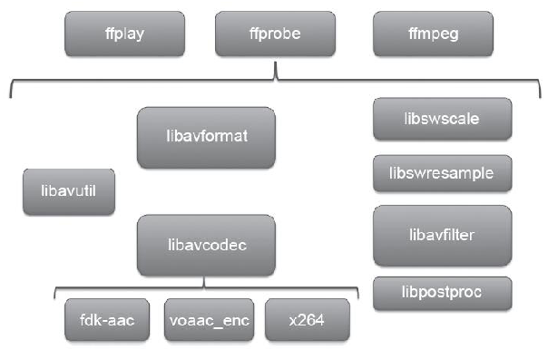

### 1.三个主要工具

ffmpeg：是一个命令行工具，用来对视频文件转换格式，也支持对电视卡实时编码；

ffsever：是一个HTTP多媒体实时广播流服务器，支持时光平移；

ffplay：是一个简单的播放器，使用 ffmpeg 库解析和解码，通过SDL显示；

### 2.FFmpeg基本组成模块

- libavformat：用于各种音视频封装格式的生成和解析，包括获取解码所需信息以生成解码上下文结构、读取音视频数据帧等功能，包含demuxers和muxer库；
- libavcodec：音视频各种格式的编解码。
- libavutil：一些公共的工具函数的使用库，包括解码器，工具函数，算数运算，字符操作等。
- libswscale：提供原始视频的比例缩放、色彩映射转换、缩放、图像颜色空间或格式转换的功能。
- libswresample：提供音频混音和重采样，采样格式转换和混合等功能。
- libavfilter：各种音视频滤波器。
- libpostproc：用于后期效果处理，如图像的去块效应等。
- libavdevice：用于硬件的音视频采集、加速和显示，访问捕获设备和回放设备的接口。

#### 模块相关结构

- libavformat有一个非常重要的结构: AVFormatContext；

```bash
它几乎是ffmpeg中的一颗树, 其成员AVStream可以包含0种或多种流, 
在AVStream中又可以包含已经打开的编解码器codec, 另外还有AVIOContext成员,
 这个成员的作用就是io了,。
可以重写AVIOContext结构的成员函数read_packet或write_packet等, 
来实现从不同介质读取音视频媒体数据(比如从网络、内存或磁盘等)，
关于ffmpeg的io方面,还可以在libavformat中自己实现一个 PROTOCOL组件来实现同样的功能, 
方法也很简单, 只要实现URLProtocol结构然后取个名字在allformats.c中使用REGISTER_PROTOCOL
添加一行注册自己的协议就行, 其它DEMUXER和MUXDEMUX方法也是相似的。
```

- libavformat也提供了AVOutputFormat、AVInputFormat、URLProtocol等。

- libavcodec也有一个非常重要的结构: AVCodecContext；

```bash
它包含了当前媒体信息的几乎所有参数(什么宽高, 运行估计, 码率控制...), 以及编解码指针(AVCodec),
甚至还可以设置硬件加速相关(如DXVA, linux下的 VAAPI). 
其中最重要的属AVCodec, 它是直接指向编解码器实现,
如果你想自己实现一个编解码添加到libavcodec中, 那么也是非常方便的。
```

- libavcodec也提供了AVHWAccel、AVCodec、AVCodecParser、AVBitStreamFilter等。

#### 1 封装格式

AVFormatContext - 描述了媒体文件的构成及基本信息，是统领全局的基本结构体，贯穿程序始终，很多函数都要用它作为参数，格式转换过程中实现输入和输出功能、保存相关数据的主要结构，描述了一个媒体文件或媒体流的构成和基本信息；

- nb_streams/streams ：AVStream结构指针数组, 包含了所有内嵌媒体流的描述，其内部有 AVInputFormat + AVOutputFormat 结构体，来表示输入输出的文件格式
- avformat_open_input：创建并初始化部分值，但其他一些值(如 mux_rate、key 等)需要手工设置初始值，否则可能出现异常
- avformat_alloc_output_context2：根据文件的输出格式、扩展名或文件名等分配合适的 AVFormatContext 结构

AVInputFormat - 解复用器对象，每种作为输入的封装格式(例如FLV、MP4、TS等)对应一个该结构体，如libavformat/flvdec.c的ff_flv_demuxer；

AVOutputFormat - 复用器对象，每种作为输出的封装格式（例如FLV, MP4、TS等）对应一个该结构体，如libavformat/flvenc.c的ff_flv_muxer；

AVStream - 用于描述一个媒体流，其大部分信息可通过 avformat_open_input 根据文件头信息确定，其他信息可通过 avformat_find_stream_info 获取，典型的有 视频流、中英文音频流、中英文字幕流(Subtitle)，可通过 av_new_stream、avformat_new_stream 等创建。

- index：在AVFormatContext中流的索引，其值自动生成(AVFormatContext::streams[index])
- nb_frames：流内的帧数目
- time_base：流的时间基准，是一个实数，该流中媒体数据的pts和dts都将以这个时间基准为粒度。通常，使用av_rescale/av_rescale_q可以实现不同时间基准的转换
- avformat_find_stream_info：获取必要的编解码器参数(如 AVMediaType、CodecID )，设置到 AVFormatContext::streams[i]::codec 中
- av_read_frame：从多媒体文件或多媒体流中读取媒体数据，获取的数据由 AVPacket 来存放
- av_seek_frame：改变媒体文件的读写指针来实现对媒体文件的随机访问，通常支持基于时间、文件偏移、帧号(AVSEEK_FLAG_FRAME)的随机访问方式

#### 2 编解码

AVCodecContext - 描述编解码器上下文的数据结构，包含了众多编解码器需要的参数信息，保存AVCodec指针和与codec相关的数据，包含了流中所使用的关于编解码器的所有信息；

- codec_name[32]、codec_type(AVMediaType)、codec_id(CodecID)、codec_tag：编解码器的名字、类型(音频/视频/字幕等)、ID(H264/MPEG4等)、FOURC等信息
- hight/width,coded_width/coded_height： Video的高宽
- sample_fmt：音频的原始采样格式, 是 SampleFormat 枚举
- time_base：采用分数(den/num)保存了帧率的信息

AVCodec - 编解码器对象，编解码器，采用链表维护，每一个都有其对应的名字、类型、CodecID和对数据进行处理的编解码函数指针，每种编解码格式(例如H.264、AAC等）对应一个该结构体。每个AVCodecContext中含有一个AVCodec；

AVCodecParameters - 编解码参数，每个AVStream中都含有一个AVCodecParameters，用来存放当前流的编解码参数。

- avcodec_find_decoder/avcodec_find_encoder ：根据给定的codec id或解码器名称从系统中搜寻并返回一个AVCodec结构的指针
- avcodec_alloc_context3：根据 AVCodec 分配合适的 AVCodecContext
- avcodec_open/avcodec_open2/avcodec_close ：根据给定的 AVCodec 打开对应的Codec，并初始化 AVCodecContext/ 关闭Codec
- avcodec_alloc_frame：分配编解码需要的 AVFrame 结构
- avcodec_decode_video/avcodec_decode_video2 ：解码一个视频帧，输入数据在AVPacket结构中，输出数据在AVFrame结构中
- avcodec_decode_audio4：解码一个音频帧。输入数据在AVPacket结构中，输出数据在AVFrame结构中
- avcodec_encode_video/avcodec_encode_video2 ：编码一个视频帧，输入数据在AVFrame结构中，输出数据在AVPacket结构中

#### 4.3 网络协议

AVIOContext - 管理输入输出数据的结构体；

URLProtocol - 描述了音视频数据传输所使用的协议，每种传输协议(例如HTTP、RTMP)等，都会对应一个URLProtocol结构；

URLContext - 封装了协议对象及协议操作对象。

#### 4.4 数据存放

AVPacket - 存放编码后、解码前的压缩数据，即ES数据， 暂存解码之前的媒体数据（一个音/视频帧、一个字幕包等）及附加信息（解码时间戳、显示时间戳、时长等)，主要用于建立缓冲区并装载数据；

- data/size/pos： 数据缓冲区指针、长度和媒体流中的字节偏移量
- flags：标志域的组合，1(AV_PKT_FLAG_KEY)表示该数据是一个关键帧, 2(AV_PKT_FLAG_CORRUPT)表示该数据已经损坏
- destruct：释放数据缓冲区的函数指针，其值可为 [av_destruct_packet]/av_destruct_packet_nofree, 会被 av_free_packet 调用。

AVFrame - 存放编码前、解码后的原始数据，如YUV格式的视频数据或PCM格式的音频数据等；

- data/linesize：FFMpeg内部以平面的方式存储原始图像数据，即将图像像素分为多个平面（R/G/B或Y/U/V）数组
- data数组：其中的指针指向各个像素平面的起始位置，编码时需要用户设置数据
- linesize数组 ：存放各个存贮各个平面的缓冲区的行宽，编码时需要用户设置数据
- key_frame：该图像是否是关键帧，由 libavcodec 设置
- pict_type：该图像的编码类型：Intra(1)/Predicted(2)/Bi-dir(3) 等，默认值是 NONE(0)，其值由libavcodec设置
- pts：呈现时间，编码时由用户设置
- quality：从1(最好)到FF_LAMBDA_MAX(256*128-1,最差)，编码时用户设置，默认值是0
- nterlaced_frame：表明是否是隔行扫描的,编码时用户指定，默认0

### 组成部分中，需要熟悉基础概念有

容器(Container)

- 容器就是一种文件格式，比如flv，mkv等。包含下面5种流以及文件头信息。

流(Stream)

- 是一种视频数据信息的传输方式，5种流：音频，视频，字幕，附件，数据。

帧(Frame)

- 帧代表一幅静止的图像，分为I帧，P帧，B帧。

编解码器(Codec)

- 是对视频进行压缩或者解压缩，CODEC =COde （编码） +DECode（解码）

复用/解复用(mux/demux)

- 把不同的流按照某种容器的规则放入容器，这种行为叫做复用（mux）
- 把不同的流从某种容器中解析出来，这种行为叫做解复用(demux)

#### FFMPEG有8个常用库

- AVUtil：核心工具库，下面的许多其他模块都会依赖该库做一些基本的音视频处理操作。
- AVFormat：文件格式和协议库，该模块是最重要的模块之一，封装了Protocol层和Demuxer、Muxer层，使得协议和格式对于开发者来说是透明的。
- AVCodec：编解码库，封装了Codec层，但是有一些Codec是具备自己的License的，FFmpeg是不会默认添加像libx264、FDK-AAC等库的，但是FFmpeg就像一个平台一样，可以将其他的第三方的Codec以插件的方式添加进来，然后为开发者提供统一的接口。
- AVFilter：音视频滤镜库，该模块提供了包括音频特效和视频特效的处理，在使用FFmpeg的API进行编解码的过程中，直接使用该模块为音视频数据做特效处理是非常方便同时也非常高效的一种方式。
- AVDevice：输入输出设备库，比如，需要编译出播放声音或者视频的工具ffplay，就需要确保该模块是打开的，同时也需要SDL的预先编译，因为该设备模块播放声音与播放视频使用的都是SDL库。
- SwrRessample：该模块可用于音频重采样，可以对数字音频进行声道数、数据格式、采样率等多种基本信息的转换。
- SWScale：该模块是将图像进行格式转换的模块，比如，可以将YUV的数据转换为RGB的数据，缩放尺寸由1280*720变为800*480。
- PostProc：该模块可用于进行后期处理，当我们使用AVFilter的时候需要打开该模块的开关，因为Filter中会使用到该模块的一些基础函数。

### 查看帮助

- 可用的bit流 ：ffmpeg –bsfs
- 可用的编解码器：ffmpeg –codecs
- 可用的解码器：ffmpeg –decoders
- 可用的编码器：ffmpeg –encoders
- 可用的过滤器：ffmpeg –filters
- 可用的视频格式：ffmpeg –formats
- 可用的声道布局：ffmpeg –layouts
- 可用的license：ffmpeg –L
- 可用的像素格式：ffmpeg –pix_fmts
- 可用的协议：ffmpeg -protocals

### FFmpeg函数

- 数据包/数据帧(AVPacket/AVFrame)
- av_packet_alloc/av_frame_alloc(分配数据包/分配数据帧)
- av_packet_free/av_frame_alloc(释放数据包内存/释放数据帧内存)

- av_register_all()：注册所有组件,4.0已经弃用
- avdevice_register_all()对设备进行注册，比如V4L2等。
- avformat_network_init();初始化网络库以及网络加密协议相关的库（比如openssl）
- avformat_alloc_context();负责申请一个AVFormatContext结构的内存,并进行简单初始化
- avformat_free_context();释放该结构里的所有东西以及该结构本身
- avformat_close_input();关闭解复用器。关闭后就不再需要使用avformat_free_context 进行释放。
- avformat_open_input();打开输入视频文件
- avformat_find_stream_info()：获取视频文件信息
- av_read_frame(); 读取音视频包
- avformat_seek_file(); 定位文件
- av_seek_frame():定位文件

图例


- avcodec_alloc_context3():分配解码器上下文
- avcodec_find_decoder()：根据ID查找解码器
- avcodec_find_decoder_by_name():根据解码器名字
- avcodec_open2()：打开编解码器
- avcodec_decode_video2()：解码一帧视频数据
- avcodec_decode_audio4()：解码一帧音频数据
- avcodec_send_packet():发送编码数据包
- avcodec_receive_frame():接收解码后数据
- avcodec_free_context():释放解码器上下文，包含了
- avcodec_close()avcodec_close():关闭解码器

解码函数

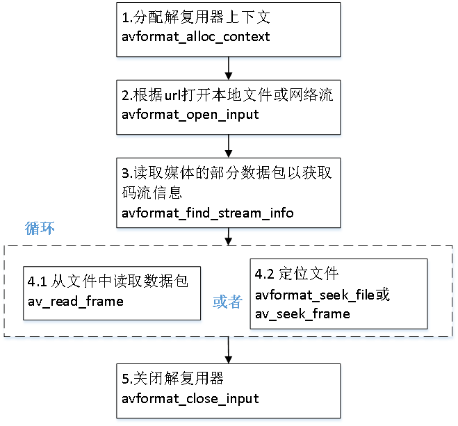

2

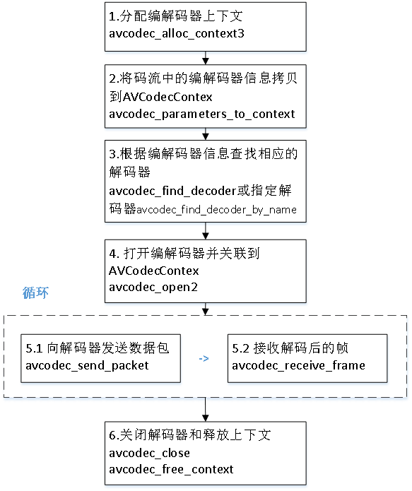

封装媒体容器

- 注册模块->打开输出上下文->增加流->写文件头->循环写入数据包->写入文件结尾数据

解封装

- 注册模块->打开输入上下文->查找音视频流信息->循环读取视频包->关闭输入上下文

解码和编码

- 注册模块->查找解码器->分配解码器上下文->打开解码器->发送数据包->循环读取完，解码后的数据帧->释放解码器上下文
- 编码跟解码类似

滤镜处理流程

- 流程

### 组件注册方式

我们使用ffmpeg，首先要执行av_register_all，把全局的解码器、编码器等结构体注册到各自全局的对象链表里，以便后面查找调用。

AAC、H264

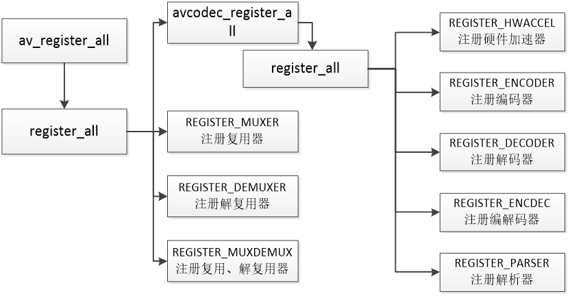

FFMPEG内部去做，不需要用户调用API去注册。以codec编解码器为例：

- 1.在configure的时候生成要注册的组件`./configure:7203:print_enabled_components libavcodec/codec_list.c AVCodec codec_list $CODEC_LIST`    这里会生成一个 `codec_list.c` 文件，里面只有 `static const AVCodec * const codec_list[]` 数组。
- 2.在 `libavcodec/allcodecs.c` 将 `static const AVCodec * const codec_list[]` 的编解码器用链表的方式组织起来。

FFmpeg内部去做，不需要用户调用API去注册。

对于demuxer/muxer（解复用器，也称容器）则对应

- 1.`libavformat/muxer_list.c libavformat/demuxer_list.c` 这两个文件也是在 `configure` 的时候生成，也就是说直接下载源码是没有这两个文件的。
- 2.在 `libavformat/allformats.c` 将`demuxer_list[]` 和 `muexr_list[]` 以链表的方式组织。

其他组件也是类似的方式。

### FFmpeg数据结构简介

AVFormatContext：封装格式上下文结构体，也是统领全局的结构体，保存了视频文件封装格式相关信息。

AVInputFormat demuxer：每种封装格式（例如FLV, MKV, MP4, AVI）对应一个该结构体。

AVOutputFormat muxerAVStream：视频文件中每个视频（音频）流对应一个该结构体。

AVCodecContext：编解码器上下文结构体，保存了视频（音频）编解码相关信息

AVCodec：每种视频（音频）编解码器(例如H.264解码器)对应一个该结构体。

AVPacket：存储一帧压缩编码数据。

AVFrame：存储一帧解码后像素（采样）数据。

AVFormatContext和AVInputFormat之间的关系

AVFormatContext API调用

AVInputFormat 主要是FFMPEG内部调用

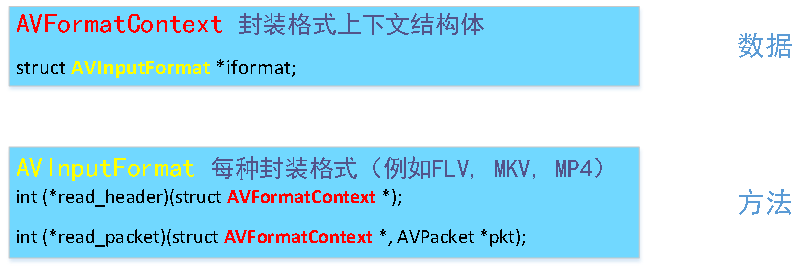

```bash
int avformat_open_input(AVFormatContext **ps, const char *filename, AVInputFormat *fmt, AVDictionary **options)
```

AVCodecContext和AVCodec之间的关系

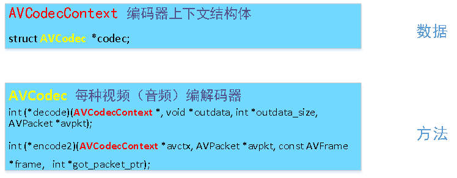

AVFormatContext, AVStream和AVCodecContext之间的关系

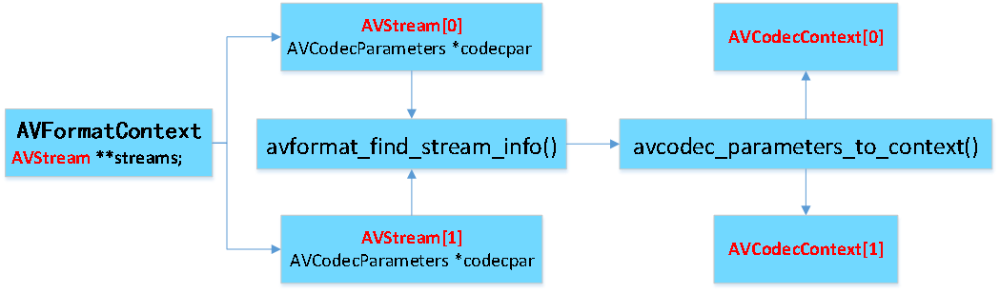

区分不同的码流

AVMEDIA_TYPE_VIDEO视频流

```bash
video_index = av_find_best_stream(ic, AVMEDIA_TYPE_VIDEO,-1,-1, NULL, 0)
```

AVMEDIA_TYPE_AUDIO音频流

```bash
audio_index = av_find_best_stream(ic, AVMEDIA_TYPE_AUDIO,-1,-1, NULL, 0)
```

AVPacket和AVFrame之间的关系

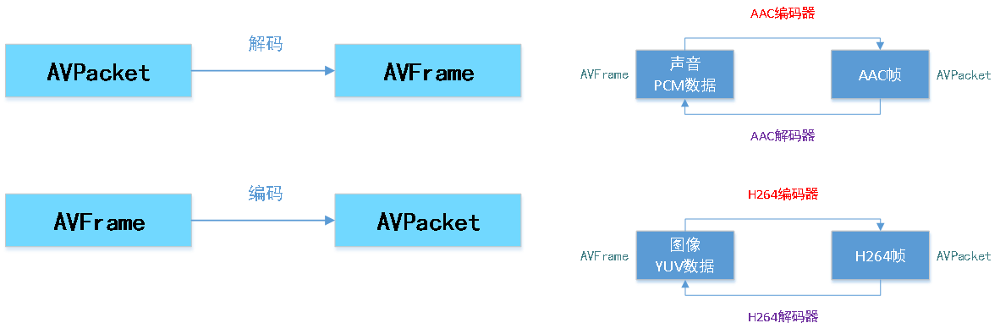

AVFormatContext

- iformat：输入媒体的AVInputFormat，比如指向AVInputFormat ff_flv_demuxer
- nb_streams：输入媒体的AVStream 个数
- streams：输入媒体的AVStream []数组
- duration：输入媒体的时长（以微秒为单位），计算方式可以参考av_dump_format()函数。
- bit_rate：输入媒体的码率

AVInputFormat ->解复用器 -> 拆解文件时用

- name：封装格式名称
- extensions：封装格式的扩展名
- id：封装格式ID一些封装格式处理的接口函数,比如read_packet()

AVOutputFormat 复用器 合成文件时用

AVStream

- index：标识该视频/音频流
- time_base：该流的时基，PTS*time_base=真正的时间（秒）
- avg_frame_rate： 该流的帧率
- duration：该视频/音频流长度
- codecpar：编解码器参数属性

AVCodecParameters

- codec_type：媒体类型AVMEDIA_TYPE_VIDEO/   AVMEDIA_TYPE_AUDIO等
- codec_id：编解码器类型， AV_CODEC_ID_H264/ AV_CODEC_ID_AAC等。

AVCodecContext

- codec：编解码器的AVCodec，比如指向AVCodec ff_aac_latm_decoder
- width, height：图像的宽高（只针对视频）
- pix_fmt：像素格式（只针对视频）
- sample_rate：采样率（只针对音频）
- channels：声道数（只针对音频）
- sample_fmt：采样格式（只针对音频）

AVCodec

- name：编解码器名称   (多家H264解码厂商， a-h264, b-h264)
- type：编解码器类型
- id：编解码器ID H264一些编解码的接口函数，比如int (*decode)()

AVPacket

- pts：显示时间戳
- dts：解码时间戳
- data：压缩编码数据
- size：压缩编码数据大小
- pos:数据的偏移地址
- stream_index：所属的AVStream

AVFrame

- data[]：解码后的图像像素数据（音频采样数据）
- linesize[]：对视频来说是图像中一行像素的大小；对音频来说是整个音频帧的大小
- width, height：图像的宽高（只针对视频）
- key_frame：是否为关键帧（只针对视频） 。
- pict_type：帧类型（只针对视频） 。例如I， P， B
- sample_rate：音频采样率（只针对音频）
- nb_samples：音频每通道采样数（只针对音频）
- pts：显示时间戳

### SDL简介

作用：SDL(Simple DirectMedia Layer)库的作用主要是封装了复杂的视音频底层交互工作， 简化了视音频处理的难度。

本次课程我们重点不在SDL，只因为涉及到一些函数的调用，所以只稍微做一个简介

SDL结构如下所示。可以看出它实际上还是调用了DirectX等底层的API完成了和硬件的交互

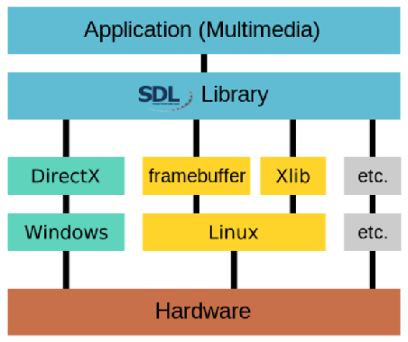

#### SDL视频显示函数简介

- SDL_Init()：初始化SDL系统
- SDL_CreateWindow()：创建窗口
- SDL_WindowSDL_CreateRenderer()：创建渲染器
- SDL_RendererSDL_CreateTexture()：创建纹理
- SDL_TextureSDL_UpdateTexture()：设置纹理的数据
- SDL_RenderCopy()：将纹理的数据拷贝给渲染器
- SDL_RenderPresent()：显示
- SDL_Delay()：工具函数，用于延时。
- SDL_Quit()：退出SDL系统

#### SDL多线程

##### SDL多线程函数

SDL_CreateThread()：创建一个线程

SDL_LockMutex(), SDL_UnlockMutex()：互斥量操作

##### SDL多线程数据结构

SDL_Thread：线程的句柄

#### SDL事件

##### SDL事件函数

SDL_WaitEvent()：等待一个事件

SDL_PushEvent()：发送一个事件

SDL_PumpEvents()：将硬件设备产生的事件放入事件队列

SDL_PeepEvents()：从事件队列提取一个事件

##### SDL事件数据结构

SDL_Event：代表一个事件

#### 播放器框架

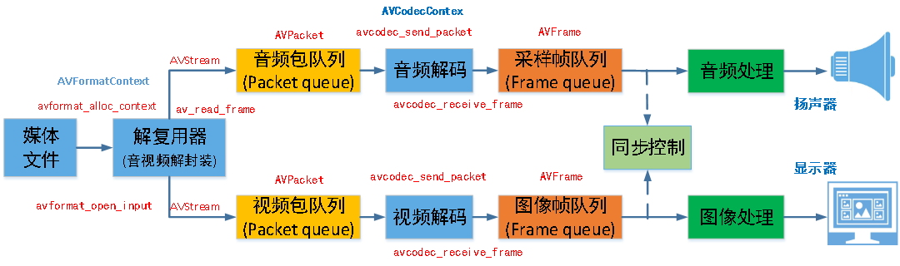

问题：

（1）从av_read_frame读取到一个AVPacket后怎么放入队列？

（2）从avcodec_recevice_frame读取到一个AVFrame后又怎么放入队列？

### FFmpeg内存模型

从现有的Packet拷贝一个新Packet的时候，有两种情况：

- ①两个Packet的buf引用的是同一数据缓存空间，这时候要注意数据缓存空间的释放问题；
- ②两个Packet的buf引用不同的数据缓存空间，每个Packet都有数据缓存空间的copy；

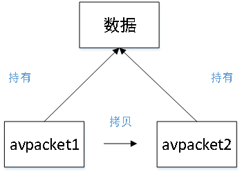

avpacket1 = av_packet_alloc();

avpacket2 = av_packet_alloc();

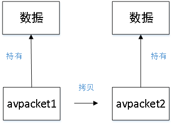

av_read_frame(, avpacket1)

内存模型

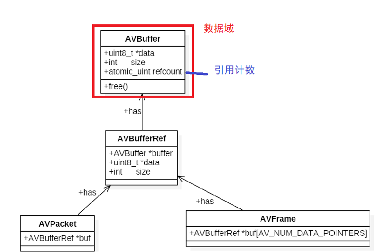

更为精确的模型

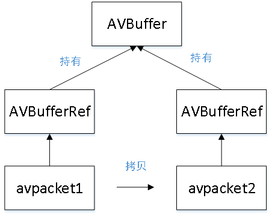

数据共享

实际共同持有的是AVBuffer

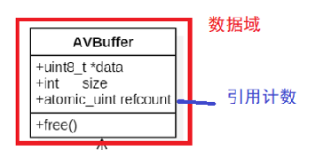

对于多个AVPacket共享同一个缓存空间，FFmpeg使用的引用计数的机制（reference-count）：

- 初始化引用计数为1;
- 当有新的Packet引用共享的缓存空间时，就将引用计数+1；
- 当释放了引用共享空间的Packet，就将引用计数-1；引用计数为0时，就释放掉引用的缓存空间。

AVFrame也是采用同样的机制。

#### AVPacket常用API

| **函数原型**                                           | **说明**                                   |
| ------------------------------------------------------ | ------------------------------------------ |
| AVPacket *av_packet_alloc(void);                       | 分配AVPacket                               |
| void av_packet_free(AVPacket **pkt);                   | 释放AVPacket                               |
| void av_init_packet(AVPacket *pkt);                    | 初始化AVPacket                             |
| int av_new_packet(AVPacket *pkt, int size);            | 给AVPacket的buf分配内存，引用计数初始化为1 |
| int av_packet_ref(AVPacket *dst, const AVPacket*src); | 增加引用计数                               |
| void av_packet_unref(AVPacket *pkt);                   | 减少引用计数                               |
| void av_packet_move_ref(AVPacket *dst, AVPacket*src); | 转移引用计数                               |
| AVPacket *av_packet_clone(const AVPacket*src);        | 等于av_packet_alloc()+av_packet_ref()      |

具体见代码：03-avpacket-avframe-api-test

#### AVFrame常用API

| **函数原型**                                        | **说明**                            |
| --------------------------------------------------- | ----------------------------------- |
| AVFrame *av_frame_alloc(void);                      | 分配AVFrame                         |
| void av_frame_free(AVFrame **frame);                | 释放AVFrame                         |
| int av_frame_ref(AVFrame *dst, const AVFrame*src); | 增加引用计数                        |
| void av_frame_unref(AVFrame *frame);                | 减少引用计数                        |
| void av_frame_move_ref(AVFrame *dst, AVFrame*src); | 转移引用计数                        |
| int av_frame_get_buffer(AVFrame *frame, int align); | 根据AVFrame分配内存                 |
| AVFrame *av_frame_clone(const AVFrame*src);        | 等于av_frame_alloc()+av_frame_ref() |

具体见代码：avpacket-avframe-api-test

AVFormat

- 封装格式处理模块

AVFormatContext

- 描述了媒体文件的构成及基本信息，是统领全局的基本结构体，贯穿程序始终，很多函数都要用它作为参数，格式转换过程中实现输入和输出功能、保存相关数据的主要结构，描述了一个媒体文件或媒体流的构成和基本信息；

AVCodec

- 编解码模块

AVFilter

- 音频、视频、字幕滤镜
  - 语法规则
  - 相同线性链，用逗号分隔
  - 不同线性链，用分号分隔
  - 中括号，为结果命名

swscale

- 视频图像转换计算模块
- 参数
  - 分辨率
  - 像素格式

swresample

- 音频重采样
- 声道布局调整

### 播放器模块划分

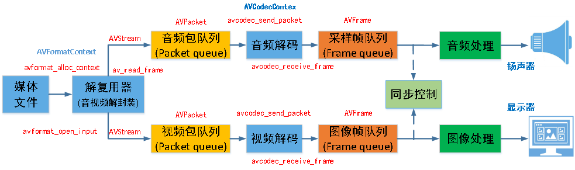

2


### 播放器线程划分

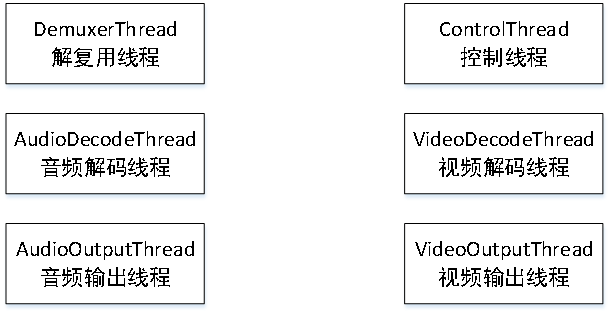

2


### 播放器设计重点

```bash
bilibli ijkplayer  ： ffplay
```

线程的划分

- 数据读取线程
- 音频解码
- 视频解码
- 音频播放
- 视频播放
- 控制响应（播放/暂停/快进/快退等）

缓存队列的设计

- 线程安全
- 缓存数据大小
- 缓存帧数
- 进队列/出队列等

时钟同步

- 音频同步
- 视频同步
- 外部时钟同步
- 时钟序列切换

音频处理

- 音量调节
- 重采样

视频处理

- 图像格式转换YUV->RGB等
- 图像缩放1280*720->800*480等

播放器控制

- 播放/暂停/停止
- 快进/快退/逐帧
- 变速播放ffplay没有提供

### ffplay框架架构

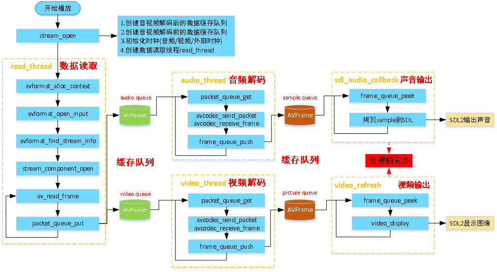

### 需要解决的问题

- Packet队列
- Frame队列 难点在于视频输出
- Audio输出Video输出
- Decode逻辑
- 音视频同步(AVsync)逻辑

### VideoState结构体分析

AVInputFormat *iformat：容器，比如用来打开mp4/flv等

AVFormatContext *ic：容器上下文Clock audclk 音频时钟

**FrameQueue sampq;**：解码音频的采样队列

Decoder auddec：音频解码器

double audio_clock：当前音频帧的PTS+当前帧Duration

PacketQueue audioq：解码前的音频队列

AVStream *audio_st：指向音频媒体流

这里主要是举例了音频流，视频媒体流也有类似的变量

### ffplay播放器分析

ffplay重点需要debug的函数

打开文件：avformat_open_input()

队列(解码前)：packet_queue_put()、packet_queue_get()

查找解码器：avcodec_find_decoder()

打开解码器：avcodec_open2()

读取码流：av_read_frame()

————————————————————

音视频解码：avcodec_send_packet()、avcodec_receive_frame()

队列(解码后)：frame_queue_push() frame_queue_peek()

同步读取：获取当前主时钟：get_master_clock()、运行的时钟：get_clock()、set_clock()

## 参考

1. FFmpeg介绍： <https://www.cnblogs.com/renhui/p/6922971.html>
2. FFmpeg特点： <http://www.ffmpeg.org/about.html>
3. FFmpeg特点： <https://www.cnblogs.com/sztom/p/11964797.html>
4. FFmpeg每日更新文档： <http://www.ffmpeg.org/documentation.html>
5. FFmpeg播放视频基本流程： <https://www.cnblogs.com/renhui/p/9508123.html>
6. 封装格式(Container Format)的概念： <https://www.cnblogs.com/leisure_chn/p/10506636.html>
7. 流(Stream)的概念： <https://www.cnblogs.com/sztom/p/11964797.html>
8. 帧(Frame)的概念： <https://www.cnblogs.com/sztom/p/11964797.html>
9. 帧(Frame)的概念： <https://zhuanlan.zhihu.com/practice-ffmpeg>
10. 编解码(Codec)的概念： <https://www.cnblogs.com/samirchen/archive/2017/06/24/7073102.html>
11. 解码(Codec)的概念： <https://www.cnblogs.com/renhui/p/9293057.html>
12. 数据包(Packet)的概念： <https://www.cnblogs.com/samirchen/archive/2017/06/24/7073102.html>
13. 数据包(Packet)的概念： <https://blog.csdn.net/lsy5631932/article/details/8647134>
14. <https://blog.csdn.net/leixiaohua1020/article/details/25422685>
15. 转码的概念： <https://www.cnblogs.com/yongfengnice/p/7133714.html>
16. <https://blog.csdn.net/leixiaohua1020/article/details/25422685>
17. 转码步骤 <https://www.cnblogs.com/yongfengnice/p/7133714.html>
18. 「文件格式(File Format)」与「封装格式(Container Format)」的区别： <https://www.cnblogs.com/leisure_chn/p/10506636.html>
19. FFmpeg封装格式处理文件步骤： <https://www.cnblogs.com/leisure_chn/p/10506636.html>
20. FFmpeg主要封装格式一览表： <https://blog.csdn.net/leixiaohua1020/article/details/18893769>
21. 「封装格式(Container Format)」与「编解码格式(Codec Format)」一览表： <https://www.cnblogs.com/yongfengnice/p/7133714.html>
22. FFmpeg 播放视频基本流程 <https://www.cnblogs.com/renhui/p/9508123.html>
23. ffmpeg模块相关结构： <https://www.cnblogs.com/brucehou/archive/2011/12/20/2295059.html>
