# FFmpeg 原理分析

## 2. **FFmpeg 播放流程及相关术语**

2.1 播放流程：

video.avi(Container) -> 打开得到 Video_Stream -> 读取 Packet -> 解析到 Frame -> 显示 Frame。[5](https://zhuanlan.zhihu.com/p/142593316#ref_5)

2.2 相关术语：

2.2.1 「**封装格式(Container Format)**」

**封装格式(Container Format)**，可看作是**编码流(Stream)**(音频、视频等)数据的一层外壳，将**编码后**的**数据**，**存储**于此**封装格式**的文件之内。[6](https://zhuanlan.zhihu.com/p/142593316#ref_6)

**封装**又称**容器(Container)**，容器的用词更为形象。容器就是存放内容的器具。
例如：饮料是内容，那么装饮料的瓶子就是容器。
对视频来说，封装格式是 MP4、AVI、MKV、RMVB 等格式。

2.2.2 「**流(Stream)**」

**流(Stream)**是一种音视频数据信息的传输方式。
有五种流：视频流(Video Stream)、音频流(Audio Stream)、字幕(Subtitle)、附件(t)、数据(d)。[7](https://zhuanlan.zhihu.com/p/142593316#ref_7)

例如：曾经多年前使用 VCD 看港片，可以选择粤语或国语声音，是视频文件中存放了两路音频流，可供用户选择其中一路进行播放。

2.2.3 「**帧(Frame)**」

帧(Frame)本意代表一幅静止的图像。[8](https://zhuanlan.zhihu.com/p/142593316#ref_8)

在**流(Stream)**中，帧代表最小数据单元，也是**编解码器**真正处理的**最小处理单元**。

数字视频处理的帧，通常不是说原始图像，而是**被编码器编码后**的一个**图像**。
对于视频来说，帧(Frame)是编码器编码后的一个图像；
对于音频来说，帧(Frame)是编码器编码后的一个声音。[9](https://zhuanlan.zhihu.com/p/142593316#ref_9)

帧(Frame)分为：I 帧:关键帧、P 帧:预测帧、B 帧:双向预测帧。

2.2.4 「**编解码(Codec)**」[10](https://zhuanlan.zhihu.com/p/142593316#ref_10)

每路音视频**流(Stream)**都会以**帧(Frame)**为最小单位，被相应的**编/解码器(Codec)**进行**编码**或**解码，**以实现原始数据和压缩数据之间的相互转换。11](https://zhuanlan.zhihu.com/p/142593316#ref_11)

**编码(Codec)**是对原始数据的加工，是对输入源进行处理，然后输出的过程。简单说，就是对图像和声音的压缩方法。
视频编码主要有：H263、H264、H265、MPEG 系列等。

**编码(Codec)**其实是编码(COde)和解码(DECode)的合称。
CODEC = COde(编码) + DECode(解码)

**解码**就是把编码后的东西还原为原来的状态。对于视频来说，就是把压缩的图像和声音还原为正常可以播放的图像和声音。

编码可以改变文件格式，或者文件格式不变，只更改其他数据。FFmpeg 编解码是基于比特流进行的。

2.2.5 「**数据包(Packet)**」

**数据包(Packet)**是从**流(Stream)**中读取的原始 Raw 数据片段，这些数据片段中，包含的是解码后能被应用程序处理的**原始帧(Raw Frame)数据**。[12](https://zhuanlan.zhihu.com/p/142593316#ref_12)

分开的数据流在送往**编解码**器**(Codec)**处理之前，要先放于缓存中，添加一些附属信息（例如：打上时间戳）以便后续处理，这个缓存空间就是**数据包(Packet)**；
由于数据流是在时间轴上交错放置，所有的视频、音频、字幕都被分割成一段一段的数据，这些一段段的数据从数据流中解析出来之后，就是存放在各自的**数据包(Packet)**。

单纯的视频数据包来说，一个视频数据包可以存放一个视频帧；
单纯的音频帧来说，如果抽样率(sample-rate)是固定不变的，一个音频数据包可以存放几个音频帧；若是抽样率是可变的，则一个数据包就只能存放一个音频帧。[13](https://zhuanlan.zhihu.com/p/142593316#ref_13)

3.2 相关术语

3.2.1 **封装格式转换：解封装 Demux 与封装 Mux**（无编解码/转码）

**封装(Container)**见上文 2.2.1 称为容器。

**3.2.1.1 封装，**还称为**多路复用(Mux)**。

**封装的目的**：

\1. 是为了在一个文件**流(Stream)**中能同时存储视频流(Video Stream)、音频流(Audio Stream)、字幕(Subtitle)、附件(t)、数据(d)等内容。这正是“复用”的含义所在(分时复用)。

\2. 是在网络环境下确保数据的可靠快速传输。

**3.2.1.2 封装格式转换**：

包括封装与解封装，**即**「**复用(Mux)**」与「**解复用(Demux)**」。

封装格式转换，就是在 AVI,FLV,MKV,MP4 这些格式之间进行转换(对应.avi/.flv/.mkv/.mp4 后缀文件)。

- 「**复用(Mux)**」又称为封装

将多路流(视频、音频、字幕等)，按照某种容器规则，混入一路输出中(普通文件、流等)。是 multiplex 的缩写。

- 「**解复用(Demux)**」又称为解封装

复用(Mux) 的反操作。从一路输入中，解析分离出多路流(视频、音频、字幕等)。

- 「**复用(Mux)**」处理的是输入格式，「**解复用(Demux)**」处理的输出格式。

## 音频

- 裸数据格式
  - 音频的裸数据格式就是脉冲编码调制（Pulse Code Modulation，PCM）数据
  - 量化格式（sampleFormat）：指记录声音的动态范围，它以位(Bit)为单位
  - 采样率（sampleRate）：记录声音时每秒的采样个数，它用赫兹(Hz)来表示。
  - 声道数（channel）
  - 数据格式
    - PCM 音频裸数据
    - WAV 在音频裸数据前面，加了文件头
- 音频编码
  - 主要是为了在降低带宽负担的同时为视频腾出更多带宽空间
  - MP3
    - 码率>128，表现优异
  - AAC
    - 码率<128，表现优异
  - OGG
    - 低码率，高音质
    - 兼容性不好
    - 适用于语音聊天
- channel 是音频中的概念，称之为声道。在一路音频流中，可以有单声道，双声道或立体声。

## 图像

- 像素(Pixel)：
  - 图像显示的基本单元
- 每英寸像素(PPI)：
  - 理论上屏幕 PPI 越高，屏幕就越精细，画质相对就更出色
- 颜色表示：
  - R、G、B 也被称为 “基色分量”。它们的取值分别从 0 到 255，一共 256 个等级（256 时 2 的 8 次方）。所以任何颜色都可以 R、G、B 三个值的组合来表示
- YUV：
  - 主要是因为 RGB 信号不利于压缩；我们可以把更多带宽留给黑—白信号（被称作“亮度”），将稍少的带宽留给彩色信号（被称作“色度”）；其中 "Y" 表示明亮度（Lumina nce 或 Luma），也就是灰阶值；而 "U" 和 "V" 表示的则是色度（Chrominance 或 Chroma），作用是描述影像色彩及饱和度，用于指定像素的颜色。
- 静态压缩：
  - 图片空间上的冗余，相同像素

## 视频

- 视频由一些列图片组成，每一张称之为帧
- 冗余信息
  - 时间冗余
    - 运动补偿
    - 运动表示
    - 运动估计
    - 帧间编码
  - 空间冗余
    - 帧内编码
- 编码
- 帧率(FPS)：每秒多少帧画面
  - IPB 帧
    - I 帧
      - 独立帧
    - P 帧
      - 前向预测帧
      - 依赖前面 I 帧或 P 帧
    - B 帧
      - 双向预测帧，依赖：
        - 前面 I 帧或 P 帧
        - 后面的 P 帧
    - IDR 帧
      - H264 采用多帧预测，P 帧可能参考 I 帧之前的帧
      - IDR 之后的帧，只会参考 IDR 帧之后的帧
    - DTS 和 PTS
      - <https://mp.weixin.qq.com/s/u3VCyoV7hMFfau3Rks5z6Q>
      - DTS 解码时间
      - PTS 播放时间
      - 没有 B 帧的情况下，DTS=PTS
      - 有 B 帧的情况下，DTS 就与 PTS 不一样
    - GOP
      - 两个 I 帧之间的一组图片

## 编码技术

- <https://zhuanlan.zhihu.com/p/93398878>
- 「封装格式(Container Format)」
  - 封装格式(Container Format)，可看作是编码流(Stream)(音频、视频等)数据的一层外壳，将编码后的数据，存储于此封装格式的文件之内。[6]
  - 封装又称容器(Container)，容器的用词更为形象。容器就是存放内容的器具。
  - 例如：饮料是内容，那么装饮料的瓶子就是容器。
  - 对视频来说，封装格式是 MP4、AVI、MKV、RMVB 等格式。
- 「流(Stream)」
  - 流(Stream)是一种音视频数据信息的传输方式。
  - 有五种流：视频流(Video Stream)、音频流(Audio Stream)、字幕(Subtitle)、附件(t)、数据(d)。[7]
  - 例如：曾经多年前使用 VCD 看港片，可以选择粤语或国语声音，是视频文件中存放了两路音频流，可供用户选择其中一路进行播放。
- 「帧(Frame)」
  - 帧(Frame)本意代表一幅静止的图像。[8]
  - 在流(Stream)中，帧代表最小数据单元，也是编解码器真正处理的最小处理单元。
  - 数字视频处理的帧，通常不是说原始图像，而是被编码器编码后的一个图像。
  - 对于视频来说，帧(Frame)是编码器编码后的一个图像；
  - 对于音频来说，帧(Frame)是编码器编码后的一个声音。[9]
  - 帧(Frame)分为：I 帧:关键帧、P 帧:预测帧、B 帧:双向预测帧。
- 「编解码(Codec)」
  - 每路音视频流(Stream)都会以帧(Frame)为最小单位，被相应的编/解码器(Codec)进行编码或解码，以实现原始数据和压缩数据之间的相互转换。[11]
  - 编码(Codec)是对原始数据的加工，是对输入源进行处理，然后输出的过程。简单说，就是对图像和声音的压缩方法。
  - 视频编码主要有：H263、H264、H265、MPEG 系列等。
  - 编码(Codec)其实是编码(COde)和解码(DECode)的合称。
  - CODEC = COde(编码) + DECode(解码)
  - 解码就是把编码后的东西还原为原来的状态。对于视频来说，就是把压缩的图像和声音还原为正常可以播放的图像和声音。
  - 编码可以改变文件格式，或者文件格式不变，只更改其他数据。FFmpeg 编解码是基于比特流进行的。
- 「数据包(Packet)」
  - 数据包(Packet)是从流(Stream)中读取的原始 Raw 数据片段，这些数据片段中，包含的是解码后能被应用程序处理的原始帧(Raw Frame)数据。[12]
  - 分开的数据流在送往编解码器(Codec)处理之前，要先放于缓存中，添加一些附属信息（例如：打上时间戳）以便后续处理，这个缓存空间就是数据包(Packet)；
  - 由于数据流是在时间轴上交错放置，所有的视频、音频、字幕都被分割成一段一段的数据，这些一段段的数据从数据流中解析出来之后，就是存放在各自的数据包(Packet)。
  - 单纯的视频数据包来说，一个视频数据包可以存放一个视频帧；
  - 单纯的音频帧来说，如果抽样率(sample-rate)是固定不变的，一个音频数据包可以存放几个音频帧；若是抽样率是可变的，则一个数据包就只能存放一个音频帧。
- 「封装格式(Container Format)」与「编解码(Codec)」的区别：
  - 封装的步骤：打开输入文件、打开输出文件、从输入文件读取编码帧、往输出文件写入编码帧。这些都不涉及编码解码层面。
  - 不同封装格式适用于不同的场合，支持的编码格式不一样。
  - 主要封装格式一览表
  - 「封装格式(Container Format)」与「编解码格式(Codec Format)」一览表
- 编码格式
  - 视频和音频都需要经过编码，才能保存成文件。不同的编码格式（CODEC），有不同的压缩率，会导致文件大小和清晰度的差异。
  - 常用的视频编码格式
    - H.262
    - H.264
    - H.265
    - 上面的编码格式都是有版权的，但是可以免费使用
    - 无版权的视频编码格式
      - VP8
      - VP9
      - AV1
  - 常用的音频编码格式
    - MP3
    - AAC
  - 查看 FFmpeg 支持的编码格式
    - ffmpeg -codecs
- 编码器
  - 编码器（encoders）是实现某种编码格式的库文件。只有安装了某种格式的编码器，才能实现该格式视频/音频的编码和解码
  - FFmpeg 内置的视频编码器
  - libx264：最流行的开源 H.264 编码器
  - NVENC：基于 NVIDIA GPU 的 H.264 编码器
  - libx265：开源的 HEVC 编码器
  - libvpx：谷歌的 VP8 和 VP9 编码器
  - libaom：AV1 编码器
  - 音频编码器
    - libfdk-aac
    - aac
  - 查看 FFmpeg 已安装的编码器
    - ffmpeg -encoders

## 容器(文件格式)

- 视频文件本身其实是一个容器（container），里面包括了视频和音频，也可能有字幕等其他内容。
- 常见的容器格式有以下几种。一般来说，视频文件的后缀名反映了它的容器格式。
- 常见容器格式
  - MP4
  - MKV
  - WebM
  - AVI
- 查看 FFmpeg 支持的容器(文件格式)
  - ffmpeg -formats

## 学习目录

- <https://zhuanlan.zhihu.com/p/41070610>
- <https://www.sogou.com/link?url=hedJjaC291OB0PrGj_c3jKkLhUVG0lkO9O4bifs6a8IyktFnFvQL_XDso8qj4KMHAzQBldR_6sql_ua9Dkgr0Q>..
- <https://cloud.tencent.com/developer/article/1773248>

## 播放器模块划分

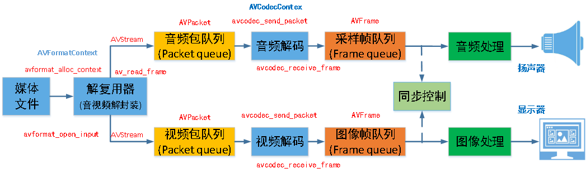

2

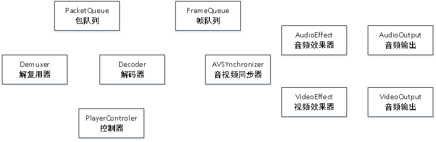

## 基础知识

**容器/文件(Conainer/File)**：即特定格式的多媒体文件，比如 mp4、flv、mkv 等。

**媒体流(Stream)**：表示时间轴上的一段连续数据，如一段声音数据、一段视频数据或一段字幕数据，可以是压缩的，也可以是非压缩的，压缩的数据需要关联特定的编解码器。

**数据帧/数据包(Frame/Packet)**：通常，一个媒体流是由大量的数据帧组成的，对于压缩数据，帧对应着编解码器的最小处理单元，分属于不同媒体流的数据帧交错存储于容器之中。

- 一般情况下： Frame 对应压缩前的数据，Packet 对应压缩后的数据。

**编解码器(Codec)**：以帧为单位实现压缩数据和原始数据之间的相互转换的

**复用(mux)**：把不同的流按照某种容器的规则放入容器，这种行为叫做复用（mux）

**解复用(mux)**：把不同的流从某种容器中解析出来，这种行为叫做解复用(demux)

## 基础知识-解复用器

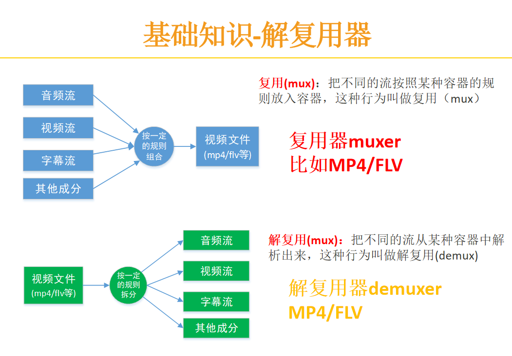

### 分解与复用

流拷贝是通过将 copy 参数提供给-codec 选项来选择流的模式。它使得 ffmpeg 省略了指定流的解码和编码步骤，所以它只能进行多路分解和多路复用。 这对于更改容器格式或修改容器级元数据很有用。 在这种情况下，上图将简化为：


由于没有解码或编码，速度非常快，没有质量损失。 但是，由于许多因素，在某些情况下可能无法正常工作。 应用过滤器显然也是不可能的，因为过滤器处理未压缩的数据。

## 基础知识-编解码器 codec

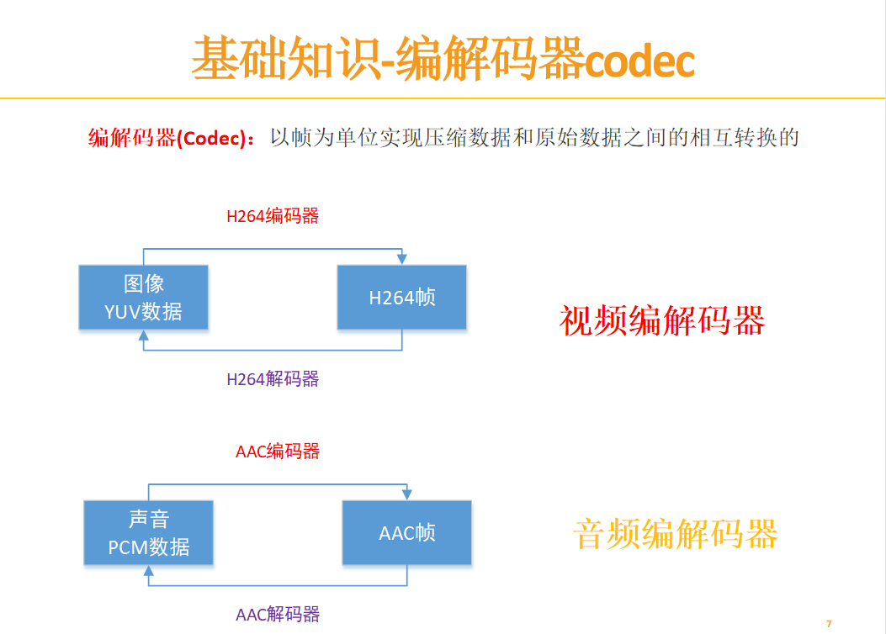

## 基础知识-码率和帧率

码率和帧率是视频文件的最重要的基本特征，对于他们的特有设置会**决定视频质量**。如果我们知道码率和时长那么可以很容易计算出输出文件的大小。

帧率：帧率也叫帧频率，帧率是视频文件中每一秒的帧数，肉眼想看到连续移动图像至少需要 15 帧。

码率：比特率(也叫码率，数据率)是一个确定整体视频/音频质量的参数，秒为单位处理的位数，码率和视频质量成正比，在视频文件中中比特率用**bps**来表达。

## 滤镜

在编码之前，ffmpeg 可以使用 libavfilter 库中的过滤器处理原始音频和视频帧。 几个链式过滤器形成一个过滤器图形。 ffmpeg 区分两种类型的过滤器图形：简单和复杂。

### 简单滤镜

简单的过滤器图是那些只有一个输入和输出，都是相同的类型。 在上面的图中，它们可以通过在解码和编码之间插入一个额外的步骤来表示：


简单的 filtergraphs 配置了 per-stream-filter 选项（分别为视频和音频使用-vf 和-af 别名）。 一个简单的视频 filtergraph 可以看起来像这样的例子：


请注意，某些滤镜会更改帧属性，但不会改变帧内容。 例如。 上例中的 fps 过滤器会改变帧数，但不会触及帧内容。 另一个例子是 setpts 过滤器，它只设置时间戳，否则不改变帧。

复杂滤镜

复杂的过滤器图是那些不能简单描述为应用于一个流的线性处理链的过滤器图。 例如，当图形有多个输入和/或输出，或者当输出流类型与输入不同时，就是这种情况。 他们可以用下图来表示：

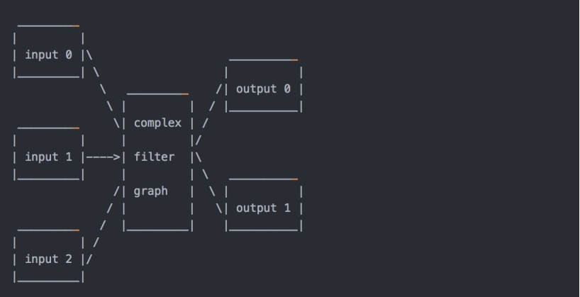

复杂的过滤器图使用-filter_complex 选项进行配置。 请注意，此选项是全局性的，因为复杂的过滤器图形本质上不能与单个流或文件明确关联。

-lavfi 选项等同于-filter_complex。

一个复杂的过滤器图的一个简单的例子是覆盖过滤器，它有两个视频输入和一个视频输出，包含一个视频叠加在另一个上面。 它的音频对应是 amix 滤波器。

## 总结

1.容器/文件(Conainer/File)：即特定格式的多媒体文件，比如 mp4、flv、mkv 等。

2.媒体流（Stream）：表示时间轴上的一段连续数据，如一段声音数据、一段视频数据或一段字幕数据，可以是压缩的，也可以是非压缩的，压缩的数据需要关联特定的编解码器。

3.数据帧/数据包(Frame/Packet)：通常，一个媒体流是由大量的数据帧组成的，对于压缩数据，帧对应着编解码器的最小处理单元，分属于不同媒体流的数据帧交错存储于容器之中。

一般情况下：Frame 对应压缩前的数据，Packet 对应压缩后的数据。

4.编解码器(Codec)：以帧为单位实现压缩数据和原始数据之间的相互转换的

5.复用(mux)：把不同的流按照某种容器的规则放入容器，这种行为叫做复用（mux）

6.解复用(mux)：把不同的流从某种容器中解析出来，这种行为叫做解复用(demux)

7.码率和帧率是视频文件的最重要的基本特征，对于他们的特有设置会决定视频质量。如果我们知道码率和时长那么可以很容易计算出输出文件的大小。

8.帧率：帧率也叫帧频率，帧率是视频文件中每一秒的帧数，肉眼想看到连续移动图像至少需要 15 帧。

9.码率：比特率(也叫码率，数据率)是一个确定整体视频/音频质量的参数，秒为单位处理的位数，码率和视频质量成正比，在视频文件中中比特率用 bps 来表达。

## 格式

视频播放器原理

• 封装格式（MP4，RMVB，TS，FLV，AVI）

• 视频编码数据（H.264，MPEG2，VC-1）

• 音频编码数据（AAC，MP3，AC-3）

• 视频像素数据（YUV420P，RGB）

• 音频采样数据（PCM）

**支持的编码：**

源自 FFmpeg 项目组的两个视频编码：

Snow

FFV1

**支持的格式：**

ASF

AVI

BFI

IFF

RL2

FLV

MXF， Material eXchange Format， SMPTE 377M

Matroska

Maxis XA

MSN Webcam stream

MPEG transport stream

TXD

OMA

GXF， General eXchange Format， SMPTE 360M

mov，mp4，m4a，3gp

### AVI 文件格式

AVI 是音频视频交错(Audio Video Interleaved)的英文缩写，它是 Microsoft 公司开发的一种符合 RIFF 文件规范的数字音频与视频文件格式，原先用于 Microsoft Video for Windows (简称 VFW)环境，现在已被 Windows 95/98、OS/2 等多数操作系统直接支持。AVI 格式允许视频和音频交错在一起同步播放，支持 256 色和 RLE 压缩，但 AVI 文件并未限定压缩标准，因此，AVI 文件格式只是作为控制界面上的标准，不具有兼容性，用不同压缩算法生成的 AVI 文件，必须使用相应的解压缩算法才能播放出来。常用的 AVI 播放驱动程序，主要是 Microsoft Video for Windows 或 Windows 95/98 中的 Video 1，以及 Intel 公司的 Indeo Video。

在介绍 AVI 文件前，我们要先来看看 RIFF 文件结构。AVI 文件采用的是 RIFF 文件结构方式，RIFF（Resource Interchange File Format，资源互换文件格式）是微软公司定义的一种用于管理 windows 环境中多媒体数据的文件格式，波形音频 wave，MIDI 和数字视频 AVI 都采用这种格式存储。构造 RIFF 文件的基本单元叫做数据块（Chunk），每个数据块包含 3 个部分，

- 1、4 字节的数据块标记（或者叫做数据块的 ID）
- 2、数据块的大小
- 3、数据

整个 RIFF 文件可以看成一个数据块，其数据块 ID 为 RIFF，称为 RIFF 块。一个 RIFF 文件中只允许存在一个 RIFF 块。RIFF 块中包含一系列的子块，其中有一种字块的 ID 为"LIST"，称为 LIST，LIST 块中可以再包含一系列的子块，但除了 LIST 块外的其他所有的子块都不能再包含子块。

RIFF 和 LIST 块分别比普通的数据块多一个被称为形式类型（Form Type）和列表类型（List Type）的数据域，其组成如下：

- 1、4 字节的数据块标记（Chunk ID）
- 2、数据块的大小
- 3、4 字节的形式类型或者列表类型
- 4、数据

下面我们看看 AVI 文件的结构。AVI 文件是目前使用的最复杂的 RIFF 文件，它能同时存储同步表现的音频视频数据。AVI 的 RIFF 块的形式类型是 AVI，它包含 3 个子块，如下所述：

- 1、信息块，一个 ID 为"hdrl"的 LIST 块，定义 AVI 文件的数据格式。
- 2、数据块，一个 ID 为 "movi"的 LIST 块，包含 AVI 的音视频序列数据。
- 3、索引块，ID 为 "idxl"的子块，定义 "movi"LIST 块的索引数据，是可选块。

AVI 文件的结构如下图所示，下面将具体介绍 AVI 文件的各子块构造。

- 1、信息块，信息块包含两个子块，即一个 ID 为 avih 的子块和一个 ID 为 strl 的 LIST 块。

图例

"avih"子块的内容可由如下的结构定义：typedef struct

```bash
{
    DWORD dwMicroSecPerFrame ; //显示每桢所需的时间 ns，定义 avi的显示速率
    DWORD dwMaxBytesPerSec; // 最大的数据传输率
    DWORD dwPaddingGranularity; //记录块的长度需为此值的倍数，通常是 2048
    DWORD dwFlages; //AVI 文件的特殊属性，如是否包含索引块，音视频数据是否交叉存储
    DWORD dwTotalFrame; //文件中的总桢数
    DWORD dwInitialFrames; //说明在开始播放前需要多少桢
    DWORD dwStreams; //文件中包含的数据流种类
    DWORD dwSuggestedBufferSize; //建议使用的缓冲区的大小，
    //通常为存储一桢图像以及同步声音所需要的数据之和
    DWORD dwWidth; //图像宽
    DWORD dwHeight; //图像高
    DWORD dwReserved[4]; //保留值
}MainAVIHeader;
```

"strl" LIST 块用于记录 AVI 数据流，每一种数据流都在该 LIST 块中占有 3 个子块，他们的 ID 分别是"strh","strf", "strd"；

"strh"子块由如下结构定义。

```bash
typedef struct

{
    FOURCC fccType; //4 字节，表示数据流的种类 vids 表示视频数据流
    //auds 音频数据流
    FOURCC fccHandler;//4 字节 ，表示数据流解压缩的驱动程序代号
    DWORD dwFlags; //数据流属性
    WORD wPriority; //此数据流的播放优先级
    WORD wLanguage; //音频的语言代号
    DWORD dwInitalFrames;//说明在开始播放前需要多少桢
    DWORD dwScale; //数据量，视频每桢的大小或者音频的采样大小
    DWORD dwRate; //dwScale /dwRate = 每秒的采样数
    DWORD dwStart; //数据流开始播放的位置，以 dwScale 为单位
    DWORD dwLength; //数据流的数据量，以 dwScale 为单位
    DWORD dwSuggestedBufferSize; //建议缓冲区的大小
    DWORD dwQuality; //解压缩质量参数，值越大，质量越好
    DWORD dwSampleSize; //音频的采样大小
    RECT rcFrame; //视频图像所占的矩形
}AVIStreamHeader;
```

"strf"子块紧跟在"strh"子块之后，其结构视"strh"子块的类型而定，如下所述；如果 strh 子块是视频数据流，则 strf 子块的内容是一个与 windows 设备无关位图的 BIMAPINFO 结构，

如下：

```bash
typedef struct tagBITMAPINFO
{
    BITMAPINFOHEADER bmiHeader;
    RGBQUAD bmiColors[1]; //颜色表
}BITMAPINFO;

typedef struct tagBITMAPINFOHEADER
{
    DWORD biSize;
    LONG biWidth;
    LONG biHeight;
    WORD biPlanes;
    WORD biBitCount;
    DWORD biCompression;
    DWORD biSizeImage;
    LONG biXPelsPerMeter;
    LONG biYPelsPerMeter;
    DWORD biClrUsed;
    DWORD biClrImportant;
}BITMAPINFOHEADER;
```

如果 strh 子块是音频数据流，则 strf 子块的内容是一个 WAVEFORMAT 结构，如下：

```bash
typedef struct
{
WORD wFormatTag;
WORD nChannels; //声道数
DWORD nSamplesPerSec; //采样率
DWORD nAvgBytesPerSec; //WAVE 声音中每秒的数据量
WORD nBlockAlign; //数据块的对齐标志
WORD biSize; //此结构的大小
}WAVEFORMAT
```

"strd"子块紧跟在 strf 子块后，存储供压缩驱动程序使用的参数，不一定存在，也没有固

定的结构。

"strl" LIST 块定义的 AVI 数据流依次将 "hdrl " LIST 块中的数据流头结构与"movi"

LIST 块中的数据联系在一起，第一个数据流头结构用于数据流 0，第二个用于数据流 1，依次类推。

数据块中存储视频和音频数据流，数据可直接存于 "movi" LIST 块中。数据块中音视频数据按不同的字块存放，其结构如下所述，

音频字块

"##wb"

Wave 数据流

视频子块中存储 DIB 数据，又分为压缩或者未压缩 DIB，

"##db"

RGB 数据流

"##dc"

压缩的图像数据流

看到了吧，avi 文件的图像数据可以是压缩的，和非压缩格式的。对于压缩格式来说，也可采用不同的编码，也许你曾经遇到有些 avi 没法识别，就是因为编码方式不一样，如果没有相应的解码，你就没法识别视频数据。AVI 的编码方式有很多种，比较常见的有 mpeg2，mpeg4，divx 等。

索引块，索引快包含数据块在文件中的位置索引，能提高 avi 文件的读写速度，其中存放着一组

AVIINDEXENTRY 结构数据。如下，这个块并不是必需的，也许不存在。

```bash
typedef struct
{
    DWORD ckid; //记录数据块中子块的标记
    DWORD dwFlags; //表示 chid 所指子块的属性
    DWORD dwChunkOffset; //子块的相对位置
    DWORD dwChunkLength; //子块长度
};
```

**小知识：AVI 文件格式----摘自《DirectShow 实务精选》** 作者：陆其明

AVI （Audio Video Interleaved 的缩写）是一种 RIFF（Resource Interchange File Format 的缩写）文件格式，多用于音视频捕捉、编辑、回放等应用程序中。通常情况下，一个 AVI 文件可以包含多个不同类型的媒体流（典型的情况下有一 个音频流和一个视频流），不过含有单一音频流或单一视频流的 AVI 文件也是合法的。AVI 可以算是 Windows 操作系统上最基本的、也是最常用的一种媒 体文件格式。

先 来介绍 RIFF 文件格式。RIFF 文件使用四字符码 FOURCC（four-character code）来表征数据类型，比如‘RIFF’、‘AVI ’、‘LIST’等。注意，Windows 操作系统使用的字节顺序是 little-endian，因此一个四字符码‘abcd’实际的 DWORD 值应为 0x64636261。另外，四字符码中像‘AVI ’一样含有空格也是合法的。

RIFF 文件首先含有一个如图 3.31 的文件头结构。图 3.31 RIFF 文件结构最 开始的 4 个字节是一个四字符码‘RIFF’，表示这是一个 RIFF 文件；紧跟着后面用 4 个字节表示此 RIFF 文件的大小；然后又是一个四字符码说明文件的 具体类型（比如 AVI、WAVE 等）；最后就是实际的数据。注意文件大小值的计算方法为：实际数据长度 + 4（文件类型域的大小）；也就是说，文件大小的值不包括‘RIFF’域和“文件大小”域本身的大小。

RIFF 文件的实际数据中，通常还使用了列表（List）和块（Chunk）的形式来组织。列表可以嵌套子列表和块。其中，列表的结构为：‘LIST’ listSize listType listData ——‘LIST’是一个四字符码，表示这是一个列表；listSize 占用 4 字节，记录了整个列表的大小；listType 也是一个四字符码，表示本列表 的具体类型；listData 就是实际的列表数据。注意 listSize 值的计算方法为：实际的列表数据长度 + 4（listType 域的大小）；

也就是说 listSize 值不包括‘LIST’域和 listSize 域本身的大小。再来看块的结构：ckID ckSize ckData ——ckID 是一个表示块类型的四字符码；ckSize 占用 4 字节，记录了整个块的大小；ckData 为实际的块数据。注意 ckSize 值指的是实际的块 数据长度，而不包括 ckID 域和 ckSize 域本身的大小。（注意：在下面的内容中，将以 LIST ( listType ( listData ) )的形式来表示一个列表，以 ckID ( ckData )的形式来表示一个块，如[ optional element ]中括号中的元素表示为可选项。）

接下来介绍 AVI 文件格式。AVI 文件类型用一个四字符码‘AVI ’来表示。

整个 AVI 文件的结构为：一个 RIFF 头 + 两个列表（一个用于描述媒体流格式、一个用于保存媒体流数据） + 一个可选的索引块。AVI 文件的展开结构大致如下：

```bash
RIFF (‘AVI ’
 LIST (‘hdrl’
‘avih’(主 AVI 信息头数据)
LIST (‘strl’
‘strh’ (流的头信息数据)
‘strf’ (流的格式信息数据)
[‘strd’ (可选的额外的头信息数据) ]
[‘strn’ (可选的流的名字) ]
...
)
...
)
LIST (‘movi’
{ SubChunk | LIST (‘rec ’
SubChunk1
SubChunk2
...
)
...
}
...
)
[‘idx1’ (可选的 AVI 索引块数据) ]
)
```

首 先，RIFF (‘AVI ’„)表征了 AVI 文件类型。然后就是 AVI 文件必需的第一个列表——‘hdrl’列表，用于描述 AVI 文件中各个流的格式信息（AVI 文件中的每一路媒 体数据都称为一个流）。

‘hdrl’列表嵌套了一系列块和子列表——首先是一个‘avih’块，用于记录 AVI 文件的全局信息，比如流的数量、视频图像的 宽和高等，可以使用一个 AVIMAINHEADER 数据结构来操作：

```bash
typedef struct _avimainheader {
FOURCC fcc; // 必须为‘avih’
DWORD cb; // 本数据结构的大小，不包括最初的 8 个字节（fcc 和 cb 两个域）
DWORD dwMicroSecPerFrame; // 视频帧间隔时间（以毫秒为单位）
DWORD dwMaxBytesPerSec; // 这个 AVI 文件的最大数据率
DWORD dwPaddingGranularity; // 数据填充的粒度
DWORD dwFlags; // AVI 文件的全局标记，比如是否含有索引块等
DWORD dwTotalFrames; // 总帧数
DWORD dwInitialFrames; // 为交互格式指定初始帧数（非交互格式应该指定为 0）
DWORD dwStreams; // 本文件包含的流的个数
DWORD dwSuggestedBufferSize; // 建议读取本文件的缓存大小（应能容纳最大的块）
DWORD dwWidth; // 视频图像的宽（以像素为单位）
DWORD dwHeight; // 视频图像的高（以像素为单位）
DWORD dwReserved[4]; // 保留
} AVIMAINHEADER;
```

然 后，就是一个或多个‘strl’子列表。（文件中有多少个流，这里就对应有多少个‘strl’子列表。）每个‘strl’子列表至少包含一个‘strh’ 块和一个‘strf’块，而‘strd’块（保存编解码器需要的一些配置信息）和‘strn’块（保存流的名字）是可选的。首先是‘strh’块，用于说 明这个流的头信息，可以使用一个 AVISTREAMHEADER 数据结构来操作：

```bash
typedef struct _avistreamheader {
    FOURCC fcc; // 必须为‘strh’
    DWORD cb; // 本数据结构的大小，不包括最初的 8 个字节（fcc 和 cb 两个域）
    FOURCC fccType; // 流的类型：‘auds’（音频流）、‘vids’（视频流）、
    //‘mids’（MIDI 流）、‘txts’（文字流）
    FOURCC fccHandler; // 指定流的处理者，对于音视频来说就是解码器
    DWORD dwFlags; // 标记：是否允许这个流输出？调色板是否变化？
    WORD wPriority; // 流的优先级（当有多个相同类型的流时优先级最高的为默认流）
    WORD wLanguage;
    DWORD dwInitialFrames; // 为交互格式指定初始帧数
    DWORD dwScale; // 这个流使用的时间尺度
    DWORD dwRate;DWORD dwStart; // 流的开始时间
    DWORD dwLength; // 流的长度（单位与 dwScale 和 dwRate 的定义有关）
    DWORD dwSuggestedBufferSize; // 读取这个流数据建议使用的缓存大小
    DWORD dwQuality; // 流数据的质量指标（0 ~ 10,000）
    DWORD dwSampleSize; // Sample 的大小
    struct {
    short int left;
    short int top;
    short int right;
    short int bottom;
    } rcFrame; // 指定这个流（视频流或文字流）在视频主窗口中的显示位置
    // 视频主窗口由 AVIMAINHEADER 结构中的 dwWidth 和 dwHeight 决定
} AVISTREAMHEADER;
```

然后是‘strf’块，用于说明流的具体格式。如果是视频流，则使用一个 BITMAPINFO 数据结构来描述；如果是音频流，则使用一个 WAVEFORMATEX 数据结构来描述。当 AVI 文件中的所有流都使用一个‘strl’子列表说明了以后（注意：‘strl’子列表出现的顺序与媒体流的编号是对应的，比如第一个‘strl’子

列表说明 的是第一个流（Stream 0），第二个‘strl’子列表说明的是第二个流（Stream 1），以此类推），‘hdrl’列表的任务也就完成了，随后跟着的就是 AVI 文件必需的第二个列表——‘movi’列表，用于保存真正的媒体流数据（视频 图像帧数据或音频采样数据等）。那么，怎么来组织这些数据呢？可以将数据块直接嵌在‘movi’列表里面，也可以将几个数据块分组成一个‘rec ’列表后再编排进‘movi’列表。（注意：在读取 AVI 文件内容时，建议将一个‘rec ’列表中的所有数据块一次性读出。）但是，当 AVI 文件中包含有多个流的时候，数据块与数据块之间如何来区别呢？于是数据块使用了一个四字符码来表征它的 类型，这个四字符码由 2 个字节的类型码和 2 个字节的流编号组成。标准的类型码定义如下：‘db’（非压缩视频帧）、‘dc’（压缩视频帧）、‘pc’（改 用新的调色板）、‘wb’（音缩视频）。比如第一个流（Stream 0）是音频，则表征音频数据块的四字符码为‘00wb’；第二个流（Stream 1）是视频，则表征视频数据块的四字符码为‘00db’或‘00dc’。对于视频数据来说，在 AVI 数据序列中间还可以定义一个新的调色板，每个改变的调 色板数据块用‘xxpc’来表征，新的调色板使用一个数据结构 AVIPALCHANGE 来定义。（注意：如果一个流的调色办中途可能改变，则应在这个流格 式的描述中，也就是 AVISTREAMHEADER 结构的 dwFlags 中包含一个 AVISF_VIDEO_PALCHANGES 标记。）另外，文字流数 据块可以使用随意的类型码表征。

最 后，紧跟在‘hdrl’列表和‘movi’列表之后的，就是 AVI 文件可选的索引块。这个索引块为 AVI 文件中每一个媒体数据块进行索引，并且记录它们在 文件中的偏移（可能相对于‘movi’列表，也可能相对于 AVI 文件开头）。索引块使用一个四字符码‘idx1’来表征，索引信息使用一个数据结构来 AVIOLDINDEX 定义。

```bash
typedef struct _avioldindex {
    FOURCC fcc; // 必须为‘idx1’
    DWORD cb; // 本数据结构的大小，不包括最初的 8 个字节（fcc 和 cb 两个域）
    struct _avioldindex_entry {
        DWORD dwChunkId; // 表征本数据块的四字符码
        DWORD dwFlags; // 说明本数据块是不是关键帧、是不是‘rec ’列表等信息
        DWORD dwOffset; // 本数据块在文件中的偏移量
        DWORD dwSize; // 本数据块的大小
    } aIndex[]; // 这是一个数组！为每个媒体数据块都定义一个索引信息
} AVIOLDINDEX;
```

注意：如果一个 AVI 文件包含有索引块，则应在主 AVI 信息头的描述中，也就是 AVIMAINHEADER 结构的 dwFlags 中包含一个 AVIF_HASINDEX 标记。还有一种特殊的数据块，用一个四字符码‘JUNK’来表征，它用于内部数据的队齐（填充），应用程序应该忽略这些数据块的实际意义。

### FLV 文件格式分析

FLV 是一个二进制文件，由文件头（FLV header）和很多 tag 组成。tag 又可以分成三类:audio,video,script，分别代表音频流，视频流，脚本流（关键字或者文件信息之类）。

FLV Header

一般比较简单，包括文件类型之类的全局信息，如图：

[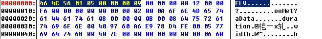](http://hiphotos.baidu.com/gaoxiansong/pic/item/a69ae70ebe4a33caaa645774.jpg)

| 文件类型    | 3bytes | 总是 FLV（0x46 0x4C 0x56），否则...                                                                                                                 |
| ----------- | ------ | --------------------------------------------------------------------------------------------------------------------------------------------------- |
| 版本        | 1byte  | 一般是 0x01，表示 FLV version 1                                                                                                                     |
| 流信息      | 1byte  | 倒数第一 bit 是 1 表示有视频，倒数第三 bit 是 1 表示有音频，其他都应该是 0（有些软件如 flvtool2 可能造成倒数第四 bit 是 1，不过也没发现有什么不对） |
| header 长度 | 4bytes | 整个文件头的长度，一般是 9（3+1+1+4），有时候后面还有些别的信息，就不是 9 了                                                                        |
|             |        |                                                                                                                                                     |

FLV Body

FLV body 就是由很多 tag 组成的。

FLV 文件里面帧的实体就是 tag 了。每个 tag 都可以分为两部分，第一部分包含是 tag 类型信息，长度固定为 15 字节，如图：

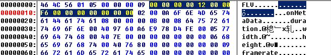

第二部分为 tag data，也就是 flv 的数据(有音频，视频，脚本等三类数据)，根据不同的 tag 类型就有不同的数据区，数据区的长度由第一部分的数据区长度字段定义，如图：

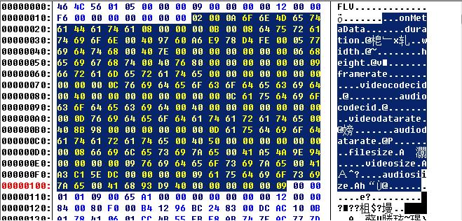

| previoustagsize | 4bytes | 前一个 tag 的长度，第一个 tag 就是 0             |
| --------------- | ------ | ------------------------------------------------ |
| tag 类型        | 1byte  | 三类：8 -- 音频 tag 9 -- 视频 tag 18 -- 脚本 tag |
| 数据区长度      | 3bytes |                                                  |
| 时间戳          | 3bytes | 单位毫秒，如果是脚本 tag 就是 0                  |
| 扩展时间戳      | 1byte  | 作为时间戳的高位                                 |
| streamsID       | 3bytes | 总是 0（不知道干啥用）                           |
| 数据区          |        |                                                  |

接下来就是下一个 tag 的内容，其开始的四个字节定义了上个 tag 的总长度，注意上个 tag 的总长度中不包括上个 tag 之前的 4 个描述再上一个 tag 的长度的 4 个字节，如图：

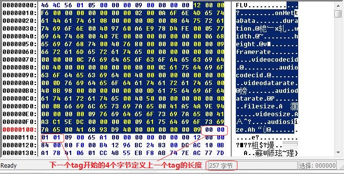

接下来说一下文件尾，在文件尾的最后有四个字节是定义最后一个 tag 的长度的，如图：

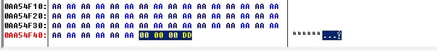

这里我门可以算一下，是 00 00 00 DD 是 221，最后一个 tag 的长度是 221，如图：

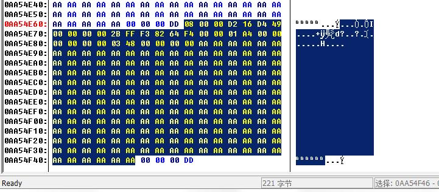

下面是不同类型的 tag 数据区的内容体

Audio tag 数据区

| audio 信息   | 1byte | 前四位 bits 表示音频格式:0 -- 未压缩 1 -- ADPCM 2 -- MP3 5 -- Nellymoser 8kHz momo 6 -- Nellymoser 下面两位 bits 表示 samplerate:0 -- 5.5kHz 1 -- 11kHz 2 -- 22kHz 3 -- 44kHz 下面一位 bit 表示每个采样的长度：0 -- snd8Bit 1 -- snd16Bit 下面一位 bit 表示类型：0 -- sndMomo 1 -- sndStereo |
| ------------ | ----- | -------------------------------------------------------------------------------------------------------------------------------------------------------------------------------------------------------------------------------------------------------------------------------------------- |
| audio 数据区 | 不定  |                                                                                                                                                                                                                                                                                              |

video tag 数据区

| video 信息   | 1byte | 前四位 bits 表示类型：1 -- keyframe 2 -- inner frame 3 -- disposable inner frame (H.263 only) 后四位 bits 表示编码器 id：2 -- Seronson H.263 3 -- Screen video 4 -- On2 VP6 5 -- On2 VP6 without channel 6 -- Screen video version 2 |
| ------------ | ----- | ------------------------------------------------------------------------------------------------------------------------------------------------------------------------------------------------------------------------------------ |
| video 数据区 | 不定  |                                                                                                                                                                                                                                      |

script tag 数据区

略 n 字...

下面是自己写的一段根据上面对 FLV 文件结构的分析读取 FLV 播放时间的 Delphi 代码：

```bash
{$R *.dfm}
procedure TForm1.Button1Click(Sender: TObject);
begin
OpenDialog1.Execute;
Edit1.Text:=OpenDialog1.FileName;
end;

procedure TForm1.Button2Click(Sender: TObject);
var
  iFileHandle:  Integer;
  iFileLength:  Integer;
  iBytesRead:  Integer;
  Buffer:  array  of  Byte;
  i:  Integer;
  str1,str2:String;
  tminute,tSecond,tMillisecond,tmptime:Integer;
begin
  if Edit1.Text = '' then
  begin
   ShowMessage('请选择文件！');
   exit;
  end;
  iFileHandle  :=  FileOpen( Edit1.Text ,  fmOpenRead);
  iFileLength  :=  FileSeek(iFileHandle,  0,  2);
  FileSeek(iFileHandle,  0,  0);
  SetLength(Buffer,  iFileLength);
  iBytesRead  :=  FileRead(iFileHandle,  Buffer[0],  iFileLength);
  FileClose(iFileHandle);
  str1  :=  '';
  for  i  := iBytesRead  -  4  to  iBytesRead  -  1  do
  begin
    str1  :=  str1  +  IntToHex(Buffer[i],2);
  end;
  str2  :=  '';
  for  i  := iBytesRead  -  StrToInt('$'+str1) to  iBytesRead  -  (StrToInt('$'+str1)-2)  do
  begin
    str2  :=  str2  +  IntToHex(Buffer[i],2);
  end;
  tMillisecond:=strtoint('$'+str2);
  tminute:=(tMillisecond div 1000) div 60;
  tSecond:=(tMillisecond div 1000) mod 60;
  tmptime:=tMillisecond mod 1000;
  Label2.Caption:=IntToStr(tminute)+'分'+IntToStr(tSecond)+'秒';
  Buffer  :=  nil;
end;
```

### H.264.标准

### MP4 文件格式解析

mp4 文件格式解析（一）

**\*\*原文地址：\*\***[mp4 文件格式解析（一）](http://blog.sina.com.cn/s/blog_48f93b530100jz4b.html)**\*\*作者：\*\***[可下人间](http://blog.sina.com.cn/u/1224293203)

目前 MP4 的概念被炒得很火，也很乱。最开始 MP4 指的是音频（MP3 的升级版），即 MPEG-2 AAC 标准。随后 MP4 概念被转移到视频上，对应的是 MPEG-4 标准。而现在我们流行的叫法，多半是指能播放 MPEG-4 标准编码格式视频的播放器。但是这篇文章介绍的内容跟上面这些都无关，我们要讨论的是 MP4 文件封装格式，对应的标准为 ISO/IEC 14496-12，即信息技术 视听对象编码的第 12 部分：ISO 基本媒体文件格式（Information technology Coding of audio-visual objects Part 12: ISO base media file format）。ISO/IEC 组织指定的标准一般用数字表示，ISO/IEC 14496 即 MPEG-4 标准。

MP4 视频文件封装格式是基于 QuickTime 容器格式定义的，因此参考 QuickTime 的格式定义对理解 MP4 文件格式很有帮助。MP4 文件格式是一个十分开放的容器，几乎可以用来描述所有的媒体结构，MP4 文件中的媒体描述与媒体数据是分开的，并且媒体数据的组织也很自由，不一定要按照时间顺序排列，甚至媒体数据可以直接引用其他文件。同时，MP4 也支持流媒体。MP4 目前被广泛用于封装 h.264 视频和 AAC 音频，是高清视频的代表。

现在我们就来看看 MP4 文件格式到底是什么样的。

**\*\*1、概述\*\***

MP4 文件中的所有数据都装在 box（QuickTime 中为 atom）中，也就是说 MP4 文件由若干个 box 组成，每个 box 有类型和长度，可以将 box 理解为一个数据对象块。box 中可以包含另一个 box，这种 box 称为 container box。一个 MP4 文件首先会有且只有一个“ftyp”类型的 box，作为 MP4 格式的标志并包含关于文件的一些信息；之后会有且只有一个“moov”类型的 box（Movie Box），它是一种 container box，子 box 包含了媒体的 metadata 信息；MP4 文件的媒体数据包含在“mdat”类型的 box（Midia Data Box）中，该类型的 box 也是 container box，可以有多个，也可以没有（当媒体数据全部引用其他文件时），媒体数据的结构由 metadata 进行描述。

下面是一些概念：

**\*\*\*track\*\*\*** 表示一些 sample 的集合，对于媒体数据来说，track 表示一个视频或音频序列。

**\*\*\*hint track\*\*\*** 这个特殊的 track 并不包含媒体数据，而是包含了一些将其他数据 track 打包成流媒体的指示信息。

**\*\*\*sample\*\*\*** 对于非 hint track 来说，video sample 即为一帧视频，或一组连续视频帧，audio sample 即为一段连续的压缩音频，它们统称 sample。对于 hint track，sample 定义一个或多个流媒体包的格式。

**\*\*\*sample table\*\*\*** 指明 sampe 时序和物理布局的表。

**\*\*\*chunk\*\*\*** 一个 track 的几个 sample 组成的单元。

在本文中，我们不讨论涉及 hint 的内容，只关注包含媒体数据的本地 MP4 文件。下图为一个典型的 MP4 文件的结构树。

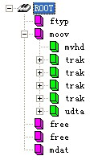

**\*\*2、Box\*\***

​ 首先需要说明的是，box 中的字节序为网络字节序，也就是大端字节序（Big-Endian），简单的说，就是一个 32 位的 4 字节整数存储方式为高位字节在内存的低端。Box 由 header 和 body 组成，其中 header 统一指明 box 的大小和类型，body 根据类型有不同的意义和格式。

​ 标准的 box 开头的 4 个字节（32 位）为 box size，该大小包括 box header 和 box body 整个 box 的大小，这样我们就可以在文件中定位各个 box。如果 size 为 1，则表示这个 box 的大小为 large size，真正的 size 值要在 largesize 域上得到。（实际上只有“mdat”类型的 box 才有可能用到 large size。）如果 size 为 0，表示该 box 为文件的最后一个 box，文件结尾即为该 box 结尾。（同样只存在于“mdat”类型的 box 中。）

​ size 后面紧跟的 32 位为 box type，一般是 4 个字符，如“ftyp”、“moov”等，这些 box type 都是已经预定义好的，分别表示固定的意义。如果是“uuid”，表示该 box 为用户扩展类型。如果 box type 是未定义的，应该将其忽略。

**\*\*3\*\*\*\*\***\*、\***\*\***\*File Type Box\***\*\***\*（\***\*\***\*ftyp\***\*\***\*）\*\*\*\*

该 box 有且只有 1 个，并且只能被包含在文件层，而不能被其他 box 包含。该 box 应该被放在文件的最开始，指示该 MP4 文件应用的相关信息。

“ftyp” body 依次包括 1 个 32 位的 major brand（4 个字符），1 个 32 位的 minor version（整数）和 1 个以 32 位（4 个字符）为单位元素的数组 compatible brands。这些都是用来指示文件应用级别的信息。该 box 的字节实例如下：


4、Movie Box（moov）

该 box 包含了文件媒体的 metadata 信息，“moov”是一个 container box，具体内容信息由子 box 诠释。同 File Type Box 一样，该 box 有且只有一个，且只被包含在文件层。一般情况下，“moov”会紧随“ftyp”出现。

一般情况下（限于篇幅，本文只讲解常见的 MP4 文件结构），“moov”中会包含 1 个“mvhd”和若干个“trak”。其中“mvhd”为 header box，一般作为“moov”的第一个子 box 出现（对于其他 container box 来说，header box 都应作为首个子 box 出现）。“trak”包含了一个 track 的相关信息，是一个 container box。下图为部分“moov”的字节实例，其中红色部分为 box header，绿色为“mvhd”，黄色为一部分“trak”。

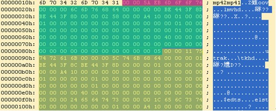
**\*\*4.1 Movie Header Box\*\*\*\*\***\*（\***\*\***\*mvhd\***\*\***\*）\*\*\*\*

“mvhd”结构如下表。

| 字段              | 字节数 | 意义                                                                                                                                                                                                        |
| ----------------- | ------ | ----------------------------------------------------------------------------------------------------------------------------------------------------------------------------------------------------------- |
| box size          | 4      | box 大小                                                                                                                                                                                                    |
| box type          | 4      | box 类型                                                                                                                                                                                                    |
| version           | 1      | box 版本，0 或 1，一般为 0。（以下字节数均按 version=0）                                                                                                                                                    |
| flags             | 3      |                                                                                                                                                                                                             |
| creation time     | 4      | 创建时间（相对于 UTC 时间 1904-01-01 零点的秒数）                                                                                                                                                           |
| modification time | 4      | 修改时间                                                                                                                                                                                                    |
| time scale        | 4      | 文件媒体在 1 秒时间内的刻度值，可以理解为 1 秒长度的时间单元数                                                                                                                                              |
| duration          | 4      | 该 track 的时间长度，用 duration 和 time scale 值可以计算 track 时长，比如 audio track 的 time scale = 8000, duration = 560128，时长为 70.016，video track 的 time scale = 600, duration = 42000，时长为 70 |
| rate              | 4      | 推荐播放速率，高 16 位和低 16 位分别为小数点整数部分和小数部分，即[16.16] 格式，该值为 1.0（0x00010000）表示正常前向播放                                                                                    |
| volume            | 2      | 与 rate 类似，[8.8] 格式，1.0（0x0100）表示最大音量                                                                                                                                                         |
| reserved          | 10     | 保留位                                                                                                                                                                                                      |
| matrix            | 36     | 视频变换矩阵                                                                                                                                                                                                |
| pre-defined       | 24     |                                                                                                                                                                                                             |
| next track id     | 4      | 下一个 track 使用的 id 号                                                                                                                                                                                   |

“mvhd”的字节实例如下图，各字段已经用颜色区分开：

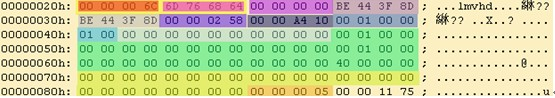

**\*\*4.2 Track Box\*\*\*\*\***\*（\***\*\***\*trak\***\*\***\*）\*\*\*\*

“trak”也是一个 container box，其子 box 包含了该 track 的媒体数据引用和描述（hint track 除外）。一个 MP4 文件中的媒体可以包含多个 track，且至少有一个 track，这些 track 之间彼此独立，有自己的时间和空间信息。“trak”必须包含一个“tkhd”和一个“mdia”，此外还有很多可选的 box（略）。其中“tkhd”为 track header box，“mdia”为 media box，该 box 是一个包含一些 track 媒体数据信息 box 的 container box。

“trak”的部分字节实例如下图，其中黄色为“trak”box 的头，绿色为“tkhd”，蓝色为“edts”（一个可选 box），红色为一部分“mdia”。

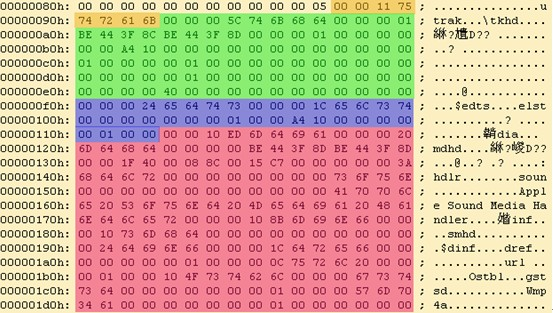

**\*\*4.2.1 Track Header Box\*\*\*\*\***\*（\***\*\***\*tkhd\***\*\***\*）\*\*\*\*

“tkhd”结构如下表。

| 字段              | 字节数 | 意义                                                                                                                                                                                                                                                                                                                                        |
| ----------------- | ------ | ------------------------------------------------------------------------------------------------------------------------------------------------------------------------------------------------------------------------------------------------------------------------------------------------------------------------------------------- |
| box size          | 4      | box 大小                                                                                                                                                                                                                                                                                                                                    |
| box type          | 4      | box 类型                                                                                                                                                                                                                                                                                                                                    |
| version           | 1      | box 版本，0 或 1，一般为 0。（以下字节数均按 version=0）                                                                                                                                                                                                                                                                                    |
| flags             | 3      | 按位或操作结果值，预定义如下：0x000001 track_enabled，否则该 track 不被播放；0x000002 track_in_movie，表示该 track 在播放中被引用；0x000004 track_in_preview，表示该 track 在预览时被引用。一般该值为 7，如果一个媒体所有 track 均未设置 track_in_movie 和 track_in_preview，将被理解为所有 track 均设置了这两项；对于 hint track，该值为 0 |
| creation time     | 4      | 创建时间（相对于 UTC 时间 1904-01-01 零点的秒数）                                                                                                                                                                                                                                                                                           |
| modification time | 4      | 修改时间                                                                                                                                                                                                                                                                                                                                    |
| track id          | 4      | id 号，不能重复且不能为 0                                                                                                                                                                                                                                                                                                                   |
| reserved          | 4      | 保留位                                                                                                                                                                                                                                                                                                                                      |
| duration          | 4      | track 的时间长度                                                                                                                                                                                                                                                                                                                            |
| reserved          | 8      | 保留位                                                                                                                                                                                                                                                                                                                                      |
| layer             | 2      | 视频层，默认为 0，值小的在上层                                                                                                                                                                                                                                                                                                              |
| alternate group   | 2      | track 分组信息，默认为 0 表示该 track 未与其他 track 有群组关系                                                                                                                                                                                                                                                                             |
| volume            | 2      | [8.8] 格式，如果为音频 track，1.0（0x0100）表示最大音量；否则为 0                                                                                                                                                                                                                                                                           |
| reserved          | 2      | 保留位                                                                                                                                                                                                                                                                                                                                      |
| matrix            | 36     | 视频变换矩阵                                                                                                                                                                                                                                                                                                                                |
| width             | 4      | 宽                                                                                                                                                                                                                                                                                                                                          |
| height            | 4      | 高，均为 [16.16] 格式值，与 sample 描述中的实际画面大小比值，用于播放时的展示宽高                                                                                                                                                                                                                                                           |

“tkhd”的字节实例如下图，各字段已经用颜色区分开：

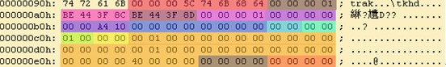

**\*\*4.2.2 Media Box\*\*\*\*\***\*（\***\*\***\*mdia\***\*\***\*）\*\*\*\*

“mdia”也是个 container box，其子 box 的结构和种类还是比较复杂的。先来看一个“mdia”的实例结构树图。

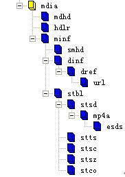

总体来说，“mdia”定义了 track 媒体类型以及 sample 数据，描述 sample 信息。一般“mdia”包含一个“mdhd”，一个“hdlr”和一个“minf”，其中“mdhd”为 media header box，“hdlr”为 handler reference box，“minf”为 media information box。下面依次看一下这几个 box 的结构。

**\*\*4.2.2.1 Media Header Box\*\*\*\*\***\*（\***\*\***\*mdhd\***\*\***\*）\*\*\*\*

“mdhd”结构如下表。

| 字段              | 字节数 | 意义                                                                       |
| ----------------- | ------ | -------------------------------------------------------------------------- |
| box size          | 4      | box 大小                                                                   |
| box type          | 4      | box 类型                                                                   |
| version           | 1      | box 版本，0 或 1，一般为 0。（以下字节数均按 version=0）                   |
| flags             | 3      |                                                                            |
| creation time     | 4      | 创建时间（相对于 UTC 时间 1904-01-01 零点的秒数）                          |
| modification time | 4      | 修改时间                                                                   |
| time scale        | 4      | 同前表                                                                     |
| duration          | 4      | track 的时间长度                                                           |
| language          | 2      | 媒体语言码。最高位为 0，后面 15 位为 3 个字符（见 ISO 639-2/T 标准中定义） |
| pre-defined       | 2      |                                                                            |

“mdhd”的字节实例如下图，各字段已经用颜色区分开：

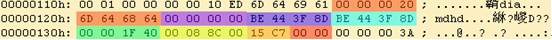

**\*\*4.2.2.2 Handler Reference Box\*\*\*\*\***\*（\***\*\***\*hdlr\***\*\***\*）\*\*\*\*

“hdlr”解释了媒体的播放过程信息，该 box 也可以被包含在 meta box（meta）中。“hdlr”结构如下表。

| 字段         | 字节数 | 意义                                                                                       |
| ------------ | ------ | ------------------------------------------------------------------------------------------ |
| box size     | 4      | box 大小                                                                                   |
| box type     | 4      | box 类型                                                                                   |
| version      | 1      | box 版本，0 或 1，一般为 0。（以下字节数均按 version=0）                                   |
| flags        | 3      |                                                                                            |
| pre-defined  | 4      |                                                                                            |
| handler type | 4      | 在 media box 中，该值为 4 个字符：“vide”— video track“soun”— audio track“hint”— hint track |
| reserved     | 12     |                                                                                            |
| name         | 不定   | track type name，以‘\0’结尾的字符串                                                        |

“hdlr”的字节实例如下图，各字段已经用颜色区分开：

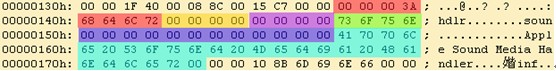

**\*\*4.2.2.3 Media Information Box\*\*\*\*\***\*（\***\*\***\*minf\***\*\***\*）\*\*\*\*

“minf”存储了解释 track 媒体数据的 handler-specific 信息，media handler 用这些信息将媒体时间映射到媒体数据并进行处理。“minf”中的信息格式和内容与媒体类型以及解释媒体数据的 media handler 密切相关，其他 media handler 不知道如何解释这些信息。“minf”是一个 container box，其实际内容由子 box 说明。

一般情况下，“minf”包含一个 header box，一个“dinf”和一个“stbl”，其中，header box 根据 track type（即 media handler type）分为“vmhd”、“smhd”、“hmhd”和“nmhd”，“dinf”为 data information box，“stbl”为 sample table box。下面分别介绍。

下图为“minf”部分字节实例，其中红色为 box header，蓝色为“smhd”，绿色为“dinf”，黄色为一部分“stbl”。

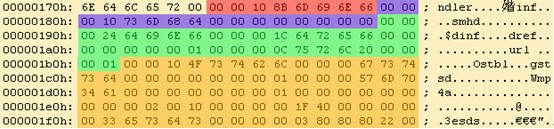

**\*\*4.2.2.3.1 Media Information Header Box\*\*\*\*\***\*（\***\*\***\*vmhd\***\*\***\*、\***\*\***\*smhd\***\*\***\*、\***\*\***\*hmhd\***\*\***\*、\***\*\***\*nmhd\***\*\***\*）\*\*\*\*

**\*\*\*Video Media Header Box\*\*\*\*\*\***\*\*（\*\*\***\***\*\*vmhd\*\*\***\***\*\*）\*\*\*\*\*

| 字段          | 字节数 | 意义                                                       |
| ------------- | ------ | ---------------------------------------------------------- |
| box size      | 4      | box 大小                                                   |
| box type      | 4      | box 类型                                                   |
| version       | 1      | box 版本，0 或 1，一般为 0。（以下字节数均按 version=0）   |
| flags         | 3      |                                                            |
| graphics mode | 4      | 视频合成模式，为 0 时拷贝原始图像，否则与 opcolor 进行合成 |
| opcolor       | 2×3    | ｛red，green，blue｝                                       |

**\*\*\*Sound Media Header Box\*\*\*\*\*\***\*\*（\*\*\***\***\*\*smhd\*\*\***\***\*\*）\*\*\*\*\*

| 字段     | 字节数 | 意义                                                                        |
| -------- | ------ | --------------------------------------------------------------------------- |
| box size | 4      | box 大小                                                                    |
| box type | 4      | box 类型                                                                    |
| version  | 1      | box 版本，0 或 1，一般为 0。（以下字节数均按 version=0）                    |
| flags    | 3      |                                                                             |
| balance  | 2      | 立体声平衡，[8.8] 格式值，一般为 0，-1.0 表示全部左声道，1.0 表示全部右声道 |
| reserved | 2      |                                                                             |

**\*\*\*Hint Media Header Box（hmhd）\*\*\***

略

**\*\*\*Null Media Header Box（nmhd）\*\*\***

非视音频媒体使用该 box，略。

**\*\*4.2.2.3.2 Data Information Box\*\*\*\*\***\*（\***\*\***\*dinf\***\*\***\*）\*\*\*\*

“dinf”解释如何定位媒体信息，是一个 container box。“dinf”一般包含一个“dref”，即 data reference box；“dref”下会包含若干个“url”或“urn”，这些 box 组成一个表，用来定位 track 数据。简单的说，track 可以被分成若干段，每一段都可以根据“url”或“urn”指向的地址来获取数据，sample 描述中会用这些片段的序号将这些片段组成一个完整的 track。一般情况下，当数据被完全包含在文件中时，“url”或“urn”中的定位字符串是空的。

“dref”的字节结构如下表。

| 字段             | 字节数 | 意义                                                     |
| ---------------- | ------ | -------------------------------------------------------- |
| box size         | 4      | box 大小                                                 |
| box type         | 4      | box 类型                                                 |
| version          | 1      | box 版本，0 或 1，一般为 0。（以下字节数均按 version=0） |
| flags            | 3      |                                                          |
| entry count      | 4      | “url”或“urn”表的元素个数                                 |
| “url”或“urn”列表 | 不定   |                                                          |

“url”或“urn”都是 box，“url”的内容为字符串（location string），“urn”的内容为一对字符串（name string and location string）。当“url”或“urn”的 box flag 为 1 时，字符串均为空。

下面是一个“dinf”的字节实例图。其中黄色为“dinf”的 box header，由红色部分我们知道包含的“url”或“urn”个数为 1，红色后面为“url”box 的内容。紫色为“url”的 box header（根据 box type 我们知道是个“url”），绿色为 box flag，值为 1，说明“url”中的字符串为空，表示 track 数据已包含在文件中。

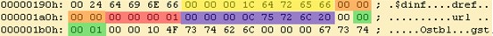

4.2.2.3.3 Sample Table Box（stbl）

“stbl”几乎是普通的 MP4 文件中最复杂的一个 box 了，首先需要回忆一下 sample 的概念。sample 是媒体数据存储的单位，存储在 media 的 chunk 中，chunk 和 sample 的长度均可互不相同，如下图所示。

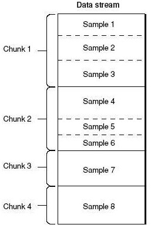

“stbl”包含了关于 track 中 sample 所有时间和位置的信息，以及 sample 的编解码等信息。利用这个表，可以解释 sample 的时序、类型、大小以及在各自存储容器中的位置。“stbl”是一个 container box，其子 box 包括：sample description box（stsd）、time to sample box（stts）、sample size box（stsz 或 stz2）、sample to chunk box（stsc）、chunk offset box（stco 或 co64）、composition time to sample box（ctts）、sync sample box（stss）等。

“stsd”必不可少，且至少包含一个条目，该 box 包含了 data reference box 进行 sample 数据检索的信息。没有“stsd”就无法计算 media sample 的存储位置。“stsd”包含了编码的信息，其存储的信息随媒体类型不同而不同。

**\*\*\*Sample Description Box（stsd）\*\*\***

box header 和 version 字段后会有一个 entry count 字段，根据 entry 的个数，每个 entry 会有 type 信息，如“vide”、“sund”等，根据 type 不同 sample description 会提供不同的信息，例如对于 video track，会有“VisualSampleEntry”类型信息，对于 audio track 会有“AudioSampleEntry”类型信息。

视频的编码类型、宽高、长度，音频的声道、采样等信息都会出现在这个 box 中。

**\*\*\*Time To Sample Box（stts）\*\*\***

“stts”存储了 sample 的 duration，描述了 sample 时序的映射方法，我们通过它可以找到任何时间的 sample。“stts”可以包含一个压缩的表来映射时间和 sample 序号，用其他的表来提供每个 sample 的长度和指针。表中每个条目提供了在同一个时间偏移量里面连续的 sample 序号，以及 samples 的偏移量。递增这些偏移量，就可以建立一个完整的 time to sample 表。

**\*\*\*Sample Size Box（stsz）\*\*\***

“stsz” 定义了每个 sample 的大小，包含了媒体中全部 sample 的数目和一张给出每个 sample 大小的表。这个 box 相对来说体积是比较大的。

**\*\*\*Sample To Chunk Box（stsc）\*\*\***

用 chunk 组织 sample 可以方便优化数据获取，一个 thunk 包含一个或多个 sample。“stsc”中用一个表描述了 sample 与 chunk 的映射关系，查看这张表就可以找到包含指定 sample 的 thunk，从而找到这个 sample。

**\*\*\*Sync Sample Box（stss）\*\*\***

“stss”确定 media 中的关键帧。对于压缩媒体数据，关键帧是一系列压缩序列的开始帧，其解压缩时不依赖以前的帧，而后续帧的解压缩将依赖于这个关键帧。“stss”可以非常紧凑的标记媒体内的随机存取点，它包含一个 sample 序号表，表内的每一项严格按照 sample 的序号排列，说明了媒体中的哪一个 sample 是关键帧。如果此表不存在，说明每一个 sample 都是一个关键帧，是一个随机存取点。

**\*\*\*Chunk Offset Box（stco）\*\*\***

“stco”定义了每个 thunk 在媒体流中的位置。位置有两种可能，32 位的和 64 位的，后者对非常大的电影很有用。在一个表中只会有一种可能，这个位置是在整个文件中的，而不是在任何 box 中的，这样做就可以直接在文件中找到媒体数据，而不用解释 box。需要注意的是一旦前面的 box 有了任何改变，这张表都要重新建立，因为位置信息已经改变了。

**\*\*5\*\*\*\*\***\*、\***\*\***\*Free Space Box\***\*\***\*（\***\*\***\*free\***\*\***\*或\***\*\***\*skip\***\*\***\*）\*\*\*\*

“free”中的内容是无关紧要的，可以被忽略。该 box 被删除后，不会对播放产生任何影响。

**\*\*6\*\*\*\*\***\*、\***\*\***\*Meida Data Box\***\*\***\*（\***\*\***\*mdat\***\*\***\*）\*\*\*\*

该 box 包含于文件层，可以有多个，也可以没有（当媒体数据全部为外部文件引用时），用来存储媒体数据。数据直接跟在 box type 字段后面，具体数据结构的意义需要参考 metadata（主要在 sample table 中描述）。

普通 MP4 文件的结构就讲完了，可能会比较乱，下面这张图是常见的 box 的树结构图，可以用来大致了解 MP4 文件的构造。

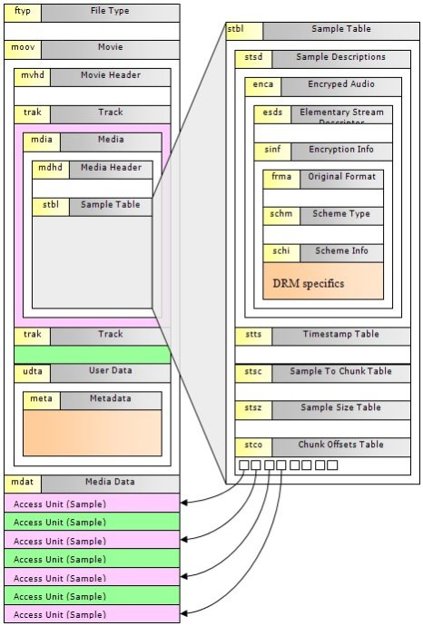

这篇文章主要面向一些对 MP4 文件结构没有太多了解的初学者，算是篇比较初级的文章，本人也是参考了一些资料写出来的，对于 MP4 文件中涉及的一些概念没有太深入的了解，因此其中应该是有一些错误理解，希望大家抱着批判的眼光读这篇文章。如果有错误的地方，还请大家不吝赐教。该文主要参考了标准和网友 wqyuwss 的 blog 系列文章：[mp4 文件格式](http://www.52rd.com/blog/Blog.asp?Name=wqyuwss&Subjectid=559)

### MPEG2 封装格式和编码格式

MPEG 是运动图像专家组(Moving Picture Experts Group)的简称，其实质上的名称为国际标准化组织（ISO）和国际电工委员会（IEC）联合技术委员会（JTC）1 的第 29 分委员会的第 11 工作组，即 ISO/IEC JTC1/SC29/WG11，成立于 1988 年。其任务是制定世界通用的视音频编码标准。因为，广播电视数字化所产生的海量数据对存储容量、传输带宽、处理能力及频谱资源利用率提出了不切合实际的要求，使数字化难以实现。为此，该专家组基于帧内图像相邻像素间及相邻行间的空间相关性和相邻帧间运动图像的时间相关性，采用压缩编码技术，将那些对人眼视觉图像和人耳听觉声音不太重要的东西及冗余成分抛弃，从而缩减了存储、传输和处理的数据量，提高了频谱资源利用率，制定了如表 1 所示的一系列 MPEG 标准,使数字化正在变为现实。其中，MPEG-2 是一组用于视音频压缩编码及其数据流格式的国际标准。它定义了编解码技术及数据流的传输协议；制定了 MPEG-2 解码器之间的共同标准（MPEG-2 编码器之间尚无共同标准）。本文以 MPEG-2 的系统、MPEG-2 的编码、及 MPEG-2 的应用为题，讨论 MPEG-2 压缩编码技术。

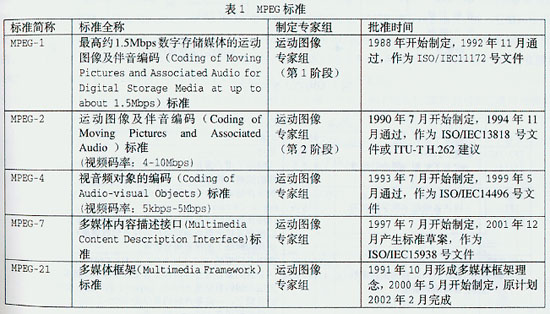

一、MPEG-2 的系统

1.系统的定义

MPEG-2 系统是将视频、音频及其它数据基本流组合成一个或多个适宜于存储或传输的数据流的规范，如图 1 所示。由图 1 可见，符合 ITU-R. 601 标准的、帧次序为 I1B2B3P4B5B6P7B8B9I10 数字视频数据和符合 AES/EBU 标准的数字音频数据分别通过图像编码和声音编码之后，生成次序为 I1P4B2B3 P7B5B6I10 B8B9 视频基本流（ES）和音频 ES。在视频 ES 中还要加入一个时间基准，即加入从视频信号中取出的 27MHz 时钟。然后，再分别通过各自的数据包形成器，将相应的 ES 打包成打包基本流（PES）包，并由 PES 包构成 PES。最后，节目复用器和传输复用器分别将视频 PES 和音频 PES 组合成相应的节目流（PS）包和传输流（TS）包，并由 PS 包构成 PS 和由 TS 包构成 TS。显然，不允许直接传输 PES，只允许传输 PS 和 TS；PES 只是 PS 转换为 TS 或 TS 转换为 PS 的中间步骤或桥梁，是 MPEG 数据流互换的逻辑结构，本身不能参与交换和互操作。由系统的定义，可知 MPEG-2 系统的任务。

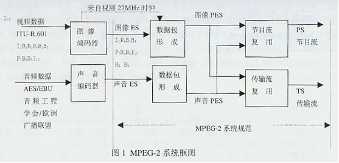

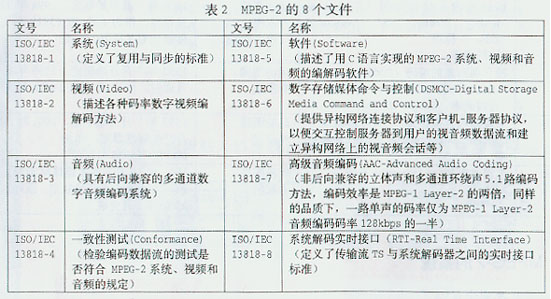

2.系统的任务

MPEG-2 的标准由表 2 所示的 8 个文件组成，MPEG-2 系统是其关键部分。MPEG 以开放系统互联(OSI-Open System Interconnection)为目标，争取全球标准化。在详细规定视音频编码算法的基础上，为传输和交换编码数据流（比特流，码流，流）创造统一条件。以利于接收端重建为指导，按照既定的参数给数据流以一定程度的“包装”。因此，MPEG-2 系统应完成的任务有：

● 规定以包方式传输数据的协议；
● 为收发两端数据流同步创造条件；
● 确定将多个数据流合并和分离（即复用和解复用）的原则；
● 提供一种进行加密数据传输的可能性。

由系统的任务，可知完成任务，系统应具备的基础。

3.系统的要点

根据数字通信信息量可以逐段传输的机理，将已编码数据流在时间上以一定重复周期结构分割成不能再细分的最小信息单元，这个最小信息单元就定义为数据包，几个小数据包（Data Packet）又可以打包成大数据包（Data Pack）。用数据包传输的优点是：网络中信息可占用不同的连接线路和简单暂存；通过数据包交织将多个数据流组合（复用）成一个新的数据流；便于解码器按照相应顺序对数据包进行灵活地整理。从而，数据包为数据流同步和复用奠定了基础。因此，MPEG-2 系统规范不仅采用了 PS、TS 和 PES 三种数据包，而且也涉及 PS 和 TS 两种可以互相转换的数据流。显然，以数据包形式存储和传送数据流是 MPEG-2 系统的要点。为此，MPEG-2 系统规范定义了三种数据包及两种数据流：

1)打包基本流（PES）

将 MPEG-2 压缩编码的视频基本流（ES-Elementary Stream）数据分组为包长度可变的数据包，称为打包基本流（PES- Packetized Elementary Stream）。广而言之，PES 为打包了的专用视频、音频、数据、同步、识别信息数据通道。所谓 ES，是指只包含 1 个信源编码器的数据流。即 ES 是编码的视频数据流，或编码的音频数据流，或其它编码数据流的统称。每个 ES 都由若干个存取单元(AU-Access Unit)组成,每个视频 AU 或音频 AU 都是由头部和编码数据两部分组成的。将帧顺序为 I1P4B2B3P7B5B6 的编码 ES，通过打包，就将 ES 变成仅含有 1 种性质 ES 的 PES 包，如仅含视频 ES 的 PES 包，仅含音频 ES 的 PES 包，仅含其它 ES 的 PES 包。PES 包的组成见图 2。

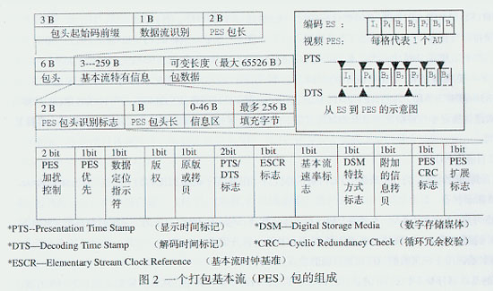

由图 2 可见，1 个 PES 包是由包头、ES 特有信息和包数据 3 个部分组成。由于包头和 ES 特有信息二者可合成 1 个数据头，所以可认为 1 个 PES 包是由数据头和包数据（有效载荷）两个部分组成的。

包头由起始码前缀、数据流识别及 PES 包长信息 3 部分构成。包起始码前缀是用 23 个连续“0”和 1 个“1”构成的，用于表示有用信息种类的数据流识别，是 1 个 8 bit 的整数。由二者合成 1 个专用的包起始码，可用于识别数据包所属数据流（视频,音频,或其它）的性质及序号。例如：

比特序 1 1 0 ××××× 是号码为 ×××× 的 MPEG-2 音频数据流；
比特序 1 1 1 0 ×××× 是号码为 ×××× 的 MPEG-2 视频数据流。

PES 包长用于包长识别，表明在此字段后的字节数。如，PES 包长识别为 2 B ，即 2×8 = 16 bit 字宽，包总长为 216-1=65535 B，分给数据头 9 B（包头 6 B + ES 特有信息 3 B ），可变长度的包数据最大容量为 65526 B。尽管 PES 包最大长度可达（216 -1）=65535 B（Byte），但在通常的情况下是组成 ES 的若干个 AU 中的由头部和编码数据两部分组成的 1 个 AU 长度。1 个 AU 相当于编码的 1 幅视频图像或 1 个音频帧，参见图 2 右上角从 ES 到 PES 的示意图。也可以说，每个 AU 实际上是编码数据流的显示单元，即相当于解码的 1 幅视频图像或 1 个音频帧的取样。

ES 特有信息是由 PES 包头识别标志、PES 包头长信息、信息区和用于调整信息区可变包长的填充字节 4 部分组成的 PES 包控制信息。其中，PES 包头识别标志由 12 个部分组成：PES 加扰控制信息、PES 优先级别指示、数据适配定位指示符、有否版权指示、原版或拷贝指示、有否显示时间标记（PTS-Presentation Time Stamp）/解码时间标记(DTS-Decode Time Stamp)标志、PES 包头有否基本流时钟基准(ESCR-Elementary Stream Clock Reference)信息标志、PES 包头有否基本流速率信息标志、有否数字存储媒体（DSM）特技方式信息标志、有否附加的拷贝信息标志、PES 包头有否循环冗余校验（CRC-Cyclic Redundancy Check）信息标志、有否 PES 扩展标志。有扩展标志，表明还存在其它信息。如，在有传输误码时，通过数据包计数器，使接收端能以准确的数据恢复数据流，或借助计数器状态，识别出传输时是否有数据包丢失。

其中，有否 PTS/DTS 标志，是解决视音频同步显示、防止解码器输入缓存器上溢或下溢的关键所在。因为，PTS 表明显示单元出现在系统目标解码器（STD-System Target Decoder）的时间, DTS 表明将存取单元全部字节从 STD 的 ES 解码缓存器移走的时刻。视频编码图像帧次序为 I1P4B2B3P7B5B6I10B8B9 的 ES，加入 PTS/DTS 后，打包成一个个视频 PES 包。每个 PES 包都有一个包头，用于定义 PES 内的数据内容，提供定时资料。每个 I、P、B 帧的包头都有一个 PTS 和 DTS，但 PTS 与 DTS 对 B 帧都是一样的，无须标出 B 帧的 DTS。对 I 帧和 P 帧，显示前一定要存储于视频解码器的重新排序缓存器中，经过延迟（重新排序）后再显示，一定要分别标明 PTS 和 DTS。例如，解码器输入的图像帧次序为 I1P4B2B3P7B5B6I10B8B9，依解码器输出的帧次序，应该 P4 比 B2、B3 在先，但显示时 P4 一定要比 B2、B3 在后，即 P4 要在提前插入数据流中的时间标志指引下，经过缓存器重新排序，以重建编码前视频帧次序 I1B2B3P4B5B6P7B8B9I10。显然，PTS/DTS 标志表明对确定事件或确定信息解码的专用时标的存在，依靠专用时标解码器，可知道该确定事件或确定信息开始解码或显示的时刻。例如，PTS/DTS 标志可用于确定编码、多路复用、解码、重建的时间。

2）节目流（PS）

将具有共同时间基准的一个或多个 PES 组合（复合）而成的单一的数据流称为节目流（Program Stream）。PS 包的结构如图 3 所示。

由图 3 可见，PS 包由包头、系统头、PES 包 3 部分构成。包头由 PS 包起始码、系统时钟基准（SCR-System Clock Reference）的基本部分、SCR 的扩展部分和 PS 复用速率 4 部分组成。

PS 包起始码用于识别数据包所属数据流的性质及序号。

SCR 的基本部分是 1 个 33 bit 的数，由 MPEG-1 与 MPEG-2 兼容共用。SCR 扩展部分是 1 个 9 bit 的数，由 MPEG-2 单独使用。SCR 是为了解决压缩编码图像同步问题产生的。因为，I、B、P 帧经过压缩编码后，各帧有不同的字节数；输入解码器的压缩编码图像的帧顺序 I1P4B2B3P7B5B6I10B8B9 中的 P4、I10 帧，需要经过重新排序缓存器延迟后，才能重建编码输入图像的帧顺序 I1B2B3P4B5B6P7B8B9I10；视频 ES 与音频 ES 是以前后不同的视频与音频的比例交错传送的。以上 3 条均不利于视音频同步。所以，为解决同步问题，提出在统一系统时钟（SSTC-Single System Time Clock）条件下，在 PS 包头插入时间标志 SCR 的方法。整个 42 bit 字宽的 SCR，按照 MPEG 规定分布在宽为 33 bit 的 1 个基础字及宽为 9 bit 的 1 个扩展区中。由于 MPEG-1 采用了相当于 33 bit 字宽的 90kHz 的时间基准，考虑到兼容，对节目流中的 SCR 也只用 33 bit。为了提高 PAL 或 NTSC 已编码节目再编码的精确性，MPEG-2 将时间分解力由 90kHz 提高到 27MHz 光栅结构，使通过 TS 时标中的 9 bit 扩展区后，精确性会更高。具体方法是将 9 bit 用作循环计数器，计数到 300 时，迅速向 33 bit 基本区转移，同时将扩展区计数器复原，以便由基本区向扩展区转移时重新计数。将 42 bit 作为时间标志插入 PS 包头的第 5 到第 10 个字节，表明 SCR 字段最后 1 个字节离开编码器的时间。在系统目标解码（STD-System Target Decoder）输入端，通过对 27MHz 的统一系统时钟（SSTC）取样后提取。显然，在编码端，STC 不仅产生了表明视音频正确的显示时间 PTS 和解码时间 DTS，而且也产生了表明 STC 本身瞬时值的时间标记 SCR。在解码端，应相应地使 SSTC 再生，并正确应用时间标志，即通过锁相环路（PLL-Phase Lock Loop），用解码时本地用 SCR 相位与输入的瞬时 SCR 相位锁相比较，确定解码过程是否同步，若不同步，则用这个瞬时 SCR 调整 27MHz 时钟频率。每个 SCR 字段的大小各不相同，其值是由复用数据流的数据率和 SSTC 的 27MHz 时钟频率确定的。可见，采用时间标志 PTS、DTS 和 SCR，是解决视音频同步、帧的正确显示次序、STD 缓存器上溢或下溢的好方法。
PS 复用速率用于指示其速率大小。

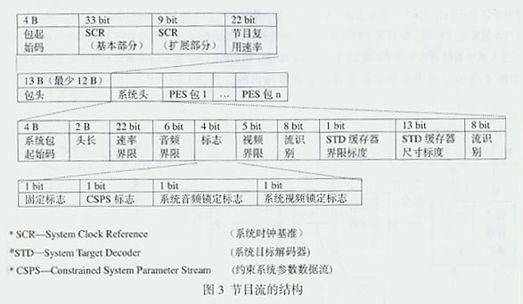

系统头由系统头起始码、系统头长度、速率界限范围、音频界限范围、各种标志指示、视频界限范围、数据流识别、STD 缓存器界限标度、STD 缓存器尺寸标度、（视频,音频,或数据）流识别等 10 个部分组成。各种标志部分由固定标志指示、约束系统参数数据流（CSPS-Constrained System Parameter Stream）指示、系统音频锁定标志指示、系统视频锁定标志指示 4 个部分组成。其中，CSPS 是对图像尺寸、速率、运动矢量范围、数据率等系统参数的限定指示。

显然，PS 的形成分两步完成：其一是将视频 ES、音频 ES、其他 ES 分别打包成视频 PES 包、音频 PES 包、其他 PES 包：使每个 PES 包内只能存在 1 种性质的 ES；每个 PES 包的第一个 AU 的包头可包含 PTS 和 DTS；每个 PES 包的包头都有用于区别不同性质 ES 的数据流识别码。这一切，使解复用和不同 ES 之间同步重放成为可能。其二是通过 PS 复用器将 PES 包复用成 PS 包，即将每个 PES 包再细分为更小的 PS 包。PS 包头含有从数字存储媒介（DSM-Digital storage Medium）进入系统解码器各个字节的解码专用时标，即预定到达时间表，它是时钟调整和缓存器管理的参数。典型 PS 解码器如图 4 所示，图中示意了数字视频解码器输出的、符合 ITU-R. 601 标准的视频数据帧顺序 I1B2B3P4B5B6P7B8B9I10，与数字视频编码器输出的数字视频编码 ES 帧顺序 I1P4B2B3P7B5B6I10B8B9 二者之间的关系。图中 PS 解复用器实际上是系统解复用器和拆包器的组合，即解复用器将 MPEG-2 的 PS 分解成一个个 PES 包，拆包器将 PES 包拆成视频 ES 和音频 ES，最后输入各自的解码器。系统头提供数据流的系统特定信息，包头与系统头共同构成一帧，用于将 PES 包数据流分割成时间上连续的 PS 包。可见，一个经过 MPEG-2 编码的节目源是由一个或多个视频 ES 和音频 ES 构成的，由于各个 ES 共用 1 个 27MHz 的时钟，可保证解码端视音频的同步播出。例如，一套电影经过 MPEG-2 编码，转换成 1 个视频 ES 和 4 个音频 ES。显然，PS 包长度比较长且可变，用于无误码环境，适合于节目信息的软件处理及交互多媒体应用。但是，PS 包越长，同步越困难；在丢包时数据的重新组成，也越困难。显然，PS 用于存储（磁盘、磁带等）、演播室 CD-I、MPEG-1 数据流。

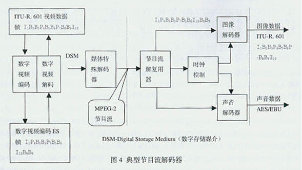

3)传输流(TS)

将具有共同时间基准或具有独立时间基准的一个或多个 PES 组合而成的单一的数据流称为传输流（Transport Stream）。TS 实际是面向数字化分配媒介（有线、卫星、地面网）的传输层接口。对具有共同时间基准的两个以上的 PES 先进行节目复用,然后再对相互可有独立时间基准的各个 PS 进行传输复用，即将每个 PES 再细分为更小的 TS 包，TS 包结构如图 5 所示。

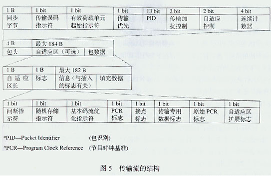

由图 5 可见，TS 包由包头、自适应区和包数据 3 部分组成。每个包长度为固定的 188 B，包头长度占 4 B，自适应区和包数据长度占 184 B。184 B 为有用信息空间，用于传送已编码的视音频数据流。当节目时钟基准（PCR-Program Clock Reference）存在时，包头还包括可变长度的自适应区，包头的长度就会大于 4 B。考虑到与通信的关系，整个传输包固定长度应相当于 4 个 ATM 包。考虑到加密是按照 8 B 顺序加扰的，代表有用信息的自适应区和包数据的长度应该是 8 B 的整数倍，即自适应区和包数据为 23×8 B =184 B。

TS 包的包头由如图所示的同步字节、传输误码指示符、有效载荷单元起始指示符、传输优先、包识别（PID-Packet Identification）、传输加扰控制、自适应区控制和连续计数器 8 个部分组成。其中，可用同步字节位串的自动相关特性，检测数据流中的包限制，建立包同步；传输误码指示符，是指有不能消除误码时，采用误码校正解码器可表示 1bit 的误码，但无法校正；有效载荷单元起始指示符，表示该数据包是否存在确定的起始信息；传输优先，是给 TS 包分配优先权；PID 值是由用户确定的，解码器根据 PID 将 TS 上从不同 ES 来的 TS 包区别出来，以重建原来的 ES；传输加扰控制，可指示数据包内容是否加扰，但包头和自适应区永远不加扰；自适应区控制，用 2 bit 表示有否自适应区，即（01）表示有有用信息无自适应区，（10）表示无有用信息有自适应区，（11）表示有有用信息有自适应区，（00）无定义；连续计数器可对 PID 包传送顺序计数，据计数器读数，接收端可判断是否有包丢失及包传送顺序错误。显然，包头对 TS 包具有同步、识别、检错及加密功能。

TS 包自适应区由自适应区长、各种标志指示符、与插入标志有关的信息和填充数据 4 部分组成。其中标志部分由间断指示符、随机存取指示符、ES 优化指示符、PCR 标志、接点标志、传输专用数据标志、原始 PCR 标志、自适应区扩展标志 8 个部分组成。重要的是标志部分的 PCR 字段，可给编解码器的 27MHz 时钟提供同步资料，进行同步。其过程是，通过 PLL，用解码时本地用 PCR 相位与输入的瞬时 PCR 相位锁相比较，确定解码过程是否同步，若不同步，则用这个瞬时 PCR 调整时钟频率。因为，数字图像采用了复杂而不同的压缩编码算法，造成每幅图像的数据各不相同，使直接从压缩编码图像数据的开始部分获取时钟信息成为不可能。为此，选择了某些（而非全部）TS 包的自适应区来传送定时信息。于是，被选中的 TS 包的自适应区，可用于测定包信息的控制 bit 和重要的控制信息。自适应区无须伴随每个包都发送，发送多少主要由选中的 TS 包的传输专用时标参数决定。标志中的随机存取指示符和接点标志，在节目变动时，为随机进入 I 帧压缩的数据流提供随机进入点，也为插入当地节目提供方便。自适应区中的填充数据是由于 PES 包长不可能正好转为 TS 包的整数倍，最后的 TS 包保留一小部分有用容量，通过填充字节加以填补，这样可以防止缓存器下溢，保持总码率恒定不变。

4)节目特定信息（PSI）

由上述可知，1 个 TS 包由固定的 188B 组成，用于传送已编码视音频数据流的有用信息占用 184B 空间。但是，还需要传输节目随带信息及解释有关 TS 特定结构的信息（元数据），即节目特定信息（PSI-Program Specific Information）。用于说明：1 个节目是由多少个 ES 组成的；1 个节目是由哪些个 ES 组成的；在哪些个 PID 情况下，1 个相应的解码器能找到 TS 中的各个数据包。这对于由不同的数据流复用成 1 个合成的 TS 是 1 个决定性的条件。为了重建原来的 ES，就要追踪从不同 ES 来的 TS 包及其 PID。因此，一些映射结构（Mapping Mechanism），如节目源结合表（PAT）和节目源映射表（PMT）两种映射结构，会以打包的形式存在于 TS 上，即借助于 PSI 传输一串描述了各种 ES 的表格来实现。MPEG 认为，可用 4 个不同的表格作出区别：

● 节目源结合表（PAT-Program Association Table）：在每个 TS 上都有一个 PAT，用于定义节目源映射表。用 MPEG 指定的 PID（00）标明，通常用 PID=0 表示 。

● 条件接收表（CAT-Conditional Access Table）：用于准备解密数据组用的信息，如加密系统标识、存取权的分配、各个码序的发送等。用 MPEG 指定的 PID（01）标明，通常用 PID=1 表示。

● 节目源映射表（PMT-Program Map Table）：在 TS 上，每个节目源都有一个对应的 PMT，是借助装入 PAT 中节目号推导出来的。用于定义每个在 TS 上的节目源（Program），即将 TS 上每个节目源的 ES 及其对应的 PID 信息、数据的性质、数据流之间关系列在一个表里。解码器要知道分配节目的 ES 的总数，因为 MPEG 总共允许 256 个不同的描述符，其中 ISO 占用 64 个，其余由用户使用。

● 网络信息表（NIT- Network Information Table）：可传送网络数据和各种参数，如频带、转发信号、通道宽度等。MPEG 尚未规定，仅在节目源结合表（PAT）中保留了 1 个既定节目号“0”（Program-0）。

有了 PAT 及 PMT 这两种表，解码器就可以根据 PID 将 TS 上从不同的 ES 来的 TS 包分别出来。

节目特定信息（PSI）的结构，如图 6 所示。根据 PID 将 TS 上从不同的 ES 来的 TS 包分别出来可分两步进行：其一是从 PID=0 的 PAT 上找出带有 PMT 的那个节目源，如 Program-1，或 Program-2；其二是从所选择的 PMT 中找到组成该节目源的各个 ES 的 PID，如从 Program-1 箭头所指的 PMT-1 中 ES-2 所对应的 Audio-1 的 PID 为 48，或从 Program-2 箭头所指的 PMT-2 中 ES-1 所对应的 Video 的 PID 为 16。同样，Program-1 的 MAP 的 PID 为 22，ES-1 所对应的 Video 的 PID 为 54；Program-2 的 PMT-2 中 ES-2 所对应的 Audio-1 的 PID 为 81，ES-1 所对应的 Video 的 PID 为 16，MAP 的 PID 为 33；PAT 的 PID 为 0；CAT 授权管理信息（EMM-Entitlement Management Message）的 PID 为 1。这样，就追踪到了 TS 上从不同的 ES 来的 TS 包及其 PID，如图 6 所示的 TS 上不同 ES 的 TS 包的 PID 分别为 48、16、22、21、54、0、16、33、1。显然，解码器根据 PID 将 TS 上从不同的 ES 来的 TS 包分别出来的过程，也可以从图 7 的 TS 双层解复用结构图中得到解释。要注意，MPEG-2 的 TS 是经过节目复用和传输复用两层完成的：在节目复用时加入了 PMT；在传输复用时加入 PAT。所以，在节目解复用时，就可以得到 PMT，如图 7 中的 ES (MAP) (PMT-1)和 ES (MAP) (PMT-2)；在传输解复用时，就可以得到 PAT，如图 7 中的 PS-MAP。将图 6 与图 7 对照，就可以知道解码器是如何追踪到 TS 上从不同的 ES 来的 TS 包及其 PID 的。（未完待续）

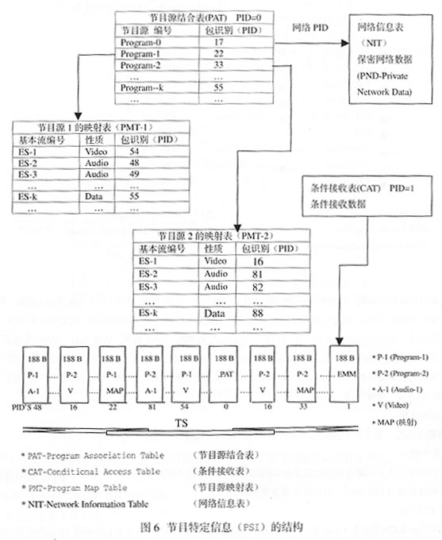

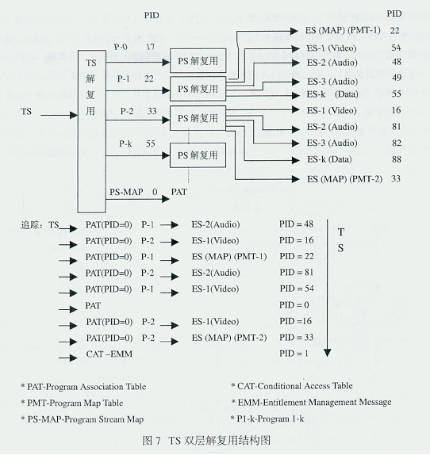

4.系统的复用

多个信号在同 1 个信道传输而不相互干扰，称为多路复用。如果将第一层的多个多路复用器先分别进行单节目传输复用，而后再进行第二层的多节目传输复用，就形成了双层复用。图 8 是系统双层复用原理图。由图可见，编码器不仅有视频编码器和音频编码器，还有系统编码器。第一层的每个多路单节目传输复用器输入信号有：ITU -R.601 标准数字视频，如视频帧顺序为 I1B2B3 P4B5B6 P7B8B9 I10；AES/EBU 数字音频数据；节目专用信息 PSI 及系统时钟 STC 1-N 等控制信号。其中视频编码器、音频编码器和数据提供给系统编码器的是基本流 ES，视频 ES 的帧顺序为 I1P4B2B3P7B5B6I10B8B9。经过系统编码器加入 PTS 及 DTS，并分别打包成视频 PES、音频 PES，数据本身提供的就是 PES。PSI 插入数据流，数据加密将有关的调用权、编码密钥通过条件收视表插入 MPEG-2 TS ，并将传输复用器从 STC 导出的 PCR 插入相应区段。这些视频 PES、音频 PES、数据 PES 及 PSI，经过加入 PID 及 PCR 的传输复用器后，将输入基本流 ES 分割成传输包片段，并为每个片段配备 1 个数据头（Header），就形成了一系列的 TS 包。然后，通过各个不同性质的数据流的数据包交织后，输出 MPEG-2 TS，其包含相应传输系统解码器所需要的所有数据。这样，从第一层的 N 个单节目复用器输出 N 股 MPEG-2 TS，通过各自的传输链路输入第二层多路多节目传输复用器。从 N 路 MPEG-2 TS 中提取出 N 个 PCR，从而再生出 STC 1-N，最后产生出 N 个第二层多路多节目传输复用器用的新 PCR。多节目传输复用器的任务是在分析的基础上，对多套节目复用合成，对数据包时标更新。因为，MPEG 只允许 1 个 TS 只能有 1 张节目源结合表 PAT，多节目传输复用器需要对 PSI 表进行分析，以便建立对新数据流适用的 PAT，修正有关数据包中的时间标志，完成时标更新。经过第二层多节目传输复用器复用后，输出 MPEG-2 TS，可以继续通过传输链路传输到解复用器，也可以采用误码保护编码、信道编码、调制技术后，通过卫星、有线电视、地面无线电视传输。例如，将第二层多节目传输复用的 MPEG-2 TS，经过 QPSK 信道调制上卫星，地面用户通过数字电视接收机的 QPSK 解调器、解复用器、解码器直接接收；有线电视台前端将卫星下行信号先后经过解调器、解复用器、再复用器、QAM 电缆调制器后，馈送至有线电视网,用户数字电视接收机通过 QAM 电缆解调器、解复用器、解码器接收；地面无线电视台将接收的卫星信号先后经过解调器、解复用器、再复用器、COFDM 电缆调制器后，馈送至地面发射台发射，用户可通过数字电视接收机的 COFDM 解调器、解复用器、解码器接收。由上述可明白：

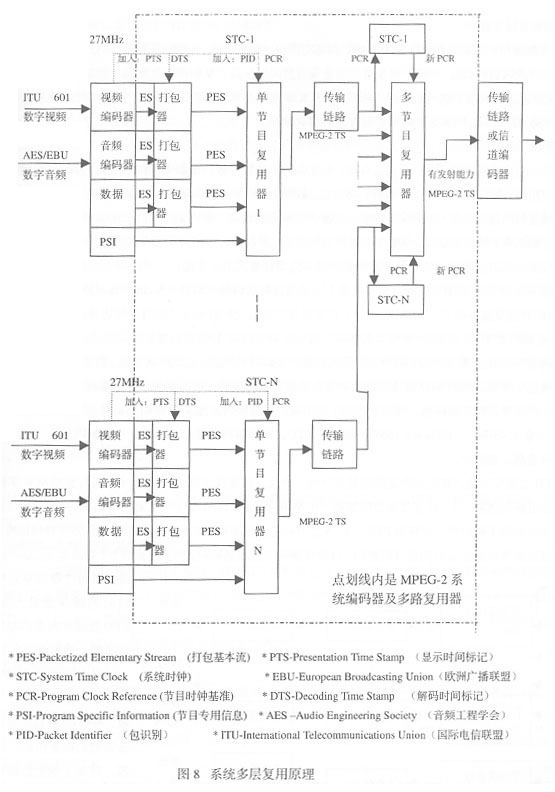

1）数据流的分割

将 1 个数据流逐段分割成多个数据包，便利于不同数据流的数据包交织。

2）节目最小组合

1 个电视节目是由多个不同性质的数据流的 ES 组成的，1 个电视节目的最小组合为 1 个视频流，1 个音频流， 1 个带字母、字符的数据流（Tele text），其它信息业务数据流。

3）PS 与 TS 区别

节目流 PS 只能由 1 套节目的 ES 组成，传输流 TS 一般由多套节目的 ES 组成。由于在说明 TS 的基本流时标时，总是针对某 1 节目而言，因此 TS 选择了节目时钟基准 PCR 的概念，而不是系统时钟基准 SCR。

5.系统的解码

由前述，MPEG-2 系统要解决的问题是：

1）系统的复用与解复用

MPEG-2 采用时分多路复用技术，让多路信号在同一信道上占用不同的时隙进行存储和传输，以提高信道利用率。

2）声音图像要同步显示

由于时分多路复用中的位时隙、路时隙、帧之间具有严格的时间关系，这就是同步。区分各路信号以此为据。为了恢复节目，先对 ES 进行解码。声音、图像信号的重现需要同步显示，从而要求收发两端数据流要达到同步。为此，MPEG-2 系统规范通过在数据中插入时间标志来实现：SCR 或 PCR 为重建系统时间基准的绝对时标；在有效 PS 和 TS 产生前，已插入 PES 的 DTS 和 PTS 为解码和重现时刻的相对时标。

3）解码缓存器无上下溢

MPEG-2 系统是由视音频编码器、编码缓存器、系统编码器及复用器、信道网络编解码器及存储环境编解码器、系统解码器及解复用器、解码缓存器和视音频解码器构成。其中，编码缓存器和解码缓存器延迟是可变的；信道网络编解码器及存储环境编解码器和从视/音频编码器输入到视音频解码器输出，延迟是固定的。这表明，输入视/音频编码器的数字图像和音频取样，经过固定的、不能变的点到点延迟后，应该精确地同时出现在视音频解码器的输出端。编码及解码缓存器的可变延迟的范围就应该受到严格限制，使解码缓存器无上、下溢。

为了解决复用、同步、无溢出问题，需要定义 1 个系统目标解码器（STD-System Target Decoder）模型。用于解释传输流 TS 解码并恢复基本流 ES 时的过程；用于在复用器数据包交织时确定某些时间的边界条件。因此，每个相应的 MPEG-2 TS 必须借助于专门的解码器模型来解码。图 9 为 TS 的系统目标解码器模型。

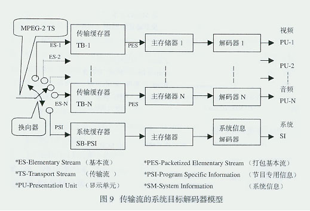

STD 与实际解码器的主要差别是：STD 对数据流的操作是瞬时完成的，无须时间延迟。而实际解码器是有延迟的。于是，可以利用这个差别，根据 STD 设计解码器的缓存器的容量。例如，PAL 制视频图像每隔 1/25 s 解码出 1 帧，压缩视频以 4Mb/s 码率到达视频解码器。要完全移走 1 帧图像，视频解码器比 STD 的时间要延迟 1/25 s ，其缓存器容量要比 STD 规定容量大 4Mb/s×1/25s = 0.16Mb。相对于 STD，视频解码及显示有延迟，音频解码及显示也应延迟同样的时间，以便视音频正确同步。

要防止 STD 上溢或下溢，首先要确定解码延迟时间。为此，就要找出第一个 DTS 字段值与起始 SCR 字段值的差值。这个差值指出解码器第一个 I 帧在复用数据流第一个 SCR 字段的最后 1 个字节之后的解码的时刻。利用 I 帧和 P 帧编码时间和显示时间的不同时性，计算出 PTS 与 DTS 之时间差，从而确定 P 帧在重新排序缓存器中存储的时间，或 P 帧在重新排序缓存器中停留多长时间后开始解码。只要在解码器开始解码前，完全传送完 1 个存取单元，就不会产生下溢。若每个存取单元在解码前瞬时的缓存器最大充满度与 STD 数据流缓存器容量大小比较适配，就不会产生上溢。

由图 9 可见，MPEG-2 TS 包含 N 个 ES 的数据。按照 PID 值，根据 ES 的性质是视频的还是音频的或系统的，通过换向器，将每个相关数据包切换到相应路径，并分别传送给各个传输缓存器（TB-Transport Buffer）。如视频 ES 输入到传输缓存器 TB-1,音频 ES 输入到传输缓存器 TB-N,PSI 输入到系统缓存器 SB-PSI.从 STD 输入端传送到 TB 或 SB 是瞬时的。

TB 的容量略大于 2 个传输流包的相应长度，MPEG 规定为 512 B。有利于较高复用器码率与较低解码存储器存取速度相适应，因缓存器读出采用较低的 ES 速率就可以实现。之所以要采用 ES 速率，是因为要降低解码硬件对处理器支持的 PSI 信息分析的复杂性，从而规定缓存器读出速度最大不超过传输速率 0.2%。视频基本数据流从 TB-1 输出时，由于包头再也不能识别 TS 数据包结构，并已去除了全部相关传输记录信息，同时误差指示器查询可能有的包误差。因此，要抛弃 PES 包头，并将所有存储在 TB-1 中的 PES 包的净负荷数据全部送到主存储器 1，以便为解码器 1 提供数据。净负荷数据从 TB-1 传送到主存储器 1 是瞬时完成的。

DTS 标明从 STD 的 ES 解码缓存器移走存取单元全部数据的时刻。对输入到主存储器 1-N 的所有存取单元的数据，都必须在 DTS 规定的瞬时移走。解码器 1-N 及系统信息解码器的解码是瞬时完成的。顺便说明的是：传输数据包的同时，应将误差信息传送给解码器，以便对数据内容解扰，至于对内容的进一步解码，已不是传输解码器的事情。数据解压缩、显示单元重建及在正确的显示时间显示已同步的序列，是解码系统的任务。

PTS 标明 STD 出现显示单元（PU-Presentation Unit）的时间，显示之前，I 帧和 P 帧需要经过重新排序缓存器的延迟。

节目专用信息 PSI 包括节目源结合表 PAT（PID=0）、条件接收表 CAT（PID=1）、节目源映射表 PMT。由于 PSI 的数据量比较小，系统缓存器 SB-PSI 的规模限制在 1536B。到达系统信息解码器的 PSI 传输流，在该解码器中检查所期望节目的相关信息。解码器通过 PSI 表了解来自数据流的哪些数据包，即数据中哪些 PID 应继续传送，其余不期望的节目数据包可忽略。显然，存储在节目源映射表 PMT 中的 PID 值，是用于检测 TS 内所需要的数据包的。（

二、MPEG-2 的编码

编码是 MPEG-2 标准的核心内容之一，其涉及到 MPEG-2 视频流层结构、MPEG-2 帧间编码结构、MPEG-2 的类与级、MPEG-2 运动估值等技术。

1.MPEG-2 视频流层结构

为了便利于误码处理、随机搜索及编辑，MPEG-2 用句法定义了 1 个层次性结构，用于表示视频编码数据。MPEG-2 具体的视频流层结构如图 10 所示：将 MPEG-2 视频流分为图像序列层(VSL-Video Sequence Layer)、图像组层 (GOPL-Group of Pictures Layer)、图像层(PL-Picture Layer)、宏块条层(SL-Slice Layer)、宏块层(ML-Macroblock Layer)、块层(BL-Block Layer)共 6 个部分，每层都有确定的功能与其对应。

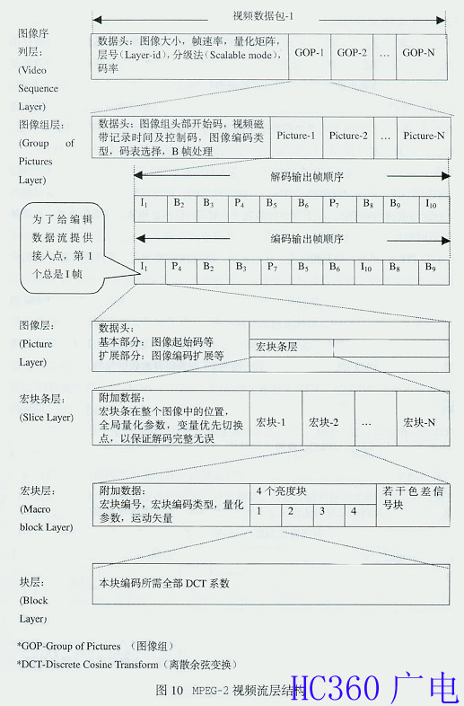

1)图像序列层（VSL）

VSL 是由数据头及一系列图像组（GOP）组成的视频数据包，具体是指一整个要处理的连续图像。用于定义整个视频序列结构，可采用逐行或隔行两种扫描方式。其中，数据头给出了有关图像水平大小、垂直大小、宽高比、帧速率、码率、视频缓存校验器的大小、量化矩阵、层号（Layer-id）、分级法（Scalable mode）等，为解码提供了重要依据。

2)图像组层(GOPL)

GOPL 是图像序列层中若干图像组的 1 组图像，由数据头和若干幅图像组成，用于支持解码过程中的随机存取功能。图像分组是从有利于随机存取及编辑出发的，不是 MPEG-2 结构组成的必要条件，可在分组与否之间灵活选择。其中，数据头给出了图像编码类型、码表选择、图像组头部开始码、视频磁带记录时间及控制码、涉及 B 帧处理的 closed GOP、broken link。为了给编辑数据流提供接入点，第 1 个总是 I 帧。

3)图像层(PL)

PL 由数据头和 1 帧图像数据组成，是图像组层若干幅图像中的 1 幅，包含了 1 幅图像的全部编码信息。MPEG-2 图像扫描可有逐行或隔行两种方式：当为逐行时，图像为逐帧压缩；当为隔行时，图像为逐场或逐帧压缩，即在运动多的场景采用逐场压缩，在运动少的场景采用逐帧压缩。

因为，从整个帧中去除的空间冗余度比从个别场中去除得多。其中，数据头提供的基本部分有头起始码、图像编号的时间基准、图像（I，B，P）帧类型、视频缓存检验器延迟时间等，扩展部分有图像编码扩展、图像显示扩展、图像空间分级扩展、图像时间分级扩展等。其中，基本部分由 MPEG-1 及 MPEG-2 共用，扩展部分由 MPEG-2 专用。

一幅视频图像是由亮度取样值和色度取样值组成的，而亮度与色度样值比例的大小是由取样频率之比决定的。在 MPEG-2 中，亮度与色度之间的比例格式有 4:2:0（或 4:0:2）、4:2:2、4:4:4 三种。

4)宏块条层(SL)

SL 由附加数据和一系列宏块组成，其最小长度 = 1 个宏块，当长度 = 图像宽度时，就成了 MPEG-2 层面中最大宏块条长度。为了隐匿误差，提高图像质量，将图像数据分成由若干个宏块或宏块条组成的一条条位串。一旦某宏块条发生误差，解码器可跳过此宏块条至下一宏块条的位置，使下一宏块条不受有误差而无法纠正的宏块条的影响，一个位串中的宏块条越多，隐匿误差性能就越好。为此，附加数据部分定义了宏块条在整个图像中的位置、默认的全局量化参数、变量优先切换点（PBP-Priority Break Point）。其中，PBP 用于指明数据流在何处分开，解码器要在两个数据流的恰当点处切换，以保证读取完整、正确的解码信息，确保解码完整无误。注意，在离散余弦反变换（IDCT-Inverse Discrete Cosine Transform）时，SL 可提供重新同步功能。

5)宏块层（ML）

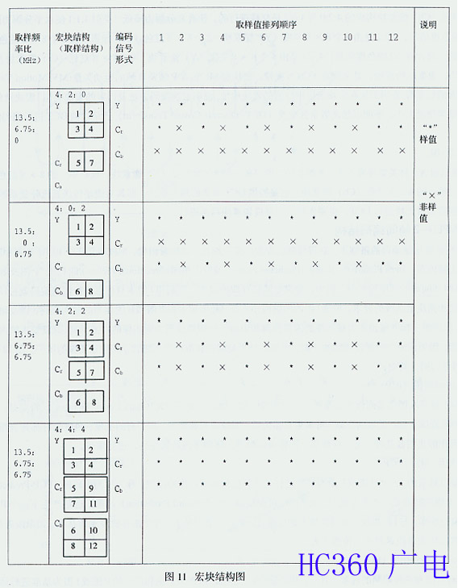

ML 是宏块条层中一系列宏块中的 1 块，由附加数据、亮度块和色度块共同组成。其中，亮度为 16×16 像素块，称为宏块。宏块是码率压缩中运动补偿的基本单元，由 4 个 8×8 像素块构成，用于消除 P 图像与 B 图像之间的时间冗余度。色度块由多少个 8×8 像素块构成，取决于亮度与色度之间取样频率的比例格式。如 MPEG-2 有 4:2:0、4:2:2、4:4:4 三种宏块结构，取样结构如图 11 所示。图中 4:2:0 是由 4 个 8×8 亮度（Y）像素块、2 个 8×8 红色（Cr）像素块及 0 个 8×8 兰色（Cb）像素块构成的，或 4:0::2 是由 4 个 8×8 亮度（Y）像素块、0 个 8×8 红色（Cr）像素块及 2 个 8×8 兰色（Cb）像素块构成的,4:2:0 与 4:0:2 是交替进行的，使垂直分解力降低（类似 4:1:1 使水平分解力降低），只含有 1/4 的色度信息。4:2:2 是由 4 个 8×8 亮度（Y）像素块、2 个 8×8 红色（Cr）像素块及 2 个 8×8 兰色（Cb）像素块构成的，只含有 1/2 的色度信息。4:4:4 是由 4 个 8×8 亮度（Y）像素块、4 个 8×8 红色（Cr）像素块及 4 个 8×8 兰色（Cb）像素块构成的，是全频宽 YCrCb 视频。宏块层 ML 包含 P 帧及 B 帧的运动矢量(MV-Motion Vectors)。附加数据包含的信息有:表明宏块在宏块条层中位置的宏块地址、说明宏块编码方法及内容的宏块类型、宏块量化参数、区别运动矢量类型及大小、表明以场离散余弦变换（DCT- Discrete Cosine Transform）还是以帧 DCT 进行编码的 DCT 类型。

6)块层(BL)

BL 是只包含 1 种类型像素的 8×8 像素块，即是单一的 8×8 亮度（Y）像素块，或是单一的 8×8 红色（Cr）像素块，或是单一的 8×8 兰色（Cb）像素块。它是提供 DCT 系数的最小单元，即其功能是传送直流分量系数和交流分量系数。若需要对宏块进行 DCT，也要先将宏块分成像素块后再进行。

2.MPEG-2 帧间编码结构

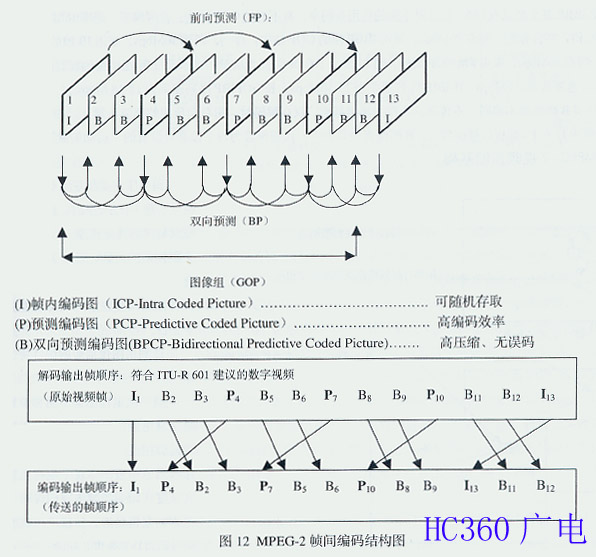

为了在高效压缩编码的条件下、获得可随机存取的高压缩比、高质量图像，MPEG 定义了 I、P、B 三种图像格式，分别简称为帧内图（Intra Picture）、预测图(Predicted Picture)及双向图(Bidirec tional Picture),即 I 图、P 图及 B 图，用于表示 1/30s 时间间隔的帧序列画面。因为，要满足随机存取的要求，仅利用 I 图本身信息进行帧内编码就可以了；要满足高压缩比和高质量图像的要求，单靠 I 图帧内编码还不行，还要加上由 P 图和 B 图参与的帧间编码，以及块匹配运动补偿预测，即用前一帧图像预测当前图像的因果预测和用后一帧图像预测当前图像的内插预测。这就要求帧内编码与帧间编码平衡，因果预测与内插预测间的平衡。平衡的结果是随机存取的高压缩比、高质量图像的统一。图 12 是 MPEG-2 帧间编码结构图，其中：

1)帧内编码图（ICP）

I 图为不要基准图像编码作为基准所产生的图像，称为帧内编码图（ICP-Intra Coded Pictures）。特点是：数据量最大；帧内中等程度压缩；无运动预测，可采用自相关性，即帧内相邻像素、相邻行的亮度、色度信号都具有渐变的空间相关性，可作静止图像处理，无条件传送；图像可随机进入压缩图像数据序列，进行编码。

2)预测编码图（PCP）

P 图是以最近的上一个 I 图或 P 图为基准进行运动补偿预测所产生的图像，称为预测编码图（PCP-Predictive Coded Pictures）。P 图的特点是：本身是前 I 图或 P 图的前向预测（FP-Forward Prediction）结果，也是产生下一个 P 图的基准图像；高编码效率，与 I 图相较，可提供更大的压缩比；前一个 P 图是下一个 P 图补偿预测的基准，如果前者存在误码，则后者会将编码误差积累起来、传播下去。

3)双向预测编码图（BPCP）

目前对 B 图有两种趋同的理解：其一，B 图是同时以前面的 I 图或 P 图和后面的 P 图或 I 图为基准进行运动补偿预测所产生的图像，称为双向预测编码图（BPCP-Bidirectional Predictive Coded Picture）。前面的 I 图或 P 图代表“过去信息”，后面的 P 图或 I 图代表“未来信息”，由于同时使用了“过去”和“未来”两种信息，所以称为双向预测。其二，由于帧序列相邻帧画面间的运动部分具有连续到时间相关性，可将当前画面看成是前一画面某一时刻图像的位移，当然位移方向及幅值在帧内各处未必相同，只要用前面最近时刻的 I 图或 P 图及代表运动的位移信息，便可预测出当前图像，称为前向预测（FP）。根据某时刻的图像及反映位移信息的运动矢量，预测出某时刻以前的图像，以便预测出前一帧中没有显露而现在出现的信息，称为后向预测（BP-Backword Prediction）。B 图是将前向预测（FP）与后向预测（BP）同时使用并取其平均值后所产生的图像，称为双向预测图或平均值预测图。

由图 12 可见，一个 GOP 由 I 为起始的一串 IBP 帧组成，GOP 的长度是前一个 I 帧到下一个 I 帧之前的 B 帧之间的间隔，如 I1B2B3P4B5B6P7B8B9I10 中从 I1 到 B9 就是 GOP 的长度。GOP 越长，MPEG-2 编码越有效，而数据流的编辑及组接越困难。一般，最多由 12 帧组成。基准帧重复频率的不同，可提供不同的输出码率。GOP 的结构随码率变化而不同，如码率大于 40Mbps 时，帧重复方式为只有 I 帧，GOP 最短，具有高效率的优点；码率为 15-40Mbps 时，帧重复方式为 IB，GOP 较短；码率小于 15 Mbps 时，帧重复方式为 IBP 或 IBBP，GOP 较长，有延迟，影响存取速度。总之，图像质量随着码率 10-50 Mbps 的升高而提高，随着帧重复方式 I-IB-IBBP 使 GOP 变长而增长。尽管帧重复方式可以是 IP,IB,IBP,IBBP,甚至是只有 I 帧，但针对不同的应用及码率，有不同的 GOP 结构：新闻编采，码率 18Mbps，采用 IB 帧的 GOP 结构；节目分配，码率 20Mbps，采用 IBBP 帧的 GOP 结构；存档，码率 30Mbps，采用 IB 帧的 GOP 结构：后期制作，码率 50Mbps，采用 I 帧 GOP 结构。图 13 表示了 GOP 与图像质量的关系及应用,图中编码规则是：I 帧 4:2:2 @ ML MPEG 速率为 40-50Mbps；IBIBIB 序列速率为 25-30Mbps；长 GOPIBP 序列速率为 12-18 Mbps。

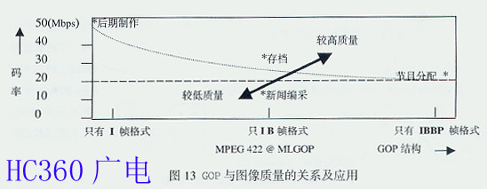

系统对 B 帧像素不编码、不传送、不作为预测基准。仅在解码时，用双向预测的插值法建立，如 I1 与 P4 之间的 B2、B3 帧由 I1 和 P4 加权内插而建立。B 帧像素块数据中，仅携带着为每个像素块设置的“运动矢量”。

3.MPEG-2 视频压缩基础

码率压缩要从视觉对象、视觉生理、视觉心理 3 个方面入手，研究符合于人类视觉规律的视觉模型。由于视觉心理是 1 个很复杂的问题，难以得到其规律。因此，码率压缩只能在利用图像信号的统计特性和人类眼睛的视觉特性的基础上来进行。

1)利用图像信号的统计特性进行压缩

同一帧电视图像中相邻像素之间的幅度值相近，即同一行上的相邻像素之间幅值相近，相邻行之间同样位置上的像素幅值相近，体现了电视图像的空间冗余度；相邻两帧电视图像同一位置上像素幅度值相近，体现了电视图像的时间（动态）冗余度，如图 14 所示。另外，每个像素所用 bits 数的多少表示了比特结构，多用的比特数为冗余量，体现了静态（比特结构）冗余度。

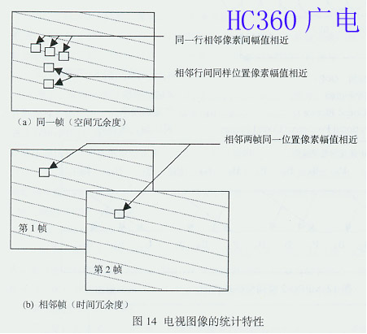

因此，为了清楚地了解空间冗余度、时间冗余度和静态冗余度三者之间的关系，可以通过图 15 所示的电视图像信息的三维表示来说明。需要指出的是采用运动补偿（MC）去除时间冗余度要进行 160 亿次的算术运算；采用离散余弦变换（DCT）和游程长度编码（RLC）去除空间冗余度要进行 20 亿次的算术运算；采用可变长度编码（VLC）去除静态（比特结构）冗余度要象“Morse Code”那样进行比特匹配。MPEG 压缩算法如图 16 所示。为了减少计算量，最佳算法的探讨及其标准化是很重要的。

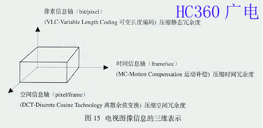

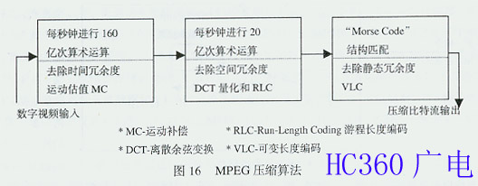

2)利用人眼的视觉特性进行压缩

人眼对构成图像的不同频率成分、物体的不同运动程度等具有不同的敏感度，这是由人眼的视觉特性所决定的，如人的眼睛含有对亮度敏感的柱状细胞 1.8 亿个，含有对色彩敏感的椎状细胞 0.08 亿个，由于柱状细胞的数量远大于椎状细胞，所以眼睛对亮度的敏感程度要大于对色彩的敏感程度。据此，可控制图像适合于人眼的视觉特性，从而达到压缩图像数据量的目的。例如，人眼对低频信号的敏感程度大于对高频信号的敏感程度，可用较少的 bit 数来表示高频信号；人眼对静态物体的敏感程度大于对动态物体的敏感程度，可减少表示动态物体的 bit 数；人眼对亮度信号的敏感程度大于对色度信号的敏感程度，可在行、帧方向缩减表示色度信号的 bit 数；人眼对图像中心信息的敏感程度大于对图像边缘信息的敏感程度，可对边缘信息少分配 bit 数；人眼对图像水平向及垂直向信息敏感于倾斜向信息，可减少表示倾斜向信息高频成分的 bit 数等。在实际工作中，由于眼睛对亮度、色度敏感程度不一样，故可将其分开处理。

为此，将单元分量 RGB 改变为 YUV(或 YCrCb)全分量。在编码时强调亮度信息，可去掉一些色度信息，如 4:4:4 变为 4:2:2，码率由 270Mbps 降低到 180Mbps。

由上述可见，电视系统存在着冗余信息，在传输图像信息之前，只要将这些冗余信息去除，就可以实现适度的压缩。由于去除这些冗余信息对图像质量无影响，故称其为“无损压缩”。如，从视频信号中去除同步信息。无损压缩的压缩比不高，压缩能力有限。为了提高压缩比，MPEG 标准采用了对图像质量有损伤的“有损压缩”技术。

4.MPEG-2 视频编码方式

为了提高压缩比及图像质量，MPEG-2 视频编码采用运动补偿预测（时间预测+内插）消除时间冗余和不随时间变化的图像细节；采用二维 DCT（图像像素+量化传输系数）分解相邻像素，消除观众不可见、不重要的图像细节；采用熵值编码（已量化参数+编码参数的熵），使 bit 数减少到理论上的最小值。对以上 3 种压缩技术，作如下说明：

1）运动补偿预测

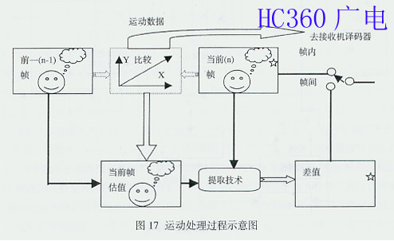

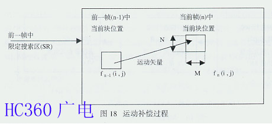

将存储器中前一图像帧的重建图像中相应的块按编码器端求得的运动矢量进行位移，这就是运动补偿过程。为了压缩视频信号的时间冗余度（Temporal Redundancy），MPEG 采用了运动补偿预测（Motion Compensated Prediction），图 17 是其运动处理过程示意图。运动补偿预测假定：通过画面以一定的提前时间平移，可以局部地预测当前画面。这里的局部意味着在画面内的每个地方位移的幅度和方向可以是不相同的。采用运动估值的结果进行运动补偿，以便尽可能地减小预测误差。运动估值包括了从视频序列中提取运动信息的一套技术，该技术与所处理图像序列的特点决定着运动补偿性能的优劣。与画面 16×16 像素宏块相关的运动矢量支持接收机解码器中的运动补偿预测。所谓预测，实际上是由前一(n-1)图像帧导出当前（n）图像帧所考虑像素的预测值，而后由运动矢量编码传输 n 帧的实际像素值与其预测值之间的差值。例如，设宏块为 M×N 的矩形块，将图 17 中的 n-1 帧的宏块与 n 帧的宏块进行比较。这实际上是一个如图 18 所示的进行宏块匹配的运动补偿过程，即将 n 帧中 16×16 像素的宏块与 n-1 帧中限定搜索区(SR)内全部 16×16 像素的宏块进行比较。若 n-1 帧图像亮度信号为 f n -1 (i , j)，n 帧图像亮度信号为 f n (i , j)，其中(i , j)为 n 帧的 M×N 宏块的任意位置,并将 n 帧中的一个 M×N 的宏块看作是从 n-1 帧中平移而来的，而且规定同一个宏块内的所有像素都具有同样的位移值(k，l) 。这样，通过在 n-1 帧限定搜索区（SR）内进行搜索，总可以搜索到某一宏块，使得该宏块与 n 帧中要匹配的宏块的差值的绝对值达到最小，并得到运动矢量的运动数据，在 n-1 帧和运动数据的控制下，获得 n 帧的一个相应的预测值。照此办理，直到 n 帧的 M×N 宏块的任意位置（i , j）的像素全部通过 n-1 帧的像素预测出来。即 n 帧与 n-1 帧的相关函数 F(k , l)的绝对值表示为 ：

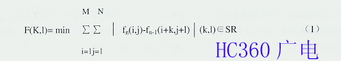

式（1）表明要匹配的宏块已经匹配，并得到水平及垂直位移为（k , l）的运动矢量的运动数据。通过匹配不仅将传输的差值减到最小，而且补偿了匹配对象在图像中的位移，这就是运动补偿。为了改善预测效果，可以采用场预测。由于在电视图像连续帧之间有较大程度的共同性，即时间冗余度，多数图像之间差值极小，尤其是在大多数时间传输小范围内的值时，采用运动补偿预测可使码率明显降低。在接收端的解码器中以同样的运动补偿预测重现预测值，重现预测值加上差值就得到像素的原幅值。图 19 是基本 MPEG 视频编码器框图，图中虚线左边为运动补偿预测编码所需要的基本功能器件。其中固定存储器存储 n-1 帧的复原数据，将其与 n 帧数据一同送入运动补偿参数估值器，估值后就可以得到运动矢量的数据。用运动矢量数据和 n-1 帧的复原数据去控制用于块匹配的可变存储器，将 n 帧的当前像素值预测出来。这里，预测是按帧差仅有 1 帧进行的，实际上 MPEG-1 和 MPEG-2 可以当前帧之前若干帧的某一帧为基准进行预测。值就得到像素的原幅值。图 19 是基本 MPEG 视频编码器框图，图中虚线左边为运动补偿预测编码所需要的基本功能器件。其中固定存储器存储 n-1 帧的复原数据，将其与 n 帧数据一同送入运动补偿参数估值器，估值后就可以得到运动矢量的数据。用运动矢量数据和 n-1 帧的复原数据去控制用于块匹配的可变存储器，将 n 帧的当前像素值预测出来。这里，预测是按帧差仅有 1 帧进行的，实际上 MPEG-1 和 MPEG-2 可以当前帧之前若干帧的某一帧为基准进行预测。

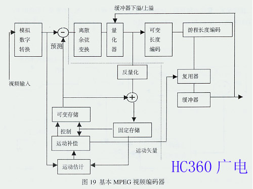

需要说明的是：MPEG 定义了基于帧、基于场及双场的图像预测，也定义了 16×8 的运动补偿。

MPEG-2：有逐行扫描方式，可以采用基于帧的图像预测；有隔行扫描方式，也可以采用基于场的图像预测。因此，MPEG-2 编码器要对每个图像先判断是帧模式压缩还是场模式压缩。在隔行扫描方式下：运动少的场景时，采用基于帧的图像预测，因为基于帧的图像两相邻行间几乎没有位移，帧内相邻行间相关性强于场内相关性，从整个帧中去除的空间冗余度比从个别场中去除得多；剧烈运动的场景时，采用基于场的图像预测，因为基于帧的相邻两行间存在 1 场延迟时间，相邻行像素间位移较大，帧内相邻行间相关性会有较大下降，基于场的图像两相邻行间相关性强于帧内相邻行间相关性，在 1 帧内，场间运动有很多高频分量，从场间去除的高频分量比从整个帧中去除的多。由上述可见，选择基于帧的图像预测还是基于场的图像预测的关键是行间相关性。所以，在进行 DCT 之前，要作帧 DCT 编码或场 DCT 编码的选择，对 16×16 的原图像或亮度进行运动补偿后所获得的差值作帧内相邻行间和场内相邻行间相关系数的计算。若帧内相邻行间相关系数大于场内相邻行间相关系数，就选择帧 DCT 编码，反之选场 DCT 编码。帧 DCT 编码与场 DCT 编码如图 20 所示。

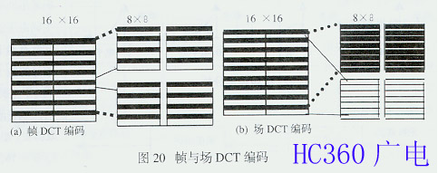

2）二维 DCT

MPEG 采用了 Ahmed N.等人于 1974 年提出的离散余弦变换（DCT-Discrete Cosine Transform）压缩算法，降低视频信号的空间冗余度（Spatial Redundancy）。因为静态图像和预测误差信号两者具有非常高的空间冗余度，为降低空间冗余度最广泛地采用的频率域分解技术就是 DCT。DCT 将运动补偿误差或原画面信息块转换成代表不同频率分量的系数集。这有两个优点：其一，信号常将其能量的大部分集中于频率域的 1 个小范围内，这样一来，描述不重要的分量只需要很少的比特数；其二，频率域分解映射了人类视觉系统的处理过程，并允许后继的量化过程满足其灵敏度的要求。视频信号的频谱线在 0-6MHz 范围内，而且 1 幅视频图像内包含的大多数为低频频谱线，只在占图像区域比例很低的图像边缘的视频信号中才含有高频的谱线。因此，在视频信号数字处理时，可根据频谱因素分配比特数：对包含信息量大的低频谱区域分配较多的比特数，对包含信息量低的高频谱区域分配较少的比特数，而图像质量并没有可察觉的损伤，达到码率压缩的目的。然而，这一切要在低熵(Entropy)值的情况下，才能达到有效的编码。能否对一串数据进行有效的编码，取决于每个数据出现的概率。每个数据出现的概率差别大，就表明熵值低，可以对该串数据进行高效编码。反之，出现的概率差别小，熵值高，则不能进行高效编码。视频信号的数字化是在规定的取样频率下由 A/D 转换器对视频电平转换而来的，以 256 层或 1024 层表示输入视频信号的幅度，每个像素的视频信号幅度随着每层的时间而周期性地变化。每个像素的平均信息量的总和为总平均信息量，即熵值。由于每个视频电平发生几乎具有相等的概率，所以视频信号的熵值很高，如图 21 所示。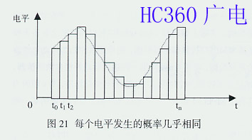 熵值是一个定义码率压缩率的参数，视频图像的压缩率依赖于视频信号的熵值，在多数情况下视频信号为高熵值，要进行高效编码，就要将高熵值变为低熵值。怎样变成低熵值呢？这就需要分析视频频谱的特点。由图 22 视频频谱分析可见：大多数情况下，视频频谱的幅度随着频率的升高而降低。其中低频频谱在几乎相等的概率下获得 0 到最高的电平。与此相对照，高频频谱通常得到的是低电平及稀少的高电平。显然，低频频谱具有较高的熵值，高频频谱具有较低的熵值。据此，可对视频的低频分量和高频分量分别处理，获得高频的压缩值。

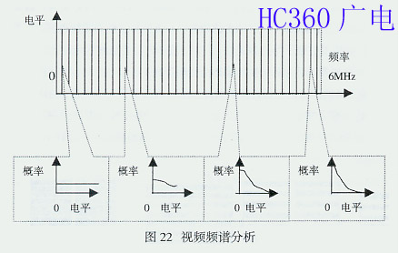

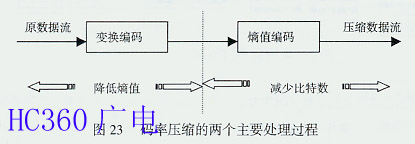

由上述可见，码率压缩基于如图 23 所示的变换编码和熵值编码两种算法。前者用于降低熵值，后者将数据变为可降低比特数的有效编码方式。在 MPEG 标准中，变换编码采用的是 DCT，变换过程本身虽然并不产生码率压缩作用，但是变换后的频率系数却非常有利于码率压缩。实际上压缩数字视频信号的整个过程分为块取样、DCT、量化、编码 4 个主要过程进行，如图 24 所示。首先在时间域将原始图像分成 N(水平)×N（垂直）取样块，根据需要可选择 4×4、4×8、8×8、8×16、16×16 等块，考虑到消除数据相关性及计算复杂度的恰当的折衷，图中选择了 8×8 像素块。这些 8×8 取样的像素块代表了原图像各像素的灰度值，其范围在 139-163 之间，并依序送入 DCT 编码器，以便将取样块由时间域转换为频率域的 DCT 系数块。DCT 系统的转换分别在每个取样块中进行，这些块中每个取样是数字化后的值，表示一场中对应像素的视频信号幅度值。式（2）和（3）分别为 2 维 DCT 正变换及反变换公式：

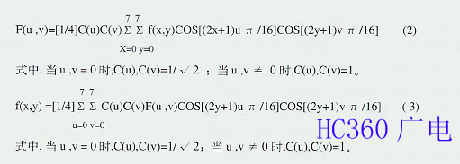

例如，当 u,v = 0 时，离散余弦正变换（DCT）后的系数若为 F(0,0)=1，则离散余弦反变换（IDCT）后的重现函数 f(x,y)=1/8,是个常数值，所以将 F(0,0)称为直流(DC)系数；当 u,v≠0 时，正变换后的系数为 F(u,v)=0，则反变换后的重现函数 f(x,y)不是常数，此时正变换后的系数 F(u,v)为交流（AC）系数。

由 DCT 正变换公式（2）及反变换公式（3）可见，计算有一定的复杂性。但是，实际上这个函数是用代码来实现的，即两个余弦项只在程序开始时进行 1 次计算，将计算的结果储存起来，而后通过查表就可以了，其它各项都可以通过查表解决，其程序采用了双层嵌套循环。图 25 是两个余弦项所构成的核函数 Gu,v (x,y)计算的示意图，其中设 N = 8, u = 2,v = 3；x = 4, y = 5,可求得 G2,3(4,5) = G2,3(4)G2,3(5) = (-0.924) ×(+0.979)= - 0.905，以此类推可得到各个点的值，储存起来备查。通过查表，查出各个项的值，用代码来实现图 24 中 DCT 编码器输出的 DCT 系数。根据式（2）和(3) 进行查表后，利用 C 语言程序对 N×N 个矩阵元素的代码采用双层嵌套循环计算如下：

```c
for (u = 0 , u < N, u ++)
   for (v = 0,v < N, v++) {
    temp = 0,0；
    for (x = 0, x < N, x++)
      for (y = 0,y < N, y++) {
       temp + = Cosines[x][u]*Cosines [y] [v]* pixel [x] [y];
      }
    temp*= sqrt(2* N ) * Coefficients[u][v]；
    DCT[u] [v] = INT_ROUND(temp)：
}
```

代码中用 `pixel[x][y]` 表示式中的 f(x,y),用 `DCT[u][v]` 表示式中的 `F(u,v)`。
当前，除了上述直接用双层嵌套循环定义 DCT 外，还有采用余弦变换矩阵来定义 DCT 的矩阵计算法，二者机理相同。


由图 24 及上述变换原理可察觉两点：其一，DCT 后的 64 个 DCT 频率系数与 DCT 前的 64 个像素块相对应，DCT 前后都是 64 个点，它只是 1 个本身没有压缩作用的无损变换过程。其二，单独 1 场图像的全部 DCT 系数块的频谱几乎都集中在最左上角的系数块中，仅从该块的频谱中就可以形成 1 幅压缩图像；DCT 输出的频率系数矩阵最左上角的直流（DC）系数幅度最大，图 24 中为 315，由于代表了 x 轴和 y 轴上的 DC 分量，所以它表示了输入矩阵全部幅度的平均值；以 DC 系数为出发点向下、向右的其它 DCT 系数，离 DC 分量越远，频率越高，幅度值越小，图 24 中最右下角为-0.11，即图像信息的大部分集中于直流系数及其附近的低频频谱上，离 DC 系数越来越远的高频频谱几乎不含图像信息，甚至于只含杂波。显然，DCT 本身虽然没有压缩作用，却为以后压缩时的“取”、“舍” 奠定了必不可少的基础。

3）量化

DCT 系数采用量化（Quantization）进行压缩是 1 个关键性的运算,因为组合量化和游程长度编码可以提供最大的压缩量，也可以通过量化使编码器输出匹配成 1 个给定的比特率。实际上，自适应量化是实现视觉质量的关键性工具之一，在量化中会减少频率域中描述 DCT 系数的精度。这一点可从图 26 基本 MPEG 编码器的运动补偿预测编码过程简化电路图看出。用当前帧的原始图像的取样值减去当前帧解码复原值，其差值为：

fn - fn’= f n - e’n-f*n = en+f*n - e’n - f\*n = en- e’n = qn (4)


式(4)中 qn 为量化误差，即量化误差的大小决定了图像恢复的精度。这表明，可以利用调整量化器误差大小来调整量化精度的高低。实际量化如图 27 所示，是 DCT 编码输出的系数块中的每 DCT 系数除以量化器表中与其系数对应位置上的量化步长。量化步长是 1 个大于 1 的值，可根据编码图像的复杂度改变，甚至可对每个 DCT 块改变量化矩阵值。根据 DCT 的结果分析，直流分量 DC 体现了大多数普通图像的内容，应该用较小的量化步长去分配；交流分量 AC 只体现了普通图像所包含频谱中的很少一部分，应该用较大的量化步长去分配。量化的结果如图 24 所示，量化了的不同频率的频域系数趋向“0”值，而且这些大群的“0”在许多情况下都是群集在较高频率上。因此，通过一串“0”的个数的编码而不是对每个单独的“0”本身的编码，可以取得附加的压缩效果，这就是游程长度编码（RLC-Run Length Coding）。


4）编码

编码是 DCT 压缩系统的最后一步。在对 64 个 DCT 系数均匀量化后，系数分成为直流（DC）和交流（AC）两个部分。DC 系数代表了分量模块的平均亮度，可采用差值脉冲编码调制（DPCM）进行编码；对 AC 系数，由于非零的 DCT 系数大多数集中在矩阵的左上角，在进行编码之前先对量化后的 DCT 系数进行“之”字形扫描，有利于得到一个长的“0”序列，提高编码效率。DCT 系数扫描方式有“之”字形和“准之” 字形两种。逐行扫描采用“之”字形传送量化后的 DCT 系数，隔行扫描采用“准之”字形传送量化后的 DCT 系数，两种扫描方式如图 28 所示。


通过“之”字形扫描，将 8×8 的像素块转换成为 1×64 的码组，以便进行游程长度编码（RLC）和可变长度编码(VLC)，如图 29 所示。


为了说明 RLC 和 VLC，这里以图 24 中的量化输出编码为例，加以说明。量化输出矩阵如图 30；量化输出的十进制值出现的概率统计如表 3；变长编码如表 4。由表 4 可见，概率大的得到短编码，概率小的得到长编码。如果将这些编码按照图 29 中“之”字形扫描后数据流排序排列起来，如图 31 所示。


由图 30，31 和表 3，4 可见，原始的 8×8 像素块要用 64×8=512 比特，量化和变长编码后要用 100 比特，高于 5:1 压缩。经过游程长度编码后，二进制编码的新数据流为 58 比特，其压缩比高于 8:1。显然，编码是码率压缩的关键，因为编码是对数据流中的每个符号分配一种特定的码值的过程，选择最有效的码值决定了编码的有效性，从而有效地降低熵值。这里，对 DC 分量进行 DPCM 编码以及对 AC 分量进行变换编码，如 DCT，都是为了降低熵值 ；对 AC 分量进行熵值编码，如 RLC 和 VLC，都是为了减少比特数。


图 32 为 DPCM 编码的例子。由图可见，原数据需要传输 75 比特的数据，通过 DPCM 后，只需要传输 47 比特的数据，压缩比为 1.6：1。图 33 是 RLC 编码的实例，由图可见，原数据 52 比特经过 RLC 后，压缩为 16 比特，压缩比为 3.25:1。（未完待续）


·

三、MPEG-2 的应用

MPEG-2 基本上可满足广播电视系统的大多数需要，如：适合于隔行和逐行扫描图像；4：2：0 和 4：2：2 图像取样；理论上高达 16000 像素 ×16000 行的多种图像分解力和广播中常用的场频、帧频；编码的可分层特点可使 SDTV 或 LDTV 解码器从较高级 HDTV 的数据流中抽取所需要的信息。为了适应不同场合对编码方法、操作模式、性能价格比的不同需要，在 1993 年 3 月悉尼会议上和 7 月的纽约会议上，基本上确定了表 5 所示的 MPEG-2 的型与级规范。“型”是全部编码方法的 1 个子集，按压缩编码算法的复杂度大小，在表 5 中，由右向左定义了 6 个子集；“级”是依照型的编码参数所受到的不同限制，按照图像分辨率的高低，在表 5 中，由上到下定义了 4 个等级的像素分解力。显然，MPEG-2 标准具有广泛的通用性，为了满足多种不同应用的需要，将多种不同的视频编码算法综合于单个句法之中。但是，对于接收端解码器若要求全部满足句法中规定的视频编码算法，解码器的设计将变的复杂而耗费，作为 1 个普通编码器不可能也无必要实现 MPEG-2 的全部功能 。为此，提出了针对不同的应用，应满足句法中不同部分的要求。


1.MPEG-2 的型级概念

为适应不同场合的需要，MPEG-2 引进型（Profile）和级(Level)的概念，为定义句法子集提供了方法。在单个句法的基础上，按压缩编码算法的复杂度及不同应用，定义了 6 个句法子集，每个句法子集就是 1 种型。MPEG-2 的型有简单型(SP)、主型(MP)、MPEG-2 4:2:2 型(后增加的)、信噪比可分级型(SNRP)、空间可分级型(SSP)、高型(HP)共 6 种。在同 1 种型里，需要处理的图像参数，如图像尺寸、帧率、码率，也有不同。例如，表 5 的主型中包括 4 种不同的图像尺寸和 4 种有差别的码率，只有帧率是相同的。为此，MPEG-2 还定义了低级(LL)、主级(ML)、高 1440 级(H14L)、高级(HL)共 4 个级，以示对同 1 个型内不同参数的区别。显然，型定义了数据流可分级性和彩色空间分解力；级定义了图像分辨力和每个型的最大码率。即，每个型定义了 1 组新的算法，如：型的性质，彩色格式、有否双向帧等，不同的组合有不同的算法。在同一型内的每个级定义了参加运算的参数的取值范围，如：每帧图像行数、每行像素数、帧率、码率。由表 7 可见，与 1994 年 MPEG-2 标准通过时的 MPEG-2 的型与级相比，增加了 1 个 MPEG-2 422 @ M L。因为，MPEG-2 M P @ M L 采用 4:2:0 色度亚取样，多版复制只能到 2 代，也不符合 ITU-R 601 标准。采用 4:2:2 可多代复制，也符合 ITU-R 601 标准要求。

在表 5 中的空格是不可能出现或尚未出现的组合。从高型到简单型，其压缩比由高到低。表 5 中已经定义的型、级组合，可用型、级的名称表示。如，目前最常用的描述符是主型主级，可以表示为 Main Profile @ Main Level ，简写为 MP @ ML。对 NTSC 视频而言，相当于 720×480 分辨力，帧率 30fps，码率小于 15 Mbps。同样，对于 PAL 视频而言, 相当于 720×576 分辨力，帧率 25fps，码率小于 15 Mbps。图像用于 ITU-R 601，如美国采用 MP @ ML 进行卫星直播，数字视盘也多有采用。同理，对于 MP @ HL 可用于高级电视（ATV），如美国 HDTV 大联盟(GA)采用 MP @ HL 的指标；对于 MP @ H14L 可用于 HDTV；欧洲的实验 HDTV 采用了 SSP @ H14L；对于 MP @ LL 可用于视频电话或电视会议。

MPEG-2 的分级编码

由于 MPEG-2 采用分级编码（Scalable Coding）已超出主型（Main Profile）编码算法所支持的范围，所以在信噪比型(SNR Profile)和空间型(Spatial Profile)两个子集中加入分级编码。所谓分级编码，是将整个视频数据流分为可逐级嵌入的若干层，不同复杂度的解码器可根据自身能力，从同一数据流中抽出不同层进行解码，得到不同质量、不同时间分辨率、不同空间分辨率的视频信号。图 34 是视频分级编码示意框图。由图可见，视频分级编码采用了多级编码方案。图中提供了基本和增强两层，每层支持的视频级别不同。其过程是：为了实现多清晰度的显示，首先将输入视频信号降级为 1 种较低清晰度视频，降级的方法是在空间上或时间上降低取样率。然后，将降级视频编码成降低了码率的基本层数据流，再通过在空间上或时间上提升取样率的升级法，把降低了码率的基本层数据流升级，用于对原始输入视频信号的预测，将预测误差编码成 1 个增强层数据流。若接收机需要显示视频信号的全部质量，则将基本层数据流和增强层数据流一起解码就可实现；若接收机无能力或不需要显示视频信号的全部质量，则只对基本层数据流解码。为了满足传输频道和存储媒体对带宽的特殊要求，为了浏览视频数据库及经不同网络视频传输等业务的需要，对每 1 层均应分配 1 个合适码率的视频，并对其进行分级编码。


分级编码的目的有二：其一，是在不同的业务之间提供互操作性（Interoperability），以灵活的方式支持具有不同显示功能的各种电视接收机。对那些无能力或无要求再现视频全部清晰度的接收机，可只对分层数据流的子集进行解码，显示 1 个较低的空间或时间清晰度的低质量视频图像。这是通过在信噪比型（SNR Profile）子集中采用分级编码实现的，即随着接收条件变差，使图像质量适度降级，以防出现数字广播固有的“峭壁效应”。其二，是对 HDTV 信源进行分级编码，使其能灵活地支持多种清晰度，实现 HDTV 与 SDTV 产品的兼容，避免很耗费地将两个单独的数据流专门、分别地传输给 HDTV 和 SDTV 接收机。即要避免采用同播（Simucast）方式，因为该方式是将每个视频节目以不同的空间分辨率、帧速率、码率等参数编码，传送给相应用户，带来的不必要的经济负担。这是通过在空间型(Spatial Profile) 子集中采用分级编码实现的。另外，分级编码在媒体资产管理数据库浏览、多媒体环境下视频多清晰度重放等方面也得到应用。

分级编码有优点也有缺点。优点有二：使同 1 个数据流能适应不同特性的解码器，提高了灵活性、有效性；为视频广播、通信系统向更高时间分辨率、空间分辨率过渡，提供了技术保证。

其缺点也有二：该技术使编码器、解码器复杂化，成本增加；由于数据流中有多层编码，使编码效率下降。

尽管分级编码优、缺点参半，在 MPEG-2 的标准化进程中，人们还是想开发 1 个通用的分级编码方案，以满足所想象到的各种可能的应用。有些应用要求最低的装置复杂性，另一些则要求尽可能高的编码效率。通用性与特殊性的冲突，使通用的分级编码方案化为泡影。但是，就是这种泡影，提醒人们，要从特殊问题的实际出发，进行分级编码方案的制定，以满足各种特殊应用的需要。结果，分级编码为 MPEG-2 提供了空间分级（Spatial Scalability）、时间分级（Temporal Scalability）、信噪比分级性(SNR Scalability)和数据划分(Data Partitioning)4 种工具，MPEG-2 已对前 3 种进行了标准化：

1）空间分级

空间分级的出发点是使不同大小图像之间的服务具有兼容性，其采用的主要方法是空间补偿。

所谓空间补偿，是指将图像分为高、低两层处理，高层只传送高层图像与低层图像两者之差的数据，低层数据流经过解码、重取样的图像数据作为空间补偿的基准图像，将高层解码的差值数据加在低层相应的图像数据块上，就得到了高层图像数据。

这种编码数据流可提供至少两种空间分辨率的视频信号，1 个是标准分辨率的视频信 SDTV,另 1 个是高分辨率的视频信 HDTV。分层数据流嵌套的第 1 层为基本层（Base Layer），符合 MPEG 标准，其它为增强层（Enhancement Layer）。MPEG-2 在序列层的数据头定义了两个变量：

Layer-id 和 Scalable-mode。用以指明该层的层号及使用的分级方法。现在采用的是空间分级法，利用基本层来提供 SDTV，利用增强层来提供 HDTV。表 6 表明了空间分级应用情况。要获得 SDTV，需将原视频序列每 1 帧图像经过低通滤波、亚取样，形成低分辨率的基本层图像序列，用 MPEG-2 进行独立编码，得到基本层数据流，由基本层提供标准分辨率 SDTV。要获得 HDTV，需将原视频序列图像，经过时间、空间预测（参考帧可为已编码全分辨率图像，或基本层图像经内插后形成的预测图像，或为全分辨率图像的预测图像加权平均值），将预测误差编码形成全分辨率增强层数据流，增强层实现高分辨率信号 HDTV。


2）时间分级

时间分级的出发点是实现不同帧速率视频图像服务之间的兼容性。该分级方式可提供帧速率不同、空间分辨率相同的视频信号。实现时间分级分两步进行：

第 1 步是以一定规律跳过原视频中的某些帧场，将剩余的帧场组成基本层图像序列，按 MPEG-2 编码，形成基本层数据流，由于基本层时间清晰度不太高，要在性能好的通道上传送。

第 2 步是将跳过的帧场，借助已编码基本层图像，采用运动补偿加 DCT 的方法进行编码，形成全帧速率的增强层数据流，借助时间分级，在基本层提供隔行扫描 HDTV，在增强层提供逐行扫描 HDTV。由于增强层时间清晰度更高些，可在性能差一些的通道上传送。这里，基本层图像可直接作为增强层图像的部分帧，增强层可以没有 I 帧，其可由最近解出的增强层图像或基本层图像预测出来。基本层图像中的 B 帧也可作为参考帧。表 7 是时间分级应用情况。


3）SNR 分级性

信噪比分级性的出发点是实现不同质量视频图像服务之间的兼容性。该分级方式是，由 1 个图像信号源产生出具有相同空间分辨率的两个不同编码质量的视频数据流。实现 SNR 分级分两步进行：

第 1 步是对 DCT 系数进行粗(grob)量化，称为第 1 次量化，形成基本层数据流。

第 2 步是将粗量化之前的原 DCT 系数与第 1 次量化结果相减，对其差值进行第 2 次量化，即精细（feiner）量化，形成增强层数据流。

由上述可知，增强层进行的是误差 DCT 精细量化，其与基本层所进行的 DCT 系数粗量化密切相关，所以在解码时增强层与基本层要同时进行。表 8 是 SNR 分级应用情况。


4）数据划分

数据划分的目的，是希望在信号传输通道条件及发射功率受限时，也能收到质量略差些的图像，而不至于什么图像也接收不到。为此，MPEG-2 采用了数据划分技术，将对解码具有重要作用的信息，如包头、运动矢量、DCT 系数（尤其是视频的低频 DCT 系数），放在误码性能好的通道中传送。对解码不太重要的部分，如音频的 DCT 系数等，放在误码性能较差的通道中传送。当然，这种方案是在存在两个可用来传输、存储视频信号的通道时，才能实行。事实上，利用优先级的概念，也可以进行数据划分。将编码数据流分成两个优先级不同的部分，如将编码数据流中的头信息、运动矢量、量化参数、低频 DCT 系数划分为高优先级（High Priority Partition）部分,将编码数据流中的高频 DCT 系数、音频 DCT 系数划分为低优先级（Low Priority Partition）部分。这种用优先级进行数据划分的方法，可以将信道噪声及信元丢失造成的图像损伤，降至最低限度。

由上可见，为了解决通用性和特殊性之间的矛盾，MPEG-2 采取了两个措施：1 个是采用具有可分级性的型、级概念，用于描述不同的编码参数集；另 1 个是采用具有可伸缩性的时间、空间、信噪比及数据划分 4 种视频编码工具，通过对数据流的 1 部分编码和对数据流的全部解码获得较低图像分辨率。从而使 MPEG-2 成为真正的“通用标准”。

总之，MPEG-2 可以在很大范围内对不同分辨率和不同输出码率的图像信号进行有效的压缩编码，已经成为真正的国际通用标准。在广播电视领域必将获得广泛应用。

表 9 是各种应用的数字视频带宽，表 10 是部分数字系统及参数，供应用时参考。（全文完）


## 协议

**支持的协议：**

HTTP

RTP

RTSP

RealMedia RTSP/RDT

Gopher

RTMP

RTMPT， RTMPE， RTMPTE， RTMPS (via librtmp)

SDP

MMS over TCP

## 按使用目的，将 FFMPEG 命令分成以下几类

- 录制
- 分解/复用
- 处理原始数据
- 滤镜
- 切割与合并
- 图／视互转
- 直播相关

## 相关版权

(Hall Of Shame)

FFmpeg 被许多开源项目采用，比如 ffmpeg2theora，[VLC](https://baike.baidu.com/item/VLC/4850790?fromModule=lemma_inlink)， MPlayer， HandBrake， [Blender](https://baike.baidu.com/item/Blender/222123?fromModule=lemma_inlink)， [Google Chrome](<https://baike.baidu.com/item/Google> Chrome/5638378?fromModule=lemma_inlink)等。还有 DirectShow/[VFW](https://baike.baidu.com/item/VFW?fromModule=lemma_inlink)的[ffdshow](https://baike.baidu.com/item/ffdshow/7292596?fromModule=lemma_inlink)(external project)和[QuickTime](https://baike.baidu.com/item/QuickTime/3561948?fromModule=lemma_inlink)的 Perian (external project)也采用了 FFmpeg。

由于 FFmpeg 是在[LGPL](https://baike.baidu.com/item/LGPL/10583469?fromModule=lemma_inlink)/[GPL 协议](https://baike.baidu.com/item/GPL协议/8274607?fromModule=lemma_inlink)下发布的（如果使用了其中一些使用 GPL 协议发布的模块则必须使用 GPL 协议），任何人都可以[自由使用](https://baike.baidu.com/item/自由使用/60563740?fromModule=lemma_inlink)，但必须严格遵守 LGPL/GPL 协议。有很多播放软件都使用了 FFmpeg 的代码，但它们并没有遵守 LGPL/GPL 协议，没有公开任何[源代码](https://baike.baidu.com/item/源代码?fromModule=lemma_inlink)。我们应该对这种[侵权行为](https://baike.baidu.com/item/侵权行为/3356335?fromModule=lemma_inlink)表示耻辱。

2009 年加入 FFmpeg 的播放软件：**[暴风影音](https://baike.baidu.com/item/暴风影音?fromModule=lemma_inlink)**、[QQ 影音](https://baike.baidu.com/item/QQ影音/5862336?fromModule=lemma_inlink)、KMP、[GOM Player](<https://baike.baidu.com/item/GOM> Player/10963998?fromModule=lemma_inlink)、**[PotPlayer](https://baike.baidu.com/item/PotPlayer/7490828?fromModule=lemma_inlink)**（2010）都在其列。

2009 年 2 月，韩国名软[KMPlayer](https://baike.baidu.com/item/KMPlayer/1487355?fromModule=lemma_inlink)被 FFmpeg[开源项目](https://baike.baidu.com/item/开源项目?fromModule=lemma_inlink)发现使用了它们的代码和[二进制文件](https://baike.baidu.com/item/二进制文件/996661?fromModule=lemma_inlink)，但是没有按照规定/惯例开放相应说明/源码。因此被人举报，进入了 FFmpeg 官网上的耻辱[黑名单](https://baike.baidu.com/item/黑名单/33536?fromModule=lemma_inlink)。

2009 年 5 月，网友 cehoyos 下载了暴风影音软件，解压之后发现其[安装程序](https://baike.baidu.com/item/安装程序/3765365?fromModule=lemma_inlink)内包含了大量的[开源](https://baike.baidu.com/item/开源/20720669?fromModule=lemma_inlink)和私有[解码器](https://baike.baidu.com/item/解码器/84366?fromModule=lemma_inlink)：avcodec，avformat，avutil，x264，xvid，bass，wmvdmod 等，之后暴风影音被正式加入到 FFmpeg 耻辱名单。

2009 年 7 月 22 日，[陈俊豪](https://baike.baidu.com/item/陈俊豪/8068505?fromModule=lemma_inlink)(格式工厂作者)因用到了 ffmpeg 和[RMVB](https://baike.baidu.com/item/RMVB/229903?fromModule=lemma_inlink)的编码库，用到了 FFmpeg 的译码/编码算法，违反 FFmpeg 的 LGPL 协议，登上了 2009 年 7 月 22 日 FFmpeg 的“[耻辱柱](https://baike.baidu.com/item/耻辱柱/3746303?fromModule=lemma_inlink)”上。

2009 年 11 月，网友 roo_zhou 向 FFmpeg 举报，指出 QQ 影音的 credit 只给出了修改的 FFmpeg 源码下载，声称是 LGPL 许可证。但实际是修改过的[ffdshow](https://baike.baidu.com/item/ffdshow?fromModule=lemma_inlink)，采用的是 GPL 许可证，之后 QQ 影音被正式加入到 FFmpeg 耻辱名单之列。

[Libav](https://baike.baidu.com/item/Libav/9831849?fromModule=lemma_inlink)[项目启动](https://baike.baidu.com/item/项目启动/12753556?fromModule=lemma_inlink)之后，FFmpeg 官方版本也仍然在一直维护中。FFmpeg 与 libav 属于独立的两个项目。
