# FFmpeg 的使用

## 文档和资源

**FFmpeg 官网开发文档**：[开发人员文档 (ffmpeg.org)](https://ffmpeg.org/developer.html)

FFmpeg wiki：<https://trac.ffmpeg.org/wiki>

音视频开发中文网教程：[FFmpeg 实战-音视频开发中文网 (0voice.com)](http://avmedia.0voice.com/?cate=8)

命令文档：[Documentation (ffmpeg.org)](https://ffmpeg.org/documentation.html)

## 介绍

维基百科：[FFmpeg - 维基百科，自由的百科全书 (wikipedia.org)](https://zh.wikipedia.org/wiki/FFmpeg)

关于：[关于 FFmpeg](https://ffmpeg.org/about.html)

四个作用不同的工具软件，分别是：ffmpeg.exe，ffplay.exe，ffserver.exe 和 ffprobe.exe。

- ffmpeg.exe：音视频转码、转换器
- ffplay.exe：简单的音视频播放器
- ffprobe.exe：简单的多媒体码流分析器
- ~~ffserver.exe：流媒体服务器~~

使用的库：

- libavcodec：包含音视频编码器和解码器
- libavutil：包含多媒体应用常用的简化编程的工具，如随机数生成器、数据结构、数学函数等功能
- libavformat：包含多种多媒体容器格式的封装、解封装工具
- libavfilter：包含多媒体处理常用的滤镜功能
- libavdevice：用于音视频数据采集和渲染等功能的设备相关
- libswscale：用于图像缩放和色彩空间和像素格式转换功能
- libswresample：用于音频重采样和格式转换等功能

## ffmpeg 的音视频处理流程

输入文件 -> demuxer => 编码数据包 -> decoder => 解码后数据帧 -> 帧处理(filter) => 处理后的数据帧 -> encoder => 编码数据包 -> muxer => 输出文件


在转码过程 ffmpeg 每个输出可以由以下图描述：

```bash
 _______              ______________
|       |            |              |
| input |  demuxer   | encoded data |   decoder
| file  | ---------> | packets      | -----+
|_______|            |______________|      |
                                           v
                                       _________
                                      |         |
                                      | decoded |
                                      | frames  |
                                      |_________|
 ________             ______________       |
|        |           |              |      |
| output | <-------- | encoded data | <----+
| file   |   muxer   | packets      |   encoder
|________|           |______________|
```

`ffmpeg`调用 libavformat 库（含分流器）来读取输入文件并获得含有他们编码信息的数据包。

当有多个输入文件， `ffmpeg`将通过跟踪最小的时间戳来试图在所有活跃的输入流间同步。

编码的数据包然后被传递到解码器（除非复制音频流被选择用于流，见进一步的说明）。

解码器产生的未压缩的帧（原始视频/ PCM 音频/ …），它可以进一步通过滤镜进行处理

通过滤镜后，这些帧被传递到编码器，编码器将其编码并输出编码后的数据包。

最后，这些将被传输给混合器以将编码数据写入到输出文件。

### 1 滤镜

在编码之前， `ffmpeg`可以使用 libavfilter 库中的滤镜处理原始的音频和视频帧。几个连接的滤镜可以形成一个滤镜组（filtergraphs）。 `ffmpeg`有两种 filtergraphs：简单和复杂。

#### 1.1 简单 filtergraphs

简单 filtergraphs 是那些具有相同的类型且正好一个输入和输出的滤镜组。另外，在上图中，他们可以由简单地在解码和编码之间插入附加步骤来表示：

```bash
 _________                        ______________
|         |                      |              |
| decoded |                      | encoded data |
| frames  |\                   _ | packets      |
|_________| \                  /||______________|
             \   __________   /
  simple     _\||          | /  encoder
  filtergraph   | filtered |/
                | frames   |
                |__________|
```

简单 filtergraphs 配置了每个流的筛选器选项（与视频和音频分别-vf 和-af 别名）。一个简单的 FilterGraph 动态视频可以看一下这样的例子：

```bash
 _______        _____________        _______        ________
|       |      |             |      |       |      |        |
| input | ---> | deinterlace | ---> | scale | ---> | output |
|_______|      |_____________|      |_______|      |________|
```

需要注意的是一些滤镜改变帧属性而不是画面的内容。例如，在上例中，`fps`改变帧的数量，但不触及帧的内容。又如`setpts`滤镜，其仅设置时间戳而保持帧不变。

#### 1.2 复杂 filtergraphs

复杂 filtergraphs 是那些不能被描述为简单的线性处理链的滤镜组。例如，当滤镜组具有多个输入和/或输出，或当输出流的类型是不同于输入。它们可以被表示为以下图：

```bash
 _________
|         |
| input 0 |\                    __________
|_________| \                  |          |
             \   _________    /| output 0 |
              \ |         |  / |__________|
 _________     \| complex | /
|         |     |         |/
| input 1 |---->| filter  |\
|_________|     |         | \   __________
               /| graph   |  \ |          |
              / |         |   \| output 1 |
 _________   /  |_________|    |__________|
|         | /
| input 2 |/
|_________|
```

复杂 filtergraphs 可使用`-filter_complex`选项配置。注意，此选项是全局性的，因为复杂 FilterGraph，就其本质，不能明确地与单个流或文件相关联。

`-lavfi`选项相当于`-filter_complex`。

一个复杂 FilterGraph 动态的简单的例子是在`overlay`滤镜，它具有两个视频输入和一个视频输出，含有一个视频重叠在另一个的上面。其对应的音频滤镜是`amix`。

### 2 复制流

复制流是通过添加`copy`选项到`-codec`选项完成的。它使`ffmpeg`对指定的流忽略解码和编码步骤，所以它只能混合和拆包。它用于改变所述容器的格式或修改容器级别的元数据是有用的。在这种情况下，可以简化为这样：

```bash
 _______              ______________            ________
|       |            |              |          |        |
| input |  demuxer   | encoded data |  muxer   | output |
| file  | ---------> | packets      | -------> | file   |
|_______|            |______________|          |________|
```

由于不存在解码或编码，它是非常快，没有质量损失。然而因为许多因素的工作，它可能无法在某些情况下使用。应用滤镜显然也是不可能的，因为滤镜仅能作用在未压缩的数据上。

### 3 选择流

默认情况下， `ffmpeg`只包含输入文件中每个类型流各一个（视频，音频，字幕），并将它们添加到每个输出文件。它选择“最好”的每一个流基于以下标准：用于视频，它选择最高分辨率的流；对于音频，它使用最多声道的流；对于字幕，它是第一个字幕流。在相同类型中，参数相等的若干流中具有最低索引的流被选择。

可以通过`-vn/-an/-sn`选项禁用其中的一些默认值。若需全手动控制，请使用`-map`选项，它将禁用刚才所描述的默认设置。

## ffprobe 基础命令

### ffprobe 命令查看帮助文档

文档：<https://www.ffmpeg.org/ffprobe.html>

```bash
# 所有信息帮助
ffprobe -h
# 显示以下
usage:

ffprobe [OPTIONS] [INPUT_FILE]
```

ffmpeg|ffplay|ffprobe 部分参数通用，部分参数不通用，在使用时需要注意。

### FFprobe 是什么 ？

ffprobe 是一个多媒体流分析工具。它从多媒体流中收集信息，并且以人类和机器可读的形式打印出来。它可以用来检测多媒体流的容器类型，以及每一个多媒体流的格式和类型。它可以作为一个独立的应用来使用，也可以结合文本过滤器执行更复杂的处理。

### FFprobe 使用示例

#### 主要选项

```bash
‘-f format’    强制使用的格式
‘-unit’        显示值的单位
‘-prefix’      显示的值使用标准国际单位制词头
‘-byte_binary_prefix’ 对字节值强制使用二进制前缀
‘-sexagesimal’ 时间值使用六十进位的格式 HH:MM:SS.MICROSECONDS
‘-pretty’      美化显示值的格式。它相当于 "-unit -prefix -byte_binary_prefix -sexagesimal"
‘-of, -print_format writer_name[=writer_options]’
              设置输出打印格式。writer_name 指定打印程序 (writer) 的名称，writer_options
              指定传递给 writer 的选项。例如：将输出打印为 JSON 格式：-print_format json
‘-select_streams stream_specifier’
              只选择 stream_specifier 指定的流。该选项只影响那些与流相关的选项
              (例如：show_streams, show_packets, 等)。
              举例：只显示音频流，使用命令：
                ffprobe -show_streams -select_streams a INPUT
‘-show_data’ 显示有效载荷数据，以十六进制和ASCII转储。与 ‘-show_packets’ 结合使用，它将
              dump 包数据；与 ‘-show_streams’ 结合使用，它将 dump codec 附加数据。
‘-show_error’    显示探测输入文件时的错误信息
‘-show_format’   显示输入多媒体流的容器格式信息
‘-show_packets’  显示输入多媒体流中每一个包的信息
‘-show_frames’   显示输入多媒体流中的每一帧以及字幕的信息
‘-show_streams’  显示输入多媒体流中每一个流的信息
‘-show_programs’ 显示输入多媒体流中程序以及它们的流的信息
‘-show_chapters’ 显示格式中存储的章节信息
‘-count_frames’  计算每一个流中的帧数，在相应的段中进行显示
‘-count_packets’ 计算每一个流中的包数，在相应的段中进行显示
‘-show_program_version’   显示程序版本及配置相关信息
‘-show_library_versions’  显示库版本相关信息
‘-show_versions’          显示程序和库版本相关信息。相当于同时设置‘-show_program_version’ 和
                          ‘-show_library_versions’
‘-i input_file’           指定输入文件
```

### 获取视频流信息

```bash
ffprobe -print_format json -show_streams -i input.mp4
```

**使用 ffprobe 获取信息：视频名字，后缀，大小，分辨率，帧数，视频的时长**

ffprobe 查看输入 mp4 文件的基本信息：

```bash
ffprobe -i input.mp4
```

##### `-show_format`：显示文件的格式信息，如文件名、大小、时长、比特率等。

```bash
ffprobe -i input.mp4 -show_format
```

获取到的信息如下：

- filename 表示视频文件的路径和名称，例如 D:\testvideo\3~1.mp4。
- nb_streams 表示视频文件中的流的数目，例如 2，表示有两个流，一个视频流和一个音频流。
- nb_programs 表示视频文件中的程序的数目，例如 0，表示没有程序。程序是指一组流的集合，通常用于电视节目或广播的场景。
- format_name 表示视频文件的容器格式的名称，例如 mov,mp4,m4a,3gp,3g2,mj2，表示该文件可以使用多种容器格式来解析。
- format_long_name 表示视频文件的容器格式的详细名称，例如 QuickTime / MOV，表示该文件使用的主要容器格式是 QuickTime MOV。
- start_time 表示视频文件的起始时间，例如 0.000000，表示从第 0 秒开始播放。
- duration 表示视频文件的时长，例如 9.440000，表示该文件的总时长为 9.44 秒。
- size 表示视频文件的大小，例如 1444854，表示该文件的字节数为 1444854。
- bit_rate 表示视频文件的比特率，例如 1224452，表示该文件的平均比特率为 1224452 比特每秒。
- probe_score 表示视频文件的格式检测的程度，例如 100，表示该文件的格式被高度确信地检测到。
- TAG:major_brand 表示视频文件的主要格式的标识符，例如 isom，表示该文件的主要格式是 ISO Base Media 文件。
- TAG:minor_version 表示视频文件的次要版本信息，例如 512，表示该文件的格式的次要版本为 512。
- TAG:compatible_brands 表示视频文件兼容的品牌或格式的标识符，例如 isomiso2avc1mp41，表示该文件可以兼容 ISO Base Media、ISO/IEC 14496-10 AVC、MPEG-4 Part 14 等格式。
- TAG:encoder 表示视频文件的编码器的名称，例如 Lavf58.29.100，表示该文件使用的编码器是 FFmpeg 的 libavformat 库的版本 58.29.100。

##### `-show_streams`：显示文件的流信息，如编码格式、分辨率、帧率、采样率等。

```bash
ffprobe -i input.mp4 -show_streams
```

获取到的信息如下：

- index 表示流的索引号，从 0 开始，用于区分不同的流。
- codec_name 表示流的编码器名称，例如 h264 或 aac。
- codec_long_name 表示流的编码器的完整名称，例如 H.264 / AVC / MPEG-4 AVC / MPEG-4 part 10 或 AAC (Advanced Audio Coding)。
- profile 表示流的编码器的配置文件，例如 High 或 LC，用于指定编码器的特性和性能。
- codec_type 表示流的类型，例如 video 或 audio。
- codec_tag_string 和 codec_tag 表示流的编码器的标签，用于标识编码器的格式和特征。
- width 和 height 表示视频流的宽度和高度，单位为像素。
- coded_width 和 coded_height 表示视频流的编码后的宽度和高度，单位为像素。它们可能与实际的宽度和高度不同，因为编码器可能会对图像进行填充或裁剪。
  - coded_width 和 coded_height 可用于一些场景，例如：
    - 如果想要对视频流进行解码，需要知道编码后的尺寸，以便正确地分配内存空间和解析数据包。
    - 如果想要对视频流进行转码，需要知道编码后的尺寸，以便选择合适的编码参数和输出格式。
    - 如果想要对视频流进行分析，需要知道编码后的尺寸，以便计算一些指标，例如像素密度、宽高比、分辨率等。
- closed_captions 表示视频流是否包含闭合字幕，即嵌入在视频信号中的字幕。0 表示没有，1 表示有。
- film_grain 表示视频流是否包含胶片颗粒效果，即模拟胶片的噪声。0 表示没有，1 表示有。
- has_b_frames 表示视频流是否包含 B 帧，即双向预测的帧。0 表示没有，大于 0 的值表示有，并且表示 B 帧的数量。
- sample_aspect_ratio 和 display_aspect_ratio 表示视频流的采样比例和显示比例，即每个像素的宽高比和整个图像的宽高比。例如 1:1 和 16:9。
- pix_fmt 表示视频流的像素格式，即每个像素的颜色和亮度的表示方式。例如 yuv420p 表示使用 YUV 颜色空间，每个像素占用 12 位，其中亮度分量 Y 占用 8 位，色度分量 U 和 V 分别占用 4 位，并且色度分量是以 2x2 的方式降采样的。
- level 表示视频流的编码器的级别，即编码器的复杂度和能力的度量。例如 50 表示 H.264 编码器的 5.0 级别。
- color_range, color_space, color_transfer, color_primaries 和 chroma_location 表示视频流的颜色范围、颜色空间、颜色转换、颜色原色和色度位置，即视频流的颜色的表示和处理的方式。例如 unknown 表示未知或未指定，left 表示色度分量的水平位置在左边。
- field_order 表示视频流的场序，即视频流是逐行扫描的还是隔行扫描的，以及隔行扫描的视频流的场的顺序。例如 progressive 表示逐行扫描的，tt 表示隔行扫描的并且顶场在前。
- refs 表示视频流的参考帧的数量，即编码器用于预测当前帧的之前的帧的数量。
- is_avc 表示视频流是否是 AVC 格式，即 H.264 编码器的一种格式。true 表示是，false 表示否。
- nal_length_size 表示视频流的 NAL 单元的长度大小，即每个 NAL 单元的长度占用的字节数。NAL 单元是 H.264 编码器的基本数据单元，用于封装编码后的视频数据。
- id 表示流的标识符，用于区分不同的流。
- r_frame_rate 和 avg_frame_rate 表示视频流的真实帧率和平均帧率，即每秒钟显示或解码的帧的数量。例如 25/1 表示 25 帧每秒。
- time_base 表示视频流的时间基准，即每个时间戳的单位。例如 1/12800 表示每个时间戳占用 1/12800 秒。
- start_pts 和 start_time 表示视频流的起始时间戳和起始时间，即第一帧的时间点。例如 0 表示从第 0 秒开始。
- duration_ts 和 duration 表示视频流的持续时间戳和持续时间，即视频流的总时长。例如 120832 和 9.440000 表示视频流的时长为 9.44 秒。
- bit_rate 表示视频流的比特率，即视频流的平均数据量。例如 1214481 表示视频流的比特率为 1214481 比特每秒。
- max_bit_rate 表示视频流的最大比特率，即视频流的峰值数据量。例如 N/A 表示未知或不适用。
- bits_per_raw_sample 表示视频流的每个原始采样的位数，即每个像素的位数。例如 8 表示每个像素占用 8 位。
- nb_frames 表示视频流的帧数，即视频流的总帧数。例如 236 表示视频流有 236 帧。
- nb_read_frames 和 nb_read_packets 表示视频流的已读取的帧数和数据包数，即 ffprobe 读取的帧数和数据包数。例如 N/A 表示未知或不适用。
- extradata_size 表示视频流的额外数据的大小，即编码器的特定数据的字节数。例如 44 表示视频流有 44 字节的额外数据。
- DISPOSITION 字段表示视频流的不同的属性，例如是否是默认的、是否是配音的、是否是原声的、是否是评论的、是否是歌词的、是否是卡拉 OK 的、是否是强制的、是否是听力障碍的、是否是视力障碍的、是否是清晰的、是否是附加的图片的、是否是定时的缩略图的、是否是字幕的、是否是描述的、是否是元数据的、是否是依赖的、是否是静态图片的等。每个属性的值为 0 或 1，表示否或是。
- TAG 字段表示视频流的不同的标签，例如语言、处理器名称、供应商标识等。每个标签的值为一个字符串，表示该标签的内容。
- [/STREAM] 和 [STREAM] 表示视频流的结束和开始，用于分隔不同的流。

##### `-show_frames`：显示文件的帧信息，如帧类型、时间戳、大小、关键帧等。

```bash
ffprobe -i input.mp4 -show_frames
```

##### `-show_data`：显示文件的数据信息，如帧的二进制数据。

```bash
ffprobe -i input.mp4 -show_data
```

##### 组合使用：

```bash
ffprobe -i input.mp4 -show_format -show_streams -show_frames
```

##### 将显示的文件信息按照指定格式来输出，可以使用-print_format json 来指定输出的格式为 json

```bash
ffprobe -i input.mp4 -print_format json -show_format -show_streams -show_frames >  ffprobe_info.json
```

##### ffprobe 可以获取视频的封面图，但是需要使用一些额外的参数和工具。具体的步骤如下：

- 使用 ffprobe -show_frames -select_streams v -print_format json 参数来输出视频文件的所有视频帧的信息，以 JSON 格式显示。
- 使用 jq 工具来从 JSON 输出中提取第一个视频帧的数据包位置和大小，以及视频文件的路径。
- 使用 dd 工具来从视频文件中复制第一个视频帧的数据包，并保存为一个 JPEG 文件。

例如，如果您的视频文件名为 input.mp4，您可以使用以下命令来获取视频的封面图：

```bash
ffprobe -show_frames -select_streams v -print_format json input.mp4 | jq -r '.frames[0] | .pkt_pos, .pkt_size, input_filename' | xargs -n3 sh -c 'dd if=$2 of=cover.jpg bs=1 skip=$0 count=$1'
```

这个命令会在当前目录下生成一个名为 cover.jpg 的文件，它就是视频的封面图。您可以使用任何图片查看器或编辑器来打开它。

待定：获取元数据信息

```bash
ffprobe -select_streams v -show_entries format=duration,size,bit_rate,filename -show_streams -v quiet -of csv="p=0" -of json -i test.mp4
```

返回 json 数据

```bash
{
    "streams": [
        {
            "index": 0,
            "codec_name": "h264",
            "codec_long_name": "H.264 / AVC / MPEG-4 AVC / MPEG-4 part 10",
            "profile": "High",
            "codec_type": "video",
            "codec_time_base": "50/2997",
            "codec_tag_string": "avc1",
            "codec_tag": "0x31637661",
            "width": 720,
            "height": 1280,
            "coded_width": 720,
            "coded_height": 1280,
            "has_b_frames": 2,
            "sample_aspect_ratio": "1:1",
            "display_aspect_ratio": "9:16",
            "pix_fmt": "yuv420p",
            "level": 31,
            "chroma_location": "left",
            "refs": 1,
            "is_avc": "true",
            "nal_length_size": "4",
            "r_frame_rate": "2997/100",
            "avg_frame_rate": "2997/100",
            "time_base": "1/11988",
            "start_pts": 0,
            "start_time": "0.000000",
            "duration_ts": 99200,
            "duration": "8.274942",
            "bit_rate": "1515173",
            "bits_per_raw_sample": "8",
            "nb_frames": "248",
            "disposition": {
                "default": 1,
                "dub": 0,
                "original": 0,
                "comment": 0,
                "lyrics": 0,
                "karaoke": 0,
                "forced": 0,
                "hearing_impaired": 0,
                "visual_impaired": 0,
                "clean_effects": 0,
                "attached_pic": 0,
                "timed_thumbnails": 0
            },
            "tags": {
                "language": "und",
                "handler_name": "VideoHandler"
            }
        }
    ],
    "format": {
        "filename": "./original.mp4",
        "duration": "8.275000",
        "size": "1709541",
        "bit_rate": "1652728"
    }
}
```

显示视频尺寸

```bash
ffprobe -v quiet -select_streams v -show_entries stream=width,height of csv=“p=0” foo.mp4
```

指定输出

```bash
ffprobe -select_streams v -show_entries format=duration,size,bit_rate,filename -show_streams -v quiet -of csv="p=0" -of json -i video.mov
```

## FFplay 使用指南

### FFplay 是什么

基于 SDL 和 FFmpeg 库的简单媒体播放器。

ffplay 为 ffmpeg 的简单可移植的多媒体播放器，使用 ffmpeg 库以及 SDL 库。它大多数时候用于测试 ffmpeg 的 API。

教程文档：<https://www.ffmpeg.org/ffplay.html>

[ffplay Documentation (ffmpeg.org)](https://www.ffmpeg.org/ffplay-all.html)

### FFplay 语法

```bash
ffplay [options(非必要)] input_file
```

### FFplay 使用示例

##### 通用选项

```javascript
'-L'    显示 license
'-h, -?, -help, --help [arg]' 打印帮助信息；可以指定一个参数 arg ，如果不指定，只打印基本选项
    可选的 arg 选项：
    'long'    除基本选项外，还将打印高级选项
    'full'    打印一个完整的选项列表，包含 encoders, decoders, demuxers, muxers, filters 等的共享以及私有选项
    'decoder=decoder_name'    打印名称为 "decoder_name" 的解码器的详细信息
    'encoder=encoder_name'    打印名称为 "encoder_name" 的编码器的详细信息
    'demuxer=demuxer_name'    打印名称为 "demuxer_name" 的 demuxer 的详细信息
    'muxer=muxer_name'        打印名称为 "muxer_name" 的 muxer 的详细信息
    'filter=filter_name'      打印名称为 "filter_name" 的过滤器的详细信息

'-version'     显示版本信息
'-formats'     显示有效的格式
'-codecs'      显示 libavcodec 已知的所有编解码器
'-decoders'    显示有效的解码器
'-encoders'    显示有效的编码器
'-bsfs'        显示有效的比特流过滤器
'-protocols'   显示有效的协议
'-filters'     显示 libavfilter 有效的过滤器
'-pix_fmts'    显示有效的像素格式
'-sample_fmts' 显示有效的采样格式
'-layouts'     显示通道名称以及标准通道布局
'-colors'      显示认可的颜色名称
'-hide_banner' 禁止打印欢迎语；也就是禁止默认会显示的版权信息、编译选项以及库版本信息等
```

##### 部分主要选项

```javascript
'-x width'        强制以 "width" 宽度显示
'-y height'       强制以 "height" 高度显示
'-an'	          禁止音频
'-vn'             禁止视频
'-ss pos'         跳转到指定的位置(秒)
'-t duration'     播放 "duration" 秒音/视频
'-bytes'          按字节跳转
'-nodisp'         禁止图像显示(只输出音频)
'-f fmt'          强制使用 "fmt" 格式
'-window_title title'  设置窗口标题(默认为输入文件名)
'-loop number'    循环播放 "number" 次(0将一直循环)
'-showmode mode'  设置显示模式
    可选的 mode ：
    '0, video'    显示视频
    '1, waves'    显示音频波形
    '2, rdft'     显示音频频带
    默认值为 'video'，你可以在播放进行时，按 "w" 键在这几种模式间切换

'-i input_file'   指定输入文件
```

##### 部分高级选项

```javascript
'-sync type'          设置主时钟为音频、视频、或者外部。默认为音频。主时钟用来进行音视频同步
'-threads count'      设置线程个数
'-autoexit'           播放完成后自动退出
'-exitonkeydown'      任意键按下时退出
'-exitonmousedown'    任意鼠标按键按下时退出
'-acodec codec_name'  强制指定音频解码器为 "codec_name"
'-vcodec codec_name'  强制指定视频解码器为 "codec_name"
'-scodec codec_name'  强制指定字幕解码器为 "codec_name"
```

##### 部分快捷键

```javascript
'q, ESC'            退出
'f'                 全屏
'p, SPC'            暂停
'w'                 切换显示模式(视频/音频波形/音频频带)
's'                 步进到下一帧
'left/right'        快退/快进 10 秒
'down/up'           快退/快进 1 分钟
'page down/page up' 跳转到前一章/下一章(如果没有章节，快退/快进 10 分钟)
'mouse click'       跳转到鼠标点击的位置(根据鼠标在显示窗口点击的位置计算百分比)
```

### ffplay 播放控制按键

双列

| 选项   | 说明                   | 选项         | 说明                                   |
| ------ | ---------------------- | ------------ | -------------------------------------- |
| q, ESC | 退出播放               | t            | 循环切换字幕流                         |
| f      | 全屏切换               | c            | 循环切换节目                           |
| p, SPC | 暂停                   | w            | 循环切换过滤器或显示模式               |
| m      | 静音切换               | s            | 逐帧播放                               |
| 9, 0   | 9 减少音量，0 增加音量 | left/right   | 向后/向前拖动 10 秒                    |
| /, \*  | /减少音量，\*增加音量  | down/up      | 向后/向前拖动 1 分钟                   |
| a      | 循环切换音频流         | 鼠标右键单击 | 拖动与显示宽度对应百分比的文件进行播放 |
| v      | 循环切换视频流         | 鼠标左键双击 | 全屏切换                               |

单列

| 命令                    | 功能                                                 |
| :---------------------- | :--------------------------------------------------- |
| q, ESC                  | 退出                                                 |
| f                       | 全屏                                                 |
| p, SPC                  | 暂停                                                 |
| m                       | 静音                                                 |
| 9， 0                   | 减小,增大音量                                        |
| /, \*                   | 减小,增大音量                                        |
| a                       | 在当前节目中循环播放所有音频频道                     |
| v                       | 循环视频频道                                         |
| t                       | 在当前节目中循环播放所有字幕频道                     |
| c                       | 循环节目                                             |
| w                       | 循环视频滤波器或显示模式                             |
| s                       | 跳到下一帧, 如果视频没有暂停，先暂停，然后调到下一帧 |
| left/right              | 向后/向前跳 10 秒                                    |
| down/up                 | 向后/向前跳 1 分钟                                   |
| page down/page up       | 跳到前/后章，如果没有章，向后/向前跳 10 分钟         |
| right mouse click       | 跳到宽度小数对应的文件百分比位置                     |
| left mouse double-click | 全屏                                                 |

### ffplay 命令查看帮助文档

```bash
# 所有信息：
ffplay -h

usage:

ffplay [options] input_file
```

### ffplay 命令选项

#### ffplay 命令-主要选项

| 选项                    | 说明                                                                                                                                                                        |
| ----------------------- | --------------------------------------------------------------------------------------------------------------------------------------------------------------------------- |
| -x width                | 强制显示宽带                                                                                                                                                                |
| -y height               | 强制显示高度                                                                                                                                                                |
| -video_size size        | 尺寸 设置显示顿存储(WxH 格式)，仅适用于类似原始 YUV 等没有包含帧大小(WxH)的视频。 比如：`ffplay -pixel_format yuv420p -video_size 320x240 -framerate 5 yuv420p_320x240.yuv` |
| -pixel format format    | 格式设置像素格式。                                                                                                                                                          |
| -fs                     | 以全屏模式启动。                                                                                                                                                            |
| -an                     | 禁用音频 (不播放声音)                                                                                                                                                       |
| -vn                     | 禁用视频(不播放视频)                                                                                                                                                        |
| -sn                     | 禁用字幕 (不显示字幕)                                                                                                                                                       |
| -ss pos                 | 根据设置的秒进行定位拖动，注意时间单位：比如‘55' 55 seconds, '12:03:45', 12 hours, 03 minutes and 45 seconds, '23.189' 23.189 second                                        |
| -t duration             | 设置播放视频/音频长度，时间单位如 -ss 选项                                                                                                                                  |
| -bytes                  | 按字节进行定位拖动 (0=off 1=on -1=auto)                                                                                                                                     |
| -seek_interval interval | 自定义左/右键定位拖动间隔 (以秒为单位)，默认值为 10 秒(代码没有看到实现)                                                                                                    |
| -nodisp                 | 关闭图形化显示窗口，视频将不显示                                                                                                                                            |
| -noborder               | 无边框窗口                                                                                                                                                                  |
| -volume vol             | 设置起始音量。音量范围[0~100]                                                                                                                                               |
| -f fmt                  | 强制使用设置的格式进行解析。                                                                                                                                                |
| -window_title title     | 设置窗口标题(默认为输入文件名)                                                                                                                                              |
| -loop number            | 设置播放循环次数                                                                                                                                                            |
| -showmode mode          | 设置显示模式，可用的模式值：0 显示视频 1 显示音频波形，2 显示音频频谱。缺省为 0，如果视频不存在则自动选择 2                                                                 |
| -vf filtergraph         | 设置视频滤镜                                                                                                                                                                |
| -af filtergraph         | 设置音频滤镜                                                                                                                                                                |

命令示例：

```bash

```

#### ffplay 命令-高级选项

| 选项                                  | 说明                                                                                                                                                                          |
| ------------------------------------- | ----------------------------------------------------------------------------------------------------------------------------------------------------------------------------- |
| **-stats**                            | 打印多个回放统计信息，包括显示流持续时间，编解码器参数流中的当前位置，以及音频/视频同步差值。默认情况下处于启用状态，要显式禁用它则需要指定-nostats。                         |
| -fast                                 | 非标准化规范的多媒体兼容优化。                                                                                                                                                |
| -genpts                               | 生成 pts。                                                                                                                                                                    |
| **-sync type**                        | 同步类型 将主时钟设置为 audio (type=audio)，video(type=video)或 external (type=ext)，默认是 audio 为主时钟。                                                                  |
| -ast audio_stream_specifier           | 指定音频流索引，比如-ast 3，播放流索引为 3 的音频流                                                                                                                           |
| -vst video_stream_specifier           | 指定视频流索引，比如-vst 4，播放流索引为 4 的视频流                                                                                                                           |
| -sst subtitle_stream_specifier        | 指定字幕流索引，比如-sst 5，播放流索引为 5 的字幕流                                                                                                                           |
| **-autoexit**                         | 视频播放完毕后退出                                                                                                                                                            |
| -exitonkeydown                        | 键盘按下任何键退出播放                                                                                                                                                        |
| -exitonmousedown                      | 鼠标按下任何键退出播放                                                                                                                                                        |
| **-codec:media_specifier codec_name** | 强制使用设置的多媒体解码器，media_specifier 可用值为 a (音频)，v(视频)和 s 字幕。比如：-codec:v h264_qsv 强制视频采用 h264_qsv 解码                                           |
| **-acodec codec name**                | 强制使用设置的音频解码器进行音频解码                                                                                                                                          |
| **-vcodec codec_name**                | 强制使用设置的视频解码器进行视频解码                                                                                                                                          |
| **-scodec codec name**                | 强制使用设置的字幕解码器进行字幕解码                                                                                                                                          |
| -autorotate                           | 根据文件元数据自动旋转视频。值为 0 或 1，默认为 1。                                                                                                                           |
| -framedrop                            | 如果视频不同步则丢弃视频帧。当主时钟非视频时钟时默认开启。若需禁用则使用 -noframedrop                                                                                         |
| **-infbuf**                           | 不限制输入缓冲区大小。尽可能快地从输入中读取尽可能多的数据播放实时流时默认启用，如果未及时读取数据，则可能会丢在数据一此选预专奇将不限制缓冲区的大小。若需禁用则使用-noinfbuf |

命令示例：

```bash

```

—————————————————————————————————————————————

更多 ffplay 命令参考：<http://www.ffmpeg.org/ffplay.html>

### ffplay 命令播放媒体

播放本地文件

```bash
# 播放mp4
ffplay test_1920x1080.mp4
# 设置标题播放
ffplay -window_title "test time" -ss 2 -t 10 -autoexit test.mp4

ffplay buweishui.mp3
```

播放网络流

```bash
ffplay -window_title "rtmp stream" rtmp://202.69.69.180:443/webcast/bshdlive-pc
```

强制解码器

```bash
# mpeg4解码器：
ffplay -vcodec mpeg4 test.mp4h264
# 解码器：
ffplay -vcodec h264 test.mp4
```

禁用音频或视频

```bash
# 禁用音频播放
ffplay test.mp4 -an
# 禁用视频播放
ffplay test.mp4 -vn
```

播放 YUV 数据

```bash
ffplay -pix_fmt nv12 -s 192x144 1.yuv

ffplay -pixel_format yuv420p -video_size 320x240 -framerate 5  yuv420p_320x240.yuv

# 播放YUV中的 Y平面
ffplay -pix_fmt nv21 -s 640x480 -vf extractplanes='y' 1.yuv
```

播放 RGB 数据

```bash
ffplay -pixel_format rgb24 -video_size 320x240 -i rgb24_320x240.rgb

ffplay -pixel_format rgb24 -video_size 320x240 -framerate 5  -i rgb24_320x240.rgb
```

播放 PCM 数据

```bash
ffplay -ar 48000 -ac 2 -f f32le 48000_2_f32le.pcm
-ar set audio sampling rate (in Hz) (from 0 to INT_MAX) (default 0)
-ac set number of audio channels (from 0 to INT_MAX) (default 0)
```

### ffplay 简单过滤器

查看过滤器

```bash
ffplay -h filter=transpose
```

视频旋转

```bash
ffplay -i test.mp4 -vf transpose=1
```

视频反转

```bash
ffplay test.mp4 -vf hflip

ffplay test.mp4 -vf vflip
```

视频旋转和反转

```bash
ffplay test.mp4 -vf hflip,transpose=1
```

音频变速播放

```bash
ffplay -i test.mp4 -af atempo=2
```

视频变速播放

```bash
ffplay -i test.mp4 -vf setpts=PTS/2
```

音视频同时变速

```bash
ffplay -i test.mp4 -vf setpts=PTS/2 -af atempo=2
```

更高级的过滤器需要懂算法来搞

更多参考：<http://www.ffmpeg.org/ffmpeg-filters.html>

**过滤器参数选项**

| 选项                              | 说明                                                                                                                                                                          |
| --------------------------------- | ----------------------------------------------------------------------------------------------------------------------------------------------------------------------------- |
| -x width                          | 强制显示宽带。                                                                                                                                                                |
| -y height                         | 强制显示高度。                                                                                                                                                                |
| -video_size size                  | 帧尺寸 设置显示帧存储 WxH 格式 ))，仅适用于类似 原始 YUV 等没有包含帧大小 WxH 的视频 。 比如 : ffplay pixel_format yuv420p video_size 320x240 framerate 5 yuv420p_320x240.yuv |
| -pixel_format format              | 格式设置像素格式。                                                                                                                                                            |
| -fs                               | 以全屏模式启动。                                                                                                                                                              |
| -an                               | 禁用音频（不播放声音）                                                                                                                                                        |
| -vn                               | 禁用视频（不播放视频）                                                                                                                                                        |
| -sn                               | 禁用字幕（不显示字幕）                                                                                                                                                        |
| -ss pos                           | 根据设置的秒进行定位拖动，注意时间单位：比如 '55' 55 seconds, '12:03:45' ,12 hours, 03 minutes and 45 seconds, '23.189' 23.189 second                                         |
| -t duration                       | 设置播放视频 音频长度，时间单位如 ss 选项                                                                                                                                     |
| -bytes                            | 按字节进行定位拖动（ 0=off 1=on -1=auto ）。                                                                                                                                  |
| -seek_interval interval           | 自定义左 右键定位拖动间隔（以秒为单位），默认值为 10 秒                                                                                                                       |
| -nodisp                           | 关闭图形化显示窗口，视频将不显示                                                                                                                                              |
| -noborder                         | 无边框窗口                                                                                                                                                                    |
| -volume vol                       | 设置起始音量 。音量范围 [0 ~100]                                                                                                                                              |
| -f fmt                            | 强制使用设置的格式进行解析。比如 f s16le                                                                                                                                      |
| -window_title title               | 设置窗口标题（默认为输入文件名）                                                                                                                                              |
| -loop number                      | 设置播放循环次数                                                                                                                                                              |
| -showmode mode                    | 设置显示模式，可用的模式值： 0 显示视频， 1 显示音频波形， 2 显示音频频谱。缺省为 0 ，如果视频不存在则自动选择 2                                                              |
| -vf filtergraph                   | 设置视频滤镜                                                                                                                                                                  |
| -af filtergraph                   | 设置音频滤镜                                                                                                                                                                  |
| -stats                            | 打印多个回放统计信息，包括显示流持续时间，编解码器参数， 流中的当前位置，以及音频 视频同步差值。默认情况下处于启用状 态，要显式禁用它则需要指定 nostats 。。                  |
| -fast                             | 非标准化规范的多媒体兼容优化。                                                                                                                                                |
| -genpts                           | 生成 pts 。                                                                                                                                                                   |
| -sync type                        | 同步类型 将主时钟设置为 audio type=audio video type=video ）或 external type= ext ），默认是 audio 为主时钟。                                                                 |
| -ast audio_stream_specifier       | 指定音频流索引，比如 ast 3 ，播放流索引为 3 的音频流                                                                                                                          |
| -vst video_stream_specifier       | 指定视频流索引，比如 vst 4 ，播放流索引为 4 的视频流                                                                                                                          |
| -sst subtitle_stream_specifier    | 指定字幕流索引，比如 sst 5 ，播放流索引为 5 的字幕流                                                                                                                          |
| -autoexit                         | 视频播放完毕后退出。                                                                                                                                                          |
| -exitonkeydown                    | 键盘按下任何键退出播放                                                                                                                                                        |
| -exitonmousedown                  | 鼠标按下任何键退出播放                                                                                                                                                        |
| -codec:media_specifier codec_name | 强制使用设置的多媒体解码器， media_specifier 可用值为 a （音频 v （视频）和 s 字幕。比如 codec:v h264_qsv 强制视频采用 h264_qsv 解码                                          |
| -acodec codec_name                | 强制使用设置的音频解码器进行音频解码                                                                                                                                          |
| -vcodec codec_name                | 强制使用设置的视频解码器进行视频解码                                                                                                                                          |
| -scodec codec_name                | 强制使用设置的字幕解码器进行字幕解码                                                                                                                                          |
| -autorotate                       | 根据文件元数据自动旋转视频。值为 0 或 1 ，默认为 1 。                                                                                                                         |
| -framedrop                        | 如果视频不同步则丢弃视频帧。当主时钟非视频时钟时 默认开启。若需禁用则使用 noframedrop                                                                                         |
| -infbuf                           | 不限制输入缓冲区大小。尽可能快地从输入中读取尽可能多的数据。 播放实时流时默认启用，如果未及时读取数据，则可能会丢弃数据。此选项 将不限制缓冲区的大小。若需禁用则使用 noinfbuf |

### 其他待定命令

查看版本

```bash
ffplay -version
```

查看编译配置

```bash
ffplay -buildconf
```

隐藏 banner

```bash
ffmpeg -hide_banner input.mp4
```

强制显示宽度

```bash
ffplay -x width
```

强制显示高度

```bash
ffplay -y height
```

全盘模式启动

```bash
ffplay -fs input.mp4
```

禁用音频

```bash
# 直接禁用音频
ffplay -an input.mp4
# 或者使用 ffplay 播放 input.mp4，将音量设置为 0
ffplay -volume 0 input.mp4
```

禁用视频

```bash
ffplay -vn input.mp4
```

禁用字幕

```bash
ffplay -sn input.mp4
```

开始播放位置

```bash
ffplay -ss $pos
```

播放时长

```bash
ffplay -t $duration
```

不显示播放窗口

```bash
ffplay -nodisp
```

不显示播放窗口边框

```bash
ffplay -noborder input.mp4
```

设置起始音量

```bash
# 音量范围0-100
ffplay -volume $vol
```

强制使用设置的格式进行解析

```bash
ffplay -f $fmt
```

设置播放窗口的标题

```bash
ffplay -window_title $title input.mp4
```

设置播放次数

```bash
ffplay -loop $num input.mp4
```

设置显示模式

```bash
# 0: 显示视频
# 1: 显示音频波形
# 2: 显示音频频谱。
# 默认为0，如果视频不存在则自动选择2。
ffplay -showmode $mode
```

设置视频滤镜

```bash
ffplay -vf $filtergraph
ffplay -i test.mp4 -vf transpose=1
# 视频旋转
ffplay -vf transpose=1 test.mp4
# 视频水平翻转
ffplay -vf hflip test.mp4
# 视频垂直翻转
ffplay -vf vflip test.mp4
# 视频旋转和垂直翻转
ffplay -vf vflip, transpose=1 test.mp4
# 音频变速播放
ffplay -i test.mp4 -af atempo=2
# 视频变速播放
ffplay -i test.mp4 -vf setpts=PTS/2
# 音视频同时变速播放
ffplay -i test.mp4 -vf setpts=PTS/2 -af atempo=2
```

设置音频滤镜

```bash
ffplay -af $filtergraph
```

是否打印统计信息

```bash
# 默认启用
ffplay -stats
# 禁用
ffplay -nostats
```

非标准化规范的多媒体兼容优化

```bash
ffplay -fast
```

生成 pts

```bash
ffplay -genpts
```

设置同步类型

```bash
# type: audio(默认)，video，ext
ffplay -sync $type
```

设置音频索引流

```bash
ffplay -ast $audio_stream_specifier
```

设置视频索引流

```bash
ffplay -vst $video_stream_specifier
```

设置字幕索引流

```bash
ffplay -sst $subtitle_stream_specifier
```

播放完毕自动退出

```bash
ffplay -autoexit
```

按下任意键退出播放

```bash
ffplay -exitonkeydown
```

按下鼠标任意键退出播放

```bash
ffplay -exitonmousedown
```

强制使用设置的解码器

```bash
# media_specifier: a(音频)，v(视频)，s(字幕)
ffplay -codec: $meida_specifier $codec_name
ffplay -codec:v h264_qsv

ffplay -acodec $codec_name
ffplay -vcodec $codec_name
ffplay -scodec $codec_name
```

根据文件元数据自动旋转视频

```bash
ffplay -autorotate
```

视频不同步则丢弃视频帧

```bash
ffplay -framedrop
```

不限制缓冲区大小

```bash
ffplay -infbuf
```

调整播放窗口大小

```bash
通过 `-x xx -y xx` 的方式来调整播放窗口的大小
```

调整播放窗口的位置

```bash
通过 `-left xxx -top xxx` 的方式来调整播放窗口的位置，例如-left 0 -top 0来指出播放窗口在屏幕的左上角
```

设置播放窗口标题

```bash
通过 `-window_title xxxxx` 来设置窗口标题，注意不需要双引号
```

设置播放窗口没有标题栏

```bash
通过 `-noborder` 来取消播放窗口的标题栏，设置该选项后，播放窗口则不存在标题栏
```

### ffplay 高级使用方式

#### 循环播放

```bash
ffplay pm.mp4 -loop 10
```

上述命令代表播放视频结束之后会从头再次播放，共循环播放 10 次。

#### 播放 pm.mp4 ，播放完成后自动退出

```bash
ffplay -autoexit pm.mp4
```

#### 以 320 x 240 的大小播放 test.mp4

```bash
ffplay -x 320 -y 240 pm.mp4
```

#### 将窗口标题设置为 "myplayer"，循环播放 2 次

```bash
ffplay -window_title myplayer -loop 2 pm.mp4
```

#### 播放 双通道 32K 的 PCM 音频数据

```bash
ffplay -f s16le -ar 32000 -ac 2 test.pcm
```

#### 将视频以音频波形可视化显示出来

```bash
ffplay.exe -i test.flv -showmode 1
```

#### 为视频添加字幕（通过滤镜方式）

```bash
ffplay.exe -i test.flv -vf subtitles=test.srt
```

### ffplay 音画同步

play 也是一个视频播放器，所以不得不提出来的一个问题是：音画同步。ffplay 的音画同步的实现方式其实有三种，分别是：以音频为主时间轴作为同步源，以视频为主时间轴作为同步源，以外部时钟为主时间轴作为同步源。

下面就以音频为主时间轴来作为同步源来作为案例进行讲解，而且 ffplay 默认也是以音频为基准进行对齐的，那么以音频作为对齐基准是如何实现的呢？

首先需要说明的是，播放器接收到的视频帧或者音频帧，内部都是会有时间戳（PTS 时钟）来标识它实际应该在什么时刻展示，实际的对齐策略如下：比较视频当前的播放时间和音频当前的播放时间，如果视频播放过快，则通过加大延迟或者重复播放来降低视频播放速度，如果视频播放满了，则通过减小延迟或者丢帧来追赶音频播放的时间点。关键就在于音视频时间的比较和延迟的计算，当前在比较的过程中会设置一个阈值，如果超过预设的阈值就应该作出调整（丢帧或者重复渲染），这就是整个对齐策略。

在使用 ffplay 的时候，我们可以明确的指定使用那种对齐方式，比如：

```bash
ffplay pm.mp4 -sync audio
```

上面这个命令显式的指定了使用以音频为基准进行音视频同步的方式播放视频文件，当然这也是 ffplay 的默认播放设置。

```bash
ffplay pm.mp4 -sync video
```

上面这个命令显式的指定了使用以视频为基准进行音视频同步的方式播放视频文件。

```bash
ffplay pm.mp4 -sync ext
```

上面这个命令显式的指定了使用外部时钟为基准进行音视频同步的方式播放视频文件。

## FFmpeg 基础命令形式

文档：<https://www.ffmpeg.org/ffmpeg.html>

### ffmpeg 查看帮助文档

#### 显示许可证

```bash
-h

-?

-help

--help [arg]
```

#### 显示帮助

一个可选参数可以被指定为打印与特定项目相关的帮助。如果没有指定参数，则只显示基本的（非高级）工具选项。

`arg`的可能值是：

```bash
`long`
除了基本的工具选项外，打印高级的工具选项。

`full`
打印所有选项，包括编码器，解码器，分流器，混合器，滤镜等的共享和私有选项。

`decoder=decoder_name`
打印有关的解码器`decoder_name`的详细信息。使用`-decoders`选项来获得所有的解码器的列表。

`encoder=encoder_name`
打印有关指定编码器`encoder_name`的详细信息。使用`-encoders`选项来获得所有编码器的列表。

`demuxer=demuxer_name`
打印有关的分流器`demuxer_name`的详细信息。使用`-formats`选项来获取所有分流器和混合器的列表。

`muxer=muxer_name`
打印有关混合器`muxer_name`的详细信息。使用`-formats`选项来获取所有混合器和分流器的列表。

`filter=filter_name`
打印有关滤镜`filter_name`的详细信息。使用`-filters`选项来获得所有滤镜的列表。
-version
```

#### 基本查询

```bash
# 基本信息：
ffmpeg -h
# 高级信息：
ffmpeg-h long
# 所有信息：
ffmpeg-h full
# 若嫌打印过多，可以把结果写入文本，如下↓，然后再打开ffmpeg_h_full.log文件查看
ffmepg -h full > ffmpeg_h_full.log

# usage
ffmpeg [options] [[infile options] -i infile]..
{[outfile options] outfile}...
```

## FFmpeg 分类查询：基本通用参数选项

### 功能|能力集列表

| 命令参数   | 内容                                | 命令参数                                   | 内容                                                                                                         |
| :--------- | :---------------------------------- | ------------------------------------------ | ------------------------------------------------------------------------------------------------------------ |
| -version   | 列出 FFmpeg 各个库和主要库的版本    | -bsfs                                      | 列出可用比特流 filter                                                                                        |
| -buildconf | 列出编译配置                        | -protocols                                 | 列出支持并可用的协议                                                                                         |
| -formats   | 列出可用格式(muxers+demuxers)       | -filters                                   | 列出可用的过滤器                                                                                             |
| -muxers    | 列出可用复用器                      | -pix_fmts                                  | 列出支持可用的图像像素采样格式                                                                               |
| -demuxers  | 列出可用解复用器                    | -layouts                                   | 列出标准声道名称                                                                                             |
| -codecs    | 列出可用编解码器(decoders+encoders) | -sample_fmts                               | 列出可用的音频采样格式                                                                                       |
| -decoders  | 列出可用解码器                      | -colors                                    | 列出可用的颜色名称                                                                                           |
| -encoders  | 列出可用编码器                      | -sources device[,opt1=val1[,opt2=val2]...] | 显示自动检测到的输入设备的源。某些设备可提供不能自动检测系统相关的源名称。返回的列表不能被假定为总是完整的。 |

```bash
ffmpeg 【上面表格的命令参数】
```

查询命令示例：

```bash
# 版本和编译项
ffmpeg -version

# 比版本选项更清楚的编译配置
ffmpeg -buildconf

# 显示可用格式
ffmpeg -formats
# 分页方式显示：以下都可以使用
ffmpeg -formats | more
# 显示可用格式：只查询某一个格式：以下都可以使用
ffmpeg -formats | findstr flv

# 查看当前可用的设备和格式
ffmpeg -devices

# 显示可用复用器
ffmpeg -muxers
# 显示可用编解码器：显示libavcodec已知的所有编解码器。
ffmpeg -codecs
# 显示可用解码器
ffmpeg -decoders
# 显示可用编码器
ffmpeg -encoders
# 显示可用比特流filter
ffmpeg -bsfs
# 显示可用的协议
ffmpeg -protocols
# 显示可用的过滤器
ffmpeg -filters
# 显示可用的像素格式
ffmpeg -pix_fmts
# 显示标准声道名称
ffmpeg -layouts
# 显示可用的音频采样格式
ffmpeg -sample_fmts
# 显示可用的颜色名称
ffmpeg -colors

# 查看不同模块支持的参数
ffmpeg.exe -h muxer=flv
```

待定

```bash
`ffmpeg -sources pulse,server=192.168.0.4`
-sinks device[,opt1=val1[,opt2=val2]...]
```

自动检测显示输出设备的接收器。某些设备可提供不能自动检测系统相关的接收器名称。返回的列表不能被假定为总是完整的。

```bash
`ffmpeg -sinks pulse,server=192.168.0.4`
-loglevel [repeat+]loglevel | -v [repeat+]loglevel
```

设置库使用的日志记录级别。加入`repeat+`表示重复日志输出不应该被压缩到所述第一条日志和“最后的日志重复 n 次”线将被省略。 `repeat`，也可以单独使用。如果`repeat`可以单独使用，并没有预设的记录级别，默认记录级将被使用。如果给定多个日志级别参数，使用`repeat`不会改变日志级别。 `loglevel`是一个字符串或数字，可为以下值之一：

```bash
`quiet, -8`
保持沉默。

`panic, 0`
只显示可能导致程序崩溃的致命错误。目前没有此类错误。

`fatal, 8`
只显示致命错误。这些错误会导致进程绝对无法继续。

`error, 16`
显示所有的错误，包括那些可以修复的。

`warning, 24`
显示所有警告和错误。将显示任何有关可能不正确或不正常事件的信息。

`info, 32`
显示处理过程中的信息。不单单是警告和错误。这是默认值。

`verbose, 40`
与info类似 ，但更详细。

`debug, 48`
显示一切信息，包括调试信息。

默认情况下，程序日志输出到标准错误流，如果终端支持着色，颜色用来标记错误和警告。日志着色可以被环境变量AV_LOG_FORCE_NOCOLOR或NO_COLOR ，或者可以被强制设置环境变量AV_LOG_FORCE_COLOR 禁用。使用环境变量NO_COLOR已被弃用，并在之后的FFmpeg的版本将被丢弃。
-report
```

转储完整的命令行和控制台输出到当前目录一个文件名 为`program - YYYYMMDD - HHMMSS .log`的文件。此文件对于错误报告非常有用。这也意味着`-loglevel verbose`。

将环境变量设置`FFREPORT`为任何值具有相同的效果。如果该值是一个’：’ - 分隔键=值序列，这些选项会影响报表;如果包含特殊字符则需要使用转义字符，或者“：”分隔（参见的`ffmpeg-utils`的手册中的“引用与转义”一节）。

下列选项也可使用：

```bash
`file`
设置报告使用的文件名; %p添加程序名， %t添加时间戳， %%添加一个普通的%

`level`
设置使用的数值（查看日志详细级别`-loglevel` ）。
```

例如，要输出到名为`ffreport.log`使用的一个日志级别文件的报告 32 （日志级别 info 的别称 ）：

```bash
FFREPORT=file=ffreport.log:level=32 ffmpeg -i input output
```

非致命的环境变量的解析错误不会出现在报告中。

```bash
-hide_banner
```

不打印横幅。

所有 FFmpeg 的工具通常会显示一个版权声明，构建选项和库版本。此选项可以用来抑制打印此信息。

```bash
-cpuflags flags (global)
```

允许设置和清除 CPU 标志。此选项用于测试。不要使用它，除非你知道自己在做什么。

```bash
ffmpeg -cpuflags -sse+mmx ...
ffmpeg -cpuflags mmx ...
ffmpeg -cpuflags 0 ...
```

可能选项有：

```bash
`x86`
 ‘mmx’
 ‘mmxext’
 ‘sse’
 ‘sse2’
 ‘sse2slow’
 ‘sse3’
 “sse3slow”
 ‘ssse3’
 ‘atom’
 ‘sse4.1’
 ‘sse4.2’
 ‘avx’
 ‘xop’
 ‘fma4’
 ‘3dnow’
 ‘3dnowext’
 ‘cmov’
`ARM`
 ‘armv5te’
 ‘armv6’
 ‘armv6t2’
 ‘vfp’
 ‘vfpv3’
 ‘neon’
 ‘PowerPC’
 ‘altivec’
`Specific Processors`
 ‘pentium2’
 ‘pentium3’
 ‘pentium4’
 ‘k6’
 ‘k62’
 ‘athlon’
 ‘athlonxp’
 ‘k8’
-opencl_bench
```

测试所有可用的 OpenCL 设备并显示结果。此选项仅当 FFmpeg 含有–enable-opencl 编译时可用。

```bash
-opencl_options options (global)
```

设置的 OpenCL 环境选项。此选项仅当 FFmpeg 的已编译–enable-opencl 。

options 必须是冒号分隔的 key = value 选项对。参见 ffmpeg-utils 的手册中的“OpenCL 的选项”部分的内容。

### 查看具体分类所支持的参数

语法：

```bash
ffmepg -h type=name
```

比如：

```bash
ffmpeg -h muxer=flv
# atempo调整音频播放速率
ffmpeg -h filter=atempo
ffmpeg -h encoder=libx264
```

### AVOption 选项

这些选项直接由`libavformat`，`libavdevice`和`libavcodec`库提供。要查看可用 AVOption 的列表，请使用`-help`选项。它们被分为两类：

generic 这些选项可以为任何容器，编解码器或设备进行设置。通用的选项都列在 AVFormatConbash 选择容器/设备和 AVCodecConbash 选择编解码器小节。

private 这些选项是作用于给定的容器，装置或编解码器。私有选项列在其相应的容器/设备/编解码器。

比如编辑 ID3v2.3 头而不是默认的 ID3v2.4 到 MP3 文件，使用 MP3 混合器的`id3v2_version`私有选项：

```bash
ffmpeg -i input.flac -id3v2_version 3 out.mp3
```

所有编解码器 AVOption 选项是按流指定的，并且因此应该指定相应的流标识符。

注： `-nooption`语法不能用于布尔 AVOption 选项，请使用`-option 0/-option 1` 。

注：老的前缀 v/a/s 的流标识记号已经过时，将被移除。

### 全局选项 [global_options]：影响整个程序，而不仅仅是一个文件

```bash
-loglevel  loglevel    set logging level   # 设置日志记录级别
-v  loglevel    set logging level   # 设置日志记录级别
-report    generate a report   # 生成报告
-max_alloc  bytes    set maximum size of a single allocated block   # 设置单个已分配块的最大大小
-y    overwrite output files   # 覆盖输出文件
-n    never overwrite output files   # 永不覆盖输出文件
-ignore_unknown    Ignore unknown stream types   # 忽略未知的媒体流类型
-filter_threads    number of non-complex filter threads   # 非复杂过滤器线程的数量
-filter_complex_threads    number of threads for -filter_complex   # -filter_complex的线程数
-stats    print progress report during encoding   # 在编码期间打印进度报告
-max_error_rate    maximum error rate  ratio of errors (0.0：no errors, 1.0：100% errors) above which ffmpeg returns an error instead of success.
                       # 错误率（0.0：无错误，1.0：100％错误）以上报错。
-bits_per_raw_sample number    set the number of bits per raw sample   # 设置每个原始样本的位数
-vol volume    change audio volume (256=normal)   # 音量改变音量（256 =正常）
```

### 文件主选项 [input_file_options] / [output_file_options]

```bash
-f  fmt              force format   #指定格式
-c  codec            codec name   #设置编解码器
-codec  codec        codec name   #设置编解码器
-pre  preset         preset name   #设置预处理集
-map_metadata outfile[,metadata]:infile[,metadata]     set metadata information of outfile from infile   #输出文件的元数据信息

-t  duration         record or transcode "duration" seconds of audio/video   #设置音/视频的录制或转码的“持续时间”秒 。
-to  time_stop       record or transcode stop time   #设置录制或转码的停止时间，时间格式：HOURS:MM:SS.MICROSECONDS。
                            #注：-to(时间格式)和 -t(秒数)选项都是表述持续时间，只是格式不同。

-fs  limit_size      set the limit file size in bytes   #设置文件大小上限，单位字节
-ss  time_off       set the start time offset   #设置开始时间，开始点后多久后正常工作，时间格式：X秒 或 HOURS:MM:SS.MICROSECONDS
-sseof  time_off       set the start time offset relative to EOF   #设置结束时间偏移量
-seek_timestamp       enable/disable seeking by timestamp with -ss   #启用或禁止使用-ss参数去根据时间戳拖动
-timestamp  time       set the recording timestamp ('now' to set the current time)   #设置录制的时间戳(now表示现在、当前时间)
-metadata  string=string       add metadata   #添加元数据
-program  title=string:st=number...       add program with specified streams   #给指定的流添加节目
-target  type       specify target file type ("vcd", "svcd", "dvd", "dv" or "dv50" with optional prefixes "pal-", "ntsc-" or "film-")
                      #设置目标文件类型(vcd,svcd,dvd) ，所有的格式选项（比特率，编解码以及缓冲区大小）自动设置。
                      #输入格式：ffmpeg -i input.avi -target vcd ouput.mpg
-apad    audio pad   #音频补齐
-frames  number       set the number of frames to output   #设置输出帧数
-filter  filter_graph       set stream filtergraph   #设置流的滤镜图
-filter_script  filename       read stream filtergraph description from a file   #从一个文件读取流的滤镜图的描述（以文件的形式添加滤镜图）
-reinit_filter       reinit filtergraph on input parameter changes   #当输入参数变化时重新初始化滤镜图
-discard       discard   #丢弃
-disposition       disposition   #配置
```

### 文件主选项-其他

```bash
-re：代表按照时间戳读取或发送数据，尤其在作为推流工具的时候一定要加上该参数，否则ffpmeg会按照最高速率向流媒体不停的发送数据。
-map：指定输出文件的流映射关系。例如：“-map 1:0 -map 1:1”要求按照第二个输入的文件的第一个流和第二个流写入输出文件。如果没有设置此项，则ffpmeg采用默认的映射关系。
-title string    设置标题
-author string    设置作者
-copyright string   设置版权
-comment string   设置评论
-hq   激活高质量设置
-itsoffset offset    设置以秒为基准的时间偏移，该选项影响所有后面的输入文件。该偏移被加到输入文件的时戳，定义一个正偏移意味着相应的流被延迟了 offset秒。 [-]hh:mm:ss[.xxx]的格式也支持
```

### 视频参数

```bash
-vframes  number # 设置要输出的视频帧数
-r  rate         # 设置帧速率（Hz值，分数或缩写）
-s  size         # 指定分辨率（WxH或缩写）（320x240）
-aspect  aspect  # 设置视频长宽比（4:3、16:9或1.33333、1.77777）
-bits_per_raw_sample  number # 设置每个原始样本的位数
-vn               # 取消视频输出
-vcodec  codec    # 指定使用视频编解码器（“复制”到复制流）
-c codeccodec name # 编解码器名称
-vcodec codec # 强制视频编解码器（“复制”以复制流）
-acodec codec # 强制音频编解码器（“复制”以复制流）
-scodec codec # 强制字幕编解码器（“复制”以复制流）
-vcodec copy -acodec copy. # 增加了 -c copy 直接复制. 参照上面帮助信息, 也可以分开来写

(也有后面这样的写法：-c:v copy -c:a copy 但这种写法之对部分文件有效, 对于美剧原始文件(包含更多的元数据,流数据)会报错.)
快速剪裁视频前100秒, 这种写法对于国内翻译网站编辑过的文件有效.
```

例子

```bash
$ ffmpeg -ss 00:00:00 -i Devs.mp4 -t 100 -c:v copy -c:a copy Deus.mp4
```

- -timecode hh:mm:ss[:;.]ff # 设置初始时间值
- -pass n # 选择通行证号码（1 到 3）
- -vf filter_graph # 设置视频过滤器
- -ab bitrate # 指定音频比特率（bit/s） -b:a
- -b bitrate # 指定视频比特率（bit/s）
- -b:v # ffmpeg 默认采用的是 VBR，若指定的该参数，则使用平均比特率。
- -dn disable data #禁止数据缓存

### 视频参数-其他

```bash
-bitexact：使用标准比特率。
-vb：指定视频比特率（bit/s）
-croptop size：设置顶部切除尺寸（in pixels）
-cropleft size：设置左切除尺寸（in pixels）
-cropbottom size：设置地步切除尺寸（in pixels）
-cropright size：设置右切除尺寸（in pixels）
-padtop size：设置顶部补齐尺寸（in pixels）
-padleft size：设置左补齐尺寸（in pixels）
-padbottom size：设置地步补齐尺寸（in pixels）
-padright size：设置右补齐尺寸（in pixels）
-padcolor color：设置补齐颜色
```

### 音频参数

```bash
-aframes number    # 设置输出音频帧数
-aq quality        # 设置音频质量
-ar rate           # 设置音频采样率（Hz）
-ac channels       # 设置声道数，1为单声道，2为立体声
-an                # 取消音频输出
-acodec codec      # 指定音频编解码器（“复制”到复制流）
-vol volume        # 设置录制音量大小
-af filter_graph   # 设置音频滤镜
```

### 音频参数-其他

```bash
-ab：
设置比特率（bit/s），对于MP3的格式，
想要听到较高品质的声音，建议设置160Kbit/s（单声道80Kbit/s）以上。
```

### 字幕参数

```bash
Subtitle options:
-s size             set frame size (WxH or abbreviation)    #设置帧数的大小
-sn                 disable subtitle    #禁止字幕
-scodec codec       force subtitle codec ('copy' to copy stream) #设置字幕的编解码器，copy表示使用输入源
-stag fourcc/tag    force subtitle tag/fourcc    #设置字幕tag
-fix_sub_duration   fix subtitles duration    #修改、纠正字幕的时间
-canvas_size size   set canvas size (WxH or abbreviation)    #设置画布大小
-spre preset        set the subtitle options to the indicated preset    #设置字幕选项的预设(预处理集)
```

### 高级视频参数

```bash
-g gop_size 设置图像组大小
-intra 仅适用帧内编码
-qscale q 使用固定的视频量化标度(VBR)
-qmin q 最小视频量化标度(VBR)
-qmax q 最大视频量化标度(VBR)
-qdiff q 量化标度间最大偏差 (VBR)
-qblur blur 视频量化标度柔化(VBR)
-qcomp compression 视频量化标度压缩(VBR)
-rc_init_cplx complexity 一遍编码的初始复杂度
-b_qfactor factor 在p和b帧间的qp因子
-i_qfactor factor 在p和i帧间的qp因子
-b_qoffset offset 在p和b帧间的qp偏差
-i_qoffset offset 在p和i帧间的qp偏差
-rc_eq equation 设置码率控制方程 默认tex^qComp
-rc_override override 特定间隔下的速率控制重载
-me method 设置运动估计的方法 可用方法有 zero phods log x1 epzs(缺省) full
-dct_algo algo 设置dct的算法 可用的有 0 FF_DCT_AUTO 缺省的DCT 1 FF_DCT_FASTINT 2 FF_DCT_INT 3 FF_DCT_MMX 4 FF_DCT_MLIB 5 FF_DCT_ALTIVEC
-idct_algo algo 设置idct算法。可用的有 0 FF_IDCT_AUTO 缺省的IDCT 1 FF_IDCT_INT 2 FF_IDCT_SIMPLE 3 FF_IDCT_SIMPLEMMX 4 FF_IDCT_LIBMPEG2MMX 5 FF_IDCT_PS2 6 FF_IDCT_MLIB 7 FF_IDCT_ARM 8 FF_IDCT_ALTIVEC 9 FF_IDCT_SH4 10 FF_IDCT_SIMPLEARM
-er n 设置错误残留为n 1 FF_ER_CAREFULL 缺省 2 FF_ER_COMPLIANT 3 FF_ER_AGGRESSIVE 4 FF_ER_VERY_AGGRESSIVE
-ec bit_mask 设置错误掩蔽为bit_mask,该值为如下值的位掩码 1 FF_EC_GUESS_MVS (default=enabled) 2 FF_EC_DEBLOCK (default=enabled)
-bf frames 使用frames B 帧，支持mpeg1,mpeg2,mpeg4
-mbd mode 宏块决策 0 FF_MB_DECISION_SIMPLE 使用mb_cmp 1 FF_MB_DECISION_BITS 2 FF_MB_DECISION_RD
-4mv 使用4个运动矢量 仅用于mpeg4
-part 使用数据划分 仅用于mpeg4
-bug param 绕过没有被自动监测到编码器的问题
-strict strictness 跟标准的严格性
-aic 使能高级帧内编码 h263+
-umv 使能无限运动矢量 h263+
-deinterlace 不采用交织方法
-interlace 强迫交织法编码仅对mpeg2和mpeg4有效。当你的输入是交织的并且你想要保持交织以最小图像损失的时候采用该选项。可选的方法是不交织，但是损失更大
-psnr 计算压缩帧的psnr
-vstats 输出视频编码统计到vstats_hhmmss.log
-vhook module 插入视频处理模块 module 包括了模块名和参数，用空格分开
```

### 音频/视频捕获选项

```bash
-vd device 设置视频捕获设备。比如/dev/video0
-vc channel 设置视频捕获通道 DV1394专用
-tvstd standard 设置电视标准 NTSC PAL(SECAM)
-dv1394 设置DV1394捕获
-av device 设置音频设备 比如/dev/dsp
```

### 高级选项

```bash
-map file:stream 设置输入流映射
-debug 打印特定调试信息
-benchmark 为基准测试加入时间
-hex 倾倒每一个输入包
-bitexact 仅使用位精确算法 用于编解码测试
-ps size 设置包大小，以bits为单位
-re 以本地帧频读数据，主要用于模拟捕获设备
-loop 循环输入流（只工作于图像流，用于ffserver测试）
```

## FFmpeg 的命令基础使用参数选项格式

FFmpeg 的命令行参数非常多，可以分成五个部分，**基本形式**是：

> ```bash
> usage：ffmpeg [options] [[infile options] -i infile]... {[outfile options] outfile}...
> usage：ffmpeg [全局参数] {[输入文件参数] -i 输入文件地址} ... {[输出文件参数] 输出文件地址} ...
>
> # 使用形式
> ffmpeg {1} {2} -i {3} {4} {5}
> # 参数说明
> ffmpeg [全局参数] [输入文件参数] -i [输入文件] [输出文件参数] [输出文件]
> ```

上面命令中，五个部分的参数依次如下。

> 1. 全局参数
> 2. 输入文件参数
> 3. 输入文件
> 4. 输出文件参数
> 5. 输出文件

下面是一个例子：参数太多的时候，为了便于查看，ffmpeg 命令可以写成多行。

> ```bash
> ffmpeg \
> -y \ # 全局参数
> -c:a libfdk_aac -c:v libx264 \ # 输入文件参数
> -i input.mp4 \ # 输入文件
> -c:v libvpx-vp9 -c:a libvorbis \ # 输出文件参数
> output.webm # 输出文件
> ```

上面的命令将 mp4 文件转成 webm 文件，这两个都是容器格式。

- 输入的 mp4 文件的音频编码格式是 aac，视频编码格式是 H.264；

- 输出的 webm 文件的视频编码格式是 VP9，音频格式是 Vorbis。

如果不指明编码格式，FFmpeg 会自己判断输入文件的编码。

因此，上面的命令可以简单写成下面的样子：

> ```bash
> ffmpeg -i input.avi output.mp4
> ```

## FFmpeg 命令参数选项详解

### 主要全局参数

#### 输入参数选项

```bash
-i：设定输入流【输入文件名】
-f：强制设定文件输出格式(format)，需使用能力集列表中的名称（缺省是根据扩展名选择的）。
-ss hh:mm:ss[.xxx]：开始时间，设定输入文件的起始时间点，启动后将跳转到此时间点然后开始读取数据。
-t：时间长度
```

主要参数

| 参数                                                           | 说明                                                                                                                                                                                                                                                                                                                                                                  |
| -------------------------------------------------------------- | --------------------------------------------------------------------------------------------------------------------------------------------------------------------------------------------------------------------------------------------------------------------------------------------------------------------------------------------------------------------- |
| -f fmt（输入/输出）                                            | 强制输入或输出文件格式。 格式通常是自动检测输入文件，并从输出文件的文件扩展名中猜测出来，所以在大多数情况下这个选项是不需要的。                                                                                                                                                                                                                                       |
| -i url（输入）                                                 | 输入文件的网址                                                                                                                                                                                                                                                                                                                                                        |
| -y（全局参数）                                                 | 覆盖输出文件而不询问。                                                                                                                                                                                                                                                                                                                                                |
| -n（全局参数）                                                 | 不要覆盖输出文件，如果指定的输出文件已经存在，请立即退出。                                                                                                                                                                                                                                                                                                            |
| -c [：stream_specifier] codec（输入/输出，每个流）             | 选择一个编码器（当在输出文件之前使用）或解码器（当在输入文件之前使用时）用于一个或多个流。codec 是解码器/编码器的名称或 copy（仅输出）以指示该流不被重新编码。如：ffmpeg -i INPUT -map 0 -c:v libx264 -c:a copy OUTPUT                                                                                                                                                |
| -codec [：stream_specifier]编解码器（输入/输出，每个流）       | 同 -c                                                                                                                                                                                                                                                                                                                                                                 |
| -t duration（输入/输出）                                       | 当用作输入选项（在-i 之前）时，限制从输入文件读取的数据的持续时间。当用作输出选项时（在输出 url 之前），在持续时间到达持续时间之后停止输出。                                                                                                                                                                                                                          |
| -ss 位置（输入/输出）                                          | 当用作输入选项时（在-i 之前），在这个输入文件中寻找位置。 请注意，在大多数格式中，不可能精确搜索，因此 ffmpeg 将在位置之前寻找最近的搜索点。 当转码和-accurate_seek 被启用时（默认），搜索点和位置之间的这个额外的分段将被解码和丢弃。 当进行流式复制或使用-noaccurate_seek 时，它将被保留。当用作输出选项（在输出 url 之前）时，解码但丢弃输入，直到时间戳到达位置。 |
| -frames [：stream_specifier] framecount（output，per-stream）  | 停止在帧计数帧之后写入流。                                                                                                                                                                                                                                                                                                                                            |
| -filter [：stream_specifier] filtergraph（output，per-stream） | 创建由 filtergraph 指定的过滤器图，并使用它来过滤流。filtergraph 是应用于流的 filtergraph 的描述，并且必须具有相同类型的流的单个输入和单个输出。在过滤器图形中，输入与标签中的标签相关联，标签中的输出与标签相关联。有关 filtergraph 语法的更多信息，请参阅 ffmpeg-filters 手册。                                                                                     |

主要参数处理命令例子

```bash
ffmpeg [global_options] {[input_file_options] -i input_url} ...
                 {[output_file_options] output_url} ...
```

所有的数值选项中，如果不另外指明，均表示接受数作为输入，其后可添加一个 SI 单位的字符串，例如：`K`，`M`，或`G`。

如果`i`被附加在 SI 单位，完整的前缀将被解释为一个单元前缀的二进制倍数，也即 1024 倍，而不是 1000 倍。追加`B`可使数值增加 8 倍。这允许使用，例如：`KB`，`MiB`，`G`和`B`的数量后缀。

选项不带参数是布尔选项，并设置相应的值设置为`true`。他们可以通过在选项前添加`no`来将选项设置为`false`。例如使用`-nofoo`将设置名称为`foo`为假。

如果指定的输出文件已经存在，不要覆盖输出文件，并立即退出。

```bash
-c[:stream_specifier] codec (input/output,per-stream)
-codec[:stream_specifier] codec (input/output,per-stream)
```

用于对一个或多个数据流指定一个编码器（一个输出文件之前使用时）或一个解码器（一个输入文件之前使用时）。 codec 是一个解码器/编码器的名称或特殊值 copy （仅输出），copy 表示该流不是被重新编码。

例如：

```bash
`ffmpeg -i INPUT -map 0 -c:v libx264 -c:a copy OUTPUT`
使用libx264编码所有视频流并拷贝所有音频流。
```

对于每个数据流，最后匹配的`c`选项被应用，所以

```bash
`ffmpeg -i INPUT -map 0 -c copy -c:v:1 libx264 -c:a:137 libvorbis OUTPUT`
将复制的所有流除了第二视频流，并将用libx264进行编码，并且对于第138个音频流用libvorbis进行编码。
-t duration (input/output)
```

当作为输入选项（在`-i`之前 ），限制从输入文件中读取数据的`duration`。

当作为输出选项（输出文件名之前）使用，在达到`duration`后停止写入输出文件。

`duration`可能是以秒为单位，或以`hh:mm:ss[.xxx]`形式出现。

`-to`和`-t`是相互排斥的，`-t`具有优先权。

```bash
-to position (output)
```

在`position`位置停止输出。 `position`可能是一个表示秒数的数，或`hh:mm:ss[.xxx]`形式。

`-to`和`-t`是相互排斥的，`-t`具有优先权。

```bash
-fs limit_size (output)
```

设置文件大小限制，以字节表示。

```bash
-ss position (input/output)
```

当用作输入选项一起使用（在`-i` 以前），跳转到输入文件中`position` 位置。请注意，在大多数的格式是不可能确切定位，这样 ffmpeg 将寻求最接近的`position`位置点。当转码和`-accurate_seek`启用（默认设置），寻找点和`position`位置之间的附加段将被解码并丢弃。当进行流复制或当`-noaccurate_seek`被使用时，它都将被保留。

当用作输出选项（在输出文件名前），解码但丢弃输入直到时间戳到达的位置。

`position`位置可以是秒数或 hh:mm:ss[.xxx]形式。

```bash
-itsoffset offset (input)
```

设置输入时间偏移。

`offset`必须是持续时间规范，请参阅（ffmpeg-utils）在 FFmpeg-utils（1）手动的持续时间段的相关内容 。

偏移被添加到输入文件的时间戳。指定一个正偏移意味着相应流将延迟 offset 所指定的时间。

```bash
-timestamp date (output)
```

设置在容器内记录的时间戳。

date 必须是一个规范的持续时间，请参阅（ffmpeg-utils）在 FFmpeg-utils 的（1）日期部分 。

```bash
-metadata[:metadata_specifier] key=value (output,per-metadata)
```

设置元数据的键/值对。

可选`metadata_specifier`可以被用于设置流或章节的元数据。见`-map_metadata`文档的详细信息。

此选项将覆盖`-map_metadata`设置的元数据。另外，也可以通过使用空值来删除元数据。

```bash
例如，设置输出文件的标题：
`ffmpeg -i in.avi -metadata title="my title" out.flv`

设置第一个音频流的语言：
`ffmpeg -i INPUT -metadata:s:a:0 language=eng OUTPUT`
-target type (output)
```

指定目标文件类型（ vcd ， svcd ， dvd ， dv ， dv50 ）。 类型可能与前缀`pal-` ， `ntsc-`或`film-`使用相应的标准。所有的格式选项（比特率，编解码器，缓冲大小）都将自动设置。你仅需键入：

```bash
`ffmpeg -i myfile.avi -target vcd /tmp/vcd.mpg`

不过，你可以指定其他选项，只需你知道他们与标准不冲突，如：

ffmpeg -i myfile.avi -target vcd -bf 2 /tmp/vcd.mpg
-dframes number (output)
```

设置输出数据的帧数。这是`-frames:d`的别名。

```bash
-frames[:stream_specifier] framecount (output,per-stream)
```

在`framecount`帧后停止写入流。

```bash
-q[:stream_specifier] q (output,per-stream)` `-qscale[:stream_specifier] q (output,per-stream)
```

使用固定编码率（VBR）。`q/qscale`的意思与编解码器定义相关。如果`qscale`不与`stream_specifier`联用，那么它仅适用于视频流，这是为了保持兼容性。另外将相同的编码器参数赋给两个不同的编解码器通常并不是用户想要的，因此若需要这样的功能，可以使用流标识符(`stream_specifier`)来指定。

```bash
-filter[:stream_specifier] filtergraph (output,per-stream)
```

创建由 FilterGraph 指定的滤镜组并使用它。

FilterGraph 是作用于流的滤镜组的描述，而且必须有一个单一的输入和同一类型的数据流输出。

在滤镜组里，输入被关联到`in`标签 ，输出到`out`标签 。关于 ffmpeg 滤镜组的语法可参见 ffmpeg-filters 的手册。

如果你想创建具有多个输入或输出的滤镜组，参见`-filter_complex`的相关选项。

```bash
-filter_script[:stream_specifier] filename (output,per-stream)
```

这个选项类似于`-filter`，唯一的区别是，它的参数是滤镜组所在的文件名。

```bash
-pre[:stream_specifier] preset_name (output,per-stream)
```

指定匹配流（S）的预设。

```bash
-stats (global)
```

打印编码进度/统计数据。这是默认值，你可通过指定`-nostats`禁用 。

```bash
-progress url (global)
```

发送程序友好的进展信息到`url`

进度信息大约每秒和编码过程结束后写入。它是由`key = value`行组成。 key 只能包含字母和数字字符。最后一个关键字序列始终是`progress`。

```bash
-stdin
```

启用标准输入交互。这是默认设置，除非标准输入被作为输入。要明确禁用互动，你需要指定`-nostdin`。

在标准输入禁用相互作用是很有用的，例如，如果 ffmpeg 在后台进程组中。大致相同的结果可以用`ffmpeg ... < /dev/null`实现，但它需要一个终端。

```bash
-debug_ts (global)
```

打印时间戳信息。它默认是关闭的。此选项主要是用于测试和调试目的，输出格式可从一个版本切换到另一个，所以它不应该在可移植脚本中使用。

参见`-fdebug ts`选项。

```bash
-attach filename (output)
```

添加一个附件到输出文件。这仅由几个格式支持。例如 Matroska 格式，这个文件可以是用来渲染字幕使用的字体。附件被实现为数据流的一个特定类型的，因此该选项将增加一个新的流的文件。因此，可以以通常的方式在此流使用每个流的选项。使用此选项创建的附件流将所有的其他流之后创建（也即那些由`-map`或自动映射创建的流）。

请注意，对于 Matroska，你还必须设置`mimetype`元数据标签：

```bash
`ffmpeg -i INPUT -attach DejaVuSans.ttf -metadata:s:2 mimetype=application/x-truetype-font out.mkv`
（假设该附件流将是输出文件的第三个流）。
-dump_attachment[:stream_specifier] filename (input,per-stream)
```

提取匹配的附件流成一个名为`filename`的文件。如果`filename`是空的，那么元数据标签中的`filename`标签的值将被使用。

```bash
例如，提取第一附件到“out.ttf”：
`ffmpeg -dump_attachment:t:0 out.ttf -i INPUT`

提取所有附件，并按照filename 标签命名文件：
`ffmpeg -dump_attachment:t "" -i INPUT`
```

技术说明 - 附件是通过编解码器额外数据实现的，所以这个选项实际上可以用来提取任意额外数据，而不仅仅是附件。

### 强制设定输入命令：输入选项，以下选项通常是自动识别的，但也可以强制设定

```bash
-c codec：指定解码器，需使用能力集列表中的名称。
-acodec codec：指定声音的解码器，需使用能力集列表中的名称。
-vcodec codec：指定视频的解码器，需使用能力集列表中的名称。
-b:v bitrate：设定视频流的比特率，整数，单位bps。
-r fps：设定视频流的帧率，整数，单位fps。
-s WxH ：设定视频的画面大小。也可以通过挂载画面缩放滤镜实现。
-pix_fmt format：设定视频流的图像格式（如RGB还是YUV）。
-ar sample rate：设定音频流的采样率，整数，单位Hz。
-ab bitrate：设定音频流的比特率，整数，单位bps。
-ac channels：设置音频流的声道数目。
```

### 常用输出选项说明

```bash
-f fmt：强制设定文件格式，需使用能力集列表中的名称（缺省是根据扩展名选择的）。
-c codec：指定编码器，需使用能力集列表中的名称（编码器设定为”copy“表示不进行编解码）。
-acodec codec：指定声音的编码器，需使用能力集列表中的名称（编码器设定为”copy“表示不进行编解码）。
-vcodec codec：指定视频的编码器，需使用能力集列表中的名称（编解码器设定为”copy“表示不进行编解码）。
-r fps：设定视频编码器的帧率，整数，单位fps。
-pix_fmt format：设置视频编码器使用的图像格式（如RGB还是YUV）。
-ar sample rate：设定音频编码器的采样率，整数，单位Hz。
-b bitrate：设定音视频编码器输出的比特率，整数，单位bps。
-ab bitrate：设定音频编码器输出的比特率，整数，单位bps。
-ac channels：设置音频编码器的声道数目。
-an：忽略任何音频流。
-vn：忽略任何视频流。
-t hh:mm:ss[.xxx]：设定输出文件的时间长度。
-to hh:mm:ss[.xxx]：如果没有设定输出文件的时间长度的画可以设定终止时间点。
```

————————————————————————————————————————————

### 流标识符

有些选项是按流的，例如比特率或编解码器。流标识符被用来精确地指定一个给定的选项作用于哪一个数据流（多个）。

一个标识符一般是选项名称加冒号分隔的字符串。例如`-codec:a:1 ac3`包含流标识符`a:1`，它匹配第二音频流。因此，将选择 AC3 编解码器的第二音频流。

一个标识符可以匹配多个流，这个选项将适用于所有流。比如，流标识符`-b:a 128k`标识了所有的音频流。

空标识符匹配所有的流。例如， `-codec copy`或`-codec：copy`会复制所有的数据流而不重新编码。

流标识符的可能形式有：

```bash
stream_index
```

匹配与该索引对应的流。例如`-threads:1 4`将设置第二个流的线程计数为 4。

```bash
stream_type[:stream_index]
```

流类型是下列字母之一：`v`为视频，`a`为声音，`s`为字幕，`d`为数据，`t`为附件。如果`stream_index`给出，则它匹配该类型的索引为`stream_index`的流。否则，它匹配所有这种类型的流。

```bash
p:program_id[:stream_index]
```

如果给定`stream_index`，那其将与在与 ID 为 `program_id`的 program 的`stream_index`的流相匹配。否则，它将匹配在`program_id`中的所有流。

```bash
#stream_id` 或者 `i:stream_id
```

按流索引逐一匹配流（如在 MPEG-TS 容器中的 PID）。

```bash
m:key[:value]
```

匹配流的元数据标签中具有指定`key`的流。如果`value` 没有给出，将匹配包含给定标签的所有流。

请注意，在`ffmpeg`中，按元数据匹配仅能用于输入文件。

FFMPEG 的某些选项可以对一个特定的媒体流起作用，这种情况下需要在选项后面增加一个流标识。流标识允许以下几种格式：

- 流序号：譬如 `:1` 表示第二个流。
- 流类型：譬如 `:a` 表示音频流，流类型可以和流序号合并使用，譬如 `:a:1` 表示第二个音频流。
- 节目：节目和流序号可以合并使用。
- 流标识：流标识是一个内部标识号。

假如要设定第二个音频流为 `copy`，则需要指定 `-codec:a:1 copy`

### 音频参数选项说明

输出音频文件参数：

```shell
-ar 设定采样率
-ac 设定声音的Channel数
-acodec 设定声音编解码器，未设定时则使用与输入流相同的编解码器
-an 不处理音频
```

输入音频文件参数：

```bash

```

音频参数

| 参数                                                        | 说明                                                                                                                                           |
| ----------------------------------------------------------- | ---------------------------------------------------------------------------------------------------------------------------------------------- |
| -aframes（输出）                                            | 设置要输出的音频帧的数量。这是-frames：a 的一个过时的别名。                                                                                    |
| -ar [：stream_specifier] freq（输入/输出，每个流）          | 设置音频采样频率。对于输出流，它默认设置为相应输入流的频率。对于输入流，此选项仅适用于音频捕获设备和原始分路器，并映射到相应的分路器选件。     |
| -ac [：stream_specifier]通道（输入/输出，每个流）           | 设置音频通道的数量。对于输出流，它默认设置为输入音频通道的数量。对于输入流，此选项仅适用于音频捕获设备和原始分路器，并映射到相应的分路器选件。 |
| -an（输出）                                                 | 禁用录音。                                                                                                                                     |
| -acodec 编解码器（输入/输出）                               | 设置音频编解码器。这是-codec 的别名：a。                                                                                                       |
| -sample_fmt [：stream_specifier] sample_fmt（输出，每个流） | 设置音频采样格式。使用-sample_fmts 获取支持的样本格式列表。                                                                                    |
| -af filtergraph（输出）                                     | 创建由 filtergraph 指定的过滤器图，并使用它来过滤流。                                                                                          |

待定分类

```bash
-aframes number：输出选项， -frames:a的别名，设置要输出的音频帧数
-aq： -q:a的别名，老版本为 qscale:a，用于设定音频质量。
-atag：等价于tag:a，用于设定音频流的标签。
-b:a：音频码率
-ar：设定音频采样频率
-ac：设定声音的Channel数,设置音频通道的数目
-acodec codec：设定声音编解码器，如果用copy表示原始编解码数据必须被拷贝, 是 -codec:a 的别名
-an：不处理音频-af 音频过滤器,禁用录音
-af filtergraph：音频过滤器，是 -filter:a 的别名，用于设定一个声音的后处理过滤链，其参数为一个描述声音后处理链的字符串。
-sample_fmt：设置音频样本格式。使用 `-sample_fmts` 得到支持的采样格式的列表。
```

音频处理命令例子

```bash
ffmpeg -i test.mp4 -b:a 192k -ar 48000 -ac 2 -acodec libmp3lame -aframes 200 out2.mp3
```

#### 高级音频选项

```bash
-atag fourcc/tag (output)：强制音频`tag/fourcc`值。这是`-tag:a`的别名。

-absf bitstream_filter：已过时，参见`-bsf`

-guess_layout_max channels (input,per-stream)：如果一些输入通道布局是未知的，试图猜测它最多的声道数量。例如，2要求ffmpeg识别1个通道为单声道和2声道立体声，6声道作为5.1。默认是总是试图去猜测。用0来禁用所有的猜测。
```

### 视频参数选项说明

输出视频文件参数

```bash
-b：设定视频流量(码率)，默认为200Kbit/s
-r：设定帧速率，默认为25
-s：设定画面的宽与高
-aspect：设定画面的比例
-vn：不处理视频
-vcodec：设定视频编解码器，未设定时则使用与输入流相同的编解码器
-qscale 0：保留原始的视频质量
```

输入视频文件参数

```bash

```

视频参数

| 参数                                                | 说明                                                                                                                                                                                                                                                                                             |
| --------------------------------------------------- | ------------------------------------------------------------------------------------------------------------------------------------------------------------------------------------------------------------------------------------------------------------------------------------------------ |
| -vframes num（输出）                                | 设置要输出的视频帧的数量。对于-frames：v，这是一个过时的别名，您应该使用它。                                                                                                                                                                                                                     |
| -r [：stream_specifier] fps（输入/输出，每个流）    | 设置帧率（Hz 值，分数或缩写）。作为输入选项，忽略存储在文件中的任何时间戳，根据速率生成新的时间戳。这与用于-framerate 选项不同（它在 FFmpeg 的旧版本中使用的是相同的）。如果有疑问，请使用-framerate 而不是输入选项-r。作为输出选项，复制或丢弃输入帧以实现恒定输出帧频 fps。                    |
| -s [：stream_specifier]大小（输入/输出，每个流）    | 设置窗口大小。作为输入选项，这是 video_size 专用选项的快捷方式，由某些分帧器识别，其帧尺寸未被存储在文件中。作为输出选项，这会将缩放视频过滤器插入到相应过滤器图形的末尾。请直接使用比例过滤器将其插入到开头或其他地方。格式是'wxh'（默认 - 与源相同）。                                         |
| -aspect [：stream_specifier] 宽高比（输出，每个流） | 设置方面指定的视频显示宽高比。aspect 可以是浮点数字符串，也可以是 num：den 形式的字符串，其中 num 和 den 是宽高比的分子和分母。例如“4：3”，“16：9”，“1.3333”和“1.7777”是有效的参数值。如果与-vcodec 副本一起使用，则会影响存储在容器级别的宽高比，但不会影响存储在编码帧中的宽高比（如果存在）。 |
| -vn（输出）                                         | 禁用视频录制。                                                                                                                                                                                                                                                                                   |
| -vcodec 编解码器（输出）                            | 设置视频编解码器。这是-codec：v 的别名。                                                                                                                                                                                                                                                         |
| -vf filtergraph（输出）                             | 创建由 filtergraph 指定的过滤器图，并使用它来过滤流。                                                                                                                                                                                                                                            |

待分类

````bash
-vframes number：输出选项，等价于frames:v，设置要输出的视频帧数目
-b：设定视频码率
-b:v：视频码率
-r：设定每秒帧速率
-s：设定画面的宽与高,帧尺寸
-vn：不处理视频
-aspect：设置宽高比|横纵比，可以为：4:3  16:9 或 1.3333   1.7777
-vcodec：设定视频编解码器，如果用copy表示原始编解码数据必须被拷贝。
-vf：视频过滤器，等价于filter:v，用于设定一个图像的后处理过滤链，其参数为一个描述图像后处理链的字符串。
-bits_per_raw_sample：设置每个像素点的比特数。
-vstats：产生video统计信息。
-vtag：等价于tag:v，用于设定视频流的标签。
-force_fps：强制设定视频帧率。
-force_key_frames：显式控制关键帧的插入，参数为字符串，可以是一个时间戳，也可以是一个“expr:”前缀的表达式。如“-force_key_frames 0:05:00”、“-force_key_frames expr:gte(t,n_forced*5)”
-pix_fmt：设置的像素格式强制关键帧在指定的时间戳，更精确地在每个指定的时间之后的第一帧。

如果参数的前缀`expr:`，`expr`将解释为一个表达式，并在每一帧执行。如果运行结果非零，一个关键帧被强制加入。

如果时间之一是`chapters [ delta ]`，它被扩展成的文件中的所有章节开始通过`delta`偏移的时间（时间以秒为单位）。这个选项可能是有用的，以确保存在一个搜索点位于章节标记或者在输出文件中的任何其它指定的地方。

例如，在5分钟插入一个关键帧，同时在每章开始前0.1秒插入一个关键帧：

```bash
-force_key_frames 0:05:00,chapters-0.1
```

`expr`中可以包含以下常量：

```bash
`n`
当前处理的帧的数量，从0开始

`n_forced`
强制帧的数量

`prev_forced_n`
先前强制帧的数目，当没有强制的关键帧时，它是NAN

`prev_forced_t`
先前强制帧的时间，当没有强制关键帧时，它是NAN

`t`
当前处理的帧的时间

例如每5秒强制插入一个关键帧，你可以使用：
`-force_key_frames expr:gte(t,n_forced*5)`

自13秒开始，强制插入一个关键帧在上一强制关键帧后5秒：
`-1-force_key_frames expr:if(isnan(prev_forced_t),gte(t,13),gte(t,prev_forced_t+5))`
```

需要注意的是太多强制的关键帧对某些编码器的超前算法是非常有害的：使用固定的GOP选项或类似选项会更有效。

```bash
-copyinkf[:stream_specifier] (output,per-stream)
```

当复制流时，也复制起始处的非关键帧。

```bash
-hwaccel[:stream_specifier] hwaccel (input,per-stream)
```

使用硬件加速解码匹配流。`hwaccel`的允许值包括：

```bash
`none`
不要使用任何硬件加速（默认）。

`auto`
自动选择硬件加速的方法。

`vda`
使用苹果VDA硬件加速。

`vdpau`
使用VDPAU（视频解码和演示API对于Unix）硬件加速。

`dxva2`
使用DXVA2（DirectX视频加速）硬件加速。
```

如果选择的hwaccel不可用或不支持选择的解码器，此选项没有效果。

注意，大多数加速方法适用于播放，但并不会比现代CPU软件解码更快。此外， ffmpeg通常需要解码帧从GPU存储器复制到系统存储器，从而导致进一步的性能损失。因此此选项主要用于测试。

```bash
-hwaccel_device[:stream_specifier] hwaccel_device (input,per-stream)
```

选择一个设备使用硬件加速。

此选项仅使得同时与`-hwaccel`选项使用。它的确切含义取决于所选择的具体硬件加速方法。

```bash
`vdpau`
对于VDPAU，此选项在X11中使用。如果没有指定这个选项， DISPLAY环境变量的值被使用

`dxva2`
对于DXVA2，这个选项应包含在显示适配器使用的数量。如果未指定此选项，默认的适配器将被使用。
```
````

视频处理命令例子

```bash
ffmpeg -i test.mp4 -vframes 300 -b:v 300k -r 30 -s640x480 -aspect 16:9 -vcodec libx265 out.h265

# 设置输出文件以64千比特/秒的视频比特率：
ffmpeg -i input.avi -b：V 64K -bufsize 64K output.avi

# 要强制输出文件为24 fps的帧速率：
ffmpeg -i input.avi -r 24 output.avi

# 要强制输入文件的帧频（仅对原始格式有效），以1 FPS读入文件，以每秒24帧的帧速率输出：
ffmpeg -r 1 -i input.m2v -r 24 output.avi
```

### 滤镜参数选项

官网滤镜文档：[FFmpeg Filters Documentation](https://ffmpeg.org/ffmpeg-filters.html)

ffmpeg 支持的滤镜有近 400 种，可以用 `ffmpeg -filters` 命令来列出所有的滤镜

常用的滤镜有：

```bash
scale：用于调整视频的大小，比如等比例缩放、等比例放大等。
crop：用于裁剪视频的一部分，比如去掉黑边、截取感兴趣的区域等。
rotate：用于旋转视频的角度，比如修正倒置、水平翻转等。
drawbash：用于在视频上绘制文字，比如添加水印、字幕等。
overlay：用于将一个视频叠加到另一个视频上，比如实现画中画、合成等。
```

### 字幕参数选项

```bash
-scodec codec (input/output)：设置字幕的编解码器。这是`-codec:s`的别名。
-sn (output)：关闭字幕记录。
-sbsf bitstream_filter：已过时，参见`-bsf`
```

#### 高级字幕选项

```bash
-fix_sub_duration：调整字幕的持续时间。对于每个字幕，等待在相同的流中的下一个分组，并调节第一持续时间，以避免重叠。这对某些字幕编解码器是必要的，特别是数字电视广播字幕(DVB)，因为在原来的分组的持续时间仅仅是一个粗略的估计，结束标记是通过一个空的字幕帧完成的。没有使用这个选项在必要时可导致夸张的持续时间，或由于非单调时间戳混流故障。

注意，此选项将延迟所有数据的输出直到下一个字幕分组被解码：它可能会增加内存消耗和延迟。

-canvas_size size：设置用于呈现字幕的画布的大小。
```

### 高级参数选项

- -re：要求按照既定速率处理输入数据，这个速率即是输入文件的帧率。
- -map：指定输出文件的流映射关系。例如 “-map 1:0 -map 1:1” 要求将第二个输入文件的第一个流和第二个流写入到输出文件。如果没有-map 选项，ffmpeg 采用缺省的映射关系。

```bash
-map [-]input_file_id[:stream_specifier][,sync_file_id[:stream_specifier]] | [linklabel] (output)
```

指定一个或多个输入流作为用于输出文件的来源。每个输入流由输入文件索引`input_file_id`和输入流索引`input_stream_id`标识。这两个指标都是从 0 开始。`sync_file_id：stream_specifier`可用于指定输入流作为同步参考。

在命令行上第一个`-map`选项指定的输出流 0，第二`-map`选项指定的源输出流 1 等

一个连字符`-`创建一个“否定的”的映射。它禁用从已经建立映射中匹配流。

另一种`LinkLabel`的形式将映射从复杂滤波器组输出到输出文件（见`-filter_complex`选项）。 `LinkLabel`必须对应于一个链路中已定义的输出标签。

```bash
例如，映射第一输入文件的所有流到输出
ffmpeg -i INPUT -map 0 output

例如，如果在第一输入文件中的两个音频流，这些流记为“0：0”，“0：1”。可以使用-map选择哪个流输出到输出文件。例如：

ffmpeg -i INPUT -map 0:1 out.wav

将映射INPUT的输入数据流“0:1”到在（单）输出流out.wav。

例如，从输入文件a.mov选择索引2流（由识别符“0：2”指定的）与从输入b.mov索引6（由识别符“1：6”指定）流，复制到输出文件out.mov：
ffmpeg -i a.mov -i b.mov -c copy -map 0:2 -map 1:6 out.mov

选择所有的视频和输入文件中的第三音频流：
ffmpeg -i INPUT -map 0:v -map 0:a:2 OUTPUT

映射所有的数据流，除了第二音频，使用否定的映射
ffmpeg -i INPUT -map 0 -map -0:a:1 OUTPUT

选择英语音频流：
ffmpeg -i INPUT -map 0:m:language:eng OUTPUT
```

请注意，使用此选项将禁用此输出文件的默认映射。

```bash
-map_channel [input_file_id.stream_specifier.channel_id|-1][:output_file_id.stream_specifier]
```

映射从一个给定的输入音频声道到输出。如果`output_file_id.stream_specifier`未设置时，声道将被映射的所有音频流。

使用`-1`替代`input_file_id.stream_specifier.channel_id`将映射一个静音声道。

```bash
例如，假设INPUT是一个立体声音频文件，你可以切换两个音频通道与下面的命令：
ffmpeg -i INPUT -map_channel 0.0.1 -map_channel 0.0.0 OUTPUT

如果想要静音的第一声道，并保留第二个：
ffmpeg -i INPUT -map_channel -1 -map_channel 0.0.1 OUTPUT
```

`-map_channel`选项的顺序指定在输出流中的声道的顺序。所述输出信道的布局是从映射信道数猜测的（如果只有一个`-map_channel`，则使用单声道，如果是 2，则使用立体声，如此等等）。如果输入和输出信道的布局不匹配（例如 2 个`-map_channel`和`-ac 6`），联合使用`-map_channel`和`-ac`将更新声道的增益水平。

也可以提取各个输入通道到特定的输出；以下命令中提取的两个通道的 INPUT 音频流（文件 0，流 0）到相应的`OUTPUT_CH0`和`OUTPUT_CH1`输出：

```bash
ffmpeg -i INPUT -map_channel 0.0.0 OUTPUT_CH0 -map_channel 0.0.1 OUTPUT_CH1
```

以下示例拆分立体声输入的通道成两个独立的数据流，其被放入同一个输出文件：

```bash
ffmpeg -i stereo.wav -map 0:0 -map 0:1 -map_channel 0.0.0:0.0 -map_channel 0.0.1:0.1 -y out.ogg
```

注意，目前每个输出流只能包含来自单个输入流的声道；不能使用`-map_channel`从不同的数据流提取的多个输入音频声道（来自相同的或不同的文件），并将它们合并成一个单一的输出流。因此，目前不可能完成例如把两个单独的单声道流成一个单一的立体声流的任务。然而，拆分立体声流分成两个单信道单声道流则是可能的。

如果你需要这个功能，一个可能的解决方法是使用`amerge`滤镜。例如，如果你需要用 2 个单声道音频融合媒体中的（在这里是 input.mkv）流成一个单一的立体声声道音频流（并保持视频流），可以使用下面的命令：

```bash
ffmpeg -i input.mkv -filter_complex "[0:1] [0:2] amerge" -c:a pcm_s16le -c:v copy output.mkv
-map_metadata[:metadata_spec_out] infile[:metadata_spec_in] (output,per-metadata)
```

根据`infile`设置下一个输出文件的元数据信息。请注意，这些都是文件索引（从零开始），而不是文件名。可选参数`metadata_spec_in/out`可用于指定哪些元数据进行复制。元数据说明可以有以下几种形式：

```bash
`g`
全局元数据，即元数据应用于整个文件

`s[:stream_spec]`
每个流的元数据`stream_spec`是一个流标识符，参见流标识符一章。在输入的元数据时，将从第一个匹配的流复制。在输出元数据时，将复制到所有匹配流。

`c:chapter_index`
每章的元数据`chapter_index`是从零开始的章节索引。

`p:program_index`
每个项目的元数据`program_index`是从零开始的的项目索引。
```

如果元数据说明被省略，则默认为全球性的。

缺省情况下，全局元数据是从第一输入文件复制的，每个流和每个章节的元数据与数据流/章节将被依次复制。创建相关类型的任何映射将禁用这些默认映射。否定的文件索引可以用来创建只禁用自动复制的虚拟映射。

```bash
例如，从输入文件的第一数据流复制元数据到输出文件的全局元数据：
ffmpeg -i in.ogg -map_metadata 0:s:0 out.mp3

反过来，即全局的元数据复制到所有音频流：
ffmpeg -i in.mkv -map_metadata:s:a 0:g out.mkv

需要注意的是0在本实例中能起到相同的效果，由于全局元数据被假定默认。
-map_chapters input_file_index (output)
```

从输入文件复制章节与索引`input_file_index`到下一个输出文件中。如果不指定章节映射，则章节从第一输入文件复制并至少有一个章节。使用负的文件索引来排除任何章节的复制。

```bash
-benchmark (global)
```

在编码结束显示基准信息。显示使用的 CPU 时间和最大内存消耗。不是所有系统都支持最大内存消耗，如果不支持，它通常会显示为 0。

```bash
-benchmark_all (global)
```

显示编码过程中基准信息。显示各个步骤（音频/视频编码/解码）所使用的 CPU 时间。

```bash
-timelimit duration (global)
```

在已经运行`duration`秒后退出 ffmpeg

```bash
-dump (global)
```

转储每个输入包到标准错误流。

```bash
-hex (global)
```

当 dump 包时，也 dump 有效载荷。

```bash
-re (input)
```

读取输入的原始帧速率。主要用于模拟抓取设备。或实时输入流（例如从文件读取时）。不应该在实际的抓取设备或实时输入流中使用（它可能会导致数据包丢失）。默认 ffmpeg 尝试尽可能快地读出输入端。此选项会减慢输入的本地帧速率的读取。它是用于实时输出（如直播）是有用的。

```bash
-loop_input
```

循环输入流。目前，它仅适用于图像流。此选项用于自动测试`ffserver`。此选项已被弃用，使用`-loop 1`。

```bash
-loop_output number_of_times
```

反复循环输出支持循环的格式如动画 GIF（0 意味着无限循环输出）。此选项已被弃用，使用`-loop`。

```bash
-vsync parameter
```

视频同步方法。出于兼容性考虑旧值可以被指定为数字。新添加的值将必须总是指定为字符串。

```bash
0, passthrough
每一帧传递从分流器到复用器的时间戳。

1, cfr
帧将被复制并下降至达到完全所需的恒定帧速率。

2, vfr
帧通过与其时间戳或下降，从而防止两帧具有相同的时间戳。

drop
与passthrough相同，但破坏所有时间戳，使得复用器生成基于帧速率新的时间戳。

-1, auto
根据复用器的功能选择1或者2。这是默认的方法。
```

注意，该时间戳在此之后可以进一步由复用器修改。例如，在格式选项`avoid_negative_ts`被启用时。

与`-map`联用，可以选择从哪个流提取时间戳。可以留下视频或音频不变，同步剩余流不变的。

```bash
-async samples_per_second
```

音频同步的方法。“伸展/挤压”音频流相匹配的时间戳，所述参数是音频发生改变所容许的每秒最大点数。`-async 1`是一种特殊情况，音频数据流仅在开始校正，而其后将不再校正。

注意，该时间戳在此之后可以进一步由复用器修改。例如，在格式选项`avoid_negative_ts`被启用时。

此选项已被弃用。使用`aresample`音频过滤器代替。

```bash
-copyts
```

不要处理输入时间戳，但保持它们的值，不尝试对它们进行 sanitize。尤其是，不要删除初始启动时间偏移值。

需要注意的是，即使使用了该选项，根据不同的`vsync`选项或对特定复用器处理（例如格式选项`avoid_negative_ts`被启用）输出时间戳与输入可能不匹配时间戳。

```bash
-start_at_zero
```

当与`copyts`使用，调整输入时间戳，使他们从零开始。

这意味着使用例如`-ss 50`将使输出时间戳开始 50 秒时，不管输入文件开始处的时间戳是多少。

```bash
-copytb mode
```

指定在拷贝流时如何设置编码器的时间基准，mode 是一个整型，可以假定为下列值之一：

```bash
 1
使用分流器的时间基准。

时间基准从相应的输入分流器复制到输出编码器。该情况下，对可变帧速率的视频流的复制，有时需要避免非单调的时间戳。

0
使用解码器时间基准。

时间基准从相应的输入解码器复制到输出编码器。

-1
尝试自动做出选择，以便产生一个合理的输出。
```

默认值为-1。

```bash
-shortest (output)
```

最短的输入流结束时完成编码。

```bash
-dts_delta_threshold
```

时间戳间断门槛。

```bash
-muxdelay seconds (input)
```

设置最大分流解码延时。

```bash
-muxpreload seconds (input)
```

设定初始解码分流延迟。

```bash
-streamid output-stream-index:new-value (output)
```

分配一个新流 id 值到输出流。该选项需指定到输出文件名之前。对于在多个输出文件存在的情况下，一个流 id 将被重新分配到不同的值。

```bash
例如，要设置流0 到流33，同时流1至流36，到MPEGTS格式的输出文件：
ffmpeg -i infile -streamid 0:33 -streamid 1:36 out.ts
-bsf[:stream_specifier] bitstream_filters (output,per-stream)
```

指定匹配流的`bitstream_filters`。它是一个逗号分隔的滤镜列表。使用`-bsfs`选项得到的滤镜列表。

```bash
ffmpeg -i h264.mp4 -c:v copy -bsf:v h264_mp4toannexb -an out.h264
ffmpeg -i file.mov -an -vn -bsf:s mov2bashsub -c:s copy -f rawvideo sub.txt
-tag[:stream_specifier] codec_tag (input/output,per-stream)
```

指定匹配流的`tag/fourcc`。

```bash
-timecode hh:mm:ssSEPff
```

指定写入的时间码。对于 non drop 时间码，分隔符 SEP 是`:` 对于 drop 时间码是`;` （或`.`）。

```bash
ffmpeg -i input.mpg -timecode 01:02:03.04 -r 30000/1001 -s ntsc output.mpg
-filter_complex filtergraph (global)
```

定义复杂 FilterGraph，即具有输入和/或输出任意个数的滤镜组。对于简单滤镜——那些具有一个输入和相同类型的一个输出的滤镜——参见`-filter`选项。FilterGraph 是 FilterGraph 的描述，参见 FFMPEG 滤镜手册的“FilterGraph 语法”部分中的描述。

输入链路标签必须关联到使用`[file_index:stream_specifier]`语法标记的输入流（即-map 选项中使用的格式）。如果`stream_specifier`匹配多个流，第一个将被使用。未标记的输入将被连接到匹配类型的第一未使用的输入流。

输出链接标签由`-map`指定。未标记的输出被加到第一输出文件。

注意，使用该选项，可以只有 lavfi 源而没有正常的输入文件。

```bash
例如，叠加图像到视频
ffmpeg -i video.mkv -i image.png -filter_complex '[0:v][1:v]overlay[out]' -map '[out]' out.mkv

这里[0:v]指的是在第一输入文件中的第一视频流，这是与覆盖滤波器的第一（主）输入。同样，在第二输入的第一视频流链接到覆盖层的第二（覆盖）输入。

假定在每个输入文件中只有一个视频流，就可以省略输入标签，因此上述命令相当于
ffmpeg -i video.mkv -i image.png -filter_complex 'overlay[out]' -map'[out]' out.mkv

此外，我们可以省略输出标签和单输出的滤镜，它将被自动添加到输出文件，所以我们可以简单地写
ffmpeg -i video.mkv -i image.png -filter_complex 'overlay' out.mkv

要使用lavfi产生5秒钟的纯红色视频color来源：
ffmpeg -filter_complex 'color=c=red' -t 5 out.mkv
-lavfi filtergraph (global)
```

定义复杂 FilterGraph，即具有输入和/或输出任意个数的滤镜组。相当于`-filter_complex`。

```bash
-filter_complex_script filename (global)
```

这个选项类似于`-filter_complex`，唯一的区别是，它的参数是包含被读取 FilterGraph 的文件的名称。

```bash
-accurate_seek (input)
```

此选项启用或禁用准确寻求输入文件，配合`-ss`选项使用。它默认是启用的，所以当转码时是准确的。使用`-noaccurate_seek`禁用它，在拷贝一些数据流和转码时，这可能是有用的。

```bash
-override_ffserver (global)
```

从 ffserver 覆盖输入规格。使用这个选项，你可以映射任何输入流到 ffserver，并从 ffmpeg 控制编码的许多方面。如果没有这个选项 ffmpeg 将发送 ffserver 要求的内容。

该选项用于那些不能被指定到 ffserver 的功能 ，即便他们可以用于 ffmpeg 。

```bash
-discard (input)
```

允许在分路器丢弃特定流或流帧。不是所有的分路器都支持。

```bash
none
禁止丢弃帧。

default
默认情况下，不丢弃帧。

noref
丢弃所有非参考帧。

bidir
放弃所有双向帧。

nokey
丢弃所有帧除了关键帧。

all
丢弃所有帧。
```

作为一个特例，可以使用一个位图字幕流作为输入：它将被转换到文件中最大的视频相同尺寸，或 720×576，如果没有视频。需要注意的是，这是一个实验性和临时解决方案。它会在 libavfilter 有适当字幕支持后删除。

```bash
例如，硬编码存储在MPEG-TS格式的DVB-T的记录的顶部字幕，1秒延迟字幕：
ffmpeg -i input.ts -filter_complex \
  '[#0x2ef] setpts=PTS+1/TB [sub] ; [#0x2d0] [sub] overlay' \
  -sn -map '#0x2dc' output.mkv

（0x2d0，0x2dc和0x2ef分别是MPEG-TS的PID的视频，音频和字幕流; 0：0,0：3和0：7可起到同样作用）
```

### 预置文件

预置文件是包含 `option = value` 的文件 ，每行一个，指定的选项需按照命令行中的顺序。’＃’开头的字符行被忽略，并用来提供注释。参见 FFmpeg 的源代码树中的 preset 目录中的例子。

```bash
Preset files are specified with the vpre, apre, spre, and fpre options. The fpre option takes the filename of the preset instead of a preset name as input and can be used for any kind of codec. For the vpre, apre, and spre options, the options specified in a preset file are applied to the currently selected codec of the same type as the preset option.

The argument passed to the vpre, apre, and spre preset options identifies the preset file to use according to the following rules:

First ffmpeg searches for a file named arg.ffpreset in the directories FFMPEGDATADIR(ifset),and�������������(�����),���HOME/.ffmpeg, and in the datadir defined at configuration time (usually PREFIX/share/ffmpeg) or in a ffpresets folder along the executable on win32, in that order. For example, if the argument is libvpx-1080p, it will search for the file libvpx-1080p.ffpreset.

If no such file is found, then ffmpeg will search for a file named codec_name-arg.ffpreset in the above-mentioned directories, where codec_name is the name of the codec to which the preset file options will be applied.
```

### 提示

- 为在非常低的比特率流，使用低帧速率和小的 GOP 大小。这对于那些配置较低的 Linux 用户上播放 RealVideo 尤是如此，它可能会丢帧。例如： `ffmpeg -g 3 -r 3 -t 10 -b:v 50k -s qcif -f rv10 /tmp/b.rm`
- 编码中显示的参数“q”是当前量化器。值 1 表示非常良好的质量。值 31 表示最差的质量。如果 Q = 31 出现过于频繁，这意味着该编码器无法压缩到满足的比特率要求的码率。必须增加比特率，降低帧率或减少帧的大小。
- 如果你的电脑不够快，可以牺牲压缩比换取速度。你可以用`-me 0`加快运动估计和`-g 0`完全禁用运动估计（你仅有 I-frames，这意味着它几乎和 JPEG 压缩一样好）。
- 可通过降低采样频率获得非常低的音频比特率（对于 MPEG 音频，下降到 22050Hz，对于 AC-3， 使用 22050 或 11025Hz）。
- 有一个恒定的质量（但可变比特率），使用选项`-qscale N`时，`N`是 1（优秀品质）和 31（质量最差）之间。

### 常用命令行参数选项说明

- -c：指定编码器
- -c copy：直接复制，不经过重新编码（这样比较快）
- -c:v：指定视频编码器
- -c:a：指定音频编码器
- -i：指定输入文件
- -an：去除音频流
- -vn： 去除视频流
- -preset：指定输出的视频质量，会影响文件的生成速度，有以下几个可用的值 ultrafast, superfast, veryfast, faster, fast, medium, slow, slower, veryslow。
- -y：不经过确认，输出时直接覆盖同名文件

### 常见用法

#### 1 查看文件信息

查看视频文件的元信息，比如编码格式和比特率，可以只使用-i 参数。

```bash
ffmpeg -i input.mp4
```

上面命令会输出很多冗余信息，加上-hide_banner 参数，可以只显示元信息。

```bash
ffmpeg -i input.mp4 -hide_banner
```

#### 2 转换编码格式

转换编码格式（transcoding）指的是， 将视频文件从一种编码转成另一种编码。比如转成 H.264 编码，一般使用编码器 libx264，所以只需指定输出文件的视频编码器即可。

```bash
ffmpeg -i [input.file] -c:v libx264 output.mp4
```

下面是转成 H.265 编码的写法。

```bash
ffmpeg -i [input.file] -c:v libx265 output.mp4
```

#### 3 转换容器格式

转换容器格式（transmuxing）指的是，将视频文件从一种容器转到另一种容器。下面是 mp4 转 webm 的写法。

```bash
ffmpeg -i input.mp4 -c copy output.webm
```

上面例子中，只是转一下容器，内部的编码格式不变，所以使用-c copy 指定直接拷贝，不经过转码，这样比较快。

#### 4 调整码率

调整码率（transrating）指的是，改变编码的比特率，一般用来将视频文件的体积变小。下面的例子指定码率最小为 964K，最大为 3856K，缓冲区大小为 2000K。

```bash
ffmpeg \ -i input.mp4 \ -minrate 964K -maxrate 3856K -bufsize 2000K \ output.mp4
```

#### 5 改变分辨率（transsizing）

下面是改变视频分辨率（transsizing）的例子，从 1080p 转为 480p 。

```bash
ffmpeg \ -i input.mp4 \ -vf scale=480:-1 \ output.mp4
```

#### 4.6 提取音频

有时，需要从视频里面提取音频（demuxing），可以像下面这样写。

```bash
ffmpeg \ -i input.mp4 \ -vn -c:a copy \ output.aac
```

上面例子中，-vn 表示去掉视频，-c:a copy 表示不改变音频编码，直接拷贝。

#### 7 添加音轨

添加音轨（muxing）指的是，将外部音频加入视频，比如添加背景音乐或旁白。

```bash
ffmpeg \ -i input.aac -i input.mp4 \ output.mp4
```

上面例子中，有音频和视频两个输入文件，FFmpeg 会将它们合成为一个文件。

#### 8 截图

下面的例子是从指定时间开始，连续对 1 秒钟的视频进行截图。

```bash
ffmpeg \ -y \ -i input.mp4 \ -ss 00:01:24 -t 00:00:01 \ output_%3d.jpg
```

如果只需要截一张图，可以指定只截取一帧。

```bash
ffmpeg \ -ss 01:23:45 \ -i input \ -vframes 1 -q:v 2 \ output.jpg
```

上面例子中，-vframes 1 指定只截取一帧，-q:v 2 表示输出的图片质量，一般是 1 到 5 之间（1 为质量最高）。

#### 9 裁剪

裁剪（cutting）指的是，截取原始视频里面的一个片段，输出为一个新视频。可以指定开始时间（start）和持续时间（duration），也可以指定结束时间（end）。

```bash
ffmpeg -ss [start] -i [input] -t [duration] -c copy [output]

ffmpeg -ss [start] -i [input] -to [end] -c copy [output]
```

下面是实际的例子。

```bash
ffmpeg -ss 00:01:50 -i [input] -t 10.5 -c copy [output]

ffmpeg -ss 2.5 -i [input] -to 10 -c copy [output]
```

上面例子中，-c copy 表示不改变音频和视频的编码格式，直接拷贝，这样会快很多。

#### 10 为音频添加封面

有些视频网站只允许上传视频文件。如果要上传音频文件，必须为音频添加封面，将其转为视频，然后上传。

下面命令可以将音频文件，转为带封面的视频文件。

```bash
ffmpeg \ -loop 1 \ -i cover.jpg -i input.mp3 \ -c:v libx264 -c:a aac -b:a 192k -shortest \ output.mp4
```

上面命令中，有两个输入文件，一个是封面图片`cover.jpg`，另一个是音频文件 `input.mp3`。`-loop 1`参数表示图片无限循环，`-shortest` 参数表示音频文件结束，输出视频就结束。

### 其他参数选项说明

| 参数    | 作用                                                                                                                                        |
| ------- | ------------------------------------------------------------------------------------------------------------------------------------------- |
| -c      | 指定编码器                                                                                                                                  |
| -c copy | 直接复制，不经过重新编码（这样比较快）                                                                                                      |
| -c:v    | 指定视频编码器                                                                                                                              |
| -c:a    | 指定音频编码器                                                                                                                              |
| -i      | 指定输入文件                                                                                                                                |
| -an     | 去除音频流                                                                                                                                  |
| -vn     | 去除视频流                                                                                                                                  |
| -preset | 指定输出的视频质量，会影响文件的生成速度，有以下几个可用的值 ultrafast, superfast, veryfast, faster, fast, medium, slow, slower, veryslow。 |
| -y      | 不经过确认，输出时直接覆盖同名文件。                                                                                                        |

### 范例

#### 1 预置文件

预置文件包含 option=value，一个用于每行，指定其也可以指定的命令行上的选项的序列的序列。’＃’开头的字符行被忽略，并用来提供注释。空行将也被忽略。检查的例子 FFmpeg 的源代码树中的 preset 目录。

预置文件中指定的 pre 选项，这个选项需要一个预设名称作为输入。FFmpeg 在`$AVCONV_DATADIR`和`$HOME/.ffmpeg`以及编译时指定的目录（通常是`$PREFIX/share/ffmpeg`）的目录中搜索文件名为`preset_name.avpreset` 的文件。例如，如果该参数是`libx264-max`，它会搜索文件`libx264-max.avpreset`。

#### 2 视频和音频抓取

如果指定了输入格式和设备，ffmpeg 将可以直接抓取视频和音频。 ffmpeg -f oss -i /dev/dsp -f video4linux2 -i /dev/video0 /tmp/out.mpg

或从 ALSA 音源（单声道输入，卡 ID 1），而不是 OSS： ffmpeg -f alsa -ac 1 -i hw:1 -f video4linux2 -i /dev/video0 /tmp/out.mpg

请注意，必须在启动 ffmpeg 前激活正确的视频源和信道，比如的 xawtv。你也必须正确设置混音器中的音频记录电平。

#### 3 X11 抓取

使用 ffmpeg 抓取 X11 显示器 ffmpeg -f x11grab -video_size cif -framerate 25 -i :0.0 /tmp/out.mpg 0.0 是 display.screen 数量的 X11 服务器，与 DISPLAY 环境变量一致。

```bash
ffmpeg -f x11grab -video_size cif -framerate 25 -i :0.0+10,20 /tmp/out.mpg
0.0是display.screen数量的X11服务器，与DISPLAY环境变量一致。10是在x偏移和20的y偏移。
```

#### 4 视频和音频文件格式转换

任何支持的文件格式和协议可以作为 ffmpeg 的输入：

范例：

可以使用 YUV 文件作为输入：

```bash
ffmpeg -i /tmp/test%d.Y /tmp/out.mpg
```

它将使用文件：

```bash
/tmp/test0.Y, /tmp/test0.U, /tmp/test0.V,/tmp/test1.Y, /tmp/test1.U, /tmp/test1.V, etc...Y，/ tmp目录/ TEST0。U, /tmp/test0.V,
/tmp/test1.Y, /tmp/test1.U, /tmp/test1.V, etc...
```

Y 文件使用的 U 和 V 文件的分辨率的两倍。他们是原始文件，没有头信息。他们可以通过所有视频解码器产生。必须指定图像的大小与-s 选项，如果 ffmpeg 的不能猜测它。

可以从原始 YUV420P 文件输入：

```bash
ffmpeg -i /tmp/test.yuv /tmp/out.avi
```

test.yuv 是含有生 YUV 平面数据的文件。每个帧是由 Y 平面后跟 U 和 V 平面的一半的垂直和水平分辨率。

可以输出到原始文件 YUV420P：

```bash
ffmpeg -i mydivx.avi hugefile.yuv
```

可以设置多个输入文件和输出文件：

```bash
ffmpeg -i /tmp/a.wav -s 640x480 -i /tmp/a.yuv /tmp/a.mpg
```

转换音频文件 a.wav 和原始 YUV 视频文件 a.yuv 到 MPEG 文件 a.mpg。

你也可以同时做音频和视频转换：

```bash
ffmpeg -i /tmp/a.wav -ar 22050 /tmp/a.mp2
```

使用 22050 赫兹的采样率转换 a.wav 到 MPEG 音频。

可以同时进行多种格式的编码，并定义从输入流到输出数据流的映射：

```bash
ffmpeg -i /tmp/a.wav -map 0:a -b:a 64k /tmp/a.mp2 -map 0:a -b:a 128k /tmp/b.mp2
```

转换 a.wav 到 64 千比特的 a.mp2 和 128 千比特的 b.mp2。`-map file:index`输出数据流的定义的顺序指定了用于每一个输出流的输入流。

可以转码解密的 VOB：

```bash
ffmpeg -i snatch_1.vob -f avi -c:v mpeg4 -b:v 800k -g 300 -bf 2 -c:a libmp3lame -b:a 128k snatch.avi
```

这是一个典型的 DVD 翻录的例子;输入是 VOB 文件，输出与 MPEG-4 视频和 MP3 音频的 AVI 文件。注意，在这个命令，我们使用 B 帧，以便对 MPEG-4 流与 DivX5 兼容，并且 GOP 大小为 300，这意味着每 10 秒插入一帧到 29.97fps 的输入视频。此外，音频流是 MP3 编码，所以你需要启用通过传递 LAME 支持可使用–enable-libmp3lame 配置。该映射是特别有用的用于 DVD 的转码，以获得所需的音频语言。

注意：使用 `ffmpeg -formats` 查看支持的输入格式。

可以从视频中提取图像，或从图像创建视频：

从视频中提取图片：

```bash
ffmpeg -i foo.avi -r 1 -s WxH -f image2 foo-%03d.jpeg
```

这将每秒提取一个视频帧，并输出到名为 `foo-001.jpeg`，`foo-002.jpeg` 等图片中。图片将被重新缩放到定义的尺寸。

如果你想提取有限数量的帧，你可以组合使用上面的命令与-vframes 或-t 选项，或与-ss 开始从某一个时间点提取。

从图像创建视频：

```bash
ffmpeg -f image2 -i foo-%03d.jpeg -r 12 -s WxH foo.avi
```

语法 `foo-%03d.jpeg` 指定要使用的三个数字组成的十进制数用零填充到表达的序列号。它支持 C 语言 `printf` 函数相同的语法，但只有格式接受整数。

当导入图像序列，`-i`还支持 Shell 扩展通配符。这在内部通过 image2-specific`-pattern_type glob`选项选择。

例如，从文件名匹配`foo-*.jpeg`的图片创建视频:

```bash
ffmpeg -f image2 -pattern_type glob -i 'foo-*.jpeg' -r 12 -s WxH foo.avi
```

可以把相同类型的许多流到输出文件：

```bash
ffmpeg -i test1.avi -i test2.avi -map 1:1 -map 1:0 -map 0:1 -map 0:0 -c copy -y test12.nut
```

产生的输出文件 test12.nut 将包含从以相反的顺序存储的输入文件中的四个流。

要强制 CBR 视频输出：

```bash
ffmpeg -i myfile.avi -b 4000k -minrate 4000k -maxrate 4000k -bufsize 1835k out.m2v
```

`lmin`，`lmax`，`mblmin`和`mblmax`四个选项的单位是`lambda`，但你可以使用 QP2LAMBDA 常熟轻松地从`q`单位转换：

```bash
ffmpeg -i src.ext -lmax 21*QP2LAMBDA dst.ext
```

## :a:FFmpeg 格式命令大全（基础+高级）

### 0.获取查看视频/音频等媒体文件信息

查看视频文件的元信息，比如编码格式和比特率，可以只使用`-i`参数。

```bash
ffmpeg -i input.mp4
```

上面命令会输出很多冗余信息，加上`-hide_banner`参数，可以只显示元信息。

```bash
ffmpeg -i input.mp4 -hide_banner
```

这个命令输出的信息包括以下几部分：

mp4 输出

```bash
Input #0, mov,mp4,m4a,3gp,3g2,mj2, from 'input.mp4':
  Metadata:
    major_brand     : isom
    minor_version   : 512
    compatible_brands: isomiso2avc1mp41
    encoder         : Lavf58.29.100
  Duration: 00:00:08.60, start: 0.000000, bitrate: 1254 kb/s
  Stream #0:0[0x1](und): Video: h264 (High) (avc1 / 0x31637661), yuv420p(progressive), 1920x1080 [SAR 1:1 DAR 16:9], 1244 kb/s, 25 fps, 25 tbr, 12800 tbn (default)
    Metadata:
      handler_name    : VideoHandler
      vendor_id       : [0][0][0][0]
  Stream #0:1[0x2](und): Audio: aac (LC) (mp4a / 0x6134706D), 44100 Hz, stereo, fltp, 2 kb/s (default)
    Metadata:
      handler_name    : SoundHandler
      vendor_id       : [0][0][0][0]
At least one output file must be specified
```

- `Input #0, mov,mp4,m4a,3gp,3g2,mj2, from ‘input.mp4’`：这一行表示输入文件的名称和格式：`mov,mp4,m4a,3gp,3g2,mj2` 是一种多媒体容器格式，可以包含多种编码的音频和视频流。
- `Metadata`：这一部分表示输入文件的元数据，包括一些标签和属性，例如 `major_brand`、`minor_version`、`compatible_brands`、`encoder`等，它们描述了文件的来源、兼容性、编码器等信息。
- `Duration: 00:01:26.63, start: 0.000000, bitrate: 600 kb/s`：这一行表示输入文件的总时长、起始时间和比特率，单位分别是小时:分钟:秒.毫秒、秒和千比特/秒。
- `Stream #0:00x1: Video: mpeg4 (Simple Profile) (mp4v / 0x7634706D), yuv420p, 320x240 [SAR 1:1 DAR 4:3], 465 kb/s, 30 fps, 30 tbr, 15360 tbn (default)`：这一行表示输入文件中的第一个流（Stream #0:0）是一个视频流（Video），它的编码格式是 mpeg4 (Simple Profile)，它的像素格式是 yuv420p，它的分辨率是 320x240，它的采样纵横比（SAR）是 1:1，它的显示纵横比（DAR）是 4:3，它的比特率是 465 kb/s，它的帧率是 30 fps，它的时间基准率（tbr）是 30，它的时间戳基准（tbn）是 15360，它是默认的流（default）。这一行后面还有一部分元数据，包括处理器名称（handler_name）和供应商标识（vendor_id）。
- `Stream #0:10x2: Audio: aac (LC) (mp4a / 0x6134706D), 44100 Hz, stereo, fltp, 128 kb/s (default)`：这一行表示输入文件中的第二个流（Stream #0:1）是一个音频流（Audio），它的编码格式是 aac (LC)，它的采样率是 44100 Hz，它的声道布局是立体声（stereo），它的采样格式是 fltp，它的比特率是 128 kb/s，它也是默认的流（default）。这一行后面也有一部分元数据，同样包括处理器名称（handler_name）和供应商标识（vendor_id）。

  - ffmpeg 输出的流有一个标志位 (disposition) 来表示流的属性，例如是否是默认的流 (default)、是否是强制显示的流 (forced)、是否是配音的流 (dub) 等等。

    如果一个流不是默认的流，那么它可能有其他的标志位，或者没有任何标志位。您可以使用 -disposition 选项来设置或修改流的标志位。

    例如，如果您想把一个视频文件中的第一个音频流设置为默认的流，第二个音频流设置为配音的流，您可以使用以下命令：

    ```bash
    ffmpeg -i input.mp4 -map 0 -c copy -disposition:a:0 default -disposition:a:1 dub output.mp4
    ```

mkv 输出

```bash
Input #0, matroska,webm, from 'D:\【我的开发】\【音视频图像工具】\testvideo\蛇形刁手.BD.720p.国粤双语中字.mkv':
  Metadata:
    encoder         : libebml v1.0.0 + libmatroska v1.0.0
    creation_time   : 2015-09-04T05:20:19.000000Z
  Duration: 01:37:39.24, start: 0.000000, bitrate: 1678 kb/s
  Stream #0:0(chi): Video: h264 (High), yuv420p(progressive), 1280x720 [SAR 1:1 DAR 16:9], 23.98 fps, 23.98 tbr, 1k tbn (default)
  Stream #0:1(chi): Audio: aac (HE-AAC), 48000 Hz, stereo, fltp (default)
    Metadata:
      title           : 国语
  Stream #0:2(chi): Audio: aac (HE-AAC), 48000 Hz, stereo, fltp
    Metadata:
      title           : 粤语
At least one output file must be specified
```

mov 输出

```bash
Input #0, mov,mp4,m4a,3gp,3g2,mj2, from 'D:\【我的开发】\【音视频图像工具】\testvideo\屌丝男士.mov':
  Metadata:
    major_brand     : qt
    minor_version   : 512
    compatible_brands: qt
    encoder         : Lavf56.19.100
  Duration: 00:00:24.00, start: 0.000000, bitrate: 606 kb/s
  Stream #0:0[0x1](eng): Video: h264 (High) (avc1 / 0x31637661), yuv420p(progressive), 640x352, 468 kb/s, 25 fps, 25 tbr, 12800 tbn (default)
    Metadata:
      handler_name    : VideoHandler
      vendor_id       : FFMP
      encoder         : Lavc56.21.102 libx264
  Stream #0:1[0x2](eng): Audio: aac (LC) (mp4a / 0x6134706D), 44100 Hz, stereo, fltp, 128 kb/s (default)
    Metadata:
      handler_name    : SoundHandler
      vendor_id       : [0][0][0][0]
At least one output file must be specified
```

mpg 输出

```bash
Input #0, mpeg, from 'D:\【我的开发】\【音视频图像工具】\testvideo\建国大业.mpg':
  Duration: 00:00:26.01, start: 0.529089, bitrate: 1945 kb/s
  Stream #0:0[0x1e0]: Video: mpeg1video, yuv420p(tv), 800x336 [SAR 1:1 DAR 50:21], 104857 kb/s, 25 fps, 25 tbr, 90k tbn
  Stream #0:1[0x1c0]: Audio: mp2, 44100 Hz, stereo, s16p, 384 kb/s
At least one output file must be specified
```

根据 ffmpeg 输出的信息，把这些数据组成一个对象，包括：

- 输入文件的名称和格式、编码器、总时长、起始时间和比特率。
- 视频流和视频流的编码格式，像素格式，采样纵横比，显示纵横比，比特率，帧率，默认的流。
- 音频流和音频流的编码格式、采样率、声道布局、采样格式、比特率和是否是默认的流。

```bash

```

这里的 -map 0 表示选择所有的输入流，-c copy 表示复制所有的编码格式，-disposition:a:0 default 表示设置第一个音频流的标志位为 default，-disposition:a:1 dub 表示设置第二个音频流的标志位为 dub。

上面命令没有指定输出文件，可能会有一个错误提示"Output file #0 does not contain any stream"。可以忽略这个错误，或者使用 `-frames 0` 选项来避免它

```bash
ffmpeg -i input.mp4 -hide_banner -frames 0
```

使用 ffmpeg -i file_name -f null -命令，它会显示媒体文件的格式、流、元数据、包、帧等信息，但是输出的内容会比较冗长

```bash
ffmpeg -i input.mp4 -hide_banner -f null
```

可以使用 grep 命令来过滤感兴趣的信息，例如，显示媒体文件的时长

```bash
ffmpeg -i input.mp4 -f null - 2>&1 | grep -i duration
```

将媒体文件的元数据信息写入到一个文本文件中，您可以查看或编辑这个文件，生成一个 metadata.txt 文件，里面包含了视频文件的标题、作者、日期等信息

```bash
ffmpeg -i file_name -f ffmetadata metadata.txt
# 例如
ffmpeg -i input.mp4 -f ffmetadata metadata.txt
```

视频和音频都可以用

```bash
ffmpeg -i file_name
ffmpeg -i video_file.mp4
ffmpeg -i audio_file.mp3
# hide_banner 来隐藏掉ffmpeg本身的信息
ffmpeg -i video_file.mp4 -hide_banner
ffmpeg -i audio_file.mp3 -hide_banner
```

### 1.音视频录制

首先通过下面的命令

#### Windows 系统录制

先安装 dshow 软件 Screen Capturer Recorder

项目地址：<https://sourceforge.net/projects/screencapturer/files/>

开源地址：[rdp/screen-capture-recorder-to-video-windows-free](https://github.com/rdp/screen-capture-recorder-to-video-windows-free)

下载地址：[Releases · rdp/screen-capture-recorder-to-video-windows-free](https://github.com/rdp/screen-capture-recorder-to-video-windows-free/releases)

查看一下 Windows 系统上都有哪些可用设备名字：后面要根据设备名字来指定设备录制

```bash
ffmpeg -list_devices true -f dshow -i dummy
```

设备查看结果如下：

```bash
[dshow @ 0509d6c0] DirectShow video devices (some may be both video and audio devices)
[dshow @ 0509d6c0] "Integrated Webcam" # 笔记本摄像头名称
[dshow @ 0509d6c0]     Alternative name "@device_pnp_\\?\usb#vid_0bda&pid_5689&mi_00#6&233dd6c7&0&0000#{65e8773d-8f56-11
d0-a3b9-00a0c9223196}\global"
[dshow @ 0509d6c0]  "e2eSoft VCam"
[dshow @ 0509d6c0]     Alternative name "@device_sw_{860BB310-5D01-11D0-BD3B-00A0C911CE86}\e2eSoft VCam"
[dshow @ 0509d6c0]  "screen-capture-recorder" # 屏幕捕获器名称
[dshow @ 0509d6c0]     Alternative name "@device_sw_{860BB310-5D01-11D0-BD3B-00A0C911CE86}\{4EA6930A-2C8A-4AE6-A561-56E4
B5044439}"
[dshow @ 0509d6c0] DirectShow audio devices  # 声音设备名称
[dshow @ 0509d6c0]  "楹﹀厠椋?(Realtek Audio)"  # 麦克风设备名称
[dshow @ 0509d6c0]     Alternative name "@device_cm_{33D9A762-90C8-11D0-BD43-00A0C911CE86}\wave_{8B8892E5-D3E5-47EC-8B5E
-CEEBF54014E7}"
[dshow @ 0509d6c0]  "virtual-audio-capturer" # 系统声音录制设备名称
[dshow @ 0509d6c0]     Alternative name "@device_sw_{33D9A762-90C8-11D0-BD43-00A0C911CE86}\{8E14549B-DB61-4309-AFA1-3578
E927E935}"
dummy：Immediate exit requested
```

录制的音视频最好是.flv 格式，因为录制的.mp4 格式的音视频，可能会损坏而导致无法播放。而.flv 格式录制的音视频很少会有损坏问题

##### 录制视频（默认参数）

```bash
# 桌面：
ffmpeg -f dshow -i video="screen-capture-recorder" v-out.mp4
# 摄像头： 要根据自己摄像头名称 -y是覆盖文件
ffmpeg -f dshow -i video="Integrated Webcam" -y v-out2.flv
```

##### 录制声音（默认参数）

```bash
# 系统声音：
ffmpeg -f dshow -i audio="virtual-audio-capturer" a-out.aac
# 系统+麦克风声音：
ffmpeg -f dshow -i audio="麦克风 (Realtek Audio)" -f dshow -i audio="virtual-audio-capturer" -filter_complex amix=inputs=2:duration=first:dropout_transition=2  a-out2.aac

# 使用alsa接口录制一段音频存放到某个wav文件中
ffmpeg -f alsa -i hw:0 -t 100 alsaout.wav
# 使用alsa接口搭建个人网络电台
ffmpeg -f alsa -i default -acodec aac -strict -2 -b:a 128k -r 44100 /var/www/data/main.m3u8
```

##### 同时录制声音和视频（默认参数）

```bash
ffmpeg -f dshow -i audio="麦克风 (Realtek Audio)" -f dshow -i audio="virtual-audio-capturer" -filter_complex amix=inputs=2:duration=first:dropout_transition=2 -f dshow -i video="screen-capture-recorder"  -y av-out.flv
```

##### 1.查看视频录制的可选参数

```bash
ffmpeg -f dshow -list_options true -i video="screen-capture-recorder"
```

可选参数如下：

```bash
[dshow @ 02f0d6c0] DirectShow video device options (from video devices)
[dshow @ 02f0d6c0]  Pin "Capture" (alternative pin name "1")
[dshow @ 02f0d6c0]   pixel_format=bgr0  min s=1x1 fps=0.02 max s=1920x1080 fps=30
[dshow @ 02f0d6c0]   pixel_format=bgr0  min s=1x1 fps=0.02 max s=1920x1080 fps=30
[dshow @ 02f0d6c0]   pixel_format=bgr24  min s=1x1 fps=0.02 max s=1920x1080 fps=30
[dshow @ 02f0d6c0]   pixel_format=rgb555le  min s=1x1 fps=0.02 max s=1920x1080 fps=30
[dshow @ 02f0d6c0]   pixel_format=rgb555le  min s=1x1 fps=0.02 max s=1920x1080 fps=30
[dshow @ 02f0d6c0]   pixel_format=rgb8  min s=1x1 fps=0.02 max s=1920x1080 fps=30
[dshow @ 02f0d6c0]   pixel_format=yuv420p  min s=1x1 fps=0.02 max s=1920x1080 fps=30
```

##### 2.查看音频设备可选参数

```bash
ffmpeg -f dshow -list_options true -i audio="virtual-audio-capturer“
```

示例参数如下：

```bash
[dshow @ 05a2d6c0] DirectShow audio only device options (from audio devices)
[dshow @ 05a2d6c0]  Pin "Capture Virtual Audio Pin" (alternative pin name "1")
[dshow @ 05a2d6c0]   min ch=2 bits=16 rate= 48000 max ch=2 bits=16 rate= 48000
```

参数

```bash
ffmpeg -f dshow -list_options true -i audio="麦克风 (Realtek Audio)"
```

##### 指定参数录制音视频

```bash
# -framerate 15：CPU占有率减低
ffmpeg -f dshow -i audio="麦克风 (Realtek Audio)" -f dshow -i audio="virtual-audio-capturer" -filter_complex amix=inputs=2:duration=first:dropout_transition=2 -f dshow -video_size 1920x1080 -framerate 15 -pixel_format yuv420p -i video="screen-capture-recorder" -vcodec h264_qsv -b:v 3M -y av-out.flv

# -r 15 ：15帧
ffmpeg -f dshow -i audio="麦克风 (Realtek Audio)" -f dshow -i audio="virtual-audio-capturer" -filter_complex amix=inputs=2:duration=first:dropout_transition=2 -f dshow -i video="screen-capture-recorder" -vcodec h264_qsv  -b:v 3M -r 15 -y av-out2.mp4

# -f dshow -framerate 15 -pixel_format yuv420p：组合在看看CPU占有率
ffmpeg -f dshow -i audio="麦克风 (Realtek Audio)" -f dshow -i audio="virtual-audio-capturer" -filter_complex amix=inputs=2:duration=first:dropout_transition=2 -f dshow -framerate 15 -pixel_format yuv420p -i video="screen-capture-recorder" -vcodec h264_qsv  -b:v 3M -r 15 -y av-out3.mp4
```

#### Mac 系统录制

先安装录制软件

项目地址：

查看一下 Mac 系统上都有哪些可用设备名字：后面要根据设备名字来指定设备录制

```bash
ffmpeg -f avfoundation -list_devices true -i ""
```

##### 录屏

通过 **ffmpeg** 录制屏幕同样没有困难的，将格式(**-f**) 设定为**x11grab**. 他就会抓取你的**XSERVER**. 输入的话可以这是屏幕编号（一般都是**0:0**). 抓取是从左上角开始计算的，可以指定屏幕分辨率 (**-s**). 我的屏幕是 **1920×1080**. 注意屏幕分辨率硬在输入之前指定**t**:

```bash
ffmpeg -f x11grab -s 1920x1080 -i :0.0 output.mp4
```

按 **q** 或者 **CTRL+C** 以结束录制屏幕。

**小技巧：**你可以通过命令获得真实的分辨率而不是写死一个固定的大小

```shell
-s $(xdpyinfo | grep dimensions | awk '{print $2;}')
```

完整的命令这么写:

```shell
ffmpeg -f x11grab -s $(xdpyinfo | grep dimensions | awk '{print $2;}') -i :0.0 output.mp4
```

例子

```bash
ffmpeg -f avfoundation -i 1 -r 30 out.yuv
```

- -f 指定使用 avfoundation 采集数据。
- -i 指定从哪儿采集数据，它是一个文件索引号。在我的 MAC 上，1 代表桌面（可以通过上面的命令查询设备索引号）。
- -r 指定帧率。按 ffmpeg 官方文档说-r 与-framerate 作用相同，但实际测试时发现不同。-framerate 用于限制输入，而-r 用于限制输出。

注意，桌面的输入对帧率没有要求，所以不用限制桌面的帧率。其实限制了也没用。

##### 录屏+声音

```bash
ffmpeg -f avfoundation -i 1:0 -r 29.97 -c:v libx264 -crf 0 -c:a libfdk_aac -profile:a aac_he_v2 -b:a 32k out.flv
```

- -i 1:0 冒号前面的 "1" 代表的屏幕索引号。冒号后面的"0"代表的声音索相号。
- -c:v 与参数 -vcodec 一样，表示视频编码器。c 是 codec 的缩写，v 是 video 的缩写。
- -crf 是 x264 的参数。 0 表式无损压缩。
- -c:a 与参数 -acodec 一样，表示音频编码器。
- -profile 是 fdk_aac 的参数。 aac_he_v2 表式使用 AAC_HE v2 压缩数据。
- -b:a 指定音频码率。 b 是 bitrate 的缩写, a 是 audio 的缩与。

##### 录制摄像头

从摄像头录制就更简单了，**linux**上设备都是在/dev 中的，比如 **/dev/video0, /dev/video1, etc.**:

```shell
ffmpeg -i /dev/video0 output.mkv
```

同样, **q** 或者 **CTRL+C** 来结束录制。

##### 录视频

```bash
ffmpeg -framerate 30 -f avfoundation -i 0 out.mp4
```

- -framerate 限制视频的采集帧率。这个必须要根据提示要求进行设置，如果不设置就会报错。
- -f 指定使用 avfoundation 采集数据。
- -i 指定视频设备的索引号。

##### 视频+音频

```bash
ffmpeg -framerate 30 -f avfoundation -i 0:0 out.mp4
```

##### 录音

Linux 上同时是使用 **ALSA** 和 **pulseaudio** 来处理声音的。 **ffmpeg** 可以录制两者，不过我要特别说明 **pulseaudio**, 因为 Debian 系列的发行版默认用了它。命令如下：

在 **pulseaudio**, 你必须强制指定(**-f**) **alsa** 然后指定 **default** 作为输入**t** (**-i default**):

```shell
ffmpeg -f alsa -i default output.mp3
```

**Note:** _在你系统音频设置里，应该能看到默认的录音设备。_

例子

```bash
ffmpeg -f avfoundation -i :0 out.wav
```

##### 录制音频裸数据

```bash
ffmpeg -f avfoundation -i :0 -ar 44100 -f s16le out.pcm
```

#### 录屏

##### ffmpeg 录屏命令 gdigrab

基于 Win32 屏幕捕捉设备，支持对显示器指定区域进行录屏。

可选 2 种捕捉方式：

- -i desktop
- -i title=window_title

方式 1 捕捉整个桌面或者桌面的某个区域。

方式 2 捕捉指定窗口，由窗口标题栏指定窗口。

实际上，由于窗口标题可能重名，导致录屏窗口不对。

待定

```bash
-s 1920x1080 录制的屏幕宽度、高度
- offset_x 100  偏移
- offset_y 200  偏移
//  需要注意宽度、高度分别加上偏移以后不能超出屏幕
// 例如 - s 1920x1080 - offset_x 100 - offset_y 200
// 会有以下报错
// Capture area(10, 20),(1930, 1100) extends outside window area(0,-1440),(2560, 1080)desktop: I / O error

- i desktop 录制屏幕
-thread_queue_size 此选项设置从文件或设备读取时排队数据包的最大数量。低延迟 / 高速率的直播流，如果不及时读取数据包可能会被丢弃；设置此值可以强制 ffmpeg 使用单独的输入线程并在数据包到达时立即读取数据包。默认情况下，ffmpeg 仅在指定了多个输入时才执行此操作。
-r 帧率
libx264 使用 libx264 编码所有视频流并复制所有音频流。
-acodec 设置音频编解码器,copy: 所选流的数据包应从输入文件传送并在输出文件中混合
- f 强制输入或输出文件格式。通常会自动检测输入文件的格式，并根据输出文件的文件扩展名猜测格式，因此在大多数情况下不需要此选项。
```

通过以下命令录制桌面和系统音频：

```bash
ffmpeg -f gdigrab -i desktop -f dshow -i audio="阵列麦克风 (AMD Audio Device)" -c:v libx264 -c:a aac output.mp4
```

该命令将录制当前屏幕和麦克风音频，并将输出保存为名为 `output.mp4` 的 MP4 文件。

解释：

- `-f gdigrab -i desktop`：录制当前屏幕，使用 gdigrab 采集模式。
- `-f dshow -i audio="麦克风"`：录制麦克风音频，使用 dshow 采集模式。
- `-c:v libx264`：使用 libx264 编码器编码视频。
- `-c:a aac`：使用 aac 编码器编码音频。
- `output.mp4`：输出文件名。

要录制指定的窗口或区域，可以使用 `-f gdigrab -i window="窗口标题"` 或 `-f gdigrab -i region="x1,y1,x2,y2"` 选项。

**运行 ffmpeg 命令录屏报错：[dshow @ 000002da8d2d56c0] real-time buffer [HP TrueVision HD Camera] [video input] too full or near too full (100% of size: 3041280 [rtbufsize parameter])! frame dropped!**

该错误表示 ffmpeg 的视频输入缓冲区已满或接近满，导致丢帧。这通常是由于以下原因：

**编码速度跟不上输入速度：** 摄像头的视频输入速率高于 ffmpeg 的编码速度，导致缓冲区溢出。

**缓冲区大小不足：** 默认的缓冲区大小可能不足以容纳当前的视频输入流。

**解决方法：**

**降低输入分辨率或帧率：** 使用 `-s` 参数降低分辨率，或使用 `-r` 参数降低帧率。例如：

```bash
ffmpeg -f dshow -i video="HP TrueVision HD Camera" -s 640x480 -r 25 output.mp4
```

**增加缓冲区大小：** 使用 `-rtbufsize` 参数增加缓冲区大小。例如：

```bash
ffmpeg -f dshow -i video="HP TrueVision HD Camera" -rtbufsize 6000000 output.mp4
```

**优化编码参数：** 尝试使用更快的编码器或调整编码参数，例如降低视频质量或使用更快的编码预设。

**关闭其他占用系统资源的程序：** 关闭其他可能占用大量系统资源的程序，以释放更多资源用于 ffmpeg 编码。

**升级硬件：** 如果以上方法都无法解决问题，可能需要升级硬件，例如使用更高性能的 CPU 或 GPU。

#### 1.录制屏幕

从坐标 0:0 开始圈定出一个 2560x1440 的屏幕范围，然后以每 50 秒截图 1 帧，输出为 mp4 格式的视频，录制命令为：

```bash
ffmpeg -f gdigrab -r 20/1001 -draw_mouse 1 -offset_x 0 -offset_y 0 -video_size 2560x1440 -i desktop -s 1280x720 output.mp4
```

以下是录制命令的说明：

- `-f gdigrab` 使用 FFmpeg 内置屏幕录制命令 [ffmpeg-gdigrab](https://ffmpeg.org/ffmpeg-all.html#gdigrab))，录制对象可为全屏、指定范围和指定程序。

- `-r 20/1001` 帧率为 0.02，每 50 秒录制 1 帧。主流大家喜欢用 `-r 30` 录制，我这因为是每日监测视频，用了超低帧率。

  `-c:v libx264` 是用于设置视频编解码器，一般可不填使用默认配置，`-c:a` 为音频编码。

- `-draw_mouse 1` 在 gdigrab 录制的视频中显示鼠标。

- `-offset_x 0 -offset_y 0 -video_size 2560x1440` 为起始坐标和选定录制范围。坐标可使用截图软件获取，比如我用 Snipaste，点击 F1 后进入截图界面，鼠标经过当前区域就会显示坐标。

- `-s 1280x720` 用 scale 方法，设置视频分辨率为 720p。

- `-i desktop` 为输入设备，指代显示屏。

- `out.mp4` 为输出视频的名字与格式。默认保存在命令运行文件夹，可以在此处设置输出位置，如 `D:\Backup\Libraries\Desktop\out.mp4`。

除上方命令外，FFmpeg 还有许多参数可以设置，比如 `-pix_fmt yuv420p -preset ultrafast` 提升编码速度，`-filter:v "setpts=0.1*PTS"` 减少视频抽样，但 setpts 不是视频加速，对于低帧率的视频影响很小。

捕获桌面屏幕指定区域的画面图像(不加-offset_x 和 -offset_y 就是捕获全屏)

```bash
ffmpeg -f gdigrab -framerate 6 -offset_x 10 -offset_y 20 -video_size vga -i desktop out.mpg
```

捕获计算器窗口画面图像

```bash
ffmpeg -f gdigrab -framerate 6 -i title=Calculator out.mpg
```

- framerate：帧率
- desktop：desktop 是指输入设备是桌面屏幕
- title=window_title ：window_title 是 windows 窗口的标题，注意不是进程名称
- draw_mouse：是否绘制鼠标，0：不绘制鼠标，1：绘制鼠标（如果为空默认为 1）
- -offset_x：捕获的区域 X 坐标，屏幕左上角为起始坐标（0,0），右下角为（screenSize,screenSize）
- -offset_y：捕获的区域 Y 坐标

录制整个屏幕

```bash
ffmpeg -f gdigrab -framerate 30 -offset_x 0 -offset_y 0 -video_size 1600x900 -i desktop out.mpg
```

- gdigrab:表明我们是通过 gdi 抓屏的方式；
- -framerate 30：表示我录制的帧率为 30；
- -offset_x ：左上偏移量 X；
- -offset_y ：左上偏移量 Y；
- -video_size：需要录制的宽度和高度，这是我是整个屏幕；
- -i：输入路径和名称以及格式 mpg；
  -desktop：告诉 ffmpeg 我们录的是屏幕，而不是一个窗口(可以录制一个窗口，不过得用窗口的 ID)。

说明：帧率是和格式相关的，比如我用 mpg 格式 30 帧就很清楚，如果用 mp4 则需要 60 帧。

#### 方法一：dshow

首先需要安装一个软件：screen capture recorder

编译好的下载地址是:

[on screen capture recorder to video free - Browse Files at SourceForge.net](https://sourceforge.net/projects/screencapturer/files/)安装后才能使用

源码地址是:

[rdp/screen-capture-recorder-to-video-windows-free](https://github.com/rdp/screen-capture-recorder-to-video-windows-free)

查看可用的设备：

```text
ffmpeg -list_devices true -f dshow -i dummy
```

ffmpeg 已经可以捕获到 DirectShow 视频设备,和音频设备了.

"screen-capture-recorder" 这个就是桌面捕获设备,如果电脑上连有摄像头,也会列出来.

"virtual-audio-capturer" 这个是音频捕获设备

**捕获视频：**

读取屏幕数据并编码为 H.264，最后保存成 desktop.mkv

```text
ffmpeg -f dshow -i video="screen-capture-recorder" -vcodec libx264 -preset ultrafast desktop.mkv
```

**捕获声音：**

```text
ffmpeg -f dshow -i audio="virtual-audio-capturer" -acodec aac desktop.aac
```

**同时捕获桌面和声音并录制成 flv 格式：**

```text
ffmpeg -f dshow -i video="screen-capture-recorder" -f dshow -i audio="virtual-audio-capturer" -vcodec libx264 -preset:v ultrafast -tune:v zerolatency -pix_fmt yuv420p -acodec aac desktop.flv
```

如果想提高 x264 编码速度可使用 -preset:v ultrafast -tune:v zerolatency 两个参数。

1）如果不设置 ultrafast，捕获的视频比较模糊。

2）如果不设置-pix_fmt yuv420p，捕获的是黑白图像

3）如果不设置-pix_fmt yuv420p，封装格式改为 mp4 的话，捕获的也是彩色图像。

**捕获桌面音视频并推流**

```text
ffmpeg -f dshow -i video="screen-capture-recorder" -f dshow -i audio="virtual-audio-capturer" -vcodec libx264 -preset:v ultrafast -pix_fmt yuv420p -acodec aac -f flv rtmp://172.17.178.120/myapp/test
```

推流服务器的搭建可以参考上一篇文章。

#### 方法二：gdigrab

gdigrab 是基于 GDI 的抓屏设备，可以用于抓取屏幕的特定区域。在这里记录一下 gdigrab 的用法。
gdigrab 通过设定不同的输入 URL，支持两种方式的屏幕抓取：

（1）“desktop”：抓取整张桌面。或者抓取桌面中的一个特定的区域。

（2）“title={窗口名称}”：抓取屏幕中特定的一个窗口。

下面举几个例子。

最简单的抓屏：

```text
ffmpeg -f gdigrab -i desktop out.mpg
```

从屏幕的（10,20）点处开始，抓取 640x480 的屏幕，设定帧率为 5

```text
ffmpeg -f gdigrab -framerate 5 -offset_x 10 -offset_y 20 -video_size 640x480 -i desktop out.mpg
```

#### 方法三：vfwcap

使用 vfwcap 枚举支持采集的设备

```text
ffmpeg -f vfwcap -i list
```

（2）使用 vfwcap 生成 mp4 文件

```text
ffmpeg -f vfwcap -i 0 -r 25 -vcodec libx264 out.mp4
```

##### linux

使用 x11grab

```text
ffmpeg -video_size 1024x768 -framerate 25 -f x11grab -i :0.0+100,200 v-out.mp4
```

上面的参数，指的是从屏幕的左上角（x=100, y=200）的位置，录制分辨率为 1024×768 的视频。

可以使用 ALSA 同时录制声音

```text
ffmpeg -video_size 1024x768 -framerate 25 -f x11grab -i :0.0+100,200 -f alsa -ac 2 -i hw:0 av-out.mkv
```

也可以使用 Pulse 声音输入设备

```text
ffmpeg -video_size 1024x768 -framerate 25 -f x11grab -i :0.0+100,200 -f pulse -ac 2 -i default av-out.mkv
```

##### 问题总结

捕获图像不清晰。

解决办法：

添加参数：-preset ultrafast

#### 2.录制摄像头

然后，我们使用上方获取的视频设备，即可用摄像头进行录制，如：

```bash
ffmpeg -f dshow -i video="V380 FHD Camera" output.mp4
```

如果录屏的同时需要录制音频，则在命令中加入之前获取的音频设备，命令变为：

```bash
ffmpeg -f dshow -i audio="Analogue 1/2 (Audient iD4)" -f dshow -i video="V380 FHD Camera" output.mp4
```

#### 3.输出视频：画中画

清楚如何用 FFmpeg 录制屏幕、摄像头和音频后，我需要将他们放置于同一画面中，将摄像头画面放在录制画面的右下侧，并用 overlay 方法将其置于屏幕画面的上方，遮挡对应区域。

综合了以上三步，最终的录制命令为：

```bash
ffmpeg -f gdigrab -r 1 -draw_mouse 1 -offset_x 0 -offset_y 0 -video_size 2560x1440 -i desktop -s 1280x720 -b:v 0 -crf 32 output.mp4 -f dshow -i audio="Analogue 1/2 (Audient iD4)" -f dshow -s 640x360 -i video="V380 FHD Camera" -filter_complex "overlay=W-w-1:H-h-1" -y
```

- `-b:v 0 -crf 32` 是将视频比特率设置为最小，同时使用恒定质量，CRF5 的范围可以从 0（最佳质量）到 63（最小文件大小）。
- `overlay=W-w-1:H-h-1` 这是一个坐标，指浮层放在右下角，距离边缘 1px。
- `-y` 遇到选项时，默认执行 yes 命令，比如覆盖同名的视频文件。

命令中的录制帧率较低，但不会影响同时录制的音频。之后的录屏只需在终端中运行这段命令，就会自动录制屏幕，按 `q` 即可停止录制。使用 FFmpeg 后，我的录屏再也没有莫名其妙的崩溃了。

#### 常用操作

抓取整个屏幕保存图片

```text
ffmpeg -f gdigrab -i desktop test.png
```

截屏指定区域

```bash
# 调整截图区域需要在输入-i之前
ffmpeg -f gdigrab -s 500x500 -offset_x 100 -offset_y 100 -i desktop -frames:v 1 test.png
```

截屏指定窗口

```bash
# 通过title指定窗口标题
# 输出为jpg，若为png将存在透明窗口的问题
ffmpeg -f gdigrab -i title="Windows 7sp1 x64_677408 - VMware Workstation"   -frames:v 1 test.jpg
```

截屏指定窗口指定区域

```bash
ffmpeg -f gdigrab  -s 500x500 -offset_x 100 -offset_y 100  -i title="Windows 7sp1 x64_677408 - VMware Workstation"   -frames:v 1 test.jpg
```

录制屏幕为视频文件

```bash
ffmpeg.exe -r 1 -f gdigrab  -i desktop -vcodec libx264  a.mp4
```

录制屏幕指定区域

```bash
ffmpeg.exe -r 1 -f gdigrab -s 500x500 -offset_x 100 -offset_y 100  -i desktop -vcodec libx264  a.mp4
```

录制屏幕为直播流

```bash
ffmpeg -thread_queue_size 1000 -r 30 -f gdigrab -s 1820x880 -offset_x 100 -offset_y 200 -i desktop -vcodec libx264 -acodec copy -preset:v ultrafast -tune:v zerolatency -max_delay 10 -g 50 -sc_threshold 0 -f flv rtmp://xxxxxx
```

整个桌面 6 帧/秒

```bash
ffmpeg -f gdigrab -framerate 6 -i desktop out.mp4
```

桌面指定区域 左上角(10,20) 尺寸(640x480)

```bash
ffmpeg -f gdigrab -framerate 6
    -offset_x 10 -offset_y 20 -video_size vga
    -i desktop out.mp4
```

窗口标题为"Calculator"的窗口 也可设置 offset_x/y 和 video_size

```bash
ffmpeg -f gdigrab -framerate 6
    -i title=Calculator out.mp4
```

显示边界框 只是提示作用不会保存进视频中

```bash
ffmpeg -f gdigrab -show_region 1 -framerate 6
    -video_size cif -offset_x 10 -offset_y 20
    -i desktop out.mp4
```

##### framerate

录屏帧率。默认值 ntsc, 一般是 30000/1001.

除了 ffmpeg 设置默认参数之外，gdigrab 可设置下列参数项：

##### show_region

录屏时是否在屏幕上显示边界框。用于检查录屏区域，防止区域错误。

1 显示，0 不显示。

##### draw_mouse

是否包含鼠标。0=不包含，1=包含。默认值 1，视频含有鼠标。

##### video_size

视频尺寸，默认整个桌面或整个窗口。

自定义尺寸，如 1280x720。或者，下面的列表之一。

##### offset_x

和 video_size 一起使用，指定左上角位置。
原点为桌面或指定窗口的左上角。

##### offset_y

同上。

不使用 video_size/offset_x/offset_y，则对整个桌面或程序窗口录屏。

使用则只对桌面或窗口的部分区域进行录屏。

```bash
video_size可选视频尺寸
ntsc    720x480
pal        720x576
qntsc    352x240
qpal    352x288
sntsc    640x480
spal    768x576
film    352x240
ntsc-film    352x240
sqcif    128x96
qcif    176x144
cif        352x288
4cif    704x576
16cif    1408x1152
qqvga    160x120
qvga    320x240
vga        640x480
svga    800x600
xga        1024x768
uxga    1600x1200
qxga    2048x1536
sxga    1280x1024
qsxga    2560x2048
hsxga    5120x4096
wvga    852x480
wxga    1366x768
wsxga    1600x1024
wuxga    1920x1200
woxga    2560x1600
wqsxga    3200x2048
wquxga    3840x2400
whsxga    6400x4096
whuxga    7680x4800
cga        320x200
ega        640x350
hd480    852x480
hd720    1280x720
hd1080    1920x1080
2k        2048x1080
2kflat    1998x1080
2kscope    2048x858
4k        4096x2160
4kflat    3996x2160
4kscope    4096x1716
nhd        640x360
hqvga    240x160
wqvga    400x240
fwqvga    432x240
hvga    480x320
qhd        960x540
2kdci    2048x1080
4kdci    4096x2160
uhd2160    3840x2160
uhd4320    7680x4320
```

#### 全局选项，设置参数

1、设置显示日志的等级

```bash
-loglevel loglevel
-v loglevel

loglevel可以是以下值
"quiet"
"panic"
"fatal"
"error"
"warning"
"info"
"verbose"
"debug"
"trace"
```

2、设置录制时间

```bash
-t duration
```

3、设定输入流

```bash
-i value
```

4、设定输出文件

末尾写输出文件名

5、输出时覆盖同名文件

```bash
-y
```

#### 视频参数设置

1、设置帧数

```bash
-vframes number
```

2、设置帧率

```bash
-r rate
```

3、设置帧的大小，也就是编码输出分辨率

```bash
-s size
```

例如：-s 1920x1080

4、设置等比例

```bash
-aspect aspect
```

aspect 可以设置为 4:3, 16:9，1.3333, 1.7777

5、设置编码器

```bash
-vcodec codec
```

支持的编码器可以使用 ffmpeg -encoders 查看

6、设置码率

```bash
-b:v bitrate
```

7、设置码率控制参数

```bash
-crf value
```

value：取值 0-51，crf 值加 6，输出码率减少一半；若 crf 值减 6，输出码率翻倍

8、设置 profile

```bash
-profile:v value
```

value 取值：main，baseline，high 等

9、设置 tune

```bash
-tune:v value
```

value 取值有

- 1、film： 电影、真人类型；
- 2、animation： 动画；
- 3、grain： 需要保留大量的 grain 时用；
- 4、stillimage： 静态图像编码时使用；
- 5、psnr： 为提高 psnr 做了优化的参数；
- 6、ssim： 为提高 ssim 做了优化的参数；
- 7、fastdecode： 可以快速解码的参数；
- 8、zerolatency：零延迟，用在需要非常低的延迟的情况下，比如电视电话会议的编码

10、设置 preset

```bash
-preset:v value
```

value 取值有 ultrafast、superfast、veryfast、faster、fast、medium、slow、slower、veryslow、placebo 这 10 个选项，从快到慢

11、设置 GOP 大小

```bash
-g value
```

12、使用哪种方式录屏，dshow，gdi

```bash
-f dshow
-f gdigrab
```

#### 音频参数

1、设置音量

```bash
-vol volume
```

2、设置音频编解码器

```bash
-acodec codec
```

3、设置音频采样率

```bash
-ar rate
```

4、设置音频采样声道数

```bash
-ac channels
```

**1.采集 usb 摄像头视频命令：**

```bash
ffmpeg -t 20 -f vfwcap -i 0 -r 8 -f mp4 cap.mp4
```

具体说明如下：我们采集 10 秒，采集设备为 vfwcap 类型设备，第 0 个 vfwcap 采集设备（如果系统有多个 vfw 的视频采集设备，可以通过-i num 来选择），每秒 8 帧，输出方式为文件，格式为 mp4。

**2.最简单的抓屏：**

```bash
ffmpeg -f gdigrab -i desktop out.mpg
```

**3.从屏幕的（10,20）点处开始，抓取 640x480 的屏幕，设定帧率为 5 ：**

```bash
ffmpeg -f gdigrab -framerate 5 -offset_x 10 -offset_y 20 -video_size 640x480 -i desktop out.mpg
```

视频录制（不清除作用）

```bash
ffmpeg –i rtsp://192.168.3.205:5555/test –vcodec copy out.avi
```

使用 ffmpeg 录屏命令，你需要指定输入源、输出格式、帧率、分辨率等参数，具体的命令行语法如下：

```bash
ffmpeg -f <input_format> -i <input_source> -r <frame_rate> -s <resolution> -f <output_format> <output_file>
```

各个参数的含义如下：

- `-f `: 指定输入源的格式，比如 dshow、vfwcap、gdigrab 等，具体可以参考 ffmpeg 支持的设备类型。
- `-i `: 指定输入源的名称，比如摄像头、麦克风、桌面、窗口等，具体可以参考 ffmpeg 支持的设备选项。
- `-r <frame_rate>`: 指定输出文件的帧率，单位是每秒帧数，一般可以设置为 10~30 之间，根据你的需求和效果调整。
- `-s <resolution>`: 指定输出文件的分辨率，单位是像素，比如 640x480、800x600 等，根据你的需求和效果调整。
- `-f `: 指定输出文件的格式，比如 mp4、flv、mkv 等，具体可以参考 ffmpeg 支持的格式列表。
- `<output_file>`: 指定输出文件的文件名，后缀必须与输出格式相对应。

下面举几个例子：

如果你想使用 Windows 上的摄像头和麦克风录制一个 10 秒钟，每秒 15 帧，分辨率为 640x480 的 mp4 文件，你可以使用以下命令：

```bash
ffmpeg -f dshow -i video="HP TrueVision HD Camera":audio="麦克风 (Realtek High Definition Audio)" -t 10 -r 15 -s 640x480 -f mp4 output.mp4
```

- `-t 10`是指定录制时长为 10 秒
- `video="HP TrueVision HD Camera"`是指定摄像头的名称
- `audio="麦克风 (Realtek High Definition Audio)"`是指定麦克风的名称
- 可以用`ffmpeg -list_devices true -f dshow -i dummy`命令来查看你的系统上可用的摄像头和麦克风名称。

如果你想使用 Windows 上的 gdigrab 录制桌面的一个区域（从左上角的（100,200）点开始，宽度为 500，高度为 500），不录制声音，每秒 25 帧，分辨率为 500x500 的 flv 文件，你可以使用以下命令：

```bash
ffmpeg -f gdigrab -offset_x 100 -offset_y 200 -video_size 500x500 -i desktop -r 25 -s 500x500 -f flv output.flv
```

- `-offset_x 100 -offset_y 200`是指定录制区域的左上角坐标
- `-video_size 500x500`是指定录制区域的大小
- `-i desktop`是指定录制整个桌面。

想使用 Linux 上的 x11grab 录制桌面的一个区域（从左上角的（100,200）点开始，宽度为 800，高度为 600），同时录制系统音频和麦克风音频，每秒 30 帧，分辨率为 800x600 的 mkv 文件，你可以使用以下命令：

```bash
ffmpeg -video_size 800x600 -framerate 30 -f x11grab -i :0.0+100,200 -f pulse -ac 2 -i default -f alsa -ac 2 -i hw:0 -f mkv output.mkv
```

- `-video_size 800x600`是指定录制区域的大小
- `-framerate 30`是指定录制帧率
- `-f x11grab -i :0.0+100,200`是指定录制桌面的区域
- `-f pulse -ac 2 -i default`是指定录制系统音频
- `-f alsa -ac 2 -i hw:0`是指定录制麦克风音频。

使用 dshow 录屏

```bash
ffmpeg -y -f dshow -i video="HP TrueVision HD Camera" -t 27 -r 20 -vcodec libx264 -s 800x600 -b:v 10000 -crf 24 -pix_fmt yuv420p -preset:v veryfast -tune:v zerolatency test.h264
```

使用 gdigrab 录屏

```bash
ffmpeg -y -f gdigrab -i desktop -t 10 -r 20 -vcodec libx264 -s 800x600 -b:v 10000 -crf 24 -pix_fmt yuv420p -preset:v veryfast -tune:v zerolatency test.h264
```

ffmpeg 开启摄像头显示在桌面右下角

```bash
ffmpeg -f <input_format> -i <input_source> -f <output_format> -r <frame_rate> -s <resolution> -vf "pad=width=<screen_width>:height=<screen_height>:x=<x_offset>:y=<y_offset>" <output_file>
```

其中，各个参数的含义如下：

- `-f `: 指定输入源的格式，比如 dshow、vfwcap、gdigrab 等，具体可以参考 ffmpeg 支持的设备类型。

- `-i `: 指定输入源的名称，比如摄像头、麦克风、桌面、窗口等，具体可以参考 ffmpeg 支持的设备选项。

- `-f `: 指定输出的格式，比如 mp4、flv、mkv 等，具体可以参考 ffmpeg 支持的格式列表。

- `-r <frame_rate>`: 指定输出文件的帧率，单位是每秒帧数，一般可以设置为 10~30 之间，根据你的需求和效果调整。

- `-s <resolution>`: 指定输出文件的分辨率，单位是像素，比如 640x480、800x600 等，根据你的需求和效果调整。

- ```
  -vf "pad=width=<screen_width>:height=<screen_height>:x=<x_offset>:y=<y_offset>"
  ```

  : 指定输出文件的位置，使用 pad 滤镜来调整输出文件的大小和位置，其中：

  - `width=<screen_width>`: 指定输出文件的宽度，一般设置为屏幕的宽度，比如 1920。
  - `height=<screen_height>`: 指定输出文件的高度，一般设置为屏幕的高度，比如 1080。
  - `x=<x_offset>`: 指定输出文件的水平偏移量，即输出文件的左上角距离屏幕左边缘的距离，如果想让输出文件显示在屏幕右下角，可以设置为屏幕宽度减去输出文件宽度，比如 1920-640=1280。
  - `y=<y_offset>`: 指定输出文件的垂直偏移量，即输出文件的左上角距离屏幕上边缘的距离，如果想让输出文件显示在屏幕右下角，可以设置为屏幕高度减去输出文件高度，比如 1080-480=600。

- `<output_file>`: 指定输出文件的文件名，后缀必须与输出格式相对应。

例如，如果你想使用 Windows 上的摄像头录制一个每秒 15 帧，分辨率为 640x480 的 mp4 文件，并显示在屏幕右下角，你可以使用以下命令：

```bash
ffmpeg -f dshow -i video="HP TrueVision HD Camera" -f mp4 -r 15 -s 640x480 -vf "pad=width=1920:height=1080:x=1280:y=600" output.mp4
```

其中，`video="HP TrueVision HD Camera"`是指定摄像头的名称，你可以用`ffmpeg -list_devices true -f dshow -i dummy`命令来查看你的系统上可用的摄像头名称。

#### 录制小贴士

对于录制任务来说，通常都需要指定编码器以及帧率，之前讲过的参数当然也可以用到这里来！

```shell
ffmpeg -i /dev/video0 -f alsa -i default -c:v libx264 -c:a flac -r 30 output.mkv
```

有时候不直接录音，而是在录屏/录像的时候给一个音频文件，那么可以这么做：

```shell
ffmpeg -f x11grab -s $(xdpyinfo | grep dimensions | awk '{print $2;}') -i :0.0 -i audio.wav -c:a copy output.mp4
```

**Note:** **ffmpeg** 使用片段录取，所有有时候非常短的录制可能不会保存文件。我建议录地可以稍微长一些（然后后期裁剪），已保证录制的文件成功写到磁盘上。

#### 常见问题

##### Could not set video options

报错 `Could not set video options`，多是由于录制设置的帧率、分辨率超出设备范围造成的。使用命令 `ffmpeg -f dshow -list_options true -i video="V380 FHD Camera" -loglevel debug` 检查设备的输出属性，调整录制属性。

##### real-time buffer

报错 `real-time buffer [xxxxxx] [video input] too full or near too full (181% of size: 3041280 [rtbufsize parameter])! frame dropped!`，解决方案参考 [issue 136](https://github.com/rdp/screen-capture-recorder-to-video-windows-free/issues/136)。我未修复成功，不过也未影响视频录制。

##### 摄像头分辨率错误

如果摄像头画面出现裁切，分辨率与预想不同，则检查摄像头录制属性和摄像头应用输出分辨率。例如部分版本的 SplitCam Video Driver 对外场景尺寸被固定为 4:3，导致输出画面被裁剪，只能更换其他视频输入源。

#### 录制画面偏移

录制画面比例异常或画幅偏移，这是 Windows 的屏幕缩放造成的，勾选 ffmpeg.exe 的属性「高 DPI 缩放替代」即可解决。

### 2.流抽取|分解/复用：提取音视频数据

#### 保留封装格式

```bash
# 提取音频数据
ffmpeg -i test.mp4 -acodec copy -vn audio.mp4
# 提取视频数据
ffmpeg -i test.mp4 -vcodec copy -an video.mp4
```

#### 提取视频

```bash
# 保留编码格式：
ffmpeg -i test.mp4 -vcodec copy -an test_copy.h264
# 强制格式：
ffmpeg -i test.mp4 -vcodec libx264 -an test.h264

# `-vn` 表示去掉视频，`-c:a copy` 表示不改变音频编码，直接拷贝。
ffmpeg \
-i input.mp4 \
-vn -c:a copy \
output.aac
```

#### 提取视频 ES 数据

```bash
ffmpeg –i input.mp4 –vcodec copy –an –f m4v output.h264
```

#### 提取音频(分离视频音频流)

```bash
# 保留编码格式：
ffmpeg -i test.mp4 -acodec copy -vn test.aac
# 强制格式：
ffmpeg -i test.mp4 -acodec libmp3lame -vn test.mp3
# 从视频抽出声音，并存为mp3：源视频：source_video.avi、音频位率：192kb/s、输出格式：mp3、生成的声音：sound.mp3
ffmpeg -i source_video.avi -vn -ar 44100 -ac 2 -ab 192 -f mp3 sound.mp3
```

#### 抽取音频流

```bash
ffmpeg -i input.mp4 -acodec copy -vn out.aac
# 从flv提取mp3
ffmpeg -i source.flv -ab 128k dest.mp3
```

- acodec：指定音频编码器，copy 指明只拷贝，不做编解码。
- vn：v 代表视频，n 代表 no 也就是无视频的意思。

#### 将视频文件转为音频文件

要将视频文件转换为音频文件，只需将输出格式指定为`.mp3` 或 `.ogg`或任何其他音频格式。

上述命令将输入.**`mp4`**视频文件转换为**`输出.mp3`**音频文件。

```bash
ffmpeg -i input.mp4 -vn output.mp3
```

以对输出文件使用各种音频转码选项

```bash
ffmpeg -i input.mp4 -vn -ar 44100 -ac 2 -ab 320 -f mp3 output.mp3
```

- **`-vn`** - 表示我们已禁用输出文件中的视频录制。
- **`-ar`** - 设置输出文件的音频频率。常用的值是`22050` ，`44100` ，`48000` Hz。
- **`-ac`** - 设置音频通道数。
- **`-ab`** - 表示音频比特率。
- **`-f`** - 输出文件格式。在我们的例子中，它是格式。`mp3`

上述命令将显示如下所示的警告消息。

```
[libmp3lame @ 0x5589ed539240] Bitrate 320 is extremely low, maybe you mean 320k
The bitrate parameter is set too low. It takes bits/s as argument, not kbits/s
```

这是因为我们给出了`320`比特/秒的比特率，这是非常低的。这将创建一个较小的输出文件。为了获得最佳质量的输出，使用比特率值为`320k`而不是`320`。

#### 添加音轨

添加音轨（muxing）指的是，将外部音频加入视频，比如添加背景音乐或旁白。

```bash
# 有音频和视频两个输入文件，FFmpeg 会将它们合成为一个文件
ffmpeg \
-i input.aac -i input.mp4 \
output.mp4
```

#### 抽取视频流(视频解复用)

```bash
ffmpeg -i input.mp4 -vcodec copy -an out.h264
# 示例
ffmpeg –i test.mp4 –vcodec copy –an –f m4v test.264
ffmpeg –i test.avi –vcodec copy –an –f m4v test.264
```

- vcodec：指定视频编码器，copy 指明只拷贝，不做编解码。
- an：a 代表视频，n 代表 no 也就是无音频的意思。

#### 分解/复用(封装格式)

流拷贝是通过将 copy 参数提供给-codec 选项来选择流的模式。它使得 ffmpeg 省略了指定流的解码和编码步骤，所以它只能进行多路分解和多路复用。 这对于更改容器格式或修改容器级元数据很有用

##### 抽取音频流用作复用

为了从视频文件中抽取音频，直接加一个 **-vn** 参数就可以了

```bash
ffmpeg -i input.mp4 -acodec copy -vn out.aac
# 复用原有文件的比特率
ffmpeg -i video.mp4 -vn audio.mp3
# 使用 -ab (音频比特率)来指定编码比特率是比较好的
ffmpeg -i video.mp4 -vn -ab 128k audio.mp3
```

- acodec：指定音频编码器，copy 指明只拷贝，不做编解码。
- vn：v 代表视频，n 代表 no 也就是无视频的意思。

一些常见的比特率有 96k, 128k, 192k, 256k, 320k (mp3 也可以使用最高的比特率)。

其他的一些常用的参数比如 **-ar** **(采样率**：22050, 441000, 48000), **-ac** (**声道数**), **-f** (**音频格式**, 通常会自动识别的). **-ab** 也可以使用 **-b:a** 来替代. 比如：

```bash
ffmpeg -i video.mov -vn -ar 44100 -ac 2 -b:a 128k -f mp3 audio.mp3
```

##### 抽取视频流用作复用

可以使用 **-an** 来获得纯视频

```bash
ffmpeg -i input.mp4 -vcodec copy -an out.h264
```

- vcodec：指定视频编码器，copy 指明只拷贝，不做编解码。
- an：a 代表视频，n 代表 no 也就是无音频的意思。

```bash
ffmpeg -i video_input.mp4 -an -video_output.mp4
ffmpeg -i input.mp4 -vcodec copy -an output.mp4
# 这个 -an 标记会让所有的音频参数无效，因为最后没有音频会产生
```

##### 提取和刻录字幕

<https://trac.ffmpeg.org/wiki>

如何提取视频文件中包含的字幕：<https://trac.ffmpeg.org/wiki/ExtractSubtitles>

如何将字幕刻录到视频中：<https://trac.ffmpeg.org/wiki/HowToBurnSubtitlesIntoVideo>

##### 转格式

```bash
ffmpeg -i out.mp4 -vcodec copy -acodec copy out.flv
```

上面的命令表式的是音频、视频都直接 copy，只是将 mp4 的封装格式转成了 flv。

##### 音视频合并

```bash
ffmpeg -i out.h264 -i out.aac -vcodec copy -acodec copy out.mp4
```

### 3.处理原始数据

#### 删除或修改音/视频的元数据信息

```bash
ffmpeg -i "two.mp4" -map_metadata -1 -y "input.mp4"

#-map_metadata -1 就是清楚文件的元数据，-y 表示不用再次询问是否操作
ffmpeg -i input.mp4 -metadata artist=benarchen -metadata title="Test 1" output.mp4
#-metadata artist=benarchen 表示设置该资源的作者，-metadata title="Test 1" 是设置标题
```

#### 提取 YUV 数据

对于一下做底层编解码的人来说，有时候常要提取视频的 YUV 原始数据。

```bash
# 最简单命令
ffmpeg -i input.mp4 output.yuv
#
ffmpeg -i input.mp4 -an -c:v rawvideo -pixel_format yuv420p out.yuv
#
ffplay -s wxh out.yuv
```

- -c:v rawvideo：指定将视频转成原始数据
- -pixel_format yuv420p：指定转换格式为 yuv420p

抽取某一帧 YUV：先用上面的方法，先抽出 jpeg 图片，然后把 jpeg 转为 YUV

```bash
ffmpeg -i input.mp4 -ss 00:00:20 -t 10 -r 1 -q:v 2 -f image2 pic-%03d.jpeg
```

最后的命令抽取结果

```bash
-rw-rw-r-- 1 hackett hackett    296254  7月 20 16:08 pic-001.jpeg
-rw-rw-r-- 1 hackett hackett    300975  7月 20 16:08 pic-002.jpeg
-rw-rw-r-- 1 hackett hackett    310130  7月 20 16:08 pic-003.jpeg
-rw-rw-r-- 1 hackett hackett    268694  7月 20 16:08 pic-00jpeg
-rw-rw-r-- 1 hackett hackett    301056  7月 20 16:08 pic-005.jpeg
-rw-rw-r-- 1 hackett hackett    293927  7月 20 16:08 pic-006.jpeg
-rw-rw-r-- 1 hackett hackett    340295  7月 20 16:08 pic-007.jpeg
-rw-rw-r-- 1 hackett hackett    430787  7月 20 16:08 pic-008.jpeg
-rw-rw-r-- 1 hackett hackett    404552  7月 20 16:08 pic-009.jpeg
-rw-rw-r-- 1 hackett hackett    412691  7月 20 16:08 pic-010.jpeg
```

随便挑一张，转为 YUV:

```bash
ffmpeg -i pic-001.jpeg -s 1440x1440 -pix_fmt yuv420p xxx3.yuv
```

如果-s 参数不写，则输出大小与输入一样。当然了，YUV 还有 yuv422p 啥的，你在 -pix_fmt 换成 yuv422p 就行了

#### 提取 YUV：提取 3 秒数据，分辨率和源视频一致

```bash
ffmpeg -i test_1280x720.mp4 -t 3 -pix_fmt yuv420p yuv420p_orig.yuv
```

提取 3 秒数据，分辨率转为 320x240

```bash
ffmpeg -i test_1280x720.mp4 -t 3 -pix_fmt yuv420p -s 320x240 yuv420p_320x240.yuv
```

#### YUV 转 H264

```bash
ffmpeg -f rawvideo -pix_fmt yuv420p -s 320x240 -r 30 -i out.yuv -c:v libx264 -f rawvideo out.h264
```

#### YUV 序列播放

```bash
ffplay -f rawvideo -video_size 1920x1080 input.yuv
```

YUV 序列转 AVI

```bash
ffmpeg –s w*h –pix_fmt yuv420p –i input.yuv –vcodec mpeg4 output.avi
```

#### 提取 PCM 数据

```bash
ffmpeg -i out.mp4 -vn -ar 44100 -ac 2 -f s16le out.pcm

ffplay -ar 44100 -ac 2 -f s16le -i out.pcm

# 提取
ffmpeg -i buweishui.mp3 -ar 48000 -ac 2 -f s16le 48000_2_s16le.pcm

ffmpeg -i buweishui.mp3 -ar 48000 -ac 2 -sample_fmt s16 out_s16.wav

ffmpeg -i buweishui.mp3 -ar 48000 -ac 2 -codec:a pcm_s16le out2_s16le.wav

ffmpeg -i buweishui.mp3 -ar 48000 -ac 2 -f f32le 48000_2_f32le.pcm

ffmpeg -i test.mp4 -t 10 -vn -ar 48000 -ac 2 -f f32le 48000_2_f32le_2.pcm
```

#### PCM 转 WAV

```bash
ffmpeg -f s16be -ar 8000 -ac 2 -acodec pcm_s16be -i input.raw output.wav
```

#### 提取 RGB：提取 3 秒数据，分辨率转为 320x240

```bash
ffmpeg -i test.mp4 -t 3 -pix_fmt rgb24 -s 320x240 rgb24_320x240.rgb
```

#### RGB 和 YUV 之间的转换

```bash
ffmpeg -s 320x240 -pix_fmt yuv420p -i yuv420p_320x240.yuv -pix_fmt rgb24 rgb24_320x240_2.rgb
```

### :a:4.视频编辑处理

#### 更改视频文件的分辨率

如果要为视频文件设置特定分辨率，可以使用以下命令：

```bash
ffmpeg -i input.mp4 -filter:v scale=1280:720 -c:a copy output.mp4
```

或：会将给定视频文件的分辨率设置为 ：`1280x720`。

```bash
ffmpeg -i input.mp4 -s 1280x720 -c:a copy output.mp4
```

同样，要将上述文件转换为大小，请运行：`640x480`

```bash
ffmpeg -i input.mp4 -filter:v scale=640:480 -c:a copy output.mp4
```

或

```bash
ffmpeg -i input.mp4 -s 640x480 -c:a copy output.mp4
```

这个技巧将帮助您将视频文件缩放到较小的显示设备，例如平板电脑和手机。

#### 压缩视频文件

将媒体文件的大小减小到较小的大小以节省磁盘空间。

以下命令将压缩并减小输出文件的大小。

```bash
ffmpeg -i input.mp4 -vf scale=1280:-1 -c:v libx264 -preset veryslow -crf 24 output.mp4
```

请注意，如果您尝试减小视频文件大小，您将失去质量。如果 **`24`** 过于激进，您可以将该 **`crf`** 值降低到 **`23`** 或更低。

您还可以通过包含以下选项将音频转码并使其立体声以减小大小。

```bash
-ac 2 -c:a aac -strict -2 -b:a 128k
```

#### 压缩媒体文件

压缩文件可以极大减少文件的体积，节约存储空间，这对于文件传输尤为重要。通过 ffmepg，有好几个方法来压缩文件体积。

**Note:** 文件压缩的太厉害会让文件质量显著降低。

首先，对于音频文件，可以通过降低比特率(使用 **-b:a** 或 **-ab**):

```shell
ffmpeg -i audio_input.mp3 -ab 128k audio_output.mp3
ffmpeg -i audio_input.mp3 -b:a 192k audio_output.mp3
```

再次重申，一些常用的比特率有：96k, 112k, 128k, 160k, 192k, 256k, 320k.值越大，文件所需要的体积就越大。

对于视频文件，选项就多了，一个简单的方法是通过降低视频比特率 (通过 **-b:v**):

```shell
ffmpeg -i video_input.mp4 -b:v 1000k -bufsize 1000k video_output.mp4
```

**Note:** 视频的比特率和音频是不同的（一般要大得多）。

你也可以使用 **-crf** 参数 (恒定质量因子). 较小的**crf** 意味着较大的码率。同时使用 **libx264** 编码器也有助于减小文件体积。这里有个例子，压缩的不错，质量也不会显著变化：

```shell
ffmpeg -i video_input.mp4 -c:v libx264 -crf 28 video_output.mp4
```

**crf** 设置为 20 到 30 是最常见的，不过也可以尝试一些其他的值。

降低帧率在有些情况下也能有效（不过这往往让视频看起来很卡）:

```shell
ffmpeg -i video_input.mp4 -r 24 video_output.mp4
```

**-r** 指示了帧率 (这里是 **24**)。

你还可以通过压缩音频来降低视频文件的体积，比如设置为立体声或者降低比特率：

```shell
ffmpeg -i video_input.mp4 -c:v libx264 -ac 2 -c:a aac -strict -2 -b:a 128k -crf 28 video_output.mp4
```

**Note:** **-strict -2** 和 **-ac 2** 是来处理立体声部分的。

#### 添加水印

```bash
ffmpeg -i out.mp4  -vf "movie=logo.png,scale=64:48[watermask];[in][watermask] overlay=30:10 [out]" water.mp4

ffmpeg -y -i input.mp4  -i ./logo.png filter_complex "overlay=0:0:enable=between(t,0,2)" -c:v libx264 -c:a aac -strict -2 output.mp4
```

- -vf 中的 movie 指定 logo 位置
- scale 指定 logo 大小
- overlay 指定 logo 摆放的位置

#### 删除水印

##### 先通过 ffplay 找到要删除 LOGO 的位置

```bash
ffplay -i test.flv -vf delogo=x=806:y=20:w=70:h=80:show=1
```

如何找到水印的位置：

- 1.打开视频，截取带有台标/水印/logo 的画面

- 2.打开 PS，没安装的也可以使用[在线 PS](https://ps.gaoding.com/#/)：，显示标尺，查看台标/水印/logo 的坐标位置。

  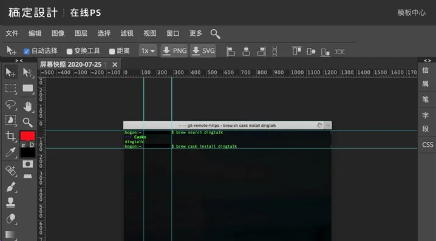

例如：

x1=1440px y1=40px x2=1700px y2=80px

w=x2-x1=260px h=y2-y1=40px

输入：

```bash
ffmpeg -i /Users/AAA/Desktop/ffmpeg/input.mov -vf "delogo=x=1440:y=40:w=260:h=40:show=0" -c:a copy /Users/AAA/Desktop/ffmpeg/output.mov

#-vf "delogo=x=10:y=10:w=180:h=60:show=0"  给视频添加马赛克滤镜，视频左上角为(1,1)坐标，logo坐标为(x,y)，w为宽，h为高。
#show=1 就会有一个绿框标示马赛克位置，show=0为不可见。
#-c:v copy -c:a copy 意思是复制源文件的编码格式，这样会比较快
```

输出：（可不看）

```bash
ffmpeg version 4.2.2 Copyright (c) 2000-2019 the FFmpeg developers
  built with Apple clang version 11.0.0 (clang-1100.0.33.16)
  configuration：--prefix=/usr/local/Cellar/ffmpeg/4.2.2_1 --enable-shared --enable-pthreads --enable-version3 --enable-avresample --cc=clang --host-cflags='-I/Library/Java/JavaVirtualMachines/adoptopenjdk-13.0.1.jdk/Contents/Home/include -I/Library/Java/JavaVirtualMachines/adoptopenjdk-13.0.1.jdk/Contents/Home/include/darwin -fno-stack-check' --host-ldflags= --enable-ffplay --enable-gnutls --enable-gpl --enable-libaom --enable-libbluray --enable-libmp3lame --enable-libopus --enable-librubberband --enable-libsnappy --enable-libtesseract --enable-libtheora --enable-libvidstab --enable-libvorbis --enable-libvpx --enable-libwebp --enable-libx264 --enable-libx265 --enable-libxvid --enable-lzma --enable-libfontconfig --enable-libfreetype --enable-frei0r --enable-libass --enable-libopencore-amrnb --enable-libopencore-amrwb --enable-libopenjpeg --enable-librtmp --enable-libspeex --enable-libsoxr --enable-videotoolbox --disable-libjack --disable-indev=jack
  libavutil      56. 31.100 / 56. 31.100
  libavcodec     58. 54.100 / 58. 54.100
  libavformat    58. 29.100 / 58. 29.100
  libavdevice    58.  8.100 / 58.  8.100
  libavfilter     7. 57.100 /  7. 57.100
  libavresample   4.  0.  0 /  4.  0.  0
  libswscale      5.  5.100 /  5.  5.100
  libswresample   3.  5.100 /  3.  5.100
  libpostproc    55.  5.100 / 55.  5.100
Input #0, mov,mp4,m4a,3gp,3g2,mj2, from '/Users/AAA/Desktop/ffmpeg/input.mov':
  Metadata:
    major_brand     ：qt
    minor_version   ：512
    compatible_brands：qt
    encoder         ：Lavf58.29.100
  Duration：00:05:41.43, start：0.000000, bitrate：329 kb/s
    Stream #0:0：Video：h264 (High) (avc1 / 0x31637661), yuv420p, 1728x1080 [SAR 1:1 DAR 8:5], 191 kb/s, 30 fps, 30 tbr, 15360 tbn, 60 tbc (default)
    Metadata:
      handler_name    ：VideoHandler
      encoder         ：Lavc58.54.100 libx264
    Stream #0:1：Audio：aac (LC) (mp4a / 0x6134706D), 44100 Hz, stereo, fltp, 129 kb/s (default)
    Metadata:
      handler_name    ：SoundHandler
Stream mapping:
  Stream #0:0 -> #0:0 (h264 (native) -> h264 (libx264))
  Stream #0:1 -> #0:1 (copy)
Press [q] to stop, [?] for help
[libx264 @ 0x7fe99700c400] using SAR=1/1
[libx264 @ 0x7fe99700c400] using cpu capabilities：MMX2 SSE2Fast SSSE3 SSE4.2 AVX FMA3 BMI2 AVX2
[libx264 @ 0x7fe99700c400] profile High, level 4.0
[libx264 @ 0x7fe99700c400] 264 - core 155 r2917 0a84d98 - H.264/MPEG-4 AVC codec - Copyleft 2003-2018 - http://www.videolan.org/x264.html - options：cabac=1 ref=3 deblock=1:0:0 analyse=0x3:0x113 me=hex subme=7 psy=1 psy_rd=1.00:0.00 mixed_ref=1 me_range=16 chroma_me=1 trellis=1 8x8dct=1 cqm=0 deadzone=21,11 fast_pskip=1 chroma_qp_offset=-2 threads=6 lookahead_threads=1 sliced_threads=0 nr=0 decimate=1 interlaced=0 bluray_compat=0 constrained_intra=0 bframes=3 b_pyramid=2 b_adapt=1 b_bias=0 direct=1 weightb=1 open_gop=0 weightp=2 keyint=250 keyint_min=25 scenecut=40 intra_refresh=0 rc_lookahead=40 rc=crf mbtree=1 crf=23.0 qcomp=0.60 qpmin=0 qpmax=69 qpstep=4 ip_ratio=1.40 aq=1:1.00
Output #0, mov, to '/Users/AAA/Desktop/ffmpeg/output.mov':
  Metadata:
    major_brand     ：qt
    minor_version   ：512
    compatible_brands：qt
    encoder         ：Lavf58.29.100
    Stream #0:0：Video：h264 (libx264) (avc1 / 0x31637661), yuv420p, 1728x1080 [SAR 1:1 DAR 8:5], q=-1--1, 30 fps, 15360 tbn, 30 tbc (default)
    Metadata:
      handler_name    ：VideoHandler
      encoder         ：Lavc58.54.100 libx264
    Side data:
      cpb：bitrate max/min/avg：0/0/0 buffer size：0 vbv_delay：-1
    Stream #0:1：Audio：aac (LC) (mp4a / 0x6134706D), 44100 Hz, stereo, fltp, 129 kb/s (default)
    Metadata:
      handler_name    ：SoundHandler
frame=10201 fps= 92 q=-1.0 Lsize=   13349kB time=00:05:39.98 bitrate= 321.6kbits/s speed=3.07x
video:7585kB audio:5402kB subtitle:0kB other streams:0kB global headers:0kB muxing overhead：2.785539%
[libx264 @ 0x7fe99700c400] frame I:42    Avg QP:14.79  size：79660
[libx264 @ 0x7fe99700c400] frame P:2631  Avg QP:18.50  size： 1240
[libx264 @ 0x7fe99700c400] frame B:7528  Avg QP:18.12  size：  154
[libx264 @ 0x7fe99700c400] consecutive B-frames： 1.1%  1.0%  1.3% 96.6%
[libx264 @ 0x7fe99700c400] mb I  I16..4：37.5% 44.6% 17.9%
[libx264 @ 0x7fe99700c400] mb P  I16..4： 0.2%  0.5%  0.2%  P16..4： 0.7%  0.1%  0.1%  0.0%  0.0%    skip:98.2%
[libx264 @ 0x7fe99700c400] mb B  I16..4： 0.0%  0.0%  0.0%  B16..8： 0.7%  0.0%  0.0%  direct：0.0%  skip:99.3%  L0:56.2% L1:42.9% BI：0.9%
[libx264 @ 0x7fe99700c400] 8x8 transform intra:47.4% inter:45.4%
[libx264 @ 0x7fe99700c400] coded y,uvDC,uvAC intra：15.6% 6.6% 4.2% inter：0.1% 0.1% 0.0%
[libx264 @ 0x7fe99700c400] i16 v,h,dc,p：68% 29%  1%  1%
[libx264 @ 0x7fe99700c400] i8 v,h,dc,ddl,ddr,vr,hd,vl,hu：74%  8% 16%  0%  0%  0%  0%  0%  0%
[libx264 @ 0x7fe99700c400] i4 v,h,dc,ddl,ddr,vr,hd,vl,hu：37% 28% 14%  3%  3%  4%  4%  4%  4%
[libx264 @ 0x7fe99700c400] i8c dc,h,v,p：90%  7%  2%  0%
[libx264 @ 0x7fe99700c400] Weighted P-Frames：Y:0.0% UV:0.0%
[libx264 @ 0x7fe99700c400] ref P L0：76.6%  7.8% 10.3%  5.3%
[libx264 @ 0x7fe99700c400] ref B L0：54.6% 44.2%  1.3%
[libx264 @ 0x7fe99700c400] ref B L1：97.7%  2.3%
[libx264 @ 0x7fe99700c400] kb/s:182.73
```

**删除第二个视频台标/水印/logo**：

x1=1380px y1=860px x2=1680px y2=1040px

w=x2-x1=300px h=y2-y1=180px

```bash
ffmpeg -i /Users/AAA/Desktop/ffmpeg/input.mov -vf "delogo=x=1380:y=860:w=300:h=180:show=0" -c:a copy /Users/AAA/Desktop/ffmpeg/output.mov
```

**同时删除多个台标，可使用逗号分开：**

```bash
ffmpeg -i /Users/AAA/Desktop/ffmpeg/input.mov -vf "delogo=x=1440:y=40:w=260:h=40:show=0,delogo=x=1380:y=860:w=300:h=180:show=0" -c:a copy /Users/AAA/Desktop/ffmpeg/output.mov
```

输出：

```bash
ffmpeg version 4.2.2 Copyright (c) 2000-2019 the FFmpeg developers
  built with Apple clang version 11.0.0 (clang-1100.0.33.16)
  configuration：--prefix=/usr/local/Cellar/ffmpeg/4.2.2_1 --enable-shared --enable-pthreads --enable-version3 --enable-avresample --cc=clang --host-cflags='-I/Library/Java/JavaVirtualMachines/adoptopenjdk-13.0.1.jdk/Contents/Home/include -I/Library/Java/JavaVirtualMachines/adoptopenjdk-13.0.1.jdk/Contents/Home/include/darwin -fno-stack-check' --host-ldflags= --enable-ffplay --enable-gnutls --enable-gpl --enable-libaom --enable-libbluray --enable-libmp3lame --enable-libopus --enable-librubberband --enable-libsnappy --enable-libtesseract --enable-libtheora --enable-libvidstab --enable-libvorbis --enable-libvpx --enable-libwebp --enable-libx264 --enable-libx265 --enable-libxvid --enable-lzma --enable-libfontconfig --enable-libfreetype --enable-frei0r --enable-libass --enable-libopencore-amrnb --enable-libopencore-amrwb --enable-libopenjpeg --enable-librtmp --enable-libspeex --enable-libsoxr --enable-videotoolbox --disable-libjack --disable-indev=jack
  libavutil      56. 31.100 / 56. 31.100
  libavcodec     58. 54.100 / 58. 54.100
  libavformat    58. 29.100 / 58. 29.100
  libavdevice    58.  8.100 / 58.  8.100
  libavfilter     7. 57.100 /  7. 57.100
  libavresample   4.  0.  0 /  4.  0.  0
  libswscale      5.  5.100 /  5.  5.100
  libswresample   3.  5.100 /  3.  5.100
  libpostproc    55.  5.100 / 55.  5.100
Input #0, mov,mp4,m4a,3gp,3g2,mj2, from '/Users/AAA/Desktop/ffmpeg/input.mov':
  Metadata:
    major_brand     ：qt
    minor_version   ：512
    compatible_brands：qt
    encoder         ：Lavf58.29.100
  Duration：00:05:41.03, start：0.000000, bitrate：320 kb/s
    Stream #0:0：Video：h264 (High) (avc1 / 0x31637661), yuv420p, 1728x1080 [SAR 1:1 DAR 8:5], 182 kb/s, 30 fps, 30 tbr, 15360 tbn, 60 tbc (default)
    Metadata:
      handler_name    ：VideoHandler
      encoder         ：Lavc58.54.100 libx264
    Stream #0:1：Audio：aac (LC) (mp4a / 0x6134706D), 44100 Hz, stereo, fltp, 129 kb/s (default)
    Metadata:
      handler_name    ：SoundHandler
Stream mapping:
  Stream #0:0 -> #0:0 (h264 (native) -> h264 (libx264))
  Stream #0:1 -> #0:1 (copy)
Press [q] to stop, [?] for help
[libx264 @ 0x7f8f05802000] using SAR=1/1
[libx264 @ 0x7f8f05802000] using cpu capabilities：MMX2 SSE2Fast SSSE3 SSE4.2 AVX FMA3 BMI2 AVX2
[libx264 @ 0x7f8f05802000] profile High, level 4.0
[libx264 @ 0x7f8f05802000] 264 - core 155 r2917 0a84d98 - H.264/MPEG-4 AVC codec - Copyleft 2003-2018 - http://www.videolan.org/x264.html - options：cabac=1 ref=3 deblock=1:0:0 analyse=0x3:0x113 me=hex subme=7 psy=1 psy_rd=1.00:0.00 mixed_ref=1 me_range=16 chroma_me=1 trellis=1 8x8dct=1 cqm=0 deadzone=21,11 fast_pskip=1 chroma_qp_offset=-2 threads=6 lookahead_threads=1 sliced_threads=0 nr=0 decimate=1 interlaced=0 bluray_compat=0 constrained_intra=0 bframes=3 b_pyramid=2 b_adapt=1 b_bias=0 direct=1 weightb=1 open_gop=0 weightp=2 keyint=250 keyint_min=25 scenecut=40 intra_refresh=0 rc_lookahead=40 rc=crf mbtree=1 crf=23.0 qcomp=0.60 qpmin=0 qpmax=69 qpstep=4 ip_ratio=1.40 aq=1:1.00
Output #0, mov, to '/Users/AAA/Desktop/ffmpeg/output.mov':
  Metadata:
    major_brand     ：qt
    minor_version   ：512
    compatible_brands：qt
    encoder         ：Lavf58.29.100
    Stream #0:0：Video：h264 (libx264) (avc1 / 0x31637661), yuv420p, 1728x1080 [SAR 1:1 DAR 8:5], q=-1--1, 30 fps, 15360 tbn, 30 tbc (default)
    Metadata:
      handler_name    ：VideoHandler
      encoder         ：Lavc58.54.100 libx264
    Side data:
      cpb：bitrate max/min/avg：0/0/0 buffer size：0 vbv_delay：-1
    Stream #0:1：Audio：aac (LC) (mp4a / 0x6134706D), 44100 Hz, stereo, fltp, 129 kb/s (default)
    Metadata:
      handler_name    ：SoundHandler
frame=10201 fps= 85 q=-1.0 Lsize=   12862kB time=00:05:39.98 bitrate= 309.9kbits/s speed=2.83x
video:7099kB audio:5402kB subtitle:0kB other streams:0kB global headers:0kB muxing overhead：2.893341%
[libx264 @ 0x7f8f05802000] frame I:42    Avg QP:14.32  size：70808
[libx264 @ 0x7f8f05802000] frame P:2632  Avg QP:18.21  size： 1197
[libx264 @ 0x7f8f05802000] frame B:7527  Avg QP:18.16  size：  152
[libx264 @ 0x7f8f05802000] consecutive B-frames： 1.2%  0.9%  1.4% 96.5%
[libx264 @ 0x7f8f05802000] mb I  I16..4：41.2% 43.0% 15.9%
[libx264 @ 0x7f8f05802000] mb P  I16..4： 0.2%  0.5%  0.2%  P16..4： 0.7%  0.1%  0.1%  0.0%  0.0%    skip:98.3%
[libx264 @ 0x7f8f05802000] mb B  I16..4： 0.0%  0.0%  0.0%  B16..8： 0.6%  0.0%  0.0%  direct：0.0%  skip:99.3%  L0:55.8% L1:43.4% BI：0.8%
[libx264 @ 0x7f8f05802000] 8x8 transform intra:46.7% inter:45.0%
[libx264 @ 0x7f8f05802000] coded y,uvDC,uvAC intra：14.6% 6.7% 4.1% inter：0.1% 0.0% 0.0%
[libx264 @ 0x7f8f05802000] i16 v,h,dc,p：70% 28%  1%  1%
[libx264 @ 0x7f8f05802000] i8 v,h,dc,ddl,ddr,vr,hd,vl,hu：74%  8% 17%  0%  0%  0%  0%  0%  0%
[libx264 @ 0x7f8f05802000] i4 v,h,dc,ddl,ddr,vr,hd,vl,hu：37% 29% 14%  3%  3%  4%  4%  4%  4%
[libx264 @ 0x7f8f05802000] i8c dc,h,v,p：90%  7%  2%  0%
[libx264 @ 0x7f8f05802000] Weighted P-Frames：Y:0.0% UV:0.0%
[libx264 @ 0x7f8f05802000] ref P L0：73.9%  8.3% 12.1%  5.7%
[libx264 @ 0x7f8f05802000] ref B L0：53.7% 45.3%  1.0%
[libx264 @ 0x7f8f05802000] ref B L1：98.0%  2.0%
[libx264 @ 0x7f8f05802000] kb/s:171.01
```

##### 使用 delogo 滤镜删除 LOGO

```bash
ffmpeg -i test.flv -vf delogo=x=806:y=20:w=70:h=80 output.flv
```

##### 去除水印（静态）

```bash
ffmpeg -i input.mp4 -b:v 3170k -vf "delogo=x=1:y=1:w=100:h=30:show=0" output.mp4
```

- `-b:v 3170k`：是设置视频的码率，可不加。
- `-vf  "delogo=x=1:y=1:w=100:h=30:show=0"`：给视频添加一个类似马赛克的滤镜效果，大小是以视频左上角为（x=1，y=1）的坐标，w 宽为 100，h 高为 30 的滤镜
- 如果 `show=1` 就会有一个绿框，`show=0` 为不可见。

##### 去除多水印（静态）

```bash
ffmpeg -i "D:\input.mp4" -vf "delogo=x=49:y=50:w=221:h=75,delogo=x=1014:y=678:w=234:h=35" -c:a copy "D:\output.mp4"
```

#### 视频加文本，动态文本

#### 添加动态 logo

```bash
ffmpeg -i input.mp4 -i logo.png -filter_complex overlay output.mp4
```

#### 添加背景音乐

视频添加背景音乐

```bash
ffmpeg -y -i input.mp4 -i ainiyiwannian.wav -filter_complex "[0:a] pan=stereo|c0=1*c0|c1=1*c1 [a1], [1:a] pan=stereo|c0=1*c0|c1=1*c1 [a2],[a1][a2]amix=duration=first,pan=stereo|c0<c0+c1|c1<c2+c3,pan=mono|c0=c0+c1[a]" -map "[a]" -map 0:v -c:v libx264 -c:a aac -strict -2 -ac 2 output.mp4
```

#### 视频去掉音频

```bash
ffmpeg -y -i source.mp4 -an -vcodec copy output.mp4
```

#### 设置视频的音量

-vol 设置视频的音量，是以%为单位，500 表示 500%

```bash
ffmpeg -y -i source.mp4 -vol 500 -strict -2 -vcodec copy output.mp4
```

#### 放大和缩小视频

#### 视频缩小一倍

```bash
ffmpeg -i out.mp4 -vf scale=iw/2:-1 scale.mp4
```

-vf scale 指定使用简单过滤器 scale，iw/2:-1 中的 iw 指定按整型取视频的宽度。 -1 表示高度随宽度一起变化。

参数详解

- -vf scale 指定使用简单过滤器 scale，
- iw/2:-1 中的 iw 指定按整型取视频的宽度。
- -1 表示高度随宽度一起变化。

#### 视频指定分辨率

```bash
ffmpeg -i final.avi -vf scale=640:640 square.avi
```

#### 旋转，翻转，填充，裁剪，模糊，锐化视频

#### 马赛克视频

#### 视频画面裁剪

```bash
# 例子1：
ffmpeg -i input.mp4 -filter:v "crop=w:h:x:y" output.mp4
# 例子2：
ffmpeg -i VR.mov  -vf crop=in_w-200:in_h-200 -c:v libx264 -c:a copy -video_size 1280x720 vr_new.mp4
```

- **`-filter：v`** - 指示视频过滤器。
- **`crop`** 格式：crop=out_w:out_h:x:y 指示裁剪过滤器。
- **`out_w|w`** ：输出的宽度。可以使用 in_w 表式输入视频的宽度。
- **`out_h|h`** ：输出的高度。可以使用 in_h 表式输入视频的高度。
- **`x`** ：X 坐标：我们要从源视频中裁剪的矩形的 **`x`** 坐标。
- **`y`** ：Y 坐标：我们要从源视频中裁剪的矩形的 **`x`** 坐标。

如果 x 和 y 设置为 0,说明从左上角开始裁剪。如果不写是从中心点裁剪。

假设您想要一个**宽度为 `640`** 像素、**高度为 `480` 像素**的视频，从**位置 （`200,150`） 开始，**命令将是：

```bash
ffmpeg -i input.mp4 -filter:v "crop=640:480:200:150" output.mp4
```

请注意，裁剪视频会影响质量。除非必要，否则不要这样做。

#### 视频|音频分割|裁剪|剪切(视频长度裁剪)

**使用开始和结束时间修剪媒体文件**

裁剪（cutting）指的是，截取原始视频里面的一个片段，输出为一个新视频。可以指定开始时间（start）和持续时间（duration），也可以指定结束时间（end）。

```bash
# 想要从开头开始剪辑一部分，使用T -t 参数来指定一个时间:
#这个参数对音频和视频都适用，上面两个命令做了类似的事情：保存一段5s的输出文件（文件开头开始算）。上面使用了两种不同的表示时间的方式，一个单纯的数字（描述）或者 HH:MM:SS (小时, 分钟, 秒). 第二种方式实际上指示了结束时间。
ffmpeg -ss [start] -i [input] -t [duration] -c copy [output]

# 视频裁剪
ffmpeg -i input_video.mp4 -t 5 output_video.mp4
ffmpeg -i input.mp4 -ss 00:00:50 -codec copy -t 50 output.mp4

# 音频裁剪
ffmpeg -i input_audio.wav -t 00:00:05 output_audio.wav

# 也可以通过 -ss 给出一个开始时间，-to 给出结束时间：
ffmpeg -ss [start] -i [input] -to [end] -c copy [output]
ffmpeg -i video.mp4 -t 00:00:30 video_1.mp4 -ss 00:00:30 video_2.mp4

# 开始时间 (-ss HH:MM:SS), 持续秒数 (-t duration), 结束时间 (-to HH:MM:SS), 和开始秒数 (-s duration)的用法
ffmpeg -i input_audio.mp3 -ss 00:01:14 output_audio.mp3
ffmpeg -i input_audio.wav -ss 00:00:30 -t 10 output_audio.wav
ffmpeg -i input_video.h264 -ss 00:01:30 -to 00:01:40 output_video.h264
ffmpeg -i input_audio.ogg -ss 5 output_audio.ogg
#
ffmpeg -ss 0:1:30 -t 0:0:20 -i input.avi -vcodec copy -acodec copy output.avi

# 实际例子：
ffmpeg -i out.mp4 -ss 00:00:00 -t 10 out1.mp4
# `-c copy`表示不改变音频和视频的编码格式，直接拷贝，这样会快很多。
ffmpeg -ss 00:01:50 -i [input] -t 10.5 -c copy [output]
ffmpeg -ss 2.5 -i [input] -to 10 -c copy [output]
```

- `-ss`：指定裁剪的开始时间，精确到秒
- `-t`：被裁剪后的时长（总持续时间）

同样，我们可以像下面这样修剪音频文件。

```bash
ffmpeg -i audio.mp3 -ss 00:01:54 -to 00:06:53 -c copy output.mp3
```

#### 将音频/视频文件拆分为多个部分

有些网站只允许您上传特定大小的视频。例如，Whatsapp 将只允许将秒视频设置为印度用户的状态消息。在这种情况下，您可以将大型视频文件拆分为多个较小的部分，如下所示。`15`

```bash
ffmpeg -i input.mp4 -t 00:00:30 -c copy part1.mp4 -ss 00:00:30 -codec copy part2.mp4
```

- **`-t 00:00:30`** 表示从视频开始到视频第 30 秒创建的部分。
- **`-ss 00：00：30`** 显示视频下一部分的开始时间戳。这意味着第 2 部分将从第 30 秒开始，一直持续到原始视频文件的结尾。

#### 剪切思路

剪切视频 对视频的剪切主要有两个，去除片头和去除片尾，FFmpeg 要去除固定时长的片头非常的简单，使用下面的命令就可以了：

```bash
ffmpeg -ss 00:03:00 -i input.mp4 -t 60 -c:v copy -c:a copy output.mp4
#-ss 00:03:00 表示从 3 分钟开始截取（也就是去除 3 分钟的开头）
#-t 60/-to 60 这里 -t 和 -to 都是一样的效果，意思是从截取开始往时间轴截取 60s
#-c:v copy -c:a copy 意思是复制源文件的编码格式，这样会比较快
#如果只是去除 3 分钟的片头可以不用加 -t 或者 -to 命令，如下：
ffmpeg -ss 00:03:00 -i input.mp4 -c:v copy -c:a copy output.mp4
```

还有一种情况就是在剪掉固定时长片头的同时也剪掉固定时长的片尾，FFmpeg 官方没有直接提供这中功能，一种最常用的思路是在 shell 脚本中先用 FFmpeg -i 把文件的元数据信息保留下来，再从元数据信息中提取出视频的时长，用视频的总时长减去要剪掉的开头时长后结尾时长就是我们需要的实际时长了:

```bash
#!/bin/bash
#我这里要切除的开头和结尾都是 7 秒
beg=7
end=7

#用 for 循环直接获取当前目录下的 mp4、mp3、avi 等文件循环处理，单个文件可以去掉 for 循环
for i in (*.mp4,*.mp3,*.avi ); do
 #将元数据信息临时保存到 tmp.log 文件中
    nohup /usr/local/ffmpeg/bin/ffmpeg -i "$i" > tmp.log
    #获取视频的时长，格式为  00:00:10,10 （时：分：秒，微妙）
    time="`cat /usr/local/ffmpeg/tmp.log |grep Duration：|awk  '{print $2}'|awk -F "," '{print $1}'|xargs`"
    echo $time
    #求视频的总时长，先分别求出小时、分、秒的值，这里不处理微秒，可以忽略
    hour="`echo $time |awk -F ":" '{print $1}' `"
    min="`echo $time |awk -F ":" '{print $2}' `"
    sec="`echo $time |awk -F ":" '{print $3}'|awk -F "." '{print $1}' `"
    #echo $hour $min $sec
    num1=`expr $hour \* 3600`
    num2=`expr $min \* 60`
    num3=$sec
    #计算出视频的总时长（秒）
    sum=`expr $num1 + $num2 + $num3`

    #总时长减去开头和结尾就是截取后的视频时长,并且这里不需要再转回 hour:min:sec 的格式，直接使用结果即可
    newtime=`expr $sum - $beg - $end`
    echo $newtime
    /usr/local/ffmpeg/bin/ffmpeg -ss 00:00:07 -i $i -t $newtime -c:v copy -c:a copy /data/tmp/$i -y
done
```

上面的 shell 脚本可以根据实际情况作出调整。

**删除视频片头和片尾**（三种方式）

片头：00:00-00:13，

片尾：05:53-结束，

删除片头后，正片内容持续时间段为 t：

t = 05:53-00:13 = 5min \* 60s + (53-13)s = 300+40 = 340 s；

**-t 持续时间段 ，显示格式：-t 340：**

```bash
ffmpeg -ss 00:00:13.000 -t 340 -accurate_seek -i /Users/AAA/Desktop/ffmpeg/input.mov -vcodec copy -acodec copy /Users/AAA/Desktop/ffmpeg/output.mov
#-ss 和 -t 为文件主选项 [input_file_options] 写在 -i 前面
#-ss 的时间格式：X秒 或 HOURS:MM:SS.MICROSECONDS  即-ss 13 或-ss 00:00:13.000
#-t 为持续时间段，时间格式：X秒或 HOURS:MM:SS.MICROSECONDS 即-t 340 或-t 00:05:40.000
#-accurate_seek 剪切精确时间
#-vcodec copy -acodec copy 即-c:v copy -c:a copy 复制源文件的编码格式，转换会比较快。


#从00:13开始截取视频，截取一段时长为340秒的视频。
```

或者：**使用 -t 持续时间段，显示时间格式：HOURS:MM:SS.MICROSECONDS**

```bash
ffmpeg -ss 00:00:13.000 -t 00:05:40.000 -accurate_seek -i /Users/AAA/Desktop/ffmpeg/input.mov -c:v copy -c:a copy /Users/AAA/Desktop/ffmpeg/output.mov

#从00:13开始截取视频，截取一段时长为05:40秒的视频。
实际本质同上一条：-t 340 ，只是 -t 呈现形态不同
```

或者：**使用 -to 截止时间点，截取时间点从 -ss 00:13 秒开始到 -to 05:53 秒结束**

**截止时间点** -to 计算方式：00:13 + 340 s =00:13 + 05:40 = 05:53

```bash
ffmpeg -ss 00:00:13.000 -to 00:05:53.000 -accurate_seek -i /Users/AAA/Desktop/ffmpeg/input.mov -c:v copy -c:a copy /Users/AAA/Desktop/ffmpeg/output.mov

#-to 是截止时间点，时间格式：HOURS:MM:SS.MICROSECONDS 即-to 00:05:53.000
```

#### 视频拼接|合并|拼合(多个视频拼接 )

示例：

- -f 表示采用 concat 协议
- -c 表示采用什么编码器 copy 表示不重新编码，如果是 x264 表示将采用 x264 进行重新编码。

```bash
ffmpeg -y -f concat -i videolist.txt -c copy  output.mp4
```

首先创建一个 inputs.txt 文件：`touch inputs.txt`，文件内容如下：

```bash
file '1.flv'
file '2.flv'
file '3.flv'
```

然后执行下面的命令：

```bash
ffmpeg -f concat -i inputs.txt -c copy output.flv
```

#### hls 切片

```bash
ffmpeg -i out.mp4 -c:v libx264 -c:a libfdk_aac -strict -2 -f hls out.m3u8
```

-strict -2 指明音频使有 AAC。

-f hls 转成 m3u8 格式。

#### 倍速播放

```bash
ffmpeg -i out.mp4 -filter_complex "[0:v]setpts=0.5*PTS[v];[0:a]atempo=2.0[a]" -map "[v]" -map "[a]" speed2.0.mp4
```

-filter_complex 复杂滤镜，[0:v]表示第一个（文件索引号是 0）文件的视频作为输入。setpts=0.5\*PTS 表示每帧视频的 pts 时间戳都乘 0.5 ，也就是差少一半。[v]表示输出的别名。音频同理就不详述了。

map 可用于处理复杂输出，如可以将指定的多路流输出到一个输出文件，也可以指定输出到多个文件。"[v]" 复杂滤镜输出的别名作为输出文件的一路流。上面 map 的用法是将复杂滤镜输出的视频和音频输出到指定文件中。

#### 对称视频

```bash
ffmpeg  -i out.mp4 -filter_complex "[0:v]pad=w=2*iw[a];[0:v]hflip[b];[a][b]overlay=x=w" duicheng.mp4
```

#### hflip 水平翻转

如果要修改为垂直翻转可以用 vflip。

#### 画中画

```bash
ffmpeg -i out.mp4 -i out1.mp4 -filter_complex "[1:v]scale=w=176:h=144:force_original_aspect_ratio=decrease[ckout];[0:v][ckout]overlay=x=W-w-10:y=0[out]" -map "[out]" -movflags faststart new.mp4
```

#### 录制画中画

```bash
ffmpeg  -f avfoundation -i "1" -framerate 30 -f avfoundation -i "0:0"
-r 30 -c:v libx264 -preset ultrafast
-c:a libfdk_aac -profile:a aac_he_v2 -ar 44100 -ac 2
-filter_complex "[1:v]scale=w=176:h=144:force_original_aspect_ratio=decrease[a];[0:v][a]overlay=x=W-w-10:y=0[out]"
-map "[out]" -movflags faststart -map 1:a b.mp4

#
ffmpeg  -f avfoundation -i "1" -framerate 30 -f avfoundation -i "0:0"  -r 30 -c:v libx264 -preset ultrafast  -c:a libfdk_aac -profile:a aac_he_v2 -ar 44100 -ac 2  -filter_complex "[1:v]scale=w=176:h=144:force_original_aspect_ratio=decrease[a];[0:v][a]overlay=x=W-w-10:y=0[out]"  -map "[out]" -movflags faststart -map 1:a b.mp4
```

#### 多路视频拼接

```bash
ffmpeg  -f avfoundation -i "1" -framerate 30 -f avfoundation  -i "0:0" -r 30 -c:v libx264 -preset ultrafast -c:a libfdk_aac -profile:a aac_he_v2 -ar 44100 -ac 2 -filter_complex "[0:v]scale=320:240[a];[a]pad=640:240[b];[b][1:v]overlay=320:0[out]" -map "[out]" -movflags faststart  -map 1:a  c.mp4
```

##### 两段视频同时播放，上下同时显示

```bash
ffmpeg -i video\out.mp4 -i video\out1.mp4 -filter_complex "pad=1920:2160:color=green[x0];[0:v]scale=w=1920:h=1080[inn0];[x0][inn0]overlay=0:0[x1];[1:v]scale=w=1920:h=1080[inn1];[x1][inn1]overlay=0:1080" out15.mp4
```

#### 从视频文件中删除音频流

如果您不想从视频文件中提取音频，请使用 **-an** 标志。

```bash
ffmpeg -i input.mp4 -an output.mp4
```

此处表示没有录音。换句话说，此选项将使音频静音。`-an`

上述命令将撤消所有与音频相关的标志。

#### 从媒体文件中删除视频流

同样，如果您不想要视频流，则可以使用**`“vn”`**标志轻松地将其从媒体文件中删除。VN 代表 没有视频录制。换句话说，此命令将给定的媒体文件转换为音频文件。

以下命令将从给定的媒体文件中删除视频。

```bash
ffmpeg -i input.mp4 -vn output.mp3
```

您还可以提及输出文件的比特率 using 标志，如以下示例所示。`'-ab'`

```bash
ffmpeg -i input.mp4 -vn -ab 320 output.mp3
```

#### 从视频中提取图像

FFmpeg 的另一个有用功能是我们可以轻松地从视频文件中提取图像。如果您想从视频文件创建相册，这可能非常有用。

若要从视频文件中提取图像，请使用以下命令：

```
$ ffmpeg -i input.mp4 -r 1 -f image2 image-%2d.png
```

这里

- **`-r`** - 设置帧速率。即每秒要提取到图像中的帧数。默认值为 **`25`**。
- **`-f`** - 表示输出格式，即我们示例中的图像格式。
- **`image-%2d.png`** - 指示我们想要如何命名提取的图像。在这种情况下，名称应以 、 开头，依此类推。如果使用 ，则图像的名称将以 开头，依此类推。` image-01.png``image-02.png``image-03.png``%3d``image-001.png``image-002.png `

#### 设置视频的纵横比

您可以使用 **`-aspect`** 标志将纵横比设置为视频文件，如下所示。

```bash
ffmpeg -i input.mp4 -aspect 16:9 output.mp4
```

常用的纵横比有：

- 16:9
- 4:3
- 16:10
- 5:4
- 2:21:1
- 2:35:1
- 2:39:1

#### 将海报图像添加到媒体文件

您可以将海报图像添加到文件中，以便在播放音频或视频文件时显示图像。这对于在视频托管或共享网站中托管音频文件可能很有用。

```bash
ffmpeg -loop 1 -i inputimage.jpg -i inputaudio.mp3 -c:v libx264 -c:a aac -strict experimental -b:a 192k -shortest output.mp4
```

#### 合并音频和视频文件

若要合并音频文件和视频文件，请运行：

```bash
ffmpeg -i inputvideo.mp4 -i inputaudio.mp3 -c:v copy -c:a aac output.mp4
```

上面的命令会将文件`inputvideo.mp4`与 `inputaudio.mp3` 合并输出`output.mp4`。它还将对音频文件重新编码。

在这里，我假设音频和视频文件的长度相同，并且视频文件没有任何音频流。

如果您的音频或视频流较长，您可以添加该选项：`-shortest`，以便在一个文件结束后 ffmpeg 停止编码。

如果你的输入视频已经包含音频，并且你想替换它，你需要告诉 ffmpeg 要采用哪个音频流，如下所示：

```bash
ffmpeg -i inputvideo.mp4 -i inputaudio.mp3 -c:v copy -c:a aac -map 0:v:0 -map 1:a:0 output.mp4
```

该选项使 ffmpeg 仅使用来自第一个输入的第一个视频流和来自第二个输入的第一个音频流作为输出文件。`-map`

如果要将音频文件与视频文件合并。无需重新编码音频，只需复制两个文件，如下所示：

```bash
ffmpeg -i inputvideo.mp4 -i inputaudio.mp3 -c copy output.mkv
```

#### 将多个音频/视频部分合并为一个

FFmpeg 还将加入多个视频部分并创建一个视频文件。

创建包含要加入的文件的确切路径的 **`join.txt`** 文件。所有文件应为相同的格式（相同的编解码器）。所有文件的路径名应一一提及，如下所示。

```bash
file /home/sk/myvideos/part1.mp4
file /home/sk/myvideos/part2.mp4
file /home/sk/myvideos/part3.mp4
file /home/sk/myvideos/part4.mp4
```

现在，使用命令加入所有文件：

```bash
ffmpeg -f concat -i join.txt -c copy output.mp4
```

如果您收到如下错误;

```bash
[concat @ 0x555fed174cc0] Unsafe file name '/path/to/mp4'
join.txt: Operation not permitted
```

添加**`“-safe 0”`**：

```bash
ffmpeg -f concat -safe 0 -i join.txt -c copy output.mp4
```

上述命令会将`part1.mp4` 、`part2.mp4` 、`part3.mp4` 和 `part4.mp4`文件合并到一个名为 `"output.mp4"`。

或者，您可以使用以下单行命令来联接目录中的所有文件。转到包含文件的目录，然后运行以下命令以将名为 的文件联接起来，然后加入` audio1.mp3``audio2,mp3``audio3.mp3``output.mp3 `

```bash
ffmpeg -i "concat:audio1.mp3|audio2.mp3|audio3.mp3" -c copy output.mp3
```

#### 在视频的特定视频时间添加音频

这个命令会将 video.mp4 和 audio.wav 合并为 output.mp4，其中 audio.wav 会在视频的第 1 秒开始播放。您可以根据您的需求修改输入文件和延迟时间。延迟时间的单位是毫秒，如果您有多个音频通道，您需要用`|`分隔每个通道的延迟时间。例如，`delays=1000|2000`表示第一个通道延迟 1 秒，第二个通道延迟 2 秒。

```bash
ffmpeg -i video.mp4 -i audio.wav -c:v copy -c:a aac -map 0:v:0 -map 1:a:0 -af "adelay=delays=1000|1000" output.mp4
```

使用混合音效，将特效和音频合并在一起，特效在音频播放 6s 后开始播放

```bash
ffmpeg -y -i 001.aac -itsoffset 6 -i tx.wav -filter_complex amix=inputs=2:duration=first:dropout_transition=4 -async 1 t2.wav
```

-itsoffset 6 就是 延迟 6s 的意思 amix 是将两个音频混合一起播放 inputs=2 是说两个音频资源

- 替换原视频的音频文件

```bash
ffmpeg -i 001.mp4 -i t2.wav -c:v copy -map 0:v:0 -map 1:a:0 001_1.mp4
```

-map 0:v:0 将输入的第一（索引 0）视频流映射到输出中的第一（索引 0）视频流。 -map 1:a:0 将输入的第二（索引 1）音频流映射到输出中的第一（索引 0）音频流。 如果音频比视频长，则需要-shortest 在输出文件名之前添加。这个参数在上篇文章用到过。 不指定音频编解码器，将自动选择一个有效的编解码器。您可以指定一个，例如-c:a libvorbis 在之后添加-c:v copy。

- 那么此刻。biubiu 的音效已经加入到视频中去了。001_1.mp4 就是我们想要的文件

#### 从视频中提取音频

```bash
ffmpeg -y -i source.mp4 -vn output.wav
```

将音频用 lpcm 格式重新编码，指定采样率

```bash
ffmpeg -y -i source.wav -acodec pcm_s16le -ar 44100 output.wav
```

#### 把 gif 图加入到视频中去

```bash
ffmpeg -y -i 001_1.mp4  -ignore_loop 0 -itsoffset 6  -i 87.gif  -filter_complex '[0:0]scale=iw:ih[a];[1:0]scale=300:300,fade=t=in:st=6:d=3:alpha=1[wm];[a][wm]overlay=x=350:y=60:shortest=1' s01.mp4
```

- -ignore_loop 0 表示动画会一直循环播放，1 表示播放一次
- -itsoffset 6 表示第 6s 开始播放动画 [0:0]
- scale=iw:ih 表示源视频的大小 [1:0]
- scale=300:300 表示动画的大小是 300\*300
- fade=t=in:st=6:d=3:alpha=1 第 6s 开始淡入，持续 3s，添加 Alpha 频道。
- [0:v] fade=in:0:10; 表示 0 到 10 帧淡入 overlay=x=350:y=60 表示坐标

为了效果，我加上字幕

```bash
ffmpeg -i s01.mp4 -vf ass=皮肤粗糙_棒棒-2.ass -b:v 3000K s01_1.mp4
```

动图跑马灯的效果

```bash
ffmpeg -i 001.mp4 -i 87.gif -filter_complex "[0:v][1:v] overlay=y='if(gte(t,2), -h+(t-2)*800, NAN):x=20"  run.mp4
```

这样那个 gif 动画就会从天而降了

在 gif 动图以某个角度 出现在 视频里面

```bash
ffmpeg -i  87.gif -i 001.mp4 -filter_complex '[0]format=pix_fmts=rgba[v0];[v0]rotate=a=PI/6:c=ffffff00[v1];[1][v1]overlay[v2]' -map [v2] -c:v libx264 test.ts
```

#### 为视频文件添加字幕

我们还可以使用 FFmpeg 为视频文件添加字幕。为您的视频下载正确的字幕并将其添加到您的视频中，如下所示。

```bash
fmpeg -i input.mp4 -i subtitle.srt -map 0 -map 1 -c copy -c:v libx264 -crf 23 -preset veryfast output.mp4
```

- rotate=a=PI/6 PI 是 180 度 /6 就是 30 度

#### 增加/减少视频播放速度

FFmpeg 允许您调整视频播放速度。

要提高视频播放速度，请运行：

```bash
ffmpeg -i input.mp4 -vf "setpts=0.5*PTS" output.mp4
```

该命令将使视频的速度加倍。

要减慢视频速度，您需要使用**大于 `1`** 的乘数。要降低播放速度，请运行：

```bash
ffmpeg -i input.mp4 -vf "setpts=4.0*PTS" output.mp4
```

#### ffmpeg 合并视频和音频压制成 mp4、mkv 等

如果您想输出为 MKV 格式，只需将输出文件的扩展名改为`.mkv`即可。

```bash
ffmpeg -i video.mp4 -i audio.mp3 -c:v copy -c:a aac -strict experimental output.mp4
```

- `-i video.mp4` 是视频文件的输入路径。
- `-i audio.mp3` 是音频文件的输入路径。
- `-c:v copy` 表示复制视频流而不重新编码。
- `-c:a aac` 表示使用 AAC 编码器对音频进行编码。
- `-strict experimental` 是一个可选参数，用于启用实验性功能。
- `output.mp4` 是输出文件的名称。

#### 合并音频和视频

##### 一、FFmpeg 多个音频合并的 2 种方法

多个 mp3 文件合并成一个 mp3 文件

**一种方法是连接到一起**

ffmpeg64.exe -i "concat:123.mp3|124.mp3" -acodec copy output.mp3

解释：-i 代表输入参数

contact:123.mp3|124.mp3 代表着需要连接到一起的音频文件

-acodec copy output.mp3 重新编码并复制到新文件中

**另一种方法是混合到一起**

ffmpeg64.exe -i 124.mp3 -i 123.mp3 -filter_complex amix=inputs=2:duration=first:dropout_transition=2 -f mp3 remix.mp3

解释： -i 代表输入参数

-filter_complex

amix 是混合多个音频到单个音频输出

inputs=2 代表是 2 个音频文件，如果更多则代表对应数字

duration 确定最终输出文件的长度

longest(最长)|shortest（最短）|first（第一个文件）

dropout_transition

The transition time, in seconds, for volume renormalization when an input stream ends. The default value is 2 seconds.

-f mp3 输出文件格式

**音频文件截取指定时间部分**

ffmpeg64 -i 124.mp3 -vn -acodec copy -ss 00:00:00 -t 00:01:32 output.mp3

解释： -i 代表输入参数

-acodec copy output.mp3 重新编码并复制到新文件中

-ss 开始截取的时间点

-t 截取音频时间长度

**音频文件格式转换**

ffmpeg64.exe -i null.ape -ar 44100 -ac 2 -ab 16k -vol 50 -f mp3 null.mp3

解释： -i 代表输入参数

-acodec aac（音频编码用 AAC）

-ar 设置音频采样频率

-ac 设置音频通道数

-ab 设定声音比特率

-vol <百分比> 设定音量

##### 二、FFmpeg 合并视频文件的 4 种方法

**1.使用 concat 协议进行视频文件的合并**

这种方式的适用场景是：视频容器是 MPEG-1, MPEG-2 PS 或 DV 等可以直接进行合并的。换句话说，其实可以直接用 cat 或者 copy 之类的命令来对视频直接进行合并。很多文章介绍了这种方法，但适用性却没有提及。这并不是一个通用的方法。典型的命令示例如下：

```text
使用concat demuxer进行视频文件的合并
```

这种合并方式的适用场景是：当容器格式不支持文件层次的合并，而又不想（不需要）进行再编码的操作的时候。这种方式对源视频同样有同格式同性质的要求。其详细语法参见 [这里](https://link.zhihu.com/?target=https%3A//ffmpeg.mplayerhq.hu/ffmpeg-formats.html%23concat-1) 。典型的命令示例如下：

```text
其中，Cam01.txt 为包含了输入文件的描述文件。
```

**2.使用 concat 滤镜（filter）进行视频文件的合并：**

当需要进行任意程度的重新编解码时，官方推荐使用的方法即是用 concat 滤镜来进行视频文件的合并处理。典型命令示例如下：

```text
这段命令目的是将三段双语格式的视频合并至最终的一段视频(output.mkv)。参数n=3说明待合成的视频有三段，v=1说明视频流为一，a=2说明音频流为二。 -map参数的详细说明可以从Filtergraph文档中找到。
```

众所周知，从某些视频网站下载的视频是分段的。比如新浪视频每隔 6 分钟分段，俗称“6 分钟诅咒”。

现在的任务是将这些视频片段合并起来，并且尽量无损。

**方法一：FFmpeg concat 协议**

对于 MPEG 格式的视频，可以直接连接：

> ffmpeg -i "concat:input1.mpg|input2.mpg|input3.mpg" -c copy output.mpg

对于非 MPEG 格式容器，但是是 MPEG 编码器（H.264、DivX、XviD、MPEG4、MPEG2、AAC、MP2、MP3 等），可以包装进 TS 格式的容器再合并。在新浪视频，有很多视频使用 H.264 编码器，可以采用这个方法

> ffmpeg -i input1.flv -c copy -bsf:v h264_mp4toannexb -f mpegts input1.ts
> ffmpeg -i input2.flv -c copy -bsf:v h264_mp4toannexb -f mpegts input2.ts
> ffmpeg -i input3.flv -c copy -bsf:v h264_mp4toannexb -f mpegts input3.ts
> ffmpeg -i "concat:input1.ts|input2.ts|input3.ts" -c copy -bsf:a aac_adtstoasc -movflags +faststart output.mp4

保存 QuickTime/MP4 格式容器的时候，建议加上 -movflags +faststart。这样分享文件给别人的时候可以边下边看。

**方法二：FFmpeg concat 分离器**

这种方法成功率很高，也是最好的，但是需要 FFmpeg 1.1 以上版本。先创建一个文本文件 filelist.txt：

> file 'input1.mkv'
> file 'input2.mkv'
> file 'input3.mkv'

然后：

> ffmpeg -f concat -i filelist.txt -c copy output.mkv

注意：使用 FFmpeg concat 分离器时，如果文件名有奇怪的字符，要在 filelist.txt 中转义。

**方法三：Mencoder 连接文件并重建索引**

这种方法只对很少的视频格式生效。幸运的是，新浪视频使用的 FLV 格式是可以这样连接的。对于没有使用 MPEG 编码器的视频（如 FLV1 编码器），可以尝试这种方法，或许能够成功。

> mencoder -forceidx -of lavf -oac copy -ovc copy -o output.flv input1.flv input2.flv input3.flv

**方法四：使用 FFmpeg concat 过滤器重新编码（有损）**

语法有点复杂，但是其实不难。这个方法可以合并不同编码器的视频片段，也可以作为其他方法失效的后备措施。

> ffmpeg -i input1.mp4 -i input2.webm -i input3.avi -filter_complex '[0:0] [0:1] [1:0] [1:1] [2:0] [2:1] concat=n=3:v=1:a=1 [v] [a]' -map '[v]' -map '[a]' <编码器选项> output.mkv

如你所见，上面的命令合并了三种不同格式的文件，FFmpeg concat 过滤器会重新编码它们。**注意这是有损压缩。**

[0:0] [0:1] [1:0] [1:1] [2:0] [2:1] 分别表示第一个输入文件的视频、音频、第二个输入文件的视频、音频、第三个输入文件的视频、音频。concat=n=3:v=1:a=1 表示有三个输入文件，输出一条视频流和一条音频流。[v] [a] 就是得到的视频流和音频流的名字，注意在 bash 等 shell 中需要用引号，防止通配符扩展。

**提示**

1. 1. 以上三种方法，在可能的情况下，最好使用第二种。第一种次之，第三种更次。第四种是后备方案，尽量避免。
   2. 规格不同的视频合并后可能会有无法预测的结果。
   3. 有些媒体需要先分离视频和音频，合并完成后再封装回去。
   4. 对于 Packed B-Frames 的视频，如果封装成 MKV 格式的时候提示 Can't write packet with unknown timestamp，尝试在 FFmpeg 命令的 ffmpeg 后面加上 -fflags +genpts

#### ffplay 预览或测试视频或音频文件

您可能需要预览以验证或测试输出文件是否已正确转码。为此，您可以使用以下命令从终端播放它：

```bash
ffplay video.mp4
```

测试音频文件

```bash
ffplay audio.mp3
```

### 5.转封装格式：编码，帧率，视频音频码率，分辨率，采样率

#### 1、-formats 显示可用的格式

- 用于查看 FFmpeg 支持的文件格式。文件格式是一种用于存储或传输音视频数据的规范，不同的文件格式有不同的特性和兼容性。
- FFmpeg 支持多种文件格式，包括常见的 MP4，MKV，AVI，FLV 等，以及一些专用的格式，如 3DO STR，Bink，CRI AIX，h264，hevc 等。

```bash
ffmpeg -hide_banner -formats
```

输出的格式说明如下：

`D/E` `format_name` `format_description`

- `D` 表示该格式支持解复用（Demuxing），即从文件中提取音视频和字幕流；

  - ```bash
    # 提取视频流
    ffmpeg -i input.mkv -map 0:v -c copy output_video.mkv
    # 提取字幕流
    ffmpeg -i input.mkv -map 0:s -c copy output_subtitle.mkv
    # 其中，-map 选项用于选择输入文件中的流，-c 选项用于指定编码器，copy 表示不改变编码格式。
    ```

- `E` 表示该格式支持复用（Muxing），即将音视频流写入文件：将多个音视频流合并为一个文件的过程。。

  - ```bash
    # 复用视频流和音频流：其中，-i 选项用于指定输入文件，-c 选项用于指定编码器，copy 表示不改变编码格式。
    ffmpeg -i video.mkv -i audio.m4a -c copy output.mp4
    ```

- `format_name` 是该格式的标识符，用于在 FFmpeg 命令中指定输入或输出的格式。

- `format_description` 是该格式的简短说明，通常是该格式的全称或来源。

例如，第一行：`D  3dostr          3DO STR`

表示 FFmpeg 支持解复用 3DO STR 格式，该格式是 3DO 游戏机的视频格式。

第二行：`E 3g2         3GP2 (3GPP2 file format)`

表示 FFmpeg 支持复用 3G2 格式，该格式是 3GPP2（第三代合作伙伴计划 2）的文件格式，用于移动设备的多媒体传输。

```bash
File formats:
 D. = Demuxing supported

 .E = Muxing supported
 --

 D  3dostr          3DO STR
  E 3g2             3GP2 (3GPP2 file format)
  E 3gp             3GP (3GPP file format)
 D  4xm             4X Technologies
  E a64             a64 - video for Commodore 64
 D  aa              Audible AA format files
 D  aac             raw ADTS AAC (Advanced Audio Coding)
 D  aax             CRI AAX
 DE ac3             raw AC-3
 DE ac4             raw AC-4
 D  ace             tri-Ace Audio Container
 D  acm             Interplay ACM
 D  act             ACT Voice file format
 D  adf             Artworx Data Format
 D  adp             ADP
 D  ads             Sony PS2 ADS
  E adts            ADTS AAC (Advanced Audio Coding)
 DE adx             CRI ADX
 D  aea             MD STUDIO audio
 D  afc             AFC
 DE aiff            Audio IFF
 D  aix             CRI AIX
 DE alaw            PCM A-law
 D  alias_pix       Alias/Wavefront PIX image
 DE alp             LEGO Racers ALP
 DE amr             3GPP AMR
 D  amrnb           raw AMR-NB
 D  amrwb           raw AMR-WB
  E amv             AMV
 D  anm             Deluxe Paint Animation
 D  apac            raw APAC
 D  apc             CRYO APC
 D  ape             Monkey's Audio
 DE apm             Ubisoft Rayman 2 APM
 DE apng            Animated Portable Network Graphics
 DE aptx            raw aptX (Audio Processing Technology for Bluetooth)
 DE aptx_hd         raw aptX HD (Audio Processing Technology for Bluetooth)
 D  aqtitle         AQTitle subtitles
 DE argo_asf        Argonaut Games ASF
 D  argo_brp        Argonaut Games BRP
 DE argo_cvg        Argonaut Games CVG
 DE asf             ASF (Advanced / Active Streaming Format)
 D  asf_o           ASF (Advanced / Active Streaming Format)
  E asf_stream      ASF (Advanced / Active Streaming Format)
 DE ass             SSA (SubStation Alpha) subtitle
 DE ast             AST (Audio Stream)
 DE au              Sun AU
 D  av1             AV1 Annex B
 DE avi             AVI (Audio Video Interleaved)
  E avif            AVIF
 D  avisynth        AviSynth script
  E avm2            SWF (ShockWave Flash) (AVM2)
 D  avr             AVR (Audio Visual Research)
 D  avs             Argonaut Games Creature Shock
 DE avs2            raw AVS2-P2/IEEE1857.4 video
 DE avs3            AVS3-P2/IEEE1857.10
 D  bethsoftvid     Bethesda Softworks VID
 D  bfi             Brute Force & Ignorance
 D  bfstm           BFSTM (Binary Cafe Stream)
 D  bin             Binary text
 D  bink            Bink
 D  binka           Bink Audio
 DE bit             G.729 BIT file format
 D  bitpacked       Bitpacked
 D  bmp_pipe        piped bmp sequence
 D  bmv             Discworld II BMV
 D  boa             Black Ops Audio
 D  bonk            raw Bonk
 D  brender_pix     BRender PIX image
 D  brstm           BRSTM (Binary Revolution Stream)
 D  c93             Interplay C93
 DE caf             Apple CAF (Core Audio Format)
 DE cavsvideo       raw Chinese AVS (Audio Video Standard) video
 D  cdg             CD Graphics
 D  cdxl            Commodore CDXL video
  E chromaprint     Chromaprint
 D  cine            Phantom Cine
 DE codec2          codec2 .c2 muxer
 DE codec2raw       raw codec2 muxer
 D  concat          Virtual concatenation script
  E crc             CRC testing
 D  cri_pipe        piped cri sequence
 DE dash            DASH Muxer
 DE data            raw data
 DE daud            D-Cinema audio
 D  dcstr           Sega DC STR
 D  dds_pipe        piped dds sequence
 D  derf            Xilam DERF
 D  dfa             Chronomaster DFA
 DE dfpwm           raw DFPWM1a
 D  dhav            Video DAV
 DE dirac           raw Dirac
 DE dnxhd           raw DNxHD (SMPTE VC-3)
 D  dpx_pipe        piped dpx sequence
 D  dsf             DSD Stream File (DSF)
 D  dshow           DirectShow capture
 D  dsicin          Delphine Software International CIN
 D  dss             Digital Speech Standard (DSS)
 DE dts             raw DTS
 D  dtshd           raw
```

##### 1.1 -muxers 显示可用的 muxers 复用器

复用器是一种用于将多个音视频流合并为一个文件的工具，例如 MP4，MKV，AVI 等。

不同的复用器有不同的特性和兼容性，因此需要根据不同的场景选择合适的复用器。

```bash
ffmpeg  -hide_banner -muxers
```

输出的

```bash
File formats:
 D. = Demuxing supported
 .E = Muxing supported
 --
  E 3g2             3GP2 (3GPP2 file format)
  E 3gp             3GP (3GPP file format)
  E a64             a64 - video for Commodore 64
  E ac3             raw AC-3
  E ac4             raw AC-4
  E adts            ADTS AAC (Advanced Audio Coding)
  E adx             CRI ADX
  E aiff            Audio IFF
  E alaw            PCM A-law
  E alp             LEGO Racers ALP
  E amr             3GPP AMR
  E amv             AMV
  E apm             Ubisoft Rayman 2 APM
  E apng            Animated Portable Network Graphics
  E aptx            raw aptX (Audio Processing Technology for Bluetooth)
  E aptx_hd         raw aptX HD (Audio Processing Technology for Bluetooth)
  E argo_asf        Argonaut Games ASF
  E argo_cvg        Argonaut Games CVG
  E asf             ASF (Advanced / Active Streaming Format)
  E asf_stream      ASF (Advanced / Active Streaming Format)
  E ass             SSA (SubStation Alpha) subtitle
  E ast             AST (Audio Stream)
  E au              Sun AU
  E avi             AVI (Audio Video Interleaved)
  E avif            AVIF
  E avm2            SWF (ShockWave Flash) (AVM2)
  E avs2            raw AVS2-P2/IEEE1857.4 video
  E avs3            AVS3-P2/IEEE1857.10
  E bit             G.729 BIT file format
  E caf             Apple CAF (Core Audio Format)
  E cavsvideo       raw Chinese AVS (Audio Video Standard) video
  E chromaprint     Chromaprint
  E codec2          codec2 .c2 muxer
  E codec2raw       raw codec2 muxer
  E crc             CRC testing
  E dash            DASH Muxer
  E data            raw data
  E daud            D-Cinema audio
  E dfpwm           raw DFPWM1a
  E dirac           raw Dirac
  E dnxhd           raw DNxHD (SMPTE VC-3)
  E dts             raw DTS
  E dv              DV (Digital Video)
  E dvd             MPEG-2 PS (DVD VOB)
  E eac3            raw E-AC-3
  E evc             raw EVC video
  E f32be           PCM 32-bit floating-point big-endian
  E f32le           PCM 32-bit floating-point little-endian
  E f4v             F4V Adobe Flash Video
  E f64be           PCM 64-bit floating-point big-endian
  E f64le           PCM 64-bit floating-point little-endian
  E ffmetadata      FFmpeg metadata in text
  E fifo            FIFO queue pseudo-muxer
  E fifo_test       Fifo test muxer
  E film_cpk        Sega FILM / CPK
  E filmstrip       Adobe Filmstrip
  E fits            Flexible Image Transport System
  E flac            raw FLAC
  E flv             FLV (Flash Video)
  E framecrc        framecrc testing
  E framehash       Per-frame hash testing
  E framemd5        Per-frame MD5 testing
  E g722            raw G.722
  E g723_1          raw G.723.1
  E g726            raw big-endian G.726 ("left-justified")
  E g726le          raw little-endian G.726 ("right-justified")
  E gif             CompuServe Graphics Interchange Format (GIF)
  E gsm             raw GSM
  E gxf             GXF (General eXchange Format)
  E h261            raw H.261
  E h263            raw H.263
  E h264            raw H.264 video
  E hash            Hash testing
  E hds             HDS Muxer
  E hevc            raw HEVC video
  E hls             Apple HTTP Live Streaming
  E ico             Microsoft Windows ICO
  E ilbc            iLBC storage
  E image2          image2 sequence
  E image2pipe      piped image2 sequence
  E ipod            iPod H.264 MP4 (MPEG-4 Part 14)
  E ircam           Berkeley/IRCAM/CARL Sound Format
  E ismv            ISMV/ISMA (Smooth Streaming)
  E ivf             On2 IVF
  E jacosub         JACOsub subtitle format
  E kvag            Simon & Schuster Interactive VAG
  E latm            LOAS/LATM
  E lrc             LRC lyrics
  E m4v             raw MPEG-4 video
  E matroska        Matroska
  E md5             MD5 testing
  E microdvd        MicroDVD subtitle format
  E mjpeg           raw MJPEG video
  E mkvtimestamp_v2 extract pts as timecode v2 format, as defined by mkvtoolnix
  E mlp             raw MLP
  E mmf             Yamaha SMAF
  E mov             QuickTime / MOV
  E mp2             MP2 (MPEG audio layer 2)
  E mp3             MP3 (MPEG audio layer 3)
  E mp4             MP4 (MPEG-4 Part 14)
  E mpeg            MPEG-1 Systems / MPEG program stream
  E mpeg1video      raw MPEG-1 video
  E mpeg2video      raw MPEG-2 video
  E mpegts          MPEG-TS (MPEG-2 Transport Stream)
  E mpjpeg          MIME multipart JPEG
  E mulaw           PCM mu-law
  E mxf             MXF (Material eXchange Format)
  E mxf_d10         MXF (Material eXchange Format) D-10 Mapping
  E mxf_opatom      MXF (Material eXchange Format) Operational Pattern Atom
  E null            raw null video
  E nut             NUT
  E obu             AV1 low overhead OBU
  E oga             Ogg Audio
  E ogg             Ogg
  E ogv             Ogg Video
  E oma             Sony OpenMG audio
  E opus            Ogg Opus
  E psp             PSP MP4 (MPEG-4 Part 14)
  E rawvideo        raw video
  E rm              RealMedia
  E roq             raw id RoQ
  E rso             Lego Mindstorms RSO
  E rtp             RTP output
  E rtp_mpegts      RTP/mpegts output format
  E rtsp            RTSP output
  E s16be           PCM signed 16-bit big-endian
  E s16le           PCM signed 16-bit little-endian
  E s24be           PCM signed 24-bit big-endian
  E s24le           PCM signed 24-bit little-endian
  E s32be           PCM signed 32-bit big-endian
  E s32le           PCM signed 32-bit little-endian
  E s8              PCM signed 8-bit
  E sap             SAP output
  E sbc             raw SBC
  E scc             Scenarist Closed Captions
  E sdl,sdl2        SDL2 output device
  E segment         segment
  E smjpeg          Loki SDL MJPEG
  E smoothstreaming Smooth Streaming Muxer
  E sox             SoX (Sound eXchange) native
  E spdif           IEC 61937 (used on S/PDIF - IEC958)
  E spx             Ogg Speex
  E srt             SubRip subtitle
  E stream_segment,ssegment streaming segment muxer
  E streamhash      Per-stream hash testing
  E sup             raw HDMV Presentation Graphic Stream subtitles
  E svcd            MPEG-2 PS (SVCD)
  E swf             SWF (ShockWave Flash)
  E tee             Multiple muxer tee
  E truehd          raw TrueHD
  E tta             TTA (True Audio)
  E ttml            TTML subtitle
  E u16be           PCM unsigned 16-bit big-endian
  E u16le           PCM unsigned 16-bit little-endian
  E u24be           PCM unsigned 24-bit big-endian
  E u24le           PCM unsigned 24-bit little-endian
  E u32be           PCM unsigned 32-bit big-endian
  E u32le           PCM unsigned 32-bit little-endian
  E u8              PCM unsigned 8-bit
  E uncodedframecrc uncoded framecrc testing
  E vc1             raw VC-1 video
  E vc1test         VC-1 test bitstream
  E vcd             MPEG-1 Systems / MPEG program stream (VCD)
  E vidc            PCM Archimedes VIDC
  E vob             MPEG-2 PS (VOB)
  E voc             Creative Voice
  E vvc             raw H.266/VVC video
  E w64             Sony Wave64
  E wav             WAV / WAVE (Waveform Audio)
  E webm            WebM
  E webm_chunk      WebM Chunk Muxer
  E webm_dash_manifest WebM DASH Manifest
  E webp            WebP
  E webvtt          WebVTT subtitle
  E wsaud           Westwood Studios audio
  E wtv             Windows Television (WTV)
  E wv              raw WavPack
  E yuv4mpegpipe    YUV4MPEG pipe
```

##### 1.2 -demuxers 显示可用的 demuxers 解复用器

解复用器是一种用于将多媒体文件中的不同流（如音频、视频、字幕等）分开的工具。

不同的解复用器有不同的特性和兼容性，因此需要根据不同的场景选择合适的解复用器。

```bash
ffmpeg  -hide_banner -demuxers
```

输出的

```bash
File formats:
 D. = Demuxing supported
 .E = Muxing supported
 --
 D  3dostr          3DO STR
 D  4xm             4X Technologies
 D  aa              Audible AA format files
 D  aac             raw ADTS AAC (Advanced Audio Coding)
 D  aax             CRI AAX
 D  ac3             raw AC-3
 D  ac4             raw AC-4
 D  ace             tri-Ace Audio Container
 D  acm             Interplay ACM
 D  act             ACT Voice file format
 D  adf             Artworx Data Format
 D  adp             ADP
 D  ads             Sony PS2 ADS
 D  adx             CRI ADX
 D  aea             MD STUDIO audio
 D  afc             AFC
 D  aiff            Audio IFF
 D  aix             CRI AIX
 D  alaw            PCM A-law
 D  alias_pix       Alias/Wavefront PIX image
 D  alp             LEGO Racers ALP
 D  amr             3GPP AMR
 D  amrnb           raw AMR-NB
 D  amrwb           raw AMR-WB
 D  anm             Deluxe Paint Animation
 D  apac            raw APAC
 D  apc             CRYO APC
 D  ape             Monkey's Audio
 D  apm             Ubisoft Rayman 2 APM
 D  apng            Animated Portable Network Graphics
 D  aptx            raw aptX
 D  aptx_hd         raw aptX HD
 D  aqtitle         AQTitle subtitles
 D  argo_asf        Argonaut Games ASF
 D  argo_brp        Argonaut Games BRP
 D  argo_cvg        Argonaut Games CVG
 D  asf             ASF (Advanced / Active Streaming Format)
 D  asf_o           ASF (Advanced / Active Streaming Format)
 D  ass             SSA (SubStation Alpha) subtitle
 D  ast             AST (Audio Stream)
 D  au              Sun AU
 D  av1             AV1 Annex B
 D  avi             AVI (Audio Video Interleaved)
 D  avisynth        AviSynth script
 D  avr             AVR (Audio Visual Research)
 D  avs             Argonaut Games Creature Shock
 D  avs2            raw AVS2-P2/IEEE1857.4
 D  avs3            raw AVS3-P2/IEEE1857.10
 D  bethsoftvid     Bethesda Softworks VID
 D  bfi             Brute Force & Ignorance
 D  bfstm           BFSTM (Binary Cafe Stream)
 D  bin             Binary text
 D  bink            Bink
 D  binka           Bink Audio
 D  bit             G.729 BIT file format
 D  bitpacked       Bitpacked
 D  bmp_pipe        piped bmp sequence
 D  bmv             Discworld II BMV
 D  boa             Black Ops Audio
 D  bonk            raw Bonk
 D  brender_pix     BRender PIX image
 D  brstm           BRSTM (Binary Revolution Stream)
 D  c93             Interplay C93
 D  caf             Apple CAF (Core Audio Format)
 D  cavsvideo       raw Chinese AVS (Audio Video Standard)
 D  cdg             CD Graphics
 D  cdxl            Commodore CDXL video
 D  cine            Phantom Cine
 D  codec2          codec2 .c2 demuxer
 D  codec2raw       raw codec2 demuxer
 D  concat          Virtual concatenation script
 D  cri_pipe        piped cri sequence
 D  dash            Dynamic Adaptive Streaming over HTTP
 D  data            raw data
 D  daud            D-Cinema audio
 D  dcstr           Sega DC STR
 D  dds_pipe        piped dds sequence
 D  derf            Xilam DERF
 D  dfa             Chronomaster DFA
 D  dfpwm           raw DFPWM1a
 D  dhav            Video DAV
 D  dirac           raw Dirac
 D  dnxhd           raw DNxHD (SMPTE VC-3)
 D  dpx_pipe        piped dpx sequence
 D  dsf             DSD Stream File (DSF)
 D  dshow           DirectShow capture
 D  dsicin          Delphine Software International CIN
 D  dss             Digital Speech Standard (DSS)
 D  dts             raw DTS
 D  dtshd           raw DTS-HD
 D  dv              DV (Digital Video)
 D  dvbsub          raw dvbsub
 D  dvbtxt          dvbtxt
 D  dxa             DXA
 D  ea              Electronic Arts Multimedia
 D  ea_cdata        Electronic Arts cdata
 D  eac3            raw E-AC-3
 D  epaf            Ensoniq Paris Audio File
 D  evc             EVC Annex B
 D  exr_pipe        piped exr sequence
 D  f32be           PCM 32-bit floating-point big-endian
 D  f32le           PCM 32-bit floating-point little-endian
 D  f64be           PCM 64-bit floating-point big-endian
 D  f64le           PCM 64-bit floating-point little-endian
 D  ffmetadata      FFmpeg metadata in text
 D  film_cpk        Sega FILM / CPK
 D  filmstrip       Adobe Filmstrip
 D  fits            Flexible Image Transport System
 D  flac            raw FLAC
 D  flic            FLI/FLC/FLX animation
 D  flv             FLV (Flash Video)
 D  frm             Megalux Frame
 D  fsb             FMOD Sample Bank
 D  fwse            Capcom's MT Framework sound
 D  g722            raw G.722
 D  g723_1          G.723.1
 D  g726            raw big-endian G.726 ("left aligned")
 D  g726le          raw little-endian G.726 ("right aligned")
 D  g729            G.729 raw format demuxer
 D  gdigrab         GDI API Windows frame grabber
 D  gdv             Gremlin Digital Video
 D  gem_pipe        piped gem sequence
 D  genh            GENeric Header
 D  gif             CompuServe Graphics Interchange Format (GIF)
 D  gif_pipe        piped gif sequence
 D  gsm             raw GSM
 D  gxf             GXF (General eXchange Format)
 D  h261            raw H.261
 D  h263            raw H.263
 D  h264            raw H.264 video
 D  hca             CRI HCA
 D  hcom            Macintosh HCOM
 D  hdr_pipe        piped hdr sequence
 D  hevc            raw HEVC video
 D  hls             Apple HTTP Live Streaming
 D  hnm             Cryo HNM v4
 D  ico             Microsoft Windows ICO
 D  idcin           id Cinematic
 D  idf             iCE Draw File
 D  iff             IFF (Interchange File Format)
 D  ifv             IFV CCTV DVR
 D  ilbc            iLBC storage
 D  image2          image2 sequence
 D  image2pipe      piped image2 sequence
 D  imf             IMF (Interoperable Master Format)
 D  ingenient       raw Ingenient MJPEG
 D  ipmovie         Interplay MVE
 D  ipu             raw IPU Video
 D  ircam           Berkeley/IRCAM/CARL Sound Format
 D  iss             Funcom ISS
 D  iv8             IndigoVision 8000 video
 D  ivf             On2 IVF
 D  ivr             IVR (Internet Video Recording)
 D  j2k_pipe        piped j2k sequence
 D  jacosub         JACOsub subtitle format
 D  jpeg_pipe       piped jpeg sequence
 D  jpegls_pipe     piped jpegls sequence
 D  jpegxl_anim     Animated JPEG XL
 D  jpegxl_pipe     piped jpegxl sequence
 D  jv              Bitmap Brothers JV
 D  kux             KUX (YouKu)
 D  kvag            Simon & Schuster Interactive VAG
 D  laf             LAF (Limitless Audio Format)
 D  lavfi           Libavfilter virtual input device
 D  libgme          Game Music Emu demuxer
 D  libopenmpt      Tracker formats (libopenmpt)
 D  live_flv        live RTMP FLV (Flash Video)
 D  lmlm4           raw lmlm4
 D  loas            LOAS AudioSyncStream
 D  lrc             LRC lyrics
 D  luodat          Video CCTV DAT
 D  lvf             LVF
 D  lxf             VR native stream (LXF)
 D  m4v             raw MPEG-4 video
 D  matroska,webm   Matroska / WebM
 D  mca             MCA Audio Format
 D  mcc             MacCaption
 D  mgsts           Metal Gear Solid: The Twin Snakes
 D  microdvd        MicroDVD subtitle format
 D  mjpeg           raw MJPEG video
 D  mjpeg_2000      raw MJPEG 2000 video
 D  mlp             raw MLP
 D  mlv             Magic Lantern Video (MLV)
 D  mm              American Laser Games MM
 D  mmf             Yamaha SMAF
 D  mods            MobiClip MODS
 D  moflex          MobiClip MOFLEX
 D  mov,mp4,m4a,3gp,3g2,mj2 QuickTime / MOV
 D  mp3             MP2/3 (MPEG audio layer 2/3)
 D  mpc             Musepack
 D  mpc8            Musepack SV8
 D  mpeg            MPEG-PS (MPEG-2 Program Stream)
 D  mpegts          MPEG-TS (MPEG-2 Transport Stream)
 D  mpegtsraw       raw MPEG-TS (MPEG-2 Transport Stream)
 D  mpegvideo       raw MPEG video
 D  mpjpeg          MIME multipart JPEG
 D  mpl2            MPL2 subtitles
 D  mpsub           MPlayer subtitles
 D  msf             Sony PS3 MSF
 D  msnwctcp        MSN TCP Webcam stream
 D  msp             Microsoft Paint (MSP))
 D  mtaf            Konami PS2 MTAF
 D  mtv             MTV
 D  mulaw           PCM mu-law
 D  musx            Eurocom MUSX
 D  mv              Silicon Graphics Movie
 D  mvi             Motion Pixels MVI
 D  mxf             MXF (Material eXchange Format)
 D  mxg             MxPEG clip
 D  nc              NC camera feed
 D  nistsphere      NIST SPeech HEader REsources
 D  nsp             Computerized Speech Lab NSP
 D  nsv             Nullsoft Streaming Video
 D  nut             NUT
 D  nuv             NuppelVideo
 D  obu             AV1 low overhead OBU
 D  ogg             Ogg
 D  oma             Sony OpenMG audio
 D  openal          OpenAL audio capture device
 D  osq             raw OSQ
 D  paf             Amazing Studio Packed Animation File
 D  pam_pipe        piped pam sequence
 D  pbm_pipe        piped pbm sequence
 D  pcx_pipe        piped pcx sequence
 D  pdv             PlayDate Video
 D  pfm_pipe        piped pfm sequence
 D  pgm_pipe        piped pgm sequence
 D  pgmyuv_pipe     piped pgmyuv sequence
 D  pgx_pipe        piped pgx sequence
 D  phm_pipe        piped phm sequence
 D  photocd_pipe    piped photocd sequence
 D  pictor_pipe     piped pictor sequence
 D  pjs             PJS (Phoenix Japanimation Society) subtitles
 D  pmp             Playstation Portable PMP
 D  png_pipe        piped png sequence
 D  pp_bnk          Pro Pinball Series Soundbank
 D  ppm_pipe        piped ppm sequence
 D  psd_pipe        piped psd sequence
 D  psxstr          Sony Playstation STR
 D  pva             TechnoTrend PVA
 D  pvf             PVF (Portable Voice Format)
 D  qcp             QCP
 D  qdraw_pipe      piped qdraw sequence
 D  qoa             QOA
 D  qoi_pipe        piped qoi sequence
 D  r3d             REDCODE R3D
 D  rawvideo        raw video
 D  realtext        RealText subtitle format
 D  redspark        RedSpark
 D  rka             RKA (RK Audio)
 D  rl2             RL2
 D  rm              RealMedia
 D  roq             id RoQ
 D  rpl             RPL / ARMovie
 D  rsd             GameCube RSD
 D  rso             Lego Mindstorms RSO
 D  rtp             RTP input
 D  rtsp            RTSP input
 D  s16be           PCM signed 16-bit big-endian
 D  s16le           PCM signed 16-bit little-endian
 D  s24be           PCM signed 24-bit big-endian
 D  s24le           PCM signed 24-bit little-endian
 D  s32be           PCM signed 32-bit big-endian
 D  s32le           PCM signed 32-bit little-endian
 D  s337m           SMPTE 337M
 D  s8              PCM signed 8-bit
 D  sami            SAMI subtitle format
 D  sap             SAP input
 D  sbc             raw SBC (low-complexity subband codec)
 D  sbg             SBaGen binaural beats script
 D  scc             Scenarist Closed Captions
 D  scd             Square Enix SCD
 D  sdns            Xbox SDNS
 D  sdp             SDP
 D  sdr2            SDR2
 D  sds             MIDI Sample Dump Standard
 D  sdx             Sample Dump eXchange
 D  ser             SER (Simple uncompressed video format for astronomical capturing)
 D  sga             Digital Pictures SGA
 D  sgi_pipe        piped sgi sequence
 D  shn             raw Shorten
 D  siff            Beam Software SIFF
 D  simbiosis_imx   Simbiosis Interactive IMX
 D  sln             Asterisk raw pcm
 D  smjpeg          Loki SDL MJPEG
 D  smk             Smacker
 D  smush           LucasArts Smush
 D  sol             Sierra SOL
 D  sox             SoX (Sound eXchange) native
 D  spdif           IEC 61937 (compressed data in S/PDIF)
 D  srt             SubRip subtitle
 D  stl             Spruce subtitle format
 D  subviewer       SubViewer subtitle format
 D  subviewer1      SubViewer v1 subtitle format
 D  sunrast_pipe    piped sunrast sequence
 D  sup             raw HDMV Presentation Graphic Stream subtitles
 D  svag            Konami PS2 SVAG
 D  svg_pipe        piped svg sequence
 D  svs             Square SVS
 D  swf             SWF (ShockWave Flash)
 D  tak             raw TAK
 D  tedcaptions     TED Talks captions
 D  thp             THP
 D  tiertexseq      Tiertex Limited SEQ
 D  tiff_pipe       piped tiff sequence
 D  tmv             8088flex TMV
 D  truehd          raw TrueHD
 D  tta             TTA (True Audio)
 D  tty             Tele-typewriter
 D  txd             Renderware TeXture Dictionary
 D  ty              TiVo TY Stream
 D  u16be           PCM unsigned 16-bit big-endian
 D  u16le           PCM unsigned 16-bit little-endian
 D  u24be           PCM unsigned 24-bit big-endian
 D  u24le           PCM unsigned 24-bit little-endian
 D  u32be           PCM unsigned 32-bit big-endian
 D  u32le           PCM unsigned 32-bit little-endian
 D  u8              PCM unsigned 8-bit
 D  usm             CRI USM
 D  v210            Uncompressed 4:2:2 10-bit
 D  v210x           Uncompressed 4:2:2 10-bit
 D  vag             Sony PS2 VAG
 D  vbn_pipe        piped vbn sequence
 D  vc1             raw VC-1
 D  vc1test         VC-1 test bitstream
 D  vfwcap          VfW video capture
 D  vidc            PCM Archimedes VIDC
 D  vividas         Vividas VIV
 D  vivo            Vivo
 D  vmd             Sierra VMD
 D  vobsub          VobSub subtitle format
 D  voc             Creative Voice
 D  vpk             Sony PS2 VPK
 D  vplayer         VPlayer subtitles
 D  vqf             Nippon Telegraph and Telephone Corporation (NTT) TwinVQ
 D  vvc             raw H.266/VVC video
 D  w64             Sony Wave64
 D  wady            Marble WADY
 D  wav             WAV / WAVE (Waveform Audio)
 D  wavarc          Waveform Archiver
 D  wc3movie        Wing Commander III movie
 D  webm_dash_manifest WebM DASH Manifest
 D  webp_pipe       piped webp sequence
 D  webvtt          WebVTT subtitle
 D  wsaud           Westwood Studios audio
 D  wsd             Wideband Single-bit Data (WSD)
 D  wsvqa           Westwood Studios VQA
 D  wtv             Windows Television (WTV)
 D  wv              WavPack
 D  wve             Psion 3 audio
 D  xa              Maxis XA
 D  xbin            eXtended BINary text (XBIN)
 D  xbm_pipe        piped xbm sequence
 D  xmd             Konami XMD
 D  xmv             Microsoft XMV
 D  xpm_pipe        piped xpm sequence
 D  xvag            Sony PS3 XVAG
 D  xwd_pipe        piped xwd sequence
 D  xwma            Microsoft xWMA
 D  yop             Psygnosis YOP
 D  yuv4mpegpipe    YUV4MPEG pipe
```

#### 2、-codecs 查看可用的编解码器

- 用于查看 FFmpeg 支持的所有编解码器的命令，包括视频编解码器，音频编解码器，字幕编解码器，数据编解码器和附件编解码器。它会显示每个编解码器的名称，简介，以及是否支持解码，编码，帧内编码，有损压缩和无损压缩等特性。
- -codecs 包含了 -encoders 和 -decoders 的信息，但是更详细和全面。

编解码器是一种用于将音视频数据压缩或转换为特定格式的工具。

不同的编解码器有不同的特性和优劣，例如 H.264，HEVC，AAC，MP3 等。

```bash
ffmpeg  -hide_banner -codecs
```

输出的格式如下：

`D/E` `V/A/S/D/T` `I/L/S` `codec_name` `codec_description`

- `D` 表示该编解码器支持解码（Decoding），即从压缩格式还原为原始数据；
- `E` 表示该编解码器支持编码（Encoding），即从原始数据压缩为特定格式。
- `V` 表示该编解码器是视频编解码器（Video codec），`A` 表示该编解码器是音频编解码器（Audio codec），`S` 表示该编解码器是字幕编解码器（Subtitle codec），`D` 表示该编解码器是数据编解码器（Data codec），`T` 表示该编解码器是附件编解码器（Attachment codec）。
- `I` 表示该编解码器是仅支持帧内编码的编解码器（Intra frame-only codec），`L` 表示该编解码器是有损压缩的编解码器（Lossy compression），`S` 表示该编解码器是无损压缩的编解码器（Lossless compression）。
- `codec_name` 是该编解码器的标识符，用于在 FFmpeg 命令中指定输入或输出的编解码器。
- `codec_description` 是该编解码器的简短说明，通常是该编解码器的全称或来源。

例如，第一行：`D.VI.S 012v     Uncompressed 4:2:2 10-bit`

表示 FFmpeg 支持解码 012v 编解码器，该编解码器是视频编解码器，仅支持帧内编码，无损压缩，是未压缩的 4:2:2 10-bit 格式。

第二行：`D.V.L. 4xm       4X Movie`

表示 FFmpeg 支持解码 4xm 编解码器，该编解码器是视频编解码器，有损压缩，是 4X Technologies 公司的电影格式。

```bash
Codecs:
 D..... = Decoding supported
 .E.... = Encoding supported
 ..V... = Video codec
 ..A... = Audio codec
 ..S... = Subtitle codec
 ..D... = Data codec
 ..T... = Attachment codec
 ...I.. = Intra frame-only codec
 ....L. = Lossy compression
 .....S = Lossless compression
 -------
 D.VI.S 012v                 Uncompressed 4:2:2 10-bit
 D.V.L. 4xm                  4X Movie
 D.VI.S 8bps                 QuickTime 8BPS video
 .EVIL. a64_multi            Multicolor charset for Commodore 64 (encoders: a64multi)
 .EVIL. a64_multi5           Multicolor charset for Commodore 64, extended with 5th color (colram) (encoders: a64multi5)
 D.V..S aasc                 Autodesk RLE
 D.V.L. agm                  Amuse Graphics Movie
 D.VIL. aic                  Apple Intermediate Codec
 DEVI.S alias_pix            Alias/Wavefront PIX image
 DEVIL. amv                  AMV Video
 D.V.L. anm                  Deluxe Paint Animation
 D.V.L. ansi                 ASCII/ANSI art
 DEV..S apng                 APNG (Animated Portable Network Graphics) image
 D.V.L. arbc                 Gryphon's Anim Compressor
 D.V.L. argo                 Argonaut Games Video
 DEVIL. asv1                 ASUS V1
 DEVIL. asv2                 ASUS V2
 D.VIL. aura                 Auravision AURA
 D.VIL. aura2                Auravision Aura 2
 DEV.L. av1                  Alliance for Open Media AV1 (decoders: libdav1d libaom-av1 av1 av1_cuvid av1_qsv) (encoders: libaom-av1 librav1e libsvtav1 av1_nvenc av1_qsv av1_amf av1_vaapi)
 D.V... avrn                 Avid AVI Codec
 DEVI.S avrp                 Avid 1:1 10-bit RGB Packer
 D.V.L. avs                  AVS (Audio Video Standard) video
 DEV.L. avs2                 AVS2-P2/IEEE1857.4 (decoders: libdavs2) (encoders: libxavs2)
 D.V.L. avs3                 AVS3-P2/IEEE1857.10 (decoders: libuavs3d)
 DEVI.S avui                 Avid Meridien Uncompressed
 DEVI.S ayuv                 Uncompressed packed MS 4:4:4:4
 D.V.L. bethsoftvid          Bethesda VID video
 D.V.L. bfi                  Brute Force & Ignorance
 D.V.L. binkvideo            Bink video
 D.VI.. bintext              Binary text
 DEVI.S bitpacked            Bitpacked
 DEVI.S bmp                  BMP (Windows and OS/2 bitmap)
 D.V..S bmv_video            Discworld II BMV video
 D.VI.S brender_pix          BRender PIX image
 D.V.L. c93                  Interplay C93
 D.V.L. cavs                 Chinese AVS (Audio Video Standard) (AVS1-P2, JiZhun profile)
 D.V.L. cdgraphics           CD Graphics video
 D.V..S cdtoons              CDToons video
 D.VIL. cdxl                 Commodore CDXL video
 DEV.L. cfhd                 GoPro CineForm HD
 DEV.L. cinepak              Cinepak
 D.V.L. clearvideo           Iterated Systems ClearVideo
 DEVIL. cljr                 Cirrus Logic AccuPak
 D.VI.S cllc                 Canopus Lossless Codec
 D.V.L. cmv                  Electronic Arts CMV video (decoders: eacmv)
 D.V... cpia                 CPiA video format
 D.VILS cri                  Cintel RAW
 D.V..S cscd                 CamStudio (decoders: camstudio)
 D.VIL. cyuv                 Creative YUV (CYUV)
 ..V.LS daala                Daala
 D.VILS dds                  DirectDraw Surface image decoder
 D.V.L. dfa                  Chronomaster DFA
 DEV.LS dirac                Dirac (encoders: vc2)
 DEVIL. dnxhd                VC3/DNxHD
 DEVI.S dpx                  DPX (Digital Picture Exchange) image
 D.V.L. dsicinvideo          Delphine Software International CIN video
 DEVIL. dvvideo              DV (Digital Video)
 D.V..S dxa                  Feeble Files/ScummVM DXA
 D.VI.S dxtory               Dxtory
 D.VIL. dxv                  Resolume DXV
 D.V.L. escape124            Escape 124
 D.V.L. escape130            Escape 130
 ..V.L. evc                  MPEG-5 EVC (Essential Video Coding)
 DEVILS exr                  OpenEXR image
 DEV..S ffv1                 FFmpeg video codec #1
 DEVI.S ffvhuff              Huffyuv FFmpeg variant
 D.V.L. fic                  Miril
```

#### 3、-encoders 显示可用的编码器

- 用于查看 FFmpeg 支持的所有编码器的命令，只包括可以用于输出的编码器。它会显示每个编码器的名称，简介，以及是否支持视频，音频，字幕，数据和附件等类型的编码。
- 不同的编码器有不同的特性和优劣，例如 H.264，HEVC，AAC，MP3 等。

```bash
ffmpeg -hide_banner -encoders
```

输出的格式如下：`V/A/S` `F/S/X/B/D` `codec_name` `codec_description`

- `V` 表示该编码器是视频编码器（Video），`A` 表示该编码器是音频编码器（Audio），`S` 表示该编码器是字幕编码器（Subtitle）。
- `F` 表示该编码器支持帧级多线程（Frame-level multithreading），`S` 表示该编码器支持切片级多线程（Slice-level multithreading），`X` 表示该编码器是实验性的（Codec is experimental），`B` 表示该编码器支持水平带绘制（Supports draw_horiz_band），`D` 表示该编码器支持直接渲染方法 1（Supports direct rendering method 1）。
- `codec_name` 是该编码器的标识符，用于在 FFmpeg 命令中指定输出的编码器。
- `codec_description` 是该编码器的简短说明，通常是该编码器的全称或来源。

编码器的用途是将音视频数据压缩或转换为特定格式，以便于存储或传输。不同的编码器有不同的压缩率，质量，兼容性，速度等因素，因此需要根据不同的场景选择合适的编码器。

```bash
Encoders:
 V..... = Video
 A..... = Audio
 S..... = Subtitle
 .F.... = Frame-level multithreading
 ..S... = Slice-level multithreading
 ...X.. = Codec is experimental
 ....B. = Supports draw_horiz_band
 .....D = Supports direct rendering method 1
 ------
 V....D a64multi             Multicolor charset for Commodore 64 (codec a64_multi)
 V....D a64multi5            Multicolor charset for Commodore 64, extended with 5th color (colram) (codec a64_multi5)
 V....D alias_pix            Alias/Wavefront PIX image
 V..... amv                  AMV Video
 V....D apng                 APNG (Animated Portable Network Graphics) image
 V....D asv1                 ASUS V1
 V....D asv2                 ASUS V2
 V....D libaom-av1           libaom AV1 (codec av1)
 V....D librav1e             librav1e AV1 (codec av1)
 V..... libsvtav1            SVT-AV1(Scalable Video Technology for AV1) encoder (codec av1)
 V....D av1_nvenc            NVIDIA NVENC av1 encoder (codec av1)
 V..... av1_qsv              AV1 (Intel Quick Sync Video acceleration) (codec av1)
 V....D av1_amf              AMD AMF AV1 encoder (codec av1)
 V....D av1_vaapi            AV1 (VAAPI) (codec av1)
 V....D avrp                 Avid 1:1 10-bit RGB Packer
 V....D libxavs2             libxavs2 AVS2-P2/IEEE1857.4 (codec avs2)
 V..X.D avui                 Avid Meridien Uncompressed
 V....D ayuv                 Uncompressed packed MS 4:4:4:4
 VF...D bitpacked            Bitpacked
 V....D bmp                  BMP (Windows and OS/2 bitmap)
 VF...D cfhd                 GoPro CineForm HD
 V....D cinepak              Cinepak
 V....D cljr                 Cirrus Logic AccuPak
 V.S..D vc2                  SMPTE VC-2 (codec dirac)
 VFS..D dnxhd                VC3/DNxHD
 V....D dpx                  DPX (Digital Picture Exchange) image
 VFS..D dvvideo              DV (Digital Video)
 VF...D exr                  OpenEXR image
 V.S..D ffv1                 FFmpeg video codec #1
 VF...D ffvhuff              Huffyuv FFmpeg variant
 V....D fits                 Flexible Image Transport System
 V....D flashsv              Flash Screen Video
 V....D flashsv2             Flash Screen Video Version 2
 V..... flv                  FLV / Sorenson Spark / Sorenson H.263 (Flash Video) (codec flv1)
 V....D gif                  GIF (Graphics Interchange Format)
 V..... h261                 H.261
 V..... h263                 H.263 / H.263-1996
 V.S... h263p                H.263+ / H.263-1998 / H.263 version 2
 V....D libx264              libx264 H.264 / AVC / MPEG-4 AVC / MPEG-4 part 10 (codec h264)
 V....D libx264rgb           libx264 H.264 / AVC / MPEG-4 AVC / MPEG-4 part 10 RGB (codec h264)
 V....D libopenh264          OpenH264 H.264 / AVC / MPEG-4 AVC / MPEG-4 part 10 (codec h264)
 V....D h264_amf             AMD AMF H.264 Encoder (codec h264)
 V....D h264_mf              H264 via MediaFoundation (codec h264)
 V....D h264_nvenc           NVIDIA NVENC H.264 encoder (codec h264)
 V..... h264_qsv             H.264 / AVC / MPEG-4 AVC / MPEG-4 part 10 (Intel Quick Sync Video acceleration) (codec h264)
 V....D h264_vaapi           H.264/AVC (VAAPI) (codec h264)
 VF...D hdr                  HDR (Radiance RGBE format) image
 V....D libx265              libx265 H.265 / HEVC (codec hevc)
 V....D hevc_amf             AMD AMF HEVC encoder (codec hevc)
 V....D hevc_mf              HEVC via MediaFoundation (codec hevc)
 V....D hevc_nvenc           NVIDIA NVENC hevc encoder (codec hevc)
 V..... hevc_qsv             HEVC (Intel Quick Sync Video acceleration) (codec hevc)
 V....D hevc_vaapi           H.265/HEVC (VAAPI) (codec hevc)
 V....D libkvazaar           libkvazaar H.265 / HEVC (codec hevc)
 VF...D huffyuv              Huffyuv / HuffYUV
 VF...D jpeg2000             JPEG 2000
 VF.... libopenjpeg          OpenJPEG JPEG 2000 (codec jpeg2000)
 VF...D jpegls               JPEG-LS
 V..... libjxl               libjxl JPEG XL (codec jpegxl)
 VF...D ljpeg                Lossless JPEG
 VFS..D magicyuv             MagicYUV video
 VFS... mjpeg                MJPEG (Motion JPEG)
 V..... mjpeg_qsv            MJPEG (Intel Quick Sync Video acceleration) (codec mjpeg)
 V....D mjpeg_vaapi          MJPEG (VAAPI) (codec mjpeg)
 V.S... mpeg1video           MPEG-1 video
 V.S... mpeg2video           MPEG-2 video
 V..... mpeg2_qsv            MPEG-2 video (Intel Quick Sync Video acceleration) (codec mpeg2video)
 V....D mpeg2_vaapi          MPEG-2 (VAAPI) (codec mpeg2video)
 V.S... mpeg4                MPEG-4 part 2
 V....D libxvid              libxvidcore MPEG-4 part 2 (codec mpeg4)
 V..... msmpeg4v2            MPEG-4 part 2 Microsoft variant version 2
 V..... msmpeg4              MPEG-4 part 2 Microsoft variant version 3 (codec msmpeg4v3)
 V....D msrle                Microsoft RLE
 V..... msvideo1             Microsoft Video-1
 V....D pam                  PAM (Portable AnyMap) image
 V....D pbm                  PBM (Portable BitMap) image
 V....D pcx                  PC Paintbrush PCX image
 V....D pfm                  PFM (Portable FloatMap) image
 V....D pgm                  PGM (Portable GrayMap) image
 V....D pgmyuv               PGMYUV (Portable GrayMap YUV) image
 V....D phm                  PHM (Portable HalfFloatMap) image
 VF...D png                  PNG (Portable Network Graphics) image
 V....D ppm                  PPM (Portable PixelMap) image
 VF...D prores               Apple ProRes
 VF...D prores_aw            Apple ProRes (codec prores)
 VFS... prores_ks            Apple ProRes (iCodec Pro) (codec prores)
 VF...D qoi                  QOI (Quite OK Image format) image
 V....D qtrle                QuickTime Animation (RLE) video
 V....D r10k                 AJA Kona 10-bit RGB Codec
 V....D r210                 Uncompressed RGB 10-bit
 VF...D rawvideo             raw video
 V....D roqvideo             id RoQ video (codec roq)
 V....D rpza                 QuickTime video (RPZA)
 V..... rv10                 RealVideo 1.0
 V..... rv20                 RealVideo 2.0
 V....D sgi                  SGI image
 V....D smc                  QuickTime Graphics (SMC)
 V....D snow                 Snow
 V..... speedhq              NewTek SpeedHQ
 V....D sunrast              Sun Rasterfile image
 V....D svq1                 Sorenson Vector Quantizer 1 / Sorenson Video 1 / SVQ1
 V....D targa                Truevision Targa image
 V....D libtheora            libtheora Theora (codec theora)
 VF...D tiff                 TIFF image
 VF...D utvideo              Ut Video
 VF...D v210                 Uncompressed 4:2:2 10-bit
 V....D v308                 Uncompressed packed 4:4:4
 V....D v408                 Uncompressed packed QT 4:4:4:4
 V....D v410                 Uncompressed 4:4:4 10-bit
 V.S..D vbn                  Vizrt Binary Image
 V..... vnull                null video
 V....D libvpx               libvpx VP8 (codec vp8)
 V....D vp8_vaapi            VP8 (VAAPI) (codec vp8)
 V....D libvpx-vp9           libvpx VP9 (codec vp9)
 V....D vp9_vaapi            VP9 (VAAPI) (codec vp9)
 V..... vp9_qsv              VP9 video (Intel Quick Sync Video acceleration) (codec vp9)
 VF...D wbmp                 WBMP (Wireless Application Protocol Bitmap) image
 V....D libwebp_anim         libwebp WebP image (codec webp)
 V....D libwebp              libwebp WebP image (codec webp)
 V..... wmv1                 Windows Media Video 7
 V..... wmv2                 Windows Media Video 8
 V..... wrapped_avframe      AVFrame to AVPacket passthrough
 V....D xbm                  XBM (X BitMap) image
 V....D xface                X-face image
 V....D xwd                  XWD (X Window Dump) image
 V....D y41p                 Uncompressed YUV 4:1:1 12-bit
 V....D yuv4                 Uncompressed packed 4:2:0
 VF...D zlib                 LCL (LossLess Codec Library) ZLIB
 V....D zmbv                 Zip Motion Blocks Video
 A....D aac                  AAC (Advanced Audio Coding)
 A....D aac_mf               AAC via MediaFoundation (codec aac)
 A....D ac3                  ATSC A/52A (AC-3)
 A....D ac3_fixed            ATSC A/52A (AC-3) (codec ac3)
 A....D ac3_mf               AC3 via MediaFoundation (codec ac3)
 A....D adpcm_adx            SEGA CRI ADX ADPCM
 A....D adpcm_argo           ADPCM Argonaut Games
 A....D g722                 G.722 ADPCM (codec adpcm_g722)
 A....D g726                 G.726 ADPCM (codec adpcm_g726)
 A....D g726le               G.726 little endian ADPCM ("right-justified") (codec adpcm_g726le)
 A....D adpcm_ima_alp        ADPCM IMA High Voltage Software ALP
 A....D adpcm_ima_amv        ADPCM IMA AMV
 A....D adpcm_ima_apm        ADPCM IMA Ubisoft APM
 A....D adpcm_ima_qt         ADPCM IMA QuickTime
 A....D adpcm_ima_ssi        ADPCM IMA Simon & Schuster Interactive
 A....D adpcm_ima_wav        ADPCM IMA WAV
 A....D adpcm_ima_ws         ADPCM IMA Westwood
 A....D adpcm_ms             ADPCM Microsoft
 A....D adpcm_swf            ADPCM Shockwave Flash
 A....D adpcm_yamaha         ADPCM Yamaha
 A....D alac                 ALAC (Apple Lossless Audio Codec)
 A....D libopencore_amrnb    OpenCORE AMR-NB (Adaptive Multi-Rate Narrow-Band) (codec amr_nb)
 A..... anull                null audio
 A....D aptx                 aptX (Audio Processing Technology for Bluetooth)
 A....D aptx_hd              aptX HD (Audio Processing Technology for Bluetooth)
 A....D comfortnoise         RFC 3389 comfort noise generator
 A....D dfpwm                DFPWM1a audio
 A..X.D dca                  DCA (DTS Coherent Acoustics) (codec dts)
 A....D eac3                 ATSC A/52 E-AC-3
 A....D flac                 FLAC (Free Lossless Audio Codec)
 A....D g723_1               G.723.1
 A..X.D mlp                  MLP (Meridian Lossless Packing)
 A....D mp2                  MP2 (MPEG audio layer 2)
 A....D mp2fixed             MP2 fixed point (MPEG audio layer 2) (codec mp2)
 A....D libtwolame           libtwolame MP2 (MPEG audio layer 2) (codec mp2)
 A....D libmp3lame           libmp3lame MP3 (MPEG audio layer 3) (codec mp3)
 A....D mp3_mf               MP3 via MediaFoundation (codec mp3)
 A....D nellymoser           Nellymoser Asao
 A..X.D opus                 Opus
 A....D libopus              libopus Opus (codec opus)
 A....D pcm_alaw             PCM A-law / G.711 A-law
 A....D pcm_bluray           PCM signed 16|20|24-bit big-endian for Blu-ray media
 A....D pcm_dvd              PCM signed 16|20|24-bit big-endian for DVD media
 A....D pcm_f32be            PCM 32-bit floating point big-endian
 A....D pcm_f32le            PCM 32-bit floating point little-endian
 A....D pcm_f64be            PCM 64-bit floating point big-endian
 A....D pcm_f64le            PCM 64-bit floating point little-endian
 A....D pcm_mulaw            PCM mu-law / G.711 mu-law
 A....D pcm_s16be            PCM signed 16-bit big-endian
 A....D pcm_s16be_planar     PCM signed 16-bit big-endian planar
 A....D pcm_s16le            PCM signed 16-bit little-endian
 A....D pcm_s16le_planar     PCM signed 16-bit little-endian planar
 A....D pcm_s24be            PCM signed 24-bit big-endian
 A....D pcm_s24daud          PCM D-Cinema audio signed 24-bit
 A....D pcm_s24le            PCM signed 24-bit little-endian
 A....D pcm_s24le_planar     PCM signed 24-bit little-endian planar
 A....D pcm_s32be            PCM signed 32-bit big-endian
 A....D pcm_s32le            PCM signed 32-bit little-endian
 A....D pcm_s32le_planar     PCM signed 32-bit little-endian planar
 A....D pcm_s64be            PCM signed 64-bit big-endian
 A....D pcm_s64le            PCM signed 64-bit little-endian
 A....D pcm_s8               PCM signed 8-bit
 A....D pcm_s8_planar        PCM signed 8-bit planar
 A....D pcm_u16be            PCM unsigned 16-bit big-endian
 A....D pcm_u16le            PCM unsigned 16-bit little-endian
 A....D pcm_u24be            PCM unsigned 24-bit big-endian
 A....D pcm_u24le            PCM unsigned 24-bit little-endian
 A....D pcm_u32be            PCM unsigned 32-bit big-endian
 A....D pcm_u32le            PCM unsigned 32-bit little-endian
 A....D pcm_u8               PCM unsigned 8-bit
 A....D pcm_vidc             PCM Archimedes VIDC
 A....D real_144             RealAudio 1.0 (14.4K) (codec ra_144)
 A....D roq_dpcm             id RoQ DPCM
 A..X.D s302m                SMPTE 302M
 A....D sbc                  SBC (low-complexity subband codec)
 A..X.D sonic                Sonic
 A..X.D sonicls              Sonic lossless
 A..X.D truehd               TrueHD
 A....D tta                  TTA (True Audio)
 A..X.D vorbis               Vorbis
 A....D libvorbis            libvorbis (codec vorbis)
 A....D wavpack              WavPack
 A....D wmav1                Windows Media Audio 1
 A....D wmav2                Windows Media Audio 2
 S..... ssa                  ASS (Advanced SubStation Alpha) subtitle (codec ass)
 S..... ass                  ASS (Advanced SubStation Alpha) subtitle
 S..... dvbsub               DVB subtitles (codec dvb_subtitle)
 S..... dvdsub               DVD subtitles (codec dvd_subtitle)
 S..... mov_text             3GPP Timed Text subtitle
 S..... srt                  SubRip subtitle (codec subrip)
 S..... subrip               SubRip subtitle
 S..... text                 Raw text subtitle
 S..... ttml                 TTML subtitle
 S..... webvtt               WebVTT subtitle
 S..... xsub                 DivX subtitles (XSUB)
```

想将一个视频文件转换为 MP4 格式，您可以使用以下命令：

```bash
# 转换视频文件为 MP4 格式：其中，-c:v 选项用于指定视频编码器，-c:a 选项用于指定音频编码器，libx264 是一种常用的 H.264 视频编码器，aac 是一种常用的 AAC 音频编码器。
ffmpeg -i input.mkv -c:v libx264 -c:a aac output.mp4
```

#### 4、-decoders 显示可用的解码器

- 用于查看 FFmpeg 支持的所有解码器的命令，只包括可以用于输入的解码器。它会显示每个解码器的名称，简介，以及是否支持视频，音频，字幕，数据和附件等类型的解码。

```bash
ffmpeg -hide_banner -decoders
```

输出的格式如下：

`V/A/S` `F/S/X/B/D` `codec_name` `codec_description`

- `V` 表示该解码器是视频解码器（Video），`A` 表示该解码器是音频解码器（Audio），`S` 表示该解码器是字幕解码器（Subtitle）。
- `F` 表示该解码器支持帧级多线程（Frame-level multithreading），`S` 表示该解码器支持切片级多线程（Slice-level multithreading），`X` 表示该解码器是实验性的（Codec is experimental），`B` 表示该解码器支持水平带绘制（Supports draw_horiz_band），`D` 表示该解码器支持直接渲染方法 1（Supports direct rendering method 1）。
- `codec_name` 是该解码器的标识符，用于在 FFmpeg 命令中指定输入的解码器。
- `codec_description` 是该解码器的简短说明，通常是该解码器的全称或来源。

```bash
Decoders:
 V..... = Video
 A..... = Audio
 S..... = Subtitle
 .F.... = Frame-level multithreading
 ..S... = Slice-level multithreading
 ...X.. = Codec is experimental
 ....B. = Supports draw_horiz_band
 .....D = Supports direct rendering method 1
 ------
 V....D 012v                 Uncompressed 4:2:2 10-bit
 V....D 4xm                  4X Movie
 V....D 8bps                 QuickTime 8BPS video
 V....D aasc                 Autodesk RLE
 V....D agm                  Amuse Graphics Movie
 VF...D aic                  Apple Intermediate Codec
 V....D alias_pix            Alias/Wavefront PIX image
 V....D amv                  AMV Video
 V....D anm                  Deluxe Paint Animation
 V....D ansi                 ASCII/ANSI art
 VF...D apng                 APNG (Animated Portable Network Graphics) image
 V....D arbc                 Gryphon's Anim Compressor
 V....D argo                 Argonaut Games Video
 V....D asv1                 ASUS V1
 V....D asv2                 ASUS V2
 V....D aura                 Auravision AURA
 V....D aura2                Auravision Aura 2
 V..... libdav1d             dav1d AV1 decoder by VideoLAN (codec av1)
 V....D libaom-av1           libaom AV1 (codec av1)
 V....D av1                  Alliance for Open Media AV1
 V..... av1_cuvid            Nvidia CUVID AV1 decoder (codec av1)
 V....D av1_qsv              AV1 video (Intel Quick Sync Video acceleration) (codec av1)
 V....D avrn                 Avid AVI Codec
 V....D avrp                 Avid 1:1 10-bit RGB Packer
 V....D avs                  AVS (Audio Video Standard) video
 V..... libdavs2             libdavs2 AVS2-P2/IEEE1857.4 (codec avs2)
 V....D libuavs3d            libuavs3d AVS3-P2/IEEE1857.10 (codec avs3)
 V....D avui                 Avid Meridien Uncompressed
 V....D ayuv                 Uncompressed packed MS 4:4:4:4
 V....D bethsoftvid          Bethesda VID video
 V....D bfi                  Brute Force & Ignorance
 V....D binkvideo            Bink video
 V....D bintext              Binary text
 VF.... bitpacked            Bitpacked
 V....D bmp                  BMP (Windows and OS/2 bitmap)
 V....D bmv_video            Discworld II BMV video
 V....D brender_pix          BRender PIX image
 V....D c93                  Interplay C93
 V....D cavs                 Chinese AVS (Audio Video Standard) (AVS1-P2, JiZhun profile)
 V....D cdgraphics           CD Graphics video
 V....D cdtoons              CDToons video
 V....D cdxl                 Commodore CDXL video
 VF...D cfhd                 GoPro CineForm HD
 V....D cinepak              Cinepak
 V....D clearvideo           Iterated Systems ClearVideo
 V....D cljr                 Cirrus Logic AccuPak
 VF...D cllc                 Canopus Lossless Codec
 V....D eacmv                Electronic Arts CMV video (codec cmv)
 V....D cpia                 CPiA video format
 VF...D cri                  Cintel RAW
 V....D camstudio            CamStudio (codec cscd)
 V....D cyuv                 Creative YUV (CYUV)
 V.S..D dds                  DirectDraw Surface image decoder
 V....D dfa                  Chronomaster DFA
 V.S..D dirac                BBC Dirac VC-2
 VFS..D dnxhd                VC3/DNxHD
 V....D dpx                  DPX (Digital Picture Exchange) image
 V....D dsicinvideo          Delphine Software International CIN video
 VFS..D dvvideo              DV (Digital Video)
 V....D dxa                  Feeble Files/ScummVM DXA
 VF...D dxtory               Dxtory
 VFS..D dxv                  Resolume DXV
 V....D escape124            Escape 124
 V....D escape130            Escape 130
 VFS..D exr                  OpenEXR image
 VFS..D ffv1                 FFmpeg video codec #1
 VF..BD ffvhuff              Huffyuv FFmpeg variant
 V.S..D fic                  Mirillis FIC
 V....D fits                 Flexible Image Transport System
 V....D flashsv              Flash Screen Video v1
 V....D flashsv2             Flash Screen Video v2
 V....D flic                 Autodesk Animator Flic video
 V...BD flv                  FLV / Sorenson Spark / Sorenson H.263 (Flash Video) (codec flv1)
 V....D fmvc                 FM Screen Capture Codec
 VF...D fraps                Fraps
 V....D frwu                 Forward Uncompressed
 V....D g2m                  Go2Meeting
 V....D gdv                  Gremlin Digital Video
 V....D gem                  GEM Raster image
 V....D gif                  GIF (Graphics Interchange Format)
 V....D h261                 H.261
 V...BD h263                 H.263 / H.263-1996, H.263+ / H.263-1998 / H.263 version 2
 V...BD h263i                Intel H.263
 V...BD h263p                H.263 / H.263-1996, H.263+ / H.263-1998 / H.263 version 2
 VFS..D h264                 H.264 / AVC / MPEG-4 AVC / MPEG-4 part 10
 V....D h264_qsv             H264 video (Intel Quick Sync Video acceleration) (codec h264)
 V....D libopenh264          OpenH264 H.264 / AVC / MPEG-4 AVC / MPEG-4 part 10 (codec h264)
 V..... h264_cuvid           Nvidia CUVID H264 decoder (codec h264)
 VFS..D hap                  Vidvox Hap
 VF...D hdr                  HDR (Radiance RGBE format) image
 VFS..D hevc                 HEVC (High Efficiency Video Coding)
 V....D hevc_qsv             HEVC video (Intel Quick Sync Video acceleration) (codec hevc)
 V..... hevc_cuvid           Nvidia CUVID HEVC decoder (codec hevc)
 V....D hnm4video            HNM 4 video
 V....D hq_hqa               Canopus HQ/HQA
 VFS..D hqx                  Canopus HQX
 VF..BD huffyuv              Huffyuv / HuffYUV
 VF..BD hymt                 HuffYUV MT
 V....D idcinvideo           id Quake II CIN video (codec idcin)
 V....D idf                  iCEDraw text
 V....D iff                  IFF ACBM/ANIM/DEEP/ILBM/PBM/RGB8/RGBN (codec iff_ilbm)
 V....D imm4                 Infinity IMM4
 V..... imm5                 Infinity IMM5
 V....D indeo2               Intel Indeo 2
 V....D indeo3               Intel Indeo 3
 V....D indeo4               Intel Indeo Video Interactive 4
 V....D indeo5               Intel Indeo Video Interactive 5
 V....D interplayvideo       Interplay MVE video
 V....D ipu                  IPU Video
 VFS..D jpeg2000             JPEG 2000
 V....D jpegls               JPEG-LS
 V....D libjxl               libjxl JPEG XL (codec jpegxl)
 V....D jv                   Bitmap Brothers JV video
 V....D kgv1                 Kega Game Video
 V....D kmvc                 Karl Morton's video codec
 VF...D lagarith             Lagarith lossless
 V....D lead                 LEAD MCMP
 V....D loco                 LOCO
 V....D lscr                 LEAD Screen Capture
 V....D m101                 Matrox Uncompressed SD
 V....D eamad                Electronic Arts Madcow Video (codec mad)
 VFS..D magicyuv             MagicYUV video
 VF...D mdec                 Sony PlayStation MDEC (Motion DECoder)
 V....D media100             Media 100
 VF...D mimic                Mimic
 V....D mjpeg                MJPEG (Motion JPEG)
 V..... mjpeg_cuvid          Nvidia CUVID MJPEG decoder (codec mjpeg)
 V....D mjpeg_qsv            MJPEG video (Intel Quick Sync Video acceleration) (codec mjpeg)
 V....D mjpegb               Apple MJPEG-B
 V....D mmvideo              American Laser Games MM Video
 V....D mobiclip             MobiClip Video
 V....D motionpixels         Motion Pixels video
 V.S.BD mpeg1video           MPEG-1 video
 V..... mpeg1_cuvid          Nvidia CUVID MPEG1VIDEO decoder (codec mpeg1video)
 V.S.BD mpeg2video           MPEG-2 video
 V.S.BD mpegvideo            MPEG-1 video (codec mpeg2video)
 V....D mpeg2_qsv            MPEG2VIDEO video (Intel Quick Sync Video acceleration) (codec mpeg2video)
 V..... mpeg2_cuvid          Nvidia CUVID MPEG2VIDEO decoder (codec mpeg2video)
 VF..BD mpeg4                MPEG-4 part 2
 V..... mpeg4_cuvid          Nvidia CUVID MPEG4 decoder (codec mpeg4)
 V....D msa1                 MS ATC Screen
 V....D mscc                 Mandsoft Screen Capture Codec
 V...BD msmpeg4v1            MPEG-4 part 2 Microsoft variant version 1
 V...BD msmpeg4v2            MPEG-4 part 2 Microsoft variant version 2
 V...BD msmpeg4              MPEG-4 part 2 Microsoft variant version 3 (codec msmpeg4v3)
 V....D msp2                 Microsoft Paint (MSP) version 2
 V....D msrle                Microsoft RLE
 V....D mss1                 MS Screen 1
 V....D mss2                 MS Windows Media Video V9 Screen
 V....D msvideo1             Microsoft Video 1
 VF...D mszh                 LCL (LossLess Codec Library) MSZH
 V....D mts2                 MS Expression Encoder Screen
 V....D mv30                 MidiVid 3.0
 V....D mvc1                 Silicon Graphics Motion Video Compressor 1
 V....D mvc2                 Silicon Graphics Motion Video Compressor 2
 V....D mvdv                 MidiVid VQ
 V....D mvha                 MidiVid Archive Codec
 V....D mwsc                 MatchWare Screen Capture Codec
 V....D mxpeg                Mobotix MxPEG video
 VF...D notchlc              NotchLC
 V....D nuv                  NuppelVideo/RTJPEG
 V....D paf_video            Amazing Studio Packed Animation File Video
 V....D pam                  PAM (Portable AnyMap) image
 V....D pbm                  PBM (Portable BitMap) image
 V....D pcx                  PC Paintbrush PCX image
 V....D pdv                  PDV (PlayDate Video)
 V....D pfm                  PFM (Portable FloatMap) image
 V....D pgm                  PGM (Portable GrayMap) image
 V....D pgmyuv               PGMYUV (Portable GrayMap YUV) image
 V....D pgx                  PGX (JPEG2000 Test Format)
 V....D phm                  PHM (Portable HalfFloatMap) image
 VF...D photocd              Kodak Photo CD
 V....D pictor               Pictor/PC Paint
 VF...D pixlet               Apple Pixlet
 VF...D png                  PNG (Portable Network Graphics) image
 V....D ppm                  PPM (Portable PixelMap) image
 VFS..D prores               Apple ProRes (iCodec Pro)
 V....D prosumer             Brooktree ProSumer Video
 VF...D psd                  Photoshop PSD file
 V....D ptx                  V.Flash PTX image
 V....D qdraw                Apple QuickDraw
 VF...D qoi                  QOI (Quite OK Image format) image
 V....D qpeg                 Q-team QPEG
 V....D qtrle                QuickTime Animation (RLE) video
 V....D r10k                 AJA Kona 10-bit RGB Codec
 V....D r210                 Uncompressed RGB 10-bit
 V....D rasc                 RemotelyAnywhere Screen Capture
 V..... rawvideo             raw video
 V....D rl2                  RL2 video
 V....D roqvideo             id RoQ video (codec roq)
 V....D rpza                 QuickTime video (RPZA)
 V....D rscc                 innoHeim/Rsupport Screen Capture Codec
 VF...D rtv1                 RTV1 (RivaTuner Video)
 V....D rv10                 RealVideo 1.0
 V....D rv20                 RealVideo 2.0
 VF...D rv30                 RealVideo 3.0
 VF...D rv40                 RealVideo 4.0
 V....D sanm                 LucasArts SANM/Smush video
 V....D scpr                 ScreenPressor
 V....D screenpresso         Screenpresso
 V....D sga                  Digital Pictures SGA Video
 V....D sgi                  SGI image
 V....D sgirle               Silicon Graphics RLE 8-bit video
 VF...D sheervideo           BitJazz SheerVideo
 V....D simbiosis_imx        Simbiosis Interactive IMX Video
 V....D smackvid             Smacker video (codec smackvideo)
 V....D smc                  QuickTime Graphics (SMC)
 V....D smvjpeg              SMV JPEG
 V....D snow                 Snow
 V....D sp5x                 Sunplus JPEG (SP5X)
 V....D speedhq              NewTek SpeedHQ
 V....D srgc                 Screen Recorder Gold Codec
 V....D sunrast              Sun Rasterfile image
 V....D svq1                 Sorenson Vector Quantizer 1 / Sorenson Video 1 / SVQ1
 V...BD svq3                 Sorenson Vector Quantizer 3 / Sorenson Video 3 / SVQ3
 V....D targa                Truevision Targa image
 V....D targa_y216           Pinnacle TARGA CineWave YUV16
 V....D tdsc                 TDSC
 V....D eatgq                Electronic Arts TGQ video (codec tgq)
 V....D eatgv                Electronic Arts TGV video (codec tgv)
 VF..BD theora               Theora
 V....D thp                  Nintendo Gamecube THP video
 V....D tiertexseqvideo      Tiertex Limited SEQ video
 VF...D tiff                 TIFF image
 V....D tmv                  8088flex TMV
 V....D eatqi                Electronic Arts TQI Video (codec tqi)
 V....D truemotion1          Duck TrueMotion 1.0
 V....D truemotion2          Duck TrueMotion 2.0
 V....D truemotion2rt        Duck TrueMotion 2.0 Real Time
 V....D camtasia             TechSmith Screen Capture Codec (codec tscc)
 V....D tscc2                TechSmith Screen Codec 2
 V....D txd                  Renderware TXD (TeXture Dictionary) image
 V....D ultimotion           IBM UltiMotion (codec ulti)
 VF...D utvideo              Ut Video
 VFS..D v210                 Uncompressed 4:2:2 10-bit
 V....D v210x                Uncompressed 4:2:2 10-bit
 V....D v308                 Uncompressed packed 4:4:4
 V....D v408                 Uncompressed packed QT 4:4:4:4
 VFS..D v410                 Uncompressed 4:4:4 10-bit
 V....D vb                   Beam Software VB
 VF...D vble                 VBLE Lossless Codec
 V.S..D vbn                  Vizrt Binary Image
 V....D vc1                  SMPTE VC-1
 V....D vc1_qsv              VC1 video (Intel Quick Sync Video acceleration) (codec vc1)
 V..... vc1_cuvid            Nvidia CUVID VC1 decoder (codec vc1)
 V....D vc1image             Windows Media Video 9 Image v2
 V....D vcr1                 ATI VCR1
 V....D xl                   Miro VideoXL (codec vixl)
 V....D vmdvideo             Sierra VMD video
 VFS..D vmix                 vMix Video
 V....D vmnc                 VMware Screen Codec / VMware Video
 V....D vnull                null video
 VF..BD vp3                  On2 VP3
 VF..BD vp4                  On2 VP4
 V....D vp5                  On2 VP5
 V....D vp6                  On2 VP6
 V.S..D vp6a                 On2 VP6 (Flash version, with alpha channel)
 V....D vp6f                 On2 VP6 (Flash version)
 V....D vp7                  On2 VP7
 VFS..D vp8                  On2 VP8
 V....D libvpx               libvpx VP8 (codec vp8)
 V..... vp8_cuvid            Nvidia CUVID VP8 decoder (codec vp8)
 V....D vp8_qsv              VP8 video (Intel Quick Sync Video acceleration) (codec vp8)
 VFS..D vp9                  Google VP9
 V..... libvpx-vp9           libvpx VP9 (codec vp9)
 V..... vp9_cuvid            Nvidia CUVID VP9 decoder (codec vp9)
 V....D vp9_qsv              VP9 video (Intel Quick Sync Video acceleration) (codec vp9)
 V....D vqc                  ViewQuest VQC
 VF...D wbmp                 WBMP (Wireless Application Protocol Bitmap) image
 V....D wcmv                 WinCAM Motion Video
 VF...D webp                 WebP image
 V...BD wmv1                 Windows Media Video 7
 V...BD wmv2                 Windows Media Video 8
 V....D wmv3                 Windows Media Video 9
 V....D wmv3image            Windows Media Video 9 Image
 V....D wnv1                 Winnov WNV1
 V..... wrapped_avframe      AVPacket to AVFrame passthrough
 V....D vqavideo             Westwood Studios VQA (Vector Quantized Animation) video (codec ws_vqa)
 V....D xan_wc3              Wing Commander III / Xan
 V....D xan_wc4              Wing Commander IV / Xxan
 V....D xbin                 eXtended BINary text
 V....D xbm                  XBM (X BitMap) image
 V....D xface                X-face image
 V....D xpm                  XPM (X PixMap) image
 V....D xwd                  XWD (X Window Dump) image
 V....D y41p                 Uncompressed YUV 4:1:1 12-bit
 VF...D ylc                  YUY2 Lossless Codec
 V..... yop                  Psygnosis YOP Video
 V....D yuv4                 Uncompressed packed 4:2:0
 V....D zerocodec            ZeroCodec Lossless Video
 VF...D zlib                 LCL (LossLess Codec Library) ZLIB
 V....D zmbv                 Zip Motion Blocks Video
 A....D 8svx_exp             8SVX exponential
 A....D 8svx_fib             8SVX fibonacci
 A....D aac                  AAC (Advanced Audio Coding)
 A....D aac_fixed            AAC (Advanced Audio Coding) (codec aac)
 A....D aac_latm             AAC LATM (Advanced Audio Coding LATM syntax)
 A....D ac3                  ATSC A/52A (AC-3)
 A....D ac3_fixed            ATSC A/52A (AC-3) (codec ac3)
 A....D acelp.kelvin         Sipro ACELP.KELVIN
 A....D adpcm_4xm            ADPCM 4X Movie
 A....D adpcm_adx            SEGA CRI ADX ADPCM
 A....D adpcm_afc            ADPCM Nintendo Gamecube AFC
 A....D adpcm_agm            ADPCM AmuseGraphics Movie
 A....D adpcm_aica           ADPCM Yamaha AICA
 A....D adpcm_argo           ADPCM Argonaut Games
 A....D adpcm_ct             ADPCM Creative Technology
 A....D adpcm_dtk            ADPCM Nintendo Gamecube DTK
 A....D adpcm_ea             ADPCM Electronic Arts
 A....D adpcm_ea_maxis_xa    ADPCM Electronic Arts Maxis CDROM XA
 A....D adpcm_ea_r1          ADPCM Electronic Arts R1
 A....D adpcm_ea_r2          ADPCM Electronic Arts R2
 A....D adpcm_ea_r3          ADPCM Electronic Arts R3
 A....D adpcm_ea_xas         ADPCM Electronic Arts XAS
 A....D g722                 G.722 ADPCM (codec adpcm_g722)
 A....D g726                 G.726 ADPCM (codec adpcm_g726)
 A....D g726le               G.726 ADPCM little-endian (codec adpcm_g726le)
 A....D adpcm_ima_acorn      ADPCM IMA Acorn Replay
 A....D adpcm_ima_alp        ADPCM IMA High Voltage Software ALP
 A....D adpcm_ima_amv        ADPCM IMA AMV
 A....D adpcm_ima_apc        ADPCM IMA CRYO APC
 A....D adpcm_ima_apm        ADPCM IMA Ubisoft APM
 A....D adpcm_ima_cunning    ADPCM IMA Cunning Developments
 A....D adpcm_ima_dat4       ADPCM IMA Eurocom DAT4
 A....D adpcm_ima_dk3        ADPCM IMA Duck DK3
 A....D adpcm_ima_dk4        ADPCM IMA Duck DK4
 A....D adpcm_ima_ea_eacs    ADPCM IMA Electronic Arts EACS
 A....D adpcm_ima_ea_sead    ADPCM IMA Electronic Arts SEAD
 A....D adpcm_ima_iss        ADPCM IMA Funcom ISS
 A....D adpcm_ima_moflex     ADPCM IMA MobiClip MOFLEX
 A....D adpcm_ima_mtf        ADPCM IMA Capcom's MT Framework
 A....D adpcm_ima_oki        ADPCM IMA Dialogic OKI
 A....D adpcm_ima_qt         ADPCM IMA QuickTime
 A....D adpcm_ima_rad        ADPCM IMA Radical
 A....D adpcm_ima_smjpeg     ADPCM IMA Loki SDL MJPEG
 A....D adpcm_ima_ssi        ADPCM IMA Simon & Schuster Interactive
 A....D adpcm_ima_wav        ADPCM IMA WAV
 A....D adpcm_ima_ws         ADPCM IMA Westwood
 A....D adpcm_ms             ADPCM Microsoft
 A....D adpcm_mtaf           ADPCM MTAF
 A....D adpcm_psx            ADPCM Playstation
 A....D adpcm_sbpro_2        ADPCM Sound Blaster Pro 2-bit
 A....D adpcm_sbpro_3        ADPCM Sound Blaster Pro 2.6-bit
 A....D adpcm_sbpro_4        ADPCM Sound Blaster Pro 4-bit
 A....D adpcm_swf            ADPCM Shockwave Flash
 A....D adpcm_thp            ADPCM Nintendo THP
 A....D adpcm_thp_le         ADPCM Nintendo THP (little-endian)
 A....D adpcm_vima           LucasArts VIMA audio
 A....D adpcm_xa             ADPCM CDROM XA
 A....D adpcm_xmd            ADPCM Konami XMD
 A....D adpcm_yamaha         ADPCM Yamaha
 A....D adpcm_zork           ADPCM Zork
 AF...D alac                 ALAC (Apple Lossless Audio Codec)
 A....D amrnb                AMR-NB (Adaptive Multi-Rate NarrowBand) (codec amr_nb)
 A....D libopencore_amrnb    OpenCORE AMR-NB (Adaptive Multi-Rate Narrow-Band) (codec amr_nb)
 A....D amrwb                AMR-WB (Adaptive Multi-Rate WideBand) (codec amr_wb)
 A....D libopencore_amrwb    OpenCORE AMR-WB (Adaptive Multi-Rate Wide-Band) (codec amr_wb)
 A....D anull                null audio
 A....D apac                 Marian's A-pac audio
 A....D ape                  Monkey's Audio
 A....D aptx                 aptX (Audio Processing Technology for Bluetooth)
 A....D aptx_hd              aptX HD (Audio Processing Technology for Bluetooth)
 A....D atrac1               ATRAC1 (Adaptive TRansform Acoustic Coding)
 A....D atrac3               ATRAC3 (Adaptive TRansform Acoustic Coding 3)
 A....D atrac3al             ATRAC3 AL (Adaptive TRansform Acoustic Coding 3 Advanced Lossless)
 A....D atrac3plus           ATRAC3+ (Adaptive TRansform Acoustic Coding 3+) (codec atrac3p)
 A....D atrac3plusal         ATRAC3+ AL (Adaptive TRansform Acoustic Coding 3+ Advanced Lossless) (codec atrac3pal)
 A....D atrac9               ATRAC9 (Adaptive TRansform Acoustic Coding 9)
 A....D on2avc               On2 Audio for Video Codec (codec avc)
 A....D binkaudio_dct        Bink Audio (DCT)
 A....D binkaudio_rdft       Bink Audio (RDFT)
 A....D bmv_audio            Discworld II BMV audio
 A....D bonk                 Bonk audio
 A....D cbd2_dpcm            DPCM Cuberoot-Delta-Exact
 A....D comfortnoise         RFC 3389 comfort noise generator
 A....D cook                 Cook / Cooker / Gecko (RealAudio G2)
 A....D derf_dpcm            DPCM Xilam DERF
 A....D dfpwm                DFPWM1a audio
 A....D dolby_e              Dolby E
 A.S..D dsd_lsbf             DSD (Direct Stream Digital), least significant bit first
 A.S..D dsd_lsbf_planar      DSD (Direct Stream Digital), least significant bit first, planar
 A.S..D dsd_msbf             DSD (Direct Stream Digital), most significant bit first
 A.S..D dsd_msbf_planar      DSD (Direct Stream Digital), most significant bit first, planar
 A....D dsicinaudio          Delphine Software International CIN audio
 A....D dss_sp               Digital Speech Standard - Standard Play mode (DSS SP)
 A....D dst                  DST (Digital Stream Transfer)
 A....D dca                  DCA (DTS Coherent Acoustics) (codec dts)
 A....D dvaudio              Ulead DV Audio
 A....D eac3                 ATSC A/52B (AC-3, E-AC-3)
 A....D evrc                 EVRC (Enhanced Variable Rate Codec)
 A....D fastaudio            MobiClip FastAudio
 AF...D flac                 FLAC (Free Lossless Audio Codec)
 A....D ftr                  FTR Voice
 A....D g723_1               G.723.1
 A....D g729                 G.729
 A....D gremlin_dpcm         DPCM Gremlin
 A....D gsm                  GSM
 A....D gsm_ms               GSM Microsoft variant
 A....D hca                  CRI HCA
 A....D hcom                 HCOM Audio
 A....D iac                  IAC (Indeo Audio Coder)
 A....D ilbc                 iLBC (Internet Low Bitrate Codec)
 A....D imc                  IMC (Intel Music Coder)
 A....D interplay_dpcm       DPCM Interplay
 A....D interplayacm         Interplay ACM
 A....D mace3                MACE (Macintosh Audio Compression/Expansion) 3:1
 A....D mace6                MACE (Macintosh Audio Compression/Expansion) 6:1
 A....D metasound            Voxware MetaSound
 A....D misc4                Micronas SC-4 Audio
 A....D mlp                  MLP (Meridian Lossless Packing)
 A....D mp1                  MP1 (MPEG audio layer 1)
 A....D mp1float             MP1 (MPEG audio layer 1) (codec mp1)
 A....D mp2                  MP2 (MPEG audio layer 2)
 A....D mp2float             MP2 (MPEG audio layer 2) (codec mp2)
 A....D mp3float             MP3 (MPEG audio layer 3) (codec mp3)
 A....D mp3                  MP3 (MPEG audio layer 3)
 A....D mp3adufloat          ADU (Application Data Unit) MP3 (MPEG audio layer 3) (codec mp3adu)
 A....D mp3adu               ADU (Application Data Unit) MP3 (MPEG audio layer 3)
 A....D mp3on4float          MP3onMP4 (codec mp3on4)
 A....D mp3on4               MP3onMP4
 A....D als                  MPEG-4 Audio Lossless Coding (ALS) (codec mp4als)
 A....D msnsiren             MSN Siren
 A....D mpc7                 Musepack SV7 (codec musepack7)
 A....D mpc8                 Musepack SV8 (codec musepack8)
 A....D nellymoser           Nellymoser Asao
 A....D opus                 Opus
 A....D libopus              libopus Opus (codec opus)
 A....D osq                  OSQ (Original Sound Quality)
 A....D paf_audio            Amazing Studio Packed Animation File Audio
 A....D pcm_alaw             PCM A-law / G.711 A-law
 A....D pcm_bluray           PCM signed 16|20|24-bit big-endian for Blu-ray media
 A....D pcm_dvd              PCM signed 16|20|24-bit big-endian for DVD media
 A....D pcm_f16le            PCM 16.8 floating point little-endian
 A....D pcm_f24le            PCM 24.0 floating point little-endian
 A....D pcm_f32be            PCM 32-bit floating point big-endian
 A....D pcm_f32le            PCM 32-bit floating point little-endian
 A....D pcm_f64be            PCM 64-bit floating point big-endian
 A....D pcm_f64le            PCM 64-bit floating point little-endian
 A....D pcm_lxf              PCM signed 20-bit little-endian planar
 A....D pcm_mulaw            PCM mu-law / G.711 mu-law
 A....D pcm_s16be            PCM signed 16-bit big-endian
 A....D pcm_s16be_planar     PCM signed 16-bit big-endian planar
 A....D pcm_s16le            PCM signed 16-bit little-endian
 A....D pcm_s16le_planar     PCM signed 16-bit little-endian planar
 A....D pcm_s24be            PCM signed 24-bit big-endian
 A....D pcm_s24daud          PCM D-Cinema audio signed 24-bit
 A....D pcm_s24le            PCM signed 24-bit little-endian
 A....D pcm_s24le_planar     PCM signed 24-bit little-endian planar
 A....D pcm_s32be            PCM signed 32-bit big-endian
 A....D pcm_s32le            PCM signed 32-bit little-endian
 A....D pcm_s32le_planar     PCM signed 32-bit little-endian planar
 A....D pcm_s64be            PCM signed 64-bit big-endian
 A....D pcm_s64le            PCM signed 64-bit little-endian
 A....D pcm_s8               PCM signed 8-bit
 A....D pcm_s8_planar        PCM signed 8-bit planar
 A....D pcm_sga              PCM SGA
 A....D pcm_u16be            PCM unsigned 16-bit big-endian
 A....D pcm_u16le            PCM unsigned 16-bit little-endian
 A....D pcm_u24be            PCM unsigned 24-bit big-endian
 A....D pcm_u24le            PCM unsigned 24-bit little-endian
 A....D pcm_u32be            PCM unsigned 32-bit big-endian
 A....D pcm_u32le            PCM unsigned 32-bit little-endian
 A....D pcm_u8               PCM unsigned 8-bit
 A....D pcm_vidc             PCM Archimedes VIDC
 A....D qcelp                QCELP / PureVoice
 A....D qdm2                 QDesign Music Codec 2
 A....D qdmc                 QDesign Music Codec 1
 A....D qoa                  QOA (Quite OK Audio)
 A....D real_144             RealAudio 1.0 (14.4K) (codec ra_144)
 A....D real_288             RealAudio 2.0 (28.8K) (codec ra_288)
 A....D ralf                 RealAudio Lossless
 A....D rka                  RKA (RK Audio)
 A....D roq_dpcm             DPCM id RoQ
 A....D s302m                SMPTE 302M
 A....D sbc                  SBC (low-complexity subband codec)
 A....D sdx2_dpcm            DPCM Squareroot-Delta-Exact
 A....D shorten              Shorten
 A....D sipr                 RealAudio SIPR / ACELP.NET
 A....D siren                Siren
 A....D smackaud             Smacker audio (codec smackaudio)
 A....D sol_dpcm             DPCM Sol
 A..X.D sonic                Sonic
 A....D speex                Speex
 AF...D tak                  TAK (Tom's lossless Audio Kompressor)
 A....D truehd               TrueHD
 A....D truespeech           DSP Group TrueSpeech
 AF...D tta                  TTA (True Audio)
 A....D twinvq               VQF TwinVQ
 A....D vmdaudio             Sierra VMD audio
 A....D vorbis               Vorbis
 A..... libvorbis            libvorbis (codec vorbis)
 A....D wady_dpcm            DPCM Marble WADY
 A....D wavarc               Waveform Archiver
 A....D wavesynth            Wave synthesis pseudo-codec
 AFS..D wavpack              WavPack
 A....D ws_snd1              Westwood Audio (SND1) (codec westwood_snd1)
 A....D wmalossless          Windows Media Audio Lossless
 A....D wmapro               Windows Media Audio 9 Professional
 A....D wmav1                Windows Media Audio 1
 A....D wmav2                Windows Media Audio 2
 A....D wmavoice             Windows Media Audio Voice
 A....D xan_dpcm             DPCM Xan
 A....D xma1                 Xbox Media Audio 1
 A....D xma2                 Xbox Media Audio 2
 S..... libaribcaption       ARIB STD-B24 caption decoder (codec arib_caption)
 S..... libaribb24           libaribb24 ARIB STD-B24 caption decoder (codec arib_caption)
 S..... ssa                  ASS (Advanced SubStation Alpha) subtitle (codec ass)
 S..... ass                  ASS (Advanced SubStation Alpha) subtitle
 S..... dvbsub               DVB subtitles (codec dvb_subtitle)
 S..... libzvbi_teletextdec  Libzvbi DVB teletext decoder (codec dvb_teletext)
 S..... dvdsub               DVD subtitles (codec dvd_subtitle)
 S..... cc_dec               Closed Caption (EIA-608 / CEA-708) (codec eia_608)
 S..... pgssub               HDMV Presentation Graphic Stream subtitles (codec hdmv_pgs_subtitle)
 S..... jacosub              JACOsub subtitle
 S..... microdvd             MicroDVD subtitle
 S..... mov_text             3GPP Timed Text subtitle
 S..... mpl2                 MPL2 subtitle
 S..... pjs                  PJS subtitle
 S..... realtext             RealText subtitle
 S..... sami                 SAMI subtitle
 S..... stl                  Spruce subtitle format
 S..... srt                  SubRip subtitle (codec subrip)
 S..... subrip               SubRip subtitle
 S..... subviewer            SubViewer subtitle
 S..... subviewer1           SubViewer1 subtitle
 S..... text                 Raw text subtitle
 S..... vplayer              VPlayer subtitle
 S..... webvtt               WebVTT subtitle
 S..... xsub                 XSUB
```

解码器的用途是将音视频数据解压缩或转换为特定格式，以便于播放或处理。不同的解码器有不同的压缩率，质量，兼容性，速度等因素，因此需要根据不同的场景选择合适的解码器。

例如，如果您想播放一个 H.264 编码的视频文件，您可以使用以下命令：

```bash
# 播放 H.264 编码的视频文件
ffplay -codec:v h264 input.mp4
```

其中，`-codec:v` 选项用于指定视频解码器，`h264` 是一种常用的 H.264 视频解码器。

#### 5、-protocols 显示可用的协议

```bash
ffmpeg -hide_banner -protocols
```

#### 6、-pix_fmts 显示可用的颜色空间格式（主要针对视频）

```bash
ffmpeg -hide_banner -pix_fmts
```

#### 7、-hwaccels 显示可用的 HW 硬件加速方法

```bash
ffmpeg -hide_banner -hwaccels
```

以上命令都可以加上 **-hide_banner** 来省略 ffmpeg 信息

#### 其他能用-h 的显示命令

- -filters 显示可用的过滤器

  - 用于查看 FFmpeg 支持的滤镜（filters）。
  - 滤镜是一种用于对音视频数据进行处理或转换的工具，例如裁剪，旋转，缩放，水印，字幕，音量，混音，特效等。不同的滤镜有不同的功能和参数，因此需要根据不同的需求选择合适的滤镜。

- -pix_fmts 显示可用像素格式

  - 用于查看 FFmpeg 支持的像素格式（pixel formats）。
  - 像素格式是一种用于表示视频数据的方式，例如 RGB，YUV，灰度等。不同的像素格式有不同的颜色空间和位深，因此需要根据不同的质量和大小选择合适的像素格式。

- -layouts 显示标准通道布局

  - 用于查看 FFmpeg 支持的音频通道布局（channel layouts）的。

  - 音频通道布局是一种用于表示音频数据的空间分布的方式，例如立体声，环绕声，杜比全景声等。不同的音频通道布局有不同的声道数和位置，因此需要根据不同的音质和效果选择合适的音频通道布局。

  - 输出格式：

  - 格式：`name` `description`

    ​ `name` 是该音频通道布局的标识符，用于在 FFmpeg 命令中指定输入或输出的音频通道布局。

    ​ `description` 是该音频通道布局的简短说明，通常是该音频通道布局的全称或声道数和位置。

    例如，第一行：`mono` `mono`

    表示 FFmpeg 支持单声道（mono）音频通道布局，该音频通道布局只有一个声道，位于中央。

    第二行：`stereo` `stereo`

    表示 FFmpeg 支持立体声（stereo）音频通道布局，该音频通道布局有两个声道，分别位于左右两侧。

- -sample_fmts 显示可用的音频样本格式

  - 用于查看 FFmpeg 支持的音频采样格式（sample formats）。
  - 音频采样格式是一种用于表示音频数据的方式，例如 PCM，浮点数，整数等。不同的音频采样格式有不同的精度和范围，因此需要根据不同的质量和大小选择合适的音频采样格式。

- -dispositions 显示可用的流配置

  - 用于查看 FFmpeg 支持的流属性（dispositions）。
  - 流属性是一种用于标记流的特征或用途的标签，例如默认，强制，配音，歌词等。不同的流属性有不同的含义和效果，因此需要根据不同的目的选择合适的流属性。

- -colors 显示可用的颜色名称

  - 用于查看 FFmpeg 支持的颜色名称（colors）。
  - 颜色名称是一种用于表示颜色的字符串，例如 red，green，blue，white，black 等。不同的颜色名称有不同的 RGB 值，因此需要根据不同的视觉效果选择合适的颜色名称。

- -sources device 列出输入设备的源

  - 用于查看输入设备支持的源（sources）。
  - 源是一种用于表示输入设备的音视频数据来源的标识符，例如 vfwcap，dshow，gdigrab 等。不同的源有不同的特性和参数，因此需要根据不同的设备和平台选择合适的源。

- -sinks device list 输出设备的接收器

  - 用于查看输出设备支持的汇（sinks）。
  - 汇是一种用于表示输出设备的音视频数据目标的标识符，例如 sdl，caca，opengl 等。不同的汇有不同的特性和参数，因此需要根据不同的设备和平台选择合适的汇。

#### 文件转码流程

- 解封装 Demux ——> 解码 Decode ——> 编码 Encode ——> 封装 Mux

#### 封装格式转换

- 解封装 Demux 与封装 Mux（无编解码/转码）

#### 格式转换(视频转码)

将 mp4 文件转换为 flv

```bash
ffmpeg -i IU.mp4 -acodec aac test.flv
```

参数

```bash
-i "1.avi"		# 输入文件是
-title "Test" 	# 影片的标题
-s 368x208 		# 输出的分辨率为368x208，注意片源一定要是16:9的不然会变形
-r 29.97		# 帧数
-b 1500			# 视频数据流量，用-b xxxx的指令则使用固定码率,还可以用动态码率如：-qscale 4和-qscale 6，4的质量比6高
-acodec 		# aac音频编码用AAC
-ac 			# 声道数1或2
-ar 24000		# 声音的采样频率
-ab 128			# 音频数据流量，一般选择32、64、96、128
-vol 200		# 200%的音量，自己改
-ab bitrate     # 设置音频码率
-ar freq 		# 设置音频采样率
-ss 			# 指定时间点开始转换任务(time_off set the start time offset),-ss后跟的时间单位为秒 .
-s 320x240 		# 指定分辨率
-bitexact 		# 使用标准比特率
-vcodec xvid    # 使用xvid压缩
```

##### 视频转码

```bash
ffmpeg -y -i input.mp4 -vcodec libx264 -acodec copy output.mp4
```

- -vcodec 指定视频编码器
- -acodec 指定音频编码器

#### 获取视频转换的进度

要获取视频转换的进度，你可以根据 ffmpeg 输出的信息进行计算。ffmpeg 在转换过程中，会每秒输出一次类似这样的信息：

```bash
frame= 115 q=13.0 size= 254kB time=4.6 bitrate= 452.3kbits/s
```

- frame 表示当前处理的帧数
- q 表示当前帧的质量
- size 表示当前输出文件的大小
- time 表示当前处理的时间
- bitrate 表示当前输出文件的码率。

你可以使用 `time` 除以视频的总时长（Duration）来得到转换的百分比。

例如，如果视频的总时长是 24.9 秒，那么上面的信息表示转换了 18.5%。

#### 转换视频的特定部分

有时，您可能只想将视频文件的特定部分（持续时间）转换为不同的格式。

例如，以下命令会将给定视频.mp4 文件**的前`10`秒**转换为视频.avi 格式。

```bash
ffmpeg -i input.mp4 -t 10 output.avi
```

在这里，我们指定以秒为单位的时间。此外，还可以以 **`hh.mm.ss`** 格式指定时间。

#### 也可以同时指定多个输出后缀文件

```bash
ffmpeg -i audio_input.wav audio_output_1.mp3 audio_output_2.ogg
```

#### 可以在输出文件前使用 **-qscale 0** 来保留原始的视频质量

```c
ffmpeg -i video_input.wav -qscale 0 video_output.mp4
```

进一步，你可以指定编码器，使用 **-c:a** (音频) 和 **g-c:v** (视频) 来指定编码器名称，或者写 **copy** 来使用与源文件相同的编码器：

```c
ffmpeg -i video_input.mp4 -c:v copy -c:a libvorbis video_output.avi
```

#### 软编解码

```bash
ffmpeg -i X王子.BD1280高清中字版.mp4 -vcodec libx264 output.mp4
# 想用H264编码
ffmpeg -i input.mp4 -vcodec h264 output.mp4
# 想用mpeg4编码
ffmpeg -i input.mp4 -vcodec mpeg4 output.mp4
```

- vcodec ：指定编解码器

#### 硬编解码 NvidiaGPU

```bash
ffmpeg -hwaccels cuvid -vcodec h264_cuvid -i X王子.BD1280高清中字版.mp4 -vcodec h264_nvenc -acodec copy -f mp4 -y output.mp4
```

NVIDIA FFmpeg 转码指南

- <https://developer.nvidia.com/zh-cn/blog/nvidia-ffmpeg-transcoding-guide/>
- 使用硬件解码器 h264_cuvid 和 h264_nvenc 硬件编码器

#### 视频转码

- -bf B 帧数目控制
- -g 关键帧间隔控制
- -s 分辨率控制

转码为码流原始文件

```bash
ffmpeg –i test.mp4 –vcodec h264 –s 352*278 –an –f m4v test.264
```

转码为码流原始文件

```bash
ffmpeg –i test.mp4 –vcodec h264 –bf 0 –g 25 –s 352*278 –an –f m4v test.264
```

转码为封装文件

```bash
ffmpeg –i test.avi -vcodec mpeg4 –vtag xvid –qsame test_xvid.avi
```

#### 视频封装

```bash
ffmpeg –i video_file –i audio_file –vcodec copy –acodec copy output_file
```

#### 流媒体 RTMP

将流，输出到文件

```bash
ffmpeg -i rtmp://pub.china.com -c copy -f flv output.flv
```

将文件，输出到流

```bash
ffmpeg -re -i X王子.BD1280高清中字版.mp4 -c copy -f flv rtmp://pub.china.com
```

#### 传统的编码转换程序工作原理图

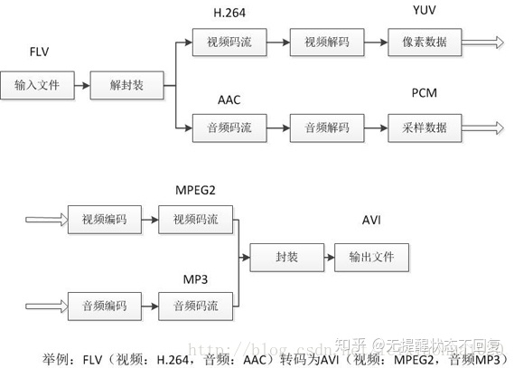

#### 转换媒体文件

**ffmpeg** 最让人称道常用的恐怕就是你轻而易举的在不同媒体格式之间进行自由转换了。你是要指明输入和输出文件名就行了， **ffmpeg** 会从后缀名猜测格式，这个方法同时适用于视频和音频文件

下面是一些例子:

```shell
ffmpeg -i video_input.mp4 video_output.avi
ffmpeg -i video_input.webm video_output.flv
ffmpeg -i audio_input.mp3 audio_output.ogg
ffmpeg -i audio_input.wav audio_output.flac
```

你也可以同时指定多个输出后缀：

```shell
ffmpeg -i audio_input.wav audio_output_1.mp3 audio_output_2.ogg
```

这样会同时输出多个文件.

想看支持的格式，可以用：

```shell
ffmpeg -formats
```

同样的，你可以使用 **-hide_banner** 来省略一些程序信息。

你可以在输出文件前使用 **-qscale 0** 来保留原始的视频质量：

```shell
ffmpeg -i video_input.wav -qscale 0 video_output.mp4
```

#### 保持编码格式

```bash
ffmpeg -i test.mp4 -vcodec copy -acodec copy test_copy.ts

ffmpeg -i test.mp4 -codec copy test_copy2.ts
```

#### 改变编码格式

```bash
ffmpeg -i test.mp4 -vcodec libx265 -acodec libmp3lame out_h265_mp3.mkv
```

#### 改变分辨率（transsizing）

改变视频分辨率（transsizing）的例子，从 1080p 转为 480p：

```bash
ffmpeg \
-i input.mp4 \
-vf scale=480:-1 \
output.mp4
```

#### 更改视频分辨率或长宽比

对 **ffmpeg** 来说又是个简单的任务，你只需要使用 **-s** 参数来缩放视频就行了:

```shell
ffmpeg -i video_input.mov -s 1024x576 video_output.mp4
```

同时，你可能需要使用 **-c:a** 来保证音频编码是正确的:

```shell
ffmpeg -i video_input.h264 -s 640x480 -c:a video_output.mov
```

你也可是使用**-aspect** 来更改长宽比:

```shell
ffmpeg -i video_input.mp4 -aspect 4:3 video_output.mp4
```

**Note:** 在高级应用中还会提到更强大的方法

#### 修改帧率

```bash
ffmpeg -i test.mp4 -r 15 -codec copy output.mp4 (错误命令)

ffmpeg -i test.mp4 -r 15 output2.mp4
```

#### 修改视频码率

```bash
ffmpeg -i test.mp4 -b 400k output_b.mkv （此时音频也被重新编码）
#
ffmpeg -i test.mp4 -b:v 400k output_bv.mkv
```

#### 修改音频码率

```bash
ffmpeg -i test.mp4 -b:a 192k output_ba.mp4
# 如果不想重新编码video，需要加上-vcodec copy
ffmpeg -i test.mp4 -b:a 192k -vcodec copy output_ba.mp4
```

#### 修改音视频码率

```bash
ffmpeg -i test.mp4 -b:v 400k -b:a 192k output_bva.mp4
```

#### 修改音频采样率

```bash
ffmpeg -i test.mp4 -ar 44100 output_44100hz.mp4
```

### 6.过滤器：截取音视频，转换编码格式，拼接文件

#### 转换编码格式

转换编码格式（transcoding）指的是， 将视频文件从一种编码转成另一种编码。

```bash
ffmpeg -i out.mp4 -vcodec copy -acodec copy out.flv
```

##### 将上述 1.mp4/2.mp4/3.mp4 转成 ts 格式

```bash
ffmpeg -i 1.mp4 -codec copy -vbsf h264_mp4toannexb 1.ts

ffmpeg -i 2.mp4 -codec copy -vbsf h264_mp4toannexb 2.ts

ffmpeg -i 3.mp4 -codec copy -vbsf h264_mp4toannexb 3.ts
```

##### 将 mp4 的封装格式转成了 flv

分离某些封装格式（例如 MP4/FLV/MKV 等）中的 H.264 的时候，需要首先写入 SPS 和 PPS，否则会导致分离出来的数据没有 SPS、PPS 而无法播放。H.264 码流的 SPS 和 PPS 信息存储在 AVCodecConbash 结构体的 extradata 中。需要使用 ffmpeg 中名称为 “**h264_mp4toannexb**” 的 bitstream filter 处理

```bash
ffmpeg -i 1.mp4 -codec copy 1.flv

ffmpeg -i 2.mp4 -codec copy 2.flv

ffmpeg -i 3.mp4 -codec copy 3.flv
```

##### 将一个 mp4 文件的音视频流实时转码之后发送给某个远程设备，远程设备可以通过 http 获取的 sdp 文件来接收 rtp 媒体数据

```bash
ffmpeg -re -i example.mp4 -acodec copy -vcodec libx264 -s 480x270 -map 0:0 -f rtp rtp://10.131.202.62:1234 -map 0:1 -f rtp rtp://10.131.202.62:1238 > /var/www/live.sdp
```

#### 转成 H.264 编码

一般使用编码器`libx264`，所以只需指定输出文件的视频编码器即可。

```bash
ffmpeg -i [input.file] -c:v libx264 output.mp4
```

#### 转成 H.265 编码

```bash
ffmpeg -i [input.file] -c:v libx265 output.mp4
```

#### 将 avi 文件转成 Mp3

```bash
ffmpeg -i son_origine.avi -vn -ar 44100 -ac 2 -ab 192 -f mp3 son_final.mp3
```

#### 将.avi 视频转成.mpg

```bash
ffmpeg -i video_origine.avi video_finale.mpg
```

#### 将.mpg 转成.avi

```bash
ffmpeg -i video_origine.mpg video_finale.avi
```

#### 将.avi 转成 gif 动画（未压缩）

```bash
ffmpeg -i video_origine.avi gif_anime.gif
```

#### 合成视频和音频

```bash
ffmpeg -i son.wav -i video_origine.avi video_finale.mpg
```

#### 将.avi 转成.flv

```bash
ffmpeg -i video_origine.avi -ab 56 -ar 44100 -b 200 -r 15 -s 320x240 -f flv video_finale.flv
```

#### 将.avi 转成 dv

```bash
ffmpeg -i video_origine.avi -s pal -r pal -aspect 4:3 -ar 48000 -ac 2 video_finale.dv
```

或者：

```bash
ffmpeg -i video_origine.avi -target pal-dv video_finale.dv
```

#### 为视频重新编码以适合在 iPod/iPhone 上播放

```bash
ffmpeg -i source_video.avi input -acodec aac -ab 128kb -vcodec mpeg4 -b 1200kb -mbd 2 -flags +4mv+trell -aic 2 -cmp 2 -subcmp 2 -s 320x180 -title X final_video.mp4
```

说明：

- 源视频：source_video.avi

- 音频编码：aac

- 音频位率：128kb/s

- 视频编码：mpeg4

- 视频位率：1200kb/s

- 视频尺寸：320 X 180

- 生成的视频：final_video.mp4

#### 为视频重新编码以适合在 PSP 上播放

```bash
ffmpeg -i source_video.avi -b 300 -s 320x240 -vcodec xvid -ab 32 -ar 24000 -acodec aac final_video.mp4
```

说明：

- 源视频：source_video.avi

- 音频编码：aac

- 音频位率：32kb/s

- 视频编码：xvid

- 视频位率：1200kb/s

- 视频尺寸：320 X 240

- 生成的视频：final_video.mp4

#### 老式的 avi 文件转成 mp4

```bash
ffmpeg -i final.avi -acodec copy -vcodec copy final.mp4
```

#### 将.avi 压缩成 divx

```bash
ffmpeg -i video_origine.avi -s 320x240 -vcodec msmpeg4v2 video_finale.avi
```

#### 将 Ogg Theora 压缩成 Mpeg dvd

```bash
ffmpeg -i film_sortie_cinelerra.ogm -s 720x576 -vcodec mpeg2video -acodec mp3 film_terminate.mpg
```

#### 将.avi 压缩成 SVCD mpeg2

NTSC 格式：

```bash
ffmpeg -i video_origine.avi -target ntsc-svcd video_finale.mpg
```

PAL 格式：

```bash
ffmpeg -i video_origine.avi -target pal-svcd video_finale.mpg
```

#### 将.avi 压缩成 VCD mpeg2

NTSC 格式：

```bash
ffmpeg -i video_origine.avi -target ntsc-vcd video_finale.mpg
```

PAL 格式：

```bash
ffmpeg -i video_origine.avi -target pal-vcd video_finale.mpg
```

#### 多通道编码

```bash
ffmpeg -i fichierentree -pass 2 -passlogfile ffmpeg2pass fichiersortie-2
```

#### 转换容器格式

转换容器格式（transmuxing）指的是，将视频文件从一种容器转到另一种容器。下面是 mp4 转 webm 的写法。

```bash
ffmpeg -i input.mp4 -c copy output.webm

# 例子中，只是转一下容器，内部的编码格式不变，所以使用`-c copy`指定直接拷贝，不经过转码，这样比较快。
```

#### 调整码率

调整码率（transrating）指的是，改变编码的比特率，一般用来将视频文件的体积变小。下面的例子指定码率最小为 964K，最大为 3856K，缓冲区大小为 2000K。

```bash
ffmpeg \
-i input.mp4 \
-minrate 964K -maxrate 3856K -bufsize 2000K \
output.mp4
```

#### 截取音视频

生成测试文件：找三个不同的视频每个视频截取 10 秒内容

```bash
ffmpeg -i 沙海02.mp4 -ss 00:05:00 -t 10 -codec copy 1.mp4

ffmpeg -i 复仇者联盟3.mp4 -ss 00:05:00 -t 10 -codec copy 2.mp4

ffmpeg -i 红海行动.mp4 -ss 00:05:00 -t 10 -codec copy 3.mp4

# 如果音视频格式不统一则强制统一为 -vcodec libx264 -acodec aac
```

#### 拼接文件

##### 以 MP4 格式进行拼接

```bash
# 方法1：不行，失败
ffmpeg -i "concat:1.mp4|2.mp4|3.mp4" -codec copy out_mp4.mp4

# 方法2：
ffmpeg -f concat -i mp4list.txt -codec copy out_mp42.mp4
```

##### 以 FLV 格式进行拼接

```bash
# 方法1：不行，失败
ffmpeg -i "concat:1.flv|2.flv|3.flv" -codec copy out_flv.mp4

# 方法2：
ffmpeg -f concat -i flvlist.txt -codec copy out_flv2.mp4
```

##### 以 TS 格式进行拼接

```bash
# 方法1：只适用部分封装格式。如.ts
ffmpeg -i "concat:1.ts|2.ts|3.ts" -codec copy out_ts.mp4

# 方法2：
ffmpeg -f concat -i tslist.txt -codec copy out_ts2.mp4
```

方法 1 只适用部分封装格式，比如 TS

建议：

（1）使用方法 2 进行拼接

（2）转成 TS 格式再进行拼接

#### 测试不同编码拼接

##### 修改音频编码

```bash
ffmpeg -i 2.mp4 -vcodec copy -acodec ac3 -vbsf h264_mp4toannexb 2.ts
# 出来的视频第二段没有声音
ffmpeg -i "concat:1.ts|2.ts|3.ts" -codec copy out1.mp4
```

##### 修改音频采样率例子

```bash
ffmpeg -i 2.mp4 -vcodec copy -acodec aac -ar 96000 -vbsf h264_mp4toannexb 2.ts
# 出来的视频第二段播放异常
ffmpeg -i "concat:1.ts|2.ts|3.ts" -codec copy out2.mp4
```

##### 修改视频编码格式

```bash
ffmpeg -i 1.mp4 -acodec copy -vcodec libx265 1.ts
#
ffmpeg -i "concat:1.ts|2.ts|3.ts" -codec copy out3.mp4
```

##### 修改视频分辨率

```bash
#
ffmpeg -i test.mp4 -s 480x270 output_480x270.mp4
#
ffmpeg -i 1.mp4 -acodec copy -vcodec libx264 -s 800x472 -vbsf h264_mp4toannexb 1.ts
# 以第一个视频的分辨率为基准
ffmpeg -i "concat:1.ts|2.ts|3.ts" -codec copy out4.mp4
```

注意：

- 把每个视频封装格式也统一为 ts，拼接输出的时候再输出你需要的封装格式，比如 MP4。

- 视频分辨率可以不同，但是编码格式需要统一。

- 音频编码格式需要统一，音频参数(采样率/声道等)也需要统一。

### :b:7.音频处理

#### 为音频添加封面

有个很棒的方法把音频变成视频，全程使用一张图片（比如专辑封面）。当你想往某个网站上传音频，但那个网站又仅接受视频（比如 YouTube, Facebook 等）的情况下会非常有用。

有些视频网站只允许上传视频文件。如果要上传音频文件，必须为音频添加封面，将其转为视频，然后上传。

下面命令可以将音频文件，转为带封面的视频文件。

```bash
# 有两个输入文件，一个是封面图片`cover.jpg`，另一个是音频文件`input.mp3`。`-loop 1`参数表示图片无限循环，`-shortest`参数表示音频文件结束，输出视频就结束。
ffmpeg \
-loop 1 \
-i cover.jpg -i input.mp3 \
-c:v libx264 -c:a aac -b:a 192k -shortest \
output.mp4

# 例子2:只要改一下编码设置 (-c:v 是 视频编码， -c:a 是音频编码) 和文件的名称就能用
# 如果你使用一个较新的ffmpeg版本（x），你就可以不指定 -strict experimental
ffmpeg -loop 1 -i image.jpg -i audio.wav -c:v libx264 -c:a aac -strict experimental -b:a 192k -shortest output.mp4
```

#### 更改音频文件的音量

FFmpeg 允许我们使用 `"volume filter"` 选项更改音频文件的音量。

例如，以下命令会将音量减半。

```bash
ffmpeg -i input.mp3 -af 'volume=0.5' output.mp3
```

同样，我们可以像下面这样增加音量：

```bash
ffmpeg -i input.mp3 -af 'volume=1.5' output.mp3
```

#### 压缩音频文件

就像压缩视频文件一样，您也可以使用 **`-ab`** 标志压缩音频文件以节省一些磁盘空间。

假设您有一个 kbps 比特率的音频文件。您希望通过将比特率更改为任何较低的值来压缩它，如下所示。`320`

```bash
ffmpeg -i input.mp3 -ab 128 output.mp3
```

各种可用音频比特率的列表如下：

1. 96kbps 的
2. 112kbps 的
3. 128kbps 的
4. 160kbps 的
5. 192kbps 的
6. 256kbps 的
7. 320kbps 的

#### 增加/减少音频播放速度

要提高或降低音频播放速度，请使用音频过滤器：`"atempo"`。

以下命令将使音频速度翻倍。

```
$ ffmpeg -i input.mp4 -filter:a "atempo=2.0" -vn output.mp4
```

您可以在`0.5` 和 `2.0` 的 音频 audio 之间使用任何值。

### 8. 为视频增加字幕

另一个常见又很容易实现的要求是给视频增加字母，比如一部外文电源，使用下面的命令：

```shell
ffmpeg -i video.mp4 -i subtitles.srt -c:v copy -c:a copy -preset veryfast -c:s mov_bash -map 0 -map 1 output.mp4

# 语法 –vf subtitles=file
ffmpeg -i jidu.mp4 -vf subtitles=rgb.srt output.mp4
```

当然，你可以指定自己的编码器和任何其他的音频视频参数。你可以阅读这篇文章来了解字幕相关内容 [editing subtitles in Linux](https://itsfoss.com/editing-subtitles/)

### 7.图片与视频互转

#### 截取视频的帧为图片

可能有一些幻灯片，你想从里面提取所有的图片，那么下面这个命令就能帮你：

支持的图片格式有：PGM. PPM. PAM. PGMYUV. JPEG. GIF. PNG. TIFF. SGI

同样也有将图片转变为视频/幻灯片的方式，下面的 **高级应用** 中会讲到

```bash
# 从视频中提取图片
# -r 代表了帧率（一秒内导出多少张图像，默认25）， -f 代表了输出格式(image2 实际上上 image2 序列的意思）。
# 最后一个参数 (输出文件) 有一个有趣的命名：它使用 %3d 来指示输出的图片有三位数字 (000, 001, 等等.)。你也可以用 %2d (两位数字) 或者 %4d (4位数字) ，只要你愿意，你可以随便实验 一下可以怎么写！
ffmpeg -i video.mp4 -r 1 -f image2 image-%3d.png
# 简单模式：会生成image1.jpg. image2.jpg. ...
ffmpeg -i video.mpg image%d.jpg
#
ffmpeg -i split.avi %d.bmp

# 指定时间段
ffmpeg -i test.mp4 -y -f image2 -ss 00:00:02 -vframes 1 -s 640x360 test.jpg
ffmpeg -i test.mp4 -y -f image2 -ss 00:00:02 -vframes 1 -s 640x360 test.bmp

#
ffmpeg -y -i test.mp4 -ss 00:03:22.000 -vframes 1 -an test.jpg

# 从指定时间开始，连续对1秒钟的视频进行截图。
ffmpeg \
-y \
-i input.mp4 \
-ss 00:01:24 -t 00:00:01 \
output_%3d.jpg

# 如果只需要截一张图，可以指定只截取一帧。
# `-vframes 1`指定只截取一帧，`-q:v 2`表示输出的图片质量，一般是1到5之间（1 为质量最高）。
ffmpeg \
-ss 01:23:45 \
-i input \
-vframes 1 -q:v 2 \
output.jpg
```

- -i 输入

- -y 覆盖

- -f 格式

- image2 一种格式

- -ss 起始值

- -vframes 帧，如果大于 1 ，那么 输出加 `%03d` （自动数字排序），如：test%03d.jpg

- -s 格式大小 size

每隔一秒截一张图

```shell
ffmpeg -i input.flv -f image2 -vf fps=fps=1 out%d.png
```

每隔 20 秒截一张图

```shell
ffmpeg -i input.flv -f image2 -vf fps=fps=1/20 out%d.png
```

#### 视频截图

-ss 表示在视频的多少 S 截取一张图

```bash
# 截一张图
ffmpeg -y -ss 8 -i input.mp4 -f image2 -vframes 1 output.jpg
# 截多张图
ffmpeg -y -ss 0 -i input.mp4 -f image2  -r 1 -t 8 -qscale 1 ./jpgs/%5d.jpg
```

- -r 表示每秒截多少张图；
- -qscale 表示生成的截图质量，该值越小图片质量越好；
- %5d.jpg 表示生成的截图的命令规则，5 位数的整数命名。

#### 视频转图片

```bash
ffmpeg -i abc.mp4 -t 5 -s 1080x1080 -r 15 %3d.jpg
```

- 其中-i abc.mp4 表示调用 bin 目录下的 GGGabc.mp4 视频
- -t 5 表示选取视频中的前五秒进行视频转图像
- -s 1080x1080 表示视频转图片后图片的像素
- -r 15 表示每秒截取 15 张图片，也就是 15 帧
- %3d.jpg 表示生成图片后的图片的命名格式会以 001.jpg，002.jpg....命名

#### 1.转换视频为图片（每帧一张图)

```bash
ffmpeg -i test.mp4 -t 5 -s 640x360 -r 15 frame%03d.jpg
# 视频转JPEG
ffmpeg -i test.flv -r 1 -f image2 image-%3d.jpeg
```

#### 2.图片转换为视频（图片帧序列合并为视频）

语法：

```bash
ffmpeg -i %d.bmp -y list.mp4

#
ffmpeg -y -f image2 -framerate 10 -i ./jpgs/%05d.jpg -c:v libx264 -r 25 -pix_fmt yuv420p output.mp4
```

将所有的图片放到一个文件夹下面，我把它们放到了 **my_photos** 里，同时图片的后缀名最好是 **.png** 或者 **.jpg**， 不管选那个，他们应该是同一个后缀名，否则 ffmpeg 可能会工作的不正常，可以很方便的把 .png 转变为 .jpg （或者倒过来也行）。

我们这次转换的格式 (**-f**) 应该被设置为 **image2pipe**. 你必须使用使用连词符(**–**)来指明输入。 **image2pipe** 允许你使用管道 (在命令间使用 **|**)的结果而不是文件作为 ffmpeg 的输入。命令结果便是将所有图片的内容逐个输出，还要注意指明视频编码器是 copy (**-c:v copy**) 以正确使用图片输入：

```shell
cat my_photos/* | ffmpeg -f image2pipe -i - -c:v copy video.mkv
```

如果你播放这个文件，你可能会觉得只有一部分图片被加入了，事实上所有的图片都在，但是**ffmpeg** 播放它们的时候太快了，默认是 23fps，一秒播放了 23 张图片。

你应该指定帧率 (**-framerate**) :

```shell
cat my_photos/* | ffmpeg -framerate 1 -f image2pipe -i - -c:v copy video.mkv
```

在这个例子里，把帧率设置为 1，也就是每帧（每张图）会显示 1 秒。

为了加一些声音，可以使用音频文件作为输入 (**-i audo_file**) 并且设定 copy 音频编码 (**-c:a copy**). 你可以同时为音频和视频设定编码器，在输出文件前设置就可以了。你要计算一下音频文件的长度和图片张数，已确定合适的帧率。比如我的音频文件是 22 秒，图片有 9 张，那么帧率应该是 9 / 22 大约 0.4，所以我这么输入命令：

```shell
cat my_photos/* | ffmpeg -framerate 0.40 -f image2pipe -i - -i audio.wav -c copy video.mkv
```

总命令

```bash
ffmpeg -f image2 -i frame%03d.jpg -r 25 video.mp4
# 2
ffmpeg -f image2 -i image-%3d.jpeg images.mp4
# 会把当前目录下的图片（名字如：image1.jpg. image2.jpg. 等...）合并成video.mpg
ffmpeg -f image2 -i image%d.jpg video.mpg
```

将按照 001.jpg，002.jpg，003.jpg 等顺序的图片合并为 video.avi 视频。

- -r 15 表示每秒 15 帧
- -i %3d.jpg 表示输入的图片格式
- video.avi 表示输出的视频文件名

```bash
ffmpeg -r 15 -i %3d.jpg video.avi
```

2.

```bash
ffmpeg -framerate 30 -i image_%03d.jpg -c:v libx264 -r 30 -pix_fmt yuv420p output.mp4
```

从 image_001.jpg 开始（假设它是你的第一张图片），到 image_xxx.jpg 结束（假设它是你的最后一张图片），并且每秒生成 30 帧。然后，它会使用 libx264 编码将视频帧速率设置为 30，并将像素格式设置为 yuv420p，这是大多数视频播放器的默认设置。最后，它将输出到 output.mp4 文件。

在这个命令中，“-framerate”指定了每秒生成的帧数，“-i”指定了输入图片的文件名模式，“-c:v”指定了视频编码，“-r”指定了输出视频的帧率，“-pix_fmt”指定了输出视频的像素格式。

#### 3.从视频中生成 GIF 图

```bash
# 一秒一帧生成视频
ffmpeg -i test.mp4 -t 5 -r 1 image1.gif
# 一秒25帧生成视频
ffmpeg -i test.mp4 -t 5 -r 25 -s 640x360 image2.gif
#
ffmpeg -i out.mp4 -ss 00:00:00 -t 10 out.gif
#
ffmpeg -i capx.mp4 -t 10 -s 320x240 -pix_fmt rgb24 jidu1.gif
```

#### 4.将 GIF 转化为 视频

```bash
ffmpeg -f gif -i image2.gif image2.mp4
```

#### 5.视频转 JPEG

```bash
ffmpeg -i test.flv -r 1 -f image2 image-%3d.jpeg
```

### 9.处理图片

### 10.直播流

直播视频流如何获取地址：

- [GitHub 搜索：直播流](https://github.com/search?q=直播流&type=repositories)
- [直播流地址\_百度搜索 (baidu.com)](https://www.baidu.com/s?wd=直播流地址)
- [可用的直播流地址（持续更新）\_我不是萧海哇~~~~的博客-CSDN 博客](https://blog.csdn.net/qq_45662588/article/details/123353152)
- [LiveNVR 获取通道的视频直播流地址 RTSP/WebRTC/RTMP/HLS/HTTP-FLV/WS-FLV*配置*示例\_集成 (sohu.com)](https://it.sohu.com/a/579722393_120833486)

#### 直播流地址

- ## [wbt5/real-url：获取斗鱼&虎牙&哔哩哔哩&抖音&快手等 58 个直播平台的真实流媒体地址(直播源)和弹幕，直播源可在 PotPlayer、flv.js 等播放器中播放。 (github.com)](https://github.com/wbt5/real-url)

#### 直播拉流

```bash
# 对于不是rtmp的协议 -c copy要谨慎使用
ffplay rtmp://server/live/streamName
# 拉流保存
ffmpeg -i rtmp://server/live/streamName -c copy dump.flv
```

#### 可用直播流地址

HKS：rtmp://live.hkstv.hk.lxdns.com/live/hks2

```bash
ffmpeg -i rtmp://live.hkstv.hk.lxdns.com/live/hks2 -c copy dump.flv
```

大熊兔(点播)：rtsp://184.72.239.149/vod/mp4://BigBuckBunny_175k.mov

```bash
ffmpeg -i rtsp://184.72.239.149/vod/mp4://BigBuckBunny_175k.mov -c copy dump.mov
```

直播流地址：

- CCTV1 高清：<http://ivi.bupt.edu.cn/hls/cctv1hd.m3u8>
- CCTV3 高清：<http://ivi.bupt.edu.cn/hls/cctv3hd.m3u8>

- CCTV5 高清：<http://ivi.bupt.edu.cn/hls/cctv5hd.m3u8>

- CCTV5+高清：<http://ivi.bupt.edu.cn/hls/cctv5phd.m3u8>

- CCTV6 高清：<http://ivi.bupt.edu.cn/hls/cctv6hd.m3u8>

```bash
# 播放cctv1直播
ffplay -x 1280 -y 720 http://ivi.bupt.edu.cn/hls/cctv1hd.m3u8

# 对于不是rtmp的协议 -c copy要谨慎使用，这个命令会报错
ffmpeg -i http://ivi.bupt.edu.cn/hls/cctv1hd.m3u8 -c copy cctv1.ts
# .flv格式输出使用
ffmpeg -i http://ivi.bupt.edu.cn/hls/cctv1hd.m3u8 cctv1.flv
# 指定音视频编码格式
ffmpeg -i http://ivi.bupt.edu.cn/hls/cctv1hd.m3u8 -acodec aac -vcodec libx264 cctv1-2.flv
```

#### 直播推流

```bash
# -re,表示按时间戳读取文件
ffmpeg -re -i out.mp4 -c copy flv rtmp://server/live/streamName
#
ffmpeg -re -i out.mp4 -c copy -f flv rtmp://server/live/streamName
```

参考：[Nginx 搭建 rtmp 流媒体服务器(Ubuntu 16.04)](https://www.jianshu.com/p/16741e363a77)

#### 转流

```bash
ffmpeg -i rtmp://server/live/originalStream -c:a copy -c:v copy -f flv rtmp://server/live/h264Stream
```

#### 实时推流

```bash
ffmpeg -framerate 15 -f avfoundation -i "1" -s 1280x720 -c:v libx264  -f  flv rtmp://localhost:1935/live/room
```

#### FFmpeg 推流到 SRS

##### SRS 安装

```bash
unzip SRS-CentOS6-x86_64-2.0.243.zip
cd SRS-CentOS6-x86_64-2.0.243/
bash   INSTALL
/etc/init.d/srs start
```

##### 推流

```bash
ffmpeg -re -i "/root/test.flv" -vcodec copy -acodec copy -f flv rtmp://172.17.229.3/live/test001

ffmpeg -re -i 20190314.mp4 -c copy -f flv rtmp://172.17.229.3/live/test001
# -r 以本地帧频读数据，主要用于模拟捕获设备。
# 表示ffmpeg将按照帧率发送数据，不会按照最高的效率发送
```

##### 拉流

```bash
ffmpeg -i rtmp://server/live/streamName -c copy dump.flv
```

**1、将文件当做直播送至 live**

```bash
ffmpeg -re -i localFile.mp4 -c copy -f flv rtmp://server/live/streamName
```

**2、将直播媒体保存至本地文件**

```bash
ffmpeg -i rtmp://server/live/streamName -c copy dump.flv
```

**3、将其中一个直播流，视频改用 h264 压缩，音频不变，送至另外一个直播服务流**

```bash
ffmpeg -i rtmp://server/live/originalStream -c:a copy -c:v libx264 -vpre slow -f flv rtmp://server/live/h264Stream
```

**4、将其中一个直播流，视频改用 h264 压缩，音频改用 faac 压缩，送至另外一个直播服务流**

```bash
ffmpeg -i rtmp://server/live/originalStream -c:a libfaac -ar 44100 -ab 48k -c:v libx264 -vpre slow -vpre baseline -f flv rtmp://server/live/h264Stream
```

**5、将其中一个直播流，视频不变，音频改用 faac 压缩，送至另外一个直播服务流**

```bash
ffmpeg -i rtmp://server/live/originalStream -acodec libfaac -ar 44100 -ab 48k -vcodec copy -f flv rtmp://server/live/h264_AAC_Stream
```

**6、将一个高清流，复制为几个不同视频清晰度的流重新发布，其中音频不变**

```bash
ffmpeg -re -i rtmp://server/live/high_FMLE_stream -acodec copy -vcodec x264lib -s 640×360 -b 500k -vpre medium -vpre baseline rtmp://server/live/baseline_500k -acodec copy -vcodec x264lib -s 480×272 -b 300k -vpre medium -vpre baseline rtmp://server/live/baseline_300k -acodec copy -vcodec x264lib -s 320×200 -b 150k -vpre medium -vpre baseline rtmp://server/live/baseline_150k -acodec libfaac -vn -ab 48k rtmp://server/live/audio_only_AAC_48k
```

**7、功能一样，只是采用-x264opts 选项**

```bash
ffmpeg -re -i rtmp://server/live/high_FMLE_stream -c:a copy -c:v x264lib -s 640×360 -x264opts bitrate=500:profile=baseline:preset=slow rtmp://server/live/baseline_500k -c:a copy -c:v x264lib -s 480×272 -x264opts bitrate=300:profile=baseline:preset=slow rtmp://server/live/baseline_300k -c:a copy -c:v x264lib -s 320×200 -x264opts bitrate=150:profile=baseline:preset=slow rtmp://server/live/baseline_150k -c:a libfaac -vn -b:a 48k rtmp://server/live/audio_only_AAC_48k
```

**8、将当前摄像头及音频通过 DSSHOW 采集，视频 h264、音频 faac 压缩后发布**

```bash
ffmpeg -r 25 -f dshow -s 640×480 -i video=”video source name”:audio=”audio source name” -vcodec libx264 -b 600k -vpre slow -acodec libfaac -ab 128k -f flv rtmp://server/application/stream_name
```

**9、将一个 JPG 图片经过 h264 压缩循环输出为 mp4 视频**

```bash
ffmpeg.exe -i INPUT.jpg -an -vcodec libx264 -coder 1 -flags +loop -cmp +chroma -subq 10 -qcomp 0.6 -qmin 10 -qmax 51 -qdiff 4 -flags2 +dct8x8 -trellis 2 -partitions +parti8x8+parti4x4 -crf 24 -threads 0 -r 25 -g 25 -y OUTPUT.mp4
```

**10、将普通流视频改用 h264 压缩，音频不变，送至高清流服务(新版本 FMS live=1)**

```bash
ffmpeg -i rtmp://server/live/originalStream -c:a copy -c:v libx264 -vpre slow -f flv "rtmp://server/live/h264Stream live=1"
```

## FFmpeg 过滤器|滤镜的基本使用

- 在编码之前，ffmpeg 可以使用 libavfilter 库中的过滤器处理原始音频和视频帧。 几个链式过滤器形成一个过滤器图形。 ffmpeg 区分两种类型的过滤器图形：简单和复杂
- [输入流或标记名]滤镜参数[临时标记],[输入流或标记名]滤镜参数[临时标记];[输入流或标记名]滤镜参数[临时标记]

### Filter 内置变量

| 变量 | 说明                                             |
| ---- | ------------------------------------------------ |
| t    | 以秒表示的时间戳，如果输入的时间是未知的则是 NAN |
| n    | 输入帧的顺序编号，从 0 开始。                    |
| pos  | 输入帧的位置，如果未知的则是 NAN。               |
| w    | 输入视频帧的宽度                                 |
| h    | 输入视频帧的高度                                 |

**过滤器** 是 **ffmpeg** 中最为强大的功能。在 ffmepg 中有数不甚数的过滤器存在，可以满足各种编辑需要。因为过滤器实在太多了，这里只会简单讲述几个常用的。

使用 过滤的基本结构是:

```shell
ffmpeg -i input.mp4 -vf "filter=setting_1=value_1:setting_2=value_2,etc" output.mp4

ffmpeg -i input.wav -af "filter=setting_1=value_1:setting_2=value_2,etc" output.wav
```

可以指定视频过滤器 (**-vf**, **-filter:v**的简写) 和 音频过滤器 (**-af**, **-filter:a**的简写). 过滤器的内容写到双引号里面 (**“**) 并且可以使用逗号(**,**)连接。你可以使用任意数量的过滤器（我写了个 etc 代表更多的，这不是做一个真实的过滤器）。

过滤器设定的通常格式是:

```shell
filter=setting_2=value_2:setting_2=value_2
```

过滤器不同的值使用冒号分割。

你甚至可以在值里面使用进行数学符号计算。

**Note：** 参考 **[ffmpeg 过滤器手册](https://ffmpeg.org/ffmpeg-filters.html)** 查看更多高级用法

这里举几个例子来说明视频和音频的过滤器。

### 1. 视频缩放

这是个简单过滤器，设定里只有 **width** 和 **height**:

```shell
ffmpeg -i input.mp4 -vf "scale=w=800:h=600" output.mp4
```

我说过你可以使用数学运算来给值：

```shell
ffmpeg -i input.mkv -vf "scale=w=1/2*in_w:h=1/2*in_h" output.mkv
```

很明显，这个命令让输入的尺寸变成了输入尺寸(in_w, in_h)的 1/2.

### 2. 视频裁剪

类似缩放，这个设定也有 **width** 和 **height** ，另外可以指定裁剪的原点（默认是视频的中心）

```shell
ffmpeg -i input.mp4 -vf "crop=w=1280:h=720:x=0:y=0" output.mp4
ffmpeg -i input.mkv -vf "crop=w=400:h=400" output.mkv
```

第二个命令裁剪原点是视频的中心点（因为我没有给 x 和 y 坐标），第一个命令会从左上角开始裁剪 (**x=0:y=0**).

这里也有一个使用数学计算的例子：

```shell
ffmpeg -i input.mkv -vf "crop=w=3/4*in_w:h=3/4*in_h" output.mkv
```

这会把视频裁剪剩下原大小的 3/4/。

### 图片裁剪

```bash
# 左边3分之一
ffmpeg -i input.jpg -vf crop=iw/3:ih:0:0 out-l.jpg
# 中间3分之一
ffmpeg -i input.jpg -vf crop=iw/3:ih:iw/3*1:0 out-c.jpg
# 右边3分之一
ffmpeg -i input.jpg -vf crop=iw/3:ih:iw/3*2:0 out-r.jpg
# 查看裁剪的图片，好对比
ffplay -i input.jpg -vf crop=iw/3:ih:0:0
ffplay -i input.jpg -vf crop=iw/3:ih:iw/3*1:0
ffplay -i input.jpg -vf crop=iw/3:ih:iw/3*2:0
```

练习题:
(1)裁剪 100x100 的区域，起点为(12,34)

```bash
crop=100:100:12:34
相同效果:
crop=w=100:h=100:x=12:y=34
```

(2)裁剪中心区域，大小为 100x100

```bash
crop=100:100+
```

(3)裁剪中心区域，大小为输入视频的 2/3

```bash
crop=2/3*in_w:2/3*in_h
```

(4)裁剪中心区域的正方形，高度为输入视频的高

```bash
crop=out_w=in h
crop=in h
```

(5)裁剪偏移左上角 100 像素

```bash
crop=in_w-100:in h-100:100:100
```

(6)裁剪掉左右 10 像素，上下 20 像素

```bash
crop=in_w-2*10:in_h-2*20
```

7 裁剪右下角区域

```bash
crop=in_w/2:in_h/2:in_w/2:in_h/2
```

### 音视频的裁剪与拼接

#### 裁剪

```bash
ffmpeg -i out.mp4 -ss 00:00:00 -t 10 out1.mp4
```

参数

- -ss 指定裁剪的开始时间，精确到秒
- -t 被裁剪后的时长。

#### 视频合并

首先创建一个 inputs.txt 文件，文件内容如下：

```bash
file '1.flv' file '2.flv' file '3.flv'
```

然后执行下面的命令：

```bash
ffmpeg -f concat -i inputs.txt -c copy output.flv
```

#### 音频合并

```bash
ffmpeg -i bash.mp3 -i silenceall.mp3 -filter_complex '[0:0] [1:0] concat=n=2:v=0:a=1 [a]' -map [a] test.mp3
```

#### 音频混音

```bash
ffmpeg -i test.mp4 -i test.mp3 -filter_complex "[0:a] [1:a]amerge=inputs=2[aout]" -map "[aout]" -ac 2 mix_amerge.aac

# 或
ffmpeg -i INPUT1 -i INPUT2 -i INPUT3 -filter_complex 'amix=inputs=3:duration=first:dropout_transition=3' OUTPUT
```

参数详解

- inputs：The number of inputs. If unspecified, it defaults to 2.//输入的数量，如果没有指明，默认为 2.
- duration：How to determine the end-of-stream.//决定了流的结束
- longest：The duration of the longest input. (default)//最长输入的持续时间
- shortest：The duration of the shortest input.//最短输入的持续时间
- first：The duration of the first input.//第一个输入的持续时间
- dropout_transition：The transition time, in seconds, for volume renormalization when an input stream ends. The default value is 2 seconds.//输入流结束时（音频）容量重整化的转换时间（以秒为单位）。 默认值为 2 秒。
- 注： amerge 与 amix 的区别
  - amerge terminates with the shortest input (always) and amix terminates with the longest input, by default. So the former will always truncate when streams are of different length.

#### hls 切片(转 m3u8)

```bash
ffmpeg -i out.mp4 -c:v libx264 -c:a libfdk_aac -strict -2 -f hls  out.m3u8
```

参数详解

- -strict -2 指明音频使有 AAC。
- -f hls 转成 m3u8 格式。

#### 分离音视频

从 mp4 中抽取 AAC

```bash
ffmpeg -i X王子.BD1280高清中字版.mp4 -vn -acodec copy ss.aac
```

提取视频

```bash
ffmpeg -i X王子.BD1280高清中字版.mp4 -an -vcodec copy ss.h264
```

### 添加|删除 水印

#### 文字水印

在视频中增加文字水印需要准备的条件比较多，需要有文字字库处理的相关文件，在编译 FFmpeg 时需!支持 FreeTypeFontConfig、iconv,系统中需要有相关的字库，在 FFmpeg 中增加纯字母水印可以使用 **drawbash** 滤镜进行支持。

下面就来看一下 **drawbash** 的滤镜参数。

| 参数     | 类型   | 说明                         |
| -------- | ------ | ---------------------------- |
| bash     | 字符串 | 字体文件                     |
| bash     | 字符串 | 文字                         |
| bashfile | 字符串 | 文字文件                     |
| box      | 布尔   | 文字区域背景框(缺省 false)   |
| boxcolor | 色彩   | 展示字体区域块的颜色         |
| font     | 字符串 | 字体名称(默认为 Sans 字体)   |
| fontsize | 整数   | 显示字体的大小               |
| x        | 字符串 | 缺省为 0                     |
| y        | 字符串 | 缺省为 0                     |
| alpha    | 浮点数 | 透明度(默认为 1)，值从 0~1。 |

示例：

```bash
ffmpeg -i output.mp4 -vf "drawbash=fontsize=100:fontfile=FreeSerif.ttf:bash='hello world':x=10:y=30" output2.mp4
```

参数详解

- -vf 中的 movie 指定 logo 位置
- drawbash 滤镜，冒号分隔参数
- fontsize 字体大小
- fontfile 字体文件
- bash 水印文本
- x,y 位置

(1) 将文字的水印加在视频的左上角：

```bash
fplay -i input.mp4 -vf "drawbash=fontsize=100:fontfile=FreeSerif.ttf;bash='我是水印':x=20:y=20"

# 将字体的颜色设置为绿色:如果想调整文字水印显示的位置，调整x与y 参数的数值即可。
ffplay -i input.mp4 -vf "drawbash=fontsize=100:fontfile=FreeSerif.ttf:bash='我是水印':fontcolor=green"

ffplay -i input.mp4 -vf "drawbash=fontsize=100:fontfile=FreeSerif.ttf:bash='我是水印':fontcolor=green:x=400:y=200"

# 修改透明度
ffplay -i input.mp4 -vf "drawbash=fontsize=100:fontfile=FreeSerif.ttf:bash='我是水印':fontcolor=green:x=400:y=200:alpha=0.5"
```

(2) 文字水印还可以增加一个框，然后给框加上背景颜色：

```bash
ffplay -i input.mp4 -vf "drawbash=fontsize=100:fontfile=FreeSerif.ttf:bash='我是水印':fontcolor=green:box=1:boxcolor=yellow"
```

至此，文字水印的基础功能已经添加完成。

(3) 有些时候文字水印希望**以本地时间作为水印内容**，可以在 drawbash 滤镜中配合一些特殊用法来完成，在 bash 中显示本地当前时间，格式为年月日时分秒的方式

```bash
ffplay -i input.mp4 -vf "drawbash=fontsize=60:fontfile=FreeSerif.ttf:bash='%{localtime\:%Y\-%m\-%d %H-%M-%s:}':fontcolor=green:box=1:boxcolor=yellow"
```

在使用 ffmpeg 转码存储到文件时需要加上-re，否则时间不对。

```bash
ffmpeg -re -i input.mp4 -vf
"drawbash=fontsize=60:fontfile=FreeSerif.ttf:bash='%{localtime\:%Y\-%m\-%d %H-%M-%S}':fontcolor=green:box=1:boxcolor=yellow" out.mp4
```

(4) 在个别场景中，需要**定时显示水印，定时不显示水印**，这种方式同样可以配合 drawbash 滤镜进行处理，使用 drawbash 与 enable 配合即可，**例如每 3 秒钟显示一次文字水印**：

```bash
ffplay -i input.mp4 -vf
"drawbash=fontsize=60:fontfile=FreeSerif.ttf:bash='test':fontcolor=green:box=1:boxcolor=yellow:enable=lt(mod(t\,3)\,1)”
```

在使用 ffmpeg 转码存储到文件时需要加上-re，否则时间不对。

表达式参考：[FFmpeg Utilities Documentation](https://www.ffmpeg.org/ffmpeg-utils.html#Expression-Evaluation)

```bash
lt(x,y) Return 1 ifx is lesser than y, 0 otherwise.

mod(X,y ) Compute the remainder of division of x by y.
```

(5)马灯效果

```bash
ffplay -i input.mp4 -vf
"drawbash=fontsize=100:fontfile=FreeSerif.ttf:bash='我是水印':x=mod(100*t\,w):y=abs(sin(t))*h*0.7"
```

修改字体透明度，修改字体颜色

```bash
ffplay -i input.mp4 -vf "drawbash=fontsize=40:fontfile=FreeSerif.ttf:bash='liaoqingfu':x=mod(50*t\,w):y=abs(sin(t))*h*0.7:alpha=0.5:fontcolor=white:enable=lt(mod(t\,3)\,1)"
```

#### 图片水印

FFmpeg 除了可以向视频添加文字水印之外，还可以向视频添加图片水印、视频跑马灯等，本节将重点介绍如何为视频添加图片水印;为视频添加图片水印可以使用 movie 滤镜，下面就来熟悉一下 movie 滤镜的参数。

| 参数             | 类型     | 说明                                 |
| ---------------- | -------- | ------------------------------------ |
| filename         | 字符串   | 输入的文件名，可以是文件，协议，设备 |
| format_name, f   | 字符串   | 输入网封装格式。                     |
| stream index, si | 整数     | 输入的流索引编号                     |
| seek_point, sp   | 浮点数   | Seek 输入流的时间位置。              |
| streams, s       | 字符串   | 输入的多个流的流信息                 |
| loop             | 整数     | 循环次数。                           |
| discontinuity    | 时间差值 | 支持跳动的时间戳差值                 |

例子

```bash
ffmpeg i input.mp4 -vf "movie=logo.png[watermark];[in][watermark]overlay=x=10:y=10[out]" output.mp4
```

- 原始视频文件路径：input.mp4
- 水印图片路径：logo.png“
- 水印位置：(x,y)=(10,10)<=(left,top)距离左侧、顶部各 10 像素;
- 输出文件路径：output.mp4

| 参数      | 说明             |
| --------- | ---------------- |
| main \_w  | 视频单帧图像宽度 |
| main \_h  | 视频单帧图像高度 |
| overlay_w | 水印图片的宽度   |
| overlay_h | 水印图片的高度   |

对应地可以将 overlay 参数设置成如下值来改变水印图片的位置：

| 水印图片位置 | overlay 值                              |
| ------------ | --------------------------------------- |
| 左上角       | 10:10                                   |
| 左上角       | main_w-overlay_w-10:10                  |
| 左下角       | 10:main_h-overlay_h-10                  |
| 右下角       | main_w-overlay_w-10:main_h-overlay_h-10 |

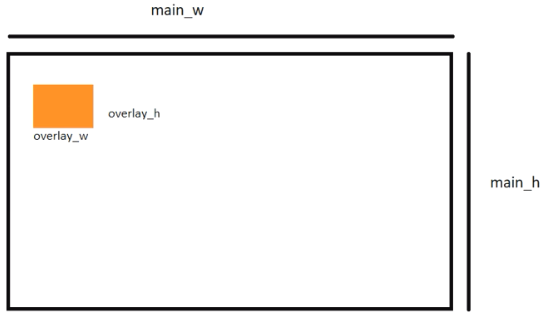

在 FFmpeg 中加入图片水印有两种方式，一种是通过 movie 指定水印文件路径，另外一种方式是通过 filter 读取输入文件的流并指定为水印，这里重点介绍如何读取 movie 图片文件作为水印。

示例：

```bash
ffmpeg -i output.mp4 -vf "movie=out.png[g];[in][g]overlay=40:15[out]" output3.mp4

ffmpeg -i out.mp4  -vf "movie=logo.png,scale=64:48[watermask];[in][watermask] overlay=30:10 [out]" water.mp4
```

参数详解

- -vf 中的 movie 指定 logo 位置
- scale 指定 logo 大小。
- overlay 指定 logo 摆放的位置。

(1) **图片 logo.png 将会打入到 inputmp4 视频中**，显示在 x 坐标 50、y 坐标 20 的位置

```bash
ffplay -i input.mp4 -vf "movie=logo.png[logo];[in][logo]overlay=50:10[out]"
```

由于 logo.png 图片的背景色是白色，所以显示起来比较生硬，如果水印图片是透明背景的，效果会更好，下面找一张透明背景色的图片试一下：

```bash
ffplay -i input.mp4 -vf "movie=logo2.png[watermark];[in][watermark]overlay=50:10[out]"
```

(2) 显示位置

```bash
fplay -i input.mp4 -vf "movie=logo.png[watermark];[in][watermark]overlay=10:10[out]"

fplay -i input.mp4 -vf "movie=logo.png[watermark];[in][watermark]overlay=main_w-overlay_w-10:10[out]"

fplay -i input.mp4 -vf "movie=logo.png[watermark];[in][watermark]overlay=10:main_h-overlay_h-10[out]"

fplay -i input.mp4 -vf "movie=logo.png[watermark];[in][watermark]overlay=main_w-overlay_w-10:main_h-overlay_h-10[out]"
```

(3) 跑马灯效果

```bash
ffplay -i input.mp4 -vf
"movie=logo.png[watermark];[in][watermark]overlay=x=mod(50*t\,w):y=abs(sin(t))*h*0.7[out]"
```

### 画中画生成

在使用 FFmpeg 处理流媒体文件时，有时需要使用画中画的效果。在 FFmpeg 中，可以通过 overlay 将多个视频流、多个多媒体采集设备、多个视频文件合并到一个界面中，生成画中画的效果。在前面的滤镜使用中，以至于以后的滤镜使用中，与视频操作相关的处理，大多数都会与 overlay 滤镜配合使用，尤其是用在图层处理与合并场景中，下面就来了解一下 overlav 的参数。

overlav 的基本参数

| 参数       | 类型   | 说明                                                                                                                          |
| ---------- | ------ | ----------------------------------------------------------------------------------------------------------------------------- |
| x          | 字符串 | X 坐标                                                                                                                        |
| y          | 字符串 | Y 坐标                                                                                                                        |
| eof_action | 整数   | 遇到 eof 表示时的处理方式，默认为重复： repeat(值为 0)：重复前一帧。 endcall(值为 1)：停止所有的流。 pass(值为 2)：保留主图层 |
| shortest   | 布尔   | 终止最短的视频时全部终止(默认 false)                                                                                          |
| format     | 整数   | 设置 output 的像素格式，默认为 yuv420： yuv420(值为 0)。 yuv422(值为 1)。 yuv444(值为 2)。 rgb(值为 3)                        |

从参数列表中可以看到，主要参数并不多，但实际上在 overlay 滤镜使用中，还有很多组合的参数可以使用，可以使用一些内部变量，例如 overlay 图层的宽、高、坐标等。

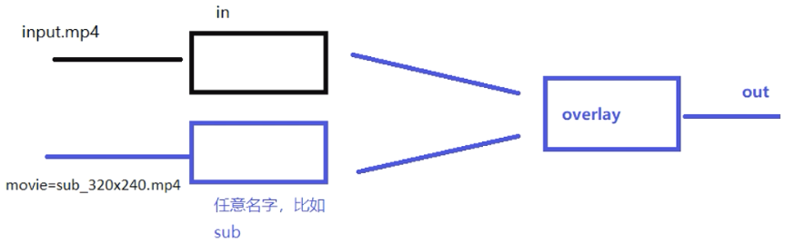

(1) 显示中画效果

```bash
ffplay -i input.mp4 -vf "movie=sub_320x240.mp4[sub];[in][sub]overlay=x=20:y=20[out]"

ffplay -i input.mp4 -vf "movie=sub_320x240.mp4[sub];[in][sub]overlay=x=20:y=20:eof_action=1[out]"

ffplay -i input.mp4 -vf "movie=sub_320x240.mp4[sub];[in][sub]overlay=x=20:y=20:shortest=1[out]"
```

缩放子画面尺寸+

```bash
ffplay -i input.mp4 -vf "movie=sub_320x240.mp4,scale=640x480[sub];[in][sub]overlay=x=20:y=20[out]"
```

(2) 跑马灯

```bash
ffplay -i input.mp4 -vf "movie=sub_320x240.mp4[test];[in][test]overlay=x=mod(50*t\,main_w):y=abs(sin(t))*main_h*0.7[out]"
```

### 多宫格处理

视频除了画中画显示，还有一种场景为以多宫格的方式呈现出来，除了可以输入视频文件，还可以输入视频流、采集设备等。从前文中可以看出进行视频图像处理时，overlay 滤镜为关键画布，可以通过 FFmpeg 建立一个画布，也可以使用默认的画布。如果想以多宫格的方式展现，则可以自己建立一个足够大的画布，下面就来看一下多宫格展示的例子:

```bash
ffmpeg -i 1.mp4 -i 2.mp4 -i 3.mp4 -i 4.mp4 -filter_complex "nullsrc=size=640x480[base];[0:v] setpts=PTS-STARTPTS,scale=320x240[upperleft];[1:v]setpts=PTS-STARTPTS,scale=320x240[upperright];[2:v]setpts=PTS.STARTPTS,scale=320x240[lowerleft];[3:v]setpts=PTS-STARTPTS,scale=320x240(lowerright);[base][upperleft]overlay=shortest=[tmp1];[tmp1][upperright]overlay=shortest=1:x=320[tmp2];[tmp2][lowerleft]overlay=shortest=1:y=240[tmp3;[tmp3][lowerright]overlay=shortest=1:X=320:V=240" out.mp4

# 第二
ffmpeg -re -i X王子.BD1280高清中字版.mp4 -i HeadRoom.mp4 -filter_complex "nullsrc=size=640x240[base];[0:v]setpts=PTS-STARTPTS,scale=320x240[left];[1:v]setpts=PTS-STARTPTS,scale=320x240[right];[base][left]overlay[temp];[temp][right]overlay=shortest=1:x=320" out5.mp4
```

1.2.3.4.mp4 为文件路径，out.MP4 为输出文件路径，通过 nullsrc 创建 overlay 画布，画布大小 640:480，使用 `[0:v][1:v][2:v][3:v]`将输入的 4 个视频流去除，分别进行缩放处理，然后基于 nusrc 生成的画布进行视频平铺，命令中自定义 upperleft,upperright,lowerleft,lowerright 进行不同位置平铺。

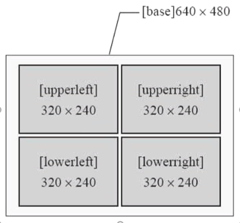

2

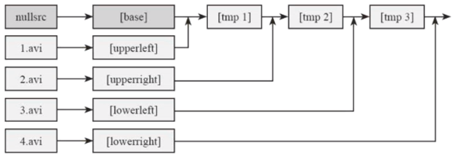

只叠加左上右上的命令:

```bash
ffmpeg -i 1mp4-i2.mp4 -i3.mp4-i4.mp4 -filter_complex "nullsrc=size=640x480[basel;[O:v]setpts=PTS-STARTPTS,scale=320x240[upperleft];[1:v]setpts=PTS-STARTPTS,scale=320x240[upperright];[base][upperleft]loverlay=shortest=1[tmp1];[tmp1][upperright]overlay=shortest=1:x=320" out2.mp4
```

### 切割与合并

#### flv

- ffmpeg -i X 王子.BD1280 高清中字版.mp4 -q 0 tt.flv

#### m3u8

- 由文件切片和目录文件组成：图片
- EXTM3U 必须包含的标签，用于标识 m3u8 文件
- EXT-X-VERSION 指示版本
- EXT-X-TARGETDURATION 列表中最常分片时长
- EXT-X-MEDIA-SEQUENCE 当前应该播放的分片序号
- EXTINF 列表中每个分片的时长
- EXT-X-ENDLIST 表明列表文件不再更新

命令：

```bash
ffmpeg -re -i X王子.BD1280高清中字版.mp4 -c copy -f hls out.m3u8
```

#### 文件切片

##### 按时长切分

```bash
ffmpeg -i Paw.Patrol.aac -f segment -segment_time 60 -c copy  Paw.Patrol_%02d.aac
```

命令详解

- segment ：切片
- segment_time：切片时长

##### 按时间点切分

- ffmpeg -re -i X 王子.BD1280 高清中字版.mp4 -f segment -segment_times 5,10,17 out%d.ts
- 从 5，10，17 秒处分割成 4 片

##### ffconcat 格式索引

```bash
ffmpeg -re -i X王子.BD1280高清中字版.mp4 -f segment -segment_list_type ffconcat -segment_list list.lst out%d.ts
```

参数详解

- segment_list_type：指定分片索引类型
- segment_list：指定索引文件名
- 索引文件内容

##### CSV 格式索引

```bash
ffmpeg -re -i X王子.BD1280高清中字版.mp4 -f segment -segment_list_type csv -segment_list list.csv out%d.ts
```

#### 视频截取

```bash
ffmpeg -i X王子.BD1280高清中字版.mp4 -ss 3 -t 10  out.mp4
```

参数详解

- ss ：起始时间
- t ：截取时长

### 3. 视频旋转

你可以指定一个弧度，顺时针旋转视频。为了让计算简单一些，你可以给角度然后乘以 **PI/180**:

```shell
ffmpeg -i input.avi -vf "rotate=90*PI/180"
ffmpeg -i input.mp4 -vf "rotate=PI"
```

第一个命令将视频顺时针旋转 90°，第二个则是上下颠倒了视频（翻转了 180°）。

### 4.音频声道重映射

有的时候，你的音频只有右耳可以听到声音，那么这个功能就很有用了。你可以让声音同时在左右声道出现：

```shell
ffmpeg -i input.mp3 -af "channelmap=1-0|1-1" output.mp3
```

这将右声道（1）同时映射到左（0）右（1）两个声道（左边的数字是输入，右边的数字是输出）。

### 5. 更改音量

你可以将音量大小乘以一个实数（可以是整数也可以不是），你只需要给出那个数大小就行了。

```shell
ffmpeg -i input.wav -af "volume=1.5" output.wav
ffmpeg -i input.ogg -af "volume=0.75" output.ogg
```

第一个将音量变为 1.5 倍，第二个则让音量变成了原来的 1/4 那么安静。

### 更改播放速度

这里会介绍视频（不影响音频）和音频的过滤器。

**视频**：

视频过滤器是 **setpts** (PTS = presentation time stamp). 这个参数以一种有趣的方式工作，因为我们修改的是 PTS，所以较大的数值意味着较慢的播放速度，反之亦然：

```shell
ffmpeg -i input.mkv -vf "setpts=0.5*PTS" output.mkv
ffmpeg -i input.mp4 -vf "setpts=2*PTS" output,mp4
```

第一个命令让播放速度加倍了，第二个则是让播放速度降低了一半。

**音频**：

这里的过滤器是 **atempo**. 这里有个限制，它只接受 **0.5**(半速) 到 **2** (倍速)之间的值。为了越过这个限制，你可以链式使用这个过滤器：

```shell
ffmpeg -i input.wav -af "atempo=0.75" output.wav
ffmpeg -i input.mp3 -af "atempo=2.0,atempo=2.0" ouutput.mp3
```

第一个命令让音频速度慢了 1/4，第二个则是加速到原来的 4（2\*2)倍。

**Note：** 如果想在同一个命令中同时修改视频和音频的速度，查看一下 [filtergraphs](https://ffmpeg.org/ffmpeg-filters.html#Filtergraph-description)

### 简单滤镜和复杂滤镜

- 简单滤镜
  - 简单的过滤器图是那些只有一个输入和输出，都是相同的类型。 在上面的图中，它们可以通过在解码和编码之间插入一个额外的步骤来表示：
  - 简单的 filtergraphs 配置了 per-stream-filter 选项（分别为视频和音频使用-vf 和-af 别名）。 一个简单的视频 filtergraph 可以看起来像这样的例子：
  - 请注意，某些滤镜会更改帧属性，但不会改变帧内容。 例如。 上例中的 fps 过滤器会改变帧数，但不会触及帧内容。 另一个例子是 setpts 过滤器，它只设置时间戳，否则不改变帧。
- 复杂滤镜
  - 复杂的过滤器图是那些不能简单描述为应用于一个流的线性处理链的过滤器图。 例如，当图形有多个输入和/或输出，或者当输出流类型与输入不同时，就是这种情况。 他们可以用图来表示：
  - 复杂的过滤器图使用-filter_complex 选项进行配置。 请注意，此选项是全局性的，因为复杂的过滤器图形本质上不能与单个流或文件明确关联。
  - -lavfi 选项等同于-filter_complex。
  - 一个复杂的过滤器图的一个简单的例子是覆盖过滤器，它有两个视频输入和一个视频输出，包含一个视频叠加在另一个上面。 它的音频对应是 amix 滤波器。

### 双声道转换成单声道

```bash
ffmpeg -i a.aac -ac 1 a1.aac
```

### 双声道提取成两个单声道音频

```bash
ffmpeg -i a.aac -map_channel 0.0.0 l.aac -map_channel 0.0.1 r.aac
```

### 两个音频合成为双声道

```bash
ffmpeg -i l.aac -i r.aac -filter_complex "[0:a][1:a]amerge=inputs=2[aout]" -map "[aout]"  s.aac
```

### 音频音量探测

```bash
ffmpeg -i s.aac -filter_complex volumedetect -c:v copy -f null /dev/null
```

### 添加字幕文件

```bash
ffmpeg -i input.mp4 -vf ass=t.ass -f flv output.flv
```

### 合并字幕流

```bash
ffmpeg -i input.mp4 -i t1.ass -map 0:0 -map 0:1 -map 1:0 -acodec copy -vcodec copy -scodec copy output.mkv
```

### 音频倍速播放

```bash
ffmpeg -i l.aac -filter_complex "atempo=tempo=0.5" -acodec aac o.aac
```

### 视频画中画

```bash
ffmpeg -re -i X王子.BD1280高清中字版.mp4 -vf "movie=HeadRoom.mp4,scale=480x320[test];[in][test]overlay[out]" out44.mp4

ffmpeg -i out.mp4 -i out1.mp4 -filter_complex "[1:v]scale=w=176:h=144:force_original_aspect_ratio=decrease[ckout];[0:v][ckout]overlay=x=W-w-10:y=0[out]" -map "[out]" -movflags faststart new.mp4
```

### 滤镜加水印

```bash
ffmpeg -i killer.mp4 -filter_complex "movie=./logo/daka.png,scale=64:48[w];[0:v]curves=vintage[o];[o][w]overlay=30:10[out]" -map "[out]" -map 0:a test1.mp4
```

### 视频裁剪

```bash
ffmpeg -i VR.mov  -vf crop=in_w-200:in_h-200 -c:v libx264 -c:a copy -video_size 1280x720 vr_new.mp4
```

参数详解

- crop 格式：crop=out_w:out_h：x :y
- out_w：输出的宽度。可以使用 in_w 表式输入视频的宽度。
- out_h：输出的高度。可以使用 in_h 表式输入视频的高度。
- x ：X 坐标
- y ：Y 坐标
- 如果 x 和 y 设置为 0,说明从左上角开始裁剪。如果不写是从中心点裁剪。

### 视频倍速播放

```bash
ffmpeg -i out.mp4 -filter_complex "[0:v]setpts=0.5*PTS[v];[0:a]atempo=2.0[a]" -map "[v]" -map "[a]" speed2.0.mp4
```

参数详解

- -filter_complex 复杂滤镜，[0:v]表示第一个（文件索引号是 0）文件的视频作为输入。setpts=0.5\*PTS 表示每帧视频的 pts 时间戳都乘 0.5 ，也就是差少一半。[v]表示输出的别名。音频同理就不详述了。
- map 可用于处理复杂输出，如可以将指定的多路流输出到一个输出文件，也可以指定输出到多个文件。"[v]" 复杂滤镜输出的别名作为输出文件的一路流。上面 map 的用法是将复杂滤镜输出的视频和音频输出到指定文件中。

```bash
ffmpeg -re -i X王子.BD1280高清中字版.mp4 -filter_complex "setpts=PTS*2" o3.mp4
```

### 有意思的滤镜

镜像：`crop=iw/2:ih:0:0,split[left][tmp];[tmp]hflip[right];`

复古：curves=vintage;

光晕：vignette=PI/4

变暗：colorlevels=rimin=0.058:gimin=0.058:bimin=0.058

增加对比度：fftfilt=dc_Y=0:weight_Y='exp(-4 \* ((Y+X)/(W+H)))

降噪：hqdn3d=luma_spatial=15.0

强对比度：curves=strong_contrast

变亮：curves=lighter

锐化：fftfilt=dc_Y=0:weight_Y='1+squish(1-(Y+X)/100)'

低通滤波：fftfilt=dc_Y=0:weight_Y='squish((Y+X)/100-1)'

高通滤波：fftfilt=dc_Y=128:weight_Y='squish(1-(Y+X)/100)'

复古：curves=vintage

边缘检测：edgedetect

底片 negate

彩色底片：curves = ‘none’‘color_negative’

## FFmpeg 命令实现练习

### 使用 ffmpeg.exe 将测试文件转换成如下格式

- MKV 文件，起始时间为第 10s, 持续时间为 10s。
- MP4 文件，视频编码器为 libx264，音频编码器为 libmp3lame。
- AVI 文件，分辨率为 640x360，帧率为 25fps，视频码率为 600kbps，音频码率为 64kbps。
- FLV 文件，视频编码器为 libx264，音频编码器为 libmp3lame，音频采样率为 44100Hz。
- YUV420P 格式像素数据，分辨率为 640x360。
- H.264 码流文件，分辨率为 640x360。
- WAVE 格式音频采样数据。
- MP3 码流文件。

### 使用 ffplay.exe 播放测试文件，并练习各种快捷键

## FFmpeg 提高执行速度的方式

软硬编解码的区分：

```
复制代码软编码：使用CPU进行编码

硬编码：使用非CPU进行编码，如显卡GPU、专用的DSP、FPGA、ASIC芯片等
```

软硬编解码的区别：

```
复制代码 软编码：实现直接、简单，参数调整方便，升级易，但CPU负载重，性能较硬编码低，低码率下质量通常比硬编码要好一点。

硬编码：性能高，低码率下通常质量低于软编码器，但部分产品在GPU硬件平台移植了优秀的软编码算法（如X264）的，质量基本等同于软编码。
```

简单来说硬解码就是 内存 - codec 电路 - 内存/显示 的过程所以速度会比软件编解码快

**在默认情况下，不加任何参数，会直接使用 CPU 编解码**

转码速度是相对比较慢的，并且过程中 CPU 是处于 100% 使用率的。

```
ffmpeg -i input.mp4 output.mp4
```

### 硬件加速（硬解码）

#### 硬件解码介绍

[FFmpeg 硬件加速方案概览 （上）-CSDN 博客](https://blog.csdn.net/yinshipin007/article/details/131796753)

[FFmpeg 硬件加速方案概览 （下）\_ffmpeg mpp-CSDN 博客](https://blog.csdn.net/yinshipin007/article/details/131796822)

[FFmpeg 硬件加速（硬解码）介绍\_libmfx-CSDN 博客](https://blog.csdn.net/y601500359/article/details/118357785)

[FFmpeg 硬件加速（硬解码）介绍 - 知乎 (zhihu.com)](https://zhuanlan.zhihu.com/p/645241136)

PC 的平台上，视频硬件通常集成到 GPU（来自 AMD、Intel 或 NVIDIA）中，而在移动 SoC 类型的平台上，它通常是一个独立的 IP 核（许多不同的供应商）。

硬件解码器将产生与软件解码器相同的输出，但可能使用更少的功率和 CPU 来这样做。

功能支持各不相同——对于具有许多不同配置文件的更复杂的编解码器，硬件解码器很少实现所有这些（例如，硬件解码器往往不会在 H.264 的 8 位深度下实现 YUV 4:2:0 以外的任何内容）。

许多硬件解码器的一个共同特点是能够在适合其他组件使用的硬件表面中生成输出（对于独立显卡，这意味着表面在卡上的内存中而不是在系统内存中）——这通常对播放很有用，因为在呈现输出之前不需要进一步复制，并且在某些情况下，它还可以与支持硬件表面输入的编码器一起使用，以避免在转码情况下进行任何复制。

硬件编码器生成的输出质量通常比好的软件编码器（如 x264）低得多，但通常速度更快并且不使用太多 CPU 资源。（也就是说，它们需要更高的比特率才能以相同的感知质量进行输出，或者在相同的比特率下以较低的感知质量进行输出。）

具有解码和/或编码能力的系统还可以提供对其他相关过滤功能的访问。像缩放和去隔行这样的事情很常见，其他后处理可能取决于系统。在硬件表面可用的情况下，这些过滤器通常会作用于它们而不是系统内存中的正常帧。

通过 `-hwaccel` 选项启用内部 硬件解码器。

软件解码器默认启动，但如果它检测到可在硬件中解码的流，则它将尝试将所有重要处理委托给该硬件。如果流无法在硬件中解码（例如，它是不受支持的编解码器或配置文件），那么它仍将在自动软解码。如果硬件需要特定设备才能运行（或需要区分多个设备，例如是否有多个显卡可用），则可以使用 `-hwaccel_device` 来选择一个。

通过使用 `-codec:v`选项设置特定的解码器来使用外部封装器解码器。通常，它们被命名 codec_api（例如：h264_cuvid）。这些解码器需要事先知道编解码类型，并且如果流是不支持类型，不支持任何回退到软解码。

通过 `-codec:v` 选择编码器封装。编码器通常有很多选择——查看特定编码器的文档以了解详细信息。

硬件过滤器可以像任何其他过滤器一样用于过滤器中。但是请注意，他们可能不支某些软解过滤器常见格式——在这种情况下，可能有必要利用 hwupload 和 hwdownload 过滤器实例来再硬件表面和正常的存储之间移动帧数据。

#### 名词术语

##### VDPAU

全称：Video Decode and Presentation API for Unix，针对 Unix 的视频解码和演示 API。由 NVIDIA 为 Unix/Linux 系统开发。要启用此功能，您通常需要发行版中的 libvdpau 开发包和兼容的显卡。

请注意，VDPAU 不能用于对内存中的帧进行解码，压缩后的帧由 libavcodec 发送到 VDPAU 支持的 GPU 设备，然后可以使用 VDPAU API 访问解码后的图像。这不是由 FFmpeg 自动完成的，而是必须在应用程序级别完成（例如检查 ffmpeg_vdpau.c 使用的文件 ffmpeg.c）。另外，请注意，使用此 API 无法将解码的帧拷贝回 RAM，例如，如果您需要再次对解码的帧进行编码（例如，在服务器上进行转码时）。

目前通过 libavcodec 中的 VDPAU 支持几种解码器，特别是 H.264、MPEG-1/2/4 和 VC-1。

##### VAAPI

全称：Video Acceleration API，视频加速 API (VAAPI) 是一种非专有且免版税的开源软件库 (“libva”) 和 API 规范，最初由英特尔开发，但可与其他设备结合使用。

它可用于访问 Intel GPU 中的 Quick Sync 硬件和 AMD GPU 中的 UVD/VCE 硬件。请参阅 VAAPI。

##### DXVA2

全称：Direct-X Video Acceleration API，由微软开发的（支持 Windows 和 Xbox360）。

目前支持多种解码器，特别是 H.264、MPEG-2、VC-1 和 WMV 3。

DXVA2 硬件加速仅适用于 Windows。为了构建支持 DXVA2 的 FFmpeg，您需要安装 dxva2api.h 头文件。对于 MinGW 的，这可以通过进行下载由 VLC 保持报头，并在安装它包括路径（例如在/usr/include/）。

对于 MinGW64，dxva2api.h 默认提供。安装 mingw-w64 的一种方法是通过 pacman 存储库，可以使用以下两个命令之一进行安装，具体取决于架构：

```text
pacman -S mingw-w64-i686-gcc
pacman -S mingw-w64-x86_64-gcc
```

要启用 DXVA2，请使用–enable-dxva2ffmpeg 配置开关。

要测试解码，请使用以下命令：

```text
ffmpeg -hwaccel dxva2 -threads 1 -i INPUT -f null - -benchmark
```

##### VideoToolbox

VideoToolbox，只支持在 MacOS 的 H.264 解码，包含在 FFmpeg/libavcodec 中。

要在 macOS 中使用硬件编码，只需分别使用编码器-c:v h264_videotoolbox 或-c:v hevc_videotoolbox 对 H.264 或 HEVC 进行编码。通过 ffmpeg -h encoder=…来查看编码器选项。值得注意的是，VideoToolbox 不支持恒定质量 (CRF) 编码。比特率-b:v …是平衡大小与质量的主要杠杆。

#### ffmpeg 支持的硬解码

- -hwaccel

  选项启用硬件解码器。

  - 软件解码器会正常启动，如果它检测到一个硬件可解码的流，将尝试将所有重要的处理交给硬件。如果流在硬件中不可解码，那么将自动使用软件解码。

- `-hwaccel_device`选项指定特定的硬件设备(比如有多个显卡可用)。

- -codec:v

  选项设置特定的编解码器，适用于外部包装的编解码器。

  - 通常将它们命名为 codec_api(例如:h264_cuvid)，要求事先知道编解码器的名称。
  - 如果不支持不会回退到软件编解码。

- 硬件 filter 可以像其他 filter 一样在 filtergraph 中使用。

  - 存在硬件 filter 与软件 filter 支持的格式不同的情况，需要使用`hwupload`和`hwdownload` filter 在硬件 surface 和内存之间拷贝数据。

示例：

**1. 使用 NVENC 进行 h264 编码：**

```bash
ffmpeg -s 1280*720 -i input_yuv -c:v h264_nvenc -pixel_format yuv420p -preset default output.mp4
```

**2. NVEDC 进行 h264 解码**

```bash
ffmpeg -hwaccel nvdec -i input.mp4 output_yuv
```

nvenc 转码

```bash
# 检查ffmpeg是否支持 nvenc 转码
ffmpeg -codecs | sls cuvid
# 检查 x265 nvenc 的可以使用的选项
ffmpeg -h encoder=hevc_nvenc


在同等文件大小情况下，仍然是CPU编码的质量最好，但两者差别不大。同时，码率越高，CPU编码和nvenc编码两者差别质量越少。
例如一部 13G 1080P 你的名字 蓝光电影，分别使用 CPU 和 nvenc 压到 3500K，两者差别几乎是肉眼不可分辨的。
简单的速度比较
一段影片，i7 8750H; GTX 1070
hevc		编码速度为 0.1X
hevc_nvenc	编码速度为 5.1X


使用平均码率控制模式，建议使用这个，因为这个比较方便调整输出视频大小

ffmpeg -i 1.mkv -b:v 3500K -bufsize 6000K -maxrate 5000K -c:v hevc_nvenc -preset slow -pix_fmt p010le -profile:v rext -level 6.2 -tier high -rc vbr_hq -rc-lookahead 250 -2pass 1 -nonref_p 1 2.mkv
转码 1.mkv 到 2.mkv
设定
-b:v 3500K			视频平均比特率为 3500K
-bufsize 6000K		缓存区大小 6000K，建议设定为 当前码率*帧率*5，也许这里的2pass是针对缓冲区的，缓存未来5s
-maxrate 5000K		最大码率为 5000K，每帧的最高码率不超过这个数值
-c:v hevc_nvenc		使用hevc_nvenc 编码器（nvidia硬件加速x265）
-preset slow		预设方案是 slow，slow已经是最好的选项了
-pix_fmt p010le		输出的像素格式是 p010le 也就10bit，只有新的硬件支持，例如：970m不支持，1070可以支持
-profile:v rext		设定 参考配置 为 rext，这个也是最好的选项
-level 6.2			设定编码等级为6.2，这个也是最好的选项
-tier high			设定 tier 为 high，当前最好选项把
-rc vbr_hq			设定质量控制类型为 vbr_hq
-rc-lookahead 250	前 250 帧作为码率控制的参数（貌似没用）
-2pass 1			使用 2pass 编码，但看不出什么差别，貌似没用
-nonref_p 1			使用自动插入无引用的P帧，不知道干嘛的


如果要8bit的编码可以删掉上面的 -pix_fmt p010le 参数 再执行。

# 2021年4月后的FFMPEG
ffmpeg -i .\1.mkv -b:v 4000K -bufsize 16000K -maxrate 8000K -c:v hevc_nvenc -preset p7 -tune hq -pix_fmt p010le -profile:v rext -level 6.2 -tier high -multipass 2 -rc-lookahead 1800 2.mkv
这个参数用来转换9g h264的电影，可能会不错


ffmpeg.exe -i 1.mkv -b:v 2200K -bufsize 16000K -maxrate 3000K -c:v hevc_nvenc -preset p7 -tune hq -pix_fmt p010le -profile:v rext -level 6.2 -tier high  -multipass 2 -rc-lookahead 1800 -c:a aac -b:a 128K .\2.mkv


# 过时，2020年的FFMPEG
ffmpeg -i .\1.mkv -b:v 4000K -bufsize 16000K -maxrate 8000K -c:v hevc_nvenc -preset slow -pix_fmt p010le -profile:v rext -level 6.2 -tier high -rc vbr_hq -rc-lookahead 1800 2.mkv
这个参数用来转换9g h264的电影，可能会不错


使用固定qp模式，也就是固定质量模式，此时输出文件大小不怎么好估计，不是很关心文件大小可以用这个

ffmpeg -y -i 1.mkv -c:v hevc_nvenc -preset p7 -profile:v rext -level 6.2 -tier high -rc constqp -qp 23 -nonref_p 1 2.mkv
这里基本与上面相同，不同的是这里使用固定质量模式
-rc constqp			代表使用固定质量模式
-qp 23				使用固定质量等级为23
```

qsv 转码

```bash
# 检查ffmpeg是否支持 qsv 转码
ffmpeg -codecs | sls qsv
# 检查 x265 qsv 的可以使用的选项
ffmpeg -h encoder=hevc_qsv

目前不建议使用hevc_qsv编码图像，因为在同等文件大小下，hevc_nvenc 编码的速度更快，并且质量更好。
简单的速度比较
一段影片，i7 8750H
hevc		编码速度为 0.1X
hevc_qsv	编码速度为 1.1X


使用平均编码模式

ffmpeg -i 1.mkv -b:v 3500K -bufsize 6000K -maxrate 5000K -vcodec hevc_qsv -preset slow -pix_fmt p010le -profile:v main10 2.mkv
转码 1.mkv 到 2.mkv
设定
-b:v 3500K			视频平均比特率为 3500K
-bufsize 6000K		缓存区大小 6000K，建议设定为 当前码率*帧率*5，也许这里的2pass是针对缓冲区的，缓存未来5s
-maxrate 5000K		最大码率为 5000K，每帧的最高码率不超过这个数值
-c:v hevc_qsv		使用 hevc_qsv 编码器（intel硬件加速x265）
-preset slow		预设方案是 slow，在我这里无法使用更高选项，但使用更高的选项会报错
-pix_fmt p010le		输出的像素格式是 p010le 也就10bit
-profile:v main10	设定 参考配置 为 main10，有rext选项，但无法使用，因为会报错

如果要8bit的编码可以删掉上面的 -pix_fmt p010le 和 -profile:v main10 参数 再执行。
或者把对应参数改成 -pix_fmt nv12 和 -profile:v main ，效果和上面一样。


目前 hevc_qsv 不支持CQP编码模式
```

#### CUDA(NVENC/NVDEC)

NVENC 和 NVDEC 是 NVIDIA 的硬件加速编码和解码 API。它们曾经被称为 CUVID。它们可用于在 Windows 和 Linux 上进行编码和解码。FFmpeg 将 NVENC/NVDEC 称为 CUDA。

##### NVENC

NVENC 可用于 H.264 和 HEVC 编码。FFmpeg 通过 h264_nvenc 和 hevc_nvenc 编码器支持 NVENC 。为了在 FFmpeg 中启用它，您需要：

一块支持硬编码的 N 卡 GPU,点此查看您的显卡是否支持

操作系统支持的显卡驱动程序

\+ NVIDIA 的编解码器 SDK（点此下载）或通过-enable-cuda-llvm 选项编译的 FFmpeg

ffmpeg 配置为–enable-nvenc（如果在配置时检测到驱动程序，则默认）

注意： FFmpeg 使用自己稍微修改过的运行时加载器来处理 NVIDIA 的 CUDA/NVENC/NVDEC 相关库。如果你从 configure 编译中得到一个关于缺少 ffnvcodec 的错误，这个项目是你所需要的。它有一个带有安装目标 make install PREFIX=/usr 的 Makefile：. FFmpeg 将在 pkg-config 文件中查找 ffnvcodec.pc，来确保它在您的 PKG_CONFIG_PATH 中。

这意味着在编译 ffmpeg 之前运行以下内容就足够了：

```text
git clone https://git.videolan.org/git/ffmpeg/nv-codec-headers.git
cd nv-codec-headers
make
sudo make install
```

编译完成后就可以使用 NVENC 了。

用法示例：

```text
ffmpeg -i input -c:v h264_nvenc -profile high444p -pixel_format yuv444p -preset default output.mp4
```

您可以使用 ffmpeg -h encoder=h264_nvenc 或来查看可用的预设、其他选项和编码器信息 ffmpeg -h encoder=hevc_nvenc。

注意：如果 No NVENC capable devices found 出现错误，请确保编码为支持的像素格式。请参阅如上所示的编码器信息。

##### NVDEC/CUVID

NVDEC 为 H.264、HEVC、MJPEG、MPEG-1/2/4、VP8/VP9、VC-1 提供解码器。编解码器支持硬件（见 GPU 兼容性表）。

请注意，FFmpeg 提供 NVDEC 和 CUVID hwaccels。它们的不同之处在于帧在内存中的解码和转发方式。

全套编解码器仅在 Pascal 硬件上可用，它增加了 VP9 和 10 位支持。关于 NVENC 缺少 ffnvcodec 的说明也适用于 NVDEC。

使用 CUDA 的解码示例：

```text
ffmpeg -hwaccel cuda -i input output
```

使用 CUVID 的解码示例：

```text
ffmpeg -c:v h264_cuvid -i input output
```

使用 NVDEC 和 NVENC 进行全硬件转码：

```text
ffmpeg -hwaccel cuda -hwaccel_output_format cuda -i input -c:v h264_nvenc -preset slow output
```

如果 ffmpeg 是在支持 libnpp 的情况下编译的，则它可用于将基于 GPU 的缩放器插入链中：

```text
ffmpeg -hwaccel_device 0 -hwaccel cuda -i input -vf scale_npp=-1:720 -c:v h264_nvenc -preset slow output.mkv
```

该-hwaccel_device 选项可用于指定 ffmpeg 中硬解码要使用的 GPU。

##### libmfx

libmfx 是 Intel 的专有库，用于在 Linux 和 Windows 上使用 Quick Sync 硬件。在 Windows 上，它是比使用 DXVA2/D3D11VA 访问之外的更高级功能的主要方式，尤其是编码。在 Linux 上，它有一些不同的功能集，有助于某些需要最大吞吐量的用例。

请参阅快速同步。

##### OpenCL

OpenCL 的可用于多个滤波器。要构建，需要 OpenCL 1.2 或更高版本的头文件，以及要链接到的 ICD 或 ICD 加载器 - 建议（但不是必需）与 ICD 加载器链接，以便可以在运行时选择实现而不是构建时间。在运行时，需要 OpenCL 1.2 驱动程序 - 大多数 GPU 制造商将提供一个作为其标准驱动程序的一部分。CPU 实现也可用，但可能比直接在 ffmpeg 中使用本机过滤器慢。

OpenCL 可以与其他 GPU API 互操作，以避免 GPU 和 CPU 内存之间的冗余副本。支持的方法有：

DXVA2：仅 NV12 表面，所有平台。

D3D11：仅适用于 Intel 的 NV12 纹理。

VAAPI：所有表面类型。

ARM Mali：所有表面类型，通过 DRM 对象共享。

libmfx：仅 NV12 表面，通过 VAAPI 或 DXVA2。

AMD UVD/VCE

AMD UVD 可用于在 Linux 上的 Mesa 中通过 VDPAU 和 VAAPI 进行解码。VCE 也有一些对通过 VAAPI 编码的初步支持，但应该被视为实验性的。

在 Windows 上，UVD 可通过标准 DXVA2/D3D11VA API 访问，而 VCE 则通过 AMF 支持。

### 使用 GPU 加速转码

首先通过命令 `ffmpeg -hwaccels` 查看所支持的硬件加速方法，如果你是在 Windows 平台并且使用的是我所提到的那两个版本，那么结果应该和下图相同，Linux 下的版本可能会略有不同。

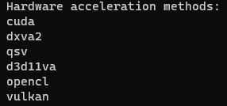

通过加上参数 `-hwaccel` 可以指定硬件加速方法。如果你的是 N 卡，可以选择 cuda ，如果是 Intel 核显，可以选择 qsv ，（印象里还有一个 A 卡的 amf )。

**1.首先我们试一下自动 使用 GPU 加速**

```bash
ffmpeg -hwaccel auto -i input.mp4 output.mp4
```

可以看到在自动的设置下选择了 dxva2 为硬件加速方法


但是从提升上看并不明显，调用了显卡很小一部分解码器，CPU 依然满载
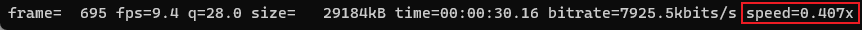
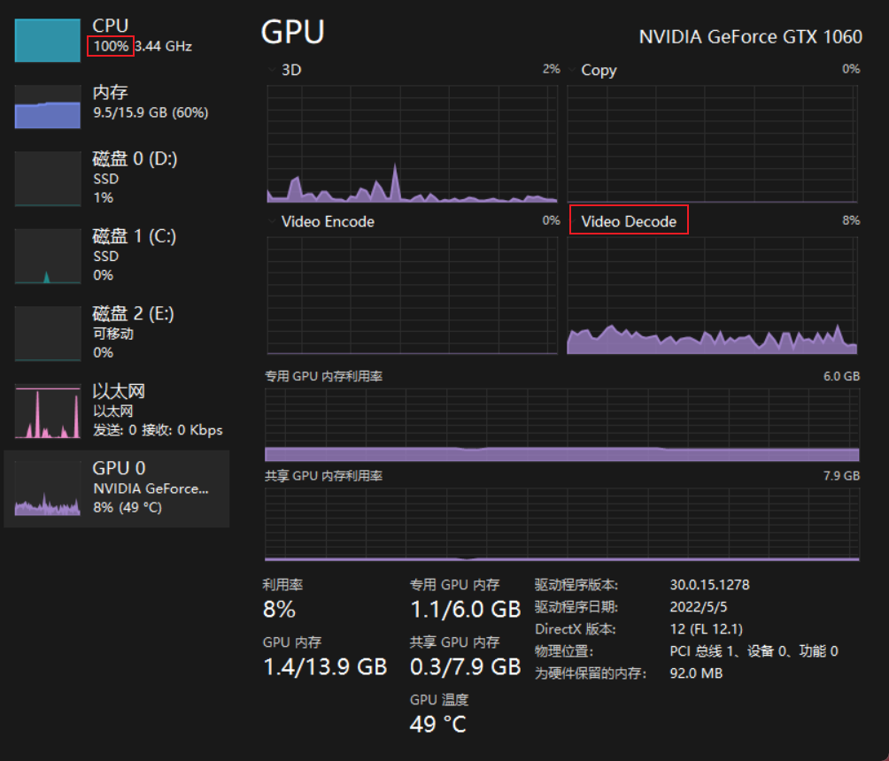

**2.接着试一下 CUDA**

```bash
ffmpeg -hwaccel cuda -i input.mp4 output.mp4
```

可以看到速度与 auto 设置下类似，实际情况也是只调用了显卡的部分解码能力，CPU 依然满载

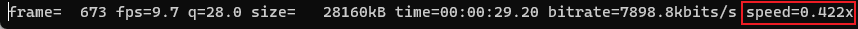

**3. 手动指定视频的编解码器**

- **查看支持的编解码器**

通过 `ffmpeg -codecs | findstr "h264"` 查看所支持的 h264 编解码器（Linux 下可以用 grep ）

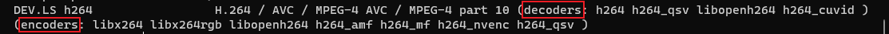

从图中可以看到 decoders（解码器，对应 input 文件的编码）和 encoders （编码器，对应 output 文件的编码）。

**decoders** 中 `h264_qsv` 是 Intel 核显/显卡专用的硬件加速解码器，`h264_cuvid` 是 N 卡专用的解码器。

**encoders** 中 `h264_amf` 和 `h264_mf` 都是 A 卡专用的编码器，`h264_qsv` 对应 I 卡，`h264_nvenc` 对应 N 卡。

（当然，如果你知道编解码是做什么的话，你完全可以把 h264 编码的文件转为 h265 或者其他编码，这里只是作为使用硬件加速的演示。）

**测试**

（由于我的笔记本的核显出厂被屏蔽了，因此只能使用 N 卡硬件加速测试，如果你的核显能用，可以试试，说不定不比独显编解码慢）

使用 `-c:v` 参数来指定视频的编解码器，这里 c 是 **codec** 的缩写，v 是指 **video** ，处理音频编码可以替换为 a ( audio )

```bash
ffmpeg -c:v h264_cuvid -i input.mp4 -c:v h264_nvenc output.mp4
```

**注意：指定解码器 `-c:v h264_cuvid` 必须放在输入文件 `-i input.mp4` 之前，否则无效。**

可以看到确实使用了指定的硬件编解码器

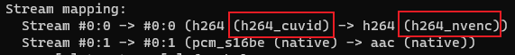

在编解码的过程中也充分调用了显卡的硬件编解码器，CPU 也维持在一个很低的占用

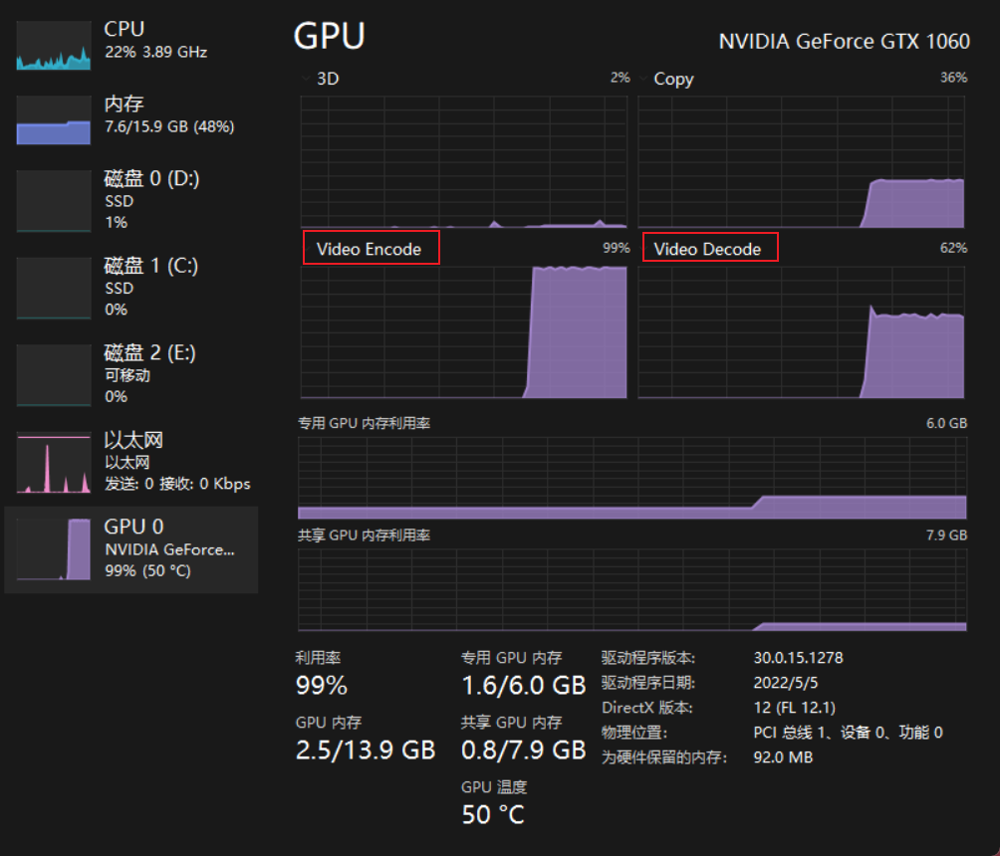

可以看到转码的速度提升非常大，但是存在一个问题就是这个编码器的默认设置下码率只有 2000k ，实际输出的视频画质也降低了很多。

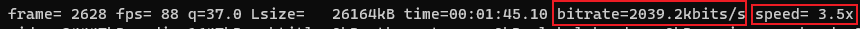

**手动指定视频码率**

通过加入 `-b:v` 参数（这里 b 指 **bitrate** ，v 同理指 video 视频），可以手动指定视频的码率，以提升画质。

（这里码率的值只是作为演示，码率是清晰度的决定因素之一，码率越高越清晰，但体积也相应增大。想要深入了解可以自行查阅相关资料）

```bash
ffmpeg -c:v h264_cuvid -i input.mp4 -c:v h264_nvenc -b:v 10000k output.mp4
```

可以看到转码速度依然很快，并且画质也没有太大的损失。

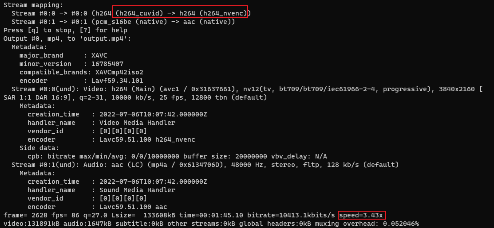

并且可以看到 GPU 的硬件编解码器是被充分利用了的，CPU 也维持在一个很低的占用。

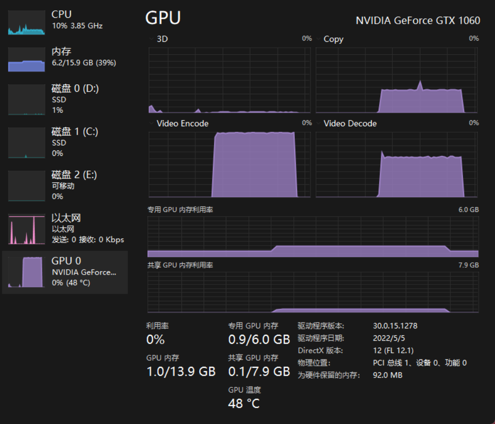

#### 示例

假设你的电脑显卡为支持 CUDA、NEVC 的 NVIDIA 显卡。

基础命令：

```bash
ffmpeg $(解码加速参数) -i $(输入视频).$(转码前格式) $(其它参数) $(编码加速参数) -c:a copy $(输出视频).$(转码后格式)
```

示例：

```bash
ffmpeg -hwaccel cuvid -i input.flv -f mp4 -c:v hevc_nvenc -c:a copy output.mp4
```

（实测 slow 模式和默认的差距不大）

解码器 GPU 加速

```bash
-hwaccel cuvid
-c:v h264_cuvid
-hwaccel nvdec
```

编码器 GPU 加速

```bash
-c:v hevc_nvenc
```

输出格式

```bash
-f mp4
```

转码模式

```bash
-preset slow
```

查看可用的 hwaccel 选项

```bash
ffmpeg -hwaccels
```

批量处理（基于 cmd）：

```bash
#创建输出文件夹
md output
#输入格式
set Ext=*.flv

for %a in (%Ext%) do (
#ffmpeg命令，具体如上
ffmpeg ... -i "%a" ... "output\%~na.mp4"
)
```

#### 使用 Nvidia CUDA GPU 加速的方法

##### 前言

本文章是针对 Windows 10 + Nvidia + FFMPEG 的，Linux、老版本 Windows 以及其他系统仅供参考

##### 第一步

根据你的显卡型号，安装适合的 cuda
查看显卡支持的 cuda 版本
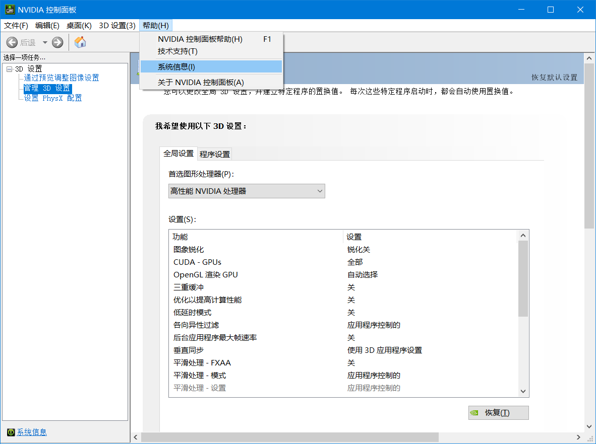
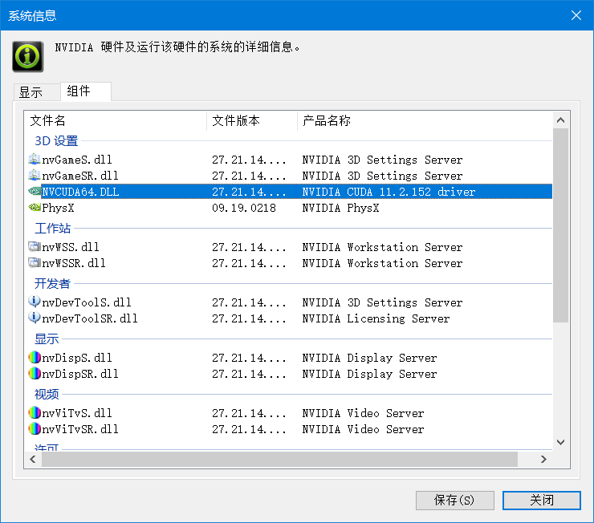

[这里](https://developer.nvidia.com/cuda-toolkit-archive) 可以下载旧版本的 cuda
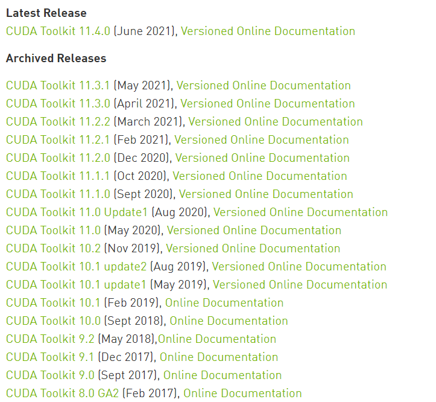

安图所示，下载并安装，安装过程就一直下一步都行，这里就不再贴图了

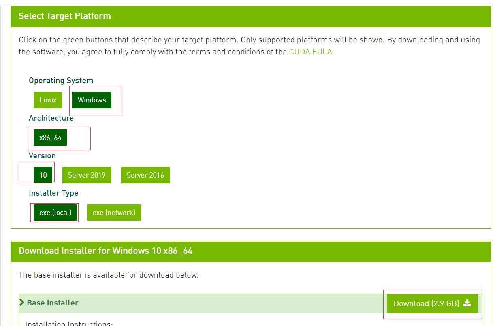

##### 第二步

下载编译了 cuda 依赖 的 FFMPEG

可以去 [gyan.dev](https://www.gyan.dev/ffmpeg/builds/) 下载，记得要下载 full 版本的，因为我用的就是 full 版，其他版本可能也行？


##### 第三步

查看支持 cuda 的编码器

执行

```bash
ffmpeg -codecs | findstr cuvid
```

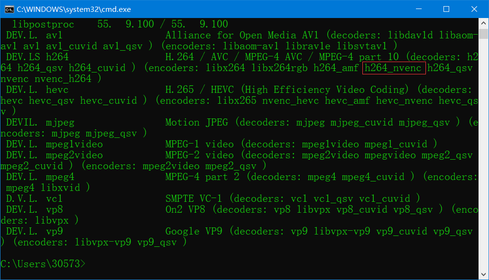

这些 编码器就是支持 GPU 加速的

##### 第四步

开始转码

执行

```bash
ffmpeg -i <input> -vcodec h264_nvenc <output>
```

`-vcodec` 表示指定 视频编码器，只要指定了支持 GPU 加速的编码器，FFMPEG 就会自动使用 GPU

##### 第五步

等待执行，期间可以用任务管理器查看系统资源使用情况

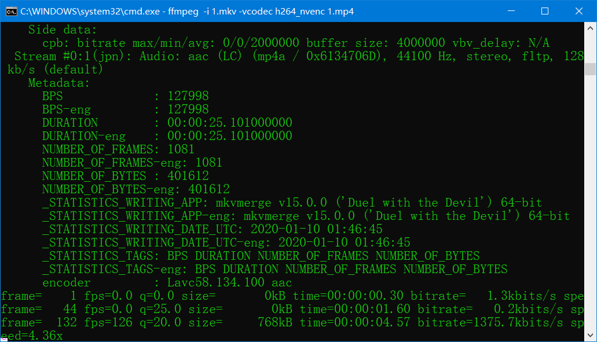
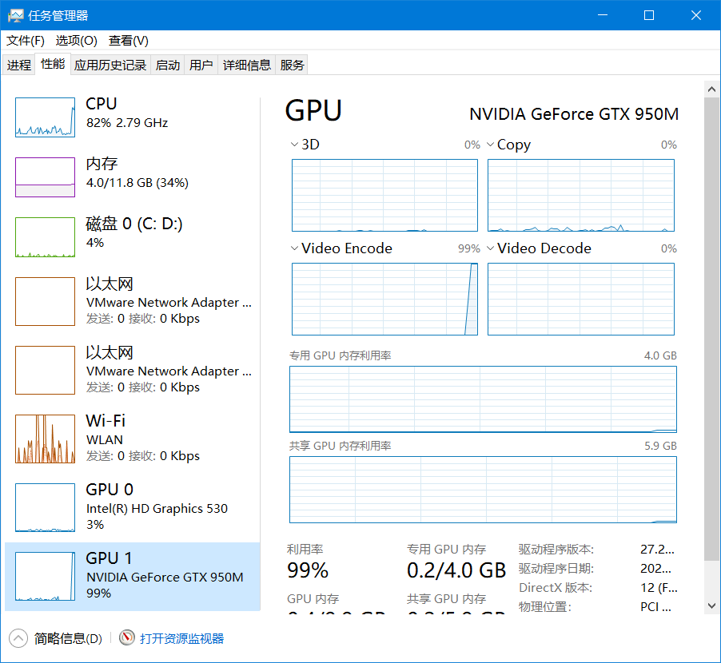

GPU 编码比 CPU 快了好多，具体可以自测。

##### 后记

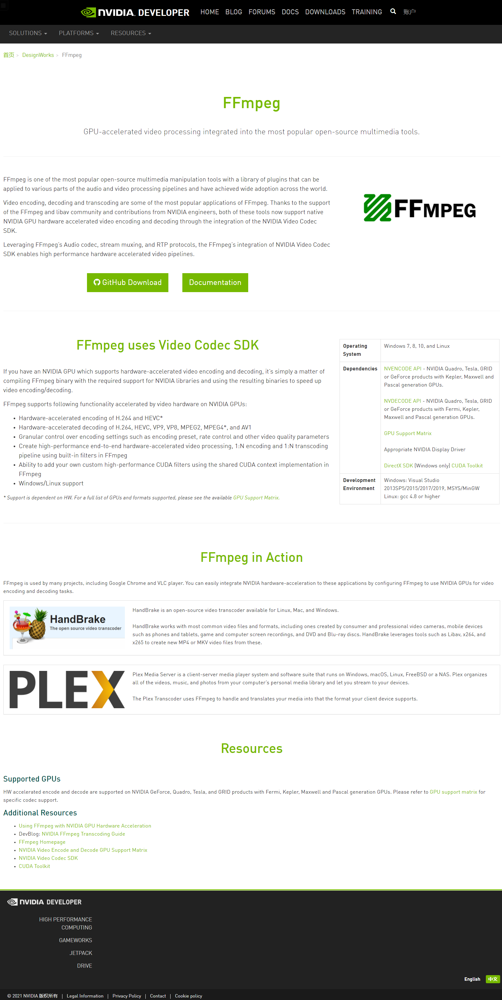

#### 要使用 GPU 加速的前置

##### 安装 CUDA 驱动

CUDA 是一个驱动程序，可以让 GPU 进行相关运算，因为我们开发应用程序一般不直接操控 GPU，而是通过驱动来操作。

###### 前置

首先确定自己的电脑是否支持 CUDA

[Video Encode and Decode GPU Support Matrix | NVIDIA Developer](https://developer.nvidia.com/video-encode-and-decode-gpu-support-matrix-new)

[CUDA Toolkit 12.3 Update 2 Downloads | NVIDIA Developer](https://developer.nvidia.com/cuda-downloads)

[CUDA Toolkit 12.3 Update 2 Downloads | NVIDIA Developer](https://developer.nvidia.com/cuda-downloads)

选择系统类型下载

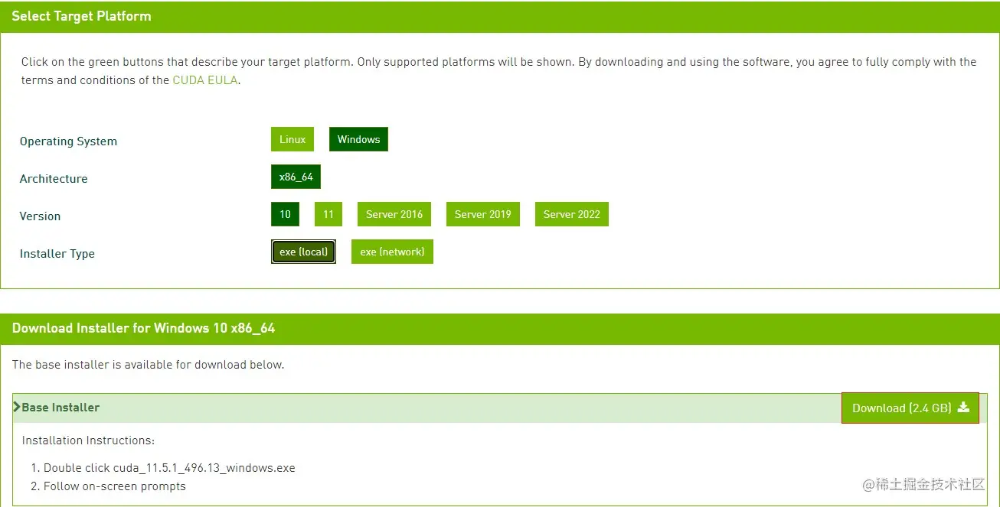

###### 安装

按照提示默认安装即可。

#### 硬件加速命令相关

##### ffmpeg 支持的硬件

###### 硬件加速方式

通过命令 `ffmpeg -hwaccels` 可以查询系统支持的硬件加速器。

```markdown
## ffmpeg -hwaccels

cuda
dxva2
qsv
d3d11va
opencl
vulkan
```

> PS：以上输出代表系统所支持的硬件加速方式，后续会用到

###### 硬编码后缀解释

- `qsv`：intel 显卡的快速视频同步技术（quick sync video）
- `nvenc`：nvidia 显卡的硬件视频编码器（nvidia hardware video encoder）
- `cuvid`：nvdec 的旧称，只有解码端。
- `cuda`： 同上
- `amf`：amd 显卡的 amf 硬件编码器（amd hardware encoder）

> 基本上所有的 Intel 电脑都支持 qsv 方式。

##### 测试命令

```bash
ffmpeg -hwaccel cuvid -c:v h264_cuvid -i 0.mp4 -c:v h264_nvenc -y 00.mp4
```

将当前目录下的 0.mp4 转成 00.mp4

```bash
ffmpeg -hwaccel cuvid -c:v h264_cuvid -i 0.mp4 -c:v h264_nvenc -r 15 -b 500k -y 00.mp4
```

将当前目录下的 0.mp4 转成 00.mp4，并指定输出帧率为 15（-r 15），比特率为 500k（-b 500k）

```bash
ffmpeg -hwaccel cuvid -c:v h264_cuvid -i <input> -c:v h264_nvenc -b:v 2048k -vf scale_npp=1280:-1 -y <output>
```

- -hwaccel cuvid：指定使用 cuvid 硬件加速
- -c:v h264_cuvid：使用 h264_cuvid 进行视频解码
- -c:v h264_nvenc：使用 h264_nvenc 进行视频编码
- -vf scale_npp=1280:-1：指定输出视频的宽高，注意，这里和软解码时使用的-vf scale=x:x 不一样

##### 多颗显卡命令

GPU 转码效率测试

在配有两颗 Intel-E5-2630v3 CPU 和两块 Nvidia Tesla M4 显卡的服务器上，进行 h264 视频转码测试，成绩如下：

GPU 转码平均耗时：8s
CPU 转码平均耗时：25s

并行转码时，CPU 软转的效率有所提高，3 个转码任务并行时 32 颗核心全被占满，此时的成绩

GPU 转码平均耗时：8s
CPU 转码平均耗时：18s

不难看出，并行时 GPU 的转码速度并没有提高，可见一颗 GPU 同时只能执行一个转码任务。那么，如果服务器上插有多块显卡，ffmpeg 是否会使用多颗 GPU 进行并行转码呢？

很遗憾，答案是否。

ffmpeg 并不具备自动向不同 GPU 分配转码任务的能力，但经过一番调查后，发现可以通过-hwaccel_device 参数指定转码任务使用的 GPU！

向不同 GPU 提交转码任务

显卡 0

```bash
ffmpeg -hwaccel cuvid -hwaccel_device 0 -c:v h264_cuvid -i <input> -c:v h264_nvenc -b:v 2048k -vf scale_npp=1280:-1 -y <output>
```

显卡 1

```bash
ffmpeg -hwaccel cuvid -hwaccel_device 1 -c:v h264_cuvid -i <input> -c:v h264_nvenc -b:v 2048k -vf scale_npp=1280:-1 -y <output>
```

说明：

`-hwaccel_device N`：指定某颗 GPU 执行转码任务，N 为数字

Linux 下稍微麻烦一点儿，具体可参考：https://www.jianshu.com/p/59da3d350488

##### 编解码器支持

###### ffmpeg -codecs

查询编码器

```bash
ffmpeg -codecs
```

后面可以跟 `sls`命令查询所需的编码，例如： `ffmpeg -codecs | sls nvenc`

```bash
ffmpeg -codecs | sls nvenc
---------------------------------------------------------------
DEV.LS h264                 H.264 / AVC / MPEG-4 AVC / MPEG-4 part 10 (decoders: h264 h264_qsv h264_cuvid ) (encoders:
 libx264 libx264 libx264rgb h264_amf h264_nvenc h264_qsv )
 DEV.L. hevc                 H.265 / HEVC (High Efficiency Video Coding) (decoders: hevc hevc_qsv hevc_cuvid ) (encoder
s: libx265 hevc_amf hevc_nvenc hevc_qsv )
```

查询系统支持的编解码格式，需要用到 `ffmpeg -decoders ` 和 `ffmpeg -encoders ` 两个命令。

###### 查询编解码器选项

查询编码器`hevc_nvenc`的选项

```bash
ffmpeg -h encoder=hevc_nvenc
```

查询解码器 `h264_qsv` 的详细信息

```bash
ffmpeg -h decoder=h264_qsv
```

###### ffmpeg -decoders

下面以 h264 作为测试

```bash
ffmpeg -decoders | sls h264
------------------------------------------------------
VFS..D h264                 H.264 / AVC / MPEG-4 AVC / MPEG-4 part 10
V....D h264_qsv             H264 video (Intel Quick Sync Video acceleration) (codec h264)
V..... h264_cuvid           Nvidia CUVID H264 decoder (codec h264)
```

> PS：`h264_qsv` ，`h264_cuvid`，`h264` ：就是支持的解码方式
>
> `sls` :作用相当于 linux 中的 grep
>
> `h264_qsv`：英特尔硬解码
>
> `h264_cuvid`：英伟达硬解码

###### ffmpeg -encoders

同解码格式查询

```bash
ffmpeg -encoders | sls h264
 --------------------------------------------------------
 V..... libx264              libx264 H.264 / AVC / MPEG-4 AVC / MPEG-4 part 10 (codec h264)
 V..... libx264              libx264 H.264 / AVC / MPEG-4 AVC / MPEG-4 part 10 (codec h264)
 V..... libx264rgb           libx264 H.264 / AVC / MPEG-4 AVC / MPEG-4 part 10 RGB (codec h264)
 V....D h264_amf             AMD AMF H.264 Encoder (codec h264)
 V....D h264_nvenc           NVIDIA NVENC H.264 encoder (codec h264)
 V..... h264_qsv             H.264 / AVC / MPEG-4 AVC / MPEG-4 part 10 (Intel Quick Sync Video acceleration) (codec h26)
```

> `sls` :作用相当于 linux 中的 grep

如以上有类似输出则证明是支持硬解码或者硬编码的。

- 编码器支持信息查看

```shell
ffmpeg -encoders >encoders.txt
——————————————————————————————————————————————————————————
V.S... h263p                H.263+ / H.263-1998 / H.263 version 2
 V..... libx264              libx264 H.264 / AVC / MPEG-4 AVC / MPEG-4 part 10 (codec h264)
 V..... libx264rgb           libx264 H.264 / AVC / MPEG-4 AVC / MPEG-4 part 10 RGB (codec h264)
 V....D h264_amf             AMD AMF H.264 Encoder (codec h264)
 V....D h264_nvenc           NVIDIA NVENC H.264 encoder (codec h264)
 V..... h264_qsv             H.264 / AVC / MPEG-4 AVC / MPEG-4 part 10 (Intel Quick Sync Video acceleration) (codec h264)
 V..... nvenc                NVIDIA NVENC H.264 encoder (codec h264)
 V..... nvenc_h264           NVIDIA NVENC H.264 encoder (codec h264)
 V..... libx265              libx265 H.265 / HEVC (codec hevc)
 V..... nvenc_hevc           NVIDIA NVENC hevc encoder (codec hevc)
 V....D hevc_amf             AMD AMF HEVC encoder (codec hevc)
```

- 解码器支持信息查看

```shell
ffmpeg -decoders >  decoders.txt
——————————————————————————————————————————————————————————
V...BD h263                 H.263 / H.263-1996, H.263+ / H.263-1998 / H.263 version 2
 V...BD h263i                Intel H.263
 V...BD h263p                H.263 / H.263-1996, H.263+ / H.263-1998 / H.263 version 2
 VFS..D h264                 H.264 / AVC / MPEG-4 AVC / MPEG-4 part 10
 V....D h264_qsv             H264 video (Intel Quick Sync Video acceleration) (codec h264)
 V..... h264_cuvid           Nvidia CUVID H264 decoder (codec h264)
 VFS..D hap                  Vidvox Hap
 VFS..D hevc                 HEVC (High Efficiency Video Coding)
 V....D hevc_qsv             HEVC video (Intel Quick Sync Video acceleration) (codec hevc)
 V..... hevc_cuvid           Nvidia CUVID HEVC decoder (codec hevc)
 V....D hnm4video            HNM 4 video
 V....D hq_hqa               Canopus HQ/HQA
```

##### 硬件加速命令

```bash
ffmpeg -hwaccel cuvid -c:v h264_cuvid -i input.mp4 -c:v h264_nvenc -b:v 2048k -s 1920x1080 output.mp4
```

###### 常用命令参数解释

- `-hwaccel cuvid`：使用`cuvid`进行硬件加速
- `-c:v h264_cuvid`：使用`h264_cuvid`进行解码
- `-c:v h264_nvenc`：使用`h264_nvenc`进行编码（nvidia 硬件加速 x265）
- `-b:v 2000k`：比特率，值越大约清晰。
- `-s 1920x1080`：分辨率
- `-b:v 3500K` ：视频平均比特率为 3500K
- `-bufsize 6000K`：缓存区大小 6000K，建议设定为 当前码率*帧率*5，也许这里的 2pass 是针对缓冲区的，缓存未来 5s
- `-maxrate 5000K`：最大码率为 5000K，每帧的最高码率不超过这个数值
- `-preset slow`：预设方案是 slow，slow 已经是最好的选项了
- `-pix_fmt p010le`：输出的像素格式是 p010le 也就 10bit，只有新的硬件支持，例如：970m 不支持，1070 可以支持

#### 利用 AMD GPU 加速

AMD 的 GPU 不需要额外下载东西，只要把 ffmpeg 编译好就能用。Windows 版的 ffmpeg 官网提供了编译好的版本，因此 Windows 用户无需过多操心这个了，Linux 如有需要，请参考：

https://stackoverflow.com/questions/56933969/how-to-run-ffmpeg-in-gpuamd

- 首先电脑安装 `AMD显卡驱动`
- 安装 `anROCm`：ROCm 是 AMD 提供的用于 GPU 加速计算的开发平台，选择适配你自己当前本子的包即可（[RoCm 下载地址](https://link.juejin.cn?target=https%3A%2F%2Fwww.amd.com%2Fen%2Fdeveloper%2Fresources%2Frocm-hub%2Fhip-sdk.html%23tabs-ddafbba141-item-c6b9ce2aab-tab)）
- 电脑安装`ffmpeg`,最好是最新版本，因此老版本有些不支持

##### 加速示例

- 普通非加速视频格式转换

> 这里一定选择 `-c:v `编码为`非copy`，因为这样才能区分开`CPU的波动`，否则无法直接`copy`原来解码的格式则`CPU`消耗不大的。

```bash
ffmpeg -i input.mp4 -c:v h264 output.mp4
```

- CPU 和 GPU 利用率查看 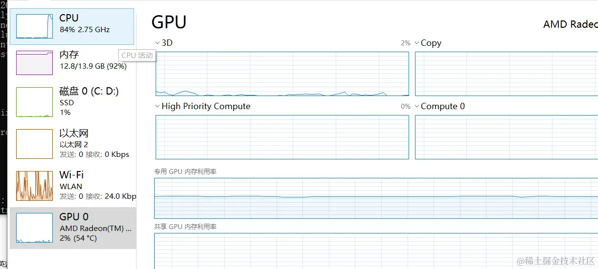
- 使用 AMD 加速编码格式

```bash
ffmpeg -i input.mp4 -c:v h264_amf output.mp4
```

- CPU 和 GPU 利用率查看 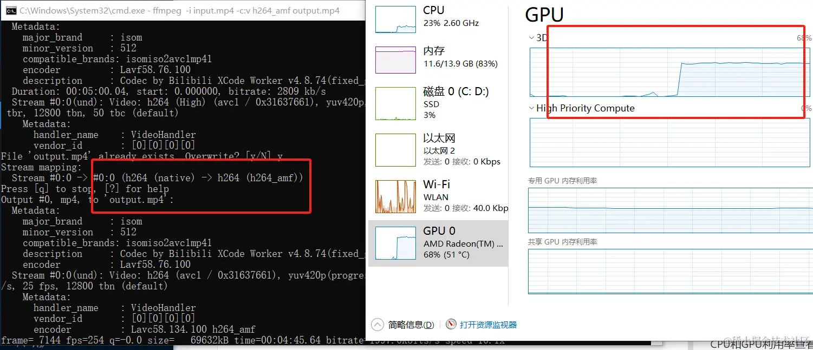

#### 利用 英伟达 GPU

- 首先安装对应的显卡驱动
- 安装 `cuda`，因为`ffmpeg`调用也需要`cuda`计算的`API`
- ffmpeg 版本最好也是最新的

##### 加速编码示例

```bash
ffmpeg  -i input.mp4 -c:v h264_nvenc -b:v 2048k -s 1920x1080 output.mp4
```

- 如果出现以下 API 相关的错误 则要么 cuda 没有安装 要么版本不匹配 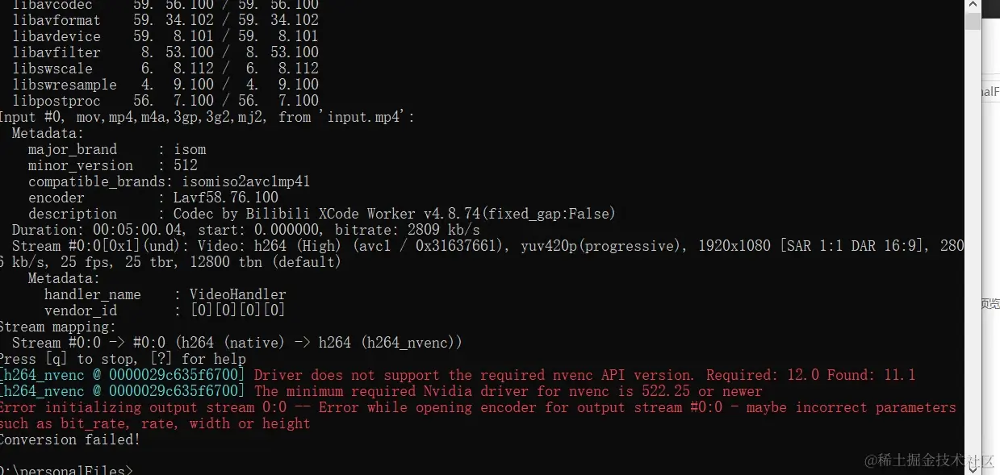
- 其他错误 比如 ffmpeg 版本不对，没法用 cuda 的 API 如下 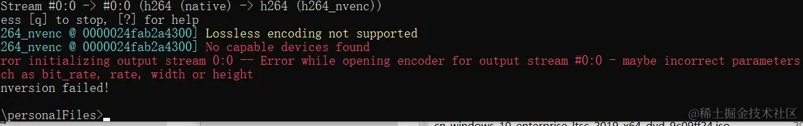

#### 借助 VAAPI 可以加速集成/英特尔 GPU 卡

视频加速 API（VAAPI）在 FFmpeg 中不是秘密，但是很难注意到它如何轻松地帮助您加快 FFmpeg 的速度。

使用 VAAPI 的好处是：

1. 集成的 GPU 卡很便宜（并且您现在已经有一张）
2. 您只需要安装`i965-va-driver`即可使其工作
3. 您不必编译 FFmpeg，因为默认情况下启用此标志

要在 Ubuntu 中使用 VAAPI，首先需要安装驱动程序并使用以下`vainfo`命令检查状态：

```bash
$ sudo apt-get install i965-va-driver
$ vainfo
libva info: VA-API version 1.1.0
libva info: va_getDriverName() returns 0
libva info: Trying to open /usr/lib/x86_64-linux-gnu/dri/i965_drv_video.so
libva info: Found init function __vaDriverInit_1_1
libva info: va_openDriver() returns 0
vainfo: VA-API version: 1.1 (libva 2.1.0)
vainfo: Driver version: Intel i965 driver for Intel(R) Ivybridge Mobile - 2.1.0
vainfo: Supported profile and entrypoints
      VAProfileMPEG2Simple            : VAEntrypointVLD
      VAProfileMPEG2Simple            : VAEntrypointEncSlice
      VAProfileMPEG2Main              : VAEntrypointVLD
      VAProfileMPEG2Main              : VAEntrypointEncSlice
      VAProfileH264ConstrainedBaseline: VAEntrypointVLD
      VAProfileH264ConstrainedBaseline: VAEntrypointEncSlice
      VAProfileH264Main               : VAEntrypointVLD
      VAProfileH264Main               : VAEntrypointEncSlice
      VAProfileH264High               : VAEntrypointVLD
      VAProfileH264High               : VAEntrypointEncSlice
      VAProfileH264StereoHigh         : VAEntrypointVLD
      VAProfileVC1Simple              : VAEntrypointVLD
      VAProfileVC1Main                : VAEntrypointVLD
      VAProfileVC1Advanced            : VAEntrypointVLD
      VAProfileNone                   : VAEntrypointVideoProc
      VAProfileJPEGBaseline           : VAEntrypointVLD
```

如果您看到类似上面的输出，则表明您的 Intel GPU 卡支持 VAAPI，那么您可以使用以下命令进行扩展：

```bash
$ ffmpeg -hwaccel vaapi \
    -hwaccel_device /dev/dri/renderD129 \
    -hwaccel_output_format vaapi \
    -i gravity.mp4 \
    -vf "scale_vaapi=w=1024:h=428" \
    -c:v h264_vaapi \
    -b:v 1M \
    out.mp4
```

大约需要 10 秒（速度= 14.3x），文件大小为 19 MB。

---

将它们放在一起放在图表中，使用 VAAPI 可以比原始文件和几乎较小的文件大小获得近 4 倍的加速。


实际上，如果您花费时间和精力来研究 nVidia GPU 选项，则可以提高速度，但是在没有太多努力和成本的情况下进行加速仍然很棒。

### 使用多线程：指定 CPU 运行的核数

默认情况下，FFmpeg 将会充分利用 CPU 的性能（启动跟 CPU 核数一样多的线程）进行音视频数据的处理。

FFmpeg 支持多线程编码和解码：

1.可以控制 FFmpeg 启动线程的个数，来限制 CPU 的使用率。

2.也可以利用多核 CPU 的并行计算能力来加速视频处理。

可以通过添加 `-threads` 选项来指定线程数，或者使用 `auto` 来让 FFmpeg 自动选择合适的线程数。

```bash
# 使用 4 个线程来转换 input.mp4 为 output.mp4
ffmpeg -i input.mp4 -threads 4 output.mp4

# 使用 ffmpeg 自动选择合适的线程数来转换 input.mp4 为 output.mp4
ffmpeg -i input.mp4 -threads auto output.mp4
```

进行视频的切割成图片，CPU 使用率是 100%

```bash
ffmpeg -i input.mp4 chaifen/%06d.png
```

解决方案：启动一个线程进行视频的切割成图片

```bash
ffmpeg -i input.mp4 -threads 1  chaifen/%06d.png
```

#### 限制 CPU 的使用率

使用 `–threads 2` 可以将 CPU 的使用率控制在 50%左右。

```bash
FFmpeg -i input.mp4 –threads 2 output.mp4
```

-threads 2 以两个线程进行运行， 加快处理的速度。

| 序号 | 开启的线程数 | 占用 CPU 数 | CPU 使用率（%） | 转换时间（min） | 其他                                  |
| ---- | ------------ | ----------- | --------------- | --------------- | ------------------------------------- |
| 1    | 1            | 1           | 25              | 7               |                                       |
| 2    | 2            | 4           | 40-55           | 3               | 2 个 CPU〉50%，1 个=50%，1 个 CPU=40% |
| 3    | 4            | 4           | 60-70           | 3               | 4 个 CPU 比较平均                     |
| 4    | 4            | 4           | 70-80           | 2               | 4 个 CPU 使用平均                     |
| 5    | -            | 4           | 80-85           | 2               | 4 个 CPU 使用较平均                   |

为了达到更快的转换速度，CPU 使用率在可允许范围内，选择-threads 2。

### 使用管道

FFmpeg 可以使用管道来将多个命令连接起来，从而避免中间文件的读写，减少磁盘 IO 的开销。您可以使用 `|` 符号来表示管道，例如：

```bash
ffmpeg -i input.mp4 -f avi - | ffmpeg -i - -f mp3 output.mp3
```

### 使用预设文件`-preset`

FFmpeg 提供了一些预设文件，可以快速应用一组优化的编码参数，从而提高编码速度和质量。

- 使用 `-fpre` 选项来指定预设文件的路径
- 或者使用 `-preset` 选项来选择内置的预设文件，例如：`-preset fast`

查看有关预设的更多详细信息：[Encode/H.264 – FFmpeg](https://trac.ffmpeg.org/wiki/Encode/H.264)

使用预设，您可以轻松地以更大的文件大小来加快 FFmpeg 的速度，这在硬盘上有足够的空间时可以接受。

```bash
$ ffmpeg -i gravity.mp4 \
    -c:v libx264 \
    -preset ultrafast \
    -s 1024x428 \
    -b:v 1M \
    out.mp4
```

大约需要 22 秒（速度= 6 倍），文件大小为 20 MB。（有趣的是，它小于`-preset default`😎）

### 剪辑视频带加速

要使用 ffmpeg 批量剪辑视频，并且将剪辑出的视频加速 1.5 倍。

使用的命令是：

**剪辑**

```bash
ffmpeg.exe -ss 00:48:39.883 -to 01:09:26.143 -i F:\a.mp4 -c copy F:\b.mp4
```

**加速**

```bash
ffmpeg.exe -i F:\b.mp4 -filter_complex "[0:v]setpts=0.6666667*PTS[v];[0:a]atempo=1.5[a]" -map "[v]" -map "[a]" F:\c.mp4
```

在对视频加速时，发现会重新对视频进行编解码，既然这样，那能否将两条命令合并呢？我压根就不需要产生的中间文件 b.mp4，如果一条命令就能搞定岂不是更美。

于是，常识将两条命令合并，成了这样：

```text
ffmpeg.exe -ss 00:48:39.883 -to 01:09:26.143 -i F:\a.mp4 -c copy  -filter_complex "[0:v]setpts=0.6666667*PTS[v];[0:a]atempo=1.5[a]" -map "[v]" -map "[a]" F:\b.mp4
```

执行时给我报了个错：

```text
Streamcopy requested for output stream 0:0, which is fed from a complex filtergraph. Filtering and streamcopy cannot be used together.
```

提示我过滤器和流复制不能同时使用，经过一番研究，终于发现是 `-c copy` 参数的原因，它就是使用了流复制，因为没有编解码，所以剪辑时使用它会非常快。既然这样，那把这个参数去掉应该就 OK 了。

```bash
ffmpeg.exe -ss 00:48:39.883 -to 01:09:26.143 -i F:\a.mp4 -filter_complex "[0:v]setpts=0.6666667*PTS[v];[0:a]atempo=1.5[a]" -map "[v]" -map "[a]" F:\b.mp4
```

但是，这条命令执行有点慢，又经过一番研究，发现它使用 CPU 计算的，并且在任务管理器中也发现了显卡暂用率为 0%，说明显卡压根没用上。

我的显卡是 Nvidia 的.

于是，参考里面的说明，加入了硬件加速的参数之后：

```bash
ffmpeg.exe -hwaccel cuvid -c:v h264_cuvid -ss 00:48:39.883 -to 01:09:26.143 -i F:\a.mp4 -c:v h264_nvenc -filter_complex "[0:v]setpts=0.6666667*PTS[v];[0:a]atempo=1.5[a]" -map "[v]" -map "[a]" -r 25 F:\b.mp4
```

加入之后的效果：

```text
33792kB time=00:06:19.47 bitrate= 729.5kbits/s dup=988 drop=5260 speed=11.6x
```

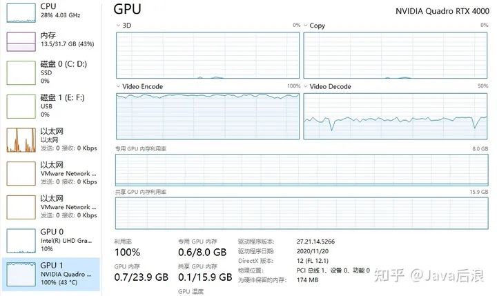

这样就充分发挥了 GPU 的功能了。

别急，还没完！当我把前面的 `-hwaccel cuvid -c:v h264_cuvid` 参数去掉，只保留后面的 `-c:v h264_nvenc` ：

```text
ffmpeg.exe -ss 00:48:39.883 -to 01:09:26.143 -i F:\a.mp4 -c:v h264_nvenc -filter_complex "[0:v]setpts=0.6666667*PTS[v];[0:a]atempo=1.5[a]" -map "[v]" -map "[a]" -r 25 F:\b.mp4
```

发现速度竟然还要快一些，speed 可以达到 13.7x，并且 GPU 也是满负荷工作状态。

```text
frame= 4802 fps=343 q=9.0 Lsize=   17416kB time=00:03:12.36 bitrate= 741.7kbits/s dup=618 drop=2496 speed=13.7x
```

所以，最终我选择了最后这种方法。

## FFmpeg 批处理例子

把视频拖到批处理文件上就自动转换：

### 1.gif 动画转换，可做表情包

```bash
set size=640x360
set start=2
set lenth=10
set rate=15
set filename=%~dpn1
set ext=%~x1
ffmpeg -ss %start% -t %lenth% -i "%filename%%ext%" -r %rate% -s %size%  "%filename%_%size%_%start%_%lenth%.gif"
pause
```

### 2.通用万能视频转换成 mp4

```bash
set time=%time:~0,2%%time:~3,2%%time:~6,2%
set filename=%~dpn1
set ext=%~x1
ffmpeg -i "%filename%%ext%" -y "%filename%_%time%.mp4"
pause
```

### ffmpeg 常用工具小白脚本.bat

```bash
::Last updated on 2019/07/27
@echo off
title ffmpeg常用工具小白脚本

:menu
cls
color 0a
echo ~~~~~~~~~~~~~~~~~~~~~~~~~~~~~~~~~~~~~~~~~~~
echo ~~~~~~~~~~~~~~~~~~~~~~~~~~~~~~~~~~~~~~~~~~~
echo 欢迎使用ffmpeg常用工具小白脚本
echo.
echo 由不靠谱372928制作
echo.
echo.最后更新时间:2019/07/27
echo.
echo 请选择项目：
echo.&echo 【1】进行M3U8下载
echo.&echo 【2】进行M3U8合并
echo.&echo 【3】进行音视频及字幕合并
echo.&echo 【0】查看帮助

echo.
set /p user_input=请输入数字后按Enter:
if %user_input% equ 0 goto Help
if %user_input% equ 1 goto M3U8-Download
if %user_input% equ 2 goto M3U8-Merge
if %user_input% equ 3 goto Merge
echo.
echo 输入错误, 请重新输入数字.
pause
goto menu

:Help
cls
@echo off
echo.
echo.使用帮助
echo.
echo 1.使用前请先安装ffmpeg并配置环境或单独下载ffmpeg.exe并与本脚本置于同一目录下
echo.
echo 2.M3U8下载需要粘贴在线m3u8地址，而不能直接打开本地.m3u8格式的文件,下载完成后是已经合并好的文件
echo.
echo 3.M3U8合并需要本地.m3u8文件和各.ts分段文件，当对key文件或各ts文件进行过移动操作时，要将.m3u8文件以文本格式打开，把文件内容里key和各ts分段文件的路径批量修改为本地路径(要注意将路径中的"\"改为"/")。
echo.
echo.例：
echo.#EXTM3U
echo.#EXT-X-TARGETDURATION:3
echo.#EXT-X-MEDIA-SEQUENCE:13
echo.EXT-X-KEY:METHOD=AES-128,URI="D:/m3u8/index.key"
echo.#EXTINF:12.5
echo.D:/m3u8/001.ts
echo.#EXTINF:12.5
echo.D:/m3u8/002.ts
echo.#EXTINF:12.5
echo.D:/m3u8/003.ts
echo.
echo.例子中的文件已采用AES-128加密，只要有.key文件就能一步完成解密和合并
echo.
echo.4.H264/AVC/H265/VP8/VP9 + AAC/AC3/FLAC/OPUS + srt可以使用MP4合并(只测试了这几种，其他格式可以自己尝试)，VP8/VP9/AV1 + OPUS/Vorbis + WebVTT建议使用WEBM合并，几乎所有音视频字幕格式都可以使用MKV合并
echo.
echo.5.音视频合并选项下已经加入了合并字幕的命令，有字幕且满足第四条中搭配原则的时候可以直接拖拽到命令行窗口合并，没有字幕时，为避免出现运行错误，请在要求拖拽字幕文件的时候拖拽之前的音频文件
echo.
pause
goto menu

:M3U8-Download
cls
@echo off
echo.正在进行M3U8下载
echo.
echo 下载并合并完成的文件将会保存到本目录下的 m3u8.mp4 。
set /p file=请输入M3U8链接(如果已经复制好了可以右键→粘贴)：
title 正在下载中...
ffmpeg -i "%file%" -vcodec copy -bsf:a aac_adtstoasc -f mp4 m3u8.mp4
pause
goto menu

:M3U8-Merge
cls
@echo off
title M3U8合并
echo.正在进行M3U8合并
echo.
set /p m3u8=请将【m3u8】文件拖拽到此处，按下回车确认：
ffmpeg.exe -allowed_extensions ALL -i %m3u8% -c copy muxed.mp4
echo.
echo 合并结束！
echo 文件已经输出到本地的 muxed.mp4 文件。
pause
goto menu

:Merge
cls
@echo off
title 音视频合并
echo.
echo.正在进行音视频合并
echo.
set /p video=请将【视频】文件拖拽到此处，按下回车确认：
echo.
set /p audio=请将【音频】文件拖拽到此处，按下回车确认：
echo.
set /p subtitle=请将【字幕】文件拖拽到此处，按下回车确认(为避免运行错误，无字幕请再次拖拽【音频】文件到此处)：
cls
echo 请选择输出文件格式：
echo.&echo 【1】MP4
echo.&echo 【2】WEBM
echo.&echo 【3】MKV
echo.
set /p user_input=请输入数字后按Enter:
if %user_input% equ 1 goto MP4-Merge
if %user_input% equ 2 goto WEBM-Merge
if %user_input% equ 3 goto MKV-Merge
echo.
echo 输入错误, 请重新输入数字.
pause
goto menu

:MP4-Merge
@echo off
cls
title MP4合并
echo.正在进行MP4合并
echo.
ffmpeg.exe -i %audio% -i %video% -i %subtitle% -c copy -c:s mov_bash -strict experimental muxed.mp4
echo.
echo 合并结束！
echo 文件已经输出到本地的 muxed.mp4 文件。
pause
goto menu

:WEBM-Merge
@echo off
cls
title WEBM合并
echo.正在进行WEBM合并
echo.
ffmpeg.exe -i %audio% -i %video% -i %subtitle% -c copy -strict experimental muxed.webm
echo.
echo 合并结束！
echo 文件已经输出到本地的 muxed.webm 文件。
pause
goto menu

:MKV-Merge
@echo off
cls
title MKV合并
echo.正在进行MKV合并
echo.
ffmpeg.exe -i %audio% -i %video% -i %subtitle% -c copy -strict experimental muxed.mkv
echo.
echo 合并结束！
echo 文件已经输出到本地的 muxed.mkv 文件。
pause
goto menu

::Last updated on 2023-08-27
```

## 视频压制

小丸工具箱视频压制：[视频压缩神器--小丸工具箱--小丸工具箱入门操作教程\_小丸子压缩-CSDN 博客](https://blog.csdn.net/weixin_44529992/article/details/86490078)

[如何用小丸工具大幅度压缩视频且画质损失较小？ - 知乎 (zhihu.com)](https://zhuanlan.zhihu.com/p/85140806)

### 获取音频/视频文件信息

为显示你的媒体文件细节，运行：

```text
$ ffmpeg -i video.mp4
```

样本输出：

```text
ffmpeg version n4.1.3 Copyright (c) 2000-2019 the FFmpeg developers
built with gcc 8.2.1 (GCC) 20181127
configuration: --prefix=/usr --disable-debug --disable-static --disable-stripping --enable-fontconfig --enable-gmp --enable-gnutls --enable-gpl --enable-ladspa --enable-libaom --enable-libass --enable-libbluray --enable-libdrm --enable-libfreetype --enable-libfribidi --enable-libgsm --enable-libiec61883 --enable-libjack --enable-libmodplug --enable-libmp3lame --enable-libopencore_amrnb --enable-libopencore_amrwb --enable-libopenjpeg --enable-libopus --enable-libpulse --enable-libsoxr --enable-libspeex --enable-libssh --enable-libtheora --enable-libv4l2 --enable-libvidstab --enable-libvorbis --enable-libvpx --enable-libwebp --enable-libx264 --enable-libx265 --enable-libxcb --enable-libxml2 --enable-libxvid --enable-nvdec --enable-nvenc --enable-omx --enable-shared --enable-version3
libavutil 56. 22.100 / 56. 22.100
libavcodec 58. 35.100 / 58. 35.100
libavformat 58. 20.100 / 58. 20.100
libavdevice 58. 5.100 / 58. 5.100
libavfilter 7. 40.101 / 7. 40.101
libswscale 5. 3.100 / 5. 3.100
libswresample 3. 3.100 / 3. 3.100
libpostproc 55. 3.100 / 55. 3.100
Input #0, mov,mp4,m4a,3gp,3g2,mj2, from 'video.mp4':
Metadata:
major_brand : isom
minor_version : 512
compatible_brands: isomiso2avc1mp41
encoder : Lavf58.20.100
Duration: 00:00:28.79, start: 0.000000, bitrate: 454 kb/s
Stream #0:0(und): Video: h264 (High) (avc1 / 0x31637661), yuv420p(tv, smpte170m/bt470bg/smpte170m), 1920x1080 [SAR 1:1 DAR 16:9], 318 kb/s, 30 fps, 30 tbr, 15360 tbn, 60 tbc (default)
Metadata:
handler_name : ISO Media file produced by Google Inc. Created on: 04/08/2019.
Stream #0:1(eng): Audio: aac (LC) (mp4a / 0x6134706D), 44100 Hz, stereo, fltp, 128 kb/s (default)
Metadata:
handler_name : ISO Media file produced by Google Inc. Created on: 04/08/2019.
At least one output file must be specified
```

如你在上面的输出中看到的，FFmpeg 显示该媒体文件信息，以及 FFmpeg 细节，例如版本、配置细节、版权标记、构建参数和库选项等等。

如果你不想看 FFmpeg 标语和其它细节，而仅仅想看媒体文件信息，使用 `-hide_banner` 标志，像下面。

```bash
$ ffmpeg -i video.mp4 -hide_banner
```

样本输出：

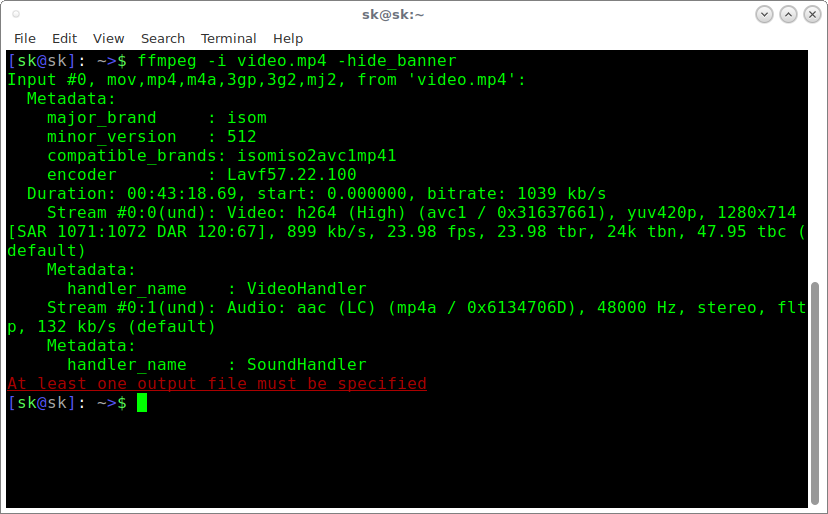

使用 FFmpeg 可以轻松获取视频文件的大小。您可以在终端或命令行中使用以下命令：

```bash
ffmpeg -i [input_video_file] -show_entries format=size -v quiet -of csv="p=0"
```

其中，[input_video_file]是您要获取大小的视频文件名。

该命令将以 csv 格式显示视频文件的大小，以字节为单位。如果您想将文件大小转换为其他单位（如 MB 或 GB），可以在命令行中使用相应的转换器来实现。

值得注意的是，该命令的输出可能包含其他信息，如视频文件的分辨率、长度、编码格式等。如果您只需要获取文件大小，请使用上述命令中的特定参数来过滤输出内容。

其他

```bash
ffmpeg -i rain_2.wav  2>&1 | grep 'Duration' | cut -d ' ' -f 4 | sed s/,//
```

### ffmpeg 视频转码和格式转换有什么不同？

视频转码（Transcoding）和格式转换（Format Conversion）在 FFmpeg 中都是常见的操作，但它们有一些区别：

1. **视频转码**：
   - 转码是指将视频从一种编码格式转换为另一种编码格式的过程。
   - 这通常涉及到解码（Decoding）和重新编码（Re-encoding）的过程。
   - 转码可以改变视频的质量、文件大小和兼容性。
   - 例如，将 H.264 编码的视频转换为 H.265 编码以减小文件大小。
2. **格式转换**：
   - 格式转换是指改变视频文件的容器格式，而不改变视频本身的编码格式。
   - 这通常不涉及到视频内容的重新编码，因此可以更快地完成。
   - 格式转换用于确保视频文件与不同的播放设备或应用程序兼容。
   - 例如，将 MP4 文件转换为 FLV 文件，但保持视频流的编码不变。

在 FFmpeg 中，您可以使用不同的命令和参数来执行这两种操作。例如，使用`-c:v libx264`参数可以指定视频编码器为 libx264，进行转码；而使用`-c copy`参数则可以在格式转换时直接复制视频流，不进行重新编码。

### 视频分辨率转换

在 FFmpeg 中，视频分辨率转换是通过调整视频的宽度和高度来实现的。您可以使用`-vf scale`过滤器来指定新的分辨率。以下是一些基本的命令示例：

- 将视频分辨率更改为 640x360：

  ```bash
  ffmpeg -i input.mp4 -vf scale=640:360 output.mp4
  ```

  这里的`input.mp4`是原始视频文件，`output.mp4`是转换后的视频文件。

- 如果您想保持视频的宽高比，可以将其中一个维度设置为`-1`，FFmpeg 会自动计算正确的值。例如，只设置宽度为 640：

  ```bash
  ffmpeg -i input.mp4 -vf scale=640:-1 output.mp4
  ```

- 要转换为特定的宽高比，如 4:3，您可以使用`setdar`过滤器：

  ```bash
  ffmpeg -i input.mp4 -vf "scale=640:480,setdar=4:3" output.mp4
  ```

请注意，更改分辨率时，视频必须再次进行编码过程，这可能会影响视频的质量和文件大小。

### ffmpeg 视频压缩

在 FFmpeg 中，视频压缩通常涉及到减小视频文件的大小，同时尽量保持视频质量。这可以通过调整不同的参数来实现，例如码率、帧率、分辨率等。以下是一些常用的 FFmpeg 命令来进行视频压缩：

- **改变码率**：降低视频的码率可以减小文件大小，但可能会影响视频质量。

  ```bash
  ffmpeg -i input.mp4 -b:v 1M output.mp4
  ```

  这里`-b:v 1M`设置视频码率为 1Mb/s。

- **改变分辨率**：减小视频的分辨率也可以减小文件大小。

  ```bash
  ffmpeg -i input.mp4 -vf scale=640:360 output.mp4
  ```

  使用`-vf scale`过滤器来设置新的分辨率。

- **改变帧率**：降低帧率可以减少每秒传输的图像数量，从而减小文件大小。

  ```bash
  ffmpeg -i input.mp4 -r 24 output.mp4
  ```

  `-r 24`设置视频帧率为 24fps。

- **使用更高效的编码器**：例如，使用 H.265/HEVC 编码器代替 H.264 可以在相同质量下减小文件大小。

  ```bash
  ffmpeg -i input.mp4 -c:v libx265 -crf 28 output.mp4
  ```

  `-c:v libx265`指定使用 HEVC 编码器，`-crf 28`设置质量级别。

请注意，压缩视频时需要平衡文件大小和视频质量之间的关系。

### ffmpeg 的 crf 是什么意思

在 FFmpeg 中，`crf`代表**恒定速率因子**（Constant Rate Factor），它是一种码率控制模式，用于在不同视频帧之间保持大致恒定的质量。`crf`的取值范围通常是 0 到 51，其中 0 表示无损压缩，数值越大，视频质量越低，但文件大小越小。

对于 x264 编码器，推荐的`crf`取值范围是 18 到 28，而对于 x265 编码器，默认值是 28。

使用`crf`时，FFmpeg 不会试图达到特定的码率，而是根据视频内容的复杂度自动调整码率，以保持稳定的视频质量。

例如，如果您想使用 x264 编码器并设置`crf`为 23 或 23.5，可以使用以下命令：

```bash
ffmpeg -i input.mp4 -c:v libx264 -crf 23 output.mp4
```

这里的`input.mp4`是源视频文件，`output.mp4`是压缩后的输出文件。

### 使用 ffmpeg 对视频进行压缩，使用尽可能多的参数，分别说明参数代表什么

使用 FFmpeg 对视频进行压缩时，可以通过多个参数来控制压缩过程。以下是一些常用的 FFmpeg 参数及其说明：

- `-i`：指定输入文件的路径。
- `-c:v`：选择视频编码器，例如`libx264`或`libx265`。
- `-b:v`：设置视频的码率，例如`500k`表示 500kbps。
- `-s`：设置输出视频的分辨率，例如`1280x720`。
- `-r`：设置视频的帧率，例如`30`表示 30fps。
- `-ar`：设置音频采样率，例如`44100`表示 44.1kHz。
- `-ac`：设置音频通道数，例如`2`表示立体声。
- `-c:a`：选择音频编码器，例如`aac`。
- `-b:a`：设置音频的码率，例如`128k`表示 128kbps。
- `-vf`：应用视频过滤器，例如`scale=1280:720`用于改变分辨率。
- `-crf`：设置恒定速率因子，控制视频质量与文件大小的平衡。
- `-preset`：设置编码预设，影响编码速度与压缩效率。
- `-tune`：优化编码器设置，针对不同类型的视频内容。
- `-profile:v`：设置 H.264 编码器的配置文件，例如`main`、`high`。
- `-level`：设置编码器的级别，例如`4.1`。
- `-pix_fmt`：设置像素格式，例如`yuv420p`。
- `-an`：禁用音频流。
- `-sn`：禁用字幕流。
- `-dn`：禁用数据流。
- `-movflags`：设置 MOV/MP4 容器的特定标志，例如`faststart`。

这些参数可以组合使用，以达到所需的视频压缩效果。例如，以下命令使用了多个参数来压缩视频：

```bash
ffmpeg -i input.mp4 -c:v libx264 -b:v 500k -s 1280x720 -r 30 -c:a aac -b:a 128k -vf "scale=1280:720" -crf 23 -preset medium output.mp4
```

在这个例子中，我们指定了输入文件`input.mp4`，选择了`libx264`作为视频编码器，设置了码率为 500kbps，分辨率为 1280x720，帧率为 30fps，音频编码器为`aac`，音频码率为 128kbps，视频过滤器用于调整分辨率，`crf`值为 23 以平衡质量和大小，使用了`medium`预设以获得中等的编码速度和压缩效率，最后输出文件为`output.mp4`。

请注意，压缩视频时需要考虑到视频质量和文件大小之间的权衡。

[视频文件太大？使用 FFmpeg 来无损压缩它 - 知乎 (zhihu.com)](https://zhuanlan.zhihu.com/p/582654225)

同样还有--bitrate（平均码率）和--qp（固定量化）不过 crf 质量最好速度最快，--bitrate 适合无脑强压，要传 b 站最简单的就是--bitrate 1700 --level 41 --preset 8 后面两个参数啥意思往后看就行，不过不设置多 pass 压制质量不佳，但设置多 pass 也很困难， crf（固定质量）是基于 qp（固定量化）

理论上同一个视频，同样分辨率，其他编码设置相同的情况下，crf+6，码率下降大约一半（实际上+4 下降一半是有过的）30.0 的 crf 在 384p 情况下自己压出过 97kbps 的(720p 这种分辨率尽量不要尝试这个）

--preset 预设参数，懒得设置其他参数可以就加这两个值，推荐 8（very slow）

- 1 ultra fast
- 2 very fast
- 3 faster
- 4 fast
- 5 noromal
- 6 slow
- 7 slower
- 8 very slow （推荐）
- 9 placebo （最慢，但质量只有微量提高）

--bframes （-b）B 帧 这个参数可以调整两个 P 帧之间 B 帧放置的最大数量，可以有效提高压缩率，B 帧不包含完整的画面，仅仅保留一些两帧之间有差别的地方，它需要依靠相领多个帧将这个画面还原，最大数值为 16，追求速度和压缩率的用 6，机子好一些用 8-12，片子吃码率要尽可能压缩的直接 16，个人推荐 6-12 压缩率不错而且速度不是太慢

-b-adapt 编码器插入 B 帧进行决定的算法 1 为快速 2 为最佳，要速度用 1，质量也可以，要画质和压缩率用 2， 一般片子不吃码率就 1 可以了，2 在 B 帧给到 8 以上时拖速度很厉害

--ref （-r） 参考帧数，这个涉及到还原一个 B 帧最多读取相领多少个帧的画面，同样可以提高压缩率，最大 16，推荐将数值和你设定的 B 帧数量保持一致或者不要差太多

--level 编码级别 这个推荐 41，即编码等级为 high 4.1 级，投稿到 b 站最多 4.1 级，再高会二压，这是 B 站不少 up 主自己的 60/50fps 视频码率过关，关掉水印，却被莫名奇妙二压到 30fps 的主要原因，即便是放其他地方的视频也不推荐 50（5.0）及以上，低端手机有可能卡住

这里级别只有这些数值可以用
30 意为 3.0 级
31 意为 3.1 级
32 意为 3.2 级
40 意为 4.0 级
41 意为 4.1 级
42 意为 4.2 级 这个级别往上手机看就容易卡了，尤其是 1080p 分辨率在较老的低端手机上放
50 意为 5.0 级
51 意为 5.1 级
52 意为 5.2 级
再大没有了 5.2 级就极少见了，30（3.0 级）以下有但不推荐了，也没必要那么低了

--profile 编码档次 有 baseline (基础） main（主线） high(高）
默认 high 也是质量最好的，main 和 baseline 不推荐，画质压缩率没有 high 那么好，设置时不用写了

--keyint（-I）最大关键帧间隔与--min-keyint（-i）最小关键帧间隔
关键帧（I 帧）是唯一包含了完整画面的一种帧，但体积比 P 帧 B 帧都有大，所以最少，你看电影拉进度条拉不准总是跳到某一个相领的画面上就是因为关键帧

       这个参数后面跟的数值是间隔的帧数， --keyint 就写 视频帧数x需要间隔多少秒 --min-keyint就直接写视频帧数即可，这几个数值都要整数，如果是29.9、23.976、59.94这种直接四舍五入，个人推荐最大7-10秒一个关键帧，B站二压要求间隔最多10秒，所以把你的帧数 乘9.5，然后取整数就是你要设置的最大关键帧间隔，最小关键帧和你的帧数保持一致即可

--scenecut 这个参数同样涉及关键帧，因为视频经常会切换场景，这时候相领两帧毫无相似度和参考性可言，这个参数专门防止这种情况下缺少关键帧导致画面瞬间全是色块或者马赛克，后面跟的数值是两帧之间相似度小于这个百分比时编码器可以无视--keyint（-I）与--min-keyint（-i）这两个参数直接加一个关键帧，默认 40，追求质量用 60 追求压缩率可以考虑 35 30 个人推荐 40-60

--subme 子像素优化 没啥好解释的，提升质量增加压缩率用，最大 11 推荐 10 和 9，设 11 很拖速度

--me 动态向量预测算法（字面意思） 一般用 umh（速度与质量兼顾）或者 tesa（质量最佳，压缩率最佳，速度最慢）

dia（diamond）最简单最快，同理表现最差，不推荐

hex（hexagon）六边形，它比 dia 模式质量更好且速度几乎没有变慢 追求速度的话推荐

umh（uneven multi-hex）hex 的增强版，质量更佳，自己有时会用这个，且这个模式的运动搜索半径（--merange）可以在 16 以上

esa（exhaustive）速度比 umh 慢但质量和压缩率没啥提升，最不推荐，千万别用

tesa（transformed exhaustive）esa 的加强版，速度没怎么变慢，但质量与压缩率较 esa 模式略有提升，自己最常用的一个

--merange 运动搜索半径（同样不用解释了，字面意思） umh 或更优的算法可以 16 以上，推荐 16-32，自己喜欢用 24-28

--aq-strength 这个值越大压缩率越高，数值越小，物体轮廓越锐利，推荐 0.6-0.9，当然 1.1 1.2 也可以 1.5 以上画面的物体边缘就会看起来像长了毛一样

--qcomp 这个决定码率曲线（分配）如何，设 0.5-0.8 可以了，不用调整，这个最大 1，数值越大码率浮动越厉害（瞬时码率越大）

--rc-lookahead 这个参数推荐设置为你视频帧数的 3-4 倍，最大 250，默认 40，推荐与--qcomp 0.5 0.6 搭配，到底怎样自己慢慢玩，一般自己就这个范围，不写直接默认 40 也可以

--trelli trellis 量化指令是否开启，这个自己也不太知道啥意思，要压缩率用 2，大概可以降 100-200k，要速度直接不写，不写其实也可以了

--no-fast-pskip 同样，要质量压缩率就挂上去，也是拖速度的

--filter（-f） 涉及去块（除马赛克）格式为 数值：数值

        第一个数值为去块范围，第二个为去块强度

       你可以理解为锐化强度，锐化是啥自己搜去

        需要对付1366*768这种分辨率在B站尤其是HTML5播放器、手机端播放时有些区域会糊开的情况用-1：-1
        动画用1：1
        电影可以2：2 或者都是3
        6以上和-1以下就不推荐了

一般自己用-1：-1（1366*768 分辨率） 其他 1280*720 1920\*1080 的都是 1:1 或 0:0

--psy-rd 涉及画面细节 格式和上面的--filter 一样，第一个值为亮处细节，第二个值为暗处细节，上调会增加视频的码率，这个数值在--filter 为负值时不推荐使用，懒得设置就 0：0，其他的你保证能压下来就行 这里推荐 0.3:0，要压缩率也 0：0 真人类的 1:0 这样，这个设置很讲究，还请自行反复尝试

--vf resize:改变分辨率，格式为--vf resize:横向分辨率,纵向分辨率,,,,滤镜名称
这里
滤镜名称推荐写 spline，质量最佳，其他的 1080p 压不下来可以用 1600*900 1440*810 分辨率

--sar 像素宽高比，可以做到 4：3 的分辨率弄出 16:9 的画面比例，有效降低码率又不损失什么画质还可以加快编码速度，设置方法如下

如果你的原片是 1920\*1080 的分辨率，设置如下

--vf resize:1440,1080,,,,spline --sar4：3

如果你的原片是 1280\*720 的分辨率，设置如下

--vf resize:960,720,,,,spline --sar4：3

总之你需要的纵向分辨率原样写，横向分辨率照 4（横向）：3（纵向）算即可，--sar（像素宽高比）写 4：3 即可

额外讲解 GOP（group of pictures） 图像组

之前讲到的 I 帧 B 帧 P 帧一个图像组理论上是这样的

GIF

IBP 帧的顺序在一般情况下是这样排序的

I B B B B P B B B B P B B B B P B B B B I

​ 在没有出现 scenecut 参数额外加关键帧时一个 gop 包含两个 I 帧（就是两个 I 帧之间的那些），gop 长度的范围是在你设定的--keyint（-I）--min-keyint（-i）决定的

​ B 帧 P 帧都不是完整的画面，都需要读取相领的 B 帧 P 帧 I 帧来还原完整的画面，B 帧包含的信息最少，它是需要双向读取相领帧的，P 帧要多一些，它是读取之前的 B 帧 I 帧还原画面的，I 帧可以当成一张 JPEG 图像，完整画面，供 B 帧 P 帧参考以还原完整画面，具体解码和读取顺序如下图
​

当然，目前较为先进的 h265 的编码原理和 h264 类似，只是 h265 在宏块划分上做了优化，更加智能，宏块是啥入门没必要知道，简单讲就是把一帧分成好几小块，总之 h265 的压缩率较 h264 翻了一倍，编码和解码也相对费劲了些

最后分享几组自己写的参数，当然不是所有视频都适合的，也不一定设置都很合理，仅供参考

小丸的 2pass 和 crf 模式默认都是这套（帮助界面里复制过来的）

（省略码率控制参数）--preset 8 -r 6 -b 6 -I infinite -i 1 --scenecut 60 -f 1:1 --qcomp 0.5 --psy-rd 0.3:0 --aq-mode 2 --aq-strength 0.8

如果你 CRF 实在压不下来，那么这组参数就是无脑压的

--bitrate 1700 --level 41 --preset 8 -b 8 -ref 8

专杀 1366\*786 分辨率下 flv 部分区域会有重影的现象 编码速度慢

--crf 23.5 --level 41 --keyint 300 --min-keyint 30 --preset 8 --subme 10 --aq-mode 2 --aq-strength 0.68 --qcomp 0.5 --b-adapt 2 --bframes 10 --ref 10 --scenecut 60 --rc-lookahead 60 --me tesa --merange 24 --direct auto --trelli 2 --deblock -1:-1 --no-fast-pskip

适合像银河铁道之夜这种偏静态的 3D 电影

--crf 26.8 --preset 8 -r 10 -b 10 --scenecut 60 -f 0.8:0.8 --level 41 --trelli 2 --merange 25 --qcomp 0.5 --psy-rd 0.65:0.4 --aq-mode 2 -b-adapt 2 --qcomp 0.7 --subme 11 --aq-strength 0.8 --vf resize:1280,720,,,,spline --no-fast-pskip --direct auto

一个适合 720p60fps 场景效果极为细腻的超高压参数，不过细节缺失较为严重编码速度非常慢

--crf 31 --preset 8 -r 16 -b 16 --scenecut 35 -f 4:4 --level 41 --qcomp 0.7 --aq-mode 2 --qcomp 0.7 --aq-strength 1.25 -I 590 -i 50 --trelli 2 --vf resize:1280,720,,,,spline --me tesa --merange 35 --rc-lookahead 60 --psy-rd 0:0 --no-fast-pskip

        总之设置编码参数更多的是自己反复尝试，这些还是要根据自己的视频来设置，画面极其激烈的视频crf B帧都要比较大，画面不那么激烈的反之。这里笔者预祝各位能够借此告别渣画质，告别二压。

### 2Pass 又是什么意思？

在 FFmpeg 中，2Pass（两遍编码）是一种视频编码技术，用于在转码时更精确地控制输出文件的大小和质量。它分为两个步骤：

1. **第一遍（First Pass）**：在这一遍中，编码器分析视频内容，收集数据如运动、亮度等，但不生成最终的视频文件。它会创建一个日志文件（通常是`ffmpeg2pass-0.log`），其中包含了视频数据的统计信息。
2. **第二遍（Second Pass）**：编码器使用第一遍收集的数据来进行实际的编码。这时，它可以根据场景的复杂度动态调整码率，使得视频文件的整体质量更加均匀。例如，静态场景可以使用较低的码率，而动作场景则使用较高的码率。

使用 2Pass 编码的好处是，它可以在保持视频质量的同时，更有效地压缩视频，减小文件大小。不过，这种方法需要更长的编码时间，因为视频需要被处理两次

[FFmpeg 视频转码技巧之二次编码\_ffmpeg 2pass 模板-CSDN 博客](https://blog.csdn.net/happydeer/article/details/52644812)

[FFmpeg 转码参数中 -pass 具体是做什么用的？ - 知乎 (zhihu.com)](https://www.zhihu.com/question/35690293)

[video - two pass encoding in ffmpeg - Stack Overflow](https://stackoverflow.com/questions/31858171/two-pass-encoding-in-ffmpeg)

[x264 里的 2pass 指的是什么意思? x264 源代码分析 2.encode()\_视频 1pass 2pass 和 preset 的关系-CSDN 博客](https://blog.csdn.net/china_video_expert/article/details/5936391)

[FFmpeg 3-pass 视频编码 - 知乎 (zhihu.com)](https://zhuanlan.zhihu.com/p/604809852)

### 这些参数：--crf 24 --preset 8 -r 6 -b 6 -i 1 --scenecut 60 -f 1:1 --qcomp 0.5 --psy-rd 0.3:0 --aq-mode 2 --aq-strength 0.8 --vf resize:960,540,,,,lanczos 分别是什么意思

这些参数是 FFmpeg 命令行中用于视频编码和压缩的高级选项，每个参数都有特定的作用：

- `--crf 24`：设置恒定速率因子为 24，这是一个质量控制参数，数值越低，输出视频质量越高。
- `--preset 8`：设置编码预设为 8，这可能是一个错误，因为预设通常是用名称指定的，如`ultrafast`、`medium`、`slow`等。
- `-r 6`：设置帧率为每秒 6 帧。
- `-b 6`：这可能是指定码率的参数，但通常需要一个单位，如`6k`表示 6 千比特每秒。
- `-i 1`：这个参数在 FFmpeg 中不是标准的，可能是自定义的或者是错误的。
- `--scenecut 60`：设置场景切换阈值为 60，这与编码器决定何时插入关键帧有关。
- `-f 1:1`：这可能是指定像素宽高比为 1:1，但通常使用`-aspect`参数来设置宽高比。
- `--qcomp 0.5`：设置量化压缩因子为 0.5，这影响帧内量化参数的变化。
- `--psy-rd 0.3:0`：设置心理视觉优化的强度，`0.3`是心理视觉的强度，`0`是心理视觉的细节复杂度。
- `--aq-mode 2`：设置自适应量化模式为 2，这会影响编码器如何分配比特率以改善视觉质量。
- `--aq-strength 0.8`：设置自适应量化强度为 0.8，这会调整自适应量化的影响程度。
- `--vf resize:960,540,,,,lanczos`：使用视频过滤器调整视频大小为 960x540，使用`lanczos`滤波器进行缩放。

请注意，一些参数可能是特定编码器的自定义选项，或者在不同版本的 FFmpeg 中有所不同。建议查阅最新的 FFmpeg 文档或使用`ffmpeg -h`命令获取更详细的帮助信息。

### ffmpeg 的分离器是什么，参数怎么设置？

在 FFmpeg 中，分离器（Demuxer）是用于从多媒体文件中提取出视频、音频和其他数据流的组件。您可以使用 FFmpeg 的分离器功能来分离视频和音频流，或者将一个复合流分解成单独的流。以下是一些基本的命令来使用 FFmpeg 的分离器：

- **分离视频流**：

  ```bash
  ffmpeg -i input_file -vcodec copy -an output_file_video
  ```

  这个命令会从`input_file`中分离出视频流，并将其保存到`output_file_video`中，`-an`参数表示不包含音频。

- **分离音频流**：

  ```bash
  ffmpeg -i input_file -acodec copy -vn output_file_audio
  ```

  这个命令会从`input_file`中分离出音频流，并将其保存到`output_file_audio`中，`-vn`参数表示不包含视频。

- **视频解复用**：

  ```bash
  ffmpeg -i input_file -vcodec copy -an -f m4v output_file_video
  ```

  这个命令会将视频流解复用为`m4v`格式，并保存到`output_file_video`中。

请确保替换`input_file`、`output_file_video`和`output_file_audio`为您实际的文件名。

### y4m、ffms、avs 等等这些分离器呢？

在 FFmpeg 中，`y4m`、`ffms`和`avs`都是不同类型的分离器，它们用于处理特定格式的多媒体文件。以下是它们的一些基本信息：

- `y4m`：这是一个用于处理 YUV4MPEG2（Y4M）文件的分离器。Y4M 是一种视频文件格式，包含未压缩的 YUV 视频数据。使用 Y4M 分离器可以直接读取这种格式的文件。
- `ffms`：FFmpegSource（FFMS）是一个用于读取多种视频文件格式并将其解码为原始帧的库。它可以作为 FFmpeg 的一个分离器使用，支持许多不同的编码格式。
- `avs`：AviSynth 脚本（AVS）分离器用于处理 AviSynth 脚本文件。AviSynth 是一个强大的视频后期处理工具，可以通过脚本来编辑和处理视频。

在使用这些分离器时，通常不需要设置特别的参数，因为 FFmpeg 会根据文件扩展名自动选择合适的分离器。例如，如果输入文件有`.y4m`、`.ffms`或`.avs`的后缀名，则 FFmpeg 会使用相应的分离器来读取文件

### 列举出 ffmpeg 的分离器

的多媒体文件。以下是一些常见的 FFmpeg 分离器：

- `aac`：用于处理 AAC 音频文件。
- `ac3`：用于处理 AC3 音频文件。
- `avi`：用于处理 AVI 视频文件。
- `flv`：用于处理 FLV 视频文件。
- `h264`：用于处理 H.264 视频文件。
- `matroska`：用于处理 Matroska 容器格式，包括 MKV 视频文件。
- `mov`：用于处理 QuickTime MOV 视频文件。
- `mp3`：用于处理 MP3 音频文件。
- `mpegts`：用于处理 MPEG-TS（传输流）视频文件。
- `ogg`：用于处理 Ogg 容器格式，包括 Vorbis 和 Theora。
- `wav`：用于处理 WAV 音频文件。

这只是 FFmpeg 支持的分离器的一小部分。FFmpeg 能够处理的格式非常广泛，具体的分离器列表可以通过 FFmpeg 的帮助命令查看，例如使用`ffmpeg -formats`命令来获取支持的格式和分离器列表。

在 FFmpeg 中，`ffms`、`lavf`和`y4m`都是分离器（Demuxer）的类型，它们用于从多媒体文件中提取视频、音频和其他数据流。除了这些，还有许多其他类型的分离器，例如：

- `aac`：用于处理 AAC 音频文件的分离器。
- `h264`：用于处理 H.264 视频文件的分离器。
- `matroska`：用于处理 Matroska 容器格式（如 MKV）的分离器。
- `mp3`：用于处理 MP3 音频文件的分离器。
- `mpegts`：用于处理 MPEG-TS（传输流）视频文件的分离器。
- `ogg`：用于处理 Ogg 容器格式的分离器。

这些只是 FFmpeg 支持的分离器类型的一部分。FFmpeg 能够处理的格式非常广泛，具体的分离器列表可以通过 FFmpeg 的帮助命令查看，例如使用`ffmpeg -formats`命令来获取支持的格式和分离器列表。

[FFMPEG 合并视频文件（无损） - 掘金 (juejin.cn)](https://juejin.cn/post/7034349606704152589)

### ffmpeg-比特率，帧率和文件大小

比特率和帧率是音视频基本的特性，对于音视频整体的质量有关键作用！如果知道比特率和持续时间，就可以计算输出文件的大小。

#### 1.Frame(frequency)rate introduction

帧率就是每秒编码进视频文件的帧数目。人类的眼睛需要每秒至少 15 帧才能将图像连贯在一起。帧率的单位是 HZ，LCD 显示一般有 60Hz 的平率。

有 2 种类型的帧率-interlaced(denoted asi after FPS number) and progressive(denoted asp after FPS number)//逐行扫描和隔行扫描

逐行扫描(interlaced)的帧率一般用在电视：

- -NTSC 用 60i fps，意思是：60 interlaced fields(30 frames)per second
- -PAL and SECAM 标准用 50i fps，等于 25 帧每秒。

隔行扫描(progressive)帧率是 24p，25p 和 30p，用在电影工业上。现在较新的帧率是 50p/60p 用在高档的 HDTV 产品上。

#### 2.帧率设置

使用-r 选项

语法是：

```bash
ffmpeg -i input -r fps output
```

例如：

```bash
ffmpeg -i input.avi -r 30 output.mp4
```

使用 fps filter

另一个设置帧率是用 fps filter，特别是在 filterchains 使用时非常有用

例如：修改输入文件的帧率到 25

```bash
ffmpeg -v clip.mpg -vf fps=fps=25 clip.webm
```

对帧率预定义值

例如：设置帧率 29.97fps

```bash

```

#### 3.比特率设置

比特率也是一个决定音视频总体质量的参数。他决定每个时间单位处理的 bit 数。

设置比特率：

比特率决定处理 1s 的编码流需要多少 bits，设置用-b 选项。区分音视频用-b:a 和-b:v

例如：设置整体 1.5Mbit 每秒

```bash
ffmpeg -i file.avi -b 1.5M file.mp4

ffmpeg -i input.avi -b:v 1500K output.mp4
```

CBR 设置：

CBR 设置一般用作直播流，比如视频会议。为输出设置 CBR,有三个参数必须设置为同一个值。

bitrate(-b option), minimal rate(-minrate), maximal rate(-maxrate)。

maximal rate 需要设置-bufsize 选项。例如设置 CBR 为 0.5Mbit/s。

```bash
ffmpeg -i in.avi -b 0.5M -minrate 0.5M -maxrate 0.5M -bufsize 1M output.mkv
```

设置输出文件的最大 size。

用-fs 选项。

例如设置输出文件的最大的 size 为 10M

```bash
ffmpeg -i input.avi -fs 10MB output.mp4
```

文件大小计算：

文件的大小是是音视频流大小的和。

视频流的大小的方程式是(除以 8 是由 bits 到 bytes 的转换):

video_size = video_bitrate \* time_in_seconds / 8;

如果音频是解压缩的，计算公式是：

audio*size = smpaling_rate * bit*depth * channels \* time_in_second / 8;

例如：计算 10 分钟的视频， 1500kbits/s 视频比特率和 128kbits/s 的音频比特率，用下面的计算方法：

- file_size = video_size + audio_size;
- file_size = (video_bitrate + audio_bitrate) \* time_in_seconds / 8;
- file_size = (1500 kbits/s + 128kbits/s) \* 600s
- file_size = 1628kbits/s \* 600s
- file_size = 976800kb = 976800000 b / 8 = 122100000 B / 1024 = 119238.28125KB
- file_size = 119238.28125 KB / 1024 = 116.443634033203125MB = 116.44M

### 其他命令

[给新手的 20 多个 FFmpeg 命令示例 - 知乎 (zhihu.com)](https://zhuanlan.zhihu.com/p/67878761)

## X264 文档

[X264 设定 - NMM Doc (nmm-hd.org)](https://www.nmm-hd.org/doc/X264設定#demuxer)

[FFmpeg X264 编码参数 - 知乎 (zhihu.com)](https://zhuanlan.zhihu.com/p/485519347)
