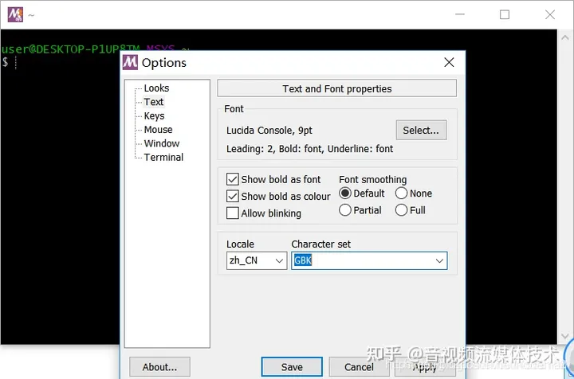

# 根据需求编译 FFmpeg

## 说明

[FFmpeg 开发(01)：FFmpeg 编译和集成 - 知乎 (zhihu.com)](https://zhuanlan.zhihu.com/p/218214439)

FFmpeg 是一个完整的跨平台解决方案，用于录制、转换和流式传输音频和视频。它包含了一系列的命令行工具和库，可以对各种格式的音视频数据进行编码、解码、滤镜处理、复用、分离等操作

FFmpeg 是一个强大的开源音视频处理软件，它可以实现多种音视频的编码、解码、转换、录制、流式传输等功能。FFmpeg 由多个库和工具组成，每个库和工具都有自己的功能和用途。有时候，我们可能只需要使用 FFmpeg 的某些功能，而不需要整个 FFmpeg 项目。这时候，我们就可以单独编译 FFmpeg 的一些功能，以减少编译时间和生成文件的体积。

单独编译 FFmpeg 的功能，需要以下几个步骤：

- 下载并解压 FFmpeg 源代码包，或者从 GitHub 上克隆 FFmpeg 项目。
- 根据自己的开发环境和需求，选择合适的编译器和选项，以及需要使用的库和工具。
- 使用 configure 脚本来配置编译选项，指定需要启用或禁用的功能。
- 使用 make 命令来执行编译过程，生成目标文件或库文件。
- 将生成的文件或库文件集成到自己的项目中，或者安装到系统中。

如果您想要单独打包 FFmpeg 的一些功能，用来开发，减少开发体积，您可以参考以下几个方面：

- 您可以根据您的项目需求，选择需要使用的 FFmpeg 库和工具。FFmpeg 主要由以下几个库和工具组成：

  - libavutil：一个通用的实用函数库，包含了一些数学、字符串、时间等操作。
  - libavcodec：一个音视频编解码器库，包含了多种音视频编解码器和格式,例如 H.264、HEVC、VP9、AAC、MP3 等。它可以对音视频数据进行压缩或解压缩，以便于存储或传输]。
  - libavformat：一个音视频格式库，包含了多种音视频容器和协议，例如 MP4、MKV、FLV、RTMP、HLS 等。它可以对音视频数据进行复用或分离，以便于组织或处理。
  - libavdevice：一个设备访问库，包含了多种设备输入和输出的接口。
  - libavfilter：一个滤镜处理库，包含了多种音视频滤镜和效果，例如裁剪、旋转、水印、字幕、去噪等。它可以对音视频数据进行美化或增强。
  - libswscale：一个图像缩放和颜色空间转换库，包含了多种图像处理算法。
  - libswresample：一个音频重采样和混合库，包含了多种音频处理算法。
  - ffmpeg：一个命令行工具，可以对音视频数据进行转换、录制、流式传输等操作，它支持多种输入和输出参数，可以实现复杂的音视频处理任务。
  - ffplay：一个命令行工具，可以播放各种格式的音视频文件，它可以利用上述的库来播放各种格式的音视频文件。它支持多种控制和显示选项，可以实现简单的音视频播放功能。
  - ffprobe：一个命令行工具，可以显示音视频文件的元数据信息，它支持多种输出格式和选项，可以实现详细的音视频分析功能。

- 您可以根据您的开发环境，选择合适的编译器和选项。FFmpeg 支持多种平台和编译器，例如 Windows、Linux、Mac OS X 等。您可以使用 configure 脚本来配置您的编译选项

  例如：

  - 如果您想要生成动态链接库（DLL），您可以使用–enable-shared 选项。
  - 如果您想要生成静态链接库（LIB），您可以使用–enable-static 选项。
  - 如果您想要减少 FFmpeg 的体积，您可以使用–disable-encoders --disable-decoders --disable-muxers --disable-demuxers 等选项来禁用一些不需要的功能。

- 您可以根据您的项目目标，选择合适的许可证和版权。FFmpeg 是一个开源项目，它遵循 LGPL 或 GPL 许可证

  如果您想要在您的项目中使用 FFmpeg，您需要遵守相应的许可证要求。例如：

  - 如果您只是使用 FFmpeg 提供的动态链接库（DLL），并且不修改它们的源代码，那么您可以使用 LGPL 许可证，并且在您的项目中声明使用了 FFmpeg，并提供相应的源代码链接。
  - 如果您修改了 FFmpeg 提供的动态链接库（DLL）或者静态链接库（LIB）的源代码，并且在您的项目中使用它们，那么您需要使用 GPL 许可证，并且在您的项目中公开修改后的源代码，并遵守其他 GPL 许可证要求。

以上只是一些单独打包 FFmpeg 功能的基本步骤和建议。

fmpeg 是一个 c 库，要用你的编译 so 自己去编译，你可以按需加载。使用 shell 脚本，cmake 语法， linux 主机

**如果想了解更多关于 FFmpeg 相关的内容，您可以参考以下一些网页**：

- [FFmpeg Documentation](https://trac.ffmpeg.org/wiki/CompilationGuide/vcpkg)：这个网页提供了 FFmpeg 的详细文档，包括使用指南、示例、API 参考等。
- [FFmpeg - ArchWiki](https://www.npmjs.com/package/@ffmpeg/ffmpeg)：这个网页介绍了如何在 Arch Linux 系统上安装和使用 FFmpeg，以及一些常见的问题和解决方法。
- [Building FFMPEG for Visual Studio development - Stack Overflow](https://video.stackexchange.com/questions/20495/how-do-i-set-up-and-use-ffmpeg-in-windows)：这个网页介绍了如何在 Visual Studio 开发环境中使用 FFmpeg，以及一些注意事项和技巧。

**关于 FFmpeg 功能单独编译的教程，您可以参考一下**：

- [FFmpeg 开发(01)：FFmpeg 编译和集成 - 知乎](https://zhuanlan.zhihu.com/p/218214439)：这篇文章介绍了如何在 Linux 系统上使用 CMake 来配置和编译 FFmpeg 项目，并且给出了一个 Android 平台上使用 FFmpeg 静态库的示例。
- [FFmpeg 视频处理入门教程 - 阮一峰的网络日志](https://ruanyifeng.com/blog/2020/01/ffmpeg.html)：这篇文章介绍了 FFmpeg 的基本概念和常用命令行参数，并且给出了一些常见用法的示例。
- [FFMPEG 命令入门到提高，一篇文章就够了 - 知乎](https://zhuanlan.zhihu.com/p/117523405)：这篇文章介绍了 FFMPEG 命令行工具的使用方法和技巧，并且给出了一些高级用法的示例。
- [ffmpeg\_百度百科](https://baike.baidu.com/item/ffmpeg/2665727)：这个网页介绍了 ffmpeg 的基本信息和历史发展，以及一些相关资源和链接。

## 编译步骤

1.到 ffmpeg 官方下载已经编译好的 Windows shared 库；

2.将执行文件 `ffmpeg.exe、ffplay.exe、ffprobe.exe` 拷贝到 C:\Windows 目录;

3.将相应的动态库拷贝到 C:\Windows\SysWOW64 目录；注：WOW64 (Windows-on-Windows 64-bit)

4.在命令行窗口输入 ffmpeg -version 查看版本，以却确定环境是否搭建成功。

## linux 环境下进行编译

### 1 ffmpeg 编译环境准备

这里以 ubuntu 系统为例进行讲述，其他 linux 发行版原理类似。 在 linux 系统上编译需要安装 gcc make 等组件，可以用下命令进行安装

```bash
sudo apt-get install build-essential
```

输入 gcc -v 命令即可查询当前的 gcc 版本号

```bash
gcc -v
```

### 2 ffmpeg 依赖库准备

ffmpeg 源码编译主要依赖 x264、yasm 这两个组件，在搜索引擎中可以非常容易到找到它们的源码包，通过源码包编译安装的方式还可用于嵌入式环境

x264: x264 is a free software library and application for encoding video streams into the H.264/MPEG-4 AVC compression format, and is released under the terms of the GNU GPL.

Yasm: Yasm is a complete rewrite of the NASM assembler under the “new” BSD License,Yasm currently supports the x86 and AMD64 instruction sets, accepts NASM and GAS assembler syntaxes, outputs binary, ELF32, ELF64, 32 and 64-bit Mach-O, RDOFF2, COFF, Win32, and Win64 object formats, and generates source debugging information in STABS, DWARF 2, and CodeView 8 formats.

下面给出源码包的链接地址

[Download FFmpeg](https://ffmpeg.org/download.html#get-sources)

[Index of /pub/videolan/x264/snapshots/](http://download.videolan.org/pub/videolan/x264/snapshots/)

[Download - The Yasm Modular Assembler Project (tortall.net)](http://yasm.tortall.net/Download.html)

这里实测过的源码版本分别是

```bash
x264-0.148 (x264 snapshot-20050825-2245)
yasm-1.3.0
ffmpeg-6.0
```

其中，x264 提供对 h.264 编码器的支持，yasm 用于对汇编优化的支持，若不需要汇编优化的支持，可在编译选项中关闭 yasm 即可(–disable-yasm)

在 Linux 下可采用以下方式配置编译选项：

#### 2.1 yasm configure 配置

```bash
./configure --prefix=/usr/local/3rdparty/yasm
```

#### 2.2 x264 configure 配置

```bash
./configure --prefix=/usr/local/3rdparty/x264 --enable-shared --enable-static --enable-yasm
```

生成 Makefile 文件后，输入 make 命令即可开始编译过程，编译完成后，执行 make install 命令进行安装

```bash
make
sudo make install
```

x264、yasm 编译完成后，还需要让系统能够找到对应的安装位置。打开/etc/profile 配置文件，在该文件底部添加各组件的环境变量

```bash
# YASM
export PATH="$PATH:/usr/local/3rdparty/yasm/bin/"
export LD_LIBRARY_PATH=/usr/local/3rdparty/yasm/lib:$LD_LIBRARY_PATH

# X264
export PATH="$PATH:/usr/local/3rdparty/x264/bin/"
export LD_LIBRARY_PATH=/usr/local/3rdparty/x264/lib:$LD_LIBRARY_PATH
export PKG_CONFIG_PATH=/usr/local/3rdparty/x264/lib/pkgconfig:$PKG_CONFIG_PATH
```

使用 source /etc/profile 命令刷新环境变量

```bash
source /etc/profile
```

环境变量配置完成后，可以通过下面的命令确认 x264 等依赖组件是否编译安装成功

```bash
x264 --version
x264 0.148.x
built on May 22 2019, gcc: 5.4.0 20160609
x264 configuration: --bit-depth=8 --chroma-format=all
libx264 configuration: --bit-depth=8 --chroma-format=all
x264 license: GPL version 2 or later

yasm --version
yasm 1.3.0
Compiled on May  6 2015.
Copyright (c) 2001-2014 Peter Johnson and other Yasm developers.
Run yasm --license for licensing overview and summary.
```

### 3 ffmpeg 源码编译

在 Linux 下可采用以下方式配置编译选项：

#### 3.1 ffmpeg configure 配置

```bash
./configure --prefix=/usr/local/3rdparty/ffmpeg --enable-shared --enable-yasm --enable-libx264 --enable-gpl --enable-pthreads --extra-cflags=-I/usr/local/3rdparty/x264/include --extra-ldflags=-L/usr/local/3rdparty/x264/lib
```

生成 Makefile 文件后，输入 make 命令即可开始编译过程，编译完成后，执行 make install 命令进行安装

```bash
make
sudo make install
```

编译完成后，在源码目录生成 ffmpeg、ffserver、ffprobe 等命令行工具，其中

- ffmpeg - 命令行工具支持视频编解码、视频转码、视频格式转换、视频推流等功能
- ffserver - 命令行工具与 ffmpeg 配合，负责响应客户端的流媒体请求，把流媒体数据发送给客户端
- ffprobe - 命令行工具用来查看多媒体文件的描述信息

### 4 ffmpeg 环境变量配置

在 ffmpeg 及其依赖环境编译完成后，还需要让系统能够找到对应的安装位置。打开/etc/profile 配置文件，在该文件底部添加各组件的环境变量

```bash
# FFMPEG
export PATH="$PATH:/usr/local/3rdparty/ffmpeg/bin/"
export LD_LIBRARY_PATH=/usr/local/3rdparty/ffmpeg/lib:$LD_LIBRARY_PATH
export PKG_CONFIG_PATH=/usr/local/3rdparty/ffmpeg/lib/pkgconfig:$PKG_CONFIG_PATH
```

使用 source /etc/profile 命令刷新环境变量

```bash
source /etc/profile
```

使用 ffmpeg -version 命令打印版本号，这里采用的 ffmpeg 是 3.2.4 版本

```bash
ffmpeg -version
ffmpeg version 3.2.4 Copyright (c) 2000-2017 the FFmpeg developers
built with gcc 5.4.0 (Ubuntu 5.4.0-6ubuntu1~16.04.12) 20160609
configuration: --prefix=/usr/local/3rdparty/ffmpeg --enable-shared --enable-yasm --enable-libx264 --enable-gpl --enable-pthreads --extra-cflags=-I/usr/local/3rdparty/x264/include --extra-ldflags=-L/usr/local/3rdparty/x264/lib
libavutil      55. 34.101 / 55. 34.101
libavcodec     57. 64.101 / 57. 64.101
libavformat    57. 56.101 / 57. 56.101
libavdevice    57.  1.100 / 57.  1.100
libavfilter     6. 65.100 /  6. 65.100
libswscale      4.  2.100 /  4.  2.100
libswresample   2.  3.100 /  2.  3.100
libpostproc    54.  1.100 / 54.  1.100
```

**在 ffmpeg 源码路径下**，可以通过 ldd 命令查询 ffmpeg 依赖的所有组件，若其中的某些组件无法找到，则需要对照本文查询是否有依赖的组件未配置环境变量。类似的，也可通过 ldd 命令在对应的路径下查询 x264 等组件的依赖项。

```bash
ldd ffmpeg
    linux-vdso.so.1 =>  (0x00007ffc24f84000)
    libavdevice.so.57 => /usr/local/3rdparty/ffmpeg/lib/libavdevice.so.57 (0x00007fc17da42000)
    libavfilter.so.6 => /usr/local/3rdparty/ffmpeg/lib/libavfilter.so.6 (0x00007fc17d613000)
    libavformat.so.57 => /usr/local/3rdparty/ffmpeg/lib/libavformat.so.57 (0x00007fc17d1f3000)
    libavcodec.so.57 => /usr/local/3rdparty/ffmpeg/lib/libavcodec.so.57 (0x00007fc17bcbf000)
    libpostproc.so.54 => /usr/local/3rdparty/ffmpeg/lib/libpostproc.so.54 (0x00007fc17baa3000)
    libswresample.so.2 => /usr/local/3rdparty/ffmpeg/lib/libswresample.so.2 (0x00007fc17b887000)
    libswscale.so.4 => /usr/local/3rdparty/ffmpeg/lib/libswscale.so.4 (0x00007fc17b5ff000)
    libavutil.so.55 => /usr/local/3rdparty/ffmpeg/lib/libavutil.so.55 (0x00007fc17b385000)
    libm.so.6 => /lib/x86_64-linux-gnu/libm.so.6 (0x00007fc17b07c000)
    libpthread.so.0 => /lib/x86_64-linux-gnu/libpthread.so.0 (0x00007fc17ae5f000)
    libc.so.6 => /lib/x86_64-linux-gnu/libc.so.6 (0x00007fc17aa95000)
    libXv.so.1 => /usr/lib/x86_64-linux-gnu/libXv.so.1 (0x00007fc17a890000)
    libX11.so.6 => /usr/lib/x86_64-linux-gnu/libX11.so.6 (0x00007fc17a556000)
    libXext.so.6 => /usr/lib/x86_64-linux-gnu/libXext.so.6 (0x00007fc17a344000)
    libxcb.so.1 => /usr/lib/x86_64-linux-gnu/libxcb.so.1 (0x00007fc17a122000)
    libxcb-shm.so.0 => /usr/lib/x86_64-linux-gnu/libxcb-shm.so.0 (0x00007fc179f1e000)
    libxcb-xfixes.so.0 => /usr/lib/x86_64-linux-gnu/libxcb-xfixes.so.0 (0x00007fc179d16000)
    libxcb-shape.so.0 => /usr/lib/x86_64-linux-gnu/libxcb-shape.so.0 (0x00007fc179b12000)
    libasound.so.2 => /usr/lib/x86_64-linux-gnu/libasound.so.2 (0x00007fc179812000)
    libSDL2-2.0.so.0 => /usr/local/3rdparty/sdl2/lib/libSDL2-2.0.so.0 (0x00007fc1794df000)
    libz.so.1 => /lib/x86_64-linux-gnu/libz.so.1 (0x00007fc1792c5000)
    libdl.so.2 => /lib/x86_64-linux-gnu/libdl.so.2 (0x00007fc1790c1000)
    libx264.so.148 => /usr/local/3rdparty/x264/lib/libx264.so.148 (0x00007fc178d1b000)
    liblzma.so.5 => /lib/x86_64-linux-gnu/liblzma.so.5 (0x00007fc178af9000)
    /lib64/ld-linux-x86-64.so.2 (0x00007fc17dc5a000)
    libXau.so.6 => /usr/lib/x86_64-linux-gnu/libXau.so.6 (0x00007fc1788f5000)
    libXdmcp.so.6 => /usr/lib/x86_64-linux-gnu/libXdmcp.so.6 (0x00007fc1786ef000)
    librt.so.1 => /lib/x86_64-linux-gnu/librt.so.1 (0x00007fc1784e7000)
```

### 二.编译安卓环境使用的 FFmpeg

编译环境:

- CentOS Linux release 7.6.1810 (Core)
- android-ndk-r20b-linux-x86_64
- ffmpeg-6.0

编译前准备：

```bash
//1. 下载 ffmpeg-4.2.2
wget https://ffmpeg.org/releases/ffmpeg-6.0.tar.bz2
//2. 解压 FFmpeg
tar -jxvf ffmpeg-6.0.tar.bz2
//3. 配置项目
./configure --disable-x86asm
```

在 FFmpeg 6.0 解压目录下创建编译脚本 `build_android_arm64-v8a_clang.sh`：

```bash
#!/bin/bash

export NDK=/root/workspace/android-ndk-r20b # 这里配置先你的 NDK 路径
TOOLCHAIN=$NDK/toolchains/llvm/prebuilt/linux-x86_64


function build_android
{

./configure \
--prefix=$PREFIX \
--enable-neon  \
--enable-hwaccels  \
--enable-gpl   \
--disable-postproc \
--disable-debug \
--enable-small \
--enable-jni \
--enable-mediacodec \
--enable-decoder=h264_mediacodec \
--enable-static \
--enable-shared \
--disable-doc \
--enable-ffmpeg \
--disable-ffplay \
--disable-ffprobe \
--disable-avdevice \
--disable-doc \
--disable-symver \
--cross-prefix=$CROSS_PREFIX \
--target-os=android \
--arch=$ARCH \
--cpu=$CPU \
--cc=$CC \
--cxx=$CXX \
--enable-cross-compile \
--sysroot=$SYSROOT \
--extra-cflags="-Os -fpic $OPTIMIZE_CFLAGS" \
--extra-ldflags="$ADDI_LDFLAGS"

make clean
make -j16
make install

echo "============================ build android arm64-v8a success =========================="

}

#arm64-v8a
ARCH=arm64
CPU=armv8-a
API=21
CC=$TOOLCHAIN/bin/aarch64-linux-android$API-clang
CXX=$TOOLCHAIN/bin/aarch64-linux-android$API-clang++
SYSROOT=$NDK/toolchains/llvm/prebuilt/linux-x86_64/sysroot
CROSS_PREFIX=$TOOLCHAIN/bin/aarch64-linux-android-
PREFIX=$(pwd)/android/$CPU
OPTIMIZE_CFLAGS="-march=$CPU"

build_android
```

编译 FFmpeg Android 平台的 64 位动态库和静态库：

```bash
# 修改 build_android_arm64-v8a_clang.sh 可执行权限
chmod +x build_android_arm64-v8a_clang.sh
# 运行编译脚本
./build_android_arm64-v8a_clang.sh
```

编译成功后会在 android 目录下生成对应六个模块的静态库和动态库。

另外，若要编译成 32 位的库，则需修改对应的编译脚本：

```bash
#armv7-a
ARCH=arm
CPU=armv7-a
API=21
CC=$TOOLCHAIN/bin/armv7a-linux-androideabi$API-clang
CXX=$TOOLCHAIN/bin/armv7a-linux-androideabi$API-clang++
SYSROOT=$NDK/toolchains/llvm/prebuilt/linux-x86_64/sysroot
CROSS_PREFIX=$TOOLCHAIN/bin/arm-linux-androideabi-
PREFIX=$(pwd)/android/$CPU
OPTIMIZE_CFLAGS="-mfloat-abi=softfp -mfpu=vfp -marm -march=$CPU "
```

## Windows 下编译安装 FFmpeg

### 安装 Cygwin

在 windows 下安装 ffmpeg 的最好方式就是使用 Cygwin。 Cygwin 是什么呢？简单的说，就是在 Windows 上装了一个 Linux 模拟器。然后你可以在这个模拟器上按照 Linux 的方式操作 Windows 系统。因此，Windows 安装了 Cygwin 之后，你就把它当 Linux 用就可以了。

既然在 Windows 上装 Cygwin 之后，可以像 Linux 一样操作，那当然编译 ffmpeg 也就相当的方便了。下面我们就开始安装它吧。

- 首先，到 [Cygwin](https://cygwin.com/install.html)官网下载 Cygwin 的可执行程序 [setup-x86_64.exe](https://cygwin.com/setup-x86_64.exe)。当然，它是 64 位的，如果你现在还在用 32 位的，那请在 Cygwin 官网上找 32 位对应的版本。
- 第二步安装 Cygwin。安装 Cygwin 的操作非常简单，就是下一步，下一步。但
  需要注意一点，在安装的时候我们需要将必须的包安装上。主要有下面几个包：
  **1. gcc**
  **2. g++**
  **3. make**
  **4. cmake**
  **5. automake**
  **6. gdb**
  **7. nasm**
  **8. yasm**
  **9. wget**

这几个包如何安装呢？要在选择安装包的界面里选"**Full**"选项，它表式在所有的可安装包里选择，然后在搜索框里填入上面的关键字就可以搜索到了。经过上面的步骤你应该已经成功将 Cygwin 安装到你的 Windows 系统上了。

安装 apt-cyg

虽然我们上面安装好了 Cygwin，但还是很不方便，为什么呢？主要是因为 Cygwin 目前设计的还不是很人性化。如果我们安装好 Cygwin 后，如果缺少了某个包想安装的话就特别麻烦。还需要重新安装 Cygwin 才能解决，有没有更好的方式呢？

**你遇到的困难，别人也会遇到，不同的是你要么忍了，要么不用了。可别人遇到困难后会去解决困难，这才是人与人之间最大的不同。**

话扯的有点远哈。没错，已经有人帮我们解决了这个问题。这是一个很好用的开源工具，它叫 `apt-cyg`。它与 Ubuntu 系统中的 apt 一样特别好用，而且使用的方式与 apt 也是一个样子的。

如何安装它呢？网上有很多方法，但很多不可行。大家按我这个方法操作一定可以安装成功。

其实，apt-cyg 就是一个脚本。我们只需要将这个脚本下载下来就 OK 了。这里是[apt-cyg](https://www.imooc.com/article/raw.githubusercontent.com/transcode-open/apt-cyg/master/apt-cyg)的下载地址。大家可以在 Cygwin 下执行下面的命令就好了。

- 第一步：

  ```bash
  wget -c https://raw.githubusercontent.com/transcode-open/apt-cyg/master/apt-cyg
  ```

- 第二步

  ```bash
  install apt-cyg /bin
  ```

有了这个神器，我们就可以安装一些 Linux 下的常用命令了，是不是很爽？

**比如我们要装某个包就可以用 `apt-cyg instal xxx`这样来安装了。**

### 安装 pkg-config 工具

在 Windows 系统下，一般不会默认安装该工具，所以在 Windows 下做实验的同学大都会遇到明明已经装了某个库，但仍然找不到该库的情况。其原因就是没有安装 `pkg-config`这个工具。

首先确认是否已经将 `pkg-config`工具安装好了。可以执行下面的命令：

```bash
pkg-config
```

如果提示没有安装，则先将该工具安装好，安装命令如下：

```bash
apt-cyg install pkg-config
```

### 编译安装 ffmpeg

先别高兴的太早，虽然有了 apt-cyg 这个神器，但它目前只能安装 Linux 下的一些常用命令，像我们编译时需要的 x264, x265 这些库它是无法找到的。

不能找到的原因也很简单，是由于没有人把编译好的库放到 apt-cyg 可以够到的源上。

没有办法，所以我们还必须要用最原始的方法，下代码自己进行编译。下面我们就一步一步的来吧

- 编译 yasm

> wget http://www.tortall.net/projects/yasm/releases/yasm-1.3.0.tar.gz
> tar zxvf yasm-1.3.0.tar.gz
> cd yasm-1.3.0
> ./configure
> make && sudo make install

- 编译 fdk-aac

```bash
wget https://jaist.dl.sourceforge.net/project/opencore-amr/fdk-aac/fdk-aac-0.1.6.tar.gz
tar xvf fdk-aac-0.1.6.tar.gz
cd fdk-aac-0.1.6
./configure
make && sudo make install
```

- 安装 lame

```bash
wget http://downloads.sourceforge.net/project/lame/lame/3.99/lame-3.99.5.tar.gz
tar -xzf lame-3.99.5.tar.gz
cd lame-3.99.5
./configure
make && sudo make install
```

> **注：编译 lame 遇到的问题：**
>
> - 问题一：
>   在 Cygwin 下安装 lame 的时候遇到执行 ./configure 失败的情况。如 `"error: cannot guess build type; you must sepcify one"`，对这个问题可以通过下面的步骤来解决：
>
> > 1. 安装 automake。可以通过 `which automake`来确认 automake 是否已经安装。如果没有安装，可以通使用 `apt-cyg install automake`进行安装。
> > 2. 确认 automake 当前版本。可执行`automake --version`获取当前 automake 的版本号。
> > 3. 将 lame 目录下的 config.guess 文件替换为 /usr/share/automake-version 下的 config.guess 文件。
> > 4. 此时，再执行./configure 进就可以下成功了。
>
> - 问题二：
>   make 时出现 `"error: '_O_BINARY' undeclared (first use in this function)"`的错误，解决办法如下：
>
> > 1. 打开出错文件 vi ./frontend/lametime.c
> > 2. 将下面这段代码注释掉
> >
> > ```bash
> > /*
> > #elif defined __CYGWIN
> > setmod(fileno(fp), _O_BINARY);
> > */
> > ```
> >
> > 1. 再执行 make 就可以成功了。

- 安装 nasm

```bash
wget https://www.nasm.us/pub/nasm/releasebuilds/2.13.03/nasm-2.13.03.tar.gz
tar xvf nasm-2.13.03.tar.gz
cd nasm-2.13.03
./configure
make && sudo make install
```

- 安装 x264

```bash
wget http://mirror.yandex.ru/mirrors/ftp.videolan.org/x264/snapshots/last_x264.tar.bz2
bunzip2 last_x264.tar.bz2
tar -vxf last_x264.tar
cd last_x264
./configure --enable-static --enable-shared --disable-asm --disable-avs
make && sudo make install
```

- 安装 ffmpeg
  从 ffmpeg 官网下载代码编译, 编译方法如下：

```bash
wget -c https://ffmpeg.org/releases/ffmpeg-4.0.2.tar.bz2
bunzip2 ffmpeg-4.0.2.tar.bz2

cd ffmpeg-4.0.2

./configure --prefix=/usr/local/ffmpeg --enable-gpl --enable-small --arch=x86_64 --enable-nonfree --enable-libfdk-aac --enable-libx264 --enable-filter=delogo --enable-debug --disable-optimizations --enable-shared

make && sudo make install
```

### FFmpeg 编译的问题

- 问题一：找不到 fdk-aac 库

  在编译 ffmpeg 时，有可能会报找不到 fdk_aac 库的错误。此时我们应该设置一下 PKG_CONFIG_PATH，指定 ffmpeg 到哪里找我们安装好的库。

  上面通过源码安装的库，默认地址为/usr/local/lib 下面，当然你可以通过./configure 中的–prefix 参数改变这个目录。

  如果使用默认路径的话，可以通过下面的命令来指定编译时去哪里找库

```bash
export PKG_CONFIG_PATH=$PKG_CONFIG_PATH:/usr/local/lib/pkgconfig
```

如果你改变了默认路径，则将后面的 `/usr/local/lib/pkgconfig`修改为你变更后的路径`/xxx/.../lib/pkgconfig`即可。

### 小结

通过上面的步骤我们就可以成功的从 Window 上编译出我们可以执行的 ffmpeg 了。

**需要注意的是，ffmpeg 是高度可订制的，你可以根据自己的需要编译出支持不同编解码的 ffmpeg 库，但方法都是一样的。**（不知这句话同学们是否真正理解？）

总的思路就是 ffmpeg 缺什么库，我们就下载相应库的源码给它编译好。然后增加 ffmpeg 相应的配置选项，再重新编译 ffmpeg。

## windows 环境下进行编译

### 前端开发编译

[10 分钟练至大成？WebAssembly 武功秘籍 - 知乎 (zhihu.com)](https://zhuanlan.zhihu.com/p/469329236)

[编译 WebAssembly 版本的 FFmpeg（ffmpeg.wasm）：（1）准备 - 知乎 (zhihu.com)](https://zhuanlan.zhihu.com/p/497721007)

[编译 WebAssembly 版本的 FFmpeg（ffmpeg.wasm）：（2）使用 Emscripten 编译 - 知乎 (zhihu.com)](https://zhuanlan.zhihu.com/p/501443854)

[编译 WebAssembly 版本的 FFmpeg（ffmpeg.wasm）：（3）ffmpeg.wasm v0.1 - 将 avi 转为 mp4 的编码 - 知乎 (zhihu.com)](https://zhuanlan.zhihu.com/p/501944015)

[编译 WebAssembly 版本的 FFmpeg（ffmpeg.wasm）：（4）ffmpeg.wasm v0.2 - 添加 Libx264 - 知乎 (zhihu.com)](https://zhuanlan.zhihu.com/p/503329802)

[编译 WebAssembly 版本的 FFmpeg（ffmpeg.wasm）：（5）ffmpeg.wasm v0.3 - pre-js 和实时音视频流 - 知乎 (zhihu.com)](https://zhuanlan.zhihu.com/p/504199988)

[编译 WebAssembly 版本的 FFmpeg（ffmpeg.wasm）：（6）深入研究文件系统 - 知乎 (zhihu.com)](https://zhuanlan.zhihu.com/p/505889857)

————————————————————————————————————————————

### 使用 MYSY2 按需求编译 FFmpeg

- 编译出 ffmpeg、ffprobe、ffplay 三个命令行工具
- 只产生动态库，不产生静态库
- 将 fdk-aac、x264、x265 集成到 FFmpeg 中
  - x264、x265 会在以后讲解的视频模块中用到

下载 FFmpeg 源码：

- 直接下载：[ffmpeg-6.0.tar.xz](https://ffmpeg.org/releases/ffmpeg-6.0.tar.xz)，
- 选择下载：[Download FFmpeg](https://ffmpeg.org/download.html)

然后解压源码，解压到：`F:/Dev/ffmpeg-6.0`，第 5 步编译需要用

#### MYSY2 说明

configure、Makefile 这一套工具是用在类 Unix 系统上的（Linux、Mac 等），默认无法直接用在 Windows 上。

这里介绍其中一种[可行的解决方案](https://trac.ffmpeg.org/wiki/CompilationGuide/MinGW)：

- 使用[MSYS2](https://www.msys2.org/)软件在 Windows 上模拟出 Linux 环境，在 msys2 上可以使用大多数的 shell 命令，它可以在一定程度上代替虚拟机，让用户可以在 windows 上使用 shell。
- 结合使用 MinGW 对 FFmpeg 进行编译

#### 1.下载安装 MSYS2

(1) 进入 MSYS2 官网下载安装包：[MSYS2](https://www.msys2.org/)，截止 2023-08-05 日，安装包为：`msys2-x86_64-20230718.exe`，然后进行安装。

- 开源地址：[msys2/msys2.github.io: The MSYS2 homepage](https://github.com/msys2/msys2.github.io)

(2) MSYS2 安装完成后，为了让 MSYS2 继承 vs 的环境变量，先把 MSYS2 安装目录下的 **msys2_shell.cmd** 中如下的代码替换

```bash
rem set MSYS2_PATH_TYPE=inherit
# 上面这行改成下面
set MSYS2_PATH_TYPE=inherit
```

然后双击启动 MSYS2：`msys2_shell.cmd`，在弹出的窗口上右击， 选择 Options，按照如下设置更改字符集，如下图所示，否则可能会出现中文乱码的问题。



更改完成后，点击“Save 按钮”，这里要注意更改完成后得要重新启动 `msys2_shell.cmd`，设置才能生效。

(3) MSYS2 可以选择 msys 或者 MinGW-w64 环境来编译，不过在 msys 下使用 gcc 编译出来的 exe 和 dll 依赖**msys-2.0.dll**，而 MinGW-w64 下编译出来的文件不需要依赖这个 dll，从程序的运行效率来看，不依赖这个 dll 的程序的效率应该更高。

#### 2.pacman 安装依赖

##### 修改 pacman 的源

pacman（Package Manager）是一个软件包管理器，用来在 MSYS2 中安装软件，但是默认的国外的源下载安装包时非常缓慢，大概只有十几二十 KB 的速度，而且还容易下载中断出错，所以需要修改为国内源，国内源可以选择中科大的源。

打开这个页面：MSYS2 镜像使用帮助，如页面中所说做如下修改：

##### pacman 的配置

编辑 `/etc/pacman.d/mirrorlist.mingw32` ，在文件开头添加：

```bash
Server = http://mirrors.ustc.edu.cn/msys2/mingw/i686
```

编辑 `/etc/pacman.d/mirrorlist.mingw64` ，在文件开头添加：

```bash
Server = http://mirrors.ustc.edu.cn/msys2/mingw/x86_64
```

编辑 `/etc/pacman.d/mirrorlist.msys` ，在文件开头添加：

```bash
Server = http://mirrors.ustc.edu.cn/msys2/msys/$arch
```

##### 刷新软件包数据

然后执行在 msys2 的 shell 中执行 `pacman -Sy` 刷新软件包数据即可。

- pacman -Sl：搜索有哪些包可以安装
- pacman -S：安装
- pacman -R：卸载

##### 安装依赖包

```sh
# 查看是否有fdk、SDL2相关包（E表示跟一个正则表达式，i表示不区分大小写）
pacman -Sl | grep -Ei 'fdk|sdl2'

# 结果如下所示
mingw32 mingw-w64-i686-SDL2 2.0.14-2
mingw32 mingw-w64-i686-SDL2_gfx 1.0.4-1
mingw32 mingw-w64-i686-SDL2_image 2.0.5-1
mingw32 mingw-w64-i686-SDL2_mixer 2.0.4-2
mingw32 mingw-w64-i686-SDL2_net 2.0.1-1
mingw32 mingw-w64-i686-SDL2_ttf 2.0.15-1
mingw32 mingw-w64-i686-fdk-aac 2.0.1-1
mingw64 mingw-w64-x86_64-SDL2 2.0.14-2
mingw64 mingw-w64-x86_64-SDL2_gfx 1.0.4-1
mingw64 mingw-w64-x86_64-SDL2_image 2.0.5-1
mingw64 mingw-w64-x86_64-SDL2_mixer 2.0.4-2
mingw64 mingw-w64-x86_64-SDL2_net 2.0.1-1
mingw64 mingw-w64-x86_64-SDL2_ttf 2.0.15-1
mingw64 mingw-w64-x86_64-fdk-aac 2.0.1-1
```

接下来，安装各种依赖包。

```sh
# 编译工具链
pacman -S mingw-w64-x86_64-toolchain
# 安装yasm
pacman -S mingw-w64-x86_64-yasm
# 安装SDL2
pacman -S mingw-w64-x86_64-SDL2
# 安装aac
pacman -S mingw-w64-x86_64-fdk-aac
# 安装x264
pacman -S mingw-w64-x86_64-x264
# 安装x265
pacman -S mingw-w64-x86_64-x265

# 需要单独安装make
pacman -S make
```

关于软件包相关的默认路径：

- 下载目录：%MSYS2_HOME%/var/cache/pacman/pkg
- 安装目录：%MSYS2_HOME%/mingw64
- %MSYS2_HOME%是指 MSYS2 的安装目录

##### 安装 gcc 编译器等

1.如果选择**MinGW-w64**编译则打开`MSYS2 MinGW 64-bit`快捷方式，在 shell 窗口中输入：

```bash
pacman -S mingw-w64-x86_64-toolchain
```

然后选择全部安装。

2.而如果选择**msys**编译则打开`MSYS2 MSYS`快捷方式，在 shell 窗口中输入：

```bash
pacman -S msys2-devel
# 或者
pacman -S make gcc diffutils pkg-config
```

然后选择全部安装。

#### 3.编译环境的其他准备工作

**1. 重命名 link.exe**：

重命名`msys64/usr/bin/link.exe` 为`msys64/usr/bin/link.bak`, 避免和 MSVC 的 link.exe 抵触。

**2. 下载和安装 YASM**：

这一步好像已经不必要，最新版的代码中已经使用 nasm 来代替 yasm。

YASM 下载地址：<http://yasm.tortall.net/Download.html，下载其64位版本Win64> .exe (64 位 Windows 通用)，即页面中的 Win64 .exe (for general use on 64-bit Windows)。

下载后，将下载回来的 yasm-1.3.0-win64.exe 改名为 yasm.exe，并放置于 MSYS2 安装目录:/msys64/usr/bin/ 中。

**3.打开[适用于 VS 2023 的 x64 本机工具命令提示]关联的 mingw64 或者 msys 窗口**：

开始菜单中的**Visual Studio 2017**目录下有多种命令提示符的快捷方式：

- **VS 2023 的开发人员命令提示符**
- **VS 2023 的 x64_x86 交叉工具命令提示符**
- **适用于 VS 2023 的 x64 本机工具命令提示**
- **适用于 VS 2023 的 x86 本机工具命令提示**
- **适用于 VS 2023 的 x86_x64 兼容工具命令提示**

一开始我没注意，选择了**VS 2023 的开发人员命令提示符**，这个默认是 x86 32 位环境，cl 编译器默认为 32 位编译器，在编译 ffmpeg 时 configure 中就算指定了 x64 位但是编译出来的还是 32 位 dll 和 exe。

可以直接在开始菜单中输入: **VS 2023**就会出现列表，选择打开**适用于 VS 2023 的 x64 本机工具命令提示**，在窗口中输入：

```bash
# 进入msys2安装目录d:
cd  d:\msys64

#如果要打开msys2的mingw64窗口
msys2_shell.cmd -mingw64

#如果要打开msys2的msys窗口
#msys2_shell.cmd
```

从 VS 2023 的 shell 打开 msys2 shell 是为了继承 VS 2023 的环境路径。

我发现一个问题，这样打开的 msys2 shell 窗口，**有时**不能使用**Ctrl+C**来中止当前正在执行命令，比如我现在用 git clone 下载一个比较大的项目，然后太慢了想中止，按**Ctrl+C**之后根本无法中止命令，只有使用任务管理器强制关闭 git 进程才可以，在 stackoverflow 上搜索的结果也是无法解决，说了一堆理由没仔细看，还好我们只是需要这个窗口来编译一下 ffmpeg 和 x264 而已，所以也无所谓了。

**4. 检查编译环境工具**：

```bash
which cl link yasm cpp
```

看看返回的结果是否正确，没有 no 的结果一般就没问题。

**5.修改支持中文显示**：

窗口右键->Options->Text，然后 locale 选择：zh_CN，Character set 选择 UTF-8。

**6.安装 nasm**：

编译当前最新 x264 时需要用到 nasm。

```bash
pacman -S nasm
pacman -S nasm
```

或者也可以直接去 nasm 官网下载 exe 到 bin 目录中（我一开始就是用这种方法）。

#### 4.下载和编译 x264

1.MinGW-w64 版本：

```bash
git clone http://git.videolan.org/git/x264.git
git checkout -b stable remotes/origin/stable
./configure --prefix=../build --host=x86_64-w64-mingw32 --enable-shared  --extra-ldflags=-Wl,--output-def=libx264.def
make
make install
```

2.msys 版本：

```bash
git clone http://git.videolan.org/git/x264.git
git checkout -b stable remotes/origin/stable
./configure --prefix=../build --host=x86_64-w64-mingw32 --enable-shared --disable-thread --disable-avs --extra-ldflags=-Wl,--output-def=libx264.def
make
make install
```

可以看出 msys 下必须`--disable-thread --disable-avs`，否则编译过程中会出错。

**生成 libx264.lib**：

上面编译出来的结果没有包含 lib 文件，需要自己手工生成。

**configure**时我们生成了`libx264.def`此时就派上用场。

```bash
cp ./libx264.def ../build/lib/
cd ../build/lib
#若要生成64位lib文件则输入如下命令：
lib /machine:X64 /def:libx264.def

#若要生成32位lib文件则输入如下命令：
#lib /machine:i386 /def:libx264.def
```

即得到`libx264.lib`，然后将`build/bin/libx264-155.dll`改名或者复制一份为`libx264.dll`。

如果想在程序中直接使用 x264 的话，将 include 中的.h 头文件、`libx264.lib`和`libx264.dll`复制到项目中对应位置，并且在程序中添加<stdint.h>头文件，然后就可以使用 x264 中的方法了。

#### 5.1 手动 configure 方式编译方法

FFmpeg 编译选项详解：

下载的 FFmpeg 源码是放在 `F:/Dev/ffmpeg-6.0`，输入 `cd /f/dev/ffmpeg-6.0` 即可进入源码目录。然后执行 configure。

**1. 创建一个 build.sh 并且执行：**

```bash
# 第一种
./configure --toolchain=msvc --target-os=win64 \
    --arch=x86_64 \
    --enable-shared \
    --enable-small \
    --enable-version3 \
    --enable-gpl \
    --enable-nonfree \
    --disable-stripping \
    --disable-encoders \
    --disable-decoders \
    --enable-decoder=h264 \
    --enable-encoder=libx264 \
    --enable-encoder=mjpeg \
    --enable-encoder=mpeg4 \
    --prefix=./build \
    --enable-libx264 \
    --extra-cflags="-I/home/.../build/include" \
    --extra-ldflags="-LIBPATH:/home/.../build/lib"

# 或第二种
./configure --prefix=/usr/local/ffmpeg --enable-shared --disable-static --enable-gpl  --enable-nonfree --enable-libfdk-aac --enable-libx264 --enable-libx265

# 第3种：运行 FFmpeg 源码目录中的 configure 脚本生成 Makefile 文件
./configure --prefix=/usr/local/ffmpeg--enable-gpl --enable-nonfree --enable-shared --disable-ffprobe --toolchain=msvc
# 上述命令的含义是使用mscv作为FFmpeg的编译工具链；
# 编译出的FFmpeg库被放到 /usr/local/ffmpeg 目录下；
# 编译的库是动态库，在Windows下就是 DLL 库；
# 编译时不生成 ffprobe 程序。
```

把上面 libx264 的路径替换成自己机器上的路径。

在这儿我没有使用 pkg-config 而是直接指定了 libx264 的路径，当使用比较多的第三方库时最好还是用 pkg-config 来管理。

这里最坑爹的是**--extra-ldflags**必须使用**"-LIBPATH:路径"**，而不能使用**"-L 路径"**。

一开始我使用-L 总是出现找不到 libx264 的错误，打开**config.log**查看原来使用

了**`./compat/windows/mslink`**来链接，而**mslink**一定要用**"-LIBPATH:路径"**来指定 lib 库路径。
直接在 ffmpeg 目录下执行**`./compat/windows/mslink`**可以查看所有的参数选项。

**2. 修改 config.h**：

把新生成的**config.h**文件打开后转换为 UTF-8 格式。不做这一步在话在**make**时会出现无数的**warning**非常的烦人。

#### 5.2 mingw 编译方法

通过命令提示符进入 msys2 的安装目录即 msys64 下， 执行命令： msys2_shell.cmd -mingw32

在启动的窗口中执行命令：

```bash
cd /f/dev/ffmpeg-6.0
```

进入 msys2 中 ffmpeg 源码的目录，到 ffmpeg-6.0 的目录下有一个 configure 文件，执行 configure 命令生成 Makefile：

```bash
prefix=/usr/local/ffmpeg
# 可以设定为自己定义的存放路径，如:
prefix=C:/Users/xxx/Desktop/ffmpeg
```

注：上述命令不唯一，可以根据自己的需要设置其它选项。生成 Makefile 可能需要很长时间，需耐心等待。

以上四个步骤可以在批处理文件中一次执行

注：每条命令执行可能需要很长时间，需耐心等待

#### 6.编译、安装

**5.1 和 5.2 两种方法任选一种操作后，接下来就编译**：

上述 configure 脚本执行完成后，你可以在 FFmpeg 源码目录下发现多了一个 Makefile 文件。有了这个文件我们就可以编译 FFmpeg 了，编译命令如下：

```bash
# 使用4个线程编译源代码，如果成功，则安装编译好的软件到系统中。
make -j 4 && make install
# 使用8个线程编译源代码，如果成功，则安装编译好的软件到系统中。
make -j 8 && make install
```

FFmpeg 最终会被安装到 `%MSYS2_HOME%/usr/local/ffmpeg` 目录中。

执行完后会在 `msys64/usr/local` 目录下生成 ffmpeg 目录，生成的库和可执行文件就在`msys64/usr/local/ffmpeg/bin` 目录下

#### 7.bin 拷贝

由于用 msys2 生成的库有依赖，比如生成的 32 位库依赖于 msys64\mingw32\bin 下的 dll 库，所以我们将 msys64\mingw32\bin 下的所有 dll 都拷贝到 msys64\usr\local\ffmpeg\bin 下。这样我们就能使用生成的 ffmpeg.exe 和库了....................................

此时 bin 目录中的 ffmpeg、ffprobe、ffplay 还是没法使用的，因为缺少相关的 dll。

需要从 `%MSYS2_HOME%/mingw64/bin` 中拷贝，或者将 `%MSYS2_HOME%/mingw64/bin` 配置到环境变量 Path 中。

需要拷贝的 dll 有：libwinpthread-1、SDL2、zlib1.dll、liblzma-5、libbz2-1、libiconv-2、libgcc_s_seh-1、libstdc++-6、libx265、libx264-159、libfdk-aac-2

#### 8.path

最后建议将 `%FFMPEG_HOME%/bin` 目录配置到环境变量 Path 中。

在命令行输入验证

```bash
ffmpeg -version
```

#### 9.使用 dumpbin 查看 dll 是 32 位还是 64 位等等

dumpbin 需要在 vs shell 中执行。

1.查看 32 位还是 64 位：

```bash
dumpbin /headers libx264.dll
```

2.查看符号清单（导出函数）

```bash
dumpbin /exports libx264.dll > libx264-exports.txt
```

### cmake+vcpkg 编译 ffmpeg

cmake 是一个跨平台的构建系统，它可以根据不同的环境和配置生成相应的编译文件。vcpkg 是一个用于管理 C++库的工具，它可以自动下载、编译和安装各种依赖库。ffmpeg 是一个用于处理音视频数据的开源库，它提供了多种功能和格式的支持。

要使用 cmake 和 vcpkg 来编译 ffmpeg，您需要先安装这两个工具，并且配置好环境变量。然后，您可以按照以下步骤进行操作：

- 使用 vcpkg 安装 ffmpeg 库。您可以在命令行中输入`vcpkg install ffmpeg`来安装 ffmpeg 及其依赖库。如果您想指定平台或者版本，您可以添加相应的参数，例如`vcpkg install ffmpeg:x64-windows`或者`vcpkg install ffmpeg[core,avcodec]:x64-windows`。
- 创建一个 C++工程，并且编写一个 CMakeLists.txt 文件。这个文件是用来指定工程的名称、源文件、头文件、链接库等信息的。您可以参考以下的示例：

```bash
# cmake 最低版本号要求
cmake_minimum_required (VERSION 3.8)

# 设置工程名称
project (ffmpeg_test)

# 设置编译选项
set (CMAKE_CXX_FLAGS "${CMAKE_CXX_FLAGS} -std=c++11")

# 添加源文件
add_executable (ffmpeg_test ffmpeg_test.cpp)

# 添加头文件路径
include_directories (${VCPKG_ROOT}/installed/x64-windows/include)

# 添加链接库路径
link_directories (${VCPKG_ROOT}/installed/x64-windows/lib)

# 链接目标文件与依赖库
target_link_libraries (ffmpeg_test avcodec avformat avutil swresample swscale)
```

其中，`${VCPKG_ROOT}`是 vcpkg 的安装路径，您需要根据您的实际情况进行修改。

- 在工程目录下，使用 cmake 生成编译文件。您可以在命令行中输入`cmake . -DCMAKE_TOOLCHAIN_FILE=${VCPKG_ROOT}/scripts/buildsystems/vcpkg.cmake`来生成相应的编译文件，例如 Makefile 或者 Visual Studio 解决方案。其中，`-DCMAKE_TOOLCHAIN_FILE`是用来指定 vcpkg 的工具链文件的，它可以让 cmake 自动找到 vcpkg 安装的库。
- 使用生成的编译文件来编译工程。您可以在命令行中输入`make`或者打开 Visual Studio 解决方案来编译工程，生成可执行文件。

以上就是使用 cmake 和 vcpkg 来编译 ffmpeg 的基本步骤。如果您想了解更多的细节和技巧，您可以参考以下的网页：

- [C/C++编程：ffmpeg 学习（windows + vs2019 + cmake + vcpkg）]
- [用 cmake 编译依赖 ffmpeg 动态库的工程]
- [CMake configuration for ffmpeg in C++ project]

### 在 windows 10 以上系统上 ffmpeg

win10 开始自带了 linux 的子系统，我们可以直接使用该子系统进行编译工作，而无需安装虚拟机等繁琐流程。

#### 开启 linux 子系统

##### 1.启用子系统服务

打开【启用或关闭 Windows 功能】，勾选【适用于 Linux 的 Windows 子系统】或【Windows Subsystem For Linux】

安装完成后，重启电脑

##### 2.安装 linux

打开 Microsoft store，搜索 linux

这里选择安装 Ubuntu 18.04 LTS（当然，版本可以自己选择适用的）

##### 3.启动 ubuntu

安装完成后，即可在开始菜单启动该 ubuntu 子系统。该子系统纯命令模式，大伙可以在编译过程中顺便熟悉下 linux 的命令

##### 4.编译准备

先安装和下载需要的文件，并配置好环境

##### 5.创建 ffmpeg 文件夹（非必须）

只是为了将所有资源整合到一起，统一管理，可以忽略该流程

##### 6.下载 ffmpeg 最新版源码

```bash
wget https://ffmpeg.org/releases/ffmpeg-6.0.tar.gz
```

##### 7.1 编译 PC 端系统步骤：下载 VisualStudio

1、开始菜单 VisualStudio 里找到”Developer Command Prompt for VS 2023“，运行

> 提示：Win 键，输入 for VS，会立刻出现，回车即可执行

2、输入 bash，进入 linux 子系统

3、如果没有 yasm，运行 apt install yasm 安装，唯一的安装了。甚至好像 gcc 也不需要，因为我们用 msvc。也有可能是需要的，因为我编译出来的 exe 又可以在 wsl 里运行，提示的是 gcc 编译。

> 如果你不是 root 用户，可能需要 sudo

看一下我的配置，先不用运行：

> ffmpeg4.2 以前版本需要此步骤
> 为./configure 添加两个参数： --cc=cl.exe --ld=link.exe
> 两个.exe 非常重要，默认的 configure 在 bash 中执行 cl，是找不到 cl.exe 的，link 同理，所以我们手动指定，不会报错。
> --enable-x86asm 在以前某些版本可能需要改为--enable-yasm

```bash
./configure  --toolchain=msvc --arch=x86_64 --enable-x86asm --enable-shared --enable-w32threads \
 --disable-doc --disable-static --prefix=output --enable-optimizations
```

--enable-optimizations 很重要，否则会导致汇编里的函数不能被引用。报 ff_cpu_id 等引用错误，就是这个问题了。

> ffmpeg4.2 以前版本需要此步骤
> 手动编辑 configure 里的几处 dumpbin，改为 dumpbin.exe，与上同理。
> 手动编辑 compat/windows/makedef 里的 dumpbin 和 lib，与上同理。

可以运行上面的配置了。

编译：

```bash
make install
```

##### 7.2 安卓编译 so 库的步骤：下载 ndk

```bash
wget https://dl.google.com/android/repository/android-ndk-r21e-linux-x86_64.zip
```

安装 jdk 并解压 ndk

为什么需要这么繁琐，还要安装 jdk 呢？本来打算安装 unzip 用于解压 ndk 的，但是由于文件过大，unzip 解压会失败，最后选择使用 jar 进行解压

```bash
sudo apt-get install default-jdk
jar xvf android.zip
```

##### 编译

###### 1.调整 configure 文件，修改生成生成以`lib`为前缀，`.so`为后缀的 so 库

这里可以使用 vim 进行修改。vim 的查找快捷键为：先按 ESC 键，然后再 / , 输入需要搜索的关键字

```bash
修改前：
SLIBNAME_WITH_MAJOR='$(SLIBNAME).$(LIBMAJOR)'
LIB_INSTALL_EXTRA_CMD='$$(RANLIB) "$(LIBDIR)/$(LIBNAME)"'
SLIB_INSTALL_NAME='$(SLIBNAME_WITH_VERSION)'
SLIB_INSTALL_LINKS='$(SLIBNAME_WITH_MAJOR) $(SLIBNAME)'
修改后：
SLIBNAME_WITH_MAJOR='$(SLIBPREF)$(FULLNAME)-$(LIBMAJOR)$(SLIBSUF)'
LIB_INSTALL_EXTRA_CMD='$$(RANLIB)"$(LIBDIR)/$(LIBNAME)"'
SLIB_INSTALL_NAME='$(SLIBNAME_WITH_MAJOR)'
SLIB_INSTALL_LINKS='$(SLIBNAME)'
```

编写编译脚本：android_build.sh

```bash
#!/bin/bash
NDK_DIR=/home/king/ffmpeg/android-ndk-r16b
SYSROOT=${NDK_DIR}/platforms/android-19/arch-arm/
TOOLCHAIN=${NDK_DIR}/toolchains/arm-linux-androideabi-4.9/prebuilt/linux-x86_64
function android_build
{
./configure \
--prefix=$PREFIX \
--disable-doc \
--enable-shared \
--disable-static \
--disable-symver \
--enable-gpl \
--disable-ffmpeg \
--disable-ffplay \
--disable-ffprobe \
--disable-doc \
--disable-symver
--cross-prefix=${TOOLCHAIN}/bin/arm-linux-androideabi- \
--target-os=android \
--arch=arm \
--enable-cross-compile \
--sysroot=${SYSROOT} \
--extra-cflags="-Os -fpic $ADDI_CFLAGS" \
--extra-ldflags="$ADDI_LDFLAGS" \
$ADDITIONAL_CONFIGURE_FLAG
make clean
make
make install
}

CPU=armv7-a
PREFIX=./android/$CPU
ADDI_CFLAGS="-marm"
android_build
```

###### 2.给编译脚本增加权限

```bash
sudo chmod -R 777 android_build.sh
```

###### 3.开始编译

```bash
./android_build.sh
```

###### 4.完成

编译完成后，会在当前目录/android/armv7-a/目录下看到生成的 so 库

##### so 库的使用

使用新版的 android studio 可以很方便的给现有项目增加 c++，直接在对应的 module 右键，选择 Add C++ to Module，即可生成需要的文件。这里不使用这种便捷方式，而是使用最原始的流程，一步一步的构建整个流程。

创建 FFmpegUtil 类并声明本地方法

```java
public class FFmpegUtil {

    static {
        System.loadLibrary("ffmpegdemo");
    }
    //JNI
    public native String avformatinfo();
    public native String avcodecinfo();
    public native String protocols();
    public native String bsf();
}
```

###### 1.使用 javac 编译源文件 FFmpegUtil.java，生成 FFmpegUtil.class

执行`javac FFmpegUtil.java`即可（该步骤在所在源文件目录执行）

###### 2.使用 javah -jni 生成 C 头文件

```bash
javah用法:
  javah [options] <classes>
其中, [options] 包括:
  -o <file>                输出文件 (只能使用 -d 或 -o 之一)
  -d <dir>                 输出目录
  -v  -verbose             启用详细输出
  -h  --help  -?           输出此消息
  -version                 输出版本信息
  -jni                     生成 JNI 样式的标头文件 (默认值)
  -force                   始终写入输出文件
  -classpath <path>        从中加载类的路径
  -cp <path>               从中加载类的路径
  -bootclasspath <path>    从中加载引导类的路径
<classes> 是使用其全限定名称指定的
(例如, java.lang.Object)。

根据说明，执行的命令应该为：
javah -jni com.example.ffmpegdemo.FFmpegUtil
```

这里有一点需要注意的是，执行目录不是在 FFmpegUtil.class 所在的路径，而应该是在 app\src\main\java\路径下

执行成功后，可以在该目录下看到生成了 com_example_ffmpegdemo_FFmpegUtil.h 文件
用 C 代码或 CPP 代码写函数原型的实现

1. 在 app\src\main\下增加 cpp 文件夹
2. 创建可以在该目录下看到生成了 com_example_ffmpegdemo_FFmpegUtil.cpp 文件，实现具体的函数

###### 3.添加 ffmpeg so 库的引用

1. 在 app\路径下添加 libs 文件夹
2. 将几个平台的 so 库添加到 libs 目录下
3. 将相应的头文件添加到 libs 目录下，统一放在 include 下
4. 在 module 的 build.gradle 配置相关信息

```java
android {

    defaultConfig {
        ...
        externalNativeBuild {
            cmake {
                cppFlags "-std=c++11"
                abiFilters "armeabi-v7a"
            }
        }
        ndk {
            //我们只有armeabi-v7a就只配置这个就行了
            abiFilters  'armeabi-v7a'
        }
    }
}
```

###### 4.编写 CMakeLists.txt 文件

CMake 文件的编写，官方有详细的教程：[配置 CMake](https://link.juejin.cn/?target=https://developer.android.google.cn/studio/projects/configure-cmake?hl=zh_cn)。主要工作就是配置引用的 so 库和相应的头文件等消息，具体内容可看 demo。

###### 5.在 module 的 build.gradle 配置 CMakeLists.txt

```bash
android {
    ...
    externalNativeBuild {
        cmake {
            // 要注意相对路径，我这里直接放在app\路径下
            path file('CMakeLists.txt')
        }
    }
}
```

##### 使用

基本配置完成，可以正常的在 module 中使用 FFmpegUtil 提供的 native 方法啦

##### 安装 vim

主要用于编辑编译脚本，当然也可以使用其他的文本编辑器进行

```bash
sudo apt-get install vim
```

##### 安卓 so 库编译总结

总的流程下来，主要包含两方面：

1. 如何不安装虚拟机编译新版 ffmpeg 的 so 库
2. 如何使用编译出来的 so 库，即一般 ndk 的开发流程 当然，就像上边提及的，android studio 对于 ndk 开发支持越来越好，也越来越简便。那为什么上边没有使用简便的方法呢？有时候你需要自己一步一步进行开发才能理解 ADT 在背后为我们做了哪些事情，假如脱离 ADT 我们可以怎么去完成相应的事情。

## Mac 环境下进行编译

### 按目标编译

- 编译出 ffmpeg、ffprobe、ffplay 三个命令行工具
- 只产生动态库，不产生静态库
- 将 fdk-aac、x264、x265 集成到 FFmpeg 中
  - x264、x265 会在以后讲解的视频模块中用到

#### 1.依赖项

- brew install yasm
  - ffmpeg 的编译过程依赖 yasm
  - 若未安装 yasm 会出现错误：nasm/yasm not found or too old. Use --disable-x86asm for a crippled build.
- brew install sdl2
  - ffplay 依赖于 sdl2
  - 如果缺少 sdl2，就无法编译出 ffplay
- brew install fdk-aac
  - 不然会出现错误：ERROR: libfdk_aac not found
- brew install x264
  - 不然会出现错误：ERROR: libx264 not found
- brew install x265
  - 不然会出现错误：ERROR: libx265 not found

其实 x264、x265、sdl2 都在曾经执行 brew install ffmpeg 的时候安装过了。

- 可以通过

  brew list

  的结果查看是否安装过

  - brew list | grep fdk
  - brew list | grep x26
  - brew list | grep -E 'fdk|x26'

- 如果已经安装过，可以不用再执行*brew install*

#### 2.configure

首先进入源码目录。

```sh
# 我的源码放在了Downloads目录下
cd ~/Downloads/ffmpeg-4.3.2
```

然后执行源码目录下的*configure*脚本，设置一些编译参数，做一些编译前的准备工作。

```sh
./configure --prefix=/usr/local/ffmpeg --enable-shared --disable-static --enable-gpl  --enable-nonfree --enable-libfdk-aac --enable-libx264 --enable-libx265
```

- _--prefix_
  - 用以指定编译好的 FFmpeg 安装到哪个目录
  - 一般放到/usr/local/ffmpeg 中即可
- _--enable-shared_
  - 生成动态库
- _--disable-static_
  - 不生成静态库
- _--enable-libfdk-aac_
  - 将 fdk-aac 内置到 FFmpeg 中
- _--enable-libx264_
  - 将 x264 内置到 FFmpeg 中
- _--enable-libx265_
  - 将 x265 内置到 FFmpeg 中
- _--enable-gpl_
  - x264、x265 要求开启[GPL License](https://www.gnu.org/licenses/gpl-3.0.html)
- _--enable-nonfree_
  - [fdk-aac 与 GPL 不兼容](https://github.com/FFmpeg/FFmpeg/blob/master/LICENSE.md)，需要通过开启 nonfree 进行配置

你可以通过*configure --help*命令查看每一个配置项的作用。

```sh
./configure --help | grep static

# 结果如下所示
--disable-static         do not build static libraries [no]
```

#### 3.编译

接下来开始解析源代码目录中的 Makefile 文件，进行编译。*-j8*表示允许同时执行 8 个编译任务。

```sh
make -j8
```

对于经常在类 Unix 系统下接触 C/C++开发的小伙伴来说，Makefile 必然是不陌生的。这里给不了解 Makefile 的小伙伴简单科普一下：

- Makefile 描述了整个项目的编译和链接等规则
  - 比如哪些文件需要编译？哪些文件不需要编译？哪些文件需要先编译？哪些文件需要后编译？等等
- Makefile 可以使项目的编译变得自动化，不需要每次都手动输入一堆源文件和参数
  - 比如原来需要这么写：_gcc test1.c test2.c test3.c -o test_

#### 4.安装

将编译好的库安装到指定的位置：/usr/local/ffmpeg。

```sh
make install
```

安装完毕后，/usr/local/ffmpeg 的目录结构如下所示。

FFmpeg 目录结构:

- bin
- include
- lib
- share

#### 5.配置 PATH

为了让 bin 目录中的 ffmpeg、ffprobe、ffplay 在任意位置都能够使用，需要先将 bin 目录配置到环境变量 PATH 中。

```sh
# 编辑.zprofile
vim ~/.zprofile

# .zprofile文件中写入以下内容
export PATH=/usr/local/ffmpeg/bin:$PATH

# 让.zprofile生效
source ~/.zprofile
```

如果你用的是 bash，而不是 zsh，只需要将上面的.zprofile 换成.bash_profile。

#### 6.验证

接下来，在命令行上进行验证。

```sh
ffmpeg -version

# 结果如下所示
ffmpeg version 4.3.2 Copyright (c) 2000-2021 the FFmpeg developers
built with Apple clang version 12.0.0 (clang-1200.0.32.29)
configuration: --prefix=/usr/local/ffmpeg --enable-shared --disable-static --enable-gpl --enable-nonfree --enable-libfdk-aac --enable-libx264 --enable-libx265
libavutil      56. 51.100 / 56. 51.100
libavcodec     58. 91.100 / 58. 91.100
libavformat    58. 45.100 / 58. 45.100
libavdevice    58. 10.100 / 58. 10.100
libavfilter     7. 85.100 /  7. 85.100
libswscale      5.  7.100 /  5.  7.100
libswresample   3.  7.100 /  3.  7.100
libpostproc    55.  7.100 / 55.  7.100
```

此时，你完全可以通过 `brew uninstall ffmpeg` 卸载以前安装的 FFmpeg。

## opencv+ffmpeg 在 MacOS 下的编译打包流程

OpenCV

- 官网地址为：<https://opencv.org/>
- 开源地址为：<https://github.com/opencv/opencv>

### 1. 遇到的问题

主要遇到的问题有以下几个，以 OSX 系统下为例：

- **opencv 和 ffmpeg 的兼容性问题**。opencv 中 videoio 模块依赖 ffmpeg 对 mp4 格式进行编解码，编译完整的 opencv，需要连带 ffmpeg 一起编译。但 ffmpeg 自从 4.4 之后，做出了相当大的修改（骚操作...），导致 API 是不向后兼容的。这也就直接导致了 opencv 与 ffmpeg 之间的版本冲突。简单来说就是，如果你现在直接通过 apt-get install 或 brew install 安装最新版本的 ffmpeg，那么，它将会和 opencv 的 videoio 模块冲突，导致编译失败，你只能编译不带 ffmpeg 支持的 opencv。
- **依赖库打包问题。**ffmpeg 采用 make 进行工程管理，没有采用 cmake。当使用./configure 通过-prefix 指定安装路径时，会直接硬编码路径，我找了半天也没找着方法不硬编码。这就有个问题，如果指定了类似-prefix=/usr/local/opt/ffmpeg 的安装路径之后，依赖 ffmpeg 的 opencv 被打包到另外一台机器后，无法直接用，还需要用同样的方式编译一次 ffmpeg，并安装在相同的目录/usr/local/opt/ffmpeg 下。这就有点不太友好了。当然，可以尝试用 install_name_tool 修改依赖库路径。但是这也有个问题，install_name_tool 只能修改依赖库，不能修改库自身。什么意思呢？就是 OSX 编译出来的 dylib 是会链接到它自身的，那么，这个路径就没办法被-change 修改。关于这点，我试了挺久，发现确实不能修改自身的依赖路径，但能修改其依赖库的路径，不知道有没有别的方法能成功，这个就之后在再挖掘一下吧。不知道有没有熟悉 install_name_tool 的大佬遇到过这样的问题。

先简单描述我最终的目的是什么（以 OSX 系统为例，其他操作系统之后会添加）：

- 能够把 opencv 和 ffmepg 一起打包，使得分发到不同的 OSX 机器上用时，不需要再另外安装 ffmpeg，只需要把编译好 opencv 和 ffmpeg 的动态库放在一起就可以。这就需要满足 2 点要求：

  - (1) opencv 能够链接到自定义编译的 ffmpeg，而不是安装在系统的 ffmpeg；
  - (2) 自定义编译的 ffmpeg 的几个相互依赖的库的路径需要是相对的，不能是硬编码的。比如说，至少是能够在同一级目录被找到。

接下来，来讲讲我采用的解决方式，当然，方法无关优劣，仅是记录。

### 2. 解决问题

#### 2.1 opencv 和 ffmpeg 的版本兼容性

这个问题其实不是最近才出现的，有一段时间了，具体可以参考 opencv 仓库的[issues#20147](https://link.zhihu.com/?target=https%3A//github.com/opencv/opencv/issues/20147) ，之前我的电脑上装的老版本 ffmpeg 和 opencv 之间一直相处十分和谐。直达最近想重新编译一下 opencv，于是通过 brew 将 ffmpeg 升级到最新的 5.0 版本，然后发现 videoio 模块一直报错，才发现了这个版本不兼容的问题。报错信息如下：

```bash
cap_ffmpeg_impl.hpp:606:34: error: ‘AVStream’ {aka ‘struct AVStream’} has no member named ‘codec’
```

类似的错误还有很多处，就不一一罗列出来了。在 opencv 的 issues 中已经说明了这个问题，ffmpeg 高于 4.4 版本的，API 接口变动太大，无法与 opencv 兼容。opencv 的 videoio 的更新显然是滞后于 ffmepg 的。为了兼容 opencv，需要安装 4.3.x 或以下版本的 ffmpeg。

包括使用开源的： [DefTruth/lite.ai.toolkit: 🛠 A lite C++ toolkit of awesome AI models with ONNXRuntime, NCNN, MNN and TNN. YOLOv5, YOLOX, YOLOP, YOLOv6, YOLOR, MODNet, YOLOX, YOLOv7, YOLOv8. MNN, NCNN, TNN, ONNXRuntime. (github.com)](https://github.com/DefTruth/lite.ai.toolkit/)工具箱的同学也是遇到了类似的问题，具体讨论可见[Mac 编译问题: ffmpeg 依赖和 opencv 动态库 · Issue #203 · DefTruth/lite.ai.toolkit (github.com)](https://github.com/DefTruth/lite.ai.toolkit/issues/203)。

所以，为了顺利编译功能完整的 opencv，我们首先需要做的就是选择合适的 ffmpeg 版本，下载特定版本的源码进行编译。说明一下，通过 homebrew 安装的已经是最新的 ffmpeg 了，不兼容 opencv；其实也可以通过指定特定的 Formlua 来通过 brew 安装低版本的 ffmpeg，但这会将 ffmpeg 直接安装在系统目录，这并不是我想要的。

那么，怎么选择 ffmpeg 对应的版本呢？ffmpeg 的官方仓库有个详细的版本 tags 列表，在[FFmpeg/tags](https://github.com/FFmpeg/FFmpeg/tags?)

我们只需要在 git clone 时，从这里选择对应的版本下载源码即可。这里，我选择的是 6.0 版本。clone 时用`-b n6.0`指定下载特定版本的源码。

```bash
git clone --depth=1 https://git.ffmpeg.org/ffmpeg.git -b n6.0
```

#### 2.2 ffmpeg 编译及依赖库路径设置

重复一下问题描述：ffmpeg 采用 make 进行工程管理，没有采用 cmake。当使用./configure 通过-prefix 指定安装路径时，会直接硬编码路径，我找了半天也没找着方法不硬编码。这就有个问题，如果指定了类似-prefix=/usr/local/opt/ffmpeg 的安装路径之后，依赖 ffmpeg 的 opencv 被打包到另外一台机器后，无法直接用，还需要用同样的方式编译一次 ffmpeg，并安装在相同的目录/usr/local/opt/ffmpeg 下。这就有点不太友好了。当然，可以尝试用 install_name_tool 修改依赖库路径。但是这也有个问题，install_name_tool 只能修改依赖库，不能修改库自身。什么意思呢？就是 OSX 编译出来的 dylib 是会链接到它自身的，那么，这个路径就没办法被-change 修改。关于这点，我试了挺久，发现确实不能修改自身的依赖路径，但能修改其依赖库的路径，不知道有没有别的方法能成功，这个就之后在再挖掘一下吧。（这段自己抄自己，算不算学术剽窃哈哈，溜~）

直接说一下我自己的解决方案吧，虽然不太优雅，但也算是勉强解决了这个问题。在 ffmpeg 源码的根目录下，大家可以通过`./configure -h`来看具体可用的编译选项。简单罗列一下最常用的几个选项：

```bash
ffmpeg git:(192d1d3) ✗ ./configure -h
Standard options:
  ...
  --prefix=PREFIX          install in PREFIX [/usr/local]
  --bindir=DIR             install binaries in DIR [PREFIX/bin]
  --datadir=DIR            install data files in DIR [PREFIX/share/ffmpeg]
  --docdir=DIR             install documentation in DIR [PREFIX/share/doc/ffmpeg]
  --libdir=DIR             install libs in DIR [PREFIX/lib]
  ...
```

我们可以看到除了`--prefix` 之外，还有一个`--libdir`选项可以定制化指定动态库的安装路径，如果不指定的话，默认是[PREFIX/lib]。编译 ffmpeg 的时候，无论你在--prefix 和--libdir 指定的是什么，make install 都会原封不动地给你把这个路径写进动态库里面去。那么，其实我们可以考虑，利用--prefix 和--libdir 的设置，来**模拟**一个相对路径，比如当前目录`./`，这也是最常见的 execution_path 了，通常你需要把可执行文件、依赖库，以及依赖库的依赖库放在同一个目录下。具体怎么做呢？那就是把--prefix 和--libdir 都设置成`./`，如下：

```bash
cd ffmpeg
./configure --enable-shared --disable-x86asm --libdir=. --prefix=. --disable-static
make -j8
make install
```

虽然这个方法有点 ugly，但我发现确实是可行的。在 make -install 之后，编译好的 lib、bin 和 inculde 会散落在 ffmpeg 的根目录下，但这不要紧，我们手动整合一下就可以了。

```bash
mkdir ffmpeg4.2.2
cd ffmpeg4.2.2 && mkdir lib && cd ..
mv *.dylib ffmpeg4.2.2/lib
mv bin ffmpeg4.2.2/
mv include ffmpeg4.2.2/
mv share ffmpeg4.2.2/
mv pkgconfig ffmpeg4.2.2/lib/
```

ok，现在已经把 ffmpeg 库需要用的东西整合在一起了，我们通过 otool 来看看编译出来的 ffmpeg 库的依赖库路径是怎样的。

```bash
cd ffmpeg4.2.2/lib && ls
libavcodec.58.54.100.dylib  libavdevice.58.8.100.dylib  libavfilter.7.57.100.dylib  libavformat.58.29.100.dylib
...
# 查看依赖库路径
➜  lib git:(192d1d3) ✗ otool -L libavcodec.58.dylib
libavcodec.58.dylib:
    ./libavcodec.58.dylib (compatibility version 58.0.0, current version 58.54.100)
    ./libswresample.3.dylib (compatibility version 3.0.0, current version 3.5.100)
    ./libavutil.56.dylib (compatibility version 56.0.0, current version 56.31.100)
    ...
```

我们看到，ffmpeg 动态库的依赖路径已经不是系统目录了，而是表示“当前目录”。如果 opencv 依赖于这些库，那么只需要把 ffmpeg 的动态库和 opencv 的动态库放在同一个目录下，就能被识别和链接。

#### 2.3 编译带自定义 ffmpeg 支持的 opencv

众所周知，如果需要 ffmpeg 的支持，则需要在编译 opencv 时，增加-DWITH_FFMPEG=ON；不幸的是，这个做法，opencv 寻找的是安装在系统目录的 ffmpeg，如果找到了，就添加 ffmpeg 支持，找不到就跳过，直接编译不带 ffmpeg 支持的 videoio 模块。但无论有没有找到系统的 ffmpeg，都和你刚刚自己编译的 ffmpeg 没有关系。所以，你需要想办法，让 opencv 能够链接到你自己编译的 ffmpeg；如果实在没有头绪，不妨去读一读，opencv 中关于 ffmpeg 的 cmake 工程源码；比较主要的两个 cmake 文件在：

- opencv/3rdparty/ffmpeg/ffmpeg.cmake
- opencv/modules/videoio/cmake/detect_ffmpeg.cmake

##### 2.3.1 opencv 中有关 ffmpeg 的 cmake 工程源码分析

我主要来简单分析一下 detect_ffmpeg.cmake 吧，后面给出的解决方式，主要是基于对 detect_ffmpeg.cmake 的理解。detect_ffmpeg.cmake 有 3 处核心的逻辑，它们的流程是这样的：

- 步骤一：检查是否有指定 OPENCV_FFMPEG_USE_FIND_PACKAGE 选项，如果有，则尝试通过 find_package 来找对应的 ffmpeg

```cmake
if(NOT HAVE_FFMPEG AND OPENCV_FFMPEG_USE_FIND_PACKAGE)
  if(OPENCV_FFMPEG_USE_FIND_PACKAGE STREQUAL "1" OR OPENCV_FFMPEG_USE_FIND_PACKAGE STREQUAL "ON")
    set(OPENCV_FFMPEG_USE_FIND_PACKAGE "FFMPEG")
  endif()
  find_package(${OPENCV_FFMPEG_USE_FIND_PACKAGE}) # Required components: AVCODEC AVFORMAT AVUTIL SWSCALE
  if(FFMPEG_FOUND OR FFmpeg_FOUND)
    set(HAVE_FFMPEG TRUE)
  endif()
endif()
```

- 步骤二：如果步骤一跳过或没找到，则尝试寻找系统的 ffmpeg，如果最后都没找到，则跳过 ffmpeg 的支持

```cmake
set(_required_ffmpeg_libraries libavcodec libavformat libavutil libswscale)
set(_used_ffmpeg_libraries ${_required_ffmpeg_libraries})
if(NOT HAVE_FFMPEG AND PKG_CONFIG_FOUND)
  ocv_check_modules(FFMPEG libavcodec libavformat libavutil libswscale)
  if(FFMPEG_FOUND)
    ocv_check_modules(FFMPEG_libavresample libavresample) # optional
    if(FFMPEG_libavresample_FOUND)
      list(APPEND FFMPEG_LIBRARIES ${FFMPEG_libavresample_LIBRARIES})
      list(APPEND _used_ffmpeg_libraries libavresample)
    endif()
    set(HAVE_FFMPEG TRUE)
  else()
    set(_missing_ffmpeg_libraries "")
    foreach (ffmpeg_lib ${_required_ffmpeg_libraries})
      if (NOT FFMPEG_${ffmpeg_lib}_FOUND)
        list(APPEND _missing_ffmpeg_libraries ${ffmpeg_lib})
      endif()
    endforeach ()
    message(STATUS "FFMPEG is disabled. Required libraries: ${_required_ffmpeg_libraries}."
            " Missing libraries: ${_missing_ffmpeg_libraries}")
    unset(_missing_ffmpeg_libraries)
  endif()
endif()
```

- 步骤三：如果找到 ffmpeg，则对找到 ffmpeg 进行版本检查，不能小于指定的版本。

```cmake
# Versions check.
if(HAVE_FFMPEG AND NOT HAVE_FFMPEG_WRAPPER)
  set(_min_libavcodec_version 54.35.0)
  set(_min_libavformat_version 54.20.4)
  set(_min_libavutil_version 52.3.0)
  set(_min_libswscale_version 2.1.1)
  set(_min_libavresample_version 1.0.1)
  foreach(ffmpeg_lib ${_used_ffmpeg_libraries})
    if(FFMPEG_${ffmpeg_lib}_VERSION VERSION_LESS _min_${ffmpeg_lib}_version)
      message(STATUS "FFMPEG is disabled. Can't find suitable ${ffmpeg_lib} library"
              " (minimal ${_min_${ffmpeg_lib}_version}, found ${FFMPEG_${ffmpeg_lib}_VERSION}).")
      set(HAVE_FFMPEG FALSE)
    endif()
  endforeach()
  if(NOT HAVE_FFMPEG)
    message(STATUS "FFMPEG libraries version check failed "
            "(minimal libav release 9.20, minimal FFMPEG release 1.1.16).")
  endif()
  unset(_min_libavcodec_version)
  unset(_min_libavformat_version)
  unset(_min_libavutil_version)
  unset(_min_libswscale_version)
  unset(_min_libavresample_version)
endif()
```

主要的逻辑就是这个 3 个步骤，其他不是核心的，就不展开讲了。由此可见，如果我们想要 opencv 能够链接到自编译的 ffmpeg，只能从步骤一入手。怎么做呢？那就是编译 opencv 时，指定-DOPENCV_FFMPEG_USE_FIND_PACKAGE=ON，让 find_package(FFMPEG)来找到我们自己编译的 ffmpeg。我们知道，想要通过 find_package()方法来找到一个库，需要满足以下 2 个条件：

- 指定有 xxx_DIR，这个路径指向你想要查找的库的目录，可以是环境变量的方式，也可以是编译时-D 指定
- 库的根目录要有对应的 xxx-config.cmake 或 xxxConfig.cmake 文件，这个文件负责配置基本的库信息

##### 2.3.2 ffmpeg-config.cmake 配置文件编写

那么，怎么写这个配置文件呢。大家感兴趣的可以去查一查，篇幅原因，我就不展开了。直接放一个我写好的吧。

- ffmpeg-config.cmake

```cmake
set(ffmpeg_path "${CMAKE_CURRENT_LIST_DIR}")

message("ffmpeg_path: ${ffmpeg_path}")

set(FFMPEG_EXEC_DIR "${ffmpeg_path}/bin")
set(FFMPEG_LIBDIR "${ffmpeg_path}/lib")
set(FFMPEG_INCLUDE_DIRS "${ffmpeg_path}/include")

# library names
set(FFMPEG_LIBRARIES
    ${FFMPEG_LIBDIR}/libavformat.dylib
    ${FFMPEG_LIBDIR}/libavdevice.dylib
    ${FFMPEG_LIBDIR}/libavcodec.dylib
    ${FFMPEG_LIBDIR}/libavutil.dylib
    ${FFMPEG_LIBDIR}/libswscale.dylib
    ${FFMPEG_LIBDIR}/libswresample.dylib
    ${FFMPEG_LIBDIR}/libavfilter.dylib
)

# found status
set(FFMPEG_libavformat_FOUND TRUE)
set(FFMPEG_libavdevice_FOUND TRUE)
set(FFMPEG_libavcodec_FOUND TRUE)
set(FFMPEG_libavutil_FOUND TRUE)
set(FFMPEG_libswscale_FOUND TRUE)
set(FFMPEG_libswresample_FOUND TRUE)
set(FFMPEG_libavfilter_FOUND TRUE)

# library versions, 注意这几个变量，一定要设置为全局CACHE变量
set(FFMPEG_libavutil_VERSION 56.31.100 CACHE INTERNAL "FFMPEG_libavutil_VERSION") # info
set(FFMPEG_libavcodec_VERSION 58.54.100 CACHE INTERNAL "FFMPEG_libavcodec_VERSION") # info
set(FFMPEG_libavformat_VERSION 58.29.100 CACHE INTERNAL "FFMPEG_libavformat_VERSION") # info
set(FFMPEG_libavdevice_VERSION 58.8.100 CACHE INTERNAL "FFMPEG_libavdevice_VERSION") # info
set(FFMPEG_libavfilter_VERSION 7.57.100 CACHE INTERNAL "FFMPEG_libavfilter_VERSION") # info
set(FFMPEG_libswscale_VERSION 5.5.100 CACHE INTERNAL "FFMPEG_libswscale_VERSION") # info
set(FFMPEG_libswresample_VERSION 3.5.100 CACHE INTERNAL "FFMPEG_libswresample_VERSION") # info

set(FFMPEG_FOUND TRUE)
set(FFMPEG_LIBS ${FFMPEG_LIBRARIES})

status("    #################################### FFMPEG:"       FFMPEG_FOUND         THEN "YES (find_package)"                       ELSE "NO (find_package)")
status("      avcodec:"      FFMPEG_libavcodec_VERSION    THEN "YES (${FFMPEG_libavcodec_VERSION})"    ELSE NO)
status("      avformat:"     FFMPEG_libavformat_VERSION   THEN "YES (${FFMPEG_libavformat_VERSION})"   ELSE NO)
status("      avutil:"       FFMPEG_libavutil_VERSION     THEN "YES (${FFMPEG_libavutil_VERSION})"     ELSE NO)
status("      swscale:"      FFMPEG_libswscale_VERSION    THEN "YES (${FFMPEG_libswscale_VERSION})"    ELSE NO)
status("      avresample:"   FFMPEG_libavresample_VERSION THEN "YES (${FFMPEG_libavresample_VERSION})" ELSE NO)
```

需要注意的是，有关版本号的设置，那几个变量必须是设置为全局 CACHE 变量，是全局的作用域，否则会在 detect_ffmpeg.cmake 的版本检查中出问题。如果不是全局作用域，那么，当 cmake 流程退出 ffmpeg-config.cmake 后，这几个变量的值将无法传递到 opencv 的 detect_ffmpeg.cmake 中，这就导致了，虽然 find_package()检测到了 ffmpeg，但是版本检查依然会失败。其他的 xxx_FOUND、xxx_LIBS 等变量却能够全局传递，emmmm...，就很迷，我猜，应该是 cmake 对这些特别的变量有识别吧。ok，编写完 ffmpeg-config.cmake 后，我们 把他放在 ffmpeg4.2.2 目录下，如：

```bash
➜  ffmpeg4.2.2 ✗ ls
bin      ffmpeg-config.cmake       include         lib             share
```

##### 2.3.4 编译带自定义 ffmpeg 支持的 opencv

现在终于可以编译 opencv 了，我们写个 shell 脚本指定一些编译选项吧，脚本放在 opencv 源码根目录下。

- build_with_ffmpeg4.2.2_osx.sh

```bash
#!/bin/bash

BUILD_DIR=build_ffmpeg4.2.2
mkdir ${BUILD_DIR}
cd ${BUILD_DIR} || return

pwd

cmake .. \
  -D CMAKE_BUILD_TYPE=Release \
  -D CMAKE_INSTALL_PREFIX==/User/xxx/xxx/opencv/your-path-to-custom-install-dir \ # 新建一个你自定义的目录，写绝对路径指向这个目录
  -D BUILD_TESTS=OFF \
  -D BUILD_PERF_TESTS=OFF \
  -D WITH_CUDA=OFF \
  -D WITH_VTK=OFF \
  -D WITH_MATLAB=OFF \
  -D BUILD_DOCS=OFF \
  -D BUILD_opencv_python3=OFF \
  -D BUILD_opencv_python2=OFF \
  -D WITH_IPP=OFF \
  -D BUILD_SHARED_LIBS=ON \
  -D BUILD_opencv_apps=OFF \
  -D WITH_CUDA=OFF \
  -D WITH_OPENCL=OFF \
  -D WITH_VTK=OFF \
  -D WITH_MATLAB=OFF \
  -D BUILD_DOCS=OFF \
  -D BUILD_opencv_python3=OFF \
  -D BUILD_opencv_python2=OFF \
  -D BUILD_JAVA=OFF \
  -D BUILD_FAT_JAVA_LIB=OFF \
  -D WITH_PROTOBUF=OFF \
  -D WITH_QUIRC=OFF \
  -D WITH_FFMPEG=ON \
  -D OPENCV_GENERATE_PKGCONFIG=ON \
  -D OPENCV_FFMPEG_USE_FIND_PACKAGE=ON \  # 通过find_package()查找ffmpeg
  -D OPENCV_FFMPEG_SKIP_BUILD_CHECK=ON \
  -D FFMPEG_DIR=/Users/xxx/Desktop/third_party/library/build/ffmpeg4.2.2 # 指定ffmpeg查找路径

make -j8

make install

cd ..
```

- 编译 opencv

```bash
sh ./build_with_ffmpeg4.2.2_osx.sh
```

编译完成后，我们来查一查 opencv 的 videoio 的依赖库路径。

```bash
cd your-path-to-custom-install-dir/lib && otool -L libopencv_videoio.4.5.dylib
libopencv_videoio.4.5.dylib:
    @rpath/libopencv_videoio.4.5.dylib (compatibility version 4.5.0, current version 4.5.2)
    @rpath/libopencv_imgcodecs.4.5.dylib (compatibility version 4.5.0, current version 4.5.2)
    @rpath/libopencv_imgproc.4.5.dylib (compatibility version 4.5.0, current version 4.5.2)
    @rpath/libopencv_core.4.5.dylib (compatibility version 4.5.0, current version 4.5.2)
    ./libavformat.58.dylib (compatibility version 58.0.0, current version 58.29.100)
    ./libavdevice.58.dylib (compatibility version 58.0.0, current version 58.8.100)
    ./libavcodec.58.dylib (compatibility version 58.0.0, current version 58.54.100)
    ./libavutil.56.dylib (compatibility version 56.0.0, current version 56.31.100)
    ./libswscale.5.dylib (compatibility version 5.0.0, current version 5.5.100)
    ./libswresample.3.dylib (compatibility version 3.0.0, current version 3.5.100)
    ./libavfilter.7.dylib (compatibility version 7.0.0, current version 7.57.100)
    ...
```

我们看到，ffmpeg 动态库的依赖路径已经不是系统目录了，而是表示“当前目录”。只需要把 ffmpeg 的动态库和 opencv 的动态库放在同一个目录下，就能被识别和链接。ok，整套操作结束，现在我可以把 opencv 和 ffmpeg 打包到别的 osx 电脑玩一下了。

#### 3. 总结

本文介绍了 opencv+ffmpeg 在 MacOS 下的打包流程，主要包括以下几个部分：

- 解决 opencv 和 ffmpeg 的版本兼容性问题
- 解决自定义编译 ffmpeg 时的依赖库路径硬编码问题
- 解决如何编译带自定义 ffmpeg 支持的 opencv 的问题

## FFmpeg 编译选项详解

FFmpeg 是一个强大的音视频处理工具，它可以对多种格式的音视频文件进行编码、转换、播放、分析等操作。要使用 FFmpeg，您需要先编译它，根据您的需求和平台，选择合适的编译选项。编译选项可以控制 FFmpeg 的功能、性能、兼容性等方面。

FFmpeg 的编译选项可以分为以下几类：

- 帮助选项：这些选项可以显示 FFmpeg 的编译信息，例如支持的编码器、解码器、协议、滤镜等。您可以使用`--help`来查看所有的帮助选项。
- 标准选项：这些选项可以设置 FFmpeg 的安装路径、日志文件、版本信息等。您可以使用`--prefix`来指定安装路径，使用`--logfile`来指定日志文件，使用`--enable-version3`来升级 GPL 许可证版本等。
- 配置选项：这些选项可以控制 FFmpeg 的构建方式，例如是否构建静态库或动态库，是否启用小尺寸优化，是否禁用运行时 CPU 检测等。您可以使用`--disable-static`来禁止构建静态库，使用`--enable-small`来优化尺寸，使用`--disable-runtime-cpudetect`来禁止运行时 CPU 检测等。
- 程序选项：这些选项可以控制 FFmpeg 的命令行程序，例如是否构建 ffmpeg、ffplay、ffprobe 等。您可以使用`--disable-programs`来禁止构建所有程序，使用`--disable-ffmpeg`来禁止构建 ffmpeg 程序，使用`--disable-ffplay`来禁止构建 ffplay 程序等。
- 文档选项：这些选项可以控制 FFmpeg 的文档生成，例如是否构建 HTML、man、pod、txt 等格式的文档。您可以使用`--disable-doc`来禁止构建所有文档，使用`--disable-htmlpages`来禁止构建 HTML 文档，使用`--disable-manpages`来禁止构建 man 文档等。
- 组件选项：这些选项可以控制 FFmpeg 的各个组件库，例如是否构建 libavdevice、libavcodec、libavformat、libswresample、libswscale、libavfilter 等。您可以使用`--disable-avdevice`来禁止构建 libavdevice 库，使用`--disable-avcodec`来禁止构建 libavcodec 库，使用`--disable-avformat`来禁止构建 libavformat 库等。
- 独立组件选项：这些选项可以控制 FFmpeg 的各个独立组件，例如是否启用或禁用某个编码器、解码器、复用器、解复用器、协议、滤镜等。您可以使用`--enable-encoder=NAME`来启用指定名称的编码器，使用`--disable-decoder=NAME`来禁用指定名称的解码器，使用`--enable-muxer=NAME`来启用指定名称的复用器等。

以上就是 FFmpeg 的编译选项的大致分类和介绍。如果您想了解更多的细节和示例，您可以参考以下的网页：

- [FFmpeg - ./configure 编译参数全部总结和整理](https://blog.csdn.net/HW140701/article/details/124493962)
- [ffmpeg 的介绍，编译与使用](https://zhuanlan.zhihu.com/p/636798378)
- [ffmpeg 0----编译选项汇总](https://zhuanlan.zhihu.com/p/308720320)

希望这些信息能够对您有所帮助。如果您有其他问题，欢迎继续向我提问。😊
